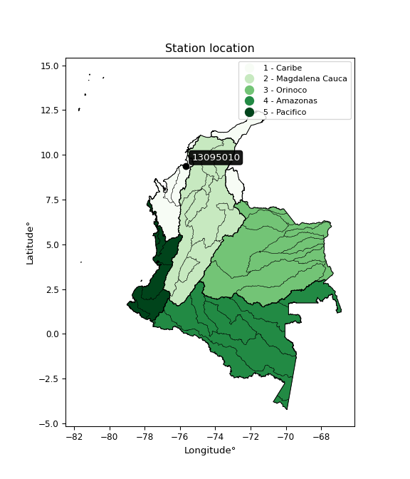

<div align="center">


</div>

# PMP Station (Rain, Pmax24h): 13095010

Probable Maximum Precipitation (PMP) is the greatest amount of rainfall for a specific duration that is meteorologically possible for a given location, acting as a "worst-case" scenario for extreme storms, crucial for designing safety-critical infrastructure like bridges, river deviations, dams, spillways, and nuclear plants to prevent catastrophic failure. PMP is calculated by hydrologists using meteorological data to determine the upper limit of extreme rainfall, often leading to the Probable Maximum Flood (PMF) for flood control design, and is increasingly being studied for climate change impacts. Probable Maximum Precipitation (PMP) is the theoretical upper limit of rainfall, a deterministic estimate for extreme events, while probability distributions (like GEV, Gumbel) describe the likelihood and frequency of various precipitation amounts, including rare ones, showing how often events occur, with PMP representing the extreme end of these distributions, used for critical infrastructure design to ensure safety against the worst conceivable weather, unlike standard statistical forecasts which cover typical probabilities.

The most common probability distributions in hydrology, used for analyzing floods, rainfall, and streamflow, include the Normal, Log-Normal, Gumbel, Gamma (including Log-Pearson Type III), and Generalized Extreme Value (GEV) distributions, often chosen based on the data´s skewness and whether modeling extremes or general conditions, with Gumbel and GEV popular for extreme events like floods, while the Normal distribution serves as a baseline, though often requiring transformations for skewed hydrological data. These distributions help in designing water infrastructure, managing water resources, and forecasting hydrologic events.

> Hydrological data often isn´t perfectly normal (it´s skewed), so different distributions are needed for different applications, such as: **Flood Frequency Analysis**: Using Gumbel, GEV, or Log-Pearson Type III for predicting extreme flood magnitudes and their return periods, **Rainfall Analysis**: Normal for annual totals, but Log-Normal, Weibull, or GEV for intensity or extreme daily rainfall, **Streamflow Modeling**: Gamma and Log-Normal for maximum flows, GEV for minimum flows, and Kappa for daily flows.

<div align="center">

</img>

</div>


## A. General information


### 1. General running parameters

• app_version: _v20260108_. • runtime: _2026-01-09 11:32:22.148588_. • Python version: _3.14.0_. • SciPy version: _1.16.3_. • Pandas version: _2.3.3_. • NumPy version: _2.3.5_. • Stations dataset (station_dataset_file): _dataset/pmax24h_in/automatic_colombia_2003_2024.csv_. • Stations catalog (station_catalog_file): _dataset/CNE.xls_. • Minimum year to eval til year_max (date_min): _1900_. • Maximum year to eval since year_min (date_max): _2024_. • Creates, save and include plots into reports (create_plot): _False_. • Plot only fit distributions with Δo > Δ (plot_only_fit): _True_. • Plot only simple graphs avoiding multiple CDFs and multiple Extreme values plots (plot_only_simple): _True_. • Eval low extreme values, if False, evaluates high extreme values (low_extreme): _False_. • Eval every SciPy distribution as logarithmic (pdist_logarithmic_on): _True_. • Standard deviation normalized (ddof): _1.0_. • Return periods to eval in years (Tr): _[2, 2.33, 5, 10, 15, 20, 25, 50, 75, 100, 200, 250, 500, 750, 1000]_. • Minimum data sample per station, 0 means any (minimum_sample): _5_. • Z-Score maximum threshold to adjust a value, 0 means disable (zscore_max): _3.5_. • Z-Score minimum threshold to adjust a value, 0 means disable (zscore_min): _-2.5_. • Avoid zeros, e.g. rain = 0 (avoid_zeros): _True_. • Avoid null values (avoid_nans): _True_. 

:file_folder:Table: [dataset.csv](../../dataset/pmax24h_in/automatic_colombia_2003_2024.csv)

> Delta Degrees of Freedom (DDOF): is a parameter used in the formulas for calculating variance and standard deviation. When ddof=0, the divisor is $N$ (the total number of observations) and this is used when your data set is the entire population. When ddof=1, the divisor is $N-1$ and this is used when your data set is a sample drawn from a larger population. Using $N-1$ provides an unbiased estimate of the population variance (known as Bessel´s correction).


### 2. Station info and location

|   id |   CODIGO | NOMBRE                   | CATEGORIA              | TECNOLOGIA                | ESTADO     | FECHA_INSTALACION   | FECHA_SUSPENSION   |   ALTITUD |   LATITUD |   LONGITUD | DEPARTAMENTO   | MUNICIPIO   | AREA_OPERATIVA                              | ENTIDAD                                                     | AREA_HIDROGRAFICA   | ZONA_HIDROGRAFICA   | SUBZONA_HIDROGRAFICA                  |   CORRIENTE | Catalogo   |   Version |
|-----:|---------:|:-------------------------|:-----------------------|:--------------------------|:-----------|:--------------------|:-------------------|----------:|----------:|-----------:|:---------------|:------------|:--------------------------------------------|:------------------------------------------------------------|:--------------------|:--------------------|:--------------------------------------|------------:|:-----------|----------:|
|    0 | 13095010 | COVENAS - AUT [13095010] | Meteorológica Especial | Automática con Telemetría | Suspendida | 15/02/1980          | 15/04/1992         |         1 |   9.38333 |   -75.6667 | Sucre          | Tolú        | Area Operativa 02 - Atlántico-Bolivar-Sucre | INSTITUTO DE HIDROLOGIA METEOROLOGIA Y ESTUDIOS AMBIENTALES | Caribe              | Caribe - Litoral    | Directos Caribe Golfo de Morrosquillo |         nan | CNE_IDEAM  |  20251226 |

<div align="center">

Dynamic map: [:earth_americas:Google](http://maps.google.com/maps?q=9.383333333,-75.66666667) [:earth_americas:OSM](https://www.openstreetmap.org/#map=18/9.383333333/-75.66666667&layers=P) [:earth_americas:Bing](https://www.bing.com/maps?cp=9.383333333~-75.66666667&lvl=18) [:earth_americas:Apple](https://maps.apple.com/frame?center=9.383333333%2C-75.66666667&span=0.003%2C0.006)

</div>


<div align="center">

```geojson
{
  "type": "Feature",
  "geometry": {
    "type": "Point", 
    "coordinates": [-75.66666667, 9.383333333]
  }, 
  "properties": {
    "Name": "13095010"
  }
}
```

</div>


### 3. Discrete values table and plot

<div align="center">

|               |          0 |          1 |          2 |           3 |          4 |           5 |          6 |          7 |           8 |           9 |             10 |         11 |         12 |
|:--------------|-----------:|-----------:|-----------:|------------:|-----------:|------------:|-----------:|-----------:|------------:|------------:|---------------:|-----------:|-----------:|
| Date          | 2006       | 2007       | 2008       | 2009        | 2010       | 2011        | 2012       | 2013       | 2014        | 2015        | 2016           | 2017       | 2018       |
| Value         |   27.8     |   30.9     |  152.2     |   98        |  177.8     |  138.2      |   20.5     |  119.3     |  116.4      |   85.3      |   91.3         |  118       |   10.8     |
| Value_initial |   27.8     |   30.9     |  152.2     |   98        |  177.8     |  138.2      |   20.5     |  119.3     |  116.4      |   85.3      |   91.3         |  118       |   10.8     |
| count         |   13       |   13       |   13       |   13        |   13       |   13        |   13       |   13       |   13        |   13        |   13           |   13       |   13       |
| mean          |   91.2692  |   91.2692  |   91.2692  |   91.2692   |   91.2692  |   91.2692   |   91.2692  |   91.2692  |   91.2692   |   91.2692   |   91.2692      |   91.2692  |   91.2692  |
| std           |   53.8298  |   53.8298  |   53.8298  |   53.8298   |   53.8298  |   53.8298   |   53.8298  |   53.8298  |   53.8298   |   53.8298   |   53.8298      |   53.8298  |   53.8298  |
| zscore        |   -1.17907 |   -1.12148 |    1.13192 |    0.125038 |    1.60749 |    0.871836 |   -1.31469 |    0.52073 |    0.466856 |   -0.110891 |    0.000571602 |    0.49658 |   -1.49488 |


</div>


> The initial value (value_initial) correspond to the initial obtained or null completed value, and value (value) is adjusted only when the initial value is outside the valid range (outlier) definite through the Z-Score value. If Z-Score is active, values out of range or outliers are replaced with the station mean value. A Z-Score (or standard score) measures how many standard deviations a data point is from the mean of a dataset, indicating its relative position; positive scores mean above the mean, negative mean below, and a score of zero is exactly at the mean, allowing for comparison of values from different distributions. It´s calculated using the formula $z=(x–μ)/σ$, where $x$ is the data point, $μ$ is the mean, and $σ$ is the standard deviation, helping identify outliers and understand probability.
>
> <sub>**Note**: In this study, "completing" (filling gaps in) and "extending" (forecasting or lengthening the historical record) rainfall data series are avoided for certain critical analyses because they introduce artificial bias and uncertainty, which can distort the statistics of rare events (extremes), alter day-to-day variability, and compromise the integrity and homogeneity of the original data. Some reasons against Completing/Extending rainfall data are: **Distortion of Extremes and Variability**: The primary issue is that most gap-filling or extension methods rely on averaging or regression with nearby stations, which inherently smooths the data. Rainfall is highly variable in space and time, with a large percentage of zero values and occasional large storms. Infilling methods often underestimate the highest values and overestimate the lowest (zero) values, which severely distorts analyses focused on flood frequency, drought severity, and intensity-duration-frequency (IDF) curves, **Loss of Data Homogeneity**: Infilled or extended data are synthetic estimates, not actual measurements. Combining these estimates with observed data can violate the assumption of data homogeneity, which requires that the data properties do not change over time. Inhomogeneity can lead to incorrect conclusions about long-term trends or changes in climate patterns, **Propagation of Errors**: Errors and biases from the original data (e.g., wind-induced undercatch, instrument errors, site changes) or the data used for imputation can propagate through the analysis, leading to unreliable hydrological models and inaccurate predictions, **Compromised Statistical Integrity**: For statistical analyses, especially those involving the frequency of events, using artificial data can introduce time bias or autocorrelation that doesn´t exist in reality, making it difficult to assess the true probability of events, **Difficulty in Validation**: It is difficult to accurately validate the quality of filled or extended data, especially for past periods where ground-truth measurements are unavailable. The reliability of imputation techniques heavily depends on the density of the surrounding station network and the complexity of the local topography.</sub>


### 4. Active continuous probability distributions from SciPy (45 of 104 available)

A Probability Density Function (PDF) describes the relative likelihood of a continuous random variable falling within a specific range, where the total area under its curve equals 1, and the area over any interval gives the actual probability for that range. Unlike discrete probabilities (like rolling a die), a PDF shows density, not direct probability for a single point (which is zero), with higher points indicating higher likelihood, often visualized as a bell curve for normal distributions.

A log of a probability density function (log-PDF) is simply the logarithm of the PDF´s value, denoted as $log(f(x))$, useful for converting multiplication of probabilities into addition, improving numerical stability with tiny numbers, and connecting to information theory concepts like entropy. Instead of dealing with very small probabilities (e.g., 0.000001), log-PDFs use negative numbers (e.g., $log(0.00001) ≈ -11.51$ that are easier for computers to handle, preventing underflow errors and simplifying complex calculations. In this study, each active probability distribution from SciPy is also evaluated in the $log$ form.

[scipy.stats](https://docs.scipy.org/doc/scipy/reference/stats.html) is a Python´s powerful submodule within the SciPy library for comprehensive statistical analysis, offering over 130 probability distributions (like Normal, Poisson), functions for descriptive stats (mean, variance), hypothesis testing (t-tests, chi-square), random variable generation, and statistical tests, making it essential for data science, modeling, and research. It provides tools to explore, model, and draw conclusions from data efficiently, working seamlessly with NumPy.

<div align="center">

|   id | p_dist             |   n_parameter | fit_method   | label                                                                       | active   | ref                                                                                                        |
|-----:|:-------------------|--------------:|:-------------|:----------------------------------------------------------------------------|:---------|:-----------------------------------------------------------------------------------------------------------|
|    0 | alpha              |             3 | MLE          | Alpha                                                                       | True     | [:mortar_board:](https://docs.scipy.org/doc/scipy/reference/generated/scipy.stats.alpha.html)              |
|    1 | betaprime          |             4 | MLE          | Beta prime                                                                  | True     | [:mortar_board:](https://docs.scipy.org/doc/scipy/reference/generated/scipy.stats.betaprime.html)          |
|    2 | chi2               |             3 | MLE          | Chi²                                                                        | True     | [:mortar_board:](https://docs.scipy.org/doc/scipy/reference/generated/scipy.stats.chi2.html)               |
|    3 | crystalball        |             4 | MLE          | Crystalball                                                                 | True     | [:mortar_board:](https://docs.scipy.org/doc/scipy/reference/generated/scipy.stats.crystalball.html)        |
|    4 | dweibull           |             3 | MLE          | Double Weibull                                                              | True     | [:mortar_board:](https://docs.scipy.org/doc/scipy/reference/generated/scipy.stats.dweibull.html)           |
|    5 | erlang             |             3 | MLE          | Erlang                                                                      | True     | [:mortar_board:](https://docs.scipy.org/doc/scipy/reference/generated/scipy.stats.erlang.html)             |
|    6 | expon              |             2 | MLE          | Exponential                                                                 | True     | [:mortar_board:](https://docs.scipy.org/doc/scipy/reference/generated/scipy.stats.expon.html)              |
|    7 | exponnorm          |             3 | MLE          | Exponentially modified Normal                                               | True     | [:mortar_board:](https://docs.scipy.org/doc/scipy/reference/generated/scipy.stats.exponnorm.html)          |
|    8 | f                  |             4 | MLE          | F                                                                           | True     | [:mortar_board:](https://docs.scipy.org/doc/scipy/reference/generated/scipy.stats.f.html)                  |
|    9 | fatiguelife        |             3 | MLE          | Fatigue-life (Birnbaum-Saunders)                                            | True     | [:mortar_board:](https://docs.scipy.org/doc/scipy/reference/generated/scipy.stats.fatiguelife.html)        |
|   10 | fisk               |             3 | MLE          | Fisk                                                                        | True     | [:mortar_board:](https://docs.scipy.org/doc/scipy/reference/generated/scipy.stats.fisk.html)               |
|   11 | gamma              |             3 | MLE          | Gamma                                                                       | True     | [:mortar_board:](https://docs.scipy.org/doc/scipy/reference/generated/scipy.stats.gamma.html)              |
|   12 | genexpon           |             5 | MLE          | Generalized exponential                                                     | True     | [:mortar_board:](https://docs.scipy.org/doc/scipy/reference/generated/scipy.stats.genexpon.html)           |
|   13 | genlogistic        |             3 | MLE          | Generalized logistic                                                        | True     | [:mortar_board:](https://docs.scipy.org/doc/scipy/reference/generated/scipy.stats.genlogistic.html)        |
|   14 | gibrat             |             2 | MM           | Gibrat                                                                      | True     | [:mortar_board:](https://docs.scipy.org/doc/scipy/reference/generated/scipy.stats.gibrat.html)             |
|   15 | gompertz           |             3 | MLE          | Gompertz (or truncated Gumbel)                                              | True     | [:mortar_board:](https://docs.scipy.org/doc/scipy/reference/generated/scipy.stats.gompertz.html)           |
|   16 | gumbel_l           |             2 | MM           | Gumbel Left Skew                                                            | True     | [:mortar_board:](https://docs.scipy.org/doc/scipy/reference/generated/scipy.stats.gumbel_l.html)           |
|   17 | gumbel_r           |             2 | MM           | Gumbel Right Skew                                                           | True     | [:mortar_board:](https://docs.scipy.org/doc/scipy/reference/generated/scipy.stats.gumbel_r.html)           |
|   18 | halflogistic       |             2 | MM           | Half-logistic                                                               | True     | [:mortar_board:](https://docs.scipy.org/doc/scipy/reference/generated/scipy.stats.halflogistic.html)       |
|   19 | halfnorm           |             2 | MM           | Half Normal                                                                 | True     | [:mortar_board:](https://docs.scipy.org/doc/scipy/reference/generated/scipy.stats.halfnorm.html)           |
|   20 | hypsecant          |             2 | MM           | hyperbolic secant                                                           | True     | [:mortar_board:](https://docs.scipy.org/doc/scipy/reference/generated/scipy.stats.hypsecant.html)          |
|   21 | invgamma           |             3 | MLE          | Inverted gamma                                                              | True     | [:mortar_board:](https://docs.scipy.org/doc/scipy/reference/generated/scipy.stats.invgamma.html)           |
|   22 | invgauss           |             3 | MLE          | Inverse Gaussian                                                            | True     | [:mortar_board:](https://docs.scipy.org/doc/scipy/reference/generated/scipy.stats.invgauss.html)           |
|   23 | invweibull         |             3 | MLE          | Inverted Weibull                                                            | True     | [:mortar_board:](https://docs.scipy.org/doc/scipy/reference/generated/scipy.stats.invweibull.html)         |
|   24 | kappa4             |             4 | MLE          | Kappa 4                                                                     | True     | [:mortar_board:](https://docs.scipy.org/doc/scipy/reference/generated/scipy.stats.kappa4.html)             |
|   25 | kstwobign          |             2 | MLE          | Limiting distribution of scaled Kolmogorov-Smirnov two-sided test statistic | True     | [:mortar_board:](https://docs.scipy.org/doc/scipy/reference/generated/scipy.stats.kstwobign.html)          |
|   26 | laplace            |             2 | MM           | Laplace                                                                     | True     | [:mortar_board:](https://docs.scipy.org/doc/scipy/reference/generated/scipy.stats.laplace.html)            |
|   27 | laplace_asymmetric |             3 | MLE          | Asymmetric Laplace                                                          | True     | [:mortar_board:](https://docs.scipy.org/doc/scipy/reference/generated/scipy.stats.laplace_asymmetric.html) |
|   28 | loggamma           |             3 | MLE          | Log gamma                                                                   | True     | [:mortar_board:](https://docs.scipy.org/doc/scipy/reference/generated/scipy.stats.loggamma.html)           |
|   29 | logistic           |             2 | MM           | Logistic (or Sech-squared)                                                  | True     | [:mortar_board:](https://docs.scipy.org/doc/scipy/reference/generated/scipy.stats.logistic.html)           |
|   30 | lognorm            |             3 | MLE          | Log Normal                                                                  | True     | [:mortar_board:](https://docs.scipy.org/doc/scipy/reference/generated/scipy.stats.lognorm.html)            |
|   31 | maxwell            |             2 | MM           | Maxwell                                                                     | True     | [:mortar_board:](https://docs.scipy.org/doc/scipy/reference/generated/scipy.stats.maxwell.html)            |
|   32 | mielke             |             4 | MLE          | Mielke Beta-Kappa / Dagum                                                   | True     | [:mortar_board:](https://docs.scipy.org/doc/scipy/reference/generated/scipy.stats.mielke.html)             |
|   33 | moyal              |             2 | MM           | Moyal                                                                       | True     | [:mortar_board:](https://docs.scipy.org/doc/scipy/reference/generated/scipy.stats.moyal.html)              |
|   34 | nakagami           |             3 | MLE          | Nakagami                                                                    | True     | [:mortar_board:](https://docs.scipy.org/doc/scipy/reference/generated/scipy.stats.nakagami.html)           |
|   35 | ncf                |             5 | MLE          | Non-central F distribution                                                  | True     | [:mortar_board:](https://docs.scipy.org/doc/scipy/reference/generated/scipy.stats.ncf.html)                |
|   36 | nct                |             4 | MLE          | Non-central Student’s t                                                     | True     | [:mortar_board:](https://docs.scipy.org/doc/scipy/reference/generated/scipy.stats.nct.html)                |
|   37 | norm               |             2 | MM           | Normal                                                                      | True     | [:mortar_board:](https://docs.scipy.org/doc/scipy/reference/generated/scipy.stats.norm.html)               |
|   38 | pearson3           |             3 | MM           | Pearson type III                                                            | True     | [:mortar_board:](https://docs.scipy.org/doc/scipy/reference/generated/scipy.stats.pearson3.html)           |
|   39 | rayleigh           |             2 | MM           | Rayleigh                                                                    | True     | [:mortar_board:](https://docs.scipy.org/doc/scipy/reference/generated/scipy.stats.rayleigh.html)           |
|   40 | rice               |             3 | MLE          | Rice                                                                        | True     | [:mortar_board:](https://docs.scipy.org/doc/scipy/reference/generated/scipy.stats.rice.html)               |
|   41 | t                  |             3 | MLE          | Student’s t                                                                 | True     | [:mortar_board:](https://docs.scipy.org/doc/scipy/reference/generated/scipy.stats.t.html)                  |
|   42 | truncnorm          |             4 | MLE          | Truncated normal                                                            | True     | [:mortar_board:](https://docs.scipy.org/doc/scipy/reference/generated/scipy.stats.truncnorm.html)          |
|   43 | wald               |             2 | MM           | Wald                                                                        | True     | [:mortar_board:](https://docs.scipy.org/doc/scipy/reference/generated/scipy.stats.wald.html)               |
|   44 | weibull_min        |             3 | MLE          | Weibull minimum                                                             | True     | [:mortar_board:](https://docs.scipy.org/doc/scipy/reference/generated/scipy.stats.weibull_min.html)        |

</div>

> **n_parameter:** # arguments & localization & scale.
>
> **Fit methods:** (MLE) maximum likelihood, (MM) L-moments.
>
>**Inactive** (With the only purpose of prevent loops, zero divisions, infinite values, over high estimated values or horizontal trending for recurrence intervals estimations, the follow distributions were disabled.)**:** foldnorm, gennorm, norminvgauss, powernorm, powerlognorm, skewnorm, genextreme, anglit, arcsine, argus, beta, bradford, burr, burr12, cauchy, cosine, halfcauchy, foldcauchy, skewcauchy, wrapcauchy, dgamma, gengamma, exponweib, exponpow, truncexpon, gausshyper, genhalflogistic, genhyperbolic, geninvgauss, halfgennorm, johnsonsb, johnsonsu, kappa3, ksone, kstwo, loglaplace, levy, levy_l, levy_stable, ncx2, pareto, genpareto, truncpareto, lomax, powerlaw, rdist, rel_breitwigner, recipinvgauss, semicircular, studentized_range, trapezoid, triang, truncweibull_min, tukeylambda, uniform, loguniform, vonmises, vonmises_line, weibull_max, 


## B. Probability (PDF) vs. Empirical (EDF) distributions functions

A continuous probability distribution (CPD) describes probabilities for variables that can take any value within a range (like rain any time), unlike discrete variables with specific outcomes (like temperature). It uses a Probability Density Function (PDF), a curve where the total area under it equals 1, and the probability of the variable falling within an interval (a to b) is found by calculating the area under the curve between those points. A key feature is that the probability of hitting any single exact value is zero, so probabilities are always expressed for ranges, e.g., $P(a ≤ X ≤ b)$.

<div align="center">

Distributions parameters from station values
|    |   station | p_dist                |   n |               loc |            scale | shape                  | shape1                | shape2                | shape3   |
|---:|----------:|:----------------------|----:|------------------:|-----------------:|:-----------------------|:----------------------|:----------------------|:---------|
|  0 |  13095010 | alpha                 |  13 |      -0.0797272   |     30.6811      | 5.0773532144260835e-11 |                       |                       |          |
|  1 |  13095010 | betaprime             |  13 |    -910.354       |  71156.2         | 373.0855471929185      | 26501.142645856016    |                       |          |
|  2 |  13095010 | chi2                  |  13 |      10.8         |      5.35307     | 1.3958631207246275     |                       |                       |          |
|  3 |  13095010 | crystalball           |  13 |      91.2692      |     51.718       | 6168.045777134396      | 9439.820067501125     |                       |          |
|  4 |  13095010 | dweibull              |  13 |      94.7757      |     46.1835      | 1.3042884944835413     |                       |                       |          |
|  5 |  13095010 | erlang                |  13 |    -931.833       |      2.65702     | 385.0530288666401      |                       |                       |          |
|  6 |  13095010 | expon                 |  13 |      10.8         |     80.4692      |                        |                       |                       |          |
|  7 |  13095010 | exponnorm             |  13 |      91.2114      |     51.718       | 0.0011166179791031962  |                       |                       |          |
|  8 |  13095010 | f                     |  13 |   -2860.64        |   2951.9         | 6539.063199513646      | 568940.8740353475     |                       |          |
|  9 |  13095010 | fatiguelife           |  13 |      10.8         |      7.22651e-05 | 926.7314843500253      |                       |                       |          |
| 10 |  13095010 | fisk                  |  13 |      -1.11032e+08 |      1.11032e+08 | 3562374.071613814      |                       |                       |          |
| 11 |  13095010 | gamma                 |  13 |    -936.018       |      2.63992     | 389.0964605658477      |                       |                       |          |
| 12 |  13095010 | genexpon              |  13 |      10.8         |      2.89494     | 0.03655255488270099    | 7.084117975699187e-08 | 3.811179748527113     |          |
| 13 |  13095010 | genlogistic           |  13 |     129.405       |     19.7945      | 0.4098695691922214     |                       |                       |          |
| 14 |  13095010 | gibrat                |  13 |      51.815       |     23.9302      |                        |                       |                       |          |
| 15 |  13095010 | gompertz              |  13 |      20.5         |      9.90417     | 1.37967336498009e-06   |                       |                       |          |
| 16 |  13095010 | gumbel_l              |  13 |     114.545       |     40.3243      |                        |                       |                       |          |
| 17 |  13095010 | gumbel_r              |  13 |      67.9934      |     40.3243      |                        |                       |                       |          |
| 18 |  13095010 | halflogistic          |  13 |      29.9714      |     44.2171      |                        |                       |                       |          |
| 19 |  13095010 | halfnorm              |  13 |      22.8149      |     85.7948      |                        |                       |                       |          |
| 20 |  13095010 | hypsecant             |  13 |      91.2692      |     32.9247      |                        |                       |                       |          |
| 21 |  13095010 | invgamma              |  13 |    -436.861       |  52728.4         | 100.97730742980968     |                       |                       |          |
| 22 |  13095010 | invgauss              |  13 |    -124.435       |   3115.36        | 0.0693590627771487     |                       |                       |          |
| 23 |  13095010 | invweibull            |  13 |      -5.45356e+09 |      5.45356e+09 | 114346087.8257482      |                       |                       |          |
| 24 |  13095010 | kappa4                |  13 |       1.71819     |    175.125       | 1.0546805030717463     | 0.9901352177112086    |                       |          |
| 25 |  13095010 | kstwobign             |  13 |    -101.023       |    219.135       |                        |                       |                       |          |
| 26 |  13095010 | laplace               |  13 |      91.2692      |     36.5701      |                        |                       |                       |          |
| 27 |  13095010 | laplace_asymmetric    |  13 |     118           |     37.7418      | 1.4149792283676779     |                       |                       |          |
| 28 |  13095010 | loggamma              |  13 |    -124.552       |    124.29        | 6.169732171166261      |                       |                       |          |
| 29 |  13095010 | logistic              |  13 |      91.2692      |     28.5136      |                        |                       |                       |          |
| 30 |  13095010 | lognorm               |  13 |      10.8         |      3.48957     | 10.201811893070854     |                       |                       |          |
| 31 |  13095010 | maxwell               |  13 |     -31.2807      |     76.7968      |                        |                       |                       |          |
| 32 |  13095010 | mielke                |  13 |      -1.18175     |    180.038       | 1.057759677285513      | 589.2814659591704     |                       |          |
| 33 |  13095010 | moyal                 |  13 |      61.6936      |     23.2813      |                        |                       |                       |          |
| 34 |  13095010 | nakagami              |  13 |      10.8         |     86.9731      | 0.37823998062429326    |                       |                       |          |
| 35 |  13095010 | ncf                   |  13 |      -0.367357    |      1.91708e-06 | 2.2016410134990394e-07 | 84.66148281601664     | 10.362030762079598    |          |
| 36 |  13095010 | nct                   |  13 |   -1780.46        |     51.6652      | 267743.86795649223     | 36.22770903937278     |                       |          |
| 37 |  13095010 | norm                  |  13 |      91.2692      |     51.718       |                        |                       |                       |          |
| 38 |  13095010 | pearson3              |  13 |      91.2692      |     51.718       | -0.17606306014023143   |                       |                       |          |
| 39 |  13095010 | rayleigh              |  13 |      -7.67029     |     78.9423      |                        |                       |                       |          |
| 40 |  13095010 | rice                  |  13 |     -14.182       |     60.4748      | 1.3311419657115646     |                       |                       |          |
| 41 |  13095010 | t                     |  13 |      91.2744      |     51.7189      | 9410934.804032         |                       |                       |          |
| 42 |  13095010 | truncnorm             |  13 |      91.2692      |     51.718       | -886.9263917750355     | 42.73947468346715     |                       |          |
| 43 |  13095010 | wald                  |  13 |      39.5512      |     51.718       |                        |                       |                       |          |
| 44 |  13095010 | weibull_min           |  13 |     -49.6904      |    158.184       | 3.1042060060970895     |                       |                       |          |
| 45 |  13095010 | logalpha              |  13 |     -17.6941      |    536.796       | 24.528953383331327     |                       |                       |          |
| 46 |  13095010 | logbetaprime          |  13 |     -19.2425      |    124.114       | 842.6217038756561      | 4453.901896631982     |                       |          |
| 47 |  13095010 | logchi2               |  13 |       2.37955     |      0.997525    | 1.0535421764075834     |                       |                       |          |
| 48 |  13095010 | logcrystalball        |  13 |       4.24192     |      0.85464     | 7.5837245189881415     | 1296.2014986978343    |                       |          |
| 49 |  13095010 | logdweibull           |  13 |       4.75703     |      0.65234     | 0.9158010609454494     |                       |                       |          |
| 50 |  13095010 | logerlang             |  13 |      -8.67363     |      0.0604168   | 213.43129303505168     |                       |                       |          |
| 51 |  13095010 | logexpon              |  13 |       2.37955     |      1.86237     |                        |                       |                       |          |
| 52 |  13095010 | logexponnorm          |  13 |       4.24138     |      0.85464     | 0.0006293236867415422  |                       |                       |          |
| 53 |  13095010 | logf                  |  13 |     -42.0563      |     46.3015      | 14204.457540767231     | 9419.73719805137      |                       |          |
| 54 |  13095010 | logfatiguelife        |  13 |    -399.854       |    404.094       | 0.002106896283643753   |                       |                       |          |
| 55 |  13095010 | logfisk               |  13 |      -6.4642e+07  |      6.4642e+07  | 131578023.85427916     |                       |                       |          |
| 56 |  13095010 | loggamma              |  13 |     -10.3071      |      0.0540478   | 268.9590851096917      |                       |                       |          |
| 57 |  13095010 | loggenexpon           |  13 |       2.15866     |      0.0321052   | 0.00017316492791902998 | 4.31221379132135      | 9.318930174521091e-05 |          |
| 58 |  13095010 | loggenlogistic        |  13 |       5.1807      |      2.17409e-07 | 2.3052806800602274e-07 |                       |                       |          |
| 59 |  13095010 | loggibrat             |  13 |       3.58997     |      0.395432    |                        |                       |                       |          |
| 60 |  13095010 | loggompertz           |  13 |       2.37955     |      0.643389    | 0.03266270766307883    |                       |                       |          |
| 61 |  13095010 | loggumbel_l           |  13 |       4.62655     |      0.66636     |                        |                       |                       |          |
| 62 |  13095010 | loggumbel_r           |  13 |       3.85729     |      0.66636     |                        |                       |                       |          |
| 63 |  13095010 | loghalflogistic       |  13 |       3.22896     |      0.73069     |                        |                       |                       |          |
| 64 |  13095010 | loghalfnorm           |  13 |       3.11071     |      1.41777     |                        |                       |                       |          |
| 65 |  13095010 | loghypsecant          |  13 |       4.24192     |      0.54408     |                        |                       |                       |          |
| 66 |  13095010 | loginvgamma           |  13 |     -13.819       |   7365.39        | 408.95693815771233     |                       |                       |          |
| 67 |  13095010 | loginvgauss           |  13 |      -4.67889     |    866.879       | 0.01026323046055485    |                       |                       |          |
| 68 |  13095010 | loginvweibull         |  13 |      -5.33329e+06 |      5.33329e+06 | 5688630.340875885      |                       |                       |          |
| 69 |  13095010 | logkappa4             |  13 |       2.17839     |      3.2045      | 1.0671296768518945     | 1.0660905722534166    |                       |          |
| 70 |  13095010 | logkstwobign          |  13 |       0.439156    |      4.345       |                        |                       |                       |          |
| 71 |  13095010 | loglaplace            |  13 |       4.24192     |      0.604321    |                        |                       |                       |          |
| 72 |  13095010 | loglaplace_asymmetric |  13 |       5.0252      |      0.312622    | 2.8556757584439776     |                       |                       |          |
| 73 |  13095010 | logloggamma           |  13 |       5.18067     |      8.96067e-07 | 9.573247870829677e-07  |                       |                       |          |
| 74 |  13095010 | loglogistic           |  13 |       4.24192     |      0.471187    |                        |                       |                       |          |
| 75 |  13095010 | loglognorm            |  13 | -133311           | 133316           | 6.4106723274982896e-06 |                       |                       |          |
| 76 |  13095010 | logmaxwell            |  13 |       2.21678     |      1.26907     |                        |                       |                       |          |
| 77 |  13095010 | logmielke             |  13 |      -5.73035     |     10.9205      | 11.257295757572606     | 3064.7287092807965    |                       |          |
| 78 |  13095010 | logmoyal              |  13 |       3.75318     |      0.384723    |                        |                       |                       |          |
| 79 |  13095010 | lognakagami           |  13 |       2.52435     |      1.97092     | 1.6044039489041646     |                       |                       |          |
| 80 |  13095010 | logncf                |  13 |     -11.2383      |      4.15688     | 436.3314404632498      | 1661.7167152507718    | 1187.9984606486287    |          |
| 81 |  13095010 | lognct                |  13 |     -50.1675      |      0.833293    | 36850.079883504746     | 65.29258603985588     |                       |          |
| 82 |  13095010 | lognorm               |  13 |       4.24192     |      0.85464     |                        |                       |                       |          |
| 83 |  13095010 | logpearson3           |  13 |       4.24192     |      0.854639    | -0.9173192003150267    |                       |                       |          |
| 84 |  13095010 | lograyleigh           |  13 |       2.60697     |      1.3045      |                        |                       |                       |          |
| 85 |  13095010 | logrice               |  13 |       1.76349     |      0.903122    | 2.5350917100243624     |                       |                       |          |
| 86 |  13095010 | logt                  |  13 |       4.24192     |      0.854639    | 1195529232.2107496     |                       |                       |          |
| 87 |  13095010 | logtruncnorm          |  13 |       0.161686    |      3.11565     | 0.9175406167902809     | 1.6108901377906129    |                       |          |
| 88 |  13095010 | logwald               |  13 |       3.38732     |      0.854608    |                        |                       |                       |          |
| 89 |  13095010 | logweibull_min        |  13 |      -5.19873e+07 |      5.19873e+07 | 89028243.4992552       |                       |                       |          |

</div>

> **loc** (Location parameter): This shifts the distribution along the x-axis. For many common distributions, like the normal (Gaussian) distribution, loc represents the mean $μ$. For others, like the uniform distribution, it might represent the minimum value, or for the beta distribution, the left end of the support interval.
>
> **scale** (Scale parameter): This determines the width or spread of the distribution. For the normal distribution, scale represents the standard deviation $σ$. For a uniform distribution, it defines the length of the interval (from $loc$ to $loc + scale$).
>
> **shape** (Shape parameters): Refers to parameters that define the specific form of a probability distribution, distinct from its location (loc) and scale (scale). These parameters are required arguments for most distribution functions. For example, a normal (Gaussian) distribution is fully defined by its location (mean) and scale (standard deviation), so it has no specific shape parameters beyond loc and scale. However, other distributions have intrinsic properties that need specification, as Gamma distribution that takes a shape parameter, often named $a$ or $alpha$.


### 0. Cumulative distribution values - CDF (90 evaluated)

Cumulative Distribution Function (CDF), denoted as $F$<sub>$X$</sub>$(x)$, is a function that gives the probability that a random variable $X$ will take a value less than or equal to a specific value, $x$ (i.e., $(P(X≥x)$. It essentially "accumulates" probabilities from a given point up to the far right (positive infinity), providing a complete picture of the distribution´s probabilities for both discrete (like rain) and continuous (like temperature) variables, helping to find probabilities over ranges or above certain values. Each station is evaluated separately ordering the $x$ values ascending, calculating the CDF and PDF values for the activated distributions and their logarithmic forms.

<div align="center">

CDF ordered by x ascending and calculating $log(f(x))$ separately
|   id |   Station |   date |     x |   count |    mean |     std |       zscore |   Value_initial |   station |   m |      alpha |   alpha_pdf |   betaprime |   betaprime_pdf |        chi2 |       chi2_pdf |   crystalball |   crystalball_pdf |   dweibull |   dweibull_pdf |    erlang |   erlang_pdf |    expon |   expon_pdf |   exponnorm |   exponnorm_pdf |         f |      f_pdf |   fatiguelife |   fatiguelife_pdf |      fisk |   fisk_pdf |     gamma |   gamma_pdf |    genexpon |   genexpon_pdf |   genlogistic |   genlogistic_pdf |   gibrat |   gibrat_pdf |    gompertz |   gompertz_pdf |   gumbel_l |   gumbel_l_pdf |   gumbel_r |   gumbel_r_pdf |   halflogistic |   halflogistic_pdf |   halfnorm |   halfnorm_pdf |   hypsecant |   hypsecant_pdf |   invgamma |   invgamma_pdf |   invgauss |   invgauss_pdf |   invweibull |   invweibull_pdf |      kappa4 |   kappa4_pdf |   kstwobign |   kstwobign_pdf |   laplace |   laplace_pdf |   laplace_asymmetric |   laplace_asymmetric_pdf |   loggamma |   loggamma_pdf |   logistic |   logistic_pdf |   lognorm |   lognorm_pdf |   maxwell |   maxwell_pdf |   mielke |   mielke_pdf |     moyal |   moyal_pdf |    nakagami |   nakagami_pdf |       ncf |    ncf_pdf |       nct |    nct_pdf |      norm |   norm_pdf |   pearson3 |   pearson3_pdf |   rayleigh |   rayleigh_pdf |      rice |   rice_pdf |         t |      t_pdf |   truncnorm |   truncnorm_pdf |     wald |   wald_pdf |   weibull_min |   weibull_min_pdf |   logalpha |   logalpha_pdf |   logbetaprime |   logbetaprime_pdf |     logchi2 |   logchi2_pdf |   logcrystalball |   logcrystalball_pdf |   logdweibull |   logdweibull_pdf |   logerlang |   logerlang_pdf |   logexpon |   logexpon_pdf |   logexponnorm |   logexponnorm_pdf |      logf |   logf_pdf |   logfatiguelife |   logfatiguelife_pdf |   logfisk |   logfisk_pdf |   loggenexpon |   loggenexpon_pdf |   loggenlogistic |   loggenlogistic_pdf |   loggibrat |   loggibrat_pdf |   loggompertz |   loggompertz_pdf |   loggumbel_l |   loggumbel_l_pdf |   loggumbel_r |   loggumbel_r_pdf |   loghalflogistic |   loghalflogistic_pdf |   loghalfnorm |   loghalfnorm_pdf |   loghypsecant |   loghypsecant_pdf |   loginvgamma |   loginvgamma_pdf |   loginvgauss |   loginvgauss_pdf |   loginvweibull |   loginvweibull_pdf |   logkappa4 |   logkappa4_pdf |   logkstwobign |   logkstwobign_pdf |   loglaplace |   loglaplace_pdf |   loglaplace_asymmetric |   loglaplace_asymmetric_pdf |   logloggamma |   logloggamma_pdf |   loglogistic |   loglogistic_pdf |   loglognorm |   loglognorm_pdf |   logmaxwell |   logmaxwell_pdf |   logmielke |   logmielke_pdf |    logmoyal |   logmoyal_pdf |   lognakagami |   lognakagami_pdf |    logncf |   logncf_pdf |    lognct |   lognct_pdf |   logpearson3 |   logpearson3_pdf |   lograyleigh |   lograyleigh_pdf |   logrice |   logrice_pdf |      logt |   logt_pdf |   logtruncnorm |   logtruncnorm_pdf |     logwald |   logwald_pdf |   logweibull_min |   logweibull_min_pdf |
|-----:|----------:|-------:|------:|--------:|--------:|--------:|-------------:|----------------:|----------:|----:|-----------:|------------:|------------:|----------------:|------------:|---------------:|--------------:|------------------:|-----------:|---------------:|----------:|-------------:|---------:|------------:|------------:|----------------:|----------:|-----------:|--------------:|------------------:|----------:|-----------:|----------:|------------:|------------:|---------------:|--------------:|------------------:|---------:|-------------:|------------:|---------------:|-----------:|---------------:|-----------:|---------------:|---------------:|-------------------:|-----------:|---------------:|------------:|----------------:|-----------:|---------------:|-----------:|---------------:|-------------:|-----------------:|------------:|-------------:|------------:|----------------:|----------:|--------------:|---------------------:|-------------------------:|-----------:|---------------:|-----------:|---------------:|----------:|--------------:|----------:|--------------:|---------:|-------------:|----------:|------------:|------------:|---------------:|----------:|-----------:|----------:|-----------:|----------:|-----------:|-----------:|---------------:|-----------:|---------------:|----------:|-----------:|----------:|-----------:|------------:|----------------:|---------:|-----------:|--------------:|------------------:|-----------:|---------------:|---------------:|-------------------:|------------:|--------------:|-----------------:|---------------------:|--------------:|------------------:|------------:|----------------:|-----------:|---------------:|---------------:|-------------------:|----------:|-----------:|-----------------:|---------------------:|----------:|--------------:|--------------:|------------------:|-----------------:|---------------------:|------------:|----------------:|--------------:|------------------:|--------------:|------------------:|--------------:|------------------:|------------------:|----------------------:|--------------:|------------------:|---------------:|-------------------:|--------------:|------------------:|--------------:|------------------:|----------------:|--------------------:|------------:|----------------:|---------------:|-------------------:|-------------:|-----------------:|------------------------:|----------------------------:|--------------:|------------------:|--------------:|------------------:|-------------:|-----------------:|-------------:|-----------------:|------------:|----------------:|------------:|---------------:|--------------:|------------------:|----------:|-------------:|----------:|-------------:|--------------:|------------------:|--------------:|------------------:|----------:|--------------:|----------:|-----------:|---------------:|-------------------:|------------:|--------------:|-----------------:|---------------------:|
|    0 |  13095010 |   2018 |  10.8 |      13 | 91.2692 | 53.8298 | -1.49488     |            10.8 |  13095010 |   1 | 0.00480197 | 0.00387884  |   0.0581956 |      0.00235701 | 1.06749e-11 | 4194.17        |     0.0598631 |        0.0022992  |  0.0564571 |     0.00191258 | 0.0583753 |   0.00236187 | 0        |  0.0124271  |   0.0598634 |      0.00229921 | 0.0595721 | 0.00232443 |     0.0710589 |       2.55311e+09 | 0.065654  | 0.00196815 | 0.0583857 |  0.00236442 | 4.03993e-07 |     0.0126263  |     0.0857015 |        0.00177013 | 0        |  0           | 0           |    0           |  0.0734842 |    0.00175367  |  0.0160791 |     0.00164691 |      0         |         0          |  0         |     0          |   0.0551265 |      0.00166596 |  0.0525317 |     0.00253568 |  0.046304  |     0.00282362 |    0.0451323 |       0.00293178 | 7.45736e-16 |   0.0383353  |   0.0430218 |      0.0032608  | 0.055379  |    0.00151432 |            0.0895953 |               0.0016777  |  0.0152933 |       0.047588 |  0.0561398 |     0.00185834 | 0.0146608 |     0.0434486 | 0.0400181 |    0.00268459 | 0.056909 |   0.00502398 | 0.002852  | 0.000597068 | 1.84508e-13 |    78.5746     | 0.0342634 | 0.00345978 | 0.0599121 | 0.00230067 | 0.0598631 | 0.0022992  |  0.0643689 |     0.00223411 |  0.0270002 |     0.00288381 | 0.034994  | 0.00278536 | 0.0598545 | 0.0022989  |   0.0598631 |      0.0022992  | 0        | 0          |     0.0493322 |        0.0024681  |  0.0134711 |      0.0459871 |      0.0151551 |          0.0461539 | 6.40635e-09 |    7.5991e+06 |        0.0146608 |            0.0434486 |     0.0190309 |         0.0239606 |   0.0149298 |       0.0473818 |   0        |       0.536949 |      0.0146609 |          0.0434487 | 0.0141578 |  0.0432676 |        0.0142526 |            0.0427641 | 0.0171135 |     0.0342381 |     0.0106431 |         0.0905079 |          0       |            0.0543895 |    0        |       0         |   4.04928e-08 |         0.0507667 |     0.0337365 |         0.0497643 |   0.000102509 |        0.00141305 |         0         |              0        |      0        |          0        |      0.0207561 |           0.038122 |     0.0139475 |         0.0460169 |     0.0124617 |         0.0454957 |       0.0115421 |           0.0549291 |  1.1196e-15 |        3.1605   |      0.0115516 |          0.0677004 |    0.0229392 |        0.0379586 |               0.0459979 |                   0.0515239 |     0.0501561 |         0.0535849 |     0.0188444 |         0.0392399 |    0.0146606 |        0.0434485 |  0.000558322 |         0.010257 |   0.035096  |       0.0487166 | 2.50787e-09 |     1.1891e-07 |     0         |          0        | 0.0143392 |    0.0454119 | 0.0147951 |    0.0438253 |     0.0320784 |         0.0534147 |     0         |          0        | 0.011739  |     0.0457289 | 0.0146608 |  0.0434485 |    0           |           0        | 0           |    0          |        0.0212801 |            0.0360517 |
|    1 |  13095010 |   2012 |  20.5 |      13 | 91.2692 | 53.8298 | -1.31469     |            20.5 |  13095010 |   2 | 0.136003   | 0.0190239   |   0.0846864 |      0.00312253 | 0.733785    |    0.0298842   |     0.0855985 |        0.00302465 |  0.0779563 |     0.00254408 | 0.0849189 |   0.0031286  | 0.113561 |  0.0110159  |   0.0855989 |      0.00302466 | 0.0856164 | 0.00306303 |     0.653702  |       0.00751868  | 0.0875254 | 0.00256239 | 0.0849619 |  0.00313282 | 0.115273    |     0.0111709  |     0.104697  |        0.00215909 | 0        |  0           | 1.5548e-12  |    1.39302e-07 |  0.092517  |    0.00218476  |  0.038884  |     0.00313119 |      0         |         0          |  0         |     0          |   0.0738653 |      0.00222338 |  0.0815425 |     0.00346423 |  0.0792547 |     0.00398038 |    0.0798191 |       0.00423081 | 0.0676328   |   0.00660898 |   0.0818325 |      0.00472937 | 0.0722003 |    0.0019743  |            0.107441  |               0.00201185 |  0.08326   |       0.183173 |  0.0771336 |     0.00249649 | 0.0764658 |     0.168092  | 0.0712583 |    0.00376294 | 0.106569 |   0.00519906 | 0.0154251 | 0.00220833  | 0.148034    |     0.0115055  | 0.0750069 | 0.00490761 | 0.0856626 | 0.00302627 | 0.0855985 | 0.00302465 |  0.0891428 |     0.00289041 |  0.0616851 |     0.00424151 | 0.0670602 | 0.00381834 | 0.0855866 | 0.00302429 |   0.0855985 |      0.00302465 | 0        | 0          |     0.0771364 |        0.00327631 |  0.0830237 |      0.191259  |      0.0806802 |          0.176722  | 0.55709     |    0.369343   |        0.0764658 |            0.168092  |     0.043084  |         0.055698  |   0.0834683 |       0.185643  |   0.291156 |       0.380613 |      0.076466  |          0.168092  | 0.076476  |  0.16991   |        0.0756959 |            0.167947  | 0.0603057 |     0.115349  |     0.138682  |         0.293663  |          0       |            0.10731   |    0        |       0         |   0.054251    |         0.130003  |     0.0858751 |         0.123173  |   0.02987     |        0.157379   |         0         |              0        |      0        |          0        |      0.0671807 |           0.122561 |     0.0821146 |         0.186221  |     0.0838378 |         0.198228  |       0.105154  |           0.252622  |  0.237855   |        0.350717 |      0.127975  |          0.297034  |    0.0662436 |        0.109617  |               0.0942987 |                   0.105627  |     0.0994674 |         0.106267  |     0.0696306 |         0.137487  |    0.0764659 |        0.168093  |  0.0599663   |         0.206316 |   0.0826229 |       0.106289  | 0.00954992  |     0.0934922  |     0.0167197 |          0.103976 | 0.0801118 |    0.178487  | 0.077004  |    0.168917  |     0.0890726 |         0.134896  |     0.0489858 |          0.231059 | 0.0775398 |     0.177806  | 0.0764657 |  0.168092  |    1.07872e-06 |           0.667993 | 0           |    0          |        0.0624245 |            0.103494  |
|    2 |  13095010 |   2006 |  27.8 |      13 | 91.2692 | 53.8298 | -1.17907     |            27.8 |  13095010 |   3 | 0.271123   | 0.0171892   |   0.109776  |      0.00375817 | 0.879499    |    0.0127559   |     0.10987   |        0.00363271 |  0.0985668 |     0.00311702 | 0.110057  |   0.00376534 | 0.190437 |  0.0100605  |   0.109871  |      0.00363272 | 0.110202  | 0.00367989 |     0.69964   |       0.00535501  | 0.108127  | 0.00309405 | 0.110136  |  0.00377102 | 0.193175    |     0.0101873  |     0.121691  |        0.002505   | 0        |  0           | 1.50356e-06 |    2.91112e-07 |  0.109833  |    0.00256837  |  0.0665722 |     0.00447311 |      0         |         0          |  0.0463349 |     0.00928424 |   0.0919709 |      0.00275467 |  0.10956   |     0.00421605 |  0.111516  |     0.00485246 |    0.114267  |       0.00519716 | 0.115108    |   0.00641655 |   0.120074  |      0.0057227  | 0.0881518 |    0.00241049 |            0.123178  |               0.00230654 |  0.153378  |       0.278654 |  0.0974463 |     0.00308451 | 0.141673  |     0.262541  | 0.101702  |    0.00457389 | 0.144858 |   0.00528694 | 0.0383814 | 0.00415812  | 0.225705    |     0.00993877 | 0.114304  | 0.00583018 | 0.109946  | 0.00363436 | 0.10987   | 0.00363271 |  0.112239  |     0.00344504 |  0.0960162 |     0.00514524 | 0.0976552 | 0.00455707 | 0.109856  | 0.0036323  |   0.10987   |      0.00363271 | 0        | 0          |     0.10339   |        0.00391985 |  0.156375  |      0.291212  |      0.148565  |          0.270779  | 0.652046    |    0.263755   |        0.141673  |            0.262541  |     0.0640752 |         0.0841911 |   0.154603  |       0.282774  |   0.398109 |       0.323184 |      0.141674  |          0.262541  | 0.142257  |  0.264192  |        0.140986  |            0.263274  | 0.106586  |     0.193831  |     0.237524  |         0.350247  |          0       |            0.148222  |    0        |       0         |   0.103566    |         0.197839  |     0.132225  |         0.184691  |   0.108311    |        0.361288   |         0.0656463 |              0.681335 |      0.120161 |          0.556382 |      0.116709  |           0.209732 |     0.15355   |         0.283962  |     0.15976   |         0.300587  |       0.196416  |           0.340969  |  0.343777   |        0.345385 |      0.230276  |          0.366512  |    0.109661  |        0.181461  |               0.132645  |                   0.14858   |     0.137726  |         0.147141  |     0.125001  |         0.232128  |    0.141674  |        0.262543  |  0.141615    |         0.327464 |   0.121448  |       0.150979  | 0.0810818   |     0.395022   |     0.0704049 |          0.254287 | 0.148648  |    0.273023  | 0.142455  |    0.26325   |     0.139413  |         0.198612  |     0.14058   |          0.362642 | 0.145846  |     0.272509  | 0.141673  |  0.262541  |    0.194317    |           0.607767 | 0           |    0          |        0.10291   |            0.166837  |
|    3 |  13095010 |   2007 |  30.9 |      13 | 91.2692 | 53.8298 | -1.12148     |            30.9 |  13095010 |   4 | 0.321998   | 0.0156198   |   0.12186   |      0.00403847 | 0.912996    |    0.00907788  |     0.121549  |        0.00390299 |  0.108643  |     0.00338648 | 0.122164  |   0.00404615 | 0.221032 |  0.00968033 |   0.12155   |      0.003903   | 0.122032  | 0.00395328 |     0.715351  |       0.00480331  | 0.118099  | 0.00334161 | 0.122261  |  0.00405248 | 0.224146    |     0.00979622 |     0.129706  |        0.00266733 | 0        |  0           | 2.5632e-06  |    3.98102e-07 |  0.118071  |    0.00274793  |  0.0813513 |     0.00506167 |      0.0105004 |         0.0113066  |  0.0750795 |     0.00925872 |   0.100906  |      0.00301369 |  0.123131  |     0.00453971 |  0.127111  |     0.0052071  |    0.130981  |       0.00558244 | 0.134909    |   0.00635978 |   0.138397  |      0.00609312 | 0.0959501 |    0.00262373 |            0.13054   |               0.0024444  |  0.184624  |       0.312309 |  0.107436  |     0.00336307 | 0.171277  |     0.297516  | 0.116401  |    0.00490755 | 0.161296 |   0.00531806 | 0.0526986 | 0.00508238  | 0.255795    |     0.0094868  | 0.132909  | 0.00616712 | 0.12163   | 0.00390462 | 0.121549  | 0.00390299 |  0.123302  |     0.0036937  |  0.112511  |     0.00549283 | 0.11225   | 0.00485716 | 0.121533  | 0.00390256 |   0.121549  |      0.00390299 | 0        | 0          |     0.115972  |        0.00419737 |  0.18898   |      0.325339  |      0.17898   |          0.304507  | 0.678529    |    0.237905   |        0.171277  |            0.297516  |     0.0736564 |         0.0974072 |   0.186306  |       0.31682   |   0.431325 |       0.305349 |      0.171277  |          0.297516  | 0.172009  |  0.298628  |        0.170685  |            0.298591  | 0.128879  |     0.228523  |     0.275243  |         0.362687  |          0       |            0.165805  |    0        |       0         |   0.126012    |         0.227333  |     0.153129  |         0.211231  |   0.15007     |        0.427143   |         0.137213  |              0.671401 |      0.178597 |          0.548618 |      0.140997  |           0.250756 |     0.185373  |         0.317857  |     0.193358  |         0.334661  |       0.233642  |           0.362341  |  0.380231   |        0.344304 |      0.269742  |          0.37914   |    0.130626  |        0.216152  |               0.14932   |                   0.167259  |     0.154194  |         0.164735  |     0.151674  |         0.273074  |    0.171278  |        0.297518  |  0.178208    |         0.364084 |   0.1384    |       0.170068  | 0.128386    |     0.496275   |     0.100263  |          0.310398 | 0.179288  |    0.306472  | 0.172127  |    0.29809   |     0.161781  |         0.224874  |     0.180771  |          0.396578 | 0.17646   |     0.306565  | 0.171277  |  0.297516  |    0.257464    |           0.586848 | 2.43945e-05 |    0.00576964 |        0.122038  |            0.195685  |
|    4 |  13095010 |   2015 |  85.3 |      13 | 91.2692 | 53.8298 | -0.110891    |            85.3 |  13095010 |   5 | 0.719334   | 0.00314819  |   0.460196  |      0.00763147 | 0.999609    |    3.79652e-05 |     0.454057  |        0.00766259 |  0.440494  |     0.00768272 | 0.461136  |   0.00764449 | 0.603793 |  0.0049237  |   0.454058  |      0.0076626  | 0.456555  | 0.00764843 |     0.863377  |       0.00160963  | 0.43409   | 0.00788165 | 0.461786  |  0.00765455 | 0.609632    |     0.00492893 |     0.384743  |        0.00719182 | 0.631548 |  0.0112603   | 0.000955874 |    9.66053e-05 |  0.383813  |    0.00739903  |  0.521503  |     0.00841971 |      0.555048  |         0.00782415 |  0.533575  |     0.00713341 |   0.442604  |      0.00951108 |  0.486609  |     0.00767113 |  0.506291  |     0.00728413 |    0.522205  |       0.00711364 | 0.466308    |   0.00591564 |   0.535082  |      0.00692965 | 0.424699  |    0.0116133  |            0.361526  |               0.00676967 |  0.603891  |       0.430423 |  0.447854  |     0.00867237 | 0.594445  |     0.453653  | 0.488331  |    0.00756414 | 0.460433 |   0.00563156 | 0.546968  | 0.00860889  | 0.644149    |     0.00533102 | 0.526724  | 0.00687802 | 0.454166  | 0.00766139 | 0.454057  | 0.00766259 |  0.44261   |     0.00758096 |  0.50017   |     0.0074567  | 0.476477  | 0.00756456 | 0.454018  | 0.00766238 |   0.454057  |      0.00766259 | 0.617772 | 0.0092022  |     0.45735   |        0.00762808 |  0.611696  |      0.419633  |      0.596152  |          0.436051  | 0.839822    |    0.103857   |        0.594445  |            0.453653  |     0.301085  |         0.449905  |   0.608802  |       0.430029  |   0.670333 |       0.177014 |      0.594445  |          0.453653  | 0.590614  |  0.444565  |        0.595648  |            0.454816  | 0.538913  |     0.50579   |     0.643033  |         0.319222  |          0       |            0.486629  |    0.780101 |       0.345729  |   0.540854    |         0.578795  |     0.533664  |         0.533862  |   0.661506    |        0.410226   |         0.68204   |              0.36597  |      0.653782 |          0.361133 |      0.616785  |           0.546106 |     0.60534   |         0.424188  |     0.61819   |         0.413027  |       0.611252  |           0.320933  |  0.729429   |        0.347733 |      0.637202  |          0.302363  |    0.643398  |        0.590086  |               0.465682  |                   0.521627  |     0.456253  |         0.487444  |     0.606706  |         0.50641   |    0.594446  |        0.453651  |  0.621453    |         0.414697 |   0.451908  |       0.499902  | 0.684514    |     0.387946   |     0.580635  |          0.498564 | 0.593739  |    0.428897  | 0.594712  |    0.452111  |     0.537184  |         0.499525  |     0.629866  |          0.400035 | 0.598351  |     0.442785  | 0.594445  |  0.453653  |    0.754103    |           0.395322 | 0.748574    |    0.33077    |        0.523225  |            0.604773  |
|    5 |  13095010 |   2016 |  91.3 |      13 | 91.2692 | 53.8298 |  0.000571602 |            91.3 |  13095010 |   6 | 0.737056   | 0.00277097  |   0.506054  |      0.00763771 | 0.999781    |    2.11755e-05 |     0.500237  |        0.0077138  |  0.483163  |     0.00621055 | 0.50707   |   0.0076497  | 0.632261 |  0.00456993 |   0.500238  |      0.0077138  | 0.502602  | 0.00768339 |     0.872624  |       0.00147541  | 0.481839  | 0.00801044 | 0.507776  |  0.00765843 | 0.638113    |     0.00456932 |     0.429636  |        0.00776365 | 0.691737 |  0.00891295  | 0.00175231  |    0.00017691  |  0.429868  |    0.00794434  |  0.57062   |     0.00793902 |      0.600223  |         0.007234   |  0.575271  |     0.00676262 |   0.500297  |      0.00966781 |  0.532274  |     0.0075347  |  0.549257  |     0.00702708 |    0.563891  |       0.00677346 | 0.501718    |   0.00588811 |   0.575674  |      0.00659539 | 0.500421  |    0.0136609  |            0.404514  |               0.00757463 |  0.632787  |       0.419416 |  0.50027   |     0.00876774 | 0.624959  |     0.443705  | 0.533278  |    0.00740486 | 0.494288 |   0.00565342 | 0.596466  | 0.00788645  | 0.675118    |     0.0049937  | 0.567035  | 0.00655287 | 0.500338  | 0.00771222 | 0.500237  | 0.0077138  |  0.48853   |     0.00770922 |  0.544285  |     0.00723734 | 0.521625  | 0.00747113 | 0.500198  | 0.00771367 |   0.500237  |      0.0077138  | 0.668339 | 0.00770692 |     0.503236  |        0.0076522  |  0.639811  |      0.407255  |      0.625459  |          0.425819  | 0.84671     |    0.098852   |        0.624959  |            0.443705  |     0.333615  |         0.50898   |   0.637651  |       0.418441  |   0.682149 |       0.17067  |      0.624959  |          0.443705  | 0.620513  |  0.434725  |        0.626233  |            0.444621  | 0.573057  |     0.498008  |     0.664387  |         0.308961  |          0       |            0.522999  |    0.80204  |       0.301063  |   0.580532    |         0.587702  |     0.570347  |         0.544692  |   0.688555    |        0.385589   |         0.706135  |              0.343082 |      0.677776 |          0.344789 |      0.653008  |           0.518743 |     0.633792  |         0.412597  |     0.645831  |         0.39997   |       0.632662  |           0.308942  |  0.753111   |        0.349073 |      0.657379  |          0.291264  |    0.681336  |        0.527308  |               0.502525  |                   0.562896  |     0.490621  |         0.524161  |     0.64055   |         0.48865   |    0.62496   |        0.443703  |  0.64916     |         0.400249 |   0.487078  |       0.535231  | 0.709926    |     0.359924   |     0.613989  |          0.482358 | 0.622555  |    0.418587  | 0.625121  |    0.44215   |     0.571438  |         0.507776  |     0.656551  |          0.384914 | 0.628112  |     0.432471  | 0.624959  |  0.443706  |    0.780575    |           0.383546 | 0.769874    |    0.296684   |        0.564889  |            0.620061  |
|    6 |  13095010 |   2009 |  98   |      13 | 91.2692 | 53.8298 |  0.125038    |            98   |  13095010 |   7 | 0.754419   | 0.00242328  |   0.556923  |      0.00752671 | 0.999885    |    1.10551e-05 |     0.551774  |        0.00764875 |  0.51529   |     0.0060897  | 0.558014  |   0.007537   | 0.66164  |  0.00420484 |   0.551775  |      0.00764875 | 0.553878  | 0.00760175 |     0.882057  |       0.0013431   | 0.535512  | 0.00798056 | 0.558772  |  0.00754385 | 0.667468    |     0.00419867 |     0.483559  |        0.00831183 | 0.744575 |  0.00695874  | 0.0034451   |    0.000347382 |  0.484929  |    0.00847439  |  0.621794  |     0.00732667 |      0.646498  |         0.00658163 |  0.619153  |     0.00633458 |   0.564623  |      0.00946926 |  0.581949  |     0.00727616 |  0.595183  |     0.00667155 |    0.60786   |       0.00634467 | 0.541071    |   0.00585918 |   0.618517  |      0.00618894 | 0.584053  |    0.0113739  |            0.458585  |               0.00858712 |  0.662019  |       0.405808 |  0.558741  |     0.00864673 | 0.655935  |     0.430666  | 0.582047  |    0.00713854 | 0.532244 |   0.00567631 | 0.646573  | 0.00707317  | 0.707349    |     0.00462985 | 0.60962   | 0.00615388 | 0.551863  | 0.00764683 | 0.551774  | 0.00764875 |  0.540331  |     0.00773189 |  0.591757  |     0.00692232 | 0.571073  | 0.007274   | 0.551733  | 0.00764872 |   0.551774  |      0.00764875 | 0.715332 | 0.00637255 |     0.554296  |        0.00757025 |  0.66814   |      0.392532  |      0.655168  |          0.412872  | 0.853535    |    0.0939425  |        0.655935  |            0.430666  |     0.372233  |         0.584622  |   0.666794  |       0.404268  |   0.694009 |       0.164302 |      0.655935  |          0.430666  | 0.650863  |  0.422009  |        0.657264  |            0.431316  | 0.607897  |     0.485175  |     0.685874  |         0.297793  |          0       |            0.563783  |    0.821935 |       0.261931  |   0.6223      |         0.590756  |     0.609176  |         0.551021  |   0.714954    |        0.360006   |         0.72961   |              0.320019 |      0.701589 |          0.327747 |      0.688585  |           0.485334 |     0.662525  |         0.398559  |     0.673625  |         0.384725  |       0.65409   |           0.296168  |  0.777888   |        0.350735 |      0.677593  |          0.279583  |    0.716574  |        0.468999  |               0.544011  |                   0.609367  |     0.52918   |         0.565356  |     0.674377  |         0.466041  |    0.655935  |        0.430664  |  0.676931    |         0.383843 |   0.526354  |       0.57442   | 0.734421    |     0.332117   |     0.647473  |          0.462876 | 0.651755  |    0.405725  | 0.655986  |    0.42913   |     0.607597  |         0.512759  |     0.683223  |          0.368205 | 0.658287  |     0.419321  | 0.655935  |  0.430667  |    0.807307    |           0.371463 | 0.789761    |    0.265664   |        0.609156  |            0.628791  |
|    7 |  13095010 |   2014 | 116.4 |      13 | 91.2692 | 53.8298 |  0.466856    |           116.4 |  13095010 |   8 | 0.79224    | 0.00174279  |   0.688554  |      0.00665645 | 0.999981    |    1.8709e-06  |     0.686488  |        0.00685482 |  0.655215  |     0.00772962 | 0.689773  |   0.00665965 | 0.730801 |  0.00334537 |   0.686489  |      0.00685481 | 0.687425  | 0.00678034 |     0.903953  |       0.00105235  | 0.675383  | 0.00703414 | 0.690601  |  0.00666014 | 0.736406    |     0.00332824 |     0.643735  |        0.0087785  | 0.839606 |  0.00377337  | 0.0218844   |    0.0021854   |  0.649037  |    0.00911321  |  0.74003   |     0.00552512 |      0.751904  |         0.00491484 |  0.72464   |     0.00512988 |   0.722313  |      0.00740421 |  0.70612   |     0.00613528 |  0.707251  |     0.00547282 |    0.712863  |       0.00505897 | 0.6482      |   0.00578663 |   0.721529  |      0.00500208 | 0.748507  |    0.006877   |            0.647223  |               0.0121194  |  0.72849   |       0.36526  |  0.707104  |     0.00726347 | 0.726654  |     0.389263  | 0.704019  |    0.00604725 | 0.637217 |   0.00573238 | 0.757436  | 0.00504588  | 0.78383     |     0.00370067 | 0.712081  | 0.00497476 | 0.686537  | 0.00685251 | 0.686488  | 0.00685482 |  0.678522  |     0.00713167 |  0.709181  |     0.0057899  | 0.696884  | 0.00631034 | 0.68645   | 0.00685506 |   0.686488  |      0.00685482 | 0.807929 | 0.00393342 |     0.6876    |        0.00679317 |  0.732187  |      0.350688  |      0.72295   |          0.373264  | 0.86875     |    0.0831699  |        0.726654  |            0.389263  |     0.5       |        11.8209    |   0.732897  |       0.362574  |   0.721013 |       0.149802 |      0.726654  |          0.389262  | 0.720215  |  0.382222  |        0.728039  |            0.389269  | 0.687556  |     0.437269  |     0.734677  |         0.269196  |          0       |            0.676625  |    0.860433 |       0.190313  |   0.722574    |         0.566962  |     0.703673  |         0.540879  |   0.771685    |        0.300144   |         0.780103  |              0.267856 |      0.754444 |          0.286769 |      0.764376  |           0.394588 |     0.72771   |         0.35775   |     0.73627   |         0.342382  |       0.702344  |           0.264695  |  0.838683   |        0.356367 |      0.72325   |          0.251152  |    0.786801  |        0.352791  |               0.659648  |                   0.738895  |     0.635973  |         0.67945   |     0.748988  |         0.399003  |    0.726654  |        0.38926   |  0.739255    |         0.339783 |   0.634097  |       0.680649  | 0.786183    |     0.271135   |     0.722473  |          0.407275 | 0.718369  |    0.367001  | 0.726454  |    0.387902  |     0.695699  |         0.506697  |     0.742891  |          0.324846 | 0.727103  |     0.378725  | 0.726654  |  0.389263  |    0.868751    |           0.342928 | 0.830017    |    0.205413   |        0.716734  |            0.611881  |
|    8 |  13095010 |   2017 | 118   |      13 | 91.2692 | 53.8298 |  0.49658     |           118   |  13095010 |   9 | 0.794992   | 0.00169746  |   0.699119  |      0.00654875 | 0.999983    |    1.60388e-06 |     0.697372  |        0.00674931 |  0.667496  |     0.007618   | 0.700343  |   0.00655122 | 0.7361   |  0.00327951 |   0.697373  |      0.00674931 | 0.698189  | 0.00667406 |     0.905619  |       0.00103109  | 0.686535  | 0.00690465 | 0.70117   |  0.00655114 | 0.741678    |     0.00326167 |     0.657736  |        0.00871881 | 0.845497 |  0.00359269  | 0.025672    |    0.00255861  |  0.663601  |    0.00908861  |  0.748748  |     0.00537274 |      0.759662  |         0.00478225 |  0.732764  |     0.0050257  |   0.733974  |      0.00717156 |  0.715841  |     0.0060158  |  0.715918  |     0.00536109 |    0.720868  |       0.004947   | 0.657454    |   0.00578064 |   0.72945   |      0.00489895 | 0.759273  |    0.00658261 |            0.666907  |               0.012488   |  0.733453  |       0.361676 |  0.718589  |     0.00709201 | 0.731942  |     0.385484  | 0.713605  |    0.00593505 | 0.646393 |   0.00573685 | 0.765385  | 0.0048909   | 0.78969     |     0.0036249  | 0.719958  | 0.00487177 | 0.697417  | 0.006747   | 0.697372  | 0.00674931 |  0.689858  |     0.00703689 |  0.718357  |     0.00567953 | 0.706896  | 0.00620356 | 0.697334  | 0.00674958 |   0.697372  |      0.00674931 | 0.8141   | 0.00378102 |     0.698389  |        0.00669222 |  0.73695   |      0.347087  |      0.728022  |          0.369714  | 0.86988     |    0.0823792  |        0.731942  |            0.385484  |     0.514283  |         0.944287  |   0.737822  |       0.358916  |   0.72305  |       0.148708 |      0.731943  |          0.385483  | 0.725409  |  0.378617  |        0.733327  |            0.385442  | 0.693494  |     0.432663  |     0.738337  |         0.266866  |          0       |            0.686491  |    0.863    |       0.185748  |   0.730287    |         0.563019  |     0.711041  |         0.538349  |   0.775752    |        0.295607   |         0.783733  |              0.263971 |      0.758337 |          0.283567 |      0.769713  |           0.38729  |     0.73257   |         0.354192  |     0.74092   |         0.338786  |       0.705941  |           0.262204  |  0.843552   |        0.356947 |      0.726663  |          0.248913  |    0.791563  |        0.344911  |               0.669813  |                   0.750282  |     0.645317  |         0.689433  |     0.754395  |         0.393226  |    0.731942  |        0.385481  |  0.743869    |         0.336109 |   0.643452  |       0.689792  | 0.789854    |     0.266708   |     0.728001  |          0.402501 | 0.723356  |    0.363559  | 0.731724  |    0.384144  |     0.702605  |         0.50499   |     0.747302  |          0.321301 | 0.732248  |     0.375069  | 0.731942  |  0.385484  |    0.873417    |           0.340715 | 0.832793    |    0.201388   |        0.725061  |            0.607942  |
|    9 |  13095010 |   2013 | 119.3 |      13 | 91.2692 | 53.8298 |  0.52073     |           119.3 |  13095010 |  10 | 0.797175   | 0.00166191  |   0.707574  |      0.00645831 | 0.999985    |    1.41533e-06 |     0.706088  |        0.00666009 |  0.677334  |     0.00751614 | 0.7088    |   0.00646019 | 0.740329 |  0.00322695 |   0.706089  |      0.00666008 | 0.706808  | 0.00658442 |     0.906949  |       0.00101421  | 0.69544   | 0.00679551 | 0.709628  |  0.00645964 | 0.745883    |     0.00320857 |     0.669031  |        0.0086571  | 0.850077 |  0.00345379  | 0.0292199   |    0.00290687  |  0.675396  |    0.00905726  |  0.755653  |     0.00525027 |      0.76581   |         0.0046762  |  0.739243  |     0.00494135 |   0.743173  |      0.00698122 |  0.723598  |     0.00591725 |  0.722829  |     0.00527007 |    0.72724   |       0.00485653 | 0.664965    |   0.00577581 |   0.735764  |      0.00481552 | 0.76768   |    0.00635272 |            0.682752  |               0.011894   |  0.737399  |       0.358768 |  0.727716  |     0.00694915 | 0.736149  |     0.382407  | 0.721261  |    0.00584255 | 0.653853 |   0.00574045 | 0.771663  | 0.00476775  | 0.794363    |     0.00356395 | 0.726237  | 0.00478843 | 0.706131  | 0.00665779 | 0.706088  | 0.00666009 |  0.698954  |     0.00695548 |  0.725681  |     0.00558905 | 0.714903  | 0.00611476 | 0.706051  | 0.00666037 |   0.706088  |      0.00666009 | 0.818938 | 0.0036625  |     0.707033  |        0.0066069  |  0.740737  |      0.344174  |      0.732057  |          0.366829  | 0.870779    |    0.0817509  |        0.736149  |            0.382407  |     0.524248  |         0.880146  |   0.741738  |       0.35595   |   0.724675 |       0.147836 |      0.736149  |          0.382406  | 0.729541  |  0.375683  |        0.737533  |            0.382326  | 0.698214  |     0.4289    |     0.74125   |         0.264991  |          0       |            0.694513  |    0.865016 |       0.182182  |   0.736438    |         0.55963   |     0.716927  |         0.536125  |   0.778971    |        0.291993   |         0.786609  |              0.260881 |      0.76143  |          0.281005 |      0.773925  |           0.381455 |     0.736435  |         0.35131   |     0.744616  |         0.335881  |       0.708802  |           0.260208  |  0.847466   |        0.35743  |      0.729381  |          0.247119  |    0.795308  |        0.338714  |               0.678084  |                   0.759547  |     0.652916  |         0.69755   |     0.758678  |         0.388562  |    0.736149  |        0.382404  |  0.747536    |         0.333148 |   0.65105   |       0.69721   | 0.792757    |     0.2632     |     0.73239   |          0.398642 | 0.727324  |    0.360764  | 0.735916  |    0.381084  |     0.70813   |         0.503482  |     0.750806  |          0.318449 | 0.736341  |     0.372096  | 0.736149  |  0.382407  |    0.877141    |           0.338945 | 0.834982    |    0.198228   |        0.731704  |            0.604491  |
|   10 |  13095010 |   2011 | 138.2 |      13 | 91.2692 | 53.8298 |  0.871836    |           138.2 |  13095010 |  11 | 0.82441    | 0.00124912  |   0.815764  |      0.00494277 | 0.999998    |    2.30735e-07 |     0.817912  |        0.00511047 |  0.801297  |     0.00550746 | 0.816944  |   0.00493616 | 0.794686 |  0.00255146 |   0.817913  |      0.00511046 | 0.817271  | 0.00504771 |     0.924033  |       0.00080377  | 0.807223  | 0.00499273 | 0.817703  |  0.00492975 | 0.799832    |     0.00252739 |     0.816217  |        0.00660332 | 0.900372 |  0.00202606  | 0.181212    |    0.0165285   |  0.834353  |    0.00738552  |  0.839175  |     0.00364886 |      0.840781  |         0.00331418 |  0.821341  |     0.00376457 |   0.849799  |      0.00439454 |  0.821354  |     0.00441906 |  0.810031  |     0.00397243 |    0.807113  |       0.00362644 | 0.773472    |   0.0057064  |   0.815686  |      0.00366414 | 0.861441  |    0.00378887 |            0.843806  |               0.0058559  |  0.787175  |       0.317582 |  0.838337  |     0.0047531  | 0.789184  |     0.337989  | 0.818454  |    0.00443182 | 0.762817 |   0.00578897 | 0.84666   | 0.00325236  | 0.853764    |     0.00274238 | 0.805662  | 0.00363962 | 0.817915  | 0.00510873 | 0.817912  | 0.00511047 |  0.816801  |     0.00542257 |  0.818627  |     0.00424542 | 0.8173    | 0.0046906  | 0.817882  | 0.00511091 |   0.817912  |      0.00511047 | 0.874755 | 0.00235967 |     0.818436  |        0.0051179  |  0.788398  |      0.303632  |      0.783022  |          0.325602  | 0.882208    |    0.0738359  |        0.789184  |            0.337989  |     0.627536  |         0.585099  |   0.79105   |       0.314153  |   0.745579 |       0.136611 |      0.789184  |          0.337988  | 0.781744  |  0.333485  |        0.79052   |            0.337441  | 0.757339  |     0.374075  |     0.778356  |         0.239598  |          0       |            0.811712  |    0.888673 |       0.14167   |   0.814424    |         0.495229  |     0.792723  |         0.489512  |   0.818473    |        0.246042   |         0.822049  |              0.221869 |      0.800261 |          0.247335 |      0.824423  |           0.306588 |     0.785159  |         0.310849  |     0.791083  |         0.295787  |       0.745118  |           0.233829  |  0.900611   |        0.366148 |      0.763969  |          0.223404  |    0.839522  |        0.265551  |               0.79951   |                   0.89556   |     0.763995  |         0.816224  |     0.811158  |         0.325095  |    0.789183  |        0.337986  |  0.793566    |         0.292708 |   0.761266  |       0.803993  | 0.82819     |     0.219807   |     0.787118  |          0.34527  | 0.777501  |    0.321015  | 0.788776  |    0.33695   |     0.780061  |         0.470894  |     0.794808  |          0.279951 | 0.787983  |     0.329481  | 0.789183  |  0.337989  |    0.925264    |           0.315682 | 0.861292    |    0.16113    |        0.815934  |            0.533486  |
|   11 |  13095010 |   2008 | 152.2 |      13 | 91.2692 | 53.8298 |  1.13192     |           152.2 |  13095010 |  12 | 0.840324   | 0.00103446  |   0.876586  |      0.00375397 | 0.999999    |    6.04681e-08 |     0.880629  |        0.00385361 |  0.867577  |     0.00399611 | 0.877638  |   0.00374261 | 0.827472 |  0.00214403 |   0.880629  |      0.0038536  | 0.879278  | 0.00381619 |     0.934403  |       0.000681567 | 0.867754  | 0.00368187 | 0.878286  |  0.00373362 | 0.832265    |     0.00211789 |     0.893517  |        0.00444399 | 0.924195 |  0.00142164  | 0.560368    |    0.0364794   |  0.921461  |    0.00495521  |  0.883463  |     0.00271465 |      0.88143   |         0.00252256 |  0.868465  |     0.00298279 |   0.900772  |      0.0029652  |  0.875683  |     0.00336092 |  0.859472  |     0.0031098  |    0.852332  |       0.00285543 | 0.852988    |   0.00565193 |   0.861627  |      0.00291581 | 0.905512  |    0.00258375 |            0.907591  |               0.00346452 |  0.816455  |       0.289203 |  0.894438  |     0.00331134 | 0.820297  |     0.306712  | 0.873294  |    0.00341652 | 0.84409  |   0.00582106 | 0.88616   | 0.00242822  | 0.888384    |     0.00221503 | 0.851306  | 0.00289904 | 0.880612  | 0.00385257 | 0.880629  | 0.00385361 |  0.883352  |     0.0040788  |  0.871345  |     0.00330046 | 0.875316  | 0.00360607 | 0.880605  | 0.00385409 |   0.880629  |      0.00385361 | 0.903229 | 0.00174488 |     0.881467  |        0.00388665 |  0.816379  |      0.276308  |      0.813061  |          0.296881  | 0.889102    |    0.0691236  |        0.820297  |            0.306712  |     0.678956  |         0.485735  |   0.819987  |       0.285544  |   0.758426 |       0.129713 |      0.820297  |          0.306712  | 0.812502  |  0.30387   |        0.821568  |            0.305918  | 0.791594  |     0.335801  |     0.80067   |         0.222914  |          0       |            0.89916   |    0.901318 |       0.121098  |   0.859438    |         0.435799  |     0.837798  |         0.442751  |   0.840876    |        0.2187     |         0.842328  |              0.198774 |      0.823098 |          0.22614  |      0.851845  |           0.262577 |     0.813826  |         0.283272  |     0.818334  |         0.269043  |       0.76687   |           0.217118  |  0.936378   |        0.376087 |      0.784795  |          0.208323  |    0.863205  |        0.226362  |               0.890769  |                   0.997783  |     0.846959  |         0.904859  |     0.840552  |         0.284439  |    0.820296  |        0.30671   |  0.820523    |         0.266062 |   0.842551  |       0.881856  | 0.848177    |     0.194916   |     0.818718  |          0.309744 | 0.807153  |    0.293469  | 0.819799  |    0.305894  |     0.823937  |         0.436853  |     0.820611  |          0.25492  | 0.818346  |     0.299691  | 0.820297  |  0.306712  |    0.95501     |           0.300928 | 0.875859    |    0.141317   |        0.864199  |            0.46432   |
|   12 |  13095010 |   2010 | 177.8 |      13 | 91.2692 | 53.8298 |  1.60749     |           177.8 |  13095010 |  13 | 0.863058   | 0.000762251 |   0.947956  |      0.00192803 | 1           |    5.263e-09   |     0.952849  |        0.00190281 |  0.941697  |     0.00196828 | 0.948665  |   0.00191385 | 0.874485 |  0.00155979 |   0.952849  |      0.00190281 | 0.951171  | 0.0019116  |     0.949535  |       0.000510277 | 0.93718   | 0.00188892 | 0.949068  |  0.00190451 | 0.878593    |     0.00153293 |     0.966482  |        0.00159724 | 0.951645 |  0.000797047 | 0.999981    |    2.03603e-05 |  0.991772  |    0.000979486 |  0.936438  |     0.00152507 |      0.931766  |         0.00149051 |  0.929154  |     0.00181912 |   0.954108  |      0.00138903 |  0.940803  |     0.00182594 |  0.922216  |     0.00186763 |    0.910817  |       0.00178394 | 0.99578     |   0.00541162 |   0.921512  |      0.0018226  | 0.95308   |    0.00128302 |            0.964609  |               0.00132684 |  0.857833  |       0.243241 |  0.954118  |     0.00153529 | 0.863986  |     0.255353  | 0.94014   |    0.00189243 | 0.993738 |   0.00569544 | 0.934157  | 0.00141086  | 0.934583    |     0.00143328 | 0.911099  | 0.00183454 | 0.952821  | 0.00190288 | 0.952849  | 0.00190281 |  0.958489  |     0.0019105  |  0.936704  |     0.00188378 | 0.945003  | 0.00192835 | 0.952836  | 0.00190319 |   0.952849  |      0.00190281 | 0.938053 | 0.00104553 |     0.954462  |        0.00191959 |  0.855934  |      0.232804  |      0.855565  |          0.249964  | 0.899303    |    0.062237   |        0.863986  |            0.255353  |     0.745023  |         0.371206  |   0.860785  |       0.239475  |   0.777773 |       0.119325 |      0.863986  |          0.255353  | 0.855964  |  0.255262  |        0.86511   |            0.254284  | 0.839027  |     0.274915  |     0.833261  |         0.196488  |          0.99996 |            1.0603    |    0.91803  |       0.0951917 |   0.918515    |         0.321691  |     0.899425  |         0.346668  |   0.871755    |        0.179551   |         0.870591  |              0.165646 |      0.855712 |          0.193847 |      0.88779   |           0.201993 |     0.854407  |         0.238965  |     0.856853  |         0.226792  |       0.798614  |           0.191556  |  0.998196   |        0.473832 |      0.815355  |          0.185056  |    0.894234  |        0.175017  |               0.9736    |                   0.241154  |     0.999988  |         1.06835   |     0.879984  |         0.22414   |    0.863985  |        0.255352  |  0.858612    |         0.224278 |   0.990032  |       0.954663  | 0.875701    |     0.160231   |     0.862508  |          0.254121 | 0.849284  |    0.248594  | 0.86339   |    0.254911  |     0.886356  |         0.362435  |     0.857187  |          0.21599  | 0.861145  |     0.250938  | 0.863986  |  0.255353  |    1           |           0.278032 | 0.895715    |    0.115197   |        0.92614   |            0.329567  |


</div>

An Empirical Distribution Function (EDF) is a step-function estimate of a true cumulative distribution function (CDF) based on observed sample data, representing the proportion of data points less than or equal to a given value. It is calculated by ordering your data and jumping up by $1/n$ (where $n$ is sample size) at each unique data point, allowing analysis without assuming an underlying population distribution, and it gets closer to the true CDF as the sample size grows. For the empirical probability calculations, the parameter $m$ correspond to the order number which means the position of the $x$ values in an ascending order list.

The Kolmogorov-Smirnov (K-S) test is a non-parametric statistical test used to determine if a sample data set comes from a specific theoretical distribution (one-sample) or if two different samples come from the same underlying distribution (two-sample), by comparing their cumulative distribution functions (CDFs). It calculates the maximum vertical difference (D statistic) between these functions, with a small p-value indicating a significant difference and rejection of the null hypothesis (that the data/samples match).


### 1. EDF California (1923)

California´s estimates the true probability distribution of water-related data (like rainfall, streamflow) using observed samples, crucial for risk assessment.

<div align="center">


$P=m/n$


</div>


**1.1. Empirical values**

<div align="center">

|                | 0                   | 1                   | 2                   | 3                  | 4                   | 5                   | 6                  | 7                  | 8                  | 9                  | 10                 | 11                 | 12             |
|:---------------|:--------------------|:--------------------|:--------------------|:-------------------|:--------------------|:--------------------|:-------------------|:-------------------|:-------------------|:-------------------|:-------------------|:-------------------|:---------------|
| date           | 2018                | 2012                | 2006                | 2007               | 2015                | 2016                | 2009               | 2014               | 2017               | 2013               | 2011               | 2008               | 2010           |
| x              | 10.8                | 20.5                | 27.8                | 30.9               | 85.3                | 91.3                | 98.0               | 116.4              | 118.0              | 119.3              | 138.2              | 152.2              | 177.8          |
| m              | 1                   | 2                   | 3                   | 4                  | 5                   | 6                   | 7                  | 8                  | 9                  | 10                 | 11                 | 12                 | 13             |
| empirical_dist | edf_california      | edf_california      | edf_california      | edf_california     | edf_california      | edf_california      | edf_california     | edf_california     | edf_california     | edf_california     | edf_california     | edf_california     | edf_california |
| empirical      | 0.07692307692307693 | 0.15384615384615385 | 0.23076923076923078 | 0.3076923076923077 | 0.38461538461538464 | 0.46153846153846156 | 0.5384615384615384 | 0.6153846153846154 | 0.6923076923076923 | 0.7692307692307693 | 0.8461538461538461 | 0.9230769230769231 | 1.0            |
| empirical_tr   | 1.0833333333333333  | 1.1818181818181819  | 1.3                 | 1.4444444444444444 | 1.625               | 1.8571428571428572  | 2.1666666666666665 | 2.6                | 3.25               | 4.333333333333334  | 6.5                | 13.000000000000009 | inf            |

</div>


**1.2. Kolmogorov-Smirnov fit test (sorted by Δ)**


<div align="center">

|                | 0                   | 1                   | 2                   | 3                   | 4                     | 5                   | 6                   | 7                   | 8                   | 9                   | 10                  | 11                  | 12                  | 13                  | 14                  | 15                  | 16                  | 17                  | 18                  | 19                  | 20                  | 21                  | 22                  | 23                  | 24                  | 25                  | 26                  | 27                  | 28                  | 29                  | 30                  | 31                  | 32                  | 33                  | 34                  | 35                  | 36                  | 37                  | 38                  | 39                  | 40                  | 41                  | 42                  | 43                  | 44                  | 45                  | 46                  | 47                  | 48                  | 49                  | 50                  | 51                  | 52                  | 53                  | 54                  | 55                  | 56                  | 57                  | 58                  | 59                  | 60                  | 61                  | 62                  | 63                  | 64                  | 65                  | 66                  | 67                  | 68                  | 69                  | 70                  | 71                  | 72                  | 73                  | 74                  | 75                  | 76                  | 77                  | 78                  | 79                  | 80                  | 81                  | 82                  | 83                  | 84                  | 85                  | 86                  | 87                  | 88                  | 89                  |
|:---------------|:--------------------|:--------------------|:--------------------|:--------------------|:----------------------|:--------------------|:--------------------|:--------------------|:--------------------|:--------------------|:--------------------|:--------------------|:--------------------|:--------------------|:--------------------|:--------------------|:--------------------|:--------------------|:--------------------|:--------------------|:--------------------|:--------------------|:--------------------|:--------------------|:--------------------|:--------------------|:--------------------|:--------------------|:--------------------|:--------------------|:--------------------|:--------------------|:--------------------|:--------------------|:--------------------|:--------------------|:--------------------|:--------------------|:--------------------|:--------------------|:--------------------|:--------------------|:--------------------|:--------------------|:--------------------|:--------------------|:--------------------|:--------------------|:--------------------|:--------------------|:--------------------|:--------------------|:--------------------|:--------------------|:--------------------|:--------------------|:--------------------|:--------------------|:--------------------|:--------------------|:--------------------|:--------------------|:--------------------|:--------------------|:--------------------|:--------------------|:--------------------|:--------------------|:--------------------|:--------------------|:--------------------|:--------------------|:--------------------|:--------------------|:--------------------|:--------------------|:--------------------|:--------------------|:--------------------|:--------------------|:--------------------|:--------------------|:--------------------|:--------------------|:--------------------|:--------------------|:--------------------|:--------------------|:--------------------|:--------------------|
| station        | 13095010            | 13095010            | 13095010            | 13095010            | 13095010              | 13095010            | 13095010            | 13095010            | 13095010            | 13095010            | 13095010            | 13095010            | 13095010            | 13095010            | 13095010            | 13095010            | 13095010            | 13095010            | 13095010            | 13095010            | 13095010            | 13095010            | 13095010            | 13095010            | 13095010            | 13095010            | 13095010            | 13095010            | 13095010            | 13095010            | 13095010            | 13095010            | 13095010            | 13095010            | 13095010            | 13095010            | 13095010            | 13095010            | 13095010            | 13095010            | 13095010            | 13095010            | 13095010            | 13095010            | 13095010            | 13095010            | 13095010            | 13095010            | 13095010            | 13095010            | 13095010            | 13095010            | 13095010            | 13095010            | 13095010            | 13095010            | 13095010            | 13095010            | 13095010            | 13095010            | 13095010            | 13095010            | 13095010            | 13095010            | 13095010            | 13095010            | 13095010            | 13095010            | 13095010            | 13095010            | 13095010            | 13095010            | 13095010            | 13095010            | 13095010            | 13095010            | 13095010            | 13095010            | 13095010            | 13095010            | 13095010            | 13095010            | 13095010            | 13095010            | 13095010            | 13095010            | 13095010            | 13095010            | 13095010            | 13095010            |
| empirical_dist | edf_california      | edf_california      | edf_california      | edf_california      | edf_california        | edf_california      | edf_california      | edf_california      | edf_california      | edf_california      | edf_california      | edf_california      | edf_california      | edf_california      | edf_california      | edf_california      | edf_california      | edf_california      | edf_california      | edf_california      | edf_california      | edf_california      | edf_california      | edf_california      | edf_california      | edf_california      | edf_california      | edf_california      | edf_california      | edf_california      | edf_california      | edf_california      | edf_california      | edf_california      | edf_california      | edf_california      | edf_california      | edf_california      | edf_california      | edf_california      | edf_california      | edf_california      | edf_california      | edf_california      | edf_california      | edf_california      | edf_california      | edf_california      | edf_california      | edf_california      | edf_california      | edf_california      | edf_california      | edf_california      | edf_california      | edf_california      | edf_california      | edf_california      | edf_california      | edf_california      | edf_california      | edf_california      | edf_california      | edf_california      | edf_california      | edf_california      | edf_california      | edf_california      | edf_california      | edf_california      | edf_california      | edf_california      | edf_california      | edf_california      | edf_california      | edf_california      | edf_california      | edf_california      | edf_california      | edf_california      | edf_california      | edf_california      | edf_california      | edf_california      | edf_california      | edf_california      | edf_california      | edf_california      | edf_california      | edf_california      |
| p_dist         | mielke              | logpearson3         | logloggamma         | loggumbel_l         | loglaplace_asymmetric | logmielke           | kstwobign           | kappa4              | ncf                 | invweibull          | laplace_asymmetric  | genlogistic         | logfisk             | invgauss            | loggompertz         | pearson3            | invgamma            | gamma               | erlang              | logweibull_min      | f                   | betaprime           | nct                 | exponnorm           | crystalball         | truncnorm           | norm                | t                   | fisk                | gumbel_l            | maxwell             | weibull_min         | rayleigh            | rice                | dweibull            | logistic            | logf                | hypsecant           | lognakagami         | logncf              | logt                | logcrystalball      | lognorm             | lognorm             | logexponnorm        | loglognorm          | lognct              | logfatiguelife      | logbetaprime        | laplace             | logrice             | expon               | loggamma            | loggamma            | loginvgamma         | loglogistic         | logerlang           | genexpon            | gumbel_r            | loginvweibull       | logalpha            | loghypsecant        | halfnorm            | loginvgauss         | logmaxwell          | lograyleigh         | logkstwobign        | logdweibull         | moyal               | loggenexpon         | loglaplace          | nakagami            | loghalfnorm         | loggumbel_r         | logexpon            | halflogistic        | loghalflogistic     | logmoyal            | gibrat              | wald                | alpha               | logkappa4           | logwald             | logtruncnorm        | loggibrat           | logchi2             | fatiguelife         | chi2                | gompertz            | loggenlogistic      |
| delta          | 0.14639594528707703 | 0.1525687430099814  | 0.15349808748589522 | 0.15456348064628844 | 0.1583718690295938    | 0.16929217302761487 | 0.16929483387562722 | 0.1727832923280818  | 0.17478323755818537 | 0.17671121404625414 | 0.17715217736407343 | 0.17798620817787877 | 0.17881285059899282 | 0.18058099222946036 | 0.1816799389231004  | 0.18439040035516888 | 0.1845610595780073  | 0.18543111738253867 | 0.18552880232374344 | 0.18565390530460557 | 0.1856606762620363  | 0.18583256110045315 | 0.1860619626242859  | 0.1861426116590174  | 0.18614310589255068 | 0.1861431112687586  | 0.1861431163433796  | 0.18615912861496692 | 0.18959334412057668 | 0.1896215376857179  | 0.19129136634413407 | 0.19172058409438736 | 0.1951812162933584  | 0.19544270979338724 | 0.19904912050679424 | 0.2002566928395499  | 0.2059984843345794  | 0.20678587180138613 | 0.20742939732672544 | 0.20912352718274235 | 0.2098292220810764  | 0.20982943452339126 | 0.20982943971416296 | 0.20982943971416296 | 0.20982971958623337 | 0.20983033904124676 | 0.21009616285017402 | 0.21103223512770514 | 0.21153710569115453 | 0.21174217173134618 | 0.21373523392353472 | 0.21917810441446456 | 0.21927521315780402 | 0.21927521315780402 | 0.22072463812768656 | 0.2220906137259821  | 0.2241862239162115  | 0.22501643431830204 | 0.2263410112424773  | 0.22663687151290074 | 0.22708067577181518 | 0.23216971171960427 | 0.23261276391686397 | 0.23357428005281772 | 0.23683802771781853 | 0.24525108175758897 | 0.25258681269233646 | 0.2549768040873268  | 0.2549936791755806  | 0.2584180761919285  | 0.25878281505635775 | 0.25953367334047134 | 0.2691669226421543  | 0.2768909738278749  | 0.28571811461897795 | 0.29719193049305764 | 0.2974244736315566  | 0.29989885221802387 | 0.3076923076923077  | 0.3076923076923077  | 0.33471867975599007 | 0.34481345081570985 | 0.36395856338921256 | 0.3694878245660876  | 0.39548514351920344 | 0.45520657175237117 | 0.4998557687090107  | 0.648730209401641   | 0.7400108801322     | 0.9230769230769231  |
| deltao         | 0.35149047353100005 | 0.35149047353100005 | 0.35149047353100005 | 0.35149047353100005 | 0.35149047353100005   | 0.35149047353100005 | 0.35149047353100005 | 0.35149047353100005 | 0.35149047353100005 | 0.35149047353100005 | 0.35149047353100005 | 0.35149047353100005 | 0.35149047353100005 | 0.35149047353100005 | 0.35149047353100005 | 0.35149047353100005 | 0.35149047353100005 | 0.35149047353100005 | 0.35149047353100005 | 0.35149047353100005 | 0.35149047353100005 | 0.35149047353100005 | 0.35149047353100005 | 0.35149047353100005 | 0.35149047353100005 | 0.35149047353100005 | 0.35149047353100005 | 0.35149047353100005 | 0.35149047353100005 | 0.35149047353100005 | 0.35149047353100005 | 0.35149047353100005 | 0.35149047353100005 | 0.35149047353100005 | 0.35149047353100005 | 0.35149047353100005 | 0.35149047353100005 | 0.35149047353100005 | 0.35149047353100005 | 0.35149047353100005 | 0.35149047353100005 | 0.35149047353100005 | 0.35149047353100005 | 0.35149047353100005 | 0.35149047353100005 | 0.35149047353100005 | 0.35149047353100005 | 0.35149047353100005 | 0.35149047353100005 | 0.35149047353100005 | 0.35149047353100005 | 0.35149047353100005 | 0.35149047353100005 | 0.35149047353100005 | 0.35149047353100005 | 0.35149047353100005 | 0.35149047353100005 | 0.35149047353100005 | 0.35149047353100005 | 0.35149047353100005 | 0.35149047353100005 | 0.35149047353100005 | 0.35149047353100005 | 0.35149047353100005 | 0.35149047353100005 | 0.35149047353100005 | 0.35149047353100005 | 0.35149047353100005 | 0.35149047353100005 | 0.35149047353100005 | 0.35149047353100005 | 0.35149047353100005 | 0.35149047353100005 | 0.35149047353100005 | 0.35149047353100005 | 0.35149047353100005 | 0.35149047353100005 | 0.35149047353100005 | 0.35149047353100005 | 0.35149047353100005 | 0.35149047353100005 | 0.35149047353100005 | 0.35149047353100005 | 0.35149047353100005 | 0.35149047353100005 | 0.35149047353100005 | 0.35149047353100005 | 0.35149047353100005 | 0.35149047353100005 | 0.35149047353100005 |
| eval           | Δo > Δ              | Δo > Δ              | Δo > Δ              | Δo > Δ              | Δo > Δ                | Δo > Δ              | Δo > Δ              | Δo > Δ              | Δo > Δ              | Δo > Δ              | Δo > Δ              | Δo > Δ              | Δo > Δ              | Δo > Δ              | Δo > Δ              | Δo > Δ              | Δo > Δ              | Δo > Δ              | Δo > Δ              | Δo > Δ              | Δo > Δ              | Δo > Δ              | Δo > Δ              | Δo > Δ              | Δo > Δ              | Δo > Δ              | Δo > Δ              | Δo > Δ              | Δo > Δ              | Δo > Δ              | Δo > Δ              | Δo > Δ              | Δo > Δ              | Δo > Δ              | Δo > Δ              | Δo > Δ              | Δo > Δ              | Δo > Δ              | Δo > Δ              | Δo > Δ              | Δo > Δ              | Δo > Δ              | Δo > Δ              | Δo > Δ              | Δo > Δ              | Δo > Δ              | Δo > Δ              | Δo > Δ              | Δo > Δ              | Δo > Δ              | Δo > Δ              | Δo > Δ              | Δo > Δ              | Δo > Δ              | Δo > Δ              | Δo > Δ              | Δo > Δ              | Δo > Δ              | Δo > Δ              | Δo > Δ              | Δo > Δ              | Δo > Δ              | Δo > Δ              | Δo > Δ              | Δo > Δ              | Δo > Δ              | Δo > Δ              | Δo > Δ              | Δo > Δ              | Δo > Δ              | Δo > Δ              | Δo > Δ              | Δo > Δ              | Δo > Δ              | Δo > Δ              | Δo > Δ              | Δo > Δ              | Δo > Δ              | Δo > Δ              | Δo > Δ              | Δo > Δ              | Δo > Δ              | Δo <= Δ             | Δo <= Δ             | Δo <= Δ             | Δo <= Δ             | Δo <= Δ             | Δo <= Δ             | Δo <= Δ             | Δo <= Δ             |
| fit            | 1                   | 1                   | 1                   | 1                   | 1                     | 1                   | 1                   | 1                   | 1                   | 1                   | 1                   | 1                   | 1                   | 1                   | 1                   | 1                   | 1                   | 1                   | 1                   | 1                   | 1                   | 1                   | 1                   | 1                   | 1                   | 1                   | 1                   | 1                   | 1                   | 1                   | 1                   | 1                   | 1                   | 1                   | 1                   | 1                   | 1                   | 1                   | 1                   | 1                   | 1                   | 1                   | 1                   | 1                   | 1                   | 1                   | 1                   | 1                   | 1                   | 1                   | 1                   | 1                   | 1                   | 1                   | 1                   | 1                   | 1                   | 1                   | 1                   | 1                   | 1                   | 1                   | 1                   | 1                   | 1                   | 1                   | 1                   | 1                   | 1                   | 1                   | 1                   | 1                   | 1                   | 1                   | 1                   | 1                   | 1                   | 1                   | 1                   | 1                   | 1                   | 1                   | 0                   | 0                   | 0                   | 0                   | 0                   | 0                   | 0                   | 0                   |
| n              | 13                  | 13                  | 13                  | 13                  | 13                    | 13                  | 13                  | 13                  | 13                  | 13                  | 13                  | 13                  | 13                  | 13                  | 13                  | 13                  | 13                  | 13                  | 13                  | 13                  | 13                  | 13                  | 13                  | 13                  | 13                  | 13                  | 13                  | 13                  | 13                  | 13                  | 13                  | 13                  | 13                  | 13                  | 13                  | 13                  | 13                  | 13                  | 13                  | 13                  | 13                  | 13                  | 13                  | 13                  | 13                  | 13                  | 13                  | 13                  | 13                  | 13                  | 13                  | 13                  | 13                  | 13                  | 13                  | 13                  | 13                  | 13                  | 13                  | 13                  | 13                  | 13                  | 13                  | 13                  | 13                  | 13                  | 13                  | 13                  | 13                  | 13                  | 13                  | 13                  | 13                  | 13                  | 13                  | 13                  | 13                  | 13                  | 13                  | 13                  | 13                  | 13                  | 13                  | 13                  | 13                  | 13                  | 13                  | 13                  | 13                  | 13                  |
| best_fit       | 1                   | 0                   | 0                   | 0                   | 0                     | 0                   | 0                   | 0                   | 0                   | 0                   | 0                   | 0                   | 0                   | 0                   | 0                   | 0                   | 0                   | 0                   | 0                   | 0                   | 0                   | 0                   | 0                   | 0                   | 0                   | 0                   | 0                   | 0                   | 0                   | 0                   | 0                   | 0                   | 0                   | 0                   | 0                   | 0                   | 0                   | 0                   | 0                   | 0                   | 0                   | 0                   | 0                   | 0                   | 0                   | 0                   | 0                   | 0                   | 0                   | 0                   | 0                   | 0                   | 0                   | 0                   | 0                   | 0                   | 0                   | 0                   | 0                   | 0                   | 0                   | 0                   | 0                   | 0                   | 0                   | 0                   | 0                   | 0                   | 0                   | 0                   | 0                   | 0                   | 0                   | 0                   | 0                   | 0                   | 0                   | 0                   | 0                   | 0                   | 0                   | 0                   | 0                   | 0                   | 0                   | 0                   | 0                   | 0                   | 0                   | 0                   |
| best_fit_sort  | 1                   | 2                   | 3                   | 4                   | 5                     | 6                   | 7                   | 8                   | 9                   | 10                  | 11                  | 12                  | 13                  | 14                  | 15                  | 16                  | 17                  | 18                  | 19                  | 20                  | 21                  | 22                  | 23                  | 24                  | 25                  | 26                  | 27                  | 28                  | 29                  | 30                  | 31                  | 32                  | 33                  | 34                  | 35                  | 36                  | 37                  | 38                  | 39                  | 40                  | 41                  | 42                  | 43                  | 44                  | 45                  | 46                  | 47                  | 48                  | 49                  | 50                  | 51                  | 52                  | 53                  | 54                  | 55                  | 56                  | 57                  | 58                  | 59                  | 60                  | 61                  | 62                  | 63                  | 64                  | 65                  | 66                  | 67                  | 68                  | 69                  | 70                  | 71                  | 72                  | 73                  | 74                  | 75                  | 76                  | 77                  | 78                  | 79                  | 80                  | 81                  | 82                  | 83                  | 84                  | 85                  | 86                  | 87                  | 88                  | 89                  | 90                  |

</div>


**1.3. Best fit**

<div align="center">

|   id |   station | empirical_dist   | p_dist   |    delta |   deltao | eval   |   fit |   n |   best_fit |   best_fit_sort |
|-----:|----------:|:-----------------|:---------|---------:|---------:|:-------|------:|----:|-----------:|----------------:|
|    0 |  13095010 | edf_california   | mielke   | 0.146396 |  0.35149 | Δo > Δ |     1 |  13 |          1 |               1 |

</div>


### 2. EDF Hazen (1930)

Hazen method for plotting positions is a formula used to estimate the empirical cumulative probability distribution of flood events or other hydrological data. This formula often results in biased estimations, particularly when extrapolating to extreme events (high return periods).

<div align="center">


$P=(m-0.5)/n$


</div>


**2.1. Empirical values**

<div align="center">

|                | 0                    | 1                   | 2                   | 3                  | 4                   | 5                  | 6         | 7                  | 8                  | 9                  | 10                 | 11                 | 12                 |
|:---------------|:---------------------|:--------------------|:--------------------|:-------------------|:--------------------|:-------------------|:----------|:-------------------|:-------------------|:-------------------|:-------------------|:-------------------|:-------------------|
| date           | 2018                 | 2012                | 2006                | 2007               | 2015                | 2016               | 2009      | 2014               | 2017               | 2013               | 2011               | 2008               | 2010               |
| x              | 10.8                 | 20.5                | 27.8                | 30.9               | 85.3                | 91.3               | 98.0      | 116.4              | 118.0              | 119.3              | 138.2              | 152.2              | 177.8              |
| m              | 1                    | 2                   | 3                   | 4                  | 5                   | 6                  | 7         | 8                  | 9                  | 10                 | 11                 | 12                 | 13                 |
| empirical_dist | edf_hazen            | edf_hazen           | edf_hazen           | edf_hazen          | edf_hazen           | edf_hazen          | edf_hazen | edf_hazen          | edf_hazen          | edf_hazen          | edf_hazen          | edf_hazen          | edf_hazen          |
| empirical      | 0.038461538461538464 | 0.11538461538461539 | 0.19230769230769232 | 0.2692307692307692 | 0.34615384615384615 | 0.4230769230769231 | 0.5       | 0.5769230769230769 | 0.6538461538461539 | 0.7307692307692307 | 0.8076923076923077 | 0.8846153846153846 | 0.9615384615384616 |
| empirical_tr   | 1.04                 | 1.1304347826086958  | 1.2380952380952381  | 1.3684210526315788 | 1.5294117647058822  | 1.7333333333333334 | 2.0       | 2.3636363636363633 | 2.888888888888889  | 3.7142857142857135 | 5.2                | 8.666666666666664  | 26.000000000000018 |

</div>


**2.2. Kolmogorov-Smirnov fit test (sorted by Δ)**


<div align="center">

|                | 0                   | 1                   | 2                     | 3                   | 4                   | 5                   | 6                   | 7                   | 8                   | 9                   | 10                  | 11                  | 12                  | 13                  | 14                  | 15                  | 16                  | 17                  | 18                  | 19                  | 20                  | 21                  | 22                  | 23                  | 24                  | 25                  | 26                  | 27                  | 28                  | 29                  | 30                  | 31                  | 32                  | 33                  | 34                  | 35                  | 36                  | 37                  | 38                  | 39                  | 40                  | 41                  | 42                  | 43                  | 44                  | 45                  | 46                  | 47                  | 48                  | 49                  | 50                  | 51                  | 52                  | 53                  | 54                  | 55                  | 56                  | 57                  | 58                  | 59                  | 60                  | 61                  | 62                  | 63                  | 64                  | 65                  | 66                  | 67                  | 68                  | 69                  | 70                  | 71                  | 72                  | 73                  | 74                  | 75                  | 76                  | 77                  | 78                  | 79                  | 80                  | 81                  | 82                  | 83                  | 84                  | 85                  | 86                  | 87                  | 88                  | 89                  |
|:---------------|:--------------------|:--------------------|:----------------------|:--------------------|:--------------------|:--------------------|:--------------------|:--------------------|:--------------------|:--------------------|:--------------------|:--------------------|:--------------------|:--------------------|:--------------------|:--------------------|:--------------------|:--------------------|:--------------------|:--------------------|:--------------------|:--------------------|:--------------------|:--------------------|:--------------------|:--------------------|:--------------------|:--------------------|:--------------------|:--------------------|:--------------------|:--------------------|:--------------------|:--------------------|:--------------------|:--------------------|:--------------------|:--------------------|:--------------------|:--------------------|:--------------------|:--------------------|:--------------------|:--------------------|:--------------------|:--------------------|:--------------------|:--------------------|:--------------------|:--------------------|:--------------------|:--------------------|:--------------------|:--------------------|:--------------------|:--------------------|:--------------------|:--------------------|:--------------------|:--------------------|:--------------------|:--------------------|:--------------------|:--------------------|:--------------------|:--------------------|:--------------------|:--------------------|:--------------------|:--------------------|:--------------------|:--------------------|:--------------------|:--------------------|:--------------------|:--------------------|:--------------------|:--------------------|:--------------------|:--------------------|:--------------------|:--------------------|:--------------------|:--------------------|:--------------------|:--------------------|:--------------------|:--------------------|:--------------------|:--------------------|
| station        | 13095010            | 13095010            | 13095010              | 13095010            | 13095010            | 13095010            | 13095010            | 13095010            | 13095010            | 13095010            | 13095010            | 13095010            | 13095010            | 13095010            | 13095010            | 13095010            | 13095010            | 13095010            | 13095010            | 13095010            | 13095010            | 13095010            | 13095010            | 13095010            | 13095010            | 13095010            | 13095010            | 13095010            | 13095010            | 13095010            | 13095010            | 13095010            | 13095010            | 13095010            | 13095010            | 13095010            | 13095010            | 13095010            | 13095010            | 13095010            | 13095010            | 13095010            | 13095010            | 13095010            | 13095010            | 13095010            | 13095010            | 13095010            | 13095010            | 13095010            | 13095010            | 13095010            | 13095010            | 13095010            | 13095010            | 13095010            | 13095010            | 13095010            | 13095010            | 13095010            | 13095010            | 13095010            | 13095010            | 13095010            | 13095010            | 13095010            | 13095010            | 13095010            | 13095010            | 13095010            | 13095010            | 13095010            | 13095010            | 13095010            | 13095010            | 13095010            | 13095010            | 13095010            | 13095010            | 13095010            | 13095010            | 13095010            | 13095010            | 13095010            | 13095010            | 13095010            | 13095010            | 13095010            | 13095010            | 13095010            |
| empirical_dist | edf_hazen           | edf_hazen           | edf_hazen             | edf_hazen           | edf_hazen           | edf_hazen           | edf_hazen           | edf_hazen           | edf_hazen           | edf_hazen           | edf_hazen           | edf_hazen           | edf_hazen           | edf_hazen           | edf_hazen           | edf_hazen           | edf_hazen           | edf_hazen           | edf_hazen           | edf_hazen           | edf_hazen           | edf_hazen           | edf_hazen           | edf_hazen           | edf_hazen           | edf_hazen           | edf_hazen           | edf_hazen           | edf_hazen           | edf_hazen           | edf_hazen           | edf_hazen           | edf_hazen           | edf_hazen           | edf_hazen           | edf_hazen           | edf_hazen           | edf_hazen           | edf_hazen           | edf_hazen           | edf_hazen           | edf_hazen           | edf_hazen           | edf_hazen           | edf_hazen           | edf_hazen           | edf_hazen           | edf_hazen           | edf_hazen           | edf_hazen           | edf_hazen           | edf_hazen           | edf_hazen           | edf_hazen           | edf_hazen           | edf_hazen           | edf_hazen           | edf_hazen           | edf_hazen           | edf_hazen           | edf_hazen           | edf_hazen           | edf_hazen           | edf_hazen           | edf_hazen           | edf_hazen           | edf_hazen           | edf_hazen           | edf_hazen           | edf_hazen           | edf_hazen           | edf_hazen           | edf_hazen           | edf_hazen           | edf_hazen           | edf_hazen           | edf_hazen           | edf_hazen           | edf_hazen           | edf_hazen           | edf_hazen           | edf_hazen           | edf_hazen           | edf_hazen           | edf_hazen           | edf_hazen           | edf_hazen           | edf_hazen           | edf_hazen           | edf_hazen           |
| p_dist         | mielke              | logloggamma         | loglaplace_asymmetric | logmielke           | kappa4              | laplace_asymmetric  | genlogistic         | pearson3            | invgamma            | gamma               | erlang              | f                   | betaprime           | nct                 | exponnorm           | crystalball         | truncnorm           | norm                | t                   | fisk                | gumbel_l            | maxwell             | weibull_min         | rayleigh            | rice                | invgauss            | dweibull            | logistic            | hypsecant           | laplace             | invweibull          | logweibull_min      | ncf                 | loggumbel_l         | gumbel_r            | kstwobign           | logpearson3         | logfisk             | halfnorm            | loggompertz         | logdweibull         | moyal               | lognakagami         | logf                | logncf              | logt                | logcrystalball      | lognorm             | lognorm             | logexponnorm        | loglognorm          | lognct              | logfatiguelife      | logbetaprime        | logrice             | expon               | loggamma            | loggamma            | halflogistic        | loginvgamma         | loglogistic         | logerlang           | genexpon            | loginvweibull       | logalpha            | loghypsecant        | wald                | loginvgauss         | logmaxwell          | lograyleigh         | gibrat              | logkstwobign        | loggenexpon         | loglaplace          | nakagami            | loghalfnorm         | loggumbel_r         | logexpon            | loghalflogistic     | logmoyal            | alpha               | logkappa4           | logwald             | logtruncnorm        | loggibrat           | logchi2             | fatiguelife         | chi2                | gompertz            | loggenlogistic      |
| delta          | 0.11427887248105034 | 0.11503654902435673 | 0.1199103305680553    | 0.13083063456607638 | 0.1343217538665433  | 0.13869063890253494 | 0.13952466971634028 | 0.14592886189363038 | 0.14609952111646882 | 0.14696957892100018 | 0.14706726386220495 | 0.14719913780049781 | 0.14737102263891466 | 0.1476004241627474  | 0.14768107319747892 | 0.14768156743101218 | 0.1476815728072201  | 0.1476815778818411  | 0.14769759015342843 | 0.1511318056590382  | 0.15115999922417941 | 0.15282982788259558 | 0.15325904563284887 | 0.15671967783181992 | 0.15698117133184875 | 0.16013707454137172 | 0.16058758204525575 | 0.1617951543780114  | 0.16832433333984764 | 0.1732806332698077  | 0.1760511188812075  | 0.17707094041146576 | 0.18057023108504466 | 0.18751057783838332 | 0.1878794727809388  | 0.188928224766436   | 0.1910302814715199  | 0.1927595425100057  | 0.19415122545532548 | 0.19470062674174893 | 0.21651526562578838 | 0.2165321407140421  | 0.23448078315768062 | 0.2444600227961179  | 0.24758506564428084 | 0.2482907605426149  | 0.24829097298492975 | 0.24829097817570145 | 0.24829097817570145 | 0.24829125804777186 | 0.24829187750278525 | 0.2485577013117125  | 0.24949377358924363 | 0.24999864415269302 | 0.2521967723850732  | 0.25763964287600305 | 0.2577367516193425  | 0.2577367516193425  | 0.25873039203151915 | 0.25918617658922505 | 0.2605521521875206  | 0.26264776237775    | 0.26347797277984053 | 0.26509840997443923 | 0.26554221423335367 | 0.27063125018114276 | 0.2716185346280168  | 0.2720358185143562  | 0.275299566179357   | 0.28371262021912746 | 0.28539420477536304 | 0.29104835115387495 | 0.296879614653467   | 0.29724435351789624 | 0.29799521180200983 | 0.3076284611036928  | 0.3153525122894134  | 0.32417965308051644 | 0.3358860120930951  | 0.33836039067956236 | 0.37318021821752856 | 0.38327498927724835 | 0.40242010185075106 | 0.4079493630276261  | 0.43394668198074193 | 0.49366811021390966 | 0.5383173071705492  | 0.6871917478631794  | 0.7015493416706614  | 0.8846153846153846  |
| deltao         | 0.35149047353100005 | 0.35149047353100005 | 0.35149047353100005   | 0.35149047353100005 | 0.35149047353100005 | 0.35149047353100005 | 0.35149047353100005 | 0.35149047353100005 | 0.35149047353100005 | 0.35149047353100005 | 0.35149047353100005 | 0.35149047353100005 | 0.35149047353100005 | 0.35149047353100005 | 0.35149047353100005 | 0.35149047353100005 | 0.35149047353100005 | 0.35149047353100005 | 0.35149047353100005 | 0.35149047353100005 | 0.35149047353100005 | 0.35149047353100005 | 0.35149047353100005 | 0.35149047353100005 | 0.35149047353100005 | 0.35149047353100005 | 0.35149047353100005 | 0.35149047353100005 | 0.35149047353100005 | 0.35149047353100005 | 0.35149047353100005 | 0.35149047353100005 | 0.35149047353100005 | 0.35149047353100005 | 0.35149047353100005 | 0.35149047353100005 | 0.35149047353100005 | 0.35149047353100005 | 0.35149047353100005 | 0.35149047353100005 | 0.35149047353100005 | 0.35149047353100005 | 0.35149047353100005 | 0.35149047353100005 | 0.35149047353100005 | 0.35149047353100005 | 0.35149047353100005 | 0.35149047353100005 | 0.35149047353100005 | 0.35149047353100005 | 0.35149047353100005 | 0.35149047353100005 | 0.35149047353100005 | 0.35149047353100005 | 0.35149047353100005 | 0.35149047353100005 | 0.35149047353100005 | 0.35149047353100005 | 0.35149047353100005 | 0.35149047353100005 | 0.35149047353100005 | 0.35149047353100005 | 0.35149047353100005 | 0.35149047353100005 | 0.35149047353100005 | 0.35149047353100005 | 0.35149047353100005 | 0.35149047353100005 | 0.35149047353100005 | 0.35149047353100005 | 0.35149047353100005 | 0.35149047353100005 | 0.35149047353100005 | 0.35149047353100005 | 0.35149047353100005 | 0.35149047353100005 | 0.35149047353100005 | 0.35149047353100005 | 0.35149047353100005 | 0.35149047353100005 | 0.35149047353100005 | 0.35149047353100005 | 0.35149047353100005 | 0.35149047353100005 | 0.35149047353100005 | 0.35149047353100005 | 0.35149047353100005 | 0.35149047353100005 | 0.35149047353100005 | 0.35149047353100005 |
| eval           | Δo > Δ              | Δo > Δ              | Δo > Δ                | Δo > Δ              | Δo > Δ              | Δo > Δ              | Δo > Δ              | Δo > Δ              | Δo > Δ              | Δo > Δ              | Δo > Δ              | Δo > Δ              | Δo > Δ              | Δo > Δ              | Δo > Δ              | Δo > Δ              | Δo > Δ              | Δo > Δ              | Δo > Δ              | Δo > Δ              | Δo > Δ              | Δo > Δ              | Δo > Δ              | Δo > Δ              | Δo > Δ              | Δo > Δ              | Δo > Δ              | Δo > Δ              | Δo > Δ              | Δo > Δ              | Δo > Δ              | Δo > Δ              | Δo > Δ              | Δo > Δ              | Δo > Δ              | Δo > Δ              | Δo > Δ              | Δo > Δ              | Δo > Δ              | Δo > Δ              | Δo > Δ              | Δo > Δ              | Δo > Δ              | Δo > Δ              | Δo > Δ              | Δo > Δ              | Δo > Δ              | Δo > Δ              | Δo > Δ              | Δo > Δ              | Δo > Δ              | Δo > Δ              | Δo > Δ              | Δo > Δ              | Δo > Δ              | Δo > Δ              | Δo > Δ              | Δo > Δ              | Δo > Δ              | Δo > Δ              | Δo > Δ              | Δo > Δ              | Δo > Δ              | Δo > Δ              | Δo > Δ              | Δo > Δ              | Δo > Δ              | Δo > Δ              | Δo > Δ              | Δo > Δ              | Δo > Δ              | Δo > Δ              | Δo > Δ              | Δo > Δ              | Δo > Δ              | Δo > Δ              | Δo > Δ              | Δo > Δ              | Δo > Δ              | Δo > Δ              | Δo <= Δ             | Δo <= Δ             | Δo <= Δ             | Δo <= Δ             | Δo <= Δ             | Δo <= Δ             | Δo <= Δ             | Δo <= Δ             | Δo <= Δ             | Δo <= Δ             |
| fit            | 1                   | 1                   | 1                     | 1                   | 1                   | 1                   | 1                   | 1                   | 1                   | 1                   | 1                   | 1                   | 1                   | 1                   | 1                   | 1                   | 1                   | 1                   | 1                   | 1                   | 1                   | 1                   | 1                   | 1                   | 1                   | 1                   | 1                   | 1                   | 1                   | 1                   | 1                   | 1                   | 1                   | 1                   | 1                   | 1                   | 1                   | 1                   | 1                   | 1                   | 1                   | 1                   | 1                   | 1                   | 1                   | 1                   | 1                   | 1                   | 1                   | 1                   | 1                   | 1                   | 1                   | 1                   | 1                   | 1                   | 1                   | 1                   | 1                   | 1                   | 1                   | 1                   | 1                   | 1                   | 1                   | 1                   | 1                   | 1                   | 1                   | 1                   | 1                   | 1                   | 1                   | 1                   | 1                   | 1                   | 1                   | 1                   | 1                   | 1                   | 0                   | 0                   | 0                   | 0                   | 0                   | 0                   | 0                   | 0                   | 0                   | 0                   |
| n              | 13                  | 13                  | 13                    | 13                  | 13                  | 13                  | 13                  | 13                  | 13                  | 13                  | 13                  | 13                  | 13                  | 13                  | 13                  | 13                  | 13                  | 13                  | 13                  | 13                  | 13                  | 13                  | 13                  | 13                  | 13                  | 13                  | 13                  | 13                  | 13                  | 13                  | 13                  | 13                  | 13                  | 13                  | 13                  | 13                  | 13                  | 13                  | 13                  | 13                  | 13                  | 13                  | 13                  | 13                  | 13                  | 13                  | 13                  | 13                  | 13                  | 13                  | 13                  | 13                  | 13                  | 13                  | 13                  | 13                  | 13                  | 13                  | 13                  | 13                  | 13                  | 13                  | 13                  | 13                  | 13                  | 13                  | 13                  | 13                  | 13                  | 13                  | 13                  | 13                  | 13                  | 13                  | 13                  | 13                  | 13                  | 13                  | 13                  | 13                  | 13                  | 13                  | 13                  | 13                  | 13                  | 13                  | 13                  | 13                  | 13                  | 13                  |
| best_fit       | 1                   | 0                   | 0                     | 0                   | 0                   | 0                   | 0                   | 0                   | 0                   | 0                   | 0                   | 0                   | 0                   | 0                   | 0                   | 0                   | 0                   | 0                   | 0                   | 0                   | 0                   | 0                   | 0                   | 0                   | 0                   | 0                   | 0                   | 0                   | 0                   | 0                   | 0                   | 0                   | 0                   | 0                   | 0                   | 0                   | 0                   | 0                   | 0                   | 0                   | 0                   | 0                   | 0                   | 0                   | 0                   | 0                   | 0                   | 0                   | 0                   | 0                   | 0                   | 0                   | 0                   | 0                   | 0                   | 0                   | 0                   | 0                   | 0                   | 0                   | 0                   | 0                   | 0                   | 0                   | 0                   | 0                   | 0                   | 0                   | 0                   | 0                   | 0                   | 0                   | 0                   | 0                   | 0                   | 0                   | 0                   | 0                   | 0                   | 0                   | 0                   | 0                   | 0                   | 0                   | 0                   | 0                   | 0                   | 0                   | 0                   | 0                   |
| best_fit_sort  | 1                   | 2                   | 3                     | 4                   | 5                   | 6                   | 7                   | 8                   | 9                   | 10                  | 11                  | 12                  | 13                  | 14                  | 15                  | 16                  | 17                  | 18                  | 19                  | 20                  | 21                  | 22                  | 23                  | 24                  | 25                  | 26                  | 27                  | 28                  | 29                  | 30                  | 31                  | 32                  | 33                  | 34                  | 35                  | 36                  | 37                  | 38                  | 39                  | 40                  | 41                  | 42                  | 43                  | 44                  | 45                  | 46                  | 47                  | 48                  | 49                  | 50                  | 51                  | 52                  | 53                  | 54                  | 55                  | 56                  | 57                  | 58                  | 59                  | 60                  | 61                  | 62                  | 63                  | 64                  | 65                  | 66                  | 67                  | 68                  | 69                  | 70                  | 71                  | 72                  | 73                  | 74                  | 75                  | 76                  | 77                  | 78                  | 79                  | 80                  | 81                  | 82                  | 83                  | 84                  | 85                  | 86                  | 87                  | 88                  | 89                  | 90                  |

</div>


**2.3. Best fit**

<div align="center">

|   id |   station | empirical_dist   | p_dist   |    delta |   deltao | eval   |   fit |   n |   best_fit |   best_fit_sort |
|-----:|----------:|:-----------------|:---------|---------:|---------:|:-------|------:|----:|-----------:|----------------:|
|    0 |  13095010 | edf_hazen        | mielke   | 0.114279 |  0.35149 | Δo > Δ |     1 |  13 |          1 |               1 |

</div>


### 3. EDF Weibull (1939)

Weibull plotting position formula is an empirical method used to estimate the non-exceedance probability or plotting position for a set of observed data, is often recommended or widely used in practice, particularly in flood frequency analysis.

<div align="center">


$P=m/(n+1)$


</div>


**3.1. Empirical values**

<div align="center">

|                | 0                   | 1                   | 2                   | 3                  | 4                   | 5                   | 6           | 7                  | 8                  | 9                  | 10                 | 11                 | 12                 |
|:---------------|:--------------------|:--------------------|:--------------------|:-------------------|:--------------------|:--------------------|:------------|:-------------------|:-------------------|:-------------------|:-------------------|:-------------------|:-------------------|
| date           | 2018                | 2012                | 2006                | 2007               | 2015                | 2016                | 2009        | 2014               | 2017               | 2013               | 2011               | 2008               | 2010               |
| x              | 10.8                | 20.5                | 27.8                | 30.9               | 85.3                | 91.3                | 98.0        | 116.4              | 118.0              | 119.3              | 138.2              | 152.2              | 177.8              |
| m              | 1                   | 2                   | 3                   | 4                  | 5                   | 6                   | 7           | 8                  | 9                  | 10                 | 11                 | 12                 | 13                 |
| empirical_dist | edf_weibull         | edf_weibull         | edf_weibull         | edf_weibull        | edf_weibull         | edf_weibull         | edf_weibull | edf_weibull        | edf_weibull        | edf_weibull        | edf_weibull        | edf_weibull        | edf_weibull        |
| empirical      | 0.07142857142857142 | 0.14285714285714285 | 0.21428571428571427 | 0.2857142857142857 | 0.35714285714285715 | 0.42857142857142855 | 0.5         | 0.5714285714285714 | 0.6428571428571429 | 0.7142857142857143 | 0.7857142857142857 | 0.8571428571428571 | 0.9285714285714286 |
| empirical_tr   | 1.0769230769230769  | 1.1666666666666665  | 1.2727272727272727  | 1.4                | 1.5555555555555558  | 1.75                | 2.0         | 2.333333333333333  | 2.8000000000000003 | 3.5                | 4.666666666666666  | 6.999999999999997  | 14.000000000000007 |

</div>


**3.2. Kolmogorov-Smirnov fit test (sorted by Δ)**


<div align="center">

|                | 0                   | 1                   | 2                     | 3                   | 4                   | 5                   | 6                   | 7                   | 8                   | 9                   | 10                  | 11                  | 12                  | 13                  | 14                  | 15                  | 16                  | 17                  | 18                  | 19                  | 20                  | 21                  | 22                  | 23                  | 24                  | 25                  | 26                  | 27                  | 28                  | 29                  | 30                  | 31                  | 32                  | 33                  | 34                  | 35                  | 36                  | 37                  | 38                  | 39                  | 40                  | 41                  | 42                  | 43                  | 44                  | 45                  | 46                  | 47                  | 48                  | 49                  | 50                  | 51                  | 52                  | 53                  | 54                  | 55                  | 56                  | 57                  | 58                  | 59                  | 60                  | 61                  | 62                  | 63                  | 64                  | 65                  | 66                  | 67                  | 68                  | 69                  | 70                  | 71                  | 72                  | 73                  | 74                  | 75                  | 76                  | 77                  | 78                  | 79                  | 80                  | 81                  | 82                  | 83                  | 84                  | 85                  | 86                  | 87                  | 88                  | 89                  |
|:---------------|:--------------------|:--------------------|:----------------------|:--------------------|:--------------------|:--------------------|:--------------------|:--------------------|:--------------------|:--------------------|:--------------------|:--------------------|:--------------------|:--------------------|:--------------------|:--------------------|:--------------------|:--------------------|:--------------------|:--------------------|:--------------------|:--------------------|:--------------------|:--------------------|:--------------------|:--------------------|:--------------------|:--------------------|:--------------------|:--------------------|:--------------------|:--------------------|:--------------------|:--------------------|:--------------------|:--------------------|:--------------------|:--------------------|:--------------------|:--------------------|:--------------------|:--------------------|:--------------------|:--------------------|:--------------------|:--------------------|:--------------------|:--------------------|:--------------------|:--------------------|:--------------------|:--------------------|:--------------------|:--------------------|:--------------------|:--------------------|:--------------------|:--------------------|:--------------------|:--------------------|:--------------------|:--------------------|:--------------------|:--------------------|:--------------------|:--------------------|:--------------------|:--------------------|:--------------------|:--------------------|:--------------------|:--------------------|:--------------------|:--------------------|:--------------------|:--------------------|:--------------------|:--------------------|:--------------------|:--------------------|:--------------------|:--------------------|:--------------------|:--------------------|:--------------------|:--------------------|:--------------------|:--------------------|:--------------------|:--------------------|
| station        | 13095010            | 13095010            | 13095010              | 13095010            | 13095010            | 13095010            | 13095010            | 13095010            | 13095010            | 13095010            | 13095010            | 13095010            | 13095010            | 13095010            | 13095010            | 13095010            | 13095010            | 13095010            | 13095010            | 13095010            | 13095010            | 13095010            | 13095010            | 13095010            | 13095010            | 13095010            | 13095010            | 13095010            | 13095010            | 13095010            | 13095010            | 13095010            | 13095010            | 13095010            | 13095010            | 13095010            | 13095010            | 13095010            | 13095010            | 13095010            | 13095010            | 13095010            | 13095010            | 13095010            | 13095010            | 13095010            | 13095010            | 13095010            | 13095010            | 13095010            | 13095010            | 13095010            | 13095010            | 13095010            | 13095010            | 13095010            | 13095010            | 13095010            | 13095010            | 13095010            | 13095010            | 13095010            | 13095010            | 13095010            | 13095010            | 13095010            | 13095010            | 13095010            | 13095010            | 13095010            | 13095010            | 13095010            | 13095010            | 13095010            | 13095010            | 13095010            | 13095010            | 13095010            | 13095010            | 13095010            | 13095010            | 13095010            | 13095010            | 13095010            | 13095010            | 13095010            | 13095010            | 13095010            | 13095010            | 13095010            |
| empirical_dist | edf_weibull         | edf_weibull         | edf_weibull           | edf_weibull         | edf_weibull         | edf_weibull         | edf_weibull         | edf_weibull         | edf_weibull         | edf_weibull         | edf_weibull         | edf_weibull         | edf_weibull         | edf_weibull         | edf_weibull         | edf_weibull         | edf_weibull         | edf_weibull         | edf_weibull         | edf_weibull         | edf_weibull         | edf_weibull         | edf_weibull         | edf_weibull         | edf_weibull         | edf_weibull         | edf_weibull         | edf_weibull         | edf_weibull         | edf_weibull         | edf_weibull         | edf_weibull         | edf_weibull         | edf_weibull         | edf_weibull         | edf_weibull         | edf_weibull         | edf_weibull         | edf_weibull         | edf_weibull         | edf_weibull         | edf_weibull         | edf_weibull         | edf_weibull         | edf_weibull         | edf_weibull         | edf_weibull         | edf_weibull         | edf_weibull         | edf_weibull         | edf_weibull         | edf_weibull         | edf_weibull         | edf_weibull         | edf_weibull         | edf_weibull         | edf_weibull         | edf_weibull         | edf_weibull         | edf_weibull         | edf_weibull         | edf_weibull         | edf_weibull         | edf_weibull         | edf_weibull         | edf_weibull         | edf_weibull         | edf_weibull         | edf_weibull         | edf_weibull         | edf_weibull         | edf_weibull         | edf_weibull         | edf_weibull         | edf_weibull         | edf_weibull         | edf_weibull         | edf_weibull         | edf_weibull         | edf_weibull         | edf_weibull         | edf_weibull         | edf_weibull         | edf_weibull         | edf_weibull         | edf_weibull         | edf_weibull         | edf_weibull         | edf_weibull         | edf_weibull         |
| p_dist         | mielke              | logloggamma         | loglaplace_asymmetric | logmielke           | kappa4              | laplace_asymmetric  | genlogistic         | invgauss            | pearson3            | invgamma            | gamma               | erlang              | f                   | betaprime           | nct                 | exponnorm           | crystalball         | truncnorm           | norm                | t                   | invweibull          | logweibull_min      | fisk                | gumbel_l            | maxwell             | ncf                 | weibull_min         | rayleigh            | rice                | loggumbel_l         | dweibull            | kstwobign           | logistic            | logpearson3         | logfisk             | loggompertz         | hypsecant           | laplace             | gumbel_r            | halfnorm            | logdweibull         | lognakagami         | moyal               | logf                | logncf              | logt                | logcrystalball      | lognorm             | lognorm             | logexponnorm        | loglognorm          | lognct              | logfatiguelife      | logbetaprime        | logrice             | expon               | loggamma            | loggamma            | loginvgamma         | loglogistic         | logerlang           | genexpon            | loginvweibull       | logalpha            | loghypsecant        | loginvgauss         | logmaxwell          | lograyleigh         | halflogistic        | logkstwobign        | wald                | gibrat              | loggenexpon         | loglaplace          | nakagami            | loghalfnorm         | loggumbel_r         | logexpon            | loghalflogistic     | logmoyal            | alpha               | logkappa4           | logwald             | logtruncnorm        | loggibrat           | logchi2             | fatiguelife         | chi2                | gompertz            | loggenlogistic      |
| delta          | 0.12441792330905502 | 0.1315200655078732  | 0.1363938470515718    | 0.14731415104959286 | 0.15080527035005978 | 0.15517415538605142 | 0.15600818619985676 | 0.15860297025143835 | 0.16241237837714687 | 0.1625830375999853  | 0.16345309540451666 | 0.16355078034572143 | 0.1636826542840143  | 0.16385453912243114 | 0.1640839406462639  | 0.1641645896809954  | 0.16416508391452866 | 0.1641650892907366  | 0.1641650943653576  | 0.1641811066369449  | 0.1650621078921965  | 0.16608192942245475 | 0.16761532214255467 | 0.1676435157076959  | 0.16931334436611206 | 0.16958122009603366 | 0.16974256211636535 | 0.1732031943153364  | 0.17346468781536523 | 0.1765215668493723  | 0.17707109852877223 | 0.177939213777425   | 0.17827867086152788 | 0.1800412704825089  | 0.1817705315209947  | 0.18371161575273792 | 0.18480784982336412 | 0.18976414975332417 | 0.20436298926445529 | 0.21063474193884196 | 0.21205785623499251 | 0.2234917721686696  | 0.23301565719755857 | 0.2334710118071069  | 0.23659605465526984 | 0.2373017495536039  | 0.23730196199591874 | 0.23730196718669044 | 0.23730196718669044 | 0.23730224705876085 | 0.23730286651377425 | 0.2375686903227015  | 0.23850476260023262 | 0.239009633163682   | 0.2412077613960622  | 0.24665063188699204 | 0.2467477406303315  | 0.2467477406303315  | 0.24819716560021404 | 0.24956314119850959 | 0.251658751388739   | 0.2524889617908295  | 0.2541093989854282  | 0.25455320324434266 | 0.25964223919213175 | 0.2610468075253452  | 0.264310555190346   | 0.27272360923011646 | 0.27521390851503563 | 0.28005934016486395 | 0.2857142857142857  | 0.2857142857142857  | 0.285890603664456   | 0.28625534252888524 | 0.2870062008129988  | 0.2966394501146818  | 0.3043635013004024  | 0.31319064209150543 | 0.3248970011040841  | 0.32737137969055136 | 0.36219120722851755 | 0.37228597828823734 | 0.39143109086174005 | 0.39696035203861507 | 0.4229576709917309  | 0.48267909922489866 | 0.5108447796980218  | 0.6652137258851574  | 0.685065825187145   | 0.8571428571428571  |
| deltao         | 0.35149047353100005 | 0.35149047353100005 | 0.35149047353100005   | 0.35149047353100005 | 0.35149047353100005 | 0.35149047353100005 | 0.35149047353100005 | 0.35149047353100005 | 0.35149047353100005 | 0.35149047353100005 | 0.35149047353100005 | 0.35149047353100005 | 0.35149047353100005 | 0.35149047353100005 | 0.35149047353100005 | 0.35149047353100005 | 0.35149047353100005 | 0.35149047353100005 | 0.35149047353100005 | 0.35149047353100005 | 0.35149047353100005 | 0.35149047353100005 | 0.35149047353100005 | 0.35149047353100005 | 0.35149047353100005 | 0.35149047353100005 | 0.35149047353100005 | 0.35149047353100005 | 0.35149047353100005 | 0.35149047353100005 | 0.35149047353100005 | 0.35149047353100005 | 0.35149047353100005 | 0.35149047353100005 | 0.35149047353100005 | 0.35149047353100005 | 0.35149047353100005 | 0.35149047353100005 | 0.35149047353100005 | 0.35149047353100005 | 0.35149047353100005 | 0.35149047353100005 | 0.35149047353100005 | 0.35149047353100005 | 0.35149047353100005 | 0.35149047353100005 | 0.35149047353100005 | 0.35149047353100005 | 0.35149047353100005 | 0.35149047353100005 | 0.35149047353100005 | 0.35149047353100005 | 0.35149047353100005 | 0.35149047353100005 | 0.35149047353100005 | 0.35149047353100005 | 0.35149047353100005 | 0.35149047353100005 | 0.35149047353100005 | 0.35149047353100005 | 0.35149047353100005 | 0.35149047353100005 | 0.35149047353100005 | 0.35149047353100005 | 0.35149047353100005 | 0.35149047353100005 | 0.35149047353100005 | 0.35149047353100005 | 0.35149047353100005 | 0.35149047353100005 | 0.35149047353100005 | 0.35149047353100005 | 0.35149047353100005 | 0.35149047353100005 | 0.35149047353100005 | 0.35149047353100005 | 0.35149047353100005 | 0.35149047353100005 | 0.35149047353100005 | 0.35149047353100005 | 0.35149047353100005 | 0.35149047353100005 | 0.35149047353100005 | 0.35149047353100005 | 0.35149047353100005 | 0.35149047353100005 | 0.35149047353100005 | 0.35149047353100005 | 0.35149047353100005 | 0.35149047353100005 |
| eval           | Δo > Δ              | Δo > Δ              | Δo > Δ                | Δo > Δ              | Δo > Δ              | Δo > Δ              | Δo > Δ              | Δo > Δ              | Δo > Δ              | Δo > Δ              | Δo > Δ              | Δo > Δ              | Δo > Δ              | Δo > Δ              | Δo > Δ              | Δo > Δ              | Δo > Δ              | Δo > Δ              | Δo > Δ              | Δo > Δ              | Δo > Δ              | Δo > Δ              | Δo > Δ              | Δo > Δ              | Δo > Δ              | Δo > Δ              | Δo > Δ              | Δo > Δ              | Δo > Δ              | Δo > Δ              | Δo > Δ              | Δo > Δ              | Δo > Δ              | Δo > Δ              | Δo > Δ              | Δo > Δ              | Δo > Δ              | Δo > Δ              | Δo > Δ              | Δo > Δ              | Δo > Δ              | Δo > Δ              | Δo > Δ              | Δo > Δ              | Δo > Δ              | Δo > Δ              | Δo > Δ              | Δo > Δ              | Δo > Δ              | Δo > Δ              | Δo > Δ              | Δo > Δ              | Δo > Δ              | Δo > Δ              | Δo > Δ              | Δo > Δ              | Δo > Δ              | Δo > Δ              | Δo > Δ              | Δo > Δ              | Δo > Δ              | Δo > Δ              | Δo > Δ              | Δo > Δ              | Δo > Δ              | Δo > Δ              | Δo > Δ              | Δo > Δ              | Δo > Δ              | Δo > Δ              | Δo > Δ              | Δo > Δ              | Δo > Δ              | Δo > Δ              | Δo > Δ              | Δo > Δ              | Δo > Δ              | Δo > Δ              | Δo > Δ              | Δo > Δ              | Δo <= Δ             | Δo <= Δ             | Δo <= Δ             | Δo <= Δ             | Δo <= Δ             | Δo <= Δ             | Δo <= Δ             | Δo <= Δ             | Δo <= Δ             | Δo <= Δ             |
| fit            | 1                   | 1                   | 1                     | 1                   | 1                   | 1                   | 1                   | 1                   | 1                   | 1                   | 1                   | 1                   | 1                   | 1                   | 1                   | 1                   | 1                   | 1                   | 1                   | 1                   | 1                   | 1                   | 1                   | 1                   | 1                   | 1                   | 1                   | 1                   | 1                   | 1                   | 1                   | 1                   | 1                   | 1                   | 1                   | 1                   | 1                   | 1                   | 1                   | 1                   | 1                   | 1                   | 1                   | 1                   | 1                   | 1                   | 1                   | 1                   | 1                   | 1                   | 1                   | 1                   | 1                   | 1                   | 1                   | 1                   | 1                   | 1                   | 1                   | 1                   | 1                   | 1                   | 1                   | 1                   | 1                   | 1                   | 1                   | 1                   | 1                   | 1                   | 1                   | 1                   | 1                   | 1                   | 1                   | 1                   | 1                   | 1                   | 1                   | 1                   | 0                   | 0                   | 0                   | 0                   | 0                   | 0                   | 0                   | 0                   | 0                   | 0                   |
| n              | 13                  | 13                  | 13                    | 13                  | 13                  | 13                  | 13                  | 13                  | 13                  | 13                  | 13                  | 13                  | 13                  | 13                  | 13                  | 13                  | 13                  | 13                  | 13                  | 13                  | 13                  | 13                  | 13                  | 13                  | 13                  | 13                  | 13                  | 13                  | 13                  | 13                  | 13                  | 13                  | 13                  | 13                  | 13                  | 13                  | 13                  | 13                  | 13                  | 13                  | 13                  | 13                  | 13                  | 13                  | 13                  | 13                  | 13                  | 13                  | 13                  | 13                  | 13                  | 13                  | 13                  | 13                  | 13                  | 13                  | 13                  | 13                  | 13                  | 13                  | 13                  | 13                  | 13                  | 13                  | 13                  | 13                  | 13                  | 13                  | 13                  | 13                  | 13                  | 13                  | 13                  | 13                  | 13                  | 13                  | 13                  | 13                  | 13                  | 13                  | 13                  | 13                  | 13                  | 13                  | 13                  | 13                  | 13                  | 13                  | 13                  | 13                  |
| best_fit       | 1                   | 0                   | 0                     | 0                   | 0                   | 0                   | 0                   | 0                   | 0                   | 0                   | 0                   | 0                   | 0                   | 0                   | 0                   | 0                   | 0                   | 0                   | 0                   | 0                   | 0                   | 0                   | 0                   | 0                   | 0                   | 0                   | 0                   | 0                   | 0                   | 0                   | 0                   | 0                   | 0                   | 0                   | 0                   | 0                   | 0                   | 0                   | 0                   | 0                   | 0                   | 0                   | 0                   | 0                   | 0                   | 0                   | 0                   | 0                   | 0                   | 0                   | 0                   | 0                   | 0                   | 0                   | 0                   | 0                   | 0                   | 0                   | 0                   | 0                   | 0                   | 0                   | 0                   | 0                   | 0                   | 0                   | 0                   | 0                   | 0                   | 0                   | 0                   | 0                   | 0                   | 0                   | 0                   | 0                   | 0                   | 0                   | 0                   | 0                   | 0                   | 0                   | 0                   | 0                   | 0                   | 0                   | 0                   | 0                   | 0                   | 0                   |
| best_fit_sort  | 1                   | 2                   | 3                     | 4                   | 5                   | 6                   | 7                   | 8                   | 9                   | 10                  | 11                  | 12                  | 13                  | 14                  | 15                  | 16                  | 17                  | 18                  | 19                  | 20                  | 21                  | 22                  | 23                  | 24                  | 25                  | 26                  | 27                  | 28                  | 29                  | 30                  | 31                  | 32                  | 33                  | 34                  | 35                  | 36                  | 37                  | 38                  | 39                  | 40                  | 41                  | 42                  | 43                  | 44                  | 45                  | 46                  | 47                  | 48                  | 49                  | 50                  | 51                  | 52                  | 53                  | 54                  | 55                  | 56                  | 57                  | 58                  | 59                  | 60                  | 61                  | 62                  | 63                  | 64                  | 65                  | 66                  | 67                  | 68                  | 69                  | 70                  | 71                  | 72                  | 73                  | 74                  | 75                  | 76                  | 77                  | 78                  | 79                  | 80                  | 81                  | 82                  | 83                  | 84                  | 85                  | 86                  | 87                  | 88                  | 89                  | 90                  |

</div>


**3.3. Best fit**

<div align="center">

|   id |   station | empirical_dist   | p_dist   |    delta |   deltao | eval   |   fit |   n |   best_fit |   best_fit_sort |
|-----:|----------:|:-----------------|:---------|---------:|---------:|:-------|------:|----:|-----------:|----------------:|
|    0 |  13095010 | edf_weibull      | mielke   | 0.124418 |  0.35149 | Δo > Δ |     1 |  13 |          1 |               1 |

</div>


### 4. EDF Beard (1943)

The Beard formula (or Beard´s plotting position formula) in hydrology is used to estimate the empirical non-exceedance probability _(P)_ of a flood event (or other extreme hydrological data point) within a given dataset.

<div align="center">


$P=(m-0.31)/(n+0.38)$


</div>


**4.1. Empirical values**

<div align="center">

|                | 0                    | 1                   | 2                   | 3                   | 4                  | 5                  | 6         | 7                  | 8                  | 9                  | 10                 | 11                 | 12                 |
|:---------------|:---------------------|:--------------------|:--------------------|:--------------------|:-------------------|:-------------------|:----------|:-------------------|:-------------------|:-------------------|:-------------------|:-------------------|:-------------------|
| date           | 2018                 | 2012                | 2006                | 2007                | 2015               | 2016               | 2009      | 2014               | 2017               | 2013               | 2011               | 2008               | 2010               |
| x              | 10.8                 | 20.5                | 27.8                | 30.9                | 85.3               | 91.3               | 98.0      | 116.4              | 118.0              | 119.3              | 138.2              | 152.2              | 177.8              |
| m              | 1                    | 2                   | 3                   | 4                   | 5                  | 6                  | 7         | 8                  | 9                  | 10                 | 11                 | 12                 | 13                 |
| empirical_dist | edf_beard            | edf_beard           | edf_beard           | edf_beard           | edf_beard          | edf_beard          | edf_beard | edf_beard          | edf_beard          | edf_beard          | edf_beard          | edf_beard          | edf_beard          |
| empirical      | 0.051569506726457395 | 0.12630792227204782 | 0.20104633781763825 | 0.27578475336322866 | 0.3505231689088191 | 0.4252615844544096 | 0.5       | 0.5747384155455905 | 0.6494768310911808 | 0.7242152466367712 | 0.7989536621823616 | 0.8736920777279521 | 0.9484304932735426 |
| empirical_tr   | 1.0543735224586288   | 1.1445680068434558  | 1.2516370439663236  | 1.3808049535603715  | 1.5397008055235901 | 1.739921976592978  | 2.0       | 2.351493848857645  | 2.852878464818763  | 3.6260162601626    | 4.973977695167283  | 7.917159763313605  | 19.391304347826072 |

</div>


**4.2. Kolmogorov-Smirnov fit test (sorted by Δ)**


<div align="center">

|                | 0                   | 1                   | 2                     | 3                   | 4                   | 5                   | 6                   | 7                   | 8                   | 9                   | 10                  | 11                  | 12                  | 13                  | 14                  | 15                  | 16                  | 17                  | 18                  | 19                  | 20                  | 21                  | 22                  | 23                  | 24                  | 25                  | 26                  | 27                  | 28                  | 29                  | 30                  | 31                  | 32                  | 33                  | 34                  | 35                  | 36                  | 37                  | 38                  | 39                  | 40                  | 41                  | 42                  | 43                  | 44                  | 45                  | 46                  | 47                  | 48                  | 49                  | 50                  | 51                  | 52                  | 53                  | 54                  | 55                  | 56                  | 57                  | 58                  | 59                  | 60                  | 61                  | 62                  | 63                  | 64                  | 65                  | 66                  | 67                  | 68                  | 69                  | 70                  | 71                  | 72                  | 73                  | 74                  | 75                  | 76                  | 77                  | 78                  | 79                  | 80                  | 81                  | 82                  | 83                  | 84                  | 85                  | 86                  | 87                  | 88                  | 89                  |
|:---------------|:--------------------|:--------------------|:----------------------|:--------------------|:--------------------|:--------------------|:--------------------|:--------------------|:--------------------|:--------------------|:--------------------|:--------------------|:--------------------|:--------------------|:--------------------|:--------------------|:--------------------|:--------------------|:--------------------|:--------------------|:--------------------|:--------------------|:--------------------|:--------------------|:--------------------|:--------------------|:--------------------|:--------------------|:--------------------|:--------------------|:--------------------|:--------------------|:--------------------|:--------------------|:--------------------|:--------------------|:--------------------|:--------------------|:--------------------|:--------------------|:--------------------|:--------------------|:--------------------|:--------------------|:--------------------|:--------------------|:--------------------|:--------------------|:--------------------|:--------------------|:--------------------|:--------------------|:--------------------|:--------------------|:--------------------|:--------------------|:--------------------|:--------------------|:--------------------|:--------------------|:--------------------|:--------------------|:--------------------|:--------------------|:--------------------|:--------------------|:--------------------|:--------------------|:--------------------|:--------------------|:--------------------|:--------------------|:--------------------|:--------------------|:--------------------|:--------------------|:--------------------|:--------------------|:--------------------|:--------------------|:--------------------|:--------------------|:--------------------|:--------------------|:--------------------|:--------------------|:--------------------|:--------------------|:--------------------|:--------------------|
| station        | 13095010            | 13095010            | 13095010              | 13095010            | 13095010            | 13095010            | 13095010            | 13095010            | 13095010            | 13095010            | 13095010            | 13095010            | 13095010            | 13095010            | 13095010            | 13095010            | 13095010            | 13095010            | 13095010            | 13095010            | 13095010            | 13095010            | 13095010            | 13095010            | 13095010            | 13095010            | 13095010            | 13095010            | 13095010            | 13095010            | 13095010            | 13095010            | 13095010            | 13095010            | 13095010            | 13095010            | 13095010            | 13095010            | 13095010            | 13095010            | 13095010            | 13095010            | 13095010            | 13095010            | 13095010            | 13095010            | 13095010            | 13095010            | 13095010            | 13095010            | 13095010            | 13095010            | 13095010            | 13095010            | 13095010            | 13095010            | 13095010            | 13095010            | 13095010            | 13095010            | 13095010            | 13095010            | 13095010            | 13095010            | 13095010            | 13095010            | 13095010            | 13095010            | 13095010            | 13095010            | 13095010            | 13095010            | 13095010            | 13095010            | 13095010            | 13095010            | 13095010            | 13095010            | 13095010            | 13095010            | 13095010            | 13095010            | 13095010            | 13095010            | 13095010            | 13095010            | 13095010            | 13095010            | 13095010            | 13095010            |
| empirical_dist | edf_beard           | edf_beard           | edf_beard             | edf_beard           | edf_beard           | edf_beard           | edf_beard           | edf_beard           | edf_beard           | edf_beard           | edf_beard           | edf_beard           | edf_beard           | edf_beard           | edf_beard           | edf_beard           | edf_beard           | edf_beard           | edf_beard           | edf_beard           | edf_beard           | edf_beard           | edf_beard           | edf_beard           | edf_beard           | edf_beard           | edf_beard           | edf_beard           | edf_beard           | edf_beard           | edf_beard           | edf_beard           | edf_beard           | edf_beard           | edf_beard           | edf_beard           | edf_beard           | edf_beard           | edf_beard           | edf_beard           | edf_beard           | edf_beard           | edf_beard           | edf_beard           | edf_beard           | edf_beard           | edf_beard           | edf_beard           | edf_beard           | edf_beard           | edf_beard           | edf_beard           | edf_beard           | edf_beard           | edf_beard           | edf_beard           | edf_beard           | edf_beard           | edf_beard           | edf_beard           | edf_beard           | edf_beard           | edf_beard           | edf_beard           | edf_beard           | edf_beard           | edf_beard           | edf_beard           | edf_beard           | edf_beard           | edf_beard           | edf_beard           | edf_beard           | edf_beard           | edf_beard           | edf_beard           | edf_beard           | edf_beard           | edf_beard           | edf_beard           | edf_beard           | edf_beard           | edf_beard           | edf_beard           | edf_beard           | edf_beard           | edf_beard           | edf_beard           | edf_beard           | edf_beard           |
| p_dist         | mielke              | logloggamma         | loglaplace_asymmetric | logmielke           | kappa4              | laplace_asymmetric  | genlogistic         | pearson3            | invgamma            | gamma               | erlang              | f                   | betaprime           | nct                 | exponnorm           | crystalball         | truncnorm           | norm                | t                   | invgauss            | fisk                | gumbel_l            | maxwell             | weibull_min         | rayleigh            | rice                | dweibull            | logistic            | invweibull          | logweibull_min      | hypsecant           | ncf                 | laplace             | loggumbel_l         | kstwobign           | logpearson3         | logfisk             | loggompertz         | gumbel_r            | halfnorm            | logdweibull         | moyal               | lognakagami         | logf                | logncf              | logt                | logcrystalball      | lognorm             | lognorm             | logexponnorm        | loglognorm          | lognct              | logfatiguelife      | logbetaprime        | logrice             | expon               | loggamma            | loggamma            | loginvgamma         | loglogistic         | logerlang           | genexpon            | loginvweibull       | logalpha            | halflogistic        | loghypsecant        | loginvgauss         | logmaxwell          | wald                | lograyleigh         | gibrat              | logkstwobign        | loggenexpon         | loglaplace          | nakagami            | loghalfnorm         | loggumbel_r         | logexpon            | loghalflogistic     | logmoyal            | alpha               | logkappa4           | logwald             | logtruncnorm        | loggibrat           | logchi2             | fatiguelife         | chi2                | gompertz            | loggenlogistic      |
| delta          | 0.11448839095799798 | 0.12159053315681617 | 0.12646431470051475   | 0.13738461869853583 | 0.14087573799900274 | 0.14524462303499439 | 0.14607865384879973 | 0.15248284602608983 | 0.15265350524892826 | 0.15352356305345963 | 0.1536212479946644  | 0.15375312193295726 | 0.1539250067713741  | 0.15415440829520685 | 0.15423505732993836 | 0.15423555156347163 | 0.15423555693967955 | 0.15423556201430055 | 0.15425157428588787 | 0.15576775178639873 | 0.15768578979149764 | 0.15771398335663886 | 0.15938381201505503 | 0.1598130297653083  | 0.16327366196427937 | 0.1635351554643082  | 0.1671415661777152  | 0.16834913851047084 | 0.17168179612623452 | 0.17270161765649278 | 0.1748783174723071  | 0.17620090833007168 | 0.17983461740226714 | 0.18314125508341034 | 0.18455890201146302 | 0.18666095871654692 | 0.18839021975503273 | 0.19033130398677595 | 0.19443345691339825 | 0.20070520958778493 | 0.20340729736086938 | 0.22308612484650153 | 0.23011146040270763 | 0.2400907000411449  | 0.24321574288930786 | 0.24392143778764191 | 0.24392165022995677 | 0.24392165542072847 | 0.24392165542072847 | 0.24392193529279887 | 0.24392255474781227 | 0.24418837855673953 | 0.24512445083427065 | 0.24562932139772004 | 0.24782744963010023 | 0.25327032012103007 | 0.2533674288643695  | 0.2533674288643695  | 0.25481685383425207 | 0.2561828294325476  | 0.258278439622777   | 0.25910865002486755 | 0.26072908721946625 | 0.2611728914783807  | 0.2652843761639786  | 0.2662619274261698  | 0.2676664957593832  | 0.27093024342438404 | 0.27578475336322866 | 0.2793432974641545  | 0.28102488202039005 | 0.28667902839890197 | 0.29251029189849403 | 0.29287503076292326 | 0.29362588904703685 | 0.3032591383487198  | 0.31098318953444043 | 0.31981033032554346 | 0.3315166893381221  | 0.3339910679245894  | 0.3688108954625556  | 0.37890566652227536 | 0.3980507790957781  | 0.4035800402726531  | 0.42957735922576895 | 0.4892987874589367  | 0.5273940002831168  | 0.6784531023532334  | 0.6949953575382019  | 0.8736920777279521  |
| deltao         | 0.35149047353100005 | 0.35149047353100005 | 0.35149047353100005   | 0.35149047353100005 | 0.35149047353100005 | 0.35149047353100005 | 0.35149047353100005 | 0.35149047353100005 | 0.35149047353100005 | 0.35149047353100005 | 0.35149047353100005 | 0.35149047353100005 | 0.35149047353100005 | 0.35149047353100005 | 0.35149047353100005 | 0.35149047353100005 | 0.35149047353100005 | 0.35149047353100005 | 0.35149047353100005 | 0.35149047353100005 | 0.35149047353100005 | 0.35149047353100005 | 0.35149047353100005 | 0.35149047353100005 | 0.35149047353100005 | 0.35149047353100005 | 0.35149047353100005 | 0.35149047353100005 | 0.35149047353100005 | 0.35149047353100005 | 0.35149047353100005 | 0.35149047353100005 | 0.35149047353100005 | 0.35149047353100005 | 0.35149047353100005 | 0.35149047353100005 | 0.35149047353100005 | 0.35149047353100005 | 0.35149047353100005 | 0.35149047353100005 | 0.35149047353100005 | 0.35149047353100005 | 0.35149047353100005 | 0.35149047353100005 | 0.35149047353100005 | 0.35149047353100005 | 0.35149047353100005 | 0.35149047353100005 | 0.35149047353100005 | 0.35149047353100005 | 0.35149047353100005 | 0.35149047353100005 | 0.35149047353100005 | 0.35149047353100005 | 0.35149047353100005 | 0.35149047353100005 | 0.35149047353100005 | 0.35149047353100005 | 0.35149047353100005 | 0.35149047353100005 | 0.35149047353100005 | 0.35149047353100005 | 0.35149047353100005 | 0.35149047353100005 | 0.35149047353100005 | 0.35149047353100005 | 0.35149047353100005 | 0.35149047353100005 | 0.35149047353100005 | 0.35149047353100005 | 0.35149047353100005 | 0.35149047353100005 | 0.35149047353100005 | 0.35149047353100005 | 0.35149047353100005 | 0.35149047353100005 | 0.35149047353100005 | 0.35149047353100005 | 0.35149047353100005 | 0.35149047353100005 | 0.35149047353100005 | 0.35149047353100005 | 0.35149047353100005 | 0.35149047353100005 | 0.35149047353100005 | 0.35149047353100005 | 0.35149047353100005 | 0.35149047353100005 | 0.35149047353100005 | 0.35149047353100005 |
| eval           | Δo > Δ              | Δo > Δ              | Δo > Δ                | Δo > Δ              | Δo > Δ              | Δo > Δ              | Δo > Δ              | Δo > Δ              | Δo > Δ              | Δo > Δ              | Δo > Δ              | Δo > Δ              | Δo > Δ              | Δo > Δ              | Δo > Δ              | Δo > Δ              | Δo > Δ              | Δo > Δ              | Δo > Δ              | Δo > Δ              | Δo > Δ              | Δo > Δ              | Δo > Δ              | Δo > Δ              | Δo > Δ              | Δo > Δ              | Δo > Δ              | Δo > Δ              | Δo > Δ              | Δo > Δ              | Δo > Δ              | Δo > Δ              | Δo > Δ              | Δo > Δ              | Δo > Δ              | Δo > Δ              | Δo > Δ              | Δo > Δ              | Δo > Δ              | Δo > Δ              | Δo > Δ              | Δo > Δ              | Δo > Δ              | Δo > Δ              | Δo > Δ              | Δo > Δ              | Δo > Δ              | Δo > Δ              | Δo > Δ              | Δo > Δ              | Δo > Δ              | Δo > Δ              | Δo > Δ              | Δo > Δ              | Δo > Δ              | Δo > Δ              | Δo > Δ              | Δo > Δ              | Δo > Δ              | Δo > Δ              | Δo > Δ              | Δo > Δ              | Δo > Δ              | Δo > Δ              | Δo > Δ              | Δo > Δ              | Δo > Δ              | Δo > Δ              | Δo > Δ              | Δo > Δ              | Δo > Δ              | Δo > Δ              | Δo > Δ              | Δo > Δ              | Δo > Δ              | Δo > Δ              | Δo > Δ              | Δo > Δ              | Δo > Δ              | Δo > Δ              | Δo <= Δ             | Δo <= Δ             | Δo <= Δ             | Δo <= Δ             | Δo <= Δ             | Δo <= Δ             | Δo <= Δ             | Δo <= Δ             | Δo <= Δ             | Δo <= Δ             |
| fit            | 1                   | 1                   | 1                     | 1                   | 1                   | 1                   | 1                   | 1                   | 1                   | 1                   | 1                   | 1                   | 1                   | 1                   | 1                   | 1                   | 1                   | 1                   | 1                   | 1                   | 1                   | 1                   | 1                   | 1                   | 1                   | 1                   | 1                   | 1                   | 1                   | 1                   | 1                   | 1                   | 1                   | 1                   | 1                   | 1                   | 1                   | 1                   | 1                   | 1                   | 1                   | 1                   | 1                   | 1                   | 1                   | 1                   | 1                   | 1                   | 1                   | 1                   | 1                   | 1                   | 1                   | 1                   | 1                   | 1                   | 1                   | 1                   | 1                   | 1                   | 1                   | 1                   | 1                   | 1                   | 1                   | 1                   | 1                   | 1                   | 1                   | 1                   | 1                   | 1                   | 1                   | 1                   | 1                   | 1                   | 1                   | 1                   | 1                   | 1                   | 0                   | 0                   | 0                   | 0                   | 0                   | 0                   | 0                   | 0                   | 0                   | 0                   |
| n              | 13                  | 13                  | 13                    | 13                  | 13                  | 13                  | 13                  | 13                  | 13                  | 13                  | 13                  | 13                  | 13                  | 13                  | 13                  | 13                  | 13                  | 13                  | 13                  | 13                  | 13                  | 13                  | 13                  | 13                  | 13                  | 13                  | 13                  | 13                  | 13                  | 13                  | 13                  | 13                  | 13                  | 13                  | 13                  | 13                  | 13                  | 13                  | 13                  | 13                  | 13                  | 13                  | 13                  | 13                  | 13                  | 13                  | 13                  | 13                  | 13                  | 13                  | 13                  | 13                  | 13                  | 13                  | 13                  | 13                  | 13                  | 13                  | 13                  | 13                  | 13                  | 13                  | 13                  | 13                  | 13                  | 13                  | 13                  | 13                  | 13                  | 13                  | 13                  | 13                  | 13                  | 13                  | 13                  | 13                  | 13                  | 13                  | 13                  | 13                  | 13                  | 13                  | 13                  | 13                  | 13                  | 13                  | 13                  | 13                  | 13                  | 13                  |
| best_fit       | 1                   | 0                   | 0                     | 0                   | 0                   | 0                   | 0                   | 0                   | 0                   | 0                   | 0                   | 0                   | 0                   | 0                   | 0                   | 0                   | 0                   | 0                   | 0                   | 0                   | 0                   | 0                   | 0                   | 0                   | 0                   | 0                   | 0                   | 0                   | 0                   | 0                   | 0                   | 0                   | 0                   | 0                   | 0                   | 0                   | 0                   | 0                   | 0                   | 0                   | 0                   | 0                   | 0                   | 0                   | 0                   | 0                   | 0                   | 0                   | 0                   | 0                   | 0                   | 0                   | 0                   | 0                   | 0                   | 0                   | 0                   | 0                   | 0                   | 0                   | 0                   | 0                   | 0                   | 0                   | 0                   | 0                   | 0                   | 0                   | 0                   | 0                   | 0                   | 0                   | 0                   | 0                   | 0                   | 0                   | 0                   | 0                   | 0                   | 0                   | 0                   | 0                   | 0                   | 0                   | 0                   | 0                   | 0                   | 0                   | 0                   | 0                   |
| best_fit_sort  | 1                   | 2                   | 3                     | 4                   | 5                   | 6                   | 7                   | 8                   | 9                   | 10                  | 11                  | 12                  | 13                  | 14                  | 15                  | 16                  | 17                  | 18                  | 19                  | 20                  | 21                  | 22                  | 23                  | 24                  | 25                  | 26                  | 27                  | 28                  | 29                  | 30                  | 31                  | 32                  | 33                  | 34                  | 35                  | 36                  | 37                  | 38                  | 39                  | 40                  | 41                  | 42                  | 43                  | 44                  | 45                  | 46                  | 47                  | 48                  | 49                  | 50                  | 51                  | 52                  | 53                  | 54                  | 55                  | 56                  | 57                  | 58                  | 59                  | 60                  | 61                  | 62                  | 63                  | 64                  | 65                  | 66                  | 67                  | 68                  | 69                  | 70                  | 71                  | 72                  | 73                  | 74                  | 75                  | 76                  | 77                  | 78                  | 79                  | 80                  | 81                  | 82                  | 83                  | 84                  | 85                  | 86                  | 87                  | 88                  | 89                  | 90                  |

</div>


**4.3. Best fit**

<div align="center">

|   id |   station | empirical_dist   | p_dist   |    delta |   deltao | eval   |   fit |   n |   best_fit |   best_fit_sort |
|-----:|----------:|:-----------------|:---------|---------:|---------:|:-------|------:|----:|-----------:|----------------:|
|    0 |  13095010 | edf_beard        | mielke   | 0.114488 |  0.35149 | Δo > Δ |     1 |  13 |          1 |               1 |

</div>


### 5. EDF Chegodayev (1955)

The Chegodayev formula is an empirical plotting position formula used in hydrological frequency analysis to estimate the exceedance probability or return period of a specific event from a set of observed data. It is primarily used for plotting observed data points on probability paper to fit a theoretical distribution, particularly for analyzing extreme events like maximum flood flows or rainfall intensities. The constant _b_ value in the generalized plotting position formula is 0.3.

<div align="center">


$P=(m-b)/(n+1-2b)$


</div>


**5.1. Empirical values**

<div align="center">

|                | 0                   | 1                   | 2                   | 3                   | 4                   | 5                  | 6              | 7                  | 8                  | 9                  | 10                 | 11                 | 12                 |
|:---------------|:--------------------|:--------------------|:--------------------|:--------------------|:--------------------|:-------------------|:---------------|:-------------------|:-------------------|:-------------------|:-------------------|:-------------------|:-------------------|
| date           | 2018                | 2012                | 2006                | 2007                | 2015                | 2016               | 2009           | 2014               | 2017               | 2013               | 2011               | 2008               | 2010               |
| x              | 10.8                | 20.5                | 27.8                | 30.9                | 85.3                | 91.3               | 98.0           | 116.4              | 118.0              | 119.3              | 138.2              | 152.2              | 177.8              |
| m              | 1                   | 2                   | 3                   | 4                   | 5                   | 6                  | 7              | 8                  | 9                  | 10                 | 11                 | 12                 | 13                 |
| empirical_dist | edf_chegodayev      | edf_chegodayev      | edf_chegodayev      | edf_chegodayev      | edf_chegodayev      | edf_chegodayev     | edf_chegodayev | edf_chegodayev     | edf_chegodayev     | edf_chegodayev     | edf_chegodayev     | edf_chegodayev     | edf_chegodayev     |
| empirical      | 0.05223880597014925 | 0.12686567164179105 | 0.20149253731343283 | 0.27611940298507465 | 0.35074626865671643 | 0.4253731343283582 | 0.5            | 0.5746268656716418 | 0.6492537313432835 | 0.7238805970149254 | 0.7985074626865671 | 0.8731343283582089 | 0.9477611940298507 |
| empirical_tr   | 1.0551181102362206  | 1.1452991452991454  | 1.252336448598131   | 1.3814432989690721  | 1.5402298850574714  | 1.7402597402597402 | 2.0            | 2.350877192982456  | 2.851063829787233  | 3.6216216216216215 | 4.962962962962962  | 7.882352941176468  | 19.142857142857128 |

</div>


**5.2. Kolmogorov-Smirnov fit test (sorted by Δ)**


<div align="center">

|                | 0                   | 1                   | 2                     | 3                   | 4                   | 5                   | 6                   | 7                   | 8                   | 9                   | 10                  | 11                  | 12                  | 13                  | 14                  | 15                  | 16                  | 17                  | 18                  | 19                  | 20                  | 21                  | 22                  | 23                  | 24                  | 25                  | 26                  | 27                  | 28                  | 29                  | 30                  | 31                  | 32                  | 33                  | 34                  | 35                  | 36                  | 37                  | 38                  | 39                  | 40                  | 41                  | 42                  | 43                  | 44                  | 45                  | 46                  | 47                  | 48                  | 49                  | 50                  | 51                  | 52                  | 53                  | 54                  | 55                  | 56                  | 57                  | 58                  | 59                  | 60                  | 61                  | 62                  | 63                  | 64                  | 65                  | 66                  | 67                  | 68                  | 69                  | 70                  | 71                  | 72                  | 73                  | 74                  | 75                  | 76                  | 77                  | 78                  | 79                  | 80                  | 81                  | 82                  | 83                  | 84                  | 85                  | 86                  | 87                  | 88                  | 89                  |
|:---------------|:--------------------|:--------------------|:----------------------|:--------------------|:--------------------|:--------------------|:--------------------|:--------------------|:--------------------|:--------------------|:--------------------|:--------------------|:--------------------|:--------------------|:--------------------|:--------------------|:--------------------|:--------------------|:--------------------|:--------------------|:--------------------|:--------------------|:--------------------|:--------------------|:--------------------|:--------------------|:--------------------|:--------------------|:--------------------|:--------------------|:--------------------|:--------------------|:--------------------|:--------------------|:--------------------|:--------------------|:--------------------|:--------------------|:--------------------|:--------------------|:--------------------|:--------------------|:--------------------|:--------------------|:--------------------|:--------------------|:--------------------|:--------------------|:--------------------|:--------------------|:--------------------|:--------------------|:--------------------|:--------------------|:--------------------|:--------------------|:--------------------|:--------------------|:--------------------|:--------------------|:--------------------|:--------------------|:--------------------|:--------------------|:--------------------|:--------------------|:--------------------|:--------------------|:--------------------|:--------------------|:--------------------|:--------------------|:--------------------|:--------------------|:--------------------|:--------------------|:--------------------|:--------------------|:--------------------|:--------------------|:--------------------|:--------------------|:--------------------|:--------------------|:--------------------|:--------------------|:--------------------|:--------------------|:--------------------|:--------------------|
| station        | 13095010            | 13095010            | 13095010              | 13095010            | 13095010            | 13095010            | 13095010            | 13095010            | 13095010            | 13095010            | 13095010            | 13095010            | 13095010            | 13095010            | 13095010            | 13095010            | 13095010            | 13095010            | 13095010            | 13095010            | 13095010            | 13095010            | 13095010            | 13095010            | 13095010            | 13095010            | 13095010            | 13095010            | 13095010            | 13095010            | 13095010            | 13095010            | 13095010            | 13095010            | 13095010            | 13095010            | 13095010            | 13095010            | 13095010            | 13095010            | 13095010            | 13095010            | 13095010            | 13095010            | 13095010            | 13095010            | 13095010            | 13095010            | 13095010            | 13095010            | 13095010            | 13095010            | 13095010            | 13095010            | 13095010            | 13095010            | 13095010            | 13095010            | 13095010            | 13095010            | 13095010            | 13095010            | 13095010            | 13095010            | 13095010            | 13095010            | 13095010            | 13095010            | 13095010            | 13095010            | 13095010            | 13095010            | 13095010            | 13095010            | 13095010            | 13095010            | 13095010            | 13095010            | 13095010            | 13095010            | 13095010            | 13095010            | 13095010            | 13095010            | 13095010            | 13095010            | 13095010            | 13095010            | 13095010            | 13095010            |
| empirical_dist | edf_chegodayev      | edf_chegodayev      | edf_chegodayev        | edf_chegodayev      | edf_chegodayev      | edf_chegodayev      | edf_chegodayev      | edf_chegodayev      | edf_chegodayev      | edf_chegodayev      | edf_chegodayev      | edf_chegodayev      | edf_chegodayev      | edf_chegodayev      | edf_chegodayev      | edf_chegodayev      | edf_chegodayev      | edf_chegodayev      | edf_chegodayev      | edf_chegodayev      | edf_chegodayev      | edf_chegodayev      | edf_chegodayev      | edf_chegodayev      | edf_chegodayev      | edf_chegodayev      | edf_chegodayev      | edf_chegodayev      | edf_chegodayev      | edf_chegodayev      | edf_chegodayev      | edf_chegodayev      | edf_chegodayev      | edf_chegodayev      | edf_chegodayev      | edf_chegodayev      | edf_chegodayev      | edf_chegodayev      | edf_chegodayev      | edf_chegodayev      | edf_chegodayev      | edf_chegodayev      | edf_chegodayev      | edf_chegodayev      | edf_chegodayev      | edf_chegodayev      | edf_chegodayev      | edf_chegodayev      | edf_chegodayev      | edf_chegodayev      | edf_chegodayev      | edf_chegodayev      | edf_chegodayev      | edf_chegodayev      | edf_chegodayev      | edf_chegodayev      | edf_chegodayev      | edf_chegodayev      | edf_chegodayev      | edf_chegodayev      | edf_chegodayev      | edf_chegodayev      | edf_chegodayev      | edf_chegodayev      | edf_chegodayev      | edf_chegodayev      | edf_chegodayev      | edf_chegodayev      | edf_chegodayev      | edf_chegodayev      | edf_chegodayev      | edf_chegodayev      | edf_chegodayev      | edf_chegodayev      | edf_chegodayev      | edf_chegodayev      | edf_chegodayev      | edf_chegodayev      | edf_chegodayev      | edf_chegodayev      | edf_chegodayev      | edf_chegodayev      | edf_chegodayev      | edf_chegodayev      | edf_chegodayev      | edf_chegodayev      | edf_chegodayev      | edf_chegodayev      | edf_chegodayev      | edf_chegodayev      |
| p_dist         | mielke              | logloggamma         | loglaplace_asymmetric | logmielke           | kappa4              | laplace_asymmetric  | genlogistic         | pearson3            | invgamma            | gamma               | erlang              | f                   | betaprime           | nct                 | exponnorm           | crystalball         | truncnorm           | norm                | t                   | invgauss            | fisk                | gumbel_l            | maxwell             | weibull_min         | rayleigh            | rice                | dweibull            | logistic            | invweibull          | logweibull_min      | hypsecant           | ncf                 | laplace             | loggumbel_l         | kstwobign           | logpearson3         | logfisk             | loggompertz         | gumbel_r            | halfnorm            | logdweibull         | moyal               | lognakagami         | logf                | logncf              | logt                | logcrystalball      | lognorm             | lognorm             | logexponnorm        | loglognorm          | lognct              | logfatiguelife      | logbetaprime        | logrice             | expon               | loggamma            | loggamma            | loginvgamma         | loglogistic         | logerlang           | genexpon            | loginvweibull       | logalpha            | halflogistic        | loghypsecant        | loginvgauss         | logmaxwell          | wald                | lograyleigh         | gibrat              | logkstwobign        | loggenexpon         | loglaplace          | nakagami            | loghalfnorm         | loggumbel_r         | logexpon            | loghalflogistic     | logmoyal            | alpha               | logkappa4           | logwald             | logtruncnorm        | loggibrat           | logchi2             | fatiguelife         | chi2                | gompertz            | loggenlogistic      |
| delta          | 0.11482304057984397 | 0.12192518277866216 | 0.12679896432236074   | 0.1377192683203818  | 0.14121038762084873 | 0.14557927265684037 | 0.1464133034706457  | 0.1528174956479358  | 0.15298815487077425 | 0.1538582126753056  | 0.15395589761651038 | 0.15408777155480324 | 0.1542596563932201  | 0.15448905791705284 | 0.15456970695178435 | 0.1545702011853176  | 0.15457020656152554 | 0.15457021163614654 | 0.15458622390773386 | 0.15554465203850143 | 0.15802043941334362 | 0.15804863297848484 | 0.159718461636901   | 0.1601476793871543  | 0.16360831158612535 | 0.16386980508615417 | 0.16747621579956118 | 0.16868378813231683 | 0.17145869637833722 | 0.17247851790859547 | 0.17521296709415307 | 0.17597780858217438 | 0.18016926702411312 | 0.18291815533551303 | 0.18433580226356572 | 0.18643785896864962 | 0.18816712000713542 | 0.19010820423887864 | 0.19476810653524423 | 0.2010398592096309  | 0.20273799811717752 | 0.22342077446834752 | 0.22988836065481033 | 0.2398676002932476  | 0.24299264314141056 | 0.2436983380397446  | 0.24369855048205946 | 0.24369855567283116 | 0.24369855567283116 | 0.24369883554490157 | 0.24369945499991497 | 0.24396527880884222 | 0.24490135108637334 | 0.24540622164982273 | 0.24760434988220292 | 0.25304722037313276 | 0.2531443291164722  | 0.2531443291164722  | 0.25459375408635476 | 0.2559597296846503  | 0.2580553398748797  | 0.25888555027697024 | 0.26050598747156894 | 0.2609497917304834  | 0.2656190257858246  | 0.26603882767827247 | 0.2674433960114859  | 0.27070714367648674 | 0.27611940298507465 | 0.2791201977162572  | 0.28080178227249275 | 0.28645592865100467 | 0.29228719215059673 | 0.29265193101502596 | 0.29340278929913954 | 0.3030360386008225  | 0.3107600897865431  | 0.31958723057764615 | 0.3312935895902248  | 0.3337679681766921  | 0.3685877957146583  | 0.37868256677437806 | 0.39782767934788077 | 0.4033569405247558  | 0.42935425947787165 | 0.4890756877110394  | 0.5268362509133735  | 0.6780069028574388  | 0.694660707916356   | 0.8731343283582089  |
| deltao         | 0.35149047353100005 | 0.35149047353100005 | 0.35149047353100005   | 0.35149047353100005 | 0.35149047353100005 | 0.35149047353100005 | 0.35149047353100005 | 0.35149047353100005 | 0.35149047353100005 | 0.35149047353100005 | 0.35149047353100005 | 0.35149047353100005 | 0.35149047353100005 | 0.35149047353100005 | 0.35149047353100005 | 0.35149047353100005 | 0.35149047353100005 | 0.35149047353100005 | 0.35149047353100005 | 0.35149047353100005 | 0.35149047353100005 | 0.35149047353100005 | 0.35149047353100005 | 0.35149047353100005 | 0.35149047353100005 | 0.35149047353100005 | 0.35149047353100005 | 0.35149047353100005 | 0.35149047353100005 | 0.35149047353100005 | 0.35149047353100005 | 0.35149047353100005 | 0.35149047353100005 | 0.35149047353100005 | 0.35149047353100005 | 0.35149047353100005 | 0.35149047353100005 | 0.35149047353100005 | 0.35149047353100005 | 0.35149047353100005 | 0.35149047353100005 | 0.35149047353100005 | 0.35149047353100005 | 0.35149047353100005 | 0.35149047353100005 | 0.35149047353100005 | 0.35149047353100005 | 0.35149047353100005 | 0.35149047353100005 | 0.35149047353100005 | 0.35149047353100005 | 0.35149047353100005 | 0.35149047353100005 | 0.35149047353100005 | 0.35149047353100005 | 0.35149047353100005 | 0.35149047353100005 | 0.35149047353100005 | 0.35149047353100005 | 0.35149047353100005 | 0.35149047353100005 | 0.35149047353100005 | 0.35149047353100005 | 0.35149047353100005 | 0.35149047353100005 | 0.35149047353100005 | 0.35149047353100005 | 0.35149047353100005 | 0.35149047353100005 | 0.35149047353100005 | 0.35149047353100005 | 0.35149047353100005 | 0.35149047353100005 | 0.35149047353100005 | 0.35149047353100005 | 0.35149047353100005 | 0.35149047353100005 | 0.35149047353100005 | 0.35149047353100005 | 0.35149047353100005 | 0.35149047353100005 | 0.35149047353100005 | 0.35149047353100005 | 0.35149047353100005 | 0.35149047353100005 | 0.35149047353100005 | 0.35149047353100005 | 0.35149047353100005 | 0.35149047353100005 | 0.35149047353100005 |
| eval           | Δo > Δ              | Δo > Δ              | Δo > Δ                | Δo > Δ              | Δo > Δ              | Δo > Δ              | Δo > Δ              | Δo > Δ              | Δo > Δ              | Δo > Δ              | Δo > Δ              | Δo > Δ              | Δo > Δ              | Δo > Δ              | Δo > Δ              | Δo > Δ              | Δo > Δ              | Δo > Δ              | Δo > Δ              | Δo > Δ              | Δo > Δ              | Δo > Δ              | Δo > Δ              | Δo > Δ              | Δo > Δ              | Δo > Δ              | Δo > Δ              | Δo > Δ              | Δo > Δ              | Δo > Δ              | Δo > Δ              | Δo > Δ              | Δo > Δ              | Δo > Δ              | Δo > Δ              | Δo > Δ              | Δo > Δ              | Δo > Δ              | Δo > Δ              | Δo > Δ              | Δo > Δ              | Δo > Δ              | Δo > Δ              | Δo > Δ              | Δo > Δ              | Δo > Δ              | Δo > Δ              | Δo > Δ              | Δo > Δ              | Δo > Δ              | Δo > Δ              | Δo > Δ              | Δo > Δ              | Δo > Δ              | Δo > Δ              | Δo > Δ              | Δo > Δ              | Δo > Δ              | Δo > Δ              | Δo > Δ              | Δo > Δ              | Δo > Δ              | Δo > Δ              | Δo > Δ              | Δo > Δ              | Δo > Δ              | Δo > Δ              | Δo > Δ              | Δo > Δ              | Δo > Δ              | Δo > Δ              | Δo > Δ              | Δo > Δ              | Δo > Δ              | Δo > Δ              | Δo > Δ              | Δo > Δ              | Δo > Δ              | Δo > Δ              | Δo > Δ              | Δo <= Δ             | Δo <= Δ             | Δo <= Δ             | Δo <= Δ             | Δo <= Δ             | Δo <= Δ             | Δo <= Δ             | Δo <= Δ             | Δo <= Δ             | Δo <= Δ             |
| fit            | 1                   | 1                   | 1                     | 1                   | 1                   | 1                   | 1                   | 1                   | 1                   | 1                   | 1                   | 1                   | 1                   | 1                   | 1                   | 1                   | 1                   | 1                   | 1                   | 1                   | 1                   | 1                   | 1                   | 1                   | 1                   | 1                   | 1                   | 1                   | 1                   | 1                   | 1                   | 1                   | 1                   | 1                   | 1                   | 1                   | 1                   | 1                   | 1                   | 1                   | 1                   | 1                   | 1                   | 1                   | 1                   | 1                   | 1                   | 1                   | 1                   | 1                   | 1                   | 1                   | 1                   | 1                   | 1                   | 1                   | 1                   | 1                   | 1                   | 1                   | 1                   | 1                   | 1                   | 1                   | 1                   | 1                   | 1                   | 1                   | 1                   | 1                   | 1                   | 1                   | 1                   | 1                   | 1                   | 1                   | 1                   | 1                   | 1                   | 1                   | 0                   | 0                   | 0                   | 0                   | 0                   | 0                   | 0                   | 0                   | 0                   | 0                   |
| n              | 13                  | 13                  | 13                    | 13                  | 13                  | 13                  | 13                  | 13                  | 13                  | 13                  | 13                  | 13                  | 13                  | 13                  | 13                  | 13                  | 13                  | 13                  | 13                  | 13                  | 13                  | 13                  | 13                  | 13                  | 13                  | 13                  | 13                  | 13                  | 13                  | 13                  | 13                  | 13                  | 13                  | 13                  | 13                  | 13                  | 13                  | 13                  | 13                  | 13                  | 13                  | 13                  | 13                  | 13                  | 13                  | 13                  | 13                  | 13                  | 13                  | 13                  | 13                  | 13                  | 13                  | 13                  | 13                  | 13                  | 13                  | 13                  | 13                  | 13                  | 13                  | 13                  | 13                  | 13                  | 13                  | 13                  | 13                  | 13                  | 13                  | 13                  | 13                  | 13                  | 13                  | 13                  | 13                  | 13                  | 13                  | 13                  | 13                  | 13                  | 13                  | 13                  | 13                  | 13                  | 13                  | 13                  | 13                  | 13                  | 13                  | 13                  |
| best_fit       | 1                   | 0                   | 0                     | 0                   | 0                   | 0                   | 0                   | 0                   | 0                   | 0                   | 0                   | 0                   | 0                   | 0                   | 0                   | 0                   | 0                   | 0                   | 0                   | 0                   | 0                   | 0                   | 0                   | 0                   | 0                   | 0                   | 0                   | 0                   | 0                   | 0                   | 0                   | 0                   | 0                   | 0                   | 0                   | 0                   | 0                   | 0                   | 0                   | 0                   | 0                   | 0                   | 0                   | 0                   | 0                   | 0                   | 0                   | 0                   | 0                   | 0                   | 0                   | 0                   | 0                   | 0                   | 0                   | 0                   | 0                   | 0                   | 0                   | 0                   | 0                   | 0                   | 0                   | 0                   | 0                   | 0                   | 0                   | 0                   | 0                   | 0                   | 0                   | 0                   | 0                   | 0                   | 0                   | 0                   | 0                   | 0                   | 0                   | 0                   | 0                   | 0                   | 0                   | 0                   | 0                   | 0                   | 0                   | 0                   | 0                   | 0                   |
| best_fit_sort  | 1                   | 2                   | 3                     | 4                   | 5                   | 6                   | 7                   | 8                   | 9                   | 10                  | 11                  | 12                  | 13                  | 14                  | 15                  | 16                  | 17                  | 18                  | 19                  | 20                  | 21                  | 22                  | 23                  | 24                  | 25                  | 26                  | 27                  | 28                  | 29                  | 30                  | 31                  | 32                  | 33                  | 34                  | 35                  | 36                  | 37                  | 38                  | 39                  | 40                  | 41                  | 42                  | 43                  | 44                  | 45                  | 46                  | 47                  | 48                  | 49                  | 50                  | 51                  | 52                  | 53                  | 54                  | 55                  | 56                  | 57                  | 58                  | 59                  | 60                  | 61                  | 62                  | 63                  | 64                  | 65                  | 66                  | 67                  | 68                  | 69                  | 70                  | 71                  | 72                  | 73                  | 74                  | 75                  | 76                  | 77                  | 78                  | 79                  | 80                  | 81                  | 82                  | 83                  | 84                  | 85                  | 86                  | 87                  | 88                  | 89                  | 90                  |

</div>


**5.3. Best fit**

<div align="center">

|   id |   station | empirical_dist   | p_dist   |    delta |   deltao | eval   |   fit |   n |   best_fit |   best_fit_sort |
|-----:|----------:|:-----------------|:---------|---------:|---------:|:-------|------:|----:|-----------:|----------------:|
|    0 |  13095010 | edf_chegodayev   | mielke   | 0.114823 |  0.35149 | Δo > Δ |     1 |  13 |          1 |               1 |

</div>


### 6. EDF Blom (1958)

The Blom formula is a specific "plotting position" formula used in hydrology and statistical analysis to estimate the empirical cumulative probability (or non-exceedance probability) of a data series. It is particularly recommended for data that are approximately normally distributed. The constant _a_ is set to 0.375 (or 3/8).

<div align="center">


$P=(m-a)/(n+1-2a)$


</div>


**6.1. Empirical values**

<div align="center">

|                | 0                   | 1                   | 2                   | 3                   | 4                  | 5                   | 6        | 7                  | 8                  | 9                  | 10                 | 11                 | 12                 |
|:---------------|:--------------------|:--------------------|:--------------------|:--------------------|:-------------------|:--------------------|:---------|:-------------------|:-------------------|:-------------------|:-------------------|:-------------------|:-------------------|
| date           | 2018                | 2012                | 2006                | 2007                | 2015               | 2016                | 2009     | 2014               | 2017               | 2013               | 2011               | 2008               | 2010               |
| x              | 10.8                | 20.5                | 27.8                | 30.9                | 85.3               | 91.3                | 98.0     | 116.4              | 118.0              | 119.3              | 138.2              | 152.2              | 177.8              |
| m              | 1                   | 2                   | 3                   | 4                   | 5                  | 6                   | 7        | 8                  | 9                  | 10                 | 11                 | 12                 | 13                 |
| empirical_dist | edf_blom            | edf_blom            | edf_blom            | edf_blom            | edf_blom           | edf_blom            | edf_blom | edf_blom           | edf_blom           | edf_blom           | edf_blom           | edf_blom           | edf_blom           |
| empirical      | 0.04716981132075472 | 0.12264150943396226 | 0.19811320754716982 | 0.27358490566037735 | 0.3490566037735849 | 0.42452830188679247 | 0.5      | 0.5754716981132075 | 0.6509433962264151 | 0.7264150943396226 | 0.8018867924528302 | 0.8773584905660378 | 0.9528301886792453 |
| empirical_tr   | 1.0495049504950495  | 1.139784946236559   | 1.2470588235294118  | 1.3766233766233766  | 1.5362318840579712 | 1.737704918032787   | 2.0      | 2.3555555555555556 | 2.8648648648648645 | 3.6551724137931028 | 5.047619047619048  | 8.153846153846155  | 21.200000000000006 |

</div>


**6.2. Kolmogorov-Smirnov fit test (sorted by Δ)**


<div align="center">

|                | 0                   | 1                   | 2                     | 3                   | 4                   | 5                   | 6                   | 7                   | 8                   | 9                   | 10                  | 11                  | 12                  | 13                  | 14                  | 15                  | 16                  | 17                  | 18                  | 19                  | 20                  | 21                  | 22                  | 23                  | 24                  | 25                  | 26                  | 27                  | 28                  | 29                  | 30                  | 31                  | 32                  | 33                  | 34                  | 35                  | 36                  | 37                  | 38                  | 39                  | 40                  | 41                  | 42                  | 43                  | 44                  | 45                  | 46                  | 47                  | 48                  | 49                  | 50                  | 51                  | 52                  | 53                  | 54                  | 55                  | 56                  | 57                  | 58                  | 59                  | 60                  | 61                  | 62                  | 63                  | 64                  | 65                  | 66                  | 67                  | 68                  | 69                  | 70                  | 71                  | 72                  | 73                  | 74                  | 75                  | 76                  | 77                  | 78                  | 79                  | 80                  | 81                  | 82                  | 83                  | 84                  | 85                  | 86                  | 87                  | 88                  | 89                  |
|:---------------|:--------------------|:--------------------|:----------------------|:--------------------|:--------------------|:--------------------|:--------------------|:--------------------|:--------------------|:--------------------|:--------------------|:--------------------|:--------------------|:--------------------|:--------------------|:--------------------|:--------------------|:--------------------|:--------------------|:--------------------|:--------------------|:--------------------|:--------------------|:--------------------|:--------------------|:--------------------|:--------------------|:--------------------|:--------------------|:--------------------|:--------------------|:--------------------|:--------------------|:--------------------|:--------------------|:--------------------|:--------------------|:--------------------|:--------------------|:--------------------|:--------------------|:--------------------|:--------------------|:--------------------|:--------------------|:--------------------|:--------------------|:--------------------|:--------------------|:--------------------|:--------------------|:--------------------|:--------------------|:--------------------|:--------------------|:--------------------|:--------------------|:--------------------|:--------------------|:--------------------|:--------------------|:--------------------|:--------------------|:--------------------|:--------------------|:--------------------|:--------------------|:--------------------|:--------------------|:--------------------|:--------------------|:--------------------|:--------------------|:--------------------|:--------------------|:--------------------|:--------------------|:--------------------|:--------------------|:--------------------|:--------------------|:--------------------|:--------------------|:--------------------|:--------------------|:--------------------|:--------------------|:--------------------|:--------------------|:--------------------|
| station        | 13095010            | 13095010            | 13095010              | 13095010            | 13095010            | 13095010            | 13095010            | 13095010            | 13095010            | 13095010            | 13095010            | 13095010            | 13095010            | 13095010            | 13095010            | 13095010            | 13095010            | 13095010            | 13095010            | 13095010            | 13095010            | 13095010            | 13095010            | 13095010            | 13095010            | 13095010            | 13095010            | 13095010            | 13095010            | 13095010            | 13095010            | 13095010            | 13095010            | 13095010            | 13095010            | 13095010            | 13095010            | 13095010            | 13095010            | 13095010            | 13095010            | 13095010            | 13095010            | 13095010            | 13095010            | 13095010            | 13095010            | 13095010            | 13095010            | 13095010            | 13095010            | 13095010            | 13095010            | 13095010            | 13095010            | 13095010            | 13095010            | 13095010            | 13095010            | 13095010            | 13095010            | 13095010            | 13095010            | 13095010            | 13095010            | 13095010            | 13095010            | 13095010            | 13095010            | 13095010            | 13095010            | 13095010            | 13095010            | 13095010            | 13095010            | 13095010            | 13095010            | 13095010            | 13095010            | 13095010            | 13095010            | 13095010            | 13095010            | 13095010            | 13095010            | 13095010            | 13095010            | 13095010            | 13095010            | 13095010            |
| empirical_dist | edf_blom            | edf_blom            | edf_blom              | edf_blom            | edf_blom            | edf_blom            | edf_blom            | edf_blom            | edf_blom            | edf_blom            | edf_blom            | edf_blom            | edf_blom            | edf_blom            | edf_blom            | edf_blom            | edf_blom            | edf_blom            | edf_blom            | edf_blom            | edf_blom            | edf_blom            | edf_blom            | edf_blom            | edf_blom            | edf_blom            | edf_blom            | edf_blom            | edf_blom            | edf_blom            | edf_blom            | edf_blom            | edf_blom            | edf_blom            | edf_blom            | edf_blom            | edf_blom            | edf_blom            | edf_blom            | edf_blom            | edf_blom            | edf_blom            | edf_blom            | edf_blom            | edf_blom            | edf_blom            | edf_blom            | edf_blom            | edf_blom            | edf_blom            | edf_blom            | edf_blom            | edf_blom            | edf_blom            | edf_blom            | edf_blom            | edf_blom            | edf_blom            | edf_blom            | edf_blom            | edf_blom            | edf_blom            | edf_blom            | edf_blom            | edf_blom            | edf_blom            | edf_blom            | edf_blom            | edf_blom            | edf_blom            | edf_blom            | edf_blom            | edf_blom            | edf_blom            | edf_blom            | edf_blom            | edf_blom            | edf_blom            | edf_blom            | edf_blom            | edf_blom            | edf_blom            | edf_blom            | edf_blom            | edf_blom            | edf_blom            | edf_blom            | edf_blom            | edf_blom            | edf_blom            |
| p_dist         | mielke              | logloggamma         | loglaplace_asymmetric | logmielke           | kappa4              | laplace_asymmetric  | genlogistic         | pearson3            | invgamma            | gamma               | erlang              | f                   | betaprime           | nct                 | exponnorm           | crystalball         | truncnorm           | norm                | t                   | fisk                | gumbel_l            | maxwell             | invgauss            | weibull_min         | rayleigh            | rice                | dweibull            | logistic            | hypsecant           | invweibull          | logweibull_min      | laplace             | ncf                 | loggumbel_l         | kstwobign           | logpearson3         | logfisk             | loggompertz         | gumbel_r            | halfnorm            | logdweibull         | moyal               | lognakagami         | logf                | logncf              | logt                | logcrystalball      | lognorm             | lognorm             | logexponnorm        | loglognorm          | lognct              | logfatiguelife      | logbetaprime        | logrice             | expon               | loggamma            | loggamma            | loginvgamma         | loglogistic         | logerlang           | genexpon            | loginvweibull       | logalpha            | halflogistic        | loghypsecant        | loginvgauss         | logmaxwell          | wald                | lograyleigh         | gibrat              | logkstwobign        | loggenexpon         | loglaplace          | nakagami            | loghalfnorm         | loggumbel_r         | logexpon            | loghalflogistic     | logmoyal            | alpha               | logkappa4           | logwald             | logtruncnorm        | loggibrat           | logchi2             | fatiguelife         | chi2                | gompertz            | loggenlogistic      |
| delta          | 0.11228854325514667 | 0.11939068545396486 | 0.12426446699766344   | 0.13518477099568452 | 0.13867589029615143 | 0.14304477533214308 | 0.14387880614594842 | 0.15028299832323852 | 0.15045365754607695 | 0.15132371535060832 | 0.15142140029181309 | 0.15155327423010595 | 0.1517251590685228  | 0.15195456059235554 | 0.15203520962708705 | 0.15203570386062032 | 0.15203570923682824 | 0.15203571431144924 | 0.15205172658303656 | 0.15548594208864633 | 0.15551413565378755 | 0.15718396431220372 | 0.15723431692163298 | 0.157613182062457   | 0.16107381426142806 | 0.16133530776145688 | 0.16494171847486389 | 0.16614929080761953 | 0.17267846976945578 | 0.17314836126146876 | 0.17416818279172702 | 0.17763476969941583 | 0.17766747346530593 | 0.18460782021864458 | 0.18602546714669727 | 0.18812752385178116 | 0.18985678489026697 | 0.1917978691220102  | 0.19223360921054694 | 0.19850536188493362 | 0.2078069927665721  | 0.22088627714365022 | 0.23157802553794188 | 0.24155726517637915 | 0.2446823080245421  | 0.24538800292287616 | 0.245388215365191   | 0.2453882205559627  | 0.2453882205559627  | 0.24538850042803312 | 0.2453891198830465  | 0.24565494369197377 | 0.2465910159695049  | 0.24709588653295428 | 0.24929401476533447 | 0.2547368852562643  | 0.25483399399960377 | 0.25483399399960377 | 0.2562834189694863  | 0.25764939456778185 | 0.25974500475801127 | 0.2605752151601018  | 0.2621956523547005  | 0.26263945661361493 | 0.2630845284611273  | 0.267728492561404   | 0.26913306089461747 | 0.2723968085596183  | 0.27358490566037735 | 0.2808098625993887  | 0.2824914471556243  | 0.2881455935341362  | 0.2939768570337283  | 0.2943415958981575  | 0.2950924541822711  | 0.30472570348395406 | 0.3124497546696747  | 0.3212768954607777  | 0.33298325447335636 | 0.3354576330598236  | 0.3702774605977898  | 0.3803722316575096  | 0.3995173442310123  | 0.40504660540788734 | 0.4310439243610032  | 0.4907653525941709  | 0.5310604131212023  | 0.6813862326237019  | 0.6971952052410533  | 0.8773584905660378  |
| deltao         | 0.35149047353100005 | 0.35149047353100005 | 0.35149047353100005   | 0.35149047353100005 | 0.35149047353100005 | 0.35149047353100005 | 0.35149047353100005 | 0.35149047353100005 | 0.35149047353100005 | 0.35149047353100005 | 0.35149047353100005 | 0.35149047353100005 | 0.35149047353100005 | 0.35149047353100005 | 0.35149047353100005 | 0.35149047353100005 | 0.35149047353100005 | 0.35149047353100005 | 0.35149047353100005 | 0.35149047353100005 | 0.35149047353100005 | 0.35149047353100005 | 0.35149047353100005 | 0.35149047353100005 | 0.35149047353100005 | 0.35149047353100005 | 0.35149047353100005 | 0.35149047353100005 | 0.35149047353100005 | 0.35149047353100005 | 0.35149047353100005 | 0.35149047353100005 | 0.35149047353100005 | 0.35149047353100005 | 0.35149047353100005 | 0.35149047353100005 | 0.35149047353100005 | 0.35149047353100005 | 0.35149047353100005 | 0.35149047353100005 | 0.35149047353100005 | 0.35149047353100005 | 0.35149047353100005 | 0.35149047353100005 | 0.35149047353100005 | 0.35149047353100005 | 0.35149047353100005 | 0.35149047353100005 | 0.35149047353100005 | 0.35149047353100005 | 0.35149047353100005 | 0.35149047353100005 | 0.35149047353100005 | 0.35149047353100005 | 0.35149047353100005 | 0.35149047353100005 | 0.35149047353100005 | 0.35149047353100005 | 0.35149047353100005 | 0.35149047353100005 | 0.35149047353100005 | 0.35149047353100005 | 0.35149047353100005 | 0.35149047353100005 | 0.35149047353100005 | 0.35149047353100005 | 0.35149047353100005 | 0.35149047353100005 | 0.35149047353100005 | 0.35149047353100005 | 0.35149047353100005 | 0.35149047353100005 | 0.35149047353100005 | 0.35149047353100005 | 0.35149047353100005 | 0.35149047353100005 | 0.35149047353100005 | 0.35149047353100005 | 0.35149047353100005 | 0.35149047353100005 | 0.35149047353100005 | 0.35149047353100005 | 0.35149047353100005 | 0.35149047353100005 | 0.35149047353100005 | 0.35149047353100005 | 0.35149047353100005 | 0.35149047353100005 | 0.35149047353100005 | 0.35149047353100005 |
| eval           | Δo > Δ              | Δo > Δ              | Δo > Δ                | Δo > Δ              | Δo > Δ              | Δo > Δ              | Δo > Δ              | Δo > Δ              | Δo > Δ              | Δo > Δ              | Δo > Δ              | Δo > Δ              | Δo > Δ              | Δo > Δ              | Δo > Δ              | Δo > Δ              | Δo > Δ              | Δo > Δ              | Δo > Δ              | Δo > Δ              | Δo > Δ              | Δo > Δ              | Δo > Δ              | Δo > Δ              | Δo > Δ              | Δo > Δ              | Δo > Δ              | Δo > Δ              | Δo > Δ              | Δo > Δ              | Δo > Δ              | Δo > Δ              | Δo > Δ              | Δo > Δ              | Δo > Δ              | Δo > Δ              | Δo > Δ              | Δo > Δ              | Δo > Δ              | Δo > Δ              | Δo > Δ              | Δo > Δ              | Δo > Δ              | Δo > Δ              | Δo > Δ              | Δo > Δ              | Δo > Δ              | Δo > Δ              | Δo > Δ              | Δo > Δ              | Δo > Δ              | Δo > Δ              | Δo > Δ              | Δo > Δ              | Δo > Δ              | Δo > Δ              | Δo > Δ              | Δo > Δ              | Δo > Δ              | Δo > Δ              | Δo > Δ              | Δo > Δ              | Δo > Δ              | Δo > Δ              | Δo > Δ              | Δo > Δ              | Δo > Δ              | Δo > Δ              | Δo > Δ              | Δo > Δ              | Δo > Δ              | Δo > Δ              | Δo > Δ              | Δo > Δ              | Δo > Δ              | Δo > Δ              | Δo > Δ              | Δo > Δ              | Δo > Δ              | Δo > Δ              | Δo <= Δ             | Δo <= Δ             | Δo <= Δ             | Δo <= Δ             | Δo <= Δ             | Δo <= Δ             | Δo <= Δ             | Δo <= Δ             | Δo <= Δ             | Δo <= Δ             |
| fit            | 1                   | 1                   | 1                     | 1                   | 1                   | 1                   | 1                   | 1                   | 1                   | 1                   | 1                   | 1                   | 1                   | 1                   | 1                   | 1                   | 1                   | 1                   | 1                   | 1                   | 1                   | 1                   | 1                   | 1                   | 1                   | 1                   | 1                   | 1                   | 1                   | 1                   | 1                   | 1                   | 1                   | 1                   | 1                   | 1                   | 1                   | 1                   | 1                   | 1                   | 1                   | 1                   | 1                   | 1                   | 1                   | 1                   | 1                   | 1                   | 1                   | 1                   | 1                   | 1                   | 1                   | 1                   | 1                   | 1                   | 1                   | 1                   | 1                   | 1                   | 1                   | 1                   | 1                   | 1                   | 1                   | 1                   | 1                   | 1                   | 1                   | 1                   | 1                   | 1                   | 1                   | 1                   | 1                   | 1                   | 1                   | 1                   | 1                   | 1                   | 0                   | 0                   | 0                   | 0                   | 0                   | 0                   | 0                   | 0                   | 0                   | 0                   |
| n              | 13                  | 13                  | 13                    | 13                  | 13                  | 13                  | 13                  | 13                  | 13                  | 13                  | 13                  | 13                  | 13                  | 13                  | 13                  | 13                  | 13                  | 13                  | 13                  | 13                  | 13                  | 13                  | 13                  | 13                  | 13                  | 13                  | 13                  | 13                  | 13                  | 13                  | 13                  | 13                  | 13                  | 13                  | 13                  | 13                  | 13                  | 13                  | 13                  | 13                  | 13                  | 13                  | 13                  | 13                  | 13                  | 13                  | 13                  | 13                  | 13                  | 13                  | 13                  | 13                  | 13                  | 13                  | 13                  | 13                  | 13                  | 13                  | 13                  | 13                  | 13                  | 13                  | 13                  | 13                  | 13                  | 13                  | 13                  | 13                  | 13                  | 13                  | 13                  | 13                  | 13                  | 13                  | 13                  | 13                  | 13                  | 13                  | 13                  | 13                  | 13                  | 13                  | 13                  | 13                  | 13                  | 13                  | 13                  | 13                  | 13                  | 13                  |
| best_fit       | 1                   | 0                   | 0                     | 0                   | 0                   | 0                   | 0                   | 0                   | 0                   | 0                   | 0                   | 0                   | 0                   | 0                   | 0                   | 0                   | 0                   | 0                   | 0                   | 0                   | 0                   | 0                   | 0                   | 0                   | 0                   | 0                   | 0                   | 0                   | 0                   | 0                   | 0                   | 0                   | 0                   | 0                   | 0                   | 0                   | 0                   | 0                   | 0                   | 0                   | 0                   | 0                   | 0                   | 0                   | 0                   | 0                   | 0                   | 0                   | 0                   | 0                   | 0                   | 0                   | 0                   | 0                   | 0                   | 0                   | 0                   | 0                   | 0                   | 0                   | 0                   | 0                   | 0                   | 0                   | 0                   | 0                   | 0                   | 0                   | 0                   | 0                   | 0                   | 0                   | 0                   | 0                   | 0                   | 0                   | 0                   | 0                   | 0                   | 0                   | 0                   | 0                   | 0                   | 0                   | 0                   | 0                   | 0                   | 0                   | 0                   | 0                   |
| best_fit_sort  | 1                   | 2                   | 3                     | 4                   | 5                   | 6                   | 7                   | 8                   | 9                   | 10                  | 11                  | 12                  | 13                  | 14                  | 15                  | 16                  | 17                  | 18                  | 19                  | 20                  | 21                  | 22                  | 23                  | 24                  | 25                  | 26                  | 27                  | 28                  | 29                  | 30                  | 31                  | 32                  | 33                  | 34                  | 35                  | 36                  | 37                  | 38                  | 39                  | 40                  | 41                  | 42                  | 43                  | 44                  | 45                  | 46                  | 47                  | 48                  | 49                  | 50                  | 51                  | 52                  | 53                  | 54                  | 55                  | 56                  | 57                  | 58                  | 59                  | 60                  | 61                  | 62                  | 63                  | 64                  | 65                  | 66                  | 67                  | 68                  | 69                  | 70                  | 71                  | 72                  | 73                  | 74                  | 75                  | 76                  | 77                  | 78                  | 79                  | 80                  | 81                  | 82                  | 83                  | 84                  | 85                  | 86                  | 87                  | 88                  | 89                  | 90                  |

</div>


**6.3. Best fit**

<div align="center">

|   id |   station | empirical_dist   | p_dist   |    delta |   deltao | eval   |   fit |   n |   best_fit |   best_fit_sort |
|-----:|----------:|:-----------------|:---------|---------:|---------:|:-------|------:|----:|-----------:|----------------:|
|    0 |  13095010 | edf_blom         | mielke   | 0.112289 |  0.35149 | Δo > Δ |     1 |  13 |          1 |               1 |

</div>


### 7. EDF Tukey (1962)

In hydrology, the Tukey formula is used as a plotting position formula to estimate the empirical probability or frequency of a flood event (or other hydrological data). The formula parameter is given as _c=0.333_ (or 1/3).

<div align="center">


$P=(m-c)/(n+1-2c)$


</div>


**7.1. Empirical values**

<div align="center">

|                | 0                  | 1                  | 2         | 3                  | 4                  | 5                  | 6         | 7                 | 8                 | 9                  | 10                | 11        | 12                 |
|:---------------|:-------------------|:-------------------|:----------|:-------------------|:-------------------|:-------------------|:----------|:------------------|:------------------|:-------------------|:------------------|:----------|:-------------------|
| date           | 2018               | 2012               | 2006      | 2007               | 2015               | 2016               | 2009      | 2014              | 2017              | 2013               | 2011              | 2008      | 2010               |
| x              | 10.8               | 20.5               | 27.8      | 30.9               | 85.3               | 91.3               | 98.0      | 116.4             | 118.0             | 119.3              | 138.2             | 152.2     | 177.8              |
| m              | 1                  | 2                  | 3         | 4                  | 5                  | 6                  | 7         | 8                 | 9                 | 10                 | 11                | 12        | 13                 |
| empirical_dist | edf_tukey          | edf_tukey          | edf_tukey | edf_tukey          | edf_tukey          | edf_tukey          | edf_tukey | edf_tukey         | edf_tukey         | edf_tukey          | edf_tukey         | edf_tukey | edf_tukey          |
| empirical      | 0.05               | 0.125              | 0.2       | 0.275              | 0.35               | 0.425              | 0.5       | 0.575             | 0.65              | 0.725              | 0.8               | 0.875     | 0.95               |
| empirical_tr   | 1.0526315789473684 | 1.1428571428571428 | 1.25      | 1.3793103448275863 | 1.5384615384615383 | 1.7391304347826089 | 2.0       | 2.352941176470588 | 2.857142857142857 | 3.6363636363636362 | 5.000000000000001 | 8.0       | 19.999999999999982 |

</div>


**7.2. Kolmogorov-Smirnov fit test (sorted by Δ)**


<div align="center">

|                | 0                   | 1                   | 2                     | 3                   | 4                   | 5                   | 6                   | 7                   | 8                   | 9                   | 10                  | 11                  | 12                  | 13                  | 14                  | 15                  | 16                  | 17                  | 18                  | 19                  | 20                  | 21                  | 22                  | 23                  | 24                  | 25                  | 26                  | 27                  | 28                  | 29                  | 30                  | 31                  | 32                  | 33                  | 34                  | 35                  | 36                  | 37                  | 38                  | 39                  | 40                  | 41                  | 42                  | 43                  | 44                  | 45                  | 46                  | 47                  | 48                  | 49                  | 50                  | 51                  | 52                  | 53                  | 54                  | 55                  | 56                  | 57                  | 58                  | 59                  | 60                  | 61                  | 62                  | 63                  | 64                  | 65                  | 66                  | 67                  | 68                  | 69                  | 70                  | 71                  | 72                  | 73                  | 74                  | 75                  | 76                  | 77                  | 78                  | 79                  | 80                  | 81                  | 82                  | 83                  | 84                  | 85                  | 86                  | 87                  | 88                  | 89                  |
|:---------------|:--------------------|:--------------------|:----------------------|:--------------------|:--------------------|:--------------------|:--------------------|:--------------------|:--------------------|:--------------------|:--------------------|:--------------------|:--------------------|:--------------------|:--------------------|:--------------------|:--------------------|:--------------------|:--------------------|:--------------------|:--------------------|:--------------------|:--------------------|:--------------------|:--------------------|:--------------------|:--------------------|:--------------------|:--------------------|:--------------------|:--------------------|:--------------------|:--------------------|:--------------------|:--------------------|:--------------------|:--------------------|:--------------------|:--------------------|:--------------------|:--------------------|:--------------------|:--------------------|:--------------------|:--------------------|:--------------------|:--------------------|:--------------------|:--------------------|:--------------------|:--------------------|:--------------------|:--------------------|:--------------------|:--------------------|:--------------------|:--------------------|:--------------------|:--------------------|:--------------------|:--------------------|:--------------------|:--------------------|:--------------------|:--------------------|:--------------------|:--------------------|:--------------------|:--------------------|:--------------------|:--------------------|:--------------------|:--------------------|:--------------------|:--------------------|:--------------------|:--------------------|:--------------------|:--------------------|:--------------------|:--------------------|:--------------------|:--------------------|:--------------------|:--------------------|:--------------------|:--------------------|:--------------------|:--------------------|:--------------------|
| station        | 13095010            | 13095010            | 13095010              | 13095010            | 13095010            | 13095010            | 13095010            | 13095010            | 13095010            | 13095010            | 13095010            | 13095010            | 13095010            | 13095010            | 13095010            | 13095010            | 13095010            | 13095010            | 13095010            | 13095010            | 13095010            | 13095010            | 13095010            | 13095010            | 13095010            | 13095010            | 13095010            | 13095010            | 13095010            | 13095010            | 13095010            | 13095010            | 13095010            | 13095010            | 13095010            | 13095010            | 13095010            | 13095010            | 13095010            | 13095010            | 13095010            | 13095010            | 13095010            | 13095010            | 13095010            | 13095010            | 13095010            | 13095010            | 13095010            | 13095010            | 13095010            | 13095010            | 13095010            | 13095010            | 13095010            | 13095010            | 13095010            | 13095010            | 13095010            | 13095010            | 13095010            | 13095010            | 13095010            | 13095010            | 13095010            | 13095010            | 13095010            | 13095010            | 13095010            | 13095010            | 13095010            | 13095010            | 13095010            | 13095010            | 13095010            | 13095010            | 13095010            | 13095010            | 13095010            | 13095010            | 13095010            | 13095010            | 13095010            | 13095010            | 13095010            | 13095010            | 13095010            | 13095010            | 13095010            | 13095010            |
| empirical_dist | edf_tukey           | edf_tukey           | edf_tukey             | edf_tukey           | edf_tukey           | edf_tukey           | edf_tukey           | edf_tukey           | edf_tukey           | edf_tukey           | edf_tukey           | edf_tukey           | edf_tukey           | edf_tukey           | edf_tukey           | edf_tukey           | edf_tukey           | edf_tukey           | edf_tukey           | edf_tukey           | edf_tukey           | edf_tukey           | edf_tukey           | edf_tukey           | edf_tukey           | edf_tukey           | edf_tukey           | edf_tukey           | edf_tukey           | edf_tukey           | edf_tukey           | edf_tukey           | edf_tukey           | edf_tukey           | edf_tukey           | edf_tukey           | edf_tukey           | edf_tukey           | edf_tukey           | edf_tukey           | edf_tukey           | edf_tukey           | edf_tukey           | edf_tukey           | edf_tukey           | edf_tukey           | edf_tukey           | edf_tukey           | edf_tukey           | edf_tukey           | edf_tukey           | edf_tukey           | edf_tukey           | edf_tukey           | edf_tukey           | edf_tukey           | edf_tukey           | edf_tukey           | edf_tukey           | edf_tukey           | edf_tukey           | edf_tukey           | edf_tukey           | edf_tukey           | edf_tukey           | edf_tukey           | edf_tukey           | edf_tukey           | edf_tukey           | edf_tukey           | edf_tukey           | edf_tukey           | edf_tukey           | edf_tukey           | edf_tukey           | edf_tukey           | edf_tukey           | edf_tukey           | edf_tukey           | edf_tukey           | edf_tukey           | edf_tukey           | edf_tukey           | edf_tukey           | edf_tukey           | edf_tukey           | edf_tukey           | edf_tukey           | edf_tukey           | edf_tukey           |
| p_dist         | mielke              | logloggamma         | loglaplace_asymmetric | logmielke           | kappa4              | laplace_asymmetric  | genlogistic         | pearson3            | invgamma            | gamma               | erlang              | f                   | betaprime           | nct                 | exponnorm           | crystalball         | truncnorm           | norm                | t                   | invgauss            | fisk                | gumbel_l            | maxwell             | weibull_min         | rayleigh            | rice                | dweibull            | logistic            | invweibull          | logweibull_min      | hypsecant           | ncf                 | laplace             | loggumbel_l         | kstwobign           | logpearson3         | logfisk             | loggompertz         | gumbel_r            | halfnorm            | logdweibull         | moyal               | lognakagami         | logf                | logncf              | logt                | logcrystalball      | lognorm             | lognorm             | logexponnorm        | loglognorm          | lognct              | logfatiguelife      | logbetaprime        | logrice             | expon               | loggamma            | loggamma            | loginvgamma         | loglogistic         | logerlang           | genexpon            | loginvweibull       | logalpha            | halflogistic        | loghypsecant        | loginvgauss         | logmaxwell          | wald                | lograyleigh         | gibrat              | logkstwobign        | loggenexpon         | loglaplace          | nakagami            | loghalfnorm         | loggumbel_r         | logexpon            | loghalflogistic     | logmoyal            | alpha               | logkappa4           | logwald             | logtruncnorm        | loggibrat           | logchi2             | fatiguelife         | chi2                | gompertz            | loggenlogistic      |
| delta          | 0.11370363759476934 | 0.12080577979358753 | 0.1256795613372861    | 0.13659986533530719 | 0.1400909846357741  | 0.14445986967176574 | 0.1452939004855711  | 0.1516980926628612  | 0.15186875188569962 | 0.152738809690231   | 0.15283649463143575 | 0.15296836856972862 | 0.15314025340814547 | 0.1533696549319782  | 0.15345030396670972 | 0.153450798200243   | 0.1534508035764509  | 0.1534508086510719  | 0.15346682092265923 | 0.15629092069521788 | 0.156901036428269   | 0.15692922999341022 | 0.15859905865182639 | 0.15902827640207967 | 0.16248890860105072 | 0.16275040210107955 | 0.16635681281448655 | 0.1675643851472422  | 0.17220496503505367 | 0.17322478656531193 | 0.17409356410907845 | 0.17672407723889083 | 0.1790498640390385  | 0.1836644239922295  | 0.18508207092028217 | 0.18718412762536607 | 0.18891338866385188 | 0.1908544728955951  | 0.1936487035501696  | 0.1999204562245563  | 0.20497680408732677 | 0.2223013714832729  | 0.23063462931152678 | 0.24061386894996406 | 0.243738911798127   | 0.24444460669646106 | 0.24444481913877592 | 0.24444482432954762 | 0.24444482432954762 | 0.24444510420161802 | 0.24444572365663142 | 0.24471154746555868 | 0.2456476197430898  | 0.24615249030653918 | 0.24835061853891938 | 0.2537934890298492  | 0.2538905977731887  | 0.2538905977731887  | 0.2553400227430712  | 0.25670599834136676 | 0.2588016085315962  | 0.2596318189336867  | 0.2612522561282854  | 0.26169606038719984 | 0.26449962280074996 | 0.2667850963349889  | 0.2681896646682024  | 0.2714534123332032  | 0.275               | 0.27986646637297363 | 0.2815480509292092  | 0.2872021973077211  | 0.2930334608073132  | 0.2933981996717424  | 0.294149057955856   | 0.30378230725753896 | 0.3115063584432596  | 0.3203334992343626  | 0.33203985824694127 | 0.33451423683340853 | 0.3693340643713747  | 0.3794288354310945  | 0.3985739480045972  | 0.40410320918147224 | 0.4301005281345881  | 0.48982195636775583 | 0.5287019225551646  | 0.6794994401708716  | 0.6957801109014307  | 0.875               |
| deltao         | 0.35149047353100005 | 0.35149047353100005 | 0.35149047353100005   | 0.35149047353100005 | 0.35149047353100005 | 0.35149047353100005 | 0.35149047353100005 | 0.35149047353100005 | 0.35149047353100005 | 0.35149047353100005 | 0.35149047353100005 | 0.35149047353100005 | 0.35149047353100005 | 0.35149047353100005 | 0.35149047353100005 | 0.35149047353100005 | 0.35149047353100005 | 0.35149047353100005 | 0.35149047353100005 | 0.35149047353100005 | 0.35149047353100005 | 0.35149047353100005 | 0.35149047353100005 | 0.35149047353100005 | 0.35149047353100005 | 0.35149047353100005 | 0.35149047353100005 | 0.35149047353100005 | 0.35149047353100005 | 0.35149047353100005 | 0.35149047353100005 | 0.35149047353100005 | 0.35149047353100005 | 0.35149047353100005 | 0.35149047353100005 | 0.35149047353100005 | 0.35149047353100005 | 0.35149047353100005 | 0.35149047353100005 | 0.35149047353100005 | 0.35149047353100005 | 0.35149047353100005 | 0.35149047353100005 | 0.35149047353100005 | 0.35149047353100005 | 0.35149047353100005 | 0.35149047353100005 | 0.35149047353100005 | 0.35149047353100005 | 0.35149047353100005 | 0.35149047353100005 | 0.35149047353100005 | 0.35149047353100005 | 0.35149047353100005 | 0.35149047353100005 | 0.35149047353100005 | 0.35149047353100005 | 0.35149047353100005 | 0.35149047353100005 | 0.35149047353100005 | 0.35149047353100005 | 0.35149047353100005 | 0.35149047353100005 | 0.35149047353100005 | 0.35149047353100005 | 0.35149047353100005 | 0.35149047353100005 | 0.35149047353100005 | 0.35149047353100005 | 0.35149047353100005 | 0.35149047353100005 | 0.35149047353100005 | 0.35149047353100005 | 0.35149047353100005 | 0.35149047353100005 | 0.35149047353100005 | 0.35149047353100005 | 0.35149047353100005 | 0.35149047353100005 | 0.35149047353100005 | 0.35149047353100005 | 0.35149047353100005 | 0.35149047353100005 | 0.35149047353100005 | 0.35149047353100005 | 0.35149047353100005 | 0.35149047353100005 | 0.35149047353100005 | 0.35149047353100005 | 0.35149047353100005 |
| eval           | Δo > Δ              | Δo > Δ              | Δo > Δ                | Δo > Δ              | Δo > Δ              | Δo > Δ              | Δo > Δ              | Δo > Δ              | Δo > Δ              | Δo > Δ              | Δo > Δ              | Δo > Δ              | Δo > Δ              | Δo > Δ              | Δo > Δ              | Δo > Δ              | Δo > Δ              | Δo > Δ              | Δo > Δ              | Δo > Δ              | Δo > Δ              | Δo > Δ              | Δo > Δ              | Δo > Δ              | Δo > Δ              | Δo > Δ              | Δo > Δ              | Δo > Δ              | Δo > Δ              | Δo > Δ              | Δo > Δ              | Δo > Δ              | Δo > Δ              | Δo > Δ              | Δo > Δ              | Δo > Δ              | Δo > Δ              | Δo > Δ              | Δo > Δ              | Δo > Δ              | Δo > Δ              | Δo > Δ              | Δo > Δ              | Δo > Δ              | Δo > Δ              | Δo > Δ              | Δo > Δ              | Δo > Δ              | Δo > Δ              | Δo > Δ              | Δo > Δ              | Δo > Δ              | Δo > Δ              | Δo > Δ              | Δo > Δ              | Δo > Δ              | Δo > Δ              | Δo > Δ              | Δo > Δ              | Δo > Δ              | Δo > Δ              | Δo > Δ              | Δo > Δ              | Δo > Δ              | Δo > Δ              | Δo > Δ              | Δo > Δ              | Δo > Δ              | Δo > Δ              | Δo > Δ              | Δo > Δ              | Δo > Δ              | Δo > Δ              | Δo > Δ              | Δo > Δ              | Δo > Δ              | Δo > Δ              | Δo > Δ              | Δo > Δ              | Δo > Δ              | Δo <= Δ             | Δo <= Δ             | Δo <= Δ             | Δo <= Δ             | Δo <= Δ             | Δo <= Δ             | Δo <= Δ             | Δo <= Δ             | Δo <= Δ             | Δo <= Δ             |
| fit            | 1                   | 1                   | 1                     | 1                   | 1                   | 1                   | 1                   | 1                   | 1                   | 1                   | 1                   | 1                   | 1                   | 1                   | 1                   | 1                   | 1                   | 1                   | 1                   | 1                   | 1                   | 1                   | 1                   | 1                   | 1                   | 1                   | 1                   | 1                   | 1                   | 1                   | 1                   | 1                   | 1                   | 1                   | 1                   | 1                   | 1                   | 1                   | 1                   | 1                   | 1                   | 1                   | 1                   | 1                   | 1                   | 1                   | 1                   | 1                   | 1                   | 1                   | 1                   | 1                   | 1                   | 1                   | 1                   | 1                   | 1                   | 1                   | 1                   | 1                   | 1                   | 1                   | 1                   | 1                   | 1                   | 1                   | 1                   | 1                   | 1                   | 1                   | 1                   | 1                   | 1                   | 1                   | 1                   | 1                   | 1                   | 1                   | 1                   | 1                   | 0                   | 0                   | 0                   | 0                   | 0                   | 0                   | 0                   | 0                   | 0                   | 0                   |
| n              | 13                  | 13                  | 13                    | 13                  | 13                  | 13                  | 13                  | 13                  | 13                  | 13                  | 13                  | 13                  | 13                  | 13                  | 13                  | 13                  | 13                  | 13                  | 13                  | 13                  | 13                  | 13                  | 13                  | 13                  | 13                  | 13                  | 13                  | 13                  | 13                  | 13                  | 13                  | 13                  | 13                  | 13                  | 13                  | 13                  | 13                  | 13                  | 13                  | 13                  | 13                  | 13                  | 13                  | 13                  | 13                  | 13                  | 13                  | 13                  | 13                  | 13                  | 13                  | 13                  | 13                  | 13                  | 13                  | 13                  | 13                  | 13                  | 13                  | 13                  | 13                  | 13                  | 13                  | 13                  | 13                  | 13                  | 13                  | 13                  | 13                  | 13                  | 13                  | 13                  | 13                  | 13                  | 13                  | 13                  | 13                  | 13                  | 13                  | 13                  | 13                  | 13                  | 13                  | 13                  | 13                  | 13                  | 13                  | 13                  | 13                  | 13                  |
| best_fit       | 1                   | 0                   | 0                     | 0                   | 0                   | 0                   | 0                   | 0                   | 0                   | 0                   | 0                   | 0                   | 0                   | 0                   | 0                   | 0                   | 0                   | 0                   | 0                   | 0                   | 0                   | 0                   | 0                   | 0                   | 0                   | 0                   | 0                   | 0                   | 0                   | 0                   | 0                   | 0                   | 0                   | 0                   | 0                   | 0                   | 0                   | 0                   | 0                   | 0                   | 0                   | 0                   | 0                   | 0                   | 0                   | 0                   | 0                   | 0                   | 0                   | 0                   | 0                   | 0                   | 0                   | 0                   | 0                   | 0                   | 0                   | 0                   | 0                   | 0                   | 0                   | 0                   | 0                   | 0                   | 0                   | 0                   | 0                   | 0                   | 0                   | 0                   | 0                   | 0                   | 0                   | 0                   | 0                   | 0                   | 0                   | 0                   | 0                   | 0                   | 0                   | 0                   | 0                   | 0                   | 0                   | 0                   | 0                   | 0                   | 0                   | 0                   |
| best_fit_sort  | 1                   | 2                   | 3                     | 4                   | 5                   | 6                   | 7                   | 8                   | 9                   | 10                  | 11                  | 12                  | 13                  | 14                  | 15                  | 16                  | 17                  | 18                  | 19                  | 20                  | 21                  | 22                  | 23                  | 24                  | 25                  | 26                  | 27                  | 28                  | 29                  | 30                  | 31                  | 32                  | 33                  | 34                  | 35                  | 36                  | 37                  | 38                  | 39                  | 40                  | 41                  | 42                  | 43                  | 44                  | 45                  | 46                  | 47                  | 48                  | 49                  | 50                  | 51                  | 52                  | 53                  | 54                  | 55                  | 56                  | 57                  | 58                  | 59                  | 60                  | 61                  | 62                  | 63                  | 64                  | 65                  | 66                  | 67                  | 68                  | 69                  | 70                  | 71                  | 72                  | 73                  | 74                  | 75                  | 76                  | 77                  | 78                  | 79                  | 80                  | 81                  | 82                  | 83                  | 84                  | 85                  | 86                  | 87                  | 88                  | 89                  | 90                  |

</div>


**7.3. Best fit**

<div align="center">

|   id |   station | empirical_dist   | p_dist   |    delta |   deltao | eval   |   fit |   n |   best_fit |   best_fit_sort |
|-----:|----------:|:-----------------|:---------|---------:|---------:|:-------|------:|----:|-----------:|----------------:|
|    0 |  13095010 | edf_tukey        | mielke   | 0.113704 |  0.35149 | Δo > Δ |     1 |  13 |          1 |               1 |

</div>


### 8. EDF Gringorten (1963)

Gringorten plotting position formula is essential for estimating the probability and return periods of extreme events like floods and heavy rainfall. The constant _a=0.44_.

<div align="center">


$P=(m-a)/(n+1-2a)$


</div>


**8.1. Empirical values**

<div align="center">

|                | 0                    | 1                   | 2                  | 3                   | 4                  | 5                   | 6              | 7                  | 8                  | 9                  | 10                 | 11                 | 12                 |
|:---------------|:---------------------|:--------------------|:-------------------|:--------------------|:-------------------|:--------------------|:---------------|:-------------------|:-------------------|:-------------------|:-------------------|:-------------------|:-------------------|
| date           | 2018                 | 2012                | 2006               | 2007                | 2015               | 2016                | 2009           | 2014               | 2017               | 2013               | 2011               | 2008               | 2010               |
| x              | 10.8                 | 20.5                | 27.8               | 30.9                | 85.3               | 91.3                | 98.0           | 116.4              | 118.0              | 119.3              | 138.2              | 152.2              | 177.8              |
| m              | 1                    | 2                   | 3                  | 4                   | 5                  | 6                   | 7              | 8                  | 9                  | 10                 | 11                 | 12                 | 13                 |
| empirical_dist | edf_gringorten       | edf_gringorten      | edf_gringorten     | edf_gringorten      | edf_gringorten     | edf_gringorten      | edf_gringorten | edf_gringorten     | edf_gringorten     | edf_gringorten     | edf_gringorten     | edf_gringorten     | edf_gringorten     |
| empirical      | 0.042682926829268296 | 0.11890243902439025 | 0.1951219512195122 | 0.27134146341463417 | 0.3475609756097561 | 0.42378048780487804 | 0.5            | 0.5762195121951219 | 0.6524390243902439 | 0.728658536585366  | 0.8048780487804879 | 0.8810975609756099 | 0.9573170731707318 |
| empirical_tr   | 1.0445859872611465   | 1.1349480968858132  | 1.2424242424242424 | 1.3723849372384938  | 1.5327102803738317 | 1.7354497354497356  | 2.0            | 2.359712230215827  | 2.8771929824561404 | 3.6853932584269677 | 5.125000000000001  | 8.410256410256418  | 23.42857142857147  |

</div>


**8.2. Kolmogorov-Smirnov fit test (sorted by Δ)**


<div align="center">

|                | 0                   | 1                   | 2                     | 3                   | 4                   | 5                   | 6                   | 7                   | 8                   | 9                   | 10                  | 11                  | 12                  | 13                  | 14                  | 15                  | 16                  | 17                  | 18                  | 19                  | 20                  | 21                  | 22                  | 23                  | 24                  | 25                  | 26                  | 27                  | 28                  | 29                  | 30                  | 31                  | 32                  | 33                  | 34                  | 35                  | 36                  | 37                  | 38                  | 39                  | 40                  | 41                  | 42                  | 43                  | 44                  | 45                  | 46                  | 47                  | 48                  | 49                  | 50                  | 51                  | 52                  | 53                  | 54                  | 55                  | 56                  | 57                  | 58                  | 59                  | 60                  | 61                  | 62                  | 63                  | 64                  | 65                  | 66                  | 67                  | 68                  | 69                  | 70                  | 71                  | 72                  | 73                  | 74                  | 75                  | 76                  | 77                  | 78                  | 79                  | 80                  | 81                  | 82                  | 83                  | 84                  | 85                  | 86                  | 87                  | 88                  | 89                  |
|:---------------|:--------------------|:--------------------|:----------------------|:--------------------|:--------------------|:--------------------|:--------------------|:--------------------|:--------------------|:--------------------|:--------------------|:--------------------|:--------------------|:--------------------|:--------------------|:--------------------|:--------------------|:--------------------|:--------------------|:--------------------|:--------------------|:--------------------|:--------------------|:--------------------|:--------------------|:--------------------|:--------------------|:--------------------|:--------------------|:--------------------|:--------------------|:--------------------|:--------------------|:--------------------|:--------------------|:--------------------|:--------------------|:--------------------|:--------------------|:--------------------|:--------------------|:--------------------|:--------------------|:--------------------|:--------------------|:--------------------|:--------------------|:--------------------|:--------------------|:--------------------|:--------------------|:--------------------|:--------------------|:--------------------|:--------------------|:--------------------|:--------------------|:--------------------|:--------------------|:--------------------|:--------------------|:--------------------|:--------------------|:--------------------|:--------------------|:--------------------|:--------------------|:--------------------|:--------------------|:--------------------|:--------------------|:--------------------|:--------------------|:--------------------|:--------------------|:--------------------|:--------------------|:--------------------|:--------------------|:--------------------|:--------------------|:--------------------|:--------------------|:--------------------|:--------------------|:--------------------|:--------------------|:--------------------|:--------------------|:--------------------|
| station        | 13095010            | 13095010            | 13095010              | 13095010            | 13095010            | 13095010            | 13095010            | 13095010            | 13095010            | 13095010            | 13095010            | 13095010            | 13095010            | 13095010            | 13095010            | 13095010            | 13095010            | 13095010            | 13095010            | 13095010            | 13095010            | 13095010            | 13095010            | 13095010            | 13095010            | 13095010            | 13095010            | 13095010            | 13095010            | 13095010            | 13095010            | 13095010            | 13095010            | 13095010            | 13095010            | 13095010            | 13095010            | 13095010            | 13095010            | 13095010            | 13095010            | 13095010            | 13095010            | 13095010            | 13095010            | 13095010            | 13095010            | 13095010            | 13095010            | 13095010            | 13095010            | 13095010            | 13095010            | 13095010            | 13095010            | 13095010            | 13095010            | 13095010            | 13095010            | 13095010            | 13095010            | 13095010            | 13095010            | 13095010            | 13095010            | 13095010            | 13095010            | 13095010            | 13095010            | 13095010            | 13095010            | 13095010            | 13095010            | 13095010            | 13095010            | 13095010            | 13095010            | 13095010            | 13095010            | 13095010            | 13095010            | 13095010            | 13095010            | 13095010            | 13095010            | 13095010            | 13095010            | 13095010            | 13095010            | 13095010            |
| empirical_dist | edf_gringorten      | edf_gringorten      | edf_gringorten        | edf_gringorten      | edf_gringorten      | edf_gringorten      | edf_gringorten      | edf_gringorten      | edf_gringorten      | edf_gringorten      | edf_gringorten      | edf_gringorten      | edf_gringorten      | edf_gringorten      | edf_gringorten      | edf_gringorten      | edf_gringorten      | edf_gringorten      | edf_gringorten      | edf_gringorten      | edf_gringorten      | edf_gringorten      | edf_gringorten      | edf_gringorten      | edf_gringorten      | edf_gringorten      | edf_gringorten      | edf_gringorten      | edf_gringorten      | edf_gringorten      | edf_gringorten      | edf_gringorten      | edf_gringorten      | edf_gringorten      | edf_gringorten      | edf_gringorten      | edf_gringorten      | edf_gringorten      | edf_gringorten      | edf_gringorten      | edf_gringorten      | edf_gringorten      | edf_gringorten      | edf_gringorten      | edf_gringorten      | edf_gringorten      | edf_gringorten      | edf_gringorten      | edf_gringorten      | edf_gringorten      | edf_gringorten      | edf_gringorten      | edf_gringorten      | edf_gringorten      | edf_gringorten      | edf_gringorten      | edf_gringorten      | edf_gringorten      | edf_gringorten      | edf_gringorten      | edf_gringorten      | edf_gringorten      | edf_gringorten      | edf_gringorten      | edf_gringorten      | edf_gringorten      | edf_gringorten      | edf_gringorten      | edf_gringorten      | edf_gringorten      | edf_gringorten      | edf_gringorten      | edf_gringorten      | edf_gringorten      | edf_gringorten      | edf_gringorten      | edf_gringorten      | edf_gringorten      | edf_gringorten      | edf_gringorten      | edf_gringorten      | edf_gringorten      | edf_gringorten      | edf_gringorten      | edf_gringorten      | edf_gringorten      | edf_gringorten      | edf_gringorten      | edf_gringorten      | edf_gringorten      |
| p_dist         | mielke              | logloggamma         | loglaplace_asymmetric | logmielke           | kappa4              | laplace_asymmetric  | genlogistic         | pearson3            | invgamma            | gamma               | erlang              | f                   | betaprime           | nct                 | exponnorm           | crystalball         | truncnorm           | norm                | t                   | fisk                | gumbel_l            | maxwell             | weibull_min         | invgauss            | rayleigh            | rice                | dweibull            | logistic            | hypsecant           | invweibull          | laplace             | logweibull_min      | ncf                 | loggumbel_l         | kstwobign           | logpearson3         | gumbel_r            | logfisk             | loggompertz         | halfnorm            | logdweibull         | moyal               | lognakagami         | logf                | logncf              | logt                | logcrystalball      | lognorm             | lognorm             | logexponnorm        | loglognorm          | lognct              | logfatiguelife      | logbetaprime        | logrice             | expon               | loggamma            | loggamma            | loginvgamma         | loglogistic         | halflogistic        | logerlang           | genexpon            | loginvweibull       | logalpha            | loghypsecant        | loginvgauss         | wald                | logmaxwell          | lograyleigh         | gibrat              | logkstwobign        | loggenexpon         | loglaplace          | nakagami            | loghalfnorm         | loggumbel_r         | logexpon            | loghalflogistic     | logmoyal            | alpha               | logkappa4           | logwald             | logtruncnorm        | loggibrat           | logchi2             | fatiguelife         | chi2                | gompertz            | loggenlogistic      |
| delta          | 0.11287174302514041 | 0.11714724320822167 | 0.12202102475192025   | 0.13294132874994133 | 0.13643244805040824 | 0.1408013330863999  | 0.14163536390020523 | 0.14803955607749533 | 0.14821021530033376 | 0.14908027310486513 | 0.1491779580460699  | 0.14930983198436276 | 0.1494817168227796  | 0.14971111834661235 | 0.14979176738134387 | 0.14979226161487713 | 0.14979226699108505 | 0.14979227206570606 | 0.14980828433729337 | 0.15324249984290314 | 0.15327069340804436 | 0.15494052206646053 | 0.15536973981671381 | 0.1587299450854618  | 0.15883037201568487 | 0.1590918655157137  | 0.1626982762291207  | 0.16390584856187634 | 0.1704350275237126  | 0.17464398942529757 | 0.17539132745367264 | 0.17566381095555583 | 0.17916310162913474 | 0.1861034483824734  | 0.18752109531052608 | 0.18962315201560997 | 0.18999016696480375 | 0.19135241305409578 | 0.193293497285839   | 0.19626191963919043 | 0.2122938772580586  | 0.21864283489790703 | 0.2330736537017707  | 0.24305289334020796 | 0.24617793618837092 | 0.24688363108670497 | 0.24688384352901982 | 0.24688384871979152 | 0.24688384871979152 | 0.24688412859186193 | 0.24688474804687532 | 0.24715057185580258 | 0.2480866441333337  | 0.2485915146967831  | 0.2507896429291633  | 0.2562325134200931  | 0.2563296221634326  | 0.2563296221634326  | 0.2577790471333151  | 0.25914502273161066 | 0.2608410862153841  | 0.2612406329218401  | 0.2620708433239306  | 0.2636912805185293  | 0.26413508477744374 | 0.26922412072523283 | 0.2706286890584463  | 0.27134146341463417 | 0.2738924367234471  | 0.28230549076321754 | 0.2839870753194531  | 0.289641221697965   | 0.2954724851975571  | 0.2958372240619863  | 0.2965880823460999  | 0.30622133164778287 | 0.3139453828335035  | 0.3227725236246065  | 0.33447888263718517 | 0.33695326122365243 | 0.37177308876161863 | 0.3818678598213384  | 0.4010129723948411  | 0.40654223357171615 | 0.432539552524832   | 0.49226098075799973 | 0.5347994835307743  | 0.6843774889513594  | 0.6994386474867966  | 0.8810975609756099  |
| deltao         | 0.35149047353100005 | 0.35149047353100005 | 0.35149047353100005   | 0.35149047353100005 | 0.35149047353100005 | 0.35149047353100005 | 0.35149047353100005 | 0.35149047353100005 | 0.35149047353100005 | 0.35149047353100005 | 0.35149047353100005 | 0.35149047353100005 | 0.35149047353100005 | 0.35149047353100005 | 0.35149047353100005 | 0.35149047353100005 | 0.35149047353100005 | 0.35149047353100005 | 0.35149047353100005 | 0.35149047353100005 | 0.35149047353100005 | 0.35149047353100005 | 0.35149047353100005 | 0.35149047353100005 | 0.35149047353100005 | 0.35149047353100005 | 0.35149047353100005 | 0.35149047353100005 | 0.35149047353100005 | 0.35149047353100005 | 0.35149047353100005 | 0.35149047353100005 | 0.35149047353100005 | 0.35149047353100005 | 0.35149047353100005 | 0.35149047353100005 | 0.35149047353100005 | 0.35149047353100005 | 0.35149047353100005 | 0.35149047353100005 | 0.35149047353100005 | 0.35149047353100005 | 0.35149047353100005 | 0.35149047353100005 | 0.35149047353100005 | 0.35149047353100005 | 0.35149047353100005 | 0.35149047353100005 | 0.35149047353100005 | 0.35149047353100005 | 0.35149047353100005 | 0.35149047353100005 | 0.35149047353100005 | 0.35149047353100005 | 0.35149047353100005 | 0.35149047353100005 | 0.35149047353100005 | 0.35149047353100005 | 0.35149047353100005 | 0.35149047353100005 | 0.35149047353100005 | 0.35149047353100005 | 0.35149047353100005 | 0.35149047353100005 | 0.35149047353100005 | 0.35149047353100005 | 0.35149047353100005 | 0.35149047353100005 | 0.35149047353100005 | 0.35149047353100005 | 0.35149047353100005 | 0.35149047353100005 | 0.35149047353100005 | 0.35149047353100005 | 0.35149047353100005 | 0.35149047353100005 | 0.35149047353100005 | 0.35149047353100005 | 0.35149047353100005 | 0.35149047353100005 | 0.35149047353100005 | 0.35149047353100005 | 0.35149047353100005 | 0.35149047353100005 | 0.35149047353100005 | 0.35149047353100005 | 0.35149047353100005 | 0.35149047353100005 | 0.35149047353100005 | 0.35149047353100005 |
| eval           | Δo > Δ              | Δo > Δ              | Δo > Δ                | Δo > Δ              | Δo > Δ              | Δo > Δ              | Δo > Δ              | Δo > Δ              | Δo > Δ              | Δo > Δ              | Δo > Δ              | Δo > Δ              | Δo > Δ              | Δo > Δ              | Δo > Δ              | Δo > Δ              | Δo > Δ              | Δo > Δ              | Δo > Δ              | Δo > Δ              | Δo > Δ              | Δo > Δ              | Δo > Δ              | Δo > Δ              | Δo > Δ              | Δo > Δ              | Δo > Δ              | Δo > Δ              | Δo > Δ              | Δo > Δ              | Δo > Δ              | Δo > Δ              | Δo > Δ              | Δo > Δ              | Δo > Δ              | Δo > Δ              | Δo > Δ              | Δo > Δ              | Δo > Δ              | Δo > Δ              | Δo > Δ              | Δo > Δ              | Δo > Δ              | Δo > Δ              | Δo > Δ              | Δo > Δ              | Δo > Δ              | Δo > Δ              | Δo > Δ              | Δo > Δ              | Δo > Δ              | Δo > Δ              | Δo > Δ              | Δo > Δ              | Δo > Δ              | Δo > Δ              | Δo > Δ              | Δo > Δ              | Δo > Δ              | Δo > Δ              | Δo > Δ              | Δo > Δ              | Δo > Δ              | Δo > Δ              | Δo > Δ              | Δo > Δ              | Δo > Δ              | Δo > Δ              | Δo > Δ              | Δo > Δ              | Δo > Δ              | Δo > Δ              | Δo > Δ              | Δo > Δ              | Δo > Δ              | Δo > Δ              | Δo > Δ              | Δo > Δ              | Δo > Δ              | Δo > Δ              | Δo <= Δ             | Δo <= Δ             | Δo <= Δ             | Δo <= Δ             | Δo <= Δ             | Δo <= Δ             | Δo <= Δ             | Δo <= Δ             | Δo <= Δ             | Δo <= Δ             |
| fit            | 1                   | 1                   | 1                     | 1                   | 1                   | 1                   | 1                   | 1                   | 1                   | 1                   | 1                   | 1                   | 1                   | 1                   | 1                   | 1                   | 1                   | 1                   | 1                   | 1                   | 1                   | 1                   | 1                   | 1                   | 1                   | 1                   | 1                   | 1                   | 1                   | 1                   | 1                   | 1                   | 1                   | 1                   | 1                   | 1                   | 1                   | 1                   | 1                   | 1                   | 1                   | 1                   | 1                   | 1                   | 1                   | 1                   | 1                   | 1                   | 1                   | 1                   | 1                   | 1                   | 1                   | 1                   | 1                   | 1                   | 1                   | 1                   | 1                   | 1                   | 1                   | 1                   | 1                   | 1                   | 1                   | 1                   | 1                   | 1                   | 1                   | 1                   | 1                   | 1                   | 1                   | 1                   | 1                   | 1                   | 1                   | 1                   | 1                   | 1                   | 0                   | 0                   | 0                   | 0                   | 0                   | 0                   | 0                   | 0                   | 0                   | 0                   |
| n              | 13                  | 13                  | 13                    | 13                  | 13                  | 13                  | 13                  | 13                  | 13                  | 13                  | 13                  | 13                  | 13                  | 13                  | 13                  | 13                  | 13                  | 13                  | 13                  | 13                  | 13                  | 13                  | 13                  | 13                  | 13                  | 13                  | 13                  | 13                  | 13                  | 13                  | 13                  | 13                  | 13                  | 13                  | 13                  | 13                  | 13                  | 13                  | 13                  | 13                  | 13                  | 13                  | 13                  | 13                  | 13                  | 13                  | 13                  | 13                  | 13                  | 13                  | 13                  | 13                  | 13                  | 13                  | 13                  | 13                  | 13                  | 13                  | 13                  | 13                  | 13                  | 13                  | 13                  | 13                  | 13                  | 13                  | 13                  | 13                  | 13                  | 13                  | 13                  | 13                  | 13                  | 13                  | 13                  | 13                  | 13                  | 13                  | 13                  | 13                  | 13                  | 13                  | 13                  | 13                  | 13                  | 13                  | 13                  | 13                  | 13                  | 13                  |
| best_fit       | 1                   | 0                   | 0                     | 0                   | 0                   | 0                   | 0                   | 0                   | 0                   | 0                   | 0                   | 0                   | 0                   | 0                   | 0                   | 0                   | 0                   | 0                   | 0                   | 0                   | 0                   | 0                   | 0                   | 0                   | 0                   | 0                   | 0                   | 0                   | 0                   | 0                   | 0                   | 0                   | 0                   | 0                   | 0                   | 0                   | 0                   | 0                   | 0                   | 0                   | 0                   | 0                   | 0                   | 0                   | 0                   | 0                   | 0                   | 0                   | 0                   | 0                   | 0                   | 0                   | 0                   | 0                   | 0                   | 0                   | 0                   | 0                   | 0                   | 0                   | 0                   | 0                   | 0                   | 0                   | 0                   | 0                   | 0                   | 0                   | 0                   | 0                   | 0                   | 0                   | 0                   | 0                   | 0                   | 0                   | 0                   | 0                   | 0                   | 0                   | 0                   | 0                   | 0                   | 0                   | 0                   | 0                   | 0                   | 0                   | 0                   | 0                   |
| best_fit_sort  | 1                   | 2                   | 3                     | 4                   | 5                   | 6                   | 7                   | 8                   | 9                   | 10                  | 11                  | 12                  | 13                  | 14                  | 15                  | 16                  | 17                  | 18                  | 19                  | 20                  | 21                  | 22                  | 23                  | 24                  | 25                  | 26                  | 27                  | 28                  | 29                  | 30                  | 31                  | 32                  | 33                  | 34                  | 35                  | 36                  | 37                  | 38                  | 39                  | 40                  | 41                  | 42                  | 43                  | 44                  | 45                  | 46                  | 47                  | 48                  | 49                  | 50                  | 51                  | 52                  | 53                  | 54                  | 55                  | 56                  | 57                  | 58                  | 59                  | 60                  | 61                  | 62                  | 63                  | 64                  | 65                  | 66                  | 67                  | 68                  | 69                  | 70                  | 71                  | 72                  | 73                  | 74                  | 75                  | 76                  | 77                  | 78                  | 79                  | 80                  | 81                  | 82                  | 83                  | 84                  | 85                  | 86                  | 87                  | 88                  | 89                  | 90                  |

</div>


**8.3. Best fit**

<div align="center">

|   id |   station | empirical_dist   | p_dist   |    delta |   deltao | eval   |   fit |   n |   best_fit |   best_fit_sort |
|-----:|----------:|:-----------------|:---------|---------:|---------:|:-------|------:|----:|-----------:|----------------:|
|    0 |  13095010 | edf_gringorten   | mielke   | 0.112872 |  0.35149 | Δo > Δ |     1 |  13 |          1 |               1 |

</div>


### 9. EDF Filliben (1975)

The specific values of the constants (0.3175) (often denoted as $alpha$) and (0.365) are derived from a method proposed by James J. Filliben in a 1975 paper. This particular formula is the mean value of the $i$-th order statistic of the normal distribution and is considered a robust and effective plotting position formula for the normal probability plot correlation coefficient test for normality.

<div align="center">


$P=(m-0.3175)/(n+0.365)$


</div>


**9.1. Empirical values**

<div align="center">

|                | 0                    | 1                   | 2                   | 3                  | 4                  | 5                   | 6            | 7                  | 8                  | 9                  | 10                | 11                 | 12                 |
|:---------------|:---------------------|:--------------------|:--------------------|:-------------------|:-------------------|:--------------------|:-------------|:-------------------|:-------------------|:-------------------|:------------------|:-------------------|:-------------------|
| date           | 2018                 | 2012                | 2006                | 2007               | 2015               | 2016                | 2009         | 2014               | 2017               | 2013               | 2011              | 2008               | 2010               |
| x              | 10.8                 | 20.5                | 27.8                | 30.9               | 85.3               | 91.3                | 98.0         | 116.4              | 118.0              | 119.3              | 138.2             | 152.2              | 177.8              |
| m              | 1                    | 2                   | 3                   | 4                  | 5                  | 6                   | 7            | 8                  | 9                  | 10                 | 11                | 12                 | 13                 |
| empirical_dist | edf_filliben         | edf_filliben        | edf_filliben        | edf_filliben       | edf_filliben       | edf_filliben        | edf_filliben | edf_filliben       | edf_filliben       | edf_filliben       | edf_filliben      | edf_filliben       | edf_filliben       |
| empirical      | 0.051066217732884396 | 0.12588851477740368 | 0.20071081182192294 | 0.2755331088664422 | 0.3503554059109615 | 0.42517770295548074 | 0.5          | 0.5748222970445193 | 0.6496445940890385 | 0.7244668911335578 | 0.799289188178077 | 0.8741114852225963 | 0.9489337822671156 |
| empirical_tr   | 1.0538143110585454   | 1.1440188315857052  | 1.2511116311724784  | 1.3803253292021689 | 1.5393031960840773 | 1.7396680767979174  | 2.0          | 2.351957765068192  | 2.8542445274959958 | 3.6293279022403255 | 4.982292637465051 | 7.943536404160473  | 19.582417582417566 |

</div>


**9.2. Kolmogorov-Smirnov fit test (sorted by Δ)**


<div align="center">

|                | 0                   | 1                   | 2                     | 3                   | 4                   | 5                   | 6                   | 7                   | 8                   | 9                   | 10                  | 11                  | 12                  | 13                  | 14                  | 15                  | 16                  | 17                  | 18                  | 19                  | 20                  | 21                  | 22                  | 23                  | 24                  | 25                  | 26                  | 27                  | 28                  | 29                  | 30                  | 31                  | 32                  | 33                  | 34                  | 35                  | 36                  | 37                  | 38                  | 39                  | 40                  | 41                  | 42                  | 43                  | 44                  | 45                  | 46                  | 47                  | 48                  | 49                  | 50                  | 51                  | 52                  | 53                  | 54                  | 55                  | 56                  | 57                  | 58                  | 59                  | 60                  | 61                  | 62                  | 63                  | 64                  | 65                  | 66                  | 67                  | 68                  | 69                  | 70                  | 71                  | 72                  | 73                  | 74                  | 75                  | 76                  | 77                  | 78                  | 79                  | 80                  | 81                  | 82                  | 83                  | 84                  | 85                  | 86                  | 87                  | 88                  | 89                  |
|:---------------|:--------------------|:--------------------|:----------------------|:--------------------|:--------------------|:--------------------|:--------------------|:--------------------|:--------------------|:--------------------|:--------------------|:--------------------|:--------------------|:--------------------|:--------------------|:--------------------|:--------------------|:--------------------|:--------------------|:--------------------|:--------------------|:--------------------|:--------------------|:--------------------|:--------------------|:--------------------|:--------------------|:--------------------|:--------------------|:--------------------|:--------------------|:--------------------|:--------------------|:--------------------|:--------------------|:--------------------|:--------------------|:--------------------|:--------------------|:--------------------|:--------------------|:--------------------|:--------------------|:--------------------|:--------------------|:--------------------|:--------------------|:--------------------|:--------------------|:--------------------|:--------------------|:--------------------|:--------------------|:--------------------|:--------------------|:--------------------|:--------------------|:--------------------|:--------------------|:--------------------|:--------------------|:--------------------|:--------------------|:--------------------|:--------------------|:--------------------|:--------------------|:--------------------|:--------------------|:--------------------|:--------------------|:--------------------|:--------------------|:--------------------|:--------------------|:--------------------|:--------------------|:--------------------|:--------------------|:--------------------|:--------------------|:--------------------|:--------------------|:--------------------|:--------------------|:--------------------|:--------------------|:--------------------|:--------------------|:--------------------|
| station        | 13095010            | 13095010            | 13095010              | 13095010            | 13095010            | 13095010            | 13095010            | 13095010            | 13095010            | 13095010            | 13095010            | 13095010            | 13095010            | 13095010            | 13095010            | 13095010            | 13095010            | 13095010            | 13095010            | 13095010            | 13095010            | 13095010            | 13095010            | 13095010            | 13095010            | 13095010            | 13095010            | 13095010            | 13095010            | 13095010            | 13095010            | 13095010            | 13095010            | 13095010            | 13095010            | 13095010            | 13095010            | 13095010            | 13095010            | 13095010            | 13095010            | 13095010            | 13095010            | 13095010            | 13095010            | 13095010            | 13095010            | 13095010            | 13095010            | 13095010            | 13095010            | 13095010            | 13095010            | 13095010            | 13095010            | 13095010            | 13095010            | 13095010            | 13095010            | 13095010            | 13095010            | 13095010            | 13095010            | 13095010            | 13095010            | 13095010            | 13095010            | 13095010            | 13095010            | 13095010            | 13095010            | 13095010            | 13095010            | 13095010            | 13095010            | 13095010            | 13095010            | 13095010            | 13095010            | 13095010            | 13095010            | 13095010            | 13095010            | 13095010            | 13095010            | 13095010            | 13095010            | 13095010            | 13095010            | 13095010            |
| empirical_dist | edf_filliben        | edf_filliben        | edf_filliben          | edf_filliben        | edf_filliben        | edf_filliben        | edf_filliben        | edf_filliben        | edf_filliben        | edf_filliben        | edf_filliben        | edf_filliben        | edf_filliben        | edf_filliben        | edf_filliben        | edf_filliben        | edf_filliben        | edf_filliben        | edf_filliben        | edf_filliben        | edf_filliben        | edf_filliben        | edf_filliben        | edf_filliben        | edf_filliben        | edf_filliben        | edf_filliben        | edf_filliben        | edf_filliben        | edf_filliben        | edf_filliben        | edf_filliben        | edf_filliben        | edf_filliben        | edf_filliben        | edf_filliben        | edf_filliben        | edf_filliben        | edf_filliben        | edf_filliben        | edf_filliben        | edf_filliben        | edf_filliben        | edf_filliben        | edf_filliben        | edf_filliben        | edf_filliben        | edf_filliben        | edf_filliben        | edf_filliben        | edf_filliben        | edf_filliben        | edf_filliben        | edf_filliben        | edf_filliben        | edf_filliben        | edf_filliben        | edf_filliben        | edf_filliben        | edf_filliben        | edf_filliben        | edf_filliben        | edf_filliben        | edf_filliben        | edf_filliben        | edf_filliben        | edf_filliben        | edf_filliben        | edf_filliben        | edf_filliben        | edf_filliben        | edf_filliben        | edf_filliben        | edf_filliben        | edf_filliben        | edf_filliben        | edf_filliben        | edf_filliben        | edf_filliben        | edf_filliben        | edf_filliben        | edf_filliben        | edf_filliben        | edf_filliben        | edf_filliben        | edf_filliben        | edf_filliben        | edf_filliben        | edf_filliben        | edf_filliben        |
| p_dist         | mielke              | logloggamma         | loglaplace_asymmetric | logmielke           | kappa4              | laplace_asymmetric  | genlogistic         | pearson3            | invgamma            | gamma               | erlang              | f                   | betaprime           | nct                 | exponnorm           | crystalball         | truncnorm           | norm                | t                   | invgauss            | fisk                | gumbel_l            | maxwell             | weibull_min         | rayleigh            | rice                | dweibull            | logistic            | invweibull          | logweibull_min      | hypsecant           | ncf                 | laplace             | loggumbel_l         | kstwobign           | logpearson3         | logfisk             | loggompertz         | gumbel_r            | halfnorm            | logdweibull         | moyal               | lognakagami         | logf                | logncf              | logt                | logcrystalball      | lognorm             | lognorm             | logexponnorm        | loglognorm          | lognct              | logfatiguelife      | logbetaprime        | logrice             | expon               | loggamma            | loggamma            | loginvgamma         | loglogistic         | logerlang           | genexpon            | loginvweibull       | logalpha            | halflogistic        | loghypsecant        | loginvgauss         | logmaxwell          | wald                | lograyleigh         | gibrat              | logkstwobign        | loggenexpon         | loglaplace          | nakagami            | loghalfnorm         | loggumbel_r         | logexpon            | loghalflogistic     | logmoyal            | alpha               | logkappa4           | logwald             | logtruncnorm        | loggibrat           | logchi2             | fatiguelife         | chi2                | gompertz            | loggenlogistic      |
| delta          | 0.11423674646121154 | 0.12133888866002973 | 0.1262126702037283    | 0.13713297420174939 | 0.1406240935022163  | 0.14499297853820795 | 0.1458270093520133  | 0.1522312015293034  | 0.15240186075214182 | 0.1532719185566732  | 0.15336960349787795 | 0.15350147743617082 | 0.15367336227458767 | 0.1539027637984204  | 0.15398341283315192 | 0.1539839070666852  | 0.1539839124428931  | 0.1539839175175141  | 0.15399992978910143 | 0.15593551478425638 | 0.1574341452947112  | 0.15746233885985242 | 0.15913216751826859 | 0.15956138526852187 | 0.16302201746749292 | 0.16328351096752175 | 0.16688992168092875 | 0.1680974940136844  | 0.17184955912409217 | 0.17286938065435042 | 0.17462667297552065 | 0.17636867132792933 | 0.1795829729054807  | 0.18330901808126798 | 0.18472666500932067 | 0.18682872171440457 | 0.18855798275289037 | 0.1904990669846336  | 0.1941818124166118  | 0.2004535650909985  | 0.20391058635444237 | 0.2228344803497151  | 0.23027922340056528 | 0.24025846303900256 | 0.2433835058871655  | 0.24408920078549956 | 0.2440894132278144  | 0.2440894184185861  | 0.2440894184185861  | 0.24408969829065652 | 0.24409031774566992 | 0.24435614155459717 | 0.2452922138321283  | 0.24579708439557768 | 0.24799521262795787 | 0.2534380831188877  | 0.25353519186222717 | 0.25353519186222717 | 0.2549846168321097  | 0.25635059243040526 | 0.25844620262063467 | 0.2592764130227252  | 0.2608968502173239  | 0.26134065447623833 | 0.26503273166719216 | 0.2664296904240274  | 0.2678342587572409  | 0.2710980064222417  | 0.2755331088664422  | 0.27951106046201213 | 0.2811926450182477  | 0.2868467913967596  | 0.2926780548963517  | 0.2930427937607809  | 0.2937936520448945  | 0.30342690134657746 | 0.3111509525322981  | 0.3199780933234011  | 0.33168445233597976 | 0.334158830922447   | 0.3689786584604132  | 0.379073429520133   | 0.3982185420936357  | 0.40374780327051074 | 0.4297451222236266  | 0.4894665504567943  | 0.5278134077777609  | 0.6787886283489487  | 0.6952470020349885  | 0.8741114852225963  |
| deltao         | 0.35149047353100005 | 0.35149047353100005 | 0.35149047353100005   | 0.35149047353100005 | 0.35149047353100005 | 0.35149047353100005 | 0.35149047353100005 | 0.35149047353100005 | 0.35149047353100005 | 0.35149047353100005 | 0.35149047353100005 | 0.35149047353100005 | 0.35149047353100005 | 0.35149047353100005 | 0.35149047353100005 | 0.35149047353100005 | 0.35149047353100005 | 0.35149047353100005 | 0.35149047353100005 | 0.35149047353100005 | 0.35149047353100005 | 0.35149047353100005 | 0.35149047353100005 | 0.35149047353100005 | 0.35149047353100005 | 0.35149047353100005 | 0.35149047353100005 | 0.35149047353100005 | 0.35149047353100005 | 0.35149047353100005 | 0.35149047353100005 | 0.35149047353100005 | 0.35149047353100005 | 0.35149047353100005 | 0.35149047353100005 | 0.35149047353100005 | 0.35149047353100005 | 0.35149047353100005 | 0.35149047353100005 | 0.35149047353100005 | 0.35149047353100005 | 0.35149047353100005 | 0.35149047353100005 | 0.35149047353100005 | 0.35149047353100005 | 0.35149047353100005 | 0.35149047353100005 | 0.35149047353100005 | 0.35149047353100005 | 0.35149047353100005 | 0.35149047353100005 | 0.35149047353100005 | 0.35149047353100005 | 0.35149047353100005 | 0.35149047353100005 | 0.35149047353100005 | 0.35149047353100005 | 0.35149047353100005 | 0.35149047353100005 | 0.35149047353100005 | 0.35149047353100005 | 0.35149047353100005 | 0.35149047353100005 | 0.35149047353100005 | 0.35149047353100005 | 0.35149047353100005 | 0.35149047353100005 | 0.35149047353100005 | 0.35149047353100005 | 0.35149047353100005 | 0.35149047353100005 | 0.35149047353100005 | 0.35149047353100005 | 0.35149047353100005 | 0.35149047353100005 | 0.35149047353100005 | 0.35149047353100005 | 0.35149047353100005 | 0.35149047353100005 | 0.35149047353100005 | 0.35149047353100005 | 0.35149047353100005 | 0.35149047353100005 | 0.35149047353100005 | 0.35149047353100005 | 0.35149047353100005 | 0.35149047353100005 | 0.35149047353100005 | 0.35149047353100005 | 0.35149047353100005 |
| eval           | Δo > Δ              | Δo > Δ              | Δo > Δ                | Δo > Δ              | Δo > Δ              | Δo > Δ              | Δo > Δ              | Δo > Δ              | Δo > Δ              | Δo > Δ              | Δo > Δ              | Δo > Δ              | Δo > Δ              | Δo > Δ              | Δo > Δ              | Δo > Δ              | Δo > Δ              | Δo > Δ              | Δo > Δ              | Δo > Δ              | Δo > Δ              | Δo > Δ              | Δo > Δ              | Δo > Δ              | Δo > Δ              | Δo > Δ              | Δo > Δ              | Δo > Δ              | Δo > Δ              | Δo > Δ              | Δo > Δ              | Δo > Δ              | Δo > Δ              | Δo > Δ              | Δo > Δ              | Δo > Δ              | Δo > Δ              | Δo > Δ              | Δo > Δ              | Δo > Δ              | Δo > Δ              | Δo > Δ              | Δo > Δ              | Δo > Δ              | Δo > Δ              | Δo > Δ              | Δo > Δ              | Δo > Δ              | Δo > Δ              | Δo > Δ              | Δo > Δ              | Δo > Δ              | Δo > Δ              | Δo > Δ              | Δo > Δ              | Δo > Δ              | Δo > Δ              | Δo > Δ              | Δo > Δ              | Δo > Δ              | Δo > Δ              | Δo > Δ              | Δo > Δ              | Δo > Δ              | Δo > Δ              | Δo > Δ              | Δo > Δ              | Δo > Δ              | Δo > Δ              | Δo > Δ              | Δo > Δ              | Δo > Δ              | Δo > Δ              | Δo > Δ              | Δo > Δ              | Δo > Δ              | Δo > Δ              | Δo > Δ              | Δo > Δ              | Δo > Δ              | Δo <= Δ             | Δo <= Δ             | Δo <= Δ             | Δo <= Δ             | Δo <= Δ             | Δo <= Δ             | Δo <= Δ             | Δo <= Δ             | Δo <= Δ             | Δo <= Δ             |
| fit            | 1                   | 1                   | 1                     | 1                   | 1                   | 1                   | 1                   | 1                   | 1                   | 1                   | 1                   | 1                   | 1                   | 1                   | 1                   | 1                   | 1                   | 1                   | 1                   | 1                   | 1                   | 1                   | 1                   | 1                   | 1                   | 1                   | 1                   | 1                   | 1                   | 1                   | 1                   | 1                   | 1                   | 1                   | 1                   | 1                   | 1                   | 1                   | 1                   | 1                   | 1                   | 1                   | 1                   | 1                   | 1                   | 1                   | 1                   | 1                   | 1                   | 1                   | 1                   | 1                   | 1                   | 1                   | 1                   | 1                   | 1                   | 1                   | 1                   | 1                   | 1                   | 1                   | 1                   | 1                   | 1                   | 1                   | 1                   | 1                   | 1                   | 1                   | 1                   | 1                   | 1                   | 1                   | 1                   | 1                   | 1                   | 1                   | 1                   | 1                   | 0                   | 0                   | 0                   | 0                   | 0                   | 0                   | 0                   | 0                   | 0                   | 0                   |
| n              | 13                  | 13                  | 13                    | 13                  | 13                  | 13                  | 13                  | 13                  | 13                  | 13                  | 13                  | 13                  | 13                  | 13                  | 13                  | 13                  | 13                  | 13                  | 13                  | 13                  | 13                  | 13                  | 13                  | 13                  | 13                  | 13                  | 13                  | 13                  | 13                  | 13                  | 13                  | 13                  | 13                  | 13                  | 13                  | 13                  | 13                  | 13                  | 13                  | 13                  | 13                  | 13                  | 13                  | 13                  | 13                  | 13                  | 13                  | 13                  | 13                  | 13                  | 13                  | 13                  | 13                  | 13                  | 13                  | 13                  | 13                  | 13                  | 13                  | 13                  | 13                  | 13                  | 13                  | 13                  | 13                  | 13                  | 13                  | 13                  | 13                  | 13                  | 13                  | 13                  | 13                  | 13                  | 13                  | 13                  | 13                  | 13                  | 13                  | 13                  | 13                  | 13                  | 13                  | 13                  | 13                  | 13                  | 13                  | 13                  | 13                  | 13                  |
| best_fit       | 1                   | 0                   | 0                     | 0                   | 0                   | 0                   | 0                   | 0                   | 0                   | 0                   | 0                   | 0                   | 0                   | 0                   | 0                   | 0                   | 0                   | 0                   | 0                   | 0                   | 0                   | 0                   | 0                   | 0                   | 0                   | 0                   | 0                   | 0                   | 0                   | 0                   | 0                   | 0                   | 0                   | 0                   | 0                   | 0                   | 0                   | 0                   | 0                   | 0                   | 0                   | 0                   | 0                   | 0                   | 0                   | 0                   | 0                   | 0                   | 0                   | 0                   | 0                   | 0                   | 0                   | 0                   | 0                   | 0                   | 0                   | 0                   | 0                   | 0                   | 0                   | 0                   | 0                   | 0                   | 0                   | 0                   | 0                   | 0                   | 0                   | 0                   | 0                   | 0                   | 0                   | 0                   | 0                   | 0                   | 0                   | 0                   | 0                   | 0                   | 0                   | 0                   | 0                   | 0                   | 0                   | 0                   | 0                   | 0                   | 0                   | 0                   |
| best_fit_sort  | 1                   | 2                   | 3                     | 4                   | 5                   | 6                   | 7                   | 8                   | 9                   | 10                  | 11                  | 12                  | 13                  | 14                  | 15                  | 16                  | 17                  | 18                  | 19                  | 20                  | 21                  | 22                  | 23                  | 24                  | 25                  | 26                  | 27                  | 28                  | 29                  | 30                  | 31                  | 32                  | 33                  | 34                  | 35                  | 36                  | 37                  | 38                  | 39                  | 40                  | 41                  | 42                  | 43                  | 44                  | 45                  | 46                  | 47                  | 48                  | 49                  | 50                  | 51                  | 52                  | 53                  | 54                  | 55                  | 56                  | 57                  | 58                  | 59                  | 60                  | 61                  | 62                  | 63                  | 64                  | 65                  | 66                  | 67                  | 68                  | 69                  | 70                  | 71                  | 72                  | 73                  | 74                  | 75                  | 76                  | 77                  | 78                  | 79                  | 80                  | 81                  | 82                  | 83                  | 84                  | 85                  | 86                  | 87                  | 88                  | 89                  | 90                  |

</div>


**9.3. Best fit**

<div align="center">

|   id |   station | empirical_dist   | p_dist   |    delta |   deltao | eval   |   fit |   n |   best_fit |   best_fit_sort |
|-----:|----------:|:-----------------|:---------|---------:|---------:|:-------|------:|----:|-----------:|----------------:|
|    0 |  13095010 | edf_filliben     | mielke   | 0.114237 |  0.35149 | Δo > Δ |     1 |  13 |          1 |               1 |

</div>


### 10. EDF Jenkinson (1977)

The Jenkinson formula in hydrology is an empirical plotting position formula used to estimate the non-exceedance probability _(P)_ or return period _(T)_ of a given ordered observation within a sample. It is a widely used method in the frequency analysis of extreme events such as floods and rainfall, as it provides a distribution-free way to plot data. _a≈0.31_ and _b≈0.38_ are constants derived to approximate the median of the probability distribution for the given rank.

<div align="center">


$P=(m-a)/(n+b)$


</div>


**10.1. Empirical values**

<div align="center">

|                | 0                    | 1                   | 2                   | 3                   | 4                  | 5                  | 6             | 7                  | 8                  | 9                  | 10                 | 11                 | 12                 |
|:---------------|:---------------------|:--------------------|:--------------------|:--------------------|:-------------------|:-------------------|:--------------|:-------------------|:-------------------|:-------------------|:-------------------|:-------------------|:-------------------|
| date           | 2018                 | 2012                | 2006                | 2007                | 2015               | 2016               | 2009          | 2014               | 2017               | 2013               | 2011               | 2008               | 2010               |
| x              | 10.8                 | 20.5                | 27.8                | 30.9                | 85.3               | 91.3               | 98.0          | 116.4              | 118.0              | 119.3              | 138.2              | 152.2              | 177.8              |
| m              | 1                    | 2                   | 3                   | 4                   | 5                  | 6                  | 7             | 8                  | 9                  | 10                 | 11                 | 12                 | 13                 |
| empirical_dist | edf_jenkinson        | edf_jenkinson       | edf_jenkinson       | edf_jenkinson       | edf_jenkinson      | edf_jenkinson      | edf_jenkinson | edf_jenkinson      | edf_jenkinson      | edf_jenkinson      | edf_jenkinson      | edf_jenkinson      | edf_jenkinson      |
| empirical      | 0.051569506726457395 | 0.12630792227204782 | 0.20104633781763825 | 0.27578475336322866 | 0.3505231689088191 | 0.4252615844544096 | 0.5           | 0.5747384155455905 | 0.6494768310911808 | 0.7242152466367712 | 0.7989536621823616 | 0.8736920777279521 | 0.9484304932735426 |
| empirical_tr   | 1.0543735224586288   | 1.1445680068434558  | 1.2516370439663236  | 1.3808049535603715  | 1.5397008055235901 | 1.739921976592978  | 2.0           | 2.351493848857645  | 2.852878464818763  | 3.6260162601626    | 4.973977695167283  | 7.917159763313605  | 19.391304347826072 |

</div>


**10.2. Kolmogorov-Smirnov fit test (sorted by Δ)**


<div align="center">

|                | 0                   | 1                   | 2                     | 3                   | 4                   | 5                   | 6                   | 7                   | 8                   | 9                   | 10                  | 11                  | 12                  | 13                  | 14                  | 15                  | 16                  | 17                  | 18                  | 19                  | 20                  | 21                  | 22                  | 23                  | 24                  | 25                  | 26                  | 27                  | 28                  | 29                  | 30                  | 31                  | 32                  | 33                  | 34                  | 35                  | 36                  | 37                  | 38                  | 39                  | 40                  | 41                  | 42                  | 43                  | 44                  | 45                  | 46                  | 47                  | 48                  | 49                  | 50                  | 51                  | 52                  | 53                  | 54                  | 55                  | 56                  | 57                  | 58                  | 59                  | 60                  | 61                  | 62                  | 63                  | 64                  | 65                  | 66                  | 67                  | 68                  | 69                  | 70                  | 71                  | 72                  | 73                  | 74                  | 75                  | 76                  | 77                  | 78                  | 79                  | 80                  | 81                  | 82                  | 83                  | 84                  | 85                  | 86                  | 87                  | 88                  | 89                  |
|:---------------|:--------------------|:--------------------|:----------------------|:--------------------|:--------------------|:--------------------|:--------------------|:--------------------|:--------------------|:--------------------|:--------------------|:--------------------|:--------------------|:--------------------|:--------------------|:--------------------|:--------------------|:--------------------|:--------------------|:--------------------|:--------------------|:--------------------|:--------------------|:--------------------|:--------------------|:--------------------|:--------------------|:--------------------|:--------------------|:--------------------|:--------------------|:--------------------|:--------------------|:--------------------|:--------------------|:--------------------|:--------------------|:--------------------|:--------------------|:--------------------|:--------------------|:--------------------|:--------------------|:--------------------|:--------------------|:--------------------|:--------------------|:--------------------|:--------------------|:--------------------|:--------------------|:--------------------|:--------------------|:--------------------|:--------------------|:--------------------|:--------------------|:--------------------|:--------------------|:--------------------|:--------------------|:--------------------|:--------------------|:--------------------|:--------------------|:--------------------|:--------------------|:--------------------|:--------------------|:--------------------|:--------------------|:--------------------|:--------------------|:--------------------|:--------------------|:--------------------|:--------------------|:--------------------|:--------------------|:--------------------|:--------------------|:--------------------|:--------------------|:--------------------|:--------------------|:--------------------|:--------------------|:--------------------|:--------------------|:--------------------|
| station        | 13095010            | 13095010            | 13095010              | 13095010            | 13095010            | 13095010            | 13095010            | 13095010            | 13095010            | 13095010            | 13095010            | 13095010            | 13095010            | 13095010            | 13095010            | 13095010            | 13095010            | 13095010            | 13095010            | 13095010            | 13095010            | 13095010            | 13095010            | 13095010            | 13095010            | 13095010            | 13095010            | 13095010            | 13095010            | 13095010            | 13095010            | 13095010            | 13095010            | 13095010            | 13095010            | 13095010            | 13095010            | 13095010            | 13095010            | 13095010            | 13095010            | 13095010            | 13095010            | 13095010            | 13095010            | 13095010            | 13095010            | 13095010            | 13095010            | 13095010            | 13095010            | 13095010            | 13095010            | 13095010            | 13095010            | 13095010            | 13095010            | 13095010            | 13095010            | 13095010            | 13095010            | 13095010            | 13095010            | 13095010            | 13095010            | 13095010            | 13095010            | 13095010            | 13095010            | 13095010            | 13095010            | 13095010            | 13095010            | 13095010            | 13095010            | 13095010            | 13095010            | 13095010            | 13095010            | 13095010            | 13095010            | 13095010            | 13095010            | 13095010            | 13095010            | 13095010            | 13095010            | 13095010            | 13095010            | 13095010            |
| empirical_dist | edf_jenkinson       | edf_jenkinson       | edf_jenkinson         | edf_jenkinson       | edf_jenkinson       | edf_jenkinson       | edf_jenkinson       | edf_jenkinson       | edf_jenkinson       | edf_jenkinson       | edf_jenkinson       | edf_jenkinson       | edf_jenkinson       | edf_jenkinson       | edf_jenkinson       | edf_jenkinson       | edf_jenkinson       | edf_jenkinson       | edf_jenkinson       | edf_jenkinson       | edf_jenkinson       | edf_jenkinson       | edf_jenkinson       | edf_jenkinson       | edf_jenkinson       | edf_jenkinson       | edf_jenkinson       | edf_jenkinson       | edf_jenkinson       | edf_jenkinson       | edf_jenkinson       | edf_jenkinson       | edf_jenkinson       | edf_jenkinson       | edf_jenkinson       | edf_jenkinson       | edf_jenkinson       | edf_jenkinson       | edf_jenkinson       | edf_jenkinson       | edf_jenkinson       | edf_jenkinson       | edf_jenkinson       | edf_jenkinson       | edf_jenkinson       | edf_jenkinson       | edf_jenkinson       | edf_jenkinson       | edf_jenkinson       | edf_jenkinson       | edf_jenkinson       | edf_jenkinson       | edf_jenkinson       | edf_jenkinson       | edf_jenkinson       | edf_jenkinson       | edf_jenkinson       | edf_jenkinson       | edf_jenkinson       | edf_jenkinson       | edf_jenkinson       | edf_jenkinson       | edf_jenkinson       | edf_jenkinson       | edf_jenkinson       | edf_jenkinson       | edf_jenkinson       | edf_jenkinson       | edf_jenkinson       | edf_jenkinson       | edf_jenkinson       | edf_jenkinson       | edf_jenkinson       | edf_jenkinson       | edf_jenkinson       | edf_jenkinson       | edf_jenkinson       | edf_jenkinson       | edf_jenkinson       | edf_jenkinson       | edf_jenkinson       | edf_jenkinson       | edf_jenkinson       | edf_jenkinson       | edf_jenkinson       | edf_jenkinson       | edf_jenkinson       | edf_jenkinson       | edf_jenkinson       | edf_jenkinson       |
| p_dist         | mielke              | logloggamma         | loglaplace_asymmetric | logmielke           | kappa4              | laplace_asymmetric  | genlogistic         | pearson3            | invgamma            | gamma               | erlang              | f                   | betaprime           | nct                 | exponnorm           | crystalball         | truncnorm           | norm                | t                   | invgauss            | fisk                | gumbel_l            | maxwell             | weibull_min         | rayleigh            | rice                | dweibull            | logistic            | invweibull          | logweibull_min      | hypsecant           | ncf                 | laplace             | loggumbel_l         | kstwobign           | logpearson3         | logfisk             | loggompertz         | gumbel_r            | halfnorm            | logdweibull         | moyal               | lognakagami         | logf                | logncf              | logt                | logcrystalball      | lognorm             | lognorm             | logexponnorm        | loglognorm          | lognct              | logfatiguelife      | logbetaprime        | logrice             | expon               | loggamma            | loggamma            | loginvgamma         | loglogistic         | logerlang           | genexpon            | loginvweibull       | logalpha            | halflogistic        | loghypsecant        | loginvgauss         | logmaxwell          | wald                | lograyleigh         | gibrat              | logkstwobign        | loggenexpon         | loglaplace          | nakagami            | loghalfnorm         | loggumbel_r         | logexpon            | loghalflogistic     | logmoyal            | alpha               | logkappa4           | logwald             | logtruncnorm        | loggibrat           | logchi2             | fatiguelife         | chi2                | gompertz            | loggenlogistic      |
| delta          | 0.11448839095799798 | 0.12159053315681617 | 0.12646431470051475   | 0.13738461869853583 | 0.14087573799900274 | 0.14524462303499439 | 0.14607865384879973 | 0.15248284602608983 | 0.15265350524892826 | 0.15352356305345963 | 0.1536212479946644  | 0.15375312193295726 | 0.1539250067713741  | 0.15415440829520685 | 0.15423505732993836 | 0.15423555156347163 | 0.15423555693967955 | 0.15423556201430055 | 0.15425157428588787 | 0.15576775178639873 | 0.15768578979149764 | 0.15771398335663886 | 0.15938381201505503 | 0.1598130297653083  | 0.16327366196427937 | 0.1635351554643082  | 0.1671415661777152  | 0.16834913851047084 | 0.17168179612623452 | 0.17270161765649278 | 0.1748783174723071  | 0.17620090833007168 | 0.17983461740226714 | 0.18314125508341034 | 0.18455890201146302 | 0.18666095871654692 | 0.18839021975503273 | 0.19033130398677595 | 0.19443345691339825 | 0.20070520958778493 | 0.20340729736086938 | 0.22308612484650153 | 0.23011146040270763 | 0.2400907000411449  | 0.24321574288930786 | 0.24392143778764191 | 0.24392165022995677 | 0.24392165542072847 | 0.24392165542072847 | 0.24392193529279887 | 0.24392255474781227 | 0.24418837855673953 | 0.24512445083427065 | 0.24562932139772004 | 0.24782744963010023 | 0.25327032012103007 | 0.2533674288643695  | 0.2533674288643695  | 0.25481685383425207 | 0.2561828294325476  | 0.258278439622777   | 0.25910865002486755 | 0.26072908721946625 | 0.2611728914783807  | 0.2652843761639786  | 0.2662619274261698  | 0.2676664957593832  | 0.27093024342438404 | 0.27578475336322866 | 0.2793432974641545  | 0.28102488202039005 | 0.28667902839890197 | 0.29251029189849403 | 0.29287503076292326 | 0.29362588904703685 | 0.3032591383487198  | 0.31098318953444043 | 0.31981033032554346 | 0.3315166893381221  | 0.3339910679245894  | 0.3688108954625556  | 0.37890566652227536 | 0.3980507790957781  | 0.4035800402726531  | 0.42957735922576895 | 0.4892987874589367  | 0.5273940002831168  | 0.6784531023532334  | 0.6949953575382019  | 0.8736920777279521  |
| deltao         | 0.35149047353100005 | 0.35149047353100005 | 0.35149047353100005   | 0.35149047353100005 | 0.35149047353100005 | 0.35149047353100005 | 0.35149047353100005 | 0.35149047353100005 | 0.35149047353100005 | 0.35149047353100005 | 0.35149047353100005 | 0.35149047353100005 | 0.35149047353100005 | 0.35149047353100005 | 0.35149047353100005 | 0.35149047353100005 | 0.35149047353100005 | 0.35149047353100005 | 0.35149047353100005 | 0.35149047353100005 | 0.35149047353100005 | 0.35149047353100005 | 0.35149047353100005 | 0.35149047353100005 | 0.35149047353100005 | 0.35149047353100005 | 0.35149047353100005 | 0.35149047353100005 | 0.35149047353100005 | 0.35149047353100005 | 0.35149047353100005 | 0.35149047353100005 | 0.35149047353100005 | 0.35149047353100005 | 0.35149047353100005 | 0.35149047353100005 | 0.35149047353100005 | 0.35149047353100005 | 0.35149047353100005 | 0.35149047353100005 | 0.35149047353100005 | 0.35149047353100005 | 0.35149047353100005 | 0.35149047353100005 | 0.35149047353100005 | 0.35149047353100005 | 0.35149047353100005 | 0.35149047353100005 | 0.35149047353100005 | 0.35149047353100005 | 0.35149047353100005 | 0.35149047353100005 | 0.35149047353100005 | 0.35149047353100005 | 0.35149047353100005 | 0.35149047353100005 | 0.35149047353100005 | 0.35149047353100005 | 0.35149047353100005 | 0.35149047353100005 | 0.35149047353100005 | 0.35149047353100005 | 0.35149047353100005 | 0.35149047353100005 | 0.35149047353100005 | 0.35149047353100005 | 0.35149047353100005 | 0.35149047353100005 | 0.35149047353100005 | 0.35149047353100005 | 0.35149047353100005 | 0.35149047353100005 | 0.35149047353100005 | 0.35149047353100005 | 0.35149047353100005 | 0.35149047353100005 | 0.35149047353100005 | 0.35149047353100005 | 0.35149047353100005 | 0.35149047353100005 | 0.35149047353100005 | 0.35149047353100005 | 0.35149047353100005 | 0.35149047353100005 | 0.35149047353100005 | 0.35149047353100005 | 0.35149047353100005 | 0.35149047353100005 | 0.35149047353100005 | 0.35149047353100005 |
| eval           | Δo > Δ              | Δo > Δ              | Δo > Δ                | Δo > Δ              | Δo > Δ              | Δo > Δ              | Δo > Δ              | Δo > Δ              | Δo > Δ              | Δo > Δ              | Δo > Δ              | Δo > Δ              | Δo > Δ              | Δo > Δ              | Δo > Δ              | Δo > Δ              | Δo > Δ              | Δo > Δ              | Δo > Δ              | Δo > Δ              | Δo > Δ              | Δo > Δ              | Δo > Δ              | Δo > Δ              | Δo > Δ              | Δo > Δ              | Δo > Δ              | Δo > Δ              | Δo > Δ              | Δo > Δ              | Δo > Δ              | Δo > Δ              | Δo > Δ              | Δo > Δ              | Δo > Δ              | Δo > Δ              | Δo > Δ              | Δo > Δ              | Δo > Δ              | Δo > Δ              | Δo > Δ              | Δo > Δ              | Δo > Δ              | Δo > Δ              | Δo > Δ              | Δo > Δ              | Δo > Δ              | Δo > Δ              | Δo > Δ              | Δo > Δ              | Δo > Δ              | Δo > Δ              | Δo > Δ              | Δo > Δ              | Δo > Δ              | Δo > Δ              | Δo > Δ              | Δo > Δ              | Δo > Δ              | Δo > Δ              | Δo > Δ              | Δo > Δ              | Δo > Δ              | Δo > Δ              | Δo > Δ              | Δo > Δ              | Δo > Δ              | Δo > Δ              | Δo > Δ              | Δo > Δ              | Δo > Δ              | Δo > Δ              | Δo > Δ              | Δo > Δ              | Δo > Δ              | Δo > Δ              | Δo > Δ              | Δo > Δ              | Δo > Δ              | Δo > Δ              | Δo <= Δ             | Δo <= Δ             | Δo <= Δ             | Δo <= Δ             | Δo <= Δ             | Δo <= Δ             | Δo <= Δ             | Δo <= Δ             | Δo <= Δ             | Δo <= Δ             |
| fit            | 1                   | 1                   | 1                     | 1                   | 1                   | 1                   | 1                   | 1                   | 1                   | 1                   | 1                   | 1                   | 1                   | 1                   | 1                   | 1                   | 1                   | 1                   | 1                   | 1                   | 1                   | 1                   | 1                   | 1                   | 1                   | 1                   | 1                   | 1                   | 1                   | 1                   | 1                   | 1                   | 1                   | 1                   | 1                   | 1                   | 1                   | 1                   | 1                   | 1                   | 1                   | 1                   | 1                   | 1                   | 1                   | 1                   | 1                   | 1                   | 1                   | 1                   | 1                   | 1                   | 1                   | 1                   | 1                   | 1                   | 1                   | 1                   | 1                   | 1                   | 1                   | 1                   | 1                   | 1                   | 1                   | 1                   | 1                   | 1                   | 1                   | 1                   | 1                   | 1                   | 1                   | 1                   | 1                   | 1                   | 1                   | 1                   | 1                   | 1                   | 0                   | 0                   | 0                   | 0                   | 0                   | 0                   | 0                   | 0                   | 0                   | 0                   |
| n              | 13                  | 13                  | 13                    | 13                  | 13                  | 13                  | 13                  | 13                  | 13                  | 13                  | 13                  | 13                  | 13                  | 13                  | 13                  | 13                  | 13                  | 13                  | 13                  | 13                  | 13                  | 13                  | 13                  | 13                  | 13                  | 13                  | 13                  | 13                  | 13                  | 13                  | 13                  | 13                  | 13                  | 13                  | 13                  | 13                  | 13                  | 13                  | 13                  | 13                  | 13                  | 13                  | 13                  | 13                  | 13                  | 13                  | 13                  | 13                  | 13                  | 13                  | 13                  | 13                  | 13                  | 13                  | 13                  | 13                  | 13                  | 13                  | 13                  | 13                  | 13                  | 13                  | 13                  | 13                  | 13                  | 13                  | 13                  | 13                  | 13                  | 13                  | 13                  | 13                  | 13                  | 13                  | 13                  | 13                  | 13                  | 13                  | 13                  | 13                  | 13                  | 13                  | 13                  | 13                  | 13                  | 13                  | 13                  | 13                  | 13                  | 13                  |
| best_fit       | 1                   | 0                   | 0                     | 0                   | 0                   | 0                   | 0                   | 0                   | 0                   | 0                   | 0                   | 0                   | 0                   | 0                   | 0                   | 0                   | 0                   | 0                   | 0                   | 0                   | 0                   | 0                   | 0                   | 0                   | 0                   | 0                   | 0                   | 0                   | 0                   | 0                   | 0                   | 0                   | 0                   | 0                   | 0                   | 0                   | 0                   | 0                   | 0                   | 0                   | 0                   | 0                   | 0                   | 0                   | 0                   | 0                   | 0                   | 0                   | 0                   | 0                   | 0                   | 0                   | 0                   | 0                   | 0                   | 0                   | 0                   | 0                   | 0                   | 0                   | 0                   | 0                   | 0                   | 0                   | 0                   | 0                   | 0                   | 0                   | 0                   | 0                   | 0                   | 0                   | 0                   | 0                   | 0                   | 0                   | 0                   | 0                   | 0                   | 0                   | 0                   | 0                   | 0                   | 0                   | 0                   | 0                   | 0                   | 0                   | 0                   | 0                   |
| best_fit_sort  | 1                   | 2                   | 3                     | 4                   | 5                   | 6                   | 7                   | 8                   | 9                   | 10                  | 11                  | 12                  | 13                  | 14                  | 15                  | 16                  | 17                  | 18                  | 19                  | 20                  | 21                  | 22                  | 23                  | 24                  | 25                  | 26                  | 27                  | 28                  | 29                  | 30                  | 31                  | 32                  | 33                  | 34                  | 35                  | 36                  | 37                  | 38                  | 39                  | 40                  | 41                  | 42                  | 43                  | 44                  | 45                  | 46                  | 47                  | 48                  | 49                  | 50                  | 51                  | 52                  | 53                  | 54                  | 55                  | 56                  | 57                  | 58                  | 59                  | 60                  | 61                  | 62                  | 63                  | 64                  | 65                  | 66                  | 67                  | 68                  | 69                  | 70                  | 71                  | 72                  | 73                  | 74                  | 75                  | 76                  | 77                  | 78                  | 79                  | 80                  | 81                  | 82                  | 83                  | 84                  | 85                  | 86                  | 87                  | 88                  | 89                  | 90                  |

</div>


**10.3. Best fit**

<div align="center">

|   id |   station | empirical_dist   | p_dist   |    delta |   deltao | eval   |   fit |   n |   best_fit |   best_fit_sort |
|-----:|----------:|:-----------------|:---------|---------:|---------:|:-------|------:|----:|-----------:|----------------:|
|    0 |  13095010 | edf_jenkinson    | mielke   | 0.114488 |  0.35149 | Δo > Δ |     1 |  13 |          1 |               1 |

</div>


### 11. EDF Cunnane (1978)

Cunnane´s work in statistical hydrology has focused on the performance and evaluation of different probability distributions (such as GEV, Gumbel, Lognormal) for flood frequency estimation. _b_ is a constant, typically set to 0.4.

<div align="center">


$P=(m-b)/(n+1-2b)$


</div>


**11.1. Empirical values**

<div align="center">

|                | 0                    | 1                   | 2                  | 3                   | 4                   | 5                   | 6           | 7                  | 8                  | 9                  | 10                 | 11                 | 12                 |
|:---------------|:---------------------|:--------------------|:-------------------|:--------------------|:--------------------|:--------------------|:------------|:-------------------|:-------------------|:-------------------|:-------------------|:-------------------|:-------------------|
| date           | 2018                 | 2012                | 2006               | 2007                | 2015                | 2016                | 2009        | 2014               | 2017               | 2013               | 2011               | 2008               | 2010               |
| x              | 10.8                 | 20.5                | 27.8               | 30.9                | 85.3                | 91.3                | 98.0        | 116.4              | 118.0              | 119.3              | 138.2              | 152.2              | 177.8              |
| m              | 1                    | 2                   | 3                  | 4                   | 5                   | 6                   | 7           | 8                  | 9                  | 10                 | 11                 | 12                 | 13                 |
| empirical_dist | edf_cunnane          | edf_cunnane         | edf_cunnane        | edf_cunnane         | edf_cunnane         | edf_cunnane         | edf_cunnane | edf_cunnane        | edf_cunnane        | edf_cunnane        | edf_cunnane        | edf_cunnane        | edf_cunnane        |
| empirical      | 0.045454545454545456 | 0.12121212121212123 | 0.196969696969697  | 0.27272727272727276 | 0.34848484848484845 | 0.42424242424242425 | 0.5         | 0.5757575757575758 | 0.6515151515151515 | 0.7272727272727273 | 0.8030303030303031 | 0.8787878787878788 | 0.9545454545454546 |
| empirical_tr   | 1.0476190476190477   | 1.1379310344827587  | 1.2452830188679247 | 1.375               | 1.5348837209302324  | 1.7368421052631582  | 2.0         | 2.357142857142857  | 2.869565217391304  | 3.666666666666667  | 5.076923076923078  | 8.25               | 22.00000000000002  |

</div>


**11.2. Kolmogorov-Smirnov fit test (sorted by Δ)**


<div align="center">

|                | 0                   | 1                   | 2                     | 3                   | 4                   | 5                   | 6                   | 7                   | 8                   | 9                   | 10                  | 11                  | 12                  | 13                  | 14                  | 15                  | 16                  | 17                  | 18                  | 19                  | 20                  | 21                  | 22                  | 23                  | 24                  | 25                  | 26                  | 27                  | 28                  | 29                  | 30                  | 31                  | 32                  | 33                  | 34                  | 35                  | 36                  | 37                  | 38                  | 39                  | 40                  | 41                  | 42                  | 43                  | 44                  | 45                  | 46                  | 47                  | 48                  | 49                  | 50                  | 51                  | 52                  | 53                  | 54                  | 55                  | 56                  | 57                  | 58                  | 59                  | 60                  | 61                  | 62                  | 63                  | 64                  | 65                  | 66                  | 67                  | 68                  | 69                  | 70                  | 71                  | 72                  | 73                  | 74                  | 75                  | 76                  | 77                  | 78                  | 79                  | 80                  | 81                  | 82                  | 83                  | 84                  | 85                  | 86                  | 87                  | 88                  | 89                  |
|:---------------|:--------------------|:--------------------|:----------------------|:--------------------|:--------------------|:--------------------|:--------------------|:--------------------|:--------------------|:--------------------|:--------------------|:--------------------|:--------------------|:--------------------|:--------------------|:--------------------|:--------------------|:--------------------|:--------------------|:--------------------|:--------------------|:--------------------|:--------------------|:--------------------|:--------------------|:--------------------|:--------------------|:--------------------|:--------------------|:--------------------|:--------------------|:--------------------|:--------------------|:--------------------|:--------------------|:--------------------|:--------------------|:--------------------|:--------------------|:--------------------|:--------------------|:--------------------|:--------------------|:--------------------|:--------------------|:--------------------|:--------------------|:--------------------|:--------------------|:--------------------|:--------------------|:--------------------|:--------------------|:--------------------|:--------------------|:--------------------|:--------------------|:--------------------|:--------------------|:--------------------|:--------------------|:--------------------|:--------------------|:--------------------|:--------------------|:--------------------|:--------------------|:--------------------|:--------------------|:--------------------|:--------------------|:--------------------|:--------------------|:--------------------|:--------------------|:--------------------|:--------------------|:--------------------|:--------------------|:--------------------|:--------------------|:--------------------|:--------------------|:--------------------|:--------------------|:--------------------|:--------------------|:--------------------|:--------------------|:--------------------|
| station        | 13095010            | 13095010            | 13095010              | 13095010            | 13095010            | 13095010            | 13095010            | 13095010            | 13095010            | 13095010            | 13095010            | 13095010            | 13095010            | 13095010            | 13095010            | 13095010            | 13095010            | 13095010            | 13095010            | 13095010            | 13095010            | 13095010            | 13095010            | 13095010            | 13095010            | 13095010            | 13095010            | 13095010            | 13095010            | 13095010            | 13095010            | 13095010            | 13095010            | 13095010            | 13095010            | 13095010            | 13095010            | 13095010            | 13095010            | 13095010            | 13095010            | 13095010            | 13095010            | 13095010            | 13095010            | 13095010            | 13095010            | 13095010            | 13095010            | 13095010            | 13095010            | 13095010            | 13095010            | 13095010            | 13095010            | 13095010            | 13095010            | 13095010            | 13095010            | 13095010            | 13095010            | 13095010            | 13095010            | 13095010            | 13095010            | 13095010            | 13095010            | 13095010            | 13095010            | 13095010            | 13095010            | 13095010            | 13095010            | 13095010            | 13095010            | 13095010            | 13095010            | 13095010            | 13095010            | 13095010            | 13095010            | 13095010            | 13095010            | 13095010            | 13095010            | 13095010            | 13095010            | 13095010            | 13095010            | 13095010            |
| empirical_dist | edf_cunnane         | edf_cunnane         | edf_cunnane           | edf_cunnane         | edf_cunnane         | edf_cunnane         | edf_cunnane         | edf_cunnane         | edf_cunnane         | edf_cunnane         | edf_cunnane         | edf_cunnane         | edf_cunnane         | edf_cunnane         | edf_cunnane         | edf_cunnane         | edf_cunnane         | edf_cunnane         | edf_cunnane         | edf_cunnane         | edf_cunnane         | edf_cunnane         | edf_cunnane         | edf_cunnane         | edf_cunnane         | edf_cunnane         | edf_cunnane         | edf_cunnane         | edf_cunnane         | edf_cunnane         | edf_cunnane         | edf_cunnane         | edf_cunnane         | edf_cunnane         | edf_cunnane         | edf_cunnane         | edf_cunnane         | edf_cunnane         | edf_cunnane         | edf_cunnane         | edf_cunnane         | edf_cunnane         | edf_cunnane         | edf_cunnane         | edf_cunnane         | edf_cunnane         | edf_cunnane         | edf_cunnane         | edf_cunnane         | edf_cunnane         | edf_cunnane         | edf_cunnane         | edf_cunnane         | edf_cunnane         | edf_cunnane         | edf_cunnane         | edf_cunnane         | edf_cunnane         | edf_cunnane         | edf_cunnane         | edf_cunnane         | edf_cunnane         | edf_cunnane         | edf_cunnane         | edf_cunnane         | edf_cunnane         | edf_cunnane         | edf_cunnane         | edf_cunnane         | edf_cunnane         | edf_cunnane         | edf_cunnane         | edf_cunnane         | edf_cunnane         | edf_cunnane         | edf_cunnane         | edf_cunnane         | edf_cunnane         | edf_cunnane         | edf_cunnane         | edf_cunnane         | edf_cunnane         | edf_cunnane         | edf_cunnane         | edf_cunnane         | edf_cunnane         | edf_cunnane         | edf_cunnane         | edf_cunnane         | edf_cunnane         |
| p_dist         | mielke              | logloggamma         | loglaplace_asymmetric | logmielke           | kappa4              | laplace_asymmetric  | genlogistic         | pearson3            | invgamma            | gamma               | erlang              | f                   | betaprime           | nct                 | exponnorm           | crystalball         | truncnorm           | norm                | t                   | fisk                | gumbel_l            | maxwell             | weibull_min         | invgauss            | rayleigh            | rice                | dweibull            | logistic            | hypsecant           | invweibull          | logweibull_min      | laplace             | ncf                 | loggumbel_l         | kstwobign           | logpearson3         | logfisk             | gumbel_r            | loggompertz         | halfnorm            | logdweibull         | moyal               | lognakagami         | logf                | logncf              | logt                | logcrystalball      | lognorm             | lognorm             | logexponnorm        | loglognorm          | lognct              | logfatiguelife      | logbetaprime        | logrice             | expon               | loggamma            | loggamma            | loginvgamma         | loglogistic         | logerlang           | genexpon            | halflogistic        | loginvweibull       | logalpha            | loghypsecant        | loginvgauss         | wald                | logmaxwell          | lograyleigh         | gibrat              | logkstwobign        | loggenexpon         | loglaplace          | nakagami            | loghalfnorm         | loggumbel_r         | logexpon            | loghalflogistic     | logmoyal            | alpha               | logkappa4           | logwald             | logtruncnorm        | loggibrat           | logchi2             | fatiguelife         | chi2                | gompertz            | loggenlogistic      |
| delta          | 0.11194787015004803 | 0.11853305252086027 | 0.12340683406455885   | 0.13432713806257993 | 0.13781825736304684 | 0.14218714239903849 | 0.14302117321284383 | 0.14942536539013393 | 0.14959602461297236 | 0.15046608241750373 | 0.1505637673587085  | 0.15069564129700136 | 0.1508675261354182  | 0.15109692765925095 | 0.15117757669398246 | 0.15117807092751573 | 0.15117807630372365 | 0.15117808137834465 | 0.15119409364993197 | 0.15462830915554174 | 0.15465650272068296 | 0.15632633137909913 | 0.1567555491293524  | 0.1578060722103694  | 0.16021618132832346 | 0.1604776748283523  | 0.1640840855417593  | 0.16529165787451494 | 0.1718208368363512  | 0.1737201165502052  | 0.17473993808046345 | 0.17677713676631124 | 0.17823922875404236 | 0.185179575507381   | 0.1865972224354337  | 0.1886992791405176  | 0.1904285401790034  | 0.19137597627744235 | 0.19236962441074662 | 0.19764772895182903 | 0.2095222586327814  | 0.22002864421054563 | 0.2321497808266783  | 0.24212902046511559 | 0.24525406331327854 | 0.2459597582116126  | 0.24595997065392744 | 0.24595997584469914 | 0.24595997584469914 | 0.24596025571676955 | 0.24596087517178294 | 0.2462266989807102  | 0.24716277125824132 | 0.2476676418216907  | 0.2498657700540709  | 0.25530864054500074 | 0.2554057492883402  | 0.2554057492883402  | 0.25685517425822274 | 0.2582211498565183  | 0.2603167600467477  | 0.2611469704488382  | 0.2622268955280227  | 0.2627674076434369  | 0.26321121190235136 | 0.26830024785014045 | 0.2697048161833539  | 0.27272727272727276 | 0.2729685638483547  | 0.28138161788812516 | 0.28306320244436073 | 0.28871734882287264 | 0.2945486123224647  | 0.29491335118689394 | 0.2956642094710075  | 0.3052974587726905  | 0.3130215099584111  | 0.32184865074951413 | 0.3335550097620928  | 0.33602938834856005 | 0.37084921588652625 | 0.38094398694624604 | 0.40008909951974875 | 0.40561836069662377 | 0.4316156796497396  | 0.49133710788290735 | 0.5324898013430434  | 0.6825297432011747  | 0.698052838174158   | 0.8787878787878788  |
| deltao         | 0.35149047353100005 | 0.35149047353100005 | 0.35149047353100005   | 0.35149047353100005 | 0.35149047353100005 | 0.35149047353100005 | 0.35149047353100005 | 0.35149047353100005 | 0.35149047353100005 | 0.35149047353100005 | 0.35149047353100005 | 0.35149047353100005 | 0.35149047353100005 | 0.35149047353100005 | 0.35149047353100005 | 0.35149047353100005 | 0.35149047353100005 | 0.35149047353100005 | 0.35149047353100005 | 0.35149047353100005 | 0.35149047353100005 | 0.35149047353100005 | 0.35149047353100005 | 0.35149047353100005 | 0.35149047353100005 | 0.35149047353100005 | 0.35149047353100005 | 0.35149047353100005 | 0.35149047353100005 | 0.35149047353100005 | 0.35149047353100005 | 0.35149047353100005 | 0.35149047353100005 | 0.35149047353100005 | 0.35149047353100005 | 0.35149047353100005 | 0.35149047353100005 | 0.35149047353100005 | 0.35149047353100005 | 0.35149047353100005 | 0.35149047353100005 | 0.35149047353100005 | 0.35149047353100005 | 0.35149047353100005 | 0.35149047353100005 | 0.35149047353100005 | 0.35149047353100005 | 0.35149047353100005 | 0.35149047353100005 | 0.35149047353100005 | 0.35149047353100005 | 0.35149047353100005 | 0.35149047353100005 | 0.35149047353100005 | 0.35149047353100005 | 0.35149047353100005 | 0.35149047353100005 | 0.35149047353100005 | 0.35149047353100005 | 0.35149047353100005 | 0.35149047353100005 | 0.35149047353100005 | 0.35149047353100005 | 0.35149047353100005 | 0.35149047353100005 | 0.35149047353100005 | 0.35149047353100005 | 0.35149047353100005 | 0.35149047353100005 | 0.35149047353100005 | 0.35149047353100005 | 0.35149047353100005 | 0.35149047353100005 | 0.35149047353100005 | 0.35149047353100005 | 0.35149047353100005 | 0.35149047353100005 | 0.35149047353100005 | 0.35149047353100005 | 0.35149047353100005 | 0.35149047353100005 | 0.35149047353100005 | 0.35149047353100005 | 0.35149047353100005 | 0.35149047353100005 | 0.35149047353100005 | 0.35149047353100005 | 0.35149047353100005 | 0.35149047353100005 | 0.35149047353100005 |
| eval           | Δo > Δ              | Δo > Δ              | Δo > Δ                | Δo > Δ              | Δo > Δ              | Δo > Δ              | Δo > Δ              | Δo > Δ              | Δo > Δ              | Δo > Δ              | Δo > Δ              | Δo > Δ              | Δo > Δ              | Δo > Δ              | Δo > Δ              | Δo > Δ              | Δo > Δ              | Δo > Δ              | Δo > Δ              | Δo > Δ              | Δo > Δ              | Δo > Δ              | Δo > Δ              | Δo > Δ              | Δo > Δ              | Δo > Δ              | Δo > Δ              | Δo > Δ              | Δo > Δ              | Δo > Δ              | Δo > Δ              | Δo > Δ              | Δo > Δ              | Δo > Δ              | Δo > Δ              | Δo > Δ              | Δo > Δ              | Δo > Δ              | Δo > Δ              | Δo > Δ              | Δo > Δ              | Δo > Δ              | Δo > Δ              | Δo > Δ              | Δo > Δ              | Δo > Δ              | Δo > Δ              | Δo > Δ              | Δo > Δ              | Δo > Δ              | Δo > Δ              | Δo > Δ              | Δo > Δ              | Δo > Δ              | Δo > Δ              | Δo > Δ              | Δo > Δ              | Δo > Δ              | Δo > Δ              | Δo > Δ              | Δo > Δ              | Δo > Δ              | Δo > Δ              | Δo > Δ              | Δo > Δ              | Δo > Δ              | Δo > Δ              | Δo > Δ              | Δo > Δ              | Δo > Δ              | Δo > Δ              | Δo > Δ              | Δo > Δ              | Δo > Δ              | Δo > Δ              | Δo > Δ              | Δo > Δ              | Δo > Δ              | Δo > Δ              | Δo > Δ              | Δo <= Δ             | Δo <= Δ             | Δo <= Δ             | Δo <= Δ             | Δo <= Δ             | Δo <= Δ             | Δo <= Δ             | Δo <= Δ             | Δo <= Δ             | Δo <= Δ             |
| fit            | 1                   | 1                   | 1                     | 1                   | 1                   | 1                   | 1                   | 1                   | 1                   | 1                   | 1                   | 1                   | 1                   | 1                   | 1                   | 1                   | 1                   | 1                   | 1                   | 1                   | 1                   | 1                   | 1                   | 1                   | 1                   | 1                   | 1                   | 1                   | 1                   | 1                   | 1                   | 1                   | 1                   | 1                   | 1                   | 1                   | 1                   | 1                   | 1                   | 1                   | 1                   | 1                   | 1                   | 1                   | 1                   | 1                   | 1                   | 1                   | 1                   | 1                   | 1                   | 1                   | 1                   | 1                   | 1                   | 1                   | 1                   | 1                   | 1                   | 1                   | 1                   | 1                   | 1                   | 1                   | 1                   | 1                   | 1                   | 1                   | 1                   | 1                   | 1                   | 1                   | 1                   | 1                   | 1                   | 1                   | 1                   | 1                   | 1                   | 1                   | 0                   | 0                   | 0                   | 0                   | 0                   | 0                   | 0                   | 0                   | 0                   | 0                   |
| n              | 13                  | 13                  | 13                    | 13                  | 13                  | 13                  | 13                  | 13                  | 13                  | 13                  | 13                  | 13                  | 13                  | 13                  | 13                  | 13                  | 13                  | 13                  | 13                  | 13                  | 13                  | 13                  | 13                  | 13                  | 13                  | 13                  | 13                  | 13                  | 13                  | 13                  | 13                  | 13                  | 13                  | 13                  | 13                  | 13                  | 13                  | 13                  | 13                  | 13                  | 13                  | 13                  | 13                  | 13                  | 13                  | 13                  | 13                  | 13                  | 13                  | 13                  | 13                  | 13                  | 13                  | 13                  | 13                  | 13                  | 13                  | 13                  | 13                  | 13                  | 13                  | 13                  | 13                  | 13                  | 13                  | 13                  | 13                  | 13                  | 13                  | 13                  | 13                  | 13                  | 13                  | 13                  | 13                  | 13                  | 13                  | 13                  | 13                  | 13                  | 13                  | 13                  | 13                  | 13                  | 13                  | 13                  | 13                  | 13                  | 13                  | 13                  |
| best_fit       | 1                   | 0                   | 0                     | 0                   | 0                   | 0                   | 0                   | 0                   | 0                   | 0                   | 0                   | 0                   | 0                   | 0                   | 0                   | 0                   | 0                   | 0                   | 0                   | 0                   | 0                   | 0                   | 0                   | 0                   | 0                   | 0                   | 0                   | 0                   | 0                   | 0                   | 0                   | 0                   | 0                   | 0                   | 0                   | 0                   | 0                   | 0                   | 0                   | 0                   | 0                   | 0                   | 0                   | 0                   | 0                   | 0                   | 0                   | 0                   | 0                   | 0                   | 0                   | 0                   | 0                   | 0                   | 0                   | 0                   | 0                   | 0                   | 0                   | 0                   | 0                   | 0                   | 0                   | 0                   | 0                   | 0                   | 0                   | 0                   | 0                   | 0                   | 0                   | 0                   | 0                   | 0                   | 0                   | 0                   | 0                   | 0                   | 0                   | 0                   | 0                   | 0                   | 0                   | 0                   | 0                   | 0                   | 0                   | 0                   | 0                   | 0                   |
| best_fit_sort  | 1                   | 2                   | 3                     | 4                   | 5                   | 6                   | 7                   | 8                   | 9                   | 10                  | 11                  | 12                  | 13                  | 14                  | 15                  | 16                  | 17                  | 18                  | 19                  | 20                  | 21                  | 22                  | 23                  | 24                  | 25                  | 26                  | 27                  | 28                  | 29                  | 30                  | 31                  | 32                  | 33                  | 34                  | 35                  | 36                  | 37                  | 38                  | 39                  | 40                  | 41                  | 42                  | 43                  | 44                  | 45                  | 46                  | 47                  | 48                  | 49                  | 50                  | 51                  | 52                  | 53                  | 54                  | 55                  | 56                  | 57                  | 58                  | 59                  | 60                  | 61                  | 62                  | 63                  | 64                  | 65                  | 66                  | 67                  | 68                  | 69                  | 70                  | 71                  | 72                  | 73                  | 74                  | 75                  | 76                  | 77                  | 78                  | 79                  | 80                  | 81                  | 82                  | 83                  | 84                  | 85                  | 86                  | 87                  | 88                  | 89                  | 90                  |

</div>


**11.3. Best fit**

<div align="center">

|   id |   station | empirical_dist   | p_dist   |    delta |   deltao | eval   |   fit |   n |   best_fit |   best_fit_sort |
|-----:|----------:|:-----------------|:---------|---------:|---------:|:-------|------:|----:|-----------:|----------------:|
|    0 |  13095010 | edf_cunnane      | mielke   | 0.111948 |  0.35149 | Δo > Δ |     1 |  13 |          1 |               1 |

</div>


### 12. EDF Adamowski (1981)

The Adamowski formula in hydrology refers to a specific plotting position formula used for estimating the non-parametric empirical distribution of hydrological events (like flood peaks) to calculate their return periods. This formula provides an alternative to traditional parametric methods (like the Gumbel or Log Pearson Type III distributions). 

<div align="center">


$P=(m-0.25)/(n+0.5)$


</div>


**12.1. Empirical values**

<div align="center">

|                | 0                   | 1                   | 2                  | 3                  | 4                   | 5                   | 6             | 7                  | 8                  | 9                  | 10                 | 11                 | 12                 |
|:---------------|:--------------------|:--------------------|:-------------------|:-------------------|:--------------------|:--------------------|:--------------|:-------------------|:-------------------|:-------------------|:-------------------|:-------------------|:-------------------|
| date           | 2018                | 2012                | 2006               | 2007               | 2015                | 2016                | 2009          | 2014               | 2017               | 2013               | 2011               | 2008               | 2010               |
| x              | 10.8                | 20.5                | 27.8               | 30.9               | 85.3                | 91.3                | 98.0          | 116.4              | 118.0              | 119.3              | 138.2              | 152.2              | 177.8              |
| m              | 1                   | 2                   | 3                  | 4                  | 5                   | 6                   | 7             | 8                  | 9                  | 10                 | 11                 | 12                 | 13                 |
| empirical_dist | edf_adamowski       | edf_adamowski       | edf_adamowski      | edf_adamowski      | edf_adamowski       | edf_adamowski       | edf_adamowski | edf_adamowski      | edf_adamowski      | edf_adamowski      | edf_adamowski      | edf_adamowski      | edf_adamowski      |
| empirical      | 0.05555555555555555 | 0.12962962962962962 | 0.2037037037037037 | 0.2777777777777778 | 0.35185185185185186 | 0.42592592592592593 | 0.5           | 0.5740740740740741 | 0.6481481481481481 | 0.7222222222222222 | 0.7962962962962963 | 0.8703703703703703 | 0.9444444444444444 |
| empirical_tr   | 1.0588235294117647  | 1.148936170212766   | 1.255813953488372  | 1.3846153846153846 | 1.542857142857143   | 1.7419354838709677  | 2.0           | 2.3478260869565215 | 2.8421052631578947 | 3.5999999999999996 | 4.909090909090908  | 7.714285714285713  | 17.999999999999993 |

</div>


**12.2. Kolmogorov-Smirnov fit test (sorted by Δ)**


<div align="center">

|                | 0                   | 1                   | 2                     | 3                   | 4                   | 5                   | 6                   | 7                   | 8                   | 9                   | 10                  | 11                  | 12                  | 13                  | 14                  | 15                  | 16                  | 17                  | 18                  | 19                  | 20                  | 21                  | 22                  | 23                  | 24                  | 25                  | 26                  | 27                  | 28                  | 29                  | 30                  | 31                  | 32                  | 33                  | 34                  | 35                  | 36                  | 37                  | 38                  | 39                  | 40                  | 41                  | 42                  | 43                  | 44                  | 45                  | 46                  | 47                  | 48                  | 49                  | 50                  | 51                  | 52                  | 53                  | 54                  | 55                  | 56                  | 57                  | 58                  | 59                  | 60                  | 61                  | 62                  | 63                  | 64                  | 65                  | 66                  | 67                  | 68                  | 69                  | 70                  | 71                  | 72                  | 73                  | 74                  | 75                  | 76                  | 77                  | 78                  | 79                  | 80                  | 81                  | 82                  | 83                  | 84                  | 85                  | 86                  | 87                  | 88                  | 89                  |
|:---------------|:--------------------|:--------------------|:----------------------|:--------------------|:--------------------|:--------------------|:--------------------|:--------------------|:--------------------|:--------------------|:--------------------|:--------------------|:--------------------|:--------------------|:--------------------|:--------------------|:--------------------|:--------------------|:--------------------|:--------------------|:--------------------|:--------------------|:--------------------|:--------------------|:--------------------|:--------------------|:--------------------|:--------------------|:--------------------|:--------------------|:--------------------|:--------------------|:--------------------|:--------------------|:--------------------|:--------------------|:--------------------|:--------------------|:--------------------|:--------------------|:--------------------|:--------------------|:--------------------|:--------------------|:--------------------|:--------------------|:--------------------|:--------------------|:--------------------|:--------------------|:--------------------|:--------------------|:--------------------|:--------------------|:--------------------|:--------------------|:--------------------|:--------------------|:--------------------|:--------------------|:--------------------|:--------------------|:--------------------|:--------------------|:--------------------|:--------------------|:--------------------|:--------------------|:--------------------|:--------------------|:--------------------|:--------------------|:--------------------|:--------------------|:--------------------|:--------------------|:--------------------|:--------------------|:--------------------|:--------------------|:--------------------|:--------------------|:--------------------|:--------------------|:--------------------|:--------------------|:--------------------|:--------------------|:--------------------|:--------------------|
| station        | 13095010            | 13095010            | 13095010              | 13095010            | 13095010            | 13095010            | 13095010            | 13095010            | 13095010            | 13095010            | 13095010            | 13095010            | 13095010            | 13095010            | 13095010            | 13095010            | 13095010            | 13095010            | 13095010            | 13095010            | 13095010            | 13095010            | 13095010            | 13095010            | 13095010            | 13095010            | 13095010            | 13095010            | 13095010            | 13095010            | 13095010            | 13095010            | 13095010            | 13095010            | 13095010            | 13095010            | 13095010            | 13095010            | 13095010            | 13095010            | 13095010            | 13095010            | 13095010            | 13095010            | 13095010            | 13095010            | 13095010            | 13095010            | 13095010            | 13095010            | 13095010            | 13095010            | 13095010            | 13095010            | 13095010            | 13095010            | 13095010            | 13095010            | 13095010            | 13095010            | 13095010            | 13095010            | 13095010            | 13095010            | 13095010            | 13095010            | 13095010            | 13095010            | 13095010            | 13095010            | 13095010            | 13095010            | 13095010            | 13095010            | 13095010            | 13095010            | 13095010            | 13095010            | 13095010            | 13095010            | 13095010            | 13095010            | 13095010            | 13095010            | 13095010            | 13095010            | 13095010            | 13095010            | 13095010            | 13095010            |
| empirical_dist | edf_adamowski       | edf_adamowski       | edf_adamowski         | edf_adamowski       | edf_adamowski       | edf_adamowski       | edf_adamowski       | edf_adamowski       | edf_adamowski       | edf_adamowski       | edf_adamowski       | edf_adamowski       | edf_adamowski       | edf_adamowski       | edf_adamowski       | edf_adamowski       | edf_adamowski       | edf_adamowski       | edf_adamowski       | edf_adamowski       | edf_adamowski       | edf_adamowski       | edf_adamowski       | edf_adamowski       | edf_adamowski       | edf_adamowski       | edf_adamowski       | edf_adamowski       | edf_adamowski       | edf_adamowski       | edf_adamowski       | edf_adamowski       | edf_adamowski       | edf_adamowski       | edf_adamowski       | edf_adamowski       | edf_adamowski       | edf_adamowski       | edf_adamowski       | edf_adamowski       | edf_adamowski       | edf_adamowski       | edf_adamowski       | edf_adamowski       | edf_adamowski       | edf_adamowski       | edf_adamowski       | edf_adamowski       | edf_adamowski       | edf_adamowski       | edf_adamowski       | edf_adamowski       | edf_adamowski       | edf_adamowski       | edf_adamowski       | edf_adamowski       | edf_adamowski       | edf_adamowski       | edf_adamowski       | edf_adamowski       | edf_adamowski       | edf_adamowski       | edf_adamowski       | edf_adamowski       | edf_adamowski       | edf_adamowski       | edf_adamowski       | edf_adamowski       | edf_adamowski       | edf_adamowski       | edf_adamowski       | edf_adamowski       | edf_adamowski       | edf_adamowski       | edf_adamowski       | edf_adamowski       | edf_adamowski       | edf_adamowski       | edf_adamowski       | edf_adamowski       | edf_adamowski       | edf_adamowski       | edf_adamowski       | edf_adamowski       | edf_adamowski       | edf_adamowski       | edf_adamowski       | edf_adamowski       | edf_adamowski       | edf_adamowski       |
| p_dist         | mielke              | logloggamma         | loglaplace_asymmetric | logmielke           | kappa4              | laplace_asymmetric  | genlogistic         | invgauss            | pearson3            | invgamma            | gamma               | erlang              | f                   | betaprime           | nct                 | exponnorm           | crystalball         | truncnorm           | norm                | t                   | fisk                | gumbel_l            | maxwell             | weibull_min         | rayleigh            | rice                | dweibull            | logistic            | invweibull          | logweibull_min      | ncf                 | hypsecant           | loggumbel_l         | laplace             | kstwobign           | logpearson3         | logfisk             | loggompertz         | gumbel_r            | halfnorm            | logdweibull         | moyal               | lognakagami         | logf                | logncf              | logt                | logcrystalball      | lognorm             | lognorm             | logexponnorm        | loglognorm          | lognct              | logfatiguelife      | logbetaprime        | logrice             | expon               | loggamma            | loggamma            | loginvgamma         | loglogistic         | logerlang           | genexpon            | loginvweibull       | logalpha            | loghypsecant        | loginvgauss         | halflogistic        | logmaxwell          | wald                | lograyleigh         | gibrat              | logkstwobign        | loggenexpon         | loglaplace          | nakagami            | loghalfnorm         | loggumbel_r         | logexpon            | loghalflogistic     | logmoyal            | alpha               | logkappa4           | logwald             | logtruncnorm        | loggibrat           | logchi2             | fatiguelife         | chi2                | gompertz            | loggenlogistic      |
| delta          | 0.11648141537254711 | 0.1235835575713653  | 0.12845733911506388   | 0.13937764311308495 | 0.14286876241355187 | 0.1472376474495435  | 0.14807167826334885 | 0.154439068843366   | 0.15447587044063896 | 0.1546465296634774  | 0.15551658746800875 | 0.15561427240921352 | 0.1557461463475064  | 0.15591803118592323 | 0.15614743270975598 | 0.1562280817444875  | 0.15622857597802076 | 0.15622858135422868 | 0.15622858642884968 | 0.156244598700437   | 0.15967881420604677 | 0.159707007771188   | 0.16137683642960415 | 0.16180605417985744 | 0.1652666863788285  | 0.16552817987885732 | 0.16913459059226432 | 0.17034216292501997 | 0.1703531131832018  | 0.17137293471346005 | 0.17487222538703895 | 0.17687134188685621 | 0.1818125721403776  | 0.18182764181681627 | 0.1832302190684303  | 0.1853322757735142  | 0.187061536812      | 0.1890026210437432  | 0.19642648132794738 | 0.20269823400233405 | 0.2041213482984846  | 0.22507914926105066 | 0.2287827774596749  | 0.23876201709811218 | 0.24188705994627513 | 0.24259275484460918 | 0.24259296728692403 | 0.24259297247769573 | 0.24259297247769573 | 0.24259325234976614 | 0.24259387180477954 | 0.2428596956137068  | 0.2437957678912379  | 0.2443006384546873  | 0.2464987666870675  | 0.25194163717799734 | 0.2520387459213368  | 0.2520387459213368  | 0.25348817089121933 | 0.2548541464895149  | 0.2569497566797443  | 0.2577799670818348  | 0.2594004042764335  | 0.25984420853534795 | 0.26493324448313704 | 0.2663378128163505  | 0.2672774005785277  | 0.2696015604813513  | 0.2777777777777778  | 0.27801461452112175 | 0.2796961990773573  | 0.28535034545586924 | 0.2911816089554613  | 0.29154634781989053 | 0.2922972061040041  | 0.3019304554056871  | 0.3096545065914077  | 0.3184816473825107  | 0.3301880063950894  | 0.33266238498155665 | 0.36748221251952284 | 0.37757698357924263 | 0.39672209615274534 | 0.40225135732962036 | 0.4282486762827362  | 0.48797010451590395 | 0.5240722929255349  | 0.675795736467168   | 0.6930023331236529  | 0.8703703703703703  |
| deltao         | 0.35149047353100005 | 0.35149047353100005 | 0.35149047353100005   | 0.35149047353100005 | 0.35149047353100005 | 0.35149047353100005 | 0.35149047353100005 | 0.35149047353100005 | 0.35149047353100005 | 0.35149047353100005 | 0.35149047353100005 | 0.35149047353100005 | 0.35149047353100005 | 0.35149047353100005 | 0.35149047353100005 | 0.35149047353100005 | 0.35149047353100005 | 0.35149047353100005 | 0.35149047353100005 | 0.35149047353100005 | 0.35149047353100005 | 0.35149047353100005 | 0.35149047353100005 | 0.35149047353100005 | 0.35149047353100005 | 0.35149047353100005 | 0.35149047353100005 | 0.35149047353100005 | 0.35149047353100005 | 0.35149047353100005 | 0.35149047353100005 | 0.35149047353100005 | 0.35149047353100005 | 0.35149047353100005 | 0.35149047353100005 | 0.35149047353100005 | 0.35149047353100005 | 0.35149047353100005 | 0.35149047353100005 | 0.35149047353100005 | 0.35149047353100005 | 0.35149047353100005 | 0.35149047353100005 | 0.35149047353100005 | 0.35149047353100005 | 0.35149047353100005 | 0.35149047353100005 | 0.35149047353100005 | 0.35149047353100005 | 0.35149047353100005 | 0.35149047353100005 | 0.35149047353100005 | 0.35149047353100005 | 0.35149047353100005 | 0.35149047353100005 | 0.35149047353100005 | 0.35149047353100005 | 0.35149047353100005 | 0.35149047353100005 | 0.35149047353100005 | 0.35149047353100005 | 0.35149047353100005 | 0.35149047353100005 | 0.35149047353100005 | 0.35149047353100005 | 0.35149047353100005 | 0.35149047353100005 | 0.35149047353100005 | 0.35149047353100005 | 0.35149047353100005 | 0.35149047353100005 | 0.35149047353100005 | 0.35149047353100005 | 0.35149047353100005 | 0.35149047353100005 | 0.35149047353100005 | 0.35149047353100005 | 0.35149047353100005 | 0.35149047353100005 | 0.35149047353100005 | 0.35149047353100005 | 0.35149047353100005 | 0.35149047353100005 | 0.35149047353100005 | 0.35149047353100005 | 0.35149047353100005 | 0.35149047353100005 | 0.35149047353100005 | 0.35149047353100005 | 0.35149047353100005 |
| eval           | Δo > Δ              | Δo > Δ              | Δo > Δ                | Δo > Δ              | Δo > Δ              | Δo > Δ              | Δo > Δ              | Δo > Δ              | Δo > Δ              | Δo > Δ              | Δo > Δ              | Δo > Δ              | Δo > Δ              | Δo > Δ              | Δo > Δ              | Δo > Δ              | Δo > Δ              | Δo > Δ              | Δo > Δ              | Δo > Δ              | Δo > Δ              | Δo > Δ              | Δo > Δ              | Δo > Δ              | Δo > Δ              | Δo > Δ              | Δo > Δ              | Δo > Δ              | Δo > Δ              | Δo > Δ              | Δo > Δ              | Δo > Δ              | Δo > Δ              | Δo > Δ              | Δo > Δ              | Δo > Δ              | Δo > Δ              | Δo > Δ              | Δo > Δ              | Δo > Δ              | Δo > Δ              | Δo > Δ              | Δo > Δ              | Δo > Δ              | Δo > Δ              | Δo > Δ              | Δo > Δ              | Δo > Δ              | Δo > Δ              | Δo > Δ              | Δo > Δ              | Δo > Δ              | Δo > Δ              | Δo > Δ              | Δo > Δ              | Δo > Δ              | Δo > Δ              | Δo > Δ              | Δo > Δ              | Δo > Δ              | Δo > Δ              | Δo > Δ              | Δo > Δ              | Δo > Δ              | Δo > Δ              | Δo > Δ              | Δo > Δ              | Δo > Δ              | Δo > Δ              | Δo > Δ              | Δo > Δ              | Δo > Δ              | Δo > Δ              | Δo > Δ              | Δo > Δ              | Δo > Δ              | Δo > Δ              | Δo > Δ              | Δo > Δ              | Δo > Δ              | Δo <= Δ             | Δo <= Δ             | Δo <= Δ             | Δo <= Δ             | Δo <= Δ             | Δo <= Δ             | Δo <= Δ             | Δo <= Δ             | Δo <= Δ             | Δo <= Δ             |
| fit            | 1                   | 1                   | 1                     | 1                   | 1                   | 1                   | 1                   | 1                   | 1                   | 1                   | 1                   | 1                   | 1                   | 1                   | 1                   | 1                   | 1                   | 1                   | 1                   | 1                   | 1                   | 1                   | 1                   | 1                   | 1                   | 1                   | 1                   | 1                   | 1                   | 1                   | 1                   | 1                   | 1                   | 1                   | 1                   | 1                   | 1                   | 1                   | 1                   | 1                   | 1                   | 1                   | 1                   | 1                   | 1                   | 1                   | 1                   | 1                   | 1                   | 1                   | 1                   | 1                   | 1                   | 1                   | 1                   | 1                   | 1                   | 1                   | 1                   | 1                   | 1                   | 1                   | 1                   | 1                   | 1                   | 1                   | 1                   | 1                   | 1                   | 1                   | 1                   | 1                   | 1                   | 1                   | 1                   | 1                   | 1                   | 1                   | 1                   | 1                   | 0                   | 0                   | 0                   | 0                   | 0                   | 0                   | 0                   | 0                   | 0                   | 0                   |
| n              | 13                  | 13                  | 13                    | 13                  | 13                  | 13                  | 13                  | 13                  | 13                  | 13                  | 13                  | 13                  | 13                  | 13                  | 13                  | 13                  | 13                  | 13                  | 13                  | 13                  | 13                  | 13                  | 13                  | 13                  | 13                  | 13                  | 13                  | 13                  | 13                  | 13                  | 13                  | 13                  | 13                  | 13                  | 13                  | 13                  | 13                  | 13                  | 13                  | 13                  | 13                  | 13                  | 13                  | 13                  | 13                  | 13                  | 13                  | 13                  | 13                  | 13                  | 13                  | 13                  | 13                  | 13                  | 13                  | 13                  | 13                  | 13                  | 13                  | 13                  | 13                  | 13                  | 13                  | 13                  | 13                  | 13                  | 13                  | 13                  | 13                  | 13                  | 13                  | 13                  | 13                  | 13                  | 13                  | 13                  | 13                  | 13                  | 13                  | 13                  | 13                  | 13                  | 13                  | 13                  | 13                  | 13                  | 13                  | 13                  | 13                  | 13                  |
| best_fit       | 1                   | 0                   | 0                     | 0                   | 0                   | 0                   | 0                   | 0                   | 0                   | 0                   | 0                   | 0                   | 0                   | 0                   | 0                   | 0                   | 0                   | 0                   | 0                   | 0                   | 0                   | 0                   | 0                   | 0                   | 0                   | 0                   | 0                   | 0                   | 0                   | 0                   | 0                   | 0                   | 0                   | 0                   | 0                   | 0                   | 0                   | 0                   | 0                   | 0                   | 0                   | 0                   | 0                   | 0                   | 0                   | 0                   | 0                   | 0                   | 0                   | 0                   | 0                   | 0                   | 0                   | 0                   | 0                   | 0                   | 0                   | 0                   | 0                   | 0                   | 0                   | 0                   | 0                   | 0                   | 0                   | 0                   | 0                   | 0                   | 0                   | 0                   | 0                   | 0                   | 0                   | 0                   | 0                   | 0                   | 0                   | 0                   | 0                   | 0                   | 0                   | 0                   | 0                   | 0                   | 0                   | 0                   | 0                   | 0                   | 0                   | 0                   |
| best_fit_sort  | 1                   | 2                   | 3                     | 4                   | 5                   | 6                   | 7                   | 8                   | 9                   | 10                  | 11                  | 12                  | 13                  | 14                  | 15                  | 16                  | 17                  | 18                  | 19                  | 20                  | 21                  | 22                  | 23                  | 24                  | 25                  | 26                  | 27                  | 28                  | 29                  | 30                  | 31                  | 32                  | 33                  | 34                  | 35                  | 36                  | 37                  | 38                  | 39                  | 40                  | 41                  | 42                  | 43                  | 44                  | 45                  | 46                  | 47                  | 48                  | 49                  | 50                  | 51                  | 52                  | 53                  | 54                  | 55                  | 56                  | 57                  | 58                  | 59                  | 60                  | 61                  | 62                  | 63                  | 64                  | 65                  | 66                  | 67                  | 68                  | 69                  | 70                  | 71                  | 72                  | 73                  | 74                  | 75                  | 76                  | 77                  | 78                  | 79                  | 80                  | 81                  | 82                  | 83                  | 84                  | 85                  | 86                  | 87                  | 88                  | 89                  | 90                  |

</div>


**12.3. Best fit**

<div align="center">

|   id |   station | empirical_dist   | p_dist   |    delta |   deltao | eval   |   fit |   n |   best_fit |   best_fit_sort |
|-----:|----------:|:-----------------|:---------|---------:|---------:|:-------|------:|----:|-----------:|----------------:|
|    0 |  13095010 | edf_adamowski    | mielke   | 0.116481 |  0.35149 | Δo > Δ |     1 |  13 |          1 |               1 |

</div>


## C. Best fit & Estimate extreme values for specific return periods - Tr

Best fit in probability distribution analysis means finding the theoretical distribution (like Normal, Poisson, Exponential) that most accurately mirrors your real-world data´s patterns (shape, center, spread) for better predictions, using methods like visual checks (Q-Q plots), goodness-of-fit tests (Kolmogorov-Smirnov, Chi-Squared), and information criteria (AIC) to score and select the simplest, most representative model.


### 1. Best fit (ordered by delta Δ)

:file_folder:Table: [bestfit_13095010.csv](table/bestfit_13095010.csv)

<div align="center">

|   id |   station | empirical_dist   | p_dist   |    delta |   deltao | eval   |   fit |   n |   best_fit |   best_fit_sort |
|-----:|----------:|:-----------------|:---------|---------:|---------:|:-------|------:|----:|-----------:|----------------:|
|    0 |  13095010 | edf_cunnane      | mielke   | 0.111948 |  0.35149 | Δo > Δ |     1 |  13 |          1 |               1 |
|    1 |  13095010 | edf_blom         | mielke   | 0.112289 |  0.35149 | Δo > Δ |     1 |  13 |          1 |               2 |
|    2 |  13095010 | edf_gringorten   | mielke   | 0.112872 |  0.35149 | Δo > Δ |     1 |  13 |          1 |               3 |
|    3 |  13095010 | edf_tukey        | mielke   | 0.113704 |  0.35149 | Δo > Δ |     1 |  13 |          1 |               4 |
|    4 |  13095010 | edf_filliben     | mielke   | 0.114237 |  0.35149 | Δo > Δ |     1 |  13 |          1 |               5 |
|    5 |  13095010 | edf_hazen        | mielke   | 0.114279 |  0.35149 | Δo > Δ |     1 |  13 |          1 |               6 |
|    6 |  13095010 | edf_beard        | mielke   | 0.114488 |  0.35149 | Δo > Δ |     1 |  13 |          1 |               7 |
|    7 |  13095010 | edf_jenkinson    | mielke   | 0.114488 |  0.35149 | Δo > Δ |     1 |  13 |          1 |               8 |
|    8 |  13095010 | edf_chegodayev   | mielke   | 0.114823 |  0.35149 | Δo > Δ |     1 |  13 |          1 |               9 |
|    9 |  13095010 | edf_adamowski    | mielke   | 0.116481 |  0.35149 | Δo > Δ |     1 |  13 |          1 |              10 |
|   10 |  13095010 | edf_weibull      | mielke   | 0.124418 |  0.35149 | Δo > Δ |     1 |  13 |          1 |              11 |
|   11 |  13095010 | edf_california   | mielke   | 0.146396 |  0.35149 | Δo > Δ |     1 |  13 |          1 |              12 |

</div>


### 2. Extreme values and % difference analysis

In hydrology, a return period (or recurrence interval $Tr$) is the statistical average time between extreme events like floods or droughts of a specific magnitude, indicating how rare an event is, with a 100-year flood, for example, having a 1% chance of occurring in any given year, not that it happens exactly every century. It is a key tool for infrastructure design (like bridges or dams) and risk assessment, calculated from historical data to determine the probability of future events, although it is important to remember it is statistical average, and events can cluster or be missed.

The extreme value porcentage difference is evaluated as $pdiff = 1 - (ETrBf / ETr) * 100$, where _ETrBf_ correspond to the bestfit extreme value for a specific recurrence interval and _ETr_ correspond to the extreme value for one of the most used PDFsused in hydrology.

> risk_rate: assuming the return period as the project useful life.

:file_folder:Table: [extreme_13095010.csv](table/extreme_13095010.csv), all PDFs.  
:file_folder:Table: [extremepdiff_13095010.csv](table/extremepdiff_13095010.csv), % difference between bestfit and most used PDFs in Hydrology.

<div align="center">

Extreme values table for only best fit PDFs
|   id |      tr |   prob_l |     prob_g |      alpha |   betaprime |    chi2 |   crystalball |   dweibull |   erlang |    expon |   exponnorm |        f |   fatiguelife |     fisk |    gamma |   genexpon |   genlogistic |   gibrat |   gompertz |   gumbel_l |   gumbel_r |   halflogistic |   halfnorm |   hypsecant |   invgamma |   invgauss |   invweibull |   kappa4 |   kstwobign |   laplace |   laplace_asymmetric |   loggamma |   logistic |   lognorm |   maxwell |   mielke |    moyal |   nakagami |      ncf |      nct |     norm |   pearson3 |   rayleigh |     rice |        t |   truncnorm |     wald |   weibull_min |   logalpha |   logbetaprime |     logchi2 |   logcrystalball |   logdweibull |   logerlang |         logexpon |   logexponnorm |      logf |   logfatiguelife |   logfisk |   loggenexpon |   loggenlogistic |   loggibrat |   loggompertz |   loggumbel_l |   loggumbel_r |   loghalflogistic |   loghalfnorm |   loghypsecant |   loginvgamma |   loginvgauss |   loginvweibull |   logkappa4 |   logkstwobign |   loglaplace |   loglaplace_asymmetric |   logloggamma |   loglogistic |   loglognorm |   logmaxwell |   logmielke |   logmoyal |   lognakagami |    logncf |   lognct |   logpearson3 |   lograyleigh |   logrice |     logt |   logtruncnorm |    logwald |   logweibull_min |   station |   n |   risk_rate |
|-----:|--------:|---------:|-----------:|-----------:|------------:|--------:|--------------:|-----------:|---------:|---------:|------------:|---------:|--------------:|---------:|---------:|-----------:|--------------:|---------:|-----------:|-----------:|-----------:|---------------:|-----------:|------------:|-----------:|-----------:|-------------:|---------:|------------:|----------:|---------------------:|-----------:|-----------:|----------:|----------:|---------:|---------:|-----------:|---------:|---------:|---------:|-----------:|-----------:|---------:|---------:|------------:|---------:|--------------:|-----------:|---------------:|------------:|-----------------:|--------------:|------------:|-----------------:|---------------:|----------:|-----------------:|----------:|--------------:|-----------------:|------------:|--------------:|--------------:|--------------:|------------------:|--------------:|---------------:|--------------:|--------------:|----------------:|------------:|---------------:|-------------:|------------------------:|--------------:|--------------:|-------------:|-------------:|------------:|-----------:|--------------:|----------:|---------:|--------------:|--------------:|----------:|---------:|---------------:|-----------:|-----------------:|----------:|----:|------------:|
|    0 |    2    | 0.5      | 0.5        |    45.4082 |     90.5076 | 15.1414 |       91.2692 |    94.7757 |  90.3762 |  66.577  |     91.2691 |  90.9613 |       10.8001 |  93.5652 |  90.2851 |    65.6968 |       99.9621 |  75.7452 |    150.514 |    99.7657 |    82.7728 |        78.5488 |    80.6826 |     91.2692 |    87.0489 |    84.4382 |      82.2124 |  91.0082 |     80.3277 |   91.2692 |              102.617 |    67.4638 |    91.2692 |   69.5413 |   86.846  |   92.31  |  80.0298 |    61.4556 |  81.4673 |  91.2561 |  91.2692 |    92.7861 |    85.2772 |  88.4168 |  91.2744 |     91.2692 |  74.5044 |       90.8771 |    66.027  |        68.7687 |     17.8069 |          69.5413 |       116.4   |     66.758  |     39.2694      |        69.5413 |   69.85   |          69.4081 |   79.008  |       56.3877 |              inf |     53.8068 |       79.4185 |       80.0238 |       60.4319 |           56.3572 |       58.3802 |        69.5413 |       67.0759 |       64.8911 |         61.8857 |     43.8011 |        56.5406 |      69.5413 |                 90.8904 |       92.9328 |       69.5413 |      69.5411 |      64.6396 |     93.5043 |    57.7538 |       72.8933 |   68.9197 |  69.4572 |       79.1091 |       62.9857 |   68.6528 |  69.5413 |        48.297  |    52.7148 |          82.0575 |  13095010 |  13 |    0.75     |
|    1 |    2.33 | 0.570815 | 0.429185   |    54.0458 |     99.852  | 16.3816 |      100.498  |   105.71   |  99.7038 |  78.8664 |    100.498  | 100.236  |       12.7765 | 102.454  |  99.6011 |    77.7922 |      108.143  |  80.4203 |    152.486 |   107.795  |    91.3246 |        87.3414 |    90.6432 |     98.6553 |    96.477  |    94.4019 |      92.327  | 103.086  |     90.5656 |   96.8543 |              109.691 |    79.0615 |    99.4007 |   80.9986 |   96.4344 |  104.782 |  88.1252 |    72.4506 |  91.8784 | 100.487  | 100.498  |   101.953  |    95.0074 |  97.9645 | 100.504  |    100.498  |  80.556  |      100.189  |    77.5125 |        80.5228 |     21.2947 |          80.9986 |       126.577 |     78.1852 |     52.1889      |        80.9985 |   81.6059 |          80.7988 |   90.8903 |       68.719  |              inf |     58.1283 |       89.8009 |       91.3786 |       69.6049 |           65.1705 |       68.8257 |        78.5688 |       78.7183 |       76.2471 |         75.4988 |     53.8518 |        69.2661 |      76.265  |                102.3    |      105.199  |       79.5427 |      80.9984 |      75.7376 |    105.588  |    66.0205 |       83.6434 |   80.8944 |  80.9375 |       91.188  |       73.9728 |   80.1994 |  80.9986 |        55.8749 |    58.2588 |          92.1756 |  13095010 |  13 |    0.729209 |
|    2 |    5    | 0.8      | 0.2        |   121.023  |    135.094  | 23.0837 |      134.796  |   137.965  | 134.864  | 140.31   |    134.796  | 134.875  |       54.7613 | 136.773  | 134.715  |   138.266  |      135.808  | 107.336  |    158.857 |   133.735  |   128.477  |       127.126  |   132.765  |    128.282  |   133.561  |   135.726  |     136.269  | 142.856  |    134.054  |  124.778  |              131.606 |   144.007  |   130.797  |  142.766  |  134.174  |  144.615 | 125.624  |   120.898  | 136.663  | 134.794  | 134.796  |   135.179  |   133.962  | 134.619  | 134.802  |    134.796  | 114.433  |      134.701  |   143.684  |       145.786  |     60.8768 |         142.766  |       210.604 |    142.249  |    216.355       |       142.765  |  146.186  |         142.193  |  156.118  |      151.743  |              inf |     90.6875 |      134.293  |      140.283  |      128.61   |          125.77   |      138.054  |       128.196  |      145.117  |      142.492  |        179.095  |    104.361  |       164.062  |     120.984  |                138.276  |      144.287  |      133.637  |     142.766  |     141.304  |    144.864  |   122.686  |      143.565  |  148.577  | 142.958  |      144.267  |      140.81   |  143.425  | 142.766  |        96.0995 |   101.972  |         134.2    |  13095010 |  13 |    0.67232  |
|    3 |   10    | 0.9      | 0.1        |   244.077  |    158.924  | 29.5695 |      157.548  |   161.294  | 158.623  | 196.087  |    157.548  | 158.003  |      112.732  | 162.049  | 158.44   |   193.163  |      153.696  | 138.017  |    162.404 |   148.177  |   158.738  |       160.166  |   163.935  |    151.941  |   160.072  |   167.177  |     172.06   | 160.545  |    167.165  |  150.127  |              150.094 |   216.262  |   153.92   |  207.927  |  160.733  |  161.788 | 158.272  |   157.678  | 172.068  | 157.555  | 157.548  |   156.497  |   161.737  | 159.604  | 157.555  |    157.548  | 150.385  |      157.251  |   220.625  |       217.508  |    179.811  |         207.927  |       348.587 |    213.687  |    786.681       |       207.927  |  216.14   |         206.969  |  232.527  |      267.039  |              inf |    150.566  |      168.441  |      178.095  |      212.054  |          217.117  |      231.071  |       189.524  |      221.071  |      220.835  |        361.937  |    137.97   |       316.325  |     183.927  |                153.678  |      161.104  |      195.826  |     207.928  |     219.16   |    162.13   |   210.427  |      209.825  |  224.893  | 208.574  |      184.834  |      222.826  |  211.399  | 207.927  |       127.765  |   184.707  |         165.417  |  13095010 |  13 |    0.651322 |
|    4 |   15    | 0.933333 | 0.0666667  |   366.692  |    170.952  | 33.4644 |      168.902  |   173.8    | 170.609  | 228.715  |    168.902  | 169.59   |      150.645  | 175.82   | 170.408  |   225.276  |      162.986  | 159.179  |    164.01  |   154.717  |   175.811  |       178.863  |   180.155  |    165.442  |   173.913  |   184.169  |     192.253  | 166.5    |    184.743  |  164.955  |              160.909 |   265.619  |   166.518  |  250.838  |  174.36   |  167.488 | 177.22   |   176.935  | 191.578  | 168.913  | 168.902  |   166.922  |   176.048  | 172.203  | 168.909  |    168.902  | 173.471  |      168.351  |   274.952  |       266.081  |    350.206  |         250.838  |       472.899 |    262.579  |   1673.97        |       250.838  |  263.056  |         249.642  |  288.898  |      357.357  |              inf |    213.598  |      186.717  |      198.423  |      281.172  |          295.72   |      302.104  |       236.897  |      274.03   |      276.78   |        538.296  |    150.971  |       448.228  |     234.996  |                160.653  |      166.683  |      241.148  |     250.84   |     274.51   |    167.907  |   287.795  |      254.897  |  277.522  | 251.867  |      205.923  |      282.274  |  256.687  | 250.838  |       141.801  |   270.497  |         181.85   |  13095010 |  13 |    0.644736 |
|    5 |   20    | 0.95     | 0.05       |   489.199  |    178.877  | 36.2605 |      176.338  |   182.314  | 178.505  | 251.864  |    176.338  | 177.193  |      178.716  | 185.338  | 178.293  |   248.06   |      169.292  | 175.78   |    165.01  |   158.788  |   187.765  |       191.963  |   190.97   |    174.967  |   183.209  |   195.784  |     206.391  | 169.492  |    196.584  |  175.475  |              168.583 |   304.189  |   175.226  |  283.632  |  183.403  |  170.334 | 190.639  |   189.795  | 205.057  | 176.352  | 176.338  |   173.672  |   185.561  | 180.491  | 176.344  |    176.338  | 190.675  |      175.559  |   318.316  |       303.836  |    568.033  |         283.632  |       589.227 |    300.834  |   2860.42        |       283.632  |  299.311  |         282.262  |  335.661  |      433.732  |              inf |    281.015  |      199.101  |      212.231  |      342.58   |          367.195  |      361.217  |       277.279  |      315.957  |      321.738  |        710.76   |    157.773  |       566.846  |     279.617  |                165.794  |      169.467  |      278.468  |     283.635  |     318.76   |    170.799  |   359.243  |      290.025  |  318.895  | 284.991  |      219.845  |      330.321  |  291.528  | 283.632  |       149.697  |   359.44   |         192.893  |  13095010 |  13 |    0.641514 |
|    6 |   25    | 0.96     | 0.04       |   611.663  |    184.737  | 38.4447 |      181.811  |   188.747  | 184.342  | 269.82   |    181.811  | 182.799  |      201.019  | 192.619  | 184.121  |   265.733  |      174.069  | 189.618  |    165.722 |   161.686  |   196.972  |       202.056  |   199.016  |    182.338  |   190.172  |   204.586  |     217.281  | 171.293  |    205.454  |  183.635  |              174.535 |   336.28   |   181.887  |  310.482  |  190.117  |  172.041 | 201.04   |   199.37   | 215.346  | 181.828  | 181.811  |   178.602  |   192.628  | 186.609  | 181.818  |    181.811  | 204.455  |      180.833  |   354.97   |       335.13   |    830.817  |         310.482  |       700.064 |    332.695  |   4334.23        |       310.482  |  329.235  |         308.976  |  376.483  |      500.876  |              inf |    353.218  |      208.42   |      222.639  |      398.881  |          433.842  |      412.586  |       313.198  |      351.179  |      359.921  |        880.431  |    161.932  |       675.836  |     319.985  |                169.894  |      171.136  |      310.872  |     310.485  |     356.163  |    172.536  |   426.613  |      319.196  |  353.469  | 312.133  |      230.091  |      371.241  |  320.188  | 310.482  |       154.755  |   451.355  |         201.158  |  13095010 |  13 |    0.639603 |
|    7 |   50    | 0.98     | 0.02       |  1223.79   |    201.632  | 45.2995 |      197.485  |   207.949  | 201.168  | 325.597  |    197.485  | 198.89   |      272.577  | 214.866  | 200.921  |   320.63   |      188.497  | 238.401  |    167.653 |   169.55   |   225.337  |       233.154  |   222.403  |    205.192  |   210.692  |   231.007  |     250.829  | 174.913  |    231.499  |  208.984  |              193.023 |   449.19   |   202.239  |  402.275  |  209.59   |  175.451 | 233.329  |   227.217  | 246.598  | 197.509  | 197.485  |   192.541  |   213.143  | 204.198  | 197.492  |    197.485  | 249.447  |      195.781  |   487.752  |       444.471  |   2769.34   |         402.275  |      1206.04  |    444.997  |  15759.5         |       402.275  |  433.011  |         400.343  |  534.608  |      760.733  |              inf |    790.91   |      236.012  |      253.536  |      637.39   |          725.292  |      607.241  |       456.916  |      477.314  |      499.409  |       1702.54   |    170.348  |      1132.71   |     486.461  |                183.287  |      174.471  |      435.153  |     402.281  |     491.354  |    176.015  |   727.387  |      421.452  |  476.082  | 405.06   |      259.093  |      521.058  |  418.947  | 402.275  |       165.674  |   949.293  |         225.421  |  13095010 |  13 |    0.63583  |
|    8 |   75    | 0.986667 | 0.0133333  |  1835.83   |    210.769  | 49.3489 |      205.895  |   218.726  | 210.266  | 358.225  |    205.895  | 207.547  |      315.672  | 227.715  | 210.004  |   352.742  |      196.754  | 271.349  |    168.63  |   173.526  |   241.823  |       251.231  |   235.135  |    218.548  |   222.069  |   245.944  |     270.328  | 176.128  |    245.829  |  223.812  |              203.838 |   525.414  |   213.994  |  462.253  |  220.176  |  176.587 | 252.211  |   242.377  | 264.508  | 205.923  | 205.895  |   199.91   |   224.304  | 213.673  | 205.902  |    205.895  | 277.133  |      203.704  |   580.49   |       517.707  |   5673.53   |         462.253  |      1666.51  |    520.974  |  33534.4         |       462.253  |  501.935  |         460.076  |  654.625  |      955.008  |              inf |   1363.25   |      251.347  |      270.757  |      836.997  |          977.794  |      749.428  |       569.754  |      564.227  |      597.727  |       2497.85   |    173.143  |      1504.93   |     621.532  |                191.606  |      175.582  |      528.447  |     462.26   |     585.292  |    177.188  |   993.751  |      490.182  |  559.615  | 465.879  |      274.255  |      626.592  |  484.042  | 462.253  |       169.573  |  1499.98   |         238.784  |  13095010 |  13 |    0.634587 |
|    9 |  100    | 0.99     | 0.01       |  2447.85   |    216.978  | 52.2364 |      211.583  |   226.202  | 216.446  | 381.375  |    211.583  | 213.412  |      346.681  | 236.786  | 216.174  |   375.526  |      202.564  | 296.872  |    169.269 |   176.128  |   253.491  |       264.026  |   243.808  |    228.022  |   229.914  |   256.356  |     284.129  | 176.737  |    255.647  |  234.332  |              211.511 |   584.501  |   222.293  |  507.811  |  227.387  |  177.155 | 265.607  |   252.703  | 277.093  | 211.614  | 211.583  |   204.852  |   231.908  | 220.094  | 211.59   |    211.583  | 297.319  |      209.025  |   653.962  |       574.197  |   9481.78   |         507.811  |      2100.61  |    579.949  |  57302.5         |       507.811  |  554.823  |         505.466  |  755.253  |     1115.1    |              inf |   2078.46   |      261.919  |      282.649  |     1015      |         1208.01   |      864.915  |       666.315  |      632.483  |      676.05   |       3276.32   |    174.525  |      1828.36   |     739.549  |                197.736  |      176.137  |      606.124  |     507.82   |     659.361  |    177.794  |  1239.99   |      543.305  |  624.741  | 512.124  |      284.279  |      710.485  |  533.745  | 507.811  |       171.575  |  2093.86   |         247.95   |  13095010 |  13 |    0.633968 |
|   10 |  200    | 0.995    | 0.005      |  4895.89   |    231.146  | 59.2347 |      224.486  |   243.711  | 230.546  | 437.152  |    224.486  | 226.743  |      422.585  | 258.548  | 230.252  |   430.423  |      216.456  | 366.311  |    170.658 |   181.781  |   281.544  |       294.786  |   263.644  |    250.846  |   248.171  |   280.916  |     317.308  | 177.656  |    278.26   |  259.681  |              230     |   745.584  |   242.201  |  628.494  |  243.885  |  178.025 | 297.883  |   276.31   | 307.11   | 224.524  | 224.486  |   215.931  |   249.306  | 234.693  | 224.493  |    224.486  | 347.599  |      220.978  |   860.751  |       727.127  |  33118      |         628.494  |      3692.38  |    741.053  | 208355           |       628.494  |  696.95   |         625.77   | 1064.29   |     1589.84   |              inf |   6547.4    |      286.475  |      310.33   |     1613.57   |         2008.29   |     1200.42   |       971.58   |      822.124  |      898.184  |       6289.81   |    176.557  |      2862.79   |    1124.31   |                213.325  |      176.97   |      842.236  |     628.508  |     866.01   |    178.81   |  2113.74   |      687.506  |  803.773  | 634.799  |      306.151  |      947.144  |  666.352  | 628.494  |       174.646  |  4805.99   |         269.105  |  13095010 |  13 |    0.633042 |
|   11 |  250    | 0.996    | 0.004      |  6119.89   |    235.499  | 61.4984 |      228.429  |   249.213  | 234.878  | 455.108  |    228.429  | 230.825  |      447.322  | 265.534  | 234.576  |   448.096  |      220.908  | 391.226  |    171.066 |   183.445  |   290.562  |       304.675  |   269.746  |    258.193  |   253.882  |   288.686  |     327.974  | 177.841  |    285.259  |  267.841  |              235.951 |   803.531  |   248.592  |  670.809  |  248.963  |  178.21  | 308.273  |   283.569  | 316.704  | 228.469  | 228.429  |   219.282  |   254.662  | 239.164  | 228.436  |    228.429  | 364.233  |      224.599  |   937.315  |       781.798  |  49707.8    |         670.809  |      4435.24  |    799.115  | 315709           |       670.809  |  747.429  |         667.976  | 1188.18   |     1773.29   |              inf |   9882.58   |      294.133  |      318.979  |     1872.88   |         2364.82   |     1327.79   |      1097      |      891.519  |      980.967  |       7757.08   |    176.953  |      3288.92   |    1286.62   |                218.6    |      177.136  |      936.056  |     670.825  |     941.823  |    179.057  |  2509.68   |      739.172  |  868.66   | 677.867  |      312.561  |     1034.79   |  713.138  | 670.809  |       175.27   |  6326.4    |         275.666  |  13095010 |  13 |    0.632858 |
|   12 |  500    | 0.998    | 0.002      | 12239.9    |    248.475  | 68.5575 |      240.122  |   265.943  | 247.787  | 510.885  |    240.122  | 242.951  |      524.923  | 287.2    | 247.463  |   502.993  |      234.696  | 477.332  |    172.238 |   188.214  |   318.553  |       335.368  |   287.941  |    281.015  |   271.19   |   312.476  |     361.08   | 178.212  |    306.231  |  293.19   |              254.44  |  1004.52   |   268.413  |  813.798  |  264.118  |  178.637 | 340.548  |   305.201  | 346.369  | 240.169  | 240.122  |   229.121  |   270.642  | 252.442  | 240.13   |    240.122  | 417.124  |      235.251  |  1211.06   |       970.212  | 177060      |         813.798  |      7876.15  |   1000.88   |      1.14793e+06 |       813.798  |  920.246  |         810.674  | 1671.87   |     2456.51   |              inf |  41001.7    |      317.253  |      345.133  |     2974.36   |         3927.13   |     1793.52   |      1599.54   |     1136.54   |     1278.86   |      14870.8    |    177.726  |      4984.86   |    1956      |                235.834  |      177.469  |     1298.84   |     813.82   |    1209.84   |    179.698  |  4278.05   |      917.594  | 1095.47   | 823.588  |      330.705  |     1347.5    |  872.203  | 813.798  |       176.528  | 15161      |         295.375  |  13095010 |  13 |    0.632489 |
|   13 |  750    | 0.998667 | 0.00133333 | 18359.9    |    255.726  | 72.7037 |      246.618  |   275.5    | 254.998  | 543.512  |    246.617  | 249.701  |      570.772  | 299.859  | 254.662  |   535.105  |      242.745  | 534.277  |    172.863 |   190.762  |   334.917  |       353.311  |   298.105  |    294.365  |   281.051  |   326.18   |     380.434  | 178.336  |    318.013  |  308.018  |              265.255 |  1138.09   |   279.993  |  906.011  |  272.593  |  178.827 | 359.428  |   317.279  | 363.66   | 246.669  | 246.618  |   234.524  |   279.577  | 259.831  | 246.625  |    246.618  | 448.837  |      241.112  |  1399.57   |      1094.51   | 374288      |         906.011  |     11055.2   |   1135.28   |      2.44267e+06 |       906.012  | 1033.39   |         902.765  | 2041.05   |     2947.72   |              inf | 105067      |      330.351  |      359.979  |     3897.9    |         5282.62   |     2121.55   |      1994.35   |     1302.8    |     1485.44   |      21755.1    |    177.975  |      6296.63   |    2499.11   |                246.538  |      177.58   |     1572.76   |     906.038  |    1391.73   |    180.021  |  5844.39   |     1035.55   | 1247.57   | 917.704  |      340.186  |     1561.91   |  975.494  | 906.012  |       176.95   | 25604.1    |         306.481  |  13095010 |  13 |    0.632366 |
|   14 | 1000    | 0.999    | 0.001      | 24479.9    |    260.735  | 75.6521 |      251.09   |   282.188  | 259.98   | 566.662  |    251.09   | 254.353  |      603.478  | 308.836  | 259.635  |   557.89   |      248.451  | 577.854  |    173.285 |   192.478  |   346.524  |       366.039  |   305.125  |    303.837  |   287.947  |   335.822  |     394.163  | 178.398  |    326.176  |  318.538  |              272.928 |  1240.67   |   288.206  |  975.505  |  278.452  |  178.946 | 372.823  |   325.616  | 375.914  | 251.144  | 251.09   |   238.218  |   285.752  | 264.923  | 251.098  |    251.09   | 471.648  |      245.124  |  1547.67   |      1189.53   | 637937      |         975.505  |     14080.4   |   1238.63   |      4.17396e+06 |       975.506  | 1119.47   |         972.197  | 2351.29   |     3343.51   |              inf | 215871      |      339.473  |      370.329  |     4722.08   |         6519.19   |     2382.5    |      2332.27   |     1432.19   |     1648.44   |      28494.7    |    178.097  |      7402.8    |    2973.64   |                254.426  |      177.636  |     1801.36   |     975.536  |    1533.2    |    180.237  |  7292.44   |     1125.83   | 1365.05   | 988.696  |      346.45   |     1729.71   | 1053.66   | 975.505  |       177.162  | 37326.4    |         314.189  |  13095010 |  13 |    0.632305 |


</div>


<sub>**APP DISCLAIMER**: NO WARRANTY - This software is provided by [github.com/rcfdtools](https://github.com/rcfdtools) "as is", without any express or implied warranty, including warranties of merchantability, fitness for a particular purpose, or non-infringement. There is no guarantee that the software will be error-free or operate without interruption. LIMITATION OF LIABILITY - Neither the authors nor copyright holders will be liable for claims or damages arising from the software or its use. You are responsible for determining if the software is appropriate for your use and assume all associated risks, including errors, legal compliance, and data loss. NO PROFESSIONAL ADVICE - The software provides general information and does not offer professional advice. It should not replace consultation with professional advisors.</sub>