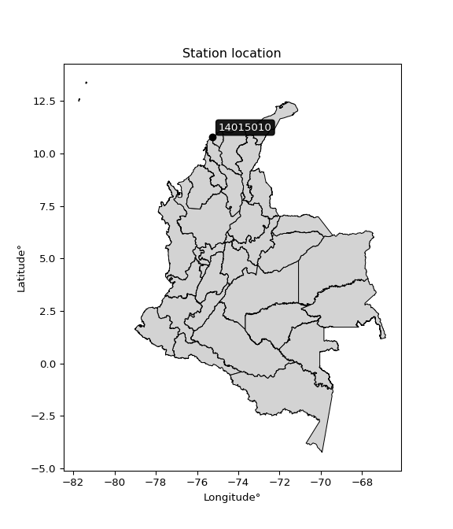

<div align="center">


</div>

# Station (rain, Pmax24h): 14015010

Probable Maximum Precipitation (PMP) is the greatest amount of rainfall for a specific duration that is meteorologically possible for a given location, acting as a "worst-case" scenario for extreme storms, crucial for designing safety-critical infrastructure like bridges, river deviations, dams, spillways, and nuclear plants to prevent catastrophic failure. PMP is calculated by hydrologists using meteorological data to determine the upper limit of extreme rainfall, often leading to the Probable Maximum Flood (PMF) for flood control design, and is increasingly being studied for climate change impacts.

<div align="center">

</img>

</div>


## A. General information


### 1. General running parameters

• app_version: _v20251226_. • runtime: _2025-12-26 15:38:16.554582_. • Python version: _3.14.0_. • SciPy version: _1.16.3_. • Pandas version: _2.3.3_. • NumPy version: _2.3.5_. • Stations dataset (station_dataset_file): _dataset/pmax24h_in/automatic_colombia_2003_2024.csv_. • Stations catalog (station_catalog_file): _dataset/CNE_IDEAM.xls_. • Minimum year to eval til year_max (date_min): _2003_. • Maximum year to eval since year_min (date_max): _2024_. • Creates, save and include plots into reports (create_plot): _False_. • Plot only fit distributions with Δo > Δ (plot_only_fit): _True_. • Eval low extreme values, if False, evaluates high extreme values (low_extreme): _False_. • Eval every SciPy distribution as logarithmic (pdist_logarithmic_on): _True_. • Standard deviation normalized (ddof): _1.0_. • Return periods to eval in years (Tr): _[2, 2.33, 5, 10, 15, 20, 25, 50, 75, 100, 200, 250, 500, 750, 1000]_. • Minimum data sample per station, 0 means any (minimum_sample): _5_. • Z-Score threshold to adjust a value, 0 means disable (zscore): _3.5_. • Avoid zeros, e.g. rain = 0 (avoid_zeros): _True_. • Avoid null values (avoid_nans): _True_. [:file_folder:Dataset file.](../../dataset/pmax24h_in/automatic_colombia_2003_2024.csv)


### 2. Station info and location

|   id |   CODIGO | NOMBRE                        | CATEGORIA               | TECNOLOGIA                | ESTADO   | FECHA_INSTALACION   |   FECHA_SUSPENSION |   ALTITUD |   LATITUD |   LONGITUD | DEPARTAMENTO   | MUNICIPIO      | AREA_OPERATIVA                              | ENTIDAD                                                     | AREA_HIDROGRAFICA   | ZONA_HIDROGRAFICA   | SUBZONA_HIDROGRAFICA       |   CORRIENTE | OBSERVACION                                                                                                                                                                                                                                                                                                                   |   SUBRED | Catalogo   |
|-----:|---------:|:------------------------------|:------------------------|:--------------------------|:---------|:--------------------|-------------------:|----------:|----------:|-----------:|:---------------|:---------------|:--------------------------------------------|:------------------------------------------------------------|:--------------------|:--------------------|:---------------------------|------------:|:------------------------------------------------------------------------------------------------------------------------------------------------------------------------------------------------------------------------------------------------------------------------------------------------------------------------------|---------:|:-----------|
|    0 | 14015010 | GALERAZAMBA  - AUT [14015010] | Climatológica Principal | Automática con Telemetría | Activa   | 15/12/1945          |                nan |        20 |    10.795 |   -75.2617 | Bolivar        | Santa Catalina | Area Operativa 02 - Atlántico-Bolivar-Sucre | INSTITUTO DE HIDROLOGIA METEOROLOGIA Y ESTUDIOS AMBIENTALES | Caribe              | Caribe - Litoral    | Arroyos Directos al Caribe |         nan | EL GRUPO DE AUTOMATIZACIÓN REPORTA HURTO DE EQUIPOS. ESTACIÓN SINIESTRADA (12/12/2022)|06/12/2024$mvelez$Estación automática transmitiendo en Polaris, solicitud mediante correo electrónico coordinadora Mayra Soto 04/12/2024|06/10/2025$mvelez$Se realiza el cambio de latitud y longitud bajo el memorando 20253090172873 |      nan | CNE_IDEAM  |

<div align="center">

Map location in: [:earth_americas:Google](http://maps.google.com/maps?q=10.794988,-75.261671) [:earth_americas:OSM](https://www.openstreetmap.org/#map=18/10.794988/-75.261671&layers=P) [:earth_americas:Bing](https://www.bing.com/maps?cp=10.794988~-75.261671&lvl=18) [:earth_americas:Apple](https://maps.apple.com/frame?center=10.794988%2C-75.261671&span=0.003%2C0.006)

</div>


<div align="center">

```geojson
{
  "type": "Feature",
  "geometry": {
    "type": "Point", 
    "coordinates": [-75.261671, 10.794988]
  }, 
  "properties": {
    "Name": "14015010"
  }
}
```

</div>


### 3. Discrete values table and plot

|               |            0 |           1 |            2 |          3 |         4 |
|:--------------|-------------:|------------:|-------------:|-----------:|----------:|
| Date          | 2019         | 2020        | 2021         | 2023       | 2024      |
| Value         |   82         |  102.8      |   77.4       |    2.6     |  125.6    |
| Value_initial |   82         |  102.8      |   77.4       |    2.6     |  125.6    |
| count         |    5         |    5        |    5         |    5       |    5      |
| mean          |   78.08      |   78.08     |   78.08      |   78.08    |   78.08   |
| std           |   46.3203    |   46.3203   |   46.3203    |   46.3203  |   46.3203 |
| zscore        |    0.0846281 |    0.533675 |   -0.0146804 |   -1.62952 |    1.0259 |
> If Z-Score is active, values out of range or outliers are replaced with the station mean value.


### 4. Active continuous probability distributions from SciPy (45 of 104 available)

[scipy.stats](https://docs.scipy.org/doc/scipy/reference/stats.html) is a Python´s powerful submodule within the SciPy library for comprehensive statistical analysis, offering over 130 probability distributions (like Normal, Poisson), functions for descriptive stats (mean, variance), hypothesis testing (t-tests, chi-square), random variable generation, and statistical tests, making it essential for data science, modeling, and research. It provides tools to explore, model, and draw conclusions from data efficiently, working seamlessly with NumPy.

<div align="center">

|   id | p_dist             |   n_parameter | fit_method   | label                                                                       | active   | ref                                                                                                        |
|-----:|:-------------------|--------------:|:-------------|:----------------------------------------------------------------------------|:---------|:-----------------------------------------------------------------------------------------------------------|
|    0 | alpha              |             3 | MLE          | Alpha                                                                       | True     | [:mortar_board:](https://docs.scipy.org/doc/scipy/reference/generated/scipy.stats.alpha.html)              |
|    1 | betaprime          |             4 | MLE          | Beta prime                                                                  | True     | [:mortar_board:](https://docs.scipy.org/doc/scipy/reference/generated/scipy.stats.betaprime.html)          |
|    2 | chi2               |             3 | MLE          | Chi²                                                                        | True     | [:mortar_board:](https://docs.scipy.org/doc/scipy/reference/generated/scipy.stats.chi2.html)               |
|    3 | crystalball        |             4 | MLE          | Crystalball                                                                 | True     | [:mortar_board:](https://docs.scipy.org/doc/scipy/reference/generated/scipy.stats.crystalball.html)        |
|    4 | erlang             |             3 | MLE          | Erlang                                                                      | True     | [:mortar_board:](https://docs.scipy.org/doc/scipy/reference/generated/scipy.stats.erlang.html)             |
|    5 | expon              |             2 | MLE          | Exponential                                                                 | True     | [:mortar_board:](https://docs.scipy.org/doc/scipy/reference/generated/scipy.stats.expon.html)              |
|    6 | exponnorm          |             3 | MLE          | Exponentially modified Normal                                               | True     | [:mortar_board:](https://docs.scipy.org/doc/scipy/reference/generated/scipy.stats.exponnorm.html)          |
|    7 | f                  |             4 | MLE          | F                                                                           | True     | [:mortar_board:](https://docs.scipy.org/doc/scipy/reference/generated/scipy.stats.f.html)                  |
|    8 | fatiguelife        |             3 | MLE          | Fatigue-life (Birnbaum-Saunders)                                            | True     | [:mortar_board:](https://docs.scipy.org/doc/scipy/reference/generated/scipy.stats.fatiguelife.html)        |
|    9 | fisk               |             3 | MLE          | Fisk                                                                        | True     | [:mortar_board:](https://docs.scipy.org/doc/scipy/reference/generated/scipy.stats.fisk.html)               |
|   10 | gamma              |             3 | MLE          | Gamma                                                                       | True     | [:mortar_board:](https://docs.scipy.org/doc/scipy/reference/generated/scipy.stats.gamma.html)              |
|   11 | genexpon           |             5 | MLE          | Generalized exponential                                                     | True     | [:mortar_board:](https://docs.scipy.org/doc/scipy/reference/generated/scipy.stats.genexpon.html)           |
|   12 | genlogistic        |             3 | MLE          | Generalized logistic                                                        | True     | [:mortar_board:](https://docs.scipy.org/doc/scipy/reference/generated/scipy.stats.genlogistic.html)        |
|   13 | gibrat             |             2 | MM           | Gibrat                                                                      | True     | [:mortar_board:](https://docs.scipy.org/doc/scipy/reference/generated/scipy.stats.gibrat.html)             |
|   14 | gompertz           |             3 | MLE          | Gompertz (or truncated Gumbel)                                              | True     | [:mortar_board:](https://docs.scipy.org/doc/scipy/reference/generated/scipy.stats.gompertz.html)           |
|   15 | gumbel_l           |             2 | MM           | Gumbel Left Skew                                                            | True     | [:mortar_board:](https://docs.scipy.org/doc/scipy/reference/generated/scipy.stats.gumbel_l.html)           |
|   16 | gumbel_r           |             2 | MM           | Gumbel Right Skew                                                           | True     | [:mortar_board:](https://docs.scipy.org/doc/scipy/reference/generated/scipy.stats.gumbel_r.html)           |
|   17 | halflogistic       |             2 | MM           | Half-logistic                                                               | True     | [:mortar_board:](https://docs.scipy.org/doc/scipy/reference/generated/scipy.stats.halflogistic.html)       |
|   18 | halfnorm           |             2 | MM           | Half Normal                                                                 | True     | [:mortar_board:](https://docs.scipy.org/doc/scipy/reference/generated/scipy.stats.halfnorm.html)           |
|   19 | hypsecant          |             2 | MM           | hyperbolic secant                                                           | True     | [:mortar_board:](https://docs.scipy.org/doc/scipy/reference/generated/scipy.stats.hypsecant.html)          |
|   20 | invgamma           |             3 | MLE          | Inverted gamma                                                              | True     | [:mortar_board:](https://docs.scipy.org/doc/scipy/reference/generated/scipy.stats.invgamma.html)           |
|   21 | invgauss           |             3 | MLE          | Inverse Gaussian                                                            | True     | [:mortar_board:](https://docs.scipy.org/doc/scipy/reference/generated/scipy.stats.invgauss.html)           |
|   22 | invweibull         |             3 | MLE          | Inverted Weibull                                                            | True     | [:mortar_board:](https://docs.scipy.org/doc/scipy/reference/generated/scipy.stats.invweibull.html)         |
|   23 | johnsonsu          |             4 | MLE          | Johnson Su                                                                  | True     | [:mortar_board:](https://docs.scipy.org/doc/scipy/reference/generated/scipy.stats.johnsonsu.html)          |
|   24 | kstwobign          |             2 | MLE          | Limiting distribution of scaled Kolmogorov-Smirnov two-sided test statistic | True     | [:mortar_board:](https://docs.scipy.org/doc/scipy/reference/generated/scipy.stats.kstwobign.html)          |
|   25 | laplace            |             2 | MM           | Laplace                                                                     | True     | [:mortar_board:](https://docs.scipy.org/doc/scipy/reference/generated/scipy.stats.laplace.html)            |
|   26 | laplace_asymmetric |             3 | MLE          | Asymmetric Laplace                                                          | True     | [:mortar_board:](https://docs.scipy.org/doc/scipy/reference/generated/scipy.stats.laplace_asymmetric.html) |
|   27 | loggamma           |             3 | MLE          | Log gamma                                                                   | True     | [:mortar_board:](https://docs.scipy.org/doc/scipy/reference/generated/scipy.stats.loggamma.html)           |
|   28 | logistic           |             2 | MM           | Logistic (or Sech-squared)                                                  | True     | [:mortar_board:](https://docs.scipy.org/doc/scipy/reference/generated/scipy.stats.logistic.html)           |
|   29 | lognorm            |             3 | MLE          | Log Normal                                                                  | True     | [:mortar_board:](https://docs.scipy.org/doc/scipy/reference/generated/scipy.stats.lognorm.html)            |
|   30 | maxwell            |             2 | MM           | Maxwell                                                                     | True     | [:mortar_board:](https://docs.scipy.org/doc/scipy/reference/generated/scipy.stats.maxwell.html)            |
|   31 | mielke             |             4 | MLE          | Mielke Beta-Kappa / Dagum                                                   | True     | [:mortar_board:](https://docs.scipy.org/doc/scipy/reference/generated/scipy.stats.mielke.html)             |
|   32 | moyal              |             2 | MM           | Moyal                                                                       | True     | [:mortar_board:](https://docs.scipy.org/doc/scipy/reference/generated/scipy.stats.moyal.html)              |
|   33 | nakagami           |             3 | MLE          | Nakagami                                                                    | True     | [:mortar_board:](https://docs.scipy.org/doc/scipy/reference/generated/scipy.stats.nakagami.html)           |
|   34 | ncf                |             5 | MLE          | Non-central F distribution                                                  | True     | [:mortar_board:](https://docs.scipy.org/doc/scipy/reference/generated/scipy.stats.ncf.html)                |
|   35 | nct                |             4 | MLE          | Non-central Student’s t                                                     | True     | [:mortar_board:](https://docs.scipy.org/doc/scipy/reference/generated/scipy.stats.nct.html)                |
|   36 | norm               |             2 | MM           | Normal                                                                      | True     | [:mortar_board:](https://docs.scipy.org/doc/scipy/reference/generated/scipy.stats.norm.html)               |
|   37 | pareto             |             3 | MLE          | Pareto                                                                      | True     | [:mortar_board:](https://docs.scipy.org/doc/scipy/reference/generated/scipy.stats.pareto.html)             |
|   38 | pearson3           |             3 | MM           | Pearson type III                                                            | True     | [:mortar_board:](https://docs.scipy.org/doc/scipy/reference/generated/scipy.stats.pearson3.html)           |
|   39 | rayleigh           |             2 | MM           | Rayleigh                                                                    | True     | [:mortar_board:](https://docs.scipy.org/doc/scipy/reference/generated/scipy.stats.rayleigh.html)           |
|   40 | rice               |             3 | MLE          | Rice                                                                        | True     | [:mortar_board:](https://docs.scipy.org/doc/scipy/reference/generated/scipy.stats.rice.html)               |
|   41 | t                  |             3 | MLE          | Student’s t                                                                 | True     | [:mortar_board:](https://docs.scipy.org/doc/scipy/reference/generated/scipy.stats.t.html)                  |
|   42 | truncnorm          |             4 | MLE          | Truncated normal                                                            | True     | [:mortar_board:](https://docs.scipy.org/doc/scipy/reference/generated/scipy.stats.truncnorm.html)          |
|   43 | wald               |             2 | MM           | Wald                                                                        | True     | [:mortar_board:](https://docs.scipy.org/doc/scipy/reference/generated/scipy.stats.wald.html)               |
|   44 | weibull_min        |             3 | MLE          | Weibull minimum                                                             | True     | [:mortar_board:](https://docs.scipy.org/doc/scipy/reference/generated/scipy.stats.weibull_min.html)        |

</div>

> **n_parameter:** # arguments & localization & scale.
>
> **Fit methods:** (MLE) maximum likelihood, (MM) L-moments.
>
>**Inactive:** foldnorm, gennorm, norminvgauss, powernorm, powerlognorm, skewnorm, genextreme, anglit, arcsine, argus, beta, bradford, burr, burr12, cauchy, cosine, halfcauchy, foldcauchy, skewcauchy, wrapcauchy, dgamma, gengamma, exponweib, exponpow, truncexpon, gausshyper, genhalflogistic, genhyperbolic, geninvgauss, halfgennorm, johnsonsb, kappa4, kappa3, ksone, kstwo, loglaplace, levy, levy_l, levy_stable, ncx2, genpareto, truncpareto, lomax, powerlaw, rdist, rel_breitwigner, recipinvgauss, semicircular, studentized_range, trapezoid, triang, truncweibull_min, tukeylambda, uniform, loguniform, vonmises, vonmises_line, weibull_max, dweibull, 


## B. Probability distributions vs. Empirical distributions

A continuous probability distribution (CPD) describes probabilities for variables that can take any value within a range (like rain any time), unlike discrete variables with specific outcomes (like temperature). It uses a Probability Density Function (PDF), a curve where the total area under it equals 1, and the probability of the variable falling within an interval (a to b) is found by calculating the area under the curve between those points. A key feature is that the probability of hitting any single exact value is zero, so probabilities are always expressed for ranges, e.g., $P(a ≤ X ≤ b)$.

<div align="center">

Distributions parameters
|    |   station | p_dist                |   n |              loc |            scale | shape                  | shape1                 | shape2              | shape3   |
|---:|----------:|:----------------------|----:|-----------------:|-----------------:|:-----------------------|:-----------------------|:--------------------|:---------|
|  0 |  14015010 | alpha                 |   5 |   -321.56        |   3203.83        | 8.138622541019899      |                        |                     |          |
|  1 |  14015010 | betaprime             |   5 |   -702.838       | 103445           | 336.63775026180485     | 44604.61018129547      |                     |          |
|  2 |  14015010 | chi2                  |   5 |      2.6         |      3.03282     | 1.23395164356734       |                        |                     |          |
|  3 |  14015010 | crystalball           |   5 |     78.078       |     41.4279      | 7144.1619193992265     | 1.147622861060844      |                     |          |
|  4 |  14015010 | erlang                |   5 |   -564.561       |      2.91061     | 220.55726659457332     |                        |                     |          |
|  5 |  14015010 | expon                 |   5 |      2.6         |     75.48        |                        |                        |                     |          |
|  6 |  14015010 | exponnorm             |   5 |     78.0527      |     41.4299      | 0.000658814077080738   |                        |                     |          |
|  7 |  14015010 | f                     |   5 |  -5694.5         |   5772.73        | 40041.576457424104     | 886255.0619251385      |                     |          |
|  8 |  14015010 | fatiguelife           |   5 |      2.6         |      4.83388e-05 | 1802.9419865563198     |                        |                     |          |
|  9 |  14015010 | fisk                  |   5 |     -2.34854e+09 |      2.34854e+09 | 102018600.81159088     |                        |                     |          |
| 10 |  14015010 | gamma                 |   5 |   -582.652       |      2.81472     | 234.88117261238784     |                        |                     |          |
| 11 |  14015010 | genexpon              |   5 |      2.6         |      2.0837      | 0.027637302322393704   | 1.0146791343531431e-08 | 2.823939032903481   |          |
| 12 |  14015010 | genlogistic           |   5 |    125.6         |      2.87229e-05 | 6.038282650699022e-07  |                        |                     |          |
| 13 |  14015010 | gibrat                |   5 |     46.474       |     19.17        |                        |                        |                     |          |
| 14 |  14015010 | gompertz              |   5 |     77.4         |     13.808       | 0.10528941515195359    |                        |                     |          |
| 15 |  14015010 | gumbel_l              |   5 |     96.7258      |     32.303       |                        |                        |                     |          |
| 16 |  14015010 | gumbel_r              |   5 |     59.4342      |     32.303       |                        |                        |                     |          |
| 17 |  14015010 | halflogistic          |   5 |     28.9756      |     35.4213      |                        |                        |                     |          |
| 18 |  14015010 | halfnorm              |   5 |     23.2427      |     68.7284      |                        |                        |                     |          |
| 19 |  14015010 | hypsecant             |   5 |     78.08        |     26.3753      |                        |                        |                     |          |
| 20 |  14015010 | invgamma              |   5 |   -368.503       |  44186           | 99.8207095779484       |                        |                     |          |
| 21 |  14015010 | invgauss              |   5 |    -81.5669      |   1101.95        | 0.14356100154726226    |                        |                     |          |
| 22 |  14015010 | invweibull            |   5 |      2.6         |      3.87299     | 0.04007156953375868    |                        |                     |          |
| 23 |  14015010 | johnsonsu             |   5 |    144.48        |      1.15348     | 6.895940925714451      | 1.5180333221653186     |                     |          |
| 24 |  14015010 | kstwobign             |   5 |   -101.955       |    205.321       |                        |                        |                     |          |
| 25 |  14015010 | laplace               |   5 |     78.08        |     29.2955      |                        |                        |                     |          |
| 26 |  14015010 | laplace_asymmetric    |   5 |     82           |     29.4784      | 1.0685995253288842     |                        |                     |          |
| 27 |  14015010 | loggamma              |   5 |    125.6         |      2.25788e-05 | 4.7475649668043156e-07 |                        |                     |          |
| 28 |  14015010 | logistic              |   5 |     78.08        |     22.8416      |                        |                        |                     |          |
| 29 |  14015010 | lognorm               |   5 |      2.6         |      0.0317975   | 15.952047543062928     |                        |                     |          |
| 30 |  14015010 | maxwell               |   5 |    -20.0921      |     61.5202      |                        |                        |                     |          |
| 31 |  14015010 | mielke                |   5 |    -58.3713      |    184.195       | 2.7518641641121793     | 4833.738814175478      |                     |          |
| 32 |  14015010 | moyal                 |   5 |     54.3876      |     18.6501      |                        |                        |                     |          |
| 33 |  14015010 | nakagami              |   5 |      2.6         |    181.23        | 0.053076053513330834   |                        |                     |          |
| 34 |  14015010 | ncf                   |   5 |     -0.0100668   |      1.25967e-05 | 8.284900401412674e-07  | 4.918921437929567      | 3.8626264870626446  |          |
| 35 |  14015010 | nct                   |   5 |     -0.224408    |      0.115204    | 0.3701424542136763     | 54.73619182498628      |                     |          |
| 36 |  14015010 | norm                  |   5 |     78.08        |     41.4302      |                        |                        |                     |          |
| 37 |  14015010 | pareto                |   5 |      1.82962     |      0.77038     | 0.26060722438908895    |                        |                     |          |
| 38 |  14015010 | pearson3              |   5 |     78.08        |     41.4301      | -0.8649606068205486    |                        |                     |          |
| 39 |  14015010 | rayleigh              |   5 |     -1.1783      |     63.239       |                        |                        |                     |          |
| 40 |  14015010 | rice                  |   5 |    -26.9131      |     45.0614      | 2.067421449604297      |                        |                     |          |
| 41 |  14015010 | t                     |   5 |     78.0808      |     41.4302      | 18030856.685328454     |                        |                     |          |
| 42 |  14015010 | truncnorm             |   5 |   -195.728       |     20.6711      | -19.79312436191278     | 15.544795625876368     |                     |          |
| 43 |  14015010 | wald                  |   5 |     36.6498      |     41.4302      |                        |                        |                     |          |
| 44 |  14015010 | weibull_min           |   5 |     -1.98196e+09 |      1.98196e+09 | 65384587.56202419      |                        |                     |          |
| 45 |  14015010 | logalpha              |   5 |      0.000444657 |      1.9692      | 2.1853994492071227e-08 |                        |                     |          |
| 46 |  14015010 | logbetaprime          |   5 |    -38.8279      |    175.221       | 997.8356453982465      | 4098.9741591431575     |                     |          |
| 47 |  14015010 | logchi2               |   5 |      0.955511    |      1.80609     | 1.7576967506391012     |                        |                     |          |
| 48 |  14015010 | logcrystalball        |   5 |      3.83542     |      1.45018     | 8.524278190479508      | 1.0826148646486544     |                     |          |
| 49 |  14015010 | logerlang             |   5 |    -23.546       |      0.0848476   | 322.77019257910024     |                        |                     |          |
| 50 |  14015010 | logexpon              |   5 |      0.955511    |      2.87991     |                        |                        |                     |          |
| 51 |  14015010 | logexponnorm          |   5 |      3.83451     |      1.45019     | 0.0006312841626256516  |                        |                     |          |
| 52 |  14015010 | logf                  |   5 |  -2904.26        |   2908.09        | 29569248.798711374     | 10968301.659945864     |                     |          |
| 53 |  14015010 | logfatiguelife        |   5 |   -948.419       |    952.263       | 0.0015191751291105376  |                        |                     |          |
| 54 |  14015010 | logfisk               |   5 | -39178.3         |  39182.5         | 53694.73389814407      |                        |                     |          |
| 55 |  14015010 | loggamma              |   5 |    -19.2451      |      0.106125    | 217.21638122071136     |                        |                     |          |
| 56 |  14015010 | loggenexpon           |   5 |      0.955511    |      1.33314     | 0.1992778780026513     | 2.2717853508930927     | 0.08776136480373642 |          |
| 57 |  14015010 | loggenlogistic        |   5 |      4.83327     |      7.69915e-06 | 7.66758712391644e-06   |                        |                     |          |
| 58 |  14015010 | loggibrat             |   5 |      2.72917     |      0.670988    |                        |                        |                     |          |
| 59 |  14015010 | loggompertz           |   5 |      0.955508    |      0.808741    | 0.014349285397041804   |                        |                     |          |
| 60 |  14015010 | loggumbel_l           |   5 |      4.48808     |      1.1307      |                        |                        |                     |          |
| 61 |  14015010 | loggumbel_r           |   5 |      3.18276     |      1.1307      |                        |                        |                     |          |
| 62 |  14015010 | loghalflogistic       |   5 |      2.11661     |      1.23985     |                        |                        |                     |          |
| 63 |  14015010 | loghalfnorm           |   5 |      1.91597     |      2.40567     |                        |                        |                     |          |
| 64 |  14015010 | loghypsecant          |   5 |      3.83542     |      0.923216    |                        |                        |                     |          |
| 65 |  14015010 | loginvgamma           |   5 |    -27.1658      |  12232.2         | 395.36972965191785     |                        |                     |          |
| 66 |  14015010 | loginvgauss           |   5 |    -11.8892      |   1540.7         | 0.010207470308526943   |                        |                     |          |
| 67 |  14015010 | loginvweibull         |   5 |     -1.36308e+08 |      1.36308e+08 | 87080059.7998485       |                        |                     |          |
| 68 |  14015010 | logjohnsonsu          |   5 |      4.8331      |      2.47869e-16 | 3.2307995457705636     | 0.12759543869680381    |                     |          |
| 69 |  14015010 | logkstwobign          |   5 |     -2.95987     |      7.74361     |                        |                        |                     |          |
| 70 |  14015010 | loglaplace            |   5 |      3.83542     |      1.02543     |                        |                        |                     |          |
| 71 |  14015010 | loglaplace_asymmetric |   5 |      4.8331      |      0.015844    | 62.95585334370094      |                        |                     |          |
| 72 |  14015010 | logloggamma           |   5 |      4.8332      |      8.76312e-06 | 8.842699608932961e-06  |                        |                     |          |
| 73 |  14015010 | loglogistic           |   5 |      3.83542     |      0.799528    |                        |                        |                     |          |
| 74 |  14015010 | loglognorm            |   5 |      0.955511    |      0.00179318  | 15.2065905479285       |                        |                     |          |
| 75 |  14015010 | logmaxwell            |   5 |      0.399094    |      2.1534      |                        |                        |                     |          |
| 76 |  14015010 | logmielke             |   5 |     -7.57249e+07 |      7.5725e+07  | 74213596.5693121       | 5568570043.594468      |                     |          |
| 77 |  14015010 | logmoyal              |   5 |      3.00611     |      0.652812    |                        |                        |                     |          |
| 78 |  14015010 | lognakagami           |   5 |      4.34899     |      0.221973    | 0.19629506438598088    |                        |                     |          |
| 79 |  14015010 | logncf                |   5 |    -57.7497      |     61.5654      | 5350.964061407847      | 9115.774096006939      | 0.36082372938247786 |          |
| 80 |  14015010 | lognct                |   5 |    -92.524       |      1.39575     | 27484.55100292354      | 69.03474518382433      |                     |          |
| 81 |  14015010 | lognorm               |   5 |      3.83542     |      1.45018     |                        |                        |                     |          |
| 82 |  14015010 | logpareto             |   5 |      0.925702    |      0.0298098   | 0.2603798037898213     |                        |                     |          |
| 83 |  14015010 | logpearson3           |   5 |      3.83542     |      1.45019     | -1.4469486244151861    |                        |                     |          |
| 84 |  14015010 | lograyleigh           |   5 |      1.0611      |      2.21358     |                        |                        |                     |          |
| 85 |  14015010 | logrice               |   5 |  -1039.49        |      1.45015     | 719.4577567997528      |                        |                     |          |
| 86 |  14015010 | logt                  |   5 |      4.4808      |      0.192347    | 0.8137661271583112     |                        |                     |          |
| 87 |  14015010 | logtruncnorm          |   5 |      0.246939    |      3.86134     | 0.18133651993092265    | 1.187712021753643      |                     |          |
| 88 |  14015010 | logwald               |   5 |      2.38528     |      1.45015     |                        |                        |                     |          |
| 89 |  14015010 | logweibull_min        |   5 |      0.955511    |      1.27097     | 0.5640905804116803     |                        |                     |          |

</div>

> **loc** (Location parameter): This shifts the distribution along the x-axis. For many common distributions, like the normal (Gaussian) distribution, loc represents the mean $μ$. For others, like the uniform distribution, it might represent the minimum value, or for the beta distribution, the left end of the support interval.
>
> **scale** (Scale parameter): This determines the width or spread of the distribution. For the normal distribution, scale represents the standard deviation $σ$. For a uniform distribution, it defines the length of the interval (from $loc$ to $loc + scale$).
>
> **shape** (Shape parameters): Refers to parameters that define the specific form of a probability distribution, distinct from its location (loc) and scale (scale). These parameters are required arguments for most distribution functions. For example, a normal (Gaussian) distribution is fully defined by its location (mean) and scale (standard deviation), so it has no specific shape parameters beyond loc and scale. However, other distributions have intrinsic properties that need specification, as Gamma distribution that takes a shape parameter, often named $a$ or $alpha$.


### 0. Cumulative distribution values - CDF (90 evaluated)

> Ordered by x ascending and calculating $log(f(x))$ separately. 

|   id |   Station |   date |     x |   count |   mean |     std |     zscore |   Value_initial |   station |   m |     alpha |   alpha_pdf |   betaprime |   betaprime_pdf |        chi2 |         chi2_pdf |   crystalball |   crystalball_pdf |    erlang |   erlang_pdf |    expon |   expon_pdf |   exponnorm |   exponnorm_pdf |         f |      f_pdf |   fatiguelife |   fatiguelife_pdf |      fisk |   fisk_pdf |     gamma |   gamma_pdf |    genexpon |   genexpon_pdf |   genlogistic |   genlogistic_pdf |   gibrat |   gibrat_pdf |    gompertz |   gompertz_pdf |   gumbel_l |   gumbel_l_pdf |   gumbel_r |   gumbel_r_pdf |   halflogistic |   halflogistic_pdf |   halfnorm |   halfnorm_pdf |   hypsecant |   hypsecant_pdf |   invgamma |   invgamma_pdf |   invgauss |   invgauss_pdf |   invweibull |   invweibull_pdf |   johnsonsu |   johnsonsu_pdf |   kstwobign |   kstwobign_pdf |   laplace |   laplace_pdf |   laplace_asymmetric |   laplace_asymmetric_pdf |   loggamma |   loggamma_pdf |   logistic |   logistic_pdf |   lognorm |   lognorm_pdf |   maxwell |   maxwell_pdf |    mielke |   mielke_pdf |       moyal |   moyal_pdf |   nakagami |   nakagami_pdf |      ncf |    ncf_pdf |       nct |     nct_pdf |     norm |   norm_pdf |      pareto |   pareto_pdf |   pearson3 |   pearson3_pdf |   rayleigh |   rayleigh_pdf |      rice |   rice_pdf |         t |      t_pdf |   truncnorm |   truncnorm_pdf |     wald |   wald_pdf |   weibull_min |   weibull_min_pdf |   logalpha |   logalpha_pdf |   logbetaprime |   logbetaprime_pdf |     logchi2 |   logchi2_pdf |   logcrystalball |   logcrystalball_pdf |   logerlang |   logerlang_pdf |   logexpon |   logexpon_pdf |   logexponnorm |   logexponnorm_pdf |      logf |   logf_pdf |   logfatiguelife |   logfatiguelife_pdf |   logfisk |   logfisk_pdf |   loggenexpon |   loggenexpon_pdf |   loggenlogistic |   loggenlogistic_pdf |   loggibrat |   loggibrat_pdf |   loggompertz |   loggompertz_pdf |   loggumbel_l |   loggumbel_l_pdf |   loggumbel_r |   loggumbel_r_pdf |   loghalflogistic |   loghalflogistic_pdf |   loghalfnorm |   loghalfnorm_pdf |   loghypsecant |   loghypsecant_pdf |   loginvgamma |   loginvgamma_pdf |   loginvgauss |   loginvgauss_pdf |   loginvweibull |   loginvweibull_pdf |   logjohnsonsu |   logjohnsonsu_pdf |   logkstwobign |   logkstwobign_pdf |   loglaplace |   loglaplace_pdf |   loglaplace_asymmetric |   loglaplace_asymmetric_pdf |   logloggamma |   logloggamma_pdf |   loglogistic |   loglogistic_pdf |   loglognorm |   loglognorm_pdf |   logmaxwell |   logmaxwell_pdf |   logmielke |   logmielke_pdf |    logmoyal |   logmoyal_pdf |   lognakagami |   lognakagami_pdf |   logncf |   logncf_pdf |    lognct |   lognct_pdf |   logpareto |   logpareto_pdf |   logpearson3 |   logpearson3_pdf |   lograyleigh |   lograyleigh_pdf |   logrice |   logrice_pdf |      logt |   logt_pdf |   logtruncnorm |   logtruncnorm_pdf |   logwald |   logwald_pdf |   logweibull_min |   logweibull_min_pdf |
|-----:|----------:|-------:|------:|--------:|-------:|--------:|-----------:|----------------:|----------:|----:|----------:|------------:|------------:|----------------:|------------:|-----------------:|--------------:|------------------:|----------:|-------------:|---------:|------------:|------------:|----------------:|----------:|-----------:|--------------:|------------------:|----------:|-----------:|----------:|------------:|------------:|---------------:|--------------:|------------------:|---------:|-------------:|------------:|---------------:|-----------:|---------------:|-----------:|---------------:|---------------:|-------------------:|-----------:|---------------:|------------:|----------------:|-----------:|---------------:|-----------:|---------------:|-------------:|-----------------:|------------:|----------------:|------------:|----------------:|----------:|--------------:|---------------------:|-------------------------:|-----------:|---------------:|-----------:|---------------:|----------:|--------------:|----------:|--------------:|----------:|-------------:|------------:|------------:|-----------:|---------------:|---------:|-----------:|----------:|------------:|---------:|-----------:|------------:|-------------:|-----------:|---------------:|-----------:|---------------:|----------:|-----------:|----------:|-----------:|------------:|----------------:|---------:|-----------:|--------------:|------------------:|-----------:|---------------:|---------------:|-------------------:|------------:|--------------:|-----------------:|---------------------:|------------:|----------------:|-----------:|---------------:|---------------:|-------------------:|----------:|-----------:|-----------------:|---------------------:|----------:|--------------:|--------------:|------------------:|-----------------:|---------------------:|------------:|----------------:|--------------:|------------------:|--------------:|------------------:|--------------:|------------------:|------------------:|----------------------:|--------------:|------------------:|---------------:|-------------------:|--------------:|------------------:|--------------:|------------------:|----------------:|--------------------:|---------------:|-------------------:|---------------:|-------------------:|-------------:|-----------------:|------------------------:|----------------------------:|--------------:|------------------:|--------------:|------------------:|-------------:|-----------------:|-------------:|-----------------:|------------:|----------------:|------------:|---------------:|--------------:|------------------:|---------:|-------------:|----------:|-------------:|------------:|----------------:|--------------:|------------------:|--------------:|------------------:|----------:|--------------:|----------:|-----------:|---------------:|-------------------:|----------:|--------------:|-----------------:|---------------------:|
|    0 |  14015010 |   2023 |   2.6 |       5 |  78.08 | 46.3203 | -1.62952   |             2.6 |  14015010 |   1 | 0.0405043 |  0.00265427 |   0.0355481 |      0.00196179 | 1.23811e-10 | 172011           |     0.0342343 |        0.00183159 | 0.0375511 |   0.0020572  | 0        |  0.0132485  |   0.0342374 |      0.00183163 | 0.0344366 | 0.00184489 |     0.0368718 |       1.55036e+10 | 0.0286941 | 0.00121068 | 0.0352203 |  0.00195348 | 3.55305e-08 |     0.0132636  |      0        |        0.00158378 | 0        |   0          | 0           |     0          |  0.0528206 |     0.0015912  | 0.00300036 |    0.000539553 |       0        |         0          |   0        |     0          |   0.0363543 |      0.00137535 |   0.032324 |     0.00206764 |   0.061855 |     0.00408981 |    0.0128713 |      5.05538e+12 |   0.0719558 |      0.00146727 |   0.0422634 |      0.00344207 | 0.0380198 |    0.0012978  |            0.0428701 |               0.00136093 |   0.029964 |      0.0474751 |  0.0354174 |     0.00149565 | 0.0235226 |      0.038292 | 0.0128153 |    0.00164851 | 0.0477188 |   0.00215373 | 6.11256e-05 | 2.78098e-05 |  0.0118912 |    2.8424e+12  | 0.168915 | 0.00914334 | 0.0541303 | 0.0556493   | 0.034238 | 0.00183165 | 1.11022e-16 |  0.338284    |  0.0521417 |     0.00175449 | 0.00178323 |    0.000943087 | 0.0282038 | 0.00209481 | 0.0342366 | 0.00183159 |           1 |     1.97873e-22 | 0        | 0          |     0.0438034 |        0.00141294 |  0.0392225 |      0.205601  |      0.0254002 |          0.0415737 | 3.22311e-15 |    25.514     |        0.0235226 |             0.038292 |   0.0259124 |       0.0425637 |   0        |      0.347233  |       0.023523 |          0.0382924 | 0.0239954 |  0.0388804 |        0.0227742 |            0.0374682 | 0.0125413 |     0.0169722 |   1.34155e-10 |          0.14948  |         0        |            0.0209426 |    0        |       0         |   5.27143e-08 |         0.0177428 |     0.0430184 |         0.0372154 |   0.000769958 |        0.00488189 |          0        |              0        |      0        |          0        |       0.028109 |          0.0304073 |      0.025836 |         0.0438612 |     0.0250453 |         0.0453967 |       0.0284093 |            0.06463  |      0.053098  |        0.00355994  |      0.0397691 |          0.0878705 |    0.0301484 |        0.0294006 |               0.0204932 |                   0.0205451 |     0.0199826 |          0.020164 |      0.026545 |         0.0323195 |    0.0227507 |      3.19807e+13 |   0.00449745 |         0.023926 |   0.0215889 |        0.021158 | 1.51318e-06 |    2.78837e-05 |   0           |       0           | 0.025607 |    0.0415285 | 0.0237604 |    0.0386672 | 1.11022e-16 |       8.73471   |     0.0476532 |          0.038089 |      0        |          0        | 0.0235203 |     0.0382899 | 0.0291433 | 0.00671686 |      0.0027382 |           0.327106 |  0        |      0        |      8.73823e-10 |          4.43979e+06 |
|    1 |  14015010 |   2021 |  77.4 |       5 |  78.08 | 46.3203 | -0.0146804 |            77.4 |  14015010 |   2 | 0.543068  |  0.00798326 |   0.502702  |      0.00934323 | 0.999999    |      1.91343e-07 |     0.493471  |        0.0096285  | 0.508995  |   0.00922567 | 0.628791 |  0.00491797 |   0.493453  |      0.00962803 | 0.492987  | 0.00956421 |     0.754889  |       0.00145021  | 0.432243  | 0.0106603  | 0.498747  |  0.00925693 | 0.629209    |     0.00491802 |      0        |        0.00763162 | 0.683764 |   0.0115059  | 1.17904e-08 |     0.00762526 |  0.422914  |     0.00982142 | 0.563604   |    0.0100044   |       0.593821 |         0.00913823 |   0.569298 |     0.00851081 |   0.491794  |      0.0120645  |   0.515791 |     0.00890761 |   0.578223 |     0.00660685 |    0.411427  |      0.00019575  |   0.37285   |      0.00856435 |   0.569706  |      0.00709497 | 0.488528  |    0.0166758  |            0.460692  |               0.0146248  |   0.642975 |      0.234808  |  0.492558  |     0.0109425  | 0.638382  |      0.258377 | 0.526752  |    0.00927893 | 0.431981  |   0.00875554 | 0.589482    | 0.00997853  |  0.801036  |    0.00112707  | 0.642532 | 0.00372223 | 0.686746  | 0.00149218  | 0.493452 | 0.00962798 | 0.697335    |  0.00104375  |  0.43603   |     0.00941245 | 0.537902   |    0.0090796   | 0.504013  | 0.00936082 | 0.493445  | 0.00962797 |           1 |     2.37166e-40 | 0.661473 | 0.00986994 |     0.410392  |        0.0102759  |  0.650663  |      0.0749917 |      0.637562  |          0.246616  | 0.66333     |     0.100361  |        0.638382  |             0.258377 |   0.636906  |       0.243126  |   0.692207 |      0.106876  |       0.638382 |          0.258376  | 0.639659  |  0.257335  |        0.636503  |            0.259327  | 0.570627  |     0.335757  |   0.669666    |          0.162075 |         0        |            0.614831  |    0.810927 |       0.167025  |   0.608876    |         0.460929  |     0.586976  |         0.322999  |   0.700121    |        0.220743   |          0.716423 |              0.196288 |      0.688158 |          0.198881 |       0.668586 |          0.297547  |      0.636423 |         0.235377  |     0.643437  |         0.227595  |       0.665351  |            0.173186 |      0.0885002 |        0.0422685   |      0.664914  |          0.161024  |    0.696985  |        0.295499  |               0.615332  |                   0.61689   |     0.613484  |          0.619055 |      0.655281 |         0.282526  |    0.690126  |      0.00683545  |   0.661235   |         0.231816 |   0.600598  |        0.588611 | 0.720694    |    0.204965    |   1.75945e-06 |       7.77706e+08 | 0.638193 |    0.247964  | 0.638737  |    0.257215  | 0.709199    |       0.0221187 |     0.556193  |          0.328276 |      0.668157 |          0.222668 | 0.638389  |     0.258382  | 0.318754  | 1.04916    |      0.914456  |           0.189207 |  0.778688 |      0.166683 |      0.824508    |          0.0507635   |
|    2 |  14015010 |   2019 |  82   |       5 |  78.08 | 46.3203 |  0.0846281 |            82   |  14015010 |   3 | 0.579143  |  0.00769314 |   0.545498  |      0.00924604 | 0.999999    |      8.7605e-08  |     0.537712  |        0.00958673 | 0.551203  |   0.00910846 | 0.650738 |  0.00462721 |   0.537691  |      0.00958632 | 0.536923  | 0.00951941 |     0.761413  |       0.00138712  | 0.481787  | 0.0108454  | 0.541157  |  0.00916514 | 0.651155    |     0.00462693 |      0        |        0.00840648 | 0.731356 |   0.00928369 | 0.040771    |     0.0102061  |  0.469481  |     0.0104107  | 0.608172   |    0.00936269  |       0.634242 |         0.00843754 |   0.607405 |     0.00805552 |   0.547135  |      0.0119364  |   0.556334 |     0.00870568 |   0.607928 |     0.00630611 |    0.4123    |      0.000184359 |   0.414303  |      0.0094667  |   0.601632  |      0.00678308 | 0.562621  |    0.0149299  |            0.533126  |               0.0169243  |   0.656427 |      0.231176  |  0.542799  |     0.0108647  | 0.653191  |      0.254558 | 0.568855  |    0.00901298 | 0.473461  |   0.00928182 | 0.633374    | 0.009106    |  0.80608   |    0.00106729  | 0.659133 | 0.00349805 | 0.693344  | 0.00137918  | 0.537691 | 0.00958627 | 0.70196     |  0.000968829 |  0.480341  |     0.00983965 | 0.578952   |    0.00875733  | 0.54689   | 0.00926423 | 0.537683  | 0.00958628 |           1 |     1.22272e-41 | 0.703318 | 0.00837382 |     0.459289  |        0.010968   |  0.654941  |      0.0732346 |      0.651694  |          0.24291   | 0.669072    |     0.0985685 |        0.653191  |             0.254558 |   0.650837  |       0.239466  |   0.698316 |      0.104755  |       0.65319  |          0.254557  | 0.654406  |  0.253503  |        0.651367  |            0.255522  | 0.589893  |     0.331518  |   0.678939    |          0.159185 |         0        |            0.651217  |    0.820256 |       0.156279  |   0.63551     |         0.461327  |     0.605672  |         0.324533  |   0.712656    |        0.21351    |          0.727567 |              0.189799 |      0.6995   |          0.194056 |       0.685487 |          0.287883  |      0.649907 |         0.231709  |     0.656466  |         0.223742  |       0.67524   |            0.169395 |      0.0911272 |        0.0490466   |      0.674124  |          0.158023  |    0.713574  |        0.279322  |               0.651997  |                   0.653648  |     0.650285  |          0.65619  |      0.671404 |         0.275938  |    0.690517  |      0.0067174   |   0.674484   |         0.227109 |   0.63556   |        0.622875 | 0.7323      |    0.197163    |   0.464781    |       3.12568     | 0.652403 |    0.244253  | 0.653478  |    0.253397  | 0.710463    |       0.0216574 |     0.575329  |          0.334596 |      0.680875 |          0.217894 | 0.653198  |     0.254562  | 0.388395  | 1.36246    |      0.925293  |           0.186205 |  0.788061 |      0.158106 |      0.827403    |          0.0495601   |
|    3 |  14015010 |   2020 | 102.8 |       5 |  78.08 | 46.3203 |  0.533675  |           102.8 |  14015010 |   4 | 0.722012  |  0.0059679  |   0.724169  |      0.00765998 | 1           |      2.59756e-09 |     0.724662  |        0.00805915 | 0.726582  |   0.00750004 | 0.734862 |  0.0035127  |   0.724637  |      0.00805912 | 0.722579  | 0.00801064 |     0.787725  |       0.0011557   | 0.696492  | 0.00918263 | 0.718651  |  0.00763477 | 0.735261    |     0.00351139 |      0        |        0.0130172  | 0.859441 |   0.0039623  | 0.427274    |     0.0274848  |  0.700871  |     0.0111758  | 0.770127   |    0.0062272   |       0.778712 |         0.00555609 |   0.752957 |     0.0059407  |   0.762327  |      0.00819694 |   0.721247 |     0.00697207 |   0.724243 |     0.0048747  |    0.415704  |      0.000145928 |   0.654643  |      0.013419   |   0.727029  |      0.00526237 | 0.784967  |    0.00734014 |            0.780346  |               0.00796252 |   0.706899 |      0.214818  |  0.746917  |     0.00827577 | 0.708784  |      0.236504 | 0.737493  |    0.00703783 | 0.692504  |   0.0118239  | 0.784775    | 0.00562803  |  0.825987  |    0.000861672 | 0.72272  | 0.00266064 | 0.717885  | 0.00101298  | 0.724635 | 0.0080591  | 0.719349    |  0.000724368 |  0.694764  |     0.0102943  | 0.741204   |    0.00672868  | 0.726108  | 0.00769454 | 0.724629  | 0.00805919 |           1 |     9.91003e-48 | 0.828946 | 0.00426928 |     0.705128  |        0.0118797  |  0.670765  |      0.0668942 |      0.704749  |          0.225824  | 0.690589    |     0.0918797 |        0.708784  |             0.236504 |   0.703147  |       0.222709  |   0.721091 |      0.0968463 |       0.708783 |          0.236504  | 0.709759  |  0.235441  |        0.707182  |            0.237491  | 0.662246  |     0.306517  |   0.713634    |          0.147727 |         0        |            0.815648  |    0.85147  |       0.121679  |   0.73799     |         0.438569  |     0.679068  |         0.322584  |   0.757775    |        0.185887   |          0.767701 |              0.165598 |      0.741243 |          0.175289 |       0.745993 |          0.246849  |      0.700488 |         0.215268  |     0.705196  |         0.206958  |       0.711856  |            0.154566 |      0.107959  |        0.118171    |      0.708516  |          0.146245  |    0.770243  |        0.224058  |               0.81785   |                   0.819921  |     0.81691   |          0.824329 |      0.730526 |         0.246217  |    0.691987  |      0.00629132  |   0.723625   |         0.207326 |   0.793188  |        0.777357 | 0.773589    |    0.16868     |   0.828271    |       0.873535    | 0.705753 |    0.227078  | 0.708814  |    0.235399  | 0.715168    |       0.0200062 |     0.653427  |          0.35499  |      0.727943 |          0.198309 | 0.708792  |     0.236507  | 0.701365  | 0.946223   |      0.966065  |           0.174524 |  0.820418 |      0.129332 |      0.838106    |          0.0452188   |
|    4 |  14015010 |   2024 | 125.6 |       5 |  78.08 | 46.3203 |  1.0259    |           125.6 |  14015010 |   5 | 0.834917  |  0.00397873 |   0.867152  |      0.00483115 | 1           |      5.59765e-11 |     0.87433   |        0.00498754 | 0.866658  |   0.00474581 | 0.803986 |  0.0025969  |   0.874309  |      0.00498788 | 0.871771  | 0.00499538 |     0.811855  |       0.000970102 | 0.860693  | 0.00520836 | 0.861958  |  0.00488119 | 0.804349    |     0.00259504 |      0.999991 |        0.0210224  | 0.92186  |   0.00184568 | 0.96489     |     0.00878409 |  0.913234  |     0.00656606 | 0.879013   |    0.00350908  |       0.877301 |         0.00325146 |   0.863592 |     0.00382972 |   0.895883  |      0.0038775  |   0.852021 |     0.00450421 |   0.818551 |     0.00344216 |    0.418701  |      0.000118755 |   0.94508   |      0.00891732 |   0.828655  |      0.00369256 | 0.901257  |    0.00337057 |            0.903885  |               0.00348421 |   0.748281 |      0.198057  |  0.888985  |     0.00432066 | 0.754264  |      0.217126 | 0.867701  |    0.00440472 | 0.996667  |   0.0148659  | 0.882182    | 0.00313558  |  0.843814  |    0.000711516 | 0.775446 | 0.00200215 | 0.737998  | 0.000770439 | 0.874307 | 0.00498789 | 0.733852    |  0.000560394 |  0.898095  |     0.00684016 | 0.865946   |    0.00424968  | 0.869812  | 0.00485116 | 0.874303  | 0.004988   |           1 |     6.51541e-55 | 0.90037  | 0.00225315 |     0.925049  |        0.00640638 |  0.683657  |      0.061916  |      0.748228  |          0.207917  | 0.708436    |     0.0863664 |        0.754264  |             0.217126 |   0.746045  |       0.205258  |   0.739832 |      0.0903389 |       0.754263 |          0.217125  | 0.75503   |  0.216108  |        0.752858  |            0.218095  | 0.720677  |     0.275854  |   0.742202    |          0.137507 |         0.999831 |            0.995732  |    0.873442 |       0.0986912 |   0.820908    |         0.384032  |     0.74252   |         0.308969  |   0.79268     |        0.162879   |          0.798872 |              0.145905 |      0.774718 |          0.159004 |       0.791714 |          0.209851  |      0.74196  |         0.198521  |     0.745014  |         0.190384  |       0.74152   |            0.141667 |      0.999383  |        1.11154e+12 |      0.736772  |          0.135894  |    0.811014  |        0.184298  |               0.999748  |                   1.00228   |     0.99991   |          1.00897  |      0.776925 |         0.216768  |    0.693213  |      0.00595584  |   0.763292   |         0.188583 |   0.964368  |        0.883011 | 0.805091    |    0.146279    |   0.943199    |       0.342177    | 0.749468 |    0.209007  | 0.754082  |    0.216135  | 0.719044    |       0.0187222 |     0.725639  |          0.364233 |      0.765864 |          0.180239 | 0.754272  |     0.217127  | 0.820663  | 0.360452   |      1         |           0.164316 |  0.844221 |      0.109033 |      0.846816    |          0.041808    |

An Empirical Distribution Function (EDF) is a step-function estimate of a true cumulative distribution function (CDF) based on observed sample data, representing the proportion of data points less than or equal to a given value. It is calculated by ordering your data and jumping up by $1/n$ (where $n$ is sample size) at each unique data point, allowing analysis without assuming an underlying population distribution, and it gets closer to the true CDF as the sample size grows.


### 1. Empirical - EDF California (1923)

California´s estimates the true probability distribution of water-related data (like rainfall, streamflow) using observed samples, crucial for risk assessment.

<div align="center">


$P=m/n$


</div>


**1.1. Empirical values**

<div align="center">

|                | 0              | 1                  | 2              | 3                 | 4              |
|:---------------|:---------------|:-------------------|:---------------|:------------------|:---------------|
| date           | 2023           | 2021               | 2019           | 2020              | 2024           |
| x              | 2.6            | 77.4               | 82.0           | 102.8             | 125.6          |
| m              | 1              | 2                  | 3              | 4                 | 5              |
| empirical_dist | edf_california | edf_california     | edf_california | edf_california    | edf_california |
| empirical      | 0.2            | 0.4                | 0.6            | 0.8               | 1.0            |
| empirical_tr   | 1.25           | 1.6666666666666667 | 2.5            | 5.000000000000001 | inf            |

</div>


**1.2. Kolmogorov-Smirnov fit test (sorted by Δ)**


<div align="center">

|                | 0                   | 1                  | 2                   | 3                   | 4                   | 5                   | 6                   | 7                   | 8                  | 9                   | 10                  | 11                  | 12                  | 13                  | 14                 | 15                  | 16                  | 17                 | 18                 | 19                  | 20                  | 21                  | 22                  | 23                  | 24                 | 25                  | 26                  | 27                 | 28                 | 29                  | 30                 | 31                  | 32                  | 33                    | 34                 | 35                 | 36                  | 37                 | 38                  | 39                  | 40                  | 41                  | 42                  | 43                  | 44                  | 45                  | 46                  | 47                  | 48                 | 49                  | 50                  | 51                 | 52                  | 53                  | 54                 | 55                  | 56                 | 57                  | 58                  | 59                 | 60                 | 61                  | 62                 | 63                 | 64                 | 65                 | 66                  | 67                 | 68                  | 69                 | 70                  | 71                 | 72                 | 73                  | 74                 | 75                 | 76                 | 77                 | 78                  | 79                 | 80                 | 81                  | 82                 | 83                 | 84                 | 85                 | 86                 | 87                 | 88                 | 89                 |
|:---------------|:--------------------|:-------------------|:--------------------|:--------------------|:--------------------|:--------------------|:--------------------|:--------------------|:-------------------|:--------------------|:--------------------|:--------------------|:--------------------|:--------------------|:-------------------|:--------------------|:--------------------|:-------------------|:-------------------|:--------------------|:--------------------|:--------------------|:--------------------|:--------------------|:-------------------|:--------------------|:--------------------|:-------------------|:-------------------|:--------------------|:-------------------|:--------------------|:--------------------|:----------------------|:-------------------|:-------------------|:--------------------|:-------------------|:--------------------|:--------------------|:--------------------|:--------------------|:--------------------|:--------------------|:--------------------|:--------------------|:--------------------|:--------------------|:-------------------|:--------------------|:--------------------|:-------------------|:--------------------|:--------------------|:-------------------|:--------------------|:-------------------|:--------------------|:--------------------|:-------------------|:-------------------|:--------------------|:-------------------|:-------------------|:-------------------|:-------------------|:--------------------|:-------------------|:--------------------|:-------------------|:--------------------|:-------------------|:-------------------|:--------------------|:-------------------|:-------------------|:-------------------|:-------------------|:--------------------|:-------------------|:-------------------|:--------------------|:-------------------|:-------------------|:-------------------|:-------------------|:-------------------|:-------------------|:-------------------|:-------------------|
| station        | 14015010            | 14015010           | 14015010            | 14015010            | 14015010            | 14015010            | 14015010            | 14015010            | 14015010           | 14015010            | 14015010            | 14015010            | 14015010            | 14015010            | 14015010           | 14015010            | 14015010            | 14015010           | 14015010           | 14015010            | 14015010            | 14015010            | 14015010            | 14015010            | 14015010           | 14015010            | 14015010            | 14015010           | 14015010           | 14015010            | 14015010           | 14015010            | 14015010            | 14015010              | 14015010           | 14015010           | 14015010            | 14015010           | 14015010            | 14015010            | 14015010            | 14015010            | 14015010            | 14015010            | 14015010            | 14015010            | 14015010            | 14015010            | 14015010           | 14015010            | 14015010            | 14015010           | 14015010            | 14015010            | 14015010           | 14015010            | 14015010           | 14015010            | 14015010            | 14015010           | 14015010           | 14015010            | 14015010           | 14015010           | 14015010           | 14015010           | 14015010            | 14015010           | 14015010            | 14015010           | 14015010            | 14015010           | 14015010           | 14015010            | 14015010           | 14015010           | 14015010           | 14015010           | 14015010            | 14015010           | 14015010           | 14015010            | 14015010           | 14015010           | 14015010           | 14015010           | 14015010           | 14015010           | 14015010           | 14015010           |
| empirical_dist | edf_california      | edf_california     | edf_california      | edf_california      | edf_california      | edf_california      | edf_california      | edf_california      | edf_california     | edf_california      | edf_california      | edf_california      | edf_california      | edf_california      | edf_california     | edf_california      | edf_california      | edf_california     | edf_california     | edf_california      | edf_california      | edf_california      | edf_california      | edf_california      | edf_california     | edf_california      | edf_california      | edf_california     | edf_california     | edf_california      | edf_california     | edf_california      | edf_california      | edf_california        | edf_california     | edf_california     | edf_california      | edf_california     | edf_california      | edf_california      | edf_california      | edf_california      | edf_california      | edf_california      | edf_california      | edf_california      | edf_california      | edf_california      | edf_california     | edf_california      | edf_california      | edf_california     | edf_california      | edf_california      | edf_california     | edf_california      | edf_california     | edf_california      | edf_california      | edf_california     | edf_california     | edf_california      | edf_california     | edf_california     | edf_california     | edf_california     | edf_california      | edf_california     | edf_california      | edf_california     | edf_california      | edf_california     | edf_california     | edf_california      | edf_california     | edf_california     | edf_california     | edf_california     | edf_california      | edf_california     | edf_california     | edf_california      | edf_california     | edf_california     | edf_california     | edf_california     | edf_california     | edf_california     | edf_california     | edf_california     |
| p_dist         | gumbel_l            | pearson3           | mielke              | weibull_min         | laplace_asymmetric  | laplace             | erlang              | hypsecant           | betaprime          | logistic            | gamma               | alpha               | f                   | norm                | exponnorm          | t                   | crystalball         | invgamma           | fisk               | kstwobign           | rice                | invgauss            | johnsonsu           | maxwell             | gumbel_r           | rayleigh            | moyal               | halfnorm           | halflogistic       | logmielke           | loggompertz        | logt                | logloggamma         | loglaplace_asymmetric | expon              | genexpon           | ncf                 | logf               | logrice             | lognorm             | lognorm             | logcrystalball      | logexponnorm        | lognct              | logfatiguelife      | logncf              | loggamma            | loggamma            | logbetaprime       | logerlang           | loginvgauss         | loglogistic        | loggumbel_l         | loginvgamma         | logmaxwell         | wald                | logkstwobign       | loginvweibull       | lograyleigh         | loghypsecant       | loggenexpon        | logpearson3         | logfisk            | gibrat             | nct                | loghalfnorm        | logchi2             | logexpon           | loglaplace          | pareto             | loggumbel_r         | loglognorm         | logpareto          | logalpha            | loghalflogistic    | logmoyal           | fatiguelife        | logwald            | lognakagami         | nakagami           | loggibrat          | logweibull_min      | logtruncnorm       | gompertz           | invweibull         | chi2               | logjohnsonsu       | genlogistic        | loggenlogistic     | truncnorm          |
| delta          | 0.14717942334463574 | 0.1478582922245023 | 0.15228118923955572 | 0.15619662249298677 | 0.15712992431620032 | 0.16198020684145426 | 0.16244887476534714 | 0.16364573823920028 | 0.1644519470579448 | 0.16458256360141008 | 0.16477971858412951 | 0.16508286553158724 | 0.16556340374842912 | 0.16576199617811016 | 0.1657626396064566 | 0.16576335887939853 | 0.16576569200685926 | 0.1676759989221578 | 0.1713059024057953 | 0.17134541360915323 | 0.17179620541094717 | 0.18144862053993482 | 0.18569746387855585 | 0.18718465994249367 | 0.1969996410101121 | 0.19821677493634426 | 0.19993887442956143 | 0.2                | 0.2                | 0.20059800245379067 | 0.2088763868884781 | 0.21160518357351726 | 0.21348363318641062 | 0.21533176338377336   | 0.2287913557355884 | 0.229208905848428  | 0.24253248149614326 | 0.244970389919291  | 0.24572787937821305 | 0.24573623983194337 | 0.24573623983194337 | 0.24573624565165864 | 0.24573739016962515 | 0.24591752805715383 | 0.24714233833460453 | 0.25053199523554703 | 0.25171881711163036 | 0.25171881711163036 | 0.2517720901175349 | 0.25395491651817137 | 0.25498613453760965 | 0.2552813037232965 | 0.25748008327123884 | 0.25803965007886476 | 0.2612354179951558 | 0.26147283613747274 | 0.2649138681516584 | 0.26535092530233584 | 0.26815747396385625 | 0.2685855343096387 | 0.2696657634273728 | 0.27436052065725547 | 0.2793228764057224 | 0.2837639420180964 | 0.2867456675831964 | 0.2881578558619101 | 0.29156402866757714 | 0.2922067677558696 | 0.29698544241649805 | 0.2973348180913674 | 0.30012114834697556 | 0.3067874314001229 | 0.30919916285422   | 0.31634270618529403 | 0.3164229898661074 | 0.3206935248305147 | 0.3548887312632686 | 0.378688341261305  | 0.39999824055310096 | 0.4010357924015435 | 0.4109273640719434 | 0.42450767873066153 | 0.5144562537153818 | 0.5592289514182606 | 0.5812993113435618 | 0.5999988720085827 | 0.6920409618531859 | 0.8                | 0.8                | 0.8                |
| deltao         | 0.5865427407550001  | 0.5865427407550001 | 0.5865427407550001  | 0.5865427407550001  | 0.5865427407550001  | 0.5865427407550001  | 0.5865427407550001  | 0.5865427407550001  | 0.5865427407550001 | 0.5865427407550001  | 0.5865427407550001  | 0.5865427407550001  | 0.5865427407550001  | 0.5865427407550001  | 0.5865427407550001 | 0.5865427407550001  | 0.5865427407550001  | 0.5865427407550001 | 0.5865427407550001 | 0.5865427407550001  | 0.5865427407550001  | 0.5865427407550001  | 0.5865427407550001  | 0.5865427407550001  | 0.5865427407550001 | 0.5865427407550001  | 0.5865427407550001  | 0.5865427407550001 | 0.5865427407550001 | 0.5865427407550001  | 0.5865427407550001 | 0.5865427407550001  | 0.5865427407550001  | 0.5865427407550001    | 0.5865427407550001 | 0.5865427407550001 | 0.5865427407550001  | 0.5865427407550001 | 0.5865427407550001  | 0.5865427407550001  | 0.5865427407550001  | 0.5865427407550001  | 0.5865427407550001  | 0.5865427407550001  | 0.5865427407550001  | 0.5865427407550001  | 0.5865427407550001  | 0.5865427407550001  | 0.5865427407550001 | 0.5865427407550001  | 0.5865427407550001  | 0.5865427407550001 | 0.5865427407550001  | 0.5865427407550001  | 0.5865427407550001 | 0.5865427407550001  | 0.5865427407550001 | 0.5865427407550001  | 0.5865427407550001  | 0.5865427407550001 | 0.5865427407550001 | 0.5865427407550001  | 0.5865427407550001 | 0.5865427407550001 | 0.5865427407550001 | 0.5865427407550001 | 0.5865427407550001  | 0.5865427407550001 | 0.5865427407550001  | 0.5865427407550001 | 0.5865427407550001  | 0.5865427407550001 | 0.5865427407550001 | 0.5865427407550001  | 0.5865427407550001 | 0.5865427407550001 | 0.5865427407550001 | 0.5865427407550001 | 0.5865427407550001  | 0.5865427407550001 | 0.5865427407550001 | 0.5865427407550001  | 0.5865427407550001 | 0.5865427407550001 | 0.5865427407550001 | 0.5865427407550001 | 0.5865427407550001 | 0.5865427407550001 | 0.5865427407550001 | 0.5865427407550001 |
| eval           | Δo > Δ              | Δo > Δ             | Δo > Δ              | Δo > Δ              | Δo > Δ              | Δo > Δ              | Δo > Δ              | Δo > Δ              | Δo > Δ             | Δo > Δ              | Δo > Δ              | Δo > Δ              | Δo > Δ              | Δo > Δ              | Δo > Δ             | Δo > Δ              | Δo > Δ              | Δo > Δ             | Δo > Δ             | Δo > Δ              | Δo > Δ              | Δo > Δ              | Δo > Δ              | Δo > Δ              | Δo > Δ             | Δo > Δ              | Δo > Δ              | Δo > Δ             | Δo > Δ             | Δo > Δ              | Δo > Δ             | Δo > Δ              | Δo > Δ              | Δo > Δ                | Δo > Δ             | Δo > Δ             | Δo > Δ              | Δo > Δ             | Δo > Δ              | Δo > Δ              | Δo > Δ              | Δo > Δ              | Δo > Δ              | Δo > Δ              | Δo > Δ              | Δo > Δ              | Δo > Δ              | Δo > Δ              | Δo > Δ             | Δo > Δ              | Δo > Δ              | Δo > Δ             | Δo > Δ              | Δo > Δ              | Δo > Δ             | Δo > Δ              | Δo > Δ             | Δo > Δ              | Δo > Δ              | Δo > Δ             | Δo > Δ             | Δo > Δ              | Δo > Δ             | Δo > Δ             | Δo > Δ             | Δo > Δ             | Δo > Δ              | Δo > Δ             | Δo > Δ              | Δo > Δ             | Δo > Δ              | Δo > Δ             | Δo > Δ             | Δo > Δ              | Δo > Δ             | Δo > Δ             | Δo > Δ             | Δo > Δ             | Δo > Δ              | Δo > Δ             | Δo > Δ             | Δo > Δ              | Δo > Δ             | Δo > Δ             | Δo > Δ             | Δo <= Δ            | Δo <= Δ            | Δo <= Δ            | Δo <= Δ            | Δo <= Δ            |
| fit            | 1                   | 1                  | 1                   | 1                   | 1                   | 1                   | 1                   | 1                   | 1                  | 1                   | 1                   | 1                   | 1                   | 1                   | 1                  | 1                   | 1                   | 1                  | 1                  | 1                   | 1                   | 1                   | 1                   | 1                   | 1                  | 1                   | 1                   | 1                  | 1                  | 1                   | 1                  | 1                   | 1                   | 1                     | 1                  | 1                  | 1                   | 1                  | 1                   | 1                   | 1                   | 1                   | 1                   | 1                   | 1                   | 1                   | 1                   | 1                   | 1                  | 1                   | 1                   | 1                  | 1                   | 1                   | 1                  | 1                   | 1                  | 1                   | 1                   | 1                  | 1                  | 1                   | 1                  | 1                  | 1                  | 1                  | 1                   | 1                  | 1                   | 1                  | 1                   | 1                  | 1                  | 1                   | 1                  | 1                  | 1                  | 1                  | 1                   | 1                  | 1                  | 1                   | 1                  | 1                  | 1                  | 0                  | 0                  | 0                  | 0                  | 0                  |
| n              | 5                   | 5                  | 5                   | 5                   | 5                   | 5                   | 5                   | 5                   | 5                  | 5                   | 5                   | 5                   | 5                   | 5                   | 5                  | 5                   | 5                   | 5                  | 5                  | 5                   | 5                   | 5                   | 5                   | 5                   | 5                  | 5                   | 5                   | 5                  | 5                  | 5                   | 5                  | 5                   | 5                   | 5                     | 5                  | 5                  | 5                   | 5                  | 5                   | 5                   | 5                   | 5                   | 5                   | 5                   | 5                   | 5                   | 5                   | 5                   | 5                  | 5                   | 5                   | 5                  | 5                   | 5                   | 5                  | 5                   | 5                  | 5                   | 5                   | 5                  | 5                  | 5                   | 5                  | 5                  | 5                  | 5                  | 5                   | 5                  | 5                   | 5                  | 5                   | 5                  | 5                  | 5                   | 5                  | 5                  | 5                  | 5                  | 5                   | 5                  | 5                  | 5                   | 5                  | 5                  | 5                  | 5                  | 5                  | 5                  | 5                  | 5                  |
| best_fit       | 1                   | 0                  | 0                   | 0                   | 0                   | 0                   | 0                   | 0                   | 0                  | 0                   | 0                   | 0                   | 0                   | 0                   | 0                  | 0                   | 0                   | 0                  | 0                  | 0                   | 0                   | 0                   | 0                   | 0                   | 0                  | 0                   | 0                   | 0                  | 0                  | 0                   | 0                  | 0                   | 0                   | 0                     | 0                  | 0                  | 0                   | 0                  | 0                   | 0                   | 0                   | 0                   | 0                   | 0                   | 0                   | 0                   | 0                   | 0                   | 0                  | 0                   | 0                   | 0                  | 0                   | 0                   | 0                  | 0                   | 0                  | 0                   | 0                   | 0                  | 0                  | 0                   | 0                  | 0                  | 0                  | 0                  | 0                   | 0                  | 0                   | 0                  | 0                   | 0                  | 0                  | 0                   | 0                  | 0                  | 0                  | 0                  | 0                   | 0                  | 0                  | 0                   | 0                  | 0                  | 0                  | 0                  | 0                  | 0                  | 0                  | 0                  |
| best_fit_sort  | 1                   | 2                  | 3                   | 4                   | 5                   | 6                   | 7                   | 8                   | 9                  | 10                  | 11                  | 12                  | 13                  | 14                  | 15                 | 16                  | 17                  | 18                 | 19                 | 20                  | 21                  | 22                  | 23                  | 24                  | 25                 | 26                  | 27                  | 28                 | 29                 | 30                  | 31                 | 32                  | 33                  | 34                    | 35                 | 36                 | 37                  | 38                 | 39                  | 40                  | 41                  | 42                  | 43                  | 44                  | 45                  | 46                  | 47                  | 48                  | 49                 | 50                  | 51                  | 52                 | 53                  | 54                  | 55                 | 56                  | 57                 | 58                  | 59                  | 60                 | 61                 | 62                  | 63                 | 64                 | 65                 | 66                 | 67                  | 68                 | 69                  | 70                 | 71                  | 72                 | 73                 | 74                  | 75                 | 76                 | 77                 | 78                 | 79                  | 80                 | 81                 | 82                  | 83                 | 84                 | 85                 | 86                 | 87                 | 88                 | 89                 | 90                 |

</div>


**1.3. Best fit**

<div align="center">

|   id |   station | empirical_dist   | p_dist   |    delta |   deltao | eval   |   fit |   n |   best_fit |   best_fit_sort |
|-----:|----------:|:-----------------|:---------|---------:|---------:|:-------|------:|----:|-----------:|----------------:|
|    0 |  14015010 | edf_california   | gumbel_l | 0.147179 | 0.586543 | Δo > Δ |     1 |   5 |          1 |               1 |

</div>


### 2. Empirical - EDF Hazen (1930)

Hazen method for plotting positions is a formula used to estimate the empirical cumulative probability distribution of flood events or other hydrological data. This formula often results in biased estimations, particularly when extrapolating to extreme events (high return periods).

<div align="center">


$P=(m-0.5)/n$


</div>


**2.1. Empirical values**

<div align="center">

|                | 0                  | 1                  | 2         | 3                 | 4                  |
|:---------------|:-------------------|:-------------------|:----------|:------------------|:-------------------|
| date           | 2023               | 2021               | 2019      | 2020              | 2024               |
| x              | 2.6                | 77.4               | 82.0      | 102.8             | 125.6              |
| m              | 1                  | 2                  | 3         | 4                 | 5                  |
| empirical_dist | edf_hazen          | edf_hazen          | edf_hazen | edf_hazen         | edf_hazen          |
| empirical      | 0.1                | 0.3                | 0.5       | 0.7               | 0.9                |
| empirical_tr   | 1.1111111111111112 | 1.4285714285714286 | 2.0       | 3.333333333333333 | 10.000000000000002 |

</div>


**2.2. Kolmogorov-Smirnov fit test (sorted by Δ)**


<div align="center">

|                | 0                   | 1                   | 2                   | 3                   | 4                   | 5                   | 6                   | 7                   | 8                   | 9                   | 10                  | 11                  | 12                  | 13                  | 14                  | 15                  | 16                  | 17                  | 18                  | 19                  | 20                  | 21                  | 22                 | 23                 | 24                 | 25                 | 26                 | 27                 | 28                  | 29                 | 30                 | 31                  | 32                 | 33                 | 34                 | 35                 | 36                  | 37                    | 38                  | 39                  | 40                 | 41                 | 42                 | 43                 | 44                  | 45                  | 46                 | 47                  | 48                  | 49                 | 50                 | 51                  | 52                 | 53                 | 54                 | 55                 | 56                 | 57                 | 58                  | 59                 | 60                  | 61                  | 62                  | 63                 | 64                  | 65                  | 66                  | 67                  | 68                  | 69                 | 70                  | 71                 | 72                  | 73                 | 74                  | 75                  | 76                  | 77                 | 78                  | 79                  | 80                  | 81                 | 82                 | 83                 | 84                 | 85                 | 86                 | 87                 | 88                 | 89                 |
|:---------------|:--------------------|:--------------------|:--------------------|:--------------------|:--------------------|:--------------------|:--------------------|:--------------------|:--------------------|:--------------------|:--------------------|:--------------------|:--------------------|:--------------------|:--------------------|:--------------------|:--------------------|:--------------------|:--------------------|:--------------------|:--------------------|:--------------------|:-------------------|:-------------------|:-------------------|:-------------------|:-------------------|:-------------------|:--------------------|:-------------------|:-------------------|:--------------------|:-------------------|:-------------------|:-------------------|:-------------------|:--------------------|:----------------------|:--------------------|:--------------------|:-------------------|:-------------------|:-------------------|:-------------------|:--------------------|:--------------------|:-------------------|:--------------------|:--------------------|:-------------------|:-------------------|:--------------------|:-------------------|:-------------------|:-------------------|:-------------------|:-------------------|:-------------------|:--------------------|:-------------------|:--------------------|:--------------------|:--------------------|:-------------------|:--------------------|:--------------------|:--------------------|:--------------------|:--------------------|:-------------------|:--------------------|:-------------------|:--------------------|:-------------------|:--------------------|:--------------------|:--------------------|:-------------------|:--------------------|:--------------------|:--------------------|:-------------------|:-------------------|:-------------------|:-------------------|:-------------------|:-------------------|:-------------------|:-------------------|:-------------------|
| station        | 14015010            | 14015010            | 14015010            | 14015010            | 14015010            | 14015010            | 14015010            | 14015010            | 14015010            | 14015010            | 14015010            | 14015010            | 14015010            | 14015010            | 14015010            | 14015010            | 14015010            | 14015010            | 14015010            | 14015010            | 14015010            | 14015010            | 14015010           | 14015010           | 14015010           | 14015010           | 14015010           | 14015010           | 14015010            | 14015010           | 14015010           | 14015010            | 14015010           | 14015010           | 14015010           | 14015010           | 14015010            | 14015010              | 14015010            | 14015010            | 14015010           | 14015010           | 14015010           | 14015010           | 14015010            | 14015010            | 14015010           | 14015010            | 14015010            | 14015010           | 14015010           | 14015010            | 14015010           | 14015010           | 14015010           | 14015010           | 14015010           | 14015010           | 14015010            | 14015010           | 14015010            | 14015010            | 14015010            | 14015010           | 14015010            | 14015010            | 14015010            | 14015010            | 14015010            | 14015010           | 14015010            | 14015010           | 14015010            | 14015010           | 14015010            | 14015010            | 14015010            | 14015010           | 14015010            | 14015010            | 14015010            | 14015010           | 14015010           | 14015010           | 14015010           | 14015010           | 14015010           | 14015010           | 14015010           | 14015010           |
| empirical_dist | edf_hazen           | edf_hazen           | edf_hazen           | edf_hazen           | edf_hazen           | edf_hazen           | edf_hazen           | edf_hazen           | edf_hazen           | edf_hazen           | edf_hazen           | edf_hazen           | edf_hazen           | edf_hazen           | edf_hazen           | edf_hazen           | edf_hazen           | edf_hazen           | edf_hazen           | edf_hazen           | edf_hazen           | edf_hazen           | edf_hazen          | edf_hazen          | edf_hazen          | edf_hazen          | edf_hazen          | edf_hazen          | edf_hazen           | edf_hazen          | edf_hazen          | edf_hazen           | edf_hazen          | edf_hazen          | edf_hazen          | edf_hazen          | edf_hazen           | edf_hazen             | edf_hazen           | edf_hazen           | edf_hazen          | edf_hazen          | edf_hazen          | edf_hazen          | edf_hazen           | edf_hazen           | edf_hazen          | edf_hazen           | edf_hazen           | edf_hazen          | edf_hazen          | edf_hazen           | edf_hazen          | edf_hazen          | edf_hazen          | edf_hazen          | edf_hazen          | edf_hazen          | edf_hazen           | edf_hazen          | edf_hazen           | edf_hazen           | edf_hazen           | edf_hazen          | edf_hazen           | edf_hazen           | edf_hazen           | edf_hazen           | edf_hazen           | edf_hazen          | edf_hazen           | edf_hazen          | edf_hazen           | edf_hazen          | edf_hazen           | edf_hazen           | edf_hazen           | edf_hazen          | edf_hazen           | edf_hazen           | edf_hazen           | edf_hazen          | edf_hazen          | edf_hazen          | edf_hazen          | edf_hazen          | edf_hazen          | edf_hazen          | edf_hazen          | edf_hazen          |
| p_dist         | johnsonsu           | weibull_min         | logt                | gumbel_l            | mielke              | fisk                | pearson3            | laplace_asymmetric  | laplace             | hypsecant           | logistic            | f                   | t                   | norm                | exponnorm           | crystalball         | gamma               | betaprime           | rice                | erlang              | invgamma            | maxwell             | rayleigh           | alpha              | logpearson3        | gumbel_r           | halfnorm           | kstwobign          | logfisk             | invgauss           | loggumbel_l        | moyal               | halflogistic       | lognakagami        | logmielke          | loggompertz        | logloggamma         | loglaplace_asymmetric | expon               | genexpon            | loginvgamma        | logfatiguelife     | logerlang          | logbetaprime       | logncf              | logexponnorm        | logcrystalball     | lognorm             | lognorm             | logrice            | lognct             | logf                | ncf                | loggamma           | loggamma           | loginvgauss        | logalpha           | loglogistic        | logmaxwell          | wald               | logchi2             | logkstwobign        | loginvweibull       | lograyleigh        | loghypsecant        | loggenexpon         | gibrat              | nct                 | loghalfnorm         | loglognorm         | logexpon            | loglaplace         | pareto              | loggumbel_r        | logpareto           | loghalflogistic     | logmoyal            | fatiguelife        | gompertz            | logwald             | invweibull          | nakagami           | loggibrat          | logweibull_min     | logjohnsonsu       | logtruncnorm       | chi2               | genlogistic        | loggenlogistic     | truncnorm          |
| delta          | 0.08569746387855587 | 0.11039187698650094 | 0.11160518357351729 | 0.12291395472119876 | 0.13198050166981423 | 0.13224319215689923 | 0.13603026035780796 | 0.16069157735250172 | 0.18852779859102253 | 0.19179432579433253 | 0.19255800192359696 | 0.19298658263888452 | 0.19344488631921652 | 0.19345238794435687 | 0.19345282282506132 | 0.19347127046284068 | 0.19874690606448664 | 0.20270171437971835 | 0.20401301370532726 | 0.20899548255611838 | 0.21579086296525035 | 0.22675199713155542 | 0.2379024490640938 | 0.2430680067052698 | 0.2561931065160246 | 0.2636037311709957 | 0.269297742576832  | 0.2697057287107965 | 0.27062706736858505 | 0.2782232689774065 | 0.2869761235357256 | 0.28948178396416463 | 0.2938213496228907 | 0.2999982405531009 | 0.3005980024537907 | 0.3088763868884781 | 0.31348363318641065 | 0.3153317633837734    | 0.32879135573558843 | 0.32920890584842805 | 0.3364229393019143 | 0.3365031536586513 | 0.336905522402871  | 0.3375620547719123 | 0.33819297139375265 | 0.33838150958107055 | 0.3383823911576766 | 0.33838239637398054 | 0.33838239637398054 | 0.3383891644120947 | 0.3387369358536277 | 0.33965875783636973 | 0.3425324814961433 | 0.3429749775309952 | 0.3429749775309952 | 0.3434365689175976 | 0.3506630358942939 | 0.3552813037232965 | 0.36123541799515585 | 0.3614728361374728 | 0.36332993164960753 | 0.36491386815165844 | 0.36535092530233587 | 0.3681574739638563 | 0.36858553430963875 | 0.36966576342737284 | 0.38376394201809644 | 0.38674566758319645 | 0.38815785586191015 | 0.3901259318293568 | 0.39220676775586966 | 0.3969854424164981 | 0.39733481809136745 | 0.4001211483469756 | 0.40919916285422003 | 0.41642298986610743 | 0.42069352483051475 | 0.4548887312632686 | 0.45922895141826053 | 0.47868834126130505 | 0.48129931134356185 | 0.5010357924015436 | 0.5109273640719434 | 0.5245076787306615 | 0.5920409618531858 | 0.6144562537153819 | 0.6999988720085828 | 0.7                | 0.7                | 0.9                |
| deltao         | 0.5865427407550001  | 0.5865427407550001  | 0.5865427407550001  | 0.5865427407550001  | 0.5865427407550001  | 0.5865427407550001  | 0.5865427407550001  | 0.5865427407550001  | 0.5865427407550001  | 0.5865427407550001  | 0.5865427407550001  | 0.5865427407550001  | 0.5865427407550001  | 0.5865427407550001  | 0.5865427407550001  | 0.5865427407550001  | 0.5865427407550001  | 0.5865427407550001  | 0.5865427407550001  | 0.5865427407550001  | 0.5865427407550001  | 0.5865427407550001  | 0.5865427407550001 | 0.5865427407550001 | 0.5865427407550001 | 0.5865427407550001 | 0.5865427407550001 | 0.5865427407550001 | 0.5865427407550001  | 0.5865427407550001 | 0.5865427407550001 | 0.5865427407550001  | 0.5865427407550001 | 0.5865427407550001 | 0.5865427407550001 | 0.5865427407550001 | 0.5865427407550001  | 0.5865427407550001    | 0.5865427407550001  | 0.5865427407550001  | 0.5865427407550001 | 0.5865427407550001 | 0.5865427407550001 | 0.5865427407550001 | 0.5865427407550001  | 0.5865427407550001  | 0.5865427407550001 | 0.5865427407550001  | 0.5865427407550001  | 0.5865427407550001 | 0.5865427407550001 | 0.5865427407550001  | 0.5865427407550001 | 0.5865427407550001 | 0.5865427407550001 | 0.5865427407550001 | 0.5865427407550001 | 0.5865427407550001 | 0.5865427407550001  | 0.5865427407550001 | 0.5865427407550001  | 0.5865427407550001  | 0.5865427407550001  | 0.5865427407550001 | 0.5865427407550001  | 0.5865427407550001  | 0.5865427407550001  | 0.5865427407550001  | 0.5865427407550001  | 0.5865427407550001 | 0.5865427407550001  | 0.5865427407550001 | 0.5865427407550001  | 0.5865427407550001 | 0.5865427407550001  | 0.5865427407550001  | 0.5865427407550001  | 0.5865427407550001 | 0.5865427407550001  | 0.5865427407550001  | 0.5865427407550001  | 0.5865427407550001 | 0.5865427407550001 | 0.5865427407550001 | 0.5865427407550001 | 0.5865427407550001 | 0.5865427407550001 | 0.5865427407550001 | 0.5865427407550001 | 0.5865427407550001 |
| eval           | Δo > Δ              | Δo > Δ              | Δo > Δ              | Δo > Δ              | Δo > Δ              | Δo > Δ              | Δo > Δ              | Δo > Δ              | Δo > Δ              | Δo > Δ              | Δo > Δ              | Δo > Δ              | Δo > Δ              | Δo > Δ              | Δo > Δ              | Δo > Δ              | Δo > Δ              | Δo > Δ              | Δo > Δ              | Δo > Δ              | Δo > Δ              | Δo > Δ              | Δo > Δ             | Δo > Δ             | Δo > Δ             | Δo > Δ             | Δo > Δ             | Δo > Δ             | Δo > Δ              | Δo > Δ             | Δo > Δ             | Δo > Δ              | Δo > Δ             | Δo > Δ             | Δo > Δ             | Δo > Δ             | Δo > Δ              | Δo > Δ                | Δo > Δ              | Δo > Δ              | Δo > Δ             | Δo > Δ             | Δo > Δ             | Δo > Δ             | Δo > Δ              | Δo > Δ              | Δo > Δ             | Δo > Δ              | Δo > Δ              | Δo > Δ             | Δo > Δ             | Δo > Δ              | Δo > Δ             | Δo > Δ             | Δo > Δ             | Δo > Δ             | Δo > Δ             | Δo > Δ             | Δo > Δ              | Δo > Δ             | Δo > Δ              | Δo > Δ              | Δo > Δ              | Δo > Δ             | Δo > Δ              | Δo > Δ              | Δo > Δ              | Δo > Δ              | Δo > Δ              | Δo > Δ             | Δo > Δ              | Δo > Δ             | Δo > Δ              | Δo > Δ             | Δo > Δ              | Δo > Δ              | Δo > Δ              | Δo > Δ             | Δo > Δ              | Δo > Δ              | Δo > Δ              | Δo > Δ             | Δo > Δ             | Δo > Δ             | Δo <= Δ            | Δo <= Δ            | Δo <= Δ            | Δo <= Δ            | Δo <= Δ            | Δo <= Δ            |
| fit            | 1                   | 1                   | 1                   | 1                   | 1                   | 1                   | 1                   | 1                   | 1                   | 1                   | 1                   | 1                   | 1                   | 1                   | 1                   | 1                   | 1                   | 1                   | 1                   | 1                   | 1                   | 1                   | 1                  | 1                  | 1                  | 1                  | 1                  | 1                  | 1                   | 1                  | 1                  | 1                   | 1                  | 1                  | 1                  | 1                  | 1                   | 1                     | 1                   | 1                   | 1                  | 1                  | 1                  | 1                  | 1                   | 1                   | 1                  | 1                   | 1                   | 1                  | 1                  | 1                   | 1                  | 1                  | 1                  | 1                  | 1                  | 1                  | 1                   | 1                  | 1                   | 1                   | 1                   | 1                  | 1                   | 1                   | 1                   | 1                   | 1                   | 1                  | 1                   | 1                  | 1                   | 1                  | 1                   | 1                   | 1                   | 1                  | 1                   | 1                   | 1                   | 1                  | 1                  | 1                  | 0                  | 0                  | 0                  | 0                  | 0                  | 0                  |
| n              | 5                   | 5                   | 5                   | 5                   | 5                   | 5                   | 5                   | 5                   | 5                   | 5                   | 5                   | 5                   | 5                   | 5                   | 5                   | 5                   | 5                   | 5                   | 5                   | 5                   | 5                   | 5                   | 5                  | 5                  | 5                  | 5                  | 5                  | 5                  | 5                   | 5                  | 5                  | 5                   | 5                  | 5                  | 5                  | 5                  | 5                   | 5                     | 5                   | 5                   | 5                  | 5                  | 5                  | 5                  | 5                   | 5                   | 5                  | 5                   | 5                   | 5                  | 5                  | 5                   | 5                  | 5                  | 5                  | 5                  | 5                  | 5                  | 5                   | 5                  | 5                   | 5                   | 5                   | 5                  | 5                   | 5                   | 5                   | 5                   | 5                   | 5                  | 5                   | 5                  | 5                   | 5                  | 5                   | 5                   | 5                   | 5                  | 5                   | 5                   | 5                   | 5                  | 5                  | 5                  | 5                  | 5                  | 5                  | 5                  | 5                  | 5                  |
| best_fit       | 1                   | 0                   | 0                   | 0                   | 0                   | 0                   | 0                   | 0                   | 0                   | 0                   | 0                   | 0                   | 0                   | 0                   | 0                   | 0                   | 0                   | 0                   | 0                   | 0                   | 0                   | 0                   | 0                  | 0                  | 0                  | 0                  | 0                  | 0                  | 0                   | 0                  | 0                  | 0                   | 0                  | 0                  | 0                  | 0                  | 0                   | 0                     | 0                   | 0                   | 0                  | 0                  | 0                  | 0                  | 0                   | 0                   | 0                  | 0                   | 0                   | 0                  | 0                  | 0                   | 0                  | 0                  | 0                  | 0                  | 0                  | 0                  | 0                   | 0                  | 0                   | 0                   | 0                   | 0                  | 0                   | 0                   | 0                   | 0                   | 0                   | 0                  | 0                   | 0                  | 0                   | 0                  | 0                   | 0                   | 0                   | 0                  | 0                   | 0                   | 0                   | 0                  | 0                  | 0                  | 0                  | 0                  | 0                  | 0                  | 0                  | 0                  |
| best_fit_sort  | 1                   | 2                   | 3                   | 4                   | 5                   | 6                   | 7                   | 8                   | 9                   | 10                  | 11                  | 12                  | 13                  | 14                  | 15                  | 16                  | 17                  | 18                  | 19                  | 20                  | 21                  | 22                  | 23                 | 24                 | 25                 | 26                 | 27                 | 28                 | 29                  | 30                 | 31                 | 32                  | 33                 | 34                 | 35                 | 36                 | 37                  | 38                    | 39                  | 40                  | 41                 | 42                 | 43                 | 44                 | 45                  | 46                  | 47                 | 48                  | 49                  | 50                 | 51                 | 52                  | 53                 | 54                 | 55                 | 56                 | 57                 | 58                 | 59                  | 60                 | 61                  | 62                  | 63                  | 64                 | 65                  | 66                  | 67                  | 68                  | 69                  | 70                 | 71                  | 72                 | 73                  | 74                 | 75                  | 76                  | 77                  | 78                 | 79                  | 80                  | 81                  | 82                 | 83                 | 84                 | 85                 | 86                 | 87                 | 88                 | 89                 | 90                 |

</div>


**2.3. Best fit**

<div align="center">

|   id |   station | empirical_dist   | p_dist    |     delta |   deltao | eval   |   fit |   n |   best_fit |   best_fit_sort |
|-----:|----------:|:-----------------|:----------|----------:|---------:|:-------|------:|----:|-----------:|----------------:|
|    0 |  14015010 | edf_hazen        | johnsonsu | 0.0856975 | 0.586543 | Δo > Δ |     1 |   5 |          1 |               1 |

</div>


### 3. Empirical - EDF Weibull (1939)

Weibull plotting position formula is an empirical method used to estimate the non-exceedance probability or plotting position for a set of observed data, is often recommended or widely used in practice, particularly in flood frequency analysis.

<div align="center">


$P=m/(n+1)$


</div>


**3.1. Empirical values**

<div align="center">

|                | 0                   | 1                  | 2           | 3                  | 4                  |
|:---------------|:--------------------|:-------------------|:------------|:-------------------|:-------------------|
| date           | 2023                | 2021               | 2019        | 2020               | 2024               |
| x              | 2.6                 | 77.4               | 82.0        | 102.8              | 125.6              |
| m              | 1                   | 2                  | 3           | 4                  | 5                  |
| empirical_dist | edf_weibull         | edf_weibull        | edf_weibull | edf_weibull        | edf_weibull        |
| empirical      | 0.16666666666666666 | 0.3333333333333333 | 0.5         | 0.6666666666666666 | 0.8333333333333334 |
| empirical_tr   | 1.2                 | 1.4999999999999998 | 2.0         | 2.9999999999999996 | 6.000000000000002  |

</div>


**3.2. Kolmogorov-Smirnov fit test (sorted by Δ)**


<div align="center">

|                | 0                   | 1                   | 2                   | 3                  | 4                  | 5                   | 6                   | 7                  | 8                  | 9                   | 10                 | 11                 | 12                  | 13                 | 14                  | 15                  | 16                 | 17                  | 18                  | 19                  | 20                  | 21                 | 22                  | 23                  | 24                 | 25                 | 26                  | 27                  | 28                  | 29                 | 30                 | 31                 | 32                  | 33                 | 34                 | 35                 | 36                    | 37                 | 38                 | 39                 | 40                 | 41                 | 42                 | 43                 | 44                 | 45                 | 46                 | 47                 | 48                 | 49                  | 50                 | 51                  | 52                 | 53                 | 54                 | 55                  | 56                 | 57                 | 58                  | 59                 | 60                 | 61                  | 62                  | 63                  | 64                 | 65                 | 66                 | 67                 | 68                 | 69                  | 70                  | 71                  | 72                 | 73                  | 74                 | 75                 | 76                 | 77                 | 78                 | 79                 | 80                  | 81                  | 82                 | 83                  | 84                 | 85                 | 86                 | 87                 | 88                 | 89                 |
|:---------------|:--------------------|:--------------------|:--------------------|:-------------------|:-------------------|:--------------------|:--------------------|:-------------------|:-------------------|:--------------------|:-------------------|:-------------------|:--------------------|:-------------------|:--------------------|:--------------------|:-------------------|:--------------------|:--------------------|:--------------------|:--------------------|:-------------------|:--------------------|:--------------------|:-------------------|:-------------------|:--------------------|:--------------------|:--------------------|:-------------------|:-------------------|:-------------------|:--------------------|:-------------------|:-------------------|:-------------------|:----------------------|:-------------------|:-------------------|:-------------------|:-------------------|:-------------------|:-------------------|:-------------------|:-------------------|:-------------------|:-------------------|:-------------------|:-------------------|:--------------------|:-------------------|:--------------------|:-------------------|:-------------------|:-------------------|:--------------------|:-------------------|:-------------------|:--------------------|:-------------------|:-------------------|:--------------------|:--------------------|:--------------------|:-------------------|:-------------------|:-------------------|:-------------------|:-------------------|:--------------------|:--------------------|:--------------------|:-------------------|:--------------------|:-------------------|:-------------------|:-------------------|:-------------------|:-------------------|:-------------------|:--------------------|:--------------------|:-------------------|:--------------------|:-------------------|:-------------------|:-------------------|:-------------------|:-------------------|:-------------------|
| station        | 14015010            | 14015010            | 14015010            | 14015010           | 14015010           | 14015010            | 14015010            | 14015010           | 14015010           | 14015010            | 14015010           | 14015010           | 14015010            | 14015010           | 14015010            | 14015010            | 14015010           | 14015010            | 14015010            | 14015010            | 14015010            | 14015010           | 14015010            | 14015010            | 14015010           | 14015010           | 14015010            | 14015010            | 14015010            | 14015010           | 14015010           | 14015010           | 14015010            | 14015010           | 14015010           | 14015010           | 14015010              | 14015010           | 14015010           | 14015010           | 14015010           | 14015010           | 14015010           | 14015010           | 14015010           | 14015010           | 14015010           | 14015010           | 14015010           | 14015010            | 14015010           | 14015010            | 14015010           | 14015010           | 14015010           | 14015010            | 14015010           | 14015010           | 14015010            | 14015010           | 14015010           | 14015010            | 14015010            | 14015010            | 14015010           | 14015010           | 14015010           | 14015010           | 14015010           | 14015010            | 14015010            | 14015010            | 14015010           | 14015010            | 14015010           | 14015010           | 14015010           | 14015010           | 14015010           | 14015010           | 14015010            | 14015010            | 14015010           | 14015010            | 14015010           | 14015010           | 14015010           | 14015010           | 14015010           | 14015010           |
| empirical_dist | edf_weibull         | edf_weibull         | edf_weibull         | edf_weibull        | edf_weibull        | edf_weibull         | edf_weibull         | edf_weibull        | edf_weibull        | edf_weibull         | edf_weibull        | edf_weibull        | edf_weibull         | edf_weibull        | edf_weibull         | edf_weibull         | edf_weibull        | edf_weibull         | edf_weibull         | edf_weibull         | edf_weibull         | edf_weibull        | edf_weibull         | edf_weibull         | edf_weibull        | edf_weibull        | edf_weibull         | edf_weibull         | edf_weibull         | edf_weibull        | edf_weibull        | edf_weibull        | edf_weibull         | edf_weibull        | edf_weibull        | edf_weibull        | edf_weibull           | edf_weibull        | edf_weibull        | edf_weibull        | edf_weibull        | edf_weibull        | edf_weibull        | edf_weibull        | edf_weibull        | edf_weibull        | edf_weibull        | edf_weibull        | edf_weibull        | edf_weibull         | edf_weibull        | edf_weibull         | edf_weibull        | edf_weibull        | edf_weibull        | edf_weibull         | edf_weibull        | edf_weibull        | edf_weibull         | edf_weibull        | edf_weibull        | edf_weibull         | edf_weibull         | edf_weibull         | edf_weibull        | edf_weibull        | edf_weibull        | edf_weibull        | edf_weibull        | edf_weibull         | edf_weibull         | edf_weibull         | edf_weibull        | edf_weibull         | edf_weibull        | edf_weibull        | edf_weibull        | edf_weibull        | edf_weibull        | edf_weibull        | edf_weibull         | edf_weibull         | edf_weibull        | edf_weibull         | edf_weibull        | edf_weibull        | edf_weibull        | edf_weibull        | edf_weibull        | edf_weibull        |
| p_dist         | johnsonsu           | gumbel_l            | pearson3            | weibull_min        | laplace_asymmetric | logt                | fisk                | laplace            | hypsecant          | logistic            | f                  | t                  | norm                | exponnorm          | crystalball         | mielke              | gamma              | betaprime           | rice                | erlang              | invgamma            | maxwell            | rayleigh            | alpha               | logpearson3        | gumbel_r           | halfnorm            | kstwobign           | logfisk             | invgauss           | loggumbel_l        | moyal              | halflogistic        | logmielke          | loggompertz        | logloggamma        | loglaplace_asymmetric | expon              | genexpon           | loginvgamma        | logfatiguelife     | logerlang          | logbetaprime       | logncf             | logexponnorm       | logcrystalball     | lognorm            | lognorm            | logrice            | lognct              | logf               | ncf                 | loggamma           | loggamma           | loginvgauss        | logalpha            | loglogistic        | logmaxwell         | wald                | logchi2            | logkstwobign       | loginvweibull       | lognakagami         | lograyleigh         | loghypsecant       | loggenexpon        | gibrat             | nct                | loghalfnorm        | loglognorm          | logexpon            | loglaplace          | pareto             | loggumbel_r         | logpareto          | loghalflogistic    | logmoyal           | invweibull         | fatiguelife        | logwald            | gompertz            | nakagami            | loggibrat          | logweibull_min      | logjohnsonsu       | logtruncnorm       | chi2               | genlogistic        | loggenlogistic     | truncnorm          |
| delta          | 0.11174713039316209 | 0.11384609001130237 | 0.11452495889116894 | 0.1228632891596534 | 0.1273582440191684 | 0.13752338986064658 | 0.13797256907246194 | 0.1551944652576892 | 0.1584609924609992 | 0.15922466859026363 | 0.1596532493055512 | 0.1601115529858832 | 0.16011905461102355 | 0.160119489491728  | 0.16013793712950736 | 0.16333363652088817 | 0.1654135727311533 | 0.16936838104638502 | 0.17067968037199394 | 0.17566214922278506 | 0.18245752963191703 | 0.1934186637982221 | 0.20456911573076048 | 0.20973467337193646 | 0.2228597731826913 | 0.2302703978376624 | 0.23596440924349865 | 0.23637239537746318 | 0.23729373403525172 | 0.2448899356440732 | 0.2536427902023923 | 0.2561484506308313 | 0.26048801628955737 | 0.2672646691204574 | 0.2755430535551448 | 0.2801502998530773 | 0.28199843005044006   | 0.2954580224022551 | 0.2958755725150947 | 0.303089605968581  | 0.303169820325318  | 0.3035721890695377 | 0.304228721438579  | 0.3048596380604193 | 0.3050481762477372 | 0.3050490578243433 | 0.3050490630406472 | 0.3050490630406472 | 0.3050558310787614 | 0.30540360252029436 | 0.3063254245030364 | 0.30919914816280997 | 0.3096416441976619 | 0.3096416441976619 | 0.3101032355842643 | 0.31732970256096055 | 0.3219479703899632 | 0.3279020846618225 | 0.32813950280413945 | 0.3299965983162742 | 0.3315805348183251 | 0.33201759196900255 | 0.33333157388643425 | 0.33482414063052296 | 0.3352522009763054 | 0.3363324300940395 | 0.3504306086847631 | 0.3534123342498631 | 0.3548245225285768 | 0.35679259849602346 | 0.35887343442253633 | 0.36365210908316475 | 0.3640014847580341 | 0.36678781501364227 | 0.3758658295208867 | 0.3830896565327741 | 0.3873601914971814 | 0.4146326446768952 | 0.4215553979299353 | 0.4453550079279717 | 0.45922895141826053 | 0.46770245906821023 | 0.4775940307386101 | 0.49117434539732824 | 0.5587076285198525 | 0.5811229203820485 | 0.6666655386752494 | 0.6666666666666666 | 0.6666666666666666 | 0.8333333333333334 |
| deltao         | 0.5865427407550001  | 0.5865427407550001  | 0.5865427407550001  | 0.5865427407550001 | 0.5865427407550001 | 0.5865427407550001  | 0.5865427407550001  | 0.5865427407550001 | 0.5865427407550001 | 0.5865427407550001  | 0.5865427407550001 | 0.5865427407550001 | 0.5865427407550001  | 0.5865427407550001 | 0.5865427407550001  | 0.5865427407550001  | 0.5865427407550001 | 0.5865427407550001  | 0.5865427407550001  | 0.5865427407550001  | 0.5865427407550001  | 0.5865427407550001 | 0.5865427407550001  | 0.5865427407550001  | 0.5865427407550001 | 0.5865427407550001 | 0.5865427407550001  | 0.5865427407550001  | 0.5865427407550001  | 0.5865427407550001 | 0.5865427407550001 | 0.5865427407550001 | 0.5865427407550001  | 0.5865427407550001 | 0.5865427407550001 | 0.5865427407550001 | 0.5865427407550001    | 0.5865427407550001 | 0.5865427407550001 | 0.5865427407550001 | 0.5865427407550001 | 0.5865427407550001 | 0.5865427407550001 | 0.5865427407550001 | 0.5865427407550001 | 0.5865427407550001 | 0.5865427407550001 | 0.5865427407550001 | 0.5865427407550001 | 0.5865427407550001  | 0.5865427407550001 | 0.5865427407550001  | 0.5865427407550001 | 0.5865427407550001 | 0.5865427407550001 | 0.5865427407550001  | 0.5865427407550001 | 0.5865427407550001 | 0.5865427407550001  | 0.5865427407550001 | 0.5865427407550001 | 0.5865427407550001  | 0.5865427407550001  | 0.5865427407550001  | 0.5865427407550001 | 0.5865427407550001 | 0.5865427407550001 | 0.5865427407550001 | 0.5865427407550001 | 0.5865427407550001  | 0.5865427407550001  | 0.5865427407550001  | 0.5865427407550001 | 0.5865427407550001  | 0.5865427407550001 | 0.5865427407550001 | 0.5865427407550001 | 0.5865427407550001 | 0.5865427407550001 | 0.5865427407550001 | 0.5865427407550001  | 0.5865427407550001  | 0.5865427407550001 | 0.5865427407550001  | 0.5865427407550001 | 0.5865427407550001 | 0.5865427407550001 | 0.5865427407550001 | 0.5865427407550001 | 0.5865427407550001 |
| eval           | Δo > Δ              | Δo > Δ              | Δo > Δ              | Δo > Δ             | Δo > Δ             | Δo > Δ              | Δo > Δ              | Δo > Δ             | Δo > Δ             | Δo > Δ              | Δo > Δ             | Δo > Δ             | Δo > Δ              | Δo > Δ             | Δo > Δ              | Δo > Δ              | Δo > Δ             | Δo > Δ              | Δo > Δ              | Δo > Δ              | Δo > Δ              | Δo > Δ             | Δo > Δ              | Δo > Δ              | Δo > Δ             | Δo > Δ             | Δo > Δ              | Δo > Δ              | Δo > Δ              | Δo > Δ             | Δo > Δ             | Δo > Δ             | Δo > Δ              | Δo > Δ             | Δo > Δ             | Δo > Δ             | Δo > Δ                | Δo > Δ             | Δo > Δ             | Δo > Δ             | Δo > Δ             | Δo > Δ             | Δo > Δ             | Δo > Δ             | Δo > Δ             | Δo > Δ             | Δo > Δ             | Δo > Δ             | Δo > Δ             | Δo > Δ              | Δo > Δ             | Δo > Δ              | Δo > Δ             | Δo > Δ             | Δo > Δ             | Δo > Δ              | Δo > Δ             | Δo > Δ             | Δo > Δ              | Δo > Δ             | Δo > Δ             | Δo > Δ              | Δo > Δ              | Δo > Δ              | Δo > Δ             | Δo > Δ             | Δo > Δ             | Δo > Δ             | Δo > Δ             | Δo > Δ              | Δo > Δ              | Δo > Δ              | Δo > Δ             | Δo > Δ              | Δo > Δ             | Δo > Δ             | Δo > Δ             | Δo > Δ             | Δo > Δ             | Δo > Δ             | Δo > Δ              | Δo > Δ              | Δo > Δ             | Δo > Δ              | Δo > Δ             | Δo > Δ             | Δo <= Δ            | Δo <= Δ            | Δo <= Δ            | Δo <= Δ            |
| fit            | 1                   | 1                   | 1                   | 1                  | 1                  | 1                   | 1                   | 1                  | 1                  | 1                   | 1                  | 1                  | 1                   | 1                  | 1                   | 1                   | 1                  | 1                   | 1                   | 1                   | 1                   | 1                  | 1                   | 1                   | 1                  | 1                  | 1                   | 1                   | 1                   | 1                  | 1                  | 1                  | 1                   | 1                  | 1                  | 1                  | 1                     | 1                  | 1                  | 1                  | 1                  | 1                  | 1                  | 1                  | 1                  | 1                  | 1                  | 1                  | 1                  | 1                   | 1                  | 1                   | 1                  | 1                  | 1                  | 1                   | 1                  | 1                  | 1                   | 1                  | 1                  | 1                   | 1                   | 1                   | 1                  | 1                  | 1                  | 1                  | 1                  | 1                   | 1                   | 1                   | 1                  | 1                   | 1                  | 1                  | 1                  | 1                  | 1                  | 1                  | 1                   | 1                   | 1                  | 1                   | 1                  | 1                  | 0                  | 0                  | 0                  | 0                  |
| n              | 5                   | 5                   | 5                   | 5                  | 5                  | 5                   | 5                   | 5                  | 5                  | 5                   | 5                  | 5                  | 5                   | 5                  | 5                   | 5                   | 5                  | 5                   | 5                   | 5                   | 5                   | 5                  | 5                   | 5                   | 5                  | 5                  | 5                   | 5                   | 5                   | 5                  | 5                  | 5                  | 5                   | 5                  | 5                  | 5                  | 5                     | 5                  | 5                  | 5                  | 5                  | 5                  | 5                  | 5                  | 5                  | 5                  | 5                  | 5                  | 5                  | 5                   | 5                  | 5                   | 5                  | 5                  | 5                  | 5                   | 5                  | 5                  | 5                   | 5                  | 5                  | 5                   | 5                   | 5                   | 5                  | 5                  | 5                  | 5                  | 5                  | 5                   | 5                   | 5                   | 5                  | 5                   | 5                  | 5                  | 5                  | 5                  | 5                  | 5                  | 5                   | 5                   | 5                  | 5                   | 5                  | 5                  | 5                  | 5                  | 5                  | 5                  |
| best_fit       | 1                   | 0                   | 0                   | 0                  | 0                  | 0                   | 0                   | 0                  | 0                  | 0                   | 0                  | 0                  | 0                   | 0                  | 0                   | 0                   | 0                  | 0                   | 0                   | 0                   | 0                   | 0                  | 0                   | 0                   | 0                  | 0                  | 0                   | 0                   | 0                   | 0                  | 0                  | 0                  | 0                   | 0                  | 0                  | 0                  | 0                     | 0                  | 0                  | 0                  | 0                  | 0                  | 0                  | 0                  | 0                  | 0                  | 0                  | 0                  | 0                  | 0                   | 0                  | 0                   | 0                  | 0                  | 0                  | 0                   | 0                  | 0                  | 0                   | 0                  | 0                  | 0                   | 0                   | 0                   | 0                  | 0                  | 0                  | 0                  | 0                  | 0                   | 0                   | 0                   | 0                  | 0                   | 0                  | 0                  | 0                  | 0                  | 0                  | 0                  | 0                   | 0                   | 0                  | 0                   | 0                  | 0                  | 0                  | 0                  | 0                  | 0                  |
| best_fit_sort  | 1                   | 2                   | 3                   | 4                  | 5                  | 6                   | 7                   | 8                  | 9                  | 10                  | 11                 | 12                 | 13                  | 14                 | 15                  | 16                  | 17                 | 18                  | 19                  | 20                  | 21                  | 22                 | 23                  | 24                  | 25                 | 26                 | 27                  | 28                  | 29                  | 30                 | 31                 | 32                 | 33                  | 34                 | 35                 | 36                 | 37                    | 38                 | 39                 | 40                 | 41                 | 42                 | 43                 | 44                 | 45                 | 46                 | 47                 | 48                 | 49                 | 50                  | 51                 | 52                  | 53                 | 54                 | 55                 | 56                  | 57                 | 58                 | 59                  | 60                 | 61                 | 62                  | 63                  | 64                  | 65                 | 66                 | 67                 | 68                 | 69                 | 70                  | 71                  | 72                  | 73                 | 74                  | 75                 | 76                 | 77                 | 78                 | 79                 | 80                 | 81                  | 82                  | 83                 | 84                  | 85                 | 86                 | 87                 | 88                 | 89                 | 90                 |

</div>


**3.3. Best fit**

<div align="center">

|   id |   station | empirical_dist   | p_dist    |    delta |   deltao | eval   |   fit |   n |   best_fit |   best_fit_sort |
|-----:|----------:|:-----------------|:----------|---------:|---------:|:-------|------:|----:|-----------:|----------------:|
|    0 |  14015010 | edf_weibull      | johnsonsu | 0.111747 | 0.586543 | Δo > Δ |     1 |   5 |          1 |               1 |

</div>


### 4. Empirical - EDF Beard (1943)

The Beard formula (or Beard´s plotting position formula) in hydrology is used to estimate the empirical non-exceedance probability _(P)_ of a flood event (or other extreme hydrological data point) within a given dataset.

<div align="center">


$P=(m-0.31)/(n+0.38)$


</div>


**4.1. Empirical values**

<div align="center">

|                | 0                   | 1                  | 2         | 3                  | 4                  |
|:---------------|:--------------------|:-------------------|:----------|:-------------------|:-------------------|
| date           | 2023                | 2021               | 2019      | 2020               | 2024               |
| x              | 2.6                 | 77.4               | 82.0      | 102.8              | 125.6              |
| m              | 1                   | 2                  | 3         | 4                  | 5                  |
| empirical_dist | edf_beard           | edf_beard          | edf_beard | edf_beard          | edf_beard          |
| empirical      | 0.12825278810408922 | 0.3141263940520446 | 0.5       | 0.6858736059479554 | 0.8717472118959109 |
| empirical_tr   | 1.1471215351812367  | 1.4579945799457996 | 2.0       | 3.183431952662722  | 7.797101449275368  |

</div>


**4.2. Kolmogorov-Smirnov fit test (sorted by Δ)**


<div align="center">

|                | 0                   | 1                  | 2                   | 3                   | 4                   | 5                   | 6                   | 7                  | 8                  | 9                  | 10                  | 11                  | 12                 | 13                  | 14                 | 15                  | 16                 | 17                 | 18                  | 19                  | 20                  | 21                  | 22                  | 23                  | 24                  | 25                 | 26                  | 27                 | 28                 | 29                 | 30                  | 31                 | 32                  | 33                  | 34                 | 35                 | 36                    | 37                  | 38                 | 39                 | 40                  | 41                  | 42                 | 43                 | 44                 | 45                 | 46                  | 47                 | 48                 | 49                 | 50                  | 51                 | 52                  | 53                 | 54                 | 55                 | 56                  | 57                 | 58                 | 59                  | 60                 | 61                 | 62                  | 63                  | 64                 | 65                 | 66                 | 67                 | 68                 | 69                  | 70                 | 71                  | 72                 | 73                  | 74                 | 75                 | 76                 | 77                 | 78                 | 79                  | 80                 | 81                 | 82                 | 83                 | 84                 | 85                 | 86                 | 87                 | 88                 | 89                 |
|:---------------|:--------------------|:-------------------|:--------------------|:--------------------|:--------------------|:--------------------|:--------------------|:-------------------|:-------------------|:-------------------|:--------------------|:--------------------|:-------------------|:--------------------|:-------------------|:--------------------|:-------------------|:-------------------|:--------------------|:--------------------|:--------------------|:--------------------|:--------------------|:--------------------|:--------------------|:-------------------|:--------------------|:-------------------|:-------------------|:-------------------|:--------------------|:-------------------|:--------------------|:--------------------|:-------------------|:-------------------|:----------------------|:--------------------|:-------------------|:-------------------|:--------------------|:--------------------|:-------------------|:-------------------|:-------------------|:-------------------|:--------------------|:-------------------|:-------------------|:-------------------|:--------------------|:-------------------|:--------------------|:-------------------|:-------------------|:-------------------|:--------------------|:-------------------|:-------------------|:--------------------|:-------------------|:-------------------|:--------------------|:--------------------|:-------------------|:-------------------|:-------------------|:-------------------|:-------------------|:--------------------|:-------------------|:--------------------|:-------------------|:--------------------|:-------------------|:-------------------|:-------------------|:-------------------|:-------------------|:--------------------|:-------------------|:-------------------|:-------------------|:-------------------|:-------------------|:-------------------|:-------------------|:-------------------|:-------------------|:-------------------|
| station        | 14015010            | 14015010           | 14015010            | 14015010            | 14015010            | 14015010            | 14015010            | 14015010           | 14015010           | 14015010           | 14015010            | 14015010            | 14015010           | 14015010            | 14015010           | 14015010            | 14015010           | 14015010           | 14015010            | 14015010            | 14015010            | 14015010            | 14015010            | 14015010            | 14015010            | 14015010           | 14015010            | 14015010           | 14015010           | 14015010           | 14015010            | 14015010           | 14015010            | 14015010            | 14015010           | 14015010           | 14015010              | 14015010            | 14015010           | 14015010           | 14015010            | 14015010            | 14015010           | 14015010           | 14015010           | 14015010           | 14015010            | 14015010           | 14015010           | 14015010           | 14015010            | 14015010           | 14015010            | 14015010           | 14015010           | 14015010           | 14015010            | 14015010           | 14015010           | 14015010            | 14015010           | 14015010           | 14015010            | 14015010            | 14015010           | 14015010           | 14015010           | 14015010           | 14015010           | 14015010            | 14015010           | 14015010            | 14015010           | 14015010            | 14015010           | 14015010           | 14015010           | 14015010           | 14015010           | 14015010            | 14015010           | 14015010           | 14015010           | 14015010           | 14015010           | 14015010           | 14015010           | 14015010           | 14015010           | 14015010           |
| empirical_dist | edf_beard           | edf_beard          | edf_beard           | edf_beard           | edf_beard           | edf_beard           | edf_beard           | edf_beard          | edf_beard          | edf_beard          | edf_beard           | edf_beard           | edf_beard          | edf_beard           | edf_beard          | edf_beard           | edf_beard          | edf_beard          | edf_beard           | edf_beard           | edf_beard           | edf_beard           | edf_beard           | edf_beard           | edf_beard           | edf_beard          | edf_beard           | edf_beard          | edf_beard          | edf_beard          | edf_beard           | edf_beard          | edf_beard           | edf_beard           | edf_beard          | edf_beard          | edf_beard             | edf_beard           | edf_beard          | edf_beard          | edf_beard           | edf_beard           | edf_beard          | edf_beard          | edf_beard          | edf_beard          | edf_beard           | edf_beard          | edf_beard          | edf_beard          | edf_beard           | edf_beard          | edf_beard           | edf_beard          | edf_beard          | edf_beard          | edf_beard           | edf_beard          | edf_beard          | edf_beard           | edf_beard          | edf_beard          | edf_beard           | edf_beard           | edf_beard          | edf_beard          | edf_beard          | edf_beard          | edf_beard          | edf_beard           | edf_beard          | edf_beard           | edf_beard          | edf_beard           | edf_beard          | edf_beard          | edf_beard          | edf_beard          | edf_beard          | edf_beard           | edf_beard          | edf_beard          | edf_beard          | edf_beard          | edf_beard          | edf_beard          | edf_beard          | edf_beard          | edf_beard          | edf_beard          |
| p_dist         | johnsonsu           | weibull_min        | gumbel_l            | logt                | fisk                | pearson3            | mielke              | laplace_asymmetric | laplace            | hypsecant          | logistic            | f                   | t                  | norm                | exponnorm          | crystalball         | gamma              | betaprime          | rice                | erlang              | invgamma            | maxwell             | rayleigh            | alpha               | logpearson3         | gumbel_r           | halfnorm            | kstwobign          | logfisk            | invgauss           | loggumbel_l         | moyal              | halflogistic        | logmielke           | loggompertz        | logloggamma        | loglaplace_asymmetric | lognakagami         | expon              | genexpon           | loginvgamma         | logfatiguelife      | logerlang          | logbetaprime       | logncf             | logexponnorm       | logcrystalball      | lognorm            | lognorm            | logrice            | lognct              | logf               | ncf                 | loggamma           | loggamma           | loginvgauss        | logalpha            | loglogistic        | logmaxwell         | wald                | logchi2            | logkstwobign       | loginvweibull       | lograyleigh         | loghypsecant       | loggenexpon        | gibrat             | nct                | loghalfnorm        | loglognorm          | logexpon           | loglaplace          | pareto             | loggumbel_r         | logpareto          | loghalflogistic    | logmoyal           | fatiguelife        | invweibull         | gompertz            | logwald            | nakagami           | loggibrat          | logweibull_min     | logjohnsonsu       | logtruncnorm       | chi2               | genlogistic        | loggenlogistic     | truncnorm          |
| delta          | 0.08569746387855587 | 0.0962654829344563 | 0.10878756066915413 | 0.11160518357351729 | 0.11811679810485459 | 0.12190386630576333 | 0.12491975795831067 | 0.1465651833004571 | 0.1744014045389779 | 0.1776679317422879 | 0.17843160787155232 | 0.17886018858683989 | 0.1793184922671719 | 0.17932599389231224 | 0.1793264287730167 | 0.17934487641079605 | 0.184620512012442  | 0.1885753203276737 | 0.18988661965328263 | 0.19486908850407375 | 0.20166446891320572 | 0.21262560307951078 | 0.22377605501204917 | 0.22894161265322516 | 0.24206671246397998 | 0.2494773371189511 | 0.25517134852478734 | 0.2555793346587519 | 0.2565006733165404 | 0.2640968749253619 | 0.27284972948368097 | 0.27535538991212   | 0.27969495557084606 | 0.28647160840174607 | 0.2947499928364335 | 0.299357239134366  | 0.30120536933172876   | 0.31412463460514556 | 0.3146649616835438 | 0.3150825117963834 | 0.32229654524986967 | 0.32237675960660667 | 0.3227791283508264 | 0.3234356607198677 | 0.324066577341708  | 0.3242551155290259 | 0.32425599710563197 | 0.3242560023219359 | 0.3242560023219359 | 0.3242627703600501 | 0.32461054180158305 | 0.3255323637843251 | 0.32840608744409866 | 0.3288485834789506 | 0.3288485834789506 | 0.329310174865553  | 0.33653664184224924 | 0.3411549096712519 | 0.3471090239431112 | 0.34734644208542814 | 0.3492035375975629 | 0.3507874740996138 | 0.35122453125029124 | 0.35403107991181165 | 0.3544591402575941 | 0.3555393693753282 | 0.3696375479660518 | 0.3726192735311518 | 0.3740314618098655 | 0.37599953777731215 | 0.378080373703825  | 0.38285904836445345 | 0.3832084240393228 | 0.38599475429493096 | 0.3950727688021754 | 0.4022965958140628 | 0.4065671307784701 | 0.440762337211224  | 0.4530465232394727 | 0.45922895141826053 | 0.4645619472092604 | 0.4869093983494989 | 0.4968009700198988 | 0.5103812846786169 | 0.5779145678011413 | 0.6003298596633373 | 0.6858724779565382 | 0.6858736059479554 | 0.6858736059479554 | 0.8717472118959108 |
| deltao         | 0.5865427407550001  | 0.5865427407550001 | 0.5865427407550001  | 0.5865427407550001  | 0.5865427407550001  | 0.5865427407550001  | 0.5865427407550001  | 0.5865427407550001 | 0.5865427407550001 | 0.5865427407550001 | 0.5865427407550001  | 0.5865427407550001  | 0.5865427407550001 | 0.5865427407550001  | 0.5865427407550001 | 0.5865427407550001  | 0.5865427407550001 | 0.5865427407550001 | 0.5865427407550001  | 0.5865427407550001  | 0.5865427407550001  | 0.5865427407550001  | 0.5865427407550001  | 0.5865427407550001  | 0.5865427407550001  | 0.5865427407550001 | 0.5865427407550001  | 0.5865427407550001 | 0.5865427407550001 | 0.5865427407550001 | 0.5865427407550001  | 0.5865427407550001 | 0.5865427407550001  | 0.5865427407550001  | 0.5865427407550001 | 0.5865427407550001 | 0.5865427407550001    | 0.5865427407550001  | 0.5865427407550001 | 0.5865427407550001 | 0.5865427407550001  | 0.5865427407550001  | 0.5865427407550001 | 0.5865427407550001 | 0.5865427407550001 | 0.5865427407550001 | 0.5865427407550001  | 0.5865427407550001 | 0.5865427407550001 | 0.5865427407550001 | 0.5865427407550001  | 0.5865427407550001 | 0.5865427407550001  | 0.5865427407550001 | 0.5865427407550001 | 0.5865427407550001 | 0.5865427407550001  | 0.5865427407550001 | 0.5865427407550001 | 0.5865427407550001  | 0.5865427407550001 | 0.5865427407550001 | 0.5865427407550001  | 0.5865427407550001  | 0.5865427407550001 | 0.5865427407550001 | 0.5865427407550001 | 0.5865427407550001 | 0.5865427407550001 | 0.5865427407550001  | 0.5865427407550001 | 0.5865427407550001  | 0.5865427407550001 | 0.5865427407550001  | 0.5865427407550001 | 0.5865427407550001 | 0.5865427407550001 | 0.5865427407550001 | 0.5865427407550001 | 0.5865427407550001  | 0.5865427407550001 | 0.5865427407550001 | 0.5865427407550001 | 0.5865427407550001 | 0.5865427407550001 | 0.5865427407550001 | 0.5865427407550001 | 0.5865427407550001 | 0.5865427407550001 | 0.5865427407550001 |
| eval           | Δo > Δ              | Δo > Δ             | Δo > Δ              | Δo > Δ              | Δo > Δ              | Δo > Δ              | Δo > Δ              | Δo > Δ             | Δo > Δ             | Δo > Δ             | Δo > Δ              | Δo > Δ              | Δo > Δ             | Δo > Δ              | Δo > Δ             | Δo > Δ              | Δo > Δ             | Δo > Δ             | Δo > Δ              | Δo > Δ              | Δo > Δ              | Δo > Δ              | Δo > Δ              | Δo > Δ              | Δo > Δ              | Δo > Δ             | Δo > Δ              | Δo > Δ             | Δo > Δ             | Δo > Δ             | Δo > Δ              | Δo > Δ             | Δo > Δ              | Δo > Δ              | Δo > Δ             | Δo > Δ             | Δo > Δ                | Δo > Δ              | Δo > Δ             | Δo > Δ             | Δo > Δ              | Δo > Δ              | Δo > Δ             | Δo > Δ             | Δo > Δ             | Δo > Δ             | Δo > Δ              | Δo > Δ             | Δo > Δ             | Δo > Δ             | Δo > Δ              | Δo > Δ             | Δo > Δ              | Δo > Δ             | Δo > Δ             | Δo > Δ             | Δo > Δ              | Δo > Δ             | Δo > Δ             | Δo > Δ              | Δo > Δ             | Δo > Δ             | Δo > Δ              | Δo > Δ              | Δo > Δ             | Δo > Δ             | Δo > Δ             | Δo > Δ             | Δo > Δ             | Δo > Δ              | Δo > Δ             | Δo > Δ              | Δo > Δ             | Δo > Δ              | Δo > Δ             | Δo > Δ             | Δo > Δ             | Δo > Δ             | Δo > Δ             | Δo > Δ              | Δo > Δ             | Δo > Δ             | Δo > Δ             | Δo > Δ             | Δo > Δ             | Δo <= Δ            | Δo <= Δ            | Δo <= Δ            | Δo <= Δ            | Δo <= Δ            |
| fit            | 1                   | 1                  | 1                   | 1                   | 1                   | 1                   | 1                   | 1                  | 1                  | 1                  | 1                   | 1                   | 1                  | 1                   | 1                  | 1                   | 1                  | 1                  | 1                   | 1                   | 1                   | 1                   | 1                   | 1                   | 1                   | 1                  | 1                   | 1                  | 1                  | 1                  | 1                   | 1                  | 1                   | 1                   | 1                  | 1                  | 1                     | 1                   | 1                  | 1                  | 1                   | 1                   | 1                  | 1                  | 1                  | 1                  | 1                   | 1                  | 1                  | 1                  | 1                   | 1                  | 1                   | 1                  | 1                  | 1                  | 1                   | 1                  | 1                  | 1                   | 1                  | 1                  | 1                   | 1                   | 1                  | 1                  | 1                  | 1                  | 1                  | 1                   | 1                  | 1                   | 1                  | 1                   | 1                  | 1                  | 1                  | 1                  | 1                  | 1                   | 1                  | 1                  | 1                  | 1                  | 1                  | 0                  | 0                  | 0                  | 0                  | 0                  |
| n              | 5                   | 5                  | 5                   | 5                   | 5                   | 5                   | 5                   | 5                  | 5                  | 5                  | 5                   | 5                   | 5                  | 5                   | 5                  | 5                   | 5                  | 5                  | 5                   | 5                   | 5                   | 5                   | 5                   | 5                   | 5                   | 5                  | 5                   | 5                  | 5                  | 5                  | 5                   | 5                  | 5                   | 5                   | 5                  | 5                  | 5                     | 5                   | 5                  | 5                  | 5                   | 5                   | 5                  | 5                  | 5                  | 5                  | 5                   | 5                  | 5                  | 5                  | 5                   | 5                  | 5                   | 5                  | 5                  | 5                  | 5                   | 5                  | 5                  | 5                   | 5                  | 5                  | 5                   | 5                   | 5                  | 5                  | 5                  | 5                  | 5                  | 5                   | 5                  | 5                   | 5                  | 5                   | 5                  | 5                  | 5                  | 5                  | 5                  | 5                   | 5                  | 5                  | 5                  | 5                  | 5                  | 5                  | 5                  | 5                  | 5                  | 5                  |
| best_fit       | 1                   | 0                  | 0                   | 0                   | 0                   | 0                   | 0                   | 0                  | 0                  | 0                  | 0                   | 0                   | 0                  | 0                   | 0                  | 0                   | 0                  | 0                  | 0                   | 0                   | 0                   | 0                   | 0                   | 0                   | 0                   | 0                  | 0                   | 0                  | 0                  | 0                  | 0                   | 0                  | 0                   | 0                   | 0                  | 0                  | 0                     | 0                   | 0                  | 0                  | 0                   | 0                   | 0                  | 0                  | 0                  | 0                  | 0                   | 0                  | 0                  | 0                  | 0                   | 0                  | 0                   | 0                  | 0                  | 0                  | 0                   | 0                  | 0                  | 0                   | 0                  | 0                  | 0                   | 0                   | 0                  | 0                  | 0                  | 0                  | 0                  | 0                   | 0                  | 0                   | 0                  | 0                   | 0                  | 0                  | 0                  | 0                  | 0                  | 0                   | 0                  | 0                  | 0                  | 0                  | 0                  | 0                  | 0                  | 0                  | 0                  | 0                  |
| best_fit_sort  | 1                   | 2                  | 3                   | 4                   | 5                   | 6                   | 7                   | 8                  | 9                  | 10                 | 11                  | 12                  | 13                 | 14                  | 15                 | 16                  | 17                 | 18                 | 19                  | 20                  | 21                  | 22                  | 23                  | 24                  | 25                  | 26                 | 27                  | 28                 | 29                 | 30                 | 31                  | 32                 | 33                  | 34                  | 35                 | 36                 | 37                    | 38                  | 39                 | 40                 | 41                  | 42                  | 43                 | 44                 | 45                 | 46                 | 47                  | 48                 | 49                 | 50                 | 51                  | 52                 | 53                  | 54                 | 55                 | 56                 | 57                  | 58                 | 59                 | 60                  | 61                 | 62                 | 63                  | 64                  | 65                 | 66                 | 67                 | 68                 | 69                 | 70                  | 71                 | 72                  | 73                 | 74                  | 75                 | 76                 | 77                 | 78                 | 79                 | 80                  | 81                 | 82                 | 83                 | 84                 | 85                 | 86                 | 87                 | 88                 | 89                 | 90                 |

</div>


**4.3. Best fit**

<div align="center">

|   id |   station | empirical_dist   | p_dist    |     delta |   deltao | eval   |   fit |   n |   best_fit |   best_fit_sort |
|-----:|----------:|:-----------------|:----------|----------:|---------:|:-------|------:|----:|-----------:|----------------:|
|    0 |  14015010 | edf_beard        | johnsonsu | 0.0856975 | 0.586543 | Δo > Δ |     1 |   5 |          1 |               1 |

</div>


### 5. Empirical - EDF Chegodayev (1955)

The Chegodayev formula is an empirical plotting position formula used in hydrological frequency analysis to estimate the exceedance probability or return period of a specific event from a set of observed data. It is primarily used for plotting observed data points on probability paper to fit a theoretical distribution, particularly for analyzing extreme events like maximum flood flows or rainfall intensities. The constant _b_ value in the generalized plotting position formula is 0.3.

<div align="center">


$P=(m-b)/(n+1-2b)$


</div>


**5.1. Empirical values**

<div align="center">

|                | 0                   | 1                   | 2              | 3                  | 4                  |
|:---------------|:--------------------|:--------------------|:---------------|:-------------------|:-------------------|
| date           | 2023                | 2021                | 2019           | 2020               | 2024               |
| x              | 2.6                 | 77.4                | 82.0           | 102.8              | 125.6              |
| m              | 1                   | 2                   | 3              | 4                  | 5                  |
| empirical_dist | edf_chegodayev      | edf_chegodayev      | edf_chegodayev | edf_chegodayev     | edf_chegodayev     |
| empirical      | 0.12962962962962962 | 0.31481481481481477 | 0.5            | 0.6851851851851851 | 0.8703703703703703 |
| empirical_tr   | 1.148936170212766   | 1.4594594594594594  | 2.0            | 3.1764705882352935 | 7.714285714285713  |

</div>


**5.2. Kolmogorov-Smirnov fit test (sorted by Δ)**


<div align="center">

|                | 0                   | 1                   | 2                   | 3                   | 4                   | 5                   | 6                  | 7                   | 8                   | 9                   | 10                  | 11                  | 12                  | 13                 | 14                  | 15                 | 16                  | 17                  | 18                  | 19                 | 20                  | 21                  | 22                  | 23                 | 24                  | 25                  | 26                 | 27                  | 28                  | 29                  | 30                 | 31                  | 32                 | 33                 | 34                  | 35                  | 36                    | 37                  | 38                  | 39                 | 40                 | 41                 | 42                  | 43                  | 44                  | 45                  | 46                 | 47                  | 48                  | 49                  | 50                 | 51                  | 52                 | 53                 | 54                 | 55                 | 56                 | 57                  | 58                  | 59                 | 60                  | 61                  | 62                 | 63                 | 64                  | 65                  | 66                  | 67                  | 68                  | 69                 | 70                 | 71                 | 72                  | 73                 | 74                  | 75                  | 76                 | 77                  | 78                 | 79                  | 80                  | 81                 | 82                  | 83                 | 84                 | 85                 | 86                 | 87                 | 88                 | 89                 |
|:---------------|:--------------------|:--------------------|:--------------------|:--------------------|:--------------------|:--------------------|:-------------------|:--------------------|:--------------------|:--------------------|:--------------------|:--------------------|:--------------------|:-------------------|:--------------------|:-------------------|:--------------------|:--------------------|:--------------------|:-------------------|:--------------------|:--------------------|:--------------------|:-------------------|:--------------------|:--------------------|:-------------------|:--------------------|:--------------------|:--------------------|:-------------------|:--------------------|:-------------------|:-------------------|:--------------------|:--------------------|:----------------------|:--------------------|:--------------------|:-------------------|:-------------------|:-------------------|:--------------------|:--------------------|:--------------------|:--------------------|:-------------------|:--------------------|:--------------------|:--------------------|:-------------------|:--------------------|:-------------------|:-------------------|:-------------------|:-------------------|:-------------------|:--------------------|:--------------------|:-------------------|:--------------------|:--------------------|:-------------------|:-------------------|:--------------------|:--------------------|:--------------------|:--------------------|:--------------------|:-------------------|:-------------------|:-------------------|:--------------------|:-------------------|:--------------------|:--------------------|:-------------------|:--------------------|:-------------------|:--------------------|:--------------------|:-------------------|:--------------------|:-------------------|:-------------------|:-------------------|:-------------------|:-------------------|:-------------------|:-------------------|
| station        | 14015010            | 14015010            | 14015010            | 14015010            | 14015010            | 14015010            | 14015010           | 14015010            | 14015010            | 14015010            | 14015010            | 14015010            | 14015010            | 14015010           | 14015010            | 14015010           | 14015010            | 14015010            | 14015010            | 14015010           | 14015010            | 14015010            | 14015010            | 14015010           | 14015010            | 14015010            | 14015010           | 14015010            | 14015010            | 14015010            | 14015010           | 14015010            | 14015010           | 14015010           | 14015010            | 14015010            | 14015010              | 14015010            | 14015010            | 14015010           | 14015010           | 14015010           | 14015010            | 14015010            | 14015010            | 14015010            | 14015010           | 14015010            | 14015010            | 14015010            | 14015010           | 14015010            | 14015010           | 14015010           | 14015010           | 14015010           | 14015010           | 14015010            | 14015010            | 14015010           | 14015010            | 14015010            | 14015010           | 14015010           | 14015010            | 14015010            | 14015010            | 14015010            | 14015010            | 14015010           | 14015010           | 14015010           | 14015010            | 14015010           | 14015010            | 14015010            | 14015010           | 14015010            | 14015010           | 14015010            | 14015010            | 14015010           | 14015010            | 14015010           | 14015010           | 14015010           | 14015010           | 14015010           | 14015010           | 14015010           |
| empirical_dist | edf_chegodayev      | edf_chegodayev      | edf_chegodayev      | edf_chegodayev      | edf_chegodayev      | edf_chegodayev      | edf_chegodayev     | edf_chegodayev      | edf_chegodayev      | edf_chegodayev      | edf_chegodayev      | edf_chegodayev      | edf_chegodayev      | edf_chegodayev     | edf_chegodayev      | edf_chegodayev     | edf_chegodayev      | edf_chegodayev      | edf_chegodayev      | edf_chegodayev     | edf_chegodayev      | edf_chegodayev      | edf_chegodayev      | edf_chegodayev     | edf_chegodayev      | edf_chegodayev      | edf_chegodayev     | edf_chegodayev      | edf_chegodayev      | edf_chegodayev      | edf_chegodayev     | edf_chegodayev      | edf_chegodayev     | edf_chegodayev     | edf_chegodayev      | edf_chegodayev      | edf_chegodayev        | edf_chegodayev      | edf_chegodayev      | edf_chegodayev     | edf_chegodayev     | edf_chegodayev     | edf_chegodayev      | edf_chegodayev      | edf_chegodayev      | edf_chegodayev      | edf_chegodayev     | edf_chegodayev      | edf_chegodayev      | edf_chegodayev      | edf_chegodayev     | edf_chegodayev      | edf_chegodayev     | edf_chegodayev     | edf_chegodayev     | edf_chegodayev     | edf_chegodayev     | edf_chegodayev      | edf_chegodayev      | edf_chegodayev     | edf_chegodayev      | edf_chegodayev      | edf_chegodayev     | edf_chegodayev     | edf_chegodayev      | edf_chegodayev      | edf_chegodayev      | edf_chegodayev      | edf_chegodayev      | edf_chegodayev     | edf_chegodayev     | edf_chegodayev     | edf_chegodayev      | edf_chegodayev     | edf_chegodayev      | edf_chegodayev      | edf_chegodayev     | edf_chegodayev      | edf_chegodayev     | edf_chegodayev      | edf_chegodayev      | edf_chegodayev     | edf_chegodayev      | edf_chegodayev     | edf_chegodayev     | edf_chegodayev     | edf_chegodayev     | edf_chegodayev     | edf_chegodayev     | edf_chegodayev     |
| p_dist         | johnsonsu           | weibull_min         | gumbel_l            | logt                | fisk                | pearson3            | mielke             | laplace_asymmetric  | laplace             | hypsecant           | logistic            | f                   | t                   | norm               | exponnorm           | crystalball        | gamma               | betaprime           | rice                | erlang             | invgamma            | maxwell             | rayleigh            | alpha              | logpearson3         | gumbel_r            | halfnorm           | kstwobign           | logfisk             | invgauss            | loggumbel_l        | moyal               | halflogistic       | logmielke          | loggompertz         | logloggamma         | loglaplace_asymmetric | expon               | genexpon            | lognakagami        | loginvgamma        | logfatiguelife     | logerlang           | logbetaprime        | logncf              | logexponnorm        | logcrystalball     | lognorm             | lognorm             | logrice             | lognct             | logf                | ncf                | loggamma           | loggamma           | loginvgauss        | logalpha           | loglogistic         | logmaxwell          | wald               | logchi2             | logkstwobign        | loginvweibull      | lograyleigh        | loghypsecant        | loggenexpon         | gibrat              | nct                 | loghalfnorm         | loglognorm         | logexpon           | loglaplace         | pareto              | loggumbel_r        | logpareto           | loghalflogistic     | logmoyal           | fatiguelife         | invweibull         | gompertz            | logwald             | nakagami           | loggibrat           | logweibull_min     | logjohnsonsu       | logtruncnorm       | chi2               | genlogistic        | loggenlogistic     | truncnorm          |
| delta          | 0.08569746387855587 | 0.09557706217168616 | 0.10809913990638398 | 0.11160518357351729 | 0.11742837734208444 | 0.12121544554299318 | 0.1262965994838512 | 0.14587676253768694 | 0.17371298377620775 | 0.17697951097951775 | 0.17774318710878217 | 0.17817176782406974 | 0.17863007150440174 | 0.1786375731295421 | 0.17863800801024654 | 0.1786564556480259 | 0.18393209124967186 | 0.18788689956490356 | 0.18919819889051248 | 0.1941806677413036 | 0.20097604815043557 | 0.21193718231674064 | 0.22308763424927902 | 0.228253191890455  | 0.24137829170120984 | 0.24878891635618094 | 0.2544829277620172 | 0.25489091389598173 | 0.25581225255377027 | 0.26340845416259173 | 0.2721613087209108 | 0.27466696914934985 | 0.2790065348080759 | 0.2857831876389759 | 0.29406157207366335 | 0.29866881837159587 | 0.3005169485689586    | 0.31397654092077365 | 0.31439409103361327 | 0.3148130553679157 | 0.3216081244870995 | 0.3216883388438365 | 0.32209070758805625 | 0.32274723995709753 | 0.32337815657893787 | 0.32356669476625577 | 0.3235675763428618 | 0.32356758155916576 | 0.32356758155916576 | 0.32357434959727993 | 0.3239221210388129 | 0.32484394302155495 | 0.3277176666813285 | 0.3281601627161804 | 0.3281601627161804 | 0.3286217541027828 | 0.3358482210794791 | 0.34046648890848175 | 0.34642060318034107 | 0.346658021322658  | 0.34851511683479275 | 0.35009905333684366 | 0.3505361104875211 | 0.3533426591490415 | 0.35377071949482397 | 0.35485094861255806 | 0.36894912720328166 | 0.37193085276838167 | 0.37334304104709537 | 0.375311117014542  | 0.3773919529410549 | 0.3821706276016833 | 0.38252000327655267 | 0.3853063335321608 | 0.39438434803940525 | 0.40160817505129265 | 0.4058787100157    | 0.44007391644845384 | 0.4516696817139322 | 0.45922895141826053 | 0.46387352644649027 | 0.4862209775867288 | 0.49611254925712867 | 0.5096928639158468 | 0.5772261470383709 | 0.5996414389005671 | 0.685184057193768  | 0.6851851851851851 | 0.6851851851851851 | 0.8703703703703703 |
| deltao         | 0.5865427407550001  | 0.5865427407550001  | 0.5865427407550001  | 0.5865427407550001  | 0.5865427407550001  | 0.5865427407550001  | 0.5865427407550001 | 0.5865427407550001  | 0.5865427407550001  | 0.5865427407550001  | 0.5865427407550001  | 0.5865427407550001  | 0.5865427407550001  | 0.5865427407550001 | 0.5865427407550001  | 0.5865427407550001 | 0.5865427407550001  | 0.5865427407550001  | 0.5865427407550001  | 0.5865427407550001 | 0.5865427407550001  | 0.5865427407550001  | 0.5865427407550001  | 0.5865427407550001 | 0.5865427407550001  | 0.5865427407550001  | 0.5865427407550001 | 0.5865427407550001  | 0.5865427407550001  | 0.5865427407550001  | 0.5865427407550001 | 0.5865427407550001  | 0.5865427407550001 | 0.5865427407550001 | 0.5865427407550001  | 0.5865427407550001  | 0.5865427407550001    | 0.5865427407550001  | 0.5865427407550001  | 0.5865427407550001 | 0.5865427407550001 | 0.5865427407550001 | 0.5865427407550001  | 0.5865427407550001  | 0.5865427407550001  | 0.5865427407550001  | 0.5865427407550001 | 0.5865427407550001  | 0.5865427407550001  | 0.5865427407550001  | 0.5865427407550001 | 0.5865427407550001  | 0.5865427407550001 | 0.5865427407550001 | 0.5865427407550001 | 0.5865427407550001 | 0.5865427407550001 | 0.5865427407550001  | 0.5865427407550001  | 0.5865427407550001 | 0.5865427407550001  | 0.5865427407550001  | 0.5865427407550001 | 0.5865427407550001 | 0.5865427407550001  | 0.5865427407550001  | 0.5865427407550001  | 0.5865427407550001  | 0.5865427407550001  | 0.5865427407550001 | 0.5865427407550001 | 0.5865427407550001 | 0.5865427407550001  | 0.5865427407550001 | 0.5865427407550001  | 0.5865427407550001  | 0.5865427407550001 | 0.5865427407550001  | 0.5865427407550001 | 0.5865427407550001  | 0.5865427407550001  | 0.5865427407550001 | 0.5865427407550001  | 0.5865427407550001 | 0.5865427407550001 | 0.5865427407550001 | 0.5865427407550001 | 0.5865427407550001 | 0.5865427407550001 | 0.5865427407550001 |
| eval           | Δo > Δ              | Δo > Δ              | Δo > Δ              | Δo > Δ              | Δo > Δ              | Δo > Δ              | Δo > Δ             | Δo > Δ              | Δo > Δ              | Δo > Δ              | Δo > Δ              | Δo > Δ              | Δo > Δ              | Δo > Δ             | Δo > Δ              | Δo > Δ             | Δo > Δ              | Δo > Δ              | Δo > Δ              | Δo > Δ             | Δo > Δ              | Δo > Δ              | Δo > Δ              | Δo > Δ             | Δo > Δ              | Δo > Δ              | Δo > Δ             | Δo > Δ              | Δo > Δ              | Δo > Δ              | Δo > Δ             | Δo > Δ              | Δo > Δ             | Δo > Δ             | Δo > Δ              | Δo > Δ              | Δo > Δ                | Δo > Δ              | Δo > Δ              | Δo > Δ             | Δo > Δ             | Δo > Δ             | Δo > Δ              | Δo > Δ              | Δo > Δ              | Δo > Δ              | Δo > Δ             | Δo > Δ              | Δo > Δ              | Δo > Δ              | Δo > Δ             | Δo > Δ              | Δo > Δ             | Δo > Δ             | Δo > Δ             | Δo > Δ             | Δo > Δ             | Δo > Δ              | Δo > Δ              | Δo > Δ             | Δo > Δ              | Δo > Δ              | Δo > Δ             | Δo > Δ             | Δo > Δ              | Δo > Δ              | Δo > Δ              | Δo > Δ              | Δo > Δ              | Δo > Δ             | Δo > Δ             | Δo > Δ             | Δo > Δ              | Δo > Δ             | Δo > Δ              | Δo > Δ              | Δo > Δ             | Δo > Δ              | Δo > Δ             | Δo > Δ              | Δo > Δ              | Δo > Δ             | Δo > Δ              | Δo > Δ             | Δo > Δ             | Δo <= Δ            | Δo <= Δ            | Δo <= Δ            | Δo <= Δ            | Δo <= Δ            |
| fit            | 1                   | 1                   | 1                   | 1                   | 1                   | 1                   | 1                  | 1                   | 1                   | 1                   | 1                   | 1                   | 1                   | 1                  | 1                   | 1                  | 1                   | 1                   | 1                   | 1                  | 1                   | 1                   | 1                   | 1                  | 1                   | 1                   | 1                  | 1                   | 1                   | 1                   | 1                  | 1                   | 1                  | 1                  | 1                   | 1                   | 1                     | 1                   | 1                   | 1                  | 1                  | 1                  | 1                   | 1                   | 1                   | 1                   | 1                  | 1                   | 1                   | 1                   | 1                  | 1                   | 1                  | 1                  | 1                  | 1                  | 1                  | 1                   | 1                   | 1                  | 1                   | 1                   | 1                  | 1                  | 1                   | 1                   | 1                   | 1                   | 1                   | 1                  | 1                  | 1                  | 1                   | 1                  | 1                   | 1                   | 1                  | 1                   | 1                  | 1                   | 1                   | 1                  | 1                   | 1                  | 1                  | 0                  | 0                  | 0                  | 0                  | 0                  |
| n              | 5                   | 5                   | 5                   | 5                   | 5                   | 5                   | 5                  | 5                   | 5                   | 5                   | 5                   | 5                   | 5                   | 5                  | 5                   | 5                  | 5                   | 5                   | 5                   | 5                  | 5                   | 5                   | 5                   | 5                  | 5                   | 5                   | 5                  | 5                   | 5                   | 5                   | 5                  | 5                   | 5                  | 5                  | 5                   | 5                   | 5                     | 5                   | 5                   | 5                  | 5                  | 5                  | 5                   | 5                   | 5                   | 5                   | 5                  | 5                   | 5                   | 5                   | 5                  | 5                   | 5                  | 5                  | 5                  | 5                  | 5                  | 5                   | 5                   | 5                  | 5                   | 5                   | 5                  | 5                  | 5                   | 5                   | 5                   | 5                   | 5                   | 5                  | 5                  | 5                  | 5                   | 5                  | 5                   | 5                   | 5                  | 5                   | 5                  | 5                   | 5                   | 5                  | 5                   | 5                  | 5                  | 5                  | 5                  | 5                  | 5                  | 5                  |
| best_fit       | 1                   | 0                   | 0                   | 0                   | 0                   | 0                   | 0                  | 0                   | 0                   | 0                   | 0                   | 0                   | 0                   | 0                  | 0                   | 0                  | 0                   | 0                   | 0                   | 0                  | 0                   | 0                   | 0                   | 0                  | 0                   | 0                   | 0                  | 0                   | 0                   | 0                   | 0                  | 0                   | 0                  | 0                  | 0                   | 0                   | 0                     | 0                   | 0                   | 0                  | 0                  | 0                  | 0                   | 0                   | 0                   | 0                   | 0                  | 0                   | 0                   | 0                   | 0                  | 0                   | 0                  | 0                  | 0                  | 0                  | 0                  | 0                   | 0                   | 0                  | 0                   | 0                   | 0                  | 0                  | 0                   | 0                   | 0                   | 0                   | 0                   | 0                  | 0                  | 0                  | 0                   | 0                  | 0                   | 0                   | 0                  | 0                   | 0                  | 0                   | 0                   | 0                  | 0                   | 0                  | 0                  | 0                  | 0                  | 0                  | 0                  | 0                  |
| best_fit_sort  | 1                   | 2                   | 3                   | 4                   | 5                   | 6                   | 7                  | 8                   | 9                   | 10                  | 11                  | 12                  | 13                  | 14                 | 15                  | 16                 | 17                  | 18                  | 19                  | 20                 | 21                  | 22                  | 23                  | 24                 | 25                  | 26                  | 27                 | 28                  | 29                  | 30                  | 31                 | 32                  | 33                 | 34                 | 35                  | 36                  | 37                    | 38                  | 39                  | 40                 | 41                 | 42                 | 43                  | 44                  | 45                  | 46                  | 47                 | 48                  | 49                  | 50                  | 51                 | 52                  | 53                 | 54                 | 55                 | 56                 | 57                 | 58                  | 59                  | 60                 | 61                  | 62                  | 63                 | 64                 | 65                  | 66                  | 67                  | 68                  | 69                  | 70                 | 71                 | 72                 | 73                  | 74                 | 75                  | 76                  | 77                 | 78                  | 79                 | 80                  | 81                  | 82                 | 83                  | 84                 | 85                 | 86                 | 87                 | 88                 | 89                 | 90                 |

</div>


**5.3. Best fit**

<div align="center">

|   id |   station | empirical_dist   | p_dist    |     delta |   deltao | eval   |   fit |   n |   best_fit |   best_fit_sort |
|-----:|----------:|:-----------------|:----------|----------:|---------:|:-------|------:|----:|-----------:|----------------:|
|    0 |  14015010 | edf_chegodayev   | johnsonsu | 0.0856975 | 0.586543 | Δo > Δ |     1 |   5 |          1 |               1 |

</div>


### 6. Empirical - EDF Blom (1958)

The Blom formula is a specific "plotting position" formula used in hydrology and statistical analysis to estimate the empirical cumulative probability (or non-exceedance probability) of a data series. It is particularly recommended for data that are approximately normally distributed. The constant _a_ is set to 0.375 (or 3/8).

<div align="center">


$P=(m-a)/(n+1-2a)$


</div>


**6.1. Empirical values**

<div align="center">

|                | 0                   | 1                   | 2        | 3                  | 4                  |
|:---------------|:--------------------|:--------------------|:---------|:-------------------|:-------------------|
| date           | 2023                | 2021                | 2019     | 2020               | 2024               |
| x              | 2.6                 | 77.4                | 82.0     | 102.8              | 125.6              |
| m              | 1                   | 2                   | 3        | 4                  | 5                  |
| empirical_dist | edf_blom            | edf_blom            | edf_blom | edf_blom           | edf_blom           |
| empirical      | 0.11904761904761904 | 0.30952380952380953 | 0.5      | 0.6904761904761905 | 0.8809523809523809 |
| empirical_tr   | 1.135135135135135   | 1.4482758620689655  | 2.0      | 3.230769230769231  | 8.399999999999999  |

</div>


**6.2. Kolmogorov-Smirnov fit test (sorted by Δ)**


<div align="center">

|                | 0                   | 1                   | 2                   | 3                   | 4                   | 5                   | 6                   | 7                   | 8                  | 9                  | 10                 | 11                  | 12                  | 13                  | 14                  | 15                  | 16                 | 17                 | 18                  | 19                  | 20                 | 21                  | 22                  | 23                  | 24                  | 25                 | 26                  | 27                  | 28                 | 29                  | 30                  | 31                 | 32                  | 33                  | 34                 | 35                 | 36                    | 37                  | 38                 | 39                 | 40                  | 41                  | 42                 | 43                  | 44                 | 45                 | 46                  | 47                 | 48                 | 49                  | 50                  | 51                 | 52                  | 53                  | 54                  | 55                  | 56                 | 57                 | 58                 | 59                  | 60                 | 61                 | 62                 | 63                  | 64                 | 65                 | 66                 | 67                 | 68                 | 69                  | 70                 | 71                  | 72                 | 73                  | 74                 | 75                 | 76                 | 77                 | 78                  | 79                  | 80                 | 81                 | 82                 | 83                 | 84                 | 85                 | 86                 | 87                 | 88                 | 89                 |
|:---------------|:--------------------|:--------------------|:--------------------|:--------------------|:--------------------|:--------------------|:--------------------|:--------------------|:-------------------|:-------------------|:-------------------|:--------------------|:--------------------|:--------------------|:--------------------|:--------------------|:-------------------|:-------------------|:--------------------|:--------------------|:-------------------|:--------------------|:--------------------|:--------------------|:--------------------|:-------------------|:--------------------|:--------------------|:-------------------|:--------------------|:--------------------|:-------------------|:--------------------|:--------------------|:-------------------|:-------------------|:----------------------|:--------------------|:-------------------|:-------------------|:--------------------|:--------------------|:-------------------|:--------------------|:-------------------|:-------------------|:--------------------|:-------------------|:-------------------|:--------------------|:--------------------|:-------------------|:--------------------|:--------------------|:--------------------|:--------------------|:-------------------|:-------------------|:-------------------|:--------------------|:-------------------|:-------------------|:-------------------|:--------------------|:-------------------|:-------------------|:-------------------|:-------------------|:-------------------|:--------------------|:-------------------|:--------------------|:-------------------|:--------------------|:-------------------|:-------------------|:-------------------|:-------------------|:--------------------|:--------------------|:-------------------|:-------------------|:-------------------|:-------------------|:-------------------|:-------------------|:-------------------|:-------------------|:-------------------|:-------------------|
| station        | 14015010            | 14015010            | 14015010            | 14015010            | 14015010            | 14015010            | 14015010            | 14015010            | 14015010           | 14015010           | 14015010           | 14015010            | 14015010            | 14015010            | 14015010            | 14015010            | 14015010           | 14015010           | 14015010            | 14015010            | 14015010           | 14015010            | 14015010            | 14015010            | 14015010            | 14015010           | 14015010            | 14015010            | 14015010           | 14015010            | 14015010            | 14015010           | 14015010            | 14015010            | 14015010           | 14015010           | 14015010              | 14015010            | 14015010           | 14015010           | 14015010            | 14015010            | 14015010           | 14015010            | 14015010           | 14015010           | 14015010            | 14015010           | 14015010           | 14015010            | 14015010            | 14015010           | 14015010            | 14015010            | 14015010            | 14015010            | 14015010           | 14015010           | 14015010           | 14015010            | 14015010           | 14015010           | 14015010           | 14015010            | 14015010           | 14015010           | 14015010           | 14015010           | 14015010           | 14015010            | 14015010           | 14015010            | 14015010           | 14015010            | 14015010           | 14015010           | 14015010           | 14015010           | 14015010            | 14015010            | 14015010           | 14015010           | 14015010           | 14015010           | 14015010           | 14015010           | 14015010           | 14015010           | 14015010           | 14015010           |
| empirical_dist | edf_blom            | edf_blom            | edf_blom            | edf_blom            | edf_blom            | edf_blom            | edf_blom            | edf_blom            | edf_blom           | edf_blom           | edf_blom           | edf_blom            | edf_blom            | edf_blom            | edf_blom            | edf_blom            | edf_blom           | edf_blom           | edf_blom            | edf_blom            | edf_blom           | edf_blom            | edf_blom            | edf_blom            | edf_blom            | edf_blom           | edf_blom            | edf_blom            | edf_blom           | edf_blom            | edf_blom            | edf_blom           | edf_blom            | edf_blom            | edf_blom           | edf_blom           | edf_blom              | edf_blom            | edf_blom           | edf_blom           | edf_blom            | edf_blom            | edf_blom           | edf_blom            | edf_blom           | edf_blom           | edf_blom            | edf_blom           | edf_blom           | edf_blom            | edf_blom            | edf_blom           | edf_blom            | edf_blom            | edf_blom            | edf_blom            | edf_blom           | edf_blom           | edf_blom           | edf_blom            | edf_blom           | edf_blom           | edf_blom           | edf_blom            | edf_blom           | edf_blom           | edf_blom           | edf_blom           | edf_blom           | edf_blom            | edf_blom           | edf_blom            | edf_blom           | edf_blom            | edf_blom           | edf_blom           | edf_blom           | edf_blom           | edf_blom            | edf_blom            | edf_blom           | edf_blom           | edf_blom           | edf_blom           | edf_blom           | edf_blom           | edf_blom           | edf_blom           | edf_blom           | edf_blom           |
| p_dist         | johnsonsu           | weibull_min         | logt                | gumbel_l            | mielke              | fisk                | pearson3            | laplace_asymmetric  | laplace            | hypsecant          | logistic           | f                   | t                   | norm                | exponnorm           | crystalball         | gamma              | betaprime          | rice                | erlang              | invgamma           | maxwell             | rayleigh            | alpha               | logpearson3         | gumbel_r           | halfnorm            | kstwobign           | logfisk            | invgauss            | loggumbel_l         | moyal              | halflogistic        | logmielke           | loggompertz        | logloggamma        | loglaplace_asymmetric | lognakagami         | expon              | genexpon           | loginvgamma         | logfatiguelife      | logerlang          | logbetaprime        | logncf             | logexponnorm       | logcrystalball      | lognorm            | lognorm            | logrice             | lognct              | logf               | ncf                 | loggamma            | loggamma            | loginvgauss         | logalpha           | loglogistic        | logmaxwell         | wald                | logchi2            | logkstwobign       | loginvweibull      | lograyleigh         | loghypsecant       | loggenexpon        | gibrat             | nct                | loghalfnorm        | loglognorm          | logexpon           | loglaplace          | pareto             | loggumbel_r         | logpareto          | loghalflogistic    | logmoyal           | fatiguelife        | gompertz            | invweibull          | logwald            | nakagami           | loggibrat          | logweibull_min     | logjohnsonsu       | logtruncnorm       | chi2               | genlogistic        | loggenlogistic     | truncnorm          |
| delta          | 0.08569746387855587 | 0.10086806746269139 | 0.11160518357351729 | 0.11339014519738921 | 0.12245669214600469 | 0.12271938263308968 | 0.12650645083399842 | 0.15116776782869218 | 0.179003989067213  | 0.182270516270523  | 0.1830341923997874 | 0.18346277311507497 | 0.18392107679540698 | 0.18392857842054733 | 0.18392901330125178 | 0.18394746093903114 | 0.1892230965406771 | 0.1931779048559088 | 0.19448920418151772 | 0.19947167303230884 | 0.2062670534414408 | 0.21722818760774587 | 0.22837863954028426 | 0.23354419718146024 | 0.24666929699221507 | 0.2540799216471862 | 0.25977393305302243 | 0.26018191918698697 | 0.2611032578447755 | 0.26869945945359697 | 0.27745231401191606 | 0.2799579744403551 | 0.28429754009908115 | 0.29107419292998116 | 0.2993525773646686 | 0.3039598236626011 | 0.30580795385996384   | 0.30952205007691047 | 0.3192675462117789 | 0.3196850963246185 | 0.32689912977810476 | 0.32697934413484175 | 0.3273817128790615 | 0.32803824524810277 | 0.3286691618699431 | 0.328857700057261  | 0.32885858163386705 | 0.328858586850171  | 0.328858586850171  | 0.32886535488828517 | 0.32921312632981814 | 0.3301349483125602 | 0.33300867197233375 | 0.33345116800718566 | 0.33345116800718566 | 0.33391275939378806 | 0.3411392263704843 | 0.345757494199487  | 0.3517116084713463 | 0.35194902661366323 | 0.353806122125798  | 0.3553900586278489 | 0.3558271157785263 | 0.35863366444004674 | 0.3590617247858292 | 0.3601419539035633 | 0.3742401324942869 | 0.3772218580593869 | 0.3786340463381006 | 0.38060212230554724 | 0.3826829582320601 | 0.38746163289268853 | 0.3878110085675579 | 0.39059733882316605 | 0.3996753533304105 | 0.4068991803422979 | 0.4111697153067052 | 0.4453649217394591 | 0.45922895141826053 | 0.46225169229594276 | 0.4691645317374955 | 0.491511982877734  | 0.5014035545481339 | 0.514983869206852  | 0.5825171523293763 | 0.6049324441915723 | 0.6904750624847732 | 0.6904761904761905 | 0.6904761904761905 | 0.8809523809523809 |
| deltao         | 0.5865427407550001  | 0.5865427407550001  | 0.5865427407550001  | 0.5865427407550001  | 0.5865427407550001  | 0.5865427407550001  | 0.5865427407550001  | 0.5865427407550001  | 0.5865427407550001 | 0.5865427407550001 | 0.5865427407550001 | 0.5865427407550001  | 0.5865427407550001  | 0.5865427407550001  | 0.5865427407550001  | 0.5865427407550001  | 0.5865427407550001 | 0.5865427407550001 | 0.5865427407550001  | 0.5865427407550001  | 0.5865427407550001 | 0.5865427407550001  | 0.5865427407550001  | 0.5865427407550001  | 0.5865427407550001  | 0.5865427407550001 | 0.5865427407550001  | 0.5865427407550001  | 0.5865427407550001 | 0.5865427407550001  | 0.5865427407550001  | 0.5865427407550001 | 0.5865427407550001  | 0.5865427407550001  | 0.5865427407550001 | 0.5865427407550001 | 0.5865427407550001    | 0.5865427407550001  | 0.5865427407550001 | 0.5865427407550001 | 0.5865427407550001  | 0.5865427407550001  | 0.5865427407550001 | 0.5865427407550001  | 0.5865427407550001 | 0.5865427407550001 | 0.5865427407550001  | 0.5865427407550001 | 0.5865427407550001 | 0.5865427407550001  | 0.5865427407550001  | 0.5865427407550001 | 0.5865427407550001  | 0.5865427407550001  | 0.5865427407550001  | 0.5865427407550001  | 0.5865427407550001 | 0.5865427407550001 | 0.5865427407550001 | 0.5865427407550001  | 0.5865427407550001 | 0.5865427407550001 | 0.5865427407550001 | 0.5865427407550001  | 0.5865427407550001 | 0.5865427407550001 | 0.5865427407550001 | 0.5865427407550001 | 0.5865427407550001 | 0.5865427407550001  | 0.5865427407550001 | 0.5865427407550001  | 0.5865427407550001 | 0.5865427407550001  | 0.5865427407550001 | 0.5865427407550001 | 0.5865427407550001 | 0.5865427407550001 | 0.5865427407550001  | 0.5865427407550001  | 0.5865427407550001 | 0.5865427407550001 | 0.5865427407550001 | 0.5865427407550001 | 0.5865427407550001 | 0.5865427407550001 | 0.5865427407550001 | 0.5865427407550001 | 0.5865427407550001 | 0.5865427407550001 |
| eval           | Δo > Δ              | Δo > Δ              | Δo > Δ              | Δo > Δ              | Δo > Δ              | Δo > Δ              | Δo > Δ              | Δo > Δ              | Δo > Δ             | Δo > Δ             | Δo > Δ             | Δo > Δ              | Δo > Δ              | Δo > Δ              | Δo > Δ              | Δo > Δ              | Δo > Δ             | Δo > Δ             | Δo > Δ              | Δo > Δ              | Δo > Δ             | Δo > Δ              | Δo > Δ              | Δo > Δ              | Δo > Δ              | Δo > Δ             | Δo > Δ              | Δo > Δ              | Δo > Δ             | Δo > Δ              | Δo > Δ              | Δo > Δ             | Δo > Δ              | Δo > Δ              | Δo > Δ             | Δo > Δ             | Δo > Δ                | Δo > Δ              | Δo > Δ             | Δo > Δ             | Δo > Δ              | Δo > Δ              | Δo > Δ             | Δo > Δ              | Δo > Δ             | Δo > Δ             | Δo > Δ              | Δo > Δ             | Δo > Δ             | Δo > Δ              | Δo > Δ              | Δo > Δ             | Δo > Δ              | Δo > Δ              | Δo > Δ              | Δo > Δ              | Δo > Δ             | Δo > Δ             | Δo > Δ             | Δo > Δ              | Δo > Δ             | Δo > Δ             | Δo > Δ             | Δo > Δ              | Δo > Δ             | Δo > Δ             | Δo > Δ             | Δo > Δ             | Δo > Δ             | Δo > Δ              | Δo > Δ             | Δo > Δ              | Δo > Δ             | Δo > Δ              | Δo > Δ             | Δo > Δ             | Δo > Δ             | Δo > Δ             | Δo > Δ              | Δo > Δ              | Δo > Δ             | Δo > Δ             | Δo > Δ             | Δo > Δ             | Δo > Δ             | Δo <= Δ            | Δo <= Δ            | Δo <= Δ            | Δo <= Δ            | Δo <= Δ            |
| fit            | 1                   | 1                   | 1                   | 1                   | 1                   | 1                   | 1                   | 1                   | 1                  | 1                  | 1                  | 1                   | 1                   | 1                   | 1                   | 1                   | 1                  | 1                  | 1                   | 1                   | 1                  | 1                   | 1                   | 1                   | 1                   | 1                  | 1                   | 1                   | 1                  | 1                   | 1                   | 1                  | 1                   | 1                   | 1                  | 1                  | 1                     | 1                   | 1                  | 1                  | 1                   | 1                   | 1                  | 1                   | 1                  | 1                  | 1                   | 1                  | 1                  | 1                   | 1                   | 1                  | 1                   | 1                   | 1                   | 1                   | 1                  | 1                  | 1                  | 1                   | 1                  | 1                  | 1                  | 1                   | 1                  | 1                  | 1                  | 1                  | 1                  | 1                   | 1                  | 1                   | 1                  | 1                   | 1                  | 1                  | 1                  | 1                  | 1                   | 1                   | 1                  | 1                  | 1                  | 1                  | 1                  | 0                  | 0                  | 0                  | 0                  | 0                  |
| n              | 5                   | 5                   | 5                   | 5                   | 5                   | 5                   | 5                   | 5                   | 5                  | 5                  | 5                  | 5                   | 5                   | 5                   | 5                   | 5                   | 5                  | 5                  | 5                   | 5                   | 5                  | 5                   | 5                   | 5                   | 5                   | 5                  | 5                   | 5                   | 5                  | 5                   | 5                   | 5                  | 5                   | 5                   | 5                  | 5                  | 5                     | 5                   | 5                  | 5                  | 5                   | 5                   | 5                  | 5                   | 5                  | 5                  | 5                   | 5                  | 5                  | 5                   | 5                   | 5                  | 5                   | 5                   | 5                   | 5                   | 5                  | 5                  | 5                  | 5                   | 5                  | 5                  | 5                  | 5                   | 5                  | 5                  | 5                  | 5                  | 5                  | 5                   | 5                  | 5                   | 5                  | 5                   | 5                  | 5                  | 5                  | 5                  | 5                   | 5                   | 5                  | 5                  | 5                  | 5                  | 5                  | 5                  | 5                  | 5                  | 5                  | 5                  |
| best_fit       | 1                   | 0                   | 0                   | 0                   | 0                   | 0                   | 0                   | 0                   | 0                  | 0                  | 0                  | 0                   | 0                   | 0                   | 0                   | 0                   | 0                  | 0                  | 0                   | 0                   | 0                  | 0                   | 0                   | 0                   | 0                   | 0                  | 0                   | 0                   | 0                  | 0                   | 0                   | 0                  | 0                   | 0                   | 0                  | 0                  | 0                     | 0                   | 0                  | 0                  | 0                   | 0                   | 0                  | 0                   | 0                  | 0                  | 0                   | 0                  | 0                  | 0                   | 0                   | 0                  | 0                   | 0                   | 0                   | 0                   | 0                  | 0                  | 0                  | 0                   | 0                  | 0                  | 0                  | 0                   | 0                  | 0                  | 0                  | 0                  | 0                  | 0                   | 0                  | 0                   | 0                  | 0                   | 0                  | 0                  | 0                  | 0                  | 0                   | 0                   | 0                  | 0                  | 0                  | 0                  | 0                  | 0                  | 0                  | 0                  | 0                  | 0                  |
| best_fit_sort  | 1                   | 2                   | 3                   | 4                   | 5                   | 6                   | 7                   | 8                   | 9                  | 10                 | 11                 | 12                  | 13                  | 14                  | 15                  | 16                  | 17                 | 18                 | 19                  | 20                  | 21                 | 22                  | 23                  | 24                  | 25                  | 26                 | 27                  | 28                  | 29                 | 30                  | 31                  | 32                 | 33                  | 34                  | 35                 | 36                 | 37                    | 38                  | 39                 | 40                 | 41                  | 42                  | 43                 | 44                  | 45                 | 46                 | 47                  | 48                 | 49                 | 50                  | 51                  | 52                 | 53                  | 54                  | 55                  | 56                  | 57                 | 58                 | 59                 | 60                  | 61                 | 62                 | 63                 | 64                  | 65                 | 66                 | 67                 | 68                 | 69                 | 70                  | 71                 | 72                  | 73                 | 74                  | 75                 | 76                 | 77                 | 78                 | 79                  | 80                  | 81                 | 82                 | 83                 | 84                 | 85                 | 86                 | 87                 | 88                 | 89                 | 90                 |

</div>


**6.3. Best fit**

<div align="center">

|   id |   station | empirical_dist   | p_dist    |     delta |   deltao | eval   |   fit |   n |   best_fit |   best_fit_sort |
|-----:|----------:|:-----------------|:----------|----------:|---------:|:-------|------:|----:|-----------:|----------------:|
|    0 |  14015010 | edf_blom         | johnsonsu | 0.0856975 | 0.586543 | Δo > Δ |     1 |   5 |          1 |               1 |

</div>


### 7. Empirical - EDF Tukey (1962)

In hydrology, the Tukey formula is used as a plotting position formula to estimate the empirical probability or frequency of a flood event (or other hydrological data). The formula parameter is given as _c=0.333_ (or 1/3).

<div align="center">


$P=(m-c)/(n+1-2c)$


</div>


**7.1. Empirical values**

<div align="center">

|                | 0                  | 1                  | 2         | 3         | 4         |
|:---------------|:-------------------|:-------------------|:----------|:----------|:----------|
| date           | 2023               | 2021               | 2019      | 2020      | 2024      |
| x              | 2.6                | 77.4               | 82.0      | 102.8     | 125.6     |
| m              | 1                  | 2                  | 3         | 4         | 5         |
| empirical_dist | edf_tukey          | edf_tukey          | edf_tukey | edf_tukey | edf_tukey |
| empirical      | 0.125              | 0.3125             | 0.5       | 0.6875    | 0.875     |
| empirical_tr   | 1.1428571428571428 | 1.4545454545454546 | 2.0       | 3.2       | 8.0       |

</div>


**7.2. Kolmogorov-Smirnov fit test (sorted by Δ)**


<div align="center">

|                | 0                   | 1                   | 2                   | 3                   | 4                   | 5                   | 6                   | 7                  | 8                   | 9                   | 10                  | 11                 | 12                 | 13                  | 14                 | 15                  | 16                  | 17                  | 18                  | 19                  | 20                  | 21                 | 22                 | 23                  | 24                 | 25                 | 26                  | 27                 | 28                  | 29                 | 30                 | 31                 | 32                 | 33                 | 34                 | 35                  | 36                    | 37                  | 38                 | 39                  | 40                 | 41                 | 42                 | 43                 | 44                  | 45                  | 46                 | 47                  | 48                  | 49                 | 50                 | 51                 | 52                 | 53                 | 54                 | 55                 | 56                  | 57                 | 58                  | 59                  | 60                 | 61                 | 62                  | 63                 | 64                  | 65                  | 66                 | 67                  | 68                  | 69                 | 70                  | 71                  | 72                  | 73                 | 74                 | 75                 | 76                  | 77                 | 78                  | 79                  | 80                  | 81                  | 82                  | 83                 | 84                 | 85                 | 86                 | 87                 | 88                 | 89                 |
|:---------------|:--------------------|:--------------------|:--------------------|:--------------------|:--------------------|:--------------------|:--------------------|:-------------------|:--------------------|:--------------------|:--------------------|:-------------------|:-------------------|:--------------------|:-------------------|:--------------------|:--------------------|:--------------------|:--------------------|:--------------------|:--------------------|:-------------------|:-------------------|:--------------------|:-------------------|:-------------------|:--------------------|:-------------------|:--------------------|:-------------------|:-------------------|:-------------------|:-------------------|:-------------------|:-------------------|:--------------------|:----------------------|:--------------------|:-------------------|:--------------------|:-------------------|:-------------------|:-------------------|:-------------------|:--------------------|:--------------------|:-------------------|:--------------------|:--------------------|:-------------------|:-------------------|:-------------------|:-------------------|:-------------------|:-------------------|:-------------------|:--------------------|:-------------------|:--------------------|:--------------------|:-------------------|:-------------------|:--------------------|:-------------------|:--------------------|:--------------------|:-------------------|:--------------------|:--------------------|:-------------------|:--------------------|:--------------------|:--------------------|:-------------------|:-------------------|:-------------------|:--------------------|:-------------------|:--------------------|:--------------------|:--------------------|:--------------------|:--------------------|:-------------------|:-------------------|:-------------------|:-------------------|:-------------------|:-------------------|:-------------------|
| station        | 14015010            | 14015010            | 14015010            | 14015010            | 14015010            | 14015010            | 14015010            | 14015010           | 14015010            | 14015010            | 14015010            | 14015010           | 14015010           | 14015010            | 14015010           | 14015010            | 14015010            | 14015010            | 14015010            | 14015010            | 14015010            | 14015010           | 14015010           | 14015010            | 14015010           | 14015010           | 14015010            | 14015010           | 14015010            | 14015010           | 14015010           | 14015010           | 14015010           | 14015010           | 14015010           | 14015010            | 14015010              | 14015010            | 14015010           | 14015010            | 14015010           | 14015010           | 14015010           | 14015010           | 14015010            | 14015010            | 14015010           | 14015010            | 14015010            | 14015010           | 14015010           | 14015010           | 14015010           | 14015010           | 14015010           | 14015010           | 14015010            | 14015010           | 14015010            | 14015010            | 14015010           | 14015010           | 14015010            | 14015010           | 14015010            | 14015010            | 14015010           | 14015010            | 14015010            | 14015010           | 14015010            | 14015010            | 14015010            | 14015010           | 14015010           | 14015010           | 14015010            | 14015010           | 14015010            | 14015010            | 14015010            | 14015010            | 14015010            | 14015010           | 14015010           | 14015010           | 14015010           | 14015010           | 14015010           | 14015010           |
| empirical_dist | edf_tukey           | edf_tukey           | edf_tukey           | edf_tukey           | edf_tukey           | edf_tukey           | edf_tukey           | edf_tukey          | edf_tukey           | edf_tukey           | edf_tukey           | edf_tukey          | edf_tukey          | edf_tukey           | edf_tukey          | edf_tukey           | edf_tukey           | edf_tukey           | edf_tukey           | edf_tukey           | edf_tukey           | edf_tukey          | edf_tukey          | edf_tukey           | edf_tukey          | edf_tukey          | edf_tukey           | edf_tukey          | edf_tukey           | edf_tukey          | edf_tukey          | edf_tukey          | edf_tukey          | edf_tukey          | edf_tukey          | edf_tukey           | edf_tukey             | edf_tukey           | edf_tukey          | edf_tukey           | edf_tukey          | edf_tukey          | edf_tukey          | edf_tukey          | edf_tukey           | edf_tukey           | edf_tukey          | edf_tukey           | edf_tukey           | edf_tukey          | edf_tukey          | edf_tukey          | edf_tukey          | edf_tukey          | edf_tukey          | edf_tukey          | edf_tukey           | edf_tukey          | edf_tukey           | edf_tukey           | edf_tukey          | edf_tukey          | edf_tukey           | edf_tukey          | edf_tukey           | edf_tukey           | edf_tukey          | edf_tukey           | edf_tukey           | edf_tukey          | edf_tukey           | edf_tukey           | edf_tukey           | edf_tukey          | edf_tukey          | edf_tukey          | edf_tukey           | edf_tukey          | edf_tukey           | edf_tukey           | edf_tukey           | edf_tukey           | edf_tukey           | edf_tukey          | edf_tukey          | edf_tukey          | edf_tukey          | edf_tukey          | edf_tukey          | edf_tukey          |
| p_dist         | johnsonsu           | weibull_min         | gumbel_l            | logt                | fisk                | mielke              | pearson3            | laplace_asymmetric | laplace             | hypsecant           | logistic            | f                  | t                  | norm                | exponnorm          | crystalball         | gamma               | betaprime           | rice                | erlang              | invgamma            | maxwell            | rayleigh           | alpha               | logpearson3        | gumbel_r           | halfnorm            | kstwobign          | logfisk             | invgauss           | loggumbel_l        | moyal              | halflogistic       | logmielke          | loggompertz        | logloggamma         | loglaplace_asymmetric | lognakagami         | expon              | genexpon            | loginvgamma        | logfatiguelife     | logerlang          | logbetaprime       | logncf              | logexponnorm        | logcrystalball     | lognorm             | lognorm             | logrice            | lognct             | logf               | ncf                | loggamma           | loggamma           | loginvgauss        | logalpha            | loglogistic        | logmaxwell          | wald                | logchi2            | logkstwobign       | loginvweibull       | lograyleigh        | loghypsecant        | loggenexpon         | gibrat             | nct                 | loghalfnorm         | loglognorm         | logexpon            | loglaplace          | pareto              | loggumbel_r        | logpareto          | loghalflogistic    | logmoyal            | fatiguelife        | invweibull          | gompertz            | logwald             | nakagami            | loggibrat           | logweibull_min     | logjohnsonsu       | logtruncnorm       | chi2               | genlogistic        | loggenlogistic     | truncnorm          |
| delta          | 0.08569746387855587 | 0.09789187698650093 | 0.11041395472119875 | 0.11160518357351729 | 0.11974319215689921 | 0.12166696985422154 | 0.12353026035780795 | 0.1481915773525017 | 0.17602779859102252 | 0.17929432579433252 | 0.18005800192359694 | 0.1804865826388845 | 0.1809448863192165 | 0.18095238794435686 | 0.1809528228250613 | 0.18097127046284067 | 0.18624690606448663 | 0.19020171437971833 | 0.19151301370532725 | 0.19649548255611837 | 0.20329086296525034 | 0.2142519971315554 | 0.2254024490640938 | 0.23056800670526978 | 0.2436931065160246 | 0.2511037311709957 | 0.25679774257683197 | 0.2572057287107965 | 0.25812706736858504 | 0.2657232689774065 | 0.2744761235357256 | 0.2769817839641646 | 0.2813213496228907 | 0.2880980024537907 | 0.2963763868884781 | 0.30098363318641064 | 0.3028317633837734    | 0.31249824055310094 | 0.3162913557355884 | 0.31670890584842804 | 0.3239229393019143 | 0.3240031536586513 | 0.324405522402871  | 0.3250620547719123 | 0.32569297139375264 | 0.32588150958107054 | 0.3258823911576766 | 0.32588239637398053 | 0.32588239637398053 | 0.3258891644120947 | 0.3262369358536277 | 0.3271587578363697 | 0.3300324814961433 | 0.3304749775309952 | 0.3304749775309952 | 0.3309365689175976 | 0.33816303589429386 | 0.3427813037232965 | 0.34873541799515584 | 0.34897283613747276 | 0.3508299316496075 | 0.3524138681516584 | 0.35285092530233586 | 0.3556574739638563 | 0.35608553430963874 | 0.35716576342737283 | 0.3712639420180964 | 0.37424566758319644 | 0.37565785586191014 | 0.3776259318293568 | 0.37970676775586965 | 0.38448544241649807 | 0.38483481809136744 | 0.3876211483469756 | 0.39669916285422   | 0.4039229898661074 | 0.40819352483051474 | 0.4423887312632686 | 0.45629931134356183 | 0.45922895141826053 | 0.46618834126130504 | 0.48853579240154354 | 0.49842736407194344 | 0.5120076787306616 | 0.5795409618531858 | 0.6019562537153819 | 0.6874988720085827 | 0.6875             | 0.6875             | 0.875              |
| deltao         | 0.5865427407550001  | 0.5865427407550001  | 0.5865427407550001  | 0.5865427407550001  | 0.5865427407550001  | 0.5865427407550001  | 0.5865427407550001  | 0.5865427407550001 | 0.5865427407550001  | 0.5865427407550001  | 0.5865427407550001  | 0.5865427407550001 | 0.5865427407550001 | 0.5865427407550001  | 0.5865427407550001 | 0.5865427407550001  | 0.5865427407550001  | 0.5865427407550001  | 0.5865427407550001  | 0.5865427407550001  | 0.5865427407550001  | 0.5865427407550001 | 0.5865427407550001 | 0.5865427407550001  | 0.5865427407550001 | 0.5865427407550001 | 0.5865427407550001  | 0.5865427407550001 | 0.5865427407550001  | 0.5865427407550001 | 0.5865427407550001 | 0.5865427407550001 | 0.5865427407550001 | 0.5865427407550001 | 0.5865427407550001 | 0.5865427407550001  | 0.5865427407550001    | 0.5865427407550001  | 0.5865427407550001 | 0.5865427407550001  | 0.5865427407550001 | 0.5865427407550001 | 0.5865427407550001 | 0.5865427407550001 | 0.5865427407550001  | 0.5865427407550001  | 0.5865427407550001 | 0.5865427407550001  | 0.5865427407550001  | 0.5865427407550001 | 0.5865427407550001 | 0.5865427407550001 | 0.5865427407550001 | 0.5865427407550001 | 0.5865427407550001 | 0.5865427407550001 | 0.5865427407550001  | 0.5865427407550001 | 0.5865427407550001  | 0.5865427407550001  | 0.5865427407550001 | 0.5865427407550001 | 0.5865427407550001  | 0.5865427407550001 | 0.5865427407550001  | 0.5865427407550001  | 0.5865427407550001 | 0.5865427407550001  | 0.5865427407550001  | 0.5865427407550001 | 0.5865427407550001  | 0.5865427407550001  | 0.5865427407550001  | 0.5865427407550001 | 0.5865427407550001 | 0.5865427407550001 | 0.5865427407550001  | 0.5865427407550001 | 0.5865427407550001  | 0.5865427407550001  | 0.5865427407550001  | 0.5865427407550001  | 0.5865427407550001  | 0.5865427407550001 | 0.5865427407550001 | 0.5865427407550001 | 0.5865427407550001 | 0.5865427407550001 | 0.5865427407550001 | 0.5865427407550001 |
| eval           | Δo > Δ              | Δo > Δ              | Δo > Δ              | Δo > Δ              | Δo > Δ              | Δo > Δ              | Δo > Δ              | Δo > Δ             | Δo > Δ              | Δo > Δ              | Δo > Δ              | Δo > Δ             | Δo > Δ             | Δo > Δ              | Δo > Δ             | Δo > Δ              | Δo > Δ              | Δo > Δ              | Δo > Δ              | Δo > Δ              | Δo > Δ              | Δo > Δ             | Δo > Δ             | Δo > Δ              | Δo > Δ             | Δo > Δ             | Δo > Δ              | Δo > Δ             | Δo > Δ              | Δo > Δ             | Δo > Δ             | Δo > Δ             | Δo > Δ             | Δo > Δ             | Δo > Δ             | Δo > Δ              | Δo > Δ                | Δo > Δ              | Δo > Δ             | Δo > Δ              | Δo > Δ             | Δo > Δ             | Δo > Δ             | Δo > Δ             | Δo > Δ              | Δo > Δ              | Δo > Δ             | Δo > Δ              | Δo > Δ              | Δo > Δ             | Δo > Δ             | Δo > Δ             | Δo > Δ             | Δo > Δ             | Δo > Δ             | Δo > Δ             | Δo > Δ              | Δo > Δ             | Δo > Δ              | Δo > Δ              | Δo > Δ             | Δo > Δ             | Δo > Δ              | Δo > Δ             | Δo > Δ              | Δo > Δ              | Δo > Δ             | Δo > Δ              | Δo > Δ              | Δo > Δ             | Δo > Δ              | Δo > Δ              | Δo > Δ              | Δo > Δ             | Δo > Δ             | Δo > Δ             | Δo > Δ              | Δo > Δ             | Δo > Δ              | Δo > Δ              | Δo > Δ              | Δo > Δ              | Δo > Δ              | Δo > Δ             | Δo > Δ             | Δo <= Δ            | Δo <= Δ            | Δo <= Δ            | Δo <= Δ            | Δo <= Δ            |
| fit            | 1                   | 1                   | 1                   | 1                   | 1                   | 1                   | 1                   | 1                  | 1                   | 1                   | 1                   | 1                  | 1                  | 1                   | 1                  | 1                   | 1                   | 1                   | 1                   | 1                   | 1                   | 1                  | 1                  | 1                   | 1                  | 1                  | 1                   | 1                  | 1                   | 1                  | 1                  | 1                  | 1                  | 1                  | 1                  | 1                   | 1                     | 1                   | 1                  | 1                   | 1                  | 1                  | 1                  | 1                  | 1                   | 1                   | 1                  | 1                   | 1                   | 1                  | 1                  | 1                  | 1                  | 1                  | 1                  | 1                  | 1                   | 1                  | 1                   | 1                   | 1                  | 1                  | 1                   | 1                  | 1                   | 1                   | 1                  | 1                   | 1                   | 1                  | 1                   | 1                   | 1                   | 1                  | 1                  | 1                  | 1                   | 1                  | 1                   | 1                   | 1                   | 1                   | 1                   | 1                  | 1                  | 0                  | 0                  | 0                  | 0                  | 0                  |
| n              | 5                   | 5                   | 5                   | 5                   | 5                   | 5                   | 5                   | 5                  | 5                   | 5                   | 5                   | 5                  | 5                  | 5                   | 5                  | 5                   | 5                   | 5                   | 5                   | 5                   | 5                   | 5                  | 5                  | 5                   | 5                  | 5                  | 5                   | 5                  | 5                   | 5                  | 5                  | 5                  | 5                  | 5                  | 5                  | 5                   | 5                     | 5                   | 5                  | 5                   | 5                  | 5                  | 5                  | 5                  | 5                   | 5                   | 5                  | 5                   | 5                   | 5                  | 5                  | 5                  | 5                  | 5                  | 5                  | 5                  | 5                   | 5                  | 5                   | 5                   | 5                  | 5                  | 5                   | 5                  | 5                   | 5                   | 5                  | 5                   | 5                   | 5                  | 5                   | 5                   | 5                   | 5                  | 5                  | 5                  | 5                   | 5                  | 5                   | 5                   | 5                   | 5                   | 5                   | 5                  | 5                  | 5                  | 5                  | 5                  | 5                  | 5                  |
| best_fit       | 1                   | 0                   | 0                   | 0                   | 0                   | 0                   | 0                   | 0                  | 0                   | 0                   | 0                   | 0                  | 0                  | 0                   | 0                  | 0                   | 0                   | 0                   | 0                   | 0                   | 0                   | 0                  | 0                  | 0                   | 0                  | 0                  | 0                   | 0                  | 0                   | 0                  | 0                  | 0                  | 0                  | 0                  | 0                  | 0                   | 0                     | 0                   | 0                  | 0                   | 0                  | 0                  | 0                  | 0                  | 0                   | 0                   | 0                  | 0                   | 0                   | 0                  | 0                  | 0                  | 0                  | 0                  | 0                  | 0                  | 0                   | 0                  | 0                   | 0                   | 0                  | 0                  | 0                   | 0                  | 0                   | 0                   | 0                  | 0                   | 0                   | 0                  | 0                   | 0                   | 0                   | 0                  | 0                  | 0                  | 0                   | 0                  | 0                   | 0                   | 0                   | 0                   | 0                   | 0                  | 0                  | 0                  | 0                  | 0                  | 0                  | 0                  |
| best_fit_sort  | 1                   | 2                   | 3                   | 4                   | 5                   | 6                   | 7                   | 8                  | 9                   | 10                  | 11                  | 12                 | 13                 | 14                  | 15                 | 16                  | 17                  | 18                  | 19                  | 20                  | 21                  | 22                 | 23                 | 24                  | 25                 | 26                 | 27                  | 28                 | 29                  | 30                 | 31                 | 32                 | 33                 | 34                 | 35                 | 36                  | 37                    | 38                  | 39                 | 40                  | 41                 | 42                 | 43                 | 44                 | 45                  | 46                  | 47                 | 48                  | 49                  | 50                 | 51                 | 52                 | 53                 | 54                 | 55                 | 56                 | 57                  | 58                 | 59                  | 60                  | 61                 | 62                 | 63                  | 64                 | 65                  | 66                  | 67                 | 68                  | 69                  | 70                 | 71                  | 72                  | 73                  | 74                 | 75                 | 76                 | 77                  | 78                 | 79                  | 80                  | 81                  | 82                  | 83                  | 84                 | 85                 | 86                 | 87                 | 88                 | 89                 | 90                 |

</div>


**7.3. Best fit**

<div align="center">

|   id |   station | empirical_dist   | p_dist    |     delta |   deltao | eval   |   fit |   n |   best_fit |   best_fit_sort |
|-----:|----------:|:-----------------|:----------|----------:|---------:|:-------|------:|----:|-----------:|----------------:|
|    0 |  14015010 | edf_tukey        | johnsonsu | 0.0856975 | 0.586543 | Δo > Δ |     1 |   5 |          1 |               1 |

</div>


### 8. Empirical - EDF Gringorten (1963)

Gringorten plotting position formula is essential for estimating the probability and return periods of extreme events like floods and heavy rainfall. The constant _a=0.44_.

<div align="center">


$P=(m-a)/(n+1-2a)$


</div>


**8.1. Empirical values**

<div align="center">

|                | 0                   | 1                  | 2              | 3                 | 4                  |
|:---------------|:--------------------|:-------------------|:---------------|:------------------|:-------------------|
| date           | 2023                | 2021               | 2019           | 2020              | 2024               |
| x              | 2.6                 | 77.4               | 82.0           | 102.8             | 125.6              |
| m              | 1                   | 2                  | 3              | 4                 | 5                  |
| empirical_dist | edf_gringorten      | edf_gringorten     | edf_gringorten | edf_gringorten    | edf_gringorten     |
| empirical      | 0.10937500000000001 | 0.3046875          | 0.5            | 0.6953125         | 0.8906249999999999 |
| empirical_tr   | 1.1228070175438596  | 1.4382022471910112 | 2.0            | 3.282051282051282 | 9.142857142857133  |

</div>


**8.2. Kolmogorov-Smirnov fit test (sorted by Δ)**


<div align="center">

|                | 0                   | 1                   | 2                   | 3                   | 4                   | 5                   | 6                   | 7                  | 8                   | 9                   | 10                  | 11                 | 12                 | 13                  | 14                 | 15                  | 16                  | 17                  | 18                  | 19                  | 20                  | 21                 | 22                 | 23                  | 24                 | 25                 | 26                  | 27                 | 28                  | 29                 | 30                 | 31                 | 32                 | 33                 | 34                 | 35                  | 36                  | 37                    | 38                 | 39                  | 40                 | 41                 | 42                 | 43                 | 44                  | 45                  | 46                 | 47                  | 48                  | 49                 | 50                 | 51                 | 52                 | 53                 | 54                 | 55                 | 56                  | 57                 | 58                  | 59                  | 60                 | 61                 | 62                  | 63                 | 64                  | 65                  | 66                 | 67                  | 68                  | 69                 | 70                  | 71                  | 72                  | 73                 | 74                 | 75                 | 76                  | 77                 | 78                  | 79                 | 80                  | 81                  | 82                 | 83                 | 84                 | 85                 | 86                 | 87                 | 88                 | 89                 |
|:---------------|:--------------------|:--------------------|:--------------------|:--------------------|:--------------------|:--------------------|:--------------------|:-------------------|:--------------------|:--------------------|:--------------------|:-------------------|:-------------------|:--------------------|:-------------------|:--------------------|:--------------------|:--------------------|:--------------------|:--------------------|:--------------------|:-------------------|:-------------------|:--------------------|:-------------------|:-------------------|:--------------------|:-------------------|:--------------------|:-------------------|:-------------------|:-------------------|:-------------------|:-------------------|:-------------------|:--------------------|:--------------------|:----------------------|:-------------------|:--------------------|:-------------------|:-------------------|:-------------------|:-------------------|:--------------------|:--------------------|:-------------------|:--------------------|:--------------------|:-------------------|:-------------------|:-------------------|:-------------------|:-------------------|:-------------------|:-------------------|:--------------------|:-------------------|:--------------------|:--------------------|:-------------------|:-------------------|:--------------------|:-------------------|:--------------------|:--------------------|:-------------------|:--------------------|:--------------------|:-------------------|:--------------------|:--------------------|:--------------------|:-------------------|:-------------------|:-------------------|:--------------------|:-------------------|:--------------------|:-------------------|:--------------------|:--------------------|:-------------------|:-------------------|:-------------------|:-------------------|:-------------------|:-------------------|:-------------------|:-------------------|
| station        | 14015010            | 14015010            | 14015010            | 14015010            | 14015010            | 14015010            | 14015010            | 14015010           | 14015010            | 14015010            | 14015010            | 14015010           | 14015010           | 14015010            | 14015010           | 14015010            | 14015010            | 14015010            | 14015010            | 14015010            | 14015010            | 14015010           | 14015010           | 14015010            | 14015010           | 14015010           | 14015010            | 14015010           | 14015010            | 14015010           | 14015010           | 14015010           | 14015010           | 14015010           | 14015010           | 14015010            | 14015010            | 14015010              | 14015010           | 14015010            | 14015010           | 14015010           | 14015010           | 14015010           | 14015010            | 14015010            | 14015010           | 14015010            | 14015010            | 14015010           | 14015010           | 14015010           | 14015010           | 14015010           | 14015010           | 14015010           | 14015010            | 14015010           | 14015010            | 14015010            | 14015010           | 14015010           | 14015010            | 14015010           | 14015010            | 14015010            | 14015010           | 14015010            | 14015010            | 14015010           | 14015010            | 14015010            | 14015010            | 14015010           | 14015010           | 14015010           | 14015010            | 14015010           | 14015010            | 14015010           | 14015010            | 14015010            | 14015010           | 14015010           | 14015010           | 14015010           | 14015010           | 14015010           | 14015010           | 14015010           |
| empirical_dist | edf_gringorten      | edf_gringorten      | edf_gringorten      | edf_gringorten      | edf_gringorten      | edf_gringorten      | edf_gringorten      | edf_gringorten     | edf_gringorten      | edf_gringorten      | edf_gringorten      | edf_gringorten     | edf_gringorten     | edf_gringorten      | edf_gringorten     | edf_gringorten      | edf_gringorten      | edf_gringorten      | edf_gringorten      | edf_gringorten      | edf_gringorten      | edf_gringorten     | edf_gringorten     | edf_gringorten      | edf_gringorten     | edf_gringorten     | edf_gringorten      | edf_gringorten     | edf_gringorten      | edf_gringorten     | edf_gringorten     | edf_gringorten     | edf_gringorten     | edf_gringorten     | edf_gringorten     | edf_gringorten      | edf_gringorten      | edf_gringorten        | edf_gringorten     | edf_gringorten      | edf_gringorten     | edf_gringorten     | edf_gringorten     | edf_gringorten     | edf_gringorten      | edf_gringorten      | edf_gringorten     | edf_gringorten      | edf_gringorten      | edf_gringorten     | edf_gringorten     | edf_gringorten     | edf_gringorten     | edf_gringorten     | edf_gringorten     | edf_gringorten     | edf_gringorten      | edf_gringorten     | edf_gringorten      | edf_gringorten      | edf_gringorten     | edf_gringorten     | edf_gringorten      | edf_gringorten     | edf_gringorten      | edf_gringorten      | edf_gringorten     | edf_gringorten      | edf_gringorten      | edf_gringorten     | edf_gringorten      | edf_gringorten      | edf_gringorten      | edf_gringorten     | edf_gringorten     | edf_gringorten     | edf_gringorten      | edf_gringorten     | edf_gringorten      | edf_gringorten     | edf_gringorten      | edf_gringorten      | edf_gringorten     | edf_gringorten     | edf_gringorten     | edf_gringorten     | edf_gringorten     | edf_gringorten     | edf_gringorten     | edf_gringorten     |
| p_dist         | johnsonsu           | weibull_min         | logt                | gumbel_l            | mielke              | fisk                | pearson3            | laplace_asymmetric | laplace             | hypsecant           | logistic            | f                  | t                  | norm                | exponnorm          | crystalball         | gamma               | betaprime           | rice                | erlang              | invgamma            | maxwell            | rayleigh           | alpha               | logpearson3        | gumbel_r           | halfnorm            | kstwobign          | logfisk             | invgauss           | loggumbel_l        | moyal              | halflogistic       | logmielke          | loggompertz        | lognakagami         | logloggamma         | loglaplace_asymmetric | expon              | genexpon            | loginvgamma        | logfatiguelife     | logerlang          | logbetaprime       | logncf              | logexponnorm        | logcrystalball     | lognorm             | lognorm             | logrice            | lognct             | logf               | ncf                | loggamma           | loggamma           | loginvgauss        | logalpha            | loglogistic        | logmaxwell          | wald                | logchi2            | logkstwobign       | loginvweibull       | lograyleigh        | loghypsecant        | loggenexpon         | gibrat             | nct                 | loghalfnorm         | loglognorm         | logexpon            | loglaplace          | pareto              | loggumbel_r        | logpareto          | loghalflogistic    | logmoyal            | fatiguelife        | gompertz            | invweibull         | logwald             | nakagami            | loggibrat          | logweibull_min     | logjohnsonsu       | logtruncnorm       | chi2               | genlogistic        | loggenlogistic     | truncnorm          |
| delta          | 0.08569746387855587 | 0.10570437698650093 | 0.11160518357351729 | 0.11822645472119875 | 0.12729300166981422 | 0.12755569215689921 | 0.13134276035780795 | 0.1560040773525017 | 0.18384029859102252 | 0.18710682579433252 | 0.18787050192359694 | 0.1882990826388845 | 0.1887573863192165 | 0.18876488794435686 | 0.1887653228250613 | 0.18878377046284067 | 0.19405940606448663 | 0.19801421437971833 | 0.19932551370532725 | 0.20430798255611837 | 0.21110336296525034 | 0.2220644971315554 | 0.2332149490640938 | 0.23838050670526978 | 0.2515056065160246 | 0.2589162311709957 | 0.26461024257683197 | 0.2650182287107965 | 0.26593956736858504 | 0.2735357689774065 | 0.2822886235357256 | 0.2847942839641646 | 0.2891338496228907 | 0.2959105024537907 | 0.3041888868884781 | 0.30468574055310094 | 0.30879613318641064 | 0.3106442633837734    | 0.3241038557355884 | 0.32452140584842804 | 0.3317354393019143 | 0.3318156536586513 | 0.332218022402871  | 0.3328745547719123 | 0.33350547139375264 | 0.33369400958107054 | 0.3336948911576766 | 0.33369489637398053 | 0.33369489637398053 | 0.3337016644120947 | 0.3340494358536277 | 0.3349712578363697 | 0.3378449814961433 | 0.3382874775309952 | 0.3382874775309952 | 0.3387490689175976 | 0.34597553589429386 | 0.3505938037232965 | 0.35654791799515584 | 0.35678533613747276 | 0.3586424316496075 | 0.3602263681516584 | 0.36066342530233586 | 0.3634699739638563 | 0.36389803430963874 | 0.36497826342737283 | 0.3790764420180964 | 0.38205816758319644 | 0.38347035586191014 | 0.3854384318293568 | 0.38751926775586965 | 0.39229794241649807 | 0.39264731809136744 | 0.3954336483469756 | 0.40451166285422   | 0.4117354898661074 | 0.41600602483051474 | 0.4502012312632686 | 0.45922895141826053 | 0.4719243113435617 | 0.47400084126130504 | 0.49634829240154354 | 0.5062398640719434 | 0.5198201787306616 | 0.5873534618531858 | 0.6097687537153819 | 0.6953113720085827 | 0.6953125          | 0.6953125          | 0.890625           |
| deltao         | 0.5865427407550001  | 0.5865427407550001  | 0.5865427407550001  | 0.5865427407550001  | 0.5865427407550001  | 0.5865427407550001  | 0.5865427407550001  | 0.5865427407550001 | 0.5865427407550001  | 0.5865427407550001  | 0.5865427407550001  | 0.5865427407550001 | 0.5865427407550001 | 0.5865427407550001  | 0.5865427407550001 | 0.5865427407550001  | 0.5865427407550001  | 0.5865427407550001  | 0.5865427407550001  | 0.5865427407550001  | 0.5865427407550001  | 0.5865427407550001 | 0.5865427407550001 | 0.5865427407550001  | 0.5865427407550001 | 0.5865427407550001 | 0.5865427407550001  | 0.5865427407550001 | 0.5865427407550001  | 0.5865427407550001 | 0.5865427407550001 | 0.5865427407550001 | 0.5865427407550001 | 0.5865427407550001 | 0.5865427407550001 | 0.5865427407550001  | 0.5865427407550001  | 0.5865427407550001    | 0.5865427407550001 | 0.5865427407550001  | 0.5865427407550001 | 0.5865427407550001 | 0.5865427407550001 | 0.5865427407550001 | 0.5865427407550001  | 0.5865427407550001  | 0.5865427407550001 | 0.5865427407550001  | 0.5865427407550001  | 0.5865427407550001 | 0.5865427407550001 | 0.5865427407550001 | 0.5865427407550001 | 0.5865427407550001 | 0.5865427407550001 | 0.5865427407550001 | 0.5865427407550001  | 0.5865427407550001 | 0.5865427407550001  | 0.5865427407550001  | 0.5865427407550001 | 0.5865427407550001 | 0.5865427407550001  | 0.5865427407550001 | 0.5865427407550001  | 0.5865427407550001  | 0.5865427407550001 | 0.5865427407550001  | 0.5865427407550001  | 0.5865427407550001 | 0.5865427407550001  | 0.5865427407550001  | 0.5865427407550001  | 0.5865427407550001 | 0.5865427407550001 | 0.5865427407550001 | 0.5865427407550001  | 0.5865427407550001 | 0.5865427407550001  | 0.5865427407550001 | 0.5865427407550001  | 0.5865427407550001  | 0.5865427407550001 | 0.5865427407550001 | 0.5865427407550001 | 0.5865427407550001 | 0.5865427407550001 | 0.5865427407550001 | 0.5865427407550001 | 0.5865427407550001 |
| eval           | Δo > Δ              | Δo > Δ              | Δo > Δ              | Δo > Δ              | Δo > Δ              | Δo > Δ              | Δo > Δ              | Δo > Δ             | Δo > Δ              | Δo > Δ              | Δo > Δ              | Δo > Δ             | Δo > Δ             | Δo > Δ              | Δo > Δ             | Δo > Δ              | Δo > Δ              | Δo > Δ              | Δo > Δ              | Δo > Δ              | Δo > Δ              | Δo > Δ             | Δo > Δ             | Δo > Δ              | Δo > Δ             | Δo > Δ             | Δo > Δ              | Δo > Δ             | Δo > Δ              | Δo > Δ             | Δo > Δ             | Δo > Δ             | Δo > Δ             | Δo > Δ             | Δo > Δ             | Δo > Δ              | Δo > Δ              | Δo > Δ                | Δo > Δ             | Δo > Δ              | Δo > Δ             | Δo > Δ             | Δo > Δ             | Δo > Δ             | Δo > Δ              | Δo > Δ              | Δo > Δ             | Δo > Δ              | Δo > Δ              | Δo > Δ             | Δo > Δ             | Δo > Δ             | Δo > Δ             | Δo > Δ             | Δo > Δ             | Δo > Δ             | Δo > Δ              | Δo > Δ             | Δo > Δ              | Δo > Δ              | Δo > Δ             | Δo > Δ             | Δo > Δ              | Δo > Δ             | Δo > Δ              | Δo > Δ              | Δo > Δ             | Δo > Δ              | Δo > Δ              | Δo > Δ             | Δo > Δ              | Δo > Δ              | Δo > Δ              | Δo > Δ             | Δo > Δ             | Δo > Δ             | Δo > Δ              | Δo > Δ             | Δo > Δ              | Δo > Δ             | Δo > Δ              | Δo > Δ              | Δo > Δ             | Δo > Δ             | Δo <= Δ            | Δo <= Δ            | Δo <= Δ            | Δo <= Δ            | Δo <= Δ            | Δo <= Δ            |
| fit            | 1                   | 1                   | 1                   | 1                   | 1                   | 1                   | 1                   | 1                  | 1                   | 1                   | 1                   | 1                  | 1                  | 1                   | 1                  | 1                   | 1                   | 1                   | 1                   | 1                   | 1                   | 1                  | 1                  | 1                   | 1                  | 1                  | 1                   | 1                  | 1                   | 1                  | 1                  | 1                  | 1                  | 1                  | 1                  | 1                   | 1                   | 1                     | 1                  | 1                   | 1                  | 1                  | 1                  | 1                  | 1                   | 1                   | 1                  | 1                   | 1                   | 1                  | 1                  | 1                  | 1                  | 1                  | 1                  | 1                  | 1                   | 1                  | 1                   | 1                   | 1                  | 1                  | 1                   | 1                  | 1                   | 1                   | 1                  | 1                   | 1                   | 1                  | 1                   | 1                   | 1                   | 1                  | 1                  | 1                  | 1                   | 1                  | 1                   | 1                  | 1                   | 1                   | 1                  | 1                  | 0                  | 0                  | 0                  | 0                  | 0                  | 0                  |
| n              | 5                   | 5                   | 5                   | 5                   | 5                   | 5                   | 5                   | 5                  | 5                   | 5                   | 5                   | 5                  | 5                  | 5                   | 5                  | 5                   | 5                   | 5                   | 5                   | 5                   | 5                   | 5                  | 5                  | 5                   | 5                  | 5                  | 5                   | 5                  | 5                   | 5                  | 5                  | 5                  | 5                  | 5                  | 5                  | 5                   | 5                   | 5                     | 5                  | 5                   | 5                  | 5                  | 5                  | 5                  | 5                   | 5                   | 5                  | 5                   | 5                   | 5                  | 5                  | 5                  | 5                  | 5                  | 5                  | 5                  | 5                   | 5                  | 5                   | 5                   | 5                  | 5                  | 5                   | 5                  | 5                   | 5                   | 5                  | 5                   | 5                   | 5                  | 5                   | 5                   | 5                   | 5                  | 5                  | 5                  | 5                   | 5                  | 5                   | 5                  | 5                   | 5                   | 5                  | 5                  | 5                  | 5                  | 5                  | 5                  | 5                  | 5                  |
| best_fit       | 1                   | 0                   | 0                   | 0                   | 0                   | 0                   | 0                   | 0                  | 0                   | 0                   | 0                   | 0                  | 0                  | 0                   | 0                  | 0                   | 0                   | 0                   | 0                   | 0                   | 0                   | 0                  | 0                  | 0                   | 0                  | 0                  | 0                   | 0                  | 0                   | 0                  | 0                  | 0                  | 0                  | 0                  | 0                  | 0                   | 0                   | 0                     | 0                  | 0                   | 0                  | 0                  | 0                  | 0                  | 0                   | 0                   | 0                  | 0                   | 0                   | 0                  | 0                  | 0                  | 0                  | 0                  | 0                  | 0                  | 0                   | 0                  | 0                   | 0                   | 0                  | 0                  | 0                   | 0                  | 0                   | 0                   | 0                  | 0                   | 0                   | 0                  | 0                   | 0                   | 0                   | 0                  | 0                  | 0                  | 0                   | 0                  | 0                   | 0                  | 0                   | 0                   | 0                  | 0                  | 0                  | 0                  | 0                  | 0                  | 0                  | 0                  |
| best_fit_sort  | 1                   | 2                   | 3                   | 4                   | 5                   | 6                   | 7                   | 8                  | 9                   | 10                  | 11                  | 12                 | 13                 | 14                  | 15                 | 16                  | 17                  | 18                  | 19                  | 20                  | 21                  | 22                 | 23                 | 24                  | 25                 | 26                 | 27                  | 28                 | 29                  | 30                 | 31                 | 32                 | 33                 | 34                 | 35                 | 36                  | 37                  | 38                    | 39                 | 40                  | 41                 | 42                 | 43                 | 44                 | 45                  | 46                  | 47                 | 48                  | 49                  | 50                 | 51                 | 52                 | 53                 | 54                 | 55                 | 56                 | 57                  | 58                 | 59                  | 60                  | 61                 | 62                 | 63                  | 64                 | 65                  | 66                  | 67                 | 68                  | 69                  | 70                 | 71                  | 72                  | 73                  | 74                 | 75                 | 76                 | 77                  | 78                 | 79                  | 80                 | 81                  | 82                  | 83                 | 84                 | 85                 | 86                 | 87                 | 88                 | 89                 | 90                 |

</div>


**8.3. Best fit**

<div align="center">

|   id |   station | empirical_dist   | p_dist    |     delta |   deltao | eval   |   fit |   n |   best_fit |   best_fit_sort |
|-----:|----------:|:-----------------|:----------|----------:|---------:|:-------|------:|----:|-----------:|----------------:|
|    0 |  14015010 | edf_gringorten   | johnsonsu | 0.0856975 | 0.586543 | Δo > Δ |     1 |   5 |          1 |               1 |

</div>


### 9. Empirical - EDF Filliben (1975)

The specific values of the constants (0.3175) (often denoted as $alpha$) and (0.365) are derived from a method proposed by James J. Filliben in a 1975 paper. This particular formula is the mean value of the $i$-th order statistic of the normal distribution and is considered a robust and effective plotting position formula for the normal probability plot correlation coefficient test for normality.

<div align="center">


$P=(m-0.3175)/(n+0.365)$


</div>


**9.1. Empirical values**

<div align="center">

|                | 0                   | 1                  | 2            | 3                  | 4                  |
|:---------------|:--------------------|:-------------------|:-------------|:-------------------|:-------------------|
| date           | 2023                | 2021               | 2019         | 2020               | 2024               |
| x              | 2.6                 | 77.4               | 82.0         | 102.8              | 125.6              |
| m              | 1                   | 2                  | 3            | 4                  | 5                  |
| empirical_dist | edf_filliben        | edf_filliben       | edf_filliben | edf_filliben       | edf_filliben       |
| empirical      | 0.12721342031686858 | 0.3136067101584343 | 0.5          | 0.6863932898415657 | 0.8727865796831314 |
| empirical_tr   | 1.1457554725040042  | 1.456890699253225  | 2.0          | 3.188707280832095  | 7.860805860805863  |

</div>


**9.2. Kolmogorov-Smirnov fit test (sorted by Δ)**


<div align="center">

|                | 0                   | 1                   | 2                   | 3                   | 4                   | 5                   | 6                  | 7                   | 8                   | 9                   | 10                  | 11                  | 12                  | 13                 | 14                  | 15                 | 16                  | 17                  | 18                  | 19                 | 20                  | 21                  | 22                  | 23                 | 24                  | 25                  | 26                 | 27                 | 28                  | 29                 | 30                 | 31                  | 32                 | 33                 | 34                  | 35                  | 36                    | 37                 | 38                  | 39                  | 40                 | 41                 | 42                  | 43                 | 44                  | 45                  | 46                 | 47                  | 48                  | 49                 | 50                 | 51                  | 52                 | 53                 | 54                 | 55                 | 56                 | 57                  | 58                  | 59                 | 60                  | 61                  | 62                 | 63                 | 64                  | 65                  | 66                  | 67                  | 68                  | 69                 | 70                  | 71                 | 72                  | 73                 | 74                  | 75                  | 76                  | 77                  | 78                 | 79                  | 80                  | 81                  | 82                  | 83                 | 84                 | 85                 | 86                 | 87                 | 88                 | 89                 |
|:---------------|:--------------------|:--------------------|:--------------------|:--------------------|:--------------------|:--------------------|:-------------------|:--------------------|:--------------------|:--------------------|:--------------------|:--------------------|:--------------------|:-------------------|:--------------------|:-------------------|:--------------------|:--------------------|:--------------------|:-------------------|:--------------------|:--------------------|:--------------------|:-------------------|:--------------------|:--------------------|:-------------------|:-------------------|:--------------------|:-------------------|:-------------------|:--------------------|:-------------------|:-------------------|:--------------------|:--------------------|:----------------------|:-------------------|:--------------------|:--------------------|:-------------------|:-------------------|:--------------------|:-------------------|:--------------------|:--------------------|:-------------------|:--------------------|:--------------------|:-------------------|:-------------------|:--------------------|:-------------------|:-------------------|:-------------------|:-------------------|:-------------------|:--------------------|:--------------------|:-------------------|:--------------------|:--------------------|:-------------------|:-------------------|:--------------------|:--------------------|:--------------------|:--------------------|:--------------------|:-------------------|:--------------------|:-------------------|:--------------------|:-------------------|:--------------------|:--------------------|:--------------------|:--------------------|:-------------------|:--------------------|:--------------------|:--------------------|:--------------------|:-------------------|:-------------------|:-------------------|:-------------------|:-------------------|:-------------------|:-------------------|
| station        | 14015010            | 14015010            | 14015010            | 14015010            | 14015010            | 14015010            | 14015010           | 14015010            | 14015010            | 14015010            | 14015010            | 14015010            | 14015010            | 14015010           | 14015010            | 14015010           | 14015010            | 14015010            | 14015010            | 14015010           | 14015010            | 14015010            | 14015010            | 14015010           | 14015010            | 14015010            | 14015010           | 14015010           | 14015010            | 14015010           | 14015010           | 14015010            | 14015010           | 14015010           | 14015010            | 14015010            | 14015010              | 14015010           | 14015010            | 14015010            | 14015010           | 14015010           | 14015010            | 14015010           | 14015010            | 14015010            | 14015010           | 14015010            | 14015010            | 14015010           | 14015010           | 14015010            | 14015010           | 14015010           | 14015010           | 14015010           | 14015010           | 14015010            | 14015010            | 14015010           | 14015010            | 14015010            | 14015010           | 14015010           | 14015010            | 14015010            | 14015010            | 14015010            | 14015010            | 14015010           | 14015010            | 14015010           | 14015010            | 14015010           | 14015010            | 14015010            | 14015010            | 14015010            | 14015010           | 14015010            | 14015010            | 14015010            | 14015010            | 14015010           | 14015010           | 14015010           | 14015010           | 14015010           | 14015010           | 14015010           |
| empirical_dist | edf_filliben        | edf_filliben        | edf_filliben        | edf_filliben        | edf_filliben        | edf_filliben        | edf_filliben       | edf_filliben        | edf_filliben        | edf_filliben        | edf_filliben        | edf_filliben        | edf_filliben        | edf_filliben       | edf_filliben        | edf_filliben       | edf_filliben        | edf_filliben        | edf_filliben        | edf_filliben       | edf_filliben        | edf_filliben        | edf_filliben        | edf_filliben       | edf_filliben        | edf_filliben        | edf_filliben       | edf_filliben       | edf_filliben        | edf_filliben       | edf_filliben       | edf_filliben        | edf_filliben       | edf_filliben       | edf_filliben        | edf_filliben        | edf_filliben          | edf_filliben       | edf_filliben        | edf_filliben        | edf_filliben       | edf_filliben       | edf_filliben        | edf_filliben       | edf_filliben        | edf_filliben        | edf_filliben       | edf_filliben        | edf_filliben        | edf_filliben       | edf_filliben       | edf_filliben        | edf_filliben       | edf_filliben       | edf_filliben       | edf_filliben       | edf_filliben       | edf_filliben        | edf_filliben        | edf_filliben       | edf_filliben        | edf_filliben        | edf_filliben       | edf_filliben       | edf_filliben        | edf_filliben        | edf_filliben        | edf_filliben        | edf_filliben        | edf_filliben       | edf_filliben        | edf_filliben       | edf_filliben        | edf_filliben       | edf_filliben        | edf_filliben        | edf_filliben        | edf_filliben        | edf_filliben       | edf_filliben        | edf_filliben        | edf_filliben        | edf_filliben        | edf_filliben       | edf_filliben       | edf_filliben       | edf_filliben       | edf_filliben       | edf_filliben       | edf_filliben       |
| p_dist         | johnsonsu           | weibull_min         | gumbel_l            | logt                | fisk                | pearson3            | mielke             | laplace_asymmetric  | laplace             | hypsecant           | logistic            | f                   | t                   | norm               | exponnorm           | crystalball        | gamma               | betaprime           | rice                | erlang             | invgamma            | maxwell             | rayleigh            | alpha              | logpearson3         | gumbel_r            | halfnorm           | kstwobign          | logfisk             | invgauss           | loggumbel_l        | moyal               | halflogistic       | logmielke          | loggompertz         | logloggamma         | loglaplace_asymmetric | lognakagami        | expon               | genexpon            | loginvgamma        | logfatiguelife     | logerlang           | logbetaprime       | logncf              | logexponnorm        | logcrystalball     | lognorm             | lognorm             | logrice            | lognct             | logf                | ncf                | loggamma           | loggamma           | loginvgauss        | logalpha           | loglogistic         | logmaxwell          | wald               | logchi2             | logkstwobign        | loginvweibull      | lograyleigh        | loghypsecant        | loggenexpon         | gibrat              | nct                 | loghalfnorm         | loglognorm         | logexpon            | loglaplace         | pareto              | loggumbel_r        | logpareto           | loghalflogistic     | logmoyal            | fatiguelife         | invweibull         | gompertz            | logwald             | nakagami            | loggibrat           | logweibull_min     | logjohnsonsu       | logtruncnorm       | chi2               | genlogistic        | loggenlogistic     | truncnorm          |
| delta          | 0.08569746387855587 | 0.09678516682806665 | 0.10930724456276447 | 0.11160518357351729 | 0.11863648199846494 | 0.12242355019937368 | 0.1238803901710901 | 0.14708486719406744 | 0.17492108843258825 | 0.17818761563589824 | 0.17895129176516267 | 0.17937987248045023 | 0.17983817616078224 | 0.1798456777859226 | 0.17984611266662703 | 0.1798645603044064 | 0.18514019590605235 | 0.18909500422128406 | 0.19040630354689297 | 0.1953887723976841 | 0.20218415280681606 | 0.21314528697312113 | 0.22429573890565951 | 0.2294612965468355 | 0.24258639635759033 | 0.24999702101256144 | 0.2556910324183977 | 0.2560990185523622 | 0.25702035721015076 | 0.2646165588189722 | 0.2733694133772913 | 0.27587507380573034 | 0.2802146394644564 | 0.2869912922953564 | 0.29526967673004384 | 0.29987692302797636 | 0.3017250532253391    | 0.3136049507115352 | 0.31518464557715414 | 0.31560219568999376 | 0.32281622914348   | 0.322896443500217  | 0.32329881224443674 | 0.323955344613478  | 0.32458626123531836 | 0.32477479942263626 | 0.3247756809992423 | 0.32477568621554626 | 0.32477568621554626 | 0.3247824542536604 | 0.3251302256951934 | 0.32605204767793544 | 0.328925771337709  | 0.3293682673725609 | 0.3293682673725609 | 0.3298298587591633 | 0.3370563257358596 | 0.34167459356486224 | 0.34762870783672156 | 0.3478661259790385 | 0.34972322149117324 | 0.35130715799322415 | 0.3517442151439016 | 0.354550763805422  | 0.35497882415120446 | 0.35605905326893855 | 0.37015723185966215 | 0.37313895742476216 | 0.37455114570347586 | 0.3765192216709225 | 0.37860005759743537 | 0.3833787322580638 | 0.38372810793293316 | 0.3865144381885413 | 0.39559245269578575 | 0.40281627970767314 | 0.40708681467208047 | 0.44128202110483433 | 0.4540858910266933 | 0.45922895141826053 | 0.46508163110287076 | 0.48742908224310927 | 0.49732065391350916 | 0.5109009685722272 | 0.5784342516947515 | 0.6008495435569476 | 0.6863921618501485 | 0.6863932898415657 | 0.6863932898415657 | 0.8727865796831314 |
| deltao         | 0.5865427407550001  | 0.5865427407550001  | 0.5865427407550001  | 0.5865427407550001  | 0.5865427407550001  | 0.5865427407550001  | 0.5865427407550001 | 0.5865427407550001  | 0.5865427407550001  | 0.5865427407550001  | 0.5865427407550001  | 0.5865427407550001  | 0.5865427407550001  | 0.5865427407550001 | 0.5865427407550001  | 0.5865427407550001 | 0.5865427407550001  | 0.5865427407550001  | 0.5865427407550001  | 0.5865427407550001 | 0.5865427407550001  | 0.5865427407550001  | 0.5865427407550001  | 0.5865427407550001 | 0.5865427407550001  | 0.5865427407550001  | 0.5865427407550001 | 0.5865427407550001 | 0.5865427407550001  | 0.5865427407550001 | 0.5865427407550001 | 0.5865427407550001  | 0.5865427407550001 | 0.5865427407550001 | 0.5865427407550001  | 0.5865427407550001  | 0.5865427407550001    | 0.5865427407550001 | 0.5865427407550001  | 0.5865427407550001  | 0.5865427407550001 | 0.5865427407550001 | 0.5865427407550001  | 0.5865427407550001 | 0.5865427407550001  | 0.5865427407550001  | 0.5865427407550001 | 0.5865427407550001  | 0.5865427407550001  | 0.5865427407550001 | 0.5865427407550001 | 0.5865427407550001  | 0.5865427407550001 | 0.5865427407550001 | 0.5865427407550001 | 0.5865427407550001 | 0.5865427407550001 | 0.5865427407550001  | 0.5865427407550001  | 0.5865427407550001 | 0.5865427407550001  | 0.5865427407550001  | 0.5865427407550001 | 0.5865427407550001 | 0.5865427407550001  | 0.5865427407550001  | 0.5865427407550001  | 0.5865427407550001  | 0.5865427407550001  | 0.5865427407550001 | 0.5865427407550001  | 0.5865427407550001 | 0.5865427407550001  | 0.5865427407550001 | 0.5865427407550001  | 0.5865427407550001  | 0.5865427407550001  | 0.5865427407550001  | 0.5865427407550001 | 0.5865427407550001  | 0.5865427407550001  | 0.5865427407550001  | 0.5865427407550001  | 0.5865427407550001 | 0.5865427407550001 | 0.5865427407550001 | 0.5865427407550001 | 0.5865427407550001 | 0.5865427407550001 | 0.5865427407550001 |
| eval           | Δo > Δ              | Δo > Δ              | Δo > Δ              | Δo > Δ              | Δo > Δ              | Δo > Δ              | Δo > Δ             | Δo > Δ              | Δo > Δ              | Δo > Δ              | Δo > Δ              | Δo > Δ              | Δo > Δ              | Δo > Δ             | Δo > Δ              | Δo > Δ             | Δo > Δ              | Δo > Δ              | Δo > Δ              | Δo > Δ             | Δo > Δ              | Δo > Δ              | Δo > Δ              | Δo > Δ             | Δo > Δ              | Δo > Δ              | Δo > Δ             | Δo > Δ             | Δo > Δ              | Δo > Δ             | Δo > Δ             | Δo > Δ              | Δo > Δ             | Δo > Δ             | Δo > Δ              | Δo > Δ              | Δo > Δ                | Δo > Δ             | Δo > Δ              | Δo > Δ              | Δo > Δ             | Δo > Δ             | Δo > Δ              | Δo > Δ             | Δo > Δ              | Δo > Δ              | Δo > Δ             | Δo > Δ              | Δo > Δ              | Δo > Δ             | Δo > Δ             | Δo > Δ              | Δo > Δ             | Δo > Δ             | Δo > Δ             | Δo > Δ             | Δo > Δ             | Δo > Δ              | Δo > Δ              | Δo > Δ             | Δo > Δ              | Δo > Δ              | Δo > Δ             | Δo > Δ             | Δo > Δ              | Δo > Δ              | Δo > Δ              | Δo > Δ              | Δo > Δ              | Δo > Δ             | Δo > Δ              | Δo > Δ             | Δo > Δ              | Δo > Δ             | Δo > Δ              | Δo > Δ              | Δo > Δ              | Δo > Δ              | Δo > Δ             | Δo > Δ              | Δo > Δ              | Δo > Δ              | Δo > Δ              | Δo > Δ             | Δo > Δ             | Δo <= Δ            | Δo <= Δ            | Δo <= Δ            | Δo <= Δ            | Δo <= Δ            |
| fit            | 1                   | 1                   | 1                   | 1                   | 1                   | 1                   | 1                  | 1                   | 1                   | 1                   | 1                   | 1                   | 1                   | 1                  | 1                   | 1                  | 1                   | 1                   | 1                   | 1                  | 1                   | 1                   | 1                   | 1                  | 1                   | 1                   | 1                  | 1                  | 1                   | 1                  | 1                  | 1                   | 1                  | 1                  | 1                   | 1                   | 1                     | 1                  | 1                   | 1                   | 1                  | 1                  | 1                   | 1                  | 1                   | 1                   | 1                  | 1                   | 1                   | 1                  | 1                  | 1                   | 1                  | 1                  | 1                  | 1                  | 1                  | 1                   | 1                   | 1                  | 1                   | 1                   | 1                  | 1                  | 1                   | 1                   | 1                   | 1                   | 1                   | 1                  | 1                   | 1                  | 1                   | 1                  | 1                   | 1                   | 1                   | 1                   | 1                  | 1                   | 1                   | 1                   | 1                   | 1                  | 1                  | 0                  | 0                  | 0                  | 0                  | 0                  |
| n              | 5                   | 5                   | 5                   | 5                   | 5                   | 5                   | 5                  | 5                   | 5                   | 5                   | 5                   | 5                   | 5                   | 5                  | 5                   | 5                  | 5                   | 5                   | 5                   | 5                  | 5                   | 5                   | 5                   | 5                  | 5                   | 5                   | 5                  | 5                  | 5                   | 5                  | 5                  | 5                   | 5                  | 5                  | 5                   | 5                   | 5                     | 5                  | 5                   | 5                   | 5                  | 5                  | 5                   | 5                  | 5                   | 5                   | 5                  | 5                   | 5                   | 5                  | 5                  | 5                   | 5                  | 5                  | 5                  | 5                  | 5                  | 5                   | 5                   | 5                  | 5                   | 5                   | 5                  | 5                  | 5                   | 5                   | 5                   | 5                   | 5                   | 5                  | 5                   | 5                  | 5                   | 5                  | 5                   | 5                   | 5                   | 5                   | 5                  | 5                   | 5                   | 5                   | 5                   | 5                  | 5                  | 5                  | 5                  | 5                  | 5                  | 5                  |
| best_fit       | 1                   | 0                   | 0                   | 0                   | 0                   | 0                   | 0                  | 0                   | 0                   | 0                   | 0                   | 0                   | 0                   | 0                  | 0                   | 0                  | 0                   | 0                   | 0                   | 0                  | 0                   | 0                   | 0                   | 0                  | 0                   | 0                   | 0                  | 0                  | 0                   | 0                  | 0                  | 0                   | 0                  | 0                  | 0                   | 0                   | 0                     | 0                  | 0                   | 0                   | 0                  | 0                  | 0                   | 0                  | 0                   | 0                   | 0                  | 0                   | 0                   | 0                  | 0                  | 0                   | 0                  | 0                  | 0                  | 0                  | 0                  | 0                   | 0                   | 0                  | 0                   | 0                   | 0                  | 0                  | 0                   | 0                   | 0                   | 0                   | 0                   | 0                  | 0                   | 0                  | 0                   | 0                  | 0                   | 0                   | 0                   | 0                   | 0                  | 0                   | 0                   | 0                   | 0                   | 0                  | 0                  | 0                  | 0                  | 0                  | 0                  | 0                  |
| best_fit_sort  | 1                   | 2                   | 3                   | 4                   | 5                   | 6                   | 7                  | 8                   | 9                   | 10                  | 11                  | 12                  | 13                  | 14                 | 15                  | 16                 | 17                  | 18                  | 19                  | 20                 | 21                  | 22                  | 23                  | 24                 | 25                  | 26                  | 27                 | 28                 | 29                  | 30                 | 31                 | 32                  | 33                 | 34                 | 35                  | 36                  | 37                    | 38                 | 39                  | 40                  | 41                 | 42                 | 43                  | 44                 | 45                  | 46                  | 47                 | 48                  | 49                  | 50                 | 51                 | 52                  | 53                 | 54                 | 55                 | 56                 | 57                 | 58                  | 59                  | 60                 | 61                  | 62                  | 63                 | 64                 | 65                  | 66                  | 67                  | 68                  | 69                  | 70                 | 71                  | 72                 | 73                  | 74                 | 75                  | 76                  | 77                  | 78                  | 79                 | 80                  | 81                  | 82                  | 83                  | 84                 | 85                 | 86                 | 87                 | 88                 | 89                 | 90                 |

</div>


**9.3. Best fit**

<div align="center">

|   id |   station | empirical_dist   | p_dist    |     delta |   deltao | eval   |   fit |   n |   best_fit |   best_fit_sort |
|-----:|----------:|:-----------------|:----------|----------:|---------:|:-------|------:|----:|-----------:|----------------:|
|    0 |  14015010 | edf_filliben     | johnsonsu | 0.0856975 | 0.586543 | Δo > Δ |     1 |   5 |          1 |               1 |

</div>


### 10. Empirical - EDF Jenkinson (1977)

The Jenkinson formula in hydrology is an empirical plotting position formula used to estimate the non-exceedance probability _(P)_ or return period _(T)_ of a given ordered observation within a sample. It is a widely used method in the frequency analysis of extreme events such as floods and rainfall, as it provides a distribution-free way to plot data. _a≈0.31_ and _b≈0.38_ are constants derived to approximate the median of the probability distribution for the given rank.

<div align="center">


$P=(m-a)/(n+b)$


</div>


**10.1. Empirical values**

<div align="center">

|                | 0                   | 1                  | 2             | 3                  | 4                  |
|:---------------|:--------------------|:-------------------|:--------------|:-------------------|:-------------------|
| date           | 2023                | 2021               | 2019          | 2020               | 2024               |
| x              | 2.6                 | 77.4               | 82.0          | 102.8              | 125.6              |
| m              | 1                   | 2                  | 3             | 4                  | 5                  |
| empirical_dist | edf_jenkinson       | edf_jenkinson      | edf_jenkinson | edf_jenkinson      | edf_jenkinson      |
| empirical      | 0.12825278810408922 | 0.3141263940520446 | 0.5           | 0.6858736059479554 | 0.8717472118959109 |
| empirical_tr   | 1.1471215351812367  | 1.4579945799457996 | 2.0           | 3.183431952662722  | 7.797101449275368  |

</div>


**10.2. Kolmogorov-Smirnov fit test (sorted by Δ)**


<div align="center">

|                | 0                   | 1                  | 2                   | 3                   | 4                   | 5                   | 6                   | 7                  | 8                  | 9                  | 10                  | 11                  | 12                 | 13                  | 14                 | 15                  | 16                 | 17                 | 18                  | 19                  | 20                  | 21                  | 22                  | 23                  | 24                  | 25                 | 26                  | 27                 | 28                 | 29                 | 30                  | 31                 | 32                  | 33                  | 34                 | 35                 | 36                    | 37                  | 38                 | 39                 | 40                  | 41                  | 42                 | 43                 | 44                 | 45                 | 46                  | 47                 | 48                 | 49                 | 50                  | 51                 | 52                  | 53                 | 54                 | 55                 | 56                  | 57                 | 58                 | 59                  | 60                 | 61                 | 62                  | 63                  | 64                 | 65                 | 66                 | 67                 | 68                 | 69                  | 70                 | 71                  | 72                 | 73                  | 74                 | 75                 | 76                 | 77                 | 78                 | 79                  | 80                 | 81                 | 82                 | 83                 | 84                 | 85                 | 86                 | 87                 | 88                 | 89                 |
|:---------------|:--------------------|:-------------------|:--------------------|:--------------------|:--------------------|:--------------------|:--------------------|:-------------------|:-------------------|:-------------------|:--------------------|:--------------------|:-------------------|:--------------------|:-------------------|:--------------------|:-------------------|:-------------------|:--------------------|:--------------------|:--------------------|:--------------------|:--------------------|:--------------------|:--------------------|:-------------------|:--------------------|:-------------------|:-------------------|:-------------------|:--------------------|:-------------------|:--------------------|:--------------------|:-------------------|:-------------------|:----------------------|:--------------------|:-------------------|:-------------------|:--------------------|:--------------------|:-------------------|:-------------------|:-------------------|:-------------------|:--------------------|:-------------------|:-------------------|:-------------------|:--------------------|:-------------------|:--------------------|:-------------------|:-------------------|:-------------------|:--------------------|:-------------------|:-------------------|:--------------------|:-------------------|:-------------------|:--------------------|:--------------------|:-------------------|:-------------------|:-------------------|:-------------------|:-------------------|:--------------------|:-------------------|:--------------------|:-------------------|:--------------------|:-------------------|:-------------------|:-------------------|:-------------------|:-------------------|:--------------------|:-------------------|:-------------------|:-------------------|:-------------------|:-------------------|:-------------------|:-------------------|:-------------------|:-------------------|:-------------------|
| station        | 14015010            | 14015010           | 14015010            | 14015010            | 14015010            | 14015010            | 14015010            | 14015010           | 14015010           | 14015010           | 14015010            | 14015010            | 14015010           | 14015010            | 14015010           | 14015010            | 14015010           | 14015010           | 14015010            | 14015010            | 14015010            | 14015010            | 14015010            | 14015010            | 14015010            | 14015010           | 14015010            | 14015010           | 14015010           | 14015010           | 14015010            | 14015010           | 14015010            | 14015010            | 14015010           | 14015010           | 14015010              | 14015010            | 14015010           | 14015010           | 14015010            | 14015010            | 14015010           | 14015010           | 14015010           | 14015010           | 14015010            | 14015010           | 14015010           | 14015010           | 14015010            | 14015010           | 14015010            | 14015010           | 14015010           | 14015010           | 14015010            | 14015010           | 14015010           | 14015010            | 14015010           | 14015010           | 14015010            | 14015010            | 14015010           | 14015010           | 14015010           | 14015010           | 14015010           | 14015010            | 14015010           | 14015010            | 14015010           | 14015010            | 14015010           | 14015010           | 14015010           | 14015010           | 14015010           | 14015010            | 14015010           | 14015010           | 14015010           | 14015010           | 14015010           | 14015010           | 14015010           | 14015010           | 14015010           | 14015010           |
| empirical_dist | edf_jenkinson       | edf_jenkinson      | edf_jenkinson       | edf_jenkinson       | edf_jenkinson       | edf_jenkinson       | edf_jenkinson       | edf_jenkinson      | edf_jenkinson      | edf_jenkinson      | edf_jenkinson       | edf_jenkinson       | edf_jenkinson      | edf_jenkinson       | edf_jenkinson      | edf_jenkinson       | edf_jenkinson      | edf_jenkinson      | edf_jenkinson       | edf_jenkinson       | edf_jenkinson       | edf_jenkinson       | edf_jenkinson       | edf_jenkinson       | edf_jenkinson       | edf_jenkinson      | edf_jenkinson       | edf_jenkinson      | edf_jenkinson      | edf_jenkinson      | edf_jenkinson       | edf_jenkinson      | edf_jenkinson       | edf_jenkinson       | edf_jenkinson      | edf_jenkinson      | edf_jenkinson         | edf_jenkinson       | edf_jenkinson      | edf_jenkinson      | edf_jenkinson       | edf_jenkinson       | edf_jenkinson      | edf_jenkinson      | edf_jenkinson      | edf_jenkinson      | edf_jenkinson       | edf_jenkinson      | edf_jenkinson      | edf_jenkinson      | edf_jenkinson       | edf_jenkinson      | edf_jenkinson       | edf_jenkinson      | edf_jenkinson      | edf_jenkinson      | edf_jenkinson       | edf_jenkinson      | edf_jenkinson      | edf_jenkinson       | edf_jenkinson      | edf_jenkinson      | edf_jenkinson       | edf_jenkinson       | edf_jenkinson      | edf_jenkinson      | edf_jenkinson      | edf_jenkinson      | edf_jenkinson      | edf_jenkinson       | edf_jenkinson      | edf_jenkinson       | edf_jenkinson      | edf_jenkinson       | edf_jenkinson      | edf_jenkinson      | edf_jenkinson      | edf_jenkinson      | edf_jenkinson      | edf_jenkinson       | edf_jenkinson      | edf_jenkinson      | edf_jenkinson      | edf_jenkinson      | edf_jenkinson      | edf_jenkinson      | edf_jenkinson      | edf_jenkinson      | edf_jenkinson      | edf_jenkinson      |
| p_dist         | johnsonsu           | weibull_min        | gumbel_l            | logt                | fisk                | pearson3            | mielke              | laplace_asymmetric | laplace            | hypsecant          | logistic            | f                   | t                  | norm                | exponnorm          | crystalball         | gamma              | betaprime          | rice                | erlang              | invgamma            | maxwell             | rayleigh            | alpha               | logpearson3         | gumbel_r           | halfnorm            | kstwobign          | logfisk            | invgauss           | loggumbel_l         | moyal              | halflogistic        | logmielke           | loggompertz        | logloggamma        | loglaplace_asymmetric | lognakagami         | expon              | genexpon           | loginvgamma         | logfatiguelife      | logerlang          | logbetaprime       | logncf             | logexponnorm       | logcrystalball      | lognorm            | lognorm            | logrice            | lognct              | logf               | ncf                 | loggamma           | loggamma           | loginvgauss        | logalpha            | loglogistic        | logmaxwell         | wald                | logchi2            | logkstwobign       | loginvweibull       | lograyleigh         | loghypsecant       | loggenexpon        | gibrat             | nct                | loghalfnorm        | loglognorm          | logexpon           | loglaplace          | pareto             | loggumbel_r         | logpareto          | loghalflogistic    | logmoyal           | fatiguelife        | invweibull         | gompertz            | logwald            | nakagami           | loggibrat          | logweibull_min     | logjohnsonsu       | logtruncnorm       | chi2               | genlogistic        | loggenlogistic     | truncnorm          |
| delta          | 0.08569746387855587 | 0.0962654829344563 | 0.10878756066915413 | 0.11160518357351729 | 0.11811679810485459 | 0.12190386630576333 | 0.12491975795831067 | 0.1465651833004571 | 0.1744014045389779 | 0.1776679317422879 | 0.17843160787155232 | 0.17886018858683989 | 0.1793184922671719 | 0.17932599389231224 | 0.1793264287730167 | 0.17934487641079605 | 0.184620512012442  | 0.1885753203276737 | 0.18988661965328263 | 0.19486908850407375 | 0.20166446891320572 | 0.21262560307951078 | 0.22377605501204917 | 0.22894161265322516 | 0.24206671246397998 | 0.2494773371189511 | 0.25517134852478734 | 0.2555793346587519 | 0.2565006733165404 | 0.2640968749253619 | 0.27284972948368097 | 0.27535538991212   | 0.27969495557084606 | 0.28647160840174607 | 0.2947499928364335 | 0.299357239134366  | 0.30120536933172876   | 0.31412463460514556 | 0.3146649616835438 | 0.3150825117963834 | 0.32229654524986967 | 0.32237675960660667 | 0.3227791283508264 | 0.3234356607198677 | 0.324066577341708  | 0.3242551155290259 | 0.32425599710563197 | 0.3242560023219359 | 0.3242560023219359 | 0.3242627703600501 | 0.32461054180158305 | 0.3255323637843251 | 0.32840608744409866 | 0.3288485834789506 | 0.3288485834789506 | 0.329310174865553  | 0.33653664184224924 | 0.3411549096712519 | 0.3471090239431112 | 0.34734644208542814 | 0.3492035375975629 | 0.3507874740996138 | 0.35122453125029124 | 0.35403107991181165 | 0.3544591402575941 | 0.3555393693753282 | 0.3696375479660518 | 0.3726192735311518 | 0.3740314618098655 | 0.37599953777731215 | 0.378080373703825  | 0.38285904836445345 | 0.3832084240393228 | 0.38599475429493096 | 0.3950727688021754 | 0.4022965958140628 | 0.4065671307784701 | 0.440762337211224  | 0.4530465232394727 | 0.45922895141826053 | 0.4645619472092604 | 0.4869093983494989 | 0.4968009700198988 | 0.5103812846786169 | 0.5779145678011413 | 0.6003298596633373 | 0.6858724779565382 | 0.6858736059479554 | 0.6858736059479554 | 0.8717472118959108 |
| deltao         | 0.5865427407550001  | 0.5865427407550001 | 0.5865427407550001  | 0.5865427407550001  | 0.5865427407550001  | 0.5865427407550001  | 0.5865427407550001  | 0.5865427407550001 | 0.5865427407550001 | 0.5865427407550001 | 0.5865427407550001  | 0.5865427407550001  | 0.5865427407550001 | 0.5865427407550001  | 0.5865427407550001 | 0.5865427407550001  | 0.5865427407550001 | 0.5865427407550001 | 0.5865427407550001  | 0.5865427407550001  | 0.5865427407550001  | 0.5865427407550001  | 0.5865427407550001  | 0.5865427407550001  | 0.5865427407550001  | 0.5865427407550001 | 0.5865427407550001  | 0.5865427407550001 | 0.5865427407550001 | 0.5865427407550001 | 0.5865427407550001  | 0.5865427407550001 | 0.5865427407550001  | 0.5865427407550001  | 0.5865427407550001 | 0.5865427407550001 | 0.5865427407550001    | 0.5865427407550001  | 0.5865427407550001 | 0.5865427407550001 | 0.5865427407550001  | 0.5865427407550001  | 0.5865427407550001 | 0.5865427407550001 | 0.5865427407550001 | 0.5865427407550001 | 0.5865427407550001  | 0.5865427407550001 | 0.5865427407550001 | 0.5865427407550001 | 0.5865427407550001  | 0.5865427407550001 | 0.5865427407550001  | 0.5865427407550001 | 0.5865427407550001 | 0.5865427407550001 | 0.5865427407550001  | 0.5865427407550001 | 0.5865427407550001 | 0.5865427407550001  | 0.5865427407550001 | 0.5865427407550001 | 0.5865427407550001  | 0.5865427407550001  | 0.5865427407550001 | 0.5865427407550001 | 0.5865427407550001 | 0.5865427407550001 | 0.5865427407550001 | 0.5865427407550001  | 0.5865427407550001 | 0.5865427407550001  | 0.5865427407550001 | 0.5865427407550001  | 0.5865427407550001 | 0.5865427407550001 | 0.5865427407550001 | 0.5865427407550001 | 0.5865427407550001 | 0.5865427407550001  | 0.5865427407550001 | 0.5865427407550001 | 0.5865427407550001 | 0.5865427407550001 | 0.5865427407550001 | 0.5865427407550001 | 0.5865427407550001 | 0.5865427407550001 | 0.5865427407550001 | 0.5865427407550001 |
| eval           | Δo > Δ              | Δo > Δ             | Δo > Δ              | Δo > Δ              | Δo > Δ              | Δo > Δ              | Δo > Δ              | Δo > Δ             | Δo > Δ             | Δo > Δ             | Δo > Δ              | Δo > Δ              | Δo > Δ             | Δo > Δ              | Δo > Δ             | Δo > Δ              | Δo > Δ             | Δo > Δ             | Δo > Δ              | Δo > Δ              | Δo > Δ              | Δo > Δ              | Δo > Δ              | Δo > Δ              | Δo > Δ              | Δo > Δ             | Δo > Δ              | Δo > Δ             | Δo > Δ             | Δo > Δ             | Δo > Δ              | Δo > Δ             | Δo > Δ              | Δo > Δ              | Δo > Δ             | Δo > Δ             | Δo > Δ                | Δo > Δ              | Δo > Δ             | Δo > Δ             | Δo > Δ              | Δo > Δ              | Δo > Δ             | Δo > Δ             | Δo > Δ             | Δo > Δ             | Δo > Δ              | Δo > Δ             | Δo > Δ             | Δo > Δ             | Δo > Δ              | Δo > Δ             | Δo > Δ              | Δo > Δ             | Δo > Δ             | Δo > Δ             | Δo > Δ              | Δo > Δ             | Δo > Δ             | Δo > Δ              | Δo > Δ             | Δo > Δ             | Δo > Δ              | Δo > Δ              | Δo > Δ             | Δo > Δ             | Δo > Δ             | Δo > Δ             | Δo > Δ             | Δo > Δ              | Δo > Δ             | Δo > Δ              | Δo > Δ             | Δo > Δ              | Δo > Δ             | Δo > Δ             | Δo > Δ             | Δo > Δ             | Δo > Δ             | Δo > Δ              | Δo > Δ             | Δo > Δ             | Δo > Δ             | Δo > Δ             | Δo > Δ             | Δo <= Δ            | Δo <= Δ            | Δo <= Δ            | Δo <= Δ            | Δo <= Δ            |
| fit            | 1                   | 1                  | 1                   | 1                   | 1                   | 1                   | 1                   | 1                  | 1                  | 1                  | 1                   | 1                   | 1                  | 1                   | 1                  | 1                   | 1                  | 1                  | 1                   | 1                   | 1                   | 1                   | 1                   | 1                   | 1                   | 1                  | 1                   | 1                  | 1                  | 1                  | 1                   | 1                  | 1                   | 1                   | 1                  | 1                  | 1                     | 1                   | 1                  | 1                  | 1                   | 1                   | 1                  | 1                  | 1                  | 1                  | 1                   | 1                  | 1                  | 1                  | 1                   | 1                  | 1                   | 1                  | 1                  | 1                  | 1                   | 1                  | 1                  | 1                   | 1                  | 1                  | 1                   | 1                   | 1                  | 1                  | 1                  | 1                  | 1                  | 1                   | 1                  | 1                   | 1                  | 1                   | 1                  | 1                  | 1                  | 1                  | 1                  | 1                   | 1                  | 1                  | 1                  | 1                  | 1                  | 0                  | 0                  | 0                  | 0                  | 0                  |
| n              | 5                   | 5                  | 5                   | 5                   | 5                   | 5                   | 5                   | 5                  | 5                  | 5                  | 5                   | 5                   | 5                  | 5                   | 5                  | 5                   | 5                  | 5                  | 5                   | 5                   | 5                   | 5                   | 5                   | 5                   | 5                   | 5                  | 5                   | 5                  | 5                  | 5                  | 5                   | 5                  | 5                   | 5                   | 5                  | 5                  | 5                     | 5                   | 5                  | 5                  | 5                   | 5                   | 5                  | 5                  | 5                  | 5                  | 5                   | 5                  | 5                  | 5                  | 5                   | 5                  | 5                   | 5                  | 5                  | 5                  | 5                   | 5                  | 5                  | 5                   | 5                  | 5                  | 5                   | 5                   | 5                  | 5                  | 5                  | 5                  | 5                  | 5                   | 5                  | 5                   | 5                  | 5                   | 5                  | 5                  | 5                  | 5                  | 5                  | 5                   | 5                  | 5                  | 5                  | 5                  | 5                  | 5                  | 5                  | 5                  | 5                  | 5                  |
| best_fit       | 1                   | 0                  | 0                   | 0                   | 0                   | 0                   | 0                   | 0                  | 0                  | 0                  | 0                   | 0                   | 0                  | 0                   | 0                  | 0                   | 0                  | 0                  | 0                   | 0                   | 0                   | 0                   | 0                   | 0                   | 0                   | 0                  | 0                   | 0                  | 0                  | 0                  | 0                   | 0                  | 0                   | 0                   | 0                  | 0                  | 0                     | 0                   | 0                  | 0                  | 0                   | 0                   | 0                  | 0                  | 0                  | 0                  | 0                   | 0                  | 0                  | 0                  | 0                   | 0                  | 0                   | 0                  | 0                  | 0                  | 0                   | 0                  | 0                  | 0                   | 0                  | 0                  | 0                   | 0                   | 0                  | 0                  | 0                  | 0                  | 0                  | 0                   | 0                  | 0                   | 0                  | 0                   | 0                  | 0                  | 0                  | 0                  | 0                  | 0                   | 0                  | 0                  | 0                  | 0                  | 0                  | 0                  | 0                  | 0                  | 0                  | 0                  |
| best_fit_sort  | 1                   | 2                  | 3                   | 4                   | 5                   | 6                   | 7                   | 8                  | 9                  | 10                 | 11                  | 12                  | 13                 | 14                  | 15                 | 16                  | 17                 | 18                 | 19                  | 20                  | 21                  | 22                  | 23                  | 24                  | 25                  | 26                 | 27                  | 28                 | 29                 | 30                 | 31                  | 32                 | 33                  | 34                  | 35                 | 36                 | 37                    | 38                  | 39                 | 40                 | 41                  | 42                  | 43                 | 44                 | 45                 | 46                 | 47                  | 48                 | 49                 | 50                 | 51                  | 52                 | 53                  | 54                 | 55                 | 56                 | 57                  | 58                 | 59                 | 60                  | 61                 | 62                 | 63                  | 64                  | 65                 | 66                 | 67                 | 68                 | 69                 | 70                  | 71                 | 72                  | 73                 | 74                  | 75                 | 76                 | 77                 | 78                 | 79                 | 80                  | 81                 | 82                 | 83                 | 84                 | 85                 | 86                 | 87                 | 88                 | 89                 | 90                 |

</div>


**10.3. Best fit**

<div align="center">

|   id |   station | empirical_dist   | p_dist    |     delta |   deltao | eval   |   fit |   n |   best_fit |   best_fit_sort |
|-----:|----------:|:-----------------|:----------|----------:|---------:|:-------|------:|----:|-----------:|----------------:|
|    0 |  14015010 | edf_jenkinson    | johnsonsu | 0.0856975 | 0.586543 | Δo > Δ |     1 |   5 |          1 |               1 |

</div>


### 11. Empirical - EDF Cunnane (1978)

Cunnane´s work in statistical hydrology has focused on the performance and evaluation of different probability distributions (such as GEV, Gumbel, Lognormal) for flood frequency estimation. _b_ is a constant, typically set to 0.4.

<div align="center">


$P=(m-b)/(n+1-2b)$


</div>


**11.1. Empirical values**

<div align="center">

|                | 0                   | 1                  | 2           | 3                  | 4                  |
|:---------------|:--------------------|:-------------------|:------------|:-------------------|:-------------------|
| date           | 2023                | 2021               | 2019        | 2020               | 2024               |
| x              | 2.6                 | 77.4               | 82.0        | 102.8              | 125.6              |
| m              | 1                   | 2                  | 3           | 4                  | 5                  |
| empirical_dist | edf_cunnane         | edf_cunnane        | edf_cunnane | edf_cunnane        | edf_cunnane        |
| empirical      | 0.11538461538461538 | 0.3076923076923077 | 0.5         | 0.6923076923076923 | 0.8846153846153845 |
| empirical_tr   | 1.1304347826086958  | 1.4444444444444444 | 2.0         | 3.25               | 8.666666666666655  |

</div>


**11.2. Kolmogorov-Smirnov fit test (sorted by Δ)**


<div align="center">

|                | 0                   | 1                   | 2                   | 3                   | 4                   | 5                  | 6                   | 7                  | 8                  | 9                  | 10                  | 11                 | 12                 | 13                  | 14                 | 15                  | 16                  | 17                  | 18                  | 19                  | 20                  | 21                 | 22                  | 23                  | 24                 | 25                 | 26                  | 27                 | 28                  | 29                 | 30                 | 31                 | 32                 | 33                 | 34                 | 35                  | 36                    | 37                  | 38                 | 39                 | 40                 | 41                 | 42                 | 43                 | 44                  | 45                  | 46                 | 47                 | 48                 | 49                 | 50                  | 51                 | 52                 | 53                 | 54                 | 55                 | 56                  | 57                 | 58                  | 59                  | 60                 | 61                 | 62                  | 63                  | 64                  | 65                 | 66                 | 67                  | 68                  | 69                  | 70                  | 71                  | 72                 | 73                 | 74                 | 75                 | 76                  | 77                 | 78                  | 79                 | 80                  | 81                  | 82                 | 83                 | 84                 | 85                 | 86                 | 87                 | 88                 | 89                 |
|:---------------|:--------------------|:--------------------|:--------------------|:--------------------|:--------------------|:-------------------|:--------------------|:-------------------|:-------------------|:-------------------|:--------------------|:-------------------|:-------------------|:--------------------|:-------------------|:--------------------|:--------------------|:--------------------|:--------------------|:--------------------|:--------------------|:-------------------|:--------------------|:--------------------|:-------------------|:-------------------|:--------------------|:-------------------|:--------------------|:-------------------|:-------------------|:-------------------|:-------------------|:-------------------|:-------------------|:--------------------|:----------------------|:--------------------|:-------------------|:-------------------|:-------------------|:-------------------|:-------------------|:-------------------|:--------------------|:--------------------|:-------------------|:-------------------|:-------------------|:-------------------|:--------------------|:-------------------|:-------------------|:-------------------|:-------------------|:-------------------|:--------------------|:-------------------|:--------------------|:--------------------|:-------------------|:-------------------|:--------------------|:--------------------|:--------------------|:-------------------|:-------------------|:--------------------|:--------------------|:--------------------|:--------------------|:--------------------|:-------------------|:-------------------|:-------------------|:-------------------|:--------------------|:-------------------|:--------------------|:-------------------|:--------------------|:--------------------|:-------------------|:-------------------|:-------------------|:-------------------|:-------------------|:-------------------|:-------------------|:-------------------|
| station        | 14015010            | 14015010            | 14015010            | 14015010            | 14015010            | 14015010           | 14015010            | 14015010           | 14015010           | 14015010           | 14015010            | 14015010           | 14015010           | 14015010            | 14015010           | 14015010            | 14015010            | 14015010            | 14015010            | 14015010            | 14015010            | 14015010           | 14015010            | 14015010            | 14015010           | 14015010           | 14015010            | 14015010           | 14015010            | 14015010           | 14015010           | 14015010           | 14015010           | 14015010           | 14015010           | 14015010            | 14015010              | 14015010            | 14015010           | 14015010           | 14015010           | 14015010           | 14015010           | 14015010           | 14015010            | 14015010            | 14015010           | 14015010           | 14015010           | 14015010           | 14015010            | 14015010           | 14015010           | 14015010           | 14015010           | 14015010           | 14015010            | 14015010           | 14015010            | 14015010            | 14015010           | 14015010           | 14015010            | 14015010            | 14015010            | 14015010           | 14015010           | 14015010            | 14015010            | 14015010            | 14015010            | 14015010            | 14015010           | 14015010           | 14015010           | 14015010           | 14015010            | 14015010           | 14015010            | 14015010           | 14015010            | 14015010            | 14015010           | 14015010           | 14015010           | 14015010           | 14015010           | 14015010           | 14015010           | 14015010           |
| empirical_dist | edf_cunnane         | edf_cunnane         | edf_cunnane         | edf_cunnane         | edf_cunnane         | edf_cunnane        | edf_cunnane         | edf_cunnane        | edf_cunnane        | edf_cunnane        | edf_cunnane         | edf_cunnane        | edf_cunnane        | edf_cunnane         | edf_cunnane        | edf_cunnane         | edf_cunnane         | edf_cunnane         | edf_cunnane         | edf_cunnane         | edf_cunnane         | edf_cunnane        | edf_cunnane         | edf_cunnane         | edf_cunnane        | edf_cunnane        | edf_cunnane         | edf_cunnane        | edf_cunnane         | edf_cunnane        | edf_cunnane        | edf_cunnane        | edf_cunnane        | edf_cunnane        | edf_cunnane        | edf_cunnane         | edf_cunnane           | edf_cunnane         | edf_cunnane        | edf_cunnane        | edf_cunnane        | edf_cunnane        | edf_cunnane        | edf_cunnane        | edf_cunnane         | edf_cunnane         | edf_cunnane        | edf_cunnane        | edf_cunnane        | edf_cunnane        | edf_cunnane         | edf_cunnane        | edf_cunnane        | edf_cunnane        | edf_cunnane        | edf_cunnane        | edf_cunnane         | edf_cunnane        | edf_cunnane         | edf_cunnane         | edf_cunnane        | edf_cunnane        | edf_cunnane         | edf_cunnane         | edf_cunnane         | edf_cunnane        | edf_cunnane        | edf_cunnane         | edf_cunnane         | edf_cunnane         | edf_cunnane         | edf_cunnane         | edf_cunnane        | edf_cunnane        | edf_cunnane        | edf_cunnane        | edf_cunnane         | edf_cunnane        | edf_cunnane         | edf_cunnane        | edf_cunnane         | edf_cunnane         | edf_cunnane        | edf_cunnane        | edf_cunnane        | edf_cunnane        | edf_cunnane        | edf_cunnane        | edf_cunnane        | edf_cunnane        |
| p_dist         | johnsonsu           | weibull_min         | logt                | gumbel_l            | mielke              | fisk               | pearson3            | laplace_asymmetric | laplace            | hypsecant          | logistic            | f                  | t                  | norm                | exponnorm          | crystalball         | gamma               | betaprime           | rice                | erlang              | invgamma            | maxwell            | rayleigh            | alpha               | logpearson3        | gumbel_r           | halfnorm            | kstwobign          | logfisk             | invgauss           | loggumbel_l        | moyal              | halflogistic       | logmielke          | loggompertz        | logloggamma         | loglaplace_asymmetric | lognakagami         | expon              | genexpon           | loginvgamma        | logfatiguelife     | logerlang          | logbetaprime       | logncf              | logexponnorm        | logcrystalball     | lognorm            | lognorm            | logrice            | lognct              | logf               | ncf                | loggamma           | loggamma           | loginvgauss        | logalpha            | loglogistic        | logmaxwell          | wald                | logchi2            | logkstwobign       | loginvweibull       | lograyleigh         | loghypsecant        | loggenexpon        | gibrat             | nct                 | loghalfnorm         | loglognorm          | logexpon            | loglaplace          | pareto             | loggumbel_r        | logpareto          | loghalflogistic    | logmoyal            | fatiguelife        | gompertz            | invweibull         | logwald             | nakagami            | loggibrat          | logweibull_min     | logjohnsonsu       | logtruncnorm       | chi2               | genlogistic        | loggenlogistic     | truncnorm          |
| delta          | 0.08569746387855587 | 0.10269956929419322 | 0.11160518357351729 | 0.11522164702889104 | 0.12428819397750651 | 0.1245508844645915 | 0.12833795266550024 | 0.152999269660194  | 0.1808354908987148 | 0.1841020181020248 | 0.18486569423128923 | 0.1852942749465768 | 0.1857525786269088 | 0.18576008025204915 | 0.1857605151327536 | 0.18577896277053296 | 0.19105459837217892 | 0.19500940668741062 | 0.19632070601301954 | 0.20130317486381066 | 0.20809855527294263 | 0.2190596894392477 | 0.23021014137178608 | 0.23537569901296207 | 0.2485007988237169 | 0.255911423478688  | 0.26160543488452426 | 0.2620134210184888 | 0.26293475967627733 | 0.2705309612850988 | 0.2792838158434179 | 0.2817894762718569 | 0.286129041930583  | 0.292905694761483  | 0.3011840791961704 | 0.30579132549410293 | 0.30763945569146567   | 0.30769054824540865 | 0.3210990480432807 | 0.3215165981561203 | 0.3287306316096066 | 0.3288108459663436 | 0.3292132147105633 | 0.3298697470796046 | 0.33050066370144493 | 0.33068920188876283 | 0.3306900834653689 | 0.3306900886816728 | 0.3306900886816728 | 0.330696856719787  | 0.33104462816131996 | 0.331966450144062  | 0.3348401738038356 | 0.3352826698386875 | 0.3352826698386875 | 0.3357442612252899 | 0.34297072820198615 | 0.3475889960309888 | 0.35354311030284813 | 0.35378052844516505 | 0.3556376239572998 | 0.3572215604593507 | 0.35765861761002815 | 0.36046516627154856 | 0.36089322661733103 | 0.3619734557350651 | 0.3760716343257887 | 0.37905335989088873 | 0.38046554816960243 | 0.38243362413704907 | 0.38451446006356194 | 0.38929313472419036 | 0.3896425103990597 | 0.3924288406546679 | 0.4015068551619123 | 0.4087306821737997 | 0.41300121713820703 | 0.4471964235709609 | 0.45922895141826053 | 0.4659146959589463 | 0.47099603356899733 | 0.49334348470923584 | 0.5032350563796357 | 0.5168153710383538 | 0.5843486541608781 | 0.6067639460230742 | 0.692306564316275  | 0.6923076923076923 | 0.6923076923076923 | 0.8846153846153846 |
| deltao         | 0.5865427407550001  | 0.5865427407550001  | 0.5865427407550001  | 0.5865427407550001  | 0.5865427407550001  | 0.5865427407550001 | 0.5865427407550001  | 0.5865427407550001 | 0.5865427407550001 | 0.5865427407550001 | 0.5865427407550001  | 0.5865427407550001 | 0.5865427407550001 | 0.5865427407550001  | 0.5865427407550001 | 0.5865427407550001  | 0.5865427407550001  | 0.5865427407550001  | 0.5865427407550001  | 0.5865427407550001  | 0.5865427407550001  | 0.5865427407550001 | 0.5865427407550001  | 0.5865427407550001  | 0.5865427407550001 | 0.5865427407550001 | 0.5865427407550001  | 0.5865427407550001 | 0.5865427407550001  | 0.5865427407550001 | 0.5865427407550001 | 0.5865427407550001 | 0.5865427407550001 | 0.5865427407550001 | 0.5865427407550001 | 0.5865427407550001  | 0.5865427407550001    | 0.5865427407550001  | 0.5865427407550001 | 0.5865427407550001 | 0.5865427407550001 | 0.5865427407550001 | 0.5865427407550001 | 0.5865427407550001 | 0.5865427407550001  | 0.5865427407550001  | 0.5865427407550001 | 0.5865427407550001 | 0.5865427407550001 | 0.5865427407550001 | 0.5865427407550001  | 0.5865427407550001 | 0.5865427407550001 | 0.5865427407550001 | 0.5865427407550001 | 0.5865427407550001 | 0.5865427407550001  | 0.5865427407550001 | 0.5865427407550001  | 0.5865427407550001  | 0.5865427407550001 | 0.5865427407550001 | 0.5865427407550001  | 0.5865427407550001  | 0.5865427407550001  | 0.5865427407550001 | 0.5865427407550001 | 0.5865427407550001  | 0.5865427407550001  | 0.5865427407550001  | 0.5865427407550001  | 0.5865427407550001  | 0.5865427407550001 | 0.5865427407550001 | 0.5865427407550001 | 0.5865427407550001 | 0.5865427407550001  | 0.5865427407550001 | 0.5865427407550001  | 0.5865427407550001 | 0.5865427407550001  | 0.5865427407550001  | 0.5865427407550001 | 0.5865427407550001 | 0.5865427407550001 | 0.5865427407550001 | 0.5865427407550001 | 0.5865427407550001 | 0.5865427407550001 | 0.5865427407550001 |
| eval           | Δo > Δ              | Δo > Δ              | Δo > Δ              | Δo > Δ              | Δo > Δ              | Δo > Δ             | Δo > Δ              | Δo > Δ             | Δo > Δ             | Δo > Δ             | Δo > Δ              | Δo > Δ             | Δo > Δ             | Δo > Δ              | Δo > Δ             | Δo > Δ              | Δo > Δ              | Δo > Δ              | Δo > Δ              | Δo > Δ              | Δo > Δ              | Δo > Δ             | Δo > Δ              | Δo > Δ              | Δo > Δ             | Δo > Δ             | Δo > Δ              | Δo > Δ             | Δo > Δ              | Δo > Δ             | Δo > Δ             | Δo > Δ             | Δo > Δ             | Δo > Δ             | Δo > Δ             | Δo > Δ              | Δo > Δ                | Δo > Δ              | Δo > Δ             | Δo > Δ             | Δo > Δ             | Δo > Δ             | Δo > Δ             | Δo > Δ             | Δo > Δ              | Δo > Δ              | Δo > Δ             | Δo > Δ             | Δo > Δ             | Δo > Δ             | Δo > Δ              | Δo > Δ             | Δo > Δ             | Δo > Δ             | Δo > Δ             | Δo > Δ             | Δo > Δ              | Δo > Δ             | Δo > Δ              | Δo > Δ              | Δo > Δ             | Δo > Δ             | Δo > Δ              | Δo > Δ              | Δo > Δ              | Δo > Δ             | Δo > Δ             | Δo > Δ              | Δo > Δ              | Δo > Δ              | Δo > Δ              | Δo > Δ              | Δo > Δ             | Δo > Δ             | Δo > Δ             | Δo > Δ             | Δo > Δ              | Δo > Δ             | Δo > Δ              | Δo > Δ             | Δo > Δ              | Δo > Δ              | Δo > Δ             | Δo > Δ             | Δo > Δ             | Δo <= Δ            | Δo <= Δ            | Δo <= Δ            | Δo <= Δ            | Δo <= Δ            |
| fit            | 1                   | 1                   | 1                   | 1                   | 1                   | 1                  | 1                   | 1                  | 1                  | 1                  | 1                   | 1                  | 1                  | 1                   | 1                  | 1                   | 1                   | 1                   | 1                   | 1                   | 1                   | 1                  | 1                   | 1                   | 1                  | 1                  | 1                   | 1                  | 1                   | 1                  | 1                  | 1                  | 1                  | 1                  | 1                  | 1                   | 1                     | 1                   | 1                  | 1                  | 1                  | 1                  | 1                  | 1                  | 1                   | 1                   | 1                  | 1                  | 1                  | 1                  | 1                   | 1                  | 1                  | 1                  | 1                  | 1                  | 1                   | 1                  | 1                   | 1                   | 1                  | 1                  | 1                   | 1                   | 1                   | 1                  | 1                  | 1                   | 1                   | 1                   | 1                   | 1                   | 1                  | 1                  | 1                  | 1                  | 1                   | 1                  | 1                   | 1                  | 1                   | 1                   | 1                  | 1                  | 1                  | 0                  | 0                  | 0                  | 0                  | 0                  |
| n              | 5                   | 5                   | 5                   | 5                   | 5                   | 5                  | 5                   | 5                  | 5                  | 5                  | 5                   | 5                  | 5                  | 5                   | 5                  | 5                   | 5                   | 5                   | 5                   | 5                   | 5                   | 5                  | 5                   | 5                   | 5                  | 5                  | 5                   | 5                  | 5                   | 5                  | 5                  | 5                  | 5                  | 5                  | 5                  | 5                   | 5                     | 5                   | 5                  | 5                  | 5                  | 5                  | 5                  | 5                  | 5                   | 5                   | 5                  | 5                  | 5                  | 5                  | 5                   | 5                  | 5                  | 5                  | 5                  | 5                  | 5                   | 5                  | 5                   | 5                   | 5                  | 5                  | 5                   | 5                   | 5                   | 5                  | 5                  | 5                   | 5                   | 5                   | 5                   | 5                   | 5                  | 5                  | 5                  | 5                  | 5                   | 5                  | 5                   | 5                  | 5                   | 5                   | 5                  | 5                  | 5                  | 5                  | 5                  | 5                  | 5                  | 5                  |
| best_fit       | 1                   | 0                   | 0                   | 0                   | 0                   | 0                  | 0                   | 0                  | 0                  | 0                  | 0                   | 0                  | 0                  | 0                   | 0                  | 0                   | 0                   | 0                   | 0                   | 0                   | 0                   | 0                  | 0                   | 0                   | 0                  | 0                  | 0                   | 0                  | 0                   | 0                  | 0                  | 0                  | 0                  | 0                  | 0                  | 0                   | 0                     | 0                   | 0                  | 0                  | 0                  | 0                  | 0                  | 0                  | 0                   | 0                   | 0                  | 0                  | 0                  | 0                  | 0                   | 0                  | 0                  | 0                  | 0                  | 0                  | 0                   | 0                  | 0                   | 0                   | 0                  | 0                  | 0                   | 0                   | 0                   | 0                  | 0                  | 0                   | 0                   | 0                   | 0                   | 0                   | 0                  | 0                  | 0                  | 0                  | 0                   | 0                  | 0                   | 0                  | 0                   | 0                   | 0                  | 0                  | 0                  | 0                  | 0                  | 0                  | 0                  | 0                  |
| best_fit_sort  | 1                   | 2                   | 3                   | 4                   | 5                   | 6                  | 7                   | 8                  | 9                  | 10                 | 11                  | 12                 | 13                 | 14                  | 15                 | 16                  | 17                  | 18                  | 19                  | 20                  | 21                  | 22                 | 23                  | 24                  | 25                 | 26                 | 27                  | 28                 | 29                  | 30                 | 31                 | 32                 | 33                 | 34                 | 35                 | 36                  | 37                    | 38                  | 39                 | 40                 | 41                 | 42                 | 43                 | 44                 | 45                  | 46                  | 47                 | 48                 | 49                 | 50                 | 51                  | 52                 | 53                 | 54                 | 55                 | 56                 | 57                  | 58                 | 59                  | 60                  | 61                 | 62                 | 63                  | 64                  | 65                  | 66                 | 67                 | 68                  | 69                  | 70                  | 71                  | 72                  | 73                 | 74                 | 75                 | 76                 | 77                  | 78                 | 79                  | 80                 | 81                  | 82                  | 83                 | 84                 | 85                 | 86                 | 87                 | 88                 | 89                 | 90                 |

</div>


**11.3. Best fit**

<div align="center">

|   id |   station | empirical_dist   | p_dist    |     delta |   deltao | eval   |   fit |   n |   best_fit |   best_fit_sort |
|-----:|----------:|:-----------------|:----------|----------:|---------:|:-------|------:|----:|-----------:|----------------:|
|    0 |  14015010 | edf_cunnane      | johnsonsu | 0.0856975 | 0.586543 | Δo > Δ |     1 |   5 |          1 |               1 |

</div>


### 12. Empirical - EDF Adamowski (1981)

The Adamowski formula in hydrology refers to a specific plotting position formula used for estimating the non-parametric empirical distribution of hydrological events (like flood peaks) to calculate their return periods. This formula provides an alternative to traditional parametric methods (like the Gumbel or Log Pearson Type III distributions). 

<div align="center">


$P=(m-0.25)/(n+0.5)$


</div>


**12.1. Empirical values**

<div align="center">

|                | 0                   | 1                  | 2             | 3                  | 4                  |
|:---------------|:--------------------|:-------------------|:--------------|:-------------------|:-------------------|
| date           | 2023                | 2021               | 2019          | 2020               | 2024               |
| x              | 2.6                 | 77.4               | 82.0          | 102.8              | 125.6              |
| m              | 1                   | 2                  | 3             | 4                  | 5                  |
| empirical_dist | edf_adamowski       | edf_adamowski      | edf_adamowski | edf_adamowski      | edf_adamowski      |
| empirical      | 0.13636363636363635 | 0.3181818181818182 | 0.5           | 0.6818181818181818 | 0.8636363636363636 |
| empirical_tr   | 1.1578947368421053  | 1.4666666666666666 | 2.0           | 3.1428571428571423 | 7.333333333333334  |

</div>


**12.2. Kolmogorov-Smirnov fit test (sorted by Δ)**


<div align="center">

|                | 0                   | 1                  | 2                   | 3                   | 4                   | 5                   | 6                  | 7                   | 8                   | 9                   | 10                  | 11                  | 12                  | 13                  | 14                  | 15                 | 16                  | 17                  | 18                  | 19                 | 20                  | 21                  | 22                 | 23                 | 24                  | 25                  | 26                 | 27                 | 28                  | 29                 | 30                 | 31                  | 32                 | 33                 | 34                  | 35                  | 36                    | 37                  | 38                  | 39                 | 40                 | 41                 | 42                  | 43                 | 44                  | 45                  | 46                 | 47                  | 48                  | 49                 | 50                 | 51                  | 52                 | 53                 | 54                 | 55                 | 56                 | 57                  | 58                  | 59                 | 60                  | 61                  | 62                 | 63                 | 64                  | 65                  | 66                  | 67                  | 68                  | 69                 | 70                  | 71                 | 72                  | 73                 | 74                  | 75                  | 76                  | 77                  | 78                 | 79                  | 80                  | 81                  | 82                  | 83                 | 84                 | 85                 | 86                 | 87                 | 88                 | 89                 |
|:---------------|:--------------------|:-------------------|:--------------------|:--------------------|:--------------------|:--------------------|:-------------------|:--------------------|:--------------------|:--------------------|:--------------------|:--------------------|:--------------------|:--------------------|:--------------------|:-------------------|:--------------------|:--------------------|:--------------------|:-------------------|:--------------------|:--------------------|:-------------------|:-------------------|:--------------------|:--------------------|:-------------------|:-------------------|:--------------------|:-------------------|:-------------------|:--------------------|:-------------------|:-------------------|:--------------------|:--------------------|:----------------------|:--------------------|:--------------------|:-------------------|:-------------------|:-------------------|:--------------------|:-------------------|:--------------------|:--------------------|:-------------------|:--------------------|:--------------------|:-------------------|:-------------------|:--------------------|:-------------------|:-------------------|:-------------------|:-------------------|:-------------------|:--------------------|:--------------------|:-------------------|:--------------------|:--------------------|:-------------------|:-------------------|:--------------------|:--------------------|:--------------------|:--------------------|:--------------------|:-------------------|:--------------------|:-------------------|:--------------------|:-------------------|:--------------------|:--------------------|:--------------------|:--------------------|:-------------------|:--------------------|:--------------------|:--------------------|:--------------------|:-------------------|:-------------------|:-------------------|:-------------------|:-------------------|:-------------------|:-------------------|
| station        | 14015010            | 14015010           | 14015010            | 14015010            | 14015010            | 14015010            | 14015010           | 14015010            | 14015010            | 14015010            | 14015010            | 14015010            | 14015010            | 14015010            | 14015010            | 14015010           | 14015010            | 14015010            | 14015010            | 14015010           | 14015010            | 14015010            | 14015010           | 14015010           | 14015010            | 14015010            | 14015010           | 14015010           | 14015010            | 14015010           | 14015010           | 14015010            | 14015010           | 14015010           | 14015010            | 14015010            | 14015010              | 14015010            | 14015010            | 14015010           | 14015010           | 14015010           | 14015010            | 14015010           | 14015010            | 14015010            | 14015010           | 14015010            | 14015010            | 14015010           | 14015010           | 14015010            | 14015010           | 14015010           | 14015010           | 14015010           | 14015010           | 14015010            | 14015010            | 14015010           | 14015010            | 14015010            | 14015010           | 14015010           | 14015010            | 14015010            | 14015010            | 14015010            | 14015010            | 14015010           | 14015010            | 14015010           | 14015010            | 14015010           | 14015010            | 14015010            | 14015010            | 14015010            | 14015010           | 14015010            | 14015010            | 14015010            | 14015010            | 14015010           | 14015010           | 14015010           | 14015010           | 14015010           | 14015010           | 14015010           |
| empirical_dist | edf_adamowski       | edf_adamowski      | edf_adamowski       | edf_adamowski       | edf_adamowski       | edf_adamowski       | edf_adamowski      | edf_adamowski       | edf_adamowski       | edf_adamowski       | edf_adamowski       | edf_adamowski       | edf_adamowski       | edf_adamowski       | edf_adamowski       | edf_adamowski      | edf_adamowski       | edf_adamowski       | edf_adamowski       | edf_adamowski      | edf_adamowski       | edf_adamowski       | edf_adamowski      | edf_adamowski      | edf_adamowski       | edf_adamowski       | edf_adamowski      | edf_adamowski      | edf_adamowski       | edf_adamowski      | edf_adamowski      | edf_adamowski       | edf_adamowski      | edf_adamowski      | edf_adamowski       | edf_adamowski       | edf_adamowski         | edf_adamowski       | edf_adamowski       | edf_adamowski      | edf_adamowski      | edf_adamowski      | edf_adamowski       | edf_adamowski      | edf_adamowski       | edf_adamowski       | edf_adamowski      | edf_adamowski       | edf_adamowski       | edf_adamowski      | edf_adamowski      | edf_adamowski       | edf_adamowski      | edf_adamowski      | edf_adamowski      | edf_adamowski      | edf_adamowski      | edf_adamowski       | edf_adamowski       | edf_adamowski      | edf_adamowski       | edf_adamowski       | edf_adamowski      | edf_adamowski      | edf_adamowski       | edf_adamowski       | edf_adamowski       | edf_adamowski       | edf_adamowski       | edf_adamowski      | edf_adamowski       | edf_adamowski      | edf_adamowski       | edf_adamowski      | edf_adamowski       | edf_adamowski       | edf_adamowski       | edf_adamowski       | edf_adamowski      | edf_adamowski       | edf_adamowski       | edf_adamowski       | edf_adamowski       | edf_adamowski      | edf_adamowski      | edf_adamowski      | edf_adamowski      | edf_adamowski      | edf_adamowski      | edf_adamowski      |
| p_dist         | johnsonsu           | weibull_min        | gumbel_l            | logt                | fisk                | pearson3            | mielke             | laplace_asymmetric  | laplace             | hypsecant           | logistic            | f                   | t                   | norm                | exponnorm           | crystalball        | gamma               | betaprime           | rice                | erlang             | invgamma            | maxwell             | rayleigh           | alpha              | logpearson3         | gumbel_r            | halfnorm           | kstwobign          | logfisk             | invgauss           | loggumbel_l        | moyal               | halflogistic       | logmielke          | loggompertz         | logloggamma         | loglaplace_asymmetric | expon               | genexpon            | lognakagami        | loginvgamma        | logfatiguelife     | logerlang           | logbetaprime       | logncf              | logexponnorm        | logcrystalball     | lognorm             | lognorm             | logrice            | lognct             | logf                | ncf                | loggamma           | loggamma           | loginvgauss        | logalpha           | loglogistic         | logmaxwell          | wald               | logchi2             | logkstwobign        | loginvweibull      | lograyleigh        | loghypsecant        | loggenexpon         | gibrat              | nct                 | loghalfnorm         | loglognorm         | logexpon            | loglaplace         | pareto              | loggumbel_r        | logpareto           | loghalflogistic     | logmoyal            | fatiguelife         | invweibull         | gompertz            | logwald             | nakagami            | loggibrat           | logweibull_min     | logjohnsonsu       | logtruncnorm       | chi2               | genlogistic        | loggenlogistic     | truncnorm          |
| delta          | 0.08569746387855587 | 0.0925602588566231 | 0.10473213653938057 | 0.11160518357351729 | 0.11406137397508104 | 0.11784844217598978 | 0.1330306062178579 | 0.14250975917068354 | 0.17034598040920435 | 0.17361250761251434 | 0.17437618374177877 | 0.17480476445706633 | 0.17526306813739834 | 0.17527056976253869 | 0.17527100464324313 | 0.1752894522810225 | 0.18056508788266845 | 0.18451989619790016 | 0.18583119552350907 | 0.1908136643743002 | 0.19760904478343216 | 0.20857017894973723 | 0.2197206308822756 | 0.2248861885234516 | 0.23801128833420643 | 0.24542191298917754 | 0.2511159243950138 | 0.2515239105289783 | 0.25244524918676686 | 0.2600414507955883 | 0.2687943053539074 | 0.27129996578234644 | 0.2756395314410725 | 0.2824161842719725 | 0.29069456870665994 | 0.29530181500459246 | 0.2971499452019552    | 0.31060953755377024 | 0.31102708766660986 | 0.3181800587349191 | 0.3182411211200961 | 0.3183213354768331 | 0.31872370422105284 | 0.3193802365900941 | 0.32001115321193446 | 0.32019969139925236 | 0.3202005729758584 | 0.32020057819216236 | 0.32020057819216236 | 0.3202073462302765 | 0.3205551176718095 | 0.32147693965455154 | 0.3243506633143251 | 0.324793159349177  | 0.324793159349177  | 0.3252547507357794 | 0.3324812177124757 | 0.33709948554147834 | 0.34305359981333766 | 0.3432910179556546 | 0.34514811346778934 | 0.34673204996984025 | 0.3471691071205177 | 0.3499756557820381 | 0.35040371612782056 | 0.35148394524555465 | 0.36558212383627825 | 0.36856384940137826 | 0.36997603768009196 | 0.3719441136475386 | 0.37402494957405147 | 0.3788036242346799 | 0.37915299990954926 | 0.3819393301651574 | 0.39101734467240185 | 0.39824117168428924 | 0.40251170664869657 | 0.43670691308145043 | 0.4449356749799255 | 0.45922895141826053 | 0.46050652307948686 | 0.48285397421972537 | 0.49274554589012526 | 0.5063258605488434 | 0.5738591436713676 | 0.5962744355335636 | 0.6818170538267645 | 0.6818181818181818 | 0.6818181818181818 | 0.8636363636363636 |
| deltao         | 0.5865427407550001  | 0.5865427407550001 | 0.5865427407550001  | 0.5865427407550001  | 0.5865427407550001  | 0.5865427407550001  | 0.5865427407550001 | 0.5865427407550001  | 0.5865427407550001  | 0.5865427407550001  | 0.5865427407550001  | 0.5865427407550001  | 0.5865427407550001  | 0.5865427407550001  | 0.5865427407550001  | 0.5865427407550001 | 0.5865427407550001  | 0.5865427407550001  | 0.5865427407550001  | 0.5865427407550001 | 0.5865427407550001  | 0.5865427407550001  | 0.5865427407550001 | 0.5865427407550001 | 0.5865427407550001  | 0.5865427407550001  | 0.5865427407550001 | 0.5865427407550001 | 0.5865427407550001  | 0.5865427407550001 | 0.5865427407550001 | 0.5865427407550001  | 0.5865427407550001 | 0.5865427407550001 | 0.5865427407550001  | 0.5865427407550001  | 0.5865427407550001    | 0.5865427407550001  | 0.5865427407550001  | 0.5865427407550001 | 0.5865427407550001 | 0.5865427407550001 | 0.5865427407550001  | 0.5865427407550001 | 0.5865427407550001  | 0.5865427407550001  | 0.5865427407550001 | 0.5865427407550001  | 0.5865427407550001  | 0.5865427407550001 | 0.5865427407550001 | 0.5865427407550001  | 0.5865427407550001 | 0.5865427407550001 | 0.5865427407550001 | 0.5865427407550001 | 0.5865427407550001 | 0.5865427407550001  | 0.5865427407550001  | 0.5865427407550001 | 0.5865427407550001  | 0.5865427407550001  | 0.5865427407550001 | 0.5865427407550001 | 0.5865427407550001  | 0.5865427407550001  | 0.5865427407550001  | 0.5865427407550001  | 0.5865427407550001  | 0.5865427407550001 | 0.5865427407550001  | 0.5865427407550001 | 0.5865427407550001  | 0.5865427407550001 | 0.5865427407550001  | 0.5865427407550001  | 0.5865427407550001  | 0.5865427407550001  | 0.5865427407550001 | 0.5865427407550001  | 0.5865427407550001  | 0.5865427407550001  | 0.5865427407550001  | 0.5865427407550001 | 0.5865427407550001 | 0.5865427407550001 | 0.5865427407550001 | 0.5865427407550001 | 0.5865427407550001 | 0.5865427407550001 |
| eval           | Δo > Δ              | Δo > Δ             | Δo > Δ              | Δo > Δ              | Δo > Δ              | Δo > Δ              | Δo > Δ             | Δo > Δ              | Δo > Δ              | Δo > Δ              | Δo > Δ              | Δo > Δ              | Δo > Δ              | Δo > Δ              | Δo > Δ              | Δo > Δ             | Δo > Δ              | Δo > Δ              | Δo > Δ              | Δo > Δ             | Δo > Δ              | Δo > Δ              | Δo > Δ             | Δo > Δ             | Δo > Δ              | Δo > Δ              | Δo > Δ             | Δo > Δ             | Δo > Δ              | Δo > Δ             | Δo > Δ             | Δo > Δ              | Δo > Δ             | Δo > Δ             | Δo > Δ              | Δo > Δ              | Δo > Δ                | Δo > Δ              | Δo > Δ              | Δo > Δ             | Δo > Δ             | Δo > Δ             | Δo > Δ              | Δo > Δ             | Δo > Δ              | Δo > Δ              | Δo > Δ             | Δo > Δ              | Δo > Δ              | Δo > Δ             | Δo > Δ             | Δo > Δ              | Δo > Δ             | Δo > Δ             | Δo > Δ             | Δo > Δ             | Δo > Δ             | Δo > Δ              | Δo > Δ              | Δo > Δ             | Δo > Δ              | Δo > Δ              | Δo > Δ             | Δo > Δ             | Δo > Δ              | Δo > Δ              | Δo > Δ              | Δo > Δ              | Δo > Δ              | Δo > Δ             | Δo > Δ              | Δo > Δ             | Δo > Δ              | Δo > Δ             | Δo > Δ              | Δo > Δ              | Δo > Δ              | Δo > Δ              | Δo > Δ             | Δo > Δ              | Δo > Δ              | Δo > Δ              | Δo > Δ              | Δo > Δ             | Δo > Δ             | Δo <= Δ            | Δo <= Δ            | Δo <= Δ            | Δo <= Δ            | Δo <= Δ            |
| fit            | 1                   | 1                  | 1                   | 1                   | 1                   | 1                   | 1                  | 1                   | 1                   | 1                   | 1                   | 1                   | 1                   | 1                   | 1                   | 1                  | 1                   | 1                   | 1                   | 1                  | 1                   | 1                   | 1                  | 1                  | 1                   | 1                   | 1                  | 1                  | 1                   | 1                  | 1                  | 1                   | 1                  | 1                  | 1                   | 1                   | 1                     | 1                   | 1                   | 1                  | 1                  | 1                  | 1                   | 1                  | 1                   | 1                   | 1                  | 1                   | 1                   | 1                  | 1                  | 1                   | 1                  | 1                  | 1                  | 1                  | 1                  | 1                   | 1                   | 1                  | 1                   | 1                   | 1                  | 1                  | 1                   | 1                   | 1                   | 1                   | 1                   | 1                  | 1                   | 1                  | 1                   | 1                  | 1                   | 1                   | 1                   | 1                   | 1                  | 1                   | 1                   | 1                   | 1                   | 1                  | 1                  | 0                  | 0                  | 0                  | 0                  | 0                  |
| n              | 5                   | 5                  | 5                   | 5                   | 5                   | 5                   | 5                  | 5                   | 5                   | 5                   | 5                   | 5                   | 5                   | 5                   | 5                   | 5                  | 5                   | 5                   | 5                   | 5                  | 5                   | 5                   | 5                  | 5                  | 5                   | 5                   | 5                  | 5                  | 5                   | 5                  | 5                  | 5                   | 5                  | 5                  | 5                   | 5                   | 5                     | 5                   | 5                   | 5                  | 5                  | 5                  | 5                   | 5                  | 5                   | 5                   | 5                  | 5                   | 5                   | 5                  | 5                  | 5                   | 5                  | 5                  | 5                  | 5                  | 5                  | 5                   | 5                   | 5                  | 5                   | 5                   | 5                  | 5                  | 5                   | 5                   | 5                   | 5                   | 5                   | 5                  | 5                   | 5                  | 5                   | 5                  | 5                   | 5                   | 5                   | 5                   | 5                  | 5                   | 5                   | 5                   | 5                   | 5                  | 5                  | 5                  | 5                  | 5                  | 5                  | 5                  |
| best_fit       | 1                   | 0                  | 0                   | 0                   | 0                   | 0                   | 0                  | 0                   | 0                   | 0                   | 0                   | 0                   | 0                   | 0                   | 0                   | 0                  | 0                   | 0                   | 0                   | 0                  | 0                   | 0                   | 0                  | 0                  | 0                   | 0                   | 0                  | 0                  | 0                   | 0                  | 0                  | 0                   | 0                  | 0                  | 0                   | 0                   | 0                     | 0                   | 0                   | 0                  | 0                  | 0                  | 0                   | 0                  | 0                   | 0                   | 0                  | 0                   | 0                   | 0                  | 0                  | 0                   | 0                  | 0                  | 0                  | 0                  | 0                  | 0                   | 0                   | 0                  | 0                   | 0                   | 0                  | 0                  | 0                   | 0                   | 0                   | 0                   | 0                   | 0                  | 0                   | 0                  | 0                   | 0                  | 0                   | 0                   | 0                   | 0                   | 0                  | 0                   | 0                   | 0                   | 0                   | 0                  | 0                  | 0                  | 0                  | 0                  | 0                  | 0                  |
| best_fit_sort  | 1                   | 2                  | 3                   | 4                   | 5                   | 6                   | 7                  | 8                   | 9                   | 10                  | 11                  | 12                  | 13                  | 14                  | 15                  | 16                 | 17                  | 18                  | 19                  | 20                 | 21                  | 22                  | 23                 | 24                 | 25                  | 26                  | 27                 | 28                 | 29                  | 30                 | 31                 | 32                  | 33                 | 34                 | 35                  | 36                  | 37                    | 38                  | 39                  | 40                 | 41                 | 42                 | 43                  | 44                 | 45                  | 46                  | 47                 | 48                  | 49                  | 50                 | 51                 | 52                  | 53                 | 54                 | 55                 | 56                 | 57                 | 58                  | 59                  | 60                 | 61                  | 62                  | 63                 | 64                 | 65                  | 66                  | 67                  | 68                  | 69                  | 70                 | 71                  | 72                 | 73                  | 74                 | 75                  | 76                  | 77                  | 78                  | 79                 | 80                  | 81                  | 82                  | 83                  | 84                 | 85                 | 86                 | 87                 | 88                 | 89                 | 90                 |

</div>


**12.3. Best fit**

<div align="center">

|   id |   station | empirical_dist   | p_dist    |     delta |   deltao | eval   |   fit |   n |   best_fit |   best_fit_sort |
|-----:|----------:|:-----------------|:----------|----------:|---------:|:-------|------:|----:|-----------:|----------------:|
|    0 |  14015010 | edf_adamowski    | johnsonsu | 0.0856975 | 0.586543 | Δo > Δ |     1 |   5 |          1 |               1 |

</div>


## C. Best fit & Estimate extreme values for specific return periods - Tr


### 1. Best fit (ordered by delta Δ)

<div align="center">

|   id |   station | empirical_dist   | p_dist    |     delta |   deltao | eval   |   fit |   n |   best_fit |   best_fit_sort |
|-----:|----------:|:-----------------|:----------|----------:|---------:|:-------|------:|----:|-----------:|----------------:|
|    0 |  14015010 | edf_adamowski    | johnsonsu | 0.0856975 | 0.586543 | Δo > Δ |     1 |   5 |          1 |               1 |
|    1 |  14015010 | edf_cunnane      | johnsonsu | 0.0856975 | 0.586543 | Δo > Δ |     1 |   5 |          1 |               2 |
|    2 |  14015010 | edf_jenkinson    | johnsonsu | 0.0856975 | 0.586543 | Δo > Δ |     1 |   5 |          1 |               3 |
|    3 |  14015010 | edf_filliben     | johnsonsu | 0.0856975 | 0.586543 | Δo > Δ |     1 |   5 |          1 |               4 |
|    4 |  14015010 | edf_gringorten   | johnsonsu | 0.0856975 | 0.586543 | Δo > Δ |     1 |   5 |          1 |               5 |
|    5 |  14015010 | edf_tukey        | johnsonsu | 0.0856975 | 0.586543 | Δo > Δ |     1 |   5 |          1 |               6 |
|    6 |  14015010 | edf_blom         | johnsonsu | 0.0856975 | 0.586543 | Δo > Δ |     1 |   5 |          1 |               7 |
|    7 |  14015010 | edf_chegodayev   | johnsonsu | 0.0856975 | 0.586543 | Δo > Δ |     1 |   5 |          1 |               8 |
|    8 |  14015010 | edf_beard        | johnsonsu | 0.0856975 | 0.586543 | Δo > Δ |     1 |   5 |          1 |               9 |
|    9 |  14015010 | edf_hazen        | johnsonsu | 0.0856975 | 0.586543 | Δo > Δ |     1 |   5 |          1 |              10 |
|   10 |  14015010 | edf_weibull      | johnsonsu | 0.111747  | 0.586543 | Δo > Δ |     1 |   5 |          1 |              11 |
|   11 |  14015010 | edf_california   | gumbel_l  | 0.147179  | 0.586543 | Δo > Δ |     1 |   5 |          1 |              12 |

</div>

:file_folder:Tables: [bestfit_14015010.csv](table/bestfit_14015010.csv) | [extreme_14015010.csv](table/extreme_14015010.csv)


### 2. Extreme values

In hydrology, a return period (or recurrence interval $Tr$) is the statistical average time between extreme events like floods or droughts of a specific magnitude, indicating how rare an event is, with a 100-year flood, for example, having a 1% chance of occurring in any given year, not that it happens exactly every century. It is a key tool for infrastructure design (like bridges or dams) and risk assessment, calculated from historical data to determine the probability of future events, although it is important to remember it is statistical average, and events can cluster or be missed.

> risk_rate: assuming the return period as the project useful life.

|   id |      tr |   prob_l |     prob_g |    alpha |   betaprime |     chi2 |   crystalball |   erlang |    expon |   exponnorm |        f |   fatiguelife |     fisk |    gamma |   genexpon |   genlogistic |   gibrat |   gompertz |   gumbel_l |   gumbel_r |   halflogistic |   halfnorm |   hypsecant |   invgamma |   invgauss |      invweibull |   johnsonsu |   kstwobign |   laplace |   laplace_asymmetric |   loggamma |   logistic |   lognorm |   maxwell |   mielke |    moyal |   nakagami |       ncf |              nct |     norm |           pareto |   pearson3 |   rayleigh |     rice |        t |   truncnorm |     wald |   weibull_min |        logalpha |   logbetaprime |          logchi2 |   logcrystalball |   logerlang |         logexpon |   logexponnorm |      logf |   logfatiguelife |   logfisk |   loggenexpon |   loggenlogistic |        loggibrat |   loggompertz |   loggumbel_l |   loggumbel_r |   loghalflogistic |   loghalfnorm |   loghypsecant |   loginvgamma |   loginvgauss |   loginvweibull |   logjohnsonsu |   logkstwobign |   loglaplace |   loglaplace_asymmetric |   logloggamma |   loglogistic |     loglognorm |   logmaxwell |   logmielke |    logmoyal |   lognakagami |    logncf |    lognct |     logpareto |   logpearson3 |   lograyleigh |   logrice |             logt |   logtruncnorm |          logwald |   logweibull_min |   station |   n |   risk_rate |
|-----:|--------:|---------:|-----------:|---------:|------------:|---------:|--------------:|---------:|---------:|------------:|---------:|--------------:|---------:|---------:|-----------:|--------------:|---------:|-----------:|-----------:|-----------:|---------------:|-----------:|------------:|-----------:|-----------:|----------------:|------------:|------------:|----------:|---------------------:|-----------:|-----------:|----------:|----------:|---------:|---------:|-----------:|----------:|-----------------:|---------:|-----------------:|-----------:|-----------:|---------:|---------:|------------:|---------:|--------------:|----------------:|---------------:|-----------------:|-----------------:|------------:|-----------------:|---------------:|----------:|-----------------:|----------:|--------------:|-----------------:|-----------------:|--------------:|--------------:|--------------:|------------------:|--------------:|---------------:|--------------:|--------------:|----------------:|---------------:|---------------:|-------------:|------------------------:|--------------:|--------------:|---------------:|-------------:|------------:|------------:|--------------:|----------:|----------:|--------------:|--------------:|--------------:|----------:|-----------------:|---------------:|-----------------:|-----------------:|----------:|----:|------------:|
|    0 |    2    | 0.5      | 0.5        |  72.0976 |     77.1109 |  4.60816 |       78.078  |  76.4256 |  54.9187 |     78.08   |  78.1333 |       2.60005 |  83.6779 |  77.5354 |    54.8594 |           inf |  65.644  |    105.374 |    84.8863 |    71.2737 |        67.8899 |    69.5993 |     78.08   |    75.6329 |    66.1364 | 36335.7         |     90.3058 |     67.9639 |    78.08  |              79.9793 |    43.4504 |     78.08  |   46.3129 |   74.5366 | -58.3713 |  69.0764 |    3.47871 |   46.6216 |     21.5909      |  78.08   |     12.8403      |    83.9818 |    73.2799 |  76.9714 |  78.0808 |    -195.728 |  64.65   |       85.6324 |   18.541        |        45.444  |     20.8599      |          46.3129 |     45.2411 |     19.1387      |        46.313  |   46.0143 |          46.702  |   62.8936 |       30.7039 |          inf     |     29.9688      |       60.8255 |       58.7719 |       36.4951 |           32.4186 |       34.4179 |        46.3129 |       44.6573 |       42.8469 |         33.692  |        125.598 |        31.4542 |      46.3129 |                 62.9259 |       63.1986 |       46.3129 |   2.60467      |      40.9107 |     64.1957 |     33.7934 |       82.9884 |   45.4504 |   46.1601 |   3.86805     |       64.8598 |       39.1497 |   46.3123 |     88.305       |        13.2109 |     28.9437      |      5.049       |  14015010 |   5 |    0.75     |
|    1 |    2.33 | 0.570815 | 0.429185   |  80.9226 |     84.7534 |  5.23958 |       85.4708 |  84.1634 |  66.4461 |     85.4731 |  85.5796 |       7.60385 |  90.2429 |  85.2569 |    66.3737 |           inf |  69.3891 |    107.791 |    91.3185 |    78.1243 |        74.9335 |    77.5785 |     83.9968 |    83.6723 |    76.2847 |     7.22386e+06 |     96.3155 |     77.5565 |    82.554 |              84.322  |    57.4901 |     84.594 |   59.9918 |   82.2177 | -58.3713 |  75.5614 |    5.66032 |   60.2969 |     32.8541      |  85.4732 |     21.6139      |    90.9155 |    81.0746 |  84.5957 |  85.474  |    -192.039 |  69.4979 |       91.6682 |   32.2776       |        59.4907 |     34.4649      |          59.9918 |     59.428  |     29.7115      |        59.9919 |   59.6518 |          60.4597 |   77.4434 |       44.0843 |          inf     |     34.1664      |       71.2418 |       73.6122 |       46.3849 |           41.4827 |       45.5072 |        56.9701 |       59.0677 |       56.9359 |         46.9566 |        125.6   |        45.1645 |      54.1645 |                 71.8141 |       72.0635 |       58.1735 |   2.67128      |      53.5306 |     73.4857 |     42.4048 |       85.4095 |   59.4265 |   59.8486 |   5.43808     |       80.8988 |       51.4306 |   59.9906 |     92.422       |        17.1508 |     34.2963      |      6.68684     |  14015010 |   5 |    0.729209 |
|    2 |    5    | 0.8      | 0.2        | 117.501  |    113.595  |  8.76773 |      112.945  | 113.464  | 124.08   |    112.948  | 113.311  |     113.9     | 115.591  | 114.479  |   123.943  |           inf |  90.9508 |    115.928 |   112.098  |   107.887  |       106.804  |   111.322  |    107.73   |   115.305  |   120.434  |     6.98797e+16 |    113.369  |    118.304  |   104.923 |             105.386  |   166.001  |    109.745 |  156.95   |  112.45   | 111.477  | 105.601  |   76.4861  |  138.862  |    260.792       | 112.948  |    372.329       |   113.502  |   112.28   | 113.233  | 112.949  |    -178.33  |  96.6361 |      111.167  | 2376.01         |       163.806  |    452.137       |         156.95   |    166.38   |    267.882       |       156.951  |  156.502  |         157.922  |  172.962  |      198.75   |          inf     |     72.6711      |      119.092  |      152.348  |      131.466  |          126.577  |      148.26   |       130.749  |      172.086  |      171.421  |        198.628  |        125.6   |       209.993  |     118.512  |                100.562  |      100.691  |      140.303  |   9.71495e+281 |     154.234  |    103.701  |    121.356  |       99.7362 |  162.475  |  157.263  |   4.59128e+06 |      154.11   |      153.321  |  156.943  |    119.322       |        44.1472 |     88.6711      |     49.9122      |  14015010 |   5 |    0.67232  |
|    3 |   10    | 0.9      | 0.1        | 145.67   |    133.113  | 12.2722  |      131.17   | 133.378  | 176.399  |    131.175  | 131.758  |     260.667   | 134.26   | 134.325  |   176.202  |           inf | 115.529  |    120.616 |   123.667  |   132.128  |       133.272  |   136.291  |    126.682  |   137.928  |   155.972  |     9.49424e+24 |    121.203  |    149.328  |   125.229 |             124.507  |   341.316  |    128.268 |  297.052  |  133.726  | 118.904  | 131.754  |  235.018   |  231.43   |   1697.9         | 131.175  |   5297.21        |   125.88   |   134.53   | 132.418  | 131.176  |    -169.237 | 125.436  |      122.024  |    6.39566e+06  |       324.102  |   4917.65        |         297.052  |    333.983  |   1971.89        |       297.054  |  296.817  |         298.734  |  312.577  |      609.263  |          inf     |    171.78        |      158.76   |      228.406  |      307.127  |          319.669  |      355.298  |       253.828  |      359.371  |      371.025  |        642.967  |        125.6   |       676.629  |     241.241  |                113.099  |      113.157  |      268.316  | inf            |     324.793  |    116.944  |    303.139  |      113.862  |  319.251  |  298.765  |   1.2028e+90  |      206.425  |      334.077  |  297.034  |    189.36        |        71.763  |    242.984       |    685.881       |  14015010 |   5 |    0.651322 |
|    4 |   15    | 0.933333 | 0.0666667  | 161.124  |    142.969  | 14.3984  |      140.265  | 143.458  | 207.004  |    140.27   | 140.979  |     356.655   | 144.431  | 144.367  |   206.772  |           inf | 132.481  |    122.765 |   128.907  |   145.804  |       148.25   |   149.285  |    137.498  |   149.743  |   175.769  |     3.68207e+29 |    124.341  |    165.797  |   137.108 |             135.692  |   491.634  |    138.36  |  408.41   |  144.642  | 121.263  | 146.933  |  345.282   |  298.249  |   5077.95        | 140.27   |  25097.2         |   131.332  |   145.995  | 142.032  | 140.271  |    -164.699 | 143.93   |      126.94   |    1.67371e+10  |       457.023  |  20112.4         |         408.41   |    474.84   |   6338.84        |       408.414  |  408.532  |         410.681  |  431.506  |     1099.72   |          inf     |    310.938       |      180.877  |      274.382  |      495.706  |          539.999  |      559.91   |       370.645  |      523.308  |      552.359  |       1247.41   |        125.6   |      1259.26   |     365.612  |                117.277  |      117.31   |      382.001  | inf            |     475.941  |    121.374  |    515.681  |      122.265  |  448.328  |  411.643  | inf           |      230.836  |      499.028  |  408.382  |    313.998       |        85.6409 |    464.207       |   4394.1         |  14015010 |   5 |    0.644736 |
|    5 |   20    | 0.95     | 0.05       | 171.81   |    149.465  | 15.9316  |      146.221  | 150.112  | 228.718  |    146.226  | 147.023  |     427.723   | 151.461  | 150.993  |   228.461  |           inf | 145.779  |    124.109 |   132.168  |   155.38   |       158.744  |   157.948  |    145.128  |   157.679  |   189.519  |     6.01082e+32 |    126.164  |    176.892  |   145.535 |             143.628  |   625.535  |    145.336 |  503.086  |  151.887  | 122.422  | 157.683  |  424.757   |  352.581  |  11046.9         | 146.227  |  75686.3         |   134.654  |   153.615  | 148.34   | 146.227  |    -161.727 | 157.712  |      130.001  |    4.34981e+13  |       573.033  |  54855.1         |         503.086  |    598.8    |  14515.2         |       503.092  |  503.608  |         505.878  |  539.228  |     1636.3    |          inf     |    495.245       |      196.185  |      307.562  |      693.099  |          779.688  |      758.247  |       484.113  |      671.4    |      720.127  |       1983.97   |        125.6   |      1913.54   |     491.063  |                119.365  |      119.386  |      487.643  | inf            |     613.319  |    123.613  |    751.266  |      128.262  |  560.477  |  507.824  | inf           |      245.693  |      651.573  |  503.049  |    540.695       |        93.874  |    751.99        |  18859           |  14015010 |   5 |    0.641514 |
|    6 |   25    | 0.96     | 0.04       | 179.984  |    154.268  | 17.1326  |      150.605  | 155.036  | 245.561  |    150.611  | 151.475  |     484.189   | 156.839  | 155.896  |   245.285  |           inf | 156.865  |    125.069 |   134.489  |   162.756  |       166.829  |   164.394  |    151.033  |   163.624  |   200.05   |     1.79335e+35 |    127.4    |    185.202  |   152.073 |             149.784  |   747.61   |    150.672 |  586.538  |  157.265  | 123.111  | 166.015  |  485.849   |  399.227  |  20186.6         | 150.611  | 178186           |   136.977  |   159.276  | 152.99   | 150.612  |    -159.539 | 168.751  |      132.178  |    1.12736e+17  |       677.254  | 119685           |         586.538  |    710.833  |  27600.3         |       586.545  |  587.471  |         589.806  |  639.46   |     2203.74   |          inf     |    730.03        |      207.866  |      333.589  |      897.269  |         1034.74   |      950.155  |       595.269  |      807.858  |      877.467  |       2836.36   |        125.6   |      2617.9    |     617.322  |                120.619  |      120.631  |      587.787  | inf            |     740.369  |    124.985  |   1005.67   |      132.93   |  660.896  |  592.741  | inf           |      255.947  |      794.38   |  586.493  |    960.557       |        99.3066 |   1106.67        |  63079.5         |  14015010 |   5 |    0.639603 |
|    7 |   50    | 0.98     | 0.02       | 204.964  |    168.122  | 20.9158  |      163.161  | 169.261  | 297.879  |    163.167  | 164.236  |     665.357   | 173.27   | 170.057  |   297.545  |           inf | 195.944  |    127.684 |   140.789  |   185.478  |       191.741  |   183.129  |    169.341  |   181.147  |   232.187  |     7.53601e+42 |    130.499  |    209.606  |   172.379 |             168.905  |  1251.26   |    166.976 |  910.264  |  172.864  | 124.476  | 191.881  |  668.468   |  573.844  | 131326           | 163.167  |      2.54671e+06 |   143.079  |   175.711  | 166.327  | 163.168  |    -153.274 | 204.793  |      138.09   |    1.30214e+34  |      1095.87   |      1.36227e+06 |         910.264  |   1165.8    | 203167           |       910.276  |  913.205  |         915.517  | 1076.54   |     5292.02   |          inf     |   2866.68        |      243.223  |      415.891  |     1987.63   |         2474.74   |     1830.62   |      1129.86   |     1382.62   |     1562.7    |       8529.87   |        125.6   |      6571.42   |    1256.6    |                123.125  |      123.121  |     1040.07   | inf            |    1278.13   |    127.991  |   2486.94   |      147.526  | 1061.78   |  923.116  | inf           |      281.724  |     1412.08   |  910.183  |  23922.8         |       111.452  |   3907.52        |      4.08267e+06 |  14015010 |   5 |    0.63583  |
|    8 |   75    | 0.986667 | 0.0133333  | 219.421  |    175.616  | 23.1587  |      169.897  | 176.969  | 328.484  |    169.904  | 171.092  |     774.465   | 182.761  | 177.729  |   328.114  |           inf | 222.338  |    129.012 |   143.974  |   198.685  |       206.222  |   193.328  |    180.04   |   190.865  |   250.68   |     2.03328e+47 |    131.924  |    223.032  |   184.257 |             180.09   |  1654.11   |    176.392 | 1152.35   |  181.345  | 124.927  | 207.007  |  769.155   |  701.024  | 392725           | 169.904  |      1.20691e+07 |   146.031  |   184.652  | 173.496  | 169.905  |    -149.913 | 226.971  |      141.079  |    1.49579e+51  |      1421.14   |      5.67859e+06 |        1152.35   |   1523.58   | 653101           |      1152.36   | 1157.12   |        1159.22   | 1454.42   |     8586.12   |          inf     |   7220.97        |      263.344  |      464.951  |     3155.75   |         4108.35   |     2615.98   |      1643.12   |     1853.33   |     2144.8    |      16176.3    |        125.6   |     10903.7    |    1904.45   |                123.961  |      123.951  |     1446.13   | inf            |    1719.87   |    129.242  |   4222.87   |      156.138  | 1371.16   | 1170.97   | inf           |      293.256  |     1930.98   | 1152.24   | 892967           |       115.926  |   8492.65        |      6.23211e+07 |  14015010 |   5 |    0.634587 |
|    9 |  100    | 0.99     | 0.01       | 229.658  |    180.71   | 24.761   |      174.454  | 182.213  | 350.198  |    174.46   | 175.732  |     852.972   | 189.461  | 182.946  |   349.804  |           inf | 242.784  |    129.882 |   146.058  |   208.033  |       216.471  |   200.275  |    187.63   |   197.566  |   263.697  |     2.78181e+50 |    132.805  |    232.231  |   192.685 |             188.026  |  1999.98   |    183.04  | 1351.61   |  187.121  | 125.152  | 217.738  |  837.78    |  804.773  | 854341           | 174.461  |      3.6399e+07  |   147.905  |   190.743  | 178.349  | 174.462  |    -147.639 | 243.142  |      143.035  |    1.71587e+68  |      1695.41   |      1.56638e+07 |        1351.61   |   1827.54   |      1.49552e+06 |      1351.63   | 1358.07   |        1359.89   | 1798.61   |    11974.8    |          inf     |  14770.7         |      277.4    |      500.13   |     4377.21   |         5881.33   |     3336.18   |      2143.09   |     2263.77   |     2664.43   |      25444.4    |        125.6   |     15425.9    |    2557.91   |                124.378  |      124.366  |     1825.03   | inf            |    2105.28   |    130.007  |   6148.12   |      162.286  | 1630.91   | 1375.41   | inf           |      300.148  |     2389.88   | 1351.48   |      4.46174e+07 |       118.251  |  14957.3         |      4.88282e+08 |  14015010 |   5 |    0.633968 |
|   10 |  200    | 0.995    | 0.005      | 254.379  |    192.336  | 28.6524  |      184.789  | 194.198  | 402.517  |    184.796  | 186.266  |    1045.14    | 205.534  | 194.869  |   402.063  |           inf | 298.41   |    131.777 |   150.587  |   230.505  |       241.113  |   216.166  |    205.913  |   213.165  |   294.783  |     9.63609e+57 |    134.584  |    253.42   |   212.991 |             207.147  |  3086.81   |    198.988 | 1940.78   |  200.337  | 125.488  | 243.594  |  994.124   | 1110.51   |      5.55793e+06 | 184.797  |      5.20234e+08 |   151.809  |   204.68   | 189.372  | 184.798  |    -142.482 | 283.42   |      147.285  |    2.96113e+136 |      2535.02   |      1.81484e+08 |        1940.78   |   2768.21   |      1.10086e+07 |      1940.82   | 1952.91   |        1953.58   | 2993.8    |    25868.1    |          124.991 | 103511           |      310.606  |      586.05   |     9611.89   |        13933.5    |     5818.42   |      4064.25   |     3584.15   |     4395.25   |      75598.1    |        125.6   |     34300.1    |    5206.81   |                125.005  |      124.989  |     3189.34   | inf            |    3343.6    |    131.612  |  15198      |      177.245  | 2421.11   | 1981.64   | inf           |      313.199  |     3892.7    | 1940.57   |      2.06326e+15 |       121.853  |  61254.2         |      1.05514e+11 |  14015010 |   5 |    0.633042 |
|   11 |  250    | 0.996    | 0.004      | 262.382  |    195.909  | 29.9132  |      187.948  | 197.885  | 419.36   |    187.955  | 189.488  |    1107.77    | 210.694  | 198.537  |   418.887  |           inf | 318.369  |    132.336 |   151.92   |   237.729  |       249.034  |   221.054  |    211.799  |   218.044  |   304.722  |     2.55719e+60 |    135.072  |    259.977  |   219.528 |             213.303  |  3527.82   |    204.108 | 2167.67   |  204.405  | 125.555  | 251.917  | 1041.95    | 1228.68   |      1.01562e+07 | 187.956  |      1.22479e+09 |   152.909  |   208.97   | 192.743  | 187.956  |    -140.906 | 296.745  |      148.535  |    3.88755e+170 |      2868.23   |      3.99876e+08 |        2167.67   |   3145.02   |      2.09326e+07 |      2167.71   | 2182.21   |        2182.33   | 3525.87   |    32872.4    |          125.117 | 208154           |      321.115  |      614.034  |    12377.5    |        18385.9    |     6904.26   |      4994.04   |     4131.08   |     5133.78   |     107287      |        125.6   |     43923.6    |    6545.56   |                125.13   |      125.113  |     3815.32   | inf            |    3855.29   |    132.084  |  20338.3    |      182.109  | 2733      | 2215.7    | inf           |      316.518  |     4523.46   | 2167.43   |      3.4065e+19  |       122.591  |  97655.4         |      6.73279e+11 |  14015010 |   5 |    0.632858 |
|   12 |  500    | 0.998    | 0.002      | 287.48   |    206.561  | 33.8503  |      197.314  | 208.89   | 471.679  |    197.322  | 199.049  |    1304.24    | 226.697  | 209.481  |   471.147  |           inf | 387.346  |    133.94  |   155.74   |   260.152  |       273.622  |   235.629  |    230.081  |   232.836  |   335.438  |     8.52977e+67 |    136.385  |    279.627  |   239.834 |             232.424  |  5255.23   |    219.986 | 3008.77   |  216.545  | 125.69   | 277.772  | 1183.59    | 1672.1    |      6.60712e+07 | 197.323  |      1.75054e+10 |   155.929  |   221.771  | 202.75   | 197.324  |    -136.233 | 339.115  |      152.12   |  inf            |      4143.17   |      4.66823e+09 |        3008.77   |   4601.03   |      1.54086e+08 |      3008.82   | 3033.14   |        3030.87   | 5855.93   |    67677      |          125.369 |      2.32766e+06 |      353.261  |      701.883  |    27133.1    |        43476.7    |    11499.6    |      9470.47   |     6322.8    |     8190.71   |     318007      |        125.6   |     92163.4    |   13324      |                125.381  |      125.362  |     6651.35   | inf            |    5896.59   |    133.479  |  50274.6    |      197.383  | 3919.5    | 3085.66   | inf           |      324.721  |     7080.55   | 3008.41   |      1.46267e+43 |       124.084  | 430303           |      3.09209e+14 |  14015010 |   5 |    0.632489 |
|   13 |  750    | 0.998667 | 0.00133333 | 302.377  |    212.514  | 36.166   |      202.518  | 215.048  | 502.283  |    202.525  | 204.366  |    1420.32    | 236.046  | 215.603  |   501.716  |           inf | 432.964  |    134.799 |   157.782  |   273.261  |       287.996  |   243.772  |    240.775  |   241.266  |   353.315  |     2.13292e+72 |    137.034  |    290.666  |   251.713 |             243.609  |  6568.29   |    229.263 | 3609.86   |  223.335  | 125.738  | 292.896  | 1262.06    | 1995.61   |      1.97584e+08 | 202.526  |      8.29597e+10 |   157.457  |   228.929  | 208.313  | 202.527  |    -133.637 | 364.519  |      154.036  |  inf            |      5087.37   |      1.96951e+10 |        3609.86   |   5691.24   |      4.95324e+08 |      3609.92   | 3641.97   |        3637.72   | 7876.29   |   101823      |          125.453 |      1.1491e+07  |      371.746  |      753.879  |    42931      |        71905.8    |    15291.9    |     13770.3    |     8032.76   |    10663.1    |     600209      |        125.6   |    139757      |   20193.1    |                125.465  |      125.445  |     9203.05   | inf            |    7478.55   |    134.264  |  85360.8    |      206.443  | 4792.48   | 3709.26   | inf           |      328.33   |     9096.69   | 3609.41   |      6.11826e+69 |       124.587  |      1.047e+06   |      1.44234e+16 |  14015010 |   5 |    0.632366 |
|   14 | 1000    | 0.999    | 0.001      | 313.064  |    216.628  | 37.814   |      206.1    | 219.306  | 523.997  |    206.108  | 208.028  |    1503.12    | 242.676  | 219.837  |   523.406  |           inf | 467.872  |    135.377 |   159.156  |   282.559  |       298.192  |   249.395  |    248.363  |   247.16   |   365.966  |     2.80977e+75 |    137.452  |    298.314  |   260.14  |             251.545  |  7663.66   |    235.842 | 4092.15   |  228.028  | 125.763  | 303.626  | 1315.96    | 2259.7    |      4.29827e+08 | 206.109  |      2.50197e+11 |   158.449  |   233.876  | 212.146  | 206.11   |    -131.849 | 382.793  |      155.325  |  inf            |      5862.22   |      5.47404e+10 |        4092.15   |   6592.11   |      1.13423e+09 |      4092.23   | 4130.82   |        4124.87   | 9718.74   |   135302      |          125.495 |      3.8995e+07  |      384.729  |      791.025  |    59445.8    |       102745      |    18618.5    |     17959.3    |     9483.56   |    12809.7    |     941857      |        125.6   |    186482      |   27121.9    |                125.506  |      125.487  |    11586.2    | inf            |    8813.65   |    134.814  | 124274      |      212.931  | 5505.92   | 4210.56   | inf           |      330.471  |    10816.4    | 4091.63   |      3.59638e+98 |       124.839  |      1.98487e+06 |      2.46746e+17 |  14015010 |   5 |    0.632305 |

<sub>**APP DISCLAIMER**: NO WARRANTY - This software is provided by [github.com/rcfdtools](https://github.com/rcfdtools) "as is", without any express or implied warranty, including warranties of merchantability, fitness for a particular purpose, or non-infringement. There is no guarantee that the software will be error-free or operate without interruption. LIMITATION OF LIABILITY - Neither the authors nor copyright holders will be liable for claims or damages arising from the software or its use. You are responsible for determining if the software is appropriate for your use and assume all associated risks, including errors, legal compliance, and data loss. NO PROFESSIONAL ADVICE - The software provides general information and does not offer professional advice. It should not replace consultation with professional advisors.</sub>