<div align="center">


</div>

# Station (rain, Pmax24h): 14015010

Probable Maximum Precipitation (PMP) is the greatest amount of rainfall for a specific duration that is meteorologically possible for a given location, acting as a "worst-case" scenario for extreme storms, crucial for designing safety-critical infrastructure like bridges, river deviations, dams, spillways, and nuclear plants to prevent catastrophic failure. PMP is calculated by hydrologists using meteorological data to determine the upper limit of extreme rainfall, often leading to the Probable Maximum Flood (PMF) for flood control design, and is increasingly being studied for climate change impacts.

<div align="center">

</img>

</div>


## A. General information


### 1. General running parameters

• app_version: _v20251225_. • runtime: _2025-12-26 14:29:50.888910_. • Python version: _3.14.0_. • SciPy version: _1.16.3_. • Pandas version: _2.3.3_. • NumPy version: _2.3.5_. • Stations dataset (station_dataset_file): _dataset/pmax24h_in/automatic_colombia.csv_. • Stations catalog (station_catalog_file): _dataset/CNE_IDEAM.xls_. • Plot only fit distributions with Δo > Δ (plot_only_fit): _True_. • Eval low extreme values, if False, evaluates high extreme values (low_extreme): _False_. • Eval every SciPy distribution as logarithmic (pdist_logarithmic_on): _True_. • Standard deviation normalized (ddof): _1.0_. • Return periods to eval in years (Tr): _[2, 2.33, 5, 10, 15, 20, 25, 50, 75, 100, 200, 250, 500, 750, 1000]_. • Minimum data sample per station, 0 means any (minimum_sample): _5_. • Z-Score threshold to adjust a value, 0 means disable (zscore): _3.5_. • Avoid zeros, e.g. rain = 0 (avoid_zeros): _True_. • Avoid null values (avoid_nans): _True_. [:file_folder:Dataset file.](../../dataset/pmax24h_in/automatic_colombia.csv)


### 2. Station info and location

|   id |   CODIGO | NOMBRE                        | CATEGORIA               | TECNOLOGIA                | ESTADO   | FECHA_INSTALACION   |   FECHA_SUSPENSION |   ALTITUD |   LATITUD |   LONGITUD | DEPARTAMENTO   | MUNICIPIO      | AREA_OPERATIVA                              | ENTIDAD                                                     | AREA_HIDROGRAFICA   | ZONA_HIDROGRAFICA   | SUBZONA_HIDROGRAFICA       |   CORRIENTE | OBSERVACION                                                                                                                                                                                                                                                                                                                   |   SUBRED | Catalogo   |
|-----:|---------:|:------------------------------|:------------------------|:--------------------------|:---------|:--------------------|-------------------:|----------:|----------:|-----------:|:---------------|:---------------|:--------------------------------------------|:------------------------------------------------------------|:--------------------|:--------------------|:---------------------------|------------:|:------------------------------------------------------------------------------------------------------------------------------------------------------------------------------------------------------------------------------------------------------------------------------------------------------------------------------|---------:|:-----------|
|    0 | 14015010 | GALERAZAMBA  - AUT [14015010] | Climatológica Principal | Automática con Telemetría | Activa   | 15/12/1945          |                nan |        20 |    10.795 |   -75.2617 | Bolivar        | Santa Catalina | Area Operativa 02 - Atlántico-Bolivar-Sucre | INSTITUTO DE HIDROLOGIA METEOROLOGIA Y ESTUDIOS AMBIENTALES | Caribe              | Caribe - Litoral    | Arroyos Directos al Caribe |         nan | EL GRUPO DE AUTOMATIZACIÓN REPORTA HURTO DE EQUIPOS. ESTACIÓN SINIESTRADA (12/12/2022)|06/12/2024$mvelez$Estación automática transmitiendo en Polaris, solicitud mediante correo electrónico coordinadora Mayra Soto 04/12/2024|06/10/2025$mvelez$Se realiza el cambio de latitud y longitud bajo el memorando 20253090172873 |      nan | CNE_IDEAM  |

<div align="center">

Map location in: [:earth_americas:Google](http://maps.google.com/maps?q=10.794988,-75.261671) [:earth_americas:OSM](https://www.openstreetmap.org/#map=18/10.794988/-75.261671&layers=P) [:earth_americas:Bing](https://www.bing.com/maps?cp=10.794988~-75.261671&lvl=18) [:earth_americas:Apple](https://maps.apple.com/frame?center=10.794988%2C-75.261671&span=0.003%2C0.006)

</div>


<div align="center">

```geojson
{
  "type": "Feature",
  "geometry": {
    "type": "Point", 
    "coordinates": [-75.261671, 10.794988]
  }, 
  "properties": {
    "Name": "14015010"
  }
}
```

</div>


### 3. Discrete values table and plot

|               |           0 |           1 |            2 |          3 |          4 |           5 |
|:--------------|------------:|------------:|-------------:|-----------:|-----------:|------------:|
| Date          | 2019        | 2020        | 2021         | 2023       | 2024       | 2025        |
| Value         |   82        |  102.8      |   77.4       |    2.6     |  125.6     |   53.6      |
| Value_initial |   82        |  102.8      |   77.4       |    2.6     |  125.6     |   53.6      |
| count         |    6        |    6        |    6         |    6       |    6       |    6        |
| mean          |   74        |   74        |   74         |   74       |   74       |   74        |
| std           |   42.6185   |   42.6185   |   42.6185    |   42.6185  |   42.6185  |   42.6185   |
| zscore        |    0.187712 |    0.675763 |    0.0797776 |   -1.67533 |    1.21074 |   -0.478665 |

<div align="center">

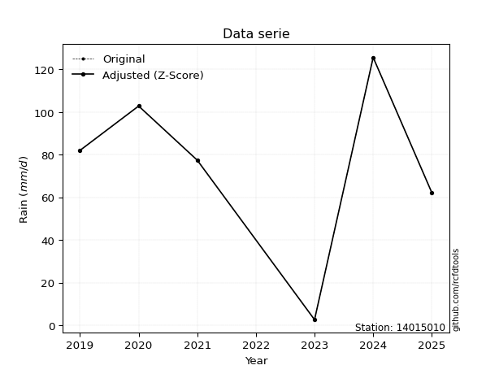</img>

</div>

> If Z-Score is active, values out of range or outliers are replaced with the station mean value.


### 4. Active continuous probability distributions from SciPy (45 of 104 available)

[scipy.stats](https://docs.scipy.org/doc/scipy/reference/stats.html) is a Python´s powerful submodule within the SciPy library for comprehensive statistical analysis, offering over 130 probability distributions (like Normal, Poisson), functions for descriptive stats (mean, variance), hypothesis testing (t-tests, chi-square), random variable generation, and statistical tests, making it essential for data science, modeling, and research. It provides tools to explore, model, and draw conclusions from data efficiently, working seamlessly with NumPy.

<div align="center">

|   id | p_dist             |   n_parameter | fit_method   | label                                                                       | active   | ref                                                                                                        |
|-----:|:-------------------|--------------:|:-------------|:----------------------------------------------------------------------------|:---------|:-----------------------------------------------------------------------------------------------------------|
|    0 | alpha              |             3 | MLE          | Alpha                                                                       | True     | [:mortar_board:](https://docs.scipy.org/doc/scipy/reference/generated/scipy.stats.alpha.html)              |
|    1 | betaprime          |             4 | MLE          | Beta prime                                                                  | True     | [:mortar_board:](https://docs.scipy.org/doc/scipy/reference/generated/scipy.stats.betaprime.html)          |
|    2 | chi2               |             3 | MLE          | Chi²                                                                        | True     | [:mortar_board:](https://docs.scipy.org/doc/scipy/reference/generated/scipy.stats.chi2.html)               |
|    3 | crystalball        |             4 | MLE          | Crystalball                                                                 | True     | [:mortar_board:](https://docs.scipy.org/doc/scipy/reference/generated/scipy.stats.crystalball.html)        |
|    4 | erlang             |             3 | MLE          | Erlang                                                                      | True     | [:mortar_board:](https://docs.scipy.org/doc/scipy/reference/generated/scipy.stats.erlang.html)             |
|    5 | expon              |             2 | MLE          | Exponential                                                                 | True     | [:mortar_board:](https://docs.scipy.org/doc/scipy/reference/generated/scipy.stats.expon.html)              |
|    6 | exponnorm          |             3 | MLE          | Exponentially modified Normal                                               | True     | [:mortar_board:](https://docs.scipy.org/doc/scipy/reference/generated/scipy.stats.exponnorm.html)          |
|    7 | f                  |             4 | MLE          | F                                                                           | True     | [:mortar_board:](https://docs.scipy.org/doc/scipy/reference/generated/scipy.stats.f.html)                  |
|    8 | fatiguelife        |             3 | MLE          | Fatigue-life (Birnbaum-Saunders)                                            | True     | [:mortar_board:](https://docs.scipy.org/doc/scipy/reference/generated/scipy.stats.fatiguelife.html)        |
|    9 | fisk               |             3 | MLE          | Fisk                                                                        | True     | [:mortar_board:](https://docs.scipy.org/doc/scipy/reference/generated/scipy.stats.fisk.html)               |
|   10 | gamma              |             3 | MLE          | Gamma                                                                       | True     | [:mortar_board:](https://docs.scipy.org/doc/scipy/reference/generated/scipy.stats.gamma.html)              |
|   11 | genexpon           |             5 | MLE          | Generalized exponential                                                     | True     | [:mortar_board:](https://docs.scipy.org/doc/scipy/reference/generated/scipy.stats.genexpon.html)           |
|   12 | genlogistic        |             3 | MLE          | Generalized logistic                                                        | True     | [:mortar_board:](https://docs.scipy.org/doc/scipy/reference/generated/scipy.stats.genlogistic.html)        |
|   13 | gibrat             |             2 | MM           | Gibrat                                                                      | True     | [:mortar_board:](https://docs.scipy.org/doc/scipy/reference/generated/scipy.stats.gibrat.html)             |
|   14 | gompertz           |             3 | MLE          | Gompertz (or truncated Gumbel)                                              | True     | [:mortar_board:](https://docs.scipy.org/doc/scipy/reference/generated/scipy.stats.gompertz.html)           |
|   15 | gumbel_l           |             2 | MM           | Gumbel Left Skew                                                            | True     | [:mortar_board:](https://docs.scipy.org/doc/scipy/reference/generated/scipy.stats.gumbel_l.html)           |
|   16 | gumbel_r           |             2 | MM           | Gumbel Right Skew                                                           | True     | [:mortar_board:](https://docs.scipy.org/doc/scipy/reference/generated/scipy.stats.gumbel_r.html)           |
|   17 | halflogistic       |             2 | MM           | Half-logistic                                                               | True     | [:mortar_board:](https://docs.scipy.org/doc/scipy/reference/generated/scipy.stats.halflogistic.html)       |
|   18 | halfnorm           |             2 | MM           | Half Normal                                                                 | True     | [:mortar_board:](https://docs.scipy.org/doc/scipy/reference/generated/scipy.stats.halfnorm.html)           |
|   19 | hypsecant          |             2 | MM           | hyperbolic secant                                                           | True     | [:mortar_board:](https://docs.scipy.org/doc/scipy/reference/generated/scipy.stats.hypsecant.html)          |
|   20 | invgamma           |             3 | MLE          | Inverted gamma                                                              | True     | [:mortar_board:](https://docs.scipy.org/doc/scipy/reference/generated/scipy.stats.invgamma.html)           |
|   21 | invgauss           |             3 | MLE          | Inverse Gaussian                                                            | True     | [:mortar_board:](https://docs.scipy.org/doc/scipy/reference/generated/scipy.stats.invgauss.html)           |
|   22 | invweibull         |             3 | MLE          | Inverted Weibull                                                            | True     | [:mortar_board:](https://docs.scipy.org/doc/scipy/reference/generated/scipy.stats.invweibull.html)         |
|   23 | johnsonsu          |             4 | MLE          | Johnson Su                                                                  | True     | [:mortar_board:](https://docs.scipy.org/doc/scipy/reference/generated/scipy.stats.johnsonsu.html)          |
|   24 | kstwobign          |             2 | MLE          | Limiting distribution of scaled Kolmogorov-Smirnov two-sided test statistic | True     | [:mortar_board:](https://docs.scipy.org/doc/scipy/reference/generated/scipy.stats.kstwobign.html)          |
|   25 | laplace            |             2 | MM           | Laplace                                                                     | True     | [:mortar_board:](https://docs.scipy.org/doc/scipy/reference/generated/scipy.stats.laplace.html)            |
|   26 | laplace_asymmetric |             3 | MLE          | Asymmetric Laplace                                                          | True     | [:mortar_board:](https://docs.scipy.org/doc/scipy/reference/generated/scipy.stats.laplace_asymmetric.html) |
|   27 | loggamma           |             3 | MLE          | Log gamma                                                                   | True     | [:mortar_board:](https://docs.scipy.org/doc/scipy/reference/generated/scipy.stats.loggamma.html)           |
|   28 | logistic           |             2 | MM           | Logistic (or Sech-squared)                                                  | True     | [:mortar_board:](https://docs.scipy.org/doc/scipy/reference/generated/scipy.stats.logistic.html)           |
|   29 | lognorm            |             3 | MLE          | Log Normal                                                                  | True     | [:mortar_board:](https://docs.scipy.org/doc/scipy/reference/generated/scipy.stats.lognorm.html)            |
|   30 | maxwell            |             2 | MM           | Maxwell                                                                     | True     | [:mortar_board:](https://docs.scipy.org/doc/scipy/reference/generated/scipy.stats.maxwell.html)            |
|   31 | mielke             |             4 | MLE          | Mielke Beta-Kappa / Dagum                                                   | True     | [:mortar_board:](https://docs.scipy.org/doc/scipy/reference/generated/scipy.stats.mielke.html)             |
|   32 | moyal              |             2 | MM           | Moyal                                                                       | True     | [:mortar_board:](https://docs.scipy.org/doc/scipy/reference/generated/scipy.stats.moyal.html)              |
|   33 | nakagami           |             3 | MLE          | Nakagami                                                                    | True     | [:mortar_board:](https://docs.scipy.org/doc/scipy/reference/generated/scipy.stats.nakagami.html)           |
|   34 | ncf                |             5 | MLE          | Non-central F distribution                                                  | True     | [:mortar_board:](https://docs.scipy.org/doc/scipy/reference/generated/scipy.stats.ncf.html)                |
|   35 | nct                |             4 | MLE          | Non-central Student’s t                                                     | True     | [:mortar_board:](https://docs.scipy.org/doc/scipy/reference/generated/scipy.stats.nct.html)                |
|   36 | norm               |             2 | MM           | Normal                                                                      | True     | [:mortar_board:](https://docs.scipy.org/doc/scipy/reference/generated/scipy.stats.norm.html)               |
|   37 | pareto             |             3 | MLE          | Pareto                                                                      | True     | [:mortar_board:](https://docs.scipy.org/doc/scipy/reference/generated/scipy.stats.pareto.html)             |
|   38 | pearson3           |             3 | MM           | Pearson type III                                                            | True     | [:mortar_board:](https://docs.scipy.org/doc/scipy/reference/generated/scipy.stats.pearson3.html)           |
|   39 | rayleigh           |             2 | MM           | Rayleigh                                                                    | True     | [:mortar_board:](https://docs.scipy.org/doc/scipy/reference/generated/scipy.stats.rayleigh.html)           |
|   40 | rice               |             3 | MLE          | Rice                                                                        | True     | [:mortar_board:](https://docs.scipy.org/doc/scipy/reference/generated/scipy.stats.rice.html)               |
|   41 | t                  |             3 | MLE          | Student’s t                                                                 | True     | [:mortar_board:](https://docs.scipy.org/doc/scipy/reference/generated/scipy.stats.t.html)                  |
|   42 | truncnorm          |             4 | MLE          | Truncated normal                                                            | True     | [:mortar_board:](https://docs.scipy.org/doc/scipy/reference/generated/scipy.stats.truncnorm.html)          |
|   43 | wald               |             2 | MM           | Wald                                                                        | True     | [:mortar_board:](https://docs.scipy.org/doc/scipy/reference/generated/scipy.stats.wald.html)               |
|   44 | weibull_min        |             3 | MLE          | Weibull minimum                                                             | True     | [:mortar_board:](https://docs.scipy.org/doc/scipy/reference/generated/scipy.stats.weibull_min.html)        |

</div>

> **n_parameter:** # arguments & localization & scale.
>
> **Fit methods:** (MLE) maximum likelihood, (MM) L-moments.
>
>**Inactive:** foldnorm, gennorm, norminvgauss, powernorm, powerlognorm, skewnorm, genextreme, anglit, arcsine, argus, beta, bradford, burr, burr12, cauchy, cosine, halfcauchy, foldcauchy, skewcauchy, wrapcauchy, dgamma, gengamma, exponweib, exponpow, truncexpon, gausshyper, genhalflogistic, genhyperbolic, geninvgauss, halfgennorm, johnsonsb, kappa4, kappa3, ksone, kstwo, loglaplace, levy, levy_l, levy_stable, ncx2, genpareto, truncpareto, lomax, powerlaw, rdist, rel_breitwigner, recipinvgauss, semicircular, studentized_range, trapezoid, triang, truncweibull_min, tukeylambda, uniform, loguniform, vonmises, vonmises_line, weibull_max, dweibull, 


## B. Probability distributions vs. Empirical distributions

A continuous probability distribution (CPD) describes probabilities for variables that can take any value within a range (like rain any time), unlike discrete variables with specific outcomes (like temperature). It uses a Probability Density Function (PDF), a curve where the total area under it equals 1, and the probability of the variable falling within an interval (a to b) is found by calculating the area under the curve between those points. A key feature is that the probability of hitting any single exact value is zero, so probabilities are always expressed for ranges, e.g., $P(a ≤ X ≤ b)$.

<div align="center">

Distributions parameters
|    |   station | p_dist                |   n |               loc |            scale | shape                 | shape1                | shape2                 | shape3   |
|---:|----------:|:----------------------|----:|------------------:|-----------------:|:----------------------|:----------------------|:-----------------------|:---------|
|  0 |  14015010 | alpha                 |   6 |    -131.618       |   1224.03        | 6.368213376961304     |                       |                        |          |
|  1 |  14015010 | betaprime             |   6 |    -683.433       | 209357           | 376.552000038722      | 104105.99603998143    |                        |          |
|  2 |  14015010 | chi2                  |   6 |       2.6         |      3.0335      | 1.2340171038626186    |                       |                        |          |
|  3 |  14015010 | crystalball           |   6 |      74           |     38.9052      | 333.11666433977166    | 14434.980220808224    |                        |          |
|  4 |  14015010 | erlang                |   6 |    -584.379       |      2.37262     | 277.52369783060306    |                       |                        |          |
|  5 |  14015010 | expon                 |   6 |       2.6         |     71.4         |                       |                       |                        |          |
|  6 |  14015010 | exponnorm             |   6 |      73.9715      |     38.9051      | 0.0007310599669660822 |                       |                        |          |
|  7 |  14015010 | f                     |   6 |   -7540.61        |   7614.65        | 80250.12163620292     | 1294967.7965871622    |                        |          |
|  8 |  14015010 | fatiguelife           |   6 |       2.6         |      7.55296e-06 | 2848.542788142944     |                       |                        |          |
|  9 |  14015010 | fisk                  |   6 |      -2.10478e+09 |      2.10478e+09 | 94470904.4958303      |                       |                        |          |
| 10 |  14015010 | gamma                 |   6 |    -565.976       |      2.43501     | 262.90462301371815    |                       |                        |          |
| 11 |  14015010 | genexpon              |   6 |       2.59998     |      2.41649     | 0.033476247695246555  | 3.276390527486211e-07 | 2.5304034432292672     |          |
| 12 |  14015010 | genlogistic           |   6 |     104.92        |     12.9052      | 0.35163386551577414   |                       |                        |          |
| 13 |  14015010 | gibrat                |   6 |      44.3203      |     18.0017      |                       |                       |                        |          |
| 14 |  14015010 | gompertz              |   6 |      53.6         |     10.5021      | 0.004548033078528014  |                       |                        |          |
| 15 |  14015010 | gumbel_l              |   6 |      91.5094      |     30.3342      |                       |                       |                        |          |
| 16 |  14015010 | gumbel_r              |   6 |      56.4906      |     30.3342      |                       |                       |                        |          |
| 17 |  14015010 | halflogistic          |   6 |      27.8883      |     33.2625      |                       |                       |                        |          |
| 18 |  14015010 | halfnorm              |   6 |      22.5048      |     64.5397      |                       |                       |                        |          |
| 19 |  14015010 | hypsecant             |   6 |      74           |     24.7678      |                       |                       |                        |          |
| 20 |  14015010 | invgamma              |   6 |    -393.016       |  59064.3         | 127.7239924685785     |                       |                        |          |
| 21 |  14015010 | invgauss              |   6 |    -138.693       |   5267.73        | 0.04009067890424662   |                       |                        |          |
| 22 |  14015010 | invweibull            |   6 |       2.6         |      5.31764     | 0.04230205989834977   |                       |                        |          |
| 23 |  14015010 | johnsonsu             |   6 |     174.43        |      5.26611     | 9.090471152446092     | 2.549269678563819     |                        |          |
| 24 |  14015010 | kstwobign             |   6 |     -90.7498      |    188.197       |                       |                       |                        |          |
| 25 |  14015010 | laplace               |   6 |      74           |     27.5101      |                       |                       |                        |          |
| 26 |  14015010 | laplace_asymmetric    |   6 |      82           |     28.6352      | 1.149400991664161     |                       |                        |          |
| 27 |  14015010 | loggamma              |   6 |      98.6447      |     28.013       | 0.8384359463368147    |                       |                        |          |
| 28 |  14015010 | logistic              |   6 |      74           |     21.4496      |                       |                       |                        |          |
| 29 |  14015010 | lognorm               |   6 |       2.6         |      0.10879     | 14.819629321871753    |                       |                        |          |
| 30 |  14015010 | maxwell               |   6 |     -18.189       |     57.7709      |                       |                       |                        |          |
| 31 |  14015010 | mielke                |   6 |       2.6         |    124.523       | 0.9048307372587459    | 177.70133429089714    |                        |          |
| 32 |  14015010 | moyal                 |   6 |      51.7515      |     17.5135      |                       |                       |                        |          |
| 33 |  14015010 | nakagami              |   6 |       2.6         |    101.47        | 0.06412855470473902   |                       |                        |          |
| 34 |  14015010 | ncf                   |   6 |      -0.757991    |     15.5924      | 1.4435950908774853    | 999.3203131254131     | 5.622557345898404      |          |
| 35 |  14015010 | nct                   |   6 |      -0.408694    |      0.134226    | 0.3901263691081267    | 54.736188973682204    |                        |          |
| 36 |  14015010 | norm                  |   6 |      74           |     38.9052      |                       |                       |                        |          |
| 37 |  14015010 | pareto                |   6 |       2.37399     |      0.226007    | 0.20345325771103656   |                       |                        |          |
| 38 |  14015010 | pearson3              |   6 |      74           |     38.9052      | -0.596212684709583    |                       |                        |          |
| 39 |  14015010 | rayleigh              |   6 |      -0.427888    |     59.3849      |                       |                       |                        |          |
| 40 |  14015010 | rice                  |   6 |     -23.0597      |     42.3692      | 2.0226147377202732    |                       |                        |          |
| 41 |  14015010 | t                     |   6 |      74.0025      |     38.9028      | 3062522.5050345426    |                       |                        |          |
| 42 |  14015010 | truncnorm             |   6 |    -195.564       |     20.6628      | -19.799311662176592   | 15.543075501198267    |                        |          |
| 43 |  14015010 | wald                  |   6 |      35.0948      |     38.9052      |                       |                       |                        |          |
| 44 |  14015010 | weibull_min           |   6 |   -1264.89        |   1356.7         | 42.909716807396876    |                       |                        |          |
| 45 |  14015010 | logalpha              |   6 |     -42.4466      |   1549.42        | 33.50355824166324     |                       |                        |          |
| 46 |  14015010 | logbetaprime          |   6 |     -20.246       |    588.964       | 306.6134242062409     | 7501.652743261395     |                        |          |
| 47 |  14015010 | logchi2               |   6 |     -16.0721      |      0.0488968   | 407.26907879626833    |                       |                        |          |
| 48 |  14015010 | logcrystalball        |   6 |       3.85978     |      1.32495     | 78.72196239426492     | 13108.718825933911    |                        |          |
| 49 |  14015010 | logerlang             |   6 |     -18.0067      |      0.0881595   | 247.93261865583986    |                       |                        |          |
| 50 |  14015010 | logexpon              |   6 |       0.955511    |      2.90426     |                       |                       |                        |          |
| 51 |  14015010 | logexponnorm          |   6 |       3.85904     |      1.32495     | 0.0005606290136253518 |                       |                        |          |
| 52 |  14015010 | logf                  |   6 |    -722.655       |    726.509       | 611118.8750116727     | 24369045.301421404    |                        |          |
| 53 |  14015010 | logfatiguelife        |   6 |   -1435.95        |   1439.8         | 0.0009207225057015617 |                       |                        |          |
| 54 |  14015010 | logfisk               |   6 | -513972           | 513976           | 821189.3861500481     |                       |                        |          |
| 55 |  14015010 | loggamma              |   6 |     -20.1597      |      0.078845    | 304.41251787569496    |                       |                        |          |
| 56 |  14015010 | loggenexpon           |   6 |       0.862784    |      0.0172042   | 0.0016408724581351403 | 3.3884564535962873    | 1.1551254691072152e-05 |          |
| 57 |  14015010 | loggenlogistic        |   6 |       4.86116     |      6.42974e-06 | 6.418106741243996e-06 |                       |                        |          |
| 58 |  14015010 | loggibrat             |   6 |       2.84903     |      0.613054    |                       |                       |                        |          |
| 59 |  14015010 | loggompertz           |   6 |       0.955511    |      0.71324     | 0.00844703259194153   |                       |                        |          |
| 60 |  14015010 | loggumbel_l           |   6 |       4.45607     |      1.03306     |                       |                       |                        |          |
| 61 |  14015010 | loggumbel_r           |   6 |       3.26348     |      1.03306     |                       |                       |                        |          |
| 62 |  14015010 | loghalflogistic       |   6 |       2.2894      |      1.13279     |                       |                       |                        |          |
| 63 |  14015010 | loghalfnorm           |   6 |       2.10602     |      2.198       |                       |                       |                        |          |
| 64 |  14015010 | loghypsecant          |   6 |       3.85978     |      0.84349     |                       |                       |                        |          |
| 65 |  14015010 | loginvgamma           |   6 |     -25.5667      |  12564.5         | 428.3248515965713     |                       |                        |          |
| 66 |  14015010 | loginvgauss           |   6 |     -10.855       |   1424.79        | 0.010303945832880218  |                       |                        |          |
| 67 |  14015010 | loginvweibull         |   6 |      -2.34499e+08 |      2.34499e+08 | 142718348.91784775    |                       |                        |          |
| 68 |  14015010 | logjohnsonsu          |   6 |       4.8331      |      5.399e-13   | 4.9481597143603775    | 0.19738382507644137   |                        |          |
| 69 |  14015010 | logkstwobign          |   6 |      -2.67994     |      7.46883     |                       |                       |                        |          |
| 70 |  14015010 | loglaplace            |   6 |       3.85978     |      0.936881    |                       |                       |                        |          |
| 71 |  14015010 | loglaplace_asymmetric |   6 |       4.83346     |      0.00783317  | 124.09062830682873    |                       |                        |          |
| 72 |  14015010 | logloggamma           |   6 |       4.83318     |      7.16243e-06 | 7.330725073849496e-06 |                       |                        |          |
| 73 |  14015010 | loglogistic           |   6 |       3.85978     |      0.730483    |                       |                       |                        |          |
| 74 |  14015010 | loglognorm            |   6 |       0.955511    |      0.00618726  | 14.155203467074347    |                       |                        |          |
| 75 |  14015010 | logmaxwell            |   6 |       0.720199    |      1.96744     |                       |                       |                        |          |
| 76 |  14015010 | logmielke             |   6 |      -9.93954e+07 |      9.93954e+07 | 119686872.94818962    | 20201942682783.54     |                        |          |
| 77 |  14015010 | logmoyal              |   6 |       3.10208     |      0.596437    |                       |                       |                        |          |
| 78 |  14015010 | lognakagami           |   6 |       3.98155     |      0.443172    | 0.32477950428308155   |                       |                        |          |
| 79 |  14015010 | logncf                |   6 |     -13.7051      |     11.069       | 283.96372881443244    | 2419.0941956710976    | 165.7607676072543      |          |
| 80 |  14015010 | lognct                |   6 |     -78.231       |      1.28563     | 28183.635745316784    | 63.84993160723804     |                        |          |
| 81 |  14015010 | lognorm               |   6 |       3.85978     |      1.32495     |                       |                       |                        |          |
| 82 |  14015010 | logpareto             |   6 |       0.945996    |      0.00951545  | 0.20329928737915462   |                       |                        |          |
| 83 |  14015010 | logpearson3           |   6 |       3.85977     |      1.32496     | -1.6359042631688867   |                       |                        |          |
| 84 |  14015010 | lograyleigh           |   6 |       1.32504     |      2.02242     |                       |                       |                        |          |
| 85 |  14015010 | logrice               |   6 |    -609.708       |      1.325       | 463.06743443333653    |                       |                        |          |
| 86 |  14015010 | logt                  |   6 |       4.43585     |      0.235925    | 0.916743132593044     |                       |                        |          |
| 87 |  14015010 | logtruncnorm          |   6 |       0.151719    |      4.51059     | 0.14475477728849218   | 1.0378639056032548    |                        |          |
| 88 |  14015010 | logwald               |   6 |       2.53485     |      1.32492     |                       |                       |                        |          |
| 89 |  14015010 | logweibull_min        |   6 |       0.955511    |      1.41177     | 0.6199944036319613    |                       |                        |          |

</div>

> **loc** (Location parameter): This shifts the distribution along the x-axis. For many common distributions, like the normal (Gaussian) distribution, loc represents the mean $μ$. For others, like the uniform distribution, it might represent the minimum value, or for the beta distribution, the left end of the support interval.
>
> **scale** (Scale parameter): This determines the width or spread of the distribution. For the normal distribution, scale represents the standard deviation $σ$. For a uniform distribution, it defines the length of the interval (from $loc$ to $loc + scale$).
>
> **shape** (Shape parameters): Refers to parameters that define the specific form of a probability distribution, distinct from its location (loc) and scale (scale). These parameters are required arguments for most distribution functions. For example, a normal (Gaussian) distribution is fully defined by its location (mean) and scale (standard deviation), so it has no specific shape parameters beyond loc and scale. However, other distributions have intrinsic properties that need specification, as Gamma distribution that takes a shape parameter, often named $a$ or $alpha$.


### 0. Cumulative distribution values - CDF (90 evaluated)

> Ordered by x ascending and calculating $log(f(x))$ separately. 

|   id |   Station |   date |     x |   count |   mean |     std |     zscore |   Value_initial |   station |   m |      alpha |   alpha_pdf |   betaprime |   betaprime_pdf |        chi2 |         chi2_pdf |   crystalball |   crystalball_pdf |    erlang |   erlang_pdf |    expon |   expon_pdf |   exponnorm |   exponnorm_pdf |         f |      f_pdf |   fatiguelife |   fatiguelife_pdf |      fisk |   fisk_pdf |     gamma |   gamma_pdf |   genexpon |   genexpon_pdf |   genlogistic |   genlogistic_pdf |   gibrat |   gibrat_pdf |   gompertz |   gompertz_pdf |   gumbel_l |   gumbel_l_pdf |   gumbel_r |   gumbel_r_pdf |   halflogistic |   halflogistic_pdf |   halfnorm |   halfnorm_pdf |   hypsecant |   hypsecant_pdf |   invgamma |   invgamma_pdf |   invgauss |   invgauss_pdf |   invweibull |   invweibull_pdf |   johnsonsu |   johnsonsu_pdf |   kstwobign |   kstwobign_pdf |   laplace |   laplace_pdf |   laplace_asymmetric |   laplace_asymmetric_pdf |   loggamma |   loggamma_pdf |   logistic |   logistic_pdf |   lognorm |   lognorm_pdf |   maxwell |   maxwell_pdf |      mielke |   mielke_pdf |       moyal |   moyal_pdf |   nakagami |   nakagami_pdf |       ncf |    ncf_pdf |       nct |     nct_pdf |      norm |   norm_pdf |   pareto |   pareto_pdf |   pearson3 |   pearson3_pdf |   rayleigh |   rayleigh_pdf |      rice |   rice_pdf |         t |      t_pdf |   truncnorm |   truncnorm_pdf |     wald |   wald_pdf |   weibull_min |   weibull_min_pdf |   logalpha |   logalpha_pdf |   logbetaprime |   logbetaprime_pdf |   logchi2 |   logchi2_pdf |   logcrystalball |   logcrystalball_pdf |   logerlang |   logerlang_pdf |   logexpon |   logexpon_pdf |   logexponnorm |   logexponnorm_pdf |      logf |   logf_pdf |   logfatiguelife |   logfatiguelife_pdf |    logfisk |   logfisk_pdf |   loggenexpon |   loggenexpon_pdf |   loggenlogistic |   loggenlogistic_pdf |   loggibrat |   loggibrat_pdf |   loggompertz |   loggompertz_pdf |   loggumbel_l |   loggumbel_l_pdf |   loggumbel_r |   loggumbel_r_pdf |   loghalflogistic |   loghalflogistic_pdf |   loghalfnorm |   loghalfnorm_pdf |   loghypsecant |   loghypsecant_pdf |   loginvgamma |   loginvgamma_pdf |   loginvgauss |   loginvgauss_pdf |   loginvweibull |   loginvweibull_pdf |   logjohnsonsu |   logjohnsonsu_pdf |   logkstwobign |   logkstwobign_pdf |   loglaplace |   loglaplace_pdf |   loglaplace_asymmetric |   loglaplace_asymmetric_pdf |   logloggamma |   logloggamma_pdf |   loglogistic |   loglogistic_pdf |   loglognorm |   loglognorm_pdf |   logmaxwell |   logmaxwell_pdf |   logmielke |   logmielke_pdf |    logmoyal |   logmoyal_pdf |   lognakagami |   lognakagami_pdf |    logncf |   logncf_pdf |    lognct |   lognct_pdf |   logpareto |   logpareto_pdf |   logpearson3 |   logpearson3_pdf |   lograyleigh |   lograyleigh_pdf |   logrice |   logrice_pdf |     logt |   logt_pdf |   logtruncnorm |   logtruncnorm_pdf |   logwald |   logwald_pdf |   logweibull_min |   logweibull_min_pdf |
|-----:|----------:|-------:|------:|--------:|-------:|--------:|-----------:|----------------:|----------:|----:|-----------:|------------:|------------:|----------------:|------------:|-----------------:|--------------:|------------------:|----------:|-------------:|---------:|------------:|------------:|----------------:|----------:|-----------:|--------------:|------------------:|----------:|-----------:|----------:|------------:|-----------:|---------------:|--------------:|------------------:|---------:|-------------:|-----------:|---------------:|-----------:|---------------:|-----------:|---------------:|---------------:|-------------------:|-----------:|---------------:|------------:|----------------:|-----------:|---------------:|-----------:|---------------:|-------------:|-----------------:|------------:|----------------:|------------:|----------------:|----------:|--------------:|---------------------:|-------------------------:|-----------:|---------------:|-----------:|---------------:|----------:|--------------:|----------:|--------------:|------------:|-------------:|------------:|------------:|-----------:|---------------:|----------:|-----------:|----------:|------------:|----------:|-----------:|---------:|-------------:|-----------:|---------------:|-----------:|---------------:|----------:|-----------:|----------:|-----------:|------------:|----------------:|---------:|-----------:|--------------:|------------------:|-----------:|---------------:|---------------:|-------------------:|----------:|--------------:|-----------------:|---------------------:|------------:|----------------:|-----------:|---------------:|---------------:|-------------------:|----------:|-----------:|-----------------:|---------------------:|-----------:|--------------:|--------------:|------------------:|-----------------:|---------------------:|------------:|----------------:|--------------:|------------------:|--------------:|------------------:|--------------:|------------------:|------------------:|----------------------:|--------------:|------------------:|---------------:|-------------------:|--------------:|------------------:|--------------:|------------------:|----------------:|--------------------:|---------------:|-------------------:|---------------:|-------------------:|-------------:|-----------------:|------------------------:|----------------------------:|--------------:|------------------:|--------------:|------------------:|-------------:|-----------------:|-------------:|-----------------:|------------:|----------------:|------------:|---------------:|--------------:|------------------:|----------:|-------------:|----------:|-------------:|------------:|----------------:|--------------:|------------------:|--------------:|------------------:|----------:|--------------:|---------:|-----------:|---------------:|-------------------:|----------:|--------------:|-----------------:|---------------------:|
|    0 |  14015010 |   2023 |   2.6 |       6 |     74 | 42.6185 | -1.67533   |             2.6 |  14015010 |   1 | 0.00296575 | 0.000615266 |   0.0310911 |      0.00191557 | 1.23643e-10 | 171787           |     0.0332357 |        0.00190342 | 0.0315718 |   0.0019393  | 0        |  0.0140056  |   0.0332356 |      0.00190342 | 0.0337511 | 0.00192723 |     0.0572012 |       2.42501e+11 | 0.0338063 | 0.00146606 | 0.0310831 |  0.00192132 | 3.1489e-07 |     0.0138532  |     0.0615397 |        0.00167619 | 0        |   0          | 0          |     0          |  0.0519463 |     0.0016672  | 0.00271357 |    0.000528637 |       0        |         0          |   0        |     0          |   0.0356003 |      0.00143437 |  0.0328859 |     0.00221008 |   0.026683 |     0.00223761 |   0.00833012 |      3.79914e+12 |   0.0591565 |      0.00174699 |   0.0335671 |      0.00324653 | 0.0373077 |    0.00135614 |            0.0509982 |               0.00154947 |   0.015029 |      0.0300449 |  0.0345983 |     0.0015572  | 0.0141905 |      0.02725  | 0.0119229 |    0.00167633 | 2.91827e-08 |   0.0450637  | 4.73388e-05 | 2.35929e-05 | 0.00514933 |    1.48717e+12 | 0.0203983 | 0.00533367 | 0.0398985 | 0.0453945   | 0.0332357 | 0.00190342 | 0        |  0.900206    |  0.0470447 |     0.0018928  | 0.00129902 |     0.00085748 | 0.0258578 | 0.00217238 | 0.0332226 | 0.00190292 |           1 |     2.05878e-22 | 0        | 0          |     0.0525798 |        0.0017324  |  0.0140603 |      0.0294622 |      0.0170113 |          0.0328464 | 0.0156152 |     0.0311984 |        0.0141905 |             0.02725  |   0.0152188 |       0.0303813 |   0        |      0.344321  |      0.0141906 |          0.0272501 | 0.0145979 |  0.0278782 |        0.0142314 |            0.0273582 | 0.00578643 |    0.00919164 |    0.00936842 |          0.10663  |                0 |             0.020234 |    0        |        0        |   5.31144e-09 |         0.0118432 |     0.0331945 |         0.0315929 |   8.80029e-05 |       0.000795485 |          0        |              0        |      0        |          0        |      0.0203418 |          0.0240999 |     0.0162958 |         0.0328197 |      0.017878 |         0.0369786 |       0.0240102 |           0.0544953 |       0.151099 |          0.0119265 |      0.0282073 |          0.0730445 |    0.0225262 |        0.0240439 |               0.0185065 |                   0.0190392 |     0.0188965 |         0.0193405 |     0.0184185 |         0.0247497 |    0.0126747 |      2.08391e+13 |  0.000453091 |       0.00575996 |  0.00937925 |        0.011294 | 1.47937e-09 |    4.65226e-08 |   0           |          0        | 0.0190202 |    0.0361002 | 0.0144544 |    0.0276806 |    0        |      21.3652    |     0.0389879 |         0.0324816 |      0        |          0        |  0.014195 |     0.0272565 | 0.026597 | 0.00698649 |      0.0449807 |           0.297325 |  0        |      0        |      1.03607e-10 |       578585         |
|    1 |  14015010 |   2025 |  53.6 |       6 |     74 | 42.6185 | -0.478665  |            53.6 |  14015010 |   2 | 0.405008   | 0.0138289   |   0.306933  |      0.00914866 | 0.999935    |      1.12302e-05 |     0.300017  |        0.00893715 | 0.307285  |   0.00907999 | 0.510458 |  0.00685633 |   0.300017  |      0.00893716 | 0.301232  | 0.0089089  |     0.819176  |       0.00235349  | 0.256615  | 0.00856223 | 0.306135  |  0.00908167 | 0.506643   |     0.00683466 |     0.245401  |        0.00656347 | 0.253783 |   0.0345167  | 1.5652e-08 |     0.00043306 |  0.249176  |     0.00709344 | 0.332878   |    0.0120708   |       0.368335 |         0.0129925  |   0.370052 |     0.0110079  |   0.263257  |      0.00945807 |  0.335375  |     0.00932882 |   0.355204 |     0.00973113 |   0.40301    |      0.000303789 |   0.253072  |      0.00674147 |   0.401385  |      0.0088815  | 0.238189  |    0.00865822 |            0.240162  |               0.0072968  |   0.547973 |      0.286767  |  0.27867   |     0.00937143 | 0.536614  |      0.299831 | 0.327888  |    0.00985405 | 0.445876    |   0.00791064 | 0.342827    | 0.0137791   | 0.793245   |    0.00196474  | 0.40992   | 0.00820247 | 0.637148  | 0.00261312  | 0.300017  | 0.00893715 | 0.668264 |  0.00131755  |  0.275044  |     0.00777108 | 0.338907   |     0.0101281  | 0.312337  | 0.00907352 | 0.299983  | 0.00893724 |           1 |     5.13566e-34 | 0.343185 | 0.0234128  |     0.254365  |        0.00712263 |  0.552174  |      0.284302  |      0.550974  |          0.280828  | 0.548976  |     0.282361  |        0.536614  |             0.299831 |   0.545804  |       0.284332  |   0.647227 |      0.121467  |      0.536613  |          0.29983   | 0.538319  |  0.298385  |        0.537454  |            0.299586  | 0.422708   |    0.389885   |    0.609426   |          0.198166 |                0 |             0.414855 |    0.730309 |        0.291788 |   0.43977     |         0.461743  |     0.468313  |         0.325119  |   0.60712     |       0.293275    |          0.633293 |              0.264365 |      0.606501 |          0.252236 |      0.545795  |          0.373474  |     0.553398  |         0.27623   |      0.561449 |         0.262085  |       0.553617  |           0.199225  |       0.231927 |          0.070712  |      0.595997  |          0.188047  |    0.560942  |        0.468637  |               0.416238  |                   0.428219  |     0.418266  |         0.428094  |     0.541579  |         0.339872  |    0.669116  |      0.00846372  |  0.567843    |       0.282062   |  0.358632   |        0.431847 | 0.632351    |    0.285399    |   1.40353e-10 |     205292        | 0.550255  |    0.26971   | 0.53716   |    0.298296  |    0.690274 |       0.0207432 |     0.427459  |         0.306782  |      0.577969 |          0.274101 |  0.536629 |     0.299818  | 0.160951 | 0.281182   |      0.835193  |           0.210659 |  0.702376 |      0.262881 |      0.79897     |            0.0660785 |
|    2 |  14015010 |   2021 |  77.4 |       6 |     74 | 42.6185 |  0.0797776 |            77.4 |  14015010 |   3 | 0.695707   | 0.00980376  |   0.543291  |      0.0101118  | 0.999999    |      1.9187e-07  |     0.53482   |        0.0102151  | 0.541356  |   0.0100044  | 0.649228 |  0.00491277 |   0.53482   |      0.0102151  | 0.53473   | 0.0101421  |     0.865369  |       0.00160037  | 0.50115   | 0.0112209  | 0.540413  |  0.0100181  | 0.645211   |     0.00491502 |     0.454191  |        0.0110639  | 0.728558 |   0.010022   | 0.0385453  |     0.00401495 |  0.46637   |     0.0110485  | 0.605363   |    0.0100167   |       0.631709 |         0.00903333 |   0.604989 |     0.00861024 |   0.543559  |      0.0127316  |  0.56484   |     0.00940177 |   0.584945 |     0.00905534 |   0.408939   |      0.000206799 |   0.457673  |      0.0104071  |   0.5982    |      0.00743854 | 0.558129  |    0.0160621  |            0.494934  |               0.0150375  |   0.649974 |      0.265514  |  0.539545  |     0.0115823  | 0.644022  |      0.281259 | 0.566154  |    0.00961897 | 0.630545    |   0.00762749 | 0.63064     | 0.00975714  | 0.832258   |    0.00138105  | 0.589936  | 0.00679584 | 0.685224  | 0.00157597  | 0.53482   | 0.0102151  | 0.693044 |  0.000832394 |  0.495362  |     0.0104103  | 0.576327   |     0.00935006 | 0.544373  | 0.00988406 | 0.534796  | 0.0102158  |           1 |     2.45714e-40 | 0.700798 | 0.00901152 |     0.468709  |        0.0107415  |  0.652912  |      0.261275  |      0.650825  |          0.259935  | 0.649338  |     0.261158  |        0.644022  |             0.281259 |   0.646999  |       0.263638  |   0.68915  |      0.107032  |      0.644021  |          0.281259  | 0.645146  |  0.279606  |        0.644732  |            0.280814  | 0.568417   |    0.391951   |    0.67873    |          0.178579 |                0 |             0.598665 |    0.814537 |        0.178235 |   0.623024    |         0.520095  |     0.594053  |         0.354263  |   0.704922    |       0.238601    |          0.720689 |              0.212134 |      0.692489 |          0.21567  |      0.675058  |          0.321727  |     0.651312  |         0.254212  |      0.653938 |         0.239342  |       0.623256  |           0.179341  |       0.267285 |          0.134128  |      0.661467  |          0.168095  |    0.703384  |        0.316599  |               0.607451  |                   0.624935  |     0.609226  |         0.623541  |     0.661438  |         0.306561  |    0.672046  |      0.00752036  |  0.66629     |       0.251795   |  0.558217   |        0.672176 | 0.725147    |    0.221074    |   0.651973    |          0.971924 | 0.646126  |    0.249752  | 0.643987  |    0.279697  |    0.697386 |       0.0180786 |     0.552643  |         0.374645  |      0.67301  |          0.241749 |  0.644031 |     0.281245  | 0.389823 | 1.16191    |      0.909899  |           0.195929 |  0.782301 |      0.178805 |      0.821369    |            0.0562136 |
|    3 |  14015010 |   2019 |  82   |       6 |     74 | 42.6185 |  0.187712  |            82   |  14015010 |   4 | 0.738327   | 0.00872943  |   0.589313  |      0.0098759  | 0.999999    |      8.78617e-08 |     0.581459  |        0.0100397  | 0.586894  |   0.00977371 | 0.671114 |  0.00460624 |   0.58146   |      0.0100397  | 0.58103   | 0.00996569 |     0.872487  |       0.0014961   | 0.552572  | 0.0110969  | 0.586016  |  0.00978825 | 0.667115   |     0.00461158 |     0.506866  |        0.011811   | 0.769943 |   0.00805978 | 0.061443   |     0.00607346 |  0.518521  |     0.0116011  | 0.649662   |    0.00923713  |       0.671463 |         0.00825459 |   0.643388 |     0.00808321 |   0.601072  |      0.0122093  |  0.607344  |     0.00906262 |   0.625626 |     0.00862061 |   0.409862   |      0.000194765 |   0.506912  |      0.0109836  |   0.631531  |      0.00705046 | 0.626168  |    0.0135889  |            0.569174  |               0.0172931  |   0.665165 |      0.260685  |  0.592176  |     0.0112591  | 0.660125  |      0.276508 | 0.609547  |    0.00923333 | 0.665531    |   0.00758429 | 0.67328     | 0.00878788  | 0.838434   |    0.00130525  | 0.620428  | 0.00645982 | 0.692189  | 0.0014553   | 0.581459  | 0.0100397  | 0.696738 |  0.000774869 |  0.543757  |     0.0106068  | 0.618373   |     0.00891994 | 0.589371  | 0.00966067 | 0.581439  | 0.0100404  |           1 |     1.26602e-41 | 0.738919 | 0.00761144 |     0.51927   |        0.0112176  |  0.667853  |      0.25627   |      0.665698  |          0.25526   | 0.66428   |     0.256424  |        0.660125  |             0.276508 |   0.662085  |       0.258936  |   0.695269 |      0.104926  |      0.660123  |          0.276507  | 0.661153  |  0.274855  |        0.660809  |            0.276041  | 0.590888   |    0.386231   |    0.688944   |          0.17527  |                0 |             0.634179 |    0.824462 |        0.165808 |   0.653037    |         0.519046  |     0.614552  |         0.355707  |   0.718447    |       0.229961    |          0.732713 |              0.204421 |      0.704773 |          0.209893 |      0.693294  |          0.309906  |     0.665853  |         0.249487  |      0.667625 |         0.234776  |       0.633513  |           0.175999  |       0.275594 |          0.15463   |      0.671078  |          0.164873  |    0.72111   |        0.297679  |               0.644623  |                   0.663177  |     0.646309  |         0.661496  |     0.678904  |         0.298423  |    0.672476  |      0.00739063  |  0.680662    |       0.246074   |  0.598404   |        0.720567 | 0.737642    |    0.211834    |   0.704688    |          0.856167 | 0.660421  |    0.245411  | 0.66      |    0.274975  |    0.698419 |       0.0177163 |     0.574573  |         0.385031  |      0.6868   |          0.235974 |  0.660133 |     0.276494  | 0.461572 | 1.30529    |      0.921143  |           0.193594 |  0.792332 |      0.168811 |      0.824575    |            0.054852  |
|    4 |  14015010 |   2020 | 102.8 |       6 |     74 | 42.6185 |  0.675763  |           102.8 |  14015010 |   5 | 0.874231   | 0.00460499  |   0.773148  |      0.00751566 | 1           |      2.6072e-09  |     0.770429  |        0.00779666 | 0.769209  |   0.00748071 | 0.754231 |  0.00344215 |   0.77043   |      0.00779666 | 0.768706  | 0.00775494 |     0.89949   |       0.00112393  | 0.758533  | 0.00822097 | 0.768634  |  0.00749427 | 0.750453   |     0.00345707 |     0.760484  |        0.0112096  | 0.880645 |   0.00340771 | 0.38611    |     0.0287878  |  0.765648  |     0.0112094  | 0.804717   |    0.00576368  |       0.809669 |         0.00517754 |   0.786545 |     0.0057017  |   0.807114  |      0.00731984 |  0.773056  |     0.00671116 |   0.780167 |     0.00616344 |   0.413458   |      0.000154164 |   0.74725   |      0.0113445  |   0.759249  |      0.0052348  | 0.824486  |    0.00637999 |            0.813057  |               0.00750379 |   0.721701 |      0.238746  |  0.792931  |     0.00765477 | 0.720196  |      0.253978 | 0.777318  |    0.00675905 | 0.821484    |   0.0074182  | 0.815886    | 0.00516205  | 0.862648   |    0.00104113  | 0.738661  | 0.00491622 | 0.718037  | 0.00106493  | 0.770429  | 0.00779666 | 0.710724 |  0.000586044 |  0.758505  |     0.00946116 | 0.779271   |     0.00646108 | 0.770137  | 0.00745029 | 0.770423  | 0.00779726 |           1 |     1.02281e-47 | 0.852232 | 0.00381596 |     0.756764  |        0.0107885  |  0.723338  |      0.233944  |      0.721092  |          0.234121  | 0.719911  |     0.23505   |        0.720196  |             0.253978 |   0.718288  |       0.237563  |   0.718089 |      0.097068  |      0.720195  |          0.253978  | 0.720859  |  0.25241   |        0.720768  |            0.253454  | 0.674548   |    0.350752   |    0.727069   |          0.161928 |                0 |             0.794718 |    0.857245 |        0.126439 |   0.76694     |         0.478676  |     0.69473   |         0.350629  |   0.76669     |       0.197171    |          0.775644 |              0.175838 |      0.749681 |          0.187477 |      0.757795  |          0.260228  |     0.719947  |         0.228478  |      0.718517 |         0.215013  |       0.671797  |           0.162645  |       0.327484 |          0.355747  |      0.706919  |          0.152212  |    0.780902  |        0.233859  |               0.813413  |                   0.836825  |     0.814567  |         0.833706  |     0.74235   |         0.261836  |    0.674093  |      0.00692233  |  0.733615    |       0.222018   |  0.785628   |        0.946013 | 0.781667    |    0.178393    |   0.854742    |          0.493067 | 0.713769  |    0.225963  | 0.719745  |    0.252639  |    0.702274 |       0.0164174 |     0.665935  |         0.421945  |      0.737495 |          0.212287 |  0.720202 |     0.253966  | 0.716415 | 0.771374   |      0.963872  |           0.184422 |  0.826587 |      0.135718 |      0.836408    |            0.0499337 |
|    5 |  14015010 |   2024 | 125.6 |       6 |     74 | 42.6185 |  1.21074   |           125.6 |  14015010 |   6 | 0.946243   | 0.00202118  |   0.905334  |      0.00412565 | 1           |      5.62317e-11 |     0.90763   |        0.00425524 | 0.901615  |   0.00417288 | 0.821415 |  0.00250119 |   0.90763   |      0.00425524 | 0.905653  | 0.00427228 |     0.921712  |       0.000842241 | 0.89734   | 0.00413476 | 0.9013    |  0.004182   | 0.818039   |     0.00252077 |     0.937517  |        0.0042823  | 0.93415  |   0.00157577 | 0.986608   |     0.00550582 |  0.953885  |     0.00467715 | 0.902612   |    0.00304881  |       0.899347 |         0.00287372 |   0.889822 |     0.00345165 |   0.921139  |      0.00315155 |  0.892825  |     0.00387141 |   0.890139 |     0.0035885  |   0.416623   |      0.000125456 |   0.949365  |      0.00540754 |   0.857774  |      0.00347138 | 0.923374  |    0.00278537 |            0.92514   |               0.00300485 |   0.76731  |      0.216244  |  0.917257  |     0.00353839 | 0.768713  |      0.229893 | 0.897496  |    0.00386422 | 0.988388    |   0.00653743 | 0.903342    | 0.00274598  | 0.884001   |    0.000843568 | 0.833033  | 0.00341231 | 0.739146  | 0.000807162 | 0.90763   | 0.00425524 | 0.722519 |  0.000458138 |  0.927042  |     0.00500623 | 0.894802   |     0.00375942 | 0.902574  | 0.00419012 | 0.907633  | 0.00425541 |           1 |     6.69464e-55 | 0.915591 | 0.00198018 |     0.943519  |        0.00500903 |  0.767984  |      0.211497  |      0.765862  |          0.212516  | 0.764847  |     0.213251  |        0.768713  |             0.229893 |   0.763715  |       0.215617  |   0.736878 |      0.0905985 |      0.768711  |          0.229893  | 0.769076  |  0.228493  |        0.769177  |            0.229357  | 0.740559   |    0.306971   |    0.758293   |          0.149789 |                0 |             0.970627 |    0.879893 |        0.100886 |   0.855066    |         0.394203  |     0.763181  |         0.330211  |   0.803447    |       0.170203    |          0.808527 |              0.152846 |      0.785288 |          0.168129 |      0.8055    |          0.216506  |     0.763633  |         0.207392  |      0.759675 |         0.19571   |       0.703181  |           0.150703  |       0.999986 |     966341         |      0.736292  |          0.141081  |    0.823078  |        0.188841  |               0.999566  |                   1.02834   |     0.999925  |         1.0234    |     0.791244  |         0.22612   |    0.675442  |      0.00655359  |  0.775829    |       0.199329   |  0.999939   |        1.20403  | 0.814748    |    0.152477    |   0.929957    |          0.272831 | 0.757089  |    0.206244  | 0.768017  |    0.228809  |    0.705459 |       0.0154048 |     0.752925  |         0.444166  |      0.777847 |          0.190535 |  0.768716 |     0.229882  | 0.821309 | 0.34359    |      1         |           0.176288 |  0.851393 |      0.112811 |      0.846016    |            0.0460632 |

An Empirical Distribution Function (EDF) is a step-function estimate of a true cumulative distribution function (CDF) based on observed sample data, representing the proportion of data points less than or equal to a given value. It is calculated by ordering your data and jumping up by $1/n$ (where $n$ is sample size) at each unique data point, allowing analysis without assuming an underlying population distribution, and it gets closer to the true CDF as the sample size grows.


### 1. Empirical - EDF California (1923)

California´s estimates the true probability distribution of water-related data (like rainfall, streamflow) using observed samples, crucial for risk assessment.

<div align="center">


$P=m/n$


</div>


**1.1. Empirical values**

<div align="center">

|                | 0                   | 1                  | 2              | 3                  | 4                  | 5              |
|:---------------|:--------------------|:-------------------|:---------------|:-------------------|:-------------------|:---------------|
| date           | 2023                | 2025               | 2021           | 2019               | 2020               | 2024           |
| x              | 2.6                 | 53.6               | 77.4           | 82.0               | 102.8              | 125.6          |
| m              | 1                   | 2                  | 3              | 4                  | 5                  | 6              |
| empirical_dist | edf_california      | edf_california     | edf_california | edf_california     | edf_california     | edf_california |
| empirical      | 0.16666666666666666 | 0.3333333333333333 | 0.5            | 0.6666666666666666 | 0.8333333333333334 | 1.0            |
| empirical_tr   | 1.2                 | 1.4999999999999998 | 2.0            | 2.9999999999999996 | 6.000000000000002  | inf            |

</div>


**1.2. Kolmogorov-Smirnov fit test (sorted by Δ)**


<div align="center">

|                | 0                   | 1                   | 2                   | 3                   | 4                  | 5                   | 6                   | 7                   | 8                   | 9                   | 10                 | 11                  | 12                 | 13                  | 14                 | 15                  | 16                  | 17                  | 18                  | 19                 | 20                  | 21                    | 22                  | 23                  | 24                 | 25                | 26                  | 27                  | 28                | 29                  | 30                 | 31                  | 32                  | 33                 | 34                  | 35                | 36                  | 37                 | 38                  | 39                  | 40                 | 41                 | 42                 | 43                 | 44                  | 45                  | 46                  | 47                  | 48                  | 49                 | 50                  | 51                 | 52                  | 53                  | 54                 | 55                 | 56                  | 57                  | 58                 | 59                  | 60                  | 61                  | 62                  | 63                 | 64                 | 65                  | 66                 | 67                  | 68                 | 69                 | 70                 | 71                  | 72                 | 73                  | 74                 | 75                 | 76                  | 77                 | 78                 | 79               | 80                  | 81                | 82                  | 83                 | 84                 | 85                 | 86                 | 87                 | 88                 | 89             |
|:---------------|:--------------------|:--------------------|:--------------------|:--------------------|:-------------------|:--------------------|:--------------------|:--------------------|:--------------------|:--------------------|:-------------------|:--------------------|:-------------------|:--------------------|:-------------------|:--------------------|:--------------------|:--------------------|:--------------------|:-------------------|:--------------------|:----------------------|:--------------------|:--------------------|:-------------------|:------------------|:--------------------|:--------------------|:------------------|:--------------------|:-------------------|:--------------------|:--------------------|:-------------------|:--------------------|:------------------|:--------------------|:-------------------|:--------------------|:--------------------|:-------------------|:-------------------|:-------------------|:-------------------|:--------------------|:--------------------|:--------------------|:--------------------|:--------------------|:-------------------|:--------------------|:-------------------|:--------------------|:--------------------|:-------------------|:-------------------|:--------------------|:--------------------|:-------------------|:--------------------|:--------------------|:--------------------|:--------------------|:-------------------|:-------------------|:--------------------|:-------------------|:--------------------|:-------------------|:-------------------|:-------------------|:--------------------|:-------------------|:--------------------|:-------------------|:-------------------|:--------------------|:-------------------|:-------------------|:-----------------|:--------------------|:------------------|:--------------------|:-------------------|:-------------------|:-------------------|:-------------------|:-------------------|:-------------------|:---------------|
| station        | 14015010            | 14015010            | 14015010            | 14015010            | 14015010           | 14015010            | 14015010            | 14015010            | 14015010            | 14015010            | 14015010           | 14015010            | 14015010           | 14015010            | 14015010           | 14015010            | 14015010            | 14015010            | 14015010            | 14015010           | 14015010            | 14015010              | 14015010            | 14015010            | 14015010           | 14015010          | 14015010            | 14015010            | 14015010          | 14015010            | 14015010           | 14015010            | 14015010            | 14015010           | 14015010            | 14015010          | 14015010            | 14015010           | 14015010            | 14015010            | 14015010           | 14015010           | 14015010           | 14015010           | 14015010            | 14015010            | 14015010            | 14015010            | 14015010            | 14015010           | 14015010            | 14015010           | 14015010            | 14015010            | 14015010           | 14015010           | 14015010            | 14015010            | 14015010           | 14015010            | 14015010            | 14015010            | 14015010            | 14015010           | 14015010           | 14015010            | 14015010           | 14015010            | 14015010           | 14015010           | 14015010           | 14015010            | 14015010           | 14015010            | 14015010           | 14015010           | 14015010            | 14015010           | 14015010           | 14015010         | 14015010            | 14015010          | 14015010            | 14015010           | 14015010           | 14015010           | 14015010           | 14015010           | 14015010           | 14015010       |
| empirical_dist | edf_california      | edf_california      | edf_california      | edf_california      | edf_california     | edf_california      | edf_california      | edf_california      | edf_california      | edf_california      | edf_california     | edf_california      | edf_california     | edf_california      | edf_california     | edf_california      | edf_california      | edf_california      | edf_california      | edf_california     | edf_california      | edf_california        | edf_california      | edf_california      | edf_california     | edf_california    | edf_california      | edf_california      | edf_california    | edf_california      | edf_california     | edf_california      | edf_california      | edf_california     | edf_california      | edf_california    | edf_california      | edf_california     | edf_california      | edf_california      | edf_california     | edf_california     | edf_california     | edf_california     | edf_california      | edf_california      | edf_california      | edf_california      | edf_california      | edf_california     | edf_california      | edf_california     | edf_california      | edf_california      | edf_california     | edf_california     | edf_california      | edf_california      | edf_california     | edf_california      | edf_california      | edf_california      | edf_california      | edf_california     | edf_california     | edf_california      | edf_california     | edf_california      | edf_california     | edf_california     | edf_california     | edf_california      | edf_california     | edf_california      | edf_california     | edf_california     | edf_california      | edf_california     | edf_california     | edf_california   | edf_california      | edf_california    | edf_california      | edf_california     | edf_california     | edf_california     | edf_california     | edf_california     | edf_california     | edf_california |
| p_dist         | laplace_asymmetric  | pearson3            | laplace             | hypsecant           | logistic           | fisk                | f                   | norm                | crystalball         | exponnorm           | t                  | invgamma            | erlang             | betaprime           | gamma              | invgauss            | rice                | kstwobign           | weibull_min         | logloggamma        | gumbel_l            | loglaplace_asymmetric | maxwell             | logmielke           | johnsonsu          | genlogistic       | gumbel_r            | rayleigh            | moyal             | mielke              | loggompertz        | halfnorm            | halflogistic        | ncf                | expon               | genexpon          | alpha               | wald               | logt                | loglogistic         | loghypsecant       | loglaplace         | gibrat             | logfatiguelife     | logf                | logrice             | lognorm             | lognorm             | logcrystalball      | logexponnorm       | lognct              | logalpha           | loggamma            | loggamma            | logbetaprime       | logmaxwell         | logchi2             | logerlang           | loginvgamma        | loggumbel_l         | loginvgauss         | logncf              | lograyleigh         | logpearson3        | logfisk            | logkstwobign        | loghalfnorm        | loggumbel_r         | loggenexpon        | loginvweibull      | logmoyal           | loghalflogistic     | nct                | logexpon            | lognakagami        | pareto             | loglognorm          | logpareto          | logwald            | loggibrat        | nakagami            | logweibull_min    | fatiguelife         | logtruncnorm       | logjohnsonsu       | invweibull         | gompertz           | chi2               | truncnorm          | loggenlogistic |
| delta          | 0.11566849458420247 | 0.12291015394946825 | 0.12935897519380196 | 0.13106632276640423 | 0.1320684036293988 | 0.13286036643811522 | 0.13291559699461697 | 0.13343093268733397 | 0.13343093417154972 | 0.13343102799975864 | 0.1334440630105883 | 0.13378079510414634 | 0.1350949151289802 | 0.13557553745061443 | 0.1355835999589297 | 0.13998361714928323 | 0.14080883922676987 | 0.14222647167317803 | 0.14739707982257066 | 0.1477701507676301 | 0.14814520283147448 | 0.14816014418126158   | 0.15474378779934378 | 0.15728741808157604 | 0.1597550193885069 | 0.159800263058668 | 0.16395309660611104 | 0.16536764650232183 | 0.166619327873611 | 0.16666663748398117 | 0.1666666613552288 | 0.16666666666666666 | 0.16666666666666666 | 0.1669672637774361 | 0.17858527234210142 | 0.181960894432883 | 0.19570666724886554 | 0.2007980218485118 | 0.20509496348728107 | 0.20875578941150952 | 0.2124617973304898 | 0.2276090089907276 | 0.2285575454585469 | 0.2308229177662462 | 0.23092367439124917 | 0.23128435171160355 | 0.23128744679777435 | 0.23128744679777435 | 0.23128744850976823 | 0.2312886730848115 | 0.23198266502066045 | 0.2320155941885741 | 0.23269037349562172 | 0.23269037349562172 | 0.2341380938219022 | 0.2345095533783969 | 0.23515311806392236 | 0.23628531100247208 | 0.2363673544691991 | 0.23681869791425103 | 0.24032545215233847 | 0.24291139202099343 | 0.24463567589839802 | 0.2470751043717575 | 0.2594410151281028 | 0.26370756244092775 | 0.2731678403583145 | 0.27378686222455234 | 0.2760928612934132 | 0.2968188996774188 | 0.2990176711724792 | 0.29995963913410123 | 0.3038144139758782 | 0.31389320004720894 | 0.3333333331929799 | 0.3349305817386265 | 0.33578244879385893 | 0.3569407597369874 | 0.3690430145765678 | 0.39697550949236 | 0.45991176897774416 | 0.465636489058374 | 0.48584254075710026 | 0.5018591742152945 | 0.5058489199082681 | 0.5833765779817399 | 0.6052236217385081 | 0.6666012322077051 | 0.8333333333333334 | 1.0            |
| deltao         | 0.530385761606      | 0.530385761606      | 0.530385761606      | 0.530385761606      | 0.530385761606     | 0.530385761606      | 0.530385761606      | 0.530385761606      | 0.530385761606      | 0.530385761606      | 0.530385761606     | 0.530385761606      | 0.530385761606     | 0.530385761606      | 0.530385761606     | 0.530385761606      | 0.530385761606      | 0.530385761606      | 0.530385761606      | 0.530385761606     | 0.530385761606      | 0.530385761606        | 0.530385761606      | 0.530385761606      | 0.530385761606     | 0.530385761606    | 0.530385761606      | 0.530385761606      | 0.530385761606    | 0.530385761606      | 0.530385761606     | 0.530385761606      | 0.530385761606      | 0.530385761606     | 0.530385761606      | 0.530385761606    | 0.530385761606      | 0.530385761606     | 0.530385761606      | 0.530385761606      | 0.530385761606     | 0.530385761606     | 0.530385761606     | 0.530385761606     | 0.530385761606      | 0.530385761606      | 0.530385761606      | 0.530385761606      | 0.530385761606      | 0.530385761606     | 0.530385761606      | 0.530385761606     | 0.530385761606      | 0.530385761606      | 0.530385761606     | 0.530385761606     | 0.530385761606      | 0.530385761606      | 0.530385761606     | 0.530385761606      | 0.530385761606      | 0.530385761606      | 0.530385761606      | 0.530385761606     | 0.530385761606     | 0.530385761606      | 0.530385761606     | 0.530385761606      | 0.530385761606     | 0.530385761606     | 0.530385761606     | 0.530385761606      | 0.530385761606     | 0.530385761606      | 0.530385761606     | 0.530385761606     | 0.530385761606      | 0.530385761606     | 0.530385761606     | 0.530385761606   | 0.530385761606      | 0.530385761606    | 0.530385761606      | 0.530385761606     | 0.530385761606     | 0.530385761606     | 0.530385761606     | 0.530385761606     | 0.530385761606     | 0.530385761606 |
| eval           | Δo > Δ              | Δo > Δ              | Δo > Δ              | Δo > Δ              | Δo > Δ             | Δo > Δ              | Δo > Δ              | Δo > Δ              | Δo > Δ              | Δo > Δ              | Δo > Δ             | Δo > Δ              | Δo > Δ             | Δo > Δ              | Δo > Δ             | Δo > Δ              | Δo > Δ              | Δo > Δ              | Δo > Δ              | Δo > Δ             | Δo > Δ              | Δo > Δ                | Δo > Δ              | Δo > Δ              | Δo > Δ             | Δo > Δ            | Δo > Δ              | Δo > Δ              | Δo > Δ            | Δo > Δ              | Δo > Δ             | Δo > Δ              | Δo > Δ              | Δo > Δ             | Δo > Δ              | Δo > Δ            | Δo > Δ              | Δo > Δ             | Δo > Δ              | Δo > Δ              | Δo > Δ             | Δo > Δ             | Δo > Δ             | Δo > Δ             | Δo > Δ              | Δo > Δ              | Δo > Δ              | Δo > Δ              | Δo > Δ              | Δo > Δ             | Δo > Δ              | Δo > Δ             | Δo > Δ              | Δo > Δ              | Δo > Δ             | Δo > Δ             | Δo > Δ              | Δo > Δ              | Δo > Δ             | Δo > Δ              | Δo > Δ              | Δo > Δ              | Δo > Δ              | Δo > Δ             | Δo > Δ             | Δo > Δ              | Δo > Δ             | Δo > Δ              | Δo > Δ             | Δo > Δ             | Δo > Δ             | Δo > Δ              | Δo > Δ             | Δo > Δ              | Δo > Δ             | Δo > Δ             | Δo > Δ              | Δo > Δ             | Δo > Δ             | Δo > Δ           | Δo > Δ              | Δo > Δ            | Δo > Δ              | Δo > Δ             | Δo > Δ             | Δo <= Δ            | Δo <= Δ            | Δo <= Δ            | Δo <= Δ            | Δo <= Δ        |
| fit            | 1                   | 1                   | 1                   | 1                   | 1                  | 1                   | 1                   | 1                   | 1                   | 1                   | 1                  | 1                   | 1                  | 1                   | 1                  | 1                   | 1                   | 1                   | 1                   | 1                  | 1                   | 1                     | 1                   | 1                   | 1                  | 1                 | 1                   | 1                   | 1                 | 1                   | 1                  | 1                   | 1                   | 1                  | 1                   | 1                 | 1                   | 1                  | 1                   | 1                   | 1                  | 1                  | 1                  | 1                  | 1                   | 1                   | 1                   | 1                   | 1                   | 1                  | 1                   | 1                  | 1                   | 1                   | 1                  | 1                  | 1                   | 1                   | 1                  | 1                   | 1                   | 1                   | 1                   | 1                  | 1                  | 1                   | 1                  | 1                   | 1                  | 1                  | 1                  | 1                   | 1                  | 1                   | 1                  | 1                  | 1                   | 1                  | 1                  | 1                | 1                   | 1                 | 1                   | 1                  | 1                  | 0                  | 0                  | 0                  | 0                  | 0              |
| n              | 6                   | 6                   | 6                   | 6                   | 6                  | 6                   | 6                   | 6                   | 6                   | 6                   | 6                  | 6                   | 6                  | 6                   | 6                  | 6                   | 6                   | 6                   | 6                   | 6                  | 6                   | 6                     | 6                   | 6                   | 6                  | 6                 | 6                   | 6                   | 6                 | 6                   | 6                  | 6                   | 6                   | 6                  | 6                   | 6                 | 6                   | 6                  | 6                   | 6                   | 6                  | 6                  | 6                  | 6                  | 6                   | 6                   | 6                   | 6                   | 6                   | 6                  | 6                   | 6                  | 6                   | 6                   | 6                  | 6                  | 6                   | 6                   | 6                  | 6                   | 6                   | 6                   | 6                   | 6                  | 6                  | 6                   | 6                  | 6                   | 6                  | 6                  | 6                  | 6                   | 6                  | 6                   | 6                  | 6                  | 6                   | 6                  | 6                  | 6                | 6                   | 6                 | 6                   | 6                  | 6                  | 6                  | 6                  | 6                  | 6                  | 6              |
| best_fit       | 1                   | 0                   | 0                   | 0                   | 0                  | 0                   | 0                   | 0                   | 0                   | 0                   | 0                  | 0                   | 0                  | 0                   | 0                  | 0                   | 0                   | 0                   | 0                   | 0                  | 0                   | 0                     | 0                   | 0                   | 0                  | 0                 | 0                   | 0                   | 0                 | 0                   | 0                  | 0                   | 0                   | 0                  | 0                   | 0                 | 0                   | 0                  | 0                   | 0                   | 0                  | 0                  | 0                  | 0                  | 0                   | 0                   | 0                   | 0                   | 0                   | 0                  | 0                   | 0                  | 0                   | 0                   | 0                  | 0                  | 0                   | 0                   | 0                  | 0                   | 0                   | 0                   | 0                   | 0                  | 0                  | 0                   | 0                  | 0                   | 0                  | 0                  | 0                  | 0                   | 0                  | 0                   | 0                  | 0                  | 0                   | 0                  | 0                  | 0                | 0                   | 0                 | 0                   | 0                  | 0                  | 0                  | 0                  | 0                  | 0                  | 0              |
| best_fit_sort  | 1                   | 2                   | 3                   | 4                   | 5                  | 6                   | 7                   | 8                   | 9                   | 10                  | 11                 | 12                  | 13                 | 14                  | 15                 | 16                  | 17                  | 18                  | 19                  | 20                 | 21                  | 22                    | 23                  | 24                  | 25                 | 26                | 27                  | 28                  | 29                | 30                  | 31                 | 32                  | 33                  | 34                 | 35                  | 36                | 37                  | 38                 | 39                  | 40                  | 41                 | 42                 | 43                 | 44                 | 45                  | 46                  | 47                  | 48                  | 49                  | 50                 | 51                  | 52                 | 53                  | 54                  | 55                 | 56                 | 57                  | 58                  | 59                 | 60                  | 61                  | 62                  | 63                  | 64                 | 65                 | 66                  | 67                 | 68                  | 69                 | 70                 | 71                 | 72                  | 73                 | 74                  | 75                 | 76                 | 77                  | 78                 | 79                 | 80               | 81                  | 82                | 83                  | 84                 | 85                 | 86                 | 87                 | 88                 | 89                 | 90             |

</div>


<div align="center">

</img>

</div>


**1.3. Best fit**

<div align="center">

|   id |   station | empirical_dist   | p_dist             |    delta |   deltao | eval   |   fit |   n |   best_fit |   best_fit_sort |
|-----:|----------:|:-----------------|:-------------------|---------:|---------:|:-------|------:|----:|-----------:|----------------:|
|    0 |  14015010 | edf_california   | laplace_asymmetric | 0.115668 | 0.530386 | Δo > Δ |     1 |   6 |          1 |               1 |

</div>


<div align="center">

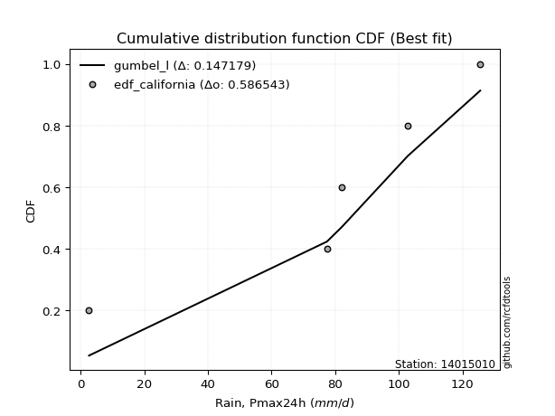</img>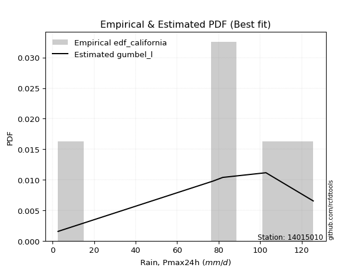</img>

</div>


### 2. Empirical - EDF Hazen (1930)

Hazen method for plotting positions is a formula used to estimate the empirical cumulative probability distribution of flood events or other hydrological data. This formula often results in biased estimations, particularly when extrapolating to extreme events (high return periods).

<div align="center">


$P=(m-0.5)/n$


</div>


**2.1. Empirical values**

<div align="center">

|                | 0                   | 1                  | 2                  | 3                  | 4         | 5                  |
|:---------------|:--------------------|:-------------------|:-------------------|:-------------------|:----------|:-------------------|
| date           | 2023                | 2025               | 2021               | 2019               | 2020      | 2024               |
| x              | 2.6                 | 53.6               | 77.4               | 82.0               | 102.8     | 125.6              |
| m              | 1                   | 2                  | 3                  | 4                  | 5         | 6                  |
| empirical_dist | edf_hazen           | edf_hazen          | edf_hazen          | edf_hazen          | edf_hazen | edf_hazen          |
| empirical      | 0.08333333333333333 | 0.25               | 0.4166666666666667 | 0.5833333333333334 | 0.75      | 0.9166666666666666 |
| empirical_tr   | 1.090909090909091   | 1.3333333333333333 | 1.7142857142857144 | 2.4000000000000004 | 4.0       | 11.999999999999995 |

</div>


**2.2. Kolmogorov-Smirnov fit test (sorted by Δ)**


<div align="center">

|                | 0                  | 1                   | 2                   | 3                   | 4                   | 5                   | 6                  | 7                   | 8                   | 9                  | 10                  | 11                  | 12                  | 13                  | 14                  | 15                  | 16                  | 17                 | 18                  | 19                  | 20                | 21                 | 22                  | 23                  | 24                | 25                 | 26                  | 27                  | 28                  | 29                  | 30                  | 31                    | 32                  | 33                  | 34                  | 35                  | 36                 | 37                  | 38                 | 39                 | 40                  | 41                  | 42                 | 43               | 44                  | 45                 | 46                 | 47                  | 48                 | 49                  | 50                  | 51                 | 52                 | 53                | 54                  | 55                  | 56                 | 57                 | 58                 | 59                 | 60                  | 61                | 62                 | 63                 | 64                 | 65                 | 66                  | 67                 | 68                 | 69                  | 70                 | 71                 | 72                  | 73                  | 74                  | 75                 | 76                  | 77                 | 78                 | 79                 | 80                 | 81                 | 82                 | 83                 | 84                 | 85                 | 86                 | 87                 | 88                 | 89                 |
|:---------------|:-------------------|:--------------------|:--------------------|:--------------------|:--------------------|:--------------------|:-------------------|:--------------------|:--------------------|:-------------------|:--------------------|:--------------------|:--------------------|:--------------------|:--------------------|:--------------------|:--------------------|:-------------------|:--------------------|:--------------------|:------------------|:-------------------|:--------------------|:--------------------|:------------------|:-------------------|:--------------------|:--------------------|:--------------------|:--------------------|:--------------------|:----------------------|:--------------------|:--------------------|:--------------------|:--------------------|:-------------------|:--------------------|:-------------------|:-------------------|:--------------------|:--------------------|:-------------------|:-----------------|:--------------------|:-------------------|:-------------------|:--------------------|:-------------------|:--------------------|:--------------------|:-------------------|:-------------------|:------------------|:--------------------|:--------------------|:-------------------|:-------------------|:-------------------|:-------------------|:--------------------|:------------------|:-------------------|:-------------------|:-------------------|:-------------------|:--------------------|:-------------------|:-------------------|:--------------------|:-------------------|:-------------------|:--------------------|:--------------------|:--------------------|:-------------------|:--------------------|:-------------------|:-------------------|:-------------------|:-------------------|:-------------------|:-------------------|:-------------------|:-------------------|:-------------------|:-------------------|:-------------------|:-------------------|:-------------------|
| station        | 14015010           | 14015010            | 14015010            | 14015010            | 14015010            | 14015010            | 14015010           | 14015010            | 14015010            | 14015010           | 14015010            | 14015010            | 14015010            | 14015010            | 14015010            | 14015010            | 14015010            | 14015010           | 14015010            | 14015010            | 14015010          | 14015010           | 14015010            | 14015010            | 14015010          | 14015010           | 14015010            | 14015010            | 14015010            | 14015010            | 14015010            | 14015010              | 14015010            | 14015010            | 14015010            | 14015010            | 14015010           | 14015010            | 14015010           | 14015010           | 14015010            | 14015010            | 14015010           | 14015010         | 14015010            | 14015010           | 14015010           | 14015010            | 14015010           | 14015010            | 14015010            | 14015010           | 14015010           | 14015010          | 14015010            | 14015010            | 14015010           | 14015010           | 14015010           | 14015010           | 14015010            | 14015010          | 14015010           | 14015010           | 14015010           | 14015010           | 14015010            | 14015010           | 14015010           | 14015010            | 14015010           | 14015010           | 14015010            | 14015010            | 14015010            | 14015010           | 14015010            | 14015010           | 14015010           | 14015010           | 14015010           | 14015010           | 14015010           | 14015010           | 14015010           | 14015010           | 14015010           | 14015010           | 14015010           | 14015010           |
| empirical_dist | edf_hazen          | edf_hazen           | edf_hazen           | edf_hazen           | edf_hazen           | edf_hazen           | edf_hazen          | edf_hazen           | edf_hazen           | edf_hazen          | edf_hazen           | edf_hazen           | edf_hazen           | edf_hazen           | edf_hazen           | edf_hazen           | edf_hazen           | edf_hazen          | edf_hazen           | edf_hazen           | edf_hazen         | edf_hazen          | edf_hazen           | edf_hazen           | edf_hazen         | edf_hazen          | edf_hazen           | edf_hazen           | edf_hazen           | edf_hazen           | edf_hazen           | edf_hazen             | edf_hazen           | edf_hazen           | edf_hazen           | edf_hazen           | edf_hazen          | edf_hazen           | edf_hazen          | edf_hazen          | edf_hazen           | edf_hazen           | edf_hazen          | edf_hazen        | edf_hazen           | edf_hazen          | edf_hazen          | edf_hazen           | edf_hazen          | edf_hazen           | edf_hazen           | edf_hazen          | edf_hazen          | edf_hazen         | edf_hazen           | edf_hazen           | edf_hazen          | edf_hazen          | edf_hazen          | edf_hazen          | edf_hazen           | edf_hazen         | edf_hazen          | edf_hazen          | edf_hazen          | edf_hazen          | edf_hazen           | edf_hazen          | edf_hazen          | edf_hazen           | edf_hazen          | edf_hazen          | edf_hazen           | edf_hazen           | edf_hazen           | edf_hazen          | edf_hazen           | edf_hazen          | edf_hazen          | edf_hazen          | edf_hazen          | edf_hazen          | edf_hazen          | edf_hazen          | edf_hazen          | edf_hazen          | edf_hazen          | edf_hazen          | edf_hazen          | edf_hazen          |
| p_dist         | weibull_min        | gumbel_l            | johnsonsu           | genlogistic         | laplace_asymmetric  | pearson3            | fisk               | f                   | t                   | norm               | crystalball         | exponnorm           | logt                | logistic            | gamma               | erlang              | betaprime           | hypsecant          | rice                | laplace             | logmielke         | invgamma           | maxwell             | rayleigh            | invgauss          | ncf                | logfisk             | logpearson3         | kstwobign           | halfnorm            | gumbel_r            | loglaplace_asymmetric | logloggamma         | loggompertz         | mielke              | moyal               | halflogistic       | loggumbel_l         | lognakagami        | genexpon           | expon               | alpha               | wald               | logexponnorm     | logcrystalball      | lognorm            | lognorm            | logrice             | lognct             | logfatiguelife      | logf                | loglogistic        | loghypsecant       | logerlang         | loggamma            | loggamma            | logchi2            | logncf             | logbetaprime       | logalpha           | loginvgamma         | loginvweibull     | loglaplace         | loginvgauss        | gibrat             | logmaxwell         | lograyleigh         | logkstwobign       | loghalfnorm        | loggumbel_r         | loggenexpon        | logmoyal           | loghalflogistic     | nct                 | logexpon            | pareto             | loglognorm          | logjohnsonsu       | logpareto          | logwald            | loggibrat          | invweibull         | gompertz           | nakagami           | logweibull_min     | fatiguelife        | logtruncnorm       | chi2               | loggenlogistic     | truncnorm          |
| delta          | 0.0640637464892374 | 0.06481186949814122 | 0.07642168605517363 | 0.07646692972533475 | 0.07826770641878855 | 0.07869571755861576 | 0.0844837856801452 | 0.11806343426192517 | 0.11812943406130522 | 0.1181533505735684 | 0.11815335406964139 | 0.11815359437394651 | 0.12176163015394781 | 0.12287843468880938 | 0.12374640531686026 | 0.12468929785762933 | 0.12662440205889852 | 0.1268927153187132 | 0.12770658206638147 | 0.14146267400005247 | 0.141550300836008 | 0.1481734564464105 | 0.14948738787963228 | 0.15966059243782788 | 0.168278637877521 | 0.1732695232465044 | 0.17610768179476943 | 0.17745877502352303 | 0.18153358448405138 | 0.18832257392479196 | 0.18869621570811473 | 0.1907845782307736    | 0.19255926128877016 | 0.20635728676097104 | 0.21387830568709315 | 0.21397338562479068 | 0.2150427305887745 | 0.21831331900024475 | 0.2499999998596466 | 0.2566426658491443 | 0.26045834044304683 | 0.27904000058219885 | 0.2841313551818451 | 0.28661339083701 | 0.28661437747299023 | 0.2866143804484069 | 0.2866143804484069 | 0.28662852477519396 | 0.2871595350484031 | 0.28745446405360486 | 0.28831906502096394 | 0.2915793634672932 | 0.2957951306638231 | 0.295803763580313 | 0.29797289525552206 | 0.29797289525552206 | 0.2989762729810588 | 0.3002545013615363 | 0.3009741083293047 | 0.3021741222458958 | 0.30339810589701277 | 0.303616636365995 | 0.3109423423240609 | 0.3114494955280238 | 0.3118908787918802 | 0.3178428867117302 | 0.32796900923173133 | 0.3459970752861785 | 0.3565011736916478 | 0.35712019555788566 | 0.3594261946267465 | 0.3823510045058125 | 0.38329297246743455 | 0.38714774730921153 | 0.39722653338054226 | 0.4182639150719598 | 0.41911578212719225 | 0.4225155865749347 | 0.4402740930703207 | 0.4523763479099011 | 0.4803088428256933 | 0.5000432446484064 | 0.5218902884051748 | 0.5432451023110775 | 0.5489698223917073 | 0.5691758740904336 | 0.5851925075486278 | 0.7499345655410383 | 0.9166666666666666 | 0.9166666666666666 |
| deltao         | 0.530385761606     | 0.530385761606      | 0.530385761606      | 0.530385761606      | 0.530385761606      | 0.530385761606      | 0.530385761606     | 0.530385761606      | 0.530385761606      | 0.530385761606     | 0.530385761606      | 0.530385761606      | 0.530385761606      | 0.530385761606      | 0.530385761606      | 0.530385761606      | 0.530385761606      | 0.530385761606     | 0.530385761606      | 0.530385761606      | 0.530385761606    | 0.530385761606     | 0.530385761606      | 0.530385761606      | 0.530385761606    | 0.530385761606     | 0.530385761606      | 0.530385761606      | 0.530385761606      | 0.530385761606      | 0.530385761606      | 0.530385761606        | 0.530385761606      | 0.530385761606      | 0.530385761606      | 0.530385761606      | 0.530385761606     | 0.530385761606      | 0.530385761606     | 0.530385761606     | 0.530385761606      | 0.530385761606      | 0.530385761606     | 0.530385761606   | 0.530385761606      | 0.530385761606     | 0.530385761606     | 0.530385761606      | 0.530385761606     | 0.530385761606      | 0.530385761606      | 0.530385761606     | 0.530385761606     | 0.530385761606    | 0.530385761606      | 0.530385761606      | 0.530385761606     | 0.530385761606     | 0.530385761606     | 0.530385761606     | 0.530385761606      | 0.530385761606    | 0.530385761606     | 0.530385761606     | 0.530385761606     | 0.530385761606     | 0.530385761606      | 0.530385761606     | 0.530385761606     | 0.530385761606      | 0.530385761606     | 0.530385761606     | 0.530385761606      | 0.530385761606      | 0.530385761606      | 0.530385761606     | 0.530385761606      | 0.530385761606     | 0.530385761606     | 0.530385761606     | 0.530385761606     | 0.530385761606     | 0.530385761606     | 0.530385761606     | 0.530385761606     | 0.530385761606     | 0.530385761606     | 0.530385761606     | 0.530385761606     | 0.530385761606     |
| eval           | Δo > Δ             | Δo > Δ              | Δo > Δ              | Δo > Δ              | Δo > Δ              | Δo > Δ              | Δo > Δ             | Δo > Δ              | Δo > Δ              | Δo > Δ             | Δo > Δ              | Δo > Δ              | Δo > Δ              | Δo > Δ              | Δo > Δ              | Δo > Δ              | Δo > Δ              | Δo > Δ             | Δo > Δ              | Δo > Δ              | Δo > Δ            | Δo > Δ             | Δo > Δ              | Δo > Δ              | Δo > Δ            | Δo > Δ             | Δo > Δ              | Δo > Δ              | Δo > Δ              | Δo > Δ              | Δo > Δ              | Δo > Δ                | Δo > Δ              | Δo > Δ              | Δo > Δ              | Δo > Δ              | Δo > Δ             | Δo > Δ              | Δo > Δ             | Δo > Δ             | Δo > Δ              | Δo > Δ              | Δo > Δ             | Δo > Δ           | Δo > Δ              | Δo > Δ             | Δo > Δ             | Δo > Δ              | Δo > Δ             | Δo > Δ              | Δo > Δ              | Δo > Δ             | Δo > Δ             | Δo > Δ            | Δo > Δ              | Δo > Δ              | Δo > Δ             | Δo > Δ             | Δo > Δ             | Δo > Δ             | Δo > Δ              | Δo > Δ            | Δo > Δ             | Δo > Δ             | Δo > Δ             | Δo > Δ             | Δo > Δ              | Δo > Δ             | Δo > Δ             | Δo > Δ              | Δo > Δ             | Δo > Δ             | Δo > Δ              | Δo > Δ              | Δo > Δ              | Δo > Δ             | Δo > Δ              | Δo > Δ             | Δo > Δ             | Δo > Δ             | Δo > Δ             | Δo > Δ             | Δo > Δ             | Δo <= Δ            | Δo <= Δ            | Δo <= Δ            | Δo <= Δ            | Δo <= Δ            | Δo <= Δ            | Δo <= Δ            |
| fit            | 1                  | 1                   | 1                   | 1                   | 1                   | 1                   | 1                  | 1                   | 1                   | 1                  | 1                   | 1                   | 1                   | 1                   | 1                   | 1                   | 1                   | 1                  | 1                   | 1                   | 1                 | 1                  | 1                   | 1                   | 1                 | 1                  | 1                   | 1                   | 1                   | 1                   | 1                   | 1                     | 1                   | 1                   | 1                   | 1                   | 1                  | 1                   | 1                  | 1                  | 1                   | 1                   | 1                  | 1                | 1                   | 1                  | 1                  | 1                   | 1                  | 1                   | 1                   | 1                  | 1                  | 1                 | 1                   | 1                   | 1                  | 1                  | 1                  | 1                  | 1                   | 1                 | 1                  | 1                  | 1                  | 1                  | 1                   | 1                  | 1                  | 1                   | 1                  | 1                  | 1                   | 1                   | 1                   | 1                  | 1                   | 1                  | 1                  | 1                  | 1                  | 1                  | 1                  | 0                  | 0                  | 0                  | 0                  | 0                  | 0                  | 0                  |
| n              | 6                  | 6                   | 6                   | 6                   | 6                   | 6                   | 6                  | 6                   | 6                   | 6                  | 6                   | 6                   | 6                   | 6                   | 6                   | 6                   | 6                   | 6                  | 6                   | 6                   | 6                 | 6                  | 6                   | 6                   | 6                 | 6                  | 6                   | 6                   | 6                   | 6                   | 6                   | 6                     | 6                   | 6                   | 6                   | 6                   | 6                  | 6                   | 6                  | 6                  | 6                   | 6                   | 6                  | 6                | 6                   | 6                  | 6                  | 6                   | 6                  | 6                   | 6                   | 6                  | 6                  | 6                 | 6                   | 6                   | 6                  | 6                  | 6                  | 6                  | 6                   | 6                 | 6                  | 6                  | 6                  | 6                  | 6                   | 6                  | 6                  | 6                   | 6                  | 6                  | 6                   | 6                   | 6                   | 6                  | 6                   | 6                  | 6                  | 6                  | 6                  | 6                  | 6                  | 6                  | 6                  | 6                  | 6                  | 6                  | 6                  | 6                  |
| best_fit       | 1                  | 0                   | 0                   | 0                   | 0                   | 0                   | 0                  | 0                   | 0                   | 0                  | 0                   | 0                   | 0                   | 0                   | 0                   | 0                   | 0                   | 0                  | 0                   | 0                   | 0                 | 0                  | 0                   | 0                   | 0                 | 0                  | 0                   | 0                   | 0                   | 0                   | 0                   | 0                     | 0                   | 0                   | 0                   | 0                   | 0                  | 0                   | 0                  | 0                  | 0                   | 0                   | 0                  | 0                | 0                   | 0                  | 0                  | 0                   | 0                  | 0                   | 0                   | 0                  | 0                  | 0                 | 0                   | 0                   | 0                  | 0                  | 0                  | 0                  | 0                   | 0                 | 0                  | 0                  | 0                  | 0                  | 0                   | 0                  | 0                  | 0                   | 0                  | 0                  | 0                   | 0                   | 0                   | 0                  | 0                   | 0                  | 0                  | 0                  | 0                  | 0                  | 0                  | 0                  | 0                  | 0                  | 0                  | 0                  | 0                  | 0                  |
| best_fit_sort  | 1                  | 2                   | 3                   | 4                   | 5                   | 6                   | 7                  | 8                   | 9                   | 10                 | 11                  | 12                  | 13                  | 14                  | 15                  | 16                  | 17                  | 18                 | 19                  | 20                  | 21                | 22                 | 23                  | 24                  | 25                | 26                 | 27                  | 28                  | 29                  | 30                  | 31                  | 32                    | 33                  | 34                  | 35                  | 36                  | 37                 | 38                  | 39                 | 40                 | 41                  | 42                  | 43                 | 44               | 45                  | 46                 | 47                 | 48                  | 49                 | 50                  | 51                  | 52                 | 53                 | 54                | 55                  | 56                  | 57                 | 58                 | 59                 | 60                 | 61                  | 62                | 63                 | 64                 | 65                 | 66                 | 67                  | 68                 | 69                 | 70                  | 71                 | 72                 | 73                  | 74                  | 75                  | 76                 | 77                  | 78                 | 79                 | 80                 | 81                 | 82                 | 83                 | 84                 | 85                 | 86                 | 87                 | 88                 | 89                 | 90                 |

</div>


<div align="center">

</img>

</div>


**2.3. Best fit**

<div align="center">

|   id |   station | empirical_dist   | p_dist      |     delta |   deltao | eval   |   fit |   n |   best_fit |   best_fit_sort |
|-----:|----------:|:-----------------|:------------|----------:|---------:|:-------|------:|----:|-----------:|----------------:|
|    0 |  14015010 | edf_hazen        | weibull_min | 0.0640637 | 0.530386 | Δo > Δ |     1 |   6 |          1 |               1 |

</div>


<div align="center">

</img></img>

</div>


### 3. Empirical - EDF Weibull (1939)

Weibull plotting position formula is an empirical method used to estimate the non-exceedance probability or plotting position for a set of observed data, is often recommended or widely used in practice, particularly in flood frequency analysis.

<div align="center">


$P=m/(n+1)$


</div>


**3.1. Empirical values**

<div align="center">

|                | 0                   | 1                  | 2                   | 3                  | 4                  | 5                  |
|:---------------|:--------------------|:-------------------|:--------------------|:-------------------|:-------------------|:-------------------|
| date           | 2023                | 2025               | 2021                | 2019               | 2020               | 2024               |
| x              | 2.6                 | 53.6               | 77.4                | 82.0               | 102.8              | 125.6              |
| m              | 1                   | 2                  | 3                   | 4                  | 5                  | 6                  |
| empirical_dist | edf_weibull         | edf_weibull        | edf_weibull         | edf_weibull        | edf_weibull        | edf_weibull        |
| empirical      | 0.14285714285714285 | 0.2857142857142857 | 0.42857142857142855 | 0.5714285714285714 | 0.7142857142857143 | 0.8571428571428571 |
| empirical_tr   | 1.1666666666666665  | 1.4                | 1.75                | 2.333333333333333  | 3.5                | 6.999999999999997  |

</div>


**3.2. Kolmogorov-Smirnov fit test (sorted by Δ)**


<div align="center">

|                | 0                   | 1                   | 2                  | 3                   | 4                   | 5                   | 6                   | 7                   | 8                   | 9                  | 10                  | 11                  | 12                  | 13                 | 14                  | 15                  | 16                  | 17                  | 18                  | 19                 | 20                  | 21                  | 22                  | 23                  | 24                | 25                | 26                  | 27                  | 28                  | 29                 | 30                  | 31                    | 32                 | 33                  | 34                  | 35                 | 36                  | 37                  | 38                 | 39                  | 40                 | 41                  | 42                 | 43                 | 44                  | 45                 | 46                  | 47                  | 48                 | 49                 | 50                 | 51                  | 52                  | 53                 | 54                 | 55                | 56                 | 57                | 58                 | 59                 | 60                  | 61                  | 62                 | 63                 | 64                 | 65                  | 66                  | 67                 | 68                 | 69                  | 70                 | 71                 | 72                  | 73                  | 74                  | 75                 | 76                  | 77                | 78                  | 79                 | 80                  | 81                 | 82                 | 83                 | 84                 | 85                 | 86                 | 87                 | 88                 | 89                 |
|:---------------|:--------------------|:--------------------|:-------------------|:--------------------|:--------------------|:--------------------|:--------------------|:--------------------|:--------------------|:-------------------|:--------------------|:--------------------|:--------------------|:-------------------|:--------------------|:--------------------|:--------------------|:--------------------|:--------------------|:-------------------|:--------------------|:--------------------|:--------------------|:--------------------|:------------------|:------------------|:--------------------|:--------------------|:--------------------|:-------------------|:--------------------|:----------------------|:-------------------|:--------------------|:--------------------|:-------------------|:--------------------|:--------------------|:-------------------|:--------------------|:-------------------|:--------------------|:-------------------|:-------------------|:--------------------|:-------------------|:--------------------|:--------------------|:-------------------|:-------------------|:-------------------|:--------------------|:--------------------|:-------------------|:-------------------|:------------------|:-------------------|:------------------|:-------------------|:-------------------|:--------------------|:--------------------|:-------------------|:-------------------|:-------------------|:--------------------|:--------------------|:-------------------|:-------------------|:--------------------|:-------------------|:-------------------|:--------------------|:--------------------|:--------------------|:-------------------|:--------------------|:------------------|:--------------------|:-------------------|:--------------------|:-------------------|:-------------------|:-------------------|:-------------------|:-------------------|:-------------------|:-------------------|:-------------------|:-------------------|
| station        | 14015010            | 14015010            | 14015010           | 14015010            | 14015010            | 14015010            | 14015010            | 14015010            | 14015010            | 14015010           | 14015010            | 14015010            | 14015010            | 14015010           | 14015010            | 14015010            | 14015010            | 14015010            | 14015010            | 14015010           | 14015010            | 14015010            | 14015010            | 14015010            | 14015010          | 14015010          | 14015010            | 14015010            | 14015010            | 14015010           | 14015010            | 14015010              | 14015010           | 14015010            | 14015010            | 14015010           | 14015010            | 14015010            | 14015010           | 14015010            | 14015010           | 14015010            | 14015010           | 14015010           | 14015010            | 14015010           | 14015010            | 14015010            | 14015010           | 14015010           | 14015010           | 14015010            | 14015010            | 14015010           | 14015010           | 14015010          | 14015010           | 14015010          | 14015010           | 14015010           | 14015010            | 14015010            | 14015010           | 14015010           | 14015010           | 14015010            | 14015010            | 14015010           | 14015010           | 14015010            | 14015010           | 14015010           | 14015010            | 14015010            | 14015010            | 14015010           | 14015010            | 14015010          | 14015010            | 14015010           | 14015010            | 14015010           | 14015010           | 14015010           | 14015010           | 14015010           | 14015010           | 14015010           | 14015010           | 14015010           |
| empirical_dist | edf_weibull         | edf_weibull         | edf_weibull        | edf_weibull         | edf_weibull         | edf_weibull         | edf_weibull         | edf_weibull         | edf_weibull         | edf_weibull        | edf_weibull         | edf_weibull         | edf_weibull         | edf_weibull        | edf_weibull         | edf_weibull         | edf_weibull         | edf_weibull         | edf_weibull         | edf_weibull        | edf_weibull         | edf_weibull         | edf_weibull         | edf_weibull         | edf_weibull       | edf_weibull       | edf_weibull         | edf_weibull         | edf_weibull         | edf_weibull        | edf_weibull         | edf_weibull           | edf_weibull        | edf_weibull         | edf_weibull         | edf_weibull        | edf_weibull         | edf_weibull         | edf_weibull        | edf_weibull         | edf_weibull        | edf_weibull         | edf_weibull        | edf_weibull        | edf_weibull         | edf_weibull        | edf_weibull         | edf_weibull         | edf_weibull        | edf_weibull        | edf_weibull        | edf_weibull         | edf_weibull         | edf_weibull        | edf_weibull        | edf_weibull       | edf_weibull        | edf_weibull       | edf_weibull        | edf_weibull        | edf_weibull         | edf_weibull         | edf_weibull        | edf_weibull        | edf_weibull        | edf_weibull         | edf_weibull         | edf_weibull        | edf_weibull        | edf_weibull         | edf_weibull        | edf_weibull        | edf_weibull         | edf_weibull         | edf_weibull         | edf_weibull        | edf_weibull         | edf_weibull       | edf_weibull         | edf_weibull        | edf_weibull         | edf_weibull        | edf_weibull        | edf_weibull        | edf_weibull        | edf_weibull        | edf_weibull        | edf_weibull        | edf_weibull        | edf_weibull        |
| p_dist         | genlogistic         | weibull_min         | johnsonsu          | pearson3            | gumbel_l            | laplace_asymmetric  | fisk                | f                   | norm                | crystalball        | exponnorm           | t                   | logistic            | gamma              | erlang              | betaprime           | hypsecant           | rice                | logt                | laplace            | invgamma            | maxwell             | logfisk             | logpearson3         | logmielke         | rayleigh          | invgauss            | ncf                 | kstwobign           | halfnorm           | gumbel_r            | loglaplace_asymmetric | logloggamma        | loggumbel_l         | loggompertz         | mielke             | moyal               | halflogistic        | genexpon           | expon               | logexponnorm       | logcrystalball      | lognorm            | lognorm            | logrice             | lognct             | logfatiguelife      | logf                | loglogistic        | loghypsecant       | logerlang          | loggamma            | loggamma            | logchi2            | logncf             | logbetaprime      | logalpha           | alpha             | loginvgamma        | loginvweibull      | wald                | loglaplace          | loginvgauss        | logmaxwell         | lognakagami        | lograyleigh         | gibrat              | logkstwobign       | loghalfnorm        | loggumbel_r         | loggenexpon        | logmoyal           | loghalflogistic     | nct                 | logexpon            | pareto             | loglognorm          | logjohnsonsu      | logpareto           | logwald            | invweibull          | loggibrat          | nakagami           | gompertz           | logweibull_min     | fatiguelife        | logtruncnorm       | chi2               | loggenlogistic     | truncnorm          |
| delta          | 0.08131748299594826 | 0.09027738440104903 | 0.0922216733632314 | 0.09581247327870451 | 0.09674233547925626 | 0.09877124464443388 | 0.10905084262859142 | 0.10910607318509315 | 0.10962140887781015 | 0.1096214103620259 | 0.10962150419023484 | 0.10963453920106452 | 0.11097367278404752 | 0.1118416434120984 | 0.11278453595286747 | 0.11471964015413666 | 0.11498795341395135 | 0.11699931541724606 | 0.12476361731204233 | 0.1295579120952906 | 0.13626869454164864 | 0.13758262597487042 | 0.13984581300244664 | 0.14174448930923733 | 0.142796471879172 | 0.147755830533066 | 0.15637387597275915 | 0.16136476134174255 | 0.16962882257928952 | 0.1764178120200301 | 0.17679145380335287 | 0.17887981632601174   | 0.1806544993840083 | 0.18259903328595906 | 0.19445252485620917 | 0.2019735437823313 | 0.20206862372002882 | 0.20313796868401263 | 0.2209283801348586 | 0.22474405472876113 | 0.2508991051227243 | 0.25090009175870454 | 0.2509000947341212 | 0.2509000947341212 | 0.25091423906090826 | 0.2514452493341174 | 0.25174017833931916 | 0.25260477930667824 | 0.2558650777530075 | 0.2600808449495374 | 0.2600894778660273 | 0.26225860954123636 | 0.26225860954123636 | 0.2632619872667731 | 0.2645402156472506 | 0.265259822615019 | 0.2664598365316101 | 0.267135238677437 | 0.2676838201827271 | 0.2679023506517093 | 0.27222659327708326 | 0.27522805660977523 | 0.2757352098137381 | 0.2821286009974445 | 0.2857142855739323 | 0.29225472351744564 | 0.29998611688711835 | 0.3102827895718928 | 0.3207868879773621 | 0.32140590984359996 | 0.3237119089124608 | 0.3466367187915268 | 0.34757868675314885 | 0.35143346159492583 | 0.36151224766625656 | 0.3825496293576741 | 0.38340149641290655 | 0.386801300860649 | 0.40455980735603503 | 0.4166620621956154 | 0.44051943512459696 | 0.4445945571114076 | 0.5075308165967918 | 0.5099855265004128 | 0.5132555366774216 | 0.5334615883761479 | 0.5494782218343421 | 0.7142202798267526 | 0.8571428571428571 | 0.8571428571428572 |
| deltao         | 0.530385761606      | 0.530385761606      | 0.530385761606     | 0.530385761606      | 0.530385761606      | 0.530385761606      | 0.530385761606      | 0.530385761606      | 0.530385761606      | 0.530385761606     | 0.530385761606      | 0.530385761606      | 0.530385761606      | 0.530385761606     | 0.530385761606      | 0.530385761606      | 0.530385761606      | 0.530385761606      | 0.530385761606      | 0.530385761606     | 0.530385761606      | 0.530385761606      | 0.530385761606      | 0.530385761606      | 0.530385761606    | 0.530385761606    | 0.530385761606      | 0.530385761606      | 0.530385761606      | 0.530385761606     | 0.530385761606      | 0.530385761606        | 0.530385761606     | 0.530385761606      | 0.530385761606      | 0.530385761606     | 0.530385761606      | 0.530385761606      | 0.530385761606     | 0.530385761606      | 0.530385761606     | 0.530385761606      | 0.530385761606     | 0.530385761606     | 0.530385761606      | 0.530385761606     | 0.530385761606      | 0.530385761606      | 0.530385761606     | 0.530385761606     | 0.530385761606     | 0.530385761606      | 0.530385761606      | 0.530385761606     | 0.530385761606     | 0.530385761606    | 0.530385761606     | 0.530385761606    | 0.530385761606     | 0.530385761606     | 0.530385761606      | 0.530385761606      | 0.530385761606     | 0.530385761606     | 0.530385761606     | 0.530385761606      | 0.530385761606      | 0.530385761606     | 0.530385761606     | 0.530385761606      | 0.530385761606     | 0.530385761606     | 0.530385761606      | 0.530385761606      | 0.530385761606      | 0.530385761606     | 0.530385761606      | 0.530385761606    | 0.530385761606      | 0.530385761606     | 0.530385761606      | 0.530385761606     | 0.530385761606     | 0.530385761606     | 0.530385761606     | 0.530385761606     | 0.530385761606     | 0.530385761606     | 0.530385761606     | 0.530385761606     |
| eval           | Δo > Δ              | Δo > Δ              | Δo > Δ             | Δo > Δ              | Δo > Δ              | Δo > Δ              | Δo > Δ              | Δo > Δ              | Δo > Δ              | Δo > Δ             | Δo > Δ              | Δo > Δ              | Δo > Δ              | Δo > Δ             | Δo > Δ              | Δo > Δ              | Δo > Δ              | Δo > Δ              | Δo > Δ              | Δo > Δ             | Δo > Δ              | Δo > Δ              | Δo > Δ              | Δo > Δ              | Δo > Δ            | Δo > Δ            | Δo > Δ              | Δo > Δ              | Δo > Δ              | Δo > Δ             | Δo > Δ              | Δo > Δ                | Δo > Δ             | Δo > Δ              | Δo > Δ              | Δo > Δ             | Δo > Δ              | Δo > Δ              | Δo > Δ             | Δo > Δ              | Δo > Δ             | Δo > Δ              | Δo > Δ             | Δo > Δ             | Δo > Δ              | Δo > Δ             | Δo > Δ              | Δo > Δ              | Δo > Δ             | Δo > Δ             | Δo > Δ             | Δo > Δ              | Δo > Δ              | Δo > Δ             | Δo > Δ             | Δo > Δ            | Δo > Δ             | Δo > Δ            | Δo > Δ             | Δo > Δ             | Δo > Δ              | Δo > Δ              | Δo > Δ             | Δo > Δ             | Δo > Δ             | Δo > Δ              | Δo > Δ              | Δo > Δ             | Δo > Δ             | Δo > Δ              | Δo > Δ             | Δo > Δ             | Δo > Δ              | Δo > Δ              | Δo > Δ              | Δo > Δ             | Δo > Δ              | Δo > Δ            | Δo > Δ              | Δo > Δ             | Δo > Δ              | Δo > Δ             | Δo > Δ             | Δo > Δ             | Δo > Δ             | Δo <= Δ            | Δo <= Δ            | Δo <= Δ            | Δo <= Δ            | Δo <= Δ            |
| fit            | 1                   | 1                   | 1                  | 1                   | 1                   | 1                   | 1                   | 1                   | 1                   | 1                  | 1                   | 1                   | 1                   | 1                  | 1                   | 1                   | 1                   | 1                   | 1                   | 1                  | 1                   | 1                   | 1                   | 1                   | 1                 | 1                 | 1                   | 1                   | 1                   | 1                  | 1                   | 1                     | 1                  | 1                   | 1                   | 1                  | 1                   | 1                   | 1                  | 1                   | 1                  | 1                   | 1                  | 1                  | 1                   | 1                  | 1                   | 1                   | 1                  | 1                  | 1                  | 1                   | 1                   | 1                  | 1                  | 1                 | 1                  | 1                 | 1                  | 1                  | 1                   | 1                   | 1                  | 1                  | 1                  | 1                   | 1                   | 1                  | 1                  | 1                   | 1                  | 1                  | 1                   | 1                   | 1                   | 1                  | 1                   | 1                 | 1                   | 1                  | 1                   | 1                  | 1                  | 1                  | 1                  | 0                  | 0                  | 0                  | 0                  | 0                  |
| n              | 6                   | 6                   | 6                  | 6                   | 6                   | 6                   | 6                   | 6                   | 6                   | 6                  | 6                   | 6                   | 6                   | 6                  | 6                   | 6                   | 6                   | 6                   | 6                   | 6                  | 6                   | 6                   | 6                   | 6                   | 6                 | 6                 | 6                   | 6                   | 6                   | 6                  | 6                   | 6                     | 6                  | 6                   | 6                   | 6                  | 6                   | 6                   | 6                  | 6                   | 6                  | 6                   | 6                  | 6                  | 6                   | 6                  | 6                   | 6                   | 6                  | 6                  | 6                  | 6                   | 6                   | 6                  | 6                  | 6                 | 6                  | 6                 | 6                  | 6                  | 6                   | 6                   | 6                  | 6                  | 6                  | 6                   | 6                   | 6                  | 6                  | 6                   | 6                  | 6                  | 6                   | 6                   | 6                   | 6                  | 6                   | 6                 | 6                   | 6                  | 6                   | 6                  | 6                  | 6                  | 6                  | 6                  | 6                  | 6                  | 6                  | 6                  |
| best_fit       | 1                   | 0                   | 0                  | 0                   | 0                   | 0                   | 0                   | 0                   | 0                   | 0                  | 0                   | 0                   | 0                   | 0                  | 0                   | 0                   | 0                   | 0                   | 0                   | 0                  | 0                   | 0                   | 0                   | 0                   | 0                 | 0                 | 0                   | 0                   | 0                   | 0                  | 0                   | 0                     | 0                  | 0                   | 0                   | 0                  | 0                   | 0                   | 0                  | 0                   | 0                  | 0                   | 0                  | 0                  | 0                   | 0                  | 0                   | 0                   | 0                  | 0                  | 0                  | 0                   | 0                   | 0                  | 0                  | 0                 | 0                  | 0                 | 0                  | 0                  | 0                   | 0                   | 0                  | 0                  | 0                  | 0                   | 0                   | 0                  | 0                  | 0                   | 0                  | 0                  | 0                   | 0                   | 0                   | 0                  | 0                   | 0                 | 0                   | 0                  | 0                   | 0                  | 0                  | 0                  | 0                  | 0                  | 0                  | 0                  | 0                  | 0                  |
| best_fit_sort  | 1                   | 2                   | 3                  | 4                   | 5                   | 6                   | 7                   | 8                   | 9                   | 10                 | 11                  | 12                  | 13                  | 14                 | 15                  | 16                  | 17                  | 18                  | 19                  | 20                 | 21                  | 22                  | 23                  | 24                  | 25                | 26                | 27                  | 28                  | 29                  | 30                 | 31                  | 32                    | 33                 | 34                  | 35                  | 36                 | 37                  | 38                  | 39                 | 40                  | 41                 | 42                  | 43                 | 44                 | 45                  | 46                 | 47                  | 48                  | 49                 | 50                 | 51                 | 52                  | 53                  | 54                 | 55                 | 56                | 57                 | 58                | 59                 | 60                 | 61                  | 62                  | 63                 | 64                 | 65                 | 66                  | 67                  | 68                 | 69                 | 70                  | 71                 | 72                 | 73                  | 74                  | 75                  | 76                 | 77                  | 78                | 79                  | 80                 | 81                  | 82                 | 83                 | 84                 | 85                 | 86                 | 87                 | 88                 | 89                 | 90                 |

</div>


<div align="center">

</img>

</div>


**3.3. Best fit**

<div align="center">

|   id |   station | empirical_dist   | p_dist      |     delta |   deltao | eval   |   fit |   n |   best_fit |   best_fit_sort |
|-----:|----------:|:-----------------|:------------|----------:|---------:|:-------|------:|----:|-----------:|----------------:|
|    0 |  14015010 | edf_weibull      | genlogistic | 0.0813175 | 0.530386 | Δo > Δ |     1 |   6 |          1 |               1 |

</div>


<div align="center">

</img></img>

</div>


### 4. Empirical - EDF Beard (1943)

The Beard formula (or Beard´s plotting position formula) in hydrology is used to estimate the empirical non-exceedance probability _(P)_ of a flood event (or other extreme hydrological data point) within a given dataset.

<div align="center">


$P=(m-0.31)/(n+0.38)$


</div>


**4.1. Empirical values**

<div align="center">

|                | 0                   | 1                   | 2                  | 3                  | 4                  | 5                  |
|:---------------|:--------------------|:--------------------|:-------------------|:-------------------|:-------------------|:-------------------|
| date           | 2023                | 2025                | 2021               | 2019               | 2020               | 2024               |
| x              | 2.6                 | 53.6                | 77.4               | 82.0               | 102.8              | 125.6              |
| m              | 1                   | 2                   | 3                  | 4                  | 5                  | 6                  |
| empirical_dist | edf_beard           | edf_beard           | edf_beard          | edf_beard          | edf_beard          | edf_beard          |
| empirical      | 0.10815047021943573 | 0.26489028213166144 | 0.4216300940438871 | 0.5783699059561128 | 0.7351097178683387 | 0.8918495297805643 |
| empirical_tr   | 1.1212653778558874  | 1.3603411513859276  | 1.7289972899728996 | 2.3717472118959106 | 3.7751479289940844 | 9.246376811594207  |

</div>


**4.2. Kolmogorov-Smirnov fit test (sorted by Δ)**


<div align="center">

|                | 0                   | 1                    | 2                   | 3                  | 4                   | 5                  | 6                   | 7                   | 8                   | 9                   | 10                  | 11                  | 12                  | 13                  | 14                  | 15                  | 16                  | 17                  | 18                  | 19                  | 20                  | 21                  | 22                  | 23                  | 24                  | 25                 | 26                  | 27                  | 28                  | 29                  | 30                 | 31                    | 32                  | 33                 | 34                  | 35                 | 36                  | 37                  | 38                  | 39                 | 40                  | 41                  | 42                 | 43                 | 44                 | 45                 | 46                  | 47                 | 48                 | 49                 | 50                  | 51                 | 52                 | 53                 | 54                 | 55                 | 56                  | 57                  | 58                 | 59                  | 60                  | 61                  | 62                 | 63                 | 64                 | 65                  | 66                 | 67                 | 68                  | 69                 | 70                 | 71                  | 72                 | 73                 | 74                 | 75                 | 76                 | 77                 | 78                 | 79                 | 80                  | 81                 | 82                 | 83                | 84                 | 85                 | 86                 | 87                 | 88                 | 89                 |
|:---------------|:--------------------|:---------------------|:--------------------|:-------------------|:--------------------|:-------------------|:--------------------|:--------------------|:--------------------|:--------------------|:--------------------|:--------------------|:--------------------|:--------------------|:--------------------|:--------------------|:--------------------|:--------------------|:--------------------|:--------------------|:--------------------|:--------------------|:--------------------|:--------------------|:--------------------|:-------------------|:--------------------|:--------------------|:--------------------|:--------------------|:-------------------|:----------------------|:--------------------|:-------------------|:--------------------|:-------------------|:--------------------|:--------------------|:--------------------|:-------------------|:--------------------|:--------------------|:-------------------|:-------------------|:-------------------|:-------------------|:--------------------|:-------------------|:-------------------|:-------------------|:--------------------|:-------------------|:-------------------|:-------------------|:-------------------|:-------------------|:--------------------|:--------------------|:-------------------|:--------------------|:--------------------|:--------------------|:-------------------|:-------------------|:-------------------|:--------------------|:-------------------|:-------------------|:--------------------|:-------------------|:-------------------|:--------------------|:-------------------|:-------------------|:-------------------|:-------------------|:-------------------|:-------------------|:-------------------|:-------------------|:--------------------|:-------------------|:-------------------|:------------------|:-------------------|:-------------------|:-------------------|:-------------------|:-------------------|:-------------------|
| station        | 14015010            | 14015010             | 14015010            | 14015010           | 14015010            | 14015010           | 14015010            | 14015010            | 14015010            | 14015010            | 14015010            | 14015010            | 14015010            | 14015010            | 14015010            | 14015010            | 14015010            | 14015010            | 14015010            | 14015010            | 14015010            | 14015010            | 14015010            | 14015010            | 14015010            | 14015010           | 14015010            | 14015010            | 14015010            | 14015010            | 14015010           | 14015010              | 14015010            | 14015010           | 14015010            | 14015010           | 14015010            | 14015010            | 14015010            | 14015010           | 14015010            | 14015010            | 14015010           | 14015010           | 14015010           | 14015010           | 14015010            | 14015010           | 14015010           | 14015010           | 14015010            | 14015010           | 14015010           | 14015010           | 14015010           | 14015010           | 14015010            | 14015010            | 14015010           | 14015010            | 14015010            | 14015010            | 14015010           | 14015010           | 14015010           | 14015010            | 14015010           | 14015010           | 14015010            | 14015010           | 14015010           | 14015010            | 14015010           | 14015010           | 14015010           | 14015010           | 14015010           | 14015010           | 14015010           | 14015010           | 14015010            | 14015010           | 14015010           | 14015010          | 14015010           | 14015010           | 14015010           | 14015010           | 14015010           | 14015010           |
| empirical_dist | edf_beard           | edf_beard            | edf_beard           | edf_beard          | edf_beard           | edf_beard          | edf_beard           | edf_beard           | edf_beard           | edf_beard           | edf_beard           | edf_beard           | edf_beard           | edf_beard           | edf_beard           | edf_beard           | edf_beard           | edf_beard           | edf_beard           | edf_beard           | edf_beard           | edf_beard           | edf_beard           | edf_beard           | edf_beard           | edf_beard          | edf_beard           | edf_beard           | edf_beard           | edf_beard           | edf_beard          | edf_beard             | edf_beard           | edf_beard          | edf_beard           | edf_beard          | edf_beard           | edf_beard           | edf_beard           | edf_beard          | edf_beard           | edf_beard           | edf_beard          | edf_beard          | edf_beard          | edf_beard          | edf_beard           | edf_beard          | edf_beard          | edf_beard          | edf_beard           | edf_beard          | edf_beard          | edf_beard          | edf_beard          | edf_beard          | edf_beard           | edf_beard           | edf_beard          | edf_beard           | edf_beard           | edf_beard           | edf_beard          | edf_beard          | edf_beard          | edf_beard           | edf_beard          | edf_beard          | edf_beard           | edf_beard          | edf_beard          | edf_beard           | edf_beard          | edf_beard          | edf_beard          | edf_beard          | edf_beard          | edf_beard          | edf_beard          | edf_beard          | edf_beard           | edf_beard          | edf_beard          | edf_beard         | edf_beard          | edf_beard          | edf_beard          | edf_beard          | edf_beard          | edf_beard          |
| p_dist         | weibull_min         | gumbel_l             | johnsonsu           | genlogistic        | pearson3            | laplace_asymmetric | fisk                | f                   | t                   | norm                | crystalball         | exponnorm           | logt                | logistic            | gamma               | erlang              | betaprime           | hypsecant           | rice                | laplace             | logmielke           | invgamma            | maxwell             | rayleigh            | logfisk             | logpearson3        | invgauss            | ncf                 | kstwobign           | halfnorm            | gumbel_r           | loglaplace_asymmetric | logloggamma         | loggompertz        | loggumbel_l         | mielke             | moyal               | halflogistic        | genexpon            | expon              | lognakagami         | logexponnorm        | logcrystalball     | lognorm            | lognorm            | logrice            | lognct              | logfatiguelife     | logf               | alpha              | loglogistic         | wald               | loghypsecant       | logerlang          | loggamma           | loggamma           | logchi2             | logncf              | logbetaprime       | logalpha            | loginvgamma         | loginvweibull       | loglaplace         | loginvgauss        | logmaxwell         | gibrat              | lograyleigh        | logkstwobign       | loghalfnorm         | loggumbel_r        | loggenexpon        | logmoyal            | loghalflogistic    | nct                | logexpon           | pareto             | loglognorm         | logjohnsonsu       | logpareto          | logwald            | loggibrat           | invweibull         | gompertz           | nakagami          | logweibull_min     | fatiguelife        | logtruncnorm       | chi2               | loggenlogistic     | truncnorm          |
| delta          | 0.05910031911201685 | 0.062035662841549044 | 0.07145825867795308 | 0.0715035023481142 | 0.07373229018139532 | 0.0779472410618095 | 0.07952035830292475 | 0.11310000688470473 | 0.11316600668408477 | 0.11318992319634796 | 0.11318992669242095 | 0.11319016699672607 | 0.11679820277672726 | 0.11791500731158894 | 0.11878297793963982 | 0.11972587048040889 | 0.12166097468167808 | 0.12192928794149277 | 0.12274315468916103 | 0.13649924662283203 | 0.13658687345878756 | 0.14321002906919006 | 0.14452396050241184 | 0.15469716506060743 | 0.15781798421695042 | 0.1625684928918616 | 0.16331521050030057 | 0.16830609586928397 | 0.17657015710683094 | 0.18335914654757152 | 0.1837327883308943 | 0.18582115085355316   | 0.18759583391154971 | 0.2013938593837506 | 0.20342303686858332 | 0.2089148783098727 | 0.20900995824757024 | 0.21007930321155405 | 0.24175238371748287 | 0.2455680583113854 | 0.26489028199130804 | 0.27172310870534855 | 0.2717240953413288 | 0.2717240983167455 | 0.2717240983167455 | 0.2717382426435325 | 0.27226925291674164 | 0.2725641819219434 | 0.2734287828893025 | 0.2740765732049784 | 0.27668908133563175 | 0.2791679278046247 | 0.2809048485321617 | 0.2809134814486516 | 0.2830826131238606 | 0.2830826131238606 | 0.28408599084939734 | 0.28536421922987487 | 0.2860838261976433 | 0.28728384011423436 | 0.28850782376535133 | 0.28872635423433357 | 0.2960520601923995 | 0.2965592133963624 | 0.3029526045800688 | 0.30692745141465977 | 0.3130787271000699 | 0.3311067931545171 | 0.34161089155998636 | 0.3422299134262242 | 0.3445359124950851 | 0.36746072237415106 | 0.3684026903357731 | 0.3722574651775501 | 0.3823362512488808 | 0.4033736329402984 | 0.4042254999955308 | 0.4076253044432734 | 0.4253838109386593 | 0.4374860657782397 | 0.46541856069403187 | 0.4752261077623042 | 0.5169268610279543 | 0.528354820179416 | 0.5340795402600459 | 0.5542855919587721 | 0.5703022254169664 | 0.7350442834093769 | 0.8918495297805643 | 0.8918495297805643 |
| deltao         | 0.530385761606      | 0.530385761606       | 0.530385761606      | 0.530385761606     | 0.530385761606      | 0.530385761606     | 0.530385761606      | 0.530385761606      | 0.530385761606      | 0.530385761606      | 0.530385761606      | 0.530385761606      | 0.530385761606      | 0.530385761606      | 0.530385761606      | 0.530385761606      | 0.530385761606      | 0.530385761606      | 0.530385761606      | 0.530385761606      | 0.530385761606      | 0.530385761606      | 0.530385761606      | 0.530385761606      | 0.530385761606      | 0.530385761606     | 0.530385761606      | 0.530385761606      | 0.530385761606      | 0.530385761606      | 0.530385761606     | 0.530385761606        | 0.530385761606      | 0.530385761606     | 0.530385761606      | 0.530385761606     | 0.530385761606      | 0.530385761606      | 0.530385761606      | 0.530385761606     | 0.530385761606      | 0.530385761606      | 0.530385761606     | 0.530385761606     | 0.530385761606     | 0.530385761606     | 0.530385761606      | 0.530385761606     | 0.530385761606     | 0.530385761606     | 0.530385761606      | 0.530385761606     | 0.530385761606     | 0.530385761606     | 0.530385761606     | 0.530385761606     | 0.530385761606      | 0.530385761606      | 0.530385761606     | 0.530385761606      | 0.530385761606      | 0.530385761606      | 0.530385761606     | 0.530385761606     | 0.530385761606     | 0.530385761606      | 0.530385761606     | 0.530385761606     | 0.530385761606      | 0.530385761606     | 0.530385761606     | 0.530385761606      | 0.530385761606     | 0.530385761606     | 0.530385761606     | 0.530385761606     | 0.530385761606     | 0.530385761606     | 0.530385761606     | 0.530385761606     | 0.530385761606      | 0.530385761606     | 0.530385761606     | 0.530385761606    | 0.530385761606     | 0.530385761606     | 0.530385761606     | 0.530385761606     | 0.530385761606     | 0.530385761606     |
| eval           | Δo > Δ              | Δo > Δ               | Δo > Δ              | Δo > Δ             | Δo > Δ              | Δo > Δ             | Δo > Δ              | Δo > Δ              | Δo > Δ              | Δo > Δ              | Δo > Δ              | Δo > Δ              | Δo > Δ              | Δo > Δ              | Δo > Δ              | Δo > Δ              | Δo > Δ              | Δo > Δ              | Δo > Δ              | Δo > Δ              | Δo > Δ              | Δo > Δ              | Δo > Δ              | Δo > Δ              | Δo > Δ              | Δo > Δ             | Δo > Δ              | Δo > Δ              | Δo > Δ              | Δo > Δ              | Δo > Δ             | Δo > Δ                | Δo > Δ              | Δo > Δ             | Δo > Δ              | Δo > Δ             | Δo > Δ              | Δo > Δ              | Δo > Δ              | Δo > Δ             | Δo > Δ              | Δo > Δ              | Δo > Δ             | Δo > Δ             | Δo > Δ             | Δo > Δ             | Δo > Δ              | Δo > Δ             | Δo > Δ             | Δo > Δ             | Δo > Δ              | Δo > Δ             | Δo > Δ             | Δo > Δ             | Δo > Δ             | Δo > Δ             | Δo > Δ              | Δo > Δ              | Δo > Δ             | Δo > Δ              | Δo > Δ              | Δo > Δ              | Δo > Δ             | Δo > Δ             | Δo > Δ             | Δo > Δ              | Δo > Δ             | Δo > Δ             | Δo > Δ              | Δo > Δ             | Δo > Δ             | Δo > Δ              | Δo > Δ             | Δo > Δ             | Δo > Δ             | Δo > Δ             | Δo > Δ             | Δo > Δ             | Δo > Δ             | Δo > Δ             | Δo > Δ              | Δo > Δ             | Δo > Δ             | Δo > Δ            | Δo <= Δ            | Δo <= Δ            | Δo <= Δ            | Δo <= Δ            | Δo <= Δ            | Δo <= Δ            |
| fit            | 1                   | 1                    | 1                   | 1                  | 1                   | 1                  | 1                   | 1                   | 1                   | 1                   | 1                   | 1                   | 1                   | 1                   | 1                   | 1                   | 1                   | 1                   | 1                   | 1                   | 1                   | 1                   | 1                   | 1                   | 1                   | 1                  | 1                   | 1                   | 1                   | 1                   | 1                  | 1                     | 1                   | 1                  | 1                   | 1                  | 1                   | 1                   | 1                   | 1                  | 1                   | 1                   | 1                  | 1                  | 1                  | 1                  | 1                   | 1                  | 1                  | 1                  | 1                   | 1                  | 1                  | 1                  | 1                  | 1                  | 1                   | 1                   | 1                  | 1                   | 1                   | 1                   | 1                  | 1                  | 1                  | 1                   | 1                  | 1                  | 1                   | 1                  | 1                  | 1                   | 1                  | 1                  | 1                  | 1                  | 1                  | 1                  | 1                  | 1                  | 1                   | 1                  | 1                  | 1                 | 0                  | 0                  | 0                  | 0                  | 0                  | 0                  |
| n              | 6                   | 6                    | 6                   | 6                  | 6                   | 6                  | 6                   | 6                   | 6                   | 6                   | 6                   | 6                   | 6                   | 6                   | 6                   | 6                   | 6                   | 6                   | 6                   | 6                   | 6                   | 6                   | 6                   | 6                   | 6                   | 6                  | 6                   | 6                   | 6                   | 6                   | 6                  | 6                     | 6                   | 6                  | 6                   | 6                  | 6                   | 6                   | 6                   | 6                  | 6                   | 6                   | 6                  | 6                  | 6                  | 6                  | 6                   | 6                  | 6                  | 6                  | 6                   | 6                  | 6                  | 6                  | 6                  | 6                  | 6                   | 6                   | 6                  | 6                   | 6                   | 6                   | 6                  | 6                  | 6                  | 6                   | 6                  | 6                  | 6                   | 6                  | 6                  | 6                   | 6                  | 6                  | 6                  | 6                  | 6                  | 6                  | 6                  | 6                  | 6                   | 6                  | 6                  | 6                 | 6                  | 6                  | 6                  | 6                  | 6                  | 6                  |
| best_fit       | 1                   | 0                    | 0                   | 0                  | 0                   | 0                  | 0                   | 0                   | 0                   | 0                   | 0                   | 0                   | 0                   | 0                   | 0                   | 0                   | 0                   | 0                   | 0                   | 0                   | 0                   | 0                   | 0                   | 0                   | 0                   | 0                  | 0                   | 0                   | 0                   | 0                   | 0                  | 0                     | 0                   | 0                  | 0                   | 0                  | 0                   | 0                   | 0                   | 0                  | 0                   | 0                   | 0                  | 0                  | 0                  | 0                  | 0                   | 0                  | 0                  | 0                  | 0                   | 0                  | 0                  | 0                  | 0                  | 0                  | 0                   | 0                   | 0                  | 0                   | 0                   | 0                   | 0                  | 0                  | 0                  | 0                   | 0                  | 0                  | 0                   | 0                  | 0                  | 0                   | 0                  | 0                  | 0                  | 0                  | 0                  | 0                  | 0                  | 0                  | 0                   | 0                  | 0                  | 0                 | 0                  | 0                  | 0                  | 0                  | 0                  | 0                  |
| best_fit_sort  | 1                   | 2                    | 3                   | 4                  | 5                   | 6                  | 7                   | 8                   | 9                   | 10                  | 11                  | 12                  | 13                  | 14                  | 15                  | 16                  | 17                  | 18                  | 19                  | 20                  | 21                  | 22                  | 23                  | 24                  | 25                  | 26                 | 27                  | 28                  | 29                  | 30                  | 31                 | 32                    | 33                  | 34                 | 35                  | 36                 | 37                  | 38                  | 39                  | 40                 | 41                  | 42                  | 43                 | 44                 | 45                 | 46                 | 47                  | 48                 | 49                 | 50                 | 51                  | 52                 | 53                 | 54                 | 55                 | 56                 | 57                  | 58                  | 59                 | 60                  | 61                  | 62                  | 63                 | 64                 | 65                 | 66                  | 67                 | 68                 | 69                  | 70                 | 71                 | 72                  | 73                 | 74                 | 75                 | 76                 | 77                 | 78                 | 79                 | 80                 | 81                  | 82                 | 83                 | 84                | 85                 | 86                 | 87                 | 88                 | 89                 | 90                 |

</div>


<div align="center">

</img>

</div>


**4.3. Best fit**

<div align="center">

|   id |   station | empirical_dist   | p_dist      |     delta |   deltao | eval   |   fit |   n |   best_fit |   best_fit_sort |
|-----:|----------:|:-----------------|:------------|----------:|---------:|:-------|------:|----:|-----------:|----------------:|
|    0 |  14015010 | edf_beard        | weibull_min | 0.0591003 | 0.530386 | Δo > Δ |     1 |   6 |          1 |               1 |

</div>


<div align="center">

</img></img>

</div>


### 5. Empirical - EDF Chegodayev (1955)

The Chegodayev formula is an empirical plotting position formula used in hydrological frequency analysis to estimate the exceedance probability or return period of a specific event from a set of observed data. It is primarily used for plotting observed data points on probability paper to fit a theoretical distribution, particularly for analyzing extreme events like maximum flood flows or rainfall intensities. The constant _b_ value in the generalized plotting position formula is 0.3.

<div align="center">


$P=(m-b)/(n+1-2b)$


</div>


**5.1. Empirical values**

<div align="center">

|                | 0                   | 1                  | 2                  | 3                  | 4                 | 5                 |
|:---------------|:--------------------|:-------------------|:-------------------|:-------------------|:------------------|:------------------|
| date           | 2023                | 2025               | 2021               | 2019               | 2020              | 2024              |
| x              | 2.6                 | 53.6               | 77.4               | 82.0               | 102.8             | 125.6             |
| m              | 1                   | 2                  | 3                  | 4                  | 5                 | 6                 |
| empirical_dist | edf_chegodayev      | edf_chegodayev     | edf_chegodayev     | edf_chegodayev     | edf_chegodayev    | edf_chegodayev    |
| empirical      | 0.10937499999999999 | 0.265625           | 0.421875           | 0.578125           | 0.734375          | 0.890625          |
| empirical_tr   | 1.1228070175438596  | 1.3617021276595744 | 1.7297297297297298 | 2.3703703703703702 | 3.764705882352941 | 9.142857142857142 |

</div>


**5.2. Kolmogorov-Smirnov fit test (sorted by Δ)**


<div align="center">

|                | 0                    | 1                   | 2                   | 3                   | 4                   | 5                   | 6                   | 7                   | 8                  | 9                   | 10                  | 11                 | 12                  | 13                  | 14                  | 15                  | 16                  | 17                 | 18                  | 19                  | 20                 | 21                  | 22                  | 23                  | 24                  | 25                  | 26                 | 27                 | 28                  | 29                  | 30                  | 31                    | 32                  | 33                  | 34                  | 35                  | 36                  | 37                  | 38                 | 39                  | 40                 | 41               | 42                  | 43                 | 44                 | 45                  | 46                 | 47                  | 48                  | 49                  | 50                 | 51                 | 52                 | 53                | 54                  | 55                  | 56                 | 57                 | 58                 | 59                 | 60                  | 61                | 62                 | 63                 | 64                 | 65                 | 66                  | 67                 | 68                 | 69                  | 70                 | 71                 | 72                  | 73                  | 74                  | 75                 | 76                  | 77                 | 78                 | 79                 | 80                 | 81                  | 82                 | 83                 | 84                 | 85                 | 86                 | 87                 | 88             | 89             |
|:---------------|:---------------------|:--------------------|:--------------------|:--------------------|:--------------------|:--------------------|:--------------------|:--------------------|:-------------------|:--------------------|:--------------------|:-------------------|:--------------------|:--------------------|:--------------------|:--------------------|:--------------------|:-------------------|:--------------------|:--------------------|:-------------------|:--------------------|:--------------------|:--------------------|:--------------------|:--------------------|:-------------------|:-------------------|:--------------------|:--------------------|:--------------------|:----------------------|:--------------------|:--------------------|:--------------------|:--------------------|:--------------------|:--------------------|:-------------------|:--------------------|:-------------------|:-----------------|:--------------------|:-------------------|:-------------------|:--------------------|:-------------------|:--------------------|:--------------------|:--------------------|:-------------------|:-------------------|:-------------------|:------------------|:--------------------|:--------------------|:-------------------|:-------------------|:-------------------|:-------------------|:--------------------|:------------------|:-------------------|:-------------------|:-------------------|:-------------------|:--------------------|:-------------------|:-------------------|:--------------------|:-------------------|:-------------------|:--------------------|:--------------------|:--------------------|:-------------------|:--------------------|:-------------------|:-------------------|:-------------------|:-------------------|:--------------------|:-------------------|:-------------------|:-------------------|:-------------------|:-------------------|:-------------------|:---------------|:---------------|
| station        | 14015010             | 14015010            | 14015010            | 14015010            | 14015010            | 14015010            | 14015010            | 14015010            | 14015010           | 14015010            | 14015010            | 14015010           | 14015010            | 14015010            | 14015010            | 14015010            | 14015010            | 14015010           | 14015010            | 14015010            | 14015010           | 14015010            | 14015010            | 14015010            | 14015010            | 14015010            | 14015010           | 14015010           | 14015010            | 14015010            | 14015010            | 14015010              | 14015010            | 14015010            | 14015010            | 14015010            | 14015010            | 14015010            | 14015010           | 14015010            | 14015010           | 14015010         | 14015010            | 14015010           | 14015010           | 14015010            | 14015010           | 14015010            | 14015010            | 14015010            | 14015010           | 14015010           | 14015010           | 14015010          | 14015010            | 14015010            | 14015010           | 14015010           | 14015010           | 14015010           | 14015010            | 14015010          | 14015010           | 14015010           | 14015010           | 14015010           | 14015010            | 14015010           | 14015010           | 14015010            | 14015010           | 14015010           | 14015010            | 14015010            | 14015010            | 14015010           | 14015010            | 14015010           | 14015010           | 14015010           | 14015010           | 14015010            | 14015010           | 14015010           | 14015010           | 14015010           | 14015010           | 14015010           | 14015010       | 14015010       |
| empirical_dist | edf_chegodayev       | edf_chegodayev      | edf_chegodayev      | edf_chegodayev      | edf_chegodayev      | edf_chegodayev      | edf_chegodayev      | edf_chegodayev      | edf_chegodayev     | edf_chegodayev      | edf_chegodayev      | edf_chegodayev     | edf_chegodayev      | edf_chegodayev      | edf_chegodayev      | edf_chegodayev      | edf_chegodayev      | edf_chegodayev     | edf_chegodayev      | edf_chegodayev      | edf_chegodayev     | edf_chegodayev      | edf_chegodayev      | edf_chegodayev      | edf_chegodayev      | edf_chegodayev      | edf_chegodayev     | edf_chegodayev     | edf_chegodayev      | edf_chegodayev      | edf_chegodayev      | edf_chegodayev        | edf_chegodayev      | edf_chegodayev      | edf_chegodayev      | edf_chegodayev      | edf_chegodayev      | edf_chegodayev      | edf_chegodayev     | edf_chegodayev      | edf_chegodayev     | edf_chegodayev   | edf_chegodayev      | edf_chegodayev     | edf_chegodayev     | edf_chegodayev      | edf_chegodayev     | edf_chegodayev      | edf_chegodayev      | edf_chegodayev      | edf_chegodayev     | edf_chegodayev     | edf_chegodayev     | edf_chegodayev    | edf_chegodayev      | edf_chegodayev      | edf_chegodayev     | edf_chegodayev     | edf_chegodayev     | edf_chegodayev     | edf_chegodayev      | edf_chegodayev    | edf_chegodayev     | edf_chegodayev     | edf_chegodayev     | edf_chegodayev     | edf_chegodayev      | edf_chegodayev     | edf_chegodayev     | edf_chegodayev      | edf_chegodayev     | edf_chegodayev     | edf_chegodayev      | edf_chegodayev      | edf_chegodayev      | edf_chegodayev     | edf_chegodayev      | edf_chegodayev     | edf_chegodayev     | edf_chegodayev     | edf_chegodayev     | edf_chegodayev      | edf_chegodayev     | edf_chegodayev     | edf_chegodayev     | edf_chegodayev     | edf_chegodayev     | edf_chegodayev     | edf_chegodayev | edf_chegodayev |
| p_dist         | weibull_min          | gumbel_l            | johnsonsu           | genlogistic         | pearson3            | laplace_asymmetric  | fisk                | f                   | t                  | norm                | crystalball         | exponnorm          | logt                | logistic            | gamma               | erlang              | betaprime           | hypsecant          | rice                | laplace             | logmielke          | invgamma            | maxwell             | rayleigh            | logfisk             | logpearson3         | invgauss           | ncf                | kstwobign           | halfnorm            | gumbel_r            | loglaplace_asymmetric | logloggamma         | loggompertz         | loggumbel_l         | mielke              | moyal               | halflogistic        | genexpon           | expon               | lognakagami        | logexponnorm     | logcrystalball      | lognorm            | lognorm            | logrice             | lognct             | logfatiguelife      | logf                | alpha               | loglogistic        | wald               | loghypsecant       | logerlang         | loggamma            | loggamma            | logchi2            | logncf             | logbetaprime       | logalpha           | loginvgamma         | loginvweibull     | loglaplace         | loginvgauss        | logmaxwell         | gibrat             | lograyleigh         | logkstwobign       | loghalfnorm        | loggumbel_r         | loggenexpon        | logmoyal           | loghalflogistic     | nct                 | logexpon            | pareto             | loglognorm          | logjohnsonsu       | logpareto          | logwald            | loggibrat          | invweibull          | gompertz           | nakagami           | logweibull_min     | fatiguelife        | logtruncnorm       | chi2               | loggenlogistic | truncnorm      |
| delta          | 0.058855413155904035 | 0.06326019262211335 | 0.07121335272184026 | 0.07125859639200138 | 0.07348738422528245 | 0.07868195893014818 | 0.07927545234681188 | 0.11285510092859186 | 0.1129211007279719 | 0.11294501724023509 | 0.11294502073630808 | 0.1129452610406132 | 0.11655329682061444 | 0.11767010135547606 | 0.11853807198352695 | 0.11948096452429602 | 0.12141606872556521 | 0.1216843819853799 | 0.12249824873304815 | 0.13625434066671915 | 0.1363419675026747 | 0.14296512311307719 | 0.14427905454629897 | 0.15445225910449456 | 0.15708326634861186 | 0.16183377502352303 | 0.1630703045441877 | 0.1680611899131711 | 0.17632525115071807 | 0.18311424059145864 | 0.18348788237478142 | 0.1855762448974403    | 0.18735092795543684 | 0.20114895342763772 | 0.20268831900024475 | 0.20866997235375984 | 0.20876505229145736 | 0.20983439725544117 | 0.2410176658491443 | 0.24483334044304683 | 0.2656249998596466 | 0.27098839083701 | 0.27098937747299023 | 0.2709893804484069 | 0.2709893804484069 | 0.27100352477519396 | 0.2715345350484031 | 0.27182946405360486 | 0.27269406502096394 | 0.27383166724886554 | 0.2759543634672932 | 0.2789230218485118 | 0.2801701306638231 | 0.280178763580313 | 0.28234789525552206 | 0.28234789525552206 | 0.2833512729810588 | 0.2846295013615363 | 0.2853491083293047 | 0.2865491222458958 | 0.28777310589701277 | 0.287991636365995 | 0.2953173423240609 | 0.2958244955280238 | 0.3022178867117302 | 0.3066825454585469 | 0.31234400923173133 | 0.3303720752861785 | 0.3408761736916478 | 0.34149519555788566 | 0.3438011946267465 | 0.3667260045058125 | 0.36766797246743455 | 0.37152274730921153 | 0.38160153338054226 | 0.4026389150719598 | 0.40349078212719225 | 0.4068905865749347 | 0.4246490930703207 | 0.4367513479099011 | 0.4646838428256933 | 0.47400157798173986 | 0.5166819550718414 | 0.5276201023110775 | 0.5333448223917073 | 0.5535508740904336 | 0.5695675075486278 | 0.7343095655410383 | 0.890625       | 0.890625       |
| deltao         | 0.530385761606       | 0.530385761606      | 0.530385761606      | 0.530385761606      | 0.530385761606      | 0.530385761606      | 0.530385761606      | 0.530385761606      | 0.530385761606     | 0.530385761606      | 0.530385761606      | 0.530385761606     | 0.530385761606      | 0.530385761606      | 0.530385761606      | 0.530385761606      | 0.530385761606      | 0.530385761606     | 0.530385761606      | 0.530385761606      | 0.530385761606     | 0.530385761606      | 0.530385761606      | 0.530385761606      | 0.530385761606      | 0.530385761606      | 0.530385761606     | 0.530385761606     | 0.530385761606      | 0.530385761606      | 0.530385761606      | 0.530385761606        | 0.530385761606      | 0.530385761606      | 0.530385761606      | 0.530385761606      | 0.530385761606      | 0.530385761606      | 0.530385761606     | 0.530385761606      | 0.530385761606     | 0.530385761606   | 0.530385761606      | 0.530385761606     | 0.530385761606     | 0.530385761606      | 0.530385761606     | 0.530385761606      | 0.530385761606      | 0.530385761606      | 0.530385761606     | 0.530385761606     | 0.530385761606     | 0.530385761606    | 0.530385761606      | 0.530385761606      | 0.530385761606     | 0.530385761606     | 0.530385761606     | 0.530385761606     | 0.530385761606      | 0.530385761606    | 0.530385761606     | 0.530385761606     | 0.530385761606     | 0.530385761606     | 0.530385761606      | 0.530385761606     | 0.530385761606     | 0.530385761606      | 0.530385761606     | 0.530385761606     | 0.530385761606      | 0.530385761606      | 0.530385761606      | 0.530385761606     | 0.530385761606      | 0.530385761606     | 0.530385761606     | 0.530385761606     | 0.530385761606     | 0.530385761606      | 0.530385761606     | 0.530385761606     | 0.530385761606     | 0.530385761606     | 0.530385761606     | 0.530385761606     | 0.530385761606 | 0.530385761606 |
| eval           | Δo > Δ               | Δo > Δ              | Δo > Δ              | Δo > Δ              | Δo > Δ              | Δo > Δ              | Δo > Δ              | Δo > Δ              | Δo > Δ             | Δo > Δ              | Δo > Δ              | Δo > Δ             | Δo > Δ              | Δo > Δ              | Δo > Δ              | Δo > Δ              | Δo > Δ              | Δo > Δ             | Δo > Δ              | Δo > Δ              | Δo > Δ             | Δo > Δ              | Δo > Δ              | Δo > Δ              | Δo > Δ              | Δo > Δ              | Δo > Δ             | Δo > Δ             | Δo > Δ              | Δo > Δ              | Δo > Δ              | Δo > Δ                | Δo > Δ              | Δo > Δ              | Δo > Δ              | Δo > Δ              | Δo > Δ              | Δo > Δ              | Δo > Δ             | Δo > Δ              | Δo > Δ             | Δo > Δ           | Δo > Δ              | Δo > Δ             | Δo > Δ             | Δo > Δ              | Δo > Δ             | Δo > Δ              | Δo > Δ              | Δo > Δ              | Δo > Δ             | Δo > Δ             | Δo > Δ             | Δo > Δ            | Δo > Δ              | Δo > Δ              | Δo > Δ             | Δo > Δ             | Δo > Δ             | Δo > Δ             | Δo > Δ              | Δo > Δ            | Δo > Δ             | Δo > Δ             | Δo > Δ             | Δo > Δ             | Δo > Δ              | Δo > Δ             | Δo > Δ             | Δo > Δ              | Δo > Δ             | Δo > Δ             | Δo > Δ              | Δo > Δ              | Δo > Δ              | Δo > Δ             | Δo > Δ              | Δo > Δ             | Δo > Δ             | Δo > Δ             | Δo > Δ             | Δo > Δ              | Δo > Δ             | Δo > Δ             | Δo <= Δ            | Δo <= Δ            | Δo <= Δ            | Δo <= Δ            | Δo <= Δ        | Δo <= Δ        |
| fit            | 1                    | 1                   | 1                   | 1                   | 1                   | 1                   | 1                   | 1                   | 1                  | 1                   | 1                   | 1                  | 1                   | 1                   | 1                   | 1                   | 1                   | 1                  | 1                   | 1                   | 1                  | 1                   | 1                   | 1                   | 1                   | 1                   | 1                  | 1                  | 1                   | 1                   | 1                   | 1                     | 1                   | 1                   | 1                   | 1                   | 1                   | 1                   | 1                  | 1                   | 1                  | 1                | 1                   | 1                  | 1                  | 1                   | 1                  | 1                   | 1                   | 1                   | 1                  | 1                  | 1                  | 1                 | 1                   | 1                   | 1                  | 1                  | 1                  | 1                  | 1                   | 1                 | 1                  | 1                  | 1                  | 1                  | 1                   | 1                  | 1                  | 1                   | 1                  | 1                  | 1                   | 1                   | 1                   | 1                  | 1                   | 1                  | 1                  | 1                  | 1                  | 1                   | 1                  | 1                  | 0                  | 0                  | 0                  | 0                  | 0              | 0              |
| n              | 6                    | 6                   | 6                   | 6                   | 6                   | 6                   | 6                   | 6                   | 6                  | 6                   | 6                   | 6                  | 6                   | 6                   | 6                   | 6                   | 6                   | 6                  | 6                   | 6                   | 6                  | 6                   | 6                   | 6                   | 6                   | 6                   | 6                  | 6                  | 6                   | 6                   | 6                   | 6                     | 6                   | 6                   | 6                   | 6                   | 6                   | 6                   | 6                  | 6                   | 6                  | 6                | 6                   | 6                  | 6                  | 6                   | 6                  | 6                   | 6                   | 6                   | 6                  | 6                  | 6                  | 6                 | 6                   | 6                   | 6                  | 6                  | 6                  | 6                  | 6                   | 6                 | 6                  | 6                  | 6                  | 6                  | 6                   | 6                  | 6                  | 6                   | 6                  | 6                  | 6                   | 6                   | 6                   | 6                  | 6                   | 6                  | 6                  | 6                  | 6                  | 6                   | 6                  | 6                  | 6                  | 6                  | 6                  | 6                  | 6              | 6              |
| best_fit       | 1                    | 0                   | 0                   | 0                   | 0                   | 0                   | 0                   | 0                   | 0                  | 0                   | 0                   | 0                  | 0                   | 0                   | 0                   | 0                   | 0                   | 0                  | 0                   | 0                   | 0                  | 0                   | 0                   | 0                   | 0                   | 0                   | 0                  | 0                  | 0                   | 0                   | 0                   | 0                     | 0                   | 0                   | 0                   | 0                   | 0                   | 0                   | 0                  | 0                   | 0                  | 0                | 0                   | 0                  | 0                  | 0                   | 0                  | 0                   | 0                   | 0                   | 0                  | 0                  | 0                  | 0                 | 0                   | 0                   | 0                  | 0                  | 0                  | 0                  | 0                   | 0                 | 0                  | 0                  | 0                  | 0                  | 0                   | 0                  | 0                  | 0                   | 0                  | 0                  | 0                   | 0                   | 0                   | 0                  | 0                   | 0                  | 0                  | 0                  | 0                  | 0                   | 0                  | 0                  | 0                  | 0                  | 0                  | 0                  | 0              | 0              |
| best_fit_sort  | 1                    | 2                   | 3                   | 4                   | 5                   | 6                   | 7                   | 8                   | 9                  | 10                  | 11                  | 12                 | 13                  | 14                  | 15                  | 16                  | 17                  | 18                 | 19                  | 20                  | 21                 | 22                  | 23                  | 24                  | 25                  | 26                  | 27                 | 28                 | 29                  | 30                  | 31                  | 32                    | 33                  | 34                  | 35                  | 36                  | 37                  | 38                  | 39                 | 40                  | 41                 | 42               | 43                  | 44                 | 45                 | 46                  | 47                 | 48                  | 49                  | 50                  | 51                 | 52                 | 53                 | 54                | 55                  | 56                  | 57                 | 58                 | 59                 | 60                 | 61                  | 62                | 63                 | 64                 | 65                 | 66                 | 67                  | 68                 | 69                 | 70                  | 71                 | 72                 | 73                  | 74                  | 75                  | 76                 | 77                  | 78                 | 79                 | 80                 | 81                 | 82                  | 83                 | 84                 | 85                 | 86                 | 87                 | 88                 | 89             | 90             |

</div>


<div align="center">

</img>

</div>


**5.3. Best fit**

<div align="center">

|   id |   station | empirical_dist   | p_dist      |     delta |   deltao | eval   |   fit |   n |   best_fit |   best_fit_sort |
|-----:|----------:|:-----------------|:------------|----------:|---------:|:-------|------:|----:|-----------:|----------------:|
|    0 |  14015010 | edf_chegodayev   | weibull_min | 0.0588554 | 0.530386 | Δo > Δ |     1 |   6 |          1 |               1 |

</div>


<div align="center">

</img>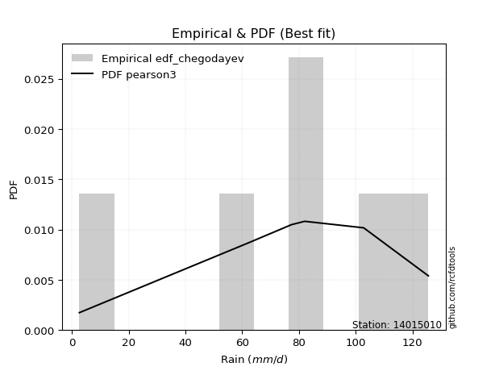</img>

</div>


### 6. Empirical - EDF Blom (1958)

The Blom formula is a specific "plotting position" formula used in hydrology and statistical analysis to estimate the empirical cumulative probability (or non-exceedance probability) of a data series. It is particularly recommended for data that are approximately normally distributed. The constant _a_ is set to 0.375 (or 3/8).

<div align="center">


$P=(m-a)/(n+1-2a)$


</div>


**6.1. Empirical values**

<div align="center">

|                | 0                  | 1                  | 2                  | 3                 | 4                 | 5                  |
|:---------------|:-------------------|:-------------------|:-------------------|:------------------|:------------------|:-------------------|
| date           | 2023               | 2025               | 2021               | 2019              | 2020              | 2024               |
| x              | 2.6                | 53.6               | 77.4               | 82.0              | 102.8             | 125.6              |
| m              | 1                  | 2                  | 3                  | 4                 | 5                 | 6                  |
| empirical_dist | edf_blom           | edf_blom           | edf_blom           | edf_blom          | edf_blom          | edf_blom           |
| empirical      | 0.1                | 0.26               | 0.42               | 0.58              | 0.74              | 0.9                |
| empirical_tr   | 1.1111111111111112 | 1.3513513513513513 | 1.7241379310344827 | 2.380952380952381 | 3.846153846153846 | 10.000000000000002 |

</div>


**6.2. Kolmogorov-Smirnov fit test (sorted by Δ)**


<div align="center">

|                | 0                    | 1                   | 2                   | 3                   | 4                   | 5                   | 6                  | 7                   | 8                   | 9                  | 10                  | 11                  | 12                 | 13                  | 14                  | 15                  | 16                  | 17                  | 18                  | 19                  | 20                 | 21                 | 22                  | 23                  | 24                  | 25                 | 26                  | 27                 | 28                  | 29                  | 30                  | 31                    | 32                  | 33                  | 34                  | 35                  | 36                  | 37                 | 38                 | 39                 | 40                 | 41                  | 42               | 43                 | 44                 | 45                 | 46                  | 47                  | 48                  | 49                  | 50                 | 51                 | 52                 | 53                | 54                  | 55                  | 56                  | 57                 | 58                 | 59                 | 60                  | 61                | 62                 | 63                 | 64                 | 65                 | 66                 | 67                 | 68                 | 69                  | 70                 | 71                 | 72                  | 73                 | 74                  | 75                 | 76                  | 77                 | 78                 | 79                 | 80                 | 81                 | 82                 | 83                 | 84                 | 85                 | 86                 | 87                 | 88             | 89             |
|:---------------|:---------------------|:--------------------|:--------------------|:--------------------|:--------------------|:--------------------|:-------------------|:--------------------|:--------------------|:-------------------|:--------------------|:--------------------|:-------------------|:--------------------|:--------------------|:--------------------|:--------------------|:--------------------|:--------------------|:--------------------|:-------------------|:-------------------|:--------------------|:--------------------|:--------------------|:-------------------|:--------------------|:-------------------|:--------------------|:--------------------|:--------------------|:----------------------|:--------------------|:--------------------|:--------------------|:--------------------|:--------------------|:-------------------|:-------------------|:-------------------|:-------------------|:--------------------|:-----------------|:-------------------|:-------------------|:-------------------|:--------------------|:--------------------|:--------------------|:--------------------|:-------------------|:-------------------|:-------------------|:------------------|:--------------------|:--------------------|:--------------------|:-------------------|:-------------------|:-------------------|:--------------------|:------------------|:-------------------|:-------------------|:-------------------|:-------------------|:-------------------|:-------------------|:-------------------|:--------------------|:-------------------|:-------------------|:--------------------|:-------------------|:--------------------|:-------------------|:--------------------|:-------------------|:-------------------|:-------------------|:-------------------|:-------------------|:-------------------|:-------------------|:-------------------|:-------------------|:-------------------|:-------------------|:---------------|:---------------|
| station        | 14015010             | 14015010            | 14015010            | 14015010            | 14015010            | 14015010            | 14015010           | 14015010            | 14015010            | 14015010           | 14015010            | 14015010            | 14015010           | 14015010            | 14015010            | 14015010            | 14015010            | 14015010            | 14015010            | 14015010            | 14015010           | 14015010           | 14015010            | 14015010            | 14015010            | 14015010           | 14015010            | 14015010           | 14015010            | 14015010            | 14015010            | 14015010              | 14015010            | 14015010            | 14015010            | 14015010            | 14015010            | 14015010           | 14015010           | 14015010           | 14015010           | 14015010            | 14015010         | 14015010           | 14015010           | 14015010           | 14015010            | 14015010            | 14015010            | 14015010            | 14015010           | 14015010           | 14015010           | 14015010          | 14015010            | 14015010            | 14015010            | 14015010           | 14015010           | 14015010           | 14015010            | 14015010          | 14015010           | 14015010           | 14015010           | 14015010           | 14015010           | 14015010           | 14015010           | 14015010            | 14015010           | 14015010           | 14015010            | 14015010           | 14015010            | 14015010           | 14015010            | 14015010           | 14015010           | 14015010           | 14015010           | 14015010           | 14015010           | 14015010           | 14015010           | 14015010           | 14015010           | 14015010           | 14015010       | 14015010       |
| empirical_dist | edf_blom             | edf_blom            | edf_blom            | edf_blom            | edf_blom            | edf_blom            | edf_blom           | edf_blom            | edf_blom            | edf_blom           | edf_blom            | edf_blom            | edf_blom           | edf_blom            | edf_blom            | edf_blom            | edf_blom            | edf_blom            | edf_blom            | edf_blom            | edf_blom           | edf_blom           | edf_blom            | edf_blom            | edf_blom            | edf_blom           | edf_blom            | edf_blom           | edf_blom            | edf_blom            | edf_blom            | edf_blom              | edf_blom            | edf_blom            | edf_blom            | edf_blom            | edf_blom            | edf_blom           | edf_blom           | edf_blom           | edf_blom           | edf_blom            | edf_blom         | edf_blom           | edf_blom           | edf_blom           | edf_blom            | edf_blom            | edf_blom            | edf_blom            | edf_blom           | edf_blom           | edf_blom           | edf_blom          | edf_blom            | edf_blom            | edf_blom            | edf_blom           | edf_blom           | edf_blom           | edf_blom            | edf_blom          | edf_blom           | edf_blom           | edf_blom           | edf_blom           | edf_blom           | edf_blom           | edf_blom           | edf_blom            | edf_blom           | edf_blom           | edf_blom            | edf_blom           | edf_blom            | edf_blom           | edf_blom            | edf_blom           | edf_blom           | edf_blom           | edf_blom           | edf_blom           | edf_blom           | edf_blom           | edf_blom           | edf_blom           | edf_blom           | edf_blom           | edf_blom       | edf_blom       |
| p_dist         | weibull_min          | gumbel_l            | johnsonsu           | genlogistic         | laplace_asymmetric  | pearson3            | fisk               | f                   | t                   | norm               | crystalball         | exponnorm           | logt               | logistic            | gamma               | erlang              | betaprime           | hypsecant           | rice                | laplace             | logmielke          | invgamma           | maxwell             | rayleigh            | logfisk             | invgauss           | logpearson3         | ncf                | kstwobign           | halfnorm            | gumbel_r            | loglaplace_asymmetric | logloggamma         | loggompertz         | loggumbel_l         | mielke              | moyal               | halflogistic       | genexpon           | expon              | lognakagami        | alpha               | logexponnorm     | logcrystalball     | lognorm            | lognorm            | logrice             | lognct              | logfatiguelife      | logf                | wald               | loglogistic        | loghypsecant       | logerlang         | loggamma            | loggamma            | logchi2             | logncf             | logbetaprime       | logalpha           | loginvgamma         | loginvweibull     | loglaplace         | loginvgauss        | logmaxwell         | gibrat             | lograyleigh        | logkstwobign       | loghalfnorm        | loggumbel_r         | loggenexpon        | logmoyal           | loghalflogistic     | nct                | logexpon            | pareto             | loglognorm          | logjohnsonsu       | logpareto          | logwald            | loggibrat          | invweibull         | gompertz           | nakagami           | logweibull_min     | fatiguelife        | logtruncnorm       | chi2               | loggenlogistic | truncnorm      |
| delta          | 0.060730413155903995 | 0.06147853616480781 | 0.07308835272184022 | 0.07313359639200134 | 0.07493437308545525 | 0.07536238422528246 | 0.0811504523468119 | 0.11473010092859187 | 0.11479610072797192 | 0.1148200172402351 | 0.11482002073630809 | 0.11482026104061321 | 0.1184282968206144 | 0.11954510135547608 | 0.12041307198352696 | 0.12135596452429603 | 0.12329106872556522 | 0.12355938198537991 | 0.12437324873304817 | 0.13812934066671917 | 0.1382169675026747 | 0.1448401231130772 | 0.14615405454629898 | 0.15632725910449458 | 0.16270826634861185 | 0.1649453045441877 | 0.16745877502352302 | 0.1699361899131711 | 0.17820025115071808 | 0.18498924059145866 | 0.18536288237478143 | 0.1874512448974403    | 0.18922592795543686 | 0.20302395342763774 | 0.20831331900024475 | 0.21054497235375985 | 0.21064005229145738 | 0.2117093972554412 | 0.2466426658491443 | 0.2504583404430468 | 0.2599999998596466 | 0.27570666724886556 | 0.27661339083701 | 0.2766143774729902 | 0.2766143804484069 | 0.2766143804484069 | 0.27662852477519395 | 0.27715953504840307 | 0.27745446405360485 | 0.27831906502096393 | 0.2807980218485118 | 0.2815793634672932 | 0.2857951306638231 | 0.285803763580313 | 0.28797289525552205 | 0.28797289525552205 | 0.28897627298105877 | 0.2902545013615363 | 0.2909741083293047 | 0.2921741222458958 | 0.29339810589701276 | 0.293616636365995 | 0.3009423423240609 | 0.3014494955280238 | 0.3078428867117302 | 0.3085575454585469 | 0.3179690092317313 | 0.3359970752861785 | 0.3465011736916478 | 0.34712019555788565 | 0.3494261946267465 | 0.3723510045058125 | 0.37329297246743454 | 0.3771477473092115 | 0.38722653338054225 | 0.4082639150719598 | 0.40911578212719224 | 0.4125155865749347 | 0.4302740930703207 | 0.4423763479099011 | 0.4703088428256933 | 0.4833765779817399 | 0.5185569550718414 | 0.5332451023110775 | 0.5389698223917073 | 0.5591758740904336 | 0.5751925075486278 | 0.7399345655410383 | 0.9            | 0.9            |
| deltao         | 0.530385761606       | 0.530385761606      | 0.530385761606      | 0.530385761606      | 0.530385761606      | 0.530385761606      | 0.530385761606     | 0.530385761606      | 0.530385761606      | 0.530385761606     | 0.530385761606      | 0.530385761606      | 0.530385761606     | 0.530385761606      | 0.530385761606      | 0.530385761606      | 0.530385761606      | 0.530385761606      | 0.530385761606      | 0.530385761606      | 0.530385761606     | 0.530385761606     | 0.530385761606      | 0.530385761606      | 0.530385761606      | 0.530385761606     | 0.530385761606      | 0.530385761606     | 0.530385761606      | 0.530385761606      | 0.530385761606      | 0.530385761606        | 0.530385761606      | 0.530385761606      | 0.530385761606      | 0.530385761606      | 0.530385761606      | 0.530385761606     | 0.530385761606     | 0.530385761606     | 0.530385761606     | 0.530385761606      | 0.530385761606   | 0.530385761606     | 0.530385761606     | 0.530385761606     | 0.530385761606      | 0.530385761606      | 0.530385761606      | 0.530385761606      | 0.530385761606     | 0.530385761606     | 0.530385761606     | 0.530385761606    | 0.530385761606      | 0.530385761606      | 0.530385761606      | 0.530385761606     | 0.530385761606     | 0.530385761606     | 0.530385761606      | 0.530385761606    | 0.530385761606     | 0.530385761606     | 0.530385761606     | 0.530385761606     | 0.530385761606     | 0.530385761606     | 0.530385761606     | 0.530385761606      | 0.530385761606     | 0.530385761606     | 0.530385761606      | 0.530385761606     | 0.530385761606      | 0.530385761606     | 0.530385761606      | 0.530385761606     | 0.530385761606     | 0.530385761606     | 0.530385761606     | 0.530385761606     | 0.530385761606     | 0.530385761606     | 0.530385761606     | 0.530385761606     | 0.530385761606     | 0.530385761606     | 0.530385761606 | 0.530385761606 |
| eval           | Δo > Δ               | Δo > Δ              | Δo > Δ              | Δo > Δ              | Δo > Δ              | Δo > Δ              | Δo > Δ             | Δo > Δ              | Δo > Δ              | Δo > Δ             | Δo > Δ              | Δo > Δ              | Δo > Δ             | Δo > Δ              | Δo > Δ              | Δo > Δ              | Δo > Δ              | Δo > Δ              | Δo > Δ              | Δo > Δ              | Δo > Δ             | Δo > Δ             | Δo > Δ              | Δo > Δ              | Δo > Δ              | Δo > Δ             | Δo > Δ              | Δo > Δ             | Δo > Δ              | Δo > Δ              | Δo > Δ              | Δo > Δ                | Δo > Δ              | Δo > Δ              | Δo > Δ              | Δo > Δ              | Δo > Δ              | Δo > Δ             | Δo > Δ             | Δo > Δ             | Δo > Δ             | Δo > Δ              | Δo > Δ           | Δo > Δ             | Δo > Δ             | Δo > Δ             | Δo > Δ              | Δo > Δ              | Δo > Δ              | Δo > Δ              | Δo > Δ             | Δo > Δ             | Δo > Δ             | Δo > Δ            | Δo > Δ              | Δo > Δ              | Δo > Δ              | Δo > Δ             | Δo > Δ             | Δo > Δ             | Δo > Δ              | Δo > Δ            | Δo > Δ             | Δo > Δ             | Δo > Δ             | Δo > Δ             | Δo > Δ             | Δo > Δ             | Δo > Δ             | Δo > Δ              | Δo > Δ             | Δo > Δ             | Δo > Δ              | Δo > Δ             | Δo > Δ              | Δo > Δ             | Δo > Δ              | Δo > Δ             | Δo > Δ             | Δo > Δ             | Δo > Δ             | Δo > Δ             | Δo > Δ             | Δo <= Δ            | Δo <= Δ            | Δo <= Δ            | Δo <= Δ            | Δo <= Δ            | Δo <= Δ        | Δo <= Δ        |
| fit            | 1                    | 1                   | 1                   | 1                   | 1                   | 1                   | 1                  | 1                   | 1                   | 1                  | 1                   | 1                   | 1                  | 1                   | 1                   | 1                   | 1                   | 1                   | 1                   | 1                   | 1                  | 1                  | 1                   | 1                   | 1                   | 1                  | 1                   | 1                  | 1                   | 1                   | 1                   | 1                     | 1                   | 1                   | 1                   | 1                   | 1                   | 1                  | 1                  | 1                  | 1                  | 1                   | 1                | 1                  | 1                  | 1                  | 1                   | 1                   | 1                   | 1                   | 1                  | 1                  | 1                  | 1                 | 1                   | 1                   | 1                   | 1                  | 1                  | 1                  | 1                   | 1                 | 1                  | 1                  | 1                  | 1                  | 1                  | 1                  | 1                  | 1                   | 1                  | 1                  | 1                   | 1                  | 1                   | 1                  | 1                   | 1                  | 1                  | 1                  | 1                  | 1                  | 1                  | 0                  | 0                  | 0                  | 0                  | 0                  | 0              | 0              |
| n              | 6                    | 6                   | 6                   | 6                   | 6                   | 6                   | 6                  | 6                   | 6                   | 6                  | 6                   | 6                   | 6                  | 6                   | 6                   | 6                   | 6                   | 6                   | 6                   | 6                   | 6                  | 6                  | 6                   | 6                   | 6                   | 6                  | 6                   | 6                  | 6                   | 6                   | 6                   | 6                     | 6                   | 6                   | 6                   | 6                   | 6                   | 6                  | 6                  | 6                  | 6                  | 6                   | 6                | 6                  | 6                  | 6                  | 6                   | 6                   | 6                   | 6                   | 6                  | 6                  | 6                  | 6                 | 6                   | 6                   | 6                   | 6                  | 6                  | 6                  | 6                   | 6                 | 6                  | 6                  | 6                  | 6                  | 6                  | 6                  | 6                  | 6                   | 6                  | 6                  | 6                   | 6                  | 6                   | 6                  | 6                   | 6                  | 6                  | 6                  | 6                  | 6                  | 6                  | 6                  | 6                  | 6                  | 6                  | 6                  | 6              | 6              |
| best_fit       | 1                    | 0                   | 0                   | 0                   | 0                   | 0                   | 0                  | 0                   | 0                   | 0                  | 0                   | 0                   | 0                  | 0                   | 0                   | 0                   | 0                   | 0                   | 0                   | 0                   | 0                  | 0                  | 0                   | 0                   | 0                   | 0                  | 0                   | 0                  | 0                   | 0                   | 0                   | 0                     | 0                   | 0                   | 0                   | 0                   | 0                   | 0                  | 0                  | 0                  | 0                  | 0                   | 0                | 0                  | 0                  | 0                  | 0                   | 0                   | 0                   | 0                   | 0                  | 0                  | 0                  | 0                 | 0                   | 0                   | 0                   | 0                  | 0                  | 0                  | 0                   | 0                 | 0                  | 0                  | 0                  | 0                  | 0                  | 0                  | 0                  | 0                   | 0                  | 0                  | 0                   | 0                  | 0                   | 0                  | 0                   | 0                  | 0                  | 0                  | 0                  | 0                  | 0                  | 0                  | 0                  | 0                  | 0                  | 0                  | 0              | 0              |
| best_fit_sort  | 1                    | 2                   | 3                   | 4                   | 5                   | 6                   | 7                  | 8                   | 9                   | 10                 | 11                  | 12                  | 13                 | 14                  | 15                  | 16                  | 17                  | 18                  | 19                  | 20                  | 21                 | 22                 | 23                  | 24                  | 25                  | 26                 | 27                  | 28                 | 29                  | 30                  | 31                  | 32                    | 33                  | 34                  | 35                  | 36                  | 37                  | 38                 | 39                 | 40                 | 41                 | 42                  | 43               | 44                 | 45                 | 46                 | 47                  | 48                  | 49                  | 50                  | 51                 | 52                 | 53                 | 54                | 55                  | 56                  | 57                  | 58                 | 59                 | 60                 | 61                  | 62                | 63                 | 64                 | 65                 | 66                 | 67                 | 68                 | 69                 | 70                  | 71                 | 72                 | 73                  | 74                 | 75                  | 76                 | 77                  | 78                 | 79                 | 80                 | 81                 | 82                 | 83                 | 84                 | 85                 | 86                 | 87                 | 88                 | 89             | 90             |

</div>


<div align="center">

</img>

</div>


**6.3. Best fit**

<div align="center">

|   id |   station | empirical_dist   | p_dist      |     delta |   deltao | eval   |   fit |   n |   best_fit |   best_fit_sort |
|-----:|----------:|:-----------------|:------------|----------:|---------:|:-------|------:|----:|-----------:|----------------:|
|    0 |  14015010 | edf_blom         | weibull_min | 0.0607304 | 0.530386 | Δo > Δ |     1 |   6 |          1 |               1 |

</div>


<div align="center">

</img>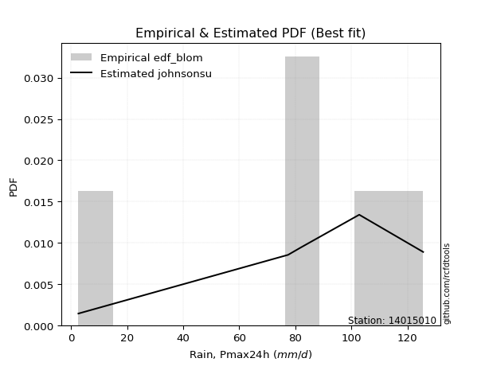</img>

</div>


### 7. Empirical - EDF Tukey (1962)

In hydrology, the Tukey formula is used as a plotting position formula to estimate the empirical probability or frequency of a flood event (or other hydrological data). The formula parameter is given as _c=0.333_ (or 1/3).

<div align="center">


$P=(m-c)/(n+1-2c)$


</div>


**7.1. Empirical values**

<div align="center">

|                | 0                   | 1                  | 2                   | 3                  | 4                  | 5                  |
|:---------------|:--------------------|:-------------------|:--------------------|:-------------------|:-------------------|:-------------------|
| date           | 2023                | 2025               | 2021                | 2019               | 2020               | 2024               |
| x              | 2.6                 | 53.6               | 77.4                | 82.0               | 102.8              | 125.6              |
| m              | 1                   | 2                  | 3                   | 4                  | 5                  | 6                  |
| empirical_dist | edf_tukey           | edf_tukey          | edf_tukey           | edf_tukey          | edf_tukey          | edf_tukey          |
| empirical      | 0.10526315789473684 | 0.2631578947368421 | 0.42105263157894735 | 0.5789473684210527 | 0.7368421052631579 | 0.8947368421052632 |
| empirical_tr   | 1.1176470588235294  | 1.357142857142857  | 1.7272727272727273  | 2.375              | 3.7999999999999994 | 9.5                |

</div>


**7.2. Kolmogorov-Smirnov fit test (sorted by Δ)**


<div align="center">

|                | 0                   | 1                  | 2                   | 3                   | 4                  | 5                   | 6                   | 7                   | 8                   | 9                   | 10                  | 11                  | 12                 | 13                  | 14                 | 15                  | 16                  | 17                  | 18                  | 19                 | 20                  | 21                  | 22                  | 23                  | 24                  | 25                  | 26                  | 27                  | 28                  | 29                 | 30                  | 31                    | 32                 | 33                  | 34                  | 35                 | 36                  | 37                  | 38                 | 39                  | 40                 | 41                 | 42                  | 43                  | 44                  | 45                  | 46                | 47                 | 48                 | 49                  | 50                 | 51                  | 52                  | 53                 | 54               | 55               | 56                 | 57                 | 58                 | 59                 | 60                 | 61                 | 62                  | 63                 | 64                  | 65                  | 66                  | 67                 | 68                 | 69                  | 70                  | 71                 | 72                  | 73                  | 74                  | 75                 | 76                  | 77                  | 78                  | 79                | 80                 | 81                | 82                 | 83                 | 84                 | 85                 | 86                 | 87                 | 88                 | 89                 |
|:---------------|:--------------------|:-------------------|:--------------------|:--------------------|:-------------------|:--------------------|:--------------------|:--------------------|:--------------------|:--------------------|:--------------------|:--------------------|:-------------------|:--------------------|:-------------------|:--------------------|:--------------------|:--------------------|:--------------------|:-------------------|:--------------------|:--------------------|:--------------------|:--------------------|:--------------------|:--------------------|:--------------------|:--------------------|:--------------------|:-------------------|:--------------------|:----------------------|:-------------------|:--------------------|:--------------------|:-------------------|:--------------------|:--------------------|:-------------------|:--------------------|:-------------------|:-------------------|:--------------------|:--------------------|:--------------------|:--------------------|:------------------|:-------------------|:-------------------|:--------------------|:-------------------|:--------------------|:--------------------|:-------------------|:-----------------|:-----------------|:-------------------|:-------------------|:-------------------|:-------------------|:-------------------|:-------------------|:--------------------|:-------------------|:--------------------|:--------------------|:--------------------|:-------------------|:-------------------|:--------------------|:--------------------|:-------------------|:--------------------|:--------------------|:--------------------|:-------------------|:--------------------|:--------------------|:--------------------|:------------------|:-------------------|:------------------|:-------------------|:-------------------|:-------------------|:-------------------|:-------------------|:-------------------|:-------------------|:-------------------|
| station        | 14015010            | 14015010           | 14015010            | 14015010            | 14015010           | 14015010            | 14015010            | 14015010            | 14015010            | 14015010            | 14015010            | 14015010            | 14015010           | 14015010            | 14015010           | 14015010            | 14015010            | 14015010            | 14015010            | 14015010           | 14015010            | 14015010            | 14015010            | 14015010            | 14015010            | 14015010            | 14015010            | 14015010            | 14015010            | 14015010           | 14015010            | 14015010              | 14015010           | 14015010            | 14015010            | 14015010           | 14015010            | 14015010            | 14015010           | 14015010            | 14015010           | 14015010           | 14015010            | 14015010            | 14015010            | 14015010            | 14015010          | 14015010           | 14015010           | 14015010            | 14015010           | 14015010            | 14015010            | 14015010           | 14015010         | 14015010         | 14015010           | 14015010           | 14015010           | 14015010           | 14015010           | 14015010           | 14015010            | 14015010           | 14015010            | 14015010            | 14015010            | 14015010           | 14015010           | 14015010            | 14015010            | 14015010           | 14015010            | 14015010            | 14015010            | 14015010           | 14015010            | 14015010            | 14015010            | 14015010          | 14015010           | 14015010          | 14015010           | 14015010           | 14015010           | 14015010           | 14015010           | 14015010           | 14015010           | 14015010           |
| empirical_dist | edf_tukey           | edf_tukey          | edf_tukey           | edf_tukey           | edf_tukey          | edf_tukey           | edf_tukey           | edf_tukey           | edf_tukey           | edf_tukey           | edf_tukey           | edf_tukey           | edf_tukey          | edf_tukey           | edf_tukey          | edf_tukey           | edf_tukey           | edf_tukey           | edf_tukey           | edf_tukey          | edf_tukey           | edf_tukey           | edf_tukey           | edf_tukey           | edf_tukey           | edf_tukey           | edf_tukey           | edf_tukey           | edf_tukey           | edf_tukey          | edf_tukey           | edf_tukey             | edf_tukey          | edf_tukey           | edf_tukey           | edf_tukey          | edf_tukey           | edf_tukey           | edf_tukey          | edf_tukey           | edf_tukey          | edf_tukey          | edf_tukey           | edf_tukey           | edf_tukey           | edf_tukey           | edf_tukey         | edf_tukey          | edf_tukey          | edf_tukey           | edf_tukey          | edf_tukey           | edf_tukey           | edf_tukey          | edf_tukey        | edf_tukey        | edf_tukey          | edf_tukey          | edf_tukey          | edf_tukey          | edf_tukey          | edf_tukey          | edf_tukey           | edf_tukey          | edf_tukey           | edf_tukey           | edf_tukey           | edf_tukey          | edf_tukey          | edf_tukey           | edf_tukey           | edf_tukey          | edf_tukey           | edf_tukey           | edf_tukey           | edf_tukey          | edf_tukey           | edf_tukey           | edf_tukey           | edf_tukey         | edf_tukey          | edf_tukey         | edf_tukey          | edf_tukey          | edf_tukey          | edf_tukey          | edf_tukey          | edf_tukey          | edf_tukey          | edf_tukey          |
| p_dist         | weibull_min         | gumbel_l           | johnsonsu           | genlogistic         | pearson3           | laplace_asymmetric  | fisk                | f                   | t                   | norm                | crystalball         | exponnorm           | logt               | logistic            | gamma              | erlang              | betaprime           | hypsecant           | rice                | laplace            | logmielke           | invgamma            | maxwell             | rayleigh            | logfisk             | invgauss            | logpearson3         | ncf                 | kstwobign           | halfnorm           | gumbel_r            | loglaplace_asymmetric | logloggamma        | loggompertz         | loggumbel_l         | mielke             | moyal               | halflogistic        | genexpon           | expon               | lognakagami        | logexponnorm       | logcrystalball      | lognorm             | lognorm             | logrice             | lognct            | logfatiguelife     | alpha              | logf                | loglogistic        | wald                | loghypsecant        | logerlang          | loggamma         | loggamma         | logchi2            | logncf             | logbetaprime       | logalpha           | loginvgamma        | loginvweibull      | loglaplace          | loginvgauss        | logmaxwell          | gibrat              | lograyleigh         | logkstwobign       | loghalfnorm        | loggumbel_r         | loggenexpon         | logmoyal           | loghalflogistic     | nct                 | logexpon            | pareto             | loglognorm          | logjohnsonsu        | logpareto           | logwald           | loggibrat          | invweibull        | gompertz           | nakagami           | logweibull_min     | fatiguelife        | logtruncnorm       | chi2               | loggenlogistic     | truncnorm          |
| delta          | 0.05967778157695669 | 0.0604259045858605 | 0.07203572114289292 | 0.07208096481305404 | 0.0743097526463351 | 0.07621485366699032 | 0.08009782076786454 | 0.11367746934964451 | 0.11374346914902456 | 0.11376738566128775 | 0.11376738915736073 | 0.11376762946166585 | 0.1173756652416671 | 0.11849246977652872 | 0.1193604404045796 | 0.12030333294534867 | 0.12223843714661786 | 0.12250675040643255 | 0.12332061715410081 | 0.1370767090877718 | 0.13716433592372734 | 0.14378749153412984 | 0.14510142296735162 | 0.15527462752554722 | 0.15955037161176977 | 0.16389267296524035 | 0.16430088028668094 | 0.16888355833422375 | 0.17714761957177072 | 0.1839366090125113 | 0.18431025079583407 | 0.18639861331849295   | 0.1881732963764895 | 0.20197132184869038 | 0.20515542426340266 | 0.2094923407748125 | 0.20958742071251002 | 0.21065676567649383 | 0.2434847711123022 | 0.24730044570620474 | 0.2631578945964887 | 0.2734554961001679 | 0.27345648273614814 | 0.27345648571156483 | 0.27345648571156483 | 0.27347063003835187 | 0.274001640311561 | 0.2742965693167628 | 0.2746540356699182 | 0.27516117028412185 | 0.2784214687304511 | 0.27974539026956446 | 0.28263723592698103 | 0.2826458688434709 | 0.28481500051868 | 0.28481500051868 | 0.2858183782442167 | 0.2870966066246942 | 0.2878162135924626 | 0.2890162275090537 | 0.2902402111601707 | 0.2904587416291529 | 0.29778444758721884 | 0.2982916007911817 | 0.30468499197488813 | 0.30750491387959955 | 0.31481111449488924 | 0.3328391805493364 | 0.3433432789548057 | 0.34396230082104357 | 0.34626829988990443 | 0.3691931097689704 | 0.37013507773059245 | 0.37398985257236944 | 0.38406863864370017 | 0.4051060203351177 | 0.40595788739035016 | 0.40935769183809256 | 0.42711619833347864 | 0.439218453173059 | 0.4671509480888512 | 0.478113420087003 | 0.5175043234928941 | 0.5300872075742353 | 0.5358119276548652 | 0.5560179793535915 | 0.5720346128117857 | 0.7367766708041963 | 0.8947368421052632 | 0.8947368421052632 |
| deltao         | 0.530385761606      | 0.530385761606     | 0.530385761606      | 0.530385761606      | 0.530385761606     | 0.530385761606      | 0.530385761606      | 0.530385761606      | 0.530385761606      | 0.530385761606      | 0.530385761606      | 0.530385761606      | 0.530385761606     | 0.530385761606      | 0.530385761606     | 0.530385761606      | 0.530385761606      | 0.530385761606      | 0.530385761606      | 0.530385761606     | 0.530385761606      | 0.530385761606      | 0.530385761606      | 0.530385761606      | 0.530385761606      | 0.530385761606      | 0.530385761606      | 0.530385761606      | 0.530385761606      | 0.530385761606     | 0.530385761606      | 0.530385761606        | 0.530385761606     | 0.530385761606      | 0.530385761606      | 0.530385761606     | 0.530385761606      | 0.530385761606      | 0.530385761606     | 0.530385761606      | 0.530385761606     | 0.530385761606     | 0.530385761606      | 0.530385761606      | 0.530385761606      | 0.530385761606      | 0.530385761606    | 0.530385761606     | 0.530385761606     | 0.530385761606      | 0.530385761606     | 0.530385761606      | 0.530385761606      | 0.530385761606     | 0.530385761606   | 0.530385761606   | 0.530385761606     | 0.530385761606     | 0.530385761606     | 0.530385761606     | 0.530385761606     | 0.530385761606     | 0.530385761606      | 0.530385761606     | 0.530385761606      | 0.530385761606      | 0.530385761606      | 0.530385761606     | 0.530385761606     | 0.530385761606      | 0.530385761606      | 0.530385761606     | 0.530385761606      | 0.530385761606      | 0.530385761606      | 0.530385761606     | 0.530385761606      | 0.530385761606      | 0.530385761606      | 0.530385761606    | 0.530385761606     | 0.530385761606    | 0.530385761606     | 0.530385761606     | 0.530385761606     | 0.530385761606     | 0.530385761606     | 0.530385761606     | 0.530385761606     | 0.530385761606     |
| eval           | Δo > Δ              | Δo > Δ             | Δo > Δ              | Δo > Δ              | Δo > Δ             | Δo > Δ              | Δo > Δ              | Δo > Δ              | Δo > Δ              | Δo > Δ              | Δo > Δ              | Δo > Δ              | Δo > Δ             | Δo > Δ              | Δo > Δ             | Δo > Δ              | Δo > Δ              | Δo > Δ              | Δo > Δ              | Δo > Δ             | Δo > Δ              | Δo > Δ              | Δo > Δ              | Δo > Δ              | Δo > Δ              | Δo > Δ              | Δo > Δ              | Δo > Δ              | Δo > Δ              | Δo > Δ             | Δo > Δ              | Δo > Δ                | Δo > Δ             | Δo > Δ              | Δo > Δ              | Δo > Δ             | Δo > Δ              | Δo > Δ              | Δo > Δ             | Δo > Δ              | Δo > Δ             | Δo > Δ             | Δo > Δ              | Δo > Δ              | Δo > Δ              | Δo > Δ              | Δo > Δ            | Δo > Δ             | Δo > Δ             | Δo > Δ              | Δo > Δ             | Δo > Δ              | Δo > Δ              | Δo > Δ             | Δo > Δ           | Δo > Δ           | Δo > Δ             | Δo > Δ             | Δo > Δ             | Δo > Δ             | Δo > Δ             | Δo > Δ             | Δo > Δ              | Δo > Δ             | Δo > Δ              | Δo > Δ              | Δo > Δ              | Δo > Δ             | Δo > Δ             | Δo > Δ              | Δo > Δ              | Δo > Δ             | Δo > Δ              | Δo > Δ              | Δo > Δ              | Δo > Δ             | Δo > Δ              | Δo > Δ              | Δo > Δ              | Δo > Δ            | Δo > Δ             | Δo > Δ            | Δo > Δ             | Δo > Δ             | Δo <= Δ            | Δo <= Δ            | Δo <= Δ            | Δo <= Δ            | Δo <= Δ            | Δo <= Δ            |
| fit            | 1                   | 1                  | 1                   | 1                   | 1                  | 1                   | 1                   | 1                   | 1                   | 1                   | 1                   | 1                   | 1                  | 1                   | 1                  | 1                   | 1                   | 1                   | 1                   | 1                  | 1                   | 1                   | 1                   | 1                   | 1                   | 1                   | 1                   | 1                   | 1                   | 1                  | 1                   | 1                     | 1                  | 1                   | 1                   | 1                  | 1                   | 1                   | 1                  | 1                   | 1                  | 1                  | 1                   | 1                   | 1                   | 1                   | 1                 | 1                  | 1                  | 1                   | 1                  | 1                   | 1                   | 1                  | 1                | 1                | 1                  | 1                  | 1                  | 1                  | 1                  | 1                  | 1                   | 1                  | 1                   | 1                   | 1                   | 1                  | 1                  | 1                   | 1                   | 1                  | 1                   | 1                   | 1                   | 1                  | 1                   | 1                   | 1                   | 1                 | 1                  | 1                 | 1                  | 1                  | 0                  | 0                  | 0                  | 0                  | 0                  | 0                  |
| n              | 6                   | 6                  | 6                   | 6                   | 6                  | 6                   | 6                   | 6                   | 6                   | 6                   | 6                   | 6                   | 6                  | 6                   | 6                  | 6                   | 6                   | 6                   | 6                   | 6                  | 6                   | 6                   | 6                   | 6                   | 6                   | 6                   | 6                   | 6                   | 6                   | 6                  | 6                   | 6                     | 6                  | 6                   | 6                   | 6                  | 6                   | 6                   | 6                  | 6                   | 6                  | 6                  | 6                   | 6                   | 6                   | 6                   | 6                 | 6                  | 6                  | 6                   | 6                  | 6                   | 6                   | 6                  | 6                | 6                | 6                  | 6                  | 6                  | 6                  | 6                  | 6                  | 6                   | 6                  | 6                   | 6                   | 6                   | 6                  | 6                  | 6                   | 6                   | 6                  | 6                   | 6                   | 6                   | 6                  | 6                   | 6                   | 6                   | 6                 | 6                  | 6                 | 6                  | 6                  | 6                  | 6                  | 6                  | 6                  | 6                  | 6                  |
| best_fit       | 1                   | 0                  | 0                   | 0                   | 0                  | 0                   | 0                   | 0                   | 0                   | 0                   | 0                   | 0                   | 0                  | 0                   | 0                  | 0                   | 0                   | 0                   | 0                   | 0                  | 0                   | 0                   | 0                   | 0                   | 0                   | 0                   | 0                   | 0                   | 0                   | 0                  | 0                   | 0                     | 0                  | 0                   | 0                   | 0                  | 0                   | 0                   | 0                  | 0                   | 0                  | 0                  | 0                   | 0                   | 0                   | 0                   | 0                 | 0                  | 0                  | 0                   | 0                  | 0                   | 0                   | 0                  | 0                | 0                | 0                  | 0                  | 0                  | 0                  | 0                  | 0                  | 0                   | 0                  | 0                   | 0                   | 0                   | 0                  | 0                  | 0                   | 0                   | 0                  | 0                   | 0                   | 0                   | 0                  | 0                   | 0                   | 0                   | 0                 | 0                  | 0                 | 0                  | 0                  | 0                  | 0                  | 0                  | 0                  | 0                  | 0                  |
| best_fit_sort  | 1                   | 2                  | 3                   | 4                   | 5                  | 6                   | 7                   | 8                   | 9                   | 10                  | 11                  | 12                  | 13                 | 14                  | 15                 | 16                  | 17                  | 18                  | 19                  | 20                 | 21                  | 22                  | 23                  | 24                  | 25                  | 26                  | 27                  | 28                  | 29                  | 30                 | 31                  | 32                    | 33                 | 34                  | 35                  | 36                 | 37                  | 38                  | 39                 | 40                  | 41                 | 42                 | 43                  | 44                  | 45                  | 46                  | 47                | 48                 | 49                 | 50                  | 51                 | 52                  | 53                  | 54                 | 55               | 56               | 57                 | 58                 | 59                 | 60                 | 61                 | 62                 | 63                  | 64                 | 65                  | 66                  | 67                  | 68                 | 69                 | 70                  | 71                  | 72                 | 73                  | 74                  | 75                  | 76                 | 77                  | 78                  | 79                  | 80                | 81                 | 82                | 83                 | 84                 | 85                 | 86                 | 87                 | 88                 | 89                 | 90                 |

</div>


<div align="center">

</img>

</div>


**7.3. Best fit**

<div align="center">

|   id |   station | empirical_dist   | p_dist      |     delta |   deltao | eval   |   fit |   n |   best_fit |   best_fit_sort |
|-----:|----------:|:-----------------|:------------|----------:|---------:|:-------|------:|----:|-----------:|----------------:|
|    0 |  14015010 | edf_tukey        | weibull_min | 0.0596778 | 0.530386 | Δo > Δ |     1 |   6 |          1 |               1 |

</div>


<div align="center">

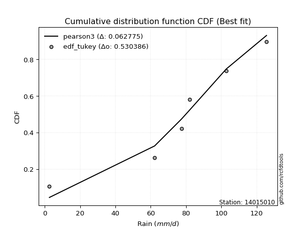</img></img>

</div>


### 8. Empirical - EDF Gringorten (1963)

Gringorten plotting position formula is essential for estimating the probability and return periods of extreme events like floods and heavy rainfall. The constant _a=0.44_.

<div align="center">


$P=(m-a)/(n+1-2a)$


</div>


**8.1. Empirical values**

<div align="center">

|                | 0                   | 1                  | 2                   | 3                  | 4                  | 5                  |
|:---------------|:--------------------|:-------------------|:--------------------|:-------------------|:-------------------|:-------------------|
| date           | 2023                | 2025               | 2021                | 2019               | 2020               | 2024               |
| x              | 2.6                 | 53.6               | 77.4                | 82.0               | 102.8              | 125.6              |
| m              | 1                   | 2                  | 3                   | 4                  | 5                  | 6                  |
| empirical_dist | edf_gringorten      | edf_gringorten     | edf_gringorten      | edf_gringorten     | edf_gringorten     | edf_gringorten     |
| empirical      | 0.09150326797385622 | 0.2549019607843137 | 0.41830065359477125 | 0.5816993464052288 | 0.7450980392156862 | 0.9084967320261437 |
| empirical_tr   | 1.1007194244604317  | 1.3421052631578947 | 1.7191011235955058  | 2.3906250000000004 | 3.9230769230769216 | 10.928571428571415 |

</div>


**8.2. Kolmogorov-Smirnov fit test (sorted by Δ)**


<div align="center">

|                | 0                    | 1                   | 2                   | 3                   | 4                   | 5                  | 6                   | 7                  | 8                   | 9                   | 10                  | 11                  | 12                  | 13                  | 14                 | 15                  | 16                  | 17                  | 18                 | 19                 | 20                  | 21                  | 22                 | 23                 | 24                  | 25                  | 26                  | 27                  | 28                 | 29                 | 30                  | 31                    | 32                 | 33                  | 34                  | 35                 | 36                  | 37                  | 38                 | 39                 | 40                 | 41                 | 42                 | 43                 | 44                 | 45                 | 46                  | 47                 | 48                  | 49                  | 50                  | 51                 | 52                 | 53                 | 54                  | 55                  | 56                  | 57                 | 58                | 59                 | 60                  | 61                 | 62                 | 63                 | 64                  | 65                 | 66                 | 67                 | 68                 | 69                  | 70                 | 71                 | 72                  | 73                 | 74                  | 75                 | 76                  | 77                 | 78                | 79                 | 80                 | 81                  | 82                 | 83                 | 84                 | 85                 | 86                 | 87                 | 88                 | 89                 |
|:---------------|:---------------------|:--------------------|:--------------------|:--------------------|:--------------------|:-------------------|:--------------------|:-------------------|:--------------------|:--------------------|:--------------------|:--------------------|:--------------------|:--------------------|:-------------------|:--------------------|:--------------------|:--------------------|:-------------------|:-------------------|:--------------------|:--------------------|:-------------------|:-------------------|:--------------------|:--------------------|:--------------------|:--------------------|:-------------------|:-------------------|:--------------------|:----------------------|:-------------------|:--------------------|:--------------------|:-------------------|:--------------------|:--------------------|:-------------------|:-------------------|:-------------------|:-------------------|:-------------------|:-------------------|:-------------------|:-------------------|:--------------------|:-------------------|:--------------------|:--------------------|:--------------------|:-------------------|:-------------------|:-------------------|:--------------------|:--------------------|:--------------------|:-------------------|:------------------|:-------------------|:--------------------|:-------------------|:-------------------|:-------------------|:--------------------|:-------------------|:-------------------|:-------------------|:-------------------|:--------------------|:-------------------|:-------------------|:--------------------|:-------------------|:--------------------|:-------------------|:--------------------|:-------------------|:------------------|:-------------------|:-------------------|:--------------------|:-------------------|:-------------------|:-------------------|:-------------------|:-------------------|:-------------------|:-------------------|:-------------------|
| station        | 14015010             | 14015010            | 14015010            | 14015010            | 14015010            | 14015010           | 14015010            | 14015010           | 14015010            | 14015010            | 14015010            | 14015010            | 14015010            | 14015010            | 14015010           | 14015010            | 14015010            | 14015010            | 14015010           | 14015010           | 14015010            | 14015010            | 14015010           | 14015010           | 14015010            | 14015010            | 14015010            | 14015010            | 14015010           | 14015010           | 14015010            | 14015010              | 14015010           | 14015010            | 14015010            | 14015010           | 14015010            | 14015010            | 14015010           | 14015010           | 14015010           | 14015010           | 14015010           | 14015010           | 14015010           | 14015010           | 14015010            | 14015010           | 14015010            | 14015010            | 14015010            | 14015010           | 14015010           | 14015010           | 14015010            | 14015010            | 14015010            | 14015010           | 14015010          | 14015010           | 14015010            | 14015010           | 14015010           | 14015010           | 14015010            | 14015010           | 14015010           | 14015010           | 14015010           | 14015010            | 14015010           | 14015010           | 14015010            | 14015010           | 14015010            | 14015010           | 14015010            | 14015010           | 14015010          | 14015010           | 14015010           | 14015010            | 14015010           | 14015010           | 14015010           | 14015010           | 14015010           | 14015010           | 14015010           | 14015010           |
| empirical_dist | edf_gringorten       | edf_gringorten      | edf_gringorten      | edf_gringorten      | edf_gringorten      | edf_gringorten     | edf_gringorten      | edf_gringorten     | edf_gringorten      | edf_gringorten      | edf_gringorten      | edf_gringorten      | edf_gringorten      | edf_gringorten      | edf_gringorten     | edf_gringorten      | edf_gringorten      | edf_gringorten      | edf_gringorten     | edf_gringorten     | edf_gringorten      | edf_gringorten      | edf_gringorten     | edf_gringorten     | edf_gringorten      | edf_gringorten      | edf_gringorten      | edf_gringorten      | edf_gringorten     | edf_gringorten     | edf_gringorten      | edf_gringorten        | edf_gringorten     | edf_gringorten      | edf_gringorten      | edf_gringorten     | edf_gringorten      | edf_gringorten      | edf_gringorten     | edf_gringorten     | edf_gringorten     | edf_gringorten     | edf_gringorten     | edf_gringorten     | edf_gringorten     | edf_gringorten     | edf_gringorten      | edf_gringorten     | edf_gringorten      | edf_gringorten      | edf_gringorten      | edf_gringorten     | edf_gringorten     | edf_gringorten     | edf_gringorten      | edf_gringorten      | edf_gringorten      | edf_gringorten     | edf_gringorten    | edf_gringorten     | edf_gringorten      | edf_gringorten     | edf_gringorten     | edf_gringorten     | edf_gringorten      | edf_gringorten     | edf_gringorten     | edf_gringorten     | edf_gringorten     | edf_gringorten      | edf_gringorten     | edf_gringorten     | edf_gringorten      | edf_gringorten     | edf_gringorten      | edf_gringorten     | edf_gringorten      | edf_gringorten     | edf_gringorten    | edf_gringorten     | edf_gringorten     | edf_gringorten      | edf_gringorten     | edf_gringorten     | edf_gringorten     | edf_gringorten     | edf_gringorten     | edf_gringorten     | edf_gringorten     | edf_gringorten     |
| p_dist         | weibull_min          | gumbel_l            | johnsonsu           | genlogistic         | laplace_asymmetric  | pearson3           | fisk                | f                  | t                   | norm                | crystalball         | exponnorm           | logt                | logistic            | gamma              | erlang              | betaprime           | hypsecant           | rice               | laplace            | logmielke           | invgamma            | maxwell            | rayleigh           | invgauss            | logfisk             | ncf                 | logpearson3         | kstwobign          | halfnorm           | gumbel_r            | loglaplace_asymmetric | logloggamma        | loggompertz         | mielke              | moyal              | halflogistic        | loggumbel_l         | genexpon           | lognakagami        | expon              | alpha              | logexponnorm       | logcrystalball     | lognorm            | lognorm            | logrice             | lognct             | wald                | logfatiguelife      | logf                | loglogistic        | loghypsecant       | logerlang          | loggamma            | loggamma            | logchi2             | logncf             | logbetaprime      | logalpha           | loginvgamma         | loginvweibull      | loglaplace         | loginvgauss        | gibrat              | logmaxwell         | lograyleigh        | logkstwobign       | loghalfnorm        | loggumbel_r         | loggenexpon        | logmoyal           | loghalflogistic     | nct                | logexpon            | pareto             | loglognorm          | logjohnsonsu       | logpareto         | logwald            | loggibrat          | invweibull          | gompertz           | nakagami           | logweibull_min     | fatiguelife        | logtruncnorm       | chi2               | loggenlogistic     | truncnorm          |
| delta          | 0.062429759561132836 | 0.06317788257003665 | 0.07478769912706906 | 0.07483294279723018 | 0.07663371949068398 | 0.0770617306305112 | 0.08284979875204063 | 0.1164294473338206 | 0.11649544713320065 | 0.11651936364546384 | 0.11651936714153682 | 0.11651960744584194 | 0.12012764322584324 | 0.12124444776070481 | 0.1221124183887557 | 0.12305531092952476 | 0.12499041513079395 | 0.12525872839060864 | 0.1260725951382769 | 0.1398286870719479 | 0.13991631390790343 | 0.14653946951830593 | 0.1478534009515277 | 0.1580266055097233 | 0.16664465094941644 | 0.16793774715424648 | 0.17163553631839984 | 0.17255681423920932 | 0.1798995975559468 | 0.1866885869966874 | 0.18706222878001016 | 0.18915059130266904   | 0.1909252743606656 | 0.20472329983286647 | 0.21224431875898858 | 0.2123393986966861 | 0.21340874366066992 | 0.21341135821593105 | 0.2517407050648306 | 0.2549019606439603 | 0.2555563796587331 | 0.2774060136540943 | 0.2817114300526963 | 0.2817124166886765 | 0.2817124196640932 | 0.2817124196640932 | 0.28172656399088025 | 0.2822575742640894 | 0.28249736825374056 | 0.28255250326929116 | 0.28341710423665023 | 0.2866774026829795 | 0.2908931698795094 | 0.2909018027959993 | 0.29307093447120836 | 0.29307093447120836 | 0.29407431219674507 | 0.2953525405772226 | 0.296072147544991 | 0.2972721614615821 | 0.29849614511269906 | 0.2987146755816813 | 0.3060403815397472 | 0.3065475347437101 | 0.31025689186377564 | 0.3129409259274165 | 0.3230670484474176 | 0.3410951145018648 | 0.3515992129073341 | 0.35221823477357195 | 0.3545242338424328 | 0.3774490437214988 | 0.37839101168312084 | 0.3822457865248978 | 0.39232457259622855 | 0.4133619542876461 | 0.41421382134287854 | 0.4176136257906209 | 0.435372132286007 | 0.4474743871255874 | 0.4754068820413796 | 0.49187331000788354 | 0.5202563014770702 | 0.5383431415267638 | 0.5440678616073936 | 0.5642739133061199 | 0.5802905467643141 | 0.7450326047567246 | 0.9084967320261437 | 0.9084967320261438 |
| deltao         | 0.530385761606       | 0.530385761606      | 0.530385761606      | 0.530385761606      | 0.530385761606      | 0.530385761606     | 0.530385761606      | 0.530385761606     | 0.530385761606      | 0.530385761606      | 0.530385761606      | 0.530385761606      | 0.530385761606      | 0.530385761606      | 0.530385761606     | 0.530385761606      | 0.530385761606      | 0.530385761606      | 0.530385761606     | 0.530385761606     | 0.530385761606      | 0.530385761606      | 0.530385761606     | 0.530385761606     | 0.530385761606      | 0.530385761606      | 0.530385761606      | 0.530385761606      | 0.530385761606     | 0.530385761606     | 0.530385761606      | 0.530385761606        | 0.530385761606     | 0.530385761606      | 0.530385761606      | 0.530385761606     | 0.530385761606      | 0.530385761606      | 0.530385761606     | 0.530385761606     | 0.530385761606     | 0.530385761606     | 0.530385761606     | 0.530385761606     | 0.530385761606     | 0.530385761606     | 0.530385761606      | 0.530385761606     | 0.530385761606      | 0.530385761606      | 0.530385761606      | 0.530385761606     | 0.530385761606     | 0.530385761606     | 0.530385761606      | 0.530385761606      | 0.530385761606      | 0.530385761606     | 0.530385761606    | 0.530385761606     | 0.530385761606      | 0.530385761606     | 0.530385761606     | 0.530385761606     | 0.530385761606      | 0.530385761606     | 0.530385761606     | 0.530385761606     | 0.530385761606     | 0.530385761606      | 0.530385761606     | 0.530385761606     | 0.530385761606      | 0.530385761606     | 0.530385761606      | 0.530385761606     | 0.530385761606      | 0.530385761606     | 0.530385761606    | 0.530385761606     | 0.530385761606     | 0.530385761606      | 0.530385761606     | 0.530385761606     | 0.530385761606     | 0.530385761606     | 0.530385761606     | 0.530385761606     | 0.530385761606     | 0.530385761606     |
| eval           | Δo > Δ               | Δo > Δ              | Δo > Δ              | Δo > Δ              | Δo > Δ              | Δo > Δ             | Δo > Δ              | Δo > Δ             | Δo > Δ              | Δo > Δ              | Δo > Δ              | Δo > Δ              | Δo > Δ              | Δo > Δ              | Δo > Δ             | Δo > Δ              | Δo > Δ              | Δo > Δ              | Δo > Δ             | Δo > Δ             | Δo > Δ              | Δo > Δ              | Δo > Δ             | Δo > Δ             | Δo > Δ              | Δo > Δ              | Δo > Δ              | Δo > Δ              | Δo > Δ             | Δo > Δ             | Δo > Δ              | Δo > Δ                | Δo > Δ             | Δo > Δ              | Δo > Δ              | Δo > Δ             | Δo > Δ              | Δo > Δ              | Δo > Δ             | Δo > Δ             | Δo > Δ             | Δo > Δ             | Δo > Δ             | Δo > Δ             | Δo > Δ             | Δo > Δ             | Δo > Δ              | Δo > Δ             | Δo > Δ              | Δo > Δ              | Δo > Δ              | Δo > Δ             | Δo > Δ             | Δo > Δ             | Δo > Δ              | Δo > Δ              | Δo > Δ              | Δo > Δ             | Δo > Δ            | Δo > Δ             | Δo > Δ              | Δo > Δ             | Δo > Δ             | Δo > Δ             | Δo > Δ              | Δo > Δ             | Δo > Δ             | Δo > Δ             | Δo > Δ             | Δo > Δ              | Δo > Δ             | Δo > Δ             | Δo > Δ              | Δo > Δ             | Δo > Δ              | Δo > Δ             | Δo > Δ              | Δo > Δ             | Δo > Δ            | Δo > Δ             | Δo > Δ             | Δo > Δ              | Δo > Δ             | Δo <= Δ            | Δo <= Δ            | Δo <= Δ            | Δo <= Δ            | Δo <= Δ            | Δo <= Δ            | Δo <= Δ            |
| fit            | 1                    | 1                   | 1                   | 1                   | 1                   | 1                  | 1                   | 1                  | 1                   | 1                   | 1                   | 1                   | 1                   | 1                   | 1                  | 1                   | 1                   | 1                   | 1                  | 1                  | 1                   | 1                   | 1                  | 1                  | 1                   | 1                   | 1                   | 1                   | 1                  | 1                  | 1                   | 1                     | 1                  | 1                   | 1                   | 1                  | 1                   | 1                   | 1                  | 1                  | 1                  | 1                  | 1                  | 1                  | 1                  | 1                  | 1                   | 1                  | 1                   | 1                   | 1                   | 1                  | 1                  | 1                  | 1                   | 1                   | 1                   | 1                  | 1                 | 1                  | 1                   | 1                  | 1                  | 1                  | 1                   | 1                  | 1                  | 1                  | 1                  | 1                   | 1                  | 1                  | 1                   | 1                  | 1                   | 1                  | 1                   | 1                  | 1                 | 1                  | 1                  | 1                   | 1                  | 0                  | 0                  | 0                  | 0                  | 0                  | 0                  | 0                  |
| n              | 6                    | 6                   | 6                   | 6                   | 6                   | 6                  | 6                   | 6                  | 6                   | 6                   | 6                   | 6                   | 6                   | 6                   | 6                  | 6                   | 6                   | 6                   | 6                  | 6                  | 6                   | 6                   | 6                  | 6                  | 6                   | 6                   | 6                   | 6                   | 6                  | 6                  | 6                   | 6                     | 6                  | 6                   | 6                   | 6                  | 6                   | 6                   | 6                  | 6                  | 6                  | 6                  | 6                  | 6                  | 6                  | 6                  | 6                   | 6                  | 6                   | 6                   | 6                   | 6                  | 6                  | 6                  | 6                   | 6                   | 6                   | 6                  | 6                 | 6                  | 6                   | 6                  | 6                  | 6                  | 6                   | 6                  | 6                  | 6                  | 6                  | 6                   | 6                  | 6                  | 6                   | 6                  | 6                   | 6                  | 6                   | 6                  | 6                 | 6                  | 6                  | 6                   | 6                  | 6                  | 6                  | 6                  | 6                  | 6                  | 6                  | 6                  |
| best_fit       | 1                    | 0                   | 0                   | 0                   | 0                   | 0                  | 0                   | 0                  | 0                   | 0                   | 0                   | 0                   | 0                   | 0                   | 0                  | 0                   | 0                   | 0                   | 0                  | 0                  | 0                   | 0                   | 0                  | 0                  | 0                   | 0                   | 0                   | 0                   | 0                  | 0                  | 0                   | 0                     | 0                  | 0                   | 0                   | 0                  | 0                   | 0                   | 0                  | 0                  | 0                  | 0                  | 0                  | 0                  | 0                  | 0                  | 0                   | 0                  | 0                   | 0                   | 0                   | 0                  | 0                  | 0                  | 0                   | 0                   | 0                   | 0                  | 0                 | 0                  | 0                   | 0                  | 0                  | 0                  | 0                   | 0                  | 0                  | 0                  | 0                  | 0                   | 0                  | 0                  | 0                   | 0                  | 0                   | 0                  | 0                   | 0                  | 0                 | 0                  | 0                  | 0                   | 0                  | 0                  | 0                  | 0                  | 0                  | 0                  | 0                  | 0                  |
| best_fit_sort  | 1                    | 2                   | 3                   | 4                   | 5                   | 6                  | 7                   | 8                  | 9                   | 10                  | 11                  | 12                  | 13                  | 14                  | 15                 | 16                  | 17                  | 18                  | 19                 | 20                 | 21                  | 22                  | 23                 | 24                 | 25                  | 26                  | 27                  | 28                  | 29                 | 30                 | 31                  | 32                    | 33                 | 34                  | 35                  | 36                 | 37                  | 38                  | 39                 | 40                 | 41                 | 42                 | 43                 | 44                 | 45                 | 46                 | 47                  | 48                 | 49                  | 50                  | 51                  | 52                 | 53                 | 54                 | 55                  | 56                  | 57                  | 58                 | 59                | 60                 | 61                  | 62                 | 63                 | 64                 | 65                  | 66                 | 67                 | 68                 | 69                 | 70                  | 71                 | 72                 | 73                  | 74                 | 75                  | 76                 | 77                  | 78                 | 79                | 80                 | 81                 | 82                  | 83                 | 84                 | 85                 | 86                 | 87                 | 88                 | 89                 | 90                 |

</div>


<div align="center">

</img>

</div>


**8.3. Best fit**

<div align="center">

|   id |   station | empirical_dist   | p_dist      |     delta |   deltao | eval   |   fit |   n |   best_fit |   best_fit_sort |
|-----:|----------:|:-----------------|:------------|----------:|---------:|:-------|------:|----:|-----------:|----------------:|
|    0 |  14015010 | edf_gringorten   | weibull_min | 0.0624298 | 0.530386 | Δo > Δ |     1 |   6 |          1 |               1 |

</div>


<div align="center">

</img></img>

</div>


### 9. Empirical - EDF Filliben (1975)

The specific values of the constants (0.3175) (often denoted as $alpha$) and (0.365) are derived from a method proposed by James J. Filliben in a 1975 paper. This particular formula is the mean value of the $i$-th order statistic of the normal distribution and is considered a robust and effective plotting position formula for the normal probability plot correlation coefficient test for normality.

<div align="center">


$P=(m-0.3175)/(n+0.365)$


</div>


**9.1. Empirical values**

<div align="center">

|                | 0                   | 1                   | 2                  | 3                  | 4                  | 5                  |
|:---------------|:--------------------|:--------------------|:-------------------|:-------------------|:-------------------|:-------------------|
| date           | 2023                | 2025                | 2021               | 2019               | 2020               | 2024               |
| x              | 2.6                 | 53.6                | 77.4               | 82.0               | 102.8              | 125.6              |
| m              | 1                   | 2                   | 3                  | 4                  | 5                  | 6                  |
| empirical_dist | edf_filliben        | edf_filliben        | edf_filliben       | edf_filliben       | edf_filliben       | edf_filliben       |
| empirical      | 0.10722702278083267 | 0.26433621366849963 | 0.4214454045561665 | 0.5785545954438335 | 0.7356637863315004 | 0.8927729772191673 |
| empirical_tr   | 1.1201055873295205  | 1.3593166043780034  | 1.7284453496266123 | 2.3727865796831313 | 3.783060921248143  | 9.326007326007321  |

</div>


**9.2. Kolmogorov-Smirnov fit test (sorted by Δ)**


<div align="center">

|                | 0                   | 1                   | 2                   | 3                   | 4                   | 5                   | 6                   | 7                   | 8                   | 9                   | 10                  | 11                  | 12                  | 13                  | 14                  | 15                 | 16                  | 17                  | 18                  | 19                  | 20                  | 21                  | 22                  | 23                  | 24                  | 25                 | 26                  | 27                  | 28                  | 29                  | 30                 | 31                    | 32                  | 33                 | 34                  | 35                 | 36                  | 37                  | 38                  | 39                 | 40                  | 41                  | 42                 | 43                 | 44                 | 45                  | 46                  | 47                  | 48                 | 49                | 50                  | 51                 | 52                 | 53                 | 54                  | 55                  | 56                  | 57                 | 58                 | 59                  | 60                  | 61                 | 62                 | 63                 | 64                 | 65                  | 66                 | 67                 | 68                  | 69                | 70                 | 71                  | 72                 | 73                 | 74                 | 75                 | 76                 | 77                  | 78                 | 79                 | 80                 | 81                 | 82                 | 83                 | 84                 | 85                 | 86                 | 87                 | 88                 | 89                 |
|:---------------|:--------------------|:--------------------|:--------------------|:--------------------|:--------------------|:--------------------|:--------------------|:--------------------|:--------------------|:--------------------|:--------------------|:--------------------|:--------------------|:--------------------|:--------------------|:-------------------|:--------------------|:--------------------|:--------------------|:--------------------|:--------------------|:--------------------|:--------------------|:--------------------|:--------------------|:-------------------|:--------------------|:--------------------|:--------------------|:--------------------|:-------------------|:----------------------|:--------------------|:-------------------|:--------------------|:-------------------|:--------------------|:--------------------|:--------------------|:-------------------|:--------------------|:--------------------|:-------------------|:-------------------|:-------------------|:--------------------|:--------------------|:--------------------|:-------------------|:------------------|:--------------------|:-------------------|:-------------------|:-------------------|:--------------------|:--------------------|:--------------------|:-------------------|:-------------------|:--------------------|:--------------------|:-------------------|:-------------------|:-------------------|:-------------------|:--------------------|:-------------------|:-------------------|:--------------------|:------------------|:-------------------|:--------------------|:-------------------|:-------------------|:-------------------|:-------------------|:-------------------|:--------------------|:-------------------|:-------------------|:-------------------|:-------------------|:-------------------|:-------------------|:-------------------|:-------------------|:-------------------|:-------------------|:-------------------|:-------------------|
| station        | 14015010            | 14015010            | 14015010            | 14015010            | 14015010            | 14015010            | 14015010            | 14015010            | 14015010            | 14015010            | 14015010            | 14015010            | 14015010            | 14015010            | 14015010            | 14015010           | 14015010            | 14015010            | 14015010            | 14015010            | 14015010            | 14015010            | 14015010            | 14015010            | 14015010            | 14015010           | 14015010            | 14015010            | 14015010            | 14015010            | 14015010           | 14015010              | 14015010            | 14015010           | 14015010            | 14015010           | 14015010            | 14015010            | 14015010            | 14015010           | 14015010            | 14015010            | 14015010           | 14015010           | 14015010           | 14015010            | 14015010            | 14015010            | 14015010           | 14015010          | 14015010            | 14015010           | 14015010           | 14015010           | 14015010            | 14015010            | 14015010            | 14015010           | 14015010           | 14015010            | 14015010            | 14015010           | 14015010           | 14015010           | 14015010           | 14015010            | 14015010           | 14015010           | 14015010            | 14015010          | 14015010           | 14015010            | 14015010           | 14015010           | 14015010           | 14015010           | 14015010           | 14015010            | 14015010           | 14015010           | 14015010           | 14015010           | 14015010           | 14015010           | 14015010           | 14015010           | 14015010           | 14015010           | 14015010           | 14015010           |
| empirical_dist | edf_filliben        | edf_filliben        | edf_filliben        | edf_filliben        | edf_filliben        | edf_filliben        | edf_filliben        | edf_filliben        | edf_filliben        | edf_filliben        | edf_filliben        | edf_filliben        | edf_filliben        | edf_filliben        | edf_filliben        | edf_filliben       | edf_filliben        | edf_filliben        | edf_filliben        | edf_filliben        | edf_filliben        | edf_filliben        | edf_filliben        | edf_filliben        | edf_filliben        | edf_filliben       | edf_filliben        | edf_filliben        | edf_filliben        | edf_filliben        | edf_filliben       | edf_filliben          | edf_filliben        | edf_filliben       | edf_filliben        | edf_filliben       | edf_filliben        | edf_filliben        | edf_filliben        | edf_filliben       | edf_filliben        | edf_filliben        | edf_filliben       | edf_filliben       | edf_filliben       | edf_filliben        | edf_filliben        | edf_filliben        | edf_filliben       | edf_filliben      | edf_filliben        | edf_filliben       | edf_filliben       | edf_filliben       | edf_filliben        | edf_filliben        | edf_filliben        | edf_filliben       | edf_filliben       | edf_filliben        | edf_filliben        | edf_filliben       | edf_filliben       | edf_filliben       | edf_filliben       | edf_filliben        | edf_filliben       | edf_filliben       | edf_filliben        | edf_filliben      | edf_filliben       | edf_filliben        | edf_filliben       | edf_filliben       | edf_filliben       | edf_filliben       | edf_filliben       | edf_filliben        | edf_filliben       | edf_filliben       | edf_filliben       | edf_filliben       | edf_filliben       | edf_filliben       | edf_filliben       | edf_filliben       | edf_filliben       | edf_filliben       | edf_filliben       | edf_filliben       |
| p_dist         | weibull_min         | gumbel_l            | johnsonsu           | genlogistic         | pearson3            | laplace_asymmetric  | fisk                | f                   | t                   | norm                | crystalball         | exponnorm           | logt                | logistic            | gamma               | erlang             | betaprime           | hypsecant           | rice                | laplace             | logmielke           | invgamma            | maxwell             | rayleigh            | logfisk             | logpearson3        | invgauss            | ncf                 | kstwobign           | halfnorm            | gumbel_r           | loglaplace_asymmetric | logloggamma         | loggompertz        | loggumbel_l         | mielke             | moyal               | halflogistic        | genexpon            | expon              | lognakagami         | logexponnorm        | logcrystalball     | lognorm            | lognorm            | logrice             | lognct              | logfatiguelife      | logf               | alpha             | loglogistic         | wald               | loghypsecant       | logerlang          | loggamma            | loggamma            | logchi2             | logncf             | logbetaprime       | logalpha            | loginvgamma         | loginvweibull      | loglaplace         | loginvgauss        | logmaxwell         | gibrat              | lograyleigh        | logkstwobign       | loghalfnorm         | loggumbel_r       | loggenexpon        | logmoyal            | loghalflogistic    | nct                | logexpon           | pareto             | loglognorm         | logjohnsonsu        | logpareto          | logwald            | loggibrat          | invweibull         | gompertz           | nakagami           | logweibull_min     | fatiguelife        | logtruncnorm       | chi2               | loggenlogistic     | truncnorm          |
| delta          | 0.05928500859973751 | 0.06111221540294609 | 0.07164294816567374 | 0.07168819183583486 | 0.07391697966911592 | 0.07739317259864775 | 0.07970504779064536 | 0.11328469637242533 | 0.11335069617180538 | 0.11337461268406857 | 0.11337461618014155 | 0.11337485648444667 | 0.11698289226444791 | 0.11809969679930954 | 0.11896766742736042 | 0.1199105599681295 | 0.12184566416939868 | 0.12211397742921337 | 0.12292784417688163 | 0.13668393611055263 | 0.13677156294650816 | 0.14339471855691066 | 0.14470864999013244 | 0.15488185454832804 | 0.15837205268011223 | 0.1631225613550234 | 0.16349989998802117 | 0.16849078535700457 | 0.17675484659455154 | 0.18354383603529212 | 0.1839174778186149 | 0.18600584034127376   | 0.18778052339927032 | 0.2015785488714712 | 0.20397710533174512 | 0.2090995677975933 | 0.20919464773529084 | 0.21026399269927465 | 0.24230645218064467 | 0.2461221267745472 | 0.26433621352814624 | 0.27227717716851035 | 0.2722781638044906 | 0.2722781667799073 | 0.2722781667799073 | 0.27229231110669433 | 0.27282332137990345 | 0.27311825038510523 | 0.2739828513524643 | 0.274261262692699 | 0.27724314979879355 | 0.2793526172923453 | 0.2814589169953235 | 0.2814675499118134 | 0.28363668158702243 | 0.28363668158702243 | 0.28464005931255915 | 0.2859182876930367 | 0.2866378946608051 | 0.28783790857739616 | 0.28906189222851314 | 0.2892804226974954 | 0.2966061286555613 | 0.2971132818595242 | 0.3035066730432306 | 0.30711214090238037 | 0.3136327955632317 | 0.3316608616176789 | 0.34216496002314817 | 0.342783981889386 | 0.3450899809582469 | 0.36801479083731287 | 0.3689567587989349 | 0.3728115336407119 | 0.3828903197120426 | 0.4039277014034602 | 0.4047795684586926 | 0.40817937290643513 | 0.4259378794018211 | 0.4380401342414015 | 0.4659726291571937 | 0.4761495552009071 | 0.5171115505156749 | 0.5289088886425779 | 0.5346336087232078 | 0.5548396604219339 | 0.5708562938801283 | 0.7355983518725386 | 0.8927729772191673 | 0.8927729772191674 |
| deltao         | 0.530385761606      | 0.530385761606      | 0.530385761606      | 0.530385761606      | 0.530385761606      | 0.530385761606      | 0.530385761606      | 0.530385761606      | 0.530385761606      | 0.530385761606      | 0.530385761606      | 0.530385761606      | 0.530385761606      | 0.530385761606      | 0.530385761606      | 0.530385761606     | 0.530385761606      | 0.530385761606      | 0.530385761606      | 0.530385761606      | 0.530385761606      | 0.530385761606      | 0.530385761606      | 0.530385761606      | 0.530385761606      | 0.530385761606     | 0.530385761606      | 0.530385761606      | 0.530385761606      | 0.530385761606      | 0.530385761606     | 0.530385761606        | 0.530385761606      | 0.530385761606     | 0.530385761606      | 0.530385761606     | 0.530385761606      | 0.530385761606      | 0.530385761606      | 0.530385761606     | 0.530385761606      | 0.530385761606      | 0.530385761606     | 0.530385761606     | 0.530385761606     | 0.530385761606      | 0.530385761606      | 0.530385761606      | 0.530385761606     | 0.530385761606    | 0.530385761606      | 0.530385761606     | 0.530385761606     | 0.530385761606     | 0.530385761606      | 0.530385761606      | 0.530385761606      | 0.530385761606     | 0.530385761606     | 0.530385761606      | 0.530385761606      | 0.530385761606     | 0.530385761606     | 0.530385761606     | 0.530385761606     | 0.530385761606      | 0.530385761606     | 0.530385761606     | 0.530385761606      | 0.530385761606    | 0.530385761606     | 0.530385761606      | 0.530385761606     | 0.530385761606     | 0.530385761606     | 0.530385761606     | 0.530385761606     | 0.530385761606      | 0.530385761606     | 0.530385761606     | 0.530385761606     | 0.530385761606     | 0.530385761606     | 0.530385761606     | 0.530385761606     | 0.530385761606     | 0.530385761606     | 0.530385761606     | 0.530385761606     | 0.530385761606     |
| eval           | Δo > Δ              | Δo > Δ              | Δo > Δ              | Δo > Δ              | Δo > Δ              | Δo > Δ              | Δo > Δ              | Δo > Δ              | Δo > Δ              | Δo > Δ              | Δo > Δ              | Δo > Δ              | Δo > Δ              | Δo > Δ              | Δo > Δ              | Δo > Δ             | Δo > Δ              | Δo > Δ              | Δo > Δ              | Δo > Δ              | Δo > Δ              | Δo > Δ              | Δo > Δ              | Δo > Δ              | Δo > Δ              | Δo > Δ             | Δo > Δ              | Δo > Δ              | Δo > Δ              | Δo > Δ              | Δo > Δ             | Δo > Δ                | Δo > Δ              | Δo > Δ             | Δo > Δ              | Δo > Δ             | Δo > Δ              | Δo > Δ              | Δo > Δ              | Δo > Δ             | Δo > Δ              | Δo > Δ              | Δo > Δ             | Δo > Δ             | Δo > Δ             | Δo > Δ              | Δo > Δ              | Δo > Δ              | Δo > Δ             | Δo > Δ            | Δo > Δ              | Δo > Δ             | Δo > Δ             | Δo > Δ             | Δo > Δ              | Δo > Δ              | Δo > Δ              | Δo > Δ             | Δo > Δ             | Δo > Δ              | Δo > Δ              | Δo > Δ             | Δo > Δ             | Δo > Δ             | Δo > Δ             | Δo > Δ              | Δo > Δ             | Δo > Δ             | Δo > Δ              | Δo > Δ            | Δo > Δ             | Δo > Δ              | Δo > Δ             | Δo > Δ             | Δo > Δ             | Δo > Δ             | Δo > Δ             | Δo > Δ              | Δo > Δ             | Δo > Δ             | Δo > Δ             | Δo > Δ             | Δo > Δ             | Δo > Δ             | Δo <= Δ            | Δo <= Δ            | Δo <= Δ            | Δo <= Δ            | Δo <= Δ            | Δo <= Δ            |
| fit            | 1                   | 1                   | 1                   | 1                   | 1                   | 1                   | 1                   | 1                   | 1                   | 1                   | 1                   | 1                   | 1                   | 1                   | 1                   | 1                  | 1                   | 1                   | 1                   | 1                   | 1                   | 1                   | 1                   | 1                   | 1                   | 1                  | 1                   | 1                   | 1                   | 1                   | 1                  | 1                     | 1                   | 1                  | 1                   | 1                  | 1                   | 1                   | 1                   | 1                  | 1                   | 1                   | 1                  | 1                  | 1                  | 1                   | 1                   | 1                   | 1                  | 1                 | 1                   | 1                  | 1                  | 1                  | 1                   | 1                   | 1                   | 1                  | 1                  | 1                   | 1                   | 1                  | 1                  | 1                  | 1                  | 1                   | 1                  | 1                  | 1                   | 1                 | 1                  | 1                   | 1                  | 1                  | 1                  | 1                  | 1                  | 1                   | 1                  | 1                  | 1                  | 1                  | 1                  | 1                  | 0                  | 0                  | 0                  | 0                  | 0                  | 0                  |
| n              | 6                   | 6                   | 6                   | 6                   | 6                   | 6                   | 6                   | 6                   | 6                   | 6                   | 6                   | 6                   | 6                   | 6                   | 6                   | 6                  | 6                   | 6                   | 6                   | 6                   | 6                   | 6                   | 6                   | 6                   | 6                   | 6                  | 6                   | 6                   | 6                   | 6                   | 6                  | 6                     | 6                   | 6                  | 6                   | 6                  | 6                   | 6                   | 6                   | 6                  | 6                   | 6                   | 6                  | 6                  | 6                  | 6                   | 6                   | 6                   | 6                  | 6                 | 6                   | 6                  | 6                  | 6                  | 6                   | 6                   | 6                   | 6                  | 6                  | 6                   | 6                   | 6                  | 6                  | 6                  | 6                  | 6                   | 6                  | 6                  | 6                   | 6                 | 6                  | 6                   | 6                  | 6                  | 6                  | 6                  | 6                  | 6                   | 6                  | 6                  | 6                  | 6                  | 6                  | 6                  | 6                  | 6                  | 6                  | 6                  | 6                  | 6                  |
| best_fit       | 1                   | 0                   | 0                   | 0                   | 0                   | 0                   | 0                   | 0                   | 0                   | 0                   | 0                   | 0                   | 0                   | 0                   | 0                   | 0                  | 0                   | 0                   | 0                   | 0                   | 0                   | 0                   | 0                   | 0                   | 0                   | 0                  | 0                   | 0                   | 0                   | 0                   | 0                  | 0                     | 0                   | 0                  | 0                   | 0                  | 0                   | 0                   | 0                   | 0                  | 0                   | 0                   | 0                  | 0                  | 0                  | 0                   | 0                   | 0                   | 0                  | 0                 | 0                   | 0                  | 0                  | 0                  | 0                   | 0                   | 0                   | 0                  | 0                  | 0                   | 0                   | 0                  | 0                  | 0                  | 0                  | 0                   | 0                  | 0                  | 0                   | 0                 | 0                  | 0                   | 0                  | 0                  | 0                  | 0                  | 0                  | 0                   | 0                  | 0                  | 0                  | 0                  | 0                  | 0                  | 0                  | 0                  | 0                  | 0                  | 0                  | 0                  |
| best_fit_sort  | 1                   | 2                   | 3                   | 4                   | 5                   | 6                   | 7                   | 8                   | 9                   | 10                  | 11                  | 12                  | 13                  | 14                  | 15                  | 16                 | 17                  | 18                  | 19                  | 20                  | 21                  | 22                  | 23                  | 24                  | 25                  | 26                 | 27                  | 28                  | 29                  | 30                  | 31                 | 32                    | 33                  | 34                 | 35                  | 36                 | 37                  | 38                  | 39                  | 40                 | 41                  | 42                  | 43                 | 44                 | 45                 | 46                  | 47                  | 48                  | 49                 | 50                | 51                  | 52                 | 53                 | 54                 | 55                  | 56                  | 57                  | 58                 | 59                 | 60                  | 61                  | 62                 | 63                 | 64                 | 65                 | 66                  | 67                 | 68                 | 69                  | 70                | 71                 | 72                  | 73                 | 74                 | 75                 | 76                 | 77                 | 78                  | 79                 | 80                 | 81                 | 82                 | 83                 | 84                 | 85                 | 86                 | 87                 | 88                 | 89                 | 90                 |

</div>


<div align="center">

</img>

</div>


**9.3. Best fit**

<div align="center">

|   id |   station | empirical_dist   | p_dist      |    delta |   deltao | eval   |   fit |   n |   best_fit |   best_fit_sort |
|-----:|----------:|:-----------------|:------------|---------:|---------:|:-------|------:|----:|-----------:|----------------:|
|    0 |  14015010 | edf_filliben     | weibull_min | 0.059285 | 0.530386 | Δo > Δ |     1 |   6 |          1 |               1 |

</div>


<div align="center">

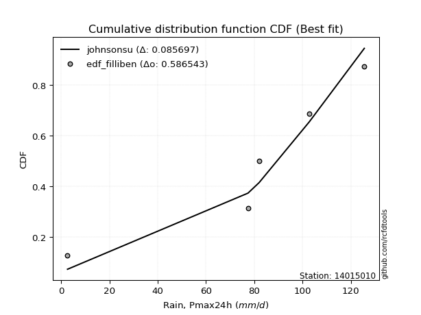</img>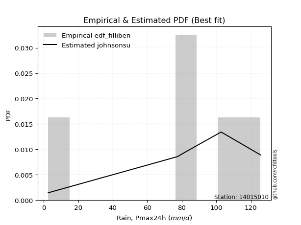</img>

</div>


### 10. Empirical - EDF Jenkinson (1977)

The Jenkinson formula in hydrology is an empirical plotting position formula used to estimate the non-exceedance probability _(P)_ or return period _(T)_ of a given ordered observation within a sample. It is a widely used method in the frequency analysis of extreme events such as floods and rainfall, as it provides a distribution-free way to plot data. _a≈0.31_ and _b≈0.38_ are constants derived to approximate the median of the probability distribution for the given rank.

<div align="center">


$P=(m-a)/(n+b)$


</div>


**10.1. Empirical values**

<div align="center">

|                | 0                   | 1                   | 2                  | 3                  | 4                  | 5                  |
|:---------------|:--------------------|:--------------------|:-------------------|:-------------------|:-------------------|:-------------------|
| date           | 2023                | 2025                | 2021               | 2019               | 2020               | 2024               |
| x              | 2.6                 | 53.6                | 77.4               | 82.0               | 102.8              | 125.6              |
| m              | 1                   | 2                   | 3                  | 4                  | 5                  | 6                  |
| empirical_dist | edf_jenkinson       | edf_jenkinson       | edf_jenkinson      | edf_jenkinson      | edf_jenkinson      | edf_jenkinson      |
| empirical      | 0.10815047021943573 | 0.26489028213166144 | 0.4216300940438871 | 0.5783699059561128 | 0.7351097178683387 | 0.8918495297805643 |
| empirical_tr   | 1.1212653778558874  | 1.3603411513859276  | 1.7289972899728996 | 2.3717472118959106 | 3.7751479289940844 | 9.246376811594207  |

</div>


**10.2. Kolmogorov-Smirnov fit test (sorted by Δ)**


<div align="center">

|                | 0                   | 1                    | 2                   | 3                  | 4                   | 5                  | 6                   | 7                   | 8                   | 9                   | 10                  | 11                  | 12                  | 13                  | 14                  | 15                  | 16                  | 17                  | 18                  | 19                  | 20                  | 21                  | 22                  | 23                  | 24                  | 25                 | 26                  | 27                  | 28                  | 29                  | 30                 | 31                    | 32                  | 33                 | 34                  | 35                 | 36                  | 37                  | 38                  | 39                 | 40                  | 41                  | 42                 | 43                 | 44                 | 45                 | 46                  | 47                 | 48                 | 49                 | 50                  | 51                 | 52                 | 53                 | 54                 | 55                 | 56                  | 57                  | 58                 | 59                  | 60                  | 61                  | 62                 | 63                 | 64                 | 65                  | 66                 | 67                 | 68                  | 69                 | 70                 | 71                  | 72                 | 73                 | 74                 | 75                 | 76                 | 77                 | 78                 | 79                 | 80                  | 81                 | 82                 | 83                | 84                 | 85                 | 86                 | 87                 | 88                 | 89                 |
|:---------------|:--------------------|:---------------------|:--------------------|:-------------------|:--------------------|:-------------------|:--------------------|:--------------------|:--------------------|:--------------------|:--------------------|:--------------------|:--------------------|:--------------------|:--------------------|:--------------------|:--------------------|:--------------------|:--------------------|:--------------------|:--------------------|:--------------------|:--------------------|:--------------------|:--------------------|:-------------------|:--------------------|:--------------------|:--------------------|:--------------------|:-------------------|:----------------------|:--------------------|:-------------------|:--------------------|:-------------------|:--------------------|:--------------------|:--------------------|:-------------------|:--------------------|:--------------------|:-------------------|:-------------------|:-------------------|:-------------------|:--------------------|:-------------------|:-------------------|:-------------------|:--------------------|:-------------------|:-------------------|:-------------------|:-------------------|:-------------------|:--------------------|:--------------------|:-------------------|:--------------------|:--------------------|:--------------------|:-------------------|:-------------------|:-------------------|:--------------------|:-------------------|:-------------------|:--------------------|:-------------------|:-------------------|:--------------------|:-------------------|:-------------------|:-------------------|:-------------------|:-------------------|:-------------------|:-------------------|:-------------------|:--------------------|:-------------------|:-------------------|:------------------|:-------------------|:-------------------|:-------------------|:-------------------|:-------------------|:-------------------|
| station        | 14015010            | 14015010             | 14015010            | 14015010           | 14015010            | 14015010           | 14015010            | 14015010            | 14015010            | 14015010            | 14015010            | 14015010            | 14015010            | 14015010            | 14015010            | 14015010            | 14015010            | 14015010            | 14015010            | 14015010            | 14015010            | 14015010            | 14015010            | 14015010            | 14015010            | 14015010           | 14015010            | 14015010            | 14015010            | 14015010            | 14015010           | 14015010              | 14015010            | 14015010           | 14015010            | 14015010           | 14015010            | 14015010            | 14015010            | 14015010           | 14015010            | 14015010            | 14015010           | 14015010           | 14015010           | 14015010           | 14015010            | 14015010           | 14015010           | 14015010           | 14015010            | 14015010           | 14015010           | 14015010           | 14015010           | 14015010           | 14015010            | 14015010            | 14015010           | 14015010            | 14015010            | 14015010            | 14015010           | 14015010           | 14015010           | 14015010            | 14015010           | 14015010           | 14015010            | 14015010           | 14015010           | 14015010            | 14015010           | 14015010           | 14015010           | 14015010           | 14015010           | 14015010           | 14015010           | 14015010           | 14015010            | 14015010           | 14015010           | 14015010          | 14015010           | 14015010           | 14015010           | 14015010           | 14015010           | 14015010           |
| empirical_dist | edf_jenkinson       | edf_jenkinson        | edf_jenkinson       | edf_jenkinson      | edf_jenkinson       | edf_jenkinson      | edf_jenkinson       | edf_jenkinson       | edf_jenkinson       | edf_jenkinson       | edf_jenkinson       | edf_jenkinson       | edf_jenkinson       | edf_jenkinson       | edf_jenkinson       | edf_jenkinson       | edf_jenkinson       | edf_jenkinson       | edf_jenkinson       | edf_jenkinson       | edf_jenkinson       | edf_jenkinson       | edf_jenkinson       | edf_jenkinson       | edf_jenkinson       | edf_jenkinson      | edf_jenkinson       | edf_jenkinson       | edf_jenkinson       | edf_jenkinson       | edf_jenkinson      | edf_jenkinson         | edf_jenkinson       | edf_jenkinson      | edf_jenkinson       | edf_jenkinson      | edf_jenkinson       | edf_jenkinson       | edf_jenkinson       | edf_jenkinson      | edf_jenkinson       | edf_jenkinson       | edf_jenkinson      | edf_jenkinson      | edf_jenkinson      | edf_jenkinson      | edf_jenkinson       | edf_jenkinson      | edf_jenkinson      | edf_jenkinson      | edf_jenkinson       | edf_jenkinson      | edf_jenkinson      | edf_jenkinson      | edf_jenkinson      | edf_jenkinson      | edf_jenkinson       | edf_jenkinson       | edf_jenkinson      | edf_jenkinson       | edf_jenkinson       | edf_jenkinson       | edf_jenkinson      | edf_jenkinson      | edf_jenkinson      | edf_jenkinson       | edf_jenkinson      | edf_jenkinson      | edf_jenkinson       | edf_jenkinson      | edf_jenkinson      | edf_jenkinson       | edf_jenkinson      | edf_jenkinson      | edf_jenkinson      | edf_jenkinson      | edf_jenkinson      | edf_jenkinson      | edf_jenkinson      | edf_jenkinson      | edf_jenkinson       | edf_jenkinson      | edf_jenkinson      | edf_jenkinson     | edf_jenkinson      | edf_jenkinson      | edf_jenkinson      | edf_jenkinson      | edf_jenkinson      | edf_jenkinson      |
| p_dist         | weibull_min         | gumbel_l             | johnsonsu           | genlogistic        | pearson3            | laplace_asymmetric | fisk                | f                   | t                   | norm                | crystalball         | exponnorm           | logt                | logistic            | gamma               | erlang              | betaprime           | hypsecant           | rice                | laplace             | logmielke           | invgamma            | maxwell             | rayleigh            | logfisk             | logpearson3        | invgauss            | ncf                 | kstwobign           | halfnorm            | gumbel_r           | loglaplace_asymmetric | logloggamma         | loggompertz        | loggumbel_l         | mielke             | moyal               | halflogistic        | genexpon            | expon              | lognakagami         | logexponnorm        | logcrystalball     | lognorm            | lognorm            | logrice            | lognct              | logfatiguelife     | logf               | alpha              | loglogistic         | wald               | loghypsecant       | logerlang          | loggamma           | loggamma           | logchi2             | logncf              | logbetaprime       | logalpha            | loginvgamma         | loginvweibull       | loglaplace         | loginvgauss        | logmaxwell         | gibrat              | lograyleigh        | logkstwobign       | loghalfnorm         | loggumbel_r        | loggenexpon        | logmoyal            | loghalflogistic    | nct                | logexpon           | pareto             | loglognorm         | logjohnsonsu       | logpareto          | logwald            | loggibrat           | invweibull         | gompertz           | nakagami          | logweibull_min     | fatiguelife        | logtruncnorm       | chi2               | loggenlogistic     | truncnorm          |
| delta          | 0.05910031911201685 | 0.062035662841549044 | 0.07145825867795308 | 0.0715035023481142 | 0.07373229018139532 | 0.0779472410618095 | 0.07952035830292475 | 0.11310000688470473 | 0.11316600668408477 | 0.11318992319634796 | 0.11318992669242095 | 0.11319016699672607 | 0.11679820277672726 | 0.11791500731158894 | 0.11878297793963982 | 0.11972587048040889 | 0.12166097468167808 | 0.12192928794149277 | 0.12274315468916103 | 0.13649924662283203 | 0.13658687345878756 | 0.14321002906919006 | 0.14452396050241184 | 0.15469716506060743 | 0.15781798421695042 | 0.1625684928918616 | 0.16331521050030057 | 0.16830609586928397 | 0.17657015710683094 | 0.18335914654757152 | 0.1837327883308943 | 0.18582115085355316   | 0.18759583391154971 | 0.2013938593837506 | 0.20342303686858332 | 0.2089148783098727 | 0.20900995824757024 | 0.21007930321155405 | 0.24175238371748287 | 0.2455680583113854 | 0.26489028199130804 | 0.27172310870534855 | 0.2717240953413288 | 0.2717240983167455 | 0.2717240983167455 | 0.2717382426435325 | 0.27226925291674164 | 0.2725641819219434 | 0.2734287828893025 | 0.2740765732049784 | 0.27668908133563175 | 0.2791679278046247 | 0.2809048485321617 | 0.2809134814486516 | 0.2830826131238606 | 0.2830826131238606 | 0.28408599084939734 | 0.28536421922987487 | 0.2860838261976433 | 0.28728384011423436 | 0.28850782376535133 | 0.28872635423433357 | 0.2960520601923995 | 0.2965592133963624 | 0.3029526045800688 | 0.30692745141465977 | 0.3130787271000699 | 0.3311067931545171 | 0.34161089155998636 | 0.3422299134262242 | 0.3445359124950851 | 0.36746072237415106 | 0.3684026903357731 | 0.3722574651775501 | 0.3823362512488808 | 0.4033736329402984 | 0.4042254999955308 | 0.4076253044432734 | 0.4253838109386593 | 0.4374860657782397 | 0.46541856069403187 | 0.4752261077623042 | 0.5169268610279543 | 0.528354820179416 | 0.5340795402600459 | 0.5542855919587721 | 0.5703022254169664 | 0.7350442834093769 | 0.8918495297805643 | 0.8918495297805643 |
| deltao         | 0.530385761606      | 0.530385761606       | 0.530385761606      | 0.530385761606     | 0.530385761606      | 0.530385761606     | 0.530385761606      | 0.530385761606      | 0.530385761606      | 0.530385761606      | 0.530385761606      | 0.530385761606      | 0.530385761606      | 0.530385761606      | 0.530385761606      | 0.530385761606      | 0.530385761606      | 0.530385761606      | 0.530385761606      | 0.530385761606      | 0.530385761606      | 0.530385761606      | 0.530385761606      | 0.530385761606      | 0.530385761606      | 0.530385761606     | 0.530385761606      | 0.530385761606      | 0.530385761606      | 0.530385761606      | 0.530385761606     | 0.530385761606        | 0.530385761606      | 0.530385761606     | 0.530385761606      | 0.530385761606     | 0.530385761606      | 0.530385761606      | 0.530385761606      | 0.530385761606     | 0.530385761606      | 0.530385761606      | 0.530385761606     | 0.530385761606     | 0.530385761606     | 0.530385761606     | 0.530385761606      | 0.530385761606     | 0.530385761606     | 0.530385761606     | 0.530385761606      | 0.530385761606     | 0.530385761606     | 0.530385761606     | 0.530385761606     | 0.530385761606     | 0.530385761606      | 0.530385761606      | 0.530385761606     | 0.530385761606      | 0.530385761606      | 0.530385761606      | 0.530385761606     | 0.530385761606     | 0.530385761606     | 0.530385761606      | 0.530385761606     | 0.530385761606     | 0.530385761606      | 0.530385761606     | 0.530385761606     | 0.530385761606      | 0.530385761606     | 0.530385761606     | 0.530385761606     | 0.530385761606     | 0.530385761606     | 0.530385761606     | 0.530385761606     | 0.530385761606     | 0.530385761606      | 0.530385761606     | 0.530385761606     | 0.530385761606    | 0.530385761606     | 0.530385761606     | 0.530385761606     | 0.530385761606     | 0.530385761606     | 0.530385761606     |
| eval           | Δo > Δ              | Δo > Δ               | Δo > Δ              | Δo > Δ             | Δo > Δ              | Δo > Δ             | Δo > Δ              | Δo > Δ              | Δo > Δ              | Δo > Δ              | Δo > Δ              | Δo > Δ              | Δo > Δ              | Δo > Δ              | Δo > Δ              | Δo > Δ              | Δo > Δ              | Δo > Δ              | Δo > Δ              | Δo > Δ              | Δo > Δ              | Δo > Δ              | Δo > Δ              | Δo > Δ              | Δo > Δ              | Δo > Δ             | Δo > Δ              | Δo > Δ              | Δo > Δ              | Δo > Δ              | Δo > Δ             | Δo > Δ                | Δo > Δ              | Δo > Δ             | Δo > Δ              | Δo > Δ             | Δo > Δ              | Δo > Δ              | Δo > Δ              | Δo > Δ             | Δo > Δ              | Δo > Δ              | Δo > Δ             | Δo > Δ             | Δo > Δ             | Δo > Δ             | Δo > Δ              | Δo > Δ             | Δo > Δ             | Δo > Δ             | Δo > Δ              | Δo > Δ             | Δo > Δ             | Δo > Δ             | Δo > Δ             | Δo > Δ             | Δo > Δ              | Δo > Δ              | Δo > Δ             | Δo > Δ              | Δo > Δ              | Δo > Δ              | Δo > Δ             | Δo > Δ             | Δo > Δ             | Δo > Δ              | Δo > Δ             | Δo > Δ             | Δo > Δ              | Δo > Δ             | Δo > Δ             | Δo > Δ              | Δo > Δ             | Δo > Δ             | Δo > Δ             | Δo > Δ             | Δo > Δ             | Δo > Δ             | Δo > Δ             | Δo > Δ             | Δo > Δ              | Δo > Δ             | Δo > Δ             | Δo > Δ            | Δo <= Δ            | Δo <= Δ            | Δo <= Δ            | Δo <= Δ            | Δo <= Δ            | Δo <= Δ            |
| fit            | 1                   | 1                    | 1                   | 1                  | 1                   | 1                  | 1                   | 1                   | 1                   | 1                   | 1                   | 1                   | 1                   | 1                   | 1                   | 1                   | 1                   | 1                   | 1                   | 1                   | 1                   | 1                   | 1                   | 1                   | 1                   | 1                  | 1                   | 1                   | 1                   | 1                   | 1                  | 1                     | 1                   | 1                  | 1                   | 1                  | 1                   | 1                   | 1                   | 1                  | 1                   | 1                   | 1                  | 1                  | 1                  | 1                  | 1                   | 1                  | 1                  | 1                  | 1                   | 1                  | 1                  | 1                  | 1                  | 1                  | 1                   | 1                   | 1                  | 1                   | 1                   | 1                   | 1                  | 1                  | 1                  | 1                   | 1                  | 1                  | 1                   | 1                  | 1                  | 1                   | 1                  | 1                  | 1                  | 1                  | 1                  | 1                  | 1                  | 1                  | 1                   | 1                  | 1                  | 1                 | 0                  | 0                  | 0                  | 0                  | 0                  | 0                  |
| n              | 6                   | 6                    | 6                   | 6                  | 6                   | 6                  | 6                   | 6                   | 6                   | 6                   | 6                   | 6                   | 6                   | 6                   | 6                   | 6                   | 6                   | 6                   | 6                   | 6                   | 6                   | 6                   | 6                   | 6                   | 6                   | 6                  | 6                   | 6                   | 6                   | 6                   | 6                  | 6                     | 6                   | 6                  | 6                   | 6                  | 6                   | 6                   | 6                   | 6                  | 6                   | 6                   | 6                  | 6                  | 6                  | 6                  | 6                   | 6                  | 6                  | 6                  | 6                   | 6                  | 6                  | 6                  | 6                  | 6                  | 6                   | 6                   | 6                  | 6                   | 6                   | 6                   | 6                  | 6                  | 6                  | 6                   | 6                  | 6                  | 6                   | 6                  | 6                  | 6                   | 6                  | 6                  | 6                  | 6                  | 6                  | 6                  | 6                  | 6                  | 6                   | 6                  | 6                  | 6                 | 6                  | 6                  | 6                  | 6                  | 6                  | 6                  |
| best_fit       | 1                   | 0                    | 0                   | 0                  | 0                   | 0                  | 0                   | 0                   | 0                   | 0                   | 0                   | 0                   | 0                   | 0                   | 0                   | 0                   | 0                   | 0                   | 0                   | 0                   | 0                   | 0                   | 0                   | 0                   | 0                   | 0                  | 0                   | 0                   | 0                   | 0                   | 0                  | 0                     | 0                   | 0                  | 0                   | 0                  | 0                   | 0                   | 0                   | 0                  | 0                   | 0                   | 0                  | 0                  | 0                  | 0                  | 0                   | 0                  | 0                  | 0                  | 0                   | 0                  | 0                  | 0                  | 0                  | 0                  | 0                   | 0                   | 0                  | 0                   | 0                   | 0                   | 0                  | 0                  | 0                  | 0                   | 0                  | 0                  | 0                   | 0                  | 0                  | 0                   | 0                  | 0                  | 0                  | 0                  | 0                  | 0                  | 0                  | 0                  | 0                   | 0                  | 0                  | 0                 | 0                  | 0                  | 0                  | 0                  | 0                  | 0                  |
| best_fit_sort  | 1                   | 2                    | 3                   | 4                  | 5                   | 6                  | 7                   | 8                   | 9                   | 10                  | 11                  | 12                  | 13                  | 14                  | 15                  | 16                  | 17                  | 18                  | 19                  | 20                  | 21                  | 22                  | 23                  | 24                  | 25                  | 26                 | 27                  | 28                  | 29                  | 30                  | 31                 | 32                    | 33                  | 34                 | 35                  | 36                 | 37                  | 38                  | 39                  | 40                 | 41                  | 42                  | 43                 | 44                 | 45                 | 46                 | 47                  | 48                 | 49                 | 50                 | 51                  | 52                 | 53                 | 54                 | 55                 | 56                 | 57                  | 58                  | 59                 | 60                  | 61                  | 62                  | 63                 | 64                 | 65                 | 66                  | 67                 | 68                 | 69                  | 70                 | 71                 | 72                  | 73                 | 74                 | 75                 | 76                 | 77                 | 78                 | 79                 | 80                 | 81                  | 82                 | 83                 | 84                | 85                 | 86                 | 87                 | 88                 | 89                 | 90                 |

</div>


<div align="center">

</img>

</div>


**10.3. Best fit**

<div align="center">

|   id |   station | empirical_dist   | p_dist      |     delta |   deltao | eval   |   fit |   n |   best_fit |   best_fit_sort |
|-----:|----------:|:-----------------|:------------|----------:|---------:|:-------|------:|----:|-----------:|----------------:|
|    0 |  14015010 | edf_jenkinson    | weibull_min | 0.0591003 | 0.530386 | Δo > Δ |     1 |   6 |          1 |               1 |

</div>


<div align="center">

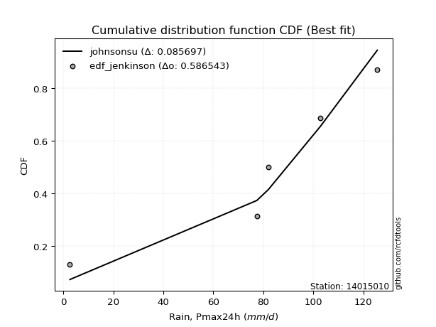</img></img>

</div>


### 11. Empirical - EDF Cunnane (1978)

Cunnane´s work in statistical hydrology has focused on the performance and evaluation of different probability distributions (such as GEV, Gumbel, Lognormal) for flood frequency estimation. _b_ is a constant, typically set to 0.4.

<div align="center">


$P=(m-b)/(n+1-2b)$


</div>


**11.1. Empirical values**

<div align="center">

|                | 0                  | 1                   | 2                   | 3                  | 4                  | 5                  |
|:---------------|:-------------------|:--------------------|:--------------------|:-------------------|:-------------------|:-------------------|
| date           | 2023               | 2025                | 2021                | 2019               | 2020               | 2024               |
| x              | 2.6                | 53.6                | 77.4                | 82.0               | 102.8              | 125.6              |
| m              | 1                  | 2                   | 3                   | 4                  | 5                  | 6                  |
| empirical_dist | edf_cunnane        | edf_cunnane         | edf_cunnane         | edf_cunnane        | edf_cunnane        | edf_cunnane        |
| empirical      | 0.0967741935483871 | 0.25806451612903225 | 0.41935483870967744 | 0.5806451612903226 | 0.7419354838709676 | 0.9032258064516128 |
| empirical_tr   | 1.1071428571428572 | 1.3478260869565217  | 1.7222222222222225  | 2.384615384615385  | 3.8749999999999982 | 10.333333333333318 |

</div>


**11.2. Kolmogorov-Smirnov fit test (sorted by Δ)**


<div align="center">

|                | 0                    | 1                   | 2                   | 3                 | 4                  | 5                   | 6                   | 7                   | 8                   | 9                   | 10                  | 11                  | 12                  | 13                  | 14                  | 15                  | 16                  | 17                  | 18                  | 19                  | 20                  | 21                  | 22                  | 23                  | 24                 | 25                  | 26                  | 27                  | 28                  | 29                 | 30                  | 31                    | 32                 | 33                 | 34                 | 35                 | 36                  | 37                  | 38                  | 39                 | 40                  | 41                 | 42                  | 43                | 44                 | 45                 | 46                 | 47                  | 48                 | 49                 | 50                 | 51                  | 52                 | 53                  | 54                 | 55                 | 56                 | 57                  | 58                  | 59                  | 60                 | 61                  | 62                 | 63                  | 64                  | 65                  | 66                 | 67                  | 68                  | 69                 | 70                  | 71                  | 72                 | 73                 | 74               | 75                  | 76               | 77                  | 78                 | 79                  | 80                  | 81                  | 82                 | 83                 | 84                 | 85                 | 86                 | 87                 | 88                 | 89                 |
|:---------------|:---------------------|:--------------------|:--------------------|:------------------|:-------------------|:--------------------|:--------------------|:--------------------|:--------------------|:--------------------|:--------------------|:--------------------|:--------------------|:--------------------|:--------------------|:--------------------|:--------------------|:--------------------|:--------------------|:--------------------|:--------------------|:--------------------|:--------------------|:--------------------|:-------------------|:--------------------|:--------------------|:--------------------|:--------------------|:-------------------|:--------------------|:----------------------|:-------------------|:-------------------|:-------------------|:-------------------|:--------------------|:--------------------|:--------------------|:-------------------|:--------------------|:-------------------|:--------------------|:------------------|:-------------------|:-------------------|:-------------------|:--------------------|:-------------------|:-------------------|:-------------------|:--------------------|:-------------------|:--------------------|:-------------------|:-------------------|:-------------------|:--------------------|:--------------------|:--------------------|:-------------------|:--------------------|:-------------------|:--------------------|:--------------------|:--------------------|:-------------------|:--------------------|:--------------------|:-------------------|:--------------------|:--------------------|:-------------------|:-------------------|:-----------------|:--------------------|:-----------------|:--------------------|:-------------------|:--------------------|:--------------------|:--------------------|:-------------------|:-------------------|:-------------------|:-------------------|:-------------------|:-------------------|:-------------------|:-------------------|
| station        | 14015010             | 14015010            | 14015010            | 14015010          | 14015010           | 14015010            | 14015010            | 14015010            | 14015010            | 14015010            | 14015010            | 14015010            | 14015010            | 14015010            | 14015010            | 14015010            | 14015010            | 14015010            | 14015010            | 14015010            | 14015010            | 14015010            | 14015010            | 14015010            | 14015010           | 14015010            | 14015010            | 14015010            | 14015010            | 14015010           | 14015010            | 14015010              | 14015010           | 14015010           | 14015010           | 14015010           | 14015010            | 14015010            | 14015010            | 14015010           | 14015010            | 14015010           | 14015010            | 14015010          | 14015010           | 14015010           | 14015010           | 14015010            | 14015010           | 14015010           | 14015010           | 14015010            | 14015010           | 14015010            | 14015010           | 14015010           | 14015010           | 14015010            | 14015010            | 14015010            | 14015010           | 14015010            | 14015010           | 14015010            | 14015010            | 14015010            | 14015010           | 14015010            | 14015010            | 14015010           | 14015010            | 14015010            | 14015010           | 14015010           | 14015010         | 14015010            | 14015010         | 14015010            | 14015010           | 14015010            | 14015010            | 14015010            | 14015010           | 14015010           | 14015010           | 14015010           | 14015010           | 14015010           | 14015010           | 14015010           |
| empirical_dist | edf_cunnane          | edf_cunnane         | edf_cunnane         | edf_cunnane       | edf_cunnane        | edf_cunnane         | edf_cunnane         | edf_cunnane         | edf_cunnane         | edf_cunnane         | edf_cunnane         | edf_cunnane         | edf_cunnane         | edf_cunnane         | edf_cunnane         | edf_cunnane         | edf_cunnane         | edf_cunnane         | edf_cunnane         | edf_cunnane         | edf_cunnane         | edf_cunnane         | edf_cunnane         | edf_cunnane         | edf_cunnane        | edf_cunnane         | edf_cunnane         | edf_cunnane         | edf_cunnane         | edf_cunnane        | edf_cunnane         | edf_cunnane           | edf_cunnane        | edf_cunnane        | edf_cunnane        | edf_cunnane        | edf_cunnane         | edf_cunnane         | edf_cunnane         | edf_cunnane        | edf_cunnane         | edf_cunnane        | edf_cunnane         | edf_cunnane       | edf_cunnane        | edf_cunnane        | edf_cunnane        | edf_cunnane         | edf_cunnane        | edf_cunnane        | edf_cunnane        | edf_cunnane         | edf_cunnane        | edf_cunnane         | edf_cunnane        | edf_cunnane        | edf_cunnane        | edf_cunnane         | edf_cunnane         | edf_cunnane         | edf_cunnane        | edf_cunnane         | edf_cunnane        | edf_cunnane         | edf_cunnane         | edf_cunnane         | edf_cunnane        | edf_cunnane         | edf_cunnane         | edf_cunnane        | edf_cunnane         | edf_cunnane         | edf_cunnane        | edf_cunnane        | edf_cunnane      | edf_cunnane         | edf_cunnane      | edf_cunnane         | edf_cunnane        | edf_cunnane         | edf_cunnane         | edf_cunnane         | edf_cunnane        | edf_cunnane        | edf_cunnane        | edf_cunnane        | edf_cunnane        | edf_cunnane        | edf_cunnane        | edf_cunnane        |
| p_dist         | weibull_min          | gumbel_l            | johnsonsu           | genlogistic       | laplace_asymmetric | pearson3            | fisk                | f                   | t                   | norm                | crystalball         | exponnorm           | logt                | logistic            | gamma               | erlang              | betaprime           | hypsecant           | rice                | laplace             | logmielke           | invgamma            | maxwell             | rayleigh            | logfisk            | invgauss            | logpearson3         | ncf                 | kstwobign           | halfnorm           | gumbel_r            | loglaplace_asymmetric | logloggamma        | loggompertz        | loggumbel_l        | mielke             | moyal               | halflogistic        | genexpon            | expon              | lognakagami         | alpha              | logexponnorm        | logcrystalball    | lognorm            | lognorm            | logrice            | lognct              | logfatiguelife     | logf               | wald               | loglogistic         | loghypsecant       | logerlang           | loggamma           | loggamma           | logchi2            | logncf              | logbetaprime        | logalpha            | loginvgamma        | loginvweibull       | loglaplace         | loginvgauss         | gibrat              | logmaxwell          | lograyleigh        | logkstwobign        | loghalfnorm         | loggumbel_r        | loggenexpon         | logmoyal            | loghalflogistic    | nct                | logexpon         | pareto              | loglognorm       | logjohnsonsu        | logpareto          | logwald             | loggibrat           | invweibull          | gompertz           | nakagami           | logweibull_min     | fatiguelife        | logtruncnorm       | chi2               | loggenlogistic     | truncnorm          |
| delta          | 0.061375574446226655 | 0.06212369745513047 | 0.07373351401216288 | 0.073778757682324 | 0.0755795343757778 | 0.07600754551560501 | 0.08179561363713445 | 0.11537526221891442 | 0.11544126201829447 | 0.11546517853055766 | 0.11546518202663064 | 0.11546542233093576 | 0.11907345811093706 | 0.12019026264579863 | 0.12105823327384951 | 0.12200112581461858 | 0.12393623001588777 | 0.12420454327570246 | 0.12501841002337072 | 0.13877450195704172 | 0.13886212879299725 | 0.14548528440339975 | 0.14679921583662153 | 0.15697242039481712 | 0.1646437502195796 | 0.16559046583451026 | 0.16939425889449078 | 0.17058135120349366 | 0.17884541244104063 | 0.1856344018817812 | 0.18600804366510398 | 0.18809640618776285   | 0.1898710892457594 | 0.2036691147179603 | 0.2102488028712125 | 0.2111901336440824 | 0.21128521358177993 | 0.21235455854576374 | 0.24857814972011205 | 0.2523938243140146 | 0.25806451598867886 | 0.2763518285391881 | 0.27854887470797773 | 0.278549861343958 | 0.2785498643193747 | 0.2785498643193747 | 0.2785640086461617 | 0.27909501891937083 | 0.2793899479245726 | 0.2802545488919317 | 0.2814431831388344 | 0.28351484733826093 | 0.2877306145347909 | 0.28773924745128077 | 0.2899083791264898 | 0.2899083791264898 | 0.2909117568520265 | 0.29218998523250406 | 0.29290959220027246 | 0.29410960611686354 | 0.2953335897679805 | 0.29555212023696276 | 0.3028778261950287 | 0.30338497939899156 | 0.30920270674886946 | 0.30977837058269797 | 0.3199044931026991 | 0.33793255915714626 | 0.34843665756261555 | 0.3490556794288534 | 0.35136167849771427 | 0.37428648837678025 | 0.3752284563384023 | 0.3790832311801793 | 0.38916201725151 | 0.41019939894292756 | 0.41105126599816 | 0.41445107044590235 | 0.4322095769412885 | 0.44431183178086886 | 0.47224432669666105 | 0.48660238443335263 | 0.5192021163621641 | 0.5351805861820452 | 0.5409053062626751 | 0.5611113579614013 | 0.5771279914195956 | 0.7418700494120061 | 0.9032258064516128 | 0.9032258064516129 |
| deltao         | 0.530385761606       | 0.530385761606      | 0.530385761606      | 0.530385761606    | 0.530385761606     | 0.530385761606      | 0.530385761606      | 0.530385761606      | 0.530385761606      | 0.530385761606      | 0.530385761606      | 0.530385761606      | 0.530385761606      | 0.530385761606      | 0.530385761606      | 0.530385761606      | 0.530385761606      | 0.530385761606      | 0.530385761606      | 0.530385761606      | 0.530385761606      | 0.530385761606      | 0.530385761606      | 0.530385761606      | 0.530385761606     | 0.530385761606      | 0.530385761606      | 0.530385761606      | 0.530385761606      | 0.530385761606     | 0.530385761606      | 0.530385761606        | 0.530385761606     | 0.530385761606     | 0.530385761606     | 0.530385761606     | 0.530385761606      | 0.530385761606      | 0.530385761606      | 0.530385761606     | 0.530385761606      | 0.530385761606     | 0.530385761606      | 0.530385761606    | 0.530385761606     | 0.530385761606     | 0.530385761606     | 0.530385761606      | 0.530385761606     | 0.530385761606     | 0.530385761606     | 0.530385761606      | 0.530385761606     | 0.530385761606      | 0.530385761606     | 0.530385761606     | 0.530385761606     | 0.530385761606      | 0.530385761606      | 0.530385761606      | 0.530385761606     | 0.530385761606      | 0.530385761606     | 0.530385761606      | 0.530385761606      | 0.530385761606      | 0.530385761606     | 0.530385761606      | 0.530385761606      | 0.530385761606     | 0.530385761606      | 0.530385761606      | 0.530385761606     | 0.530385761606     | 0.530385761606   | 0.530385761606      | 0.530385761606   | 0.530385761606      | 0.530385761606     | 0.530385761606      | 0.530385761606      | 0.530385761606      | 0.530385761606     | 0.530385761606     | 0.530385761606     | 0.530385761606     | 0.530385761606     | 0.530385761606     | 0.530385761606     | 0.530385761606     |
| eval           | Δo > Δ               | Δo > Δ              | Δo > Δ              | Δo > Δ            | Δo > Δ             | Δo > Δ              | Δo > Δ              | Δo > Δ              | Δo > Δ              | Δo > Δ              | Δo > Δ              | Δo > Δ              | Δo > Δ              | Δo > Δ              | Δo > Δ              | Δo > Δ              | Δo > Δ              | Δo > Δ              | Δo > Δ              | Δo > Δ              | Δo > Δ              | Δo > Δ              | Δo > Δ              | Δo > Δ              | Δo > Δ             | Δo > Δ              | Δo > Δ              | Δo > Δ              | Δo > Δ              | Δo > Δ             | Δo > Δ              | Δo > Δ                | Δo > Δ             | Δo > Δ             | Δo > Δ             | Δo > Δ             | Δo > Δ              | Δo > Δ              | Δo > Δ              | Δo > Δ             | Δo > Δ              | Δo > Δ             | Δo > Δ              | Δo > Δ            | Δo > Δ             | Δo > Δ             | Δo > Δ             | Δo > Δ              | Δo > Δ             | Δo > Δ             | Δo > Δ             | Δo > Δ              | Δo > Δ             | Δo > Δ              | Δo > Δ             | Δo > Δ             | Δo > Δ             | Δo > Δ              | Δo > Δ              | Δo > Δ              | Δo > Δ             | Δo > Δ              | Δo > Δ             | Δo > Δ              | Δo > Δ              | Δo > Δ              | Δo > Δ             | Δo > Δ              | Δo > Δ              | Δo > Δ             | Δo > Δ              | Δo > Δ              | Δo > Δ             | Δo > Δ             | Δo > Δ           | Δo > Δ              | Δo > Δ           | Δo > Δ              | Δo > Δ             | Δo > Δ              | Δo > Δ              | Δo > Δ              | Δo > Δ             | Δo <= Δ            | Δo <= Δ            | Δo <= Δ            | Δo <= Δ            | Δo <= Δ            | Δo <= Δ            | Δo <= Δ            |
| fit            | 1                    | 1                   | 1                   | 1                 | 1                  | 1                   | 1                   | 1                   | 1                   | 1                   | 1                   | 1                   | 1                   | 1                   | 1                   | 1                   | 1                   | 1                   | 1                   | 1                   | 1                   | 1                   | 1                   | 1                   | 1                  | 1                   | 1                   | 1                   | 1                   | 1                  | 1                   | 1                     | 1                  | 1                  | 1                  | 1                  | 1                   | 1                   | 1                   | 1                  | 1                   | 1                  | 1                   | 1                 | 1                  | 1                  | 1                  | 1                   | 1                  | 1                  | 1                  | 1                   | 1                  | 1                   | 1                  | 1                  | 1                  | 1                   | 1                   | 1                   | 1                  | 1                   | 1                  | 1                   | 1                   | 1                   | 1                  | 1                   | 1                   | 1                  | 1                   | 1                   | 1                  | 1                  | 1                | 1                   | 1                | 1                   | 1                  | 1                   | 1                   | 1                   | 1                  | 0                  | 0                  | 0                  | 0                  | 0                  | 0                  | 0                  |
| n              | 6                    | 6                   | 6                   | 6                 | 6                  | 6                   | 6                   | 6                   | 6                   | 6                   | 6                   | 6                   | 6                   | 6                   | 6                   | 6                   | 6                   | 6                   | 6                   | 6                   | 6                   | 6                   | 6                   | 6                   | 6                  | 6                   | 6                   | 6                   | 6                   | 6                  | 6                   | 6                     | 6                  | 6                  | 6                  | 6                  | 6                   | 6                   | 6                   | 6                  | 6                   | 6                  | 6                   | 6                 | 6                  | 6                  | 6                  | 6                   | 6                  | 6                  | 6                  | 6                   | 6                  | 6                   | 6                  | 6                  | 6                  | 6                   | 6                   | 6                   | 6                  | 6                   | 6                  | 6                   | 6                   | 6                   | 6                  | 6                   | 6                   | 6                  | 6                   | 6                   | 6                  | 6                  | 6                | 6                   | 6                | 6                   | 6                  | 6                   | 6                   | 6                   | 6                  | 6                  | 6                  | 6                  | 6                  | 6                  | 6                  | 6                  |
| best_fit       | 1                    | 0                   | 0                   | 0                 | 0                  | 0                   | 0                   | 0                   | 0                   | 0                   | 0                   | 0                   | 0                   | 0                   | 0                   | 0                   | 0                   | 0                   | 0                   | 0                   | 0                   | 0                   | 0                   | 0                   | 0                  | 0                   | 0                   | 0                   | 0                   | 0                  | 0                   | 0                     | 0                  | 0                  | 0                  | 0                  | 0                   | 0                   | 0                   | 0                  | 0                   | 0                  | 0                   | 0                 | 0                  | 0                  | 0                  | 0                   | 0                  | 0                  | 0                  | 0                   | 0                  | 0                   | 0                  | 0                  | 0                  | 0                   | 0                   | 0                   | 0                  | 0                   | 0                  | 0                   | 0                   | 0                   | 0                  | 0                   | 0                   | 0                  | 0                   | 0                   | 0                  | 0                  | 0                | 0                   | 0                | 0                   | 0                  | 0                   | 0                   | 0                   | 0                  | 0                  | 0                  | 0                  | 0                  | 0                  | 0                  | 0                  |
| best_fit_sort  | 1                    | 2                   | 3                   | 4                 | 5                  | 6                   | 7                   | 8                   | 9                   | 10                  | 11                  | 12                  | 13                  | 14                  | 15                  | 16                  | 17                  | 18                  | 19                  | 20                  | 21                  | 22                  | 23                  | 24                  | 25                 | 26                  | 27                  | 28                  | 29                  | 30                 | 31                  | 32                    | 33                 | 34                 | 35                 | 36                 | 37                  | 38                  | 39                  | 40                 | 41                  | 42                 | 43                  | 44                | 45                 | 46                 | 47                 | 48                  | 49                 | 50                 | 51                 | 52                  | 53                 | 54                  | 55                 | 56                 | 57                 | 58                  | 59                  | 60                  | 61                 | 62                  | 63                 | 64                  | 65                  | 66                  | 67                 | 68                  | 69                  | 70                 | 71                  | 72                  | 73                 | 74                 | 75               | 76                  | 77               | 78                  | 79                 | 80                  | 81                  | 82                  | 83                 | 84                 | 85                 | 86                 | 87                 | 88                 | 89                 | 90                 |

</div>


<div align="center">

</img>

</div>


**11.3. Best fit**

<div align="center">

|   id |   station | empirical_dist   | p_dist      |     delta |   deltao | eval   |   fit |   n |   best_fit |   best_fit_sort |
|-----:|----------:|:-----------------|:------------|----------:|---------:|:-------|------:|----:|-----------:|----------------:|
|    0 |  14015010 | edf_cunnane      | weibull_min | 0.0613756 | 0.530386 | Δo > Δ |     1 |   6 |          1 |               1 |

</div>


<div align="center">

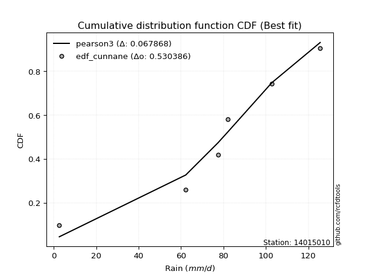</img>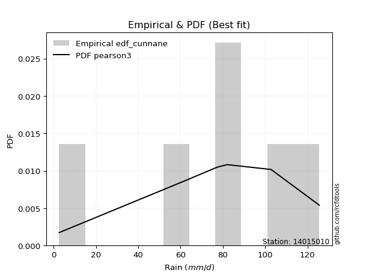</img>

</div>


### 12. Empirical - EDF Adamowski (1981)

The Adamowski formula in hydrology refers to a specific plotting position formula used for estimating the non-parametric empirical distribution of hydrological events (like flood peaks) to calculate their return periods. This formula provides an alternative to traditional parametric methods (like the Gumbel or Log Pearson Type III distributions). 

<div align="center">


$P=(m-0.25)/(n+0.5)$


</div>


**12.1. Empirical values**

<div align="center">

|                | 0                   | 1                  | 2                  | 3                  | 4                  | 5                  |
|:---------------|:--------------------|:-------------------|:-------------------|:-------------------|:-------------------|:-------------------|
| date           | 2023                | 2025               | 2021               | 2019               | 2020               | 2024               |
| x              | 2.6                 | 53.6               | 77.4               | 82.0               | 102.8              | 125.6              |
| m              | 1                   | 2                  | 3                  | 4                  | 5                  | 6                  |
| empirical_dist | edf_adamowski       | edf_adamowski      | edf_adamowski      | edf_adamowski      | edf_adamowski      | edf_adamowski      |
| empirical      | 0.11538461538461539 | 0.2692307692307692 | 0.4230769230769231 | 0.5769230769230769 | 0.7307692307692307 | 0.8846153846153846 |
| empirical_tr   | 1.1304347826086958  | 1.3684210526315788 | 1.7333333333333334 | 2.3636363636363633 | 3.7142857142857135 | 8.666666666666664  |

</div>


**12.2. Kolmogorov-Smirnov fit test (sorted by Δ)**


<div align="center">

|                | 0                   | 1                   | 2                   | 3                   | 4                   | 5                   | 6                   | 7                   | 8                   | 9                   | 10                | 11                  | 12                  | 13                  | 14                  | 15                  | 16                  | 17                  | 18                  | 19                  | 20                  | 21                 | 22                 | 23                 | 24                  | 25                 | 26                  | 27                  | 28                | 29                  | 30                  | 31                    | 32                  | 33                  | 34                  | 35                  | 36                 | 37                 | 38                  | 39                  | 40                  | 41                | 42                 | 43                 | 44                  | 45                  | 46                  | 47                 | 48                 | 49                  | 50                  | 51                 | 52                 | 53                  | 54                  | 55                  | 56                  | 57                 | 58                 | 59                 | 60                  | 61                 | 62                 | 63                 | 64                | 65                 | 66                 | 67                 | 68                 | 69                  | 70                 | 71                 | 72                 | 73                 | 74                  | 75                 | 76                  | 77                  | 78                 | 79                 | 80                 | 81                  | 82                 | 83                 | 84                 | 85                 | 86                 | 87                 | 88                 | 89                 |
|:---------------|:--------------------|:--------------------|:--------------------|:--------------------|:--------------------|:--------------------|:--------------------|:--------------------|:--------------------|:--------------------|:------------------|:--------------------|:--------------------|:--------------------|:--------------------|:--------------------|:--------------------|:--------------------|:--------------------|:--------------------|:--------------------|:-------------------|:-------------------|:-------------------|:--------------------|:-------------------|:--------------------|:--------------------|:------------------|:--------------------|:--------------------|:----------------------|:--------------------|:--------------------|:--------------------|:--------------------|:-------------------|:-------------------|:--------------------|:--------------------|:--------------------|:------------------|:-------------------|:-------------------|:--------------------|:--------------------|:--------------------|:-------------------|:-------------------|:--------------------|:--------------------|:-------------------|:-------------------|:--------------------|:--------------------|:--------------------|:--------------------|:-------------------|:-------------------|:-------------------|:--------------------|:-------------------|:-------------------|:-------------------|:------------------|:-------------------|:-------------------|:-------------------|:-------------------|:--------------------|:-------------------|:-------------------|:-------------------|:-------------------|:--------------------|:-------------------|:--------------------|:--------------------|:-------------------|:-------------------|:-------------------|:--------------------|:-------------------|:-------------------|:-------------------|:-------------------|:-------------------|:-------------------|:-------------------|:-------------------|
| station        | 14015010            | 14015010            | 14015010            | 14015010            | 14015010            | 14015010            | 14015010            | 14015010            | 14015010            | 14015010            | 14015010          | 14015010            | 14015010            | 14015010            | 14015010            | 14015010            | 14015010            | 14015010            | 14015010            | 14015010            | 14015010            | 14015010           | 14015010           | 14015010           | 14015010            | 14015010           | 14015010            | 14015010            | 14015010          | 14015010            | 14015010            | 14015010              | 14015010            | 14015010            | 14015010            | 14015010            | 14015010           | 14015010           | 14015010            | 14015010            | 14015010            | 14015010          | 14015010           | 14015010           | 14015010            | 14015010            | 14015010            | 14015010           | 14015010           | 14015010            | 14015010            | 14015010           | 14015010           | 14015010            | 14015010            | 14015010            | 14015010            | 14015010           | 14015010           | 14015010           | 14015010            | 14015010           | 14015010           | 14015010           | 14015010          | 14015010           | 14015010           | 14015010           | 14015010           | 14015010            | 14015010           | 14015010           | 14015010           | 14015010           | 14015010            | 14015010           | 14015010            | 14015010            | 14015010           | 14015010           | 14015010           | 14015010            | 14015010           | 14015010           | 14015010           | 14015010           | 14015010           | 14015010           | 14015010           | 14015010           |
| empirical_dist | edf_adamowski       | edf_adamowski       | edf_adamowski       | edf_adamowski       | edf_adamowski       | edf_adamowski       | edf_adamowski       | edf_adamowski       | edf_adamowski       | edf_adamowski       | edf_adamowski     | edf_adamowski       | edf_adamowski       | edf_adamowski       | edf_adamowski       | edf_adamowski       | edf_adamowski       | edf_adamowski       | edf_adamowski       | edf_adamowski       | edf_adamowski       | edf_adamowski      | edf_adamowski      | edf_adamowski      | edf_adamowski       | edf_adamowski      | edf_adamowski       | edf_adamowski       | edf_adamowski     | edf_adamowski       | edf_adamowski       | edf_adamowski         | edf_adamowski       | edf_adamowski       | edf_adamowski       | edf_adamowski       | edf_adamowski      | edf_adamowski      | edf_adamowski       | edf_adamowski       | edf_adamowski       | edf_adamowski     | edf_adamowski      | edf_adamowski      | edf_adamowski       | edf_adamowski       | edf_adamowski       | edf_adamowski      | edf_adamowski      | edf_adamowski       | edf_adamowski       | edf_adamowski      | edf_adamowski      | edf_adamowski       | edf_adamowski       | edf_adamowski       | edf_adamowski       | edf_adamowski      | edf_adamowski      | edf_adamowski      | edf_adamowski       | edf_adamowski      | edf_adamowski      | edf_adamowski      | edf_adamowski     | edf_adamowski      | edf_adamowski      | edf_adamowski      | edf_adamowski      | edf_adamowski       | edf_adamowski      | edf_adamowski      | edf_adamowski      | edf_adamowski      | edf_adamowski       | edf_adamowski      | edf_adamowski       | edf_adamowski       | edf_adamowski      | edf_adamowski      | edf_adamowski      | edf_adamowski       | edf_adamowski      | edf_adamowski      | edf_adamowski      | edf_adamowski      | edf_adamowski      | edf_adamowski      | edf_adamowski      | edf_adamowski      |
| p_dist         | weibull_min         | gumbel_l            | johnsonsu           | genlogistic         | pearson3            | fisk                | laplace_asymmetric  | f                   | t                   | norm                | crystalball       | exponnorm           | logt                | logistic            | gamma               | erlang              | betaprime           | hypsecant           | rice                | laplace             | logmielke           | invgamma           | maxwell            | rayleigh           | logfisk             | logpearson3        | invgauss            | ncf                 | kstwobign         | halfnorm            | gumbel_r            | loglaplace_asymmetric | logloggamma         | loggumbel_l         | loggompertz         | mielke              | moyal              | halflogistic       | genexpon            | expon               | logexponnorm        | logcrystalball    | lognorm            | lognorm            | logrice             | lognct              | logfatiguelife      | logf               | lognakagami        | loglogistic         | alpha               | loghypsecant       | logerlang          | wald                | loggamma            | loggamma            | logchi2             | logncf             | logbetaprime       | logalpha           | loginvgamma         | loginvweibull      | loglaplace         | loginvgauss        | logmaxwell        | gibrat             | lograyleigh        | logkstwobign       | loghalfnorm        | loggumbel_r         | loggenexpon        | logmoyal           | loghalflogistic    | nct                | logexpon            | pareto             | loglognorm          | logjohnsonsu        | logpareto          | logwald            | loggibrat          | invweibull          | gompertz           | nakagami           | logweibull_min     | fatiguelife        | logtruncnorm       | chi2               | loggenlogistic     | truncnorm          |
| delta          | 0.06280485692852157 | 0.06926980800672877 | 0.07001142964491713 | 0.07005667331507826 | 0.07228546114835938 | 0.08157831515606397 | 0.08228772816091745 | 0.11165317785166878 | 0.11171917765104883 | 0.11174309416331202 | 0.111743097659385 | 0.11174333796369013 | 0.11535137374369131 | 0.11646817827855299 | 0.11733614890660388 | 0.11827904144737295 | 0.12021414564864213 | 0.12048245890845682 | 0.12129632565612508 | 0.13505241758979608 | 0.13514004442575162 | 0.1417632000361541 | 0.1430771314693759 | 0.1532503360275715 | 0.15347749711784264 | 0.1582280057927538 | 0.16186838146726462 | 0.16685926683624802 | 0.175123328073795 | 0.18191231751453557 | 0.18228595929785835 | 0.18437432182051722   | 0.18614900487851377 | 0.19908254976947554 | 0.19994703035071465 | 0.20746804927683676 | 0.2075631292145343 | 0.2086324741785181 | 0.23741189661837508 | 0.24122757121227761 | 0.26738262160624077 | 0.267383608242221 | 0.2673836112176377 | 0.2673836112176377 | 0.26739775554442474 | 0.26792876581763386 | 0.26822369482283565 | 0.2690882957901947 | 0.2692307690904158 | 0.27234859423652397 | 0.27262974417194247 | 0.2765643614330539 | 0.2765729943495438 | 0.27772109877158874 | 0.27874212602475285 | 0.27874212602475285 | 0.27974550375028956 | 0.2810237321307671 | 0.2817433390985355 | 0.2829433530151266 | 0.28416733666624355 | 0.2843858671352258 | 0.2917115730932917 | 0.2922187262972546 | 0.298612117480961 | 0.3054806223816238 | 0.3087382400009621 | 0.3267663060554093 | 0.3372704044608786 | 0.33788942632711644 | 0.3401954253959773 | 0.3631202352750433 | 0.3640622032366653 | 0.3679169780784423 | 0.37799576414977304 | 0.3990331458411906 | 0.39988501289642303 | 0.40328481734416544 | 0.4210433238395515 | 0.4331455786791319 | 0.4610780735949241 | 0.46799196259712444 | 0.5154800319949183 | 0.5240143330803082 | 0.5297390531609381 | 0.5499451048596644 | 0.5659617383178586 | 0.7307037963102692 | 0.8846153846153846 | 0.8846153846153846 |
| deltao         | 0.530385761606      | 0.530385761606      | 0.530385761606      | 0.530385761606      | 0.530385761606      | 0.530385761606      | 0.530385761606      | 0.530385761606      | 0.530385761606      | 0.530385761606      | 0.530385761606    | 0.530385761606      | 0.530385761606      | 0.530385761606      | 0.530385761606      | 0.530385761606      | 0.530385761606      | 0.530385761606      | 0.530385761606      | 0.530385761606      | 0.530385761606      | 0.530385761606     | 0.530385761606     | 0.530385761606     | 0.530385761606      | 0.530385761606     | 0.530385761606      | 0.530385761606      | 0.530385761606    | 0.530385761606      | 0.530385761606      | 0.530385761606        | 0.530385761606      | 0.530385761606      | 0.530385761606      | 0.530385761606      | 0.530385761606     | 0.530385761606     | 0.530385761606      | 0.530385761606      | 0.530385761606      | 0.530385761606    | 0.530385761606     | 0.530385761606     | 0.530385761606      | 0.530385761606      | 0.530385761606      | 0.530385761606     | 0.530385761606     | 0.530385761606      | 0.530385761606      | 0.530385761606     | 0.530385761606     | 0.530385761606      | 0.530385761606      | 0.530385761606      | 0.530385761606      | 0.530385761606     | 0.530385761606     | 0.530385761606     | 0.530385761606      | 0.530385761606     | 0.530385761606     | 0.530385761606     | 0.530385761606    | 0.530385761606     | 0.530385761606     | 0.530385761606     | 0.530385761606     | 0.530385761606      | 0.530385761606     | 0.530385761606     | 0.530385761606     | 0.530385761606     | 0.530385761606      | 0.530385761606     | 0.530385761606      | 0.530385761606      | 0.530385761606     | 0.530385761606     | 0.530385761606     | 0.530385761606      | 0.530385761606     | 0.530385761606     | 0.530385761606     | 0.530385761606     | 0.530385761606     | 0.530385761606     | 0.530385761606     | 0.530385761606     |
| eval           | Δo > Δ              | Δo > Δ              | Δo > Δ              | Δo > Δ              | Δo > Δ              | Δo > Δ              | Δo > Δ              | Δo > Δ              | Δo > Δ              | Δo > Δ              | Δo > Δ            | Δo > Δ              | Δo > Δ              | Δo > Δ              | Δo > Δ              | Δo > Δ              | Δo > Δ              | Δo > Δ              | Δo > Δ              | Δo > Δ              | Δo > Δ              | Δo > Δ             | Δo > Δ             | Δo > Δ             | Δo > Δ              | Δo > Δ             | Δo > Δ              | Δo > Δ              | Δo > Δ            | Δo > Δ              | Δo > Δ              | Δo > Δ                | Δo > Δ              | Δo > Δ              | Δo > Δ              | Δo > Δ              | Δo > Δ             | Δo > Δ             | Δo > Δ              | Δo > Δ              | Δo > Δ              | Δo > Δ            | Δo > Δ             | Δo > Δ             | Δo > Δ              | Δo > Δ              | Δo > Δ              | Δo > Δ             | Δo > Δ             | Δo > Δ              | Δo > Δ              | Δo > Δ             | Δo > Δ             | Δo > Δ              | Δo > Δ              | Δo > Δ              | Δo > Δ              | Δo > Δ             | Δo > Δ             | Δo > Δ             | Δo > Δ              | Δo > Δ             | Δo > Δ             | Δo > Δ             | Δo > Δ            | Δo > Δ             | Δo > Δ             | Δo > Δ             | Δo > Δ             | Δo > Δ              | Δo > Δ             | Δo > Δ             | Δo > Δ             | Δo > Δ             | Δo > Δ              | Δo > Δ             | Δo > Δ              | Δo > Δ              | Δo > Δ             | Δo > Δ             | Δo > Δ             | Δo > Δ              | Δo > Δ             | Δo > Δ             | Δo > Δ             | Δo <= Δ            | Δo <= Δ            | Δo <= Δ            | Δo <= Δ            | Δo <= Δ            |
| fit            | 1                   | 1                   | 1                   | 1                   | 1                   | 1                   | 1                   | 1                   | 1                   | 1                   | 1                 | 1                   | 1                   | 1                   | 1                   | 1                   | 1                   | 1                   | 1                   | 1                   | 1                   | 1                  | 1                  | 1                  | 1                   | 1                  | 1                   | 1                   | 1                 | 1                   | 1                   | 1                     | 1                   | 1                   | 1                   | 1                   | 1                  | 1                  | 1                   | 1                   | 1                   | 1                 | 1                  | 1                  | 1                   | 1                   | 1                   | 1                  | 1                  | 1                   | 1                   | 1                  | 1                  | 1                   | 1                   | 1                   | 1                   | 1                  | 1                  | 1                  | 1                   | 1                  | 1                  | 1                  | 1                 | 1                  | 1                  | 1                  | 1                  | 1                   | 1                  | 1                  | 1                  | 1                  | 1                   | 1                  | 1                   | 1                   | 1                  | 1                  | 1                  | 1                   | 1                  | 1                  | 1                  | 0                  | 0                  | 0                  | 0                  | 0                  |
| n              | 6                   | 6                   | 6                   | 6                   | 6                   | 6                   | 6                   | 6                   | 6                   | 6                   | 6                 | 6                   | 6                   | 6                   | 6                   | 6                   | 6                   | 6                   | 6                   | 6                   | 6                   | 6                  | 6                  | 6                  | 6                   | 6                  | 6                   | 6                   | 6                 | 6                   | 6                   | 6                     | 6                   | 6                   | 6                   | 6                   | 6                  | 6                  | 6                   | 6                   | 6                   | 6                 | 6                  | 6                  | 6                   | 6                   | 6                   | 6                  | 6                  | 6                   | 6                   | 6                  | 6                  | 6                   | 6                   | 6                   | 6                   | 6                  | 6                  | 6                  | 6                   | 6                  | 6                  | 6                  | 6                 | 6                  | 6                  | 6                  | 6                  | 6                   | 6                  | 6                  | 6                  | 6                  | 6                   | 6                  | 6                   | 6                   | 6                  | 6                  | 6                  | 6                   | 6                  | 6                  | 6                  | 6                  | 6                  | 6                  | 6                  | 6                  |
| best_fit       | 1                   | 0                   | 0                   | 0                   | 0                   | 0                   | 0                   | 0                   | 0                   | 0                   | 0                 | 0                   | 0                   | 0                   | 0                   | 0                   | 0                   | 0                   | 0                   | 0                   | 0                   | 0                  | 0                  | 0                  | 0                   | 0                  | 0                   | 0                   | 0                 | 0                   | 0                   | 0                     | 0                   | 0                   | 0                   | 0                   | 0                  | 0                  | 0                   | 0                   | 0                   | 0                 | 0                  | 0                  | 0                   | 0                   | 0                   | 0                  | 0                  | 0                   | 0                   | 0                  | 0                  | 0                   | 0                   | 0                   | 0                   | 0                  | 0                  | 0                  | 0                   | 0                  | 0                  | 0                  | 0                 | 0                  | 0                  | 0                  | 0                  | 0                   | 0                  | 0                  | 0                  | 0                  | 0                   | 0                  | 0                   | 0                   | 0                  | 0                  | 0                  | 0                   | 0                  | 0                  | 0                  | 0                  | 0                  | 0                  | 0                  | 0                  |
| best_fit_sort  | 1                   | 2                   | 3                   | 4                   | 5                   | 6                   | 7                   | 8                   | 9                   | 10                  | 11                | 12                  | 13                  | 14                  | 15                  | 16                  | 17                  | 18                  | 19                  | 20                  | 21                  | 22                 | 23                 | 24                 | 25                  | 26                 | 27                  | 28                  | 29                | 30                  | 31                  | 32                    | 33                  | 34                  | 35                  | 36                  | 37                 | 38                 | 39                  | 40                  | 41                  | 42                | 43                 | 44                 | 45                  | 46                  | 47                  | 48                 | 49                 | 50                  | 51                  | 52                 | 53                 | 54                  | 55                  | 56                  | 57                  | 58                 | 59                 | 60                 | 61                  | 62                 | 63                 | 64                 | 65                | 66                 | 67                 | 68                 | 69                 | 70                  | 71                 | 72                 | 73                 | 74                 | 75                  | 76                 | 77                  | 78                  | 79                 | 80                 | 81                 | 82                  | 83                 | 84                 | 85                 | 86                 | 87                 | 88                 | 89                 | 90                 |

</div>


<div align="center">

</img>

</div>


**12.3. Best fit**

<div align="center">

|   id |   station | empirical_dist   | p_dist      |     delta |   deltao | eval   |   fit |   n |   best_fit |   best_fit_sort |
|-----:|----------:|:-----------------|:------------|----------:|---------:|:-------|------:|----:|-----------:|----------------:|
|    0 |  14015010 | edf_adamowski    | weibull_min | 0.0628049 | 0.530386 | Δo > Δ |     1 |   6 |          1 |               1 |

</div>


<div align="center">

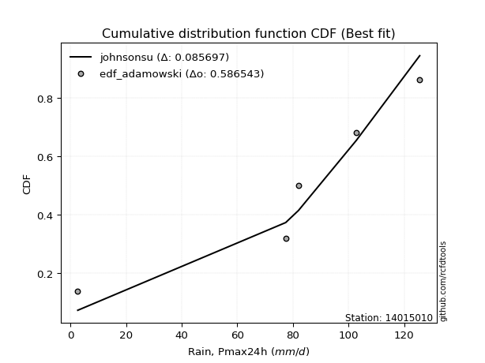</img>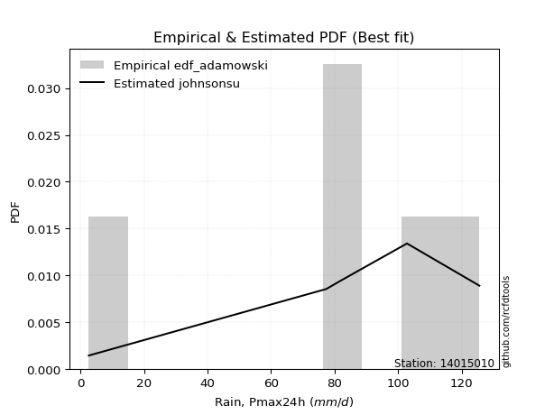</img>

</div>


## C. Best fit & Estimate extreme values for specific return periods - Tr


### 1. Best fit (ordered by delta Δ)

<div align="center">

|   id |   station | empirical_dist   | p_dist             |     delta |   deltao | eval   |   fit |   n |   best_fit |   best_fit_sort |
|-----:|----------:|:-----------------|:-------------------|----------:|---------:|:-------|------:|----:|-----------:|----------------:|
|    0 |  14015010 | edf_chegodayev   | weibull_min        | 0.0588554 | 0.530386 | Δo > Δ |     1 |   6 |          1 |               1 |
|    1 |  14015010 | edf_jenkinson    | weibull_min        | 0.0591003 | 0.530386 | Δo > Δ |     1 |   6 |          1 |               2 |
|    2 |  14015010 | edf_beard        | weibull_min        | 0.0591003 | 0.530386 | Δo > Δ |     1 |   6 |          1 |               3 |
|    3 |  14015010 | edf_filliben     | weibull_min        | 0.059285  | 0.530386 | Δo > Δ |     1 |   6 |          1 |               4 |
|    4 |  14015010 | edf_tukey        | weibull_min        | 0.0596778 | 0.530386 | Δo > Δ |     1 |   6 |          1 |               5 |
|    5 |  14015010 | edf_blom         | weibull_min        | 0.0607304 | 0.530386 | Δo > Δ |     1 |   6 |          1 |               6 |
|    6 |  14015010 | edf_cunnane      | weibull_min        | 0.0613756 | 0.530386 | Δo > Δ |     1 |   6 |          1 |               7 |
|    7 |  14015010 | edf_gringorten   | weibull_min        | 0.0624298 | 0.530386 | Δo > Δ |     1 |   6 |          1 |               8 |
|    8 |  14015010 | edf_adamowski    | weibull_min        | 0.0628049 | 0.530386 | Δo > Δ |     1 |   6 |          1 |               9 |
|    9 |  14015010 | edf_hazen        | weibull_min        | 0.0640637 | 0.530386 | Δo > Δ |     1 |   6 |          1 |              10 |
|   10 |  14015010 | edf_weibull      | genlogistic        | 0.0813175 | 0.530386 | Δo > Δ |     1 |   6 |          1 |              11 |
|   11 |  14015010 | edf_california   | laplace_asymmetric | 0.115668  | 0.530386 | Δo > Δ |     1 |   6 |          1 |              12 |

</div>

:file_folder:Tables: [bestfit_14015010.csv](table/bestfit_14015010.csv) | [extreme_14015010.csv](table/extreme_14015010.csv)


### 2. Extreme values

In hydrology, a return period (or recurrence interval $Tr$) is the statistical average time between extreme events like floods or droughts of a specific magnitude, indicating how rare an event is, with a 100-year flood, for example, having a 1% chance of occurring in any given year, not that it happens exactly every century. It is a key tool for infrastructure design (like bridges or dams) and risk assessment, calculated from historical data to determine the probability of future events, although it is important to remember it is statistical average, and events can cluster or be missed.

> risk_rate: assuming the return period as the project useful life.

|   id |      tr |   prob_l |     prob_g |    alpha |   betaprime |     chi2 |   crystalball |   erlang |    expon |   exponnorm |        f |   fatiguelife |     fisk |    gamma |   genexpon |   genlogistic |   gibrat |   gompertz |   gumbel_l |   gumbel_r |   halflogistic |   halfnorm |   hypsecant |   invgamma |   invgauss |      invweibull |   johnsonsu |   kstwobign |   laplace |   laplace_asymmetric |   loggamma |   logistic |   lognorm |   maxwell |   mielke |    moyal |   nakagami |      ncf |              nct |     norm |           pareto |   pearson3 |   rayleigh |     rice |        t |   truncnorm |     wald |   weibull_min |   logalpha |   logbetaprime |   logchi2 |   logcrystalball |   logerlang |         logexpon |   logexponnorm |      logf |   logfatiguelife |   logfisk |   loggenexpon |   loggenlogistic |        loggibrat |   loggompertz |   loggumbel_l |   loggumbel_r |   loghalflogistic |   loghalfnorm |   loghypsecant |   loginvgamma |   loginvgauss |    loginvweibull |   logjohnsonsu |   logkstwobign |   loglaplace |   loglaplace_asymmetric |   logloggamma |   loglogistic |   loglognorm |   logmaxwell |   logmielke |   logmoyal |   lognakagami |    logncf |    lognct |     logpareto |   logpearson3 |   lograyleigh |   logrice |             logt |   logtruncnorm |     logwald |   logweibull_min |   station |   n |   risk_rate |
|-----:|--------:|---------:|-----------:|---------:|------------:|---------:|--------------:|---------:|---------:|------------:|---------:|--------------:|---------:|---------:|-----------:|--------------:|---------:|-----------:|-----------:|-----------:|---------------:|-----------:|------------:|-----------:|-----------:|----------------:|------------:|------------:|----------:|---------------------:|-----------:|-----------:|----------:|----------:|---------:|---------:|-----------:|---------:|-----------------:|---------:|-----------------:|-----------:|-----------:|---------:|---------:|------------:|---------:|--------------:|-----------:|---------------:|----------:|-----------------:|------------:|-----------------:|---------------:|----------:|-----------------:|----------:|--------------:|-----------------:|-----------------:|--------------:|--------------:|--------------:|------------------:|--------------:|---------------:|--------------:|--------------:|-----------------:|---------------:|---------------:|-------------:|------------------------:|--------------:|--------------:|-------------:|-------------:|------------:|-----------:|--------------:|----------:|----------:|--------------:|--------------:|--------------:|----------:|-----------------:|---------------:|------------:|-----------------:|----------:|----:|------------:|
|    0 |    2    | 0.5      | 0.5        |  60.5921 |     73.1436 |  4.60879 |       74      |  73.2896 |  52.0907 |     74      |  73.9848 |       2.60001 |  77.2975 |  73.3882 |    52.6346 |       81.4166 |  62.3219 |    106.458 |    80.3915 |    67.6085 |        64.431  |    66.0361 |     74      |    70.6301 |    68.3569 | 30801           |     81.3687 |     64.9971 |   74      |              77.7352 |    45.3972 |     74     |   47.4547 |   70.6726 |  60.4841 |  65.5451 |    3.98516 |  64.9514 |     23.1843      |  74      |      9.19306     |    77.8449 |    69.4924 |  72.9377 |  74.0025 |    -195.564 |  61.3885 |       80.27   |    44.6921 |        44.7679 |   45.1263 |          47.4547 |     45.6752 |     19.4645      |        47.4548 |   47.1593 |          47.3185 |   65.1452 |       31.7936 |          inf     |     31.8833      |       60.8069 |       58.9945 |       38.1722 |           34.2571 |       36.1815 |        47.4547 |       44.2665 |       42.5534 |     41.2802      |        123.012 |        33.1506 |      47.4547 |                 64.0567 |       63.812  |       47.4547 |      2.61614 |      42.3707 |       0     |    35.5819 |       67.6477 |   44.5627 |   47.3397 |   3.43438     |       66.9043 |       40.7014 |   47.4522 |     84.424       |        13.0443 |     30.8856 |      5.68137     |  14015010 |   6 |    0.75     |
|    1 |    2.33 | 0.570815 | 0.429185   |  66.1335 |     80.1378 |  5.24038 |       80.9427 |  80.3632 |  62.995  |     80.9426 |  80.9777 |       4.55165 |  83.6512 |  80.4544 |    63.6587 |       87.2704 |  65.8388 |    108.537 |    86.4317 |    74.0416 |        71.0453 |    73.5291 |     79.5562 |    78.0369 |    75.8509 |     4.63235e+06 |     87.6707 |     73.7897 |   78.2014 |              82.0951 |    58.0681 |     80.117 |   60.1123 |   77.8855 |  69.6093 |  71.6349 |    6.49078 |  74.6268 |     34.6394      |  80.9427 |     16.8193      |    84.5448 |    76.8121 |  80.0901 |  80.9448 |    -191.877 |  65.9409 |       86.5267 |    57.2507 |        57.543  |   57.9336 |          60.1123 |     58.5578 |     30.33        |        60.1125 |   59.8007 |          59.9485 |   77.8754 |       44.3019 |          inf     |     35.94        |       69.9774 |       72.4682 |       47.522  |           42.912  |       46.6994 |        57.3399 |       57.1055 |       55.5563 |     58.4892      |        124.546 |        46.9933 |      54.7544 |                 72.8586 |       72.6286 |       58.4455 |      2.80913 |      54.1686 |       0     |    43.7823 |       71.6801 |   57.8692 |   60.0377 |   4.74028     |       81.2019 |       52.224  |   60.1097 |     89.1417      |        17.177  |     36.065  |      7.63882     |  14015010 |   6 |    0.729209 |
|    2 |    5    | 0.8      | 0.2        |  89.8629 |    106.509  |  8.76943 |      106.743  | 107.094  | 117.514  |    106.743  | 107.005  |      46.0106  | 108.184  | 107.17   |   118.777  |      106.478  |  86.0864 |    115.266 |   105.945  |   101.99   |       100.974  |   105.216  |    101.843  |   106.985  |   106.129  |     1.33311e+16 |    107.585  |    111.138  |   99.2073 |             101.118  |   147.108  |    103.735 |  144.732  |  106.275  |  99.9079 |  99.8434 |   57.1449  | 116.636  |    248.595       | 106.743  |    618.478       |   107.348  |   106.116  | 106.973  | 106.744  |    -178.174 |  91.4252 |      106.939  |   147.151  |       148.617  |  149.313  |         144.732  |    149.881  |    278.591       |       144.733  |  144.61   |         144.465  |  155.134  |      168.916  |          inf     |     71.6212      |      110.347  |      140.849  |      123.101  |          118.913  |      137.396  |       122.487  |      151.041  |      156.233  |    265.79        |        125.563 |       206.9    |     111.97   |                101.152  |      101.004  |      130.639  |    inf       |     142.442  |       0     |   114.422  |       93.2513 |  156.569  |  145.307  |   5.54486e+11 |      139.555  |      141.672  |  144.731  |    118.786       |        45.4688 |     85.9009 |     54.4452      |  14015010 |   6 |    0.67232  |
|    3 |   10    | 0.9      | 0.1        | 109.018  |    124.334  | 12.2747  |      123.859  | 125.215  | 167.005  |    123.859  | 124.305  |     103.255   | 126.251  | 125.291  |   168.811  |      118.492  | 109.166  |    119.018 |   116.809  |   124.754  |       125.828  |   128.663  |    119.64   |   127.505  |   128.456  |     6.74739e+23 |    118.216  |    139.575  |  118.276  |             118.387  |   276.083  |    121.129 |  259.244  |  126.254  | 113.436  | 124.403  |  146.246   | 149.809  |   1471.42        | 123.859  |  18591.4         |   120.721  |   127.01   | 124.992  | 123.859  |    -169.083 | 118.47   |      118.437  |   281.219  |       282.804  |  284.324  |         259.244  |    283.646  |   2085.63        |       259.245  |  259.881  |         258.994  |  257.713  |      441.136  |          inf     |    157.179       |      142.302  |      203.91   |      267.265  |          277.225  |      305.334  |       224.55   |      294.818  |      322.425  |    912.078       |        125.596 |       639.551  |     214.354  |                113.422  |      113.322  |      236.231  |    inf       |     281.277  |       0     |   264.093  |      114.292  |  309.587  |  261.362  | inf           |      175.12   |      288.615  |  259.248  |    188.153       |        73.6058 |    215.769  |    587.215       |  14015010 |   6 |    0.651322 |
|    4 |   15    | 0.933333 | 0.0666667  | 119.872  |    133.328  | 14.4015  |      132.4    | 134.375  | 195.955  |    132.4    | 132.949  |     140.694   | 136.095  | 134.453  |   198.08   |      124.65   | 125.086  |    120.719 |   121.729  |   137.597  |       139.893  |   140.865  |    129.797  |   138.163  |   140.307  |     1.49906e+28 |    122.876  |    154.671  |  129.43   |             128.488  |   379.45   |    130.607 |  346.763  |  136.505  | 117.982  | 138.657  |  203.782   | 167.958  |   4160.89        | 132.4    | 136388           |   126.893  |   137.776  | 134.023  | 132.399  |    -164.547 | 135.837  |      123.676  |   391.114  |       391.511  |  393.995  |         346.763  |    391.654  |   6771.01        |       346.765  |  348.23   |         346.612  |  339.81   |      724.181  |          inf     |    270.3         |      159.692  |      241.106  |      413.899  |          447.572  |      462.647  |       317.346  |      414.632  |      468.393  |   1828.74        |        125.599 |      1164.3    |     313.406  |                117.503  |      117.421  |      326.217  |    inf       |     398.795  |       0     |   429.111  |      127.196  |  437.886  |  350.399  | inf           |      190      |      416.435  |  346.772  |    299.409       |        87.3661 |    389.805  |   2969.17        |  14015010 |   6 |    0.644736 |
|    5 |   20    | 0.95     | 0.05       | 127.527  |    139.254  | 15.935   |      137.993  | 140.415  | 216.495  |    137.993  | 138.613  |     168.412   | 142.899  | 140.496  |   218.846  |      128.81   | 137.573  |    121.777 |   124.792  |   146.589  |       149.748  |   149      |    136.962  |   145.301  |   148.332  |     1.65675e+31 |    125.718  |    164.84   |  137.344  |             135.655  |   467.961  |    137.157 |  419.526  |  143.309  | 120.261  | 148.751  |  244.398   | 180.423  |   8698.83        | 137.993  | 560868           |   130.759  |   144.931  | 139.949  | 137.992  |    -161.577 | 148.779  |      126.947  |   486.62   |       485.19   |  488.685  |         419.526  |    484.562  |  15613.8         |       419.529  |  421.806  |         419.502  |  411.383  |     1007.09   |          inf     |    413.56        |      171.579  |      267.611  |      562.205  |          626.059  |      610.343  |       405.047  |      519.783  |      600.783  |   2976.39        |        125.599 |      1743.17   |     410.356  |                119.542  |      119.469  |      407.744  |    inf       |     502.773  |       0     |   605.161  |      136.627  |  550.812  |  424.596  | inf           |      198.494  |      531.351  |  419.54   |    481.481       |        95.4096 |    605.698  |  10312.8         |  14015010 |   6 |    0.641514 |
|    6 |   25    | 0.96     | 0.04       | 133.466  |    143.634  | 17.1363  |      142.111  | 144.883  | 232.428  |    142.111  | 142.784  |     190.436   | 148.104  | 144.967  |   234.953  |      131.953  | 147.984  |    122.531 |   126.971  |   153.516  |       157.34   |   155.053  |    142.507  |   150.636  |   154.376  |     3.66016e+33 |    127.711  |    172.458  |  143.483  |             141.214  |   546.447  |    142.168 |  482.677  |  148.359  | 121.631  | 156.576  |  275.344   | 189.893  |  15412.6         | 142.111  |      1.67952e+06 |   133.517  |   150.248  | 144.317  | 142.109  |    -159.39  | 159.145  |      129.279  |   572.253  |       568.632  |  573.152  |         482.677  |    567.217  |  29851.1         |       482.681  |  485.74   |         482.792  |  476.155  |     1286.87   |          inf     |    589.534       |      180.575  |      288.229  |      711.77   |          810.794  |      750.065  |       489.237  |      614.72   |      723.217  |   4331.41        |        125.6   |      2358.45   |     505.771  |                120.765  |      120.698  |      483.616  |    inf       |     597.136  |       0     |   789.941  |      144.104  |  652.949  |  489.099  | inf           |      204.095  |      636.817  |  482.696  |    781.637       |       100.669  |    862.126  |  28541.2         |  14015010 |   6 |    0.639603 |
|    7 |   50    | 0.98     | 0.02       | 152.087  |    156.264  | 20.9204  |      153.901  | 157.778  | 281.918  |    153.901  | 154.738  |     261.098   | 164.006  | 157.873  |   284.988  |      141.415  | 184.681  |    124.576 |   132.887  |   174.853  |       180.734  |   172.647  |    159.699  |   166.307  |   172.335  |     6.09548e+40 |    132.983  |    194.826  |  162.552  |             158.483  |   854.727  |    157.478 |  721.182  |  163.007  | 124.387  | 180.865  |  367.114   | 218.395  |  91097.7         | 153.901  |      5.06743e+07 |   141.014  |   165.68   | 156.849  | 153.899  |    -153.128 | 192.99   |      135.63   |   915.802  |       899.02   |  908.569  |         721.182  |    893.805  | 223476           |       721.189  |  727.717  |         722.016  |  744.331  |     2623.26   |          inf     |   2057.11        |      207.455  |      352.561  |     1472.05   |         1798.5    |     1365.58   |       878.612  |     1000.34   |     1243.2    |  13758.4         |        125.6   |      5729.93   |     968.241  |                123.21   |      123.154  |      814.591  |    inf       |     983.382  |       0     |  1806.54   |      168.264  | 1068.84   |  733.435  | inf           |      217.154  |     1077.14   |  721.222  |   9785.05        |       112.291  |   2729.88   | 889286           |  14015010 |   6 |    0.63583  |
|    8 |   75    | 0.986667 | 0.0133333  | 163.199  |    163.094  | 23.1639  |      160.228  | 164.758  | 310.869  |    160.228  | 161.158  |     303.654   | 173.191  | 164.861  |   314.256  |      146.816  | 209.466  |    125.611 |   135.879  |   187.255  |       194.332  |   182.224  |    169.746  |   174.963  |   182.379  |     9.60337e+44 |    135.565  |    207.132  |  173.706  |             168.584  |  1088.83   |    166.32  |  894.573  |  170.971  | 125.341  | 195.07   |  417.495   | 234.538  | 257560           | 160.228  |      3.71792e+08 |   144.797  |   174.076  | 163.586  | 160.225  |    -149.768 | 213.817  |      138.852  |  1183.06   |      1152.08   | 1166.35   |         894.573  |   1143.43   | 725516           |       894.582  |  904.042  |         896.091  |  963.438  |     3865.87   |          inf     |   4784.46        |      222.54   |      390.373  |     2245.7    |         2857.84   |     1892.2    |      1237.07   |     1304.31   |     1673.51   |  26934.8         |        125.6   |      9338.15   |    1415.66   |                124.024  |      123.973  |     1100.83   |    inf       |    1289.76   |       0     |  2930.44   |      183.079  | 1397.27   |  911.652  | inf           |      222.471  |     1433.68   |  894.631  | 138085           |       116.526  |   5548.48   |      8.00185e+06 |  14015010 |   6 |    0.634587 |
|    9 |  100    | 0.99     | 0.01       | 171.221  |    167.734  | 24.7665  |      164.507  | 169.504  | 331.409  |    164.507  | 165.502  |     334.274   | 179.675  | 169.613  |   335.023  |      150.613  | 228.666  |    126.287 |   137.835  |   196.033  |       203.957  |   188.748  |    176.873  |   180.917  |   189.337  |     8.97828e+47 |    137.222  |    215.564  |  181.62   |             175.751  |  1283.57   |    172.563 | 1034.91   |  176.396  | 125.852  | 205.147  |  451.804   | 245.794  | 538432           | 164.507  |      1.52894e+09 |   147.262  |   179.797  | 168.146  | 164.504  |    -147.495 | 229.002  |      140.964  |  1408.9    |      1363.7    | 1382.39   |        1034.91   |   1351.92   |      1.67302e+06 |      1034.92   | 1046.96   |        1037.07   | 1155.95   |     5035.28   |          inf     |   9200.32        |      232.998  |      417.273  |     3028.15   |         3966.36   |     2363.01   |      1576.9    |     1563.25   |     2051.55   |  43331.2         |        125.6   |     13049.4    |    1853.59   |                124.431  |      124.382  |     1361.63   |    inf       |    1551.46   |       0     |  4130.29   |      193.909  | 1677.25   | 1056.19   | inf           |      225.473  |     1742.03   | 1034.98   |      2.11557e+06 |       118.717  |   9305.87   |      4.11727e+07 |  14015010 |   6 |    0.633968 |
|   10 |  200    | 0.995    | 0.005      | 191.143  |    178.321  | 28.6588  |      174.213  | 180.343  | 380.9    |    174.213  | 175.363  |     409.227   | 195.231  | 180.467  |   385.057  |      159.683  | 280.902  |    127.759 |   142.088  |   217.135  |       227.096  |   203.67   |    194.042  |   194.734  |   205.62   |     1.24515e+55 |    140.727  |    234.985  |  200.689  |             193.02   |  1868.83   |    187.539 | 1440.32   |  188.806  | 126.762  | 229.427  |  529.962   | 272.342  |      3.18239e+06 | 174.213  |      4.6131e+10  |   152.585  |   192.885  | 178.504  | 174.21   |    -142.34  | 266.826  |      145.565  |  2103.69   |      2004.46   | 2038.74   |        1440.32   |   1982.16   |      1.25248e+07 |      1440.34   | 1460.66   |        1444.65   | 1789.46   |     9220.77   |          inf     |  54497.8         |      257.459  |      482.31   |     6212.8    |         8722.28   |     3927.98   |      2829.71   |     2369.07   |     3282.27   | 135899           |        125.6   |     28204.7    |    3548.48   |                125.042  |      124.996  |     2267.53   |    inf       |    2367.53   |       0     |  9442.38   |      221.127  | 2548.9    | 1474.95   | inf           |      230.747  |     2720.4    | 1440.44   |      1.98252e+11 |       122.099  |  33741.8    |      2.7643e+09  |  14015010 |   6 |    0.633042 |
|   11 |  250    | 0.996    | 0.004      | 197.765  |    181.573  | 29.9199  |      177.179  | 183.675  | 396.832  |    177.179  | 178.378  |     433.655   | 200.225  | 183.804  |   401.165  |      162.588  | 299.645  |    128.191 |   143.34   |   223.919  |       234.535  |   208.26   |    199.569  |   199.043  |   210.737  |     2.46196e+57 |    141.732  |    240.995  |  206.827  |             198.579  |  2097.6    |    192.347 | 1593.42   |  192.626  | 126.997  | 237.243  |  553.88    | 280.738  |      5.63845e+06 | 177.179  |      1.3814e+11  |   154.138  |   196.913  | 181.673  | 177.176  |    -140.765 | 279.339  |      146.922  |  2380.95   |      2256.51   | 2297.69   |        1593.42   |   2229.74   |      2.39455e+07 |      1593.44   | 1617.16   |        1598.69   | 2058.97   |    11109.1    |          128.656 | 103177           |      265.135  |      503.309  |     7827.56   |        11237.1    |     4592.68   |      3415.76   |     2693.75   |     3797.6    | 196248           |        125.6   |     35802.4    |    4373.56   |                125.164  |      125.118  |     2670.94   |    inf       |    2696.49   |     125.189 | 12322.1    |      230.239  | 2900.06   | 1633.49   | inf           |      231.991  |     3120.47   | 1593.56   |      7.58354e+13 |       122.789  |  51669.9    |      1.15513e+10 |  14015010 |   6 |    0.632858 |
|   12 |  500    | 0.998    | 0.002      | 219.103  |    191.267  | 33.8579  |      185.975  | 193.614  | 446.323  |    185.975  | 187.324  |     510.283   | 215.712  | 193.76   |   451.199  |      171.583  | 364.418  |    129.433 |   146.927  |   244.976  |       257.625  |   221.947  |    216.737  |   212.071  |   226.306  |     3.29439e+64 |    144.544  |    259.007  |  225.896  |             215.847  |  2959.76   |    207.258 | 2149.94   |  204.026  | 127.636  | 261.522  |  624.766   | 306.415  |      3.33259e+07 | 185.975  |      4.16794e+12 |   158.546  |   208.934  | 191.077  | 185.971  |    -136.093 | 319.127  |      150.818  |  3449.61   |      3212.71   | 3283.23   |        2149.94   |   3167.71   |      1.79265e+08 |      2149.97   | 2187.08   |        2159.05   | 3181.34   |    19371.7    |          128.915 | 936668           |      288.434  |      568.712  |    16034.6    |        24669      |     7319.9    |      6129.24   |     3957.78   |     5888.68   | 613960           |        125.6   |     73173.1    |    8372.69   |                125.409  |      125.364  |     4438.1    |    inf       |    3975.62   |     125.398 | 28169.3    |      259.669  | 4266.32   | 2211.31   | inf           |      234.864  |     4699.06   | 2150.16   |      2.43802e+27 |       124.185  | 200308      |      1.2305e+12  |  14015010 |   6 |    0.632489 |
|   13 |  750    | 0.998667 | 0.00133333 | 232.196  |    196.683  | 36.1741  |      190.862  | 199.172  | 475.273  |    190.862  | 192.296  |     555.559   | 224.761  | 199.328  |   480.468  |      176.832  | 407.255  |    130.096 |   148.844  |   257.285  |       271.122  |   229.594  |    226.78   |   219.472  |   235.213  |     4.82962e+68 |    146.004  |    269.126  |  237.05   |             225.949  |  3587.96   |    215.969 | 2539.21   |  210.402  | 127.971  | 275.724  |  664.072   | 321.186  |      9.42218e+07 | 190.862  |      3.05797e+13 |   160.87   |   215.656  | 196.306  | 190.857  |    -133.498 | 342.982  |      152.905  |  4248.64   |      3914.53   | 4009.28   |        2539.21   |   3855.18   |      5.81984e+08 |      2539.24   | 2586.51   |        2551.33   | 4102.1    |    26439.5    |          129.001 |      4.02856e+06 |      301.716  |      607.084  |    24384.9    |        39065.2    |     9497.26   |      8628.56   |     4913.34   |     7543.96   |      1.19595e+06 |        125.6   |    109332      |   12241.7    |                125.49   |      125.446  |     5970.91   |    inf       |    4939.79   |     125.467 | 45691.1    |      277.7    | 5297.92   | 2616.65   | inf           |      236.024  |     5907.86   | 2539.48   |      3.54792e+41 |       124.654  | 451362      |      2.20319e+13 |  14015010 |   6 |    0.632366 |
|   14 | 1000    | 0.999    | 0.001      | 241.793  |    200.425  | 37.8225  |      194.226  | 203.013  | 495.814  |    194.226  | 195.722  |     587.854   | 231.178  | 203.177  |   501.234  |      180.553  | 440.036  |    130.542 |   150.135  |   266.017  |       280.697  |   234.874  |    233.905  |   224.637  |   241.454  |     4.35628e+71 |    146.968  |    276.136  |  244.965  |             233.116  |  4098.44   |    222.147 | 2847.45   |  214.809  | 128.198  | 285.8    |  691.09    | 331.566  |      1.96971e+08 | 194.226  |      1.25755e+14 |   162.42   |   220.301  | 199.908  | 194.221  |    -131.711 | 360.142  |      154.311  |  4908.86   |      4487.43   | 4603.38   |        2847.45   |   4415.89   |      1.34204e+09 |      2847.49   | 2903.21   |        2862.15   | 4912.43   |    32781      |          129.044 |      1.23023e+07 |      310.998  |      634.357  |    32829.5    |        54125.5    |    11368.5    |     10998.2    |     5708.3    |     8961.95   |      1.91918e+06 |        125.6   |    144401      |   16028.6    |                125.531  |      125.487  |     7369.06   |    inf       |    5739.66   |     125.502 | 64397.4    |      290.869  | 6155.23   | 2938.23   | inf           |      236.676  |     6920.45   | 2847.77   |      1.43338e+56 |       124.89   | 809698      |      1.82471e+14 |  14015010 |   6 |    0.632305 |

<div align="center">

</img>

</div>


<div align="center">

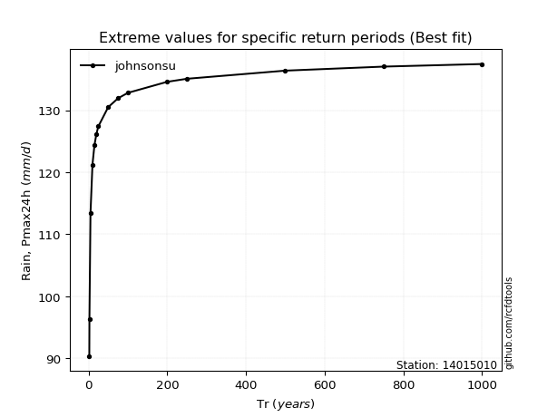</img>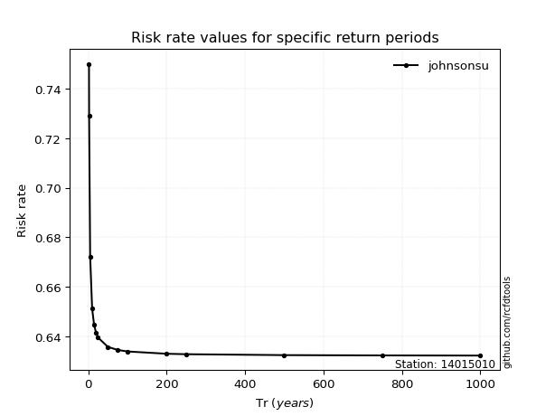</img>

</div>


<sub>**APP DISCLAIMER**: NO WARRANTY - This software is provided by [github.com/rcfdtools](https://github.com/rcfdtools) "as is", without any express or implied warranty, including warranties of merchantability, fitness for a particular purpose, or non-infringement. There is no guarantee that the software will be error-free or operate without interruption. LIMITATION OF LIABILITY - Neither the authors nor copyright holders will be liable for claims or damages arising from the software or its use. You are responsible for determining if the software is appropriate for your use and assume all associated risks, including errors, legal compliance, and data loss. NO PROFESSIONAL ADVICE - The software provides general information and does not offer professional advice. It should not replace consultation with professional advisors.</sub>