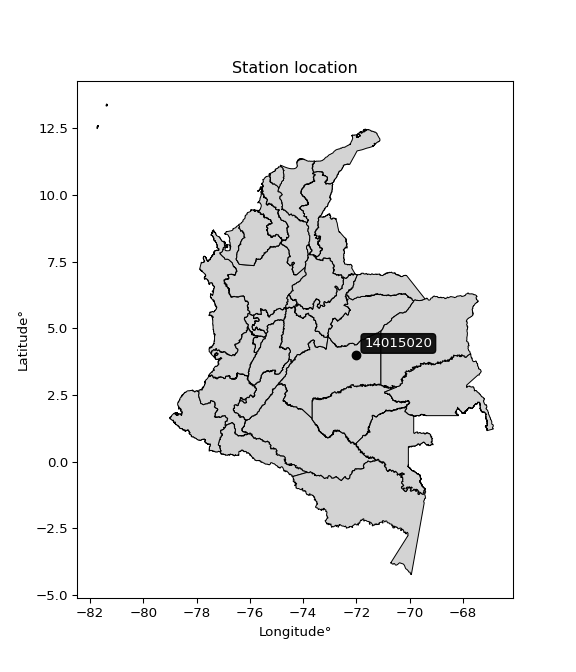

<div align="center">


</div>

# PMP Station (Rain, Pmax24h): 14015020

Probable Maximum Precipitation (PMP) is the greatest amount of rainfall for a specific duration that is meteorologically possible for a given location, acting as a "worst-case" scenario for extreme storms, crucial for designing safety-critical infrastructure like bridges, river deviations, dams, spillways, and nuclear plants to prevent catastrophic failure. PMP is calculated by hydrologists using meteorological data to determine the upper limit of extreme rainfall, often leading to the Probable Maximum Flood (PMF) for flood control design, and is increasingly being studied for climate change impacts. Probable Maximum Precipitation (PMP) is the theoretical upper limit of rainfall, a deterministic estimate for extreme events, while probability distributions (like GEV, Gumbel) describe the likelihood and frequency of various precipitation amounts, including rare ones, showing how often events occur, with PMP representing the extreme end of these distributions, used for critical infrastructure design to ensure safety against the worst conceivable weather, unlike standard statistical forecasts which cover typical probabilities.

The most common probability distributions in hydrology, used for analyzing floods, rainfall, and streamflow, include the Normal, Log-Normal, Gumbel, Gamma (including Log-Pearson Type III), and Generalized Extreme Value (GEV) distributions, often chosen based on the data´s skewness and whether modeling extremes or general conditions, with Gumbel and GEV popular for extreme events like floods, while the Normal distribution serves as a baseline, though often requiring transformations for skewed hydrological data. These distributions help in designing water infrastructure, managing water resources, and forecasting hydrologic events.

> Hydrological data often isn´t perfectly normal (it´s skewed), so different distributions are needed for different applications, such as: **Flood Frequency Analysis**: Using Gumbel, GEV, or Log-Pearson Type III for predicting extreme flood magnitudes and their return periods, **Rainfall Analysis**: Normal for annual totals, but Log-Normal, Weibull, or GEV for intensity or extreme daily rainfall, **Streamflow Modeling**: Gamma and Log-Normal for maximum flows, GEV for minimum flows, and Kappa for daily flows.

<div align="center">

</img>

</div>


## A. General information


### 1. General running parameters

• app_version: _v20260108_. • runtime: _2026-01-08 18:05:13.093906_. • Python version: _3.14.0_. • SciPy version: _1.16.3_. • Pandas version: _2.3.3_. • NumPy version: _2.3.5_. • Stations dataset (station_dataset_file): _dataset/pmax24h_in/automatic_colombia_2003_2024.csv_. • Stations catalog (station_catalog_file): _dataset/CNE.xls_. • Minimum year to eval til year_max (date_min): _1900_. • Maximum year to eval since year_min (date_max): _2024_. • Creates, save and include plots into reports (create_plot): _False_. • Plot only fit distributions with Δo > Δ (plot_only_fit): _True_. • Plot only simple graphs avoiding multiple CDFs and multiple Extreme values plots (plot_only_simple): _False_. • Eval low extreme values, if False, evaluates high extreme values (low_extreme): _False_. • Eval every SciPy distribution as logarithmic (pdist_logarithmic_on): _True_. • Standard deviation normalized (ddof): _1.0_. • Return periods to eval in years (Tr): _[2, 2.33, 5, 10, 15, 20, 25, 50, 75, 100, 200, 250, 500, 750, 1000]_. • Minimum data sample per station, 0 means any (minimum_sample): _5_. • Z-Score maximum threshold to adjust a value, 0 means disable (zscore_max): _3.5_. • Z-Score minimum threshold to adjust a value, 0 means disable (zscore_min): _-2.5_. • Avoid zeros, e.g. rain = 0 (avoid_zeros): _True_. • Avoid null values (avoid_nans): _True_. 

:file_folder:Table: [dataset.csv](../../dataset/pmax24h_in/automatic_colombia_2003_2024.csv)

> Delta Degrees of Freedom (DDOF): is a parameter used in the formulas for calculating variance and standard deviation. When ddof=0, the divisor is $N$ (the total number of observations) and this is used when your data set is the entire population. When ddof=1, the divisor is $N-1$ and this is used when your data set is a sample drawn from a larger population. Using $N-1$ provides an unbiased estimate of the population variance (known as Bessel´s correction).


### 2. Station info and location

|   id |   CODIGO | NOMBRE    | CATEGORIA   | TECNOLOGIA   | ESTADO    | FECHA_INSTALACION   |   FECHA_SUSPENSION |   ALTITUD |   LATITUD |   LONGITUD | DEPARTAMENTO   | MUNICIPIO   | AREA_OPERATIVA   | ENTIDAD   | AREA_HIDROGRAFICA   | ZONA_HIDROGRAFICA   | SUBZONA_HIDROGRAFICA   | CORRIENTE   | Catalogo   |   Version |
|-----:|---------:|:----------|:------------|:-------------|:----------|:--------------------|-------------------:|----------:|----------:|-----------:|:---------------|:------------|:-----------------|:----------|:--------------------|:--------------------|:-----------------------|:------------|:-----------|----------:|
|    0 | 14015020 | (No data) | (No data)   | (No data)    | (No data) | 01/01/2000          |                nan |         0 |         4 |        -72 | (No data)      | (No data)   | (No data)        | (No data) | (No data)           | (No data)           | (No data)              | (No data)   | (No data)  |  20251226 |

<div align="center">

Dynamic map: [:earth_americas:Google](http://maps.google.com/maps?q=4.0,-72.0) [:earth_americas:OSM](https://www.openstreetmap.org/#map=18/4.0/-72.0&layers=P) [:earth_americas:Bing](https://www.bing.com/maps?cp=4.0~-72.0&lvl=18) [:earth_americas:Apple](https://maps.apple.com/frame?center=4.0%2C-72.0&span=0.003%2C0.006)

</div>


<div align="center">

```geojson
{
  "type": "Feature",
  "geometry": {
    "type": "Point", 
    "coordinates": [-72.0, 4.0]
  }, 
  "properties": {
    "Name": "14015020"
  }
}
```

</div>


### 3. Discrete values table and plot

<div align="center">

|               |           0 |          1 |          2 |           3 |           4 |           5 |
|:--------------|------------:|-----------:|-----------:|------------:|------------:|------------:|
| Date          | 2014        | 2015       | 2016       | 2017        | 2018        | 2019        |
| Value         |   68.76     |   41.39    |   74.19    |   66.55     |   44.45     |   52.17     |
| Value_initial |   68.76     |   41.39    |   74.19    |   66.55     |   44.45     |   52.17     |
| count         |    6        |    6       |    6       |    6        |    6        |    6        |
| mean          |   57.9183   |   57.9183  |   57.9183  |   57.9183   |   57.9183   |   57.9183   |
| std           |   13.7437   |   13.7437  |   13.7437  |   13.7437   |   13.7437   |   13.7437   |
| zscore        |    0.788849 |   -1.20262 |    1.18394 |    0.628048 |   -0.979968 |   -0.418254 |


</div>


> The initial value (value_initial) correspond to the initial obtained or null completed value, and value (value) is adjusted only when the initial value is outside the valid range (outlier) definite through the Z-Score value. If Z-Score is active, values out of range or outliers are replaced with the station mean value. A Z-Score (or standard score) measures how many standard deviations a data point is from the mean of a dataset, indicating its relative position; positive scores mean above the mean, negative mean below, and a score of zero is exactly at the mean, allowing for comparison of values from different distributions. It´s calculated using the formula $z=(x–μ)/σ$, where $x$ is the data point, $μ$ is the mean, and $σ$ is the standard deviation, helping identify outliers and understand probability.
>
> <sub>**Note**: In this study, "completing" (filling gaps in) and "extending" (forecasting or lengthening the historical record) rainfall data series are avoided for certain critical analyses because they introduce artificial bias and uncertainty, which can distort the statistics of rare events (extremes), alter day-to-day variability, and compromise the integrity and homogeneity of the original data. Some reasons against Completing/Extending rainfall data are: **Distortion of Extremes and Variability**: The primary issue is that most gap-filling or extension methods rely on averaging or regression with nearby stations, which inherently smooths the data. Rainfall is highly variable in space and time, with a large percentage of zero values and occasional large storms. Infilling methods often underestimate the highest values and overestimate the lowest (zero) values, which severely distorts analyses focused on flood frequency, drought severity, and intensity-duration-frequency (IDF) curves, **Loss of Data Homogeneity**: Infilled or extended data are synthetic estimates, not actual measurements. Combining these estimates with observed data can violate the assumption of data homogeneity, which requires that the data properties do not change over time. Inhomogeneity can lead to incorrect conclusions about long-term trends or changes in climate patterns, **Propagation of Errors**: Errors and biases from the original data (e.g., wind-induced undercatch, instrument errors, site changes) or the data used for imputation can propagate through the analysis, leading to unreliable hydrological models and inaccurate predictions, **Compromised Statistical Integrity**: For statistical analyses, especially those involving the frequency of events, using artificial data can introduce time bias or autocorrelation that doesn´t exist in reality, making it difficult to assess the true probability of events, **Difficulty in Validation**: It is difficult to accurately validate the quality of filled or extended data, especially for past periods where ground-truth measurements are unavailable. The reliability of imputation techniques heavily depends on the density of the surrounding station network and the complexity of the local topography.</sub>


### 4. Active continuous probability distributions from SciPy (43 of 104 available)

A Probability Density Function (PDF) describes the relative likelihood of a continuous random variable falling within a specific range, where the total area under its curve equals 1, and the area over any interval gives the actual probability for that range. Unlike discrete probabilities (like rolling a die), a PDF shows density, not direct probability for a single point (which is zero), with higher points indicating higher likelihood, often visualized as a bell curve for normal distributions.

A log of a probability density function (log-PDF) is simply the logarithm of the PDF´s value, denoted as $log(f(x))$, useful for converting multiplication of probabilities into addition, improving numerical stability with tiny numbers, and connecting to information theory concepts like entropy. Instead of dealing with very small probabilities (e.g., 0.000001), log-PDFs use negative numbers (e.g., $log(0.00001) ≈ -11.51$ that are easier for computers to handle, preventing underflow errors and simplifying complex calculations. In this study, each active probability distribution from SciPy is also evaluated in the $log$ form.

[scipy.stats](https://docs.scipy.org/doc/scipy/reference/stats.html) is a Python´s powerful submodule within the SciPy library for comprehensive statistical analysis, offering over 130 probability distributions (like Normal, Poisson), functions for descriptive stats (mean, variance), hypothesis testing (t-tests, chi-square), random variable generation, and statistical tests, making it essential for data science, modeling, and research. It provides tools to explore, model, and draw conclusions from data efficiently, working seamlessly with NumPy.

<div align="center">

|   id | p_dist             |   n_parameter | fit_method   | label                                                                       | active   | ref                                                                                                        |
|-----:|:-------------------|--------------:|:-------------|:----------------------------------------------------------------------------|:---------|:-----------------------------------------------------------------------------------------------------------|
|    0 | alpha              |             3 | MLE          | Alpha                                                                       | True     | [:mortar_board:](https://docs.scipy.org/doc/scipy/reference/generated/scipy.stats.alpha.html)              |
|    1 | betaprime          |             4 | MLE          | Beta prime                                                                  | True     | [:mortar_board:](https://docs.scipy.org/doc/scipy/reference/generated/scipy.stats.betaprime.html)          |
|    2 | chi2               |             3 | MLE          | Chi²                                                                        | True     | [:mortar_board:](https://docs.scipy.org/doc/scipy/reference/generated/scipy.stats.chi2.html)               |
|    3 | crystalball        |             4 | MLE          | Crystalball                                                                 | True     | [:mortar_board:](https://docs.scipy.org/doc/scipy/reference/generated/scipy.stats.crystalball.html)        |
|    4 | erlang             |             3 | MLE          | Erlang                                                                      | True     | [:mortar_board:](https://docs.scipy.org/doc/scipy/reference/generated/scipy.stats.erlang.html)             |
|    5 | expon              |             2 | MLE          | Exponential                                                                 | True     | [:mortar_board:](https://docs.scipy.org/doc/scipy/reference/generated/scipy.stats.expon.html)              |
|    6 | exponnorm          |             3 | MLE          | Exponentially modified Normal                                               | True     | [:mortar_board:](https://docs.scipy.org/doc/scipy/reference/generated/scipy.stats.exponnorm.html)          |
|    7 | f                  |             4 | MLE          | F                                                                           | True     | [:mortar_board:](https://docs.scipy.org/doc/scipy/reference/generated/scipy.stats.f.html)                  |
|    8 | fatiguelife        |             3 | MLE          | Fatigue-life (Birnbaum-Saunders)                                            | True     | [:mortar_board:](https://docs.scipy.org/doc/scipy/reference/generated/scipy.stats.fatiguelife.html)        |
|    9 | fisk               |             3 | MLE          | Fisk                                                                        | True     | [:mortar_board:](https://docs.scipy.org/doc/scipy/reference/generated/scipy.stats.fisk.html)               |
|   10 | gamma              |             3 | MLE          | Gamma                                                                       | True     | [:mortar_board:](https://docs.scipy.org/doc/scipy/reference/generated/scipy.stats.gamma.html)              |
|   11 | genexpon           |             5 | MLE          | Generalized exponential                                                     | True     | [:mortar_board:](https://docs.scipy.org/doc/scipy/reference/generated/scipy.stats.genexpon.html)           |
|   12 | genlogistic        |             3 | MLE          | Generalized logistic                                                        | True     | [:mortar_board:](https://docs.scipy.org/doc/scipy/reference/generated/scipy.stats.genlogistic.html)        |
|   13 | gibrat             |             2 | MM           | Gibrat                                                                      | True     | [:mortar_board:](https://docs.scipy.org/doc/scipy/reference/generated/scipy.stats.gibrat.html)             |
|   14 | gompertz           |             3 | MLE          | Gompertz (or truncated Gumbel)                                              | True     | [:mortar_board:](https://docs.scipy.org/doc/scipy/reference/generated/scipy.stats.gompertz.html)           |
|   15 | gumbel_l           |             2 | MM           | Gumbel Left Skew                                                            | True     | [:mortar_board:](https://docs.scipy.org/doc/scipy/reference/generated/scipy.stats.gumbel_l.html)           |
|   16 | gumbel_r           |             2 | MM           | Gumbel Right Skew                                                           | True     | [:mortar_board:](https://docs.scipy.org/doc/scipy/reference/generated/scipy.stats.gumbel_r.html)           |
|   17 | halflogistic       |             2 | MM           | Half-logistic                                                               | True     | [:mortar_board:](https://docs.scipy.org/doc/scipy/reference/generated/scipy.stats.halflogistic.html)       |
|   18 | halfnorm           |             2 | MM           | Half Normal                                                                 | True     | [:mortar_board:](https://docs.scipy.org/doc/scipy/reference/generated/scipy.stats.halfnorm.html)           |
|   19 | hypsecant          |             2 | MM           | hyperbolic secant                                                           | True     | [:mortar_board:](https://docs.scipy.org/doc/scipy/reference/generated/scipy.stats.hypsecant.html)          |
|   20 | invgamma           |             3 | MLE          | Inverted gamma                                                              | True     | [:mortar_board:](https://docs.scipy.org/doc/scipy/reference/generated/scipy.stats.invgamma.html)           |
|   21 | invgauss           |             3 | MLE          | Inverse Gaussian                                                            | True     | [:mortar_board:](https://docs.scipy.org/doc/scipy/reference/generated/scipy.stats.invgauss.html)           |
|   22 | invweibull         |             3 | MLE          | Inverted Weibull                                                            | True     | [:mortar_board:](https://docs.scipy.org/doc/scipy/reference/generated/scipy.stats.invweibull.html)         |
|   23 | kstwobign          |             2 | MLE          | Limiting distribution of scaled Kolmogorov-Smirnov two-sided test statistic | True     | [:mortar_board:](https://docs.scipy.org/doc/scipy/reference/generated/scipy.stats.kstwobign.html)          |
|   24 | laplace            |             2 | MM           | Laplace                                                                     | True     | [:mortar_board:](https://docs.scipy.org/doc/scipy/reference/generated/scipy.stats.laplace.html)            |
|   25 | laplace_asymmetric |             3 | MLE          | Asymmetric Laplace                                                          | True     | [:mortar_board:](https://docs.scipy.org/doc/scipy/reference/generated/scipy.stats.laplace_asymmetric.html) |
|   26 | loggamma           |             3 | MLE          | Log gamma                                                                   | True     | [:mortar_board:](https://docs.scipy.org/doc/scipy/reference/generated/scipy.stats.loggamma.html)           |
|   27 | logistic           |             2 | MM           | Logistic (or Sech-squared)                                                  | True     | [:mortar_board:](https://docs.scipy.org/doc/scipy/reference/generated/scipy.stats.logistic.html)           |
|   28 | lognorm            |             3 | MLE          | Log Normal                                                                  | True     | [:mortar_board:](https://docs.scipy.org/doc/scipy/reference/generated/scipy.stats.lognorm.html)            |
|   29 | maxwell            |             2 | MM           | Maxwell                                                                     | True     | [:mortar_board:](https://docs.scipy.org/doc/scipy/reference/generated/scipy.stats.maxwell.html)            |
|   30 | mielke             |             4 | MLE          | Mielke Beta-Kappa / Dagum                                                   | True     | [:mortar_board:](https://docs.scipy.org/doc/scipy/reference/generated/scipy.stats.mielke.html)             |
|   31 | moyal              |             2 | MM           | Moyal                                                                       | True     | [:mortar_board:](https://docs.scipy.org/doc/scipy/reference/generated/scipy.stats.moyal.html)              |
|   32 | nakagami           |             3 | MLE          | Nakagami                                                                    | True     | [:mortar_board:](https://docs.scipy.org/doc/scipy/reference/generated/scipy.stats.nakagami.html)           |
|   33 | ncf                |             5 | MLE          | Non-central F distribution                                                  | True     | [:mortar_board:](https://docs.scipy.org/doc/scipy/reference/generated/scipy.stats.ncf.html)                |
|   34 | nct                |             4 | MLE          | Non-central Student’s t                                                     | True     | [:mortar_board:](https://docs.scipy.org/doc/scipy/reference/generated/scipy.stats.nct.html)                |
|   35 | norm               |             2 | MM           | Normal                                                                      | True     | [:mortar_board:](https://docs.scipy.org/doc/scipy/reference/generated/scipy.stats.norm.html)               |
|   36 | pearson3           |             3 | MM           | Pearson type III                                                            | True     | [:mortar_board:](https://docs.scipy.org/doc/scipy/reference/generated/scipy.stats.pearson3.html)           |
|   37 | rayleigh           |             2 | MM           | Rayleigh                                                                    | True     | [:mortar_board:](https://docs.scipy.org/doc/scipy/reference/generated/scipy.stats.rayleigh.html)           |
|   38 | rice               |             3 | MLE          | Rice                                                                        | True     | [:mortar_board:](https://docs.scipy.org/doc/scipy/reference/generated/scipy.stats.rice.html)               |
|   39 | t                  |             3 | MLE          | Student’s t                                                                 | True     | [:mortar_board:](https://docs.scipy.org/doc/scipy/reference/generated/scipy.stats.t.html)                  |
|   40 | truncnorm          |             4 | MLE          | Truncated normal                                                            | True     | [:mortar_board:](https://docs.scipy.org/doc/scipy/reference/generated/scipy.stats.truncnorm.html)          |
|   41 | wald               |             2 | MM           | Wald                                                                        | True     | [:mortar_board:](https://docs.scipy.org/doc/scipy/reference/generated/scipy.stats.wald.html)               |
|   42 | weibull_min        |             3 | MLE          | Weibull minimum                                                             | True     | [:mortar_board:](https://docs.scipy.org/doc/scipy/reference/generated/scipy.stats.weibull_min.html)        |

</div>

> **n_parameter:** # arguments & localization & scale.
>
> **Fit methods:** (MLE) maximum likelihood, (MM) L-moments.
>
>**Inactive** (With the only purpose of prevent loops, zero divisions, infinite values, over high estimated values or horizontal trending for recurrence intervals estimations, the follow distributions were disabled.)**:** foldnorm, gennorm, norminvgauss, powernorm, powerlognorm, skewnorm, genextreme, anglit, arcsine, argus, beta, bradford, burr, burr12, cauchy, cosine, halfcauchy, foldcauchy, skewcauchy, wrapcauchy, dgamma, gengamma, exponweib, exponpow, truncexpon, gausshyper, genhalflogistic, genhyperbolic, geninvgauss, halfgennorm, johnsonsb, johnsonsu, kappa4, kappa3, ksone, kstwo, loglaplace, levy, levy_l, levy_stable, ncx2, pareto, genpareto, truncpareto, lomax, powerlaw, rdist, rel_breitwigner, recipinvgauss, semicircular, studentized_range, trapezoid, triang, truncweibull_min, tukeylambda, uniform, loguniform, vonmises, vonmises_line, weibull_max, dweibull, 


## B. Probability (PDF) vs. Empirical (EDF) distributions functions

A continuous probability distribution (CPD) describes probabilities for variables that can take any value within a range (like rain any time), unlike discrete variables with specific outcomes (like temperature). It uses a Probability Density Function (PDF), a curve where the total area under it equals 1, and the probability of the variable falling within an interval (a to b) is found by calculating the area under the curve between those points. A key feature is that the probability of hitting any single exact value is zero, so probabilities are always expressed for ranges, e.g., $P(a ≤ X ≤ b)$.

<div align="center">

Distributions parameters from station values
|    |   station | p_dist                |   n |               loc |            scale | shape                  | shape1                | shape2             | shape3   |
|---:|----------:|:----------------------|----:|------------------:|-----------------:|:-----------------------|:----------------------|:-------------------|:---------|
|  0 |  14015020 | alpha                 |   6 |    -120.711       |   2506.83        | 14.105744556440452     |                       |                    |          |
|  1 |  14015020 | betaprime             |   6 |      -0.404153    |     19.4945      | 78.86079331190487      | 27.339405439348837    |                    |          |
|  2 |  14015020 | chi2                  |   6 |      41.39        |      1.4861      | 0.5277875860929289     |                       |                    |          |
|  3 |  14015020 | crystalball           |   6 |      57.9183      |     12.5462      | 7334.83674673679       | 899.6592188244533     |                    |          |
|  4 |  14015020 | erlang                |   6 |    -333.702       |      0.40384     | 969.7657519005993      |                       |                    |          |
|  5 |  14015020 | expon                 |   6 |      41.39        |     16.5283      |                        |                       |                    |          |
|  6 |  14015020 | exponnorm             |   6 |      57.9001      |     12.5462      | 0.0014498800967990275  |                       |                    |          |
|  7 |  14015020 | f                     |   6 |      -9.97132     |     67.8549      | 57.797452931807925     | 3799.6797302307336    |                    |          |
|  8 |  14015020 | fatiguelife           |   6 |      41.39        |      5.78171e-06 | 1603.0790431374844     |                       |                    |          |
|  9 |  14015020 | fisk                  |   6 |      -3.86442e+08 |      3.86442e+08 | 47837500.533534646     |                       |                    |          |
| 10 |  14015020 | gamma                 |   6 |    -335.749       |      0.401529    | 980.4178137100178      |                       |                    |          |
| 11 |  14015020 | genexpon              |   6 |      41.39        |      1.98222     | 0.11987857977883103    | 5.008884392745727e-06 | 1.2259410511063566 |          |
| 12 |  14015020 | genlogistic           |   6 |     -17.3359      |     11.042       | 516.0606248818528      |                       |                    |          |
| 13 |  14015020 | gibrat                |   6 |      48.3472      |      5.80519     |                        |                       |                    |          |
| 14 |  14015020 | gompertz              |   6 |      41.39        |     22.3343      | 0.6975709710045108     |                       |                    |          |
| 15 |  14015020 | gumbel_l              |   6 |      63.5648      |      9.78222     |                        |                       |                    |          |
| 16 |  14015020 | gumbel_r              |   6 |      52.2719      |      9.78222     |                        |                       |                    |          |
| 17 |  14015020 | halflogistic          |   6 |      43.0482      |     10.7266      |                        |                       |                    |          |
| 18 |  14015020 | halfnorm              |   6 |      41.3121      |     20.8128      |                        |                       |                    |          |
| 19 |  14015020 | hypsecant             |   6 |      57.9183      |      7.98715     |                        |                       |                    |          |
| 20 |  14015020 | invgamma              |   6 |     -61.4359      |  10444.9         | 88.49179095044616      |                       |                    |          |
| 21 |  14015020 | invgauss              |   6 |      28.8404      |    111.341       | 0.26116046085514455    |                       |                    |          |
| 22 |  14015020 | invweibull            |   6 |      -1.49428e+09 |      1.49428e+09 | 135504928.46309385     |                       |                    |          |
| 23 |  14015020 | kstwobign             |   6 |      14.1857      |     49.7745      |                        |                       |                    |          |
| 24 |  14015020 | laplace               |   6 |      57.9183      |      8.87149     |                        |                       |                    |          |
| 25 |  14015020 | laplace_asymmetric    |   6 |      52.17        |     10.7999      | 0.7686768517347551     |                       |                    |          |
| 26 |  14015020 | loggamma              |   6 |      74.1904      |      2.71615e-05 | 1.6707439274626644e-06 |                       |                    |          |
| 27 |  14015020 | logistic              |   6 |      57.9183      |      6.91707     |                        |                       |                    |          |
| 28 |  14015020 | lognorm               |   6 |      41.39        |      0.0417476   | 13.173436796614965     |                       |                    |          |
| 29 |  14015020 | maxwell               |   6 |      28.1892      |     18.63        |                        |                       |                    |          |
| 30 |  14015020 | mielke                |   6 |     -22.2291      |     25.4807      | 11852.235243527393     | 7.07575029047236      |                    |          |
| 31 |  14015020 | moyal                 |   6 |      50.7436      |      5.64776     |                        |                       |                    |          |
| 32 |  14015020 | nakagami              |   6 |      41.39        |     27.1257      | 0.18043974076314856    |                       |                    |          |
| 33 |  14015020 | ncf                   |   6 |      -0.0288885   |      7.38608e-06 | 9.705774607436954e-07  | 6.257083192382849     | 6.727594800218585  |          |
| 34 |  14015020 | nct                   |   6 |      -1.92731     |      0.196961    | 11.025975375921156     | 283.3042487757765     |                    |          |
| 35 |  14015020 | norm                  |   6 |      57.9183      |     12.5462      |                        |                       |                    |          |
| 36 |  14015020 | pearson3              |   6 |      57.9183      |     12.5461      | -0.07776898258499015   |                       |                    |          |
| 37 |  14015020 | rayleigh              |   6 |      33.9168      |     19.1505      |                        |                       |                    |          |
| 38 |  14015020 | rice                  |   6 |      34.4128      |     15.3536      | 1.0057525982238604     |                       |                    |          |
| 39 |  14015020 | t                     |   6 |      57.9192      |     12.5464      | 4760848.808268651      |                       |                    |          |
| 40 |  14015020 | truncnorm             |   6 |      58.7486      |      5.36536     | -17.239286363614212    | 2.877981598253715     |                    |          |
| 41 |  14015020 | wald                  |   6 |      45.3722      |     12.5462      |                        |                       |                    |          |
| 42 |  14015020 | weibull_min           |   6 |      41.39        |     13.9148      | 0.6379583607262942     |                       |                    |          |
| 43 |  14015020 | logalpha              |   6 |      -3.71386     |    265.36        | 34.276761952523486     |                       |                    |          |
| 44 |  14015020 | logbetaprime          |   6 |      -2.72214     |     12.3173      | 462.2727280555814      | 843.0746935517914     |                    |          |
| 45 |  14015020 | logchi2               |   6 |       3.72304     |      0.993386    | 0.9568542393954771     |                       |                    |          |
| 46 |  14015020 | logcrystalball        |   6 |       4.03452     |      0.223721    | 760.3661156082421      | 184.34315788604485    |                    |          |
| 47 |  14015020 | logerlang             |   6 |      -0.345728    |      0.011615    | 377.04814343008456     |                       |                    |          |
| 48 |  14015020 | logexpon              |   6 |       3.72304     |      0.31148     |                        |                       |                    |          |
| 49 |  14015020 | logexponnorm          |   6 |       4.03437     |      0.223722    | 0.0006654703791181096  |                       |                    |          |
| 50 |  14015020 | logf                  |   6 |     -80.0313      |     84.0655      | 590543.5982837894      | 536076.2814207221     |                    |          |
| 51 |  14015020 | logfatiguelife        |   6 |      -4.83746     |      8.86937     | 0.02533917853903621    |                       |                    |          |
| 52 |  14015020 | logfisk               |   6 |      -2.48699e+07 |      2.48699e+07 | 177934745.91939017     |                       |                    |          |
| 53 |  14015020 | loggamma              |   6 |      -0.0256592   |      0.0124808   | 325.3077243921159      |                       |                    |          |
| 54 |  14015020 | loggenexpon           |   6 |       3.72304     |   7336.87        | 16692.287169826697     | 63264.6605677547      | 3702.5209691820583 |          |
| 55 |  14015020 | loggenlogistic        |   6 |       4.30665     |      5.58367e-07 | 2.0430551307543443e-06 |                       |                    |          |
| 56 |  14015020 | loggibrat             |   6 |       3.86381     |      0.10354     |                        |                       |                    |          |
| 57 |  14015020 | loggompertz           |   6 |       3.72304     |      0.332656    | 0.46905630016840894    |                       |                    |          |
| 58 |  14015020 | loggumbel_l           |   6 |       4.13521     |      0.174435    |                        |                       |                    |          |
| 59 |  14015020 | loggumbel_r           |   6 |       3.93383     |      0.174435    |                        |                       |                    |          |
| 60 |  14015020 | loghalflogistic       |   6 |       3.76938     |      0.191256    |                        |                       |                    |          |
| 61 |  14015020 | loghalfnorm           |   6 |       3.7384      |      0.371134    |                        |                       |                    |          |
| 62 |  14015020 | loghypsecant          |   6 |       4.03452     |      0.142425    |                        |                       |                    |          |
| 63 |  14015020 | loginvgamma           |   6 |      -3.95969     |  10101.4         | 1264.675594469065      |                       |                    |          |
| 64 |  14015020 | loginvgauss           |   6 |       2.82127     |     32.1481      | 0.03773250025500917    |                       |                    |          |
| 65 |  14015020 | loginvweibull         |   6 | -658543           | 658546           | 3242172.6262951167     |                       |                    |          |
| 66 |  14015020 | logkstwobign          |   6 |       3.23217     |      0.912999    |                        |                       |                    |          |
| 67 |  14015020 | loglaplace            |   6 |       4.03452     |      0.158195    |                        |                       |                    |          |
| 68 |  14015020 | loglaplace_asymmetric |   6 |       4.23062     |      0.12914     | 2.014789151254263      |                       |                    |          |
| 69 |  14015020 | logloggamma           |   6 |       4.30676     |      1.50872e-06 | 5.50669002545117e-06   |                       |                    |          |
| 70 |  14015020 | loglogistic           |   6 |       4.03452     |      0.123344    |                        |                       |                    |          |
| 71 |  14015020 | loglognorm            |   6 |       3.72304     |      0.00100517  | 12.742324064700439     |                       |                    |          |
| 72 |  14015020 | logmaxwell            |   6 |       3.50439     |      0.332207    |                        |                       |                    |          |
| 73 |  14015020 | logmielke             |   6 |  -45209.2         |  45212.2         | 16516267.071525859     | 222449.75601942465    |                    |          |
| 74 |  14015020 | logmoyal              |   6 |       3.90658     |      0.10071     |                        |                       |                    |          |
| 75 |  14015020 | lognakagami           |   6 |       3.72304     |      0.849334    | 0.15325646587543668    |                       |                    |          |
| 76 |  14015020 | logncf                |   6 |      -6.21649     |      4.24085     | 5107.17200388009       | 8966.964519315301     | 7236.277868718511  |          |
| 77 |  14015020 | lognct                |   6 |      -2.61979     |      0.0742193   | 478.9360402605282      | 89.52013168240484     |                    |          |
| 78 |  14015020 | lognorm               |   6 |       4.03452     |      0.223721    |                        |                       |                    |          |
| 79 |  14015020 | logpearson3           |   6 |       4.03452     |      0.223721    | -0.18644184218069815   |                       |                    |          |
| 80 |  14015020 | lograyleigh           |   6 |       3.60653     |      0.341488    |                        |                       |                    |          |
| 81 |  14015020 | logrice               |   6 |       3.60022     |      0.268121    | 1.1489224588341065     |                       |                    |          |
| 82 |  14015020 | logt                  |   6 |       4.03452     |      0.223721    | 2061357557.7080379     |                       |                    |          |
| 83 |  14015020 | logtruncnorm          |   6 |      -0.0576527   |      1.05982     | 3.5672991594268035     | 4.117949922828208     |                    |          |
| 84 |  14015020 | logwald               |   6 |       3.81077     |      0.22375     |                        |                       |                    |          |
| 85 |  14015020 | logweibull_min        |   6 |       3.72304     |      0.288326    | 0.8344193103627694     |                       |                    |          |

</div>

> **loc** (Location parameter): This shifts the distribution along the x-axis. For many common distributions, like the normal (Gaussian) distribution, loc represents the mean $μ$. For others, like the uniform distribution, it might represent the minimum value, or for the beta distribution, the left end of the support interval.
>
> **scale** (Scale parameter): This determines the width or spread of the distribution. For the normal distribution, scale represents the standard deviation $σ$. For a uniform distribution, it defines the length of the interval (from $loc$ to $loc + scale$).
>
> **shape** (Shape parameters): Refers to parameters that define the specific form of a probability distribution, distinct from its location (loc) and scale (scale). These parameters are required arguments for most distribution functions. For example, a normal (Gaussian) distribution is fully defined by its location (mean) and scale (standard deviation), so it has no specific shape parameters beyond loc and scale. However, other distributions have intrinsic properties that need specification, as Gamma distribution that takes a shape parameter, often named $a$ or $alpha$.


### 0. Cumulative distribution values - CDF (86 evaluated)

Cumulative Distribution Function (CDF), denoted as $F$<sub>$X$</sub>$(x)$, is a function that gives the probability that a random variable $X$ will take a value less than or equal to a specific value, $x$ (i.e., $(P(X≥x)$. It essentially "accumulates" probabilities from a given point up to the far right (positive infinity), providing a complete picture of the distribution´s probabilities for both discrete (like rain) and continuous (like temperature) variables, helping to find probabilities over ranges or above certain values. Each station is evaluated separately ordering the $x$ values ascending, calculating the CDF and PDF values for the activated distributions and their logarithmic forms.

<div align="center">

CDF ordered by x ascending and calculating $log(f(x))$ separately
|   id |   Station |   date |     x |   count |    mean |     std |    zscore |   Value_initial |   station |   m |    alpha |   alpha_pdf |   betaprime |   betaprime_pdf |        chi2 |    chi2_pdf |   crystalball |   crystalball_pdf |    erlang |   erlang_pdf |    expon |   expon_pdf |   exponnorm |   exponnorm_pdf |         f |     f_pdf |   fatiguelife |   fatiguelife_pdf |     fisk |   fisk_pdf |     gamma |   gamma_pdf |    genexpon |   genexpon_pdf |   genlogistic |   genlogistic_pdf |   gibrat |   gibrat_pdf |    gompertz |   gompertz_pdf |   gumbel_l |   gumbel_l_pdf |   gumbel_r |   gumbel_r_pdf |   halflogistic |   halflogistic_pdf |   halfnorm |   halfnorm_pdf |   hypsecant |   hypsecant_pdf |   invgamma |   invgamma_pdf |   invgauss |   invgauss_pdf |   invweibull |   invweibull_pdf |   kstwobign |   kstwobign_pdf |   laplace |   laplace_pdf |   laplace_asymmetric |   laplace_asymmetric_pdf |   loggamma |   loggamma_pdf |   logistic |   logistic_pdf |   lognorm |   lognorm_pdf |   maxwell |   maxwell_pdf |   mielke |   mielke_pdf |     moyal |   moyal_pdf |    nakagami |   nakagami_pdf |      ncf |    ncf_pdf |       nct |   nct_pdf |      norm |   norm_pdf |   pearson3 |   pearson3_pdf |   rayleigh |   rayleigh_pdf |      rice |   rice_pdf |         t |     t_pdf |   truncnorm |   truncnorm_pdf |     wald |   wald_pdf |   weibull_min |   weibull_min_pdf |   logalpha |   logalpha_pdf |   logbetaprime |   logbetaprime_pdf |     logchi2 |   logchi2_pdf |   logcrystalball |   logcrystalball_pdf |   logerlang |   logerlang_pdf |   logexpon |   logexpon_pdf |   logexponnorm |   logexponnorm_pdf |      logf |   logf_pdf |   logfatiguelife |   logfatiguelife_pdf |   logfisk |   logfisk_pdf |   loggenexpon |   loggenexpon_pdf |   loggenlogistic |   loggenlogistic_pdf |   loggibrat |   loggibrat_pdf |   loggompertz |   loggompertz_pdf |   loggumbel_l |   loggumbel_l_pdf |   loggumbel_r |   loggumbel_r_pdf |   loghalflogistic |   loghalflogistic_pdf |   loghalfnorm |   loghalfnorm_pdf |   loghypsecant |   loghypsecant_pdf |   loginvgamma |   loginvgamma_pdf |   loginvgauss |   loginvgauss_pdf |   loginvweibull |   loginvweibull_pdf |   logkstwobign |   logkstwobign_pdf |   loglaplace |   loglaplace_pdf |   loglaplace_asymmetric |   loglaplace_asymmetric_pdf |   logloggamma |   logloggamma_pdf |   loglogistic |   loglogistic_pdf |   loglognorm |   loglognorm_pdf |   logmaxwell |   logmaxwell_pdf |   logmielke |   logmielke_pdf |   logmoyal |   logmoyal_pdf |   lognakagami |   lognakagami_pdf |    logncf |   logncf_pdf |    lognct |   lognct_pdf |   logpearson3 |   logpearson3_pdf |   lograyleigh |   lograyleigh_pdf |   logrice |   logrice_pdf |      logt |   logt_pdf |   logtruncnorm |   logtruncnorm_pdf |   logwald |   logwald_pdf |   logweibull_min |   logweibull_min_pdf |
|-----:|----------:|-------:|------:|--------:|--------:|--------:|----------:|----------------:|----------:|----:|---------:|------------:|------------:|----------------:|------------:|------------:|--------------:|------------------:|----------:|-------------:|---------:|------------:|------------:|----------------:|----------:|----------:|--------------:|------------------:|---------:|-----------:|----------:|------------:|------------:|---------------:|--------------:|------------------:|---------:|-------------:|------------:|---------------:|-----------:|---------------:|-----------:|---------------:|---------------:|-------------------:|-----------:|---------------:|------------:|----------------:|-----------:|---------------:|-----------:|---------------:|-------------:|-----------------:|------------:|----------------:|----------:|--------------:|---------------------:|-------------------------:|-----------:|---------------:|-----------:|---------------:|----------:|--------------:|----------:|--------------:|---------:|-------------:|----------:|------------:|------------:|---------------:|---------:|-----------:|----------:|----------:|----------:|-----------:|-----------:|---------------:|-----------:|---------------:|----------:|-----------:|----------:|----------:|------------:|----------------:|---------:|-----------:|--------------:|------------------:|-----------:|---------------:|---------------:|-------------------:|------------:|--------------:|-----------------:|---------------------:|------------:|----------------:|-----------:|---------------:|---------------:|-------------------:|----------:|-----------:|-----------------:|---------------------:|----------:|--------------:|--------------:|------------------:|-----------------:|---------------------:|------------:|----------------:|--------------:|------------------:|--------------:|------------------:|--------------:|------------------:|------------------:|----------------------:|--------------:|------------------:|---------------:|-------------------:|--------------:|------------------:|--------------:|------------------:|----------------:|--------------------:|---------------:|-------------------:|-------------:|-----------------:|------------------------:|----------------------------:|--------------:|------------------:|--------------:|------------------:|-------------:|-----------------:|-------------:|-----------------:|------------:|----------------:|-----------:|---------------:|--------------:|------------------:|----------:|-------------:|----------:|-------------:|--------------:|------------------:|--------------:|------------------:|----------:|--------------:|----------:|-----------:|---------------:|-------------------:|----------:|--------------:|-----------------:|---------------------:|
|    0 |  14015020 |   2015 | 41.39 |       6 | 57.9183 | 13.7437 | -1.20262  |           41.39 |  14015020 |   1 | 0.087097 |   0.0151184 |   0.0807479 |       0.0168216 | 0.000153279 | 5.69273e+09 |     0.0938523 |         0.0133515 | 0.0928654 |    0.0136022 | 0        |  0.0605022  |   0.0938533 |       0.0133516 | 0.0869814 | 0.0150409 |     0.0332284 |       1.01726e+11 | 0.112043 |  0.0123157 | 0.0929613 |   0.013614  | 6.67182e-07 |     0.0604767  |     0.0802351 |         0.0182868 | 0        |   0          | 2.84064e-13 |      0.0312331 |  0.0984488 |     0.00955156 |  0.0477538 |     0.0148486  |      0         |         0          | 0.00298604 |      0.0383359 |   0.0799601 |      0.00990614 |  0.0864489 |      0.0150986 |  0.0664706 |     0.0225857  |    0.0795827 |        0.0182653 |   0.0737618 |       0.0196847 | 0.0775966 |    0.00874674 |             0.101369 |               0.0122107  |  0.0804943 |       0.699825 |   0.083977 |      0.011121  | 0.0819203 |      0.676521 |  0.081567 |     0.0167293 |      nan |          nan | 0.0220838 |  0.0117759  | 1.89313e-06 |    9.61507e+07 | 0.451988 | 0.0087319  | 0.0757354 | 0.0183364 | 0.0938523 |  0.0133515 |  0.0953573 |      0.0130669 |   0.073316 |      0.0188834 | 0.0606921 |  0.0169495 | 0.0938445 | 0.0133504 | 0.000608774 |     0.000397423 | 0        | 0          |   1.75555e-10 |    15762.2        |  0.0800437 |       0.71358  |       0.211711 |           0.772561 | 3.67277e-08 |   3.95675e+07 |        0.0819205 |             0.676522 |   0.0816364 |        0.703023 |   0        |       3.21048  |      0.0819215 |           0.676526 | 0.0823075 |   0.679805 |        0.0809206 |             0.691422 | 0.0923705 |      0.599831 |   2.34685e-08 |          2.27512  |         0        |             0.432474 |    0        |        0        |   2.95282e-09 |           1.41003 |     0.0898533 |          0.491243 |     0.0351455 |          0.674615 |         0         |              0        |      0        |          0        |      0.0711665 |           0.495524 |     0.0805576 |          0.700817 |     0.0744969 |          0.816851 |       0.0702373 |            0.918386 |      0.0653227 |           1.00283  |    0.0698005 |         0.441231 |                0.11406  |                    0.438373 |      0.118775 |          0.433517 |     0.0741036 |          0.556268 |    0.0127892 |      5.83265e+12 |    0.0666925 |         0.837783 |   0.0714962 |        0.911702 |  0.0128677 |       0.446735 |   1.66628e-05 |       1.15007e+10 | 0.0806234 |      0.68554 | 0.0817301 |     0.713614 |     0.0858158 |          0.645918 |     0.0565429 |          0.942627 | 0.0532498 |      0.851084 | 0.0819205 |   0.676522 |    4.73788e-07 |           4.0263   |  0        |      0        |      4.36753e-13 |           820.635    |
|    1 |  14015020 |   2018 | 44.45 |       6 | 57.9183 | 13.7437 | -0.979968 |           44.45 |  14015020 |   2 | 0.141785 |   0.0206311 |   0.142345  |       0.0233378 | 0.930698    | 0.0343496   |     0.141523  |         0.0178713 | 0.141508  |    0.0182489 | 0.169009 |  0.0502767  |   0.141524  |       0.0178714 | 0.141269  | 0.0204452 |     0.675018  |       0.026688    | 0.155612 |  0.0162656 | 0.141644  |   0.0182633 | 0.168949    |     0.0502611  |     0.147591  |         0.0255266 | 0        |   0          | 0.0973587   |      0.032332  |  0.13212   |     0.0125718  |  0.108105  |     0.024585   |      0.0652512 |         0.0464148  | 0.119841   |      0.037903  |   0.116589  |      0.0142729  |  0.141078  |      0.0206101 |  0.150952  |     0.0317584  |    0.146949  |        0.0255544 |   0.146523  |       0.0274708 | 0.109557  |    0.0123494  |             0.14655  |               0.0176532  |  0.142384  |       1.04164  |   0.124868 |      0.015798  | 0.141533  |      1.00227  |  0.141428 |     0.0222924 |      nan |          nan | 0.0808563 |  0.0268679  | 0.361564    |    0.042558    | 0.478084 | 0.00832441 | 0.143814  | 0.0259254 | 0.141523  |  0.0178713 |  0.141896  |      0.0174219 |   0.140379 |      0.0246893 | 0.122179  |  0.0230391 | 0.141512  | 0.01787   | 0.00385732  |     0.00213782  | 0        | 0          |   0.316496    |        0.0542241  |  0.143254  |       1.06414  |       0.270551 |           0.874343 | 0.227196    |   1.48731     |        0.141534  |             1.00227  |   0.143685  |        1.04275  |   0.204663 |       2.55341  |      0.141535  |           1.00227  | 0.142168  |   1.00574  |        0.141992  |             1.02751  | 0.144956  |      0.886773 |   0.159041    |          2.16966  |         0        |             0.561438 |    0        |        0        |   0.106105    |           1.56183 |     0.132127  |          0.705055 |     0.108119  |          1.37881  |         0.0652168 |              2.60318  |      0.119866 |          2.12555  |      0.116597  |           0.800469 |     0.142553  |          1.04365  |     0.147789  |          1.23477  |       0.154215  |            1.41932  |      0.157261  |           1.54055  |    0.109564  |         0.692593 |                0.150033 |                    0.576628 |      0.154094 |          0.562428 |     0.124877  |          0.886002 |    0.630993  |      0.41507     |    0.141441  |         1.2502   |   0.15458   |        1.40226  |  0.0808717 |       1.5069   |   0.376651    |       1.61709     | 0.141184  |      1.01929 | 0.144689  |     1.05688  |     0.142212  |          0.943586 |     0.140393  |          1.38462  | 0.129334  |      1.26794  | 0.141534  |   1.00227  |    0.255126    |           3.15979  |  0        |      0        |      0.267837    |             2.67027  |
|    2 |  14015020 |   2019 | 52.17 |       6 | 57.9183 | 13.7437 | -0.418254 |           52.17 |  14015020 |   3 | 0.346585 |   0.0309553 |   0.366993  |       0.0325311 | 0.997425    | 0.0010123   |     0.323414  |         0.0286295 | 0.32656   |    0.0289591 | 0.479108 |  0.0315151  |   0.323415  |       0.0286295 | 0.343998  | 0.0306864 |     0.802831  |       0.0109658   | 0.323969 |  0.0271116 | 0.326817  |   0.0289743 | 0.478978    |     0.031511   |     0.386039  |         0.0332458 | 0.338058 |   0.0956378  | 0.351286    |      0.0328312 |  0.267997  |     0.0233447  |  0.364048  |     0.0376049  |      0.401301  |         0.0391066  | 0.398116   |      0.0334588 |   0.28846   |      0.0313713  |  0.345618  |      0.0309115 |  0.420155  |     0.0340311  |    0.385884  |        0.033321  |   0.394883  |       0.0336503 | 0.261557  |    0.0294829  |             0.371411 |               0.0447396  |  0.367341  |       1.69553  |   0.303426 |      0.0305561 | 0.360306  |      1.67274  |  0.353448 |     0.0309908 |      nan |          nan | 0.378118  |  0.0422191  | 0.56731     |    0.0185383   | 0.538453 | 0.00732498 | 0.386369  | 0.03374   | 0.323414  |  0.0286295 |  0.31974   |      0.0281596 |   0.365073 |      0.0316012 | 0.340742  |  0.0318361 | 0.323391  | 0.0286282 | 0.110297    |     0.0351339   | 0.400583 | 0.065687   |   0.572467    |        0.0214991  |  0.371555  |       1.70614  |       0.423592 |           1.01212  | 0.388956    |   0.742578    |        0.360306  |             1.67274  |   0.368405  |        1.69207  |   0.524374 |       1.52699  |      0.360307  |           1.67274  | 0.361219  |   1.67166  |        0.364702  |             1.68675  | 0.347747  |      1.62281  |   0.472064    |          1.70299  |         0        |             1.00874  |    0.447328 |        4.36015  |   0.375975    |           1.7645  |     0.298759  |          1.42674  |     0.411383  |          2.09478  |         0.449417  |              2.08627  |      0.439632 |          1.8146   |      0.329905  |           1.92336  |     0.367974  |          1.69872  |     0.399125  |          1.76341  |       0.427516  |            1.78855  |      0.44143   |           1.79779  |    0.301517  |         1.90599  |                0.277644 |                    1.06708  |      0.276461 |          1.00905  |     0.343285  |          1.82774  |    0.665262  |      0.123482    |    0.392826  |         1.76083  |   0.425305  |        1.77873  |  0.430551  |       2.28865  |   0.539571    |       0.707487    | 0.362685  |      1.68236 | 0.370839  |     1.69013  |     0.350216  |          1.61984  |     0.404998  |          1.7755   | 0.382108  |      1.77113  | 0.360306  |   1.67274  |    0.643208    |           1.80379  |  0.477184 |      3.13472  |      0.565055    |             1.30536  |
|    3 |  14015020 |   2017 | 66.55 |       6 | 57.9183 | 13.7437 |  0.628048 |           66.55 |  14015020 |   4 | 0.763911 |   0.0220243 |   0.76945   |       0.0198159 | 0.999988    | 4.29704e-06 |     0.754271  |         0.0250966 | 0.755305  |    0.02462   | 0.781776 |  0.013203   |   0.754271  |       0.0250966 | 0.762375  | 0.0223955 |     0.903419  |       0.00442423  | 0.739718 |  0.0238339 | 0.755625  |   0.0246108 | 0.78165     |     0.0132057  |     0.77184   |         0.0180981 | 0.873444 |   0.0114069  | 0.76645     |      0.0225027 |  0.74253   |     0.0357126  |  0.792685  |     0.0188264  |      0.798876  |         0.0168646  | 0.774722   |      0.0183785 |   0.791721  |      0.0242555  |  0.762946  |      0.0220882 |  0.778903  |     0.0159611  |    0.772232  |        0.0181001 |   0.781659  |       0.0183869 | 0.81102   |    0.0213019  |             0.774124 |               0.0160767  |  0.768921  |       1.31725  |   0.776932 |      0.0250552 | 0.767466  |      1.36558  |  0.763298 |     0.0217975 |      nan |          nan | 0.805096  |  0.0169076  | 0.756027    |    0.00950107  | 0.631599 | 0.00568613 | 0.774299  | 0.0179728 | 0.754271  |  0.0250966 |  0.752139  |      0.0256725 |   0.76587  |      0.0208332 | 0.763103  |  0.0225775 | 0.754245  | 0.0250976 | 0.92889     |     0.0258873   | 0.844223 | 0.0126024  |   0.76757     |        0.00859961 |  0.769451  |       1.28894  |       0.665079 |           0.911526 | 0.528235    |   0.451577    |        0.767466  |             1.36558  |   0.769278  |        1.31594  |   0.782314 |       0.698876 |      0.767466  |           1.36558  | 0.76722   |   1.36031  |        0.767914  |             1.33302  | 0.752652  |      1.33196  |   0.784383    |          0.886772 |         0        |             2.4583   |    0.879324 |        0.601036 |   0.773808    |           1.32961 |     0.761391  |          1.9601   |     0.802523  |          1.01213  |         0.807711  |              0.908736 |      0.784375 |          0.998774 |      0.804324  |           1.28897  |     0.769761  |          1.3152   |     0.773766  |          1.13224  |       0.773896  |            0.976588 |      0.786905  |           0.983979 |    0.822053  |         1.12486  |                0.707675 |                    2.71984  |      0.672244 |          2.45362  |     0.790017  |          1.34494  |    0.685548  |      0.0586586   |    0.774748  |         1.18418  |   0.771728  |        0.982149 |  0.813921  |       0.906904 |   0.669322    |       0.414379    | 0.766828  |      1.3419  | 0.767178  |     1.29393  |     0.763171  |          1.44574  |     0.776815  |          1.13192  | 0.773148  |      1.2349   | 0.767466  |   1.36558  |    0.934511    |           0.73632  |  0.850766 |      0.671361 |      0.780523    |             0.584794 |
|    4 |  14015020 |   2014 | 68.76 |       6 | 57.9183 | 13.7437 |  0.788849 |           68.76 |  14015020 |   5 | 0.809236 |   0.0189961 |   0.81012   |       0.0170163 | 0.999995    | 1.92013e-06 |     0.806245  |         0.02189   | 0.806249  |    0.021444  | 0.809088 |  0.0115506  |   0.806244  |       0.02189   | 0.808536  | 0.0193752 |     0.912646  |       0.00393783  | 0.788862 |  0.0206182 | 0.806546  |   0.0214315 | 0.808968    |     0.0115535  |     0.808955  |         0.0155292 | 0.895697 |   0.00886503 | 0.813288    |      0.019861  |  0.817459  |     0.0317374  |  0.830815  |     0.0157418  |      0.8332    |         0.0142533  | 0.812763   |      0.0160672 |   0.839656  |      0.0192369  |  0.808426  |      0.0190717 |  0.811683  |     0.0137487  |    0.809344  |        0.015525  |   0.81948   |       0.0158708 | 0.852692  |    0.0166047  |             0.807    |               0.0137367  |  0.809563  |       1.16978  |   0.82741  |      0.020645  | 0.809634  |      1.2144   |  0.808342 |     0.0189636 |      nan |          nan | 0.839207  |  0.0140408  | 0.77618     |    0.00875063  | 0.643919 | 0.00546493 | 0.811093  | 0.0153669 | 0.806245  |  0.02189   |  0.805386  |      0.0224548 |   0.808944 |      0.0181518 | 0.809745  |  0.0196237 | 0.806221  | 0.0218913 | 0.970918    |     0.0130659   | 0.869338 | 0.0102258  |   0.785551    |        0.00769614 |  0.809202  |       1.14387  |       0.694251 |           0.87371  | 0.542614    |   0.429063    |        0.809634  |             1.2144   |   0.809883  |        1.16884  |   0.803989 |       0.62929  |      0.809634  |           1.21439  | 0.809232  |   1.21009  |        0.809059  |             1.18465  | 0.793563  |      1.17208  |   0.811833    |          0.794754 |         0        |             2.77043  |    0.897046 |        0.488695 |   0.815139    |           1.19878 |     0.822372  |          1.7597   |     0.83325   |          0.871403 |         0.83542   |              0.789711 |      0.81525  |          0.892172 |      0.842626  |           1.06049  |     0.810326  |          1.16721  |     0.808632  |          1.00279  |       0.803934  |            0.863774 |      0.817231  |           0.873678 |    0.855254  |         0.914985 |                0.802347 |                    3.08369  |      0.757375 |          2.76434  |     0.8306    |          1.14074  |    0.687399  |      0.0547442   |    0.811279  |         1.05228  |   0.801952  |        0.869525 |  0.841378  |       0.777061 |   0.682504    |       0.393007    | 0.80826   |      1.19322 | 0.807125  |     1.15074  |     0.807941  |          1.29236  |     0.811755  |          1.00745  | 0.811273  |      1.0987   | 0.809634  |   1.2144   |    0.957133    |           0.650289 |  0.870906 |      0.565258 |      0.798723    |             0.530427 |
|    5 |  14015020 |   2016 | 74.19 |       6 | 57.9183 | 13.7437 |  1.18394  |           74.19 |  14015020 |   6 | 0.893194 |   0.0121487 |   0.885715  |       0.0110884 | 0.999999    | 2.70427e-07 |     0.902674  |         0.0137134 | 0.900824  |    0.0135    | 0.862547 |  0.00831622 |   0.902674  |       0.0137134 | 0.894316  | 0.0124164 |     0.931331  |       0.0029964   | 0.87977  |  0.0130938 | 0.901039  |   0.0134839 | 0.862443    |     0.00831934 |     0.878389  |         0.0103136 | 0.932318 |   0.00506241 | 0.902904    |      0.0131709 |  0.948332  |     0.0156495  |  0.899071  |     0.00977851 |      0.896013  |         0.00919028 | 0.885823   |      0.0110086 |   0.917457  |      0.010219   |  0.892813  |      0.0122248 |  0.873834  |     0.00938497 |    0.87873   |        0.0103016 |   0.890692  |       0.0105844 | 0.920126  |    0.00900349 |             0.868867 |               0.00933335 |  0.885231  |       0.824606 |   0.913124 |      0.0114685 | 0.888063  |      0.851067 |  0.893008 |     0.0123856 |      nan |          nan | 0.900155  |  0.00879307 | 0.819311    |    0.00719464  | 0.672191 | 0.00495631 | 0.879536  | 0.0101238 | 0.902674  |  0.0137134 |  0.904291  |      0.0140216 |   0.89044  |      0.0120312 | 0.896987  |  0.0126651 | 0.902658  | 0.0137148 | 1           |     0.00118467  | 0.913294 | 0.00633367 |   0.822382    |        0.00597007 |  0.88327   |       0.809223 |       0.756906 |           0.772332 | 0.573454    |   0.383971    |        0.888063  |             0.851066 |   0.885499  |        0.824091 |   0.846431 |       0.493031 |      0.888063  |           0.851065 | 0.887437  |   0.849552 |        0.88568   |             0.834287 | 0.868795  |      0.815561 |   0.864808    |          0.604959 |         0.999927 |             3.65871  |    0.926917 |        0.313407 |   0.893743    |           0.86593 |     0.93087   |          1.05885  |     0.888706  |          0.601125 |         0.886325  |              0.560579 |      0.874247 |          0.665855 |      0.906459  |           0.647357 |     0.885776  |          0.821585 |     0.874001  |          0.724201 |       0.860611  |            0.636024 |      0.8747    |           0.645567 |    0.910475  |         0.565914 |                0.939619 |                    0.942045 |      0.999521 |          3.64815  |     0.900797  |          0.724495 |    0.691266  |      0.0473574   |    0.879902  |         0.758588 |   0.859059  |        0.641433 |  0.890854  |       0.538492 |   0.710705    |       0.350527    | 0.885454  |      0.84051 | 0.881801  |     0.817731 |     0.891432  |          0.902317 |     0.877734  |          0.734033 | 0.882817  |      0.787846 | 0.888063  |   0.851067 |    1           |           0.485248 |  0.90659  |      0.387105 |      0.83487     |             0.425227 |


</div>

An Empirical Distribution Function (EDF) is a step-function estimate of a true cumulative distribution function (CDF) based on observed sample data, representing the proportion of data points less than or equal to a given value. It is calculated by ordering your data and jumping up by $1/n$ (where $n$ is sample size) at each unique data point, allowing analysis without assuming an underlying population distribution, and it gets closer to the true CDF as the sample size grows. For the empirical probability calculations, the parameter $m$ correspond to the order number which means the position of the $x$ values in an ascending order list.

The Kolmogorov-Smirnov (K-S) test is a non-parametric statistical test used to determine if a sample data set comes from a specific theoretical distribution (one-sample) or if two different samples come from the same underlying distribution (two-sample), by comparing their cumulative distribution functions (CDFs). It calculates the maximum vertical difference (D statistic) between these functions, with a small p-value indicating a significant difference and rejection of the null hypothesis (that the data/samples match).


### 1. EDF California (1923)

California´s estimates the true probability distribution of water-related data (like rainfall, streamflow) using observed samples, crucial for risk assessment.

<div align="center">


$P=m/n$


</div>


**1.1. Empirical values**

<div align="center">

|                | 0                   | 1                  | 2              | 3                  | 4                  | 5              |
|:---------------|:--------------------|:-------------------|:---------------|:-------------------|:-------------------|:---------------|
| date           | 2015                | 2018               | 2019           | 2017               | 2014               | 2016           |
| x              | 41.39               | 44.45              | 52.17          | 66.55              | 68.76              | 74.19          |
| m              | 1                   | 2                  | 3              | 4                  | 5                  | 6              |
| empirical_dist | edf_california      | edf_california     | edf_california | edf_california     | edf_california     | edf_california |
| empirical      | 0.16666666666666666 | 0.3333333333333333 | 0.5            | 0.6666666666666666 | 0.8333333333333334 | 1.0            |
| empirical_tr   | 1.2                 | 1.4999999999999998 | 2.0            | 2.9999999999999996 | 6.000000000000002  | inf            |

</div>


**1.2. Kolmogorov-Smirnov fit test (sorted by Δ)**


<div align="center">

|                | 0                  | 1                  | 2                   | 3                   | 4                 | 5                   | 6                   | 7                   | 8                  | 9                   | 10                  | 11                  | 12                  | 13                  | 14                  | 15                  | 16                  | 17                | 18                  | 19                  | 20                 | 21                  | 22                  | 23                  | 24                  | 25                  | 26                 | 27                  | 28                  | 29                 | 30                  | 31                  | 32                  | 33                  | 34                 | 35                  | 36                  | 37                  | 38                  | 39                  | 40                  | 41                  | 42                 | 43                  | 44                  | 45                 | 46                  | 47                 | 48                  | 49                  | 50                  | 51                  | 52                  | 53                 | 54                 | 55                  | 56                 | 57                 | 58                    | 59                  | 60                  | 61                  | 62                 | 63                  | 64                  | 65                  | 66                  | 67                  | 68                  | 69                  | 70                  | 71                  | 72                 | 73                  | 74                 | 75                 | 76                 | 77                 | 78                 | 79                 | 80                  | 81                  | 82                 | 83                 | 84                 | 85             |
|:---------------|:-------------------|:-------------------|:--------------------|:--------------------|:------------------|:--------------------|:--------------------|:--------------------|:-------------------|:--------------------|:--------------------|:--------------------|:--------------------|:--------------------|:--------------------|:--------------------|:--------------------|:------------------|:--------------------|:--------------------|:-------------------|:--------------------|:--------------------|:--------------------|:--------------------|:--------------------|:-------------------|:--------------------|:--------------------|:-------------------|:--------------------|:--------------------|:--------------------|:--------------------|:-------------------|:--------------------|:--------------------|:--------------------|:--------------------|:--------------------|:--------------------|:--------------------|:-------------------|:--------------------|:--------------------|:-------------------|:--------------------|:-------------------|:--------------------|:--------------------|:--------------------|:--------------------|:--------------------|:-------------------|:-------------------|:--------------------|:-------------------|:-------------------|:----------------------|:--------------------|:--------------------|:--------------------|:-------------------|:--------------------|:--------------------|:--------------------|:--------------------|:--------------------|:--------------------|:--------------------|:--------------------|:--------------------|:-------------------|:--------------------|:-------------------|:-------------------|:-------------------|:-------------------|:-------------------|:-------------------|:--------------------|:--------------------|:-------------------|:-------------------|:-------------------|:---------------|
| station        | 14015020           | 14015020           | 14015020            | 14015020            | 14015020          | 14015020            | 14015020            | 14015020            | 14015020           | 14015020            | 14015020            | 14015020            | 14015020            | 14015020            | 14015020            | 14015020            | 14015020            | 14015020          | 14015020            | 14015020            | 14015020           | 14015020            | 14015020            | 14015020            | 14015020            | 14015020            | 14015020           | 14015020            | 14015020            | 14015020           | 14015020            | 14015020            | 14015020            | 14015020            | 14015020           | 14015020            | 14015020            | 14015020            | 14015020            | 14015020            | 14015020            | 14015020            | 14015020           | 14015020            | 14015020            | 14015020           | 14015020            | 14015020           | 14015020            | 14015020            | 14015020            | 14015020            | 14015020            | 14015020           | 14015020           | 14015020            | 14015020           | 14015020           | 14015020              | 14015020            | 14015020            | 14015020            | 14015020           | 14015020            | 14015020            | 14015020            | 14015020            | 14015020            | 14015020            | 14015020            | 14015020            | 14015020            | 14015020           | 14015020            | 14015020           | 14015020           | 14015020           | 14015020           | 14015020           | 14015020           | 14015020            | 14015020            | 14015020           | 14015020           | 14015020           | 14015020       |
| empirical_dist | edf_california     | edf_california     | edf_california      | edf_california      | edf_california    | edf_california      | edf_california      | edf_california      | edf_california     | edf_california      | edf_california      | edf_california      | edf_california      | edf_california      | edf_california      | edf_california      | edf_california      | edf_california    | edf_california      | edf_california      | edf_california     | edf_california      | edf_california      | edf_california      | edf_california      | edf_california      | edf_california     | edf_california      | edf_california      | edf_california     | edf_california      | edf_california      | edf_california      | edf_california      | edf_california     | edf_california      | edf_california      | edf_california      | edf_california      | edf_california      | edf_california      | edf_california      | edf_california     | edf_california      | edf_california      | edf_california     | edf_california      | edf_california     | edf_california      | edf_california      | edf_california      | edf_california      | edf_california      | edf_california     | edf_california     | edf_california      | edf_california     | edf_california     | edf_california        | edf_california      | edf_california      | edf_california      | edf_california     | edf_california      | edf_california      | edf_california      | edf_california      | edf_california      | edf_california      | edf_california      | edf_california      | edf_california      | edf_california     | edf_california      | edf_california     | edf_california     | edf_california     | edf_california     | edf_california     | edf_california     | edf_california      | edf_california      | edf_california     | edf_california     | edf_california     | edf_california |
| p_dist         | genexpon           | logweibull_min     | logexpon            | expon               | loggenexpon       | logkstwobign        | weibull_min         | fisk                | logmielke          | loginvweibull       | nakagami            | invgauss            | loginvgauss         | genlogistic         | invweibull          | laplace_asymmetric  | kstwobign           | logfisk           | lognct              | nct                 | logerlang          | logalpha            | loginvgamma         | loggamma            | loggamma            | betaprime           | logpearson3        | logf                | logfatiguelife      | pearson3           | alpha               | gamma               | logexponnorm        | logt                | logcrystalball     | lognorm             | lognorm             | exponnorm           | crystalball         | norm                | t                   | erlang              | logmaxwell         | maxwell             | f                   | logncf             | invgamma            | lograyleigh        | rayleigh            | loggumbel_l         | logrice             | loglogistic         | logistic            | rice               | loghalfnorm        | halfnorm            | loghypsecant       | hypsecant          | loglaplace_asymmetric | logloggamma         | loglaplace          | loggumbel_r         | gumbel_r           | loggompertz         | gumbel_l            | gompertz            | laplace             | logbetaprime        | logmoyal            | moyal               | logtruncnorm        | halflogistic        | loghalflogistic    | lognakagami         | loglognorm         | ncf                | logwald            | gibrat             | wald               | loggibrat          | fatiguelife         | truncnorm           | logchi2            | chi2               | loggenlogistic     | mielke         |
| delta          | 0.1666659994850144 | 0.1666666666662299 | 0.16666666666666666 | 0.16666666666666666 | 0.174292724104403 | 0.17607217427985217 | 0.17761775844224825 | 0.17772130590766316 | 0.1787534170024678 | 0.17911848668650002 | 0.18068949235152143 | 0.18238130675077757 | 0.18554402089634875 | 0.18574215498769517 | 0.18638392159136644 | 0.18678287017248735 | 0.18681007764309487 | 0.188377009764082 | 0.18864474488784885 | 0.18951923583900374 | 0.1896484986400819 | 0.19007975840725155 | 0.19078010717871668 | 0.19094912644199152 | 0.19094912644199152 | 0.19098857486893445 | 0.1911211127980817 | 0.19116493482360436 | 0.19134099504906132 | 0.1914375432304484 | 0.19154785629356924 | 0.19168907750385933 | 0.19179834028191836 | 0.19179956612269916 | 0.1917995679674441 | 0.19179984087775653 | 0.19179984087775653 | 0.19180895048801447 | 0.19181008735125835 | 0.19181009098921398 | 0.19182156360437302 | 0.19182505502187655 | 0.1918928187118347 | 0.19190560450550656 | 0.19206406228059308 | 0.1921497072299183 | 0.19225564909598353 | 0.1929402492292284 | 0.19295440972397424 | 0.20124085592821134 | 0.20399921521386502 | 0.20845599872924686 | 0.20846505975766827 | 0.2111544913012958 | 0.2134670115414708 | 0.21349265119140287 | 0.2167363258348138 | 0.2167445121062121 | 0.22235622418534695   | 0.22353939803752992 | 0.22376883823034033 | 0.22521470276697458 | 0.2252288036375344 | 0.22722822091728237 | 0.23200312754162933 | 0.23597459541402466 | 0.23844301092767572 | 0.24309383100877469 | 0.25246166884800636 | 0.25247707935447317 | 0.26784407823584366 | 0.26808217972929377 | 0.2681165808272639 | 0.28929533181337885 | 0.3087342918032272 | 0.3278090999855906 | 0.3333333333333333 | 0.3333333333333333 | 0.3333333333333333 | 0.3333333333333333 | 0.34168492776192233 | 0.38970323467097273 | 0.4265460565549153 | 0.5973649345006768 | 0.8333333333333334 | nan            |
| deltao         | 0.530385761606     | 0.530385761606     | 0.530385761606      | 0.530385761606      | 0.530385761606    | 0.530385761606      | 0.530385761606      | 0.530385761606      | 0.530385761606     | 0.530385761606      | 0.530385761606      | 0.530385761606      | 0.530385761606      | 0.530385761606      | 0.530385761606      | 0.530385761606      | 0.530385761606      | 0.530385761606    | 0.530385761606      | 0.530385761606      | 0.530385761606     | 0.530385761606      | 0.530385761606      | 0.530385761606      | 0.530385761606      | 0.530385761606      | 0.530385761606     | 0.530385761606      | 0.530385761606      | 0.530385761606     | 0.530385761606      | 0.530385761606      | 0.530385761606      | 0.530385761606      | 0.530385761606     | 0.530385761606      | 0.530385761606      | 0.530385761606      | 0.530385761606      | 0.530385761606      | 0.530385761606      | 0.530385761606      | 0.530385761606     | 0.530385761606      | 0.530385761606      | 0.530385761606     | 0.530385761606      | 0.530385761606     | 0.530385761606      | 0.530385761606      | 0.530385761606      | 0.530385761606      | 0.530385761606      | 0.530385761606     | 0.530385761606     | 0.530385761606      | 0.530385761606     | 0.530385761606     | 0.530385761606        | 0.530385761606      | 0.530385761606      | 0.530385761606      | 0.530385761606     | 0.530385761606      | 0.530385761606      | 0.530385761606      | 0.530385761606      | 0.530385761606      | 0.530385761606      | 0.530385761606      | 0.530385761606      | 0.530385761606      | 0.530385761606     | 0.530385761606      | 0.530385761606     | 0.530385761606     | 0.530385761606     | 0.530385761606     | 0.530385761606     | 0.530385761606     | 0.530385761606      | 0.530385761606      | 0.530385761606     | 0.530385761606     | 0.530385761606     | 0.530385761606 |
| eval           | Δo > Δ             | Δo > Δ             | Δo > Δ              | Δo > Δ              | Δo > Δ            | Δo > Δ              | Δo > Δ              | Δo > Δ              | Δo > Δ             | Δo > Δ              | Δo > Δ              | Δo > Δ              | Δo > Δ              | Δo > Δ              | Δo > Δ              | Δo > Δ              | Δo > Δ              | Δo > Δ            | Δo > Δ              | Δo > Δ              | Δo > Δ             | Δo > Δ              | Δo > Δ              | Δo > Δ              | Δo > Δ              | Δo > Δ              | Δo > Δ             | Δo > Δ              | Δo > Δ              | Δo > Δ             | Δo > Δ              | Δo > Δ              | Δo > Δ              | Δo > Δ              | Δo > Δ             | Δo > Δ              | Δo > Δ              | Δo > Δ              | Δo > Δ              | Δo > Δ              | Δo > Δ              | Δo > Δ              | Δo > Δ             | Δo > Δ              | Δo > Δ              | Δo > Δ             | Δo > Δ              | Δo > Δ             | Δo > Δ              | Δo > Δ              | Δo > Δ              | Δo > Δ              | Δo > Δ              | Δo > Δ             | Δo > Δ             | Δo > Δ              | Δo > Δ             | Δo > Δ             | Δo > Δ                | Δo > Δ              | Δo > Δ              | Δo > Δ              | Δo > Δ             | Δo > Δ              | Δo > Δ              | Δo > Δ              | Δo > Δ              | Δo > Δ              | Δo > Δ              | Δo > Δ              | Δo > Δ              | Δo > Δ              | Δo > Δ             | Δo > Δ              | Δo > Δ             | Δo > Δ             | Δo > Δ             | Δo > Δ             | Δo > Δ             | Δo > Δ             | Δo > Δ              | Δo > Δ              | Δo > Δ             | Δo <= Δ            | Δo <= Δ            | Δo <= Δ        |
| fit            | 1                  | 1                  | 1                   | 1                   | 1                 | 1                   | 1                   | 1                   | 1                  | 1                   | 1                   | 1                   | 1                   | 1                   | 1                   | 1                   | 1                   | 1                 | 1                   | 1                   | 1                  | 1                   | 1                   | 1                   | 1                   | 1                   | 1                  | 1                   | 1                   | 1                  | 1                   | 1                   | 1                   | 1                   | 1                  | 1                   | 1                   | 1                   | 1                   | 1                   | 1                   | 1                   | 1                  | 1                   | 1                   | 1                  | 1                   | 1                  | 1                   | 1                   | 1                   | 1                   | 1                   | 1                  | 1                  | 1                   | 1                  | 1                  | 1                     | 1                   | 1                   | 1                   | 1                  | 1                   | 1                   | 1                   | 1                   | 1                   | 1                   | 1                   | 1                   | 1                   | 1                  | 1                   | 1                  | 1                  | 1                  | 1                  | 1                  | 1                  | 1                   | 1                   | 1                  | 0                  | 0                  | 0              |
| n              | 6                  | 6                  | 6                   | 6                   | 6                 | 6                   | 6                   | 6                   | 6                  | 6                   | 6                   | 6                   | 6                   | 6                   | 6                   | 6                   | 6                   | 6                 | 6                   | 6                   | 6                  | 6                   | 6                   | 6                   | 6                   | 6                   | 6                  | 6                   | 6                   | 6                  | 6                   | 6                   | 6                   | 6                   | 6                  | 6                   | 6                   | 6                   | 6                   | 6                   | 6                   | 6                   | 6                  | 6                   | 6                   | 6                  | 6                   | 6                  | 6                   | 6                   | 6                   | 6                   | 6                   | 6                  | 6                  | 6                   | 6                  | 6                  | 6                     | 6                   | 6                   | 6                   | 6                  | 6                   | 6                   | 6                   | 6                   | 6                   | 6                   | 6                   | 6                   | 6                   | 6                  | 6                   | 6                  | 6                  | 6                  | 6                  | 6                  | 6                  | 6                   | 6                   | 6                  | 6                  | 6                  | 6              |
| best_fit       | 1                  | 0                  | 0                   | 0                   | 0                 | 0                   | 0                   | 0                   | 0                  | 0                   | 0                   | 0                   | 0                   | 0                   | 0                   | 0                   | 0                   | 0                 | 0                   | 0                   | 0                  | 0                   | 0                   | 0                   | 0                   | 0                   | 0                  | 0                   | 0                   | 0                  | 0                   | 0                   | 0                   | 0                   | 0                  | 0                   | 0                   | 0                   | 0                   | 0                   | 0                   | 0                   | 0                  | 0                   | 0                   | 0                  | 0                   | 0                  | 0                   | 0                   | 0                   | 0                   | 0                   | 0                  | 0                  | 0                   | 0                  | 0                  | 0                     | 0                   | 0                   | 0                   | 0                  | 0                   | 0                   | 0                   | 0                   | 0                   | 0                   | 0                   | 0                   | 0                   | 0                  | 0                   | 0                  | 0                  | 0                  | 0                  | 0                  | 0                  | 0                   | 0                   | 0                  | 0                  | 0                  | 0              |
| best_fit_sort  | 1                  | 2                  | 3                   | 4                   | 5                 | 6                   | 7                   | 8                   | 9                  | 10                  | 11                  | 12                  | 13                  | 14                  | 15                  | 16                  | 17                  | 18                | 19                  | 20                  | 21                 | 22                  | 23                  | 24                  | 25                  | 26                  | 27                 | 28                  | 29                  | 30                 | 31                  | 32                  | 33                  | 34                  | 35                 | 36                  | 37                  | 38                  | 39                  | 40                  | 41                  | 42                  | 43                 | 44                  | 45                  | 46                 | 47                  | 48                 | 49                  | 50                  | 51                  | 52                  | 53                  | 54                 | 55                 | 56                  | 57                 | 58                 | 59                    | 60                  | 61                  | 62                  | 63                 | 64                  | 65                  | 66                  | 67                  | 68                  | 69                  | 70                  | 71                  | 72                  | 73                 | 74                  | 75                 | 76                 | 77                 | 78                 | 79                 | 80                 | 81                  | 82                  | 83                 | 84                 | 85                 | 86             |

</div>


**1.3. Best fit**

<div align="center">

|   id |   station | empirical_dist   | p_dist   |    delta |   deltao | eval   |   fit |   n |   best_fit |   best_fit_sort |
|-----:|----------:|:-----------------|:---------|---------:|---------:|:-------|------:|----:|-----------:|----------------:|
|    0 |  14015020 | edf_california   | genexpon | 0.166666 | 0.530386 | Δo > Δ |     1 |   6 |          1 |               1 |

</div>


### 2. EDF Hazen (1930)

Hazen method for plotting positions is a formula used to estimate the empirical cumulative probability distribution of flood events or other hydrological data. This formula often results in biased estimations, particularly when extrapolating to extreme events (high return periods).

<div align="center">


$P=(m-0.5)/n$


</div>


**2.1. Empirical values**

<div align="center">

|                | 0                   | 1                  | 2                  | 3                  | 4         | 5                  |
|:---------------|:--------------------|:-------------------|:-------------------|:-------------------|:----------|:-------------------|
| date           | 2015                | 2018               | 2019               | 2017               | 2014      | 2016               |
| x              | 41.39               | 44.45              | 52.17              | 66.55              | 68.76     | 74.19              |
| m              | 1                   | 2                  | 3                  | 4                  | 5         | 6                  |
| empirical_dist | edf_hazen           | edf_hazen          | edf_hazen          | edf_hazen          | edf_hazen | edf_hazen          |
| empirical      | 0.08333333333333333 | 0.25               | 0.4166666666666667 | 0.5833333333333334 | 0.75      | 0.9166666666666666 |
| empirical_tr   | 1.090909090909091   | 1.3333333333333333 | 1.7142857142857144 | 2.4000000000000004 | 4.0       | 11.999999999999995 |

</div>


**2.2. Kolmogorov-Smirnov fit test (sorted by Δ)**


<div align="center">

|                | 0                     | 1                  | 2                   | 3                   | 4                   | 5                  | 6                  | 7                   | 8                   | 9                   | 10                  | 11                  | 12                 | 13                  | 14                  | 15                  | 16                  | 17                  | 18                  | 19                  | 20                  | 21                  | 22                  | 23                  | 24                  | 25                 | 26                  | 27                  | 28                  | 29                  | 30                  | 31                  | 32                  | 33                 | 34                 | 35                  | 36                  | 37                  | 38                 | 39                  | 40                | 41                  | 42                 | 43                  | 44                  | 45                  | 46                 | 47                  | 48                  | 49                 | 50                  | 51                  | 52                 | 53                 | 54                 | 55                  | 56                 | 57                  | 58                | 59                 | 60                  | 61                  | 62                 | 63                  | 64                  | 65                 | 66                 | 67                  | 68                 | 69                 | 70                  | 71                 | 72                  | 73                  | 74                 | 75                 | 76                 | 77                 | 78                 | 79                 | 80                  | 81                 | 82                  | 83                 | 84             | 85             |
|:---------------|:----------------------|:-------------------|:--------------------|:--------------------|:--------------------|:-------------------|:-------------------|:--------------------|:--------------------|:--------------------|:--------------------|:--------------------|:-------------------|:--------------------|:--------------------|:--------------------|:--------------------|:--------------------|:--------------------|:--------------------|:--------------------|:--------------------|:--------------------|:--------------------|:--------------------|:-------------------|:--------------------|:--------------------|:--------------------|:--------------------|:--------------------|:--------------------|:--------------------|:-------------------|:-------------------|:--------------------|:--------------------|:--------------------|:-------------------|:--------------------|:------------------|:--------------------|:-------------------|:--------------------|:--------------------|:--------------------|:-------------------|:--------------------|:--------------------|:-------------------|:--------------------|:--------------------|:-------------------|:-------------------|:-------------------|:--------------------|:-------------------|:--------------------|:------------------|:-------------------|:--------------------|:--------------------|:-------------------|:--------------------|:--------------------|:-------------------|:-------------------|:--------------------|:-------------------|:-------------------|:--------------------|:-------------------|:--------------------|:--------------------|:-------------------|:-------------------|:-------------------|:-------------------|:-------------------|:-------------------|:--------------------|:-------------------|:--------------------|:-------------------|:---------------|:---------------|
| station        | 14015020              | 14015020           | 14015020            | 14015020            | 14015020            | 14015020           | 14015020           | 14015020            | 14015020            | 14015020            | 14015020            | 14015020            | 14015020           | 14015020            | 14015020            | 14015020            | 14015020            | 14015020            | 14015020            | 14015020            | 14015020            | 14015020            | 14015020            | 14015020            | 14015020            | 14015020           | 14015020            | 14015020            | 14015020            | 14015020            | 14015020            | 14015020            | 14015020            | 14015020           | 14015020           | 14015020            | 14015020            | 14015020            | 14015020           | 14015020            | 14015020          | 14015020            | 14015020           | 14015020            | 14015020            | 14015020            | 14015020           | 14015020            | 14015020            | 14015020           | 14015020            | 14015020            | 14015020           | 14015020           | 14015020           | 14015020            | 14015020           | 14015020            | 14015020          | 14015020           | 14015020            | 14015020            | 14015020           | 14015020            | 14015020            | 14015020           | 14015020           | 14015020            | 14015020           | 14015020           | 14015020            | 14015020           | 14015020            | 14015020            | 14015020           | 14015020           | 14015020           | 14015020           | 14015020           | 14015020           | 14015020            | 14015020           | 14015020            | 14015020           | 14015020       | 14015020       |
| empirical_dist | edf_hazen             | edf_hazen          | edf_hazen           | edf_hazen           | edf_hazen           | edf_hazen          | edf_hazen          | edf_hazen           | edf_hazen           | edf_hazen           | edf_hazen           | edf_hazen           | edf_hazen          | edf_hazen           | edf_hazen           | edf_hazen           | edf_hazen           | edf_hazen           | edf_hazen           | edf_hazen           | edf_hazen           | edf_hazen           | edf_hazen           | edf_hazen           | edf_hazen           | edf_hazen          | edf_hazen           | edf_hazen           | edf_hazen           | edf_hazen           | edf_hazen           | edf_hazen           | edf_hazen           | edf_hazen          | edf_hazen          | edf_hazen           | edf_hazen           | edf_hazen           | edf_hazen          | edf_hazen           | edf_hazen         | edf_hazen           | edf_hazen          | edf_hazen           | edf_hazen           | edf_hazen           | edf_hazen          | edf_hazen           | edf_hazen           | edf_hazen          | edf_hazen           | edf_hazen           | edf_hazen          | edf_hazen          | edf_hazen          | edf_hazen           | edf_hazen          | edf_hazen           | edf_hazen         | edf_hazen          | edf_hazen           | edf_hazen           | edf_hazen          | edf_hazen           | edf_hazen           | edf_hazen          | edf_hazen          | edf_hazen           | edf_hazen          | edf_hazen          | edf_hazen           | edf_hazen          | edf_hazen           | edf_hazen           | edf_hazen          | edf_hazen          | edf_hazen          | edf_hazen          | edf_hazen          | edf_hazen          | edf_hazen           | edf_hazen          | edf_hazen           | edf_hazen          | edf_hazen      | edf_hazen      |
| p_dist         | loglaplace_asymmetric | logloggamma        | fisk                | gumbel_l            | logbetaprime        | pearson3           | logfisk            | t                   | exponnorm           | crystalball         | norm                | erlang              | gamma              | nakagami            | loggumbel_l         | f                   | invgamma            | rice                | logpearson3         | maxwell             | alpha               | rayleigh            | gompertz            | logncf              | lognct              | logf               | logt                | logexponnorm        | logcrystalball      | lognorm             | lognorm             | weibull_min         | logfatiguelife      | loggamma           | loggamma           | logerlang           | betaprime           | logalpha            | loginvgamma        | logmielke           | genlogistic       | invweibull          | logrice            | loginvgauss         | loggompertz         | loginvweibull       | laplace_asymmetric | nct                 | halfnorm            | logmaxwell         | lograyleigh         | logistic            | invgauss           | logweibull_min     | genexpon           | kstwobign           | expon              | logexpon            | loghalfnorm       | loggenexpon        | logkstwobign        | lognakagami         | loglogistic        | hypsecant           | gumbel_r            | halflogistic       | loggumbel_r        | loghypsecant        | moyal              | loghalflogistic    | laplace             | logmoyal           | loglaplace          | wald                | logwald            | gibrat             | loggibrat          | logchi2            | truncnorm          | logtruncnorm       | ncf                 | loglognorm         | fatiguelife         | chi2               | loggenlogistic | mielke         |
| delta          | 0.13902289085201364   | 0.1402060647041966 | 0.15638497850418198 | 0.15919686105283815 | 0.15976049767544132 | 0.1688056555153713 | 0.1693186633666951 | 0.17091126057296846 | 0.17093737350724048 | 0.17093764366058717 | 0.17093764936220535 | 0.17197146778893813 | 0.1722920465833262 | 0.17269366272672837 | 0.17805752041364664 | 0.17904145551080186 | 0.17961243351527467 | 0.17976969952625688 | 0.17983789844351927 | 0.17996450382426055 | 0.18057756677764902 | 0.18253705495387673 | 0.18311690323374696 | 0.18349512786723154 | 0.18384462393774037 | 0.1838864775701663 | 0.18413221376063216 | 0.18413223414945068 | 0.18413225001772981 | 0.18413227398365561 | 0.18413227398365561 | 0.18423680693492317 | 0.18458090268823601 | 0.1855879992041064 | 0.1855879992041064 | 0.18594434518822756 | 0.18611656665190401 | 0.18611762907960006 | 0.1864275631795843 | 0.18839486088401824 | 0.188506710036619 | 0.18889901634907624 | 0.1898149288470955 | 0.19043259165906412 | 0.19047487220231718 | 0.19056226161623235 | 0.190790265359419  | 0.19096589198514857 | 0.19138885091823632 | 0.1914149137421206 | 0.19348140015248316 | 0.19359912751157926 | 0.1955693628835672 | 0.1971898868795856 | 0.1983166430410359 | 0.19832598930122625 | 0.1984429560184724 | 0.19898058759889004 | 0.201042162530517 | 0.2010495762273996 | 0.20357215305710863 | 0.20596199848004548 | 0.2066835886765842 | 0.20838733186530045 | 0.20935166641745995 | 0.2155425806786302 | 0.2191896675537277 | 0.22099062561992422 | 0.2217623442186184 | 0.2243779940009052 | 0.22768670908206745 | 0.2305873503746375 | 0.23871918529900304 | 0.26088989921890504 | 0.2674331510681208 | 0.2901107069147041 | 0.2959911409305932 | 0.3432127232215819 | 0.3455568209594634 | 0.3511774115691769 | 0.36865492848265524 | 0.3809926918140092 | 0.42501826109525565 | 0.6806982678340101 | 0.75           | nan            |
| deltao         | 0.530385761606        | 0.530385761606     | 0.530385761606      | 0.530385761606      | 0.530385761606      | 0.530385761606     | 0.530385761606     | 0.530385761606      | 0.530385761606      | 0.530385761606      | 0.530385761606      | 0.530385761606      | 0.530385761606     | 0.530385761606      | 0.530385761606      | 0.530385761606      | 0.530385761606      | 0.530385761606      | 0.530385761606      | 0.530385761606      | 0.530385761606      | 0.530385761606      | 0.530385761606      | 0.530385761606      | 0.530385761606      | 0.530385761606     | 0.530385761606      | 0.530385761606      | 0.530385761606      | 0.530385761606      | 0.530385761606      | 0.530385761606      | 0.530385761606      | 0.530385761606     | 0.530385761606     | 0.530385761606      | 0.530385761606      | 0.530385761606      | 0.530385761606     | 0.530385761606      | 0.530385761606    | 0.530385761606      | 0.530385761606     | 0.530385761606      | 0.530385761606      | 0.530385761606      | 0.530385761606     | 0.530385761606      | 0.530385761606      | 0.530385761606     | 0.530385761606      | 0.530385761606      | 0.530385761606     | 0.530385761606     | 0.530385761606     | 0.530385761606      | 0.530385761606     | 0.530385761606      | 0.530385761606    | 0.530385761606     | 0.530385761606      | 0.530385761606      | 0.530385761606     | 0.530385761606      | 0.530385761606      | 0.530385761606     | 0.530385761606     | 0.530385761606      | 0.530385761606     | 0.530385761606     | 0.530385761606      | 0.530385761606     | 0.530385761606      | 0.530385761606      | 0.530385761606     | 0.530385761606     | 0.530385761606     | 0.530385761606     | 0.530385761606     | 0.530385761606     | 0.530385761606      | 0.530385761606     | 0.530385761606      | 0.530385761606     | 0.530385761606 | 0.530385761606 |
| eval           | Δo > Δ                | Δo > Δ             | Δo > Δ              | Δo > Δ              | Δo > Δ              | Δo > Δ             | Δo > Δ             | Δo > Δ              | Δo > Δ              | Δo > Δ              | Δo > Δ              | Δo > Δ              | Δo > Δ             | Δo > Δ              | Δo > Δ              | Δo > Δ              | Δo > Δ              | Δo > Δ              | Δo > Δ              | Δo > Δ              | Δo > Δ              | Δo > Δ              | Δo > Δ              | Δo > Δ              | Δo > Δ              | Δo > Δ             | Δo > Δ              | Δo > Δ              | Δo > Δ              | Δo > Δ              | Δo > Δ              | Δo > Δ              | Δo > Δ              | Δo > Δ             | Δo > Δ             | Δo > Δ              | Δo > Δ              | Δo > Δ              | Δo > Δ             | Δo > Δ              | Δo > Δ            | Δo > Δ              | Δo > Δ             | Δo > Δ              | Δo > Δ              | Δo > Δ              | Δo > Δ             | Δo > Δ              | Δo > Δ              | Δo > Δ             | Δo > Δ              | Δo > Δ              | Δo > Δ             | Δo > Δ             | Δo > Δ             | Δo > Δ              | Δo > Δ             | Δo > Δ              | Δo > Δ            | Δo > Δ             | Δo > Δ              | Δo > Δ              | Δo > Δ             | Δo > Δ              | Δo > Δ              | Δo > Δ             | Δo > Δ             | Δo > Δ              | Δo > Δ             | Δo > Δ             | Δo > Δ              | Δo > Δ             | Δo > Δ              | Δo > Δ              | Δo > Δ             | Δo > Δ             | Δo > Δ             | Δo > Δ             | Δo > Δ             | Δo > Δ             | Δo > Δ              | Δo > Δ             | Δo > Δ              | Δo <= Δ            | Δo <= Δ        | Δo <= Δ        |
| fit            | 1                     | 1                  | 1                   | 1                   | 1                   | 1                  | 1                  | 1                   | 1                   | 1                   | 1                   | 1                   | 1                  | 1                   | 1                   | 1                   | 1                   | 1                   | 1                   | 1                   | 1                   | 1                   | 1                   | 1                   | 1                   | 1                  | 1                   | 1                   | 1                   | 1                   | 1                   | 1                   | 1                   | 1                  | 1                  | 1                   | 1                   | 1                   | 1                  | 1                   | 1                 | 1                   | 1                  | 1                   | 1                   | 1                   | 1                  | 1                   | 1                   | 1                  | 1                   | 1                   | 1                  | 1                  | 1                  | 1                   | 1                  | 1                   | 1                 | 1                  | 1                   | 1                   | 1                  | 1                   | 1                   | 1                  | 1                  | 1                   | 1                  | 1                  | 1                   | 1                  | 1                   | 1                   | 1                  | 1                  | 1                  | 1                  | 1                  | 1                  | 1                   | 1                  | 1                   | 0                  | 0              | 0              |
| n              | 6                     | 6                  | 6                   | 6                   | 6                   | 6                  | 6                  | 6                   | 6                   | 6                   | 6                   | 6                   | 6                  | 6                   | 6                   | 6                   | 6                   | 6                   | 6                   | 6                   | 6                   | 6                   | 6                   | 6                   | 6                   | 6                  | 6                   | 6                   | 6                   | 6                   | 6                   | 6                   | 6                   | 6                  | 6                  | 6                   | 6                   | 6                   | 6                  | 6                   | 6                 | 6                   | 6                  | 6                   | 6                   | 6                   | 6                  | 6                   | 6                   | 6                  | 6                   | 6                   | 6                  | 6                  | 6                  | 6                   | 6                  | 6                   | 6                 | 6                  | 6                   | 6                   | 6                  | 6                   | 6                   | 6                  | 6                  | 6                   | 6                  | 6                  | 6                   | 6                  | 6                   | 6                   | 6                  | 6                  | 6                  | 6                  | 6                  | 6                  | 6                   | 6                  | 6                   | 6                  | 6              | 6              |
| best_fit       | 1                     | 0                  | 0                   | 0                   | 0                   | 0                  | 0                  | 0                   | 0                   | 0                   | 0                   | 0                   | 0                  | 0                   | 0                   | 0                   | 0                   | 0                   | 0                   | 0                   | 0                   | 0                   | 0                   | 0                   | 0                   | 0                  | 0                   | 0                   | 0                   | 0                   | 0                   | 0                   | 0                   | 0                  | 0                  | 0                   | 0                   | 0                   | 0                  | 0                   | 0                 | 0                   | 0                  | 0                   | 0                   | 0                   | 0                  | 0                   | 0                   | 0                  | 0                   | 0                   | 0                  | 0                  | 0                  | 0                   | 0                  | 0                   | 0                 | 0                  | 0                   | 0                   | 0                  | 0                   | 0                   | 0                  | 0                  | 0                   | 0                  | 0                  | 0                   | 0                  | 0                   | 0                   | 0                  | 0                  | 0                  | 0                  | 0                  | 0                  | 0                   | 0                  | 0                   | 0                  | 0              | 0              |
| best_fit_sort  | 1                     | 2                  | 3                   | 4                   | 5                   | 6                  | 7                  | 8                   | 9                   | 10                  | 11                  | 12                  | 13                 | 14                  | 15                  | 16                  | 17                  | 18                  | 19                  | 20                  | 21                  | 22                  | 23                  | 24                  | 25                  | 26                 | 27                  | 28                  | 29                  | 30                  | 31                  | 32                  | 33                  | 34                 | 35                 | 36                  | 37                  | 38                  | 39                 | 40                  | 41                | 42                  | 43                 | 44                  | 45                  | 46                  | 47                 | 48                  | 49                  | 50                 | 51                  | 52                  | 53                 | 54                 | 55                 | 56                  | 57                 | 58                  | 59                | 60                 | 61                  | 62                  | 63                 | 64                  | 65                  | 66                 | 67                 | 68                  | 69                 | 70                 | 71                  | 72                 | 73                  | 74                  | 75                 | 76                 | 77                 | 78                 | 79                 | 80                 | 81                  | 82                 | 83                  | 84                 | 85             | 86             |

</div>


**2.3. Best fit**

<div align="center">

|   id |   station | empirical_dist   | p_dist                |    delta |   deltao | eval   |   fit |   n |   best_fit |   best_fit_sort |
|-----:|----------:|:-----------------|:----------------------|---------:|---------:|:-------|------:|----:|-----------:|----------------:|
|    0 |  14015020 | edf_hazen        | loglaplace_asymmetric | 0.139023 | 0.530386 | Δo > Δ |     1 |   6 |          1 |               1 |

</div>


### 3. EDF Weibull (1939)

Weibull plotting position formula is an empirical method used to estimate the non-exceedance probability or plotting position for a set of observed data, is often recommended or widely used in practice, particularly in flood frequency analysis.

<div align="center">


$P=m/(n+1)$


</div>


**3.1. Empirical values**

<div align="center">

|                | 0                   | 1                  | 2                   | 3                  | 4                  | 5                  |
|:---------------|:--------------------|:-------------------|:--------------------|:-------------------|:-------------------|:-------------------|
| date           | 2015                | 2018               | 2019                | 2017               | 2014               | 2016               |
| x              | 41.39               | 44.45              | 52.17               | 66.55              | 68.76              | 74.19              |
| m              | 1                   | 2                  | 3                   | 4                  | 5                  | 6                  |
| empirical_dist | edf_weibull         | edf_weibull        | edf_weibull         | edf_weibull        | edf_weibull        | edf_weibull        |
| empirical      | 0.14285714285714285 | 0.2857142857142857 | 0.42857142857142855 | 0.5714285714285714 | 0.7142857142857143 | 0.8571428571428571 |
| empirical_tr   | 1.1666666666666665  | 1.4                | 1.75                | 2.333333333333333  | 3.5                | 6.999999999999997  |

</div>


**3.2. Kolmogorov-Smirnov fit test (sorted by Δ)**


<div align="center">

|                | 0                   | 1                   | 2                     | 3                   | 4                   | 5                   | 6                   | 7                   | 8                   | 9                   | 10                  | 11                  | 12                 | 13                  | 14                  | 15                  | 16                  | 17                  | 18                  | 19                  | 20                  | 21                | 22                 | 23                  | 24                  | 25                  | 26                  | 27                  | 28                  | 29                 | 30                 | 31                 | 32                  | 33                | 34                  | 35                  | 36                  | 37                | 38                  | 39                  | 40                  | 41                  | 42                  | 43                  | 44                 | 45                  | 46                  | 47                  | 48                  | 49                 | 50                  | 51                  | 52                  | 53                  | 54                  | 55                  | 56                  | 57                  | 58                | 59                  | 60                  | 61                 | 62                  | 63                  | 64                  | 65                  | 66                  | 67                 | 68                  | 69                  | 70                  | 71                  | 72                | 73                 | 74                 | 75                 | 76                  | 77                 | 78                 | 79                 | 80                  | 81                 | 82                  | 83                 | 84                 | 85             |
|:---------------|:--------------------|:--------------------|:----------------------|:--------------------|:--------------------|:--------------------|:--------------------|:--------------------|:--------------------|:--------------------|:--------------------|:--------------------|:-------------------|:--------------------|:--------------------|:--------------------|:--------------------|:--------------------|:--------------------|:--------------------|:--------------------|:------------------|:-------------------|:--------------------|:--------------------|:--------------------|:--------------------|:--------------------|:--------------------|:-------------------|:-------------------|:-------------------|:--------------------|:------------------|:--------------------|:--------------------|:--------------------|:------------------|:--------------------|:--------------------|:--------------------|:--------------------|:--------------------|:--------------------|:-------------------|:--------------------|:--------------------|:--------------------|:--------------------|:-------------------|:--------------------|:--------------------|:--------------------|:--------------------|:--------------------|:--------------------|:--------------------|:--------------------|:------------------|:--------------------|:--------------------|:-------------------|:--------------------|:--------------------|:--------------------|:--------------------|:--------------------|:-------------------|:--------------------|:--------------------|:--------------------|:--------------------|:------------------|:-------------------|:-------------------|:-------------------|:--------------------|:-------------------|:-------------------|:-------------------|:--------------------|:-------------------|:--------------------|:-------------------|:-------------------|:---------------|
| station        | 14015020            | 14015020            | 14015020              | 14015020            | 14015020            | 14015020            | 14015020            | 14015020            | 14015020            | 14015020            | 14015020            | 14015020            | 14015020           | 14015020            | 14015020            | 14015020            | 14015020            | 14015020            | 14015020            | 14015020            | 14015020            | 14015020          | 14015020           | 14015020            | 14015020            | 14015020            | 14015020            | 14015020            | 14015020            | 14015020           | 14015020           | 14015020           | 14015020            | 14015020          | 14015020            | 14015020            | 14015020            | 14015020          | 14015020            | 14015020            | 14015020            | 14015020            | 14015020            | 14015020            | 14015020           | 14015020            | 14015020            | 14015020            | 14015020            | 14015020           | 14015020            | 14015020            | 14015020            | 14015020            | 14015020            | 14015020            | 14015020            | 14015020            | 14015020          | 14015020            | 14015020            | 14015020           | 14015020            | 14015020            | 14015020            | 14015020            | 14015020            | 14015020           | 14015020            | 14015020            | 14015020            | 14015020            | 14015020          | 14015020           | 14015020           | 14015020           | 14015020            | 14015020           | 14015020           | 14015020           | 14015020            | 14015020           | 14015020            | 14015020           | 14015020           | 14015020       |
| empirical_dist | edf_weibull         | edf_weibull         | edf_weibull           | edf_weibull         | edf_weibull         | edf_weibull         | edf_weibull         | edf_weibull         | edf_weibull         | edf_weibull         | edf_weibull         | edf_weibull         | edf_weibull        | edf_weibull         | edf_weibull         | edf_weibull         | edf_weibull         | edf_weibull         | edf_weibull         | edf_weibull         | edf_weibull         | edf_weibull       | edf_weibull        | edf_weibull         | edf_weibull         | edf_weibull         | edf_weibull         | edf_weibull         | edf_weibull         | edf_weibull        | edf_weibull        | edf_weibull        | edf_weibull         | edf_weibull       | edf_weibull         | edf_weibull         | edf_weibull         | edf_weibull       | edf_weibull         | edf_weibull         | edf_weibull         | edf_weibull         | edf_weibull         | edf_weibull         | edf_weibull        | edf_weibull         | edf_weibull         | edf_weibull         | edf_weibull         | edf_weibull        | edf_weibull         | edf_weibull         | edf_weibull         | edf_weibull         | edf_weibull         | edf_weibull         | edf_weibull         | edf_weibull         | edf_weibull       | edf_weibull         | edf_weibull         | edf_weibull        | edf_weibull         | edf_weibull         | edf_weibull         | edf_weibull         | edf_weibull         | edf_weibull        | edf_weibull         | edf_weibull         | edf_weibull         | edf_weibull         | edf_weibull       | edf_weibull        | edf_weibull        | edf_weibull        | edf_weibull         | edf_weibull        | edf_weibull        | edf_weibull        | edf_weibull         | edf_weibull        | edf_weibull         | edf_weibull        | edf_weibull        | edf_weibull    |
| p_dist         | logbetaprime        | lognakagami         | loglaplace_asymmetric | logloggamma         | fisk                | gumbel_l            | pearson3            | logfisk             | t                   | exponnorm           | crystalball         | norm                | erlang             | gamma               | nakagami            | loggumbel_l         | f                   | invgamma            | rice                | logpearson3         | maxwell             | alpha             | rayleigh           | gompertz            | logncf              | lognct              | logf                | logt                | logexponnorm        | logcrystalball     | lognorm            | lognorm            | weibull_min         | logfatiguelife    | loggamma            | loggamma            | logerlang           | betaprime         | logalpha            | loginvgamma         | logmielke           | genlogistic         | invweibull          | logrice             | loginvgauss        | loggompertz         | loginvweibull       | laplace_asymmetric  | nct                 | halfnorm           | logmaxwell          | lograyleigh         | logistic            | invgauss            | logweibull_min      | genexpon            | kstwobign           | expon               | logexpon          | loghalfnorm         | loggenexpon         | logkstwobign       | loglogistic         | hypsecant           | gumbel_r            | halflogistic        | loggumbel_r         | loghypsecant       | moyal               | loghalflogistic     | laplace             | logmoyal            | loglaplace        | logchi2            | logwald            | wald               | gibrat              | loggibrat          | ncf                | loglognorm         | truncnorm           | logtruncnorm       | fatiguelife         | chi2               | loggenlogistic     | mielke         |
| delta          | 0.10023668815163178 | 0.14643818895623595 | 0.1509276527567755    | 0.15211082660895847 | 0.16828974040894396 | 0.17110162295760012 | 0.18071041742013327 | 0.18122342527145707 | 0.18281602247773043 | 0.18284213541200245 | 0.18284240556534914 | 0.18284241126696732 | 0.1838762296937001 | 0.18419680848808817 | 0.18459842463149034 | 0.18996228231840862 | 0.19094621741556383 | 0.19151719542003665 | 0.19167446143101885 | 0.19174266034828125 | 0.19186926572902252 | 0.192482328682411 | 0.1944418168586387 | 0.19502166513850894 | 0.19539988977199352 | 0.19574938584250234 | 0.19579123947492827 | 0.19603697566539413 | 0.19603699605421265 | 0.1960370119224918 | 0.1960370358884176 | 0.1960370358884176 | 0.19614156883968514 | 0.196485664592998 | 0.19749276110886838 | 0.19749276110886838 | 0.19784910709298953 | 0.198021328556666 | 0.19802239098436203 | 0.19833232508434628 | 0.20029962278878022 | 0.20041147194138098 | 0.20080377825383822 | 0.20171969075185747 | 0.2023373535638261 | 0.20237963410707915 | 0.20246702352099433 | 0.20269502726418098 | 0.20287065388991055 | 0.2032936128229983 | 0.20331967564688258 | 0.20538616205724514 | 0.20550388941634123 | 0.20747412478832916 | 0.20909464878434758 | 0.21022140494579789 | 0.21023075120598822 | 0.21034771792323437 | 0.210885349503652 | 0.21294692443527896 | 0.21295433813216158 | 0.2154769149618706 | 0.21858835058134618 | 0.22029209377006242 | 0.22125642832222192 | 0.22744734258339216 | 0.23109442945848968 | 0.2328953875246862 | 0.23366710612338037 | 0.23628275590566716 | 0.23959147098682942 | 0.24249211227939949 | 0.250623947203765 | 0.2836889136977724 | 0.2857142857142857 | 0.2857142857142857 | 0.30201546881946606 | 0.3078959028353552 | 0.3091311189588457 | 0.3452784060997235 | 0.35746158286422536 | 0.3630821734739389 | 0.38930397538096995 | 0.6449839821197244 | 0.7142857142857143 | nan            |
| deltao         | 0.530385761606      | 0.530385761606      | 0.530385761606        | 0.530385761606      | 0.530385761606      | 0.530385761606      | 0.530385761606      | 0.530385761606      | 0.530385761606      | 0.530385761606      | 0.530385761606      | 0.530385761606      | 0.530385761606     | 0.530385761606      | 0.530385761606      | 0.530385761606      | 0.530385761606      | 0.530385761606      | 0.530385761606      | 0.530385761606      | 0.530385761606      | 0.530385761606    | 0.530385761606     | 0.530385761606      | 0.530385761606      | 0.530385761606      | 0.530385761606      | 0.530385761606      | 0.530385761606      | 0.530385761606     | 0.530385761606     | 0.530385761606     | 0.530385761606      | 0.530385761606    | 0.530385761606      | 0.530385761606      | 0.530385761606      | 0.530385761606    | 0.530385761606      | 0.530385761606      | 0.530385761606      | 0.530385761606      | 0.530385761606      | 0.530385761606      | 0.530385761606     | 0.530385761606      | 0.530385761606      | 0.530385761606      | 0.530385761606      | 0.530385761606     | 0.530385761606      | 0.530385761606      | 0.530385761606      | 0.530385761606      | 0.530385761606      | 0.530385761606      | 0.530385761606      | 0.530385761606      | 0.530385761606    | 0.530385761606      | 0.530385761606      | 0.530385761606     | 0.530385761606      | 0.530385761606      | 0.530385761606      | 0.530385761606      | 0.530385761606      | 0.530385761606     | 0.530385761606      | 0.530385761606      | 0.530385761606      | 0.530385761606      | 0.530385761606    | 0.530385761606     | 0.530385761606     | 0.530385761606     | 0.530385761606      | 0.530385761606     | 0.530385761606     | 0.530385761606     | 0.530385761606      | 0.530385761606     | 0.530385761606      | 0.530385761606     | 0.530385761606     | 0.530385761606 |
| eval           | Δo > Δ              | Δo > Δ              | Δo > Δ                | Δo > Δ              | Δo > Δ              | Δo > Δ              | Δo > Δ              | Δo > Δ              | Δo > Δ              | Δo > Δ              | Δo > Δ              | Δo > Δ              | Δo > Δ             | Δo > Δ              | Δo > Δ              | Δo > Δ              | Δo > Δ              | Δo > Δ              | Δo > Δ              | Δo > Δ              | Δo > Δ              | Δo > Δ            | Δo > Δ             | Δo > Δ              | Δo > Δ              | Δo > Δ              | Δo > Δ              | Δo > Δ              | Δo > Δ              | Δo > Δ             | Δo > Δ             | Δo > Δ             | Δo > Δ              | Δo > Δ            | Δo > Δ              | Δo > Δ              | Δo > Δ              | Δo > Δ            | Δo > Δ              | Δo > Δ              | Δo > Δ              | Δo > Δ              | Δo > Δ              | Δo > Δ              | Δo > Δ             | Δo > Δ              | Δo > Δ              | Δo > Δ              | Δo > Δ              | Δo > Δ             | Δo > Δ              | Δo > Δ              | Δo > Δ              | Δo > Δ              | Δo > Δ              | Δo > Δ              | Δo > Δ              | Δo > Δ              | Δo > Δ            | Δo > Δ              | Δo > Δ              | Δo > Δ             | Δo > Δ              | Δo > Δ              | Δo > Δ              | Δo > Δ              | Δo > Δ              | Δo > Δ             | Δo > Δ              | Δo > Δ              | Δo > Δ              | Δo > Δ              | Δo > Δ            | Δo > Δ             | Δo > Δ             | Δo > Δ             | Δo > Δ              | Δo > Δ             | Δo > Δ             | Δo > Δ             | Δo > Δ              | Δo > Δ             | Δo > Δ              | Δo <= Δ            | Δo <= Δ            | Δo <= Δ        |
| fit            | 1                   | 1                   | 1                     | 1                   | 1                   | 1                   | 1                   | 1                   | 1                   | 1                   | 1                   | 1                   | 1                  | 1                   | 1                   | 1                   | 1                   | 1                   | 1                   | 1                   | 1                   | 1                 | 1                  | 1                   | 1                   | 1                   | 1                   | 1                   | 1                   | 1                  | 1                  | 1                  | 1                   | 1                 | 1                   | 1                   | 1                   | 1                 | 1                   | 1                   | 1                   | 1                   | 1                   | 1                   | 1                  | 1                   | 1                   | 1                   | 1                   | 1                  | 1                   | 1                   | 1                   | 1                   | 1                   | 1                   | 1                   | 1                   | 1                 | 1                   | 1                   | 1                  | 1                   | 1                   | 1                   | 1                   | 1                   | 1                  | 1                   | 1                   | 1                   | 1                   | 1                 | 1                  | 1                  | 1                  | 1                   | 1                  | 1                  | 1                  | 1                   | 1                  | 1                   | 0                  | 0                  | 0              |
| n              | 6                   | 6                   | 6                     | 6                   | 6                   | 6                   | 6                   | 6                   | 6                   | 6                   | 6                   | 6                   | 6                  | 6                   | 6                   | 6                   | 6                   | 6                   | 6                   | 6                   | 6                   | 6                 | 6                  | 6                   | 6                   | 6                   | 6                   | 6                   | 6                   | 6                  | 6                  | 6                  | 6                   | 6                 | 6                   | 6                   | 6                   | 6                 | 6                   | 6                   | 6                   | 6                   | 6                   | 6                   | 6                  | 6                   | 6                   | 6                   | 6                   | 6                  | 6                   | 6                   | 6                   | 6                   | 6                   | 6                   | 6                   | 6                   | 6                 | 6                   | 6                   | 6                  | 6                   | 6                   | 6                   | 6                   | 6                   | 6                  | 6                   | 6                   | 6                   | 6                   | 6                 | 6                  | 6                  | 6                  | 6                   | 6                  | 6                  | 6                  | 6                   | 6                  | 6                   | 6                  | 6                  | 6              |
| best_fit       | 1                   | 0                   | 0                     | 0                   | 0                   | 0                   | 0                   | 0                   | 0                   | 0                   | 0                   | 0                   | 0                  | 0                   | 0                   | 0                   | 0                   | 0                   | 0                   | 0                   | 0                   | 0                 | 0                  | 0                   | 0                   | 0                   | 0                   | 0                   | 0                   | 0                  | 0                  | 0                  | 0                   | 0                 | 0                   | 0                   | 0                   | 0                 | 0                   | 0                   | 0                   | 0                   | 0                   | 0                   | 0                  | 0                   | 0                   | 0                   | 0                   | 0                  | 0                   | 0                   | 0                   | 0                   | 0                   | 0                   | 0                   | 0                   | 0                 | 0                   | 0                   | 0                  | 0                   | 0                   | 0                   | 0                   | 0                   | 0                  | 0                   | 0                   | 0                   | 0                   | 0                 | 0                  | 0                  | 0                  | 0                   | 0                  | 0                  | 0                  | 0                   | 0                  | 0                   | 0                  | 0                  | 0              |
| best_fit_sort  | 1                   | 2                   | 3                     | 4                   | 5                   | 6                   | 7                   | 8                   | 9                   | 10                  | 11                  | 12                  | 13                 | 14                  | 15                  | 16                  | 17                  | 18                  | 19                  | 20                  | 21                  | 22                | 23                 | 24                  | 25                  | 26                  | 27                  | 28                  | 29                  | 30                 | 31                 | 32                 | 33                  | 34                | 35                  | 36                  | 37                  | 38                | 39                  | 40                  | 41                  | 42                  | 43                  | 44                  | 45                 | 46                  | 47                  | 48                  | 49                  | 50                 | 51                  | 52                  | 53                  | 54                  | 55                  | 56                  | 57                  | 58                  | 59                | 60                  | 61                  | 62                 | 63                  | 64                  | 65                  | 66                  | 67                  | 68                 | 69                  | 70                  | 71                  | 72                  | 73                | 74                 | 75                 | 76                 | 77                  | 78                 | 79                 | 80                 | 81                  | 82                 | 83                  | 84                 | 85                 | 86             |

</div>


**3.3. Best fit**

<div align="center">

|   id |   station | empirical_dist   | p_dist       |    delta |   deltao | eval   |   fit |   n |   best_fit |   best_fit_sort |
|-----:|----------:|:-----------------|:-------------|---------:|---------:|:-------|------:|----:|-----------:|----------------:|
|    0 |  14015020 | edf_weibull      | logbetaprime | 0.100237 | 0.530386 | Δo > Δ |     1 |   6 |          1 |               1 |

</div>


### 4. EDF Beard (1943)

The Beard formula (or Beard´s plotting position formula) in hydrology is used to estimate the empirical non-exceedance probability _(P)_ of a flood event (or other extreme hydrological data point) within a given dataset.

<div align="center">


$P=(m-0.31)/(n+0.38)$


</div>


**4.1. Empirical values**

<div align="center">

|                | 0                   | 1                   | 2                  | 3                  | 4                  | 5                  |
|:---------------|:--------------------|:--------------------|:-------------------|:-------------------|:-------------------|:-------------------|
| date           | 2015                | 2018                | 2019               | 2017               | 2014               | 2016               |
| x              | 41.39               | 44.45               | 52.17              | 66.55              | 68.76              | 74.19              |
| m              | 1                   | 2                   | 3                  | 4                  | 5                  | 6                  |
| empirical_dist | edf_beard           | edf_beard           | edf_beard          | edf_beard          | edf_beard          | edf_beard          |
| empirical      | 0.10815047021943573 | 0.26489028213166144 | 0.4216300940438871 | 0.5783699059561128 | 0.7351097178683387 | 0.8918495297805643 |
| empirical_tr   | 1.1212653778558874  | 1.3603411513859276  | 1.7289972899728996 | 2.3717472118959106 | 3.7751479289940844 | 9.246376811594207  |

</div>


**4.2. Kolmogorov-Smirnov fit test (sorted by Δ)**


<div align="center">

|                | 0                 | 1                     | 2                   | 3                   | 4                  | 5                   | 6                   | 7                 | 8                   | 9                   | 10                 | 11                  | 12                  | 13                  | 14                  | 15                 | 16                  | 17                  | 18                  | 19                  | 20                 | 21                  | 22                  | 23                  | 24                 | 25                  | 26                  | 27                 | 28                  | 29                  | 30                  | 31                  | 32                  | 33                  | 34                  | 35                  | 36                 | 37                  | 38                 | 39                  | 40                 | 41                  | 42                 | 43                  | 44                  | 45                  | 46                 | 47                  | 48                  | 49                  | 50                  | 51                  | 52                 | 53                  | 54                  | 55                  | 56                 | 57                  | 58                 | 59                  | 60                  | 61                  | 62                  | 63                | 64                 | 65                  | 66                  | 67                  | 68                  | 69                  | 70                | 71                  | 72                 | 73                 | 74                 | 75                  | 76                  | 77                 | 78                 | 79                  | 80                 | 81                  | 82                 | 83                 | 84                 | 85             |
|:---------------|:------------------|:----------------------|:--------------------|:--------------------|:-------------------|:--------------------|:--------------------|:------------------|:--------------------|:--------------------|:-------------------|:--------------------|:--------------------|:--------------------|:--------------------|:-------------------|:--------------------|:--------------------|:--------------------|:--------------------|:-------------------|:--------------------|:--------------------|:--------------------|:-------------------|:--------------------|:--------------------|:-------------------|:--------------------|:--------------------|:--------------------|:--------------------|:--------------------|:--------------------|:--------------------|:--------------------|:-------------------|:--------------------|:-------------------|:--------------------|:-------------------|:--------------------|:-------------------|:--------------------|:--------------------|:--------------------|:-------------------|:--------------------|:--------------------|:--------------------|:--------------------|:--------------------|:-------------------|:--------------------|:--------------------|:--------------------|:-------------------|:--------------------|:-------------------|:--------------------|:--------------------|:--------------------|:--------------------|:------------------|:-------------------|:--------------------|:--------------------|:--------------------|:--------------------|:--------------------|:------------------|:--------------------|:-------------------|:-------------------|:-------------------|:--------------------|:--------------------|:-------------------|:-------------------|:--------------------|:-------------------|:--------------------|:-------------------|:-------------------|:-------------------|:---------------|
| station        | 14015020          | 14015020              | 14015020            | 14015020            | 14015020           | 14015020            | 14015020            | 14015020          | 14015020            | 14015020            | 14015020           | 14015020            | 14015020            | 14015020            | 14015020            | 14015020           | 14015020            | 14015020            | 14015020            | 14015020            | 14015020           | 14015020            | 14015020            | 14015020            | 14015020           | 14015020            | 14015020            | 14015020           | 14015020            | 14015020            | 14015020            | 14015020            | 14015020            | 14015020            | 14015020            | 14015020            | 14015020           | 14015020            | 14015020           | 14015020            | 14015020           | 14015020            | 14015020           | 14015020            | 14015020            | 14015020            | 14015020           | 14015020            | 14015020            | 14015020            | 14015020            | 14015020            | 14015020           | 14015020            | 14015020            | 14015020            | 14015020           | 14015020            | 14015020           | 14015020            | 14015020            | 14015020            | 14015020            | 14015020          | 14015020           | 14015020            | 14015020            | 14015020            | 14015020            | 14015020            | 14015020          | 14015020            | 14015020           | 14015020           | 14015020           | 14015020            | 14015020            | 14015020           | 14015020           | 14015020            | 14015020           | 14015020            | 14015020           | 14015020           | 14015020           | 14015020       |
| empirical_dist | edf_beard         | edf_beard             | edf_beard           | edf_beard           | edf_beard          | edf_beard           | edf_beard           | edf_beard         | edf_beard           | edf_beard           | edf_beard          | edf_beard           | edf_beard           | edf_beard           | edf_beard           | edf_beard          | edf_beard           | edf_beard           | edf_beard           | edf_beard           | edf_beard          | edf_beard           | edf_beard           | edf_beard           | edf_beard          | edf_beard           | edf_beard           | edf_beard          | edf_beard           | edf_beard           | edf_beard           | edf_beard           | edf_beard           | edf_beard           | edf_beard           | edf_beard           | edf_beard          | edf_beard           | edf_beard          | edf_beard           | edf_beard          | edf_beard           | edf_beard          | edf_beard           | edf_beard           | edf_beard           | edf_beard          | edf_beard           | edf_beard           | edf_beard           | edf_beard           | edf_beard           | edf_beard          | edf_beard           | edf_beard           | edf_beard           | edf_beard          | edf_beard           | edf_beard          | edf_beard           | edf_beard           | edf_beard           | edf_beard           | edf_beard         | edf_beard          | edf_beard           | edf_beard           | edf_beard           | edf_beard           | edf_beard           | edf_beard         | edf_beard           | edf_beard          | edf_beard          | edf_beard          | edf_beard           | edf_beard           | edf_beard          | edf_beard          | edf_beard           | edf_beard          | edf_beard           | edf_beard          | edf_beard          | edf_beard          | edf_beard      |
| p_dist         | logbetaprime      | loglaplace_asymmetric | logloggamma         | fisk                | gumbel_l           | pearson3            | logfisk             | t                 | exponnorm           | crystalball         | norm               | erlang              | gamma               | nakagami            | lognakagami         | loggumbel_l        | f                   | invgamma            | rice                | logpearson3         | maxwell            | alpha               | rayleigh            | gompertz            | logncf             | lognct              | logf                | logt               | logexponnorm        | logcrystalball      | lognorm             | lognorm             | weibull_min         | logfatiguelife      | loggamma            | loggamma            | logerlang          | betaprime           | logalpha           | loginvgamma         | logmielke          | genlogistic         | invweibull         | logrice             | loginvgauss         | loggompertz         | loginvweibull      | laplace_asymmetric  | nct                 | halfnorm            | logmaxwell          | lograyleigh         | logistic           | invgauss            | logweibull_min      | genexpon            | kstwobign          | expon               | logexpon           | loghalfnorm         | loggenexpon         | logkstwobign        | loglogistic         | hypsecant         | gumbel_r           | halflogistic        | loggumbel_r         | loghypsecant        | moyal               | loghalflogistic     | laplace           | logmoyal            | loglaplace         | wald               | logwald            | gibrat              | loggibrat           | logchi2            | ncf                | truncnorm           | logtruncnorm       | loglognorm          | fatiguelife        | chi2               | loggenlogistic     | mielke         |
| delta          | 0.134943360789339 | 0.14398631822923408   | 0.14516949208141705 | 0.16134840588140253 | 0.1641602884300587 | 0.17376908289259185 | 0.17428209074391565 | 0.175874687950189 | 0.17590080088446103 | 0.17590107103780772 | 0.1759010767394259 | 0.17693489516615868 | 0.17725547396054675 | 0.17765709010394892 | 0.18114486159394316 | 0.1830209477908672 | 0.18400488288802241 | 0.18457586089249522 | 0.18473312690347743 | 0.18480132582073983 | 0.1849279312014811 | 0.18554099415486958 | 0.18750048233109728 | 0.18808033061096752 | 0.1884585552444521 | 0.18880805131496092 | 0.18884990494738685 | 0.1890956411378527 | 0.18909566152667123 | 0.18909567739495037 | 0.18909570136087617 | 0.18909570136087617 | 0.18920023431214372 | 0.18954433006545657 | 0.19055142658132695 | 0.19055142658132695 | 0.1909077725654481 | 0.19107999402912457 | 0.1910810564568206 | 0.19139099055680486 | 0.1933582882612388 | 0.19347013741383956 | 0.1938624437262968 | 0.19477835622431605 | 0.19539601903628467 | 0.19543829957953773 | 0.1955256889934529 | 0.19575369273663956 | 0.19592931936236913 | 0.19635227829545687 | 0.19637834111934116 | 0.19844482752970372 | 0.1985625548887998 | 0.20053279026078774 | 0.20215331425680616 | 0.20328007041825646 | 0.2032894166784468 | 0.20340638339569295 | 0.2039440149761106 | 0.20600558990773754 | 0.20601300360462016 | 0.20853558043432918 | 0.21164701605380476 | 0.213350759242521 | 0.2143150937946805 | 0.22050600805585074 | 0.22415309493094826 | 0.22595405299714477 | 0.22672577159583895 | 0.22934142137812574 | 0.232650136459288 | 0.23555077775185806 | 0.2436826126762236 | 0.2658533265961256 | 0.2723965784453414 | 0.29507413429192464 | 0.30095456830781375 | 0.3183955863354796 | 0.3438377915965528 | 0.35052024833668394 | 0.3561408389463975 | 0.36610240968234775 | 0.4101279789635942 | 0.6658079857023487 | 0.7351097178683387 | nan            |
| deltao         | 0.530385761606    | 0.530385761606        | 0.530385761606      | 0.530385761606      | 0.530385761606     | 0.530385761606      | 0.530385761606      | 0.530385761606    | 0.530385761606      | 0.530385761606      | 0.530385761606     | 0.530385761606      | 0.530385761606      | 0.530385761606      | 0.530385761606      | 0.530385761606     | 0.530385761606      | 0.530385761606      | 0.530385761606      | 0.530385761606      | 0.530385761606     | 0.530385761606      | 0.530385761606      | 0.530385761606      | 0.530385761606     | 0.530385761606      | 0.530385761606      | 0.530385761606     | 0.530385761606      | 0.530385761606      | 0.530385761606      | 0.530385761606      | 0.530385761606      | 0.530385761606      | 0.530385761606      | 0.530385761606      | 0.530385761606     | 0.530385761606      | 0.530385761606     | 0.530385761606      | 0.530385761606     | 0.530385761606      | 0.530385761606     | 0.530385761606      | 0.530385761606      | 0.530385761606      | 0.530385761606     | 0.530385761606      | 0.530385761606      | 0.530385761606      | 0.530385761606      | 0.530385761606      | 0.530385761606     | 0.530385761606      | 0.530385761606      | 0.530385761606      | 0.530385761606     | 0.530385761606      | 0.530385761606     | 0.530385761606      | 0.530385761606      | 0.530385761606      | 0.530385761606      | 0.530385761606    | 0.530385761606     | 0.530385761606      | 0.530385761606      | 0.530385761606      | 0.530385761606      | 0.530385761606      | 0.530385761606    | 0.530385761606      | 0.530385761606     | 0.530385761606     | 0.530385761606     | 0.530385761606      | 0.530385761606      | 0.530385761606     | 0.530385761606     | 0.530385761606      | 0.530385761606     | 0.530385761606      | 0.530385761606     | 0.530385761606     | 0.530385761606     | 0.530385761606 |
| eval           | Δo > Δ            | Δo > Δ                | Δo > Δ              | Δo > Δ              | Δo > Δ             | Δo > Δ              | Δo > Δ              | Δo > Δ            | Δo > Δ              | Δo > Δ              | Δo > Δ             | Δo > Δ              | Δo > Δ              | Δo > Δ              | Δo > Δ              | Δo > Δ             | Δo > Δ              | Δo > Δ              | Δo > Δ              | Δo > Δ              | Δo > Δ             | Δo > Δ              | Δo > Δ              | Δo > Δ              | Δo > Δ             | Δo > Δ              | Δo > Δ              | Δo > Δ             | Δo > Δ              | Δo > Δ              | Δo > Δ              | Δo > Δ              | Δo > Δ              | Δo > Δ              | Δo > Δ              | Δo > Δ              | Δo > Δ             | Δo > Δ              | Δo > Δ             | Δo > Δ              | Δo > Δ             | Δo > Δ              | Δo > Δ             | Δo > Δ              | Δo > Δ              | Δo > Δ              | Δo > Δ             | Δo > Δ              | Δo > Δ              | Δo > Δ              | Δo > Δ              | Δo > Δ              | Δo > Δ             | Δo > Δ              | Δo > Δ              | Δo > Δ              | Δo > Δ             | Δo > Δ              | Δo > Δ             | Δo > Δ              | Δo > Δ              | Δo > Δ              | Δo > Δ              | Δo > Δ            | Δo > Δ             | Δo > Δ              | Δo > Δ              | Δo > Δ              | Δo > Δ              | Δo > Δ              | Δo > Δ            | Δo > Δ              | Δo > Δ             | Δo > Δ             | Δo > Δ             | Δo > Δ              | Δo > Δ              | Δo > Δ             | Δo > Δ             | Δo > Δ              | Δo > Δ             | Δo > Δ              | Δo > Δ             | Δo <= Δ            | Δo <= Δ            | Δo <= Δ        |
| fit            | 1                 | 1                     | 1                   | 1                   | 1                  | 1                   | 1                   | 1                 | 1                   | 1                   | 1                  | 1                   | 1                   | 1                   | 1                   | 1                  | 1                   | 1                   | 1                   | 1                   | 1                  | 1                   | 1                   | 1                   | 1                  | 1                   | 1                   | 1                  | 1                   | 1                   | 1                   | 1                   | 1                   | 1                   | 1                   | 1                   | 1                  | 1                   | 1                  | 1                   | 1                  | 1                   | 1                  | 1                   | 1                   | 1                   | 1                  | 1                   | 1                   | 1                   | 1                   | 1                   | 1                  | 1                   | 1                   | 1                   | 1                  | 1                   | 1                  | 1                   | 1                   | 1                   | 1                   | 1                 | 1                  | 1                   | 1                   | 1                   | 1                   | 1                   | 1                 | 1                   | 1                  | 1                  | 1                  | 1                   | 1                   | 1                  | 1                  | 1                   | 1                  | 1                   | 1                  | 0                  | 0                  | 0              |
| n              | 6                 | 6                     | 6                   | 6                   | 6                  | 6                   | 6                   | 6                 | 6                   | 6                   | 6                  | 6                   | 6                   | 6                   | 6                   | 6                  | 6                   | 6                   | 6                   | 6                   | 6                  | 6                   | 6                   | 6                   | 6                  | 6                   | 6                   | 6                  | 6                   | 6                   | 6                   | 6                   | 6                   | 6                   | 6                   | 6                   | 6                  | 6                   | 6                  | 6                   | 6                  | 6                   | 6                  | 6                   | 6                   | 6                   | 6                  | 6                   | 6                   | 6                   | 6                   | 6                   | 6                  | 6                   | 6                   | 6                   | 6                  | 6                   | 6                  | 6                   | 6                   | 6                   | 6                   | 6                 | 6                  | 6                   | 6                   | 6                   | 6                   | 6                   | 6                 | 6                   | 6                  | 6                  | 6                  | 6                   | 6                   | 6                  | 6                  | 6                   | 6                  | 6                   | 6                  | 6                  | 6                  | 6              |
| best_fit       | 1                 | 0                     | 0                   | 0                   | 0                  | 0                   | 0                   | 0                 | 0                   | 0                   | 0                  | 0                   | 0                   | 0                   | 0                   | 0                  | 0                   | 0                   | 0                   | 0                   | 0                  | 0                   | 0                   | 0                   | 0                  | 0                   | 0                   | 0                  | 0                   | 0                   | 0                   | 0                   | 0                   | 0                   | 0                   | 0                   | 0                  | 0                   | 0                  | 0                   | 0                  | 0                   | 0                  | 0                   | 0                   | 0                   | 0                  | 0                   | 0                   | 0                   | 0                   | 0                   | 0                  | 0                   | 0                   | 0                   | 0                  | 0                   | 0                  | 0                   | 0                   | 0                   | 0                   | 0                 | 0                  | 0                   | 0                   | 0                   | 0                   | 0                   | 0                 | 0                   | 0                  | 0                  | 0                  | 0                   | 0                   | 0                  | 0                  | 0                   | 0                  | 0                   | 0                  | 0                  | 0                  | 0              |
| best_fit_sort  | 1                 | 2                     | 3                   | 4                   | 5                  | 6                   | 7                   | 8                 | 9                   | 10                  | 11                 | 12                  | 13                  | 14                  | 15                  | 16                 | 17                  | 18                  | 19                  | 20                  | 21                 | 22                  | 23                  | 24                  | 25                 | 26                  | 27                  | 28                 | 29                  | 30                  | 31                  | 32                  | 33                  | 34                  | 35                  | 36                  | 37                 | 38                  | 39                 | 40                  | 41                 | 42                  | 43                 | 44                  | 45                  | 46                  | 47                 | 48                  | 49                  | 50                  | 51                  | 52                  | 53                 | 54                  | 55                  | 56                  | 57                 | 58                  | 59                 | 60                  | 61                  | 62                  | 63                  | 64                | 65                 | 66                  | 67                  | 68                  | 69                  | 70                  | 71                | 72                  | 73                 | 74                 | 75                 | 76                  | 77                  | 78                 | 79                 | 80                  | 81                 | 82                  | 83                 | 84                 | 85                 | 86             |

</div>


**4.3. Best fit**

<div align="center">

|   id |   station | empirical_dist   | p_dist       |    delta |   deltao | eval   |   fit |   n |   best_fit |   best_fit_sort |
|-----:|----------:|:-----------------|:-------------|---------:|---------:|:-------|------:|----:|-----------:|----------------:|
|    0 |  14015020 | edf_beard        | logbetaprime | 0.134943 | 0.530386 | Δo > Δ |     1 |   6 |          1 |               1 |

</div>


### 5. EDF Chegodayev (1955)

The Chegodayev formula is an empirical plotting position formula used in hydrological frequency analysis to estimate the exceedance probability or return period of a specific event from a set of observed data. It is primarily used for plotting observed data points on probability paper to fit a theoretical distribution, particularly for analyzing extreme events like maximum flood flows or rainfall intensities. The constant _b_ value in the generalized plotting position formula is 0.3.

<div align="center">


$P=(m-b)/(n+1-2b)$


</div>


**5.1. Empirical values**

<div align="center">

|                | 0                   | 1                  | 2                  | 3                  | 4                 | 5                 |
|:---------------|:--------------------|:-------------------|:-------------------|:-------------------|:------------------|:------------------|
| date           | 2015                | 2018               | 2019               | 2017               | 2014              | 2016              |
| x              | 41.39               | 44.45              | 52.17              | 66.55              | 68.76             | 74.19             |
| m              | 1                   | 2                  | 3                  | 4                  | 5                 | 6                 |
| empirical_dist | edf_chegodayev      | edf_chegodayev     | edf_chegodayev     | edf_chegodayev     | edf_chegodayev    | edf_chegodayev    |
| empirical      | 0.10937499999999999 | 0.265625           | 0.421875           | 0.578125           | 0.734375          | 0.890625          |
| empirical_tr   | 1.1228070175438596  | 1.3617021276595744 | 1.7297297297297298 | 2.3703703703703702 | 3.764705882352941 | 9.142857142857142 |

</div>


**5.2. Kolmogorov-Smirnov fit test (sorted by Δ)**


<div align="center">

|                | 0                   | 1                     | 2                   | 3                   | 4                   | 5                   | 6                   | 7                   | 8                   | 9                   | 10                  | 11                 | 12                  | 13                  | 14                  | 15               | 16                  | 17                  | 18                  | 19                  | 20                  | 21                 | 22                 | 23                  | 24                  | 25                  | 26                  | 27                  | 28                  | 29                  | 30                  | 31                  | 32                  | 33                  | 34                  | 35                  | 36                  | 37                  | 38                  | 39                  | 40                  | 41                  | 42                 | 43                  | 44                 | 45                  | 46                  | 47                  | 48                  | 49                 | 50                  | 51                  | 52                  | 53                  | 54                  | 55                  | 56                  | 57                  | 58                 | 59                  | 60                  | 61                | 62                  | 63                  | 64                  | 65                  | 66                  | 67                 | 68                  | 69                  | 70                  | 71                  | 72                  | 73                 | 74                 | 75                  | 76                  | 77                 | 78                  | 79                  | 80                 | 81                 | 82                  | 83                 | 84             | 85             |
|:---------------|:--------------------|:----------------------|:--------------------|:--------------------|:--------------------|:--------------------|:--------------------|:--------------------|:--------------------|:--------------------|:--------------------|:-------------------|:--------------------|:--------------------|:--------------------|:-----------------|:--------------------|:--------------------|:--------------------|:--------------------|:--------------------|:-------------------|:-------------------|:--------------------|:--------------------|:--------------------|:--------------------|:--------------------|:--------------------|:--------------------|:--------------------|:--------------------|:--------------------|:--------------------|:--------------------|:--------------------|:--------------------|:--------------------|:--------------------|:--------------------|:--------------------|:--------------------|:-------------------|:--------------------|:-------------------|:--------------------|:--------------------|:--------------------|:--------------------|:-------------------|:--------------------|:--------------------|:--------------------|:--------------------|:--------------------|:--------------------|:--------------------|:--------------------|:-------------------|:--------------------|:--------------------|:------------------|:--------------------|:--------------------|:--------------------|:--------------------|:--------------------|:-------------------|:--------------------|:--------------------|:--------------------|:--------------------|:--------------------|:-------------------|:-------------------|:--------------------|:--------------------|:-------------------|:--------------------|:--------------------|:-------------------|:-------------------|:--------------------|:-------------------|:---------------|:---------------|
| station        | 14015020            | 14015020              | 14015020            | 14015020            | 14015020            | 14015020            | 14015020            | 14015020            | 14015020            | 14015020            | 14015020            | 14015020           | 14015020            | 14015020            | 14015020            | 14015020         | 14015020            | 14015020            | 14015020            | 14015020            | 14015020            | 14015020           | 14015020           | 14015020            | 14015020            | 14015020            | 14015020            | 14015020            | 14015020            | 14015020            | 14015020            | 14015020            | 14015020            | 14015020            | 14015020            | 14015020            | 14015020            | 14015020            | 14015020            | 14015020            | 14015020            | 14015020            | 14015020           | 14015020            | 14015020           | 14015020            | 14015020            | 14015020            | 14015020            | 14015020           | 14015020            | 14015020            | 14015020            | 14015020            | 14015020            | 14015020            | 14015020            | 14015020            | 14015020           | 14015020            | 14015020            | 14015020          | 14015020            | 14015020            | 14015020            | 14015020            | 14015020            | 14015020           | 14015020            | 14015020            | 14015020            | 14015020            | 14015020            | 14015020           | 14015020           | 14015020            | 14015020            | 14015020           | 14015020            | 14015020            | 14015020           | 14015020           | 14015020            | 14015020           | 14015020       | 14015020       |
| empirical_dist | edf_chegodayev      | edf_chegodayev        | edf_chegodayev      | edf_chegodayev      | edf_chegodayev      | edf_chegodayev      | edf_chegodayev      | edf_chegodayev      | edf_chegodayev      | edf_chegodayev      | edf_chegodayev      | edf_chegodayev     | edf_chegodayev      | edf_chegodayev      | edf_chegodayev      | edf_chegodayev   | edf_chegodayev      | edf_chegodayev      | edf_chegodayev      | edf_chegodayev      | edf_chegodayev      | edf_chegodayev     | edf_chegodayev     | edf_chegodayev      | edf_chegodayev      | edf_chegodayev      | edf_chegodayev      | edf_chegodayev      | edf_chegodayev      | edf_chegodayev      | edf_chegodayev      | edf_chegodayev      | edf_chegodayev      | edf_chegodayev      | edf_chegodayev      | edf_chegodayev      | edf_chegodayev      | edf_chegodayev      | edf_chegodayev      | edf_chegodayev      | edf_chegodayev      | edf_chegodayev      | edf_chegodayev     | edf_chegodayev      | edf_chegodayev     | edf_chegodayev      | edf_chegodayev      | edf_chegodayev      | edf_chegodayev      | edf_chegodayev     | edf_chegodayev      | edf_chegodayev      | edf_chegodayev      | edf_chegodayev      | edf_chegodayev      | edf_chegodayev      | edf_chegodayev      | edf_chegodayev      | edf_chegodayev     | edf_chegodayev      | edf_chegodayev      | edf_chegodayev    | edf_chegodayev      | edf_chegodayev      | edf_chegodayev      | edf_chegodayev      | edf_chegodayev      | edf_chegodayev     | edf_chegodayev      | edf_chegodayev      | edf_chegodayev      | edf_chegodayev      | edf_chegodayev      | edf_chegodayev     | edf_chegodayev     | edf_chegodayev      | edf_chegodayev      | edf_chegodayev     | edf_chegodayev      | edf_chegodayev      | edf_chegodayev     | edf_chegodayev     | edf_chegodayev      | edf_chegodayev     | edf_chegodayev | edf_chegodayev |
| p_dist         | logbetaprime        | loglaplace_asymmetric | logloggamma         | fisk                | gumbel_l            | pearson3            | logfisk             | t                   | exponnorm           | crystalball         | norm                | erlang             | gamma               | nakagami            | lognakagami         | loggumbel_l      | f                   | invgamma            | rice                | logpearson3         | maxwell             | alpha              | rayleigh           | gompertz            | logncf              | lognct              | logf                | logt                | logexponnorm        | logcrystalball      | lognorm             | lognorm             | weibull_min         | logfatiguelife      | loggamma            | loggamma            | logerlang           | betaprime           | logalpha            | loginvgamma         | logmielke           | genlogistic         | invweibull         | logrice             | loginvgauss        | loggompertz         | loginvweibull       | laplace_asymmetric  | nct                 | halfnorm           | logmaxwell          | lograyleigh         | logistic            | invgauss            | logweibull_min      | genexpon            | kstwobign           | expon               | logexpon           | loghalfnorm         | loggenexpon         | logkstwobign      | loglogistic         | hypsecant           | gumbel_r            | halflogistic        | loggumbel_r         | loghypsecant       | moyal               | loghalflogistic     | laplace             | logmoyal            | loglaplace          | wald               | logwald            | gibrat              | loggibrat           | logchi2            | ncf                 | truncnorm           | logtruncnorm       | loglognorm         | fatiguelife         | chi2               | loggenlogistic | mielke         |
| delta          | 0.13371883100877469 | 0.14423122418534695   | 0.14541439803752992 | 0.16159331183751535 | 0.16440519438617152 | 0.17401398884870467 | 0.17452699670002847 | 0.17611959390630183 | 0.17614570684057385 | 0.17614597699392054 | 0.17614598269553872 | 0.1771798011222715 | 0.17750037991665957 | 0.17790199606006174 | 0.17992033181337885 | 0.18326585374698 | 0.18424978884413523 | 0.18482076684860804 | 0.18497803285959025 | 0.18504623177685264 | 0.18517283715759392 | 0.1857859001109824 | 0.1877453882872101 | 0.18832523656708033 | 0.18870346120056491 | 0.18905295727107374 | 0.18909481090349967 | 0.18934054709396553 | 0.18934056748278405 | 0.18934058335106319 | 0.18934060731698898 | 0.18934060731698898 | 0.18944514026825654 | 0.18978923602156939 | 0.19079633253743977 | 0.19079633253743977 | 0.19115267852156093 | 0.19132489998523738 | 0.19132596241293343 | 0.19163589651291768 | 0.19360319421735162 | 0.19371504336995238 | 0.1941073496824096 | 0.19502326218042887 | 0.1956409249923975 | 0.19568320553565055 | 0.19577059494956572 | 0.19599859869275238 | 0.19617422531848194 | 0.1965971842515697 | 0.19662324707545398 | 0.19868973348581653 | 0.19880746084491263 | 0.20077769621690056 | 0.20239822021291898 | 0.20352497637436928 | 0.20353432263455962 | 0.20365128935180576 | 0.2041889209322234 | 0.20625049586385036 | 0.20625790956073298 | 0.208780486390442 | 0.21189192200991758 | 0.21359566519863382 | 0.21455999975079332 | 0.22075091401196356 | 0.22439800088706108 | 0.2261989589532576 | 0.22697067755195177 | 0.22958632733423856 | 0.23289504241540082 | 0.23579568370797088 | 0.24392751863233642 | 0.2660982325522384 | 0.2726414844014542 | 0.29531904024803746 | 0.30119947426392657 | 0.3171710565549153 | 0.34261326181598856 | 0.35076515429279675 | 0.3563857449025103 | 0.3653676918140092 | 0.40939326109525565 | 0.6650732678340101 | 0.734375       | nan            |
| deltao         | 0.530385761606      | 0.530385761606        | 0.530385761606      | 0.530385761606      | 0.530385761606      | 0.530385761606      | 0.530385761606      | 0.530385761606      | 0.530385761606      | 0.530385761606      | 0.530385761606      | 0.530385761606     | 0.530385761606      | 0.530385761606      | 0.530385761606      | 0.530385761606   | 0.530385761606      | 0.530385761606      | 0.530385761606      | 0.530385761606      | 0.530385761606      | 0.530385761606     | 0.530385761606     | 0.530385761606      | 0.530385761606      | 0.530385761606      | 0.530385761606      | 0.530385761606      | 0.530385761606      | 0.530385761606      | 0.530385761606      | 0.530385761606      | 0.530385761606      | 0.530385761606      | 0.530385761606      | 0.530385761606      | 0.530385761606      | 0.530385761606      | 0.530385761606      | 0.530385761606      | 0.530385761606      | 0.530385761606      | 0.530385761606     | 0.530385761606      | 0.530385761606     | 0.530385761606      | 0.530385761606      | 0.530385761606      | 0.530385761606      | 0.530385761606     | 0.530385761606      | 0.530385761606      | 0.530385761606      | 0.530385761606      | 0.530385761606      | 0.530385761606      | 0.530385761606      | 0.530385761606      | 0.530385761606     | 0.530385761606      | 0.530385761606      | 0.530385761606    | 0.530385761606      | 0.530385761606      | 0.530385761606      | 0.530385761606      | 0.530385761606      | 0.530385761606     | 0.530385761606      | 0.530385761606      | 0.530385761606      | 0.530385761606      | 0.530385761606      | 0.530385761606     | 0.530385761606     | 0.530385761606      | 0.530385761606      | 0.530385761606     | 0.530385761606      | 0.530385761606      | 0.530385761606     | 0.530385761606     | 0.530385761606      | 0.530385761606     | 0.530385761606 | 0.530385761606 |
| eval           | Δo > Δ              | Δo > Δ                | Δo > Δ              | Δo > Δ              | Δo > Δ              | Δo > Δ              | Δo > Δ              | Δo > Δ              | Δo > Δ              | Δo > Δ              | Δo > Δ              | Δo > Δ             | Δo > Δ              | Δo > Δ              | Δo > Δ              | Δo > Δ           | Δo > Δ              | Δo > Δ              | Δo > Δ              | Δo > Δ              | Δo > Δ              | Δo > Δ             | Δo > Δ             | Δo > Δ              | Δo > Δ              | Δo > Δ              | Δo > Δ              | Δo > Δ              | Δo > Δ              | Δo > Δ              | Δo > Δ              | Δo > Δ              | Δo > Δ              | Δo > Δ              | Δo > Δ              | Δo > Δ              | Δo > Δ              | Δo > Δ              | Δo > Δ              | Δo > Δ              | Δo > Δ              | Δo > Δ              | Δo > Δ             | Δo > Δ              | Δo > Δ             | Δo > Δ              | Δo > Δ              | Δo > Δ              | Δo > Δ              | Δo > Δ             | Δo > Δ              | Δo > Δ              | Δo > Δ              | Δo > Δ              | Δo > Δ              | Δo > Δ              | Δo > Δ              | Δo > Δ              | Δo > Δ             | Δo > Δ              | Δo > Δ              | Δo > Δ            | Δo > Δ              | Δo > Δ              | Δo > Δ              | Δo > Δ              | Δo > Δ              | Δo > Δ             | Δo > Δ              | Δo > Δ              | Δo > Δ              | Δo > Δ              | Δo > Δ              | Δo > Δ             | Δo > Δ             | Δo > Δ              | Δo > Δ              | Δo > Δ             | Δo > Δ              | Δo > Δ              | Δo > Δ             | Δo > Δ             | Δo > Δ              | Δo <= Δ            | Δo <= Δ        | Δo <= Δ        |
| fit            | 1                   | 1                     | 1                   | 1                   | 1                   | 1                   | 1                   | 1                   | 1                   | 1                   | 1                   | 1                  | 1                   | 1                   | 1                   | 1                | 1                   | 1                   | 1                   | 1                   | 1                   | 1                  | 1                  | 1                   | 1                   | 1                   | 1                   | 1                   | 1                   | 1                   | 1                   | 1                   | 1                   | 1                   | 1                   | 1                   | 1                   | 1                   | 1                   | 1                   | 1                   | 1                   | 1                  | 1                   | 1                  | 1                   | 1                   | 1                   | 1                   | 1                  | 1                   | 1                   | 1                   | 1                   | 1                   | 1                   | 1                   | 1                   | 1                  | 1                   | 1                   | 1                 | 1                   | 1                   | 1                   | 1                   | 1                   | 1                  | 1                   | 1                   | 1                   | 1                   | 1                   | 1                  | 1                  | 1                   | 1                   | 1                  | 1                   | 1                   | 1                  | 1                  | 1                   | 0                  | 0              | 0              |
| n              | 6                   | 6                     | 6                   | 6                   | 6                   | 6                   | 6                   | 6                   | 6                   | 6                   | 6                   | 6                  | 6                   | 6                   | 6                   | 6                | 6                   | 6                   | 6                   | 6                   | 6                   | 6                  | 6                  | 6                   | 6                   | 6                   | 6                   | 6                   | 6                   | 6                   | 6                   | 6                   | 6                   | 6                   | 6                   | 6                   | 6                   | 6                   | 6                   | 6                   | 6                   | 6                   | 6                  | 6                   | 6                  | 6                   | 6                   | 6                   | 6                   | 6                  | 6                   | 6                   | 6                   | 6                   | 6                   | 6                   | 6                   | 6                   | 6                  | 6                   | 6                   | 6                 | 6                   | 6                   | 6                   | 6                   | 6                   | 6                  | 6                   | 6                   | 6                   | 6                   | 6                   | 6                  | 6                  | 6                   | 6                   | 6                  | 6                   | 6                   | 6                  | 6                  | 6                   | 6                  | 6              | 6              |
| best_fit       | 1                   | 0                     | 0                   | 0                   | 0                   | 0                   | 0                   | 0                   | 0                   | 0                   | 0                   | 0                  | 0                   | 0                   | 0                   | 0                | 0                   | 0                   | 0                   | 0                   | 0                   | 0                  | 0                  | 0                   | 0                   | 0                   | 0                   | 0                   | 0                   | 0                   | 0                   | 0                   | 0                   | 0                   | 0                   | 0                   | 0                   | 0                   | 0                   | 0                   | 0                   | 0                   | 0                  | 0                   | 0                  | 0                   | 0                   | 0                   | 0                   | 0                  | 0                   | 0                   | 0                   | 0                   | 0                   | 0                   | 0                   | 0                   | 0                  | 0                   | 0                   | 0                 | 0                   | 0                   | 0                   | 0                   | 0                   | 0                  | 0                   | 0                   | 0                   | 0                   | 0                   | 0                  | 0                  | 0                   | 0                   | 0                  | 0                   | 0                   | 0                  | 0                  | 0                   | 0                  | 0              | 0              |
| best_fit_sort  | 1                   | 2                     | 3                   | 4                   | 5                   | 6                   | 7                   | 8                   | 9                   | 10                  | 11                  | 12                 | 13                  | 14                  | 15                  | 16               | 17                  | 18                  | 19                  | 20                  | 21                  | 22                 | 23                 | 24                  | 25                  | 26                  | 27                  | 28                  | 29                  | 30                  | 31                  | 32                  | 33                  | 34                  | 35                  | 36                  | 37                  | 38                  | 39                  | 40                  | 41                  | 42                  | 43                 | 44                  | 45                 | 46                  | 47                  | 48                  | 49                  | 50                 | 51                  | 52                  | 53                  | 54                  | 55                  | 56                  | 57                  | 58                  | 59                 | 60                  | 61                  | 62                | 63                  | 64                  | 65                  | 66                  | 67                  | 68                 | 69                  | 70                  | 71                  | 72                  | 73                  | 74                 | 75                 | 76                  | 77                  | 78                 | 79                  | 80                  | 81                 | 82                 | 83                  | 84                 | 85             | 86             |

</div>


**5.3. Best fit**

<div align="center">

|   id |   station | empirical_dist   | p_dist       |    delta |   deltao | eval   |   fit |   n |   best_fit |   best_fit_sort |
|-----:|----------:|:-----------------|:-------------|---------:|---------:|:-------|------:|----:|-----------:|----------------:|
|    0 |  14015020 | edf_chegodayev   | logbetaprime | 0.133719 | 0.530386 | Δo > Δ |     1 |   6 |          1 |               1 |

</div>


### 6. EDF Blom (1958)

The Blom formula is a specific "plotting position" formula used in hydrology and statistical analysis to estimate the empirical cumulative probability (or non-exceedance probability) of a data series. It is particularly recommended for data that are approximately normally distributed. The constant _a_ is set to 0.375 (or 3/8).

<div align="center">


$P=(m-a)/(n+1-2a)$


</div>


**6.1. Empirical values**

<div align="center">

|                | 0                  | 1                  | 2                  | 3                 | 4                 | 5                  |
|:---------------|:-------------------|:-------------------|:-------------------|:------------------|:------------------|:-------------------|
| date           | 2015               | 2018               | 2019               | 2017              | 2014              | 2016               |
| x              | 41.39              | 44.45              | 52.17              | 66.55             | 68.76             | 74.19              |
| m              | 1                  | 2                  | 3                  | 4                 | 5                 | 6                  |
| empirical_dist | edf_blom           | edf_blom           | edf_blom           | edf_blom          | edf_blom          | edf_blom           |
| empirical      | 0.1                | 0.26               | 0.42               | 0.58              | 0.74              | 0.9                |
| empirical_tr   | 1.1111111111111112 | 1.3513513513513513 | 1.7241379310344827 | 2.380952380952381 | 3.846153846153846 | 10.000000000000002 |

</div>


**6.2. Kolmogorov-Smirnov fit test (sorted by Δ)**


<div align="center">

|                | 0                     | 1                  | 2                  | 3                  | 4                   | 5                  | 6                  | 7                   | 8                   | 9                   | 10                  | 11                  | 12                 | 13                  | 14                  | 15                  | 16                  | 17                 | 18                  | 19                  | 20                  | 21                  | 22                  | 23                  | 24                  | 25                 | 26                  | 27                 | 28                  | 29                  | 30                  | 31                  | 32                  | 33                 | 34                 | 35                  | 36                  | 37                  | 38                  | 39                  | 40                  | 41                  | 42                  | 43                 | 44                  | 45                 | 46                  | 47                  | 48                  | 49                  | 50                  | 51                  | 52                  | 53                 | 54                  | 55                  | 56                  | 57                 | 58                  | 59                 | 60                  | 61                  | 62                  | 63                  | 64                  | 65                 | 66                  | 67                  | 68                 | 69                 | 70                  | 71                  | 72                  | 73                  | 74                  | 75                 | 76                 | 77                 | 78                 | 79                 | 80                  | 81                 | 82                  | 83                 | 84             | 85             |
|:---------------|:----------------------|:-------------------|:-------------------|:-------------------|:--------------------|:-------------------|:-------------------|:--------------------|:--------------------|:--------------------|:--------------------|:--------------------|:-------------------|:--------------------|:--------------------|:--------------------|:--------------------|:-------------------|:--------------------|:--------------------|:--------------------|:--------------------|:--------------------|:--------------------|:--------------------|:-------------------|:--------------------|:-------------------|:--------------------|:--------------------|:--------------------|:--------------------|:--------------------|:-------------------|:-------------------|:--------------------|:--------------------|:--------------------|:--------------------|:--------------------|:--------------------|:--------------------|:--------------------|:-------------------|:--------------------|:-------------------|:--------------------|:--------------------|:--------------------|:--------------------|:--------------------|:--------------------|:--------------------|:-------------------|:--------------------|:--------------------|:--------------------|:-------------------|:--------------------|:-------------------|:--------------------|:--------------------|:--------------------|:--------------------|:--------------------|:-------------------|:--------------------|:--------------------|:-------------------|:-------------------|:--------------------|:--------------------|:--------------------|:--------------------|:--------------------|:-------------------|:-------------------|:-------------------|:-------------------|:-------------------|:--------------------|:-------------------|:--------------------|:-------------------|:---------------|:---------------|
| station        | 14015020              | 14015020           | 14015020           | 14015020           | 14015020            | 14015020           | 14015020           | 14015020            | 14015020            | 14015020            | 14015020            | 14015020            | 14015020           | 14015020            | 14015020            | 14015020            | 14015020            | 14015020           | 14015020            | 14015020            | 14015020            | 14015020            | 14015020            | 14015020            | 14015020            | 14015020           | 14015020            | 14015020           | 14015020            | 14015020            | 14015020            | 14015020            | 14015020            | 14015020           | 14015020           | 14015020            | 14015020            | 14015020            | 14015020            | 14015020            | 14015020            | 14015020            | 14015020            | 14015020           | 14015020            | 14015020           | 14015020            | 14015020            | 14015020            | 14015020            | 14015020            | 14015020            | 14015020            | 14015020           | 14015020            | 14015020            | 14015020            | 14015020           | 14015020            | 14015020           | 14015020            | 14015020            | 14015020            | 14015020            | 14015020            | 14015020           | 14015020            | 14015020            | 14015020           | 14015020           | 14015020            | 14015020            | 14015020            | 14015020            | 14015020            | 14015020           | 14015020           | 14015020           | 14015020           | 14015020           | 14015020            | 14015020           | 14015020            | 14015020           | 14015020       | 14015020       |
| empirical_dist | edf_blom              | edf_blom           | edf_blom           | edf_blom           | edf_blom            | edf_blom           | edf_blom           | edf_blom            | edf_blom            | edf_blom            | edf_blom            | edf_blom            | edf_blom           | edf_blom            | edf_blom            | edf_blom            | edf_blom            | edf_blom           | edf_blom            | edf_blom            | edf_blom            | edf_blom            | edf_blom            | edf_blom            | edf_blom            | edf_blom           | edf_blom            | edf_blom           | edf_blom            | edf_blom            | edf_blom            | edf_blom            | edf_blom            | edf_blom           | edf_blom           | edf_blom            | edf_blom            | edf_blom            | edf_blom            | edf_blom            | edf_blom            | edf_blom            | edf_blom            | edf_blom           | edf_blom            | edf_blom           | edf_blom            | edf_blom            | edf_blom            | edf_blom            | edf_blom            | edf_blom            | edf_blom            | edf_blom           | edf_blom            | edf_blom            | edf_blom            | edf_blom           | edf_blom            | edf_blom           | edf_blom            | edf_blom            | edf_blom            | edf_blom            | edf_blom            | edf_blom           | edf_blom            | edf_blom            | edf_blom           | edf_blom           | edf_blom            | edf_blom            | edf_blom            | edf_blom            | edf_blom            | edf_blom           | edf_blom           | edf_blom           | edf_blom           | edf_blom           | edf_blom            | edf_blom           | edf_blom            | edf_blom           | edf_blom       | edf_blom       |
| p_dist         | loglaplace_asymmetric | logbetaprime       | logloggamma        | fisk               | gumbel_l            | pearson3           | logfisk            | t                   | exponnorm           | crystalball         | norm                | erlang              | gamma              | nakagami            | loggumbel_l         | f                   | invgamma            | rice               | logpearson3         | maxwell             | alpha               | rayleigh            | gompertz            | logncf              | lognct              | logf               | logt                | logexponnorm       | logcrystalball      | lognorm             | lognorm             | weibull_min         | logfatiguelife      | loggamma           | loggamma           | logerlang           | lognakagami         | betaprime           | logalpha            | loginvgamma         | logmielke           | genlogistic         | invweibull          | logrice            | loginvgauss         | loggompertz        | loginvweibull       | laplace_asymmetric  | nct                 | halfnorm            | logmaxwell          | lograyleigh         | logistic            | invgauss           | logweibull_min      | genexpon            | kstwobign           | expon              | logexpon            | loghalfnorm        | loggenexpon         | logkstwobign        | loglogistic         | hypsecant           | gumbel_r            | halflogistic       | loggumbel_r         | loghypsecant        | moyal              | loghalflogistic    | laplace             | logmoyal            | loglaplace          | wald                | logwald             | gibrat             | loggibrat          | logchi2            | truncnorm          | ncf                | logtruncnorm        | loglognorm         | fatiguelife         | chi2               | loggenlogistic | mielke         |
| delta          | 0.14235622418534694   | 0.1430938310087747 | 0.1435393980375299 | 0.1597183118375154 | 0.16253019438617156 | 0.1721389888487047 | 0.1726519967000285 | 0.17424459390630187 | 0.17427070684057389 | 0.17427097699392058 | 0.17427098269553876 | 0.17530480112227154 | 0.1756253799166596 | 0.17602699606006178 | 0.18139085374698005 | 0.18237478884413527 | 0.18294576684860808 | 0.1831030328595903 | 0.18317123177685268 | 0.18329783715759396 | 0.18391090011098243 | 0.18587038828721014 | 0.18645023656708037 | 0.18682846120056495 | 0.18717795727107378 | 0.1872198109034997 | 0.18746554709396557 | 0.1874655674827841 | 0.18746558335106323 | 0.18746560731698902 | 0.18746560731698902 | 0.18757014026825658 | 0.18791423602156943 | 0.1889213325374398 | 0.1889213325374398 | 0.18927767852156097 | 0.18929533181337888 | 0.18944989998523742 | 0.18945096241293347 | 0.18976089651291772 | 0.19172819421735166 | 0.19184004336995242 | 0.19223234968240965 | 0.1931482621804289 | 0.19376592499239753 | 0.1938082055356506 | 0.19389559494956576 | 0.19412359869275242 | 0.19429922531848198 | 0.19472218425156973 | 0.19474824707545402 | 0.19681473348581657 | 0.19693246084491267 | 0.1989026962169006 | 0.20052322021291902 | 0.20164997637436932 | 0.20165932263455966 | 0.2017762893518058 | 0.20231392093222345 | 0.2043754958638504 | 0.20438290956073302 | 0.20690548639044204 | 0.21001692200991762 | 0.21172066519863386 | 0.21268499975079336 | 0.2188759140119636 | 0.22252300088706112 | 0.22432395895325763 | 0.2250956775519518 | 0.2277113273342386 | 0.23102004241540086 | 0.23392068370797092 | 0.24205251863233646 | 0.26422323255223845 | 0.27076648440145423 | 0.2934440402480375 | 0.2993244742639266 | 0.3265460565549153 | 0.3488901542927968 | 0.3519882618159885 | 0.35451074490251033 | 0.3709926918140092 | 0.41501826109525564 | 0.6706982678340101 | 0.74           | nan            |
| deltao         | 0.530385761606        | 0.530385761606     | 0.530385761606     | 0.530385761606     | 0.530385761606      | 0.530385761606     | 0.530385761606     | 0.530385761606      | 0.530385761606      | 0.530385761606      | 0.530385761606      | 0.530385761606      | 0.530385761606     | 0.530385761606      | 0.530385761606      | 0.530385761606      | 0.530385761606      | 0.530385761606     | 0.530385761606      | 0.530385761606      | 0.530385761606      | 0.530385761606      | 0.530385761606      | 0.530385761606      | 0.530385761606      | 0.530385761606     | 0.530385761606      | 0.530385761606     | 0.530385761606      | 0.530385761606      | 0.530385761606      | 0.530385761606      | 0.530385761606      | 0.530385761606     | 0.530385761606     | 0.530385761606      | 0.530385761606      | 0.530385761606      | 0.530385761606      | 0.530385761606      | 0.530385761606      | 0.530385761606      | 0.530385761606      | 0.530385761606     | 0.530385761606      | 0.530385761606     | 0.530385761606      | 0.530385761606      | 0.530385761606      | 0.530385761606      | 0.530385761606      | 0.530385761606      | 0.530385761606      | 0.530385761606     | 0.530385761606      | 0.530385761606      | 0.530385761606      | 0.530385761606     | 0.530385761606      | 0.530385761606     | 0.530385761606      | 0.530385761606      | 0.530385761606      | 0.530385761606      | 0.530385761606      | 0.530385761606     | 0.530385761606      | 0.530385761606      | 0.530385761606     | 0.530385761606     | 0.530385761606      | 0.530385761606      | 0.530385761606      | 0.530385761606      | 0.530385761606      | 0.530385761606     | 0.530385761606     | 0.530385761606     | 0.530385761606     | 0.530385761606     | 0.530385761606      | 0.530385761606     | 0.530385761606      | 0.530385761606     | 0.530385761606 | 0.530385761606 |
| eval           | Δo > Δ                | Δo > Δ             | Δo > Δ             | Δo > Δ             | Δo > Δ              | Δo > Δ             | Δo > Δ             | Δo > Δ              | Δo > Δ              | Δo > Δ              | Δo > Δ              | Δo > Δ              | Δo > Δ             | Δo > Δ              | Δo > Δ              | Δo > Δ              | Δo > Δ              | Δo > Δ             | Δo > Δ              | Δo > Δ              | Δo > Δ              | Δo > Δ              | Δo > Δ              | Δo > Δ              | Δo > Δ              | Δo > Δ             | Δo > Δ              | Δo > Δ             | Δo > Δ              | Δo > Δ              | Δo > Δ              | Δo > Δ              | Δo > Δ              | Δo > Δ             | Δo > Δ             | Δo > Δ              | Δo > Δ              | Δo > Δ              | Δo > Δ              | Δo > Δ              | Δo > Δ              | Δo > Δ              | Δo > Δ              | Δo > Δ             | Δo > Δ              | Δo > Δ             | Δo > Δ              | Δo > Δ              | Δo > Δ              | Δo > Δ              | Δo > Δ              | Δo > Δ              | Δo > Δ              | Δo > Δ             | Δo > Δ              | Δo > Δ              | Δo > Δ              | Δo > Δ             | Δo > Δ              | Δo > Δ             | Δo > Δ              | Δo > Δ              | Δo > Δ              | Δo > Δ              | Δo > Δ              | Δo > Δ             | Δo > Δ              | Δo > Δ              | Δo > Δ             | Δo > Δ             | Δo > Δ              | Δo > Δ              | Δo > Δ              | Δo > Δ              | Δo > Δ              | Δo > Δ             | Δo > Δ             | Δo > Δ             | Δo > Δ             | Δo > Δ             | Δo > Δ              | Δo > Δ             | Δo > Δ              | Δo <= Δ            | Δo <= Δ        | Δo <= Δ        |
| fit            | 1                     | 1                  | 1                  | 1                  | 1                   | 1                  | 1                  | 1                   | 1                   | 1                   | 1                   | 1                   | 1                  | 1                   | 1                   | 1                   | 1                   | 1                  | 1                   | 1                   | 1                   | 1                   | 1                   | 1                   | 1                   | 1                  | 1                   | 1                  | 1                   | 1                   | 1                   | 1                   | 1                   | 1                  | 1                  | 1                   | 1                   | 1                   | 1                   | 1                   | 1                   | 1                   | 1                   | 1                  | 1                   | 1                  | 1                   | 1                   | 1                   | 1                   | 1                   | 1                   | 1                   | 1                  | 1                   | 1                   | 1                   | 1                  | 1                   | 1                  | 1                   | 1                   | 1                   | 1                   | 1                   | 1                  | 1                   | 1                   | 1                  | 1                  | 1                   | 1                   | 1                   | 1                   | 1                   | 1                  | 1                  | 1                  | 1                  | 1                  | 1                   | 1                  | 1                   | 0                  | 0              | 0              |
| n              | 6                     | 6                  | 6                  | 6                  | 6                   | 6                  | 6                  | 6                   | 6                   | 6                   | 6                   | 6                   | 6                  | 6                   | 6                   | 6                   | 6                   | 6                  | 6                   | 6                   | 6                   | 6                   | 6                   | 6                   | 6                   | 6                  | 6                   | 6                  | 6                   | 6                   | 6                   | 6                   | 6                   | 6                  | 6                  | 6                   | 6                   | 6                   | 6                   | 6                   | 6                   | 6                   | 6                   | 6                  | 6                   | 6                  | 6                   | 6                   | 6                   | 6                   | 6                   | 6                   | 6                   | 6                  | 6                   | 6                   | 6                   | 6                  | 6                   | 6                  | 6                   | 6                   | 6                   | 6                   | 6                   | 6                  | 6                   | 6                   | 6                  | 6                  | 6                   | 6                   | 6                   | 6                   | 6                   | 6                  | 6                  | 6                  | 6                  | 6                  | 6                   | 6                  | 6                   | 6                  | 6              | 6              |
| best_fit       | 1                     | 0                  | 0                  | 0                  | 0                   | 0                  | 0                  | 0                   | 0                   | 0                   | 0                   | 0                   | 0                  | 0                   | 0                   | 0                   | 0                   | 0                  | 0                   | 0                   | 0                   | 0                   | 0                   | 0                   | 0                   | 0                  | 0                   | 0                  | 0                   | 0                   | 0                   | 0                   | 0                   | 0                  | 0                  | 0                   | 0                   | 0                   | 0                   | 0                   | 0                   | 0                   | 0                   | 0                  | 0                   | 0                  | 0                   | 0                   | 0                   | 0                   | 0                   | 0                   | 0                   | 0                  | 0                   | 0                   | 0                   | 0                  | 0                   | 0                  | 0                   | 0                   | 0                   | 0                   | 0                   | 0                  | 0                   | 0                   | 0                  | 0                  | 0                   | 0                   | 0                   | 0                   | 0                   | 0                  | 0                  | 0                  | 0                  | 0                  | 0                   | 0                  | 0                   | 0                  | 0              | 0              |
| best_fit_sort  | 1                     | 2                  | 3                  | 4                  | 5                   | 6                  | 7                  | 8                   | 9                   | 10                  | 11                  | 12                  | 13                 | 14                  | 15                  | 16                  | 17                  | 18                 | 19                  | 20                  | 21                  | 22                  | 23                  | 24                  | 25                  | 26                 | 27                  | 28                 | 29                  | 30                  | 31                  | 32                  | 33                  | 34                 | 35                 | 36                  | 37                  | 38                  | 39                  | 40                  | 41                  | 42                  | 43                  | 44                 | 45                  | 46                 | 47                  | 48                  | 49                  | 50                  | 51                  | 52                  | 53                  | 54                 | 55                  | 56                  | 57                  | 58                 | 59                  | 60                 | 61                  | 62                  | 63                  | 64                  | 65                  | 66                 | 67                  | 68                  | 69                 | 70                 | 71                  | 72                  | 73                  | 74                  | 75                  | 76                 | 77                 | 78                 | 79                 | 80                 | 81                  | 82                 | 83                  | 84                 | 85             | 86             |

</div>


**6.3. Best fit**

<div align="center">

|   id |   station | empirical_dist   | p_dist                |    delta |   deltao | eval   |   fit |   n |   best_fit |   best_fit_sort |
|-----:|----------:|:-----------------|:----------------------|---------:|---------:|:-------|------:|----:|-----------:|----------------:|
|    0 |  14015020 | edf_blom         | loglaplace_asymmetric | 0.142356 | 0.530386 | Δo > Δ |     1 |   6 |          1 |               1 |

</div>


### 7. EDF Tukey (1962)

In hydrology, the Tukey formula is used as a plotting position formula to estimate the empirical probability or frequency of a flood event (or other hydrological data). The formula parameter is given as _c=0.333_ (or 1/3).

<div align="center">


$P=(m-c)/(n+1-2c)$


</div>


**7.1. Empirical values**

<div align="center">

|                | 0                   | 1                  | 2                   | 3                  | 4                  | 5                  |
|:---------------|:--------------------|:-------------------|:--------------------|:-------------------|:-------------------|:-------------------|
| date           | 2015                | 2018               | 2019                | 2017               | 2014               | 2016               |
| x              | 41.39               | 44.45              | 52.17               | 66.55              | 68.76              | 74.19              |
| m              | 1                   | 2                  | 3                   | 4                  | 5                  | 6                  |
| empirical_dist | edf_tukey           | edf_tukey          | edf_tukey           | edf_tukey          | edf_tukey          | edf_tukey          |
| empirical      | 0.10526315789473684 | 0.2631578947368421 | 0.42105263157894735 | 0.5789473684210527 | 0.7368421052631579 | 0.8947368421052632 |
| empirical_tr   | 1.1176470588235294  | 1.357142857142857  | 1.7272727272727273  | 2.375              | 3.7999999999999994 | 9.5                |

</div>


**7.2. Kolmogorov-Smirnov fit test (sorted by Δ)**


<div align="center">

|                | 0                   | 1                     | 2                   | 3                  | 4                   | 5                   | 6                   | 7                   | 8                  | 9                   | 10                  | 11                  | 12                 | 13                  | 14                  | 15                  | 16                 | 17                  | 18                 | 19              | 20                  | 21                  | 22                  | 23                  | 24                  | 25                  | 26                | 27                  | 28                 | 29                  | 30                  | 31                  | 32                  | 33                  | 34                  | 35                  | 36                  | 37                  | 38                  | 39                  | 40                  | 41                  | 42                  | 43                  | 44                  | 45                 | 46                  | 47                  | 48                 | 49                  | 50                  | 51                  | 52                  | 53                 | 54                  | 55                  | 56                  | 57                 | 58                  | 59                 | 60                  | 61                  | 62                  | 63                  | 64                  | 65                 | 66                  | 67                  | 68                  | 69                 | 70                  | 71                  | 72                  | 73                  | 74                  | 75                 | 76                 | 77                  | 78                 | 79                 | 80                  | 81                 | 82                  | 83                 | 84                 | 85             |
|:---------------|:--------------------|:----------------------|:--------------------|:-------------------|:--------------------|:--------------------|:--------------------|:--------------------|:-------------------|:--------------------|:--------------------|:--------------------|:-------------------|:--------------------|:--------------------|:--------------------|:-------------------|:--------------------|:-------------------|:----------------|:--------------------|:--------------------|:--------------------|:--------------------|:--------------------|:--------------------|:------------------|:--------------------|:-------------------|:--------------------|:--------------------|:--------------------|:--------------------|:--------------------|:--------------------|:--------------------|:--------------------|:--------------------|:--------------------|:--------------------|:--------------------|:--------------------|:--------------------|:--------------------|:--------------------|:-------------------|:--------------------|:--------------------|:-------------------|:--------------------|:--------------------|:--------------------|:--------------------|:-------------------|:--------------------|:--------------------|:--------------------|:-------------------|:--------------------|:-------------------|:--------------------|:--------------------|:--------------------|:--------------------|:--------------------|:-------------------|:--------------------|:--------------------|:--------------------|:-------------------|:--------------------|:--------------------|:--------------------|:--------------------|:--------------------|:-------------------|:-------------------|:--------------------|:-------------------|:-------------------|:--------------------|:-------------------|:--------------------|:-------------------|:-------------------|:---------------|
| station        | 14015020            | 14015020              | 14015020            | 14015020           | 14015020            | 14015020            | 14015020            | 14015020            | 14015020           | 14015020            | 14015020            | 14015020            | 14015020           | 14015020            | 14015020            | 14015020            | 14015020           | 14015020            | 14015020           | 14015020        | 14015020            | 14015020            | 14015020            | 14015020            | 14015020            | 14015020            | 14015020          | 14015020            | 14015020           | 14015020            | 14015020            | 14015020            | 14015020            | 14015020            | 14015020            | 14015020            | 14015020            | 14015020            | 14015020            | 14015020            | 14015020            | 14015020            | 14015020            | 14015020            | 14015020            | 14015020           | 14015020            | 14015020            | 14015020           | 14015020            | 14015020            | 14015020            | 14015020            | 14015020           | 14015020            | 14015020            | 14015020            | 14015020           | 14015020            | 14015020           | 14015020            | 14015020            | 14015020            | 14015020            | 14015020            | 14015020           | 14015020            | 14015020            | 14015020            | 14015020           | 14015020            | 14015020            | 14015020            | 14015020            | 14015020            | 14015020           | 14015020           | 14015020            | 14015020           | 14015020           | 14015020            | 14015020           | 14015020            | 14015020           | 14015020           | 14015020       |
| empirical_dist | edf_tukey           | edf_tukey             | edf_tukey           | edf_tukey          | edf_tukey           | edf_tukey           | edf_tukey           | edf_tukey           | edf_tukey          | edf_tukey           | edf_tukey           | edf_tukey           | edf_tukey          | edf_tukey           | edf_tukey           | edf_tukey           | edf_tukey          | edf_tukey           | edf_tukey          | edf_tukey       | edf_tukey           | edf_tukey           | edf_tukey           | edf_tukey           | edf_tukey           | edf_tukey           | edf_tukey         | edf_tukey           | edf_tukey          | edf_tukey           | edf_tukey           | edf_tukey           | edf_tukey           | edf_tukey           | edf_tukey           | edf_tukey           | edf_tukey           | edf_tukey           | edf_tukey           | edf_tukey           | edf_tukey           | edf_tukey           | edf_tukey           | edf_tukey           | edf_tukey           | edf_tukey          | edf_tukey           | edf_tukey           | edf_tukey          | edf_tukey           | edf_tukey           | edf_tukey           | edf_tukey           | edf_tukey          | edf_tukey           | edf_tukey           | edf_tukey           | edf_tukey          | edf_tukey           | edf_tukey          | edf_tukey           | edf_tukey           | edf_tukey           | edf_tukey           | edf_tukey           | edf_tukey          | edf_tukey           | edf_tukey           | edf_tukey           | edf_tukey          | edf_tukey           | edf_tukey           | edf_tukey           | edf_tukey           | edf_tukey           | edf_tukey          | edf_tukey          | edf_tukey           | edf_tukey          | edf_tukey          | edf_tukey           | edf_tukey          | edf_tukey           | edf_tukey          | edf_tukey          | edf_tukey      |
| p_dist         | logbetaprime        | loglaplace_asymmetric | logloggamma         | fisk               | gumbel_l            | pearson3            | logfisk             | t                   | exponnorm          | crystalball         | norm                | erlang              | gamma              | nakagami            | loggumbel_l         | f                   | invgamma           | lognakagami         | rice               | logpearson3     | maxwell             | alpha               | rayleigh            | gompertz            | logncf              | lognct              | logf              | logt                | logexponnorm       | logcrystalball      | lognorm             | lognorm             | weibull_min         | logfatiguelife      | loggamma            | loggamma            | logerlang           | betaprime           | logalpha            | loginvgamma         | logmielke           | genlogistic         | invweibull          | logrice             | loginvgauss         | loggompertz        | loginvweibull       | laplace_asymmetric  | nct                | halfnorm            | logmaxwell          | lograyleigh         | logistic            | invgauss           | logweibull_min      | genexpon            | kstwobign           | expon              | logexpon            | loghalfnorm        | loggenexpon         | logkstwobign        | loglogistic         | hypsecant           | gumbel_r            | halflogistic       | loggumbel_r         | loghypsecant        | moyal               | loghalflogistic    | laplace             | logmoyal            | loglaplace          | wald                | logwald             | gibrat             | loggibrat          | logchi2             | ncf                | truncnorm          | logtruncnorm        | loglognorm         | fatiguelife         | chi2               | loggenlogistic     | mielke         |
| delta          | 0.13783067311403785 | 0.1434088557642943    | 0.14459202961647727 | 0.1607709434164627 | 0.16358282596511886 | 0.17319162042765202 | 0.17370462827897581 | 0.17529722548524918 | 0.1753233384195212 | 0.17532360857286788 | 0.17532361427448606 | 0.17635743270121884 | 0.1766780114956069 | 0.17707962763900909 | 0.18244348532592736 | 0.18342742042308258 | 0.1839983984275554 | 0.18403217391864202 | 0.1841556644385376 | 0.1842238633558 | 0.18435046873654126 | 0.18496353168992974 | 0.18692301986615745 | 0.18750286814602768 | 0.18788109277951226 | 0.18823058885002109 | 0.188272442482447 | 0.18851817867291287 | 0.1885181990617314 | 0.18851821493001053 | 0.18851823889593633 | 0.18851823889593633 | 0.18862277184720389 | 0.18896686760051673 | 0.18997396411638712 | 0.18997396411638712 | 0.19033031010050827 | 0.19050253156418473 | 0.19050359399188077 | 0.19081352809186503 | 0.19278082579629896 | 0.19289267494889972 | 0.19328498126135696 | 0.19420089375937621 | 0.19481855657134484 | 0.1948608371145979 | 0.19494822652851307 | 0.19517623027169972 | 0.1953518568974293 | 0.19577481583051703 | 0.19580087865440132 | 0.19786736506476388 | 0.19798509242385998 | 0.1999553277958479 | 0.20157585179186632 | 0.20270260795331663 | 0.20271195421350696 | 0.2028289209307531 | 0.20336655251117075 | 0.2054281274427977 | 0.20543554113968032 | 0.20795811796938934 | 0.21106955358886492 | 0.21277329677758117 | 0.21373763132974066 | 0.2199285455909109 | 0.22357563246600842 | 0.22537659053220493 | 0.22614830913089912 | 0.2287639589131859 | 0.23207267399434817 | 0.23497331528691823 | 0.24310515021128376 | 0.26527586413118576 | 0.27181911598040154 | 0.2944966718269848 | 0.3003771058428739 | 0.32128289866017845 | 0.3467251039212517 | 0.3499427858717441 | 0.35556337648145764 | 0.3678347970771671 | 0.41186036635841355 | 0.6675403730971681 | 0.7368421052631579 | nan            |
| deltao         | 0.530385761606      | 0.530385761606        | 0.530385761606      | 0.530385761606     | 0.530385761606      | 0.530385761606      | 0.530385761606      | 0.530385761606      | 0.530385761606     | 0.530385761606      | 0.530385761606      | 0.530385761606      | 0.530385761606     | 0.530385761606      | 0.530385761606      | 0.530385761606      | 0.530385761606     | 0.530385761606      | 0.530385761606     | 0.530385761606  | 0.530385761606      | 0.530385761606      | 0.530385761606      | 0.530385761606      | 0.530385761606      | 0.530385761606      | 0.530385761606    | 0.530385761606      | 0.530385761606     | 0.530385761606      | 0.530385761606      | 0.530385761606      | 0.530385761606      | 0.530385761606      | 0.530385761606      | 0.530385761606      | 0.530385761606      | 0.530385761606      | 0.530385761606      | 0.530385761606      | 0.530385761606      | 0.530385761606      | 0.530385761606      | 0.530385761606      | 0.530385761606      | 0.530385761606     | 0.530385761606      | 0.530385761606      | 0.530385761606     | 0.530385761606      | 0.530385761606      | 0.530385761606      | 0.530385761606      | 0.530385761606     | 0.530385761606      | 0.530385761606      | 0.530385761606      | 0.530385761606     | 0.530385761606      | 0.530385761606     | 0.530385761606      | 0.530385761606      | 0.530385761606      | 0.530385761606      | 0.530385761606      | 0.530385761606     | 0.530385761606      | 0.530385761606      | 0.530385761606      | 0.530385761606     | 0.530385761606      | 0.530385761606      | 0.530385761606      | 0.530385761606      | 0.530385761606      | 0.530385761606     | 0.530385761606     | 0.530385761606      | 0.530385761606     | 0.530385761606     | 0.530385761606      | 0.530385761606     | 0.530385761606      | 0.530385761606     | 0.530385761606     | 0.530385761606 |
| eval           | Δo > Δ              | Δo > Δ                | Δo > Δ              | Δo > Δ             | Δo > Δ              | Δo > Δ              | Δo > Δ              | Δo > Δ              | Δo > Δ             | Δo > Δ              | Δo > Δ              | Δo > Δ              | Δo > Δ             | Δo > Δ              | Δo > Δ              | Δo > Δ              | Δo > Δ             | Δo > Δ              | Δo > Δ             | Δo > Δ          | Δo > Δ              | Δo > Δ              | Δo > Δ              | Δo > Δ              | Δo > Δ              | Δo > Δ              | Δo > Δ            | Δo > Δ              | Δo > Δ             | Δo > Δ              | Δo > Δ              | Δo > Δ              | Δo > Δ              | Δo > Δ              | Δo > Δ              | Δo > Δ              | Δo > Δ              | Δo > Δ              | Δo > Δ              | Δo > Δ              | Δo > Δ              | Δo > Δ              | Δo > Δ              | Δo > Δ              | Δo > Δ              | Δo > Δ             | Δo > Δ              | Δo > Δ              | Δo > Δ             | Δo > Δ              | Δo > Δ              | Δo > Δ              | Δo > Δ              | Δo > Δ             | Δo > Δ              | Δo > Δ              | Δo > Δ              | Δo > Δ             | Δo > Δ              | Δo > Δ             | Δo > Δ              | Δo > Δ              | Δo > Δ              | Δo > Δ              | Δo > Δ              | Δo > Δ             | Δo > Δ              | Δo > Δ              | Δo > Δ              | Δo > Δ             | Δo > Δ              | Δo > Δ              | Δo > Δ              | Δo > Δ              | Δo > Δ              | Δo > Δ             | Δo > Δ             | Δo > Δ              | Δo > Δ             | Δo > Δ             | Δo > Δ              | Δo > Δ             | Δo > Δ              | Δo <= Δ            | Δo <= Δ            | Δo <= Δ        |
| fit            | 1                   | 1                     | 1                   | 1                  | 1                   | 1                   | 1                   | 1                   | 1                  | 1                   | 1                   | 1                   | 1                  | 1                   | 1                   | 1                   | 1                  | 1                   | 1                  | 1               | 1                   | 1                   | 1                   | 1                   | 1                   | 1                   | 1                 | 1                   | 1                  | 1                   | 1                   | 1                   | 1                   | 1                   | 1                   | 1                   | 1                   | 1                   | 1                   | 1                   | 1                   | 1                   | 1                   | 1                   | 1                   | 1                  | 1                   | 1                   | 1                  | 1                   | 1                   | 1                   | 1                   | 1                  | 1                   | 1                   | 1                   | 1                  | 1                   | 1                  | 1                   | 1                   | 1                   | 1                   | 1                   | 1                  | 1                   | 1                   | 1                   | 1                  | 1                   | 1                   | 1                   | 1                   | 1                   | 1                  | 1                  | 1                   | 1                  | 1                  | 1                   | 1                  | 1                   | 0                  | 0                  | 0              |
| n              | 6                   | 6                     | 6                   | 6                  | 6                   | 6                   | 6                   | 6                   | 6                  | 6                   | 6                   | 6                   | 6                  | 6                   | 6                   | 6                   | 6                  | 6                   | 6                  | 6               | 6                   | 6                   | 6                   | 6                   | 6                   | 6                   | 6                 | 6                   | 6                  | 6                   | 6                   | 6                   | 6                   | 6                   | 6                   | 6                   | 6                   | 6                   | 6                   | 6                   | 6                   | 6                   | 6                   | 6                   | 6                   | 6                  | 6                   | 6                   | 6                  | 6                   | 6                   | 6                   | 6                   | 6                  | 6                   | 6                   | 6                   | 6                  | 6                   | 6                  | 6                   | 6                   | 6                   | 6                   | 6                   | 6                  | 6                   | 6                   | 6                   | 6                  | 6                   | 6                   | 6                   | 6                   | 6                   | 6                  | 6                  | 6                   | 6                  | 6                  | 6                   | 6                  | 6                   | 6                  | 6                  | 6              |
| best_fit       | 1                   | 0                     | 0                   | 0                  | 0                   | 0                   | 0                   | 0                   | 0                  | 0                   | 0                   | 0                   | 0                  | 0                   | 0                   | 0                   | 0                  | 0                   | 0                  | 0               | 0                   | 0                   | 0                   | 0                   | 0                   | 0                   | 0                 | 0                   | 0                  | 0                   | 0                   | 0                   | 0                   | 0                   | 0                   | 0                   | 0                   | 0                   | 0                   | 0                   | 0                   | 0                   | 0                   | 0                   | 0                   | 0                  | 0                   | 0                   | 0                  | 0                   | 0                   | 0                   | 0                   | 0                  | 0                   | 0                   | 0                   | 0                  | 0                   | 0                  | 0                   | 0                   | 0                   | 0                   | 0                   | 0                  | 0                   | 0                   | 0                   | 0                  | 0                   | 0                   | 0                   | 0                   | 0                   | 0                  | 0                  | 0                   | 0                  | 0                  | 0                   | 0                  | 0                   | 0                  | 0                  | 0              |
| best_fit_sort  | 1                   | 2                     | 3                   | 4                  | 5                   | 6                   | 7                   | 8                   | 9                  | 10                  | 11                  | 12                  | 13                 | 14                  | 15                  | 16                  | 17                 | 18                  | 19                 | 20              | 21                  | 22                  | 23                  | 24                  | 25                  | 26                  | 27                | 28                  | 29                 | 30                  | 31                  | 32                  | 33                  | 34                  | 35                  | 36                  | 37                  | 38                  | 39                  | 40                  | 41                  | 42                  | 43                  | 44                  | 45                  | 46                 | 47                  | 48                  | 49                 | 50                  | 51                  | 52                  | 53                  | 54                 | 55                  | 56                  | 57                  | 58                 | 59                  | 60                 | 61                  | 62                  | 63                  | 64                  | 65                  | 66                 | 67                  | 68                  | 69                  | 70                 | 71                  | 72                  | 73                  | 74                  | 75                  | 76                 | 77                 | 78                  | 79                 | 80                 | 81                  | 82                 | 83                  | 84                 | 85                 | 86             |

</div>


**7.3. Best fit**

<div align="center">

|   id |   station | empirical_dist   | p_dist       |    delta |   deltao | eval   |   fit |   n |   best_fit |   best_fit_sort |
|-----:|----------:|:-----------------|:-------------|---------:|---------:|:-------|------:|----:|-----------:|----------------:|
|    0 |  14015020 | edf_tukey        | logbetaprime | 0.137831 | 0.530386 | Δo > Δ |     1 |   6 |          1 |               1 |

</div>


### 8. EDF Gringorten (1963)

Gringorten plotting position formula is essential for estimating the probability and return periods of extreme events like floods and heavy rainfall. The constant _a=0.44_.

<div align="center">


$P=(m-a)/(n+1-2a)$


</div>


**8.1. Empirical values**

<div align="center">

|                | 0                   | 1                  | 2                   | 3                  | 4                  | 5                  |
|:---------------|:--------------------|:-------------------|:--------------------|:-------------------|:-------------------|:-------------------|
| date           | 2015                | 2018               | 2019                | 2017               | 2014               | 2016               |
| x              | 41.39               | 44.45              | 52.17               | 66.55              | 68.76              | 74.19              |
| m              | 1                   | 2                  | 3                   | 4                  | 5                  | 6                  |
| empirical_dist | edf_gringorten      | edf_gringorten     | edf_gringorten      | edf_gringorten     | edf_gringorten     | edf_gringorten     |
| empirical      | 0.09150326797385622 | 0.2549019607843137 | 0.41830065359477125 | 0.5816993464052288 | 0.7450980392156862 | 0.9084967320261437 |
| empirical_tr   | 1.1007194244604317  | 1.3421052631578947 | 1.7191011235955058  | 2.3906250000000004 | 3.9230769230769216 | 10.928571428571415 |

</div>


**8.2. Kolmogorov-Smirnov fit test (sorted by Δ)**


<div align="center">

|                | 0                     | 1                   | 2                   | 3                   | 4                   | 5                   | 6                   | 7                   | 8                   | 9                   | 10                  | 11                 | 12                  | 13                  | 14                 | 15                  | 16                  | 17                  | 18                  | 19                  | 20                 | 21                 | 22                  | 23                 | 24                  | 25                  | 26                  | 27                  | 28                  | 29                  | 30                  | 31                  | 32                  | 33                  | 34                  | 35                  | 36                  | 37                  | 38                  | 39                  | 40                  | 41                 | 42                  | 43                 | 44                  | 45                  | 46                  | 47                  | 48                 | 49                  | 50                  | 51                  | 52                  | 53                  | 54                  | 55                  | 56                  | 57                  | 58                 | 59                  | 60                  | 61                 | 62                  | 63                  | 64                  | 65                  | 66                  | 67                 | 68                  | 69                  | 70                  | 71                  | 72                  | 73                 | 74                 | 75                  | 76                  | 77                  | 78                  | 79                 | 80                  | 81                 | 82                  | 83                 | 84                 | 85             |
|:---------------|:----------------------|:--------------------|:--------------------|:--------------------|:--------------------|:--------------------|:--------------------|:--------------------|:--------------------|:--------------------|:--------------------|:-------------------|:--------------------|:--------------------|:-------------------|:--------------------|:--------------------|:--------------------|:--------------------|:--------------------|:-------------------|:-------------------|:--------------------|:-------------------|:--------------------|:--------------------|:--------------------|:--------------------|:--------------------|:--------------------|:--------------------|:--------------------|:--------------------|:--------------------|:--------------------|:--------------------|:--------------------|:--------------------|:--------------------|:--------------------|:--------------------|:-------------------|:--------------------|:-------------------|:--------------------|:--------------------|:--------------------|:--------------------|:-------------------|:--------------------|:--------------------|:--------------------|:--------------------|:--------------------|:--------------------|:--------------------|:--------------------|:--------------------|:-------------------|:--------------------|:--------------------|:-------------------|:--------------------|:--------------------|:--------------------|:--------------------|:--------------------|:-------------------|:--------------------|:--------------------|:--------------------|:--------------------|:--------------------|:-------------------|:-------------------|:--------------------|:--------------------|:--------------------|:--------------------|:-------------------|:--------------------|:-------------------|:--------------------|:-------------------|:-------------------|:---------------|
| station        | 14015020              | 14015020            | 14015020            | 14015020            | 14015020            | 14015020            | 14015020            | 14015020            | 14015020            | 14015020            | 14015020            | 14015020           | 14015020            | 14015020            | 14015020           | 14015020            | 14015020            | 14015020            | 14015020            | 14015020            | 14015020           | 14015020           | 14015020            | 14015020           | 14015020            | 14015020            | 14015020            | 14015020            | 14015020            | 14015020            | 14015020            | 14015020            | 14015020            | 14015020            | 14015020            | 14015020            | 14015020            | 14015020            | 14015020            | 14015020            | 14015020            | 14015020           | 14015020            | 14015020           | 14015020            | 14015020            | 14015020            | 14015020            | 14015020           | 14015020            | 14015020            | 14015020            | 14015020            | 14015020            | 14015020            | 14015020            | 14015020            | 14015020            | 14015020           | 14015020            | 14015020            | 14015020           | 14015020            | 14015020            | 14015020            | 14015020            | 14015020            | 14015020           | 14015020            | 14015020            | 14015020            | 14015020            | 14015020            | 14015020           | 14015020           | 14015020            | 14015020            | 14015020            | 14015020            | 14015020           | 14015020            | 14015020           | 14015020            | 14015020           | 14015020           | 14015020       |
| empirical_dist | edf_gringorten        | edf_gringorten      | edf_gringorten      | edf_gringorten      | edf_gringorten      | edf_gringorten      | edf_gringorten      | edf_gringorten      | edf_gringorten      | edf_gringorten      | edf_gringorten      | edf_gringorten     | edf_gringorten      | edf_gringorten      | edf_gringorten     | edf_gringorten      | edf_gringorten      | edf_gringorten      | edf_gringorten      | edf_gringorten      | edf_gringorten     | edf_gringorten     | edf_gringorten      | edf_gringorten     | edf_gringorten      | edf_gringorten      | edf_gringorten      | edf_gringorten      | edf_gringorten      | edf_gringorten      | edf_gringorten      | edf_gringorten      | edf_gringorten      | edf_gringorten      | edf_gringorten      | edf_gringorten      | edf_gringorten      | edf_gringorten      | edf_gringorten      | edf_gringorten      | edf_gringorten      | edf_gringorten     | edf_gringorten      | edf_gringorten     | edf_gringorten      | edf_gringorten      | edf_gringorten      | edf_gringorten      | edf_gringorten     | edf_gringorten      | edf_gringorten      | edf_gringorten      | edf_gringorten      | edf_gringorten      | edf_gringorten      | edf_gringorten      | edf_gringorten      | edf_gringorten      | edf_gringorten     | edf_gringorten      | edf_gringorten      | edf_gringorten     | edf_gringorten      | edf_gringorten      | edf_gringorten      | edf_gringorten      | edf_gringorten      | edf_gringorten     | edf_gringorten      | edf_gringorten      | edf_gringorten      | edf_gringorten      | edf_gringorten      | edf_gringorten     | edf_gringorten     | edf_gringorten      | edf_gringorten      | edf_gringorten      | edf_gringorten      | edf_gringorten     | edf_gringorten      | edf_gringorten     | edf_gringorten      | edf_gringorten     | edf_gringorten     | edf_gringorten |
| p_dist         | loglaplace_asymmetric | logloggamma         | logbetaprime        | fisk                | gumbel_l            | pearson3            | logfisk             | t                   | exponnorm           | crystalball         | norm                | erlang             | gamma               | nakagami            | loggumbel_l        | f                   | invgamma            | rice                | logpearson3         | maxwell             | alpha              | rayleigh           | gompertz            | logncf             | lognct              | logf                | logt                | logexponnorm        | logcrystalball      | lognorm             | lognorm             | weibull_min         | logfatiguelife      | loggamma            | loggamma            | logerlang           | betaprime           | logalpha            | loginvgamma         | logmielke           | genlogistic         | invweibull         | logrice             | loginvgauss        | loggompertz         | loginvweibull       | laplace_asymmetric  | nct                 | halfnorm           | logmaxwell          | lograyleigh         | logistic            | invgauss            | lognakagami         | logweibull_min      | genexpon            | kstwobign           | expon               | logexpon           | loghalfnorm         | loggenexpon         | logkstwobign       | loglogistic         | hypsecant           | gumbel_r            | halflogistic        | loggumbel_r         | loghypsecant       | moyal               | loghalflogistic     | laplace             | logmoyal            | loglaplace          | wald               | logwald            | gibrat              | loggibrat           | logchi2             | truncnorm           | logtruncnorm       | ncf                 | loglognorm         | fatiguelife         | chi2               | loggenlogistic     | mielke         |
| delta          | 0.1406568777801182    | 0.14184005163230118 | 0.15159056303491836 | 0.15801896543228655 | 0.16083084798094271 | 0.17043964244347587 | 0.17095265029479967 | 0.17254524750107303 | 0.17257136043534504 | 0.17257163058869174 | 0.17257163629030992 | 0.1736054547170427 | 0.17392603351143077 | 0.17432764965483294 | 0.1796915073417512 | 0.18067544243890643 | 0.18124642044337924 | 0.18140368645436145 | 0.18147188537162384 | 0.18159849075236512 | 0.1822115537057536 | 0.1841710418819813 | 0.18475089016185153 | 0.1851291147953361 | 0.18547861086584494 | 0.18552046449827087 | 0.18576620068873673 | 0.18576622107755525 | 0.18576623694583438 | 0.18576626091176018 | 0.18576626091176018 | 0.18587079386302774 | 0.18621488961634058 | 0.18722198613221097 | 0.18722198613221097 | 0.18757833211633212 | 0.18775055358000858 | 0.18775161600770462 | 0.18806155010768888 | 0.19002884781212281 | 0.19014069696472358 | 0.1905330032771808 | 0.19144891577520007 | 0.1920665785871687 | 0.19210885913042175 | 0.19219624854433692 | 0.19242425228752358 | 0.19259987891325314 | 0.1930228378463409 | 0.19304890067022518 | 0.19511538708058773 | 0.19523311443968383 | 0.19720334981167176 | 0.19779206383952253 | 0.19882387380769018 | 0.19995062996914048 | 0.19995997622933082 | 0.20007694294657696 | 0.2006145745269946 | 0.20267614945862156 | 0.20268356315550418 | 0.2052061399852132 | 0.20831757560468878 | 0.21002131879340502 | 0.21098565334556452 | 0.21717656760673476 | 0.22082365448183228 | 0.2226246125480288 | 0.22339633114672297 | 0.22601198092900976 | 0.22932069601017202 | 0.23222133730274208 | 0.24035317222710761 | 0.2625238861470096 | 0.2690671379962254 | 0.29174469384280866 | 0.29762512785869777 | 0.33504278858105896 | 0.34719080788756795 | 0.3528113984972815 | 0.36048499384213234 | 0.3760907310296955 | 0.42011630031094194 | 0.6757963070496964 | 0.7450980392156862 | nan            |
| deltao         | 0.530385761606        | 0.530385761606      | 0.530385761606      | 0.530385761606      | 0.530385761606      | 0.530385761606      | 0.530385761606      | 0.530385761606      | 0.530385761606      | 0.530385761606      | 0.530385761606      | 0.530385761606     | 0.530385761606      | 0.530385761606      | 0.530385761606     | 0.530385761606      | 0.530385761606      | 0.530385761606      | 0.530385761606      | 0.530385761606      | 0.530385761606     | 0.530385761606     | 0.530385761606      | 0.530385761606     | 0.530385761606      | 0.530385761606      | 0.530385761606      | 0.530385761606      | 0.530385761606      | 0.530385761606      | 0.530385761606      | 0.530385761606      | 0.530385761606      | 0.530385761606      | 0.530385761606      | 0.530385761606      | 0.530385761606      | 0.530385761606      | 0.530385761606      | 0.530385761606      | 0.530385761606      | 0.530385761606     | 0.530385761606      | 0.530385761606     | 0.530385761606      | 0.530385761606      | 0.530385761606      | 0.530385761606      | 0.530385761606     | 0.530385761606      | 0.530385761606      | 0.530385761606      | 0.530385761606      | 0.530385761606      | 0.530385761606      | 0.530385761606      | 0.530385761606      | 0.530385761606      | 0.530385761606     | 0.530385761606      | 0.530385761606      | 0.530385761606     | 0.530385761606      | 0.530385761606      | 0.530385761606      | 0.530385761606      | 0.530385761606      | 0.530385761606     | 0.530385761606      | 0.530385761606      | 0.530385761606      | 0.530385761606      | 0.530385761606      | 0.530385761606     | 0.530385761606     | 0.530385761606      | 0.530385761606      | 0.530385761606      | 0.530385761606      | 0.530385761606     | 0.530385761606      | 0.530385761606     | 0.530385761606      | 0.530385761606     | 0.530385761606     | 0.530385761606 |
| eval           | Δo > Δ                | Δo > Δ              | Δo > Δ              | Δo > Δ              | Δo > Δ              | Δo > Δ              | Δo > Δ              | Δo > Δ              | Δo > Δ              | Δo > Δ              | Δo > Δ              | Δo > Δ             | Δo > Δ              | Δo > Δ              | Δo > Δ             | Δo > Δ              | Δo > Δ              | Δo > Δ              | Δo > Δ              | Δo > Δ              | Δo > Δ             | Δo > Δ             | Δo > Δ              | Δo > Δ             | Δo > Δ              | Δo > Δ              | Δo > Δ              | Δo > Δ              | Δo > Δ              | Δo > Δ              | Δo > Δ              | Δo > Δ              | Δo > Δ              | Δo > Δ              | Δo > Δ              | Δo > Δ              | Δo > Δ              | Δo > Δ              | Δo > Δ              | Δo > Δ              | Δo > Δ              | Δo > Δ             | Δo > Δ              | Δo > Δ             | Δo > Δ              | Δo > Δ              | Δo > Δ              | Δo > Δ              | Δo > Δ             | Δo > Δ              | Δo > Δ              | Δo > Δ              | Δo > Δ              | Δo > Δ              | Δo > Δ              | Δo > Δ              | Δo > Δ              | Δo > Δ              | Δo > Δ             | Δo > Δ              | Δo > Δ              | Δo > Δ             | Δo > Δ              | Δo > Δ              | Δo > Δ              | Δo > Δ              | Δo > Δ              | Δo > Δ             | Δo > Δ              | Δo > Δ              | Δo > Δ              | Δo > Δ              | Δo > Δ              | Δo > Δ             | Δo > Δ             | Δo > Δ              | Δo > Δ              | Δo > Δ              | Δo > Δ              | Δo > Δ             | Δo > Δ              | Δo > Δ             | Δo > Δ              | Δo <= Δ            | Δo <= Δ            | Δo <= Δ        |
| fit            | 1                     | 1                   | 1                   | 1                   | 1                   | 1                   | 1                   | 1                   | 1                   | 1                   | 1                   | 1                  | 1                   | 1                   | 1                  | 1                   | 1                   | 1                   | 1                   | 1                   | 1                  | 1                  | 1                   | 1                  | 1                   | 1                   | 1                   | 1                   | 1                   | 1                   | 1                   | 1                   | 1                   | 1                   | 1                   | 1                   | 1                   | 1                   | 1                   | 1                   | 1                   | 1                  | 1                   | 1                  | 1                   | 1                   | 1                   | 1                   | 1                  | 1                   | 1                   | 1                   | 1                   | 1                   | 1                   | 1                   | 1                   | 1                   | 1                  | 1                   | 1                   | 1                  | 1                   | 1                   | 1                   | 1                   | 1                   | 1                  | 1                   | 1                   | 1                   | 1                   | 1                   | 1                  | 1                  | 1                   | 1                   | 1                   | 1                   | 1                  | 1                   | 1                  | 1                   | 0                  | 0                  | 0              |
| n              | 6                     | 6                   | 6                   | 6                   | 6                   | 6                   | 6                   | 6                   | 6                   | 6                   | 6                   | 6                  | 6                   | 6                   | 6                  | 6                   | 6                   | 6                   | 6                   | 6                   | 6                  | 6                  | 6                   | 6                  | 6                   | 6                   | 6                   | 6                   | 6                   | 6                   | 6                   | 6                   | 6                   | 6                   | 6                   | 6                   | 6                   | 6                   | 6                   | 6                   | 6                   | 6                  | 6                   | 6                  | 6                   | 6                   | 6                   | 6                   | 6                  | 6                   | 6                   | 6                   | 6                   | 6                   | 6                   | 6                   | 6                   | 6                   | 6                  | 6                   | 6                   | 6                  | 6                   | 6                   | 6                   | 6                   | 6                   | 6                  | 6                   | 6                   | 6                   | 6                   | 6                   | 6                  | 6                  | 6                   | 6                   | 6                   | 6                   | 6                  | 6                   | 6                  | 6                   | 6                  | 6                  | 6              |
| best_fit       | 1                     | 0                   | 0                   | 0                   | 0                   | 0                   | 0                   | 0                   | 0                   | 0                   | 0                   | 0                  | 0                   | 0                   | 0                  | 0                   | 0                   | 0                   | 0                   | 0                   | 0                  | 0                  | 0                   | 0                  | 0                   | 0                   | 0                   | 0                   | 0                   | 0                   | 0                   | 0                   | 0                   | 0                   | 0                   | 0                   | 0                   | 0                   | 0                   | 0                   | 0                   | 0                  | 0                   | 0                  | 0                   | 0                   | 0                   | 0                   | 0                  | 0                   | 0                   | 0                   | 0                   | 0                   | 0                   | 0                   | 0                   | 0                   | 0                  | 0                   | 0                   | 0                  | 0                   | 0                   | 0                   | 0                   | 0                   | 0                  | 0                   | 0                   | 0                   | 0                   | 0                   | 0                  | 0                  | 0                   | 0                   | 0                   | 0                   | 0                  | 0                   | 0                  | 0                   | 0                  | 0                  | 0              |
| best_fit_sort  | 1                     | 2                   | 3                   | 4                   | 5                   | 6                   | 7                   | 8                   | 9                   | 10                  | 11                  | 12                 | 13                  | 14                  | 15                 | 16                  | 17                  | 18                  | 19                  | 20                  | 21                 | 22                 | 23                  | 24                 | 25                  | 26                  | 27                  | 28                  | 29                  | 30                  | 31                  | 32                  | 33                  | 34                  | 35                  | 36                  | 37                  | 38                  | 39                  | 40                  | 41                  | 42                 | 43                  | 44                 | 45                  | 46                  | 47                  | 48                  | 49                 | 50                  | 51                  | 52                  | 53                  | 54                  | 55                  | 56                  | 57                  | 58                  | 59                 | 60                  | 61                  | 62                 | 63                  | 64                  | 65                  | 66                  | 67                  | 68                 | 69                  | 70                  | 71                  | 72                  | 73                  | 74                 | 75                 | 76                  | 77                  | 78                  | 79                  | 80                 | 81                  | 82                 | 83                  | 84                 | 85                 | 86             |

</div>


**8.3. Best fit**

<div align="center">

|   id |   station | empirical_dist   | p_dist                |    delta |   deltao | eval   |   fit |   n |   best_fit |   best_fit_sort |
|-----:|----------:|:-----------------|:----------------------|---------:|---------:|:-------|------:|----:|-----------:|----------------:|
|    0 |  14015020 | edf_gringorten   | loglaplace_asymmetric | 0.140657 | 0.530386 | Δo > Δ |     1 |   6 |          1 |               1 |

</div>


### 9. EDF Filliben (1975)

The specific values of the constants (0.3175) (often denoted as $alpha$) and (0.365) are derived from a method proposed by James J. Filliben in a 1975 paper. This particular formula is the mean value of the $i$-th order statistic of the normal distribution and is considered a robust and effective plotting position formula for the normal probability plot correlation coefficient test for normality.

<div align="center">


$P=(m-0.3175)/(n+0.365)$


</div>


**9.1. Empirical values**

<div align="center">

|                | 0                   | 1                   | 2                  | 3                  | 4                  | 5                  |
|:---------------|:--------------------|:--------------------|:-------------------|:-------------------|:-------------------|:-------------------|
| date           | 2015                | 2018                | 2019               | 2017               | 2014               | 2016               |
| x              | 41.39               | 44.45               | 52.17              | 66.55              | 68.76              | 74.19              |
| m              | 1                   | 2                   | 3                  | 4                  | 5                  | 6                  |
| empirical_dist | edf_filliben        | edf_filliben        | edf_filliben       | edf_filliben       | edf_filliben       | edf_filliben       |
| empirical      | 0.10722702278083267 | 0.26433621366849963 | 0.4214454045561665 | 0.5785545954438335 | 0.7356637863315004 | 0.8927729772191673 |
| empirical_tr   | 1.1201055873295205  | 1.3593166043780034  | 1.7284453496266123 | 2.3727865796831313 | 3.783060921248143  | 9.326007326007321  |

</div>


**9.2. Kolmogorov-Smirnov fit test (sorted by Δ)**


<div align="center">

|                | 0                   | 1                     | 2                   | 3                   | 4                   | 5                  | 6                 | 7                   | 8                   | 9                   | 10                  | 11                  | 12                 | 13                  | 14                  | 15                  | 16                  | 17                  | 18                  | 19                  | 20                  | 21                  | 22                  | 23                  | 24                  | 25                  | 26                 | 27                  | 28                  | 29                 | 30                 | 31                 | 32                  | 33                 | 34                 | 35                 | 36                  | 37                 | 38                  | 39                 | 40                  | 41                 | 42                  | 43                 | 44                  | 45                  | 46                  | 47                 | 48                  | 49                  | 50                 | 51                  | 52                  | 53                  | 54                 | 55                 | 56                  | 57                 | 58                  | 59                  | 60                 | 61                  | 62                 | 63                  | 64                  | 65                 | 66                 | 67                  | 68                 | 69                  | 70                  | 71                 | 72                  | 73                  | 74                 | 75                | 76                 | 77                  | 78                 | 79                 | 80                 | 81                  | 82                | 83                 | 84                 | 85             |
|:---------------|:--------------------|:----------------------|:--------------------|:--------------------|:--------------------|:-------------------|:------------------|:--------------------|:--------------------|:--------------------|:--------------------|:--------------------|:-------------------|:--------------------|:--------------------|:--------------------|:--------------------|:--------------------|:--------------------|:--------------------|:--------------------|:--------------------|:--------------------|:--------------------|:--------------------|:--------------------|:-------------------|:--------------------|:--------------------|:-------------------|:-------------------|:-------------------|:--------------------|:-------------------|:-------------------|:-------------------|:--------------------|:-------------------|:--------------------|:-------------------|:--------------------|:-------------------|:--------------------|:-------------------|:--------------------|:--------------------|:--------------------|:-------------------|:--------------------|:--------------------|:-------------------|:--------------------|:--------------------|:--------------------|:-------------------|:-------------------|:--------------------|:-------------------|:--------------------|:--------------------|:-------------------|:--------------------|:-------------------|:--------------------|:--------------------|:-------------------|:-------------------|:--------------------|:-------------------|:--------------------|:--------------------|:-------------------|:--------------------|:--------------------|:-------------------|:------------------|:-------------------|:--------------------|:-------------------|:-------------------|:-------------------|:--------------------|:------------------|:-------------------|:-------------------|:---------------|
| station        | 14015020            | 14015020              | 14015020            | 14015020            | 14015020            | 14015020           | 14015020          | 14015020            | 14015020            | 14015020            | 14015020            | 14015020            | 14015020           | 14015020            | 14015020            | 14015020            | 14015020            | 14015020            | 14015020            | 14015020            | 14015020            | 14015020            | 14015020            | 14015020            | 14015020            | 14015020            | 14015020           | 14015020            | 14015020            | 14015020           | 14015020           | 14015020           | 14015020            | 14015020           | 14015020           | 14015020           | 14015020            | 14015020           | 14015020            | 14015020           | 14015020            | 14015020           | 14015020            | 14015020           | 14015020            | 14015020            | 14015020            | 14015020           | 14015020            | 14015020            | 14015020           | 14015020            | 14015020            | 14015020            | 14015020           | 14015020           | 14015020            | 14015020           | 14015020            | 14015020            | 14015020           | 14015020            | 14015020           | 14015020            | 14015020            | 14015020           | 14015020           | 14015020            | 14015020           | 14015020            | 14015020            | 14015020           | 14015020            | 14015020            | 14015020           | 14015020          | 14015020           | 14015020            | 14015020           | 14015020           | 14015020           | 14015020            | 14015020          | 14015020           | 14015020           | 14015020       |
| empirical_dist | edf_filliben        | edf_filliben          | edf_filliben        | edf_filliben        | edf_filliben        | edf_filliben       | edf_filliben      | edf_filliben        | edf_filliben        | edf_filliben        | edf_filliben        | edf_filliben        | edf_filliben       | edf_filliben        | edf_filliben        | edf_filliben        | edf_filliben        | edf_filliben        | edf_filliben        | edf_filliben        | edf_filliben        | edf_filliben        | edf_filliben        | edf_filliben        | edf_filliben        | edf_filliben        | edf_filliben       | edf_filliben        | edf_filliben        | edf_filliben       | edf_filliben       | edf_filliben       | edf_filliben        | edf_filliben       | edf_filliben       | edf_filliben       | edf_filliben        | edf_filliben       | edf_filliben        | edf_filliben       | edf_filliben        | edf_filliben       | edf_filliben        | edf_filliben       | edf_filliben        | edf_filliben        | edf_filliben        | edf_filliben       | edf_filliben        | edf_filliben        | edf_filliben       | edf_filliben        | edf_filliben        | edf_filliben        | edf_filliben       | edf_filliben       | edf_filliben        | edf_filliben       | edf_filliben        | edf_filliben        | edf_filliben       | edf_filliben        | edf_filliben       | edf_filliben        | edf_filliben        | edf_filliben       | edf_filliben       | edf_filliben        | edf_filliben       | edf_filliben        | edf_filliben        | edf_filliben       | edf_filliben        | edf_filliben        | edf_filliben       | edf_filliben      | edf_filliben       | edf_filliben        | edf_filliben       | edf_filliben       | edf_filliben       | edf_filliben        | edf_filliben      | edf_filliben       | edf_filliben       | edf_filliben   |
| p_dist         | logbetaprime        | loglaplace_asymmetric | logloggamma         | fisk                | gumbel_l            | pearson3           | logfisk           | t                   | exponnorm           | crystalball         | norm                | erlang              | gamma              | nakagami            | lognakagami         | loggumbel_l         | f                   | invgamma            | rice                | logpearson3         | maxwell             | alpha               | rayleigh            | gompertz            | logncf              | lognct              | logf               | logt                | logexponnorm        | logcrystalball     | lognorm            | lognorm            | weibull_min         | logfatiguelife     | loggamma           | loggamma           | logerlang           | betaprime          | logalpha            | loginvgamma        | logmielke           | genlogistic        | invweibull          | logrice            | loginvgauss         | loggompertz         | loginvweibull       | laplace_asymmetric | nct                 | halfnorm            | logmaxwell         | lograyleigh         | logistic            | invgauss            | logweibull_min     | genexpon           | kstwobign           | expon              | logexpon            | loghalfnorm         | loggenexpon        | logkstwobign        | loglogistic        | hypsecant           | gumbel_r            | halflogistic       | loggumbel_r        | loghypsecant        | moyal              | loghalflogistic     | laplace             | logmoyal           | loglaplace          | wald                | logwald            | gibrat            | loggibrat          | logchi2             | ncf                | truncnorm          | logtruncnorm       | loglognorm          | fatiguelife       | chi2               | loggenlogistic     | mielke         |
| delta          | 0.13586680822794195 | 0.14380162874151348   | 0.14498480259369645 | 0.16116371639368188 | 0.16397559894233804 | 0.1735843934048712 | 0.174097401256195 | 0.17568999846246836 | 0.17571611139674037 | 0.17571638155008706 | 0.17571638725170524 | 0.17675020567843802 | 0.1770707844728261 | 0.17747240061622827 | 0.18206830903254612 | 0.18283625830314654 | 0.18382019340030176 | 0.18439117140477457 | 0.18454843741575677 | 0.18461663633301917 | 0.18474324171376044 | 0.18535630466714892 | 0.18731579284337663 | 0.18789564112324686 | 0.18827386575673144 | 0.18862336182724027 | 0.1886652154596662 | 0.18891095165013205 | 0.18891097203895058 | 0.1889109879072297 | 0.1889110118731555 | 0.1889110118731555 | 0.18901554482442307 | 0.1893596405777359 | 0.1903667370936063 | 0.1903667370936063 | 0.19072308307772745 | 0.1908953045414039 | 0.19089636696909995 | 0.1912063010690842 | 0.19317359877351814 | 0.1932854479261189 | 0.19367775423857614 | 0.1945936667365954 | 0.19521132954856402 | 0.19525361009181708 | 0.19534099950573225 | 0.1955690032489189 | 0.19574462987464847 | 0.19616758880773622 | 0.1961936516316205 | 0.19826013804198306 | 0.19837786540107916 | 0.20034810077306708 | 0.2019686247690855 | 0.2030953809305358 | 0.20310472719072614 | 0.2032216939079723 | 0.20375932548838993 | 0.20582090042001688 | 0.2058283141168995 | 0.20835089094660852 | 0.2114623265660841 | 0.21316606975480035 | 0.21413040430695984 | 0.2203213185681301 | 0.2239684054432276 | 0.22576936350942411 | 0.2265410821081183 | 0.22915673189040509 | 0.23246544697156735 | 0.2353660882641374 | 0.24349792318850294 | 0.26566863710840494 | 0.2722118889576207 | 0.294889444804204 | 0.3007698788200931 | 0.31931903377408255 | 0.3447612390351559 | 0.3503355588489633 | 0.3559561494586768 | 0.36665647814550956 | 0.410682047426756 | 0.6663620541655104 | 0.7356637863315004 | nan            |
| deltao         | 0.530385761606      | 0.530385761606        | 0.530385761606      | 0.530385761606      | 0.530385761606      | 0.530385761606     | 0.530385761606    | 0.530385761606      | 0.530385761606      | 0.530385761606      | 0.530385761606      | 0.530385761606      | 0.530385761606     | 0.530385761606      | 0.530385761606      | 0.530385761606      | 0.530385761606      | 0.530385761606      | 0.530385761606      | 0.530385761606      | 0.530385761606      | 0.530385761606      | 0.530385761606      | 0.530385761606      | 0.530385761606      | 0.530385761606      | 0.530385761606     | 0.530385761606      | 0.530385761606      | 0.530385761606     | 0.530385761606     | 0.530385761606     | 0.530385761606      | 0.530385761606     | 0.530385761606     | 0.530385761606     | 0.530385761606      | 0.530385761606     | 0.530385761606      | 0.530385761606     | 0.530385761606      | 0.530385761606     | 0.530385761606      | 0.530385761606     | 0.530385761606      | 0.530385761606      | 0.530385761606      | 0.530385761606     | 0.530385761606      | 0.530385761606      | 0.530385761606     | 0.530385761606      | 0.530385761606      | 0.530385761606      | 0.530385761606     | 0.530385761606     | 0.530385761606      | 0.530385761606     | 0.530385761606      | 0.530385761606      | 0.530385761606     | 0.530385761606      | 0.530385761606     | 0.530385761606      | 0.530385761606      | 0.530385761606     | 0.530385761606     | 0.530385761606      | 0.530385761606     | 0.530385761606      | 0.530385761606      | 0.530385761606     | 0.530385761606      | 0.530385761606      | 0.530385761606     | 0.530385761606    | 0.530385761606     | 0.530385761606      | 0.530385761606     | 0.530385761606     | 0.530385761606     | 0.530385761606      | 0.530385761606    | 0.530385761606     | 0.530385761606     | 0.530385761606 |
| eval           | Δo > Δ              | Δo > Δ                | Δo > Δ              | Δo > Δ              | Δo > Δ              | Δo > Δ             | Δo > Δ            | Δo > Δ              | Δo > Δ              | Δo > Δ              | Δo > Δ              | Δo > Δ              | Δo > Δ             | Δo > Δ              | Δo > Δ              | Δo > Δ              | Δo > Δ              | Δo > Δ              | Δo > Δ              | Δo > Δ              | Δo > Δ              | Δo > Δ              | Δo > Δ              | Δo > Δ              | Δo > Δ              | Δo > Δ              | Δo > Δ             | Δo > Δ              | Δo > Δ              | Δo > Δ             | Δo > Δ             | Δo > Δ             | Δo > Δ              | Δo > Δ             | Δo > Δ             | Δo > Δ             | Δo > Δ              | Δo > Δ             | Δo > Δ              | Δo > Δ             | Δo > Δ              | Δo > Δ             | Δo > Δ              | Δo > Δ             | Δo > Δ              | Δo > Δ              | Δo > Δ              | Δo > Δ             | Δo > Δ              | Δo > Δ              | Δo > Δ             | Δo > Δ              | Δo > Δ              | Δo > Δ              | Δo > Δ             | Δo > Δ             | Δo > Δ              | Δo > Δ             | Δo > Δ              | Δo > Δ              | Δo > Δ             | Δo > Δ              | Δo > Δ             | Δo > Δ              | Δo > Δ              | Δo > Δ             | Δo > Δ             | Δo > Δ              | Δo > Δ             | Δo > Δ              | Δo > Δ              | Δo > Δ             | Δo > Δ              | Δo > Δ              | Δo > Δ             | Δo > Δ            | Δo > Δ             | Δo > Δ              | Δo > Δ             | Δo > Δ             | Δo > Δ             | Δo > Δ              | Δo > Δ            | Δo <= Δ            | Δo <= Δ            | Δo <= Δ        |
| fit            | 1                   | 1                     | 1                   | 1                   | 1                   | 1                  | 1                 | 1                   | 1                   | 1                   | 1                   | 1                   | 1                  | 1                   | 1                   | 1                   | 1                   | 1                   | 1                   | 1                   | 1                   | 1                   | 1                   | 1                   | 1                   | 1                   | 1                  | 1                   | 1                   | 1                  | 1                  | 1                  | 1                   | 1                  | 1                  | 1                  | 1                   | 1                  | 1                   | 1                  | 1                   | 1                  | 1                   | 1                  | 1                   | 1                   | 1                   | 1                  | 1                   | 1                   | 1                  | 1                   | 1                   | 1                   | 1                  | 1                  | 1                   | 1                  | 1                   | 1                   | 1                  | 1                   | 1                  | 1                   | 1                   | 1                  | 1                  | 1                   | 1                  | 1                   | 1                   | 1                  | 1                   | 1                   | 1                  | 1                 | 1                  | 1                   | 1                  | 1                  | 1                  | 1                   | 1                 | 0                  | 0                  | 0              |
| n              | 6                   | 6                     | 6                   | 6                   | 6                   | 6                  | 6                 | 6                   | 6                   | 6                   | 6                   | 6                   | 6                  | 6                   | 6                   | 6                   | 6                   | 6                   | 6                   | 6                   | 6                   | 6                   | 6                   | 6                   | 6                   | 6                   | 6                  | 6                   | 6                   | 6                  | 6                  | 6                  | 6                   | 6                  | 6                  | 6                  | 6                   | 6                  | 6                   | 6                  | 6                   | 6                  | 6                   | 6                  | 6                   | 6                   | 6                   | 6                  | 6                   | 6                   | 6                  | 6                   | 6                   | 6                   | 6                  | 6                  | 6                   | 6                  | 6                   | 6                   | 6                  | 6                   | 6                  | 6                   | 6                   | 6                  | 6                  | 6                   | 6                  | 6                   | 6                   | 6                  | 6                   | 6                   | 6                  | 6                 | 6                  | 6                   | 6                  | 6                  | 6                  | 6                   | 6                 | 6                  | 6                  | 6              |
| best_fit       | 1                   | 0                     | 0                   | 0                   | 0                   | 0                  | 0                 | 0                   | 0                   | 0                   | 0                   | 0                   | 0                  | 0                   | 0                   | 0                   | 0                   | 0                   | 0                   | 0                   | 0                   | 0                   | 0                   | 0                   | 0                   | 0                   | 0                  | 0                   | 0                   | 0                  | 0                  | 0                  | 0                   | 0                  | 0                  | 0                  | 0                   | 0                  | 0                   | 0                  | 0                   | 0                  | 0                   | 0                  | 0                   | 0                   | 0                   | 0                  | 0                   | 0                   | 0                  | 0                   | 0                   | 0                   | 0                  | 0                  | 0                   | 0                  | 0                   | 0                   | 0                  | 0                   | 0                  | 0                   | 0                   | 0                  | 0                  | 0                   | 0                  | 0                   | 0                   | 0                  | 0                   | 0                   | 0                  | 0                 | 0                  | 0                   | 0                  | 0                  | 0                  | 0                   | 0                 | 0                  | 0                  | 0              |
| best_fit_sort  | 1                   | 2                     | 3                   | 4                   | 5                   | 6                  | 7                 | 8                   | 9                   | 10                  | 11                  | 12                  | 13                 | 14                  | 15                  | 16                  | 17                  | 18                  | 19                  | 20                  | 21                  | 22                  | 23                  | 24                  | 25                  | 26                  | 27                 | 28                  | 29                  | 30                 | 31                 | 32                 | 33                  | 34                 | 35                 | 36                 | 37                  | 38                 | 39                  | 40                 | 41                  | 42                 | 43                  | 44                 | 45                  | 46                  | 47                  | 48                 | 49                  | 50                  | 51                 | 52                  | 53                  | 54                  | 55                 | 56                 | 57                  | 58                 | 59                  | 60                  | 61                 | 62                  | 63                 | 64                  | 65                  | 66                 | 67                 | 68                  | 69                 | 70                  | 71                  | 72                 | 73                  | 74                  | 75                 | 76                | 77                 | 78                  | 79                 | 80                 | 81                 | 82                  | 83                | 84                 | 85                 | 86             |

</div>


**9.3. Best fit**

<div align="center">

|   id |   station | empirical_dist   | p_dist       |    delta |   deltao | eval   |   fit |   n |   best_fit |   best_fit_sort |
|-----:|----------:|:-----------------|:-------------|---------:|---------:|:-------|------:|----:|-----------:|----------------:|
|    0 |  14015020 | edf_filliben     | logbetaprime | 0.135867 | 0.530386 | Δo > Δ |     1 |   6 |          1 |               1 |

</div>


### 10. EDF Jenkinson (1977)

The Jenkinson formula in hydrology is an empirical plotting position formula used to estimate the non-exceedance probability _(P)_ or return period _(T)_ of a given ordered observation within a sample. It is a widely used method in the frequency analysis of extreme events such as floods and rainfall, as it provides a distribution-free way to plot data. _a≈0.31_ and _b≈0.38_ are constants derived to approximate the median of the probability distribution for the given rank.

<div align="center">


$P=(m-a)/(n+b)$


</div>


**10.1. Empirical values**

<div align="center">

|                | 0                   | 1                   | 2                  | 3                  | 4                  | 5                  |
|:---------------|:--------------------|:--------------------|:-------------------|:-------------------|:-------------------|:-------------------|
| date           | 2015                | 2018                | 2019               | 2017               | 2014               | 2016               |
| x              | 41.39               | 44.45               | 52.17              | 66.55              | 68.76              | 74.19              |
| m              | 1                   | 2                   | 3                  | 4                  | 5                  | 6                  |
| empirical_dist | edf_jenkinson       | edf_jenkinson       | edf_jenkinson      | edf_jenkinson      | edf_jenkinson      | edf_jenkinson      |
| empirical      | 0.10815047021943573 | 0.26489028213166144 | 0.4216300940438871 | 0.5783699059561128 | 0.7351097178683387 | 0.8918495297805643 |
| empirical_tr   | 1.1212653778558874  | 1.3603411513859276  | 1.7289972899728996 | 2.3717472118959106 | 3.7751479289940844 | 9.246376811594207  |

</div>


**10.2. Kolmogorov-Smirnov fit test (sorted by Δ)**


<div align="center">

|                | 0                 | 1                     | 2                   | 3                   | 4                  | 5                   | 6                   | 7                 | 8                   | 9                   | 10                 | 11                  | 12                  | 13                  | 14                  | 15                 | 16                  | 17                  | 18                  | 19                  | 20                 | 21                  | 22                  | 23                  | 24                 | 25                  | 26                  | 27                 | 28                  | 29                  | 30                  | 31                  | 32                  | 33                  | 34                  | 35                  | 36                 | 37                  | 38                 | 39                  | 40                 | 41                  | 42                 | 43                  | 44                  | 45                  | 46                 | 47                  | 48                  | 49                  | 50                  | 51                  | 52                 | 53                  | 54                  | 55                  | 56                 | 57                  | 58                 | 59                  | 60                  | 61                  | 62                  | 63                | 64                 | 65                  | 66                  | 67                  | 68                  | 69                  | 70                | 71                  | 72                 | 73                 | 74                 | 75                  | 76                  | 77                 | 78                 | 79                  | 80                 | 81                  | 82                 | 83                 | 84                 | 85             |
|:---------------|:------------------|:----------------------|:--------------------|:--------------------|:-------------------|:--------------------|:--------------------|:------------------|:--------------------|:--------------------|:-------------------|:--------------------|:--------------------|:--------------------|:--------------------|:-------------------|:--------------------|:--------------------|:--------------------|:--------------------|:-------------------|:--------------------|:--------------------|:--------------------|:-------------------|:--------------------|:--------------------|:-------------------|:--------------------|:--------------------|:--------------------|:--------------------|:--------------------|:--------------------|:--------------------|:--------------------|:-------------------|:--------------------|:-------------------|:--------------------|:-------------------|:--------------------|:-------------------|:--------------------|:--------------------|:--------------------|:-------------------|:--------------------|:--------------------|:--------------------|:--------------------|:--------------------|:-------------------|:--------------------|:--------------------|:--------------------|:-------------------|:--------------------|:-------------------|:--------------------|:--------------------|:--------------------|:--------------------|:------------------|:-------------------|:--------------------|:--------------------|:--------------------|:--------------------|:--------------------|:------------------|:--------------------|:-------------------|:-------------------|:-------------------|:--------------------|:--------------------|:-------------------|:-------------------|:--------------------|:-------------------|:--------------------|:-------------------|:-------------------|:-------------------|:---------------|
| station        | 14015020          | 14015020              | 14015020            | 14015020            | 14015020           | 14015020            | 14015020            | 14015020          | 14015020            | 14015020            | 14015020           | 14015020            | 14015020            | 14015020            | 14015020            | 14015020           | 14015020            | 14015020            | 14015020            | 14015020            | 14015020           | 14015020            | 14015020            | 14015020            | 14015020           | 14015020            | 14015020            | 14015020           | 14015020            | 14015020            | 14015020            | 14015020            | 14015020            | 14015020            | 14015020            | 14015020            | 14015020           | 14015020            | 14015020           | 14015020            | 14015020           | 14015020            | 14015020           | 14015020            | 14015020            | 14015020            | 14015020           | 14015020            | 14015020            | 14015020            | 14015020            | 14015020            | 14015020           | 14015020            | 14015020            | 14015020            | 14015020           | 14015020            | 14015020           | 14015020            | 14015020            | 14015020            | 14015020            | 14015020          | 14015020           | 14015020            | 14015020            | 14015020            | 14015020            | 14015020            | 14015020          | 14015020            | 14015020           | 14015020           | 14015020           | 14015020            | 14015020            | 14015020           | 14015020           | 14015020            | 14015020           | 14015020            | 14015020           | 14015020           | 14015020           | 14015020       |
| empirical_dist | edf_jenkinson     | edf_jenkinson         | edf_jenkinson       | edf_jenkinson       | edf_jenkinson      | edf_jenkinson       | edf_jenkinson       | edf_jenkinson     | edf_jenkinson       | edf_jenkinson       | edf_jenkinson      | edf_jenkinson       | edf_jenkinson       | edf_jenkinson       | edf_jenkinson       | edf_jenkinson      | edf_jenkinson       | edf_jenkinson       | edf_jenkinson       | edf_jenkinson       | edf_jenkinson      | edf_jenkinson       | edf_jenkinson       | edf_jenkinson       | edf_jenkinson      | edf_jenkinson       | edf_jenkinson       | edf_jenkinson      | edf_jenkinson       | edf_jenkinson       | edf_jenkinson       | edf_jenkinson       | edf_jenkinson       | edf_jenkinson       | edf_jenkinson       | edf_jenkinson       | edf_jenkinson      | edf_jenkinson       | edf_jenkinson      | edf_jenkinson       | edf_jenkinson      | edf_jenkinson       | edf_jenkinson      | edf_jenkinson       | edf_jenkinson       | edf_jenkinson       | edf_jenkinson      | edf_jenkinson       | edf_jenkinson       | edf_jenkinson       | edf_jenkinson       | edf_jenkinson       | edf_jenkinson      | edf_jenkinson       | edf_jenkinson       | edf_jenkinson       | edf_jenkinson      | edf_jenkinson       | edf_jenkinson      | edf_jenkinson       | edf_jenkinson       | edf_jenkinson       | edf_jenkinson       | edf_jenkinson     | edf_jenkinson      | edf_jenkinson       | edf_jenkinson       | edf_jenkinson       | edf_jenkinson       | edf_jenkinson       | edf_jenkinson     | edf_jenkinson       | edf_jenkinson      | edf_jenkinson      | edf_jenkinson      | edf_jenkinson       | edf_jenkinson       | edf_jenkinson      | edf_jenkinson      | edf_jenkinson       | edf_jenkinson      | edf_jenkinson       | edf_jenkinson      | edf_jenkinson      | edf_jenkinson      | edf_jenkinson  |
| p_dist         | logbetaprime      | loglaplace_asymmetric | logloggamma         | fisk                | gumbel_l           | pearson3            | logfisk             | t                 | exponnorm           | crystalball         | norm               | erlang              | gamma               | nakagami            | lognakagami         | loggumbel_l        | f                   | invgamma            | rice                | logpearson3         | maxwell            | alpha               | rayleigh            | gompertz            | logncf             | lognct              | logf                | logt               | logexponnorm        | logcrystalball      | lognorm             | lognorm             | weibull_min         | logfatiguelife      | loggamma            | loggamma            | logerlang          | betaprime           | logalpha           | loginvgamma         | logmielke          | genlogistic         | invweibull         | logrice             | loginvgauss         | loggompertz         | loginvweibull      | laplace_asymmetric  | nct                 | halfnorm            | logmaxwell          | lograyleigh         | logistic           | invgauss            | logweibull_min      | genexpon            | kstwobign          | expon               | logexpon           | loghalfnorm         | loggenexpon         | logkstwobign        | loglogistic         | hypsecant         | gumbel_r           | halflogistic        | loggumbel_r         | loghypsecant        | moyal               | loghalflogistic     | laplace           | logmoyal            | loglaplace         | wald               | logwald            | gibrat              | loggibrat           | logchi2            | ncf                | truncnorm           | logtruncnorm       | loglognorm          | fatiguelife        | chi2               | loggenlogistic     | mielke         |
| delta          | 0.134943360789339 | 0.14398631822923408   | 0.14516949208141705 | 0.16134840588140253 | 0.1641602884300587 | 0.17376908289259185 | 0.17428209074391565 | 0.175874687950189 | 0.17590080088446103 | 0.17590107103780772 | 0.1759010767394259 | 0.17693489516615868 | 0.17725547396054675 | 0.17765709010394892 | 0.18114486159394316 | 0.1830209477908672 | 0.18400488288802241 | 0.18457586089249522 | 0.18473312690347743 | 0.18480132582073983 | 0.1849279312014811 | 0.18554099415486958 | 0.18750048233109728 | 0.18808033061096752 | 0.1884585552444521 | 0.18880805131496092 | 0.18884990494738685 | 0.1890956411378527 | 0.18909566152667123 | 0.18909567739495037 | 0.18909570136087617 | 0.18909570136087617 | 0.18920023431214372 | 0.18954433006545657 | 0.19055142658132695 | 0.19055142658132695 | 0.1909077725654481 | 0.19107999402912457 | 0.1910810564568206 | 0.19139099055680486 | 0.1933582882612388 | 0.19347013741383956 | 0.1938624437262968 | 0.19477835622431605 | 0.19539601903628467 | 0.19543829957953773 | 0.1955256889934529 | 0.19575369273663956 | 0.19592931936236913 | 0.19635227829545687 | 0.19637834111934116 | 0.19844482752970372 | 0.1985625548887998 | 0.20053279026078774 | 0.20215331425680616 | 0.20328007041825646 | 0.2032894166784468 | 0.20340638339569295 | 0.2039440149761106 | 0.20600558990773754 | 0.20601300360462016 | 0.20853558043432918 | 0.21164701605380476 | 0.213350759242521 | 0.2143150937946805 | 0.22050600805585074 | 0.22415309493094826 | 0.22595405299714477 | 0.22672577159583895 | 0.22934142137812574 | 0.232650136459288 | 0.23555077775185806 | 0.2436826126762236 | 0.2658533265961256 | 0.2723965784453414 | 0.29507413429192464 | 0.30095456830781375 | 0.3183955863354796 | 0.3438377915965528 | 0.35052024833668394 | 0.3561408389463975 | 0.36610240968234775 | 0.4101279789635942 | 0.6658079857023487 | 0.7351097178683387 | nan            |
| deltao         | 0.530385761606    | 0.530385761606        | 0.530385761606      | 0.530385761606      | 0.530385761606     | 0.530385761606      | 0.530385761606      | 0.530385761606    | 0.530385761606      | 0.530385761606      | 0.530385761606     | 0.530385761606      | 0.530385761606      | 0.530385761606      | 0.530385761606      | 0.530385761606     | 0.530385761606      | 0.530385761606      | 0.530385761606      | 0.530385761606      | 0.530385761606     | 0.530385761606      | 0.530385761606      | 0.530385761606      | 0.530385761606     | 0.530385761606      | 0.530385761606      | 0.530385761606     | 0.530385761606      | 0.530385761606      | 0.530385761606      | 0.530385761606      | 0.530385761606      | 0.530385761606      | 0.530385761606      | 0.530385761606      | 0.530385761606     | 0.530385761606      | 0.530385761606     | 0.530385761606      | 0.530385761606     | 0.530385761606      | 0.530385761606     | 0.530385761606      | 0.530385761606      | 0.530385761606      | 0.530385761606     | 0.530385761606      | 0.530385761606      | 0.530385761606      | 0.530385761606      | 0.530385761606      | 0.530385761606     | 0.530385761606      | 0.530385761606      | 0.530385761606      | 0.530385761606     | 0.530385761606      | 0.530385761606     | 0.530385761606      | 0.530385761606      | 0.530385761606      | 0.530385761606      | 0.530385761606    | 0.530385761606     | 0.530385761606      | 0.530385761606      | 0.530385761606      | 0.530385761606      | 0.530385761606      | 0.530385761606    | 0.530385761606      | 0.530385761606     | 0.530385761606     | 0.530385761606     | 0.530385761606      | 0.530385761606      | 0.530385761606     | 0.530385761606     | 0.530385761606      | 0.530385761606     | 0.530385761606      | 0.530385761606     | 0.530385761606     | 0.530385761606     | 0.530385761606 |
| eval           | Δo > Δ            | Δo > Δ                | Δo > Δ              | Δo > Δ              | Δo > Δ             | Δo > Δ              | Δo > Δ              | Δo > Δ            | Δo > Δ              | Δo > Δ              | Δo > Δ             | Δo > Δ              | Δo > Δ              | Δo > Δ              | Δo > Δ              | Δo > Δ             | Δo > Δ              | Δo > Δ              | Δo > Δ              | Δo > Δ              | Δo > Δ             | Δo > Δ              | Δo > Δ              | Δo > Δ              | Δo > Δ             | Δo > Δ              | Δo > Δ              | Δo > Δ             | Δo > Δ              | Δo > Δ              | Δo > Δ              | Δo > Δ              | Δo > Δ              | Δo > Δ              | Δo > Δ              | Δo > Δ              | Δo > Δ             | Δo > Δ              | Δo > Δ             | Δo > Δ              | Δo > Δ             | Δo > Δ              | Δo > Δ             | Δo > Δ              | Δo > Δ              | Δo > Δ              | Δo > Δ             | Δo > Δ              | Δo > Δ              | Δo > Δ              | Δo > Δ              | Δo > Δ              | Δo > Δ             | Δo > Δ              | Δo > Δ              | Δo > Δ              | Δo > Δ             | Δo > Δ              | Δo > Δ             | Δo > Δ              | Δo > Δ              | Δo > Δ              | Δo > Δ              | Δo > Δ            | Δo > Δ             | Δo > Δ              | Δo > Δ              | Δo > Δ              | Δo > Δ              | Δo > Δ              | Δo > Δ            | Δo > Δ              | Δo > Δ             | Δo > Δ             | Δo > Δ             | Δo > Δ              | Δo > Δ              | Δo > Δ             | Δo > Δ             | Δo > Δ              | Δo > Δ             | Δo > Δ              | Δo > Δ             | Δo <= Δ            | Δo <= Δ            | Δo <= Δ        |
| fit            | 1                 | 1                     | 1                   | 1                   | 1                  | 1                   | 1                   | 1                 | 1                   | 1                   | 1                  | 1                   | 1                   | 1                   | 1                   | 1                  | 1                   | 1                   | 1                   | 1                   | 1                  | 1                   | 1                   | 1                   | 1                  | 1                   | 1                   | 1                  | 1                   | 1                   | 1                   | 1                   | 1                   | 1                   | 1                   | 1                   | 1                  | 1                   | 1                  | 1                   | 1                  | 1                   | 1                  | 1                   | 1                   | 1                   | 1                  | 1                   | 1                   | 1                   | 1                   | 1                   | 1                  | 1                   | 1                   | 1                   | 1                  | 1                   | 1                  | 1                   | 1                   | 1                   | 1                   | 1                 | 1                  | 1                   | 1                   | 1                   | 1                   | 1                   | 1                 | 1                   | 1                  | 1                  | 1                  | 1                   | 1                   | 1                  | 1                  | 1                   | 1                  | 1                   | 1                  | 0                  | 0                  | 0              |
| n              | 6                 | 6                     | 6                   | 6                   | 6                  | 6                   | 6                   | 6                 | 6                   | 6                   | 6                  | 6                   | 6                   | 6                   | 6                   | 6                  | 6                   | 6                   | 6                   | 6                   | 6                  | 6                   | 6                   | 6                   | 6                  | 6                   | 6                   | 6                  | 6                   | 6                   | 6                   | 6                   | 6                   | 6                   | 6                   | 6                   | 6                  | 6                   | 6                  | 6                   | 6                  | 6                   | 6                  | 6                   | 6                   | 6                   | 6                  | 6                   | 6                   | 6                   | 6                   | 6                   | 6                  | 6                   | 6                   | 6                   | 6                  | 6                   | 6                  | 6                   | 6                   | 6                   | 6                   | 6                 | 6                  | 6                   | 6                   | 6                   | 6                   | 6                   | 6                 | 6                   | 6                  | 6                  | 6                  | 6                   | 6                   | 6                  | 6                  | 6                   | 6                  | 6                   | 6                  | 6                  | 6                  | 6              |
| best_fit       | 1                 | 0                     | 0                   | 0                   | 0                  | 0                   | 0                   | 0                 | 0                   | 0                   | 0                  | 0                   | 0                   | 0                   | 0                   | 0                  | 0                   | 0                   | 0                   | 0                   | 0                  | 0                   | 0                   | 0                   | 0                  | 0                   | 0                   | 0                  | 0                   | 0                   | 0                   | 0                   | 0                   | 0                   | 0                   | 0                   | 0                  | 0                   | 0                  | 0                   | 0                  | 0                   | 0                  | 0                   | 0                   | 0                   | 0                  | 0                   | 0                   | 0                   | 0                   | 0                   | 0                  | 0                   | 0                   | 0                   | 0                  | 0                   | 0                  | 0                   | 0                   | 0                   | 0                   | 0                 | 0                  | 0                   | 0                   | 0                   | 0                   | 0                   | 0                 | 0                   | 0                  | 0                  | 0                  | 0                   | 0                   | 0                  | 0                  | 0                   | 0                  | 0                   | 0                  | 0                  | 0                  | 0              |
| best_fit_sort  | 1                 | 2                     | 3                   | 4                   | 5                  | 6                   | 7                   | 8                 | 9                   | 10                  | 11                 | 12                  | 13                  | 14                  | 15                  | 16                 | 17                  | 18                  | 19                  | 20                  | 21                 | 22                  | 23                  | 24                  | 25                 | 26                  | 27                  | 28                 | 29                  | 30                  | 31                  | 32                  | 33                  | 34                  | 35                  | 36                  | 37                 | 38                  | 39                 | 40                  | 41                 | 42                  | 43                 | 44                  | 45                  | 46                  | 47                 | 48                  | 49                  | 50                  | 51                  | 52                  | 53                 | 54                  | 55                  | 56                  | 57                 | 58                  | 59                 | 60                  | 61                  | 62                  | 63                  | 64                | 65                 | 66                  | 67                  | 68                  | 69                  | 70                  | 71                | 72                  | 73                 | 74                 | 75                 | 76                  | 77                  | 78                 | 79                 | 80                  | 81                 | 82                  | 83                 | 84                 | 85                 | 86             |

</div>


**10.3. Best fit**

<div align="center">

|   id |   station | empirical_dist   | p_dist       |    delta |   deltao | eval   |   fit |   n |   best_fit |   best_fit_sort |
|-----:|----------:|:-----------------|:-------------|---------:|---------:|:-------|------:|----:|-----------:|----------------:|
|    0 |  14015020 | edf_jenkinson    | logbetaprime | 0.134943 | 0.530386 | Δo > Δ |     1 |   6 |          1 |               1 |

</div>


### 11. EDF Cunnane (1978)

Cunnane´s work in statistical hydrology has focused on the performance and evaluation of different probability distributions (such as GEV, Gumbel, Lognormal) for flood frequency estimation. _b_ is a constant, typically set to 0.4.

<div align="center">


$P=(m-b)/(n+1-2b)$


</div>


**11.1. Empirical values**

<div align="center">

|                | 0                  | 1                   | 2                   | 3                  | 4                  | 5                  |
|:---------------|:-------------------|:--------------------|:--------------------|:-------------------|:-------------------|:-------------------|
| date           | 2015               | 2018                | 2019                | 2017               | 2014               | 2016               |
| x              | 41.39              | 44.45               | 52.17               | 66.55              | 68.76              | 74.19              |
| m              | 1                  | 2                   | 3                   | 4                  | 5                  | 6                  |
| empirical_dist | edf_cunnane        | edf_cunnane         | edf_cunnane         | edf_cunnane        | edf_cunnane        | edf_cunnane        |
| empirical      | 0.0967741935483871 | 0.25806451612903225 | 0.41935483870967744 | 0.5806451612903226 | 0.7419354838709676 | 0.9032258064516128 |
| empirical_tr   | 1.1071428571428572 | 1.3478260869565217  | 1.7222222222222225  | 2.384615384615385  | 3.8749999999999982 | 10.333333333333318 |

</div>


**11.2. Kolmogorov-Smirnov fit test (sorted by Δ)**


<div align="center">

|                | 0                     | 1                   | 2                   | 3                   | 4                  | 5                   | 6                   | 7                  | 8                   | 9                   | 10                 | 11                  | 12                  | 13                  | 14                 | 15                 | 16                  | 17                  | 18                  | 19                 | 20                  | 21                  | 22                  | 23                 | 24                  | 25                  | 26                 | 27                  | 28                  | 29                  | 30                  | 31                  | 32                  | 33                  | 34                  | 35                 | 36                  | 37                 | 38                  | 39                | 40                  | 41                | 42                  | 43                  | 44                  | 45                  | 46                 | 47                  | 48                  | 49                  | 50                  | 51                 | 52               | 53                  | 54                  | 55                  | 56                | 57                  | 58                  | 59                  | 60                  | 61                  | 62                  | 63                 | 64                 | 65                  | 66                  | 67                  | 68                  | 69                  | 70                 | 71                  | 72                 | 73                 | 74                 | 75                  | 76                  | 77                  | 78                  | 79                 | 80                 | 81                  | 82                 | 83                 | 84                 | 85             |
|:---------------|:----------------------|:--------------------|:--------------------|:--------------------|:-------------------|:--------------------|:--------------------|:-------------------|:--------------------|:--------------------|:-------------------|:--------------------|:--------------------|:--------------------|:-------------------|:-------------------|:--------------------|:--------------------|:--------------------|:-------------------|:--------------------|:--------------------|:--------------------|:-------------------|:--------------------|:--------------------|:-------------------|:--------------------|:--------------------|:--------------------|:--------------------|:--------------------|:--------------------|:--------------------|:--------------------|:-------------------|:--------------------|:-------------------|:--------------------|:------------------|:--------------------|:------------------|:--------------------|:--------------------|:--------------------|:--------------------|:-------------------|:--------------------|:--------------------|:--------------------|:--------------------|:-------------------|:-----------------|:--------------------|:--------------------|:--------------------|:------------------|:--------------------|:--------------------|:--------------------|:--------------------|:--------------------|:--------------------|:-------------------|:-------------------|:--------------------|:--------------------|:--------------------|:--------------------|:--------------------|:-------------------|:--------------------|:-------------------|:-------------------|:-------------------|:--------------------|:--------------------|:--------------------|:--------------------|:-------------------|:-------------------|:--------------------|:-------------------|:-------------------|:-------------------|:---------------|
| station        | 14015020              | 14015020            | 14015020            | 14015020            | 14015020           | 14015020            | 14015020            | 14015020           | 14015020            | 14015020            | 14015020           | 14015020            | 14015020            | 14015020            | 14015020           | 14015020           | 14015020            | 14015020            | 14015020            | 14015020           | 14015020            | 14015020            | 14015020            | 14015020           | 14015020            | 14015020            | 14015020           | 14015020            | 14015020            | 14015020            | 14015020            | 14015020            | 14015020            | 14015020            | 14015020            | 14015020           | 14015020            | 14015020           | 14015020            | 14015020          | 14015020            | 14015020          | 14015020            | 14015020            | 14015020            | 14015020            | 14015020           | 14015020            | 14015020            | 14015020            | 14015020            | 14015020           | 14015020         | 14015020            | 14015020            | 14015020            | 14015020          | 14015020            | 14015020            | 14015020            | 14015020            | 14015020            | 14015020            | 14015020           | 14015020           | 14015020            | 14015020            | 14015020            | 14015020            | 14015020            | 14015020           | 14015020            | 14015020           | 14015020           | 14015020           | 14015020            | 14015020            | 14015020            | 14015020            | 14015020           | 14015020           | 14015020            | 14015020           | 14015020           | 14015020           | 14015020       |
| empirical_dist | edf_cunnane           | edf_cunnane         | edf_cunnane         | edf_cunnane         | edf_cunnane        | edf_cunnane         | edf_cunnane         | edf_cunnane        | edf_cunnane         | edf_cunnane         | edf_cunnane        | edf_cunnane         | edf_cunnane         | edf_cunnane         | edf_cunnane        | edf_cunnane        | edf_cunnane         | edf_cunnane         | edf_cunnane         | edf_cunnane        | edf_cunnane         | edf_cunnane         | edf_cunnane         | edf_cunnane        | edf_cunnane         | edf_cunnane         | edf_cunnane        | edf_cunnane         | edf_cunnane         | edf_cunnane         | edf_cunnane         | edf_cunnane         | edf_cunnane         | edf_cunnane         | edf_cunnane         | edf_cunnane        | edf_cunnane         | edf_cunnane        | edf_cunnane         | edf_cunnane       | edf_cunnane         | edf_cunnane       | edf_cunnane         | edf_cunnane         | edf_cunnane         | edf_cunnane         | edf_cunnane        | edf_cunnane         | edf_cunnane         | edf_cunnane         | edf_cunnane         | edf_cunnane        | edf_cunnane      | edf_cunnane         | edf_cunnane         | edf_cunnane         | edf_cunnane       | edf_cunnane         | edf_cunnane         | edf_cunnane         | edf_cunnane         | edf_cunnane         | edf_cunnane         | edf_cunnane        | edf_cunnane        | edf_cunnane         | edf_cunnane         | edf_cunnane         | edf_cunnane         | edf_cunnane         | edf_cunnane        | edf_cunnane         | edf_cunnane        | edf_cunnane        | edf_cunnane        | edf_cunnane         | edf_cunnane         | edf_cunnane         | edf_cunnane         | edf_cunnane        | edf_cunnane        | edf_cunnane         | edf_cunnane        | edf_cunnane        | edf_cunnane        | edf_cunnane    |
| p_dist         | loglaplace_asymmetric | logloggamma         | logbetaprime        | fisk                | gumbel_l           | pearson3            | logfisk             | t                  | exponnorm           | crystalball         | norm               | erlang              | gamma               | nakagami            | loggumbel_l        | f                  | invgamma            | rice                | logpearson3         | maxwell            | alpha               | rayleigh            | gompertz            | logncf             | lognct              | logf                | logt               | logexponnorm        | logcrystalball      | lognorm             | lognorm             | weibull_min         | logfatiguelife      | loggamma            | loggamma            | logerlang          | betaprime           | logalpha           | loginvgamma         | logmielke         | genlogistic         | invweibull        | logrice             | lognakagami         | loginvgauss         | loggompertz         | loginvweibull      | laplace_asymmetric  | nct                 | halfnorm            | logmaxwell          | lograyleigh        | logistic         | invgauss            | logweibull_min      | genexpon            | kstwobign         | expon               | logexpon            | loghalfnorm         | loggenexpon         | logkstwobign        | loglogistic         | hypsecant          | gumbel_r           | halflogistic        | loggumbel_r         | loghypsecant        | moyal               | loghalflogistic     | laplace            | logmoyal            | loglaplace         | wald               | logwald            | gibrat              | loggibrat           | logchi2             | truncnorm           | logtruncnorm       | ncf                | loglognorm          | fatiguelife        | chi2               | loggenlogistic     | mielke         |
| delta          | 0.1417110628950244    | 0.14289423674720736 | 0.14631963746038745 | 0.15907315054719273 | 0.1618850330958489 | 0.17149382755838205 | 0.17200683540970585 | 0.1735994326159792 | 0.17362554555025123 | 0.17362581570359792 | 0.1736258214052161 | 0.17465963983194888 | 0.17498021862633695 | 0.17538183476973912 | 0.1807456924566574 | 0.1817296275538126 | 0.18230060555828542 | 0.18245787156926763 | 0.18252607048653002 | 0.1826526758672713 | 0.18326573882065977 | 0.18522522699688748 | 0.18580507527675771 | 0.1861832999102423 | 0.18653279598075112 | 0.18657464961317705 | 0.1868203858036429 | 0.18682040619246143 | 0.18682042206074057 | 0.18682044602666636 | 0.18682044602666636 | 0.18692497897793392 | 0.18726907473124677 | 0.18827617124711715 | 0.18827617124711715 | 0.1886325172312383 | 0.18880473869491476 | 0.1888058011226108 | 0.18911573522259506 | 0.191083032927029 | 0.19119488207962976 | 0.191587188392087 | 0.19250310089010625 | 0.19252113826499162 | 0.19312076370207487 | 0.19316304424532793 | 0.1932504336592431 | 0.19347843740242976 | 0.19365406402815932 | 0.19407702296124707 | 0.19410308578513136 | 0.1961695721954939 | 0.19628729955459 | 0.19825753492657794 | 0.19987805892259636 | 0.20100481508404666 | 0.201014161344237 | 0.20113112806148314 | 0.20166875964190079 | 0.20373033457352774 | 0.20373774827041036 | 0.20626032510011938 | 0.20937176071959496 | 0.2110755039083112 | 0.2120398384604707 | 0.21823075272164094 | 0.22187783959673846 | 0.22367879766293497 | 0.22445051626162915 | 0.22706616604391594 | 0.2303748811250782 | 0.23327552241764826 | 0.2414073573420138 | 0.2635780712619158 | 0.2701213231111316 | 0.29279887895771484 | 0.29867931297360395 | 0.32977186300652805 | 0.34824499300247413 | 0.3538655836121877 | 0.3552140682676015 | 0.37292817568497694 | 0.4169537449662234 | 0.6726337517049779 | 0.7419354838709676 | nan            |
| deltao         | 0.530385761606        | 0.530385761606      | 0.530385761606      | 0.530385761606      | 0.530385761606     | 0.530385761606      | 0.530385761606      | 0.530385761606     | 0.530385761606      | 0.530385761606      | 0.530385761606     | 0.530385761606      | 0.530385761606      | 0.530385761606      | 0.530385761606     | 0.530385761606     | 0.530385761606      | 0.530385761606      | 0.530385761606      | 0.530385761606     | 0.530385761606      | 0.530385761606      | 0.530385761606      | 0.530385761606     | 0.530385761606      | 0.530385761606      | 0.530385761606     | 0.530385761606      | 0.530385761606      | 0.530385761606      | 0.530385761606      | 0.530385761606      | 0.530385761606      | 0.530385761606      | 0.530385761606      | 0.530385761606     | 0.530385761606      | 0.530385761606     | 0.530385761606      | 0.530385761606    | 0.530385761606      | 0.530385761606    | 0.530385761606      | 0.530385761606      | 0.530385761606      | 0.530385761606      | 0.530385761606     | 0.530385761606      | 0.530385761606      | 0.530385761606      | 0.530385761606      | 0.530385761606     | 0.530385761606   | 0.530385761606      | 0.530385761606      | 0.530385761606      | 0.530385761606    | 0.530385761606      | 0.530385761606      | 0.530385761606      | 0.530385761606      | 0.530385761606      | 0.530385761606      | 0.530385761606     | 0.530385761606     | 0.530385761606      | 0.530385761606      | 0.530385761606      | 0.530385761606      | 0.530385761606      | 0.530385761606     | 0.530385761606      | 0.530385761606     | 0.530385761606     | 0.530385761606     | 0.530385761606      | 0.530385761606      | 0.530385761606      | 0.530385761606      | 0.530385761606     | 0.530385761606     | 0.530385761606      | 0.530385761606     | 0.530385761606     | 0.530385761606     | 0.530385761606 |
| eval           | Δo > Δ                | Δo > Δ              | Δo > Δ              | Δo > Δ              | Δo > Δ             | Δo > Δ              | Δo > Δ              | Δo > Δ             | Δo > Δ              | Δo > Δ              | Δo > Δ             | Δo > Δ              | Δo > Δ              | Δo > Δ              | Δo > Δ             | Δo > Δ             | Δo > Δ              | Δo > Δ              | Δo > Δ              | Δo > Δ             | Δo > Δ              | Δo > Δ              | Δo > Δ              | Δo > Δ             | Δo > Δ              | Δo > Δ              | Δo > Δ             | Δo > Δ              | Δo > Δ              | Δo > Δ              | Δo > Δ              | Δo > Δ              | Δo > Δ              | Δo > Δ              | Δo > Δ              | Δo > Δ             | Δo > Δ              | Δo > Δ             | Δo > Δ              | Δo > Δ            | Δo > Δ              | Δo > Δ            | Δo > Δ              | Δo > Δ              | Δo > Δ              | Δo > Δ              | Δo > Δ             | Δo > Δ              | Δo > Δ              | Δo > Δ              | Δo > Δ              | Δo > Δ             | Δo > Δ           | Δo > Δ              | Δo > Δ              | Δo > Δ              | Δo > Δ            | Δo > Δ              | Δo > Δ              | Δo > Δ              | Δo > Δ              | Δo > Δ              | Δo > Δ              | Δo > Δ             | Δo > Δ             | Δo > Δ              | Δo > Δ              | Δo > Δ              | Δo > Δ              | Δo > Δ              | Δo > Δ             | Δo > Δ              | Δo > Δ             | Δo > Δ             | Δo > Δ             | Δo > Δ              | Δo > Δ              | Δo > Δ              | Δo > Δ              | Δo > Δ             | Δo > Δ             | Δo > Δ              | Δo > Δ             | Δo <= Δ            | Δo <= Δ            | Δo <= Δ        |
| fit            | 1                     | 1                   | 1                   | 1                   | 1                  | 1                   | 1                   | 1                  | 1                   | 1                   | 1                  | 1                   | 1                   | 1                   | 1                  | 1                  | 1                   | 1                   | 1                   | 1                  | 1                   | 1                   | 1                   | 1                  | 1                   | 1                   | 1                  | 1                   | 1                   | 1                   | 1                   | 1                   | 1                   | 1                   | 1                   | 1                  | 1                   | 1                  | 1                   | 1                 | 1                   | 1                 | 1                   | 1                   | 1                   | 1                   | 1                  | 1                   | 1                   | 1                   | 1                   | 1                  | 1                | 1                   | 1                   | 1                   | 1                 | 1                   | 1                   | 1                   | 1                   | 1                   | 1                   | 1                  | 1                  | 1                   | 1                   | 1                   | 1                   | 1                   | 1                  | 1                   | 1                  | 1                  | 1                  | 1                   | 1                   | 1                   | 1                   | 1                  | 1                  | 1                   | 1                  | 0                  | 0                  | 0              |
| n              | 6                     | 6                   | 6                   | 6                   | 6                  | 6                   | 6                   | 6                  | 6                   | 6                   | 6                  | 6                   | 6                   | 6                   | 6                  | 6                  | 6                   | 6                   | 6                   | 6                  | 6                   | 6                   | 6                   | 6                  | 6                   | 6                   | 6                  | 6                   | 6                   | 6                   | 6                   | 6                   | 6                   | 6                   | 6                   | 6                  | 6                   | 6                  | 6                   | 6                 | 6                   | 6                 | 6                   | 6                   | 6                   | 6                   | 6                  | 6                   | 6                   | 6                   | 6                   | 6                  | 6                | 6                   | 6                   | 6                   | 6                 | 6                   | 6                   | 6                   | 6                   | 6                   | 6                   | 6                  | 6                  | 6                   | 6                   | 6                   | 6                   | 6                   | 6                  | 6                   | 6                  | 6                  | 6                  | 6                   | 6                   | 6                   | 6                   | 6                  | 6                  | 6                   | 6                  | 6                  | 6                  | 6              |
| best_fit       | 1                     | 0                   | 0                   | 0                   | 0                  | 0                   | 0                   | 0                  | 0                   | 0                   | 0                  | 0                   | 0                   | 0                   | 0                  | 0                  | 0                   | 0                   | 0                   | 0                  | 0                   | 0                   | 0                   | 0                  | 0                   | 0                   | 0                  | 0                   | 0                   | 0                   | 0                   | 0                   | 0                   | 0                   | 0                   | 0                  | 0                   | 0                  | 0                   | 0                 | 0                   | 0                 | 0                   | 0                   | 0                   | 0                   | 0                  | 0                   | 0                   | 0                   | 0                   | 0                  | 0                | 0                   | 0                   | 0                   | 0                 | 0                   | 0                   | 0                   | 0                   | 0                   | 0                   | 0                  | 0                  | 0                   | 0                   | 0                   | 0                   | 0                   | 0                  | 0                   | 0                  | 0                  | 0                  | 0                   | 0                   | 0                   | 0                   | 0                  | 0                  | 0                   | 0                  | 0                  | 0                  | 0              |
| best_fit_sort  | 1                     | 2                   | 3                   | 4                   | 5                  | 6                   | 7                   | 8                  | 9                   | 10                  | 11                 | 12                  | 13                  | 14                  | 15                 | 16                 | 17                  | 18                  | 19                  | 20                 | 21                  | 22                  | 23                  | 24                 | 25                  | 26                  | 27                 | 28                  | 29                  | 30                  | 31                  | 32                  | 33                  | 34                  | 35                  | 36                 | 37                  | 38                 | 39                  | 40                | 41                  | 42                | 43                  | 44                  | 45                  | 46                  | 47                 | 48                  | 49                  | 50                  | 51                  | 52                 | 53               | 54                  | 55                  | 56                  | 57                | 58                  | 59                  | 60                  | 61                  | 62                  | 63                  | 64                 | 65                 | 66                  | 67                  | 68                  | 69                  | 70                  | 71                 | 72                  | 73                 | 74                 | 75                 | 76                  | 77                  | 78                  | 79                  | 80                 | 81                 | 82                  | 83                 | 84                 | 85                 | 86             |

</div>


**11.3. Best fit**

<div align="center">

|   id |   station | empirical_dist   | p_dist                |    delta |   deltao | eval   |   fit |   n |   best_fit |   best_fit_sort |
|-----:|----------:|:-----------------|:----------------------|---------:|---------:|:-------|------:|----:|-----------:|----------------:|
|    0 |  14015020 | edf_cunnane      | loglaplace_asymmetric | 0.141711 | 0.530386 | Δo > Δ |     1 |   6 |          1 |               1 |

</div>


### 12. EDF Adamowski (1981)

The Adamowski formula in hydrology refers to a specific plotting position formula used for estimating the non-parametric empirical distribution of hydrological events (like flood peaks) to calculate their return periods. This formula provides an alternative to traditional parametric methods (like the Gumbel or Log Pearson Type III distributions). 

<div align="center">


$P=(m-0.25)/(n+0.5)$


</div>


**12.1. Empirical values**

<div align="center">

|                | 0                   | 1                  | 2                  | 3                  | 4                  | 5                  |
|:---------------|:--------------------|:-------------------|:-------------------|:-------------------|:-------------------|:-------------------|
| date           | 2015                | 2018               | 2019               | 2017               | 2014               | 2016               |
| x              | 41.39               | 44.45              | 52.17              | 66.55              | 68.76              | 74.19              |
| m              | 1                   | 2                  | 3                  | 4                  | 5                  | 6                  |
| empirical_dist | edf_adamowski       | edf_adamowski      | edf_adamowski      | edf_adamowski      | edf_adamowski      | edf_adamowski      |
| empirical      | 0.11538461538461539 | 0.2692307692307692 | 0.4230769230769231 | 0.5769230769230769 | 0.7307692307692307 | 0.8846153846153846 |
| empirical_tr   | 1.1304347826086958  | 1.3684210526315788 | 1.7333333333333334 | 2.3636363636363633 | 3.7142857142857135 | 8.666666666666664  |

</div>


**12.2. Kolmogorov-Smirnov fit test (sorted by Δ)**


<div align="center">

|                | 0                   | 1                     | 2                 | 3                   | 4                   | 5                   | 6                  | 7                  | 8                   | 9                   | 10                  | 11                  | 12                  | 13                 | 14                  | 15                  | 16                  | 17                  | 18                  | 19                  | 20                  | 21                  | 22                  | 23                  | 24                  | 25                  | 26                 | 27                  | 28                  | 29                 | 30                 | 31                 | 32                  | 33                 | 34                 | 35                 | 36                  | 37                 | 38                  | 39                 | 40                  | 41                 | 42                  | 43                | 44                  | 45                  | 46                  | 47                 | 48                  | 49                  | 50                 | 51                  | 52                  | 53                 | 54                 | 55                 | 56                  | 57                 | 58                  | 59                 | 60                 | 61                  | 62                 | 63                  | 64                  | 65                 | 66                 | 67                  | 68                 | 69                 | 70                  | 71                | 72                  | 73                 | 74                 | 75                 | 76                 | 77                  | 78                 | 79                 | 80                 | 81                  | 82                 | 83                 | 84                 | 85             |
|:---------------|:--------------------|:----------------------|:------------------|:--------------------|:--------------------|:--------------------|:-------------------|:-------------------|:--------------------|:--------------------|:--------------------|:--------------------|:--------------------|:-------------------|:--------------------|:--------------------|:--------------------|:--------------------|:--------------------|:--------------------|:--------------------|:--------------------|:--------------------|:--------------------|:--------------------|:--------------------|:-------------------|:--------------------|:--------------------|:-------------------|:-------------------|:-------------------|:--------------------|:-------------------|:-------------------|:-------------------|:--------------------|:-------------------|:--------------------|:-------------------|:--------------------|:-------------------|:--------------------|:------------------|:--------------------|:--------------------|:--------------------|:-------------------|:--------------------|:--------------------|:-------------------|:--------------------|:--------------------|:-------------------|:-------------------|:-------------------|:--------------------|:-------------------|:--------------------|:-------------------|:-------------------|:--------------------|:-------------------|:--------------------|:--------------------|:-------------------|:-------------------|:--------------------|:-------------------|:-------------------|:--------------------|:------------------|:--------------------|:-------------------|:-------------------|:-------------------|:-------------------|:--------------------|:-------------------|:-------------------|:-------------------|:--------------------|:-------------------|:-------------------|:-------------------|:---------------|
| station        | 14015020            | 14015020              | 14015020          | 14015020            | 14015020            | 14015020            | 14015020           | 14015020           | 14015020            | 14015020            | 14015020            | 14015020            | 14015020            | 14015020           | 14015020            | 14015020            | 14015020            | 14015020            | 14015020            | 14015020            | 14015020            | 14015020            | 14015020            | 14015020            | 14015020            | 14015020            | 14015020           | 14015020            | 14015020            | 14015020           | 14015020           | 14015020           | 14015020            | 14015020           | 14015020           | 14015020           | 14015020            | 14015020           | 14015020            | 14015020           | 14015020            | 14015020           | 14015020            | 14015020          | 14015020            | 14015020            | 14015020            | 14015020           | 14015020            | 14015020            | 14015020           | 14015020            | 14015020            | 14015020           | 14015020           | 14015020           | 14015020            | 14015020           | 14015020            | 14015020           | 14015020           | 14015020            | 14015020           | 14015020            | 14015020            | 14015020           | 14015020           | 14015020            | 14015020           | 14015020           | 14015020            | 14015020          | 14015020            | 14015020           | 14015020           | 14015020           | 14015020           | 14015020            | 14015020           | 14015020           | 14015020           | 14015020            | 14015020           | 14015020           | 14015020           | 14015020       |
| empirical_dist | edf_adamowski       | edf_adamowski         | edf_adamowski     | edf_adamowski       | edf_adamowski       | edf_adamowski       | edf_adamowski      | edf_adamowski      | edf_adamowski       | edf_adamowski       | edf_adamowski       | edf_adamowski       | edf_adamowski       | edf_adamowski      | edf_adamowski       | edf_adamowski       | edf_adamowski       | edf_adamowski       | edf_adamowski       | edf_adamowski       | edf_adamowski       | edf_adamowski       | edf_adamowski       | edf_adamowski       | edf_adamowski       | edf_adamowski       | edf_adamowski      | edf_adamowski       | edf_adamowski       | edf_adamowski      | edf_adamowski      | edf_adamowski      | edf_adamowski       | edf_adamowski      | edf_adamowski      | edf_adamowski      | edf_adamowski       | edf_adamowski      | edf_adamowski       | edf_adamowski      | edf_adamowski       | edf_adamowski      | edf_adamowski       | edf_adamowski     | edf_adamowski       | edf_adamowski       | edf_adamowski       | edf_adamowski      | edf_adamowski       | edf_adamowski       | edf_adamowski      | edf_adamowski       | edf_adamowski       | edf_adamowski      | edf_adamowski      | edf_adamowski      | edf_adamowski       | edf_adamowski      | edf_adamowski       | edf_adamowski      | edf_adamowski      | edf_adamowski       | edf_adamowski      | edf_adamowski       | edf_adamowski       | edf_adamowski      | edf_adamowski      | edf_adamowski       | edf_adamowski      | edf_adamowski      | edf_adamowski       | edf_adamowski     | edf_adamowski       | edf_adamowski      | edf_adamowski      | edf_adamowski      | edf_adamowski      | edf_adamowski       | edf_adamowski      | edf_adamowski      | edf_adamowski      | edf_adamowski       | edf_adamowski      | edf_adamowski      | edf_adamowski      | edf_adamowski  |
| p_dist         | logbetaprime        | loglaplace_asymmetric | logloggamma       | fisk                | gumbel_l            | lognakagami         | pearson3           | logfisk            | t                   | exponnorm           | crystalball         | norm                | erlang              | gamma              | nakagami            | loggumbel_l         | f                   | invgamma            | rice                | logpearson3         | maxwell             | alpha               | rayleigh            | gompertz            | logncf              | lognct              | logf               | logt                | logexponnorm        | logcrystalball     | lognorm            | lognorm            | weibull_min         | logfatiguelife     | loggamma           | loggamma           | logerlang           | betaprime          | logalpha            | loginvgamma        | logmielke           | genlogistic        | invweibull          | logrice           | loginvgauss         | loggompertz         | loginvweibull       | laplace_asymmetric | nct                 | halfnorm            | logmaxwell         | lograyleigh         | logistic            | invgauss           | logweibull_min     | genexpon           | kstwobign           | expon              | logexpon            | loghalfnorm        | loggenexpon        | logkstwobign        | loglogistic        | hypsecant           | gumbel_r            | halflogistic       | loggumbel_r        | loghypsecant        | moyal              | loghalflogistic    | laplace             | logmoyal          | loglaplace          | wald               | logwald            | gibrat             | loggibrat          | logchi2             | ncf                | truncnorm          | logtruncnorm       | loglognorm          | fatiguelife        | chi2               | loggenlogistic     | mielke         |
| delta          | 0.12770921562415927 | 0.14543314726227002   | 0.146616321114453 | 0.16279523491443848 | 0.16560711746309464 | 0.17391071642876343 | 0.1752159119256278 | 0.1757289197769516 | 0.17732151698322496 | 0.17734762991749697 | 0.17734790007084367 | 0.17734790577246184 | 0.17838172419919462 | 0.1787023029935827 | 0.17910391913698487 | 0.18446777682390314 | 0.18545171192105836 | 0.18602268992553117 | 0.18617995593651337 | 0.18624815485377577 | 0.18637476023451705 | 0.18698782318790552 | 0.18894731136413323 | 0.18952715964400346 | 0.18990538427748804 | 0.19025488034799687 | 0.1902967339804228 | 0.19054247017088866 | 0.19054249055970718 | 0.1905425064279863 | 0.1905425303939121 | 0.1905425303939121 | 0.19064706334517967 | 0.1909911590984925 | 0.1919982556143629 | 0.1919982556143629 | 0.19235460159848405 | 0.1925268230621605 | 0.19252788548985655 | 0.1928378195898408 | 0.19480511729427474 | 0.1949169664468755 | 0.19530927275933274 | 0.196225185257352 | 0.19684284806932062 | 0.19688512861257368 | 0.19697251802648885 | 0.1972005217696755 | 0.19737614839540507 | 0.19779910732849282 | 0.1978251701523771 | 0.19989165656273966 | 0.20000938392183576 | 0.2019796192938237 | 0.2036001432898421 | 0.2047268994512924 | 0.20473624571148274 | 0.2048532124287289 | 0.20539084400914653 | 0.2074524189407735 | 0.2074598326376561 | 0.20998240946736513 | 0.2130938450868407 | 0.21479758827555695 | 0.21576192282771645 | 0.2219528370888867 | 0.2255999239639842 | 0.22740088203018072 | 0.2281726006288749 | 0.2307882504111617 | 0.23409696549232395 | 0.236997606784894 | 0.24512944170925954 | 0.2692307692307692 | 0.2738434074783773 | 0.2965209633249606 | 0.3024013973408497 | 0.31116144117029987 | 0.3366036464313732 | 0.3519670773697199 | 0.3575876679794334 | 0.36176192258323997 | 0.4057874918644864 | 0.6614674986032409 | 0.7307692307692307 | nan            |
| deltao         | 0.530385761606      | 0.530385761606        | 0.530385761606    | 0.530385761606      | 0.530385761606      | 0.530385761606      | 0.530385761606     | 0.530385761606     | 0.530385761606      | 0.530385761606      | 0.530385761606      | 0.530385761606      | 0.530385761606      | 0.530385761606     | 0.530385761606      | 0.530385761606      | 0.530385761606      | 0.530385761606      | 0.530385761606      | 0.530385761606      | 0.530385761606      | 0.530385761606      | 0.530385761606      | 0.530385761606      | 0.530385761606      | 0.530385761606      | 0.530385761606     | 0.530385761606      | 0.530385761606      | 0.530385761606     | 0.530385761606     | 0.530385761606     | 0.530385761606      | 0.530385761606     | 0.530385761606     | 0.530385761606     | 0.530385761606      | 0.530385761606     | 0.530385761606      | 0.530385761606     | 0.530385761606      | 0.530385761606     | 0.530385761606      | 0.530385761606    | 0.530385761606      | 0.530385761606      | 0.530385761606      | 0.530385761606     | 0.530385761606      | 0.530385761606      | 0.530385761606     | 0.530385761606      | 0.530385761606      | 0.530385761606     | 0.530385761606     | 0.530385761606     | 0.530385761606      | 0.530385761606     | 0.530385761606      | 0.530385761606     | 0.530385761606     | 0.530385761606      | 0.530385761606     | 0.530385761606      | 0.530385761606      | 0.530385761606     | 0.530385761606     | 0.530385761606      | 0.530385761606     | 0.530385761606     | 0.530385761606      | 0.530385761606    | 0.530385761606      | 0.530385761606     | 0.530385761606     | 0.530385761606     | 0.530385761606     | 0.530385761606      | 0.530385761606     | 0.530385761606     | 0.530385761606     | 0.530385761606      | 0.530385761606     | 0.530385761606     | 0.530385761606     | 0.530385761606 |
| eval           | Δo > Δ              | Δo > Δ                | Δo > Δ            | Δo > Δ              | Δo > Δ              | Δo > Δ              | Δo > Δ             | Δo > Δ             | Δo > Δ              | Δo > Δ              | Δo > Δ              | Δo > Δ              | Δo > Δ              | Δo > Δ             | Δo > Δ              | Δo > Δ              | Δo > Δ              | Δo > Δ              | Δo > Δ              | Δo > Δ              | Δo > Δ              | Δo > Δ              | Δo > Δ              | Δo > Δ              | Δo > Δ              | Δo > Δ              | Δo > Δ             | Δo > Δ              | Δo > Δ              | Δo > Δ             | Δo > Δ             | Δo > Δ             | Δo > Δ              | Δo > Δ             | Δo > Δ             | Δo > Δ             | Δo > Δ              | Δo > Δ             | Δo > Δ              | Δo > Δ             | Δo > Δ              | Δo > Δ             | Δo > Δ              | Δo > Δ            | Δo > Δ              | Δo > Δ              | Δo > Δ              | Δo > Δ             | Δo > Δ              | Δo > Δ              | Δo > Δ             | Δo > Δ              | Δo > Δ              | Δo > Δ             | Δo > Δ             | Δo > Δ             | Δo > Δ              | Δo > Δ             | Δo > Δ              | Δo > Δ             | Δo > Δ             | Δo > Δ              | Δo > Δ             | Δo > Δ              | Δo > Δ              | Δo > Δ             | Δo > Δ             | Δo > Δ              | Δo > Δ             | Δo > Δ             | Δo > Δ              | Δo > Δ            | Δo > Δ              | Δo > Δ             | Δo > Δ             | Δo > Δ             | Δo > Δ             | Δo > Δ              | Δo > Δ             | Δo > Δ             | Δo > Δ             | Δo > Δ              | Δo > Δ             | Δo <= Δ            | Δo <= Δ            | Δo <= Δ        |
| fit            | 1                   | 1                     | 1                 | 1                   | 1                   | 1                   | 1                  | 1                  | 1                   | 1                   | 1                   | 1                   | 1                   | 1                  | 1                   | 1                   | 1                   | 1                   | 1                   | 1                   | 1                   | 1                   | 1                   | 1                   | 1                   | 1                   | 1                  | 1                   | 1                   | 1                  | 1                  | 1                  | 1                   | 1                  | 1                  | 1                  | 1                   | 1                  | 1                   | 1                  | 1                   | 1                  | 1                   | 1                 | 1                   | 1                   | 1                   | 1                  | 1                   | 1                   | 1                  | 1                   | 1                   | 1                  | 1                  | 1                  | 1                   | 1                  | 1                   | 1                  | 1                  | 1                   | 1                  | 1                   | 1                   | 1                  | 1                  | 1                   | 1                  | 1                  | 1                   | 1                 | 1                   | 1                  | 1                  | 1                  | 1                  | 1                   | 1                  | 1                  | 1                  | 1                   | 1                  | 0                  | 0                  | 0              |
| n              | 6                   | 6                     | 6                 | 6                   | 6                   | 6                   | 6                  | 6                  | 6                   | 6                   | 6                   | 6                   | 6                   | 6                  | 6                   | 6                   | 6                   | 6                   | 6                   | 6                   | 6                   | 6                   | 6                   | 6                   | 6                   | 6                   | 6                  | 6                   | 6                   | 6                  | 6                  | 6                  | 6                   | 6                  | 6                  | 6                  | 6                   | 6                  | 6                   | 6                  | 6                   | 6                  | 6                   | 6                 | 6                   | 6                   | 6                   | 6                  | 6                   | 6                   | 6                  | 6                   | 6                   | 6                  | 6                  | 6                  | 6                   | 6                  | 6                   | 6                  | 6                  | 6                   | 6                  | 6                   | 6                   | 6                  | 6                  | 6                   | 6                  | 6                  | 6                   | 6                 | 6                   | 6                  | 6                  | 6                  | 6                  | 6                   | 6                  | 6                  | 6                  | 6                   | 6                  | 6                  | 6                  | 6              |
| best_fit       | 1                   | 0                     | 0                 | 0                   | 0                   | 0                   | 0                  | 0                  | 0                   | 0                   | 0                   | 0                   | 0                   | 0                  | 0                   | 0                   | 0                   | 0                   | 0                   | 0                   | 0                   | 0                   | 0                   | 0                   | 0                   | 0                   | 0                  | 0                   | 0                   | 0                  | 0                  | 0                  | 0                   | 0                  | 0                  | 0                  | 0                   | 0                  | 0                   | 0                  | 0                   | 0                  | 0                   | 0                 | 0                   | 0                   | 0                   | 0                  | 0                   | 0                   | 0                  | 0                   | 0                   | 0                  | 0                  | 0                  | 0                   | 0                  | 0                   | 0                  | 0                  | 0                   | 0                  | 0                   | 0                   | 0                  | 0                  | 0                   | 0                  | 0                  | 0                   | 0                 | 0                   | 0                  | 0                  | 0                  | 0                  | 0                   | 0                  | 0                  | 0                  | 0                   | 0                  | 0                  | 0                  | 0              |
| best_fit_sort  | 1                   | 2                     | 3                 | 4                   | 5                   | 6                   | 7                  | 8                  | 9                   | 10                  | 11                  | 12                  | 13                  | 14                 | 15                  | 16                  | 17                  | 18                  | 19                  | 20                  | 21                  | 22                  | 23                  | 24                  | 25                  | 26                  | 27                 | 28                  | 29                  | 30                 | 31                 | 32                 | 33                  | 34                 | 35                 | 36                 | 37                  | 38                 | 39                  | 40                 | 41                  | 42                 | 43                  | 44                | 45                  | 46                  | 47                  | 48                 | 49                  | 50                  | 51                 | 52                  | 53                  | 54                 | 55                 | 56                 | 57                  | 58                 | 59                  | 60                 | 61                 | 62                  | 63                 | 64                  | 65                  | 66                 | 67                 | 68                  | 69                 | 70                 | 71                  | 72                | 73                  | 74                 | 75                 | 76                 | 77                 | 78                  | 79                 | 80                 | 81                 | 82                  | 83                 | 84                 | 85                 | 86             |

</div>


**12.3. Best fit**

<div align="center">

|   id |   station | empirical_dist   | p_dist       |    delta |   deltao | eval   |   fit |   n |   best_fit |   best_fit_sort |
|-----:|----------:|:-----------------|:-------------|---------:|---------:|:-------|------:|----:|-----------:|----------------:|
|    0 |  14015020 | edf_adamowski    | logbetaprime | 0.127709 | 0.530386 | Δo > Δ |     1 |   6 |          1 |               1 |

</div>


## C. Best fit & Estimate extreme values for specific return periods - Tr

Best fit in probability distribution analysis means finding the theoretical distribution (like Normal, Poisson, Exponential) that most accurately mirrors your real-world data´s patterns (shape, center, spread) for better predictions, using methods like visual checks (Q-Q plots), goodness-of-fit tests (Kolmogorov-Smirnov, Chi-Squared), and information criteria (AIC) to score and select the simplest, most representative model.


### 1. Best fit (ordered by delta Δ)

:file_folder:Table: [bestfit_14015020.csv](table/bestfit_14015020.csv)

<div align="center">

|   id |   station | empirical_dist   | p_dist                |    delta |   deltao | eval   |   fit |   n |   best_fit |   best_fit_sort |
|-----:|----------:|:-----------------|:----------------------|---------:|---------:|:-------|------:|----:|-----------:|----------------:|
|    0 |  14015020 | edf_weibull      | logbetaprime          | 0.100237 | 0.530386 | Δo > Δ |     1 |   6 |          1 |               1 |
|    1 |  14015020 | edf_adamowski    | logbetaprime          | 0.127709 | 0.530386 | Δo > Δ |     1 |   6 |          1 |               2 |
|    2 |  14015020 | edf_chegodayev   | logbetaprime          | 0.133719 | 0.530386 | Δo > Δ |     1 |   6 |          1 |               3 |
|    3 |  14015020 | edf_jenkinson    | logbetaprime          | 0.134943 | 0.530386 | Δo > Δ |     1 |   6 |          1 |               4 |
|    4 |  14015020 | edf_beard        | logbetaprime          | 0.134943 | 0.530386 | Δo > Δ |     1 |   6 |          1 |               5 |
|    5 |  14015020 | edf_filliben     | logbetaprime          | 0.135867 | 0.530386 | Δo > Δ |     1 |   6 |          1 |               6 |
|    6 |  14015020 | edf_tukey        | logbetaprime          | 0.137831 | 0.530386 | Δo > Δ |     1 |   6 |          1 |               7 |
|    7 |  14015020 | edf_hazen        | loglaplace_asymmetric | 0.139023 | 0.530386 | Δo > Δ |     1 |   6 |          1 |               8 |
|    8 |  14015020 | edf_gringorten   | loglaplace_asymmetric | 0.140657 | 0.530386 | Δo > Δ |     1 |   6 |          1 |               9 |
|    9 |  14015020 | edf_cunnane      | loglaplace_asymmetric | 0.141711 | 0.530386 | Δo > Δ |     1 |   6 |          1 |              10 |
|   10 |  14015020 | edf_blom         | loglaplace_asymmetric | 0.142356 | 0.530386 | Δo > Δ |     1 |   6 |          1 |              11 |
|   11 |  14015020 | edf_california   | genexpon              | 0.166666 | 0.530386 | Δo > Δ |     1 |   6 |          1 |              12 |

</div>


### 2. Extreme values and % difference analysis

In hydrology, a return period (or recurrence interval $Tr$) is the statistical average time between extreme events like floods or droughts of a specific magnitude, indicating how rare an event is, with a 100-year flood, for example, having a 1% chance of occurring in any given year, not that it happens exactly every century. It is a key tool for infrastructure design (like bridges or dams) and risk assessment, calculated from historical data to determine the probability of future events, although it is important to remember it is statistical average, and events can cluster or be missed.

> risk_rate: assuming the return period as the project useful life.

:file_folder:Table: [extreme_14015020.csv](table/extreme_14015020.csv), all PDFs.  
:file_folder:Table: [extremepdiff_14015020.csv](table/extremepdiff_14015020.csv), % difference between bestfit and most used PDFs in Hydrology.

<div align="center">

Extreme values table for only best fit PDFs
|   id |      tr |   prob_l |     prob_g |    alpha |   betaprime |    chi2 |   crystalball |   erlang |    expon |   exponnorm |        f |   fatiguelife |     fisk |   gamma |   genexpon |   genlogistic |   gibrat |   gompertz |   gumbel_l |   gumbel_r |   halflogistic |   halfnorm |   hypsecant |   invgamma |   invgauss |   invweibull |   kstwobign |   laplace |   laplace_asymmetric |   loggamma |   logistic |   lognorm |   maxwell |   mielke |    moyal |   nakagami |       ncf |      nct |    norm |   pearson3 |   rayleigh |     rice |       t |   truncnorm |     wald |   weibull_min |   logalpha |   logbetaprime |        logchi2 |   logcrystalball |   logerlang |   logexpon |   logexponnorm |     logf |   logfatiguelife |   logfisk |   loggenexpon |   loggenlogistic |   loggibrat |   loggompertz |   loggumbel_l |   loggumbel_r |   loghalflogistic |   loghalfnorm |   loghypsecant |   loginvgamma |   loginvgauss |   loginvweibull |   logkstwobign |   loglaplace |   loglaplace_asymmetric |   logloggamma |   loglogistic |    loglognorm |   logmaxwell |   logmielke |   logmoyal |   lognakagami |   logncf |   lognct |   logpearson3 |   lograyleigh |   logrice |     logt |   logtruncnorm |   logwald |   logweibull_min |   station |   n |   risk_rate |
|-----:|--------:|---------:|-----------:|---------:|------------:|--------:|--------------:|---------:|---------:|------------:|---------:|--------------:|---------:|--------:|-----------:|--------------:|---------:|-----------:|-----------:|-----------:|---------------:|-----------:|------------:|-----------:|-----------:|-------------:|------------:|----------:|---------------------:|-----------:|-----------:|----------:|----------:|---------:|---------:|-----------:|----------:|---------:|--------:|-----------:|-----------:|---------:|--------:|------------:|---------:|--------------:|-----------:|---------------:|---------------:|-----------------:|------------:|-----------:|---------------:|---------:|-----------------:|----------:|--------------:|-----------------:|------------:|--------------:|--------------:|--------------:|------------------:|--------------:|---------------:|--------------:|--------------:|----------------:|---------------:|-------------:|------------------------:|--------------:|--------------:|--------------:|-------------:|------------:|-----------:|--------------:|---------:|---------:|--------------:|--------------:|----------:|---------:|---------------:|----------:|-----------------:|----------:|----:|------------:|
|    0 |    2    | 0.5      | 0.5        |  57.0057 |     56.2798 | 41.5424 |       57.9183 |  57.7938 |  52.8466 |     57.9183 |  57.1143 |       41.39   |  58.1123 | 57.7835 |    52.851  |       55.6745 |  54.1524 |    56.8    |    59.9795 |    55.8572 |        54.8325 |    55.3501 |     57.9183 |    57.0421 |    54.6099 |      55.6718 |     55.3777 |   57.9183 |              55.3856 |    56.2764 |    57.9183 |   56.5158 |   56.8453 |  54.3903 |  55.1918 |    48.9406 |   47.1402 |  55.6188 | 57.9183 |    58.0809 |    56.4647 |  57.1189 | 57.9192 |     58.7351 |  53.8514 |       49.2238 |    56.1389 |        56.2298 |     62.7055    |          56.5158 |     56.2514 |    51.3642 |        56.5157 |  56.4939 |          56.3685 |   56.9639 |       53.0479 |         inf      |     52.8442 |       55.9733 |       58.6316 |       54.4763 |           53.4903 |       53.986  |        56.5158 |       56.2497 |       55.2519 |         54.374  |        53.933  |      56.5158 |                 60.7988 |       61.3657 |       56.5158 |  41.4316      |      55.4447 |     54.4548 |    53.8337 |       49.5622 |  56.4363 |  56.1953 |       56.9098 |       55.0697 |   55.7494 |  56.5158 |        48.6458 |   52.5616 |          49.8427 |  14015020 |   6 |    0.75     |
|    1 |    2.33 | 0.570815 | 0.429185   |  59.2828 |     58.5868 | 41.6489 |       60.1572 |  60.0418 |  55.3708 |     60.1572 |  59.3945 |       41.8632 |  60.416  | 60.0309 |    55.3761 |       58.0177 |  55.2865 |    59.1271 |    61.9273 |    57.9318 |        56.9655 |    57.7665 |     59.7101 |    59.322  |    56.9917 |      58.0105 |     57.7032 |   59.2732 |              57.5313 |    58.5894 |    59.8909 |   58.8177 |   59.1713 |  56.722  |  57.1556 |    52.3602 |   56.7654 |  57.9367 | 60.1572 |    60.314  |    58.8252 |  59.3892 | 60.1581 |     59.6904 |  55.3194 |       52.0934 |    58.4601 |        60.3112 |     73.6844    |          58.8177 |     58.5676 |    53.8666 |        58.8177 |  58.8013 |          58.6804 |   59.2803 |       55.5025 |         inf      |     53.9241 |       58.32   |       60.7038 |       56.5293 |           55.5637 |       56.363  |        58.3506 |       58.5588 |       57.6102 |         56.7674 |        56.2833 |      57.8978 |                 62.9307 |       63.6337 |       58.5391 |  41.7962      |      57.7927 |     56.8637 |    55.7523 |       54.6957 |  58.7484 |  58.5338 |       59.2107 |       57.4371 |   58.0786 |  58.8177 |        50.2492 |   53.9559 |          52.4026 |  14015020 |   6 |    0.729209 |
|    2 |    5    | 0.8      | 0.2        |  68.282  |     68.1776 | 42.5501 |       68.4775 |  68.4714 |  67.9913 |     68.4775 |  68.3261 |       51.9145 |  69.311  | 68.4577 |    68.0014 |       68.1948 |  61.816  |    68.1042 |    68.22   |    66.9446 |        66.6168 |    67.9848 |     66.8973 |    68.3249 |    67.9339 |      68.1706 |     67.5812 |   66.0472 |              68.2595 |    68.2089 |    67.5074 |   68.2248 |   68.3264 |  67.703  |  66.2523 |    71.6269 |  108.694  |  68.0564 | 68.4775 |    68.522  |    68.2751 |  68.2716 | 68.4786 |     63.2336 |  63.5376 |       70.7285 |    68.2175 |        78.7061 |    196.512     |          68.2248 |     68.1903 |    68.3299 |        68.2248 |  68.2449 |          68.2438 |   69.1431 |       67.7686 |         inf      |     60.5842 |       67.915  |       67.9123 |       66.3852 |           65.9974 |       67.6282 |        66.3292 |       68.1645 |       68.1802 |         68.4502 |        67.4635 |      65.3313 |                 68.7076 |       69.7993 |       67.0548 |   2.84777e+21 |      68.0413 |     68.6064 |    65.5707 |      101.181  |  68.2919 |  68.3405 |       68.3436 |       67.979  |   68.0713 |  68.2248 |        57.9032 |   62.4728 |          68.9264 |  14015020 |   6 |    0.67232  |
|    3 |   10    | 0.9      | 0.1        |  74.7654 |     75.5552 | 43.7343 |       73.9969 |  74.1292 |  79.4479 |     73.9969 |  74.6579 |       65.7927 |  75.8619 | 74.1132 |    79.4623 |       76.4823 |  69.2588 |    73.9717 |    71.7235 |    74.2855 |        74.6319 |    75.5461 |     72.6365 |    74.7945 |    77.3037 |      76.446  |     75.1021 |   72.1964 |              77.9982 |    75.6003 |    73.1167 |   75.2811 |   74.7693 |  77.7655 |  74.1724 |    88.4996 |  165.151  |  76.397  | 73.9969 |    73.8888 |    75.013  |  74.4306 | 73.9981 |     65.5699 |  72.259  |       92.8239 |    75.832  |        94.3941 |    554.492     |          75.2811 |     75.5741 |    84.796  |        75.2812 |  75.3432 |          75.5386 |   77.4415 |       79.2383 |         inf      |     69.1849 |       74.7384 |       72.2903 |       75.6695 |           76.1363 |       77.3901 |        73.4769 |       75.5507 |       77.1693 |         79.721  |        77.4428 |      72.9026 |                 71.8294 |       72.0884 |       74.1088 | inf           |      76.3252 |     79.9238 |    75.5171 |      179.055  |  75.5506 |  75.9665 |       74.918  |       76.6576 |   75.9241 |  75.2811 |        63.7392 |   72.9862 |          90.5975 |  14015020 |   6 |    0.651322 |
|    4 |   15    | 0.933333 | 0.0666667  |  78.17   |     79.586  | 44.5285 |       76.7512 |  76.9722 |  86.1496 |     76.7513 |  77.9416 |       74.8694 |  79.4311 | 76.955  |    86.1665 |       81.1577 |  74.3925 |    76.8028 |    73.3101 |    78.4271 |        79.1677 |    79.481  |     75.9118 |    78.1833 |    82.6968 |      81.1148 |     79.0948 |   75.7935 |              83.6949 |    79.632  |    76.1729 |   79.0708 |   78.0751 |  83.9316 |  78.7689 |    97.6197 |  203.778  |  81.1678 | 76.7512 |    76.5436 |    78.4848 |  77.5571 | 76.7525 |     66.7258 |  77.8595 |      107.713  |    80.029  |       103.519  |   1056.39      |          79.0708 |     79.5978 |    96.211  |        79.0709 |  79.1604 |          79.4991 |   82.3746 |       86.2001 |         inf      |     75.8188 |       78.2112 |       74.3648 |       81.4694 |           82.5496 |       83.0154 |        77.8961 |       79.582  |       82.403  |         86.8802 |        83.3273 |      77.732  |                 73.7206 |       72.8103 |       78.2596 | inf           |      80.9597 |     87.1106 |    81.9675 |      244.747  |  79.4841 |  80.1595 |       78.355  |       81.5532 |   80.236  |  79.0708 |        66.444  |   80.6525 |         107.18   |  14015020 |   6 |    0.644736 |
|    5 |   20    | 0.95     | 0.05       |  80.4646 |     82.3633 | 45.1251 |       78.555  |  78.8411 |  90.9045 |     78.555  |  80.1374 |       81.5895 |  81.8981 | 78.823  |    90.9232 |       84.4312 |  78.4195 |    78.614  |    74.2977 |    81.327  |        82.3456 |    82.1045 |     78.2224 |    80.4633 |    86.5055 |      84.3838 |     81.7844 |   78.3457 |              87.7369 |    82.4062 |    78.2852 |   81.6554 |   80.269  |  88.4738 |  82.0242 |   103.761  |  234.175  |  84.5453 | 78.555  |    78.2738 |    80.7923 |  79.6198 | 78.5562 |     67.4764 |  82.033  |      119.085  |    82.9351 |       110.032  |   1689.43      |          81.6554 |     82.3652 |   105.23   |        81.6555 |  81.7657 |          82.2171 |   85.9667 |       91.2755 |         inf      |     81.4649 |       80.4992 |       75.686  |       85.793  |           87.3621 |       86.9912 |        81.1726 |       82.3572 |       86.1438 |         92.2723 |        87.5413 |      81.3513 |                 75.0926 |       73.1643 |       81.2636 | inf           |      84.1897 |     92.5228 |    86.8663 |      302.292  |  82.1808 |  83.0585 |       80.6626 |       84.979  |   83.2096 |  81.6554 |        68.0251 |   86.8846 |         121.133  |  14015020 |   6 |    0.641514 |
|    6 |   25    | 0.96     | 0.04       |  82.1878 |     84.4812 | 45.6037 |       79.8828 |  80.2205 |  94.5927 |     79.8828 |  81.7768 |       86.9289 |  83.7853 | 80.2018 |    94.6128 |       86.9527 |  81.7767 |    79.9242 |    75.0005 |    83.5606 |        84.794  |    84.0564 |     80.0106 |    82.1732 |    89.4544 |      86.9018 |     83.799  |   80.3253 |              90.872  |    84.5195 |    79.9012 |   83.6118 |   81.8978 |  92.1046 |  84.5474 |   108.349  |  259.66   |  87.1711 | 79.8828 |    79.5433 |    82.5068 |  81.145  | 79.8841 |     68.0243 |  85.3759 |      128.347  |    85.1588 |       115.12   |   2445.83      |          83.6118 |     84.4726 |   112.804  |        83.6119 |  83.7388 |          84.2836 |   88.82   |       95.2973 |         inf      |     86.4918 |       82.188  |       76.6405 |       89.2792 |           91.2605 |       90.0724 |        83.8026 |       84.472  |       89.0709 |         96.6526 |        90.8368 |      84.2743 |                 76.1743 |       73.3745 |       83.6393 | inf           |      86.6707 |     96.9195 |    90.8639 |      354.025  |  84.2297 |  85.2743 |       82.3901 |       87.6171 |   85.4769 |  83.6118 |        69.0664 |   92.2219 |         133.412  |  14015020 |   6 |    0.639603 |
|    7 |   50    | 0.98     | 0.02       |  87.29   |     90.9123 | 47.161  |       83.685  |  84.1874 | 106.049  |     83.6851 |  86.5808 |      104.06   |  89.5512 | 84.1668 |   106.074  |       94.7199 |  93.6107 |    83.5637 |    76.9083 |    90.4415 |        92.338  |    89.73   |     85.5547 |    87.2229 |    98.6056 |      94.6586 |     89.7148 |   86.4746 |             100.611  |    90.9238 |    84.8383 |   89.4774 |   86.6215 | 104.055  |  92.3804 |   121.726  |  351.029  |  95.4171 | 83.685  |    83.1587 |    87.4835 |  85.5399 | 83.6864 |     69.5589 |  96.2904 |      159.44   |    91.9504 |       131.213  |   7923.14      |          89.4775 |     90.8547 |   139.988  |        89.4775 |  89.6599 |          90.5264 |   98.1381 |      108.308  |         inf      |    106.817  |       87.0343 |       79.2926 |      100.934  |          104.4    |       99.662  |        92.5109 |       90.8845 |       98.3593 |        111.497  |       101.248  |      94.0408 |                 79.6349 |       73.7902 |       91.3366 | inf           |      94.2875 |    111.819  |   104.485  |      561.405  |  90.411  |  92.029  |       87.4724 |       95.7481 |   92.3531 |  89.4775 |        71.4066 |  112.039  |         181.563  |  14015020 |   6 |    0.63583  |
|    8 |   75    | 0.986667 | 0.0133333  |  90.1348 |     94.6022 | 48.1116 |       85.7252 |  86.3263 | 112.751  |     85.7253 |  89.2257 |      114.377  |  92.8814 | 86.3045 |   112.778  |       99.2344 | 101.603  |    85.4466 |    77.873  |    94.4409 |        96.7233 |    92.8184 |     88.7947 |    90.0293 |   103.964  |      99.1671 |     92.9697 |   90.0716 |             106.307  |    94.5885 |    87.6899 |   92.7926 |   89.1897 | 111.567  |  96.961  |   129.012  |  414.404  | 100.337  | 85.7252 |    85.0865 |    90.1911 |  87.9126 | 85.7266 |     70.3487 | 103.007  |      179.175  |    95.8724 |       140.878  |  15992.3       |          92.7926 |     94.504  |   158.833  |        92.7927 |  93.0099 |          94.0856 |  103.959  |      116.314  |         inf      |    123.183  |       89.6351 |       80.6684 |      108.395  |          112.891  |      105.305  |        98.0131 |       94.5568 |      103.964  |        121.152  |       107.477  |     100.27   |                 81.7316 |       73.9274 |       96.101  | inf           |      98.7059 |    121.509  |   113.377  |      721.731  |  93.9302 |  95.921  |       90.2822 |      100.484  |   96.2879 |  92.7926 |        72.278  |  126.296  |         218.568  |  14015020 |   6 |    0.634587 |
|    9 |  100    | 0.99     | 0.01       |  92.1035 |     97.199  | 48.8003 |       87.1051 |  87.777  | 117.506  |     87.1052 |  91.0415 |      121.801  |  95.2327 | 87.7545 |   117.535  |      102.43   | 107.795  |    86.6924 |    78.504  |    97.2715 |        99.8271 |    94.9224 |     91.093  |    91.9671 |   107.77   |     102.358  |     95.1998 |   92.6238 |             110.349  |    97.163  |    89.7031 |   95.1041 |   90.939  | 117.152  | 100.211  |   133.971  |  464.536  | 103.883  | 87.1051 |    86.3857 |    92.0357 |  89.5223 | 87.1066 |     70.8621 | 107.903  |      193.835  |    98.6433 |       147.866  |  26463.4       |          95.1042 |     97.0666 |   173.722  |        95.1043 |  95.3472 |          96.5805 |  108.275  |      122.185  |         inf      |    137.566  |       91.3925 |       81.5812 |      114.007  |          119.314  |      109.331  |       102.113  |       97.1378 |      108.03   |        128.486  |       111.965  |     104.939  |                 83.2527 |       73.9957 |       99.6137 | inf           |     101.833  |    128.87   |   120.141  |      856.296  |  96.3948 |  98.6668 |       92.2155 |      103.844  |   99.0509 |  95.1042 |        72.7336 |  137.821  |         249.846  |  14015020 |   6 |    0.633968 |
|   10 |  200    | 0.995    | 0.005      |  96.7084 |    103.411  | 50.4998 |       90.2352 |  91.0801 | 128.962  |     90.2352 |  95.2413 |      139.973  | 100.873  | 91.0558 |   128.996  |      110.111  | 124.64   |    89.4362 |    79.8755 |   104.077  |       107.289  |    99.7344 |     96.6297 |    96.4856 |   116.968  |     110.03   |    100.336  |   98.773  |             120.088  |   103.305  |    94.5325 |  100.563  |   94.9411 | 131.551  | 108.04   |   145.291  |  605.824  | 112.654  | 90.2351 |    89.3183 |    96.2563 |  93.1868 | 90.2366 |     71.9351 | 120.101  |      231.306  |   105.306  |       165.202  |  90417.4       |         100.563  |    103.177  |   215.586  |       100.563  | 100.872  |         102.515  |  119.374  |      137.027  |         inf      |    185.778  |       95.3694 |       83.6011 |      128.716  |          136.293  |      119.126  |       112.71   |      103.3    |      118.169  |        147.986  |       123.027  |     117.101  |                 87.0348 |       74.0979 |      108.572  | inf           |     109.366  |    148.445  |   138.143  |     1264.83   | 102.25   | 105.256  |       96.6988 |      111.962  |  105.636  | 100.563  |        73.4442 |  171.312  |         347.164  |  14015020 |   6 |    0.633042 |
|   11 |  250    | 0.996    | 0.004      |  98.1556 |    105.403  | 51.0572 |       91.1917 |  92.0929 | 132.651  |     91.1918 |  96.5473 |      145.895  | 102.683  | 92.068  |   132.685  |      112.581  | 130.684  |    90.2523 |    80.2791 |   106.264  |       109.688  |   101.215  |     98.4121 |    97.9013 |   119.937  |     112.496  |    101.926  |  100.753  |             123.223  |   105.27   |    96.0829 |  102.293  |   96.1731 | 136.49   | 110.561  |   148.765  |  658.326  | 115.553  | 91.1917 |    90.2106 |    97.5555 |  94.31   | 91.1932 |     72.2293 | 124.136  |      243.993  |   107.453  |       170.944  | 134815         |         102.293  |    105.13   |   231.103  |       102.293  | 102.624  |         104.408  |  123.173  |      142.026  |         inf      |    206.924  |       96.5813 |       84.2048 |      133.836  |          142.249  |      122.313  |       116.349  |      105.273  |      121.546  |        154.864  |       126.667  |     121.308  |                 88.2886 |       74.1183 |      111.616  | inf           |     111.796  |    155.348  |   144.493  |     1425.64   | 104.116  | 107.375  |       98.0961 |      114.586  |  107.739  | 102.293  |        73.5905 |  184.095  |         386.676  |  14015020 |   6 |    0.632858 |
|   12 |  500    | 0.998    | 0.002      | 102.563  |    111.586  | 52.8149 |       94.0283 |  95.1058 | 144.107  |     94.0284 | 100.483  |      164.473  | 108.299  | 95.0792 |   144.146  |      120.245  | 151.572  |    92.6124 |    81.4359 |   113.055  |       117.134  |   105.629  |    103.948  |   102.199  |   129.19   |     120.15   |    106.69   |  106.902  |             132.962  |   111.351  |   100.891  |  107.6    |   99.8493 | 152.85   | 118.39   |   159.1    |  847.332  | 124.827  | 94.0283 |    92.8458 |   101.432  |  97.6489 | 94.0298 |     72.9792 | 136.967  |      285.257  |   114.145  |       189.327  | 471005         |         107.601  |    111.173  |   286.795  |       107.601  | 108.003  |         110.252  |  135.741  |      158.289  |         inf      |    300.339  |      100.164  |       85.9599 |      151.064  |          162.445  |      132.329  |       128.422  |      111.383  |      132.417  |        178.313  |       138.233  |     135.366  |                 92.2995 |       74.159  |      121.608  | inf           |     119.37   |    178.889  |   166.143  |     2034.85   | 109.871  | 113.97   |      102.314  |      122.786  |  114.24   | 107.601  |        73.8873 |  231.43   |         543.389  |  14015020 |   6 |    0.632489 |
|   13 |  750    | 0.998667 | 0.00133333 | 105.089  |    115.208  | 53.859  |       95.604  |  96.7856 | 150.809  |     95.6041 | 102.71   |      175.449  | 111.58   | 96.7579 |   150.85   |      124.726  | 165.387  |    93.8855 |    82.0542 |   117.024  |       121.487  |   108.094  |    107.187  |   104.653  |   134.623  |     124.625  |    109.366  |  110.499  |             138.659  |   114.902  |   103.701  |  110.667  |  101.905  | 163.184  | 122.97   |   164.857  |  978.85   | 130.456  | 95.604  |    94.3027 |   103.6    |  99.5085 | 95.6056 |     73.3059 | 144.66   |      310.654  |   118.086  |       200.485  | 985162         |         110.667  |    114.699  |   325.402  |       110.667  | 111.114  |         113.654  |  143.67   |      168.344  |          74.1644 |    384.251  |      102.146  |       86.9128 |      162.144  |          175.555  |      138.277  |       136.056  |      114.953  |      139.064  |        193.634  |       145.188  |     144.334  |                 94.7297 |       74.1726 |      127.855  | inf           |     123.828  |    194.269  |   180.281  |     2480.56   | 113.216  | 117.845  |      104.705  |      127.625  |  118.028  | 110.667  |        73.9875 |  265.463  |         665.428  |  14015020 |   6 |    0.632366 |
|   14 | 1000    | 0.999    | 0.001      | 106.861  |    117.784  | 54.606  |       96.6889 |  97.9447 | 155.564  |     96.6891 | 104.26   |      183.279  | 113.907  | 97.9163 |   155.607  |      127.905  | 175.958  |    94.7467 |    82.4703 |   119.84   |       124.574  |   109.797  |    109.485  |   106.37   |   138.488  |     127.8    |    111.22   |  113.051  |             142.701  |   117.422  |   105.693  |  112.829  |  103.327  | 170.882  | 126.22   |   168.826  | 1083.03   | 134.547  | 96.6889 |    95.3029 |   105.098  | 100.791  | 96.6906 |     73.4919 | 150.194  |      329.221  |   120.897  |       208.594  |      1.667e+06 |         112.829  |    117.2    |   355.907  |       112.829  | 113.308  |         116.064  |  149.571  |      175.734  |          74.1712 |    463.981  |      103.506  |       87.5602 |      170.494  |          185.491  |      142.54   |       141.747  |      117.488  |      143.917  |        205.293  |       150.21   |     151.054  |                 96.4927 |       74.1794 |      132.479  | inf           |     127.006  |    205.975  |   191.036  |     2843.31   | 115.584  | 120.605  |      106.371  |      131.08   |  120.712  | 112.829  |        74.0379 |  292.998  |         769.462  |  14015020 |   6 |    0.632305 |


</div>


<sub>**APP DISCLAIMER**: NO WARRANTY - This software is provided by [github.com/rcfdtools](https://github.com/rcfdtools) "as is", without any express or implied warranty, including warranties of merchantability, fitness for a particular purpose, or non-infringement. There is no guarantee that the software will be error-free or operate without interruption. LIMITATION OF LIABILITY - Neither the authors nor copyright holders will be liable for claims or damages arising from the software or its use. You are responsible for determining if the software is appropriate for your use and assume all associated risks, including errors, legal compliance, and data loss. NO PROFESSIONAL ADVICE - The software provides general information and does not offer professional advice. It should not replace consultation with professional advisors.</sub>