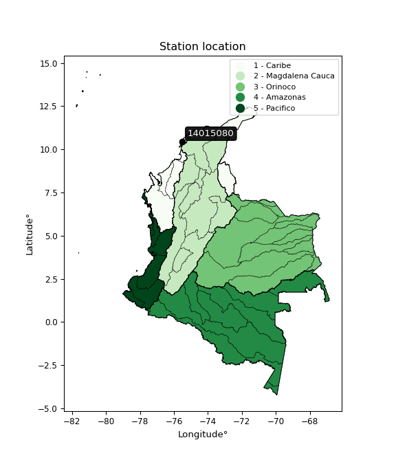

<div align="center">


</div>

# PMP Station (Rain, Pmax24h): 14015080

Probable Maximum Precipitation (PMP) is the greatest amount of rainfall for a specific duration that is meteorologically possible for a given location, acting as a "worst-case" scenario for extreme storms, crucial for designing safety-critical infrastructure like bridges, river deviations, dams, spillways, and nuclear plants to prevent catastrophic failure. PMP is calculated by hydrologists using meteorological data to determine the upper limit of extreme rainfall, often leading to the Probable Maximum Flood (PMF) for flood control design, and is increasingly being studied for climate change impacts. Probable Maximum Precipitation (PMP) is the theoretical upper limit of rainfall, a deterministic estimate for extreme events, while probability distributions (like GEV, Gumbel) describe the likelihood and frequency of various precipitation amounts, including rare ones, showing how often events occur, with PMP representing the extreme end of these distributions, used for critical infrastructure design to ensure safety against the worst conceivable weather, unlike standard statistical forecasts which cover typical probabilities.

The most common probability distributions in hydrology, used for analyzing floods, rainfall, and streamflow, include the Normal, Log-Normal, Gumbel, Gamma (including Log-Pearson Type III), and Generalized Extreme Value (GEV) distributions, often chosen based on the data´s skewness and whether modeling extremes or general conditions, with Gumbel and GEV popular for extreme events like floods, while the Normal distribution serves as a baseline, though often requiring transformations for skewed hydrological data. These distributions help in designing water infrastructure, managing water resources, and forecasting hydrologic events.

> Hydrological data often isn´t perfectly normal (it´s skewed), so different distributions are needed for different applications, such as: **Flood Frequency Analysis**: Using Gumbel, GEV, or Log-Pearson Type III for predicting extreme flood magnitudes and their return periods, **Rainfall Analysis**: Normal for annual totals, but Log-Normal, Weibull, or GEV for intensity or extreme daily rainfall, **Streamflow Modeling**: Gamma and Log-Normal for maximum flows, GEV for minimum flows, and Kappa for daily flows.

<div align="center">

</img>

</div>


## A. General information


### 1. General running parameters

• app_version: _v20260113_. • runtime: _2026-01-13 16:28:34.738620_. • Python version: _3.14.0_. • SciPy version: _1.16.3_. • Pandas version: _2.3.3_. • NumPy version: _2.3.5_. • Stations dataset (station_dataset_file): _dataset/pmax24h_in/automatic_colombia_2003_2025.csv_. • Stations catalog (station_catalog_file): _dataset/CNE.xls_. • Minimum year to eval til year_max (date_min): _1900_. • Maximum year to eval since year_min (date_max): _2025_. • Creates, save and include plots into reports (create_plot): _False_. • Plot only fit distributions with Δo > Δ (plot_only_fit): _True_. • Plot only simple graphs avoiding multiple CDFs and multiple Extreme values plots (plot_only_simple): _True_. • Eval low extreme values, if False, evaluates high extreme values (low_extreme): _False_. • Eval every SciPy distribution as logarithmic (pdist_logarithmic_on): _True_. • Standard deviation normalized (ddof): _1.0_. • Return periods to eval in years (Tr): _[2, 2.33, 5, 10, 15, 20, 25, 50, 75, 100, 200, 250, 500, 750, 1000]_. • Minimum data sample per station, 0 means any (minimum_sample): _5_. • Z-Score maximum threshold to adjust a value, 0 means disable (zscore_max): _3.5_. • Z-Score minimum threshold to adjust a value, 0 means disable (zscore_min): _-2.5_. • Avoid zeros, e.g. rain = 0 (avoid_zeros): _True_. • Avoid null values (avoid_nans): _True_. 

:file_folder:Table: [dataset.csv](../../dataset/pmax24h_in/automatic_colombia_2003_2025.csv)

> Delta Degrees of Freedom (DDOF): is a parameter used in the formulas for calculating variance and standard deviation. When ddof=0, the divisor is $N$ (the total number of observations) and this is used when your data set is the entire population. When ddof=1, the divisor is $N-1$ and this is used when your data set is a sample drawn from a larger population. Using $N-1$ provides an unbiased estimate of the population variance (known as Bessel´s correction).


### 2. Station info and location

|   id |   CODIGO | NOMBRE                             | CATEGORIA           | TECNOLOGIA                | ESTADO   | FECHA_INSTALACION   |   FECHA_SUSPENSION |   ALTITUD |   LATITUD |   LONGITUD | DEPARTAMENTO   | MUNICIPIO           | AREA_OPERATIVA                              | ENTIDAD                                                     | AREA_HIDROGRAFICA   | ZONA_HIDROGRAFICA   | SUBZONA_HIDROGRAFICA       |   CORRIENTE | Catalogo   |   Version |
|-----:|---------:|:-----------------------------------|:--------------------|:--------------------------|:---------|:--------------------|-------------------:|----------:|----------:|-----------:|:---------------|:--------------------|:--------------------------------------------|:------------------------------------------------------------|:--------------------|:--------------------|:---------------------------|------------:|:-----------|----------:|
|    0 | 14015080 | AEROPUERTO RAFAEL NUNEZ [14015080] | Sinóptica Principal | Automática con Telemetría | Activa   | 06/05/2005          |                nan |         2 |   10.4473 |    -75.516 | Bolivar        | Cartagena De Indias | Area Operativa 02 - Atlántico-Bolivar-Sucre | INSTITUTO DE HIDROLOGIA METEOROLOGIA Y ESTUDIOS AMBIENTALES | Caribe              | Caribe - Litoral    | Arroyos Directos al Caribe |         nan | CNE_IDEAM  |  20251226 |

<div align="center">

Dynamic map: [:earth_americas:Google](http://maps.google.com/maps?q=10.44725,-75.51602778) [:earth_americas:OSM](https://www.openstreetmap.org/#map=18/10.44725/-75.51602778&layers=P) [:earth_americas:Bing](https://www.bing.com/maps?cp=10.44725~-75.51602778&lvl=18) [:earth_americas:Apple](https://maps.apple.com/frame?center=10.44725%2C-75.51602778&span=0.003%2C0.006)

</div>


<div align="center">

```geojson
{
  "type": "Feature",
  "geometry": {
    "type": "Point", 
    "coordinates": [-75.51602778, 10.44725]
  }, 
  "properties": {
    "Name": "14015080"
  }
}
```

</div>


### 3. Discrete values table and plot

<div align="center">

|               |           0 |          1 |          2 |           3 |           4 |          5 |           6 |
|:--------------|------------:|-----------:|-----------:|------------:|------------:|-----------:|------------:|
| Date          | 2019        | 2020       | 2021       | 2022        | 2023        | 2024       | 2025        |
| Value         |   29.49     | 1239.1     |   72.04    |  144.04     |   87.9      |  214.6     |  227        |
| Value_initial |   29.49     | 1239.1     |   72.04    |  144.04     |   87.9      |  214.6     |  227        |
| count         |    7        |    7       |    7       |    7        |    7        |    7       |    7        |
| mean          |  287.739    |  287.739   |  287.739   |  287.739    |  287.739    |  287.739   |  287.739    |
| std           |  425.819    |  425.819   |  425.819   |  425.819    |  425.819    |  425.819   |  425.819    |
| zscore        |   -0.606475 |    2.23419 |   -0.50655 |   -0.337464 |   -0.469304 |   -0.17176 |   -0.142639 |


</div>


> The initial value (value_initial) correspond to the initial obtained or null completed value, and value (value) is adjusted only when the initial value is outside the valid range (outlier) definite through the Z-Score value. If Z-Score is active, values out of range or outliers are replaced with the station mean value. A Z-Score (or standard score) measures how many standard deviations a data point is from the mean of a dataset, indicating its relative position; positive scores mean above the mean, negative mean below, and a score of zero is exactly at the mean, allowing for comparison of values from different distributions. It´s calculated using the formula $z=(x–μ)/σ$, where $x$ is the data point, $μ$ is the mean, and $σ$ is the standard deviation, helping identify outliers and understand probability.
>
> <sub>**Note**: In this study, "completing" (filling gaps in) and "extending" (forecasting or lengthening the historical record) rainfall data series are avoided for certain critical analyses because they introduce artificial bias and uncertainty, which can distort the statistics of rare events (extremes), alter day-to-day variability, and compromise the integrity and homogeneity of the original data. Some reasons against Completing/Extending rainfall data are: **Distortion of Extremes and Variability**: The primary issue is that most gap-filling or extension methods rely on averaging or regression with nearby stations, which inherently smooths the data. Rainfall is highly variable in space and time, with a large percentage of zero values and occasional large storms. Infilling methods often underestimate the highest values and overestimate the lowest (zero) values, which severely distorts analyses focused on flood frequency, drought severity, and intensity-duration-frequency (IDF) curves, **Loss of Data Homogeneity**: Infilled or extended data are synthetic estimates, not actual measurements. Combining these estimates with observed data can violate the assumption of data homogeneity, which requires that the data properties do not change over time. Inhomogeneity can lead to incorrect conclusions about long-term trends or changes in climate patterns, **Propagation of Errors**: Errors and biases from the original data (e.g., wind-induced undercatch, instrument errors, site changes) or the data used for imputation can propagate through the analysis, leading to unreliable hydrological models and inaccurate predictions, **Compromised Statistical Integrity**: For statistical analyses, especially those involving the frequency of events, using artificial data can introduce time bias or autocorrelation that doesn´t exist in reality, making it difficult to assess the true probability of events, **Difficulty in Validation**: It is difficult to accurately validate the quality of filled or extended data, especially for past periods where ground-truth measurements are unavailable. The reliability of imputation techniques heavily depends on the density of the surrounding station network and the complexity of the local topography.</sub>


### 4. Active continuous probability distributions from SciPy (45 of 104 available)

A Probability Density Function (PDF) describes the relative likelihood of a continuous random variable falling within a specific range, where the total area under its curve equals 1, and the area over any interval gives the actual probability for that range. Unlike discrete probabilities (like rolling a die), a PDF shows density, not direct probability for a single point (which is zero), with higher points indicating higher likelihood, often visualized as a bell curve for normal distributions.

A log of a probability density function (log-PDF) is simply the logarithm of the PDF´s value, denoted as $log(f(x))$, useful for converting multiplication of probabilities into addition, improving numerical stability with tiny numbers, and connecting to information theory concepts like entropy. Instead of dealing with very small probabilities (e.g., 0.000001), log-PDFs use negative numbers (e.g., $log(0.00001) ≈ -11.51$ that are easier for computers to handle, preventing underflow errors and simplifying complex calculations. In this study, each active probability distribution from SciPy is also evaluated in the $log$ form.

[scipy.stats](https://docs.scipy.org/doc/scipy/reference/stats.html) is a Python´s powerful submodule within the SciPy library for comprehensive statistical analysis, offering over 130 probability distributions (like Normal, Poisson), functions for descriptive stats (mean, variance), hypothesis testing (t-tests, chi-square), random variable generation, and statistical tests, making it essential for data science, modeling, and research. It provides tools to explore, model, and draw conclusions from data efficiently, working seamlessly with NumPy.

<div align="center">

|   id | p_dist             |   n_parameter | fit_method   | label                                                                       | active   | ref                                                                                                        |
|-----:|:-------------------|--------------:|:-------------|:----------------------------------------------------------------------------|:---------|:-----------------------------------------------------------------------------------------------------------|
|    0 | alpha              |             3 | MLE          | Alpha                                                                       | True     | [:mortar_board:](https://docs.scipy.org/doc/scipy/reference/generated/scipy.stats.alpha.html)              |
|    1 | betaprime          |             4 | MLE          | Beta prime                                                                  | True     | [:mortar_board:](https://docs.scipy.org/doc/scipy/reference/generated/scipy.stats.betaprime.html)          |
|    2 | chi2               |             3 | MLE          | Chi²                                                                        | True     | [:mortar_board:](https://docs.scipy.org/doc/scipy/reference/generated/scipy.stats.chi2.html)               |
|    3 | crystalball        |             4 | MLE          | Crystalball                                                                 | True     | [:mortar_board:](https://docs.scipy.org/doc/scipy/reference/generated/scipy.stats.crystalball.html)        |
|    4 | dweibull           |             3 | MLE          | Double Weibull                                                              | True     | [:mortar_board:](https://docs.scipy.org/doc/scipy/reference/generated/scipy.stats.dweibull.html)           |
|    5 | erlang             |             3 | MLE          | Erlang                                                                      | True     | [:mortar_board:](https://docs.scipy.org/doc/scipy/reference/generated/scipy.stats.erlang.html)             |
|    6 | expon              |             2 | MLE          | Exponential                                                                 | True     | [:mortar_board:](https://docs.scipy.org/doc/scipy/reference/generated/scipy.stats.expon.html)              |
|    7 | exponnorm          |             3 | MLE          | Exponentially modified Normal                                               | True     | [:mortar_board:](https://docs.scipy.org/doc/scipy/reference/generated/scipy.stats.exponnorm.html)          |
|    8 | f                  |             4 | MLE          | F                                                                           | True     | [:mortar_board:](https://docs.scipy.org/doc/scipy/reference/generated/scipy.stats.f.html)                  |
|    9 | fatiguelife        |             3 | MLE          | Fatigue-life (Birnbaum-Saunders)                                            | True     | [:mortar_board:](https://docs.scipy.org/doc/scipy/reference/generated/scipy.stats.fatiguelife.html)        |
|   10 | fisk               |             3 | MLE          | Fisk                                                                        | True     | [:mortar_board:](https://docs.scipy.org/doc/scipy/reference/generated/scipy.stats.fisk.html)               |
|   11 | gamma              |             3 | MLE          | Gamma                                                                       | True     | [:mortar_board:](https://docs.scipy.org/doc/scipy/reference/generated/scipy.stats.gamma.html)              |
|   12 | genexpon           |             5 | MLE          | Generalized exponential                                                     | True     | [:mortar_board:](https://docs.scipy.org/doc/scipy/reference/generated/scipy.stats.genexpon.html)           |
|   13 | genlogistic        |             3 | MLE          | Generalized logistic                                                        | True     | [:mortar_board:](https://docs.scipy.org/doc/scipy/reference/generated/scipy.stats.genlogistic.html)        |
|   14 | gibrat             |             2 | MM           | Gibrat                                                                      | True     | [:mortar_board:](https://docs.scipy.org/doc/scipy/reference/generated/scipy.stats.gibrat.html)             |
|   15 | gompertz           |             3 | MLE          | Gompertz (or truncated Gumbel)                                              | True     | [:mortar_board:](https://docs.scipy.org/doc/scipy/reference/generated/scipy.stats.gompertz.html)           |
|   16 | gumbel_l           |             2 | MM           | Gumbel Left Skew                                                            | True     | [:mortar_board:](https://docs.scipy.org/doc/scipy/reference/generated/scipy.stats.gumbel_l.html)           |
|   17 | gumbel_r           |             2 | MM           | Gumbel Right Skew                                                           | True     | [:mortar_board:](https://docs.scipy.org/doc/scipy/reference/generated/scipy.stats.gumbel_r.html)           |
|   18 | halflogistic       |             2 | MM           | Half-logistic                                                               | True     | [:mortar_board:](https://docs.scipy.org/doc/scipy/reference/generated/scipy.stats.halflogistic.html)       |
|   19 | halfnorm           |             2 | MM           | Half Normal                                                                 | True     | [:mortar_board:](https://docs.scipy.org/doc/scipy/reference/generated/scipy.stats.halfnorm.html)           |
|   20 | hypsecant          |             2 | MM           | hyperbolic secant                                                           | True     | [:mortar_board:](https://docs.scipy.org/doc/scipy/reference/generated/scipy.stats.hypsecant.html)          |
|   21 | invgamma           |             3 | MLE          | Inverted gamma                                                              | True     | [:mortar_board:](https://docs.scipy.org/doc/scipy/reference/generated/scipy.stats.invgamma.html)           |
|   22 | invgauss           |             3 | MLE          | Inverse Gaussian                                                            | True     | [:mortar_board:](https://docs.scipy.org/doc/scipy/reference/generated/scipy.stats.invgauss.html)           |
|   23 | invweibull         |             3 | MLE          | Inverted Weibull                                                            | True     | [:mortar_board:](https://docs.scipy.org/doc/scipy/reference/generated/scipy.stats.invweibull.html)         |
|   24 | kappa4             |             4 | MLE          | Kappa 4                                                                     | True     | [:mortar_board:](https://docs.scipy.org/doc/scipy/reference/generated/scipy.stats.kappa4.html)             |
|   25 | kstwobign          |             2 | MLE          | Limiting distribution of scaled Kolmogorov-Smirnov two-sided test statistic | True     | [:mortar_board:](https://docs.scipy.org/doc/scipy/reference/generated/scipy.stats.kstwobign.html)          |
|   26 | laplace            |             2 | MM           | Laplace                                                                     | True     | [:mortar_board:](https://docs.scipy.org/doc/scipy/reference/generated/scipy.stats.laplace.html)            |
|   27 | laplace_asymmetric |             3 | MLE          | Asymmetric Laplace                                                          | True     | [:mortar_board:](https://docs.scipy.org/doc/scipy/reference/generated/scipy.stats.laplace_asymmetric.html) |
|   28 | loggamma           |             3 | MLE          | Log gamma                                                                   | True     | [:mortar_board:](https://docs.scipy.org/doc/scipy/reference/generated/scipy.stats.loggamma.html)           |
|   29 | logistic           |             2 | MM           | Logistic (or Sech-squared)                                                  | True     | [:mortar_board:](https://docs.scipy.org/doc/scipy/reference/generated/scipy.stats.logistic.html)           |
|   30 | lognorm            |             3 | MLE          | Log Normal                                                                  | True     | [:mortar_board:](https://docs.scipy.org/doc/scipy/reference/generated/scipy.stats.lognorm.html)            |
|   31 | maxwell            |             2 | MM           | Maxwell                                                                     | True     | [:mortar_board:](https://docs.scipy.org/doc/scipy/reference/generated/scipy.stats.maxwell.html)            |
|   32 | mielke             |             4 | MLE          | Mielke Beta-Kappa / Dagum                                                   | True     | [:mortar_board:](https://docs.scipy.org/doc/scipy/reference/generated/scipy.stats.mielke.html)             |
|   33 | moyal              |             2 | MM           | Moyal                                                                       | True     | [:mortar_board:](https://docs.scipy.org/doc/scipy/reference/generated/scipy.stats.moyal.html)              |
|   34 | nakagami           |             3 | MLE          | Nakagami                                                                    | True     | [:mortar_board:](https://docs.scipy.org/doc/scipy/reference/generated/scipy.stats.nakagami.html)           |
|   35 | ncf                |             5 | MLE          | Non-central F distribution                                                  | True     | [:mortar_board:](https://docs.scipy.org/doc/scipy/reference/generated/scipy.stats.ncf.html)                |
|   36 | nct                |             4 | MLE          | Non-central Student’s t                                                     | True     | [:mortar_board:](https://docs.scipy.org/doc/scipy/reference/generated/scipy.stats.nct.html)                |
|   37 | norm               |             2 | MM           | Normal                                                                      | True     | [:mortar_board:](https://docs.scipy.org/doc/scipy/reference/generated/scipy.stats.norm.html)               |
|   38 | pearson3           |             3 | MM           | Pearson type III                                                            | True     | [:mortar_board:](https://docs.scipy.org/doc/scipy/reference/generated/scipy.stats.pearson3.html)           |
|   39 | rayleigh           |             2 | MM           | Rayleigh                                                                    | True     | [:mortar_board:](https://docs.scipy.org/doc/scipy/reference/generated/scipy.stats.rayleigh.html)           |
|   40 | rice               |             3 | MLE          | Rice                                                                        | True     | [:mortar_board:](https://docs.scipy.org/doc/scipy/reference/generated/scipy.stats.rice.html)               |
|   41 | t                  |             3 | MLE          | Student’s t                                                                 | True     | [:mortar_board:](https://docs.scipy.org/doc/scipy/reference/generated/scipy.stats.t.html)                  |
|   42 | truncnorm          |             4 | MLE          | Truncated normal                                                            | True     | [:mortar_board:](https://docs.scipy.org/doc/scipy/reference/generated/scipy.stats.truncnorm.html)          |
|   43 | wald               |             2 | MM           | Wald                                                                        | True     | [:mortar_board:](https://docs.scipy.org/doc/scipy/reference/generated/scipy.stats.wald.html)               |
|   44 | weibull_min        |             3 | MLE          | Weibull minimum                                                             | True     | [:mortar_board:](https://docs.scipy.org/doc/scipy/reference/generated/scipy.stats.weibull_min.html)        |

</div>

> **n_parameter:** # arguments & localization & scale.
>
> **Fit methods:** (MLE) maximum likelihood, (MM) L-moments.
>
>**Inactive** (With the only purpose of prevent loops, zero divisions, infinite values, over high estimated values or horizontal trending for recurrence intervals estimations, the follow distributions were disabled.)**:** foldnorm, gennorm, norminvgauss, powernorm, powerlognorm, skewnorm, genextreme, anglit, arcsine, argus, beta, bradford, burr, burr12, cauchy, cosine, halfcauchy, foldcauchy, skewcauchy, wrapcauchy, dgamma, gengamma, exponweib, exponpow, truncexpon, gausshyper, genhalflogistic, genhyperbolic, geninvgauss, halfgennorm, johnsonsb, johnsonsu, kappa3, ksone, kstwo, loglaplace, levy, levy_l, levy_stable, ncx2, pareto, genpareto, truncpareto, lomax, powerlaw, rdist, rel_breitwigner, recipinvgauss, semicircular, studentized_range, trapezoid, triang, truncweibull_min, tukeylambda, uniform, loguniform, vonmises, vonmises_line, weibull_max, 


## B. Probability (PDF) vs. Empirical (EDF) distributions functions

A continuous probability distribution (CPD) describes probabilities for variables that can take any value within a range (like rain any time), unlike discrete variables with specific outcomes (like temperature). It uses a Probability Density Function (PDF), a curve where the total area under it equals 1, and the probability of the variable falling within an interval (a to b) is found by calculating the area under the curve between those points. A key feature is that the probability of hitting any single exact value is zero, so probabilities are always expressed for ranges, e.g., $P(a ≤ X ≤ b)$.

<div align="center">

Distributions parameters from station values
|    |   station | p_dist                |   n |               loc |           scale | shape                  | shape1                | shape2              | shape3   |
|---:|----------:|:----------------------|----:|------------------:|----------------:|:-----------------------|:----------------------|:--------------------|:---------|
|  0 |  14015080 | alpha                 |   7 |      -0.179936    |    67.3955      | 2.7288609874314225e-11 |                       |                     |          |
|  1 |  14015080 | betaprime             |   7 |      -0.0347256   |    12.1468      | 10.844062636610921     | 1.2992050704899838    |                     |          |
|  2 |  14015080 | chi2                  |   7 |      29.49        |   192.789       | 1.3818685733359661     |                       |                     |          |
|  3 |  14015080 | crystalball           |   7 |      -0.273145    |   488.156       | 4.669943745169739      | 2.1370526723642023    |                     |          |
|  4 |  14015080 | dweibull              |   7 |      72.04        |   374.216       | 0.5902238456194246     |                       |                     |          |
|  5 |  14015080 | erlang                |   7 |      29.49        |   403.925       | 0.15761749929423935    |                       |                     |          |
|  6 |  14015080 | expon                 |   7 |      29.49        |   258.249       |                        |                       |                     |          |
|  7 |  14015080 | exponnorm             |   7 |      29.0636      |     0.140864    | 1842.8739672897755     |                       |                     |          |
|  8 |  14015080 | f                     |   7 |      29.4899      |    79.5083      | 0.7887670225123604     | 3.268604818256053     |                     |          |
|  9 |  14015080 | fatiguelife           |   7 |      19.4747      |   110.591       | 1.682709926302301      |                       |                     |          |
| 10 |  14015080 | fisk                  |   7 |      29.49        |   127.301       | 0.8603077694220246     |                       |                     |          |
| 11 |  14015080 | gamma                 |   7 |      29.49        |   392.786       | 0.15932809253780372    |                       |                     |          |
| 12 |  14015080 | genexpon              |   7 |      29.49        |   454.012       | 1.758057899747041      | 4.979376787876906e-12 | 2.1036510823399093  |          |
| 13 |  14015080 | genlogistic           |   7 |   -1288.7         |   185.133       | 2294.967769379544      |                       |                     |          |
| 14 |  14015080 | gibrat                |   7 |     -13.0105      |   182.414       |                        |                       |                     |          |
| 15 |  14015080 | gompertz              |   7 |      21.8746      |  2512.36        | 6.168029006806091      |                       |                     |          |
| 16 |  14015080 | gumbel_l              |   7 |     465.164       |   307.381       |                        |                       |                     |          |
| 17 |  14015080 | gumbel_r              |   7 |     110.313       |   307.381       |                        |                       |                     |          |
| 18 |  14015080 | halflogistic          |   7 |    -179.517       |   337.054       |                        |                       |                     |          |
| 19 |  14015080 | halfnorm              |   7 |    -234.07        |   653.99        |                        |                       |                     |          |
| 20 |  14015080 | hypsecant             |   7 |     287.739       |   250.976       |                        |                       |                     |          |
| 21 |  14015080 | invgamma              |   7 |      -4.38905     |   127.473       | 1.2722829463524497     |                       |                     |          |
| 22 |  14015080 | invgauss              |   7 |       9.85598     |    96.6965      | 2.873759223726351      |                       |                     |          |
| 23 |  14015080 | invweibull            |   7 |      29.49        |     6.82739     | 0.04670977476480674    |                       |                     |          |
| 24 |  14015080 | kappa4                |   7 |     -89.682       |  1312.62        | 1.0997450116671939     | 0.9785109527097171    |                     |          |
| 25 |  14015080 | kstwobign             |   7 |    -641.14        |  1096.75        |                        |                       |                     |          |
| 26 |  14015080 | laplace               |   7 |     287.739       |   278.764       |                        |                       |                     |          |
| 27 |  14015080 | laplace_asymmetric    |   7 |      29.49        |     0.00230233  | 8.915271918711765e-06  |                       |                     |          |
| 28 |  14015080 | loggamma              |   7 | -135955           | 17968.6         | 1963.078344586147      |                       |                     |          |
| 29 |  14015080 | logistic              |   7 |     287.739       |   217.351       |                        |                       |                     |          |
| 30 |  14015080 | lognorm               |   7 |      29.49        |     0.641548    | 13.43903741307366      |                       |                     |          |
| 31 |  14015080 | maxwell               |   7 |    -646.425       |   585.4         |                        |                       |                     |          |
| 32 |  14015080 | mielke                |   7 |      -0.112685    |    25.1448      | 6.446485307047752      | 1.2065535230187132    |                     |          |
| 33 |  14015080 | moyal                 |   7 |      62.2916      |   177.467       |                        |                       |                     |          |
| 34 |  14015080 | nakagami              |   7 |      29.49        |   614.025       | 0.18044461484627683    |                       |                     |          |
| 35 |  14015080 | ncf                   |   7 |      -0.428549    |    38.8         | 18.504081450966112     | 2.5543133864312297    | 29.08212315585834   |          |
| 36 |  14015080 | nct                   |   7 |      -0.0833827   |    30.5687      | 1.0380445219474268     | 2.8567143789225176    |                     |          |
| 37 |  14015080 | norm                  |   7 |     287.739       |   394.232       |                        |                       |                     |          |
| 38 |  14015080 | pearson3              |   7 |     287.739       |   394.232       | 1.9171157922341289     |                       |                     |          |
| 39 |  14015080 | rayleigh              |   7 |    -466.45        |   601.755       |                        |                       |                     |          |
| 40 |  14015080 | rice                  |   7 |    -254.524       |   474.061       | 0.00020550503817234628 |                       |                     |          |
| 41 |  14015080 | t                     |   7 |     121.107       |    73.9985      | 1.0871875278535177     |                       |                     |          |
| 42 |  14015080 | truncnorm             |   7 | -220852           |  7489.53        | 29.49205318682468      | 172612244.76662284    |                     |          |
| 43 |  14015080 | wald                  |   7 |    -106.493       |   394.232       |                        |                       |                     |          |
| 44 |  14015080 | weibull_min           |   7 |      29.49        |   538.088       | 0.1676330692788135     |                       |                     |          |
| 45 |  14015080 | logalpha              |   7 |      -4.32646     |    81.7552      | 8.877808828969318      |                       |                     |          |
| 46 |  14015080 | logbetaprime          |   7 |      -0.422997    |     1.7254      | 105.23720468730505     | 34.458022093265726    |                     |          |
| 47 |  14015080 | logchi2               |   7 |       3.38405     |     0.935991    | 1.0955309609143802     |                       |                     |          |
| 48 |  14015080 | logcrystalball        |   7 |       5.00335     |     1.08423     | 1186.3649936488823     | 16.04094665799981     |                     |          |
| 49 |  14015080 | logdweibull           |   7 |       4.97009     |     0.845295    | 0.8472269322300308     |                       |                     |          |
| 50 |  14015080 | logerlang             |   7 |       2.18596     |     0.4317      | 6.526270212198408      |                       |                     |          |
| 51 |  14015080 | logexpon              |   7 |       3.38405     |     1.6193      |                        |                       |                     |          |
| 52 |  14015080 | logexponnorm          |   7 |       4.12874     |     0.692571    | 1.2628472968711537     |                       |                     |          |
| 53 |  14015080 | logf                  |   7 |       2.12889     |     2.87478     | 13.876531858422169     | 860.2707856378838     |                     |          |
| 54 |  14015080 | logfatiguelife        |   7 |       0.632473    |     4.23938     | 0.24905212743677052    |                       |                     |          |
| 55 |  14015080 | logfisk               |   7 |       0.676388    |     4.2043      | 7.0521714066446055     |                       |                     |          |
| 56 |  14015080 | loggamma              |   7 |       2.18596     |     0.431701    | 6.52625067054786       |                       |                     |          |
| 57 |  14015080 | loggenexpon           |   7 |       3.38369     |     2.14317     | 0.6376423712785084     | 6.666372413428716     | 0.20804299614541732 |          |
| 58 |  14015080 | loggenlogistic        |   7 |       3.24587     |     0.828047    | 5.2219214441177755     |                       |                     |          |
| 59 |  14015080 | loggibrat             |   7 |       4.17622     |     0.50168     |                        |                       |                     |          |
| 60 |  14015080 | loggompertz           |   7 |       3.38405     |     2.19483     | 0.7215003484497651     |                       |                     |          |
| 61 |  14015080 | loggumbel_l           |   7 |       5.49131     |     0.845374    |                        |                       |                     |          |
| 62 |  14015080 | loggumbel_r           |   7 |       4.51538     |     0.845374    |                        |                       |                     |          |
| 63 |  14015080 | loghalflogistic       |   7 |       3.71825     |     0.926996    |                        |                       |                     |          |
| 64 |  14015080 | loghalfnorm           |   7 |       3.56825     |     1.79863     |                        |                       |                     |          |
| 65 |  14015080 | loghypsecant          |   7 |       5.00335     |     0.690245    |                        |                       |                     |          |
| 66 |  14015080 | loginvgamma           |   7 |      -1.05261     |   191.314       | 32.5879800438436       |                       |                     |          |
| 67 |  14015080 | loginvgauss           |   7 |       0.575404    |    72.3208      | 0.06122643919013447    |                       |                     |          |
| 68 |  14015080 | loginvweibull         |   7 |      -4.10543e+07 |     4.10543e+07 | 44476353.744277194     |                       |                     |          |
| 69 |  14015080 | logkappa4             |   7 |       2.95432     |     4.4601      | 1.1070354975735481     | 1.0700077693794061    |                     |          |
| 70 |  14015080 | logkstwobign          |   7 |       1.20053     |     4.36878     |                        |                       |                     |          |
| 71 |  14015080 | loglaplace            |   7 |       5.00335     |     0.766669    |                        |                       |                     |          |
| 72 |  14015080 | loglaplace_asymmetric |   7 |       4.97009     |     0.824957    | 0.9800565548021787     |                       |                     |          |
| 73 |  14015080 | logloggamma           |   7 |    -326.942       |    44.8229      | 1645.723587035077      |                       |                     |          |
| 74 |  14015080 | loglogistic           |   7 |       5.00335     |     0.597769    |                        |                       |                     |          |
| 75 |  14015080 | loglognorm            |   7 |       3.38405     |     0.0100566   | 12.561391037714241     |                       |                     |          |
| 76 |  14015080 | logmaxwell            |   7 |       2.43417     |     1.60999     |                        |                       |                     |          |
| 77 |  14015080 | logmielke             |   7 |      -0.123869    |     4.94815     | 8.82982861715044       | 8.216364464184844     |                     |          |
| 78 |  14015080 | logmoyal              |   7 |       4.38331     |     0.488077    |                        |                       |                     |          |
| 79 |  14015080 | lognakagami           |   7 |       4.27722     |     1.08296     | 0.3385110496831056     |                       |                     |          |
| 80 |  14015080 | logncf                |   7 |       0.330725    |     9.53602e-07 | 2.154686503562996e-05  | 181.53330242903127    | 104.36381617482363  |          |
| 81 |  14015080 | lognct                |   7 |      -1.33541     |     0.486229    | 23.422047222387384     | 12.612393471823221    |                     |          |
| 82 |  14015080 | lognorm               |   7 |       5.00335     |     1.08423     |                        |                       |                     |          |
| 83 |  14015080 | logpearson3           |   7 |       5.00335     |     1.08424     | 0.5447241205898365     |                       |                     |          |
| 84 |  14015080 | lograyleigh           |   7 |       2.92914     |     1.65497     |                        |                       |                     |          |
| 85 |  14015080 | logrice               |   7 |       2.96025     |     1.56791     | 0.4197418157553774     |                       |                     |          |
| 86 |  14015080 | logt                  |   7 |       5.00335     |     1.08423     | 1626491628.7090063     |                       |                     |          |
| 87 |  14015080 | logtruncnorm          |   7 |      -0.134342    |     2.3756      | 1.8570321867843396     | 22.81193582477859     |                     |          |
| 88 |  14015080 | logwald               |   7 |       3.91907     |     1.08427     |                        |                       |                     |          |
| 89 |  14015080 | logweibull_min        |   7 |       3.08136     |     2.15414     | 1.7979663862677016     |                       |                     |          |

</div>

> **loc** (Location parameter): This shifts the distribution along the x-axis. For many common distributions, like the normal (Gaussian) distribution, loc represents the mean $μ$. For others, like the uniform distribution, it might represent the minimum value, or for the beta distribution, the left end of the support interval.
>
> **scale** (Scale parameter): This determines the width or spread of the distribution. For the normal distribution, scale represents the standard deviation $σ$. For a uniform distribution, it defines the length of the interval (from $loc$ to $loc + scale$).
>
> **shape** (Shape parameters): Refers to parameters that define the specific form of a probability distribution, distinct from its location (loc) and scale (scale). These parameters are required arguments for most distribution functions. For example, a normal (Gaussian) distribution is fully defined by its location (mean) and scale (standard deviation), so it has no specific shape parameters beyond loc and scale. However, other distributions have intrinsic properties that need specification, as Gamma distribution that takes a shape parameter, often named $a$ or $alpha$.


### 0. Cumulative distribution values - CDF (90 evaluated)

Cumulative Distribution Function (CDF), denoted as $F$<sub>$X$</sub>$(x)$, is a function that gives the probability that a random variable $X$ will take a value less than or equal to a specific value, $x$ (i.e., $(P(X≥x)$. It essentially "accumulates" probabilities from a given point up to the far right (positive infinity), providing a complete picture of the distribution´s probabilities for both discrete (like rain) and continuous (like temperature) variables, helping to find probabilities over ranges or above certain values. Each station is evaluated separately ordering the $x$ values ascending, calculating the CDF and PDF values for the activated distributions and their logarithmic forms.

<div align="center">

CDF ordered by x ascending and calculating $log(f(x))$ separately
|   id |   Station |   date |       x |   count |    mean |     std |    zscore |   Value_initial |   station |   m |     alpha |   alpha_pdf |   betaprime |   betaprime_pdf |        chi2 |      chi2_pdf |   crystalball |   crystalball_pdf |   dweibull |   dweibull_pdf |     erlang |   erlang_pdf |    expon |   expon_pdf |   exponnorm |   exponnorm_pdf |          f |        f_pdf |   fatiguelife |   fatiguelife_pdf |        fisk |    fisk_pdf |      gamma |   gamma_pdf |    genexpon |   genexpon_pdf |   genlogistic |   genlogistic_pdf |    gibrat |   gibrat_pdf |   gompertz |   gompertz_pdf |   gumbel_l |   gumbel_l_pdf |   gumbel_r |   gumbel_r_pdf |   halflogistic |   halflogistic_pdf |   halfnorm |   halfnorm_pdf |   hypsecant |   hypsecant_pdf |   invgamma |   invgamma_pdf |   invgauss |   invgauss_pdf |   invweibull |   invweibull_pdf |      kappa4 |   kappa4_pdf |   kstwobign |   kstwobign_pdf |   laplace |   laplace_pdf |   laplace_asymmetric |   laplace_asymmetric_pdf |   loggamma |   loggamma_pdf |   logistic |   logistic_pdf |   lognorm |   lognorm_pdf |   maxwell |   maxwell_pdf |    mielke |   mielke_pdf |    moyal |   moyal_pdf |    nakagami |   nakagami_pdf |       ncf |     ncf_pdf |      nct |     nct_pdf |     norm |    norm_pdf |   pearson3 |   pearson3_pdf |   rayleigh |   rayleigh_pdf |     rice |    rice_pdf |        t |       t_pdf |   truncnorm |   truncnorm_pdf |     wald |    wald_pdf |   weibull_min |   weibull_min_pdf |   logalpha |   logalpha_pdf |   logbetaprime |   logbetaprime_pdf |     logchi2 |   logchi2_pdf |   logcrystalball |   logcrystalball_pdf |   logdweibull |   logdweibull_pdf |   logerlang |   logerlang_pdf |   logexpon |   logexpon_pdf |   logexponnorm |   logexponnorm_pdf |     logf |   logf_pdf |   logfatiguelife |   logfatiguelife_pdf |   logfisk |   logfisk_pdf |   loggenexpon |   loggenexpon_pdf |   loggenlogistic |   loggenlogistic_pdf |   loggibrat |   loggibrat_pdf |   loggompertz |   loggompertz_pdf |   loggumbel_l |   loggumbel_l_pdf |   loggumbel_r |   loggumbel_r_pdf |   loghalflogistic |   loghalflogistic_pdf |   loghalfnorm |   loghalfnorm_pdf |   loghypsecant |   loghypsecant_pdf |   loginvgamma |   loginvgamma_pdf |   loginvgauss |   loginvgauss_pdf |   loginvweibull |   loginvweibull_pdf |   logkappa4 |   logkappa4_pdf |   logkstwobign |   logkstwobign_pdf |   loglaplace |   loglaplace_pdf |   loglaplace_asymmetric |   loglaplace_asymmetric_pdf |   logloggamma |   logloggamma_pdf |   loglogistic |   loglogistic_pdf |   loglognorm |   loglognorm_pdf |   logmaxwell |   logmaxwell_pdf |   logmielke |   logmielke_pdf |   logmoyal |   logmoyal_pdf |   lognakagami |   lognakagami_pdf |    logncf |   logncf_pdf |    lognct |   lognct_pdf |   logpearson3 |   logpearson3_pdf |   lograyleigh |   lograyleigh_pdf |   logrice |   logrice_pdf |      logt |   logt_pdf |   logtruncnorm |   logtruncnorm_pdf |   logwald |   logwald_pdf |   logweibull_min |   logweibull_min_pdf |
|-----:|----------:|-------:|--------:|--------:|--------:|--------:|----------:|----------------:|----------:|----:|----------:|------------:|------------:|----------------:|------------:|--------------:|--------------:|------------------:|-----------:|---------------:|-----------:|-------------:|---------:|------------:|------------:|----------------:|-----------:|-------------:|--------------:|------------------:|------------:|------------:|-----------:|------------:|------------:|---------------:|--------------:|------------------:|----------:|-------------:|-----------:|---------------:|-----------:|---------------:|-----------:|---------------:|---------------:|-------------------:|-----------:|---------------:|------------:|----------------:|-----------:|---------------:|-----------:|---------------:|-------------:|-----------------:|------------:|-------------:|------------:|----------------:|----------:|--------------:|---------------------:|-------------------------:|-----------:|---------------:|-----------:|---------------:|----------:|--------------:|----------:|--------------:|----------:|-------------:|---------:|------------:|------------:|---------------:|----------:|------------:|---------:|------------:|---------:|------------:|-----------:|---------------:|-----------:|---------------:|---------:|------------:|---------:|------------:|------------:|----------------:|---------:|------------:|--------------:|------------------:|-----------:|---------------:|---------------:|-------------------:|------------:|--------------:|-----------------:|---------------------:|--------------:|------------------:|------------:|----------------:|-----------:|---------------:|---------------:|-------------------:|---------:|-----------:|-----------------:|---------------------:|----------:|--------------:|--------------:|------------------:|-----------------:|---------------------:|------------:|----------------:|--------------:|------------------:|--------------:|------------------:|--------------:|------------------:|------------------:|----------------------:|--------------:|------------------:|---------------:|-------------------:|--------------:|------------------:|--------------:|------------------:|----------------:|--------------------:|------------:|----------------:|---------------:|-------------------:|-------------:|-----------------:|------------------------:|----------------------------:|--------------:|------------------:|--------------:|------------------:|-------------:|-----------------:|-------------:|-----------------:|------------:|----------------:|-----------:|---------------:|--------------:|------------------:|----------:|-------------:|----------:|-------------:|--------------:|------------------:|--------------:|------------------:|----------:|--------------:|----------:|-----------:|---------------:|-------------------:|----------:|--------------:|-----------------:|---------------------:|
|    0 |  14015080 |   2019 |   29.49 |       7 | 287.739 | 425.819 | -0.606475 |           29.49 |  14015080 |   1 | 0.0231162 | 0.00462927  |   0.0402216 |     0.0040817   | 1.87055e-12 | 363.785       |      0.524309 |       0.000815725 |   0.378975 |    0.00145688  | 0.00220278 |  9.77272e+10 | 0        | 0.00387224  |  0.00164123 |     0.00384109  | 0.00391588 | 10.9192      |     0.0362516 |        0.00855057 | 3.79467e-14 | 1.021       | 0.00207007 | 9.28363e+10 | 1.44931e-13 |    0.00387227  |      0.156462 |       0.00156704  | 0.0725912 |  0.0032486   |  0.0185505 |     0.00241684 |   0.215218 |    0.000618749 |   0.272327 |    0.00115241  |       0.300483 |        0.0013495   |   0.313054 |    0.00112487  |    0.218505 |     0.00080384  |  0.0392313 |    0.00410143  |  0.0371333 |    0.00537586  |   0.00565705 |      3.84889e+11 | 3.10788e-15 |  0.0212828   |    0.15126  |     0.00126289  |  0.197987 |   0.000710232 |          8.04616e-11 |              0.00387228  |  0.0380043 |      0.134794  |   0.233588 |    0.000823665 | 0.0676541 |     0.120624  |  0.278723 |   0.000932988 | 0.0406322 |  0.00398996  | 0.272719 | 0.00135113  | 4.78029e-07 |    4.85588e+07 | 0.0393976 | 0.00409815  | 0.03931  | 0.00324981  | 0.256212 | 0.00081654  |   0.292856 |    0.00170433  |   0.287956 |    0.000975205 | 0.164283 | 0.00105616  | 0.209875 | 0.00174495  | 0.000110427 |     0.00394185  | 0.213706 | 0.00268173  |    0.00131743 |       6.21215e+10 |  0.0422388 |      0.123852  |       0.041845 |          0.125535  | 3.10812e-09 |   3.83374e+06 |        0.0676541 |            0.120624  |     0.0909477 |         0.0827998 |    0.038004 |       0.134794  |   0        |      0.617552  |      0.0419328 |          0.113418  | 0.037715 |  0.132524  |        0.0401373 |             0.129056 | 0.0429789 |      0.107128 |    0.00010716 |         0.2976    |        0.0406808 |            0.117594  |   0         |       0         |   2.14466e-09 |         0.328727  |     0.0793606 |        0.0900486  |     0.0220947 |         0.0996413 |          0        |             0         |      0        |         0         |      0.0607735 |          0.0875124 |     0.0414541 |         0.125471  |      0.040227 |         0.128832  |       0.0361944 |           0.130137  |    0        |        7.87666  |      0.0359271 |          0.146068  |    0.0604907 |        0.0789007 |               0.0688936 |                   0.0852112 |     0.0724062 |         0.123215  |     0.0624504 |         0.097948  |   0.00718147 |      3.57309e+12 |    0.0492558 |         0.144951 |   0.0450843 |       0.107137  | 0.00537927 |      0.0472815 |   0           |          0        | 0.0435124 |    0.118508  | 0.0432352 |    0.12547   |     0.0475143 |         0.130092  |     0.0370727 |         0.159931  | 0.0328989 |     0.152684  | 0.0676536 |  0.120624  |    0           |          0         |  0        |     0         |         0.028925 |             0.169306 |
|    1 |  14015080 |   2021 |   72.04 |       7 | 287.739 | 425.819 | -0.50655  |           72.04 |  14015080 |   2 | 0.350718  | 0.00667041  |   0.268055  |     0.00519502  | 0.229984    |   0.00349668  |      0.558883 |       0.000808324 |   0.5      | 4222.74        | 0.743189   |  0.00251278  | 0.151906 | 0.00328402  |  0.152574   |     0.00326442  | 0.529023   |  0.00410585  |     0.325535  |        0.0043566  | 0.280337    | 0.0040791   | 0.743685   | 0.0025355   | 0.151907    |    0.00328404  |      0.228966 |       0.00182263  | 0.222722  |  0.00350596  |  0.116971  |     0.00221162 |   0.242953 |    0.000685498 |   0.322195 |    0.00118718  |       0.356762 |        0.00129463  |   0.360262 |    0.00109344  |    0.254975 |     0.000910723 |  0.270132  |    0.00524568  |  0.293889  |    0.0050078   |   0.399283   |      0.000402413 | 0.0481305   |  0.00102815  |    0.2084   |     0.00141291  |  0.230636 |   0.000827352 |          0.151907    |              0.00328405  |  0.277107  |      0.369858  |   0.270439 |    0.000907755 | 0.25152   |     0.294031  |  0.319178 |   0.000966737 | 0.267073  |  0.00522423  | 0.330599 | 0.00136246  | 0.303317    |    0.0025707   | 0.269678  | 0.00523486  | 0.266583 | 0.00572107  | 0.292142 | 0.000871272 |   0.362206 |    0.0015562   |   0.329942 |    0.000996437 | 0.21122  | 0.00114619  | 0.309947 | 0.00306561  | 0.154537    |     0.0033337   | 0.322091 | 0.00238598  |    0.479802   |       0.00133938  |  0.266135  |      0.362541  |       0.267626 |          0.362836  | 0.64001     |   0.285532    |        0.25152   |            0.294031  |     0.214787  |         0.221918  |    0.277106 |       0.369857  |   0.423961 |      0.355734  |      0.259499  |          0.372026  | 0.274289 |  0.368131  |        0.271793  |             0.366503 | 0.251112  |      0.368302 |    0.318167   |         0.379065  |        0.266931  |            0.376188  |   0.0544887 |       1.09326   |   0.303962    |         0.343718  |     0.211671  |        0.221791   |     0.265693  |         0.416565  |          0.29268  |             0.493173  |      0.306549 |         0.410449  |      0.213905  |          0.287094  |     0.268044  |         0.364189  |      0.271533 |         0.366299  |       0.283337  |           0.387106  |    0.260106 |        0.265524 |      0.295841  |          0.382219  |    0.193929  |        0.25295   |               0.207947  |                   0.2572    |     0.255653  |         0.28942   |     0.228866  |         0.295242  |   0.639517   |      0.0333608   |    0.273352  |         0.33727  |   0.251046  |       0.364481  | 0.264932   |      0.489499  |   4.74869e-11 |      36197.3      | 0.254895  |    0.347856  | 0.267811  |    0.361776  |     0.26664   |         0.34628   |     0.282337  |         0.353226  | 0.276191  |     0.355522  | 0.251519  |  0.294031  |    1.37427e-10 |          0.945956  |  0.198188 |     0.982998  |         0.293263 |             0.368817 |
|    2 |  14015080 |   2023 |   87.9  |       7 | 287.739 | 425.819 | -0.469304 |           87.9  |  14015080 |   3 | 0.444174  | 0.00517229  |   0.345224  |     0.00452884  | 0.281625    |   0.00304276  |      0.57167  |       0.000804019 |   0.5717   |    0.00246712  | 0.777278   |  0.00185012  | 0.202423 | 0.00308841  |  0.202798   |     0.00307095  | 0.58561    |  0.00311384  |     0.38665   |        0.00342027 | 0.338444    | 0.00329777  | 0.778073   | 0.00186578  | 0.202425    |    0.00308842  |      0.258416 |       0.00188827  | 0.276911  |  0.00331788  |  0.151467  |     0.00213868 |   0.254029 |    0.000711236 |   0.341079 |    0.00119356  |       0.37712  |        0.00127247  |   0.377504 |    0.00108078  |    0.269736 |     0.000950663 |  0.347874  |    0.00455197  |  0.366096  |    0.00413012  |   0.404705   |      0.000292762 | 0.0641905   |  0.000998749 |    0.231141 |     0.00145338  |  0.244138 |   0.000875788 |          0.202425    |              0.00308843  |  0.35253   |      0.385475  |   0.285075 |    0.000937685 | 0.313415  |     0.326932  |  0.33459  |   0.000976503 | 0.344772  |  0.00456321  | 0.352168 | 0.00135672  | 0.340016    |    0.0020979   | 0.347295  | 0.00454668  | 0.351767 | 0.00498842  | 0.30611  | 0.000889942 |   0.386461 |    0.00150255  |   0.345788 |    0.00100153  | 0.229622 | 0.00117382  | 0.363309 | 0.00365951  | 0.205792    |     0.00313182  | 0.358875 | 0.0022522   |    0.498019   |       0.000992888 |  0.340995  |      0.387026  |       0.342402 |          0.38592   | 0.691494    |   0.234418    |        0.313415  |            0.326932  |     0.26516   |         0.288505  |    0.352529 |       0.385475  |   0.490568 |      0.314601  |      0.337212  |          0.405718  | 0.349467 |  0.384729  |        0.346957  |             0.38615  | 0.328853  |      0.409619 |    0.392886   |         0.37065   |        0.344609  |            0.401064  |   0.303542  |       1.16518   |   0.371992    |         0.339552  |     0.259892  |        0.263483   |     0.350834  |         0.434693  |          0.387469 |             0.458399  |      0.386303 |         0.390538  |      0.277582  |          0.353083  |     0.343064  |         0.386994  |      0.346676 |         0.386147  |       0.361834  |           0.39849   |    0.312529 |        0.261595 |      0.372478  |          0.385361  |    0.251395  |        0.327906  |               0.265972  |                   0.328968  |     0.316477  |         0.320863  |     0.292793  |         0.346397  |   0.645493   |      0.0271238   |    0.342582  |         0.35667  |   0.328084  |       0.40651   | 0.363228   |      0.491564  |   0.245921    |          0.829625 | 0.327365  |    0.378093  | 0.342447  |    0.385573  |     0.338156  |         0.370193  |     0.353975  |         0.364899  | 0.348427  |     0.368547  | 0.313414  |  0.326931  |    0.174121    |          0.806856  |  0.377003 |     0.793699  |         0.367298 |             0.373329 |
|    3 |  14015080 |   2022 |  144.04 |       7 | 287.739 | 425.819 | -0.337464 |          144.04 |  14015080 |   4 | 0.640278  | 0.00231793  |   0.540937  |     0.00262104  | 0.423833    |   0.00213615  |      0.616244 |       0.000782299 |   0.657394 |    0.0010617   | 0.849438   |  0.000912928 | 0.358255 | 0.00248499  |  0.357834   |     0.00247373  | 0.709087   |  0.00157419  |     0.528203  |        0.00190189 | 0.477316    | 0.00187372  | 0.850759   | 0.00091809  | 0.358258    |    0.002485    |      0.368138 |       0.00198667  | 0.440497  |  0.00251191  |  0.264597  |     0.00189543 |   0.296575 |    0.000805062 |   0.408165 |    0.00118989  |       0.446227 |        0.00118806  |   0.436843 |    0.00103225  |    0.326961 |     0.00108546  |  0.543518  |    0.00260709  |  0.53902   |    0.00229202  |   0.416203   |      0.000148768 | 0.118369    |  0.000938589 |    0.315396 |     0.00153208  |  0.298605 |   0.00107118  |          0.358259    |              0.002485    |  0.540137  |      0.361253  |   0.340485 |    0.00103314  | 0.487765  |     0.367776  |  0.390123 |   0.000998668 | 0.541618  |  0.00262622  | 0.427033 | 0.00130249  | 0.433266    |    0.00135776  | 0.542926  | 0.00260957  | 0.560611 | 0.00267687  | 0.357741 | 0.000946908 |   0.46568  |    0.00132234  |   0.402273 |    0.00100772  | 0.297722 | 0.00124549  | 0.597285 | 0.00400015  | 0.363529    |     0.00251045  | 0.4723   | 0.00179924  |    0.537712   |       0.000521977 |  0.533338  |      0.376064  |       0.533654 |          0.3733    | 0.784991    |   0.152101    |        0.487765  |            0.367776  |     0.5       |        97.3361    |    0.540137 |       0.361253  |   0.624487 |      0.231899  |      0.54069   |          0.396853  | 0.537215 |  0.362361  |        0.536644  |             0.367756 | 0.537028  |      0.408359 |    0.565328   |         0.322296  |        0.541501  |            0.378475  |   0.676869  |       0.452291  |   0.534513    |         0.315192  |     0.417136  |        0.372179   |     0.557671  |         0.385241  |          0.588398 |             0.352638  |      0.564254 |         0.327409  |      0.48467   |          0.46062   |     0.534566  |         0.373208  |      0.536458 |         0.368085  |       0.551376  |           0.355617  |    0.440075 |        0.255617 |      0.553974  |          0.340103  |    0.478775  |        0.624487  |               0.489929  |                   0.605969  |     0.487418  |         0.360764  |     0.486095  |         0.417898  |   0.656483   |      0.0184634   |    0.521262  |         0.355632 |   0.535627  |       0.409102  | 0.583554   |      0.385571  |   0.554629    |          0.488273 | 0.519887  |    0.38555   | 0.533846  |    0.373979  |     0.524021  |         0.368587  |     0.532528  |         0.348341  | 0.529253  |     0.353455  | 0.487764  |  0.367776  |    0.499914    |          0.527442  |  0.655582 |     0.385346  |         0.545909 |             0.341259 |
|    4 |  14015080 |   2024 |  214.6  |       7 | 287.739 | 425.819 | -0.17176  |          214.6  |  14015080 |   5 | 0.753682  | 0.00110969  |   0.678473  |     0.00143552  | 0.551375    |   0.00153368  |      0.670095 |       0.000741785 |   0.716032 |    0.000665136 | 0.897557   |  0.00051167  | 0.511683 | 0.00189088  |  0.510669   |     0.00188498  | 0.791725   |  0.000872751 |     0.633818  |        0.00119251 | 0.579835    | 0.00113227  | 0.899061   | 0.000512441 | 0.511685    |    0.00189088  |      0.505273 |       0.00186286  | 0.587594  |  0.00171032  |  0.38846   |     0.00162108 |   0.357617 |    0.000924909 |   0.490521 |    0.00113667  |       0.526037 |        0.00107295  |   0.507318 |    0.000964197 |    0.408525 |     0.00121628  |  0.679952  |    0.00142081  |  0.66153   |    0.00131733  |   0.42437    |      9.17866e-05 | 0.183019    |  0.000897368 |    0.423417 |     0.00151059  |  0.384614 |   0.00137971  |          0.511687    |              0.00189089  |  0.672784  |      0.300557  |   0.41666  |    0.00111826  | 0.631956  |     0.347632  |  0.460796 |   0.000999652 | 0.67883   |  0.00142542  | 0.514993 | 0.00118407  | 0.514408    |    0.000989041 | 0.679568  | 0.00142368  | 0.695996 | 0.00136138  | 0.42641  | 0.000994683 |   0.551684 |    0.00112004  |   0.472947 |    0.000991274 | 0.387153 | 0.0012793   | 0.793357 | 0.00170195  | 0.518174    |     0.00190108  | 0.582507 | 0.00134792  |    0.56665    |       0.000328159 |  0.671946  |      0.314233  |       0.671279 |          0.312296  | 0.836926    |   0.11107     |        0.631956  |            0.347632  |     0.705413  |         0.331182  |    0.672783 |       0.300558  |   0.706439 |      0.181289  |      0.684561  |          0.318713  | 0.670435 |  0.302191  |        0.671938  |             0.306757 | 0.684506  |      0.324562 |    0.683073   |         0.267073  |        0.678798  |            0.306104  |   0.806726  |       0.229943  |   0.653787    |         0.281125  |     0.578977  |        0.430831   |     0.694609  |         0.299418  |          0.711519 |             0.266312  |      0.683201 |         0.268777  |      0.661157  |          0.403303  |     0.672     |         0.311511  |      0.671892 |         0.30709   |       0.67941   |           0.284503  |    0.541475 |        0.253379 |      0.677519  |          0.278104  |    0.689568  |        0.404909  |               0.682363  |                   0.377356  |     0.629188  |         0.342865  |     0.648242  |         0.381459  |   0.663025   |      0.0146465   |    0.655462  |         0.312693 |   0.683897  |       0.327416  | 0.715569   |      0.27871   |   0.719054    |          0.343344 | 0.66432   |    0.332418  | 0.671711  |    0.312699  |     0.66185   |         0.317473  |     0.66261   |         0.30052   | 0.661311  |     0.305114  | 0.631955  |  0.347633  |    0.675705    |          0.362619  |  0.774506 |     0.228092  |         0.671748 |             0.287422 |
|    5 |  14015080 |   2025 |  227    |       7 | 287.739 | 425.819 | -0.142639 |          227    |  14015080 |   6 | 0.766725  | 0.000997058 |   0.695461  |     0.00130731  | 0.569903    |   0.00145568  |      0.679241 |       0.0007333   |   0.724024 |    0.000624698 | 0.903636   |  0.000469825 | 0.534576 | 0.00180223  |  0.533494   |     0.00179706  | 0.802084   |  0.000799572 |     0.64812   |        0.00111582 | 0.593361    | 0.00105098  | 0.905147   | 0.000470176 | 0.534578    |    0.00180224  |      0.528118 |       0.00182097  | 0.608114  |  0.00160077  |  0.408283  |     0.00157629 |   0.369214 |    0.000945598 |   0.504532 |    0.00112291  |       0.539213 |        0.00105213  |   0.519196 |    0.000951565 |    0.423707 |     0.00123203  |  0.696763  |    0.00129339  |  0.677204  |    0.00121304  |   0.425471   |      8.59865e-05 | 0.194112    |  0.00089188  |    0.442061 |     0.00149605  |  0.402109 |   0.00144247  |          0.53458     |              0.00180224  |  0.689391  |      0.290673  |   0.430589 |    0.00112805  | 0.651306  |     0.341157  |  0.473175 |   0.000996874 | 0.695689  |  0.00129654  | 0.529526 | 0.0011599   | 0.526405    |    0.000946742 | 0.696413  | 0.00129613  | 0.712036 | 0.00122898  | 0.438778 | 0.00100001  |   0.565369 |    0.00108733  |   0.485206 |    0.000985846 | 0.403017 | 0.00127912  | 0.812829 | 0.00144698  | 0.541181    |     0.00181041  | 0.598811 | 0.00128251  |    0.570592   |       0.000308089 |  0.689301  |      0.303617  |       0.688531 |          0.301884  | 0.843034    |   0.106435    |        0.651306  |            0.341157  |     0.723263  |         0.304912  |    0.68939  |       0.290673  |   0.716449 |      0.175108  |      0.702097  |          0.305588  | 0.687134 |  0.292321  |        0.688886  |             0.296595 | 0.702343  |      0.310474 |    0.697845   |         0.258841  |        0.695668  |            0.294517  |   0.819095  |       0.210795  |   0.669419    |         0.27539   |     0.603272  |        0.433863   |     0.711074  |         0.28681   |          0.726159 |             0.25496   |      0.698063 |         0.260377  |      0.683353  |          0.386742  |     0.689206  |         0.301044  |      0.688857 |         0.296915  |       0.695093  |           0.273885  |    0.555704 |        0.253215 |      0.692883  |          0.268904  |    0.711501  |        0.376302  |               0.702869  |                   0.352995  |     0.648282  |         0.336852  |     0.66936   |         0.370238  |   0.663836   |      0.01423     |    0.672802  |         0.304581 |   0.701897  |       0.313441  | 0.730839   |      0.26503   |   0.737845    |          0.325779 | 0.68271   |    0.322256  | 0.688983  |    0.302204  |     0.679423  |         0.308105  |     0.679261  |         0.292267  | 0.678216  |     0.296701  | 0.651305  |  0.341157  |    0.695525    |          0.343194  |  0.786885 |     0.212889  |         0.687653 |             0.278841 |
|    6 |  14015080 |   2020 | 1239.1  |       7 | 287.739 | 425.819 |  2.23419  |         1239.1  |  14015080 |   7 | 0.95663   | 3.49615e-05 |   0.955616  |     4.41799e-05 | 0.978476    |   6.02336e-05 |      0.99444  |       3.2556e-05  |   0.929347 |    6.99207e-05 | 0.99726    |  8.33181e-06 | 0.990757 | 3.57908e-05 |  0.990545   |     3.64205e-05 | 0.973035   |  3.03337e-05 |     0.963639  |        7.0351e-05 | 0.87402     | 7.83124e-05 | 0.997497   | 7.79022e-06 | 0.990757    |    3.57898e-05 |      0.997306 |       1.45308e-05 | 0.972967  |  4.98317e-05 |  0.978611  |     8.5246e-05 |   0.999996 |    1.65877e-07 |   0.974902 |    8.06189e-05 |       0.970709 |        8.56299e-05 |   0.975715 |    9.65006e-05 |    0.985627 |     5.7249e-05  |  0.954623  |    4.43624e-05 |  0.960108  |    5.74042e-05 |   0.45603    |      1.38272e-05 | 0.991476    |  0.000688272 |    0.9944   |     3.50135e-05 |  0.983525 |   5.90989e-05 |          0.990758    |              3.57893e-05 |  0.955837  |      0.0585084 |   0.987594 |    5.63713e-05 | 0.97466   |     0.0545176 |  0.984362 |   7.90123e-05 | 0.952897  |  4.45627e-05 | 0.971033 | 8.15775e-05 | 0.924318    |    0.000150384 | 0.954779  | 4.43535e-05 | 0.948816 | 4.27762e-05 | 0.992094 | 5.50288e-05 |   0.967539 |    8.41965e-05 |   0.981986 |    8.48467e-05 | 0.993011 | 4.64483e-05 | 0.983078 | 1.64034e-05 | 0.991619    |     3.32215e-05 | 0.966716 | 6.83789e-05 |    0.681916   |       5.04927e-05 |  0.958784  |      0.0550738 |       0.958638 |          0.0559105 | 0.947622    |   0.032695    |        0.97466   |            0.0545176 |     0.944996  |         0.0477952 |    0.955837 |       0.0585085 |   0.900586 |      0.0613931 |      0.955357  |          0.0510345 | 0.955415 |  0.0589508 |        0.95752   |             0.057255 | 0.953179  |      0.048827 |    0.949642   |         0.0626547 |        0.95297   |            0.0551846 |   0.961654  |       0.0282633 |   0.96085     |         0.0706693 |     0.998975  |        0.00834263 |     0.955237  |         0.0517477 |          0.950408 |             0.0521715 |      0.951833 |         0.0629831 |      0.970458  |          0.0427385 |     0.958298  |         0.0558669 |      0.957607 |         0.0571821 |       0.9438    |           0.0591406 |    0.999796 |        0.406453 |      0.949272  |          0.0629508 |    0.968469  |        0.0411273 |               0.960437  |                   0.0470012 |     0.973273  |         0.0568244 |     0.971928  |         0.0456434 |   0.681227   |      0.00760367  |    0.962909  |         0.060582 |   0.95523   |       0.0485695 | 0.951787   |      0.0493302 |   0.982837    |          0.034369 | 0.967749  |    0.0525037 | 0.958401  |    0.0555649 |     0.961977  |         0.0575517 |     0.959623  |         0.0618126 | 0.961028  |     0.0610876 | 0.97466   |  0.0545177 |    0.964401    |          0.0499598 |  0.95134  |     0.0379697 |         0.954895 |             0.062191 |


</div>

An Empirical Distribution Function (EDF) is a step-function estimate of a true cumulative distribution function (CDF) based on observed sample data, representing the proportion of data points less than or equal to a given value. It is calculated by ordering your data and jumping up by $1/n$ (where $n$ is sample size) at each unique data point, allowing analysis without assuming an underlying population distribution, and it gets closer to the true CDF as the sample size grows. For the empirical probability calculations, the parameter $m$ correspond to the order number which means the position of the $x$ values in an ascending order list.

The Kolmogorov-Smirnov (K-S) test is a non-parametric statistical test used to determine if a sample data set comes from a specific theoretical distribution (one-sample) or if two different samples come from the same underlying distribution (two-sample), by comparing their cumulative distribution functions (CDFs). It calculates the maximum vertical difference (D statistic) between these functions, with a small p-value indicating a significant difference and rejection of the null hypothesis (that the data/samples match).


### 1. EDF California (1923)

California´s estimates the true probability distribution of water-related data (like rainfall, streamflow) using observed samples, crucial for risk assessment.

<div align="center">


$P=m/n$


</div>


**1.1. Empirical values**

<div align="center">

|                | 0                   | 1                  | 2                   | 3                  | 4                  | 5                  | 6              |
|:---------------|:--------------------|:-------------------|:--------------------|:-------------------|:-------------------|:-------------------|:---------------|
| date           | 2019                | 2021               | 2023                | 2022               | 2024               | 2025               | 2020           |
| x              | 29.49               | 72.04              | 87.9                | 144.04             | 214.6              | 227.0              | 1239.1         |
| m              | 1                   | 2                  | 3                   | 4                  | 5                  | 6                  | 7              |
| empirical_dist | edf_california      | edf_california     | edf_california      | edf_california     | edf_california     | edf_california     | edf_california |
| empirical      | 0.14285714285714285 | 0.2857142857142857 | 0.42857142857142855 | 0.5714285714285714 | 0.7142857142857143 | 0.8571428571428571 | 1.0            |
| empirical_tr   | 1.1666666666666665  | 1.4                | 1.75                | 2.333333333333333  | 3.5                | 6.999999999999997  | inf            |

</div>


**1.2. Kolmogorov-Smirnov fit test (sorted by Δ)**


<div align="center">

|                | 0                   | 1                   | 2                   | 3                   | 4                   | 5                   | 6                   | 7                   | 8                   | 9                   | 10                  | 11                  | 12                  | 13                  | 14                  | 15                  | 16                  | 17                  | 18                  | 19                    | 20                  | 21                  | 22                  | 23                  | 24                  | 25                  | 26                  | 27                  | 28                  | 29                  | 30                  | 31                  | 32                  | 33                  | 34                  | 35                  | 36                  | 37                  | 38                  | 39                  | 40                  | 41                  | 42                  | 43                  | 44                  | 45                  | 46                  | 47                  | 48                  | 49                  | 50                  | 51                  | 52                  | 53                  | 54                  | 55                  | 56                  | 57                  | 58                  | 59                  | 60                  | 61                  | 62                  | 63                  | 64                  | 65                  | 66                  | 67                  | 68                  | 69                  | 70                  | 71                  | 72                  | 73                  | 74                  | 75                  | 76                  | 77                  | 78                  | 79                  | 80                  | 81                  | 82                  | 83                  | 84                  | 85                  | 86                  | 87                  | 88                  | 89                  |
|:---------------|:--------------------|:--------------------|:--------------------|:--------------------|:--------------------|:--------------------|:--------------------|:--------------------|:--------------------|:--------------------|:--------------------|:--------------------|:--------------------|:--------------------|:--------------------|:--------------------|:--------------------|:--------------------|:--------------------|:----------------------|:--------------------|:--------------------|:--------------------|:--------------------|:--------------------|:--------------------|:--------------------|:--------------------|:--------------------|:--------------------|:--------------------|:--------------------|:--------------------|:--------------------|:--------------------|:--------------------|:--------------------|:--------------------|:--------------------|:--------------------|:--------------------|:--------------------|:--------------------|:--------------------|:--------------------|:--------------------|:--------------------|:--------------------|:--------------------|:--------------------|:--------------------|:--------------------|:--------------------|:--------------------|:--------------------|:--------------------|:--------------------|:--------------------|:--------------------|:--------------------|:--------------------|:--------------------|:--------------------|:--------------------|:--------------------|:--------------------|:--------------------|:--------------------|:--------------------|:--------------------|:--------------------|:--------------------|:--------------------|:--------------------|:--------------------|:--------------------|:--------------------|:--------------------|:--------------------|:--------------------|:--------------------|:--------------------|:--------------------|:--------------------|:--------------------|:--------------------|:--------------------|:--------------------|:--------------------|:--------------------|
| station        | 14015080            | 14015080            | 14015080            | 14015080            | 14015080            | 14015080            | 14015080            | 14015080            | 14015080            | 14015080            | 14015080            | 14015080            | 14015080            | 14015080            | 14015080            | 14015080            | 14015080            | 14015080            | 14015080            | 14015080              | 14015080            | 14015080            | 14015080            | 14015080            | 14015080            | 14015080            | 14015080            | 14015080            | 14015080            | 14015080            | 14015080            | 14015080            | 14015080            | 14015080            | 14015080            | 14015080            | 14015080            | 14015080            | 14015080            | 14015080            | 14015080            | 14015080            | 14015080            | 14015080            | 14015080            | 14015080            | 14015080            | 14015080            | 14015080            | 14015080            | 14015080            | 14015080            | 14015080            | 14015080            | 14015080            | 14015080            | 14015080            | 14015080            | 14015080            | 14015080            | 14015080            | 14015080            | 14015080            | 14015080            | 14015080            | 14015080            | 14015080            | 14015080            | 14015080            | 14015080            | 14015080            | 14015080            | 14015080            | 14015080            | 14015080            | 14015080            | 14015080            | 14015080            | 14015080            | 14015080            | 14015080            | 14015080            | 14015080            | 14015080            | 14015080            | 14015080            | 14015080            | 14015080            | 14015080            | 14015080            |
| empirical_dist | edf_california      | edf_california      | edf_california      | edf_california      | edf_california      | edf_california      | edf_california      | edf_california      | edf_california      | edf_california      | edf_california      | edf_california      | edf_california      | edf_california      | edf_california      | edf_california      | edf_california      | edf_california      | edf_california      | edf_california        | edf_california      | edf_california      | edf_california      | edf_california      | edf_california      | edf_california      | edf_california      | edf_california      | edf_california      | edf_california      | edf_california      | edf_california      | edf_california      | edf_california      | edf_california      | edf_california      | edf_california      | edf_california      | edf_california      | edf_california      | edf_california      | edf_california      | edf_california      | edf_california      | edf_california      | edf_california      | edf_california      | edf_california      | edf_california      | edf_california      | edf_california      | edf_california      | edf_california      | edf_california      | edf_california      | edf_california      | edf_california      | edf_california      | edf_california      | edf_california      | edf_california      | edf_california      | edf_california      | edf_california      | edf_california      | edf_california      | edf_california      | edf_california      | edf_california      | edf_california      | edf_california      | edf_california      | edf_california      | edf_california      | edf_california      | edf_california      | edf_california      | edf_california      | edf_california      | edf_california      | edf_california      | edf_california      | edf_california      | edf_california      | edf_california      | edf_california      | edf_california      | edf_california      | edf_california      | edf_california      |
| p_dist         | t                   | alpha               | logmoyal            | logexpon            | logwald             | loghalflogistic     | nct                 | loggumbel_r         | logfisk             | logexponnorm        | logmielke           | loghalfnorm         | loggenexpon         | invgamma            | ncf                 | mielke              | loggenlogistic      | betaprime           | loginvweibull       | loglaplace_asymmetric | logdweibull         | logkstwobign        | loggamma            | loggamma            | logerlang           | logalpha            | loginvgamma         | lognct              | logfatiguelife      | loginvgauss         | logbetaprime        | logweibull_min      | logf                | loghypsecant        | logncf              | loglaplace          | logpearson3         | lograyleigh         | logrice             | invgauss            | logmaxwell          | loggompertz         | loglogistic         | logcrystalball      | lognorm             | lognorm             | logt                | logloggamma         | fatiguelife         | loggibrat           | dweibull            | f                   | gibrat              | loggumbel_l         | wald                | fisk                | logtruncnorm        | lognakagami         | chi2                | pearson3            | logkappa4           | truncnorm           | halflogistic        | weibull_min         | laplace_asymmetric  | genexpon            | expon               | exponnorm           | moyal               | genlogistic         | nakagami            | halfnorm            | gumbel_r            | loglognorm          | logchi2             | rayleigh            | crystalball         | maxwell             | kstwobign           | norm                | logistic            | hypsecant           | gompertz            | rice                | laplace             | erlang              | gamma               | gumbel_l            | invweibull          | kappa4              |
| delta          | 0.07907128959342946 | 0.11974092096118284 | 0.13747786798415407 | 0.14285714285714285 | 0.14285714285714285 | 0.14285714285714285 | 0.14510635922678017 | 0.14606924278697175 | 0.15479955190167394 | 0.1550460935717365  | 0.15524552145732573 | 0.15907969436145553 | 0.159298071663022   | 0.1603802185192278  | 0.1607296111243437  | 0.1614543245958987  | 0.16147469067847076 | 0.16168143059043283 | 0.16204966340185967 | 0.16259970964783155   | 0.163411128821783   | 0.16426033496346337 | 0.16775222114734845 | 0.16775222114734845 | 0.16775274221981185 | 0.16784160341209575 | 0.1679366947785107  | 0.1681599259506923  | 0.1682571827130236  | 0.16828549844026808 | 0.16861228441367615 | 0.16948952459520983 | 0.1700092354041649  | 0.1737896338499786  | 0.17443282298842022 | 0.17717608436386834 | 0.17772011596443582 | 0.17788201743384147 | 0.1789273285597942  | 0.1799385840922917  | 0.1843412035173454  | 0.18772358771897046 | 0.18778250316005984 | 0.20583685270571817 | 0.2058369065483897  | 0.2058369065483897  | 0.20583766668707548 | 0.20886043773333218 | 0.2090225712092778  | 0.2312256357099476  | 0.23611752411555076 | 0.24330916762375643 | 0.24902902954338724 | 0.2538709951397956  | 0.2583313983600688  | 0.2637818259513147  | 0.2857142855768592  | 0.2857142856667988  | 0.28723988153674174 | 0.29177369911937945 | 0.30143902524956623 | 0.31596209838312495 | 0.3179300483769447  | 0.3180842858763836  | 0.3225632688490856  | 0.3225644552396002  | 0.32256717424013914 | 0.3236492532537639  | 0.32761650302059053 | 0.32902530919115347 | 0.33073787566691726 | 0.3379464715685313  | 0.3526110671537559  | 0.353803194220521   | 0.3542958499165698  | 0.3719370834843271  | 0.38145221617318653 | 0.3839678389056366  | 0.41508182453386633 | 0.41836489355763185 | 0.4265539620823743  | 0.4334358399887032  | 0.44885983212640856 | 0.4541255810410978  | 0.4550340571642743  | 0.45747458758776516 | 0.4579703406892136  | 0.48792885557240717 | 0.5439697831231489  | 0.6630305401129485  |
| deltao         | 0.48442053926100004 | 0.48442053926100004 | 0.48442053926100004 | 0.48442053926100004 | 0.48442053926100004 | 0.48442053926100004 | 0.48442053926100004 | 0.48442053926100004 | 0.48442053926100004 | 0.48442053926100004 | 0.48442053926100004 | 0.48442053926100004 | 0.48442053926100004 | 0.48442053926100004 | 0.48442053926100004 | 0.48442053926100004 | 0.48442053926100004 | 0.48442053926100004 | 0.48442053926100004 | 0.48442053926100004   | 0.48442053926100004 | 0.48442053926100004 | 0.48442053926100004 | 0.48442053926100004 | 0.48442053926100004 | 0.48442053926100004 | 0.48442053926100004 | 0.48442053926100004 | 0.48442053926100004 | 0.48442053926100004 | 0.48442053926100004 | 0.48442053926100004 | 0.48442053926100004 | 0.48442053926100004 | 0.48442053926100004 | 0.48442053926100004 | 0.48442053926100004 | 0.48442053926100004 | 0.48442053926100004 | 0.48442053926100004 | 0.48442053926100004 | 0.48442053926100004 | 0.48442053926100004 | 0.48442053926100004 | 0.48442053926100004 | 0.48442053926100004 | 0.48442053926100004 | 0.48442053926100004 | 0.48442053926100004 | 0.48442053926100004 | 0.48442053926100004 | 0.48442053926100004 | 0.48442053926100004 | 0.48442053926100004 | 0.48442053926100004 | 0.48442053926100004 | 0.48442053926100004 | 0.48442053926100004 | 0.48442053926100004 | 0.48442053926100004 | 0.48442053926100004 | 0.48442053926100004 | 0.48442053926100004 | 0.48442053926100004 | 0.48442053926100004 | 0.48442053926100004 | 0.48442053926100004 | 0.48442053926100004 | 0.48442053926100004 | 0.48442053926100004 | 0.48442053926100004 | 0.48442053926100004 | 0.48442053926100004 | 0.48442053926100004 | 0.48442053926100004 | 0.48442053926100004 | 0.48442053926100004 | 0.48442053926100004 | 0.48442053926100004 | 0.48442053926100004 | 0.48442053926100004 | 0.48442053926100004 | 0.48442053926100004 | 0.48442053926100004 | 0.48442053926100004 | 0.48442053926100004 | 0.48442053926100004 | 0.48442053926100004 | 0.48442053926100004 | 0.48442053926100004 |
| eval           | Δo > Δ              | Δo > Δ              | Δo > Δ              | Δo > Δ              | Δo > Δ              | Δo > Δ              | Δo > Δ              | Δo > Δ              | Δo > Δ              | Δo > Δ              | Δo > Δ              | Δo > Δ              | Δo > Δ              | Δo > Δ              | Δo > Δ              | Δo > Δ              | Δo > Δ              | Δo > Δ              | Δo > Δ              | Δo > Δ                | Δo > Δ              | Δo > Δ              | Δo > Δ              | Δo > Δ              | Δo > Δ              | Δo > Δ              | Δo > Δ              | Δo > Δ              | Δo > Δ              | Δo > Δ              | Δo > Δ              | Δo > Δ              | Δo > Δ              | Δo > Δ              | Δo > Δ              | Δo > Δ              | Δo > Δ              | Δo > Δ              | Δo > Δ              | Δo > Δ              | Δo > Δ              | Δo > Δ              | Δo > Δ              | Δo > Δ              | Δo > Δ              | Δo > Δ              | Δo > Δ              | Δo > Δ              | Δo > Δ              | Δo > Δ              | Δo > Δ              | Δo > Δ              | Δo > Δ              | Δo > Δ              | Δo > Δ              | Δo > Δ              | Δo > Δ              | Δo > Δ              | Δo > Δ              | Δo > Δ              | Δo > Δ              | Δo > Δ              | Δo > Δ              | Δo > Δ              | Δo > Δ              | Δo > Δ              | Δo > Δ              | Δo > Δ              | Δo > Δ              | Δo > Δ              | Δo > Δ              | Δo > Δ              | Δo > Δ              | Δo > Δ              | Δo > Δ              | Δo > Δ              | Δo > Δ              | Δo > Δ              | Δo > Δ              | Δo > Δ              | Δo > Δ              | Δo > Δ              | Δo > Δ              | Δo > Δ              | Δo > Δ              | Δo > Δ              | Δo > Δ              | Δo <= Δ             | Δo <= Δ             | Δo <= Δ             |
| fit            | 1                   | 1                   | 1                   | 1                   | 1                   | 1                   | 1                   | 1                   | 1                   | 1                   | 1                   | 1                   | 1                   | 1                   | 1                   | 1                   | 1                   | 1                   | 1                   | 1                     | 1                   | 1                   | 1                   | 1                   | 1                   | 1                   | 1                   | 1                   | 1                   | 1                   | 1                   | 1                   | 1                   | 1                   | 1                   | 1                   | 1                   | 1                   | 1                   | 1                   | 1                   | 1                   | 1                   | 1                   | 1                   | 1                   | 1                   | 1                   | 1                   | 1                   | 1                   | 1                   | 1                   | 1                   | 1                   | 1                   | 1                   | 1                   | 1                   | 1                   | 1                   | 1                   | 1                   | 1                   | 1                   | 1                   | 1                   | 1                   | 1                   | 1                   | 1                   | 1                   | 1                   | 1                   | 1                   | 1                   | 1                   | 1                   | 1                   | 1                   | 1                   | 1                   | 1                   | 1                   | 1                   | 1                   | 1                   | 0                   | 0                   | 0                   |
| n              | 7                   | 7                   | 7                   | 7                   | 7                   | 7                   | 7                   | 7                   | 7                   | 7                   | 7                   | 7                   | 7                   | 7                   | 7                   | 7                   | 7                   | 7                   | 7                   | 7                     | 7                   | 7                   | 7                   | 7                   | 7                   | 7                   | 7                   | 7                   | 7                   | 7                   | 7                   | 7                   | 7                   | 7                   | 7                   | 7                   | 7                   | 7                   | 7                   | 7                   | 7                   | 7                   | 7                   | 7                   | 7                   | 7                   | 7                   | 7                   | 7                   | 7                   | 7                   | 7                   | 7                   | 7                   | 7                   | 7                   | 7                   | 7                   | 7                   | 7                   | 7                   | 7                   | 7                   | 7                   | 7                   | 7                   | 7                   | 7                   | 7                   | 7                   | 7                   | 7                   | 7                   | 7                   | 7                   | 7                   | 7                   | 7                   | 7                   | 7                   | 7                   | 7                   | 7                   | 7                   | 7                   | 7                   | 7                   | 7                   | 7                   | 7                   |
| best_fit       | 1                   | 0                   | 0                   | 0                   | 0                   | 0                   | 0                   | 0                   | 0                   | 0                   | 0                   | 0                   | 0                   | 0                   | 0                   | 0                   | 0                   | 0                   | 0                   | 0                     | 0                   | 0                   | 0                   | 0                   | 0                   | 0                   | 0                   | 0                   | 0                   | 0                   | 0                   | 0                   | 0                   | 0                   | 0                   | 0                   | 0                   | 0                   | 0                   | 0                   | 0                   | 0                   | 0                   | 0                   | 0                   | 0                   | 0                   | 0                   | 0                   | 0                   | 0                   | 0                   | 0                   | 0                   | 0                   | 0                   | 0                   | 0                   | 0                   | 0                   | 0                   | 0                   | 0                   | 0                   | 0                   | 0                   | 0                   | 0                   | 0                   | 0                   | 0                   | 0                   | 0                   | 0                   | 0                   | 0                   | 0                   | 0                   | 0                   | 0                   | 0                   | 0                   | 0                   | 0                   | 0                   | 0                   | 0                   | 0                   | 0                   | 0                   |
| best_fit_sort  | 1                   | 2                   | 3                   | 4                   | 5                   | 6                   | 7                   | 8                   | 9                   | 10                  | 11                  | 12                  | 13                  | 14                  | 15                  | 16                  | 17                  | 18                  | 19                  | 20                    | 21                  | 22                  | 23                  | 24                  | 25                  | 26                  | 27                  | 28                  | 29                  | 30                  | 31                  | 32                  | 33                  | 34                  | 35                  | 36                  | 37                  | 38                  | 39                  | 40                  | 41                  | 42                  | 43                  | 44                  | 45                  | 46                  | 47                  | 48                  | 49                  | 50                  | 51                  | 52                  | 53                  | 54                  | 55                  | 56                  | 57                  | 58                  | 59                  | 60                  | 61                  | 62                  | 63                  | 64                  | 65                  | 66                  | 67                  | 68                  | 69                  | 70                  | 71                  | 72                  | 73                  | 74                  | 75                  | 76                  | 77                  | 78                  | 79                  | 80                  | 81                  | 82                  | 83                  | 84                  | 85                  | 86                  | 87                  | 88                  | 89                  | 90                  |

</div>


**1.3. Best fit**

<div align="center">

|   id |   station | empirical_dist   | p_dist   |     delta |   deltao | eval   |   fit |   n |   best_fit |   best_fit_sort |
|-----:|----------:|:-----------------|:---------|----------:|---------:|:-------|------:|----:|-----------:|----------------:|
|    0 |  14015080 | edf_california   | t        | 0.0790713 | 0.484421 | Δo > Δ |     1 |   7 |          1 |               1 |

</div>


### 2. EDF Hazen (1930)

Hazen method for plotting positions is a formula used to estimate the empirical cumulative probability distribution of flood events or other hydrological data. This formula often results in biased estimations, particularly when extrapolating to extreme events (high return periods).

<div align="center">


$P=(m-0.5)/n$


</div>


**2.1. Empirical values**

<div align="center">

|                | 0                   | 1                   | 2                   | 3         | 4                  | 5                  | 6                  |
|:---------------|:--------------------|:--------------------|:--------------------|:----------|:-------------------|:-------------------|:-------------------|
| date           | 2019                | 2021                | 2023                | 2022      | 2024               | 2025               | 2020               |
| x              | 29.49               | 72.04               | 87.9                | 144.04    | 214.6              | 227.0              | 1239.1             |
| m              | 1                   | 2                   | 3                   | 4         | 5                  | 6                  | 7                  |
| empirical_dist | edf_hazen           | edf_hazen           | edf_hazen           | edf_hazen | edf_hazen          | edf_hazen          | edf_hazen          |
| empirical      | 0.07142857142857142 | 0.21428571428571427 | 0.35714285714285715 | 0.5       | 0.6428571428571429 | 0.7857142857142857 | 0.9285714285714286 |
| empirical_tr   | 1.0769230769230769  | 1.2727272727272727  | 1.5555555555555558  | 2.0       | 2.8000000000000003 | 4.666666666666666  | 14.000000000000007 |

</div>


**2.2. Kolmogorov-Smirnov fit test (sorted by Δ)**


<div align="center">

|                | 0                   | 1                   | 2                   | 3                   | 4                   | 5                   | 6                   | 7                   | 8                   | 9                   | 10                  | 11                  | 12                  | 13                    | 14                  | 15                  | 16                  | 17                  | 18                  | 19                  | 20                  | 21                  | 22                  | 23                  | 24                  | 25                  | 26                  | 27                  | 28                  | 29                  | 30                  | 31                  | 32                  | 33                  | 34                  | 35                  | 36                  | 37                  | 38                  | 39                  | 40                  | 41                  | 42                  | 43                  | 44                  | 45                  | 46                  | 47                  | 48                  | 49                  | 50                  | 51                  | 52                  | 53                  | 54                  | 55                  | 56                  | 57                  | 58                  | 59                  | 60                  | 61                  | 62                  | 63                  | 64                  | 65                  | 66                  | 67                  | 68                  | 69                  | 70                  | 71                  | 72                  | 73                  | 74                  | 75                  | 76                  | 77                  | 78                  | 79                  | 80                  | 81                  | 82                  | 83                  | 84                  | 85                  | 86                  | 87                  | 88                  | 89                  |
|:---------------|:--------------------|:--------------------|:--------------------|:--------------------|:--------------------|:--------------------|:--------------------|:--------------------|:--------------------|:--------------------|:--------------------|:--------------------|:--------------------|:----------------------|:--------------------|:--------------------|:--------------------|:--------------------|:--------------------|:--------------------|:--------------------|:--------------------|:--------------------|:--------------------|:--------------------|:--------------------|:--------------------|:--------------------|:--------------------|:--------------------|:--------------------|:--------------------|:--------------------|:--------------------|:--------------------|:--------------------|:--------------------|:--------------------|:--------------------|:--------------------|:--------------------|:--------------------|:--------------------|:--------------------|:--------------------|:--------------------|:--------------------|:--------------------|:--------------------|:--------------------|:--------------------|:--------------------|:--------------------|:--------------------|:--------------------|:--------------------|:--------------------|:--------------------|:--------------------|:--------------------|:--------------------|:--------------------|:--------------------|:--------------------|:--------------------|:--------------------|:--------------------|:--------------------|:--------------------|:--------------------|:--------------------|:--------------------|:--------------------|:--------------------|:--------------------|:--------------------|:--------------------|:--------------------|:--------------------|:--------------------|:--------------------|:--------------------|:--------------------|:--------------------|:--------------------|:--------------------|:--------------------|:--------------------|:--------------------|:--------------------|
| station        | 14015080            | 14015080            | 14015080            | 14015080            | 14015080            | 14015080            | 14015080            | 14015080            | 14015080            | 14015080            | 14015080            | 14015080            | 14015080            | 14015080              | 14015080            | 14015080            | 14015080            | 14015080            | 14015080            | 14015080            | 14015080            | 14015080            | 14015080            | 14015080            | 14015080            | 14015080            | 14015080            | 14015080            | 14015080            | 14015080            | 14015080            | 14015080            | 14015080            | 14015080            | 14015080            | 14015080            | 14015080            | 14015080            | 14015080            | 14015080            | 14015080            | 14015080            | 14015080            | 14015080            | 14015080            | 14015080            | 14015080            | 14015080            | 14015080            | 14015080            | 14015080            | 14015080            | 14015080            | 14015080            | 14015080            | 14015080            | 14015080            | 14015080            | 14015080            | 14015080            | 14015080            | 14015080            | 14015080            | 14015080            | 14015080            | 14015080            | 14015080            | 14015080            | 14015080            | 14015080            | 14015080            | 14015080            | 14015080            | 14015080            | 14015080            | 14015080            | 14015080            | 14015080            | 14015080            | 14015080            | 14015080            | 14015080            | 14015080            | 14015080            | 14015080            | 14015080            | 14015080            | 14015080            | 14015080            | 14015080            |
| empirical_dist | edf_hazen           | edf_hazen           | edf_hazen           | edf_hazen           | edf_hazen           | edf_hazen           | edf_hazen           | edf_hazen           | edf_hazen           | edf_hazen           | edf_hazen           | edf_hazen           | edf_hazen           | edf_hazen             | edf_hazen           | edf_hazen           | edf_hazen           | edf_hazen           | edf_hazen           | edf_hazen           | edf_hazen           | edf_hazen           | edf_hazen           | edf_hazen           | edf_hazen           | edf_hazen           | edf_hazen           | edf_hazen           | edf_hazen           | edf_hazen           | edf_hazen           | edf_hazen           | edf_hazen           | edf_hazen           | edf_hazen           | edf_hazen           | edf_hazen           | edf_hazen           | edf_hazen           | edf_hazen           | edf_hazen           | edf_hazen           | edf_hazen           | edf_hazen           | edf_hazen           | edf_hazen           | edf_hazen           | edf_hazen           | edf_hazen           | edf_hazen           | edf_hazen           | edf_hazen           | edf_hazen           | edf_hazen           | edf_hazen           | edf_hazen           | edf_hazen           | edf_hazen           | edf_hazen           | edf_hazen           | edf_hazen           | edf_hazen           | edf_hazen           | edf_hazen           | edf_hazen           | edf_hazen           | edf_hazen           | edf_hazen           | edf_hazen           | edf_hazen           | edf_hazen           | edf_hazen           | edf_hazen           | edf_hazen           | edf_hazen           | edf_hazen           | edf_hazen           | edf_hazen           | edf_hazen           | edf_hazen           | edf_hazen           | edf_hazen           | edf_hazen           | edf_hazen           | edf_hazen           | edf_hazen           | edf_hazen           | edf_hazen           | edf_hazen           | edf_hazen           |
| p_dist         | nct                 | loggumbel_r         | logfisk             | logmoyal            | logexponnorm        | logmielke           | loghalflogistic     | invgamma            | ncf                 | mielke              | loggenlogistic      | betaprime           | loginvweibull       | loglaplace_asymmetric | logdweibull         | loghalfnorm         | logkstwobign        | loggamma            | loggamma            | logerlang           | logalpha            | loginvgamma         | lognct              | logfatiguelife      | loginvgauss         | logbetaprime        | logweibull_min      | logf                | loghypsecant        | logncf              | loggenexpon         | loglaplace          | logpearson3         | lograyleigh         | logrice             | invgauss            | logmaxwell          | loggompertz         | loglogistic         | logcrystalball      | lognorm             | lognorm             | logt                | logloggamma         | fatiguelife         | alpha               | t                   | logwald             | loggibrat           | gibrat              | loggumbel_l         | wald                | fisk                | logexpon            | logtruncnorm        | lognakagami         | chi2                | pearson3            | logkappa4           | truncnorm           | halflogistic        | laplace_asymmetric  | genexpon            | expon               | exponnorm           | moyal               | genlogistic         | nakagami            | weibull_min         | halfnorm            | gumbel_r            | rayleigh            | dweibull            | maxwell             | f                   | kstwobign           | norm                | logistic            | hypsecant           | gompertz            | rice                | laplace             | gumbel_l            | loglognorm          | logchi2             | crystalball         | invweibull          | erlang              | gamma               | kappa4              |
| delta          | 0.07367778779820877 | 0.07464067135840036 | 0.08337098047310254 | 0.08355375467206794 | 0.08361752214316509 | 0.08381695002875433 | 0.08839797361453638 | 0.0889516470906564  | 0.0893010396957723  | 0.0900257531673273  | 0.09004611924989936 | 0.09025285916186143 | 0.09062109197328827 | 0.09117113821926015   | 0.0919825573932116  | 0.09226298397887592 | 0.09283176353489198 | 0.09632364971877705 | 0.09632364971877705 | 0.09632417079124045 | 0.09641303198352436 | 0.0965081233499393  | 0.0967313545221209  | 0.09682861128445219 | 0.09685692701169668 | 0.09718371298510475 | 0.09806095316663843 | 0.09858066397559351 | 0.10236106242140719 | 0.10300425155984883 | 0.10388162633752426 | 0.10574751293529694 | 0.10629154453586442 | 0.10645344600527007 | 0.10749875713122281 | 0.10851001266372029 | 0.112912632088774   | 0.11629501629039907 | 0.11635393173148845 | 0.13440828127714677 | 0.1344083351198183  | 0.1344083351198183  | 0.13440909525850409 | 0.13743186630476079 | 0.1375939997807064  | 0.14027766168908096 | 0.15049986102200086 | 0.15558181555983608 | 0.1768688264051519  | 0.17760045811481584 | 0.1824424237112242  | 0.1869028269314974  | 0.19235325452274332 | 0.2096749990659527  | 0.21428571414828776 | 0.21428571423822737 | 0.21581131010817034 | 0.22142701413346552 | 0.23001045382099483 | 0.24453352695455355 | 0.24650147694837332 | 0.2511346974205142  | 0.2511358838110288  | 0.25113860281156775 | 0.2522206818251925  | 0.25618793159201914 | 0.2575967377625821  | 0.25930930423834586 | 0.2655163180812974  | 0.2665179001399599  | 0.2811824957251845  | 0.3005085120557557  | 0.30754609554412216 | 0.31253926747706523 | 0.3147377390523278  | 0.34365325310529493 | 0.34693632212906045 | 0.3551253906538029  | 0.3620072685601318  | 0.37743126069783717 | 0.3826970096125264  | 0.3836054857357029  | 0.4165002841438358  | 0.4252317656490924  | 0.4257244213451412  | 0.452880787601758   | 0.47254121169457747 | 0.5289031590163366  | 0.529398912117785   | 0.5916019686843771  |
| deltao         | 0.48442053926100004 | 0.48442053926100004 | 0.48442053926100004 | 0.48442053926100004 | 0.48442053926100004 | 0.48442053926100004 | 0.48442053926100004 | 0.48442053926100004 | 0.48442053926100004 | 0.48442053926100004 | 0.48442053926100004 | 0.48442053926100004 | 0.48442053926100004 | 0.48442053926100004   | 0.48442053926100004 | 0.48442053926100004 | 0.48442053926100004 | 0.48442053926100004 | 0.48442053926100004 | 0.48442053926100004 | 0.48442053926100004 | 0.48442053926100004 | 0.48442053926100004 | 0.48442053926100004 | 0.48442053926100004 | 0.48442053926100004 | 0.48442053926100004 | 0.48442053926100004 | 0.48442053926100004 | 0.48442053926100004 | 0.48442053926100004 | 0.48442053926100004 | 0.48442053926100004 | 0.48442053926100004 | 0.48442053926100004 | 0.48442053926100004 | 0.48442053926100004 | 0.48442053926100004 | 0.48442053926100004 | 0.48442053926100004 | 0.48442053926100004 | 0.48442053926100004 | 0.48442053926100004 | 0.48442053926100004 | 0.48442053926100004 | 0.48442053926100004 | 0.48442053926100004 | 0.48442053926100004 | 0.48442053926100004 | 0.48442053926100004 | 0.48442053926100004 | 0.48442053926100004 | 0.48442053926100004 | 0.48442053926100004 | 0.48442053926100004 | 0.48442053926100004 | 0.48442053926100004 | 0.48442053926100004 | 0.48442053926100004 | 0.48442053926100004 | 0.48442053926100004 | 0.48442053926100004 | 0.48442053926100004 | 0.48442053926100004 | 0.48442053926100004 | 0.48442053926100004 | 0.48442053926100004 | 0.48442053926100004 | 0.48442053926100004 | 0.48442053926100004 | 0.48442053926100004 | 0.48442053926100004 | 0.48442053926100004 | 0.48442053926100004 | 0.48442053926100004 | 0.48442053926100004 | 0.48442053926100004 | 0.48442053926100004 | 0.48442053926100004 | 0.48442053926100004 | 0.48442053926100004 | 0.48442053926100004 | 0.48442053926100004 | 0.48442053926100004 | 0.48442053926100004 | 0.48442053926100004 | 0.48442053926100004 | 0.48442053926100004 | 0.48442053926100004 | 0.48442053926100004 |
| eval           | Δo > Δ              | Δo > Δ              | Δo > Δ              | Δo > Δ              | Δo > Δ              | Δo > Δ              | Δo > Δ              | Δo > Δ              | Δo > Δ              | Δo > Δ              | Δo > Δ              | Δo > Δ              | Δo > Δ              | Δo > Δ                | Δo > Δ              | Δo > Δ              | Δo > Δ              | Δo > Δ              | Δo > Δ              | Δo > Δ              | Δo > Δ              | Δo > Δ              | Δo > Δ              | Δo > Δ              | Δo > Δ              | Δo > Δ              | Δo > Δ              | Δo > Δ              | Δo > Δ              | Δo > Δ              | Δo > Δ              | Δo > Δ              | Δo > Δ              | Δo > Δ              | Δo > Δ              | Δo > Δ              | Δo > Δ              | Δo > Δ              | Δo > Δ              | Δo > Δ              | Δo > Δ              | Δo > Δ              | Δo > Δ              | Δo > Δ              | Δo > Δ              | Δo > Δ              | Δo > Δ              | Δo > Δ              | Δo > Δ              | Δo > Δ              | Δo > Δ              | Δo > Δ              | Δo > Δ              | Δo > Δ              | Δo > Δ              | Δo > Δ              | Δo > Δ              | Δo > Δ              | Δo > Δ              | Δo > Δ              | Δo > Δ              | Δo > Δ              | Δo > Δ              | Δo > Δ              | Δo > Δ              | Δo > Δ              | Δo > Δ              | Δo > Δ              | Δo > Δ              | Δo > Δ              | Δo > Δ              | Δo > Δ              | Δo > Δ              | Δo > Δ              | Δo > Δ              | Δo > Δ              | Δo > Δ              | Δo > Δ              | Δo > Δ              | Δo > Δ              | Δo > Δ              | Δo > Δ              | Δo > Δ              | Δo > Δ              | Δo > Δ              | Δo > Δ              | Δo > Δ              | Δo <= Δ             | Δo <= Δ             | Δo <= Δ             |
| fit            | 1                   | 1                   | 1                   | 1                   | 1                   | 1                   | 1                   | 1                   | 1                   | 1                   | 1                   | 1                   | 1                   | 1                     | 1                   | 1                   | 1                   | 1                   | 1                   | 1                   | 1                   | 1                   | 1                   | 1                   | 1                   | 1                   | 1                   | 1                   | 1                   | 1                   | 1                   | 1                   | 1                   | 1                   | 1                   | 1                   | 1                   | 1                   | 1                   | 1                   | 1                   | 1                   | 1                   | 1                   | 1                   | 1                   | 1                   | 1                   | 1                   | 1                   | 1                   | 1                   | 1                   | 1                   | 1                   | 1                   | 1                   | 1                   | 1                   | 1                   | 1                   | 1                   | 1                   | 1                   | 1                   | 1                   | 1                   | 1                   | 1                   | 1                   | 1                   | 1                   | 1                   | 1                   | 1                   | 1                   | 1                   | 1                   | 1                   | 1                   | 1                   | 1                   | 1                   | 1                   | 1                   | 1                   | 1                   | 0                   | 0                   | 0                   |
| n              | 7                   | 7                   | 7                   | 7                   | 7                   | 7                   | 7                   | 7                   | 7                   | 7                   | 7                   | 7                   | 7                   | 7                     | 7                   | 7                   | 7                   | 7                   | 7                   | 7                   | 7                   | 7                   | 7                   | 7                   | 7                   | 7                   | 7                   | 7                   | 7                   | 7                   | 7                   | 7                   | 7                   | 7                   | 7                   | 7                   | 7                   | 7                   | 7                   | 7                   | 7                   | 7                   | 7                   | 7                   | 7                   | 7                   | 7                   | 7                   | 7                   | 7                   | 7                   | 7                   | 7                   | 7                   | 7                   | 7                   | 7                   | 7                   | 7                   | 7                   | 7                   | 7                   | 7                   | 7                   | 7                   | 7                   | 7                   | 7                   | 7                   | 7                   | 7                   | 7                   | 7                   | 7                   | 7                   | 7                   | 7                   | 7                   | 7                   | 7                   | 7                   | 7                   | 7                   | 7                   | 7                   | 7                   | 7                   | 7                   | 7                   | 7                   |
| best_fit       | 1                   | 0                   | 0                   | 0                   | 0                   | 0                   | 0                   | 0                   | 0                   | 0                   | 0                   | 0                   | 0                   | 0                     | 0                   | 0                   | 0                   | 0                   | 0                   | 0                   | 0                   | 0                   | 0                   | 0                   | 0                   | 0                   | 0                   | 0                   | 0                   | 0                   | 0                   | 0                   | 0                   | 0                   | 0                   | 0                   | 0                   | 0                   | 0                   | 0                   | 0                   | 0                   | 0                   | 0                   | 0                   | 0                   | 0                   | 0                   | 0                   | 0                   | 0                   | 0                   | 0                   | 0                   | 0                   | 0                   | 0                   | 0                   | 0                   | 0                   | 0                   | 0                   | 0                   | 0                   | 0                   | 0                   | 0                   | 0                   | 0                   | 0                   | 0                   | 0                   | 0                   | 0                   | 0                   | 0                   | 0                   | 0                   | 0                   | 0                   | 0                   | 0                   | 0                   | 0                   | 0                   | 0                   | 0                   | 0                   | 0                   | 0                   |
| best_fit_sort  | 1                   | 2                   | 3                   | 4                   | 5                   | 6                   | 7                   | 8                   | 9                   | 10                  | 11                  | 12                  | 13                  | 14                    | 15                  | 16                  | 17                  | 18                  | 19                  | 20                  | 21                  | 22                  | 23                  | 24                  | 25                  | 26                  | 27                  | 28                  | 29                  | 30                  | 31                  | 32                  | 33                  | 34                  | 35                  | 36                  | 37                  | 38                  | 39                  | 40                  | 41                  | 42                  | 43                  | 44                  | 45                  | 46                  | 47                  | 48                  | 49                  | 50                  | 51                  | 52                  | 53                  | 54                  | 55                  | 56                  | 57                  | 58                  | 59                  | 60                  | 61                  | 62                  | 63                  | 64                  | 65                  | 66                  | 67                  | 68                  | 69                  | 70                  | 71                  | 72                  | 73                  | 74                  | 75                  | 76                  | 77                  | 78                  | 79                  | 80                  | 81                  | 82                  | 83                  | 84                  | 85                  | 86                  | 87                  | 88                  | 89                  | 90                  |

</div>


**2.3. Best fit**

<div align="center">

|   id |   station | empirical_dist   | p_dist   |     delta |   deltao | eval   |   fit |   n |   best_fit |   best_fit_sort |
|-----:|----------:|:-----------------|:---------|----------:|---------:|:-------|------:|----:|-----------:|----------------:|
|    0 |  14015080 | edf_hazen        | nct      | 0.0736778 | 0.484421 | Δo > Δ |     1 |   7 |          1 |               1 |

</div>


### 3. EDF Weibull (1939)

Weibull plotting position formula is an empirical method used to estimate the non-exceedance probability or plotting position for a set of observed data, is often recommended or widely used in practice, particularly in flood frequency analysis.

<div align="center">


$P=m/(n+1)$


</div>


**3.1. Empirical values**

<div align="center">

|                | 0                  | 1                  | 2           | 3           | 4                  | 5           | 6           |
|:---------------|:-------------------|:-------------------|:------------|:------------|:-------------------|:------------|:------------|
| date           | 2019               | 2021               | 2023        | 2022        | 2024               | 2025        | 2020        |
| x              | 29.49              | 72.04              | 87.9        | 144.04      | 214.6              | 227.0       | 1239.1      |
| m              | 1                  | 2                  | 3           | 4           | 5                  | 6           | 7           |
| empirical_dist | edf_weibull        | edf_weibull        | edf_weibull | edf_weibull | edf_weibull        | edf_weibull | edf_weibull |
| empirical      | 0.125              | 0.25               | 0.375       | 0.5         | 0.625              | 0.75        | 0.875       |
| empirical_tr   | 1.1428571428571428 | 1.3333333333333333 | 1.6         | 2.0         | 2.6666666666666665 | 4.0         | 8.0         |

</div>


**3.2. Kolmogorov-Smirnov fit test (sorted by Δ)**


<div align="center">

|                | 0                   | 1                   | 2                   | 3                   | 4                   | 5                   | 6                   | 7                   | 8                   | 9                   | 10                  | 11                  | 12                  | 13                  | 14                  | 15                  | 16                  | 17                  | 18                  | 19                  | 20                  | 21                  | 22                  | 23                  | 24                  | 25                  | 26                  | 27                  | 28                  | 29                  | 30                  | 31                  | 32                  | 33                  | 34                  | 35                  | 36                  | 37                    | 38                  | 39                  | 40                  | 41                  | 42                  | 43                  | 44                  | 45                  | 46                  | 47                  | 48                  | 49                  | 50                  | 51                  | 52                  | 53                  | 54                  | 55                  | 56                  | 57                  | 58                  | 59                  | 60                  | 61                  | 62                  | 63                  | 64                  | 65                  | 66                  | 67                  | 68                  | 69                  | 70                  | 71                  | 72                  | 73                  | 74                  | 75                  | 76                  | 77                  | 78                  | 79                  | 80                  | 81                  | 82                  | 83                  | 84                  | 85                  | 86                  | 87                  | 88                  | 89                  |
|:---------------|:--------------------|:--------------------|:--------------------|:--------------------|:--------------------|:--------------------|:--------------------|:--------------------|:--------------------|:--------------------|:--------------------|:--------------------|:--------------------|:--------------------|:--------------------|:--------------------|:--------------------|:--------------------|:--------------------|:--------------------|:--------------------|:--------------------|:--------------------|:--------------------|:--------------------|:--------------------|:--------------------|:--------------------|:--------------------|:--------------------|:--------------------|:--------------------|:--------------------|:--------------------|:--------------------|:--------------------|:--------------------|:----------------------|:--------------------|:--------------------|:--------------------|:--------------------|:--------------------|:--------------------|:--------------------|:--------------------|:--------------------|:--------------------|:--------------------|:--------------------|:--------------------|:--------------------|:--------------------|:--------------------|:--------------------|:--------------------|:--------------------|:--------------------|:--------------------|:--------------------|:--------------------|:--------------------|:--------------------|:--------------------|:--------------------|:--------------------|:--------------------|:--------------------|:--------------------|:--------------------|:--------------------|:--------------------|:--------------------|:--------------------|:--------------------|:--------------------|:--------------------|:--------------------|:--------------------|:--------------------|:--------------------|:--------------------|:--------------------|:--------------------|:--------------------|:--------------------|:--------------------|:--------------------|:--------------------|:--------------------|
| station        | 14015080            | 14015080            | 14015080            | 14015080            | 14015080            | 14015080            | 14015080            | 14015080            | 14015080            | 14015080            | 14015080            | 14015080            | 14015080            | 14015080            | 14015080            | 14015080            | 14015080            | 14015080            | 14015080            | 14015080            | 14015080            | 14015080            | 14015080            | 14015080            | 14015080            | 14015080            | 14015080            | 14015080            | 14015080            | 14015080            | 14015080            | 14015080            | 14015080            | 14015080            | 14015080            | 14015080            | 14015080            | 14015080              | 14015080            | 14015080            | 14015080            | 14015080            | 14015080            | 14015080            | 14015080            | 14015080            | 14015080            | 14015080            | 14015080            | 14015080            | 14015080            | 14015080            | 14015080            | 14015080            | 14015080            | 14015080            | 14015080            | 14015080            | 14015080            | 14015080            | 14015080            | 14015080            | 14015080            | 14015080            | 14015080            | 14015080            | 14015080            | 14015080            | 14015080            | 14015080            | 14015080            | 14015080            | 14015080            | 14015080            | 14015080            | 14015080            | 14015080            | 14015080            | 14015080            | 14015080            | 14015080            | 14015080            | 14015080            | 14015080            | 14015080            | 14015080            | 14015080            | 14015080            | 14015080            | 14015080            |
| empirical_dist | edf_weibull         | edf_weibull         | edf_weibull         | edf_weibull         | edf_weibull         | edf_weibull         | edf_weibull         | edf_weibull         | edf_weibull         | edf_weibull         | edf_weibull         | edf_weibull         | edf_weibull         | edf_weibull         | edf_weibull         | edf_weibull         | edf_weibull         | edf_weibull         | edf_weibull         | edf_weibull         | edf_weibull         | edf_weibull         | edf_weibull         | edf_weibull         | edf_weibull         | edf_weibull         | edf_weibull         | edf_weibull         | edf_weibull         | edf_weibull         | edf_weibull         | edf_weibull         | edf_weibull         | edf_weibull         | edf_weibull         | edf_weibull         | edf_weibull         | edf_weibull           | edf_weibull         | edf_weibull         | edf_weibull         | edf_weibull         | edf_weibull         | edf_weibull         | edf_weibull         | edf_weibull         | edf_weibull         | edf_weibull         | edf_weibull         | edf_weibull         | edf_weibull         | edf_weibull         | edf_weibull         | edf_weibull         | edf_weibull         | edf_weibull         | edf_weibull         | edf_weibull         | edf_weibull         | edf_weibull         | edf_weibull         | edf_weibull         | edf_weibull         | edf_weibull         | edf_weibull         | edf_weibull         | edf_weibull         | edf_weibull         | edf_weibull         | edf_weibull         | edf_weibull         | edf_weibull         | edf_weibull         | edf_weibull         | edf_weibull         | edf_weibull         | edf_weibull         | edf_weibull         | edf_weibull         | edf_weibull         | edf_weibull         | edf_weibull         | edf_weibull         | edf_weibull         | edf_weibull         | edf_weibull         | edf_weibull         | edf_weibull         | edf_weibull         | edf_weibull         |
| p_dist         | logmielke           | logfisk             | logexponnorm        | lognct              | loginvgamma         | logbetaprime        | logalpha            | loggenlogistic      | mielke              | loginvgauss         | betaprime           | logfatiguelife      | ncf                 | nct                 | invgamma            | logpearson3         | loggamma            | loggamma            | logerlang           | logf                | invgauss            | logmaxwell          | lograyleigh         | loginvweibull       | logkstwobign        | logrice             | logncf              | logweibull_min      | loglogistic         | loghypsecant        | logt                | lognorm             | lognorm             | logcrystalball      | logloggamma         | fatiguelife         | loggumbel_r         | loglaplace_asymmetric | logdweibull         | logmoyal            | loglaplace          | loggenexpon         | loggompertz         | loghalfnorm         | loghalflogistic     | alpha               | gibrat              | loggumbel_l         | wald                | logwald             | fisk                | t                   | logexpon            | chi2                | pearson3            | logkappa4           | loggibrat           | truncnorm           | halflogistic        | laplace_asymmetric  | genexpon            | expon               | exponnorm           | moyal               | genlogistic         | nakagami            | weibull_min         | halfnorm            | gumbel_r            | logtruncnorm        | lognakagami         | dweibull            | rayleigh            | maxwell             | f                   | kstwobign           | norm                | logistic            | hypsecant           | gompertz            | rice                | laplace             | gumbel_l            | loglognorm          | logchi2             | crystalball         | invweibull          | erlang              | gamma               | kappa4              |
| delta          | 0.08022975415215994 | 0.08202114336737018 | 0.08306724532261212 | 0.08340054703993705 | 0.08354594506850624 | 0.08363817185166456 | 0.08378365368803575 | 0.08431924097901537 | 0.08436783454572142 | 0.08477303101145764 | 0.0847783990397917  | 0.08486272715572131 | 0.0856023842467362  | 0.08568998571732486 | 0.0857687044264728  | 0.08697684779958514 | 0.08699570966066052 | 0.08699570966066052 | 0.08699595151388967 | 0.08728504910834844 | 0.0878666622871973  | 0.0879092959134945  | 0.08792725888924813 | 0.08880556904499777 | 0.08907294974527524 | 0.09210114093808239 | 0.09274870088392162 | 0.09607498811716611 | 0.09692773797231968 | 0.09741753098015538 | 0.09966028546091621 | 0.09966032788914236 | 0.09966032788914236 | 0.0996603378934171  | 0.10171758059047509 | 0.10187971406642071 | 0.10290533274901276 | 0.109028281076403     | 0.10983970025035444 | 0.11962072512701122 | 0.12360465579243979 | 0.12489284012282689 | 0.12499999785533766 | 0.125               | 0.125               | 0.14027766168908096 | 0.14188617240053014 | 0.1467281379969385  | 0.1511885412172117  | 0.15558181555983608 | 0.15663896880845762 | 0.16835700387914376 | 0.17396071335166696 | 0.18009702439388464 | 0.18463084197652235 | 0.19429616810670913 | 0.19551134999566191 | 0.20881924124026785 | 0.21078719123408762 | 0.2154204117062285  | 0.2154215980967431  | 0.21542431709728205 | 0.21650639611090683 | 0.22047364587773344 | 0.22188245204829637 | 0.22359501852406016 | 0.2298020323670117  | 0.2308036144256742  | 0.2454682100108988  | 0.24999999986257349 | 0.2499999999525131  | 0.2539746669726936  | 0.26479422634147    | 0.27682498176277953 | 0.2790234533380421  | 0.30793896739100923 | 0.31122203641477475 | 0.3194111049395172  | 0.3262929828458461  | 0.34171697498355147 | 0.3469827238982407  | 0.3478912000214172  | 0.3807859984295501  | 0.3895174799348067  | 0.3900101356308555  | 0.3993093590303294  | 0.41896978312314886 | 0.49318887330205086 | 0.4936846264034993  | 0.5558876829700914  |
| deltao         | 0.48442053926100004 | 0.48442053926100004 | 0.48442053926100004 | 0.48442053926100004 | 0.48442053926100004 | 0.48442053926100004 | 0.48442053926100004 | 0.48442053926100004 | 0.48442053926100004 | 0.48442053926100004 | 0.48442053926100004 | 0.48442053926100004 | 0.48442053926100004 | 0.48442053926100004 | 0.48442053926100004 | 0.48442053926100004 | 0.48442053926100004 | 0.48442053926100004 | 0.48442053926100004 | 0.48442053926100004 | 0.48442053926100004 | 0.48442053926100004 | 0.48442053926100004 | 0.48442053926100004 | 0.48442053926100004 | 0.48442053926100004 | 0.48442053926100004 | 0.48442053926100004 | 0.48442053926100004 | 0.48442053926100004 | 0.48442053926100004 | 0.48442053926100004 | 0.48442053926100004 | 0.48442053926100004 | 0.48442053926100004 | 0.48442053926100004 | 0.48442053926100004 | 0.48442053926100004   | 0.48442053926100004 | 0.48442053926100004 | 0.48442053926100004 | 0.48442053926100004 | 0.48442053926100004 | 0.48442053926100004 | 0.48442053926100004 | 0.48442053926100004 | 0.48442053926100004 | 0.48442053926100004 | 0.48442053926100004 | 0.48442053926100004 | 0.48442053926100004 | 0.48442053926100004 | 0.48442053926100004 | 0.48442053926100004 | 0.48442053926100004 | 0.48442053926100004 | 0.48442053926100004 | 0.48442053926100004 | 0.48442053926100004 | 0.48442053926100004 | 0.48442053926100004 | 0.48442053926100004 | 0.48442053926100004 | 0.48442053926100004 | 0.48442053926100004 | 0.48442053926100004 | 0.48442053926100004 | 0.48442053926100004 | 0.48442053926100004 | 0.48442053926100004 | 0.48442053926100004 | 0.48442053926100004 | 0.48442053926100004 | 0.48442053926100004 | 0.48442053926100004 | 0.48442053926100004 | 0.48442053926100004 | 0.48442053926100004 | 0.48442053926100004 | 0.48442053926100004 | 0.48442053926100004 | 0.48442053926100004 | 0.48442053926100004 | 0.48442053926100004 | 0.48442053926100004 | 0.48442053926100004 | 0.48442053926100004 | 0.48442053926100004 | 0.48442053926100004 | 0.48442053926100004 |
| eval           | Δo > Δ              | Δo > Δ              | Δo > Δ              | Δo > Δ              | Δo > Δ              | Δo > Δ              | Δo > Δ              | Δo > Δ              | Δo > Δ              | Δo > Δ              | Δo > Δ              | Δo > Δ              | Δo > Δ              | Δo > Δ              | Δo > Δ              | Δo > Δ              | Δo > Δ              | Δo > Δ              | Δo > Δ              | Δo > Δ              | Δo > Δ              | Δo > Δ              | Δo > Δ              | Δo > Δ              | Δo > Δ              | Δo > Δ              | Δo > Δ              | Δo > Δ              | Δo > Δ              | Δo > Δ              | Δo > Δ              | Δo > Δ              | Δo > Δ              | Δo > Δ              | Δo > Δ              | Δo > Δ              | Δo > Δ              | Δo > Δ                | Δo > Δ              | Δo > Δ              | Δo > Δ              | Δo > Δ              | Δo > Δ              | Δo > Δ              | Δo > Δ              | Δo > Δ              | Δo > Δ              | Δo > Δ              | Δo > Δ              | Δo > Δ              | Δo > Δ              | Δo > Δ              | Δo > Δ              | Δo > Δ              | Δo > Δ              | Δo > Δ              | Δo > Δ              | Δo > Δ              | Δo > Δ              | Δo > Δ              | Δo > Δ              | Δo > Δ              | Δo > Δ              | Δo > Δ              | Δo > Δ              | Δo > Δ              | Δo > Δ              | Δo > Δ              | Δo > Δ              | Δo > Δ              | Δo > Δ              | Δo > Δ              | Δo > Δ              | Δo > Δ              | Δo > Δ              | Δo > Δ              | Δo > Δ              | Δo > Δ              | Δo > Δ              | Δo > Δ              | Δo > Δ              | Δo > Δ              | Δo > Δ              | Δo > Δ              | Δo > Δ              | Δo > Δ              | Δo > Δ              | Δo <= Δ             | Δo <= Δ             | Δo <= Δ             |
| fit            | 1                   | 1                   | 1                   | 1                   | 1                   | 1                   | 1                   | 1                   | 1                   | 1                   | 1                   | 1                   | 1                   | 1                   | 1                   | 1                   | 1                   | 1                   | 1                   | 1                   | 1                   | 1                   | 1                   | 1                   | 1                   | 1                   | 1                   | 1                   | 1                   | 1                   | 1                   | 1                   | 1                   | 1                   | 1                   | 1                   | 1                   | 1                     | 1                   | 1                   | 1                   | 1                   | 1                   | 1                   | 1                   | 1                   | 1                   | 1                   | 1                   | 1                   | 1                   | 1                   | 1                   | 1                   | 1                   | 1                   | 1                   | 1                   | 1                   | 1                   | 1                   | 1                   | 1                   | 1                   | 1                   | 1                   | 1                   | 1                   | 1                   | 1                   | 1                   | 1                   | 1                   | 1                   | 1                   | 1                   | 1                   | 1                   | 1                   | 1                   | 1                   | 1                   | 1                   | 1                   | 1                   | 1                   | 1                   | 0                   | 0                   | 0                   |
| n              | 7                   | 7                   | 7                   | 7                   | 7                   | 7                   | 7                   | 7                   | 7                   | 7                   | 7                   | 7                   | 7                   | 7                   | 7                   | 7                   | 7                   | 7                   | 7                   | 7                   | 7                   | 7                   | 7                   | 7                   | 7                   | 7                   | 7                   | 7                   | 7                   | 7                   | 7                   | 7                   | 7                   | 7                   | 7                   | 7                   | 7                   | 7                     | 7                   | 7                   | 7                   | 7                   | 7                   | 7                   | 7                   | 7                   | 7                   | 7                   | 7                   | 7                   | 7                   | 7                   | 7                   | 7                   | 7                   | 7                   | 7                   | 7                   | 7                   | 7                   | 7                   | 7                   | 7                   | 7                   | 7                   | 7                   | 7                   | 7                   | 7                   | 7                   | 7                   | 7                   | 7                   | 7                   | 7                   | 7                   | 7                   | 7                   | 7                   | 7                   | 7                   | 7                   | 7                   | 7                   | 7                   | 7                   | 7                   | 7                   | 7                   | 7                   |
| best_fit       | 1                   | 0                   | 0                   | 0                   | 0                   | 0                   | 0                   | 0                   | 0                   | 0                   | 0                   | 0                   | 0                   | 0                   | 0                   | 0                   | 0                   | 0                   | 0                   | 0                   | 0                   | 0                   | 0                   | 0                   | 0                   | 0                   | 0                   | 0                   | 0                   | 0                   | 0                   | 0                   | 0                   | 0                   | 0                   | 0                   | 0                   | 0                     | 0                   | 0                   | 0                   | 0                   | 0                   | 0                   | 0                   | 0                   | 0                   | 0                   | 0                   | 0                   | 0                   | 0                   | 0                   | 0                   | 0                   | 0                   | 0                   | 0                   | 0                   | 0                   | 0                   | 0                   | 0                   | 0                   | 0                   | 0                   | 0                   | 0                   | 0                   | 0                   | 0                   | 0                   | 0                   | 0                   | 0                   | 0                   | 0                   | 0                   | 0                   | 0                   | 0                   | 0                   | 0                   | 0                   | 0                   | 0                   | 0                   | 0                   | 0                   | 0                   |
| best_fit_sort  | 1                   | 2                   | 3                   | 4                   | 5                   | 6                   | 7                   | 8                   | 9                   | 10                  | 11                  | 12                  | 13                  | 14                  | 15                  | 16                  | 17                  | 18                  | 19                  | 20                  | 21                  | 22                  | 23                  | 24                  | 25                  | 26                  | 27                  | 28                  | 29                  | 30                  | 31                  | 32                  | 33                  | 34                  | 35                  | 36                  | 37                  | 38                    | 39                  | 40                  | 41                  | 42                  | 43                  | 44                  | 45                  | 46                  | 47                  | 48                  | 49                  | 50                  | 51                  | 52                  | 53                  | 54                  | 55                  | 56                  | 57                  | 58                  | 59                  | 60                  | 61                  | 62                  | 63                  | 64                  | 65                  | 66                  | 67                  | 68                  | 69                  | 70                  | 71                  | 72                  | 73                  | 74                  | 75                  | 76                  | 77                  | 78                  | 79                  | 80                  | 81                  | 82                  | 83                  | 84                  | 85                  | 86                  | 87                  | 88                  | 89                  | 90                  |

</div>


**3.3. Best fit**

<div align="center">

|   id |   station | empirical_dist   | p_dist    |     delta |   deltao | eval   |   fit |   n |   best_fit |   best_fit_sort |
|-----:|----------:|:-----------------|:----------|----------:|---------:|:-------|------:|----:|-----------:|----------------:|
|    0 |  14015080 | edf_weibull      | logmielke | 0.0802298 | 0.484421 | Δo > Δ |     1 |   7 |          1 |               1 |

</div>


### 4. EDF Beard (1943)

The Beard formula (or Beard´s plotting position formula) in hydrology is used to estimate the empirical non-exceedance probability _(P)_ of a flood event (or other extreme hydrological data point) within a given dataset.

<div align="center">


$P=(m-0.31)/(n+0.38)$


</div>


**4.1. Empirical values**

<div align="center">

|                | 0                   | 1                   | 2                   | 3         | 4                  | 5                  | 6                  |
|:---------------|:--------------------|:--------------------|:--------------------|:----------|:-------------------|:-------------------|:-------------------|
| date           | 2019                | 2021                | 2023                | 2022      | 2024               | 2025               | 2020               |
| x              | 29.49               | 72.04               | 87.9                | 144.04    | 214.6              | 227.0              | 1239.1             |
| m              | 1                   | 2                   | 3                   | 4         | 5                  | 6                  | 7                  |
| empirical_dist | edf_beard           | edf_beard           | edf_beard           | edf_beard | edf_beard          | edf_beard          | edf_beard          |
| empirical      | 0.09349593495934959 | 0.22899728997289973 | 0.36449864498644985 | 0.5       | 0.6355013550135502 | 0.7710027100271003 | 0.9065040650406505 |
| empirical_tr   | 1.1031390134529149  | 1.29701230228471    | 1.5735607675906182  | 2.0       | 2.743494423791822  | 4.366863905325444  | 10.695652173913055 |

</div>


**4.2. Kolmogorov-Smirnov fit test (sorted by Δ)**


<div align="center">

|                | 0                   | 1                   | 2                   | 3                   | 4                   | 5                   | 6                   | 7                   | 8                   | 9                   | 10                  | 11                  | 12                  | 13                  | 14                  | 15                  | 16                  | 17                  | 18                  | 19                  | 20                  | 21                  | 22                  | 23                  | 24                  | 25                  | 26                  | 27                  | 28                  | 29                  | 30                  | 31                  | 32                  | 33                  | 34                    | 35                  | 36                  | 37                  | 38                  | 39                  | 40                  | 41                  | 42                  | 43                  | 44                  | 45                  | 46                  | 47                  | 48                  | 49                  | 50                  | 51                  | 52                  | 53                  | 54                  | 55                  | 56                  | 57                  | 58                  | 59                  | 60                  | 61                  | 62                  | 63                  | 64                  | 65                  | 66                  | 67                  | 68                  | 69                  | 70                  | 71                  | 72                  | 73                  | 74                  | 75                  | 76                  | 77                  | 78                  | 79                  | 80                  | 81                  | 82                  | 83                  | 84                  | 85                  | 86                  | 87                  | 88                  | 89                  |
|:---------------|:--------------------|:--------------------|:--------------------|:--------------------|:--------------------|:--------------------|:--------------------|:--------------------|:--------------------|:--------------------|:--------------------|:--------------------|:--------------------|:--------------------|:--------------------|:--------------------|:--------------------|:--------------------|:--------------------|:--------------------|:--------------------|:--------------------|:--------------------|:--------------------|:--------------------|:--------------------|:--------------------|:--------------------|:--------------------|:--------------------|:--------------------|:--------------------|:--------------------|:--------------------|:----------------------|:--------------------|:--------------------|:--------------------|:--------------------|:--------------------|:--------------------|:--------------------|:--------------------|:--------------------|:--------------------|:--------------------|:--------------------|:--------------------|:--------------------|:--------------------|:--------------------|:--------------------|:--------------------|:--------------------|:--------------------|:--------------------|:--------------------|:--------------------|:--------------------|:--------------------|:--------------------|:--------------------|:--------------------|:--------------------|:--------------------|:--------------------|:--------------------|:--------------------|:--------------------|:--------------------|:--------------------|:--------------------|:--------------------|:--------------------|:--------------------|:--------------------|:--------------------|:--------------------|:--------------------|:--------------------|:--------------------|:--------------------|:--------------------|:--------------------|:--------------------|:--------------------|:--------------------|:--------------------|:--------------------|:--------------------|
| station        | 14015080            | 14015080            | 14015080            | 14015080            | 14015080            | 14015080            | 14015080            | 14015080            | 14015080            | 14015080            | 14015080            | 14015080            | 14015080            | 14015080            | 14015080            | 14015080            | 14015080            | 14015080            | 14015080            | 14015080            | 14015080            | 14015080            | 14015080            | 14015080            | 14015080            | 14015080            | 14015080            | 14015080            | 14015080            | 14015080            | 14015080            | 14015080            | 14015080            | 14015080            | 14015080              | 14015080            | 14015080            | 14015080            | 14015080            | 14015080            | 14015080            | 14015080            | 14015080            | 14015080            | 14015080            | 14015080            | 14015080            | 14015080            | 14015080            | 14015080            | 14015080            | 14015080            | 14015080            | 14015080            | 14015080            | 14015080            | 14015080            | 14015080            | 14015080            | 14015080            | 14015080            | 14015080            | 14015080            | 14015080            | 14015080            | 14015080            | 14015080            | 14015080            | 14015080            | 14015080            | 14015080            | 14015080            | 14015080            | 14015080            | 14015080            | 14015080            | 14015080            | 14015080            | 14015080            | 14015080            | 14015080            | 14015080            | 14015080            | 14015080            | 14015080            | 14015080            | 14015080            | 14015080            | 14015080            | 14015080            |
| empirical_dist | edf_beard           | edf_beard           | edf_beard           | edf_beard           | edf_beard           | edf_beard           | edf_beard           | edf_beard           | edf_beard           | edf_beard           | edf_beard           | edf_beard           | edf_beard           | edf_beard           | edf_beard           | edf_beard           | edf_beard           | edf_beard           | edf_beard           | edf_beard           | edf_beard           | edf_beard           | edf_beard           | edf_beard           | edf_beard           | edf_beard           | edf_beard           | edf_beard           | edf_beard           | edf_beard           | edf_beard           | edf_beard           | edf_beard           | edf_beard           | edf_beard             | edf_beard           | edf_beard           | edf_beard           | edf_beard           | edf_beard           | edf_beard           | edf_beard           | edf_beard           | edf_beard           | edf_beard           | edf_beard           | edf_beard           | edf_beard           | edf_beard           | edf_beard           | edf_beard           | edf_beard           | edf_beard           | edf_beard           | edf_beard           | edf_beard           | edf_beard           | edf_beard           | edf_beard           | edf_beard           | edf_beard           | edf_beard           | edf_beard           | edf_beard           | edf_beard           | edf_beard           | edf_beard           | edf_beard           | edf_beard           | edf_beard           | edf_beard           | edf_beard           | edf_beard           | edf_beard           | edf_beard           | edf_beard           | edf_beard           | edf_beard           | edf_beard           | edf_beard           | edf_beard           | edf_beard           | edf_beard           | edf_beard           | edf_beard           | edf_beard           | edf_beard           | edf_beard           | edf_beard           | edf_beard           |
| p_dist         | nct                 | logfisk             | logexponnorm        | logmielke           | loggumbel_r         | invgamma            | ncf                 | mielke              | loggenlogistic      | betaprime           | loginvweibull       | logkstwobign        | loggamma            | loggamma            | logerlang           | logalpha            | loginvgamma         | lognct              | logfatiguelife      | loginvgauss         | logbetaprime        | logweibull_min      | logf                | loghypsecant        | logmoyal            | logncf              | logpearson3         | lograyleigh         | logrice             | loggenexpon         | loghalfnorm         | loghalflogistic     | invgauss            | logmaxwell          | loglaplace_asymmetric | logdweibull         | loggompertz         | loglogistic         | loglaplace          | logcrystalball      | lognorm             | lognorm             | logt                | logloggamma         | fatiguelife         | alpha               | logwald             | t                   | gibrat              | loggumbel_l         | wald                | loggibrat           | fisk                | logexpon            | chi2                | pearson3            | logkappa4           | logtruncnorm        | lognakagami         | truncnorm           | halflogistic        | laplace_asymmetric  | genexpon            | expon               | exponnorm           | moyal               | genlogistic         | nakagami            | weibull_min         | halfnorm            | gumbel_r            | dweibull            | rayleigh            | maxwell             | f                   | kstwobign           | norm                | logistic            | hypsecant           | gompertz            | rice                | laplace             | gumbel_l            | loglognorm          | logchi2             | crystalball         | invweibull          | erlang              | gamma               | kappa4              |
| delta          | 0.06061090174617623 | 0.06865940478591714 | 0.0689059464559797  | 0.06910537434156894 | 0.07140126770836235 | 0.074240071403471   | 0.0745894640085869  | 0.07531417748014191 | 0.07533454356271396 | 0.07554128347467604 | 0.07590951628610287 | 0.07812018784770658 | 0.08161207403159165 | 0.08161207403159165 | 0.08161259510405505 | 0.08170145629633896 | 0.0817965476627539  | 0.0820197788349355  | 0.0821170355972668  | 0.08214535132451128 | 0.08247213729791936 | 0.08334937747945304 | 0.08386908828840811 | 0.0876494867342218  | 0.0881166600863608  | 0.08829267587266343 | 0.09157996884867903 | 0.09174187031808467 | 0.09278718144403741 | 0.09338877508217648 | 0.09349593495934959 | 0.09349593495934959 | 0.0937984369765349  | 0.0982010564015886  | 0.09852692606285285   | 0.09933834523680429 | 0.10158344060321367 | 0.10164235604430305 | 0.11310330077888964 | 0.11969670558996137 | 0.11969675943263292 | 0.11969675943263292 | 0.11969751957131869 | 0.12272029061757539 | 0.12288242409352101 | 0.14027766168908096 | 0.15558181555983608 | 0.15785564886559356 | 0.16288888242763044 | 0.16773084802403881 | 0.172191251244312   | 0.1768688264051519  | 0.17764167883555793 | 0.19496342337876724 | 0.20109973442098494 | 0.20563355200362265 | 0.21529887813380943 | 0.2289972898354732  | 0.22899728992541282 | 0.22982195126736815 | 0.23178990126118793 | 0.2364231217333288  | 0.2364243081238434  | 0.23642702712438235 | 0.23750910613800713 | 0.24147635590483374 | 0.24288516207539668 | 0.24459772855116046 | 0.250804742394112   | 0.2518063244527745  | 0.2664709200379991  | 0.285478732013344   | 0.2857969363685703  | 0.29782769178987983 | 0.30002616336514243 | 0.32894167741810953 | 0.33222474644187505 | 0.3404138149666175  | 0.3472956928729464  | 0.36271968501065177 | 0.367985433925341   | 0.3688939100485175  | 0.4017887084566504  | 0.410520189961907   | 0.4110128456579558  | 0.4308134240709798  | 0.4504738481637994  | 0.5141915833291512  | 0.5146873364305996  | 0.5768903929971917  |
| deltao         | 0.48442053926100004 | 0.48442053926100004 | 0.48442053926100004 | 0.48442053926100004 | 0.48442053926100004 | 0.48442053926100004 | 0.48442053926100004 | 0.48442053926100004 | 0.48442053926100004 | 0.48442053926100004 | 0.48442053926100004 | 0.48442053926100004 | 0.48442053926100004 | 0.48442053926100004 | 0.48442053926100004 | 0.48442053926100004 | 0.48442053926100004 | 0.48442053926100004 | 0.48442053926100004 | 0.48442053926100004 | 0.48442053926100004 | 0.48442053926100004 | 0.48442053926100004 | 0.48442053926100004 | 0.48442053926100004 | 0.48442053926100004 | 0.48442053926100004 | 0.48442053926100004 | 0.48442053926100004 | 0.48442053926100004 | 0.48442053926100004 | 0.48442053926100004 | 0.48442053926100004 | 0.48442053926100004 | 0.48442053926100004   | 0.48442053926100004 | 0.48442053926100004 | 0.48442053926100004 | 0.48442053926100004 | 0.48442053926100004 | 0.48442053926100004 | 0.48442053926100004 | 0.48442053926100004 | 0.48442053926100004 | 0.48442053926100004 | 0.48442053926100004 | 0.48442053926100004 | 0.48442053926100004 | 0.48442053926100004 | 0.48442053926100004 | 0.48442053926100004 | 0.48442053926100004 | 0.48442053926100004 | 0.48442053926100004 | 0.48442053926100004 | 0.48442053926100004 | 0.48442053926100004 | 0.48442053926100004 | 0.48442053926100004 | 0.48442053926100004 | 0.48442053926100004 | 0.48442053926100004 | 0.48442053926100004 | 0.48442053926100004 | 0.48442053926100004 | 0.48442053926100004 | 0.48442053926100004 | 0.48442053926100004 | 0.48442053926100004 | 0.48442053926100004 | 0.48442053926100004 | 0.48442053926100004 | 0.48442053926100004 | 0.48442053926100004 | 0.48442053926100004 | 0.48442053926100004 | 0.48442053926100004 | 0.48442053926100004 | 0.48442053926100004 | 0.48442053926100004 | 0.48442053926100004 | 0.48442053926100004 | 0.48442053926100004 | 0.48442053926100004 | 0.48442053926100004 | 0.48442053926100004 | 0.48442053926100004 | 0.48442053926100004 | 0.48442053926100004 | 0.48442053926100004 |
| eval           | Δo > Δ              | Δo > Δ              | Δo > Δ              | Δo > Δ              | Δo > Δ              | Δo > Δ              | Δo > Δ              | Δo > Δ              | Δo > Δ              | Δo > Δ              | Δo > Δ              | Δo > Δ              | Δo > Δ              | Δo > Δ              | Δo > Δ              | Δo > Δ              | Δo > Δ              | Δo > Δ              | Δo > Δ              | Δo > Δ              | Δo > Δ              | Δo > Δ              | Δo > Δ              | Δo > Δ              | Δo > Δ              | Δo > Δ              | Δo > Δ              | Δo > Δ              | Δo > Δ              | Δo > Δ              | Δo > Δ              | Δo > Δ              | Δo > Δ              | Δo > Δ              | Δo > Δ                | Δo > Δ              | Δo > Δ              | Δo > Δ              | Δo > Δ              | Δo > Δ              | Δo > Δ              | Δo > Δ              | Δo > Δ              | Δo > Δ              | Δo > Δ              | Δo > Δ              | Δo > Δ              | Δo > Δ              | Δo > Δ              | Δo > Δ              | Δo > Δ              | Δo > Δ              | Δo > Δ              | Δo > Δ              | Δo > Δ              | Δo > Δ              | Δo > Δ              | Δo > Δ              | Δo > Δ              | Δo > Δ              | Δo > Δ              | Δo > Δ              | Δo > Δ              | Δo > Δ              | Δo > Δ              | Δo > Δ              | Δo > Δ              | Δo > Δ              | Δo > Δ              | Δo > Δ              | Δo > Δ              | Δo > Δ              | Δo > Δ              | Δo > Δ              | Δo > Δ              | Δo > Δ              | Δo > Δ              | Δo > Δ              | Δo > Δ              | Δo > Δ              | Δo > Δ              | Δo > Δ              | Δo > Δ              | Δo > Δ              | Δo > Δ              | Δo > Δ              | Δo > Δ              | Δo <= Δ             | Δo <= Δ             | Δo <= Δ             |
| fit            | 1                   | 1                   | 1                   | 1                   | 1                   | 1                   | 1                   | 1                   | 1                   | 1                   | 1                   | 1                   | 1                   | 1                   | 1                   | 1                   | 1                   | 1                   | 1                   | 1                   | 1                   | 1                   | 1                   | 1                   | 1                   | 1                   | 1                   | 1                   | 1                   | 1                   | 1                   | 1                   | 1                   | 1                   | 1                     | 1                   | 1                   | 1                   | 1                   | 1                   | 1                   | 1                   | 1                   | 1                   | 1                   | 1                   | 1                   | 1                   | 1                   | 1                   | 1                   | 1                   | 1                   | 1                   | 1                   | 1                   | 1                   | 1                   | 1                   | 1                   | 1                   | 1                   | 1                   | 1                   | 1                   | 1                   | 1                   | 1                   | 1                   | 1                   | 1                   | 1                   | 1                   | 1                   | 1                   | 1                   | 1                   | 1                   | 1                   | 1                   | 1                   | 1                   | 1                   | 1                   | 1                   | 1                   | 1                   | 0                   | 0                   | 0                   |
| n              | 7                   | 7                   | 7                   | 7                   | 7                   | 7                   | 7                   | 7                   | 7                   | 7                   | 7                   | 7                   | 7                   | 7                   | 7                   | 7                   | 7                   | 7                   | 7                   | 7                   | 7                   | 7                   | 7                   | 7                   | 7                   | 7                   | 7                   | 7                   | 7                   | 7                   | 7                   | 7                   | 7                   | 7                   | 7                     | 7                   | 7                   | 7                   | 7                   | 7                   | 7                   | 7                   | 7                   | 7                   | 7                   | 7                   | 7                   | 7                   | 7                   | 7                   | 7                   | 7                   | 7                   | 7                   | 7                   | 7                   | 7                   | 7                   | 7                   | 7                   | 7                   | 7                   | 7                   | 7                   | 7                   | 7                   | 7                   | 7                   | 7                   | 7                   | 7                   | 7                   | 7                   | 7                   | 7                   | 7                   | 7                   | 7                   | 7                   | 7                   | 7                   | 7                   | 7                   | 7                   | 7                   | 7                   | 7                   | 7                   | 7                   | 7                   |
| best_fit       | 1                   | 0                   | 0                   | 0                   | 0                   | 0                   | 0                   | 0                   | 0                   | 0                   | 0                   | 0                   | 0                   | 0                   | 0                   | 0                   | 0                   | 0                   | 0                   | 0                   | 0                   | 0                   | 0                   | 0                   | 0                   | 0                   | 0                   | 0                   | 0                   | 0                   | 0                   | 0                   | 0                   | 0                   | 0                     | 0                   | 0                   | 0                   | 0                   | 0                   | 0                   | 0                   | 0                   | 0                   | 0                   | 0                   | 0                   | 0                   | 0                   | 0                   | 0                   | 0                   | 0                   | 0                   | 0                   | 0                   | 0                   | 0                   | 0                   | 0                   | 0                   | 0                   | 0                   | 0                   | 0                   | 0                   | 0                   | 0                   | 0                   | 0                   | 0                   | 0                   | 0                   | 0                   | 0                   | 0                   | 0                   | 0                   | 0                   | 0                   | 0                   | 0                   | 0                   | 0                   | 0                   | 0                   | 0                   | 0                   | 0                   | 0                   |
| best_fit_sort  | 1                   | 2                   | 3                   | 4                   | 5                   | 6                   | 7                   | 8                   | 9                   | 10                  | 11                  | 12                  | 13                  | 14                  | 15                  | 16                  | 17                  | 18                  | 19                  | 20                  | 21                  | 22                  | 23                  | 24                  | 25                  | 26                  | 27                  | 28                  | 29                  | 30                  | 31                  | 32                  | 33                  | 34                  | 35                    | 36                  | 37                  | 38                  | 39                  | 40                  | 41                  | 42                  | 43                  | 44                  | 45                  | 46                  | 47                  | 48                  | 49                  | 50                  | 51                  | 52                  | 53                  | 54                  | 55                  | 56                  | 57                  | 58                  | 59                  | 60                  | 61                  | 62                  | 63                  | 64                  | 65                  | 66                  | 67                  | 68                  | 69                  | 70                  | 71                  | 72                  | 73                  | 74                  | 75                  | 76                  | 77                  | 78                  | 79                  | 80                  | 81                  | 82                  | 83                  | 84                  | 85                  | 86                  | 87                  | 88                  | 89                  | 90                  |

</div>


**4.3. Best fit**

<div align="center">

|   id |   station | empirical_dist   | p_dist   |     delta |   deltao | eval   |   fit |   n |   best_fit |   best_fit_sort |
|-----:|----------:|:-----------------|:---------|----------:|---------:|:-------|------:|----:|-----------:|----------------:|
|    0 |  14015080 | edf_beard        | nct      | 0.0606109 | 0.484421 | Δo > Δ |     1 |   7 |          1 |               1 |

</div>


### 5. EDF Chegodayev (1955)

The Chegodayev formula is an empirical plotting position formula used in hydrological frequency analysis to estimate the exceedance probability or return period of a specific event from a set of observed data. It is primarily used for plotting observed data points on probability paper to fit a theoretical distribution, particularly for analyzing extreme events like maximum flood flows or rainfall intensities. The constant _b_ value in the generalized plotting position formula is 0.3.

<div align="center">


$P=(m-b)/(n+1-2b)$


</div>


**5.1. Empirical values**

<div align="center">

|                | 0                   | 1                   | 2                   | 3              | 4                  | 5                  | 6                  |
|:---------------|:--------------------|:--------------------|:--------------------|:---------------|:-------------------|:-------------------|:-------------------|
| date           | 2019                | 2021                | 2023                | 2022           | 2024               | 2025               | 2020               |
| x              | 29.49               | 72.04               | 87.9                | 144.04         | 214.6              | 227.0              | 1239.1             |
| m              | 1                   | 2                   | 3                   | 4              | 5                  | 6                  | 7                  |
| empirical_dist | edf_chegodayev      | edf_chegodayev      | edf_chegodayev      | edf_chegodayev | edf_chegodayev     | edf_chegodayev     | edf_chegodayev     |
| empirical      | 0.09459459459459459 | 0.22972972972972971 | 0.36486486486486486 | 0.5            | 0.6351351351351351 | 0.7702702702702703 | 0.9054054054054054 |
| empirical_tr   | 1.1044776119402986  | 1.2982456140350878  | 1.574468085106383   | 2.0            | 2.7407407407407405 | 4.352941176470589  | 10.571428571428568 |

</div>


**5.2. Kolmogorov-Smirnov fit test (sorted by Δ)**


<div align="center">

|                | 0                   | 1                   | 2                   | 3                   | 4                   | 5                   | 6                   | 7                   | 8                   | 9                   | 10                  | 11                  | 12                  | 13                  | 14                  | 15                  | 16                  | 17                  | 18                  | 19                  | 20                  | 21                  | 22                  | 23                  | 24                  | 25                  | 26                  | 27                  | 28                  | 29                  | 30                  | 31                  | 32                  | 33                  | 34                    | 35                  | 36                  | 37                  | 38                  | 39                  | 40                  | 41                  | 42                  | 43                  | 44                  | 45                  | 46                  | 47                  | 48                  | 49                  | 50                  | 51                  | 52                  | 53                  | 54                  | 55                  | 56                  | 57                  | 58                  | 59                  | 60                  | 61                  | 62                  | 63                  | 64                  | 65                  | 66                  | 67                  | 68                  | 69                  | 70                  | 71                  | 72                  | 73                  | 74                  | 75                  | 76                  | 77                  | 78                  | 79                  | 80                  | 81                  | 82                  | 83                  | 84                  | 85                  | 86                  | 87                  | 88                  | 89                  |
|:---------------|:--------------------|:--------------------|:--------------------|:--------------------|:--------------------|:--------------------|:--------------------|:--------------------|:--------------------|:--------------------|:--------------------|:--------------------|:--------------------|:--------------------|:--------------------|:--------------------|:--------------------|:--------------------|:--------------------|:--------------------|:--------------------|:--------------------|:--------------------|:--------------------|:--------------------|:--------------------|:--------------------|:--------------------|:--------------------|:--------------------|:--------------------|:--------------------|:--------------------|:--------------------|:----------------------|:--------------------|:--------------------|:--------------------|:--------------------|:--------------------|:--------------------|:--------------------|:--------------------|:--------------------|:--------------------|:--------------------|:--------------------|:--------------------|:--------------------|:--------------------|:--------------------|:--------------------|:--------------------|:--------------------|:--------------------|:--------------------|:--------------------|:--------------------|:--------------------|:--------------------|:--------------------|:--------------------|:--------------------|:--------------------|:--------------------|:--------------------|:--------------------|:--------------------|:--------------------|:--------------------|:--------------------|:--------------------|:--------------------|:--------------------|:--------------------|:--------------------|:--------------------|:--------------------|:--------------------|:--------------------|:--------------------|:--------------------|:--------------------|:--------------------|:--------------------|:--------------------|:--------------------|:--------------------|:--------------------|:--------------------|
| station        | 14015080            | 14015080            | 14015080            | 14015080            | 14015080            | 14015080            | 14015080            | 14015080            | 14015080            | 14015080            | 14015080            | 14015080            | 14015080            | 14015080            | 14015080            | 14015080            | 14015080            | 14015080            | 14015080            | 14015080            | 14015080            | 14015080            | 14015080            | 14015080            | 14015080            | 14015080            | 14015080            | 14015080            | 14015080            | 14015080            | 14015080            | 14015080            | 14015080            | 14015080            | 14015080              | 14015080            | 14015080            | 14015080            | 14015080            | 14015080            | 14015080            | 14015080            | 14015080            | 14015080            | 14015080            | 14015080            | 14015080            | 14015080            | 14015080            | 14015080            | 14015080            | 14015080            | 14015080            | 14015080            | 14015080            | 14015080            | 14015080            | 14015080            | 14015080            | 14015080            | 14015080            | 14015080            | 14015080            | 14015080            | 14015080            | 14015080            | 14015080            | 14015080            | 14015080            | 14015080            | 14015080            | 14015080            | 14015080            | 14015080            | 14015080            | 14015080            | 14015080            | 14015080            | 14015080            | 14015080            | 14015080            | 14015080            | 14015080            | 14015080            | 14015080            | 14015080            | 14015080            | 14015080            | 14015080            | 14015080            |
| empirical_dist | edf_chegodayev      | edf_chegodayev      | edf_chegodayev      | edf_chegodayev      | edf_chegodayev      | edf_chegodayev      | edf_chegodayev      | edf_chegodayev      | edf_chegodayev      | edf_chegodayev      | edf_chegodayev      | edf_chegodayev      | edf_chegodayev      | edf_chegodayev      | edf_chegodayev      | edf_chegodayev      | edf_chegodayev      | edf_chegodayev      | edf_chegodayev      | edf_chegodayev      | edf_chegodayev      | edf_chegodayev      | edf_chegodayev      | edf_chegodayev      | edf_chegodayev      | edf_chegodayev      | edf_chegodayev      | edf_chegodayev      | edf_chegodayev      | edf_chegodayev      | edf_chegodayev      | edf_chegodayev      | edf_chegodayev      | edf_chegodayev      | edf_chegodayev        | edf_chegodayev      | edf_chegodayev      | edf_chegodayev      | edf_chegodayev      | edf_chegodayev      | edf_chegodayev      | edf_chegodayev      | edf_chegodayev      | edf_chegodayev      | edf_chegodayev      | edf_chegodayev      | edf_chegodayev      | edf_chegodayev      | edf_chegodayev      | edf_chegodayev      | edf_chegodayev      | edf_chegodayev      | edf_chegodayev      | edf_chegodayev      | edf_chegodayev      | edf_chegodayev      | edf_chegodayev      | edf_chegodayev      | edf_chegodayev      | edf_chegodayev      | edf_chegodayev      | edf_chegodayev      | edf_chegodayev      | edf_chegodayev      | edf_chegodayev      | edf_chegodayev      | edf_chegodayev      | edf_chegodayev      | edf_chegodayev      | edf_chegodayev      | edf_chegodayev      | edf_chegodayev      | edf_chegodayev      | edf_chegodayev      | edf_chegodayev      | edf_chegodayev      | edf_chegodayev      | edf_chegodayev      | edf_chegodayev      | edf_chegodayev      | edf_chegodayev      | edf_chegodayev      | edf_chegodayev      | edf_chegodayev      | edf_chegodayev      | edf_chegodayev      | edf_chegodayev      | edf_chegodayev      | edf_chegodayev      | edf_chegodayev      |
| p_dist         | nct                 | logfisk             | logexponnorm        | logmielke           | loggumbel_r         | invgamma            | ncf                 | mielke              | loggenlogistic      | betaprime           | loginvweibull       | logkstwobign        | loggamma            | loggamma            | logerlang           | logalpha            | loginvgamma         | lognct              | logfatiguelife      | loginvgauss         | logbetaprime        | logweibull_min      | logf                | loghypsecant        | logncf              | logmoyal            | logpearson3         | lograyleigh         | logrice             | invgauss            | loggenexpon         | loghalflogistic     | loghalfnorm         | logmaxwell          | loglaplace_asymmetric | logdweibull         | loggompertz         | loglogistic         | loglaplace          | logcrystalball      | lognorm             | lognorm             | logt                | logloggamma         | fatiguelife         | alpha               | logwald             | t                   | gibrat              | loggumbel_l         | wald                | loggibrat           | fisk                | logexpon            | chi2                | pearson3            | logkappa4           | truncnorm           | logtruncnorm        | lognakagami         | halflogistic        | laplace_asymmetric  | genexpon            | expon               | exponnorm           | moyal               | genlogistic         | nakagami            | weibull_min         | halfnorm            | gumbel_r            | dweibull            | rayleigh            | maxwell             | f                   | kstwobign           | norm                | logistic            | hypsecant           | gompertz            | rice                | laplace             | gumbel_l            | loglognorm          | logchi2             | crystalball         | invweibull          | erlang              | gamma               | kappa4              |
| delta          | 0.06086106623242238 | 0.06792696502908713 | 0.06817350669914968 | 0.06837293458473892 | 0.07249992734360734 | 0.07350763164664098 | 0.07385702425175689 | 0.07458173772331189 | 0.07460210380588395 | 0.07480884371784602 | 0.07517707652927286 | 0.07738774809087656 | 0.08087963427476164 | 0.08087963427476164 | 0.08088015534722504 | 0.08096901653950894 | 0.08106410790592389 | 0.08128733907810548 | 0.08138459584043678 | 0.08141291156768127 | 0.08173969754108934 | 0.08261693772262302 | 0.0831366485315781  | 0.08728239584502023 | 0.08756023611583341 | 0.0892153197216058  | 0.09084752909184901 | 0.09100943056125466 | 0.0920547416872074  | 0.09306599721970488 | 0.09448743471742148 | 0.09459459459459459 | 0.09459459459459459 | 0.09746861664475859 | 0.09889314594126786   | 0.0997045651152193  | 0.10085100084638365 | 0.10090991628747303 | 0.11346952065730465 | 0.11896426583313136 | 0.1189643196758029  | 0.1189643196758029  | 0.11896507981448867 | 0.12198785086074537 | 0.122149984336691   | 0.14027766168908096 | 0.15558181555983608 | 0.15822186874400868 | 0.16215644267080043 | 0.1669984082672088  | 0.171458811487482   | 0.1768688264051519  | 0.1769092390787279  | 0.19423098362193725 | 0.20036729466415493 | 0.20490111224679264 | 0.21456643837697942 | 0.22908951151053814 | 0.2297297295923032  | 0.2297297296822428  | 0.2310574615043579  | 0.23569068197649878 | 0.2356918683670134  | 0.23569458736755233 | 0.23677666638117711 | 0.24074391614800372 | 0.24215272231856666 | 0.24386528879433045 | 0.250072302637282   | 0.2510738846959445  | 0.2657384802811691  | 0.28438007237809904 | 0.28506449661174027 | 0.2970952520330498  | 0.2992937236083124  | 0.3282092376612795  | 0.33149230668504504 | 0.3396813752097875  | 0.3465632531161164  | 0.36198724525382175 | 0.367252994168511   | 0.3681614702916875  | 0.40105626869982036 | 0.40978775020507696 | 0.4102804059011258  | 0.4297147644357348  | 0.44937518852855424 | 0.5134591435723211  | 0.5139548966737696  | 0.5761579532403617  |
| deltao         | 0.48442053926100004 | 0.48442053926100004 | 0.48442053926100004 | 0.48442053926100004 | 0.48442053926100004 | 0.48442053926100004 | 0.48442053926100004 | 0.48442053926100004 | 0.48442053926100004 | 0.48442053926100004 | 0.48442053926100004 | 0.48442053926100004 | 0.48442053926100004 | 0.48442053926100004 | 0.48442053926100004 | 0.48442053926100004 | 0.48442053926100004 | 0.48442053926100004 | 0.48442053926100004 | 0.48442053926100004 | 0.48442053926100004 | 0.48442053926100004 | 0.48442053926100004 | 0.48442053926100004 | 0.48442053926100004 | 0.48442053926100004 | 0.48442053926100004 | 0.48442053926100004 | 0.48442053926100004 | 0.48442053926100004 | 0.48442053926100004 | 0.48442053926100004 | 0.48442053926100004 | 0.48442053926100004 | 0.48442053926100004   | 0.48442053926100004 | 0.48442053926100004 | 0.48442053926100004 | 0.48442053926100004 | 0.48442053926100004 | 0.48442053926100004 | 0.48442053926100004 | 0.48442053926100004 | 0.48442053926100004 | 0.48442053926100004 | 0.48442053926100004 | 0.48442053926100004 | 0.48442053926100004 | 0.48442053926100004 | 0.48442053926100004 | 0.48442053926100004 | 0.48442053926100004 | 0.48442053926100004 | 0.48442053926100004 | 0.48442053926100004 | 0.48442053926100004 | 0.48442053926100004 | 0.48442053926100004 | 0.48442053926100004 | 0.48442053926100004 | 0.48442053926100004 | 0.48442053926100004 | 0.48442053926100004 | 0.48442053926100004 | 0.48442053926100004 | 0.48442053926100004 | 0.48442053926100004 | 0.48442053926100004 | 0.48442053926100004 | 0.48442053926100004 | 0.48442053926100004 | 0.48442053926100004 | 0.48442053926100004 | 0.48442053926100004 | 0.48442053926100004 | 0.48442053926100004 | 0.48442053926100004 | 0.48442053926100004 | 0.48442053926100004 | 0.48442053926100004 | 0.48442053926100004 | 0.48442053926100004 | 0.48442053926100004 | 0.48442053926100004 | 0.48442053926100004 | 0.48442053926100004 | 0.48442053926100004 | 0.48442053926100004 | 0.48442053926100004 | 0.48442053926100004 |
| eval           | Δo > Δ              | Δo > Δ              | Δo > Δ              | Δo > Δ              | Δo > Δ              | Δo > Δ              | Δo > Δ              | Δo > Δ              | Δo > Δ              | Δo > Δ              | Δo > Δ              | Δo > Δ              | Δo > Δ              | Δo > Δ              | Δo > Δ              | Δo > Δ              | Δo > Δ              | Δo > Δ              | Δo > Δ              | Δo > Δ              | Δo > Δ              | Δo > Δ              | Δo > Δ              | Δo > Δ              | Δo > Δ              | Δo > Δ              | Δo > Δ              | Δo > Δ              | Δo > Δ              | Δo > Δ              | Δo > Δ              | Δo > Δ              | Δo > Δ              | Δo > Δ              | Δo > Δ                | Δo > Δ              | Δo > Δ              | Δo > Δ              | Δo > Δ              | Δo > Δ              | Δo > Δ              | Δo > Δ              | Δo > Δ              | Δo > Δ              | Δo > Δ              | Δo > Δ              | Δo > Δ              | Δo > Δ              | Δo > Δ              | Δo > Δ              | Δo > Δ              | Δo > Δ              | Δo > Δ              | Δo > Δ              | Δo > Δ              | Δo > Δ              | Δo > Δ              | Δo > Δ              | Δo > Δ              | Δo > Δ              | Δo > Δ              | Δo > Δ              | Δo > Δ              | Δo > Δ              | Δo > Δ              | Δo > Δ              | Δo > Δ              | Δo > Δ              | Δo > Δ              | Δo > Δ              | Δo > Δ              | Δo > Δ              | Δo > Δ              | Δo > Δ              | Δo > Δ              | Δo > Δ              | Δo > Δ              | Δo > Δ              | Δo > Δ              | Δo > Δ              | Δo > Δ              | Δo > Δ              | Δo > Δ              | Δo > Δ              | Δo > Δ              | Δo > Δ              | Δo > Δ              | Δo <= Δ             | Δo <= Δ             | Δo <= Δ             |
| fit            | 1                   | 1                   | 1                   | 1                   | 1                   | 1                   | 1                   | 1                   | 1                   | 1                   | 1                   | 1                   | 1                   | 1                   | 1                   | 1                   | 1                   | 1                   | 1                   | 1                   | 1                   | 1                   | 1                   | 1                   | 1                   | 1                   | 1                   | 1                   | 1                   | 1                   | 1                   | 1                   | 1                   | 1                   | 1                     | 1                   | 1                   | 1                   | 1                   | 1                   | 1                   | 1                   | 1                   | 1                   | 1                   | 1                   | 1                   | 1                   | 1                   | 1                   | 1                   | 1                   | 1                   | 1                   | 1                   | 1                   | 1                   | 1                   | 1                   | 1                   | 1                   | 1                   | 1                   | 1                   | 1                   | 1                   | 1                   | 1                   | 1                   | 1                   | 1                   | 1                   | 1                   | 1                   | 1                   | 1                   | 1                   | 1                   | 1                   | 1                   | 1                   | 1                   | 1                   | 1                   | 1                   | 1                   | 1                   | 0                   | 0                   | 0                   |
| n              | 7                   | 7                   | 7                   | 7                   | 7                   | 7                   | 7                   | 7                   | 7                   | 7                   | 7                   | 7                   | 7                   | 7                   | 7                   | 7                   | 7                   | 7                   | 7                   | 7                   | 7                   | 7                   | 7                   | 7                   | 7                   | 7                   | 7                   | 7                   | 7                   | 7                   | 7                   | 7                   | 7                   | 7                   | 7                     | 7                   | 7                   | 7                   | 7                   | 7                   | 7                   | 7                   | 7                   | 7                   | 7                   | 7                   | 7                   | 7                   | 7                   | 7                   | 7                   | 7                   | 7                   | 7                   | 7                   | 7                   | 7                   | 7                   | 7                   | 7                   | 7                   | 7                   | 7                   | 7                   | 7                   | 7                   | 7                   | 7                   | 7                   | 7                   | 7                   | 7                   | 7                   | 7                   | 7                   | 7                   | 7                   | 7                   | 7                   | 7                   | 7                   | 7                   | 7                   | 7                   | 7                   | 7                   | 7                   | 7                   | 7                   | 7                   |
| best_fit       | 1                   | 0                   | 0                   | 0                   | 0                   | 0                   | 0                   | 0                   | 0                   | 0                   | 0                   | 0                   | 0                   | 0                   | 0                   | 0                   | 0                   | 0                   | 0                   | 0                   | 0                   | 0                   | 0                   | 0                   | 0                   | 0                   | 0                   | 0                   | 0                   | 0                   | 0                   | 0                   | 0                   | 0                   | 0                     | 0                   | 0                   | 0                   | 0                   | 0                   | 0                   | 0                   | 0                   | 0                   | 0                   | 0                   | 0                   | 0                   | 0                   | 0                   | 0                   | 0                   | 0                   | 0                   | 0                   | 0                   | 0                   | 0                   | 0                   | 0                   | 0                   | 0                   | 0                   | 0                   | 0                   | 0                   | 0                   | 0                   | 0                   | 0                   | 0                   | 0                   | 0                   | 0                   | 0                   | 0                   | 0                   | 0                   | 0                   | 0                   | 0                   | 0                   | 0                   | 0                   | 0                   | 0                   | 0                   | 0                   | 0                   | 0                   |
| best_fit_sort  | 1                   | 2                   | 3                   | 4                   | 5                   | 6                   | 7                   | 8                   | 9                   | 10                  | 11                  | 12                  | 13                  | 14                  | 15                  | 16                  | 17                  | 18                  | 19                  | 20                  | 21                  | 22                  | 23                  | 24                  | 25                  | 26                  | 27                  | 28                  | 29                  | 30                  | 31                  | 32                  | 33                  | 34                  | 35                    | 36                  | 37                  | 38                  | 39                  | 40                  | 41                  | 42                  | 43                  | 44                  | 45                  | 46                  | 47                  | 48                  | 49                  | 50                  | 51                  | 52                  | 53                  | 54                  | 55                  | 56                  | 57                  | 58                  | 59                  | 60                  | 61                  | 62                  | 63                  | 64                  | 65                  | 66                  | 67                  | 68                  | 69                  | 70                  | 71                  | 72                  | 73                  | 74                  | 75                  | 76                  | 77                  | 78                  | 79                  | 80                  | 81                  | 82                  | 83                  | 84                  | 85                  | 86                  | 87                  | 88                  | 89                  | 90                  |

</div>


**5.3. Best fit**

<div align="center">

|   id |   station | empirical_dist   | p_dist   |     delta |   deltao | eval   |   fit |   n |   best_fit |   best_fit_sort |
|-----:|----------:|:-----------------|:---------|----------:|---------:|:-------|------:|----:|-----------:|----------------:|
|    0 |  14015080 | edf_chegodayev   | nct      | 0.0608611 | 0.484421 | Δo > Δ |     1 |   7 |          1 |               1 |

</div>


### 6. EDF Blom (1958)

The Blom formula is a specific "plotting position" formula used in hydrology and statistical analysis to estimate the empirical cumulative probability (or non-exceedance probability) of a data series. It is particularly recommended for data that are approximately normally distributed. The constant _a_ is set to 0.375 (or 3/8).

<div align="center">


$P=(m-a)/(n+1-2a)$


</div>


**6.1. Empirical values**

<div align="center">

|                | 0                   | 1                   | 2                  | 3        | 4                  | 5                  | 6                  |
|:---------------|:--------------------|:--------------------|:-------------------|:---------|:-------------------|:-------------------|:-------------------|
| date           | 2019                | 2021                | 2023               | 2022     | 2024               | 2025               | 2020               |
| x              | 29.49               | 72.04               | 87.9               | 144.04   | 214.6              | 227.0              | 1239.1             |
| m              | 1                   | 2                   | 3                  | 4        | 5                  | 6                  | 7                  |
| empirical_dist | edf_blom            | edf_blom            | edf_blom           | edf_blom | edf_blom           | edf_blom           | edf_blom           |
| empirical      | 0.08620689655172414 | 0.22413793103448276 | 0.3620689655172414 | 0.5      | 0.6379310344827587 | 0.7758620689655172 | 0.9137931034482759 |
| empirical_tr   | 1.0943396226415094  | 1.288888888888889   | 1.5675675675675675 | 2.0      | 2.7619047619047623 | 4.461538461538462  | 11.600000000000007 |

</div>


**6.2. Kolmogorov-Smirnov fit test (sorted by Δ)**


<div align="center">

|                | 0                   | 1                   | 2                   | 3                   | 4                   | 5                   | 6                   | 7                   | 8                   | 9                   | 10                  | 11                  | 12                  | 13                  | 14                  | 15                  | 16                  | 17                  | 18                  | 19                  | 20                  | 21                  | 22                  | 23                  | 24                  | 25                  | 26                  | 27                  | 28                  | 29                    | 30                  | 31                  | 32                  | 33                  | 34                  | 35                  | 36                  | 37                  | 38                  | 39                  | 40                  | 41                  | 42                  | 43                  | 44                  | 45                  | 46                  | 47                  | 48                  | 49                  | 50                  | 51                  | 52                  | 53                  | 54                  | 55                  | 56                  | 57                  | 58                  | 59                  | 60                  | 61                  | 62                  | 63                  | 64                  | 65                  | 66                  | 67                  | 68                  | 69                  | 70                  | 71                  | 72                  | 73                  | 74                  | 75                  | 76                  | 77                  | 78                  | 79                  | 80                  | 81                  | 82                  | 83                  | 84                  | 85                  | 86                  | 87                  | 88                  | 89                  |
|:---------------|:--------------------|:--------------------|:--------------------|:--------------------|:--------------------|:--------------------|:--------------------|:--------------------|:--------------------|:--------------------|:--------------------|:--------------------|:--------------------|:--------------------|:--------------------|:--------------------|:--------------------|:--------------------|:--------------------|:--------------------|:--------------------|:--------------------|:--------------------|:--------------------|:--------------------|:--------------------|:--------------------|:--------------------|:--------------------|:----------------------|:--------------------|:--------------------|:--------------------|:--------------------|:--------------------|:--------------------|:--------------------|:--------------------|:--------------------|:--------------------|:--------------------|:--------------------|:--------------------|:--------------------|:--------------------|:--------------------|:--------------------|:--------------------|:--------------------|:--------------------|:--------------------|:--------------------|:--------------------|:--------------------|:--------------------|:--------------------|:--------------------|:--------------------|:--------------------|:--------------------|:--------------------|:--------------------|:--------------------|:--------------------|:--------------------|:--------------------|:--------------------|:--------------------|:--------------------|:--------------------|:--------------------|:--------------------|:--------------------|:--------------------|:--------------------|:--------------------|:--------------------|:--------------------|:--------------------|:--------------------|:--------------------|:--------------------|:--------------------|:--------------------|:--------------------|:--------------------|:--------------------|:--------------------|:--------------------|:--------------------|
| station        | 14015080            | 14015080            | 14015080            | 14015080            | 14015080            | 14015080            | 14015080            | 14015080            | 14015080            | 14015080            | 14015080            | 14015080            | 14015080            | 14015080            | 14015080            | 14015080            | 14015080            | 14015080            | 14015080            | 14015080            | 14015080            | 14015080            | 14015080            | 14015080            | 14015080            | 14015080            | 14015080            | 14015080            | 14015080            | 14015080              | 14015080            | 14015080            | 14015080            | 14015080            | 14015080            | 14015080            | 14015080            | 14015080            | 14015080            | 14015080            | 14015080            | 14015080            | 14015080            | 14015080            | 14015080            | 14015080            | 14015080            | 14015080            | 14015080            | 14015080            | 14015080            | 14015080            | 14015080            | 14015080            | 14015080            | 14015080            | 14015080            | 14015080            | 14015080            | 14015080            | 14015080            | 14015080            | 14015080            | 14015080            | 14015080            | 14015080            | 14015080            | 14015080            | 14015080            | 14015080            | 14015080            | 14015080            | 14015080            | 14015080            | 14015080            | 14015080            | 14015080            | 14015080            | 14015080            | 14015080            | 14015080            | 14015080            | 14015080            | 14015080            | 14015080            | 14015080            | 14015080            | 14015080            | 14015080            | 14015080            |
| empirical_dist | edf_blom            | edf_blom            | edf_blom            | edf_blom            | edf_blom            | edf_blom            | edf_blom            | edf_blom            | edf_blom            | edf_blom            | edf_blom            | edf_blom            | edf_blom            | edf_blom            | edf_blom            | edf_blom            | edf_blom            | edf_blom            | edf_blom            | edf_blom            | edf_blom            | edf_blom            | edf_blom            | edf_blom            | edf_blom            | edf_blom            | edf_blom            | edf_blom            | edf_blom            | edf_blom              | edf_blom            | edf_blom            | edf_blom            | edf_blom            | edf_blom            | edf_blom            | edf_blom            | edf_blom            | edf_blom            | edf_blom            | edf_blom            | edf_blom            | edf_blom            | edf_blom            | edf_blom            | edf_blom            | edf_blom            | edf_blom            | edf_blom            | edf_blom            | edf_blom            | edf_blom            | edf_blom            | edf_blom            | edf_blom            | edf_blom            | edf_blom            | edf_blom            | edf_blom            | edf_blom            | edf_blom            | edf_blom            | edf_blom            | edf_blom            | edf_blom            | edf_blom            | edf_blom            | edf_blom            | edf_blom            | edf_blom            | edf_blom            | edf_blom            | edf_blom            | edf_blom            | edf_blom            | edf_blom            | edf_blom            | edf_blom            | edf_blom            | edf_blom            | edf_blom            | edf_blom            | edf_blom            | edf_blom            | edf_blom            | edf_blom            | edf_blom            | edf_blom            | edf_blom            | edf_blom            |
| p_dist         | nct                 | loggumbel_r         | logfisk             | logexponnorm        | logmielke           | invgamma            | ncf                 | mielke              | loggenlogistic      | betaprime           | loginvweibull       | logkstwobign        | logmoyal            | loghalfnorm         | loggamma            | loggamma            | logerlang           | logalpha            | loginvgamma         | lognct              | logfatiguelife      | loginvgauss         | logbetaprime        | logweibull_min      | loghalflogistic     | logf                | loghypsecant        | logncf              | loggenexpon         | loglaplace_asymmetric | logpearson3         | lograyleigh         | logdweibull         | logrice             | invgauss            | logmaxwell          | loggompertz         | loglogistic         | loglaplace          | logcrystalball      | lognorm             | lognorm             | logt                | logloggamma         | fatiguelife         | alpha               | t                   | logwald             | gibrat              | loggumbel_l         | loggibrat           | wald                | fisk                | logexpon            | chi2                | pearson3            | logkappa4           | logtruncnorm        | lognakagami         | truncnorm           | halflogistic        | laplace_asymmetric  | genexpon            | expon               | exponnorm           | moyal               | genlogistic         | nakagami            | weibull_min         | halfnorm            | gumbel_r            | rayleigh            | dweibull            | maxwell             | f                   | kstwobign           | norm                | logistic            | hypsecant           | gompertz            | rice                | laplace             | gumbel_l            | loglognorm          | logchi2             | crystalball         | invweibull          | erlang              | gamma               | kappa4              |
| delta          | 0.06382557104944031 | 0.0647884546096319  | 0.07351876372433408 | 0.07376530539439663 | 0.07396473327998587 | 0.07909943034188793 | 0.07944882294700384 | 0.08017353641855884 | 0.0801939025011309  | 0.08040064241309297 | 0.08076887522451981 | 0.08297954678612351 | 0.08355375467206794 | 0.08620689655172414 | 0.08647143297000859 | 0.08647143297000859 | 0.08647195404247199 | 0.0865608152347559  | 0.08665590660117084 | 0.08687913777335243 | 0.08697639453568373 | 0.08700471026292822 | 0.08733149623633629 | 0.08820873641786997 | 0.08839797361453638 | 0.08872844722682505 | 0.09250884567263873 | 0.09315203481108036 | 0.09402940958875577 | 0.09609724659364438   | 0.09643932778709596 | 0.09660122925650161 | 0.09690866576759583 | 0.09764654038245435 | 0.09865779591495183 | 0.10306041534000554 | 0.1064427995416306  | 0.10650171498271999 | 0.11067362130968117 | 0.12455606452837831 | 0.12455611837104985 | 0.12455611837104985 | 0.12455687850973562 | 0.12757964955599232 | 0.12774178303193795 | 0.14027766168908096 | 0.1554259693963851  | 0.15558181555983608 | 0.16774824136604738 | 0.17259020696245575 | 0.1768688264051519  | 0.17705061018272894 | 0.18250103777397486 | 0.1998227823171842  | 0.20595909335940188 | 0.2104929109420396  | 0.22015823707222637 | 0.22413793089705625 | 0.22413793098699586 | 0.2346813102057851  | 0.23664926019960486 | 0.24128248067174574 | 0.24128366706226034 | 0.24128638606279929 | 0.24236846507642407 | 0.24633571484325067 | 0.2477445210138136  | 0.2494570874895774  | 0.2556641013325289  | 0.25666568339119145 | 0.27133027897641604 | 0.2906562953069872  | 0.29276777042096946 | 0.30268705072829677 | 0.30488552230355936 | 0.33380103635652647 | 0.337084105380292   | 0.3452731739050344  | 0.35215505181136336 | 0.3675790439490687  | 0.37284479286375793 | 0.37375326898693445 | 0.4066480673950673  | 0.4153795489003239  | 0.41587220459637275 | 0.43810246247860524 | 0.4577628865714248  | 0.5190509422675681  | 0.5195466953690165  | 0.5817497519356086  |
| deltao         | 0.48442053926100004 | 0.48442053926100004 | 0.48442053926100004 | 0.48442053926100004 | 0.48442053926100004 | 0.48442053926100004 | 0.48442053926100004 | 0.48442053926100004 | 0.48442053926100004 | 0.48442053926100004 | 0.48442053926100004 | 0.48442053926100004 | 0.48442053926100004 | 0.48442053926100004 | 0.48442053926100004 | 0.48442053926100004 | 0.48442053926100004 | 0.48442053926100004 | 0.48442053926100004 | 0.48442053926100004 | 0.48442053926100004 | 0.48442053926100004 | 0.48442053926100004 | 0.48442053926100004 | 0.48442053926100004 | 0.48442053926100004 | 0.48442053926100004 | 0.48442053926100004 | 0.48442053926100004 | 0.48442053926100004   | 0.48442053926100004 | 0.48442053926100004 | 0.48442053926100004 | 0.48442053926100004 | 0.48442053926100004 | 0.48442053926100004 | 0.48442053926100004 | 0.48442053926100004 | 0.48442053926100004 | 0.48442053926100004 | 0.48442053926100004 | 0.48442053926100004 | 0.48442053926100004 | 0.48442053926100004 | 0.48442053926100004 | 0.48442053926100004 | 0.48442053926100004 | 0.48442053926100004 | 0.48442053926100004 | 0.48442053926100004 | 0.48442053926100004 | 0.48442053926100004 | 0.48442053926100004 | 0.48442053926100004 | 0.48442053926100004 | 0.48442053926100004 | 0.48442053926100004 | 0.48442053926100004 | 0.48442053926100004 | 0.48442053926100004 | 0.48442053926100004 | 0.48442053926100004 | 0.48442053926100004 | 0.48442053926100004 | 0.48442053926100004 | 0.48442053926100004 | 0.48442053926100004 | 0.48442053926100004 | 0.48442053926100004 | 0.48442053926100004 | 0.48442053926100004 | 0.48442053926100004 | 0.48442053926100004 | 0.48442053926100004 | 0.48442053926100004 | 0.48442053926100004 | 0.48442053926100004 | 0.48442053926100004 | 0.48442053926100004 | 0.48442053926100004 | 0.48442053926100004 | 0.48442053926100004 | 0.48442053926100004 | 0.48442053926100004 | 0.48442053926100004 | 0.48442053926100004 | 0.48442053926100004 | 0.48442053926100004 | 0.48442053926100004 | 0.48442053926100004 |
| eval           | Δo > Δ              | Δo > Δ              | Δo > Δ              | Δo > Δ              | Δo > Δ              | Δo > Δ              | Δo > Δ              | Δo > Δ              | Δo > Δ              | Δo > Δ              | Δo > Δ              | Δo > Δ              | Δo > Δ              | Δo > Δ              | Δo > Δ              | Δo > Δ              | Δo > Δ              | Δo > Δ              | Δo > Δ              | Δo > Δ              | Δo > Δ              | Δo > Δ              | Δo > Δ              | Δo > Δ              | Δo > Δ              | Δo > Δ              | Δo > Δ              | Δo > Δ              | Δo > Δ              | Δo > Δ                | Δo > Δ              | Δo > Δ              | Δo > Δ              | Δo > Δ              | Δo > Δ              | Δo > Δ              | Δo > Δ              | Δo > Δ              | Δo > Δ              | Δo > Δ              | Δo > Δ              | Δo > Δ              | Δo > Δ              | Δo > Δ              | Δo > Δ              | Δo > Δ              | Δo > Δ              | Δo > Δ              | Δo > Δ              | Δo > Δ              | Δo > Δ              | Δo > Δ              | Δo > Δ              | Δo > Δ              | Δo > Δ              | Δo > Δ              | Δo > Δ              | Δo > Δ              | Δo > Δ              | Δo > Δ              | Δo > Δ              | Δo > Δ              | Δo > Δ              | Δo > Δ              | Δo > Δ              | Δo > Δ              | Δo > Δ              | Δo > Δ              | Δo > Δ              | Δo > Δ              | Δo > Δ              | Δo > Δ              | Δo > Δ              | Δo > Δ              | Δo > Δ              | Δo > Δ              | Δo > Δ              | Δo > Δ              | Δo > Δ              | Δo > Δ              | Δo > Δ              | Δo > Δ              | Δo > Δ              | Δo > Δ              | Δo > Δ              | Δo > Δ              | Δo > Δ              | Δo <= Δ             | Δo <= Δ             | Δo <= Δ             |
| fit            | 1                   | 1                   | 1                   | 1                   | 1                   | 1                   | 1                   | 1                   | 1                   | 1                   | 1                   | 1                   | 1                   | 1                   | 1                   | 1                   | 1                   | 1                   | 1                   | 1                   | 1                   | 1                   | 1                   | 1                   | 1                   | 1                   | 1                   | 1                   | 1                   | 1                     | 1                   | 1                   | 1                   | 1                   | 1                   | 1                   | 1                   | 1                   | 1                   | 1                   | 1                   | 1                   | 1                   | 1                   | 1                   | 1                   | 1                   | 1                   | 1                   | 1                   | 1                   | 1                   | 1                   | 1                   | 1                   | 1                   | 1                   | 1                   | 1                   | 1                   | 1                   | 1                   | 1                   | 1                   | 1                   | 1                   | 1                   | 1                   | 1                   | 1                   | 1                   | 1                   | 1                   | 1                   | 1                   | 1                   | 1                   | 1                   | 1                   | 1                   | 1                   | 1                   | 1                   | 1                   | 1                   | 1                   | 1                   | 0                   | 0                   | 0                   |
| n              | 7                   | 7                   | 7                   | 7                   | 7                   | 7                   | 7                   | 7                   | 7                   | 7                   | 7                   | 7                   | 7                   | 7                   | 7                   | 7                   | 7                   | 7                   | 7                   | 7                   | 7                   | 7                   | 7                   | 7                   | 7                   | 7                   | 7                   | 7                   | 7                   | 7                     | 7                   | 7                   | 7                   | 7                   | 7                   | 7                   | 7                   | 7                   | 7                   | 7                   | 7                   | 7                   | 7                   | 7                   | 7                   | 7                   | 7                   | 7                   | 7                   | 7                   | 7                   | 7                   | 7                   | 7                   | 7                   | 7                   | 7                   | 7                   | 7                   | 7                   | 7                   | 7                   | 7                   | 7                   | 7                   | 7                   | 7                   | 7                   | 7                   | 7                   | 7                   | 7                   | 7                   | 7                   | 7                   | 7                   | 7                   | 7                   | 7                   | 7                   | 7                   | 7                   | 7                   | 7                   | 7                   | 7                   | 7                   | 7                   | 7                   | 7                   |
| best_fit       | 1                   | 0                   | 0                   | 0                   | 0                   | 0                   | 0                   | 0                   | 0                   | 0                   | 0                   | 0                   | 0                   | 0                   | 0                   | 0                   | 0                   | 0                   | 0                   | 0                   | 0                   | 0                   | 0                   | 0                   | 0                   | 0                   | 0                   | 0                   | 0                   | 0                     | 0                   | 0                   | 0                   | 0                   | 0                   | 0                   | 0                   | 0                   | 0                   | 0                   | 0                   | 0                   | 0                   | 0                   | 0                   | 0                   | 0                   | 0                   | 0                   | 0                   | 0                   | 0                   | 0                   | 0                   | 0                   | 0                   | 0                   | 0                   | 0                   | 0                   | 0                   | 0                   | 0                   | 0                   | 0                   | 0                   | 0                   | 0                   | 0                   | 0                   | 0                   | 0                   | 0                   | 0                   | 0                   | 0                   | 0                   | 0                   | 0                   | 0                   | 0                   | 0                   | 0                   | 0                   | 0                   | 0                   | 0                   | 0                   | 0                   | 0                   |
| best_fit_sort  | 1                   | 2                   | 3                   | 4                   | 5                   | 6                   | 7                   | 8                   | 9                   | 10                  | 11                  | 12                  | 13                  | 14                  | 15                  | 16                  | 17                  | 18                  | 19                  | 20                  | 21                  | 22                  | 23                  | 24                  | 25                  | 26                  | 27                  | 28                  | 29                  | 30                    | 31                  | 32                  | 33                  | 34                  | 35                  | 36                  | 37                  | 38                  | 39                  | 40                  | 41                  | 42                  | 43                  | 44                  | 45                  | 46                  | 47                  | 48                  | 49                  | 50                  | 51                  | 52                  | 53                  | 54                  | 55                  | 56                  | 57                  | 58                  | 59                  | 60                  | 61                  | 62                  | 63                  | 64                  | 65                  | 66                  | 67                  | 68                  | 69                  | 70                  | 71                  | 72                  | 73                  | 74                  | 75                  | 76                  | 77                  | 78                  | 79                  | 80                  | 81                  | 82                  | 83                  | 84                  | 85                  | 86                  | 87                  | 88                  | 89                  | 90                  |

</div>


**6.3. Best fit**

<div align="center">

|   id |   station | empirical_dist   | p_dist   |     delta |   deltao | eval   |   fit |   n |   best_fit |   best_fit_sort |
|-----:|----------:|:-----------------|:---------|----------:|---------:|:-------|------:|----:|-----------:|----------------:|
|    0 |  14015080 | edf_blom         | nct      | 0.0638256 | 0.484421 | Δo > Δ |     1 |   7 |          1 |               1 |

</div>


### 7. EDF Tukey (1962)

In hydrology, the Tukey formula is used as a plotting position formula to estimate the empirical probability or frequency of a flood event (or other hydrological data). The formula parameter is given as _c=0.333_ (or 1/3).

<div align="center">


$P=(m-c)/(n+1-2c)$


</div>


**7.1. Empirical values**

<div align="center">

|                | 0                   | 1                   | 2                   | 3         | 4                  | 5                  | 6                  |
|:---------------|:--------------------|:--------------------|:--------------------|:----------|:-------------------|:-------------------|:-------------------|
| date           | 2019                | 2021                | 2023                | 2022      | 2024               | 2025               | 2020               |
| x              | 29.49               | 72.04               | 87.9                | 144.04    | 214.6              | 227.0              | 1239.1             |
| m              | 1                   | 2                   | 3                   | 4         | 5                  | 6                  | 7                  |
| empirical_dist | edf_tukey           | edf_tukey           | edf_tukey           | edf_tukey | edf_tukey          | edf_tukey          | edf_tukey          |
| empirical      | 0.09090909090909091 | 0.22727272727272727 | 0.36363636363636365 | 0.5       | 0.6363636363636364 | 0.7727272727272727 | 0.9090909090909091 |
| empirical_tr   | 1.1                 | 1.2941176470588236  | 1.5714285714285714  | 2.0       | 2.75               | 4.3999999999999995 | 10.999999999999996 |

</div>


**7.2. Kolmogorov-Smirnov fit test (sorted by Δ)**


<div align="center">

|                | 0                   | 1                   | 2                   | 3                   | 4                   | 5                   | 6                   | 7                   | 8                   | 9                   | 10                  | 11                  | 12                  | 13                  | 14                  | 15                  | 16                  | 17                  | 18                  | 19                  | 20                  | 21                  | 22                  | 23                  | 24                  | 25                  | 26                  | 27                  | 28                  | 29                  | 30                  | 31                  | 32                  | 33                    | 34                  | 35                  | 36                  | 37                  | 38                  | 39                  | 40                  | 41                  | 42                  | 43                  | 44                  | 45                  | 46                  | 47                  | 48                  | 49                  | 50                  | 51                  | 52                  | 53                  | 54                  | 55                  | 56                  | 57                  | 58                  | 59                  | 60                  | 61                  | 62                  | 63                  | 64                  | 65                  | 66                  | 67                  | 68                  | 69                  | 70                  | 71                  | 72                  | 73                  | 74                  | 75                  | 76                  | 77                  | 78                  | 79                  | 80                  | 81                  | 82                  | 83                  | 84                  | 85                  | 86                  | 87                  | 88                  | 89                  |
|:---------------|:--------------------|:--------------------|:--------------------|:--------------------|:--------------------|:--------------------|:--------------------|:--------------------|:--------------------|:--------------------|:--------------------|:--------------------|:--------------------|:--------------------|:--------------------|:--------------------|:--------------------|:--------------------|:--------------------|:--------------------|:--------------------|:--------------------|:--------------------|:--------------------|:--------------------|:--------------------|:--------------------|:--------------------|:--------------------|:--------------------|:--------------------|:--------------------|:--------------------|:----------------------|:--------------------|:--------------------|:--------------------|:--------------------|:--------------------|:--------------------|:--------------------|:--------------------|:--------------------|:--------------------|:--------------------|:--------------------|:--------------------|:--------------------|:--------------------|:--------------------|:--------------------|:--------------------|:--------------------|:--------------------|:--------------------|:--------------------|:--------------------|:--------------------|:--------------------|:--------------------|:--------------------|:--------------------|:--------------------|:--------------------|:--------------------|:--------------------|:--------------------|:--------------------|:--------------------|:--------------------|:--------------------|:--------------------|:--------------------|:--------------------|:--------------------|:--------------------|:--------------------|:--------------------|:--------------------|:--------------------|:--------------------|:--------------------|:--------------------|:--------------------|:--------------------|:--------------------|:--------------------|:--------------------|:--------------------|:--------------------|
| station        | 14015080            | 14015080            | 14015080            | 14015080            | 14015080            | 14015080            | 14015080            | 14015080            | 14015080            | 14015080            | 14015080            | 14015080            | 14015080            | 14015080            | 14015080            | 14015080            | 14015080            | 14015080            | 14015080            | 14015080            | 14015080            | 14015080            | 14015080            | 14015080            | 14015080            | 14015080            | 14015080            | 14015080            | 14015080            | 14015080            | 14015080            | 14015080            | 14015080            | 14015080              | 14015080            | 14015080            | 14015080            | 14015080            | 14015080            | 14015080            | 14015080            | 14015080            | 14015080            | 14015080            | 14015080            | 14015080            | 14015080            | 14015080            | 14015080            | 14015080            | 14015080            | 14015080            | 14015080            | 14015080            | 14015080            | 14015080            | 14015080            | 14015080            | 14015080            | 14015080            | 14015080            | 14015080            | 14015080            | 14015080            | 14015080            | 14015080            | 14015080            | 14015080            | 14015080            | 14015080            | 14015080            | 14015080            | 14015080            | 14015080            | 14015080            | 14015080            | 14015080            | 14015080            | 14015080            | 14015080            | 14015080            | 14015080            | 14015080            | 14015080            | 14015080            | 14015080            | 14015080            | 14015080            | 14015080            | 14015080            |
| empirical_dist | edf_tukey           | edf_tukey           | edf_tukey           | edf_tukey           | edf_tukey           | edf_tukey           | edf_tukey           | edf_tukey           | edf_tukey           | edf_tukey           | edf_tukey           | edf_tukey           | edf_tukey           | edf_tukey           | edf_tukey           | edf_tukey           | edf_tukey           | edf_tukey           | edf_tukey           | edf_tukey           | edf_tukey           | edf_tukey           | edf_tukey           | edf_tukey           | edf_tukey           | edf_tukey           | edf_tukey           | edf_tukey           | edf_tukey           | edf_tukey           | edf_tukey           | edf_tukey           | edf_tukey           | edf_tukey             | edf_tukey           | edf_tukey           | edf_tukey           | edf_tukey           | edf_tukey           | edf_tukey           | edf_tukey           | edf_tukey           | edf_tukey           | edf_tukey           | edf_tukey           | edf_tukey           | edf_tukey           | edf_tukey           | edf_tukey           | edf_tukey           | edf_tukey           | edf_tukey           | edf_tukey           | edf_tukey           | edf_tukey           | edf_tukey           | edf_tukey           | edf_tukey           | edf_tukey           | edf_tukey           | edf_tukey           | edf_tukey           | edf_tukey           | edf_tukey           | edf_tukey           | edf_tukey           | edf_tukey           | edf_tukey           | edf_tukey           | edf_tukey           | edf_tukey           | edf_tukey           | edf_tukey           | edf_tukey           | edf_tukey           | edf_tukey           | edf_tukey           | edf_tukey           | edf_tukey           | edf_tukey           | edf_tukey           | edf_tukey           | edf_tukey           | edf_tukey           | edf_tukey           | edf_tukey           | edf_tukey           | edf_tukey           | edf_tukey           | edf_tukey           |
| p_dist         | nct                 | loggumbel_r         | logfisk             | logexponnorm        | logmielke           | invgamma            | ncf                 | mielke              | loggenlogistic      | betaprime           | loginvweibull       | logkstwobign        | loggamma            | loggamma            | logerlang           | logalpha            | loginvgamma         | lognct              | logfatiguelife      | loginvgauss         | logbetaprime        | logweibull_min      | logmoyal            | logf                | loghypsecant        | logncf              | loggenexpon         | loghalflogistic     | loghalfnorm         | logpearson3         | lograyleigh         | logrice             | invgauss            | loglaplace_asymmetric | logdweibull         | logmaxwell          | loggompertz         | loglogistic         | loglaplace          | logcrystalball      | lognorm             | lognorm             | logt                | logloggamma         | fatiguelife         | alpha               | logwald             | t                   | gibrat              | loggumbel_l         | wald                | loggibrat           | fisk                | logexpon            | chi2                | pearson3            | logkappa4           | logtruncnorm        | lognakagami         | truncnorm           | halflogistic        | laplace_asymmetric  | genexpon            | expon               | exponnorm           | moyal               | genlogistic         | nakagami            | weibull_min         | halfnorm            | gumbel_r            | rayleigh            | dweibull            | maxwell             | f                   | kstwobign           | norm                | logistic            | hypsecant           | gompertz            | rice                | laplace             | gumbel_l            | loglognorm          | logchi2             | crystalball         | invweibull          | erlang              | gamma               | kappa4              |
| delta          | 0.06069077481119578 | 0.06881442365810367 | 0.07038396748608955 | 0.0706305091561521  | 0.07082993704174134 | 0.0759646341036434  | 0.07631402670875931 | 0.07703874018031431 | 0.07705910626288637 | 0.07726584617484844 | 0.07763407898627528 | 0.07984475054787898 | 0.08333663673176406 | 0.08333663673176406 | 0.08333715780422746 | 0.08342601899651136 | 0.08352111036292631 | 0.0837443415351079  | 0.0838415982974392  | 0.08386991402468369 | 0.08419669999809176 | 0.08507394017962544 | 0.08552981603610213 | 0.08559365098858052 | 0.0893740494343942  | 0.09001723857283583 | 0.09089461335051127 | 0.09090909090909091 | 0.09090909090909091 | 0.09330453154885143 | 0.09346643301825708 | 0.09451174414420982 | 0.0955229996767073  | 0.09766464471276665   | 0.09847606388671809 | 0.09992561910176101 | 0.10330800330338608 | 0.10336691874447546 | 0.11224101942880343 | 0.12142126829013378 | 0.12142132213280532 | 0.12142132213280532 | 0.1214220822714911  | 0.1244448533177478  | 0.12460698679369342 | 0.14027766168908096 | 0.15558181555983608 | 0.1569933675155074  | 0.16461344512780285 | 0.16945541072421122 | 0.1739158139444844  | 0.1768688264051519  | 0.17936624153573033 | 0.1966879860789397  | 0.20282429712115735 | 0.20735811470379506 | 0.21702344083398184 | 0.22727272713530075 | 0.22727272722524036 | 0.23154651396754056 | 0.23351446396136033 | 0.2381476844335012  | 0.2381488708240158  | 0.23815158982455475 | 0.23923366883817954 | 0.24320091860500614 | 0.24460972477556908 | 0.24632229125133287 | 0.2525293050942844  | 0.2535308871529469  | 0.2681954827381715  | 0.2875214990687427  | 0.2880655760636027  | 0.29955225449005224 | 0.30175072606531483 | 0.33066624011828194 | 0.33394930914204746 | 0.3421383776667899  | 0.34902025557311883 | 0.3644442477108242  | 0.3697099966255134  | 0.3706184727486899  | 0.4035132711568228  | 0.4122447526620794  | 0.4127374083581282  | 0.43340026812123844 | 0.4530606922140579  | 0.5159161460293236  | 0.516411899130772   | 0.5786149556973641  |
| deltao         | 0.48442053926100004 | 0.48442053926100004 | 0.48442053926100004 | 0.48442053926100004 | 0.48442053926100004 | 0.48442053926100004 | 0.48442053926100004 | 0.48442053926100004 | 0.48442053926100004 | 0.48442053926100004 | 0.48442053926100004 | 0.48442053926100004 | 0.48442053926100004 | 0.48442053926100004 | 0.48442053926100004 | 0.48442053926100004 | 0.48442053926100004 | 0.48442053926100004 | 0.48442053926100004 | 0.48442053926100004 | 0.48442053926100004 | 0.48442053926100004 | 0.48442053926100004 | 0.48442053926100004 | 0.48442053926100004 | 0.48442053926100004 | 0.48442053926100004 | 0.48442053926100004 | 0.48442053926100004 | 0.48442053926100004 | 0.48442053926100004 | 0.48442053926100004 | 0.48442053926100004 | 0.48442053926100004   | 0.48442053926100004 | 0.48442053926100004 | 0.48442053926100004 | 0.48442053926100004 | 0.48442053926100004 | 0.48442053926100004 | 0.48442053926100004 | 0.48442053926100004 | 0.48442053926100004 | 0.48442053926100004 | 0.48442053926100004 | 0.48442053926100004 | 0.48442053926100004 | 0.48442053926100004 | 0.48442053926100004 | 0.48442053926100004 | 0.48442053926100004 | 0.48442053926100004 | 0.48442053926100004 | 0.48442053926100004 | 0.48442053926100004 | 0.48442053926100004 | 0.48442053926100004 | 0.48442053926100004 | 0.48442053926100004 | 0.48442053926100004 | 0.48442053926100004 | 0.48442053926100004 | 0.48442053926100004 | 0.48442053926100004 | 0.48442053926100004 | 0.48442053926100004 | 0.48442053926100004 | 0.48442053926100004 | 0.48442053926100004 | 0.48442053926100004 | 0.48442053926100004 | 0.48442053926100004 | 0.48442053926100004 | 0.48442053926100004 | 0.48442053926100004 | 0.48442053926100004 | 0.48442053926100004 | 0.48442053926100004 | 0.48442053926100004 | 0.48442053926100004 | 0.48442053926100004 | 0.48442053926100004 | 0.48442053926100004 | 0.48442053926100004 | 0.48442053926100004 | 0.48442053926100004 | 0.48442053926100004 | 0.48442053926100004 | 0.48442053926100004 | 0.48442053926100004 |
| eval           | Δo > Δ              | Δo > Δ              | Δo > Δ              | Δo > Δ              | Δo > Δ              | Δo > Δ              | Δo > Δ              | Δo > Δ              | Δo > Δ              | Δo > Δ              | Δo > Δ              | Δo > Δ              | Δo > Δ              | Δo > Δ              | Δo > Δ              | Δo > Δ              | Δo > Δ              | Δo > Δ              | Δo > Δ              | Δo > Δ              | Δo > Δ              | Δo > Δ              | Δo > Δ              | Δo > Δ              | Δo > Δ              | Δo > Δ              | Δo > Δ              | Δo > Δ              | Δo > Δ              | Δo > Δ              | Δo > Δ              | Δo > Δ              | Δo > Δ              | Δo > Δ                | Δo > Δ              | Δo > Δ              | Δo > Δ              | Δo > Δ              | Δo > Δ              | Δo > Δ              | Δo > Δ              | Δo > Δ              | Δo > Δ              | Δo > Δ              | Δo > Δ              | Δo > Δ              | Δo > Δ              | Δo > Δ              | Δo > Δ              | Δo > Δ              | Δo > Δ              | Δo > Δ              | Δo > Δ              | Δo > Δ              | Δo > Δ              | Δo > Δ              | Δo > Δ              | Δo > Δ              | Δo > Δ              | Δo > Δ              | Δo > Δ              | Δo > Δ              | Δo > Δ              | Δo > Δ              | Δo > Δ              | Δo > Δ              | Δo > Δ              | Δo > Δ              | Δo > Δ              | Δo > Δ              | Δo > Δ              | Δo > Δ              | Δo > Δ              | Δo > Δ              | Δo > Δ              | Δo > Δ              | Δo > Δ              | Δo > Δ              | Δo > Δ              | Δo > Δ              | Δo > Δ              | Δo > Δ              | Δo > Δ              | Δo > Δ              | Δo > Δ              | Δo > Δ              | Δo > Δ              | Δo <= Δ             | Δo <= Δ             | Δo <= Δ             |
| fit            | 1                   | 1                   | 1                   | 1                   | 1                   | 1                   | 1                   | 1                   | 1                   | 1                   | 1                   | 1                   | 1                   | 1                   | 1                   | 1                   | 1                   | 1                   | 1                   | 1                   | 1                   | 1                   | 1                   | 1                   | 1                   | 1                   | 1                   | 1                   | 1                   | 1                   | 1                   | 1                   | 1                   | 1                     | 1                   | 1                   | 1                   | 1                   | 1                   | 1                   | 1                   | 1                   | 1                   | 1                   | 1                   | 1                   | 1                   | 1                   | 1                   | 1                   | 1                   | 1                   | 1                   | 1                   | 1                   | 1                   | 1                   | 1                   | 1                   | 1                   | 1                   | 1                   | 1                   | 1                   | 1                   | 1                   | 1                   | 1                   | 1                   | 1                   | 1                   | 1                   | 1                   | 1                   | 1                   | 1                   | 1                   | 1                   | 1                   | 1                   | 1                   | 1                   | 1                   | 1                   | 1                   | 1                   | 1                   | 0                   | 0                   | 0                   |
| n              | 7                   | 7                   | 7                   | 7                   | 7                   | 7                   | 7                   | 7                   | 7                   | 7                   | 7                   | 7                   | 7                   | 7                   | 7                   | 7                   | 7                   | 7                   | 7                   | 7                   | 7                   | 7                   | 7                   | 7                   | 7                   | 7                   | 7                   | 7                   | 7                   | 7                   | 7                   | 7                   | 7                   | 7                     | 7                   | 7                   | 7                   | 7                   | 7                   | 7                   | 7                   | 7                   | 7                   | 7                   | 7                   | 7                   | 7                   | 7                   | 7                   | 7                   | 7                   | 7                   | 7                   | 7                   | 7                   | 7                   | 7                   | 7                   | 7                   | 7                   | 7                   | 7                   | 7                   | 7                   | 7                   | 7                   | 7                   | 7                   | 7                   | 7                   | 7                   | 7                   | 7                   | 7                   | 7                   | 7                   | 7                   | 7                   | 7                   | 7                   | 7                   | 7                   | 7                   | 7                   | 7                   | 7                   | 7                   | 7                   | 7                   | 7                   |
| best_fit       | 1                   | 0                   | 0                   | 0                   | 0                   | 0                   | 0                   | 0                   | 0                   | 0                   | 0                   | 0                   | 0                   | 0                   | 0                   | 0                   | 0                   | 0                   | 0                   | 0                   | 0                   | 0                   | 0                   | 0                   | 0                   | 0                   | 0                   | 0                   | 0                   | 0                   | 0                   | 0                   | 0                   | 0                     | 0                   | 0                   | 0                   | 0                   | 0                   | 0                   | 0                   | 0                   | 0                   | 0                   | 0                   | 0                   | 0                   | 0                   | 0                   | 0                   | 0                   | 0                   | 0                   | 0                   | 0                   | 0                   | 0                   | 0                   | 0                   | 0                   | 0                   | 0                   | 0                   | 0                   | 0                   | 0                   | 0                   | 0                   | 0                   | 0                   | 0                   | 0                   | 0                   | 0                   | 0                   | 0                   | 0                   | 0                   | 0                   | 0                   | 0                   | 0                   | 0                   | 0                   | 0                   | 0                   | 0                   | 0                   | 0                   | 0                   |
| best_fit_sort  | 1                   | 2                   | 3                   | 4                   | 5                   | 6                   | 7                   | 8                   | 9                   | 10                  | 11                  | 12                  | 13                  | 14                  | 15                  | 16                  | 17                  | 18                  | 19                  | 20                  | 21                  | 22                  | 23                  | 24                  | 25                  | 26                  | 27                  | 28                  | 29                  | 30                  | 31                  | 32                  | 33                  | 34                    | 35                  | 36                  | 37                  | 38                  | 39                  | 40                  | 41                  | 42                  | 43                  | 44                  | 45                  | 46                  | 47                  | 48                  | 49                  | 50                  | 51                  | 52                  | 53                  | 54                  | 55                  | 56                  | 57                  | 58                  | 59                  | 60                  | 61                  | 62                  | 63                  | 64                  | 65                  | 66                  | 67                  | 68                  | 69                  | 70                  | 71                  | 72                  | 73                  | 74                  | 75                  | 76                  | 77                  | 78                  | 79                  | 80                  | 81                  | 82                  | 83                  | 84                  | 85                  | 86                  | 87                  | 88                  | 89                  | 90                  |

</div>


**7.3. Best fit**

<div align="center">

|   id |   station | empirical_dist   | p_dist   |     delta |   deltao | eval   |   fit |   n |   best_fit |   best_fit_sort |
|-----:|----------:|:-----------------|:---------|----------:|---------:|:-------|------:|----:|-----------:|----------------:|
|    0 |  14015080 | edf_tukey        | nct      | 0.0606908 | 0.484421 | Δo > Δ |     1 |   7 |          1 |               1 |

</div>


### 8. EDF Gringorten (1963)

Gringorten plotting position formula is essential for estimating the probability and return periods of extreme events like floods and heavy rainfall. The constant _a=0.44_.

<div align="center">


$P=(m-a)/(n+1-2a)$


</div>


**8.1. Empirical values**

<div align="center">

|                | 0                   | 1                   | 2                  | 3              | 4                  | 5                  | 6                  |
|:---------------|:--------------------|:--------------------|:-------------------|:---------------|:-------------------|:-------------------|:-------------------|
| date           | 2019                | 2021                | 2023               | 2022           | 2024               | 2025               | 2020               |
| x              | 29.49               | 72.04               | 87.9               | 144.04         | 214.6              | 227.0              | 1239.1             |
| m              | 1                   | 2                   | 3                  | 4              | 5                  | 6                  | 7                  |
| empirical_dist | edf_gringorten      | edf_gringorten      | edf_gringorten     | edf_gringorten | edf_gringorten     | edf_gringorten     | edf_gringorten     |
| empirical      | 0.07865168539325844 | 0.21910112359550563 | 0.3595505617977528 | 0.5            | 0.6404494382022471 | 0.7808988764044943 | 0.9213483146067415 |
| empirical_tr   | 1.0853658536585364  | 1.2805755395683454  | 1.5614035087719298 | 2.0            | 2.781249999999999  | 4.564102564102562  | 12.714285714285701 |

</div>


**8.2. Kolmogorov-Smirnov fit test (sorted by Δ)**


<div align="center">

|                | 0                   | 1                   | 2                   | 3                   | 4                   | 5                   | 6                   | 7                   | 8                   | 9                   | 10                  | 11                  | 12                  | 13                  | 14                  | 15                  | 16                  | 17                  | 18                  | 19                  | 20                  | 21                  | 22                  | 23                  | 24                  | 25                    | 26                  | 27                  | 28                  | 29                  | 30                  | 31                  | 32                  | 33                  | 34                  | 35                  | 36                  | 37                  | 38                  | 39                  | 40                  | 41                  | 42                  | 43                  | 44                  | 45                  | 46                  | 47                  | 48                  | 49                  | 50                  | 51                  | 52                  | 53                  | 54                  | 55                  | 56                  | 57                  | 58                  | 59                  | 60                  | 61                  | 62                  | 63                  | 64                  | 65                  | 66                  | 67                  | 68                  | 69                  | 70                  | 71                  | 72                  | 73                  | 74                  | 75                  | 76                  | 77                  | 78                  | 79                  | 80                  | 81                  | 82                  | 83                  | 84                  | 85                  | 86                  | 87                  | 88                  | 89                  |
|:---------------|:--------------------|:--------------------|:--------------------|:--------------------|:--------------------|:--------------------|:--------------------|:--------------------|:--------------------|:--------------------|:--------------------|:--------------------|:--------------------|:--------------------|:--------------------|:--------------------|:--------------------|:--------------------|:--------------------|:--------------------|:--------------------|:--------------------|:--------------------|:--------------------|:--------------------|:----------------------|:--------------------|:--------------------|:--------------------|:--------------------|:--------------------|:--------------------|:--------------------|:--------------------|:--------------------|:--------------------|:--------------------|:--------------------|:--------------------|:--------------------|:--------------------|:--------------------|:--------------------|:--------------------|:--------------------|:--------------------|:--------------------|:--------------------|:--------------------|:--------------------|:--------------------|:--------------------|:--------------------|:--------------------|:--------------------|:--------------------|:--------------------|:--------------------|:--------------------|:--------------------|:--------------------|:--------------------|:--------------------|:--------------------|:--------------------|:--------------------|:--------------------|:--------------------|:--------------------|:--------------------|:--------------------|:--------------------|:--------------------|:--------------------|:--------------------|:--------------------|:--------------------|:--------------------|:--------------------|:--------------------|:--------------------|:--------------------|:--------------------|:--------------------|:--------------------|:--------------------|:--------------------|:--------------------|:--------------------|:--------------------|
| station        | 14015080            | 14015080            | 14015080            | 14015080            | 14015080            | 14015080            | 14015080            | 14015080            | 14015080            | 14015080            | 14015080            | 14015080            | 14015080            | 14015080            | 14015080            | 14015080            | 14015080            | 14015080            | 14015080            | 14015080            | 14015080            | 14015080            | 14015080            | 14015080            | 14015080            | 14015080              | 14015080            | 14015080            | 14015080            | 14015080            | 14015080            | 14015080            | 14015080            | 14015080            | 14015080            | 14015080            | 14015080            | 14015080            | 14015080            | 14015080            | 14015080            | 14015080            | 14015080            | 14015080            | 14015080            | 14015080            | 14015080            | 14015080            | 14015080            | 14015080            | 14015080            | 14015080            | 14015080            | 14015080            | 14015080            | 14015080            | 14015080            | 14015080            | 14015080            | 14015080            | 14015080            | 14015080            | 14015080            | 14015080            | 14015080            | 14015080            | 14015080            | 14015080            | 14015080            | 14015080            | 14015080            | 14015080            | 14015080            | 14015080            | 14015080            | 14015080            | 14015080            | 14015080            | 14015080            | 14015080            | 14015080            | 14015080            | 14015080            | 14015080            | 14015080            | 14015080            | 14015080            | 14015080            | 14015080            | 14015080            |
| empirical_dist | edf_gringorten      | edf_gringorten      | edf_gringorten      | edf_gringorten      | edf_gringorten      | edf_gringorten      | edf_gringorten      | edf_gringorten      | edf_gringorten      | edf_gringorten      | edf_gringorten      | edf_gringorten      | edf_gringorten      | edf_gringorten      | edf_gringorten      | edf_gringorten      | edf_gringorten      | edf_gringorten      | edf_gringorten      | edf_gringorten      | edf_gringorten      | edf_gringorten      | edf_gringorten      | edf_gringorten      | edf_gringorten      | edf_gringorten        | edf_gringorten      | edf_gringorten      | edf_gringorten      | edf_gringorten      | edf_gringorten      | edf_gringorten      | edf_gringorten      | edf_gringorten      | edf_gringorten      | edf_gringorten      | edf_gringorten      | edf_gringorten      | edf_gringorten      | edf_gringorten      | edf_gringorten      | edf_gringorten      | edf_gringorten      | edf_gringorten      | edf_gringorten      | edf_gringorten      | edf_gringorten      | edf_gringorten      | edf_gringorten      | edf_gringorten      | edf_gringorten      | edf_gringorten      | edf_gringorten      | edf_gringorten      | edf_gringorten      | edf_gringorten      | edf_gringorten      | edf_gringorten      | edf_gringorten      | edf_gringorten      | edf_gringorten      | edf_gringorten      | edf_gringorten      | edf_gringorten      | edf_gringorten      | edf_gringorten      | edf_gringorten      | edf_gringorten      | edf_gringorten      | edf_gringorten      | edf_gringorten      | edf_gringorten      | edf_gringorten      | edf_gringorten      | edf_gringorten      | edf_gringorten      | edf_gringorten      | edf_gringorten      | edf_gringorten      | edf_gringorten      | edf_gringorten      | edf_gringorten      | edf_gringorten      | edf_gringorten      | edf_gringorten      | edf_gringorten      | edf_gringorten      | edf_gringorten      | edf_gringorten      | edf_gringorten      |
| p_dist         | nct                 | loggumbel_r         | logfisk             | logexponnorm        | logmielke           | logmoyal            | invgamma            | ncf                 | mielke              | loggenlogistic      | betaprime           | loginvweibull       | loghalfnorm         | logkstwobign        | loghalflogistic     | loggamma            | loggamma            | logerlang           | logalpha            | loginvgamma         | lognct              | logfatiguelife      | loginvgauss         | logbetaprime        | logweibull_min      | loglaplace_asymmetric | logf                | logdweibull         | loghypsecant        | logncf              | loggenexpon         | logpearson3         | lograyleigh         | logrice             | invgauss            | logmaxwell          | loglaplace          | loggompertz         | loglogistic         | logcrystalball      | lognorm             | lognorm             | logt                | logloggamma         | fatiguelife         | alpha               | t                   | logwald             | gibrat              | loggibrat           | loggumbel_l         | wald                | fisk                | logexpon            | chi2                | pearson3            | logtruncnorm        | lognakagami         | logkappa4           | truncnorm           | halflogistic        | laplace_asymmetric  | genexpon            | expon               | exponnorm           | moyal               | genlogistic         | nakagami            | weibull_min         | halfnorm            | gumbel_r            | rayleigh            | dweibull            | maxwell             | f                   | kstwobign           | norm                | logistic            | hypsecant           | gompertz            | rice                | laplace             | gumbel_l            | loglognorm          | logchi2             | crystalball         | invweibull          | erlang              | gamma               | kappa4              |
| delta          | 0.06886237848841736 | 0.06982526204860895 | 0.07855557116331113 | 0.07880211283337368 | 0.07900154071896293 | 0.08355375467206794 | 0.08413623778086499 | 0.08448563038598089 | 0.0852103438575359  | 0.08523070994010795 | 0.08543744985207002 | 0.08580568266349686 | 0.08744757466908457 | 0.08801635422510057 | 0.08839797361453638 | 0.09150824040898564 | 0.09150824040898564 | 0.09150876148144904 | 0.09159762267373295 | 0.0916927140401479  | 0.09191594521232949 | 0.09201320197466079 | 0.09204151770190527 | 0.09236830367531335 | 0.09324554385684702 | 0.0935788428741558    | 0.0937652546658021  | 0.09439026204810724 | 0.09754565311161578 | 0.09818884225005742 | 0.09906621702773291 | 0.10147613522607302 | 0.10163803669547866 | 0.1026833478214314  | 0.10369460335392888 | 0.1080972227789826  | 0.10815521759019259 | 0.11147960698060766 | 0.11153852242169704 | 0.12959287196735536 | 0.1295929258100269  | 0.1295929258100269  | 0.12959368594871268 | 0.13261645699496938 | 0.132778590470915   | 0.14027766168908096 | 0.15290756567689667 | 0.15558181555983608 | 0.17278504880502443 | 0.1768688264051519  | 0.1776270144014328  | 0.182087417621706   | 0.18753784521295191 | 0.20485958975616134 | 0.21099590079837893 | 0.21552971838101664 | 0.2191011234580791  | 0.21910112354801872 | 0.22519504451120342 | 0.23971811764476214 | 0.24168606763858191 | 0.2463192881107228  | 0.2463204745012374  | 0.24632319350177634 | 0.24740527251540112 | 0.25137252228222773 | 0.25278132845279067 | 0.25449389492855445 | 0.2607009087715061  | 0.2617024908301685  | 0.2763670864153931  | 0.2956931027459643  | 0.30032298157943516 | 0.3077238581672738  | 0.30992232974253653 | 0.3388378437955035  | 0.34212091281926904 | 0.3503099813440115  | 0.3571918592503404  | 0.37261585138804576 | 0.377881600302735   | 0.3787900764259115  | 0.41168487483404437 | 0.4204163563393011  | 0.4209090120353499  | 0.44565767363707093 | 0.46531809772989036 | 0.5240877497065453  | 0.5245835028079937  | 0.5867865593745857  |
| deltao         | 0.48442053926100004 | 0.48442053926100004 | 0.48442053926100004 | 0.48442053926100004 | 0.48442053926100004 | 0.48442053926100004 | 0.48442053926100004 | 0.48442053926100004 | 0.48442053926100004 | 0.48442053926100004 | 0.48442053926100004 | 0.48442053926100004 | 0.48442053926100004 | 0.48442053926100004 | 0.48442053926100004 | 0.48442053926100004 | 0.48442053926100004 | 0.48442053926100004 | 0.48442053926100004 | 0.48442053926100004 | 0.48442053926100004 | 0.48442053926100004 | 0.48442053926100004 | 0.48442053926100004 | 0.48442053926100004 | 0.48442053926100004   | 0.48442053926100004 | 0.48442053926100004 | 0.48442053926100004 | 0.48442053926100004 | 0.48442053926100004 | 0.48442053926100004 | 0.48442053926100004 | 0.48442053926100004 | 0.48442053926100004 | 0.48442053926100004 | 0.48442053926100004 | 0.48442053926100004 | 0.48442053926100004 | 0.48442053926100004 | 0.48442053926100004 | 0.48442053926100004 | 0.48442053926100004 | 0.48442053926100004 | 0.48442053926100004 | 0.48442053926100004 | 0.48442053926100004 | 0.48442053926100004 | 0.48442053926100004 | 0.48442053926100004 | 0.48442053926100004 | 0.48442053926100004 | 0.48442053926100004 | 0.48442053926100004 | 0.48442053926100004 | 0.48442053926100004 | 0.48442053926100004 | 0.48442053926100004 | 0.48442053926100004 | 0.48442053926100004 | 0.48442053926100004 | 0.48442053926100004 | 0.48442053926100004 | 0.48442053926100004 | 0.48442053926100004 | 0.48442053926100004 | 0.48442053926100004 | 0.48442053926100004 | 0.48442053926100004 | 0.48442053926100004 | 0.48442053926100004 | 0.48442053926100004 | 0.48442053926100004 | 0.48442053926100004 | 0.48442053926100004 | 0.48442053926100004 | 0.48442053926100004 | 0.48442053926100004 | 0.48442053926100004 | 0.48442053926100004 | 0.48442053926100004 | 0.48442053926100004 | 0.48442053926100004 | 0.48442053926100004 | 0.48442053926100004 | 0.48442053926100004 | 0.48442053926100004 | 0.48442053926100004 | 0.48442053926100004 | 0.48442053926100004 |
| eval           | Δo > Δ              | Δo > Δ              | Δo > Δ              | Δo > Δ              | Δo > Δ              | Δo > Δ              | Δo > Δ              | Δo > Δ              | Δo > Δ              | Δo > Δ              | Δo > Δ              | Δo > Δ              | Δo > Δ              | Δo > Δ              | Δo > Δ              | Δo > Δ              | Δo > Δ              | Δo > Δ              | Δo > Δ              | Δo > Δ              | Δo > Δ              | Δo > Δ              | Δo > Δ              | Δo > Δ              | Δo > Δ              | Δo > Δ                | Δo > Δ              | Δo > Δ              | Δo > Δ              | Δo > Δ              | Δo > Δ              | Δo > Δ              | Δo > Δ              | Δo > Δ              | Δo > Δ              | Δo > Δ              | Δo > Δ              | Δo > Δ              | Δo > Δ              | Δo > Δ              | Δo > Δ              | Δo > Δ              | Δo > Δ              | Δo > Δ              | Δo > Δ              | Δo > Δ              | Δo > Δ              | Δo > Δ              | Δo > Δ              | Δo > Δ              | Δo > Δ              | Δo > Δ              | Δo > Δ              | Δo > Δ              | Δo > Δ              | Δo > Δ              | Δo > Δ              | Δo > Δ              | Δo > Δ              | Δo > Δ              | Δo > Δ              | Δo > Δ              | Δo > Δ              | Δo > Δ              | Δo > Δ              | Δo > Δ              | Δo > Δ              | Δo > Δ              | Δo > Δ              | Δo > Δ              | Δo > Δ              | Δo > Δ              | Δo > Δ              | Δo > Δ              | Δo > Δ              | Δo > Δ              | Δo > Δ              | Δo > Δ              | Δo > Δ              | Δo > Δ              | Δo > Δ              | Δo > Δ              | Δo > Δ              | Δo > Δ              | Δo > Δ              | Δo > Δ              | Δo > Δ              | Δo <= Δ             | Δo <= Δ             | Δo <= Δ             |
| fit            | 1                   | 1                   | 1                   | 1                   | 1                   | 1                   | 1                   | 1                   | 1                   | 1                   | 1                   | 1                   | 1                   | 1                   | 1                   | 1                   | 1                   | 1                   | 1                   | 1                   | 1                   | 1                   | 1                   | 1                   | 1                   | 1                     | 1                   | 1                   | 1                   | 1                   | 1                   | 1                   | 1                   | 1                   | 1                   | 1                   | 1                   | 1                   | 1                   | 1                   | 1                   | 1                   | 1                   | 1                   | 1                   | 1                   | 1                   | 1                   | 1                   | 1                   | 1                   | 1                   | 1                   | 1                   | 1                   | 1                   | 1                   | 1                   | 1                   | 1                   | 1                   | 1                   | 1                   | 1                   | 1                   | 1                   | 1                   | 1                   | 1                   | 1                   | 1                   | 1                   | 1                   | 1                   | 1                   | 1                   | 1                   | 1                   | 1                   | 1                   | 1                   | 1                   | 1                   | 1                   | 1                   | 1                   | 1                   | 0                   | 0                   | 0                   |
| n              | 7                   | 7                   | 7                   | 7                   | 7                   | 7                   | 7                   | 7                   | 7                   | 7                   | 7                   | 7                   | 7                   | 7                   | 7                   | 7                   | 7                   | 7                   | 7                   | 7                   | 7                   | 7                   | 7                   | 7                   | 7                   | 7                     | 7                   | 7                   | 7                   | 7                   | 7                   | 7                   | 7                   | 7                   | 7                   | 7                   | 7                   | 7                   | 7                   | 7                   | 7                   | 7                   | 7                   | 7                   | 7                   | 7                   | 7                   | 7                   | 7                   | 7                   | 7                   | 7                   | 7                   | 7                   | 7                   | 7                   | 7                   | 7                   | 7                   | 7                   | 7                   | 7                   | 7                   | 7                   | 7                   | 7                   | 7                   | 7                   | 7                   | 7                   | 7                   | 7                   | 7                   | 7                   | 7                   | 7                   | 7                   | 7                   | 7                   | 7                   | 7                   | 7                   | 7                   | 7                   | 7                   | 7                   | 7                   | 7                   | 7                   | 7                   |
| best_fit       | 1                   | 0                   | 0                   | 0                   | 0                   | 0                   | 0                   | 0                   | 0                   | 0                   | 0                   | 0                   | 0                   | 0                   | 0                   | 0                   | 0                   | 0                   | 0                   | 0                   | 0                   | 0                   | 0                   | 0                   | 0                   | 0                     | 0                   | 0                   | 0                   | 0                   | 0                   | 0                   | 0                   | 0                   | 0                   | 0                   | 0                   | 0                   | 0                   | 0                   | 0                   | 0                   | 0                   | 0                   | 0                   | 0                   | 0                   | 0                   | 0                   | 0                   | 0                   | 0                   | 0                   | 0                   | 0                   | 0                   | 0                   | 0                   | 0                   | 0                   | 0                   | 0                   | 0                   | 0                   | 0                   | 0                   | 0                   | 0                   | 0                   | 0                   | 0                   | 0                   | 0                   | 0                   | 0                   | 0                   | 0                   | 0                   | 0                   | 0                   | 0                   | 0                   | 0                   | 0                   | 0                   | 0                   | 0                   | 0                   | 0                   | 0                   |
| best_fit_sort  | 1                   | 2                   | 3                   | 4                   | 5                   | 6                   | 7                   | 8                   | 9                   | 10                  | 11                  | 12                  | 13                  | 14                  | 15                  | 16                  | 17                  | 18                  | 19                  | 20                  | 21                  | 22                  | 23                  | 24                  | 25                  | 26                    | 27                  | 28                  | 29                  | 30                  | 31                  | 32                  | 33                  | 34                  | 35                  | 36                  | 37                  | 38                  | 39                  | 40                  | 41                  | 42                  | 43                  | 44                  | 45                  | 46                  | 47                  | 48                  | 49                  | 50                  | 51                  | 52                  | 53                  | 54                  | 55                  | 56                  | 57                  | 58                  | 59                  | 60                  | 61                  | 62                  | 63                  | 64                  | 65                  | 66                  | 67                  | 68                  | 69                  | 70                  | 71                  | 72                  | 73                  | 74                  | 75                  | 76                  | 77                  | 78                  | 79                  | 80                  | 81                  | 82                  | 83                  | 84                  | 85                  | 86                  | 87                  | 88                  | 89                  | 90                  |

</div>


**8.3. Best fit**

<div align="center">

|   id |   station | empirical_dist   | p_dist   |     delta |   deltao | eval   |   fit |   n |   best_fit |   best_fit_sort |
|-----:|----------:|:-----------------|:---------|----------:|---------:|:-------|------:|----:|-----------:|----------------:|
|    0 |  14015080 | edf_gringorten   | nct      | 0.0688624 | 0.484421 | Δo > Δ |     1 |   7 |          1 |               1 |

</div>


### 9. EDF Filliben (1975)

The specific values of the constants (0.3175) (often denoted as $alpha$) and (0.365) are derived from a method proposed by James J. Filliben in a 1975 paper. This particular formula is the mean value of the $i$-th order statistic of the normal distribution and is considered a robust and effective plotting position formula for the normal probability plot correlation coefficient test for normality.

<div align="center">


$P=(m-0.3175)/(n+0.365)$


</div>


**9.1. Empirical values**

<div align="center">

|                | 0                   | 1                   | 2                   | 3            | 4                  | 5                  | 6                  |
|:---------------|:--------------------|:--------------------|:--------------------|:-------------|:-------------------|:-------------------|:-------------------|
| date           | 2019                | 2021                | 2023                | 2022         | 2024               | 2025               | 2020               |
| x              | 29.49               | 72.04               | 87.9                | 144.04       | 214.6              | 227.0              | 1239.1             |
| m              | 1                   | 2                   | 3                   | 4            | 5                  | 6                  | 7                  |
| empirical_dist | edf_filliben        | edf_filliben        | edf_filliben        | edf_filliben | edf_filliben       | edf_filliben       | edf_filliben       |
| empirical      | 0.09266802443991853 | 0.22844534962661237 | 0.36422267481330617 | 0.5          | 0.6357773251866938 | 0.7715546503733877 | 0.9073319755600815 |
| empirical_tr   | 1.1021324354657687  | 1.2960844698636163  | 1.5728777362520021  | 2.0          | 2.7455731593662627 | 4.377414561664191  | 10.791208791208794 |

</div>


**9.2. Kolmogorov-Smirnov fit test (sorted by Δ)**


<div align="center">

|                | 0                   | 1                   | 2                   | 3                   | 4                   | 5                   | 6                   | 7                   | 8                   | 9                   | 10                  | 11                  | 12                  | 13                  | 14                  | 15                  | 16                  | 17                  | 18                  | 19                  | 20                  | 21                  | 22                  | 23                  | 24                  | 25                  | 26                  | 27                  | 28                  | 29                  | 30                  | 31                  | 32                  | 33                    | 34                  | 35                  | 36                  | 37                  | 38                  | 39                  | 40                  | 41                  | 42                  | 43                  | 44                  | 45                  | 46                  | 47                  | 48                  | 49                  | 50                  | 51                  | 52                  | 53                  | 54                  | 55                  | 56                  | 57                  | 58                  | 59                  | 60                  | 61                  | 62                  | 63                  | 64                  | 65                  | 66                  | 67                  | 68                  | 69                  | 70                  | 71                  | 72                  | 73                  | 74                  | 75                  | 76                  | 77                  | 78                  | 79                  | 80                  | 81                  | 82                  | 83                  | 84                  | 85                  | 86                  | 87                  | 88                  | 89                  |
|:---------------|:--------------------|:--------------------|:--------------------|:--------------------|:--------------------|:--------------------|:--------------------|:--------------------|:--------------------|:--------------------|:--------------------|:--------------------|:--------------------|:--------------------|:--------------------|:--------------------|:--------------------|:--------------------|:--------------------|:--------------------|:--------------------|:--------------------|:--------------------|:--------------------|:--------------------|:--------------------|:--------------------|:--------------------|:--------------------|:--------------------|:--------------------|:--------------------|:--------------------|:----------------------|:--------------------|:--------------------|:--------------------|:--------------------|:--------------------|:--------------------|:--------------------|:--------------------|:--------------------|:--------------------|:--------------------|:--------------------|:--------------------|:--------------------|:--------------------|:--------------------|:--------------------|:--------------------|:--------------------|:--------------------|:--------------------|:--------------------|:--------------------|:--------------------|:--------------------|:--------------------|:--------------------|:--------------------|:--------------------|:--------------------|:--------------------|:--------------------|:--------------------|:--------------------|:--------------------|:--------------------|:--------------------|:--------------------|:--------------------|:--------------------|:--------------------|:--------------------|:--------------------|:--------------------|:--------------------|:--------------------|:--------------------|:--------------------|:--------------------|:--------------------|:--------------------|:--------------------|:--------------------|:--------------------|:--------------------|:--------------------|
| station        | 14015080            | 14015080            | 14015080            | 14015080            | 14015080            | 14015080            | 14015080            | 14015080            | 14015080            | 14015080            | 14015080            | 14015080            | 14015080            | 14015080            | 14015080            | 14015080            | 14015080            | 14015080            | 14015080            | 14015080            | 14015080            | 14015080            | 14015080            | 14015080            | 14015080            | 14015080            | 14015080            | 14015080            | 14015080            | 14015080            | 14015080            | 14015080            | 14015080            | 14015080              | 14015080            | 14015080            | 14015080            | 14015080            | 14015080            | 14015080            | 14015080            | 14015080            | 14015080            | 14015080            | 14015080            | 14015080            | 14015080            | 14015080            | 14015080            | 14015080            | 14015080            | 14015080            | 14015080            | 14015080            | 14015080            | 14015080            | 14015080            | 14015080            | 14015080            | 14015080            | 14015080            | 14015080            | 14015080            | 14015080            | 14015080            | 14015080            | 14015080            | 14015080            | 14015080            | 14015080            | 14015080            | 14015080            | 14015080            | 14015080            | 14015080            | 14015080            | 14015080            | 14015080            | 14015080            | 14015080            | 14015080            | 14015080            | 14015080            | 14015080            | 14015080            | 14015080            | 14015080            | 14015080            | 14015080            | 14015080            |
| empirical_dist | edf_filliben        | edf_filliben        | edf_filliben        | edf_filliben        | edf_filliben        | edf_filliben        | edf_filliben        | edf_filliben        | edf_filliben        | edf_filliben        | edf_filliben        | edf_filliben        | edf_filliben        | edf_filliben        | edf_filliben        | edf_filliben        | edf_filliben        | edf_filliben        | edf_filliben        | edf_filliben        | edf_filliben        | edf_filliben        | edf_filliben        | edf_filliben        | edf_filliben        | edf_filliben        | edf_filliben        | edf_filliben        | edf_filliben        | edf_filliben        | edf_filliben        | edf_filliben        | edf_filliben        | edf_filliben          | edf_filliben        | edf_filliben        | edf_filliben        | edf_filliben        | edf_filliben        | edf_filliben        | edf_filliben        | edf_filliben        | edf_filliben        | edf_filliben        | edf_filliben        | edf_filliben        | edf_filliben        | edf_filliben        | edf_filliben        | edf_filliben        | edf_filliben        | edf_filliben        | edf_filliben        | edf_filliben        | edf_filliben        | edf_filliben        | edf_filliben        | edf_filliben        | edf_filliben        | edf_filliben        | edf_filliben        | edf_filliben        | edf_filliben        | edf_filliben        | edf_filliben        | edf_filliben        | edf_filliben        | edf_filliben        | edf_filliben        | edf_filliben        | edf_filliben        | edf_filliben        | edf_filliben        | edf_filliben        | edf_filliben        | edf_filliben        | edf_filliben        | edf_filliben        | edf_filliben        | edf_filliben        | edf_filliben        | edf_filliben        | edf_filliben        | edf_filliben        | edf_filliben        | edf_filliben        | edf_filliben        | edf_filliben        | edf_filliben        | edf_filliben        |
| p_dist         | nct                 | logfisk             | logexponnorm        | logmielke           | loggumbel_r         | invgamma            | ncf                 | mielke              | loggenlogistic      | betaprime           | loginvweibull       | logkstwobign        | loggamma            | loggamma            | logerlang           | logalpha            | loginvgamma         | lognct              | logfatiguelife      | loginvgauss         | logbetaprime        | logweibull_min      | logf                | logmoyal            | loghypsecant        | logncf              | logpearson3         | lograyleigh         | loggenexpon         | loghalflogistic     | loghalfnorm         | logrice             | invgauss            | loglaplace_asymmetric | logmaxwell          | logdweibull         | loggompertz         | loglogistic         | loglaplace          | logcrystalball      | lognorm             | lognorm             | logt                | logloggamma         | fatiguelife         | alpha               | logwald             | t                   | gibrat              | loggumbel_l         | wald                | loggibrat           | fisk                | logexpon            | chi2                | pearson3            | logkappa4           | logtruncnorm        | lognakagami         | truncnorm           | halflogistic        | laplace_asymmetric  | genexpon            | expon               | exponnorm           | moyal               | genlogistic         | nakagami            | weibull_min         | halfnorm            | gumbel_r            | dweibull            | rayleigh            | maxwell             | f                   | kstwobign           | norm                | logistic            | hypsecant           | gompertz            | rice                | laplace             | gumbel_l            | loglognorm          | logchi2             | crystalball         | invweibull          | erlang              | gamma               | kappa4              |
| delta          | 0.06061090174617623 | 0.0692113451322045  | 0.06945788680226705 | 0.0696573146878563  | 0.07057335718893129 | 0.07479201174975836 | 0.07514140435487426 | 0.07586611782642927 | 0.07588648390900132 | 0.0760932238209634  | 0.07646145663239023 | 0.07867212819399394 | 0.08216401437787901 | 0.08216401437787901 | 0.08216453545034241 | 0.08225339664262632 | 0.08234848800904127 | 0.08257171918122286 | 0.08266897594355416 | 0.08269729167079864 | 0.08302407764420672 | 0.0839013178257404  | 0.08442102863469547 | 0.08728874956692975 | 0.08820142708050915 | 0.08884461621895079 | 0.09213190919496639 | 0.09229381066437203 | 0.09256086456274543 | 0.09266802443991853 | 0.09266802443991853 | 0.09333912179032477 | 0.09435037732282225 | 0.09825095588970917   | 0.09875299674787597 | 0.09906237506366061 | 0.10213538094950103 | 0.10219429639059041 | 0.11282733060574596 | 0.12024864593624873 | 0.12024869977892028 | 0.12024869977892028 | 0.12024945991760605 | 0.12327223096386275 | 0.12343436443980838 | 0.14027766168908096 | 0.15558181555983608 | 0.15757967869244993 | 0.1634408227739178  | 0.16828278837032618 | 0.17274319159059937 | 0.1768688264051519  | 0.1781936191818453  | 0.1955153637250546  | 0.2016516747672723  | 0.20618549234991002 | 0.2158508184800968  | 0.22844534948918585 | 0.22844534957912546 | 0.2303738916136555  | 0.23234184160747529 | 0.23697506207961616 | 0.23697624847013077 | 0.2369789674706697  | 0.2380610464842945  | 0.2420282962511211  | 0.24343710242168404 | 0.24514966889744783 | 0.25135668274039935 | 0.25235826479906187 | 0.26702286038428646 | 0.28630664253277505 | 0.28634887671485765 | 0.2983796321361672  | 0.3005781037114298  | 0.3294936177643969  | 0.3327766867881624  | 0.34096575531290485 | 0.3478476332192338  | 0.36327162535693913 | 0.36853737427162836 | 0.3694458503948049  | 0.40234064880293774 | 0.41107213030819434 | 0.4115647860042432  | 0.4316413345904109  | 0.45130175868323036 | 0.5147435236754385  | 0.515239276776887   | 0.577442333343479   |
| deltao         | 0.48442053926100004 | 0.48442053926100004 | 0.48442053926100004 | 0.48442053926100004 | 0.48442053926100004 | 0.48442053926100004 | 0.48442053926100004 | 0.48442053926100004 | 0.48442053926100004 | 0.48442053926100004 | 0.48442053926100004 | 0.48442053926100004 | 0.48442053926100004 | 0.48442053926100004 | 0.48442053926100004 | 0.48442053926100004 | 0.48442053926100004 | 0.48442053926100004 | 0.48442053926100004 | 0.48442053926100004 | 0.48442053926100004 | 0.48442053926100004 | 0.48442053926100004 | 0.48442053926100004 | 0.48442053926100004 | 0.48442053926100004 | 0.48442053926100004 | 0.48442053926100004 | 0.48442053926100004 | 0.48442053926100004 | 0.48442053926100004 | 0.48442053926100004 | 0.48442053926100004 | 0.48442053926100004   | 0.48442053926100004 | 0.48442053926100004 | 0.48442053926100004 | 0.48442053926100004 | 0.48442053926100004 | 0.48442053926100004 | 0.48442053926100004 | 0.48442053926100004 | 0.48442053926100004 | 0.48442053926100004 | 0.48442053926100004 | 0.48442053926100004 | 0.48442053926100004 | 0.48442053926100004 | 0.48442053926100004 | 0.48442053926100004 | 0.48442053926100004 | 0.48442053926100004 | 0.48442053926100004 | 0.48442053926100004 | 0.48442053926100004 | 0.48442053926100004 | 0.48442053926100004 | 0.48442053926100004 | 0.48442053926100004 | 0.48442053926100004 | 0.48442053926100004 | 0.48442053926100004 | 0.48442053926100004 | 0.48442053926100004 | 0.48442053926100004 | 0.48442053926100004 | 0.48442053926100004 | 0.48442053926100004 | 0.48442053926100004 | 0.48442053926100004 | 0.48442053926100004 | 0.48442053926100004 | 0.48442053926100004 | 0.48442053926100004 | 0.48442053926100004 | 0.48442053926100004 | 0.48442053926100004 | 0.48442053926100004 | 0.48442053926100004 | 0.48442053926100004 | 0.48442053926100004 | 0.48442053926100004 | 0.48442053926100004 | 0.48442053926100004 | 0.48442053926100004 | 0.48442053926100004 | 0.48442053926100004 | 0.48442053926100004 | 0.48442053926100004 | 0.48442053926100004 |
| eval           | Δo > Δ              | Δo > Δ              | Δo > Δ              | Δo > Δ              | Δo > Δ              | Δo > Δ              | Δo > Δ              | Δo > Δ              | Δo > Δ              | Δo > Δ              | Δo > Δ              | Δo > Δ              | Δo > Δ              | Δo > Δ              | Δo > Δ              | Δo > Δ              | Δo > Δ              | Δo > Δ              | Δo > Δ              | Δo > Δ              | Δo > Δ              | Δo > Δ              | Δo > Δ              | Δo > Δ              | Δo > Δ              | Δo > Δ              | Δo > Δ              | Δo > Δ              | Δo > Δ              | Δo > Δ              | Δo > Δ              | Δo > Δ              | Δo > Δ              | Δo > Δ                | Δo > Δ              | Δo > Δ              | Δo > Δ              | Δo > Δ              | Δo > Δ              | Δo > Δ              | Δo > Δ              | Δo > Δ              | Δo > Δ              | Δo > Δ              | Δo > Δ              | Δo > Δ              | Δo > Δ              | Δo > Δ              | Δo > Δ              | Δo > Δ              | Δo > Δ              | Δo > Δ              | Δo > Δ              | Δo > Δ              | Δo > Δ              | Δo > Δ              | Δo > Δ              | Δo > Δ              | Δo > Δ              | Δo > Δ              | Δo > Δ              | Δo > Δ              | Δo > Δ              | Δo > Δ              | Δo > Δ              | Δo > Δ              | Δo > Δ              | Δo > Δ              | Δo > Δ              | Δo > Δ              | Δo > Δ              | Δo > Δ              | Δo > Δ              | Δo > Δ              | Δo > Δ              | Δo > Δ              | Δo > Δ              | Δo > Δ              | Δo > Δ              | Δo > Δ              | Δo > Δ              | Δo > Δ              | Δo > Δ              | Δo > Δ              | Δo > Δ              | Δo > Δ              | Δo > Δ              | Δo <= Δ             | Δo <= Δ             | Δo <= Δ             |
| fit            | 1                   | 1                   | 1                   | 1                   | 1                   | 1                   | 1                   | 1                   | 1                   | 1                   | 1                   | 1                   | 1                   | 1                   | 1                   | 1                   | 1                   | 1                   | 1                   | 1                   | 1                   | 1                   | 1                   | 1                   | 1                   | 1                   | 1                   | 1                   | 1                   | 1                   | 1                   | 1                   | 1                   | 1                     | 1                   | 1                   | 1                   | 1                   | 1                   | 1                   | 1                   | 1                   | 1                   | 1                   | 1                   | 1                   | 1                   | 1                   | 1                   | 1                   | 1                   | 1                   | 1                   | 1                   | 1                   | 1                   | 1                   | 1                   | 1                   | 1                   | 1                   | 1                   | 1                   | 1                   | 1                   | 1                   | 1                   | 1                   | 1                   | 1                   | 1                   | 1                   | 1                   | 1                   | 1                   | 1                   | 1                   | 1                   | 1                   | 1                   | 1                   | 1                   | 1                   | 1                   | 1                   | 1                   | 1                   | 0                   | 0                   | 0                   |
| n              | 7                   | 7                   | 7                   | 7                   | 7                   | 7                   | 7                   | 7                   | 7                   | 7                   | 7                   | 7                   | 7                   | 7                   | 7                   | 7                   | 7                   | 7                   | 7                   | 7                   | 7                   | 7                   | 7                   | 7                   | 7                   | 7                   | 7                   | 7                   | 7                   | 7                   | 7                   | 7                   | 7                   | 7                     | 7                   | 7                   | 7                   | 7                   | 7                   | 7                   | 7                   | 7                   | 7                   | 7                   | 7                   | 7                   | 7                   | 7                   | 7                   | 7                   | 7                   | 7                   | 7                   | 7                   | 7                   | 7                   | 7                   | 7                   | 7                   | 7                   | 7                   | 7                   | 7                   | 7                   | 7                   | 7                   | 7                   | 7                   | 7                   | 7                   | 7                   | 7                   | 7                   | 7                   | 7                   | 7                   | 7                   | 7                   | 7                   | 7                   | 7                   | 7                   | 7                   | 7                   | 7                   | 7                   | 7                   | 7                   | 7                   | 7                   |
| best_fit       | 1                   | 0                   | 0                   | 0                   | 0                   | 0                   | 0                   | 0                   | 0                   | 0                   | 0                   | 0                   | 0                   | 0                   | 0                   | 0                   | 0                   | 0                   | 0                   | 0                   | 0                   | 0                   | 0                   | 0                   | 0                   | 0                   | 0                   | 0                   | 0                   | 0                   | 0                   | 0                   | 0                   | 0                     | 0                   | 0                   | 0                   | 0                   | 0                   | 0                   | 0                   | 0                   | 0                   | 0                   | 0                   | 0                   | 0                   | 0                   | 0                   | 0                   | 0                   | 0                   | 0                   | 0                   | 0                   | 0                   | 0                   | 0                   | 0                   | 0                   | 0                   | 0                   | 0                   | 0                   | 0                   | 0                   | 0                   | 0                   | 0                   | 0                   | 0                   | 0                   | 0                   | 0                   | 0                   | 0                   | 0                   | 0                   | 0                   | 0                   | 0                   | 0                   | 0                   | 0                   | 0                   | 0                   | 0                   | 0                   | 0                   | 0                   |
| best_fit_sort  | 1                   | 2                   | 3                   | 4                   | 5                   | 6                   | 7                   | 8                   | 9                   | 10                  | 11                  | 12                  | 13                  | 14                  | 15                  | 16                  | 17                  | 18                  | 19                  | 20                  | 21                  | 22                  | 23                  | 24                  | 25                  | 26                  | 27                  | 28                  | 29                  | 30                  | 31                  | 32                  | 33                  | 34                    | 35                  | 36                  | 37                  | 38                  | 39                  | 40                  | 41                  | 42                  | 43                  | 44                  | 45                  | 46                  | 47                  | 48                  | 49                  | 50                  | 51                  | 52                  | 53                  | 54                  | 55                  | 56                  | 57                  | 58                  | 59                  | 60                  | 61                  | 62                  | 63                  | 64                  | 65                  | 66                  | 67                  | 68                  | 69                  | 70                  | 71                  | 72                  | 73                  | 74                  | 75                  | 76                  | 77                  | 78                  | 79                  | 80                  | 81                  | 82                  | 83                  | 84                  | 85                  | 86                  | 87                  | 88                  | 89                  | 90                  |

</div>


**9.3. Best fit**

<div align="center">

|   id |   station | empirical_dist   | p_dist   |     delta |   deltao | eval   |   fit |   n |   best_fit |   best_fit_sort |
|-----:|----------:|:-----------------|:---------|----------:|---------:|:-------|------:|----:|-----------:|----------------:|
|    0 |  14015080 | edf_filliben     | nct      | 0.0606109 | 0.484421 | Δo > Δ |     1 |   7 |          1 |               1 |

</div>


### 10. EDF Jenkinson (1977)

The Jenkinson formula in hydrology is an empirical plotting position formula used to estimate the non-exceedance probability _(P)_ or return period _(T)_ of a given ordered observation within a sample. It is a widely used method in the frequency analysis of extreme events such as floods and rainfall, as it provides a distribution-free way to plot data. _a≈0.31_ and _b≈0.38_ are constants derived to approximate the median of the probability distribution for the given rank.

<div align="center">


$P=(m-a)/(n+b)$


</div>


**10.1. Empirical values**

<div align="center">

|                | 0                   | 1                   | 2                   | 3             | 4                  | 5                  | 6                  |
|:---------------|:--------------------|:--------------------|:--------------------|:--------------|:-------------------|:-------------------|:-------------------|
| date           | 2019                | 2021                | 2023                | 2022          | 2024               | 2025               | 2020               |
| x              | 29.49               | 72.04               | 87.9                | 144.04        | 214.6              | 227.0              | 1239.1             |
| m              | 1                   | 2                   | 3                   | 4             | 5                  | 6                  | 7                  |
| empirical_dist | edf_jenkinson       | edf_jenkinson       | edf_jenkinson       | edf_jenkinson | edf_jenkinson      | edf_jenkinson      | edf_jenkinson      |
| empirical      | 0.09349593495934959 | 0.22899728997289973 | 0.36449864498644985 | 0.5           | 0.6355013550135502 | 0.7710027100271003 | 0.9065040650406505 |
| empirical_tr   | 1.1031390134529149  | 1.29701230228471    | 1.5735607675906182  | 2.0           | 2.743494423791822  | 4.366863905325444  | 10.695652173913055 |

</div>


**10.2. Kolmogorov-Smirnov fit test (sorted by Δ)**


<div align="center">

|                | 0                   | 1                   | 2                   | 3                   | 4                   | 5                   | 6                   | 7                   | 8                   | 9                   | 10                  | 11                  | 12                  | 13                  | 14                  | 15                  | 16                  | 17                  | 18                  | 19                  | 20                  | 21                  | 22                  | 23                  | 24                  | 25                  | 26                  | 27                  | 28                  | 29                  | 30                  | 31                  | 32                  | 33                  | 34                    | 35                  | 36                  | 37                  | 38                  | 39                  | 40                  | 41                  | 42                  | 43                  | 44                  | 45                  | 46                  | 47                  | 48                  | 49                  | 50                  | 51                  | 52                  | 53                  | 54                  | 55                  | 56                  | 57                  | 58                  | 59                  | 60                  | 61                  | 62                  | 63                  | 64                  | 65                  | 66                  | 67                  | 68                  | 69                  | 70                  | 71                  | 72                  | 73                  | 74                  | 75                  | 76                  | 77                  | 78                  | 79                  | 80                  | 81                  | 82                  | 83                  | 84                  | 85                  | 86                  | 87                  | 88                  | 89                  |
|:---------------|:--------------------|:--------------------|:--------------------|:--------------------|:--------------------|:--------------------|:--------------------|:--------------------|:--------------------|:--------------------|:--------------------|:--------------------|:--------------------|:--------------------|:--------------------|:--------------------|:--------------------|:--------------------|:--------------------|:--------------------|:--------------------|:--------------------|:--------------------|:--------------------|:--------------------|:--------------------|:--------------------|:--------------------|:--------------------|:--------------------|:--------------------|:--------------------|:--------------------|:--------------------|:----------------------|:--------------------|:--------------------|:--------------------|:--------------------|:--------------------|:--------------------|:--------------------|:--------------------|:--------------------|:--------------------|:--------------------|:--------------------|:--------------------|:--------------------|:--------------------|:--------------------|:--------------------|:--------------------|:--------------------|:--------------------|:--------------------|:--------------------|:--------------------|:--------------------|:--------------------|:--------------------|:--------------------|:--------------------|:--------------------|:--------------------|:--------------------|:--------------------|:--------------------|:--------------------|:--------------------|:--------------------|:--------------------|:--------------------|:--------------------|:--------------------|:--------------------|:--------------------|:--------------------|:--------------------|:--------------------|:--------------------|:--------------------|:--------------------|:--------------------|:--------------------|:--------------------|:--------------------|:--------------------|:--------------------|:--------------------|
| station        | 14015080            | 14015080            | 14015080            | 14015080            | 14015080            | 14015080            | 14015080            | 14015080            | 14015080            | 14015080            | 14015080            | 14015080            | 14015080            | 14015080            | 14015080            | 14015080            | 14015080            | 14015080            | 14015080            | 14015080            | 14015080            | 14015080            | 14015080            | 14015080            | 14015080            | 14015080            | 14015080            | 14015080            | 14015080            | 14015080            | 14015080            | 14015080            | 14015080            | 14015080            | 14015080              | 14015080            | 14015080            | 14015080            | 14015080            | 14015080            | 14015080            | 14015080            | 14015080            | 14015080            | 14015080            | 14015080            | 14015080            | 14015080            | 14015080            | 14015080            | 14015080            | 14015080            | 14015080            | 14015080            | 14015080            | 14015080            | 14015080            | 14015080            | 14015080            | 14015080            | 14015080            | 14015080            | 14015080            | 14015080            | 14015080            | 14015080            | 14015080            | 14015080            | 14015080            | 14015080            | 14015080            | 14015080            | 14015080            | 14015080            | 14015080            | 14015080            | 14015080            | 14015080            | 14015080            | 14015080            | 14015080            | 14015080            | 14015080            | 14015080            | 14015080            | 14015080            | 14015080            | 14015080            | 14015080            | 14015080            |
| empirical_dist | edf_jenkinson       | edf_jenkinson       | edf_jenkinson       | edf_jenkinson       | edf_jenkinson       | edf_jenkinson       | edf_jenkinson       | edf_jenkinson       | edf_jenkinson       | edf_jenkinson       | edf_jenkinson       | edf_jenkinson       | edf_jenkinson       | edf_jenkinson       | edf_jenkinson       | edf_jenkinson       | edf_jenkinson       | edf_jenkinson       | edf_jenkinson       | edf_jenkinson       | edf_jenkinson       | edf_jenkinson       | edf_jenkinson       | edf_jenkinson       | edf_jenkinson       | edf_jenkinson       | edf_jenkinson       | edf_jenkinson       | edf_jenkinson       | edf_jenkinson       | edf_jenkinson       | edf_jenkinson       | edf_jenkinson       | edf_jenkinson       | edf_jenkinson         | edf_jenkinson       | edf_jenkinson       | edf_jenkinson       | edf_jenkinson       | edf_jenkinson       | edf_jenkinson       | edf_jenkinson       | edf_jenkinson       | edf_jenkinson       | edf_jenkinson       | edf_jenkinson       | edf_jenkinson       | edf_jenkinson       | edf_jenkinson       | edf_jenkinson       | edf_jenkinson       | edf_jenkinson       | edf_jenkinson       | edf_jenkinson       | edf_jenkinson       | edf_jenkinson       | edf_jenkinson       | edf_jenkinson       | edf_jenkinson       | edf_jenkinson       | edf_jenkinson       | edf_jenkinson       | edf_jenkinson       | edf_jenkinson       | edf_jenkinson       | edf_jenkinson       | edf_jenkinson       | edf_jenkinson       | edf_jenkinson       | edf_jenkinson       | edf_jenkinson       | edf_jenkinson       | edf_jenkinson       | edf_jenkinson       | edf_jenkinson       | edf_jenkinson       | edf_jenkinson       | edf_jenkinson       | edf_jenkinson       | edf_jenkinson       | edf_jenkinson       | edf_jenkinson       | edf_jenkinson       | edf_jenkinson       | edf_jenkinson       | edf_jenkinson       | edf_jenkinson       | edf_jenkinson       | edf_jenkinson       | edf_jenkinson       |
| p_dist         | nct                 | logfisk             | logexponnorm        | logmielke           | loggumbel_r         | invgamma            | ncf                 | mielke              | loggenlogistic      | betaprime           | loginvweibull       | logkstwobign        | loggamma            | loggamma            | logerlang           | logalpha            | loginvgamma         | lognct              | logfatiguelife      | loginvgauss         | logbetaprime        | logweibull_min      | logf                | loghypsecant        | logmoyal            | logncf              | logpearson3         | lograyleigh         | logrice             | loggenexpon         | loghalfnorm         | loghalflogistic     | invgauss            | logmaxwell          | loglaplace_asymmetric | logdweibull         | loggompertz         | loglogistic         | loglaplace          | logcrystalball      | lognorm             | lognorm             | logt                | logloggamma         | fatiguelife         | alpha               | logwald             | t                   | gibrat              | loggumbel_l         | wald                | loggibrat           | fisk                | logexpon            | chi2                | pearson3            | logkappa4           | logtruncnorm        | lognakagami         | truncnorm           | halflogistic        | laplace_asymmetric  | genexpon            | expon               | exponnorm           | moyal               | genlogistic         | nakagami            | weibull_min         | halfnorm            | gumbel_r            | dweibull            | rayleigh            | maxwell             | f                   | kstwobign           | norm                | logistic            | hypsecant           | gompertz            | rice                | laplace             | gumbel_l            | loglognorm          | logchi2             | crystalball         | invweibull          | erlang              | gamma               | kappa4              |
| delta          | 0.06061090174617623 | 0.06865940478591714 | 0.0689059464559797  | 0.06910537434156894 | 0.07140126770836235 | 0.074240071403471   | 0.0745894640085869  | 0.07531417748014191 | 0.07533454356271396 | 0.07554128347467604 | 0.07590951628610287 | 0.07812018784770658 | 0.08161207403159165 | 0.08161207403159165 | 0.08161259510405505 | 0.08170145629633896 | 0.0817965476627539  | 0.0820197788349355  | 0.0821170355972668  | 0.08214535132451128 | 0.08247213729791936 | 0.08334937747945304 | 0.08386908828840811 | 0.0876494867342218  | 0.0881166600863608  | 0.08829267587266343 | 0.09157996884867903 | 0.09174187031808467 | 0.09278718144403741 | 0.09338877508217648 | 0.09349593495934959 | 0.09349593495934959 | 0.0937984369765349  | 0.0982010564015886  | 0.09852692606285285   | 0.09933834523680429 | 0.10158344060321367 | 0.10164235604430305 | 0.11310330077888964 | 0.11969670558996137 | 0.11969675943263292 | 0.11969675943263292 | 0.11969751957131869 | 0.12272029061757539 | 0.12288242409352101 | 0.14027766168908096 | 0.15558181555983608 | 0.15785564886559356 | 0.16288888242763044 | 0.16773084802403881 | 0.172191251244312   | 0.1768688264051519  | 0.17764167883555793 | 0.19496342337876724 | 0.20109973442098494 | 0.20563355200362265 | 0.21529887813380943 | 0.2289972898354732  | 0.22899728992541282 | 0.22982195126736815 | 0.23178990126118793 | 0.2364231217333288  | 0.2364243081238434  | 0.23642702712438235 | 0.23750910613800713 | 0.24147635590483374 | 0.24288516207539668 | 0.24459772855116046 | 0.250804742394112   | 0.2518063244527745  | 0.2664709200379991  | 0.285478732013344   | 0.2857969363685703  | 0.29782769178987983 | 0.30002616336514243 | 0.32894167741810953 | 0.33222474644187505 | 0.3404138149666175  | 0.3472956928729464  | 0.36271968501065177 | 0.367985433925341   | 0.3688939100485175  | 0.4017887084566504  | 0.410520189961907   | 0.4110128456579558  | 0.4308134240709798  | 0.4504738481637994  | 0.5141915833291512  | 0.5146873364305996  | 0.5768903929971917  |
| deltao         | 0.48442053926100004 | 0.48442053926100004 | 0.48442053926100004 | 0.48442053926100004 | 0.48442053926100004 | 0.48442053926100004 | 0.48442053926100004 | 0.48442053926100004 | 0.48442053926100004 | 0.48442053926100004 | 0.48442053926100004 | 0.48442053926100004 | 0.48442053926100004 | 0.48442053926100004 | 0.48442053926100004 | 0.48442053926100004 | 0.48442053926100004 | 0.48442053926100004 | 0.48442053926100004 | 0.48442053926100004 | 0.48442053926100004 | 0.48442053926100004 | 0.48442053926100004 | 0.48442053926100004 | 0.48442053926100004 | 0.48442053926100004 | 0.48442053926100004 | 0.48442053926100004 | 0.48442053926100004 | 0.48442053926100004 | 0.48442053926100004 | 0.48442053926100004 | 0.48442053926100004 | 0.48442053926100004 | 0.48442053926100004   | 0.48442053926100004 | 0.48442053926100004 | 0.48442053926100004 | 0.48442053926100004 | 0.48442053926100004 | 0.48442053926100004 | 0.48442053926100004 | 0.48442053926100004 | 0.48442053926100004 | 0.48442053926100004 | 0.48442053926100004 | 0.48442053926100004 | 0.48442053926100004 | 0.48442053926100004 | 0.48442053926100004 | 0.48442053926100004 | 0.48442053926100004 | 0.48442053926100004 | 0.48442053926100004 | 0.48442053926100004 | 0.48442053926100004 | 0.48442053926100004 | 0.48442053926100004 | 0.48442053926100004 | 0.48442053926100004 | 0.48442053926100004 | 0.48442053926100004 | 0.48442053926100004 | 0.48442053926100004 | 0.48442053926100004 | 0.48442053926100004 | 0.48442053926100004 | 0.48442053926100004 | 0.48442053926100004 | 0.48442053926100004 | 0.48442053926100004 | 0.48442053926100004 | 0.48442053926100004 | 0.48442053926100004 | 0.48442053926100004 | 0.48442053926100004 | 0.48442053926100004 | 0.48442053926100004 | 0.48442053926100004 | 0.48442053926100004 | 0.48442053926100004 | 0.48442053926100004 | 0.48442053926100004 | 0.48442053926100004 | 0.48442053926100004 | 0.48442053926100004 | 0.48442053926100004 | 0.48442053926100004 | 0.48442053926100004 | 0.48442053926100004 |
| eval           | Δo > Δ              | Δo > Δ              | Δo > Δ              | Δo > Δ              | Δo > Δ              | Δo > Δ              | Δo > Δ              | Δo > Δ              | Δo > Δ              | Δo > Δ              | Δo > Δ              | Δo > Δ              | Δo > Δ              | Δo > Δ              | Δo > Δ              | Δo > Δ              | Δo > Δ              | Δo > Δ              | Δo > Δ              | Δo > Δ              | Δo > Δ              | Δo > Δ              | Δo > Δ              | Δo > Δ              | Δo > Δ              | Δo > Δ              | Δo > Δ              | Δo > Δ              | Δo > Δ              | Δo > Δ              | Δo > Δ              | Δo > Δ              | Δo > Δ              | Δo > Δ              | Δo > Δ                | Δo > Δ              | Δo > Δ              | Δo > Δ              | Δo > Δ              | Δo > Δ              | Δo > Δ              | Δo > Δ              | Δo > Δ              | Δo > Δ              | Δo > Δ              | Δo > Δ              | Δo > Δ              | Δo > Δ              | Δo > Δ              | Δo > Δ              | Δo > Δ              | Δo > Δ              | Δo > Δ              | Δo > Δ              | Δo > Δ              | Δo > Δ              | Δo > Δ              | Δo > Δ              | Δo > Δ              | Δo > Δ              | Δo > Δ              | Δo > Δ              | Δo > Δ              | Δo > Δ              | Δo > Δ              | Δo > Δ              | Δo > Δ              | Δo > Δ              | Δo > Δ              | Δo > Δ              | Δo > Δ              | Δo > Δ              | Δo > Δ              | Δo > Δ              | Δo > Δ              | Δo > Δ              | Δo > Δ              | Δo > Δ              | Δo > Δ              | Δo > Δ              | Δo > Δ              | Δo > Δ              | Δo > Δ              | Δo > Δ              | Δo > Δ              | Δo > Δ              | Δo > Δ              | Δo <= Δ             | Δo <= Δ             | Δo <= Δ             |
| fit            | 1                   | 1                   | 1                   | 1                   | 1                   | 1                   | 1                   | 1                   | 1                   | 1                   | 1                   | 1                   | 1                   | 1                   | 1                   | 1                   | 1                   | 1                   | 1                   | 1                   | 1                   | 1                   | 1                   | 1                   | 1                   | 1                   | 1                   | 1                   | 1                   | 1                   | 1                   | 1                   | 1                   | 1                   | 1                     | 1                   | 1                   | 1                   | 1                   | 1                   | 1                   | 1                   | 1                   | 1                   | 1                   | 1                   | 1                   | 1                   | 1                   | 1                   | 1                   | 1                   | 1                   | 1                   | 1                   | 1                   | 1                   | 1                   | 1                   | 1                   | 1                   | 1                   | 1                   | 1                   | 1                   | 1                   | 1                   | 1                   | 1                   | 1                   | 1                   | 1                   | 1                   | 1                   | 1                   | 1                   | 1                   | 1                   | 1                   | 1                   | 1                   | 1                   | 1                   | 1                   | 1                   | 1                   | 1                   | 0                   | 0                   | 0                   |
| n              | 7                   | 7                   | 7                   | 7                   | 7                   | 7                   | 7                   | 7                   | 7                   | 7                   | 7                   | 7                   | 7                   | 7                   | 7                   | 7                   | 7                   | 7                   | 7                   | 7                   | 7                   | 7                   | 7                   | 7                   | 7                   | 7                   | 7                   | 7                   | 7                   | 7                   | 7                   | 7                   | 7                   | 7                   | 7                     | 7                   | 7                   | 7                   | 7                   | 7                   | 7                   | 7                   | 7                   | 7                   | 7                   | 7                   | 7                   | 7                   | 7                   | 7                   | 7                   | 7                   | 7                   | 7                   | 7                   | 7                   | 7                   | 7                   | 7                   | 7                   | 7                   | 7                   | 7                   | 7                   | 7                   | 7                   | 7                   | 7                   | 7                   | 7                   | 7                   | 7                   | 7                   | 7                   | 7                   | 7                   | 7                   | 7                   | 7                   | 7                   | 7                   | 7                   | 7                   | 7                   | 7                   | 7                   | 7                   | 7                   | 7                   | 7                   |
| best_fit       | 1                   | 0                   | 0                   | 0                   | 0                   | 0                   | 0                   | 0                   | 0                   | 0                   | 0                   | 0                   | 0                   | 0                   | 0                   | 0                   | 0                   | 0                   | 0                   | 0                   | 0                   | 0                   | 0                   | 0                   | 0                   | 0                   | 0                   | 0                   | 0                   | 0                   | 0                   | 0                   | 0                   | 0                   | 0                     | 0                   | 0                   | 0                   | 0                   | 0                   | 0                   | 0                   | 0                   | 0                   | 0                   | 0                   | 0                   | 0                   | 0                   | 0                   | 0                   | 0                   | 0                   | 0                   | 0                   | 0                   | 0                   | 0                   | 0                   | 0                   | 0                   | 0                   | 0                   | 0                   | 0                   | 0                   | 0                   | 0                   | 0                   | 0                   | 0                   | 0                   | 0                   | 0                   | 0                   | 0                   | 0                   | 0                   | 0                   | 0                   | 0                   | 0                   | 0                   | 0                   | 0                   | 0                   | 0                   | 0                   | 0                   | 0                   |
| best_fit_sort  | 1                   | 2                   | 3                   | 4                   | 5                   | 6                   | 7                   | 8                   | 9                   | 10                  | 11                  | 12                  | 13                  | 14                  | 15                  | 16                  | 17                  | 18                  | 19                  | 20                  | 21                  | 22                  | 23                  | 24                  | 25                  | 26                  | 27                  | 28                  | 29                  | 30                  | 31                  | 32                  | 33                  | 34                  | 35                    | 36                  | 37                  | 38                  | 39                  | 40                  | 41                  | 42                  | 43                  | 44                  | 45                  | 46                  | 47                  | 48                  | 49                  | 50                  | 51                  | 52                  | 53                  | 54                  | 55                  | 56                  | 57                  | 58                  | 59                  | 60                  | 61                  | 62                  | 63                  | 64                  | 65                  | 66                  | 67                  | 68                  | 69                  | 70                  | 71                  | 72                  | 73                  | 74                  | 75                  | 76                  | 77                  | 78                  | 79                  | 80                  | 81                  | 82                  | 83                  | 84                  | 85                  | 86                  | 87                  | 88                  | 89                  | 90                  |

</div>


**10.3. Best fit**

<div align="center">

|   id |   station | empirical_dist   | p_dist   |     delta |   deltao | eval   |   fit |   n |   best_fit |   best_fit_sort |
|-----:|----------:|:-----------------|:---------|----------:|---------:|:-------|------:|----:|-----------:|----------------:|
|    0 |  14015080 | edf_jenkinson    | nct      | 0.0606109 | 0.484421 | Δo > Δ |     1 |   7 |          1 |               1 |

</div>


### 11. EDF Cunnane (1978)

Cunnane´s work in statistical hydrology has focused on the performance and evaluation of different probability distributions (such as GEV, Gumbel, Lognormal) for flood frequency estimation. _b_ is a constant, typically set to 0.4.

<div align="center">


$P=(m-b)/(n+1-2b)$


</div>


**11.1. Empirical values**

<div align="center">

|                | 0                   | 1                   | 2                  | 3           | 4                  | 5                  | 6                  |
|:---------------|:--------------------|:--------------------|:-------------------|:------------|:-------------------|:-------------------|:-------------------|
| date           | 2019                | 2021                | 2023               | 2022        | 2024               | 2025               | 2020               |
| x              | 29.49               | 72.04               | 87.9               | 144.04      | 214.6              | 227.0              | 1239.1             |
| m              | 1                   | 2                   | 3                  | 4           | 5                  | 6                  | 7                  |
| empirical_dist | edf_cunnane         | edf_cunnane         | edf_cunnane        | edf_cunnane | edf_cunnane        | edf_cunnane        | edf_cunnane        |
| empirical      | 0.08333333333333333 | 0.22222222222222224 | 0.3611111111111111 | 0.5         | 0.6388888888888888 | 0.7777777777777777 | 0.9166666666666666 |
| empirical_tr   | 1.090909090909091   | 1.2857142857142856  | 1.565217391304348  | 2.0         | 2.7692307692307687 | 4.499999999999998  | 11.999999999999995 |

</div>


**11.2. Kolmogorov-Smirnov fit test (sorted by Δ)**


<div align="center">

|                | 0                   | 1                   | 2                   | 3                   | 4                   | 5                   | 6                   | 7                   | 8                   | 9                   | 10                  | 11                  | 12                  | 13                  | 14                  | 15                  | 16                  | 17                  | 18                  | 19                  | 20                  | 21                  | 22                  | 23                  | 24                  | 25                  | 26                  | 27                  | 28                    | 29                  | 30                  | 31                  | 32                  | 33                  | 34                  | 35                  | 36                  | 37                  | 38                  | 39                  | 40                  | 41                  | 42                  | 43                  | 44                  | 45                  | 46                  | 47                  | 48                  | 49                  | 50                  | 51                  | 52                  | 53                  | 54                  | 55                  | 56                  | 57                  | 58                  | 59                  | 60                  | 61                  | 62                  | 63                  | 64                  | 65                  | 66                  | 67                  | 68                  | 69                  | 70                  | 71                  | 72                  | 73                  | 74                  | 75                  | 76                  | 77                  | 78                  | 79                  | 80                  | 81                  | 82                  | 83                  | 84                  | 85                  | 86                  | 87                  | 88                  | 89                  |
|:---------------|:--------------------|:--------------------|:--------------------|:--------------------|:--------------------|:--------------------|:--------------------|:--------------------|:--------------------|:--------------------|:--------------------|:--------------------|:--------------------|:--------------------|:--------------------|:--------------------|:--------------------|:--------------------|:--------------------|:--------------------|:--------------------|:--------------------|:--------------------|:--------------------|:--------------------|:--------------------|:--------------------|:--------------------|:----------------------|:--------------------|:--------------------|:--------------------|:--------------------|:--------------------|:--------------------|:--------------------|:--------------------|:--------------------|:--------------------|:--------------------|:--------------------|:--------------------|:--------------------|:--------------------|:--------------------|:--------------------|:--------------------|:--------------------|:--------------------|:--------------------|:--------------------|:--------------------|:--------------------|:--------------------|:--------------------|:--------------------|:--------------------|:--------------------|:--------------------|:--------------------|:--------------------|:--------------------|:--------------------|:--------------------|:--------------------|:--------------------|:--------------------|:--------------------|:--------------------|:--------------------|:--------------------|:--------------------|:--------------------|:--------------------|:--------------------|:--------------------|:--------------------|:--------------------|:--------------------|:--------------------|:--------------------|:--------------------|:--------------------|:--------------------|:--------------------|:--------------------|:--------------------|:--------------------|:--------------------|:--------------------|
| station        | 14015080            | 14015080            | 14015080            | 14015080            | 14015080            | 14015080            | 14015080            | 14015080            | 14015080            | 14015080            | 14015080            | 14015080            | 14015080            | 14015080            | 14015080            | 14015080            | 14015080            | 14015080            | 14015080            | 14015080            | 14015080            | 14015080            | 14015080            | 14015080            | 14015080            | 14015080            | 14015080            | 14015080            | 14015080              | 14015080            | 14015080            | 14015080            | 14015080            | 14015080            | 14015080            | 14015080            | 14015080            | 14015080            | 14015080            | 14015080            | 14015080            | 14015080            | 14015080            | 14015080            | 14015080            | 14015080            | 14015080            | 14015080            | 14015080            | 14015080            | 14015080            | 14015080            | 14015080            | 14015080            | 14015080            | 14015080            | 14015080            | 14015080            | 14015080            | 14015080            | 14015080            | 14015080            | 14015080            | 14015080            | 14015080            | 14015080            | 14015080            | 14015080            | 14015080            | 14015080            | 14015080            | 14015080            | 14015080            | 14015080            | 14015080            | 14015080            | 14015080            | 14015080            | 14015080            | 14015080            | 14015080            | 14015080            | 14015080            | 14015080            | 14015080            | 14015080            | 14015080            | 14015080            | 14015080            | 14015080            |
| empirical_dist | edf_cunnane         | edf_cunnane         | edf_cunnane         | edf_cunnane         | edf_cunnane         | edf_cunnane         | edf_cunnane         | edf_cunnane         | edf_cunnane         | edf_cunnane         | edf_cunnane         | edf_cunnane         | edf_cunnane         | edf_cunnane         | edf_cunnane         | edf_cunnane         | edf_cunnane         | edf_cunnane         | edf_cunnane         | edf_cunnane         | edf_cunnane         | edf_cunnane         | edf_cunnane         | edf_cunnane         | edf_cunnane         | edf_cunnane         | edf_cunnane         | edf_cunnane         | edf_cunnane           | edf_cunnane         | edf_cunnane         | edf_cunnane         | edf_cunnane         | edf_cunnane         | edf_cunnane         | edf_cunnane         | edf_cunnane         | edf_cunnane         | edf_cunnane         | edf_cunnane         | edf_cunnane         | edf_cunnane         | edf_cunnane         | edf_cunnane         | edf_cunnane         | edf_cunnane         | edf_cunnane         | edf_cunnane         | edf_cunnane         | edf_cunnane         | edf_cunnane         | edf_cunnane         | edf_cunnane         | edf_cunnane         | edf_cunnane         | edf_cunnane         | edf_cunnane         | edf_cunnane         | edf_cunnane         | edf_cunnane         | edf_cunnane         | edf_cunnane         | edf_cunnane         | edf_cunnane         | edf_cunnane         | edf_cunnane         | edf_cunnane         | edf_cunnane         | edf_cunnane         | edf_cunnane         | edf_cunnane         | edf_cunnane         | edf_cunnane         | edf_cunnane         | edf_cunnane         | edf_cunnane         | edf_cunnane         | edf_cunnane         | edf_cunnane         | edf_cunnane         | edf_cunnane         | edf_cunnane         | edf_cunnane         | edf_cunnane         | edf_cunnane         | edf_cunnane         | edf_cunnane         | edf_cunnane         | edf_cunnane         | edf_cunnane         |
| p_dist         | nct                 | loggumbel_r         | logfisk             | logexponnorm        | logmielke           | invgamma            | ncf                 | mielke              | loggenlogistic      | betaprime           | loginvweibull       | logmoyal            | loghalfnorm         | logkstwobign        | loggamma            | loggamma            | logerlang           | loghalflogistic     | logalpha            | loginvgamma         | lognct              | logfatiguelife      | loginvgauss         | logbetaprime        | logweibull_min      | logf                | loghypsecant        | logncf              | loglaplace_asymmetric | loggenexpon         | logdweibull         | logpearson3         | lograyleigh         | logrice             | invgauss            | logmaxwell          | loggompertz         | loglogistic         | loglaplace          | logcrystalball      | lognorm             | lognorm             | logt                | logloggamma         | fatiguelife         | alpha               | t                   | logwald             | gibrat              | loggumbel_l         | loggibrat           | wald                | fisk                | logexpon            | chi2                | pearson3            | logkappa4           | logtruncnorm        | lognakagami         | truncnorm           | halflogistic        | laplace_asymmetric  | genexpon            | expon               | exponnorm           | moyal               | genlogistic         | nakagami            | weibull_min         | halfnorm            | gumbel_r            | rayleigh            | dweibull            | maxwell             | f                   | kstwobign           | norm                | logistic            | hypsecant           | gompertz            | rice                | laplace             | gumbel_l            | loglognorm          | logchi2             | crystalball         | invweibull          | erlang              | gamma               | kappa4              |
| delta          | 0.06574127986170075 | 0.06670416342189234 | 0.07543447253659452 | 0.07568101420665707 | 0.07588044209224631 | 0.08101513915414837 | 0.08136453175926428 | 0.08208924523081929 | 0.08210961131339134 | 0.08231635122535341 | 0.08268458403678025 | 0.08355375467206794 | 0.08432647604236795 | 0.08489525559838396 | 0.08838714178226903 | 0.08838714178226903 | 0.08838766285473243 | 0.08839797361453638 | 0.08847652404701634 | 0.08857161541343128 | 0.08879484658561287 | 0.08889210334794417 | 0.08892041907518866 | 0.08924720504859673 | 0.09012444523013041 | 0.09064415603908549 | 0.09442455448489917 | 0.0950677436233408  | 0.0951393921875141    | 0.0959451184010163  | 0.09595081136146555 | 0.0983550365993564  | 0.09851693806876205 | 0.09956224919471479 | 0.10057350472721227 | 0.10497612415226598 | 0.10835850835389105 | 0.10841742379498043 | 0.1097157669035509  | 0.12647177334063875 | 0.1264718271833103  | 0.1264718271833103  | 0.12647258732199607 | 0.12949535836825277 | 0.1296574918441984  | 0.14027766168908096 | 0.15446811499025492 | 0.15558181555983608 | 0.16966395017830782 | 0.1745059157747162  | 0.1768688264051519  | 0.17896631899498938 | 0.1844167465862353  | 0.20173849112944472 | 0.20787480217166232 | 0.21240861975430003 | 0.2220739458844868  | 0.22222222208479572 | 0.22222222217473533 | 0.23659701901804553 | 0.2385649690118653  | 0.24319818948400618 | 0.24319937587452078 | 0.24320209487505973 | 0.2442841738886845  | 0.24825142365551112 | 0.24966022982607405 | 0.25137279630183784 | 0.2575798101447895  | 0.2585813922034519  | 0.2732459877886765  | 0.29257200411924766 | 0.2956413336393603  | 0.3046027595405572  | 0.3068012311158199  | 0.3357167451687869  | 0.33899981419255243 | 0.34718888271729487 | 0.3540707606236238  | 0.36949475276132915 | 0.3747605016760184  | 0.3756689777991949  | 0.40856377620732776 | 0.41729525771258447 | 0.4177879134086333  | 0.44097602569699607 | 0.4606364497898155  | 0.5209666510798286  | 0.5214624041812771  | 0.5836654607478691  |
| deltao         | 0.48442053926100004 | 0.48442053926100004 | 0.48442053926100004 | 0.48442053926100004 | 0.48442053926100004 | 0.48442053926100004 | 0.48442053926100004 | 0.48442053926100004 | 0.48442053926100004 | 0.48442053926100004 | 0.48442053926100004 | 0.48442053926100004 | 0.48442053926100004 | 0.48442053926100004 | 0.48442053926100004 | 0.48442053926100004 | 0.48442053926100004 | 0.48442053926100004 | 0.48442053926100004 | 0.48442053926100004 | 0.48442053926100004 | 0.48442053926100004 | 0.48442053926100004 | 0.48442053926100004 | 0.48442053926100004 | 0.48442053926100004 | 0.48442053926100004 | 0.48442053926100004 | 0.48442053926100004   | 0.48442053926100004 | 0.48442053926100004 | 0.48442053926100004 | 0.48442053926100004 | 0.48442053926100004 | 0.48442053926100004 | 0.48442053926100004 | 0.48442053926100004 | 0.48442053926100004 | 0.48442053926100004 | 0.48442053926100004 | 0.48442053926100004 | 0.48442053926100004 | 0.48442053926100004 | 0.48442053926100004 | 0.48442053926100004 | 0.48442053926100004 | 0.48442053926100004 | 0.48442053926100004 | 0.48442053926100004 | 0.48442053926100004 | 0.48442053926100004 | 0.48442053926100004 | 0.48442053926100004 | 0.48442053926100004 | 0.48442053926100004 | 0.48442053926100004 | 0.48442053926100004 | 0.48442053926100004 | 0.48442053926100004 | 0.48442053926100004 | 0.48442053926100004 | 0.48442053926100004 | 0.48442053926100004 | 0.48442053926100004 | 0.48442053926100004 | 0.48442053926100004 | 0.48442053926100004 | 0.48442053926100004 | 0.48442053926100004 | 0.48442053926100004 | 0.48442053926100004 | 0.48442053926100004 | 0.48442053926100004 | 0.48442053926100004 | 0.48442053926100004 | 0.48442053926100004 | 0.48442053926100004 | 0.48442053926100004 | 0.48442053926100004 | 0.48442053926100004 | 0.48442053926100004 | 0.48442053926100004 | 0.48442053926100004 | 0.48442053926100004 | 0.48442053926100004 | 0.48442053926100004 | 0.48442053926100004 | 0.48442053926100004 | 0.48442053926100004 | 0.48442053926100004 |
| eval           | Δo > Δ              | Δo > Δ              | Δo > Δ              | Δo > Δ              | Δo > Δ              | Δo > Δ              | Δo > Δ              | Δo > Δ              | Δo > Δ              | Δo > Δ              | Δo > Δ              | Δo > Δ              | Δo > Δ              | Δo > Δ              | Δo > Δ              | Δo > Δ              | Δo > Δ              | Δo > Δ              | Δo > Δ              | Δo > Δ              | Δo > Δ              | Δo > Δ              | Δo > Δ              | Δo > Δ              | Δo > Δ              | Δo > Δ              | Δo > Δ              | Δo > Δ              | Δo > Δ                | Δo > Δ              | Δo > Δ              | Δo > Δ              | Δo > Δ              | Δo > Δ              | Δo > Δ              | Δo > Δ              | Δo > Δ              | Δo > Δ              | Δo > Δ              | Δo > Δ              | Δo > Δ              | Δo > Δ              | Δo > Δ              | Δo > Δ              | Δo > Δ              | Δo > Δ              | Δo > Δ              | Δo > Δ              | Δo > Δ              | Δo > Δ              | Δo > Δ              | Δo > Δ              | Δo > Δ              | Δo > Δ              | Δo > Δ              | Δo > Δ              | Δo > Δ              | Δo > Δ              | Δo > Δ              | Δo > Δ              | Δo > Δ              | Δo > Δ              | Δo > Δ              | Δo > Δ              | Δo > Δ              | Δo > Δ              | Δo > Δ              | Δo > Δ              | Δo > Δ              | Δo > Δ              | Δo > Δ              | Δo > Δ              | Δo > Δ              | Δo > Δ              | Δo > Δ              | Δo > Δ              | Δo > Δ              | Δo > Δ              | Δo > Δ              | Δo > Δ              | Δo > Δ              | Δo > Δ              | Δo > Δ              | Δo > Δ              | Δo > Δ              | Δo > Δ              | Δo > Δ              | Δo <= Δ             | Δo <= Δ             | Δo <= Δ             |
| fit            | 1                   | 1                   | 1                   | 1                   | 1                   | 1                   | 1                   | 1                   | 1                   | 1                   | 1                   | 1                   | 1                   | 1                   | 1                   | 1                   | 1                   | 1                   | 1                   | 1                   | 1                   | 1                   | 1                   | 1                   | 1                   | 1                   | 1                   | 1                   | 1                     | 1                   | 1                   | 1                   | 1                   | 1                   | 1                   | 1                   | 1                   | 1                   | 1                   | 1                   | 1                   | 1                   | 1                   | 1                   | 1                   | 1                   | 1                   | 1                   | 1                   | 1                   | 1                   | 1                   | 1                   | 1                   | 1                   | 1                   | 1                   | 1                   | 1                   | 1                   | 1                   | 1                   | 1                   | 1                   | 1                   | 1                   | 1                   | 1                   | 1                   | 1                   | 1                   | 1                   | 1                   | 1                   | 1                   | 1                   | 1                   | 1                   | 1                   | 1                   | 1                   | 1                   | 1                   | 1                   | 1                   | 1                   | 1                   | 0                   | 0                   | 0                   |
| n              | 7                   | 7                   | 7                   | 7                   | 7                   | 7                   | 7                   | 7                   | 7                   | 7                   | 7                   | 7                   | 7                   | 7                   | 7                   | 7                   | 7                   | 7                   | 7                   | 7                   | 7                   | 7                   | 7                   | 7                   | 7                   | 7                   | 7                   | 7                   | 7                     | 7                   | 7                   | 7                   | 7                   | 7                   | 7                   | 7                   | 7                   | 7                   | 7                   | 7                   | 7                   | 7                   | 7                   | 7                   | 7                   | 7                   | 7                   | 7                   | 7                   | 7                   | 7                   | 7                   | 7                   | 7                   | 7                   | 7                   | 7                   | 7                   | 7                   | 7                   | 7                   | 7                   | 7                   | 7                   | 7                   | 7                   | 7                   | 7                   | 7                   | 7                   | 7                   | 7                   | 7                   | 7                   | 7                   | 7                   | 7                   | 7                   | 7                   | 7                   | 7                   | 7                   | 7                   | 7                   | 7                   | 7                   | 7                   | 7                   | 7                   | 7                   |
| best_fit       | 1                   | 0                   | 0                   | 0                   | 0                   | 0                   | 0                   | 0                   | 0                   | 0                   | 0                   | 0                   | 0                   | 0                   | 0                   | 0                   | 0                   | 0                   | 0                   | 0                   | 0                   | 0                   | 0                   | 0                   | 0                   | 0                   | 0                   | 0                   | 0                     | 0                   | 0                   | 0                   | 0                   | 0                   | 0                   | 0                   | 0                   | 0                   | 0                   | 0                   | 0                   | 0                   | 0                   | 0                   | 0                   | 0                   | 0                   | 0                   | 0                   | 0                   | 0                   | 0                   | 0                   | 0                   | 0                   | 0                   | 0                   | 0                   | 0                   | 0                   | 0                   | 0                   | 0                   | 0                   | 0                   | 0                   | 0                   | 0                   | 0                   | 0                   | 0                   | 0                   | 0                   | 0                   | 0                   | 0                   | 0                   | 0                   | 0                   | 0                   | 0                   | 0                   | 0                   | 0                   | 0                   | 0                   | 0                   | 0                   | 0                   | 0                   |
| best_fit_sort  | 1                   | 2                   | 3                   | 4                   | 5                   | 6                   | 7                   | 8                   | 9                   | 10                  | 11                  | 12                  | 13                  | 14                  | 15                  | 16                  | 17                  | 18                  | 19                  | 20                  | 21                  | 22                  | 23                  | 24                  | 25                  | 26                  | 27                  | 28                  | 29                    | 30                  | 31                  | 32                  | 33                  | 34                  | 35                  | 36                  | 37                  | 38                  | 39                  | 40                  | 41                  | 42                  | 43                  | 44                  | 45                  | 46                  | 47                  | 48                  | 49                  | 50                  | 51                  | 52                  | 53                  | 54                  | 55                  | 56                  | 57                  | 58                  | 59                  | 60                  | 61                  | 62                  | 63                  | 64                  | 65                  | 66                  | 67                  | 68                  | 69                  | 70                  | 71                  | 72                  | 73                  | 74                  | 75                  | 76                  | 77                  | 78                  | 79                  | 80                  | 81                  | 82                  | 83                  | 84                  | 85                  | 86                  | 87                  | 88                  | 89                  | 90                  |

</div>


**11.3. Best fit**

<div align="center">

|   id |   station | empirical_dist   | p_dist   |     delta |   deltao | eval   |   fit |   n |   best_fit |   best_fit_sort |
|-----:|----------:|:-----------------|:---------|----------:|---------:|:-------|------:|----:|-----------:|----------------:|
|    0 |  14015080 | edf_cunnane      | nct      | 0.0657413 | 0.484421 | Δo > Δ |     1 |   7 |          1 |               1 |

</div>


### 12. EDF Adamowski (1981)

The Adamowski formula in hydrology refers to a specific plotting position formula used for estimating the non-parametric empirical distribution of hydrological events (like flood peaks) to calculate their return periods. This formula provides an alternative to traditional parametric methods (like the Gumbel or Log Pearson Type III distributions). 

<div align="center">


$P=(m-0.25)/(n+0.5)$


</div>


**12.1. Empirical values**

<div align="center">

|                | 0                  | 1                   | 2                   | 3             | 4                  | 5                  | 6                  |
|:---------------|:-------------------|:--------------------|:--------------------|:--------------|:-------------------|:-------------------|:-------------------|
| date           | 2019               | 2021                | 2023                | 2022          | 2024               | 2025               | 2020               |
| x              | 29.49              | 72.04               | 87.9                | 144.04        | 214.6              | 227.0              | 1239.1             |
| m              | 1                  | 2                   | 3                   | 4             | 5                  | 6                  | 7                  |
| empirical_dist | edf_adamowski      | edf_adamowski       | edf_adamowski       | edf_adamowski | edf_adamowski      | edf_adamowski      | edf_adamowski      |
| empirical      | 0.1                | 0.23333333333333334 | 0.36666666666666664 | 0.5           | 0.6333333333333333 | 0.7666666666666667 | 0.9                |
| empirical_tr   | 1.1111111111111112 | 1.3043478260869565  | 1.5789473684210527  | 2.0           | 2.727272727272727  | 4.2857142857142865 | 10.000000000000002 |

</div>


**12.2. Kolmogorov-Smirnov fit test (sorted by Δ)**


<div align="center">

|                | 0                   | 1                   | 2                   | 3                   | 4                   | 5                   | 6                   | 7                   | 8                   | 9                   | 10                  | 11                  | 12                  | 13                  | 14                  | 15                  | 16                  | 17                  | 18                  | 19                  | 20                  | 21                  | 22                  | 23                  | 24                  | 25                  | 26                  | 27                  | 28                  | 29                  | 30                  | 31                  | 32                  | 33                  | 34                  | 35                  | 36                    | 37                  | 38                  | 39                  | 40                  | 41                  | 42                  | 43                  | 44                  | 45                  | 46                  | 47                  | 48                  | 49                  | 50                  | 51                  | 52                  | 53                  | 54                  | 55                  | 56                  | 57                  | 58                  | 59                  | 60                  | 61                  | 62                  | 63                  | 64                  | 65                  | 66                  | 67                  | 68                  | 69                  | 70                  | 71                  | 72                  | 73                  | 74                  | 75                  | 76                  | 77                  | 78                  | 79                  | 80                  | 81                  | 82                  | 83                  | 84                  | 85                  | 86                  | 87                  | 88                  | 89                  |
|:---------------|:--------------------|:--------------------|:--------------------|:--------------------|:--------------------|:--------------------|:--------------------|:--------------------|:--------------------|:--------------------|:--------------------|:--------------------|:--------------------|:--------------------|:--------------------|:--------------------|:--------------------|:--------------------|:--------------------|:--------------------|:--------------------|:--------------------|:--------------------|:--------------------|:--------------------|:--------------------|:--------------------|:--------------------|:--------------------|:--------------------|:--------------------|:--------------------|:--------------------|:--------------------|:--------------------|:--------------------|:----------------------|:--------------------|:--------------------|:--------------------|:--------------------|:--------------------|:--------------------|:--------------------|:--------------------|:--------------------|:--------------------|:--------------------|:--------------------|:--------------------|:--------------------|:--------------------|:--------------------|:--------------------|:--------------------|:--------------------|:--------------------|:--------------------|:--------------------|:--------------------|:--------------------|:--------------------|:--------------------|:--------------------|:--------------------|:--------------------|:--------------------|:--------------------|:--------------------|:--------------------|:--------------------|:--------------------|:--------------------|:--------------------|:--------------------|:--------------------|:--------------------|:--------------------|:--------------------|:--------------------|:--------------------|:--------------------|:--------------------|:--------------------|:--------------------|:--------------------|:--------------------|:--------------------|:--------------------|:--------------------|
| station        | 14015080            | 14015080            | 14015080            | 14015080            | 14015080            | 14015080            | 14015080            | 14015080            | 14015080            | 14015080            | 14015080            | 14015080            | 14015080            | 14015080            | 14015080            | 14015080            | 14015080            | 14015080            | 14015080            | 14015080            | 14015080            | 14015080            | 14015080            | 14015080            | 14015080            | 14015080            | 14015080            | 14015080            | 14015080            | 14015080            | 14015080            | 14015080            | 14015080            | 14015080            | 14015080            | 14015080            | 14015080              | 14015080            | 14015080            | 14015080            | 14015080            | 14015080            | 14015080            | 14015080            | 14015080            | 14015080            | 14015080            | 14015080            | 14015080            | 14015080            | 14015080            | 14015080            | 14015080            | 14015080            | 14015080            | 14015080            | 14015080            | 14015080            | 14015080            | 14015080            | 14015080            | 14015080            | 14015080            | 14015080            | 14015080            | 14015080            | 14015080            | 14015080            | 14015080            | 14015080            | 14015080            | 14015080            | 14015080            | 14015080            | 14015080            | 14015080            | 14015080            | 14015080            | 14015080            | 14015080            | 14015080            | 14015080            | 14015080            | 14015080            | 14015080            | 14015080            | 14015080            | 14015080            | 14015080            | 14015080            |
| empirical_dist | edf_adamowski       | edf_adamowski       | edf_adamowski       | edf_adamowski       | edf_adamowski       | edf_adamowski       | edf_adamowski       | edf_adamowski       | edf_adamowski       | edf_adamowski       | edf_adamowski       | edf_adamowski       | edf_adamowski       | edf_adamowski       | edf_adamowski       | edf_adamowski       | edf_adamowski       | edf_adamowski       | edf_adamowski       | edf_adamowski       | edf_adamowski       | edf_adamowski       | edf_adamowski       | edf_adamowski       | edf_adamowski       | edf_adamowski       | edf_adamowski       | edf_adamowski       | edf_adamowski       | edf_adamowski       | edf_adamowski       | edf_adamowski       | edf_adamowski       | edf_adamowski       | edf_adamowski       | edf_adamowski       | edf_adamowski         | edf_adamowski       | edf_adamowski       | edf_adamowski       | edf_adamowski       | edf_adamowski       | edf_adamowski       | edf_adamowski       | edf_adamowski       | edf_adamowski       | edf_adamowski       | edf_adamowski       | edf_adamowski       | edf_adamowski       | edf_adamowski       | edf_adamowski       | edf_adamowski       | edf_adamowski       | edf_adamowski       | edf_adamowski       | edf_adamowski       | edf_adamowski       | edf_adamowski       | edf_adamowski       | edf_adamowski       | edf_adamowski       | edf_adamowski       | edf_adamowski       | edf_adamowski       | edf_adamowski       | edf_adamowski       | edf_adamowski       | edf_adamowski       | edf_adamowski       | edf_adamowski       | edf_adamowski       | edf_adamowski       | edf_adamowski       | edf_adamowski       | edf_adamowski       | edf_adamowski       | edf_adamowski       | edf_adamowski       | edf_adamowski       | edf_adamowski       | edf_adamowski       | edf_adamowski       | edf_adamowski       | edf_adamowski       | edf_adamowski       | edf_adamowski       | edf_adamowski       | edf_adamowski       | edf_adamowski       |
| p_dist         | nct                 | logfisk             | logexponnorm        | logmielke           | invgamma            | ncf                 | mielke              | loggenlogistic      | betaprime           | loginvweibull       | logkstwobign        | loggamma            | loggamma            | logerlang           | logalpha            | loginvgamma         | lognct              | logfatiguelife      | loginvgauss         | loggumbel_r         | logbetaprime        | logweibull_min      | logf                | logncf              | logpearson3         | lograyleigh         | logrice             | loghypsecant        | invgauss            | logmaxwell          | logmoyal            | loglogistic         | loggenexpon         | loggompertz         | loghalfnorm         | loghalflogistic     | loglaplace_asymmetric | logdweibull         | loglaplace          | logcrystalball      | lognorm             | lognorm             | logt                | logloggamma         | fatiguelife         | alpha               | logwald             | gibrat              | t                   | loggumbel_l         | wald                | fisk                | loggibrat           | logexpon            | chi2                | pearson3            | logkappa4           | truncnorm           | halflogistic        | laplace_asymmetric  | genexpon            | expon               | exponnorm           | logtruncnorm        | lognakagami         | moyal               | genlogistic         | nakagami            | weibull_min         | halfnorm            | gumbel_r            | dweibull            | rayleigh            | maxwell             | f                   | kstwobign           | norm                | logistic            | hypsecant           | gompertz            | rice                | laplace             | gumbel_l            | loglognorm          | logchi2             | crystalball         | invweibull          | erlang              | gamma               | kappa4              |
| delta          | 0.06266286803422416 | 0.06432336142548356 | 0.06456990309554611 | 0.06476933098113535 | 0.06990402804303741 | 0.07025342064815332 | 0.07097813411970832 | 0.07099850020228038 | 0.07120524011424245 | 0.07157347292566929 | 0.073784144487273   | 0.07727603067115807 | 0.07727603067115807 | 0.07727655174362147 | 0.07736541293590538 | 0.07746050430232032 | 0.07768373547450191 | 0.07778099223683321 | 0.0778093079640777  | 0.07790533274901276 | 0.07813609393748577 | 0.07901333411901945 | 0.07953304492797453 | 0.08395663251222985 | 0.08724392548824544 | 0.08740582695765109 | 0.08845113808360383 | 0.08908419764682202 | 0.08946239361610131 | 0.09386501304115502 | 0.09462072512701122 | 0.09730631268386947 | 0.0998928401228269  | 0.09999999785533767 | 0.1                 | 0.1                 | 0.10069494774306964   | 0.10150636691702108 | 0.11527132245910643 | 0.11536066222952779 | 0.11536071607219933 | 0.11536071607219933 | 0.1153614762108851  | 0.1183842472571418  | 0.11854638073308743 | 0.14027766168908096 | 0.15558181555983608 | 0.15855283906719686 | 0.16002367054581046 | 0.16339480466360523 | 0.16785520788387842 | 0.17330563547512434 | 0.17884468332899525 | 0.19062738001833363 | 0.19676369106055136 | 0.20129750864318907 | 0.21096283477337585 | 0.22548590790693457 | 0.22745385790075434 | 0.23208707837289522 | 0.23208826476340982 | 0.23209098376394877 | 0.23317306277757355 | 0.23333333319590682 | 0.23333333328584643 | 0.23714031254440016 | 0.2385491187149631  | 0.24026168519072688 | 0.24646869903367835 | 0.24747028109234093 | 0.2621348766775655  | 0.2789746669726936  | 0.2814608930081367  | 0.29349164842944625 | 0.2956901200047088  | 0.32460563405767595 | 0.32788870308144147 | 0.3360777716061839  | 0.34295964951251284 | 0.3583836416502182  | 0.3636493905649074  | 0.36455786668808393 | 0.3974526650962168  | 0.40618414660147334 | 0.4066768022975222  | 0.4243093590303294  | 0.4439697831231489  | 0.5098555399687175  | 0.5103512930701659  | 0.5725543496367581  |
| deltao         | 0.48442053926100004 | 0.48442053926100004 | 0.48442053926100004 | 0.48442053926100004 | 0.48442053926100004 | 0.48442053926100004 | 0.48442053926100004 | 0.48442053926100004 | 0.48442053926100004 | 0.48442053926100004 | 0.48442053926100004 | 0.48442053926100004 | 0.48442053926100004 | 0.48442053926100004 | 0.48442053926100004 | 0.48442053926100004 | 0.48442053926100004 | 0.48442053926100004 | 0.48442053926100004 | 0.48442053926100004 | 0.48442053926100004 | 0.48442053926100004 | 0.48442053926100004 | 0.48442053926100004 | 0.48442053926100004 | 0.48442053926100004 | 0.48442053926100004 | 0.48442053926100004 | 0.48442053926100004 | 0.48442053926100004 | 0.48442053926100004 | 0.48442053926100004 | 0.48442053926100004 | 0.48442053926100004 | 0.48442053926100004 | 0.48442053926100004 | 0.48442053926100004   | 0.48442053926100004 | 0.48442053926100004 | 0.48442053926100004 | 0.48442053926100004 | 0.48442053926100004 | 0.48442053926100004 | 0.48442053926100004 | 0.48442053926100004 | 0.48442053926100004 | 0.48442053926100004 | 0.48442053926100004 | 0.48442053926100004 | 0.48442053926100004 | 0.48442053926100004 | 0.48442053926100004 | 0.48442053926100004 | 0.48442053926100004 | 0.48442053926100004 | 0.48442053926100004 | 0.48442053926100004 | 0.48442053926100004 | 0.48442053926100004 | 0.48442053926100004 | 0.48442053926100004 | 0.48442053926100004 | 0.48442053926100004 | 0.48442053926100004 | 0.48442053926100004 | 0.48442053926100004 | 0.48442053926100004 | 0.48442053926100004 | 0.48442053926100004 | 0.48442053926100004 | 0.48442053926100004 | 0.48442053926100004 | 0.48442053926100004 | 0.48442053926100004 | 0.48442053926100004 | 0.48442053926100004 | 0.48442053926100004 | 0.48442053926100004 | 0.48442053926100004 | 0.48442053926100004 | 0.48442053926100004 | 0.48442053926100004 | 0.48442053926100004 | 0.48442053926100004 | 0.48442053926100004 | 0.48442053926100004 | 0.48442053926100004 | 0.48442053926100004 | 0.48442053926100004 | 0.48442053926100004 |
| eval           | Δo > Δ              | Δo > Δ              | Δo > Δ              | Δo > Δ              | Δo > Δ              | Δo > Δ              | Δo > Δ              | Δo > Δ              | Δo > Δ              | Δo > Δ              | Δo > Δ              | Δo > Δ              | Δo > Δ              | Δo > Δ              | Δo > Δ              | Δo > Δ              | Δo > Δ              | Δo > Δ              | Δo > Δ              | Δo > Δ              | Δo > Δ              | Δo > Δ              | Δo > Δ              | Δo > Δ              | Δo > Δ              | Δo > Δ              | Δo > Δ              | Δo > Δ              | Δo > Δ              | Δo > Δ              | Δo > Δ              | Δo > Δ              | Δo > Δ              | Δo > Δ              | Δo > Δ              | Δo > Δ              | Δo > Δ                | Δo > Δ              | Δo > Δ              | Δo > Δ              | Δo > Δ              | Δo > Δ              | Δo > Δ              | Δo > Δ              | Δo > Δ              | Δo > Δ              | Δo > Δ              | Δo > Δ              | Δo > Δ              | Δo > Δ              | Δo > Δ              | Δo > Δ              | Δo > Δ              | Δo > Δ              | Δo > Δ              | Δo > Δ              | Δo > Δ              | Δo > Δ              | Δo > Δ              | Δo > Δ              | Δo > Δ              | Δo > Δ              | Δo > Δ              | Δo > Δ              | Δo > Δ              | Δo > Δ              | Δo > Δ              | Δo > Δ              | Δo > Δ              | Δo > Δ              | Δo > Δ              | Δo > Δ              | Δo > Δ              | Δo > Δ              | Δo > Δ              | Δo > Δ              | Δo > Δ              | Δo > Δ              | Δo > Δ              | Δo > Δ              | Δo > Δ              | Δo > Δ              | Δo > Δ              | Δo > Δ              | Δo > Δ              | Δo > Δ              | Δo > Δ              | Δo <= Δ             | Δo <= Δ             | Δo <= Δ             |
| fit            | 1                   | 1                   | 1                   | 1                   | 1                   | 1                   | 1                   | 1                   | 1                   | 1                   | 1                   | 1                   | 1                   | 1                   | 1                   | 1                   | 1                   | 1                   | 1                   | 1                   | 1                   | 1                   | 1                   | 1                   | 1                   | 1                   | 1                   | 1                   | 1                   | 1                   | 1                   | 1                   | 1                   | 1                   | 1                   | 1                   | 1                     | 1                   | 1                   | 1                   | 1                   | 1                   | 1                   | 1                   | 1                   | 1                   | 1                   | 1                   | 1                   | 1                   | 1                   | 1                   | 1                   | 1                   | 1                   | 1                   | 1                   | 1                   | 1                   | 1                   | 1                   | 1                   | 1                   | 1                   | 1                   | 1                   | 1                   | 1                   | 1                   | 1                   | 1                   | 1                   | 1                   | 1                   | 1                   | 1                   | 1                   | 1                   | 1                   | 1                   | 1                   | 1                   | 1                   | 1                   | 1                   | 1                   | 1                   | 0                   | 0                   | 0                   |
| n              | 7                   | 7                   | 7                   | 7                   | 7                   | 7                   | 7                   | 7                   | 7                   | 7                   | 7                   | 7                   | 7                   | 7                   | 7                   | 7                   | 7                   | 7                   | 7                   | 7                   | 7                   | 7                   | 7                   | 7                   | 7                   | 7                   | 7                   | 7                   | 7                   | 7                   | 7                   | 7                   | 7                   | 7                   | 7                   | 7                   | 7                     | 7                   | 7                   | 7                   | 7                   | 7                   | 7                   | 7                   | 7                   | 7                   | 7                   | 7                   | 7                   | 7                   | 7                   | 7                   | 7                   | 7                   | 7                   | 7                   | 7                   | 7                   | 7                   | 7                   | 7                   | 7                   | 7                   | 7                   | 7                   | 7                   | 7                   | 7                   | 7                   | 7                   | 7                   | 7                   | 7                   | 7                   | 7                   | 7                   | 7                   | 7                   | 7                   | 7                   | 7                   | 7                   | 7                   | 7                   | 7                   | 7                   | 7                   | 7                   | 7                   | 7                   |
| best_fit       | 1                   | 0                   | 0                   | 0                   | 0                   | 0                   | 0                   | 0                   | 0                   | 0                   | 0                   | 0                   | 0                   | 0                   | 0                   | 0                   | 0                   | 0                   | 0                   | 0                   | 0                   | 0                   | 0                   | 0                   | 0                   | 0                   | 0                   | 0                   | 0                   | 0                   | 0                   | 0                   | 0                   | 0                   | 0                   | 0                   | 0                     | 0                   | 0                   | 0                   | 0                   | 0                   | 0                   | 0                   | 0                   | 0                   | 0                   | 0                   | 0                   | 0                   | 0                   | 0                   | 0                   | 0                   | 0                   | 0                   | 0                   | 0                   | 0                   | 0                   | 0                   | 0                   | 0                   | 0                   | 0                   | 0                   | 0                   | 0                   | 0                   | 0                   | 0                   | 0                   | 0                   | 0                   | 0                   | 0                   | 0                   | 0                   | 0                   | 0                   | 0                   | 0                   | 0                   | 0                   | 0                   | 0                   | 0                   | 0                   | 0                   | 0                   |
| best_fit_sort  | 1                   | 2                   | 3                   | 4                   | 5                   | 6                   | 7                   | 8                   | 9                   | 10                  | 11                  | 12                  | 13                  | 14                  | 15                  | 16                  | 17                  | 18                  | 19                  | 20                  | 21                  | 22                  | 23                  | 24                  | 25                  | 26                  | 27                  | 28                  | 29                  | 30                  | 31                  | 32                  | 33                  | 34                  | 35                  | 36                  | 37                    | 38                  | 39                  | 40                  | 41                  | 42                  | 43                  | 44                  | 45                  | 46                  | 47                  | 48                  | 49                  | 50                  | 51                  | 52                  | 53                  | 54                  | 55                  | 56                  | 57                  | 58                  | 59                  | 60                  | 61                  | 62                  | 63                  | 64                  | 65                  | 66                  | 67                  | 68                  | 69                  | 70                  | 71                  | 72                  | 73                  | 74                  | 75                  | 76                  | 77                  | 78                  | 79                  | 80                  | 81                  | 82                  | 83                  | 84                  | 85                  | 86                  | 87                  | 88                  | 89                  | 90                  |

</div>


**12.3. Best fit**

<div align="center">

|   id |   station | empirical_dist   | p_dist   |     delta |   deltao | eval   |   fit |   n |   best_fit |   best_fit_sort |
|-----:|----------:|:-----------------|:---------|----------:|---------:|:-------|------:|----:|-----------:|----------------:|
|    0 |  14015080 | edf_adamowski    | nct      | 0.0626629 | 0.484421 | Δo > Δ |     1 |   7 |          1 |               1 |

</div>


## C. Best fit & Estimate extreme values for specific return periods - Tr

Best fit in probability distribution analysis means finding the theoretical distribution (like Normal, Poisson, Exponential) that most accurately mirrors your real-world data´s patterns (shape, center, spread) for better predictions, using methods like visual checks (Q-Q plots), goodness-of-fit tests (Kolmogorov-Smirnov, Chi-Squared), and information criteria (AIC) to score and select the simplest, most representative model.


### 1. Best fit (ordered by delta Δ)

:file_folder:Table: [bestfit_14015080.csv](table/bestfit_14015080.csv)

<div align="center">

|   id |   station | empirical_dist   | p_dist    |     delta |   deltao | eval   |   fit |   n |   best_fit |   best_fit_sort |
|-----:|----------:|:-----------------|:----------|----------:|---------:|:-------|------:|----:|-----------:|----------------:|
|    0 |  14015080 | edf_filliben     | nct       | 0.0606109 | 0.484421 | Δo > Δ |     1 |   7 |          1 |               1 |
|    1 |  14015080 | edf_jenkinson    | nct       | 0.0606109 | 0.484421 | Δo > Δ |     1 |   7 |          1 |               2 |
|    2 |  14015080 | edf_beard        | nct       | 0.0606109 | 0.484421 | Δo > Δ |     1 |   7 |          1 |               3 |
|    3 |  14015080 | edf_tukey        | nct       | 0.0606908 | 0.484421 | Δo > Δ |     1 |   7 |          1 |               4 |
|    4 |  14015080 | edf_chegodayev   | nct       | 0.0608611 | 0.484421 | Δo > Δ |     1 |   7 |          1 |               5 |
|    5 |  14015080 | edf_adamowski    | nct       | 0.0626629 | 0.484421 | Δo > Δ |     1 |   7 |          1 |               6 |
|    6 |  14015080 | edf_blom         | nct       | 0.0638256 | 0.484421 | Δo > Δ |     1 |   7 |          1 |               7 |
|    7 |  14015080 | edf_cunnane      | nct       | 0.0657413 | 0.484421 | Δo > Δ |     1 |   7 |          1 |               8 |
|    8 |  14015080 | edf_gringorten   | nct       | 0.0688624 | 0.484421 | Δo > Δ |     1 |   7 |          1 |               9 |
|    9 |  14015080 | edf_hazen        | nct       | 0.0736778 | 0.484421 | Δo > Δ |     1 |   7 |          1 |              10 |
|   10 |  14015080 | edf_california   | t         | 0.0790713 | 0.484421 | Δo > Δ |     1 |   7 |          1 |              11 |
|   11 |  14015080 | edf_weibull      | logmielke | 0.0802298 | 0.484421 | Δo > Δ |     1 |   7 |          1 |              12 |

</div>


### 2. Extreme values and % difference analysis

In hydrology, a return period (or recurrence interval $Tr$) is the statistical average time between extreme events like floods or droughts of a specific magnitude, indicating how rare an event is, with a 100-year flood, for example, having a 1% chance of occurring in any given year, not that it happens exactly every century. It is a key tool for infrastructure design (like bridges or dams) and risk assessment, calculated from historical data to determine the probability of future events, although it is important to remember it is statistical average, and events can cluster or be missed.

The extreme value porcentage difference is evaluated as $pdiff = 1 - (ETrBf / ETr) * 100$, where _ETrBf_ correspond to the bestfit extreme value for a specific recurrence interval and _ETr_ correspond to the extreme value for one of the most used PDFsused in hydrology.

> risk_rate: assuming the return period as the project useful life.

:file_folder:Table: [extreme_14015080.csv](table/extreme_14015080.csv), all PDFs.  
:file_folder:Table: [extremepdiff_14015080.csv](table/extremepdiff_14015080.csv), % difference between bestfit and most used PDFs in Hydrology.

<div align="center">

Extreme values table for only best fit PDFs
|   id |      tr |   prob_l |     prob_g |      alpha |   betaprime |     chi2 |   crystalball |   dweibull |    erlang |    expon |   exponnorm |          f |   fatiguelife |       fisk |     gamma |   genexpon |   genlogistic |   gibrat |   gompertz |   gumbel_l |   gumbel_r |   halflogistic |   halfnorm |   hypsecant |   invgamma |   invgauss |      invweibull |   kappa4 |   kstwobign |   laplace |   laplace_asymmetric |   loggamma |   logistic |   lognorm |   maxwell |    mielke |    moyal |   nakagami |       ncf |       nct |     norm |   pearson3 |   rayleigh |     rice |         t |   truncnorm |     wald |      weibull_min |   logalpha |   logbetaprime |          logchi2 |   logcrystalball |   logdweibull |   logerlang |         logexpon |   logexponnorm |      logf |   logfatiguelife |    logfisk |   loggenexpon |   loggenlogistic |        loggibrat |   loggompertz |   loggumbel_l |   loggumbel_r |   loghalflogistic |   loghalfnorm |   loghypsecant |   loginvgamma |   loginvgauss |   loginvweibull |   logkappa4 |   logkstwobign |   loglaplace |   loglaplace_asymmetric |   logloggamma |   loglogistic |     loglognorm |   logmaxwell |   logmielke |   logmoyal |   lognakagami |   logncf |    lognct |   logpearson3 |   lograyleigh |   logrice |     logt |   logtruncnorm |    logwald |   logweibull_min |   station |   n |   risk_rate |
|-----:|--------:|---------:|-----------:|-----------:|------------:|---------:|--------------:|-----------:|----------:|---------:|------------:|-----------:|--------------:|-----------:|----------:|-----------:|--------------:|---------:|-----------:|-----------:|-----------:|---------------:|-----------:|------------:|-----------:|-----------:|----------------:|---------:|------------:|----------:|---------------------:|-----------:|-----------:|----------:|----------:|----------:|---------:|-----------:|----------:|----------:|---------:|-----------:|-----------:|---------:|----------:|------------:|---------:|-----------------:|-----------:|---------------:|-----------------:|-----------------:|--------------:|------------:|-----------------:|---------------:|----------:|-----------------:|-----------:|--------------:|-----------------:|-----------------:|--------------:|--------------:|--------------:|------------------:|--------------:|---------------:|--------------:|--------------:|----------------:|------------:|---------------:|-------------:|------------------------:|--------------:|--------------:|---------------:|-------------:|------------:|-----------:|--------------:|---------:|----------:|--------------:|--------------:|----------:|---------:|---------------:|-----------:|-----------------:|----------:|----:|------------:|
|    0 |    2    | 0.5      | 0.5        |    99.7408 |     129.478 |  183.337 |     -0.274029 |    72.04   |   32.6601 |  208.494 |     209.001 |    65.4393 |       130.066 |    156.791 |   32.7267 |    208.493 |       211.776 |  169.403 |    289.44  |    352.505 |    222.973 |        190.774 |    207.04  |     287.739 |    128.563 |    128.243 | 17487.3         |  590.936 |     266.501 |   287.739 |              208.492 |    129.131 |    287.739 |   148.911 |   254.021 |   129.295 |  202.064 |    200.414 |   128.769 |   123.818 |  287.739 |    170.811 |    242.063 |  303.64  |   121.107 |     205.216 |  159.945 |     89.9283      |    131.958 |        131.766 |     48.8002      |          148.911 |       144.04  |     129.131 |     90.6007      |        130.212 |   130.182 |          130.563 |    131.722 |       118.456 |          129.34  |    107.544       |       129.261 |       177.944 |       124.614 |           114.053 |       119.271 |        148.911 |       131.452 |       130.638 |         125.171 |     182.234 |        123.473 |      148.911 |                 146.478 |       149.15  |       148.911 |  29.7881       |      135.723 |     132.174 |    117.651 |       129.455 |  136.832 |   131.719 |       135.011 |       131.332 |   132.703 |  148.911 |        144.063 |    104.78  |          126.248 |  14015080 |   7 |    0.75     |
|    1 |    2.33 | 0.570815 | 0.429185   |   118.715  |     156.091 |  227.628 |     86.8378   |    87.5433 |   36.9024 |  247.934 |     248.646 |    83.3198 |       168.633 |    206.825 |   36.9924 |    247.933 |       251.044 |  205.04  |    344.749 |    413.711 |    288.16  |        257.798 |    282.967 |     344.04  |    155.064 |    158.848 |     1.63612e+06 |  679.774 |     317.741 |   330.312 |              247.932 |    157.009 |    349.723 |   180.698 |   327.111 |   155.787 |  263.773 |    277.823 |   155.304 |   147.932 |  358.089 |    232.039 |    316.234 |  362.072 |   137.567 |     243.921 |  206.075 |    227.727       |    159.395 |        159.378 |     58.0981      |          180.698 |       157.919 |     157.01  |    116.02        |        155.573 |   158.276 |          158.302 |    156.678 |       146.522 |          155.83  |    118.618       |       161.878 |       210.567 |       149.084 |           137.139 |       146.969 |        173.85  |       158.984 |       158.37  |         152.237 |     240.964 |        151.431 |      167.408 |                 166.572 |       181.634 |       176.588 |  32.4165       |      165.941 |     157.198 |    139.412 |       148.967 |  164.735 |   159.263 |       163.887 |       161.05  |   162.329 |  180.699 |        166.252 |    118.954 |          155.089 |  14015080 |   7 |    0.729209 |
|    2 |    5    | 0.8      | 0.2        |   265.841  |     341.835 |  467.587 |    410.569    |   394.738  |  101.564  |  445.125 |     446.864 |   224.417  |       432.879 |    667.241 |  100.918  |    445.122 |       421.63  |  410.212 |    604.369 |    611.442 |    571.367 |        561.066 |    604.052 |     569.88  |    341.645 |    377.582 |     6.02947e+14 |  976.923 |     535.398 |   543.167 |              445.12  |    352.617 |    589.051 |   370.874 |   614.787 |   343.438 |  549.613 |    713.946 |   341.823 |   328.238 |  619.532 |    533.626 |    613.173 |  595.999 |   218.608 |     437.336 |  464.31  |   9228.69        |    346.168 |        348     |    159.646       |          370.874 |       308.744 |     352.618 |    399.497       |        329.878 |   355.206 |          350.184 |    328.32  |       356.899 |          343.361 |    208.55        |       386.802 |       362.713 |       324.86  |           315.788 |       355.413 |        323.534 |       347.558 |       350.055 |         356.345 |     593.997 |        360.373 |      300.618 |                 316.765 |       376.806 |       341.051 |   8.10927e+171 |      366.065 |     327.36  |    305.994 |       280.307 |  344.48  |   347.293 |       356.222 |       364.443 |   363.359 |  370.874 |        326.489 |    242.008 |          360.767 |  14015080 |   7 |    0.67232  |
|    3 |   10    | 0.9      | 0.1        |   536.147  |     631.931 |  700.274 |    625.324    |   910.119  |  219.457  |  624.129 |     626.802 |   442.116  |       737.929 |   1666.38  |  216.445  |    624.125 |       560.564 |  644.084 |    818.856 |    721.53  |    802.034 |        812.917 |    841.647 |     750.219 |    636.646 |    681.832 |     5.72195e+21 | 1111.52  |     701.115 |   736.392 |              624.123 |    649.768 |    765.308 |   597.556 |   817.238 |   645.678 |  798.481 |   1095.88  |   636.063 |   647.938 |  792.967 |    803.881 |    824.896 |  762.794 |   330.326 |     612.767 |  738.359 |  77944.1         |    623.972 |        628.182 |    448.162       |          597.556 |       634.248 |     649.769 |   1227.36        |        611.391 |   654.293 |          637.791 |    612.551 |       693.528 |          645.199 |    396.78        |       684.927 |       490.968 |       612.645 |           631.272 |       683.158 |        531.276 |       629.019 |       637.156 |         712.364 |     871.253 |        697.33  |      511.452 |                 567.711 |       610.108 |       553.787 | inf            |      638.806 |     602.57  |    606.689 |       455.832 |  587.625 |   627.569 |       626.811 |       652.403 |   644.751 |  597.557 |        573.287 |    514.244 |          669.765 |  14015080 |   7 |    0.651322 |
|    4 |   15    | 0.933333 | 0.0666667  |   805.488  |     888.093 |  840.123 |    732.491    |  1298.38   |  307.515  |  728.84  |     732.058 |   623.194  |       932.855 |   2765.15  |  302.489  |    728.835 |       638.948 |  805.398 |    936.326 |    771.386 |    932.174 |        955.443 |    965.291 |     853.137 |    899.436 |    907.013 |     4.94376e+25 | 1157.29  |     789.091 |   849.421 |              728.832 |    902.006 |    861.341 |   758.145 |   921.113 |   919.735 |  942.914 |   1302.32  |   897.752 |   959.829 |  879.514 |    961.101 |    933.986 |  848.735 |   432.018 |     715.323 |  914.34  | 205065           |    859.546 |        864.484 |    843.986       |          758.145 |       994.878 |     902.007 |   2366.54        |        872.398 |   908.309 |          880.463 |    887.883 |       984.518 |          918.767 |    618.338       |       902.769 |       563.122 |       876.296 |           934.23  |       959.85  |        705.095 |       867.377 |       879.334 |        1053     |     985.954 |        989.995 |      697.925 |                 798.639 |       775.47  |       721.184 | inf            |      850.039 |     863.165 |    902.564 |       588.439 |  778.139 |   865.237 |       843.83  |       880.673 |   866.067 |  758.146 |        782.674 |    834.396 |          925.484 |  14015080 |   7 |    0.644736 |
|    5 |   20    | 0.95     | 0.05       |  1074.59   |    1124.72  |  940.552 |    802.672    |  1609.54   |  376.43   |  803.134 |     806.739 |   782.84   |      1076.3   |   3930.91  |  369.756  |    803.128 |       693.83  |  931.937 |   1016.46  |    802.419 |   1023.3   |       1055.3   |   1047.73  |     925.741 |   1143.55  |   1086.86  |     2.82035e+28 | 1180.41  |     848.355 |   929.616 |              803.125 |   1127.63  |    927.716 |   886.032 |   990.051 |  1177.54  | 1045.2   |   1441.34  |  1140.6   |  1267.42  |  936.192 |   1072.37  |   1006.49  |  905.857 |   529.619 |     788.059 | 1045.48  | 374476           |   1071.37  |       1075.8   |   1334.98        |          886.032 |      1383.45  |    1127.63  |   3770.75        |       1122.15  |  1135.66  |         1096.98  |   1163.68  |      1246.22  |         1176.04  |    875.721       |      1077.35  |       613.294 |      1125.87  |          1229.5   |      1204.11  |        860.929 |      1081.15  |      1095.39  |        1384.41  |    1047.45  |       1253.59  |      870.152 |                1017.46  |       907.141 |       865.617 | inf            |     1027.5   |    1119.63  |   1195.79  |       697.947 |  940.301 |  1078.78  |      1030.97  |      1075.03  |  1053.59  |  886.033 |        969.273 |   1196.78  |         1149.24  |  14015080 |   7 |    0.641514 |
|    6 |   25    | 0.96     | 0.04       |  1343.6    |    1347.87  | 1019.02  |    854.334    |  1870.39   |  432.953  |  860.76  |     864.665 |   927.984  |      1189.96  |   5148.13  |  424.897  |    860.754 |       736.104 | 1037.43  |   1076.91  |    824.502 |   1093.48  |       1132.24  |   1109.06  |     981.931 |   1374.72  |   1237.23  |     3.744e+30   | 1194.38  |     892.745 |   991.82  |              860.751 |   1334.79  |    978.493 |   993.764 |  1041.23  |  1424.05  | 1124.49  |   1545.2   |  1370.38  |  1572.01  |  977.914 |   1158.54  |   1060.37  |  948.297 |   624.711 |     844.461 | 1150.52  | 574831           |   1267.17  |       1270.13  |   1913.74        |          993.764 |      1795.98  |    1334.79  |   5411.94        |       1364.04  |  1344.54  |         1295.51  |   1442.79  |      1486.87  |         1421.99  |   1170.48        |      1224.41  |       651.697 |      1365.59  |          1519.22  |      1425.36  |       1004.8   |      1278.19  |      1293.5   |        1709.24  |    1085.53  |       1496.07  |     1032.51  |                1227.7   |      1018.03  |       995.346 | inf            |     1182.8   |    1375.37  |   1487.14  |       792.552 | 1083.93  |  1275.96  |      1198.18  |      1246.71  |  1218.65  |  993.765 |       1139.88  |   1597.65  |         1350.88  |  14015080 |   7 |    0.639603 |
|    7 |   50    | 0.98     | 0.02       |  2688.23   |    2344.22  | 1265.36  |   1002.28     |  2784.18   |  622.266  | 1039.76  |    1044.6   |  1530.74   |      1553.48  |  11764.2   |  609.446  |   1039.76  |       866.328 | 1409.28  |   1255.9   |    884.448 |   1309.7   |       1369.29  |   1287.34  |    1156.14  |   2415.12  |   1759.92  |     1.29836e+37 | 1222.61  |    1023.1   |  1185.04  |             1039.75  |   2208.26  |   1133.63  |  1380.35  |  1189.66  |  2555.19  | 1370.62  |   1848     |  2403.05  |  3066.87  | 1097.39  |   1425.62  |   1216.75  | 1071.49  |  1079.27  |    1019.57  | 1493.48  |      1.83983e+06 |   2109.02  |       2095.57  |   5977.13        |         1380.35  |      4144.34  |    2208.26  |  16626.8         |       2501.02  |  2226.52  |         2131.56  |   2913.43  |      2499.15  |         2550.14  |   3254.71        |      1747.37  |       768.504 |      2474.96  |          2915.83  |      2327.34  |       1622.41  |      2118.97  |      2127.84  |        3271.77  |    1163.62  |       2514.53  |     1756.64  |                2200.29  |      1415.64  |      1525.01  | inf            |     1779.09  |    2678.11  |   2926.43  |      1147.14  | 1650.71  |  2121.27  |      1867.74  |      1916.69  |  1858.64  | 1380.35  |       1851.06  |   4103.3   |         2167.57  |  14015080 |   7 |    0.63583  |
|    8 |   75    | 0.986667 | 0.0133333  |  4032.67   |    3226.67  | 1410.93  |   1081.66     |  3388      |  740.682  | 1144.48  |    1149.86  |  2022.77   |      1771.91  |  18978.2   |  724.813  |   1144.47  |       942.019 | 1660.43  |   1354.97  |    914.762 |   1435.37  |       1507.08  |   1384.38  |    1257.95  |   3344.57  |   2100.73  |     8.21723e+40 | 1232.15  |    1094.82  |  1298.07  |             1144.46  |   2929.91  |   1223.23  |  1646.49  |  1270.36  |  3587.73  | 1514.55  |   2012.92  |  3324.13  |  4532.96  | 1161.5   |   1581.51  |   1301.83  | 1138.52  |  1513.97  |    1121.94  | 1704.52  |      3.31338e+06 |   2825.48  |       2786.49  |  11770.1         |         1646.49  |      6866.83  |    2929.91  |  32059.3         |       3565.57  |  2956.65  |         2822.27  |   4521.42  |      3328.75  |         3579.52  |   6493.67        |      2100.61  |       835.321 |      3496.81  |          4259.43  |      3039.3   |       2146.66  |      2826.54  |      2817.29  |        4771.77  |    1189.83  |       3346.02  |     2397.11  |                3095.31  |      1689.03  |      1951.17  | inf            |     2221.19  |    4044.5   |   4347.65  |      1402.95  | 2086.42  |  2837.3   |      2389.93  |      2421.98  |  2337.87  | 1646.49  |       2428.94  |   7331.86  |         2809.38  |  14015080 |   7 |    0.634587 |
|    9 |  100    | 0.99     | 0.01       |  5377.06   |    4042.5   | 1514.74  |   1135.35     |  3846.12   |  827.434  | 1218.77  |    1224.54  |  2454.09   |      1928.94  |  26606.6   |  809.31   |   1218.76  |       995.591 | 1854.99  |   1422.97  |    934.59  |   1524.31  |       1604.61  |   1450.5   |    1330.17  |   4208.65  |   2356.45  |     4.02867e+43 | 1236.96  |    1143.96  |  1378.27  |             1218.76  |   3565.43  |   1286.49  |  1855.02  |  1325.33  |  4561.34  | 1616.67  |   2125.17  |  4179.55  |  5980.81  | 1204.86  |   1691.99  |   1359.79  | 1184.18  |  1936.68  |    1194.54  | 1858.39  |      4.86843e+06 |   3471.94  |       3401.96  |  19115.3         |         1855.02  |      9887.63  |    3565.43  |  51081.9         |       4585.66  |  3600.6   |         3431.01  |   6264.88  |      4053.31  |         4549.89  |  11088.5         |      2372.84  |       882.137 |      4465.91  |          5569.86  |      3645.34  |       2618.3   |      3459.2   |      3425.05  |        6232.76  |    1202.83  |       4069.46  |     2988.64  |                3943.4   |      1903.04  |      2321.97  | inf            |     2583.69  |    5480.37  |   5757.35  |      1609.1   | 2453.17  |  3480.8   |      2833     |      2840.54  |  2733.07  | 1855.02  |       2931.2   |  11194.5   |         3355.06  |  14015080 |   7 |    0.633968 |
|   10 |  200    | 0.995    | 0.005      | 10754.5    |    6937.7   | 1766.39  |   1257.13     |  5047.59   | 1044.08   | 1397.77  |    1404.48  |  3866.54   |      2312.98  |  59865.2   | 1020.26   |   1397.76  |      1124.38  | 2384.31  |   1579.63  |    977.688 |   1738.15  |       1839.09  |   1601.7   |    1504.15  |   7300.98  |   3014.45  |     1.1837e+50  | 1244.25  |    1257.13  |  1571.49  |             1397.76  |   5651.1   |   1438.25  |  2431.22  |  1451.09  |  8122.1   | 1862.7   |   2381.4   |  7236.15  | 11662.1   | 1303.21  |   1957.82  |   1492.41  | 1288.66  |  3557.42  |    1369.38  | 2241.67  |      1.12366e+07 |   5690.1   |       5466.44  |  62218.9         |         2431.22  |     24268.9   |    5651.1   | 156936           |       8407.88  |  5719.45  |         5433.35  |  14503.9   |      6392.59  |         8097.41  |  47543.7         |      3103.66  |       993.145 |      8041.12  |         10614.7   |      5525.1   |       4224.96  |      5593.84  |      5424.99  |       11845.6   |    1221.98  |       6387.52  |     5084.69  |                7067.42  |      2493.42  |      3524.6   | inf            |     3651.3   |   11887.4   |  11326.2   |      2201.33  | 3580.46  |  5671.86  |      4208.65  |      4090.8   |  3905.91  | 2431.22  |       4541.86  |  32122.4   |         5047.92  |  14015080 |   7 |    0.633042 |
|   11 |  250    | 0.996    | 0.004      | 13443.2    |    8249.81  | 1847.8   |   1294.35     |  5462.9    | 1115.76   | 1455.4   |    1462.4   |  4464.53   |      2438.07  |  77674.5   | 1090.05   |   1455.39  |      1165.79  | 2574.23  |   1628.06  |    990.368 |   1806.89  |       1914.47  |   1648.22  |    1560.15  |   8712.29  |   3237.58  |     1.42113e+52 | 1245.72  |    1292.16  |  1633.7   |             1455.38  |   6532.93  |   1486.96  |  2640.73  |  1489.8   |  9776.95  | 1941.9   |   2460.05  |  8629.35  | 14459     | 1333.27  |   2043.3   |   1533.24  | 1320.82  |  4340.55  |    1425.63  | 2368.46  |      1.43718e+07 |   6669.83  |       6358.65  |  91253.2         |         2640.73  |     32579.3   |    6532.92  | 225242           |      10219.9   |  6617.52  |         6282.22  |  19337.2   |      7365.31  |         9745.57  |  80156.1         |      3361.78  |      1028.39  |      9714.63  |         13060.1   |      6279.15  |       4928.52  |      6521.22  |      6273.22  |       14561.7   |    1225.72  |       7343.89  |     6033.4   |                8527.75  |      2707.76  |      4029.96  | inf            |     4061.48  |   15461.7   |  14082.6   |      2423.97  | 4031.36  |  6632.13  |      4763.08  |      4576.87  |  4359.34  | 2640.73  |       5207.81  |  45526.2   |         5727.97  |  14015080 |   7 |    0.632858 |
|   12 |  500    | 0.998    | 0.002      | 26886.7    |   14110.6   | 2101.7   |   1404.72     |  6838.54   | 1343.34   | 1634.4   |    1642.34  |  6940.05   |      2830.31  | 174224     | 1311.57   |   1634.39  |      1294.3   | 3230.59  |   1772.78  |   1026.72  |   2020.26  |       2148.43  |   1786.91  |    1734.12  |  15066.3   |   3961.01  |     4.04246e+58 | 1248.7   |    1397.13  |  1826.92  |             1634.39  |  10162.4   |   1638.06  |  3374.31  |  1605.31  | 17383.2   | 2187.92  |   2693.99  | 14892.7   | 28192.8   | 1422.4   |   2308.6   |   1655.04  | 1416.78  |  8104.36  |    1600.29  | 2771.64  |      2.91e+07    |  10940.3   |      10139     | 302221           |         3374.31  |     82578.8   |   10162.4   | 692000           |      18738.3   | 10325.2   |         9790.02  |  50119.8   |     11283     |        17318.2   | 487416           |      4235.73  |      1136.52  |     17469.4   |         24854.3   |      9195.1   |       7952.51  |     10475     |      9780.43  |       27636.4   |    1233.01  |      11156.1   |    10264.8   |               15283.6   |      3456.89  |      6106.16  | inf            |     5580.32  |   36629.4   |  27703.5   |      3229.9   | 5780.95  | 10772.9   |      6928.39  |      6398.2   |  6048.35  | 3374.31  |       7873.21  | 137987     |         8365.88  |  14015080 |   7 |    0.632489 |
|   13 |  750    | 0.998667 | 0.00133333 | 40330.2    |   19302.6   | 2250.85  |   1466.03     |  7701.71   | 1479.41   | 1739.11  |    1747.6   |  8956.9    |      3061.97  | 279320     | 1444      |   1739.1   |      1369.42  | 3664.66  |   1853.73  |   1046.15  |   2144.99  |       2285.21  |   1864.39  |    1835.88  |  20743.9   |   4403.15  |     2.3969e+62  | 1249.7   |    1456.09  |  1939.95  |             1739.1   |  13089.7   |   1726.33  |  3866.57  |  1669.92  | 24334.3   | 2331.83  |   2824.3   | 20480.4   | 41665.5   | 1471.92  |   2463.64  |   1723.16  | 1470.44  | 11713.1   |    1702.39  | 3013.37  |      4.24265e+07 |  14640.9   |      13301.7   | 611845           |         3866.57  |    143717     |   13089.7   |      1.33429e+06 |      26714.1   | 13326.9   |        12634.3   |  91456.4   |     14358.5   |        24235.9   |      1.60829e+06 |      4798.24  |      1198.9   |     24618.6   |         36205.3   |     11378.9   |      10520.8   |     13806.7   |     12626.4   |       40193.7   |    1235.36  |      14109.9   |    14007.4   |               21500.5   |      3958.48  |      7784.01  | inf            |     6665.44  |   62776.8   |  41155.5   |      3791.13  | 7103.48  | 14311.5   |      8574.84  |      7716.38  |  7262.69  | 3866.57  |       9950.56  | 268273     |        10350.8   |  14015080 |   7 |    0.632366 |
|   14 | 1000    | 0.999    | 0.001      | 53773.6    |   24102.8   | 2356.91  |   1508.24     |  8339.68   | 1577.09   | 1813.41  |    1822.28  | 10723.7    |      3227.2   | 390376     | 1539.06   |   1813.39  |      1422.71  | 3996.84  |   1909.62  |   1059.22  |   2233.47  |       2382.23  |   1917.9   |    1908.08  |  26022.4   |   4724.36  |     1.1376e+65  | 1250.21  |    1496.95  |  2020.15  |             1813.39  |  15632.1   |   1788.93  |  4246.63  |  1714.58  | 30891.6   | 2433.94  |   2914.13  | 25670     | 54971.4   | 1506.01  |   2573.58  |   1770.23  | 1507.52  | 15224.6   |    1774.8   | 3187.26  |      5.46818e+07 |  18025.2   |      16121.9   |      1.01109e+06 |         4246.63  |    213828     |   15632     |      2.126e+06   |      34356.9   | 15940.5   |        15114.4   | 143147     |     16979.3   |        30759.9   |      4.00977e+06 |      5220.6   |      1242.79  |     31401     |         47277.8   |     13183     |      12831.8   |     16792     |     15109.2   |       52426.5   |    1236.5   |      16603.4   |    17464     |               27391.4   |      4345.16  |      9246.44  | inf            |     7536.43  |   93513.8   |  54498.8   |      4234.42  | 8206.18  | 17514.1   |      9951.53  |      8782.84  |  8241.03  | 4246.63  |      11712     | 432790     |        11996.6   |  14015080 |   7 |    0.632305 |


</div>


<sub>**APP DISCLAIMER**: NO WARRANTY - This software is provided by [github.com/rcfdtools](https://github.com/rcfdtools) "as is", without any express or implied warranty, including warranties of merchantability, fitness for a particular purpose, or non-infringement. There is no guarantee that the software will be error-free or operate without interruption. LIMITATION OF LIABILITY - Neither the authors nor copyright holders will be liable for claims or damages arising from the software or its use. You are responsible for determining if the software is appropriate for your use and assume all associated risks, including errors, legal compliance, and data loss. NO PROFESSIONAL ADVICE - The software provides general information and does not offer professional advice. It should not replace consultation with professional advisors.</sub>