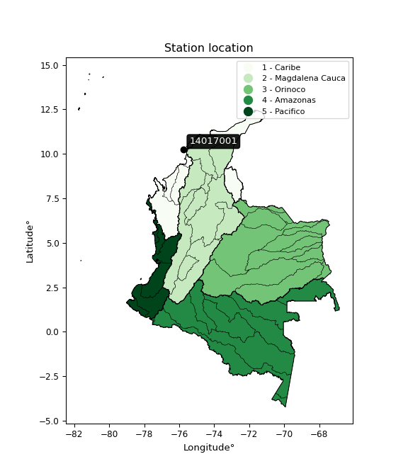

<div align="center">


</div>

# PMP Station (Rain, Pmax24h): 14017001

Probable Maximum Precipitation (PMP) is the greatest amount of rainfall for a specific duration that is meteorologically possible for a given location, acting as a "worst-case" scenario for extreme storms, crucial for designing safety-critical infrastructure like bridges, river deviations, dams, spillways, and nuclear plants to prevent catastrophic failure. PMP is calculated by hydrologists using meteorological data to determine the upper limit of extreme rainfall, often leading to the Probable Maximum Flood (PMF) for flood control design, and is increasingly being studied for climate change impacts.

<div align="center">

</img>

</div>


## A. General information


### 1. General running parameters

• app_version: _v20260103_. • runtime: _2026-01-03 07:24:50.581521_. • Python version: _3.14.0_. • SciPy version: _1.16.3_. • Pandas version: _2.3.3_. • NumPy version: _2.3.5_. • Stations dataset (station_dataset_file): _dataset/pmax24h_in/automatic_colombia_2003_2024.csv_. • Stations catalog (station_catalog_file): _dataset/CNE.xls_. • Minimum year to eval til year_max (date_min): _1900_. • Maximum year to eval since year_min (date_max): _2024_. • Creates, save and include plots into reports (create_plot): _False_. • Plot only fit distributions with Δo > Δ (plot_only_fit): _True_. • Eval low extreme values, if False, evaluates high extreme values (low_extreme): _False_. • Eval every SciPy distribution as logarithmic (pdist_logarithmic_on): _True_. • Standard deviation normalized (ddof): _1.0_. • Return periods to eval in years (Tr): _[2, 2.33, 5, 10, 15, 20, 25, 50, 75, 100, 200, 250, 500, 750, 1000]_. • Minimum data sample per station, 0 means any (minimum_sample): _5_. • Z-Score maximum threshold to adjust a value, 0 means disable (zscore_max): _3.5_. • Z-Score minimum threshold to adjust a value, 0 means disable (zscore_min): _-2.5_. • Avoid zeros, e.g. rain = 0 (avoid_zeros): _True_. • Avoid null values (avoid_nans): _True_. [:file_folder:Dataset file.](../../dataset/pmax24h_in/automatic_colombia_2003_2024.csv)

> Delta Degrees of Freedom (DDOF): is a parameter used in the formulas for calculating variance and standard deviation. When ddof=0, the divisor is $N$ (the total number of observations) and this is used when your data set is the entire population. When ddof=1, the divisor is $N-1$ and this is used when your data set is a sample drawn from a larger population. Using $N-1$ provides an unbiased estimate of the population variance (known as Bessel´s correction).


### 2. Station info and location

|   id |   CODIGO | NOMBRE                            | CATEGORIA    | TECNOLOGIA                | ESTADO   | FECHA_INSTALACION   |   FECHA_SUSPENSION |   ALTITUD |   LATITUD |   LONGITUD | DEPARTAMENTO   | MUNICIPIO           | AREA_OPERATIVA                              | ENTIDAD                                                                      | AREA_HIDROGRAFICA   | ZONA_HIDROGRAFICA   | SUBZONA_HIDROGRAFICA             | CORRIENTE   | Catalogo   |   Version |
|-----:|---------:|:----------------------------------|:-------------|:--------------------------|:---------|:--------------------|-------------------:|----------:|----------:|-----------:|:---------------|:--------------------|:--------------------------------------------|:-----------------------------------------------------------------------------|:--------------------|:--------------------|:---------------------------------|:------------|:-----------|----------:|
|    0 | 14017001 | TESORO INVEMAR  - AUT  [14017001] | Limnigráfica | Automática con Telemetría | Activa   | 06/08/2012          |                nan |         3 |   10.2349 |   -75.7405 | Bolivar        | Cartagena De Indias | Area Operativa 02 - Atlántico-Bolivar-Sucre | INSTITUTO DE INVESTIGACIONES MARINAS Y COSTERAS JOSE BENITO VIVES DE ANDREIS | Magdalena Cauca     | Bajo Magdalena      | Canal del Dique margen izquierda | Mar Caribe  | CNE_OE     |  20251226 |

<div align="center">

Dynamic map: [:earth_americas:Google](http://maps.google.com/maps?q=10.23491667,-75.74055) [:earth_americas:OSM](https://www.openstreetmap.org/#map=18/10.23491667/-75.74055&layers=P) [:earth_americas:Bing](https://www.bing.com/maps?cp=10.23491667~-75.74055&lvl=18) [:earth_americas:Apple](https://maps.apple.com/frame?center=10.23491667%2C-75.74055&span=0.003%2C0.006)

</div>


<div align="center">

```geojson
{
  "type": "Feature",
  "geometry": {
    "type": "Point", 
    "coordinates": [-75.74055, 10.23491667]
  }, 
  "properties": {
    "Name": "14017001"
  }
}
```

</div>


### 3. Discrete values table and plot

<div align="center">

|               |          0 |           1 |          2 |          3 |           4 |           5 |          6 |          7 |            8 |          9 |
|:--------------|-----------:|------------:|-----------:|-----------:|------------:|------------:|-----------:|-----------:|-------------:|-----------:|
| Date          | 2010       | 2012        | 2013       | 2014       | 2015        | 2016        | 2017       | 2018       | 2019         | 2020       |
| Value         |   73.5     |   54.3      |   55.2     |    2.1     |   19.6      |   17.1      |   78.6     |   73.2     |   44.2       |    5.9     |
| Value_initial |   73.5     |   54.3      |   55.2     |    2.1     |   19.6      |   17.1      |   78.6     |   73.2     |   44.2       |    5.9     |
| count         |   10       |   10        |   10       |   10       |   10        |   10        |   10       |   10       |   10         |   10       |
| mean          |   42.37    |   42.37     |   42.37    |   42.37    |   42.37     |   42.37     |   42.37    |   42.37    |   42.37      |   42.37    |
| std           |   29.1571  |   29.1571   |   29.1571  |   29.1571  |   29.1571   |   29.1571   |   29.1571  |   29.1571  |   29.1571    |   29.1571  |
| zscore        |    1.06766 |    0.409162 |    0.44003 |   -1.38114 |   -0.780941 |   -0.866684 |    1.24258 |    1.05737 |    0.0627634 |   -1.25081 |


</div>


> The initial value (value_initial) correspond to the initial obtained or null completed value, and value (value) is adjusted only when the initial value is outside the valid range definite through the Z-Score value. If Z-Score is active, values out of range or outliers are replaced with the station mean value


### 4. Active continuous probability distributions from SciPy (44 of 104 available)

A Probability Density Function (PDF) describes the relative likelihood of a continuous random variable falling within a specific range, where the total area under its curve equals 1, and the area over any interval gives the actual probability for that range. Unlike discrete probabilities (like rolling a die), a PDF shows density, not direct probability for a single point (which is zero), with higher points indicating higher likelihood, often visualized as a bell curve for normal distributions.

A log of a probability density function (log-PDF) is simply the logarithm of the PDF´s value, denoted as $log(f(x))$, useful for converting multiplication of probabilities into addition, improving numerical stability with tiny numbers, and connecting to information theory concepts like entropy. Instead of dealing with very small probabilities (e.g., 0.000001), log-PDFs use negative numbers (e.g., $log(0.00001) ≈ -11.51$ that are easier for computers to handle, preventing underflow errors and simplifying complex calculations. In this study, each active probability distribution from SciPy is also evaluated in the $log$ form.

[scipy.stats](https://docs.scipy.org/doc/scipy/reference/stats.html) is a Python´s powerful submodule within the SciPy library for comprehensive statistical analysis, offering over 130 probability distributions (like Normal, Poisson), functions for descriptive stats (mean, variance), hypothesis testing (t-tests, chi-square), random variable generation, and statistical tests, making it essential for data science, modeling, and research. It provides tools to explore, model, and draw conclusions from data efficiently, working seamlessly with NumPy.

<div align="center">

|   id | p_dist             |   n_parameter | fit_method   | label                                                                       | active   | ref                                                                                                        |
|-----:|:-------------------|--------------:|:-------------|:----------------------------------------------------------------------------|:---------|:-----------------------------------------------------------------------------------------------------------|
|    0 | alpha              |             3 | MLE          | Alpha                                                                       | True     | [:mortar_board:](https://docs.scipy.org/doc/scipy/reference/generated/scipy.stats.alpha.html)              |
|    1 | betaprime          |             4 | MLE          | Beta prime                                                                  | True     | [:mortar_board:](https://docs.scipy.org/doc/scipy/reference/generated/scipy.stats.betaprime.html)          |
|    2 | chi2               |             3 | MLE          | Chi²                                                                        | True     | [:mortar_board:](https://docs.scipy.org/doc/scipy/reference/generated/scipy.stats.chi2.html)               |
|    3 | crystalball        |             4 | MLE          | Crystalball                                                                 | True     | [:mortar_board:](https://docs.scipy.org/doc/scipy/reference/generated/scipy.stats.crystalball.html)        |
|    4 | erlang             |             3 | MLE          | Erlang                                                                      | True     | [:mortar_board:](https://docs.scipy.org/doc/scipy/reference/generated/scipy.stats.erlang.html)             |
|    5 | expon              |             2 | MLE          | Exponential                                                                 | True     | [:mortar_board:](https://docs.scipy.org/doc/scipy/reference/generated/scipy.stats.expon.html)              |
|    6 | exponnorm          |             3 | MLE          | Exponentially modified Normal                                               | True     | [:mortar_board:](https://docs.scipy.org/doc/scipy/reference/generated/scipy.stats.exponnorm.html)          |
|    7 | f                  |             4 | MLE          | F                                                                           | True     | [:mortar_board:](https://docs.scipy.org/doc/scipy/reference/generated/scipy.stats.f.html)                  |
|    8 | fatiguelife        |             3 | MLE          | Fatigue-life (Birnbaum-Saunders)                                            | True     | [:mortar_board:](https://docs.scipy.org/doc/scipy/reference/generated/scipy.stats.fatiguelife.html)        |
|    9 | fisk               |             3 | MLE          | Fisk                                                                        | True     | [:mortar_board:](https://docs.scipy.org/doc/scipy/reference/generated/scipy.stats.fisk.html)               |
|   10 | gamma              |             3 | MLE          | Gamma                                                                       | True     | [:mortar_board:](https://docs.scipy.org/doc/scipy/reference/generated/scipy.stats.gamma.html)              |
|   11 | genexpon           |             5 | MLE          | Generalized exponential                                                     | True     | [:mortar_board:](https://docs.scipy.org/doc/scipy/reference/generated/scipy.stats.genexpon.html)           |
|   12 | genlogistic        |             3 | MLE          | Generalized logistic                                                        | True     | [:mortar_board:](https://docs.scipy.org/doc/scipy/reference/generated/scipy.stats.genlogistic.html)        |
|   13 | gibrat             |             2 | MM           | Gibrat                                                                      | True     | [:mortar_board:](https://docs.scipy.org/doc/scipy/reference/generated/scipy.stats.gibrat.html)             |
|   14 | gompertz           |             3 | MLE          | Gompertz (or truncated Gumbel)                                              | True     | [:mortar_board:](https://docs.scipy.org/doc/scipy/reference/generated/scipy.stats.gompertz.html)           |
|   15 | gumbel_l           |             2 | MM           | Gumbel Left Skew                                                            | True     | [:mortar_board:](https://docs.scipy.org/doc/scipy/reference/generated/scipy.stats.gumbel_l.html)           |
|   16 | gumbel_r           |             2 | MM           | Gumbel Right Skew                                                           | True     | [:mortar_board:](https://docs.scipy.org/doc/scipy/reference/generated/scipy.stats.gumbel_r.html)           |
|   17 | halflogistic       |             2 | MM           | Half-logistic                                                               | True     | [:mortar_board:](https://docs.scipy.org/doc/scipy/reference/generated/scipy.stats.halflogistic.html)       |
|   18 | halfnorm           |             2 | MM           | Half Normal                                                                 | True     | [:mortar_board:](https://docs.scipy.org/doc/scipy/reference/generated/scipy.stats.halfnorm.html)           |
|   19 | hypsecant          |             2 | MM           | hyperbolic secant                                                           | True     | [:mortar_board:](https://docs.scipy.org/doc/scipy/reference/generated/scipy.stats.hypsecant.html)          |
|   20 | invgamma           |             3 | MLE          | Inverted gamma                                                              | True     | [:mortar_board:](https://docs.scipy.org/doc/scipy/reference/generated/scipy.stats.invgamma.html)           |
|   21 | invgauss           |             3 | MLE          | Inverse Gaussian                                                            | True     | [:mortar_board:](https://docs.scipy.org/doc/scipy/reference/generated/scipy.stats.invgauss.html)           |
|   22 | invweibull         |             3 | MLE          | Inverted Weibull                                                            | True     | [:mortar_board:](https://docs.scipy.org/doc/scipy/reference/generated/scipy.stats.invweibull.html)         |
|   23 | johnsonsu          |             4 | MLE          | Johnson Su                                                                  | True     | [:mortar_board:](https://docs.scipy.org/doc/scipy/reference/generated/scipy.stats.johnsonsu.html)          |
|   24 | kstwobign          |             2 | MLE          | Limiting distribution of scaled Kolmogorov-Smirnov two-sided test statistic | True     | [:mortar_board:](https://docs.scipy.org/doc/scipy/reference/generated/scipy.stats.kstwobign.html)          |
|   25 | laplace            |             2 | MM           | Laplace                                                                     | True     | [:mortar_board:](https://docs.scipy.org/doc/scipy/reference/generated/scipy.stats.laplace.html)            |
|   26 | laplace_asymmetric |             3 | MLE          | Asymmetric Laplace                                                          | True     | [:mortar_board:](https://docs.scipy.org/doc/scipy/reference/generated/scipy.stats.laplace_asymmetric.html) |
|   27 | loggamma           |             3 | MLE          | Log gamma                                                                   | True     | [:mortar_board:](https://docs.scipy.org/doc/scipy/reference/generated/scipy.stats.loggamma.html)           |
|   28 | logistic           |             2 | MM           | Logistic (or Sech-squared)                                                  | True     | [:mortar_board:](https://docs.scipy.org/doc/scipy/reference/generated/scipy.stats.logistic.html)           |
|   29 | lognorm            |             3 | MLE          | Log Normal                                                                  | True     | [:mortar_board:](https://docs.scipy.org/doc/scipy/reference/generated/scipy.stats.lognorm.html)            |
|   30 | maxwell            |             2 | MM           | Maxwell                                                                     | True     | [:mortar_board:](https://docs.scipy.org/doc/scipy/reference/generated/scipy.stats.maxwell.html)            |
|   31 | mielke             |             4 | MLE          | Mielke Beta-Kappa / Dagum                                                   | True     | [:mortar_board:](https://docs.scipy.org/doc/scipy/reference/generated/scipy.stats.mielke.html)             |
|   32 | moyal              |             2 | MM           | Moyal                                                                       | True     | [:mortar_board:](https://docs.scipy.org/doc/scipy/reference/generated/scipy.stats.moyal.html)              |
|   33 | nakagami           |             3 | MLE          | Nakagami                                                                    | True     | [:mortar_board:](https://docs.scipy.org/doc/scipy/reference/generated/scipy.stats.nakagami.html)           |
|   34 | ncf                |             5 | MLE          | Non-central F distribution                                                  | True     | [:mortar_board:](https://docs.scipy.org/doc/scipy/reference/generated/scipy.stats.ncf.html)                |
|   35 | nct                |             4 | MLE          | Non-central Student’s t                                                     | True     | [:mortar_board:](https://docs.scipy.org/doc/scipy/reference/generated/scipy.stats.nct.html)                |
|   36 | norm               |             2 | MM           | Normal                                                                      | True     | [:mortar_board:](https://docs.scipy.org/doc/scipy/reference/generated/scipy.stats.norm.html)               |
|   37 | pearson3           |             3 | MM           | Pearson type III                                                            | True     | [:mortar_board:](https://docs.scipy.org/doc/scipy/reference/generated/scipy.stats.pearson3.html)           |
|   38 | rayleigh           |             2 | MM           | Rayleigh                                                                    | True     | [:mortar_board:](https://docs.scipy.org/doc/scipy/reference/generated/scipy.stats.rayleigh.html)           |
|   39 | rice               |             3 | MLE          | Rice                                                                        | True     | [:mortar_board:](https://docs.scipy.org/doc/scipy/reference/generated/scipy.stats.rice.html)               |
|   40 | t                  |             3 | MLE          | Student’s t                                                                 | True     | [:mortar_board:](https://docs.scipy.org/doc/scipy/reference/generated/scipy.stats.t.html)                  |
|   41 | truncnorm          |             4 | MLE          | Truncated normal                                                            | True     | [:mortar_board:](https://docs.scipy.org/doc/scipy/reference/generated/scipy.stats.truncnorm.html)          |
|   42 | wald               |             2 | MM           | Wald                                                                        | True     | [:mortar_board:](https://docs.scipy.org/doc/scipy/reference/generated/scipy.stats.wald.html)               |
|   43 | weibull_min        |             3 | MLE          | Weibull minimum                                                             | True     | [:mortar_board:](https://docs.scipy.org/doc/scipy/reference/generated/scipy.stats.weibull_min.html)        |

</div>

> **n_parameter:** # arguments & localization & scale.
>
> **Fit methods:** (MLE) maximum likelihood, (MM) L-moments.
>
>**Inactive** (With the only purpose of prevent loops, zero divisions, infinite values, over high estimated values or horizontal trending for recurrence intervals estimations, the follow distributions were disabled.)**:** foldnorm, gennorm, norminvgauss, powernorm, powerlognorm, skewnorm, genextreme, anglit, arcsine, argus, beta, bradford, burr, burr12, cauchy, cosine, halfcauchy, foldcauchy, skewcauchy, wrapcauchy, dgamma, gengamma, exponweib, exponpow, truncexpon, gausshyper, genhalflogistic, genhyperbolic, geninvgauss, halfgennorm, johnsonsb, kappa4, kappa3, ksone, kstwo, loglaplace, levy, levy_l, levy_stable, ncx2, pareto, genpareto, truncpareto, lomax, powerlaw, rdist, rel_breitwigner, recipinvgauss, semicircular, studentized_range, trapezoid, triang, truncweibull_min, tukeylambda, uniform, loguniform, vonmises, vonmises_line, weibull_max, dweibull, 


## B. Probability distributions vs. Empirical distributions

A continuous probability distribution (CPD) describes probabilities for variables that can take any value within a range (like rain any time), unlike discrete variables with specific outcomes (like temperature). It uses a Probability Density Function (PDF), a curve where the total area under it equals 1, and the probability of the variable falling within an interval (a to b) is found by calculating the area under the curve between those points. A key feature is that the probability of hitting any single exact value is zero, so probabilities are always expressed for ranges, e.g., $P(a ≤ X ≤ b)$.

<div align="center">

Distributions parameters from station values
|    |   station | p_dist                |   n |             loc |           scale | shape                  | shape1                | shape2                 | shape3   |
|---:|----------:|:----------------------|----:|----------------:|----------------:|:-----------------------|:----------------------|:-----------------------|:---------|
|  0 |  14017001 | alpha                 |  10 |    -0.0130521   |     6.21873     | 1.0346109208662066e-11 |                       |                        |          |
|  1 |  14017001 | betaprime             |  10 |  -521.409       | 36142.8         | 416.5584335198107      | 26713.5590854854      |                        |          |
|  2 |  14017001 | chi2                  |  10 |     2.1         |     3.04379     | 1.273383747513896      |                       |                        |          |
|  3 |  14017001 | crystalball           |  10 |    42.37        |    27.6609      | 4090.5216991513535     | 103.43774781360085    |                        |          |
|  4 |  14017001 | erlang                |  10 |  -549.367       |     1.30745     | 452.5253221165216      |                       |                        |          |
|  5 |  14017001 | expon                 |  10 |     2.1         |    40.27        |                        |                       |                        |          |
|  6 |  14017001 | exponnorm             |  10 |    42.3467      |    27.6608      | 0.0008423902371302461  |                       |                        |          |
|  7 |  14017001 | f                     |  10 |     2.1         |    47.3513      | 1.6146113413998862     | 51.29436005471726     |                        |          |
|  8 |  14017001 | fatiguelife           |  10 |     2.1         |     6.80316e-05 | 737.0848285737362      |                       |                        |          |
|  9 |  14017001 | fisk                  |  10 |    -8.86877e+08 |     8.86877e+08 | 51554209.11606115      |                       |                        |          |
| 10 |  14017001 | gamma                 |  10 |  -532.41        |     1.34668     | 426.77474981974945     |                       |                        |          |
| 11 |  14017001 | genexpon              |  10 |     2.09988     |     2.44165     | 0.06021932539784633    | 2.774647372121485e-07 | 1.2171801706156309     |          |
| 12 |  14017001 | genlogistic           |  10 |    78.6001      |     6.22246e-06 | 1.7162320960046927e-07 |                       |                        |          |
| 13 |  14017001 | gibrat                |  10 |    21.2683      |    12.7989      |                        |                       |                        |          |
| 14 |  14017001 | gompertz              |  10 |     2.1         |    39.7173      | 0.409537098032965      |                       |                        |          |
| 15 |  14017001 | gumbel_l              |  10 |    54.8189      |    21.5671      |                        |                       |                        |          |
| 16 |  14017001 | gumbel_r              |  10 |    29.9211      |    21.5671      |                        |                       |                        |          |
| 17 |  14017001 | halflogistic          |  10 |     9.58538     |    23.6491      |                        |                       |                        |          |
| 18 |  14017001 | halfnorm              |  10 |     5.75788     |    45.8865      |                        |                       |                        |          |
| 19 |  14017001 | hypsecant             |  10 |    42.37        |    17.6095      |                        |                       |                        |          |
| 20 |  14017001 | invgamma              |  10 |  -169.077       | 11600.8         | 55.831719413972365     |                       |                        |          |
| 21 |  14017001 | invgauss              |  10 |   -49.8399      |   843.989       | 0.10864908745599472    |                       |                        |          |
| 22 |  14017001 | invweibull            |  10 |    -5.1856e+07  |     5.1856e+07  | 2063577.469847708      |                       |                        |          |
| 23 |  14017001 | johnsonsu             |  10 |    97.3202      |     0.740323    | 8.482228596094952      | 1.7488868813068308    |                        |          |
| 24 |  14017001 | kstwobign             |  10 |   -57.2906      |   113.493       |                        |                       |                        |          |
| 25 |  14017001 | laplace               |  10 |    42.37        |    19.5592      |                        |                       |                        |          |
| 26 |  14017001 | laplace_asymmetric    |  10 |    55.2         |    22.0656      | 1.3321284660915151     |                       |                        |          |
| 27 |  14017001 | loggamma              |  10 |    78.6004      |     3.58689e-05 | 9.899459913787981e-07  |                       |                        |          |
| 28 |  14017001 | logistic              |  10 |    42.37        |    15.2502      |                        |                       |                        |          |
| 29 |  14017001 | lognorm               |  10 |     2.1         |     0.676497    | 11.687859133836493     |                       |                        |          |
| 30 |  14017001 | maxwell               |  10 |   -23.1747      |    41.074       |                        |                       |                        |          |
| 31 |  14017001 | mielke                |  10 |     2.1         |    76.7758      | 0.7159031418030826     | 5556.827363202841     |                        |          |
| 32 |  14017001 | moyal                 |  10 |    26.5517      |    12.4518      |                        |                       |                        |          |
| 33 |  14017001 | nakagami              |  10 |     2.1         |    44.5549      | 0.2891830077058818     |                       |                        |          |
| 34 |  14017001 | ncf                   |  10 |    -0.28523     |     9.39431e-07 | 1.7737832420205058e-07 | 67.47267008932421     | 7.909130130020429      |          |
| 35 |  14017001 | nct                   |  10 |  2905.03        |    27.6542      | 8246620.641920814      | -103.51609599384676   |                        |          |
| 36 |  14017001 | norm                  |  10 |    42.37        |    27.6609      |                        |                       |                        |          |
| 37 |  14017001 | pearson3              |  10 |    42.37        |    27.6609      | -0.14605578458685475   |                       |                        |          |
| 38 |  14017001 | rayleigh              |  10 |   -10.5469      |    42.2216      |                        |                       |                        |          |
| 39 |  14017001 | rice                  |  10 |   -11.7463      |    33.1518      | 1.1665519879300104     |                       |                        |          |
| 40 |  14017001 | t                     |  10 |    42.3704      |    27.6614      | 140092432.74615484     |                       |                        |          |
| 41 |  14017001 | truncnorm             |  10 |    59.9228      |    22.6509      | -42.393757298574684    | 0.8245688791705474    |                        |          |
| 42 |  14017001 | wald                  |  10 |    14.7091      |    27.6609      |                        |                       |                        |          |
| 43 |  14017001 | weibull_min           |  10 |     2.1         |    38.7547      | 0.9259163271881532     |                       |                        |          |
| 44 |  14017001 | logalpha              |  10 |   -22.171       |   514.853       | 20.2863961178616       |                       |                        |          |
| 45 |  14017001 | logbetaprime          |  10 |   -23.2794      |   167.883       | 562.1664203645483      | 3551.9271419372326    |                        |          |
| 46 |  14017001 | logchi2               |  10 |   -13.4922      |     0.0451173   | 372.21372407117155     |                       |                        |          |
| 47 |  14017001 | logcrystalball        |  10 |     4.3645      |     6.58157e-07 | 6.302191480046095e-07  | 196.54544520375845    |                        |          |
| 48 |  14017001 | logerlang             |  10 |   -16.277       |     0.0752151   | 260.1655435141198      |                       |                        |          |
| 49 |  14017001 | logexpon              |  10 |     0.741937    |     2.56612     |                        |                       |                        |          |
| 50 |  14017001 | logexponnorm          |  10 |     3.30713     |     1.16306     | 0.0007954063638928748  |                       |                        |          |
| 51 |  14017001 | logf                  |  10 | -1915.54        |  1918.85        | 15671668.587857358     | 8241143.265924418     |                        |          |
| 52 |  14017001 | logfatiguelife        |  10 |  -498.286       |   501.591       | 0.002317682813539869   |                       |                        |          |
| 53 |  14017001 | logfisk               |  10 |    -6.37443e+07 |     6.37443e+07 | 97865022.87975201      |                       |                        |          |
| 54 |  14017001 | loggamma              |  10 |   -15.7996      |     0.0765841   | 249.45426305894352     |                       |                        |          |
| 55 |  14017001 | loggenexpon           |  10 |     0.625015    |     0.0174732   | 0.0011552198714589726  | 2.282476492554234     | 2.5693222698860966e-05 |          |
| 56 |  14017001 | loggenlogistic        |  10 |     4.36439     |     1.20704e-06 | 1.1451634062032041e-06 |                       |                        |          |
| 57 |  14017001 | loggibrat             |  10 |     2.42072     |     0.538184    |                        |                       |                        |          |
| 58 |  14017001 | loggompertz           |  10 |     0.543335    |     0.819158    | 0.019154388176744405   |                       |                        |          |
| 59 |  14017001 | loggumbel_l           |  10 |     3.8315      |     0.906835    |                        |                       |                        |          |
| 60 |  14017001 | loggumbel_r           |  10 |     2.78462     |     0.906835    |                        |                       |                        |          |
| 61 |  14017001 | loghalflogistic       |  10 |     1.92958     |     0.994364    |                        |                       |                        |          |
| 62 |  14017001 | loghalfnorm           |  10 |     1.76864     |     1.92938     |                        |                       |                        |          |
| 63 |  14017001 | loghypsecant          |  10 |     3.30806     |     0.740428    |                        |                       |                        |          |
| 64 |  14017001 | loginvgamma           |  10 |   -21.1156      |  9736.11        | 399.9423361571671      |                       |                        |          |
| 65 |  14017001 | loginvgauss           |  10 |    -9.23385     |  1218.68        | 0.010282704993007548   |                       |                        |          |
| 66 |  14017001 | loginvweibull         |  10 |    -1.91202e+08 |     1.91202e+08 | 144791980.25229222     |                       |                        |          |
| 67 |  14017001 | logjohnsonsu          |  10 |     4.37258     |     0.000204223 | 4.580462068745196      | 0.5556027732127       |                        |          |
| 68 |  14017001 | logkstwobign          |  10 |    -2.06192     |     6.14048     |                        |                       |                        |          |
| 69 |  14017001 | loglaplace            |  10 |     3.30806     |     0.822409    |                        |                       |                        |          |
| 70 |  14017001 | loglaplace_asymmetric |  10 |     4.36437     |     0.0101698   | 103.6052426015651      |                       |                        |          |
| 71 |  14017001 | logloggamma           |  10 |     4.36439     |     1.38416e-06 | 1.3119076095724326e-06 |                       |                        |          |
| 72 |  14017001 | loglogistic           |  10 |     3.30806     |     0.641229    |                        |                       |                        |          |
| 73 |  14017001 | loglognorm            |  10 |     0.741937    |     0.0616723   | 11.32290331030144      |                       |                        |          |
| 74 |  14017001 | logmaxwell            |  10 |     0.552089    |     1.72705     |                        |                       |                        |          |
| 75 |  14017001 | logmielke             |  10 |    -3.1861e+07  |     3.1861e+07  | 29441332.037313096     | 4082815274.960455     |                        |          |
| 76 |  14017001 | logmoyal              |  10 |     2.64294     |     0.523562    |                        |                       |                        |          |
| 77 |  14017001 | lognakagami           |  10 |     0.825592    |     2.85711     | 2.431756116891365      |                       |                        |          |
| 78 |  14017001 | logncf                |  10 |   -26.597       |    27.8207      | 1620.4756596237842     | 4474.841837135329     | 121.8988777992626      |          |
| 79 |  14017001 | lognct                |  10 |   -81.7595      |     1.14813     | 93958.88488312758      | 74.09172053884433     |                        |          |
| 80 |  14017001 | lognorm               |  10 |     3.30806     |     1.16306     |                        |                       |                        |          |
| 81 |  14017001 | logpearson3           |  10 |     3.30806     |     1.16305     | -1.0650371588456893    |                       |                        |          |
| 82 |  14017001 | lograyleigh           |  10 |     1.08308     |     1.77528     |                        |                       |                        |          |
| 83 |  14017001 | logrice               |  10 |  -702.411       |     1.16307     | 606.7721752247501      |                       |                        |          |
| 84 |  14017001 | logt                  |  10 |     3.30806     |     1.16306     | 2902563020.877872      |                       |                        |          |
| 85 |  14017001 | logtruncnorm          |  10 |     0.881232    |     2.75322     | -0.05059331905772729   | 8.325919649862254     |                        |          |
| 86 |  14017001 | logwald               |  10 |     2.14497     |     1.16308     |                        |                       |                        |          |
| 87 |  14017001 | logweibull_min        |  10 |    -6.39389e+07 |     6.39389e+07 | 83209987.11316913      |                       |                        |          |

</div>

> **loc** (Location parameter): This shifts the distribution along the x-axis. For many common distributions, like the normal (Gaussian) distribution, loc represents the mean $μ$. For others, like the uniform distribution, it might represent the minimum value, or for the beta distribution, the left end of the support interval.
>
> **scale** (Scale parameter): This determines the width or spread of the distribution. For the normal distribution, scale represents the standard deviation $σ$. For a uniform distribution, it defines the length of the interval (from $loc$ to $loc + scale$).
>
> **shape** (Shape parameters): Refers to parameters that define the specific form of a probability distribution, distinct from its location (loc) and scale (scale). These parameters are required arguments for most distribution functions. For example, a normal (Gaussian) distribution is fully defined by its location (mean) and scale (standard deviation), so it has no specific shape parameters beyond loc and scale. However, other distributions have intrinsic properties that need specification, as Gamma distribution that takes a shape parameter, often named $a$ or $alpha$.


### 0. Cumulative distribution values - CDF (88 evaluated)

Cumulative Distribution Function (CDF), denoted as $F$<sub>$X$</sub>$(x)$, is a function that gives the probability that a random variable $X$ will take a value less than or equal to a specific value, $x$ (i.e., $(P(X≥x)$. It essentially "accumulates" probabilities from a given point up to the far right (positive infinity), providing a complete picture of the distribution´s probabilities for both discrete (like rain) and continuous (like temperature) variables, helping to find probabilities over ranges or above certain values. Each station is evaluated separately ordering the $x$ values ascending, calculating the CDF and PDF values for the activated distributions and their logarithmic forms.

<div align="center">

CDF ordered by x ascending and calculating $log(f(x))$ separately
|   id |   Station |   date |    x |   count |   mean |     std |     zscore |   Value_initial |   station |   m |      alpha |   alpha_pdf |   betaprime |   betaprime_pdf |        chi2 |        chi2_pdf |   crystalball |   crystalball_pdf |    erlang |   erlang_pdf |     expon |   expon_pdf |   exponnorm |   exponnorm_pdf |           f |      f_pdf |   fatiguelife |   fatiguelife_pdf |     fisk |   fisk_pdf |     gamma |   gamma_pdf |   genexpon |   genexpon_pdf |   genlogistic |   genlogistic_pdf |   gibrat |   gibrat_pdf |    gompertz |   gompertz_pdf |   gumbel_l |   gumbel_l_pdf |   gumbel_r |   gumbel_r_pdf |   halflogistic |   halflogistic_pdf |   halfnorm |   halfnorm_pdf |   hypsecant |   hypsecant_pdf |   invgamma |   invgamma_pdf |   invgauss |   invgauss_pdf |   invweibull |   invweibull_pdf |   johnsonsu |   johnsonsu_pdf |   kstwobign |   kstwobign_pdf |   laplace |   laplace_pdf |   laplace_asymmetric |   laplace_asymmetric_pdf |   loggamma |   loggamma_pdf |   logistic |   logistic_pdf |   lognorm |   lognorm_pdf |   maxwell |   maxwell_pdf |      mielke |   mielke_pdf |      moyal |   moyal_pdf |    nakagami |    nakagami_pdf |       ncf |    ncf_pdf |       nct |    nct_pdf |      norm |   norm_pdf |   pearson3 |   pearson3_pdf |   rayleigh |   rayleigh_pdf |      rice |   rice_pdf |         t |      t_pdf |   truncnorm |   truncnorm_pdf |      wald |   wald_pdf |   weibull_min |   weibull_min_pdf |   logalpha |   logalpha_pdf |   logbetaprime |   logbetaprime_pdf |   logchi2 |   logchi2_pdf |   logcrystalball |   logcrystalball_pdf |   logerlang |   logerlang_pdf |   logexpon |   logexpon_pdf |   logexponnorm |   logexponnorm_pdf |      logf |   logf_pdf |   logfatiguelife |   logfatiguelife_pdf |   logfisk |   logfisk_pdf |   loggenexpon |   loggenexpon_pdf |   loggenlogistic |   loggenlogistic_pdf |   loggibrat |   loggibrat_pdf |   loggompertz |   loggompertz_pdf |   loggumbel_l |   loggumbel_l_pdf |   loggumbel_r |   loggumbel_r_pdf |   loghalflogistic |   loghalflogistic_pdf |   loghalfnorm |   loghalfnorm_pdf |   loghypsecant |   loghypsecant_pdf |   loginvgamma |   loginvgamma_pdf |   loginvgauss |   loginvgauss_pdf |   loginvweibull |   loginvweibull_pdf |   logjohnsonsu |   logjohnsonsu_pdf |   logkstwobign |   logkstwobign_pdf |   loglaplace |   loglaplace_pdf |   loglaplace_asymmetric |   loglaplace_asymmetric_pdf |   logloggamma |   logloggamma_pdf |   loglogistic |   loglogistic_pdf |   loglognorm |   loglognorm_pdf |   logmaxwell |   logmaxwell_pdf |   logmielke |   logmielke_pdf |    logmoyal |   logmoyal_pdf |   lognakagami |   lognakagami_pdf |    logncf |   logncf_pdf |    lognct |   lognct_pdf |   logpearson3 |   logpearson3_pdf |   lograyleigh |   lograyleigh_pdf |   logrice |   logrice_pdf |      logt |   logt_pdf |   logtruncnorm |   logtruncnorm_pdf |   logwald |   logwald_pdf |   logweibull_min |   logweibull_min_pdf |
|-----:|----------:|-------:|-----:|--------:|-------:|--------:|-----------:|----------------:|----------:|----:|-----------:|------------:|------------:|----------------:|------------:|----------------:|--------------:|------------------:|----------:|-------------:|----------:|------------:|------------:|----------------:|------------:|-----------:|--------------:|------------------:|---------:|-----------:|----------:|------------:|-----------:|---------------:|--------------:|------------------:|---------:|-------------:|------------:|---------------:|-----------:|---------------:|-----------:|---------------:|---------------:|-------------------:|-----------:|---------------:|------------:|----------------:|-----------:|---------------:|-----------:|---------------:|-------------:|-----------------:|------------:|----------------:|------------:|----------------:|----------:|--------------:|---------------------:|-------------------------:|-----------:|---------------:|-----------:|---------------:|----------:|--------------:|----------:|--------------:|------------:|-------------:|-----------:|------------:|------------:|----------------:|----------:|-----------:|----------:|-----------:|----------:|-----------:|-----------:|---------------:|-----------:|---------------:|----------:|-----------:|----------:|-----------:|------------:|----------------:|----------:|-----------:|--------------:|------------------:|-----------:|---------------:|---------------:|-------------------:|----------:|--------------:|-----------------:|---------------------:|------------:|----------------:|-----------:|---------------:|---------------:|-------------------:|----------:|-----------:|-----------------:|---------------------:|----------:|--------------:|--------------:|------------------:|-----------------:|---------------------:|------------:|----------------:|--------------:|------------------:|--------------:|------------------:|--------------:|------------------:|------------------:|----------------------:|--------------:|------------------:|---------------:|-------------------:|--------------:|------------------:|--------------:|------------------:|----------------:|--------------------:|---------------:|-------------------:|---------------:|-------------------:|-------------:|-----------------:|------------------------:|----------------------------:|--------------:|------------------:|--------------:|------------------:|-------------:|-----------------:|-------------:|-----------------:|------------:|----------------:|------------:|---------------:|--------------:|------------------:|----------:|-------------:|----------:|-------------:|--------------:|------------------:|--------------:|------------------:|----------:|--------------:|----------:|-----------:|---------------:|-------------------:|----------:|--------------:|-----------------:|---------------------:|
|    0 |  14017001 |   2014 |  2.1 |      10 |  42.37 | 29.1571 | -1.38114   |             2.1 |  14017001 |   1 | 0.00325038 | 0.0146232   |   0.0720671 |      0.00518684 | 5.92053e-11 | 84882.8         |     0.0727175 |        0.00499807 | 0.0717036 |   0.00515404 | 0         |  0.0248324  |   0.0727168 |      0.00499806 | 1.24772e-07 | 0.663901   |     0.0772192 |       1.66885e+09 | 0.084096 | 0.0044774  | 0.0715076 |  0.00514943 | 2.9167e-06 |     0.0246633  |      0        |        0.003344   | 0        |   0          | 2.39261e-12 |     0.0103113  |  0.0831186 |     0.00368916 |  0.0264443 |     0.00445422 |       0        |         0          | 0          |     0          |   0.0644512 |      0.00363508 |  0.0617488 |     0.00567592 |  0.0536466 |     0.00672197 |    0.0577732 |       0.00655512 |    0.110451 |      0.00346365 |   0.0529381 |      0.00714006 | 0.0637985 |    0.00326182 |             0.10504  |               0.00357348 |  0.0138947 |      0.0322815 |  0.0665699 |     0.00407458 | 0.0136798 |     0.0300774 | 0.055383  |    0.00608676 | 4.95978e-12 | 285.554      | 0.00759844 |  0.00242525 | 1.14101e-10 | 148601          | 0.0381114 | 0.00870379 | 0.0727336 | 0.00499841 | 0.0727175 | 0.00499807 |  0.0761618 |     0.00484119 |  0.0438695 |     0.00678316 | 0.043547  | 0.00619925 | 0.0727193 | 0.00499808 |  0.00671954 |     0.000851668 | 0         | 0          |   2.06151e-16 |        0.429821   |  0.0144948 |       0.03606  |      0.0144751 |          0.0328634 | 0.0149931 |     0.0343566 |              nan |                  nan |   0.0146494 |       0.0335847 |   0        |      0.389694  |      0.0136794 |          0.0300768 | 0.0139106 |   0.030439 |        0.0135303 |            0.0299604 | 0.0145623 |     0.0220316 |    0.00900228 |          0.087773 |         0        |            0.0305201 |    0        |       0         |    0.00524149 |         0.0296423 |     0.0325984 |          0.035355 |   7.39718e-05 |       0.000775893 |          0        |              0        |    0          |          0        |      0.0198881 |          0.0268429 |      0.013541 |         0.0328945 |     0.0136778 |         0.0348492 |       0.0132978 |           0.0435041 |       0.107189 |          0.0282444 |      0.0147844 |          0.0571269 |    0.0220731 |        0.0268396 |               0.0321254 |                   0.0304899 |     0.0322779 |         0.0305931 |     0.0179532 |         0.0274954 |   0.00135689 |      3.54216e+12 |  0.000352011 |       0.00554906 |   0.0345341 |       0.0319114 | 8.05332e-10 |    2.97639e-08 |     0         |         0         | 0.0147509 |    0.0328791 | 0.013745  |    0.0302069 |     0.0328106 |         0.0378612 |     0         |          0        | 0.0136805 |     0.0300786 | 0.0136798 |  0.0300774 |    7.73238e-12 |           0.278205 |  0        |      0        |        0.0181526 |             0.023408 |
|    1 |  14017001 |   2020 |  5.9 |      10 |  42.37 | 29.1571 | -1.25081   |             5.9 |  14017001 |   2 | 0.292939   | 0.0816281   |   0.0938575 |      0.00629719 | 0.658092    |     0.074026    |     0.0936734 |        0.00604734 | 0.0933588 |   0.00625898 | 0.0900477 |  0.0225963  |   0.0936727 |      0.00604732 | 0.113838    | 0.0233037  |     0.625757  |       0.0159882   | 0.102748 | 0.00535905 | 0.0931467 |  0.0062551  | 0.0894658  |     0.0224569  |      0        |        0.0037135  | 0        |   0          | 0.0402847   |     0.0108895  |  0.0983208 |     0.00432699 |  0.047555  |     0.00671607 |       0        |         0          | 0.00247114 |     0.0173881  |   0.0798274 |      0.00448584 |  0.0859987 |     0.00710081 |  0.0829487 |     0.00869416 |    0.0861997 |       0.00840788 |    0.124473 |      0.00392629 |   0.0841544 |      0.00926802 | 0.0774794 |    0.00396128 |             0.119536 |               0.00406664 |  0.100479  |      0.153941  |  0.083828  |     0.00503604 | 0.0937247 |     0.143881  | 0.0813428 |    0.00757639 | 0.11626     |   0.0219029  | 0.0219262  |  0.00531434 | 0.186979    |      0.0284121  | 0.0753646 | 0.0108292  | 0.0936906 | 0.00604755 | 0.0936734 | 0.00604734 |  0.0963662 |     0.00580835 |  0.073063  |     0.00855195 | 0.0700882 | 0.00775367 | 0.0936752 | 0.00604731 |  0.0107385  |     0.0012887   | 0         | 0          |   0.109934    |        0.0252572  |  0.11232   |       0.171377 |      0.101246  |          0.153496  | 0.104776  |     0.157175  |              nan |                  nan |   0.103296  |       0.156309  |   0.331393 |      0.260552  |      0.0937234 |          0.14388   | 0.0944106 |   0.144213 |        0.0936837 |            0.144341  | 0.067315  |     0.0963902 |    0.183684   |          0.234125 |         0        |            0.0813242 |    0        |       0         |    0.0647973  |         0.0983501 |     0.0983575 |          0.102944 |   0.0476119   |       0.159856    |          0        |              0        |    0.00261186 |          0.413543 |      0.0798654 |          0.106736  |      0.103786 |         0.1608    |     0.109459  |         0.168421  |       0.138638  |           0.207441  |       0.145576 |          0.0488803 |      0.170227  |          0.236011  |    0.077513  |        0.0942511 |               0.0856329 |                   0.0812733 |     0.0859252 |         0.0814403 |     0.0838706 |         0.119827  |   0.598285   |      0.0330668   |  0.0814071   |       0.180267   |   0.0897036 |       0.0828911 | 0.0219713   |    0.126573    |     0.0109695 |         0.0518786 | 0.100114  |    0.149977  | 0.0940157 |    0.144142  |     0.102813  |         0.10802   |     0.0731315 |          0.203476 | 0.0937272 |     0.143883  | 0.0937247 |  0.143881  |    0.283437    |           0.264265 |  0        |      0        |        0.0678564 |             0.085242 |
|    2 |  14017001 |   2016 | 17.1 |      10 |  42.37 | 29.1571 | -0.866684  |            17.1 |  14017001 |   3 | 0.716313   | 0.0158603   |   0.184233  |      0.00986643 | 0.960968    |     0.00714036  |     0.180473  |        0.00950195 | 0.183252  |   0.00982144 | 0.310981  |  0.01711    |   0.180472  |      0.00950196 | 0.316853    | 0.0147065  |     0.737953  |       0.00691575  | 0.180051 | 0.00858189 | 0.183009  |  0.00981961 | 0.309234   |     0.0170367  |      0        |        0.00505757 | 0        |   0          | 0.171326    |     0.0124657  |  0.159673  |     0.00677822 |  0.163314  |     0.0137217  |       0.157554 |         0.0206176  | 0.195229   |     0.0168651  |   0.148814  |      0.00814631 |  0.189456  |     0.0112753  |  0.208855  |     0.0133648  |    0.208124  |       0.0129999  |    0.17765  |      0.00567324 |   0.2165    |      0.0138037  | 0.137364  |    0.00702298 |             0.174975 |               0.0059527  |  0.356838  |      0.313432  |  0.160162  |     0.0088202  | 0.343391  |     0.316228  | 0.189423  |    0.0115485  | 0.310691    |   0.0148283  | 0.14385    |  0.0160924  | 0.410873    |      0.015444   | 0.220443  | 0.0144191  | 0.180489  | 0.0095016  | 0.180473  | 0.00950195 |  0.179252  |     0.00906252 |  0.192962  |     0.0125162  | 0.179673  | 0.0116027  | 0.180474  | 0.0095018  |  0.036899   |     0.00370872  | 0.0017551 | 0.00454258 |   0.339823    |        0.0169218  |  0.38229   |       0.313972 |      0.35696   |          0.313299  | 0.361556  |     0.31004   |              nan |                  nan |   0.361279  |       0.313573  |   0.558352 |      0.172107  |      0.34339   |          0.31623   | 0.343759  |   0.315192 |        0.344127  |            0.316923  | 0.269934  |     0.302556  |    0.460258   |          0.264851 |         0        |            0.223189  |    0.40057  |       0.923826  |    0.25669    |         0.286556  |     0.284482  |          0.264126 |   0.38996     |       0.404957    |          0.427905 |              0.410764 |    0.420977   |          0.354553 |      0.310655  |          0.356058  |      0.367033 |         0.316054  |     0.375466  |         0.310316  |       0.41368   |           0.27651   |       0.2228   |          0.108056  |      0.452837  |          0.26548   |    0.282692  |        0.343737  |               0.235102  |                   0.223133  |     0.235582  |         0.223286  |     0.324894  |         0.342058  |   0.62227    |      0.0160052   |  0.374907    |       0.337113   |   0.239804  |       0.221592  | 0.406998    |    0.448018    |     0.225977  |         0.370335  | 0.34965   |    0.306526  | 0.343754  |    0.315986  |     0.290069  |         0.256831  |     0.386883  |          0.341614 | 0.343394  |     0.316228  | 0.343391  |  0.316229  |    0.541487    |           0.216328 |  0.443963 |      0.649254 |        0.244722  |             0.275875 |
|    3 |  14017001 |   2015 | 19.6 |      10 |  42.37 | 29.1571 | -0.780941  |            19.6 |  14017001 |   4 | 0.75119    | 0.0122665   |   0.209877  |      0.010643   | 0.975222    |     0.0044776   |     0.205202  |        0.0102778  | 0.208784  |   0.0105993  | 0.352455  |  0.0160801  |   0.205201  |      0.0102778  | 0.352293    | 0.0136685  |     0.754302  |       0.00618982  | 0.202511 | 0.009388   | 0.208537  |  0.0105977  | 0.350539   |     0.0160179  |      0        |        0.00541861 | 0        |   0          | 0.202876    |     0.0127702  |  0.177449  |     0.00745028 |  0.19914   |     0.0149005  |       0.208625 |         0.0202222  | 0.237089   |     0.0166148  |   0.170511  |      0.00922641 |  0.218647  |     0.0120634  |  0.243098  |     0.0140009  |    0.241476  |       0.0136548  |    0.192427 |      0.00615377 |   0.251697  |      0.0143234  | 0.156093  |    0.00798053 |             0.190508 |               0.00648114 |  0.400314  |      0.323157  |  0.183458  |     0.00982288 | 0.387475  |     0.329274  | 0.219188  |    0.0122493  | 0.346942    |   0.014193   | 0.186168   |  0.0176769  | 0.448011    |      0.0143018  | 0.256889  | 0.0147101  | 0.205217  | 0.0102772  | 0.205202  | 0.0102778  |  0.202854  |     0.00981737 |  0.225013  |     0.0131059  | 0.209528  | 0.0122675  | 0.205202  | 0.0102776  |  0.0471871  |     0.00454151  | 0.0440952 | 0.0285473  |   0.380569    |        0.0156971  |  0.42553   |       0.319141 |      0.400437  |          0.323307  | 0.404505  |     0.318843  |              nan |                  nan |   0.404745  |       0.32287   |   0.581223 |      0.163195  |      0.387474  |          0.329275  | 0.387691  |   0.32809  |        0.388298  |            0.329843  | 0.313143  |     0.330214  |    0.496113   |          0.260419 |         0        |            0.254035  |    0.512133 |       0.718735  |    0.298041   |         0.319663  |     0.322337  |          0.290772 |   0.444788    |       0.397369    |          0.482273 |              0.385881 |    0.46838    |          0.340059 |      0.361623  |          0.389913  |      0.410743 |         0.323949  |     0.418232  |         0.31587   |       0.451125  |           0.271936  |       0.238544 |          0.123223  |      0.488611  |          0.258617  |    0.333711  |        0.405773  |               0.267608  |                   0.253984  |     0.268108  |         0.254114  |     0.373185  |         0.364796  |   0.624384   |      0.0150012   |  0.421145    |       0.339875   |   0.272029  |       0.25137   | 0.466687    |    0.425555    |     0.278817  |         0.402827  | 0.392226  |    0.316906  | 0.387799  |    0.32894   |     0.326703  |         0.280152  |     0.433445  |          0.3402   | 0.387478  |     0.329273  | 0.387475  |  0.329274  |    0.570479    |           0.20858  |  0.524646 |      0.536787 |        0.284811  |             0.311994 |
|    4 |  14017001 |   2019 | 44.2 |      10 |  42.37 | 29.1571 |  0.0627634 |            44.2 |  14017001 |   5 | 0.888143   | 0.0025133   |   0.535164  |      0.0142446  | 0.999667    |     5.72195e-05 |     0.526374  |        0.0143911  | 0.533619  |   0.0142612  | 0.648464  |  0.00872948 |   0.526374  |      0.0143911  | 0.602646    | 0.00755128 |     0.857071  |       0.00286108  | 0.514826 | 0.0145197  | 0.53332   |  0.0142578  | 0.645956   |     0.00873195 |      0        |        0.0106796  | 0.720109 |   0.0146766  | 0.538157    |     0.0137454  |  0.45729   |     0.0153796  |  0.597032  |     0.0142782  |       0.624189 |         0.0129051  | 0.597838   |     0.0122419  |   0.53302   |      0.0179789  |  0.559397  |     0.0136953  |  0.594385  |     0.0126718  |    0.586328  |       0.0124567  |    0.419379 |      0.0128641  |   0.599276  |      0.012315   | 0.544659  |    0.0232801  |             0.43992  |               0.0149662  |  0.662002  |      0.297208  |  0.529964  |     0.0163343  | 0.660299  |     0.314933  | 0.558183  |    0.0136133  | 0.650415    |   0.0110602  | 0.622507   |  0.0139727  | 0.711241    |      0.00797791 | 0.597815  | 0.0117467  | 0.526365  | 0.0143899  | 0.526374  | 0.0143911  |  0.516714  |     0.0144544  |  0.568574  |     0.0132494  | 0.549738  | 0.0138428  | 0.526368  | 0.0143908  |  0.306591   |     0.0174071   | 0.693237  | 0.0130743  |   0.660294    |        0.00806651 |  0.674939  |       0.27499  |      0.662853  |          0.298563  | 0.661572  |     0.291472  |              nan |                  nan |   0.665358  |       0.295161  |   0.69496  |      0.118872  |      0.660299  |          0.314935  | 0.659484  |   0.313891 |        0.661163  |            0.314466  | 0.613728  |     0.363962  |    0.689305   |          0.208907 |         0        |            0.549484  |    0.824566 |       0.188729  |    0.627495   |         0.457769  |     0.614776  |          0.40523  |   0.718592    |       0.261863    |          0.732844 |              0.232782 |    0.704907   |          0.239044 |      0.693489  |          0.352892  |      0.668897 |         0.288981  |     0.66651   |         0.275792  |       0.650504  |           0.211825  |       0.410504 |          0.370043  |      0.675939  |          0.198524  |    0.721298  |        0.338885  |               0.57901   |                   0.549532  |     0.579484  |         0.549238  |     0.679093  |         0.339856  |   0.634741   |      0.010898    |  0.680817    |       0.280253   |   0.576715  |       0.532916  | 0.737775    |    0.241206    |     0.629006  |         0.403156  | 0.651521  |    0.298064  | 0.660218  |    0.314396  |     0.604992  |         0.388509  |     0.686951  |          0.268752 | 0.660301  |     0.314931  | 0.660299  |  0.314933  |    0.720333    |           0.159498 |  0.792436 |      0.192183 |        0.619354  |             0.478473 |
|    5 |  14017001 |   2012 | 54.3 |      10 |  42.37 | 29.1571 |  0.409162  |            54.3 |  14017001 |   6 | 0.908843   | 0.00167104  |   0.67297   |      0.0127801  | 0.999941    |     1.00709e-05 |     0.666873  |        0.0131417  | 0.671723  |   0.0128199  | 0.726444  |  0.00679304 |   0.666874  |      0.0131417  | 0.67126     | 0.0060986  |     0.882662  |       0.00224129  | 0.656207 | 0.0131141  | 0.671389  |  0.0128171  | 0.724022   |     0.00680657 |      0        |        0.0141103  | 0.828464 |   0.00770516 | 0.67202     |     0.0125878  |  0.623271  |     0.0170525  |  0.724037  |     0.0108406  |       0.737683 |         0.00963724 | 0.709887   |     0.0099368  |   0.700824  |      0.0145963  |  0.68772   |     0.0115525  |  0.709713  |     0.0101218  |    0.699647  |       0.0099446  |    0.565643 |      0.0159957  |   0.711598  |      0.00990323 | 0.728309  |    0.0138907  |             0.620297 |               0.0211027  |  0.720613  |      0.271484  |  0.686172  |     0.0141204  | 0.72248   |     0.288178  | 0.686661  |    0.0116677  | 0.758661    |   0.0104047  | 0.742785   |  0.00996299 | 0.783304    |      0.00634246 | 0.704513  | 0.00937865 | 0.666854  | 0.013141   | 0.666873  | 0.0131417  |  0.659646  |     0.013536   |  0.692552  |     0.0111839  | 0.681398  | 0.0120491  | 0.666865  | 0.0131416  |  0.505508   |     0.0214769   | 0.796416  | 0.00789276 |   0.732206    |        0.00625842 |  0.728931  |       0.249141 |      0.721739  |          0.27278   | 0.719081  |     0.266574  |              nan |                  nan |   0.723533  |       0.269323  |   0.718469 |      0.109711  |      0.722481  |          0.288179  | 0.72148   |   0.287431 |        0.723229  |            0.287534  | 0.685458  |     0.331014  |    0.730549   |          0.191775 |         0        |            0.66796   |    0.858375 |       0.142538  |    0.720573   |         0.44146   |     0.697886  |          0.398767 |   0.76846     |       0.223179    |          0.777226 |              0.199082 |    0.751369   |          0.212571 |      0.760131  |          0.294158  |      0.725738 |         0.262656  |     0.72078   |         0.251015  |       0.692149  |           0.192861  |       0.506072 |          0.586227  |      0.71504   |          0.18148   |    0.782999  |        0.263861  |               0.703904  |                   0.668067  |     0.704294  |         0.667533  |     0.744701  |         0.296495  |   0.636909   |      0.0101881   |  0.735611    |       0.251781   |   0.697511  |       0.644538  | 0.783268    |    0.201811    |     0.707604  |         0.358817  | 0.710495  |    0.274107  | 0.722296  |    0.287714  |     0.685508  |         0.391231  |     0.739406  |          0.240736 | 0.722482  |     0.288176  | 0.72248   |  0.288178  |    0.751866    |           0.146981 |  0.827801 |      0.153301 |        0.717062  |             0.464882 |
|    6 |  14017001 |   2013 | 55.2 |      10 |  42.37 | 29.1571 |  0.44003   |            55.2 |  14017001 |   7 | 0.910323   | 0.00161735  |   0.684383  |      0.0125793  | 0.999949    |     8.63307e-06 |     0.678616  |        0.0129517  | 0.683171  |   0.0126203  | 0.73249   |  0.0066429  |   0.678617  |      0.0129517  | 0.676698    | 0.0059863  |     0.884658  |       0.00219532  | 0.667911 | 0.0128936  | 0.682836  |  0.0126177  | 0.730081   |     0.00665714 |      0        |        0.014465   | 0.835219 |   0.00730939 | 0.683281    |     0.0124342  |  0.638621  |     0.0170548  |  0.733656  |     0.0105357  |       0.746235 |         0.00936891 | 0.718737   |     0.00973087 |   0.713761  |      0.014151   |  0.698014  |     0.0113225  |  0.718718  |     0.00988815 |    0.708494  |       0.00971606 |    0.580144 |      0.0162267  |   0.720413  |      0.00968596 | 0.740528  |    0.013266   |             0.639583 |               0.0217588  |  0.725057  |      0.269214  |  0.698739  |     0.0138033  | 0.727198  |     0.285755  | 0.697066  |    0.0114542  | 0.768002    |   0.0103543  | 0.751608   |  0.00964551 | 0.788953    |      0.00621057 | 0.71286   | 0.00917053 | 0.678596  | 0.012951   | 0.678616  | 0.0129517  |  0.671753  |     0.0133665  |  0.702522  |     0.0109714  | 0.692149  | 0.0118427  | 0.678608  | 0.0129516  |  0.524928   |     0.0216727   | 0.803372  | 0.00756646 |   0.737777    |        0.00612049 |  0.733009  |       0.246943 |      0.726205  |          0.270498  | 0.723445  |     0.264385  |              nan |                  nan |   0.727942  |       0.267049  |   0.720267 |      0.10901   |      0.727198  |          0.285756  | 0.726185  |   0.285035 |        0.727935  |            0.285101  | 0.690874  |     0.327885  |    0.73369    |          0.190377 |         0        |            0.67846   |    0.860693 |       0.139493  |    0.727808   |         0.438746  |     0.704429  |          0.397267 |   0.772105    |       0.220209    |          0.780478 |              0.196535 |    0.754846   |          0.210484 |      0.764927  |          0.289401  |      0.730037 |         0.260374  |     0.724889  |         0.248896  |       0.695307  |           0.191344  |       0.515922 |          0.612458  |      0.718012  |          0.180124  |    0.787293  |        0.258639  |               0.714972  |                   0.678572  |     0.715354  |         0.678015  |     0.749545  |         0.292762  |   0.637076   |      0.0101352   |  0.73973     |       0.249403   |   0.708187  |       0.654404  | 0.786562    |    0.1989      |     0.713469  |         0.354846  | 0.714983  |    0.271964  | 0.727006  |    0.285299  |     0.691935  |         0.390706  |     0.743344  |          0.238436 | 0.727199  |     0.285753  | 0.727198  |  0.285755  |    0.754274    |           0.145989 |  0.830299 |      0.150631 |        0.724682  |             0.462144 |
|    7 |  14017001 |   2018 | 73.2 |      10 |  42.37 | 29.1571 |  1.05737   |            73.2 |  14017001 |   8 | 0.932309   | 0.000922355 |   0.866555  |      0.00746449 | 0.999998    |     4.03614e-07 |     0.867483  |        0.00774978 | 0.866128  |   0.0075025  | 0.828913  |  0.0042485  |   0.867484  |      0.00774977 | 0.767027    | 0.00417546 |     0.917272  |       0.00148717  | 0.851333 | 0.00735724 | 0.865797  |  0.00750617 | 0.826846   |     0.00427057 |      0        |        0.0237645  | 0.919329 |   0.00288084 | 0.870457    |     0.00800169 |  0.904151  |     0.0104216  |  0.874214  |     0.00544909 |       0.872861 |         0.00503432 | 0.858373   |     0.00590439 |   0.890548  |      0.00609377 |  0.858544  |     0.00656893 |  0.857145  |     0.00568864 |    0.845046  |       0.00566175 |    0.880392 |      0.0144641  |   0.857889  |      0.00575255 | 0.896625  |    0.00528526 |             0.878419 |               0.00733998 |  0.7952    |      0.226986  |  0.883047  |     0.00677202 | 0.801509  |     0.239616  | 0.861686  |    0.00681829 | 0.946501    |   0.00953028 | 0.877895   |  0.00486464 | 0.879465    |      0.003965   | 0.843301  | 0.00550519 | 0.86746   | 0.00775013 | 0.867483  | 0.00774978 |  0.86903   |     0.0081353  |  0.860146  |     0.00657015 | 0.863473  | 0.00710532 | 0.867475  | 0.00774993 |  0.906849   |     0.0186527   | 0.89729   | 0.00349656 |   0.826913    |        0.00395354 |  0.797198  |       0.207533 |      0.796667  |          0.227926  | 0.792444  |     0.223769  |              nan |                  nan |   0.797477  |       0.224885  |   0.749401 |      0.0976567 |      0.80151   |          0.239616  | 0.800359  |   0.239366 |        0.802044  |            0.238865  | 0.775131  |     0.267603  |    0.783998   |          0.166063 |         0        |            0.886773  |    0.893767 |       0.0979332 |    0.841877   |         0.35972   |     0.810591  |          0.347524 |   0.827404    |       0.172867    |          0.830116 |              0.156335 |    0.80929    |          0.175687 |      0.835476  |          0.212439  |      0.797731 |         0.218698  |     0.789802  |         0.210639  |       0.74567   |           0.165716  |       0.811208 |          1.89175   |      0.765601  |          0.15726   |    0.849082  |        0.183507  |               0.934589  |                   0.887009  |     0.934749  |         0.885959  |     0.82293   |         0.227245  |   0.639816   |      0.00930561  |  0.80424     |       0.207536   |   0.919202  |       0.849387  | 0.836163    |    0.154246    |     0.80344   |         0.281553  | 0.786172  |    0.231512  | 0.80121   |    0.239322  |     0.798996  |         0.361251  |     0.805019  |          0.1986   | 0.80151   |     0.239614  | 0.801509  |  0.239616  |    0.793101    |           0.12925  |  0.867118 |      0.112525 |        0.844683  |             0.376423 |
|    8 |  14017001 |   2010 | 73.5 |      10 |  42.37 | 29.1571 |  1.06766   |            73.5 |  14017001 |   9 | 0.932584   | 0.00091487  |   0.868781  |      0.00737594 | 0.999998    |     3.83619e-07 |     0.869794  |        0.00765621 | 0.868366  |   0.00741355 | 0.830183  |  0.00421697 |   0.869795  |      0.0076562  | 0.768276    | 0.00415111 |     0.917717  |       0.00147803  | 0.853527 | 0.00726736 | 0.868036  |  0.00741732 | 0.828122   |     0.00423909 |      0        |        0.023962   | 0.920188 |   0.00284123 | 0.872844    |     0.00791378 |  0.907248  |     0.0102261  |  0.875839  |     0.0053838  |       0.874363 |         0.00497883 | 0.860136   |     0.0058478  |   0.892361  |      0.00599671 |  0.860504  |     0.00649635 |  0.858843  |     0.00562997 |    0.846736  |       0.00560575 |    0.884703 |      0.0142703  |   0.859607  |      0.00569632 | 0.898198  |    0.00520481 |             0.880602 |               0.00720824 |  0.796127  |      0.226343  |  0.885063  |     0.00667046 | 0.802487  |     0.238902  | 0.86372   |    0.00674404 | 0.949359    |   0.00951889 | 0.879346   |  0.00480774 | 0.880649    |      0.00393339 | 0.844944  | 0.00545405 | 0.869771  | 0.00765658 | 0.869794  | 0.00765621 |  0.871456  |     0.00803531 |  0.862107  |     0.00650124 | 0.865593  | 0.00702649 | 0.869786  | 0.00765637 |  0.912423   |     0.0185069   | 0.898332  | 0.00345523 |   0.828095    |        0.00392532 |  0.798046  |       0.20695  |      0.797597  |          0.227276  | 0.793358  |     0.223152  |              nan |                  nan |   0.798396  |       0.224245  |   0.7498   |      0.0975012 |      0.802488  |          0.238902  | 0.801337  |   0.238659 |        0.80302   |            0.23815   | 0.776223  |     0.266678  |    0.784676   |          0.165709 |         0        |            0.89022   |    0.894167 |       0.097454  |    0.843345   |         0.358164  |     0.81201   |          0.34648  |   0.828109    |       0.172236    |          0.830754 |              0.155802 |    0.810008   |          0.1752   |      0.836343  |          0.21142   |      0.798624 |         0.218072  |     0.790662  |         0.210069  |       0.746347  |           0.165354  |       0.819048 |          1.94261   |      0.766244  |          0.156936  |    0.849831  |        0.182597  |               0.938224  |                   0.890458  |     0.93838   |         0.8894    |     0.823858  |         0.226309  |   0.639854   |      0.00929456  |  0.805088    |       0.206925   |   0.922683  |       0.852598  | 0.836793    |    0.15367     |     0.804589  |         0.280457  | 0.787117  |    0.230889  | 0.802187  |    0.23861   |     0.800472  |         0.360519  |     0.805831  |          0.198026 | 0.802488  |     0.2389    | 0.802487  |  0.238902  |    0.793629    |           0.129012 |  0.867577 |      0.112065 |        0.846219  |             0.374689 |
|    9 |  14017001 |   2017 | 78.6 |      10 |  42.37 | 29.1571 |  1.24258   |            78.6 |  14017001 |  10 | 0.936949   | 0.000800376 |   0.902653  |      0.00592704 | 0.999999    |     1.61873e-07 |     0.904867  |        0.00611668 | 0.902411  |   0.00595717 | 0.850383  |  0.00371534 |   0.904868  |      0.00611666 | 0.788433    | 0.00376066 |     0.924876  |       0.00133272  | 0.886853 | 0.00583302 | 0.902105  |  0.0059627  | 0.848437   |     0.00373806 |      0.999996 |        0.0275811  | 0.933128 |   0.00226079 | 0.909375    |     0.00641299 |  0.950815  |     0.00686944 |  0.900636  |     0.00437035 |       0.897485 |         0.00411264 | 0.887587   |     0.00493231 |   0.919089  |      0.00454543 |  0.890607  |     0.00533096 |  0.885127  |     0.00469846 |    0.873011  |       0.00471807 |    0.947376 |      0.0100275  |   0.886315  |      0.00479485 | 0.921564  |    0.00401018 |             0.912243 |               0.00529801 |  0.810956  |      0.215739  |  0.914955  |     0.00510234 | 0.818119  |     0.227086  | 0.894991  |    0.0055374  | 0.997427    |   0.00933413 | 0.901562   |  0.00393264 | 0.899387    |      0.00342305 | 0.870637  | 0.00463834 | 0.904847  | 0.00611721 | 0.904867  | 0.00611668 |  0.908159  |     0.00637362 |  0.892366  |     0.00538254 | 0.898095  | 0.00573666 | 0.90486   | 0.00611688 |  1          |     0.0157656   | 0.914308  | 0.00283402 |   0.846947    |        0.00347704 |  0.811608  |       0.197386 |      0.812486  |          0.216558  | 0.807988  |     0.212966  |              nan |                  nan |   0.813086  |       0.213683  |   0.756257 |      0.0949852 |      0.81812   |          0.227087  | 0.816956  |   0.226954 |        0.818601  |            0.226335  | 0.793604  |     0.251473  |    0.795599   |          0.159923 |         0.999987 |            0.948713  |    0.90045  |       0.0899961 |    0.866486   |         0.331309  |     0.834652  |          0.328149 |   0.839322    |       0.16212     |          0.840918 |              0.147259 |    0.821495   |          0.167294 |      0.849977  |          0.195198  |      0.812909 |         0.207784  |     0.804441  |         0.200711  |       0.757241  |           0.159457  |       0.983939 |          2.71667   |      0.776595  |          0.151663  |    0.861594  |        0.168293  |               0.999904  |                   0.948999  |     0.999984  |         0.947786  |     0.83853   |         0.211153  |   0.640471   |      0.00911703  |  0.818634    |       0.196935   |   0.981166  |       0.841742  | 0.846792    |    0.144502    |     0.822801  |         0.262503  | 0.802262  |    0.220579  | 0.817801  |    0.226838  |     0.824225  |         0.347191  |     0.8188    |          0.188656 | 0.81812   |     0.227084  | 0.818119  |  0.227086  |    0.802154    |           0.125133 |  0.874849 |      0.104833 |        0.870365  |             0.344674 |


</div>

An Empirical Distribution Function (EDF) is a step-function estimate of a true cumulative distribution function (CDF) based on observed sample data, representing the proportion of data points less than or equal to a given value. It is calculated by ordering your data and jumping up by $1/n$ (where $n$ is sample size) at each unique data point, allowing analysis without assuming an underlying population distribution, and it gets closer to the true CDF as the sample size grows. For the empirical probability calculations, the parameter $m$ correspond to the order number which means the position of the $x$ values in an ascending order list.


### 1. Empirical - EDF California (1923)

California´s estimates the true probability distribution of water-related data (like rainfall, streamflow) using observed samples, crucial for risk assessment.

<div align="center">


$P=m/n$


</div>


**1.1. Empirical values**

<div align="center">

|                | 0                  | 1              | 2                  | 3                  | 4              | 5              | 6                 | 7                 | 8                  | 9              |
|:---------------|:-------------------|:---------------|:-------------------|:-------------------|:---------------|:---------------|:------------------|:------------------|:-------------------|:---------------|
| date           | 2014               | 2020           | 2016               | 2015               | 2019           | 2012           | 2013              | 2018              | 2010               | 2017           |
| x              | 2.1                | 5.9            | 17.1               | 19.6               | 44.2           | 54.3           | 55.2              | 73.2              | 73.5               | 78.6           |
| m              | 1                  | 2              | 3                  | 4                  | 5              | 6              | 7                 | 8                 | 9                  | 10             |
| empirical_dist | edf_california     | edf_california | edf_california     | edf_california     | edf_california | edf_california | edf_california    | edf_california    | edf_california     | edf_california |
| empirical      | 0.1                | 0.2            | 0.3                | 0.4                | 0.5            | 0.6            | 0.7               | 0.8               | 0.9                | 1.0            |
| empirical_tr   | 1.1111111111111112 | 1.25           | 1.4285714285714286 | 1.6666666666666667 | 2.0            | 2.5            | 3.333333333333333 | 5.000000000000001 | 10.000000000000002 | inf            |

</div>


**1.2. Kolmogorov-Smirnov fit test (sorted by Δ)**


<div align="center">

|                | 0                  | 1                  | 2                     | 3                  | 4                  | 5                   | 6                  | 7                   | 8                   | 9                   | 10                  | 11                  | 12                  | 13                  | 14                  | 15                  | 16                  | 17                  | 18                  | 19                  | 20                 | 21                 | 22                  | 23                  | 24                  | 25                  | 26                 | 27                  | 28                  | 29                 | 30                  | 31                 | 32                 | 33                  | 34                  | 35                  | 36                  | 37                 | 38                  | 39                  | 40                  | 41                  | 42                  | 43                 | 44                  | 45                  | 46                  | 47                  | 48                  | 49                  | 50                  | 51                  | 52                 | 53                  | 54                 | 55                  | 56                 | 57                 | 58                 | 59                 | 60                  | 61                  | 62                  | 63                  | 64                 | 65                  | 66                  | 67                  | 68                  | 69                  | 70                  | 71                  | 72                  | 73                  | 74                  | 75                  | 76                 | 77                 | 78                 | 79                 | 80                 | 81                 | 82                  | 83                 | 84                 | 85                 | 86                 | 87                 |
|:---------------|:-------------------|:-------------------|:----------------------|:-------------------|:-------------------|:--------------------|:-------------------|:--------------------|:--------------------|:--------------------|:--------------------|:--------------------|:--------------------|:--------------------|:--------------------|:--------------------|:--------------------|:--------------------|:--------------------|:--------------------|:-------------------|:-------------------|:--------------------|:--------------------|:--------------------|:--------------------|:-------------------|:--------------------|:--------------------|:-------------------|:--------------------|:-------------------|:-------------------|:--------------------|:--------------------|:--------------------|:--------------------|:-------------------|:--------------------|:--------------------|:--------------------|:--------------------|:--------------------|:-------------------|:--------------------|:--------------------|:--------------------|:--------------------|:--------------------|:--------------------|:--------------------|:--------------------|:-------------------|:--------------------|:-------------------|:--------------------|:-------------------|:-------------------|:-------------------|:-------------------|:--------------------|:--------------------|:--------------------|:--------------------|:-------------------|:--------------------|:--------------------|:--------------------|:--------------------|:--------------------|:--------------------|:--------------------|:--------------------|:--------------------|:--------------------|:--------------------|:-------------------|:-------------------|:-------------------|:-------------------|:-------------------|:-------------------|:--------------------|:-------------------|:-------------------|:-------------------|:-------------------|:-------------------|
| station        | 14017001           | 14017001           | 14017001              | 14017001           | 14017001           | 14017001            | 14017001           | 14017001            | 14017001            | 14017001            | 14017001            | 14017001            | 14017001            | 14017001            | 14017001            | 14017001            | 14017001            | 14017001            | 14017001            | 14017001            | 14017001           | 14017001           | 14017001            | 14017001            | 14017001            | 14017001            | 14017001           | 14017001            | 14017001            | 14017001           | 14017001            | 14017001           | 14017001           | 14017001            | 14017001            | 14017001            | 14017001            | 14017001           | 14017001            | 14017001            | 14017001            | 14017001            | 14017001            | 14017001           | 14017001            | 14017001            | 14017001            | 14017001            | 14017001            | 14017001            | 14017001            | 14017001            | 14017001           | 14017001            | 14017001           | 14017001            | 14017001           | 14017001           | 14017001           | 14017001           | 14017001            | 14017001            | 14017001            | 14017001            | 14017001           | 14017001            | 14017001            | 14017001            | 14017001            | 14017001            | 14017001            | 14017001            | 14017001            | 14017001            | 14017001            | 14017001            | 14017001           | 14017001           | 14017001           | 14017001           | 14017001           | 14017001           | 14017001            | 14017001           | 14017001           | 14017001           | 14017001           | 14017001           |
| empirical_dist | edf_california     | edf_california     | edf_california        | edf_california     | edf_california     | edf_california      | edf_california     | edf_california      | edf_california      | edf_california      | edf_california      | edf_california      | edf_california      | edf_california      | edf_california      | edf_california      | edf_california      | edf_california      | edf_california      | edf_california      | edf_california     | edf_california     | edf_california      | edf_california      | edf_california      | edf_california      | edf_california     | edf_california      | edf_california      | edf_california     | edf_california      | edf_california     | edf_california     | edf_california      | edf_california      | edf_california      | edf_california      | edf_california     | edf_california      | edf_california      | edf_california      | edf_california      | edf_california      | edf_california     | edf_california      | edf_california      | edf_california      | edf_california      | edf_california      | edf_california      | edf_california      | edf_california      | edf_california     | edf_california      | edf_california     | edf_california      | edf_california     | edf_california     | edf_california     | edf_california     | edf_california      | edf_california      | edf_california      | edf_california      | edf_california     | edf_california      | edf_california      | edf_california      | edf_california      | edf_california      | edf_california      | edf_california      | edf_california      | edf_california      | edf_california      | edf_california      | edf_california     | edf_california     | edf_california     | edf_california     | edf_california     | edf_california     | edf_california      | edf_california     | edf_california     | edf_california     | edf_california     | edf_california     |
| p_dist         | logmielke          | logweibull_min     | loglaplace_asymmetric | logloggamma        | loggompertz        | ncf                 | kstwobign          | expon               | genexpon            | invgauss            | invweibull          | mielke              | weibull_min         | loggumbel_l         | rayleigh            | logpearson3         | loglogistic         | maxwell             | invgamma            | logmaxwell          | logfatiguelife     | logexponnorm       | logrice             | logt                | lognorm             | lognorm             | lognct             | logf                | logjohnsonsu        | logerlang          | lograyleigh         | loginvgamma        | logbetaprime       | logalpha            | lognakagami         | loggamma            | loggamma            | betaprime          | rice                | erlang              | gamma               | logchi2             | loghypsecant        | nct                | t                   | norm                | crystalball         | exponnorm           | loginvgauss         | gompertz            | pearson3            | fisk                | halfnorm           | logncf              | halflogistic       | gumbel_r            | loggenexpon        | loghalfnorm        | logfisk            | johnsonsu          | laplace_asymmetric  | nakagami            | f                   | moyal               | logistic           | loggumbel_r         | loglaplace          | gumbel_l            | logkstwobign        | hypsecant           | loghalflogistic     | logmoyal            | logtruncnorm        | loginvweibull       | laplace             | logexpon            | logwald            | loggibrat          | truncnorm          | wald               | loglognorm         | gibrat             | alpha               | fatiguelife        | chi2               | genlogistic        | loggenlogistic     | logcrystalball     |
| delta          | 0.1279705215219547 | 0.1321435813414062 | 0.1345892171051869    | 0.1347490011558592 | 0.1352026969804681 | 0.14311076305664955 | 0.1483025783758355 | 0.14961691090202223 | 0.15156261318608977 | 0.15690216572768576 | 0.15852355785679487 | 0.15866070954958422 | 0.16029441109576759 | 0.16534806142971215 | 0.17498661054673942 | 0.17577548466337622 | 0.17909254451926182 | 0.18081162002029486 | 0.18135323212832014 | 0.18136602666320134 | 0.1813988689895537 | 0.1818800310922234 | 0.18188035163989658 | 0.18188082590673227 | 0.18188106827875927 | 0.18188106827875927 | 0.1821992021413381 | 0.18304416844928406 | 0.18407845013640545 | 0.186914084316274  | 0.18695054713360548 | 0.1870910874047289 | 0.1875142907056926 | 0.18839177082000758 | 0.18903052298973888 | 0.18904388055668941 | 0.18904388055668941 | 0.1901234303618693 | 0.19047206533468924 | 0.19121562830949718 | 0.19146323244106003 | 0.19201224405473072 | 0.19348913932197898 | 0.1947828875557872 | 0.19479803345494884 | 0.19479840810214522 | 0.19479840933120585 | 0.19479916184933194 | 0.19555874691603015 | 0.19712413382559854 | 0.19714636022160328 | 0.19748945627785036 | 0.1975288593422539 | 0.19773828754889822 | 0.2                | 0.20086010529778373 | 0.2044012643109664 | 0.2049073644874646 | 0.2063960492439859 | 0.2075733911106858 | 0.20949217033176157 | 0.21124083010753214 | 0.21156725306875923 | 0.21383217010152666 | 0.2165417911624502 | 0.21859228011389098 | 0.22129781787551672 | 0.22255123442152333 | 0.22340542342848735 | 0.22948949878746183 | 0.23284409351940372 | 0.23777512629214304 | 0.24148686290718707 | 0.24275870431994884 | 0.24390736147351766 | 0.25835212964074544 | 0.2924358901837798 | 0.3245655133780403 | 0.352812868119302  | 0.3559048418207933 | 0.3982854138610739 | 0.4                | 0.41631261720400764 | 0.4379525713716333 | 0.6609680205981558 | 0.9                | 0.9                | nan                |
| deltao         | 0.3942745923300002 | 0.3942745923300002 | 0.3942745923300002    | 0.3942745923300002 | 0.3942745923300002 | 0.3942745923300002  | 0.3942745923300002 | 0.3942745923300002  | 0.3942745923300002  | 0.3942745923300002  | 0.3942745923300002  | 0.3942745923300002  | 0.3942745923300002  | 0.3942745923300002  | 0.3942745923300002  | 0.3942745923300002  | 0.3942745923300002  | 0.3942745923300002  | 0.3942745923300002  | 0.3942745923300002  | 0.3942745923300002 | 0.3942745923300002 | 0.3942745923300002  | 0.3942745923300002  | 0.3942745923300002  | 0.3942745923300002  | 0.3942745923300002 | 0.3942745923300002  | 0.3942745923300002  | 0.3942745923300002 | 0.3942745923300002  | 0.3942745923300002 | 0.3942745923300002 | 0.3942745923300002  | 0.3942745923300002  | 0.3942745923300002  | 0.3942745923300002  | 0.3942745923300002 | 0.3942745923300002  | 0.3942745923300002  | 0.3942745923300002  | 0.3942745923300002  | 0.3942745923300002  | 0.3942745923300002 | 0.3942745923300002  | 0.3942745923300002  | 0.3942745923300002  | 0.3942745923300002  | 0.3942745923300002  | 0.3942745923300002  | 0.3942745923300002  | 0.3942745923300002  | 0.3942745923300002 | 0.3942745923300002  | 0.3942745923300002 | 0.3942745923300002  | 0.3942745923300002 | 0.3942745923300002 | 0.3942745923300002 | 0.3942745923300002 | 0.3942745923300002  | 0.3942745923300002  | 0.3942745923300002  | 0.3942745923300002  | 0.3942745923300002 | 0.3942745923300002  | 0.3942745923300002  | 0.3942745923300002  | 0.3942745923300002  | 0.3942745923300002  | 0.3942745923300002  | 0.3942745923300002  | 0.3942745923300002  | 0.3942745923300002  | 0.3942745923300002  | 0.3942745923300002  | 0.3942745923300002 | 0.3942745923300002 | 0.3942745923300002 | 0.3942745923300002 | 0.3942745923300002 | 0.3942745923300002 | 0.3942745923300002  | 0.3942745923300002 | 0.3942745923300002 | 0.3942745923300002 | 0.3942745923300002 | 0.3942745923300002 |
| eval           | Δo > Δ             | Δo > Δ             | Δo > Δ                | Δo > Δ             | Δo > Δ             | Δo > Δ              | Δo > Δ             | Δo > Δ              | Δo > Δ              | Δo > Δ              | Δo > Δ              | Δo > Δ              | Δo > Δ              | Δo > Δ              | Δo > Δ              | Δo > Δ              | Δo > Δ              | Δo > Δ              | Δo > Δ              | Δo > Δ              | Δo > Δ             | Δo > Δ             | Δo > Δ              | Δo > Δ              | Δo > Δ              | Δo > Δ              | Δo > Δ             | Δo > Δ              | Δo > Δ              | Δo > Δ             | Δo > Δ              | Δo > Δ             | Δo > Δ             | Δo > Δ              | Δo > Δ              | Δo > Δ              | Δo > Δ              | Δo > Δ             | Δo > Δ              | Δo > Δ              | Δo > Δ              | Δo > Δ              | Δo > Δ              | Δo > Δ             | Δo > Δ              | Δo > Δ              | Δo > Δ              | Δo > Δ              | Δo > Δ              | Δo > Δ              | Δo > Δ              | Δo > Δ              | Δo > Δ             | Δo > Δ              | Δo > Δ             | Δo > Δ              | Δo > Δ             | Δo > Δ             | Δo > Δ             | Δo > Δ             | Δo > Δ              | Δo > Δ              | Δo > Δ              | Δo > Δ              | Δo > Δ             | Δo > Δ              | Δo > Δ              | Δo > Δ              | Δo > Δ              | Δo > Δ              | Δo > Δ              | Δo > Δ              | Δo > Δ              | Δo > Δ              | Δo > Δ              | Δo > Δ              | Δo > Δ             | Δo > Δ             | Δo > Δ             | Δo > Δ             | Δo <= Δ            | Δo <= Δ            | Δo <= Δ             | Δo <= Δ            | Δo <= Δ            | Δo <= Δ            | Δo <= Δ            | Δo <= Δ            |
| fit            | 1                  | 1                  | 1                     | 1                  | 1                  | 1                   | 1                  | 1                   | 1                   | 1                   | 1                   | 1                   | 1                   | 1                   | 1                   | 1                   | 1                   | 1                   | 1                   | 1                   | 1                  | 1                  | 1                   | 1                   | 1                   | 1                   | 1                  | 1                   | 1                   | 1                  | 1                   | 1                  | 1                  | 1                   | 1                   | 1                   | 1                   | 1                  | 1                   | 1                   | 1                   | 1                   | 1                   | 1                  | 1                   | 1                   | 1                   | 1                   | 1                   | 1                   | 1                   | 1                   | 1                  | 1                   | 1                  | 1                   | 1                  | 1                  | 1                  | 1                  | 1                   | 1                   | 1                   | 1                   | 1                  | 1                   | 1                   | 1                   | 1                   | 1                   | 1                   | 1                   | 1                   | 1                   | 1                   | 1                   | 1                  | 1                  | 1                  | 1                  | 0                  | 0                  | 0                   | 0                  | 0                  | 0                  | 0                  | 0                  |
| n              | 10                 | 10                 | 10                    | 10                 | 10                 | 10                  | 10                 | 10                  | 10                  | 10                  | 10                  | 10                  | 10                  | 10                  | 10                  | 10                  | 10                  | 10                  | 10                  | 10                  | 10                 | 10                 | 10                  | 10                  | 10                  | 10                  | 10                 | 10                  | 10                  | 10                 | 10                  | 10                 | 10                 | 10                  | 10                  | 10                  | 10                  | 10                 | 10                  | 10                  | 10                  | 10                  | 10                  | 10                 | 10                  | 10                  | 10                  | 10                  | 10                  | 10                  | 10                  | 10                  | 10                 | 10                  | 10                 | 10                  | 10                 | 10                 | 10                 | 10                 | 10                  | 10                  | 10                  | 10                  | 10                 | 10                  | 10                  | 10                  | 10                  | 10                  | 10                  | 10                  | 10                  | 10                  | 10                  | 10                  | 10                 | 10                 | 10                 | 10                 | 10                 | 10                 | 10                  | 10                 | 10                 | 10                 | 10                 | 10                 |
| best_fit       | 1                  | 0                  | 0                     | 0                  | 0                  | 0                   | 0                  | 0                   | 0                   | 0                   | 0                   | 0                   | 0                   | 0                   | 0                   | 0                   | 0                   | 0                   | 0                   | 0                   | 0                  | 0                  | 0                   | 0                   | 0                   | 0                   | 0                  | 0                   | 0                   | 0                  | 0                   | 0                  | 0                  | 0                   | 0                   | 0                   | 0                   | 0                  | 0                   | 0                   | 0                   | 0                   | 0                   | 0                  | 0                   | 0                   | 0                   | 0                   | 0                   | 0                   | 0                   | 0                   | 0                  | 0                   | 0                  | 0                   | 0                  | 0                  | 0                  | 0                  | 0                   | 0                   | 0                   | 0                   | 0                  | 0                   | 0                   | 0                   | 0                   | 0                   | 0                   | 0                   | 0                   | 0                   | 0                   | 0                   | 0                  | 0                  | 0                  | 0                  | 0                  | 0                  | 0                   | 0                  | 0                  | 0                  | 0                  | 0                  |
| best_fit_sort  | 1                  | 2                  | 3                     | 4                  | 5                  | 6                   | 7                  | 8                   | 9                   | 10                  | 11                  | 12                  | 13                  | 14                  | 15                  | 16                  | 17                  | 18                  | 19                  | 20                  | 21                 | 22                 | 23                  | 24                  | 25                  | 26                  | 27                 | 28                  | 29                  | 30                 | 31                  | 32                 | 33                 | 34                  | 35                  | 36                  | 37                  | 38                 | 39                  | 40                  | 41                  | 42                  | 43                  | 44                 | 45                  | 46                  | 47                  | 48                  | 49                  | 50                  | 51                  | 52                  | 53                 | 54                  | 55                 | 56                  | 57                 | 58                 | 59                 | 60                 | 61                  | 62                  | 63                  | 64                  | 65                 | 66                  | 67                  | 68                  | 69                  | 70                  | 71                  | 72                  | 73                  | 74                  | 75                  | 76                  | 77                 | 78                 | 79                 | 80                 | 81                 | 82                 | 83                  | 84                 | 85                 | 86                 | 87                 | 88                 |

</div>


**1.3. Best fit**

<div align="center">

|   id |   station | empirical_dist   | p_dist    |    delta |   deltao | eval   |   fit |   n |   best_fit |   best_fit_sort |
|-----:|----------:|:-----------------|:----------|---------:|---------:|:-------|------:|----:|-----------:|----------------:|
|    0 |  14017001 | edf_california   | logmielke | 0.127971 | 0.394275 | Δo > Δ |     1 |  10 |          1 |               1 |

</div>


### 2. Empirical - EDF Hazen (1930)

Hazen method for plotting positions is a formula used to estimate the empirical cumulative probability distribution of flood events or other hydrological data. This formula often results in biased estimations, particularly when extrapolating to extreme events (high return periods).

<div align="center">


$P=(m-0.5)/n$


</div>


**2.1. Empirical values**

<div align="center">

|                | 0                  | 1                  | 2                  | 3                  | 4                  | 5                  | 6                 | 7         | 8                 | 9                  |
|:---------------|:-------------------|:-------------------|:-------------------|:-------------------|:-------------------|:-------------------|:------------------|:----------|:------------------|:-------------------|
| date           | 2014               | 2020               | 2016               | 2015               | 2019               | 2012               | 2013              | 2018      | 2010              | 2017               |
| x              | 2.1                | 5.9                | 17.1               | 19.6               | 44.2               | 54.3               | 55.2              | 73.2      | 73.5              | 78.6               |
| m              | 1                  | 2                  | 3                  | 4                  | 5                  | 6                  | 7                 | 8         | 9                 | 10                 |
| empirical_dist | edf_hazen          | edf_hazen          | edf_hazen          | edf_hazen          | edf_hazen          | edf_hazen          | edf_hazen         | edf_hazen | edf_hazen         | edf_hazen          |
| empirical      | 0.05               | 0.15               | 0.25               | 0.35               | 0.45               | 0.55               | 0.65              | 0.75      | 0.85              | 0.95               |
| empirical_tr   | 1.0526315789473684 | 1.1764705882352942 | 1.3333333333333333 | 1.5384615384615383 | 1.8181818181818181 | 2.2222222222222223 | 2.857142857142857 | 4.0       | 6.666666666666666 | 19.999999999999982 |

</div>


**2.2. Kolmogorov-Smirnov fit test (sorted by Δ)**


<div align="center">

|                | 0                  | 1                   | 2                   | 3                   | 4                  | 5                   | 6                  | 7                   | 8                   | 9                  | 10                  | 11                 | 12                 | 13                 | 14                  | 15                  | 16                 | 17                  | 18                  | 19                  | 20                  | 21                  | 22                  | 23                 | 24                  | 25                 | 26                  | 27                  | 28                  | 29                 | 30                 | 31                 | 32                  | 33                  | 34                 | 35                    | 36                  | 37                  | 38                  | 39                  | 40                  | 41                  | 42                  | 43                 | 44                  | 45                  | 46                  | 47                  | 48                  | 49                  | 50                 | 51                  | 52                  | 53                  | 54                  | 55                  | 56                  | 57                  | 58                 | 59                  | 60                  | 61                  | 62                  | 63                 | 64                  | 65                  | 66                  | 67                  | 68                 | 69                  | 70                  | 71                 | 72                 | 73                 | 74                  | 75                  | 76                  | 77                  | 78                 | 79                 | 80                 | 81                 | 82                  | 83                 | 84                 | 85                 | 86                 | 87                 |
|:---------------|:-------------------|:--------------------|:--------------------|:--------------------|:-------------------|:--------------------|:-------------------|:--------------------|:--------------------|:-------------------|:--------------------|:-------------------|:-------------------|:-------------------|:--------------------|:--------------------|:-------------------|:--------------------|:--------------------|:--------------------|:--------------------|:--------------------|:--------------------|:-------------------|:--------------------|:-------------------|:--------------------|:--------------------|:--------------------|:-------------------|:-------------------|:-------------------|:--------------------|:--------------------|:-------------------|:----------------------|:--------------------|:--------------------|:--------------------|:--------------------|:--------------------|:--------------------|:--------------------|:-------------------|:--------------------|:--------------------|:--------------------|:--------------------|:--------------------|:--------------------|:-------------------|:--------------------|:--------------------|:--------------------|:--------------------|:--------------------|:--------------------|:--------------------|:-------------------|:--------------------|:--------------------|:--------------------|:--------------------|:-------------------|:--------------------|:--------------------|:--------------------|:--------------------|:-------------------|:--------------------|:--------------------|:-------------------|:-------------------|:-------------------|:--------------------|:--------------------|:--------------------|:--------------------|:-------------------|:-------------------|:-------------------|:-------------------|:--------------------|:-------------------|:-------------------|:-------------------|:-------------------|:-------------------|
| station        | 14017001           | 14017001            | 14017001            | 14017001            | 14017001           | 14017001            | 14017001           | 14017001            | 14017001            | 14017001           | 14017001            | 14017001           | 14017001           | 14017001           | 14017001            | 14017001            | 14017001           | 14017001            | 14017001            | 14017001            | 14017001            | 14017001            | 14017001            | 14017001           | 14017001            | 14017001           | 14017001            | 14017001            | 14017001            | 14017001           | 14017001           | 14017001           | 14017001            | 14017001            | 14017001           | 14017001              | 14017001            | 14017001            | 14017001            | 14017001            | 14017001            | 14017001            | 14017001            | 14017001           | 14017001            | 14017001            | 14017001            | 14017001            | 14017001            | 14017001            | 14017001           | 14017001            | 14017001            | 14017001            | 14017001            | 14017001            | 14017001            | 14017001            | 14017001           | 14017001            | 14017001            | 14017001            | 14017001            | 14017001           | 14017001            | 14017001            | 14017001            | 14017001            | 14017001           | 14017001            | 14017001            | 14017001           | 14017001           | 14017001           | 14017001            | 14017001            | 14017001            | 14017001            | 14017001           | 14017001           | 14017001           | 14017001           | 14017001            | 14017001           | 14017001           | 14017001           | 14017001           | 14017001           |
| empirical_dist | edf_hazen          | edf_hazen           | edf_hazen           | edf_hazen           | edf_hazen          | edf_hazen           | edf_hazen          | edf_hazen           | edf_hazen           | edf_hazen          | edf_hazen           | edf_hazen          | edf_hazen          | edf_hazen          | edf_hazen           | edf_hazen           | edf_hazen          | edf_hazen           | edf_hazen           | edf_hazen           | edf_hazen           | edf_hazen           | edf_hazen           | edf_hazen          | edf_hazen           | edf_hazen          | edf_hazen           | edf_hazen           | edf_hazen           | edf_hazen          | edf_hazen          | edf_hazen          | edf_hazen           | edf_hazen           | edf_hazen          | edf_hazen             | edf_hazen           | edf_hazen           | edf_hazen           | edf_hazen           | edf_hazen           | edf_hazen           | edf_hazen           | edf_hazen          | edf_hazen           | edf_hazen           | edf_hazen           | edf_hazen           | edf_hazen           | edf_hazen           | edf_hazen          | edf_hazen           | edf_hazen           | edf_hazen           | edf_hazen           | edf_hazen           | edf_hazen           | edf_hazen           | edf_hazen          | edf_hazen           | edf_hazen           | edf_hazen           | edf_hazen           | edf_hazen          | edf_hazen           | edf_hazen           | edf_hazen           | edf_hazen           | edf_hazen          | edf_hazen           | edf_hazen           | edf_hazen          | edf_hazen          | edf_hazen          | edf_hazen           | edf_hazen           | edf_hazen           | edf_hazen           | edf_hazen          | edf_hazen          | edf_hazen          | edf_hazen          | edf_hazen           | edf_hazen          | edf_hazen          | edf_hazen          | edf_hazen          | edf_hazen          |
| p_dist         | logjohnsonsu       | maxwell             | invgamma            | betaprime           | rice               | erlang              | gamma              | rayleigh            | nct                 | t                  | norm                | crystalball        | exponnorm          | gompertz           | pearson3            | fisk                | invweibull         | ncf                 | logpearson3         | johnsonsu           | laplace_asymmetric  | invgauss            | halfnorm            | f                  | kstwobign           | logfisk            | loggumbel_l         | logistic            | logmielke           | logweibull_min     | gumbel_l           | gumbel_r           | loggompertz         | lognakagami         | hypsecant          | loglaplace_asymmetric | logloggamma         | halflogistic        | moyal               | laplace             | genexpon            | expon               | loginvweibull       | logncf             | mielke              | logf                | lognct              | weibull_min         | lognorm             | lognorm             | logt               | logexponnorm        | logrice             | logfatiguelife      | logchi2             | loggamma            | loggamma            | logbetaprime        | logerlang          | loginvgauss         | loginvgamma         | logalpha            | logkstwobign        | loglogistic        | logmaxwell          | lograyleigh         | loggenexpon         | loghypsecant        | loghalfnorm        | nakagami            | loggumbel_r         | loglaplace         | loghalflogistic    | logmoyal           | logtruncnorm        | truncnorm           | wald                | logexpon            | logwald            | gibrat             | loggibrat          | loglognorm         | alpha               | fatiguelife        | chi2               | genlogistic        | loggenlogistic     | logcrystalball     |
| delta          | 0.1340784501364055 | 0.13666077271659804 | 0.13772039442016037 | 0.14012343036186925 | 0.1404720653346892 | 0.14121562830949713 | 0.14146323244106   | 0.14255227989802277 | 0.14478288755578717 | 0.1447980334549488 | 0.14479840810214517 | 0.1447984093312058 | 0.1447991618493319 | 0.1471241338255985 | 0.14714636022160324 | 0.14748945627785032 | 0.1496465204478018 | 0.15451258780933697 | 0.15499219219924515 | 0.15757339111068575 | 0.15949217033176152 | 0.15971315128582741 | 0.15988700500162234 | 0.1615672530687592 | 0.16159781142669338 | 0.163728196498299  | 0.16477582713819622 | 0.16654179116245016 | 0.16920238870790683 | 0.1693536174327281 | 0.1725512344215233 | 0.1740370189314926 | 0.17749451403624278 | 0.17900639330657725 | 0.1794894987874618 | 0.18458921710518694   | 0.18474900115585924 | 0.18768306566463233 | 0.19278469189830494 | 0.19390736147351761 | 0.19595591659955408 | 0.19846403629268733 | 0.20050350895436125 | 0.2015211047050181 | 0.20866070954958416 | 0.20948390632943154 | 0.21021835900142521 | 0.21029441109576757 | 0.21029878104676342 | 0.21029878104676342 | 0.2102990478669326 | 0.21029927015441058 | 0.21030077552896914 | 0.21116302865640763 | 0.21157238357414926 | 0.21200218401140675 | 0.21200218401140675 | 0.21285272605875066 | 0.2153578624967752 | 0.21651043075453652 | 0.21889701377053367 | 0.22493916389178464 | 0.22593871475087374 | 0.2290925445192618 | 0.23081718019872705 | 0.23695054713360547 | 0.23930536569714328 | 0.24348913932197896 | 0.2549073644874646 | 0.26124083010753213 | 0.26859228011389097 | 0.2712978178755167 | 0.2828440935194037 | 0.287775126292143  | 0.29148686290718706 | 0.30281286811930197 | 0.30590484182079325 | 0.30835212964074543 | 0.3424358901837798 | 0.35               | 0.3745655133780403 | 0.4482854138610739 | 0.46631261720400763 | 0.4879525713716333 | 0.7109680205981558 | 0.85               | 0.85               | nan                |
| deltao         | 0.3942745923300002 | 0.3942745923300002  | 0.3942745923300002  | 0.3942745923300002  | 0.3942745923300002 | 0.3942745923300002  | 0.3942745923300002 | 0.3942745923300002  | 0.3942745923300002  | 0.3942745923300002 | 0.3942745923300002  | 0.3942745923300002 | 0.3942745923300002 | 0.3942745923300002 | 0.3942745923300002  | 0.3942745923300002  | 0.3942745923300002 | 0.3942745923300002  | 0.3942745923300002  | 0.3942745923300002  | 0.3942745923300002  | 0.3942745923300002  | 0.3942745923300002  | 0.3942745923300002 | 0.3942745923300002  | 0.3942745923300002 | 0.3942745923300002  | 0.3942745923300002  | 0.3942745923300002  | 0.3942745923300002 | 0.3942745923300002 | 0.3942745923300002 | 0.3942745923300002  | 0.3942745923300002  | 0.3942745923300002 | 0.3942745923300002    | 0.3942745923300002  | 0.3942745923300002  | 0.3942745923300002  | 0.3942745923300002  | 0.3942745923300002  | 0.3942745923300002  | 0.3942745923300002  | 0.3942745923300002 | 0.3942745923300002  | 0.3942745923300002  | 0.3942745923300002  | 0.3942745923300002  | 0.3942745923300002  | 0.3942745923300002  | 0.3942745923300002 | 0.3942745923300002  | 0.3942745923300002  | 0.3942745923300002  | 0.3942745923300002  | 0.3942745923300002  | 0.3942745923300002  | 0.3942745923300002  | 0.3942745923300002 | 0.3942745923300002  | 0.3942745923300002  | 0.3942745923300002  | 0.3942745923300002  | 0.3942745923300002 | 0.3942745923300002  | 0.3942745923300002  | 0.3942745923300002  | 0.3942745923300002  | 0.3942745923300002 | 0.3942745923300002  | 0.3942745923300002  | 0.3942745923300002 | 0.3942745923300002 | 0.3942745923300002 | 0.3942745923300002  | 0.3942745923300002  | 0.3942745923300002  | 0.3942745923300002  | 0.3942745923300002 | 0.3942745923300002 | 0.3942745923300002 | 0.3942745923300002 | 0.3942745923300002  | 0.3942745923300002 | 0.3942745923300002 | 0.3942745923300002 | 0.3942745923300002 | 0.3942745923300002 |
| eval           | Δo > Δ             | Δo > Δ              | Δo > Δ              | Δo > Δ              | Δo > Δ             | Δo > Δ              | Δo > Δ             | Δo > Δ              | Δo > Δ              | Δo > Δ             | Δo > Δ              | Δo > Δ             | Δo > Δ             | Δo > Δ             | Δo > Δ              | Δo > Δ              | Δo > Δ             | Δo > Δ              | Δo > Δ              | Δo > Δ              | Δo > Δ              | Δo > Δ              | Δo > Δ              | Δo > Δ             | Δo > Δ              | Δo > Δ             | Δo > Δ              | Δo > Δ              | Δo > Δ              | Δo > Δ             | Δo > Δ             | Δo > Δ             | Δo > Δ              | Δo > Δ              | Δo > Δ             | Δo > Δ                | Δo > Δ              | Δo > Δ              | Δo > Δ              | Δo > Δ              | Δo > Δ              | Δo > Δ              | Δo > Δ              | Δo > Δ             | Δo > Δ              | Δo > Δ              | Δo > Δ              | Δo > Δ              | Δo > Δ              | Δo > Δ              | Δo > Δ             | Δo > Δ              | Δo > Δ              | Δo > Δ              | Δo > Δ              | Δo > Δ              | Δo > Δ              | Δo > Δ              | Δo > Δ             | Δo > Δ              | Δo > Δ              | Δo > Δ              | Δo > Δ              | Δo > Δ             | Δo > Δ              | Δo > Δ              | Δo > Δ              | Δo > Δ              | Δo > Δ             | Δo > Δ              | Δo > Δ              | Δo > Δ             | Δo > Δ             | Δo > Δ             | Δo > Δ              | Δo > Δ              | Δo > Δ              | Δo > Δ              | Δo > Δ             | Δo > Δ             | Δo > Δ             | Δo <= Δ            | Δo <= Δ             | Δo <= Δ            | Δo <= Δ            | Δo <= Δ            | Δo <= Δ            | Δo <= Δ            |
| fit            | 1                  | 1                   | 1                   | 1                   | 1                  | 1                   | 1                  | 1                   | 1                   | 1                  | 1                   | 1                  | 1                  | 1                  | 1                   | 1                   | 1                  | 1                   | 1                   | 1                   | 1                   | 1                   | 1                   | 1                  | 1                   | 1                  | 1                   | 1                   | 1                   | 1                  | 1                  | 1                  | 1                   | 1                   | 1                  | 1                     | 1                   | 1                   | 1                   | 1                   | 1                   | 1                   | 1                   | 1                  | 1                   | 1                   | 1                   | 1                   | 1                   | 1                   | 1                  | 1                   | 1                   | 1                   | 1                   | 1                   | 1                   | 1                   | 1                  | 1                   | 1                   | 1                   | 1                   | 1                  | 1                   | 1                   | 1                   | 1                   | 1                  | 1                   | 1                   | 1                  | 1                  | 1                  | 1                   | 1                   | 1                   | 1                   | 1                  | 1                  | 1                  | 0                  | 0                   | 0                  | 0                  | 0                  | 0                  | 0                  |
| n              | 10                 | 10                  | 10                  | 10                  | 10                 | 10                  | 10                 | 10                  | 10                  | 10                 | 10                  | 10                 | 10                 | 10                 | 10                  | 10                  | 10                 | 10                  | 10                  | 10                  | 10                  | 10                  | 10                  | 10                 | 10                  | 10                 | 10                  | 10                  | 10                  | 10                 | 10                 | 10                 | 10                  | 10                  | 10                 | 10                    | 10                  | 10                  | 10                  | 10                  | 10                  | 10                  | 10                  | 10                 | 10                  | 10                  | 10                  | 10                  | 10                  | 10                  | 10                 | 10                  | 10                  | 10                  | 10                  | 10                  | 10                  | 10                  | 10                 | 10                  | 10                  | 10                  | 10                  | 10                 | 10                  | 10                  | 10                  | 10                  | 10                 | 10                  | 10                  | 10                 | 10                 | 10                 | 10                  | 10                  | 10                  | 10                  | 10                 | 10                 | 10                 | 10                 | 10                  | 10                 | 10                 | 10                 | 10                 | 10                 |
| best_fit       | 1                  | 0                   | 0                   | 0                   | 0                  | 0                   | 0                  | 0                   | 0                   | 0                  | 0                   | 0                  | 0                  | 0                  | 0                   | 0                   | 0                  | 0                   | 0                   | 0                   | 0                   | 0                   | 0                   | 0                  | 0                   | 0                  | 0                   | 0                   | 0                   | 0                  | 0                  | 0                  | 0                   | 0                   | 0                  | 0                     | 0                   | 0                   | 0                   | 0                   | 0                   | 0                   | 0                   | 0                  | 0                   | 0                   | 0                   | 0                   | 0                   | 0                   | 0                  | 0                   | 0                   | 0                   | 0                   | 0                   | 0                   | 0                   | 0                  | 0                   | 0                   | 0                   | 0                   | 0                  | 0                   | 0                   | 0                   | 0                   | 0                  | 0                   | 0                   | 0                  | 0                  | 0                  | 0                   | 0                   | 0                   | 0                   | 0                  | 0                  | 0                  | 0                  | 0                   | 0                  | 0                  | 0                  | 0                  | 0                  |
| best_fit_sort  | 1                  | 2                   | 3                   | 4                   | 5                  | 6                   | 7                  | 8                   | 9                   | 10                 | 11                  | 12                 | 13                 | 14                 | 15                  | 16                  | 17                 | 18                  | 19                  | 20                  | 21                  | 22                  | 23                  | 24                 | 25                  | 26                 | 27                  | 28                  | 29                  | 30                 | 31                 | 32                 | 33                  | 34                  | 35                 | 36                    | 37                  | 38                  | 39                  | 40                  | 41                  | 42                  | 43                  | 44                 | 45                  | 46                  | 47                  | 48                  | 49                  | 50                  | 51                 | 52                  | 53                  | 54                  | 55                  | 56                  | 57                  | 58                  | 59                 | 60                  | 61                  | 62                  | 63                  | 64                 | 65                  | 66                  | 67                  | 68                  | 69                 | 70                  | 71                  | 72                 | 73                 | 74                 | 75                  | 76                  | 77                  | 78                  | 79                 | 80                 | 81                 | 82                 | 83                  | 84                 | 85                 | 86                 | 87                 | 88                 |

</div>


**2.3. Best fit**

<div align="center">

|   id |   station | empirical_dist   | p_dist       |    delta |   deltao | eval   |   fit |   n |   best_fit |   best_fit_sort |
|-----:|----------:|:-----------------|:-------------|---------:|---------:|:-------|------:|----:|-----------:|----------------:|
|    0 |  14017001 | edf_hazen        | logjohnsonsu | 0.134078 | 0.394275 | Δo > Δ |     1 |  10 |          1 |               1 |

</div>


### 3. Empirical - EDF Weibull (1939)

Weibull plotting position formula is an empirical method used to estimate the non-exceedance probability or plotting position for a set of observed data, is often recommended or widely used in practice, particularly in flood frequency analysis.

<div align="center">


$P=m/(n+1)$


</div>


**3.1. Empirical values**

<div align="center">

|                | 0                   | 1                   | 2                  | 3                   | 4                   | 5                  | 6                  | 7                  | 8                  | 9                  |
|:---------------|:--------------------|:--------------------|:-------------------|:--------------------|:--------------------|:-------------------|:-------------------|:-------------------|:-------------------|:-------------------|
| date           | 2014                | 2020                | 2016               | 2015                | 2019                | 2012               | 2013               | 2018               | 2010               | 2017               |
| x              | 2.1                 | 5.9                 | 17.1               | 19.6                | 44.2                | 54.3               | 55.2               | 73.2               | 73.5               | 78.6               |
| m              | 1                   | 2                   | 3                  | 4                   | 5                   | 6                  | 7                  | 8                  | 9                  | 10                 |
| empirical_dist | edf_weibull         | edf_weibull         | edf_weibull        | edf_weibull         | edf_weibull         | edf_weibull        | edf_weibull        | edf_weibull        | edf_weibull        | edf_weibull        |
| empirical      | 0.09090909090909091 | 0.18181818181818182 | 0.2727272727272727 | 0.36363636363636365 | 0.45454545454545453 | 0.5454545454545454 | 0.6363636363636364 | 0.7272727272727273 | 0.8181818181818182 | 0.9090909090909091 |
| empirical_tr   | 1.1                 | 1.2222222222222223  | 1.375              | 1.5714285714285714  | 1.8333333333333335  | 2.1999999999999997 | 2.75               | 3.666666666666667  | 5.500000000000002  | 10.999999999999996 |

</div>


**3.2. Kolmogorov-Smirnov fit test (sorted by Δ)**


<div align="center">

|                | 0                   | 1                   | 2                   | 3                  | 4                   | 5                   | 6                   | 7                   | 8                   | 9                  | 10                  | 11                  | 12                  | 13                  | 14                  | 15                  | 16                 | 17                 | 18                 | 19                  | 20                 | 21                  | 22                  | 23                 | 24                  | 25                 | 26                 | 27                  | 28                  | 29                  | 30                 | 31                  | 32                  | 33                  | 34                  | 35                  | 36                  | 37                 | 38                  | 39                 | 40                  | 41                  | 42                 | 43                  | 44                 | 45                 | 46                  | 47                  | 48                  | 49                 | 50                  | 51                    | 52                  | 53                  | 54                  | 55                  | 56                  | 57                  | 58                 | 59                  | 60                  | 61                  | 62                  | 63                 | 64                  | 65                  | 66                  | 67                  | 68                 | 69                 | 70                  | 71                 | 72                  | 73                 | 74                 | 75                 | 76                  | 77                 | 78                  | 79                  | 80                  | 81                 | 82                 | 83                 | 84                 | 85                 | 86                 | 87                 |
|:---------------|:--------------------|:--------------------|:--------------------|:-------------------|:--------------------|:--------------------|:--------------------|:--------------------|:--------------------|:-------------------|:--------------------|:--------------------|:--------------------|:--------------------|:--------------------|:--------------------|:-------------------|:-------------------|:-------------------|:--------------------|:-------------------|:--------------------|:--------------------|:-------------------|:--------------------|:-------------------|:-------------------|:--------------------|:--------------------|:--------------------|:-------------------|:--------------------|:--------------------|:--------------------|:--------------------|:--------------------|:--------------------|:-------------------|:--------------------|:-------------------|:--------------------|:--------------------|:-------------------|:--------------------|:-------------------|:-------------------|:--------------------|:--------------------|:--------------------|:-------------------|:--------------------|:----------------------|:--------------------|:--------------------|:--------------------|:--------------------|:--------------------|:--------------------|:-------------------|:--------------------|:--------------------|:--------------------|:--------------------|:-------------------|:--------------------|:--------------------|:--------------------|:--------------------|:-------------------|:-------------------|:--------------------|:-------------------|:--------------------|:-------------------|:-------------------|:-------------------|:--------------------|:-------------------|:--------------------|:--------------------|:--------------------|:-------------------|:-------------------|:-------------------|:-------------------|:-------------------|:-------------------|:-------------------|
| station        | 14017001            | 14017001            | 14017001            | 14017001           | 14017001            | 14017001            | 14017001            | 14017001            | 14017001            | 14017001           | 14017001            | 14017001            | 14017001            | 14017001            | 14017001            | 14017001            | 14017001           | 14017001           | 14017001           | 14017001            | 14017001           | 14017001            | 14017001            | 14017001           | 14017001            | 14017001           | 14017001           | 14017001            | 14017001            | 14017001            | 14017001           | 14017001            | 14017001            | 14017001            | 14017001            | 14017001            | 14017001            | 14017001           | 14017001            | 14017001           | 14017001            | 14017001            | 14017001           | 14017001            | 14017001           | 14017001           | 14017001            | 14017001            | 14017001            | 14017001           | 14017001            | 14017001              | 14017001            | 14017001            | 14017001            | 14017001            | 14017001            | 14017001            | 14017001           | 14017001            | 14017001            | 14017001            | 14017001            | 14017001           | 14017001            | 14017001            | 14017001            | 14017001            | 14017001           | 14017001           | 14017001            | 14017001           | 14017001            | 14017001           | 14017001           | 14017001           | 14017001            | 14017001           | 14017001            | 14017001            | 14017001            | 14017001           | 14017001           | 14017001           | 14017001           | 14017001           | 14017001           | 14017001           |
| empirical_dist | edf_weibull         | edf_weibull         | edf_weibull         | edf_weibull        | edf_weibull         | edf_weibull         | edf_weibull         | edf_weibull         | edf_weibull         | edf_weibull        | edf_weibull         | edf_weibull         | edf_weibull         | edf_weibull         | edf_weibull         | edf_weibull         | edf_weibull        | edf_weibull        | edf_weibull        | edf_weibull         | edf_weibull        | edf_weibull         | edf_weibull         | edf_weibull        | edf_weibull         | edf_weibull        | edf_weibull        | edf_weibull         | edf_weibull         | edf_weibull         | edf_weibull        | edf_weibull         | edf_weibull         | edf_weibull         | edf_weibull         | edf_weibull         | edf_weibull         | edf_weibull        | edf_weibull         | edf_weibull        | edf_weibull         | edf_weibull         | edf_weibull        | edf_weibull         | edf_weibull        | edf_weibull        | edf_weibull         | edf_weibull         | edf_weibull         | edf_weibull        | edf_weibull         | edf_weibull           | edf_weibull         | edf_weibull         | edf_weibull         | edf_weibull         | edf_weibull         | edf_weibull         | edf_weibull        | edf_weibull         | edf_weibull         | edf_weibull         | edf_weibull         | edf_weibull        | edf_weibull         | edf_weibull         | edf_weibull         | edf_weibull         | edf_weibull        | edf_weibull        | edf_weibull         | edf_weibull        | edf_weibull         | edf_weibull        | edf_weibull        | edf_weibull        | edf_weibull         | edf_weibull        | edf_weibull         | edf_weibull         | edf_weibull         | edf_weibull        | edf_weibull        | edf_weibull        | edf_weibull        | edf_weibull        | edf_weibull        | edf_weibull        |
| p_dist         | logjohnsonsu        | maxwell             | invgamma            | rayleigh           | f                   | logpearson3         | betaprime           | rice                | invweibull          | erlang             | gamma               | nct                 | t                   | norm                | crystalball         | exponnorm           | ncf                | logfisk            | loggumbel_l        | gompertz            | pearson3           | fisk                | invgauss            | kstwobign          | johnsonsu           | logweibull_min     | laplace_asymmetric | lognakagami         | loggompertz         | gumbel_r            | halfnorm           | logistic            | gumbel_l            | genexpon            | logmielke           | halflogistic        | hypsecant           | expon              | loginvweibull       | logncf             | moyal               | logf                | lognct             | weibull_min         | lognorm            | lognorm            | logt                | logexponnorm        | logrice             | logfatiguelife     | logchi2             | loglaplace_asymmetric | loggamma            | loggamma            | logloggamma         | laplace             | logbetaprime        | logerlang           | loginvgauss        | loginvgamma         | mielke              | logalpha            | logkstwobign        | loglogistic        | logmaxwell          | lograyleigh         | loggenexpon         | loghypsecant        | loghalfnorm        | nakagami           | loggumbel_r         | loglaplace         | logtruncnorm        | loghalflogistic    | logmoyal           | logexpon           | truncnorm           | wald               | logwald             | gibrat              | loggibrat           | loglognorm         | alpha              | fatiguelife        | chi2               | genlogistic        | loggenlogistic     | logcrystalball     |
| delta          | 0.12509193748308312 | 0.14444798365665848 | 0.14498959576468376 | 0.1470977344434774 | 0.14810072410205394 | 0.15044673765379063 | 0.15375979399823292 | 0.15410842897105287 | 0.15419197499325643 | 0.1548519919458608 | 0.15509959607742366 | 0.15841925119215083 | 0.15843439709131246 | 0.15843477173850884 | 0.15843477296756947 | 0.15843552548569556 | 0.1590580423547916 | 0.1591827419528445 | 0.1602303725927417 | 0.16076049746196217 | 0.1607827238579669 | 0.16112581991421399 | 0.16425860583128205 | 0.166143265972148  | 0.17120975474704941 | 0.1716076330307985 | 0.1731285339681252 | 0.17446093876112273 | 0.17511850833138354 | 0.17858247347694722 | 0.1793470411604357 | 0.18017815479881383 | 0.18618759805788695 | 0.19141046205409956 | 0.19192966143517953 | 0.19222852021008696 | 0.19312586242382546 | 0.1939185817472328 | 0.19595805440890673 | 0.1969756501595636 | 0.19733014644375957 | 0.20493845178397702 | 0.2056729044559707 | 0.20574895655031306 | 0.2057533265013089 | 0.2057533265013089 | 0.20575359332147808 | 0.20575381560895606 | 0.20575532098351462 | 0.2066175741109531 | 0.20702692902869474 | 0.20731648983245965   | 0.20745672946595223 | 0.20745672946595223 | 0.20747627388313195 | 0.20754372510988128 | 0.20830727151329614 | 0.21081240795132067 | 0.211964976209082  | 0.21435155922507915 | 0.21922842837957357 | 0.22039370934633012 | 0.22139326020541922 | 0.2245470899738073 | 0.22627172565327253 | 0.23240509258815095 | 0.23475991115168876 | 0.23894368477652445 | 0.2503619099420101 | 0.2566953755620776 | 0.26404682556843645 | 0.2667523633300622 | 0.26875959017991435 | 0.2782986389739492 | 0.2832296717466885 | 0.2856248569134727 | 0.31644923175566564 | 0.3195412054571569 | 0.33789043563832527 | 0.36363636363636365 | 0.37002005883258576 | 0.4164672320428921 | 0.4435853444767349 | 0.4652252986443606 | 0.6882407478708831 | 0.8181818181818182 | 0.8181818181818182 | nan                |
| deltao         | 0.3942745923300002  | 0.3942745923300002  | 0.3942745923300002  | 0.3942745923300002 | 0.3942745923300002  | 0.3942745923300002  | 0.3942745923300002  | 0.3942745923300002  | 0.3942745923300002  | 0.3942745923300002 | 0.3942745923300002  | 0.3942745923300002  | 0.3942745923300002  | 0.3942745923300002  | 0.3942745923300002  | 0.3942745923300002  | 0.3942745923300002 | 0.3942745923300002 | 0.3942745923300002 | 0.3942745923300002  | 0.3942745923300002 | 0.3942745923300002  | 0.3942745923300002  | 0.3942745923300002 | 0.3942745923300002  | 0.3942745923300002 | 0.3942745923300002 | 0.3942745923300002  | 0.3942745923300002  | 0.3942745923300002  | 0.3942745923300002 | 0.3942745923300002  | 0.3942745923300002  | 0.3942745923300002  | 0.3942745923300002  | 0.3942745923300002  | 0.3942745923300002  | 0.3942745923300002 | 0.3942745923300002  | 0.3942745923300002 | 0.3942745923300002  | 0.3942745923300002  | 0.3942745923300002 | 0.3942745923300002  | 0.3942745923300002 | 0.3942745923300002 | 0.3942745923300002  | 0.3942745923300002  | 0.3942745923300002  | 0.3942745923300002 | 0.3942745923300002  | 0.3942745923300002    | 0.3942745923300002  | 0.3942745923300002  | 0.3942745923300002  | 0.3942745923300002  | 0.3942745923300002  | 0.3942745923300002  | 0.3942745923300002 | 0.3942745923300002  | 0.3942745923300002  | 0.3942745923300002  | 0.3942745923300002  | 0.3942745923300002 | 0.3942745923300002  | 0.3942745923300002  | 0.3942745923300002  | 0.3942745923300002  | 0.3942745923300002 | 0.3942745923300002 | 0.3942745923300002  | 0.3942745923300002 | 0.3942745923300002  | 0.3942745923300002 | 0.3942745923300002 | 0.3942745923300002 | 0.3942745923300002  | 0.3942745923300002 | 0.3942745923300002  | 0.3942745923300002  | 0.3942745923300002  | 0.3942745923300002 | 0.3942745923300002 | 0.3942745923300002 | 0.3942745923300002 | 0.3942745923300002 | 0.3942745923300002 | 0.3942745923300002 |
| eval           | Δo > Δ              | Δo > Δ              | Δo > Δ              | Δo > Δ             | Δo > Δ              | Δo > Δ              | Δo > Δ              | Δo > Δ              | Δo > Δ              | Δo > Δ             | Δo > Δ              | Δo > Δ              | Δo > Δ              | Δo > Δ              | Δo > Δ              | Δo > Δ              | Δo > Δ             | Δo > Δ             | Δo > Δ             | Δo > Δ              | Δo > Δ             | Δo > Δ              | Δo > Δ              | Δo > Δ             | Δo > Δ              | Δo > Δ             | Δo > Δ             | Δo > Δ              | Δo > Δ              | Δo > Δ              | Δo > Δ             | Δo > Δ              | Δo > Δ              | Δo > Δ              | Δo > Δ              | Δo > Δ              | Δo > Δ              | Δo > Δ             | Δo > Δ              | Δo > Δ             | Δo > Δ              | Δo > Δ              | Δo > Δ             | Δo > Δ              | Δo > Δ             | Δo > Δ             | Δo > Δ              | Δo > Δ              | Δo > Δ              | Δo > Δ             | Δo > Δ              | Δo > Δ                | Δo > Δ              | Δo > Δ              | Δo > Δ              | Δo > Δ              | Δo > Δ              | Δo > Δ              | Δo > Δ             | Δo > Δ              | Δo > Δ              | Δo > Δ              | Δo > Δ              | Δo > Δ             | Δo > Δ              | Δo > Δ              | Δo > Δ              | Δo > Δ              | Δo > Δ             | Δo > Δ             | Δo > Δ              | Δo > Δ             | Δo > Δ              | Δo > Δ             | Δo > Δ             | Δo > Δ             | Δo > Δ              | Δo > Δ             | Δo > Δ              | Δo > Δ              | Δo > Δ              | Δo <= Δ            | Δo <= Δ            | Δo <= Δ            | Δo <= Δ            | Δo <= Δ            | Δo <= Δ            | Δo <= Δ            |
| fit            | 1                   | 1                   | 1                   | 1                  | 1                   | 1                   | 1                   | 1                   | 1                   | 1                  | 1                   | 1                   | 1                   | 1                   | 1                   | 1                   | 1                  | 1                  | 1                  | 1                   | 1                  | 1                   | 1                   | 1                  | 1                   | 1                  | 1                  | 1                   | 1                   | 1                   | 1                  | 1                   | 1                   | 1                   | 1                   | 1                   | 1                   | 1                  | 1                   | 1                  | 1                   | 1                   | 1                  | 1                   | 1                  | 1                  | 1                   | 1                   | 1                   | 1                  | 1                   | 1                     | 1                   | 1                   | 1                   | 1                   | 1                   | 1                   | 1                  | 1                   | 1                   | 1                   | 1                   | 1                  | 1                   | 1                   | 1                   | 1                   | 1                  | 1                  | 1                   | 1                  | 1                   | 1                  | 1                  | 1                  | 1                   | 1                  | 1                   | 1                   | 1                   | 0                  | 0                  | 0                  | 0                  | 0                  | 0                  | 0                  |
| n              | 10                  | 10                  | 10                  | 10                 | 10                  | 10                  | 10                  | 10                  | 10                  | 10                 | 10                  | 10                  | 10                  | 10                  | 10                  | 10                  | 10                 | 10                 | 10                 | 10                  | 10                 | 10                  | 10                  | 10                 | 10                  | 10                 | 10                 | 10                  | 10                  | 10                  | 10                 | 10                  | 10                  | 10                  | 10                  | 10                  | 10                  | 10                 | 10                  | 10                 | 10                  | 10                  | 10                 | 10                  | 10                 | 10                 | 10                  | 10                  | 10                  | 10                 | 10                  | 10                    | 10                  | 10                  | 10                  | 10                  | 10                  | 10                  | 10                 | 10                  | 10                  | 10                  | 10                  | 10                 | 10                  | 10                  | 10                  | 10                  | 10                 | 10                 | 10                  | 10                 | 10                  | 10                 | 10                 | 10                 | 10                  | 10                 | 10                  | 10                  | 10                  | 10                 | 10                 | 10                 | 10                 | 10                 | 10                 | 10                 |
| best_fit       | 1                   | 0                   | 0                   | 0                  | 0                   | 0                   | 0                   | 0                   | 0                   | 0                  | 0                   | 0                   | 0                   | 0                   | 0                   | 0                   | 0                  | 0                  | 0                  | 0                   | 0                  | 0                   | 0                   | 0                  | 0                   | 0                  | 0                  | 0                   | 0                   | 0                   | 0                  | 0                   | 0                   | 0                   | 0                   | 0                   | 0                   | 0                  | 0                   | 0                  | 0                   | 0                   | 0                  | 0                   | 0                  | 0                  | 0                   | 0                   | 0                   | 0                  | 0                   | 0                     | 0                   | 0                   | 0                   | 0                   | 0                   | 0                   | 0                  | 0                   | 0                   | 0                   | 0                   | 0                  | 0                   | 0                   | 0                   | 0                   | 0                  | 0                  | 0                   | 0                  | 0                   | 0                  | 0                  | 0                  | 0                   | 0                  | 0                   | 0                   | 0                   | 0                  | 0                  | 0                  | 0                  | 0                  | 0                  | 0                  |
| best_fit_sort  | 1                   | 2                   | 3                   | 4                  | 5                   | 6                   | 7                   | 8                   | 9                   | 10                 | 11                  | 12                  | 13                  | 14                  | 15                  | 16                  | 17                 | 18                 | 19                 | 20                  | 21                 | 22                  | 23                  | 24                 | 25                  | 26                 | 27                 | 28                  | 29                  | 30                  | 31                 | 32                  | 33                  | 34                  | 35                  | 36                  | 37                  | 38                 | 39                  | 40                 | 41                  | 42                  | 43                 | 44                  | 45                 | 46                 | 47                  | 48                  | 49                  | 50                 | 51                  | 52                    | 53                  | 54                  | 55                  | 56                  | 57                  | 58                  | 59                 | 60                  | 61                  | 62                  | 63                  | 64                 | 65                  | 66                  | 67                  | 68                  | 69                 | 70                 | 71                  | 72                 | 73                  | 74                 | 75                 | 76                 | 77                  | 78                 | 79                  | 80                  | 81                  | 82                 | 83                 | 84                 | 85                 | 86                 | 87                 | 88                 |

</div>


**3.3. Best fit**

<div align="center">

|   id |   station | empirical_dist   | p_dist       |    delta |   deltao | eval   |   fit |   n |   best_fit |   best_fit_sort |
|-----:|----------:|:-----------------|:-------------|---------:|---------:|:-------|------:|----:|-----------:|----------------:|
|    0 |  14017001 | edf_weibull      | logjohnsonsu | 0.125092 | 0.394275 | Δo > Δ |     1 |  10 |          1 |               1 |

</div>


### 4. Empirical - EDF Beard (1943)

The Beard formula (or Beard´s plotting position formula) in hydrology is used to estimate the empirical non-exceedance probability _(P)_ of a flood event (or other extreme hydrological data point) within a given dataset.

<div align="center">


$P=(m-0.31)/(n+0.38)$


</div>


**4.1. Empirical values**

<div align="center">

|                | 0                   | 1                   | 2                  | 3                   | 4                   | 5                  | 6                  | 7                  | 8                  | 9                  |
|:---------------|:--------------------|:--------------------|:-------------------|:--------------------|:--------------------|:-------------------|:-------------------|:-------------------|:-------------------|:-------------------|
| date           | 2014                | 2020                | 2016               | 2015                | 2019                | 2012               | 2013               | 2018               | 2010               | 2017               |
| x              | 2.1                 | 5.9                 | 17.1               | 19.6                | 44.2                | 54.3               | 55.2               | 73.2               | 73.5               | 78.6               |
| m              | 1                   | 2                   | 3                  | 4                   | 5                   | 6                  | 7                  | 8                  | 9                  | 10                 |
| empirical_dist | edf_beard           | edf_beard           | edf_beard          | edf_beard           | edf_beard           | edf_beard          | edf_beard          | edf_beard          | edf_beard          | edf_beard          |
| empirical      | 0.06647398843930635 | 0.16281310211946048 | 0.2591522157996146 | 0.35549132947976875 | 0.45183044315992293 | 0.5481695568400771 | 0.6445086705202312 | 0.7408477842003853 | 0.8371868978805393 | 0.9335260115606935 |
| empirical_tr   | 1.0712074303405574  | 1.1944764096662832  | 1.3498049414824447 | 1.5515695067264574  | 1.8242530755711774  | 2.213219616204691  | 2.813008130081301  | 3.8587360594795537 | 6.142011834319521  | 15.043478260869529 |

</div>


**4.2. Kolmogorov-Smirnov fit test (sorted by Δ)**


<div align="center">

|                | 0                  | 1                   | 2                   | 3                   | 4                   | 5                   | 6                  | 7                   | 8                   | 9                   | 10                  | 11                  | 12                  | 13                  | 14                  | 15                  | 16                 | 17                 | 18                  | 19                  | 20                 | 21                  | 22                  | 23                 | 24                  | 25                  | 26                 | 27                  | 28                  | 29                  | 30                  | 31                  | 32                  | 33                 | 34                  | 35                 | 36                    | 37                 | 38                  | 39                  | 40                 | 41                  | 42                  | 43                  | 44                 | 45                 | 46                  | 47                 | 48                 | 49                  | 50                  | 51                  | 52                 | 53                  | 54                  | 55                  | 56                  | 57                  | 58                  | 59                 | 60                  | 61                  | 62                 | 63                  | 64                  | 65                  | 66                  | 67                  | 68                  | 69                 | 70                  | 71                 | 72                 | 73                  | 74                 | 75                 | 76                 | 77                 | 78                  | 79                  | 80                  | 81                  | 82                 | 83                  | 84                 | 85                 | 86                 | 87                 |
|:---------------|:-------------------|:--------------------|:--------------------|:--------------------|:--------------------|:--------------------|:-------------------|:--------------------|:--------------------|:--------------------|:--------------------|:--------------------|:--------------------|:--------------------|:--------------------|:--------------------|:-------------------|:-------------------|:--------------------|:--------------------|:-------------------|:--------------------|:--------------------|:-------------------|:--------------------|:--------------------|:-------------------|:--------------------|:--------------------|:--------------------|:--------------------|:--------------------|:--------------------|:-------------------|:--------------------|:-------------------|:----------------------|:-------------------|:--------------------|:--------------------|:-------------------|:--------------------|:--------------------|:--------------------|:-------------------|:-------------------|:--------------------|:-------------------|:-------------------|:--------------------|:--------------------|:--------------------|:-------------------|:--------------------|:--------------------|:--------------------|:--------------------|:--------------------|:--------------------|:-------------------|:--------------------|:--------------------|:-------------------|:--------------------|:--------------------|:--------------------|:--------------------|:--------------------|:--------------------|:-------------------|:--------------------|:-------------------|:-------------------|:--------------------|:-------------------|:-------------------|:-------------------|:-------------------|:--------------------|:--------------------|:--------------------|:--------------------|:-------------------|:--------------------|:-------------------|:-------------------|:-------------------|:-------------------|
| station        | 14017001           | 14017001            | 14017001            | 14017001            | 14017001            | 14017001            | 14017001           | 14017001            | 14017001            | 14017001            | 14017001            | 14017001            | 14017001            | 14017001            | 14017001            | 14017001            | 14017001           | 14017001           | 14017001            | 14017001            | 14017001           | 14017001            | 14017001            | 14017001           | 14017001            | 14017001            | 14017001           | 14017001            | 14017001            | 14017001            | 14017001            | 14017001            | 14017001            | 14017001           | 14017001            | 14017001           | 14017001              | 14017001           | 14017001            | 14017001            | 14017001           | 14017001            | 14017001            | 14017001            | 14017001           | 14017001           | 14017001            | 14017001           | 14017001           | 14017001            | 14017001            | 14017001            | 14017001           | 14017001            | 14017001            | 14017001            | 14017001            | 14017001            | 14017001            | 14017001           | 14017001            | 14017001            | 14017001           | 14017001            | 14017001            | 14017001            | 14017001            | 14017001            | 14017001            | 14017001           | 14017001            | 14017001           | 14017001           | 14017001            | 14017001           | 14017001           | 14017001           | 14017001           | 14017001            | 14017001            | 14017001            | 14017001            | 14017001           | 14017001            | 14017001           | 14017001           | 14017001           | 14017001           |
| empirical_dist | edf_beard          | edf_beard           | edf_beard           | edf_beard           | edf_beard           | edf_beard           | edf_beard          | edf_beard           | edf_beard           | edf_beard           | edf_beard           | edf_beard           | edf_beard           | edf_beard           | edf_beard           | edf_beard           | edf_beard          | edf_beard          | edf_beard           | edf_beard           | edf_beard          | edf_beard           | edf_beard           | edf_beard          | edf_beard           | edf_beard           | edf_beard          | edf_beard           | edf_beard           | edf_beard           | edf_beard           | edf_beard           | edf_beard           | edf_beard          | edf_beard           | edf_beard          | edf_beard             | edf_beard          | edf_beard           | edf_beard           | edf_beard          | edf_beard           | edf_beard           | edf_beard           | edf_beard          | edf_beard          | edf_beard           | edf_beard          | edf_beard          | edf_beard           | edf_beard           | edf_beard           | edf_beard          | edf_beard           | edf_beard           | edf_beard           | edf_beard           | edf_beard           | edf_beard           | edf_beard          | edf_beard           | edf_beard           | edf_beard          | edf_beard           | edf_beard           | edf_beard           | edf_beard           | edf_beard           | edf_beard           | edf_beard          | edf_beard           | edf_beard          | edf_beard          | edf_beard           | edf_beard          | edf_beard          | edf_beard          | edf_beard          | edf_beard           | edf_beard           | edf_beard           | edf_beard           | edf_beard          | edf_beard           | edf_beard          | edf_beard          | edf_beard          | edf_beard          |
| p_dist         | logjohnsonsu       | maxwell             | invgamma            | rayleigh            | betaprime           | rice                | erlang             | gamma               | nct                 | t                   | norm                | crystalball         | exponnorm           | f                   | invweibull          | gompertz            | pearson3           | fisk               | logpearson3         | ncf                 | invgauss           | halfnorm            | logfisk             | loggumbel_l        | johnsonsu           | kstwobign           | laplace_asymmetric | logweibull_min      | logistic            | loggompertz         | gumbel_r            | lognakagami         | gumbel_l            | logmielke          | hypsecant           | halflogistic       | loglaplace_asymmetric | logloggamma        | genexpon            | moyal               | expon              | loginvweibull       | laplace             | logncf              | logf               | lognct             | weibull_min         | lognorm            | lognorm            | logt                | logexponnorm        | logrice             | logfatiguelife     | logchi2             | loggamma            | loggamma            | mielke              | logbetaprime        | logerlang           | loginvgauss        | loginvgamma         | logalpha            | logkstwobign       | loglogistic         | logmaxwell          | lograyleigh         | loggenexpon         | loghypsecant        | loghalfnorm         | nakagami           | loggumbel_r         | loglaplace         | loghalflogistic    | logtruncnorm        | logmoyal           | logexpon           | truncnorm          | wald               | logwald             | gibrat              | loggibrat           | loglognorm          | alpha              | fatiguelife         | chi2               | genlogistic        | loggenlogistic     | logcrystalball     |
| delta          | 0.1285871206566367 | 0.13849121587652102 | 0.13955083758008335 | 0.14438272305794575 | 0.14561475984163802 | 0.14596339481445797 | 0.1467069577892659 | 0.14695456192082876 | 0.15027421703555593 | 0.15028936293471756 | 0.15028973758191394 | 0.15028973881097457 | 0.15029049132910066 | 0.15081573548758553 | 0.15147696360772478 | 0.15261546330536727 | 0.152637689701372  | 0.1529807857576191 | 0.15316174903932223 | 0.15634303096925994 | 0.1615435944457504 | 0.16171744816154532 | 0.16189775333837608 | 0.1629453839782733 | 0.16306472059045451 | 0.16342825458661636 | 0.1649834998115303 | 0.16889262164526686 | 0.17203312064221893 | 0.17566407087631986 | 0.17586746209141557 | 0.17717595014665433 | 0.17804256390129206 | 0.1783546045075215 | 0.18498082826723056 | 0.1895135088245553 | 0.1937414329048016    | 0.1939012169554739 | 0.19412547343963116 | 0.19461513505822792 | 0.1966335931327644 | 0.19867306579443833 | 0.19939869095328638 | 0.19969066154509518 | 0.2076534631695086 | 0.2083879158415023 | 0.20846396793584465 | 0.2084683378868405 | 0.2084683378868405 | 0.20846860470700967 | 0.20846882699448765 | 0.20847033236904622 | 0.2093325854964847 | 0.20974194041422634 | 0.21017174085148382 | 0.21017174085148382 | 0.21049115270950713 | 0.21102228289882774 | 0.21352741933685226 | 0.2146799875946136 | 0.21706657061061074 | 0.22310872073186172 | 0.2241082715909508 | 0.22726210135933889 | 0.22898673703880412 | 0.23512010397368255 | 0.23747492253722036 | 0.24165869616205604 | 0.25307692132754167 | 0.2594103869476092 | 0.26676183695396805 | 0.2694673747155938 | 0.2810136503594808 | 0.28233464710757245 | 0.2859446831322201 | 0.2991999138411308 | 0.3083041975990708 | 0.311396171300562  | 0.34060544702385687 | 0.35549132947976875 | 0.37273507021811736 | 0.43547231174161344 | 0.457160401404393  | 0.47880035557201867 | 0.7018158047985412 | 0.8371868978805393 | 0.8371868978805393 | nan                |
| deltao         | 0.3942745923300002 | 0.3942745923300002  | 0.3942745923300002  | 0.3942745923300002  | 0.3942745923300002  | 0.3942745923300002  | 0.3942745923300002 | 0.3942745923300002  | 0.3942745923300002  | 0.3942745923300002  | 0.3942745923300002  | 0.3942745923300002  | 0.3942745923300002  | 0.3942745923300002  | 0.3942745923300002  | 0.3942745923300002  | 0.3942745923300002 | 0.3942745923300002 | 0.3942745923300002  | 0.3942745923300002  | 0.3942745923300002 | 0.3942745923300002  | 0.3942745923300002  | 0.3942745923300002 | 0.3942745923300002  | 0.3942745923300002  | 0.3942745923300002 | 0.3942745923300002  | 0.3942745923300002  | 0.3942745923300002  | 0.3942745923300002  | 0.3942745923300002  | 0.3942745923300002  | 0.3942745923300002 | 0.3942745923300002  | 0.3942745923300002 | 0.3942745923300002    | 0.3942745923300002 | 0.3942745923300002  | 0.3942745923300002  | 0.3942745923300002 | 0.3942745923300002  | 0.3942745923300002  | 0.3942745923300002  | 0.3942745923300002 | 0.3942745923300002 | 0.3942745923300002  | 0.3942745923300002 | 0.3942745923300002 | 0.3942745923300002  | 0.3942745923300002  | 0.3942745923300002  | 0.3942745923300002 | 0.3942745923300002  | 0.3942745923300002  | 0.3942745923300002  | 0.3942745923300002  | 0.3942745923300002  | 0.3942745923300002  | 0.3942745923300002 | 0.3942745923300002  | 0.3942745923300002  | 0.3942745923300002 | 0.3942745923300002  | 0.3942745923300002  | 0.3942745923300002  | 0.3942745923300002  | 0.3942745923300002  | 0.3942745923300002  | 0.3942745923300002 | 0.3942745923300002  | 0.3942745923300002 | 0.3942745923300002 | 0.3942745923300002  | 0.3942745923300002 | 0.3942745923300002 | 0.3942745923300002 | 0.3942745923300002 | 0.3942745923300002  | 0.3942745923300002  | 0.3942745923300002  | 0.3942745923300002  | 0.3942745923300002 | 0.3942745923300002  | 0.3942745923300002 | 0.3942745923300002 | 0.3942745923300002 | 0.3942745923300002 |
| eval           | Δo > Δ             | Δo > Δ              | Δo > Δ              | Δo > Δ              | Δo > Δ              | Δo > Δ              | Δo > Δ             | Δo > Δ              | Δo > Δ              | Δo > Δ              | Δo > Δ              | Δo > Δ              | Δo > Δ              | Δo > Δ              | Δo > Δ              | Δo > Δ              | Δo > Δ             | Δo > Δ             | Δo > Δ              | Δo > Δ              | Δo > Δ             | Δo > Δ              | Δo > Δ              | Δo > Δ             | Δo > Δ              | Δo > Δ              | Δo > Δ             | Δo > Δ              | Δo > Δ              | Δo > Δ              | Δo > Δ              | Δo > Δ              | Δo > Δ              | Δo > Δ             | Δo > Δ              | Δo > Δ             | Δo > Δ                | Δo > Δ             | Δo > Δ              | Δo > Δ              | Δo > Δ             | Δo > Δ              | Δo > Δ              | Δo > Δ              | Δo > Δ             | Δo > Δ             | Δo > Δ              | Δo > Δ             | Δo > Δ             | Δo > Δ              | Δo > Δ              | Δo > Δ              | Δo > Δ             | Δo > Δ              | Δo > Δ              | Δo > Δ              | Δo > Δ              | Δo > Δ              | Δo > Δ              | Δo > Δ             | Δo > Δ              | Δo > Δ              | Δo > Δ             | Δo > Δ              | Δo > Δ              | Δo > Δ              | Δo > Δ              | Δo > Δ              | Δo > Δ              | Δo > Δ             | Δo > Δ              | Δo > Δ             | Δo > Δ             | Δo > Δ              | Δo > Δ             | Δo > Δ             | Δo > Δ             | Δo > Δ             | Δo > Δ              | Δo > Δ              | Δo > Δ              | Δo <= Δ             | Δo <= Δ            | Δo <= Δ             | Δo <= Δ            | Δo <= Δ            | Δo <= Δ            | Δo <= Δ            |
| fit            | 1                  | 1                   | 1                   | 1                   | 1                   | 1                   | 1                  | 1                   | 1                   | 1                   | 1                   | 1                   | 1                   | 1                   | 1                   | 1                   | 1                  | 1                  | 1                   | 1                   | 1                  | 1                   | 1                   | 1                  | 1                   | 1                   | 1                  | 1                   | 1                   | 1                   | 1                   | 1                   | 1                   | 1                  | 1                   | 1                  | 1                     | 1                  | 1                   | 1                   | 1                  | 1                   | 1                   | 1                   | 1                  | 1                  | 1                   | 1                  | 1                  | 1                   | 1                   | 1                   | 1                  | 1                   | 1                   | 1                   | 1                   | 1                   | 1                   | 1                  | 1                   | 1                   | 1                  | 1                   | 1                   | 1                   | 1                   | 1                   | 1                   | 1                  | 1                   | 1                  | 1                  | 1                   | 1                  | 1                  | 1                  | 1                  | 1                   | 1                   | 1                   | 0                   | 0                  | 0                   | 0                  | 0                  | 0                  | 0                  |
| n              | 10                 | 10                  | 10                  | 10                  | 10                  | 10                  | 10                 | 10                  | 10                  | 10                  | 10                  | 10                  | 10                  | 10                  | 10                  | 10                  | 10                 | 10                 | 10                  | 10                  | 10                 | 10                  | 10                  | 10                 | 10                  | 10                  | 10                 | 10                  | 10                  | 10                  | 10                  | 10                  | 10                  | 10                 | 10                  | 10                 | 10                    | 10                 | 10                  | 10                  | 10                 | 10                  | 10                  | 10                  | 10                 | 10                 | 10                  | 10                 | 10                 | 10                  | 10                  | 10                  | 10                 | 10                  | 10                  | 10                  | 10                  | 10                  | 10                  | 10                 | 10                  | 10                  | 10                 | 10                  | 10                  | 10                  | 10                  | 10                  | 10                  | 10                 | 10                  | 10                 | 10                 | 10                  | 10                 | 10                 | 10                 | 10                 | 10                  | 10                  | 10                  | 10                  | 10                 | 10                  | 10                 | 10                 | 10                 | 10                 |
| best_fit       | 1                  | 0                   | 0                   | 0                   | 0                   | 0                   | 0                  | 0                   | 0                   | 0                   | 0                   | 0                   | 0                   | 0                   | 0                   | 0                   | 0                  | 0                  | 0                   | 0                   | 0                  | 0                   | 0                   | 0                  | 0                   | 0                   | 0                  | 0                   | 0                   | 0                   | 0                   | 0                   | 0                   | 0                  | 0                   | 0                  | 0                     | 0                  | 0                   | 0                   | 0                  | 0                   | 0                   | 0                   | 0                  | 0                  | 0                   | 0                  | 0                  | 0                   | 0                   | 0                   | 0                  | 0                   | 0                   | 0                   | 0                   | 0                   | 0                   | 0                  | 0                   | 0                   | 0                  | 0                   | 0                   | 0                   | 0                   | 0                   | 0                   | 0                  | 0                   | 0                  | 0                  | 0                   | 0                  | 0                  | 0                  | 0                  | 0                   | 0                   | 0                   | 0                   | 0                  | 0                   | 0                  | 0                  | 0                  | 0                  |
| best_fit_sort  | 1                  | 2                   | 3                   | 4                   | 5                   | 6                   | 7                  | 8                   | 9                   | 10                  | 11                  | 12                  | 13                  | 14                  | 15                  | 16                  | 17                 | 18                 | 19                  | 20                  | 21                 | 22                  | 23                  | 24                 | 25                  | 26                  | 27                 | 28                  | 29                  | 30                  | 31                  | 32                  | 33                  | 34                 | 35                  | 36                 | 37                    | 38                 | 39                  | 40                  | 41                 | 42                  | 43                  | 44                  | 45                 | 46                 | 47                  | 48                 | 49                 | 50                  | 51                  | 52                  | 53                 | 54                  | 55                  | 56                  | 57                  | 58                  | 59                  | 60                 | 61                  | 62                  | 63                 | 64                  | 65                  | 66                  | 67                  | 68                  | 69                  | 70                 | 71                  | 72                 | 73                 | 74                  | 75                 | 76                 | 77                 | 78                 | 79                  | 80                  | 81                  | 82                  | 83                 | 84                  | 85                 | 86                 | 87                 | 88                 |

</div>


**4.3. Best fit**

<div align="center">

|   id |   station | empirical_dist   | p_dist       |    delta |   deltao | eval   |   fit |   n |   best_fit |   best_fit_sort |
|-----:|----------:|:-----------------|:-------------|---------:|---------:|:-------|------:|----:|-----------:|----------------:|
|    0 |  14017001 | edf_beard        | logjohnsonsu | 0.128587 | 0.394275 | Δo > Δ |     1 |  10 |          1 |               1 |

</div>


### 5. Empirical - EDF Chegodayev (1955)

The Chegodayev formula is an empirical plotting position formula used in hydrological frequency analysis to estimate the exceedance probability or return period of a specific event from a set of observed data. It is primarily used for plotting observed data points on probability paper to fit a theoretical distribution, particularly for analyzing extreme events like maximum flood flows or rainfall intensities. The constant _b_ value in the generalized plotting position formula is 0.3.

<div align="center">


$P=(m-b)/(n+1-2b)$


</div>


**5.1. Empirical values**

<div align="center">

|                | 0                  | 1                   | 2                   | 3                  | 4                  | 5                  | 6                  | 7                  | 8                  | 9                  |
|:---------------|:-------------------|:--------------------|:--------------------|:-------------------|:-------------------|:-------------------|:-------------------|:-------------------|:-------------------|:-------------------|
| date           | 2014               | 2020                | 2016                | 2015               | 2019               | 2012               | 2013               | 2018               | 2010               | 2017               |
| x              | 2.1                | 5.9                 | 17.1                | 19.6               | 44.2               | 54.3               | 55.2               | 73.2               | 73.5               | 78.6               |
| m              | 1                  | 2                   | 3                   | 4                  | 5                  | 6                  | 7                  | 8                  | 9                  | 10                 |
| empirical_dist | edf_chegodayev     | edf_chegodayev      | edf_chegodayev      | edf_chegodayev     | edf_chegodayev     | edf_chegodayev     | edf_chegodayev     | edf_chegodayev     | edf_chegodayev     | edf_chegodayev     |
| empirical      | 0.0673076923076923 | 0.16346153846153846 | 0.25961538461538464 | 0.3557692307692308 | 0.4519230769230769 | 0.5480769230769231 | 0.6442307692307693 | 0.7403846153846154 | 0.8365384615384615 | 0.9326923076923076 |
| empirical_tr   | 1.0721649484536082 | 1.1954022988505746  | 1.3506493506493507  | 1.5522388059701495 | 1.8245614035087718 | 2.2127659574468086 | 2.810810810810811  | 3.8518518518518525 | 6.117647058823526  | 14.857142857142836 |

</div>


**5.2. Kolmogorov-Smirnov fit test (sorted by Δ)**


<div align="center">

|                | 0                   | 1                   | 2                  | 3                  | 4                   | 5                  | 6                   | 7                  | 8                   | 9                  | 10                  | 11                 | 12                 | 13                  | 14                  | 15                 | 16                  | 17                  | 18                  | 19                  | 20                  | 21                 | 22                  | 23                 | 24                  | 25                 | 26                  | 27                 | 28                  | 29                  | 30                 | 31                  | 32                 | 33                 | 34                 | 35                  | 36                  | 37                    | 38                  | 39                  | 40                 | 41                  | 42                 | 43                  | 44                  | 45                 | 46                  | 47                 | 48                 | 49                  | 50                  | 51                  | 52                 | 53                  | 54                  | 55                  | 56                  | 57                  | 58                  | 59                 | 60                  | 61                  | 62                  | 63                 | 64                  | 65                  | 66                  | 67                  | 68                 | 69                 | 70                  | 71                 | 72                 | 73                 | 74                 | 75                 | 76                  | 77                  | 78                 | 79                 | 80                  | 81                 | 82                 | 83                  | 84                 | 85                 | 86                 | 87                 |
|:---------------|:--------------------|:--------------------|:-------------------|:-------------------|:--------------------|:-------------------|:--------------------|:-------------------|:--------------------|:-------------------|:--------------------|:-------------------|:-------------------|:--------------------|:--------------------|:-------------------|:--------------------|:--------------------|:--------------------|:--------------------|:--------------------|:-------------------|:--------------------|:-------------------|:--------------------|:-------------------|:--------------------|:-------------------|:--------------------|:--------------------|:-------------------|:--------------------|:-------------------|:-------------------|:-------------------|:--------------------|:--------------------|:----------------------|:--------------------|:--------------------|:-------------------|:--------------------|:-------------------|:--------------------|:--------------------|:-------------------|:--------------------|:-------------------|:-------------------|:--------------------|:--------------------|:--------------------|:-------------------|:--------------------|:--------------------|:--------------------|:--------------------|:--------------------|:--------------------|:-------------------|:--------------------|:--------------------|:--------------------|:-------------------|:--------------------|:--------------------|:--------------------|:--------------------|:-------------------|:-------------------|:--------------------|:-------------------|:-------------------|:-------------------|:-------------------|:-------------------|:--------------------|:--------------------|:-------------------|:-------------------|:--------------------|:-------------------|:-------------------|:--------------------|:-------------------|:-------------------|:-------------------|:-------------------|
| station        | 14017001            | 14017001            | 14017001           | 14017001           | 14017001            | 14017001           | 14017001            | 14017001           | 14017001            | 14017001           | 14017001            | 14017001           | 14017001           | 14017001            | 14017001            | 14017001           | 14017001            | 14017001            | 14017001            | 14017001            | 14017001            | 14017001           | 14017001            | 14017001           | 14017001            | 14017001           | 14017001            | 14017001           | 14017001            | 14017001            | 14017001           | 14017001            | 14017001           | 14017001           | 14017001           | 14017001            | 14017001            | 14017001              | 14017001            | 14017001            | 14017001           | 14017001            | 14017001           | 14017001            | 14017001            | 14017001           | 14017001            | 14017001           | 14017001           | 14017001            | 14017001            | 14017001            | 14017001           | 14017001            | 14017001            | 14017001            | 14017001            | 14017001            | 14017001            | 14017001           | 14017001            | 14017001            | 14017001            | 14017001           | 14017001            | 14017001            | 14017001            | 14017001            | 14017001           | 14017001           | 14017001            | 14017001           | 14017001           | 14017001           | 14017001           | 14017001           | 14017001            | 14017001            | 14017001           | 14017001           | 14017001            | 14017001           | 14017001           | 14017001            | 14017001           | 14017001           | 14017001           | 14017001           |
| empirical_dist | edf_chegodayev      | edf_chegodayev      | edf_chegodayev     | edf_chegodayev     | edf_chegodayev      | edf_chegodayev     | edf_chegodayev      | edf_chegodayev     | edf_chegodayev      | edf_chegodayev     | edf_chegodayev      | edf_chegodayev     | edf_chegodayev     | edf_chegodayev      | edf_chegodayev      | edf_chegodayev     | edf_chegodayev      | edf_chegodayev      | edf_chegodayev      | edf_chegodayev      | edf_chegodayev      | edf_chegodayev     | edf_chegodayev      | edf_chegodayev     | edf_chegodayev      | edf_chegodayev     | edf_chegodayev      | edf_chegodayev     | edf_chegodayev      | edf_chegodayev      | edf_chegodayev     | edf_chegodayev      | edf_chegodayev     | edf_chegodayev     | edf_chegodayev     | edf_chegodayev      | edf_chegodayev      | edf_chegodayev        | edf_chegodayev      | edf_chegodayev      | edf_chegodayev     | edf_chegodayev      | edf_chegodayev     | edf_chegodayev      | edf_chegodayev      | edf_chegodayev     | edf_chegodayev      | edf_chegodayev     | edf_chegodayev     | edf_chegodayev      | edf_chegodayev      | edf_chegodayev      | edf_chegodayev     | edf_chegodayev      | edf_chegodayev      | edf_chegodayev      | edf_chegodayev      | edf_chegodayev      | edf_chegodayev      | edf_chegodayev     | edf_chegodayev      | edf_chegodayev      | edf_chegodayev      | edf_chegodayev     | edf_chegodayev      | edf_chegodayev      | edf_chegodayev      | edf_chegodayev      | edf_chegodayev     | edf_chegodayev     | edf_chegodayev      | edf_chegodayev     | edf_chegodayev     | edf_chegodayev     | edf_chegodayev     | edf_chegodayev     | edf_chegodayev      | edf_chegodayev      | edf_chegodayev     | edf_chegodayev     | edf_chegodayev      | edf_chegodayev     | edf_chegodayev     | edf_chegodayev      | edf_chegodayev     | edf_chegodayev     | edf_chegodayev     | edf_chegodayev     |
| p_dist         | logjohnsonsu        | maxwell             | invgamma           | rayleigh           | betaprime           | rice               | erlang              | gamma              | nct                 | t                  | norm                | crystalball        | exponnorm          | f                   | invweibull          | gompertz           | pearson3            | logpearson3         | fisk                | ncf                 | invgauss            | logfisk            | halfnorm            | loggumbel_l        | johnsonsu           | kstwobign          | laplace_asymmetric  | logweibull_min     | logistic            | loggompertz         | gumbel_r           | lognakagami         | gumbel_l           | logmielke          | hypsecant          | halflogistic        | genexpon            | loglaplace_asymmetric | logloggamma         | moyal               | expon              | loginvweibull       | logncf             | laplace             | logf                | lognct             | weibull_min         | lognorm            | lognorm            | logt                | logexponnorm        | logrice             | logfatiguelife     | logchi2             | loggamma            | loggamma            | mielke              | logbetaprime        | logerlang           | loginvgauss        | loginvgamma         | logalpha            | logkstwobign        | loglogistic        | logmaxwell          | lograyleigh         | loggenexpon         | loghypsecant        | loghalfnorm        | nakagami           | loggumbel_r         | loglaplace         | loghalflogistic    | logtruncnorm       | logmoyal           | logexpon           | truncnorm           | wald                | logwald            | gibrat             | loggibrat           | loglognorm         | alpha              | fatiguelife         | chi2               | genlogistic        | loggenlogistic     | logcrystalball     |
| delta          | 0.12830921936717476 | 0.13858384963967496 | 0.1396434713432373 | 0.1444753568210997 | 0.14589266113110005 | 0.14624129610392   | 0.14698485907872794 | 0.1472324632102908 | 0.15055211832501797 | 0.1505672642241796 | 0.15056763887137598 | 0.1505676401004366 | 0.1505683926185627 | 0.15072310172443154 | 0.15156959737087872 | 0.1528933645948293 | 0.15291559099083404 | 0.15306911527616823 | 0.15325868704708112 | 0.15643566473241388 | 0.16163622820890433 | 0.1618051195752221 | 0.16181008192469926 | 0.1628527502151193 | 0.16334262187991655 | 0.1635208883497703 | 0.16526140110099233 | 0.1689852554084208 | 0.17231102193168096 | 0.17557143711316586 | 0.1759600958545695 | 0.17708331638350033 | 0.1783204651907541 | 0.1788177733232914 | 0.1852587295566926 | 0.18960614258770925 | 0.19403283967647716 | 0.19420460172057152   | 0.19436438577124382 | 0.19470776882138185 | 0.1965409593696104 | 0.19858043203128434 | 0.1995980277819412 | 0.19967659224274842 | 0.20756082940635462 | 0.2082952820783483 | 0.20837133417269066 | 0.2083757041236865 | 0.2083757041236865 | 0.20837597094385568 | 0.20837619323133366 | 0.20837769860589223 | 0.2092399517333307 | 0.20964930665107234 | 0.21007910708832983 | 0.21007910708832983 | 0.21058378647266107 | 0.21092964913567375 | 0.21343478557369827 | 0.2145873538314596 | 0.21697393684745675 | 0.22301608696870773 | 0.22401563782779682 | 0.2271694675961849 | 0.22889410327565013 | 0.23502747021052856 | 0.23738228877406636 | 0.24156606239890205 | 0.2529842875643877 | 0.2593177531844552 | 0.26666920319081405 | 0.2693747409524398 | 0.2809210165963268 | 0.2818714782918024 | 0.2858520493690661 | 0.2987367450253608 | 0.30858209888853283 | 0.31167407259002405 | 0.3405128132607029 | 0.3557692307692308 | 0.37264243645496337 | 0.4348238753995355 | 0.456697232588623  | 0.47833718675624864 | 0.7013526359827711 | 0.8365384615384615 | 0.8365384615384615 | nan                |
| deltao         | 0.3942745923300002  | 0.3942745923300002  | 0.3942745923300002 | 0.3942745923300002 | 0.3942745923300002  | 0.3942745923300002 | 0.3942745923300002  | 0.3942745923300002 | 0.3942745923300002  | 0.3942745923300002 | 0.3942745923300002  | 0.3942745923300002 | 0.3942745923300002 | 0.3942745923300002  | 0.3942745923300002  | 0.3942745923300002 | 0.3942745923300002  | 0.3942745923300002  | 0.3942745923300002  | 0.3942745923300002  | 0.3942745923300002  | 0.3942745923300002 | 0.3942745923300002  | 0.3942745923300002 | 0.3942745923300002  | 0.3942745923300002 | 0.3942745923300002  | 0.3942745923300002 | 0.3942745923300002  | 0.3942745923300002  | 0.3942745923300002 | 0.3942745923300002  | 0.3942745923300002 | 0.3942745923300002 | 0.3942745923300002 | 0.3942745923300002  | 0.3942745923300002  | 0.3942745923300002    | 0.3942745923300002  | 0.3942745923300002  | 0.3942745923300002 | 0.3942745923300002  | 0.3942745923300002 | 0.3942745923300002  | 0.3942745923300002  | 0.3942745923300002 | 0.3942745923300002  | 0.3942745923300002 | 0.3942745923300002 | 0.3942745923300002  | 0.3942745923300002  | 0.3942745923300002  | 0.3942745923300002 | 0.3942745923300002  | 0.3942745923300002  | 0.3942745923300002  | 0.3942745923300002  | 0.3942745923300002  | 0.3942745923300002  | 0.3942745923300002 | 0.3942745923300002  | 0.3942745923300002  | 0.3942745923300002  | 0.3942745923300002 | 0.3942745923300002  | 0.3942745923300002  | 0.3942745923300002  | 0.3942745923300002  | 0.3942745923300002 | 0.3942745923300002 | 0.3942745923300002  | 0.3942745923300002 | 0.3942745923300002 | 0.3942745923300002 | 0.3942745923300002 | 0.3942745923300002 | 0.3942745923300002  | 0.3942745923300002  | 0.3942745923300002 | 0.3942745923300002 | 0.3942745923300002  | 0.3942745923300002 | 0.3942745923300002 | 0.3942745923300002  | 0.3942745923300002 | 0.3942745923300002 | 0.3942745923300002 | 0.3942745923300002 |
| eval           | Δo > Δ              | Δo > Δ              | Δo > Δ             | Δo > Δ             | Δo > Δ              | Δo > Δ             | Δo > Δ              | Δo > Δ             | Δo > Δ              | Δo > Δ             | Δo > Δ              | Δo > Δ             | Δo > Δ             | Δo > Δ              | Δo > Δ              | Δo > Δ             | Δo > Δ              | Δo > Δ              | Δo > Δ              | Δo > Δ              | Δo > Δ              | Δo > Δ             | Δo > Δ              | Δo > Δ             | Δo > Δ              | Δo > Δ             | Δo > Δ              | Δo > Δ             | Δo > Δ              | Δo > Δ              | Δo > Δ             | Δo > Δ              | Δo > Δ             | Δo > Δ             | Δo > Δ             | Δo > Δ              | Δo > Δ              | Δo > Δ                | Δo > Δ              | Δo > Δ              | Δo > Δ             | Δo > Δ              | Δo > Δ             | Δo > Δ              | Δo > Δ              | Δo > Δ             | Δo > Δ              | Δo > Δ             | Δo > Δ             | Δo > Δ              | Δo > Δ              | Δo > Δ              | Δo > Δ             | Δo > Δ              | Δo > Δ              | Δo > Δ              | Δo > Δ              | Δo > Δ              | Δo > Δ              | Δo > Δ             | Δo > Δ              | Δo > Δ              | Δo > Δ              | Δo > Δ             | Δo > Δ              | Δo > Δ              | Δo > Δ              | Δo > Δ              | Δo > Δ             | Δo > Δ             | Δo > Δ              | Δo > Δ             | Δo > Δ             | Δo > Δ             | Δo > Δ             | Δo > Δ             | Δo > Δ              | Δo > Δ              | Δo > Δ             | Δo > Δ             | Δo > Δ              | Δo <= Δ            | Δo <= Δ            | Δo <= Δ             | Δo <= Δ            | Δo <= Δ            | Δo <= Δ            | Δo <= Δ            |
| fit            | 1                   | 1                   | 1                  | 1                  | 1                   | 1                  | 1                   | 1                  | 1                   | 1                  | 1                   | 1                  | 1                  | 1                   | 1                   | 1                  | 1                   | 1                   | 1                   | 1                   | 1                   | 1                  | 1                   | 1                  | 1                   | 1                  | 1                   | 1                  | 1                   | 1                   | 1                  | 1                   | 1                  | 1                  | 1                  | 1                   | 1                   | 1                     | 1                   | 1                   | 1                  | 1                   | 1                  | 1                   | 1                   | 1                  | 1                   | 1                  | 1                  | 1                   | 1                   | 1                   | 1                  | 1                   | 1                   | 1                   | 1                   | 1                   | 1                   | 1                  | 1                   | 1                   | 1                   | 1                  | 1                   | 1                   | 1                   | 1                   | 1                  | 1                  | 1                   | 1                  | 1                  | 1                  | 1                  | 1                  | 1                   | 1                   | 1                  | 1                  | 1                   | 0                  | 0                  | 0                   | 0                  | 0                  | 0                  | 0                  |
| n              | 10                  | 10                  | 10                 | 10                 | 10                  | 10                 | 10                  | 10                 | 10                  | 10                 | 10                  | 10                 | 10                 | 10                  | 10                  | 10                 | 10                  | 10                  | 10                  | 10                  | 10                  | 10                 | 10                  | 10                 | 10                  | 10                 | 10                  | 10                 | 10                  | 10                  | 10                 | 10                  | 10                 | 10                 | 10                 | 10                  | 10                  | 10                    | 10                  | 10                  | 10                 | 10                  | 10                 | 10                  | 10                  | 10                 | 10                  | 10                 | 10                 | 10                  | 10                  | 10                  | 10                 | 10                  | 10                  | 10                  | 10                  | 10                  | 10                  | 10                 | 10                  | 10                  | 10                  | 10                 | 10                  | 10                  | 10                  | 10                  | 10                 | 10                 | 10                  | 10                 | 10                 | 10                 | 10                 | 10                 | 10                  | 10                  | 10                 | 10                 | 10                  | 10                 | 10                 | 10                  | 10                 | 10                 | 10                 | 10                 |
| best_fit       | 1                   | 0                   | 0                  | 0                  | 0                   | 0                  | 0                   | 0                  | 0                   | 0                  | 0                   | 0                  | 0                  | 0                   | 0                   | 0                  | 0                   | 0                   | 0                   | 0                   | 0                   | 0                  | 0                   | 0                  | 0                   | 0                  | 0                   | 0                  | 0                   | 0                   | 0                  | 0                   | 0                  | 0                  | 0                  | 0                   | 0                   | 0                     | 0                   | 0                   | 0                  | 0                   | 0                  | 0                   | 0                   | 0                  | 0                   | 0                  | 0                  | 0                   | 0                   | 0                   | 0                  | 0                   | 0                   | 0                   | 0                   | 0                   | 0                   | 0                  | 0                   | 0                   | 0                   | 0                  | 0                   | 0                   | 0                   | 0                   | 0                  | 0                  | 0                   | 0                  | 0                  | 0                  | 0                  | 0                  | 0                   | 0                   | 0                  | 0                  | 0                   | 0                  | 0                  | 0                   | 0                  | 0                  | 0                  | 0                  |
| best_fit_sort  | 1                   | 2                   | 3                  | 4                  | 5                   | 6                  | 7                   | 8                  | 9                   | 10                 | 11                  | 12                 | 13                 | 14                  | 15                  | 16                 | 17                  | 18                  | 19                  | 20                  | 21                  | 22                 | 23                  | 24                 | 25                  | 26                 | 27                  | 28                 | 29                  | 30                  | 31                 | 32                  | 33                 | 34                 | 35                 | 36                  | 37                  | 38                    | 39                  | 40                  | 41                 | 42                  | 43                 | 44                  | 45                  | 46                 | 47                  | 48                 | 49                 | 50                  | 51                  | 52                  | 53                 | 54                  | 55                  | 56                  | 57                  | 58                  | 59                  | 60                 | 61                  | 62                  | 63                  | 64                 | 65                  | 66                  | 67                  | 68                  | 69                 | 70                 | 71                  | 72                 | 73                 | 74                 | 75                 | 76                 | 77                  | 78                  | 79                 | 80                 | 81                  | 82                 | 83                 | 84                  | 85                 | 86                 | 87                 | 88                 |

</div>


**5.3. Best fit**

<div align="center">

|   id |   station | empirical_dist   | p_dist       |    delta |   deltao | eval   |   fit |   n |   best_fit |   best_fit_sort |
|-----:|----------:|:-----------------|:-------------|---------:|---------:|:-------|------:|----:|-----------:|----------------:|
|    0 |  14017001 | edf_chegodayev   | logjohnsonsu | 0.128309 | 0.394275 | Δo > Δ |     1 |  10 |          1 |               1 |

</div>


### 6. Empirical - EDF Blom (1958)

The Blom formula is a specific "plotting position" formula used in hydrology and statistical analysis to estimate the empirical cumulative probability (or non-exceedance probability) of a data series. It is particularly recommended for data that are approximately normally distributed. The constant _a_ is set to 0.375 (or 3/8).

<div align="center">


$P=(m-a)/(n+1-2a)$


</div>


**6.1. Empirical values**

<div align="center">

|                | 0                   | 1                   | 2                   | 3                   | 4                   | 5                  | 6                  | 7                  | 8                  | 9                  |
|:---------------|:--------------------|:--------------------|:--------------------|:--------------------|:--------------------|:-------------------|:-------------------|:-------------------|:-------------------|:-------------------|
| date           | 2014                | 2020                | 2016                | 2015                | 2019                | 2012               | 2013               | 2018               | 2010               | 2017               |
| x              | 2.1                 | 5.9                 | 17.1                | 19.6                | 44.2                | 54.3               | 55.2               | 73.2               | 73.5               | 78.6               |
| m              | 1                   | 2                   | 3                   | 4                   | 5                   | 6                  | 7                  | 8                  | 9                  | 10                 |
| empirical_dist | edf_blom            | edf_blom            | edf_blom            | edf_blom            | edf_blom            | edf_blom           | edf_blom           | edf_blom           | edf_blom           | edf_blom           |
| empirical      | 0.06097560975609756 | 0.15853658536585366 | 0.25609756097560976 | 0.35365853658536583 | 0.45121951219512196 | 0.5487804878048781 | 0.6463414634146342 | 0.7439024390243902 | 0.8414634146341463 | 0.9390243902439024 |
| empirical_tr   | 1.064935064935065   | 1.1884057971014492  | 1.3442622950819672  | 1.5471698113207546  | 1.8222222222222222  | 2.2162162162162162 | 2.827586206896552  | 3.9047619047619047 | 6.307692307692307  | 16.399999999999984 |

</div>


**6.2. Kolmogorov-Smirnov fit test (sorted by Δ)**


<div align="center">

|                | 0                   | 1                  | 2                   | 3                   | 4                  | 5                   | 6                  | 7                   | 8                   | 9                   | 10                  | 11                  | 12                  | 13                  | 14                 | 15                  | 16                  | 17                 | 18                 | 19                  | 20                  | 21                 | 22                 | 23                  | 24                  | 25                  | 26                  | 27                  | 28                  | 29                  | 30                 | 31                  | 32                  | 33                 | 34                  | 35                  | 36                    | 37                 | 38                 | 39                  | 40                  | 41                  | 42                 | 43                  | 44                  | 45                  | 46                  | 47                  | 48                  | 49                  | 50                  | 51                 | 52                 | 53                  | 54                 | 55                 | 56                 | 57                 | 58                  | 59                  | 60                 | 61                 | 62                  | 63                  | 64                 | 65                  | 66                  | 67                 | 68                  | 69                 | 70                 | 71                  | 72                  | 73                 | 74                  | 75                  | 76                 | 77                 | 78                  | 79                  | 80                  | 81                  | 82                  | 83                 | 84                 | 85                 | 86                 | 87                 |
|:---------------|:--------------------|:-------------------|:--------------------|:--------------------|:-------------------|:--------------------|:-------------------|:--------------------|:--------------------|:--------------------|:--------------------|:--------------------|:--------------------|:--------------------|:-------------------|:--------------------|:--------------------|:-------------------|:-------------------|:--------------------|:--------------------|:-------------------|:-------------------|:--------------------|:--------------------|:--------------------|:--------------------|:--------------------|:--------------------|:--------------------|:-------------------|:--------------------|:--------------------|:-------------------|:--------------------|:--------------------|:----------------------|:-------------------|:-------------------|:--------------------|:--------------------|:--------------------|:-------------------|:--------------------|:--------------------|:--------------------|:--------------------|:--------------------|:--------------------|:--------------------|:--------------------|:-------------------|:-------------------|:--------------------|:-------------------|:-------------------|:-------------------|:-------------------|:--------------------|:--------------------|:-------------------|:-------------------|:--------------------|:--------------------|:-------------------|:--------------------|:--------------------|:-------------------|:--------------------|:-------------------|:-------------------|:--------------------|:--------------------|:-------------------|:--------------------|:--------------------|:-------------------|:-------------------|:--------------------|:--------------------|:--------------------|:--------------------|:--------------------|:-------------------|:-------------------|:-------------------|:-------------------|:-------------------|
| station        | 14017001            | 14017001           | 14017001            | 14017001            | 14017001           | 14017001            | 14017001           | 14017001            | 14017001            | 14017001            | 14017001            | 14017001            | 14017001            | 14017001            | 14017001           | 14017001            | 14017001            | 14017001           | 14017001           | 14017001            | 14017001            | 14017001           | 14017001           | 14017001            | 14017001            | 14017001            | 14017001            | 14017001            | 14017001            | 14017001            | 14017001           | 14017001            | 14017001            | 14017001           | 14017001            | 14017001            | 14017001              | 14017001           | 14017001           | 14017001            | 14017001            | 14017001            | 14017001           | 14017001            | 14017001            | 14017001            | 14017001            | 14017001            | 14017001            | 14017001            | 14017001            | 14017001           | 14017001           | 14017001            | 14017001           | 14017001           | 14017001           | 14017001           | 14017001            | 14017001            | 14017001           | 14017001           | 14017001            | 14017001            | 14017001           | 14017001            | 14017001            | 14017001           | 14017001            | 14017001           | 14017001           | 14017001            | 14017001            | 14017001           | 14017001            | 14017001            | 14017001           | 14017001           | 14017001            | 14017001            | 14017001            | 14017001            | 14017001            | 14017001           | 14017001           | 14017001           | 14017001           | 14017001           |
| empirical_dist | edf_blom            | edf_blom           | edf_blom            | edf_blom            | edf_blom           | edf_blom            | edf_blom           | edf_blom            | edf_blom            | edf_blom            | edf_blom            | edf_blom            | edf_blom            | edf_blom            | edf_blom           | edf_blom            | edf_blom            | edf_blom           | edf_blom           | edf_blom            | edf_blom            | edf_blom           | edf_blom           | edf_blom            | edf_blom            | edf_blom            | edf_blom            | edf_blom            | edf_blom            | edf_blom            | edf_blom           | edf_blom            | edf_blom            | edf_blom           | edf_blom            | edf_blom            | edf_blom              | edf_blom           | edf_blom           | edf_blom            | edf_blom            | edf_blom            | edf_blom           | edf_blom            | edf_blom            | edf_blom            | edf_blom            | edf_blom            | edf_blom            | edf_blom            | edf_blom            | edf_blom           | edf_blom           | edf_blom            | edf_blom           | edf_blom           | edf_blom           | edf_blom           | edf_blom            | edf_blom            | edf_blom           | edf_blom           | edf_blom            | edf_blom            | edf_blom           | edf_blom            | edf_blom            | edf_blom           | edf_blom            | edf_blom           | edf_blom           | edf_blom            | edf_blom            | edf_blom           | edf_blom            | edf_blom            | edf_blom           | edf_blom           | edf_blom            | edf_blom            | edf_blom            | edf_blom            | edf_blom            | edf_blom           | edf_blom           | edf_blom           | edf_blom           | edf_blom           |
| p_dist         | logjohnsonsu        | maxwell            | invgamma            | rayleigh            | betaprime          | rice                | erlang             | gamma               | nct                 | t                   | norm                | crystalball         | exponnorm           | gompertz            | pearson3           | invweibull          | fisk                | f                  | logpearson3        | ncf                 | invgauss            | halfnorm           | johnsonsu          | logfisk             | kstwobign           | laplace_asymmetric  | loggumbel_l         | logweibull_min      | logistic            | gumbel_r            | logmielke          | gumbel_l            | loggompertz         | lognakagami        | hypsecant           | halflogistic        | loglaplace_asymmetric | logloggamma        | moyal              | genexpon            | expon               | laplace             | loginvweibull      | logncf              | logf                | lognct              | weibull_min         | lognorm             | lognorm             | logt                | logexponnorm        | logrice            | mielke             | logfatiguelife      | logchi2            | loggamma           | loggamma           | logbetaprime       | logerlang           | loginvgauss         | loginvgamma        | logalpha           | logkstwobign        | loglogistic         | logmaxwell         | lograyleigh         | loggenexpon         | loghypsecant       | loghalfnorm         | nakagami           | loggumbel_r        | loglaplace          | loghalflogistic     | logtruncnorm       | logmoyal            | logexpon            | truncnorm          | wald               | logwald             | gibrat              | loggibrat           | loglognorm          | alpha               | fatiguelife        | chi2               | genlogistic        | loggenlogistic     | logcrystalball     |
| delta          | 0.13041991355103966 | 0.13788028491172   | 0.13893990661528233 | 0.14377179209314472 | 0.1437819669472351 | 0.14413060192005506 | 0.144874164894863  | 0.14512176902642585 | 0.14844142414115302 | 0.14845657004031465 | 0.14845694468751103 | 0.14845694591657166 | 0.14845769843469775 | 0.15078267041096435 | 0.1508048968069691 | 0.15086603264292375 | 0.15114799286321617 | 0.1514266664523865 | 0.1537726800041232 | 0.15573210000445892 | 0.16093266348094937 | 0.1611065171967443 | 0.1612319276960516 | 0.16250868430317705 | 0.16281732362181534 | 0.16315070691712738 | 0.16355631494307427 | 0.16828169068046583 | 0.17020032774781602 | 0.17525653112661455 | 0.1752999496835166 | 0.17620977100688914 | 0.17627500184112083 | 0.1777868811114553 | 0.18314803537282764 | 0.18890257785975428 | 0.1906867780807967    | 0.190846562131469  | 0.1940042040934269 | 0.19473640440443213 | 0.19724452409756538 | 0.19756589805888347 | 0.1992839967592393 | 0.20030159250989615 | 0.20826439413430958 | 0.20899884680630326 | 0.20907489890064562 | 0.20907926885164146 | 0.20907926885164146 | 0.20907953567181065 | 0.20907975795928863 | 0.2090812633338472 | 0.2098802217447061 | 0.20994351646128567 | 0.2103528713790273 | 0.2107826718162848 | 0.2107826718162848 | 0.2116332138636287 | 0.21413835030165324 | 0.21529091855941457 | 0.2176775015754117 | 0.2237196516966627 | 0.22471920255575178 | 0.22787303232413986 | 0.2295976680036051 | 0.23573103493848352 | 0.23808585350202133 | 0.242269627126857  | 0.25368785229234264 | 0.2600213179124102 | 0.267372767918769  | 0.27007830568039476 | 0.28162458132428175 | 0.2853893019315773 | 0.28655561409702107 | 0.30225456866513567 | 0.3064714047046678 | 0.3095633784061591 | 0.34121637798865784 | 0.35365853658536583 | 0.37334600118291833 | 0.43974882849522023 | 0.46021505622839787 | 0.4818550103960235 | 0.704870459622546  | 0.8414634146341463 | 0.8414634146341463 | nan                |
| deltao         | 0.3942745923300002  | 0.3942745923300002 | 0.3942745923300002  | 0.3942745923300002  | 0.3942745923300002 | 0.3942745923300002  | 0.3942745923300002 | 0.3942745923300002  | 0.3942745923300002  | 0.3942745923300002  | 0.3942745923300002  | 0.3942745923300002  | 0.3942745923300002  | 0.3942745923300002  | 0.3942745923300002 | 0.3942745923300002  | 0.3942745923300002  | 0.3942745923300002 | 0.3942745923300002 | 0.3942745923300002  | 0.3942745923300002  | 0.3942745923300002 | 0.3942745923300002 | 0.3942745923300002  | 0.3942745923300002  | 0.3942745923300002  | 0.3942745923300002  | 0.3942745923300002  | 0.3942745923300002  | 0.3942745923300002  | 0.3942745923300002 | 0.3942745923300002  | 0.3942745923300002  | 0.3942745923300002 | 0.3942745923300002  | 0.3942745923300002  | 0.3942745923300002    | 0.3942745923300002 | 0.3942745923300002 | 0.3942745923300002  | 0.3942745923300002  | 0.3942745923300002  | 0.3942745923300002 | 0.3942745923300002  | 0.3942745923300002  | 0.3942745923300002  | 0.3942745923300002  | 0.3942745923300002  | 0.3942745923300002  | 0.3942745923300002  | 0.3942745923300002  | 0.3942745923300002 | 0.3942745923300002 | 0.3942745923300002  | 0.3942745923300002 | 0.3942745923300002 | 0.3942745923300002 | 0.3942745923300002 | 0.3942745923300002  | 0.3942745923300002  | 0.3942745923300002 | 0.3942745923300002 | 0.3942745923300002  | 0.3942745923300002  | 0.3942745923300002 | 0.3942745923300002  | 0.3942745923300002  | 0.3942745923300002 | 0.3942745923300002  | 0.3942745923300002 | 0.3942745923300002 | 0.3942745923300002  | 0.3942745923300002  | 0.3942745923300002 | 0.3942745923300002  | 0.3942745923300002  | 0.3942745923300002 | 0.3942745923300002 | 0.3942745923300002  | 0.3942745923300002  | 0.3942745923300002  | 0.3942745923300002  | 0.3942745923300002  | 0.3942745923300002 | 0.3942745923300002 | 0.3942745923300002 | 0.3942745923300002 | 0.3942745923300002 |
| eval           | Δo > Δ              | Δo > Δ             | Δo > Δ              | Δo > Δ              | Δo > Δ             | Δo > Δ              | Δo > Δ             | Δo > Δ              | Δo > Δ              | Δo > Δ              | Δo > Δ              | Δo > Δ              | Δo > Δ              | Δo > Δ              | Δo > Δ             | Δo > Δ              | Δo > Δ              | Δo > Δ             | Δo > Δ             | Δo > Δ              | Δo > Δ              | Δo > Δ             | Δo > Δ             | Δo > Δ              | Δo > Δ              | Δo > Δ              | Δo > Δ              | Δo > Δ              | Δo > Δ              | Δo > Δ              | Δo > Δ             | Δo > Δ              | Δo > Δ              | Δo > Δ             | Δo > Δ              | Δo > Δ              | Δo > Δ                | Δo > Δ             | Δo > Δ             | Δo > Δ              | Δo > Δ              | Δo > Δ              | Δo > Δ             | Δo > Δ              | Δo > Δ              | Δo > Δ              | Δo > Δ              | Δo > Δ              | Δo > Δ              | Δo > Δ              | Δo > Δ              | Δo > Δ             | Δo > Δ             | Δo > Δ              | Δo > Δ             | Δo > Δ             | Δo > Δ             | Δo > Δ             | Δo > Δ              | Δo > Δ              | Δo > Δ             | Δo > Δ             | Δo > Δ              | Δo > Δ              | Δo > Δ             | Δo > Δ              | Δo > Δ              | Δo > Δ             | Δo > Δ              | Δo > Δ             | Δo > Δ             | Δo > Δ              | Δo > Δ              | Δo > Δ             | Δo > Δ              | Δo > Δ              | Δo > Δ             | Δo > Δ             | Δo > Δ              | Δo > Δ              | Δo > Δ              | Δo <= Δ             | Δo <= Δ             | Δo <= Δ            | Δo <= Δ            | Δo <= Δ            | Δo <= Δ            | Δo <= Δ            |
| fit            | 1                   | 1                  | 1                   | 1                   | 1                  | 1                   | 1                  | 1                   | 1                   | 1                   | 1                   | 1                   | 1                   | 1                   | 1                  | 1                   | 1                   | 1                  | 1                  | 1                   | 1                   | 1                  | 1                  | 1                   | 1                   | 1                   | 1                   | 1                   | 1                   | 1                   | 1                  | 1                   | 1                   | 1                  | 1                   | 1                   | 1                     | 1                  | 1                  | 1                   | 1                   | 1                   | 1                  | 1                   | 1                   | 1                   | 1                   | 1                   | 1                   | 1                   | 1                   | 1                  | 1                  | 1                   | 1                  | 1                  | 1                  | 1                  | 1                   | 1                   | 1                  | 1                  | 1                   | 1                   | 1                  | 1                   | 1                   | 1                  | 1                   | 1                  | 1                  | 1                   | 1                   | 1                  | 1                   | 1                   | 1                  | 1                  | 1                   | 1                   | 1                   | 0                   | 0                   | 0                  | 0                  | 0                  | 0                  | 0                  |
| n              | 10                  | 10                 | 10                  | 10                  | 10                 | 10                  | 10                 | 10                  | 10                  | 10                  | 10                  | 10                  | 10                  | 10                  | 10                 | 10                  | 10                  | 10                 | 10                 | 10                  | 10                  | 10                 | 10                 | 10                  | 10                  | 10                  | 10                  | 10                  | 10                  | 10                  | 10                 | 10                  | 10                  | 10                 | 10                  | 10                  | 10                    | 10                 | 10                 | 10                  | 10                  | 10                  | 10                 | 10                  | 10                  | 10                  | 10                  | 10                  | 10                  | 10                  | 10                  | 10                 | 10                 | 10                  | 10                 | 10                 | 10                 | 10                 | 10                  | 10                  | 10                 | 10                 | 10                  | 10                  | 10                 | 10                  | 10                  | 10                 | 10                  | 10                 | 10                 | 10                  | 10                  | 10                 | 10                  | 10                  | 10                 | 10                 | 10                  | 10                  | 10                  | 10                  | 10                  | 10                 | 10                 | 10                 | 10                 | 10                 |
| best_fit       | 1                   | 0                  | 0                   | 0                   | 0                  | 0                   | 0                  | 0                   | 0                   | 0                   | 0                   | 0                   | 0                   | 0                   | 0                  | 0                   | 0                   | 0                  | 0                  | 0                   | 0                   | 0                  | 0                  | 0                   | 0                   | 0                   | 0                   | 0                   | 0                   | 0                   | 0                  | 0                   | 0                   | 0                  | 0                   | 0                   | 0                     | 0                  | 0                  | 0                   | 0                   | 0                   | 0                  | 0                   | 0                   | 0                   | 0                   | 0                   | 0                   | 0                   | 0                   | 0                  | 0                  | 0                   | 0                  | 0                  | 0                  | 0                  | 0                   | 0                   | 0                  | 0                  | 0                   | 0                   | 0                  | 0                   | 0                   | 0                  | 0                   | 0                  | 0                  | 0                   | 0                   | 0                  | 0                   | 0                   | 0                  | 0                  | 0                   | 0                   | 0                   | 0                   | 0                   | 0                  | 0                  | 0                  | 0                  | 0                  |
| best_fit_sort  | 1                   | 2                  | 3                   | 4                   | 5                  | 6                   | 7                  | 8                   | 9                   | 10                  | 11                  | 12                  | 13                  | 14                  | 15                 | 16                  | 17                  | 18                 | 19                 | 20                  | 21                  | 22                 | 23                 | 24                  | 25                  | 26                  | 27                  | 28                  | 29                  | 30                  | 31                 | 32                  | 33                  | 34                 | 35                  | 36                  | 37                    | 38                 | 39                 | 40                  | 41                  | 42                  | 43                 | 44                  | 45                  | 46                  | 47                  | 48                  | 49                  | 50                  | 51                  | 52                 | 53                 | 54                  | 55                 | 56                 | 57                 | 58                 | 59                  | 60                  | 61                 | 62                 | 63                  | 64                  | 65                 | 66                  | 67                  | 68                 | 69                  | 70                 | 71                 | 72                  | 73                  | 74                 | 75                  | 76                  | 77                 | 78                 | 79                  | 80                  | 81                  | 82                  | 83                  | 84                 | 85                 | 86                 | 87                 | 88                 |

</div>


**6.3. Best fit**

<div align="center">

|   id |   station | empirical_dist   | p_dist       |   delta |   deltao | eval   |   fit |   n |   best_fit |   best_fit_sort |
|-----:|----------:|:-----------------|:-------------|--------:|---------:|:-------|------:|----:|-----------:|----------------:|
|    0 |  14017001 | edf_blom         | logjohnsonsu | 0.13042 | 0.394275 | Δo > Δ |     1 |  10 |          1 |               1 |

</div>


### 7. Empirical - EDF Tukey (1962)

In hydrology, the Tukey formula is used as a plotting position formula to estimate the empirical probability or frequency of a flood event (or other hydrological data). The formula parameter is given as _c=0.333_ (or 1/3).

<div align="center">


$P=(m-c)/(n+1-2c)$


</div>


**7.1. Empirical values**

<div align="center">

|                | 0                   | 1                   | 2                   | 3                  | 4                   | 5                  | 6                  | 7                  | 8                  | 9                  |
|:---------------|:--------------------|:--------------------|:--------------------|:-------------------|:--------------------|:-------------------|:-------------------|:-------------------|:-------------------|:-------------------|
| date           | 2014                | 2020                | 2016                | 2015               | 2019                | 2012               | 2013               | 2018               | 2010               | 2017               |
| x              | 2.1                 | 5.9                 | 17.1                | 19.6               | 44.2                | 54.3               | 55.2               | 73.2               | 73.5               | 78.6               |
| m              | 1                   | 2                   | 3                   | 4                  | 5                   | 6                  | 7                  | 8                  | 9                  | 10                 |
| empirical_dist | edf_tukey           | edf_tukey           | edf_tukey           | edf_tukey          | edf_tukey           | edf_tukey          | edf_tukey          | edf_tukey          | edf_tukey          | edf_tukey          |
| empirical      | 0.06451612903225806 | 0.16129032258064516 | 0.25806451612903225 | 0.3548387096774194 | 0.45161290322580644 | 0.5483870967741935 | 0.6451612903225806 | 0.7419354838709677 | 0.8387096774193549 | 0.9354838709677419 |
| empirical_tr   | 1.0689655172413792  | 1.1923076923076923  | 1.3478260869565217  | 1.55               | 1.823529411764706   | 2.214285714285714  | 2.818181818181818  | 3.875              | 6.200000000000001  | 15.499999999999988 |

</div>


**7.2. Kolmogorov-Smirnov fit test (sorted by Δ)**


<div align="center">

|                | 0                   | 1                   | 2                  | 3                  | 4                   | 5                  | 6                   | 7                   | 8                   | 9                  | 10                  | 11                 | 12                 | 13                  | 14                  | 15                 | 16                  | 17                 | 18                  | 19                 | 20                  | 21                  | 22                  | 23                  | 24                 | 25                  | 26                  | 27                  | 28                  | 29                  | 30                  | 31                  | 32                  | 33                  | 34                  | 35                  | 36                    | 37                 | 38                  | 39                  | 40                 | 41                 | 42                  | 43                  | 44                 | 45                 | 46                  | 47                 | 48                 | 49                  | 50                  | 51                 | 52                 | 53                  | 54                 | 55                  | 56                  | 57                  | 58                  | 59                 | 60                  | 61                  | 62                 | 63                  | 64                  | 65                  | 66                  | 67                  | 68                  | 69                 | 70                  | 71                 | 72                 | 73                 | 74                 | 75                 | 76                  | 77                  | 78                  | 79                 | 80                  | 81                 | 82                 | 83                  | 84                 | 85                 | 86                 | 87                 |
|:---------------|:--------------------|:--------------------|:-------------------|:-------------------|:--------------------|:-------------------|:--------------------|:--------------------|:--------------------|:-------------------|:--------------------|:-------------------|:-------------------|:--------------------|:--------------------|:-------------------|:--------------------|:-------------------|:--------------------|:-------------------|:--------------------|:--------------------|:--------------------|:--------------------|:-------------------|:--------------------|:--------------------|:--------------------|:--------------------|:--------------------|:--------------------|:--------------------|:--------------------|:--------------------|:--------------------|:--------------------|:----------------------|:-------------------|:--------------------|:--------------------|:-------------------|:-------------------|:--------------------|:--------------------|:-------------------|:-------------------|:--------------------|:-------------------|:-------------------|:--------------------|:--------------------|:-------------------|:-------------------|:--------------------|:-------------------|:--------------------|:--------------------|:--------------------|:--------------------|:-------------------|:--------------------|:--------------------|:-------------------|:--------------------|:--------------------|:--------------------|:--------------------|:--------------------|:--------------------|:-------------------|:--------------------|:-------------------|:-------------------|:-------------------|:-------------------|:-------------------|:--------------------|:--------------------|:--------------------|:-------------------|:--------------------|:-------------------|:-------------------|:--------------------|:-------------------|:-------------------|:-------------------|:-------------------|
| station        | 14017001            | 14017001            | 14017001           | 14017001           | 14017001            | 14017001           | 14017001            | 14017001            | 14017001            | 14017001           | 14017001            | 14017001           | 14017001           | 14017001            | 14017001            | 14017001           | 14017001            | 14017001           | 14017001            | 14017001           | 14017001            | 14017001            | 14017001            | 14017001            | 14017001           | 14017001            | 14017001            | 14017001            | 14017001            | 14017001            | 14017001            | 14017001            | 14017001            | 14017001            | 14017001            | 14017001            | 14017001              | 14017001           | 14017001            | 14017001            | 14017001           | 14017001           | 14017001            | 14017001            | 14017001           | 14017001           | 14017001            | 14017001           | 14017001           | 14017001            | 14017001            | 14017001           | 14017001           | 14017001            | 14017001           | 14017001            | 14017001            | 14017001            | 14017001            | 14017001           | 14017001            | 14017001            | 14017001           | 14017001            | 14017001            | 14017001            | 14017001            | 14017001            | 14017001            | 14017001           | 14017001            | 14017001           | 14017001           | 14017001           | 14017001           | 14017001           | 14017001            | 14017001            | 14017001            | 14017001           | 14017001            | 14017001           | 14017001           | 14017001            | 14017001           | 14017001           | 14017001           | 14017001           |
| empirical_dist | edf_tukey           | edf_tukey           | edf_tukey          | edf_tukey          | edf_tukey           | edf_tukey          | edf_tukey           | edf_tukey           | edf_tukey           | edf_tukey          | edf_tukey           | edf_tukey          | edf_tukey          | edf_tukey           | edf_tukey           | edf_tukey          | edf_tukey           | edf_tukey          | edf_tukey           | edf_tukey          | edf_tukey           | edf_tukey           | edf_tukey           | edf_tukey           | edf_tukey          | edf_tukey           | edf_tukey           | edf_tukey           | edf_tukey           | edf_tukey           | edf_tukey           | edf_tukey           | edf_tukey           | edf_tukey           | edf_tukey           | edf_tukey           | edf_tukey             | edf_tukey          | edf_tukey           | edf_tukey           | edf_tukey          | edf_tukey          | edf_tukey           | edf_tukey           | edf_tukey          | edf_tukey          | edf_tukey           | edf_tukey          | edf_tukey          | edf_tukey           | edf_tukey           | edf_tukey          | edf_tukey          | edf_tukey           | edf_tukey          | edf_tukey           | edf_tukey           | edf_tukey           | edf_tukey           | edf_tukey          | edf_tukey           | edf_tukey           | edf_tukey          | edf_tukey           | edf_tukey           | edf_tukey           | edf_tukey           | edf_tukey           | edf_tukey           | edf_tukey          | edf_tukey           | edf_tukey          | edf_tukey          | edf_tukey          | edf_tukey          | edf_tukey          | edf_tukey           | edf_tukey           | edf_tukey           | edf_tukey          | edf_tukey           | edf_tukey          | edf_tukey          | edf_tukey           | edf_tukey          | edf_tukey          | edf_tukey          | edf_tukey          |
| p_dist         | logjohnsonsu        | maxwell             | invgamma           | rayleigh           | betaprime           | rice               | erlang              | gamma               | nct                 | t                  | norm                | crystalball        | exponnorm          | f                   | invweibull          | gompertz           | pearson3            | fisk               | logpearson3         | ncf                | invgauss            | halfnorm            | logfisk             | johnsonsu           | loggumbel_l        | kstwobign           | laplace_asymmetric  | logweibull_min      | logistic            | gumbel_r            | loggompertz         | logmielke           | gumbel_l            | lognakagami         | hypsecant           | halflogistic        | loglaplace_asymmetric | logloggamma        | genexpon            | moyal               | expon              | laplace            | loginvweibull       | logncf              | logf               | lognct             | weibull_min         | lognorm            | lognorm            | logt                | logexponnorm        | logrice            | logfatiguelife     | logchi2             | mielke             | loggamma            | loggamma            | logbetaprime        | logerlang           | loginvgauss        | loginvgamma         | logalpha            | logkstwobign       | loglogistic         | logmaxwell          | lograyleigh         | loggenexpon         | loghypsecant        | loghalfnorm         | nakagami           | loggumbel_r         | loglaplace         | loghalflogistic    | logtruncnorm       | logmoyal           | logexpon           | truncnorm           | wald                | logwald             | gibrat             | loggibrat           | loglognorm         | alpha              | fatiguelife         | chi2               | genlogistic        | loggenlogistic     | logcrystalball     |
| delta          | 0.12923974045898612 | 0.13827367594240458 | 0.1393332976459669 | 0.1441651831238293 | 0.14496214003928864 | 0.1453107750121086 | 0.14605433798691653 | 0.14630194211847938 | 0.14962159723320656 | 0.1496367431323682 | 0.14963711777956457 | 0.1496371190086252 | 0.1496378715267513 | 0.15103327542170203 | 0.15125942367360834 | 0.1519628435030179 | 0.15198506989902263 | 0.1523281659552697 | 0.15337928897343872 | 0.1561254910351435 | 0.16132605451163395 | 0.16149990822742888 | 0.16211529327249258 | 0.16241210078810514 | 0.1631629239123898 | 0.16321071465249992 | 0.16433088000918092 | 0.16867508171115042 | 0.17138050083986955 | 0.17564992215729913 | 0.17588161081043635 | 0.17726690483693908 | 0.17738994409894268 | 0.17739349008077082 | 0.18432820846488118 | 0.18929596889043887 | 0.1926537332342192    | 0.1928135172848915 | 0.19434301337374765 | 0.19439759512411148 | 0.1968511330668809 | 0.198746071150937  | 0.19889060572855483 | 0.19990820147921168 | 0.2078710031036251 | 0.2086054557756188 | 0.20868150786996115 | 0.208685877820957  | 0.208685877820957  | 0.20868614464112617 | 0.20868636692860415 | 0.2086878723031627 | 0.2095501254306012 | 0.20995948034834283 | 0.2102736127753907 | 0.21038928078560032 | 0.21038928078560032 | 0.21123982283294424 | 0.21374495927096876 | 0.2148975275287301 | 0.21728411054472724 | 0.22332626066597822 | 0.2243258115250673 | 0.22747964129345538 | 0.22920427697292062 | 0.23533764390779904 | 0.23769246247133685 | 0.24187623609617254 | 0.25329446126165817 | 0.2596279268817257 | 0.26697937688808454 | 0.2696849146497103 | 0.2812311902935973 | 0.2834223467781548 | 0.2861622230663366 | 0.3002876135117132 | 0.30765157779672136 | 0.31074355149821264 | 0.34082298695797336 | 0.3548387096774194 | 0.37295261015223385 | 0.4369950912804288 | 0.4582481010749754 | 0.47988805524260103 | 0.7029035044691235 | 0.8387096774193549 | 0.8387096774193549 | nan                |
| deltao         | 0.3942745923300002  | 0.3942745923300002  | 0.3942745923300002 | 0.3942745923300002 | 0.3942745923300002  | 0.3942745923300002 | 0.3942745923300002  | 0.3942745923300002  | 0.3942745923300002  | 0.3942745923300002 | 0.3942745923300002  | 0.3942745923300002 | 0.3942745923300002 | 0.3942745923300002  | 0.3942745923300002  | 0.3942745923300002 | 0.3942745923300002  | 0.3942745923300002 | 0.3942745923300002  | 0.3942745923300002 | 0.3942745923300002  | 0.3942745923300002  | 0.3942745923300002  | 0.3942745923300002  | 0.3942745923300002 | 0.3942745923300002  | 0.3942745923300002  | 0.3942745923300002  | 0.3942745923300002  | 0.3942745923300002  | 0.3942745923300002  | 0.3942745923300002  | 0.3942745923300002  | 0.3942745923300002  | 0.3942745923300002  | 0.3942745923300002  | 0.3942745923300002    | 0.3942745923300002 | 0.3942745923300002  | 0.3942745923300002  | 0.3942745923300002 | 0.3942745923300002 | 0.3942745923300002  | 0.3942745923300002  | 0.3942745923300002 | 0.3942745923300002 | 0.3942745923300002  | 0.3942745923300002 | 0.3942745923300002 | 0.3942745923300002  | 0.3942745923300002  | 0.3942745923300002 | 0.3942745923300002 | 0.3942745923300002  | 0.3942745923300002 | 0.3942745923300002  | 0.3942745923300002  | 0.3942745923300002  | 0.3942745923300002  | 0.3942745923300002 | 0.3942745923300002  | 0.3942745923300002  | 0.3942745923300002 | 0.3942745923300002  | 0.3942745923300002  | 0.3942745923300002  | 0.3942745923300002  | 0.3942745923300002  | 0.3942745923300002  | 0.3942745923300002 | 0.3942745923300002  | 0.3942745923300002 | 0.3942745923300002 | 0.3942745923300002 | 0.3942745923300002 | 0.3942745923300002 | 0.3942745923300002  | 0.3942745923300002  | 0.3942745923300002  | 0.3942745923300002 | 0.3942745923300002  | 0.3942745923300002 | 0.3942745923300002 | 0.3942745923300002  | 0.3942745923300002 | 0.3942745923300002 | 0.3942745923300002 | 0.3942745923300002 |
| eval           | Δo > Δ              | Δo > Δ              | Δo > Δ             | Δo > Δ             | Δo > Δ              | Δo > Δ             | Δo > Δ              | Δo > Δ              | Δo > Δ              | Δo > Δ             | Δo > Δ              | Δo > Δ             | Δo > Δ             | Δo > Δ              | Δo > Δ              | Δo > Δ             | Δo > Δ              | Δo > Δ             | Δo > Δ              | Δo > Δ             | Δo > Δ              | Δo > Δ              | Δo > Δ              | Δo > Δ              | Δo > Δ             | Δo > Δ              | Δo > Δ              | Δo > Δ              | Δo > Δ              | Δo > Δ              | Δo > Δ              | Δo > Δ              | Δo > Δ              | Δo > Δ              | Δo > Δ              | Δo > Δ              | Δo > Δ                | Δo > Δ             | Δo > Δ              | Δo > Δ              | Δo > Δ             | Δo > Δ             | Δo > Δ              | Δo > Δ              | Δo > Δ             | Δo > Δ             | Δo > Δ              | Δo > Δ             | Δo > Δ             | Δo > Δ              | Δo > Δ              | Δo > Δ             | Δo > Δ             | Δo > Δ              | Δo > Δ             | Δo > Δ              | Δo > Δ              | Δo > Δ              | Δo > Δ              | Δo > Δ             | Δo > Δ              | Δo > Δ              | Δo > Δ             | Δo > Δ              | Δo > Δ              | Δo > Δ              | Δo > Δ              | Δo > Δ              | Δo > Δ              | Δo > Δ             | Δo > Δ              | Δo > Δ             | Δo > Δ             | Δo > Δ             | Δo > Δ             | Δo > Δ             | Δo > Δ              | Δo > Δ              | Δo > Δ              | Δo > Δ             | Δo > Δ              | Δo <= Δ            | Δo <= Δ            | Δo <= Δ             | Δo <= Δ            | Δo <= Δ            | Δo <= Δ            | Δo <= Δ            |
| fit            | 1                   | 1                   | 1                  | 1                  | 1                   | 1                  | 1                   | 1                   | 1                   | 1                  | 1                   | 1                  | 1                  | 1                   | 1                   | 1                  | 1                   | 1                  | 1                   | 1                  | 1                   | 1                   | 1                   | 1                   | 1                  | 1                   | 1                   | 1                   | 1                   | 1                   | 1                   | 1                   | 1                   | 1                   | 1                   | 1                   | 1                     | 1                  | 1                   | 1                   | 1                  | 1                  | 1                   | 1                   | 1                  | 1                  | 1                   | 1                  | 1                  | 1                   | 1                   | 1                  | 1                  | 1                   | 1                  | 1                   | 1                   | 1                   | 1                   | 1                  | 1                   | 1                   | 1                  | 1                   | 1                   | 1                   | 1                   | 1                   | 1                   | 1                  | 1                   | 1                  | 1                  | 1                  | 1                  | 1                  | 1                   | 1                   | 1                   | 1                  | 1                   | 0                  | 0                  | 0                   | 0                  | 0                  | 0                  | 0                  |
| n              | 10                  | 10                  | 10                 | 10                 | 10                  | 10                 | 10                  | 10                  | 10                  | 10                 | 10                  | 10                 | 10                 | 10                  | 10                  | 10                 | 10                  | 10                 | 10                  | 10                 | 10                  | 10                  | 10                  | 10                  | 10                 | 10                  | 10                  | 10                  | 10                  | 10                  | 10                  | 10                  | 10                  | 10                  | 10                  | 10                  | 10                    | 10                 | 10                  | 10                  | 10                 | 10                 | 10                  | 10                  | 10                 | 10                 | 10                  | 10                 | 10                 | 10                  | 10                  | 10                 | 10                 | 10                  | 10                 | 10                  | 10                  | 10                  | 10                  | 10                 | 10                  | 10                  | 10                 | 10                  | 10                  | 10                  | 10                  | 10                  | 10                  | 10                 | 10                  | 10                 | 10                 | 10                 | 10                 | 10                 | 10                  | 10                  | 10                  | 10                 | 10                  | 10                 | 10                 | 10                  | 10                 | 10                 | 10                 | 10                 |
| best_fit       | 1                   | 0                   | 0                  | 0                  | 0                   | 0                  | 0                   | 0                   | 0                   | 0                  | 0                   | 0                  | 0                  | 0                   | 0                   | 0                  | 0                   | 0                  | 0                   | 0                  | 0                   | 0                   | 0                   | 0                   | 0                  | 0                   | 0                   | 0                   | 0                   | 0                   | 0                   | 0                   | 0                   | 0                   | 0                   | 0                   | 0                     | 0                  | 0                   | 0                   | 0                  | 0                  | 0                   | 0                   | 0                  | 0                  | 0                   | 0                  | 0                  | 0                   | 0                   | 0                  | 0                  | 0                   | 0                  | 0                   | 0                   | 0                   | 0                   | 0                  | 0                   | 0                   | 0                  | 0                   | 0                   | 0                   | 0                   | 0                   | 0                   | 0                  | 0                   | 0                  | 0                  | 0                  | 0                  | 0                  | 0                   | 0                   | 0                   | 0                  | 0                   | 0                  | 0                  | 0                   | 0                  | 0                  | 0                  | 0                  |
| best_fit_sort  | 1                   | 2                   | 3                  | 4                  | 5                   | 6                  | 7                   | 8                   | 9                   | 10                 | 11                  | 12                 | 13                 | 14                  | 15                  | 16                 | 17                  | 18                 | 19                  | 20                 | 21                  | 22                  | 23                  | 24                  | 25                 | 26                  | 27                  | 28                  | 29                  | 30                  | 31                  | 32                  | 33                  | 34                  | 35                  | 36                  | 37                    | 38                 | 39                  | 40                  | 41                 | 42                 | 43                  | 44                  | 45                 | 46                 | 47                  | 48                 | 49                 | 50                  | 51                  | 52                 | 53                 | 54                  | 55                 | 56                  | 57                  | 58                  | 59                  | 60                 | 61                  | 62                  | 63                 | 64                  | 65                  | 66                  | 67                  | 68                  | 69                  | 70                 | 71                  | 72                 | 73                 | 74                 | 75                 | 76                 | 77                  | 78                  | 79                  | 80                 | 81                  | 82                 | 83                 | 84                  | 85                 | 86                 | 87                 | 88                 |

</div>


**7.3. Best fit**

<div align="center">

|   id |   station | empirical_dist   | p_dist       |   delta |   deltao | eval   |   fit |   n |   best_fit |   best_fit_sort |
|-----:|----------:|:-----------------|:-------------|--------:|---------:|:-------|------:|----:|-----------:|----------------:|
|    0 |  14017001 | edf_tukey        | logjohnsonsu | 0.12924 | 0.394275 | Δo > Δ |     1 |  10 |          1 |               1 |

</div>


### 8. Empirical - EDF Gringorten (1963)

Gringorten plotting position formula is essential for estimating the probability and return periods of extreme events like floods and heavy rainfall. The constant _a=0.44_.

<div align="center">


$P=(m-a)/(n+1-2a)$


</div>


**8.1. Empirical values**

<div align="center">

|                | 0                   | 1                   | 2                  | 3                   | 4                  | 5                 | 6                  | 7                  | 8                  | 9                  |
|:---------------|:--------------------|:--------------------|:-------------------|:--------------------|:-------------------|:------------------|:-------------------|:-------------------|:-------------------|:-------------------|
| date           | 2014                | 2020                | 2016               | 2015                | 2019               | 2012              | 2013               | 2018               | 2010               | 2017               |
| x              | 2.1                 | 5.9                 | 17.1               | 19.6                | 44.2               | 54.3              | 55.2               | 73.2               | 73.5               | 78.6               |
| m              | 1                   | 2                   | 3                  | 4                   | 5                  | 6                 | 7                  | 8                  | 9                  | 10                 |
| empirical_dist | edf_gringorten      | edf_gringorten      | edf_gringorten     | edf_gringorten      | edf_gringorten     | edf_gringorten    | edf_gringorten     | edf_gringorten     | edf_gringorten     | edf_gringorten     |
| empirical      | 0.05533596837944665 | 0.15415019762845852 | 0.2529644268774704 | 0.35177865612648224 | 0.4505928853754941 | 0.549407114624506 | 0.6482213438735178 | 0.7470355731225297 | 0.8458498023715416 | 0.9446640316205535 |
| empirical_tr   | 1.0585774058577406  | 1.1822429906542056  | 1.3386243386243388 | 1.542682926829268   | 1.8201438848920866 | 2.219298245614035 | 2.842696629213483  | 3.9531250000000004 | 6.487179487179492  | 18.071428571428605 |

</div>


**8.2. Kolmogorov-Smirnov fit test (sorted by Δ)**


<div align="center">

|                | 0                  | 1                  | 2                   | 3                  | 4                   | 5                  | 6                   | 7                   | 8                   | 9                   | 10                  | 11                  | 12                  | 13                  | 14                 | 15                  | 16                  | 17                  | 18                  | 19                 | 20                 | 21                  | 22                 | 23                  | 24                  | 25                  | 26                  | 27                  | 28                  | 29                  | 30                  | 31                  | 32                 | 33                  | 34                  | 35                    | 36                  | 37                 | 38                 | 39                 | 40                  | 41                  | 42                  | 43                  | 44                  | 45                  | 46                  | 47                 | 48                  | 49                  | 50                  | 51                 | 52                  | 53                  | 54                 | 55                  | 56                  | 57                 | 58                  | 59                  | 60                 | 61                  | 62                  | 63                  | 64                  | 65                 | 66                 | 67                 | 68                 | 69                  | 70                 | 71                  | 72                  | 73                  | 74                  | 75                 | 76                  | 77                 | 78                 | 79                  | 80                 | 81                 | 82                  | 83                 | 84                 | 85                 | 86                 | 87                 |
|:---------------|:-------------------|:-------------------|:--------------------|:-------------------|:--------------------|:-------------------|:--------------------|:--------------------|:--------------------|:--------------------|:--------------------|:--------------------|:--------------------|:--------------------|:-------------------|:--------------------|:--------------------|:--------------------|:--------------------|:-------------------|:-------------------|:--------------------|:-------------------|:--------------------|:--------------------|:--------------------|:--------------------|:--------------------|:--------------------|:--------------------|:--------------------|:--------------------|:-------------------|:--------------------|:--------------------|:----------------------|:--------------------|:-------------------|:-------------------|:-------------------|:--------------------|:--------------------|:--------------------|:--------------------|:--------------------|:--------------------|:--------------------|:-------------------|:--------------------|:--------------------|:--------------------|:-------------------|:--------------------|:--------------------|:-------------------|:--------------------|:--------------------|:-------------------|:--------------------|:--------------------|:-------------------|:--------------------|:--------------------|:--------------------|:--------------------|:-------------------|:-------------------|:-------------------|:-------------------|:--------------------|:-------------------|:--------------------|:--------------------|:--------------------|:--------------------|:-------------------|:--------------------|:-------------------|:-------------------|:--------------------|:-------------------|:-------------------|:--------------------|:-------------------|:-------------------|:-------------------|:-------------------|:-------------------|
| station        | 14017001           | 14017001           | 14017001            | 14017001           | 14017001            | 14017001           | 14017001            | 14017001            | 14017001            | 14017001            | 14017001            | 14017001            | 14017001            | 14017001            | 14017001           | 14017001            | 14017001            | 14017001            | 14017001            | 14017001           | 14017001           | 14017001            | 14017001           | 14017001            | 14017001            | 14017001            | 14017001            | 14017001            | 14017001            | 14017001            | 14017001            | 14017001            | 14017001           | 14017001            | 14017001            | 14017001              | 14017001            | 14017001           | 14017001           | 14017001           | 14017001            | 14017001            | 14017001            | 14017001            | 14017001            | 14017001            | 14017001            | 14017001           | 14017001            | 14017001            | 14017001            | 14017001           | 14017001            | 14017001            | 14017001           | 14017001            | 14017001            | 14017001           | 14017001            | 14017001            | 14017001           | 14017001            | 14017001            | 14017001            | 14017001            | 14017001           | 14017001           | 14017001           | 14017001           | 14017001            | 14017001           | 14017001            | 14017001            | 14017001            | 14017001            | 14017001           | 14017001            | 14017001           | 14017001           | 14017001            | 14017001           | 14017001           | 14017001            | 14017001           | 14017001           | 14017001           | 14017001           | 14017001           |
| empirical_dist | edf_gringorten     | edf_gringorten     | edf_gringorten      | edf_gringorten     | edf_gringorten      | edf_gringorten     | edf_gringorten      | edf_gringorten      | edf_gringorten      | edf_gringorten      | edf_gringorten      | edf_gringorten      | edf_gringorten      | edf_gringorten      | edf_gringorten     | edf_gringorten      | edf_gringorten      | edf_gringorten      | edf_gringorten      | edf_gringorten     | edf_gringorten     | edf_gringorten      | edf_gringorten     | edf_gringorten      | edf_gringorten      | edf_gringorten      | edf_gringorten      | edf_gringorten      | edf_gringorten      | edf_gringorten      | edf_gringorten      | edf_gringorten      | edf_gringorten     | edf_gringorten      | edf_gringorten      | edf_gringorten        | edf_gringorten      | edf_gringorten     | edf_gringorten     | edf_gringorten     | edf_gringorten      | edf_gringorten      | edf_gringorten      | edf_gringorten      | edf_gringorten      | edf_gringorten      | edf_gringorten      | edf_gringorten     | edf_gringorten      | edf_gringorten      | edf_gringorten      | edf_gringorten     | edf_gringorten      | edf_gringorten      | edf_gringorten     | edf_gringorten      | edf_gringorten      | edf_gringorten     | edf_gringorten      | edf_gringorten      | edf_gringorten     | edf_gringorten      | edf_gringorten      | edf_gringorten      | edf_gringorten      | edf_gringorten     | edf_gringorten     | edf_gringorten     | edf_gringorten     | edf_gringorten      | edf_gringorten     | edf_gringorten      | edf_gringorten      | edf_gringorten      | edf_gringorten      | edf_gringorten     | edf_gringorten      | edf_gringorten     | edf_gringorten     | edf_gringorten      | edf_gringorten     | edf_gringorten     | edf_gringorten      | edf_gringorten     | edf_gringorten     | edf_gringorten     | edf_gringorten     | edf_gringorten     |
| p_dist         | logjohnsonsu       | maxwell            | invgamma            | betaprime          | rice                | erlang             | rayleigh            | gamma               | nct                 | t                   | norm                | crystalball         | exponnorm           | gompertz            | pearson3           | fisk                | invweibull          | logpearson3         | ncf                 | f                  | johnsonsu          | invgauss            | halfnorm           | laplace_asymmetric  | kstwobign           | logfisk             | loggumbel_l         | logistic            | logweibull_min      | logmielke           | gumbel_l            | gumbel_r            | loggompertz        | lognakagami         | hypsecant           | loglaplace_asymmetric | logloggamma         | halflogistic       | moyal              | genexpon           | laplace             | expon               | loginvweibull       | logncf              | logf                | mielke              | lognct              | weibull_min        | lognorm             | lognorm             | logt                | logexponnorm       | logrice             | logfatiguelife      | logchi2            | loggamma            | loggamma            | logbetaprime       | logerlang           | loginvgauss         | loginvgamma        | logalpha            | logkstwobign        | loglogistic         | logmaxwell          | lograyleigh        | loggenexpon        | loghypsecant       | loghalfnorm        | nakagami            | loggumbel_r        | loglaplace          | loghalflogistic     | logmoyal            | logtruncnorm        | truncnorm          | logexpon            | wald               | logwald            | gibrat              | loggibrat          | loglognorm         | alpha               | fatiguelife        | chi2               | genlogistic        | loggenlogistic     | logcrystalball     |
| delta          | 0.1322997940099233 | 0.1372536580920921 | 0.13831327979565444 | 0.1419020864883515 | 0.14225072146117146 | 0.1429942844359794 | 0.14314516527351684 | 0.14324188856754225 | 0.14656154368226942 | 0.14657668958143105 | 0.14657706422862743 | 0.14657706545768806 | 0.14657781797581415 | 0.14890278995208076 | 0.1489250163480855 | 0.14926811240433258 | 0.15023940582329587 | 0.15439930682375108 | 0.15510547318483103 | 0.1562312846893127 | 0.159352047237168  | 0.16030603666132148 | 0.1604798903771164 | 0.16127082645824378 | 0.16219069680218745 | 0.16313531112280494 | 0.16418294176270215 | 0.16832044728893242 | 0.16876073205723402 | 0.17216681558537716 | 0.17432989054800554 | 0.17462990430698666 | 0.1769016286607487 | 0.17841350793108318 | 0.18126815491394405 | 0.18755364398265728   | 0.18771342803332958 | 0.1882759510401264 | 0.193377577273799  | 0.19536303122406   | 0.19568601759999987 | 0.19787115091719326 | 0.19991062357886719 | 0.20092821932952404 | 0.20889102095393747 | 0.20925359492507822 | 0.20962547362593115 | 0.2097015257202735 | 0.20970589567126935 | 0.20970589567126935 | 0.20970616249143853 | 0.2097063847789165 | 0.20970789015347507 | 0.21057014328091356 | 0.2109794981986552 | 0.21140929863591268 | 0.21140929863591268 | 0.2122598406832566 | 0.21476497712128112 | 0.21591754537904245 | 0.2183041283950396 | 0.22434627851629058 | 0.22534582937537967 | 0.22849965914376774 | 0.23022429482323298 | 0.2363576617581114 | 0.2387124803216492 | 0.2428962539464849 | 0.2543144791119705 | 0.26064794473203806 | 0.2679993947383969 | 0.27070493250002264 | 0.28225120814390964 | 0.28718224091664896 | 0.28852243602971667 | 0.3045915242457843 | 0.30538770276327504 | 0.3076834979472755 | 0.3418430048082857 | 0.35177865612648224 | 0.3739726280025462 | 0.4441352162326154 | 0.46334819032653723 | 0.4849881444941629 | 0.7080035937206854 | 0.8458498023715416 | 0.8458498023715416 | nan                |
| deltao         | 0.3942745923300002 | 0.3942745923300002 | 0.3942745923300002  | 0.3942745923300002 | 0.3942745923300002  | 0.3942745923300002 | 0.3942745923300002  | 0.3942745923300002  | 0.3942745923300002  | 0.3942745923300002  | 0.3942745923300002  | 0.3942745923300002  | 0.3942745923300002  | 0.3942745923300002  | 0.3942745923300002 | 0.3942745923300002  | 0.3942745923300002  | 0.3942745923300002  | 0.3942745923300002  | 0.3942745923300002 | 0.3942745923300002 | 0.3942745923300002  | 0.3942745923300002 | 0.3942745923300002  | 0.3942745923300002  | 0.3942745923300002  | 0.3942745923300002  | 0.3942745923300002  | 0.3942745923300002  | 0.3942745923300002  | 0.3942745923300002  | 0.3942745923300002  | 0.3942745923300002 | 0.3942745923300002  | 0.3942745923300002  | 0.3942745923300002    | 0.3942745923300002  | 0.3942745923300002 | 0.3942745923300002 | 0.3942745923300002 | 0.3942745923300002  | 0.3942745923300002  | 0.3942745923300002  | 0.3942745923300002  | 0.3942745923300002  | 0.3942745923300002  | 0.3942745923300002  | 0.3942745923300002 | 0.3942745923300002  | 0.3942745923300002  | 0.3942745923300002  | 0.3942745923300002 | 0.3942745923300002  | 0.3942745923300002  | 0.3942745923300002 | 0.3942745923300002  | 0.3942745923300002  | 0.3942745923300002 | 0.3942745923300002  | 0.3942745923300002  | 0.3942745923300002 | 0.3942745923300002  | 0.3942745923300002  | 0.3942745923300002  | 0.3942745923300002  | 0.3942745923300002 | 0.3942745923300002 | 0.3942745923300002 | 0.3942745923300002 | 0.3942745923300002  | 0.3942745923300002 | 0.3942745923300002  | 0.3942745923300002  | 0.3942745923300002  | 0.3942745923300002  | 0.3942745923300002 | 0.3942745923300002  | 0.3942745923300002 | 0.3942745923300002 | 0.3942745923300002  | 0.3942745923300002 | 0.3942745923300002 | 0.3942745923300002  | 0.3942745923300002 | 0.3942745923300002 | 0.3942745923300002 | 0.3942745923300002 | 0.3942745923300002 |
| eval           | Δo > Δ             | Δo > Δ             | Δo > Δ              | Δo > Δ             | Δo > Δ              | Δo > Δ             | Δo > Δ              | Δo > Δ              | Δo > Δ              | Δo > Δ              | Δo > Δ              | Δo > Δ              | Δo > Δ              | Δo > Δ              | Δo > Δ             | Δo > Δ              | Δo > Δ              | Δo > Δ              | Δo > Δ              | Δo > Δ             | Δo > Δ             | Δo > Δ              | Δo > Δ             | Δo > Δ              | Δo > Δ              | Δo > Δ              | Δo > Δ              | Δo > Δ              | Δo > Δ              | Δo > Δ              | Δo > Δ              | Δo > Δ              | Δo > Δ             | Δo > Δ              | Δo > Δ              | Δo > Δ                | Δo > Δ              | Δo > Δ             | Δo > Δ             | Δo > Δ             | Δo > Δ              | Δo > Δ              | Δo > Δ              | Δo > Δ              | Δo > Δ              | Δo > Δ              | Δo > Δ              | Δo > Δ             | Δo > Δ              | Δo > Δ              | Δo > Δ              | Δo > Δ             | Δo > Δ              | Δo > Δ              | Δo > Δ             | Δo > Δ              | Δo > Δ              | Δo > Δ             | Δo > Δ              | Δo > Δ              | Δo > Δ             | Δo > Δ              | Δo > Δ              | Δo > Δ              | Δo > Δ              | Δo > Δ             | Δo > Δ             | Δo > Δ             | Δo > Δ             | Δo > Δ              | Δo > Δ             | Δo > Δ              | Δo > Δ              | Δo > Δ              | Δo > Δ              | Δo > Δ             | Δo > Δ              | Δo > Δ             | Δo > Δ             | Δo > Δ              | Δo > Δ             | Δo <= Δ            | Δo <= Δ             | Δo <= Δ            | Δo <= Δ            | Δo <= Δ            | Δo <= Δ            | Δo <= Δ            |
| fit            | 1                  | 1                  | 1                   | 1                  | 1                   | 1                  | 1                   | 1                   | 1                   | 1                   | 1                   | 1                   | 1                   | 1                   | 1                  | 1                   | 1                   | 1                   | 1                   | 1                  | 1                  | 1                   | 1                  | 1                   | 1                   | 1                   | 1                   | 1                   | 1                   | 1                   | 1                   | 1                   | 1                  | 1                   | 1                   | 1                     | 1                   | 1                  | 1                  | 1                  | 1                   | 1                   | 1                   | 1                   | 1                   | 1                   | 1                   | 1                  | 1                   | 1                   | 1                   | 1                  | 1                   | 1                   | 1                  | 1                   | 1                   | 1                  | 1                   | 1                   | 1                  | 1                   | 1                   | 1                   | 1                   | 1                  | 1                  | 1                  | 1                  | 1                   | 1                  | 1                   | 1                   | 1                   | 1                   | 1                  | 1                   | 1                  | 1                  | 1                   | 1                  | 0                  | 0                   | 0                  | 0                  | 0                  | 0                  | 0                  |
| n              | 10                 | 10                 | 10                  | 10                 | 10                  | 10                 | 10                  | 10                  | 10                  | 10                  | 10                  | 10                  | 10                  | 10                  | 10                 | 10                  | 10                  | 10                  | 10                  | 10                 | 10                 | 10                  | 10                 | 10                  | 10                  | 10                  | 10                  | 10                  | 10                  | 10                  | 10                  | 10                  | 10                 | 10                  | 10                  | 10                    | 10                  | 10                 | 10                 | 10                 | 10                  | 10                  | 10                  | 10                  | 10                  | 10                  | 10                  | 10                 | 10                  | 10                  | 10                  | 10                 | 10                  | 10                  | 10                 | 10                  | 10                  | 10                 | 10                  | 10                  | 10                 | 10                  | 10                  | 10                  | 10                  | 10                 | 10                 | 10                 | 10                 | 10                  | 10                 | 10                  | 10                  | 10                  | 10                  | 10                 | 10                  | 10                 | 10                 | 10                  | 10                 | 10                 | 10                  | 10                 | 10                 | 10                 | 10                 | 10                 |
| best_fit       | 1                  | 0                  | 0                   | 0                  | 0                   | 0                  | 0                   | 0                   | 0                   | 0                   | 0                   | 0                   | 0                   | 0                   | 0                  | 0                   | 0                   | 0                   | 0                   | 0                  | 0                  | 0                   | 0                  | 0                   | 0                   | 0                   | 0                   | 0                   | 0                   | 0                   | 0                   | 0                   | 0                  | 0                   | 0                   | 0                     | 0                   | 0                  | 0                  | 0                  | 0                   | 0                   | 0                   | 0                   | 0                   | 0                   | 0                   | 0                  | 0                   | 0                   | 0                   | 0                  | 0                   | 0                   | 0                  | 0                   | 0                   | 0                  | 0                   | 0                   | 0                  | 0                   | 0                   | 0                   | 0                   | 0                  | 0                  | 0                  | 0                  | 0                   | 0                  | 0                   | 0                   | 0                   | 0                   | 0                  | 0                   | 0                  | 0                  | 0                   | 0                  | 0                  | 0                   | 0                  | 0                  | 0                  | 0                  | 0                  |
| best_fit_sort  | 1                  | 2                  | 3                   | 4                  | 5                   | 6                  | 7                   | 8                   | 9                   | 10                  | 11                  | 12                  | 13                  | 14                  | 15                 | 16                  | 17                  | 18                  | 19                  | 20                 | 21                 | 22                  | 23                 | 24                  | 25                  | 26                  | 27                  | 28                  | 29                  | 30                  | 31                  | 32                  | 33                 | 34                  | 35                  | 36                    | 37                  | 38                 | 39                 | 40                 | 41                  | 42                  | 43                  | 44                  | 45                  | 46                  | 47                  | 48                 | 49                  | 50                  | 51                  | 52                 | 53                  | 54                  | 55                 | 56                  | 57                  | 58                 | 59                  | 60                  | 61                 | 62                  | 63                  | 64                  | 65                  | 66                 | 67                 | 68                 | 69                 | 70                  | 71                 | 72                  | 73                  | 74                  | 75                  | 76                 | 77                  | 78                 | 79                 | 80                  | 81                 | 82                 | 83                  | 84                 | 85                 | 86                 | 87                 | 88                 |

</div>


**8.3. Best fit**

<div align="center">

|   id |   station | empirical_dist   | p_dist       |   delta |   deltao | eval   |   fit |   n |   best_fit |   best_fit_sort |
|-----:|----------:|:-----------------|:-------------|--------:|---------:|:-------|------:|----:|-----------:|----------------:|
|    0 |  14017001 | edf_gringorten   | logjohnsonsu |  0.1323 | 0.394275 | Δo > Δ |     1 |  10 |          1 |               1 |

</div>


### 9. Empirical - EDF Filliben (1975)

The specific values of the constants (0.3175) (often denoted as $alpha$) and (0.365) are derived from a method proposed by James J. Filliben in a 1975 paper. This particular formula is the mean value of the $i$-th order statistic of the normal distribution and is considered a robust and effective plotting position formula for the normal probability plot correlation coefficient test for normality.

<div align="center">


$P=(m-0.3175)/(n+0.365)$


</div>


**9.1. Empirical values**

<div align="center">

|                | 0                   | 1                  | 2                   | 3                  | 4                  | 5                  | 6                  | 7                  | 8                  | 9                  |
|:---------------|:--------------------|:-------------------|:--------------------|:-------------------|:-------------------|:-------------------|:-------------------|:-------------------|:-------------------|:-------------------|
| date           | 2014                | 2020               | 2016                | 2015               | 2019               | 2012               | 2013               | 2018               | 2010               | 2017               |
| x              | 2.1                 | 5.9                | 17.1                | 19.6               | 44.2               | 54.3               | 55.2               | 73.2               | 73.5               | 78.6               |
| m              | 1                   | 2                  | 3                   | 4                  | 5                  | 6                  | 7                  | 8                  | 9                  | 10                 |
| empirical_dist | edf_filliben        | edf_filliben       | edf_filliben        | edf_filliben       | edf_filliben       | edf_filliben       | edf_filliben       | edf_filliben       | edf_filliben       | edf_filliben       |
| empirical      | 0.06584659913169319 | 0.1623251326579836 | 0.25880366618427403 | 0.3552821997105644 | 0.4517607332368548 | 0.5482392667631452 | 0.6447178002894356 | 0.741196333815726  | 0.8376748673420163 | 0.9341534008683067 |
| empirical_tr   | 1.0704879938032532  | 1.193780593147135  | 1.3491701919947936  | 1.5510662177328844 | 1.8240211174659038 | 2.2135611318739987 | 2.814663951120163  | 3.8639328984156576 | 6.1604754829123305 | 15.186813186813156 |

</div>


**9.2. Kolmogorov-Smirnov fit test (sorted by Δ)**


<div align="center">

|                | 0                   | 1                   | 2                   | 3                   | 4                   | 5                   | 6                   | 7                   | 8                  | 9                   | 10                 | 11                  | 12                  | 13                  | 14                  | 15                  | 16                  | 17                  | 18                  | 19                  | 20                 | 21                  | 22                  | 23                  | 24                  | 25                  | 26                  | 27                  | 28                 | 29                 | 30                  | 31                  | 32                  | 33                 | 34                  | 35                  | 36                    | 37                 | 38                 | 39                  | 40                  | 41                  | 42                  | 43                  | 44                  | 45                  | 46                 | 47                  | 48                  | 49                  | 50                 | 51                  | 52                  | 53                 | 54                  | 55                  | 56                  | 57                 | 58                  | 59                  | 60                 | 61                  | 62                  | 63                  | 64                  | 65                 | 66                 | 67                 | 68                 | 69                  | 70                 | 71                  | 72                  | 73                  | 74                  | 75                 | 76                 | 77                 | 78                 | 79                 | 80                 | 81                 | 82                 | 83                  | 84                 | 85                 | 86                 | 87                 |
|:---------------|:--------------------|:--------------------|:--------------------|:--------------------|:--------------------|:--------------------|:--------------------|:--------------------|:-------------------|:--------------------|:-------------------|:--------------------|:--------------------|:--------------------|:--------------------|:--------------------|:--------------------|:--------------------|:--------------------|:--------------------|:-------------------|:--------------------|:--------------------|:--------------------|:--------------------|:--------------------|:--------------------|:--------------------|:-------------------|:-------------------|:--------------------|:--------------------|:--------------------|:-------------------|:--------------------|:--------------------|:----------------------|:-------------------|:-------------------|:--------------------|:--------------------|:--------------------|:--------------------|:--------------------|:--------------------|:--------------------|:-------------------|:--------------------|:--------------------|:--------------------|:-------------------|:--------------------|:--------------------|:-------------------|:--------------------|:--------------------|:--------------------|:-------------------|:--------------------|:--------------------|:-------------------|:--------------------|:--------------------|:--------------------|:--------------------|:-------------------|:-------------------|:-------------------|:-------------------|:--------------------|:-------------------|:--------------------|:--------------------|:--------------------|:--------------------|:-------------------|:-------------------|:-------------------|:-------------------|:-------------------|:-------------------|:-------------------|:-------------------|:--------------------|:-------------------|:-------------------|:-------------------|:-------------------|
| station        | 14017001            | 14017001            | 14017001            | 14017001            | 14017001            | 14017001            | 14017001            | 14017001            | 14017001           | 14017001            | 14017001           | 14017001            | 14017001            | 14017001            | 14017001            | 14017001            | 14017001            | 14017001            | 14017001            | 14017001            | 14017001           | 14017001            | 14017001            | 14017001            | 14017001            | 14017001            | 14017001            | 14017001            | 14017001           | 14017001           | 14017001            | 14017001            | 14017001            | 14017001           | 14017001            | 14017001            | 14017001              | 14017001           | 14017001           | 14017001            | 14017001            | 14017001            | 14017001            | 14017001            | 14017001            | 14017001            | 14017001           | 14017001            | 14017001            | 14017001            | 14017001           | 14017001            | 14017001            | 14017001           | 14017001            | 14017001            | 14017001            | 14017001           | 14017001            | 14017001            | 14017001           | 14017001            | 14017001            | 14017001            | 14017001            | 14017001           | 14017001           | 14017001           | 14017001           | 14017001            | 14017001           | 14017001            | 14017001            | 14017001            | 14017001            | 14017001           | 14017001           | 14017001           | 14017001           | 14017001           | 14017001           | 14017001           | 14017001           | 14017001            | 14017001           | 14017001           | 14017001           | 14017001           |
| empirical_dist | edf_filliben        | edf_filliben        | edf_filliben        | edf_filliben        | edf_filliben        | edf_filliben        | edf_filliben        | edf_filliben        | edf_filliben       | edf_filliben        | edf_filliben       | edf_filliben        | edf_filliben        | edf_filliben        | edf_filliben        | edf_filliben        | edf_filliben        | edf_filliben        | edf_filliben        | edf_filliben        | edf_filliben       | edf_filliben        | edf_filliben        | edf_filliben        | edf_filliben        | edf_filliben        | edf_filliben        | edf_filliben        | edf_filliben       | edf_filliben       | edf_filliben        | edf_filliben        | edf_filliben        | edf_filliben       | edf_filliben        | edf_filliben        | edf_filliben          | edf_filliben       | edf_filliben       | edf_filliben        | edf_filliben        | edf_filliben        | edf_filliben        | edf_filliben        | edf_filliben        | edf_filliben        | edf_filliben       | edf_filliben        | edf_filliben        | edf_filliben        | edf_filliben       | edf_filliben        | edf_filliben        | edf_filliben       | edf_filliben        | edf_filliben        | edf_filliben        | edf_filliben       | edf_filliben        | edf_filliben        | edf_filliben       | edf_filliben        | edf_filliben        | edf_filliben        | edf_filliben        | edf_filliben       | edf_filliben       | edf_filliben       | edf_filliben       | edf_filliben        | edf_filliben       | edf_filliben        | edf_filliben        | edf_filliben        | edf_filliben        | edf_filliben       | edf_filliben       | edf_filliben       | edf_filliben       | edf_filliben       | edf_filliben       | edf_filliben       | edf_filliben       | edf_filliben        | edf_filliben       | edf_filliben       | edf_filliben       | edf_filliben       |
| p_dist         | logjohnsonsu        | maxwell             | invgamma            | rayleigh            | betaprime           | rice                | erlang              | gamma               | nct                | t                   | norm               | crystalball         | exponnorm           | f                   | invweibull          | gompertz            | pearson3            | fisk                | logpearson3         | ncf                 | invgauss           | halfnorm            | logfisk             | johnsonsu           | loggumbel_l         | kstwobign           | laplace_asymmetric  | logweibull_min      | logistic           | loggompertz        | gumbel_r            | lognakagami         | gumbel_l            | logmielke          | hypsecant           | halflogistic        | loglaplace_asymmetric | logloggamma        | genexpon           | moyal               | expon               | loginvweibull       | laplace             | logncf              | logf                | lognct              | weibull_min        | lognorm             | lognorm             | logt                | logexponnorm       | logrice             | logfatiguelife      | logchi2            | loggamma            | loggamma            | mielke              | logbetaprime       | logerlang           | loginvgauss         | loginvgamma        | logalpha            | logkstwobign        | loglogistic         | logmaxwell          | lograyleigh        | loggenexpon        | loghypsecant       | loghalfnorm        | nakagami            | loggumbel_r        | loglaplace          | loghalflogistic     | logtruncnorm        | logmoyal            | logexpon           | truncnorm          | wald               | logwald            | gibrat             | loggibrat          | loglognorm         | alpha              | fatiguelife         | chi2               | genlogistic        | loggenlogistic     | logcrystalball     |
| delta          | 0.12879625042584109 | 0.13842150595345293 | 0.13948112765701526 | 0.14431301313487765 | 0.14540563007243368 | 0.14575426504525363 | 0.14649782802006156 | 0.14674543215162442 | 0.1500650872663516 | 0.15008023316551322 | 0.1500806078127096 | 0.15008060904177023 | 0.15008136155989632 | 0.15088544541065368 | 0.15140725368465668 | 0.15240633353616292 | 0.15242855993216767 | 0.15277165598841475 | 0.15323145896239038 | 0.15627332104619185 | 0.1614738845226823 | 0.16164773823847722 | 0.16196746326144423 | 0.16285559082125017 | 0.16301509390134145 | 0.16335854466354827 | 0.16477437004232595 | 0.16882291172219877 | 0.1718239908730146 | 0.175733780799388  | 0.17579775216834748 | 0.17724566006972248 | 0.17783343413208771 | 0.1780060548921808 | 0.18477169849802622 | 0.18944379890148721 | 0.19339288328946092   | 0.1935526673401332 | 0.1941951833626993 | 0.19454542513515982 | 0.19670330305583256 | 0.19874277571750648 | 0.19918956118408204 | 0.19976037146816333 | 0.20772317309257676 | 0.20845762576457044 | 0.2085336778589128 | 0.20853804780990864 | 0.20853804780990864 | 0.20853831463007783 | 0.2085385369175558 | 0.20854004229211437 | 0.20940229541955285 | 0.2098116503372945 | 0.21024145077455197 | 0.21024145077455197 | 0.21042144278643904 | 0.2110919928218959 | 0.21359712925992042 | 0.21474969751768175 | 0.2171362805336789 | 0.22317843065492987 | 0.22417798151401896 | 0.22733181128240704 | 0.22905644696187227 | 0.2351898138967507 | 0.2375446324602885 | 0.2417284060851242 | 0.2531466312506098 | 0.25948009687067736 | 0.2668315468770362 | 0.26953708463866194 | 0.28108336028254893 | 0.28268319672291303 | 0.28601439305528825 | 0.2995484634564714 | 0.3080950678298664 | 0.3111870415313577 | 0.340675156946925  | 0.3552821997105644 | 0.3728047801411855 | 0.4359602812030903 | 0.4575089510197336 | 0.47914890518735925 | 0.7021643544138818 | 0.8376748673420163 | 0.8376748673420163 | nan                |
| deltao         | 0.3942745923300002  | 0.3942745923300002  | 0.3942745923300002  | 0.3942745923300002  | 0.3942745923300002  | 0.3942745923300002  | 0.3942745923300002  | 0.3942745923300002  | 0.3942745923300002 | 0.3942745923300002  | 0.3942745923300002 | 0.3942745923300002  | 0.3942745923300002  | 0.3942745923300002  | 0.3942745923300002  | 0.3942745923300002  | 0.3942745923300002  | 0.3942745923300002  | 0.3942745923300002  | 0.3942745923300002  | 0.3942745923300002 | 0.3942745923300002  | 0.3942745923300002  | 0.3942745923300002  | 0.3942745923300002  | 0.3942745923300002  | 0.3942745923300002  | 0.3942745923300002  | 0.3942745923300002 | 0.3942745923300002 | 0.3942745923300002  | 0.3942745923300002  | 0.3942745923300002  | 0.3942745923300002 | 0.3942745923300002  | 0.3942745923300002  | 0.3942745923300002    | 0.3942745923300002 | 0.3942745923300002 | 0.3942745923300002  | 0.3942745923300002  | 0.3942745923300002  | 0.3942745923300002  | 0.3942745923300002  | 0.3942745923300002  | 0.3942745923300002  | 0.3942745923300002 | 0.3942745923300002  | 0.3942745923300002  | 0.3942745923300002  | 0.3942745923300002 | 0.3942745923300002  | 0.3942745923300002  | 0.3942745923300002 | 0.3942745923300002  | 0.3942745923300002  | 0.3942745923300002  | 0.3942745923300002 | 0.3942745923300002  | 0.3942745923300002  | 0.3942745923300002 | 0.3942745923300002  | 0.3942745923300002  | 0.3942745923300002  | 0.3942745923300002  | 0.3942745923300002 | 0.3942745923300002 | 0.3942745923300002 | 0.3942745923300002 | 0.3942745923300002  | 0.3942745923300002 | 0.3942745923300002  | 0.3942745923300002  | 0.3942745923300002  | 0.3942745923300002  | 0.3942745923300002 | 0.3942745923300002 | 0.3942745923300002 | 0.3942745923300002 | 0.3942745923300002 | 0.3942745923300002 | 0.3942745923300002 | 0.3942745923300002 | 0.3942745923300002  | 0.3942745923300002 | 0.3942745923300002 | 0.3942745923300002 | 0.3942745923300002 |
| eval           | Δo > Δ              | Δo > Δ              | Δo > Δ              | Δo > Δ              | Δo > Δ              | Δo > Δ              | Δo > Δ              | Δo > Δ              | Δo > Δ             | Δo > Δ              | Δo > Δ             | Δo > Δ              | Δo > Δ              | Δo > Δ              | Δo > Δ              | Δo > Δ              | Δo > Δ              | Δo > Δ              | Δo > Δ              | Δo > Δ              | Δo > Δ             | Δo > Δ              | Δo > Δ              | Δo > Δ              | Δo > Δ              | Δo > Δ              | Δo > Δ              | Δo > Δ              | Δo > Δ             | Δo > Δ             | Δo > Δ              | Δo > Δ              | Δo > Δ              | Δo > Δ             | Δo > Δ              | Δo > Δ              | Δo > Δ                | Δo > Δ             | Δo > Δ             | Δo > Δ              | Δo > Δ              | Δo > Δ              | Δo > Δ              | Δo > Δ              | Δo > Δ              | Δo > Δ              | Δo > Δ             | Δo > Δ              | Δo > Δ              | Δo > Δ              | Δo > Δ             | Δo > Δ              | Δo > Δ              | Δo > Δ             | Δo > Δ              | Δo > Δ              | Δo > Δ              | Δo > Δ             | Δo > Δ              | Δo > Δ              | Δo > Δ             | Δo > Δ              | Δo > Δ              | Δo > Δ              | Δo > Δ              | Δo > Δ             | Δo > Δ             | Δo > Δ             | Δo > Δ             | Δo > Δ              | Δo > Δ             | Δo > Δ              | Δo > Δ              | Δo > Δ              | Δo > Δ              | Δo > Δ             | Δo > Δ             | Δo > Δ             | Δo > Δ             | Δo > Δ             | Δo > Δ             | Δo <= Δ            | Δo <= Δ            | Δo <= Δ             | Δo <= Δ            | Δo <= Δ            | Δo <= Δ            | Δo <= Δ            |
| fit            | 1                   | 1                   | 1                   | 1                   | 1                   | 1                   | 1                   | 1                   | 1                  | 1                   | 1                  | 1                   | 1                   | 1                   | 1                   | 1                   | 1                   | 1                   | 1                   | 1                   | 1                  | 1                   | 1                   | 1                   | 1                   | 1                   | 1                   | 1                   | 1                  | 1                  | 1                   | 1                   | 1                   | 1                  | 1                   | 1                   | 1                     | 1                  | 1                  | 1                   | 1                   | 1                   | 1                   | 1                   | 1                   | 1                   | 1                  | 1                   | 1                   | 1                   | 1                  | 1                   | 1                   | 1                  | 1                   | 1                   | 1                   | 1                  | 1                   | 1                   | 1                  | 1                   | 1                   | 1                   | 1                   | 1                  | 1                  | 1                  | 1                  | 1                   | 1                  | 1                   | 1                   | 1                   | 1                   | 1                  | 1                  | 1                  | 1                  | 1                  | 1                  | 0                  | 0                  | 0                   | 0                  | 0                  | 0                  | 0                  |
| n              | 10                  | 10                  | 10                  | 10                  | 10                  | 10                  | 10                  | 10                  | 10                 | 10                  | 10                 | 10                  | 10                  | 10                  | 10                  | 10                  | 10                  | 10                  | 10                  | 10                  | 10                 | 10                  | 10                  | 10                  | 10                  | 10                  | 10                  | 10                  | 10                 | 10                 | 10                  | 10                  | 10                  | 10                 | 10                  | 10                  | 10                    | 10                 | 10                 | 10                  | 10                  | 10                  | 10                  | 10                  | 10                  | 10                  | 10                 | 10                  | 10                  | 10                  | 10                 | 10                  | 10                  | 10                 | 10                  | 10                  | 10                  | 10                 | 10                  | 10                  | 10                 | 10                  | 10                  | 10                  | 10                  | 10                 | 10                 | 10                 | 10                 | 10                  | 10                 | 10                  | 10                  | 10                  | 10                  | 10                 | 10                 | 10                 | 10                 | 10                 | 10                 | 10                 | 10                 | 10                  | 10                 | 10                 | 10                 | 10                 |
| best_fit       | 1                   | 0                   | 0                   | 0                   | 0                   | 0                   | 0                   | 0                   | 0                  | 0                   | 0                  | 0                   | 0                   | 0                   | 0                   | 0                   | 0                   | 0                   | 0                   | 0                   | 0                  | 0                   | 0                   | 0                   | 0                   | 0                   | 0                   | 0                   | 0                  | 0                  | 0                   | 0                   | 0                   | 0                  | 0                   | 0                   | 0                     | 0                  | 0                  | 0                   | 0                   | 0                   | 0                   | 0                   | 0                   | 0                   | 0                  | 0                   | 0                   | 0                   | 0                  | 0                   | 0                   | 0                  | 0                   | 0                   | 0                   | 0                  | 0                   | 0                   | 0                  | 0                   | 0                   | 0                   | 0                   | 0                  | 0                  | 0                  | 0                  | 0                   | 0                  | 0                   | 0                   | 0                   | 0                   | 0                  | 0                  | 0                  | 0                  | 0                  | 0                  | 0                  | 0                  | 0                   | 0                  | 0                  | 0                  | 0                  |
| best_fit_sort  | 1                   | 2                   | 3                   | 4                   | 5                   | 6                   | 7                   | 8                   | 9                  | 10                  | 11                 | 12                  | 13                  | 14                  | 15                  | 16                  | 17                  | 18                  | 19                  | 20                  | 21                 | 22                  | 23                  | 24                  | 25                  | 26                  | 27                  | 28                  | 29                 | 30                 | 31                  | 32                  | 33                  | 34                 | 35                  | 36                  | 37                    | 38                 | 39                 | 40                  | 41                  | 42                  | 43                  | 44                  | 45                  | 46                  | 47                 | 48                  | 49                  | 50                  | 51                 | 52                  | 53                  | 54                 | 55                  | 56                  | 57                  | 58                 | 59                  | 60                  | 61                 | 62                  | 63                  | 64                  | 65                  | 66                 | 67                 | 68                 | 69                 | 70                  | 71                 | 72                  | 73                  | 74                  | 75                  | 76                 | 77                 | 78                 | 79                 | 80                 | 81                 | 82                 | 83                 | 84                  | 85                 | 86                 | 87                 | 88                 |

</div>


**9.3. Best fit**

<div align="center">

|   id |   station | empirical_dist   | p_dist       |    delta |   deltao | eval   |   fit |   n |   best_fit |   best_fit_sort |
|-----:|----------:|:-----------------|:-------------|---------:|---------:|:-------|------:|----:|-----------:|----------------:|
|    0 |  14017001 | edf_filliben     | logjohnsonsu | 0.128796 | 0.394275 | Δo > Δ |     1 |  10 |          1 |               1 |

</div>


### 10. Empirical - EDF Jenkinson (1977)

The Jenkinson formula in hydrology is an empirical plotting position formula used to estimate the non-exceedance probability _(P)_ or return period _(T)_ of a given ordered observation within a sample. It is a widely used method in the frequency analysis of extreme events such as floods and rainfall, as it provides a distribution-free way to plot data. _a≈0.31_ and _b≈0.38_ are constants derived to approximate the median of the probability distribution for the given rank.

<div align="center">


$P=(m-a)/(n+b)$


</div>


**10.1. Empirical values**

<div align="center">

|                | 0                   | 1                   | 2                  | 3                   | 4                   | 5                  | 6                  | 7                  | 8                  | 9                  |
|:---------------|:--------------------|:--------------------|:-------------------|:--------------------|:--------------------|:-------------------|:-------------------|:-------------------|:-------------------|:-------------------|
| date           | 2014                | 2020                | 2016               | 2015                | 2019                | 2012               | 2013               | 2018               | 2010               | 2017               |
| x              | 2.1                 | 5.9                 | 17.1               | 19.6                | 44.2                | 54.3               | 55.2               | 73.2               | 73.5               | 78.6               |
| m              | 1                   | 2                   | 3                  | 4                   | 5                   | 6                  | 7                  | 8                  | 9                  | 10                 |
| empirical_dist | edf_jenkinson       | edf_jenkinson       | edf_jenkinson      | edf_jenkinson       | edf_jenkinson       | edf_jenkinson      | edf_jenkinson      | edf_jenkinson      | edf_jenkinson      | edf_jenkinson      |
| empirical      | 0.06647398843930635 | 0.16281310211946048 | 0.2591522157996146 | 0.35549132947976875 | 0.45183044315992293 | 0.5481695568400771 | 0.6445086705202312 | 0.7408477842003853 | 0.8371868978805393 | 0.9335260115606935 |
| empirical_tr   | 1.0712074303405574  | 1.1944764096662832  | 1.3498049414824447 | 1.5515695067264574  | 1.8242530755711774  | 2.213219616204691  | 2.813008130081301  | 3.8587360594795537 | 6.142011834319521  | 15.043478260869529 |

</div>


**10.2. Kolmogorov-Smirnov fit test (sorted by Δ)**


<div align="center">

|                | 0                  | 1                   | 2                   | 3                   | 4                   | 5                   | 6                  | 7                   | 8                   | 9                   | 10                  | 11                  | 12                  | 13                  | 14                  | 15                  | 16                 | 17                 | 18                  | 19                  | 20                 | 21                  | 22                  | 23                 | 24                  | 25                  | 26                 | 27                  | 28                  | 29                  | 30                  | 31                  | 32                  | 33                 | 34                  | 35                 | 36                    | 37                 | 38                  | 39                  | 40                 | 41                  | 42                  | 43                  | 44                 | 45                 | 46                  | 47                 | 48                 | 49                  | 50                  | 51                  | 52                 | 53                  | 54                  | 55                  | 56                  | 57                  | 58                  | 59                 | 60                  | 61                  | 62                 | 63                  | 64                  | 65                  | 66                  | 67                  | 68                  | 69                 | 70                  | 71                 | 72                 | 73                  | 74                 | 75                 | 76                 | 77                 | 78                  | 79                  | 80                  | 81                  | 82                 | 83                  | 84                 | 85                 | 86                 | 87                 |
|:---------------|:-------------------|:--------------------|:--------------------|:--------------------|:--------------------|:--------------------|:-------------------|:--------------------|:--------------------|:--------------------|:--------------------|:--------------------|:--------------------|:--------------------|:--------------------|:--------------------|:-------------------|:-------------------|:--------------------|:--------------------|:-------------------|:--------------------|:--------------------|:-------------------|:--------------------|:--------------------|:-------------------|:--------------------|:--------------------|:--------------------|:--------------------|:--------------------|:--------------------|:-------------------|:--------------------|:-------------------|:----------------------|:-------------------|:--------------------|:--------------------|:-------------------|:--------------------|:--------------------|:--------------------|:-------------------|:-------------------|:--------------------|:-------------------|:-------------------|:--------------------|:--------------------|:--------------------|:-------------------|:--------------------|:--------------------|:--------------------|:--------------------|:--------------------|:--------------------|:-------------------|:--------------------|:--------------------|:-------------------|:--------------------|:--------------------|:--------------------|:--------------------|:--------------------|:--------------------|:-------------------|:--------------------|:-------------------|:-------------------|:--------------------|:-------------------|:-------------------|:-------------------|:-------------------|:--------------------|:--------------------|:--------------------|:--------------------|:-------------------|:--------------------|:-------------------|:-------------------|:-------------------|:-------------------|
| station        | 14017001           | 14017001            | 14017001            | 14017001            | 14017001            | 14017001            | 14017001           | 14017001            | 14017001            | 14017001            | 14017001            | 14017001            | 14017001            | 14017001            | 14017001            | 14017001            | 14017001           | 14017001           | 14017001            | 14017001            | 14017001           | 14017001            | 14017001            | 14017001           | 14017001            | 14017001            | 14017001           | 14017001            | 14017001            | 14017001            | 14017001            | 14017001            | 14017001            | 14017001           | 14017001            | 14017001           | 14017001              | 14017001           | 14017001            | 14017001            | 14017001           | 14017001            | 14017001            | 14017001            | 14017001           | 14017001           | 14017001            | 14017001           | 14017001           | 14017001            | 14017001            | 14017001            | 14017001           | 14017001            | 14017001            | 14017001            | 14017001            | 14017001            | 14017001            | 14017001           | 14017001            | 14017001            | 14017001           | 14017001            | 14017001            | 14017001            | 14017001            | 14017001            | 14017001            | 14017001           | 14017001            | 14017001           | 14017001           | 14017001            | 14017001           | 14017001           | 14017001           | 14017001           | 14017001            | 14017001            | 14017001            | 14017001            | 14017001           | 14017001            | 14017001           | 14017001           | 14017001           | 14017001           |
| empirical_dist | edf_jenkinson      | edf_jenkinson       | edf_jenkinson       | edf_jenkinson       | edf_jenkinson       | edf_jenkinson       | edf_jenkinson      | edf_jenkinson       | edf_jenkinson       | edf_jenkinson       | edf_jenkinson       | edf_jenkinson       | edf_jenkinson       | edf_jenkinson       | edf_jenkinson       | edf_jenkinson       | edf_jenkinson      | edf_jenkinson      | edf_jenkinson       | edf_jenkinson       | edf_jenkinson      | edf_jenkinson       | edf_jenkinson       | edf_jenkinson      | edf_jenkinson       | edf_jenkinson       | edf_jenkinson      | edf_jenkinson       | edf_jenkinson       | edf_jenkinson       | edf_jenkinson       | edf_jenkinson       | edf_jenkinson       | edf_jenkinson      | edf_jenkinson       | edf_jenkinson      | edf_jenkinson         | edf_jenkinson      | edf_jenkinson       | edf_jenkinson       | edf_jenkinson      | edf_jenkinson       | edf_jenkinson       | edf_jenkinson       | edf_jenkinson      | edf_jenkinson      | edf_jenkinson       | edf_jenkinson      | edf_jenkinson      | edf_jenkinson       | edf_jenkinson       | edf_jenkinson       | edf_jenkinson      | edf_jenkinson       | edf_jenkinson       | edf_jenkinson       | edf_jenkinson       | edf_jenkinson       | edf_jenkinson       | edf_jenkinson      | edf_jenkinson       | edf_jenkinson       | edf_jenkinson      | edf_jenkinson       | edf_jenkinson       | edf_jenkinson       | edf_jenkinson       | edf_jenkinson       | edf_jenkinson       | edf_jenkinson      | edf_jenkinson       | edf_jenkinson      | edf_jenkinson      | edf_jenkinson       | edf_jenkinson      | edf_jenkinson      | edf_jenkinson      | edf_jenkinson      | edf_jenkinson       | edf_jenkinson       | edf_jenkinson       | edf_jenkinson       | edf_jenkinson      | edf_jenkinson       | edf_jenkinson      | edf_jenkinson      | edf_jenkinson      | edf_jenkinson      |
| p_dist         | logjohnsonsu       | maxwell             | invgamma            | rayleigh            | betaprime           | rice                | erlang             | gamma               | nct                 | t                   | norm                | crystalball         | exponnorm           | f                   | invweibull          | gompertz            | pearson3           | fisk               | logpearson3         | ncf                 | invgauss           | halfnorm            | logfisk             | loggumbel_l        | johnsonsu           | kstwobign           | laplace_asymmetric | logweibull_min      | logistic            | loggompertz         | gumbel_r            | lognakagami         | gumbel_l            | logmielke          | hypsecant           | halflogistic       | loglaplace_asymmetric | logloggamma        | genexpon            | moyal               | expon              | loginvweibull       | laplace             | logncf              | logf               | lognct             | weibull_min         | lognorm            | lognorm            | logt                | logexponnorm        | logrice             | logfatiguelife     | logchi2             | loggamma            | loggamma            | mielke              | logbetaprime        | logerlang           | loginvgauss        | loginvgamma         | logalpha            | logkstwobign       | loglogistic         | logmaxwell          | lograyleigh         | loggenexpon         | loghypsecant        | loghalfnorm         | nakagami           | loggumbel_r         | loglaplace         | loghalflogistic    | logtruncnorm        | logmoyal           | logexpon           | truncnorm          | wald               | logwald             | gibrat              | loggibrat           | loglognorm          | alpha              | fatiguelife         | chi2               | genlogistic        | loggenlogistic     | logcrystalball     |
| delta          | 0.1285871206566367 | 0.13849121587652102 | 0.13955083758008335 | 0.14438272305794575 | 0.14561475984163802 | 0.14596339481445797 | 0.1467069577892659 | 0.14695456192082876 | 0.15027421703555593 | 0.15028936293471756 | 0.15028973758191394 | 0.15028973881097457 | 0.15029049132910066 | 0.15081573548758553 | 0.15147696360772478 | 0.15261546330536727 | 0.152637689701372  | 0.1529807857576191 | 0.15316174903932223 | 0.15634303096925994 | 0.1615435944457504 | 0.16171744816154532 | 0.16189775333837608 | 0.1629453839782733 | 0.16306472059045451 | 0.16342825458661636 | 0.1649834998115303 | 0.16889262164526686 | 0.17203312064221893 | 0.17566407087631986 | 0.17586746209141557 | 0.17717595014665433 | 0.17804256390129206 | 0.1783546045075215 | 0.18498082826723056 | 0.1895135088245553 | 0.1937414329048016    | 0.1939012169554739 | 0.19412547343963116 | 0.19461513505822792 | 0.1966335931327644 | 0.19867306579443833 | 0.19939869095328638 | 0.19969066154509518 | 0.2076534631695086 | 0.2083879158415023 | 0.20846396793584465 | 0.2084683378868405 | 0.2084683378868405 | 0.20846860470700967 | 0.20846882699448765 | 0.20847033236904622 | 0.2093325854964847 | 0.20974194041422634 | 0.21017174085148382 | 0.21017174085148382 | 0.21049115270950713 | 0.21102228289882774 | 0.21352741933685226 | 0.2146799875946136 | 0.21706657061061074 | 0.22310872073186172 | 0.2241082715909508 | 0.22726210135933889 | 0.22898673703880412 | 0.23512010397368255 | 0.23747492253722036 | 0.24165869616205604 | 0.25307692132754167 | 0.2594103869476092 | 0.26676183695396805 | 0.2694673747155938 | 0.2810136503594808 | 0.28233464710757245 | 0.2859446831322201 | 0.2991999138411308 | 0.3083041975990708 | 0.311396171300562  | 0.34060544702385687 | 0.35549132947976875 | 0.37273507021811736 | 0.43547231174161344 | 0.457160401404393  | 0.47880035557201867 | 0.7018158047985412 | 0.8371868978805393 | 0.8371868978805393 | nan                |
| deltao         | 0.3942745923300002 | 0.3942745923300002  | 0.3942745923300002  | 0.3942745923300002  | 0.3942745923300002  | 0.3942745923300002  | 0.3942745923300002 | 0.3942745923300002  | 0.3942745923300002  | 0.3942745923300002  | 0.3942745923300002  | 0.3942745923300002  | 0.3942745923300002  | 0.3942745923300002  | 0.3942745923300002  | 0.3942745923300002  | 0.3942745923300002 | 0.3942745923300002 | 0.3942745923300002  | 0.3942745923300002  | 0.3942745923300002 | 0.3942745923300002  | 0.3942745923300002  | 0.3942745923300002 | 0.3942745923300002  | 0.3942745923300002  | 0.3942745923300002 | 0.3942745923300002  | 0.3942745923300002  | 0.3942745923300002  | 0.3942745923300002  | 0.3942745923300002  | 0.3942745923300002  | 0.3942745923300002 | 0.3942745923300002  | 0.3942745923300002 | 0.3942745923300002    | 0.3942745923300002 | 0.3942745923300002  | 0.3942745923300002  | 0.3942745923300002 | 0.3942745923300002  | 0.3942745923300002  | 0.3942745923300002  | 0.3942745923300002 | 0.3942745923300002 | 0.3942745923300002  | 0.3942745923300002 | 0.3942745923300002 | 0.3942745923300002  | 0.3942745923300002  | 0.3942745923300002  | 0.3942745923300002 | 0.3942745923300002  | 0.3942745923300002  | 0.3942745923300002  | 0.3942745923300002  | 0.3942745923300002  | 0.3942745923300002  | 0.3942745923300002 | 0.3942745923300002  | 0.3942745923300002  | 0.3942745923300002 | 0.3942745923300002  | 0.3942745923300002  | 0.3942745923300002  | 0.3942745923300002  | 0.3942745923300002  | 0.3942745923300002  | 0.3942745923300002 | 0.3942745923300002  | 0.3942745923300002 | 0.3942745923300002 | 0.3942745923300002  | 0.3942745923300002 | 0.3942745923300002 | 0.3942745923300002 | 0.3942745923300002 | 0.3942745923300002  | 0.3942745923300002  | 0.3942745923300002  | 0.3942745923300002  | 0.3942745923300002 | 0.3942745923300002  | 0.3942745923300002 | 0.3942745923300002 | 0.3942745923300002 | 0.3942745923300002 |
| eval           | Δo > Δ             | Δo > Δ              | Δo > Δ              | Δo > Δ              | Δo > Δ              | Δo > Δ              | Δo > Δ             | Δo > Δ              | Δo > Δ              | Δo > Δ              | Δo > Δ              | Δo > Δ              | Δo > Δ              | Δo > Δ              | Δo > Δ              | Δo > Δ              | Δo > Δ             | Δo > Δ             | Δo > Δ              | Δo > Δ              | Δo > Δ             | Δo > Δ              | Δo > Δ              | Δo > Δ             | Δo > Δ              | Δo > Δ              | Δo > Δ             | Δo > Δ              | Δo > Δ              | Δo > Δ              | Δo > Δ              | Δo > Δ              | Δo > Δ              | Δo > Δ             | Δo > Δ              | Δo > Δ             | Δo > Δ                | Δo > Δ             | Δo > Δ              | Δo > Δ              | Δo > Δ             | Δo > Δ              | Δo > Δ              | Δo > Δ              | Δo > Δ             | Δo > Δ             | Δo > Δ              | Δo > Δ             | Δo > Δ             | Δo > Δ              | Δo > Δ              | Δo > Δ              | Δo > Δ             | Δo > Δ              | Δo > Δ              | Δo > Δ              | Δo > Δ              | Δo > Δ              | Δo > Δ              | Δo > Δ             | Δo > Δ              | Δo > Δ              | Δo > Δ             | Δo > Δ              | Δo > Δ              | Δo > Δ              | Δo > Δ              | Δo > Δ              | Δo > Δ              | Δo > Δ             | Δo > Δ              | Δo > Δ             | Δo > Δ             | Δo > Δ              | Δo > Δ             | Δo > Δ             | Δo > Δ             | Δo > Δ             | Δo > Δ              | Δo > Δ              | Δo > Δ              | Δo <= Δ             | Δo <= Δ            | Δo <= Δ             | Δo <= Δ            | Δo <= Δ            | Δo <= Δ            | Δo <= Δ            |
| fit            | 1                  | 1                   | 1                   | 1                   | 1                   | 1                   | 1                  | 1                   | 1                   | 1                   | 1                   | 1                   | 1                   | 1                   | 1                   | 1                   | 1                  | 1                  | 1                   | 1                   | 1                  | 1                   | 1                   | 1                  | 1                   | 1                   | 1                  | 1                   | 1                   | 1                   | 1                   | 1                   | 1                   | 1                  | 1                   | 1                  | 1                     | 1                  | 1                   | 1                   | 1                  | 1                   | 1                   | 1                   | 1                  | 1                  | 1                   | 1                  | 1                  | 1                   | 1                   | 1                   | 1                  | 1                   | 1                   | 1                   | 1                   | 1                   | 1                   | 1                  | 1                   | 1                   | 1                  | 1                   | 1                   | 1                   | 1                   | 1                   | 1                   | 1                  | 1                   | 1                  | 1                  | 1                   | 1                  | 1                  | 1                  | 1                  | 1                   | 1                   | 1                   | 0                   | 0                  | 0                   | 0                  | 0                  | 0                  | 0                  |
| n              | 10                 | 10                  | 10                  | 10                  | 10                  | 10                  | 10                 | 10                  | 10                  | 10                  | 10                  | 10                  | 10                  | 10                  | 10                  | 10                  | 10                 | 10                 | 10                  | 10                  | 10                 | 10                  | 10                  | 10                 | 10                  | 10                  | 10                 | 10                  | 10                  | 10                  | 10                  | 10                  | 10                  | 10                 | 10                  | 10                 | 10                    | 10                 | 10                  | 10                  | 10                 | 10                  | 10                  | 10                  | 10                 | 10                 | 10                  | 10                 | 10                 | 10                  | 10                  | 10                  | 10                 | 10                  | 10                  | 10                  | 10                  | 10                  | 10                  | 10                 | 10                  | 10                  | 10                 | 10                  | 10                  | 10                  | 10                  | 10                  | 10                  | 10                 | 10                  | 10                 | 10                 | 10                  | 10                 | 10                 | 10                 | 10                 | 10                  | 10                  | 10                  | 10                  | 10                 | 10                  | 10                 | 10                 | 10                 | 10                 |
| best_fit       | 1                  | 0                   | 0                   | 0                   | 0                   | 0                   | 0                  | 0                   | 0                   | 0                   | 0                   | 0                   | 0                   | 0                   | 0                   | 0                   | 0                  | 0                  | 0                   | 0                   | 0                  | 0                   | 0                   | 0                  | 0                   | 0                   | 0                  | 0                   | 0                   | 0                   | 0                   | 0                   | 0                   | 0                  | 0                   | 0                  | 0                     | 0                  | 0                   | 0                   | 0                  | 0                   | 0                   | 0                   | 0                  | 0                  | 0                   | 0                  | 0                  | 0                   | 0                   | 0                   | 0                  | 0                   | 0                   | 0                   | 0                   | 0                   | 0                   | 0                  | 0                   | 0                   | 0                  | 0                   | 0                   | 0                   | 0                   | 0                   | 0                   | 0                  | 0                   | 0                  | 0                  | 0                   | 0                  | 0                  | 0                  | 0                  | 0                   | 0                   | 0                   | 0                   | 0                  | 0                   | 0                  | 0                  | 0                  | 0                  |
| best_fit_sort  | 1                  | 2                   | 3                   | 4                   | 5                   | 6                   | 7                  | 8                   | 9                   | 10                  | 11                  | 12                  | 13                  | 14                  | 15                  | 16                  | 17                 | 18                 | 19                  | 20                  | 21                 | 22                  | 23                  | 24                 | 25                  | 26                  | 27                 | 28                  | 29                  | 30                  | 31                  | 32                  | 33                  | 34                 | 35                  | 36                 | 37                    | 38                 | 39                  | 40                  | 41                 | 42                  | 43                  | 44                  | 45                 | 46                 | 47                  | 48                 | 49                 | 50                  | 51                  | 52                  | 53                 | 54                  | 55                  | 56                  | 57                  | 58                  | 59                  | 60                 | 61                  | 62                  | 63                 | 64                  | 65                  | 66                  | 67                  | 68                  | 69                  | 70                 | 71                  | 72                 | 73                 | 74                  | 75                 | 76                 | 77                 | 78                 | 79                  | 80                  | 81                  | 82                  | 83                 | 84                  | 85                 | 86                 | 87                 | 88                 |

</div>


**10.3. Best fit**

<div align="center">

|   id |   station | empirical_dist   | p_dist       |    delta |   deltao | eval   |   fit |   n |   best_fit |   best_fit_sort |
|-----:|----------:|:-----------------|:-------------|---------:|---------:|:-------|------:|----:|-----------:|----------------:|
|    0 |  14017001 | edf_jenkinson    | logjohnsonsu | 0.128587 | 0.394275 | Δo > Δ |     1 |  10 |          1 |               1 |

</div>


### 11. Empirical - EDF Cunnane (1978)

Cunnane´s work in statistical hydrology has focused on the performance and evaluation of different probability distributions (such as GEV, Gumbel, Lognormal) for flood frequency estimation. _b_ is a constant, typically set to 0.4.

<div align="center">


$P=(m-b)/(n+1-2b)$


</div>


**11.1. Empirical values**

<div align="center">

|                | 0                    | 1                   | 2                   | 3                   | 4                   | 5                  | 6                  | 7                  | 8                  | 9                  |
|:---------------|:---------------------|:--------------------|:--------------------|:--------------------|:--------------------|:-------------------|:-------------------|:-------------------|:-------------------|:-------------------|
| date           | 2014                 | 2020                | 2016                | 2015                | 2019                | 2012               | 2013               | 2018               | 2010               | 2017               |
| x              | 2.1                  | 5.9                 | 17.1                | 19.6                | 44.2                | 54.3               | 55.2               | 73.2               | 73.5               | 78.6               |
| m              | 1                    | 2                   | 3                   | 4                   | 5                   | 6                  | 7                  | 8                  | 9                  | 10                 |
| empirical_dist | edf_cunnane          | edf_cunnane         | edf_cunnane         | edf_cunnane         | edf_cunnane         | edf_cunnane        | edf_cunnane        | edf_cunnane        | edf_cunnane        | edf_cunnane        |
| empirical      | 0.058823529411764705 | 0.15686274509803924 | 0.25490196078431376 | 0.35294117647058826 | 0.45098039215686275 | 0.5490196078431373 | 0.6470588235294118 | 0.7450980392156863 | 0.8431372549019608 | 0.9411764705882353 |
| empirical_tr   | 1.0625               | 1.1860465116279069  | 1.3421052631578947  | 1.5454545454545456  | 1.8214285714285712  | 2.217391304347826  | 2.8333333333333335 | 3.9230769230769234 | 6.375              | 16.999999999999996 |

</div>


**11.2. Kolmogorov-Smirnov fit test (sorted by Δ)**


<div align="center">

|                | 0                  | 1                  | 2                   | 3                   | 4                   | 5                  | 6                  | 7                   | 8                   | 9                   | 10                  | 11                  | 12                  | 13                  | 14                  | 15                 | 16                  | 17                 | 18                 | 19                 | 20                  | 21                  | 22                  | 23                 | 24                  | 25                  | 26                  | 27                  | 28                  | 29                  | 30                  | 31                  | 32                  | 33                 | 34                  | 35                  | 36                    | 37                  | 38                  | 39                  | 40                 | 41                 | 42                 | 43                  | 44                 | 45                  | 46                  | 47                  | 48                  | 49                  | 50                  | 51                 | 52                 | 53                  | 54                  | 55                 | 56                 | 57                  | 58                  | 59                  | 60                  | 61                 | 62                 | 63                  | 64                 | 65                  | 66                  | 67                  | 68                  | 69                 | 70                 | 71                  | 72                  | 73                 | 74                 | 75                  | 76                 | 77                  | 78                  | 79                  | 80                  | 81                 | 82                  | 83                 | 84                 | 85                 | 86                 | 87                 |
|:---------------|:-------------------|:-------------------|:--------------------|:--------------------|:--------------------|:-------------------|:-------------------|:--------------------|:--------------------|:--------------------|:--------------------|:--------------------|:--------------------|:--------------------|:--------------------|:-------------------|:--------------------|:-------------------|:-------------------|:-------------------|:--------------------|:--------------------|:--------------------|:-------------------|:--------------------|:--------------------|:--------------------|:--------------------|:--------------------|:--------------------|:--------------------|:--------------------|:--------------------|:-------------------|:--------------------|:--------------------|:----------------------|:--------------------|:--------------------|:--------------------|:-------------------|:-------------------|:-------------------|:--------------------|:-------------------|:--------------------|:--------------------|:--------------------|:--------------------|:--------------------|:--------------------|:-------------------|:-------------------|:--------------------|:--------------------|:-------------------|:-------------------|:--------------------|:--------------------|:--------------------|:--------------------|:-------------------|:-------------------|:--------------------|:-------------------|:--------------------|:--------------------|:--------------------|:--------------------|:-------------------|:-------------------|:--------------------|:--------------------|:-------------------|:-------------------|:--------------------|:-------------------|:--------------------|:--------------------|:--------------------|:--------------------|:-------------------|:--------------------|:-------------------|:-------------------|:-------------------|:-------------------|:-------------------|
| station        | 14017001           | 14017001           | 14017001            | 14017001            | 14017001            | 14017001           | 14017001           | 14017001            | 14017001            | 14017001            | 14017001            | 14017001            | 14017001            | 14017001            | 14017001            | 14017001           | 14017001            | 14017001           | 14017001           | 14017001           | 14017001            | 14017001            | 14017001            | 14017001           | 14017001            | 14017001            | 14017001            | 14017001            | 14017001            | 14017001            | 14017001            | 14017001            | 14017001            | 14017001           | 14017001            | 14017001            | 14017001              | 14017001            | 14017001            | 14017001            | 14017001           | 14017001           | 14017001           | 14017001            | 14017001           | 14017001            | 14017001            | 14017001            | 14017001            | 14017001            | 14017001            | 14017001           | 14017001           | 14017001            | 14017001            | 14017001           | 14017001           | 14017001            | 14017001            | 14017001            | 14017001            | 14017001           | 14017001           | 14017001            | 14017001           | 14017001            | 14017001            | 14017001            | 14017001            | 14017001           | 14017001           | 14017001            | 14017001            | 14017001           | 14017001           | 14017001            | 14017001           | 14017001            | 14017001            | 14017001            | 14017001            | 14017001           | 14017001            | 14017001           | 14017001           | 14017001           | 14017001           | 14017001           |
| empirical_dist | edf_cunnane        | edf_cunnane        | edf_cunnane         | edf_cunnane         | edf_cunnane         | edf_cunnane        | edf_cunnane        | edf_cunnane         | edf_cunnane         | edf_cunnane         | edf_cunnane         | edf_cunnane         | edf_cunnane         | edf_cunnane         | edf_cunnane         | edf_cunnane        | edf_cunnane         | edf_cunnane        | edf_cunnane        | edf_cunnane        | edf_cunnane         | edf_cunnane         | edf_cunnane         | edf_cunnane        | edf_cunnane         | edf_cunnane         | edf_cunnane         | edf_cunnane         | edf_cunnane         | edf_cunnane         | edf_cunnane         | edf_cunnane         | edf_cunnane         | edf_cunnane        | edf_cunnane         | edf_cunnane         | edf_cunnane           | edf_cunnane         | edf_cunnane         | edf_cunnane         | edf_cunnane        | edf_cunnane        | edf_cunnane        | edf_cunnane         | edf_cunnane        | edf_cunnane         | edf_cunnane         | edf_cunnane         | edf_cunnane         | edf_cunnane         | edf_cunnane         | edf_cunnane        | edf_cunnane        | edf_cunnane         | edf_cunnane         | edf_cunnane        | edf_cunnane        | edf_cunnane         | edf_cunnane         | edf_cunnane         | edf_cunnane         | edf_cunnane        | edf_cunnane        | edf_cunnane         | edf_cunnane        | edf_cunnane         | edf_cunnane         | edf_cunnane         | edf_cunnane         | edf_cunnane        | edf_cunnane        | edf_cunnane         | edf_cunnane         | edf_cunnane        | edf_cunnane        | edf_cunnane         | edf_cunnane        | edf_cunnane         | edf_cunnane         | edf_cunnane         | edf_cunnane         | edf_cunnane        | edf_cunnane         | edf_cunnane        | edf_cunnane        | edf_cunnane        | edf_cunnane        | edf_cunnane        |
| p_dist         | logjohnsonsu       | maxwell            | invgamma            | betaprime           | rice                | rayleigh           | erlang             | gamma               | nct                 | t                   | norm                | crystalball         | exponnorm           | gompertz            | pearson3            | fisk               | invweibull          | f                  | logpearson3        | ncf                | johnsonsu           | invgauss            | halfnorm            | laplace_asymmetric | kstwobign           | logfisk             | loggumbel_l         | logweibull_min      | logistic            | logmielke           | gumbel_r            | gumbel_l            | loggompertz         | lognakagami        | hypsecant           | halflogistic        | loglaplace_asymmetric | logloggamma         | moyal               | genexpon            | laplace            | expon              | loginvweibull      | logncf              | logf               | lognct              | weibull_min         | lognorm             | lognorm             | logt                | logexponnorm        | logrice            | mielke             | logfatiguelife      | logchi2             | loggamma           | loggamma           | logbetaprime        | logerlang           | loginvgauss         | loginvgamma         | logalpha           | logkstwobign       | loglogistic         | logmaxwell         | lograyleigh         | loggenexpon         | loghypsecant        | loghalfnorm         | nakagami           | loggumbel_r        | loglaplace          | loghalflogistic     | logtruncnorm       | logmoyal           | logexpon            | truncnorm          | wald                | logwald             | gibrat              | loggibrat           | loglognorm         | alpha               | fatiguelife        | chi2               | genlogistic        | loggenlogistic     | logcrystalball     |
| delta          | 0.1311372736658173 | 0.1376411648734608 | 0.13870078657702312 | 0.14306460683245753 | 0.14341324180527748 | 0.1435326720548855 | 0.1441568047800854 | 0.14440440891164827 | 0.14772406402637545 | 0.14773920992553707 | 0.14773958457273345 | 0.14773958580179408 | 0.14774033831992017 | 0.15006531029618678 | 0.15008753669219152 | 0.1504306327484386 | 0.15062691260466454 | 0.1527437236569945 | 0.1540118000423824 | 0.1554929799661997 | 0.16051456758127403 | 0.16069354344269016 | 0.16086739715848508 | 0.1624333468023498 | 0.16257820358355612 | 0.16274780434143626 | 0.16379543498133348 | 0.16837322527586535 | 0.16948296763303844 | 0.17410434949222053 | 0.17501741108835533 | 0.17549241089211157 | 0.17651412187938004 | 0.1780260011497145 | 0.18243067525805007 | 0.18866345782149507 | 0.18949117788950065   | 0.18965096194017295 | 0.19376508405516768 | 0.19497552444269134 | 0.1968485379441059 | 0.1974836441358246 | 0.1995231167974985 | 0.20054071254815536 | 0.2085035141725688 | 0.20923796684456247 | 0.20931401893890483 | 0.20931838888990068 | 0.20931838888990068 | 0.20931865571006986 | 0.20931887799754784 | 0.2093203833721064 | 0.2096411017064469 | 0.21018263649954488 | 0.21059199141728652 | 0.211021791854544  | 0.211021791854544  | 0.21187233390188792 | 0.21437747033991245 | 0.21553003859767378 | 0.21791662161367092 | 0.2239587717349219 | 0.224958322594011  | 0.22811215236239907 | 0.2298367880418643 | 0.23597015497674273 | 0.23832497354028054 | 0.24250874716511622 | 0.25392697233060185 | 0.2602604379506694 | 0.2676118879570282 | 0.27031742571865397 | 0.28186370136254096 | 0.2865849021228733 | 0.2867947341352803 | 0.30345016885643167 | 0.3057540445898903 | 0.30884601829138153 | 0.34145549802691705 | 0.35294117647058826 | 0.37358512122117754 | 0.4414226687630347 | 0.46141065641969387 | 0.4830506105873195 | 0.706066059813842  | 0.8431372549019608 | 0.8431372549019608 | nan                |
| deltao         | 0.3942745923300002 | 0.3942745923300002 | 0.3942745923300002  | 0.3942745923300002  | 0.3942745923300002  | 0.3942745923300002 | 0.3942745923300002 | 0.3942745923300002  | 0.3942745923300002  | 0.3942745923300002  | 0.3942745923300002  | 0.3942745923300002  | 0.3942745923300002  | 0.3942745923300002  | 0.3942745923300002  | 0.3942745923300002 | 0.3942745923300002  | 0.3942745923300002 | 0.3942745923300002 | 0.3942745923300002 | 0.3942745923300002  | 0.3942745923300002  | 0.3942745923300002  | 0.3942745923300002 | 0.3942745923300002  | 0.3942745923300002  | 0.3942745923300002  | 0.3942745923300002  | 0.3942745923300002  | 0.3942745923300002  | 0.3942745923300002  | 0.3942745923300002  | 0.3942745923300002  | 0.3942745923300002 | 0.3942745923300002  | 0.3942745923300002  | 0.3942745923300002    | 0.3942745923300002  | 0.3942745923300002  | 0.3942745923300002  | 0.3942745923300002 | 0.3942745923300002 | 0.3942745923300002 | 0.3942745923300002  | 0.3942745923300002 | 0.3942745923300002  | 0.3942745923300002  | 0.3942745923300002  | 0.3942745923300002  | 0.3942745923300002  | 0.3942745923300002  | 0.3942745923300002 | 0.3942745923300002 | 0.3942745923300002  | 0.3942745923300002  | 0.3942745923300002 | 0.3942745923300002 | 0.3942745923300002  | 0.3942745923300002  | 0.3942745923300002  | 0.3942745923300002  | 0.3942745923300002 | 0.3942745923300002 | 0.3942745923300002  | 0.3942745923300002 | 0.3942745923300002  | 0.3942745923300002  | 0.3942745923300002  | 0.3942745923300002  | 0.3942745923300002 | 0.3942745923300002 | 0.3942745923300002  | 0.3942745923300002  | 0.3942745923300002 | 0.3942745923300002 | 0.3942745923300002  | 0.3942745923300002 | 0.3942745923300002  | 0.3942745923300002  | 0.3942745923300002  | 0.3942745923300002  | 0.3942745923300002 | 0.3942745923300002  | 0.3942745923300002 | 0.3942745923300002 | 0.3942745923300002 | 0.3942745923300002 | 0.3942745923300002 |
| eval           | Δo > Δ             | Δo > Δ             | Δo > Δ              | Δo > Δ              | Δo > Δ              | Δo > Δ             | Δo > Δ             | Δo > Δ              | Δo > Δ              | Δo > Δ              | Δo > Δ              | Δo > Δ              | Δo > Δ              | Δo > Δ              | Δo > Δ              | Δo > Δ             | Δo > Δ              | Δo > Δ             | Δo > Δ             | Δo > Δ             | Δo > Δ              | Δo > Δ              | Δo > Δ              | Δo > Δ             | Δo > Δ              | Δo > Δ              | Δo > Δ              | Δo > Δ              | Δo > Δ              | Δo > Δ              | Δo > Δ              | Δo > Δ              | Δo > Δ              | Δo > Δ             | Δo > Δ              | Δo > Δ              | Δo > Δ                | Δo > Δ              | Δo > Δ              | Δo > Δ              | Δo > Δ             | Δo > Δ             | Δo > Δ             | Δo > Δ              | Δo > Δ             | Δo > Δ              | Δo > Δ              | Δo > Δ              | Δo > Δ              | Δo > Δ              | Δo > Δ              | Δo > Δ             | Δo > Δ             | Δo > Δ              | Δo > Δ              | Δo > Δ             | Δo > Δ             | Δo > Δ              | Δo > Δ              | Δo > Δ              | Δo > Δ              | Δo > Δ             | Δo > Δ             | Δo > Δ              | Δo > Δ             | Δo > Δ              | Δo > Δ              | Δo > Δ              | Δo > Δ              | Δo > Δ             | Δo > Δ             | Δo > Δ              | Δo > Δ              | Δo > Δ             | Δo > Δ             | Δo > Δ              | Δo > Δ             | Δo > Δ              | Δo > Δ              | Δo > Δ              | Δo > Δ              | Δo <= Δ            | Δo <= Δ             | Δo <= Δ            | Δo <= Δ            | Δo <= Δ            | Δo <= Δ            | Δo <= Δ            |
| fit            | 1                  | 1                  | 1                   | 1                   | 1                   | 1                  | 1                  | 1                   | 1                   | 1                   | 1                   | 1                   | 1                   | 1                   | 1                   | 1                  | 1                   | 1                  | 1                  | 1                  | 1                   | 1                   | 1                   | 1                  | 1                   | 1                   | 1                   | 1                   | 1                   | 1                   | 1                   | 1                   | 1                   | 1                  | 1                   | 1                   | 1                     | 1                   | 1                   | 1                   | 1                  | 1                  | 1                  | 1                   | 1                  | 1                   | 1                   | 1                   | 1                   | 1                   | 1                   | 1                  | 1                  | 1                   | 1                   | 1                  | 1                  | 1                   | 1                   | 1                   | 1                   | 1                  | 1                  | 1                   | 1                  | 1                   | 1                   | 1                   | 1                   | 1                  | 1                  | 1                   | 1                   | 1                  | 1                  | 1                   | 1                  | 1                   | 1                   | 1                   | 1                   | 0                  | 0                   | 0                  | 0                  | 0                  | 0                  | 0                  |
| n              | 10                 | 10                 | 10                  | 10                  | 10                  | 10                 | 10                 | 10                  | 10                  | 10                  | 10                  | 10                  | 10                  | 10                  | 10                  | 10                 | 10                  | 10                 | 10                 | 10                 | 10                  | 10                  | 10                  | 10                 | 10                  | 10                  | 10                  | 10                  | 10                  | 10                  | 10                  | 10                  | 10                  | 10                 | 10                  | 10                  | 10                    | 10                  | 10                  | 10                  | 10                 | 10                 | 10                 | 10                  | 10                 | 10                  | 10                  | 10                  | 10                  | 10                  | 10                  | 10                 | 10                 | 10                  | 10                  | 10                 | 10                 | 10                  | 10                  | 10                  | 10                  | 10                 | 10                 | 10                  | 10                 | 10                  | 10                  | 10                  | 10                  | 10                 | 10                 | 10                  | 10                  | 10                 | 10                 | 10                  | 10                 | 10                  | 10                  | 10                  | 10                  | 10                 | 10                  | 10                 | 10                 | 10                 | 10                 | 10                 |
| best_fit       | 1                  | 0                  | 0                   | 0                   | 0                   | 0                  | 0                  | 0                   | 0                   | 0                   | 0                   | 0                   | 0                   | 0                   | 0                   | 0                  | 0                   | 0                  | 0                  | 0                  | 0                   | 0                   | 0                   | 0                  | 0                   | 0                   | 0                   | 0                   | 0                   | 0                   | 0                   | 0                   | 0                   | 0                  | 0                   | 0                   | 0                     | 0                   | 0                   | 0                   | 0                  | 0                  | 0                  | 0                   | 0                  | 0                   | 0                   | 0                   | 0                   | 0                   | 0                   | 0                  | 0                  | 0                   | 0                   | 0                  | 0                  | 0                   | 0                   | 0                   | 0                   | 0                  | 0                  | 0                   | 0                  | 0                   | 0                   | 0                   | 0                   | 0                  | 0                  | 0                   | 0                   | 0                  | 0                  | 0                   | 0                  | 0                   | 0                   | 0                   | 0                   | 0                  | 0                   | 0                  | 0                  | 0                  | 0                  | 0                  |
| best_fit_sort  | 1                  | 2                  | 3                   | 4                   | 5                   | 6                  | 7                  | 8                   | 9                   | 10                  | 11                  | 12                  | 13                  | 14                  | 15                  | 16                 | 17                  | 18                 | 19                 | 20                 | 21                  | 22                  | 23                  | 24                 | 25                  | 26                  | 27                  | 28                  | 29                  | 30                  | 31                  | 32                  | 33                  | 34                 | 35                  | 36                  | 37                    | 38                  | 39                  | 40                  | 41                 | 42                 | 43                 | 44                  | 45                 | 46                  | 47                  | 48                  | 49                  | 50                  | 51                  | 52                 | 53                 | 54                  | 55                  | 56                 | 57                 | 58                  | 59                  | 60                  | 61                  | 62                 | 63                 | 64                  | 65                 | 66                  | 67                  | 68                  | 69                  | 70                 | 71                 | 72                  | 73                  | 74                 | 75                 | 76                  | 77                 | 78                  | 79                  | 80                  | 81                  | 82                 | 83                  | 84                 | 85                 | 86                 | 87                 | 88                 |

</div>


**11.3. Best fit**

<div align="center">

|   id |   station | empirical_dist   | p_dist       |    delta |   deltao | eval   |   fit |   n |   best_fit |   best_fit_sort |
|-----:|----------:|:-----------------|:-------------|---------:|---------:|:-------|------:|----:|-----------:|----------------:|
|    0 |  14017001 | edf_cunnane      | logjohnsonsu | 0.131137 | 0.394275 | Δo > Δ |     1 |  10 |          1 |               1 |

</div>


### 12. Empirical - EDF Adamowski (1981)

The Adamowski formula in hydrology refers to a specific plotting position formula used for estimating the non-parametric empirical distribution of hydrological events (like flood peaks) to calculate their return periods. This formula provides an alternative to traditional parametric methods (like the Gumbel or Log Pearson Type III distributions). 

<div align="center">


$P=(m-0.25)/(n+0.5)$


</div>


**12.1. Empirical values**

<div align="center">

|                | 0                   | 1                   | 2                  | 3                   | 4                  | 5                  | 6                  | 7                  | 8                  | 9                  |
|:---------------|:--------------------|:--------------------|:-------------------|:--------------------|:-------------------|:-------------------|:-------------------|:-------------------|:-------------------|:-------------------|
| date           | 2014                | 2020                | 2016               | 2015                | 2019               | 2012               | 2013               | 2018               | 2010               | 2017               |
| x              | 2.1                 | 5.9                 | 17.1               | 19.6                | 44.2               | 54.3               | 55.2               | 73.2               | 73.5               | 78.6               |
| m              | 1                   | 2                   | 3                  | 4                   | 5                  | 6                  | 7                  | 8                  | 9                  | 10                 |
| empirical_dist | edf_adamowski       | edf_adamowski       | edf_adamowski      | edf_adamowski       | edf_adamowski      | edf_adamowski      | edf_adamowski      | edf_adamowski      | edf_adamowski      | edf_adamowski      |
| empirical      | 0.07142857142857142 | 0.16666666666666666 | 0.2619047619047619 | 0.35714285714285715 | 0.4523809523809524 | 0.5476190476190477 | 0.6428571428571429 | 0.7380952380952381 | 0.8333333333333334 | 0.9285714285714286 |
| empirical_tr   | 1.0769230769230769  | 1.2                 | 1.3548387096774193 | 1.5555555555555558  | 1.826086956521739  | 2.210526315789474  | 2.8000000000000003 | 3.818181818181819  | 6.000000000000002  | 14.000000000000007 |

</div>


**12.2. Kolmogorov-Smirnov fit test (sorted by Δ)**


<div align="center">

|                | 0                  | 1                   | 2                   | 3                   | 4                   | 5                   | 6                  | 7                   | 8                   | 9                   | 10                  | 11                  | 12                  | 13                  | 14                  | 15                  | 16                  | 17                 | 18                 | 19                  | 20                  | 21                 | 22                  | 23                  | 24                  | 25                  | 26                 | 27                  | 28                  | 29                 | 30                  | 31                  | 32                  | 33                 | 34                  | 35                 | 36                 | 37                 | 38                  | 39                    | 40                 | 41                  | 42                  | 43                 | 44                  | 45                  | 46                 | 47                  | 48                  | 49                  | 50                 | 51                  | 52                  | 53                 | 54                  | 55                  | 56                 | 57                  | 58                  | 59                  | 60                 | 61                  | 62                  | 63                  | 64                  | 65                 | 66                 | 67                 | 68                 | 69                  | 70                 | 71                  | 72                  | 73                  | 74                  | 75                 | 76                 | 77                 | 78                 | 79                  | 80                 | 81                 | 82                 | 83                  | 84                 | 85                 | 86                 | 87                 |
|:---------------|:-------------------|:--------------------|:--------------------|:--------------------|:--------------------|:--------------------|:-------------------|:--------------------|:--------------------|:--------------------|:--------------------|:--------------------|:--------------------|:--------------------|:--------------------|:--------------------|:--------------------|:-------------------|:-------------------|:--------------------|:--------------------|:-------------------|:--------------------|:--------------------|:--------------------|:--------------------|:-------------------|:--------------------|:--------------------|:-------------------|:--------------------|:--------------------|:--------------------|:-------------------|:--------------------|:-------------------|:-------------------|:-------------------|:--------------------|:----------------------|:-------------------|:--------------------|:--------------------|:-------------------|:--------------------|:--------------------|:-------------------|:--------------------|:--------------------|:--------------------|:-------------------|:--------------------|:--------------------|:-------------------|:--------------------|:--------------------|:-------------------|:--------------------|:--------------------|:--------------------|:-------------------|:--------------------|:--------------------|:--------------------|:--------------------|:-------------------|:-------------------|:-------------------|:-------------------|:--------------------|:-------------------|:--------------------|:--------------------|:--------------------|:--------------------|:-------------------|:-------------------|:-------------------|:-------------------|:--------------------|:-------------------|:-------------------|:-------------------|:--------------------|:-------------------|:-------------------|:-------------------|:-------------------|
| station        | 14017001           | 14017001            | 14017001            | 14017001            | 14017001            | 14017001            | 14017001           | 14017001            | 14017001            | 14017001            | 14017001            | 14017001            | 14017001            | 14017001            | 14017001            | 14017001            | 14017001            | 14017001           | 14017001           | 14017001            | 14017001            | 14017001           | 14017001            | 14017001            | 14017001            | 14017001            | 14017001           | 14017001            | 14017001            | 14017001           | 14017001            | 14017001            | 14017001            | 14017001           | 14017001            | 14017001           | 14017001           | 14017001           | 14017001            | 14017001              | 14017001           | 14017001            | 14017001            | 14017001           | 14017001            | 14017001            | 14017001           | 14017001            | 14017001            | 14017001            | 14017001           | 14017001            | 14017001            | 14017001           | 14017001            | 14017001            | 14017001           | 14017001            | 14017001            | 14017001            | 14017001           | 14017001            | 14017001            | 14017001            | 14017001            | 14017001           | 14017001           | 14017001           | 14017001           | 14017001            | 14017001           | 14017001            | 14017001            | 14017001            | 14017001            | 14017001           | 14017001           | 14017001           | 14017001           | 14017001            | 14017001           | 14017001           | 14017001           | 14017001            | 14017001           | 14017001           | 14017001           | 14017001           |
| empirical_dist | edf_adamowski      | edf_adamowski       | edf_adamowski       | edf_adamowski       | edf_adamowski       | edf_adamowski       | edf_adamowski      | edf_adamowski       | edf_adamowski       | edf_adamowski       | edf_adamowski       | edf_adamowski       | edf_adamowski       | edf_adamowski       | edf_adamowski       | edf_adamowski       | edf_adamowski       | edf_adamowski      | edf_adamowski      | edf_adamowski       | edf_adamowski       | edf_adamowski      | edf_adamowski       | edf_adamowski       | edf_adamowski       | edf_adamowski       | edf_adamowski      | edf_adamowski       | edf_adamowski       | edf_adamowski      | edf_adamowski       | edf_adamowski       | edf_adamowski       | edf_adamowski      | edf_adamowski       | edf_adamowski      | edf_adamowski      | edf_adamowski      | edf_adamowski       | edf_adamowski         | edf_adamowski      | edf_adamowski       | edf_adamowski       | edf_adamowski      | edf_adamowski       | edf_adamowski       | edf_adamowski      | edf_adamowski       | edf_adamowski       | edf_adamowski       | edf_adamowski      | edf_adamowski       | edf_adamowski       | edf_adamowski      | edf_adamowski       | edf_adamowski       | edf_adamowski      | edf_adamowski       | edf_adamowski       | edf_adamowski       | edf_adamowski      | edf_adamowski       | edf_adamowski       | edf_adamowski       | edf_adamowski       | edf_adamowski      | edf_adamowski      | edf_adamowski      | edf_adamowski      | edf_adamowski       | edf_adamowski      | edf_adamowski       | edf_adamowski       | edf_adamowski       | edf_adamowski       | edf_adamowski      | edf_adamowski      | edf_adamowski      | edf_adamowski      | edf_adamowski       | edf_adamowski      | edf_adamowski      | edf_adamowski      | edf_adamowski       | edf_adamowski      | edf_adamowski      | edf_adamowski      | edf_adamowski      |
| p_dist         | logjohnsonsu       | maxwell             | invgamma            | rayleigh            | betaprime           | rice                | erlang             | gamma               | f                   | nct                 | t                   | norm                | crystalball         | exponnorm           | invweibull          | logpearson3         | gompertz            | pearson3           | fisk               | ncf                 | logfisk             | invgauss           | loggumbel_l         | kstwobign           | halfnorm            | johnsonsu           | laplace_asymmetric | logweibull_min      | logistic            | loggompertz        | gumbel_r            | lognakagami         | gumbel_l            | logmielke          | hypsecant           | halflogistic       | genexpon           | moyal              | expon               | loglaplace_asymmetric | logloggamma        | loginvweibull       | logncf              | laplace            | logf                | lognct              | weibull_min        | lognorm             | lognorm             | logt                | logexponnorm       | logrice             | logfatiguelife      | logchi2            | loggamma            | loggamma            | logbetaprime       | mielke              | logerlang           | loginvgauss         | loginvgamma        | logalpha            | logkstwobign        | loglogistic         | logmaxwell          | lograyleigh        | loggenexpon        | loghypsecant       | loghalfnorm        | nakagami            | loggumbel_r        | loglaplace          | logtruncnorm        | loghalflogistic     | logmoyal            | logexpon           | truncnorm          | wald               | logwald            | gibrat              | loggibrat          | loglognorm         | alpha              | fatiguelife         | chi2               | genlogistic        | loggenlogistic     | logcrystalball     |
| delta          | 0.1269355929935484 | 0.13904172509755042 | 0.14010134680111275 | 0.14493323227897514 | 0.14726628750472642 | 0.14761492247754637 | 0.1483584854523543 | 0.14860608958391716 | 0.15026522626655608 | 0.15192574469864434 | 0.15194089059780597 | 0.15194126524500234 | 0.15194126647406297 | 0.15194201899218907 | 0.15202747282875417 | 0.15261123981829278 | 0.15426699096845567 | 0.1542892173644604 | 0.1546323134207075 | 0.15689354019028934 | 0.16134724411734663 | 0.1620941036667798 | 0.16239487475724385 | 0.16397876380764576 | 0.16419552600892054 | 0.16471624825354292 | 0.1666350274746187 | 0.16944313086629625 | 0.17368464830530733 | 0.1751135616552904 | 0.17641797131244497 | 0.17662544092562488 | 0.17969409156438046 | 0.1811071506126687 | 0.18663235593031896 | 0.1900640180455847 | 0.1935749642186017 | 0.1951656442792573 | 0.19608308391173496 | 0.1964939790099488    | 0.1966537630606211 | 0.19812255657340888 | 0.19914015232406573 | 0.2010502186163748 | 0.20710295394847916 | 0.20783740662047284 | 0.2079134587148152 | 0.20791782866581104 | 0.20791782866581104 | 0.20791809548598023 | 0.2079183177734582 | 0.20791982314801677 | 0.20878207627545525 | 0.2091914311931969 | 0.20962123163045437 | 0.20962123163045437 | 0.2104717736777983 | 0.21104166193053653 | 0.21297691011582282 | 0.21412947837358415 | 0.2165160613895813 | 0.22255821151083227 | 0.22355776236992136 | 0.22671159213830944 | 0.22843622781777467 | 0.2345695947526531 | 0.2369244133161909 | 0.2411081869410266 | 0.2525264121065122 | 0.25885987772657976 | 0.2662113277329386 | 0.26891686549456434 | 0.27958210100242514 | 0.28046314113845133 | 0.28539417391119065 | 0.2964473677359835 | 0.3099557252621592 | 0.3130476989636504 | 0.3400549378028274 | 0.35714285714285715 | 0.3721845609970879 | 0.4316187471944073 | 0.4544078552992457 | 0.47604780946687136 | 0.6990632586933938 | 0.8333333333333334 | 0.8333333333333334 | nan                |
| deltao         | 0.3942745923300002 | 0.3942745923300002  | 0.3942745923300002  | 0.3942745923300002  | 0.3942745923300002  | 0.3942745923300002  | 0.3942745923300002 | 0.3942745923300002  | 0.3942745923300002  | 0.3942745923300002  | 0.3942745923300002  | 0.3942745923300002  | 0.3942745923300002  | 0.3942745923300002  | 0.3942745923300002  | 0.3942745923300002  | 0.3942745923300002  | 0.3942745923300002 | 0.3942745923300002 | 0.3942745923300002  | 0.3942745923300002  | 0.3942745923300002 | 0.3942745923300002  | 0.3942745923300002  | 0.3942745923300002  | 0.3942745923300002  | 0.3942745923300002 | 0.3942745923300002  | 0.3942745923300002  | 0.3942745923300002 | 0.3942745923300002  | 0.3942745923300002  | 0.3942745923300002  | 0.3942745923300002 | 0.3942745923300002  | 0.3942745923300002 | 0.3942745923300002 | 0.3942745923300002 | 0.3942745923300002  | 0.3942745923300002    | 0.3942745923300002 | 0.3942745923300002  | 0.3942745923300002  | 0.3942745923300002 | 0.3942745923300002  | 0.3942745923300002  | 0.3942745923300002 | 0.3942745923300002  | 0.3942745923300002  | 0.3942745923300002  | 0.3942745923300002 | 0.3942745923300002  | 0.3942745923300002  | 0.3942745923300002 | 0.3942745923300002  | 0.3942745923300002  | 0.3942745923300002 | 0.3942745923300002  | 0.3942745923300002  | 0.3942745923300002  | 0.3942745923300002 | 0.3942745923300002  | 0.3942745923300002  | 0.3942745923300002  | 0.3942745923300002  | 0.3942745923300002 | 0.3942745923300002 | 0.3942745923300002 | 0.3942745923300002 | 0.3942745923300002  | 0.3942745923300002 | 0.3942745923300002  | 0.3942745923300002  | 0.3942745923300002  | 0.3942745923300002  | 0.3942745923300002 | 0.3942745923300002 | 0.3942745923300002 | 0.3942745923300002 | 0.3942745923300002  | 0.3942745923300002 | 0.3942745923300002 | 0.3942745923300002 | 0.3942745923300002  | 0.3942745923300002 | 0.3942745923300002 | 0.3942745923300002 | 0.3942745923300002 |
| eval           | Δo > Δ             | Δo > Δ              | Δo > Δ              | Δo > Δ              | Δo > Δ              | Δo > Δ              | Δo > Δ             | Δo > Δ              | Δo > Δ              | Δo > Δ              | Δo > Δ              | Δo > Δ              | Δo > Δ              | Δo > Δ              | Δo > Δ              | Δo > Δ              | Δo > Δ              | Δo > Δ             | Δo > Δ             | Δo > Δ              | Δo > Δ              | Δo > Δ             | Δo > Δ              | Δo > Δ              | Δo > Δ              | Δo > Δ              | Δo > Δ             | Δo > Δ              | Δo > Δ              | Δo > Δ             | Δo > Δ              | Δo > Δ              | Δo > Δ              | Δo > Δ             | Δo > Δ              | Δo > Δ             | Δo > Δ             | Δo > Δ             | Δo > Δ              | Δo > Δ                | Δo > Δ             | Δo > Δ              | Δo > Δ              | Δo > Δ             | Δo > Δ              | Δo > Δ              | Δo > Δ             | Δo > Δ              | Δo > Δ              | Δo > Δ              | Δo > Δ             | Δo > Δ              | Δo > Δ              | Δo > Δ             | Δo > Δ              | Δo > Δ              | Δo > Δ             | Δo > Δ              | Δo > Δ              | Δo > Δ              | Δo > Δ             | Δo > Δ              | Δo > Δ              | Δo > Δ              | Δo > Δ              | Δo > Δ             | Δo > Δ             | Δo > Δ             | Δo > Δ             | Δo > Δ              | Δo > Δ             | Δo > Δ              | Δo > Δ              | Δo > Δ              | Δo > Δ              | Δo > Δ             | Δo > Δ             | Δo > Δ             | Δo > Δ             | Δo > Δ              | Δo > Δ             | Δo <= Δ            | Δo <= Δ            | Δo <= Δ             | Δo <= Δ            | Δo <= Δ            | Δo <= Δ            | Δo <= Δ            |
| fit            | 1                  | 1                   | 1                   | 1                   | 1                   | 1                   | 1                  | 1                   | 1                   | 1                   | 1                   | 1                   | 1                   | 1                   | 1                   | 1                   | 1                   | 1                  | 1                  | 1                   | 1                   | 1                  | 1                   | 1                   | 1                   | 1                   | 1                  | 1                   | 1                   | 1                  | 1                   | 1                   | 1                   | 1                  | 1                   | 1                  | 1                  | 1                  | 1                   | 1                     | 1                  | 1                   | 1                   | 1                  | 1                   | 1                   | 1                  | 1                   | 1                   | 1                   | 1                  | 1                   | 1                   | 1                  | 1                   | 1                   | 1                  | 1                   | 1                   | 1                   | 1                  | 1                   | 1                   | 1                   | 1                   | 1                  | 1                  | 1                  | 1                  | 1                   | 1                  | 1                   | 1                   | 1                   | 1                   | 1                  | 1                  | 1                  | 1                  | 1                   | 1                  | 0                  | 0                  | 0                   | 0                  | 0                  | 0                  | 0                  |
| n              | 10                 | 10                  | 10                  | 10                  | 10                  | 10                  | 10                 | 10                  | 10                  | 10                  | 10                  | 10                  | 10                  | 10                  | 10                  | 10                  | 10                  | 10                 | 10                 | 10                  | 10                  | 10                 | 10                  | 10                  | 10                  | 10                  | 10                 | 10                  | 10                  | 10                 | 10                  | 10                  | 10                  | 10                 | 10                  | 10                 | 10                 | 10                 | 10                  | 10                    | 10                 | 10                  | 10                  | 10                 | 10                  | 10                  | 10                 | 10                  | 10                  | 10                  | 10                 | 10                  | 10                  | 10                 | 10                  | 10                  | 10                 | 10                  | 10                  | 10                  | 10                 | 10                  | 10                  | 10                  | 10                  | 10                 | 10                 | 10                 | 10                 | 10                  | 10                 | 10                  | 10                  | 10                  | 10                  | 10                 | 10                 | 10                 | 10                 | 10                  | 10                 | 10                 | 10                 | 10                  | 10                 | 10                 | 10                 | 10                 |
| best_fit       | 1                  | 0                   | 0                   | 0                   | 0                   | 0                   | 0                  | 0                   | 0                   | 0                   | 0                   | 0                   | 0                   | 0                   | 0                   | 0                   | 0                   | 0                  | 0                  | 0                   | 0                   | 0                  | 0                   | 0                   | 0                   | 0                   | 0                  | 0                   | 0                   | 0                  | 0                   | 0                   | 0                   | 0                  | 0                   | 0                  | 0                  | 0                  | 0                   | 0                     | 0                  | 0                   | 0                   | 0                  | 0                   | 0                   | 0                  | 0                   | 0                   | 0                   | 0                  | 0                   | 0                   | 0                  | 0                   | 0                   | 0                  | 0                   | 0                   | 0                   | 0                  | 0                   | 0                   | 0                   | 0                   | 0                  | 0                  | 0                  | 0                  | 0                   | 0                  | 0                   | 0                   | 0                   | 0                   | 0                  | 0                  | 0                  | 0                  | 0                   | 0                  | 0                  | 0                  | 0                   | 0                  | 0                  | 0                  | 0                  |
| best_fit_sort  | 1                  | 2                   | 3                   | 4                   | 5                   | 6                   | 7                  | 8                   | 9                   | 10                  | 11                  | 12                  | 13                  | 14                  | 15                  | 16                  | 17                  | 18                 | 19                 | 20                  | 21                  | 22                 | 23                  | 24                  | 25                  | 26                  | 27                 | 28                  | 29                  | 30                 | 31                  | 32                  | 33                  | 34                 | 35                  | 36                 | 37                 | 38                 | 39                  | 40                    | 41                 | 42                  | 43                  | 44                 | 45                  | 46                  | 47                 | 48                  | 49                  | 50                  | 51                 | 52                  | 53                  | 54                 | 55                  | 56                  | 57                 | 58                  | 59                  | 60                  | 61                 | 62                  | 63                  | 64                  | 65                  | 66                 | 67                 | 68                 | 69                 | 70                  | 71                 | 72                  | 73                  | 74                  | 75                  | 76                 | 77                 | 78                 | 79                 | 80                  | 81                 | 82                 | 83                 | 84                  | 85                 | 86                 | 87                 | 88                 |

</div>


**12.3. Best fit**

<div align="center">

|   id |   station | empirical_dist   | p_dist       |    delta |   deltao | eval   |   fit |   n |   best_fit |   best_fit_sort |
|-----:|----------:|:-----------------|:-------------|---------:|---------:|:-------|------:|----:|-----------:|----------------:|
|    0 |  14017001 | edf_adamowski    | logjohnsonsu | 0.126936 | 0.394275 | Δo > Δ |     1 |  10 |          1 |               1 |

</div>


## C. Best fit & Estimate extreme values for specific return periods - Tr

Best fit in probability distribution analysis means finding the theoretical distribution (like Normal, Poisson, Exponential) that most accurately mirrors your real-world data´s patterns (shape, center, spread) for better predictions, using methods like visual checks (Q-Q plots), goodness-of-fit tests (Kolmogorov-Smirnov, Chi-Squared), and information criteria (AIC) to score and select the simplest, most representative model.


### 1. Best fit (ordered by delta Δ)

<div align="center">

|   id |   station | empirical_dist   | p_dist       |    delta |   deltao | eval   |   fit |   n |   best_fit |   best_fit_sort |
|-----:|----------:|:-----------------|:-------------|---------:|---------:|:-------|------:|----:|-----------:|----------------:|
|    0 |  14017001 | edf_weibull      | logjohnsonsu | 0.125092 | 0.394275 | Δo > Δ |     1 |  10 |          1 |               1 |
|    1 |  14017001 | edf_adamowski    | logjohnsonsu | 0.126936 | 0.394275 | Δo > Δ |     1 |  10 |          1 |               2 |
|    2 |  14017001 | edf_california   | logmielke    | 0.127971 | 0.394275 | Δo > Δ |     1 |  10 |          1 |               3 |
|    3 |  14017001 | edf_chegodayev   | logjohnsonsu | 0.128309 | 0.394275 | Δo > Δ |     1 |  10 |          1 |               4 |
|    4 |  14017001 | edf_jenkinson    | logjohnsonsu | 0.128587 | 0.394275 | Δo > Δ |     1 |  10 |          1 |               5 |
|    5 |  14017001 | edf_beard        | logjohnsonsu | 0.128587 | 0.394275 | Δo > Δ |     1 |  10 |          1 |               6 |
|    6 |  14017001 | edf_filliben     | logjohnsonsu | 0.128796 | 0.394275 | Δo > Δ |     1 |  10 |          1 |               7 |
|    7 |  14017001 | edf_tukey        | logjohnsonsu | 0.12924  | 0.394275 | Δo > Δ |     1 |  10 |          1 |               8 |
|    8 |  14017001 | edf_blom         | logjohnsonsu | 0.13042  | 0.394275 | Δo > Δ |     1 |  10 |          1 |               9 |
|    9 |  14017001 | edf_cunnane      | logjohnsonsu | 0.131137 | 0.394275 | Δo > Δ |     1 |  10 |          1 |              10 |
|   10 |  14017001 | edf_gringorten   | logjohnsonsu | 0.1323   | 0.394275 | Δo > Δ |     1 |  10 |          1 |              11 |
|   11 |  14017001 | edf_hazen        | logjohnsonsu | 0.134078 | 0.394275 | Δo > Δ |     1 |  10 |          1 |              12 |

</div>

:file_folder:Tables: [bestfit_14017001.csv](table/bestfit_14017001.csv) | [extreme_14017001.csv](table/extreme_14017001.csv)


### 2. Extreme values

In hydrology, a return period (or recurrence interval $Tr$) is the statistical average time between extreme events like floods or droughts of a specific magnitude, indicating how rare an event is, with a 100-year flood, for example, having a 1% chance of occurring in any given year, not that it happens exactly every century. It is a key tool for infrastructure design (like bridges or dams) and risk assessment, calculated from historical data to determine the probability of future events, although it is important to remember it is statistical average, and events can cluster or be missed.

> risk_rate: assuming the return period as the project useful life.

|   id |      tr |   prob_l |     prob_g |      alpha |   betaprime |     chi2 |   crystalball |   erlang |    expon |   exponnorm |        f |   fatiguelife |     fisk |    gamma |   genexpon |   genlogistic |   gibrat |   gompertz |   gumbel_l |   gumbel_r |   halflogistic |   halfnorm |   hypsecant |   invgamma |   invgauss |   invweibull |   johnsonsu |   kstwobign |   laplace |   laplace_asymmetric |   loggamma |   logistic |   lognorm |   maxwell |   mielke |    moyal |   nakagami |      ncf |      nct |     norm |   pearson3 |   rayleigh |     rice |        t |   truncnorm |     wald |   weibull_min |   logalpha |   logbetaprime |   logchi2 |   logcrystalball |   logerlang |         logexpon |   logexponnorm |      logf |   logfatiguelife |   logfisk |   loggenexpon |   loggenlogistic |      loggibrat |   loggompertz |   loggumbel_l |   loggumbel_r |   loghalflogistic |   loghalfnorm |   loghypsecant |   loginvgamma |   loginvgauss |   loginvweibull |   logjohnsonsu |   logkstwobign |   loglaplace |   loglaplace_asymmetric |   logloggamma |   loglogistic |   loglognorm |   logmaxwell |   logmielke |   logmoyal |   lognakagami |    logncf |    lognct |   logpearson3 |   lograyleigh |   logrice |     logt |   logtruncnorm |     logwald |   logweibull_min |   station |   n |   risk_rate |
|-----:|--------:|---------:|-----------:|-----------:|------------:|---------:|--------------:|---------:|---------:|------------:|---------:|--------------:|---------:|---------:|-----------:|--------------:|---------:|-----------:|-----------:|-----------:|---------------:|-----------:|------------:|-----------:|-----------:|-------------:|------------:|------------:|----------:|---------------------:|-----------:|-----------:|----------:|----------:|---------:|---------:|-----------:|---------:|---------:|---------:|-----------:|-----------:|---------:|---------:|------------:|---------:|--------------:|-----------:|---------------:|----------:|-----------------:|------------:|-----------------:|---------------:|----------:|-----------------:|----------:|--------------:|-----------------:|---------------:|--------------:|--------------:|--------------:|------------------:|--------------:|---------------:|--------------:|--------------:|----------------:|---------------:|---------------:|-------------:|------------------------:|--------------:|--------------:|-------------:|-------------:|------------:|-----------:|--------------:|----------:|----------:|--------------:|--------------:|----------:|---------:|---------------:|------------:|-----------------:|----------:|----:|------------:|
|    0 |    2    | 0.5      | 0.5        |    9.20686 |     41.7414 |  4.22478 |       42.37   |  41.8513 |  30.013  |     42.37   |  32.3234 |       2.10007 |  43.1795 |  41.8717 |    30.2041 |           inf |  34.0671 |    41.439  |    46.9142 |    37.8258 |        35.5666 |    36.7079 |     42.37   |    39.9524 |    37.17   |      37.6393 |     50.0351 |     36.6331 |   42.37   |              47.9629 |    26.5526 |    42.37   |   27.3319 |   40.0043 |   2.1    |  36.3587 |    23.4336 |  36.4372 |  42.3705 |  42.37   |    43.0431 |    39.1652 |  40.6542 |  42.3704 |     54.0432 |  33.4035 |       28.1864 |    24.7365 |        26.5312 |   26.3376 |                0 |     26.2151 |     12.4365      |        27.332  |   27.3473 |          27.2567 |   32.6924 |       19.8951 |              inf |     19.2769    |       33.2943 |       33.0866 |       22.5782 |           20.5322 |       21.5415 |        27.3319 |       25.7505 |       25.3668 |         23.5295 |        53.7328 |        20.4868 |      27.3319 |                 37.8694 |       37.8288 |       27.3319 |      2.23359 |      24.744  |     37.8736 |    21.2275 |       32.6413 |   27.3519 |   27.3174 |       33.4709 |       23.8864 |   27.3317 |  27.3319 |        14.1789 |     18.7469 |          34.2528 |  14017001 |  10 |    0.75     |
|    1 |    2.33 | 0.570815 | 0.429185   |   10.9576  |     46.72   |  4.87647 |       47.3061 |  46.8263 |  36.1631 |     47.3061 |  40.1677 |       3.27715 |  48.0854 |  46.8483 |    36.3963 |           inf |  36.5676 |    46.5907 |    51.2087 |    42.3996 |        40.2692 |    42.0352 |     46.3204 |    45.0379 |    42.3703 |      42.9686 |     54.6225 |     41.9355 |   45.3571 |              51.8564 |    32.9708 |    46.719  |   33.6363 |   45.1325 |   2.1    |  40.6884 |    29.3505 |  41.9506 |  47.307  |  47.3061 |    47.9527 |    44.3693 |  45.7334 |  47.3066 |     57.2999 |  36.6401 |       34.4453 |    30.9853 |        32.9222 |   32.8319 |                0 |     32.5725 |     18.4034      |        33.6363 |   33.6853 |          33.5419 |   39.3657 |       26.3104 |              inf |     21.4141    |       39.0371 |       39.6345 |       27.366  |           25.0213 |       26.9499 |        32.2706 |       32.0481 |       31.8425 |         31.1342 |        59.7856 |        27.2939 |      30.9897 |                 43.5412 |       43.5027 |       32.8162 |      3.34382 |      30.6985 |     43.7109 |    25.4662 |       38.4177 |   34.0528 |   33.6292 |       40.4532 |       29.729  |   33.636  |  33.6363 |        19.6316 |     21.48   |          39.9158 |  14017001 |  10 |    0.729209 |
|    2 |    5    | 0.8      | 0.2        |   24.5332  |     65.4823 |  8.48554 |       65.65   |  65.5589 |  66.9121 |     65.6499 |  81.7705 |      28.2807  |  67.0276 |  65.5943 |    67.3559 |           inf |  50.9632 |    65.4617 |    65.0823 |    62.2705 |        61.5477 |    64.5638 |     62.1662 |    65.4462 |    64.5374 |      66.1214 |     68.0999 |     64.4588 |   60.2919 |              64.9554 |    74.7763 |    63.5113 |   72.7416 |   65.317  |   2.1    |  60.7442 |    57.017  |  66.1484 |  65.6523 |  65.65   |    65.8245 |    65.2038 |  65.4133 |  65.6508 |     67.8097 |  54.759  |       66.8941 |    74.1997 |        74.284  |   75.7436 |                0 |     74.029  |    130.575       |        72.7413 |   73.0903 |          72.5781 |   80.6488 |       80.8099 |              inf |     39.2275    |       65.5495 |       71.0259 |       63.106  |           61.2165 |       69.4936 |        62.8297 |       73.9662 |       76.8928 |        105.107  |        72.7593 |        92.3215 |      58.0684 |                 62.1381 |       62.1131 |       66.4858 |    inf       |      71.7303 |     62.9843 |    59.1832 |       72.3162 |   77.801  |   72.8316 |       73.4039 |       71.389  |   72.7413 |  72.7415 |        77.2639 |     46.0156 |          65.4357 |  14017001 |  10 |    0.67232  |
|    3 |   10    | 0.9      | 0.1        |   49.475   |     78.1569 | 12.0457  |       77.8188 |  78.199  |  94.8251 |     77.8187 | 121.949  |      62.8042  |  80.9779 |  78.2498 |    95.4601 |           inf |  67.3726 |    77.1839 |    72.8065 |    78.455  |        79.2187 |    81.2344 |     74.8195 |    80.4284 |    81.9644 |      84.979  |     74.601  |     81.6075 |   73.8493 |              76.4368 |   130.355  |    75.8782 |  121.338  |   79.5218 |   2.1    |  78.2058 |    78.7796 |  85.6969 |  77.822  |  77.8188 |    77.3582 |    80.0592 |  78.9345 |  77.8199 |     72.8346 |  73.9873 |       97.4942 |   136.958  |       128.763  |  133.848  |                0 |    129.203  |    773.282       |       121.337  |  122.212  |         121.189  |  136.77   |      180.207  |              inf |     78.2089    |       87.6437 |       98.2805 |      124.628  |          128.692  |      140.076  |       106.961  |      131.557  |      142.615  |        283.141  |        76.2397 |       233.48   |     102.686  |                 70.3484 |       70.3319 |      111.83   |    inf       |     130.345  |     71.5466 |   123.328  |      112.282  |  136.016  |  121.632  |       99.9078 |      133.321  |  121.338  | 121.338  |       212.057  |    103.285  |          86.1656 |  14017001 |  10 |    0.651322 |
|    4 |   15    | 0.933333 | 0.0666667  |   74.3277  |     84.5502 | 14.2     |       83.8914 |  84.5706 | 111.153  |     83.8912 | 146.288  |      85.3832  |  88.5787 |  84.631  |   111.9    |           inf |  78.6911 |    82.7176 |    76.3046 |    87.5862 |        89.2189 |    89.9098 |     82.0406 |    88.3801 |    91.5487 |      95.6184 |     77.2827 |     90.7113 |   81.7799 |              83.1529 |   172.666  |    82.6163 |  156.634  |   86.8101 |  71.8221 |  88.3397 |    90.2663 |  96.5955 |  83.895  |  83.8914 |    83.0185 |    87.7133 |  85.7729 |  83.8925 |     74.6476 |  86.3349 |      115.758  |   187.968  |       169.962  |  178.621  |                0 |    171.229  |   2188.82        |       156.633  |  157.96   |         156.553  |  182.38   |      272.528  |              inf |    125.879     |       99.9962 |      113.853  |      182.96   |          195.957  |      201.734  |       144.907  |      176.494  |      196.083  |        495.238  |        77.2089 |       382.089  |     143.327  |                 73.0964 |       73.083  |      148.457  |    inf       |     177.086  |     74.4186 |   188.85   |      140.582  |  180.316  |  157.116  |      113.811  |      183.937  |  156.634  | 156.634  |       358.281  |    173.588  |          97.6025 |  14017001 |  10 |    0.644736 |
|    5 |   20    | 0.95     | 0.05       |   99.1586  |     88.7619 | 15.7516  |       87.8681 |  88.7664 | 122.738  |     87.8679 | 163.896  |     102.1     |  93.8321 |  88.8338 |   123.564  |           inf |  87.5696 |    86.2232 |    78.482  |    93.9796 |        96.2253 |    95.6938 |     87.1348 |    93.7698 |    98.1615 |     103.068  |     78.8651 |     96.844  |   87.4067 |              87.9181 |   207.848  |    87.2734 |  185.142  |   91.6471 |  73.5674 |  95.5167 |    97.954  | 104.171  |  87.8719 |  87.8681 |    86.6911 |    92.8008 |  90.2771 |  87.8693 |     75.59   |  95.5363 |      128.852  |   232.209  |       204.075  |  216.124  |                0 |    206.183  |   4579.49        |       185.14   |  186.866  |         185.145  |  222.516  |      358.811  |              inf |    182.847     |      108.558  |      124.769  |      239.39   |          263.088  |      257.276  |       179.521  |      214.458  |      242.443  |        732.527  |        77.6691 |       532.434  |     181.585  |                 74.4723 |       74.4606 |      180.57   |    inf       |     217.026  |     75.8582 |   255.373  |      163.157  |  217.132  |  185.796  |      122.971  |      227.809  |  185.142  | 185.142  |       508.11   |    255.592  |         105.476  |  14017001 |  10 |    0.641514 |
|    6 |   25    | 0.96     | 0.04       |  123.981   |     91.8748 | 16.9661  |       90.7955 |  91.8668 | 131.724  |     90.7953 | 177.741  |     115.382   |  97.8509 |  91.9397 |   132.612  |           inf |  94.9711 |    88.7442 |    80.0315 |    98.9042 |       101.623  |    99.9972 |     91.0773 |    97.8329 |   103.204  |     108.806  |     79.9497 |    101.438  |   91.7712 |              91.6143 |   238.416  |    90.8361 |  209.393  |   95.2381 |  74.6204 | 101.08   |   103.683  | 109.978  |  90.7995 |  90.7955 |    89.3773 |    96.5807 |  93.6044 |  90.7968 |     76.1687 | 102.906  |      139.078  |   271.872  |       233.624  |  248.879  |                0 |    236.557  |   8118.94        |       209.391  |  211.475  |         209.486  |  259.087  |      440.192  |              inf |    249.606     |      115.097  |      133.169  |      294.465  |          330.122  |      308.307  |       211.889  |      247.835  |      283.977  |        990.321  |        77.9407 |       682.657  |     218.162  |                 75.2985 |       75.2878 |      209.75   |    inf       |     252.398  |     76.7243 |   322.671  |      182.212  |  249.102  |  210.206  |      129.684  |      267.051  |  209.393  | 209.392  |       658.867  |    348.445  |         111.462  |  14017001 |  10 |    0.639603 |
|    7 |   50    | 0.98     | 0.02       |  248.053   |    100.848  | 20.7883  |       99.1785 | 100.8    | 159.637  |     99.1783 | 221.749  |     157.998   | 110.13   | 100.891  |   160.716  |           inf | 121.062  |    95.6876 |    84.2376 |   114.075  |       118.256  |   112.506  |    103.301  |   109.936  |   118.488  |     126.482  |     82.7162 |    114.927  |  105.329  |             103.096  |   354.31   |   101.721  |  297.881  |  105.653  |  76.7395 | 118.349  |   120.354  | 127.737  |  99.183  |  99.1785 |    96.9892 |   107.553  | 103.18   |  99.18   |     77.3592 | 126.97   |      171.193  |   431.397  |       345.027  |  374.245  |                0 |    351.747  |  48081.5         |       297.877  |  301.4    |         298.429  |  412.434  |      796.994  |              inf |    747.688     |      134.918  |      158.931  |      557.26   |          664.342  |      521.673  |       354.256  |      377.219  |      450.675  |       2507.14   |        78.4878 |      1416.31   |     385.788  |                 76.9523 |       76.9437 |      331.493  |    inf       |     391.079  |     78.4918 |   666.988  |      250.917  |  370.175  |  299.351  |      148.461  |      423.602  |  297.882  | 297.88   |      1401.36   |    958.432  |         129.482  |  14017001 |  10 |    0.63583  |
|    8 |   75    | 0.986667 | 0.0133333  |  372.107   |    105.699  | 23.0523  |      103.677  | 105.627  | 175.965  |    103.676  | 248.176  |     183.663   | 117.221  | 105.728  |   177.156  |           inf | 138.684  |    99.2494 |    86.3645 |   122.892  |       127.924  |   119.315  |    110.444  |   116.729  |   127.22   |     136.756  |     84.0146 |    122.348  |  113.259  |             109.812  |   439.102  |   108.008  |  359.899  |  111.315  |  77.4497 | 128.448  |   129.431  | 137.991  | 103.681  | 103.677  |   101.025  |   113.523  | 108.342  | 103.678  |     77.7668 | 141.778  |      190.197  |   556.21   |       426.022  |  466.921  |                0 |    436.041  | 136097           |       359.894  |  364.523  |         360.868  |  539.472  |     1100.98   |              inf |   1568.65      |      146.215  |      173.799  |      807.375  |          997.568  |      694.607  |       478.364  |      474.304  |      580.651  |       4301.81   |        78.68   |      2116.15   |     538.478  |                 77.504  |       77.496  |      431.794  |    inf       |     496.204  |     79.1354 |  1019.84   |      298.536  |  458.622  |  361.892  |      158.088  |      544.457  |  359.901  | 359.898  |      2112.72   |   1786.34   |         139.675  |  14017001 |  10 |    0.634587 |
|    9 |  100    | 0.99     | 0.01       |  496.157   |    108.994  | 24.6688  |      106.719  | 108.906  | 187.55   |    106.719  | 267.229  |     202.13    | 122.228  | 109.014  |   188.82   |           inf | 152.335  |   101.596  |    87.7557 |   129.133  |       134.767  |   123.954  |    115.511  |   121.447  |   133.342  |     144.027  |     84.8269 |    127.433  |  118.886  |             114.577  |   508.081  |   112.447  |  409.011  |  115.171  |  77.8055 | 135.613  |   135.612  | 145.229  | 106.724  | 106.719  |   103.734  |   117.589  | 111.843  | 106.72   |     77.9728 | 152.574  |      203.768  |   662.24   |       491.651  |  542.799  |                0 |    504.622  | 284746           |       409.006  |  414.558  |         410.365  |  652.081  |     1372.14   |              inf |   2784.94      |      154.114  |      184.269  |     1049.63   |         1330.15   |      844.197  |       591.953  |      554.58   |      690.752  |       6303.8    |        78.7818 |      2786.3    |     682.21   |                 77.7799 |       77.7723 |      520.392  |    inf       |     583.562  |     79.4969 |  1378.38   |      336.03   |  530.498  |  411.449  |      164.359  |      645.991  |  409.013  | 409.01   |      2794.21   |   2812.64   |         146.773  |  14017001 |  10 |    0.633968 |
|   10 |  200    | 0.995    | 0.005      |  992.347   |    116.512  | 28.5927  |      113.62   | 116.382  | 215.463  |    113.619  | 314.154  |     247.334   | 134.239  | 116.508  |   216.925  |           inf | 189.473  |   106.738  |    90.7796 |   144.136  |       151.219  |   134.563  |    127.718  |   132.535  |   147.89   |     161.509  |     86.491  |    139.145  |  132.443  |             126.059  |   709.089  |   123.094  |  546.702  |  123.995  |  78.3401 | 152.875  |   149.736  | 162.592  | 113.625  | 113.62   |   109.824  |   126.895  | 119.806  | 113.621  |     78.2847 | 179.466  |      236.74   |   991.721  |       681.807  |  765.944  |                0 |    704.495  |      1.6863e+06  |       546.694  |  555.021  |         549.346  | 1027.55   |     2271.21   |              inf |  13275.2       |      172.794  |      209.253  |     1972.48   |         2656.55   |     1318.79   |       989.005  |      794.192  |     1031.13   |      15796.6    |        78.9502 |      5250.8    |    1206.39   |                 78.1938 |       78.1867 |      814.26   |    inf       |     845.697  |     80.1851 |  2848.35   |      440.437  |  739.596  |  550.508  |      177.731  |      955.318  |  546.706  | 546.701  |      5294.64   |   8713.52   |         163.469  |  14017001 |  10 |    0.633042 |
|   11 |  250    | 0.996    | 0.004      | 1240.44    |    118.822  | 29.8635  |      115.729  | 118.678  | 224.449  |    115.728  | 329.567  |     262.066   | 138.095  | 118.81   |   225.972  |           inf | 202.799  |   108.261  |    91.6693 |   148.96   |       156.508  |   137.827  |    131.648  |   136.034  |   152.522  |     167.129  |     86.954  |    142.77   |  136.808  |             129.755  |   785.646  |   126.512  |  597.394  |  126.711  |  78.4472 | 158.433  |   154.076  | 168.17   | 115.734  | 115.729  |   111.669  |   129.759  | 122.245  | 115.73   |     78.3474 | 188.362  |      247.43   |  1124.54   |       753.868  |  851.608  |                0 |    780.625  |      2.98964e+06 |       597.385  |  606.792  |         600.581  | 1189.07   |     2652.43   |              inf |  23248.2       |      178.712  |      217.229  |     2415.97   |         3318.17   |     1512.77   |      1166.69   |      887.414  |     1167.63   |      21223.9    |        78.9884 |      6388.41   |    1449.4    |                 78.2767 |       78.2696 |      940.122  |    inf       |     948.012  |     80.3734 |  3598.09   |      478.681  |  819.111  |  601.743  |      181.556  |     1077.59   |  597.399  | 597.393  |      6444.7    |  12666.5    |         168.734  |  14017001 |  10 |    0.632858 |
|   12 |  500    | 0.998    | 0.002      | 2480.9     |    125.703  | 33.8304  |      121.982  | 125.517  | 252.362  |    121.982  | 378.397  |     308.28    | 150.054  | 125.668  |   254.076  |           inf | 248.852  |   112.651  |    94.2199 |   163.931  |       172.924  |   147.558  |    143.854  |   146.728  |   166.783  |     184.572  |     88.2145 |    153.632  |  150.365  |             141.236  |  1066.74   |   137.114  |  777.074  |  134.816  |  78.6614 | 175.694  |   167.004  | 185.504  | 121.988  | 121.982  |   117.097  |   138.306  | 129.493  | 121.984  |     78.4734 | 216.651  |      280.854  |  1643.06   |      1017.07   | 1168.73   |                0 |   1060.17   |      1.77051e+07 |       777.061  |  790.509  |         782.446  | 1870.04   |     4214.57   |              inf | 161211         |      196.828  |      241.821  |     4533.89   |         6617.05   |     2277.57   |      1949.17   |     1237.58   |     1697.11   |      53078.7    |        79.0753 |     11497.9    |    2563.05   |                 78.4423 |       78.4355 |     1468.16   |    inf       |    1332.97   |     80.9038 |  7435.13   |      613.68   | 1110.56   |  783.489  |      192.115  |     1543.54   |  777.081  | 777.072  |     11578.5    |  41613.6    |         184.786  |  14017001 |  10 |    0.632489 |
|   13 |  750    | 0.998667 | 0.00133333 | 3721.36    |    129.548  | 36.1629  |      125.457  | 129.336  | 268.69   |    125.456  | 407.633  |     335.585   | 157.04   | 129.498  |   270.516  |           inf | 279.308  |   115.011  |    95.583  |   172.683  |       182.521  |   152.994  |    150.994  |   152.882  |   175.049  |     194.77   |     88.8477 |    159.734  |  158.296  |             147.952  |  1265.78   |   143.307  |  899.296  |  139.35   |  78.7329 | 185.792  |   174.216  | 195.666  | 125.463  | 125.457  |   120.084  |   143.085  | 133.528  | 125.459  |     78.5156 | 233.612  |      300.546  |  2037.02   |      1202.34   | 1395.37   |                0 |   1258.11   |      5.01151e+07 |       899.281  |  915.64   |         906.357  | 2436.34   |     5460.62   |              inf | 580210         |      207.255  |      256.085  |     6550.71   |         9906.2    |     2862.49   |      2631.68   |     1492.12   |     2096.13   |      90708.1    |        79.1104 |     15995.6    |    3577.47   |                 78.4975 |       78.4908 |     1904.9    |    inf       |    1612.87   |     81.1908 | 11367.8    |      705.156  | 1316.51   |  907.227  |      197.456  |     1887.07   |  899.306  | 899.295  |     16060.7    |  84910.8    |         193.981  |  14017001 |  10 |    0.632366 |
|   14 | 1000    | 0.999    | 0.001      | 4961.82    |    132.203  | 37.8224  |      127.849  | 131.974  | 280.275  |    127.848  | 428.68   |     355.062   | 161.995  | 132.143  |   282.181  |           inf | 302.615  |   116.604  |    96.5004 |   178.891  |       189.328  |   156.749  |    156.06   |   157.21   |   180.886  |     202.003  |     89.258  |    163.961  |  163.923  |             152.718  |  1424.71   |   147.7    |  994.447  |  142.483  |  78.7686 | 192.956  |   179.193  | 202.892  | 127.855  | 127.849  |   122.129  |   146.387  | 136.309  | 127.851  |     78.5366 | 245.812  |      314.577  |  2366.22   |      1349.72   | 1577.39   |                0 |   1416.17   |      1.04852e+08 |       994.429  | 1013.13   |        1002.92   | 2939.07   |     6531.13   |              inf |      1.546e+06 |      214.584  |      266.157  |     8504.58   |        13189.1    |     3351.98   |      3256.43   |     1698.81   |     2427.64   |     132656      |        79.1304 |     20106.3    |    4532.39   |                 78.5251 |       78.5184 |     2291.29   |    inf       |    1839.99   |     81.3885 | 15364      |      776.234  | 1480.74   | 1003.61   |      200.911  |     2168.18   |  994.458  | 994.445  |     20132.2    | 141827      |         200.427  |  14017001 |  10 |    0.632305 |

<sub>**APP DISCLAIMER**: NO WARRANTY - This software is provided by [github.com/rcfdtools](https://github.com/rcfdtools) "as is", without any express or implied warranty, including warranties of merchantability, fitness for a particular purpose, or non-infringement. There is no guarantee that the software will be error-free or operate without interruption. LIMITATION OF LIABILITY - Neither the authors nor copyright holders will be liable for claims or damages arising from the software or its use. You are responsible for determining if the software is appropriate for your use and assume all associated risks, including errors, legal compliance, and data loss. NO PROFESSIONAL ADVICE - The software provides general information and does not offer professional advice. It should not replace consultation with professional advisors.</sub>