<div align="center">


</div>

# Station (rain, Pmax24h): 14019030

Probable Maximum Precipitation (PMP) is the greatest amount of rainfall for a specific duration that is meteorologically possible for a given location, acting as a "worst-case" scenario for extreme storms, crucial for designing safety-critical infrastructure like bridges, river deviations, dams, spillways, and nuclear plants to prevent catastrophic failure. PMP is calculated by hydrologists using meteorological data to determine the upper limit of extreme rainfall, often leading to the Probable Maximum Flood (PMF) for flood control design, and is increasingly being studied for climate change impacts.

<div align="center">

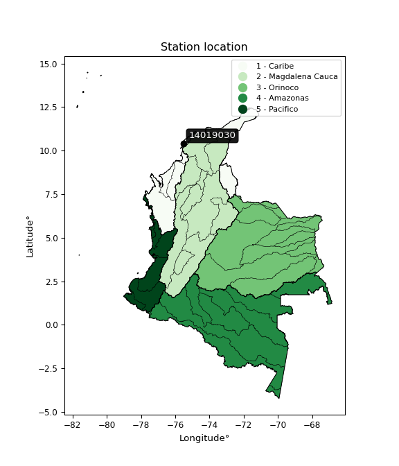</img>

</div>


## A. General information


### 1. General running parameters

• app_version: _v20251225_. • runtime: _2025-12-26 14:29:50.888910_. • Python version: _3.14.0_. • SciPy version: _1.16.3_. • Pandas version: _2.3.3_. • NumPy version: _2.3.5_. • Stations dataset (station_dataset_file): _dataset/pmax24h_in/automatic_colombia.csv_. • Stations catalog (station_catalog_file): _dataset/CNE_IDEAM.xls_. • Plot only fit distributions with Δo > Δ (plot_only_fit): _True_. • Eval low extreme values, if False, evaluates high extreme values (low_extreme): _False_. • Eval every SciPy distribution as logarithmic (pdist_logarithmic_on): _True_. • Standard deviation normalized (ddof): _1.0_. • Return periods to eval in years (Tr): _[2, 2.33, 5, 10, 15, 20, 25, 50, 75, 100, 200, 250, 500, 750, 1000]_. • Minimum data sample per station, 0 means any (minimum_sample): _5_. • Z-Score threshold to adjust a value, 0 means disable (zscore): _3.5_. • Avoid zeros, e.g. rain = 0 (avoid_zeros): _True_. • Avoid null values (avoid_nans): _True_. [:file_folder:Dataset file.](../../dataset/pmax24h_in/automatic_colombia.csv)


### 2. Station info and location

|   id |   CODIGO | NOMBRE                              | CATEGORIA            | TECNOLOGIA                | ESTADO           | FECHA_INSTALACION   |   FECHA_SUSPENSION |   ALTITUD |   LATITUD |   LONGITUD | DEPARTAMENTO   | MUNICIPIO           | AREA_OPERATIVA                              | ENTIDAD                                                     | AREA_HIDROGRAFICA   | ZONA_HIDROGRAFICA   | SUBZONA_HIDROGRAFICA       | CORRIENTE   | OBSERVACION                                                                                                                                                                                                                                                                                                                                                                                                                                                                                                                                                                                                                                                                                                                                                                                                                                                                                                                                            |   SUBRED | Catalogo   |
|-----:|---------:|:------------------------------------|:---------------------|:--------------------------|:-----------------|:--------------------|-------------------:|----------:|----------:|-----------:|:---------------|:--------------------|:--------------------------------------------|:------------------------------------------------------------|:--------------------|:--------------------|:---------------------------|:------------|:-------------------------------------------------------------------------------------------------------------------------------------------------------------------------------------------------------------------------------------------------------------------------------------------------------------------------------------------------------------------------------------------------------------------------------------------------------------------------------------------------------------------------------------------------------------------------------------------------------------------------------------------------------------------------------------------------------------------------------------------------------------------------------------------------------------------------------------------------------------------------------------------------------------------------------------------------------|---------:|:-----------|
|    0 | 14019030 | ESCUELA NAVAL CIOH - AUT [14019030] | Meteorologica Marina | Automática con Telemetría | En Mantenimiento | 15/07/1991          |                nan |         1 |   10.3906 |   -75.5338 | Bolivar        | Cartagena De Indias | Area Operativa 02 - Atlántico-Bolivar-Sucre | INSTITUTO DE HIDROLOGIA METEOROLOGIA Y ESTUDIOS AMBIENTALES | Caribe              | Caribe - Litoral    | Arroyos Directos al Caribe | Mar Caribe  | 24/08/2022$Migracion$Se Cambia Estado por orden de la Coordinación de Planeacion Operativa Decisión tomada en la Reunión de la RED 19/08/2022|30/09/2022$Migracion$24/08/2022$Migracion$Se Cambia Estado por orden de la Coordinación de Planeacion Operativa Decisión tomada en la Reunión de la RED 19/08/2022|10/10/2022$Migracion$24/08/2022$Migracion$Se Cambia Estado por orden de la Coordinación de Planeacion Operativa Decisión tomada en la Reunión de la RED 19/08/2022|30/09/2022$Migracion$24/08/2022$Migracion$Se Cambia Estado por orden de la Coordinación de Planeacion Operativa Decisión tomada en la Reunión de la RED 19/08/2022|11/10/2022$Migracion$En la fecha cambio de categoría por solicitud de Coordinación Planeación Operativa|22/01/2025$mvelez$Se pone en mantenimiento la estación porque actualmente no está reportando datos en Polaris, solicitud coordinadora Mayra Soto mediante correo electrónico 21/01/2025 |      nan | CNE_IDEAM  |

<div align="center">

Map location in: [:earth_americas:Google](http://maps.google.com/maps?q=10.39056389,-75.53383056) [:earth_americas:OSM](https://www.openstreetmap.org/#map=18/10.39056389/-75.53383056&layers=P) [:earth_americas:Bing](https://www.bing.com/maps?cp=10.39056389~-75.53383056&lvl=18) [:earth_americas:Apple](https://maps.apple.com/frame?center=10.39056389%2C-75.53383056&span=0.003%2C0.006)

</div>


<div align="center">

```geojson
{
  "type": "Feature",
  "geometry": {
    "type": "Point", 
    "coordinates": [-75.53383056, 10.39056389]
  }, 
  "properties": {
    "Name": "14019030"
  }
}
```

</div>


### 3. Discrete values table and plot

|               |           0 |           1 |           2 |           3 |           4 |           5 |          6 |          7 |            8 |           9 |          10 |          11 |          12 |          13 |          14 |
|:--------------|------------:|------------:|------------:|------------:|------------:|------------:|-----------:|-----------:|-------------:|------------:|------------:|------------:|------------:|------------:|------------:|
| Date          | 2009        | 2010        | 2011        | 2012        | 2013        | 2014        | 2016       | 2017       | 2018         | 2019        | 2020        | 2021        | 2022        | 2023        | 2024        |
| Value         |   41.8      |  108.1      |  111.8      |   75.4      |  208.8      |  204.1      |  422.8     |  423       |  127.6       |    7.8      |   33.1      |    1.2      |    5.2      |   48.8      |   60.2      |
| Value_initial |   41.8      |  108.1      |  111.8      |   75.4      |  208.8      |  204.1      |  422.8     |  423       |  127.6       |    7.8      |   33.1      |    1.2      |    5.2      |   48.8      |   60.2      |
| count         |   15        |   15        |   15        |   15        |   15        |   15        |   15       |   15       |   15         |   15        |   15        |   15        |   15        |   15        |   15        |
| mean          |  125.313    |  125.313    |  125.313    |  125.313    |  125.313    |  125.313    |  125.313   |  125.313   |  125.313     |  125.313    |  125.313    |  125.313    |  125.313    |  125.313    |  125.313    |
| std           |  136.926    |  136.926    |  136.926    |  136.926    |  136.926    |  136.926    |  136.926   |  136.926   |  136.926     |  136.926    |  136.926    |  136.926    |  136.926    |  136.926    |  136.926    |
| zscore        |   -0.609917 |   -0.125713 |   -0.098691 |   -0.364529 |    0.609722 |    0.575397 |    2.17261 |    2.17407 |    0.0167001 |   -0.858227 |   -0.673455 |   -0.906428 |   -0.877215 |   -0.558795 |   -0.475538 |

<div align="center">

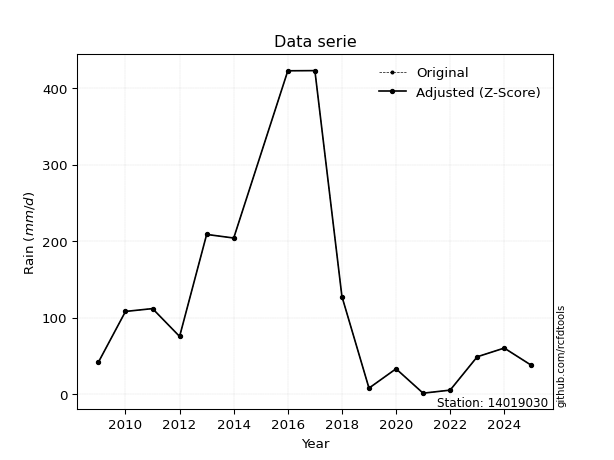</img>

</div>

> If Z-Score is active, values out of range or outliers are replaced with the station mean value.


### 4. Active continuous probability distributions from SciPy (45 of 104 available)

[scipy.stats](https://docs.scipy.org/doc/scipy/reference/stats.html) is a Python´s powerful submodule within the SciPy library for comprehensive statistical analysis, offering over 130 probability distributions (like Normal, Poisson), functions for descriptive stats (mean, variance), hypothesis testing (t-tests, chi-square), random variable generation, and statistical tests, making it essential for data science, modeling, and research. It provides tools to explore, model, and draw conclusions from data efficiently, working seamlessly with NumPy.

<div align="center">

|   id | p_dist             |   n_parameter | fit_method   | label                                                                       | active   | ref                                                                                                        |
|-----:|:-------------------|--------------:|:-------------|:----------------------------------------------------------------------------|:---------|:-----------------------------------------------------------------------------------------------------------|
|    0 | alpha              |             3 | MLE          | Alpha                                                                       | True     | [:mortar_board:](https://docs.scipy.org/doc/scipy/reference/generated/scipy.stats.alpha.html)              |
|    1 | betaprime          |             4 | MLE          | Beta prime                                                                  | True     | [:mortar_board:](https://docs.scipy.org/doc/scipy/reference/generated/scipy.stats.betaprime.html)          |
|    2 | chi2               |             3 | MLE          | Chi²                                                                        | True     | [:mortar_board:](https://docs.scipy.org/doc/scipy/reference/generated/scipy.stats.chi2.html)               |
|    3 | crystalball        |             4 | MLE          | Crystalball                                                                 | True     | [:mortar_board:](https://docs.scipy.org/doc/scipy/reference/generated/scipy.stats.crystalball.html)        |
|    4 | erlang             |             3 | MLE          | Erlang                                                                      | True     | [:mortar_board:](https://docs.scipy.org/doc/scipy/reference/generated/scipy.stats.erlang.html)             |
|    5 | expon              |             2 | MLE          | Exponential                                                                 | True     | [:mortar_board:](https://docs.scipy.org/doc/scipy/reference/generated/scipy.stats.expon.html)              |
|    6 | exponnorm          |             3 | MLE          | Exponentially modified Normal                                               | True     | [:mortar_board:](https://docs.scipy.org/doc/scipy/reference/generated/scipy.stats.exponnorm.html)          |
|    7 | f                  |             4 | MLE          | F                                                                           | True     | [:mortar_board:](https://docs.scipy.org/doc/scipy/reference/generated/scipy.stats.f.html)                  |
|    8 | fatiguelife        |             3 | MLE          | Fatigue-life (Birnbaum-Saunders)                                            | True     | [:mortar_board:](https://docs.scipy.org/doc/scipy/reference/generated/scipy.stats.fatiguelife.html)        |
|    9 | fisk               |             3 | MLE          | Fisk                                                                        | True     | [:mortar_board:](https://docs.scipy.org/doc/scipy/reference/generated/scipy.stats.fisk.html)               |
|   10 | gamma              |             3 | MLE          | Gamma                                                                       | True     | [:mortar_board:](https://docs.scipy.org/doc/scipy/reference/generated/scipy.stats.gamma.html)              |
|   11 | genexpon           |             5 | MLE          | Generalized exponential                                                     | True     | [:mortar_board:](https://docs.scipy.org/doc/scipy/reference/generated/scipy.stats.genexpon.html)           |
|   12 | genlogistic        |             3 | MLE          | Generalized logistic                                                        | True     | [:mortar_board:](https://docs.scipy.org/doc/scipy/reference/generated/scipy.stats.genlogistic.html)        |
|   13 | gibrat             |             2 | MM           | Gibrat                                                                      | True     | [:mortar_board:](https://docs.scipy.org/doc/scipy/reference/generated/scipy.stats.gibrat.html)             |
|   14 | gompertz           |             3 | MLE          | Gompertz (or truncated Gumbel)                                              | True     | [:mortar_board:](https://docs.scipy.org/doc/scipy/reference/generated/scipy.stats.gompertz.html)           |
|   15 | gumbel_l           |             2 | MM           | Gumbel Left Skew                                                            | True     | [:mortar_board:](https://docs.scipy.org/doc/scipy/reference/generated/scipy.stats.gumbel_l.html)           |
|   16 | gumbel_r           |             2 | MM           | Gumbel Right Skew                                                           | True     | [:mortar_board:](https://docs.scipy.org/doc/scipy/reference/generated/scipy.stats.gumbel_r.html)           |
|   17 | halflogistic       |             2 | MM           | Half-logistic                                                               | True     | [:mortar_board:](https://docs.scipy.org/doc/scipy/reference/generated/scipy.stats.halflogistic.html)       |
|   18 | halfnorm           |             2 | MM           | Half Normal                                                                 | True     | [:mortar_board:](https://docs.scipy.org/doc/scipy/reference/generated/scipy.stats.halfnorm.html)           |
|   19 | hypsecant          |             2 | MM           | hyperbolic secant                                                           | True     | [:mortar_board:](https://docs.scipy.org/doc/scipy/reference/generated/scipy.stats.hypsecant.html)          |
|   20 | invgamma           |             3 | MLE          | Inverted gamma                                                              | True     | [:mortar_board:](https://docs.scipy.org/doc/scipy/reference/generated/scipy.stats.invgamma.html)           |
|   21 | invgauss           |             3 | MLE          | Inverse Gaussian                                                            | True     | [:mortar_board:](https://docs.scipy.org/doc/scipy/reference/generated/scipy.stats.invgauss.html)           |
|   22 | invweibull         |             3 | MLE          | Inverted Weibull                                                            | True     | [:mortar_board:](https://docs.scipy.org/doc/scipy/reference/generated/scipy.stats.invweibull.html)         |
|   23 | johnsonsu          |             4 | MLE          | Johnson Su                                                                  | True     | [:mortar_board:](https://docs.scipy.org/doc/scipy/reference/generated/scipy.stats.johnsonsu.html)          |
|   24 | kstwobign          |             2 | MLE          | Limiting distribution of scaled Kolmogorov-Smirnov two-sided test statistic | True     | [:mortar_board:](https://docs.scipy.org/doc/scipy/reference/generated/scipy.stats.kstwobign.html)          |
|   25 | laplace            |             2 | MM           | Laplace                                                                     | True     | [:mortar_board:](https://docs.scipy.org/doc/scipy/reference/generated/scipy.stats.laplace.html)            |
|   26 | laplace_asymmetric |             3 | MLE          | Asymmetric Laplace                                                          | True     | [:mortar_board:](https://docs.scipy.org/doc/scipy/reference/generated/scipy.stats.laplace_asymmetric.html) |
|   27 | loggamma           |             3 | MLE          | Log gamma                                                                   | True     | [:mortar_board:](https://docs.scipy.org/doc/scipy/reference/generated/scipy.stats.loggamma.html)           |
|   28 | logistic           |             2 | MM           | Logistic (or Sech-squared)                                                  | True     | [:mortar_board:](https://docs.scipy.org/doc/scipy/reference/generated/scipy.stats.logistic.html)           |
|   29 | lognorm            |             3 | MLE          | Log Normal                                                                  | True     | [:mortar_board:](https://docs.scipy.org/doc/scipy/reference/generated/scipy.stats.lognorm.html)            |
|   30 | maxwell            |             2 | MM           | Maxwell                                                                     | True     | [:mortar_board:](https://docs.scipy.org/doc/scipy/reference/generated/scipy.stats.maxwell.html)            |
|   31 | mielke             |             4 | MLE          | Mielke Beta-Kappa / Dagum                                                   | True     | [:mortar_board:](https://docs.scipy.org/doc/scipy/reference/generated/scipy.stats.mielke.html)             |
|   32 | moyal              |             2 | MM           | Moyal                                                                       | True     | [:mortar_board:](https://docs.scipy.org/doc/scipy/reference/generated/scipy.stats.moyal.html)              |
|   33 | nakagami           |             3 | MLE          | Nakagami                                                                    | True     | [:mortar_board:](https://docs.scipy.org/doc/scipy/reference/generated/scipy.stats.nakagami.html)           |
|   34 | ncf                |             5 | MLE          | Non-central F distribution                                                  | True     | [:mortar_board:](https://docs.scipy.org/doc/scipy/reference/generated/scipy.stats.ncf.html)                |
|   35 | nct                |             4 | MLE          | Non-central Student’s t                                                     | True     | [:mortar_board:](https://docs.scipy.org/doc/scipy/reference/generated/scipy.stats.nct.html)                |
|   36 | norm               |             2 | MM           | Normal                                                                      | True     | [:mortar_board:](https://docs.scipy.org/doc/scipy/reference/generated/scipy.stats.norm.html)               |
|   37 | pareto             |             3 | MLE          | Pareto                                                                      | True     | [:mortar_board:](https://docs.scipy.org/doc/scipy/reference/generated/scipy.stats.pareto.html)             |
|   38 | pearson3           |             3 | MM           | Pearson type III                                                            | True     | [:mortar_board:](https://docs.scipy.org/doc/scipy/reference/generated/scipy.stats.pearson3.html)           |
|   39 | rayleigh           |             2 | MM           | Rayleigh                                                                    | True     | [:mortar_board:](https://docs.scipy.org/doc/scipy/reference/generated/scipy.stats.rayleigh.html)           |
|   40 | rice               |             3 | MLE          | Rice                                                                        | True     | [:mortar_board:](https://docs.scipy.org/doc/scipy/reference/generated/scipy.stats.rice.html)               |
|   41 | t                  |             3 | MLE          | Student’s t                                                                 | True     | [:mortar_board:](https://docs.scipy.org/doc/scipy/reference/generated/scipy.stats.t.html)                  |
|   42 | truncnorm          |             4 | MLE          | Truncated normal                                                            | True     | [:mortar_board:](https://docs.scipy.org/doc/scipy/reference/generated/scipy.stats.truncnorm.html)          |
|   43 | wald               |             2 | MM           | Wald                                                                        | True     | [:mortar_board:](https://docs.scipy.org/doc/scipy/reference/generated/scipy.stats.wald.html)               |
|   44 | weibull_min        |             3 | MLE          | Weibull minimum                                                             | True     | [:mortar_board:](https://docs.scipy.org/doc/scipy/reference/generated/scipy.stats.weibull_min.html)        |

</div>

> **n_parameter:** # arguments & localization & scale.
>
> **Fit methods:** (MLE) maximum likelihood, (MM) L-moments.
>
>**Inactive:** foldnorm, gennorm, norminvgauss, powernorm, powerlognorm, skewnorm, genextreme, anglit, arcsine, argus, beta, bradford, burr, burr12, cauchy, cosine, halfcauchy, foldcauchy, skewcauchy, wrapcauchy, dgamma, gengamma, exponweib, exponpow, truncexpon, gausshyper, genhalflogistic, genhyperbolic, geninvgauss, halfgennorm, johnsonsb, kappa4, kappa3, ksone, kstwo, loglaplace, levy, levy_l, levy_stable, ncx2, genpareto, truncpareto, lomax, powerlaw, rdist, rel_breitwigner, recipinvgauss, semicircular, studentized_range, trapezoid, triang, truncweibull_min, tukeylambda, uniform, loguniform, vonmises, vonmises_line, weibull_max, dweibull, 


## B. Probability distributions vs. Empirical distributions

A continuous probability distribution (CPD) describes probabilities for variables that can take any value within a range (like rain any time), unlike discrete variables with specific outcomes (like temperature). It uses a Probability Density Function (PDF), a curve where the total area under it equals 1, and the probability of the variable falling within an interval (a to b) is found by calculating the area under the curve between those points. A key feature is that the probability of hitting any single exact value is zero, so probabilities are always expressed for ranges, e.g., $P(a ≤ X ≤ b)$.

<div align="center">

Distributions parameters
|    |   station | p_dist                |   n |               loc |            scale | shape                  | shape1                | shape2                 | shape3   |
|---:|----------:|:----------------------|----:|------------------:|-----------------:|:-----------------------|:----------------------|:-----------------------|:---------|
|  0 |  14019030 | alpha                 |  15 |      -6.60845     |     29.8506      | 0.08312986427016161    |                       |                        |          |
|  1 |  14019030 | betaprime             |  15 |       1.2         |    623.782       | 0.5893920544675799     | 3.8076976715398096    |                        |          |
|  2 |  14019030 | chi2                  |  15 |       1.2         |     77.7021      | 1.4247377237817176     |                       |                        |          |
|  3 |  14019030 | crystalball           |  15 |       2.47139     |    174.727       | 193.73809593437528     | 17.344515193694704    |                        |          |
|  4 |  14019030 | erlang                |  15 |       1.2         |    201.433       | 0.5506585918446427     |                       |                        |          |
|  5 |  14019030 | expon                 |  15 |       1.2         |    124.113       |                        |                       |                        |          |
|  6 |  14019030 | exponnorm             |  15 |       1.06324     |      0.047517    | 2589.0820777980134     |                       |                        |          |
|  7 |  14019030 | f                     |  15 |     -33.571       |     87.3142      | 9749.633823161355      | 3.806734403445775     |                        |          |
|  8 |  14019030 | fatiguelife           |  15 |      -6.09243     |     65.9973      | 1.3696982095821761     |                       |                        |          |
|  9 |  14019030 | fisk                  |  15 |       1.2         |     46.524       | 0.8817456653435123     |                       |                        |          |
| 10 |  14019030 | gamma                 |  15 |       1.2         |    126.005       | 0.6662307432578705     |                       |                        |          |
| 11 |  14019030 | genexpon              |  15 |       1.2         |    213.151       | 1.7173902038061701     | 6.996206711546678e-12 | 1.7813805240466831     |          |
| 12 |  14019030 | genlogistic           |  15 |    -540.771       |     83.1569      | 1541.393355012567      |                       |                        |          |
| 13 |  14019030 | gibrat                |  15 |      24.3983      |     61.2081      |                        |                       |                        |          |
| 14 |  14019030 | gompertz              |  15 |       1.2         |      1.27317e+14 | 843517787809.8892      |                       |                        |          |
| 15 |  14019030 | gumbel_l              |  15 |     184.848       |    103.14        |                        |                       |                        |          |
| 16 |  14019030 | gumbel_r              |  15 |      65.779       |    103.14        |                        |                       |                        |          |
| 17 |  14019030 | halflogistic          |  15 |     -31.4725      |    113.097       |                        |                       |                        |          |
| 18 |  14019030 | halfnorm              |  15 |     -49.7772      |    219.443       |                        |                       |                        |          |
| 19 |  14019030 | hypsecant             |  15 |     125.313       |     84.2138      |                        |                       |                        |          |
| 20 |  14019030 | invgamma              |  15 |     -33.5881      |    166.206       | 1.9033648776600987     |                       |                        |          |
| 21 |  14019030 | invgauss              |  15 |     -16.1749      |     97.8246      | 1.4463455811255996     |                       |                        |          |
| 22 |  14019030 | invweibull            |  15 |     -45.2842      |     93.008       | 1.641579828653689      |                       |                        |          |
| 23 |  14019030 | johnsonsu             |  15 |      -4.48341     |      0.107559    | -5.694676989360719     | 0.7944102696699935    |                        |          |
| 24 |  14019030 | kstwobign             |  15 |    -237.631       |    421.057       |                        |                       |                        |          |
| 25 |  14019030 | laplace               |  15 |     125.313       |     93.5381      |                        |                       |                        |          |
| 26 |  14019030 | laplace_asymmetric    |  15 |       1.2         |      0.371865    | 0.002994991196230314   |                       |                        |          |
| 27 |  14019030 | loggamma              |  15 |  -40028.8         |   5443.58        | 1598.3489456845136     |                       |                        |          |
| 28 |  14019030 | logistic              |  15 |     125.313       |     72.9313      |                        |                       |                        |          |
| 29 |  14019030 | lognorm               |  15 |       1.2         |      4.82186     | 10.13397616667525      |                       |                        |          |
| 30 |  14019030 | maxwell               |  15 |    -188.141       |    196.429       |                        |                       |                        |          |
| 31 |  14019030 | mielke                |  15 |       1.2         |    340.679       | 0.5497038740021615     | 5.059044959369057     |                        |          |
| 32 |  14019030 | moyal                 |  15 |      49.6655      |     59.5482      |                        |                       |                        |          |
| 33 |  14019030 | nakagami              |  15 |       1.2         |    235.269       | 0.24837103333130428    |                       |                        |          |
| 34 |  14019030 | ncf                   |  15 |       1.2         |     43.5801      | 0.893364990872158      | 40.261525153410645    | 1.7514046921096074     |          |
| 35 |  14019030 | nct                   |  15 |     -59.8066      |      8.09831     | 1.8840195146657335     | 13.418831096169649    |                        |          |
| 36 |  14019030 | norm                  |  15 |     125.313       |    132.283       |                        |                       |                        |          |
| 37 |  14019030 | pareto                |  15 |    -811.266       |    812.466       | 7.510603635169789      |                       |                        |          |
| 38 |  14019030 | pearson3              |  15 |     125.313       |    132.283       | 1.3331185133297871     |                       |                        |          |
| 39 |  14019030 | rayleigh              |  15 |    -127.751       |    201.916       |                        |                       |                        |          |
| 40 |  14019030 | rice                  |  15 |     -75.2731      |    169.902       | 0.00040144961491448176 |                       |                        |          |
| 41 |  14019030 | t                     |  15 |      73.0722      |     64.8073      | 1.743077402479777      |                       |                        |          |
| 42 |  14019030 | truncnorm             |  15 |    -451.005       |    298.375       | 1.5155598661151768     | 450.27155153316255    |                        |          |
| 43 |  14019030 | wald                  |  15 |      -6.96945     |    132.283       |                        |                       |                        |          |
| 44 |  14019030 | weibull_min           |  15 |       1.2         |    146.473       | 0.7884406694079613     |                       |                        |          |
| 45 |  14019030 | logalpha              |  15 |     -42.2886      |   1289.81        | 27.892429609192078     |                       |                        |          |
| 46 |  14019030 | logbetaprime          |  15 |    -293.949       |  10971.3         | 35586.58956009515      | 1310281.9376046713    |                        |          |
| 47 |  14019030 | logchi2               |  15 |     -17.4915      |      0.0656776   | 327.7399426960087      |                       |                        |          |
| 48 |  14019030 | logcrystalball        |  15 |       4.02858     |      1.59052     | 7.634638991177748      | 2867.1784386236195    |                        |          |
| 49 |  14019030 | logerlang             |  15 |     -25.8626      |      0.091882    | 325.29709516418563     |                       |                        |          |
| 50 |  14019030 | logexpon              |  15 |       0.182322    |      3.84626     |                        |                       |                        |          |
| 51 |  14019030 | logexponnorm          |  15 |       4.02765     |      1.59051     | 0.0005889500999069054  |                       |                        |          |
| 52 |  14019030 | logf                  |  15 |   -2369.09        |   2373.12        | 15260458.658328384     | 6253516.815848939     |                        |          |
| 53 |  14019030 | logfatiguelife        |  15 |    -596.784       |    600.804       | 0.0026380363309868454  |                       |                        |          |
| 54 |  14019030 | logfisk               |  15 |      -1.65095e+08 |      1.65095e+08 | 186530138.57565862     |                       |                        |          |
| 55 |  14019030 | loggamma              |  15 |     -24.1168      |      0.0942616   | 298.3120049102238      |                       |                        |          |
| 56 |  14019030 | loggenexpon           |  15 |      -0.905426    |      0.0209264   | 5.8620403283400555e-06 | 1.5776223973326395    | 2.0611956091628892e-05 |          |
| 57 |  14019030 | loggenlogistic        |  15 |       5.47541     |      0.385986    | 0.24516439753515085    |                       |                        |          |
| 58 |  14019030 | loggibrat             |  15 |       2.81521     |      0.735946    |                        |                       |                        |          |
| 59 |  14019030 | loggompertz           |  15 |       0.182321    |      1.29604     | 0.03144588579706577    |                       |                        |          |
| 60 |  14019030 | loggumbel_l           |  15 |       4.7444      |      1.24012     |                        |                       |                        |          |
| 61 |  14019030 | loggumbel_r           |  15 |       3.31276     |      1.24012     |                        |                       |                        |          |
| 62 |  14019030 | loghalflogistic       |  15 |       2.14342     |      1.35985     |                        |                       |                        |          |
| 63 |  14019030 | loghalfnorm           |  15 |       1.92332     |      2.63854     |                        |                       |                        |          |
| 64 |  14019030 | loghypsecant          |  15 |       4.02858     |      1.01256     |                        |                       |                        |          |
| 65 |  14019030 | loginvgamma           |  15 |     -26.976       |  10522.8         | 340.55399464074026     |                       |                        |          |
| 66 |  14019030 | loginvgauss           |  15 |     -12.8716      |   1658.09        | 0.010169068802054326   |                       |                        |          |
| 67 |  14019030 | loginvweibull         |  15 |      -1.29516e+08 |      1.29516e+08 | 71467098.74885428      |                       |                        |          |
| 68 |  14019030 | logjohnsonsu          |  15 |       7.2022      |      0.117054    | 7.707142236976457      | 1.9914365828540772    |                        |          |
| 69 |  14019030 | logkstwobign          |  15 |      -3.46456     |      8.59345     |                        |                       |                        |          |
| 70 |  14019030 | loglaplace            |  15 |       4.02858     |      1.12467     |                        |                       |                        |          |
| 71 |  14019030 | loglaplace_asymmetric |  15 |       4.71671     |      1.06399     | 1.3743294917097115     |                       |                        |          |
| 72 |  14019030 | logloggamma           |  15 |       5.56941     |      0.699611    | 0.45531950739274407    |                       |                        |          |
| 73 |  14019030 | loglogistic           |  15 |       4.02858     |      0.876899    |                        |                       |                        |          |
| 74 |  14019030 | loglognorm            |  15 | -138129           | 138133           | 1.1514453518693276e-05 |                       |                        |          |
| 75 |  14019030 | logmaxwell            |  15 |       0.259671    |      2.36181     |                        |                       |                        |          |
| 76 |  14019030 | logmielke             |  15 |      -1.47827     |      7.5262      | 2.668344114405323      | 112524.74923672182    |                        |          |
| 77 |  14019030 | logmoyal              |  15 |       3.11902     |      0.715985    |                        |                       |                        |          |
| 78 |  14019030 | lognakagami           |  15 |   -1194.23        |   1198.26        | 141440.22961912566     |                       |                        |          |
| 79 |  14019030 | logncf                |  15 |      -0.182423    |      9.78432e-09 | 5.0449520548897e-08    | 38.181670734100436    | 21.298602551576238     |          |
| 80 |  14019030 | lognct                |  15 |    -112.89        |      1.57034     | 100269.19283681194     | 74.45312595763752     |                        |          |
| 81 |  14019030 | lognorm               |  15 |       4.02858     |      1.59052     |                        |                       |                        |          |
| 82 |  14019030 | logpareto             |  15 |       0.18232     |      1.1837e-06  | 0.07142892949024904    |                       |                        |          |
| 83 |  14019030 | logpearson3           |  15 |       4.02858     |      1.59052     | -0.9313770470071341    |                       |                        |          |
| 84 |  14019030 | lograyleigh           |  15 |       0.985882    |      2.42773     |                        |                       |                        |          |
| 85 |  14019030 | logrice               |  15 |    -229.969       |      1.59053     | 147.11564731598128     |                       |                        |          |
| 86 |  14019030 | logt                  |  15 |       4.26963     |      1.27308     | 4.8072826231511225     |                       |                        |          |
| 87 |  14019030 | logtruncnorm          |  15 |       1.02337     |      3.7534      | -0.2240759917413942    | 16.26703911584232     |                        |          |
| 88 |  14019030 | logwald               |  15 |       2.43803     |      1.59055     |                        |                       |                        |          |
| 89 |  14019030 | logweibull_min        |  15 |  -23265.5         |  23270.2         | 19519.986198470604     |                       |                        |          |

</div>

> **loc** (Location parameter): This shifts the distribution along the x-axis. For many common distributions, like the normal (Gaussian) distribution, loc represents the mean $μ$. For others, like the uniform distribution, it might represent the minimum value, or for the beta distribution, the left end of the support interval.
>
> **scale** (Scale parameter): This determines the width or spread of the distribution. For the normal distribution, scale represents the standard deviation $σ$. For a uniform distribution, it defines the length of the interval (from $loc$ to $loc + scale$).
>
> **shape** (Shape parameters): Refers to parameters that define the specific form of a probability distribution, distinct from its location (loc) and scale (scale). These parameters are required arguments for most distribution functions. For example, a normal (Gaussian) distribution is fully defined by its location (mean) and scale (standard deviation), so it has no specific shape parameters beyond loc and scale. However, other distributions have intrinsic properties that need specification, as Gamma distribution that takes a shape parameter, often named $a$ or $alpha$.


### 0. Cumulative distribution values - CDF (90 evaluated)

> Ordered by x ascending and calculating $log(f(x))$ separately. 

|   id |   Station |   date |     x |   count |    mean |     std |     zscore |   Value_initial |   station |   m |       alpha |   alpha_pdf |   betaprime |   betaprime_pdf |        chi2 |     chi2_pdf |   crystalball |   crystalball_pdf |      erlang |       erlang_pdf |     expon |   expon_pdf |   exponnorm |   exponnorm_pdf |         f |       f_pdf |   fatiguelife |   fatiguelife_pdf |        fisk |    fisk_pdf |       gamma |      gamma_pdf |    genexpon |   genexpon_pdf |   genlogistic |   genlogistic_pdf |   gibrat |   gibrat_pdf |    gompertz |   gompertz_pdf |   gumbel_l |   gumbel_l_pdf |   gumbel_r |   gumbel_r_pdf |   halflogistic |   halflogistic_pdf |   halfnorm |   halfnorm_pdf |   hypsecant |   hypsecant_pdf |   invgamma |   invgamma_pdf |   invgauss |   invgauss_pdf |   invweibull |   invweibull_pdf |   johnsonsu |   johnsonsu_pdf |   kstwobign |   kstwobign_pdf |   laplace |   laplace_pdf |   laplace_asymmetric |   laplace_asymmetric_pdf |   loggamma |   loggamma_pdf |   logistic |   logistic_pdf |    lognorm |   lognorm_pdf |   maxwell |   maxwell_pdf |      mielke |      mielke_pdf |    moyal |   moyal_pdf |    nakagami |   nakagami_pdf |         ncf |          ncf_pdf |       nct |     nct_pdf |     norm |    norm_pdf |      pareto |   pareto_pdf |   pearson3 |   pearson3_pdf |   rayleigh |   rayleigh_pdf |      rice |    rice_pdf |        t |       t_pdf |   truncnorm |   truncnorm_pdf |        wald |    wald_pdf |   weibull_min |   weibull_min_pdf |   logalpha |   logalpha_pdf |   logbetaprime |   logbetaprime_pdf |    logchi2 |   logchi2_pdf |   logcrystalball |   logcrystalball_pdf |   logerlang |   logerlang_pdf |   logexpon |   logexpon_pdf |   logexponnorm |   logexponnorm_pdf |      logf |   logf_pdf |   logfatiguelife |   logfatiguelife_pdf |   logfisk |   logfisk_pdf |   loggenexpon |   loggenexpon_pdf |   loggenlogistic |   loggenlogistic_pdf |   loggibrat |   loggibrat_pdf |   loggompertz |   loggompertz_pdf |   loggumbel_l |   loggumbel_l_pdf |   loggumbel_r |   loggumbel_r_pdf |   loghalflogistic |   loghalflogistic_pdf |   loghalfnorm |   loghalfnorm_pdf |   loghypsecant |   loghypsecant_pdf |   loginvgamma |   loginvgamma_pdf |   loginvgauss |   loginvgauss_pdf |   loginvweibull |   loginvweibull_pdf |   logjohnsonsu |   logjohnsonsu_pdf |   logkstwobign |   logkstwobign_pdf |   loglaplace |   loglaplace_pdf |   loglaplace_asymmetric |   loglaplace_asymmetric_pdf |   logloggamma |   logloggamma_pdf |   loglogistic |   loglogistic_pdf |   loglognorm |   loglognorm_pdf |   logmaxwell |   logmaxwell_pdf |   logmielke |   logmielke_pdf |    logmoyal |   logmoyal_pdf |   lognakagami |   lognakagami_pdf |     logncf |   logncf_pdf |     lognct |   lognct_pdf |   logpareto |   logpareto_pdf |   logpearson3 |   logpearson3_pdf |   lograyleigh |   lograyleigh_pdf |    logrice |   logrice_pdf |      logt |   logt_pdf |   logtruncnorm |   logtruncnorm_pdf |   logwald |   logwald_pdf |   logweibull_min |   logweibull_min_pdf |
|-----:|----------:|-------:|------:|--------:|--------:|--------:|-----------:|----------------:|----------:|----:|------------:|------------:|------------:|----------------:|------------:|-------------:|--------------:|------------------:|------------:|-----------------:|----------:|------------:|------------:|----------------:|----------:|------------:|--------------:|------------------:|------------:|------------:|------------:|---------------:|------------:|---------------:|--------------:|------------------:|---------:|-------------:|------------:|---------------:|-----------:|---------------:|-----------:|---------------:|---------------:|-------------------:|-----------:|---------------:|------------:|----------------:|-----------:|---------------:|-----------:|---------------:|-------------:|-----------------:|------------:|----------------:|------------:|----------------:|----------:|--------------:|---------------------:|-------------------------:|-----------:|---------------:|-----------:|---------------:|-----------:|--------------:|----------:|--------------:|------------:|----------------:|---------:|------------:|------------:|---------------:|------------:|-----------------:|----------:|------------:|---------:|------------:|------------:|-------------:|-----------:|---------------:|-----------:|---------------:|----------:|------------:|---------:|------------:|------------:|----------------:|------------:|------------:|--------------:|------------------:|-----------:|---------------:|---------------:|-------------------:|-----------:|--------------:|-----------------:|---------------------:|------------:|----------------:|-----------:|---------------:|---------------:|-------------------:|----------:|-----------:|-----------------:|---------------------:|----------:|--------------:|--------------:|------------------:|-----------------:|---------------------:|------------:|----------------:|--------------:|------------------:|--------------:|------------------:|--------------:|------------------:|------------------:|----------------------:|--------------:|------------------:|---------------:|-------------------:|--------------:|------------------:|--------------:|------------------:|----------------:|--------------------:|---------------:|-------------------:|---------------:|-------------------:|-------------:|-----------------:|------------------------:|----------------------------:|--------------:|------------------:|--------------:|------------------:|-------------:|-----------------:|-------------:|-----------------:|------------:|----------------:|------------:|---------------:|--------------:|------------------:|-----------:|-------------:|-----------:|-------------:|------------:|----------------:|--------------:|------------------:|--------------:|------------------:|-----------:|--------------:|----------:|-----------:|---------------:|-------------------:|----------:|--------------:|-----------------:|---------------------:|
|    0 |  14019030 |   2021 |   1.2 |      15 | 125.313 | 136.926 | -0.906428  |             1.2 |  14019030 |   1 | 0.000172778 | 0.000336502 | 8.53179e-08 |   347.906       | 1.28303e-10 | 51.5241      |      0.497097 |       0.00228318  | 1.45406e-10 | 360599           | 0         | 0.00805715  |  0.00111117 |     0.00810311  | 0.042571  | 0.00493011  |     0.0253705 |       0.00989506  | 5.33427e-16 | 2.11825     | 1.64529e-12 | 4936.6         | 2.30304e-12 |    0.00805717  |      0.102733 |       0.00280925  | 0        |  0           | 3.83521e-15 |    0.00662533  |   0.155106 |    0.00138066  |   0.154069 |    0.0027939   |       0.143448 |        0.00433001  |   0.183697 |    0.00353915  |    0.143349 |     0.00164524  |  0.0425709 |    0.0049301   |  0.0340779 |    0.00624446  |    0.0440576 |      0.00485788  |   0.0231677 |     0.00766185  |   0.0955069 |     0.00266689  |  0.132652 |   0.00141817  |          8.96993e-06 |              0.00805391  | 0.00729123 |      0.0136831 |   0.154232 |    0.0017886   | 0.00779789 |     0.0134747 |  0.18161  |   0.00237168  | 1.46896e-09 | 27760.5         | 0.13304  | 0.00325647  | 8.67841e-10 |    1.94147e+06 | 1.81044e-07 | 187540           | 0.0487487 | 0.00456774  | 0.17406  | 0.00194201  | 1.66533e-15 |  0.00924421  |   0.151704 |    0.00347853  |   0.18448  |    0.00257939  | 0.0963336 | 0.00239396  | 0.198533 | 0.00257992  | 6.50147e-13 |     0.00654183  | 0.000151273 | 0.000157808 |   8.92329e-15 |      31.685       |  0.0066292 |      0.0132802 |     0.00798007 |          0.0137842 | 0.00782769 |     0.014598  |       0.00779789 |            0.0134747 |  0.00800733 |       0.0145165 |   0        |      0.259993  |     0.00779764 |          0.0134744 | 0.0078508 |  0.0135549 |       0.00756158 |            0.0132454 | 0.0104053 |     0.0116339 |     0.0432553 |         0.0775046 |        0.0346666 |            0.022019  |    0        |       0         |   5.10461e-09 |         0.024263  |     0.0249388 |         0.0198571 |   3.79385e-06 |        3.8186e-05 |          0        |             0         |     0         |         0         |      0.0142598 |          0.0140782 |    0.00711233 |         0.0140243 |    0.00624734 |         0.0135149 |      0.00552977 |           0.0158596 |      0.0339234 |          0.0213619 |     0.00625666 |          0.021789  |    0.0163577 |        0.0145445 |               0.0294277 |                   0.0201246 |     0.0338882 |         0.0220482 |     0.0122949 |         0.0138485 |   0.00779757 |        0.0134745 |    0         |        0         |   0.0177309 |       0.0284911 | 7.59365e-15 |    3.25639e-13 |    0.00782766 |         0.0135128 | 0.00123584 |   0.00749934 | 0.00781069 |    0.0135056 |    0        |  60343.9        |     0.0229214 |         0.0208597 |     0         |         0         | 0.00779769 |     0.0134744 | 0.0125364 |  0.0106914 |    2.51941e-12 |          0.176086  |  0        |     0         |        0.0215149 |            0.0178556 |
|    1 |  14019030 |   2022 |   5.2 |      15 | 125.313 | 136.926 | -0.877215  |             5.2 |  14019030 |   2 | 0.013594    | 0.00806831  | 0.120504    |     0.0174444   | 0.080091    |  0.0140504   |      0.50623  |       0.00228296  | 0.12907     |      0.0175419   | 0.0317148 | 0.00780162  |  0.0330661  |     0.00785963  | 0.0642722 | 0.00588295  |     0.0717338 |       0.0125215   | 0.103075    | 0.0203795   | 0.109836    |    0.017948    | 0.0317149   |    0.00780163  |      0.114312 |       0.00297928  | 0        |  0           | 0.0261533   |    0.00645206  |   0.160718 |    0.00142572  |   0.16543  |    0.0028858   |       0.160723 |        0.00430678  |   0.197823 |    0.00352361  |    0.150072 |     0.00171675  |  0.0642721 |    0.00588295  |  0.062175  |    0.00767481  |    0.0654429 |      0.00580213  |   0.0583171 |     0.00955641  |   0.106471  |     0.00281422  |  0.138448 |   0.00148013  |          0.0317112   |              0.00779858  | 0.0709336  |      0.0883263 |   0.161523 |    0.001857    | 0.0672856  |     0.0818817 |  0.191202 |   0.00242438  | 0.086879    |     0.0119394   | 0.146334 | 0.00338841  | 0.103106    |    0.0128035   | 0.113585    |      0.0130167   | 0.0686601 | 0.00536695  | 0.181938 | 0.00199699  | 0.0362141   |  0.00886579  |   0.165763 |    0.00354944  |   0.19489  |    0.00262546  | 0.106107  | 0.00249194  | 0.209184 | 0.00274718  | 0.0259025   |     0.00640969  | 0.00255258  | 0.00122368  |   0.0568168   |       0.0108748   |  0.0717024 |      0.0913794 |     0.0684731  |          0.0829121 | 0.0737923  |     0.0899375 |       0.0672856  |            0.0818817 |  0.0726828  |       0.0881427 |   0.316984 |      0.177579  |     0.0672844  |          0.0818808 | 0.0675621 |  0.0820822 |       0.0668798  |            0.0821105 | 0.0522394 |     0.0559386 |     0.215502  |         0.148818  |        0.0879818 |            0.05588   |    0        |       0         |   0.0639028   |         0.0704086 |     0.0790854 |         0.0611813 |   0.0217912   |        0.0672342  |          0        |             0         |     0         |         0         |      0.0605063 |          0.0593968 |    0.0739366  |         0.0926079 |    0.0756123  |         0.0976757 |      0.098843   |           0.126221  |      0.0869953 |          0.0567642 |     0.129184   |          0.150812  |    0.0602497 |        0.0535711 |               0.0802154 |                   0.0548566 |     0.0879154 |         0.0570724 |     0.0621512 |         0.0664711 |   0.0672857  |        0.0818827 |    0.0488163 |        0.0982876 |   0.0959707 |       0.081896  | 0.00523607  |    0.0315539   |    0.0673784  |         0.0818922 | 0.0884794  |   0.130003   | 0.0674269  |    0.0820313 |    0.6329   |      0.0178823  |     0.0817268 |         0.0668865 |     0.0365795 |         0.108339  | 0.0672846  |     0.0818809 | 0.0484179 |  0.047472  |    0.262984    |          0.178074  |  0        |     0         |        0.0717254 |            0.0579627 |
|    2 |  14019030 |   2019 |   7.8 |      15 | 125.313 | 136.926 | -0.858227  |             7.8 |  14019030 |   3 | 0.0438399   | 0.0148962   | 0.160796    |     0.0139464   | 0.113635    |  0.0119637   |      0.512165 |       0.00228218  | 0.16928     |      0.0138276   | 0.051788  | 0.00763989  |  0.0532867  |     0.00769527  | 0.0802331 | 0.00637811  |     0.1045    |       0.0125627   | 0.151619    | 0.0171848   | 0.152086    |    0.0148752   | 0.0517881   |    0.0076399   |      0.122198 |       0.00308693  | 0        |  0           | 0.0427849   |    0.00634187  |   0.164464 |    0.00145559  |   0.173008 |    0.00294286  |       0.171899 |        0.00429034  |   0.20697  |    0.00351292  |    0.154597 |     0.00176445  |  0.0802329 |    0.0063781   |  0.0829047 |    0.00822819  |    0.0812018 |      0.00630489  |   0.0837734 |     0.0099542   |   0.113909  |     0.00290634  |  0.142351 |   0.00152185  |          0.0517767   |              0.00763697  | 0.113865   |      0.124196  |   0.16641  |    0.00190203  | 0.107231   |     0.116074  |  0.197549 |   0.00245758  | 0.114411    |     0.00952909  | 0.155248 | 0.00346808  | 0.132223    |    0.00995006  | 0.143124    |      0.0100897   | 0.0832077 | 0.00581316  | 0.187176 | 0.00203255  | 0.0589559   |  0.00862911  |   0.175045 |    0.00358995  |   0.201754 |    0.00265398  | 0.112666  | 0.00255357  | 0.216473 | 0.00286043  | 0.042457    |     0.00632461  | 0.00716792  | 0.0023593   |   0.0831524   |       0.0095085   |  0.116082  |      0.128174  |     0.108842   |          0.1171    | 0.117195   |     0.124776  |       0.107231   |            0.116074  |  0.11531    |       0.122822  |   0.385321 |      0.159812  |     0.107229   |          0.116074  | 0.107584  |  0.116243  |       0.106991   |            0.116677  | 0.0801614 |     0.083309  |     0.277989  |         0.158643  |        0.113823  |            0.0722859 |    0        |       0         |   0.0968282   |         0.0928847 |     0.107966  |         0.0821818 |   0.0633445   |        0.140936   |          0        |             0         |     0.0395379 |         0.302025  |      0.0899732 |          0.0876791 |    0.118716   |         0.128858  |    0.122798   |         0.135504  |      0.157193   |           0.160492  |      0.113417  |          0.0743283 |     0.196009   |          0.176975  |    0.0864026 |        0.076825  |               0.105847  |                   0.0723855 |     0.114361  |         0.0740923 |     0.0952087 |         0.0982371 |   0.107231   |        0.116076  |    0.0983831 |        0.146123  |   0.132871  |       0.10037   | 0.0354122   |    0.128249    |    0.107316   |         0.116019  | 0.149054   |   0.167363   | 0.107437   |    0.116238  |    0.639246 |      0.0137665  |     0.113164  |         0.088987  |     0.0922694 |         0.164523  | 0.10723    |     0.116074  | 0.0723201 |  0.0720299 |    0.334403    |          0.173881  |  0        |     0         |        0.0993009 |            0.0790269 |
|    3 |  14019030 |   2020 |  33.1 |      15 | 125.313 | 136.926 | -0.673455  |            33.1 |  14019030 |   4 | 0.472442    | 0.011329    | 0.382179    |     0.00614273  | 0.326824    |  0.00646178  |      0.569576 |       0.00224843  | 0.385909    |      0.00600813  | 0.22665   | 0.006231    |  0.229263   |     0.00626486  | 0.265026  | 0.00732562  |     0.350196  |       0.00713691  | 0.417575    | 0.00672244  | 0.402046    |    0.00719256  | 0.22665     |    0.00623101  |      0.212044 |       0.00395285  | 0.025543 |  0.0068385   | 0.190508    |    0.00536316  |   0.205175 |    0.00176961  |   0.253401 |    0.00337272  |       0.277964 |        0.0040794   |   0.294324 |    0.00338567  |    0.205526 |     0.00227444  |  0.265026  |    0.00732561  |  0.293774  |    0.00748309  |    0.266014  |      0.00737724  |   0.31145   |     0.0074722   |   0.197201  |     0.00361887  |  0.186563 |   0.00199452  |          0.226578    |              0.00622912  | 0.385317   |      0.237669  |   0.22022  |    0.00235459  | 0.369709   |     0.237327  |  0.263396 |   0.00273267  | 0.272019    |     0.00468743  | 0.25046  | 0.00397792  | 0.288951    |    0.00448306  | 0.307       |      0.00489059  | 0.257602  | 0.00718629  | 0.242872 | 0.0023653   | 0.251174    |  0.00666078  |   0.269054 |    0.00378628  |   0.271891 |    0.00287262  | 0.184072  | 0.00306319  | 0.304087 | 0.00409302  | 0.192303    |     0.00553156  | 0.168846    | 0.00811118  |   0.259672    |       0.00550149  |  0.391045  |      0.23622   |     0.371751   |          0.236499  | 0.384305   |     0.231009  |       0.369709   |            0.237327  |  0.381598   |       0.232779  |   0.577874 |      0.10975   |     0.369707   |          0.237327  | 0.369996  |  0.237004  |       0.371141   |            0.238667  | 0.308513  |     0.241031  |     0.513546  |         0.158908  |        0.284658  |            0.179729  |    0.47101  |       0.581436  |   0.312799    |         0.215578  |     0.306827  |         0.204844  |   0.423084    |        0.293463   |          0.461037 |             0.289534  |     0.449746  |         0.252979  |      0.340776  |          0.275847  |    0.39231    |         0.233775  |    0.404169   |         0.234971  |      0.434568   |           0.199846  |      0.290311  |          0.184105  |     0.472674   |          0.187129  |    0.312376  |        0.27775   |               0.284424  |                   0.194508  |     0.288875  |         0.181398  |     0.353586  |         0.260649  |   0.369712   |        0.237327  |    0.402693  |        0.248108  |   0.331841  |       0.177883  | 0.443292    |    0.318401    |    0.369454   |         0.236929  | 0.437606   |   0.206554   | 0.370026   |    0.237244  |    0.653694 |      0.00745694 |     0.318843  |         0.202857  |     0.414927  |         0.249526  | 0.369707   |     0.237327  | 0.286325  |  0.2405    |    0.567283    |          0.145251  |  0.494343 |     0.423452  |        0.296455  |            0.207526  |
|    4 |  14019030 |   2009 |  41.8 |      15 | 125.313 | 136.926 | -0.609917  |            41.8 |  14019030 |   5 | 0.556793    | 0.00826767  | 0.431536    |     0.00525031  | 0.379587    |  0.00570051  |      0.589044 |       0.00222613  | 0.434307    |      0.00516321  | 0.279003  | 0.00580918  |  0.281884   |     0.00583713  | 0.326766  | 0.00684129  |     0.407061  |       0.00599202  | 0.470013    | 0.00540994  | 0.460074    |    0.00619356  | 0.279003    |    0.00580919  |      0.247346 |       0.00415332  | 0.104248 |  0.0103951   | 0.235848    |    0.00506276  |   0.221077 |    0.00188683  |   0.283162 |    0.00346397  |       0.313062 |        0.00398769  |   0.323553 |    0.00333273  |    0.226138 |     0.00246503  |  0.326766  |    0.00684128  |  0.355282  |    0.00666225  |    0.328216  |      0.00689287  |   0.372087  |     0.00649238  |   0.229412  |     0.00377854  |  0.204748 |   0.00218893  |          0.278917    |              0.00580759  | 0.441608   |      0.243953  |   0.241386 |    0.00251084  | 0.426261   |     0.246528  |  0.287496 |   0.00280541  | 0.310579    |     0.004205    | 0.285397 | 0.00404496  | 0.325541    |    0.00395947  | 0.347327    |      0.0044065   | 0.318848  | 0.00685745  | 0.263914 | 0.00247092  | 0.306663    |  0.00610431  |   0.302012 |    0.00378542  |   0.297111 |    0.00292311  | 0.211326  | 0.00319857  | 0.341567 | 0.00451803  | 0.239301    |     0.00527373  | 0.238591    | 0.00784666  |   0.304849    |       0.00490882  |  0.446796  |      0.240784  |     0.428063   |          0.245306  | 0.438959   |     0.236642  |       0.426261   |            0.246528  |  0.436765   |       0.239254  |   0.602724 |      0.103289  |     0.426258   |          0.246529  | 0.426459  |  0.246127  |       0.427989   |            0.247714  | 0.367392  |     0.262591  |     0.550157  |         0.154709  |        0.32974   |            0.20717   |    0.587335 |       0.424268  |   0.365767    |         0.238214  |     0.357478  |         0.229189  |   0.490351    |        0.281779   |          0.525879 |             0.266005  |     0.507176  |         0.239023  |      0.408342  |          0.30142   |    0.447464   |         0.238128  |    0.459368   |         0.237327  |      0.480606   |           0.194313  |      0.336183  |          0.209291  |     0.515577   |          0.180328  |    0.384407  |        0.341796  |               0.333637  |                   0.228163  |     0.334138  |         0.206857  |     0.416492  |         0.277143  |   0.426263   |        0.246528  |    0.460648  |        0.247781  |   0.374993  |       0.192013  | 0.514815    |    0.29356     |    0.42591    |         0.246113  | 0.485131   |   0.200344   | 0.42655    |    0.246381  |    0.655372 |      0.00693308 |     0.368555  |         0.223037  |     0.472795  |         0.24572   | 0.426259   |     0.246529  | 0.345749  |  0.267817  |    0.600473    |          0.139145  |  0.582307 |     0.334293  |        0.347966  |            0.233919  |
|    5 |  14019030 |   2023 |  48.8 |      15 | 125.313 | 136.926 | -0.558795  |            48.8 |  14019030 |   6 | 0.608368    | 0.00655852  | 0.466284    |     0.00469683  | 0.417709    |  0.00520573  |      0.604553 |       0.00220437  | 0.468563    |      0.00464287  | 0.318542  | 0.00549061  |  0.321604   |     0.00551428  | 0.373047  | 0.00637573  |     0.446424  |       0.00528047  | 0.50504     | 0.00463055  | 0.501128    |    0.00555593  | 0.318542    |    0.00549062  |      0.276862 |       0.00427395  | 0.178884 |  0.0107114   | 0.270478    |    0.00483333  |   0.234624 |    0.00198421  |   0.307603 |    0.00351605  |       0.340699 |        0.00390781  |   0.346723 |    0.00328699  |    0.24394  |     0.00262134  |  0.373046  |    0.00637573  |  0.399727  |    0.00604517  |    0.374827  |      0.00641762  |   0.4151    |     0.00581268  |   0.256216  |     0.00387492  |  0.220659 |   0.00235902  |          0.318445    |              0.00548923  | 0.479519   |      0.245365  |   0.259395 |    0.00263411  | 0.464718   |     0.249844  |  0.307313 |   0.0028553   | 0.338957    |     0.00391423  | 0.313793 | 0.00406323  | 0.352114    |    0.00364475  | 0.37709     |      0.00410728  | 0.365557  | 0.00647637  | 0.281495 | 0.00255129  | 0.347939    |  0.00569418  |   0.328448 |    0.00376485  |   0.317688 |    0.00295468  | 0.234052  | 0.00329214  | 0.374294 | 0.00482538  | 0.275508    |     0.00507189  | 0.292054    | 0.00740883  |   0.337817    |       0.00452128  |  0.484132  |      0.241131  |     0.466313   |          0.248393  | 0.47572    |     0.23785   |       0.464718   |            0.249844  |  0.473968   |       0.240948  |   0.618399 |      0.0992135 |     0.464716   |          0.249844  | 0.46474   |  0.249402  |       0.466619   |            0.250881  | 0.408908  |     0.273084  |     0.573863  |         0.151433  |        0.363341  |            0.227067  |    0.646767 |       0.346503  |   0.403759    |         0.252362  |     0.394184  |         0.244833  |   0.53313     |        0.270403   |          0.565827 |             0.249969  |     0.543429  |         0.2292    |      0.455865  |          0.311346  |    0.484384   |         0.238425  |    0.496064   |         0.236343  |      0.510325   |           0.189433  |      0.369931  |          0.2267    |     0.543102   |          0.175128  |    0.441145  |        0.392245  |               0.370903  |                   0.253648  |     0.367541  |         0.224719  |     0.459931  |         0.283265  |   0.46472    |        0.249843  |    0.498822  |        0.24499   |   0.405465  |       0.201625  | 0.558815    |    0.274571    |    0.464303   |         0.249431  | 0.515748   |   0.194996   | 0.464982   |    0.249657  |    0.656421 |      0.00662315 |     0.404078  |         0.235682  |     0.510497  |         0.241007  | 0.464716   |     0.249844  | 0.388363  |  0.281992  |    0.621693    |          0.134948  |  0.630296 |     0.28701   |        0.385517  |            0.251022  |
|    6 |  14019030 |   2024 |  60.2 |      15 | 125.313 | 136.926 | -0.475538  |            60.2 |  14019030 |   7 | 0.671603    | 0.00468435  | 0.515628    |     0.0039936   | 0.473159    |  0.00454782  |      0.629449 |       0.00216196  | 0.517555    |      0.00398391  | 0.378346  | 0.00500876  |  0.381642   |     0.00502626  | 0.441253  | 0.00559259  |     0.5013    |       0.00439359  | 0.552178    | 0.00369552  | 0.559522    |    0.00472436  | 0.378347    |    0.00500876  |      0.326354 |       0.00439301  | 0.295881 |  0.0096506   | 0.323549    |    0.00448172  |   0.258172 |    0.00214793  |   0.34799  |    0.00356147  |       0.38446  |        0.00376752  |   0.383744 |    0.00320684  |    0.275279 |     0.00287632  |  0.441252  |    0.00559259  |  0.46346   |    0.00516183  |    0.443385  |      0.00561197  |   0.475908  |     0.00489067  |   0.301019  |     0.0039736   |  0.249259 |   0.00266479  |          0.378236    |              0.00500768  | 0.530931   |      0.243733  |   0.290532 |    0.00282626  | 0.517325   |     0.250589  |  0.34025  |   0.00291967  | 0.381415    |     0.00355315  | 0.36001  | 0.00403356  | 0.39132     |    0.00325367  | 0.421608    |      0.00371908  | 0.435397  | 0.00576742  | 0.311279 | 0.00267174  | 0.40934     |  0.00509052  |   0.371029 |    0.0036995   |   0.351588 |    0.00298919  | 0.272317  | 0.00341504  | 0.431634 | 0.00520359  | 0.331502    |     0.00475399  | 0.371765    | 0.00656583  |   0.386299    |       0.00400418  |  0.534519  |      0.238246  |     0.518588   |          0.248892  | 0.525552   |     0.236259  |       0.517325   |            0.250589  |  0.524509   |       0.239879  |   0.63867  |      0.0939433 |     0.517323   |          0.250589  | 0.517441  |  0.250112  |       0.519419   |            0.251377  | 0.467226  |     0.281245  |     0.605141  |         0.146444  |        0.413995  |            0.255749  |    0.710682 |       0.266617  |   0.458586    |         0.269452  |     0.447681  |         0.264387  |   0.587997    |        0.251786   |          0.616014 |             0.22816   |     0.590102  |         0.215334  |      0.521704  |          0.313632  |    0.534206   |         0.235592  |    0.545278   |         0.231925  |      0.549294   |           0.181594  |      0.420032  |          0.25057   |     0.57907    |          0.167413  |    0.529793  |        0.418086  |               0.428167  |                   0.292809  |     0.417324  |         0.249599  |     0.519688  |         0.284654  |   0.517327   |        0.250587  |    0.549603  |        0.238228  |   0.449188  |       0.214957  | 0.613642    |    0.247653    |    0.516825   |         0.250197  | 0.555818   |   0.186516   | 0.517545   |    0.250357  |    0.657771 |      0.00624339 |     0.455225  |         0.251185  |     0.560215  |         0.232194  | 0.517323   |     0.250589  | 0.449013  |  0.294339  |    0.649414    |          0.129106  |  0.684883 |     0.235109  |        0.440523  |            0.272562  |
|    7 |  14019030 |   2012 |  75.4 |      15 | 125.313 | 136.926 | -0.364529  |            75.4 |  14019030 |   8 | 0.730423    | 0.0031929   | 0.570778    |     0.00329945  | 0.536843    |  0.00386092  |      0.661802 |       0.00209277  | 0.572906    |      0.00333277  | 0.450002  | 0.00443142  |  0.45351    |     0.00444209  | 0.518769  | 0.00462977  |     0.561297  |       0.00355149  | 0.60147     | 0.00284849  | 0.624602    |    0.00387906  | 0.450003    |    0.00443142  |      0.393464 |       0.00441213  | 0.427627 |  0.00769306  | 0.388353    |    0.00405237  |   0.292528 |    0.00237371  |   0.402147 |    0.00355177  |       0.440202 |        0.00356429  |   0.431614 |    0.00309001  |    0.321503 |     0.00320091  |  0.518768  |    0.00462977  |  0.534401  |    0.0042131   |    0.520971  |      0.00462076  |   0.542703  |     0.00394458  |   0.361783  |     0.00400376  |  0.29324  |   0.00313499  |          0.449878    |              0.00443068  | 0.585196   |      0.237611  |   0.335283 |    0.00305586  | 0.573381   |     0.24657   |  0.385079 |   0.00297265  | 0.432621    |     0.0032036   | 0.420433 | 0.00390164  | 0.437728    |    0.00287295  | 0.474933    |      0.0033133   | 0.515813  | 0.00482597  | 0.352967 | 0.00280861  | 0.481276    |  0.00439391  |   0.42629  |    0.0035638   |   0.397179 |    0.00300376  | 0.325124  | 0.00352258  | 0.512486 | 0.00536036  | 0.40067     |     0.004351    | 0.463112    | 0.00547473  |   0.442875    |       0.00346297  |  0.58743   |      0.231127  |     0.574242   |          0.244709  | 0.578177   |     0.230585  |       0.573381   |            0.24657   |  0.577993   |       0.234552  |   0.659213 |      0.0886023 |     0.57338    |          0.246571  | 0.573313  |  0.246083  |       0.575618   |            0.247048  | 0.530732  |     0.281392  |     0.637452  |         0.140491  |        0.47513   |            0.287283  |    0.763348 |       0.204624  |   0.520944    |         0.283648  |     0.50924   |         0.281684  |   0.642189    |        0.229338   |          0.664783 |             0.205194  |     0.63686   |         0.199983  |      0.59122   |          0.301542  |    0.586538   |         0.228665  |    0.59662    |         0.223592  |      0.589117   |           0.172007  |      0.479262  |          0.275315  |     0.61577    |          0.158525  |    0.615096  |        0.342238  |               0.499434  |                   0.341546  |     0.476503  |         0.275906  |     0.583105  |         0.27722   |   0.573383   |        0.246568  |    0.602104  |        0.227646  |   0.499227  |       0.229631  | 0.666157    |    0.219027    |    0.572798   |         0.246223  | 0.596672   |   0.176241   | 0.573545   |    0.246303  |    0.659135 |      0.00588038 |     0.513369  |         0.26471   |     0.611178  |         0.220139  | 0.57338    |     0.246571  | 0.515819  |  0.297281  |    0.677761    |          0.122696  |  0.732718 |     0.191656  |        0.504145  |            0.291778  |
|    8 |  14019030 |   2010 | 108.1 |      15 | 125.313 | 136.926 | -0.125713  |           108.1 |  14019030 |   9 | 0.806029    | 0.00167121  | 0.661275    |     0.00232219  | 0.644775    |  0.00281641  |      0.727257 |       0.00190192  | 0.665426    |      0.00240464  | 0.577392  | 0.00340502  |  0.581064   |     0.00340528  | 0.642819  | 0.00307297  |     0.657378  |       0.00243833  | 0.675583    | 0.00180779  | 0.729672    |    0.00264907  | 0.577392    |    0.00340502  |      0.532826 |       0.00403307  | 0.622852 |  0.00453842  | 0.507494    |    0.00326302  |   0.378213 |    0.00286451  |   0.515079 |    0.00331317  |       0.549069 |        0.00308816  |   0.528132 |    0.00280687  |    0.435386 |     0.00370217  |  0.642819  |    0.00307297  |  0.64758   |    0.00283158  |    0.644104  |      0.0030324   |   0.647963  |     0.0026191   |   0.48978   |     0.00376787  |  0.415958 |   0.00444693  |          0.577252    |              0.0034048   | 0.667811   |      0.219485  |   0.441267 |    0.00338058  | 0.659642   |     0.230464  |  0.482572 |   0.00296292  | 0.528644    |     0.00271071  | 0.540386 | 0.00340066  | 0.522047    |    0.00232801  | 0.571996    |      0.00265941  | 0.645477  | 0.00321081  | 0.448234 | 0.0029904   | 0.60481     |  0.00322844  |   0.536452 |    0.00315447  |   0.49449  |    0.00292432  | 0.441459  | 0.00354806  | 0.675066 | 0.00433851  | 0.529792    |     0.0035646   | 0.610692    | 0.00368125  |   0.541645    |       0.00263724  |  0.667553  |      0.212334  |     0.65982    |          0.228584  | 0.658505   |     0.213958  |       0.659642   |            0.230464  |  0.659776   |       0.217963  |   0.689683 |      0.0806803 |     0.659641   |          0.230465  | 0.659404  |  0.230023  |       0.661956   |            0.230416  | 0.629508  |     0.263509  |     0.686197  |         0.129952  |        0.586909  |            0.330372  |    0.824172 |       0.13842   |   0.625377    |         0.292891  |     0.613932  |         0.296291  |   0.718046    |        0.191781   |          0.732358 |             0.170479  |     0.704408  |         0.174994  |      0.692753  |          0.258465  |    0.665865   |         0.210419  |    0.673828   |         0.203908  |      0.64808    |           0.15511   |      0.584695  |          0.307906  |     0.6702     |          0.143555  |    0.720591  |        0.248437  |               0.638957  |                   0.436961  |     0.582679  |         0.311421  |     0.678384  |         0.248808  |   0.659643   |        0.230462  |    0.680233  |        0.205131  |   0.586296  |       0.253913  | 0.737272    |    0.176693    |    0.658953   |         0.230232  | 0.656964   |   0.158267   | 0.659705   |    0.230178  |    0.66116  |      0.00537756 |     0.611277  |         0.276476  |     0.68639   |         0.196725  | 0.659641   |     0.230465  | 0.620486  |  0.279422  |    0.720085    |          0.11225   |  0.792034 |     0.140865  |        0.61286   |            0.308177  |
|    9 |  14019030 |   2011 | 111.8 |      15 | 125.313 | 136.926 | -0.098691  |           111.8 |  14019030 |  10 | 0.812024    | 0.00157061  | 0.669713    |     0.00223967  | 0.655023    |  0.00272336  |      0.734248 |       0.0018773   | 0.674174    |      0.00232505  | 0.589804  | 0.00330501  |  0.593476   |     0.00330439  | 0.653937  | 0.00293778  |     0.666232  |       0.00234832  | 0.682124    | 0.00172866  | 0.739276    |    0.00254337  | 0.589805    |    0.00330501  |      0.547623 |       0.00396475  | 0.639168 |  0.00428384  | 0.51942     |    0.003184    |   0.388911 |    0.00291805  |   0.527262 |    0.00327202  |       0.560392 |        0.00303262  |   0.538455 |    0.00277263  |    0.44914  |     0.00373164  |  0.653936  |    0.00293778  |  0.657841  |    0.00271602  |    0.655068  |      0.00289583  |   0.657451  |     0.00251032  |   0.503637  |     0.00372234  |  0.432741 |   0.00462636  |          0.589664    |              0.00330484  | 0.675162   |      0.217343  |   0.45381  |    0.00339863  | 0.667364   |     0.228415  |  0.493515 |   0.0029518   | 0.538594    |     0.00266792  | 0.552846 | 0.00333407  | 0.530572    |    0.00228023  | 0.581721    |      0.00259718  | 0.657089  | 0.00306728  | 0.459317 | 0.00300013  | 0.616553    |  0.00311995  |   0.548027 |    0.00310227  |   0.505278 |    0.00290681  | 0.454563  | 0.00353473  | 0.690781 | 0.00415548  | 0.542829    |     0.00348246  | 0.62402     | 0.00352436  |   0.551265    |       0.00256337  |  0.674663  |      0.210191  |     0.667479   |          0.226548  | 0.665673   |     0.211997  |       0.667364   |            0.228415  |  0.667078   |       0.215973  |   0.692386 |      0.0799775 |     0.667363   |          0.228416  | 0.667112  |  0.227982  |       0.669676   |            0.228319  | 0.638331  |     0.260839  |     0.690553  |         0.128917  |        0.598076  |            0.333204  |    0.828751 |       0.133706  |   0.635231    |         0.292689  |     0.623909  |         0.296574  |   0.724442    |        0.188309   |          0.738044 |             0.167405  |     0.710258  |         0.172661  |      0.701369  |          0.253528  |    0.672911   |         0.208338  |    0.680655   |         0.201749  |      0.653273   |           0.153476  |      0.595096  |          0.310174  |     0.675007   |          0.142133  |    0.728828  |        0.241113  |               0.653833  |                   0.447134  |     0.593203  |         0.313929  |     0.6867    |         0.245345  |   0.667365   |        0.228413  |    0.687096  |        0.20276   |   0.59488   |       0.256231  | 0.743157    |    0.173035    |    0.666668   |         0.228195  | 0.662261   |   0.156535   | 0.667417   |    0.22813   |    0.66134  |      0.00533481 |     0.620588  |         0.276794  |     0.692971  |         0.19435   | 0.667363   |     0.228416  | 0.629841  |  0.276491  |    0.723847    |          0.111269  |  0.79671  |     0.137021  |        0.623238  |            0.308503  |
|   10 |  14019030 |   2018 | 127.6 |      15 | 125.313 | 136.926 |  0.0167001 |           127.6 |  14019030 |  11 | 0.83397     | 0.00122817  | 0.702574    |     0.00193074  | 0.695157    |  0.00236739  |      0.763047 |       0.00176679  | 0.708458    |      0.00202446  | 0.638836  | 0.00290995  |  0.642472   |     0.00290613  | 0.696235  | 0.00243558  |     0.700611  |       0.00201638  | 0.70709     | 0.00144479  | 0.776214    |    0.00214584  | 0.638837    |    0.00290995  |      0.607755 |       0.00363894  | 0.699306 |  0.00337258  | 0.567184    |    0.00286755  |   0.436758 |    0.00313482  |   0.577441 |    0.00307446  |       0.606431 |        0.00279513  |   0.581085 |    0.00262266  |    0.508642 |     0.00377839  |  0.696234  |    0.00243558  |  0.697246  |    0.00228861  |    0.696676  |      0.00239093  |   0.693826  |     0.00211032  |   0.560745  |     0.00349958  |  0.512075 |   0.00521633  |          0.638695    |              0.00290995  | 0.703306   |      0.208314  |   0.507838 |    0.00342704  | 0.696988   |     0.219588  |  0.539658 |   0.00288357  | 0.579411    |     0.00250322  | 0.603228 | 0.00304217  | 0.565109    |    0.00209651  | 0.620769    |      0.00235052  | 0.701165  | 0.00253179  | 0.506896 | 0.00301538  | 0.662444    |  0.00270033  |   0.595244 |    0.00287334  |   0.550516 |    0.0028152   | 0.509772  | 0.00344527  | 0.750143 | 0.00336209  | 0.595169    |     0.00314701  | 0.67491     | 0.00293886  |   0.589463    |       0.00227985  |  0.701866  |      0.20126   |     0.69686    |          0.217798  | 0.69316    |     0.203729  |       0.696988   |            0.219588  |  0.695081   |       0.207541  |   0.702779 |      0.0772755 |     0.696987   |          0.219589  | 0.69668   |  0.219192  |       0.699275   |            0.219309  | 0.672052  |     0.249014  |     0.707323  |         0.124787  |        0.642699  |            0.340956  |    0.845292 |       0.117024  |   0.673772    |         0.289872  |     0.663084  |         0.295566  |   0.748443    |        0.174877   |          0.75939  |             0.155652  |     0.732478  |         0.163536  |      0.733566  |          0.233463  |    0.699887   |         0.199663  |    0.706743   |         0.192855  |      0.673134   |           0.147018  |      0.636598  |          0.317217  |     0.693426   |          0.136538  |    0.758899  |        0.214376  |               0.708169  |                   0.376951  |     0.635255  |         0.321734  |     0.718186  |         0.230808  |   0.696989   |        0.219585  |    0.713267  |        0.193115  |   0.629357  |       0.265417  | 0.765107    |    0.159212    |    0.696266   |         0.21942   | 0.682502   |   0.149696   | 0.697004   |    0.219309  |    0.662035 |      0.00517306 |     0.657187  |         0.276532  |     0.718035  |         0.184809  | 0.696987   |     0.219589  | 0.665546  |  0.263301  |    0.7383      |          0.107412  |  0.813884 |     0.123116  |        0.663989  |            0.307398  |
|   11 |  14019030 |   2014 | 204.1 |      15 | 125.313 | 136.926 |  0.575397  |           204.1 |  14019030 |  12 | 0.894086    | 0.000502255 | 0.811371    |     0.00103728  | 0.8289      |  0.00126289  |      0.875743 |       0.00117325  | 0.824341    |      0.00111948  | 0.805008  | 0.00157108  |  0.80802    |     0.00156049  | 0.822824  | 0.00109903  |     0.814293  |       0.00108965  | 0.785597    | 0.000731968 | 0.890229    |    0.000998452 | 0.805008    |    0.00157108  |      0.819971 |       0.00195705  | 0.859264 |  0.00124301  | 0.739273    |    0.00172741  |   0.700374 |    0.0035012   |   0.76985  |    0.00195231  |       0.778465 |        0.00174184  |   0.752692 |    0.00186199  |    0.761962 |     0.00257041  |  0.822824  |    0.00109903  |  0.820893  |    0.00112664  |    0.820308  |      0.00106955  |   0.807767  |     0.00104095  |   0.778965  |     0.00219395  |  0.78464  |   0.00230238  |          0.804884    |              0.00157146  | 0.792539   |      0.170472  |   0.746548 |    0.00259441  | 0.791339   |     0.180519  |  0.73718  |   0.00220579  | 0.7464      |     0.00188516  | 0.784525 | 0.00176461  | 0.699677    |    0.0014756   | 0.763966    |      0.00146462  | 0.831057  | 0.0011074   | 0.724276 | 0.00252568  | 0.812568    |  0.00138642  |   0.773051 |    0.00180705  |   0.740905 |    0.00210892  | 0.741248  | 0.0025042   | 0.900494 | 0.0010242   | 0.783059    |     0.00185225  | 0.828756    | 0.0013389   |   0.725541    |       0.00137895  |  0.788071  |      0.164894  |     0.790481   |          0.179254  | 0.780952   |     0.168978  |       0.791339   |            0.180519  |  0.784429   |       0.17167   |   0.736947 |      0.068392  |     0.791338   |          0.18052   | 0.790885  |  0.180301  |       0.793364   |            0.179725  | 0.776984  |     0.195778  |     0.762383  |         0.10955   |        0.798712  |            0.304481  |    0.889571 |       0.0753224 |   0.802729    |         0.251851  |     0.795846  |         0.261568  |   0.82004     |        0.131195   |          0.823463 |             0.118362  |     0.801838  |         0.132132  |      0.826374  |          0.163096  |    0.785569   |         0.164268  |    0.789236   |         0.157757  |      0.7368     |           0.124181  |      0.785838  |          0.307626  |     0.752918   |          0.116879  |    0.841212  |        0.141187  |               0.840911  |                   0.205491  |     0.786538  |         0.310361  |     0.813229  |         0.17321   |   0.791338   |        0.180516  |    0.795431  |        0.156329  |   0.761873  |       0.299099  | 0.82959     |    0.117178    |    0.790584   |         0.180549  | 0.747122   |   0.12559    | 0.791237   |    0.180306  |    0.664342 |      0.0046679  |     0.783095  |         0.25352   |     0.796594  |         0.149529  | 0.791338   |     0.180519  | 0.775555  |  0.202785  |    0.785548    |          0.0938123 |  0.862313 |     0.0858202 |        0.801562  |            0.269202  |
|   12 |  14019030 |   2013 | 208.8 |      15 | 125.313 | 136.926 |  0.609722  |           208.8 |  14019030 |  13 | 0.896395    | 0.000480662 | 0.816163    |     0.00100227  | 0.834728    |  0.00121722  |      0.881172 |       0.00113698  | 0.829515    |      0.00108247  | 0.812254  | 0.0015127   |  0.815216   |     0.001502    | 0.827879  | 0.00105246  |     0.81933   |       0.00105381  | 0.788978    | 0.000707144 | 0.894818    |    0.000954572 | 0.812254    |    0.0015127   |      0.828963 |       0.0018698   | 0.864951 |  0.00117771  | 0.747266    |    0.00167444  |   0.716746 |    0.00346421  |   0.778872 |    0.0018872   |       0.78652  |        0.0016861   |   0.761336 |    0.001816    |    0.773796 |     0.00246563  |  0.827879  |    0.00105247  |  0.826087  |    0.00108407  |    0.825227  |      0.00102418  |   0.812568  |     0.0010023   |   0.789095  |     0.00211681  |  0.795193 |   0.00218955  |          0.812132    |              0.00151309  | 0.796398   |      0.168496  |   0.758547 |    0.00251131  | 0.795425   |     0.178417  |  0.747423 |   0.00215296  | 0.755175    |     0.00184876  | 0.792668 | 0.00170115  | 0.706543    |    0.00144612  | 0.770751    |      0.00142274  | 0.836145  | 0.00105841  | 0.73602  | 0.00247123  | 0.818958    |  0.00133299  |   0.781409 |    0.00174966  |   0.750697 |    0.00205795  | 0.752849  | 0.00243217  | 0.905146 | 0.000956415 | 0.791615    |     0.00178906  | 0.834912    | 0.0012813   |   0.731931    |       0.00134033  |  0.791803  |      0.163025  |     0.794538   |          0.177185  | 0.784778   |     0.167155  |       0.795425   |            0.178417  |  0.788315   |       0.169777  |   0.738499 |      0.0679883 |     0.795424   |          0.178418  | 0.794966  |  0.178209  |       0.797432   |            0.177604  | 0.781409  |     0.192986  |     0.764869  |         0.1088    |        0.805591  |            0.299821  |    0.891268 |       0.0738178 |   0.80843     |         0.248907  |     0.801769  |         0.258686  |   0.823005    |        0.129274   |          0.826139 |             0.116739  |     0.804829  |         0.130669  |      0.830052  |          0.15998   |    0.789288   |         0.162446  |    0.792808   |         0.155986  |      0.739615   |           0.123099  |      0.792816  |          0.305382  |     0.755568   |          0.115946  |    0.844394  |        0.138358  |               0.845521  |                   0.199536  |     0.793575  |         0.307797  |     0.81714   |         0.170398  |   0.795424   |        0.178414  |    0.79897   |        0.154508  |   0.768701  |       0.300772  | 0.832238    |    0.115413    |    0.794671   |         0.178456  | 0.749968   |   0.124451   | 0.795318   |    0.178209  |    0.664448 |      0.00464583 |     0.788844  |         0.251462  |     0.799979  |         0.147814  | 0.795424   |     0.178417  | 0.780135  |  0.199621  |    0.787677    |          0.0931617 |  0.864251 |     0.0843904 |        0.807654  |            0.265968  |
|   13 |  14019030 |   2016 | 422.8 |      15 | 125.313 | 136.926 |  2.17261   |           422.8 |  14019030 |  14 | 0.948052    | 0.00012113  | 0.932055    |     0.000273687 | 0.964049    |  0.00025051  |      0.991928 |       0.000126445 | 0.952793    |      0.00027213  | 0.966523  | 0.00026973  |  0.96755    |     0.000263769 | 0.936917  | 0.00023117  |     0.942346  |       0.000289048 | 0.87473     | 0.000229173 | 0.983925    |    0.000137891 | 0.966523    |    0.000269729 |      0.985794 |       0.000169614 | 0.969478 |  0.000173245 | 0.938777    |    0.00040562  |   0.999957 |    4.22716e-06 |   0.969105 |    0.00029487  |       0.964611 |        0.000307368 |   0.968723 |    0.000357733 |    0.981396 |     0.000220787 |  0.936917  |    0.000231171 |  0.944734  |    0.000262151 |    0.931966  |      0.000230288 |   0.924978  |     0.000263241 |   0.985408  |     0.000217429 |  0.979215 |   0.000222208 |          0.966478    |              0.000269982 | 0.893551   |      0.107649  |   0.983357 |    0.0002244   | 0.897774   |     0.112125  |  0.978446 |   0.000311689 | 0.968682    |     0.00032062  | 0.965235 | 0.000291719 | 0.907963    |    0.000553309 | 0.939113    |      0.000374591 | 0.942775  | 0.000217808 | 0.98774  | 0.000240549 | 0.956691    |  0.00026358  |   0.966009 |    0.000313099 |   0.975699 |    0.000328149 | 0.98639   | 0.000234837 | 0.978191 | 0.000104174 | 0.973729    |     0.000283225 | 0.961941    | 0.000236473 |   0.899889    |       0.00043088  |  0.886469  |      0.106181  |     0.8964     |          0.111967  | 0.882533   |     0.110411  |       0.897774   |            0.112125  |  0.88709    |       0.110677  |   0.782324 |      0.0565941 |     0.897774   |          0.112125  | 0.897274  |  0.112205  |       0.899091   |            0.111088  | 0.888055  |     0.112321  |     0.833446  |         0.0857369 |        0.950988  |            0.11195   |    0.93051  |       0.041314  |   0.94335     |         0.12686   |     0.942646  |         0.132202  |   0.895583    |        0.0796412  |          0.89274  |             0.0746462 |     0.881906  |         0.0891685 |      0.913794  |          0.0841001 |    0.883989   |         0.106759  |    0.883759   |         0.102816  |      0.815169   |           0.091923  |      0.960994  |          0.14479   |     0.827546   |          0.0886762 |    0.916903  |        0.0738862 |               0.9379    |                   0.0802134 |     0.959354  |         0.138604  |     0.909014  |         0.094318  |   0.897772   |        0.112124  |    0.888592  |        0.100777  |   0.999634  |       0.35446   | 0.897021    |    0.0715134   |    0.897136   |         0.11239   | 0.825898   |   0.0917107  | 0.897577   |    0.11208   |    0.667506 |      0.00404968 |     0.934007  |         0.148952  |     0.886157  |         0.0977566 | 0.897774   |     0.112125  | 0.888128  |  0.110779  |    0.846456    |          0.0737312 |  0.911036 |     0.051466  |        0.949164  |            0.127034  |
|   14 |  14019030 |   2017 | 423   |      15 | 125.313 | 136.926 |  2.17407   |           423   |  14019030 |  15 | 0.948076    | 0.000121017 | 0.932109    |     0.000273404 | 0.964099    |  0.000250154 |      0.991953 |       0.000126097 | 0.952847    |      0.000271802 | 0.966577  | 0.000269295 |  0.967602   |     0.000263341 | 0.936964  | 0.000230913 |     0.942404  |       0.000288735 | 0.874776    | 0.000228992 | 0.983953    |    0.00013765  | 0.966577    |    0.000269294 |      0.985828 |       0.000169212 | 0.969513 |  0.000172995 | 0.938859    |    0.000405082 |   0.999957 |    4.15359e-06 |   0.969164 |    0.000294316 |       0.964673 |        0.000306844 |   0.968794 |    0.000357032 |    0.98144  |     0.000220264 |  0.936963  |    0.000230914 |  0.944787  |    0.000261857 |    0.932012  |      0.00023004  |   0.92503   |     0.000262977 |   0.985452  |     0.000216848 |  0.979259 |   0.000221733 |          0.966532    |              0.000269547 | 0.893602   |      0.107611  |   0.983402 |    0.000223806 | 0.897827   |     0.112083  |  0.978508 |   0.000310907 | 0.968747    |     0.000319916 | 0.965294 | 0.00029123  | 0.908073    |    0.000552759 | 0.939187    |      0.000374122 | 0.942819  | 0.000217557 | 0.987788 | 0.000239732 | 0.956744    |  0.000263217 |   0.966071 |    0.000312547 |   0.975765 |    0.000327383 | 0.986436  | 0.000234121 | 0.978212 | 0.00010402  | 0.973786    |     0.000282669 | 0.961988    | 0.000236147 |   0.899975    |       0.000430466 |  0.886519  |      0.106146  |     0.896453   |          0.111925  | 0.882585   |     0.110375  |       0.897827   |            0.112083  |  0.887143   |       0.11064   |   0.782351 |      0.0565872 |     0.897827   |          0.112083  | 0.897327  |  0.112162  |       0.899143   |            0.111045  | 0.888108  |     0.112274  |     0.833486  |         0.0857218 |        0.95104   |            0.111845  |    0.93053  |       0.041299  |   0.94341     |         0.126772  |     0.942709  |         0.132109  |   0.895621    |        0.0796142  |          0.892776 |             0.074623  |     0.881948  |         0.0891435 |      0.913834  |          0.0840623 |    0.884039   |         0.106724  |    0.883808   |         0.102783  |      0.815213   |           0.0919039 |      0.961063  |          0.144641  |     0.827588   |          0.0886591 |    0.916938  |        0.0738552 |               0.937938  |                   0.0801644 |     0.959419  |         0.138461  |     0.909059  |         0.0942764 |   0.897825   |        0.112082  |    0.888639  |        0.100744  |   0.999802  |       0.354413  | 0.897055    |    0.0714901   |    0.89719    |         0.112348  | 0.825942   |   0.0916907  | 0.89763    |    0.112037  |    0.667508 |      0.00404933 |     0.934078  |         0.148865  |     0.886203  |         0.097726  | 0.897827   |     0.112083  | 0.888181  |  0.11073   |    0.846491    |          0.0737188 |  0.911061 |     0.0514497 |        0.949224  |            0.126934  |

An Empirical Distribution Function (EDF) is a step-function estimate of a true cumulative distribution function (CDF) based on observed sample data, representing the proportion of data points less than or equal to a given value. It is calculated by ordering your data and jumping up by $1/n$ (where $n$ is sample size) at each unique data point, allowing analysis without assuming an underlying population distribution, and it gets closer to the true CDF as the sample size grows.


### 1. Empirical - EDF California (1923)

California´s estimates the true probability distribution of water-related data (like rainfall, streamflow) using observed samples, crucial for risk assessment.

<div align="center">


$P=m/n$


</div>


**1.1. Empirical values**

<div align="center">

|                | 0                   | 1                   | 2              | 3                   | 4                  | 5                  | 6                  | 7                  | 8              | 9                  | 10                 | 11                | 12                 | 13                 | 14             |
|:---------------|:--------------------|:--------------------|:---------------|:--------------------|:-------------------|:-------------------|:-------------------|:-------------------|:---------------|:-------------------|:-------------------|:------------------|:-------------------|:-------------------|:---------------|
| date           | 2021                | 2022                | 2019           | 2020                | 2009               | 2023               | 2024               | 2012               | 2010           | 2011               | 2018               | 2014              | 2013               | 2016               | 2017           |
| x              | 1.2                 | 5.2                 | 7.8            | 33.1                | 41.8               | 48.8               | 60.2               | 75.4               | 108.1          | 111.8              | 127.6              | 204.1             | 208.8              | 422.8              | 423.0          |
| m              | 1                   | 2                   | 3              | 4                   | 5                  | 6                  | 7                  | 8                  | 9              | 10                 | 11                 | 12                | 13                 | 14                 | 15             |
| empirical_dist | edf_california      | edf_california      | edf_california | edf_california      | edf_california     | edf_california     | edf_california     | edf_california     | edf_california | edf_california     | edf_california     | edf_california    | edf_california     | edf_california     | edf_california |
| empirical      | 0.06666666666666667 | 0.13333333333333333 | 0.2            | 0.26666666666666666 | 0.3333333333333333 | 0.4                | 0.4666666666666667 | 0.5333333333333333 | 0.6            | 0.6666666666666666 | 0.7333333333333333 | 0.8               | 0.8666666666666667 | 0.9333333333333333 | 1.0            |
| empirical_tr   | 1.0714285714285714  | 1.1538461538461537  | 1.25           | 1.3636363636363635  | 1.4999999999999998 | 1.6666666666666667 | 1.875              | 2.142857142857143  | 2.5            | 2.9999999999999996 | 3.749999999999999  | 5.000000000000001 | 7.500000000000002  | 15.000000000000004 | inf            |

</div>


**1.2. Kolmogorov-Smirnov fit test (sorted by Δ)**


<div align="center">

|                | 0                   | 1                   | 2                   | 3                  | 4                     | 5                   | 6                   | 7                   | 8                   | 9                   | 10                  | 11                 | 12                  | 13                  | 14                  | 15                  | 16                  | 17                  | 18                  | 19                  | 20                 | 21                  | 22                  | 23                  | 24                  | 25                  | 26                  | 27                  | 28                  | 29                  | 30                  | 31                 | 32                 | 33                  | 34                  | 35                  | 36                  | 37                  | 38                  | 39                  | 40                 | 41                  | 42                  | 43                  | 44                 | 45                  | 46                  | 47                  | 48                  | 49                  | 50                 | 51                 | 52                 | 53                  | 54                  | 55                  | 56                  | 57                  | 58                  | 59                 | 60                 | 61                  | 62                  | 63                  | 64                  | 65                 | 66                 | 67                  | 68                  | 69                 | 70                  | 71                  | 72                  | 73                 | 74                  | 75                  | 76                 | 77                  | 78                  | 79                  | 80                  | 81                  | 82                  | 83                  | 84                 | 85                  | 86                  | 87                 | 88                  | 89                 |
|:---------------|:--------------------|:--------------------|:--------------------|:-------------------|:----------------------|:--------------------|:--------------------|:--------------------|:--------------------|:--------------------|:--------------------|:-------------------|:--------------------|:--------------------|:--------------------|:--------------------|:--------------------|:--------------------|:--------------------|:--------------------|:-------------------|:--------------------|:--------------------|:--------------------|:--------------------|:--------------------|:--------------------|:--------------------|:--------------------|:--------------------|:--------------------|:-------------------|:-------------------|:--------------------|:--------------------|:--------------------|:--------------------|:--------------------|:--------------------|:--------------------|:-------------------|:--------------------|:--------------------|:--------------------|:-------------------|:--------------------|:--------------------|:--------------------|:--------------------|:--------------------|:-------------------|:-------------------|:-------------------|:--------------------|:--------------------|:--------------------|:--------------------|:--------------------|:--------------------|:-------------------|:-------------------|:--------------------|:--------------------|:--------------------|:--------------------|:-------------------|:-------------------|:--------------------|:--------------------|:-------------------|:--------------------|:--------------------|:--------------------|:-------------------|:--------------------|:--------------------|:-------------------|:--------------------|:--------------------|:--------------------|:--------------------|:--------------------|:--------------------|:--------------------|:-------------------|:--------------------|:--------------------|:-------------------|:--------------------|:-------------------|
| station        | 14019030            | 14019030            | 14019030            | 14019030           | 14019030              | 14019030            | 14019030            | 14019030            | 14019030            | 14019030            | 14019030            | 14019030           | 14019030            | 14019030            | 14019030            | 14019030            | 14019030            | 14019030            | 14019030            | 14019030            | 14019030           | 14019030            | 14019030            | 14019030            | 14019030            | 14019030            | 14019030            | 14019030            | 14019030            | 14019030            | 14019030            | 14019030           | 14019030           | 14019030            | 14019030            | 14019030            | 14019030            | 14019030            | 14019030            | 14019030            | 14019030           | 14019030            | 14019030            | 14019030            | 14019030           | 14019030            | 14019030            | 14019030            | 14019030            | 14019030            | 14019030           | 14019030           | 14019030           | 14019030            | 14019030            | 14019030            | 14019030            | 14019030            | 14019030            | 14019030           | 14019030           | 14019030            | 14019030            | 14019030            | 14019030            | 14019030           | 14019030           | 14019030            | 14019030            | 14019030           | 14019030            | 14019030            | 14019030            | 14019030           | 14019030            | 14019030            | 14019030           | 14019030            | 14019030            | 14019030            | 14019030            | 14019030            | 14019030            | 14019030            | 14019030           | 14019030            | 14019030            | 14019030           | 14019030            | 14019030           |
| empirical_dist | edf_california      | edf_california      | edf_california      | edf_california     | edf_california        | edf_california      | edf_california      | edf_california      | edf_california      | edf_california      | edf_california      | edf_california     | edf_california      | edf_california      | edf_california      | edf_california      | edf_california      | edf_california      | edf_california      | edf_california      | edf_california     | edf_california      | edf_california      | edf_california      | edf_california      | edf_california      | edf_california      | edf_california      | edf_california      | edf_california      | edf_california      | edf_california     | edf_california     | edf_california      | edf_california      | edf_california      | edf_california      | edf_california      | edf_california      | edf_california      | edf_california     | edf_california      | edf_california      | edf_california      | edf_california     | edf_california      | edf_california      | edf_california      | edf_california      | edf_california      | edf_california     | edf_california     | edf_california     | edf_california      | edf_california      | edf_california      | edf_california      | edf_california      | edf_california      | edf_california     | edf_california     | edf_california      | edf_california      | edf_california      | edf_california      | edf_california     | edf_california     | edf_california      | edf_california      | edf_california     | edf_california      | edf_california      | edf_california      | edf_california     | edf_california      | edf_california      | edf_california     | edf_california      | edf_california      | edf_california      | edf_california      | edf_california      | edf_california      | edf_california      | edf_california     | edf_california      | edf_california      | edf_california     | edf_california      | edf_california     |
| p_dist         | chi2                | logpearson3         | loggenlogistic      | loggumbel_l        | loglaplace_asymmetric | fatiguelife         | logjohnsonsu        | logloggamma         | logweibull_min      | lognakagami         | logexponnorm        | logrice            | lognorm             | lognorm             | logcrystalball      | loglognorm          | loggompertz         | logf                | lognct              | logmielke           | logfatiguelife     | loglogistic         | logbetaprime        | loghypsecant        | ncf                 | logerlang           | betaprime           | johnsonsu           | nct                 | invgauss            | logchi2             | loggamma           | loggamma           | invweibull          | erlang              | f                   | invgamma            | logfisk             | loglaplace          | logalpha            | loginvgamma        | halflogistic        | logt                | moyal               | t                  | gamma               | logmaxwell          | loginvgauss         | pearson3            | genlogistic         | pareto             | weibull_min        | exponnorm          | genexpon            | expon               | laplace_asymmetric  | lograyleigh         | fisk                | halfnorm            | mielke             | gumbel_r           | loggumbel_r         | truncnorm           | gompertz            | nakagami            | kstwobign          | logncf             | logmoyal            | rayleigh            | loghalfnorm        | loginvweibull       | wald                | maxwell             | loghalflogistic    | logkstwobign        | alpha               | rice               | hypsecant           | logistic            | norm                | laplace             | gibrat              | loggenexpon         | logwald             | loggibrat          | gumbel_l            | logtruncnorm        | logexpon           | crystalball         | logpareto          |
| delta          | 0.08636501759495602 | 0.08683573703435762 | 0.09063433731065274 | 0.0920343252011295 | 0.0941525658177097    | 0.09550041693670125 | 0.09673553075340235 | 0.09807800187417548 | 0.10069908055746932 | 0.10281042490642911 | 0.10304020051935259 | 0.1030405173818868 | 0.10304238275872746 | 0.10304238275872746 | 0.10304238339482918 | 0.10304498878371365 | 0.10317181778173674 | 0.10332957915773078 | 0.10335923533771829 | 0.10397672778347156 | 0.1044741884225075 | 0.10479127595680163 | 0.10508464655555033 | 0.11002676624033124 | 0.11256436859255714 | 0.11493130974967675 | 0.11551275384711351 | 0.11622661358843539 | 0.11679229473575735 | 0.11709529684148573 | 0.11763861290728983 | 0.1186499473862157 | 0.1186499473862157 | 0.11879823795645446 | 0.11924282197194352 | 0.11976694824987333 | 0.11976706384608177 | 0.11983860694674975 | 0.12059096435858441 | 0.12437807171408716 | 0.1256437869677698 | 0.12690260070158788 | 0.12767989049316944 | 0.13010484429826652 | 0.1318662720716255 | 0.13537965970939214 | 0.13602598057701604 | 0.13750196206687354 | 0.13808893122143162 | 0.14031293339880835 | 0.1410440968063849 | 0.1438705176976378 | 0.1467132561008157 | 0.14821188293146442 | 0.14821197098965436 | 0.14822329972592524 | 0.14826073731051942 | 0.15090806112580074 | 0.15224843906368868 | 0.1539221325187149 | 0.1558921376768554 | 0.15701719229755862 | 0.15754301849096228 | 0.16614956797399205 | 0.16822482969497243 | 0.1725885155676009 | 0.1740584970036695 | 0.18148191250286655 | 0.18281696336908693 | 0.183079523202478  | 0.18478708776665775 | 0.19283208167898322 | 0.19367567199468394 | 0.2                | 0.20600780097803983 | 0.22345922826439596 | 0.223560862912218  | 0.22469129541217892 | 0.22549555093761786 | 0.22643748087115345 | 0.24009290529399974 | 0.24112367264643067 | 0.24687921221740722 | 0.24897373763713598 | 0.2540020934889599 | 0.29657511901511246 | 0.30061655168183404 | 0.3112075882366793 | 0.43043046736092194 | 0.4995669879883967 |
| deltao         | 0.3366456264050002  | 0.3366456264050002  | 0.3366456264050002  | 0.3366456264050002 | 0.3366456264050002    | 0.3366456264050002  | 0.3366456264050002  | 0.3366456264050002  | 0.3366456264050002  | 0.3366456264050002  | 0.3366456264050002  | 0.3366456264050002 | 0.3366456264050002  | 0.3366456264050002  | 0.3366456264050002  | 0.3366456264050002  | 0.3366456264050002  | 0.3366456264050002  | 0.3366456264050002  | 0.3366456264050002  | 0.3366456264050002 | 0.3366456264050002  | 0.3366456264050002  | 0.3366456264050002  | 0.3366456264050002  | 0.3366456264050002  | 0.3366456264050002  | 0.3366456264050002  | 0.3366456264050002  | 0.3366456264050002  | 0.3366456264050002  | 0.3366456264050002 | 0.3366456264050002 | 0.3366456264050002  | 0.3366456264050002  | 0.3366456264050002  | 0.3366456264050002  | 0.3366456264050002  | 0.3366456264050002  | 0.3366456264050002  | 0.3366456264050002 | 0.3366456264050002  | 0.3366456264050002  | 0.3366456264050002  | 0.3366456264050002 | 0.3366456264050002  | 0.3366456264050002  | 0.3366456264050002  | 0.3366456264050002  | 0.3366456264050002  | 0.3366456264050002 | 0.3366456264050002 | 0.3366456264050002 | 0.3366456264050002  | 0.3366456264050002  | 0.3366456264050002  | 0.3366456264050002  | 0.3366456264050002  | 0.3366456264050002  | 0.3366456264050002 | 0.3366456264050002 | 0.3366456264050002  | 0.3366456264050002  | 0.3366456264050002  | 0.3366456264050002  | 0.3366456264050002 | 0.3366456264050002 | 0.3366456264050002  | 0.3366456264050002  | 0.3366456264050002 | 0.3366456264050002  | 0.3366456264050002  | 0.3366456264050002  | 0.3366456264050002 | 0.3366456264050002  | 0.3366456264050002  | 0.3366456264050002 | 0.3366456264050002  | 0.3366456264050002  | 0.3366456264050002  | 0.3366456264050002  | 0.3366456264050002  | 0.3366456264050002  | 0.3366456264050002  | 0.3366456264050002 | 0.3366456264050002  | 0.3366456264050002  | 0.3366456264050002 | 0.3366456264050002  | 0.3366456264050002 |
| eval           | Δo > Δ              | Δo > Δ              | Δo > Δ              | Δo > Δ             | Δo > Δ                | Δo > Δ              | Δo > Δ              | Δo > Δ              | Δo > Δ              | Δo > Δ              | Δo > Δ              | Δo > Δ             | Δo > Δ              | Δo > Δ              | Δo > Δ              | Δo > Δ              | Δo > Δ              | Δo > Δ              | Δo > Δ              | Δo > Δ              | Δo > Δ             | Δo > Δ              | Δo > Δ              | Δo > Δ              | Δo > Δ              | Δo > Δ              | Δo > Δ              | Δo > Δ              | Δo > Δ              | Δo > Δ              | Δo > Δ              | Δo > Δ             | Δo > Δ             | Δo > Δ              | Δo > Δ              | Δo > Δ              | Δo > Δ              | Δo > Δ              | Δo > Δ              | Δo > Δ              | Δo > Δ             | Δo > Δ              | Δo > Δ              | Δo > Δ              | Δo > Δ             | Δo > Δ              | Δo > Δ              | Δo > Δ              | Δo > Δ              | Δo > Δ              | Δo > Δ             | Δo > Δ             | Δo > Δ             | Δo > Δ              | Δo > Δ              | Δo > Δ              | Δo > Δ              | Δo > Δ              | Δo > Δ              | Δo > Δ             | Δo > Δ             | Δo > Δ              | Δo > Δ              | Δo > Δ              | Δo > Δ              | Δo > Δ             | Δo > Δ             | Δo > Δ              | Δo > Δ              | Δo > Δ             | Δo > Δ              | Δo > Δ              | Δo > Δ              | Δo > Δ             | Δo > Δ              | Δo > Δ              | Δo > Δ             | Δo > Δ              | Δo > Δ              | Δo > Δ              | Δo > Δ              | Δo > Δ              | Δo > Δ              | Δo > Δ              | Δo > Δ             | Δo > Δ              | Δo > Δ              | Δo > Δ             | Δo <= Δ             | Δo <= Δ            |
| fit            | 1                   | 1                   | 1                   | 1                  | 1                     | 1                   | 1                   | 1                   | 1                   | 1                   | 1                   | 1                  | 1                   | 1                   | 1                   | 1                   | 1                   | 1                   | 1                   | 1                   | 1                  | 1                   | 1                   | 1                   | 1                   | 1                   | 1                   | 1                   | 1                   | 1                   | 1                   | 1                  | 1                  | 1                   | 1                   | 1                   | 1                   | 1                   | 1                   | 1                   | 1                  | 1                   | 1                   | 1                   | 1                  | 1                   | 1                   | 1                   | 1                   | 1                   | 1                  | 1                  | 1                  | 1                   | 1                   | 1                   | 1                   | 1                   | 1                   | 1                  | 1                  | 1                   | 1                   | 1                   | 1                   | 1                  | 1                  | 1                   | 1                   | 1                  | 1                   | 1                   | 1                   | 1                  | 1                   | 1                   | 1                  | 1                   | 1                   | 1                   | 1                   | 1                   | 1                   | 1                   | 1                  | 1                   | 1                   | 1                  | 0                   | 0                  |
| n              | 15                  | 15                  | 15                  | 15                 | 15                    | 15                  | 15                  | 15                  | 15                  | 15                  | 15                  | 15                 | 15                  | 15                  | 15                  | 15                  | 15                  | 15                  | 15                  | 15                  | 15                 | 15                  | 15                  | 15                  | 15                  | 15                  | 15                  | 15                  | 15                  | 15                  | 15                  | 15                 | 15                 | 15                  | 15                  | 15                  | 15                  | 15                  | 15                  | 15                  | 15                 | 15                  | 15                  | 15                  | 15                 | 15                  | 15                  | 15                  | 15                  | 15                  | 15                 | 15                 | 15                 | 15                  | 15                  | 15                  | 15                  | 15                  | 15                  | 15                 | 15                 | 15                  | 15                  | 15                  | 15                  | 15                 | 15                 | 15                  | 15                  | 15                 | 15                  | 15                  | 15                  | 15                 | 15                  | 15                  | 15                 | 15                  | 15                  | 15                  | 15                  | 15                  | 15                  | 15                  | 15                 | 15                  | 15                  | 15                 | 15                  | 15                 |
| best_fit       | 1                   | 0                   | 0                   | 0                  | 0                     | 0                   | 0                   | 0                   | 0                   | 0                   | 0                   | 0                  | 0                   | 0                   | 0                   | 0                   | 0                   | 0                   | 0                   | 0                   | 0                  | 0                   | 0                   | 0                   | 0                   | 0                   | 0                   | 0                   | 0                   | 0                   | 0                   | 0                  | 0                  | 0                   | 0                   | 0                   | 0                   | 0                   | 0                   | 0                   | 0                  | 0                   | 0                   | 0                   | 0                  | 0                   | 0                   | 0                   | 0                   | 0                   | 0                  | 0                  | 0                  | 0                   | 0                   | 0                   | 0                   | 0                   | 0                   | 0                  | 0                  | 0                   | 0                   | 0                   | 0                   | 0                  | 0                  | 0                   | 0                   | 0                  | 0                   | 0                   | 0                   | 0                  | 0                   | 0                   | 0                  | 0                   | 0                   | 0                   | 0                   | 0                   | 0                   | 0                   | 0                  | 0                   | 0                   | 0                  | 0                   | 0                  |
| best_fit_sort  | 1                   | 2                   | 3                   | 4                  | 5                     | 6                   | 7                   | 8                   | 9                   | 10                  | 11                  | 12                 | 13                  | 14                  | 15                  | 16                  | 17                  | 18                  | 19                  | 20                  | 21                 | 22                  | 23                  | 24                  | 25                  | 26                  | 27                  | 28                  | 29                  | 30                  | 31                  | 32                 | 33                 | 34                  | 35                  | 36                  | 37                  | 38                  | 39                  | 40                  | 41                 | 42                  | 43                  | 44                  | 45                 | 46                  | 47                  | 48                  | 49                  | 50                  | 51                 | 52                 | 53                 | 54                  | 55                  | 56                  | 57                  | 58                  | 59                  | 60                 | 61                 | 62                  | 63                  | 64                  | 65                  | 66                 | 67                 | 68                  | 69                  | 70                 | 71                  | 72                  | 73                  | 74                 | 75                  | 76                  | 77                 | 78                  | 79                  | 80                  | 81                  | 82                  | 83                  | 84                  | 85                 | 86                  | 87                  | 88                 | 89                  | 90                 |

</div>


<div align="center">

</img>

</div>


**1.3. Best fit**

<div align="center">

|   id |   station | empirical_dist   | p_dist   |    delta |   deltao | eval   |   fit |   n |   best_fit |   best_fit_sort |
|-----:|----------:|:-----------------|:---------|---------:|---------:|:-------|------:|----:|-----------:|----------------:|
|    0 |  14019030 | edf_california   | chi2     | 0.086365 | 0.336646 | Δo > Δ |     1 |  15 |          1 |               1 |

</div>


<div align="center">

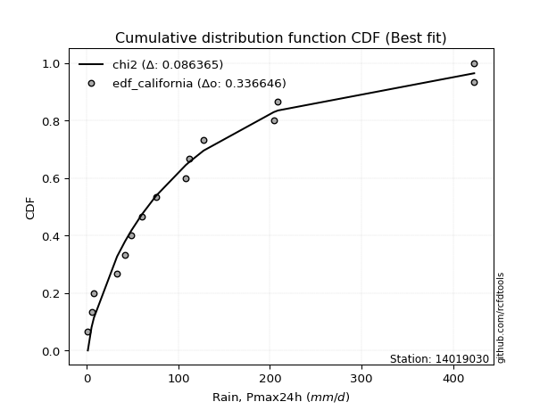</img>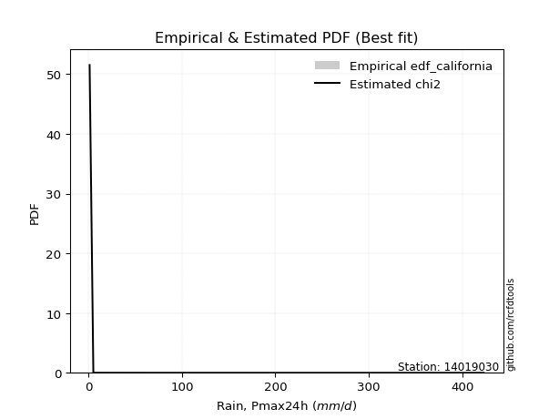</img>

</div>


### 2. Empirical - EDF Hazen (1930)

Hazen method for plotting positions is a formula used to estimate the empirical cumulative probability distribution of flood events or other hydrological data. This formula often results in biased estimations, particularly when extrapolating to extreme events (high return periods).

<div align="center">


$P=(m-0.5)/n$


</div>


**2.1. Empirical values**

<div align="center">

|                | 0                   | 1                  | 2                   | 3                   | 4                  | 5                   | 6                   | 7         | 8                  | 9                  | 10                | 11                 | 12                 | 13                 | 14                 |
|:---------------|:--------------------|:-------------------|:--------------------|:--------------------|:-------------------|:--------------------|:--------------------|:----------|:-------------------|:-------------------|:------------------|:-------------------|:-------------------|:-------------------|:-------------------|
| date           | 2021                | 2022               | 2019                | 2020                | 2009               | 2023                | 2024                | 2012      | 2010               | 2011               | 2018              | 2014               | 2013               | 2016               | 2017               |
| x              | 1.2                 | 5.2                | 7.8                 | 33.1                | 41.8               | 48.8                | 60.2                | 75.4      | 108.1              | 111.8              | 127.6             | 204.1              | 208.8              | 422.8              | 423.0              |
| m              | 1                   | 2                  | 3                   | 4                   | 5                  | 6                   | 7                   | 8         | 9                  | 10                 | 11                | 12                 | 13                 | 14                 | 15                 |
| empirical_dist | edf_hazen           | edf_hazen          | edf_hazen           | edf_hazen           | edf_hazen          | edf_hazen           | edf_hazen           | edf_hazen | edf_hazen          | edf_hazen          | edf_hazen         | edf_hazen          | edf_hazen          | edf_hazen          | edf_hazen          |
| empirical      | 0.03333333333333333 | 0.1                | 0.16666666666666666 | 0.23333333333333334 | 0.3                | 0.36666666666666664 | 0.43333333333333335 | 0.5       | 0.5666666666666667 | 0.6333333333333333 | 0.7               | 0.7666666666666667 | 0.8333333333333334 | 0.9                | 0.9666666666666667 |
| empirical_tr   | 1.0344827586206897  | 1.1111111111111112 | 1.2                 | 1.3043478260869565  | 1.4285714285714286 | 1.5789473684210527  | 1.7647058823529411  | 2.0       | 2.3076923076923075 | 2.727272727272727  | 3.333333333333333 | 4.2857142857142865 | 6.000000000000002  | 10.000000000000002 | 30.000000000000007 |

</div>


**2.2. Kolmogorov-Smirnov fit test (sorted by Δ)**


<div align="center">

|                | 0                   | 1                   | 2                   | 3                   | 4                   | 5                     | 6                   | 7                   | 8                   | 9                  | 10                  | 11                 | 12                  | 13                  | 14                  | 15                 | 16                  | 17                  | 18                 | 19                  | 20                  | 21                  | 22                  | 23                  | 24                  | 25                  | 26                 | 27                  | 28                  | 29                 | 30                  | 31                  | 32                  | 33                  | 34                  | 35                  | 36                 | 37                  | 38                 | 39                  | 40                  | 41                  | 42                 | 43                  | 44                 | 45                  | 46                  | 47                  | 48                  | 49                  | 50                  | 51                  | 52                  | 53                  | 54                  | 55                  | 56                  | 57                  | 58                  | 59                  | 60                  | 61                  | 62                  | 63                  | 64                  | 65                  | 66                  | 67                  | 68                  | 69                  | 70                 | 71                  | 72                  | 73                  | 74                  | 75                 | 76                  | 77                  | 78                  | 79                  | 80                  | 81                 | 82                  | 83                  | 84                 | 85                  | 86                  | 87                  | 88                  | 89                 |
|:---------------|:--------------------|:--------------------|:--------------------|:--------------------|:--------------------|:----------------------|:--------------------|:--------------------|:--------------------|:-------------------|:--------------------|:-------------------|:--------------------|:--------------------|:--------------------|:-------------------|:--------------------|:--------------------|:-------------------|:--------------------|:--------------------|:--------------------|:--------------------|:--------------------|:--------------------|:--------------------|:-------------------|:--------------------|:--------------------|:-------------------|:--------------------|:--------------------|:--------------------|:--------------------|:--------------------|:--------------------|:-------------------|:--------------------|:-------------------|:--------------------|:--------------------|:--------------------|:-------------------|:--------------------|:-------------------|:--------------------|:--------------------|:--------------------|:--------------------|:--------------------|:--------------------|:--------------------|:--------------------|:--------------------|:--------------------|:--------------------|:--------------------|:--------------------|:--------------------|:--------------------|:--------------------|:--------------------|:--------------------|:--------------------|:--------------------|:--------------------|:--------------------|:--------------------|:--------------------|:--------------------|:-------------------|:--------------------|:--------------------|:--------------------|:--------------------|:-------------------|:--------------------|:--------------------|:--------------------|:--------------------|:--------------------|:-------------------|:--------------------|:--------------------|:-------------------|:--------------------|:--------------------|:--------------------|:--------------------|:-------------------|
| station        | 14019030            | 14019030            | 14019030            | 14019030            | 14019030            | 14019030              | 14019030            | 14019030            | 14019030            | 14019030           | 14019030            | 14019030           | 14019030            | 14019030            | 14019030            | 14019030           | 14019030            | 14019030            | 14019030           | 14019030            | 14019030            | 14019030            | 14019030            | 14019030            | 14019030            | 14019030            | 14019030           | 14019030            | 14019030            | 14019030           | 14019030            | 14019030            | 14019030            | 14019030            | 14019030            | 14019030            | 14019030           | 14019030            | 14019030           | 14019030            | 14019030            | 14019030            | 14019030           | 14019030            | 14019030           | 14019030            | 14019030            | 14019030            | 14019030            | 14019030            | 14019030            | 14019030            | 14019030            | 14019030            | 14019030            | 14019030            | 14019030            | 14019030            | 14019030            | 14019030            | 14019030            | 14019030            | 14019030            | 14019030            | 14019030            | 14019030            | 14019030            | 14019030            | 14019030            | 14019030            | 14019030           | 14019030            | 14019030            | 14019030            | 14019030            | 14019030           | 14019030            | 14019030            | 14019030            | 14019030            | 14019030            | 14019030           | 14019030            | 14019030            | 14019030           | 14019030            | 14019030            | 14019030            | 14019030            | 14019030           |
| empirical_dist | edf_hazen           | edf_hazen           | edf_hazen           | edf_hazen           | edf_hazen           | edf_hazen             | edf_hazen           | edf_hazen           | edf_hazen           | edf_hazen          | edf_hazen           | edf_hazen          | edf_hazen           | edf_hazen           | edf_hazen           | edf_hazen          | edf_hazen           | edf_hazen           | edf_hazen          | edf_hazen           | edf_hazen           | edf_hazen           | edf_hazen           | edf_hazen           | edf_hazen           | edf_hazen           | edf_hazen          | edf_hazen           | edf_hazen           | edf_hazen          | edf_hazen           | edf_hazen           | edf_hazen           | edf_hazen           | edf_hazen           | edf_hazen           | edf_hazen          | edf_hazen           | edf_hazen          | edf_hazen           | edf_hazen           | edf_hazen           | edf_hazen          | edf_hazen           | edf_hazen          | edf_hazen           | edf_hazen           | edf_hazen           | edf_hazen           | edf_hazen           | edf_hazen           | edf_hazen           | edf_hazen           | edf_hazen           | edf_hazen           | edf_hazen           | edf_hazen           | edf_hazen           | edf_hazen           | edf_hazen           | edf_hazen           | edf_hazen           | edf_hazen           | edf_hazen           | edf_hazen           | edf_hazen           | edf_hazen           | edf_hazen           | edf_hazen           | edf_hazen           | edf_hazen          | edf_hazen           | edf_hazen           | edf_hazen           | edf_hazen           | edf_hazen          | edf_hazen           | edf_hazen           | edf_hazen           | edf_hazen           | edf_hazen           | edf_hazen          | edf_hazen           | edf_hazen           | edf_hazen          | edf_hazen           | edf_hazen           | edf_hazen           | edf_hazen           | edf_hazen          |
| p_dist         | loggenlogistic      | logjohnsonsu        | logloggamma         | logweibull_min      | loggumbel_l         | loglaplace_asymmetric | ncf                 | loggompertz         | johnsonsu           | nct                | invgauss            | invweibull         | logpearson3         | f                   | invgamma            | logfisk            | chi2                | logt                | logmielke          | moyal               | genlogistic         | pareto              | halflogistic        | weibull_min         | exponnorm           | genexpon            | expon              | laplace_asymmetric  | fatiguelife         | pearson3           | loglogistic         | mielke              | gumbel_r            | truncnorm           | loghypsecant        | gompertz            | nakagami           | lognakagami         | logexponnorm       | logrice             | lognorm             | lognorm             | logcrystalball     | loglognorm          | logf               | lognct              | logfatiguelife      | logbetaprime        | kstwobign           | logerlang           | betaprime           | halfnorm            | logchi2             | rayleigh            | loggamma            | loggamma            | erlang              | loglaplace          | logalpha            | loginvgamma         | wald                | maxwell             | t                   | gamma               | logmaxwell          | loginvgauss         | lograyleigh         | fisk                | rice                | loggumbel_r         | hypsecant          | logistic            | norm                | loginvweibull       | logncf              | laplace            | gibrat              | logmoyal            | loghalfnorm         | loghalflogistic     | logkstwobign        | alpha              | gumbel_l            | loggenexpon         | logwald            | loggibrat           | logtruncnorm        | logexpon            | crystalball         | logpareto          |
| delta          | 0.05730100397731941 | 0.06340219742006903 | 0.06474466854084215 | 0.06736574722413596 | 0.07349381312949116 | 0.07424429071438621   | 0.07923103525922381 | 0.07946518433338468 | 0.08289328025510204 | 0.083458961402424  | 0.08376196350815238 | 0.0854649046231211 | 0.08550937953050725 | 0.08643361491653997 | 0.08643373051274841 | 0.0865052736134164 | 0.09349036890814877 | 0.09434655715983609 | 0.0996343184622307 | 0.09970698187007396 | 0.10697960006547502 | 0.10771076347305156 | 0.11011493785078927 | 0.11053718436430449 | 0.11337992276748235 | 0.11487854959813107 | 0.114878637656321  | 0.11488996639259189 | 0.11686303640671919 | 0.1183703107814881 | 0.12025270472693056 | 0.12058879918538157 | 0.12255880434352207 | 0.12420968515762892 | 0.12608674557932553 | 0.13281623464065873 | 0.1348914963616391 | 0.13612019000919967 | 0.1363735338526859 | 0.13637385071522012 | 0.13637571609206078 | 0.13637571609206078 | 0.1363757167281625 | 0.13637832211704698 | 0.1366629124910641 | 0.13669256867105162 | 0.13780752175584082 | 0.13841797988888366 | 0.13925518223426758 | 0.14826464308301007 | 0.14884608718044684 | 0.15036347176485101 | 0.15097194624062316 | 0.15114625546501675 | 0.15198328071954903 | 0.15198328071954903 | 0.15257615530527685 | 0.15392429769191773 | 0.15771140504742048 | 0.15897712030110311 | 0.15949874834564987 | 0.16034233866135061 | 0.16519960540495882 | 0.16871299304272547 | 0.16935931391034936 | 0.17083529540020687 | 0.18159407064385275 | 0.18424139445913407 | 0.19022752957888467 | 0.19035052563089194 | 0.1913579620788456 | 0.19216221760428454 | 0.19310414753782013 | 0.20123495499070815 | 0.20427283345266295 | 0.2067595719606664 | 0.20779033931309734 | 0.21481524583619988 | 0.21641285653581133 | 0.22770336213202524 | 0.23934113431137316 | 0.2567925615977293 | 0.26324178568177914 | 0.28021254555074054 | 0.2823070709704693 | 0.28733542682229324 | 0.33394988501516737 | 0.34454092157001265 | 0.46376380069425527 | 0.53290032132173   |
| deltao         | 0.3366456264050002  | 0.3366456264050002  | 0.3366456264050002  | 0.3366456264050002  | 0.3366456264050002  | 0.3366456264050002    | 0.3366456264050002  | 0.3366456264050002  | 0.3366456264050002  | 0.3366456264050002 | 0.3366456264050002  | 0.3366456264050002 | 0.3366456264050002  | 0.3366456264050002  | 0.3366456264050002  | 0.3366456264050002 | 0.3366456264050002  | 0.3366456264050002  | 0.3366456264050002 | 0.3366456264050002  | 0.3366456264050002  | 0.3366456264050002  | 0.3366456264050002  | 0.3366456264050002  | 0.3366456264050002  | 0.3366456264050002  | 0.3366456264050002 | 0.3366456264050002  | 0.3366456264050002  | 0.3366456264050002 | 0.3366456264050002  | 0.3366456264050002  | 0.3366456264050002  | 0.3366456264050002  | 0.3366456264050002  | 0.3366456264050002  | 0.3366456264050002 | 0.3366456264050002  | 0.3366456264050002 | 0.3366456264050002  | 0.3366456264050002  | 0.3366456264050002  | 0.3366456264050002 | 0.3366456264050002  | 0.3366456264050002 | 0.3366456264050002  | 0.3366456264050002  | 0.3366456264050002  | 0.3366456264050002  | 0.3366456264050002  | 0.3366456264050002  | 0.3366456264050002  | 0.3366456264050002  | 0.3366456264050002  | 0.3366456264050002  | 0.3366456264050002  | 0.3366456264050002  | 0.3366456264050002  | 0.3366456264050002  | 0.3366456264050002  | 0.3366456264050002  | 0.3366456264050002  | 0.3366456264050002  | 0.3366456264050002  | 0.3366456264050002  | 0.3366456264050002  | 0.3366456264050002  | 0.3366456264050002  | 0.3366456264050002  | 0.3366456264050002  | 0.3366456264050002 | 0.3366456264050002  | 0.3366456264050002  | 0.3366456264050002  | 0.3366456264050002  | 0.3366456264050002 | 0.3366456264050002  | 0.3366456264050002  | 0.3366456264050002  | 0.3366456264050002  | 0.3366456264050002  | 0.3366456264050002 | 0.3366456264050002  | 0.3366456264050002  | 0.3366456264050002 | 0.3366456264050002  | 0.3366456264050002  | 0.3366456264050002  | 0.3366456264050002  | 0.3366456264050002 |
| eval           | Δo > Δ              | Δo > Δ              | Δo > Δ              | Δo > Δ              | Δo > Δ              | Δo > Δ                | Δo > Δ              | Δo > Δ              | Δo > Δ              | Δo > Δ             | Δo > Δ              | Δo > Δ             | Δo > Δ              | Δo > Δ              | Δo > Δ              | Δo > Δ             | Δo > Δ              | Δo > Δ              | Δo > Δ             | Δo > Δ              | Δo > Δ              | Δo > Δ              | Δo > Δ              | Δo > Δ              | Δo > Δ              | Δo > Δ              | Δo > Δ             | Δo > Δ              | Δo > Δ              | Δo > Δ             | Δo > Δ              | Δo > Δ              | Δo > Δ              | Δo > Δ              | Δo > Δ              | Δo > Δ              | Δo > Δ             | Δo > Δ              | Δo > Δ             | Δo > Δ              | Δo > Δ              | Δo > Δ              | Δo > Δ             | Δo > Δ              | Δo > Δ             | Δo > Δ              | Δo > Δ              | Δo > Δ              | Δo > Δ              | Δo > Δ              | Δo > Δ              | Δo > Δ              | Δo > Δ              | Δo > Δ              | Δo > Δ              | Δo > Δ              | Δo > Δ              | Δo > Δ              | Δo > Δ              | Δo > Δ              | Δo > Δ              | Δo > Δ              | Δo > Δ              | Δo > Δ              | Δo > Δ              | Δo > Δ              | Δo > Δ              | Δo > Δ              | Δo > Δ              | Δo > Δ              | Δo > Δ             | Δo > Δ              | Δo > Δ              | Δo > Δ              | Δo > Δ              | Δo > Δ             | Δo > Δ              | Δo > Δ              | Δo > Δ              | Δo > Δ              | Δo > Δ              | Δo > Δ             | Δo > Δ              | Δo > Δ              | Δo > Δ             | Δo > Δ              | Δo > Δ              | Δo <= Δ             | Δo <= Δ             | Δo <= Δ            |
| fit            | 1                   | 1                   | 1                   | 1                   | 1                   | 1                     | 1                   | 1                   | 1                   | 1                  | 1                   | 1                  | 1                   | 1                   | 1                   | 1                  | 1                   | 1                   | 1                  | 1                   | 1                   | 1                   | 1                   | 1                   | 1                   | 1                   | 1                  | 1                   | 1                   | 1                  | 1                   | 1                   | 1                   | 1                   | 1                   | 1                   | 1                  | 1                   | 1                  | 1                   | 1                   | 1                   | 1                  | 1                   | 1                  | 1                   | 1                   | 1                   | 1                   | 1                   | 1                   | 1                   | 1                   | 1                   | 1                   | 1                   | 1                   | 1                   | 1                   | 1                   | 1                   | 1                   | 1                   | 1                   | 1                   | 1                   | 1                   | 1                   | 1                   | 1                   | 1                  | 1                   | 1                   | 1                   | 1                   | 1                  | 1                   | 1                   | 1                   | 1                   | 1                   | 1                  | 1                   | 1                   | 1                  | 1                   | 1                   | 0                   | 0                   | 0                  |
| n              | 15                  | 15                  | 15                  | 15                  | 15                  | 15                    | 15                  | 15                  | 15                  | 15                 | 15                  | 15                 | 15                  | 15                  | 15                  | 15                 | 15                  | 15                  | 15                 | 15                  | 15                  | 15                  | 15                  | 15                  | 15                  | 15                  | 15                 | 15                  | 15                  | 15                 | 15                  | 15                  | 15                  | 15                  | 15                  | 15                  | 15                 | 15                  | 15                 | 15                  | 15                  | 15                  | 15                 | 15                  | 15                 | 15                  | 15                  | 15                  | 15                  | 15                  | 15                  | 15                  | 15                  | 15                  | 15                  | 15                  | 15                  | 15                  | 15                  | 15                  | 15                  | 15                  | 15                  | 15                  | 15                  | 15                  | 15                  | 15                  | 15                  | 15                  | 15                 | 15                  | 15                  | 15                  | 15                  | 15                 | 15                  | 15                  | 15                  | 15                  | 15                  | 15                 | 15                  | 15                  | 15                 | 15                  | 15                  | 15                  | 15                  | 15                 |
| best_fit       | 1                   | 0                   | 0                   | 0                   | 0                   | 0                     | 0                   | 0                   | 0                   | 0                  | 0                   | 0                  | 0                   | 0                   | 0                   | 0                  | 0                   | 0                   | 0                  | 0                   | 0                   | 0                   | 0                   | 0                   | 0                   | 0                   | 0                  | 0                   | 0                   | 0                  | 0                   | 0                   | 0                   | 0                   | 0                   | 0                   | 0                  | 0                   | 0                  | 0                   | 0                   | 0                   | 0                  | 0                   | 0                  | 0                   | 0                   | 0                   | 0                   | 0                   | 0                   | 0                   | 0                   | 0                   | 0                   | 0                   | 0                   | 0                   | 0                   | 0                   | 0                   | 0                   | 0                   | 0                   | 0                   | 0                   | 0                   | 0                   | 0                   | 0                   | 0                  | 0                   | 0                   | 0                   | 0                   | 0                  | 0                   | 0                   | 0                   | 0                   | 0                   | 0                  | 0                   | 0                   | 0                  | 0                   | 0                   | 0                   | 0                   | 0                  |
| best_fit_sort  | 1                   | 2                   | 3                   | 4                   | 5                   | 6                     | 7                   | 8                   | 9                   | 10                 | 11                  | 12                 | 13                  | 14                  | 15                  | 16                 | 17                  | 18                  | 19                 | 20                  | 21                  | 22                  | 23                  | 24                  | 25                  | 26                  | 27                 | 28                  | 29                  | 30                 | 31                  | 32                  | 33                  | 34                  | 35                  | 36                  | 37                 | 38                  | 39                 | 40                  | 41                  | 42                  | 43                 | 44                  | 45                 | 46                  | 47                  | 48                  | 49                  | 50                  | 51                  | 52                  | 53                  | 54                  | 55                  | 56                  | 57                  | 58                  | 59                  | 60                  | 61                  | 62                  | 63                  | 64                  | 65                  | 66                  | 67                  | 68                  | 69                  | 70                  | 71                 | 72                  | 73                  | 74                  | 75                  | 76                 | 77                  | 78                  | 79                  | 80                  | 81                  | 82                 | 83                  | 84                  | 85                 | 86                  | 87                  | 88                  | 89                  | 90                 |

</div>


<div align="center">

</img>

</div>


**2.3. Best fit**

<div align="center">

|   id |   station | empirical_dist   | p_dist         |    delta |   deltao | eval   |   fit |   n |   best_fit |   best_fit_sort |
|-----:|----------:|:-----------------|:---------------|---------:|---------:|:-------|------:|----:|-----------:|----------------:|
|    0 |  14019030 | edf_hazen        | loggenlogistic | 0.057301 | 0.336646 | Δo > Δ |     1 |  15 |          1 |               1 |

</div>


<div align="center">

</img></img>

</div>


### 3. Empirical - EDF Weibull (1939)

Weibull plotting position formula is an empirical method used to estimate the non-exceedance probability or plotting position for a set of observed data, is often recommended or widely used in practice, particularly in flood frequency analysis.

<div align="center">


$P=m/(n+1)$


</div>


**3.1. Empirical values**

<div align="center">

|                | 0                  | 1                  | 2                  | 3                  | 4                  | 5           | 6                  | 7           | 8                  | 9                  | 10          | 11          | 12                | 13          | 14          |
|:---------------|:-------------------|:-------------------|:-------------------|:-------------------|:-------------------|:------------|:-------------------|:------------|:-------------------|:-------------------|:------------|:------------|:------------------|:------------|:------------|
| date           | 2021               | 2022               | 2019               | 2020               | 2009               | 2023        | 2024               | 2012        | 2010               | 2011               | 2018        | 2014        | 2013              | 2016        | 2017        |
| x              | 1.2                | 5.2                | 7.8                | 33.1               | 41.8               | 48.8        | 60.2               | 75.4        | 108.1              | 111.8              | 127.6       | 204.1       | 208.8             | 422.8       | 423.0       |
| m              | 1                  | 2                  | 3                  | 4                  | 5                  | 6           | 7                  | 8           | 9                  | 10                 | 11          | 12          | 13                | 14          | 15          |
| empirical_dist | edf_weibull        | edf_weibull        | edf_weibull        | edf_weibull        | edf_weibull        | edf_weibull | edf_weibull        | edf_weibull | edf_weibull        | edf_weibull        | edf_weibull | edf_weibull | edf_weibull       | edf_weibull | edf_weibull |
| empirical      | 0.0625             | 0.125              | 0.1875             | 0.25               | 0.3125             | 0.375       | 0.4375             | 0.5         | 0.5625             | 0.625              | 0.6875      | 0.75        | 0.8125            | 0.875       | 0.9375      |
| empirical_tr   | 1.0666666666666667 | 1.1428571428571428 | 1.2307692307692308 | 1.3333333333333333 | 1.4545454545454546 | 1.6         | 1.7777777777777777 | 2.0         | 2.2857142857142856 | 2.6666666666666665 | 3.2         | 4.0         | 5.333333333333333 | 8.0         | 16.0        |

</div>


**3.2. Kolmogorov-Smirnov fit test (sorted by Δ)**


<div align="center">

|                | 0                   | 1                   | 2                   | 3                   | 4                  | 5                   | 6                  | 7                   | 8                   | 9                   | 10                  | 11                    | 12                  | 13                  | 14                  | 15                  | 16                  | 17                  | 18                  | 19                  | 20                  | 21                  | 22                  | 23                  | 24                  | 25                  | 26                  | 27                  | 28                  | 29                  | 30                  | 31                  | 32                  | 33                  | 34                  | 35                  | 36                  | 37                  | 38                 | 39                  | 40                  | 41                 | 42                  | 43                 | 44                  | 45                 | 46                 | 47                  | 48                  | 49                 | 50                  | 51                  | 52                 | 53                  | 54                  | 55                  | 56                  | 57                 | 58                  | 59                  | 60                  | 61                 | 62                 | 63                  | 64                  | 65                  | 66                 | 67                 | 68                  | 69                  | 70                  | 71                 | 72                  | 73                  | 74                 | 75                  | 76                  | 77                 | 78                  | 79                 | 80                 | 81                  | 82                 | 83                 | 84                 | 85                 | 86                 | 87                 | 88                 | 89                 |
|:---------------|:--------------------|:--------------------|:--------------------|:--------------------|:-------------------|:--------------------|:-------------------|:--------------------|:--------------------|:--------------------|:--------------------|:----------------------|:--------------------|:--------------------|:--------------------|:--------------------|:--------------------|:--------------------|:--------------------|:--------------------|:--------------------|:--------------------|:--------------------|:--------------------|:--------------------|:--------------------|:--------------------|:--------------------|:--------------------|:--------------------|:--------------------|:--------------------|:--------------------|:--------------------|:--------------------|:--------------------|:--------------------|:--------------------|:-------------------|:--------------------|:--------------------|:-------------------|:--------------------|:-------------------|:--------------------|:-------------------|:-------------------|:--------------------|:--------------------|:-------------------|:--------------------|:--------------------|:-------------------|:--------------------|:--------------------|:--------------------|:--------------------|:-------------------|:--------------------|:--------------------|:--------------------|:-------------------|:-------------------|:--------------------|:--------------------|:--------------------|:-------------------|:-------------------|:--------------------|:--------------------|:--------------------|:-------------------|:--------------------|:--------------------|:-------------------|:--------------------|:--------------------|:-------------------|:--------------------|:-------------------|:-------------------|:--------------------|:-------------------|:-------------------|:-------------------|:-------------------|:-------------------|:-------------------|:-------------------|:-------------------|
| station        | 14019030            | 14019030            | 14019030            | 14019030            | 14019030           | 14019030            | 14019030           | 14019030            | 14019030            | 14019030            | 14019030            | 14019030              | 14019030            | 14019030            | 14019030            | 14019030            | 14019030            | 14019030            | 14019030            | 14019030            | 14019030            | 14019030            | 14019030            | 14019030            | 14019030            | 14019030            | 14019030            | 14019030            | 14019030            | 14019030            | 14019030            | 14019030            | 14019030            | 14019030            | 14019030            | 14019030            | 14019030            | 14019030            | 14019030           | 14019030            | 14019030            | 14019030           | 14019030            | 14019030           | 14019030            | 14019030           | 14019030           | 14019030            | 14019030            | 14019030           | 14019030            | 14019030            | 14019030           | 14019030            | 14019030            | 14019030            | 14019030            | 14019030           | 14019030            | 14019030            | 14019030            | 14019030           | 14019030           | 14019030            | 14019030            | 14019030            | 14019030           | 14019030           | 14019030            | 14019030            | 14019030            | 14019030           | 14019030            | 14019030            | 14019030           | 14019030            | 14019030            | 14019030           | 14019030            | 14019030           | 14019030           | 14019030            | 14019030           | 14019030           | 14019030           | 14019030           | 14019030           | 14019030           | 14019030           | 14019030           |
| empirical_dist | edf_weibull         | edf_weibull         | edf_weibull         | edf_weibull         | edf_weibull        | edf_weibull         | edf_weibull        | edf_weibull         | edf_weibull         | edf_weibull         | edf_weibull         | edf_weibull           | edf_weibull         | edf_weibull         | edf_weibull         | edf_weibull         | edf_weibull         | edf_weibull         | edf_weibull         | edf_weibull         | edf_weibull         | edf_weibull         | edf_weibull         | edf_weibull         | edf_weibull         | edf_weibull         | edf_weibull         | edf_weibull         | edf_weibull         | edf_weibull         | edf_weibull         | edf_weibull         | edf_weibull         | edf_weibull         | edf_weibull         | edf_weibull         | edf_weibull         | edf_weibull         | edf_weibull        | edf_weibull         | edf_weibull         | edf_weibull        | edf_weibull         | edf_weibull        | edf_weibull         | edf_weibull        | edf_weibull        | edf_weibull         | edf_weibull         | edf_weibull        | edf_weibull         | edf_weibull         | edf_weibull        | edf_weibull         | edf_weibull         | edf_weibull         | edf_weibull         | edf_weibull        | edf_weibull         | edf_weibull         | edf_weibull         | edf_weibull        | edf_weibull        | edf_weibull         | edf_weibull         | edf_weibull         | edf_weibull        | edf_weibull        | edf_weibull         | edf_weibull         | edf_weibull         | edf_weibull        | edf_weibull         | edf_weibull         | edf_weibull        | edf_weibull         | edf_weibull         | edf_weibull        | edf_weibull         | edf_weibull        | edf_weibull        | edf_weibull         | edf_weibull        | edf_weibull        | edf_weibull        | edf_weibull        | edf_weibull        | edf_weibull        | edf_weibull        | edf_weibull        |
| p_dist         | ncf                 | logpearson3         | loggenlogistic      | loggumbel_l         | logloggamma        | logjohnsonsu        | logweibull_min     | chi2                | halflogistic        | moyal               | loggompertz         | loglaplace_asymmetric | pearson3            | fatiguelife         | johnsonsu           | nct                 | weibull_min         | invgauss            | invweibull          | f                   | invgamma            | logfisk             | mielke              | gumbel_r            | genlogistic         | logt                | loglogistic         | lognakagami         | logexponnorm        | logrice             | lognorm             | lognorm             | logcrystalball      | loglognorm          | logf                | lognct              | logfatiguelife      | halfnorm            | logbetaprime       | nakagami            | logmielke           | pareto             | loghypsecant        | logerlang          | betaprime           | exponnorm          | logchi2            | loggamma            | loggamma            | genexpon           | expon               | laplace_asymmetric  | erlang             | rayleigh            | kstwobign           | logalpha            | loginvgamma         | gompertz           | truncnorm           | maxwell             | t                   | logmaxwell         | loginvgauss        | loglaplace          | lograyleigh         | gamma               | fisk               | rice               | loggumbel_r         | hypsecant           | logistic            | wald               | norm                | loginvweibull       | logncf             | loghalfnorm         | logmoyal            | laplace            | loghalflogistic     | logkstwobign       | gibrat             | alpha               | gumbel_l           | loggenexpon        | logwald            | loggibrat          | logtruncnorm       | logexpon           | crystalball        | logpareto          |
| delta          | 0.06673103525922386 | 0.07433573703435761 | 0.07598753687934134 | 0.07953432520112949 | 0.0843535945151751 | 0.08599415137852706 | 0.0881990805574693 | 0.08904868094316454 | 0.08961139871556345 | 0.09023537136108228 | 0.09067181778173673 | 0.09091095738105293   | 0.09225559788809834 | 0.10019636974005253 | 0.10372661358843538 | 0.10429229473575734 | 0.10434760829617351 | 0.10459529684148572 | 0.10629823795645445 | 0.10726694824987332 | 0.10726706384608176 | 0.10733860694674974 | 0.10808879918538161 | 0.11005880434352211 | 0.11114626673214167 | 0.11517989049316943 | 0.11588415147194242 | 0.11945352334253301 | 0.11970686718601925 | 0.11970718404855346 | 0.11970904942539412 | 0.11970904942539412 | 0.11970905006149585 | 0.11971165545038032 | 0.11999624582439744 | 0.12002590200438495 | 0.12114085508917416 | 0.12119680509818434 | 0.121751313222217  | 0.12239149636163915 | 0.12463431846223072 | 0.1285440968063849 | 0.13025341224599218 | 0.1315979764163434 | 0.13217942051378018 | 0.1342132561008157 | 0.1343052795739565 | 0.13531661405288237 | 0.13531661405288237 | 0.1357118829314644 | 0.13571197098965435 | 0.13572329972592523 | 0.1359094886386102 | 0.13698363003575365 | 0.13821667523418152 | 0.14104473838075382 | 0.14231045363443645 | 0.1447150547174674 | 0.14504301849096227 | 0.14784233866135066 | 0.15049399280268316 | 0.1526926472436827 | 0.1541686287335402 | 0.15809096435858438 | 0.16492740397718608 | 0.16717192389767366 | 0.1675747277924674 | 0.1777275295788847 | 0.17785052563089193 | 0.17885796207884563 | 0.17966221760428458 | 0.1803320816789832 | 0.18060414753782017 | 0.18456828832404149 | 0.1876061667859963 | 0.19974618986914466 | 0.20231524583619986 | 0.2067595719606664 | 0.21337915349187453 | 0.2226744676447065 | 0.224457005979764  | 0.24429256159772927 | 0.2507417856817792 | 0.2635458788840739 | 0.2698070709704693 | 0.2748354268222932 | 0.3172832183485007 | 0.327874254903346  | 0.4345971340275886 | 0.50790032132173   |
| deltao         | 0.3366456264050002  | 0.3366456264050002  | 0.3366456264050002  | 0.3366456264050002  | 0.3366456264050002 | 0.3366456264050002  | 0.3366456264050002 | 0.3366456264050002  | 0.3366456264050002  | 0.3366456264050002  | 0.3366456264050002  | 0.3366456264050002    | 0.3366456264050002  | 0.3366456264050002  | 0.3366456264050002  | 0.3366456264050002  | 0.3366456264050002  | 0.3366456264050002  | 0.3366456264050002  | 0.3366456264050002  | 0.3366456264050002  | 0.3366456264050002  | 0.3366456264050002  | 0.3366456264050002  | 0.3366456264050002  | 0.3366456264050002  | 0.3366456264050002  | 0.3366456264050002  | 0.3366456264050002  | 0.3366456264050002  | 0.3366456264050002  | 0.3366456264050002  | 0.3366456264050002  | 0.3366456264050002  | 0.3366456264050002  | 0.3366456264050002  | 0.3366456264050002  | 0.3366456264050002  | 0.3366456264050002 | 0.3366456264050002  | 0.3366456264050002  | 0.3366456264050002 | 0.3366456264050002  | 0.3366456264050002 | 0.3366456264050002  | 0.3366456264050002 | 0.3366456264050002 | 0.3366456264050002  | 0.3366456264050002  | 0.3366456264050002 | 0.3366456264050002  | 0.3366456264050002  | 0.3366456264050002 | 0.3366456264050002  | 0.3366456264050002  | 0.3366456264050002  | 0.3366456264050002  | 0.3366456264050002 | 0.3366456264050002  | 0.3366456264050002  | 0.3366456264050002  | 0.3366456264050002 | 0.3366456264050002 | 0.3366456264050002  | 0.3366456264050002  | 0.3366456264050002  | 0.3366456264050002 | 0.3366456264050002 | 0.3366456264050002  | 0.3366456264050002  | 0.3366456264050002  | 0.3366456264050002 | 0.3366456264050002  | 0.3366456264050002  | 0.3366456264050002 | 0.3366456264050002  | 0.3366456264050002  | 0.3366456264050002 | 0.3366456264050002  | 0.3366456264050002 | 0.3366456264050002 | 0.3366456264050002  | 0.3366456264050002 | 0.3366456264050002 | 0.3366456264050002 | 0.3366456264050002 | 0.3366456264050002 | 0.3366456264050002 | 0.3366456264050002 | 0.3366456264050002 |
| eval           | Δo > Δ              | Δo > Δ              | Δo > Δ              | Δo > Δ              | Δo > Δ             | Δo > Δ              | Δo > Δ             | Δo > Δ              | Δo > Δ              | Δo > Δ              | Δo > Δ              | Δo > Δ                | Δo > Δ              | Δo > Δ              | Δo > Δ              | Δo > Δ              | Δo > Δ              | Δo > Δ              | Δo > Δ              | Δo > Δ              | Δo > Δ              | Δo > Δ              | Δo > Δ              | Δo > Δ              | Δo > Δ              | Δo > Δ              | Δo > Δ              | Δo > Δ              | Δo > Δ              | Δo > Δ              | Δo > Δ              | Δo > Δ              | Δo > Δ              | Δo > Δ              | Δo > Δ              | Δo > Δ              | Δo > Δ              | Δo > Δ              | Δo > Δ             | Δo > Δ              | Δo > Δ              | Δo > Δ             | Δo > Δ              | Δo > Δ             | Δo > Δ              | Δo > Δ             | Δo > Δ             | Δo > Δ              | Δo > Δ              | Δo > Δ             | Δo > Δ              | Δo > Δ              | Δo > Δ             | Δo > Δ              | Δo > Δ              | Δo > Δ              | Δo > Δ              | Δo > Δ             | Δo > Δ              | Δo > Δ              | Δo > Δ              | Δo > Δ             | Δo > Δ             | Δo > Δ              | Δo > Δ              | Δo > Δ              | Δo > Δ             | Δo > Δ             | Δo > Δ              | Δo > Δ              | Δo > Δ              | Δo > Δ             | Δo > Δ              | Δo > Δ              | Δo > Δ             | Δo > Δ              | Δo > Δ              | Δo > Δ             | Δo > Δ              | Δo > Δ             | Δo > Δ             | Δo > Δ              | Δo > Δ             | Δo > Δ             | Δo > Δ             | Δo > Δ             | Δo > Δ             | Δo > Δ             | Δo <= Δ            | Δo <= Δ            |
| fit            | 1                   | 1                   | 1                   | 1                   | 1                  | 1                   | 1                  | 1                   | 1                   | 1                   | 1                   | 1                     | 1                   | 1                   | 1                   | 1                   | 1                   | 1                   | 1                   | 1                   | 1                   | 1                   | 1                   | 1                   | 1                   | 1                   | 1                   | 1                   | 1                   | 1                   | 1                   | 1                   | 1                   | 1                   | 1                   | 1                   | 1                   | 1                   | 1                  | 1                   | 1                   | 1                  | 1                   | 1                  | 1                   | 1                  | 1                  | 1                   | 1                   | 1                  | 1                   | 1                   | 1                  | 1                   | 1                   | 1                   | 1                   | 1                  | 1                   | 1                   | 1                   | 1                  | 1                  | 1                   | 1                   | 1                   | 1                  | 1                  | 1                   | 1                   | 1                   | 1                  | 1                   | 1                   | 1                  | 1                   | 1                   | 1                  | 1                   | 1                  | 1                  | 1                   | 1                  | 1                  | 1                  | 1                  | 1                  | 1                  | 0                  | 0                  |
| n              | 15                  | 15                  | 15                  | 15                  | 15                 | 15                  | 15                 | 15                  | 15                  | 15                  | 15                  | 15                    | 15                  | 15                  | 15                  | 15                  | 15                  | 15                  | 15                  | 15                  | 15                  | 15                  | 15                  | 15                  | 15                  | 15                  | 15                  | 15                  | 15                  | 15                  | 15                  | 15                  | 15                  | 15                  | 15                  | 15                  | 15                  | 15                  | 15                 | 15                  | 15                  | 15                 | 15                  | 15                 | 15                  | 15                 | 15                 | 15                  | 15                  | 15                 | 15                  | 15                  | 15                 | 15                  | 15                  | 15                  | 15                  | 15                 | 15                  | 15                  | 15                  | 15                 | 15                 | 15                  | 15                  | 15                  | 15                 | 15                 | 15                  | 15                  | 15                  | 15                 | 15                  | 15                  | 15                 | 15                  | 15                  | 15                 | 15                  | 15                 | 15                 | 15                  | 15                 | 15                 | 15                 | 15                 | 15                 | 15                 | 15                 | 15                 |
| best_fit       | 1                   | 0                   | 0                   | 0                   | 0                  | 0                   | 0                  | 0                   | 0                   | 0                   | 0                   | 0                     | 0                   | 0                   | 0                   | 0                   | 0                   | 0                   | 0                   | 0                   | 0                   | 0                   | 0                   | 0                   | 0                   | 0                   | 0                   | 0                   | 0                   | 0                   | 0                   | 0                   | 0                   | 0                   | 0                   | 0                   | 0                   | 0                   | 0                  | 0                   | 0                   | 0                  | 0                   | 0                  | 0                   | 0                  | 0                  | 0                   | 0                   | 0                  | 0                   | 0                   | 0                  | 0                   | 0                   | 0                   | 0                   | 0                  | 0                   | 0                   | 0                   | 0                  | 0                  | 0                   | 0                   | 0                   | 0                  | 0                  | 0                   | 0                   | 0                   | 0                  | 0                   | 0                   | 0                  | 0                   | 0                   | 0                  | 0                   | 0                  | 0                  | 0                   | 0                  | 0                  | 0                  | 0                  | 0                  | 0                  | 0                  | 0                  |
| best_fit_sort  | 1                   | 2                   | 3                   | 4                   | 5                  | 6                   | 7                  | 8                   | 9                   | 10                  | 11                  | 12                    | 13                  | 14                  | 15                  | 16                  | 17                  | 18                  | 19                  | 20                  | 21                  | 22                  | 23                  | 24                  | 25                  | 26                  | 27                  | 28                  | 29                  | 30                  | 31                  | 32                  | 33                  | 34                  | 35                  | 36                  | 37                  | 38                  | 39                 | 40                  | 41                  | 42                 | 43                  | 44                 | 45                  | 46                 | 47                 | 48                  | 49                  | 50                 | 51                  | 52                  | 53                 | 54                  | 55                  | 56                  | 57                  | 58                 | 59                  | 60                  | 61                  | 62                 | 63                 | 64                  | 65                  | 66                  | 67                 | 68                 | 69                  | 70                  | 71                  | 72                 | 73                  | 74                  | 75                 | 76                  | 77                  | 78                 | 79                  | 80                 | 81                 | 82                  | 83                 | 84                 | 85                 | 86                 | 87                 | 88                 | 89                 | 90                 |

</div>


<div align="center">

</img>

</div>


**3.3. Best fit**

<div align="center">

|   id |   station | empirical_dist   | p_dist   |    delta |   deltao | eval   |   fit |   n |   best_fit |   best_fit_sort |
|-----:|----------:|:-----------------|:---------|---------:|---------:|:-------|------:|----:|-----------:|----------------:|
|    0 |  14019030 | edf_weibull      | ncf      | 0.066731 | 0.336646 | Δo > Δ |     1 |  15 |          1 |               1 |

</div>


<div align="center">

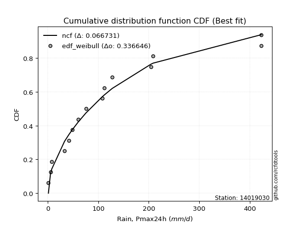</img>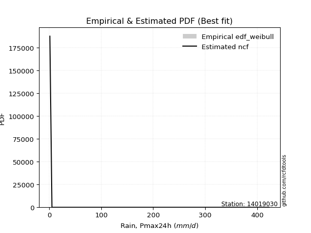</img>

</div>


### 4. Empirical - EDF Beard (1943)

The Beard formula (or Beard´s plotting position formula) in hydrology is used to estimate the empirical non-exceedance probability _(P)_ of a flood event (or other extreme hydrological data point) within a given dataset.

<div align="center">


$P=(m-0.31)/(n+0.38)$


</div>


**4.1. Empirical values**

<div align="center">

|                | 0                   | 1                   | 2                   | 3                   | 4                  | 5                   | 6                   | 7         | 8                  | 9                  | 10                 | 11                | 12                 | 13                 | 14                 |
|:---------------|:--------------------|:--------------------|:--------------------|:--------------------|:-------------------|:--------------------|:--------------------|:----------|:-------------------|:-------------------|:-------------------|:------------------|:-------------------|:-------------------|:-------------------|
| date           | 2021                | 2022                | 2019                | 2020                | 2009               | 2023                | 2024                | 2012      | 2010               | 2011               | 2018               | 2014              | 2013               | 2016               | 2017               |
| x              | 1.2                 | 5.2                 | 7.8                 | 33.1                | 41.8               | 48.8                | 60.2                | 75.4      | 108.1              | 111.8              | 127.6              | 204.1             | 208.8              | 422.8              | 423.0              |
| m              | 1                   | 2                   | 3                   | 4                   | 5                  | 6                   | 7                   | 8         | 9                  | 10                 | 11                 | 12                | 13                 | 14                 | 15                 |
| empirical_dist | edf_beard           | edf_beard           | edf_beard           | edf_beard           | edf_beard          | edf_beard           | edf_beard           | edf_beard | edf_beard          | edf_beard          | edf_beard          | edf_beard         | edf_beard          | edf_beard          | edf_beard          |
| empirical      | 0.04486345903771131 | 0.10988296488946683 | 0.17490247074122237 | 0.23992197659297787 | 0.3049414824447334 | 0.36996098829648894 | 0.43498049414824447 | 0.5       | 0.5650195058517554 | 0.630039011703511  | 0.6950585175552665 | 0.760078023407022 | 0.8250975292587776 | 0.8901170351105331 | 0.9551365409622886 |
| empirical_tr   | 1.0469707283866576  | 1.1234477720964207  | 1.2119779353821907  | 1.3156544054747648  | 1.4387277829747427 | 1.587203302373581   | 1.7698504027617952  | 2.0       | 2.298953662182361  | 2.7029876977152894 | 3.279317697228144  | 4.168021680216801 | 5.717472118959106  | 9.100591715976325  | 22.289855072463734 |

</div>


**4.2. Kolmogorov-Smirnov fit test (sorted by Δ)**


<div align="center">

|                | 0                   | 1                   | 2                   | 3                   | 4                   | 5                   | 6                  | 7                   | 8                     | 9                   | 10                  | 11                 | 12                  | 13                  | 14                  | 15                  | 16                  | 17                 | 18                 | 19                 | 20                  | 21                  | 22                  | 23                  | 24                  | 25                  | 26                 | 27                  | 28                 | 29                  | 30                  | 31                  | 32                 | 33                  | 34                  | 35                  | 36                 | 37                  | 38                  | 39                  | 40                  | 41                  | 42                  | 43                  | 44                 | 45                  | 46                  | 47                  | 48                  | 49                  | 50                  | 51                 | 52                  | 53                  | 54                 | 55                 | 56                  | 57                  | 58                  | 59                  | 60                  | 61                  | 62                  | 63                  | 64                  | 65                  | 66                 | 67                  | 68                 | 69                  | 70                  | 71                  | 72                  | 73                  | 74                  | 75                 | 76                 | 77                  | 78                  | 79                 | 80                  | 81                  | 82                  | 83                 | 84                 | 85                 | 86                  | 87                 | 88                  | 89                 |
|:---------------|:--------------------|:--------------------|:--------------------|:--------------------|:--------------------|:--------------------|:-------------------|:--------------------|:----------------------|:--------------------|:--------------------|:-------------------|:--------------------|:--------------------|:--------------------|:--------------------|:--------------------|:-------------------|:-------------------|:-------------------|:--------------------|:--------------------|:--------------------|:--------------------|:--------------------|:--------------------|:-------------------|:--------------------|:-------------------|:--------------------|:--------------------|:--------------------|:-------------------|:--------------------|:--------------------|:--------------------|:-------------------|:--------------------|:--------------------|:--------------------|:--------------------|:--------------------|:--------------------|:--------------------|:-------------------|:--------------------|:--------------------|:--------------------|:--------------------|:--------------------|:--------------------|:-------------------|:--------------------|:--------------------|:-------------------|:-------------------|:--------------------|:--------------------|:--------------------|:--------------------|:--------------------|:--------------------|:--------------------|:--------------------|:--------------------|:--------------------|:-------------------|:--------------------|:-------------------|:--------------------|:--------------------|:--------------------|:--------------------|:--------------------|:--------------------|:-------------------|:-------------------|:--------------------|:--------------------|:-------------------|:--------------------|:--------------------|:--------------------|:-------------------|:-------------------|:-------------------|:--------------------|:-------------------|:--------------------|:-------------------|
| station        | 14019030            | 14019030            | 14019030            | 14019030            | 14019030            | 14019030            | 14019030           | 14019030            | 14019030              | 14019030            | 14019030            | 14019030           | 14019030            | 14019030            | 14019030            | 14019030            | 14019030            | 14019030           | 14019030           | 14019030           | 14019030            | 14019030            | 14019030            | 14019030            | 14019030            | 14019030            | 14019030           | 14019030            | 14019030           | 14019030            | 14019030            | 14019030            | 14019030           | 14019030            | 14019030            | 14019030            | 14019030           | 14019030            | 14019030            | 14019030            | 14019030            | 14019030            | 14019030            | 14019030            | 14019030           | 14019030            | 14019030            | 14019030            | 14019030            | 14019030            | 14019030            | 14019030           | 14019030            | 14019030            | 14019030           | 14019030           | 14019030            | 14019030            | 14019030            | 14019030            | 14019030            | 14019030            | 14019030            | 14019030            | 14019030            | 14019030            | 14019030           | 14019030            | 14019030           | 14019030            | 14019030            | 14019030            | 14019030            | 14019030            | 14019030            | 14019030           | 14019030           | 14019030            | 14019030            | 14019030           | 14019030            | 14019030            | 14019030            | 14019030           | 14019030           | 14019030           | 14019030            | 14019030           | 14019030            | 14019030           |
| empirical_dist | edf_beard           | edf_beard           | edf_beard           | edf_beard           | edf_beard           | edf_beard           | edf_beard          | edf_beard           | edf_beard             | edf_beard           | edf_beard           | edf_beard          | edf_beard           | edf_beard           | edf_beard           | edf_beard           | edf_beard           | edf_beard          | edf_beard          | edf_beard          | edf_beard           | edf_beard           | edf_beard           | edf_beard           | edf_beard           | edf_beard           | edf_beard          | edf_beard           | edf_beard          | edf_beard           | edf_beard           | edf_beard           | edf_beard          | edf_beard           | edf_beard           | edf_beard           | edf_beard          | edf_beard           | edf_beard           | edf_beard           | edf_beard           | edf_beard           | edf_beard           | edf_beard           | edf_beard          | edf_beard           | edf_beard           | edf_beard           | edf_beard           | edf_beard           | edf_beard           | edf_beard          | edf_beard           | edf_beard           | edf_beard          | edf_beard          | edf_beard           | edf_beard           | edf_beard           | edf_beard           | edf_beard           | edf_beard           | edf_beard           | edf_beard           | edf_beard           | edf_beard           | edf_beard          | edf_beard           | edf_beard          | edf_beard           | edf_beard           | edf_beard           | edf_beard           | edf_beard           | edf_beard           | edf_beard          | edf_beard          | edf_beard           | edf_beard           | edf_beard          | edf_beard           | edf_beard           | edf_beard           | edf_beard          | edf_beard          | edf_beard          | edf_beard           | edf_beard          | edf_beard           | edf_beard          |
| p_dist         | loggenlogistic      | loggumbel_l         | logloggamma         | logjohnsonsu        | ncf                 | logweibull_min      | loggompertz        | logpearson3         | loglaplace_asymmetric | chi2                | johnsonsu           | nct                | moyal               | invgauss            | invweibull          | f                   | invgamma            | logfisk            | halflogistic       | logt               | weibull_min         | pearson3            | genlogistic         | logmielke           | fatiguelife         | loglogistic         | mielke             | pareto              | gumbel_r           | exponnorm           | genexpon            | expon               | laplace_asymmetric | loghypsecant        | lognakagami         | logexponnorm        | logrice            | lognorm             | lognorm             | logcrystalball      | loglognorm          | nakagami            | logf                | lognct              | logfatiguelife     | logbetaprime        | gompertz            | truncnorm           | kstwobign           | halfnorm            | logerlang           | betaprime          | logchi2             | rayleigh            | loggamma           | loggamma           | erlang              | logalpha            | loginvgamma         | t                   | maxwell             | loglaplace          | logmaxwell          | loginvgauss         | gamma               | wald                | lograyleigh        | fisk                | rice               | loggumbel_r         | hypsecant           | logistic            | norm                | loginvweibull       | logncf              | laplace            | loghalfnorm        | logmoyal            | gibrat              | loghalflogistic    | logkstwobign        | alpha               | gumbel_l            | loggenexpon        | logwald            | loggibrat          | logtruncnorm        | logexpon           | crystalball         | logpareto          |
| delta          | 0.06107956294935599 | 0.06693679594235186 | 0.06923655940464202 | 0.07087711626799398 | 0.07428955281449034 | 0.07560155129869167 | 0.0780742885229591 | 0.07892073627086271 | 0.08083293397403091   | 0.08690172564850424 | 0.09112908432965774 | 0.0916947654769797 | 0.09183002852019972 | 0.09199776758270808 | 0.09370070869767681 | 0.09466941899109568 | 0.09466953458730412 | 0.0947410776879721 | 0.0985848121464113 | 0.1025823612343918 | 0.10559570191957102 | 0.10684018507711013 | 0.10862676088038614 | 0.10951728335169764 | 0.11027439314707466 | 0.11366406146728603 | 0.1156473167406481 | 0.11594656754760727 | 0.1176173218987886 | 0.12161572684203806 | 0.12311435367268678 | 0.12311444173087671 | 0.1231257704671476 | 0.12773390639423676 | 0.12953154674955514 | 0.12978489059304138 | 0.1297852074555756 | 0.12978707283241625 | 0.12978707283241625 | 0.12978707346851798 | 0.12978967885740245 | 0.12995001391690564 | 0.13007426923141957 | 0.13010392541140708 | 0.1312188784961963 | 0.13182933662923912 | 0.13211752545868977 | 0.13244548923218463 | 0.13821667523418152 | 0.13883334606047304 | 0.14167599982336554 | 0.1422574439208023 | 0.14438330298097862 | 0.14454214759102013 | 0.1453946374599045 | 0.1453946374599045 | 0.14598751204563232 | 0.15112276178777595 | 0.15238847704145858 | 0.15366947970058084 | 0.15540085621661714 | 0.15557145850682896 | 0.16277067065070483 | 0.16424665214056233 | 0.16465241804591824 | 0.16773455242020557 | 0.1750054273842082 | 0.17765275119948953 | 0.1852860471341512 | 0.18540904318615853 | 0.18641647963411212 | 0.18722073515955107 | 0.18816266509308666 | 0.19464631173106361 | 0.19768419019301842 | 0.2067595719606664 | 0.2098242132761668 | 0.20987376339146646 | 0.21437898257274188 | 0.2211147188723807 | 0.23275249105172863 | 0.25185107915299587 | 0.25830030323704567 | 0.273623902291096  | 0.2773655885257359 | 0.2823939443775598 | 0.32736124175552284 | 0.3379522783103681 | 0.45223367498987727 | 0.5230173564322632 |
| deltao         | 0.3366456264050002  | 0.3366456264050002  | 0.3366456264050002  | 0.3366456264050002  | 0.3366456264050002  | 0.3366456264050002  | 0.3366456264050002 | 0.3366456264050002  | 0.3366456264050002    | 0.3366456264050002  | 0.3366456264050002  | 0.3366456264050002 | 0.3366456264050002  | 0.3366456264050002  | 0.3366456264050002  | 0.3366456264050002  | 0.3366456264050002  | 0.3366456264050002 | 0.3366456264050002 | 0.3366456264050002 | 0.3366456264050002  | 0.3366456264050002  | 0.3366456264050002  | 0.3366456264050002  | 0.3366456264050002  | 0.3366456264050002  | 0.3366456264050002 | 0.3366456264050002  | 0.3366456264050002 | 0.3366456264050002  | 0.3366456264050002  | 0.3366456264050002  | 0.3366456264050002 | 0.3366456264050002  | 0.3366456264050002  | 0.3366456264050002  | 0.3366456264050002 | 0.3366456264050002  | 0.3366456264050002  | 0.3366456264050002  | 0.3366456264050002  | 0.3366456264050002  | 0.3366456264050002  | 0.3366456264050002  | 0.3366456264050002 | 0.3366456264050002  | 0.3366456264050002  | 0.3366456264050002  | 0.3366456264050002  | 0.3366456264050002  | 0.3366456264050002  | 0.3366456264050002 | 0.3366456264050002  | 0.3366456264050002  | 0.3366456264050002 | 0.3366456264050002 | 0.3366456264050002  | 0.3366456264050002  | 0.3366456264050002  | 0.3366456264050002  | 0.3366456264050002  | 0.3366456264050002  | 0.3366456264050002  | 0.3366456264050002  | 0.3366456264050002  | 0.3366456264050002  | 0.3366456264050002 | 0.3366456264050002  | 0.3366456264050002 | 0.3366456264050002  | 0.3366456264050002  | 0.3366456264050002  | 0.3366456264050002  | 0.3366456264050002  | 0.3366456264050002  | 0.3366456264050002 | 0.3366456264050002 | 0.3366456264050002  | 0.3366456264050002  | 0.3366456264050002 | 0.3366456264050002  | 0.3366456264050002  | 0.3366456264050002  | 0.3366456264050002 | 0.3366456264050002 | 0.3366456264050002 | 0.3366456264050002  | 0.3366456264050002 | 0.3366456264050002  | 0.3366456264050002 |
| eval           | Δo > Δ              | Δo > Δ              | Δo > Δ              | Δo > Δ              | Δo > Δ              | Δo > Δ              | Δo > Δ             | Δo > Δ              | Δo > Δ                | Δo > Δ              | Δo > Δ              | Δo > Δ             | Δo > Δ              | Δo > Δ              | Δo > Δ              | Δo > Δ              | Δo > Δ              | Δo > Δ             | Δo > Δ             | Δo > Δ             | Δo > Δ              | Δo > Δ              | Δo > Δ              | Δo > Δ              | Δo > Δ              | Δo > Δ              | Δo > Δ             | Δo > Δ              | Δo > Δ             | Δo > Δ              | Δo > Δ              | Δo > Δ              | Δo > Δ             | Δo > Δ              | Δo > Δ              | Δo > Δ              | Δo > Δ             | Δo > Δ              | Δo > Δ              | Δo > Δ              | Δo > Δ              | Δo > Δ              | Δo > Δ              | Δo > Δ              | Δo > Δ             | Δo > Δ              | Δo > Δ              | Δo > Δ              | Δo > Δ              | Δo > Δ              | Δo > Δ              | Δo > Δ             | Δo > Δ              | Δo > Δ              | Δo > Δ             | Δo > Δ             | Δo > Δ              | Δo > Δ              | Δo > Δ              | Δo > Δ              | Δo > Δ              | Δo > Δ              | Δo > Δ              | Δo > Δ              | Δo > Δ              | Δo > Δ              | Δo > Δ             | Δo > Δ              | Δo > Δ             | Δo > Δ              | Δo > Δ              | Δo > Δ              | Δo > Δ              | Δo > Δ              | Δo > Δ              | Δo > Δ             | Δo > Δ             | Δo > Δ              | Δo > Δ              | Δo > Δ             | Δo > Δ              | Δo > Δ              | Δo > Δ              | Δo > Δ             | Δo > Δ             | Δo > Δ             | Δo > Δ              | Δo <= Δ            | Δo <= Δ             | Δo <= Δ            |
| fit            | 1                   | 1                   | 1                   | 1                   | 1                   | 1                   | 1                  | 1                   | 1                     | 1                   | 1                   | 1                  | 1                   | 1                   | 1                   | 1                   | 1                   | 1                  | 1                  | 1                  | 1                   | 1                   | 1                   | 1                   | 1                   | 1                   | 1                  | 1                   | 1                  | 1                   | 1                   | 1                   | 1                  | 1                   | 1                   | 1                   | 1                  | 1                   | 1                   | 1                   | 1                   | 1                   | 1                   | 1                   | 1                  | 1                   | 1                   | 1                   | 1                   | 1                   | 1                   | 1                  | 1                   | 1                   | 1                  | 1                  | 1                   | 1                   | 1                   | 1                   | 1                   | 1                   | 1                   | 1                   | 1                   | 1                   | 1                  | 1                   | 1                  | 1                   | 1                   | 1                   | 1                   | 1                   | 1                   | 1                  | 1                  | 1                   | 1                   | 1                  | 1                   | 1                   | 1                   | 1                  | 1                  | 1                  | 1                   | 0                  | 0                   | 0                  |
| n              | 15                  | 15                  | 15                  | 15                  | 15                  | 15                  | 15                 | 15                  | 15                    | 15                  | 15                  | 15                 | 15                  | 15                  | 15                  | 15                  | 15                  | 15                 | 15                 | 15                 | 15                  | 15                  | 15                  | 15                  | 15                  | 15                  | 15                 | 15                  | 15                 | 15                  | 15                  | 15                  | 15                 | 15                  | 15                  | 15                  | 15                 | 15                  | 15                  | 15                  | 15                  | 15                  | 15                  | 15                  | 15                 | 15                  | 15                  | 15                  | 15                  | 15                  | 15                  | 15                 | 15                  | 15                  | 15                 | 15                 | 15                  | 15                  | 15                  | 15                  | 15                  | 15                  | 15                  | 15                  | 15                  | 15                  | 15                 | 15                  | 15                 | 15                  | 15                  | 15                  | 15                  | 15                  | 15                  | 15                 | 15                 | 15                  | 15                  | 15                 | 15                  | 15                  | 15                  | 15                 | 15                 | 15                 | 15                  | 15                 | 15                  | 15                 |
| best_fit       | 1                   | 0                   | 0                   | 0                   | 0                   | 0                   | 0                  | 0                   | 0                     | 0                   | 0                   | 0                  | 0                   | 0                   | 0                   | 0                   | 0                   | 0                  | 0                  | 0                  | 0                   | 0                   | 0                   | 0                   | 0                   | 0                   | 0                  | 0                   | 0                  | 0                   | 0                   | 0                   | 0                  | 0                   | 0                   | 0                   | 0                  | 0                   | 0                   | 0                   | 0                   | 0                   | 0                   | 0                   | 0                  | 0                   | 0                   | 0                   | 0                   | 0                   | 0                   | 0                  | 0                   | 0                   | 0                  | 0                  | 0                   | 0                   | 0                   | 0                   | 0                   | 0                   | 0                   | 0                   | 0                   | 0                   | 0                  | 0                   | 0                  | 0                   | 0                   | 0                   | 0                   | 0                   | 0                   | 0                  | 0                  | 0                   | 0                   | 0                  | 0                   | 0                   | 0                   | 0                  | 0                  | 0                  | 0                   | 0                  | 0                   | 0                  |
| best_fit_sort  | 1                   | 2                   | 3                   | 4                   | 5                   | 6                   | 7                  | 8                   | 9                     | 10                  | 11                  | 12                 | 13                  | 14                  | 15                  | 16                  | 17                  | 18                 | 19                 | 20                 | 21                  | 22                  | 23                  | 24                  | 25                  | 26                  | 27                 | 28                  | 29                 | 30                  | 31                  | 32                  | 33                 | 34                  | 35                  | 36                  | 37                 | 38                  | 39                  | 40                  | 41                  | 42                  | 43                  | 44                  | 45                 | 46                  | 47                  | 48                  | 49                  | 50                  | 51                  | 52                 | 53                  | 54                  | 55                 | 56                 | 57                  | 58                  | 59                  | 60                  | 61                  | 62                  | 63                  | 64                  | 65                  | 66                  | 67                 | 68                  | 69                 | 70                  | 71                  | 72                  | 73                  | 74                  | 75                  | 76                 | 77                 | 78                  | 79                  | 80                 | 81                  | 82                  | 83                  | 84                 | 85                 | 86                 | 87                  | 88                 | 89                  | 90                 |

</div>


<div align="center">

</img>

</div>


**4.3. Best fit**

<div align="center">

|   id |   station | empirical_dist   | p_dist         |     delta |   deltao | eval   |   fit |   n |   best_fit |   best_fit_sort |
|-----:|----------:|:-----------------|:---------------|----------:|---------:|:-------|------:|----:|-----------:|----------------:|
|    0 |  14019030 | edf_beard        | loggenlogistic | 0.0610796 | 0.336646 | Δo > Δ |     1 |  15 |          1 |               1 |

</div>


<div align="center">

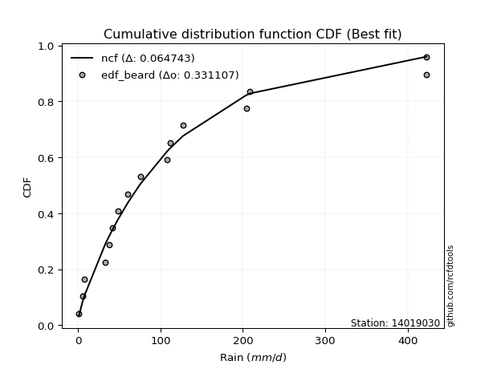</img></img>

</div>


### 5. Empirical - EDF Chegodayev (1955)

The Chegodayev formula is an empirical plotting position formula used in hydrological frequency analysis to estimate the exceedance probability or return period of a specific event from a set of observed data. It is primarily used for plotting observed data points on probability paper to fit a theoretical distribution, particularly for analyzing extreme events like maximum flood flows or rainfall intensities. The constant _b_ value in the generalized plotting position formula is 0.3.

<div align="center">


$P=(m-b)/(n+1-2b)$


</div>


**5.1. Empirical values**

<div align="center">

|                | 0                   | 1                   | 2                   | 3                   | 4                  | 5                   | 6                   | 7              | 8                  | 9                  | 10                 | 11                 | 12                 | 13                 | 14                 |
|:---------------|:--------------------|:--------------------|:--------------------|:--------------------|:-------------------|:--------------------|:--------------------|:---------------|:-------------------|:-------------------|:-------------------|:-------------------|:-------------------|:-------------------|:-------------------|
| date           | 2021                | 2022                | 2019                | 2020                | 2009               | 2023                | 2024                | 2012           | 2010               | 2011               | 2018               | 2014               | 2013               | 2016               | 2017               |
| x              | 1.2                 | 5.2                 | 7.8                 | 33.1                | 41.8               | 48.8                | 60.2                | 75.4           | 108.1              | 111.8              | 127.6              | 204.1              | 208.8              | 422.8              | 423.0              |
| m              | 1                   | 2                   | 3                   | 4                   | 5                  | 6                   | 7                   | 8              | 9                  | 10                 | 11                 | 12                 | 13                 | 14                 | 15                 |
| empirical_dist | edf_chegodayev      | edf_chegodayev      | edf_chegodayev      | edf_chegodayev      | edf_chegodayev     | edf_chegodayev      | edf_chegodayev      | edf_chegodayev | edf_chegodayev     | edf_chegodayev     | edf_chegodayev     | edf_chegodayev     | edf_chegodayev     | edf_chegodayev     | edf_chegodayev     |
| empirical      | 0.04545454545454545 | 0.11038961038961038 | 0.17532467532467533 | 0.24025974025974026 | 0.3051948051948052 | 0.37012987012987014 | 0.43506493506493504 | 0.5            | 0.5649350649350648 | 0.6298701298701298 | 0.6948051948051948 | 0.7597402597402597 | 0.8246753246753246 | 0.8896103896103895 | 0.9545454545454545 |
| empirical_tr   | 1.0476190476190477  | 1.1240875912408759  | 1.2125984251968505  | 1.3162393162393162  | 1.4392523364485983 | 1.5876288659793814  | 1.7701149425287355  | 2.0            | 2.2985074626865667 | 2.701754385964912  | 3.2765957446808507 | 4.162162162162161  | 5.7037037037037    | 9.058823529411757  | 21.999999999999964 |

</div>


**5.2. Kolmogorov-Smirnov fit test (sorted by Δ)**


<div align="center">

|                | 0                   | 1                   | 2                   | 3                   | 4                   | 5                   | 6                   | 7                   | 8                     | 9                   | 10                 | 11                 | 12                  | 13                  | 14                  | 15                  | 16                  | 17                  | 18                  | 19                  | 20                  | 21                  | 22                  | 23                  | 24                 | 25                  | 26                  | 27                  | 28                  | 29                  | 30                  | 31                  | 32                  | 33                  | 34                  | 35                 | 36                 | 37                  | 38                  | 39                 | 40                  | 41                 | 42                  | 43                 | 44                 | 45                  | 46                  | 47                 | 48                  | 49                 | 50                  | 51                  | 52                  | 53                 | 54                 | 55                 | 56                  | 57                  | 58                 | 59                 | 60                  | 61                  | 62                  | 63                  | 64                 | 65                  | 66                  | 67                  | 68                  | 69                  | 70                 | 71                  | 72                  | 73                  | 74                  | 75                 | 76                 | 77                  | 78                  | 79                  | 80                  | 81                 | 82                  | 83                 | 84                 | 85                  | 86                 | 87                 | 88                 | 89                 |
|:---------------|:--------------------|:--------------------|:--------------------|:--------------------|:--------------------|:--------------------|:--------------------|:--------------------|:----------------------|:--------------------|:-------------------|:-------------------|:--------------------|:--------------------|:--------------------|:--------------------|:--------------------|:--------------------|:--------------------|:--------------------|:--------------------|:--------------------|:--------------------|:--------------------|:-------------------|:--------------------|:--------------------|:--------------------|:--------------------|:--------------------|:--------------------|:--------------------|:--------------------|:--------------------|:--------------------|:-------------------|:-------------------|:--------------------|:--------------------|:-------------------|:--------------------|:-------------------|:--------------------|:-------------------|:-------------------|:--------------------|:--------------------|:-------------------|:--------------------|:-------------------|:--------------------|:--------------------|:--------------------|:-------------------|:-------------------|:-------------------|:--------------------|:--------------------|:-------------------|:-------------------|:--------------------|:--------------------|:--------------------|:--------------------|:-------------------|:--------------------|:--------------------|:--------------------|:--------------------|:--------------------|:-------------------|:--------------------|:--------------------|:--------------------|:--------------------|:-------------------|:-------------------|:--------------------|:--------------------|:--------------------|:--------------------|:-------------------|:--------------------|:-------------------|:-------------------|:--------------------|:-------------------|:-------------------|:-------------------|:-------------------|
| station        | 14019030            | 14019030            | 14019030            | 14019030            | 14019030            | 14019030            | 14019030            | 14019030            | 14019030              | 14019030            | 14019030           | 14019030           | 14019030            | 14019030            | 14019030            | 14019030            | 14019030            | 14019030            | 14019030            | 14019030            | 14019030            | 14019030            | 14019030            | 14019030            | 14019030           | 14019030            | 14019030            | 14019030            | 14019030            | 14019030            | 14019030            | 14019030            | 14019030            | 14019030            | 14019030            | 14019030           | 14019030           | 14019030            | 14019030            | 14019030           | 14019030            | 14019030           | 14019030            | 14019030           | 14019030           | 14019030            | 14019030            | 14019030           | 14019030            | 14019030           | 14019030            | 14019030            | 14019030            | 14019030           | 14019030           | 14019030           | 14019030            | 14019030            | 14019030           | 14019030           | 14019030            | 14019030            | 14019030            | 14019030            | 14019030           | 14019030            | 14019030            | 14019030            | 14019030            | 14019030            | 14019030           | 14019030            | 14019030            | 14019030            | 14019030            | 14019030           | 14019030           | 14019030            | 14019030            | 14019030            | 14019030            | 14019030           | 14019030            | 14019030           | 14019030           | 14019030            | 14019030           | 14019030           | 14019030           | 14019030           |
| empirical_dist | edf_chegodayev      | edf_chegodayev      | edf_chegodayev      | edf_chegodayev      | edf_chegodayev      | edf_chegodayev      | edf_chegodayev      | edf_chegodayev      | edf_chegodayev        | edf_chegodayev      | edf_chegodayev     | edf_chegodayev     | edf_chegodayev      | edf_chegodayev      | edf_chegodayev      | edf_chegodayev      | edf_chegodayev      | edf_chegodayev      | edf_chegodayev      | edf_chegodayev      | edf_chegodayev      | edf_chegodayev      | edf_chegodayev      | edf_chegodayev      | edf_chegodayev     | edf_chegodayev      | edf_chegodayev      | edf_chegodayev      | edf_chegodayev      | edf_chegodayev      | edf_chegodayev      | edf_chegodayev      | edf_chegodayev      | edf_chegodayev      | edf_chegodayev      | edf_chegodayev     | edf_chegodayev     | edf_chegodayev      | edf_chegodayev      | edf_chegodayev     | edf_chegodayev      | edf_chegodayev     | edf_chegodayev      | edf_chegodayev     | edf_chegodayev     | edf_chegodayev      | edf_chegodayev      | edf_chegodayev     | edf_chegodayev      | edf_chegodayev     | edf_chegodayev      | edf_chegodayev      | edf_chegodayev      | edf_chegodayev     | edf_chegodayev     | edf_chegodayev     | edf_chegodayev      | edf_chegodayev      | edf_chegodayev     | edf_chegodayev     | edf_chegodayev      | edf_chegodayev      | edf_chegodayev      | edf_chegodayev      | edf_chegodayev     | edf_chegodayev      | edf_chegodayev      | edf_chegodayev      | edf_chegodayev      | edf_chegodayev      | edf_chegodayev     | edf_chegodayev      | edf_chegodayev      | edf_chegodayev      | edf_chegodayev      | edf_chegodayev     | edf_chegodayev     | edf_chegodayev      | edf_chegodayev      | edf_chegodayev      | edf_chegodayev      | edf_chegodayev     | edf_chegodayev      | edf_chegodayev     | edf_chegodayev     | edf_chegodayev      | edf_chegodayev     | edf_chegodayev     | edf_chegodayev     | edf_chegodayev     |
| p_dist         | loggenlogistic      | loggumbel_l         | logloggamma         | logjohnsonsu        | ncf                 | logweibull_min      | loggompertz         | logpearson3         | loglaplace_asymmetric | chi2                | johnsonsu          | moyal              | nct                 | invgauss            | invweibull          | f                   | invgamma            | logfisk             | halflogistic        | logt                | weibull_min         | pearson3            | genlogistic         | fatiguelife         | logmielke          | loglogistic         | mielke              | pareto              | gumbel_r            | exponnorm           | genexpon            | expon               | laplace_asymmetric  | loghypsecant        | lognakagami         | logexponnorm       | logrice            | lognorm             | lognorm             | logcrystalball     | loglognorm          | nakagami           | logf                | lognct             | logfatiguelife     | logbetaprime        | gompertz            | truncnorm          | kstwobign           | halfnorm           | logerlang           | betaprime           | logchi2             | rayleigh           | loggamma           | loggamma           | erlang              | logalpha            | loginvgamma        | t                  | maxwell             | loglaplace          | logmaxwell          | loginvgauss         | gamma              | wald                | lograyleigh         | fisk                | rice                | loggumbel_r         | hypsecant          | logistic            | norm                | loginvweibull       | logncf              | laplace            | loghalfnorm        | logmoyal            | gibrat              | loghalflogistic     | logkstwobign        | alpha              | gumbel_l            | loggenexpon        | logwald            | loggibrat           | logtruncnorm       | logexpon           | crystalball        | logpareto          |
| delta          | 0.06150176753280895 | 0.06735900052580482 | 0.06974320490478558 | 0.07138376176813754 | 0.07403623006441862 | 0.07602375588214463 | 0.07849649310641206 | 0.07858297260410033 | 0.08117069764079321   | 0.08656396198174185 | 0.0915512889131107 | 0.091576705770128  | 0.09211697006043267 | 0.09241997216616105 | 0.09412291328112977 | 0.09509162357454864 | 0.09509173917075708 | 0.09516328227142506 | 0.09799372572957715 | 0.10300456581784476 | 0.10534237916949929 | 0.10624909866027599 | 0.10871120179707672 | 0.10993662948031227 | 0.1100239288518412 | 0.11344908653687757 | 0.11539399399057637 | 0.11636877213106023 | 0.11736399914871687 | 0.12203793142549102 | 0.12353655825613974 | 0.12353664631432967 | 0.12354797505060056 | 0.12781834731092734 | 0.12919378308279275 | 0.129447126926279  | 0.1294474437888132 | 0.12944930916565386 | 0.12944930916565386 | 0.1294493098017556 | 0.12945191519064006 | 0.1296966911668339 | 0.12973650556465718 | 0.1297661617446447 | 0.1308811148294339 | 0.13149157296247674 | 0.13253973004214273 | 0.1328676938156376 | 0.13821667523418152 | 0.1382422596436389 | 0.14133823615660315 | 0.14191968025403992 | 0.14404553931421624 | 0.1442888248409484 | 0.1450568737931421 | 0.1450568737931421 | 0.14564974837886993 | 0.15078499812101356 | 0.1520507133746962 | 0.1530783932837467 | 0.15514753346654542 | 0.15565589942351954 | 0.16243290698394244 | 0.16390888847379995 | 0.1647368589626088 | 0.16815675700365854 | 0.17466766371744583 | 0.17731498753272715 | 0.18503272438407947 | 0.18515572043608675 | 0.1861631568840404 | 0.18696741240947934 | 0.18790934234301493 | 0.19430854806430123 | 0.19734642652625603 | 0.2067595719606664 | 0.2094864496094044 | 0.20962044064139468 | 0.21471674623950426 | 0.22077695520561832 | 0.23241472738496624 | 0.2515977564029241 | 0.25804698048697394 | 0.2732861386243336 | 0.2771122657756641 | 0.28214062162748804 | 0.3270234780887604 | 0.3376145146436057 | 0.4516425885730431 | 0.5225107109321196 |
| deltao         | 0.3366456264050002  | 0.3366456264050002  | 0.3366456264050002  | 0.3366456264050002  | 0.3366456264050002  | 0.3366456264050002  | 0.3366456264050002  | 0.3366456264050002  | 0.3366456264050002    | 0.3366456264050002  | 0.3366456264050002 | 0.3366456264050002 | 0.3366456264050002  | 0.3366456264050002  | 0.3366456264050002  | 0.3366456264050002  | 0.3366456264050002  | 0.3366456264050002  | 0.3366456264050002  | 0.3366456264050002  | 0.3366456264050002  | 0.3366456264050002  | 0.3366456264050002  | 0.3366456264050002  | 0.3366456264050002 | 0.3366456264050002  | 0.3366456264050002  | 0.3366456264050002  | 0.3366456264050002  | 0.3366456264050002  | 0.3366456264050002  | 0.3366456264050002  | 0.3366456264050002  | 0.3366456264050002  | 0.3366456264050002  | 0.3366456264050002 | 0.3366456264050002 | 0.3366456264050002  | 0.3366456264050002  | 0.3366456264050002 | 0.3366456264050002  | 0.3366456264050002 | 0.3366456264050002  | 0.3366456264050002 | 0.3366456264050002 | 0.3366456264050002  | 0.3366456264050002  | 0.3366456264050002 | 0.3366456264050002  | 0.3366456264050002 | 0.3366456264050002  | 0.3366456264050002  | 0.3366456264050002  | 0.3366456264050002 | 0.3366456264050002 | 0.3366456264050002 | 0.3366456264050002  | 0.3366456264050002  | 0.3366456264050002 | 0.3366456264050002 | 0.3366456264050002  | 0.3366456264050002  | 0.3366456264050002  | 0.3366456264050002  | 0.3366456264050002 | 0.3366456264050002  | 0.3366456264050002  | 0.3366456264050002  | 0.3366456264050002  | 0.3366456264050002  | 0.3366456264050002 | 0.3366456264050002  | 0.3366456264050002  | 0.3366456264050002  | 0.3366456264050002  | 0.3366456264050002 | 0.3366456264050002 | 0.3366456264050002  | 0.3366456264050002  | 0.3366456264050002  | 0.3366456264050002  | 0.3366456264050002 | 0.3366456264050002  | 0.3366456264050002 | 0.3366456264050002 | 0.3366456264050002  | 0.3366456264050002 | 0.3366456264050002 | 0.3366456264050002 | 0.3366456264050002 |
| eval           | Δo > Δ              | Δo > Δ              | Δo > Δ              | Δo > Δ              | Δo > Δ              | Δo > Δ              | Δo > Δ              | Δo > Δ              | Δo > Δ                | Δo > Δ              | Δo > Δ             | Δo > Δ             | Δo > Δ              | Δo > Δ              | Δo > Δ              | Δo > Δ              | Δo > Δ              | Δo > Δ              | Δo > Δ              | Δo > Δ              | Δo > Δ              | Δo > Δ              | Δo > Δ              | Δo > Δ              | Δo > Δ             | Δo > Δ              | Δo > Δ              | Δo > Δ              | Δo > Δ              | Δo > Δ              | Δo > Δ              | Δo > Δ              | Δo > Δ              | Δo > Δ              | Δo > Δ              | Δo > Δ             | Δo > Δ             | Δo > Δ              | Δo > Δ              | Δo > Δ             | Δo > Δ              | Δo > Δ             | Δo > Δ              | Δo > Δ             | Δo > Δ             | Δo > Δ              | Δo > Δ              | Δo > Δ             | Δo > Δ              | Δo > Δ             | Δo > Δ              | Δo > Δ              | Δo > Δ              | Δo > Δ             | Δo > Δ             | Δo > Δ             | Δo > Δ              | Δo > Δ              | Δo > Δ             | Δo > Δ             | Δo > Δ              | Δo > Δ              | Δo > Δ              | Δo > Δ              | Δo > Δ             | Δo > Δ              | Δo > Δ              | Δo > Δ              | Δo > Δ              | Δo > Δ              | Δo > Δ             | Δo > Δ              | Δo > Δ              | Δo > Δ              | Δo > Δ              | Δo > Δ             | Δo > Δ             | Δo > Δ              | Δo > Δ              | Δo > Δ              | Δo > Δ              | Δo > Δ             | Δo > Δ              | Δo > Δ             | Δo > Δ             | Δo > Δ              | Δo > Δ             | Δo <= Δ            | Δo <= Δ            | Δo <= Δ            |
| fit            | 1                   | 1                   | 1                   | 1                   | 1                   | 1                   | 1                   | 1                   | 1                     | 1                   | 1                  | 1                  | 1                   | 1                   | 1                   | 1                   | 1                   | 1                   | 1                   | 1                   | 1                   | 1                   | 1                   | 1                   | 1                  | 1                   | 1                   | 1                   | 1                   | 1                   | 1                   | 1                   | 1                   | 1                   | 1                   | 1                  | 1                  | 1                   | 1                   | 1                  | 1                   | 1                  | 1                   | 1                  | 1                  | 1                   | 1                   | 1                  | 1                   | 1                  | 1                   | 1                   | 1                   | 1                  | 1                  | 1                  | 1                   | 1                   | 1                  | 1                  | 1                   | 1                   | 1                   | 1                   | 1                  | 1                   | 1                   | 1                   | 1                   | 1                   | 1                  | 1                   | 1                   | 1                   | 1                   | 1                  | 1                  | 1                   | 1                   | 1                   | 1                   | 1                  | 1                   | 1                  | 1                  | 1                   | 1                  | 0                  | 0                  | 0                  |
| n              | 15                  | 15                  | 15                  | 15                  | 15                  | 15                  | 15                  | 15                  | 15                    | 15                  | 15                 | 15                 | 15                  | 15                  | 15                  | 15                  | 15                  | 15                  | 15                  | 15                  | 15                  | 15                  | 15                  | 15                  | 15                 | 15                  | 15                  | 15                  | 15                  | 15                  | 15                  | 15                  | 15                  | 15                  | 15                  | 15                 | 15                 | 15                  | 15                  | 15                 | 15                  | 15                 | 15                  | 15                 | 15                 | 15                  | 15                  | 15                 | 15                  | 15                 | 15                  | 15                  | 15                  | 15                 | 15                 | 15                 | 15                  | 15                  | 15                 | 15                 | 15                  | 15                  | 15                  | 15                  | 15                 | 15                  | 15                  | 15                  | 15                  | 15                  | 15                 | 15                  | 15                  | 15                  | 15                  | 15                 | 15                 | 15                  | 15                  | 15                  | 15                  | 15                 | 15                  | 15                 | 15                 | 15                  | 15                 | 15                 | 15                 | 15                 |
| best_fit       | 1                   | 0                   | 0                   | 0                   | 0                   | 0                   | 0                   | 0                   | 0                     | 0                   | 0                  | 0                  | 0                   | 0                   | 0                   | 0                   | 0                   | 0                   | 0                   | 0                   | 0                   | 0                   | 0                   | 0                   | 0                  | 0                   | 0                   | 0                   | 0                   | 0                   | 0                   | 0                   | 0                   | 0                   | 0                   | 0                  | 0                  | 0                   | 0                   | 0                  | 0                   | 0                  | 0                   | 0                  | 0                  | 0                   | 0                   | 0                  | 0                   | 0                  | 0                   | 0                   | 0                   | 0                  | 0                  | 0                  | 0                   | 0                   | 0                  | 0                  | 0                   | 0                   | 0                   | 0                   | 0                  | 0                   | 0                   | 0                   | 0                   | 0                   | 0                  | 0                   | 0                   | 0                   | 0                   | 0                  | 0                  | 0                   | 0                   | 0                   | 0                   | 0                  | 0                   | 0                  | 0                  | 0                   | 0                  | 0                  | 0                  | 0                  |
| best_fit_sort  | 1                   | 2                   | 3                   | 4                   | 5                   | 6                   | 7                   | 8                   | 9                     | 10                  | 11                 | 12                 | 13                  | 14                  | 15                  | 16                  | 17                  | 18                  | 19                  | 20                  | 21                  | 22                  | 23                  | 24                  | 25                 | 26                  | 27                  | 28                  | 29                  | 30                  | 31                  | 32                  | 33                  | 34                  | 35                  | 36                 | 37                 | 38                  | 39                  | 40                 | 41                  | 42                 | 43                  | 44                 | 45                 | 46                  | 47                  | 48                 | 49                  | 50                 | 51                  | 52                  | 53                  | 54                 | 55                 | 56                 | 57                  | 58                  | 59                 | 60                 | 61                  | 62                  | 63                  | 64                  | 65                 | 66                  | 67                  | 68                  | 69                  | 70                  | 71                 | 72                  | 73                  | 74                  | 75                  | 76                 | 77                 | 78                  | 79                  | 80                  | 81                  | 82                 | 83                  | 84                 | 85                 | 86                  | 87                 | 88                 | 89                 | 90                 |

</div>


<div align="center">

</img>

</div>


**5.3. Best fit**

<div align="center">

|   id |   station | empirical_dist   | p_dist         |     delta |   deltao | eval   |   fit |   n |   best_fit |   best_fit_sort |
|-----:|----------:|:-----------------|:---------------|----------:|---------:|:-------|------:|----:|-----------:|----------------:|
|    0 |  14019030 | edf_chegodayev   | loggenlogistic | 0.0615018 | 0.336646 | Δo > Δ |     1 |  15 |          1 |               1 |

</div>


<div align="center">

</img>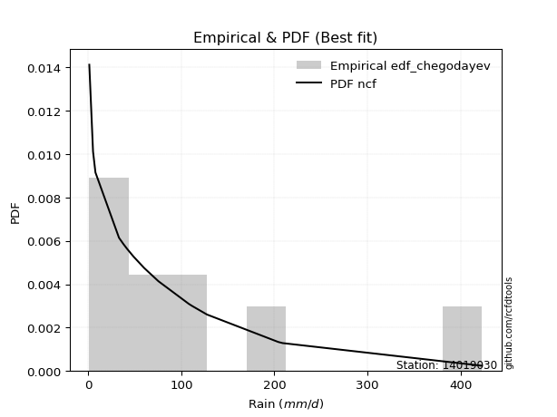</img>

</div>


### 6. Empirical - EDF Blom (1958)

The Blom formula is a specific "plotting position" formula used in hydrology and statistical analysis to estimate the empirical cumulative probability (or non-exceedance probability) of a data series. It is particularly recommended for data that are approximately normally distributed. The constant _a_ is set to 0.375 (or 3/8).

<div align="center">


$P=(m-a)/(n+1-2a)$


</div>


**6.1. Empirical values**

<div align="center">

|                | 0                    | 1                   | 2                  | 3                   | 4                   | 5                   | 6                  | 7        | 8                  | 9                  | 10                 | 11                 | 12                 | 13                 | 14                 |
|:---------------|:---------------------|:--------------------|:-------------------|:--------------------|:--------------------|:--------------------|:-------------------|:---------|:-------------------|:-------------------|:-------------------|:-------------------|:-------------------|:-------------------|:-------------------|
| date           | 2021                 | 2022                | 2019               | 2020                | 2009                | 2023                | 2024               | 2012     | 2010               | 2011               | 2018               | 2014               | 2013               | 2016               | 2017               |
| x              | 1.2                  | 5.2                 | 7.8                | 33.1                | 41.8                | 48.8                | 60.2               | 75.4     | 108.1              | 111.8              | 127.6              | 204.1              | 208.8              | 422.8              | 423.0              |
| m              | 1                    | 2                   | 3                  | 4                   | 5                   | 6                   | 7                  | 8        | 9                  | 10                 | 11                 | 12                 | 13                 | 14                 | 15                 |
| empirical_dist | edf_blom             | edf_blom            | edf_blom           | edf_blom            | edf_blom            | edf_blom            | edf_blom           | edf_blom | edf_blom           | edf_blom           | edf_blom           | edf_blom           | edf_blom           | edf_blom           | edf_blom           |
| empirical      | 0.040983606557377046 | 0.10655737704918032 | 0.1721311475409836 | 0.23770491803278687 | 0.30327868852459017 | 0.36885245901639346 | 0.4344262295081967 | 0.5      | 0.5655737704918032 | 0.6311475409836066 | 0.6967213114754098 | 0.7622950819672131 | 0.8278688524590164 | 0.8934426229508197 | 0.9590163934426229 |
| empirical_tr   | 1.0427350427350428   | 1.1192660550458715  | 1.2079207920792079 | 1.3118279569892473  | 1.4352941176470588  | 1.5844155844155845  | 1.7681159420289854 | 2.0      | 2.30188679245283   | 2.7111111111111112 | 3.2972972972972974 | 4.206896551724137  | 5.80952380952381   | 9.384615384615383  | 24.399999999999974 |

</div>


**6.2. Kolmogorov-Smirnov fit test (sorted by Δ)**


<div align="center">

|                | 0                    | 1                   | 2                  | 3                   | 4                   | 5                   | 6                   | 7                     | 8                   | 9                   | 10                  | 11                  | 12                  | 13                  | 14                  | 15                  | 16                  | 17                  | 18                  | 19                  | 20                  | 21                  | 22                  | 23                  | 24                  | 25                 | 26                  | 27                  | 28                 | 29                  | 30                  | 31                  | 32                  | 33                  | 34                 | 35                  | 36                  | 37                  | 38                  | 39                 | 40                  | 41                  | 42                  | 43                  | 44                  | 45                  | 46                 | 47                  | 48                  | 49                 | 50                  | 51                 | 52                  | 53                  | 54                 | 55                 | 56                  | 57                  | 58                  | 59                  | 60                 | 61                 | 62                  | 63                 | 64                  | 65                  | 66                 | 67                  | 68                  | 69                  | 70                  | 71                 | 72                 | 73                 | 74                  | 75                 | 76                 | 77                 | 78                  | 79                 | 80                  | 81                 | 82                 | 83                 | 84                  | 85                  | 86                  | 87                 | 88                  | 89                 |
|:---------------|:---------------------|:--------------------|:-------------------|:--------------------|:--------------------|:--------------------|:--------------------|:----------------------|:--------------------|:--------------------|:--------------------|:--------------------|:--------------------|:--------------------|:--------------------|:--------------------|:--------------------|:--------------------|:--------------------|:--------------------|:--------------------|:--------------------|:--------------------|:--------------------|:--------------------|:-------------------|:--------------------|:--------------------|:-------------------|:--------------------|:--------------------|:--------------------|:--------------------|:--------------------|:-------------------|:--------------------|:--------------------|:--------------------|:--------------------|:-------------------|:--------------------|:--------------------|:--------------------|:--------------------|:--------------------|:--------------------|:-------------------|:--------------------|:--------------------|:-------------------|:--------------------|:-------------------|:--------------------|:--------------------|:-------------------|:-------------------|:--------------------|:--------------------|:--------------------|:--------------------|:-------------------|:-------------------|:--------------------|:-------------------|:--------------------|:--------------------|:-------------------|:--------------------|:--------------------|:--------------------|:--------------------|:-------------------|:-------------------|:-------------------|:--------------------|:-------------------|:-------------------|:-------------------|:--------------------|:-------------------|:--------------------|:-------------------|:-------------------|:-------------------|:--------------------|:--------------------|:--------------------|:-------------------|:--------------------|:-------------------|
| station        | 14019030             | 14019030            | 14019030           | 14019030            | 14019030            | 14019030            | 14019030            | 14019030              | 14019030            | 14019030            | 14019030            | 14019030            | 14019030            | 14019030            | 14019030            | 14019030            | 14019030            | 14019030            | 14019030            | 14019030            | 14019030            | 14019030            | 14019030            | 14019030            | 14019030            | 14019030           | 14019030            | 14019030            | 14019030           | 14019030            | 14019030            | 14019030            | 14019030            | 14019030            | 14019030           | 14019030            | 14019030            | 14019030            | 14019030            | 14019030           | 14019030            | 14019030            | 14019030            | 14019030            | 14019030            | 14019030            | 14019030           | 14019030            | 14019030            | 14019030           | 14019030            | 14019030           | 14019030            | 14019030            | 14019030           | 14019030           | 14019030            | 14019030            | 14019030            | 14019030            | 14019030           | 14019030           | 14019030            | 14019030           | 14019030            | 14019030            | 14019030           | 14019030            | 14019030            | 14019030            | 14019030            | 14019030           | 14019030           | 14019030           | 14019030            | 14019030           | 14019030           | 14019030           | 14019030            | 14019030           | 14019030            | 14019030           | 14019030           | 14019030           | 14019030            | 14019030            | 14019030            | 14019030           | 14019030            | 14019030           |
| empirical_dist | edf_blom             | edf_blom            | edf_blom           | edf_blom            | edf_blom            | edf_blom            | edf_blom            | edf_blom              | edf_blom            | edf_blom            | edf_blom            | edf_blom            | edf_blom            | edf_blom            | edf_blom            | edf_blom            | edf_blom            | edf_blom            | edf_blom            | edf_blom            | edf_blom            | edf_blom            | edf_blom            | edf_blom            | edf_blom            | edf_blom           | edf_blom            | edf_blom            | edf_blom           | edf_blom            | edf_blom            | edf_blom            | edf_blom            | edf_blom            | edf_blom           | edf_blom            | edf_blom            | edf_blom            | edf_blom            | edf_blom           | edf_blom            | edf_blom            | edf_blom            | edf_blom            | edf_blom            | edf_blom            | edf_blom           | edf_blom            | edf_blom            | edf_blom           | edf_blom            | edf_blom           | edf_blom            | edf_blom            | edf_blom           | edf_blom           | edf_blom            | edf_blom            | edf_blom            | edf_blom            | edf_blom           | edf_blom           | edf_blom            | edf_blom           | edf_blom            | edf_blom            | edf_blom           | edf_blom            | edf_blom            | edf_blom            | edf_blom            | edf_blom           | edf_blom           | edf_blom           | edf_blom            | edf_blom           | edf_blom           | edf_blom           | edf_blom            | edf_blom           | edf_blom            | edf_blom           | edf_blom           | edf_blom           | edf_blom            | edf_blom            | edf_blom            | edf_blom           | edf_blom            | edf_blom           |
| p_dist         | loggenlogistic       | logloggamma         | logjohnsonsu       | loggumbel_l         | logweibull_min      | loggompertz         | ncf                 | loglaplace_asymmetric | logpearson3         | johnsonsu           | nct                 | chi2                | invgauss            | invweibull          | f                   | invgamma            | logfisk             | moyal               | logt                | halflogistic        | logmielke           | weibull_min         | genlogistic         | pearson3            | fatiguelife         | pareto             | loglogistic         | mielke              | exponnorm          | gumbel_r            | genexpon            | expon               | laplace_asymmetric  | loghypsecant        | gompertz           | truncnorm           | nakagami            | lognakagami         | logexponnorm        | logrice            | lognorm             | lognorm             | logcrystalball      | loglognorm          | logf                | lognct              | logfatiguelife     | logbetaprime        | kstwobign           | halfnorm           | logerlang           | betaprime          | rayleigh            | logchi2             | loggamma           | loggamma           | erlang              | logalpha            | loginvgamma         | loglaplace          | maxwell            | t                  | gamma               | wald               | logmaxwell          | loginvgauss         | lograyleigh        | fisk                | rice                | loggumbel_r         | hypsecant           | logistic           | norm               | loginvweibull      | logncf              | laplace            | logmoyal           | loghalfnorm        | gibrat              | loghalflogistic    | logkstwobign        | alpha              | gumbel_l           | loggenexpon        | logwald             | loggibrat           | logtruncnorm        | logexpon           | crystalball         | logpareto          |
| delta          | 0.058308239749117224 | 0.06591097156435544 | 0.0675515284277074 | 0.06912222843003762 | 0.07283022809845291 | 0.07530296532272034 | 0.07595234673463369 | 0.07861587541383985   | 0.08113779483105371 | 0.08835776112941898 | 0.08892344227674094 | 0.08911878420869523 | 0.08922644438246932 | 0.09092938549743805 | 0.09189809579085692 | 0.09189821138706536 | 0.09196975448773334 | 0.09349282244034307 | 0.09981103803415303 | 0.10246466462674556 | 0.10619169551141106 | 0.10725849583971436 | 0.10807249624033838 | 0.11072003755744439 | 0.11249145170726566 | 0.1131752443473685 | 0.11588112002747702 | 0.11731011066079144 | 0.1188444036417993 | 0.11928011581893194 | 0.12034303047244801 | 0.12034311853063795 | 0.12035444726690883 | 0.12717964175418894 | 0.1295375461160686 | 0.12967416603194587 | 0.13161280783704898 | 0.13174860530974614 | 0.13200194915323238 | 0.1320022660157666 | 0.13200413139260725 | 0.13200413139260725 | 0.13200413202870898 | 0.13200673741759344 | 0.13229132779161057 | 0.13232098397159808 | 0.1334359370563873 | 0.13404639518943012 | 0.13821667523418152 | 0.1427131985408073 | 0.14389305838355654 | 0.1444745024809933 | 0.14620494151116348 | 0.14660036154116962 | 0.1476116960200955 | 0.1476116960200955 | 0.14820457060582332 | 0.15333982034796695 | 0.15460553560164958 | 0.15501719386678114 | 0.1570636501367605 | 0.1575493321809151 | 0.16434140834327193 | 0.1649632292199668 | 0.16498772921089583 | 0.16646371070075333 | 0.1772224859443992 | 0.17986980975968053 | 0.18694884105429455 | 0.18707183710630176 | 0.18807927355425547 | 0.1888835290796944 | 0.18982545901323   | 0.1968633702912546 | 0.19990124875320942 | 0.2067595719606664 | 0.2115365573116097 | 0.2120412718363578 | 0.21216192401255088 | 0.2233317774325717 | 0.23496954961191963 | 0.2535138730731391 | 0.259963097157189  | 0.275840960851287  | 0.27902838244587913 | 0.28405673829770306 | 0.32957830031571383 | 0.3401693368705591 | 0.45611352747021155 | 0.5263429442725497 |
| deltao         | 0.3366456264050002   | 0.3366456264050002  | 0.3366456264050002 | 0.3366456264050002  | 0.3366456264050002  | 0.3366456264050002  | 0.3366456264050002  | 0.3366456264050002    | 0.3366456264050002  | 0.3366456264050002  | 0.3366456264050002  | 0.3366456264050002  | 0.3366456264050002  | 0.3366456264050002  | 0.3366456264050002  | 0.3366456264050002  | 0.3366456264050002  | 0.3366456264050002  | 0.3366456264050002  | 0.3366456264050002  | 0.3366456264050002  | 0.3366456264050002  | 0.3366456264050002  | 0.3366456264050002  | 0.3366456264050002  | 0.3366456264050002 | 0.3366456264050002  | 0.3366456264050002  | 0.3366456264050002 | 0.3366456264050002  | 0.3366456264050002  | 0.3366456264050002  | 0.3366456264050002  | 0.3366456264050002  | 0.3366456264050002 | 0.3366456264050002  | 0.3366456264050002  | 0.3366456264050002  | 0.3366456264050002  | 0.3366456264050002 | 0.3366456264050002  | 0.3366456264050002  | 0.3366456264050002  | 0.3366456264050002  | 0.3366456264050002  | 0.3366456264050002  | 0.3366456264050002 | 0.3366456264050002  | 0.3366456264050002  | 0.3366456264050002 | 0.3366456264050002  | 0.3366456264050002 | 0.3366456264050002  | 0.3366456264050002  | 0.3366456264050002 | 0.3366456264050002 | 0.3366456264050002  | 0.3366456264050002  | 0.3366456264050002  | 0.3366456264050002  | 0.3366456264050002 | 0.3366456264050002 | 0.3366456264050002  | 0.3366456264050002 | 0.3366456264050002  | 0.3366456264050002  | 0.3366456264050002 | 0.3366456264050002  | 0.3366456264050002  | 0.3366456264050002  | 0.3366456264050002  | 0.3366456264050002 | 0.3366456264050002 | 0.3366456264050002 | 0.3366456264050002  | 0.3366456264050002 | 0.3366456264050002 | 0.3366456264050002 | 0.3366456264050002  | 0.3366456264050002 | 0.3366456264050002  | 0.3366456264050002 | 0.3366456264050002 | 0.3366456264050002 | 0.3366456264050002  | 0.3366456264050002  | 0.3366456264050002  | 0.3366456264050002 | 0.3366456264050002  | 0.3366456264050002 |
| eval           | Δo > Δ               | Δo > Δ              | Δo > Δ             | Δo > Δ              | Δo > Δ              | Δo > Δ              | Δo > Δ              | Δo > Δ                | Δo > Δ              | Δo > Δ              | Δo > Δ              | Δo > Δ              | Δo > Δ              | Δo > Δ              | Δo > Δ              | Δo > Δ              | Δo > Δ              | Δo > Δ              | Δo > Δ              | Δo > Δ              | Δo > Δ              | Δo > Δ              | Δo > Δ              | Δo > Δ              | Δo > Δ              | Δo > Δ             | Δo > Δ              | Δo > Δ              | Δo > Δ             | Δo > Δ              | Δo > Δ              | Δo > Δ              | Δo > Δ              | Δo > Δ              | Δo > Δ             | Δo > Δ              | Δo > Δ              | Δo > Δ              | Δo > Δ              | Δo > Δ             | Δo > Δ              | Δo > Δ              | Δo > Δ              | Δo > Δ              | Δo > Δ              | Δo > Δ              | Δo > Δ             | Δo > Δ              | Δo > Δ              | Δo > Δ             | Δo > Δ              | Δo > Δ             | Δo > Δ              | Δo > Δ              | Δo > Δ             | Δo > Δ             | Δo > Δ              | Δo > Δ              | Δo > Δ              | Δo > Δ              | Δo > Δ             | Δo > Δ             | Δo > Δ              | Δo > Δ             | Δo > Δ              | Δo > Δ              | Δo > Δ             | Δo > Δ              | Δo > Δ              | Δo > Δ              | Δo > Δ              | Δo > Δ             | Δo > Δ             | Δo > Δ             | Δo > Δ              | Δo > Δ             | Δo > Δ             | Δo > Δ             | Δo > Δ              | Δo > Δ             | Δo > Δ              | Δo > Δ             | Δo > Δ             | Δo > Δ             | Δo > Δ              | Δo > Δ              | Δo > Δ              | Δo <= Δ            | Δo <= Δ             | Δo <= Δ            |
| fit            | 1                    | 1                   | 1                  | 1                   | 1                   | 1                   | 1                   | 1                     | 1                   | 1                   | 1                   | 1                   | 1                   | 1                   | 1                   | 1                   | 1                   | 1                   | 1                   | 1                   | 1                   | 1                   | 1                   | 1                   | 1                   | 1                  | 1                   | 1                   | 1                  | 1                   | 1                   | 1                   | 1                   | 1                   | 1                  | 1                   | 1                   | 1                   | 1                   | 1                  | 1                   | 1                   | 1                   | 1                   | 1                   | 1                   | 1                  | 1                   | 1                   | 1                  | 1                   | 1                  | 1                   | 1                   | 1                  | 1                  | 1                   | 1                   | 1                   | 1                   | 1                  | 1                  | 1                   | 1                  | 1                   | 1                   | 1                  | 1                   | 1                   | 1                   | 1                   | 1                  | 1                  | 1                  | 1                   | 1                  | 1                  | 1                  | 1                   | 1                  | 1                   | 1                  | 1                  | 1                  | 1                   | 1                   | 1                   | 0                  | 0                   | 0                  |
| n              | 15                   | 15                  | 15                 | 15                  | 15                  | 15                  | 15                  | 15                    | 15                  | 15                  | 15                  | 15                  | 15                  | 15                  | 15                  | 15                  | 15                  | 15                  | 15                  | 15                  | 15                  | 15                  | 15                  | 15                  | 15                  | 15                 | 15                  | 15                  | 15                 | 15                  | 15                  | 15                  | 15                  | 15                  | 15                 | 15                  | 15                  | 15                  | 15                  | 15                 | 15                  | 15                  | 15                  | 15                  | 15                  | 15                  | 15                 | 15                  | 15                  | 15                 | 15                  | 15                 | 15                  | 15                  | 15                 | 15                 | 15                  | 15                  | 15                  | 15                  | 15                 | 15                 | 15                  | 15                 | 15                  | 15                  | 15                 | 15                  | 15                  | 15                  | 15                  | 15                 | 15                 | 15                 | 15                  | 15                 | 15                 | 15                 | 15                  | 15                 | 15                  | 15                 | 15                 | 15                 | 15                  | 15                  | 15                  | 15                 | 15                  | 15                 |
| best_fit       | 1                    | 0                   | 0                  | 0                   | 0                   | 0                   | 0                   | 0                     | 0                   | 0                   | 0                   | 0                   | 0                   | 0                   | 0                   | 0                   | 0                   | 0                   | 0                   | 0                   | 0                   | 0                   | 0                   | 0                   | 0                   | 0                  | 0                   | 0                   | 0                  | 0                   | 0                   | 0                   | 0                   | 0                   | 0                  | 0                   | 0                   | 0                   | 0                   | 0                  | 0                   | 0                   | 0                   | 0                   | 0                   | 0                   | 0                  | 0                   | 0                   | 0                  | 0                   | 0                  | 0                   | 0                   | 0                  | 0                  | 0                   | 0                   | 0                   | 0                   | 0                  | 0                  | 0                   | 0                  | 0                   | 0                   | 0                  | 0                   | 0                   | 0                   | 0                   | 0                  | 0                  | 0                  | 0                   | 0                  | 0                  | 0                  | 0                   | 0                  | 0                   | 0                  | 0                  | 0                  | 0                   | 0                   | 0                   | 0                  | 0                   | 0                  |
| best_fit_sort  | 1                    | 2                   | 3                  | 4                   | 5                   | 6                   | 7                   | 8                     | 9                   | 10                  | 11                  | 12                  | 13                  | 14                  | 15                  | 16                  | 17                  | 18                  | 19                  | 20                  | 21                  | 22                  | 23                  | 24                  | 25                  | 26                 | 27                  | 28                  | 29                 | 30                  | 31                  | 32                  | 33                  | 34                  | 35                 | 36                  | 37                  | 38                  | 39                  | 40                 | 41                  | 42                  | 43                  | 44                  | 45                  | 46                  | 47                 | 48                  | 49                  | 50                 | 51                  | 52                 | 53                  | 54                  | 55                 | 56                 | 57                  | 58                  | 59                  | 60                  | 61                 | 62                 | 63                  | 64                 | 65                  | 66                  | 67                 | 68                  | 69                  | 70                  | 71                  | 72                 | 73                 | 74                 | 75                  | 76                 | 77                 | 78                 | 79                  | 80                 | 81                  | 82                 | 83                 | 84                 | 85                  | 86                  | 87                  | 88                 | 89                  | 90                 |

</div>


<div align="center">

</img>

</div>


**6.3. Best fit**

<div align="center">

|   id |   station | empirical_dist   | p_dist         |     delta |   deltao | eval   |   fit |   n |   best_fit |   best_fit_sort |
|-----:|----------:|:-----------------|:---------------|----------:|---------:|:-------|------:|----:|-----------:|----------------:|
|    0 |  14019030 | edf_blom         | loggenlogistic | 0.0583082 | 0.336646 | Δo > Δ |     1 |  15 |          1 |               1 |

</div>


<div align="center">

</img>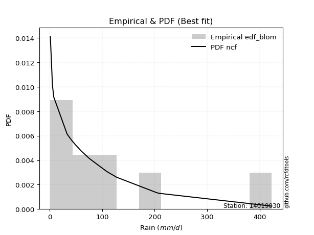</img>

</div>


### 7. Empirical - EDF Tukey (1962)

In hydrology, the Tukey formula is used as a plotting position formula to estimate the empirical probability or frequency of a flood event (or other hydrological data). The formula parameter is given as _c=0.333_ (or 1/3).

<div align="center">


$P=(m-c)/(n+1-2c)$


</div>


**7.1. Empirical values**

<div align="center">

|                | 0                    | 1                   | 2                   | 3                  | 4                   | 5                  | 6                   | 7         | 8                  | 9                  | 10                 | 11                 | 12                 | 13                 | 14                 |
|:---------------|:---------------------|:--------------------|:--------------------|:-------------------|:--------------------|:-------------------|:--------------------|:----------|:-------------------|:-------------------|:-------------------|:-------------------|:-------------------|:-------------------|:-------------------|
| date           | 2021                 | 2022                | 2019                | 2020               | 2009                | 2023               | 2024                | 2012      | 2010               | 2011               | 2018               | 2014               | 2013               | 2016               | 2017               |
| x              | 1.2                  | 5.2                 | 7.8                 | 33.1               | 41.8                | 48.8               | 60.2                | 75.4      | 108.1              | 111.8              | 127.6              | 204.1              | 208.8              | 422.8              | 423.0              |
| m              | 1                    | 2                   | 3                   | 4                  | 5                   | 6                  | 7                   | 8         | 9                  | 10                 | 11                 | 12                 | 13                 | 14                 | 15                 |
| empirical_dist | edf_tukey            | edf_tukey           | edf_tukey           | edf_tukey          | edf_tukey           | edf_tukey          | edf_tukey           | edf_tukey | edf_tukey          | edf_tukey          | edf_tukey          | edf_tukey          | edf_tukey          | edf_tukey          | edf_tukey          |
| empirical      | 0.043478260869565216 | 0.10869565217391304 | 0.17391304347826086 | 0.2391304347826087 | 0.30434782608695654 | 0.3695652173913043 | 0.43478260869565216 | 0.5       | 0.5652173913043478 | 0.6304347826086957 | 0.6956521739130435 | 0.7608695652173914 | 0.8260869565217391 | 0.8913043478260869 | 0.9565217391304348 |
| empirical_tr   | 1.0454545454545454   | 1.1219512195121952  | 1.2105263157894737  | 1.3142857142857143 | 1.4375              | 1.586206896551724  | 1.769230769230769   | 2.0       | 2.3                | 2.7058823529411766 | 3.2857142857142856 | 4.1818181818181825 | 5.75               | 9.199999999999998  | 23.000000000000014 |

</div>


**7.2. Kolmogorov-Smirnov fit test (sorted by Δ)**


<div align="center">

|                | 0                    | 1                  | 2                   | 3                   | 4                   | 5                   | 6                  | 7                   | 8                     | 9                  | 10                  | 11                 | 12                  | 13                 | 14                  | 15                  | 16                  | 17                 | 18                  | 19                 | 20                  | 21                  | 22                 | 23                  | 24                  | 25                 | 26                  | 27                  | 28                  | 29                  | 30                  | 31                  | 32                  | 33                 | 34                 | 35                 | 36                  | 37                  | 38                  | 39                  | 40                  | 41                 | 42                  | 43                  | 44                  | 45                  | 46                  | 47                 | 48                  | 49                  | 50                 | 51                  | 52                 | 53                 | 54                  | 55                  | 56                  | 57                  | 58                  | 59                  | 60                 | 61                  | 62                 | 63                  | 64                 | 65                  | 66                  | 67                 | 68                  | 69                 | 70                 | 71                  | 72                  | 73                  | 74                  | 75                 | 76                  | 77                  | 78                 | 79                  | 80                 | 81                  | 82                  | 83                 | 84                  | 85                 | 86                 | 87                 | 88                 | 89                 |
|:---------------|:---------------------|:-------------------|:--------------------|:--------------------|:--------------------|:--------------------|:-------------------|:--------------------|:----------------------|:-------------------|:--------------------|:-------------------|:--------------------|:-------------------|:--------------------|:--------------------|:--------------------|:-------------------|:--------------------|:-------------------|:--------------------|:--------------------|:-------------------|:--------------------|:--------------------|:-------------------|:--------------------|:--------------------|:--------------------|:--------------------|:--------------------|:--------------------|:--------------------|:-------------------|:-------------------|:-------------------|:--------------------|:--------------------|:--------------------|:--------------------|:--------------------|:-------------------|:--------------------|:--------------------|:--------------------|:--------------------|:--------------------|:-------------------|:--------------------|:--------------------|:-------------------|:--------------------|:-------------------|:-------------------|:--------------------|:--------------------|:--------------------|:--------------------|:--------------------|:--------------------|:-------------------|:--------------------|:-------------------|:--------------------|:-------------------|:--------------------|:--------------------|:-------------------|:--------------------|:-------------------|:-------------------|:--------------------|:--------------------|:--------------------|:--------------------|:-------------------|:--------------------|:--------------------|:-------------------|:--------------------|:-------------------|:--------------------|:--------------------|:-------------------|:--------------------|:-------------------|:-------------------|:-------------------|:-------------------|:-------------------|
| station        | 14019030             | 14019030           | 14019030            | 14019030            | 14019030            | 14019030            | 14019030           | 14019030            | 14019030              | 14019030           | 14019030            | 14019030           | 14019030            | 14019030           | 14019030            | 14019030            | 14019030            | 14019030           | 14019030            | 14019030           | 14019030            | 14019030            | 14019030           | 14019030            | 14019030            | 14019030           | 14019030            | 14019030            | 14019030            | 14019030            | 14019030            | 14019030            | 14019030            | 14019030           | 14019030           | 14019030           | 14019030            | 14019030            | 14019030            | 14019030            | 14019030            | 14019030           | 14019030            | 14019030            | 14019030            | 14019030            | 14019030            | 14019030           | 14019030            | 14019030            | 14019030           | 14019030            | 14019030           | 14019030           | 14019030            | 14019030            | 14019030            | 14019030            | 14019030            | 14019030            | 14019030           | 14019030            | 14019030           | 14019030            | 14019030           | 14019030            | 14019030            | 14019030           | 14019030            | 14019030           | 14019030           | 14019030            | 14019030            | 14019030            | 14019030            | 14019030           | 14019030            | 14019030            | 14019030           | 14019030            | 14019030           | 14019030            | 14019030            | 14019030           | 14019030            | 14019030           | 14019030           | 14019030           | 14019030           | 14019030           |
| empirical_dist | edf_tukey            | edf_tukey          | edf_tukey           | edf_tukey           | edf_tukey           | edf_tukey           | edf_tukey          | edf_tukey           | edf_tukey             | edf_tukey          | edf_tukey           | edf_tukey          | edf_tukey           | edf_tukey          | edf_tukey           | edf_tukey           | edf_tukey           | edf_tukey          | edf_tukey           | edf_tukey          | edf_tukey           | edf_tukey           | edf_tukey          | edf_tukey           | edf_tukey           | edf_tukey          | edf_tukey           | edf_tukey           | edf_tukey           | edf_tukey           | edf_tukey           | edf_tukey           | edf_tukey           | edf_tukey          | edf_tukey          | edf_tukey          | edf_tukey           | edf_tukey           | edf_tukey           | edf_tukey           | edf_tukey           | edf_tukey          | edf_tukey           | edf_tukey           | edf_tukey           | edf_tukey           | edf_tukey           | edf_tukey          | edf_tukey           | edf_tukey           | edf_tukey          | edf_tukey           | edf_tukey          | edf_tukey          | edf_tukey           | edf_tukey           | edf_tukey           | edf_tukey           | edf_tukey           | edf_tukey           | edf_tukey          | edf_tukey           | edf_tukey          | edf_tukey           | edf_tukey          | edf_tukey           | edf_tukey           | edf_tukey          | edf_tukey           | edf_tukey          | edf_tukey          | edf_tukey           | edf_tukey           | edf_tukey           | edf_tukey           | edf_tukey          | edf_tukey           | edf_tukey           | edf_tukey          | edf_tukey           | edf_tukey          | edf_tukey           | edf_tukey           | edf_tukey          | edf_tukey           | edf_tukey          | edf_tukey          | edf_tukey          | edf_tukey          | edf_tukey          |
| p_dist         | loggenlogistic       | loggumbel_l        | logloggamma         | logjohnsonsu        | logweibull_min      | ncf                 | loggompertz        | logpearson3         | loglaplace_asymmetric | chi2               | johnsonsu           | nct                | invgauss            | moyal              | invweibull          | f                   | invgamma            | logfisk            | halflogistic        | logt               | weibull_min         | pearson3            | logmielke          | genlogistic         | fatiguelife         | loglogistic        | pareto              | mielke              | gumbel_r            | exponnorm           | genexpon            | expon               | laplace_asymmetric  | loghypsecant       | lognakagami        | nakagami           | logexponnorm        | logrice             | lognorm             | lognorm             | logcrystalball      | loglognorm         | logf                | lognct              | gompertz            | truncnorm           | logfatiguelife      | logbetaprime       | kstwobign           | halfnorm            | logerlang          | betaprime           | rayleigh           | logchi2            | loggamma            | loggamma            | erlang              | logalpha            | loginvgamma         | t                   | loglaplace         | maxwell             | logmaxwell         | gamma               | loginvgauss        | wald                | lograyleigh         | fisk               | rice                | loggumbel_r        | hypsecant          | logistic            | norm                | loginvweibull       | logncf              | laplace            | logmoyal            | loghalfnorm         | gibrat             | loghalflogistic     | logkstwobign       | alpha               | gumbel_l            | loggenexpon        | logwald             | loggibrat          | logtruncnorm       | logexpon           | crystalball        | logpareto          |
| delta          | 0.060090135686394486 | 0.0676967116802158 | 0.06804924668908818 | 0.06968980355244014 | 0.07461212403573017 | 0.07488320917226732 | 0.0770848612599976 | 0.07971227808123188 | 0.08004139216366157   | 0.0876932674588734 | 0.09013965706669624 | 0.0907053382140182 | 0.09100834031974658 | 0.0924236848779767 | 0.09271128143471531 | 0.09367999172813418 | 0.09368010732434262 | 0.0937516504250106 | 0.09997001031455738 | 0.1015929339714303 | 0.10618935827734799 | 0.10822538324525621 | 0.1083299706361438 | 0.10842887542779384 | 0.11106593495744382 | 0.1144556032776552 | 0.11495714028464576 | 0.11624097309842507 | 0.11821097825656557 | 0.12062629957907656 | 0.12212492640972528 | 0.12212501446791521 | 0.12213634320418609 | 0.1275360209416444 | 0.1303230885599243 | 0.1305436702746826 | 0.13057643240341055 | 0.13057674926594476 | 0.13057861464278542 | 0.13057861464278542 | 0.13057861527888714 | 0.1305812206677716 | 0.13086581104178874 | 0.13089546722177625 | 0.13112809819572827 | 0.13145606196922313 | 0.13201042030656546 | 0.1326208784396083 | 0.13821667523418152 | 0.14021854422861912 | 0.1424675416337347 | 0.14304898573117147 | 0.1451358039487971 | 0.1451748447913478 | 0.14618617927027366 | 0.14618617927027366 | 0.14677905385600148 | 0.15191430359814512 | 0.15318001885182775 | 0.15505467786872693 | 0.1553735730542366 | 0.15599451257439412 | 0.163562212461074  | 0.16445453259332588 | 0.1650381939509315 | 0.16674512515724407 | 0.17579696919457738 | 0.1784442930098587 | 0.18587970349192817 | 0.1860026995439354 | 0.1870101359918891 | 0.18781439151732804 | 0.18875632145086363 | 0.19543785354143278 | 0.19847573200338758 | 0.2067595719606664 | 0.21046741974924332 | 0.21061575508653596 | 0.2135874407623727 | 0.22190626068274988 | 0.2335440328620978 | 0.25244473551077273 | 0.25889395959482264 | 0.2744154441014652 | 0.27795924488351276 | 0.2829876007353367 | 0.328152783565892  | 0.3387438201207373 | 0.4536188731580234 | 0.5242046691478169 |
| deltao         | 0.3366456264050002   | 0.3366456264050002 | 0.3366456264050002  | 0.3366456264050002  | 0.3366456264050002  | 0.3366456264050002  | 0.3366456264050002 | 0.3366456264050002  | 0.3366456264050002    | 0.3366456264050002 | 0.3366456264050002  | 0.3366456264050002 | 0.3366456264050002  | 0.3366456264050002 | 0.3366456264050002  | 0.3366456264050002  | 0.3366456264050002  | 0.3366456264050002 | 0.3366456264050002  | 0.3366456264050002 | 0.3366456264050002  | 0.3366456264050002  | 0.3366456264050002 | 0.3366456264050002  | 0.3366456264050002  | 0.3366456264050002 | 0.3366456264050002  | 0.3366456264050002  | 0.3366456264050002  | 0.3366456264050002  | 0.3366456264050002  | 0.3366456264050002  | 0.3366456264050002  | 0.3366456264050002 | 0.3366456264050002 | 0.3366456264050002 | 0.3366456264050002  | 0.3366456264050002  | 0.3366456264050002  | 0.3366456264050002  | 0.3366456264050002  | 0.3366456264050002 | 0.3366456264050002  | 0.3366456264050002  | 0.3366456264050002  | 0.3366456264050002  | 0.3366456264050002  | 0.3366456264050002 | 0.3366456264050002  | 0.3366456264050002  | 0.3366456264050002 | 0.3366456264050002  | 0.3366456264050002 | 0.3366456264050002 | 0.3366456264050002  | 0.3366456264050002  | 0.3366456264050002  | 0.3366456264050002  | 0.3366456264050002  | 0.3366456264050002  | 0.3366456264050002 | 0.3366456264050002  | 0.3366456264050002 | 0.3366456264050002  | 0.3366456264050002 | 0.3366456264050002  | 0.3366456264050002  | 0.3366456264050002 | 0.3366456264050002  | 0.3366456264050002 | 0.3366456264050002 | 0.3366456264050002  | 0.3366456264050002  | 0.3366456264050002  | 0.3366456264050002  | 0.3366456264050002 | 0.3366456264050002  | 0.3366456264050002  | 0.3366456264050002 | 0.3366456264050002  | 0.3366456264050002 | 0.3366456264050002  | 0.3366456264050002  | 0.3366456264050002 | 0.3366456264050002  | 0.3366456264050002 | 0.3366456264050002 | 0.3366456264050002 | 0.3366456264050002 | 0.3366456264050002 |
| eval           | Δo > Δ               | Δo > Δ             | Δo > Δ              | Δo > Δ              | Δo > Δ              | Δo > Δ              | Δo > Δ             | Δo > Δ              | Δo > Δ                | Δo > Δ             | Δo > Δ              | Δo > Δ             | Δo > Δ              | Δo > Δ             | Δo > Δ              | Δo > Δ              | Δo > Δ              | Δo > Δ             | Δo > Δ              | Δo > Δ             | Δo > Δ              | Δo > Δ              | Δo > Δ             | Δo > Δ              | Δo > Δ              | Δo > Δ             | Δo > Δ              | Δo > Δ              | Δo > Δ              | Δo > Δ              | Δo > Δ              | Δo > Δ              | Δo > Δ              | Δo > Δ             | Δo > Δ             | Δo > Δ             | Δo > Δ              | Δo > Δ              | Δo > Δ              | Δo > Δ              | Δo > Δ              | Δo > Δ             | Δo > Δ              | Δo > Δ              | Δo > Δ              | Δo > Δ              | Δo > Δ              | Δo > Δ             | Δo > Δ              | Δo > Δ              | Δo > Δ             | Δo > Δ              | Δo > Δ             | Δo > Δ             | Δo > Δ              | Δo > Δ              | Δo > Δ              | Δo > Δ              | Δo > Δ              | Δo > Δ              | Δo > Δ             | Δo > Δ              | Δo > Δ             | Δo > Δ              | Δo > Δ             | Δo > Δ              | Δo > Δ              | Δo > Δ             | Δo > Δ              | Δo > Δ             | Δo > Δ             | Δo > Δ              | Δo > Δ              | Δo > Δ              | Δo > Δ              | Δo > Δ             | Δo > Δ              | Δo > Δ              | Δo > Δ             | Δo > Δ              | Δo > Δ             | Δo > Δ              | Δo > Δ              | Δo > Δ             | Δo > Δ              | Δo > Δ             | Δo > Δ             | Δo <= Δ            | Δo <= Δ            | Δo <= Δ            |
| fit            | 1                    | 1                  | 1                   | 1                   | 1                   | 1                   | 1                  | 1                   | 1                     | 1                  | 1                   | 1                  | 1                   | 1                  | 1                   | 1                   | 1                   | 1                  | 1                   | 1                  | 1                   | 1                   | 1                  | 1                   | 1                   | 1                  | 1                   | 1                   | 1                   | 1                   | 1                   | 1                   | 1                   | 1                  | 1                  | 1                  | 1                   | 1                   | 1                   | 1                   | 1                   | 1                  | 1                   | 1                   | 1                   | 1                   | 1                   | 1                  | 1                   | 1                   | 1                  | 1                   | 1                  | 1                  | 1                   | 1                   | 1                   | 1                   | 1                   | 1                   | 1                  | 1                   | 1                  | 1                   | 1                  | 1                   | 1                   | 1                  | 1                   | 1                  | 1                  | 1                   | 1                   | 1                   | 1                   | 1                  | 1                   | 1                   | 1                  | 1                   | 1                  | 1                   | 1                   | 1                  | 1                   | 1                  | 1                  | 0                  | 0                  | 0                  |
| n              | 15                   | 15                 | 15                  | 15                  | 15                  | 15                  | 15                 | 15                  | 15                    | 15                 | 15                  | 15                 | 15                  | 15                 | 15                  | 15                  | 15                  | 15                 | 15                  | 15                 | 15                  | 15                  | 15                 | 15                  | 15                  | 15                 | 15                  | 15                  | 15                  | 15                  | 15                  | 15                  | 15                  | 15                 | 15                 | 15                 | 15                  | 15                  | 15                  | 15                  | 15                  | 15                 | 15                  | 15                  | 15                  | 15                  | 15                  | 15                 | 15                  | 15                  | 15                 | 15                  | 15                 | 15                 | 15                  | 15                  | 15                  | 15                  | 15                  | 15                  | 15                 | 15                  | 15                 | 15                  | 15                 | 15                  | 15                  | 15                 | 15                  | 15                 | 15                 | 15                  | 15                  | 15                  | 15                  | 15                 | 15                  | 15                  | 15                 | 15                  | 15                 | 15                  | 15                  | 15                 | 15                  | 15                 | 15                 | 15                 | 15                 | 15                 |
| best_fit       | 1                    | 0                  | 0                   | 0                   | 0                   | 0                   | 0                  | 0                   | 0                     | 0                  | 0                   | 0                  | 0                   | 0                  | 0                   | 0                   | 0                   | 0                  | 0                   | 0                  | 0                   | 0                   | 0                  | 0                   | 0                   | 0                  | 0                   | 0                   | 0                   | 0                   | 0                   | 0                   | 0                   | 0                  | 0                  | 0                  | 0                   | 0                   | 0                   | 0                   | 0                   | 0                  | 0                   | 0                   | 0                   | 0                   | 0                   | 0                  | 0                   | 0                   | 0                  | 0                   | 0                  | 0                  | 0                   | 0                   | 0                   | 0                   | 0                   | 0                   | 0                  | 0                   | 0                  | 0                   | 0                  | 0                   | 0                   | 0                  | 0                   | 0                  | 0                  | 0                   | 0                   | 0                   | 0                   | 0                  | 0                   | 0                   | 0                  | 0                   | 0                  | 0                   | 0                   | 0                  | 0                   | 0                  | 0                  | 0                  | 0                  | 0                  |
| best_fit_sort  | 1                    | 2                  | 3                   | 4                   | 5                   | 6                   | 7                  | 8                   | 9                     | 10                 | 11                  | 12                 | 13                  | 14                 | 15                  | 16                  | 17                  | 18                 | 19                  | 20                 | 21                  | 22                  | 23                 | 24                  | 25                  | 26                 | 27                  | 28                  | 29                  | 30                  | 31                  | 32                  | 33                  | 34                 | 35                 | 36                 | 37                  | 38                  | 39                  | 40                  | 41                  | 42                 | 43                  | 44                  | 45                  | 46                  | 47                  | 48                 | 49                  | 50                  | 51                 | 52                  | 53                 | 54                 | 55                  | 56                  | 57                  | 58                  | 59                  | 60                  | 61                 | 62                  | 63                 | 64                  | 65                 | 66                  | 67                  | 68                 | 69                  | 70                 | 71                 | 72                  | 73                  | 74                  | 75                  | 76                 | 77                  | 78                  | 79                 | 80                  | 81                 | 82                  | 83                  | 84                 | 85                  | 86                 | 87                 | 88                 | 89                 | 90                 |

</div>


<div align="center">

</img>

</div>


**7.3. Best fit**

<div align="center">

|   id |   station | empirical_dist   | p_dist         |     delta |   deltao | eval   |   fit |   n |   best_fit |   best_fit_sort |
|-----:|----------:|:-----------------|:---------------|----------:|---------:|:-------|------:|----:|-----------:|----------------:|
|    0 |  14019030 | edf_tukey        | loggenlogistic | 0.0600901 | 0.336646 | Δo > Δ |     1 |  15 |          1 |               1 |

</div>


<div align="center">

</img></img>

</div>


### 8. Empirical - EDF Gringorten (1963)

Gringorten plotting position formula is essential for estimating the probability and return periods of extreme events like floods and heavy rainfall. The constant _a=0.44_.

<div align="center">


$P=(m-a)/(n+1-2a)$


</div>


**8.1. Empirical values**

<div align="center">

|                | 0                   | 1                   | 2                   | 3                   | 4                   | 5                   | 6                   | 7              | 8                  | 9                  | 10                 | 11                 | 12                 | 13                 | 14                 |
|:---------------|:--------------------|:--------------------|:--------------------|:--------------------|:--------------------|:--------------------|:--------------------|:---------------|:-------------------|:-------------------|:-------------------|:-------------------|:-------------------|:-------------------|:-------------------|
| date           | 2021                | 2022                | 2019                | 2020                | 2009                | 2023                | 2024                | 2012           | 2010               | 2011               | 2018               | 2014               | 2013               | 2016               | 2017               |
| x              | 1.2                 | 5.2                 | 7.8                 | 33.1                | 41.8                | 48.8                | 60.2                | 75.4           | 108.1              | 111.8              | 127.6              | 204.1              | 208.8              | 422.8              | 423.0              |
| m              | 1                   | 2                   | 3                   | 4                   | 5                   | 6                   | 7                   | 8              | 9                  | 10                 | 11                 | 12                 | 13                 | 14                 | 15                 |
| empirical_dist | edf_gringorten      | edf_gringorten      | edf_gringorten      | edf_gringorten      | edf_gringorten      | edf_gringorten      | edf_gringorten      | edf_gringorten | edf_gringorten     | edf_gringorten     | edf_gringorten     | edf_gringorten     | edf_gringorten     | edf_gringorten     | edf_gringorten     |
| empirical      | 0.03703703703703704 | 0.10317460317460318 | 0.16931216931216933 | 0.23544973544973546 | 0.30158730158730157 | 0.36772486772486773 | 0.43386243386243384 | 0.5            | 0.5661375661375662 | 0.6322751322751323 | 0.6984126984126985 | 0.7645502645502646 | 0.8306878306878308 | 0.8968253968253969 | 0.962962962962963  |
| empirical_tr   | 1.0384615384615385  | 1.1150442477876106  | 1.2038216560509554  | 1.3079584775086506  | 1.4318181818181819  | 1.5815899581589956  | 1.7663551401869158  | 2.0            | 2.304878048780488  | 2.719424460431655  | 3.3157894736842115 | 4.247191011235957  | 5.906250000000004  | 9.692307692307695  | 27.000000000000043 |

</div>


**8.2. Kolmogorov-Smirnov fit test (sorted by Δ)**


<div align="center">

|                | 0                   | 1                   | 2                  | 3                   | 4                   | 5                     | 6                   | 7                   | 8                   | 9                   | 10                  | 11                  | 12                  | 13                  | 14                  | 15                  | 16                  | 17                  | 18                  | 19                  | 20                  | 21                  | 22                  | 23                  | 24                 | 25                  | 26                  | 27                  | 28                  | 29                  | 30                  | 31                 | 32                 | 33                  | 34                 | 35                  | 36                  | 37                  | 38                  | 39                 | 40                  | 41                  | 42                  | 43                  | 44                  | 45                 | 46                 | 47                  | 48                  | 49                  | 50                 | 51                 | 52                  | 53                  | 54                 | 55                 | 56                  | 57                  | 58                  | 59                 | 60                  | 61                 | 62                  | 63                  | 64                  | 65                  | 66                  | 67                  | 68                 | 69                  | 70                  | 71                  | 72                  | 73                  | 74                  | 75                 | 76                  | 77                 | 78                 | 79                  | 80                  | 81                 | 82                  | 83                 | 84                 | 85                  | 86                  | 87                 | 88                  | 89                 |
|:---------------|:--------------------|:--------------------|:-------------------|:--------------------|:--------------------|:----------------------|:--------------------|:--------------------|:--------------------|:--------------------|:--------------------|:--------------------|:--------------------|:--------------------|:--------------------|:--------------------|:--------------------|:--------------------|:--------------------|:--------------------|:--------------------|:--------------------|:--------------------|:--------------------|:-------------------|:--------------------|:--------------------|:--------------------|:--------------------|:--------------------|:--------------------|:-------------------|:-------------------|:--------------------|:-------------------|:--------------------|:--------------------|:--------------------|:--------------------|:-------------------|:--------------------|:--------------------|:--------------------|:--------------------|:--------------------|:-------------------|:-------------------|:--------------------|:--------------------|:--------------------|:-------------------|:-------------------|:--------------------|:--------------------|:-------------------|:-------------------|:--------------------|:--------------------|:--------------------|:-------------------|:--------------------|:-------------------|:--------------------|:--------------------|:--------------------|:--------------------|:--------------------|:--------------------|:-------------------|:--------------------|:--------------------|:--------------------|:--------------------|:--------------------|:--------------------|:-------------------|:--------------------|:-------------------|:-------------------|:--------------------|:--------------------|:-------------------|:--------------------|:-------------------|:-------------------|:--------------------|:--------------------|:-------------------|:--------------------|:-------------------|
| station        | 14019030            | 14019030            | 14019030           | 14019030            | 14019030            | 14019030              | 14019030            | 14019030            | 14019030            | 14019030            | 14019030            | 14019030            | 14019030            | 14019030            | 14019030            | 14019030            | 14019030            | 14019030            | 14019030            | 14019030            | 14019030            | 14019030            | 14019030            | 14019030            | 14019030           | 14019030            | 14019030            | 14019030            | 14019030            | 14019030            | 14019030            | 14019030           | 14019030           | 14019030            | 14019030           | 14019030            | 14019030            | 14019030            | 14019030            | 14019030           | 14019030            | 14019030            | 14019030            | 14019030            | 14019030            | 14019030           | 14019030           | 14019030            | 14019030            | 14019030            | 14019030           | 14019030           | 14019030            | 14019030            | 14019030           | 14019030           | 14019030            | 14019030            | 14019030            | 14019030           | 14019030            | 14019030           | 14019030            | 14019030            | 14019030            | 14019030            | 14019030            | 14019030            | 14019030           | 14019030            | 14019030            | 14019030            | 14019030            | 14019030            | 14019030            | 14019030           | 14019030            | 14019030           | 14019030           | 14019030            | 14019030            | 14019030           | 14019030            | 14019030           | 14019030           | 14019030            | 14019030            | 14019030           | 14019030            | 14019030           |
| empirical_dist | edf_gringorten      | edf_gringorten      | edf_gringorten     | edf_gringorten      | edf_gringorten      | edf_gringorten        | edf_gringorten      | edf_gringorten      | edf_gringorten      | edf_gringorten      | edf_gringorten      | edf_gringorten      | edf_gringorten      | edf_gringorten      | edf_gringorten      | edf_gringorten      | edf_gringorten      | edf_gringorten      | edf_gringorten      | edf_gringorten      | edf_gringorten      | edf_gringorten      | edf_gringorten      | edf_gringorten      | edf_gringorten     | edf_gringorten      | edf_gringorten      | edf_gringorten      | edf_gringorten      | edf_gringorten      | edf_gringorten      | edf_gringorten     | edf_gringorten     | edf_gringorten      | edf_gringorten     | edf_gringorten      | edf_gringorten      | edf_gringorten      | edf_gringorten      | edf_gringorten     | edf_gringorten      | edf_gringorten      | edf_gringorten      | edf_gringorten      | edf_gringorten      | edf_gringorten     | edf_gringorten     | edf_gringorten      | edf_gringorten      | edf_gringorten      | edf_gringorten     | edf_gringorten     | edf_gringorten      | edf_gringorten      | edf_gringorten     | edf_gringorten     | edf_gringorten      | edf_gringorten      | edf_gringorten      | edf_gringorten     | edf_gringorten      | edf_gringorten     | edf_gringorten      | edf_gringorten      | edf_gringorten      | edf_gringorten      | edf_gringorten      | edf_gringorten      | edf_gringorten     | edf_gringorten      | edf_gringorten      | edf_gringorten      | edf_gringorten      | edf_gringorten      | edf_gringorten      | edf_gringorten     | edf_gringorten      | edf_gringorten     | edf_gringorten     | edf_gringorten      | edf_gringorten      | edf_gringorten     | edf_gringorten      | edf_gringorten     | edf_gringorten     | edf_gringorten      | edf_gringorten      | edf_gringorten     | edf_gringorten      | edf_gringorten     |
| p_dist         | loggenlogistic      | logloggamma         | logjohnsonsu       | logweibull_min      | loggumbel_l         | loglaplace_asymmetric | loggompertz         | ncf                 | logpearson3         | johnsonsu           | nct                 | invgauss            | invweibull          | f                   | invgamma            | logfisk             | chi2                | moyal               | logt                | logmielke           | halflogistic        | genlogistic         | weibull_min         | pareto              | pearson3           | fatiguelife         | exponnorm           | genexpon            | expon               | laplace_asymmetric  | loglogistic         | mielke             | gumbel_r           | loghypsecant        | truncnorm          | gompertz            | nakagami            | lognakagami         | logexponnorm        | logrice            | lognorm             | lognorm             | logcrystalball      | loglognorm          | logf                | lognct             | logfatiguelife     | logbetaprime        | kstwobign           | logerlang           | halfnorm           | betaprime          | rayleigh            | logchi2             | loggamma           | loggamma           | erlang              | loglaplace          | logalpha            | loginvgamma        | maxwell             | t                  | wald                | gamma               | logmaxwell          | loginvgauss         | lograyleigh         | fisk                | rice               | loggumbel_r         | hypsecant           | logistic            | norm                | loginvweibull       | logncf              | laplace            | gibrat              | logmoyal           | loghalfnorm        | loghalflogistic     | logkstwobign        | alpha              | gumbel_l            | loggenexpon        | logwald            | loggibrat           | logtruncnorm        | logexpon           | crystalball         | logpareto          |
| delta          | 0.05571370239001794 | 0.06315736695354068 | 0.0641687545531302 | 0.07001124986963864 | 0.07137741101308903 | 0.07636069283078828   | 0.07734878221698255 | 0.07764373367192234 | 0.08339297741410512 | 0.08553878290060471 | 0.08610446404792667 | 0.08640746615365505 | 0.08811040726862378 | 0.08907911756204265 | 0.08907923315825109 | 0.08915077625891907 | 0.09137396679174664 | 0.09600327816637025 | 0.09699205980533876 | 0.10280892163683386 | 0.10641123414708556 | 0.10750870059457551 | 0.10894988277700302 | 0.11035626611855423 | 0.1146666070777844 | 0.11474663429031706 | 0.11602542541298502 | 0.11752405224363374 | 0.11752414030182368 | 0.11753546903809456 | 0.11813630261052843 | 0.1190014975980801 | 0.1209715027562206 | 0.12661584610842602 | 0.1268551878031316 | 0.13122893305335726 | 0.13330419477433764 | 0.13400378789279754 | 0.13425713173628379 | 0.134257448598818  | 0.13425931397565866 | 0.13425931397565866 | 0.13425931461176038 | 0.13426192000064485 | 0.13454651037466198 | 0.1345761665546495 | 0.1356911196394387 | 0.13630157777248153 | 0.13821667523418152 | 0.14614824096660795 | 0.1466597680611473 | 0.1467296850640447 | 0.14789632844845213 | 0.14885554412422103 | 0.1498668786031469 | 0.1498668786031469 | 0.15045975318887472 | 0.15445339822101822 | 0.15559500293101836 | 0.156860718184701  | 0.15875503707404914 | 0.1614959017012551 | 0.16214425099115254 | 0.16659659092632334 | 0.16724291179394724 | 0.16871889328380474 | 0.17947766852745062 | 0.18212499234273194 | 0.1886402279915832 | 0.18876322404359036 | 0.18977066049154412 | 0.19057491601698306 | 0.19151684595051865 | 0.19911855287430602 | 0.20215643133626082 | 0.2067595719606664 | 0.20990674142949947 | 0.2132279442488983 | 0.2142964544194092 | 0.22558696001562312 | 0.23722473219497103 | 0.2552052600104277 | 0.26165448409447767 | 0.2780961434343384 | 0.2807197693831677 | 0.28574812523499166 | 0.33183348289876524 | 0.3424245194536105 | 0.46006009699055156 | 0.5297257181471269 |
| deltao         | 0.3366456264050002  | 0.3366456264050002  | 0.3366456264050002 | 0.3366456264050002  | 0.3366456264050002  | 0.3366456264050002    | 0.3366456264050002  | 0.3366456264050002  | 0.3366456264050002  | 0.3366456264050002  | 0.3366456264050002  | 0.3366456264050002  | 0.3366456264050002  | 0.3366456264050002  | 0.3366456264050002  | 0.3366456264050002  | 0.3366456264050002  | 0.3366456264050002  | 0.3366456264050002  | 0.3366456264050002  | 0.3366456264050002  | 0.3366456264050002  | 0.3366456264050002  | 0.3366456264050002  | 0.3366456264050002 | 0.3366456264050002  | 0.3366456264050002  | 0.3366456264050002  | 0.3366456264050002  | 0.3366456264050002  | 0.3366456264050002  | 0.3366456264050002 | 0.3366456264050002 | 0.3366456264050002  | 0.3366456264050002 | 0.3366456264050002  | 0.3366456264050002  | 0.3366456264050002  | 0.3366456264050002  | 0.3366456264050002 | 0.3366456264050002  | 0.3366456264050002  | 0.3366456264050002  | 0.3366456264050002  | 0.3366456264050002  | 0.3366456264050002 | 0.3366456264050002 | 0.3366456264050002  | 0.3366456264050002  | 0.3366456264050002  | 0.3366456264050002 | 0.3366456264050002 | 0.3366456264050002  | 0.3366456264050002  | 0.3366456264050002 | 0.3366456264050002 | 0.3366456264050002  | 0.3366456264050002  | 0.3366456264050002  | 0.3366456264050002 | 0.3366456264050002  | 0.3366456264050002 | 0.3366456264050002  | 0.3366456264050002  | 0.3366456264050002  | 0.3366456264050002  | 0.3366456264050002  | 0.3366456264050002  | 0.3366456264050002 | 0.3366456264050002  | 0.3366456264050002  | 0.3366456264050002  | 0.3366456264050002  | 0.3366456264050002  | 0.3366456264050002  | 0.3366456264050002 | 0.3366456264050002  | 0.3366456264050002 | 0.3366456264050002 | 0.3366456264050002  | 0.3366456264050002  | 0.3366456264050002 | 0.3366456264050002  | 0.3366456264050002 | 0.3366456264050002 | 0.3366456264050002  | 0.3366456264050002  | 0.3366456264050002 | 0.3366456264050002  | 0.3366456264050002 |
| eval           | Δo > Δ              | Δo > Δ              | Δo > Δ             | Δo > Δ              | Δo > Δ              | Δo > Δ                | Δo > Δ              | Δo > Δ              | Δo > Δ              | Δo > Δ              | Δo > Δ              | Δo > Δ              | Δo > Δ              | Δo > Δ              | Δo > Δ              | Δo > Δ              | Δo > Δ              | Δo > Δ              | Δo > Δ              | Δo > Δ              | Δo > Δ              | Δo > Δ              | Δo > Δ              | Δo > Δ              | Δo > Δ             | Δo > Δ              | Δo > Δ              | Δo > Δ              | Δo > Δ              | Δo > Δ              | Δo > Δ              | Δo > Δ             | Δo > Δ             | Δo > Δ              | Δo > Δ             | Δo > Δ              | Δo > Δ              | Δo > Δ              | Δo > Δ              | Δo > Δ             | Δo > Δ              | Δo > Δ              | Δo > Δ              | Δo > Δ              | Δo > Δ              | Δo > Δ             | Δo > Δ             | Δo > Δ              | Δo > Δ              | Δo > Δ              | Δo > Δ             | Δo > Δ             | Δo > Δ              | Δo > Δ              | Δo > Δ             | Δo > Δ             | Δo > Δ              | Δo > Δ              | Δo > Δ              | Δo > Δ             | Δo > Δ              | Δo > Δ             | Δo > Δ              | Δo > Δ              | Δo > Δ              | Δo > Δ              | Δo > Δ              | Δo > Δ              | Δo > Δ             | Δo > Δ              | Δo > Δ              | Δo > Δ              | Δo > Δ              | Δo > Δ              | Δo > Δ              | Δo > Δ             | Δo > Δ              | Δo > Δ             | Δo > Δ             | Δo > Δ              | Δo > Δ              | Δo > Δ             | Δo > Δ              | Δo > Δ             | Δo > Δ             | Δo > Δ              | Δo > Δ              | Δo <= Δ            | Δo <= Δ             | Δo <= Δ            |
| fit            | 1                   | 1                   | 1                  | 1                   | 1                   | 1                     | 1                   | 1                   | 1                   | 1                   | 1                   | 1                   | 1                   | 1                   | 1                   | 1                   | 1                   | 1                   | 1                   | 1                   | 1                   | 1                   | 1                   | 1                   | 1                  | 1                   | 1                   | 1                   | 1                   | 1                   | 1                   | 1                  | 1                  | 1                   | 1                  | 1                   | 1                   | 1                   | 1                   | 1                  | 1                   | 1                   | 1                   | 1                   | 1                   | 1                  | 1                  | 1                   | 1                   | 1                   | 1                  | 1                  | 1                   | 1                   | 1                  | 1                  | 1                   | 1                   | 1                   | 1                  | 1                   | 1                  | 1                   | 1                   | 1                   | 1                   | 1                   | 1                   | 1                  | 1                   | 1                   | 1                   | 1                   | 1                   | 1                   | 1                  | 1                   | 1                  | 1                  | 1                   | 1                   | 1                  | 1                   | 1                  | 1                  | 1                   | 1                   | 0                  | 0                   | 0                  |
| n              | 15                  | 15                  | 15                 | 15                  | 15                  | 15                    | 15                  | 15                  | 15                  | 15                  | 15                  | 15                  | 15                  | 15                  | 15                  | 15                  | 15                  | 15                  | 15                  | 15                  | 15                  | 15                  | 15                  | 15                  | 15                 | 15                  | 15                  | 15                  | 15                  | 15                  | 15                  | 15                 | 15                 | 15                  | 15                 | 15                  | 15                  | 15                  | 15                  | 15                 | 15                  | 15                  | 15                  | 15                  | 15                  | 15                 | 15                 | 15                  | 15                  | 15                  | 15                 | 15                 | 15                  | 15                  | 15                 | 15                 | 15                  | 15                  | 15                  | 15                 | 15                  | 15                 | 15                  | 15                  | 15                  | 15                  | 15                  | 15                  | 15                 | 15                  | 15                  | 15                  | 15                  | 15                  | 15                  | 15                 | 15                  | 15                 | 15                 | 15                  | 15                  | 15                 | 15                  | 15                 | 15                 | 15                  | 15                  | 15                 | 15                  | 15                 |
| best_fit       | 1                   | 0                   | 0                  | 0                   | 0                   | 0                     | 0                   | 0                   | 0                   | 0                   | 0                   | 0                   | 0                   | 0                   | 0                   | 0                   | 0                   | 0                   | 0                   | 0                   | 0                   | 0                   | 0                   | 0                   | 0                  | 0                   | 0                   | 0                   | 0                   | 0                   | 0                   | 0                  | 0                  | 0                   | 0                  | 0                   | 0                   | 0                   | 0                   | 0                  | 0                   | 0                   | 0                   | 0                   | 0                   | 0                  | 0                  | 0                   | 0                   | 0                   | 0                  | 0                  | 0                   | 0                   | 0                  | 0                  | 0                   | 0                   | 0                   | 0                  | 0                   | 0                  | 0                   | 0                   | 0                   | 0                   | 0                   | 0                   | 0                  | 0                   | 0                   | 0                   | 0                   | 0                   | 0                   | 0                  | 0                   | 0                  | 0                  | 0                   | 0                   | 0                  | 0                   | 0                  | 0                  | 0                   | 0                   | 0                  | 0                   | 0                  |
| best_fit_sort  | 1                   | 2                   | 3                  | 4                   | 5                   | 6                     | 7                   | 8                   | 9                   | 10                  | 11                  | 12                  | 13                  | 14                  | 15                  | 16                  | 17                  | 18                  | 19                  | 20                  | 21                  | 22                  | 23                  | 24                  | 25                 | 26                  | 27                  | 28                  | 29                  | 30                  | 31                  | 32                 | 33                 | 34                  | 35                 | 36                  | 37                  | 38                  | 39                  | 40                 | 41                  | 42                  | 43                  | 44                  | 45                  | 46                 | 47                 | 48                  | 49                  | 50                  | 51                 | 52                 | 53                  | 54                  | 55                 | 56                 | 57                  | 58                  | 59                  | 60                 | 61                  | 62                 | 63                  | 64                  | 65                  | 66                  | 67                  | 68                  | 69                 | 70                  | 71                  | 72                  | 73                  | 74                  | 75                  | 76                 | 77                  | 78                 | 79                 | 80                  | 81                  | 82                 | 83                  | 84                 | 85                 | 86                  | 87                  | 88                 | 89                  | 90                 |

</div>


<div align="center">

</img>

</div>


**8.3. Best fit**

<div align="center">

|   id |   station | empirical_dist   | p_dist         |     delta |   deltao | eval   |   fit |   n |   best_fit |   best_fit_sort |
|-----:|----------:|:-----------------|:---------------|----------:|---------:|:-------|------:|----:|-----------:|----------------:|
|    0 |  14019030 | edf_gringorten   | loggenlogistic | 0.0557137 | 0.336646 | Δo > Δ |     1 |  15 |          1 |               1 |

</div>


<div align="center">

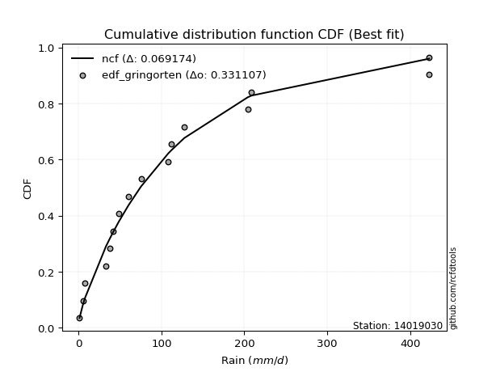</img>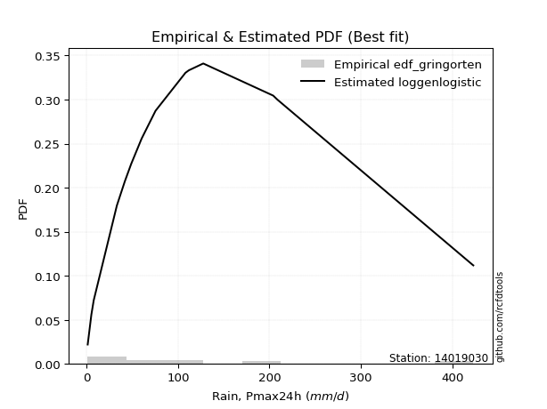</img>

</div>


### 9. Empirical - EDF Filliben (1975)

The specific values of the constants (0.3175) (often denoted as $alpha$) and (0.365) are derived from a method proposed by James J. Filliben in a 1975 paper. This particular formula is the mean value of the $i$-th order statistic of the normal distribution and is considered a robust and effective plotting position formula for the normal probability plot correlation coefficient test for normality.

<div align="center">


$P=(m-0.3175)/(n+0.365)$


</div>


**9.1. Empirical values**

<div align="center">

|                | 0                   | 1                   | 2                  | 3                   | 4                  | 5                  | 6                   | 7            | 8                  | 9                  | 10                 | 11                 | 12                 | 13                | 14                 |
|:---------------|:--------------------|:--------------------|:-------------------|:--------------------|:-------------------|:-------------------|:--------------------|:-------------|:-------------------|:-------------------|:-------------------|:-------------------|:-------------------|:------------------|:-------------------|
| date           | 2021                | 2022                | 2019               | 2020                | 2009               | 2023               | 2024                | 2012         | 2010               | 2011               | 2018               | 2014               | 2013               | 2016              | 2017               |
| x              | 1.2                 | 5.2                 | 7.8                | 33.1                | 41.8               | 48.8               | 60.2                | 75.4         | 108.1              | 111.8              | 127.6              | 204.1              | 208.8              | 422.8             | 423.0              |
| m              | 1                   | 2                   | 3                  | 4                   | 5                  | 6                  | 7                   | 8            | 9                  | 10                 | 11                 | 12                 | 13                 | 14                | 15                 |
| empirical_dist | edf_filliben        | edf_filliben        | edf_filliben       | edf_filliben        | edf_filliben       | edf_filliben       | edf_filliben        | edf_filliben | edf_filliben       | edf_filliben       | edf_filliben       | edf_filliben       | edf_filliben       | edf_filliben      | edf_filliben       |
| empirical      | 0.04441913439635535 | 0.10950211519687603 | 0.1745850959973967 | 0.23966807679791735 | 0.304751057598438  | 0.3698340383989587 | 0.43491701919947934 | 0.5          | 0.5650829808005206 | 0.6301659616010412 | 0.6952489424015619 | 0.7603319232020826 | 0.8254149040026033 | 0.890497884803124 | 0.9555808656036446 |
| empirical_tr   | 1.0464839094159715  | 1.1229672939886717  | 1.211511925882121  | 1.3152150652685641  | 1.4383337233793587 | 1.586883552801446  | 1.7696515980420386  | 2.0          | 2.2992891881780766 | 2.7039155301363826 | 3.2813667912439923 | 4.172437202987101  | 5.727865796831314  | 9.13224368499257  | 22.512820512820507 |

</div>


**9.2. Kolmogorov-Smirnov fit test (sorted by Δ)**


<div align="center">

|                | 0                   | 1                   | 2                   | 3                   | 4                   | 5                  | 6                   | 7                   | 8                     | 9                   | 10                  | 11                  | 12                  | 13                  | 14                  | 15                 | 16                  | 17                  | 18                  | 19                  | 20                 | 21                  | 22                  | 23                  | 24                  | 25                  | 26                  | 27                  | 28                  | 29                  | 30                 | 31                  | 32                  | 33                  | 34                  | 35                 | 36                 | 37                  | 38                  | 39                 | 40                  | 41                  | 42                 | 43                 | 44                 | 45                 | 46                  | 47                  | 48                  | 49                 | 50                  | 51                  | 52                  | 53                  | 54                  | 55                  | 56                  | 57                  | 58                 | 59                  | 60                  | 61                  | 62                  | 63                  | 64                 | 65                 | 66                  | 67                  | 68                 | 69                  | 70                 | 71                  | 72                  | 73                  | 74                  | 75                 | 76                  | 77                 | 78                  | 79                  | 80                  | 81                  | 82                  | 83                  | 84                 | 85                 | 86                  | 87                  | 88                  | 89                 |
|:---------------|:--------------------|:--------------------|:--------------------|:--------------------|:--------------------|:-------------------|:--------------------|:--------------------|:----------------------|:--------------------|:--------------------|:--------------------|:--------------------|:--------------------|:--------------------|:-------------------|:--------------------|:--------------------|:--------------------|:--------------------|:-------------------|:--------------------|:--------------------|:--------------------|:--------------------|:--------------------|:--------------------|:--------------------|:--------------------|:--------------------|:-------------------|:--------------------|:--------------------|:--------------------|:--------------------|:-------------------|:-------------------|:--------------------|:--------------------|:-------------------|:--------------------|:--------------------|:-------------------|:-------------------|:-------------------|:-------------------|:--------------------|:--------------------|:--------------------|:-------------------|:--------------------|:--------------------|:--------------------|:--------------------|:--------------------|:--------------------|:--------------------|:--------------------|:-------------------|:--------------------|:--------------------|:--------------------|:--------------------|:--------------------|:-------------------|:-------------------|:--------------------|:--------------------|:-------------------|:--------------------|:-------------------|:--------------------|:--------------------|:--------------------|:--------------------|:-------------------|:--------------------|:-------------------|:--------------------|:--------------------|:--------------------|:--------------------|:--------------------|:--------------------|:-------------------|:-------------------|:--------------------|:--------------------|:--------------------|:-------------------|
| station        | 14019030            | 14019030            | 14019030            | 14019030            | 14019030            | 14019030           | 14019030            | 14019030            | 14019030              | 14019030            | 14019030            | 14019030            | 14019030            | 14019030            | 14019030            | 14019030           | 14019030            | 14019030            | 14019030            | 14019030            | 14019030           | 14019030            | 14019030            | 14019030            | 14019030            | 14019030            | 14019030            | 14019030            | 14019030            | 14019030            | 14019030           | 14019030            | 14019030            | 14019030            | 14019030            | 14019030           | 14019030           | 14019030            | 14019030            | 14019030           | 14019030            | 14019030            | 14019030           | 14019030           | 14019030           | 14019030           | 14019030            | 14019030            | 14019030            | 14019030           | 14019030            | 14019030            | 14019030            | 14019030            | 14019030            | 14019030            | 14019030            | 14019030            | 14019030           | 14019030            | 14019030            | 14019030            | 14019030            | 14019030            | 14019030           | 14019030           | 14019030            | 14019030            | 14019030           | 14019030            | 14019030           | 14019030            | 14019030            | 14019030            | 14019030            | 14019030           | 14019030            | 14019030           | 14019030            | 14019030            | 14019030            | 14019030            | 14019030            | 14019030            | 14019030           | 14019030           | 14019030            | 14019030            | 14019030            | 14019030           |
| empirical_dist | edf_filliben        | edf_filliben        | edf_filliben        | edf_filliben        | edf_filliben        | edf_filliben       | edf_filliben        | edf_filliben        | edf_filliben          | edf_filliben        | edf_filliben        | edf_filliben        | edf_filliben        | edf_filliben        | edf_filliben        | edf_filliben       | edf_filliben        | edf_filliben        | edf_filliben        | edf_filliben        | edf_filliben       | edf_filliben        | edf_filliben        | edf_filliben        | edf_filliben        | edf_filliben        | edf_filliben        | edf_filliben        | edf_filliben        | edf_filliben        | edf_filliben       | edf_filliben        | edf_filliben        | edf_filliben        | edf_filliben        | edf_filliben       | edf_filliben       | edf_filliben        | edf_filliben        | edf_filliben       | edf_filliben        | edf_filliben        | edf_filliben       | edf_filliben       | edf_filliben       | edf_filliben       | edf_filliben        | edf_filliben        | edf_filliben        | edf_filliben       | edf_filliben        | edf_filliben        | edf_filliben        | edf_filliben        | edf_filliben        | edf_filliben        | edf_filliben        | edf_filliben        | edf_filliben       | edf_filliben        | edf_filliben        | edf_filliben        | edf_filliben        | edf_filliben        | edf_filliben       | edf_filliben       | edf_filliben        | edf_filliben        | edf_filliben       | edf_filliben        | edf_filliben       | edf_filliben        | edf_filliben        | edf_filliben        | edf_filliben        | edf_filliben       | edf_filliben        | edf_filliben       | edf_filliben        | edf_filliben        | edf_filliben        | edf_filliben        | edf_filliben        | edf_filliben        | edf_filliben       | edf_filliben       | edf_filliben        | edf_filliben        | edf_filliben        | edf_filliben       |
| p_dist         | loggenlogistic      | loggumbel_l         | logloggamma         | logjohnsonsu        | ncf                 | logweibull_min     | loggompertz         | logpearson3         | loglaplace_asymmetric | chi2                | johnsonsu           | nct                 | invgauss            | moyal               | invweibull          | f                  | invgamma            | logfisk             | halflogistic        | logt                | weibull_min        | pearson3            | genlogistic         | logmielke           | fatiguelife         | loglogistic         | pareto              | mielke              | gumbel_r            | exponnorm           | genexpon           | expon               | laplace_asymmetric  | loghypsecant        | lognakagami         | logexponnorm       | logrice            | lognorm             | lognorm             | logcrystalball     | loglognorm          | nakagami            | logf               | lognct             | logfatiguelife     | gompertz           | logbetaprime        | truncnorm           | kstwobign           | halfnorm           | logerlang           | betaprime           | logchi2             | rayleigh            | loggamma            | loggamma            | erlang              | logalpha            | loginvgamma        | t                   | loglaplace          | maxwell             | logmaxwell          | loginvgauss         | gamma              | wald               | lograyleigh         | fisk                | rice               | loggumbel_r         | hypsecant          | logistic            | norm                | loginvweibull       | logncf              | laplace            | logmoyal            | loghalfnorm        | gibrat              | loghalflogistic     | logkstwobign        | alpha               | gumbel_l            | loggenexpon         | logwald            | loggibrat          | logtruncnorm        | logexpon            | crystalball         | logpareto          |
| delta          | 0.06076218820553031 | 0.06715906966490715 | 0.06885570971205113 | 0.07049626657540309 | 0.07447997766078573 | 0.075284176554866  | 0.07775691377913342 | 0.07917463606592323 | 0.08057903417897028   | 0.08715562544356475 | 0.09081170958583207 | 0.09137739073315403 | 0.09168039283888241 | 0.09202045336649511 | 0.09338333395385114 | 0.09435204424727   | 0.09435215984347844 | 0.09442370294414643 | 0.09902913678776724 | 0.10226498649056612 | 0.1057861267658664 | 0.10728450971846608 | 0.10856328593162101 | 0.10913643365910675 | 0.11052829294213518 | 0.11391796126234655 | 0.11562919280378159 | 0.11583774158694349 | 0.11780774674508399 | 0.12129835209821238 | 0.1227969789288611 | 0.12279706698705103 | 0.12280839572332192 | 0.12767043144547163 | 0.12978544654461566 | 0.1300387903881019 | 0.1300391072506361 | 0.13004097262747677 | 0.13004097262747677 | 0.1300409732635785 | 0.13004357865246297 | 0.13014043876320103 | 0.1303281690264801 | 0.1303578252064676 | 0.1314727782912568 | 0.1318001507148641 | 0.13208323642429964 | 0.13212811448835896 | 0.13821667523418152 | 0.139277670701829  | 0.14192989961842606 | 0.14251134371586283 | 0.14463720277603914 | 0.14473257243731552 | 0.14564853725496502 | 0.14564853725496502 | 0.14624141184069284 | 0.15137666158283647 | 0.1526423768365191 | 0.15411380434193678 | 0.15550798355806383 | 0.15559128106291253 | 0.16302457044576535 | 0.16450055193562285 | 0.1645889430971531 | 0.1674171776763799 | 0.17525932717926873 | 0.17790665099455005 | 0.1854764719804466 | 0.18559946803245392 | 0.1866069044804075 | 0.18741116000584646 | 0.18835308993938205 | 0.19490021152612413 | 0.19793808998807894 | 0.2067595719606664 | 0.21006418823776185 | 0.2100781130712273 | 0.21412508277768136 | 0.22136861866744123 | 0.23300639084678915 | 0.25204150399929126 | 0.25849072808334106 | 0.27387780208615653 | 0.2775560133720313 | 0.2825843692238552 | 0.32761514155058336 | 0.33820617810542863 | 0.45267799963123323 | 0.523398206124854  |
| deltao         | 0.3366456264050002  | 0.3366456264050002  | 0.3366456264050002  | 0.3366456264050002  | 0.3366456264050002  | 0.3366456264050002 | 0.3366456264050002  | 0.3366456264050002  | 0.3366456264050002    | 0.3366456264050002  | 0.3366456264050002  | 0.3366456264050002  | 0.3366456264050002  | 0.3366456264050002  | 0.3366456264050002  | 0.3366456264050002 | 0.3366456264050002  | 0.3366456264050002  | 0.3366456264050002  | 0.3366456264050002  | 0.3366456264050002 | 0.3366456264050002  | 0.3366456264050002  | 0.3366456264050002  | 0.3366456264050002  | 0.3366456264050002  | 0.3366456264050002  | 0.3366456264050002  | 0.3366456264050002  | 0.3366456264050002  | 0.3366456264050002 | 0.3366456264050002  | 0.3366456264050002  | 0.3366456264050002  | 0.3366456264050002  | 0.3366456264050002 | 0.3366456264050002 | 0.3366456264050002  | 0.3366456264050002  | 0.3366456264050002 | 0.3366456264050002  | 0.3366456264050002  | 0.3366456264050002 | 0.3366456264050002 | 0.3366456264050002 | 0.3366456264050002 | 0.3366456264050002  | 0.3366456264050002  | 0.3366456264050002  | 0.3366456264050002 | 0.3366456264050002  | 0.3366456264050002  | 0.3366456264050002  | 0.3366456264050002  | 0.3366456264050002  | 0.3366456264050002  | 0.3366456264050002  | 0.3366456264050002  | 0.3366456264050002 | 0.3366456264050002  | 0.3366456264050002  | 0.3366456264050002  | 0.3366456264050002  | 0.3366456264050002  | 0.3366456264050002 | 0.3366456264050002 | 0.3366456264050002  | 0.3366456264050002  | 0.3366456264050002 | 0.3366456264050002  | 0.3366456264050002 | 0.3366456264050002  | 0.3366456264050002  | 0.3366456264050002  | 0.3366456264050002  | 0.3366456264050002 | 0.3366456264050002  | 0.3366456264050002 | 0.3366456264050002  | 0.3366456264050002  | 0.3366456264050002  | 0.3366456264050002  | 0.3366456264050002  | 0.3366456264050002  | 0.3366456264050002 | 0.3366456264050002 | 0.3366456264050002  | 0.3366456264050002  | 0.3366456264050002  | 0.3366456264050002 |
| eval           | Δo > Δ              | Δo > Δ              | Δo > Δ              | Δo > Δ              | Δo > Δ              | Δo > Δ             | Δo > Δ              | Δo > Δ              | Δo > Δ                | Δo > Δ              | Δo > Δ              | Δo > Δ              | Δo > Δ              | Δo > Δ              | Δo > Δ              | Δo > Δ             | Δo > Δ              | Δo > Δ              | Δo > Δ              | Δo > Δ              | Δo > Δ             | Δo > Δ              | Δo > Δ              | Δo > Δ              | Δo > Δ              | Δo > Δ              | Δo > Δ              | Δo > Δ              | Δo > Δ              | Δo > Δ              | Δo > Δ             | Δo > Δ              | Δo > Δ              | Δo > Δ              | Δo > Δ              | Δo > Δ             | Δo > Δ             | Δo > Δ              | Δo > Δ              | Δo > Δ             | Δo > Δ              | Δo > Δ              | Δo > Δ             | Δo > Δ             | Δo > Δ             | Δo > Δ             | Δo > Δ              | Δo > Δ              | Δo > Δ              | Δo > Δ             | Δo > Δ              | Δo > Δ              | Δo > Δ              | Δo > Δ              | Δo > Δ              | Δo > Δ              | Δo > Δ              | Δo > Δ              | Δo > Δ             | Δo > Δ              | Δo > Δ              | Δo > Δ              | Δo > Δ              | Δo > Δ              | Δo > Δ             | Δo > Δ             | Δo > Δ              | Δo > Δ              | Δo > Δ             | Δo > Δ              | Δo > Δ             | Δo > Δ              | Δo > Δ              | Δo > Δ              | Δo > Δ              | Δo > Δ             | Δo > Δ              | Δo > Δ             | Δo > Δ              | Δo > Δ              | Δo > Δ              | Δo > Δ              | Δo > Δ              | Δo > Δ              | Δo > Δ             | Δo > Δ             | Δo > Δ              | Δo <= Δ             | Δo <= Δ             | Δo <= Δ            |
| fit            | 1                   | 1                   | 1                   | 1                   | 1                   | 1                  | 1                   | 1                   | 1                     | 1                   | 1                   | 1                   | 1                   | 1                   | 1                   | 1                  | 1                   | 1                   | 1                   | 1                   | 1                  | 1                   | 1                   | 1                   | 1                   | 1                   | 1                   | 1                   | 1                   | 1                   | 1                  | 1                   | 1                   | 1                   | 1                   | 1                  | 1                  | 1                   | 1                   | 1                  | 1                   | 1                   | 1                  | 1                  | 1                  | 1                  | 1                   | 1                   | 1                   | 1                  | 1                   | 1                   | 1                   | 1                   | 1                   | 1                   | 1                   | 1                   | 1                  | 1                   | 1                   | 1                   | 1                   | 1                   | 1                  | 1                  | 1                   | 1                   | 1                  | 1                   | 1                  | 1                   | 1                   | 1                   | 1                   | 1                  | 1                   | 1                  | 1                   | 1                   | 1                   | 1                   | 1                   | 1                   | 1                  | 1                  | 1                   | 0                   | 0                   | 0                  |
| n              | 15                  | 15                  | 15                  | 15                  | 15                  | 15                 | 15                  | 15                  | 15                    | 15                  | 15                  | 15                  | 15                  | 15                  | 15                  | 15                 | 15                  | 15                  | 15                  | 15                  | 15                 | 15                  | 15                  | 15                  | 15                  | 15                  | 15                  | 15                  | 15                  | 15                  | 15                 | 15                  | 15                  | 15                  | 15                  | 15                 | 15                 | 15                  | 15                  | 15                 | 15                  | 15                  | 15                 | 15                 | 15                 | 15                 | 15                  | 15                  | 15                  | 15                 | 15                  | 15                  | 15                  | 15                  | 15                  | 15                  | 15                  | 15                  | 15                 | 15                  | 15                  | 15                  | 15                  | 15                  | 15                 | 15                 | 15                  | 15                  | 15                 | 15                  | 15                 | 15                  | 15                  | 15                  | 15                  | 15                 | 15                  | 15                 | 15                  | 15                  | 15                  | 15                  | 15                  | 15                  | 15                 | 15                 | 15                  | 15                  | 15                  | 15                 |
| best_fit       | 1                   | 0                   | 0                   | 0                   | 0                   | 0                  | 0                   | 0                   | 0                     | 0                   | 0                   | 0                   | 0                   | 0                   | 0                   | 0                  | 0                   | 0                   | 0                   | 0                   | 0                  | 0                   | 0                   | 0                   | 0                   | 0                   | 0                   | 0                   | 0                   | 0                   | 0                  | 0                   | 0                   | 0                   | 0                   | 0                  | 0                  | 0                   | 0                   | 0                  | 0                   | 0                   | 0                  | 0                  | 0                  | 0                  | 0                   | 0                   | 0                   | 0                  | 0                   | 0                   | 0                   | 0                   | 0                   | 0                   | 0                   | 0                   | 0                  | 0                   | 0                   | 0                   | 0                   | 0                   | 0                  | 0                  | 0                   | 0                   | 0                  | 0                   | 0                  | 0                   | 0                   | 0                   | 0                   | 0                  | 0                   | 0                  | 0                   | 0                   | 0                   | 0                   | 0                   | 0                   | 0                  | 0                  | 0                   | 0                   | 0                   | 0                  |
| best_fit_sort  | 1                   | 2                   | 3                   | 4                   | 5                   | 6                  | 7                   | 8                   | 9                     | 10                  | 11                  | 12                  | 13                  | 14                  | 15                  | 16                 | 17                  | 18                  | 19                  | 20                  | 21                 | 22                  | 23                  | 24                  | 25                  | 26                  | 27                  | 28                  | 29                  | 30                  | 31                 | 32                  | 33                  | 34                  | 35                  | 36                 | 37                 | 38                  | 39                  | 40                 | 41                  | 42                  | 43                 | 44                 | 45                 | 46                 | 47                  | 48                  | 49                  | 50                 | 51                  | 52                  | 53                  | 54                  | 55                  | 56                  | 57                  | 58                  | 59                 | 60                  | 61                  | 62                  | 63                  | 64                  | 65                 | 66                 | 67                  | 68                  | 69                 | 70                  | 71                 | 72                  | 73                  | 74                  | 75                  | 76                 | 77                  | 78                 | 79                  | 80                  | 81                  | 82                  | 83                  | 84                  | 85                 | 86                 | 87                  | 88                  | 89                  | 90                 |

</div>


<div align="center">

</img>

</div>


**9.3. Best fit**

<div align="center">

|   id |   station | empirical_dist   | p_dist         |     delta |   deltao | eval   |   fit |   n |   best_fit |   best_fit_sort |
|-----:|----------:|:-----------------|:---------------|----------:|---------:|:-------|------:|----:|-----------:|----------------:|
|    0 |  14019030 | edf_filliben     | loggenlogistic | 0.0607622 | 0.336646 | Δo > Δ |     1 |  15 |          1 |               1 |

</div>


<div align="center">

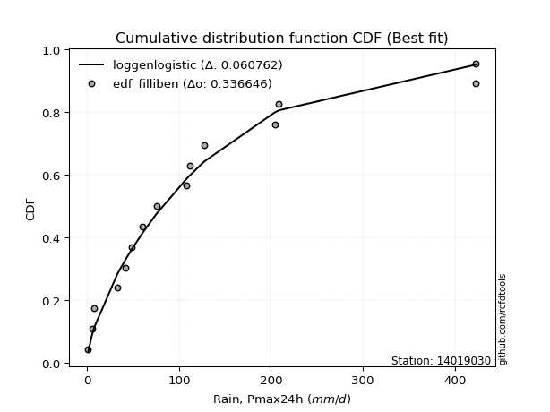</img>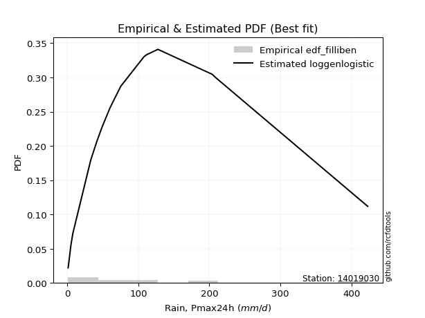</img>

</div>


### 10. Empirical - EDF Jenkinson (1977)

The Jenkinson formula in hydrology is an empirical plotting position formula used to estimate the non-exceedance probability _(P)_ or return period _(T)_ of a given ordered observation within a sample. It is a widely used method in the frequency analysis of extreme events such as floods and rainfall, as it provides a distribution-free way to plot data. _a≈0.31_ and _b≈0.38_ are constants derived to approximate the median of the probability distribution for the given rank.

<div align="center">


$P=(m-a)/(n+b)$


</div>


**10.1. Empirical values**

<div align="center">

|                | 0                   | 1                   | 2                   | 3                   | 4                  | 5                   | 6                   | 7             | 8                  | 9                  | 10                 | 11                | 12                 | 13                 | 14                 |
|:---------------|:--------------------|:--------------------|:--------------------|:--------------------|:-------------------|:--------------------|:--------------------|:--------------|:-------------------|:-------------------|:-------------------|:------------------|:-------------------|:-------------------|:-------------------|
| date           | 2021                | 2022                | 2019                | 2020                | 2009               | 2023                | 2024                | 2012          | 2010               | 2011               | 2018               | 2014              | 2013               | 2016               | 2017               |
| x              | 1.2                 | 5.2                 | 7.8                 | 33.1                | 41.8               | 48.8                | 60.2                | 75.4          | 108.1              | 111.8              | 127.6              | 204.1             | 208.8              | 422.8              | 423.0              |
| m              | 1                   | 2                   | 3                   | 4                   | 5                  | 6                   | 7                   | 8             | 9                  | 10                 | 11                 | 12                | 13                 | 14                 | 15                 |
| empirical_dist | edf_jenkinson       | edf_jenkinson       | edf_jenkinson       | edf_jenkinson       | edf_jenkinson      | edf_jenkinson       | edf_jenkinson       | edf_jenkinson | edf_jenkinson      | edf_jenkinson      | edf_jenkinson      | edf_jenkinson     | edf_jenkinson      | edf_jenkinson      | edf_jenkinson      |
| empirical      | 0.04486345903771131 | 0.10988296488946683 | 0.17490247074122237 | 0.23992197659297787 | 0.3049414824447334 | 0.36996098829648894 | 0.43498049414824447 | 0.5           | 0.5650195058517554 | 0.630039011703511  | 0.6950585175552665 | 0.760078023407022 | 0.8250975292587776 | 0.8901170351105331 | 0.9551365409622886 |
| empirical_tr   | 1.0469707283866576  | 1.1234477720964207  | 1.2119779353821907  | 1.3156544054747648  | 1.4387277829747427 | 1.587203302373581   | 1.7698504027617952  | 2.0           | 2.298953662182361  | 2.7029876977152894 | 3.279317697228144  | 4.168021680216801 | 5.717472118959106  | 9.100591715976325  | 22.289855072463734 |

</div>


**10.2. Kolmogorov-Smirnov fit test (sorted by Δ)**


<div align="center">

|                | 0                   | 1                   | 2                   | 3                   | 4                   | 5                   | 6                  | 7                   | 8                     | 9                   | 10                  | 11                 | 12                  | 13                  | 14                  | 15                  | 16                  | 17                 | 18                 | 19                 | 20                  | 21                  | 22                  | 23                  | 24                  | 25                  | 26                 | 27                  | 28                 | 29                  | 30                  | 31                  | 32                 | 33                  | 34                  | 35                  | 36                 | 37                  | 38                  | 39                  | 40                  | 41                  | 42                  | 43                  | 44                 | 45                  | 46                  | 47                  | 48                  | 49                  | 50                  | 51                 | 52                  | 53                  | 54                 | 55                 | 56                  | 57                  | 58                  | 59                  | 60                  | 61                  | 62                  | 63                  | 64                  | 65                  | 66                 | 67                  | 68                 | 69                  | 70                  | 71                  | 72                  | 73                  | 74                  | 75                 | 76                 | 77                  | 78                  | 79                 | 80                  | 81                  | 82                  | 83                 | 84                 | 85                 | 86                  | 87                 | 88                  | 89                 |
|:---------------|:--------------------|:--------------------|:--------------------|:--------------------|:--------------------|:--------------------|:-------------------|:--------------------|:----------------------|:--------------------|:--------------------|:-------------------|:--------------------|:--------------------|:--------------------|:--------------------|:--------------------|:-------------------|:-------------------|:-------------------|:--------------------|:--------------------|:--------------------|:--------------------|:--------------------|:--------------------|:-------------------|:--------------------|:-------------------|:--------------------|:--------------------|:--------------------|:-------------------|:--------------------|:--------------------|:--------------------|:-------------------|:--------------------|:--------------------|:--------------------|:--------------------|:--------------------|:--------------------|:--------------------|:-------------------|:--------------------|:--------------------|:--------------------|:--------------------|:--------------------|:--------------------|:-------------------|:--------------------|:--------------------|:-------------------|:-------------------|:--------------------|:--------------------|:--------------------|:--------------------|:--------------------|:--------------------|:--------------------|:--------------------|:--------------------|:--------------------|:-------------------|:--------------------|:-------------------|:--------------------|:--------------------|:--------------------|:--------------------|:--------------------|:--------------------|:-------------------|:-------------------|:--------------------|:--------------------|:-------------------|:--------------------|:--------------------|:--------------------|:-------------------|:-------------------|:-------------------|:--------------------|:-------------------|:--------------------|:-------------------|
| station        | 14019030            | 14019030            | 14019030            | 14019030            | 14019030            | 14019030            | 14019030           | 14019030            | 14019030              | 14019030            | 14019030            | 14019030           | 14019030            | 14019030            | 14019030            | 14019030            | 14019030            | 14019030           | 14019030           | 14019030           | 14019030            | 14019030            | 14019030            | 14019030            | 14019030            | 14019030            | 14019030           | 14019030            | 14019030           | 14019030            | 14019030            | 14019030            | 14019030           | 14019030            | 14019030            | 14019030            | 14019030           | 14019030            | 14019030            | 14019030            | 14019030            | 14019030            | 14019030            | 14019030            | 14019030           | 14019030            | 14019030            | 14019030            | 14019030            | 14019030            | 14019030            | 14019030           | 14019030            | 14019030            | 14019030           | 14019030           | 14019030            | 14019030            | 14019030            | 14019030            | 14019030            | 14019030            | 14019030            | 14019030            | 14019030            | 14019030            | 14019030           | 14019030            | 14019030           | 14019030            | 14019030            | 14019030            | 14019030            | 14019030            | 14019030            | 14019030           | 14019030           | 14019030            | 14019030            | 14019030           | 14019030            | 14019030            | 14019030            | 14019030           | 14019030           | 14019030           | 14019030            | 14019030           | 14019030            | 14019030           |
| empirical_dist | edf_jenkinson       | edf_jenkinson       | edf_jenkinson       | edf_jenkinson       | edf_jenkinson       | edf_jenkinson       | edf_jenkinson      | edf_jenkinson       | edf_jenkinson         | edf_jenkinson       | edf_jenkinson       | edf_jenkinson      | edf_jenkinson       | edf_jenkinson       | edf_jenkinson       | edf_jenkinson       | edf_jenkinson       | edf_jenkinson      | edf_jenkinson      | edf_jenkinson      | edf_jenkinson       | edf_jenkinson       | edf_jenkinson       | edf_jenkinson       | edf_jenkinson       | edf_jenkinson       | edf_jenkinson      | edf_jenkinson       | edf_jenkinson      | edf_jenkinson       | edf_jenkinson       | edf_jenkinson       | edf_jenkinson      | edf_jenkinson       | edf_jenkinson       | edf_jenkinson       | edf_jenkinson      | edf_jenkinson       | edf_jenkinson       | edf_jenkinson       | edf_jenkinson       | edf_jenkinson       | edf_jenkinson       | edf_jenkinson       | edf_jenkinson      | edf_jenkinson       | edf_jenkinson       | edf_jenkinson       | edf_jenkinson       | edf_jenkinson       | edf_jenkinson       | edf_jenkinson      | edf_jenkinson       | edf_jenkinson       | edf_jenkinson      | edf_jenkinson      | edf_jenkinson       | edf_jenkinson       | edf_jenkinson       | edf_jenkinson       | edf_jenkinson       | edf_jenkinson       | edf_jenkinson       | edf_jenkinson       | edf_jenkinson       | edf_jenkinson       | edf_jenkinson      | edf_jenkinson       | edf_jenkinson      | edf_jenkinson       | edf_jenkinson       | edf_jenkinson       | edf_jenkinson       | edf_jenkinson       | edf_jenkinson       | edf_jenkinson      | edf_jenkinson      | edf_jenkinson       | edf_jenkinson       | edf_jenkinson      | edf_jenkinson       | edf_jenkinson       | edf_jenkinson       | edf_jenkinson      | edf_jenkinson      | edf_jenkinson      | edf_jenkinson       | edf_jenkinson      | edf_jenkinson       | edf_jenkinson      |
| p_dist         | loggenlogistic      | loggumbel_l         | logloggamma         | logjohnsonsu        | ncf                 | logweibull_min      | loggompertz        | logpearson3         | loglaplace_asymmetric | chi2                | johnsonsu           | nct                | moyal               | invgauss            | invweibull          | f                   | invgamma            | logfisk            | halflogistic       | logt               | weibull_min         | pearson3            | genlogistic         | logmielke           | fatiguelife         | loglogistic         | mielke             | pareto              | gumbel_r           | exponnorm           | genexpon            | expon               | laplace_asymmetric | loghypsecant        | lognakagami         | logexponnorm        | logrice            | lognorm             | lognorm             | logcrystalball      | loglognorm          | nakagami            | logf                | lognct              | logfatiguelife     | logbetaprime        | gompertz            | truncnorm           | kstwobign           | halfnorm            | logerlang           | betaprime          | logchi2             | rayleigh            | loggamma           | loggamma           | erlang              | logalpha            | loginvgamma         | t                   | maxwell             | loglaplace          | logmaxwell          | loginvgauss         | gamma               | wald                | lograyleigh        | fisk                | rice               | loggumbel_r         | hypsecant           | logistic            | norm                | loginvweibull       | logncf              | laplace            | loghalfnorm        | logmoyal            | gibrat              | loghalflogistic    | logkstwobign        | alpha               | gumbel_l            | loggenexpon        | logwald            | loggibrat          | logtruncnorm        | logexpon           | crystalball         | logpareto          |
| delta          | 0.06107956294935599 | 0.06693679594235186 | 0.06923655940464202 | 0.07087711626799398 | 0.07428955281449034 | 0.07560155129869167 | 0.0780742885229591 | 0.07892073627086271 | 0.08083293397403091   | 0.08690172564850424 | 0.09112908432965774 | 0.0916947654769797 | 0.09183002852019972 | 0.09199776758270808 | 0.09370070869767681 | 0.09466941899109568 | 0.09466953458730412 | 0.0947410776879721 | 0.0985848121464113 | 0.1025823612343918 | 0.10559570191957102 | 0.10684018507711013 | 0.10862676088038614 | 0.10951728335169764 | 0.11027439314707466 | 0.11366406146728603 | 0.1156473167406481 | 0.11594656754760727 | 0.1176173218987886 | 0.12161572684203806 | 0.12311435367268678 | 0.12311444173087671 | 0.1231257704671476 | 0.12773390639423676 | 0.12953154674955514 | 0.12978489059304138 | 0.1297852074555756 | 0.12978707283241625 | 0.12978707283241625 | 0.12978707346851798 | 0.12978967885740245 | 0.12995001391690564 | 0.13007426923141957 | 0.13010392541140708 | 0.1312188784961963 | 0.13182933662923912 | 0.13211752545868977 | 0.13244548923218463 | 0.13821667523418152 | 0.13883334606047304 | 0.14167599982336554 | 0.1422574439208023 | 0.14438330298097862 | 0.14454214759102013 | 0.1453946374599045 | 0.1453946374599045 | 0.14598751204563232 | 0.15112276178777595 | 0.15238847704145858 | 0.15366947970058084 | 0.15540085621661714 | 0.15557145850682896 | 0.16277067065070483 | 0.16424665214056233 | 0.16465241804591824 | 0.16773455242020557 | 0.1750054273842082 | 0.17765275119948953 | 0.1852860471341512 | 0.18540904318615853 | 0.18641647963411212 | 0.18722073515955107 | 0.18816266509308666 | 0.19464631173106361 | 0.19768419019301842 | 0.2067595719606664 | 0.2098242132761668 | 0.20987376339146646 | 0.21437898257274188 | 0.2211147188723807 | 0.23275249105172863 | 0.25185107915299587 | 0.25830030323704567 | 0.273623902291096  | 0.2773655885257359 | 0.2823939443775598 | 0.32736124175552284 | 0.3379522783103681 | 0.45223367498987727 | 0.5230173564322632 |
| deltao         | 0.3366456264050002  | 0.3366456264050002  | 0.3366456264050002  | 0.3366456264050002  | 0.3366456264050002  | 0.3366456264050002  | 0.3366456264050002 | 0.3366456264050002  | 0.3366456264050002    | 0.3366456264050002  | 0.3366456264050002  | 0.3366456264050002 | 0.3366456264050002  | 0.3366456264050002  | 0.3366456264050002  | 0.3366456264050002  | 0.3366456264050002  | 0.3366456264050002 | 0.3366456264050002 | 0.3366456264050002 | 0.3366456264050002  | 0.3366456264050002  | 0.3366456264050002  | 0.3366456264050002  | 0.3366456264050002  | 0.3366456264050002  | 0.3366456264050002 | 0.3366456264050002  | 0.3366456264050002 | 0.3366456264050002  | 0.3366456264050002  | 0.3366456264050002  | 0.3366456264050002 | 0.3366456264050002  | 0.3366456264050002  | 0.3366456264050002  | 0.3366456264050002 | 0.3366456264050002  | 0.3366456264050002  | 0.3366456264050002  | 0.3366456264050002  | 0.3366456264050002  | 0.3366456264050002  | 0.3366456264050002  | 0.3366456264050002 | 0.3366456264050002  | 0.3366456264050002  | 0.3366456264050002  | 0.3366456264050002  | 0.3366456264050002  | 0.3366456264050002  | 0.3366456264050002 | 0.3366456264050002  | 0.3366456264050002  | 0.3366456264050002 | 0.3366456264050002 | 0.3366456264050002  | 0.3366456264050002  | 0.3366456264050002  | 0.3366456264050002  | 0.3366456264050002  | 0.3366456264050002  | 0.3366456264050002  | 0.3366456264050002  | 0.3366456264050002  | 0.3366456264050002  | 0.3366456264050002 | 0.3366456264050002  | 0.3366456264050002 | 0.3366456264050002  | 0.3366456264050002  | 0.3366456264050002  | 0.3366456264050002  | 0.3366456264050002  | 0.3366456264050002  | 0.3366456264050002 | 0.3366456264050002 | 0.3366456264050002  | 0.3366456264050002  | 0.3366456264050002 | 0.3366456264050002  | 0.3366456264050002  | 0.3366456264050002  | 0.3366456264050002 | 0.3366456264050002 | 0.3366456264050002 | 0.3366456264050002  | 0.3366456264050002 | 0.3366456264050002  | 0.3366456264050002 |
| eval           | Δo > Δ              | Δo > Δ              | Δo > Δ              | Δo > Δ              | Δo > Δ              | Δo > Δ              | Δo > Δ             | Δo > Δ              | Δo > Δ                | Δo > Δ              | Δo > Δ              | Δo > Δ             | Δo > Δ              | Δo > Δ              | Δo > Δ              | Δo > Δ              | Δo > Δ              | Δo > Δ             | Δo > Δ             | Δo > Δ             | Δo > Δ              | Δo > Δ              | Δo > Δ              | Δo > Δ              | Δo > Δ              | Δo > Δ              | Δo > Δ             | Δo > Δ              | Δo > Δ             | Δo > Δ              | Δo > Δ              | Δo > Δ              | Δo > Δ             | Δo > Δ              | Δo > Δ              | Δo > Δ              | Δo > Δ             | Δo > Δ              | Δo > Δ              | Δo > Δ              | Δo > Δ              | Δo > Δ              | Δo > Δ              | Δo > Δ              | Δo > Δ             | Δo > Δ              | Δo > Δ              | Δo > Δ              | Δo > Δ              | Δo > Δ              | Δo > Δ              | Δo > Δ             | Δo > Δ              | Δo > Δ              | Δo > Δ             | Δo > Δ             | Δo > Δ              | Δo > Δ              | Δo > Δ              | Δo > Δ              | Δo > Δ              | Δo > Δ              | Δo > Δ              | Δo > Δ              | Δo > Δ              | Δo > Δ              | Δo > Δ             | Δo > Δ              | Δo > Δ             | Δo > Δ              | Δo > Δ              | Δo > Δ              | Δo > Δ              | Δo > Δ              | Δo > Δ              | Δo > Δ             | Δo > Δ             | Δo > Δ              | Δo > Δ              | Δo > Δ             | Δo > Δ              | Δo > Δ              | Δo > Δ              | Δo > Δ             | Δo > Δ             | Δo > Δ             | Δo > Δ              | Δo <= Δ            | Δo <= Δ             | Δo <= Δ            |
| fit            | 1                   | 1                   | 1                   | 1                   | 1                   | 1                   | 1                  | 1                   | 1                     | 1                   | 1                   | 1                  | 1                   | 1                   | 1                   | 1                   | 1                   | 1                  | 1                  | 1                  | 1                   | 1                   | 1                   | 1                   | 1                   | 1                   | 1                  | 1                   | 1                  | 1                   | 1                   | 1                   | 1                  | 1                   | 1                   | 1                   | 1                  | 1                   | 1                   | 1                   | 1                   | 1                   | 1                   | 1                   | 1                  | 1                   | 1                   | 1                   | 1                   | 1                   | 1                   | 1                  | 1                   | 1                   | 1                  | 1                  | 1                   | 1                   | 1                   | 1                   | 1                   | 1                   | 1                   | 1                   | 1                   | 1                   | 1                  | 1                   | 1                  | 1                   | 1                   | 1                   | 1                   | 1                   | 1                   | 1                  | 1                  | 1                   | 1                   | 1                  | 1                   | 1                   | 1                   | 1                  | 1                  | 1                  | 1                   | 0                  | 0                   | 0                  |
| n              | 15                  | 15                  | 15                  | 15                  | 15                  | 15                  | 15                 | 15                  | 15                    | 15                  | 15                  | 15                 | 15                  | 15                  | 15                  | 15                  | 15                  | 15                 | 15                 | 15                 | 15                  | 15                  | 15                  | 15                  | 15                  | 15                  | 15                 | 15                  | 15                 | 15                  | 15                  | 15                  | 15                 | 15                  | 15                  | 15                  | 15                 | 15                  | 15                  | 15                  | 15                  | 15                  | 15                  | 15                  | 15                 | 15                  | 15                  | 15                  | 15                  | 15                  | 15                  | 15                 | 15                  | 15                  | 15                 | 15                 | 15                  | 15                  | 15                  | 15                  | 15                  | 15                  | 15                  | 15                  | 15                  | 15                  | 15                 | 15                  | 15                 | 15                  | 15                  | 15                  | 15                  | 15                  | 15                  | 15                 | 15                 | 15                  | 15                  | 15                 | 15                  | 15                  | 15                  | 15                 | 15                 | 15                 | 15                  | 15                 | 15                  | 15                 |
| best_fit       | 1                   | 0                   | 0                   | 0                   | 0                   | 0                   | 0                  | 0                   | 0                     | 0                   | 0                   | 0                  | 0                   | 0                   | 0                   | 0                   | 0                   | 0                  | 0                  | 0                  | 0                   | 0                   | 0                   | 0                   | 0                   | 0                   | 0                  | 0                   | 0                  | 0                   | 0                   | 0                   | 0                  | 0                   | 0                   | 0                   | 0                  | 0                   | 0                   | 0                   | 0                   | 0                   | 0                   | 0                   | 0                  | 0                   | 0                   | 0                   | 0                   | 0                   | 0                   | 0                  | 0                   | 0                   | 0                  | 0                  | 0                   | 0                   | 0                   | 0                   | 0                   | 0                   | 0                   | 0                   | 0                   | 0                   | 0                  | 0                   | 0                  | 0                   | 0                   | 0                   | 0                   | 0                   | 0                   | 0                  | 0                  | 0                   | 0                   | 0                  | 0                   | 0                   | 0                   | 0                  | 0                  | 0                  | 0                   | 0                  | 0                   | 0                  |
| best_fit_sort  | 1                   | 2                   | 3                   | 4                   | 5                   | 6                   | 7                  | 8                   | 9                     | 10                  | 11                  | 12                 | 13                  | 14                  | 15                  | 16                  | 17                  | 18                 | 19                 | 20                 | 21                  | 22                  | 23                  | 24                  | 25                  | 26                  | 27                 | 28                  | 29                 | 30                  | 31                  | 32                  | 33                 | 34                  | 35                  | 36                  | 37                 | 38                  | 39                  | 40                  | 41                  | 42                  | 43                  | 44                  | 45                 | 46                  | 47                  | 48                  | 49                  | 50                  | 51                  | 52                 | 53                  | 54                  | 55                 | 56                 | 57                  | 58                  | 59                  | 60                  | 61                  | 62                  | 63                  | 64                  | 65                  | 66                  | 67                 | 68                  | 69                 | 70                  | 71                  | 72                  | 73                  | 74                  | 75                  | 76                 | 77                 | 78                  | 79                  | 80                 | 81                  | 82                  | 83                  | 84                 | 85                 | 86                 | 87                  | 88                 | 89                  | 90                 |

</div>


<div align="center">

</img>

</div>


**10.3. Best fit**

<div align="center">

|   id |   station | empirical_dist   | p_dist         |     delta |   deltao | eval   |   fit |   n |   best_fit |   best_fit_sort |
|-----:|----------:|:-----------------|:---------------|----------:|---------:|:-------|------:|----:|-----------:|----------------:|
|    0 |  14019030 | edf_jenkinson    | loggenlogistic | 0.0610796 | 0.336646 | Δo > Δ |     1 |  15 |          1 |               1 |

</div>


<div align="center">

</img></img>

</div>


### 11. Empirical - EDF Cunnane (1978)

Cunnane´s work in statistical hydrology has focused on the performance and evaluation of different probability distributions (such as GEV, Gumbel, Lognormal) for flood frequency estimation. _b_ is a constant, typically set to 0.4.

<div align="center">


$P=(m-b)/(n+1-2b)$


</div>


**11.1. Empirical values**

<div align="center">

|                | 0                    | 1                   | 2                   | 3                  | 4                  | 5                  | 6                  | 7           | 8                  | 9                 | 10                 | 11                 | 12                 | 13                 | 14                 |
|:---------------|:---------------------|:--------------------|:--------------------|:-------------------|:-------------------|:-------------------|:-------------------|:------------|:-------------------|:------------------|:-------------------|:-------------------|:-------------------|:-------------------|:-------------------|
| date           | 2021                 | 2022                | 2019                | 2020               | 2009               | 2023               | 2024               | 2012        | 2010               | 2011              | 2018               | 2014               | 2013               | 2016               | 2017               |
| x              | 1.2                  | 5.2                 | 7.8                 | 33.1               | 41.8               | 48.8               | 60.2               | 75.4        | 108.1              | 111.8             | 127.6              | 204.1              | 208.8              | 422.8              | 423.0              |
| m              | 1                    | 2                   | 3                   | 4                  | 5                  | 6                  | 7                  | 8           | 9                  | 10                | 11                 | 12                 | 13                 | 14                 | 15                 |
| empirical_dist | edf_cunnane          | edf_cunnane         | edf_cunnane         | edf_cunnane        | edf_cunnane        | edf_cunnane        | edf_cunnane        | edf_cunnane | edf_cunnane        | edf_cunnane       | edf_cunnane        | edf_cunnane        | edf_cunnane        | edf_cunnane        | edf_cunnane        |
| empirical      | 0.039473684210526314 | 0.10526315789473685 | 0.17105263157894737 | 0.2368421052631579 | 0.3026315789473684 | 0.3684210526315789 | 0.4342105263157895 | 0.5         | 0.5657894736842105 | 0.631578947368421 | 0.6973684210526316 | 0.7631578947368421 | 0.8289473684210527 | 0.8947368421052632 | 0.9605263157894737 |
| empirical_tr   | 1.0410958904109588   | 1.1176470588235294  | 1.2063492063492063  | 1.310344827586207  | 1.4339622641509433 | 1.5833333333333335 | 1.7674418604651163 | 2.0         | 2.3030303030303028 | 2.714285714285714 | 3.304347826086957  | 4.222222222222223  | 5.846153846153847  | 9.5                | 25.333333333333325 |

</div>


**11.2. Kolmogorov-Smirnov fit test (sorted by Δ)**


<div align="center">

|                | 0                    | 1                   | 2                  | 3                   | 4                   | 5                  | 6                  | 7                     | 8                   | 9                   | 10                  | 11                  | 12                  | 13                 | 14                  | 15                  | 16                  | 17                  | 18                 | 19                  | 20                  | 21                  | 22                  | 23                  | 24                  | 25                  | 26                  | 27                  | 28                  | 29                  | 30                  | 31                 | 32                  | 33                  | 34                  | 35                 | 36                 | 37                 | 38                  | 39                  | 40                 | 41                 | 42                  | 43                 | 44                  | 45                  | 46                  | 47                  | 48                  | 49                  | 50                 | 51                  | 52                  | 53                  | 54                  | 55                  | 56                  | 57                 | 58                  | 59                  | 60                 | 61                  | 62                  | 63                 | 64                 | 65                 | 66                  | 67                 | 68                  | 69                 | 70                  | 71                  | 72                 | 73                  | 74                  | 75                 | 76                  | 77                  | 78                  | 79                  | 80                 | 81                  | 82                 | 83                  | 84                 | 85                 | 86                 | 87                 | 88                  | 89                 |
|:---------------|:---------------------|:--------------------|:-------------------|:--------------------|:--------------------|:-------------------|:-------------------|:----------------------|:--------------------|:--------------------|:--------------------|:--------------------|:--------------------|:-------------------|:--------------------|:--------------------|:--------------------|:--------------------|:-------------------|:--------------------|:--------------------|:--------------------|:--------------------|:--------------------|:--------------------|:--------------------|:--------------------|:--------------------|:--------------------|:--------------------|:--------------------|:-------------------|:--------------------|:--------------------|:--------------------|:-------------------|:-------------------|:-------------------|:--------------------|:--------------------|:-------------------|:-------------------|:--------------------|:-------------------|:--------------------|:--------------------|:--------------------|:--------------------|:--------------------|:--------------------|:-------------------|:--------------------|:--------------------|:--------------------|:--------------------|:--------------------|:--------------------|:-------------------|:--------------------|:--------------------|:-------------------|:--------------------|:--------------------|:-------------------|:-------------------|:-------------------|:--------------------|:-------------------|:--------------------|:-------------------|:--------------------|:--------------------|:-------------------|:--------------------|:--------------------|:-------------------|:--------------------|:--------------------|:--------------------|:--------------------|:-------------------|:--------------------|:-------------------|:--------------------|:-------------------|:-------------------|:-------------------|:-------------------|:--------------------|:-------------------|
| station        | 14019030             | 14019030            | 14019030           | 14019030            | 14019030            | 14019030           | 14019030           | 14019030              | 14019030            | 14019030            | 14019030            | 14019030            | 14019030            | 14019030           | 14019030            | 14019030            | 14019030            | 14019030            | 14019030           | 14019030            | 14019030            | 14019030            | 14019030            | 14019030            | 14019030            | 14019030            | 14019030            | 14019030            | 14019030            | 14019030            | 14019030            | 14019030           | 14019030            | 14019030            | 14019030            | 14019030           | 14019030           | 14019030           | 14019030            | 14019030            | 14019030           | 14019030           | 14019030            | 14019030           | 14019030            | 14019030            | 14019030            | 14019030            | 14019030            | 14019030            | 14019030           | 14019030            | 14019030            | 14019030            | 14019030            | 14019030            | 14019030            | 14019030           | 14019030            | 14019030            | 14019030           | 14019030            | 14019030            | 14019030           | 14019030           | 14019030           | 14019030            | 14019030           | 14019030            | 14019030           | 14019030            | 14019030            | 14019030           | 14019030            | 14019030            | 14019030           | 14019030            | 14019030            | 14019030            | 14019030            | 14019030           | 14019030            | 14019030           | 14019030            | 14019030           | 14019030           | 14019030           | 14019030           | 14019030            | 14019030           |
| empirical_dist | edf_cunnane          | edf_cunnane         | edf_cunnane        | edf_cunnane         | edf_cunnane         | edf_cunnane        | edf_cunnane        | edf_cunnane           | edf_cunnane         | edf_cunnane         | edf_cunnane         | edf_cunnane         | edf_cunnane         | edf_cunnane        | edf_cunnane         | edf_cunnane         | edf_cunnane         | edf_cunnane         | edf_cunnane        | edf_cunnane         | edf_cunnane         | edf_cunnane         | edf_cunnane         | edf_cunnane         | edf_cunnane         | edf_cunnane         | edf_cunnane         | edf_cunnane         | edf_cunnane         | edf_cunnane         | edf_cunnane         | edf_cunnane        | edf_cunnane         | edf_cunnane         | edf_cunnane         | edf_cunnane        | edf_cunnane        | edf_cunnane        | edf_cunnane         | edf_cunnane         | edf_cunnane        | edf_cunnane        | edf_cunnane         | edf_cunnane        | edf_cunnane         | edf_cunnane         | edf_cunnane         | edf_cunnane         | edf_cunnane         | edf_cunnane         | edf_cunnane        | edf_cunnane         | edf_cunnane         | edf_cunnane         | edf_cunnane         | edf_cunnane         | edf_cunnane         | edf_cunnane        | edf_cunnane         | edf_cunnane         | edf_cunnane        | edf_cunnane         | edf_cunnane         | edf_cunnane        | edf_cunnane        | edf_cunnane        | edf_cunnane         | edf_cunnane        | edf_cunnane         | edf_cunnane        | edf_cunnane         | edf_cunnane         | edf_cunnane        | edf_cunnane         | edf_cunnane         | edf_cunnane        | edf_cunnane         | edf_cunnane         | edf_cunnane         | edf_cunnane         | edf_cunnane        | edf_cunnane         | edf_cunnane        | edf_cunnane         | edf_cunnane        | edf_cunnane        | edf_cunnane        | edf_cunnane        | edf_cunnane         | edf_cunnane        |
| p_dist         | loggenlogistic       | logloggamma         | logjohnsonsu       | loggumbel_l         | logweibull_min      | loggompertz        | ncf                | loglaplace_asymmetric | logpearson3         | johnsonsu           | nct                 | invgauss            | invweibull          | chi2               | f                   | invgamma            | logfisk             | moyal               | logt               | halflogistic        | logmielke           | genlogistic         | weibull_min         | pareto              | pearson3            | fatiguelife         | loglogistic         | exponnorm           | mielke              | genexpon            | expon               | laplace_asymmetric | gumbel_r            | loghypsecant        | truncnorm           | gompertz           | nakagami           | lognakagami        | logexponnorm        | logrice             | lognorm            | lognorm            | logcrystalball      | loglognorm         | logf                | lognct              | logfatiguelife      | logbetaprime        | kstwobign           | halfnorm            | logerlang          | betaprime           | rayleigh            | logchi2             | loggamma            | loggamma            | erlang              | logalpha           | loglaplace          | loginvgamma         | maxwell            | t                   | wald                | gamma              | logmaxwell         | loginvgauss        | lograyleigh         | fisk               | rice                | loggumbel_r        | hypsecant           | logistic            | norm               | loginvweibull       | logncf              | laplace            | gibrat              | logmoyal            | loghalfnorm         | loghalflogistic     | logkstwobign       | alpha               | gumbel_l           | loggenexpon         | logwald            | loggibrat          | logtruncnorm       | logexpon           | crystalball         | logpareto          |
| delta          | 0.057229723787080994 | 0.06461675240991194 | 0.0662573092732639 | 0.06998504119966659 | 0.07175171213641668 | 0.0759564124035601 | 0.0765994563118555 | 0.07775306264421078   | 0.08200060760068267 | 0.08727924516738275 | 0.08784492631470471 | 0.08814792842043309 | 0.08985086953540182 | 0.0899815969783242 | 0.09081957982882069 | 0.09081969542502913 | 0.09089123852569711 | 0.09413993201756488 | 0.0987325220721168 | 0.10397458697359628 | 0.10489747635696756 | 0.10785679304793117 | 0.10790560541693617 | 0.11209672838533227 | 0.11222995990429512 | 0.11335426447689462 | 0.11674393279710599 | 0.11776588767976306 | 0.11795722023801325 | 0.11926451451041178 | 0.11926460256860172 | 0.1192759313048726 | 0.11992722539615375 | 0.12696393856178168 | 0.12859565006990964 | 0.1301846556932904 | 0.1322599174142708 | 0.1326114180793751 | 0.13286476192286134 | 0.13286507878539555 | 0.1328669441622362 | 0.1328669441622362 | 0.13286694479833794 | 0.1328695501872224 | 0.13315414056123953 | 0.13318379674122705 | 0.13429874982601625 | 0.13490920795905909 | 0.13821667523418152 | 0.14422312088765804 | 0.1447558711531855 | 0.14533731525062227 | 0.14685205108838528 | 0.14746317431079858 | 0.14847450878972446 | 0.14847450878972446 | 0.14906738337545228 | 0.1542026331175959 | 0.15480149067437388 | 0.15546834837127854 | 0.1577107597139823 | 0.15905925452776581 | 0.16388471325793058 | 0.1652042211129009 | 0.1658505419805248 | 0.1673265234703823 | 0.17808529871402817 | 0.1807326225293095 | 0.18759595063151635 | 0.1877189466835235 | 0.18872638313147727 | 0.18953063865691622 | 0.1904725685904518 | 0.19772618306088358 | 0.20076406152283838 | 0.2067595719606664 | 0.21129911124292192 | 0.21218366688883145 | 0.21290408460598675 | 0.22419459020220067 | 0.2358323623815486 | 0.25416098265036086 | 0.2606102067344108 | 0.27670377362091597 | 0.2796754920231009 | 0.2847038478749248 | 0.3304411130853428 | 0.3410321496401881 | 0.45762344981706227 | 0.5276371634269932 |
| deltao         | 0.3366456264050002   | 0.3366456264050002  | 0.3366456264050002 | 0.3366456264050002  | 0.3366456264050002  | 0.3366456264050002 | 0.3366456264050002 | 0.3366456264050002    | 0.3366456264050002  | 0.3366456264050002  | 0.3366456264050002  | 0.3366456264050002  | 0.3366456264050002  | 0.3366456264050002 | 0.3366456264050002  | 0.3366456264050002  | 0.3366456264050002  | 0.3366456264050002  | 0.3366456264050002 | 0.3366456264050002  | 0.3366456264050002  | 0.3366456264050002  | 0.3366456264050002  | 0.3366456264050002  | 0.3366456264050002  | 0.3366456264050002  | 0.3366456264050002  | 0.3366456264050002  | 0.3366456264050002  | 0.3366456264050002  | 0.3366456264050002  | 0.3366456264050002 | 0.3366456264050002  | 0.3366456264050002  | 0.3366456264050002  | 0.3366456264050002 | 0.3366456264050002 | 0.3366456264050002 | 0.3366456264050002  | 0.3366456264050002  | 0.3366456264050002 | 0.3366456264050002 | 0.3366456264050002  | 0.3366456264050002 | 0.3366456264050002  | 0.3366456264050002  | 0.3366456264050002  | 0.3366456264050002  | 0.3366456264050002  | 0.3366456264050002  | 0.3366456264050002 | 0.3366456264050002  | 0.3366456264050002  | 0.3366456264050002  | 0.3366456264050002  | 0.3366456264050002  | 0.3366456264050002  | 0.3366456264050002 | 0.3366456264050002  | 0.3366456264050002  | 0.3366456264050002 | 0.3366456264050002  | 0.3366456264050002  | 0.3366456264050002 | 0.3366456264050002 | 0.3366456264050002 | 0.3366456264050002  | 0.3366456264050002 | 0.3366456264050002  | 0.3366456264050002 | 0.3366456264050002  | 0.3366456264050002  | 0.3366456264050002 | 0.3366456264050002  | 0.3366456264050002  | 0.3366456264050002 | 0.3366456264050002  | 0.3366456264050002  | 0.3366456264050002  | 0.3366456264050002  | 0.3366456264050002 | 0.3366456264050002  | 0.3366456264050002 | 0.3366456264050002  | 0.3366456264050002 | 0.3366456264050002 | 0.3366456264050002 | 0.3366456264050002 | 0.3366456264050002  | 0.3366456264050002 |
| eval           | Δo > Δ               | Δo > Δ              | Δo > Δ             | Δo > Δ              | Δo > Δ              | Δo > Δ             | Δo > Δ             | Δo > Δ                | Δo > Δ              | Δo > Δ              | Δo > Δ              | Δo > Δ              | Δo > Δ              | Δo > Δ             | Δo > Δ              | Δo > Δ              | Δo > Δ              | Δo > Δ              | Δo > Δ             | Δo > Δ              | Δo > Δ              | Δo > Δ              | Δo > Δ              | Δo > Δ              | Δo > Δ              | Δo > Δ              | Δo > Δ              | Δo > Δ              | Δo > Δ              | Δo > Δ              | Δo > Δ              | Δo > Δ             | Δo > Δ              | Δo > Δ              | Δo > Δ              | Δo > Δ             | Δo > Δ             | Δo > Δ             | Δo > Δ              | Δo > Δ              | Δo > Δ             | Δo > Δ             | Δo > Δ              | Δo > Δ             | Δo > Δ              | Δo > Δ              | Δo > Δ              | Δo > Δ              | Δo > Δ              | Δo > Δ              | Δo > Δ             | Δo > Δ              | Δo > Δ              | Δo > Δ              | Δo > Δ              | Δo > Δ              | Δo > Δ              | Δo > Δ             | Δo > Δ              | Δo > Δ              | Δo > Δ             | Δo > Δ              | Δo > Δ              | Δo > Δ             | Δo > Δ             | Δo > Δ             | Δo > Δ              | Δo > Δ             | Δo > Δ              | Δo > Δ             | Δo > Δ              | Δo > Δ              | Δo > Δ             | Δo > Δ              | Δo > Δ              | Δo > Δ             | Δo > Δ              | Δo > Δ              | Δo > Δ              | Δo > Δ              | Δo > Δ             | Δo > Δ              | Δo > Δ             | Δo > Δ              | Δo > Δ             | Δo > Δ             | Δo > Δ             | Δo <= Δ            | Δo <= Δ             | Δo <= Δ            |
| fit            | 1                    | 1                   | 1                  | 1                   | 1                   | 1                  | 1                  | 1                     | 1                   | 1                   | 1                   | 1                   | 1                   | 1                  | 1                   | 1                   | 1                   | 1                   | 1                  | 1                   | 1                   | 1                   | 1                   | 1                   | 1                   | 1                   | 1                   | 1                   | 1                   | 1                   | 1                   | 1                  | 1                   | 1                   | 1                   | 1                  | 1                  | 1                  | 1                   | 1                   | 1                  | 1                  | 1                   | 1                  | 1                   | 1                   | 1                   | 1                   | 1                   | 1                   | 1                  | 1                   | 1                   | 1                   | 1                   | 1                   | 1                   | 1                  | 1                   | 1                   | 1                  | 1                   | 1                   | 1                  | 1                  | 1                  | 1                   | 1                  | 1                   | 1                  | 1                   | 1                   | 1                  | 1                   | 1                   | 1                  | 1                   | 1                   | 1                   | 1                   | 1                  | 1                   | 1                  | 1                   | 1                  | 1                  | 1                  | 0                  | 0                   | 0                  |
| n              | 15                   | 15                  | 15                 | 15                  | 15                  | 15                 | 15                 | 15                    | 15                  | 15                  | 15                  | 15                  | 15                  | 15                 | 15                  | 15                  | 15                  | 15                  | 15                 | 15                  | 15                  | 15                  | 15                  | 15                  | 15                  | 15                  | 15                  | 15                  | 15                  | 15                  | 15                  | 15                 | 15                  | 15                  | 15                  | 15                 | 15                 | 15                 | 15                  | 15                  | 15                 | 15                 | 15                  | 15                 | 15                  | 15                  | 15                  | 15                  | 15                  | 15                  | 15                 | 15                  | 15                  | 15                  | 15                  | 15                  | 15                  | 15                 | 15                  | 15                  | 15                 | 15                  | 15                  | 15                 | 15                 | 15                 | 15                  | 15                 | 15                  | 15                 | 15                  | 15                  | 15                 | 15                  | 15                  | 15                 | 15                  | 15                  | 15                  | 15                  | 15                 | 15                  | 15                 | 15                  | 15                 | 15                 | 15                 | 15                 | 15                  | 15                 |
| best_fit       | 1                    | 0                   | 0                  | 0                   | 0                   | 0                  | 0                  | 0                     | 0                   | 0                   | 0                   | 0                   | 0                   | 0                  | 0                   | 0                   | 0                   | 0                   | 0                  | 0                   | 0                   | 0                   | 0                   | 0                   | 0                   | 0                   | 0                   | 0                   | 0                   | 0                   | 0                   | 0                  | 0                   | 0                   | 0                   | 0                  | 0                  | 0                  | 0                   | 0                   | 0                  | 0                  | 0                   | 0                  | 0                   | 0                   | 0                   | 0                   | 0                   | 0                   | 0                  | 0                   | 0                   | 0                   | 0                   | 0                   | 0                   | 0                  | 0                   | 0                   | 0                  | 0                   | 0                   | 0                  | 0                  | 0                  | 0                   | 0                  | 0                   | 0                  | 0                   | 0                   | 0                  | 0                   | 0                   | 0                  | 0                   | 0                   | 0                   | 0                   | 0                  | 0                   | 0                  | 0                   | 0                  | 0                  | 0                  | 0                  | 0                   | 0                  |
| best_fit_sort  | 1                    | 2                   | 3                  | 4                   | 5                   | 6                  | 7                  | 8                     | 9                   | 10                  | 11                  | 12                  | 13                  | 14                 | 15                  | 16                  | 17                  | 18                  | 19                 | 20                  | 21                  | 22                  | 23                  | 24                  | 25                  | 26                  | 27                  | 28                  | 29                  | 30                  | 31                  | 32                 | 33                  | 34                  | 35                  | 36                 | 37                 | 38                 | 39                  | 40                  | 41                 | 42                 | 43                  | 44                 | 45                  | 46                  | 47                  | 48                  | 49                  | 50                  | 51                 | 52                  | 53                  | 54                  | 55                  | 56                  | 57                  | 58                 | 59                  | 60                  | 61                 | 62                  | 63                  | 64                 | 65                 | 66                 | 67                  | 68                 | 69                  | 70                 | 71                  | 72                  | 73                 | 74                  | 75                  | 76                 | 77                  | 78                  | 79                  | 80                  | 81                 | 82                  | 83                 | 84                  | 85                 | 86                 | 87                 | 88                 | 89                  | 90                 |

</div>


<div align="center">

</img>

</div>


**11.3. Best fit**

<div align="center">

|   id |   station | empirical_dist   | p_dist         |     delta |   deltao | eval   |   fit |   n |   best_fit |   best_fit_sort |
|-----:|----------:|:-----------------|:---------------|----------:|---------:|:-------|------:|----:|-----------:|----------------:|
|    0 |  14019030 | edf_cunnane      | loggenlogistic | 0.0572297 | 0.336646 | Δo > Δ |     1 |  15 |          1 |               1 |

</div>


<div align="center">

</img></img>

</div>


### 12. Empirical - EDF Adamowski (1981)

The Adamowski formula in hydrology refers to a specific plotting position formula used for estimating the non-parametric empirical distribution of hydrological events (like flood peaks) to calculate their return periods. This formula provides an alternative to traditional parametric methods (like the Gumbel or Log Pearson Type III distributions). 

<div align="center">


$P=(m-0.25)/(n+0.5)$


</div>


**12.1. Empirical values**

<div align="center">

|                | 0                   | 1                   | 2                  | 3                   | 4                  | 5                  | 6                   | 7             | 8                  | 9                  | 10                 | 11                 | 12                 | 13                 | 14                 |
|:---------------|:--------------------|:--------------------|:-------------------|:--------------------|:-------------------|:-------------------|:--------------------|:--------------|:-------------------|:-------------------|:-------------------|:-------------------|:-------------------|:-------------------|:-------------------|
| date           | 2021                | 2022                | 2019               | 2020                | 2009               | 2023               | 2024                | 2012          | 2010               | 2011               | 2018               | 2014               | 2013               | 2016               | 2017               |
| x              | 1.2                 | 5.2                 | 7.8                | 33.1                | 41.8               | 48.8               | 60.2                | 75.4          | 108.1              | 111.8              | 127.6              | 204.1              | 208.8              | 422.8              | 423.0              |
| m              | 1                   | 2                   | 3                  | 4                   | 5                  | 6                  | 7                   | 8             | 9                  | 10                 | 11                 | 12                 | 13                 | 14                 | 15                 |
| empirical_dist | edf_adamowski       | edf_adamowski       | edf_adamowski      | edf_adamowski       | edf_adamowski      | edf_adamowski      | edf_adamowski       | edf_adamowski | edf_adamowski      | edf_adamowski      | edf_adamowski      | edf_adamowski      | edf_adamowski      | edf_adamowski      | edf_adamowski      |
| empirical      | 0.04838709677419355 | 0.11290322580645161 | 0.1774193548387097 | 0.24193548387096775 | 0.3064516129032258 | 0.3709677419354839 | 0.43548387096774194 | 0.5           | 0.5645161290322581 | 0.6290322580645161 | 0.6935483870967742 | 0.7580645161290323 | 0.8225806451612904 | 0.8870967741935484 | 0.9516129032258065 |
| empirical_tr   | 1.0508474576271185  | 1.1272727272727272  | 1.215686274509804  | 1.3191489361702127  | 1.441860465116279  | 1.5897435897435896 | 1.7714285714285716  | 2.0           | 2.2962962962962967 | 2.6956521739130435 | 3.2631578947368425 | 4.133333333333333  | 5.636363636363638  | 8.857142857142856  | 20.666666666666686 |

</div>


**12.2. Kolmogorov-Smirnov fit test (sorted by Δ)**


<div align="center">

|                | 0                   | 1                   | 2                   | 3                  | 4                   | 5                   | 6                   | 7                   | 8                     | 9                   | 10                  | 11                  | 12                  | 13                 | 14                  | 15                  | 16                 | 17                  | 18                  | 19                  | 20                  | 21                  | 22                  | 23                  | 24                  | 25                 | 26                  | 27                  | 28                  | 29                  | 30                 | 31                  | 32                  | 33                  | 34                 | 35                 | 36                  | 37                  | 38                 | 39                  | 40                 | 41                 | 42                  | 43                 | 44                 | 45                  | 46                 | 47                  | 48                 | 49                  | 50                  | 51                  | 52                  | 53                 | 54                  | 55                  | 56                  | 57                  | 58                  | 59                 | 60                 | 61                  | 62                  | 63                  | 64                  | 65                 | 66                  | 67                  | 68                  | 69                  | 70                  | 71                  | 72                 | 73                  | 74                  | 75                 | 76                  | 77                  | 78                  | 79                  | 80                  | 81                  | 82                 | 83                  | 84                 | 85                 | 86                  | 87                  | 88                  | 89                 |
|:---------------|:--------------------|:--------------------|:--------------------|:-------------------|:--------------------|:--------------------|:--------------------|:--------------------|:----------------------|:--------------------|:--------------------|:--------------------|:--------------------|:-------------------|:--------------------|:--------------------|:-------------------|:--------------------|:--------------------|:--------------------|:--------------------|:--------------------|:--------------------|:--------------------|:--------------------|:-------------------|:--------------------|:--------------------|:--------------------|:--------------------|:-------------------|:--------------------|:--------------------|:--------------------|:-------------------|:-------------------|:--------------------|:--------------------|:-------------------|:--------------------|:-------------------|:-------------------|:--------------------|:-------------------|:-------------------|:--------------------|:-------------------|:--------------------|:-------------------|:--------------------|:--------------------|:--------------------|:--------------------|:-------------------|:--------------------|:--------------------|:--------------------|:--------------------|:--------------------|:-------------------|:-------------------|:--------------------|:--------------------|:--------------------|:--------------------|:-------------------|:--------------------|:--------------------|:--------------------|:--------------------|:--------------------|:--------------------|:-------------------|:--------------------|:--------------------|:-------------------|:--------------------|:--------------------|:--------------------|:--------------------|:--------------------|:--------------------|:-------------------|:--------------------|:-------------------|:-------------------|:--------------------|:--------------------|:--------------------|:-------------------|
| station        | 14019030            | 14019030            | 14019030            | 14019030           | 14019030            | 14019030            | 14019030            | 14019030            | 14019030              | 14019030            | 14019030            | 14019030            | 14019030            | 14019030           | 14019030            | 14019030            | 14019030           | 14019030            | 14019030            | 14019030            | 14019030            | 14019030            | 14019030            | 14019030            | 14019030            | 14019030           | 14019030            | 14019030            | 14019030            | 14019030            | 14019030           | 14019030            | 14019030            | 14019030            | 14019030           | 14019030           | 14019030            | 14019030            | 14019030           | 14019030            | 14019030           | 14019030           | 14019030            | 14019030           | 14019030           | 14019030            | 14019030           | 14019030            | 14019030           | 14019030            | 14019030            | 14019030            | 14019030            | 14019030           | 14019030            | 14019030            | 14019030            | 14019030            | 14019030            | 14019030           | 14019030           | 14019030            | 14019030            | 14019030            | 14019030            | 14019030           | 14019030            | 14019030            | 14019030            | 14019030            | 14019030            | 14019030            | 14019030           | 14019030            | 14019030            | 14019030           | 14019030            | 14019030            | 14019030            | 14019030            | 14019030            | 14019030            | 14019030           | 14019030            | 14019030           | 14019030           | 14019030            | 14019030            | 14019030            | 14019030           |
| empirical_dist | edf_adamowski       | edf_adamowski       | edf_adamowski       | edf_adamowski      | edf_adamowski       | edf_adamowski       | edf_adamowski       | edf_adamowski       | edf_adamowski         | edf_adamowski       | edf_adamowski       | edf_adamowski       | edf_adamowski       | edf_adamowski      | edf_adamowski       | edf_adamowski       | edf_adamowski      | edf_adamowski       | edf_adamowski       | edf_adamowski       | edf_adamowski       | edf_adamowski       | edf_adamowski       | edf_adamowski       | edf_adamowski       | edf_adamowski      | edf_adamowski       | edf_adamowski       | edf_adamowski       | edf_adamowski       | edf_adamowski      | edf_adamowski       | edf_adamowski       | edf_adamowski       | edf_adamowski      | edf_adamowski      | edf_adamowski       | edf_adamowski       | edf_adamowski      | edf_adamowski       | edf_adamowski      | edf_adamowski      | edf_adamowski       | edf_adamowski      | edf_adamowski      | edf_adamowski       | edf_adamowski      | edf_adamowski       | edf_adamowski      | edf_adamowski       | edf_adamowski       | edf_adamowski       | edf_adamowski       | edf_adamowski      | edf_adamowski       | edf_adamowski       | edf_adamowski       | edf_adamowski       | edf_adamowski       | edf_adamowski      | edf_adamowski      | edf_adamowski       | edf_adamowski       | edf_adamowski       | edf_adamowski       | edf_adamowski      | edf_adamowski       | edf_adamowski       | edf_adamowski       | edf_adamowski       | edf_adamowski       | edf_adamowski       | edf_adamowski      | edf_adamowski       | edf_adamowski       | edf_adamowski      | edf_adamowski       | edf_adamowski       | edf_adamowski       | edf_adamowski       | edf_adamowski       | edf_adamowski       | edf_adamowski      | edf_adamowski       | edf_adamowski      | edf_adamowski      | edf_adamowski       | edf_adamowski       | edf_adamowski       | edf_adamowski      |
| p_dist         | loggenlogistic      | loggumbel_l         | logloggamma         | ncf                | logjohnsonsu        | logpearson3         | logweibull_min      | loggompertz         | loglaplace_asymmetric | chi2                | moyal               | johnsonsu           | nct                 | invgauss           | halflogistic        | invweibull          | f                  | invgamma            | logfisk             | pearson3            | weibull_min         | logt                | fatiguelife         | genlogistic         | logmielke           | loglogistic        | mielke              | gumbel_r            | pareto              | exponnorm           | genexpon           | expon               | laplace_asymmetric  | lognakagami         | logexponnorm       | logrice            | lognorm             | lognorm             | logcrystalball     | loglognorm          | logf               | lognct             | loghypsecant        | nakagami           | logfatiguelife     | logbetaprime        | gompertz           | truncnorm           | halfnorm           | kstwobign           | logerlang           | betaprime           | logchi2             | rayleigh           | loggamma            | loggamma            | erlang              | logalpha            | t                   | loginvgamma        | maxwell            | loglaplace          | logmaxwell          | loginvgauss         | gamma               | wald               | lograyleigh         | fisk                | rice                | loggumbel_r         | hypsecant           | logistic            | norm               | loginvweibull       | logncf              | laplace            | loghalfnorm         | logmoyal            | gibrat              | loghalflogistic     | logkstwobign        | alpha               | gumbel_l           | loggenexpon         | logwald            | loggibrat          | logtruncnorm        | logexpon            | crystalball         | logpareto          |
| delta          | 0.06389076268579297 | 0.06945368003983918 | 0.07225682032162672 | 0.0727794223559981 | 0.07389737718497869 | 0.07690722899287283 | 0.07811843539617899 | 0.08059117262044642 | 0.08284644125202067   | 0.08488821837051436 | 0.09031989806170748 | 0.09364596842714507 | 0.09421164957446702 | 0.0945146516801954 | 0.09506117440992905 | 0.09621759279516413 | 0.097186303088583  | 0.09718641868479144 | 0.09725796178545942 | 0.10331654734062788 | 0.10408557146107877 | 0.10509924533187912 | 0.10826088586908478 | 0.10913013769988361 | 0.11253754426868234 | 0.1138680224396843 | 0.11413718628215586 | 0.11610719144029635 | 0.11846345164509459 | 0.12413261093952538 | 0.1256312377701741 | 0.12563132582836403 | 0.12564265456463491 | 0.12751803947156526 | 0.1277713833150515 | 0.1277717001775857 | 0.12777356555442637 | 0.12777356555442637 | 0.1277735661905281 | 0.12777617157941257 | 0.1280607619534297 | 0.1280904181334172 | 0.12823728321373407 | 0.1284398834584134 | 0.1292053712182064 | 0.12981582935124925 | 0.1346344095561771 | 0.13496237332967195 | 0.1353097083239908 | 0.13821667523418152 | 0.13966249254537566 | 0.14024393664281243 | 0.14236979570298874 | 0.1430320171325279 | 0.14338113018191462 | 0.14338113018191462 | 0.14397400476764244 | 0.14910925450978607 | 0.15014584196409858 | 0.1503749697634687 | 0.1538907257581249 | 0.15607483532632627 | 0.16075716337271495 | 0.16223314486257245 | 0.16515579486541554 | 0.1702514365176929 | 0.17299192010621833 | 0.17563924392149965 | 0.18377591667565896 | 0.18389891272766612 | 0.18490634917561988 | 0.18571060470105882 | 0.1866525346345944 | 0.19263280445307374 | 0.19567068291502854 | 0.2067595719606664 | 0.20781070599817691 | 0.20836363293297405 | 0.21639248985073176 | 0.21942754058864872 | 0.23073898377373875 | 0.25034094869450346 | 0.2567901727785534 | 0.27161039501310613 | 0.2758554580672435 | 0.2808838139190674 | 0.32534773447753296 | 0.33593877103237824 | 0.44871003725339503 | 0.5199970955152784 |
| deltao         | 0.3366456264050002  | 0.3366456264050002  | 0.3366456264050002  | 0.3366456264050002 | 0.3366456264050002  | 0.3366456264050002  | 0.3366456264050002  | 0.3366456264050002  | 0.3366456264050002    | 0.3366456264050002  | 0.3366456264050002  | 0.3366456264050002  | 0.3366456264050002  | 0.3366456264050002 | 0.3366456264050002  | 0.3366456264050002  | 0.3366456264050002 | 0.3366456264050002  | 0.3366456264050002  | 0.3366456264050002  | 0.3366456264050002  | 0.3366456264050002  | 0.3366456264050002  | 0.3366456264050002  | 0.3366456264050002  | 0.3366456264050002 | 0.3366456264050002  | 0.3366456264050002  | 0.3366456264050002  | 0.3366456264050002  | 0.3366456264050002 | 0.3366456264050002  | 0.3366456264050002  | 0.3366456264050002  | 0.3366456264050002 | 0.3366456264050002 | 0.3366456264050002  | 0.3366456264050002  | 0.3366456264050002 | 0.3366456264050002  | 0.3366456264050002 | 0.3366456264050002 | 0.3366456264050002  | 0.3366456264050002 | 0.3366456264050002 | 0.3366456264050002  | 0.3366456264050002 | 0.3366456264050002  | 0.3366456264050002 | 0.3366456264050002  | 0.3366456264050002  | 0.3366456264050002  | 0.3366456264050002  | 0.3366456264050002 | 0.3366456264050002  | 0.3366456264050002  | 0.3366456264050002  | 0.3366456264050002  | 0.3366456264050002  | 0.3366456264050002 | 0.3366456264050002 | 0.3366456264050002  | 0.3366456264050002  | 0.3366456264050002  | 0.3366456264050002  | 0.3366456264050002 | 0.3366456264050002  | 0.3366456264050002  | 0.3366456264050002  | 0.3366456264050002  | 0.3366456264050002  | 0.3366456264050002  | 0.3366456264050002 | 0.3366456264050002  | 0.3366456264050002  | 0.3366456264050002 | 0.3366456264050002  | 0.3366456264050002  | 0.3366456264050002  | 0.3366456264050002  | 0.3366456264050002  | 0.3366456264050002  | 0.3366456264050002 | 0.3366456264050002  | 0.3366456264050002 | 0.3366456264050002 | 0.3366456264050002  | 0.3366456264050002  | 0.3366456264050002  | 0.3366456264050002 |
| eval           | Δo > Δ              | Δo > Δ              | Δo > Δ              | Δo > Δ             | Δo > Δ              | Δo > Δ              | Δo > Δ              | Δo > Δ              | Δo > Δ                | Δo > Δ              | Δo > Δ              | Δo > Δ              | Δo > Δ              | Δo > Δ             | Δo > Δ              | Δo > Δ              | Δo > Δ             | Δo > Δ              | Δo > Δ              | Δo > Δ              | Δo > Δ              | Δo > Δ              | Δo > Δ              | Δo > Δ              | Δo > Δ              | Δo > Δ             | Δo > Δ              | Δo > Δ              | Δo > Δ              | Δo > Δ              | Δo > Δ             | Δo > Δ              | Δo > Δ              | Δo > Δ              | Δo > Δ             | Δo > Δ             | Δo > Δ              | Δo > Δ              | Δo > Δ             | Δo > Δ              | Δo > Δ             | Δo > Δ             | Δo > Δ              | Δo > Δ             | Δo > Δ             | Δo > Δ              | Δo > Δ             | Δo > Δ              | Δo > Δ             | Δo > Δ              | Δo > Δ              | Δo > Δ              | Δo > Δ              | Δo > Δ             | Δo > Δ              | Δo > Δ              | Δo > Δ              | Δo > Δ              | Δo > Δ              | Δo > Δ             | Δo > Δ             | Δo > Δ              | Δo > Δ              | Δo > Δ              | Δo > Δ              | Δo > Δ             | Δo > Δ              | Δo > Δ              | Δo > Δ              | Δo > Δ              | Δo > Δ              | Δo > Δ              | Δo > Δ             | Δo > Δ              | Δo > Δ              | Δo > Δ             | Δo > Δ              | Δo > Δ              | Δo > Δ              | Δo > Δ              | Δo > Δ              | Δo > Δ              | Δo > Δ             | Δo > Δ              | Δo > Δ             | Δo > Δ             | Δo > Δ              | Δo > Δ              | Δo <= Δ             | Δo <= Δ            |
| fit            | 1                   | 1                   | 1                   | 1                  | 1                   | 1                   | 1                   | 1                   | 1                     | 1                   | 1                   | 1                   | 1                   | 1                  | 1                   | 1                   | 1                  | 1                   | 1                   | 1                   | 1                   | 1                   | 1                   | 1                   | 1                   | 1                  | 1                   | 1                   | 1                   | 1                   | 1                  | 1                   | 1                   | 1                   | 1                  | 1                  | 1                   | 1                   | 1                  | 1                   | 1                  | 1                  | 1                   | 1                  | 1                  | 1                   | 1                  | 1                   | 1                  | 1                   | 1                   | 1                   | 1                   | 1                  | 1                   | 1                   | 1                   | 1                   | 1                   | 1                  | 1                  | 1                   | 1                   | 1                   | 1                   | 1                  | 1                   | 1                   | 1                   | 1                   | 1                   | 1                   | 1                  | 1                   | 1                   | 1                  | 1                   | 1                   | 1                   | 1                   | 1                   | 1                   | 1                  | 1                   | 1                  | 1                  | 1                   | 1                   | 0                   | 0                  |
| n              | 15                  | 15                  | 15                  | 15                 | 15                  | 15                  | 15                  | 15                  | 15                    | 15                  | 15                  | 15                  | 15                  | 15                 | 15                  | 15                  | 15                 | 15                  | 15                  | 15                  | 15                  | 15                  | 15                  | 15                  | 15                  | 15                 | 15                  | 15                  | 15                  | 15                  | 15                 | 15                  | 15                  | 15                  | 15                 | 15                 | 15                  | 15                  | 15                 | 15                  | 15                 | 15                 | 15                  | 15                 | 15                 | 15                  | 15                 | 15                  | 15                 | 15                  | 15                  | 15                  | 15                  | 15                 | 15                  | 15                  | 15                  | 15                  | 15                  | 15                 | 15                 | 15                  | 15                  | 15                  | 15                  | 15                 | 15                  | 15                  | 15                  | 15                  | 15                  | 15                  | 15                 | 15                  | 15                  | 15                 | 15                  | 15                  | 15                  | 15                  | 15                  | 15                  | 15                 | 15                  | 15                 | 15                 | 15                  | 15                  | 15                  | 15                 |
| best_fit       | 1                   | 0                   | 0                   | 0                  | 0                   | 0                   | 0                   | 0                   | 0                     | 0                   | 0                   | 0                   | 0                   | 0                  | 0                   | 0                   | 0                  | 0                   | 0                   | 0                   | 0                   | 0                   | 0                   | 0                   | 0                   | 0                  | 0                   | 0                   | 0                   | 0                   | 0                  | 0                   | 0                   | 0                   | 0                  | 0                  | 0                   | 0                   | 0                  | 0                   | 0                  | 0                  | 0                   | 0                  | 0                  | 0                   | 0                  | 0                   | 0                  | 0                   | 0                   | 0                   | 0                   | 0                  | 0                   | 0                   | 0                   | 0                   | 0                   | 0                  | 0                  | 0                   | 0                   | 0                   | 0                   | 0                  | 0                   | 0                   | 0                   | 0                   | 0                   | 0                   | 0                  | 0                   | 0                   | 0                  | 0                   | 0                   | 0                   | 0                   | 0                   | 0                   | 0                  | 0                   | 0                  | 0                  | 0                   | 0                   | 0                   | 0                  |
| best_fit_sort  | 1                   | 2                   | 3                   | 4                  | 5                   | 6                   | 7                   | 8                   | 9                     | 10                  | 11                  | 12                  | 13                  | 14                 | 15                  | 16                  | 17                 | 18                  | 19                  | 20                  | 21                  | 22                  | 23                  | 24                  | 25                  | 26                 | 27                  | 28                  | 29                  | 30                  | 31                 | 32                  | 33                  | 34                  | 35                 | 36                 | 37                  | 38                  | 39                 | 40                  | 41                 | 42                 | 43                  | 44                 | 45                 | 46                  | 47                 | 48                  | 49                 | 50                  | 51                  | 52                  | 53                  | 54                 | 55                  | 56                  | 57                  | 58                  | 59                  | 60                 | 61                 | 62                  | 63                  | 64                  | 65                  | 66                 | 67                  | 68                  | 69                  | 70                  | 71                  | 72                  | 73                 | 74                  | 75                  | 76                 | 77                  | 78                  | 79                  | 80                  | 81                  | 82                  | 83                 | 84                  | 85                 | 86                 | 87                  | 88                  | 89                  | 90                 |

</div>


<div align="center">

</img>

</div>


**12.3. Best fit**

<div align="center">

|   id |   station | empirical_dist   | p_dist         |     delta |   deltao | eval   |   fit |   n |   best_fit |   best_fit_sort |
|-----:|----------:|:-----------------|:---------------|----------:|---------:|:-------|------:|----:|-----------:|----------------:|
|    0 |  14019030 | edf_adamowski    | loggenlogistic | 0.0638908 | 0.336646 | Δo > Δ |     1 |  15 |          1 |               1 |

</div>


<div align="center">

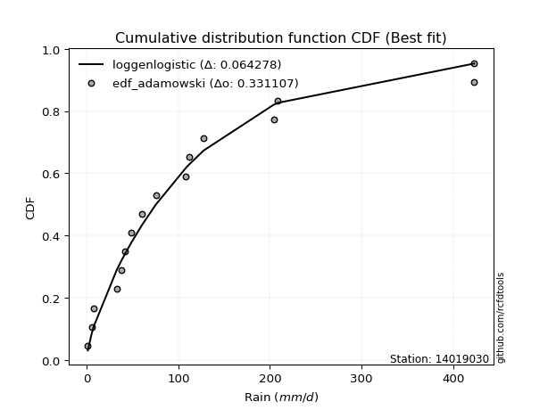</img>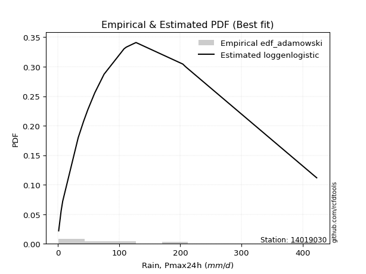</img>

</div>


## C. Best fit & Estimate extreme values for specific return periods - Tr


### 1. Best fit (ordered by delta Δ)

<div align="center">

|   id |   station | empirical_dist   | p_dist         |     delta |   deltao | eval   |   fit |   n |   best_fit |   best_fit_sort |
|-----:|----------:|:-----------------|:---------------|----------:|---------:|:-------|------:|----:|-----------:|----------------:|
|    0 |  14019030 | edf_gringorten   | loggenlogistic | 0.0557137 | 0.336646 | Δo > Δ |     1 |  15 |          1 |               1 |
|    1 |  14019030 | edf_cunnane      | loggenlogistic | 0.0572297 | 0.336646 | Δo > Δ |     1 |  15 |          1 |               2 |
|    2 |  14019030 | edf_hazen        | loggenlogistic | 0.057301  | 0.336646 | Δo > Δ |     1 |  15 |          1 |               3 |
|    3 |  14019030 | edf_blom         | loggenlogistic | 0.0583082 | 0.336646 | Δo > Δ |     1 |  15 |          1 |               4 |
|    4 |  14019030 | edf_tukey        | loggenlogistic | 0.0600901 | 0.336646 | Δo > Δ |     1 |  15 |          1 |               5 |
|    5 |  14019030 | edf_filliben     | loggenlogistic | 0.0607622 | 0.336646 | Δo > Δ |     1 |  15 |          1 |               6 |
|    6 |  14019030 | edf_beard        | loggenlogistic | 0.0610796 | 0.336646 | Δo > Δ |     1 |  15 |          1 |               7 |
|    7 |  14019030 | edf_jenkinson    | loggenlogistic | 0.0610796 | 0.336646 | Δo > Δ |     1 |  15 |          1 |               8 |
|    8 |  14019030 | edf_chegodayev   | loggenlogistic | 0.0615018 | 0.336646 | Δo > Δ |     1 |  15 |          1 |               9 |
|    9 |  14019030 | edf_adamowski    | loggenlogistic | 0.0638908 | 0.336646 | Δo > Δ |     1 |  15 |          1 |              10 |
|   10 |  14019030 | edf_weibull      | ncf            | 0.066731  | 0.336646 | Δo > Δ |     1 |  15 |          1 |              11 |
|   11 |  14019030 | edf_california   | chi2           | 0.086365  | 0.336646 | Δo > Δ |     1 |  15 |          1 |              12 |

</div>

:file_folder:Tables: [bestfit_14019030.csv](table/bestfit_14019030.csv) | [extreme_14019030.csv](table/extreme_14019030.csv)


### 2. Extreme values

In hydrology, a return period (or recurrence interval $Tr$) is the statistical average time between extreme events like floods or droughts of a specific magnitude, indicating how rare an event is, with a 100-year flood, for example, having a 1% chance of occurring in any given year, not that it happens exactly every century. It is a key tool for infrastructure design (like bridges or dams) and risk assessment, calculated from historical data to determine the probability of future events, although it is important to remember it is statistical average, and events can cluster or be missed.

> risk_rate: assuming the return period as the project useful life.

|   id |      tr |   prob_l |     prob_g |      alpha |   betaprime |     chi2 |   crystalball |    erlang |    expon |   exponnorm |         f |   fatiguelife |        fisk |    gamma |   genexpon |   genlogistic |    gibrat |   gompertz |   gumbel_l |   gumbel_r |   halflogistic |   halfnorm |   hypsecant |   invgamma |   invgauss |   invweibull |   johnsonsu |   kstwobign |   laplace |   laplace_asymmetric |   loggamma |   logistic |   lognorm |   maxwell |   mielke |    moyal |   nakagami |       ncf |       nct |    norm |    pareto |   pearson3 |   rayleigh |    rice |         t |   truncnorm |      wald |   weibull_min |   logalpha |   logbetaprime |    logchi2 |   logcrystalball |   logerlang |         logexpon |   logexponnorm |      logf |   logfatiguelife |    logfisk |   loggenexpon |   loggenlogistic |        loggibrat |   loggompertz |   loggumbel_l |   loggumbel_r |   loghalflogistic |   loghalfnorm |   loghypsecant |   loginvgamma |   loginvgauss |    loginvweibull |   logjohnsonsu |   logkstwobign |   loglaplace |   loglaplace_asymmetric |   logloggamma |   loglogistic |   loglognorm |   logmaxwell |   logmielke |    logmoyal |   lognakagami |           logncf |    lognct |   logpareto |   logpearson3 |   lograyleigh |   logrice |        logt |   logtruncnorm |          logwald |   logweibull_min |   station |   n |   risk_rate |
|-----:|--------:|---------:|-----------:|-----------:|------------:|---------:|--------------:|----------:|---------:|------------:|----------:|--------------:|------------:|---------:|-----------:|--------------:|----------:|-----------:|-----------:|-----------:|---------------:|-----------:|------------:|-----------:|-----------:|-------------:|------------:|------------:|----------:|---------------------:|-----------:|-----------:|----------:|----------:|---------:|---------:|-----------:|----------:|----------:|--------:|----------:|-----------:|-----------:|--------:|----------:|------------:|----------:|--------------:|-----------:|---------------:|-----------:|-----------------:|------------:|-----------------:|---------------:|----------:|-----------------:|-----------:|--------------:|-----------------:|-----------------:|--------------:|--------------:|--------------:|------------------:|--------------:|---------------:|--------------:|--------------:|-----------------:|---------------:|---------------:|-------------:|------------------------:|--------------:|--------------:|-------------:|-------------:|------------:|------------:|--------------:|-----------------:|----------:|------------:|--------------:|--------------:|----------:|------------:|---------------:|-----------------:|-----------------:|----------:|----:|------------:|
|    0 |    2    | 0.5      | 0.5        |    35.6506 |     56.3871 |  66.3051 |       2.47139 |   55.913  |  87.2288 |      86.338 |   71.4464 |       59.9048 |     47.724  |  48.5973 |    87.2287 |       100.097 |   85.6064 |    105.821 |    147.045 |    103.581 |        92.7773 |    98.2351 |     125.313 |    71.4465 |    67.6433 |      70.9903 |     65.312  |     110.824 |   125.313 |              87.2615 |    53.0488 |    125.313 |   56.181  |   114     |  97.7758 |  96.5655 |    98.8797 |   83.1761 |   72.187  | 125.313 |   79.7507 |    96.8218 |    109.987 | 124.772 |   73.0722 |     99.9531 |   82.4327 |       93.2181 |    52.1224 |        55.8712 |    54.0467 |          56.181  |     54.3664 |     17.2592      |        56.1814 |   56.1562 |          55.7284 |    67.6176 |       30.406  |          82.0777 |     34.8537      |       69.9964 |       72.9574 |       43.2623 |           37.9916 |       40.5685 |         56.181 |       52.1064 |       49.6199 |     46.2233      |        81.2143 |        38.3653 |      56.181  |                 75.5251 |       81.9863 |       56.181  |      56.1805 |      49.0353 |    0.228032 |     39.7625 |       56.2871 |     45.0407      |   56.1282 |     1.2235  |       71.6681 |       46.7265 |   56.1813 |     71.4954 |        21.1825 |     33.5483      |          74.3344 |  14019030 |  15 |    0.75     |
|    1 |    2.33 | 0.570815 | 0.429185   |    43.5474 |     75.4113 |  84.6176 |      33.6515  |   74.7749 | 106.184  |     105.127 |   87.5274 |       78.1276 |     65.4893 |  62.6299 |   106.183  |       117.736 |   97.5642 |    128.872 |    167.583 |    125.455 |       115.267  |   123.712  |     144.205 |    87.5275 |    84.5612 |      87.0253 |     82.8909 |     130.496 |   139.599 |             106.224  |    70.991  |    146.112 |   74.6199 |   138.525 | 124.189  | 117.272  |   130.341  |  107.657  |   87.6834 | 148.919 |   98.0542 |   119.275  |    134.875 | 145.713 |   86.4156 |    120.049  |   97.9114 |      119.655  |    70.2    |        74.3525 |    73.0361 |          74.6199 |     73.1323 |     31.0546      |        74.6204 |   74.639  |          73.9501 |    87.0321 |       47.8292 |         102.926  |     40.243       |       89.6863 |       93.3924 |       56.2767 |           49.7879 |       55.1094 |         70.508 |       70.4169 |       67.264  |     67.8852      |       103.311  |        57.3193 |      66.7089 |                 91.6663 |      104.04   |       72.1431 |      74.6193 |      65.8528 |    0.228032 |     51.0032 |       74.7956 |     65.2911      |   74.5696 |     1.41458 |       93.3178 |       63.026  |   74.6204 |     90.8571 |        33.9166 |     40.4108      |          94.2497 |  14019030 |  15 |    0.729209 |
|    2 |    5    | 0.8      | 0.2        |   104.6    |    193.56   | 183.066  |     149.525   |  183.911  | 200.953  |     199.065 |  185.137  |      191.568  |    225.32   | 139.385  |   200.952  |       194.362 |  166.409  |    244.122 |    233.931 |    220.484 |       217.027  |   231.451  |     219.985 |   185.137  |   186.862  |     186.638  |    196.857  |     214.057 |   211.021 |             201.03   |   213.337  |    226.418 |  214.26   |   235.053 | 234.457  | 213.184  |   284.4    |  230.786  |  179.358  | 236.645 |  195.363  |   219.839  |    234.511 | 229.553 |  144.378  |    213.57   |  184.561  |      269.048  |   219.71   |       215.39   |   229.186  |         214.26   |    223.947  |    585.597       |       214.261  |  214.827  |         211.853  |   230.64   |      293.495  |         204.967  |     92.0838      |      201.906  |      207.38   |      176.42   |          169.239  |      201.291  |        175.365 |      223.281  |      218.772  |    360.517       |       213.791  |       315.468  |     157.449  |                170.961  |      213.223  |      189.468  |     214.261  |     210.199  |    0.228032 |    161.597  |      215.18   |    324.149       |  214.397  |   inf       |      218.355  |      208.83   |  214.261  |    231.503  |       238.994  |    114.544       |         202.921  |  14019030 |  15 |    0.67232  |
|    3 |   10    | 0.9      | 0.1        |   216.57   |    332.025  | 277.946  |     226.393   |  295.213  | 286.982  |     284.34  |  310.917  |      315.719  |    563.407  | 214.374  |   286.981  |       256.768 |  244.884  |    348.743 |    270.87  |    297.883 |       301.535  |   311.175  |     280.497 |   310.918  |   304.871  |     321.048  |    345.813  |     277.678 |   275.857 |             287.093  |   449.534  |    285.56  |  431.346  |   302.985 | 310.253  | 296.691  |   408.898  |  342.458  |  295.285  | 294.841 |  292.686  |   302.355  |    305.554 | 289.332 |  203.619  |    290.392  |  276.517  |      423.058  |   483.267  |       436.798  |   500.052  |         431.346  |    477.629  |   8422.44        |       431.347  |  433.3    |         426.287  |   472.765  |     1070.73   |         303.532  |    236.573       |      318.772  |      323.338  |      447.417  |          467.504  |      524.968  |        363.015 |      495.439  |      499.788  |   1404.59        |       307.964  |      1155.76   |     343.319  |                292.382  |      307.514  |      385.801  |     431.353  |     475.73   |    0.228032 |    441.05   |      433.825  |   1176.12        |  432.121  |   inf       |      344.989  |      490.636  |  431.347  |    473.393  |       987.407  |    346.063       |         310.998  |  14019030 |  15 |    0.651322 |
|    4 |   15    | 0.933333 | 0.0666667  |   328.093  |    427.53   | 334.831  |     264.751   |  363.433  | 337.305  |     334.222 |  407.934  |      394.004  |    929.133  | 259.578  |   337.305  |       291.977 |  299.012  |    409.942 |    287.599 |    341.551 |       349.359  |   352.663  |     315.03  |   407.935  |   383.946  |     428.832  |    457.315  |     311.454 |   313.783 |             337.436  |   655.093  |    317.783 |  611.603  |   337.84  | 350.054  | 345.155  |   475.007  |  408.072  |  384.216  | 323.881 |  353.922  |   348.489  |    342.159 | 320.133 |  246.718  |    332.497  |  335.567  |      519.413  |   723.251  |       621.859  |   742.871  |         611.603  |    700.162  |  40061.7         |       611.604  |  615.003  |         604.463  |   699.006  |     2086.33   |         368.422  |    453.537       |      392.318  |      395.378  |      756.377  |          830.833  |      864.527  |        549.861 |      744.667  |      765.035  |   3025.34        |       359.303  |      2302.71   |     541.678  |                400.202  |      360.377  |      568.365  |     611.618  |     723.381  |    0.228032 |    789.87   |      615.595  |   2422.08        |  613.109  |   inf       |      420.896  |      761.899  |  611.604  |    711.187  |      2054.12   |    703.894       |         377.343  |  14019030 |  15 |    0.644736 |
|    5 |   20    | 0.95     | 0.05       |   439.506  |    502.349  | 375.638  |     289.871   |  412.842  | 373.01   |     369.614 |  490.207  |      451.37   |   1313.19   | 292.082  |   373.01   |       316.628 |  341.472  |    453.363 |    298.012 |    372.126 |       382.866  |   380.324  |     339.393 |   490.208  |   444.1    |     522.668  |    548.929  |     334.206 |   340.693 |             373.156  |   839.709  |    340.055 |  768.737  |   360.972 | 377.666  | 379.477  |   519.321  |  454.88   |  459.526  | 342.899 |  399.418  |   380.536  |    366.489 | 340.605 |  282.773  |    361.282  |  379.571  |      590.206  |   945.249  |       783.835  |   964.952  |         768.737  |    900.922  | 121137           |       768.737  |  773.555  |         759.873  |   915.937  |     3250.69   |         419.119  |    755.664       |      446.523  |      448.112  |     1092.44   |         1243.03   |     1205.64   |        736.999 |      975.943  |     1016.05   |   5177.14        |       393.996  |      3663.58   |     748.61   |                500.04   |      396.936  |      742.894  |     768.759  |     955.343  |    0.228032 |   1193.39   |      774.161  |   4012.49        |  770.989  |   inf       |      474.659  |     1020.8    |  768.738  |    951.314  |      3341.88   |   1194.79        |         425.607  |  14019030 |  15 |    0.641514 |
|    6 |   25    | 0.96     | 0.04       |   550.874  |    564.689  | 407.503  |     308.363   |  451.645  | 400.705  |     397.067 |  563.058  |      496.723  |   1711.19   | 317.5    |   400.705  |       335.617 |  376.868  |    487.044 |    305.422 |    395.677 |       408.681  |   400.905  |     358.247 |   563.059  |   492.901  |     607.427  |    627.792  |     351.248 |   361.565 |             400.862  |  1008.96   |    357.093 |  909.666  |   378.145 | 399.083  | 406.081  |   552.365  |  491.371  |  526.185  | 356.899 |  435.928  |   405.066  |    384.566 | 355.816 |  314.596  |    383.041  |  414.817  |      646.398  |  1153.31   |       929.531  |  1171.23   |         909.666  |   1085.54   | 285770           |       909.666  |  915.855  |         899.323  |  1126.33   |     4519.45   |         461.643  |   1156.55        |      489.64   |      489.869  |     1450.02   |         1695.45   |     1544.14   |        924.527 |     1193.15   |     1255.25   |   7830.77        |       419.928  |      5187.53   |     962.16   |                594.335  |      424.787  |      911.79   |     909.696  |    1174.45   |    0.228032 |   1643.24   |      916.447  |   5918.35        |  912.658  |   inf       |      516.043  |     1268.62   |  909.667  |   1195.84   |      4796.47   |   1825.33        |         463.668  |  14019030 |  15 |    0.639603 |
|    7 |   50    | 0.98     | 0.02       |  1107.52   |    784.673  | 507.441  |     361.316   |  574.327  | 486.734  |     482.341 |  851.898  |      641.416  |   3843.15   | 397.379  |   486.733  |       394.11  |  501.643  |    591.664 |    325.537 |    468.227 |       488.222  |   460.725  |     416.703 |   851.901  |   655.247  |     956.589  |    921.466  |     401.292 |   426.401 |             486.924  |  1713.8    |    409.149 | 1473.07   |   427.95  | 467.5    | 488.67   |   648.569  |  605.985  |  790.579  | 396.989 |  556.509  |   479.782  |    437.039 | 399.969 |  441.364  |    447.795  |  529.896  |      827.46   |  2057.17   |      1515.1    |  2051.24   |        1473.07   |   1858.51   |      4.11013e+06 |      1473.07   | 1485.48   |        1457.38   |  2118.49   |    11765.1    |         615.764  |   5184.55        |      629.046  |      623.9    |     3469.07   |         4411.99   |     3170      |       1867.08  |     2140.15   |     2327.37   |  28016.9         |       495.237  |     14405.6    |    2098      |               1016.45   |      508.716  |     1704.98   |    1473.14   |    2137.52   |    0.228032 |   4435.7    |     1485.8    |  19632.4         | 1479.55   |   inf       |      641.361  |     2384.15   | 1473.07   |   2503.79   |     13667.5    |   7282.32        |         585.036  |  14019030 |  15 |    0.63583  |
|    8 |   75    | 0.986667 | 0.0133333  |  1664.07   |    933.909  | 566.444  |     389.729   |  647.311  | 537.058  |     532.224 | 1076.33   |      728.186  |   6133.15   | 444.631  |   537.057  |       428.109 |  585.915  |    652.864 |    335.708 |    510.395 |       534.459  |   493.288  |     450.864 |  1076.33   |   756.917  |    1239.93   |   1131.8    |     428.826 |   464.327 |             537.268  |  2282.87   |    439.214 | 1907.87   |   455.028 | 509.956  | 536.966  |   700.95   |  674.069  |  996.283  | 418.5   |  632.379  |   522.64   |    465.587 | 423.991 |  541.199  |    483.899  |  600.71   |      937.551  |  2822.08   |      1969.65   |  2780.33   |        1907.87   |   2485.98   |      1.955e+07   |      1907.87   | 1925.69   |        1888.58   |  3051.33   |    19801.8    |         724.927  |  14281.3         |      714.117  |      705.065  |     5759.81   |         7692.67   |     4689.24   |       2815.44  |     2944.3    |     3265.63   |  58776.2         |       535.813  |     25268.7    |    3310.16   |               1391.28   |      556.172  |     2447.47   |    1907.98   |    2960.12   |  407.551    |   7927.85   |     1925.63   |  39549.3         | 1917.48   |   inf       |      711.559  |     3360.48   | 1907.87   |   3963.9    |     24127.8    |  17062.9         |         658.029  |  14019030 |  15 |    0.634587 |
|    9 |  100    | 0.99     | 0.01       |  2220.6    |   1050.1    | 608.505  |     408.946   |  699.535  | 572.763  |     567.616 | 1267.11   |      790.512  |   8531.31   | 478.347  |   572.762  |       452.171 |  651.198  |    696.285 |    342.362 |    540.241 |       567.185  |   515.472  |     475.096 |  1267.11   |   831.7    |    1487.67   |   1300.53   |     447.691 |   491.236 |             572.987  |  2774.1    |    460.442 | 2272.6    |   473.472 | 541.589  | 571.23   |   736.614  |  722.902  | 1171.36   | 433.049 |  688.748  |   552.738  |    485.036 | 440.356 |  627.089  |    508.806  |  652.341  |     1017.38   |  3502.86   |      2352.31   |  3419.97   |        2272.6    |   3029.38   |      5.91145e+07 |      2272.59   | 2295.26   |        2250.59   |  3947.9    |    28233.9    |         812.761  |  31308.5         |      775.931  |      763.784  |     8246.2    |        11401.6    |     6122.68   |       3767.75  |     3661.36   |     4118.63   |  99299.3         |       563.149  |     37136.1    |    4574.71   |               1738.36   |      589.181  |     3159.07   |    2272.73   |    3695.06   |  411.429    |  11969.5    |     2294.8    |  65082.1         | 2285.07   |   inf       |      759.689  |     4245.77   | 2272.6    |   5575.91   |     35515.2    |  31743.9         |         710.631  |  14019030 |  15 |    0.633968 |
|   10 |  200    | 0.995    | 0.005      |  4446.67   |   1369.62   | 710.411  |     452.537   |  826.623  | 658.792  |     652.891 | 1864.38   |      942.816  |  18830.7    | 560.128  |   658.791  |       510.021 |  828.808  |    800.906 |    356.823 |    611.992 |       645.862  |   566.208  |     533.474 |  1864.39   |  1019.86   |    2296.65   |   1782.01   |     491.142 |   556.072 |             659.049  |  4328.94   |    511.361 | 3379.5    |   515.67  | 624.13   | 653.784  |   818.083  |  842.533  | 1720.68   | 466.051 |  833.773  |   624.364  |    529.536 | 477.801 |  901.566  |    566.639  |  780.946  |     1215.15   |  5758.85   |      3519.75   |  5492.7    |        3379.5    |   4757.04   |      8.50223e+08 |      3379.49   | 3418.29   |        3350.71   |  7323.86   |    63585      |        1067.36   | 264916           |      929.485  |      908.834  |    19539.9    |        29363.1    |    11268.9    |       7601.84  |     6043.44   |     7035.27   | 350323           |       624.413  |     90142.2    |    9975.22   |               2973      |      666.662  |     5827.08   |    3379.75   |    6137.19   |  417.3      |  32296.5    |     3416.15   | 217909           | 3401.69   |   inf       |      869.347  |     7249.83   | 3379.5    |  13499.7    |     85851.1    | 149013           |         839.926  |  14019030 |  15 |    0.633042 |
|   11 |  250    | 0.996    | 0.004      |  5559.69   |   1485.66   | 743.364  |     465.858   |  867.862  | 686.487  |     680.343 | 2107.73   |      992.394  |  24280.7    | 586.597  |   686.486  |       528.618 |  892.535  |    834.586 |    361.078 |    635.058 |       671.155  |   581.817  |     552.266 |  2107.74   |  1082.6    |    2638.46   |   1961.96   |     504.589 |   576.944 |             686.755  |  4963.54   |    527.708 | 3815.19   |   528.659 | 652.885  | 680.36   |   843.112  |  881.679  | 1944.94   | 476.137 |  883.381  |   647.189  |    543.235 | 489.328 | 1015.54   |    584.655  |  823.492  |     1280.36   |  6716.9    |      3981.32   |  6355.66   |        3815.19   |   5464.74   |      2.00573e+09 |      3815.17   | 3860.79   |        3784.23   |  8931      |    81640.7    |        1164.51   | 570005           |      980.23   |      956.539  |    25785.4    |        39799.8    |    13595.2    |       9529.03  |     7056.9    |     8306.79   | 525398           |       642.844  |    118609      |   12820.8    |               3533.63   |      691.037  |     7092.74   |    3815.48   |    7174.61   |  418.482    |  44455.8    |     3857.86   | 322632           | 3841.56   |   inf       |      902.657  |     8547.85   | 3815.18   |  18331      |    112592      | 248539           |         882.269  |  14019030 |  15 |    0.632858 |
|   12 |  500    | 0.998    | 0.002      | 11124.8    |   1893.15   | 846.105  |     505.363   |  996.802  | 772.516  |     765.618 | 3074.03   |     1147.79   |  53412.1    | 669.181  |   772.514  |       586.342 | 1112.77   |    939.207 |    373.275 |    706.653 |       749.661  |   628.354  |     610.64  |  3074.04   |  1283.32   |    4050.95   |   2609.38   |     544.887 |   641.78  |             772.818  |  7463.46   |    578.407 | 5466.25   |   567.42  | 750.098  | 762.912  |   917.626  | 1005.41   | 2837.58   | 506.045 | 1047.22   |   717.476  |    584.107 | 523.719 | 1478.11   |    638.939  |  958.776  |     1487.36   | 10660.1    |      5738.76   |  9827.95   |        5466.25   |   8262.89   |      2.88478e+10 |      5466.23   | 5539.53   |        5429.28   | 16523.7    |   172126      |        1524.73   |      8.05234e+06 |     1141.66   |     1107.63   |    60985.6    |       102289      |    23790.2    |      19224.8   |    11235      |    13691.3    |      1.8485e+06  |       696.436  |    269962      |   27955.8    |               6043.31   |      765.155  |    13048.2    |    5466.75   |   11434.1    |  420.854    | 119949      |     5533.01   |      1.10684e+06 | 5509.87   |   inf       |      999.767  |    13972.6    | 5466.24   |  51217.1    |    252472      |      1.26424e+06 |        1015.86   |  14019030 |  15 |    0.632489 |
|   13 |  750    | 0.998667 | 0.00133333 | 16689.9    |   2168.52   | 906.436  |     527.308   | 1072.74   | 822.839  |     815.5   | 3825.59   |     1239.54   |  84658.9    | 717.714  |   822.838  |       620.087 | 1258.43   |   1000.41  |    379.794 |    748.508 |       795.556  |   654.353  |     644.785 |  3825.61   |  1404.41   |    5199.68   |   3057.1    |     567.525 |   679.706 |             823.162  |  9375.08   |    608.027 | 6674.92   |   589.099 | 813.139  | 811.201  |   959.178  | 1079.35   | 3533.76   | 522.659 | 1150.31   |   758.214  |    606.962 | 542.951 | 1846.97   |    669.609  | 1039.89   |     1611.4    | 13828.2    |      7032.11   | 12546      |        6674.92   |  10411      |      1.37216e+11 |      6674.89   | 6769.99   |        6635.41   | 23671.2    |   261232      |        1784.21   |      4.6397e+07  |     1238.62   |     1197.94   |   100875      |       177616      |    32520.6    |      28984.5   |    14597      |    18154.4    |      3.85659e+06 |       725.412  |    428509      |   44107.9    |               8271.86   |      807.478  |    18630.3    |    6675.58   |   14839.1    |  421.647    | 214365      |     6760.36   |      2.30197e+06 | 6732.32   |   inf       |     1052.12   |    18391.7    | 6674.91   |  99284.3    |    396185      |      3.35267e+06 |        1095.37   |  14019030 |  15 |    0.632366 |
|   14 | 1000    | 0.999    | 0.001      | 22255      |   2382.57   | 949.333  |     542.417   | 1126.82   | 858.545  |     850.893 | 4464.71   |     1304.96   | 117363      | 752.235  |   858.543  |       644.023 | 1369.89   |   1043.83  |    384.182 |    778.197 |       828.111  |   672.307  |     669.012 |  4464.73   |  1491.8    |    6204.94   |   3409.17   |     583.209 |   706.616 |             858.881  | 10975.4    |    629.032 | 7659.1    |   604.083 | 860.937  | 845.463  |   987.842  | 1132.55   | 4126.84   | 534.098 | 1226.9    |   786.968  |    622.756 | 556.241 | 2165.79   |    690.923  | 1098.24   |     1700.66   | 16566.6    |      8088.74   | 14855.4    |        7659.1    |  12213.5    |      4.14907e+11 |      7659.06   | 7772.68   |        7618.51   | 30544.3    |   348534      |        1994.4    |      1.77221e+08 |     1308.49   |     1262.83   |   144149      |       262710      |    40356.8    |      38785.9   |    17505.4    |    22089.1    |      6.49763e+06 |       744.991  |    590164      |   60958      |              10335.4    |      837.079  |    23983.1    |    7659.91   |   17768.5    |  422.044    | 323640      |     7760.29   |      3.89202e+06 | 7728.33   |   inf       |     1087.3    |    22237.9    | 7659.09   | 163729      |    540694      |      6.76193e+06 |        1152.35   |  14019030 |  15 |    0.632305 |

<div align="center">

</img>

</div>


<div align="center">

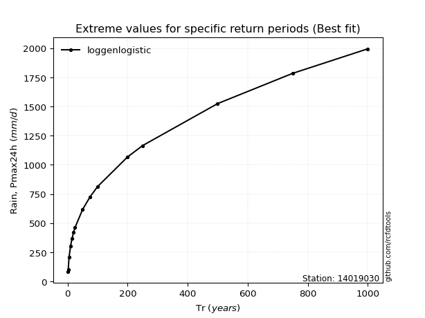</img>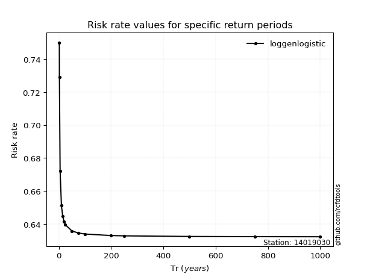</img>

</div>


<sub>**APP DISCLAIMER**: NO WARRANTY - This software is provided by [github.com/rcfdtools](https://github.com/rcfdtools) "as is", without any express or implied warranty, including warranties of merchantability, fitness for a particular purpose, or non-infringement. There is no guarantee that the software will be error-free or operate without interruption. LIMITATION OF LIABILITY - Neither the authors nor copyright holders will be liable for claims or damages arising from the software or its use. You are responsible for determining if the software is appropriate for your use and assume all associated risks, including errors, legal compliance, and data loss. NO PROFESSIONAL ADVICE - The software provides general information and does not offer professional advice. It should not replace consultation with professional advisors.</sub>