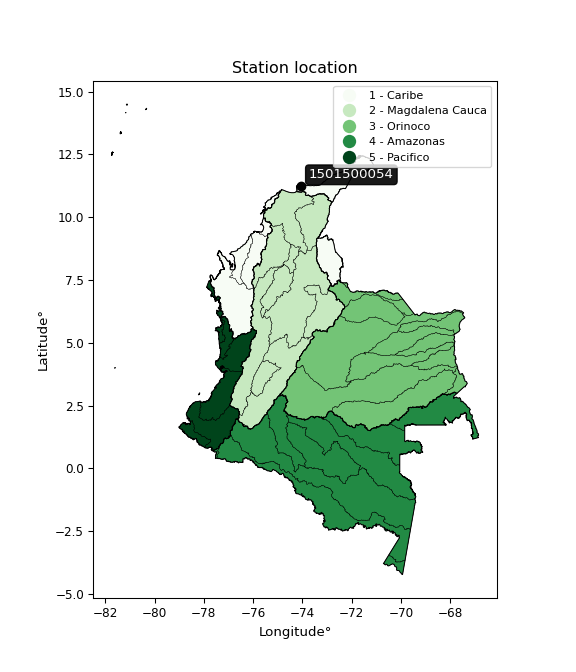

<div align="center">


</div>

# PMP Station (Rain, Pmax24h): 1501500054

Probable Maximum Precipitation (PMP) is the greatest amount of rainfall for a specific duration that is meteorologically possible for a given location, acting as a "worst-case" scenario for extreme storms, crucial for designing safety-critical infrastructure like bridges, river deviations, dams, spillways, and nuclear plants to prevent catastrophic failure. PMP is calculated by hydrologists using meteorological data to determine the upper limit of extreme rainfall, often leading to the Probable Maximum Flood (PMF) for flood control design, and is increasingly being studied for climate change impacts. Probable Maximum Precipitation (PMP) is the theoretical upper limit of rainfall, a deterministic estimate for extreme events, while probability distributions (like GEV, Gumbel) describe the likelihood and frequency of various precipitation amounts, including rare ones, showing how often events occur, with PMP representing the extreme end of these distributions, used for critical infrastructure design to ensure safety against the worst conceivable weather, unlike standard statistical forecasts which cover typical probabilities.

The most common probability distributions in hydrology, used for analyzing floods, rainfall, and streamflow, include the Normal, Log-Normal, Gumbel, Gamma (including Log-Pearson Type III), and Generalized Extreme Value (GEV) distributions, often chosen based on the data´s skewness and whether modeling extremes or general conditions, with Gumbel and GEV popular for extreme events like floods, while the Normal distribution serves as a baseline, though often requiring transformations for skewed hydrological data. These distributions help in designing water infrastructure, managing water resources, and forecasting hydrologic events.

> Hydrological data often isn´t perfectly normal (it´s skewed), so different distributions are needed for different applications, such as: **Flood Frequency Analysis**: Using Gumbel, GEV, or Log-Pearson Type III for predicting extreme flood magnitudes and their return periods, **Rainfall Analysis**: Normal for annual totals, but Log-Normal, Weibull, or GEV for intensity or extreme daily rainfall, **Streamflow Modeling**: Gamma and Log-Normal for maximum flows, GEV for minimum flows, and Kappa for daily flows.

<div align="center">

</img>

</div>


## A. General information


### 1. General running parameters

• app_version: _v20260113_. • runtime: _2026-01-17 18:24:04.630693_. • Python version: _3.14.0_. • SciPy version: _1.16.3_. • Pandas version: _2.3.3_. • NumPy version: _2.3.5_. • Stations dataset (station_dataset_file): _dataset/pmax24h_in/automatic_colombia_2003_2025.csv_. • Stations catalog (station_catalog_file): _dataset/CNE.xls_. • Minimum year to eval til year_max (date_min): _1900_. • Maximum year to eval since year_min (date_max): _2025_. • Creates, save and include plots into reports (create_plot): _False_. • Plot only fit distributions with Δo > Δ (plot_only_fit): _True_. • Plot only simple graphs avoiding multiple CDFs and multiple Extreme values plots (plot_only_simple): _True_. • Eval low extreme values, if False, evaluates high extreme values (low_extreme): _False_. • Eval every SciPy distribution as logarithmic (pdist_logarithmic_on): _True_. • Standard deviation normalized (ddof): _1.0_. • Return periods to eval in years (Tr): _[2, 2.33, 5, 10, 15, 20, 25, 50, 75, 100, 200, 250, 500, 750, 1000]_. • Minimum data sample per station, 0 means any (minimum_sample): _5_. • Z-Score maximum threshold to adjust a value, 0 means disable (zscore_max): _3.5_. • Z-Score minimum threshold to adjust a value, 0 means disable (zscore_min): _-2.5_. • Avoid zeros, e.g. rain = 0 (avoid_zeros): _True_. • Avoid null values (avoid_nans): _True_. 

:file_folder:Table: [dataset.csv](../../dataset/pmax24h_in/automatic_colombia_2003_2025.csv)

> Delta Degrees of Freedom (DDOF): is a parameter used in the formulas for calculating variance and standard deviation. When ddof=0, the divisor is $N$ (the total number of observations) and this is used when your data set is the entire population. When ddof=1, the divisor is $N-1$ and this is used when your data set is a sample drawn from a larger population. Using $N-1$ provides an unbiased estimate of the population variance (known as Bessel´s correction).


### 2. Station info and location

|   id |     CODIGO | NOMBRE                                | CATEGORIA               | TECNOLOGIA                | ESTADO           | FECHA_INSTALACION   |   FECHA_SUSPENSION |   ALTITUD |   LATITUD |   LONGITUD | DEPARTAMENTO   | MUNICIPIO   | AREA_OPERATIVA                                         | ENTIDAD                                                     | AREA_HIDROGRAFICA   | ZONA_HIDROGRAFICA   | SUBZONA_HIDROGRAFICA          |   CORRIENTE | Catalogo   |   Version |
|-----:|-----------:|:--------------------------------------|:------------------------|:--------------------------|:-----------------|:--------------------|-------------------:|----------:|----------:|-----------:|:---------------|:------------|:-------------------------------------------------------|:------------------------------------------------------------|:--------------------|:--------------------|:------------------------------|------------:|:-----------|----------:|
|    0 | 1501500054 | SAN ISIDRO BONDA - AUT   [1501500054] | Climatológica Principal | Automática con Telemetría | En Mantenimiento | 13/12/2016          |                nan |       581 |   11.2305 |   -74.0598 | Magdalena      | Santa Marta | Area Operativa 05 - Magdalena-Cesar-Guajira-San Andrés | INSTITUTO DE HIDROLOGIA METEOROLOGIA Y ESTUDIOS AMBIENTALES | Caribe              | Caribe - Guajira    | Río  Piedras - Río Manzanares |         nan | CNE_IDEAM  |  20251226 |

<div align="center">

Dynamic map: [:earth_americas:Google](http://maps.google.com/maps?q=11.230522222,-74.059786111) [:earth_americas:OSM](https://www.openstreetmap.org/#map=18/11.230522222/-74.059786111&layers=P) [:earth_americas:Bing](https://www.bing.com/maps?cp=11.230522222~-74.059786111&lvl=18) [:earth_americas:Apple](https://maps.apple.com/frame?center=11.230522222%2C-74.059786111&span=0.003%2C0.006)

</div>


<div align="center">

```geojson
{
  "type": "Feature",
  "geometry": {
    "type": "Point", 
    "coordinates": [-74.059786111, 11.230522222]
  }, 
  "properties": {
    "Name": "1501500054"
  }
}
```

</div>


### 3. Discrete values table and plot

<div align="center">

|               |           0 |           1 |          2 |           3 |          4 |
|:--------------|------------:|------------:|-----------:|------------:|-----------:|
| Date          | 2019        | 2020        | 2021       | 2022        | 2023       |
| Value         |  105.8      |   56.4      |   77.2     |   93.7      |    0.2     |
| Value_initial |  105.8      |   56.4      |   77.2     |   93.7      |    0.2     |
| count         |    5        |    5        |    5       |    5        |    5       |
| mean          |   66.66     |   66.66     |   66.66    |   66.66     |   66.66    |
| std           |   41.5223   |   41.5223   |   41.5223  |   41.5223   |   41.5223  |
| zscore        |    0.942627 |   -0.247096 |    0.25384 |    0.651217 |   -1.60059 |


</div>


> The initial value (value_initial) correspond to the initial obtained or null completed value, and value (value) is adjusted only when the initial value is outside the valid range (outlier) definite through the Z-Score value. If Z-Score is active, values out of range or outliers are replaced with the station mean value. A Z-Score (or standard score) measures how many standard deviations a data point is from the mean of a dataset, indicating its relative position; positive scores mean above the mean, negative mean below, and a score of zero is exactly at the mean, allowing for comparison of values from different distributions. It´s calculated using the formula $z=(x–μ)/σ$, where $x$ is the data point, $μ$ is the mean, and $σ$ is the standard deviation, helping identify outliers and understand probability.
>
> <sub>**Note**: In this study, "completing" (filling gaps in) and "extending" (forecasting or lengthening the historical record) rainfall data series are avoided for certain critical analyses because they introduce artificial bias and uncertainty, which can distort the statistics of rare events (extremes), alter day-to-day variability, and compromise the integrity and homogeneity of the original data. Some reasons against Completing/Extending rainfall data are: **Distortion of Extremes and Variability**: The primary issue is that most gap-filling or extension methods rely on averaging or regression with nearby stations, which inherently smooths the data. Rainfall is highly variable in space and time, with a large percentage of zero values and occasional large storms. Infilling methods often underestimate the highest values and overestimate the lowest (zero) values, which severely distorts analyses focused on flood frequency, drought severity, and intensity-duration-frequency (IDF) curves, **Loss of Data Homogeneity**: Infilled or extended data are synthetic estimates, not actual measurements. Combining these estimates with observed data can violate the assumption of data homogeneity, which requires that the data properties do not change over time. Inhomogeneity can lead to incorrect conclusions about long-term trends or changes in climate patterns, **Propagation of Errors**: Errors and biases from the original data (e.g., wind-induced undercatch, instrument errors, site changes) or the data used for imputation can propagate through the analysis, leading to unreliable hydrological models and inaccurate predictions, **Compromised Statistical Integrity**: For statistical analyses, especially those involving the frequency of events, using artificial data can introduce time bias or autocorrelation that doesn´t exist in reality, making it difficult to assess the true probability of events, **Difficulty in Validation**: It is difficult to accurately validate the quality of filled or extended data, especially for past periods where ground-truth measurements are unavailable. The reliability of imputation techniques heavily depends on the density of the surrounding station network and the complexity of the local topography.</sub>


### 4. Active continuous probability distributions from SciPy (80 of 104 available)

A Probability Density Function (PDF) describes the relative likelihood of a continuous random variable falling within a specific range, where the total area under its curve equals 1, and the area over any interval gives the actual probability for that range. Unlike discrete probabilities (like rolling a die), a PDF shows density, not direct probability for a single point (which is zero), with higher points indicating higher likelihood, often visualized as a bell curve for normal distributions.

A log of a probability density function (log-PDF) is simply the logarithm of the PDF´s value, denoted as $log(f(x))$, useful for converting multiplication of probabilities into addition, improving numerical stability with tiny numbers, and connecting to information theory concepts like entropy. Instead of dealing with very small probabilities (e.g., 0.000001), log-PDFs use negative numbers (e.g., $log(0.00001) ≈ -11.51$ that are easier for computers to handle, preventing underflow errors and simplifying complex calculations. In this study, each active probability distribution from SciPy is also evaluated in the $log$ form.

[scipy.stats](https://docs.scipy.org/doc/scipy/reference/stats.html) is a Python´s powerful submodule within the SciPy library for comprehensive statistical analysis, offering over 130 probability distributions (like Normal, Poisson), functions for descriptive stats (mean, variance), hypothesis testing (t-tests, chi-square), random variable generation, and statistical tests, making it essential for data science, modeling, and research. It provides tools to explore, model, and draw conclusions from data efficiently, working seamlessly with NumPy.

<div align="center">

|   id | p_dist           |   n_parameter | fit_method   | label                                                                       | active   | ref                                                                                                      |
|-----:|:-----------------|--------------:|:-------------|:----------------------------------------------------------------------------|:---------|:---------------------------------------------------------------------------------------------------------|
|    0 | alpha            |             3 | MLE          | Alpha                                                                       | True     | [:mortar_board:](https://docs.scipy.org/doc/scipy/reference/generated/scipy.stats.alpha.html)            |
|    1 | anglit           |             2 | MM           | Anglit                                                                      | True     | [:mortar_board:](https://docs.scipy.org/doc/scipy/reference/generated/scipy.stats.anglit.html)           |
|    2 | arcsine          |             2 | MM           | Arcsine                                                                     | True     | [:mortar_board:](https://docs.scipy.org/doc/scipy/reference/generated/scipy.stats.arcsine.html)          |
|    3 | argus            |             3 | MLE          | Argus                                                                       | True     | [:mortar_board:](https://docs.scipy.org/doc/scipy/reference/generated/scipy.stats.argus.html)            |
|    4 | beta             |             4 | MLE          | Beta                                                                        | True     | [:mortar_board:](https://docs.scipy.org/doc/scipy/reference/generated/scipy.stats.beta.html)             |
|    5 | betaprime        |             4 | MLE          | Beta prime                                                                  | True     | [:mortar_board:](https://docs.scipy.org/doc/scipy/reference/generated/scipy.stats.betaprime.html)        |
|    6 | bradford         |             3 | MLE          | Bradford                                                                    | True     | [:mortar_board:](https://docs.scipy.org/doc/scipy/reference/generated/scipy.stats.bradford.html)         |
|    7 | burr             |             4 | MLE          | Burr (Type III)                                                             | True     | [:mortar_board:](https://docs.scipy.org/doc/scipy/reference/generated/scipy.stats.burr.html)             |
|    8 | burr12           |             4 | MLE          | Burr (Type III) 12                                                          | True     | [:mortar_board:](https://docs.scipy.org/doc/scipy/reference/generated/scipy.stats.burr12.html)           |
|    9 | cosine           |             2 | MLE          | Cosine                                                                      | True     | [:mortar_board:](https://docs.scipy.org/doc/scipy/reference/generated/scipy.stats.cosine.html)           |
|   10 | crystalball      |             4 | MLE          | Crystalball                                                                 | True     | [:mortar_board:](https://docs.scipy.org/doc/scipy/reference/generated/scipy.stats.crystalball.html)      |
|   11 | dgamma           |             3 | MLE          | Double gamma                                                                | True     | [:mortar_board:](https://docs.scipy.org/doc/scipy/reference/generated/scipy.stats.dgamma.html)           |
|   12 | dweibull         |             3 | MLE          | Double Weibull                                                              | True     | [:mortar_board:](https://docs.scipy.org/doc/scipy/reference/generated/scipy.stats.dweibull.html)         |
|   13 | erlang           |             3 | MLE          | Erlang                                                                      | True     | [:mortar_board:](https://docs.scipy.org/doc/scipy/reference/generated/scipy.stats.erlang.html)           |
|   14 | exponnorm        |             3 | MLE          | Exponentially modified Normal                                               | True     | [:mortar_board:](https://docs.scipy.org/doc/scipy/reference/generated/scipy.stats.exponnorm.html)        |
|   15 | exponpow         |             3 | MLE          | Exponential power                                                           | True     | [:mortar_board:](https://docs.scipy.org/doc/scipy/reference/generated/scipy.stats.exponpow.html)         |
|   16 | exponweib        |             4 | MLE          | Exponentiated Weibull                                                       | True     | [:mortar_board:](https://docs.scipy.org/doc/scipy/reference/generated/scipy.stats.exponweib.html)        |
|   17 | f                |             4 | MLE          | F                                                                           | True     | [:mortar_board:](https://docs.scipy.org/doc/scipy/reference/generated/scipy.stats.f.html)                |
|   18 | fatiguelife      |             3 | MLE          | Fatigue-life (Birnbaum-Saunders)                                            | True     | [:mortar_board:](https://docs.scipy.org/doc/scipy/reference/generated/scipy.stats.fatiguelife.html)      |
|   19 | foldnorm         |             3 | MM           | Fold Normal                                                                 | True     | [:mortar_board:](https://docs.scipy.org/doc/scipy/reference/generated/scipy.stats.foldnorm.html)         |
|   20 | gamma            |             3 | MLE          | Gamma                                                                       | True     | [:mortar_board:](https://docs.scipy.org/doc/scipy/reference/generated/scipy.stats.gamma.html)            |
|   21 | gausshyper       |             6 | MLE          | Gauss hypergeometric                                                        | True     | [:mortar_board:](https://docs.scipy.org/doc/scipy/reference/generated/scipy.stats.gausshyper.html)       |
|   22 | genexpon         |             5 | MLE          | Generalized exponential                                                     | True     | [:mortar_board:](https://docs.scipy.org/doc/scipy/reference/generated/scipy.stats.genexpon.html)         |
|   23 | genextreme       |             3 | MLE          | Generalized exponential                                                     | True     | [:mortar_board:](https://docs.scipy.org/doc/scipy/reference/generated/scipy.stats.genextreme.html)       |
|   24 | gengamma         |             4 | MLE          | Generalized gamma                                                           | True     | [:mortar_board:](https://docs.scipy.org/doc/scipy/reference/generated/scipy.stats.gengamma.html)         |
|   25 | genhalflogistic  |             3 | MLE          | Generalized half-logistic                                                   | True     | [:mortar_board:](https://docs.scipy.org/doc/scipy/reference/generated/scipy.stats.genhalflogistic.html)  |
|   26 | genlogistic      |             3 | MLE          | Generalized logistic                                                        | True     | [:mortar_board:](https://docs.scipy.org/doc/scipy/reference/generated/scipy.stats.genlogistic.html)      |
|   27 | gennorm          |             3 | MLE          | Generalized Normal                                                          | True     | [:mortar_board:](https://docs.scipy.org/doc/scipy/reference/generated/scipy.stats.gennorm.html)          |
|   28 | genpareto        |             3 | MLE          | Generalized Pareto                                                          | True     | [:mortar_board:](https://docs.scipy.org/doc/scipy/reference/generated/scipy.stats.genpareto.html)        |
|   29 | gompertz         |             3 | MLE          | Gompertz (or truncated Gumbel)                                              | True     | [:mortar_board:](https://docs.scipy.org/doc/scipy/reference/generated/scipy.stats.gompertz.html)         |
|   30 | gumbel_l         |             2 | MM           | Gumbel Left Skew                                                            | True     | [:mortar_board:](https://docs.scipy.org/doc/scipy/reference/generated/scipy.stats.gumbel_l.html)         |
|   31 | gumbel_r         |             2 | MM           | Gumbel Right Skew                                                           | True     | [:mortar_board:](https://docs.scipy.org/doc/scipy/reference/generated/scipy.stats.gumbel_r.html)         |
|   32 | halfgennorm      |             3 | MLE          | Upper half of a generalized normal                                          | True     | [:mortar_board:](https://docs.scipy.org/doc/scipy/reference/generated/scipy.stats.halfgennorm.html)      |
|   33 | halflogistic     |             2 | MM           | Half-logistic                                                               | True     | [:mortar_board:](https://docs.scipy.org/doc/scipy/reference/generated/scipy.stats.halflogistic.html)     |
|   34 | halfnorm         |             2 | MM           | Half Normal                                                                 | True     | [:mortar_board:](https://docs.scipy.org/doc/scipy/reference/generated/scipy.stats.halfnorm.html)         |
|   35 | hypsecant        |             2 | MM           | hyperbolic secant                                                           | True     | [:mortar_board:](https://docs.scipy.org/doc/scipy/reference/generated/scipy.stats.hypsecant.html)        |
|   36 | invgamma         |             3 | MLE          | Inverted gamma                                                              | True     | [:mortar_board:](https://docs.scipy.org/doc/scipy/reference/generated/scipy.stats.invgamma.html)         |
|   37 | invgauss         |             3 | MLE          | Inverse Gaussian                                                            | True     | [:mortar_board:](https://docs.scipy.org/doc/scipy/reference/generated/scipy.stats.invgauss.html)         |
|   38 | invweibull       |             3 | MLE          | Inverted Weibull                                                            | True     | [:mortar_board:](https://docs.scipy.org/doc/scipy/reference/generated/scipy.stats.invweibull.html)       |
|   39 | johnsonsb        |             4 | MLE          | Johnson SB                                                                  | True     | [:mortar_board:](https://docs.scipy.org/doc/scipy/reference/generated/scipy.stats.johnsonsb.html)        |
|   40 | johnsonsu        |             4 | MLE          | Johnson Su                                                                  | True     | [:mortar_board:](https://docs.scipy.org/doc/scipy/reference/generated/scipy.stats.johnsonsu.html)        |
|   41 | kappa3           |             3 | MLE          | Kappa 3                                                                     | True     | [:mortar_board:](https://docs.scipy.org/doc/scipy/reference/generated/scipy.stats.kappa3.html)           |
|   42 | kappa4           |             4 | MLE          | Kappa 4                                                                     | True     | [:mortar_board:](https://docs.scipy.org/doc/scipy/reference/generated/scipy.stats.kappa4.html)           |
|   43 | ksone            |             3 | MLE          | Kolmogorov-Smirnov one-sided test statistic distribution                    | True     | [:mortar_board:](https://docs.scipy.org/doc/scipy/reference/generated/scipy.stats.ksone.html)            |
|   44 | kstwobign        |             2 | MLE          | Limiting distribution of scaled Kolmogorov-Smirnov two-sided test statistic | True     | [:mortar_board:](https://docs.scipy.org/doc/scipy/reference/generated/scipy.stats.kstwobign.html)        |
|   45 | laplace          |             2 | MM           | Laplace                                                                     | True     | [:mortar_board:](https://docs.scipy.org/doc/scipy/reference/generated/scipy.stats.laplace.html)          |
|   46 | levy_l           |             2 | MLE          | Left-skewed Levy                                                            | True     | [:mortar_board:](https://docs.scipy.org/doc/scipy/reference/generated/scipy.stats.levy_l.html)           |
|   47 | loggamma         |             3 | MLE          | Log gamma                                                                   | True     | [:mortar_board:](https://docs.scipy.org/doc/scipy/reference/generated/scipy.stats.loggamma.html)         |
|   48 | logistic         |             2 | MM           | Logistic (or Sech-squared)                                                  | True     | [:mortar_board:](https://docs.scipy.org/doc/scipy/reference/generated/scipy.stats.logistic.html)         |
|   49 | loglaplace       |             3 | MLE          | Log-Laplace                                                                 | True     | [:mortar_board:](https://docs.scipy.org/doc/scipy/reference/generated/scipy.stats.loglaplace.html)       |
|   50 | lomax            |             3 | MLE          | Lomax (Pareto of the second kind)                                           | True     | [:mortar_board:](https://docs.scipy.org/doc/scipy/reference/generated/scipy.stats.lomax.html)            |
|   51 | maxwell          |             2 | MM           | Maxwell                                                                     | True     | [:mortar_board:](https://docs.scipy.org/doc/scipy/reference/generated/scipy.stats.maxwell.html)          |
|   52 | mielke           |             4 | MLE          | Mielke Beta-Kappa / Dagum                                                   | True     | [:mortar_board:](https://docs.scipy.org/doc/scipy/reference/generated/scipy.stats.mielke.html)           |
|   53 | moyal            |             2 | MM           | Moyal                                                                       | True     | [:mortar_board:](https://docs.scipy.org/doc/scipy/reference/generated/scipy.stats.moyal.html)            |
|   54 | nakagami         |             3 | MLE          | Nakagami                                                                    | True     | [:mortar_board:](https://docs.scipy.org/doc/scipy/reference/generated/scipy.stats.nakagami.html)         |
|   55 | ncf              |             5 | MLE          | Non-central F distribution                                                  | True     | [:mortar_board:](https://docs.scipy.org/doc/scipy/reference/generated/scipy.stats.ncf.html)              |
|   56 | nct              |             4 | MLE          | Non-central Student’s t                                                     | True     | [:mortar_board:](https://docs.scipy.org/doc/scipy/reference/generated/scipy.stats.nct.html)              |
|   57 | norm             |             2 | MM           | Normal                                                                      | True     | [:mortar_board:](https://docs.scipy.org/doc/scipy/reference/generated/scipy.stats.norm.html)             |
|   58 | pearson3         |             3 | MM           | Pearson type III                                                            | True     | [:mortar_board:](https://docs.scipy.org/doc/scipy/reference/generated/scipy.stats.pearson3.html)         |
|   59 | powerlaw         |             3 | MLE          | Power-function                                                              | True     | [:mortar_board:](https://docs.scipy.org/doc/scipy/reference/generated/scipy.stats.powerlaw.html)         |
|   60 | rayleigh         |             2 | MM           | Rayleigh                                                                    | True     | [:mortar_board:](https://docs.scipy.org/doc/scipy/reference/generated/scipy.stats.rayleigh.html)         |
|   61 | rdist            |             3 | MLE          | R-distributed (symmetric beta)                                              | True     | [:mortar_board:](https://docs.scipy.org/doc/scipy/reference/generated/scipy.stats.rdist.html)            |
|   62 | rice             |             3 | MLE          | Rice                                                                        | True     | [:mortar_board:](https://docs.scipy.org/doc/scipy/reference/generated/scipy.stats.rice.html)             |
|   63 | semicircular     |             2 | MM           | Semicircular                                                                | True     | [:mortar_board:](https://docs.scipy.org/doc/scipy/reference/generated/scipy.stats.semicircular.html)     |
|   64 | skewnorm         |             3 | MLE          | Skew normal                                                                 | True     | [:mortar_board:](https://docs.scipy.org/doc/scipy/reference/generated/scipy.stats.skewnorm.html)         |
|   65 | t                |             3 | MLE          | Student’s t                                                                 | True     | [:mortar_board:](https://docs.scipy.org/doc/scipy/reference/generated/scipy.stats.t.html)                |
|   66 | trapezoid        |             4 | MLE          | Trapezoid                                                                   | True     | [:mortar_board:](https://docs.scipy.org/doc/scipy/reference/generated/scipy.stats.trapezoid.html)        |
|   67 | triang           |             3 | MLE          | Triangular                                                                  | True     | [:mortar_board:](https://docs.scipy.org/doc/scipy/reference/generated/scipy.stats.triang.html)           |
|   68 | truncexpon       |             3 | MLE          | Truncated exponential                                                       | True     | [:mortar_board:](https://docs.scipy.org/doc/scipy/reference/generated/scipy.stats.truncexpon.html)       |
|   69 | truncnorm        |             4 | MLE          | Truncated normal                                                            | True     | [:mortar_board:](https://docs.scipy.org/doc/scipy/reference/generated/scipy.stats.truncnorm.html)        |
|   70 | truncpareto      |             4 | MLE          | Upper truncated Pareto                                                      | True     | [:mortar_board:](https://docs.scipy.org/doc/scipy/reference/generated/scipy.stats.truncpareto.html)      |
|   71 | truncweibull_min |             5 | MLE          | Doubly truncated Weibull minimum                                            | True     | [:mortar_board:](https://docs.scipy.org/doc/scipy/reference/generated/scipy.stats.truncweibull_min.html) |
|   72 | tukeylambda      |             3 | MLE          | Tukey-Lamdba                                                                | True     | [:mortar_board:](https://docs.scipy.org/doc/scipy/reference/generated/scipy.stats.tukeylambda.html)      |
|   73 | uniform          |             2 | MLE          | Uniform                                                                     | True     | [:mortar_board:](https://docs.scipy.org/doc/scipy/reference/generated/scipy.stats.uniform.html)          |
|   74 | vonmises         |             3 | MLE          | Von Mises                                                                   | True     | [:mortar_board:](https://docs.scipy.org/doc/scipy/reference/generated/scipy.stats.vonmises.html)         |
|   75 | vonmises_line    |             3 | MLE          | Von Mises line                                                              | True     | [:mortar_board:](https://docs.scipy.org/doc/scipy/reference/generated/scipy.stats.vonmises_line.html)    |
|   76 | wald             |             2 | MM           | Wald                                                                        | True     | [:mortar_board:](https://docs.scipy.org/doc/scipy/reference/generated/scipy.stats.wald.html)             |
|   77 | weibull_max      |             3 | MLE          | Weibull maximum                                                             | True     | [:mortar_board:](https://docs.scipy.org/doc/scipy/reference/generated/scipy.stats.weibull_max.html)      |
|   78 | weibull_min      |             3 | MLE          | Weibull minimum                                                             | True     | [:mortar_board:](https://docs.scipy.org/doc/scipy/reference/generated/scipy.stats.weibull_min.html)      |
|   79 | wrapcauchy       |             3 | MLE          | Wrapped  Cauchy                                                             | True     | [:mortar_board:](https://docs.scipy.org/doc/scipy/reference/generated/scipy.stats.wrapcauchy.html)       |

</div>

> **n_parameter:** # arguments & localization & scale.
>
> **Fit methods:** (MLE) maximum likelihood, (MM) L-moments.
>
>**Inactive** (With the only purpose of prevent loops, zero divisions, infinite values, over high estimated values or horizontal trending for recurrence intervals estimations, the follow distributions were disabled.)**:** lognorm, norminvgauss, powernorm, powerlognorm, cauchy, halfcauchy, foldcauchy, skewcauchy, chi2, expon, fisk, genhyperbolic, geninvgauss, gibrat, kstwo, laplace_asymmetric, levy, levy_stable, ncx2, pareto, rel_breitwigner, recipinvgauss, studentized_range, loguniform, 


## B. Probability (PDF) vs. Empirical (EDF) distributions functions

A continuous probability distribution (CPD) describes probabilities for variables that can take any value within a range (like rain any time), unlike discrete variables with specific outcomes (like temperature). It uses a Probability Density Function (PDF), a curve where the total area under it equals 1, and the probability of the variable falling within an interval (a to b) is found by calculating the area under the curve between those points. A key feature is that the probability of hitting any single exact value is zero, so probabilities are always expressed for ranges, e.g., $P(a ≤ X ≤ b)$.

<div align="center">

Distributions parameters from station values
|     |    station | p_dist              |   n |             loc |            scale | shape                  | shape1                 | shape2                | shape3             |
|----:|-----------:|:--------------------|----:|----------------:|-----------------:|:-----------------------|:-----------------------|:----------------------|:-------------------|
|   0 | 1501500054 | alpha               |   5 |     0.00171363  |      0.444217    | 1.1348373474543624e-07 |                        |                       |                    |
|   1 | 1501500054 | anglit              |   5 |    66.66        |    108.645       |                        |                        |                       |                    |
|   2 | 1501500054 | arcsine             |   5 |    14.138       |    105.044       |                        |                        |                       |                    |
|   3 | 1501500054 | argus               |   5 |   -42.8788      |    152.852       | 2.2078607921668487     |                        |                       |                    |
|   4 | 1501500054 | beta                |   5 |   -10.7167      |    116.517       | 0.8395184209184943     | 0.37528531591538455    |                       |                    |
|   5 | 1501500054 | betaprime           |   5 | -1428.24        | 192583           | 1591.6139127303559     | 205039.22484000522     |                       |                    |
|   6 | 1501500054 | bradford            |   5 |   -14.1222      |    119.922       | 2.1812356113961193e-05 |                        |                       |                    |
|   7 | 1501500054 | burr                |   5 |     0.199529    |    111.309       | 19.139297508316567     | 0.02509545605638524    |                       |                    |
|   8 | 1501500054 | burr12              |   5 |  -182.405       |    704.982       | 11.931689201151169     | 111538.44058580464     |                       |                    |
|   9 | 1501500054 | cosine              |   5 |    62.2086      |     31.0224      |                        |                        |                       |                    |
|  10 | 1501500054 | crystalball         |   5 |    66.66        |     37.1386      | 5221.723282233543      | 274.9650992695713      |                       |                    |
|  11 | 1501500054 | dgamma              |   5 |    77.2         |     31.266       | 0.8205523805607048     |                        |                       |                    |
|  12 | 1501500054 | dweibull            |   5 |    77.2         |     32.2011      | 0.9127662554653074     |                        |                       |                    |
|  13 | 1501500054 | erlang              |   5 |  -521.688       |      2.52654     | 233.04325999043033     |                        |                       |                    |
|  14 | 1501500054 | exponnorm           |   5 |    66.635       |     37.1387      | 0.000669186720955048   |                        |                       |                    |
|  15 | 1501500054 | exponpow            |   5 |     0.2         |      3.8528      | 0.1288059475769056     |                        |                       |                    |
|  16 | 1501500054 | exponweib           |   5 |     0.2         |      8.61001     | 1.167647973618527      | 0.3830119841926245     |                       |                    |
|  17 | 1501500054 | f                   |   5 |     0.2         |     65.6211      | 1.3223176953679268     | 16.223173032413087     |                       |                    |
|  18 | 1501500054 | fatiguelife         |   5 | -6608.66        |   6675.22        | 0.0055311340975068134  |                        |                       |                    |
|  19 | 1501500054 | foldnorm            |   5 |  -135.207       |     33.3955      | 6.072631335836288      |                        |                       |                    |
|  20 | 1501500054 | gamma               |   5 |  -512.816       |      2.56377     | 226.07294055480122     |                        |                       |                    |
|  21 | 1501500054 | gausshyper          |   5 |    -9.77447     |    115.574       | 1.1965695072721139     | 0.6540221101335988     | 1.125503588986863     | 1.0324124664482053 |
|  22 | 1501500054 | genexpon            |   5 |     0.199999    |      2.60695     | 0.03924518835092154    | 5.002289824936131e-08  | 2.380426898973944     |                    |
|  23 | 1501500054 | genextreme          |   5 |    70.304       |     37.5532      | 1.057958378213569      |                        |                       |                    |
|  24 | 1501500054 | gengamma            |   5 |     0.2         |      4.78204     | 1.1176919845861462     | 0.34324541612075155    |                       |                    |
|  25 | 1501500054 | genhalflogistic     |   5 |   -15.8325      |    129.691       | 1.0662527133131876     |                        |                       |                    |
|  26 | 1501500054 | genlogistic         |   5 |   105.802       |      1.78583e-05 | 4.5579183914845786e-07 |                        |                       |                    |
|  27 | 1501500054 | gennorm             |   5 |    77.2         |     26.6504      | 0.9536229607325257     |                        |                       |                    |
|  28 | 1501500054 | genpareto           |   5 |    -0.70249     |    193.68        | -1.8185516139304365    |                        |                       |                    |
|  29 | 1501500054 | gompertz            |   5 |    56.4         |      9.98359     | 0.020559374957109366   |                        |                       |                    |
|  30 | 1501500054 | gumbel_l            |   5 |    83.3744      |     28.9569      |                        |                        |                       |                    |
|  31 | 1501500054 | gumbel_r            |   5 |    49.9456      |     28.9569      |                        |                        |                       |                    |
|  32 | 1501500054 | halfgennorm         |   5 |     0.2         |      4.06011     | 0.40064975386043555    |                        |                       |                    |
|  33 | 1501500054 | halflogistic        |   5 |    22.6421      |     31.7522      |                        |                        |                       |                    |
|  34 | 1501500054 | halfnorm            |   5 |    17.503       |     61.6092      |                        |                        |                       |                    |
|  35 | 1501500054 | hypsecant           |   5 |    66.66        |     23.6432      |                        |                        |                       |                    |
|  36 | 1501500054 | invgamma            |   5 |     0.2         |      5.96896e-17 | 0.13949522766817574    |                        |                       |                    |
|  37 | 1501500054 | invgauss            |   5 |  -185.026       |   9093.34        | 0.027600165469191945   |                        |                       |                    |
|  38 | 1501500054 | invweibull          |   5 |     0.2         |      2.54049     | 0.04877324373923832    |                        |                       |                    |
|  39 | 1501500054 | johnsonsb           |   5 |   -51.4234      |    157.223       | -0.7304424005316812    | 0.11226694932376095    |                       |                    |
|  40 | 1501500054 | johnsonsu           |   5 |   108.593       |      0.0629883   | 5.299577950394159      | 0.8004818300878762     |                       |                    |
|  41 | 1501500054 | kappa3              |   5 |     0.19713     |    105.608       | 21488.23071829074      |                        |                       |                    |
|  42 | 1501500054 | kappa4              |   5 |    -9.53942     |    125.257       | 1.0842026408246976     | 1.0859834755022533     |                       |                    |
|  43 | 1501500054 | ksone               |   5 |   -10.36        |    126.72        | 1.0                    |                        |                       |                    |
|  44 | 1501500054 | kstwobign           |   5 |   -92.4589      |    181.383       |                        |                        |                       |                    |
|  45 | 1501500054 | laplace             |   5 |    66.66        |     26.261       |                        |                        |                       |                    |
|  46 | 1501500054 | levy_l              |   5 |   108.226       |      9.22809     |                        |                        |                       |                    |
|  47 | 1501500054 | loggamma            |   5 |   105.8         |      3.05903e-05 | 7.831011617276077e-07  |                        |                       |                    |
|  48 | 1501500054 | logistic            |   5 |    66.66        |     20.4756      |                        |                        |                       |                    |
|  49 | 1501500054 | loglaplace          |   5 |    -0.186416    |     77.3864      | 0.8145713539462518     |                        |                       |                    |
|  50 | 1501500054 | lomax               |   5 |     0.199999    |      6.71323e+08 | 8940251.293484472      |                        |                       |                    |
|  51 | 1501500054 | maxwell             |   5 |   -21.343       |     55.1477      |                        |                        |                       |                    |
|  52 | 1501500054 | mielke              |   5 |     0.2         |     78.1177      | 0.3469564966805122     | 1.3557387692503702     |                       |                    |
|  53 | 1501500054 | moyal               |   5 |    45.4217      |     16.7183      |                        |                        |                       |                    |
|  54 | 1501500054 | nakagami            |   5 |     0.2         |     74.4401      | 0.1403033411144571     |                        |                       |                    |
|  55 | 1501500054 | ncf                 |   5 |     0.2         |     24.449       | 0.7359495844140733     | 24.976379186264424     | 0.8660370333024185    |                    |
|  56 | 1501500054 | nct                 |   5 |     0.2         |      4.37432e-17 | 0.12526833107843172    | 42.40107463411338      |                       |                    |
|  57 | 1501500054 | norm                |   5 |    66.66        |     37.1386      |                        |                        |                       |                    |
|  58 | 1501500054 | pearson3            |   5 |    66.66        |     37.1386      | -0.834479105711847     |                        |                       |                    |
|  59 | 1501500054 | powerlaw            |   5 |     0.2         |    105.6         | 0.11402236874192988    |                        |                       |                    |
|  60 | 1501500054 | rayleigh            |   5 |    -4.38838     |     56.6884      |                        |                        |                       |                    |
|  61 | 1501500054 | rdist               |   5 |    -9.5801      |     65.9801      | 1.0091004563376782     |                        |                       |                    |
|  62 | 1501500054 | rice                |   5 |   -25.6443      |     40.5576      | 2.0045368027746164     |                        |                       |                    |
|  63 | 1501500054 | semicircular        |   5 |    66.66        |     74.2773      |                        |                        |                       |                    |
|  64 | 1501500054 | skewnorm            |   5 |   105.8         |     53.9605      | -6197433.113545217     |                        |                       |                    |
|  65 | 1501500054 | t                   |   5 |    66.6605      |     37.1383      | 66779.52427524424      |                        |                       |                    |
|  66 | 1501500054 | trapezoid           |   5 |   -40.3031      |    157.566       | 1.0                    | 1.0                    |                       |                    |
|  67 | 1501500054 | triang              |   5 |   -25.905       |    131.717       | 0.9999999999984022     |                        |                       |                    |
|  68 | 1501500054 | truncexpon          |   5 |    -7.92735     |    173.964       | 0.6537392917194689     |                        |                       |                    |
|  69 | 1501500054 | truncnorm           |   5 |    59.3392      |     43.0672      | -1.3731833595195133    | 6340.2553899745635     |                       |                    |
|  70 | 1501500054 | truncpareto         |   5 |    -0.642872    |      0.842872    | 4.166988937226741e-05  | 126.2961114314777      |                       |                    |
|  71 | 1501500054 | truncweibull_min    |   5 |    -4.54107     |    201.208       | 1.3520051146370942     | 0.0008854708912805133  | 0.5483932239887905    |                    |
|  72 | 1501500054 | tukeylambda         |   5 |    -9.2317      |     66.1831      | 1.0084017404693664     |                        |                       |                    |
|  73 | 1501500054 | uniform             |   5 |     0.2         |    105.6         |                        |                        |                       |                    |
|  74 | 1501500054 | vonmises            |   5 |    -0.110319    |      1           | 1.6371091759096499     |                        |                       |                    |
|  75 | 1501500054 | vonmises_line       |   5 |    52.9996      |     16.8069      | 0.005684106140949618   |                        |                       |                    |
|  76 | 1501500054 | wald                |   5 |    29.5213      |     37.1387      |                        |                        |                       |                    |
|  77 | 1501500054 | weibull_max         |   5 |   105.8         |      1.83607     | 0.13022901630917222    |                        |                       |                    |
|  78 | 1501500054 | weibull_min         |   5 |    -1.88233e+09 |      1.88233e+09 | 70361798.83527279      |                        |                       |                    |
|  79 | 1501500054 | wrapcauchy          |   5 |     0.2         |     16.8068      | 0.5114274135966304     |                        |                       |                    |
|  80 | 1501500054 | logalpha            |   5 |   -54.4797      |   1260.95        | 21.927194592632006     |                        |                       |                    |
|  81 | 1501500054 | loganglit           |   5 |     3.19422     |      7.05376     |                        |                        |                       |                    |
|  82 | 1501500054 | logarcsine          |   5 |    -0.215771    |      6.81996     |                        |                        |                       |                    |
|  83 | 1501500054 | logargus            |   5 |    -3.96086     |      8.80533     | 3.2943450232777156     |                        |                       |                    |
|  84 | 1501500054 | logbeta             |   5 |    -2.4439      |      7.10545     | 0.03653993042786259    | 0.009576613481544014   |                       |                    |
|  85 | 1501500054 | logbetaprime        |   5 |    -1.60944     |      2.26227     | 0.09799110506820205    | 0.2450482982736457     |                       |                    |
|  86 | 1501500054 | logbradford         |   5 |    -1.60949     |      6.27109     | 1.0736626520154875     |                        |                       |                    |
|  87 | 1501500054 | logburr             |   5 |    -1.60944     |      2.17298     | 0.4735759854824082     | 0.24741558384515142    |                       |                    |
|  88 | 1501500054 | logburr12           |   5 |    -1.60944     |      2.6205      | 0.13242112572085235    | 1.4829146589290447     |                       |                    |
|  89 | 1501500054 | logcosine           |   5 |     2.71892     |      2.07433     |                        |                        |                       |                    |
|  90 | 1501500054 | logcrystalball      |   5 |     4.66155     |      3.54772e-05 | 3.936108413668169e-05  | 8.756299398736669      |                       |                    |
|  91 | 1501500054 | logdgamma           |   5 |     4.5401      |      1.61746     | 0.537078669053338      |                        |                       |                    |
|  92 | 1501500054 | logdweibull         |   5 |     4.5401      |      1.50233     | 0.5926589400847698     |                        |                       |                    |
|  93 | 1501500054 | logerlang           |   5 |    -1.60944     |     17.779       | 0.11907069790631328    |                        |                       |                    |
|  94 | 1501500054 | logexponnorm        |   5 |     3.19279     |      2.41121     | 0.000586750429516285   |                        |                       |                    |
|  95 | 1501500054 | logexponpow         |   5 |    -1.60944     |      1.74963     | 0.3134387022237939     |                        |                       |                    |
|  96 | 1501500054 | logexponweib        |   5 |    -1.60944     |      1.86897     | 1.6256081891623044     | 0.477985483372686      |                       |                    |
|  97 | 1501500054 | logf                |   5 |    -1.60944     |      1.16694     | 1.0270270512035824     | 1.0850085769966396     |                       |                    |
|  98 | 1501500054 | logfatiguelife      |   5 |    -1.60944     |      4.22464e-07 | 3347.1430034183877     |                        |                       |                    |
|  99 | 1501500054 | logfoldnorm         |   5 |    -8.44763     |      1.82102     | 6.472548121321864      |                        |                       |                    |
| 100 | 1501500054 | loggamma            |   5 |   -40.3424      |      0.154396    | 281.9450610373144      |                        |                       |                    |
| 101 | 1501500054 | loggausshyper       |   5 |    -2.54373     |      7.20528     | 1.2924134973732389     | 0.5513355462180841     | 0.9265664593216083    | 1.1515086625488564 |
| 102 | 1501500054 | loggenexpon         |   5 |    -1.80949     |      0.169661    | 0.011568466636984218   | 12.326463831602723     | 9.903016761719777e-05 |                    |
| 103 | 1501500054 | loggenextreme       |   5 |     3.28978     |      1.81606     | 1.3238749470064846     |                        |                       |                    |
| 104 | 1501500054 | loggengamma         |   5 |    -1.60944     |      2.08768     | 0.420211282252632      | 0.3483706884569649     |                       |                    |
| 105 | 1501500054 | loggenhalflogistic  |   5 |    -2.13713     |      7.67884     | 1.1294598502455235     |                        |                       |                    |
| 106 | 1501500054 | loggenlogistic      |   5 |     4.66393     |      1.54065e-05 | 1.0537050467394752e-05 |                        |                       |                    |
| 107 | 1501500054 | loggennorm          |   5 |     4.3464      |      1.3324e-12  | 0.09446962169385606    |                        |                       |                    |
| 108 | 1501500054 | loggenpareto        |   5 |    -1.60944     |      1.50385     | 1.4597427367320321     |                        |                       |                    |
| 109 | 1501500054 | loggompertz         |   5 |    -1.60944     |      1.3011      | 0.01230027141602006    |                        |                       |                    |
| 110 | 1501500054 | loggumbel_l         |   5 |     4.27939     |      1.88002     |                        |                        |                       |                    |
| 111 | 1501500054 | loggumbel_r         |   5 |     2.10904     |      1.88002     |                        |                        |                       |                    |
| 112 | 1501500054 | loghalfgennorm      |   5 |    -1.60944     |      2.03821     | 0.6430631400058984     |                        |                       |                    |
| 113 | 1501500054 | loghalflogistic     |   5 |     0.336374    |      2.06149     |                        |                        |                       |                    |
| 114 | 1501500054 | loghalfnorm         |   5 |     0.00273474  |      3.99993     |                        |                        |                       |                    |
| 115 | 1501500054 | loghypsecant        |   5 |     3.19422     |      1.53503     |                        |                        |                       |                    |
| 116 | 1501500054 | loginvgamma         |   5 |   -48.5869      |  19857.1         | 384.50262250380047     |                        |                       |                    |
| 117 | 1501500054 | loginvgauss         |   5 |   -21.3511      |   2011.88        | 0.01218596483334869    |                        |                       |                    |
| 118 | 1501500054 | loginvweibull       |   5 |    -9.77737e+06 |      9.77737e+06 | 3436460.9657623414     |                        |                       |                    |
| 119 | 1501500054 | logjohnsonsb        |   5 |    -9.59188     |     14.2534      | -1.4980614305406574    | 0.15049824084575963    |                       |                    |
| 120 | 1501500054 | logjohnsonsu        |   5 |     4.66155     |      2.54423e-15 | 2.4521071127747147     | 0.12847985779199494    |                       |                    |
| 121 | 1501500054 | logkappa3           |   5 |    -1.60944     |      1.61185     | 0.08216782602974995    |                        |                       |                    |
| 122 | 1501500054 | logkappa4           |   5 |    -2.10719     |      7.34353     | 1.0396103988242946     | 1.0849182236657993     |                       |                    |
| 123 | 1501500054 | logksone            |   5 |    -2.23654     |      7.52519     | 1.0                    |                        |                       |                    |
| 124 | 1501500054 | logkstwobign        |   5 |    -8.13623     |     12.9114      |                        |                        |                       |                    |
| 125 | 1501500054 | loglaplace          |   5 |     3.19422     |      1.70499     |                        |                        |                       |                    |
| 126 | 1501500054 | loglevy_l           |   5 |     4.68991     |      0.10747     |                        |                        |                       |                    |
| 127 | 1501500054 | logloggamma         |   5 |     4.66208     |      5.67453e-05 | 3.887559404997228e-05  |                        |                       |                    |
| 128 | 1501500054 | loglogistic         |   5 |     3.19422     |      1.32937     |                        |                        |                       |                    |
| 129 | 1501500054 | logloglaplace       |   5 |    -1.60944     |      1.32646     | 0.8469698998847148     |                        |                       |                    |
| 130 | 1501500054 | loglomax            |   5 |    -1.60944     |      1.61469e+07 | 2747618.6750658182     |                        |                       |                    |
| 131 | 1501500054 | logmaxwell          |   5 |    -2.51935     |      3.58045     |                        |                        |                       |                    |
| 132 | 1501500054 | logmielke           |   5 |    -1.60944     |      1.80569     | 0.13096937280766227    | 0.9256180944249213     |                       |                    |
| 133 | 1501500054 | logmoyal            |   5 |     1.81533     |      1.08543     |                        |                        |                       |                    |
| 134 | 1501500054 | lognakagami         |   5 | -1783.77        |   1786.97        | 136491.888467472       |                        |                       |                    |
| 135 | 1501500054 | logncf              |   5 |    -1.60944     |      1.07077     | 1.0505559110177374     | 1.1126642368760722     | 1.0827876969788193    |                    |
| 136 | 1501500054 | lognct              |   5 |  -146.093       |      2.37605     | 58736.59842682295      | 62.8292420956314       |                       |                    |
| 137 | 1501500054 | lognorm             |   5 |     3.19422     |      2.41121     |                        |                        |                       |                    |
| 138 | 1501500054 | logpearson3         |   5 |     3.19423     |      2.41118     | -1.471295979562246     |                        |                       |                    |
| 139 | 1501500054 | logpowerlaw         |   5 |    -1.60944     |      6.27099     | 0.13138388124431957    |                        |                       |                    |
| 140 | 1501500054 | lograyleigh         |   5 |    -1.41862     |      3.68051     |                        |                        |                       |                    |
| 141 | 1501500054 | logrdist            |   5 |    -1.61155     |      0.00211028  | 1.6792710423263584     |                        |                       |                    |
| 142 | 1501500054 | logrice             |   5 |  -969.617       |      2.41095     | 403.49569367333015     |                        |                       |                    |
| 143 | 1501500054 | logsemicircular     |   5 |     3.19422     |      4.82243     |                        |                        |                       |                    |
| 144 | 1501500054 | logskewnorm         |   5 |     4.66155     |      2.82263     | -4182694.4891365757    |                        |                       |                    |
| 145 | 1501500054 | logt                |   5 |     4.47553     |      0.197024    | 0.686523628466715      |                        |                       |                    |
| 146 | 1501500054 | logtrapezoid        |   5 |    -3.80701     |     10.2299      | 1.0                    | 1.0                    |                       |                    |
| 147 | 1501500054 | logtriang           |   5 |    -2.90394     |      7.56985     | 0.9994241891587281     |                        |                       |                    |
| 148 | 1501500054 | logtruncexpon       |   5 |    -1.60944     |     12.2874      | 0.5103640479911506     |                        |                       |                    |
| 149 | 1501500054 | logtruncnorm        |   5 |    30.8572      |      6.81311     | -12.09789032622935     | -3.844893647649573     |                       |                    |
| 150 | 1501500054 | logtruncpareto      |   5 |    -1.68347     |      0.052766    | 5.941944580166532e-09  | 120.24840167817985     |                       |                    |
| 151 | 1501500054 | logtruncweibull_min |   5 |    -1.99292     |     13.5777      | 1.4778231283271843     | 0.00010897823186743175 | 0.4901014201035563    |                    |
| 152 | 1501500054 | logtukeylambda      |   5 |    -1.60944     |      8.89015e-09 | 1.6469221690447902     |                        |                       |                    |
| 153 | 1501500054 | loguniform          |   5 |    -1.60944     |      6.27099     |                        |                        |                       |                    |
| 154 | 1501500054 | logvonmises         |   5 |    -1.83053     |      1           | 17.801915205947306     |                        |                       |                    |
| 155 | 1501500054 | logvonmises_line    |   5 |     3.92627     |      1.76207     | 1.3791579679910226     |                        |                       |                    |
| 156 | 1501500054 | logwald             |   5 |     0.782936    |      2.41126     |                        |                        |                       |                    |
| 157 | 1501500054 | logweibull_max      |   5 |     4.66155     |      1.3997      | 0.1379733032357942     |                        |                       |                    |
| 158 | 1501500054 | logweibull_min      |   5 |    -1.60944     |      1.90686     | 0.46857417249825284    |                        |                       |                    |
| 159 | 1501500054 | logwrapcauchy       |   5 |    -1.60959     |      0.998082    | 0.9066769630134521     |                        |                       |                    |

</div>

> **loc** (Location parameter): This shifts the distribution along the x-axis. For many common distributions, like the normal (Gaussian) distribution, loc represents the mean $μ$. For others, like the uniform distribution, it might represent the minimum value, or for the beta distribution, the left end of the support interval.
>
> **scale** (Scale parameter): This determines the width or spread of the distribution. For the normal distribution, scale represents the standard deviation $σ$. For a uniform distribution, it defines the length of the interval (from $loc$ to $loc + scale$).
>
> **shape** (Shape parameters): Refers to parameters that define the specific form of a probability distribution, distinct from its location (loc) and scale (scale). These parameters are required arguments for most distribution functions. For example, a normal (Gaussian) distribution is fully defined by its location (mean) and scale (standard deviation), so it has no specific shape parameters beyond loc and scale. However, other distributions have intrinsic properties that need specification, as Gamma distribution that takes a shape parameter, often named $a$ or $alpha$.


### 0. Cumulative distribution values - CDF (160 evaluated)

Cumulative Distribution Function (CDF), denoted as $F$<sub>$X$</sub>$(x)$, is a function that gives the probability that a random variable $X$ will take a value less than or equal to a specific value, $x$ (i.e., $(P(X≥x)$. It essentially "accumulates" probabilities from a given point up to the far right (positive infinity), providing a complete picture of the distribution´s probabilities for both discrete (like rain) and continuous (like temperature) variables, helping to find probabilities over ranges or above certain values. Each station is evaluated separately ordering the $x$ values ascending, calculating the CDF and PDF values for the activated distributions and their logarithmic forms.

<div align="center">

CDF ordered by x ascending and calculating $log(f(x))$ separately
|   id |    Station |   date |     x |   count |   mean |     std |    zscore |   Value_initial |    station |   m |     alpha |   alpha_pdf |    anglit |   anglit_pdf |   arcsine |   arcsine_pdf |     argus |   argus_pdf |      beta |    beta_pdf |   betaprime |   betaprime_pdf |   bradford |   bradford_pdf |       burr |   burr_pdf |    burr12 |   burr12_pdf |    cosine |   cosine_pdf |   crystalball |   crystalball_pdf |    dgamma |   dgamma_pdf |   dweibull |   dweibull_pdf |    erlang |   erlang_pdf |   exponnorm |   exponnorm_pdf |   exponpow |   exponpow_pdf |   exponweib |   exponweib_pdf |           f |        f_pdf |   fatiguelife |   fatiguelife_pdf |   foldnorm |   foldnorm_pdf |     gamma |   gamma_pdf |   gausshyper |   gausshyper_pdf |    genexpon |   genexpon_pdf |   genextreme |   genextreme_pdf |   gengamma |   gengamma_pdf |   genhalflogistic |   genhalflogistic_pdf |   genlogistic |   genlogistic_pdf |   gennorm |   gennorm_pdf |   genpareto |   genpareto_pdf |    gompertz |   gompertz_pdf |   gumbel_l |   gumbel_l_pdf |   gumbel_r |   gumbel_r_pdf |   halfgennorm |   halfgennorm_pdf |   halflogistic |   halflogistic_pdf |   halfnorm |   halfnorm_pdf |   hypsecant |   hypsecant_pdf |   invgamma |   invgamma_pdf |   invgauss |   invgauss_pdf |   invweibull |   invweibull_pdf |   johnsonsb |   johnsonsb_pdf |   johnsonsu |   johnsonsu_pdf |      kappa3 |   kappa3_pdf |      kappa4 |   kappa4_pdf |     ksone |   ksone_pdf |   kstwobign |   kstwobign_pdf |   laplace |   laplace_pdf |   levy_l |   levy_l_pdf |   loggamma |   loggamma_pdf |   logistic |   logistic_pdf |   loglaplace |   loglaplace_pdf |       lomax |   lomax_pdf |   maxwell |   maxwell_pdf |      mielke |   mielke_pdf |       moyal |   moyal_pdf |    nakagami |   nakagami_pdf |         ncf |         ncf_pdf |       nct |     nct_pdf |      norm |   norm_pdf |   pearson3 |   pearson3_pdf |   powerlaw |   powerlaw_pdf |   rayleigh |   rayleigh_pdf |    rdist |       rdist_pdf |      rice |   rice_pdf |   semicircular |   semicircular_pdf |   skewnorm |   skewnorm_pdf |        t |      t_pdf |   trapezoid |   trapezoid_pdf |    triang |   triang_pdf |   truncexpon |   truncexpon_pdf |   truncnorm |   truncnorm_pdf |   truncpareto |   truncpareto_pdf |   truncweibull_min |   truncweibull_min_pdf |   tukeylambda |   tukeylambda_pdf |   uniform |   uniform_pdf |   vonmises |   vonmises_pdf |   vonmises_line |   vonmises_line_pdf |     wald |   wald_pdf |   weibull_max |   weibull_max_pdf |   weibull_min |   weibull_min_pdf |   wrapcauchy |   wrapcauchy_pdf |   logalpha |   logalpha_pdf |   loganglit |   loganglit_pdf |   logarcsine |   logarcsine_pdf |   logargus |   logargus_pdf |   logbeta |   logbeta_pdf |   logbetaprime |   logbetaprime_pdf |   logbradford |   logbradford_pdf |   logburr |   logburr_pdf |   logburr12 |   logburr12_pdf |   logcosine |   logcosine_pdf |   logcrystalball |   logcrystalball_pdf |   logdgamma |   logdgamma_pdf |   logdweibull |   logdweibull_pdf |   logerlang |   logerlang_pdf |   logexponnorm |   logexponnorm_pdf |   logexponpow |   logexponpow_pdf |   logexponweib |   logexponweib_pdf |        logf |    logf_pdf |   logfatiguelife |   logfatiguelife_pdf |   logfoldnorm |   logfoldnorm_pdf |   loggausshyper |   loggausshyper_pdf |   loggenexpon |   loggenexpon_pdf |   loggenextreme |   loggenextreme_pdf |   loggengamma |   loggengamma_pdf |   loggenhalflogistic |   loggenhalflogistic_pdf |   loggenlogistic |   loggenlogistic_pdf |   loggennorm |   loggennorm_pdf |   loggenpareto |   loggenpareto_pdf |   loggompertz |   loggompertz_pdf |   loggumbel_l |   loggumbel_l_pdf |   loggumbel_r |   loggumbel_r_pdf |   loghalfgennorm |   loghalfgennorm_pdf |   loghalflogistic |   loghalflogistic_pdf |   loghalfnorm |   loghalfnorm_pdf |   loghypsecant |   loghypsecant_pdf |   loginvgamma |   loginvgamma_pdf |   loginvgauss |   loginvgauss_pdf |   loginvweibull |   loginvweibull_pdf |   logjohnsonsb |   logjohnsonsb_pdf |   logjohnsonsu |   logjohnsonsu_pdf |   logkappa3 |   logkappa3_pdf |   logkappa4 |   logkappa4_pdf |   logksone |   logksone_pdf |   logkstwobign |   logkstwobign_pdf |   loglevy_l |   loglevy_l_pdf |   logloggamma |   logloggamma_pdf |   loglogistic |   loglogistic_pdf |   logloglaplace |   logloglaplace_pdf |   loglomax |   loglomax_pdf |   logmaxwell |   logmaxwell_pdf |   logmielke |   logmielke_pdf |    logmoyal |   logmoyal_pdf |   lognakagami |   lognakagami_pdf |     logncf |   logncf_pdf |    lognct |   lognct_pdf |   lognorm |   lognorm_pdf |   logpearson3 |   logpearson3_pdf |   logpowerlaw |   logpowerlaw_pdf |   lograyleigh |   lograyleigh_pdf |   logrdist |   logrdist_pdf |   logrice |   logrice_pdf |   logsemicircular |   logsemicircular_pdf |   logskewnorm |   logskewnorm_pdf |      logt |   logt_pdf |   logtrapezoid |   logtrapezoid_pdf |   logtriang |   logtriang_pdf |   logtruncexpon |   logtruncexpon_pdf |   logtruncnorm |   logtruncnorm_pdf |   logtruncpareto |   logtruncpareto_pdf |   logtruncweibull_min |   logtruncweibull_min_pdf |   logtukeylambda |   logtukeylambda_pdf |   loguniform |   loguniform_pdf |   logvonmises |   logvonmises_pdf |   logvonmises_line |   logvonmises_line_pdf |   logwald |   logwald_pdf |   logweibull_max |   logweibull_max_pdf |   logweibull_min |   logweibull_min_pdf |   logwrapcauchy |   logwrapcauchy_pdf |
|-----:|-----------:|-------:|------:|--------:|-------:|--------:|----------:|----------------:|-----------:|----:|----------:|------------:|----------:|-------------:|----------:|--------------:|----------:|------------:|----------:|------------:|------------:|----------------:|-----------:|---------------:|-----------:|-----------:|----------:|-------------:|----------:|-------------:|--------------:|------------------:|----------:|-------------:|-----------:|---------------:|----------:|-------------:|------------:|----------------:|-----------:|---------------:|------------:|----------------:|------------:|-------------:|--------------:|------------------:|-----------:|---------------:|----------:|------------:|-------------:|-----------------:|------------:|---------------:|-------------:|-----------------:|-----------:|---------------:|------------------:|----------------------:|--------------:|------------------:|----------:|--------------:|------------:|----------------:|------------:|---------------:|-----------:|---------------:|-----------:|---------------:|--------------:|------------------:|---------------:|-------------------:|-----------:|---------------:|------------:|----------------:|-----------:|---------------:|-----------:|---------------:|-------------:|-----------------:|------------:|----------------:|------------:|----------------:|------------:|-------------:|------------:|-------------:|----------:|------------:|------------:|----------------:|----------:|--------------:|---------:|-------------:|-----------:|---------------:|-----------:|---------------:|-------------:|-----------------:|------------:|------------:|----------:|--------------:|------------:|-------------:|------------:|------------:|------------:|---------------:|------------:|----------------:|----------:|------------:|----------:|-----------:|-----------:|---------------:|-----------:|---------------:|-----------:|---------------:|---------:|----------------:|----------:|-----------:|---------------:|-------------------:|-----------:|---------------:|---------:|-----------:|------------:|----------------:|----------:|-------------:|-------------:|-----------------:|------------:|----------------:|--------------:|------------------:|-------------------:|-----------------------:|--------------:|------------------:|----------:|--------------:|-----------:|---------------:|----------------:|--------------------:|---------:|-----------:|--------------:|------------------:|--------------:|------------------:|-------------:|-----------------:|-----------:|---------------:|------------:|----------------:|-------------:|-----------------:|-----------:|---------------:|----------:|--------------:|---------------:|-------------------:|--------------:|------------------:|----------:|--------------:|------------:|----------------:|------------:|----------------:|-----------------:|---------------------:|------------:|----------------:|--------------:|------------------:|------------:|----------------:|---------------:|-------------------:|--------------:|------------------:|---------------:|-------------------:|------------:|------------:|-----------------:|---------------------:|--------------:|------------------:|----------------:|--------------------:|--------------:|------------------:|----------------:|--------------------:|--------------:|------------------:|---------------------:|-------------------------:|-----------------:|---------------------:|-------------:|-----------------:|---------------:|-------------------:|--------------:|------------------:|--------------:|------------------:|--------------:|------------------:|-----------------:|---------------------:|------------------:|----------------------:|--------------:|------------------:|---------------:|-------------------:|--------------:|------------------:|--------------:|------------------:|----------------:|--------------------:|---------------:|-------------------:|---------------:|-------------------:|------------:|----------------:|------------:|----------------:|-----------:|---------------:|---------------:|-------------------:|------------:|----------------:|--------------:|------------------:|--------------:|------------------:|----------------:|--------------------:|-----------:|---------------:|-------------:|-----------------:|------------:|----------------:|------------:|---------------:|--------------:|------------------:|-----------:|-------------:|----------:|-------------:|----------:|--------------:|--------------:|------------------:|--------------:|------------------:|--------------:|------------------:|-----------:|---------------:|----------:|--------------:|------------------:|----------------------:|--------------:|------------------:|----------:|-----------:|---------------:|-------------------:|------------:|----------------:|----------------:|--------------------:|---------------:|-------------------:|-----------------:|---------------------:|----------------------:|--------------------------:|-----------------:|---------------------:|-------------:|-----------------:|--------------:|------------------:|-------------------:|-----------------------:|----------:|--------------:|-----------------:|---------------------:|-----------------:|---------------------:|----------------:|--------------------:|
|    0 | 1501500054 |   2023 |   0.2 |       5 |  66.66 | 41.5223 | -1.60059  |             0.2 | 1501500054 |   1 | 0.0250727 | 0.733025    | 0.0298637 |   0.00313334 |  0        |    0          | 0.0393294 |  0.00196786 | 0.0576948 | 0.00458907  |   0.0370356 |      0.00221834 |   0.119431 |     0.0083388  | 0.00262346 | 2.67759    | 0.0110943 |  0.000720881 | 0.0370798 |   0.00300081 |     0.0367663 |        0.00216622 | 0.0300626 |   0.00101501 |  0.0545162 |     0.00143214 | 0.0372908 |   0.0022875  |   0.0367668 |      0.00216624 | 0.00619371 |    2.87429e+13 | 1.50428e-08 |     2.42383e+08 | 1.61007e-09 | 244.835      |     0.0354285 |        0.00213507 |  0.0217964 |     0.00155934 | 0.0378795 |  0.00232042 |    0.0547042 |       0.00637657 | 1.74074e-08 |     0.0150541  |    0.0606581 |       0.00152161 | 2.3117e-07 |    3.19527e+09 |         0.0661847 |            0.00442119 |      0        |        0.00172343 | 0.0349244 |    0.00117345 |  0.00466862 |      0.00518296 | 0           |     0          |  0.0549956 |     0.00184601 | 0.00379932 |    0.000731204 |   2.51596e-12 |        0.0744409  |       0        |         0          |   0        |     0          |   0.0382449 |      0.0016137  |   0.077077 |    7.1864e+14  |  0.0392445 |     0.0027993  |   0.00120838 |      1.42661e+13 |    0.208743 |     0.000929865 |    0.111361 |      0.00140093 | 2.71639e-05 |   0.00946461 | 0.000719257 |   0.0147874  | 0.0833333 |  0.00789141 |   0.0434197 |      0.00396195 | 0.0397996 |    0.00151554 | 0.229924 |   0.00103425 |  0.0284857 |      0.0271838 |  0.0374776 |     0.00176176 |    0.0298801 |        0.0175251 | 7.02317e-09 |  0.0133174  | 0.0151481 |    0.00204566 | 3.97064e-07 |  4.96347e+09 | 0.000110206 | 5.22423e-05 | 5.46717e-06 |    5.52726e+10 | 2.33024e-05 | 207186          | 0.0183886 | 1.08327e+14 | 0.0367663 | 0.00216622 |  0.0541433 |     0.00204742 | 0.00761077 |    3.12657e+13 | 0.00327031 |     0.00142314 | 0.547653 |      0.00490843 | 0.0298338 | 0.00249638 |      0.0201663 |         0.00382737 |   0.050349 |     0.00217888 | 0.036766 | 0.00216614 |   0.0660774 |      0.00326283 | 0.0392791 |   0.00300932 |    0.0951109 |       0.0114313  | 1.64023e-09 |      0.00394285 |   6.81813e-09 |        0.245222   |          0.0173124 |             0.00498057 |      0.571673 |        0.00759958 |  0        |     0.0094697 |   0.638129 |      0.422432  |     8.30719e-06 |          0.00941587 | 0        | 0          |      0.183596 |       0.000383779 |     0.0437725 |        0.00159988 |  2.36538e-10 |       0.0292951  |  0.0272552 |      0.0283395 |   0.0108582 |       0.0293845 |     0        |        0         | 0.00542684 |     0.00546928 |  0.192974 |   0.00952153  |      0.0199083 |         8.7858e+12 |   1.24581e-05 |          0.23475  | 0.0133776 |   7.05919e+12 |   0.0109359 |     6.46208e+12 |   0.0294568 |       0.0388802 |        0.0107197 |           0.00587048 |  0.00330469 |      0.00224953 |     0.0498577 |         0.0110777 |   0.0102884 |     5.51714e+12 |      0.0231741 |          0.0227426 |   1.04093e-05 |       1.46937e+10 |    4.22549e-13 |       1478.66      | 5.49645e-09 | 1.27114e+07 |        0.0380822 |          6.12269e+12 |    0.00328982 |        0.00545907 |       0.0578923 |         0.0779531   |     0.0143852 |         0.0755663 |       0.0427693 |           0.0162378 |     0.0051771 |       3.41314e+12 |            0.0357516 |                 0.070503 |         0        |           0.00936785 |    0.0357591 |       0.00402065 |     2.1665e-10 |          0.664959  |   8.13835e-10 |        0.00945376 |     0.0426786 |         0.0222097 |   0.000726308 |        0.00279222 |      1.00149e-10 |            0.354797  |          0        |             0         |      0        |          0        |      0.0278316 |          0.0181079 |     0.0284876 |         0.0280842 |     0.0277978 |         0.0295241 |       0.0346076 |           0.0409144 |      0.0719056 |        0.00587369  |      0.0142481 |        0.000742301 |    0        |     1.00228e+13 |   0.0354574 |        0.156364 |  0.0833333 |       0.132887 |      0.0396877 |          0.0526329 |    0.103921 |      0.00820174 |     0.0136158 |        0.00932803 |     0.0262503 |          0.019228 |     2.17249e-14 |          82.8676    | 2.4468e-08 |      0.170163  |   0.00428158 |        0.0139348 |  0.00824614 |     4.86385e+12 | 1.27651e-06 |    1.43401e-05 |     0.0234557 |          0.022927 | 2.2066e-09 |  5.22002e+06 | 0.0233008 |    0.0228517 | 0.0231738 |     0.0227423 |     0.0474855 |         0.0226681 |    0.00689632 |       4.08056e+12 |      0        |          0        |          1 |        61571.9 |  0.023162 |     0.0227351 |       0.000145703 |             0.0116371 |     0.0263049 |         0.0239594 | 0.0295146 | 0.00332842 |       0.046147 |          0.0419981 |   0.0292604 |       0.0452072 |     1.40842e-06 |            0.203602 |      0.0156338 |          0.0113811 |        0.0707083 |            2.82015   |             0.0174056 |                 0.0669229 |         0.999825 |           1.1208e+08 |     0        |         0.159464 |      0.822302 |          1.08348  |        6.00748e-11 |              0.0148147 |  0        |     0         |         0.292328 |          0.00791028  |      3.41819e-08 |          7.21331e+07 |     0.000481893 |           3.25792   |
|    1 | 1501500054 |   2020 |  56.4 |       5 |  66.66 | 41.5223 | -0.247096 |            56.4 | 1501500054 |   2 | 0.993716  | 0.000111427 | 0.406125  |   0.00904058 |  0.437417 |    0.00617956 | 0.292261  |  0.00828028 | 0.321375  | 0.00551142  |   0.395233  |      0.0102851  |   0.588069 |     0.00833872 | 0.720192   | 0.006155   | 0.239752  |  0.0104121   | 0.440574  |   0.010171   |     0.391173  |        0.0103398  | 0.211549  |   0.00774657 |  0.255588  |     0.00752638 | 0.398448  |   0.0101285  |   0.391175  |      0.0103398  | 0.955192   |    0.000595436 | 0.851574    |     0.00205072  | 0.600773    |   0.0048875  |     0.391484  |        0.0104188  |  0.368766  |     0.0112937  | 0.401768  |  0.0101543  |    0.463129  |       0.00785198 | 0.570889    |     0.00645987 |    0.254938  |       0.00666689 | 0.881739   |    0.00161965  |         0.399062  |            0.00798086 |      0        |        0.00723327 | 0.238401  |    0.00833938 |  0.34455    |      0.00729603 | 1.56844e-10 |     0.00205932 |  0.325611  |     0.00917483 | 0.44924    |    0.0124144   |   0.667711    |        0.00423933 |       0.486591 |         0.0120185  |   0.472189 |     0.0106106  |   0.366011  |      0.0122878  |   0.99668  |    8.24155e-06 |  0.439686  |     0.00986846 |   0.423237   |      0.000315819 |    0.260173 |     0.00107526  |    0.262935 |      0.00500349 | 0.531938    |   0.00946461 | 0.530952    |   0.00900547 | 0.526831  |  0.00789141 |   0.489122  |      0.00875143 | 0.338294  |    0.012882   | 0.326953 |   0.00297152 |  0.634259  |      0.143227  |  0.377286  |     0.0114742  |    0.694191  |        0.179361  | 0.526894    |  0.00630052 | 0.424957  |    0.0106448  | 0.785969    |  0.00295888  | 0.471448    | 0.0132592   | 0.742083    |    0.00345372  | 0.677016    |      0.00402357 | 0.992512  | 1.66905e-05 | 0.391173  | 0.0103398  |  0.342864  |     0.00916243 | 0.930607   |    0.00188808  | 0.437261   |     0.0106448  | 1        | 196141          | 0.404376  | 0.0102464  |      0.412343  |         0.00848869 |   0.359937 |     0.00972456 | 0.391167 | 0.0103398  |   0.376666  |      0.00779015 | 0.390451  |   0.00948791 |    0.644108  |       0.00827553 | 0.423915    |      0.0100985  |   0.871073    |        0.0036228  |          0.503123  |             0.0100928  |      1        |        0.00858231 |  0.532197 |     0.0094697 |   9.48249  |      0.45624   |     0.532383    |          0.00952241 | 0.530614 | 0.0165506  |      0.215381 |       0.000871755 |     0.306353  |        0.00948447 |  0.51044     |       0.00308931 |  0.646883  |      0.136857  |   0.617722  |       0.137783  |     0.579059 |        0.0963016 | 0.586248   |     0.480879   |  0.224758 |   0.0128933   |      0.76989   |         0.00911928 |   0.926862    |          0.119409 | 0.885273  |   0.00715038  |   0.668816  |     0.00605589  |   0.694964  |       0.138576  |        0.551626  |           0.5021     |  0.228036   |      0.233586   |     0.295574  |         0.181407  |   0.8953    |     0.0141992   |      0.63595   |          0.15575   |   0.960637    |       0.013367    |    0.719284    |          0.0377441 | 0.742594    | 0.0216384   |        0.86254   |          0.0212692   |    0.648328   |        0.203754   |       0.744717  |         0.226282    |     0.674102  |         0.102823  |       0.574101  |           0.38255   |     0.926693  |       0.00823461  |            0.783241  |                 0.272007 |         0        |           0.444072   |    0.157695  |       0.180341   |     0.721905   |          0.028553  |   0.60454     |        0.285708   |     0.583937  |         0.194069  |   0.698038    |        0.133473   |      0.705835    |            0.0517756 |          0.71457  |             0.118698  |      0.686282 |          0.120086 |      0.665778  |          0.179872  |     0.636425  |         0.139008  |     0.64443   |         0.133157  |       0.629364  |           0.102427  |      0.150282  |        0.0584283   |      0.029049  |        0.0135298   |    0.418824 |     0.00512322  |   0.887808  |        0.164779 |  0.83307   |       0.132887 |      0.663195  |          0.096906  |    0.314017 |      0.226087   |     0.649654  |        0.445071   |     0.652617  |          0.170538 |     0.853292    |           0.022024  | 0.617125   |      0.0651513 |   0.65905    |        0.139874  |  0.958591   |     0.00574903  | 0.718758    |    0.124049    |     0.635571  |          0.155316 | 0.646003   |  0.0279837   | 0.635944  |    0.155409  | 0.635948  |     0.155751  |     0.551677  |         0.197583  |    0.986207   |       0.0229659   |      0.666057 |          0.134382 |          1 |            0   |  0.635964 |     0.155766  |       0.6101      |             0.130003  |     0.823636  |         0.27574   | 0.173458  | 0.248198   |       0.587261 |          0.149821  |   0.840127  |       0.242237  |     0.921109    |            0.128638 |      0.683459  |          0.417893  |        0.9782    |            0.0365272 |             0.883155  |                 0.185643  |         1        |           0          |     0.899684 |         0.159464 |      1.04033  |          0.355198 |        0.524795    |              0.233091  |  0.777113 |     0.101117  |         0.408393 |          0.0802129   |      0.810326    |          0.0261883   |     0.547435    |           0.0794492 |
|    2 | 1501500054 |   2021 |  77.2 |       5 |  66.66 | 41.5223 |  0.25384  |            77.2 | 1501500054 |   3 | 0.995409  | 5.9472e-05  | 0.596405  |   0.00903155 |  0.564314 |    0.00618636 | 0.512237  |  0.013118   | 0.45275   | 0.00742559  |   0.613024  |      0.010129   |   0.761514 |     0.00833869 | 0.837766   | 0.00522126 | 0.524066  |  0.0162411   | 0.650863  |   0.00967317 |     0.611719  |        0.010318   | 0.5       |   7.93288    |  0.5       |     0.30971    | 0.611057  |   0.00982693 |   0.61172   |      0.010318   | 0.965004   |    0.000374755 | 0.885586    |     0.00130549  | 0.687656    |   0.00356313 |     0.613282  |        0.01035    |  0.613217  |     0.0114616  | 0.614386  |  0.00980259 |    0.635054  |       0.00883992 | 0.686252    |     0.00472319 |    0.442499  |       0.0119235  | 0.908483   |    0.00102245  |         0.590755  |            0.0106741  |      0        |        0.0122996  | 0.5       |    0.0183658  |  0.514692   |      0.00933095 | 0.134607    |     0.0143138  |  0.554239  |     0.0124379  | 0.67695    |    0.00912105  |   0.740447    |        0.00288372 |       0.695804 |         0.00812316 |   0.667436 |     0.00809874 |   0.637422  |      0.0122278  |   0.996822 |    5.75676e-06 |  0.635863  |     0.00865229 |   0.42882    |      0.000229988 |    0.287177 |     0.00163491  |    0.41006  |      0.00991275 | 0.728802    |   0.00946461 | 0.719447    |   0.00916621 | 0.690972  |  0.00789141 |   0.65421   |      0.00701984 | 0.665294  |    0.0127454  | 0.414502 |   0.00604353 |  0.678108  |      0.135871  |  0.625921  |     0.0114353  |    0.745619  |        0.149199  | 0.64136     |  0.00477614 | 0.637183  |    0.0093597  | 0.835353    |  0.00190041  | 0.699064    | 0.00856073  | 0.803989    |    0.0025671   | 0.748858    |      0.00296166 | 0.992802  | 1.17107e-05 | 0.611719  | 0.010318   |  0.561526  |     0.0114953  | 0.964626   |    0.00142843  | 0.645026   |     0.00901232 | 1        |      0          | 0.618668  | 0.00987825 |      0.590033  |         0.00848413 |   0.5961   |     0.0128488  | 0.611714 | 0.0103181  |   0.556128  |      0.00946575 | 0.612736  |   0.0118857  |    0.806346  |       0.00734294 | 0.62938     |      0.009288   |   0.935319    |        0.00265473 |          0.714437  |             0.0101578  |      1        |        0          |  0.729167 |     0.0094697 |  12.967    |      0.0513752 |     0.730066    |          0.00947657 | 0.760856 | 0.00715671 |      0.239341 |       0.00155831  |     0.54886   |        0.0134231  |  0.587929    |       0.00501253 |  0.688614  |      0.128802  |   0.660453  |       0.13427   |     0.609712 |        0.0991796 | 0.751558   |     0.565187   |  0.230205 |   0.024427    |      0.772664  |         0.00856931 |   0.963845    |          0.116231 | 0.887443  |   0.006684    |   0.670665  |     0.00572408  |   0.737317  |       0.131024  |        0.73805   |           0.697481   |  0.327163   |      0.443031   |     0.371524  |         0.337608  |   0.899614  |     0.0133008   |      0.683622  |          0.147602  |   0.964594    |       0.0118744   |    0.730745    |          0.0353106 | 0.749141    | 0.0201051   |        0.869019  |          0.0200258   |    0.709938   |        0.187993   |       0.826158  |         0.305866    |     0.705448  |         0.0968409 |       0.719475  |           0.567747  |     0.929185  |       0.00765378  |            0.876321  |                 0.325974 |         0        |           0.550427   |    0.500116  |    1694.65       |     0.730528   |          0.0264244 |   0.694013    |        0.281391   |     0.64523   |         0.195553  |   0.737714    |        0.119367   |      0.721546    |            0.0483622 |          0.749845 |             0.106169  |      0.722492 |          0.110615 |      0.719208  |          0.160106  |     0.678931  |         0.131565  |     0.685049  |         0.12544   |       0.660557  |           0.0962729 |      0.176763  |        0.126684    |      0.0354474 |        0.0318312   |    0.420389 |     0.00485117  |   0.940736  |        0.173541 |  0.874787  |       0.132887 |      0.692695  |          0.0910272 |    0.424071 |      0.555539   |     0.805538  |        0.551866   |     0.704061  |          0.156735 |     0.859869    |           0.0199279 | 0.637041   |      0.0617623 |   0.701487   |        0.130329  |  0.960317   |     0.00525546  | 0.75532     |    0.10911     |     0.683115  |          0.147229 | 0.654493   |  0.0261417   | 0.68351   |    0.147278  | 0.683619  |     0.147602  |     0.615695  |         0.209841  |    0.993248   |       0.0219107   |      0.706756 |          0.1248   |          1 |            0   |  0.68364  |     0.147614  |       0.650643    |             0.128189  |     0.911099  |         0.280917  | 0.333304  | 0.988012   |       0.635236 |          0.155821  |   0.917894  |       0.2532    |     0.960981    |            0.125393 |      0.827249  |          0.500487  |        0.989363  |            0.0346255 |             0.941466  |                 0.185793  |         1        |           0          |     0.949745 |         0.159464 |      1.3282   |          1.51146  |        0.596909    |              0.224734  |  0.806278 |     0.0852458 |         0.443053 |          0.157903    |      0.818259    |          0.0243813   |     0.594942    |           0.288475  |
|    3 | 1501500054 |   2022 |  93.7 |       5 |  66.66 | 41.5223 |  0.651217 |            93.7 | 1501500054 |   4 | 0.996217  | 4.03708e-05 | 0.738732  |   0.00808733 |  0.672146 |    0.00706937 | 0.762382  |  0.0168412  | 0.606496  | 0.012363    |   0.764909  |      0.00807325 |   0.899102 |     0.00833866 | 0.918864   | 0.00455815 | 0.787491  |  0.0142229   | 0.79677   |   0.00783666 |     0.766719  |        0.00824088 | 0.752001  |   0.00926588 |  0.709551  |     0.0087275  | 0.758407  |   0.00785385 |   0.76672   |      0.00824085 | 0.970332   |    0.000278441 | 0.904168    |     0.000971517 | 0.740148    |   0.00283564 |     0.768379  |        0.00822306 |  0.782832  |     0.00880039 | 0.761095  |  0.00780412 |    0.796611  |       0.011261   | 0.75526     |     0.00368434 |    0.696571  |       0.0196754  | 0.923012   |    0.000758549 |         0.794014  |            0.0143215  |      0        |        0.0187405  | 0.722788  |    0.00975168 |  0.697594   |      0.0137429  | 0.568982    |     0.0372219  |  0.760319  |     0.0118235  | 0.801969   |    0.00611194  |   0.782179    |        0.00221688 |       0.807201 |         0.00548664 |   0.783831 |     0.00602755 |   0.803618  |      0.00778907 |   0.996907 |    4.61418e-06 |  0.763074  |     0.00669739 |   0.432256   |      0.00018912  |    0.325804 |     0.00362147  |    0.644126 |      0.0200269  | 0.884968    |   0.00946461 | 0.873892    |   0.00965287 | 0.821181  |  0.00789141 |   0.757163  |      0.00546652 | 0.821437  |    0.00679957 | 0.574575 |   0.015933   |  0.703925  |      0.130614  |  0.789281  |     0.00812267 |    0.772937  |        0.133176  | 0.712109    |  0.00383395 | 0.7741    |    0.00714668 | 0.862344    |  0.00140599  | 0.813424    | 0.00547716  | 0.842135    |    0.00207897  | 0.792642    |      0.00237337 | 0.992975  | 9.41238e-06 | 0.766719  | 0.00824088 |  0.750179  |     0.0108787  | 0.98622    |    0.00120269  | 0.776195   |     0.00683121 | 1        |      0          | 0.766497  | 0.00785782 |      0.72653   |         0.00798275 |   0.822571 |     0.0144193  | 0.766715 | 0.00824094 |   0.723278  |      0.0107949  | 0.824542  |   0.0137878  |    0.921937  |       0.00667849 | 0.767819    |      0.00736283 |   0.975046    |        0.00219042 |          0.880717  |             0.00996888 |      1        |        0          |  0.885417 |     0.0094697 |  15.31     |      0.391528  |     0.886013    |          0.00942916 | 0.850411 | 0.00405626 |      0.278501 |       0.00383172  |     0.771197  |        0.0126143  |  0.725878    |       0.0141976  |  0.713035  |      0.1233    |   0.686206  |       0.131571  |     0.629148 |        0.101595  | 0.862671   |     0.571032   |  0.237399 |   0.0611293   |      0.774294  |         0.00825919 |   0.986176    |          0.114353 | 0.888712  |   0.00642219  |   0.671755  |     0.0055365   |   0.762191  |       0.125732  |        0.888254  |           0.859719   |  0.5        |      2.1682e+06 |     0.5       |    314852         |   0.902141  |     0.012791    |      0.71164   |          0.141585  |   0.966813    |       0.0110506   |    0.737449    |          0.0339255 | 0.752951    | 0.0192464   |        0.872828  |          0.0193087   |    0.745236   |        0.17625    |       0.897436  |         0.466621    |     0.72384   |         0.0930542 |       0.851961  |           0.848923  |     0.930635  |       0.00732816  |            0.944889  |                 0.390683 |         0        |           0.628397   |    0.814269  |       0.306126   |     0.73553    |          0.0252343 |   0.747485    |        0.269494   |     0.682967  |         0.193717  |   0.760015    |        0.110936   |      0.730722    |            0.0463991 |          0.769696 |             0.0988526 |      0.743356 |          0.104826 |      0.748965  |          0.147105  |     0.703917  |         0.126359  |     0.708845  |         0.120211  |       0.678833  |           0.0924251 |      0.217051  |        0.367195    |      0.0461255 |        0.102283    |    0.421313 |     0.00469718  |   0.975409  |        0.186721 |  0.900527  |       0.132887 |      0.709975  |          0.0873988 |    0.602998 |      1.5757     |     0.919851  |        0.63018    |     0.733493  |          0.147048 |     0.863616    |           0.018784  | 0.648809   |      0.0597598 |   0.726126   |        0.124027  |  0.961308   |     0.00498265  | 0.775621    |    0.100591    |     0.711066  |          0.14126  | 0.659455   |  0.0251026   | 0.711468  |    0.141282  | 0.711638  |     0.141586  |     0.656945  |         0.21584   |    0.997434   |       0.02131     |      0.730334 |          0.118622 |          1 |            0   |  0.711661 |     0.141596  |       0.675339    |             0.126767  |     0.965678  |         0.282412  | 0.592209  | 1.31674    |       0.665776 |          0.159523  |   0.967593  |       0.259965  |     0.985079    |            0.123432 |      0.929744  |          0.558807  |        0.995965  |            0.0335479 |             0.977449  |                 0.185723  |         1        |           0          |     0.980633 |         0.159464 |      1.64287  |          1.56123  |        0.639556    |              0.215098  |  0.821972 |     0.0769703 |         0.489822 |          0.397147    |      0.822882    |          0.0233604   |     0.715448    |           1.28283   |
|    4 | 1501500054 |   2019 | 105.8 |       5 |  66.66 | 41.5223 |  0.942627 |           105.8 | 1501500054 |   5 | 0.99665   | 3.16646e-05 | 0.829884  |   0.00691672 |  0.767652 |    0.00908857 | 0.959591  |  0.0135832  | 0.999999  | 2.73576e+07 |   0.850633  |      0.00607449 |   1        |     0.00833864 | 0.967444   | 0.00322351 | 0.924505  |  0.00807521  | 0.880615  |   0.00597621 |     0.854033  |        0.00616457 | 0.840411  |   0.00570095 |  0.796187  |     0.00583733 | 0.842266  |   0.00599    |   0.854034  |      0.00616454 | 0.973394   |    0.000230001 | 0.914846    |     0.000801516 | 0.77186     |   0.00241982 |     0.855341  |        0.00612739 |  0.873712  |     0.00620834 | 0.844315  |  0.00593605 |    1         |    1641.18       | 0.796016    |     0.0030708  |    1         |       0.199249   | 0.931345   |    0.000625183 |         1         |            0.151173   |      0.999944 |        0.0255212  | 0.81831   |    0.00630184 |  1          |  78390.7        | 0.943666    |     0.0163469  |  0.885754  |     0.00855914 | 0.864754   |    0.00433949  |   0.806754    |        0.0018599  |       0.864144 |         0.00398798 |   0.848194 |     0.00463739 |   0.879848  |      0.00496205 |   0.996959 |    4.0167e-06  |  0.834815  |     0.00517204 |   0.434407   |      0.000167287 |    0.999544 |     5.25274e+09 |    0.956287 |      0.0265274  | 0.99949     |   0.00946444 | 1           |   0.146357   | 0.916667  |  0.00789141 |   0.816786  |      0.00440609 | 0.887361  |    0.0042892  | 0.948864 |   0.0478784  |  0.719575  |      0.127081  |  0.871192  |     0.00548048 |    0.788549  |        0.124019  | 0.754955    |  0.00326335 | 0.849889  |    0.0053918  | 0.877744    |  0.00115133  | 0.869456    | 0.00386922  | 0.865505    |    0.00179199  | 0.819234    |      0.00203261 | 0.993081  | 8.20779e-06 | 0.854033  | 0.00616457 |  0.868852  |     0.00847476 | 1          |    0.00107976  | 0.848791   |     0.00518472 | 1        |      0          | 0.850132  | 0.00594785 |      0.819217  |         0.00728437 |   0.999999 |     0.0147864  | 0.85403  | 0.0061646  |   0.859794  |      0.0117697  | 0.999813  |   0.0151826  |    1         |       0.00622976 | 0.84665     |      0.00565657 |   0.999983    |        0.00194141 |          1         |             0.00973617 |      1        |        0          |  1        |     0.0094697 |  17.161    |      0.244652  |     1           |          0.00941587 | 0.89122  | 0.00278479 |      0.985574 |       1.31244e+11 |     0.901571  |        0.00853013 |  1           |       0.0292951  |  0.727792  |      0.119686  |   0.702072  |       0.129675  |     0.641595 |        0.10341   | 0.929656   |     0.521168   |  0.44235  |   6.76974e+12 |      0.775286  |         0.00807496 |   0.999995    |          0.113207 | 0.889482  |   0.00626707  |   0.672421  |     0.00542488  |   0.777248  |       0.122194  |        0.999953  |           0.982724   |  0.636575   |      0.575012   |     0.600829  |         0.438694  |   0.903676  |     0.0124869   |      0.728589  |          0.137486  |   0.968126    |       0.0105679   |    0.741519    |          0.0330982 | 0.755258    | 0.0187385   |        0.875147  |          0.0188771   |    0.766162   |        0.16829    |       1         |         1.07187e+06 |     0.734996  |         0.0906549 |       1         |        4405.83      |     0.931514  |       0.00713541  |            1         |                17.5576   |         0.998375 |           0.682824   |    0.842525  |       0.179557   |     0.738551   |          0.024531  |   0.779564    |        0.258277   |     0.706363  |         0.191395  |   0.773175    |        0.105797   |      0.736285    |            0.0452197 |          0.781432 |             0.0944372 |      0.755869 |          0.10123  |      0.766333  |          0.138915  |     0.719055  |         0.122898  |     0.723238  |         0.116789  |       0.689911  |           0.0900081 |      0.999972  |        1.12489e+10 |      0.991983  |        1.04706e+12 |    0.421878 |     0.00460548  |   1         |        2.41482  |  0.916667  |       0.132887 |      0.720452  |          0.0851326 |    0.948444 |      4.11707    |     0.999662  |        0.684793   |     0.750968  |          0.140679 |     0.865857    |           0.0181176 | 0.655993   |      0.0585374 |   0.740943   |        0.11996   |  0.961903   |     0.00482252  | 0.787528    |    0.0955276   |     0.727978  |          0.137191 | 0.662466   |  0.0244852   | 0.728381  |    0.137197  | 0.728587  |     0.137486  |     0.683344  |         0.218755  |    1          |       0.0209511   |      0.744502 |          0.11468  |          1 |            0   |  0.728612 |     0.137495  |       0.690674    |             0.125753  |     0.999999  |         0.282674  | 0.715459  | 0.737805   |       0.685292 |          0.161844  |   0.999424  |       0.264206  |     0.999996    |            0.122218 |      1         |          0.598546  |        1         |            0.0329057 |             1         |                 0.185619  |         1        |           0          |     1        |         0.159464 |      1.80877  |          1.13484  |        0.665235    |              0.207596  |  0.831032 |     0.0722811 |         0.992031 |          1.23301e+12 |      0.825682    |          0.0227534   |     1           |           3.25793   |


</div>

An Empirical Distribution Function (EDF) is a step-function estimate of a true cumulative distribution function (CDF) based on observed sample data, representing the proportion of data points less than or equal to a given value. It is calculated by ordering your data and jumping up by $1/n$ (where $n$ is sample size) at each unique data point, allowing analysis without assuming an underlying population distribution, and it gets closer to the true CDF as the sample size grows. For the empirical probability calculations, the parameter $m$ correspond to the order number which means the position of the $x$ values in an ascending order list.

The Kolmogorov-Smirnov (K-S) test is a non-parametric statistical test used to determine if a sample data set comes from a specific theoretical distribution (one-sample) or if two different samples come from the same underlying distribution (two-sample), by comparing their cumulative distribution functions (CDFs). It calculates the maximum vertical difference (D statistic) between these functions, with a small p-value indicating a significant difference and rejection of the null hypothesis (that the data/samples match).


### 1. EDF California (1923)

California´s estimates the true probability distribution of water-related data (like rainfall, streamflow) using observed samples, crucial for risk assessment.

<div align="center">


$P=m/n$


</div>


**1.1. Empirical values**

<div align="center">

|                | 0              | 1                  | 2              | 3                 | 4              |
|:---------------|:---------------|:-------------------|:---------------|:------------------|:---------------|
| date           | 2023           | 2020               | 2021           | 2022              | 2019           |
| x              | 0.2            | 56.4               | 77.2           | 93.7              | 105.8          |
| m              | 1              | 2                  | 3              | 4                 | 5              |
| empirical_dist | edf_california | edf_california     | edf_california | edf_california    | edf_california |
| empirical      | 0.2            | 0.4                | 0.6            | 0.8               | 1.0            |
| empirical_tr   | 1.25           | 1.6666666666666667 | 2.5            | 5.000000000000001 | inf            |

</div>


**1.2. Kolmogorov-Smirnov fit test (sorted by Δ)**


<div align="center">

|                | 0                   | 1                   | 2                  | 3                  | 4                   | 5                   | 6                   | 7                   | 8                   | 9                   | 10                  | 11                  | 12                 | 13                  | 14                  | 15                  | 16                  | 17                  | 18                 | 19                  | 20                  | 21                 | 22                  | 23                 | 24                  | 25                  | 26                 | 27                  | 28                  | 29                 | 30                  | 31                  | 32                  | 33                  | 34                  | 35                  | 36                  | 37                 | 38                  | 39                  | 40                 | 41                  | 42                  | 43                  | 44                 | 45                 | 46                  | 47                  | 48                  | 49                  | 50                  | 51                 | 52                 | 53                 | 54                 | 55                  | 56                  | 57                 | 58                  | 59                  | 60                  | 61                 | 62                  | 63                  | 64                 | 65                  | 66                 | 67                  | 68                 | 69                  | 70                  | 71                 | 72                 | 73                 | 74                  | 75                 | 76                 | 77                 | 78                  | 79                  | 80                  | 81                 | 82                 | 83                 | 84                  | 85                 | 86                 | 87                  | 88                 | 89                 | 90                  | 91                 | 92                 | 93                 | 94                 | 95                  | 96                  | 97                 | 98                 | 99                 | 100                | 101                 | 102                | 103                | 104                 | 105                | 106                 | 107                | 108                | 109                 | 110                 | 111                | 112                | 113                 | 114                 | 115                 | 116                | 117                | 118                | 119                | 120                 | 121                | 122                | 123                | 124                | 125                | 126                 | 127                 | 128                | 129                 | 130                | 131                 | 132                 | 133                 | 134                | 135                | 136                | 137                | 138                | 139                | 140                | 141                | 142                | 143                | 144                | 145                | 146                | 147                | 148                | 149                | 150                | 151                | 152                | 153                | 154                | 155                | 156                | 157                | 158                | 159                |
|:---------------|:--------------------|:--------------------|:-------------------|:-------------------|:--------------------|:--------------------|:--------------------|:--------------------|:--------------------|:--------------------|:--------------------|:--------------------|:-------------------|:--------------------|:--------------------|:--------------------|:--------------------|:--------------------|:-------------------|:--------------------|:--------------------|:-------------------|:--------------------|:-------------------|:--------------------|:--------------------|:-------------------|:--------------------|:--------------------|:-------------------|:--------------------|:--------------------|:--------------------|:--------------------|:--------------------|:--------------------|:--------------------|:-------------------|:--------------------|:--------------------|:-------------------|:--------------------|:--------------------|:--------------------|:-------------------|:-------------------|:--------------------|:--------------------|:--------------------|:--------------------|:--------------------|:-------------------|:-------------------|:-------------------|:-------------------|:--------------------|:--------------------|:-------------------|:--------------------|:--------------------|:--------------------|:-------------------|:--------------------|:--------------------|:-------------------|:--------------------|:-------------------|:--------------------|:-------------------|:--------------------|:--------------------|:-------------------|:-------------------|:-------------------|:--------------------|:-------------------|:-------------------|:-------------------|:--------------------|:--------------------|:--------------------|:-------------------|:-------------------|:-------------------|:--------------------|:-------------------|:-------------------|:--------------------|:-------------------|:-------------------|:--------------------|:-------------------|:-------------------|:-------------------|:-------------------|:--------------------|:--------------------|:-------------------|:-------------------|:-------------------|:-------------------|:--------------------|:-------------------|:-------------------|:--------------------|:-------------------|:--------------------|:-------------------|:-------------------|:--------------------|:--------------------|:-------------------|:-------------------|:--------------------|:--------------------|:--------------------|:-------------------|:-------------------|:-------------------|:-------------------|:--------------------|:-------------------|:-------------------|:-------------------|:-------------------|:-------------------|:--------------------|:--------------------|:-------------------|:--------------------|:-------------------|:--------------------|:--------------------|:--------------------|:-------------------|:-------------------|:-------------------|:-------------------|:-------------------|:-------------------|:-------------------|:-------------------|:-------------------|:-------------------|:-------------------|:-------------------|:-------------------|:-------------------|:-------------------|:-------------------|:-------------------|:-------------------|:-------------------|:-------------------|:-------------------|:-------------------|:-------------------|:-------------------|:-------------------|:-------------------|
| station        | 1501500054          | 1501500054          | 1501500054         | 1501500054         | 1501500054          | 1501500054          | 1501500054          | 1501500054          | 1501500054          | 1501500054          | 1501500054          | 1501500054          | 1501500054         | 1501500054          | 1501500054          | 1501500054          | 1501500054          | 1501500054          | 1501500054         | 1501500054          | 1501500054          | 1501500054         | 1501500054          | 1501500054         | 1501500054          | 1501500054          | 1501500054         | 1501500054          | 1501500054          | 1501500054         | 1501500054          | 1501500054          | 1501500054          | 1501500054          | 1501500054          | 1501500054          | 1501500054          | 1501500054         | 1501500054          | 1501500054          | 1501500054         | 1501500054          | 1501500054          | 1501500054          | 1501500054         | 1501500054         | 1501500054          | 1501500054          | 1501500054          | 1501500054          | 1501500054          | 1501500054         | 1501500054         | 1501500054         | 1501500054         | 1501500054          | 1501500054          | 1501500054         | 1501500054          | 1501500054          | 1501500054          | 1501500054         | 1501500054          | 1501500054          | 1501500054         | 1501500054          | 1501500054         | 1501500054          | 1501500054         | 1501500054          | 1501500054          | 1501500054         | 1501500054         | 1501500054         | 1501500054          | 1501500054         | 1501500054         | 1501500054         | 1501500054          | 1501500054          | 1501500054          | 1501500054         | 1501500054         | 1501500054         | 1501500054          | 1501500054         | 1501500054         | 1501500054          | 1501500054         | 1501500054         | 1501500054          | 1501500054         | 1501500054         | 1501500054         | 1501500054         | 1501500054          | 1501500054          | 1501500054         | 1501500054         | 1501500054         | 1501500054         | 1501500054          | 1501500054         | 1501500054         | 1501500054          | 1501500054         | 1501500054          | 1501500054         | 1501500054         | 1501500054          | 1501500054          | 1501500054         | 1501500054         | 1501500054          | 1501500054          | 1501500054          | 1501500054         | 1501500054         | 1501500054         | 1501500054         | 1501500054          | 1501500054         | 1501500054         | 1501500054         | 1501500054         | 1501500054         | 1501500054          | 1501500054          | 1501500054         | 1501500054          | 1501500054         | 1501500054          | 1501500054          | 1501500054          | 1501500054         | 1501500054         | 1501500054         | 1501500054         | 1501500054         | 1501500054         | 1501500054         | 1501500054         | 1501500054         | 1501500054         | 1501500054         | 1501500054         | 1501500054         | 1501500054         | 1501500054         | 1501500054         | 1501500054         | 1501500054         | 1501500054         | 1501500054         | 1501500054         | 1501500054         | 1501500054         | 1501500054         | 1501500054         | 1501500054         |
| empirical_dist | edf_california      | edf_california      | edf_california     | edf_california     | edf_california      | edf_california      | edf_california      | edf_california      | edf_california      | edf_california      | edf_california      | edf_california      | edf_california     | edf_california      | edf_california      | edf_california      | edf_california      | edf_california      | edf_california     | edf_california      | edf_california      | edf_california     | edf_california      | edf_california     | edf_california      | edf_california      | edf_california     | edf_california      | edf_california      | edf_california     | edf_california      | edf_california      | edf_california      | edf_california      | edf_california      | edf_california      | edf_california      | edf_california     | edf_california      | edf_california      | edf_california     | edf_california      | edf_california      | edf_california      | edf_california     | edf_california     | edf_california      | edf_california      | edf_california      | edf_california      | edf_california      | edf_california     | edf_california     | edf_california     | edf_california     | edf_california      | edf_california      | edf_california     | edf_california      | edf_california      | edf_california      | edf_california     | edf_california      | edf_california      | edf_california     | edf_california      | edf_california     | edf_california      | edf_california     | edf_california      | edf_california      | edf_california     | edf_california     | edf_california     | edf_california      | edf_california     | edf_california     | edf_california     | edf_california      | edf_california      | edf_california      | edf_california     | edf_california     | edf_california     | edf_california      | edf_california     | edf_california     | edf_california      | edf_california     | edf_california     | edf_california      | edf_california     | edf_california     | edf_california     | edf_california     | edf_california      | edf_california      | edf_california     | edf_california     | edf_california     | edf_california     | edf_california      | edf_california     | edf_california     | edf_california      | edf_california     | edf_california      | edf_california     | edf_california     | edf_california      | edf_california      | edf_california     | edf_california     | edf_california      | edf_california      | edf_california      | edf_california     | edf_california     | edf_california     | edf_california     | edf_california      | edf_california     | edf_california     | edf_california     | edf_california     | edf_california     | edf_california      | edf_california      | edf_california     | edf_california      | edf_california     | edf_california      | edf_california      | edf_california      | edf_california     | edf_california     | edf_california     | edf_california     | edf_california     | edf_california     | edf_california     | edf_california     | edf_california     | edf_california     | edf_california     | edf_california     | edf_california     | edf_california     | edf_california     | edf_california     | edf_california     | edf_california     | edf_california     | edf_california     | edf_california     | edf_california     | edf_california     | edf_california     | edf_california     | edf_california     |
| p_dist         | ksone               | genhalflogistic     | trapezoid          | gumbel_l           | gausshyper          | pearson3            | skewnorm            | weibull_min         | genextreme          | laplace             | argus               | triang              | hypsecant          | gamma               | logistic            | erlang              | cosine              | betaprime           | exponnorm          | crystalball         | norm                | t                  | fatiguelife         | invgauss           | anglit              | rice                | loggenextreme      | foldnorm            | semicircular        | gennorm            | truncweibull_min    | kstwobign           | maxwell             | bradford            | dgamma              | burr12              | logcrystalball      | johnsonsu          | beta                | logargus            | genpareto          | gumbel_r            | rayleigh            | loglevy_l           | kappa4             | logwrapcauchy      | moyal               | kappa3              | vonmises_line       | truncnorm           | wrapcauchy          | uniform            | halflogistic       | halfnorm           | wald               | dweibull            | genexpon            | loggompertz        | levy_l              | f                   | arcsine             | loggennorm         | truncexpon          | lomax               | logfoldnorm        | logloggamma         | loglogistic        | logmaxwell          | loghypsecant       | lograyleigh         | halfgennorm         | logrice            | logexponnorm       | lognorm            | lognct              | lognakagami        | logalpha           | loggenexpon        | loginvgauss         | ncf                 | logkstwobign        | loggamma           | loggamma           | loginvgamma        | logtruncnorm        | logt               | loghalfnorm        | loggumbel_l         | loglaplace         | loglaplace         | logcosine           | loganglit          | loggumbel_r        | loghalfgennorm     | logsemicircular    | loginvweibull       | logweibull_max      | loghalflogistic    | logtrapezoid       | logpearson3        | logmoyal           | logexponweib        | burr               | loggenpareto       | logburr12           | logvonmises_line   | logncf              | nakagami           | logf               | loglomax            | loggausshyper       | logarcsine         | logdgamma          | logbetaprime        | logwald             | loggenhalflogistic  | mielke             | logdweibull        | logweibull_min     | logskewnorm        | logksone            | logtriang          | exponweib          | logloglaplace      | logfatiguelife     | gompertz           | truncpareto         | johnsonsb           | gengamma           | logtruncweibull_min | logburr            | logkappa4           | logerlang           | loguniform          | logtruncexpon      | weibull_max        | loggengamma        | logbradford        | powerlaw           | exponpow           | logmielke          | logexponpow        | logbeta            | invweibull         | logkappa3          | logtruncpareto     | logjohnsonsb       | logpowerlaw        | nct                | alpha              | invgamma           | rdist              | tukeylambda        | logjohnsonsu       | logtukeylambda     | logrdist           | genlogistic        | loggenlogistic     | logvonmises        | vonmises           |
| delta          | 0.12683080808080816 | 0.13381532491392617 | 0.1402056672255052 | 0.145004406046846  | 0.14529578033853469 | 0.14585674575308694 | 0.14965099784117278 | 0.15622745731947693 | 0.15750098906027465 | 0.16020037902194031 | 0.16067061737149063 | 0.16072091914478084 | 0.1617550597508422 | 0.16212045020764337 | 0.16252239909809924 | 0.16270917380507224 | 0.16292023950944082 | 0.16296435675724974 | 0.1632332449584964 | 0.16323371697116953 | 0.16323372026214708 | 0.1632340265258153 | 0.16457145018344685 | 0.1651854186133035 | 0.17013631957129888 | 0.17016618332933395 | 0.1741006194528376 | 0.17820356709674928 | 0.18078250232573212 | 0.1816900597894262 | 0.18268760504778392 | 0.18321444987927515 | 0.18485187644312306 | 0.18806891977935414 | 0.18845111099462103 | 0.18890570996548448 | 0.18928029268490942 | 0.1899401803179453 | 0.19350434327725075 | 0.19457316353056736 | 0.1953313846003859 | 0.19620067642462038 | 0.19672968571862662 | 0.19700236229075485 | 0.1992807431731849 | 0.1995181071283472 | 0.19988979403399285 | 0.19997283607943636 | 0.19999169281163381 | 0.19999999835977422 | 0.19999999976346192 | 0.2                | 0.2                | 0.2                | 0.2                | 0.20381326820364376 | 0.20398444646931502 | 0.2204362628927703 | 0.22542508421905771 | 0.22814021917364702 | 0.23234828748793912 | 0.2423052246518155 | 0.24410757984330778 | 0.24504481794917954 | 0.2483283074245215 | 0.24965433681489801 | 0.2526172197466987 | 0.25905719467230326 | 0.2657777204116898 | 0.26605709040795056 | 0.26771134750649317 | 0.2713884849574234 | 0.2714105569942902 | 0.2714126707347203 | 0.27161851500263556 | 0.2720223205436002 | 0.27220817940731   | 0.2741016398187215 | 0.27676200155489583 | 0.27701642091304424 | 0.27954807040424967 | 0.2804246555765828 | 0.2804246555765828 | 0.2809447877866704 | 0.28345935036734016 | 0.2845405603952649 | 0.2862815209590611 | 0.29363744681244963 | 0.2941912929481457 | 0.2941912929481457 | 0.29496428817124587 | 0.2979278551700346 | 0.2980378683618121 | 0.3058354121957124 | 0.3093256616273202 | 0.31008894712267765 | 0.31017778303057664 | 0.3145697465650298 | 0.3147081620563127 | 0.3166560235143018 | 0.3187582452902471 | 0.31928424998123317 | 0.3201918069300176 | 0.3219052433105357 | 0.32757948097443057 | 0.3347649294378664 | 0.33753362454830005 | 0.3420829487420227 | 0.3425938036597168 | 0.34400725821554856 | 0.34471713383355884 | 0.3584053206027168 | 0.3634254118543103 | 0.36988956282280716 | 0.37711257618855154 | 0.38324059816237444 | 0.3859687757118304 | 0.3991710471386084 | 0.4103264469163458 | 0.4236355009960081 | 0.43306988234312416 | 0.4401272089381971 | 0.451573550870218  | 0.4532920325898461 | 0.4625397689930545 | 0.4653934775253675 | 0.47107270269417445 | 0.47419573386936364 | 0.4817388619702633 | 0.48315509403505597 | 0.4852728830232843 | 0.48780788993136637 | 0.49530038175089763 | 0.49968385881174904 | 0.5211089175000974 | 0.5214989081499473 | 0.5266927552812877 | 0.5268623731565006 | 0.5306065948475046 | 0.5551916121083381 | 0.5585913806942098 | 0.5606373241822944 | 0.5626013933750016 | 0.5655933498091477 | 0.5781217825550389 | 0.5782000611433559 | 0.5829486492338292 | 0.5862071723194545 | 0.5925120414123468 | 0.5937155852138889 | 0.5966796350289231 | 0.5999999943046799 | 0.5999999999999929 | 0.7538745395039002 | 0.7998248048084193 | 0.7999999999999656 | 0.8                | 0.8                | 0.8428723728310112 | 16.16095899760303  |
| deltao         | 0.5865427407550001  | 0.5865427407550001  | 0.5865427407550001 | 0.5865427407550001 | 0.5865427407550001  | 0.5865427407550001  | 0.5865427407550001  | 0.5865427407550001  | 0.5865427407550001  | 0.5865427407550001  | 0.5865427407550001  | 0.5865427407550001  | 0.5865427407550001 | 0.5865427407550001  | 0.5865427407550001  | 0.5865427407550001  | 0.5865427407550001  | 0.5865427407550001  | 0.5865427407550001 | 0.5865427407550001  | 0.5865427407550001  | 0.5865427407550001 | 0.5865427407550001  | 0.5865427407550001 | 0.5865427407550001  | 0.5865427407550001  | 0.5865427407550001 | 0.5865427407550001  | 0.5865427407550001  | 0.5865427407550001 | 0.5865427407550001  | 0.5865427407550001  | 0.5865427407550001  | 0.5865427407550001  | 0.5865427407550001  | 0.5865427407550001  | 0.5865427407550001  | 0.5865427407550001 | 0.5865427407550001  | 0.5865427407550001  | 0.5865427407550001 | 0.5865427407550001  | 0.5865427407550001  | 0.5865427407550001  | 0.5865427407550001 | 0.5865427407550001 | 0.5865427407550001  | 0.5865427407550001  | 0.5865427407550001  | 0.5865427407550001  | 0.5865427407550001  | 0.5865427407550001 | 0.5865427407550001 | 0.5865427407550001 | 0.5865427407550001 | 0.5865427407550001  | 0.5865427407550001  | 0.5865427407550001 | 0.5865427407550001  | 0.5865427407550001  | 0.5865427407550001  | 0.5865427407550001 | 0.5865427407550001  | 0.5865427407550001  | 0.5865427407550001 | 0.5865427407550001  | 0.5865427407550001 | 0.5865427407550001  | 0.5865427407550001 | 0.5865427407550001  | 0.5865427407550001  | 0.5865427407550001 | 0.5865427407550001 | 0.5865427407550001 | 0.5865427407550001  | 0.5865427407550001 | 0.5865427407550001 | 0.5865427407550001 | 0.5865427407550001  | 0.5865427407550001  | 0.5865427407550001  | 0.5865427407550001 | 0.5865427407550001 | 0.5865427407550001 | 0.5865427407550001  | 0.5865427407550001 | 0.5865427407550001 | 0.5865427407550001  | 0.5865427407550001 | 0.5865427407550001 | 0.5865427407550001  | 0.5865427407550001 | 0.5865427407550001 | 0.5865427407550001 | 0.5865427407550001 | 0.5865427407550001  | 0.5865427407550001  | 0.5865427407550001 | 0.5865427407550001 | 0.5865427407550001 | 0.5865427407550001 | 0.5865427407550001  | 0.5865427407550001 | 0.5865427407550001 | 0.5865427407550001  | 0.5865427407550001 | 0.5865427407550001  | 0.5865427407550001 | 0.5865427407550001 | 0.5865427407550001  | 0.5865427407550001  | 0.5865427407550001 | 0.5865427407550001 | 0.5865427407550001  | 0.5865427407550001  | 0.5865427407550001  | 0.5865427407550001 | 0.5865427407550001 | 0.5865427407550001 | 0.5865427407550001 | 0.5865427407550001  | 0.5865427407550001 | 0.5865427407550001 | 0.5865427407550001 | 0.5865427407550001 | 0.5865427407550001 | 0.5865427407550001  | 0.5865427407550001  | 0.5865427407550001 | 0.5865427407550001  | 0.5865427407550001 | 0.5865427407550001  | 0.5865427407550001  | 0.5865427407550001  | 0.5865427407550001 | 0.5865427407550001 | 0.5865427407550001 | 0.5865427407550001 | 0.5865427407550001 | 0.5865427407550001 | 0.5865427407550001 | 0.5865427407550001 | 0.5865427407550001 | 0.5865427407550001 | 0.5865427407550001 | 0.5865427407550001 | 0.5865427407550001 | 0.5865427407550001 | 0.5865427407550001 | 0.5865427407550001 | 0.5865427407550001 | 0.5865427407550001 | 0.5865427407550001 | 0.5865427407550001 | 0.5865427407550001 | 0.5865427407550001 | 0.5865427407550001 | 0.5865427407550001 | 0.5865427407550001 | 0.5865427407550001 |
| eval           | Δo > Δ              | Δo > Δ              | Δo > Δ             | Δo > Δ             | Δo > Δ              | Δo > Δ              | Δo > Δ              | Δo > Δ              | Δo > Δ              | Δo > Δ              | Δo > Δ              | Δo > Δ              | Δo > Δ             | Δo > Δ              | Δo > Δ              | Δo > Δ              | Δo > Δ              | Δo > Δ              | Δo > Δ             | Δo > Δ              | Δo > Δ              | Δo > Δ             | Δo > Δ              | Δo > Δ             | Δo > Δ              | Δo > Δ              | Δo > Δ             | Δo > Δ              | Δo > Δ              | Δo > Δ             | Δo > Δ              | Δo > Δ              | Δo > Δ              | Δo > Δ              | Δo > Δ              | Δo > Δ              | Δo > Δ              | Δo > Δ             | Δo > Δ              | Δo > Δ              | Δo > Δ             | Δo > Δ              | Δo > Δ              | Δo > Δ              | Δo > Δ             | Δo > Δ             | Δo > Δ              | Δo > Δ              | Δo > Δ              | Δo > Δ              | Δo > Δ              | Δo > Δ             | Δo > Δ             | Δo > Δ             | Δo > Δ             | Δo > Δ              | Δo > Δ              | Δo > Δ             | Δo > Δ              | Δo > Δ              | Δo > Δ              | Δo > Δ             | Δo > Δ              | Δo > Δ              | Δo > Δ             | Δo > Δ              | Δo > Δ             | Δo > Δ              | Δo > Δ             | Δo > Δ              | Δo > Δ              | Δo > Δ             | Δo > Δ             | Δo > Δ             | Δo > Δ              | Δo > Δ             | Δo > Δ             | Δo > Δ             | Δo > Δ              | Δo > Δ              | Δo > Δ              | Δo > Δ             | Δo > Δ             | Δo > Δ             | Δo > Δ              | Δo > Δ             | Δo > Δ             | Δo > Δ              | Δo > Δ             | Δo > Δ             | Δo > Δ              | Δo > Δ             | Δo > Δ             | Δo > Δ             | Δo > Δ             | Δo > Δ              | Δo > Δ              | Δo > Δ             | Δo > Δ             | Δo > Δ             | Δo > Δ             | Δo > Δ              | Δo > Δ             | Δo > Δ             | Δo > Δ              | Δo > Δ             | Δo > Δ              | Δo > Δ             | Δo > Δ             | Δo > Δ              | Δo > Δ              | Δo > Δ             | Δo > Δ             | Δo > Δ              | Δo > Δ              | Δo > Δ              | Δo > Δ             | Δo > Δ             | Δo > Δ             | Δo > Δ             | Δo > Δ              | Δo > Δ             | Δo > Δ             | Δo > Δ             | Δo > Δ             | Δo > Δ             | Δo > Δ              | Δo > Δ              | Δo > Δ             | Δo > Δ              | Δo > Δ             | Δo > Δ              | Δo > Δ              | Δo > Δ              | Δo > Δ             | Δo > Δ             | Δo > Δ             | Δo > Δ             | Δo > Δ             | Δo > Δ             | Δo > Δ             | Δo > Δ             | Δo > Δ             | Δo > Δ             | Δo > Δ             | Δo > Δ             | Δo > Δ             | Δo > Δ             | Δo <= Δ            | Δo <= Δ            | Δo <= Δ            | Δo <= Δ            | Δo <= Δ            | Δo <= Δ            | Δo <= Δ            | Δo <= Δ            | Δo <= Δ            | Δo <= Δ            | Δo <= Δ            | Δo <= Δ            |
| fit            | 1                   | 1                   | 1                  | 1                  | 1                   | 1                   | 1                   | 1                   | 1                   | 1                   | 1                   | 1                   | 1                  | 1                   | 1                   | 1                   | 1                   | 1                   | 1                  | 1                   | 1                   | 1                  | 1                   | 1                  | 1                   | 1                   | 1                  | 1                   | 1                   | 1                  | 1                   | 1                   | 1                   | 1                   | 1                   | 1                   | 1                   | 1                  | 1                   | 1                   | 1                  | 1                   | 1                   | 1                   | 1                  | 1                  | 1                   | 1                   | 1                   | 1                   | 1                   | 1                  | 1                  | 1                  | 1                  | 1                   | 1                   | 1                  | 1                   | 1                   | 1                   | 1                  | 1                   | 1                   | 1                  | 1                   | 1                  | 1                   | 1                  | 1                   | 1                   | 1                  | 1                  | 1                  | 1                   | 1                  | 1                  | 1                  | 1                   | 1                   | 1                   | 1                  | 1                  | 1                  | 1                   | 1                  | 1                  | 1                   | 1                  | 1                  | 1                   | 1                  | 1                  | 1                  | 1                  | 1                   | 1                   | 1                  | 1                  | 1                  | 1                  | 1                   | 1                  | 1                  | 1                   | 1                  | 1                   | 1                  | 1                  | 1                   | 1                   | 1                  | 1                  | 1                   | 1                   | 1                   | 1                  | 1                  | 1                  | 1                  | 1                   | 1                  | 1                  | 1                  | 1                  | 1                  | 1                   | 1                   | 1                  | 1                   | 1                  | 1                   | 1                   | 1                   | 1                  | 1                  | 1                  | 1                  | 1                  | 1                  | 1                  | 1                  | 1                  | 1                  | 1                  | 1                  | 1                  | 1                  | 0                  | 0                  | 0                  | 0                  | 0                  | 0                  | 0                  | 0                  | 0                  | 0                  | 0                  | 0                  |
| n              | 5                   | 5                   | 5                  | 5                  | 5                   | 5                   | 5                   | 5                   | 5                   | 5                   | 5                   | 5                   | 5                  | 5                   | 5                   | 5                   | 5                   | 5                   | 5                  | 5                   | 5                   | 5                  | 5                   | 5                  | 5                   | 5                   | 5                  | 5                   | 5                   | 5                  | 5                   | 5                   | 5                   | 5                   | 5                   | 5                   | 5                   | 5                  | 5                   | 5                   | 5                  | 5                   | 5                   | 5                   | 5                  | 5                  | 5                   | 5                   | 5                   | 5                   | 5                   | 5                  | 5                  | 5                  | 5                  | 5                   | 5                   | 5                  | 5                   | 5                   | 5                   | 5                  | 5                   | 5                   | 5                  | 5                   | 5                  | 5                   | 5                  | 5                   | 5                   | 5                  | 5                  | 5                  | 5                   | 5                  | 5                  | 5                  | 5                   | 5                   | 5                   | 5                  | 5                  | 5                  | 5                   | 5                  | 5                  | 5                   | 5                  | 5                  | 5                   | 5                  | 5                  | 5                  | 5                  | 5                   | 5                   | 5                  | 5                  | 5                  | 5                  | 5                   | 5                  | 5                  | 5                   | 5                  | 5                   | 5                  | 5                  | 5                   | 5                   | 5                  | 5                  | 5                   | 5                   | 5                   | 5                  | 5                  | 5                  | 5                  | 5                   | 5                  | 5                  | 5                  | 5                  | 5                  | 5                   | 5                   | 5                  | 5                   | 5                  | 5                   | 5                   | 5                   | 5                  | 5                  | 5                  | 5                  | 5                  | 5                  | 5                  | 5                  | 5                  | 5                  | 5                  | 5                  | 5                  | 5                  | 5                  | 5                  | 5                  | 5                  | 5                  | 5                  | 5                  | 5                  | 5                  | 5                  | 5                  | 5                  |
| best_fit       | 1                   | 0                   | 0                  | 0                  | 0                   | 0                   | 0                   | 0                   | 0                   | 0                   | 0                   | 0                   | 0                  | 0                   | 0                   | 0                   | 0                   | 0                   | 0                  | 0                   | 0                   | 0                  | 0                   | 0                  | 0                   | 0                   | 0                  | 0                   | 0                   | 0                  | 0                   | 0                   | 0                   | 0                   | 0                   | 0                   | 0                   | 0                  | 0                   | 0                   | 0                  | 0                   | 0                   | 0                   | 0                  | 0                  | 0                   | 0                   | 0                   | 0                   | 0                   | 0                  | 0                  | 0                  | 0                  | 0                   | 0                   | 0                  | 0                   | 0                   | 0                   | 0                  | 0                   | 0                   | 0                  | 0                   | 0                  | 0                   | 0                  | 0                   | 0                   | 0                  | 0                  | 0                  | 0                   | 0                  | 0                  | 0                  | 0                   | 0                   | 0                   | 0                  | 0                  | 0                  | 0                   | 0                  | 0                  | 0                   | 0                  | 0                  | 0                   | 0                  | 0                  | 0                  | 0                  | 0                   | 0                   | 0                  | 0                  | 0                  | 0                  | 0                   | 0                  | 0                  | 0                   | 0                  | 0                   | 0                  | 0                  | 0                   | 0                   | 0                  | 0                  | 0                   | 0                   | 0                   | 0                  | 0                  | 0                  | 0                  | 0                   | 0                  | 0                  | 0                  | 0                  | 0                  | 0                   | 0                   | 0                  | 0                   | 0                  | 0                   | 0                   | 0                   | 0                  | 0                  | 0                  | 0                  | 0                  | 0                  | 0                  | 0                  | 0                  | 0                  | 0                  | 0                  | 0                  | 0                  | 0                  | 0                  | 0                  | 0                  | 0                  | 0                  | 0                  | 0                  | 0                  | 0                  | 0                  | 0                  |
| best_fit_sort  | 1                   | 2                   | 3                  | 4                  | 5                   | 6                   | 7                   | 8                   | 9                   | 10                  | 11                  | 12                  | 13                 | 14                  | 15                  | 16                  | 17                  | 18                  | 19                 | 20                  | 21                  | 22                 | 23                  | 24                 | 25                  | 26                  | 27                 | 28                  | 29                  | 30                 | 31                  | 32                  | 33                  | 34                  | 35                  | 36                  | 37                  | 38                 | 39                  | 40                  | 41                 | 42                  | 43                  | 44                  | 45                 | 46                 | 47                  | 48                  | 49                  | 50                  | 51                  | 52                 | 53                 | 54                 | 55                 | 56                  | 57                  | 58                 | 59                  | 60                  | 61                  | 62                 | 63                  | 64                  | 65                 | 66                  | 67                 | 68                  | 69                 | 70                  | 71                  | 72                 | 73                 | 74                 | 75                  | 76                 | 77                 | 78                 | 79                  | 80                  | 81                  | 82                 | 83                 | 84                 | 85                  | 86                 | 87                 | 88                  | 89                 | 90                 | 91                  | 92                 | 93                 | 94                 | 95                 | 96                  | 97                  | 98                 | 99                 | 100                | 101                | 102                 | 103                | 104                | 105                 | 106                | 107                 | 108                | 109                | 110                 | 111                 | 112                | 113                | 114                 | 115                 | 116                 | 117                | 118                | 119                | 120                | 121                 | 122                | 123                | 124                | 125                | 126                | 127                 | 128                 | 129                | 130                 | 131                | 132                 | 133                 | 134                 | 135                | 136                | 137                | 138                | 139                | 140                | 141                | 142                | 143                | 144                | 145                | 146                | 147                | 148                | 149                | 150                | 151                | 152                | 153                | 154                | 155                | 156                | 157                | 158                | 159                | 160                |

</div>


**1.3. Best fit**

<div align="center">

|   id |    station | empirical_dist   | p_dist   |    delta |   deltao | eval   |   fit |   n |   best_fit |   best_fit_sort |
|-----:|-----------:|:-----------------|:---------|---------:|---------:|:-------|------:|----:|-----------:|----------------:|
|    0 | 1501500054 | edf_california   | ksone    | 0.126831 | 0.586543 | Δo > Δ |     1 |   5 |          1 |               1 |

</div>


### 2. EDF Hazen (1930)

Hazen method for plotting positions is a formula used to estimate the empirical cumulative probability distribution of flood events or other hydrological data. This formula often results in biased estimations, particularly when extrapolating to extreme events (high return periods).

<div align="center">


$P=(m-0.5)/n$


</div>


**2.1. Empirical values**

<div align="center">

|                | 0                  | 1                  | 2         | 3                 | 4                  |
|:---------------|:-------------------|:-------------------|:----------|:------------------|:-------------------|
| date           | 2023               | 2020               | 2021      | 2022              | 2019               |
| x              | 0.2                | 56.4               | 77.2      | 93.7              | 105.8              |
| m              | 1                  | 2                  | 3         | 4                 | 5                  |
| empirical_dist | edf_hazen          | edf_hazen          | edf_hazen | edf_hazen         | edf_hazen          |
| empirical      | 0.1                | 0.3                | 0.5       | 0.7               | 0.9                |
| empirical_tr   | 1.1111111111111112 | 1.4285714285714286 | 2.0       | 3.333333333333333 | 10.000000000000002 |

</div>


**2.2. Kolmogorov-Smirnov fit test (sorted by Δ)**


<div align="center">

|                | 0                    | 1                    | 2                   | 3                   | 4                   | 5                   | 6                  | 7                   | 8                   | 9                   | 10                  | 11                  | 12                  | 13                 | 14                  | 15                  | 16                  | 17                  | 18                  | 19                  | 20                  | 21                 | 22                  | 23                  | 24                  | 25                  | 26                  | 27                  | 28                  | 29                  | 30                  | 31                  | 32                 | 33                  | 34                  | 35                  | 36                  | 37                  | 38                  | 39                  | 40                  | 41                  | 42                  | 43                 | 44                  | 45                 | 46                 | 47                  | 48                  | 49                 | 50                 | 51                  | 52                  | 53                 | 54                  | 55                  | 56                  | 57                  | 58                 | 59                 | 60                 | 61                  | 62                 | 63                  | 64                 | 65                  | 66                 | 67                  | 68                  | 69                 | 70                  | 71                  | 72                  | 73                 | 74                 | 75                  | 76                  | 77                  | 78                 | 79                 | 80                 | 81                  | 82                  | 83                  | 84                 | 85                  | 86                 | 87                 | 88                  | 89                  | 90                  | 91                  | 92                  | 93                  | 94                 | 95                 | 96                 | 97                 | 98                 | 99                  | 100                 | 101                | 102                 | 103                 | 104                 | 105                | 106                 | 107                 | 108                | 109                 | 110                | 111                | 112                | 113                 | 114                 | 115                 | 116                | 117                 | 118                | 119                | 120                | 121                 | 122                | 123                 | 124                 | 125                | 126                | 127                | 128                | 129                | 130                | 131                | 132                | 133                | 134                 | 135                | 136                | 137                | 138                | 139                | 140                | 141                | 142                | 143                | 144                | 145                | 146                | 147                | 148                | 149                | 150                | 151                | 152                | 153                | 154                | 155                | 156                | 157                | 158                | 159                |
|:---------------|:---------------------|:---------------------|:--------------------|:--------------------|:--------------------|:--------------------|:-------------------|:--------------------|:--------------------|:--------------------|:--------------------|:--------------------|:--------------------|:-------------------|:--------------------|:--------------------|:--------------------|:--------------------|:--------------------|:--------------------|:--------------------|:-------------------|:--------------------|:--------------------|:--------------------|:--------------------|:--------------------|:--------------------|:--------------------|:--------------------|:--------------------|:--------------------|:-------------------|:--------------------|:--------------------|:--------------------|:--------------------|:--------------------|:--------------------|:--------------------|:--------------------|:--------------------|:--------------------|:-------------------|:--------------------|:-------------------|:-------------------|:--------------------|:--------------------|:-------------------|:-------------------|:--------------------|:--------------------|:-------------------|:--------------------|:--------------------|:--------------------|:--------------------|:-------------------|:-------------------|:-------------------|:--------------------|:-------------------|:--------------------|:-------------------|:--------------------|:-------------------|:--------------------|:--------------------|:-------------------|:--------------------|:--------------------|:--------------------|:-------------------|:-------------------|:--------------------|:--------------------|:--------------------|:-------------------|:-------------------|:-------------------|:--------------------|:--------------------|:--------------------|:-------------------|:--------------------|:-------------------|:-------------------|:--------------------|:--------------------|:--------------------|:--------------------|:--------------------|:--------------------|:-------------------|:-------------------|:-------------------|:-------------------|:-------------------|:--------------------|:--------------------|:-------------------|:--------------------|:--------------------|:--------------------|:-------------------|:--------------------|:--------------------|:-------------------|:--------------------|:-------------------|:-------------------|:-------------------|:--------------------|:--------------------|:--------------------|:-------------------|:--------------------|:-------------------|:-------------------|:-------------------|:--------------------|:-------------------|:--------------------|:--------------------|:-------------------|:-------------------|:-------------------|:-------------------|:-------------------|:-------------------|:-------------------|:-------------------|:-------------------|:--------------------|:-------------------|:-------------------|:-------------------|:-------------------|:-------------------|:-------------------|:-------------------|:-------------------|:-------------------|:-------------------|:-------------------|:-------------------|:-------------------|:-------------------|:-------------------|:-------------------|:-------------------|:-------------------|:-------------------|:-------------------|:-------------------|:-------------------|:-------------------|:-------------------|:-------------------|
| station        | 1501500054           | 1501500054           | 1501500054          | 1501500054          | 1501500054          | 1501500054          | 1501500054         | 1501500054          | 1501500054          | 1501500054          | 1501500054          | 1501500054          | 1501500054          | 1501500054         | 1501500054          | 1501500054          | 1501500054          | 1501500054          | 1501500054          | 1501500054          | 1501500054          | 1501500054         | 1501500054          | 1501500054          | 1501500054          | 1501500054          | 1501500054          | 1501500054          | 1501500054          | 1501500054          | 1501500054          | 1501500054          | 1501500054         | 1501500054          | 1501500054          | 1501500054          | 1501500054          | 1501500054          | 1501500054          | 1501500054          | 1501500054          | 1501500054          | 1501500054          | 1501500054         | 1501500054          | 1501500054         | 1501500054         | 1501500054          | 1501500054          | 1501500054         | 1501500054         | 1501500054          | 1501500054          | 1501500054         | 1501500054          | 1501500054          | 1501500054          | 1501500054          | 1501500054         | 1501500054         | 1501500054         | 1501500054          | 1501500054         | 1501500054          | 1501500054         | 1501500054          | 1501500054         | 1501500054          | 1501500054          | 1501500054         | 1501500054          | 1501500054          | 1501500054          | 1501500054         | 1501500054         | 1501500054          | 1501500054          | 1501500054          | 1501500054         | 1501500054         | 1501500054         | 1501500054          | 1501500054          | 1501500054          | 1501500054         | 1501500054          | 1501500054         | 1501500054         | 1501500054          | 1501500054          | 1501500054          | 1501500054          | 1501500054          | 1501500054          | 1501500054         | 1501500054         | 1501500054         | 1501500054         | 1501500054         | 1501500054          | 1501500054          | 1501500054         | 1501500054          | 1501500054          | 1501500054          | 1501500054         | 1501500054          | 1501500054          | 1501500054         | 1501500054          | 1501500054         | 1501500054         | 1501500054         | 1501500054          | 1501500054          | 1501500054          | 1501500054         | 1501500054          | 1501500054         | 1501500054         | 1501500054         | 1501500054          | 1501500054         | 1501500054          | 1501500054          | 1501500054         | 1501500054         | 1501500054         | 1501500054         | 1501500054         | 1501500054         | 1501500054         | 1501500054         | 1501500054         | 1501500054          | 1501500054         | 1501500054         | 1501500054         | 1501500054         | 1501500054         | 1501500054         | 1501500054         | 1501500054         | 1501500054         | 1501500054         | 1501500054         | 1501500054         | 1501500054         | 1501500054         | 1501500054         | 1501500054         | 1501500054         | 1501500054         | 1501500054         | 1501500054         | 1501500054         | 1501500054         | 1501500054         | 1501500054         | 1501500054         |
| empirical_dist | edf_hazen            | edf_hazen            | edf_hazen           | edf_hazen           | edf_hazen           | edf_hazen           | edf_hazen          | edf_hazen           | edf_hazen           | edf_hazen           | edf_hazen           | edf_hazen           | edf_hazen           | edf_hazen          | edf_hazen           | edf_hazen           | edf_hazen           | edf_hazen           | edf_hazen           | edf_hazen           | edf_hazen           | edf_hazen          | edf_hazen           | edf_hazen           | edf_hazen           | edf_hazen           | edf_hazen           | edf_hazen           | edf_hazen           | edf_hazen           | edf_hazen           | edf_hazen           | edf_hazen          | edf_hazen           | edf_hazen           | edf_hazen           | edf_hazen           | edf_hazen           | edf_hazen           | edf_hazen           | edf_hazen           | edf_hazen           | edf_hazen           | edf_hazen          | edf_hazen           | edf_hazen          | edf_hazen          | edf_hazen           | edf_hazen           | edf_hazen          | edf_hazen          | edf_hazen           | edf_hazen           | edf_hazen          | edf_hazen           | edf_hazen           | edf_hazen           | edf_hazen           | edf_hazen          | edf_hazen          | edf_hazen          | edf_hazen           | edf_hazen          | edf_hazen           | edf_hazen          | edf_hazen           | edf_hazen          | edf_hazen           | edf_hazen           | edf_hazen          | edf_hazen           | edf_hazen           | edf_hazen           | edf_hazen          | edf_hazen          | edf_hazen           | edf_hazen           | edf_hazen           | edf_hazen          | edf_hazen          | edf_hazen          | edf_hazen           | edf_hazen           | edf_hazen           | edf_hazen          | edf_hazen           | edf_hazen          | edf_hazen          | edf_hazen           | edf_hazen           | edf_hazen           | edf_hazen           | edf_hazen           | edf_hazen           | edf_hazen          | edf_hazen          | edf_hazen          | edf_hazen          | edf_hazen          | edf_hazen           | edf_hazen           | edf_hazen          | edf_hazen           | edf_hazen           | edf_hazen           | edf_hazen          | edf_hazen           | edf_hazen           | edf_hazen          | edf_hazen           | edf_hazen          | edf_hazen          | edf_hazen          | edf_hazen           | edf_hazen           | edf_hazen           | edf_hazen          | edf_hazen           | edf_hazen          | edf_hazen          | edf_hazen          | edf_hazen           | edf_hazen          | edf_hazen           | edf_hazen           | edf_hazen          | edf_hazen          | edf_hazen          | edf_hazen          | edf_hazen          | edf_hazen          | edf_hazen          | edf_hazen          | edf_hazen          | edf_hazen           | edf_hazen          | edf_hazen          | edf_hazen          | edf_hazen          | edf_hazen          | edf_hazen          | edf_hazen          | edf_hazen          | edf_hazen          | edf_hazen          | edf_hazen          | edf_hazen          | edf_hazen          | edf_hazen          | edf_hazen          | edf_hazen          | edf_hazen          | edf_hazen          | edf_hazen          | edf_hazen          | edf_hazen          | edf_hazen          | edf_hazen          | edf_hazen          | edf_hazen          |
| p_dist         | gumbel_l             | pearson3             | argus               | weibull_min         | trapezoid           | gennorm             | dgamma             | burr12              | johnsonsu           | loglevy_l           | beta                | genpareto           | genhalflogistic     | genextreme         | dweibull            | anglit              | erlang              | t                   | norm                | crystalball         | exponnorm           | semicircular       | betaprime           | foldnorm            | fatiguelife         | gamma               | rice                | skewnorm            | triang              | logistic            | truncnorm           | levy_l              | maxwell            | arcsine             | hypsecant           | invgauss            | loggennorm          | rayleigh            | cosine              | gausshyper          | laplace             | halfnorm            | gumbel_r            | logt               | kstwobign           | halflogistic       | moyal              | logweibull_max      | wrapcauchy          | truncweibull_min   | ksone              | lomax               | kappa4              | kappa3             | uniform             | vonmises_line       | logvonmises_line    | logwrapcauchy       | logcrystalball     | logpearson3        | wald               | logdgamma           | genexpon           | loggenextreme       | logarcsine         | loggumbel_l         | logargus           | logtrapezoid        | bradford            | logdweibull        | f                   | loggompertz         | logsemicircular     | loglomax           | loganglit          | loginvweibull       | loggamma            | loggamma            | lognakagami        | lognct             | lognorm            | logexponnorm        | logrice             | loginvgamma         | truncexpon         | loginvgauss         | logncf             | logalpha           | logfoldnorm         | logloggamma         | loglogistic         | logmaxwell          | logkstwobign        | gompertz            | loghypsecant       | lograyleigh        | halfgennorm        | logburr12          | loggenexpon        | johnsonsb           | ncf                 | logtruncnorm       | loghalfnorm         | loglaplace          | loglaplace          | logcosine          | loggumbel_r         | loghalfgennorm      | loghalflogistic    | logmoyal            | logexponweib       | burr               | weibull_max        | loggenpareto        | nakagami            | logf                | loggausshyper      | logbeta             | invweibull         | logbetaprime       | logwald            | logkappa3           | logjohnsonsb       | loggenhalflogistic  | mielke              | logweibull_min     | logskewnorm        | logksone           | logtriang          | exponweib          | logloglaplace      | logfatiguelife     | truncpareto        | gengamma           | logtruncweibull_min | logburr            | logkappa4          | logerlang          | loguniform         | logtruncexpon      | loggengamma        | logbradford        | powerlaw           | logjohnsonsu       | exponpow           | logmielke          | logexponpow        | logtruncpareto     | logpowerlaw        | nct                | alpha              | invgamma           | rdist              | tukeylambda        | genlogistic        | loggenlogistic     | logtukeylambda     | logrdist           | logvonmises        | vonmises           |
| delta          | 0.060318750277069566 | 0.061525779779452616 | 0.06238230114524346 | 0.07119727012135701 | 0.07666614683067935 | 0.08169005978942623 | 0.088451110994621  | 0.08890570996548447 | 0.08994018031794532 | 0.09700236229075476 | 0.09999905699296374 | 0.09999999831437878 | 0.09999999999999776 | 0.0999999999999992 | 0.10381326820364378 | 0.10612474493693247 | 0.11105682233636782 | 0.11171409586825809 | 0.11171873671504029 | 0.11171874113456448 | 0.11172020661173532 | 0.1123434735645199 | 0.11302405495844325 | 0.11321710115897199 | 0.11328219257597116 | 0.11438551366592165 | 0.11866761691382444 | 0.12257146758558224 | 0.12454235233721167 | 0.12592141421871494 | 0.12938018012243868 | 0.12992366308496592 | 0.1371828640556596 | 0.13741669413198598 | 0.13742151217388876 | 0.13968604843133248 | 0.14230522465181547 | 0.14502571422446486 | 0.15086303289583236 | 0.16312892776452187 | 0.16529410929585187 | 0.17218901794388558 | 0.17695035712888396 | 0.1845405603952649 | 0.18912152591527515 | 0.195803852085783  | 0.1990640624720168 | 0.21017778303057655 | 0.21043963774046098 | 0.2144369428849675 | 0.2268308080808082 | 0.22689416478841468 | 0.23095167737240813 | 0.2319380331579382 | 0.23219696969696973 | 0.23238278200274426 | 0.23476492943786642 | 0.24743506534505372 | 0.2516257548707816 | 0.2516766271637481 | 0.2608559484247598 | 0.26342541185431034 | 0.2708890023412441 | 0.27410061945283765 | 0.2790587442580806 | 0.28393742780458714 | 0.2862484129123615 | 0.28726052336306823 | 0.28806891977935417 | 0.2991710471386084 | 0.30077295017838607 | 0.30454019632366164 | 0.31009994090823684 | 0.317124703486055  | 0.3177220612939536 | 0.32936414453295365 | 0.33425851511551935 | 0.33425851511551935 | 0.335570773971067  | 0.3359436175758819 | 0.335947674408329  | 0.33595006051549087 | 0.33596422170526546 | 0.33642502434826255 | 0.3441075798433078 | 0.34443046887548573 | 0.34600310253577   | 0.3468833012418903 | 0.34832830742452153 | 0.34965433681489805 | 0.35261721974669874 | 0.35904993706472493 | 0.36319481513643576 | 0.36539347752536755 | 0.3657777204116898 | 0.3660570904079506 | 0.3677113475064932 | 0.3688164477646904 | 0.3741016398187215 | 0.37419573386936356 | 0.37701642091304427 | 0.3834593503673402 | 0.38628152095906115 | 0.39419129294814576 | 0.39419129294814576 | 0.3949642881712459 | 0.39803786836181215 | 0.40583541219571245 | 0.4145697465650298 | 0.41875824529024713 | 0.4192842499812332 | 0.4201918069300176 | 0.4214989081499471 | 0.42190524331053575 | 0.44208294874202275 | 0.44259380365971684 | 0.4447171338335589 | 0.46260139337500145 | 0.4655933498091477 | 0.4698895628228072 | 0.4771125761885516 | 0.47812178255503884 | 0.482948649233829  | 0.48324059816237447 | 0.48596877571183045 | 0.5103264469163458 | 0.5236355009960081 | 0.5330698823431241 | 0.5401272089381972 | 0.551573550870218  | 0.553292032589846  | 0.5625397689930545 | 0.5710727026941744 | 0.5817388619702633 | 0.583155094035056   | 0.5852728830232843 | 0.5878078899313663 | 0.5953003817508977 | 0.599683858811749  | 0.6211089175000974 | 0.6266927552812878 | 0.6268623731565006 | 0.6306065948475046 | 0.6538745395039001 | 0.6551916121083381 | 0.6585913806942099 | 0.6606373241822945 | 0.6782000611433558 | 0.6862071723194545 | 0.6925120414123469 | 0.693715585213889  | 0.696679635028923  | 0.69999999430468   | 0.6999999999999929 | 0.7                | 0.7                | 0.8998248048084193 | 0.8999999999999656 | 0.9428723728310113 | 16.26095899760303  |
| deltao         | 0.5865427407550001   | 0.5865427407550001   | 0.5865427407550001  | 0.5865427407550001  | 0.5865427407550001  | 0.5865427407550001  | 0.5865427407550001 | 0.5865427407550001  | 0.5865427407550001  | 0.5865427407550001  | 0.5865427407550001  | 0.5865427407550001  | 0.5865427407550001  | 0.5865427407550001 | 0.5865427407550001  | 0.5865427407550001  | 0.5865427407550001  | 0.5865427407550001  | 0.5865427407550001  | 0.5865427407550001  | 0.5865427407550001  | 0.5865427407550001 | 0.5865427407550001  | 0.5865427407550001  | 0.5865427407550001  | 0.5865427407550001  | 0.5865427407550001  | 0.5865427407550001  | 0.5865427407550001  | 0.5865427407550001  | 0.5865427407550001  | 0.5865427407550001  | 0.5865427407550001 | 0.5865427407550001  | 0.5865427407550001  | 0.5865427407550001  | 0.5865427407550001  | 0.5865427407550001  | 0.5865427407550001  | 0.5865427407550001  | 0.5865427407550001  | 0.5865427407550001  | 0.5865427407550001  | 0.5865427407550001 | 0.5865427407550001  | 0.5865427407550001 | 0.5865427407550001 | 0.5865427407550001  | 0.5865427407550001  | 0.5865427407550001 | 0.5865427407550001 | 0.5865427407550001  | 0.5865427407550001  | 0.5865427407550001 | 0.5865427407550001  | 0.5865427407550001  | 0.5865427407550001  | 0.5865427407550001  | 0.5865427407550001 | 0.5865427407550001 | 0.5865427407550001 | 0.5865427407550001  | 0.5865427407550001 | 0.5865427407550001  | 0.5865427407550001 | 0.5865427407550001  | 0.5865427407550001 | 0.5865427407550001  | 0.5865427407550001  | 0.5865427407550001 | 0.5865427407550001  | 0.5865427407550001  | 0.5865427407550001  | 0.5865427407550001 | 0.5865427407550001 | 0.5865427407550001  | 0.5865427407550001  | 0.5865427407550001  | 0.5865427407550001 | 0.5865427407550001 | 0.5865427407550001 | 0.5865427407550001  | 0.5865427407550001  | 0.5865427407550001  | 0.5865427407550001 | 0.5865427407550001  | 0.5865427407550001 | 0.5865427407550001 | 0.5865427407550001  | 0.5865427407550001  | 0.5865427407550001  | 0.5865427407550001  | 0.5865427407550001  | 0.5865427407550001  | 0.5865427407550001 | 0.5865427407550001 | 0.5865427407550001 | 0.5865427407550001 | 0.5865427407550001 | 0.5865427407550001  | 0.5865427407550001  | 0.5865427407550001 | 0.5865427407550001  | 0.5865427407550001  | 0.5865427407550001  | 0.5865427407550001 | 0.5865427407550001  | 0.5865427407550001  | 0.5865427407550001 | 0.5865427407550001  | 0.5865427407550001 | 0.5865427407550001 | 0.5865427407550001 | 0.5865427407550001  | 0.5865427407550001  | 0.5865427407550001  | 0.5865427407550001 | 0.5865427407550001  | 0.5865427407550001 | 0.5865427407550001 | 0.5865427407550001 | 0.5865427407550001  | 0.5865427407550001 | 0.5865427407550001  | 0.5865427407550001  | 0.5865427407550001 | 0.5865427407550001 | 0.5865427407550001 | 0.5865427407550001 | 0.5865427407550001 | 0.5865427407550001 | 0.5865427407550001 | 0.5865427407550001 | 0.5865427407550001 | 0.5865427407550001  | 0.5865427407550001 | 0.5865427407550001 | 0.5865427407550001 | 0.5865427407550001 | 0.5865427407550001 | 0.5865427407550001 | 0.5865427407550001 | 0.5865427407550001 | 0.5865427407550001 | 0.5865427407550001 | 0.5865427407550001 | 0.5865427407550001 | 0.5865427407550001 | 0.5865427407550001 | 0.5865427407550001 | 0.5865427407550001 | 0.5865427407550001 | 0.5865427407550001 | 0.5865427407550001 | 0.5865427407550001 | 0.5865427407550001 | 0.5865427407550001 | 0.5865427407550001 | 0.5865427407550001 | 0.5865427407550001 |
| eval           | Δo > Δ               | Δo > Δ               | Δo > Δ              | Δo > Δ              | Δo > Δ              | Δo > Δ              | Δo > Δ             | Δo > Δ              | Δo > Δ              | Δo > Δ              | Δo > Δ              | Δo > Δ              | Δo > Δ              | Δo > Δ             | Δo > Δ              | Δo > Δ              | Δo > Δ              | Δo > Δ              | Δo > Δ              | Δo > Δ              | Δo > Δ              | Δo > Δ             | Δo > Δ              | Δo > Δ              | Δo > Δ              | Δo > Δ              | Δo > Δ              | Δo > Δ              | Δo > Δ              | Δo > Δ              | Δo > Δ              | Δo > Δ              | Δo > Δ             | Δo > Δ              | Δo > Δ              | Δo > Δ              | Δo > Δ              | Δo > Δ              | Δo > Δ              | Δo > Δ              | Δo > Δ              | Δo > Δ              | Δo > Δ              | Δo > Δ             | Δo > Δ              | Δo > Δ             | Δo > Δ             | Δo > Δ              | Δo > Δ              | Δo > Δ             | Δo > Δ             | Δo > Δ              | Δo > Δ              | Δo > Δ             | Δo > Δ              | Δo > Δ              | Δo > Δ              | Δo > Δ              | Δo > Δ             | Δo > Δ             | Δo > Δ             | Δo > Δ              | Δo > Δ             | Δo > Δ              | Δo > Δ             | Δo > Δ              | Δo > Δ             | Δo > Δ              | Δo > Δ              | Δo > Δ             | Δo > Δ              | Δo > Δ              | Δo > Δ              | Δo > Δ             | Δo > Δ             | Δo > Δ              | Δo > Δ              | Δo > Δ              | Δo > Δ             | Δo > Δ             | Δo > Δ             | Δo > Δ              | Δo > Δ              | Δo > Δ              | Δo > Δ             | Δo > Δ              | Δo > Δ             | Δo > Δ             | Δo > Δ              | Δo > Δ              | Δo > Δ              | Δo > Δ              | Δo > Δ              | Δo > Δ              | Δo > Δ             | Δo > Δ             | Δo > Δ             | Δo > Δ             | Δo > Δ             | Δo > Δ              | Δo > Δ              | Δo > Δ             | Δo > Δ              | Δo > Δ              | Δo > Δ              | Δo > Δ             | Δo > Δ              | Δo > Δ              | Δo > Δ             | Δo > Δ              | Δo > Δ             | Δo > Δ             | Δo > Δ             | Δo > Δ              | Δo > Δ              | Δo > Δ              | Δo > Δ             | Δo > Δ              | Δo > Δ             | Δo > Δ             | Δo > Δ             | Δo > Δ              | Δo > Δ             | Δo > Δ              | Δo > Δ              | Δo > Δ             | Δo > Δ             | Δo > Δ             | Δo > Δ             | Δo > Δ             | Δo > Δ             | Δo > Δ             | Δo > Δ             | Δo > Δ             | Δo > Δ              | Δo > Δ             | Δo <= Δ            | Δo <= Δ            | Δo <= Δ            | Δo <= Δ            | Δo <= Δ            | Δo <= Δ            | Δo <= Δ            | Δo <= Δ            | Δo <= Δ            | Δo <= Δ            | Δo <= Δ            | Δo <= Δ            | Δo <= Δ            | Δo <= Δ            | Δo <= Δ            | Δo <= Δ            | Δo <= Δ            | Δo <= Δ            | Δo <= Δ            | Δo <= Δ            | Δo <= Δ            | Δo <= Δ            | Δo <= Δ            | Δo <= Δ            |
| fit            | 1                    | 1                    | 1                   | 1                   | 1                   | 1                   | 1                  | 1                   | 1                   | 1                   | 1                   | 1                   | 1                   | 1                  | 1                   | 1                   | 1                   | 1                   | 1                   | 1                   | 1                   | 1                  | 1                   | 1                   | 1                   | 1                   | 1                   | 1                   | 1                   | 1                   | 1                   | 1                   | 1                  | 1                   | 1                   | 1                   | 1                   | 1                   | 1                   | 1                   | 1                   | 1                   | 1                   | 1                  | 1                   | 1                  | 1                  | 1                   | 1                   | 1                  | 1                  | 1                   | 1                   | 1                  | 1                   | 1                   | 1                   | 1                   | 1                  | 1                  | 1                  | 1                   | 1                  | 1                   | 1                  | 1                   | 1                  | 1                   | 1                   | 1                  | 1                   | 1                   | 1                   | 1                  | 1                  | 1                   | 1                   | 1                   | 1                  | 1                  | 1                  | 1                   | 1                   | 1                   | 1                  | 1                   | 1                  | 1                  | 1                   | 1                   | 1                   | 1                   | 1                   | 1                   | 1                  | 1                  | 1                  | 1                  | 1                  | 1                   | 1                   | 1                  | 1                   | 1                   | 1                   | 1                  | 1                   | 1                   | 1                  | 1                   | 1                  | 1                  | 1                  | 1                   | 1                   | 1                   | 1                  | 1                   | 1                  | 1                  | 1                  | 1                   | 1                  | 1                   | 1                   | 1                  | 1                  | 1                  | 1                  | 1                  | 1                  | 1                  | 1                  | 1                  | 1                   | 1                  | 0                  | 0                  | 0                  | 0                  | 0                  | 0                  | 0                  | 0                  | 0                  | 0                  | 0                  | 0                  | 0                  | 0                  | 0                  | 0                  | 0                  | 0                  | 0                  | 0                  | 0                  | 0                  | 0                  | 0                  |
| n              | 5                    | 5                    | 5                   | 5                   | 5                   | 5                   | 5                  | 5                   | 5                   | 5                   | 5                   | 5                   | 5                   | 5                  | 5                   | 5                   | 5                   | 5                   | 5                   | 5                   | 5                   | 5                  | 5                   | 5                   | 5                   | 5                   | 5                   | 5                   | 5                   | 5                   | 5                   | 5                   | 5                  | 5                   | 5                   | 5                   | 5                   | 5                   | 5                   | 5                   | 5                   | 5                   | 5                   | 5                  | 5                   | 5                  | 5                  | 5                   | 5                   | 5                  | 5                  | 5                   | 5                   | 5                  | 5                   | 5                   | 5                   | 5                   | 5                  | 5                  | 5                  | 5                   | 5                  | 5                   | 5                  | 5                   | 5                  | 5                   | 5                   | 5                  | 5                   | 5                   | 5                   | 5                  | 5                  | 5                   | 5                   | 5                   | 5                  | 5                  | 5                  | 5                   | 5                   | 5                   | 5                  | 5                   | 5                  | 5                  | 5                   | 5                   | 5                   | 5                   | 5                   | 5                   | 5                  | 5                  | 5                  | 5                  | 5                  | 5                   | 5                   | 5                  | 5                   | 5                   | 5                   | 5                  | 5                   | 5                   | 5                  | 5                   | 5                  | 5                  | 5                  | 5                   | 5                   | 5                   | 5                  | 5                   | 5                  | 5                  | 5                  | 5                   | 5                  | 5                   | 5                   | 5                  | 5                  | 5                  | 5                  | 5                  | 5                  | 5                  | 5                  | 5                  | 5                   | 5                  | 5                  | 5                  | 5                  | 5                  | 5                  | 5                  | 5                  | 5                  | 5                  | 5                  | 5                  | 5                  | 5                  | 5                  | 5                  | 5                  | 5                  | 5                  | 5                  | 5                  | 5                  | 5                  | 5                  | 5                  |
| best_fit       | 1                    | 0                    | 0                   | 0                   | 0                   | 0                   | 0                  | 0                   | 0                   | 0                   | 0                   | 0                   | 0                   | 0                  | 0                   | 0                   | 0                   | 0                   | 0                   | 0                   | 0                   | 0                  | 0                   | 0                   | 0                   | 0                   | 0                   | 0                   | 0                   | 0                   | 0                   | 0                   | 0                  | 0                   | 0                   | 0                   | 0                   | 0                   | 0                   | 0                   | 0                   | 0                   | 0                   | 0                  | 0                   | 0                  | 0                  | 0                   | 0                   | 0                  | 0                  | 0                   | 0                   | 0                  | 0                   | 0                   | 0                   | 0                   | 0                  | 0                  | 0                  | 0                   | 0                  | 0                   | 0                  | 0                   | 0                  | 0                   | 0                   | 0                  | 0                   | 0                   | 0                   | 0                  | 0                  | 0                   | 0                   | 0                   | 0                  | 0                  | 0                  | 0                   | 0                   | 0                   | 0                  | 0                   | 0                  | 0                  | 0                   | 0                   | 0                   | 0                   | 0                   | 0                   | 0                  | 0                  | 0                  | 0                  | 0                  | 0                   | 0                   | 0                  | 0                   | 0                   | 0                   | 0                  | 0                   | 0                   | 0                  | 0                   | 0                  | 0                  | 0                  | 0                   | 0                   | 0                   | 0                  | 0                   | 0                  | 0                  | 0                  | 0                   | 0                  | 0                   | 0                   | 0                  | 0                  | 0                  | 0                  | 0                  | 0                  | 0                  | 0                  | 0                  | 0                   | 0                  | 0                  | 0                  | 0                  | 0                  | 0                  | 0                  | 0                  | 0                  | 0                  | 0                  | 0                  | 0                  | 0                  | 0                  | 0                  | 0                  | 0                  | 0                  | 0                  | 0                  | 0                  | 0                  | 0                  | 0                  |
| best_fit_sort  | 1                    | 2                    | 3                   | 4                   | 5                   | 6                   | 7                  | 8                   | 9                   | 10                  | 11                  | 12                  | 13                  | 14                 | 15                  | 16                  | 17                  | 18                  | 19                  | 20                  | 21                  | 22                 | 23                  | 24                  | 25                  | 26                  | 27                  | 28                  | 29                  | 30                  | 31                  | 32                  | 33                 | 34                  | 35                  | 36                  | 37                  | 38                  | 39                  | 40                  | 41                  | 42                  | 43                  | 44                 | 45                  | 46                 | 47                 | 48                  | 49                  | 50                 | 51                 | 52                  | 53                  | 54                 | 55                  | 56                  | 57                  | 58                  | 59                 | 60                 | 61                 | 62                  | 63                 | 64                  | 65                 | 66                  | 67                 | 68                  | 69                  | 70                 | 71                  | 72                  | 73                  | 74                 | 75                 | 76                  | 77                  | 78                  | 79                 | 80                 | 81                 | 82                  | 83                  | 84                  | 85                 | 86                  | 87                 | 88                 | 89                  | 90                  | 91                  | 92                  | 93                  | 94                  | 95                 | 96                 | 97                 | 98                 | 99                 | 100                 | 101                 | 102                | 103                 | 104                 | 105                 | 106                | 107                 | 108                 | 109                | 110                 | 111                | 112                | 113                | 114                 | 115                 | 116                 | 117                | 118                 | 119                | 120                | 121                | 122                 | 123                | 124                 | 125                 | 126                | 127                | 128                | 129                | 130                | 131                | 132                | 133                | 134                | 135                 | 136                | 137                | 138                | 139                | 140                | 141                | 142                | 143                | 144                | 145                | 146                | 147                | 148                | 149                | 150                | 151                | 152                | 153                | 154                | 155                | 156                | 157                | 158                | 159                | 160                |

</div>


**2.3. Best fit**

<div align="center">

|   id |    station | empirical_dist   | p_dist   |     delta |   deltao | eval   |   fit |   n |   best_fit |   best_fit_sort |
|-----:|-----------:|:-----------------|:---------|----------:|---------:|:-------|------:|----:|-----------:|----------------:|
|    0 | 1501500054 | edf_hazen        | gumbel_l | 0.0603188 | 0.586543 | Δo > Δ |     1 |   5 |          1 |               1 |

</div>


### 3. EDF Weibull (1939)

Weibull plotting position formula is an empirical method used to estimate the non-exceedance probability or plotting position for a set of observed data, is often recommended or widely used in practice, particularly in flood frequency analysis.

<div align="center">


$P=m/(n+1)$


</div>


**3.1. Empirical values**

<div align="center">

|                | 0                   | 1                  | 2           | 3                  | 4                  |
|:---------------|:--------------------|:-------------------|:------------|:-------------------|:-------------------|
| date           | 2023                | 2020               | 2021        | 2022               | 2019               |
| x              | 0.2                 | 56.4               | 77.2        | 93.7               | 105.8              |
| m              | 1                   | 2                  | 3           | 4                  | 5                  |
| empirical_dist | edf_weibull         | edf_weibull        | edf_weibull | edf_weibull        | edf_weibull        |
| empirical      | 0.16666666666666666 | 0.3333333333333333 | 0.5         | 0.6666666666666666 | 0.8333333333333334 |
| empirical_tr   | 1.2                 | 1.4999999999999998 | 2.0         | 2.9999999999999996 | 6.000000000000002  |

</div>


**3.2. Kolmogorov-Smirnov fit test (sorted by Δ)**


<div align="center">

|                | 0                   | 1                   | 2                  | 3                  | 4                   | 5                   | 6                   | 7                   | 8                   | 9                  | 10                  | 11                 | 12                  | 13                  | 14                  | 15                  | 16                  | 17                 | 18                 | 19                  | 20                  | 21                  | 22                 | 23                  | 24                  | 25                 | 26                  | 27                 | 28                  | 29                  | 30                  | 31                  | 32                 | 33                 | 34                  | 35                  | 36                  | 37                  | 38                 | 39                  | 40                  | 41                  | 42                 | 43                 | 44                  | 45                  | 46                  | 47                  | 48                  | 49                  | 50                 | 51                 | 52                 | 53                 | 54                 | 55                 | 56                  | 57                 | 58                  | 59                  | 60                  | 61                  | 62                  | 63                  | 64                  | 65                 | 66                 | 67                 | 68                 | 69                  | 70                  | 71                 | 72                 | 73                  | 74                  | 75                 | 76                 | 77                 | 78                  | 79                 | 80                 | 81                  | 82                  | 83                 | 84                 | 85                 | 86                  | 87                 | 88                 | 89                 | 90                 | 91                 | 92                  | 93                 | 94                  | 95                 | 96                 | 97                 | 98                  | 99                  | 100                 | 101                | 102                 | 103                 | 104                | 105                | 106                 | 107                | 108                | 109                | 110                | 111                | 112                | 113                | 114                 | 115                | 116                | 117                 | 118                | 119                | 120                 | 121                 | 122                | 123                 | 124                | 125                | 126                | 127                 | 128                | 129                | 130                | 131                | 132                | 133                | 134                 | 135                | 136                | 137                | 138                | 139                | 140                | 141                | 142                | 143                | 144                | 145                | 146                | 147                | 148                | 149                | 150                | 151                | 152                | 153                | 154                | 155                | 156                | 157                | 158                | 159                |
|:---------------|:--------------------|:--------------------|:-------------------|:-------------------|:--------------------|:--------------------|:--------------------|:--------------------|:--------------------|:-------------------|:--------------------|:-------------------|:--------------------|:--------------------|:--------------------|:--------------------|:--------------------|:-------------------|:-------------------|:--------------------|:--------------------|:--------------------|:-------------------|:--------------------|:--------------------|:-------------------|:--------------------|:-------------------|:--------------------|:--------------------|:--------------------|:--------------------|:-------------------|:-------------------|:--------------------|:--------------------|:--------------------|:--------------------|:-------------------|:--------------------|:--------------------|:--------------------|:-------------------|:-------------------|:--------------------|:--------------------|:--------------------|:--------------------|:--------------------|:--------------------|:-------------------|:-------------------|:-------------------|:-------------------|:-------------------|:-------------------|:--------------------|:-------------------|:--------------------|:--------------------|:--------------------|:--------------------|:--------------------|:--------------------|:--------------------|:-------------------|:-------------------|:-------------------|:-------------------|:--------------------|:--------------------|:-------------------|:-------------------|:--------------------|:--------------------|:-------------------|:-------------------|:-------------------|:--------------------|:-------------------|:-------------------|:--------------------|:--------------------|:-------------------|:-------------------|:-------------------|:--------------------|:-------------------|:-------------------|:-------------------|:-------------------|:-------------------|:--------------------|:-------------------|:--------------------|:-------------------|:-------------------|:-------------------|:--------------------|:--------------------|:--------------------|:-------------------|:--------------------|:--------------------|:-------------------|:-------------------|:--------------------|:-------------------|:-------------------|:-------------------|:-------------------|:-------------------|:-------------------|:-------------------|:--------------------|:-------------------|:-------------------|:--------------------|:-------------------|:-------------------|:--------------------|:--------------------|:-------------------|:--------------------|:-------------------|:-------------------|:-------------------|:--------------------|:-------------------|:-------------------|:-------------------|:-------------------|:-------------------|:-------------------|:--------------------|:-------------------|:-------------------|:-------------------|:-------------------|:-------------------|:-------------------|:-------------------|:-------------------|:-------------------|:-------------------|:-------------------|:-------------------|:-------------------|:-------------------|:-------------------|:-------------------|:-------------------|:-------------------|:-------------------|:-------------------|:-------------------|:-------------------|:-------------------|:-------------------|:-------------------|
| station        | 1501500054          | 1501500054          | 1501500054         | 1501500054         | 1501500054          | 1501500054          | 1501500054          | 1501500054          | 1501500054          | 1501500054         | 1501500054          | 1501500054         | 1501500054          | 1501500054          | 1501500054          | 1501500054          | 1501500054          | 1501500054         | 1501500054         | 1501500054          | 1501500054          | 1501500054          | 1501500054         | 1501500054          | 1501500054          | 1501500054         | 1501500054          | 1501500054         | 1501500054          | 1501500054          | 1501500054          | 1501500054          | 1501500054         | 1501500054         | 1501500054          | 1501500054          | 1501500054          | 1501500054          | 1501500054         | 1501500054          | 1501500054          | 1501500054          | 1501500054         | 1501500054         | 1501500054          | 1501500054          | 1501500054          | 1501500054          | 1501500054          | 1501500054          | 1501500054         | 1501500054         | 1501500054         | 1501500054         | 1501500054         | 1501500054         | 1501500054          | 1501500054         | 1501500054          | 1501500054          | 1501500054          | 1501500054          | 1501500054          | 1501500054          | 1501500054          | 1501500054         | 1501500054         | 1501500054         | 1501500054         | 1501500054          | 1501500054          | 1501500054         | 1501500054         | 1501500054          | 1501500054          | 1501500054         | 1501500054         | 1501500054         | 1501500054          | 1501500054         | 1501500054         | 1501500054          | 1501500054          | 1501500054         | 1501500054         | 1501500054         | 1501500054          | 1501500054         | 1501500054         | 1501500054         | 1501500054         | 1501500054         | 1501500054          | 1501500054         | 1501500054          | 1501500054         | 1501500054         | 1501500054         | 1501500054          | 1501500054          | 1501500054          | 1501500054         | 1501500054          | 1501500054          | 1501500054         | 1501500054         | 1501500054          | 1501500054         | 1501500054         | 1501500054         | 1501500054         | 1501500054         | 1501500054         | 1501500054         | 1501500054          | 1501500054         | 1501500054         | 1501500054          | 1501500054         | 1501500054         | 1501500054          | 1501500054          | 1501500054         | 1501500054          | 1501500054         | 1501500054         | 1501500054         | 1501500054          | 1501500054         | 1501500054         | 1501500054         | 1501500054         | 1501500054         | 1501500054         | 1501500054          | 1501500054         | 1501500054         | 1501500054         | 1501500054         | 1501500054         | 1501500054         | 1501500054         | 1501500054         | 1501500054         | 1501500054         | 1501500054         | 1501500054         | 1501500054         | 1501500054         | 1501500054         | 1501500054         | 1501500054         | 1501500054         | 1501500054         | 1501500054         | 1501500054         | 1501500054         | 1501500054         | 1501500054         | 1501500054         |
| empirical_dist | edf_weibull         | edf_weibull         | edf_weibull        | edf_weibull        | edf_weibull         | edf_weibull         | edf_weibull         | edf_weibull         | edf_weibull         | edf_weibull        | edf_weibull         | edf_weibull        | edf_weibull         | edf_weibull         | edf_weibull         | edf_weibull         | edf_weibull         | edf_weibull        | edf_weibull        | edf_weibull         | edf_weibull         | edf_weibull         | edf_weibull        | edf_weibull         | edf_weibull         | edf_weibull        | edf_weibull         | edf_weibull        | edf_weibull         | edf_weibull         | edf_weibull         | edf_weibull         | edf_weibull        | edf_weibull        | edf_weibull         | edf_weibull         | edf_weibull         | edf_weibull         | edf_weibull        | edf_weibull         | edf_weibull         | edf_weibull         | edf_weibull        | edf_weibull        | edf_weibull         | edf_weibull         | edf_weibull         | edf_weibull         | edf_weibull         | edf_weibull         | edf_weibull        | edf_weibull        | edf_weibull        | edf_weibull        | edf_weibull        | edf_weibull        | edf_weibull         | edf_weibull        | edf_weibull         | edf_weibull         | edf_weibull         | edf_weibull         | edf_weibull         | edf_weibull         | edf_weibull         | edf_weibull        | edf_weibull        | edf_weibull        | edf_weibull        | edf_weibull         | edf_weibull         | edf_weibull        | edf_weibull        | edf_weibull         | edf_weibull         | edf_weibull        | edf_weibull        | edf_weibull        | edf_weibull         | edf_weibull        | edf_weibull        | edf_weibull         | edf_weibull         | edf_weibull        | edf_weibull        | edf_weibull        | edf_weibull         | edf_weibull        | edf_weibull        | edf_weibull        | edf_weibull        | edf_weibull        | edf_weibull         | edf_weibull        | edf_weibull         | edf_weibull        | edf_weibull        | edf_weibull        | edf_weibull         | edf_weibull         | edf_weibull         | edf_weibull        | edf_weibull         | edf_weibull         | edf_weibull        | edf_weibull        | edf_weibull         | edf_weibull        | edf_weibull        | edf_weibull        | edf_weibull        | edf_weibull        | edf_weibull        | edf_weibull        | edf_weibull         | edf_weibull        | edf_weibull        | edf_weibull         | edf_weibull        | edf_weibull        | edf_weibull         | edf_weibull         | edf_weibull        | edf_weibull         | edf_weibull        | edf_weibull        | edf_weibull        | edf_weibull         | edf_weibull        | edf_weibull        | edf_weibull        | edf_weibull        | edf_weibull        | edf_weibull        | edf_weibull         | edf_weibull        | edf_weibull        | edf_weibull        | edf_weibull        | edf_weibull        | edf_weibull        | edf_weibull        | edf_weibull        | edf_weibull        | edf_weibull        | edf_weibull        | edf_weibull        | edf_weibull        | edf_weibull        | edf_weibull        | edf_weibull        | edf_weibull        | edf_weibull        | edf_weibull        | edf_weibull        | edf_weibull        | edf_weibull        | edf_weibull        | edf_weibull        | edf_weibull        |
| p_dist         | trapezoid           | gumbel_l            | dweibull           | pearson3           | loglevy_l           | levy_l              | weibull_min         | johnsonsu           | argus               | gamma              | logistic            | erlang             | betaprime           | exponnorm           | crystalball         | norm                | t                   | fatiguelife        | gennorm            | invgauss            | dgamma              | anglit              | rice               | hypsecant           | foldnorm            | semicircular       | cosine              | maxwell            | burr12              | kstwobign           | rayleigh            | laplace             | triang             | beta               | skewnorm            | genpareto           | truncnorm           | gausshyper          | genhalflogistic    | genextreme          | arcsine             | logt                | halfnorm           | loggennorm         | logweibull_max      | gumbel_r            | wrapcauchy          | logvonmises_line    | ksone               | lomax               | halflogistic       | logdgamma          | moyal              | logwrapcauchy      | truncweibull_min   | logpearson3        | kappa4              | kappa3             | uniform             | vonmises_line       | logdweibull         | genexpon            | logcrystalball      | loggenextreme       | logarcsine          | loggumbel_l        | logargus           | logtrapezoid       | wald               | bradford            | f                   | loggompertz        | logsemicircular    | loglomax            | loganglit           | loginvweibull      | loggamma           | loggamma           | lognakagami         | lognct             | lognorm            | logexponnorm        | logrice             | loginvgamma        | truncexpon         | loginvgauss        | logncf              | logalpha           | logfoldnorm        | logloggamma        | loglogistic        | logmaxwell         | logkstwobign        | loghypsecant       | lograyleigh         | halfgennorm        | logburr12          | loggenexpon        | johnsonsb           | ncf                 | logtruncnorm        | loghalfnorm        | loglaplace          | loglaplace          | logcosine          | loggumbel_r        | gompertz            | loghalfgennorm     | loghalflogistic    | logmoyal           | logexponweib       | burr               | weibull_max        | loggenpareto       | invweibull          | nakagami           | logf               | loggausshyper       | logkappa3          | logbeta            | logbetaprime        | logwald             | logjohnsonsb       | loggenhalflogistic  | mielke             | logweibull_min     | logskewnorm        | logksone            | logtriang          | exponweib          | logloglaplace      | logfatiguelife     | truncpareto        | gengamma           | logtruncweibull_min | logburr            | logkappa4          | logerlang          | loguniform         | logtruncexpon      | loggengamma        | logbradford        | powerlaw           | logjohnsonsu       | exponpow           | logmielke          | logexponpow        | logtruncpareto     | logpowerlaw        | nct                | alpha              | invgamma           | rdist              | tukeylambda        | genlogistic        | loggenlogistic     | logtukeylambda     | logrdist           | logvonmises        | vonmises           |
| delta          | 0.10058931120182765 | 0.11167107271351265 | 0.1121504371925317 | 0.1125234124197536 | 0.11511085867917326 | 0.11553042480478803 | 0.12289412398614358 | 0.12295392335258115 | 0.12733728403815728 | 0.12878711687431   | 0.12918906576476585 | 0.1293758404717389 | 0.12963102342391639 | 0.12989991162516304 | 0.12990038363783618 | 0.12990038692881373 | 0.12990069319248193 | 0.1312381168501135 | 0.1317422792338373 | 0.13586332747509833 | 0.13660407025754817 | 0.13680298623796552 | 0.1368328499960006 | 0.13742151217388876 | 0.14487023376341593 | 0.1465004043520364 | 0.15086303289583236 | 0.1515185431097897 | 0.15557237663215112 | 0.15578819258194182 | 0.16339635238529326 | 0.16529410929585187 | 0.1664797881900002 | 0.1666657236596304 | 0.16666599487874934 | 0.16666666498104543 | 0.16666666502644087 | 0.16666666666646301 | 0.1666666666666644 | 0.16666666666666585 | 0.16666666666666666 | 0.16669582504298824 | 0.1674364657937779 | 0.1756385579851488 | 0.17684444969724322 | 0.17695035712888396 | 0.17710630440712766 | 0.19146129466313172 | 0.19349747474747486 | 0.19356083145508135 | 0.195803852085783  | 0.1967587451876437 | 0.1990640624720168 | 0.2141017320117204 | 0.2144369428849675 | 0.2183432938304148 | 0.21944701751944695 | 0.2288018424130519 | 0.22916666666666674 | 0.23006582269332798 | 0.23250438047194177 | 0.23755566900791075 | 0.23804973318209444 | 0.24076728611950432 | 0.24572541092474726 | 0.2506040944712538 | 0.2529150795790282 | 0.2539271900297349 | 0.2608559484247598 | 0.26151395122708887 | 0.26743961684505274 | 0.2712068629903283 | 0.2767666075749035 | 0.28379137015272166 | 0.28438872796062026 | 0.2960308111996203 | 0.300925181782186  | 0.300925181782186  | 0.30223744063773367 | 0.3026102842425486 | 0.3026143410749957 | 0.30261672718215754 | 0.30263088837193214 | 0.3030916910149292 | 0.3107742465099745 | 0.3110971355421524 | 0.31266976920243666 | 0.313549967908557  | 0.3149949740911882 | 0.3163210034815647 | 0.3192838864133654 | 0.3257166037313916 | 0.32986148180310243 | 0.3324443870783565 | 0.33272375707461727 | 0.3343780141731599 | 0.3354831144313571 | 0.3407683064853882 | 0.34086240053603023 | 0.34368308757971094 | 0.35012601703400686 | 0.3529481876257278 | 0.36085795961481243 | 0.36085795961481243 | 0.3616309548379126 | 0.3647045350284788 | 0.36539347752536755 | 0.3725020788623791 | 0.3812364132316965 | 0.3854249119569138 | 0.3859509166478999 | 0.3868584735966843 | 0.3881655748166138 | 0.3885719099772024 | 0.39892668314248103 | 0.4087496154086894 | 0.4092604703263835 | 0.41138380050022555 | 0.4114551158883722 | 0.4292680600416681 | 0.43655622948947387 | 0.44377924285521825 | 0.4496153159004957 | 0.44990726482904114 | 0.4526354423784971 | 0.4769931135830125 | 0.4903021676626748 | 0.49973654900979086 | 0.5067938756048638 | 0.5182402175368848 | 0.5199586992565128 | 0.5292064356597213 | 0.5377393693608412 | 0.54840552863693   | 0.5498217607017226  | 0.5519395496899511 | 0.5544745565980331 | 0.5619670484175643 | 0.5663505254784158 | 0.587775584166764  | 0.5933594219479543 | 0.5935290398231674 | 0.5972732615141714 | 0.6205412061705666 | 0.6218582787750049 | 0.6252580473608764 | 0.627303990848961  | 0.6448667278100226 | 0.6528738389861213 | 0.6591787080790135 | 0.6603822518805555 | 0.6633463016955898 | 0.6666666609713465 | 0.6666666666666596 | 0.6666666666666666 | 0.6666666666666666 | 0.8331581381417527 | 0.833333333333299  | 0.9762057061643447 | 16.327625664269696 |
| deltao         | 0.5865427407550001  | 0.5865427407550001  | 0.5865427407550001 | 0.5865427407550001 | 0.5865427407550001  | 0.5865427407550001  | 0.5865427407550001  | 0.5865427407550001  | 0.5865427407550001  | 0.5865427407550001 | 0.5865427407550001  | 0.5865427407550001 | 0.5865427407550001  | 0.5865427407550001  | 0.5865427407550001  | 0.5865427407550001  | 0.5865427407550001  | 0.5865427407550001 | 0.5865427407550001 | 0.5865427407550001  | 0.5865427407550001  | 0.5865427407550001  | 0.5865427407550001 | 0.5865427407550001  | 0.5865427407550001  | 0.5865427407550001 | 0.5865427407550001  | 0.5865427407550001 | 0.5865427407550001  | 0.5865427407550001  | 0.5865427407550001  | 0.5865427407550001  | 0.5865427407550001 | 0.5865427407550001 | 0.5865427407550001  | 0.5865427407550001  | 0.5865427407550001  | 0.5865427407550001  | 0.5865427407550001 | 0.5865427407550001  | 0.5865427407550001  | 0.5865427407550001  | 0.5865427407550001 | 0.5865427407550001 | 0.5865427407550001  | 0.5865427407550001  | 0.5865427407550001  | 0.5865427407550001  | 0.5865427407550001  | 0.5865427407550001  | 0.5865427407550001 | 0.5865427407550001 | 0.5865427407550001 | 0.5865427407550001 | 0.5865427407550001 | 0.5865427407550001 | 0.5865427407550001  | 0.5865427407550001 | 0.5865427407550001  | 0.5865427407550001  | 0.5865427407550001  | 0.5865427407550001  | 0.5865427407550001  | 0.5865427407550001  | 0.5865427407550001  | 0.5865427407550001 | 0.5865427407550001 | 0.5865427407550001 | 0.5865427407550001 | 0.5865427407550001  | 0.5865427407550001  | 0.5865427407550001 | 0.5865427407550001 | 0.5865427407550001  | 0.5865427407550001  | 0.5865427407550001 | 0.5865427407550001 | 0.5865427407550001 | 0.5865427407550001  | 0.5865427407550001 | 0.5865427407550001 | 0.5865427407550001  | 0.5865427407550001  | 0.5865427407550001 | 0.5865427407550001 | 0.5865427407550001 | 0.5865427407550001  | 0.5865427407550001 | 0.5865427407550001 | 0.5865427407550001 | 0.5865427407550001 | 0.5865427407550001 | 0.5865427407550001  | 0.5865427407550001 | 0.5865427407550001  | 0.5865427407550001 | 0.5865427407550001 | 0.5865427407550001 | 0.5865427407550001  | 0.5865427407550001  | 0.5865427407550001  | 0.5865427407550001 | 0.5865427407550001  | 0.5865427407550001  | 0.5865427407550001 | 0.5865427407550001 | 0.5865427407550001  | 0.5865427407550001 | 0.5865427407550001 | 0.5865427407550001 | 0.5865427407550001 | 0.5865427407550001 | 0.5865427407550001 | 0.5865427407550001 | 0.5865427407550001  | 0.5865427407550001 | 0.5865427407550001 | 0.5865427407550001  | 0.5865427407550001 | 0.5865427407550001 | 0.5865427407550001  | 0.5865427407550001  | 0.5865427407550001 | 0.5865427407550001  | 0.5865427407550001 | 0.5865427407550001 | 0.5865427407550001 | 0.5865427407550001  | 0.5865427407550001 | 0.5865427407550001 | 0.5865427407550001 | 0.5865427407550001 | 0.5865427407550001 | 0.5865427407550001 | 0.5865427407550001  | 0.5865427407550001 | 0.5865427407550001 | 0.5865427407550001 | 0.5865427407550001 | 0.5865427407550001 | 0.5865427407550001 | 0.5865427407550001 | 0.5865427407550001 | 0.5865427407550001 | 0.5865427407550001 | 0.5865427407550001 | 0.5865427407550001 | 0.5865427407550001 | 0.5865427407550001 | 0.5865427407550001 | 0.5865427407550001 | 0.5865427407550001 | 0.5865427407550001 | 0.5865427407550001 | 0.5865427407550001 | 0.5865427407550001 | 0.5865427407550001 | 0.5865427407550001 | 0.5865427407550001 | 0.5865427407550001 |
| eval           | Δo > Δ              | Δo > Δ              | Δo > Δ             | Δo > Δ             | Δo > Δ              | Δo > Δ              | Δo > Δ              | Δo > Δ              | Δo > Δ              | Δo > Δ             | Δo > Δ              | Δo > Δ             | Δo > Δ              | Δo > Δ              | Δo > Δ              | Δo > Δ              | Δo > Δ              | Δo > Δ             | Δo > Δ             | Δo > Δ              | Δo > Δ              | Δo > Δ              | Δo > Δ             | Δo > Δ              | Δo > Δ              | Δo > Δ             | Δo > Δ              | Δo > Δ             | Δo > Δ              | Δo > Δ              | Δo > Δ              | Δo > Δ              | Δo > Δ             | Δo > Δ             | Δo > Δ              | Δo > Δ              | Δo > Δ              | Δo > Δ              | Δo > Δ             | Δo > Δ              | Δo > Δ              | Δo > Δ              | Δo > Δ             | Δo > Δ             | Δo > Δ              | Δo > Δ              | Δo > Δ              | Δo > Δ              | Δo > Δ              | Δo > Δ              | Δo > Δ             | Δo > Δ             | Δo > Δ             | Δo > Δ             | Δo > Δ             | Δo > Δ             | Δo > Δ              | Δo > Δ             | Δo > Δ              | Δo > Δ              | Δo > Δ              | Δo > Δ              | Δo > Δ              | Δo > Δ              | Δo > Δ              | Δo > Δ             | Δo > Δ             | Δo > Δ             | Δo > Δ             | Δo > Δ              | Δo > Δ              | Δo > Δ             | Δo > Δ             | Δo > Δ              | Δo > Δ              | Δo > Δ             | Δo > Δ             | Δo > Δ             | Δo > Δ              | Δo > Δ             | Δo > Δ             | Δo > Δ              | Δo > Δ              | Δo > Δ             | Δo > Δ             | Δo > Δ             | Δo > Δ              | Δo > Δ             | Δo > Δ             | Δo > Δ             | Δo > Δ             | Δo > Δ             | Δo > Δ              | Δo > Δ             | Δo > Δ              | Δo > Δ             | Δo > Δ             | Δo > Δ             | Δo > Δ              | Δo > Δ              | Δo > Δ              | Δo > Δ             | Δo > Δ              | Δo > Δ              | Δo > Δ             | Δo > Δ             | Δo > Δ              | Δo > Δ             | Δo > Δ             | Δo > Δ             | Δo > Δ             | Δo > Δ             | Δo > Δ             | Δo > Δ             | Δo > Δ              | Δo > Δ             | Δo > Δ             | Δo > Δ              | Δo > Δ             | Δo > Δ             | Δo > Δ              | Δo > Δ              | Δo > Δ             | Δo > Δ              | Δo > Δ             | Δo > Δ             | Δo > Δ             | Δo > Δ              | Δo > Δ             | Δo > Δ             | Δo > Δ             | Δo > Δ             | Δo > Δ             | Δo > Δ             | Δo > Δ              | Δo > Δ             | Δo > Δ             | Δo > Δ             | Δo > Δ             | Δo <= Δ            | Δo <= Δ            | Δo <= Δ            | Δo <= Δ            | Δo <= Δ            | Δo <= Δ            | Δo <= Δ            | Δo <= Δ            | Δo <= Δ            | Δo <= Δ            | Δo <= Δ            | Δo <= Δ            | Δo <= Δ            | Δo <= Δ            | Δo <= Δ            | Δo <= Δ            | Δo <= Δ            | Δo <= Δ            | Δo <= Δ            | Δo <= Δ            | Δo <= Δ            |
| fit            | 1                   | 1                   | 1                  | 1                  | 1                   | 1                   | 1                   | 1                   | 1                   | 1                  | 1                   | 1                  | 1                   | 1                   | 1                   | 1                   | 1                   | 1                  | 1                  | 1                   | 1                   | 1                   | 1                  | 1                   | 1                   | 1                  | 1                   | 1                  | 1                   | 1                   | 1                   | 1                   | 1                  | 1                  | 1                   | 1                   | 1                   | 1                   | 1                  | 1                   | 1                   | 1                   | 1                  | 1                  | 1                   | 1                   | 1                   | 1                   | 1                   | 1                   | 1                  | 1                  | 1                  | 1                  | 1                  | 1                  | 1                   | 1                  | 1                   | 1                   | 1                   | 1                   | 1                   | 1                   | 1                   | 1                  | 1                  | 1                  | 1                  | 1                   | 1                   | 1                  | 1                  | 1                   | 1                   | 1                  | 1                  | 1                  | 1                   | 1                  | 1                  | 1                   | 1                   | 1                  | 1                  | 1                  | 1                   | 1                  | 1                  | 1                  | 1                  | 1                  | 1                   | 1                  | 1                   | 1                  | 1                  | 1                  | 1                   | 1                   | 1                   | 1                  | 1                   | 1                   | 1                  | 1                  | 1                   | 1                  | 1                  | 1                  | 1                  | 1                  | 1                  | 1                  | 1                   | 1                  | 1                  | 1                   | 1                  | 1                  | 1                   | 1                   | 1                  | 1                   | 1                  | 1                  | 1                  | 1                   | 1                  | 1                  | 1                  | 1                  | 1                  | 1                  | 1                   | 1                  | 1                  | 1                  | 1                  | 0                  | 0                  | 0                  | 0                  | 0                  | 0                  | 0                  | 0                  | 0                  | 0                  | 0                  | 0                  | 0                  | 0                  | 0                  | 0                  | 0                  | 0                  | 0                  | 0                  | 0                  |
| n              | 5                   | 5                   | 5                  | 5                  | 5                   | 5                   | 5                   | 5                   | 5                   | 5                  | 5                   | 5                  | 5                   | 5                   | 5                   | 5                   | 5                   | 5                  | 5                  | 5                   | 5                   | 5                   | 5                  | 5                   | 5                   | 5                  | 5                   | 5                  | 5                   | 5                   | 5                   | 5                   | 5                  | 5                  | 5                   | 5                   | 5                   | 5                   | 5                  | 5                   | 5                   | 5                   | 5                  | 5                  | 5                   | 5                   | 5                   | 5                   | 5                   | 5                   | 5                  | 5                  | 5                  | 5                  | 5                  | 5                  | 5                   | 5                  | 5                   | 5                   | 5                   | 5                   | 5                   | 5                   | 5                   | 5                  | 5                  | 5                  | 5                  | 5                   | 5                   | 5                  | 5                  | 5                   | 5                   | 5                  | 5                  | 5                  | 5                   | 5                  | 5                  | 5                   | 5                   | 5                  | 5                  | 5                  | 5                   | 5                  | 5                  | 5                  | 5                  | 5                  | 5                   | 5                  | 5                   | 5                  | 5                  | 5                  | 5                   | 5                   | 5                   | 5                  | 5                   | 5                   | 5                  | 5                  | 5                   | 5                  | 5                  | 5                  | 5                  | 5                  | 5                  | 5                  | 5                   | 5                  | 5                  | 5                   | 5                  | 5                  | 5                   | 5                   | 5                  | 5                   | 5                  | 5                  | 5                  | 5                   | 5                  | 5                  | 5                  | 5                  | 5                  | 5                  | 5                   | 5                  | 5                  | 5                  | 5                  | 5                  | 5                  | 5                  | 5                  | 5                  | 5                  | 5                  | 5                  | 5                  | 5                  | 5                  | 5                  | 5                  | 5                  | 5                  | 5                  | 5                  | 5                  | 5                  | 5                  | 5                  |
| best_fit       | 1                   | 0                   | 0                  | 0                  | 0                   | 0                   | 0                   | 0                   | 0                   | 0                  | 0                   | 0                  | 0                   | 0                   | 0                   | 0                   | 0                   | 0                  | 0                  | 0                   | 0                   | 0                   | 0                  | 0                   | 0                   | 0                  | 0                   | 0                  | 0                   | 0                   | 0                   | 0                   | 0                  | 0                  | 0                   | 0                   | 0                   | 0                   | 0                  | 0                   | 0                   | 0                   | 0                  | 0                  | 0                   | 0                   | 0                   | 0                   | 0                   | 0                   | 0                  | 0                  | 0                  | 0                  | 0                  | 0                  | 0                   | 0                  | 0                   | 0                   | 0                   | 0                   | 0                   | 0                   | 0                   | 0                  | 0                  | 0                  | 0                  | 0                   | 0                   | 0                  | 0                  | 0                   | 0                   | 0                  | 0                  | 0                  | 0                   | 0                  | 0                  | 0                   | 0                   | 0                  | 0                  | 0                  | 0                   | 0                  | 0                  | 0                  | 0                  | 0                  | 0                   | 0                  | 0                   | 0                  | 0                  | 0                  | 0                   | 0                   | 0                   | 0                  | 0                   | 0                   | 0                  | 0                  | 0                   | 0                  | 0                  | 0                  | 0                  | 0                  | 0                  | 0                  | 0                   | 0                  | 0                  | 0                   | 0                  | 0                  | 0                   | 0                   | 0                  | 0                   | 0                  | 0                  | 0                  | 0                   | 0                  | 0                  | 0                  | 0                  | 0                  | 0                  | 0                   | 0                  | 0                  | 0                  | 0                  | 0                  | 0                  | 0                  | 0                  | 0                  | 0                  | 0                  | 0                  | 0                  | 0                  | 0                  | 0                  | 0                  | 0                  | 0                  | 0                  | 0                  | 0                  | 0                  | 0                  | 0                  |
| best_fit_sort  | 1                   | 2                   | 3                  | 4                  | 5                   | 6                   | 7                   | 8                   | 9                   | 10                 | 11                  | 12                 | 13                  | 14                  | 15                  | 16                  | 17                  | 18                 | 19                 | 20                  | 21                  | 22                  | 23                 | 24                  | 25                  | 26                 | 27                  | 28                 | 29                  | 30                  | 31                  | 32                  | 33                 | 34                 | 35                  | 36                  | 37                  | 38                  | 39                 | 40                  | 41                  | 42                  | 43                 | 44                 | 45                  | 46                  | 47                  | 48                  | 49                  | 50                  | 51                 | 52                 | 53                 | 54                 | 55                 | 56                 | 57                  | 58                 | 59                  | 60                  | 61                  | 62                  | 63                  | 64                  | 65                  | 66                 | 67                 | 68                 | 69                 | 70                  | 71                  | 72                 | 73                 | 74                  | 75                  | 76                 | 77                 | 78                 | 79                  | 80                 | 81                 | 82                  | 83                  | 84                 | 85                 | 86                 | 87                  | 88                 | 89                 | 90                 | 91                 | 92                 | 93                  | 94                 | 95                  | 96                 | 97                 | 98                 | 99                  | 100                 | 101                 | 102                | 103                 | 104                 | 105                | 106                | 107                 | 108                | 109                | 110                | 111                | 112                | 113                | 114                | 115                 | 116                | 117                | 118                 | 119                | 120                | 121                 | 122                 | 123                | 124                 | 125                | 126                | 127                | 128                 | 129                | 130                | 131                | 132                | 133                | 134                | 135                 | 136                | 137                | 138                | 139                | 140                | 141                | 142                | 143                | 144                | 145                | 146                | 147                | 148                | 149                | 150                | 151                | 152                | 153                | 154                | 155                | 156                | 157                | 158                | 159                | 160                |

</div>


**3.3. Best fit**

<div align="center">

|   id |    station | empirical_dist   | p_dist    |    delta |   deltao | eval   |   fit |   n |   best_fit |   best_fit_sort |
|-----:|-----------:|:-----------------|:----------|---------:|---------:|:-------|------:|----:|-----------:|----------------:|
|    0 | 1501500054 | edf_weibull      | trapezoid | 0.100589 | 0.586543 | Δo > Δ |     1 |   5 |          1 |               1 |

</div>


### 4. EDF Beard (1943)

The Beard formula (or Beard´s plotting position formula) in hydrology is used to estimate the empirical non-exceedance probability _(P)_ of a flood event (or other extreme hydrological data point) within a given dataset.

<div align="center">


$P=(m-0.31)/(n+0.38)$


</div>


**4.1. Empirical values**

<div align="center">

|                | 0                   | 1                  | 2         | 3                  | 4                  |
|:---------------|:--------------------|:-------------------|:----------|:-------------------|:-------------------|
| date           | 2023                | 2020               | 2021      | 2022               | 2019               |
| x              | 0.2                 | 56.4               | 77.2      | 93.7               | 105.8              |
| m              | 1                   | 2                  | 3         | 4                  | 5                  |
| empirical_dist | edf_beard           | edf_beard          | edf_beard | edf_beard          | edf_beard          |
| empirical      | 0.12825278810408922 | 0.3141263940520446 | 0.5       | 0.6858736059479554 | 0.8717472118959109 |
| empirical_tr   | 1.1471215351812367  | 1.4579945799457996 | 2.0       | 3.183431952662722  | 7.797101449275368  |

</div>


**4.2. Kolmogorov-Smirnov fit test (sorted by Δ)**


<div align="center">

|                | 0                   | 1                   | 2                   | 3                   | 4                   | 5                   | 6                   | 7                   | 8                   | 9                  | 10                  | 11                  | 12                  | 13                 | 14                  | 15                  | 16                  | 17                  | 18                  | 19                  | 20                  | 21                  | 22                  | 23                  | 24                  | 25                 | 26                  | 27                 | 28                  | 29                  | 30                  | 31                  | 32                  | 33                 | 34                  | 35                 | 36                  | 37                  | 38                  | 39                 | 40                  | 41                  | 42                 | 43                 | 44                  | 45                 | 46                  | 47                  | 48                 | 49                 | 50                  | 51                  | 52                 | 53                  | 54                 | 55                  | 56                  | 57                  | 58                 | 59                  | 60                  | 61                  | 62                 | 63                 | 64                  | 65                 | 66                  | 67                 | 68                 | 69                  | 70                  | 71                 | 72                 | 73                  | 74                  | 75                 | 76                 | 77                 | 78                  | 79                 | 80                 | 81                  | 82                  | 83                 | 84                 | 85                 | 86                  | 87                 | 88                 | 89                 | 90                 | 91                 | 92                 | 93                 | 94                  | 95                  | 96                 | 97                 | 98                  | 99                  | 100                 | 101                 | 102                | 103                | 104                | 105                 | 106                | 107                | 108                | 109                | 110                 | 111                | 112                | 113                | 114                | 115                | 116                 | 117                 | 118                | 119                | 120                 | 121                 | 122                | 123                 | 124                | 125                | 126                | 127                | 128                | 129                | 130                | 131                | 132                | 133                | 134                 | 135                | 136                | 137                | 138                | 139                | 140                | 141                | 142                | 143                | 144                | 145                | 146                | 147                | 148                | 149                | 150                | 151                | 152                | 153                | 154                | 155                | 156                | 157                | 158                | 159                |
|:---------------|:--------------------|:--------------------|:--------------------|:--------------------|:--------------------|:--------------------|:--------------------|:--------------------|:--------------------|:-------------------|:--------------------|:--------------------|:--------------------|:-------------------|:--------------------|:--------------------|:--------------------|:--------------------|:--------------------|:--------------------|:--------------------|:--------------------|:--------------------|:--------------------|:--------------------|:-------------------|:--------------------|:-------------------|:--------------------|:--------------------|:--------------------|:--------------------|:--------------------|:-------------------|:--------------------|:-------------------|:--------------------|:--------------------|:--------------------|:-------------------|:--------------------|:--------------------|:-------------------|:-------------------|:--------------------|:-------------------|:--------------------|:--------------------|:-------------------|:-------------------|:--------------------|:--------------------|:-------------------|:--------------------|:-------------------|:--------------------|:--------------------|:--------------------|:-------------------|:--------------------|:--------------------|:--------------------|:-------------------|:-------------------|:--------------------|:-------------------|:--------------------|:-------------------|:-------------------|:--------------------|:--------------------|:-------------------|:-------------------|:--------------------|:--------------------|:-------------------|:-------------------|:-------------------|:--------------------|:-------------------|:-------------------|:--------------------|:--------------------|:-------------------|:-------------------|:-------------------|:--------------------|:-------------------|:-------------------|:-------------------|:-------------------|:-------------------|:-------------------|:-------------------|:--------------------|:--------------------|:-------------------|:-------------------|:--------------------|:--------------------|:--------------------|:--------------------|:-------------------|:-------------------|:-------------------|:--------------------|:-------------------|:-------------------|:-------------------|:-------------------|:--------------------|:-------------------|:-------------------|:-------------------|:-------------------|:-------------------|:--------------------|:--------------------|:-------------------|:-------------------|:--------------------|:--------------------|:-------------------|:--------------------|:-------------------|:-------------------|:-------------------|:-------------------|:-------------------|:-------------------|:-------------------|:-------------------|:-------------------|:-------------------|:--------------------|:-------------------|:-------------------|:-------------------|:-------------------|:-------------------|:-------------------|:-------------------|:-------------------|:-------------------|:-------------------|:-------------------|:-------------------|:-------------------|:-------------------|:-------------------|:-------------------|:-------------------|:-------------------|:-------------------|:-------------------|:-------------------|:-------------------|:-------------------|:-------------------|:-------------------|
| station        | 1501500054          | 1501500054          | 1501500054          | 1501500054          | 1501500054          | 1501500054          | 1501500054          | 1501500054          | 1501500054          | 1501500054         | 1501500054          | 1501500054          | 1501500054          | 1501500054         | 1501500054          | 1501500054          | 1501500054          | 1501500054          | 1501500054          | 1501500054          | 1501500054          | 1501500054          | 1501500054          | 1501500054          | 1501500054          | 1501500054         | 1501500054          | 1501500054         | 1501500054          | 1501500054          | 1501500054          | 1501500054          | 1501500054          | 1501500054         | 1501500054          | 1501500054         | 1501500054          | 1501500054          | 1501500054          | 1501500054         | 1501500054          | 1501500054          | 1501500054         | 1501500054         | 1501500054          | 1501500054         | 1501500054          | 1501500054          | 1501500054         | 1501500054         | 1501500054          | 1501500054          | 1501500054         | 1501500054          | 1501500054         | 1501500054          | 1501500054          | 1501500054          | 1501500054         | 1501500054          | 1501500054          | 1501500054          | 1501500054         | 1501500054         | 1501500054          | 1501500054         | 1501500054          | 1501500054         | 1501500054         | 1501500054          | 1501500054          | 1501500054         | 1501500054         | 1501500054          | 1501500054          | 1501500054         | 1501500054         | 1501500054         | 1501500054          | 1501500054         | 1501500054         | 1501500054          | 1501500054          | 1501500054         | 1501500054         | 1501500054         | 1501500054          | 1501500054         | 1501500054         | 1501500054         | 1501500054         | 1501500054         | 1501500054         | 1501500054         | 1501500054          | 1501500054          | 1501500054         | 1501500054         | 1501500054          | 1501500054          | 1501500054          | 1501500054          | 1501500054         | 1501500054         | 1501500054         | 1501500054          | 1501500054         | 1501500054         | 1501500054         | 1501500054         | 1501500054          | 1501500054         | 1501500054         | 1501500054         | 1501500054         | 1501500054         | 1501500054          | 1501500054          | 1501500054         | 1501500054         | 1501500054          | 1501500054          | 1501500054         | 1501500054          | 1501500054         | 1501500054         | 1501500054         | 1501500054         | 1501500054         | 1501500054         | 1501500054         | 1501500054         | 1501500054         | 1501500054         | 1501500054          | 1501500054         | 1501500054         | 1501500054         | 1501500054         | 1501500054         | 1501500054         | 1501500054         | 1501500054         | 1501500054         | 1501500054         | 1501500054         | 1501500054         | 1501500054         | 1501500054         | 1501500054         | 1501500054         | 1501500054         | 1501500054         | 1501500054         | 1501500054         | 1501500054         | 1501500054         | 1501500054         | 1501500054         | 1501500054         |
| empirical_dist | edf_beard           | edf_beard           | edf_beard           | edf_beard           | edf_beard           | edf_beard           | edf_beard           | edf_beard           | edf_beard           | edf_beard          | edf_beard           | edf_beard           | edf_beard           | edf_beard          | edf_beard           | edf_beard           | edf_beard           | edf_beard           | edf_beard           | edf_beard           | edf_beard           | edf_beard           | edf_beard           | edf_beard           | edf_beard           | edf_beard          | edf_beard           | edf_beard          | edf_beard           | edf_beard           | edf_beard           | edf_beard           | edf_beard           | edf_beard          | edf_beard           | edf_beard          | edf_beard           | edf_beard           | edf_beard           | edf_beard          | edf_beard           | edf_beard           | edf_beard          | edf_beard          | edf_beard           | edf_beard          | edf_beard           | edf_beard           | edf_beard          | edf_beard          | edf_beard           | edf_beard           | edf_beard          | edf_beard           | edf_beard          | edf_beard           | edf_beard           | edf_beard           | edf_beard          | edf_beard           | edf_beard           | edf_beard           | edf_beard          | edf_beard          | edf_beard           | edf_beard          | edf_beard           | edf_beard          | edf_beard          | edf_beard           | edf_beard           | edf_beard          | edf_beard          | edf_beard           | edf_beard           | edf_beard          | edf_beard          | edf_beard          | edf_beard           | edf_beard          | edf_beard          | edf_beard           | edf_beard           | edf_beard          | edf_beard          | edf_beard          | edf_beard           | edf_beard          | edf_beard          | edf_beard          | edf_beard          | edf_beard          | edf_beard          | edf_beard          | edf_beard           | edf_beard           | edf_beard          | edf_beard          | edf_beard           | edf_beard           | edf_beard           | edf_beard           | edf_beard          | edf_beard          | edf_beard          | edf_beard           | edf_beard          | edf_beard          | edf_beard          | edf_beard          | edf_beard           | edf_beard          | edf_beard          | edf_beard          | edf_beard          | edf_beard          | edf_beard           | edf_beard           | edf_beard          | edf_beard          | edf_beard           | edf_beard           | edf_beard          | edf_beard           | edf_beard          | edf_beard          | edf_beard          | edf_beard          | edf_beard          | edf_beard          | edf_beard          | edf_beard          | edf_beard          | edf_beard          | edf_beard           | edf_beard          | edf_beard          | edf_beard          | edf_beard          | edf_beard          | edf_beard          | edf_beard          | edf_beard          | edf_beard          | edf_beard          | edf_beard          | edf_beard          | edf_beard          | edf_beard          | edf_beard          | edf_beard          | edf_beard          | edf_beard          | edf_beard          | edf_beard          | edf_beard          | edf_beard          | edf_beard          | edf_beard          | edf_beard          |
| p_dist         | trapezoid           | pearson3            | gumbel_l            | dweibull            | loglevy_l           | weibull_min         | argus               | johnsonsu           | gennorm             | anglit             | dgamma              | semicircular        | erlang              | levy_l             | t                   | norm                | crystalball         | exponnorm           | betaprime           | foldnorm            | fatiguelife         | gamma               | burr12              | rice                | logistic            | beta               | genpareto           | genhalflogistic    | genextreme          | arcsine             | truncnorm           | invgauss            | skewnorm            | maxwell            | hypsecant           | triang             | rayleigh            | gausshyper          | cosine              | loggennorm         | laplace             | logt                | halfnorm           | kstwobign          | gumbel_r            | halflogistic       | logweibull_max      | wrapcauchy          | moyal              | logvonmises_line   | ksone               | lomax               | truncweibull_min   | kappa4              | kappa3             | uniform             | vonmises_line       | logwrapcauchy       | logdgamma          | logpearson3         | logcrystalball      | genexpon            | loggenextreme      | wald               | logarcsine          | loggumbel_l        | logdweibull         | logargus           | logtrapezoid       | bradford            | f                   | loggompertz        | logsemicircular    | loglomax            | loganglit           | loginvweibull      | loggamma           | loggamma           | lognakagami         | lognct             | lognorm            | logexponnorm        | logrice             | loginvgamma        | truncexpon         | loginvgauss        | logncf              | logalpha           | logfoldnorm        | logloggamma        | loglogistic        | logmaxwell         | logkstwobign       | loghypsecant       | lograyleigh         | halfgennorm         | logburr12          | loggenexpon        | johnsonsb           | ncf                 | gompertz            | logtruncnorm        | loghalfnorm        | loglaplace         | loglaplace         | logcosine           | loggumbel_r        | loghalfgennorm     | loghalflogistic    | logmoyal           | logexponweib        | burr               | weibull_max        | loggenpareto       | nakagami           | logf               | loggausshyper       | invweibull          | logbeta            | logkappa3          | logbetaprime        | logwald             | logjohnsonsb       | loggenhalflogistic  | mielke             | logweibull_min     | logskewnorm        | logksone           | logtriang          | exponweib          | logloglaplace      | logfatiguelife     | truncpareto        | gengamma           | logtruncweibull_min | logburr            | logkappa4          | logerlang          | loguniform         | logtruncexpon      | loggengamma        | logbradford        | powerlaw           | logjohnsonsu       | exponpow           | logmielke          | logexponpow        | logtruncpareto     | logpowerlaw        | nct                | alpha              | invgamma           | rdist              | tukeylambda        | genlogistic        | loggenlogistic     | logtukeylambda     | logrdist           | logvonmises        | vonmises           |
| delta          | 0.06253975277863472 | 0.07410953385717615 | 0.07444514432911409 | 0.07556048009955463 | 0.08287596823871024 | 0.08532366417340154 | 0.08892340547557984 | 0.08994018031794532 | 0.09332840067125985 | 0.0983891076753881 | 0.10257750504666563 | 0.10808652578945896 | 0.11105682233636782 | 0.1112986901670131 | 0.11171409586825809 | 0.11171873671504029 | 0.11171874113456448 | 0.11172020661173532 | 0.11302405495844325 | 0.11321710115897199 | 0.11328219257597116 | 0.11438551366592165 | 0.11715849806957368 | 0.11866761691382444 | 0.12592141421871494 | 0.1282518450970529 | 0.12825278641846793 | 0.1282527881040869 | 0.12825278810408836 | 0.12825278810408922 | 0.12938018012243868 | 0.13586332747509833 | 0.13669786163762676 | 0.1371828640556596 | 0.13742151217388876 | 0.1386687463892562 | 0.14502571422446486 | 0.14900253371247724 | 0.15086303289583236 | 0.1564316187038601 | 0.16529410929585187 | 0.16669582504298824 | 0.1674364657937779 | 0.1749951318632305 | 0.17695035712888396 | 0.195803852085783  | 0.19605138897853203 | 0.19631324368841635 | 0.1990640624720168 | 0.2106682339444204 | 0.21270441402876356 | 0.21276777073637004 | 0.2144369428849675 | 0.21944701751944695 | 0.2288018424130519 | 0.22916666666666674 | 0.23006582269332798 | 0.23330867129300908 | 0.2351726237502212 | 0.23755023311170348 | 0.23804973318209444 | 0.25676260828919945 | 0.259974225400793  | 0.2608559484247598 | 0.26493235020603595 | 0.2698110337525425 | 0.27091825903451927 | 0.2721220188603169 | 0.2731341293110236 | 0.27394252572730954 | 0.28664655612634143 | 0.290413802271617  | 0.2959735468561922 | 0.30299830943401035 | 0.30359566724190895 | 0.315237750480909  | 0.3201321210634747 | 0.3201321210634747 | 0.32144437991902236 | 0.3218172235238373 | 0.3218212803562844 | 0.32182366646344623 | 0.32183782765322083 | 0.3222986302962179 | 0.3299811857912632 | 0.3303040748234411 | 0.33187670848372536 | 0.3327569071898457 | 0.3342019133724769 | 0.3355279427628534 | 0.3384908256946541 | 0.3449235430126803 | 0.3490684210843911 | 0.3516513263596452 | 0.35193069635590596 | 0.35358495345444857 | 0.3546900537126458 | 0.3599752457666769 | 0.36006933981731903 | 0.36289002686099964 | 0.36539347752536755 | 0.36933295631529556 | 0.3721551269070165 | 0.3800648988961011 | 0.3800648988961011 | 0.38083789411920127 | 0.3839114743097675 | 0.3917090181436678 | 0.4004433525129852 | 0.4046318512382025 | 0.40515785592918857 | 0.406065412877973  | 0.4073725140979026 | 0.4077788492584911 | 0.4279565546899781 | 0.4284674096076722 | 0.43059073978151424 | 0.43734056170505853 | 0.4484749993229569 | 0.4498689944509497 | 0.45576316877076256 | 0.46298618213650694 | 0.4688222551817845 | 0.46911420411032984 | 0.4718423816597858 | 0.4962000528643012 | 0.5095091069439635 | 0.5189434882910795 | 0.5260008148861526 | 0.5374471568181733 | 0.5391656385378014 | 0.5484133749410098 | 0.5569463086421298 | 0.5676124679182186 | 0.5690286999830114  | 0.5711464889712397 | 0.5736814958793217 | 0.5811739876988531 | 0.5855574647597044 | 0.6069825234480528 | 0.6125663612292431 | 0.612735979104456  | 0.61648020079546   | 0.6397481454518554 | 0.6410652180562935 | 0.6444649866421652 | 0.6465109301302499 | 0.6640736670913112 | 0.6720807782674099 | 0.6783856473603023 | 0.6795891911618444 | 0.6825532409768784 | 0.6858736002526353 | 0.6858736059479482 | 0.6858736059479554 | 0.6858736059479554 | 0.87157201670433   | 0.8717472118958763 | 0.9569987668830559 | 16.289211785707117 |
| deltao         | 0.5865427407550001  | 0.5865427407550001  | 0.5865427407550001  | 0.5865427407550001  | 0.5865427407550001  | 0.5865427407550001  | 0.5865427407550001  | 0.5865427407550001  | 0.5865427407550001  | 0.5865427407550001 | 0.5865427407550001  | 0.5865427407550001  | 0.5865427407550001  | 0.5865427407550001 | 0.5865427407550001  | 0.5865427407550001  | 0.5865427407550001  | 0.5865427407550001  | 0.5865427407550001  | 0.5865427407550001  | 0.5865427407550001  | 0.5865427407550001  | 0.5865427407550001  | 0.5865427407550001  | 0.5865427407550001  | 0.5865427407550001 | 0.5865427407550001  | 0.5865427407550001 | 0.5865427407550001  | 0.5865427407550001  | 0.5865427407550001  | 0.5865427407550001  | 0.5865427407550001  | 0.5865427407550001 | 0.5865427407550001  | 0.5865427407550001 | 0.5865427407550001  | 0.5865427407550001  | 0.5865427407550001  | 0.5865427407550001 | 0.5865427407550001  | 0.5865427407550001  | 0.5865427407550001 | 0.5865427407550001 | 0.5865427407550001  | 0.5865427407550001 | 0.5865427407550001  | 0.5865427407550001  | 0.5865427407550001 | 0.5865427407550001 | 0.5865427407550001  | 0.5865427407550001  | 0.5865427407550001 | 0.5865427407550001  | 0.5865427407550001 | 0.5865427407550001  | 0.5865427407550001  | 0.5865427407550001  | 0.5865427407550001 | 0.5865427407550001  | 0.5865427407550001  | 0.5865427407550001  | 0.5865427407550001 | 0.5865427407550001 | 0.5865427407550001  | 0.5865427407550001 | 0.5865427407550001  | 0.5865427407550001 | 0.5865427407550001 | 0.5865427407550001  | 0.5865427407550001  | 0.5865427407550001 | 0.5865427407550001 | 0.5865427407550001  | 0.5865427407550001  | 0.5865427407550001 | 0.5865427407550001 | 0.5865427407550001 | 0.5865427407550001  | 0.5865427407550001 | 0.5865427407550001 | 0.5865427407550001  | 0.5865427407550001  | 0.5865427407550001 | 0.5865427407550001 | 0.5865427407550001 | 0.5865427407550001  | 0.5865427407550001 | 0.5865427407550001 | 0.5865427407550001 | 0.5865427407550001 | 0.5865427407550001 | 0.5865427407550001 | 0.5865427407550001 | 0.5865427407550001  | 0.5865427407550001  | 0.5865427407550001 | 0.5865427407550001 | 0.5865427407550001  | 0.5865427407550001  | 0.5865427407550001  | 0.5865427407550001  | 0.5865427407550001 | 0.5865427407550001 | 0.5865427407550001 | 0.5865427407550001  | 0.5865427407550001 | 0.5865427407550001 | 0.5865427407550001 | 0.5865427407550001 | 0.5865427407550001  | 0.5865427407550001 | 0.5865427407550001 | 0.5865427407550001 | 0.5865427407550001 | 0.5865427407550001 | 0.5865427407550001  | 0.5865427407550001  | 0.5865427407550001 | 0.5865427407550001 | 0.5865427407550001  | 0.5865427407550001  | 0.5865427407550001 | 0.5865427407550001  | 0.5865427407550001 | 0.5865427407550001 | 0.5865427407550001 | 0.5865427407550001 | 0.5865427407550001 | 0.5865427407550001 | 0.5865427407550001 | 0.5865427407550001 | 0.5865427407550001 | 0.5865427407550001 | 0.5865427407550001  | 0.5865427407550001 | 0.5865427407550001 | 0.5865427407550001 | 0.5865427407550001 | 0.5865427407550001 | 0.5865427407550001 | 0.5865427407550001 | 0.5865427407550001 | 0.5865427407550001 | 0.5865427407550001 | 0.5865427407550001 | 0.5865427407550001 | 0.5865427407550001 | 0.5865427407550001 | 0.5865427407550001 | 0.5865427407550001 | 0.5865427407550001 | 0.5865427407550001 | 0.5865427407550001 | 0.5865427407550001 | 0.5865427407550001 | 0.5865427407550001 | 0.5865427407550001 | 0.5865427407550001 | 0.5865427407550001 |
| eval           | Δo > Δ              | Δo > Δ              | Δo > Δ              | Δo > Δ              | Δo > Δ              | Δo > Δ              | Δo > Δ              | Δo > Δ              | Δo > Δ              | Δo > Δ             | Δo > Δ              | Δo > Δ              | Δo > Δ              | Δo > Δ             | Δo > Δ              | Δo > Δ              | Δo > Δ              | Δo > Δ              | Δo > Δ              | Δo > Δ              | Δo > Δ              | Δo > Δ              | Δo > Δ              | Δo > Δ              | Δo > Δ              | Δo > Δ             | Δo > Δ              | Δo > Δ             | Δo > Δ              | Δo > Δ              | Δo > Δ              | Δo > Δ              | Δo > Δ              | Δo > Δ             | Δo > Δ              | Δo > Δ             | Δo > Δ              | Δo > Δ              | Δo > Δ              | Δo > Δ             | Δo > Δ              | Δo > Δ              | Δo > Δ             | Δo > Δ             | Δo > Δ              | Δo > Δ             | Δo > Δ              | Δo > Δ              | Δo > Δ             | Δo > Δ             | Δo > Δ              | Δo > Δ              | Δo > Δ             | Δo > Δ              | Δo > Δ             | Δo > Δ              | Δo > Δ              | Δo > Δ              | Δo > Δ             | Δo > Δ              | Δo > Δ              | Δo > Δ              | Δo > Δ             | Δo > Δ             | Δo > Δ              | Δo > Δ             | Δo > Δ              | Δo > Δ             | Δo > Δ             | Δo > Δ              | Δo > Δ              | Δo > Δ             | Δo > Δ             | Δo > Δ              | Δo > Δ              | Δo > Δ             | Δo > Δ             | Δo > Δ             | Δo > Δ              | Δo > Δ             | Δo > Δ             | Δo > Δ              | Δo > Δ              | Δo > Δ             | Δo > Δ             | Δo > Δ             | Δo > Δ              | Δo > Δ             | Δo > Δ             | Δo > Δ             | Δo > Δ             | Δo > Δ             | Δo > Δ             | Δo > Δ             | Δo > Δ              | Δo > Δ              | Δo > Δ             | Δo > Δ             | Δo > Δ              | Δo > Δ              | Δo > Δ              | Δo > Δ              | Δo > Δ             | Δo > Δ             | Δo > Δ             | Δo > Δ              | Δo > Δ             | Δo > Δ             | Δo > Δ             | Δo > Δ             | Δo > Δ              | Δo > Δ             | Δo > Δ             | Δo > Δ             | Δo > Δ             | Δo > Δ             | Δo > Δ              | Δo > Δ              | Δo > Δ             | Δo > Δ             | Δo > Δ              | Δo > Δ              | Δo > Δ             | Δo > Δ              | Δo > Δ             | Δo > Δ             | Δo > Δ             | Δo > Δ             | Δo > Δ             | Δo > Δ             | Δo > Δ             | Δo > Δ             | Δo > Δ             | Δo > Δ             | Δo > Δ              | Δo > Δ             | Δo > Δ             | Δo > Δ             | Δo > Δ             | Δo <= Δ            | Δo <= Δ            | Δo <= Δ            | Δo <= Δ            | Δo <= Δ            | Δo <= Δ            | Δo <= Δ            | Δo <= Δ            | Δo <= Δ            | Δo <= Δ            | Δo <= Δ            | Δo <= Δ            | Δo <= Δ            | Δo <= Δ            | Δo <= Δ            | Δo <= Δ            | Δo <= Δ            | Δo <= Δ            | Δo <= Δ            | Δo <= Δ            | Δo <= Δ            |
| fit            | 1                   | 1                   | 1                   | 1                   | 1                   | 1                   | 1                   | 1                   | 1                   | 1                  | 1                   | 1                   | 1                   | 1                  | 1                   | 1                   | 1                   | 1                   | 1                   | 1                   | 1                   | 1                   | 1                   | 1                   | 1                   | 1                  | 1                   | 1                  | 1                   | 1                   | 1                   | 1                   | 1                   | 1                  | 1                   | 1                  | 1                   | 1                   | 1                   | 1                  | 1                   | 1                   | 1                  | 1                  | 1                   | 1                  | 1                   | 1                   | 1                  | 1                  | 1                   | 1                   | 1                  | 1                   | 1                  | 1                   | 1                   | 1                   | 1                  | 1                   | 1                   | 1                   | 1                  | 1                  | 1                   | 1                  | 1                   | 1                  | 1                  | 1                   | 1                   | 1                  | 1                  | 1                   | 1                   | 1                  | 1                  | 1                  | 1                   | 1                  | 1                  | 1                   | 1                   | 1                  | 1                  | 1                  | 1                   | 1                  | 1                  | 1                  | 1                  | 1                  | 1                  | 1                  | 1                   | 1                   | 1                  | 1                  | 1                   | 1                   | 1                   | 1                   | 1                  | 1                  | 1                  | 1                   | 1                  | 1                  | 1                  | 1                  | 1                   | 1                  | 1                  | 1                  | 1                  | 1                  | 1                   | 1                   | 1                  | 1                  | 1                   | 1                   | 1                  | 1                   | 1                  | 1                  | 1                  | 1                  | 1                  | 1                  | 1                  | 1                  | 1                  | 1                  | 1                   | 1                  | 1                  | 1                  | 1                  | 0                  | 0                  | 0                  | 0                  | 0                  | 0                  | 0                  | 0                  | 0                  | 0                  | 0                  | 0                  | 0                  | 0                  | 0                  | 0                  | 0                  | 0                  | 0                  | 0                  | 0                  |
| n              | 5                   | 5                   | 5                   | 5                   | 5                   | 5                   | 5                   | 5                   | 5                   | 5                  | 5                   | 5                   | 5                   | 5                  | 5                   | 5                   | 5                   | 5                   | 5                   | 5                   | 5                   | 5                   | 5                   | 5                   | 5                   | 5                  | 5                   | 5                  | 5                   | 5                   | 5                   | 5                   | 5                   | 5                  | 5                   | 5                  | 5                   | 5                   | 5                   | 5                  | 5                   | 5                   | 5                  | 5                  | 5                   | 5                  | 5                   | 5                   | 5                  | 5                  | 5                   | 5                   | 5                  | 5                   | 5                  | 5                   | 5                   | 5                   | 5                  | 5                   | 5                   | 5                   | 5                  | 5                  | 5                   | 5                  | 5                   | 5                  | 5                  | 5                   | 5                   | 5                  | 5                  | 5                   | 5                   | 5                  | 5                  | 5                  | 5                   | 5                  | 5                  | 5                   | 5                   | 5                  | 5                  | 5                  | 5                   | 5                  | 5                  | 5                  | 5                  | 5                  | 5                  | 5                  | 5                   | 5                   | 5                  | 5                  | 5                   | 5                   | 5                   | 5                   | 5                  | 5                  | 5                  | 5                   | 5                  | 5                  | 5                  | 5                  | 5                   | 5                  | 5                  | 5                  | 5                  | 5                  | 5                   | 5                   | 5                  | 5                  | 5                   | 5                   | 5                  | 5                   | 5                  | 5                  | 5                  | 5                  | 5                  | 5                  | 5                  | 5                  | 5                  | 5                  | 5                   | 5                  | 5                  | 5                  | 5                  | 5                  | 5                  | 5                  | 5                  | 5                  | 5                  | 5                  | 5                  | 5                  | 5                  | 5                  | 5                  | 5                  | 5                  | 5                  | 5                  | 5                  | 5                  | 5                  | 5                  | 5                  |
| best_fit       | 1                   | 0                   | 0                   | 0                   | 0                   | 0                   | 0                   | 0                   | 0                   | 0                  | 0                   | 0                   | 0                   | 0                  | 0                   | 0                   | 0                   | 0                   | 0                   | 0                   | 0                   | 0                   | 0                   | 0                   | 0                   | 0                  | 0                   | 0                  | 0                   | 0                   | 0                   | 0                   | 0                   | 0                  | 0                   | 0                  | 0                   | 0                   | 0                   | 0                  | 0                   | 0                   | 0                  | 0                  | 0                   | 0                  | 0                   | 0                   | 0                  | 0                  | 0                   | 0                   | 0                  | 0                   | 0                  | 0                   | 0                   | 0                   | 0                  | 0                   | 0                   | 0                   | 0                  | 0                  | 0                   | 0                  | 0                   | 0                  | 0                  | 0                   | 0                   | 0                  | 0                  | 0                   | 0                   | 0                  | 0                  | 0                  | 0                   | 0                  | 0                  | 0                   | 0                   | 0                  | 0                  | 0                  | 0                   | 0                  | 0                  | 0                  | 0                  | 0                  | 0                  | 0                  | 0                   | 0                   | 0                  | 0                  | 0                   | 0                   | 0                   | 0                   | 0                  | 0                  | 0                  | 0                   | 0                  | 0                  | 0                  | 0                  | 0                   | 0                  | 0                  | 0                  | 0                  | 0                  | 0                   | 0                   | 0                  | 0                  | 0                   | 0                   | 0                  | 0                   | 0                  | 0                  | 0                  | 0                  | 0                  | 0                  | 0                  | 0                  | 0                  | 0                  | 0                   | 0                  | 0                  | 0                  | 0                  | 0                  | 0                  | 0                  | 0                  | 0                  | 0                  | 0                  | 0                  | 0                  | 0                  | 0                  | 0                  | 0                  | 0                  | 0                  | 0                  | 0                  | 0                  | 0                  | 0                  | 0                  |
| best_fit_sort  | 1                   | 2                   | 3                   | 4                   | 5                   | 6                   | 7                   | 8                   | 9                   | 10                 | 11                  | 12                  | 13                  | 14                 | 15                  | 16                  | 17                  | 18                  | 19                  | 20                  | 21                  | 22                  | 23                  | 24                  | 25                  | 26                 | 27                  | 28                 | 29                  | 30                  | 31                  | 32                  | 33                  | 34                 | 35                  | 36                 | 37                  | 38                  | 39                  | 40                 | 41                  | 42                  | 43                 | 44                 | 45                  | 46                 | 47                  | 48                  | 49                 | 50                 | 51                  | 52                  | 53                 | 54                  | 55                 | 56                  | 57                  | 58                  | 59                 | 60                  | 61                  | 62                  | 63                 | 64                 | 65                  | 66                 | 67                  | 68                 | 69                 | 70                  | 71                  | 72                 | 73                 | 74                  | 75                  | 76                 | 77                 | 78                 | 79                  | 80                 | 81                 | 82                  | 83                  | 84                 | 85                 | 86                 | 87                  | 88                 | 89                 | 90                 | 91                 | 92                 | 93                 | 94                 | 95                  | 96                  | 97                 | 98                 | 99                  | 100                 | 101                 | 102                 | 103                | 104                | 105                | 106                 | 107                | 108                | 109                | 110                | 111                 | 112                | 113                | 114                | 115                | 116                | 117                 | 118                 | 119                | 120                | 121                 | 122                 | 123                | 124                 | 125                | 126                | 127                | 128                | 129                | 130                | 131                | 132                | 133                | 134                | 135                 | 136                | 137                | 138                | 139                | 140                | 141                | 142                | 143                | 144                | 145                | 146                | 147                | 148                | 149                | 150                | 151                | 152                | 153                | 154                | 155                | 156                | 157                | 158                | 159                | 160                |

</div>


**4.3. Best fit**

<div align="center">

|   id |    station | empirical_dist   | p_dist    |     delta |   deltao | eval   |   fit |   n |   best_fit |   best_fit_sort |
|-----:|-----------:|:-----------------|:----------|----------:|---------:|:-------|------:|----:|-----------:|----------------:|
|    0 | 1501500054 | edf_beard        | trapezoid | 0.0625398 | 0.586543 | Δo > Δ |     1 |   5 |          1 |               1 |

</div>


### 5. EDF Chegodayev (1955)

The Chegodayev formula is an empirical plotting position formula used in hydrological frequency analysis to estimate the exceedance probability or return period of a specific event from a set of observed data. It is primarily used for plotting observed data points on probability paper to fit a theoretical distribution, particularly for analyzing extreme events like maximum flood flows or rainfall intensities. The constant _b_ value in the generalized plotting position formula is 0.3.

<div align="center">


$P=(m-b)/(n+1-2b)$


</div>


**5.1. Empirical values**

<div align="center">

|                | 0                   | 1                   | 2              | 3                  | 4                  |
|:---------------|:--------------------|:--------------------|:---------------|:-------------------|:-------------------|
| date           | 2023                | 2020                | 2021           | 2022               | 2019               |
| x              | 0.2                 | 56.4                | 77.2           | 93.7               | 105.8              |
| m              | 1                   | 2                   | 3              | 4                  | 5                  |
| empirical_dist | edf_chegodayev      | edf_chegodayev      | edf_chegodayev | edf_chegodayev     | edf_chegodayev     |
| empirical      | 0.12962962962962962 | 0.31481481481481477 | 0.5            | 0.6851851851851851 | 0.8703703703703703 |
| empirical_tr   | 1.148936170212766   | 1.4594594594594594  | 2.0            | 3.1764705882352935 | 7.714285714285713  |

</div>


**5.2. Kolmogorov-Smirnov fit test (sorted by Δ)**


<div align="center">

|                | 0                   | 1                   | 2                  | 3                   | 4                   | 5                   | 6                   | 7                   | 8                   | 9                  | 10                  | 11                  | 12                  | 13                  | 14                  | 15                  | 16                  | 17                  | 18                  | 19                  | 20                  | 21                  | 22                  | 23                  | 24                  | 25                  | 26                  | 27                  | 28                  | 29                  | 30                  | 31                  | 32                 | 33                  | 34                  | 35                 | 36                  | 37                 | 38                  | 39                  | 40                  | 41                  | 42                 | 43                  | 44                  | 45                 | 46                 | 47                 | 48                 | 49                  | 50                 | 51                 | 52                 | 53                  | 54                 | 55                  | 56                  | 57                  | 58                  | 59                  | 60                  | 61                 | 62                  | 63                 | 64                 | 65                  | 66                  | 67                  | 68                  | 69                 | 70                 | 71                  | 72                  | 73                 | 74                 | 75                  | 76                  | 77                  | 78                 | 79                  | 80                  | 81                 | 82                 | 83                  | 84                  | 85                  | 86                 | 87                  | 88                  | 89                  | 90                  | 91                  | 92                 | 93                  | 94                 | 95                 | 96                  | 97                  | 98                 | 99                 | 100                 | 101                | 102                | 103                | 104                | 105                | 106                 | 107                 | 108                 | 109                 | 110                | 111                 | 112                | 113                 | 114                 | 115                 | 116                | 117                | 118                | 119                 | 120                | 121                | 122                | 123                | 124                 | 125                 | 126                | 127                | 128                | 129                | 130                | 131                | 132                | 133                | 134                 | 135                | 136                | 137                | 138                | 139                | 140                | 141                | 142                | 143                | 144                | 145                | 146                | 147                | 148                | 149                | 150                | 151                | 152                | 153                | 154                | 155                | 156                | 157                | 158                | 159                |
|:---------------|:--------------------|:--------------------|:-------------------|:--------------------|:--------------------|:--------------------|:--------------------|:--------------------|:--------------------|:-------------------|:--------------------|:--------------------|:--------------------|:--------------------|:--------------------|:--------------------|:--------------------|:--------------------|:--------------------|:--------------------|:--------------------|:--------------------|:--------------------|:--------------------|:--------------------|:--------------------|:--------------------|:--------------------|:--------------------|:--------------------|:--------------------|:--------------------|:-------------------|:--------------------|:--------------------|:-------------------|:--------------------|:-------------------|:--------------------|:--------------------|:--------------------|:--------------------|:-------------------|:--------------------|:--------------------|:-------------------|:-------------------|:-------------------|:-------------------|:--------------------|:-------------------|:-------------------|:-------------------|:--------------------|:-------------------|:--------------------|:--------------------|:--------------------|:--------------------|:--------------------|:--------------------|:-------------------|:--------------------|:-------------------|:-------------------|:--------------------|:--------------------|:--------------------|:--------------------|:-------------------|:-------------------|:--------------------|:--------------------|:-------------------|:-------------------|:--------------------|:--------------------|:--------------------|:-------------------|:--------------------|:--------------------|:-------------------|:-------------------|:--------------------|:--------------------|:--------------------|:-------------------|:--------------------|:--------------------|:--------------------|:--------------------|:--------------------|:-------------------|:--------------------|:-------------------|:-------------------|:--------------------|:--------------------|:-------------------|:-------------------|:--------------------|:-------------------|:-------------------|:-------------------|:-------------------|:-------------------|:--------------------|:--------------------|:--------------------|:--------------------|:-------------------|:--------------------|:-------------------|:--------------------|:--------------------|:--------------------|:-------------------|:-------------------|:-------------------|:--------------------|:-------------------|:-------------------|:-------------------|:-------------------|:--------------------|:--------------------|:-------------------|:-------------------|:-------------------|:-------------------|:-------------------|:-------------------|:-------------------|:-------------------|:--------------------|:-------------------|:-------------------|:-------------------|:-------------------|:-------------------|:-------------------|:-------------------|:-------------------|:-------------------|:-------------------|:-------------------|:-------------------|:-------------------|:-------------------|:-------------------|:-------------------|:-------------------|:-------------------|:-------------------|:-------------------|:-------------------|:-------------------|:-------------------|:-------------------|:-------------------|
| station        | 1501500054          | 1501500054          | 1501500054         | 1501500054          | 1501500054          | 1501500054          | 1501500054          | 1501500054          | 1501500054          | 1501500054         | 1501500054          | 1501500054          | 1501500054          | 1501500054          | 1501500054          | 1501500054          | 1501500054          | 1501500054          | 1501500054          | 1501500054          | 1501500054          | 1501500054          | 1501500054          | 1501500054          | 1501500054          | 1501500054          | 1501500054          | 1501500054          | 1501500054          | 1501500054          | 1501500054          | 1501500054          | 1501500054         | 1501500054          | 1501500054          | 1501500054         | 1501500054          | 1501500054         | 1501500054          | 1501500054          | 1501500054          | 1501500054          | 1501500054         | 1501500054          | 1501500054          | 1501500054         | 1501500054         | 1501500054         | 1501500054         | 1501500054          | 1501500054         | 1501500054         | 1501500054         | 1501500054          | 1501500054         | 1501500054          | 1501500054          | 1501500054          | 1501500054          | 1501500054          | 1501500054          | 1501500054         | 1501500054          | 1501500054         | 1501500054         | 1501500054          | 1501500054          | 1501500054          | 1501500054          | 1501500054         | 1501500054         | 1501500054          | 1501500054          | 1501500054         | 1501500054         | 1501500054          | 1501500054          | 1501500054          | 1501500054         | 1501500054          | 1501500054          | 1501500054         | 1501500054         | 1501500054          | 1501500054          | 1501500054          | 1501500054         | 1501500054          | 1501500054          | 1501500054          | 1501500054          | 1501500054          | 1501500054         | 1501500054          | 1501500054         | 1501500054         | 1501500054          | 1501500054          | 1501500054         | 1501500054         | 1501500054          | 1501500054         | 1501500054         | 1501500054         | 1501500054         | 1501500054         | 1501500054          | 1501500054          | 1501500054          | 1501500054          | 1501500054         | 1501500054          | 1501500054         | 1501500054          | 1501500054          | 1501500054          | 1501500054         | 1501500054         | 1501500054         | 1501500054          | 1501500054         | 1501500054         | 1501500054         | 1501500054         | 1501500054          | 1501500054          | 1501500054         | 1501500054         | 1501500054         | 1501500054         | 1501500054         | 1501500054         | 1501500054         | 1501500054         | 1501500054          | 1501500054         | 1501500054         | 1501500054         | 1501500054         | 1501500054         | 1501500054         | 1501500054         | 1501500054         | 1501500054         | 1501500054         | 1501500054         | 1501500054         | 1501500054         | 1501500054         | 1501500054         | 1501500054         | 1501500054         | 1501500054         | 1501500054         | 1501500054         | 1501500054         | 1501500054         | 1501500054         | 1501500054         | 1501500054         |
| empirical_dist | edf_chegodayev      | edf_chegodayev      | edf_chegodayev     | edf_chegodayev      | edf_chegodayev      | edf_chegodayev      | edf_chegodayev      | edf_chegodayev      | edf_chegodayev      | edf_chegodayev     | edf_chegodayev      | edf_chegodayev      | edf_chegodayev      | edf_chegodayev      | edf_chegodayev      | edf_chegodayev      | edf_chegodayev      | edf_chegodayev      | edf_chegodayev      | edf_chegodayev      | edf_chegodayev      | edf_chegodayev      | edf_chegodayev      | edf_chegodayev      | edf_chegodayev      | edf_chegodayev      | edf_chegodayev      | edf_chegodayev      | edf_chegodayev      | edf_chegodayev      | edf_chegodayev      | edf_chegodayev      | edf_chegodayev     | edf_chegodayev      | edf_chegodayev      | edf_chegodayev     | edf_chegodayev      | edf_chegodayev     | edf_chegodayev      | edf_chegodayev      | edf_chegodayev      | edf_chegodayev      | edf_chegodayev     | edf_chegodayev      | edf_chegodayev      | edf_chegodayev     | edf_chegodayev     | edf_chegodayev     | edf_chegodayev     | edf_chegodayev      | edf_chegodayev     | edf_chegodayev     | edf_chegodayev     | edf_chegodayev      | edf_chegodayev     | edf_chegodayev      | edf_chegodayev      | edf_chegodayev      | edf_chegodayev      | edf_chegodayev      | edf_chegodayev      | edf_chegodayev     | edf_chegodayev      | edf_chegodayev     | edf_chegodayev     | edf_chegodayev      | edf_chegodayev      | edf_chegodayev      | edf_chegodayev      | edf_chegodayev     | edf_chegodayev     | edf_chegodayev      | edf_chegodayev      | edf_chegodayev     | edf_chegodayev     | edf_chegodayev      | edf_chegodayev      | edf_chegodayev      | edf_chegodayev     | edf_chegodayev      | edf_chegodayev      | edf_chegodayev     | edf_chegodayev     | edf_chegodayev      | edf_chegodayev      | edf_chegodayev      | edf_chegodayev     | edf_chegodayev      | edf_chegodayev      | edf_chegodayev      | edf_chegodayev      | edf_chegodayev      | edf_chegodayev     | edf_chegodayev      | edf_chegodayev     | edf_chegodayev     | edf_chegodayev      | edf_chegodayev      | edf_chegodayev     | edf_chegodayev     | edf_chegodayev      | edf_chegodayev     | edf_chegodayev     | edf_chegodayev     | edf_chegodayev     | edf_chegodayev     | edf_chegodayev      | edf_chegodayev      | edf_chegodayev      | edf_chegodayev      | edf_chegodayev     | edf_chegodayev      | edf_chegodayev     | edf_chegodayev      | edf_chegodayev      | edf_chegodayev      | edf_chegodayev     | edf_chegodayev     | edf_chegodayev     | edf_chegodayev      | edf_chegodayev     | edf_chegodayev     | edf_chegodayev     | edf_chegodayev     | edf_chegodayev      | edf_chegodayev      | edf_chegodayev     | edf_chegodayev     | edf_chegodayev     | edf_chegodayev     | edf_chegodayev     | edf_chegodayev     | edf_chegodayev     | edf_chegodayev     | edf_chegodayev      | edf_chegodayev     | edf_chegodayev     | edf_chegodayev     | edf_chegodayev     | edf_chegodayev     | edf_chegodayev     | edf_chegodayev     | edf_chegodayev     | edf_chegodayev     | edf_chegodayev     | edf_chegodayev     | edf_chegodayev     | edf_chegodayev     | edf_chegodayev     | edf_chegodayev     | edf_chegodayev     | edf_chegodayev     | edf_chegodayev     | edf_chegodayev     | edf_chegodayev     | edf_chegodayev     | edf_chegodayev     | edf_chegodayev     | edf_chegodayev     | edf_chegodayev     |
| p_dist         | trapezoid           | dweibull            | gumbel_l           | pearson3            | loglevy_l           | weibull_min         | johnsonsu           | argus               | gennorm             | anglit             | dgamma              | semicircular        | levy_l              | erlang              | t                   | norm                | crystalball         | exponnorm           | betaprime           | foldnorm            | fatiguelife         | gamma               | burr12              | rice                | logistic            | beta                | genpareto           | truncnorm           | genhalflogistic     | genextreme          | arcsine             | invgauss            | maxwell            | skewnorm            | hypsecant           | triang             | rayleigh            | gausshyper         | cosine              | loggennorm          | laplace             | logt                | halfnorm           | kstwobign           | gumbel_r            | logweibull_max     | wrapcauchy         | halflogistic       | moyal              | logvonmises_line    | ksone              | lomax              | truncweibull_min   | kappa4              | kappa3             | uniform             | vonmises_line       | logwrapcauchy       | logdgamma           | logpearson3         | logcrystalball      | genexpon           | loggenextreme       | wald               | logarcsine         | loggumbel_l         | logdweibull         | logargus            | logtrapezoid        | bradford           | f                  | loggompertz         | logsemicircular     | loglomax           | loganglit          | loginvweibull       | loggamma            | loggamma            | lognakagami        | lognct              | lognorm             | logexponnorm       | logrice            | loginvgamma         | truncexpon          | loginvgauss         | logncf             | logalpha            | logfoldnorm         | logloggamma         | loglogistic         | logmaxwell          | logkstwobign       | loghypsecant        | lograyleigh        | halfgennorm        | logburr12           | loggenexpon         | johnsonsb          | ncf                | gompertz            | logtruncnorm       | loghalfnorm        | loglaplace         | loglaplace         | logcosine          | loggumbel_r         | loghalfgennorm      | loghalflogistic     | logmoyal            | logexponweib       | burr                | weibull_max        | loggenpareto        | nakagami            | logf                | loggausshyper      | invweibull         | logbeta            | logkappa3           | logbetaprime       | logwald            | logjohnsonsb       | loggenhalflogistic | mielke              | logweibull_min      | logskewnorm        | logksone           | logtriang          | exponweib          | logloglaplace      | logfatiguelife     | truncpareto        | gengamma           | logtruncweibull_min | logburr            | logkappa4          | logerlang          | loguniform         | logtruncexpon      | loggengamma        | logbradford        | powerlaw           | logjohnsonsu       | exponpow           | logmielke          | logexponpow        | logtruncpareto     | logpowerlaw        | nct                | alpha              | invgamma           | rdist              | tukeylambda        | genlogistic        | loggenlogistic     | logtukeylambda     | logrdist           | logvonmises        | vonmises           |
| delta          | 0.06355227416479062 | 0.07511340015549467 | 0.0751335650918844 | 0.07548637538271656 | 0.08218754747593993 | 0.08601208493617185 | 0.08994018031794532 | 0.09030024700112024 | 0.09470524219680025 | 0.0997659492009285 | 0.10326592580943578 | 0.10946336731499937 | 0.11061026940424279 | 0.11105682233636782 | 0.11171409586825809 | 0.11171873671504029 | 0.11171874113456448 | 0.11172020661173532 | 0.11302405495844325 | 0.11321710115897199 | 0.11328219257597116 | 0.11438551366592165 | 0.11853533959511409 | 0.11866761691382444 | 0.12592141421871494 | 0.12962868662259341 | 0.12962962794400845 | 0.12962962798940383 | 0.12962962962962743 | 0.12962962962962887 | 0.12962962962962962 | 0.13586332747509833 | 0.1371828640556596 | 0.13738628240039708 | 0.13742151217388876 | 0.1393571671520265 | 0.14502571422446486 | 0.1483141129497071 | 0.15086303289583236 | 0.15712003946663025 | 0.16529410929585187 | 0.16669582504298824 | 0.1674364657937779 | 0.17430671110046037 | 0.17695035712888396 | 0.1953629682157617 | 0.1956248229256462 | 0.195803852085783  | 0.1990640624720168 | 0.20997981318165027 | 0.2120159932659934 | 0.2120793499735999 | 0.2144369428849675 | 0.21944701751944695 | 0.2288018424130519 | 0.22916666666666674 | 0.23006582269332798 | 0.23262025053023894 | 0.23379578222468067 | 0.23686181234893333 | 0.23804973318209444 | 0.2560741875264293 | 0.25928580463802287 | 0.2608559484247598 | 0.2642439294432658 | 0.26912261298977236 | 0.26954141750897875 | 0.27143359809754675 | 0.27244570854825345 | 0.2732541049645394 | 0.2859581353635713 | 0.28972538150884686 | 0.29528512609342206 | 0.3023098886712402 | 0.3029072464791388 | 0.31454932971813887 | 0.31944370030070457 | 0.31944370030070457 | 0.3207559591562522 | 0.32112880276106714 | 0.32113285959351423 | 0.3211352457006761 | 0.3211494068904507 | 0.32161020953344777 | 0.32929276502849303 | 0.32961565406067095 | 0.3311882877209552 | 0.33206848642707554 | 0.33351349260970675 | 0.33483952200008327 | 0.33780240493188396 | 0.34423512224991015 | 0.348380000321621  | 0.35096290559687504 | 0.3512422755931358 | 0.3528965326916784 | 0.35400163294987563 | 0.35928682500390674 | 0.3593809190545487 | 0.3622016060982295 | 0.36539347752536755 | 0.3686445355525254 | 0.3714667061442464 | 0.379376478133331  | 0.379376478133331  | 0.3801494733564311 | 0.38322305354699737 | 0.39102059738089767 | 0.39975493175021504 | 0.40394343047543235 | 0.4044694351664184 | 0.40537699211520284 | 0.4066840933351323 | 0.40709042849572097 | 0.42726813392720797 | 0.42777898884490206 | 0.4299023190187441 | 0.435963720179518  | 0.4477865785601866 | 0.44849215292540917 | 0.4550747480079924 | 0.4622977613737368 | 0.4681338344190142 | 0.4684257833475597 | 0.47115396089701567 | 0.49551163210153104 | 0.5088206861811934 | 0.5182550675283094 | 0.5253123941233824 | 0.5367587360554033 | 0.5384772177750313 | 0.5477249541782397 | 0.5562578878793597 | 0.5669240471554485 | 0.5683402792202412  | 0.5704580682084696 | 0.5729930751165516 | 0.5804855669360829 | 0.5848690439969343 | 0.6062941026852826 | 0.6118779404664729 | 0.6120475583416859 | 0.6157917800326899 | 0.6390597246890852 | 0.6403767972935234 | 0.643776565879395  | 0.6458225093674796 | 0.6633852463285411 | 0.6713923575046398 | 0.6776972265975321 | 0.6789007703990741 | 0.6818648202141083 | 0.6851851794898651 | 0.6851851851851781 | 0.6851851851851851 | 0.6851851851851851 | 0.8701951751787896 | 0.8703703703703359 | 0.9576871876458262 | 16.29058862723266  |
| deltao         | 0.5865427407550001  | 0.5865427407550001  | 0.5865427407550001 | 0.5865427407550001  | 0.5865427407550001  | 0.5865427407550001  | 0.5865427407550001  | 0.5865427407550001  | 0.5865427407550001  | 0.5865427407550001 | 0.5865427407550001  | 0.5865427407550001  | 0.5865427407550001  | 0.5865427407550001  | 0.5865427407550001  | 0.5865427407550001  | 0.5865427407550001  | 0.5865427407550001  | 0.5865427407550001  | 0.5865427407550001  | 0.5865427407550001  | 0.5865427407550001  | 0.5865427407550001  | 0.5865427407550001  | 0.5865427407550001  | 0.5865427407550001  | 0.5865427407550001  | 0.5865427407550001  | 0.5865427407550001  | 0.5865427407550001  | 0.5865427407550001  | 0.5865427407550001  | 0.5865427407550001 | 0.5865427407550001  | 0.5865427407550001  | 0.5865427407550001 | 0.5865427407550001  | 0.5865427407550001 | 0.5865427407550001  | 0.5865427407550001  | 0.5865427407550001  | 0.5865427407550001  | 0.5865427407550001 | 0.5865427407550001  | 0.5865427407550001  | 0.5865427407550001 | 0.5865427407550001 | 0.5865427407550001 | 0.5865427407550001 | 0.5865427407550001  | 0.5865427407550001 | 0.5865427407550001 | 0.5865427407550001 | 0.5865427407550001  | 0.5865427407550001 | 0.5865427407550001  | 0.5865427407550001  | 0.5865427407550001  | 0.5865427407550001  | 0.5865427407550001  | 0.5865427407550001  | 0.5865427407550001 | 0.5865427407550001  | 0.5865427407550001 | 0.5865427407550001 | 0.5865427407550001  | 0.5865427407550001  | 0.5865427407550001  | 0.5865427407550001  | 0.5865427407550001 | 0.5865427407550001 | 0.5865427407550001  | 0.5865427407550001  | 0.5865427407550001 | 0.5865427407550001 | 0.5865427407550001  | 0.5865427407550001  | 0.5865427407550001  | 0.5865427407550001 | 0.5865427407550001  | 0.5865427407550001  | 0.5865427407550001 | 0.5865427407550001 | 0.5865427407550001  | 0.5865427407550001  | 0.5865427407550001  | 0.5865427407550001 | 0.5865427407550001  | 0.5865427407550001  | 0.5865427407550001  | 0.5865427407550001  | 0.5865427407550001  | 0.5865427407550001 | 0.5865427407550001  | 0.5865427407550001 | 0.5865427407550001 | 0.5865427407550001  | 0.5865427407550001  | 0.5865427407550001 | 0.5865427407550001 | 0.5865427407550001  | 0.5865427407550001 | 0.5865427407550001 | 0.5865427407550001 | 0.5865427407550001 | 0.5865427407550001 | 0.5865427407550001  | 0.5865427407550001  | 0.5865427407550001  | 0.5865427407550001  | 0.5865427407550001 | 0.5865427407550001  | 0.5865427407550001 | 0.5865427407550001  | 0.5865427407550001  | 0.5865427407550001  | 0.5865427407550001 | 0.5865427407550001 | 0.5865427407550001 | 0.5865427407550001  | 0.5865427407550001 | 0.5865427407550001 | 0.5865427407550001 | 0.5865427407550001 | 0.5865427407550001  | 0.5865427407550001  | 0.5865427407550001 | 0.5865427407550001 | 0.5865427407550001 | 0.5865427407550001 | 0.5865427407550001 | 0.5865427407550001 | 0.5865427407550001 | 0.5865427407550001 | 0.5865427407550001  | 0.5865427407550001 | 0.5865427407550001 | 0.5865427407550001 | 0.5865427407550001 | 0.5865427407550001 | 0.5865427407550001 | 0.5865427407550001 | 0.5865427407550001 | 0.5865427407550001 | 0.5865427407550001 | 0.5865427407550001 | 0.5865427407550001 | 0.5865427407550001 | 0.5865427407550001 | 0.5865427407550001 | 0.5865427407550001 | 0.5865427407550001 | 0.5865427407550001 | 0.5865427407550001 | 0.5865427407550001 | 0.5865427407550001 | 0.5865427407550001 | 0.5865427407550001 | 0.5865427407550001 | 0.5865427407550001 |
| eval           | Δo > Δ              | Δo > Δ              | Δo > Δ             | Δo > Δ              | Δo > Δ              | Δo > Δ              | Δo > Δ              | Δo > Δ              | Δo > Δ              | Δo > Δ             | Δo > Δ              | Δo > Δ              | Δo > Δ              | Δo > Δ              | Δo > Δ              | Δo > Δ              | Δo > Δ              | Δo > Δ              | Δo > Δ              | Δo > Δ              | Δo > Δ              | Δo > Δ              | Δo > Δ              | Δo > Δ              | Δo > Δ              | Δo > Δ              | Δo > Δ              | Δo > Δ              | Δo > Δ              | Δo > Δ              | Δo > Δ              | Δo > Δ              | Δo > Δ             | Δo > Δ              | Δo > Δ              | Δo > Δ             | Δo > Δ              | Δo > Δ             | Δo > Δ              | Δo > Δ              | Δo > Δ              | Δo > Δ              | Δo > Δ             | Δo > Δ              | Δo > Δ              | Δo > Δ             | Δo > Δ             | Δo > Δ             | Δo > Δ             | Δo > Δ              | Δo > Δ             | Δo > Δ             | Δo > Δ             | Δo > Δ              | Δo > Δ             | Δo > Δ              | Δo > Δ              | Δo > Δ              | Δo > Δ              | Δo > Δ              | Δo > Δ              | Δo > Δ             | Δo > Δ              | Δo > Δ             | Δo > Δ             | Δo > Δ              | Δo > Δ              | Δo > Δ              | Δo > Δ              | Δo > Δ             | Δo > Δ             | Δo > Δ              | Δo > Δ              | Δo > Δ             | Δo > Δ             | Δo > Δ              | Δo > Δ              | Δo > Δ              | Δo > Δ             | Δo > Δ              | Δo > Δ              | Δo > Δ             | Δo > Δ             | Δo > Δ              | Δo > Δ              | Δo > Δ              | Δo > Δ             | Δo > Δ              | Δo > Δ              | Δo > Δ              | Δo > Δ              | Δo > Δ              | Δo > Δ             | Δo > Δ              | Δo > Δ             | Δo > Δ             | Δo > Δ              | Δo > Δ              | Δo > Δ             | Δo > Δ             | Δo > Δ              | Δo > Δ             | Δo > Δ             | Δo > Δ             | Δo > Δ             | Δo > Δ             | Δo > Δ              | Δo > Δ              | Δo > Δ              | Δo > Δ              | Δo > Δ             | Δo > Δ              | Δo > Δ             | Δo > Δ              | Δo > Δ              | Δo > Δ              | Δo > Δ             | Δo > Δ             | Δo > Δ             | Δo > Δ              | Δo > Δ             | Δo > Δ             | Δo > Δ             | Δo > Δ             | Δo > Δ              | Δo > Δ              | Δo > Δ             | Δo > Δ             | Δo > Δ             | Δo > Δ             | Δo > Δ             | Δo > Δ             | Δo > Δ             | Δo > Δ             | Δo > Δ              | Δo > Δ             | Δo > Δ             | Δo > Δ             | Δo > Δ             | Δo <= Δ            | Δo <= Δ            | Δo <= Δ            | Δo <= Δ            | Δo <= Δ            | Δo <= Δ            | Δo <= Δ            | Δo <= Δ            | Δo <= Δ            | Δo <= Δ            | Δo <= Δ            | Δo <= Δ            | Δo <= Δ            | Δo <= Δ            | Δo <= Δ            | Δo <= Δ            | Δo <= Δ            | Δo <= Δ            | Δo <= Δ            | Δo <= Δ            | Δo <= Δ            |
| fit            | 1                   | 1                   | 1                  | 1                   | 1                   | 1                   | 1                   | 1                   | 1                   | 1                  | 1                   | 1                   | 1                   | 1                   | 1                   | 1                   | 1                   | 1                   | 1                   | 1                   | 1                   | 1                   | 1                   | 1                   | 1                   | 1                   | 1                   | 1                   | 1                   | 1                   | 1                   | 1                   | 1                  | 1                   | 1                   | 1                  | 1                   | 1                  | 1                   | 1                   | 1                   | 1                   | 1                  | 1                   | 1                   | 1                  | 1                  | 1                  | 1                  | 1                   | 1                  | 1                  | 1                  | 1                   | 1                  | 1                   | 1                   | 1                   | 1                   | 1                   | 1                   | 1                  | 1                   | 1                  | 1                  | 1                   | 1                   | 1                   | 1                   | 1                  | 1                  | 1                   | 1                   | 1                  | 1                  | 1                   | 1                   | 1                   | 1                  | 1                   | 1                   | 1                  | 1                  | 1                   | 1                   | 1                   | 1                  | 1                   | 1                   | 1                   | 1                   | 1                   | 1                  | 1                   | 1                  | 1                  | 1                   | 1                   | 1                  | 1                  | 1                   | 1                  | 1                  | 1                  | 1                  | 1                  | 1                   | 1                   | 1                   | 1                   | 1                  | 1                   | 1                  | 1                   | 1                   | 1                   | 1                  | 1                  | 1                  | 1                   | 1                  | 1                  | 1                  | 1                  | 1                   | 1                   | 1                  | 1                  | 1                  | 1                  | 1                  | 1                  | 1                  | 1                  | 1                   | 1                  | 1                  | 1                  | 1                  | 0                  | 0                  | 0                  | 0                  | 0                  | 0                  | 0                  | 0                  | 0                  | 0                  | 0                  | 0                  | 0                  | 0                  | 0                  | 0                  | 0                  | 0                  | 0                  | 0                  | 0                  |
| n              | 5                   | 5                   | 5                  | 5                   | 5                   | 5                   | 5                   | 5                   | 5                   | 5                  | 5                   | 5                   | 5                   | 5                   | 5                   | 5                   | 5                   | 5                   | 5                   | 5                   | 5                   | 5                   | 5                   | 5                   | 5                   | 5                   | 5                   | 5                   | 5                   | 5                   | 5                   | 5                   | 5                  | 5                   | 5                   | 5                  | 5                   | 5                  | 5                   | 5                   | 5                   | 5                   | 5                  | 5                   | 5                   | 5                  | 5                  | 5                  | 5                  | 5                   | 5                  | 5                  | 5                  | 5                   | 5                  | 5                   | 5                   | 5                   | 5                   | 5                   | 5                   | 5                  | 5                   | 5                  | 5                  | 5                   | 5                   | 5                   | 5                   | 5                  | 5                  | 5                   | 5                   | 5                  | 5                  | 5                   | 5                   | 5                   | 5                  | 5                   | 5                   | 5                  | 5                  | 5                   | 5                   | 5                   | 5                  | 5                   | 5                   | 5                   | 5                   | 5                   | 5                  | 5                   | 5                  | 5                  | 5                   | 5                   | 5                  | 5                  | 5                   | 5                  | 5                  | 5                  | 5                  | 5                  | 5                   | 5                   | 5                   | 5                   | 5                  | 5                   | 5                  | 5                   | 5                   | 5                   | 5                  | 5                  | 5                  | 5                   | 5                  | 5                  | 5                  | 5                  | 5                   | 5                   | 5                  | 5                  | 5                  | 5                  | 5                  | 5                  | 5                  | 5                  | 5                   | 5                  | 5                  | 5                  | 5                  | 5                  | 5                  | 5                  | 5                  | 5                  | 5                  | 5                  | 5                  | 5                  | 5                  | 5                  | 5                  | 5                  | 5                  | 5                  | 5                  | 5                  | 5                  | 5                  | 5                  | 5                  |
| best_fit       | 1                   | 0                   | 0                  | 0                   | 0                   | 0                   | 0                   | 0                   | 0                   | 0                  | 0                   | 0                   | 0                   | 0                   | 0                   | 0                   | 0                   | 0                   | 0                   | 0                   | 0                   | 0                   | 0                   | 0                   | 0                   | 0                   | 0                   | 0                   | 0                   | 0                   | 0                   | 0                   | 0                  | 0                   | 0                   | 0                  | 0                   | 0                  | 0                   | 0                   | 0                   | 0                   | 0                  | 0                   | 0                   | 0                  | 0                  | 0                  | 0                  | 0                   | 0                  | 0                  | 0                  | 0                   | 0                  | 0                   | 0                   | 0                   | 0                   | 0                   | 0                   | 0                  | 0                   | 0                  | 0                  | 0                   | 0                   | 0                   | 0                   | 0                  | 0                  | 0                   | 0                   | 0                  | 0                  | 0                   | 0                   | 0                   | 0                  | 0                   | 0                   | 0                  | 0                  | 0                   | 0                   | 0                   | 0                  | 0                   | 0                   | 0                   | 0                   | 0                   | 0                  | 0                   | 0                  | 0                  | 0                   | 0                   | 0                  | 0                  | 0                   | 0                  | 0                  | 0                  | 0                  | 0                  | 0                   | 0                   | 0                   | 0                   | 0                  | 0                   | 0                  | 0                   | 0                   | 0                   | 0                  | 0                  | 0                  | 0                   | 0                  | 0                  | 0                  | 0                  | 0                   | 0                   | 0                  | 0                  | 0                  | 0                  | 0                  | 0                  | 0                  | 0                  | 0                   | 0                  | 0                  | 0                  | 0                  | 0                  | 0                  | 0                  | 0                  | 0                  | 0                  | 0                  | 0                  | 0                  | 0                  | 0                  | 0                  | 0                  | 0                  | 0                  | 0                  | 0                  | 0                  | 0                  | 0                  | 0                  |
| best_fit_sort  | 1                   | 2                   | 3                  | 4                   | 5                   | 6                   | 7                   | 8                   | 9                   | 10                 | 11                  | 12                  | 13                  | 14                  | 15                  | 16                  | 17                  | 18                  | 19                  | 20                  | 21                  | 22                  | 23                  | 24                  | 25                  | 26                  | 27                  | 28                  | 29                  | 30                  | 31                  | 32                  | 33                 | 34                  | 35                  | 36                 | 37                  | 38                 | 39                  | 40                  | 41                  | 42                  | 43                 | 44                  | 45                  | 46                 | 47                 | 48                 | 49                 | 50                  | 51                 | 52                 | 53                 | 54                  | 55                 | 56                  | 57                  | 58                  | 59                  | 60                  | 61                  | 62                 | 63                  | 64                 | 65                 | 66                  | 67                  | 68                  | 69                  | 70                 | 71                 | 72                  | 73                  | 74                 | 75                 | 76                  | 77                  | 78                  | 79                 | 80                  | 81                  | 82                 | 83                 | 84                  | 85                  | 86                  | 87                 | 88                  | 89                  | 90                  | 91                  | 92                  | 93                 | 94                  | 95                 | 96                 | 97                  | 98                  | 99                 | 100                | 101                 | 102                | 103                | 104                | 105                | 106                | 107                 | 108                 | 109                 | 110                 | 111                | 112                 | 113                | 114                 | 115                 | 116                 | 117                | 118                | 119                | 120                 | 121                | 122                | 123                | 124                | 125                 | 126                 | 127                | 128                | 129                | 130                | 131                | 132                | 133                | 134                | 135                 | 136                | 137                | 138                | 139                | 140                | 141                | 142                | 143                | 144                | 145                | 146                | 147                | 148                | 149                | 150                | 151                | 152                | 153                | 154                | 155                | 156                | 157                | 158                | 159                | 160                |

</div>


**5.3. Best fit**

<div align="center">

|   id |    station | empirical_dist   | p_dist    |     delta |   deltao | eval   |   fit |   n |   best_fit |   best_fit_sort |
|-----:|-----------:|:-----------------|:----------|----------:|---------:|:-------|------:|----:|-----------:|----------------:|
|    0 | 1501500054 | edf_chegodayev   | trapezoid | 0.0635523 | 0.586543 | Δo > Δ |     1 |   5 |          1 |               1 |

</div>


### 6. EDF Blom (1958)

The Blom formula is a specific "plotting position" formula used in hydrology and statistical analysis to estimate the empirical cumulative probability (or non-exceedance probability) of a data series. It is particularly recommended for data that are approximately normally distributed. The constant _a_ is set to 0.375 (or 3/8).

<div align="center">


$P=(m-a)/(n+1-2a)$


</div>


**6.1. Empirical values**

<div align="center">

|                | 0                   | 1                   | 2        | 3                  | 4                  |
|:---------------|:--------------------|:--------------------|:---------|:-------------------|:-------------------|
| date           | 2023                | 2020                | 2021     | 2022               | 2019               |
| x              | 0.2                 | 56.4                | 77.2     | 93.7               | 105.8              |
| m              | 1                   | 2                   | 3        | 4                  | 5                  |
| empirical_dist | edf_blom            | edf_blom            | edf_blom | edf_blom           | edf_blom           |
| empirical      | 0.11904761904761904 | 0.30952380952380953 | 0.5      | 0.6904761904761905 | 0.8809523809523809 |
| empirical_tr   | 1.135135135135135   | 1.4482758620689655  | 2.0      | 3.230769230769231  | 8.399999999999999  |

</div>


**6.2. Kolmogorov-Smirnov fit test (sorted by Δ)**


<div align="center">

|                | 0                   | 1                  | 2                   | 3                   | 4                  | 5                   | 6                   | 7                   | 8                   | 9                   | 10                  | 11                  | 12                 | 13                  | 14                  | 15                  | 16                  | 17                  | 18                  | 19                  | 20                  | 21                  | 22                  | 23                  | 24                  | 25                  | 26                  | 27                  | 28                  | 29                  | 30                  | 31                  | 32                  | 33                  | 34                 | 35                  | 36                  | 37                  | 38                  | 39                  | 40                  | 41                  | 42                 | 43                  | 44                 | 45                 | 46                 | 47                  | 48                  | 49                 | 50                  | 51                  | 52                  | 53                  | 54                 | 55                  | 56                  | 57                  | 58                  | 59                  | 60                  | 61                 | 62                  | 63                 | 64                  | 65                 | 66                 | 67                 | 68                 | 69                  | 70                 | 71                 | 72                 | 73                  | 74                  | 75                 | 76                 | 77                 | 78                  | 79                 | 80                  | 81                 | 82                 | 83                 | 84                  | 85                 | 86                  | 87                 | 88                 | 89                 | 90                 | 91                 | 92                 | 93                 | 94                  | 95                  | 96                  | 97                 | 98                  | 99                  | 100                | 101                 | 102                | 103                | 104                | 105                 | 106                | 107                | 108                 | 109                | 110                 | 111                | 112                | 113                | 114                | 115                | 116                 | 117                | 118                 | 119                 | 120                 | 121                 | 122                 | 123                | 124                | 125                | 126                | 127                | 128                | 129                | 130                | 131                | 132                | 133                | 134                 | 135                | 136                | 137                | 138                | 139                | 140                | 141                | 142                | 143                | 144                | 145                | 146                | 147                | 148                | 149                | 150                | 151                | 152                | 153                | 154                | 155                | 156                | 157                | 158                | 159                |
|:---------------|:--------------------|:-------------------|:--------------------|:--------------------|:-------------------|:--------------------|:--------------------|:--------------------|:--------------------|:--------------------|:--------------------|:--------------------|:-------------------|:--------------------|:--------------------|:--------------------|:--------------------|:--------------------|:--------------------|:--------------------|:--------------------|:--------------------|:--------------------|:--------------------|:--------------------|:--------------------|:--------------------|:--------------------|:--------------------|:--------------------|:--------------------|:--------------------|:--------------------|:--------------------|:-------------------|:--------------------|:--------------------|:--------------------|:--------------------|:--------------------|:--------------------|:--------------------|:-------------------|:--------------------|:-------------------|:-------------------|:-------------------|:--------------------|:--------------------|:-------------------|:--------------------|:--------------------|:--------------------|:--------------------|:-------------------|:--------------------|:--------------------|:--------------------|:--------------------|:--------------------|:--------------------|:-------------------|:--------------------|:-------------------|:--------------------|:-------------------|:-------------------|:-------------------|:-------------------|:--------------------|:-------------------|:-------------------|:-------------------|:--------------------|:--------------------|:-------------------|:-------------------|:-------------------|:--------------------|:-------------------|:--------------------|:-------------------|:-------------------|:-------------------|:--------------------|:-------------------|:--------------------|:-------------------|:-------------------|:-------------------|:-------------------|:-------------------|:-------------------|:-------------------|:--------------------|:--------------------|:--------------------|:-------------------|:--------------------|:--------------------|:-------------------|:--------------------|:-------------------|:-------------------|:-------------------|:--------------------|:-------------------|:-------------------|:--------------------|:-------------------|:--------------------|:-------------------|:-------------------|:-------------------|:-------------------|:-------------------|:--------------------|:-------------------|:--------------------|:--------------------|:--------------------|:--------------------|:--------------------|:-------------------|:-------------------|:-------------------|:-------------------|:-------------------|:-------------------|:-------------------|:-------------------|:-------------------|:-------------------|:-------------------|:--------------------|:-------------------|:-------------------|:-------------------|:-------------------|:-------------------|:-------------------|:-------------------|:-------------------|:-------------------|:-------------------|:-------------------|:-------------------|:-------------------|:-------------------|:-------------------|:-------------------|:-------------------|:-------------------|:-------------------|:-------------------|:-------------------|:-------------------|:-------------------|:-------------------|:-------------------|
| station        | 1501500054          | 1501500054         | 1501500054          | 1501500054          | 1501500054         | 1501500054          | 1501500054          | 1501500054          | 1501500054          | 1501500054          | 1501500054          | 1501500054          | 1501500054         | 1501500054          | 1501500054          | 1501500054          | 1501500054          | 1501500054          | 1501500054          | 1501500054          | 1501500054          | 1501500054          | 1501500054          | 1501500054          | 1501500054          | 1501500054          | 1501500054          | 1501500054          | 1501500054          | 1501500054          | 1501500054          | 1501500054          | 1501500054          | 1501500054          | 1501500054         | 1501500054          | 1501500054          | 1501500054          | 1501500054          | 1501500054          | 1501500054          | 1501500054          | 1501500054         | 1501500054          | 1501500054         | 1501500054         | 1501500054         | 1501500054          | 1501500054          | 1501500054         | 1501500054          | 1501500054          | 1501500054          | 1501500054          | 1501500054         | 1501500054          | 1501500054          | 1501500054          | 1501500054          | 1501500054          | 1501500054          | 1501500054         | 1501500054          | 1501500054         | 1501500054          | 1501500054         | 1501500054         | 1501500054         | 1501500054         | 1501500054          | 1501500054         | 1501500054         | 1501500054         | 1501500054          | 1501500054          | 1501500054         | 1501500054         | 1501500054         | 1501500054          | 1501500054         | 1501500054          | 1501500054         | 1501500054         | 1501500054         | 1501500054          | 1501500054         | 1501500054          | 1501500054         | 1501500054         | 1501500054         | 1501500054         | 1501500054         | 1501500054         | 1501500054         | 1501500054          | 1501500054          | 1501500054          | 1501500054         | 1501500054          | 1501500054          | 1501500054         | 1501500054          | 1501500054         | 1501500054         | 1501500054         | 1501500054          | 1501500054         | 1501500054         | 1501500054          | 1501500054         | 1501500054          | 1501500054         | 1501500054         | 1501500054         | 1501500054         | 1501500054         | 1501500054          | 1501500054         | 1501500054          | 1501500054          | 1501500054          | 1501500054          | 1501500054          | 1501500054         | 1501500054         | 1501500054         | 1501500054         | 1501500054         | 1501500054         | 1501500054         | 1501500054         | 1501500054         | 1501500054         | 1501500054         | 1501500054          | 1501500054         | 1501500054         | 1501500054         | 1501500054         | 1501500054         | 1501500054         | 1501500054         | 1501500054         | 1501500054         | 1501500054         | 1501500054         | 1501500054         | 1501500054         | 1501500054         | 1501500054         | 1501500054         | 1501500054         | 1501500054         | 1501500054         | 1501500054         | 1501500054         | 1501500054         | 1501500054         | 1501500054         | 1501500054         |
| empirical_dist | edf_blom            | edf_blom           | edf_blom            | edf_blom            | edf_blom           | edf_blom            | edf_blom            | edf_blom            | edf_blom            | edf_blom            | edf_blom            | edf_blom            | edf_blom           | edf_blom            | edf_blom            | edf_blom            | edf_blom            | edf_blom            | edf_blom            | edf_blom            | edf_blom            | edf_blom            | edf_blom            | edf_blom            | edf_blom            | edf_blom            | edf_blom            | edf_blom            | edf_blom            | edf_blom            | edf_blom            | edf_blom            | edf_blom            | edf_blom            | edf_blom           | edf_blom            | edf_blom            | edf_blom            | edf_blom            | edf_blom            | edf_blom            | edf_blom            | edf_blom           | edf_blom            | edf_blom           | edf_blom           | edf_blom           | edf_blom            | edf_blom            | edf_blom           | edf_blom            | edf_blom            | edf_blom            | edf_blom            | edf_blom           | edf_blom            | edf_blom            | edf_blom            | edf_blom            | edf_blom            | edf_blom            | edf_blom           | edf_blom            | edf_blom           | edf_blom            | edf_blom           | edf_blom           | edf_blom           | edf_blom           | edf_blom            | edf_blom           | edf_blom           | edf_blom           | edf_blom            | edf_blom            | edf_blom           | edf_blom           | edf_blom           | edf_blom            | edf_blom           | edf_blom            | edf_blom           | edf_blom           | edf_blom           | edf_blom            | edf_blom           | edf_blom            | edf_blom           | edf_blom           | edf_blom           | edf_blom           | edf_blom           | edf_blom           | edf_blom           | edf_blom            | edf_blom            | edf_blom            | edf_blom           | edf_blom            | edf_blom            | edf_blom           | edf_blom            | edf_blom           | edf_blom           | edf_blom           | edf_blom            | edf_blom           | edf_blom           | edf_blom            | edf_blom           | edf_blom            | edf_blom           | edf_blom           | edf_blom           | edf_blom           | edf_blom           | edf_blom            | edf_blom           | edf_blom            | edf_blom            | edf_blom            | edf_blom            | edf_blom            | edf_blom           | edf_blom           | edf_blom           | edf_blom           | edf_blom           | edf_blom           | edf_blom           | edf_blom           | edf_blom           | edf_blom           | edf_blom           | edf_blom            | edf_blom           | edf_blom           | edf_blom           | edf_blom           | edf_blom           | edf_blom           | edf_blom           | edf_blom           | edf_blom           | edf_blom           | edf_blom           | edf_blom           | edf_blom           | edf_blom           | edf_blom           | edf_blom           | edf_blom           | edf_blom           | edf_blom           | edf_blom           | edf_blom           | edf_blom           | edf_blom           | edf_blom           | edf_blom           |
| p_dist         | pearson3            | trapezoid          | gumbel_l            | argus               | weibull_min        | gennorm             | dweibull            | loglevy_l           | johnsonsu           | anglit              | dgamma              | semicircular        | burr12             | erlang              | t                   | norm                | crystalball         | exponnorm           | betaprime           | foldnorm            | fatiguelife         | gamma               | levy_l              | rice                | beta                | genpareto           | genhalflogistic     | genextreme          | logistic            | arcsine             | truncnorm           | skewnorm            | triang              | invgauss            | maxwell            | hypsecant           | rayleigh            | cosine              | loggennorm          | gausshyper          | laplace             | logt                | halfnorm           | gumbel_r            | kstwobign          | halflogistic       | moyal              | logweibull_max      | wrapcauchy          | truncweibull_min   | logvonmises_line    | ksone               | lomax               | kappa4              | kappa3             | uniform             | vonmises_line       | logwrapcauchy       | logcrystalball      | logpearson3         | logdgamma           | wald               | genexpon            | loggenextreme      | logarcsine          | loggumbel_l        | logargus           | logtrapezoid       | bradford           | logdweibull         | f                  | loggompertz        | logsemicircular    | loglomax            | loganglit           | loginvweibull      | loggamma           | loggamma           | lognakagami         | lognct             | lognorm             | logexponnorm       | logrice            | loginvgamma        | truncexpon          | loginvgauss        | logncf              | logalpha           | logfoldnorm        | logloggamma        | loglogistic        | logmaxwell         | logkstwobign       | loghypsecant       | lograyleigh         | halfgennorm         | logburr12           | loggenexpon        | johnsonsb           | gompertz            | ncf                | logtruncnorm        | loghalfnorm        | loglaplace         | loglaplace         | logcosine           | loggumbel_r        | loghalfgennorm     | loghalflogistic     | logmoyal           | logexponweib        | burr               | weibull_max        | loggenpareto       | nakagami           | logf               | loggausshyper       | invweibull         | logbeta             | logkappa3           | logbetaprime        | logwald             | logjohnsonsb        | loggenhalflogistic | mielke             | logweibull_min     | logskewnorm        | logksone           | logtriang          | exponweib          | logloglaplace      | logfatiguelife     | truncpareto        | gengamma           | logtruncweibull_min | logburr            | logkappa4          | logerlang          | loguniform         | logtruncexpon      | loggengamma        | logbradford        | powerlaw           | logjohnsonsu       | exponpow           | logmielke          | logexponpow        | logtruncpareto     | logpowerlaw        | nct                | alpha              | invgamma           | rdist              | tukeylambda        | genlogistic        | loggenlogistic     | logtukeylambda     | logrdist           | logvonmises        | vonmises           |
| delta          | 0.06490436480070598 | 0.0671423373068698 | 0.06984255980087906 | 0.07971823641910966 | 0.0807210796451665 | 0.08412323161478967 | 0.08476564915602469 | 0.08747855276694527 | 0.08994018031794532 | 0.09660093541312292 | 0.09797492051843054 | 0.10281966404071036 | 0.1079533290131035 | 0.11105682233636782 | 0.11171409586825809 | 0.11171873671504029 | 0.11171874113456448 | 0.11172020661173532 | 0.11302405495844325 | 0.11321710115897199 | 0.11328219257597116 | 0.11438551366592165 | 0.11590127469524814 | 0.11866761691382444 | 0.11904667604058283 | 0.11904761736199787 | 0.11904761904761685 | 0.11904761904761829 | 0.12592141421871494 | 0.12789288460817644 | 0.12938018012243868 | 0.13209527710939173 | 0.13406616186102116 | 0.13586332747509833 | 0.1371828640556596 | 0.13742151217388876 | 0.14502571422446486 | 0.15086303289583236 | 0.15182903417562502 | 0.15360511824071232 | 0.16529410929585187 | 0.16669582504298824 | 0.1674364657937779 | 0.17695035712888396 | 0.1795977163914656 | 0.195803852085783  | 0.1990640624720168 | 0.20065397350676706 | 0.20091582821665144 | 0.2144369428849675 | 0.21571731039024733 | 0.21730699855699864 | 0.21737035526460513 | 0.22142786784859858 | 0.2288018424130519 | 0.22916666666666674 | 0.23006582269332798 | 0.23791125582124417 | 0.24210194534697205 | 0.24215281763993857 | 0.24437779280669125 | 0.2608559484247598 | 0.26136519281743453 | 0.2645768099290281 | 0.26953493473427104 | 0.2744136182807776 | 0.276724603388552  | 0.2777367138392587 | 0.2785451102555446 | 0.28012342809098933 | 0.2912491406545765 | 0.2950163867998521 | 0.3005761313844273 | 0.30760089396224544 | 0.30819825177014404 | 0.3198403350091441 | 0.3247347055917098 | 0.3247347055917098 | 0.32604696444725745 | 0.3264198080520724 | 0.32642386488451947 | 0.3264262509916813 | 0.3264404121814559 | 0.326901214824453  | 0.33458377031949826 | 0.3349066593516762 | 0.33647929301196045 | 0.3373594917180808 | 0.338804497900712  | 0.3401305272910885 | 0.3430934102228892 | 0.3495261275409154 | 0.3536710056126262 | 0.3562539108878803 | 0.35653328088414105 | 0.35818753798268366 | 0.35929263824088087 | 0.364577830294912  | 0.36467192434555407 | 0.36539347752536755 | 0.3674926113892347 | 0.37393554084353064 | 0.3767577114352516 | 0.3846674834243362 | 0.3846674834243362 | 0.38544047864743636 | 0.3885140588380026 | 0.3963116026719029 | 0.40504593704122027 | 0.4092344357664376 | 0.40976044045742366 | 0.4106679974062081 | 0.4119750986261376 | 0.4123814337867262 | 0.4325591392182132 | 0.4330699941359073 | 0.43519332430974933 | 0.4465457307615286 | 0.45307758385119196 | 0.45907416350741975 | 0.46036575329899765 | 0.46758876666474203 | 0.47342483971001953 | 0.4737167886385649 | 0.4764449661880209 | 0.5008026373925363 | 0.5141116914721986 | 0.5235460728193146 | 0.5306033994143876 | 0.5420497413464085 | 0.5437682230660366 | 0.553015959469245  | 0.5615488931703649 | 0.5722150524464538 | 0.5736312845112465  | 0.5757490734994748 | 0.5782840804075569 | 0.5857765722270881 | 0.5901600492879395 | 0.6115851079762878 | 0.6171689457574782 | 0.6173385636326911 | 0.6210827853236951 | 0.6443507299800906 | 0.6456678025845286 | 0.6490675711704003 | 0.6511135146584849 | 0.6686762516195464 | 0.676683362795645  | 0.6829882318885373 | 0.6841917756900794 | 0.6871558255051136 | 0.6904761847808704 | 0.6904761904761834 | 0.6904761904761905 | 0.6904761904761905 | 0.8807771857608002 | 0.8809523809523465 | 0.9523961823548208 | 16.28000661665065  |
| deltao         | 0.5865427407550001  | 0.5865427407550001 | 0.5865427407550001  | 0.5865427407550001  | 0.5865427407550001 | 0.5865427407550001  | 0.5865427407550001  | 0.5865427407550001  | 0.5865427407550001  | 0.5865427407550001  | 0.5865427407550001  | 0.5865427407550001  | 0.5865427407550001 | 0.5865427407550001  | 0.5865427407550001  | 0.5865427407550001  | 0.5865427407550001  | 0.5865427407550001  | 0.5865427407550001  | 0.5865427407550001  | 0.5865427407550001  | 0.5865427407550001  | 0.5865427407550001  | 0.5865427407550001  | 0.5865427407550001  | 0.5865427407550001  | 0.5865427407550001  | 0.5865427407550001  | 0.5865427407550001  | 0.5865427407550001  | 0.5865427407550001  | 0.5865427407550001  | 0.5865427407550001  | 0.5865427407550001  | 0.5865427407550001 | 0.5865427407550001  | 0.5865427407550001  | 0.5865427407550001  | 0.5865427407550001  | 0.5865427407550001  | 0.5865427407550001  | 0.5865427407550001  | 0.5865427407550001 | 0.5865427407550001  | 0.5865427407550001 | 0.5865427407550001 | 0.5865427407550001 | 0.5865427407550001  | 0.5865427407550001  | 0.5865427407550001 | 0.5865427407550001  | 0.5865427407550001  | 0.5865427407550001  | 0.5865427407550001  | 0.5865427407550001 | 0.5865427407550001  | 0.5865427407550001  | 0.5865427407550001  | 0.5865427407550001  | 0.5865427407550001  | 0.5865427407550001  | 0.5865427407550001 | 0.5865427407550001  | 0.5865427407550001 | 0.5865427407550001  | 0.5865427407550001 | 0.5865427407550001 | 0.5865427407550001 | 0.5865427407550001 | 0.5865427407550001  | 0.5865427407550001 | 0.5865427407550001 | 0.5865427407550001 | 0.5865427407550001  | 0.5865427407550001  | 0.5865427407550001 | 0.5865427407550001 | 0.5865427407550001 | 0.5865427407550001  | 0.5865427407550001 | 0.5865427407550001  | 0.5865427407550001 | 0.5865427407550001 | 0.5865427407550001 | 0.5865427407550001  | 0.5865427407550001 | 0.5865427407550001  | 0.5865427407550001 | 0.5865427407550001 | 0.5865427407550001 | 0.5865427407550001 | 0.5865427407550001 | 0.5865427407550001 | 0.5865427407550001 | 0.5865427407550001  | 0.5865427407550001  | 0.5865427407550001  | 0.5865427407550001 | 0.5865427407550001  | 0.5865427407550001  | 0.5865427407550001 | 0.5865427407550001  | 0.5865427407550001 | 0.5865427407550001 | 0.5865427407550001 | 0.5865427407550001  | 0.5865427407550001 | 0.5865427407550001 | 0.5865427407550001  | 0.5865427407550001 | 0.5865427407550001  | 0.5865427407550001 | 0.5865427407550001 | 0.5865427407550001 | 0.5865427407550001 | 0.5865427407550001 | 0.5865427407550001  | 0.5865427407550001 | 0.5865427407550001  | 0.5865427407550001  | 0.5865427407550001  | 0.5865427407550001  | 0.5865427407550001  | 0.5865427407550001 | 0.5865427407550001 | 0.5865427407550001 | 0.5865427407550001 | 0.5865427407550001 | 0.5865427407550001 | 0.5865427407550001 | 0.5865427407550001 | 0.5865427407550001 | 0.5865427407550001 | 0.5865427407550001 | 0.5865427407550001  | 0.5865427407550001 | 0.5865427407550001 | 0.5865427407550001 | 0.5865427407550001 | 0.5865427407550001 | 0.5865427407550001 | 0.5865427407550001 | 0.5865427407550001 | 0.5865427407550001 | 0.5865427407550001 | 0.5865427407550001 | 0.5865427407550001 | 0.5865427407550001 | 0.5865427407550001 | 0.5865427407550001 | 0.5865427407550001 | 0.5865427407550001 | 0.5865427407550001 | 0.5865427407550001 | 0.5865427407550001 | 0.5865427407550001 | 0.5865427407550001 | 0.5865427407550001 | 0.5865427407550001 | 0.5865427407550001 |
| eval           | Δo > Δ              | Δo > Δ             | Δo > Δ              | Δo > Δ              | Δo > Δ             | Δo > Δ              | Δo > Δ              | Δo > Δ              | Δo > Δ              | Δo > Δ              | Δo > Δ              | Δo > Δ              | Δo > Δ             | Δo > Δ              | Δo > Δ              | Δo > Δ              | Δo > Δ              | Δo > Δ              | Δo > Δ              | Δo > Δ              | Δo > Δ              | Δo > Δ              | Δo > Δ              | Δo > Δ              | Δo > Δ              | Δo > Δ              | Δo > Δ              | Δo > Δ              | Δo > Δ              | Δo > Δ              | Δo > Δ              | Δo > Δ              | Δo > Δ              | Δo > Δ              | Δo > Δ             | Δo > Δ              | Δo > Δ              | Δo > Δ              | Δo > Δ              | Δo > Δ              | Δo > Δ              | Δo > Δ              | Δo > Δ             | Δo > Δ              | Δo > Δ             | Δo > Δ             | Δo > Δ             | Δo > Δ              | Δo > Δ              | Δo > Δ             | Δo > Δ              | Δo > Δ              | Δo > Δ              | Δo > Δ              | Δo > Δ             | Δo > Δ              | Δo > Δ              | Δo > Δ              | Δo > Δ              | Δo > Δ              | Δo > Δ              | Δo > Δ             | Δo > Δ              | Δo > Δ             | Δo > Δ              | Δo > Δ             | Δo > Δ             | Δo > Δ             | Δo > Δ             | Δo > Δ              | Δo > Δ             | Δo > Δ             | Δo > Δ             | Δo > Δ              | Δo > Δ              | Δo > Δ             | Δo > Δ             | Δo > Δ             | Δo > Δ              | Δo > Δ             | Δo > Δ              | Δo > Δ             | Δo > Δ             | Δo > Δ             | Δo > Δ              | Δo > Δ             | Δo > Δ              | Δo > Δ             | Δo > Δ             | Δo > Δ             | Δo > Δ             | Δo > Δ             | Δo > Δ             | Δo > Δ             | Δo > Δ              | Δo > Δ              | Δo > Δ              | Δo > Δ             | Δo > Δ              | Δo > Δ              | Δo > Δ             | Δo > Δ              | Δo > Δ             | Δo > Δ             | Δo > Δ             | Δo > Δ              | Δo > Δ             | Δo > Δ             | Δo > Δ              | Δo > Δ             | Δo > Δ              | Δo > Δ             | Δo > Δ             | Δo > Δ             | Δo > Δ             | Δo > Δ             | Δo > Δ              | Δo > Δ             | Δo > Δ              | Δo > Δ              | Δo > Δ              | Δo > Δ              | Δo > Δ              | Δo > Δ             | Δo > Δ             | Δo > Δ             | Δo > Δ             | Δo > Δ             | Δo > Δ             | Δo > Δ             | Δo > Δ             | Δo > Δ             | Δo > Δ             | Δo > Δ             | Δo > Δ              | Δo > Δ             | Δo > Δ             | Δo > Δ             | Δo <= Δ            | Δo <= Δ            | Δo <= Δ            | Δo <= Δ            | Δo <= Δ            | Δo <= Δ            | Δo <= Δ            | Δo <= Δ            | Δo <= Δ            | Δo <= Δ            | Δo <= Δ            | Δo <= Δ            | Δo <= Δ            | Δo <= Δ            | Δo <= Δ            | Δo <= Δ            | Δo <= Δ            | Δo <= Δ            | Δo <= Δ            | Δo <= Δ            | Δo <= Δ            | Δo <= Δ            |
| fit            | 1                   | 1                  | 1                   | 1                   | 1                  | 1                   | 1                   | 1                   | 1                   | 1                   | 1                   | 1                   | 1                  | 1                   | 1                   | 1                   | 1                   | 1                   | 1                   | 1                   | 1                   | 1                   | 1                   | 1                   | 1                   | 1                   | 1                   | 1                   | 1                   | 1                   | 1                   | 1                   | 1                   | 1                   | 1                  | 1                   | 1                   | 1                   | 1                   | 1                   | 1                   | 1                   | 1                  | 1                   | 1                  | 1                  | 1                  | 1                   | 1                   | 1                  | 1                   | 1                   | 1                   | 1                   | 1                  | 1                   | 1                   | 1                   | 1                   | 1                   | 1                   | 1                  | 1                   | 1                  | 1                   | 1                  | 1                  | 1                  | 1                  | 1                   | 1                  | 1                  | 1                  | 1                   | 1                   | 1                  | 1                  | 1                  | 1                   | 1                  | 1                   | 1                  | 1                  | 1                  | 1                   | 1                  | 1                   | 1                  | 1                  | 1                  | 1                  | 1                  | 1                  | 1                  | 1                   | 1                   | 1                   | 1                  | 1                   | 1                   | 1                  | 1                   | 1                  | 1                  | 1                  | 1                   | 1                  | 1                  | 1                   | 1                  | 1                   | 1                  | 1                  | 1                  | 1                  | 1                  | 1                   | 1                  | 1                   | 1                   | 1                   | 1                   | 1                   | 1                  | 1                  | 1                  | 1                  | 1                  | 1                  | 1                  | 1                  | 1                  | 1                  | 1                  | 1                   | 1                  | 1                  | 1                  | 0                  | 0                  | 0                  | 0                  | 0                  | 0                  | 0                  | 0                  | 0                  | 0                  | 0                  | 0                  | 0                  | 0                  | 0                  | 0                  | 0                  | 0                  | 0                  | 0                  | 0                  | 0                  |
| n              | 5                   | 5                  | 5                   | 5                   | 5                  | 5                   | 5                   | 5                   | 5                   | 5                   | 5                   | 5                   | 5                  | 5                   | 5                   | 5                   | 5                   | 5                   | 5                   | 5                   | 5                   | 5                   | 5                   | 5                   | 5                   | 5                   | 5                   | 5                   | 5                   | 5                   | 5                   | 5                   | 5                   | 5                   | 5                  | 5                   | 5                   | 5                   | 5                   | 5                   | 5                   | 5                   | 5                  | 5                   | 5                  | 5                  | 5                  | 5                   | 5                   | 5                  | 5                   | 5                   | 5                   | 5                   | 5                  | 5                   | 5                   | 5                   | 5                   | 5                   | 5                   | 5                  | 5                   | 5                  | 5                   | 5                  | 5                  | 5                  | 5                  | 5                   | 5                  | 5                  | 5                  | 5                   | 5                   | 5                  | 5                  | 5                  | 5                   | 5                  | 5                   | 5                  | 5                  | 5                  | 5                   | 5                  | 5                   | 5                  | 5                  | 5                  | 5                  | 5                  | 5                  | 5                  | 5                   | 5                   | 5                   | 5                  | 5                   | 5                   | 5                  | 5                   | 5                  | 5                  | 5                  | 5                   | 5                  | 5                  | 5                   | 5                  | 5                   | 5                  | 5                  | 5                  | 5                  | 5                  | 5                   | 5                  | 5                   | 5                   | 5                   | 5                   | 5                   | 5                  | 5                  | 5                  | 5                  | 5                  | 5                  | 5                  | 5                  | 5                  | 5                  | 5                  | 5                   | 5                  | 5                  | 5                  | 5                  | 5                  | 5                  | 5                  | 5                  | 5                  | 5                  | 5                  | 5                  | 5                  | 5                  | 5                  | 5                  | 5                  | 5                  | 5                  | 5                  | 5                  | 5                  | 5                  | 5                  | 5                  |
| best_fit       | 1                   | 0                  | 0                   | 0                   | 0                  | 0                   | 0                   | 0                   | 0                   | 0                   | 0                   | 0                   | 0                  | 0                   | 0                   | 0                   | 0                   | 0                   | 0                   | 0                   | 0                   | 0                   | 0                   | 0                   | 0                   | 0                   | 0                   | 0                   | 0                   | 0                   | 0                   | 0                   | 0                   | 0                   | 0                  | 0                   | 0                   | 0                   | 0                   | 0                   | 0                   | 0                   | 0                  | 0                   | 0                  | 0                  | 0                  | 0                   | 0                   | 0                  | 0                   | 0                   | 0                   | 0                   | 0                  | 0                   | 0                   | 0                   | 0                   | 0                   | 0                   | 0                  | 0                   | 0                  | 0                   | 0                  | 0                  | 0                  | 0                  | 0                   | 0                  | 0                  | 0                  | 0                   | 0                   | 0                  | 0                  | 0                  | 0                   | 0                  | 0                   | 0                  | 0                  | 0                  | 0                   | 0                  | 0                   | 0                  | 0                  | 0                  | 0                  | 0                  | 0                  | 0                  | 0                   | 0                   | 0                   | 0                  | 0                   | 0                   | 0                  | 0                   | 0                  | 0                  | 0                  | 0                   | 0                  | 0                  | 0                   | 0                  | 0                   | 0                  | 0                  | 0                  | 0                  | 0                  | 0                   | 0                  | 0                   | 0                   | 0                   | 0                   | 0                   | 0                  | 0                  | 0                  | 0                  | 0                  | 0                  | 0                  | 0                  | 0                  | 0                  | 0                  | 0                   | 0                  | 0                  | 0                  | 0                  | 0                  | 0                  | 0                  | 0                  | 0                  | 0                  | 0                  | 0                  | 0                  | 0                  | 0                  | 0                  | 0                  | 0                  | 0                  | 0                  | 0                  | 0                  | 0                  | 0                  | 0                  |
| best_fit_sort  | 1                   | 2                  | 3                   | 4                   | 5                  | 6                   | 7                   | 8                   | 9                   | 10                  | 11                  | 12                  | 13                 | 14                  | 15                  | 16                  | 17                  | 18                  | 19                  | 20                  | 21                  | 22                  | 23                  | 24                  | 25                  | 26                  | 27                  | 28                  | 29                  | 30                  | 31                  | 32                  | 33                  | 34                  | 35                 | 36                  | 37                  | 38                  | 39                  | 40                  | 41                  | 42                  | 43                 | 44                  | 45                 | 46                 | 47                 | 48                  | 49                  | 50                 | 51                  | 52                  | 53                  | 54                  | 55                 | 56                  | 57                  | 58                  | 59                  | 60                  | 61                  | 62                 | 63                  | 64                 | 65                  | 66                 | 67                 | 68                 | 69                 | 70                  | 71                 | 72                 | 73                 | 74                  | 75                  | 76                 | 77                 | 78                 | 79                  | 80                 | 81                  | 82                 | 83                 | 84                 | 85                  | 86                 | 87                  | 88                 | 89                 | 90                 | 91                 | 92                 | 93                 | 94                 | 95                  | 96                  | 97                  | 98                 | 99                  | 100                 | 101                | 102                 | 103                | 104                | 105                | 106                 | 107                | 108                | 109                 | 110                | 111                 | 112                | 113                | 114                | 115                | 116                | 117                 | 118                | 119                 | 120                 | 121                 | 122                 | 123                 | 124                | 125                | 126                | 127                | 128                | 129                | 130                | 131                | 132                | 133                | 134                | 135                 | 136                | 137                | 138                | 139                | 140                | 141                | 142                | 143                | 144                | 145                | 146                | 147                | 148                | 149                | 150                | 151                | 152                | 153                | 154                | 155                | 156                | 157                | 158                | 159                | 160                |

</div>


**6.3. Best fit**

<div align="center">

|   id |    station | empirical_dist   | p_dist   |     delta |   deltao | eval   |   fit |   n |   best_fit |   best_fit_sort |
|-----:|-----------:|:-----------------|:---------|----------:|---------:|:-------|------:|----:|-----------:|----------------:|
|    0 | 1501500054 | edf_blom         | pearson3 | 0.0649044 | 0.586543 | Δo > Δ |     1 |   5 |          1 |               1 |

</div>


### 7. EDF Tukey (1962)

In hydrology, the Tukey formula is used as a plotting position formula to estimate the empirical probability or frequency of a flood event (or other hydrological data). The formula parameter is given as _c=0.333_ (or 1/3).

<div align="center">


$P=(m-c)/(n+1-2c)$


</div>


**7.1. Empirical values**

<div align="center">

|                | 0                  | 1                  | 2         | 3         | 4         |
|:---------------|:-------------------|:-------------------|:----------|:----------|:----------|
| date           | 2023               | 2020               | 2021      | 2022      | 2019      |
| x              | 0.2                | 56.4               | 77.2      | 93.7      | 105.8     |
| m              | 1                  | 2                  | 3         | 4         | 5         |
| empirical_dist | edf_tukey          | edf_tukey          | edf_tukey | edf_tukey | edf_tukey |
| empirical      | 0.125              | 0.3125             | 0.5       | 0.6875    | 0.875     |
| empirical_tr   | 1.1428571428571428 | 1.4545454545454546 | 2.0       | 3.2       | 8.0       |

</div>


**7.2. Kolmogorov-Smirnov fit test (sorted by Δ)**


<div align="center">

|                | 0                   | 1                   | 2                   | 3                   | 4                   | 5                  | 6                   | 7                   | 8                   | 9                   | 10                  | 11                  | 12                  | 13                  | 14                  | 15                  | 16                  | 17                  | 18                  | 19                  | 20                  | 21                  | 22                  | 23                  | 24                  | 25                 | 26                  | 27                  | 28                 | 29                  | 30                  | 31                 | 32                  | 33                  | 34                 | 35                  | 36                  | 37                  | 38                  | 39                  | 40                  | 41                  | 42                 | 43                  | 44                  | 45                 | 46                 | 47                  | 48                 | 49                  | 50                  | 51                  | 52                 | 53                  | 54                 | 55                  | 56                  | 57                 | 58                  | 59                  | 60                 | 61                  | 62                 | 63                  | 64                  | 65                  | 66                 | 67                 | 68                 | 69                  | 70                  | 71                 | 72                 | 73                  | 74                 | 75                  | 76                  | 77                  | 78                 | 79                 | 80                 | 81                  | 82                  | 83                  | 84                 | 85                 | 86                 | 87                 | 88                 | 89                  | 90                  | 91                 | 92                  | 93                 | 94                 | 95                 | 96                 | 97                 | 98                 | 99                  | 100                 | 101                | 102                 | 103                 | 104                 | 105                | 106                 | 107                 | 108                | 109                | 110                | 111                | 112                 | 113                 | 114                 | 115                 | 116                 | 117                 | 118                | 119                | 120                | 121                 | 122                 | 123                 | 124                 | 125                | 126                | 127                | 128                | 129                | 130                | 131                | 132                | 133                | 134                 | 135                | 136                | 137                | 138                | 139                | 140                | 141                | 142                | 143                | 144                | 145                | 146                | 147                | 148                | 149                | 150                | 151                | 152                | 153                | 154                | 155                | 156                | 157                | 158                | 159                |
|:---------------|:--------------------|:--------------------|:--------------------|:--------------------|:--------------------|:-------------------|:--------------------|:--------------------|:--------------------|:--------------------|:--------------------|:--------------------|:--------------------|:--------------------|:--------------------|:--------------------|:--------------------|:--------------------|:--------------------|:--------------------|:--------------------|:--------------------|:--------------------|:--------------------|:--------------------|:-------------------|:--------------------|:--------------------|:-------------------|:--------------------|:--------------------|:-------------------|:--------------------|:--------------------|:-------------------|:--------------------|:--------------------|:--------------------|:--------------------|:--------------------|:--------------------|:--------------------|:-------------------|:--------------------|:--------------------|:-------------------|:-------------------|:--------------------|:-------------------|:--------------------|:--------------------|:--------------------|:-------------------|:--------------------|:-------------------|:--------------------|:--------------------|:-------------------|:--------------------|:--------------------|:-------------------|:--------------------|:-------------------|:--------------------|:--------------------|:--------------------|:-------------------|:-------------------|:-------------------|:--------------------|:--------------------|:-------------------|:-------------------|:--------------------|:-------------------|:--------------------|:--------------------|:--------------------|:-------------------|:-------------------|:-------------------|:--------------------|:--------------------|:--------------------|:-------------------|:-------------------|:-------------------|:-------------------|:-------------------|:--------------------|:--------------------|:-------------------|:--------------------|:-------------------|:-------------------|:-------------------|:-------------------|:-------------------|:-------------------|:--------------------|:--------------------|:-------------------|:--------------------|:--------------------|:--------------------|:-------------------|:--------------------|:--------------------|:-------------------|:-------------------|:-------------------|:-------------------|:--------------------|:--------------------|:--------------------|:--------------------|:--------------------|:--------------------|:-------------------|:-------------------|:-------------------|:--------------------|:--------------------|:--------------------|:--------------------|:-------------------|:-------------------|:-------------------|:-------------------|:-------------------|:-------------------|:-------------------|:-------------------|:-------------------|:--------------------|:-------------------|:-------------------|:-------------------|:-------------------|:-------------------|:-------------------|:-------------------|:-------------------|:-------------------|:-------------------|:-------------------|:-------------------|:-------------------|:-------------------|:-------------------|:-------------------|:-------------------|:-------------------|:-------------------|:-------------------|:-------------------|:-------------------|:-------------------|:-------------------|:-------------------|
| station        | 1501500054          | 1501500054          | 1501500054          | 1501500054          | 1501500054          | 1501500054         | 1501500054          | 1501500054          | 1501500054          | 1501500054          | 1501500054          | 1501500054          | 1501500054          | 1501500054          | 1501500054          | 1501500054          | 1501500054          | 1501500054          | 1501500054          | 1501500054          | 1501500054          | 1501500054          | 1501500054          | 1501500054          | 1501500054          | 1501500054         | 1501500054          | 1501500054          | 1501500054         | 1501500054          | 1501500054          | 1501500054         | 1501500054          | 1501500054          | 1501500054         | 1501500054          | 1501500054          | 1501500054          | 1501500054          | 1501500054          | 1501500054          | 1501500054          | 1501500054         | 1501500054          | 1501500054          | 1501500054         | 1501500054         | 1501500054          | 1501500054         | 1501500054          | 1501500054          | 1501500054          | 1501500054         | 1501500054          | 1501500054         | 1501500054          | 1501500054          | 1501500054         | 1501500054          | 1501500054          | 1501500054         | 1501500054          | 1501500054         | 1501500054          | 1501500054          | 1501500054          | 1501500054         | 1501500054         | 1501500054         | 1501500054          | 1501500054          | 1501500054         | 1501500054         | 1501500054          | 1501500054         | 1501500054          | 1501500054          | 1501500054          | 1501500054         | 1501500054         | 1501500054         | 1501500054          | 1501500054          | 1501500054          | 1501500054         | 1501500054         | 1501500054         | 1501500054         | 1501500054         | 1501500054          | 1501500054          | 1501500054         | 1501500054          | 1501500054         | 1501500054         | 1501500054         | 1501500054         | 1501500054         | 1501500054         | 1501500054          | 1501500054          | 1501500054         | 1501500054          | 1501500054          | 1501500054          | 1501500054         | 1501500054          | 1501500054          | 1501500054         | 1501500054         | 1501500054         | 1501500054         | 1501500054          | 1501500054          | 1501500054          | 1501500054          | 1501500054          | 1501500054          | 1501500054         | 1501500054         | 1501500054         | 1501500054          | 1501500054          | 1501500054          | 1501500054          | 1501500054         | 1501500054         | 1501500054         | 1501500054         | 1501500054         | 1501500054         | 1501500054         | 1501500054         | 1501500054         | 1501500054          | 1501500054         | 1501500054         | 1501500054         | 1501500054         | 1501500054         | 1501500054         | 1501500054         | 1501500054         | 1501500054         | 1501500054         | 1501500054         | 1501500054         | 1501500054         | 1501500054         | 1501500054         | 1501500054         | 1501500054         | 1501500054         | 1501500054         | 1501500054         | 1501500054         | 1501500054         | 1501500054         | 1501500054         | 1501500054         |
| empirical_dist | edf_tukey           | edf_tukey           | edf_tukey           | edf_tukey           | edf_tukey           | edf_tukey          | edf_tukey           | edf_tukey           | edf_tukey           | edf_tukey           | edf_tukey           | edf_tukey           | edf_tukey           | edf_tukey           | edf_tukey           | edf_tukey           | edf_tukey           | edf_tukey           | edf_tukey           | edf_tukey           | edf_tukey           | edf_tukey           | edf_tukey           | edf_tukey           | edf_tukey           | edf_tukey          | edf_tukey           | edf_tukey           | edf_tukey          | edf_tukey           | edf_tukey           | edf_tukey          | edf_tukey           | edf_tukey           | edf_tukey          | edf_tukey           | edf_tukey           | edf_tukey           | edf_tukey           | edf_tukey           | edf_tukey           | edf_tukey           | edf_tukey          | edf_tukey           | edf_tukey           | edf_tukey          | edf_tukey          | edf_tukey           | edf_tukey          | edf_tukey           | edf_tukey           | edf_tukey           | edf_tukey          | edf_tukey           | edf_tukey          | edf_tukey           | edf_tukey           | edf_tukey          | edf_tukey           | edf_tukey           | edf_tukey          | edf_tukey           | edf_tukey          | edf_tukey           | edf_tukey           | edf_tukey           | edf_tukey          | edf_tukey          | edf_tukey          | edf_tukey           | edf_tukey           | edf_tukey          | edf_tukey          | edf_tukey           | edf_tukey          | edf_tukey           | edf_tukey           | edf_tukey           | edf_tukey          | edf_tukey          | edf_tukey          | edf_tukey           | edf_tukey           | edf_tukey           | edf_tukey          | edf_tukey          | edf_tukey          | edf_tukey          | edf_tukey          | edf_tukey           | edf_tukey           | edf_tukey          | edf_tukey           | edf_tukey          | edf_tukey          | edf_tukey          | edf_tukey          | edf_tukey          | edf_tukey          | edf_tukey           | edf_tukey           | edf_tukey          | edf_tukey           | edf_tukey           | edf_tukey           | edf_tukey          | edf_tukey           | edf_tukey           | edf_tukey          | edf_tukey          | edf_tukey          | edf_tukey          | edf_tukey           | edf_tukey           | edf_tukey           | edf_tukey           | edf_tukey           | edf_tukey           | edf_tukey          | edf_tukey          | edf_tukey          | edf_tukey           | edf_tukey           | edf_tukey           | edf_tukey           | edf_tukey          | edf_tukey          | edf_tukey          | edf_tukey          | edf_tukey          | edf_tukey          | edf_tukey          | edf_tukey          | edf_tukey          | edf_tukey           | edf_tukey          | edf_tukey          | edf_tukey          | edf_tukey          | edf_tukey          | edf_tukey          | edf_tukey          | edf_tukey          | edf_tukey          | edf_tukey          | edf_tukey          | edf_tukey          | edf_tukey          | edf_tukey          | edf_tukey          | edf_tukey          | edf_tukey          | edf_tukey          | edf_tukey          | edf_tukey          | edf_tukey          | edf_tukey          | edf_tukey          | edf_tukey          | edf_tukey          |
| p_dist         | trapezoid           | pearson3            | gumbel_l            | dweibull            | weibull_min         | loglevy_l          | argus               | johnsonsu           | gennorm             | anglit              | dgamma              | semicircular        | erlang              | t                   | norm                | crystalball         | exponnorm           | levy_l              | betaprime           | foldnorm            | fatiguelife         | burr12              | gamma               | rice                | beta                | genpareto          | genhalflogistic     | genextreme          | arcsine            | logistic            | truncnorm           | skewnorm           | invgauss            | triang              | maxwell            | hypsecant           | rayleigh            | gausshyper          | cosine              | loggennorm          | laplace             | logt                | halfnorm           | kstwobign           | gumbel_r            | halflogistic       | logweibull_max     | wrapcauchy          | moyal              | logvonmises_line    | ksone               | lomax               | truncweibull_min   | kappa4              | kappa3             | uniform             | vonmises_line       | logwrapcauchy      | logdgamma           | logcrystalball      | logpearson3        | genexpon            | wald               | loggenextreme       | logarcsine          | loggumbel_l         | logargus           | logdweibull        | logtrapezoid       | bradford            | f                   | loggompertz        | logsemicircular    | loglomax            | loganglit          | loginvweibull       | loggamma            | loggamma            | lognakagami        | lognct             | lognorm            | logexponnorm        | logrice             | loginvgamma         | truncexpon         | loginvgauss        | logncf             | logalpha           | logfoldnorm        | logloggamma         | loglogistic         | logmaxwell         | logkstwobign        | loghypsecant       | lograyleigh        | halfgennorm        | logburr12          | loggenexpon        | johnsonsb          | ncf                 | gompertz            | logtruncnorm       | loghalfnorm         | loglaplace          | loglaplace          | logcosine          | loggumbel_r         | loghalfgennorm      | loghalflogistic    | logmoyal           | logexponweib       | burr               | weibull_max         | loggenpareto        | nakagami            | logf                | loggausshyper       | invweibull          | logbeta            | logkappa3          | logbetaprime       | logwald             | logjohnsonsb        | loggenhalflogistic  | mielke              | logweibull_min     | logskewnorm        | logksone           | logtriang          | exponweib          | logloglaplace      | logfatiguelife     | truncpareto        | gengamma           | logtruncweibull_min | logburr            | logkappa4          | logerlang          | loguniform         | logtruncexpon      | loggengamma        | logbradford        | powerlaw           | logjohnsonsu       | exponpow           | logmielke          | logexponpow        | logtruncpareto     | logpowerlaw        | nct                | alpha              | invgamma           | rdist              | tukeylambda        | genlogistic        | loggenlogistic     | logtukeylambda     | logrdist           | logvonmises        | vonmises           |
| delta          | 0.06416614683067934 | 0.07085674575308694 | 0.07281875027706952 | 0.07881326820364376 | 0.08369727012135697 | 0.0845023622907548 | 0.08567061737149062 | 0.08994018031794532 | 0.09007561256717063 | 0.09640535891106783 | 0.10095111099462101 | 0.10483373768536974 | 0.11105682233636782 | 0.11171409586825809 | 0.11171873671504029 | 0.11171874113456448 | 0.11172020661173532 | 0.11292508421905767 | 0.11302405495844325 | 0.11321710115897199 | 0.11328219257597116 | 0.11390570996548446 | 0.11438551366592165 | 0.11866761691382444 | 0.12499905699296376 | 0.1249999983143788 | 0.12499999999999778 | 0.12499999999999922 | 0.125              | 0.12592141421871494 | 0.12938018012243868 | 0.1350714675855822 | 0.13586332747509833 | 0.13704235233721163 | 0.1371828640556596 | 0.13742151217388876 | 0.14502571422446486 | 0.15062892776452186 | 0.15086303289583236 | 0.15480522465181548 | 0.16529410929585187 | 0.16669582504298824 | 0.1674364657937779 | 0.17662152591527513 | 0.17695035712888396 | 0.195803852085783  | 0.1976777830305766 | 0.19793963774046097 | 0.1990640624720168 | 0.21229462799646504 | 0.21433080808080818 | 0.21439416478841467 | 0.2144369428849675 | 0.21944701751944695 | 0.2288018424130519 | 0.22916666666666674 | 0.23006582269332798 | 0.2349350653450537 | 0.23842541185431032 | 0.23912575487078158 | 0.2391766271637481 | 0.25838900234124407 | 0.2608559484247598 | 0.26160061945283763 | 0.26655874425808057 | 0.27143742780458713 | 0.2737484129123615 | 0.2741710471386084 | 0.2747605233630682 | 0.27556891977935416 | 0.28827295017838606 | 0.2920401963236616 | 0.2975999409082368 | 0.30462470348605497 | 0.3052220612939536 | 0.31686414453295364 | 0.32175851511551934 | 0.32175851511551934 | 0.323070773971067  | 0.3234436175758819 | 0.323447674408329  | 0.32345006051549086 | 0.32346422170526545 | 0.32392502434826254 | 0.3316075798433078 | 0.3319304688754857 | 0.33350310253577   | 0.3343833012418903 | 0.3358283074245215 | 0.33715433681489804 | 0.34011721974669873 | 0.3465499370647249 | 0.35069481513643574 | 0.3532777204116898 | 0.3535570904079506 | 0.3552113475064932 | 0.3563164477646904 | 0.3616016398187215 | 0.3616957338693636 | 0.36451642091304426 | 0.36539347752536755 | 0.3709593503673402 | 0.37378152095906114 | 0.38169129294814574 | 0.38169129294814574 | 0.3824642881712459 | 0.38553786836181214 | 0.39333541219571244 | 0.4020697465650298 | 0.4062582452902471 | 0.4067842499812332 | 0.4076918069300176 | 0.40899890814994716 | 0.40940524331053574 | 0.42958294874202274 | 0.43009380365971683 | 0.43221713383355886 | 0.44059334980914766 | 0.4501013933750015 | 0.4531217825550388 | 0.4573895628228072 | 0.46461257618855156 | 0.47044864923382906 | 0.47074059816237446 | 0.47346877571183044 | 0.4978264469163458 | 0.5111355009960081 | 0.5205698823431242 | 0.5276272089381971 | 0.539073550870218  | 0.5407920325898461 | 0.5500397689930545 | 0.5585727026941745 | 0.5692388619702633 | 0.570655094035056   | 0.5727728830232843 | 0.5753078899313664 | 0.5828003817508977 | 0.5871838588117491 | 0.6086089175000974 | 0.6141927552812877 | 0.6143623731565007 | 0.6181065948475046 | 0.6413745395039001 | 0.6426916121083381 | 0.6460913806942098 | 0.6481373241822944 | 0.6657000611433559 | 0.6737071723194545 | 0.6800120414123468 | 0.6812155852138889 | 0.6841796350289231 | 0.6874999943046799 | 0.6874999999999929 | 0.6875             | 0.6875             | 0.8748248048084193 | 0.8749999999999656 | 0.9553723728310113 | 16.28595899760303  |
| deltao         | 0.5865427407550001  | 0.5865427407550001  | 0.5865427407550001  | 0.5865427407550001  | 0.5865427407550001  | 0.5865427407550001 | 0.5865427407550001  | 0.5865427407550001  | 0.5865427407550001  | 0.5865427407550001  | 0.5865427407550001  | 0.5865427407550001  | 0.5865427407550001  | 0.5865427407550001  | 0.5865427407550001  | 0.5865427407550001  | 0.5865427407550001  | 0.5865427407550001  | 0.5865427407550001  | 0.5865427407550001  | 0.5865427407550001  | 0.5865427407550001  | 0.5865427407550001  | 0.5865427407550001  | 0.5865427407550001  | 0.5865427407550001 | 0.5865427407550001  | 0.5865427407550001  | 0.5865427407550001 | 0.5865427407550001  | 0.5865427407550001  | 0.5865427407550001 | 0.5865427407550001  | 0.5865427407550001  | 0.5865427407550001 | 0.5865427407550001  | 0.5865427407550001  | 0.5865427407550001  | 0.5865427407550001  | 0.5865427407550001  | 0.5865427407550001  | 0.5865427407550001  | 0.5865427407550001 | 0.5865427407550001  | 0.5865427407550001  | 0.5865427407550001 | 0.5865427407550001 | 0.5865427407550001  | 0.5865427407550001 | 0.5865427407550001  | 0.5865427407550001  | 0.5865427407550001  | 0.5865427407550001 | 0.5865427407550001  | 0.5865427407550001 | 0.5865427407550001  | 0.5865427407550001  | 0.5865427407550001 | 0.5865427407550001  | 0.5865427407550001  | 0.5865427407550001 | 0.5865427407550001  | 0.5865427407550001 | 0.5865427407550001  | 0.5865427407550001  | 0.5865427407550001  | 0.5865427407550001 | 0.5865427407550001 | 0.5865427407550001 | 0.5865427407550001  | 0.5865427407550001  | 0.5865427407550001 | 0.5865427407550001 | 0.5865427407550001  | 0.5865427407550001 | 0.5865427407550001  | 0.5865427407550001  | 0.5865427407550001  | 0.5865427407550001 | 0.5865427407550001 | 0.5865427407550001 | 0.5865427407550001  | 0.5865427407550001  | 0.5865427407550001  | 0.5865427407550001 | 0.5865427407550001 | 0.5865427407550001 | 0.5865427407550001 | 0.5865427407550001 | 0.5865427407550001  | 0.5865427407550001  | 0.5865427407550001 | 0.5865427407550001  | 0.5865427407550001 | 0.5865427407550001 | 0.5865427407550001 | 0.5865427407550001 | 0.5865427407550001 | 0.5865427407550001 | 0.5865427407550001  | 0.5865427407550001  | 0.5865427407550001 | 0.5865427407550001  | 0.5865427407550001  | 0.5865427407550001  | 0.5865427407550001 | 0.5865427407550001  | 0.5865427407550001  | 0.5865427407550001 | 0.5865427407550001 | 0.5865427407550001 | 0.5865427407550001 | 0.5865427407550001  | 0.5865427407550001  | 0.5865427407550001  | 0.5865427407550001  | 0.5865427407550001  | 0.5865427407550001  | 0.5865427407550001 | 0.5865427407550001 | 0.5865427407550001 | 0.5865427407550001  | 0.5865427407550001  | 0.5865427407550001  | 0.5865427407550001  | 0.5865427407550001 | 0.5865427407550001 | 0.5865427407550001 | 0.5865427407550001 | 0.5865427407550001 | 0.5865427407550001 | 0.5865427407550001 | 0.5865427407550001 | 0.5865427407550001 | 0.5865427407550001  | 0.5865427407550001 | 0.5865427407550001 | 0.5865427407550001 | 0.5865427407550001 | 0.5865427407550001 | 0.5865427407550001 | 0.5865427407550001 | 0.5865427407550001 | 0.5865427407550001 | 0.5865427407550001 | 0.5865427407550001 | 0.5865427407550001 | 0.5865427407550001 | 0.5865427407550001 | 0.5865427407550001 | 0.5865427407550001 | 0.5865427407550001 | 0.5865427407550001 | 0.5865427407550001 | 0.5865427407550001 | 0.5865427407550001 | 0.5865427407550001 | 0.5865427407550001 | 0.5865427407550001 | 0.5865427407550001 |
| eval           | Δo > Δ              | Δo > Δ              | Δo > Δ              | Δo > Δ              | Δo > Δ              | Δo > Δ             | Δo > Δ              | Δo > Δ              | Δo > Δ              | Δo > Δ              | Δo > Δ              | Δo > Δ              | Δo > Δ              | Δo > Δ              | Δo > Δ              | Δo > Δ              | Δo > Δ              | Δo > Δ              | Δo > Δ              | Δo > Δ              | Δo > Δ              | Δo > Δ              | Δo > Δ              | Δo > Δ              | Δo > Δ              | Δo > Δ             | Δo > Δ              | Δo > Δ              | Δo > Δ             | Δo > Δ              | Δo > Δ              | Δo > Δ             | Δo > Δ              | Δo > Δ              | Δo > Δ             | Δo > Δ              | Δo > Δ              | Δo > Δ              | Δo > Δ              | Δo > Δ              | Δo > Δ              | Δo > Δ              | Δo > Δ             | Δo > Δ              | Δo > Δ              | Δo > Δ             | Δo > Δ             | Δo > Δ              | Δo > Δ             | Δo > Δ              | Δo > Δ              | Δo > Δ              | Δo > Δ             | Δo > Δ              | Δo > Δ             | Δo > Δ              | Δo > Δ              | Δo > Δ             | Δo > Δ              | Δo > Δ              | Δo > Δ             | Δo > Δ              | Δo > Δ             | Δo > Δ              | Δo > Δ              | Δo > Δ              | Δo > Δ             | Δo > Δ             | Δo > Δ             | Δo > Δ              | Δo > Δ              | Δo > Δ             | Δo > Δ             | Δo > Δ              | Δo > Δ             | Δo > Δ              | Δo > Δ              | Δo > Δ              | Δo > Δ             | Δo > Δ             | Δo > Δ             | Δo > Δ              | Δo > Δ              | Δo > Δ              | Δo > Δ             | Δo > Δ             | Δo > Δ             | Δo > Δ             | Δo > Δ             | Δo > Δ              | Δo > Δ              | Δo > Δ             | Δo > Δ              | Δo > Δ             | Δo > Δ             | Δo > Δ             | Δo > Δ             | Δo > Δ             | Δo > Δ             | Δo > Δ              | Δo > Δ              | Δo > Δ             | Δo > Δ              | Δo > Δ              | Δo > Δ              | Δo > Δ             | Δo > Δ              | Δo > Δ              | Δo > Δ             | Δo > Δ             | Δo > Δ             | Δo > Δ             | Δo > Δ              | Δo > Δ              | Δo > Δ              | Δo > Δ              | Δo > Δ              | Δo > Δ              | Δo > Δ             | Δo > Δ             | Δo > Δ             | Δo > Δ              | Δo > Δ              | Δo > Δ              | Δo > Δ              | Δo > Δ             | Δo > Δ             | Δo > Δ             | Δo > Δ             | Δo > Δ             | Δo > Δ             | Δo > Δ             | Δo > Δ             | Δo > Δ             | Δo > Δ              | Δo > Δ             | Δo > Δ             | Δo > Δ             | Δo <= Δ            | Δo <= Δ            | Δo <= Δ            | Δo <= Δ            | Δo <= Δ            | Δo <= Δ            | Δo <= Δ            | Δo <= Δ            | Δo <= Δ            | Δo <= Δ            | Δo <= Δ            | Δo <= Δ            | Δo <= Δ            | Δo <= Δ            | Δo <= Δ            | Δo <= Δ            | Δo <= Δ            | Δo <= Δ            | Δo <= Δ            | Δo <= Δ            | Δo <= Δ            | Δo <= Δ            |
| fit            | 1                   | 1                   | 1                   | 1                   | 1                   | 1                  | 1                   | 1                   | 1                   | 1                   | 1                   | 1                   | 1                   | 1                   | 1                   | 1                   | 1                   | 1                   | 1                   | 1                   | 1                   | 1                   | 1                   | 1                   | 1                   | 1                  | 1                   | 1                   | 1                  | 1                   | 1                   | 1                  | 1                   | 1                   | 1                  | 1                   | 1                   | 1                   | 1                   | 1                   | 1                   | 1                   | 1                  | 1                   | 1                   | 1                  | 1                  | 1                   | 1                  | 1                   | 1                   | 1                   | 1                  | 1                   | 1                  | 1                   | 1                   | 1                  | 1                   | 1                   | 1                  | 1                   | 1                  | 1                   | 1                   | 1                   | 1                  | 1                  | 1                  | 1                   | 1                   | 1                  | 1                  | 1                   | 1                  | 1                   | 1                   | 1                   | 1                  | 1                  | 1                  | 1                   | 1                   | 1                   | 1                  | 1                  | 1                  | 1                  | 1                  | 1                   | 1                   | 1                  | 1                   | 1                  | 1                  | 1                  | 1                  | 1                  | 1                  | 1                   | 1                   | 1                  | 1                   | 1                   | 1                   | 1                  | 1                   | 1                   | 1                  | 1                  | 1                  | 1                  | 1                   | 1                   | 1                   | 1                   | 1                   | 1                   | 1                  | 1                  | 1                  | 1                   | 1                   | 1                   | 1                   | 1                  | 1                  | 1                  | 1                  | 1                  | 1                  | 1                  | 1                  | 1                  | 1                   | 1                  | 1                  | 1                  | 0                  | 0                  | 0                  | 0                  | 0                  | 0                  | 0                  | 0                  | 0                  | 0                  | 0                  | 0                  | 0                  | 0                  | 0                  | 0                  | 0                  | 0                  | 0                  | 0                  | 0                  | 0                  |
| n              | 5                   | 5                   | 5                   | 5                   | 5                   | 5                  | 5                   | 5                   | 5                   | 5                   | 5                   | 5                   | 5                   | 5                   | 5                   | 5                   | 5                   | 5                   | 5                   | 5                   | 5                   | 5                   | 5                   | 5                   | 5                   | 5                  | 5                   | 5                   | 5                  | 5                   | 5                   | 5                  | 5                   | 5                   | 5                  | 5                   | 5                   | 5                   | 5                   | 5                   | 5                   | 5                   | 5                  | 5                   | 5                   | 5                  | 5                  | 5                   | 5                  | 5                   | 5                   | 5                   | 5                  | 5                   | 5                  | 5                   | 5                   | 5                  | 5                   | 5                   | 5                  | 5                   | 5                  | 5                   | 5                   | 5                   | 5                  | 5                  | 5                  | 5                   | 5                   | 5                  | 5                  | 5                   | 5                  | 5                   | 5                   | 5                   | 5                  | 5                  | 5                  | 5                   | 5                   | 5                   | 5                  | 5                  | 5                  | 5                  | 5                  | 5                   | 5                   | 5                  | 5                   | 5                  | 5                  | 5                  | 5                  | 5                  | 5                  | 5                   | 5                   | 5                  | 5                   | 5                   | 5                   | 5                  | 5                   | 5                   | 5                  | 5                  | 5                  | 5                  | 5                   | 5                   | 5                   | 5                   | 5                   | 5                   | 5                  | 5                  | 5                  | 5                   | 5                   | 5                   | 5                   | 5                  | 5                  | 5                  | 5                  | 5                  | 5                  | 5                  | 5                  | 5                  | 5                   | 5                  | 5                  | 5                  | 5                  | 5                  | 5                  | 5                  | 5                  | 5                  | 5                  | 5                  | 5                  | 5                  | 5                  | 5                  | 5                  | 5                  | 5                  | 5                  | 5                  | 5                  | 5                  | 5                  | 5                  | 5                  |
| best_fit       | 1                   | 0                   | 0                   | 0                   | 0                   | 0                  | 0                   | 0                   | 0                   | 0                   | 0                   | 0                   | 0                   | 0                   | 0                   | 0                   | 0                   | 0                   | 0                   | 0                   | 0                   | 0                   | 0                   | 0                   | 0                   | 0                  | 0                   | 0                   | 0                  | 0                   | 0                   | 0                  | 0                   | 0                   | 0                  | 0                   | 0                   | 0                   | 0                   | 0                   | 0                   | 0                   | 0                  | 0                   | 0                   | 0                  | 0                  | 0                   | 0                  | 0                   | 0                   | 0                   | 0                  | 0                   | 0                  | 0                   | 0                   | 0                  | 0                   | 0                   | 0                  | 0                   | 0                  | 0                   | 0                   | 0                   | 0                  | 0                  | 0                  | 0                   | 0                   | 0                  | 0                  | 0                   | 0                  | 0                   | 0                   | 0                   | 0                  | 0                  | 0                  | 0                   | 0                   | 0                   | 0                  | 0                  | 0                  | 0                  | 0                  | 0                   | 0                   | 0                  | 0                   | 0                  | 0                  | 0                  | 0                  | 0                  | 0                  | 0                   | 0                   | 0                  | 0                   | 0                   | 0                   | 0                  | 0                   | 0                   | 0                  | 0                  | 0                  | 0                  | 0                   | 0                   | 0                   | 0                   | 0                   | 0                   | 0                  | 0                  | 0                  | 0                   | 0                   | 0                   | 0                   | 0                  | 0                  | 0                  | 0                  | 0                  | 0                  | 0                  | 0                  | 0                  | 0                   | 0                  | 0                  | 0                  | 0                  | 0                  | 0                  | 0                  | 0                  | 0                  | 0                  | 0                  | 0                  | 0                  | 0                  | 0                  | 0                  | 0                  | 0                  | 0                  | 0                  | 0                  | 0                  | 0                  | 0                  | 0                  |
| best_fit_sort  | 1                   | 2                   | 3                   | 4                   | 5                   | 6                  | 7                   | 8                   | 9                   | 10                  | 11                  | 12                  | 13                  | 14                  | 15                  | 16                  | 17                  | 18                  | 19                  | 20                  | 21                  | 22                  | 23                  | 24                  | 25                  | 26                 | 27                  | 28                  | 29                 | 30                  | 31                  | 32                 | 33                  | 34                  | 35                 | 36                  | 37                  | 38                  | 39                  | 40                  | 41                  | 42                  | 43                 | 44                  | 45                  | 46                 | 47                 | 48                  | 49                 | 50                  | 51                  | 52                  | 53                 | 54                  | 55                 | 56                  | 57                  | 58                 | 59                  | 60                  | 61                 | 62                  | 63                 | 64                  | 65                  | 66                  | 67                 | 68                 | 69                 | 70                  | 71                  | 72                 | 73                 | 74                  | 75                 | 76                  | 77                  | 78                  | 79                 | 80                 | 81                 | 82                  | 83                  | 84                  | 85                 | 86                 | 87                 | 88                 | 89                 | 90                  | 91                  | 92                 | 93                  | 94                 | 95                 | 96                 | 97                 | 98                 | 99                 | 100                 | 101                 | 102                | 103                 | 104                 | 105                 | 106                | 107                 | 108                 | 109                | 110                | 111                | 112                | 113                 | 114                 | 115                 | 116                 | 117                 | 118                 | 119                | 120                | 121                | 122                 | 123                 | 124                 | 125                 | 126                | 127                | 128                | 129                | 130                | 131                | 132                | 133                | 134                | 135                 | 136                | 137                | 138                | 139                | 140                | 141                | 142                | 143                | 144                | 145                | 146                | 147                | 148                | 149                | 150                | 151                | 152                | 153                | 154                | 155                | 156                | 157                | 158                | 159                | 160                |

</div>


**7.3. Best fit**

<div align="center">

|   id |    station | empirical_dist   | p_dist    |     delta |   deltao | eval   |   fit |   n |   best_fit |   best_fit_sort |
|-----:|-----------:|:-----------------|:----------|----------:|---------:|:-------|------:|----:|-----------:|----------------:|
|    0 | 1501500054 | edf_tukey        | trapezoid | 0.0641661 | 0.586543 | Δo > Δ |     1 |   5 |          1 |               1 |

</div>


### 8. EDF Gringorten (1963)

Gringorten plotting position formula is essential for estimating the probability and return periods of extreme events like floods and heavy rainfall. The constant _a=0.44_.

<div align="center">


$P=(m-a)/(n+1-2a)$


</div>


**8.1. Empirical values**

<div align="center">

|                | 0                   | 1                  | 2              | 3                 | 4                  |
|:---------------|:--------------------|:-------------------|:---------------|:------------------|:-------------------|
| date           | 2023                | 2020               | 2021           | 2022              | 2019               |
| x              | 0.2                 | 56.4               | 77.2           | 93.7              | 105.8              |
| m              | 1                   | 2                  | 3              | 4                 | 5                  |
| empirical_dist | edf_gringorten      | edf_gringorten     | edf_gringorten | edf_gringorten    | edf_gringorten     |
| empirical      | 0.10937500000000001 | 0.3046875          | 0.5            | 0.6953125         | 0.8906249999999999 |
| empirical_tr   | 1.1228070175438596  | 1.4382022471910112 | 2.0            | 3.282051282051282 | 9.142857142857133  |

</div>


**8.2. Kolmogorov-Smirnov fit test (sorted by Δ)**


<div align="center">

|                | 0                    | 1                   | 2                   | 3                   | 4                   | 5                   | 6                   | 7                  | 8                   | 9                   | 10                  | 11                  | 12                  | 13                  | 14                  | 15                  | 16                  | 17                  | 18                  | 19                  | 20                  | 21                  | 22                  | 23                  | 24                  | 25                  | 26                  | 27                  | 28                  | 29                 | 30                  | 31                  | 32                  | 33                  | 34                 | 35                  | 36                  | 37                  | 38                  | 39                  | 40                  | 41                  | 42                  | 43                  | 44                  | 45                 | 46                 | 47                 | 48                  | 49                 | 50                  | 51                  | 52                 | 53                  | 54                 | 55                  | 56                  | 57                 | 58                  | 59                 | 60                 | 61                 | 62                  | 63                  | 64                  | 65                  | 66                 | 67                 | 68                  | 69                 | 70                  | 71                 | 72                 | 73                  | 74                 | 75                  | 76                  | 77                  | 78                 | 79                 | 80                 | 81                  | 82                  | 83                  | 84                 | 85                 | 86                 | 87                 | 88                 | 89                  | 90                  | 91                 | 92                  | 93                 | 94                 | 95                 | 96                 | 97                  | 98                 | 99                 | 100                 | 101                | 102                 | 103                 | 104                 | 105                | 106                 | 107                 | 108                | 109                | 110                | 111                | 112                 | 113                 | 114                 | 115                 | 116                 | 117                 | 118                | 119                | 120                | 121                 | 122                 | 123                 | 124                 | 125                | 126                | 127                | 128                | 129                | 130                | 131                | 132                | 133                | 134                 | 135                | 136                | 137                | 138                | 139                | 140                | 141                | 142                | 143                | 144                | 145                | 146                | 147                | 148                | 149                | 150                | 151                | 152                | 153                | 154                | 155                | 156                | 157                | 158                | 159                |
|:---------------|:---------------------|:--------------------|:--------------------|:--------------------|:--------------------|:--------------------|:--------------------|:-------------------|:--------------------|:--------------------|:--------------------|:--------------------|:--------------------|:--------------------|:--------------------|:--------------------|:--------------------|:--------------------|:--------------------|:--------------------|:--------------------|:--------------------|:--------------------|:--------------------|:--------------------|:--------------------|:--------------------|:--------------------|:--------------------|:-------------------|:--------------------|:--------------------|:--------------------|:--------------------|:-------------------|:--------------------|:--------------------|:--------------------|:--------------------|:--------------------|:--------------------|:--------------------|:--------------------|:--------------------|:--------------------|:-------------------|:-------------------|:-------------------|:--------------------|:-------------------|:--------------------|:--------------------|:-------------------|:--------------------|:-------------------|:--------------------|:--------------------|:-------------------|:--------------------|:-------------------|:-------------------|:-------------------|:--------------------|:--------------------|:--------------------|:--------------------|:-------------------|:-------------------|:--------------------|:-------------------|:--------------------|:-------------------|:-------------------|:--------------------|:-------------------|:--------------------|:--------------------|:--------------------|:-------------------|:-------------------|:-------------------|:--------------------|:--------------------|:--------------------|:-------------------|:-------------------|:-------------------|:-------------------|:-------------------|:--------------------|:--------------------|:-------------------|:--------------------|:-------------------|:-------------------|:-------------------|:-------------------|:--------------------|:-------------------|:-------------------|:--------------------|:-------------------|:--------------------|:--------------------|:--------------------|:-------------------|:--------------------|:--------------------|:-------------------|:-------------------|:-------------------|:-------------------|:--------------------|:--------------------|:--------------------|:--------------------|:--------------------|:--------------------|:-------------------|:-------------------|:-------------------|:--------------------|:--------------------|:--------------------|:--------------------|:-------------------|:-------------------|:-------------------|:-------------------|:-------------------|:-------------------|:-------------------|:-------------------|:-------------------|:--------------------|:-------------------|:-------------------|:-------------------|:-------------------|:-------------------|:-------------------|:-------------------|:-------------------|:-------------------|:-------------------|:-------------------|:-------------------|:-------------------|:-------------------|:-------------------|:-------------------|:-------------------|:-------------------|:-------------------|:-------------------|:-------------------|:-------------------|:-------------------|:-------------------|:-------------------|
| station        | 1501500054           | 1501500054          | 1501500054          | 1501500054          | 1501500054          | 1501500054          | 1501500054          | 1501500054         | 1501500054          | 1501500054          | 1501500054          | 1501500054          | 1501500054          | 1501500054          | 1501500054          | 1501500054          | 1501500054          | 1501500054          | 1501500054          | 1501500054          | 1501500054          | 1501500054          | 1501500054          | 1501500054          | 1501500054          | 1501500054          | 1501500054          | 1501500054          | 1501500054          | 1501500054         | 1501500054          | 1501500054          | 1501500054          | 1501500054          | 1501500054         | 1501500054          | 1501500054          | 1501500054          | 1501500054          | 1501500054          | 1501500054          | 1501500054          | 1501500054          | 1501500054          | 1501500054          | 1501500054         | 1501500054         | 1501500054         | 1501500054          | 1501500054         | 1501500054          | 1501500054          | 1501500054         | 1501500054          | 1501500054         | 1501500054          | 1501500054          | 1501500054         | 1501500054          | 1501500054         | 1501500054         | 1501500054         | 1501500054          | 1501500054          | 1501500054          | 1501500054          | 1501500054         | 1501500054         | 1501500054          | 1501500054         | 1501500054          | 1501500054         | 1501500054         | 1501500054          | 1501500054         | 1501500054          | 1501500054          | 1501500054          | 1501500054         | 1501500054         | 1501500054         | 1501500054          | 1501500054          | 1501500054          | 1501500054         | 1501500054         | 1501500054         | 1501500054         | 1501500054         | 1501500054          | 1501500054          | 1501500054         | 1501500054          | 1501500054         | 1501500054         | 1501500054         | 1501500054         | 1501500054          | 1501500054         | 1501500054         | 1501500054          | 1501500054         | 1501500054          | 1501500054          | 1501500054          | 1501500054         | 1501500054          | 1501500054          | 1501500054         | 1501500054         | 1501500054         | 1501500054         | 1501500054          | 1501500054          | 1501500054          | 1501500054          | 1501500054          | 1501500054          | 1501500054         | 1501500054         | 1501500054         | 1501500054          | 1501500054          | 1501500054          | 1501500054          | 1501500054         | 1501500054         | 1501500054         | 1501500054         | 1501500054         | 1501500054         | 1501500054         | 1501500054         | 1501500054         | 1501500054          | 1501500054         | 1501500054         | 1501500054         | 1501500054         | 1501500054         | 1501500054         | 1501500054         | 1501500054         | 1501500054         | 1501500054         | 1501500054         | 1501500054         | 1501500054         | 1501500054         | 1501500054         | 1501500054         | 1501500054         | 1501500054         | 1501500054         | 1501500054         | 1501500054         | 1501500054         | 1501500054         | 1501500054         | 1501500054         |
| empirical_dist | edf_gringorten       | edf_gringorten      | edf_gringorten      | edf_gringorten      | edf_gringorten      | edf_gringorten      | edf_gringorten      | edf_gringorten     | edf_gringorten      | edf_gringorten      | edf_gringorten      | edf_gringorten      | edf_gringorten      | edf_gringorten      | edf_gringorten      | edf_gringorten      | edf_gringorten      | edf_gringorten      | edf_gringorten      | edf_gringorten      | edf_gringorten      | edf_gringorten      | edf_gringorten      | edf_gringorten      | edf_gringorten      | edf_gringorten      | edf_gringorten      | edf_gringorten      | edf_gringorten      | edf_gringorten     | edf_gringorten      | edf_gringorten      | edf_gringorten      | edf_gringorten      | edf_gringorten     | edf_gringorten      | edf_gringorten      | edf_gringorten      | edf_gringorten      | edf_gringorten      | edf_gringorten      | edf_gringorten      | edf_gringorten      | edf_gringorten      | edf_gringorten      | edf_gringorten     | edf_gringorten     | edf_gringorten     | edf_gringorten      | edf_gringorten     | edf_gringorten      | edf_gringorten      | edf_gringorten     | edf_gringorten      | edf_gringorten     | edf_gringorten      | edf_gringorten      | edf_gringorten     | edf_gringorten      | edf_gringorten     | edf_gringorten     | edf_gringorten     | edf_gringorten      | edf_gringorten      | edf_gringorten      | edf_gringorten      | edf_gringorten     | edf_gringorten     | edf_gringorten      | edf_gringorten     | edf_gringorten      | edf_gringorten     | edf_gringorten     | edf_gringorten      | edf_gringorten     | edf_gringorten      | edf_gringorten      | edf_gringorten      | edf_gringorten     | edf_gringorten     | edf_gringorten     | edf_gringorten      | edf_gringorten      | edf_gringorten      | edf_gringorten     | edf_gringorten     | edf_gringorten     | edf_gringorten     | edf_gringorten     | edf_gringorten      | edf_gringorten      | edf_gringorten     | edf_gringorten      | edf_gringorten     | edf_gringorten     | edf_gringorten     | edf_gringorten     | edf_gringorten      | edf_gringorten     | edf_gringorten     | edf_gringorten      | edf_gringorten     | edf_gringorten      | edf_gringorten      | edf_gringorten      | edf_gringorten     | edf_gringorten      | edf_gringorten      | edf_gringorten     | edf_gringorten     | edf_gringorten     | edf_gringorten     | edf_gringorten      | edf_gringorten      | edf_gringorten      | edf_gringorten      | edf_gringorten      | edf_gringorten      | edf_gringorten     | edf_gringorten     | edf_gringorten     | edf_gringorten      | edf_gringorten      | edf_gringorten      | edf_gringorten      | edf_gringorten     | edf_gringorten     | edf_gringorten     | edf_gringorten     | edf_gringorten     | edf_gringorten     | edf_gringorten     | edf_gringorten     | edf_gringorten     | edf_gringorten      | edf_gringorten     | edf_gringorten     | edf_gringorten     | edf_gringorten     | edf_gringorten     | edf_gringorten     | edf_gringorten     | edf_gringorten     | edf_gringorten     | edf_gringorten     | edf_gringorten     | edf_gringorten     | edf_gringorten     | edf_gringorten     | edf_gringorten     | edf_gringorten     | edf_gringorten     | edf_gringorten     | edf_gringorten     | edf_gringorten     | edf_gringorten     | edf_gringorten     | edf_gringorten     | edf_gringorten     | edf_gringorten     |
| p_dist         | pearson3             | gumbel_l            | argus               | trapezoid           | gennorm             | weibull_min         | johnsonsu           | loglevy_l          | dgamma              | dweibull            | burr12              | anglit              | semicircular        | beta                | genpareto           | genhalflogistic     | genextreme          | erlang              | t                   | norm                | crystalball         | exponnorm           | betaprime           | foldnorm            | fatiguelife         | gamma               | rice                | levy_l              | logistic            | skewnorm           | triang              | truncnorm           | arcsine             | invgauss            | maxwell            | hypsecant           | rayleigh            | loggennorm          | cosine              | gausshyper          | laplace             | halfnorm            | logt                | gumbel_r            | kstwobign           | halflogistic       | moyal              | logweibull_max     | wrapcauchy          | truncweibull_min   | ksone               | lomax               | logvonmises_line   | kappa4              | kappa3             | uniform             | vonmises_line       | logwrapcauchy      | logcrystalball      | logpearson3        | logdgamma          | wald               | genexpon            | loggenextreme       | logarcsine          | loggumbel_l         | logargus           | logtrapezoid       | bradford            | logdweibull        | f                   | loggompertz        | logsemicircular    | loglomax            | loganglit          | loginvweibull       | loggamma            | loggamma            | lognakagami        | lognct             | lognorm            | logexponnorm        | logrice             | loginvgamma         | truncexpon         | loginvgauss        | logncf             | logalpha           | logfoldnorm        | logloggamma         | loglogistic         | logmaxwell         | logkstwobign        | loghypsecant       | lograyleigh        | halfgennorm        | logburr12          | gompertz            | loggenexpon        | johnsonsb          | ncf                 | logtruncnorm       | loghalfnorm         | loglaplace          | loglaplace          | logcosine          | loggumbel_r         | loghalfgennorm      | loghalflogistic    | logmoyal           | logexponweib       | burr               | weibull_max         | loggenpareto        | nakagami            | logf                | loggausshyper       | invweibull          | logbeta            | logbetaprime       | logkappa3          | logwald             | logjohnsonsb        | loggenhalflogistic  | mielke              | logweibull_min     | logskewnorm        | logksone           | logtriang          | exponweib          | logloglaplace      | logfatiguelife     | truncpareto        | gengamma           | logtruncweibull_min | logburr            | logkappa4          | logerlang          | loguniform         | logtruncexpon      | loggengamma        | logbradford        | powerlaw           | logjohnsonsu       | exponpow           | logmielke          | logexponpow        | logtruncpareto     | logpowerlaw        | nct                | alpha              | invgamma           | rdist              | tukeylambda        | genlogistic        | loggenlogistic     | logtukeylambda     | logrdist           | logvonmises        | vonmises           |
| delta          | 0.061525779779452616 | 0.06500625027706952 | 0.07004561737149063 | 0.07197864683067934 | 0.07445061256717064 | 0.07588477012135697 | 0.08994018031794532 | 0.0923148622907548 | 0.09313861099462101 | 0.09443826820364365 | 0.09828070996548448 | 0.10143724493693246 | 0.10765597356451989 | 0.10937405699296388 | 0.10937499831437891 | 0.10937499999999789 | 0.10937499999999933 | 0.11105682233636782 | 0.11171409586825809 | 0.11171873671504029 | 0.11171874113456448 | 0.11172020661173532 | 0.11302405495844325 | 0.11321710115897199 | 0.11328219257597116 | 0.11438551366592165 | 0.11866761691382444 | 0.12073758421905767 | 0.12592141421871494 | 0.1272589675855822 | 0.12922985233721163 | 0.12938018012243868 | 0.13272919413198597 | 0.13586332747509833 | 0.1371828640556596 | 0.13742151217388876 | 0.14502571422446486 | 0.14699272465181548 | 0.15086303289583236 | 0.15844142776452186 | 0.16529410929585187 | 0.16750151794388557 | 0.17516556039526476 | 0.17695035712888396 | 0.18443402591527513 | 0.195803852085783  | 0.1990640624720168 | 0.2054902830305766 | 0.20575213774046097 | 0.2144369428849675 | 0.22214330808080818 | 0.22220666478841467 | 0.2253899294378663 | 0.22626417737240812 | 0.2288018424130519 | 0.22916666666666674 | 0.23006582269332798 | 0.2427475653450537 | 0.24693825487078158 | 0.2469891271637481 | 0.2540504118543102 | 0.2608559484247598 | 0.26620150234124407 | 0.26941311945283763 | 0.27437124425808057 | 0.27924992780458713 | 0.2815609129123615 | 0.2825730233630682 | 0.28338141977935416 | 0.2897960471386083 | 0.29608545017838606 | 0.2998526963236616 | 0.3054124409082368 | 0.31243720348605497 | 0.3130345612939536 | 0.32467664453295364 | 0.32957101511551934 | 0.32957101511551934 | 0.330883273971067  | 0.3312561175758819 | 0.331260174408329  | 0.33126256051549086 | 0.33127672170526545 | 0.33173752434826254 | 0.3394200798433078 | 0.3397429688754857 | 0.34131560253577   | 0.3421958012418903 | 0.3436408074245215 | 0.34496683681489804 | 0.34792971974669873 | 0.3543624370647249 | 0.35850731513643574 | 0.3610902204116898 | 0.3613695904079506 | 0.3630238475064932 | 0.3641289477646904 | 0.36539347752536755 | 0.3694141398187215 | 0.3695082338693636 | 0.37232892091304426 | 0.3787718503673402 | 0.38159402095906114 | 0.38950379294814574 | 0.38950379294814574 | 0.3902767881712459 | 0.39335036836181214 | 0.40114791219571244 | 0.4098822465650298 | 0.4140707452902471 | 0.4145967499812332 | 0.4155043069300176 | 0.41681140814994716 | 0.41721774331053574 | 0.43739544874202274 | 0.43790630365971683 | 0.44002963383355886 | 0.45621834980914755 | 0.4579138933750015 | 0.4652020628228072 | 0.4687467825550387 | 0.47242507618855156 | 0.47826114923382906 | 0.47855309816237446 | 0.48128127571183044 | 0.5056389469163458 | 0.5189480009960081 | 0.5283823823431242 | 0.5354397089381971 | 0.546886050870218  | 0.5486045325898461 | 0.5578522689930545 | 0.5663852026941745 | 0.5770513619702633 | 0.578467594035056   | 0.5805853830232843 | 0.5831203899313664 | 0.5906128817508977 | 0.5949963588117491 | 0.6164214175000974 | 0.6220052552812877 | 0.6221748731565007 | 0.6259190948475046 | 0.6491870395039001 | 0.6505041121083381 | 0.6539038806942098 | 0.6559498241822944 | 0.6735125611433559 | 0.6815196723194545 | 0.6878245414123468 | 0.6890280852138889 | 0.6919921350289231 | 0.6953124943046799 | 0.6953124999999929 | 0.6953125          | 0.6953125          | 0.8904498048084193 | 0.8906249999999656 | 0.9475598728310113 | 16.27033399760303  |
| deltao         | 0.5865427407550001   | 0.5865427407550001  | 0.5865427407550001  | 0.5865427407550001  | 0.5865427407550001  | 0.5865427407550001  | 0.5865427407550001  | 0.5865427407550001 | 0.5865427407550001  | 0.5865427407550001  | 0.5865427407550001  | 0.5865427407550001  | 0.5865427407550001  | 0.5865427407550001  | 0.5865427407550001  | 0.5865427407550001  | 0.5865427407550001  | 0.5865427407550001  | 0.5865427407550001  | 0.5865427407550001  | 0.5865427407550001  | 0.5865427407550001  | 0.5865427407550001  | 0.5865427407550001  | 0.5865427407550001  | 0.5865427407550001  | 0.5865427407550001  | 0.5865427407550001  | 0.5865427407550001  | 0.5865427407550001 | 0.5865427407550001  | 0.5865427407550001  | 0.5865427407550001  | 0.5865427407550001  | 0.5865427407550001 | 0.5865427407550001  | 0.5865427407550001  | 0.5865427407550001  | 0.5865427407550001  | 0.5865427407550001  | 0.5865427407550001  | 0.5865427407550001  | 0.5865427407550001  | 0.5865427407550001  | 0.5865427407550001  | 0.5865427407550001 | 0.5865427407550001 | 0.5865427407550001 | 0.5865427407550001  | 0.5865427407550001 | 0.5865427407550001  | 0.5865427407550001  | 0.5865427407550001 | 0.5865427407550001  | 0.5865427407550001 | 0.5865427407550001  | 0.5865427407550001  | 0.5865427407550001 | 0.5865427407550001  | 0.5865427407550001 | 0.5865427407550001 | 0.5865427407550001 | 0.5865427407550001  | 0.5865427407550001  | 0.5865427407550001  | 0.5865427407550001  | 0.5865427407550001 | 0.5865427407550001 | 0.5865427407550001  | 0.5865427407550001 | 0.5865427407550001  | 0.5865427407550001 | 0.5865427407550001 | 0.5865427407550001  | 0.5865427407550001 | 0.5865427407550001  | 0.5865427407550001  | 0.5865427407550001  | 0.5865427407550001 | 0.5865427407550001 | 0.5865427407550001 | 0.5865427407550001  | 0.5865427407550001  | 0.5865427407550001  | 0.5865427407550001 | 0.5865427407550001 | 0.5865427407550001 | 0.5865427407550001 | 0.5865427407550001 | 0.5865427407550001  | 0.5865427407550001  | 0.5865427407550001 | 0.5865427407550001  | 0.5865427407550001 | 0.5865427407550001 | 0.5865427407550001 | 0.5865427407550001 | 0.5865427407550001  | 0.5865427407550001 | 0.5865427407550001 | 0.5865427407550001  | 0.5865427407550001 | 0.5865427407550001  | 0.5865427407550001  | 0.5865427407550001  | 0.5865427407550001 | 0.5865427407550001  | 0.5865427407550001  | 0.5865427407550001 | 0.5865427407550001 | 0.5865427407550001 | 0.5865427407550001 | 0.5865427407550001  | 0.5865427407550001  | 0.5865427407550001  | 0.5865427407550001  | 0.5865427407550001  | 0.5865427407550001  | 0.5865427407550001 | 0.5865427407550001 | 0.5865427407550001 | 0.5865427407550001  | 0.5865427407550001  | 0.5865427407550001  | 0.5865427407550001  | 0.5865427407550001 | 0.5865427407550001 | 0.5865427407550001 | 0.5865427407550001 | 0.5865427407550001 | 0.5865427407550001 | 0.5865427407550001 | 0.5865427407550001 | 0.5865427407550001 | 0.5865427407550001  | 0.5865427407550001 | 0.5865427407550001 | 0.5865427407550001 | 0.5865427407550001 | 0.5865427407550001 | 0.5865427407550001 | 0.5865427407550001 | 0.5865427407550001 | 0.5865427407550001 | 0.5865427407550001 | 0.5865427407550001 | 0.5865427407550001 | 0.5865427407550001 | 0.5865427407550001 | 0.5865427407550001 | 0.5865427407550001 | 0.5865427407550001 | 0.5865427407550001 | 0.5865427407550001 | 0.5865427407550001 | 0.5865427407550001 | 0.5865427407550001 | 0.5865427407550001 | 0.5865427407550001 | 0.5865427407550001 |
| eval           | Δo > Δ               | Δo > Δ              | Δo > Δ              | Δo > Δ              | Δo > Δ              | Δo > Δ              | Δo > Δ              | Δo > Δ             | Δo > Δ              | Δo > Δ              | Δo > Δ              | Δo > Δ              | Δo > Δ              | Δo > Δ              | Δo > Δ              | Δo > Δ              | Δo > Δ              | Δo > Δ              | Δo > Δ              | Δo > Δ              | Δo > Δ              | Δo > Δ              | Δo > Δ              | Δo > Δ              | Δo > Δ              | Δo > Δ              | Δo > Δ              | Δo > Δ              | Δo > Δ              | Δo > Δ             | Δo > Δ              | Δo > Δ              | Δo > Δ              | Δo > Δ              | Δo > Δ             | Δo > Δ              | Δo > Δ              | Δo > Δ              | Δo > Δ              | Δo > Δ              | Δo > Δ              | Δo > Δ              | Δo > Δ              | Δo > Δ              | Δo > Δ              | Δo > Δ             | Δo > Δ             | Δo > Δ             | Δo > Δ              | Δo > Δ             | Δo > Δ              | Δo > Δ              | Δo > Δ             | Δo > Δ              | Δo > Δ             | Δo > Δ              | Δo > Δ              | Δo > Δ             | Δo > Δ              | Δo > Δ             | Δo > Δ             | Δo > Δ             | Δo > Δ              | Δo > Δ              | Δo > Δ              | Δo > Δ              | Δo > Δ             | Δo > Δ             | Δo > Δ              | Δo > Δ             | Δo > Δ              | Δo > Δ             | Δo > Δ             | Δo > Δ              | Δo > Δ             | Δo > Δ              | Δo > Δ              | Δo > Δ              | Δo > Δ             | Δo > Δ             | Δo > Δ             | Δo > Δ              | Δo > Δ              | Δo > Δ              | Δo > Δ             | Δo > Δ             | Δo > Δ             | Δo > Δ             | Δo > Δ             | Δo > Δ              | Δo > Δ              | Δo > Δ             | Δo > Δ              | Δo > Δ             | Δo > Δ             | Δo > Δ             | Δo > Δ             | Δo > Δ              | Δo > Δ             | Δo > Δ             | Δo > Δ              | Δo > Δ             | Δo > Δ              | Δo > Δ              | Δo > Δ              | Δo > Δ             | Δo > Δ              | Δo > Δ              | Δo > Δ             | Δo > Δ             | Δo > Δ             | Δo > Δ             | Δo > Δ              | Δo > Δ              | Δo > Δ              | Δo > Δ              | Δo > Δ              | Δo > Δ              | Δo > Δ             | Δo > Δ             | Δo > Δ             | Δo > Δ              | Δo > Δ              | Δo > Δ              | Δo > Δ              | Δo > Δ             | Δo > Δ             | Δo > Δ             | Δo > Δ             | Δo > Δ             | Δo > Δ             | Δo > Δ             | Δo > Δ             | Δo > Δ             | Δo > Δ              | Δo > Δ             | Δo > Δ             | Δo <= Δ            | Δo <= Δ            | Δo <= Δ            | Δo <= Δ            | Δo <= Δ            | Δo <= Δ            | Δo <= Δ            | Δo <= Δ            | Δo <= Δ            | Δo <= Δ            | Δo <= Δ            | Δo <= Δ            | Δo <= Δ            | Δo <= Δ            | Δo <= Δ            | Δo <= Δ            | Δo <= Δ            | Δo <= Δ            | Δo <= Δ            | Δo <= Δ            | Δo <= Δ            | Δo <= Δ            | Δo <= Δ            |
| fit            | 1                    | 1                   | 1                   | 1                   | 1                   | 1                   | 1                   | 1                  | 1                   | 1                   | 1                   | 1                   | 1                   | 1                   | 1                   | 1                   | 1                   | 1                   | 1                   | 1                   | 1                   | 1                   | 1                   | 1                   | 1                   | 1                   | 1                   | 1                   | 1                   | 1                  | 1                   | 1                   | 1                   | 1                   | 1                  | 1                   | 1                   | 1                   | 1                   | 1                   | 1                   | 1                   | 1                   | 1                   | 1                   | 1                  | 1                  | 1                  | 1                   | 1                  | 1                   | 1                   | 1                  | 1                   | 1                  | 1                   | 1                   | 1                  | 1                   | 1                  | 1                  | 1                  | 1                   | 1                   | 1                   | 1                   | 1                  | 1                  | 1                   | 1                  | 1                   | 1                  | 1                  | 1                   | 1                  | 1                   | 1                   | 1                   | 1                  | 1                  | 1                  | 1                   | 1                   | 1                   | 1                  | 1                  | 1                  | 1                  | 1                  | 1                   | 1                   | 1                  | 1                   | 1                  | 1                  | 1                  | 1                  | 1                   | 1                  | 1                  | 1                   | 1                  | 1                   | 1                   | 1                   | 1                  | 1                   | 1                   | 1                  | 1                  | 1                  | 1                  | 1                   | 1                   | 1                   | 1                   | 1                   | 1                   | 1                  | 1                  | 1                  | 1                   | 1                   | 1                   | 1                   | 1                  | 1                  | 1                  | 1                  | 1                  | 1                  | 1                  | 1                  | 1                  | 1                   | 1                  | 1                  | 0                  | 0                  | 0                  | 0                  | 0                  | 0                  | 0                  | 0                  | 0                  | 0                  | 0                  | 0                  | 0                  | 0                  | 0                  | 0                  | 0                  | 0                  | 0                  | 0                  | 0                  | 0                  | 0                  |
| n              | 5                    | 5                   | 5                   | 5                   | 5                   | 5                   | 5                   | 5                  | 5                   | 5                   | 5                   | 5                   | 5                   | 5                   | 5                   | 5                   | 5                   | 5                   | 5                   | 5                   | 5                   | 5                   | 5                   | 5                   | 5                   | 5                   | 5                   | 5                   | 5                   | 5                  | 5                   | 5                   | 5                   | 5                   | 5                  | 5                   | 5                   | 5                   | 5                   | 5                   | 5                   | 5                   | 5                   | 5                   | 5                   | 5                  | 5                  | 5                  | 5                   | 5                  | 5                   | 5                   | 5                  | 5                   | 5                  | 5                   | 5                   | 5                  | 5                   | 5                  | 5                  | 5                  | 5                   | 5                   | 5                   | 5                   | 5                  | 5                  | 5                   | 5                  | 5                   | 5                  | 5                  | 5                   | 5                  | 5                   | 5                   | 5                   | 5                  | 5                  | 5                  | 5                   | 5                   | 5                   | 5                  | 5                  | 5                  | 5                  | 5                  | 5                   | 5                   | 5                  | 5                   | 5                  | 5                  | 5                  | 5                  | 5                   | 5                  | 5                  | 5                   | 5                  | 5                   | 5                   | 5                   | 5                  | 5                   | 5                   | 5                  | 5                  | 5                  | 5                  | 5                   | 5                   | 5                   | 5                   | 5                   | 5                   | 5                  | 5                  | 5                  | 5                   | 5                   | 5                   | 5                   | 5                  | 5                  | 5                  | 5                  | 5                  | 5                  | 5                  | 5                  | 5                  | 5                   | 5                  | 5                  | 5                  | 5                  | 5                  | 5                  | 5                  | 5                  | 5                  | 5                  | 5                  | 5                  | 5                  | 5                  | 5                  | 5                  | 5                  | 5                  | 5                  | 5                  | 5                  | 5                  | 5                  | 5                  | 5                  |
| best_fit       | 1                    | 0                   | 0                   | 0                   | 0                   | 0                   | 0                   | 0                  | 0                   | 0                   | 0                   | 0                   | 0                   | 0                   | 0                   | 0                   | 0                   | 0                   | 0                   | 0                   | 0                   | 0                   | 0                   | 0                   | 0                   | 0                   | 0                   | 0                   | 0                   | 0                  | 0                   | 0                   | 0                   | 0                   | 0                  | 0                   | 0                   | 0                   | 0                   | 0                   | 0                   | 0                   | 0                   | 0                   | 0                   | 0                  | 0                  | 0                  | 0                   | 0                  | 0                   | 0                   | 0                  | 0                   | 0                  | 0                   | 0                   | 0                  | 0                   | 0                  | 0                  | 0                  | 0                   | 0                   | 0                   | 0                   | 0                  | 0                  | 0                   | 0                  | 0                   | 0                  | 0                  | 0                   | 0                  | 0                   | 0                   | 0                   | 0                  | 0                  | 0                  | 0                   | 0                   | 0                   | 0                  | 0                  | 0                  | 0                  | 0                  | 0                   | 0                   | 0                  | 0                   | 0                  | 0                  | 0                  | 0                  | 0                   | 0                  | 0                  | 0                   | 0                  | 0                   | 0                   | 0                   | 0                  | 0                   | 0                   | 0                  | 0                  | 0                  | 0                  | 0                   | 0                   | 0                   | 0                   | 0                   | 0                   | 0                  | 0                  | 0                  | 0                   | 0                   | 0                   | 0                   | 0                  | 0                  | 0                  | 0                  | 0                  | 0                  | 0                  | 0                  | 0                  | 0                   | 0                  | 0                  | 0                  | 0                  | 0                  | 0                  | 0                  | 0                  | 0                  | 0                  | 0                  | 0                  | 0                  | 0                  | 0                  | 0                  | 0                  | 0                  | 0                  | 0                  | 0                  | 0                  | 0                  | 0                  | 0                  |
| best_fit_sort  | 1                    | 2                   | 3                   | 4                   | 5                   | 6                   | 7                   | 8                  | 9                   | 10                  | 11                  | 12                  | 13                  | 14                  | 15                  | 16                  | 17                  | 18                  | 19                  | 20                  | 21                  | 22                  | 23                  | 24                  | 25                  | 26                  | 27                  | 28                  | 29                  | 30                 | 31                  | 32                  | 33                  | 34                  | 35                 | 36                  | 37                  | 38                  | 39                  | 40                  | 41                  | 42                  | 43                  | 44                  | 45                  | 46                 | 47                 | 48                 | 49                  | 50                 | 51                  | 52                  | 53                 | 54                  | 55                 | 56                  | 57                  | 58                 | 59                  | 60                 | 61                 | 62                 | 63                  | 64                  | 65                  | 66                  | 67                 | 68                 | 69                  | 70                 | 71                  | 72                 | 73                 | 74                  | 75                 | 76                  | 77                  | 78                  | 79                 | 80                 | 81                 | 82                  | 83                  | 84                  | 85                 | 86                 | 87                 | 88                 | 89                 | 90                  | 91                  | 92                 | 93                  | 94                 | 95                 | 96                 | 97                 | 98                  | 99                 | 100                | 101                 | 102                | 103                 | 104                 | 105                 | 106                | 107                 | 108                 | 109                | 110                | 111                | 112                | 113                 | 114                 | 115                 | 116                 | 117                 | 118                 | 119                | 120                | 121                | 122                 | 123                 | 124                 | 125                 | 126                | 127                | 128                | 129                | 130                | 131                | 132                | 133                | 134                | 135                 | 136                | 137                | 138                | 139                | 140                | 141                | 142                | 143                | 144                | 145                | 146                | 147                | 148                | 149                | 150                | 151                | 152                | 153                | 154                | 155                | 156                | 157                | 158                | 159                | 160                |

</div>


**8.3. Best fit**

<div align="center">

|   id |    station | empirical_dist   | p_dist   |     delta |   deltao | eval   |   fit |   n |   best_fit |   best_fit_sort |
|-----:|-----------:|:-----------------|:---------|----------:|---------:|:-------|------:|----:|-----------:|----------------:|
|    0 | 1501500054 | edf_gringorten   | pearson3 | 0.0615258 | 0.586543 | Δo > Δ |     1 |   5 |          1 |               1 |

</div>


### 9. EDF Filliben (1975)

The specific values of the constants (0.3175) (often denoted as $alpha$) and (0.365) are derived from a method proposed by James J. Filliben in a 1975 paper. This particular formula is the mean value of the $i$-th order statistic of the normal distribution and is considered a robust and effective plotting position formula for the normal probability plot correlation coefficient test for normality.

<div align="center">


$P=(m-0.3175)/(n+0.365)$


</div>


**9.1. Empirical values**

<div align="center">

|                | 0                   | 1                  | 2            | 3                  | 4                  |
|:---------------|:--------------------|:-------------------|:-------------|:-------------------|:-------------------|
| date           | 2023                | 2020               | 2021         | 2022               | 2019               |
| x              | 0.2                 | 56.4               | 77.2         | 93.7               | 105.8              |
| m              | 1                   | 2                  | 3            | 4                  | 5                  |
| empirical_dist | edf_filliben        | edf_filliben       | edf_filliben | edf_filliben       | edf_filliben       |
| empirical      | 0.12721342031686858 | 0.3136067101584343 | 0.5          | 0.6863932898415657 | 0.8727865796831314 |
| empirical_tr   | 1.1457554725040042  | 1.456890699253225  | 2.0          | 3.188707280832095  | 7.860805860805863  |

</div>


**9.2. Kolmogorov-Smirnov fit test (sorted by Δ)**


<div align="center">

|                | 0                   | 1                   | 2                   | 3                   | 4                   | 5                  | 6                  | 7                   | 8                   | 9                   | 10                  | 11                  | 12                  | 13                  | 14                  | 15                  | 16                  | 17                  | 18                  | 19                  | 20                  | 21                  | 22                  | 23                  | 24                  | 25                  | 26                  | 27                  | 28                  | 29                  | 30                  | 31                  | 32                  | 33                 | 34                  | 35                  | 36                  | 37                  | 38                  | 39                  | 40                  | 41                  | 42                 | 43                  | 44                  | 45                 | 46                  | 47                 | 48                 | 49                  | 50                 | 51                 | 52                 | 53                  | 54                 | 55                  | 56                  | 57                  | 58                  | 59                  | 60                  | 61                 | 62                  | 63                 | 64                 | 65                  | 66                  | 67                  | 68                  | 69                 | 70                 | 71                  | 72                  | 73                 | 74                 | 75                  | 76                  | 77                  | 78                 | 79                  | 80                 | 81                 | 82                 | 83                  | 84                 | 85                  | 86                 | 87                  | 88                  | 89                  | 90                  | 91                  | 92                  | 93                  | 94                 | 95                 | 96                 | 97                  | 98                  | 99                 | 100                 | 101                | 102                 | 103                 | 104                 | 105                | 106                 | 107                 | 108                 | 109                 | 110                | 111                 | 112                 | 113                 | 114                 | 115                 | 116                | 117                | 118                 | 119                 | 120                | 121                | 122                 | 123                | 124                 | 125                 | 126                | 127                | 128                | 129                | 130                | 131                | 132                | 133                | 134                 | 135                | 136                | 137                | 138                | 139                | 140                | 141                | 142                | 143                | 144                | 145                | 146                | 147                | 148                | 149                | 150                | 151                | 152                | 153                | 154                | 155                | 156                | 157                | 158                | 159                |
|:---------------|:--------------------|:--------------------|:--------------------|:--------------------|:--------------------|:-------------------|:-------------------|:--------------------|:--------------------|:--------------------|:--------------------|:--------------------|:--------------------|:--------------------|:--------------------|:--------------------|:--------------------|:--------------------|:--------------------|:--------------------|:--------------------|:--------------------|:--------------------|:--------------------|:--------------------|:--------------------|:--------------------|:--------------------|:--------------------|:--------------------|:--------------------|:--------------------|:--------------------|:-------------------|:--------------------|:--------------------|:--------------------|:--------------------|:--------------------|:--------------------|:--------------------|:--------------------|:-------------------|:--------------------|:--------------------|:-------------------|:--------------------|:-------------------|:-------------------|:--------------------|:-------------------|:-------------------|:-------------------|:--------------------|:-------------------|:--------------------|:--------------------|:--------------------|:--------------------|:--------------------|:--------------------|:-------------------|:--------------------|:-------------------|:-------------------|:--------------------|:--------------------|:--------------------|:--------------------|:-------------------|:-------------------|:--------------------|:--------------------|:-------------------|:-------------------|:--------------------|:--------------------|:--------------------|:-------------------|:--------------------|:-------------------|:-------------------|:-------------------|:--------------------|:-------------------|:--------------------|:-------------------|:--------------------|:--------------------|:--------------------|:--------------------|:--------------------|:--------------------|:--------------------|:-------------------|:-------------------|:-------------------|:--------------------|:--------------------|:-------------------|:--------------------|:-------------------|:--------------------|:--------------------|:--------------------|:-------------------|:--------------------|:--------------------|:--------------------|:--------------------|:-------------------|:--------------------|:--------------------|:--------------------|:--------------------|:--------------------|:-------------------|:-------------------|:--------------------|:--------------------|:-------------------|:-------------------|:--------------------|:-------------------|:--------------------|:--------------------|:-------------------|:-------------------|:-------------------|:-------------------|:-------------------|:-------------------|:-------------------|:-------------------|:--------------------|:-------------------|:-------------------|:-------------------|:-------------------|:-------------------|:-------------------|:-------------------|:-------------------|:-------------------|:-------------------|:-------------------|:-------------------|:-------------------|:-------------------|:-------------------|:-------------------|:-------------------|:-------------------|:-------------------|:-------------------|:-------------------|:-------------------|:-------------------|:-------------------|:-------------------|
| station        | 1501500054          | 1501500054          | 1501500054          | 1501500054          | 1501500054          | 1501500054         | 1501500054         | 1501500054          | 1501500054          | 1501500054          | 1501500054          | 1501500054          | 1501500054          | 1501500054          | 1501500054          | 1501500054          | 1501500054          | 1501500054          | 1501500054          | 1501500054          | 1501500054          | 1501500054          | 1501500054          | 1501500054          | 1501500054          | 1501500054          | 1501500054          | 1501500054          | 1501500054          | 1501500054          | 1501500054          | 1501500054          | 1501500054          | 1501500054         | 1501500054          | 1501500054          | 1501500054          | 1501500054          | 1501500054          | 1501500054          | 1501500054          | 1501500054          | 1501500054         | 1501500054          | 1501500054          | 1501500054         | 1501500054          | 1501500054         | 1501500054         | 1501500054          | 1501500054         | 1501500054         | 1501500054         | 1501500054          | 1501500054         | 1501500054          | 1501500054          | 1501500054          | 1501500054          | 1501500054          | 1501500054          | 1501500054         | 1501500054          | 1501500054         | 1501500054         | 1501500054          | 1501500054          | 1501500054          | 1501500054          | 1501500054         | 1501500054         | 1501500054          | 1501500054          | 1501500054         | 1501500054         | 1501500054          | 1501500054          | 1501500054          | 1501500054         | 1501500054          | 1501500054         | 1501500054         | 1501500054         | 1501500054          | 1501500054         | 1501500054          | 1501500054         | 1501500054          | 1501500054          | 1501500054          | 1501500054          | 1501500054          | 1501500054          | 1501500054          | 1501500054         | 1501500054         | 1501500054         | 1501500054          | 1501500054          | 1501500054         | 1501500054          | 1501500054         | 1501500054          | 1501500054          | 1501500054          | 1501500054         | 1501500054          | 1501500054          | 1501500054          | 1501500054          | 1501500054         | 1501500054          | 1501500054          | 1501500054          | 1501500054          | 1501500054          | 1501500054         | 1501500054         | 1501500054          | 1501500054          | 1501500054         | 1501500054         | 1501500054          | 1501500054         | 1501500054          | 1501500054          | 1501500054         | 1501500054         | 1501500054         | 1501500054         | 1501500054         | 1501500054         | 1501500054         | 1501500054         | 1501500054          | 1501500054         | 1501500054         | 1501500054         | 1501500054         | 1501500054         | 1501500054         | 1501500054         | 1501500054         | 1501500054         | 1501500054         | 1501500054         | 1501500054         | 1501500054         | 1501500054         | 1501500054         | 1501500054         | 1501500054         | 1501500054         | 1501500054         | 1501500054         | 1501500054         | 1501500054         | 1501500054         | 1501500054         | 1501500054         |
| empirical_dist | edf_filliben        | edf_filliben        | edf_filliben        | edf_filliben        | edf_filliben        | edf_filliben       | edf_filliben       | edf_filliben        | edf_filliben        | edf_filliben        | edf_filliben        | edf_filliben        | edf_filliben        | edf_filliben        | edf_filliben        | edf_filliben        | edf_filliben        | edf_filliben        | edf_filliben        | edf_filliben        | edf_filliben        | edf_filliben        | edf_filliben        | edf_filliben        | edf_filliben        | edf_filliben        | edf_filliben        | edf_filliben        | edf_filliben        | edf_filliben        | edf_filliben        | edf_filliben        | edf_filliben        | edf_filliben       | edf_filliben        | edf_filliben        | edf_filliben        | edf_filliben        | edf_filliben        | edf_filliben        | edf_filliben        | edf_filliben        | edf_filliben       | edf_filliben        | edf_filliben        | edf_filliben       | edf_filliben        | edf_filliben       | edf_filliben       | edf_filliben        | edf_filliben       | edf_filliben       | edf_filliben       | edf_filliben        | edf_filliben       | edf_filliben        | edf_filliben        | edf_filliben        | edf_filliben        | edf_filliben        | edf_filliben        | edf_filliben       | edf_filliben        | edf_filliben       | edf_filliben       | edf_filliben        | edf_filliben        | edf_filliben        | edf_filliben        | edf_filliben       | edf_filliben       | edf_filliben        | edf_filliben        | edf_filliben       | edf_filliben       | edf_filliben        | edf_filliben        | edf_filliben        | edf_filliben       | edf_filliben        | edf_filliben       | edf_filliben       | edf_filliben       | edf_filliben        | edf_filliben       | edf_filliben        | edf_filliben       | edf_filliben        | edf_filliben        | edf_filliben        | edf_filliben        | edf_filliben        | edf_filliben        | edf_filliben        | edf_filliben       | edf_filliben       | edf_filliben       | edf_filliben        | edf_filliben        | edf_filliben       | edf_filliben        | edf_filliben       | edf_filliben        | edf_filliben        | edf_filliben        | edf_filliben       | edf_filliben        | edf_filliben        | edf_filliben        | edf_filliben        | edf_filliben       | edf_filliben        | edf_filliben        | edf_filliben        | edf_filliben        | edf_filliben        | edf_filliben       | edf_filliben       | edf_filliben        | edf_filliben        | edf_filliben       | edf_filliben       | edf_filliben        | edf_filliben       | edf_filliben        | edf_filliben        | edf_filliben       | edf_filliben       | edf_filliben       | edf_filliben       | edf_filliben       | edf_filliben       | edf_filliben       | edf_filliben       | edf_filliben        | edf_filliben       | edf_filliben       | edf_filliben       | edf_filliben       | edf_filliben       | edf_filliben       | edf_filliben       | edf_filliben       | edf_filliben       | edf_filliben       | edf_filliben       | edf_filliben       | edf_filliben       | edf_filliben       | edf_filliben       | edf_filliben       | edf_filliben       | edf_filliben       | edf_filliben       | edf_filliben       | edf_filliben       | edf_filliben       | edf_filliben       | edf_filliben       | edf_filliben       |
| p_dist         | trapezoid           | pearson3            | gumbel_l            | dweibull            | loglevy_l           | weibull_min        | argus              | johnsonsu           | gennorm             | anglit              | dgamma              | semicircular        | erlang              | t                   | norm                | crystalball         | exponnorm           | levy_l              | betaprime           | foldnorm            | fatiguelife         | gamma               | burr12              | rice                | logistic            | beta                | genpareto           | genhalflogistic     | genextreme          | arcsine             | truncnorm           | invgauss            | skewnorm            | maxwell            | hypsecant           | triang              | rayleigh            | gausshyper          | cosine              | loggennorm          | laplace             | logt                | halfnorm           | kstwobign           | gumbel_r            | halflogistic       | logweibull_max      | wrapcauchy         | moyal              | logvonmises_line    | ksone              | lomax              | truncweibull_min   | kappa4              | kappa3             | uniform             | vonmises_line       | logwrapcauchy       | logdgamma           | logcrystalball      | logpearson3         | genexpon           | loggenextreme       | wald               | logarcsine         | loggumbel_l         | logdweibull         | logargus            | logtrapezoid        | bradford           | f                  | loggompertz         | logsemicircular     | loglomax           | loganglit          | loginvweibull       | loggamma            | loggamma            | lognakagami        | lognct              | lognorm            | logexponnorm       | logrice            | loginvgamma         | truncexpon         | loginvgauss         | logncf             | logalpha            | logfoldnorm         | logloggamma         | loglogistic         | logmaxwell          | logkstwobign        | loghypsecant        | lograyleigh        | halfgennorm        | logburr12          | loggenexpon         | johnsonsb           | ncf                | gompertz            | logtruncnorm       | loghalfnorm         | loglaplace          | loglaplace          | logcosine          | loggumbel_r         | loghalfgennorm      | loghalflogistic     | logmoyal            | logexponweib       | burr                | weibull_max         | loggenpareto        | nakagami            | logf                | loggausshyper      | invweibull         | logbeta             | logkappa3           | logbetaprime       | logwald            | logjohnsonsb        | loggenhalflogistic | mielke              | logweibull_min      | logskewnorm        | logksone           | logtriang          | exponweib          | logloglaplace      | logfatiguelife     | truncpareto        | gengamma           | logtruncweibull_min | logburr            | logkappa4          | logerlang          | loguniform         | logtruncexpon      | loggengamma        | logbradford        | powerlaw           | logjohnsonsu       | exponpow           | logmielke          | logexponpow        | logtruncpareto     | logpowerlaw        | nct                | alpha              | invgamma           | rdist              | tukeylambda        | genlogistic        | loggenlogistic     | logtukeylambda     | logrdist           | logvonmises        | vonmises           |
| delta          | 0.06305943667224506 | 0.07307016606995552 | 0.07392546043550385 | 0.07659984788677521 | 0.08339565213232047 | 0.0848039802797913 | 0.0878840376883592 | 0.08994018031794532 | 0.09228903288403921 | 0.09734973988816746 | 0.10205782115305528 | 0.10704715800223832 | 0.11105682233636782 | 0.11171409586825809 | 0.11171873671504029 | 0.11171874113456448 | 0.11172020661173532 | 0.11181837406062334 | 0.11302405495844325 | 0.11321710115897199 | 0.11328219257597116 | 0.11438551366592165 | 0.11611913028235304 | 0.11866761691382444 | 0.12592141421871494 | 0.12721247730983232 | 0.12721341863124735 | 0.12721342031686633 | 0.12721342031686778 | 0.12721342031686858 | 0.12938018012243868 | 0.13586332747509833 | 0.13617817774401653 | 0.1371828640556596 | 0.13742151217388876 | 0.13814906249564596 | 0.14502571422446486 | 0.14952221760608758 | 0.15086303289583236 | 0.15591193481024976 | 0.16529410929585187 | 0.16669582504298824 | 0.1674364657937779 | 0.17551481575684086 | 0.17695035712888396 | 0.195803852085783  | 0.19657107287214226 | 0.1968329275820267 | 0.1990640624720168 | 0.21118791783803076 | 0.2132240979223739 | 0.2132874546299804 | 0.2144369428849675 | 0.21944701751944695 | 0.2288018424130519 | 0.22916666666666674 | 0.23006582269332798 | 0.23382835518661943 | 0.23621199153744177 | 0.23804973318209444 | 0.23806991700531382 | 0.2572822921828098 | 0.26049390929440336 | 0.2608559484247598 | 0.2654520340996463 | 0.27033071764615285 | 0.27195762682173985 | 0.27264170275392724 | 0.27365381320463394 | 0.2744622096209199 | 0.2871662400199518 | 0.29093348616522735 | 0.29649323074980255 | 0.3035179933276207 | 0.3041153511355193 | 0.31575743437451936 | 0.32065180495708506 | 0.32065180495708506 | 0.3219640638126327 | 0.32233690741744764 | 0.3223409642498947 | 0.3223433503570566 | 0.3223575115468312 | 0.32281831418982826 | 0.3305008696848735 | 0.33082375871705144 | 0.3323963923773357 | 0.33327659108345603 | 0.33472159726608725 | 0.33604762665646376 | 0.33901050958826445 | 0.34544322690629065 | 0.34958810497800147 | 0.35217101025325553 | 0.3524503802495163 | 0.3541046373480589 | 0.3552097376062561 | 0.36049492966028723 | 0.36058902371092927 | 0.36340971075461   | 0.36539347752536755 | 0.3698526402089059 | 0.37267481080062687 | 0.38058458278971147 | 0.38058458278971147 | 0.3813575780128116 | 0.38443115820337787 | 0.39222870203727817 | 0.40096303640659553 | 0.40515153513181285 | 0.4056775398227989 | 0.40658509677158333 | 0.40789219799151283 | 0.40829853315210146 | 0.42847623858358846 | 0.42898709350128256 | 0.4311104236751246 | 0.4383799294922791 | 0.44899468321656716 | 0.45090836223817027 | 0.4562828526643729 | 0.4635058660301173 | 0.46934193907539473 | 0.4696338880039402 | 0.47236206555339616 | 0.49671973675791153 | 0.5100287908375738 | 0.5194631721846898 | 0.5265204987797629 | 0.5379668407117837 | 0.5396853224314118 | 0.5489330588346202 | 0.5574659925357401 | 0.568132151811829  | 0.5695483838766218  | 0.57166617286485   | 0.5742011797729321 | 0.5816936715924634 | 0.5860771486533147 | 0.6075022073416632 | 0.6130860451228535 | 0.6132556629980663 | 0.6169998846890703 | 0.6402678293454658 | 0.6415849019499038 | 0.6449846705357756 | 0.6470306140238602 | 0.6645933509849216 | 0.6726004621610202 | 0.6789053312539126 | 0.6801088750554547 | 0.6830729248704888 | 0.6863932841462457 | 0.6863932898415586 | 0.6863932898415657 | 0.6863932898415657 | 0.8726113844915507 | 0.872786579683097  | 0.9564790829894456 | 16.288172417919895 |
| deltao         | 0.5865427407550001  | 0.5865427407550001  | 0.5865427407550001  | 0.5865427407550001  | 0.5865427407550001  | 0.5865427407550001 | 0.5865427407550001 | 0.5865427407550001  | 0.5865427407550001  | 0.5865427407550001  | 0.5865427407550001  | 0.5865427407550001  | 0.5865427407550001  | 0.5865427407550001  | 0.5865427407550001  | 0.5865427407550001  | 0.5865427407550001  | 0.5865427407550001  | 0.5865427407550001  | 0.5865427407550001  | 0.5865427407550001  | 0.5865427407550001  | 0.5865427407550001  | 0.5865427407550001  | 0.5865427407550001  | 0.5865427407550001  | 0.5865427407550001  | 0.5865427407550001  | 0.5865427407550001  | 0.5865427407550001  | 0.5865427407550001  | 0.5865427407550001  | 0.5865427407550001  | 0.5865427407550001 | 0.5865427407550001  | 0.5865427407550001  | 0.5865427407550001  | 0.5865427407550001  | 0.5865427407550001  | 0.5865427407550001  | 0.5865427407550001  | 0.5865427407550001  | 0.5865427407550001 | 0.5865427407550001  | 0.5865427407550001  | 0.5865427407550001 | 0.5865427407550001  | 0.5865427407550001 | 0.5865427407550001 | 0.5865427407550001  | 0.5865427407550001 | 0.5865427407550001 | 0.5865427407550001 | 0.5865427407550001  | 0.5865427407550001 | 0.5865427407550001  | 0.5865427407550001  | 0.5865427407550001  | 0.5865427407550001  | 0.5865427407550001  | 0.5865427407550001  | 0.5865427407550001 | 0.5865427407550001  | 0.5865427407550001 | 0.5865427407550001 | 0.5865427407550001  | 0.5865427407550001  | 0.5865427407550001  | 0.5865427407550001  | 0.5865427407550001 | 0.5865427407550001 | 0.5865427407550001  | 0.5865427407550001  | 0.5865427407550001 | 0.5865427407550001 | 0.5865427407550001  | 0.5865427407550001  | 0.5865427407550001  | 0.5865427407550001 | 0.5865427407550001  | 0.5865427407550001 | 0.5865427407550001 | 0.5865427407550001 | 0.5865427407550001  | 0.5865427407550001 | 0.5865427407550001  | 0.5865427407550001 | 0.5865427407550001  | 0.5865427407550001  | 0.5865427407550001  | 0.5865427407550001  | 0.5865427407550001  | 0.5865427407550001  | 0.5865427407550001  | 0.5865427407550001 | 0.5865427407550001 | 0.5865427407550001 | 0.5865427407550001  | 0.5865427407550001  | 0.5865427407550001 | 0.5865427407550001  | 0.5865427407550001 | 0.5865427407550001  | 0.5865427407550001  | 0.5865427407550001  | 0.5865427407550001 | 0.5865427407550001  | 0.5865427407550001  | 0.5865427407550001  | 0.5865427407550001  | 0.5865427407550001 | 0.5865427407550001  | 0.5865427407550001  | 0.5865427407550001  | 0.5865427407550001  | 0.5865427407550001  | 0.5865427407550001 | 0.5865427407550001 | 0.5865427407550001  | 0.5865427407550001  | 0.5865427407550001 | 0.5865427407550001 | 0.5865427407550001  | 0.5865427407550001 | 0.5865427407550001  | 0.5865427407550001  | 0.5865427407550001 | 0.5865427407550001 | 0.5865427407550001 | 0.5865427407550001 | 0.5865427407550001 | 0.5865427407550001 | 0.5865427407550001 | 0.5865427407550001 | 0.5865427407550001  | 0.5865427407550001 | 0.5865427407550001 | 0.5865427407550001 | 0.5865427407550001 | 0.5865427407550001 | 0.5865427407550001 | 0.5865427407550001 | 0.5865427407550001 | 0.5865427407550001 | 0.5865427407550001 | 0.5865427407550001 | 0.5865427407550001 | 0.5865427407550001 | 0.5865427407550001 | 0.5865427407550001 | 0.5865427407550001 | 0.5865427407550001 | 0.5865427407550001 | 0.5865427407550001 | 0.5865427407550001 | 0.5865427407550001 | 0.5865427407550001 | 0.5865427407550001 | 0.5865427407550001 | 0.5865427407550001 |
| eval           | Δo > Δ              | Δo > Δ              | Δo > Δ              | Δo > Δ              | Δo > Δ              | Δo > Δ             | Δo > Δ             | Δo > Δ              | Δo > Δ              | Δo > Δ              | Δo > Δ              | Δo > Δ              | Δo > Δ              | Δo > Δ              | Δo > Δ              | Δo > Δ              | Δo > Δ              | Δo > Δ              | Δo > Δ              | Δo > Δ              | Δo > Δ              | Δo > Δ              | Δo > Δ              | Δo > Δ              | Δo > Δ              | Δo > Δ              | Δo > Δ              | Δo > Δ              | Δo > Δ              | Δo > Δ              | Δo > Δ              | Δo > Δ              | Δo > Δ              | Δo > Δ             | Δo > Δ              | Δo > Δ              | Δo > Δ              | Δo > Δ              | Δo > Δ              | Δo > Δ              | Δo > Δ              | Δo > Δ              | Δo > Δ             | Δo > Δ              | Δo > Δ              | Δo > Δ             | Δo > Δ              | Δo > Δ             | Δo > Δ             | Δo > Δ              | Δo > Δ             | Δo > Δ             | Δo > Δ             | Δo > Δ              | Δo > Δ             | Δo > Δ              | Δo > Δ              | Δo > Δ              | Δo > Δ              | Δo > Δ              | Δo > Δ              | Δo > Δ             | Δo > Δ              | Δo > Δ             | Δo > Δ             | Δo > Δ              | Δo > Δ              | Δo > Δ              | Δo > Δ              | Δo > Δ             | Δo > Δ             | Δo > Δ              | Δo > Δ              | Δo > Δ             | Δo > Δ             | Δo > Δ              | Δo > Δ              | Δo > Δ              | Δo > Δ             | Δo > Δ              | Δo > Δ             | Δo > Δ             | Δo > Δ             | Δo > Δ              | Δo > Δ             | Δo > Δ              | Δo > Δ             | Δo > Δ              | Δo > Δ              | Δo > Δ              | Δo > Δ              | Δo > Δ              | Δo > Δ              | Δo > Δ              | Δo > Δ             | Δo > Δ             | Δo > Δ             | Δo > Δ              | Δo > Δ              | Δo > Δ             | Δo > Δ              | Δo > Δ             | Δo > Δ              | Δo > Δ              | Δo > Δ              | Δo > Δ             | Δo > Δ              | Δo > Δ              | Δo > Δ              | Δo > Δ              | Δo > Δ             | Δo > Δ              | Δo > Δ              | Δo > Δ              | Δo > Δ              | Δo > Δ              | Δo > Δ             | Δo > Δ             | Δo > Δ              | Δo > Δ              | Δo > Δ             | Δo > Δ             | Δo > Δ              | Δo > Δ             | Δo > Δ              | Δo > Δ              | Δo > Δ             | Δo > Δ             | Δo > Δ             | Δo > Δ             | Δo > Δ             | Δo > Δ             | Δo > Δ             | Δo > Δ             | Δo > Δ              | Δo > Δ             | Δo > Δ             | Δo > Δ             | Δo > Δ             | Δo <= Δ            | Δo <= Δ            | Δo <= Δ            | Δo <= Δ            | Δo <= Δ            | Δo <= Δ            | Δo <= Δ            | Δo <= Δ            | Δo <= Δ            | Δo <= Δ            | Δo <= Δ            | Δo <= Δ            | Δo <= Δ            | Δo <= Δ            | Δo <= Δ            | Δo <= Δ            | Δo <= Δ            | Δo <= Δ            | Δo <= Δ            | Δo <= Δ            | Δo <= Δ            |
| fit            | 1                   | 1                   | 1                   | 1                   | 1                   | 1                  | 1                  | 1                   | 1                   | 1                   | 1                   | 1                   | 1                   | 1                   | 1                   | 1                   | 1                   | 1                   | 1                   | 1                   | 1                   | 1                   | 1                   | 1                   | 1                   | 1                   | 1                   | 1                   | 1                   | 1                   | 1                   | 1                   | 1                   | 1                  | 1                   | 1                   | 1                   | 1                   | 1                   | 1                   | 1                   | 1                   | 1                  | 1                   | 1                   | 1                  | 1                   | 1                  | 1                  | 1                   | 1                  | 1                  | 1                  | 1                   | 1                  | 1                   | 1                   | 1                   | 1                   | 1                   | 1                   | 1                  | 1                   | 1                  | 1                  | 1                   | 1                   | 1                   | 1                   | 1                  | 1                  | 1                   | 1                   | 1                  | 1                  | 1                   | 1                   | 1                   | 1                  | 1                   | 1                  | 1                  | 1                  | 1                   | 1                  | 1                   | 1                  | 1                   | 1                   | 1                   | 1                   | 1                   | 1                   | 1                   | 1                  | 1                  | 1                  | 1                   | 1                   | 1                  | 1                   | 1                  | 1                   | 1                   | 1                   | 1                  | 1                   | 1                   | 1                   | 1                   | 1                  | 1                   | 1                   | 1                   | 1                   | 1                   | 1                  | 1                  | 1                   | 1                   | 1                  | 1                  | 1                   | 1                  | 1                   | 1                   | 1                  | 1                  | 1                  | 1                  | 1                  | 1                  | 1                  | 1                  | 1                   | 1                  | 1                  | 1                  | 1                  | 0                  | 0                  | 0                  | 0                  | 0                  | 0                  | 0                  | 0                  | 0                  | 0                  | 0                  | 0                  | 0                  | 0                  | 0                  | 0                  | 0                  | 0                  | 0                  | 0                  | 0                  |
| n              | 5                   | 5                   | 5                   | 5                   | 5                   | 5                  | 5                  | 5                   | 5                   | 5                   | 5                   | 5                   | 5                   | 5                   | 5                   | 5                   | 5                   | 5                   | 5                   | 5                   | 5                   | 5                   | 5                   | 5                   | 5                   | 5                   | 5                   | 5                   | 5                   | 5                   | 5                   | 5                   | 5                   | 5                  | 5                   | 5                   | 5                   | 5                   | 5                   | 5                   | 5                   | 5                   | 5                  | 5                   | 5                   | 5                  | 5                   | 5                  | 5                  | 5                   | 5                  | 5                  | 5                  | 5                   | 5                  | 5                   | 5                   | 5                   | 5                   | 5                   | 5                   | 5                  | 5                   | 5                  | 5                  | 5                   | 5                   | 5                   | 5                   | 5                  | 5                  | 5                   | 5                   | 5                  | 5                  | 5                   | 5                   | 5                   | 5                  | 5                   | 5                  | 5                  | 5                  | 5                   | 5                  | 5                   | 5                  | 5                   | 5                   | 5                   | 5                   | 5                   | 5                   | 5                   | 5                  | 5                  | 5                  | 5                   | 5                   | 5                  | 5                   | 5                  | 5                   | 5                   | 5                   | 5                  | 5                   | 5                   | 5                   | 5                   | 5                  | 5                   | 5                   | 5                   | 5                   | 5                   | 5                  | 5                  | 5                   | 5                   | 5                  | 5                  | 5                   | 5                  | 5                   | 5                   | 5                  | 5                  | 5                  | 5                  | 5                  | 5                  | 5                  | 5                  | 5                   | 5                  | 5                  | 5                  | 5                  | 5                  | 5                  | 5                  | 5                  | 5                  | 5                  | 5                  | 5                  | 5                  | 5                  | 5                  | 5                  | 5                  | 5                  | 5                  | 5                  | 5                  | 5                  | 5                  | 5                  | 5                  |
| best_fit       | 1                   | 0                   | 0                   | 0                   | 0                   | 0                  | 0                  | 0                   | 0                   | 0                   | 0                   | 0                   | 0                   | 0                   | 0                   | 0                   | 0                   | 0                   | 0                   | 0                   | 0                   | 0                   | 0                   | 0                   | 0                   | 0                   | 0                   | 0                   | 0                   | 0                   | 0                   | 0                   | 0                   | 0                  | 0                   | 0                   | 0                   | 0                   | 0                   | 0                   | 0                   | 0                   | 0                  | 0                   | 0                   | 0                  | 0                   | 0                  | 0                  | 0                   | 0                  | 0                  | 0                  | 0                   | 0                  | 0                   | 0                   | 0                   | 0                   | 0                   | 0                   | 0                  | 0                   | 0                  | 0                  | 0                   | 0                   | 0                   | 0                   | 0                  | 0                  | 0                   | 0                   | 0                  | 0                  | 0                   | 0                   | 0                   | 0                  | 0                   | 0                  | 0                  | 0                  | 0                   | 0                  | 0                   | 0                  | 0                   | 0                   | 0                   | 0                   | 0                   | 0                   | 0                   | 0                  | 0                  | 0                  | 0                   | 0                   | 0                  | 0                   | 0                  | 0                   | 0                   | 0                   | 0                  | 0                   | 0                   | 0                   | 0                   | 0                  | 0                   | 0                   | 0                   | 0                   | 0                   | 0                  | 0                  | 0                   | 0                   | 0                  | 0                  | 0                   | 0                  | 0                   | 0                   | 0                  | 0                  | 0                  | 0                  | 0                  | 0                  | 0                  | 0                  | 0                   | 0                  | 0                  | 0                  | 0                  | 0                  | 0                  | 0                  | 0                  | 0                  | 0                  | 0                  | 0                  | 0                  | 0                  | 0                  | 0                  | 0                  | 0                  | 0                  | 0                  | 0                  | 0                  | 0                  | 0                  | 0                  |
| best_fit_sort  | 1                   | 2                   | 3                   | 4                   | 5                   | 6                  | 7                  | 8                   | 9                   | 10                  | 11                  | 12                  | 13                  | 14                  | 15                  | 16                  | 17                  | 18                  | 19                  | 20                  | 21                  | 22                  | 23                  | 24                  | 25                  | 26                  | 27                  | 28                  | 29                  | 30                  | 31                  | 32                  | 33                  | 34                 | 35                  | 36                  | 37                  | 38                  | 39                  | 40                  | 41                  | 42                  | 43                 | 44                  | 45                  | 46                 | 47                  | 48                 | 49                 | 50                  | 51                 | 52                 | 53                 | 54                  | 55                 | 56                  | 57                  | 58                  | 59                  | 60                  | 61                  | 62                 | 63                  | 64                 | 65                 | 66                  | 67                  | 68                  | 69                  | 70                 | 71                 | 72                  | 73                  | 74                 | 75                 | 76                  | 77                  | 78                  | 79                 | 80                  | 81                 | 82                 | 83                 | 84                  | 85                 | 86                  | 87                 | 88                  | 89                  | 90                  | 91                  | 92                  | 93                  | 94                  | 95                 | 96                 | 97                 | 98                  | 99                  | 100                | 101                 | 102                | 103                 | 104                 | 105                 | 106                | 107                 | 108                 | 109                 | 110                 | 111                | 112                 | 113                 | 114                 | 115                 | 116                 | 117                | 118                | 119                 | 120                 | 121                | 122                | 123                 | 124                | 125                 | 126                 | 127                | 128                | 129                | 130                | 131                | 132                | 133                | 134                | 135                 | 136                | 137                | 138                | 139                | 140                | 141                | 142                | 143                | 144                | 145                | 146                | 147                | 148                | 149                | 150                | 151                | 152                | 153                | 154                | 155                | 156                | 157                | 158                | 159                | 160                |

</div>


**9.3. Best fit**

<div align="center">

|   id |    station | empirical_dist   | p_dist    |     delta |   deltao | eval   |   fit |   n |   best_fit |   best_fit_sort |
|-----:|-----------:|:-----------------|:----------|----------:|---------:|:-------|------:|----:|-----------:|----------------:|
|    0 | 1501500054 | edf_filliben     | trapezoid | 0.0630594 | 0.586543 | Δo > Δ |     1 |   5 |          1 |               1 |

</div>


### 10. EDF Jenkinson (1977)

The Jenkinson formula in hydrology is an empirical plotting position formula used to estimate the non-exceedance probability _(P)_ or return period _(T)_ of a given ordered observation within a sample. It is a widely used method in the frequency analysis of extreme events such as floods and rainfall, as it provides a distribution-free way to plot data. _a≈0.31_ and _b≈0.38_ are constants derived to approximate the median of the probability distribution for the given rank.

<div align="center">


$P=(m-a)/(n+b)$


</div>


**10.1. Empirical values**

<div align="center">

|                | 0                   | 1                  | 2             | 3                  | 4                  |
|:---------------|:--------------------|:-------------------|:--------------|:-------------------|:-------------------|
| date           | 2023                | 2020               | 2021          | 2022               | 2019               |
| x              | 0.2                 | 56.4               | 77.2          | 93.7               | 105.8              |
| m              | 1                   | 2                  | 3             | 4                  | 5                  |
| empirical_dist | edf_jenkinson       | edf_jenkinson      | edf_jenkinson | edf_jenkinson      | edf_jenkinson      |
| empirical      | 0.12825278810408922 | 0.3141263940520446 | 0.5           | 0.6858736059479554 | 0.8717472118959109 |
| empirical_tr   | 1.1471215351812367  | 1.4579945799457996 | 2.0           | 3.183431952662722  | 7.797101449275368  |

</div>


**10.2. Kolmogorov-Smirnov fit test (sorted by Δ)**


<div align="center">

|                | 0                   | 1                   | 2                   | 3                   | 4                   | 5                   | 6                   | 7                   | 8                   | 9                  | 10                  | 11                  | 12                  | 13                 | 14                  | 15                  | 16                  | 17                  | 18                  | 19                  | 20                  | 21                  | 22                  | 23                  | 24                  | 25                 | 26                  | 27                 | 28                  | 29                  | 30                  | 31                  | 32                  | 33                 | 34                  | 35                 | 36                  | 37                  | 38                  | 39                 | 40                  | 41                  | 42                 | 43                 | 44                  | 45                 | 46                  | 47                  | 48                 | 49                 | 50                  | 51                  | 52                 | 53                  | 54                 | 55                  | 56                  | 57                  | 58                 | 59                  | 60                  | 61                  | 62                 | 63                 | 64                  | 65                 | 66                  | 67                 | 68                 | 69                  | 70                  | 71                 | 72                 | 73                  | 74                  | 75                 | 76                 | 77                 | 78                  | 79                 | 80                 | 81                  | 82                  | 83                 | 84                 | 85                 | 86                  | 87                 | 88                 | 89                 | 90                 | 91                 | 92                 | 93                 | 94                  | 95                  | 96                 | 97                 | 98                  | 99                  | 100                 | 101                 | 102                | 103                | 104                | 105                 | 106                | 107                | 108                | 109                | 110                 | 111                | 112                | 113                | 114                | 115                | 116                 | 117                 | 118                | 119                | 120                 | 121                 | 122                | 123                 | 124                | 125                | 126                | 127                | 128                | 129                | 130                | 131                | 132                | 133                | 134                 | 135                | 136                | 137                | 138                | 139                | 140                | 141                | 142                | 143                | 144                | 145                | 146                | 147                | 148                | 149                | 150                | 151                | 152                | 153                | 154                | 155                | 156                | 157                | 158                | 159                |
|:---------------|:--------------------|:--------------------|:--------------------|:--------------------|:--------------------|:--------------------|:--------------------|:--------------------|:--------------------|:-------------------|:--------------------|:--------------------|:--------------------|:-------------------|:--------------------|:--------------------|:--------------------|:--------------------|:--------------------|:--------------------|:--------------------|:--------------------|:--------------------|:--------------------|:--------------------|:-------------------|:--------------------|:-------------------|:--------------------|:--------------------|:--------------------|:--------------------|:--------------------|:-------------------|:--------------------|:-------------------|:--------------------|:--------------------|:--------------------|:-------------------|:--------------------|:--------------------|:-------------------|:-------------------|:--------------------|:-------------------|:--------------------|:--------------------|:-------------------|:-------------------|:--------------------|:--------------------|:-------------------|:--------------------|:-------------------|:--------------------|:--------------------|:--------------------|:-------------------|:--------------------|:--------------------|:--------------------|:-------------------|:-------------------|:--------------------|:-------------------|:--------------------|:-------------------|:-------------------|:--------------------|:--------------------|:-------------------|:-------------------|:--------------------|:--------------------|:-------------------|:-------------------|:-------------------|:--------------------|:-------------------|:-------------------|:--------------------|:--------------------|:-------------------|:-------------------|:-------------------|:--------------------|:-------------------|:-------------------|:-------------------|:-------------------|:-------------------|:-------------------|:-------------------|:--------------------|:--------------------|:-------------------|:-------------------|:--------------------|:--------------------|:--------------------|:--------------------|:-------------------|:-------------------|:-------------------|:--------------------|:-------------------|:-------------------|:-------------------|:-------------------|:--------------------|:-------------------|:-------------------|:-------------------|:-------------------|:-------------------|:--------------------|:--------------------|:-------------------|:-------------------|:--------------------|:--------------------|:-------------------|:--------------------|:-------------------|:-------------------|:-------------------|:-------------------|:-------------------|:-------------------|:-------------------|:-------------------|:-------------------|:-------------------|:--------------------|:-------------------|:-------------------|:-------------------|:-------------------|:-------------------|:-------------------|:-------------------|:-------------------|:-------------------|:-------------------|:-------------------|:-------------------|:-------------------|:-------------------|:-------------------|:-------------------|:-------------------|:-------------------|:-------------------|:-------------------|:-------------------|:-------------------|:-------------------|:-------------------|:-------------------|
| station        | 1501500054          | 1501500054          | 1501500054          | 1501500054          | 1501500054          | 1501500054          | 1501500054          | 1501500054          | 1501500054          | 1501500054         | 1501500054          | 1501500054          | 1501500054          | 1501500054         | 1501500054          | 1501500054          | 1501500054          | 1501500054          | 1501500054          | 1501500054          | 1501500054          | 1501500054          | 1501500054          | 1501500054          | 1501500054          | 1501500054         | 1501500054          | 1501500054         | 1501500054          | 1501500054          | 1501500054          | 1501500054          | 1501500054          | 1501500054         | 1501500054          | 1501500054         | 1501500054          | 1501500054          | 1501500054          | 1501500054         | 1501500054          | 1501500054          | 1501500054         | 1501500054         | 1501500054          | 1501500054         | 1501500054          | 1501500054          | 1501500054         | 1501500054         | 1501500054          | 1501500054          | 1501500054         | 1501500054          | 1501500054         | 1501500054          | 1501500054          | 1501500054          | 1501500054         | 1501500054          | 1501500054          | 1501500054          | 1501500054         | 1501500054         | 1501500054          | 1501500054         | 1501500054          | 1501500054         | 1501500054         | 1501500054          | 1501500054          | 1501500054         | 1501500054         | 1501500054          | 1501500054          | 1501500054         | 1501500054         | 1501500054         | 1501500054          | 1501500054         | 1501500054         | 1501500054          | 1501500054          | 1501500054         | 1501500054         | 1501500054         | 1501500054          | 1501500054         | 1501500054         | 1501500054         | 1501500054         | 1501500054         | 1501500054         | 1501500054         | 1501500054          | 1501500054          | 1501500054         | 1501500054         | 1501500054          | 1501500054          | 1501500054          | 1501500054          | 1501500054         | 1501500054         | 1501500054         | 1501500054          | 1501500054         | 1501500054         | 1501500054         | 1501500054         | 1501500054          | 1501500054         | 1501500054         | 1501500054         | 1501500054         | 1501500054         | 1501500054          | 1501500054          | 1501500054         | 1501500054         | 1501500054          | 1501500054          | 1501500054         | 1501500054          | 1501500054         | 1501500054         | 1501500054         | 1501500054         | 1501500054         | 1501500054         | 1501500054         | 1501500054         | 1501500054         | 1501500054         | 1501500054          | 1501500054         | 1501500054         | 1501500054         | 1501500054         | 1501500054         | 1501500054         | 1501500054         | 1501500054         | 1501500054         | 1501500054         | 1501500054         | 1501500054         | 1501500054         | 1501500054         | 1501500054         | 1501500054         | 1501500054         | 1501500054         | 1501500054         | 1501500054         | 1501500054         | 1501500054         | 1501500054         | 1501500054         | 1501500054         |
| empirical_dist | edf_jenkinson       | edf_jenkinson       | edf_jenkinson       | edf_jenkinson       | edf_jenkinson       | edf_jenkinson       | edf_jenkinson       | edf_jenkinson       | edf_jenkinson       | edf_jenkinson      | edf_jenkinson       | edf_jenkinson       | edf_jenkinson       | edf_jenkinson      | edf_jenkinson       | edf_jenkinson       | edf_jenkinson       | edf_jenkinson       | edf_jenkinson       | edf_jenkinson       | edf_jenkinson       | edf_jenkinson       | edf_jenkinson       | edf_jenkinson       | edf_jenkinson       | edf_jenkinson      | edf_jenkinson       | edf_jenkinson      | edf_jenkinson       | edf_jenkinson       | edf_jenkinson       | edf_jenkinson       | edf_jenkinson       | edf_jenkinson      | edf_jenkinson       | edf_jenkinson      | edf_jenkinson       | edf_jenkinson       | edf_jenkinson       | edf_jenkinson      | edf_jenkinson       | edf_jenkinson       | edf_jenkinson      | edf_jenkinson      | edf_jenkinson       | edf_jenkinson      | edf_jenkinson       | edf_jenkinson       | edf_jenkinson      | edf_jenkinson      | edf_jenkinson       | edf_jenkinson       | edf_jenkinson      | edf_jenkinson       | edf_jenkinson      | edf_jenkinson       | edf_jenkinson       | edf_jenkinson       | edf_jenkinson      | edf_jenkinson       | edf_jenkinson       | edf_jenkinson       | edf_jenkinson      | edf_jenkinson      | edf_jenkinson       | edf_jenkinson      | edf_jenkinson       | edf_jenkinson      | edf_jenkinson      | edf_jenkinson       | edf_jenkinson       | edf_jenkinson      | edf_jenkinson      | edf_jenkinson       | edf_jenkinson       | edf_jenkinson      | edf_jenkinson      | edf_jenkinson      | edf_jenkinson       | edf_jenkinson      | edf_jenkinson      | edf_jenkinson       | edf_jenkinson       | edf_jenkinson      | edf_jenkinson      | edf_jenkinson      | edf_jenkinson       | edf_jenkinson      | edf_jenkinson      | edf_jenkinson      | edf_jenkinson      | edf_jenkinson      | edf_jenkinson      | edf_jenkinson      | edf_jenkinson       | edf_jenkinson       | edf_jenkinson      | edf_jenkinson      | edf_jenkinson       | edf_jenkinson       | edf_jenkinson       | edf_jenkinson       | edf_jenkinson      | edf_jenkinson      | edf_jenkinson      | edf_jenkinson       | edf_jenkinson      | edf_jenkinson      | edf_jenkinson      | edf_jenkinson      | edf_jenkinson       | edf_jenkinson      | edf_jenkinson      | edf_jenkinson      | edf_jenkinson      | edf_jenkinson      | edf_jenkinson       | edf_jenkinson       | edf_jenkinson      | edf_jenkinson      | edf_jenkinson       | edf_jenkinson       | edf_jenkinson      | edf_jenkinson       | edf_jenkinson      | edf_jenkinson      | edf_jenkinson      | edf_jenkinson      | edf_jenkinson      | edf_jenkinson      | edf_jenkinson      | edf_jenkinson      | edf_jenkinson      | edf_jenkinson      | edf_jenkinson       | edf_jenkinson      | edf_jenkinson      | edf_jenkinson      | edf_jenkinson      | edf_jenkinson      | edf_jenkinson      | edf_jenkinson      | edf_jenkinson      | edf_jenkinson      | edf_jenkinson      | edf_jenkinson      | edf_jenkinson      | edf_jenkinson      | edf_jenkinson      | edf_jenkinson      | edf_jenkinson      | edf_jenkinson      | edf_jenkinson      | edf_jenkinson      | edf_jenkinson      | edf_jenkinson      | edf_jenkinson      | edf_jenkinson      | edf_jenkinson      | edf_jenkinson      |
| p_dist         | trapezoid           | pearson3            | gumbel_l            | dweibull            | loglevy_l           | weibull_min         | argus               | johnsonsu           | gennorm             | anglit             | dgamma              | semicircular        | erlang              | levy_l             | t                   | norm                | crystalball         | exponnorm           | betaprime           | foldnorm            | fatiguelife         | gamma               | burr12              | rice                | logistic            | beta               | genpareto           | genhalflogistic    | genextreme          | arcsine             | truncnorm           | invgauss            | skewnorm            | maxwell            | hypsecant           | triang             | rayleigh            | gausshyper          | cosine              | loggennorm         | laplace             | logt                | halfnorm           | kstwobign          | gumbel_r            | halflogistic       | logweibull_max      | wrapcauchy          | moyal              | logvonmises_line   | ksone               | lomax               | truncweibull_min   | kappa4              | kappa3             | uniform             | vonmises_line       | logwrapcauchy       | logdgamma          | logpearson3         | logcrystalball      | genexpon            | loggenextreme      | wald               | logarcsine          | loggumbel_l        | logdweibull         | logargus           | logtrapezoid       | bradford            | f                   | loggompertz        | logsemicircular    | loglomax            | loganglit           | loginvweibull      | loggamma           | loggamma           | lognakagami         | lognct             | lognorm            | logexponnorm        | logrice             | loginvgamma        | truncexpon         | loginvgauss        | logncf              | logalpha           | logfoldnorm        | logloggamma        | loglogistic        | logmaxwell         | logkstwobign       | loghypsecant       | lograyleigh         | halfgennorm         | logburr12          | loggenexpon        | johnsonsb           | ncf                 | gompertz            | logtruncnorm        | loghalfnorm        | loglaplace         | loglaplace         | logcosine           | loggumbel_r        | loghalfgennorm     | loghalflogistic    | logmoyal           | logexponweib        | burr               | weibull_max        | loggenpareto       | nakagami           | logf               | loggausshyper       | invweibull          | logbeta            | logkappa3          | logbetaprime        | logwald             | logjohnsonsb       | loggenhalflogistic  | mielke             | logweibull_min     | logskewnorm        | logksone           | logtriang          | exponweib          | logloglaplace      | logfatiguelife     | truncpareto        | gengamma           | logtruncweibull_min | logburr            | logkappa4          | logerlang          | loguniform         | logtruncexpon      | loggengamma        | logbradford        | powerlaw           | logjohnsonsu       | exponpow           | logmielke          | logexponpow        | logtruncpareto     | logpowerlaw        | nct                | alpha              | invgamma           | rdist              | tukeylambda        | genlogistic        | loggenlogistic     | logtukeylambda     | logrdist           | logvonmises        | vonmises           |
| delta          | 0.06253975277863472 | 0.07410953385717615 | 0.07444514432911409 | 0.07556048009955463 | 0.08287596823871024 | 0.08532366417340154 | 0.08892340547557984 | 0.08994018031794532 | 0.09332840067125985 | 0.0983891076753881 | 0.10257750504666563 | 0.10808652578945896 | 0.11105682233636782 | 0.1112986901670131 | 0.11171409586825809 | 0.11171873671504029 | 0.11171874113456448 | 0.11172020661173532 | 0.11302405495844325 | 0.11321710115897199 | 0.11328219257597116 | 0.11438551366592165 | 0.11715849806957368 | 0.11866761691382444 | 0.12592141421871494 | 0.1282518450970529 | 0.12825278641846793 | 0.1282527881040869 | 0.12825278810408836 | 0.12825278810408922 | 0.12938018012243868 | 0.13586332747509833 | 0.13669786163762676 | 0.1371828640556596 | 0.13742151217388876 | 0.1386687463892562 | 0.14502571422446486 | 0.14900253371247724 | 0.15086303289583236 | 0.1564316187038601 | 0.16529410929585187 | 0.16669582504298824 | 0.1674364657937779 | 0.1749951318632305 | 0.17695035712888396 | 0.195803852085783  | 0.19605138897853203 | 0.19631324368841635 | 0.1990640624720168 | 0.2106682339444204 | 0.21270441402876356 | 0.21276777073637004 | 0.2144369428849675 | 0.21944701751944695 | 0.2288018424130519 | 0.22916666666666674 | 0.23006582269332798 | 0.23330867129300908 | 0.2351726237502212 | 0.23755023311170348 | 0.23804973318209444 | 0.25676260828919945 | 0.259974225400793  | 0.2608559484247598 | 0.26493235020603595 | 0.2698110337525425 | 0.27091825903451927 | 0.2721220188603169 | 0.2731341293110236 | 0.27394252572730954 | 0.28664655612634143 | 0.290413802271617  | 0.2959735468561922 | 0.30299830943401035 | 0.30359566724190895 | 0.315237750480909  | 0.3201321210634747 | 0.3201321210634747 | 0.32144437991902236 | 0.3218172235238373 | 0.3218212803562844 | 0.32182366646344623 | 0.32183782765322083 | 0.3222986302962179 | 0.3299811857912632 | 0.3303040748234411 | 0.33187670848372536 | 0.3327569071898457 | 0.3342019133724769 | 0.3355279427628534 | 0.3384908256946541 | 0.3449235430126803 | 0.3490684210843911 | 0.3516513263596452 | 0.35193069635590596 | 0.35358495345444857 | 0.3546900537126458 | 0.3599752457666769 | 0.36006933981731903 | 0.36289002686099964 | 0.36539347752536755 | 0.36933295631529556 | 0.3721551269070165 | 0.3800648988961011 | 0.3800648988961011 | 0.38083789411920127 | 0.3839114743097675 | 0.3917090181436678 | 0.4004433525129852 | 0.4046318512382025 | 0.40515785592918857 | 0.406065412877973  | 0.4073725140979026 | 0.4077788492584911 | 0.4279565546899781 | 0.4284674096076722 | 0.43059073978151424 | 0.43734056170505853 | 0.4484749993229569 | 0.4498689944509497 | 0.45576316877076256 | 0.46298618213650694 | 0.4688222551817845 | 0.46911420411032984 | 0.4718423816597858 | 0.4962000528643012 | 0.5095091069439635 | 0.5189434882910795 | 0.5260008148861526 | 0.5374471568181733 | 0.5391656385378014 | 0.5484133749410098 | 0.5569463086421298 | 0.5676124679182186 | 0.5690286999830114  | 0.5711464889712397 | 0.5736814958793217 | 0.5811739876988531 | 0.5855574647597044 | 0.6069825234480528 | 0.6125663612292431 | 0.612735979104456  | 0.61648020079546   | 0.6397481454518554 | 0.6410652180562935 | 0.6444649866421652 | 0.6465109301302499 | 0.6640736670913112 | 0.6720807782674099 | 0.6783856473603023 | 0.6795891911618444 | 0.6825532409768784 | 0.6858736002526353 | 0.6858736059479482 | 0.6858736059479554 | 0.6858736059479554 | 0.87157201670433   | 0.8717472118958763 | 0.9569987668830559 | 16.289211785707117 |
| deltao         | 0.5865427407550001  | 0.5865427407550001  | 0.5865427407550001  | 0.5865427407550001  | 0.5865427407550001  | 0.5865427407550001  | 0.5865427407550001  | 0.5865427407550001  | 0.5865427407550001  | 0.5865427407550001 | 0.5865427407550001  | 0.5865427407550001  | 0.5865427407550001  | 0.5865427407550001 | 0.5865427407550001  | 0.5865427407550001  | 0.5865427407550001  | 0.5865427407550001  | 0.5865427407550001  | 0.5865427407550001  | 0.5865427407550001  | 0.5865427407550001  | 0.5865427407550001  | 0.5865427407550001  | 0.5865427407550001  | 0.5865427407550001 | 0.5865427407550001  | 0.5865427407550001 | 0.5865427407550001  | 0.5865427407550001  | 0.5865427407550001  | 0.5865427407550001  | 0.5865427407550001  | 0.5865427407550001 | 0.5865427407550001  | 0.5865427407550001 | 0.5865427407550001  | 0.5865427407550001  | 0.5865427407550001  | 0.5865427407550001 | 0.5865427407550001  | 0.5865427407550001  | 0.5865427407550001 | 0.5865427407550001 | 0.5865427407550001  | 0.5865427407550001 | 0.5865427407550001  | 0.5865427407550001  | 0.5865427407550001 | 0.5865427407550001 | 0.5865427407550001  | 0.5865427407550001  | 0.5865427407550001 | 0.5865427407550001  | 0.5865427407550001 | 0.5865427407550001  | 0.5865427407550001  | 0.5865427407550001  | 0.5865427407550001 | 0.5865427407550001  | 0.5865427407550001  | 0.5865427407550001  | 0.5865427407550001 | 0.5865427407550001 | 0.5865427407550001  | 0.5865427407550001 | 0.5865427407550001  | 0.5865427407550001 | 0.5865427407550001 | 0.5865427407550001  | 0.5865427407550001  | 0.5865427407550001 | 0.5865427407550001 | 0.5865427407550001  | 0.5865427407550001  | 0.5865427407550001 | 0.5865427407550001 | 0.5865427407550001 | 0.5865427407550001  | 0.5865427407550001 | 0.5865427407550001 | 0.5865427407550001  | 0.5865427407550001  | 0.5865427407550001 | 0.5865427407550001 | 0.5865427407550001 | 0.5865427407550001  | 0.5865427407550001 | 0.5865427407550001 | 0.5865427407550001 | 0.5865427407550001 | 0.5865427407550001 | 0.5865427407550001 | 0.5865427407550001 | 0.5865427407550001  | 0.5865427407550001  | 0.5865427407550001 | 0.5865427407550001 | 0.5865427407550001  | 0.5865427407550001  | 0.5865427407550001  | 0.5865427407550001  | 0.5865427407550001 | 0.5865427407550001 | 0.5865427407550001 | 0.5865427407550001  | 0.5865427407550001 | 0.5865427407550001 | 0.5865427407550001 | 0.5865427407550001 | 0.5865427407550001  | 0.5865427407550001 | 0.5865427407550001 | 0.5865427407550001 | 0.5865427407550001 | 0.5865427407550001 | 0.5865427407550001  | 0.5865427407550001  | 0.5865427407550001 | 0.5865427407550001 | 0.5865427407550001  | 0.5865427407550001  | 0.5865427407550001 | 0.5865427407550001  | 0.5865427407550001 | 0.5865427407550001 | 0.5865427407550001 | 0.5865427407550001 | 0.5865427407550001 | 0.5865427407550001 | 0.5865427407550001 | 0.5865427407550001 | 0.5865427407550001 | 0.5865427407550001 | 0.5865427407550001  | 0.5865427407550001 | 0.5865427407550001 | 0.5865427407550001 | 0.5865427407550001 | 0.5865427407550001 | 0.5865427407550001 | 0.5865427407550001 | 0.5865427407550001 | 0.5865427407550001 | 0.5865427407550001 | 0.5865427407550001 | 0.5865427407550001 | 0.5865427407550001 | 0.5865427407550001 | 0.5865427407550001 | 0.5865427407550001 | 0.5865427407550001 | 0.5865427407550001 | 0.5865427407550001 | 0.5865427407550001 | 0.5865427407550001 | 0.5865427407550001 | 0.5865427407550001 | 0.5865427407550001 | 0.5865427407550001 |
| eval           | Δo > Δ              | Δo > Δ              | Δo > Δ              | Δo > Δ              | Δo > Δ              | Δo > Δ              | Δo > Δ              | Δo > Δ              | Δo > Δ              | Δo > Δ             | Δo > Δ              | Δo > Δ              | Δo > Δ              | Δo > Δ             | Δo > Δ              | Δo > Δ              | Δo > Δ              | Δo > Δ              | Δo > Δ              | Δo > Δ              | Δo > Δ              | Δo > Δ              | Δo > Δ              | Δo > Δ              | Δo > Δ              | Δo > Δ             | Δo > Δ              | Δo > Δ             | Δo > Δ              | Δo > Δ              | Δo > Δ              | Δo > Δ              | Δo > Δ              | Δo > Δ             | Δo > Δ              | Δo > Δ             | Δo > Δ              | Δo > Δ              | Δo > Δ              | Δo > Δ             | Δo > Δ              | Δo > Δ              | Δo > Δ             | Δo > Δ             | Δo > Δ              | Δo > Δ             | Δo > Δ              | Δo > Δ              | Δo > Δ             | Δo > Δ             | Δo > Δ              | Δo > Δ              | Δo > Δ             | Δo > Δ              | Δo > Δ             | Δo > Δ              | Δo > Δ              | Δo > Δ              | Δo > Δ             | Δo > Δ              | Δo > Δ              | Δo > Δ              | Δo > Δ             | Δo > Δ             | Δo > Δ              | Δo > Δ             | Δo > Δ              | Δo > Δ             | Δo > Δ             | Δo > Δ              | Δo > Δ              | Δo > Δ             | Δo > Δ             | Δo > Δ              | Δo > Δ              | Δo > Δ             | Δo > Δ             | Δo > Δ             | Δo > Δ              | Δo > Δ             | Δo > Δ             | Δo > Δ              | Δo > Δ              | Δo > Δ             | Δo > Δ             | Δo > Δ             | Δo > Δ              | Δo > Δ             | Δo > Δ             | Δo > Δ             | Δo > Δ             | Δo > Δ             | Δo > Δ             | Δo > Δ             | Δo > Δ              | Δo > Δ              | Δo > Δ             | Δo > Δ             | Δo > Δ              | Δo > Δ              | Δo > Δ              | Δo > Δ              | Δo > Δ             | Δo > Δ             | Δo > Δ             | Δo > Δ              | Δo > Δ             | Δo > Δ             | Δo > Δ             | Δo > Δ             | Δo > Δ              | Δo > Δ             | Δo > Δ             | Δo > Δ             | Δo > Δ             | Δo > Δ             | Δo > Δ              | Δo > Δ              | Δo > Δ             | Δo > Δ             | Δo > Δ              | Δo > Δ              | Δo > Δ             | Δo > Δ              | Δo > Δ             | Δo > Δ             | Δo > Δ             | Δo > Δ             | Δo > Δ             | Δo > Δ             | Δo > Δ             | Δo > Δ             | Δo > Δ             | Δo > Δ             | Δo > Δ              | Δo > Δ             | Δo > Δ             | Δo > Δ             | Δo > Δ             | Δo <= Δ            | Δo <= Δ            | Δo <= Δ            | Δo <= Δ            | Δo <= Δ            | Δo <= Δ            | Δo <= Δ            | Δo <= Δ            | Δo <= Δ            | Δo <= Δ            | Δo <= Δ            | Δo <= Δ            | Δo <= Δ            | Δo <= Δ            | Δo <= Δ            | Δo <= Δ            | Δo <= Δ            | Δo <= Δ            | Δo <= Δ            | Δo <= Δ            | Δo <= Δ            |
| fit            | 1                   | 1                   | 1                   | 1                   | 1                   | 1                   | 1                   | 1                   | 1                   | 1                  | 1                   | 1                   | 1                   | 1                  | 1                   | 1                   | 1                   | 1                   | 1                   | 1                   | 1                   | 1                   | 1                   | 1                   | 1                   | 1                  | 1                   | 1                  | 1                   | 1                   | 1                   | 1                   | 1                   | 1                  | 1                   | 1                  | 1                   | 1                   | 1                   | 1                  | 1                   | 1                   | 1                  | 1                  | 1                   | 1                  | 1                   | 1                   | 1                  | 1                  | 1                   | 1                   | 1                  | 1                   | 1                  | 1                   | 1                   | 1                   | 1                  | 1                   | 1                   | 1                   | 1                  | 1                  | 1                   | 1                  | 1                   | 1                  | 1                  | 1                   | 1                   | 1                  | 1                  | 1                   | 1                   | 1                  | 1                  | 1                  | 1                   | 1                  | 1                  | 1                   | 1                   | 1                  | 1                  | 1                  | 1                   | 1                  | 1                  | 1                  | 1                  | 1                  | 1                  | 1                  | 1                   | 1                   | 1                  | 1                  | 1                   | 1                   | 1                   | 1                   | 1                  | 1                  | 1                  | 1                   | 1                  | 1                  | 1                  | 1                  | 1                   | 1                  | 1                  | 1                  | 1                  | 1                  | 1                   | 1                   | 1                  | 1                  | 1                   | 1                   | 1                  | 1                   | 1                  | 1                  | 1                  | 1                  | 1                  | 1                  | 1                  | 1                  | 1                  | 1                  | 1                   | 1                  | 1                  | 1                  | 1                  | 0                  | 0                  | 0                  | 0                  | 0                  | 0                  | 0                  | 0                  | 0                  | 0                  | 0                  | 0                  | 0                  | 0                  | 0                  | 0                  | 0                  | 0                  | 0                  | 0                  | 0                  |
| n              | 5                   | 5                   | 5                   | 5                   | 5                   | 5                   | 5                   | 5                   | 5                   | 5                  | 5                   | 5                   | 5                   | 5                  | 5                   | 5                   | 5                   | 5                   | 5                   | 5                   | 5                   | 5                   | 5                   | 5                   | 5                   | 5                  | 5                   | 5                  | 5                   | 5                   | 5                   | 5                   | 5                   | 5                  | 5                   | 5                  | 5                   | 5                   | 5                   | 5                  | 5                   | 5                   | 5                  | 5                  | 5                   | 5                  | 5                   | 5                   | 5                  | 5                  | 5                   | 5                   | 5                  | 5                   | 5                  | 5                   | 5                   | 5                   | 5                  | 5                   | 5                   | 5                   | 5                  | 5                  | 5                   | 5                  | 5                   | 5                  | 5                  | 5                   | 5                   | 5                  | 5                  | 5                   | 5                   | 5                  | 5                  | 5                  | 5                   | 5                  | 5                  | 5                   | 5                   | 5                  | 5                  | 5                  | 5                   | 5                  | 5                  | 5                  | 5                  | 5                  | 5                  | 5                  | 5                   | 5                   | 5                  | 5                  | 5                   | 5                   | 5                   | 5                   | 5                  | 5                  | 5                  | 5                   | 5                  | 5                  | 5                  | 5                  | 5                   | 5                  | 5                  | 5                  | 5                  | 5                  | 5                   | 5                   | 5                  | 5                  | 5                   | 5                   | 5                  | 5                   | 5                  | 5                  | 5                  | 5                  | 5                  | 5                  | 5                  | 5                  | 5                  | 5                  | 5                   | 5                  | 5                  | 5                  | 5                  | 5                  | 5                  | 5                  | 5                  | 5                  | 5                  | 5                  | 5                  | 5                  | 5                  | 5                  | 5                  | 5                  | 5                  | 5                  | 5                  | 5                  | 5                  | 5                  | 5                  | 5                  |
| best_fit       | 1                   | 0                   | 0                   | 0                   | 0                   | 0                   | 0                   | 0                   | 0                   | 0                  | 0                   | 0                   | 0                   | 0                  | 0                   | 0                   | 0                   | 0                   | 0                   | 0                   | 0                   | 0                   | 0                   | 0                   | 0                   | 0                  | 0                   | 0                  | 0                   | 0                   | 0                   | 0                   | 0                   | 0                  | 0                   | 0                  | 0                   | 0                   | 0                   | 0                  | 0                   | 0                   | 0                  | 0                  | 0                   | 0                  | 0                   | 0                   | 0                  | 0                  | 0                   | 0                   | 0                  | 0                   | 0                  | 0                   | 0                   | 0                   | 0                  | 0                   | 0                   | 0                   | 0                  | 0                  | 0                   | 0                  | 0                   | 0                  | 0                  | 0                   | 0                   | 0                  | 0                  | 0                   | 0                   | 0                  | 0                  | 0                  | 0                   | 0                  | 0                  | 0                   | 0                   | 0                  | 0                  | 0                  | 0                   | 0                  | 0                  | 0                  | 0                  | 0                  | 0                  | 0                  | 0                   | 0                   | 0                  | 0                  | 0                   | 0                   | 0                   | 0                   | 0                  | 0                  | 0                  | 0                   | 0                  | 0                  | 0                  | 0                  | 0                   | 0                  | 0                  | 0                  | 0                  | 0                  | 0                   | 0                   | 0                  | 0                  | 0                   | 0                   | 0                  | 0                   | 0                  | 0                  | 0                  | 0                  | 0                  | 0                  | 0                  | 0                  | 0                  | 0                  | 0                   | 0                  | 0                  | 0                  | 0                  | 0                  | 0                  | 0                  | 0                  | 0                  | 0                  | 0                  | 0                  | 0                  | 0                  | 0                  | 0                  | 0                  | 0                  | 0                  | 0                  | 0                  | 0                  | 0                  | 0                  | 0                  |
| best_fit_sort  | 1                   | 2                   | 3                   | 4                   | 5                   | 6                   | 7                   | 8                   | 9                   | 10                 | 11                  | 12                  | 13                  | 14                 | 15                  | 16                  | 17                  | 18                  | 19                  | 20                  | 21                  | 22                  | 23                  | 24                  | 25                  | 26                 | 27                  | 28                 | 29                  | 30                  | 31                  | 32                  | 33                  | 34                 | 35                  | 36                 | 37                  | 38                  | 39                  | 40                 | 41                  | 42                  | 43                 | 44                 | 45                  | 46                 | 47                  | 48                  | 49                 | 50                 | 51                  | 52                  | 53                 | 54                  | 55                 | 56                  | 57                  | 58                  | 59                 | 60                  | 61                  | 62                  | 63                 | 64                 | 65                  | 66                 | 67                  | 68                 | 69                 | 70                  | 71                  | 72                 | 73                 | 74                  | 75                  | 76                 | 77                 | 78                 | 79                  | 80                 | 81                 | 82                  | 83                  | 84                 | 85                 | 86                 | 87                  | 88                 | 89                 | 90                 | 91                 | 92                 | 93                 | 94                 | 95                  | 96                  | 97                 | 98                 | 99                  | 100                 | 101                 | 102                 | 103                | 104                | 105                | 106                 | 107                | 108                | 109                | 110                | 111                 | 112                | 113                | 114                | 115                | 116                | 117                 | 118                 | 119                | 120                | 121                 | 122                 | 123                | 124                 | 125                | 126                | 127                | 128                | 129                | 130                | 131                | 132                | 133                | 134                | 135                 | 136                | 137                | 138                | 139                | 140                | 141                | 142                | 143                | 144                | 145                | 146                | 147                | 148                | 149                | 150                | 151                | 152                | 153                | 154                | 155                | 156                | 157                | 158                | 159                | 160                |

</div>


**10.3. Best fit**

<div align="center">

|   id |    station | empirical_dist   | p_dist    |     delta |   deltao | eval   |   fit |   n |   best_fit |   best_fit_sort |
|-----:|-----------:|:-----------------|:----------|----------:|---------:|:-------|------:|----:|-----------:|----------------:|
|    0 | 1501500054 | edf_jenkinson    | trapezoid | 0.0625398 | 0.586543 | Δo > Δ |     1 |   5 |          1 |               1 |

</div>


### 11. EDF Cunnane (1978)

Cunnane´s work in statistical hydrology has focused on the performance and evaluation of different probability distributions (such as GEV, Gumbel, Lognormal) for flood frequency estimation. _b_ is a constant, typically set to 0.4.

<div align="center">


$P=(m-b)/(n+1-2b)$


</div>


**11.1. Empirical values**

<div align="center">

|                | 0                   | 1                  | 2           | 3                  | 4                  |
|:---------------|:--------------------|:-------------------|:------------|:-------------------|:-------------------|
| date           | 2023                | 2020               | 2021        | 2022               | 2019               |
| x              | 0.2                 | 56.4               | 77.2        | 93.7               | 105.8              |
| m              | 1                   | 2                  | 3           | 4                  | 5                  |
| empirical_dist | edf_cunnane         | edf_cunnane        | edf_cunnane | edf_cunnane        | edf_cunnane        |
| empirical      | 0.11538461538461538 | 0.3076923076923077 | 0.5         | 0.6923076923076923 | 0.8846153846153845 |
| empirical_tr   | 1.1304347826086958  | 1.4444444444444444 | 2.0         | 3.25               | 8.666666666666655  |

</div>


**11.2. Kolmogorov-Smirnov fit test (sorted by Δ)**


<div align="center">

|                | 0                    | 1                   | 2                   | 3                  | 4                   | 5                  | 6                   | 7                  | 8                   | 9                   | 10                  | 11                  | 12                  | 13                  | 14                  | 15                  | 16                  | 17                  | 18                  | 19                  | 20                  | 21                  | 22                 | 23                  | 24                  | 25                  | 26                  | 27                  | 28                  | 29                  | 30                  | 31                 | 32                  | 33                  | 34                 | 35                  | 36                  | 37                 | 38                  | 39                  | 40                  | 41                 | 42                  | 43                  | 44                  | 45                 | 46                 | 47                  | 48                  | 49                 | 50                  | 51                  | 52                  | 53                 | 54                 | 55                  | 56                  | 57                 | 58                  | 59                 | 60                 | 61                 | 62                  | 63                 | 64                  | 65                 | 66                 | 67                 | 68                  | 69                 | 70                  | 71                 | 72                 | 73                  | 74                  | 75                  | 76                  | 77                  | 78                 | 79                 | 80                 | 81                  | 82                  | 83                 | 84                 | 85                 | 86                  | 87                 | 88                 | 89                 | 90                 | 91                 | 92                  | 93                 | 94                  | 95                 | 96                 | 97                  | 98                 | 99                 | 100                 | 101                 | 102                 | 103                 | 104                 | 105                | 106                 | 107                 | 108                | 109                | 110                | 111                | 112                 | 113                 | 114                 | 115                | 116                 | 117                 | 118                | 119                | 120                | 121                 | 122                 | 123                 | 124                | 125                | 126                | 127                | 128                | 129                | 130                | 131                | 132                | 133                | 134                 | 135                | 136                | 137                | 138                | 139                | 140                | 141                | 142                | 143                | 144                | 145                | 146                | 147                | 148                | 149                | 150                | 151                | 152                | 153                | 154                | 155                | 156                | 157                | 158                | 159                |
|:---------------|:---------------------|:--------------------|:--------------------|:-------------------|:--------------------|:-------------------|:--------------------|:-------------------|:--------------------|:--------------------|:--------------------|:--------------------|:--------------------|:--------------------|:--------------------|:--------------------|:--------------------|:--------------------|:--------------------|:--------------------|:--------------------|:--------------------|:-------------------|:--------------------|:--------------------|:--------------------|:--------------------|:--------------------|:--------------------|:--------------------|:--------------------|:-------------------|:--------------------|:--------------------|:-------------------|:--------------------|:--------------------|:-------------------|:--------------------|:--------------------|:--------------------|:-------------------|:--------------------|:--------------------|:--------------------|:-------------------|:-------------------|:--------------------|:--------------------|:-------------------|:--------------------|:--------------------|:--------------------|:-------------------|:-------------------|:--------------------|:--------------------|:-------------------|:--------------------|:-------------------|:-------------------|:-------------------|:--------------------|:-------------------|:--------------------|:-------------------|:-------------------|:-------------------|:--------------------|:-------------------|:--------------------|:-------------------|:-------------------|:--------------------|:--------------------|:--------------------|:--------------------|:--------------------|:-------------------|:-------------------|:-------------------|:--------------------|:--------------------|:-------------------|:-------------------|:-------------------|:--------------------|:-------------------|:-------------------|:-------------------|:-------------------|:-------------------|:--------------------|:-------------------|:--------------------|:-------------------|:-------------------|:--------------------|:-------------------|:-------------------|:--------------------|:--------------------|:--------------------|:--------------------|:--------------------|:-------------------|:--------------------|:--------------------|:-------------------|:-------------------|:-------------------|:-------------------|:--------------------|:--------------------|:--------------------|:-------------------|:--------------------|:--------------------|:-------------------|:-------------------|:-------------------|:--------------------|:--------------------|:--------------------|:-------------------|:-------------------|:-------------------|:-------------------|:-------------------|:-------------------|:-------------------|:-------------------|:-------------------|:-------------------|:--------------------|:-------------------|:-------------------|:-------------------|:-------------------|:-------------------|:-------------------|:-------------------|:-------------------|:-------------------|:-------------------|:-------------------|:-------------------|:-------------------|:-------------------|:-------------------|:-------------------|:-------------------|:-------------------|:-------------------|:-------------------|:-------------------|:-------------------|:-------------------|:-------------------|:-------------------|
| station        | 1501500054           | 1501500054          | 1501500054          | 1501500054         | 1501500054          | 1501500054         | 1501500054          | 1501500054         | 1501500054          | 1501500054          | 1501500054          | 1501500054          | 1501500054          | 1501500054          | 1501500054          | 1501500054          | 1501500054          | 1501500054          | 1501500054          | 1501500054          | 1501500054          | 1501500054          | 1501500054         | 1501500054          | 1501500054          | 1501500054          | 1501500054          | 1501500054          | 1501500054          | 1501500054          | 1501500054          | 1501500054         | 1501500054          | 1501500054          | 1501500054         | 1501500054          | 1501500054          | 1501500054         | 1501500054          | 1501500054          | 1501500054          | 1501500054         | 1501500054          | 1501500054          | 1501500054          | 1501500054         | 1501500054         | 1501500054          | 1501500054          | 1501500054         | 1501500054          | 1501500054          | 1501500054          | 1501500054         | 1501500054         | 1501500054          | 1501500054          | 1501500054         | 1501500054          | 1501500054         | 1501500054         | 1501500054         | 1501500054          | 1501500054         | 1501500054          | 1501500054         | 1501500054         | 1501500054         | 1501500054          | 1501500054         | 1501500054          | 1501500054         | 1501500054         | 1501500054          | 1501500054          | 1501500054          | 1501500054          | 1501500054          | 1501500054         | 1501500054         | 1501500054         | 1501500054          | 1501500054          | 1501500054         | 1501500054         | 1501500054         | 1501500054          | 1501500054         | 1501500054         | 1501500054         | 1501500054         | 1501500054         | 1501500054          | 1501500054         | 1501500054          | 1501500054         | 1501500054         | 1501500054          | 1501500054         | 1501500054         | 1501500054          | 1501500054          | 1501500054          | 1501500054          | 1501500054          | 1501500054         | 1501500054          | 1501500054          | 1501500054         | 1501500054         | 1501500054         | 1501500054         | 1501500054          | 1501500054          | 1501500054          | 1501500054         | 1501500054          | 1501500054          | 1501500054         | 1501500054         | 1501500054         | 1501500054          | 1501500054          | 1501500054          | 1501500054         | 1501500054         | 1501500054         | 1501500054         | 1501500054         | 1501500054         | 1501500054         | 1501500054         | 1501500054         | 1501500054         | 1501500054          | 1501500054         | 1501500054         | 1501500054         | 1501500054         | 1501500054         | 1501500054         | 1501500054         | 1501500054         | 1501500054         | 1501500054         | 1501500054         | 1501500054         | 1501500054         | 1501500054         | 1501500054         | 1501500054         | 1501500054         | 1501500054         | 1501500054         | 1501500054         | 1501500054         | 1501500054         | 1501500054         | 1501500054         | 1501500054         |
| empirical_dist | edf_cunnane          | edf_cunnane         | edf_cunnane         | edf_cunnane        | edf_cunnane         | edf_cunnane        | edf_cunnane         | edf_cunnane        | edf_cunnane         | edf_cunnane         | edf_cunnane         | edf_cunnane         | edf_cunnane         | edf_cunnane         | edf_cunnane         | edf_cunnane         | edf_cunnane         | edf_cunnane         | edf_cunnane         | edf_cunnane         | edf_cunnane         | edf_cunnane         | edf_cunnane        | edf_cunnane         | edf_cunnane         | edf_cunnane         | edf_cunnane         | edf_cunnane         | edf_cunnane         | edf_cunnane         | edf_cunnane         | edf_cunnane        | edf_cunnane         | edf_cunnane         | edf_cunnane        | edf_cunnane         | edf_cunnane         | edf_cunnane        | edf_cunnane         | edf_cunnane         | edf_cunnane         | edf_cunnane        | edf_cunnane         | edf_cunnane         | edf_cunnane         | edf_cunnane        | edf_cunnane        | edf_cunnane         | edf_cunnane         | edf_cunnane        | edf_cunnane         | edf_cunnane         | edf_cunnane         | edf_cunnane        | edf_cunnane        | edf_cunnane         | edf_cunnane         | edf_cunnane        | edf_cunnane         | edf_cunnane        | edf_cunnane        | edf_cunnane        | edf_cunnane         | edf_cunnane        | edf_cunnane         | edf_cunnane        | edf_cunnane        | edf_cunnane        | edf_cunnane         | edf_cunnane        | edf_cunnane         | edf_cunnane        | edf_cunnane        | edf_cunnane         | edf_cunnane         | edf_cunnane         | edf_cunnane         | edf_cunnane         | edf_cunnane        | edf_cunnane        | edf_cunnane        | edf_cunnane         | edf_cunnane         | edf_cunnane        | edf_cunnane        | edf_cunnane        | edf_cunnane         | edf_cunnane        | edf_cunnane        | edf_cunnane        | edf_cunnane        | edf_cunnane        | edf_cunnane         | edf_cunnane        | edf_cunnane         | edf_cunnane        | edf_cunnane        | edf_cunnane         | edf_cunnane        | edf_cunnane        | edf_cunnane         | edf_cunnane         | edf_cunnane         | edf_cunnane         | edf_cunnane         | edf_cunnane        | edf_cunnane         | edf_cunnane         | edf_cunnane        | edf_cunnane        | edf_cunnane        | edf_cunnane        | edf_cunnane         | edf_cunnane         | edf_cunnane         | edf_cunnane        | edf_cunnane         | edf_cunnane         | edf_cunnane        | edf_cunnane        | edf_cunnane        | edf_cunnane         | edf_cunnane         | edf_cunnane         | edf_cunnane        | edf_cunnane        | edf_cunnane        | edf_cunnane        | edf_cunnane        | edf_cunnane        | edf_cunnane        | edf_cunnane        | edf_cunnane        | edf_cunnane        | edf_cunnane         | edf_cunnane        | edf_cunnane        | edf_cunnane        | edf_cunnane        | edf_cunnane        | edf_cunnane        | edf_cunnane        | edf_cunnane        | edf_cunnane        | edf_cunnane        | edf_cunnane        | edf_cunnane        | edf_cunnane        | edf_cunnane        | edf_cunnane        | edf_cunnane        | edf_cunnane        | edf_cunnane        | edf_cunnane        | edf_cunnane        | edf_cunnane        | edf_cunnane        | edf_cunnane        | edf_cunnane        | edf_cunnane        |
| p_dist         | pearson3             | gumbel_l            | trapezoid           | argus              | weibull_min         | gennorm            | dweibull            | loglevy_l          | johnsonsu           | dgamma              | anglit              | burr12              | semicircular        | erlang              | t                   | norm                | crystalball         | exponnorm           | betaprime           | foldnorm            | fatiguelife         | gamma               | beta               | genpareto           | genhalflogistic     | genextreme          | levy_l              | rice                | logistic            | truncnorm           | arcsine             | skewnorm           | triang              | invgauss            | maxwell            | hypsecant           | rayleigh            | loggennorm         | cosine              | gausshyper          | laplace             | halfnorm           | logt                | gumbel_r            | kstwobign           | halflogistic       | moyal              | logweibull_max      | wrapcauchy          | truncweibull_min   | ksone               | lomax               | logvonmises_line    | kappa4             | kappa3             | uniform             | vonmises_line       | logwrapcauchy      | logcrystalball      | logpearson3        | logdgamma          | wald               | genexpon            | loggenextreme      | logarcsine          | loggumbel_l        | logargus           | logtrapezoid       | bradford            | logdweibull        | f                   | loggompertz        | logsemicircular    | loglomax            | loganglit           | loginvweibull       | loggamma            | loggamma            | lognakagami        | lognct             | lognorm            | logexponnorm        | logrice             | loginvgamma        | truncexpon         | loginvgauss        | logncf              | logalpha           | logfoldnorm        | logloggamma        | loglogistic        | logmaxwell         | logkstwobign        | loghypsecant       | lograyleigh         | halfgennorm        | logburr12          | gompertz            | loggenexpon        | johnsonsb          | ncf                 | logtruncnorm        | loghalfnorm         | loglaplace          | loglaplace          | logcosine          | loggumbel_r         | loghalfgennorm      | loghalflogistic    | logmoyal           | logexponweib       | burr               | weibull_max         | loggenpareto        | nakagami            | logf               | loggausshyper       | invweibull          | logbeta            | logbetaprime       | logkappa3          | logwald             | logjohnsonsb        | loggenhalflogistic  | mielke             | logweibull_min     | logskewnorm        | logksone           | logtriang          | exponweib          | logloglaplace      | logfatiguelife     | truncpareto        | gengamma           | logtruncweibull_min | logburr            | logkappa4          | logerlang          | loguniform         | logtruncexpon      | loggengamma        | logbradford        | powerlaw           | logjohnsonsu       | exponpow           | logmielke          | logexponpow        | logtruncpareto     | logpowerlaw        | nct                | alpha              | invgamma           | rdist              | tukeylambda        | genlogistic        | loggenlogistic     | logtukeylambda     | logrdist           | logvonmises        | vonmises           |
| delta          | 0.061525779779452616 | 0.06801105796937723 | 0.06897383913837163 | 0.076055232756106  | 0.07888957781366468 | 0.080460227951786  | 0.08842865281902823 | 0.0893100545984471 | 0.08994018031794532 | 0.09614341868692872 | 0.09843243724462475 | 0.10429032535009984 | 0.10465116587221218 | 0.11105682233636782 | 0.11171409586825809 | 0.11171873671504029 | 0.11171874113456448 | 0.11172020661173532 | 0.11302405495844325 | 0.11321710115897199 | 0.11328219257597116 | 0.11438551366592165 | 0.1153836723775793 | 0.11538461369899433 | 0.11538461538461331 | 0.11538461538461475 | 0.11773277652674996 | 0.11866761691382444 | 0.12592141421871494 | 0.12938018012243868 | 0.12972438643967826 | 0.1302637752778899 | 0.13223466002951934 | 0.13586332747509833 | 0.1371828640556596 | 0.13742151217388876 | 0.14502571422446486 | 0.1499975323441232 | 0.15086303289583236 | 0.15543662007221415 | 0.16529410929585187 | 0.1674364657937779 | 0.16915594501064934 | 0.17695035712888396 | 0.18142921822296743 | 0.195803852085783  | 0.1990640624720168 | 0.20248547533826888 | 0.20274733004815326 | 0.2144369428849675 | 0.21913850038850047 | 0.21920185709610696 | 0.21938031405325087 | 0.2232593696801004 | 0.2288018424130519 | 0.22916666666666674 | 0.23006582269332798 | 0.239742757652746  | 0.24393344717847387 | 0.2439843194714404 | 0.2480407964696948 | 0.2608559484247598 | 0.26319669464893636 | 0.2664083117605299 | 0.27136643656577286 | 0.2762451201122794 | 0.2785561052200538 | 0.2795682156707605 | 0.28037661208704645 | 0.2837864317539929 | 0.29308064248607835 | 0.2968478886313539 | 0.3024076332159291 | 0.30943239579374726 | 0.31002975360164586 | 0.32167183684064593 | 0.32656620742321163 | 0.32656620742321163 | 0.3278784662787593 | 0.3282513098835742 | 0.3282553667160213 | 0.32825775282318315 | 0.32827191401295774 | 0.3287327166559548 | 0.3364152721510001 | 0.336738161183178  | 0.33831079484346227 | 0.3391909935495826 | 0.3406359997322138 | 0.3419620291225903 | 0.344924912054391  | 0.3513576293724172 | 0.35550250744412804 | 0.3580854127193821 | 0.35836478271564287 | 0.3600190398141855 | 0.3611241400723827 | 0.36539347752536755 | 0.3664093321264138 | 0.3665034261770559 | 0.36932411322073655 | 0.37576704267503247 | 0.37858921326675343 | 0.38649898525583803 | 0.38649898525583803 | 0.3872719804789382 | 0.39034556066950443 | 0.39814310450340473 | 0.4068774388727221 | 0.4110659375979394 | 0.4115919422889255 | 0.4124994992377099 | 0.41380660045763945 | 0.41421293561822803 | 0.43439064104971503 | 0.4349014959674091 | 0.43702482614125115 | 0.45020873442453213 | 0.4549090856826938 | 0.4621972551304995 | 0.4627371671704233 | 0.46942026849624385 | 0.47525634154152135 | 0.47554829047006675 | 0.4782764680195227 | 0.5026341392240381 | 0.5159431933037004 | 0.5253775746508165 | 0.5324349012458894 | 0.5438812431779103 | 0.5455997248975384 | 0.5548474613007468 | 0.5633803950018668 | 0.5740465542779556 | 0.5754627863427483  | 0.5775805753309766 | 0.5801155822390587 | 0.58760807405859   | 0.5919915511194414 | 0.6134166098077897 | 0.61900044758898   | 0.619170065464193  | 0.6229142871551969 | 0.6461822318115924 | 0.6474993044160304 | 0.6508990730019021 | 0.6529450164899867 | 0.6705077534510482 | 0.6785148646271468 | 0.6848197337200391 | 0.6860232775215812 | 0.6889873273366154 | 0.6923076866123722 | 0.6923076923076852 | 0.6923076923076923 | 0.6923076923076923 | 0.8844401894238039 | 0.8846153846153502 | 0.950564680523319  | 16.276343612987645 |
| deltao         | 0.5865427407550001   | 0.5865427407550001  | 0.5865427407550001  | 0.5865427407550001 | 0.5865427407550001  | 0.5865427407550001 | 0.5865427407550001  | 0.5865427407550001 | 0.5865427407550001  | 0.5865427407550001  | 0.5865427407550001  | 0.5865427407550001  | 0.5865427407550001  | 0.5865427407550001  | 0.5865427407550001  | 0.5865427407550001  | 0.5865427407550001  | 0.5865427407550001  | 0.5865427407550001  | 0.5865427407550001  | 0.5865427407550001  | 0.5865427407550001  | 0.5865427407550001 | 0.5865427407550001  | 0.5865427407550001  | 0.5865427407550001  | 0.5865427407550001  | 0.5865427407550001  | 0.5865427407550001  | 0.5865427407550001  | 0.5865427407550001  | 0.5865427407550001 | 0.5865427407550001  | 0.5865427407550001  | 0.5865427407550001 | 0.5865427407550001  | 0.5865427407550001  | 0.5865427407550001 | 0.5865427407550001  | 0.5865427407550001  | 0.5865427407550001  | 0.5865427407550001 | 0.5865427407550001  | 0.5865427407550001  | 0.5865427407550001  | 0.5865427407550001 | 0.5865427407550001 | 0.5865427407550001  | 0.5865427407550001  | 0.5865427407550001 | 0.5865427407550001  | 0.5865427407550001  | 0.5865427407550001  | 0.5865427407550001 | 0.5865427407550001 | 0.5865427407550001  | 0.5865427407550001  | 0.5865427407550001 | 0.5865427407550001  | 0.5865427407550001 | 0.5865427407550001 | 0.5865427407550001 | 0.5865427407550001  | 0.5865427407550001 | 0.5865427407550001  | 0.5865427407550001 | 0.5865427407550001 | 0.5865427407550001 | 0.5865427407550001  | 0.5865427407550001 | 0.5865427407550001  | 0.5865427407550001 | 0.5865427407550001 | 0.5865427407550001  | 0.5865427407550001  | 0.5865427407550001  | 0.5865427407550001  | 0.5865427407550001  | 0.5865427407550001 | 0.5865427407550001 | 0.5865427407550001 | 0.5865427407550001  | 0.5865427407550001  | 0.5865427407550001 | 0.5865427407550001 | 0.5865427407550001 | 0.5865427407550001  | 0.5865427407550001 | 0.5865427407550001 | 0.5865427407550001 | 0.5865427407550001 | 0.5865427407550001 | 0.5865427407550001  | 0.5865427407550001 | 0.5865427407550001  | 0.5865427407550001 | 0.5865427407550001 | 0.5865427407550001  | 0.5865427407550001 | 0.5865427407550001 | 0.5865427407550001  | 0.5865427407550001  | 0.5865427407550001  | 0.5865427407550001  | 0.5865427407550001  | 0.5865427407550001 | 0.5865427407550001  | 0.5865427407550001  | 0.5865427407550001 | 0.5865427407550001 | 0.5865427407550001 | 0.5865427407550001 | 0.5865427407550001  | 0.5865427407550001  | 0.5865427407550001  | 0.5865427407550001 | 0.5865427407550001  | 0.5865427407550001  | 0.5865427407550001 | 0.5865427407550001 | 0.5865427407550001 | 0.5865427407550001  | 0.5865427407550001  | 0.5865427407550001  | 0.5865427407550001 | 0.5865427407550001 | 0.5865427407550001 | 0.5865427407550001 | 0.5865427407550001 | 0.5865427407550001 | 0.5865427407550001 | 0.5865427407550001 | 0.5865427407550001 | 0.5865427407550001 | 0.5865427407550001  | 0.5865427407550001 | 0.5865427407550001 | 0.5865427407550001 | 0.5865427407550001 | 0.5865427407550001 | 0.5865427407550001 | 0.5865427407550001 | 0.5865427407550001 | 0.5865427407550001 | 0.5865427407550001 | 0.5865427407550001 | 0.5865427407550001 | 0.5865427407550001 | 0.5865427407550001 | 0.5865427407550001 | 0.5865427407550001 | 0.5865427407550001 | 0.5865427407550001 | 0.5865427407550001 | 0.5865427407550001 | 0.5865427407550001 | 0.5865427407550001 | 0.5865427407550001 | 0.5865427407550001 | 0.5865427407550001 |
| eval           | Δo > Δ               | Δo > Δ              | Δo > Δ              | Δo > Δ             | Δo > Δ              | Δo > Δ             | Δo > Δ              | Δo > Δ             | Δo > Δ              | Δo > Δ              | Δo > Δ              | Δo > Δ              | Δo > Δ              | Δo > Δ              | Δo > Δ              | Δo > Δ              | Δo > Δ              | Δo > Δ              | Δo > Δ              | Δo > Δ              | Δo > Δ              | Δo > Δ              | Δo > Δ             | Δo > Δ              | Δo > Δ              | Δo > Δ              | Δo > Δ              | Δo > Δ              | Δo > Δ              | Δo > Δ              | Δo > Δ              | Δo > Δ             | Δo > Δ              | Δo > Δ              | Δo > Δ             | Δo > Δ              | Δo > Δ              | Δo > Δ             | Δo > Δ              | Δo > Δ              | Δo > Δ              | Δo > Δ             | Δo > Δ              | Δo > Δ              | Δo > Δ              | Δo > Δ             | Δo > Δ             | Δo > Δ              | Δo > Δ              | Δo > Δ             | Δo > Δ              | Δo > Δ              | Δo > Δ              | Δo > Δ             | Δo > Δ             | Δo > Δ              | Δo > Δ              | Δo > Δ             | Δo > Δ              | Δo > Δ             | Δo > Δ             | Δo > Δ             | Δo > Δ              | Δo > Δ             | Δo > Δ              | Δo > Δ             | Δo > Δ             | Δo > Δ             | Δo > Δ              | Δo > Δ             | Δo > Δ              | Δo > Δ             | Δo > Δ             | Δo > Δ              | Δo > Δ              | Δo > Δ              | Δo > Δ              | Δo > Δ              | Δo > Δ             | Δo > Δ             | Δo > Δ             | Δo > Δ              | Δo > Δ              | Δo > Δ             | Δo > Δ             | Δo > Δ             | Δo > Δ              | Δo > Δ             | Δo > Δ             | Δo > Δ             | Δo > Δ             | Δo > Δ             | Δo > Δ              | Δo > Δ             | Δo > Δ              | Δo > Δ             | Δo > Δ             | Δo > Δ              | Δo > Δ             | Δo > Δ             | Δo > Δ              | Δo > Δ              | Δo > Δ              | Δo > Δ              | Δo > Δ              | Δo > Δ             | Δo > Δ              | Δo > Δ              | Δo > Δ             | Δo > Δ             | Δo > Δ             | Δo > Δ             | Δo > Δ              | Δo > Δ              | Δo > Δ              | Δo > Δ             | Δo > Δ              | Δo > Δ              | Δo > Δ             | Δo > Δ             | Δo > Δ             | Δo > Δ              | Δo > Δ              | Δo > Δ              | Δo > Δ             | Δo > Δ             | Δo > Δ             | Δo > Δ             | Δo > Δ             | Δo > Δ             | Δo > Δ             | Δo > Δ             | Δo > Δ             | Δo > Δ             | Δo > Δ              | Δo > Δ             | Δo > Δ             | Δo <= Δ            | Δo <= Δ            | Δo <= Δ            | Δo <= Δ            | Δo <= Δ            | Δo <= Δ            | Δo <= Δ            | Δo <= Δ            | Δo <= Δ            | Δo <= Δ            | Δo <= Δ            | Δo <= Δ            | Δo <= Δ            | Δo <= Δ            | Δo <= Δ            | Δo <= Δ            | Δo <= Δ            | Δo <= Δ            | Δo <= Δ            | Δo <= Δ            | Δo <= Δ            | Δo <= Δ            | Δo <= Δ            |
| fit            | 1                    | 1                   | 1                   | 1                  | 1                   | 1                  | 1                   | 1                  | 1                   | 1                   | 1                   | 1                   | 1                   | 1                   | 1                   | 1                   | 1                   | 1                   | 1                   | 1                   | 1                   | 1                   | 1                  | 1                   | 1                   | 1                   | 1                   | 1                   | 1                   | 1                   | 1                   | 1                  | 1                   | 1                   | 1                  | 1                   | 1                   | 1                  | 1                   | 1                   | 1                   | 1                  | 1                   | 1                   | 1                   | 1                  | 1                  | 1                   | 1                   | 1                  | 1                   | 1                   | 1                   | 1                  | 1                  | 1                   | 1                   | 1                  | 1                   | 1                  | 1                  | 1                  | 1                   | 1                  | 1                   | 1                  | 1                  | 1                  | 1                   | 1                  | 1                   | 1                  | 1                  | 1                   | 1                   | 1                   | 1                   | 1                   | 1                  | 1                  | 1                  | 1                   | 1                   | 1                  | 1                  | 1                  | 1                   | 1                  | 1                  | 1                  | 1                  | 1                  | 1                   | 1                  | 1                   | 1                  | 1                  | 1                   | 1                  | 1                  | 1                   | 1                   | 1                   | 1                   | 1                   | 1                  | 1                   | 1                   | 1                  | 1                  | 1                  | 1                  | 1                   | 1                   | 1                   | 1                  | 1                   | 1                   | 1                  | 1                  | 1                  | 1                   | 1                   | 1                   | 1                  | 1                  | 1                  | 1                  | 1                  | 1                  | 1                  | 1                  | 1                  | 1                  | 1                   | 1                  | 1                  | 0                  | 0                  | 0                  | 0                  | 0                  | 0                  | 0                  | 0                  | 0                  | 0                  | 0                  | 0                  | 0                  | 0                  | 0                  | 0                  | 0                  | 0                  | 0                  | 0                  | 0                  | 0                  | 0                  |
| n              | 5                    | 5                   | 5                   | 5                  | 5                   | 5                  | 5                   | 5                  | 5                   | 5                   | 5                   | 5                   | 5                   | 5                   | 5                   | 5                   | 5                   | 5                   | 5                   | 5                   | 5                   | 5                   | 5                  | 5                   | 5                   | 5                   | 5                   | 5                   | 5                   | 5                   | 5                   | 5                  | 5                   | 5                   | 5                  | 5                   | 5                   | 5                  | 5                   | 5                   | 5                   | 5                  | 5                   | 5                   | 5                   | 5                  | 5                  | 5                   | 5                   | 5                  | 5                   | 5                   | 5                   | 5                  | 5                  | 5                   | 5                   | 5                  | 5                   | 5                  | 5                  | 5                  | 5                   | 5                  | 5                   | 5                  | 5                  | 5                  | 5                   | 5                  | 5                   | 5                  | 5                  | 5                   | 5                   | 5                   | 5                   | 5                   | 5                  | 5                  | 5                  | 5                   | 5                   | 5                  | 5                  | 5                  | 5                   | 5                  | 5                  | 5                  | 5                  | 5                  | 5                   | 5                  | 5                   | 5                  | 5                  | 5                   | 5                  | 5                  | 5                   | 5                   | 5                   | 5                   | 5                   | 5                  | 5                   | 5                   | 5                  | 5                  | 5                  | 5                  | 5                   | 5                   | 5                   | 5                  | 5                   | 5                   | 5                  | 5                  | 5                  | 5                   | 5                   | 5                   | 5                  | 5                  | 5                  | 5                  | 5                  | 5                  | 5                  | 5                  | 5                  | 5                  | 5                   | 5                  | 5                  | 5                  | 5                  | 5                  | 5                  | 5                  | 5                  | 5                  | 5                  | 5                  | 5                  | 5                  | 5                  | 5                  | 5                  | 5                  | 5                  | 5                  | 5                  | 5                  | 5                  | 5                  | 5                  | 5                  |
| best_fit       | 1                    | 0                   | 0                   | 0                  | 0                   | 0                  | 0                   | 0                  | 0                   | 0                   | 0                   | 0                   | 0                   | 0                   | 0                   | 0                   | 0                   | 0                   | 0                   | 0                   | 0                   | 0                   | 0                  | 0                   | 0                   | 0                   | 0                   | 0                   | 0                   | 0                   | 0                   | 0                  | 0                   | 0                   | 0                  | 0                   | 0                   | 0                  | 0                   | 0                   | 0                   | 0                  | 0                   | 0                   | 0                   | 0                  | 0                  | 0                   | 0                   | 0                  | 0                   | 0                   | 0                   | 0                  | 0                  | 0                   | 0                   | 0                  | 0                   | 0                  | 0                  | 0                  | 0                   | 0                  | 0                   | 0                  | 0                  | 0                  | 0                   | 0                  | 0                   | 0                  | 0                  | 0                   | 0                   | 0                   | 0                   | 0                   | 0                  | 0                  | 0                  | 0                   | 0                   | 0                  | 0                  | 0                  | 0                   | 0                  | 0                  | 0                  | 0                  | 0                  | 0                   | 0                  | 0                   | 0                  | 0                  | 0                   | 0                  | 0                  | 0                   | 0                   | 0                   | 0                   | 0                   | 0                  | 0                   | 0                   | 0                  | 0                  | 0                  | 0                  | 0                   | 0                   | 0                   | 0                  | 0                   | 0                   | 0                  | 0                  | 0                  | 0                   | 0                   | 0                   | 0                  | 0                  | 0                  | 0                  | 0                  | 0                  | 0                  | 0                  | 0                  | 0                  | 0                   | 0                  | 0                  | 0                  | 0                  | 0                  | 0                  | 0                  | 0                  | 0                  | 0                  | 0                  | 0                  | 0                  | 0                  | 0                  | 0                  | 0                  | 0                  | 0                  | 0                  | 0                  | 0                  | 0                  | 0                  | 0                  |
| best_fit_sort  | 1                    | 2                   | 3                   | 4                  | 5                   | 6                  | 7                   | 8                  | 9                   | 10                  | 11                  | 12                  | 13                  | 14                  | 15                  | 16                  | 17                  | 18                  | 19                  | 20                  | 21                  | 22                  | 23                 | 24                  | 25                  | 26                  | 27                  | 28                  | 29                  | 30                  | 31                  | 32                 | 33                  | 34                  | 35                 | 36                  | 37                  | 38                 | 39                  | 40                  | 41                  | 42                 | 43                  | 44                  | 45                  | 46                 | 47                 | 48                  | 49                  | 50                 | 51                  | 52                  | 53                  | 54                 | 55                 | 56                  | 57                  | 58                 | 59                  | 60                 | 61                 | 62                 | 63                  | 64                 | 65                  | 66                 | 67                 | 68                 | 69                  | 70                 | 71                  | 72                 | 73                 | 74                  | 75                  | 76                  | 77                  | 78                  | 79                 | 80                 | 81                 | 82                  | 83                  | 84                 | 85                 | 86                 | 87                  | 88                 | 89                 | 90                 | 91                 | 92                 | 93                  | 94                 | 95                  | 96                 | 97                 | 98                  | 99                 | 100                | 101                 | 102                 | 103                 | 104                 | 105                 | 106                | 107                 | 108                 | 109                | 110                | 111                | 112                | 113                 | 114                 | 115                 | 116                | 117                 | 118                 | 119                | 120                | 121                | 122                 | 123                 | 124                 | 125                | 126                | 127                | 128                | 129                | 130                | 131                | 132                | 133                | 134                | 135                 | 136                | 137                | 138                | 139                | 140                | 141                | 142                | 143                | 144                | 145                | 146                | 147                | 148                | 149                | 150                | 151                | 152                | 153                | 154                | 155                | 156                | 157                | 158                | 159                | 160                |

</div>


**11.3. Best fit**

<div align="center">

|   id |    station | empirical_dist   | p_dist   |     delta |   deltao | eval   |   fit |   n |   best_fit |   best_fit_sort |
|-----:|-----------:|:-----------------|:---------|----------:|---------:|:-------|------:|----:|-----------:|----------------:|
|    0 | 1501500054 | edf_cunnane      | pearson3 | 0.0615258 | 0.586543 | Δo > Δ |     1 |   5 |          1 |               1 |

</div>


### 12. EDF Adamowski (1981)

The Adamowski formula in hydrology refers to a specific plotting position formula used for estimating the non-parametric empirical distribution of hydrological events (like flood peaks) to calculate their return periods. This formula provides an alternative to traditional parametric methods (like the Gumbel or Log Pearson Type III distributions). 

<div align="center">


$P=(m-0.25)/(n+0.5)$


</div>


**12.1. Empirical values**

<div align="center">

|                | 0                   | 1                  | 2             | 3                  | 4                  |
|:---------------|:--------------------|:-------------------|:--------------|:-------------------|:-------------------|
| date           | 2023                | 2020               | 2021          | 2022               | 2019               |
| x              | 0.2                 | 56.4               | 77.2          | 93.7               | 105.8              |
| m              | 1                   | 2                  | 3             | 4                  | 5                  |
| empirical_dist | edf_adamowski       | edf_adamowski      | edf_adamowski | edf_adamowski      | edf_adamowski      |
| empirical      | 0.13636363636363635 | 0.3181818181818182 | 0.5           | 0.6818181818181818 | 0.8636363636363636 |
| empirical_tr   | 1.1578947368421053  | 1.4666666666666666 | 2.0           | 3.1428571428571423 | 7.333333333333334  |

</div>


**12.2. Kolmogorov-Smirnov fit test (sorted by Δ)**


<div align="center">

|                | 0                   | 1                   | 2                  | 3                   | 4                   | 5                   | 6                   | 7                   | 8                   | 9                   | 10                  | 11                  | 12                  | 13                  | 14                  | 15                  | 16                  | 17                  | 18                  | 19                  | 20                  | 21                 | 22                  | 23                  | 24                  | 25                  | 26                  | 27                  | 28                  | 29                  | 30                  | 31                  | 32                 | 33                  | 34                  | 35                  | 36                  | 37                  | 38                  | 39                  | 40                  | 41                  | 42                 | 43                  | 44                  | 45                  | 46                 | 47                 | 48                 | 49                  | 50                 | 51                 | 52                 | 53                  | 54                  | 55                 | 56                  | 57                  | 58                  | 59                  | 60                  | 61                 | 62                  | 63                 | 64                 | 65                  | 66                  | 67                  | 68                  | 69                 | 70                 | 71                  | 72                  | 73                 | 74                 | 75                  | 76                  | 77                  | 78                 | 79                  | 80                 | 81                 | 82                 | 83                  | 84                 | 85                  | 86                 | 87                  | 88                  | 89                  | 90                  | 91                  | 92                  | 93                  | 94                 | 95                 | 96                 | 97                  | 98                  | 99                 | 100                | 101                 | 102                 | 103                 | 104                 | 105                | 106                 | 107                 | 108                 | 109                 | 110                | 111                 | 112                 | 113                 | 114                 | 115                 | 116                | 117                | 118                 | 119                 | 120                | 121                | 122                 | 123                | 124                 | 125                 | 126                | 127                | 128                | 129                | 130                | 131                | 132                | 133                | 134                 | 135                | 136                | 137                | 138                | 139                | 140                | 141                | 142                | 143                | 144                | 145                | 146                | 147                | 148                | 149                | 150                | 151                | 152                | 153                | 154                | 155                | 156                | 157                | 158                | 159                |
|:---------------|:--------------------|:--------------------|:-------------------|:--------------------|:--------------------|:--------------------|:--------------------|:--------------------|:--------------------|:--------------------|:--------------------|:--------------------|:--------------------|:--------------------|:--------------------|:--------------------|:--------------------|:--------------------|:--------------------|:--------------------|:--------------------|:-------------------|:--------------------|:--------------------|:--------------------|:--------------------|:--------------------|:--------------------|:--------------------|:--------------------|:--------------------|:--------------------|:-------------------|:--------------------|:--------------------|:--------------------|:--------------------|:--------------------|:--------------------|:--------------------|:--------------------|:--------------------|:-------------------|:--------------------|:--------------------|:--------------------|:-------------------|:-------------------|:-------------------|:--------------------|:-------------------|:-------------------|:-------------------|:--------------------|:--------------------|:-------------------|:--------------------|:--------------------|:--------------------|:--------------------|:--------------------|:-------------------|:--------------------|:-------------------|:-------------------|:--------------------|:--------------------|:--------------------|:--------------------|:-------------------|:-------------------|:--------------------|:--------------------|:-------------------|:-------------------|:--------------------|:--------------------|:--------------------|:-------------------|:--------------------|:-------------------|:-------------------|:-------------------|:--------------------|:-------------------|:--------------------|:-------------------|:--------------------|:--------------------|:--------------------|:--------------------|:--------------------|:--------------------|:--------------------|:-------------------|:-------------------|:-------------------|:--------------------|:--------------------|:-------------------|:-------------------|:--------------------|:--------------------|:--------------------|:--------------------|:-------------------|:--------------------|:--------------------|:--------------------|:--------------------|:-------------------|:--------------------|:--------------------|:--------------------|:--------------------|:--------------------|:-------------------|:-------------------|:--------------------|:--------------------|:-------------------|:-------------------|:--------------------|:-------------------|:--------------------|:--------------------|:-------------------|:-------------------|:-------------------|:-------------------|:-------------------|:-------------------|:-------------------|:-------------------|:--------------------|:-------------------|:-------------------|:-------------------|:-------------------|:-------------------|:-------------------|:-------------------|:-------------------|:-------------------|:-------------------|:-------------------|:-------------------|:-------------------|:-------------------|:-------------------|:-------------------|:-------------------|:-------------------|:-------------------|:-------------------|:-------------------|:-------------------|:-------------------|:-------------------|:-------------------|
| station        | 1501500054          | 1501500054          | 1501500054         | 1501500054          | 1501500054          | 1501500054          | 1501500054          | 1501500054          | 1501500054          | 1501500054          | 1501500054          | 1501500054          | 1501500054          | 1501500054          | 1501500054          | 1501500054          | 1501500054          | 1501500054          | 1501500054          | 1501500054          | 1501500054          | 1501500054         | 1501500054          | 1501500054          | 1501500054          | 1501500054          | 1501500054          | 1501500054          | 1501500054          | 1501500054          | 1501500054          | 1501500054          | 1501500054         | 1501500054          | 1501500054          | 1501500054          | 1501500054          | 1501500054          | 1501500054          | 1501500054          | 1501500054          | 1501500054          | 1501500054         | 1501500054          | 1501500054          | 1501500054          | 1501500054         | 1501500054         | 1501500054         | 1501500054          | 1501500054         | 1501500054         | 1501500054         | 1501500054          | 1501500054          | 1501500054         | 1501500054          | 1501500054          | 1501500054          | 1501500054          | 1501500054          | 1501500054         | 1501500054          | 1501500054         | 1501500054         | 1501500054          | 1501500054          | 1501500054          | 1501500054          | 1501500054         | 1501500054         | 1501500054          | 1501500054          | 1501500054         | 1501500054         | 1501500054          | 1501500054          | 1501500054          | 1501500054         | 1501500054          | 1501500054         | 1501500054         | 1501500054         | 1501500054          | 1501500054         | 1501500054          | 1501500054         | 1501500054          | 1501500054          | 1501500054          | 1501500054          | 1501500054          | 1501500054          | 1501500054          | 1501500054         | 1501500054         | 1501500054         | 1501500054          | 1501500054          | 1501500054         | 1501500054         | 1501500054          | 1501500054          | 1501500054          | 1501500054          | 1501500054         | 1501500054          | 1501500054          | 1501500054          | 1501500054          | 1501500054         | 1501500054          | 1501500054          | 1501500054          | 1501500054          | 1501500054          | 1501500054         | 1501500054         | 1501500054          | 1501500054          | 1501500054         | 1501500054         | 1501500054          | 1501500054         | 1501500054          | 1501500054          | 1501500054         | 1501500054         | 1501500054         | 1501500054         | 1501500054         | 1501500054         | 1501500054         | 1501500054         | 1501500054          | 1501500054         | 1501500054         | 1501500054         | 1501500054         | 1501500054         | 1501500054         | 1501500054         | 1501500054         | 1501500054         | 1501500054         | 1501500054         | 1501500054         | 1501500054         | 1501500054         | 1501500054         | 1501500054         | 1501500054         | 1501500054         | 1501500054         | 1501500054         | 1501500054         | 1501500054         | 1501500054         | 1501500054         | 1501500054         |
| empirical_dist | edf_adamowski       | edf_adamowski       | edf_adamowski      | edf_adamowski       | edf_adamowski       | edf_adamowski       | edf_adamowski       | edf_adamowski       | edf_adamowski       | edf_adamowski       | edf_adamowski       | edf_adamowski       | edf_adamowski       | edf_adamowski       | edf_adamowski       | edf_adamowski       | edf_adamowski       | edf_adamowski       | edf_adamowski       | edf_adamowski       | edf_adamowski       | edf_adamowski      | edf_adamowski       | edf_adamowski       | edf_adamowski       | edf_adamowski       | edf_adamowski       | edf_adamowski       | edf_adamowski       | edf_adamowski       | edf_adamowski       | edf_adamowski       | edf_adamowski      | edf_adamowski       | edf_adamowski       | edf_adamowski       | edf_adamowski       | edf_adamowski       | edf_adamowski       | edf_adamowski       | edf_adamowski       | edf_adamowski       | edf_adamowski      | edf_adamowski       | edf_adamowski       | edf_adamowski       | edf_adamowski      | edf_adamowski      | edf_adamowski      | edf_adamowski       | edf_adamowski      | edf_adamowski      | edf_adamowski      | edf_adamowski       | edf_adamowski       | edf_adamowski      | edf_adamowski       | edf_adamowski       | edf_adamowski       | edf_adamowski       | edf_adamowski       | edf_adamowski      | edf_adamowski       | edf_adamowski      | edf_adamowski      | edf_adamowski       | edf_adamowski       | edf_adamowski       | edf_adamowski       | edf_adamowski      | edf_adamowski      | edf_adamowski       | edf_adamowski       | edf_adamowski      | edf_adamowski      | edf_adamowski       | edf_adamowski       | edf_adamowski       | edf_adamowski      | edf_adamowski       | edf_adamowski      | edf_adamowski      | edf_adamowski      | edf_adamowski       | edf_adamowski      | edf_adamowski       | edf_adamowski      | edf_adamowski       | edf_adamowski       | edf_adamowski       | edf_adamowski       | edf_adamowski       | edf_adamowski       | edf_adamowski       | edf_adamowski      | edf_adamowski      | edf_adamowski      | edf_adamowski       | edf_adamowski       | edf_adamowski      | edf_adamowski      | edf_adamowski       | edf_adamowski       | edf_adamowski       | edf_adamowski       | edf_adamowski      | edf_adamowski       | edf_adamowski       | edf_adamowski       | edf_adamowski       | edf_adamowski      | edf_adamowski       | edf_adamowski       | edf_adamowski       | edf_adamowski       | edf_adamowski       | edf_adamowski      | edf_adamowski      | edf_adamowski       | edf_adamowski       | edf_adamowski      | edf_adamowski      | edf_adamowski       | edf_adamowski      | edf_adamowski       | edf_adamowski       | edf_adamowski      | edf_adamowski      | edf_adamowski      | edf_adamowski      | edf_adamowski      | edf_adamowski      | edf_adamowski      | edf_adamowski      | edf_adamowski       | edf_adamowski      | edf_adamowski      | edf_adamowski      | edf_adamowski      | edf_adamowski      | edf_adamowski      | edf_adamowski      | edf_adamowski      | edf_adamowski      | edf_adamowski      | edf_adamowski      | edf_adamowski      | edf_adamowski      | edf_adamowski      | edf_adamowski      | edf_adamowski      | edf_adamowski      | edf_adamowski      | edf_adamowski      | edf_adamowski      | edf_adamowski      | edf_adamowski      | edf_adamowski      | edf_adamowski      | edf_adamowski      |
| p_dist         | trapezoid           | gumbel_l            | dweibull           | pearson3            | loglevy_l           | weibull_min         | johnsonsu           | argus               | gennorm             | anglit              | dgamma              | levy_l              | erlang              | t                   | norm                | crystalball         | exponnorm           | betaprime           | fatiguelife         | gamma               | foldnorm            | semicircular       | rice                | burr12              | logistic            | invgauss            | beta                | genpareto           | truncnorm           | genhalflogistic     | genextreme          | arcsine             | maxwell            | hypsecant           | skewnorm            | triang              | gausshyper          | rayleigh            | cosine              | loggennorm          | laplace             | logt                | halfnorm           | kstwobign           | gumbel_r            | logweibull_max      | wrapcauchy         | halflogistic       | moyal              | logvonmises_line    | ksone              | lomax              | truncweibull_min   | kappa4              | logdgamma           | kappa3             | uniform             | logwrapcauchy       | vonmises_line       | logpearson3         | logcrystalball      | genexpon           | loggenextreme       | wald               | logarcsine         | logdweibull         | loggumbel_l         | logargus            | logtrapezoid        | bradford           | f                  | loggompertz         | logsemicircular     | loglomax           | loganglit          | loginvweibull       | loggamma            | loggamma            | lognakagami        | lognct              | lognorm            | logexponnorm       | logrice            | loginvgamma         | truncexpon         | loginvgauss         | logncf             | logalpha            | logfoldnorm         | logloggamma         | loglogistic         | logmaxwell          | logkstwobign        | loghypsecant        | lograyleigh        | halfgennorm        | logburr12          | loggenexpon         | johnsonsb           | ncf                | logtruncnorm       | gompertz            | loghalfnorm         | loglaplace          | loglaplace          | logcosine          | loggumbel_r         | loghalfgennorm      | loghalflogistic     | logmoyal            | logexponweib       | burr                | weibull_max         | loggenpareto        | nakagami            | logf                | loggausshyper      | invweibull         | logkappa3           | logbeta             | logbetaprime       | logwald            | logjohnsonsb        | loggenhalflogistic | mielke              | logweibull_min      | logskewnorm        | logksone           | logtriang          | exponweib          | logloglaplace      | logfatiguelife     | truncpareto        | gengamma           | logtruncweibull_min | logburr            | logkappa4          | logerlang          | loguniform         | logtruncexpon      | loggengamma        | logbradford        | powerlaw           | logjohnsonsu       | exponpow           | logmielke          | logexponpow        | logtruncpareto     | logpowerlaw        | nct                | alpha              | invgamma           | rdist              | tukeylambda        | genlogistic        | loggenlogistic     | logtukeylambda     | logrdist           | logvonmises        | vonmises           |
| delta          | 0.07028628089879735 | 0.08136804241048234 | 0.0818474068895014 | 0.08222038211672329 | 0.08480782837614298 | 0.09259109368311327 | 0.09265089304955088 | 0.09703425373512697 | 0.10143924893080698 | 0.10649995593493523 | 0.10663292917643918 | 0.10724326603723944 | 0.11105682233636782 | 0.11171409586825809 | 0.11171873671504029 | 0.11171874113456448 | 0.11172020661173532 | 0.11302405495844325 | 0.11328219257597116 | 0.11438551366592165 | 0.11456720346038562 | 0.1161973740490061 | 0.11866761691382444 | 0.12526934632912082 | 0.12592141421871494 | 0.13586332747509833 | 0.13636269335660012 | 0.13636363467801516 | 0.13636363472341057 | 0.13636363636363413 | 0.13636363636363558 | 0.13636363636363635 | 0.1371828640556596 | 0.13742151217388876 | 0.14075328576740043 | 0.14272417051902986 | 0.14494710958270368 | 0.14502571422446486 | 0.15086303289583236 | 0.16048704283363366 | 0.16529410929585187 | 0.16669582504298824 | 0.1674364657937779 | 0.17093970773345696 | 0.17695035712888396 | 0.19199596484875836 | 0.1922578195586428 | 0.195803852085783  | 0.1990640624720168 | 0.20661280981464686 | 0.20864898989899   | 0.2087123466065965 | 0.2144369428849675 | 0.21944701751944695 | 0.22706177549067397 | 0.2288018424130519 | 0.22916666666666674 | 0.22925324716323553 | 0.23006582269332798 | 0.23349480898192992 | 0.23804973318209444 | 0.2527071841594259 | 0.25591880127101946 | 0.2608559484247598 | 0.2608769260762624 | 0.26280741077497205 | 0.26575560962276895 | 0.26806659473054334 | 0.26907870518125004 | 0.269887101597536  | 0.2825911319965679 | 0.28635837814184345 | 0.29191812272641865 | 0.2989428853042368 | 0.2995402431121354 | 0.31118232635113546 | 0.31607669693370116 | 0.31607669693370116 | 0.3173889557892488 | 0.31776179939406374 | 0.3177658562265108 | 0.3177682423336727 | 0.3177824035234473 | 0.31824320616644436 | 0.3259257616614896 | 0.32624865069366754 | 0.3278212843539518 | 0.32870148306007213 | 0.33014648924270334 | 0.33147251863307986 | 0.33443540156488055 | 0.34086811888290675 | 0.34501299695461757 | 0.34759590222987163 | 0.3478752722261324 | 0.349529529324675  | 0.3506346295828722 | 0.35591982163690333 | 0.35601391568754537 | 0.3588346027312261 | 0.365277532185522  | 0.36539347752536755 | 0.36809970277724297 | 0.37600947476632757 | 0.37600947476632757 | 0.3767824699894277 | 0.37985605017999396 | 0.38765359401389426 | 0.39638792838321163 | 0.40057642710842895 | 0.401102431799415  | 0.40200998874819943 | 0.40331708996812893 | 0.40372342512871756 | 0.42390113056020456 | 0.42441198547789866 | 0.4265353156517407 | 0.4292297134455113 | 0.44175814619140247 | 0.44441957519318326 | 0.451707744640989  | 0.4589307580067334 | 0.46476683105201083 | 0.4650587799805563 | 0.46778695753001226 | 0.49214462873452763 | 0.50545368281419   | 0.5148880641613061 | 0.5219453907563789 | 0.5333917326883999 | 0.535110214408028  | 0.5443579508112364 | 0.5528908845123564 | 0.5635570437884452 | 0.5649732758532378  | 0.5670910648414662 | 0.5696260717495483 | 0.5771185635690794 | 0.5815020406299309 | 0.6029270993182791 | 0.6085109370994695 | 0.6086805549746825 | 0.6124247766656865 | 0.6356927213220818 | 0.63700979392652   | 0.6404095625123916 | 0.6424555060004762 | 0.6600182429615378 | 0.6680253541376364 | 0.6743302232305286 | 0.6755337670320707 | 0.678497816847105  | 0.6818181761228617 | 0.6818181818181748 | 0.6818181818181818 | 0.6818181818181818 | 0.8634611684447829 | 0.8636363636363292 | 0.9610541910128295 | 16.297322633966665 |
| deltao         | 0.5865427407550001  | 0.5865427407550001  | 0.5865427407550001 | 0.5865427407550001  | 0.5865427407550001  | 0.5865427407550001  | 0.5865427407550001  | 0.5865427407550001  | 0.5865427407550001  | 0.5865427407550001  | 0.5865427407550001  | 0.5865427407550001  | 0.5865427407550001  | 0.5865427407550001  | 0.5865427407550001  | 0.5865427407550001  | 0.5865427407550001  | 0.5865427407550001  | 0.5865427407550001  | 0.5865427407550001  | 0.5865427407550001  | 0.5865427407550001 | 0.5865427407550001  | 0.5865427407550001  | 0.5865427407550001  | 0.5865427407550001  | 0.5865427407550001  | 0.5865427407550001  | 0.5865427407550001  | 0.5865427407550001  | 0.5865427407550001  | 0.5865427407550001  | 0.5865427407550001 | 0.5865427407550001  | 0.5865427407550001  | 0.5865427407550001  | 0.5865427407550001  | 0.5865427407550001  | 0.5865427407550001  | 0.5865427407550001  | 0.5865427407550001  | 0.5865427407550001  | 0.5865427407550001 | 0.5865427407550001  | 0.5865427407550001  | 0.5865427407550001  | 0.5865427407550001 | 0.5865427407550001 | 0.5865427407550001 | 0.5865427407550001  | 0.5865427407550001 | 0.5865427407550001 | 0.5865427407550001 | 0.5865427407550001  | 0.5865427407550001  | 0.5865427407550001 | 0.5865427407550001  | 0.5865427407550001  | 0.5865427407550001  | 0.5865427407550001  | 0.5865427407550001  | 0.5865427407550001 | 0.5865427407550001  | 0.5865427407550001 | 0.5865427407550001 | 0.5865427407550001  | 0.5865427407550001  | 0.5865427407550001  | 0.5865427407550001  | 0.5865427407550001 | 0.5865427407550001 | 0.5865427407550001  | 0.5865427407550001  | 0.5865427407550001 | 0.5865427407550001 | 0.5865427407550001  | 0.5865427407550001  | 0.5865427407550001  | 0.5865427407550001 | 0.5865427407550001  | 0.5865427407550001 | 0.5865427407550001 | 0.5865427407550001 | 0.5865427407550001  | 0.5865427407550001 | 0.5865427407550001  | 0.5865427407550001 | 0.5865427407550001  | 0.5865427407550001  | 0.5865427407550001  | 0.5865427407550001  | 0.5865427407550001  | 0.5865427407550001  | 0.5865427407550001  | 0.5865427407550001 | 0.5865427407550001 | 0.5865427407550001 | 0.5865427407550001  | 0.5865427407550001  | 0.5865427407550001 | 0.5865427407550001 | 0.5865427407550001  | 0.5865427407550001  | 0.5865427407550001  | 0.5865427407550001  | 0.5865427407550001 | 0.5865427407550001  | 0.5865427407550001  | 0.5865427407550001  | 0.5865427407550001  | 0.5865427407550001 | 0.5865427407550001  | 0.5865427407550001  | 0.5865427407550001  | 0.5865427407550001  | 0.5865427407550001  | 0.5865427407550001 | 0.5865427407550001 | 0.5865427407550001  | 0.5865427407550001  | 0.5865427407550001 | 0.5865427407550001 | 0.5865427407550001  | 0.5865427407550001 | 0.5865427407550001  | 0.5865427407550001  | 0.5865427407550001 | 0.5865427407550001 | 0.5865427407550001 | 0.5865427407550001 | 0.5865427407550001 | 0.5865427407550001 | 0.5865427407550001 | 0.5865427407550001 | 0.5865427407550001  | 0.5865427407550001 | 0.5865427407550001 | 0.5865427407550001 | 0.5865427407550001 | 0.5865427407550001 | 0.5865427407550001 | 0.5865427407550001 | 0.5865427407550001 | 0.5865427407550001 | 0.5865427407550001 | 0.5865427407550001 | 0.5865427407550001 | 0.5865427407550001 | 0.5865427407550001 | 0.5865427407550001 | 0.5865427407550001 | 0.5865427407550001 | 0.5865427407550001 | 0.5865427407550001 | 0.5865427407550001 | 0.5865427407550001 | 0.5865427407550001 | 0.5865427407550001 | 0.5865427407550001 | 0.5865427407550001 |
| eval           | Δo > Δ              | Δo > Δ              | Δo > Δ             | Δo > Δ              | Δo > Δ              | Δo > Δ              | Δo > Δ              | Δo > Δ              | Δo > Δ              | Δo > Δ              | Δo > Δ              | Δo > Δ              | Δo > Δ              | Δo > Δ              | Δo > Δ              | Δo > Δ              | Δo > Δ              | Δo > Δ              | Δo > Δ              | Δo > Δ              | Δo > Δ              | Δo > Δ             | Δo > Δ              | Δo > Δ              | Δo > Δ              | Δo > Δ              | Δo > Δ              | Δo > Δ              | Δo > Δ              | Δo > Δ              | Δo > Δ              | Δo > Δ              | Δo > Δ             | Δo > Δ              | Δo > Δ              | Δo > Δ              | Δo > Δ              | Δo > Δ              | Δo > Δ              | Δo > Δ              | Δo > Δ              | Δo > Δ              | Δo > Δ             | Δo > Δ              | Δo > Δ              | Δo > Δ              | Δo > Δ             | Δo > Δ             | Δo > Δ             | Δo > Δ              | Δo > Δ             | Δo > Δ             | Δo > Δ             | Δo > Δ              | Δo > Δ              | Δo > Δ             | Δo > Δ              | Δo > Δ              | Δo > Δ              | Δo > Δ              | Δo > Δ              | Δo > Δ             | Δo > Δ              | Δo > Δ             | Δo > Δ             | Δo > Δ              | Δo > Δ              | Δo > Δ              | Δo > Δ              | Δo > Δ             | Δo > Δ             | Δo > Δ              | Δo > Δ              | Δo > Δ             | Δo > Δ             | Δo > Δ              | Δo > Δ              | Δo > Δ              | Δo > Δ             | Δo > Δ              | Δo > Δ             | Δo > Δ             | Δo > Δ             | Δo > Δ              | Δo > Δ             | Δo > Δ              | Δo > Δ             | Δo > Δ              | Δo > Δ              | Δo > Δ              | Δo > Δ              | Δo > Δ              | Δo > Δ              | Δo > Δ              | Δo > Δ             | Δo > Δ             | Δo > Δ             | Δo > Δ              | Δo > Δ              | Δo > Δ             | Δo > Δ             | Δo > Δ              | Δo > Δ              | Δo > Δ              | Δo > Δ              | Δo > Δ             | Δo > Δ              | Δo > Δ              | Δo > Δ              | Δo > Δ              | Δo > Δ             | Δo > Δ              | Δo > Δ              | Δo > Δ              | Δo > Δ              | Δo > Δ              | Δo > Δ             | Δo > Δ             | Δo > Δ              | Δo > Δ              | Δo > Δ             | Δo > Δ             | Δo > Δ              | Δo > Δ             | Δo > Δ              | Δo > Δ              | Δo > Δ             | Δo > Δ             | Δo > Δ             | Δo > Δ             | Δo > Δ             | Δo > Δ             | Δo > Δ             | Δo > Δ             | Δo > Δ              | Δo > Δ             | Δo > Δ             | Δo > Δ             | Δo > Δ             | Δo <= Δ            | Δo <= Δ            | Δo <= Δ            | Δo <= Δ            | Δo <= Δ            | Δo <= Δ            | Δo <= Δ            | Δo <= Δ            | Δo <= Δ            | Δo <= Δ            | Δo <= Δ            | Δo <= Δ            | Δo <= Δ            | Δo <= Δ            | Δo <= Δ            | Δo <= Δ            | Δo <= Δ            | Δo <= Δ            | Δo <= Δ            | Δo <= Δ            | Δo <= Δ            |
| fit            | 1                   | 1                   | 1                  | 1                   | 1                   | 1                   | 1                   | 1                   | 1                   | 1                   | 1                   | 1                   | 1                   | 1                   | 1                   | 1                   | 1                   | 1                   | 1                   | 1                   | 1                   | 1                  | 1                   | 1                   | 1                   | 1                   | 1                   | 1                   | 1                   | 1                   | 1                   | 1                   | 1                  | 1                   | 1                   | 1                   | 1                   | 1                   | 1                   | 1                   | 1                   | 1                   | 1                  | 1                   | 1                   | 1                   | 1                  | 1                  | 1                  | 1                   | 1                  | 1                  | 1                  | 1                   | 1                   | 1                  | 1                   | 1                   | 1                   | 1                   | 1                   | 1                  | 1                   | 1                  | 1                  | 1                   | 1                   | 1                   | 1                   | 1                  | 1                  | 1                   | 1                   | 1                  | 1                  | 1                   | 1                   | 1                   | 1                  | 1                   | 1                  | 1                  | 1                  | 1                   | 1                  | 1                   | 1                  | 1                   | 1                   | 1                   | 1                   | 1                   | 1                   | 1                   | 1                  | 1                  | 1                  | 1                   | 1                   | 1                  | 1                  | 1                   | 1                   | 1                   | 1                   | 1                  | 1                   | 1                   | 1                   | 1                   | 1                  | 1                   | 1                   | 1                   | 1                   | 1                   | 1                  | 1                  | 1                   | 1                   | 1                  | 1                  | 1                   | 1                  | 1                   | 1                   | 1                  | 1                  | 1                  | 1                  | 1                  | 1                  | 1                  | 1                  | 1                   | 1                  | 1                  | 1                  | 1                  | 0                  | 0                  | 0                  | 0                  | 0                  | 0                  | 0                  | 0                  | 0                  | 0                  | 0                  | 0                  | 0                  | 0                  | 0                  | 0                  | 0                  | 0                  | 0                  | 0                  | 0                  |
| n              | 5                   | 5                   | 5                  | 5                   | 5                   | 5                   | 5                   | 5                   | 5                   | 5                   | 5                   | 5                   | 5                   | 5                   | 5                   | 5                   | 5                   | 5                   | 5                   | 5                   | 5                   | 5                  | 5                   | 5                   | 5                   | 5                   | 5                   | 5                   | 5                   | 5                   | 5                   | 5                   | 5                  | 5                   | 5                   | 5                   | 5                   | 5                   | 5                   | 5                   | 5                   | 5                   | 5                  | 5                   | 5                   | 5                   | 5                  | 5                  | 5                  | 5                   | 5                  | 5                  | 5                  | 5                   | 5                   | 5                  | 5                   | 5                   | 5                   | 5                   | 5                   | 5                  | 5                   | 5                  | 5                  | 5                   | 5                   | 5                   | 5                   | 5                  | 5                  | 5                   | 5                   | 5                  | 5                  | 5                   | 5                   | 5                   | 5                  | 5                   | 5                  | 5                  | 5                  | 5                   | 5                  | 5                   | 5                  | 5                   | 5                   | 5                   | 5                   | 5                   | 5                   | 5                   | 5                  | 5                  | 5                  | 5                   | 5                   | 5                  | 5                  | 5                   | 5                   | 5                   | 5                   | 5                  | 5                   | 5                   | 5                   | 5                   | 5                  | 5                   | 5                   | 5                   | 5                   | 5                   | 5                  | 5                  | 5                   | 5                   | 5                  | 5                  | 5                   | 5                  | 5                   | 5                   | 5                  | 5                  | 5                  | 5                  | 5                  | 5                  | 5                  | 5                  | 5                   | 5                  | 5                  | 5                  | 5                  | 5                  | 5                  | 5                  | 5                  | 5                  | 5                  | 5                  | 5                  | 5                  | 5                  | 5                  | 5                  | 5                  | 5                  | 5                  | 5                  | 5                  | 5                  | 5                  | 5                  | 5                  |
| best_fit       | 1                   | 0                   | 0                  | 0                   | 0                   | 0                   | 0                   | 0                   | 0                   | 0                   | 0                   | 0                   | 0                   | 0                   | 0                   | 0                   | 0                   | 0                   | 0                   | 0                   | 0                   | 0                  | 0                   | 0                   | 0                   | 0                   | 0                   | 0                   | 0                   | 0                   | 0                   | 0                   | 0                  | 0                   | 0                   | 0                   | 0                   | 0                   | 0                   | 0                   | 0                   | 0                   | 0                  | 0                   | 0                   | 0                   | 0                  | 0                  | 0                  | 0                   | 0                  | 0                  | 0                  | 0                   | 0                   | 0                  | 0                   | 0                   | 0                   | 0                   | 0                   | 0                  | 0                   | 0                  | 0                  | 0                   | 0                   | 0                   | 0                   | 0                  | 0                  | 0                   | 0                   | 0                  | 0                  | 0                   | 0                   | 0                   | 0                  | 0                   | 0                  | 0                  | 0                  | 0                   | 0                  | 0                   | 0                  | 0                   | 0                   | 0                   | 0                   | 0                   | 0                   | 0                   | 0                  | 0                  | 0                  | 0                   | 0                   | 0                  | 0                  | 0                   | 0                   | 0                   | 0                   | 0                  | 0                   | 0                   | 0                   | 0                   | 0                  | 0                   | 0                   | 0                   | 0                   | 0                   | 0                  | 0                  | 0                   | 0                   | 0                  | 0                  | 0                   | 0                  | 0                   | 0                   | 0                  | 0                  | 0                  | 0                  | 0                  | 0                  | 0                  | 0                  | 0                   | 0                  | 0                  | 0                  | 0                  | 0                  | 0                  | 0                  | 0                  | 0                  | 0                  | 0                  | 0                  | 0                  | 0                  | 0                  | 0                  | 0                  | 0                  | 0                  | 0                  | 0                  | 0                  | 0                  | 0                  | 0                  |
| best_fit_sort  | 1                   | 2                   | 3                  | 4                   | 5                   | 6                   | 7                   | 8                   | 9                   | 10                  | 11                  | 12                  | 13                  | 14                  | 15                  | 16                  | 17                  | 18                  | 19                  | 20                  | 21                  | 22                 | 23                  | 24                  | 25                  | 26                  | 27                  | 28                  | 29                  | 30                  | 31                  | 32                  | 33                 | 34                  | 35                  | 36                  | 37                  | 38                  | 39                  | 40                  | 41                  | 42                  | 43                 | 44                  | 45                  | 46                  | 47                 | 48                 | 49                 | 50                  | 51                 | 52                 | 53                 | 54                  | 55                  | 56                 | 57                  | 58                  | 59                  | 60                  | 61                  | 62                 | 63                  | 64                 | 65                 | 66                  | 67                  | 68                  | 69                  | 70                 | 71                 | 72                  | 73                  | 74                 | 75                 | 76                  | 77                  | 78                  | 79                 | 80                  | 81                 | 82                 | 83                 | 84                  | 85                 | 86                  | 87                 | 88                  | 89                  | 90                  | 91                  | 92                  | 93                  | 94                  | 95                 | 96                 | 97                 | 98                  | 99                  | 100                | 101                | 102                 | 103                 | 104                 | 105                 | 106                | 107                 | 108                 | 109                 | 110                 | 111                | 112                 | 113                 | 114                 | 115                 | 116                 | 117                | 118                | 119                 | 120                 | 121                | 122                | 123                 | 124                | 125                 | 126                 | 127                | 128                | 129                | 130                | 131                | 132                | 133                | 134                | 135                 | 136                | 137                | 138                | 139                | 140                | 141                | 142                | 143                | 144                | 145                | 146                | 147                | 148                | 149                | 150                | 151                | 152                | 153                | 154                | 155                | 156                | 157                | 158                | 159                | 160                |

</div>


**12.3. Best fit**

<div align="center">

|   id |    station | empirical_dist   | p_dist    |     delta |   deltao | eval   |   fit |   n |   best_fit |   best_fit_sort |
|-----:|-----------:|:-----------------|:----------|----------:|---------:|:-------|------:|----:|-----------:|----------------:|
|    0 | 1501500054 | edf_adamowski    | trapezoid | 0.0702863 | 0.586543 | Δo > Δ |     1 |   5 |          1 |               1 |

</div>


## C. Best fit & Estimate extreme values for specific return periods - Tr

Best fit in probability distribution analysis means finding the theoretical distribution (like Normal, Poisson, Exponential) that most accurately mirrors your real-world data´s patterns (shape, center, spread) for better predictions, using methods like visual checks (Q-Q plots), goodness-of-fit tests (Kolmogorov-Smirnov, Chi-Squared), and information criteria (AIC) to score and select the simplest, most representative model.


### 1. Best fit (ordered by delta Δ)

:file_folder:Table: [bestfit_1501500054.csv](table/bestfit_1501500054.csv)

<div align="center">

|   id |    station | empirical_dist   | p_dist    |     delta |   deltao | eval   |   fit |   n |   best_fit |   best_fit_sort |
|-----:|-----------:|:-----------------|:----------|----------:|---------:|:-------|------:|----:|-----------:|----------------:|
|    0 | 1501500054 | edf_hazen        | gumbel_l  | 0.0603188 | 0.586543 | Δo > Δ |     1 |   5 |          1 |               1 |
|    1 | 1501500054 | edf_cunnane      | pearson3  | 0.0615258 | 0.586543 | Δo > Δ |     1 |   5 |          1 |               2 |
|    2 | 1501500054 | edf_gringorten   | pearson3  | 0.0615258 | 0.586543 | Δo > Δ |     1 |   5 |          1 |               3 |
|    3 | 1501500054 | edf_jenkinson    | trapezoid | 0.0625398 | 0.586543 | Δo > Δ |     1 |   5 |          1 |               4 |
|    4 | 1501500054 | edf_beard        | trapezoid | 0.0625398 | 0.586543 | Δo > Δ |     1 |   5 |          1 |               5 |
|    5 | 1501500054 | edf_filliben     | trapezoid | 0.0630594 | 0.586543 | Δo > Δ |     1 |   5 |          1 |               6 |
|    6 | 1501500054 | edf_chegodayev   | trapezoid | 0.0635523 | 0.586543 | Δo > Δ |     1 |   5 |          1 |               7 |
|    7 | 1501500054 | edf_tukey        | trapezoid | 0.0641661 | 0.586543 | Δo > Δ |     1 |   5 |          1 |               8 |
|    8 | 1501500054 | edf_blom         | pearson3  | 0.0649044 | 0.586543 | Δo > Δ |     1 |   5 |          1 |               9 |
|    9 | 1501500054 | edf_adamowski    | trapezoid | 0.0702863 | 0.586543 | Δo > Δ |     1 |   5 |          1 |              10 |
|   10 | 1501500054 | edf_weibull      | trapezoid | 0.100589  | 0.586543 | Δo > Δ |     1 |   5 |          1 |              11 |
|   11 | 1501500054 | edf_california   | ksone     | 0.126831  | 0.586543 | Δo > Δ |     1 |   5 |          1 |              12 |

</div>


### 2. Extreme values and % difference analysis

In hydrology, a return period (or recurrence interval $Tr$) is the statistical average time between extreme events like floods or droughts of a specific magnitude, indicating how rare an event is, with a 100-year flood, for example, having a 1% chance of occurring in any given year, not that it happens exactly every century. It is a key tool for infrastructure design (like bridges or dams) and risk assessment, calculated from historical data to determine the probability of future events, although it is important to remember it is statistical average, and events can cluster or be missed.

The extreme value porcentage difference is evaluated as $pdiff = 1 - (ETrBf / ETr) * 100$, where _ETrBf_ correspond to the bestfit extreme value for a specific recurrence interval and _ETr_ correspond to the extreme value for one of the most used PDFsused in hydrology.

> risk_rate: assuming the return period as the project useful life.

:file_folder:Table: [extreme_1501500054.csv](table/extreme_1501500054.csv), all PDFs.  
:file_folder:Table: [extremepdiff_1501500054.csv](table/extremepdiff_1501500054.csv), % difference between bestfit and most used PDFs in Hydrology.

<div align="center">

Extreme values table for only best fit PDFs
|   id |      tr |   prob_l |     prob_g |      alpha |   anglit |   arcsine |    argus |     beta |   betaprime |   bradford |     burr |   burr12 |   cosine |   crystalball |   dgamma |   dweibull |   erlang |   exponnorm |    exponpow |   exponweib |        f |   fatiguelife |   foldnorm |    gamma |   gausshyper |   genexpon |   genextreme |   gengamma |   genhalflogistic |   genlogistic |   gennorm |   genpareto |   gompertz |   gumbel_l |   gumbel_r |   halfgennorm |   halflogistic |   halfnorm |   hypsecant |      invgamma |   invgauss |       invweibull |   johnsonsb |   johnsonsu |    kappa3 |   kappa4 |    ksone |   kstwobign |   laplace |   levy_l |    loggamma |   logistic |   loglaplace |    lomax |   maxwell |    mielke |    moyal |   nakagami |      ncf |            nct |     norm |   pearson3 |   powerlaw |   rayleigh |    rdist |     rice |   semicircular |   skewnorm |        t |   trapezoid |   triang |   truncexpon |   truncnorm |   truncpareto |   truncweibull_min |   tukeylambda |   uniform |   vonmises |   vonmises_line |     wald |   weibull_max |   weibull_min |   wrapcauchy |    logalpha |   loganglit |   logarcsine |   logargus |   logbeta |   logbetaprime |   logbradford |        logburr |      logburr12 |   logcosine |   logcrystalball |   logdgamma |      logdweibull |        logerlang |   logexponnorm |      logexponpow |   logexponweib |           logf |   logfatiguelife |   logfoldnorm |   loggausshyper |      loggenexpon |   loggenextreme |     loggengamma |   loggenhalflogistic |   loggenlogistic |       loggennorm |    loggenpareto |   loggompertz |   loggumbel_l |      loggumbel_r |   loghalfgennorm |   loghalflogistic |   loghalfnorm |   loghypsecant |   loginvgamma |   loginvgauss |    loginvweibull |   logjohnsonsb |   logjohnsonsu |     logkappa3 |   logkappa4 |   logksone |     logkstwobign |   loglevy_l |   logloggamma |   loglogistic |     logloglaplace |         loglomax |   logmaxwell |         logmielke |         logmoyal |   lognakagami |         logncf |     lognct |    lognorm |   logpearson3 |   logpowerlaw |   lograyleigh |   logrdist |    logrice |   logsemicircular |   logskewnorm |            logt |   logtrapezoid |   logtriang |   logtruncexpon |   logtruncnorm |   logtruncpareto |   logtruncweibull_min |   logtukeylambda |   loguniform |   logvonmises |   logvonmises_line |          logwald |   logweibull_max |   logweibull_min |   logwrapcauchy |    station |   n |   risk_rate |
|-----:|--------:|---------:|-----------:|-----------:|---------:|----------:|---------:|---------:|------------:|-----------:|---------:|---------:|---------:|--------------:|---------:|-----------:|---------:|------------:|------------:|------------:|---------:|--------------:|-----------:|---------:|-------------:|-----------:|-------------:|-----------:|------------------:|--------------:|----------:|------------:|-----------:|-----------:|-----------:|--------------:|---------------:|-----------:|------------:|--------------:|-----------:|-----------------:|------------:|------------:|----------:|---------:|---------:|------------:|----------:|---------:|------------:|-----------:|-------------:|---------:|----------:|----------:|---------:|-----------:|---------:|---------------:|---------:|-----------:|-----------:|-----------:|---------:|---------:|---------------:|-----------:|---------:|------------:|---------:|-------------:|------------:|--------------:|-------------------:|--------------:|----------:|-----------:|----------------:|---------:|--------------:|--------------:|-------------:|------------:|------------:|-------------:|-----------:|----------:|---------------:|--------------:|---------------:|---------------:|------------:|-----------------:|------------:|-----------------:|-----------------:|---------------:|-----------------:|---------------:|---------------:|-----------------:|--------------:|----------------:|-----------------:|----------------:|----------------:|---------------------:|-----------------:|-----------------:|----------------:|--------------:|--------------:|-----------------:|-----------------:|------------------:|--------------:|---------------:|--------------:|--------------:|-----------------:|---------------:|---------------:|--------------:|------------:|-----------:|-----------------:|------------:|--------------:|--------------:|------------------:|-----------------:|-------------:|------------------:|-----------------:|--------------:|---------------:|-----------:|-----------:|--------------:|--------------:|--------------:|-----------:|-----------:|------------------:|--------------:|----------------:|---------------:|------------:|----------------:|---------------:|-----------------:|----------------------:|-----------------:|-------------:|--------------:|-------------------:|-----------------:|-----------------:|-----------------:|----------------:|-----------:|----:|------------:|
|    0 |    2    | 0.5      | 0.5        |   0.660311 |  66.66   |   66.66   |  76.2583 |  83.1592 |     66.3712 |    45.8386 |  26.4895 |  75.7085 |  62.2086 |       66.66   |  77.2    |    77.2    |  66.2625 |     66.6598 |    0.226509 |     5.06613 |  38.7333 |       66.5624 |    67.5916 |  65.9287 |      61.0536 |    46.2438 |      81.7132 |    2.76516 |           68.102  |           inf |   77.2    |      75.606 |    91.8134 |    72.7613 |    60.5587 |       28.3299 |        57.5255 |    59.0577 |     66.66   |      0.2      |    62.5425 |   4661.2         |     105.565 |     84.9631 |   0.19713 |  52.9624 |  53      |     57.6489 |   66.66   |  87.9417 |     23.0436 |    66.66   |      24.391  |  52.2484 |   63.4837 |   11.3483 |  58.589  |    13.5197 |  24.1312 |    0.2         |  66.66   |    71.7686 |   0.441862 |    62.3571 | -9.5801  |  65.6019 |        66.66   |    69.4042 |  66.6605 |     71.1128 |  67.2332 |      39.8037 |     63.9276 |        8.8283 |            56.0905 |    -9.2317    |   53      | -0.110319  |         52.9996 |  54.6212 |       105.69  |       73.4994 |      53      |     20.6284 |     24.391  |      24.3909 |    46.5694 |     105.8 |     0.208827   |       2.61327 |   0.201342     |   0.210787     |     15.164  |          50.5938 |     93.7    |     93.7         |      0.206609    |        24.3907 |      0.250743    |    1.63824     |    0.611612    |      0.2         |       28.1911 |         13.2811 |     12.4691      |         45.4739 |     0.202223    |              14.8169 |          inf     |    77.2          |    1.21416      |       38.8218 |       36.2464 |     16.4133      |      3.41806     |      13.4793      |       14.8894 |        24.391  |       22.2283 |       20.435  |     17.8977      |        105.728 |          105.8 |   1.15856e+42 |     4.5373  |    4.6     |     12.7925      |     85.9422 |       38.4855 |       24.391  |      0.753538     |     11.7515      |      19.8458 |      0.201839     |     14.443       |       24.3874 |   2.19277      |    24.3504 |    24.391  |       43.0685 |      0.206518 |       18.4459 |   0.199578 |    24.3907 |           24.391  |       15.7638 |   87.8412       |        30.7727 |     11.5561 |         3.0965  |        33.974  |         0.33126  |                6.8371 |              0.2 |      4.6     |      0.160329 |            50.7176 |     11.1625      |          95.8986 |      0.478436    |         4.59966 | 1501500054 |   5 |    0.75     |
|    1 |    2.33 | 0.570815 | 0.429185   |   0.785371 |  74.3797 |   78.2486 |  81.4823 |  90.6025 |     73.0932 |    54.3309 |  34.8379 |  80.0521 |  69.139  |       73.2874 |  80.0012 |    81.3094 |  73.1663 |     73.2873 |    0.286184 |     8.02582 |  50.5605 |       73.1543 |    73.5511 |  72.829  |      69.7201 |    56.3886 |      86.5541 |    4.60923 |           75.3045 |           inf |   81.4054 |      82.928 |    93.7492 |    78.5272 |    66.6997 |       37.8908 |        63.8394 |    66.2104 |     71.9639 |      0.2      |    69.9661 | 360475           |     105.752 |     89.6851 |   0.19713 |  60.8241 |  61.9737 |     66.123  |   70.6706 |  93.4618 |     36.6474 |    72.4992 |      31.6457 |  63.7162 |   70.3691 |   17.1397 |  64.4023 |    21.6216 |  34.6372 |    0.2         |  73.2874 |    78.0069 |   0.972824 |    69.3444 |  4.88942 |  72.4419 |        74.9395 |    75.2125 |  73.2879 |     78.7416 |  73.6105 |      47.7616 |     71.0581 |       12.699  |            63.0822 |     0.0871819 |   60.4781 |  0.0457393 |         60.4368 |  58.9668 |       105.778 |       78.8263 |      73.5245 |     33.0663 |     40.2623 |      51.759  |    54.5997 |     105.8 |     0.236998   |       4.0813  |   0.204627     |   0.286808     |     24.1028 |          58.5544 |     96.9929 |     99.7989      |      0.220862    |        37.5053 |      0.288698    |    3.60471     |    1.11757     |      0.232535    |       39.0158 |         21.648  |     22.2399      |         55.9156 |     0.206346    |              22.0036 |          inf     |    77.3222       |    2.46387      |       50.0968 |       52.704  |     24.4541      |      7.32112     |      20.3095      |       23.6895 |        34.4177 |       35.6875 |       33.1586 |     32.7226      |        105.778 |          105.8 | inf           |     7.29498 |    7.83778 |     23.3846      |     91.6486 |       46.6945 |       35.6349 |      0.979342     |     28.8318      |      31.0323 |      0.205164     |     21.0654      |       37.5493 |   7.20701      |    37.4745 |    37.5059 |       62.0757 |      0.218374 |       29.0348 |   0.199645 |    37.5036 |           41.7526 |       21.3604 |   92.2288       |        50.4976 |     16.67   |         4.82032 |        42.0709 |         0.418444 |               10.2212 |              0.2 |      7.17167 |      0.167308 |            68.8143 |     14.8012      |         103.588  |      0.759279    |        69.1452  | 1501500054 |   5 |    0.729209 |
|    2 |    5    | 0.8      | 0.2        |   1.75511  | 101.617  |  109.151  |  95.9202 | 103.786  |     98.2519 |    81.8154 |  70.1465 |  94.5905 |  94.1137 |       97.9167 |  99.5376 |   106.46   |  99.2955 |     97.9165 |    2.98675  |    37.2575  | 118.381  |       97.7088 |    95.698  |  98.9518 |      93.9998 |   107.11   |      98.5388 |   25.9242  |           94.1162 |           inf |  103.036  |     100.095 |   100.058  |    97.1545 |    93.3792 |      102.258  |        92.4088 |    96.4583 |     93.2391 |      0.2      |    99.5383 |      5.76662e+13 |     105.8   |    100.336  |   0.19713 |  85.9094 |  91.016  |    102.12   |   90.7227 | 102.607  |    211.534  |    95.0452 |     116.336  | 121.053  |   97.4696 |   61.4218 |  91.3299 |    75.662  |  96.8643 |    0.2         |  97.9167 |    98.4335 |  15.1191   |    97.3176 | 43.6234  |  98.1575 |       103.194  |    92.1293 |  97.9171 |    100.628  |  91.9065 |      76.3378 |     98.2666 |       39.7998 |            85.6514 |    30.2253    |   84.68   |  0.647849  |         84.5889 |  83.294  |       105.8   |       96.0354 |      98.0462 |    204.795  |    235.985  |     384.885  |    84.0326 |     105.8 |  6774.6        |      20.4445  |   0.528244     |   7.70099e+182 |    128.032  |          84.0361 |    177.628  |    342.542       |      1.25972     |       185.588  |      0.92508     |  909.841       | 2586.71        |      5.71496     |      130.531  |         70.5157 |    231.878       |         87.6397 |     0.400855    |              59.929  |          inf     |    89.9223       | 3483.87         |      114.668  |      176.631  |    138.235       |    558.224       |     129.793       |      168.824  |       136.983  |      218.263  |      218.175  |    450.106       |        105.8   |          105.8 | inf           |    32.6605  |   43.9746  |    303.205       |    101.949  |       76.4265 |      154.025  |     10.012        |   2562.54        |     180.282  |      0.30499      |    121.013       |      186.766  |   1.7029e+07   |   186.142  |   185.591  |      179.282  |      0.630018 |      178.512  |   0.199853 |   185.547  |          261.435  |       51.7512 |  124.949        |       209.118  |     47.6932 |        22.7673  |        73.046  |         2.11927  |               36.0063 |              0.2 |     30.1852  |      0.196075 |           225.124  |     71.8204      |         105.797  |     38.6848      |        98.5531  | 1501500054 |   5 |    0.67232  |
|    3 |   10    | 0.9      | 0.1        |   3.53675  | 117.033  |  116.611  | 101.864  | 105.482  |    115.097  |    93.8077 |  89.6553 | 103.031  | 109.203  |      114.255  | 119.067  |   131.437  | 117.043  |    114.255  |   15.5321   |    89.5582  | 189.931  |      114.047  |   110.39   | 116.701  |     101.648  |   153.154  |     102.517  |   69.5277  |          100.533  |           inf |  123.146  |     104.183 |   103.596  |   107.525  |   115.109  |      184.557  |       116.135  |   118.841  |    110.228  |      0.2      |   120.97   |      2.77329e+20 |     105.8   |    103.827  |   0.19713 |  96.3824 | 103.688  |    129.526  |  108.925  | 104.815  |    694.067  |   111.65   |     379.284  | 173.101  |  116.542  |  128.681  | 114.775  |   127.715  | 160.135  |    0.2         | 114.255  |   109.719  |  42.1142   |   117.263  | 53.0847  | 115.398  |       117.692  |    99.0193 | 114.256  |    109.177  |  99.053  |      90.446  |    116.682  |       64.9707 |            95.6375 |    43.3471    |   95.24   |  1.09862   |         95.1836 | 109.111  |       105.8   |      105.617  |     102.282  |    732.383  |    642.056  |     624.716  |   100.125  |     105.8 |     1.2157e+80 |      45.1368  | 784.589        | inf            |    351.146  |          94.9794 |    391.618  |   2679.88        |     79.4773      |       536.086  |      4.37926     |    1.36125e+06 |    9.76487e+14 |    475.307       |      290.829  |         94.2111 |   1253.07        |         98.6737 |     5.57695     |              82.8588 |          inf     |   200.691        |    5.61863e+11  |      182.191  |      346.327  |    566.664       |  54335.2         |     605.661       |      722.011  |       412.755  |      760.066  |      821.936  |   3806.97        |        105.8   |          105.8 | inf           |    60.7111  |   93.329   |   2133.02        |    104.604  |       90.7631 |      452.661  |   1423.95         | 150569           |     621.888  |      1.01063      |    554.485       |      541.481  |   2.4444e+28   |   539.382  |   536.095  |      288.694  |      3.32966  |      651.723  |   0.199935 |   535.904  |          670.121  |       74.207  |  243.805        |       364.285  |     71.9076 |        47.9165  |        88.7701 |         9.45766  |               61.7558 |              0.2 |     56.5119  |      0.217981 |           555.329  |    383.886       |         105.8    |  16272.7         |       102.494   | 1501500054 |   5 |    0.651322 |
|    4 |   15    | 0.933333 | 0.0666667  |   5.31203  | 123.616  |  118.034  | 103.981  | 105.692  |    123.549  |    97.8051 |  96.949  | 106.938  | 116.076  |      122.408  | 130.794  |   146.575  | 126.023  |    122.408  |   31.6433   |   133.794   | 235.733  |      122.215  |   117.721  | 125.684  |     103.558  |   180.088  |     103.703  |  109.06    |          102.444  |           inf |  135.05   |     105.026 |   105.202  |   112.222  |   127.369  |      243.4    |       129.561  |   130.489  |    119.923  |      0.2      |   132.233  |      1.63292e+24 |     105.8   |    104.971  |   0.19713 |  99.7269 | 107.912  |    144.076  |  119.573  | 105.482  |   1265.32   |   120.696  |     757.176  | 203.547  |  126.327  |  185.773  | 128.381  |   156.46   | 199.062  |    0.200001    | 122.408  |   114.719  |  57.8607   |   127.54   | 54.9089  | 124.04   |       123.346  |   101.286  | 122.409  |    111.92   | 101.346  |      95.4149 |    125.936  |       76.4556 |            99.0024 |    47.712     |   98.76   |  1.3536    |         98.721  | 125.689  |       105.8   |      109.956  |     103.494  |   1411.96   |    984.452  |     685.177  |   106.553  |     105.8 |   inf          |      59.5484  |   4.52828e+09  | inf            |    556.007  |          98.6012 |    651.902  |  12574.6         |   2329.43        |       910.177  |     12.6357      |    2.73378e+08 |    6.80706e+32 |   8563.73        |      433.768  |        100.071  |   2997.76        |        101.671  |   137.527       |              90.9171 |          inf     |   653.116        |    1.45056e+22  |      224.765  |      469.804  |   1256.06        |      1.01269e+06 |    1448.14        |     1538.05   |       774.585  |     1437.13   |     1631.37   |  12698           |        105.8   |          105.8 | inf           |    73.9604  |  119.937   |   6008.8         |    105.42   |       95.7114 |      814.443  | 330342            |      1.63145e+06 |    1173.9    |      3.94837      |   1341.34        |      921.101  |   1.77011e+60  |   917.385  |   910.191  |      345.915  |      8.16403  |     1270.09   |   0.19996  |   909.814  |          967.314  |       83.5492 |  560.267        |       435.294  |     82.0332 |        62.0455  |        94.3027 |        18.6747   |               73.8935 |              0.2 |     69.6501  |      0.229884 |           927.912  |   1126.32        |         105.8    |      1.74774e+06 |       103.626   | 1501500054 |   5 |    0.644736 |
|    5 |   20    | 0.95     | 0.05       |   7.08575  | 127.489  |  118.535  | 105.112  | 105.75   |    129.101  |    99.8038 | 100.962  | 109.396  | 120.303  |      127.748  | 139.202  |   157.498  | 131.949  |    127.748  |   48.5605   |   171.983   | 269.97   |      127.57   |   122.522  | 131.613  |     104.354  |   199.198  |     104.267  |  144.461   |          103.353  |           inf |  143.548  |     105.341 |   106.203  |   115.146  |   135.953  |      290.026  |       138.968  |   138.255  |    126.763  |      0.2      |   139.819  |      7.122e+26   |     105.8   |    105.566  |   0.19713 | 101.353  | 110.024  |    153.877  |  127.128  | 105.824  |   1880.1    |   126.949  |    1236.56   | 225.149  |  132.821  |  237.331  | 138.017  |   175.924  | 227.46   |    0.200015    | 127.748  |   117.776  |  67.5434   |   134.37   | 55.5555  | 129.711  |       126.482  |   102.416  | 127.748  |    113.273  | 102.477  |      97.9536 |    132.013  |       82.9313 |           100.693  |    49.8915    |  100.52   |  1.53569   |        100.49   | 138.043  |       105.8   |      112.657  |     104.081  |   2187.06   |   1265.86   |     707.835  |   110.152  |     105.8 |   inf          |      68.5718  |   1.77181e+20  | inf            |    737.607  |         100.407  |    948.784  |  43339.3         |  35684.2         |      1287.29   |     28.1873      |    1.87571e+10 |    3.47951e+56 |  72835.9         |      563.583  |        102.361  |   5357.47        |        102.993  |  3760.97        |              94.9227 |          inf     |  2605.07         |    2.115e+34    |      256.172  |      568      |   2193.06        |      8.93837e+06 |    2667.21        |     2546.47   |      1207.6    |     2192.62   |     2578.07   |  29514.4         |        105.8   |          105.8 | inf           |    81.4034  |  135.964   |  12072.1         |    105.84   |       98.2164 |     1222.28   |      1.08127e+08  |      8.84714e+06 |    1789.56   |     16.5688       |   2507.51        |     1304.41   |   8.63102e+101 |  1299.07   |  1287.31   |      382.459  |     13.9384   |     1978.96   |   0.199971 |  1286.73   |         1185.74   |       88.6376 | 1475.47         |       475.265  |     87.5414 |        70.749   |        97.1231 |        27.3936   |               80.8286 |              0.2 |     77.3237  |      0.238062 |          1332.68   |   2511.96        |         105.8    |      8.15533e+07 |       104.175   | 1501500054 |   5 |    0.641514 |
|    6 |   25    | 0.96     | 0.04       |   8.85885  | 130.113  |  118.768  | 105.83   | 105.772  |    133.196  |   101.003  | 103.615  | 111.159  | 123.267  |      131.678  | 145.762  |   166.062  | 136.334  |    131.678  |   65.3977   |   205.744   | 297.527  |      131.514  |   126.057  | 136      |     104.771  |   214.021  |     104.596  |  176.52    |          103.882  |           inf |  150.165  |     105.494 |   106.915  |   117.226  |   142.565  |      329.015  |       146.216  |   144.033  |    132.056  |      0.200001 |   145.513  |      7.68803e+28 |     105.8   |    105.941  |   0.19713 | 102.308  | 111.291  |    161.218  |  132.988  | 106.038  |   2519.93   |   131.733  |    1809.03   | 241.905  |  137.643  |  285.225  | 145.486  |   190.498  | 249.927  |    0.200087    | 131.678  |   119.92   |  74.0208   |   139.446  | 55.8569  | 133.891  |       128.516  |   103.094  | 131.679  |    114.079  | 103.151  |      99.4949 |    136.494  |       87.075  |           101.71   |    51.1979    |  101.576  |  1.67825   |        101.552  | 147.939  |       105.8   |      114.579  |     104.428  |   3030.29   |   1501.02   |     718.6    |   112.5    |     105.8 |   inf          |      74.6913  |   6.70272e+34  | inf            |    899.295  |         101.489  |   1277.28   | 122194           | 347662           |      1661.5    |     53.7971      |    6.52404e+11 |    7.11668e+85 | 399039           |      683.37   |        103.492  |   8250.43        |        103.718  | 99201.7         |              97.2921 |          inf     | 11739.6          |    9.62691e+47  |      281.169  |      650.141  |   3368.88        |      5.11881e+07 |    4269.88        |     3705.58   |      1702.86   |     3000.56   |     3626.83   |  56517.3         |        105.8   |          105.8 | inf           |    86.1194  |  146.59    |  20358.2         |    106.105  |       99.7291 |     1667.42   |      4.63727e+10  |      3.28333e+07 |    2447.33   |     72.7188       |   4072.33        |     1685.22   |   7.70076e+152 |  1678.27   |  1661.53   |      408.39   |     19.8211   |     2751.29   |   0.199978 |  1660.73   |         1353.16   |       91.8346 | 4368.86         |       500.804  |     90.9975 |        76.5987  |        98.8326 |        34.9986   |               85.2986 |              0.2 |     82.328   |      0.244288 |          1757.38   |   4775.65        |         105.8    |      2.17874e+09 |       104.502   | 1501500054 |   5 |    0.639603 |
|    7 |   50    | 0.98     | 0.02       |  17.7216   | 136.573  |  119.078  | 107.428  | 105.796  |    144.964  |   103.402  | 110.28   | 115.997  | 131.028  |      142.933  | 166.308  |   193.104  | 148.999  |    142.933  |  142.407    |   335.435   | 388.819  |      142.822  |   136.178  | 148.673  |     105.443  |   260.065  |     105.228  |  304.609   |          104.894  |           inf |  170.852  |     105.713 |   108.851  |   122.873  |   162.934  |      466.129  |       168.547  |   160.827  |    148.468  |      0.200144 |   162.334  |      1.40987e+35 |     105.8   |    106.778  | 103.741   | 104.154  | 113.826  |    182.777  |  151.191  | 106.521  |   5868.14   |   146.347  |    5897.9    | 293.953  |  151.626  |  493.796  | 168.673  |   233.066  | 322.186  |    0.222066    | 142.933  |   125.573  |  88.6534   |   154.178  | 56.2624  | 145.883  |       133.163  |   104.447  | 142.935  |    115.679  | 104.488  |     102.619  |    149.355  |       95.9889 |           103.75   |    53.8063    |  103.688  |  2.11852   |        103.676  | 180.247  |       105.8   |      119.796  |     105.116  |   7859.34   |   2283.17   |     733.234  |   117.898  |     105.8 |   inf          |      88.7844  |   8.54109e+170 | inf            |   1511.12   |         103.649  |   3303.28   |      4.59288e+06 |      8.3804e+08  |      3450.34   |    445.324       |    1.82782e+17 |  inf           |      9.3541e+07  |     1186.69   |        105.138  |  28939.1         |        104.975  |     3.13261e+11 |             101.867  |          inf     |     4.67621e+07  |    9.77027e+133 |      362.064  |      938.079  |  12641.6         |      1.55679e+10 |   18200.2         |    11025.6    |      4942.26   |     7463.71   |     9844.41   | 418160           |        105.8   |          105.8 | inf           |    96.0129  |  170.399   |  94447.4         |    106.703  |      102.776  |     4306.55   |      1.15915e+25  |      1.92922e+09 |    6066.83   | 174224            |  18349.8         |     3509.46   | inf            |  3495.06   |  3450.39   |      475.911  |     43.2825   |     7160.29   |   0.19999  |  3448.45   |         1829.75   |       98.5726 |    4.00542e+06  |       555.62   |     98.2653 |        89.9289  |       102.291  |        59.2614   |               94.9958 |              0.2 |     93.329   |      0.263141 |          3838.42   |  38907.8         |         105.8    |      3.30633e+14 |       105.152   | 1501500054 |   5 |    0.63583  |
|    8 |   75    | 0.986667 | 0.0133333  |  26.583    | 139.417  |  119.136  | 108.049  | 105.799  |    151.303  |   104.201  | 113.542  | 118.473  | 134.735  |      148.973  | 178.418  |   209.192  | 155.861  |    148.973  |  207.635    |   430       | 446.341  |      148.897  |   141.608  | 155.54   |     105.608  |   286.998  |     105.429  |  401.711   |          105.214  |           inf |  183.034  |     105.759 |   109.831  |   125.729  |   174.772  |      557.772  |       181.528  |   169.97   |    158.059  |      0.20264  |   171.682  |      6.16151e+38 |     105.8   |    107.112  | 104.445   | 104.74   | 114.67   |    194.638  |  161.839  | 106.719  |   9273.05   |   154.788  |   11774.2    | 324.4    |  159.228  |  674.154  | 182.232  |   256.265  | 366.229  |    0.761601    | 148.973  |   128.323  |  94.0723   |   162.192  | 56.3384  | 152.33   |       135.02   |   104.898  | 148.974  |    116.209  | 104.931  |     103.673  |    156.271  |       99.1571 |           104.433  |    54.6737    |  104.392  |  2.35312   |        104.384  | 200.129  |       105.8   |      122.434  |     105.345  |  13265.4    |   2746.02   |     735.98   |   120.069  |     105.8 |   inf          |      94.1029  | inf            | inf            |   1936.15   |         104.369  |   5842.9    |      5.03025e+07 |      1.18879e+11 |      5106.78   |   1623.72        |    8.25593e+20 |  inf           |      2.50217e+09 |     1595.66   |        105.482  |  57326.4         |        105.319  |     1.13541e+17 |             103.304  |          inf     |     2.59416e+11  |    1.24561e+243 |      411.476  |     1129.17   |  27265.6         |      5.37898e+11 |   42276.4         |    19960.9    |      9211.96   |    12268.6    |    17043.8    |      1.33824e+06 |        105.8   |          105.8 | inf           |    99.3868  |  179.166   | 219719           |    106.95   |      103.798  |     7449.62   |      7.63928e+40  |      2.09035e+10 |    9938.45   |      6.12396e+08  |  44254.3         |     5202.35   | inf            |  5181.36   |  5106.86   |      507.082  |     57.5416   |    12048.2    |   0.199994 |  5103.77   |         2064.14   |      100.926  |    2.25897e+10  |       575.059  |    100.797  |        94.9137  |       103.455  |        71.4517   |               98.4681 |              0.2 |     97.3135  |      0.273929 |          5483.74   | 141458           |         105.8    |      1.21421e+18 |       105.368   | 1501500054 |   5 |    0.634587 |
|    9 |  100    | 0.99     | 0.01       |  35.4442   | 141.107  |  119.156  | 108.394  | 105.799  |    155.599  |   104.601  | 115.705  | 120.104  | 137.058  |      153.057  | 187.042  |   220.712  | 160.528  |    153.057  |  264.169    |   506.053   | 489.072  |      153.009  |   145.281  | 160.211  |     105.676  |   306.108  |     105.527  |  481.545   |          105.37   |           inf |  191.71   |     105.775 |   110.472  |   127.597  |   183.152  |      628.015  |       190.716  |   176.198  |    164.862  |      0.220762 |   178.135  |      2.32433e+41 |     105.8   |    107.302  | 104.797   | 105.024  | 115.093  |    202.764  |  169.394  | 106.835  |  12656.7    |   160.748  |   19228.7    | 346.002  |  164.406  |  838.601  | 191.852  |   272.052  | 398.3    |    5.78209     | 153.057  |   130.076  |  96.8905   |   167.653  | 56.3652  | 156.695  |       136.06   |   105.124  | 153.059  |    116.473  | 105.152  |     104.202  |    160.953  |      100.78   |           104.774  |    55.1068    |  104.744  |  2.49687   |        104.738  | 214.624  |       105.8   |      124.16   |     105.459  |  18994      |   3064.59   |     736.943  |   121.287  |     105.8 |   inf          |      96.8907  | inf            | inf            |   2261.54   |         104.728  |   8801.58   |      3.08854e+08 |      4.60705e+12 |      6657.65   |   4145.2         |    5.27239e+23 |  inf           |      2.66269e+10 |     1949.5    |        105.611  |  91354.9         |        105.472  |     8.44596e+21 |             103.994  |          inf     |     1.35823e+15  |  inf            |      447.398  |     1274.76   |  46976.1         |      7.22743e+12 |   76764.3         |    29908      |     14327.8    |    17226      |    24835.6    |      3.0485e+06  |        105.8   |          105.8 | inf           |   101.067   |  183.717   | 391831           |    107.094  |      104.311  |    10969.1    |      5.03213e+57  |      1.13357e+11 |   13909.9    |      2.74647e+12  |  82641.6         |     6789.48   | inf            |  6762.57   |  6657.75   |      525.955  |     66.6686   |    17174.5    |   0.199996 |  6653.53   |         2208.28   |      102.123  |    5.39038e+14  |       585.006  |    102.084  |        97.5175  |       104.039  |        78.635    |              100.252  |              0.2 |     99.369   |      0.281511 |          6688.36   | 362536           |         105.8    |      7.18646e+20 |       105.476   | 1501500054 |   5 |    0.633968 |
|   10 |  200    | 0.995    | 0.005      |  70.888    | 144.301  |  119.175  | 108.987  | 105.8    |    165.375  |   105.2    | 120.641  | 123.68   | 141.782  |      162.323  | 207.91   |   248.795  | 171.192  |    162.323  |  438.971    |   721.745   | 598.871  |      162.346  |   153.613  | 170.885  |     105.757  |   352.152  |     105.669  |  714.605   |          105.595  |           inf |  212.715  |     105.793 |   111.866  |   131.657  |   203.296  |      815.404  |       212.805  |   190.442  |    181.252  |      3.18713  |   193.167  |      3.63689e+47 |     105.8   |    107.648  | 105.326   | 105.434  | 115.726  |    221.482  |  187.596  | 107.055  |  25753.7    |   175.044  |   62690.4    | 398.05   |  176.253  | 1411.01   | 215.029  |   308.065  | 478.482  | 1412.34        | 162.323  |   133.741  | 101.258    |   180.146  | 56.3912  | 166.608  |       137.872  |   105.462  | 162.325  |    116.868  | 105.483  |     104.999  |    171.587  |      103.264  |           105.287  |    55.7552    |  105.272  |  2.74833   |        105.269  | 250.73   |       105.8   |      127.911  |     105.629  |  43532.1    |   3770.77   |     737.874  |   123.417  |     105.8 |   inf          |     101.242   | inf            | inf            |   3101.57   |         105.267  |  23951.9    |      3.58912e+10 |      4.58046e+16 |     12149.9    |  41680.9         |    1.62769e+31 |  inf           |      8.69427e+12 |     3070.63   |        105.746  | 265544           |        105.669  |     2.03777e+37 |             104.973  |          105.278 |     1.82458e+29  |  inf            |      536.69   |     1659.23   | 173729           |      4.98463e+15 |  322090           |    75409.2    |     41524.9    |    37564.4    |    59274.8    |      2.20639e+07 |        105.8   |          105.8 | inf           |   103.541   |  190.761   |      1.48507e+06 |    107.368  |      105.081  |    27749.9    |      4.85111e+131 |      6.66064e+12 |   30017      |      5.04661e+27  | 372143           |    12421.1    | inf            | 12374.7    | 12150.1    |      562.106  |     83.6638   |    38651.3    |   0.199998 | 12141.6    |         2484.05   |      103.945  |    1.10195e+37  |       600.218  |    104.041  |       101.569   |       104.918  |        91.05     |              102.988  |              0.2 |    102.534   |      0.299624 |          9202.89   |      3.77952e+06 |         105.8    |      2.37348e+28 |       105.638   | 1501500054 |   5 |    0.633042 |
|   11 |  250    | 0.996    | 0.004      |  88.6098   | 145.114  |  119.178  | 109.126  | 105.8    |    168.37   |   105.32   | 122.188  | 124.74   | 143.077  |      165.154  | 214.65   |   257.925  | 174.473  |    165.154  |  507.694    |   801.424   | 636.363  |      165.202  |   156.159  | 174.17   |     105.769  |   366.975  |     105.697  |  802.759   |          105.638  |           inf |  219.505  |     105.795 |   112.276  |   132.851  |   209.772  |      881.276  |       219.906  |   194.824  |    186.528  |     14.9902   |   197.871  |      3.56574e+49 |     105.8   |    107.734  | 105.431   | 105.513  | 115.853  |    227.275  |  193.456  | 107.112  |  32040.4    |   179.633  |   91713.1    | 414.806  |  179.9    | 1666.45   | 222.49   |   319.111  | 505.201  | 8385.09        | 165.154  |   134.779  | 102.153    |   183.992  | 56.3943  | 169.64   |       138.297  |   105.53   | 165.157  |    116.947  | 105.549  |     105.159  |    174.84   |      103.768  |           105.389  |    55.8846    |  105.378  |  2.80317   |        105.375  | 262.675  |       105.8   |      129.014  |     105.663  |  56330.4    |   3975.12   |     737.986  |   123.918  |     105.8 |   inf          |     102.137   | inf            | inf            |   3382.1    |         105.374  |  33177.6    |      1.85511e+11 |      9.79613e+17 |     14601.9    |  88650.6         |    6.98479e+33 |  inf           |      5.73482e+13 |     3527.95   |        105.764  | 368866           |        105.703  |     3.05096e+43 |             105.157  |          105.432 |     7.45133e+35  |  inf            |      566.215  |     1793.03   | 264529           |      4.43026e+16 |  510747           |   100227      |     58488.9    |    47801.9    |    77670      |      4.16898e+07 |        105.8   |          105.8 | inf           |   104.023   |  192.202   |      2.24297e+06 |    107.44   |      105.235  |    37382.6    |      3.8917e+171  |      2.47189e+13 |   38036      |      4.02856e+35  | 604073           |    14939.3    | inf            | 14884.9    | 14602.1    |      571.368  |     87.631    |    49614      |   0.199999 | 14591.6    |         2553.58   |      104.314  |    3.33222e+50  |       603.303  |    104.436  |       102.401   |       105.094  |        93.7987   |              103.545  |              0.2 |    103.179   |      0.305427 |          9832.23   |      8.2082e+06  |         105.8    |      1.12498e+31 |       105.67    | 1501500054 |   5 |    0.632858 |
|   12 |  500    | 0.998    | 0.002      | 177.218    | 147.129  |  119.181  | 109.442  | 105.8    |    177.275  |   105.56   | 126.964  | 127.8    | 146.523  |      173.551  | 235.645  |   286.536  | 184.262  |    173.551  |  762.871    |  1082.68    | 759.888  |      173.678  |   163.709  | 183.97   |     105.789  |   413.019  |     105.75   | 1120.99    |          105.723  |           inf |  240.677  |     105.799 |   113.453  |   136.276  |   229.872  |     1103.49   |       241.947  |   207.89   |    202.916  |   2128.18     |   212.132  |      5.40889e+55 |     105.8   |    107.946  | 105.643   | 105.665  | 116.107  |    244.634  |  211.659  | 107.26   |  61458.8    |   193.867  |  299008      | 466.854  |  190.782  | 2788.63   | 245.667  |   351.941  | 591.146  |    2.12119e+06 | 173.551  |   137.641  | 103.962    |   195.467  | 56.3986  | 178.64   |       139.276  |   105.665  | 173.554  |    117.105  | 105.681  |     105.479  |    184.493  |      104.783  |           105.595  |    56.143     |  105.589  |  2.916     |        105.588  | 300.656  |       105.8   |      132.178  |     105.732  | 122448      |   4530.87   |     738.135  |   125.073  |     105.8 |   inf          |     103.953   | inf            | inf            |   4258.53   |         105.59   |  92104.1    |      4.2637e+13  |      1.70442e+22 |     25186.5    | 947590           |    5.20376e+42 |  inf           |      2.13122e+16 |     5325.12   |        105.79   | 983923           |        105.761  |     9.88726e+66 |             105.506  |          105.742 |     3.59359e+65  |  inf            |      660.184  |     2239.47   | 975514           |      4.98808e+19 |       2.13636e+06 |   234090      |    169500      |    98443.1    |   175280      |      3.00439e+08 |        105.8   |          105.8 | inf           |   104.958   |  195.117   |      7.71757e+06 |    107.625  |      105.543  |    94190.9    |    inf            |      1.45244e+15 |   77096.5    |      5.55206e+76  |      2.7201e+06  |    25828.1    | inf            | 25742.3    | 25186.9    |      594.322  |     96.2278   |   104510      |   0.199999 | 25167.2    |         2721.17   |      105.054  |    1.88572e+135 |       609.516  |    105.231  |       104.087   |       105.447  |        99.5902   |              104.666  |              0.2 |    104.481   |      0.323428 |         11239.2    |      9.66496e+07 |         105.8    |      1.4664e+40  |       105.735   | 1501500054 |   5 |    0.632489 |
|   13 |  750    | 0.998667 | 0.00133333 | 265.827    | 148.022  |  119.182  | 109.569  | 105.8    |    182.236  |   105.64   | 129.771  | 129.447  | 148.193  |      178.216  | 247.961  |   303.435  | 189.739  |    178.215  |  942.878    |  1271.96    | 837.352  |      178.391  |   167.904  | 189.453  |     105.794  |   439.953  |     105.768  | 1340.36    |          105.75   |           inf |  253.114  |     105.799 |   114.082  |   138.106  |   241.623  |     1246.02   |       254.832  |   215.189  |    212.503  |  38932.9      |   220.257  |      2.22069e+59 |     105.8   |    108.041  | 105.713   | 105.713  | 116.191  |    254.386  |  222.307  | 107.33   |  88462.4    |   202.183  |  596920      | 497.301  |  196.869  | 3765.26   | 259.224  |   370.21   | 643.571  |    5.39873e+07 | 178.216  |   139.097  | 104.572    |   201.884  | 56.3994  | 183.645  |       139.671  |   105.71   | 178.219  |    117.158  | 105.724  |     105.586  |    189.86   |      105.124  |           105.663  |    56.229     |  105.659  |  2.95427   |        105.658  | 323.429  |       105.8   |      133.869  |     105.754  | 190001      |   4801.12   |     738.162  |   125.538  |     105.8 |   inf          |     104.567   | inf            | inf            |   4761.62   |         105.662  | 168268      |      1.28967e+15 |      5.98572e+24 |     34094.9    |      3.83689e+06 |    2.49355e+48 |  inf           |      7.03318e+17 |     6693.59   |        105.795  |      1.70357e+06 |        105.777  |     1.22628e+84 |             105.614  |          105.845 |     2.37851e+91  |  inf            |      716.656  |     2522.03   |      2.09199e+06 |      3.58009e+21 |       4.93156e+06 |   376002      |    315846      |   147795      |   277717      |      9.53196e+08 |        105.8   |          105.8 | inf           |   105.257   |  196.098   |      1.54512e+07 |    107.713  |      105.646  |   161616      |    inf            |      1.57375e+16 |  114460      |      4.6115e+119  |      6.55925e+06 |    35009.3    | inf            | 34900.6    | 34095.5    |      604.428  |     99.3044   |   158521      |   0.2      | 34067.7    |         2791.68   |      105.302  |    4.15479e+242 |       611.6    |    105.497  |       104.656   |       105.564  |       101.612    |              105.043  |              0.2 |    104.919   |      0.33397  |         11755      |      4.23952e+08 |         105.8    |      1.16793e+46 |       105.757   | 1501500054 |   5 |    0.632366 |
|   14 | 1000    | 0.999    | 0.001      | 354.436    | 148.554  |  119.182  | 109.639  | 105.8    |    185.658  |   105.68   | 131.781  | 130.561  | 149.247  |      181.427  | 256.712  |   315.493  | 193.525  |    181.427  | 1084.96     |  1417.83    | 894.77   |      181.638  |   170.792  | 193.245  |     105.796  |   459.062  |     105.776  | 1511.84    |          105.763  |           inf |  261.96   |     105.8   |   114.505  |   139.338  |   249.958  |     1352.86   |       263.972  |   220.23   |    219.305  | 306171        |   225.936  |      8.12077e+61 |     105.8   |    108.098  | 105.748   | 105.736  | 116.233  |    261.143  |  229.862  | 107.374  | 113786      |   208.08   |  974844      | 518.903  |  201.075  | 4658.09   | 268.843  |   382.796  | 681.769  |    5.36612e+08 | 181.427  |   140.046  | 104.877    |   206.318  | 56.3996  | 187.092  |       139.892  |   105.732  | 181.431  |    117.184  | 105.746  |     105.64   |    193.557  |      105.295  |           105.697  |    56.2719    |  105.694  |  2.97348   |        105.694  | 339.81   |       105.8   |      135.007  |     105.766  | 257991      |   4969.78   |     738.172  |   125.799  |     105.8 |   inf          |     104.875   | inf            | inf            |   5109.11   |         105.697  | 258576      |      1.60098e+16 |      4.05495e+26 |     41999.4    |      1.03877e+07 |    4.44963e+52 |  inf           |      8.51824e+18 |     7835.15   |        105.797  |      2.48975e+06 |        105.784  |     7.1642e+97  |             105.666  |          105.897 |     4.45235e+114 |  inf            |      757.362  |     2732.01   |      3.59404e+06 |      7.97147e+22 |       8.92676e+06 |   521584      |    491201      |   195922      |   382545      |      2.16204e+09 |        105.8   |          105.8 | inf           |   105.402   |  196.591   |      2.49933e+07 |    107.768  |      105.698  |   237011      |    inf            |      8.53425e+16 |  150406      |      5.98896e+163 |      1.22484e+07 |    43165      | inf            | 43038      | 42000      |      610.414  |    100.885    |   211406      |   0.2      | 41964.8    |         2832.1    |      105.427  |  inf            |       612.644  |    105.63   |       104.941   |       105.623  |       102.641    |              105.232  |              0.2 |    105.139   |      0.341468 |         12022.2    |      1.22803e+09 |         105.8    |      3.24833e+50 |       105.768   | 1501500054 |   5 |    0.632305 |


</div>


<sub>**APP DISCLAIMER**: NO WARRANTY - This software is provided by [github.com/rcfdtools](https://github.com/rcfdtools) "as is", without any express or implied warranty, including warranties of merchantability, fitness for a particular purpose, or non-infringement. There is no guarantee that the software will be error-free or operate without interruption. LIMITATION OF LIABILITY - Neither the authors nor copyright holders will be liable for claims or damages arising from the software or its use. You are responsible for determining if the software is appropriate for your use and assume all associated risks, including errors, legal compliance, and data loss. NO PROFESSIONAL ADVICE - The software provides general information and does not offer professional advice. It should not replace consultation with professional advisors.</sub>