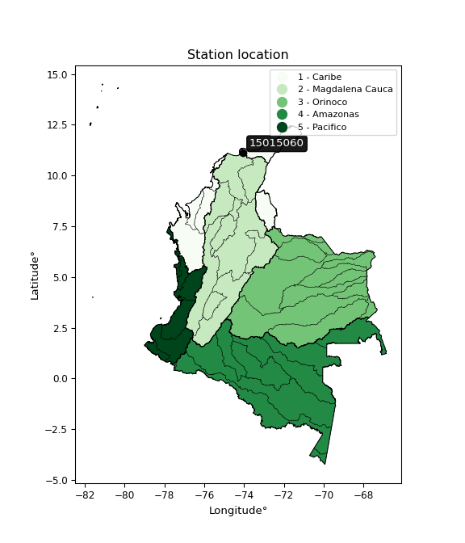

<div align="center">


</div>

# PMax24h Station (Rain): 15015060

Maximum Precipitation in 24 hours (PMax24h) is the greatest amount of rainfall for a specific duration that is meteorologically possible for a given location, acting as a "worst-case" scenario for extreme storms, crucial for designing safety-critical infrastructure like bridges, river deviations, dams, spillways, and nuclear plants to prevent catastrophic failure. The PMax24h is related with the Probable Maximum Precipitation (PMP) and it is calculated by hydrologists using meteorological data to determine the upper limit of extreme rainfall, often leading to the Probable Maximum Flood (PMF) for flood control design, and is increasingly being studied for climate change impacts. Probable Maximum Precipitation (PMP) is the theoretical upper limit of rainfall, a deterministic estimate for extreme events, while probability distributions (like GEV, Gumbel) describe the likelihood and frequency of various precipitation amounts, including rare ones, showing how often events occur, with PMP representing the extreme end of these distributions, used for critical infrastructure design to ensure safety against the worst conceivable weather, unlike standard statistical forecasts which cover typical probabilities.

The most common probability distributions in hydrology, used for analyzing floods, rainfall, and streamflow, include the Normal, Log-Normal, Gumbel, Gamma (including Log-Pearson Type III), and Generalized Extreme Value (GEV) distributions, often chosen based on the data´s skewness and whether modeling extremes or general conditions, with Gumbel and GEV popular for extreme events like floods, while the Normal distribution serves as a baseline, though often requiring transformations for skewed hydrological data. These distributions help in designing water infrastructure, managing water resources, and forecasting hydrologic events.

> Hydrological data often isn´t perfectly normal (it´s skewed), so different distributions are needed for different applications, such as: **Flood Frequency Analysis**: Using Gumbel, GEV, or Log-Pearson Type III for predicting extreme flood magnitudes and their return periods, **Rainfall Analysis**: Normal for annual totals, but Log-Normal, Weibull, or GEV for intensity or extreme daily rainfall, **Streamflow Modeling**: Gamma and Log-Normal for maximum flows, GEV for minimum flows, and Kappa for daily flows.

<div align="center">

</img>

</div>


## A. General information


### 1. General running parameters

• app_version: _v20260225_. • runtime: _2026-02-28 16:54:07.457399_. • Python version: _3.14.0_. • SciPy version: _1.16.3_. • Pandas version: _2.3.3_. • NumPy version: _2.3.5_. • Stations dataset (station_dataset_file): _dataset/pmax24h_in/automatic_colombia_2003_2025.csv_. • Stations catalog (station_catalog_file): _dataset/CNE.xls_. • Minimum year to eval til year_max (date_min): _1900_. • Maximum year to eval since year_min (date_max): _2025_. • Creates, save and include plots into reports (create_plot): _False_. • Plot only fit distributions with Δo > Δ (plot_only_fit): _True_. • Plot only simple graphs avoiding multiple CDFs and multiple Extreme values plots (plot_only_simple): _False_. • Eval low extreme values, if False, evaluates high extreme values (low_extreme): _False_. • Eval every SciPy distribution as logarithmic (pdist_logarithmic_on): _True_. • Standard deviation normalized (ddof): _1.0_. • Return periods to eval in years (Tr): _[2, 2.33, 5, 10, 15, 20, 25, 50, 75, 100, 200, 250, 500, 750, 1000]_. • Minimum data sample per station, 0 means any (minimum_sample): _5_. • Z-Score maximum threshold to adjust a value, 0 means disable (zscore_max): _3.5_. • Z-Score minimum threshold to adjust a value, 0 means disable (zscore_min): _-2.5_. • Avoid zeros, e.g. rain = 0 (avoid_zeros): _True_. • Avoid null values (avoid_nans): _True_. 

:file_folder:Table: [dataset.csv](../../dataset/pmax24h_in/automatic_colombia_2003_2025.csv)

> Delta Degrees of Freedom (DDOF): is a parameter used in the formulas for calculating variance and standard deviation. When ddof=0, the divisor is $N$ (the total number of observations) and this is used when your data set is the entire population. When ddof=1, the divisor is $N-1$ and this is used when your data set is a sample drawn from a larger population. Using $N-1$ provides an unbiased estimate of the population variance (known as Bessel´s correction).


### 2. Station info and location

|   id |   CODIGO | NOMBRE                        | CATEGORIA               | TECNOLOGIA                              | ESTADO           | FECHA_INSTALACION   |   FECHA_SUSPENSION |   ALTITUD |   LATITUD |   LONGITUD | DEPARTAMENTO   | MUNICIPIO   | AREA_OPERATIVA                                         | ENTIDAD                                                     | AREA_HIDROGRAFICA   | ZONA_HIDROGRAFICA   | SUBZONA_HIDROGRAFICA          |   CORRIENTE | Catalogo   |   Version |
|-----:|---------:|:------------------------------|:------------------------|:----------------------------------------|:-----------------|:--------------------|-------------------:|----------:|----------:|-----------:|:---------------|:------------|:-------------------------------------------------------|:------------------------------------------------------------|:--------------------|:--------------------|:------------------------------|------------:|:-----------|----------:|
|    0 | 15015060 | SAN LORENZO  - AUT [15015060] | Climatológica Principal | Automática con Telemetría, Convencional | En Mantenimiento | 15/01/1969          |                nan |      2200 |   11.1111 |   -74.0547 | Magdalena      | Santa Marta | Area Operativa 05 - Magdalena-Cesar-Guajira-San Andrés | INSTITUTO DE HIDROLOGIA METEOROLOGIA Y ESTUDIOS AMBIENTALES | Caribe              | Caribe - Guajira    | Río  Piedras - Río Manzanares |         nan | CNE_IDEAM  |  20251226 |

<div align="center">

Dynamic map: [:earth_americas:Google](http://maps.google.com/maps?q=11.11108333,-74.05469444) [:earth_americas:OSM](https://www.openstreetmap.org/#map=18/11.11108333/-74.05469444&layers=P) [:earth_americas:Bing](https://www.bing.com/maps?cp=11.11108333~-74.05469444&lvl=18) [:earth_americas:Apple](https://maps.apple.com/frame?center=11.11108333%2C-74.05469444&span=0.003%2C0.006)

</div>


<div align="center">

```geojson
{
  "type": "Feature",
  "geometry": {
    "type": "Point", 
    "coordinates": [-74.05469444, 11.11108333]
  }, 
  "properties": {
    "Name": "15015060"
  }
}
```

</div>


### 3. Discrete values table and plot

<div align="center">

|               |           0 |           1 |           2 |          3 |            4 |
|:--------------|------------:|------------:|------------:|-----------:|-------------:|
| Date          | 2019        | 2020        | 2021        | 2022       | 2025         |
| Value         |   83.4      |   89.6      |   61.4      |    7.8     |   63         |
| Value_initial |   83.4      |   89.6      |   61.4      |    7.8     |   63         |
| count         |    5        |    5        |    5        |    5       |    5         |
| mean          |   61.04     |   61.04     |   61.04     |   61.04    |   61.04      |
| std           |   32.2262   |   32.2262   |   32.2262   |   32.2262  |   32.2262    |
| zscore        |    0.693845 |    0.886235 |    0.011171 |   -1.65207 |    0.0608201 |


</div>


> The initial value (value_initial) correspond to the initial obtained or null completed value, and value (value) is adjusted only when the initial value is outside the valid range (outlier) definite through the Z-Score value. If Z-Score is active, values out of range or outliers are replaced with the station mean value. A Z-Score (or standard score) measures how many standard deviations a data point is from the mean of a dataset, indicating its relative position; positive scores mean above the mean, negative mean below, and a score of zero is exactly at the mean, allowing for comparison of values from different distributions. It´s calculated using the formula $z=(x–μ)/σ$, where $x$ is the data point, $μ$ is the mean, and $σ$ is the standard deviation, helping identify outliers and understand probability.
>
> <sub>**Note**: In this study, "completing" (filling gaps in) and "extending" (forecasting or lengthening the historical record) rainfall data series are avoided for certain critical analyses because they introduce artificial bias and uncertainty, which can distort the statistics of rare events (extremes), alter day-to-day variability, and compromise the integrity and homogeneity of the original data. Some reasons against Completing/Extending rainfall data are: **Distortion of Extremes and Variability**: The primary issue is that most gap-filling or extension methods rely on averaging or regression with nearby stations, which inherently smooths the data. Rainfall is highly variable in space and time, with a large percentage of zero values and occasional large storms. Infilling methods often underestimate the highest values and overestimate the lowest (zero) values, which severely distorts analyses focused on flood frequency, drought severity, and intensity-duration-frequency (IDF) curves, **Loss of Data Homogeneity**: Infilled or extended data are synthetic estimates, not actual measurements. Combining these estimates with observed data can violate the assumption of data homogeneity, which requires that the data properties do not change over time. Inhomogeneity can lead to incorrect conclusions about long-term trends or changes in climate patterns, **Propagation of Errors**: Errors and biases from the original data (e.g., wind-induced undercatch, instrument errors, site changes) or the data used for imputation can propagate through the analysis, leading to unreliable hydrological models and inaccurate predictions, **Compromised Statistical Integrity**: For statistical analyses, especially those involving the frequency of events, using artificial data can introduce time bias or autocorrelation that doesn´t exist in reality, making it difficult to assess the true probability of events, **Difficulty in Validation**: It is difficult to accurately validate the quality of filled or extended data, especially for past periods where ground-truth measurements are unavailable. The reliability of imputation techniques heavily depends on the density of the surrounding station network and the complexity of the local topography.</sub>


### 4. Active continuous probability distributions from SciPy (80 of 104 available)

A Probability Density Function (PDF) describes the relative likelihood of a continuous random variable falling within a specific range, where the total area under its curve equals 1, and the area over any interval gives the actual probability for that range. Unlike discrete probabilities (like rolling a die), a PDF shows density, not direct probability for a single point (which is zero), with higher points indicating higher likelihood, often visualized as a bell curve for normal distributions.

A log of a probability density function (log-PDF) is simply the logarithm of the PDF´s value, denoted as $log(f(x))$, useful for converting multiplication of probabilities into addition, improving numerical stability with tiny numbers, and connecting to information theory concepts like entropy. Instead of dealing with very small probabilities (e.g., 0.000001), log-PDFs use negative numbers (e.g., $log(0.00001) ≈ -11.51$ that are easier for computers to handle, preventing underflow errors and simplifying complex calculations. In this study, each active probability distribution from SciPy is also evaluated in the $log$ form.

[scipy.stats](https://docs.scipy.org/doc/scipy/reference/stats.html) is a Python´s powerful submodule within the SciPy library for comprehensive statistical analysis, offering over 130 probability distributions (like Normal, Poisson, etc.), functions for descriptive stats (mean, variance), hypothesis testing (t-tests, chi-square), random variable generation, and statistical tests, making it essential for data science, modeling, and research. It provides tools to explore, model, and draw conclusions from data efficiently, working seamlessly with [NumPy](https://numpy.org/).

<div align="center">

|   id | p_dist           |   n_parameter | fit_method   | label                                                                       | active   | ref                                                                                                      |
|-----:|:-----------------|--------------:|:-------------|:----------------------------------------------------------------------------|:---------|:---------------------------------------------------------------------------------------------------------|
|    0 | alpha            |             3 | MLE          | Alpha                                                                       | True     | [:mortar_board:](https://docs.scipy.org/doc/scipy/reference/generated/scipy.stats.alpha.html)            |
|    1 | anglit           |             2 | MM           | Anglit                                                                      | True     | [:mortar_board:](https://docs.scipy.org/doc/scipy/reference/generated/scipy.stats.anglit.html)           |
|    2 | arcsine          |             2 | MM           | Arcsine                                                                     | True     | [:mortar_board:](https://docs.scipy.org/doc/scipy/reference/generated/scipy.stats.arcsine.html)          |
|    3 | argus            |             3 | MLE          | Argus                                                                       | True     | [:mortar_board:](https://docs.scipy.org/doc/scipy/reference/generated/scipy.stats.argus.html)            |
|    4 | beta             |             4 | MLE          | Beta                                                                        | True     | [:mortar_board:](https://docs.scipy.org/doc/scipy/reference/generated/scipy.stats.beta.html)             |
|    5 | betaprime        |             4 | MLE          | Beta prime                                                                  | True     | [:mortar_board:](https://docs.scipy.org/doc/scipy/reference/generated/scipy.stats.betaprime.html)        |
|    6 | bradford         |             3 | MLE          | Bradford                                                                    | True     | [:mortar_board:](https://docs.scipy.org/doc/scipy/reference/generated/scipy.stats.bradford.html)         |
|    7 | burr             |             4 | MLE          | Burr (Type III)                                                             | True     | [:mortar_board:](https://docs.scipy.org/doc/scipy/reference/generated/scipy.stats.burr.html)             |
|    8 | burr12           |             4 | MLE          | Burr (Type III) 12                                                          | True     | [:mortar_board:](https://docs.scipy.org/doc/scipy/reference/generated/scipy.stats.burr12.html)           |
|    9 | cosine           |             2 | MLE          | Cosine                                                                      | True     | [:mortar_board:](https://docs.scipy.org/doc/scipy/reference/generated/scipy.stats.cosine.html)           |
|   10 | crystalball      |             4 | MLE          | Crystalball                                                                 | True     | [:mortar_board:](https://docs.scipy.org/doc/scipy/reference/generated/scipy.stats.crystalball.html)      |
|   11 | dgamma           |             3 | MLE          | Double gamma                                                                | True     | [:mortar_board:](https://docs.scipy.org/doc/scipy/reference/generated/scipy.stats.dgamma.html)           |
|   12 | dweibull         |             3 | MLE          | Double Weibull                                                              | True     | [:mortar_board:](https://docs.scipy.org/doc/scipy/reference/generated/scipy.stats.dweibull.html)         |
|   13 | erlang           |             3 | MLE          | Erlang                                                                      | True     | [:mortar_board:](https://docs.scipy.org/doc/scipy/reference/generated/scipy.stats.erlang.html)           |
|   14 | exponnorm        |             3 | MLE          | Exponentially modified Normal                                               | True     | [:mortar_board:](https://docs.scipy.org/doc/scipy/reference/generated/scipy.stats.exponnorm.html)        |
|   15 | exponpow         |             3 | MLE          | Exponential power                                                           | True     | [:mortar_board:](https://docs.scipy.org/doc/scipy/reference/generated/scipy.stats.exponpow.html)         |
|   16 | exponweib        |             4 | MLE          | Exponentiated Weibull                                                       | True     | [:mortar_board:](https://docs.scipy.org/doc/scipy/reference/generated/scipy.stats.exponweib.html)        |
|   17 | f                |             4 | MLE          | F                                                                           | True     | [:mortar_board:](https://docs.scipy.org/doc/scipy/reference/generated/scipy.stats.f.html)                |
|   18 | fatiguelife      |             3 | MLE          | Fatigue-life (Birnbaum-Saunders)                                            | True     | [:mortar_board:](https://docs.scipy.org/doc/scipy/reference/generated/scipy.stats.fatiguelife.html)      |
|   19 | foldnorm         |             3 | MM           | Fold Normal                                                                 | True     | [:mortar_board:](https://docs.scipy.org/doc/scipy/reference/generated/scipy.stats.foldnorm.html)         |
|   20 | gamma            |             3 | MLE          | Gamma                                                                       | True     | [:mortar_board:](https://docs.scipy.org/doc/scipy/reference/generated/scipy.stats.gamma.html)            |
|   21 | gausshyper       |             6 | MLE          | Gauss hypergeometric                                                        | True     | [:mortar_board:](https://docs.scipy.org/doc/scipy/reference/generated/scipy.stats.gausshyper.html)       |
|   22 | genexpon         |             5 | MLE          | Generalized exponential                                                     | True     | [:mortar_board:](https://docs.scipy.org/doc/scipy/reference/generated/scipy.stats.genexpon.html)         |
|   23 | genextreme       |             3 | MLE          | Generalized exponential                                                     | True     | [:mortar_board:](https://docs.scipy.org/doc/scipy/reference/generated/scipy.stats.genextreme.html)       |
|   24 | gengamma         |             4 | MLE          | Generalized gamma                                                           | True     | [:mortar_board:](https://docs.scipy.org/doc/scipy/reference/generated/scipy.stats.gengamma.html)         |
|   25 | genhalflogistic  |             3 | MLE          | Generalized half-logistic                                                   | True     | [:mortar_board:](https://docs.scipy.org/doc/scipy/reference/generated/scipy.stats.genhalflogistic.html)  |
|   26 | genlogistic      |             3 | MLE          | Generalized logistic                                                        | True     | [:mortar_board:](https://docs.scipy.org/doc/scipy/reference/generated/scipy.stats.genlogistic.html)      |
|   27 | gennorm          |             3 | MLE          | Generalized Normal                                                          | True     | [:mortar_board:](https://docs.scipy.org/doc/scipy/reference/generated/scipy.stats.gennorm.html)          |
|   28 | genpareto        |             3 | MLE          | Generalized Pareto                                                          | True     | [:mortar_board:](https://docs.scipy.org/doc/scipy/reference/generated/scipy.stats.genpareto.html)        |
|   29 | gompertz         |             3 | MLE          | Gompertz (or truncated Gumbel)                                              | True     | [:mortar_board:](https://docs.scipy.org/doc/scipy/reference/generated/scipy.stats.gompertz.html)         |
|   30 | gumbel_l         |             2 | MM           | Gumbel Left Skew                                                            | True     | [:mortar_board:](https://docs.scipy.org/doc/scipy/reference/generated/scipy.stats.gumbel_l.html)         |
|   31 | gumbel_r         |             2 | MM           | Gumbel Right Skew                                                           | True     | [:mortar_board:](https://docs.scipy.org/doc/scipy/reference/generated/scipy.stats.gumbel_r.html)         |
|   32 | halfgennorm      |             3 | MLE          | Upper half of a generalized normal                                          | True     | [:mortar_board:](https://docs.scipy.org/doc/scipy/reference/generated/scipy.stats.halfgennorm.html)      |
|   33 | halflogistic     |             2 | MM           | Half-logistic                                                               | True     | [:mortar_board:](https://docs.scipy.org/doc/scipy/reference/generated/scipy.stats.halflogistic.html)     |
|   34 | halfnorm         |             2 | MM           | Half Normal                                                                 | True     | [:mortar_board:](https://docs.scipy.org/doc/scipy/reference/generated/scipy.stats.halfnorm.html)         |
|   35 | hypsecant        |             2 | MM           | hyperbolic secant                                                           | True     | [:mortar_board:](https://docs.scipy.org/doc/scipy/reference/generated/scipy.stats.hypsecant.html)        |
|   36 | invgamma         |             3 | MLE          | Inverted gamma                                                              | True     | [:mortar_board:](https://docs.scipy.org/doc/scipy/reference/generated/scipy.stats.invgamma.html)         |
|   37 | invgauss         |             3 | MLE          | Inverse Gaussian                                                            | True     | [:mortar_board:](https://docs.scipy.org/doc/scipy/reference/generated/scipy.stats.invgauss.html)         |
|   38 | invweibull       |             3 | MLE          | Inverted Weibull                                                            | True     | [:mortar_board:](https://docs.scipy.org/doc/scipy/reference/generated/scipy.stats.invweibull.html)       |
|   39 | johnsonsb        |             4 | MLE          | Johnson SB                                                                  | True     | [:mortar_board:](https://docs.scipy.org/doc/scipy/reference/generated/scipy.stats.johnsonsb.html)        |
|   40 | johnsonsu        |             4 | MLE          | Johnson Su                                                                  | True     | [:mortar_board:](https://docs.scipy.org/doc/scipy/reference/generated/scipy.stats.johnsonsu.html)        |
|   41 | kappa3           |             3 | MLE          | Kappa 3                                                                     | True     | [:mortar_board:](https://docs.scipy.org/doc/scipy/reference/generated/scipy.stats.kappa3.html)           |
|   42 | kappa4           |             4 | MLE          | Kappa 4                                                                     | True     | [:mortar_board:](https://docs.scipy.org/doc/scipy/reference/generated/scipy.stats.kappa4.html)           |
|   43 | ksone            |             3 | MLE          | Kolmogorov-Smirnov one-sided test statistic distribution                    | True     | [:mortar_board:](https://docs.scipy.org/doc/scipy/reference/generated/scipy.stats.ksone.html)            |
|   44 | kstwobign        |             2 | MLE          | Limiting distribution of scaled Kolmogorov-Smirnov two-sided test statistic | True     | [:mortar_board:](https://docs.scipy.org/doc/scipy/reference/generated/scipy.stats.kstwobign.html)        |
|   45 | laplace          |             2 | MM           | Laplace                                                                     | True     | [:mortar_board:](https://docs.scipy.org/doc/scipy/reference/generated/scipy.stats.laplace.html)          |
|   46 | levy_l           |             2 | MLE          | Left-skewed Levy                                                            | True     | [:mortar_board:](https://docs.scipy.org/doc/scipy/reference/generated/scipy.stats.levy_l.html)           |
|   47 | loggamma         |             3 | MLE          | Log gamma                                                                   | True     | [:mortar_board:](https://docs.scipy.org/doc/scipy/reference/generated/scipy.stats.loggamma.html)         |
|   48 | logistic         |             2 | MM           | Logistic (or Sech-squared)                                                  | True     | [:mortar_board:](https://docs.scipy.org/doc/scipy/reference/generated/scipy.stats.logistic.html)         |
|   49 | loglaplace       |             3 | MLE          | Log-Laplace                                                                 | True     | [:mortar_board:](https://docs.scipy.org/doc/scipy/reference/generated/scipy.stats.loglaplace.html)       |
|   50 | lomax            |             3 | MLE          | Lomax (Pareto of the second kind)                                           | True     | [:mortar_board:](https://docs.scipy.org/doc/scipy/reference/generated/scipy.stats.lomax.html)            |
|   51 | maxwell          |             2 | MM           | Maxwell                                                                     | True     | [:mortar_board:](https://docs.scipy.org/doc/scipy/reference/generated/scipy.stats.maxwell.html)          |
|   52 | mielke           |             4 | MLE          | Mielke Beta-Kappa / Dagum                                                   | True     | [:mortar_board:](https://docs.scipy.org/doc/scipy/reference/generated/scipy.stats.mielke.html)           |
|   53 | moyal            |             2 | MM           | Moyal                                                                       | True     | [:mortar_board:](https://docs.scipy.org/doc/scipy/reference/generated/scipy.stats.moyal.html)            |
|   54 | nakagami         |             3 | MLE          | Nakagami                                                                    | True     | [:mortar_board:](https://docs.scipy.org/doc/scipy/reference/generated/scipy.stats.nakagami.html)         |
|   55 | ncf              |             5 | MLE          | Non-central F distribution                                                  | True     | [:mortar_board:](https://docs.scipy.org/doc/scipy/reference/generated/scipy.stats.ncf.html)              |
|   56 | nct              |             4 | MLE          | Non-central Student’s t                                                     | True     | [:mortar_board:](https://docs.scipy.org/doc/scipy/reference/generated/scipy.stats.nct.html)              |
|   57 | norm             |             2 | MM           | Normal                                                                      | True     | [:mortar_board:](https://docs.scipy.org/doc/scipy/reference/generated/scipy.stats.norm.html)             |
|   58 | pearson3         |             3 | MM           | Pearson type III                                                            | True     | [:mortar_board:](https://docs.scipy.org/doc/scipy/reference/generated/scipy.stats.pearson3.html)         |
|   59 | powerlaw         |             3 | MLE          | Power-function                                                              | True     | [:mortar_board:](https://docs.scipy.org/doc/scipy/reference/generated/scipy.stats.powerlaw.html)         |
|   60 | rayleigh         |             2 | MM           | Rayleigh                                                                    | True     | [:mortar_board:](https://docs.scipy.org/doc/scipy/reference/generated/scipy.stats.rayleigh.html)         |
|   61 | rdist            |             3 | MLE          | R-distributed (symmetric beta)                                              | True     | [:mortar_board:](https://docs.scipy.org/doc/scipy/reference/generated/scipy.stats.rdist.html)            |
|   62 | rice             |             3 | MLE          | Rice                                                                        | True     | [:mortar_board:](https://docs.scipy.org/doc/scipy/reference/generated/scipy.stats.rice.html)             |
|   63 | semicircular     |             2 | MM           | Semicircular                                                                | True     | [:mortar_board:](https://docs.scipy.org/doc/scipy/reference/generated/scipy.stats.semicircular.html)     |
|   64 | skewnorm         |             3 | MLE          | Skew normal                                                                 | True     | [:mortar_board:](https://docs.scipy.org/doc/scipy/reference/generated/scipy.stats.skewnorm.html)         |
|   65 | t                |             3 | MLE          | Student’s t                                                                 | True     | [:mortar_board:](https://docs.scipy.org/doc/scipy/reference/generated/scipy.stats.t.html)                |
|   66 | trapezoid        |             4 | MLE          | Trapezoid                                                                   | True     | [:mortar_board:](https://docs.scipy.org/doc/scipy/reference/generated/scipy.stats.trapezoid.html)        |
|   67 | triang           |             3 | MLE          | Triangular                                                                  | True     | [:mortar_board:](https://docs.scipy.org/doc/scipy/reference/generated/scipy.stats.triang.html)           |
|   68 | truncexpon       |             3 | MLE          | Truncated exponential                                                       | True     | [:mortar_board:](https://docs.scipy.org/doc/scipy/reference/generated/scipy.stats.truncexpon.html)       |
|   69 | truncnorm        |             4 | MLE          | Truncated normal                                                            | True     | [:mortar_board:](https://docs.scipy.org/doc/scipy/reference/generated/scipy.stats.truncnorm.html)        |
|   70 | truncpareto      |             4 | MLE          | Upper truncated Pareto                                                      | True     | [:mortar_board:](https://docs.scipy.org/doc/scipy/reference/generated/scipy.stats.truncpareto.html)      |
|   71 | truncweibull_min |             5 | MLE          | Doubly truncated Weibull minimum                                            | True     | [:mortar_board:](https://docs.scipy.org/doc/scipy/reference/generated/scipy.stats.truncweibull_min.html) |
|   72 | tukeylambda      |             3 | MLE          | Tukey-Lamdba                                                                | True     | [:mortar_board:](https://docs.scipy.org/doc/scipy/reference/generated/scipy.stats.tukeylambda.html)      |
|   73 | uniform          |             2 | MLE          | Uniform                                                                     | True     | [:mortar_board:](https://docs.scipy.org/doc/scipy/reference/generated/scipy.stats.uniform.html)          |
|   74 | vonmises         |             3 | MLE          | Von Mises                                                                   | True     | [:mortar_board:](https://docs.scipy.org/doc/scipy/reference/generated/scipy.stats.vonmises.html)         |
|   75 | vonmises_line    |             3 | MLE          | Von Mises line                                                              | True     | [:mortar_board:](https://docs.scipy.org/doc/scipy/reference/generated/scipy.stats.vonmises_line.html)    |
|   76 | wald             |             2 | MM           | Wald                                                                        | True     | [:mortar_board:](https://docs.scipy.org/doc/scipy/reference/generated/scipy.stats.wald.html)             |
|   77 | weibull_max      |             3 | MLE          | Weibull maximum                                                             | True     | [:mortar_board:](https://docs.scipy.org/doc/scipy/reference/generated/scipy.stats.weibull_max.html)      |
|   78 | weibull_min      |             3 | MLE          | Weibull minimum                                                             | True     | [:mortar_board:](https://docs.scipy.org/doc/scipy/reference/generated/scipy.stats.weibull_min.html)      |
|   79 | wrapcauchy       |             3 | MLE          | Wrapped  Cauchy                                                             | True     | [:mortar_board:](https://docs.scipy.org/doc/scipy/reference/generated/scipy.stats.wrapcauchy.html)       |

</div>

> **n_parameter:** # arguments & localization & scale.
>
> **Fit methods:** (MLE) maximum likelihood, (MM) L-moments.
>
>**Inactive** (With the only purpose of prevent loops, zero divisions, infinite values, over high estimated values or horizontal trending for recurrence intervals estimations, the follow distributions were disabled.)**:** lognorm, norminvgauss, powernorm, powerlognorm, cauchy, halfcauchy, foldcauchy, skewcauchy, chi2, expon, fisk, genhyperbolic, geninvgauss, gibrat, kstwo, laplace_asymmetric, levy, levy_stable, ncx2, pareto, rel_breitwigner, recipinvgauss, studentized_range, loguniform, 


## B. Probability (PDF) vs. Empirical (EDF) distributions functions

A continuous probability distribution (CPD) describes probabilities for variables that can take any value within a range (like rain any time), unlike discrete variables with specific outcomes (like temperature). It uses a Probability Density Function (PDF), a curve where the total area under it equals 1, and the probability of the variable falling within an interval (a to b) is found by calculating the area under the curve between those points. A key feature is that the probability of hitting any single exact value is zero, so probabilities are always expressed for ranges, e.g., $P(a ≤ X ≤ b)$.

<div align="center">

Distributions parameters from station values
|     |   station | p_dist              |   n |             loc |            scale | shape                  | shape1                | shape2                 | shape3             |
|----:|----------:|:--------------------|----:|----------------:|-----------------:|:-----------------------|:----------------------|:-----------------------|:-------------------|
|   0 |  15015060 | alpha               |   5 |   -23.4188      |     70.8013      | 0.44916893797163215    |                       |                        |                    |
|   1 |  15015060 | anglit              |   5 |    61.04        |     84.3217      |                        |                       |                        |                    |
|   2 |  15015060 | arcsine             |   5 |    20.2767      |     81.5265      |                        |                       |                        |                    |
|   3 |  15015060 | argus               |   5 |   -28.5315      |    121.202       | 2.4055508874975913     |                       |                        |                    |
|   4 |  15015060 | beta                |   5 |    -0.398237    |     89.9982      | 0.796758546320644      | 0.3120033785201646    |                        |                    |
|   5 |  15015060 | betaprime           |   5 | -1003.02        | 181441           | 1320.0444406370534     | 225123.29115694828    |                        |                    |
|   6 |  15015060 | bradford            |   5 |    -0.503302    |     90.1033      | 7.32053932205995e-05   |                       |                        |                    |
|   7 |  15015060 | burr                |   5 |    -2.81645     |     93.4524      | 326.32978486754337     | 0.005119852798709765  |                        |                    |
|   8 |  15015060 | burr12              |   5 |    -1.84179     |      9.50098     | 313.46562524514354     | 0.001924216405776599  |                        |                    |
|   9 |  15015060 | cosine              |   5 |    57.074       |     24.3216      |                        |                       |                        |                    |
|  10 |  15015060 | crystalball         |   5 |    61.0399      |     28.824       | 11419.942006414909     | 1083.1409580853037    |                        |                    |
|  11 |  15015060 | dgamma              |   5 |    63           |     25.4084      | 0.616551755948172      |                       |                        |                    |
|  12 |  15015060 | dweibull            |   5 |    63           |     26.8173      | 0.5779360407359035     |                       |                        |                    |
|  13 |  15015060 | erlang              |   5 |  -328.309       |      2.32706     | 167.05029292878686     |                       |                        |                    |
|  14 |  15015060 | exponnorm           |   5 |    61.0298      |     28.8239      | 0.000338428429638178   |                       |                        |                    |
|  15 |  15015060 | exponpow            |   5 |     7.8         |     37.7758      | 0.6434855156423318     |                       |                        |                    |
|  16 |  15015060 | exponweib           |   5 |     7.8         |     37.7978      | 0.6119725630847536     | 0.8910772081201701    |                        |                    |
|  17 |  15015060 | f                   |   5 | -8454.27        |   8515.2         | 216729.7068003164      | 875982.7859982739     |                        |                    |
|  18 |  15015060 | fatiguelife         |   5 | -6230.31        |   6291.51        | 0.004562379911348979   |                       |                        |                    |
|  19 |  15015060 | foldnorm            |   5 |  -103.799       |     25.8085      | 6.414501305811587      |                       |                        |                    |
|  20 |  15015060 | gamma               |   5 |  -326.247       |      2.43371     | 158.98021046184482     |                       |                        |                    |
|  21 |  15015060 | gausshyper          |   5 |    -0.371953    |     89.972       | 1.3026665756651452     | 0.48695671445853284   | 1.28790058370289       | 0.9620979756803435 |
|  22 |  15015060 | genexpon            |   5 |    -0.350013    |      2.22904     | 2.3918263453550947e-06 | 0.037377330267175796  | 1.286294608480346      |                    |
|  23 |  15015060 | genextreme          |   5 |    63.171       |     33.2703      | 1.2588554147818665     |                       |                        |                    |
|  24 |  15015060 | gengamma            |   5 |  -247.027       |     39.1104      | 35.37259845750431      | 1.7259468857596372    |                        |                    |
|  25 |  15015060 | genhalflogistic     |   5 |    -2.03921     |    104.675       | 1.1422515165920086     |                       |                        |                    |
|  26 |  15015060 | genlogistic         |   5 |    89.6002      |      9.46748e-06 | 3.317932537948154e-07  |                       |                        |                    |
|  27 |  15015060 | gennorm             |   5 |    63.0001      |      2.5748e-10  | 0.09900830023571822    |                       |                        |                    |
|  28 |  15015060 | genpareto           |   5 |    -0.093618    |    157.734       | -1.758582004385631     |                       |                        |                    |
|  29 |  15015060 | gompertz            |   5 |    -0.0243536   |      2.92713     | 2.2625049075330463e-13 |                       |                        |                    |
|  30 |  15015060 | gumbel_l            |   5 |    74.0123      |     22.474       |                        |                       |                        |                    |
|  31 |  15015060 | gumbel_r            |   5 |    48.0677      |     22.474       |                        |                       |                        |                    |
|  32 |  15015060 | halfgennorm         |   5 |     7.8         |     49.9637      | 1.06637082153663       |                       |                        |                    |
|  33 |  15015060 | halflogistic        |   5 |    26.8769      |     24.6435      |                        |                       |                        |                    |
|  34 |  15015060 | halfnorm            |   5 |    22.8883      |     47.8161      |                        |                       |                        |                    |
|  35 |  15015060 | hypsecant           |   5 |    61.04        |     18.3499      |                        |                       |                        |                    |
|  36 |  15015060 | invgamma            |   5 |  -351.591       |  71455.7         | 174.40272803389757     |                       |                        |                    |
|  37 |  15015060 | invgauss            |   5 |  -137.263       |   7107.81        | 0.027946434811809973   |                       |                        |                    |
|  38 |  15015060 | invweibull          |   5 |    -3.51015e+09 |      3.51015e+09 | 110603147.76722616     |                       |                        |                    |
|  39 |  15015060 | johnsonsb           |   5 |    -0.927005    |     90.527       | -0.8883303643062637    | 0.08554355293931323   |                        |                    |
|  40 |  15015060 | johnsonsu           |   5 |    89.6         |      2.54504e-10 | 2.0671360252263553     | 0.14551480005021017   |                        |                    |
|  41 |  15015060 | kappa3              |   5 |     7.8         |     81.7374      | 2585.875087722242      |                       |                        |                    |
|  42 |  15015060 | kappa4              |   5 |    -0.358285    |     94.8377      | 1.0943587583469907     | 1.0521243874579957    |                        |                    |
|  43 |  15015060 | ksone               |   5 |    -0.38        |     98.16        | 1.0                    |                       |                        |                    |
|  44 |  15015060 | kstwobign           |   5 |   -65.7329      |    144.532       |                        |                       |                        |                    |
|  45 |  15015060 | laplace             |   5 |    61.04        |     20.3816      |                        |                       |                        |                    |
|  46 |  15015060 | levy_l              |   5 |    91.1145      |      5.73946     |                        |                       |                        |                    |
|  47 |  15015060 | loggamma            |   5 |    89.6002      |      1.15135e-05 | 4.027461405620437e-07  |                       |                        |                    |
|  48 |  15015060 | logistic            |   5 |    61.04        |     15.8915      |                        |                       |                        |                    |
|  49 |  15015060 | loglaplace          |   5 |    -0.175067    |     63.1751      | 1.833926258426131      |                       |                        |                    |
|  50 |  15015060 | lomax               |   5 |     7.8         |      4.61993e+09 | 84989973.15096569      |                       |                        |                    |
|  51 |  15015060 | maxwell             |   5 |    -7.26075     |     42.8012      |                        |                       |                        |                    |
|  52 |  15015060 | mielke              |   5 |     1.61996     |     88.1663      | 1.4309798046390663     | 3113.1165906649294    |                        |                    |
|  53 |  15015060 | moyal               |   5 |    44.5566      |     12.9754      |                        |                       |                        |                    |
|  54 |  15015060 | nakagami            |   5 |     7.8         |     55.0188      | 0.12619992132435512    |                       |                        |                    |
|  55 |  15015060 | ncf                 |   5 |     0.0170933   |      1.47069e-06 | 2.61132669318327e-07   | 10.822975454468828    | 10.024747673325969     |                    |
|  56 |  15015060 | nct                 |   5 | -2207.07        |     28.769       | 792918.3318291227      | 78.83860059808075     |                        |                    |
|  57 |  15015060 | norm                |   5 |    61.04        |     28.824       |                        |                       |                        |                    |
|  58 |  15015060 | pearson3            |   5 |    61.04        |     28.824       | -0.9723509006835622    |                       |                        |                    |
|  59 |  15015060 | powerlaw            |   5 |     7.8         |     81.8         | 0.1251360864391342     |                       |                        |                    |
|  60 |  15015060 | rayleigh            |   5 |     5.89802     |     43.9969      |                        |                       |                        |                    |
|  61 |  15015060 | rdist               |   5 |     0.750855    |      7.04914     | 1.6205072069899717     |                       |                        |                    |
|  62 |  15015060 | rice                |   5 |   -13.1896      |     31.2655      | 2.118160680843558      |                       |                        |                    |
|  63 |  15015060 | semicircular        |   5 |    61.04        |     57.648       |                        |                       |                        |                    |
|  64 |  15015060 | skewnorm            |   5 |    89.6         |     40.5782      | -34413320.76777904     |                       |                        |                    |
|  65 |  15015060 | t                   |   5 |    61.0409      |     28.8253      | 4389628.998629766      |                       |                        |                    |
|  66 |  15015060 | trapezoid           |   5 |   -21.5109      |    122.29        | 1.0                    | 1.0                   |                        |                    |
|  67 |  15015060 | triang              |   5 |   -11.6983      |    101.299       | 0.9999999999838056     |                       |                        |                    |
|  68 |  15015060 | truncexpon          |   5 |    -0.36079     |    136.259       | 0.6602184641909579     |                       |                        |                    |
|  69 |  15015060 | truncnorm           |   5 |    61.04        |     28.824       | -118.96310394175988    | 229.5138049011779     |                        |                    |
|  70 |  15015060 | truncpareto         |   5 |     7.25551     |      0.544488    | 0.2605847594255556     | 151.23281961460916    |                        |                    |
|  71 |  15015060 | truncweibull_min    |   5 |     0.0264816   |    133.3         | 1.7328931239350784     | 0.0034181144621360303 | 0.671968772745797      |                    |
|  72 |  15015060 | tukeylambda         |   5 |     2.66219     |    119.08        | 1.3697146663546382     |                       |                        |                    |
|  73 |  15015060 | uniform             |   5 |     7.8         |     81.8         |                        |                       |                        |                    |
|  74 |  15015060 | vonmises            |   5 |     1.15049     |      1           | 1.079175182832196      |                       |                        |                    |
|  75 |  15015060 | vonmises_line       |   5 |    68.8454      |     19.4314      | 1.0381316325028038     |                       |                        |                    |
|  76 |  15015060 | wald                |   5 |    32.216       |     28.824       |                        |                       |                        |                    |
|  77 |  15015060 | weibull_max         |   5 |    89.6         |     46.8589      | 0.4908545714596564     |                       |                        |                    |
|  78 |  15015060 | weibull_min         |   5 |    -4.26151e+09 |      4.26151e+09 | 214409826.22806197     |                       |                        |                    |
|  79 |  15015060 | wrapcauchy          |   5 |     7.79991     |     13.0189      | 0.6300026732506216     |                       |                        |                    |
|  80 |  15015060 | logalpha            |   5 |   -29.8139      |   1159.85        | 34.48611976310593      |                       |                        |                    |
|  81 |  15015060 | loganglit           |   5 |     3.84673     |      2.65813     |                        |                       |                        |                    |
|  82 |  15015060 | logarcsine          |   5 |     2.56171     |      2.57004     |                        |                       |                        |                    |
|  83 |  15015060 | logargus            |   5 |     0.945858    |      3.62131     | 3.072841804504929      |                       |                        |                    |
|  84 |  15015060 | logbeta             |   5 |     1.86527     |      2.63009     | 0.14049389824435396    | 0.03810713681422298   |                        |                    |
|  85 |  15015060 | logbetaprime        |   5 |  -346.305       |   2945.31        | 164583.20633997532     | 1384400.6768041435    |                        |                    |
|  86 |  15015060 | logbradford         |   5 |     2.05404     |      2.4414      | 1.0113261087333263     |                       |                        |                    |
|  87 |  15015060 | logburr             |   5 |  -431.82        |    436.33        | 113375.61624778548     | 0.005779670629488901  |                        |                    |
|  88 |  15015060 | logburr12           |   5 | -4123.95        |   4134.63        | 8679.090288215135      | 775593.0130015698     |                        |                    |
|  89 |  15015060 | logcosine           |   5 |     3.67517     |      0.779675    |                        |                       |                        |                    |
|  90 |  15015060 | logcrystalball      |   5 |     4.49536     |      3.08337e-07 | 4.7672399565444723e-07 | 725.4173214141695     |                        |                    |
|  91 |  15015060 | logdgamma           |   5 |     4.14313     |      0.797919    | 0.429237983644782      |                       |                        |                    |
|  92 |  15015060 | logdweibull         |   5 |     4.14313     |      0.746409    | 0.3448921640927365     |                       |                        |                    |
|  93 |  15015060 | logerlang           |   5 |   -12.3282      |      0.05682     | 284.8113429956463      |                       |                        |                    |
|  94 |  15015060 | logexponnorm        |   5 |     3.84619     |      0.908635    | 0.0006000617040111644  |                       |                        |                    |
|  95 |  15015060 | logexponpow         |   5 |     2.05412     |      1.42822     | 0.4449772243675711     |                       |                        |                    |
|  96 |  15015060 | logexponweib        |   5 |     2.05412     |      1.52431     | 1.703340378738724      | 0.08853757284467473   |                        |                    |
|  97 |  15015060 | logf                |   5 | -1230.64        |   1234.49        | 9218768.288768925      | 6130003.908346206     |                        |                    |
|  98 |  15015060 | logfatiguelife      |   5 |  -709.745       |    713.594       | 0.001274218296188059   |                       |                        |                    |
|  99 |  15015060 | logfoldnorm         |   5 |    -0.66587     |      0.835801    | 5.411638698279955      |                       |                        |                    |
| 100 |  15015060 | loggamma            |   5 |   -13.8796      |      0.0504329   | 351.2354457365948      |                       |                        |                    |
| 101 |  15015060 | loggausshyper       |   5 |     2.02001     |      2.47535     | 1.225666672994381      | 0.5086663936189932    | 1.0781547097966073     | 1.1063799519134578 |
| 102 |  15015060 | loggenexpon         |   5 |     2.05295     |      0.00386375  | 0.0008723474325640001  | 0.8475927319557686    | 5.1872237857528576e-06 |                    |
| 103 |  15015060 | loggenextreme       |   5 |     3.81101     |      0.887114    | 1.2963003905607637     |                       |                        |                    |
| 104 |  15015060 | loggengamma         |   5 |     2.05412     |      1.73123     | 1.4785327032316649     | 0.10113216938807794   |                        |                    |
| 105 |  15015060 | loggenhalflogistic  |   5 |     1.97884     |      2.64821     | 1.0523344193329205     |                       |                        |                    |
| 106 |  15015060 | loggenlogistic      |   5 |     4.49542     |      2.32024e-06 | 3.5581121279689865e-06 |                       |                        |                    |
| 107 |  15015060 | loggennorm          |   5 |     4.14313     |      0.0133651   | 0.37312045926228554    |                       |                        |                    |
| 108 |  15015060 | loggenpareto        |   5 |    -0.00871992  |     14.7948      | -3.2847498703483415    |                       |                        |                    |
| 109 |  15015060 | loggompertz         |   5 |     2.05412     |      1.48017     | 0.3580349378118096     |                       |                        |                    |
| 110 |  15015060 | loggumbel_l         |   5 |     4.25567     |      0.708462    |                        |                       |                        |                    |
| 111 |  15015060 | loggumbel_r         |   5 |     3.4378      |      0.708462    |                        |                       |                        |                    |
| 112 |  15015060 | loghalfgennorm      |   5 |     2.05348     |      2.44546     | 5308.529422329386      |                       |                        |                    |
| 113 |  15015060 | loghalflogistic     |   5 |     2.76983     |      0.776827    |                        |                       |                        |                    |
| 114 |  15015060 | loghalfnorm         |   5 |     2.64403     |      1.50736     |                        |                       |                        |                    |
| 115 |  15015060 | loghypsecant        |   5 |     3.84673     |      0.578457    |                        |                       |                        |                    |
| 116 |  15015060 | loginvgamma         |   5 |   -16.3828      |   8882.66        | 439.7830012863992      |                       |                        |                    |
| 117 |  15015060 | loginvgauss         |   5 |    -5.72627     |    882.364       | 0.010849344417407904   |                       |                        |                    |
| 118 |  15015060 | loginvweibull       |   5 |    -6.50599e+07 |      6.50599e+07 | 61223599.28362502      |                       |                        |                    |
| 119 |  15015060 | logjohnsonsb        |   5 |     0.809855    |      3.6855      | -0.6495928585589053    | 0.07811975900626807   |                        |                    |
| 120 |  15015060 | logjohnsonsu        |   5 |     4.49536     |      4.56456e-17 | 2.3767263082380126     | 0.11298213807362961   |                        |                    |
| 121 |  15015060 | logkappa3           |   5 |     2.05412     |      2.43259     | 457.4637184096714      |                       |                        |                    |
| 122 |  15015060 | logkappa4           |   5 |     1.86948     |      2.85129     | 1.069439584620059      | 1.0799823301139542    |                        |                    |
| 123 |  15015060 | logksone            |   5 |     1.81        |      2.92948     | 1.0                    |                       |                        |                    |
| 124 |  15015060 | logkstwobign        |   5 |    -0.386262    |      4.82394     |                        |                       |                        |                    |
| 125 |  15015060 | loglaplace          |   5 |     3.84673     |      0.642504    |                        |                       |                        |                    |
| 126 |  15015060 | loglevy_l           |   5 |     4.51488     |      0.0737623   |                        |                       |                        |                    |
| 127 |  15015060 | logloggamma         |   5 |     4.49538     |      1.94452e-06 | 3.0086172290407143e-06 |                       |                        |                    |
| 128 |  15015060 | loglogistic         |   5 |     3.84673     |      0.500958    |                        |                       |                        |                    |
| 129 |  15015060 | logloglaplace       |   5 |    -0.0504353   |      4.19357     | 5.947627624274155      |                       |                        |                    |
| 130 |  15015060 | loglomax            |   5 |     2.05412     |      7.49547     | 4.042907189738122      |                       |                        |                    |
| 131 |  15015060 | logmaxwell          |   5 |     1.69365     |      1.34925     |                        |                       |                        |                    |
| 132 |  15015060 | logmielke           |   5 |   -54.7527      |     59.2495      | 90.16577154472793      | 212272.5933941342     |                        |                    |
| 133 |  15015060 | logmoyal            |   5 |     3.32712     |      0.409031    |                        |                       |                        |                    |
| 134 |  15015060 | lognakagami         |   5 |     4.11741     |      0.229203    | 0.18162769347720184    |                       |                        |                    |
| 135 |  15015060 | logncf              |   5 |    -1.19507     |      7.1413e-07  | 1.667925958221249e-05  | 224.53350577873272    | 116.94541119373832     |                    |
| 136 |  15015060 | lognct              |   5 |   -56.0282      |      0.859469    | 18814.129920109437     | 69.66276112053743     |                        |                    |
| 137 |  15015060 | lognorm             |   5 |     3.84673     |      0.908637    |                        |                       |                        |                    |
| 138 |  15015060 | logpearson3         |   5 |     3.84673     |      0.908635    | -1.399545649461776     |                       |                        |                    |
| 139 |  15015060 | logpowerlaw         |   5 |     2.05412     |      2.44123     | 0.13662382949838897    |                       |                        |                    |
| 140 |  15015060 | lograyleigh         |   5 |     2.10847     |      1.38694     |                        |                       |                        |                    |
| 141 |  15015060 | logrdist            |   5 |     3.1113      |      1.05718     | 1.1244812780199729     |                       |                        |                    |
| 142 |  15015060 | logrice             |   5 |  -817.678       |      0.909256    | 903.5126125353645      |                       |                        |                    |
| 143 |  15015060 | logsemicircular     |   5 |     3.84673     |      1.81727     |                        |                       |                        |                    |
| 144 |  15015060 | logskewnorm         |   5 |     4.49536     |      1.11626     | -8927457.236763317     |                       |                        |                    |
| 145 |  15015060 | logt                |   5 |     4.26079     |      0.209586    | 1.0504548397551714     |                       |                        |                    |
| 146 |  15015060 | logtrapezoid        |   5 |     1.27672     |      3.85502     | 1.0                    | 1.0                   |                        |                    |
| 147 |  15015060 | logtriang           |   5 |     1.28922     |      3.20619     | 0.9999857056499033     |                       |                        |                    |
| 148 |  15015060 | logtruncexpon       |   5 |     2.05412     |      2.77166     | 0.8807970480786632     |                       |                        |                    |
| 149 |  15015060 | logtruncnorm        |   5 |    -0.198167    |      1.58606     | 2.7209373978101374     | 2.9592299756298717    |                        |                    |
| 150 |  15015060 | logtruncpareto      |   5 |     2.03559     |      0.0185362   | 0.260397275123325      | 132.7005579994301     |                        |                    |
| 151 |  15015060 | logtruncweibull_min |   5 |     2.05121     |      3.43791     | 0.8944202544010535     | 0.0008448590615512922 | 0.7109385941590218     |                    |
| 152 |  15015060 | logtukeylambda      |   5 |     3.09667     |      1.13888     | 1.0883138630929996     |                       |                        |                    |
| 153 |  15015060 | loguniform          |   5 |     2.05412     |      2.44123     |                        |                       |                        |                    |
| 154 |  15015060 | logvonmises         |   5 |    -2.21996     |      1           | 1.912971887523464      |                       |                        |                    |
| 155 |  15015060 | logvonmises_line    |   5 |     4.07451     |      0.643108    | 1.0634994566056633     |                       |                        |                    |
| 156 |  15015060 | logwald             |   5 |     2.93805     |      0.908671    |                        |                       |                        |                    |
| 157 |  15015060 | logweibull_max      |   5 |     4.49536     |      1.46794     | 0.5075285274183203     |                       |                        |                    |
| 158 |  15015060 | logweibull_min      |   5 |     2.05412     |      2.29733     | 0.13946171719427303    |                       |                        |                    |
| 159 |  15015060 | logwrapcauchy       |   5 |     2.05412     |      0.388534    | 0.8462444928683777     |                       |                        |                    |

</div>

> **loc** (Location parameter): This shifts the distribution along the x-axis. For many common distributions, like the normal (Gaussian) distribution, loc represents the mean $μ$. For others, like the uniform distribution, it might represent the minimum value, or for the beta distribution, the left end of the support interval.
>
> **scale** (Scale parameter): This determines the width or spread of the distribution. For the normal distribution, scale represents the standard deviation $σ$. For a uniform distribution, it defines the length of the interval (from $loc$ to $loc + scale$).
>
> **shape** (Shape parameters): Refers to parameters that define the specific form of a probability distribution, distinct from its location (loc) and scale (scale). These parameters are required arguments for most distribution functions. For example, a normal (Gaussian) distribution is fully defined by its location (mean) and scale (standard deviation), so it has no specific shape parameters beyond loc and scale. However, other distributions have intrinsic properties that need specification, as Gamma distribution that takes a shape parameter, often named $a$ or $alpha$.


### 0. Cumulative distribution values - CDF (160 evaluated)

Cumulative Distribution Function (CDF), denoted as $F$<sub>$X$</sub>$(x)$, is a function that gives the probability that a random variable $X$ will take a value less than or equal to a specific value, $x$ (i.e., $(P(X≥x)$. It essentially "accumulates" probabilities from a given point up to the far right (positive infinity), providing a complete picture of the distribution´s probabilities for both discrete (like rain) and continuous (like temperature) variables, helping to find probabilities over ranges or above certain values. Each station is evaluated separately ordering the $x$ values ascending, calculating the CDF and PDF values for the activated distributions and their logarithmic forms.

<div align="center">

CDF ordered by x ascending and calculating $log(f(x))$ separately
|   id |   Station |   date |    x |   count |   mean |     std |     zscore |   Value_initial |   station |   m |     alpha |   alpha_pdf |    anglit |   anglit_pdf |   arcsine |   arcsine_pdf |     argus |   argus_pdf |      beta |    beta_pdf |   betaprime |   betaprime_pdf |   bradford |   bradford_pdf |      burr |    burr_pdf |     burr12 |   burr12_pdf |    cosine |   cosine_pdf |   crystalball |   crystalball_pdf |    dgamma |     dgamma_pdf |   dweibull |   dweibull_pdf |    erlang |   erlang_pdf |   exponnorm |   exponnorm_pdf |    exponpow |   exponpow_pdf |   exponweib |   exponweib_pdf |         f |      f_pdf |   fatiguelife |   fatiguelife_pdf |   foldnorm |   foldnorm_pdf |     gamma |   gamma_pdf |   gausshyper |   gausshyper_pdf |   genexpon |   genexpon_pdf |   genextreme |   genextreme_pdf |   gengamma |   gengamma_pdf |   genhalflogistic |   genhalflogistic_pdf |   genlogistic |   genlogistic_pdf |   gennorm |   gennorm_pdf |   genpareto |   genpareto_pdf |    gompertz |   gompertz_pdf |   gumbel_l |   gumbel_l_pdf |   gumbel_r |   gumbel_r_pdf |   halfgennorm |   halfgennorm_pdf |   halflogistic |   halflogistic_pdf |   halfnorm |   halfnorm_pdf |   hypsecant |   hypsecant_pdf |   invgamma |   invgamma_pdf |   invgauss |   invgauss_pdf |   invweibull |   invweibull_pdf |   johnsonsb |   johnsonsb_pdf |   johnsonsu |   johnsonsu_pdf |      kappa3 |   kappa3_pdf |     kappa4 |   kappa4_pdf |     ksone |   ksone_pdf |   kstwobign |   kstwobign_pdf |   laplace |   laplace_pdf |   levy_l |   levy_l_pdf |   loggamma |   loggamma_pdf |   logistic |   logistic_pdf |   loglaplace |   loglaplace_pdf |       lomax |   lomax_pdf |   maxwell |   maxwell_pdf |    mielke |   mielke_pdf |       moyal |   moyal_pdf |    nakagami |   nakagami_pdf |       ncf |    ncf_pdf |       nct |    nct_pdf |      norm |   norm_pdf |   pearson3 |   pearson3_pdf |   powerlaw |   powerlaw_pdf |    rayleigh |   rayleigh_pdf |   rdist |   rdist_pdf |      rice |   rice_pdf |   semicircular |   semicircular_pdf |   skewnorm |   skewnorm_pdf |         t |      t_pdf |   trapezoid |   trapezoid_pdf |   triang |   triang_pdf |   truncexpon |   truncexpon_pdf |   truncnorm |   truncnorm_pdf |   truncpareto |   truncpareto_pdf |   truncweibull_min |   truncweibull_min_pdf |   tukeylambda |   tukeylambda_pdf |   uniform |   uniform_pdf |   vonmises |   vonmises_pdf |   vonmises_line |   vonmises_line_pdf |     wald |   wald_pdf |   weibull_max |   weibull_max_pdf |   weibull_min |   weibull_min_pdf |   wrapcauchy |   wrapcauchy_pdf |   logalpha |   logalpha_pdf |   loganglit |   loganglit_pdf |   logarcsine |   logarcsine_pdf |   logargus |   logargus_pdf |   logbeta |   logbeta_pdf |   logbetaprime |   logbetaprime_pdf |   logbradford |   logbradford_pdf |   logburr |   logburr_pdf |   logburr12 |   logburr12_pdf |   logcosine |   logcosine_pdf |   logcrystalball |   logcrystalball_pdf |   logdgamma |   logdgamma_pdf |   logdweibull |   logdweibull_pdf |   logerlang |   logerlang_pdf |   logexponnorm |   logexponnorm_pdf |   logexponpow |   logexponpow_pdf |   logexponweib |   logexponweib_pdf |      logf |   logf_pdf |   logfatiguelife |   logfatiguelife_pdf |   logfoldnorm |   logfoldnorm_pdf |   loggausshyper |   loggausshyper_pdf |   loggenexpon |   loggenexpon_pdf |   loggenextreme |   loggenextreme_pdf |   loggengamma |   loggengamma_pdf |   loggenhalflogistic |   loggenhalflogistic_pdf |   loggenlogistic |   loggenlogistic_pdf |   loggennorm |   loggennorm_pdf |   loggenpareto |   loggenpareto_pdf |   loggompertz |   loggompertz_pdf |   loggumbel_l |   loggumbel_l_pdf |   loggumbel_r |   loggumbel_r_pdf |   loghalfgennorm |   loghalfgennorm_pdf |   loghalflogistic |   loghalflogistic_pdf |   loghalfnorm |   loghalfnorm_pdf |   loghypsecant |   loghypsecant_pdf |   loginvgamma |   loginvgamma_pdf |   loginvgauss |   loginvgauss_pdf |   loginvweibull |   loginvweibull_pdf |   logjohnsonsb |   logjohnsonsb_pdf |   logjohnsonsu |   logjohnsonsu_pdf |   logkappa3 |   logkappa3_pdf |   logkappa4 |   logkappa4_pdf |   logksone |   logksone_pdf |   logkstwobign |   logkstwobign_pdf |   loglevy_l |   loglevy_l_pdf |   logloggamma |   logloggamma_pdf |   loglogistic |   loglogistic_pdf |   logloglaplace |   logloglaplace_pdf |    loglomax |   loglomax_pdf |   logmaxwell |   logmaxwell_pdf |   logmielke |   logmielke_pdf |    logmoyal |   logmoyal_pdf |   lognakagami |   lognakagami_pdf |    logncf |   logncf_pdf |    lognct |   lognct_pdf |   lognorm |   lognorm_pdf |   logpearson3 |   logpearson3_pdf |   logpowerlaw |   logpowerlaw_pdf |   lograyleigh |   lograyleigh_pdf |   logrdist |   logrdist_pdf |   logrice |   logrice_pdf |   logsemicircular |   logsemicircular_pdf |   logskewnorm |   logskewnorm_pdf |      logt |   logt_pdf |   logtrapezoid |   logtrapezoid_pdf |   logtriang |   logtriang_pdf |   logtruncexpon |   logtruncexpon_pdf |   logtruncnorm |   logtruncnorm_pdf |   logtruncpareto |   logtruncpareto_pdf |   logtruncweibull_min |   logtruncweibull_min_pdf |   logtukeylambda |   logtukeylambda_pdf |   loguniform |   loguniform_pdf |   logvonmises |   logvonmises_pdf |   logvonmises_line |   logvonmises_line_pdf |   logwald |   logwald_pdf |   logweibull_max |   logweibull_max_pdf |   logweibull_min |   logweibull_min_pdf |   logwrapcauchy |   logwrapcauchy_pdf |
|-----:|----------:|-------:|-----:|--------:|-------:|--------:|-----------:|----------------:|----------:|----:|----------:|------------:|----------:|-------------:|----------:|--------------:|----------:|------------:|----------:|------------:|------------:|----------------:|-----------:|---------------:|----------:|------------:|-----------:|-------------:|----------:|-------------:|--------------:|------------------:|----------:|---------------:|-----------:|---------------:|----------:|-------------:|------------:|----------------:|------------:|---------------:|------------:|----------------:|----------:|-----------:|--------------:|------------------:|-----------:|---------------:|----------:|------------:|-------------:|-----------------:|-----------:|---------------:|-------------:|-----------------:|-----------:|---------------:|------------------:|----------------------:|--------------:|------------------:|----------:|--------------:|------------:|----------------:|------------:|---------------:|-----------:|---------------:|-----------:|---------------:|--------------:|------------------:|---------------:|-------------------:|-----------:|---------------:|------------:|----------------:|-----------:|---------------:|-----------:|---------------:|-------------:|-----------------:|------------:|----------------:|------------:|----------------:|------------:|-------------:|-----------:|-------------:|----------:|------------:|------------:|----------------:|----------:|--------------:|---------:|-------------:|-----------:|---------------:|-----------:|---------------:|-------------:|-----------------:|------------:|------------:|----------:|--------------:|----------:|-------------:|------------:|------------:|------------:|---------------:|----------:|-----------:|----------:|-----------:|----------:|-----------:|-----------:|---------------:|-----------:|---------------:|------------:|---------------:|--------:|------------:|----------:|-----------:|---------------:|-------------------:|-----------:|---------------:|----------:|-----------:|------------:|----------------:|---------:|-------------:|-------------:|-----------------:|------------:|----------------:|--------------:|------------------:|-------------------:|-----------------------:|--------------:|------------------:|----------:|--------------:|-----------:|---------------:|----------------:|--------------------:|---------:|-----------:|--------------:|------------------:|--------------:|------------------:|-------------:|-----------------:|-----------:|---------------:|------------:|----------------:|-------------:|-----------------:|-----------:|---------------:|----------:|--------------:|---------------:|-------------------:|--------------:|------------------:|----------:|--------------:|------------:|----------------:|------------:|----------------:|-----------------:|---------------------:|------------:|----------------:|--------------:|------------------:|------------:|----------------:|---------------:|-------------------:|--------------:|------------------:|---------------:|-------------------:|----------:|-----------:|-----------------:|---------------------:|--------------:|------------------:|----------------:|--------------------:|--------------:|------------------:|----------------:|--------------------:|--------------:|------------------:|---------------------:|-------------------------:|-----------------:|---------------------:|-------------:|-----------------:|---------------:|-------------------:|--------------:|------------------:|--------------:|------------------:|--------------:|------------------:|-----------------:|---------------------:|------------------:|----------------------:|--------------:|------------------:|---------------:|-------------------:|--------------:|------------------:|--------------:|------------------:|----------------:|--------------------:|---------------:|-------------------:|---------------:|-------------------:|------------:|----------------:|------------:|----------------:|-----------:|---------------:|---------------:|-------------------:|------------:|----------------:|--------------:|------------------:|--------------:|------------------:|----------------:|--------------------:|------------:|---------------:|-------------:|-----------------:|------------:|----------------:|------------:|---------------:|--------------:|------------------:|----------:|-------------:|----------:|-------------:|----------:|--------------:|--------------:|------------------:|--------------:|------------------:|--------------:|------------------:|-----------:|---------------:|----------:|--------------:|------------------:|----------------------:|--------------:|------------------:|----------:|-----------:|---------------:|-------------------:|------------:|----------------:|----------------:|--------------------:|---------------:|-------------------:|-----------------:|---------------------:|----------------------:|--------------------------:|-----------------:|---------------------:|-------------:|-----------------:|--------------:|------------------:|-------------------:|-----------------------:|----------:|--------------:|-----------------:|---------------------:|-----------------:|---------------------:|----------------:|--------------------:|
|    0 |  15015060 |   2022 |  7.8 |       5 |  61.04 | 32.2262 | -1.65207   |             7.8 |  15015060 |   1 | 0.0512006 |  0.00823379 | 0.0235311 |   0.00359535 |  0        |    0          | 0.0351147 |   0.0021453 | 0.0541368 | 0.00545903  |    0.033644 |      0.00263606 |  0.0921562 |      0.0110987 | 0.0264108 | nan         | 0.00885357 |   0.0613947  | 0.0346091 |   0.0036672  |     0.0323686 |        0.00251376 | 0.0257006 |     0.001146   |   0.109604 |     0.00174166 | 0.0351842 |   0.00284414 |   0.0323691 |      0.00251379 | 1.99372e-11 | 14444.5        | 8.55025e-10 | 524960          | 0.0326636 | 0.00253946 |     0.0308557 |        0.00244712 |  0.0182918 |     0.00173892 | 0.0374253 |  0.00293505 |     0.03526  |       0.00548413 |   0.102262 |     0.0149181  |    0.0859965 |       0.00204894 |   0.035214 |     0.00280774 |         0.0496775 |            0.00533804 |      0        |        0.00199354 | 0.0789023 |   0.000751568 |    0.051036 |      0.00659681 | 3.05076e-12 |    1.11953e-12 |  0.0511837 |     0.00221816 | 0.00247894 |    0.000661808 |   3.34956e-09 |        0.0205222  |       0        |         0          |   0        |     0          |   0.0349456 |      0.00190058 |   0.03638  |     0.00306263 |  0.0350225 |     0.00323936 |    0.0379789 |       0.00391406 |    0.140124 |     0.00241594  |   0.0294269 |     0.000119119 | 3.75915e-15 |    0.0121972 | 2.6367e-15 |    0.2516    | 0.0833333 |   0.0101874 |   0.0419404 |      0.00486657 | 0.0366881 |    0.00180006 | 0.207039 |   0.00121424 |  0.0266477 |      0.0700159 |   0.033888 |     0.0020602  |    0.0307094 |        0.0477965 | 1.84241e-09 |  0.0183964  | 0.0111665 |    0.0021696  | 0.0222948 |   0.00516234 | 3.75182e-05 | 2.58789e-05 | 4.72631e-05 |    1.34311e+10 | 0.0438751 | 0.00653651 | 0.0323703 | 0.00251419 | 0.0323683 | 0.00251374 |   0.051697 |     0.00240851 | 0.00753633 |     1.0618e+12 | 0.000933969 |    0.000981645 |       1 |     44.6432 | 0.0270651 | 0.00286097 |      0.0125442 |         0.0042352  |  0.0438143 |     0.00257766 | 0.0323723 | 0.00251387 |   0.0574483 |      0.00391993 | 0.03705  |   0.00380032 |     0.120294 |       0.0143035  |   0.0323683 |      0.00251374 |    1.5217e-16 |        0.655964   |          0.0182048 |             0.00407349 |      0.527878 |        0.0054273  |  0        |     0.0122249 |    1.62758 |      0.331989  |     1.52428e-12 |          0.00225166 | 0        | 0          |      0.268603 |        0.00211874 |     0.0355676 |        0.00175731 |  4.66911e-06 |       0.0538562  |  0.0281189 |      0.0736376 |   0.0122726 |       0.0828402 |     0        |         0        |  0.0121211 |      0.0264427 |  0.149842 |   0.118703    |      0.0247295 |          0.0636756 |   5.24846e-05 |          0.592771 | 0.0247642 |      0.037401 |   0.0104967 |       0.0219635 |   0.0300652 |        0.104775 |              nan |                  nan |   0.0087078 |     0.0127839   |      0.12012  |       0.0282822   |    0.026656 |       0.0695915 |      0.0242554 |          0.0627105 |   1.25775e-07 |       1.26026e+08 |     0.00438083 |        1.45659e+12 | 0.0242326 |  0.0626741 |        0.0240674 |             0.062415 |     0.0154918 |         0.0465835 |      0.00438924 |         0.157011    |   0.000264369 |          0.226062 |       0.0694335 |           0.0585248 |    0.00350553 |       1.16775e+12 |            0.0144295 |                 0.194588 |         0        |            0.0362909 |    0.0137864 |         0.012666 |       0.17011  |        0.103493    |   2.36014e-08 |          0.241888 |     0.0437277 |         0.0603524 |   0.000867149 |        0.00862948 |         0        |             0.408966 |          0        |              0        |      0        |          0        |      0.0286898 |           0.04953  |     0.0250994 |         0.0687704 |     0.0258858 |         0.0747577 |       0.0350115 |            0.110441 |       0.241264 |        0.0295501   |      0.0200146 |        0.00224222  | 7.93685e-11 |        0.405617 | 1.20602e-15 |        3.83032  |  0.0833333 |       0.341358 |      0.0399482 |           0.141451 |    0.137454 |       0.0276513 |     0.0228874 |          0.035412 |     0.0271629 |         0.0527491 |       0.0082816 |           0.0234044 | 1.49385e-11 |       0.53938  |   0.00496478 |        0.0407308 |   0.0224615 |       0.0356516 | 2.13352e-06 |      6.102e-05 |    0          |       0           | 0.0283323 |    0.0828077 | 0.0245199 |    0.0633827 |  0.024256 |     0.0627116 |     0.0480117 |         0.0620986 |    0.00707167 |        2.1756e+12 |      0        |          0        | 7.1617e-10 |    1.71534e+06 | 0.0243328 |     0.0628355 |       0.000947085 |             0.0575201 |     0.0287444 |          0.065402 | 0.0270425 |  0.0127919 |      0.0406668 |           0.104622 |   0.0569169 |        0.148821 |     7.49677e-08 |            0.616167 |    0           |            0       |         0        |           19.512     |           8.23649e-06 |                  1.05459  |        0.0022376 |             0.554616 |     0        |         0.409629 |       1.01929 |         0.0329208 |         1.1167e-09 |              0.0655529 |  0        |      0        |         0.274026 |          0.073749    |       0.00641411 |          2.00781e+12 |     5.05124e-07 |            4.91869  |
|    1 |  15015060 |   2021 | 61.4 |       5 |  61.04 | 32.2262 |  0.011171  |            61.4 |  15015060 |   2 | 0.519657  |  0.00541312 | 0.504269  |   0.0118589  |  0.502811 |    0.00780905 | 0.381629  |   0.0141514 | 0.358362  | 0.00753394  |    0.510554 |      0.0135747  |  0.687034  |      0.0110982 | 0.534269  |   0.0139004 | 0.681254   |   0.00304007 | 0.556468  |   0.0129843  |     0.504985  |        0.0138396  | 0.400879  |     0.0367301  |   0.410973 |     0.0291077  | 0.523161  |   0.0132175  |   0.504988  |      0.0138396  | 0.91784     |     0.00432283 | 0.83491     |      0.00397624 | 0.506727  | 0.0138062  |     0.502753  |        0.0138976  |  0.494595  |     0.0154563  | 0.520094  |  0.0129656  |     0.451613 |       0.0101268  |   0.634488 |     0.00612944 |    0.348933  |       0.0103489  |   0.518364 |     0.0132457  |         0.474517  |            0.0120273  |      0        |        0.0130444  | 0.27878   |   0.0377004   |    0.482094 |      0.0104433  | 0.000293743 |    0.000100337 |  0.434772  |     0.0143489  | 0.575488   |    0.0141487   |   0.685453    |        0.00698465 |       0.604654 |         0.0128714  |   0.579419 |     0.0120644  |   0.506244  |      0.0173433  |   0.531772 |     0.0126808  |  0.533419  |     0.0120116  |    0.546527  |       0.0104043  |    0.205969 |     0.00125535  |   0.0414309 |     0.00045753  | 0.653769    |    0.0121972 | 0.660481   |    0.0116113 | 0.629381  |   0.0101874 |   0.578522  |      0.00996132 | 0.508754  |    0.0241024  | 0.339695 |   0.00535736 |  0.623905  |      0.397306  |   0.505663 |     0.0157297  |    0.671898  |        0.510662  | 0.626951    |  0.00686275 | 0.537827  |    0.0132491  | 0.573492  |   0.0137279  | 0.601294    | 0.0140158   | 0.802183    |    0.00339521  | 0.569829  | 0.00808677 | 0.505025  | 0.0138389  | 0.504982  | 0.0138396  |   0.440209 |     0.013653   | 0.948476   |     0.00221434 | 0.548729    |    0.012939    |       1 |      0      | 0.514766  | 0.0134365  |      0.503976  |         0.011043   |  0.487083  |     0.0154445  | 0.504969  | 0.0138389  |   0.459666  |      0.0110882  | 0.520724 |   0.0142472  |     0.75414  |       0.0096517  |   0.504983  |      0.0138396  |    0.957214   |        0.00198966 |          0.581439  |             0.0143727  |      0.824569 |        0.0057652  |  0.655257 |     0.0122249 |   10.0244  |      0.0485581 |     0.369605    |          0.016654   | 0.673038 | 0.0135843  |      0.458693 |        0.0062226  |     0.415586  |        0.0157941  |  0.538147    |       0.00350511 |  0.61941   |      0.383752  |   0.601127  |       0.36843   |     0.567555 |         0.253393 |  0.520507  |      0.921731  |  0.260109 |   0.0848285   |      0.617527  |          0.417632  |   0.884009    |          0.319611 | 0.554553  |      0.833568 |   0.554547  |       0.75735   |   0.675785  |        0.376294 |              nan |                  nan |   0.372042  |     2.08736     |      0.365623 |       1.53432     |    0.61492  |       0.39436   |      0.617106  |          0.420002  |   0.894327    |       0.087171    |     0.47005    |        0.0196807   | 0.61636   |  0.419584  |        0.61616   |             0.419857 |     0.622233  |         0.454734  |      0.644466   |         0.495511    |   0.664835    |          0.279174 |       0.531238  |           0.685877  |    0.443078   |       0.0205284   |            0.716686  |                 0.611429 |         0        |            0.858888  |    0.403315  |         2.56074  |       0.529703 |        0.378827    |   0.662138    |          0.329413 |     0.560759  |         0.510072  |   0.681697    |        0.368694   |         0        |             0.408966 |          0.70003  |              0.328231 |      0.671656 |          0.328288 |      0.64379   |           0.495078 |     0.615984  |         0.38878   |     0.6255    |         0.370206  |       0.618211  |            0.279782 |       0.315566 |        0.081879    |      0.032688  |        0.0218361   | 0.836904    |        0.405617 | 0.827828    |        0.409248 |  0.787652  |       0.341358 |      0.651972  |           0.265075 |    0.333379 |       0.394071  |     0.557219  |          0.862145 |     0.631886  |         0.464323  |       0.482032  |           0.687872  | 0.625839    |       0.158253 |   0.642065   |        0.380114  |   0.560397  |       0.858307  | 0.703514    |      0.345263  |    4.6237e-06 |       1.89104e+09 | 0.624203  |    0.348871  | 0.616944  |    0.417518  |  0.617107 |     0.420001  |     0.532745  |         0.505832  |    0.977282   |        0.0647123  |      0.649726 |          0.365816 | 0.917231   |    0.917441    | 0.617031  |     0.41974   |       0.59447     |             0.346408  |     0.734924  |          0.674965 | 0.306769  |  1.05073   |      0.542993  |           0.382296 |   0.778116  |        0.550257 |     0.896583    |            0.292684 |    1.36949e-06 |            3.62435 |         0.982731 |            0.0508108 |           0.900282    |                  0.280176 |        0.986135  |             0.521377 |     0.845182 |         0.409629 |       1.52719 |         0.500765  |         0.523577   |              0.548666  |  0.764566 |      0.286944 |         0.605165 |          0.408158    |       0.626608   |          0.0248629   |     0.549728    |            0.152359 |
|    2 |  15015060 |   2025 | 63   |       5 |  61.04 | 32.2262 |  0.0608201 |            63   |  15015060 |   3 | 0.528183  |  0.00524508 | 0.523236  |   0.0118465  |  0.515311 |    0.00781779 | 0.404875  |   0.0149117 | 0.370627  | 0.00780222  |    0.532237 |      0.0135214  |  0.704791  |      0.0110982 | 0.556695  |   0.0141318 | 0.686022   |   0.00292071 | 0.577174  |   0.0128943  |     0.527109  |        0.0138087  | 0.5       | 12468.7        |   0.5      | 30185.4        | 0.544238  |   0.0131225  |   0.527113  |      0.0138087  | 0.924516    |     0.00402532 | 0.841133    |      0.00380445 | 0.528794  | 0.0137701  |     0.52497   |        0.0138672  |  0.51932   |     0.0154396  | 0.540774  |  0.0128788  |     0.468013 |       0.010378   |   0.644165 |     0.00596717 |    0.365995  |       0.0109861  |   0.539498 |     0.0131657  |         0.494086  |            0.0124388  |      0        |        0.0137967  | 0.498077  |  11.1534      |    0.499013 |      0.0107098  | 0.000507353 |    0.000173284 |  0.458073  |     0.0147725  | 0.597759   |    0.0136864   |   0.696439    |        0.00674885 |       0.624845 |         0.0123677  |   0.598461 |     0.011737   |   0.533935  |      0.0172482  |   0.551959 |     0.0125482  |  0.552514  |     0.0118539  |    0.563005  |       0.010191   |    0.208016 |     0.00130517  |   0.0421901 |     0.000492236 | 0.673284    |    0.0121972 | 0.679061   |    0.0116143 | 0.645681  |   0.0101874 |   0.594286  |      0.00974201 | 0.545843  |    0.0222827  | 0.348605 |   0.00578924 |  0.634076  |      0.393426  |   0.530795 |     0.015672   |    0.684775  |        0.49062   | 0.637772    |  0.00666369 | 0.558876  |    0.0130571  | 0.595583  |   0.0138851  | 0.623217    | 0.0133882   | 0.807537    |    0.00329734  | 0.582596  | 0.00787231 | 0.527148  | 0.0138078  | 0.527107  | 0.0138087  |   0.462337 |     0.014002   | 0.951974   |     0.00215808 | 0.569248    |    0.0127067   |       1 |      0      | 0.536215  | 0.0133686  |      0.521641  |         0.0110368  |  0.51213   |     0.0158612  | 0.527093  | 0.0138081  |   0.477578  |      0.0113022  | 0.543769 |   0.0145591  |     0.769493 |       0.00953903 |   0.527107  |      0.0138087  |    0.960339   |        0.00191794 |          0.604517  |             0.0144732  |      0.833814 |        0.00579131 |  0.674817 |     0.0122249 |   10.2     |      0.220644  |     0.396652    |          0.0171382  | 0.693902 | 0.012513   |      0.46891  |        0.00655321 |     0.441318  |        0.0163644  |  0.543939    |       0.00374212 |  0.629234  |      0.38004   |   0.610585  |       0.366888  |     0.574089 |         0.254573 |  0.544695  |      0.95887   |  0.262355 |   0.089898    |      0.628224  |          0.413944  |   0.892208    |          0.317785 | 0.576415  |      0.866379 |   0.574123  |       0.764302  |   0.685418  |        0.372582 |              nan |                  nan |   0.5       |     1.04019e+08 |      0.500004 |       1.38298e+09 |    0.62502  |       0.390772  |      0.627863  |          0.416308  |   0.896545    |       0.0853099   |     0.470554   |        0.0194463   | 0.627107  |  0.415913  |        0.626914  |             0.416183 |     0.633873  |         0.450184  |      0.65741    |         0.511116    |   0.671972    |          0.275707 |       0.549324  |           0.720748  |    0.443603   |       0.0202873   |            0.732588  |                 0.624997 |         0        |            0.893448  |    0.5       |         9.17576  |       0.539689 |        0.397864    |   0.670579    |          0.326814 |     0.573921  |         0.513085  |   0.691075    |        0.360438   |         0        |             0.408966 |          0.708376 |              0.320665 |      0.680031 |          0.32281  |      0.6564    |           0.485177 |     0.625937  |         0.385016  |     0.634972  |         0.36618   |       0.625363  |            0.27625  |       0.317742 |        0.0874357   |      0.033274  |        0.0237766   | 0.847338    |        0.405617 | 0.838377    |        0.410948 |  0.796433  |       0.341358 |      0.658747  |           0.26165  |    0.344003 |       0.432887  |     0.579845  |          0.897152 |     0.643748  |         0.457796  |       0.5       |           0.709136  | 0.629882    |       0.156122 |   0.651779   |        0.375086  |   0.582913  |       0.892402  | 0.712277    |      0.336055  |    0.358862   |       5.05761     | 0.633128  |    0.344993  | 0.627637  |    0.413834  |  0.627865 |     0.416306  |     0.54585   |         0.512985  |    0.978937   |        0.0640237  |      0.65907  |          0.360617 | 0.944286   |    1.23996     | 0.627782  |     0.416053  |       0.603371    |             0.345625  |     0.752354  |          0.680072 | 0.335347  |  1.17148   |      0.552872  |           0.385758 |   0.792336  |        0.555262 |     0.904078    |            0.28998  |    0.0912061   |            3.46743 |         0.984028 |            0.0500303 |           0.90746     |                  0.277843 |        1         |             0.831257 |     0.85572  |         0.409629 |       1.54005 |         0.499117  |         0.537667   |              0.546649  |  0.771808 |      0.276162 |         0.615942 |          0.430102    |       0.627244   |          0.0245574   |     0.553901    |            0.172845 |
|    3 |  15015060 |   2019 | 83.4 |       5 |  61.04 | 32.2262 |  0.693845  |            83.4 |  15015060 |   4 | 0.616936  |  0.00359341 | 0.752918  |   0.0102302  |  0.684814 |    0.00933916 | 0.814421  |   0.024167  | 0.605401  | 0.0200791   |    0.779403 |      0.00995684 |  0.931192  |      0.011098  | 0.874023  |   0.0169374 | 0.733778   |   0.0018838  | 0.81282   |   0.00961411 |     0.781051  |        0.0102443  | 0.869195  |     0.00660352 |   0.7871   |     0.00514961 | 0.780803  |   0.00945429 |   0.781054  |      0.0102442  | 0.976991    |     0.00146044 | 0.901082    |      0.00223668 | 0.78158   | 0.010185   |     0.779936  |        0.0102808  |  0.799232  |     0.0108726  | 0.774331  |  0.00942357 |     0.744606 |       0.0203666  |   0.747258 |     0.00423835 |    0.729003  |       0.0295226  |   0.778352 |     0.00960206 |         0.82712   |            0.0223013  |      0        |        0.028201   | 0.873768  |   0.00260397  |    0.78114  |      0.020073   | 0.417067    |    0.107477    |  0.780956  |     0.0148     | 0.812532   |    0.00750563  |   0.807744    |        0.00433291 |       0.816697 |         0.00675648 |   0.794311 |     0.00749206 |   0.816989  |      0.00943295 |   0.775577 |     0.00891183 |  0.762555  |     0.00841761 |    0.739289  |       0.00703653 |    0.25301  |     0.00473669  |   0.0650261 |     0.0029768   | 0.922107    |    0.0121972 | 0.918968   |    0.0121187 | 0.853504  |   0.0101874 |   0.762574  |      0.00674582 | 0.833075  |    0.00818995 | 0.611614 |   0.0307491  |  0.737131  |      0.337653  |   0.803299 |     0.00994304 |    0.796291  |        0.317055  | 0.751116    |  0.00457857 | 0.786521  |    0.00887434 | 0.89799   |   0.0157129  | 0.82288     | 0.006712    | 0.864204    |    0.00233208  | 0.716951  | 0.00539797 | 0.781061  | 0.0102427  | 0.78105   | 0.0102443  |   0.768582 |     0.0144976  | 0.990185   |     0.00163899 | 0.788069    |    0.00848519  |       1 |      0      | 0.77986   | 0.00981878 |      0.740587  |         0.0101787  |  0.878563  |     0.0194347  | 0.781029  | 0.0102444  |   0.73597   |      0.0140304  | 0.88133  |   0.0185351  |     0.950223 |       0.00821266 |   0.78105   |      0.0102443  |    0.992362   |        0.00129451 |          0.90731   |             0.0149872  |      0.957307 |        0.00648164 |  0.924205 |     0.0122249 |   13.6916  |      0.301025  |     0.738619    |          0.0136001  | 0.85739  | 0.00493739 |      0.690363 |        0.0202522  |     0.803054  |        0.0161003  |  0.739345    |       0.026607   |  0.728961  |      0.327787  |   0.710286  |       0.341315  |     0.648204 |         0.277216 |  0.861968  |      1.21493   |  0.308287 |   0.376106    |      0.737     |          0.356951  |   0.978685    |          0.29915  | 0.87859   |      1.31971  |   0.785511  |       0.69419   |   0.783164  |        0.321205 |              nan |                  nan |   0.825863  |     0.38788     |      0.755044 |       0.214897    |    0.727793 |       0.33831   |      0.73726   |          0.358908  |   0.917888    |       0.0676002   |     0.475683   |        0.0172146   | 0.736434  |  0.358823  |        0.736308  |             0.359029 |     0.751035  |         0.379369  |      0.849546   |         1.0743      |   0.743847    |          0.236395 |       0.839055  |           1.58397   |    0.448958   |       0.0179891   |            0.934217  |                 0.843092 |         0        |            1.37369   |    0.8376    |         0.407989 |       0.716464 |        1.20377     |   0.757519    |          0.290759 |     0.718486  |         0.503682  |   0.779819    |        0.273742   |         0.969318 |             0.408966 |          0.787368 |              0.244618 |      0.762245 |          0.263663 |      0.775032  |           0.357332 |     0.726942  |         0.331822  |     0.730572  |         0.312966  |       0.697318  |            0.236569 |       0.36566  |        0.417869    |      0.048974  |        0.159834    | 0.961119    |        0.405617 | 0.957981    |        0.45332  |  0.892189  |       0.341358 |      0.72687   |           0.224077 |    0.631444 |       2.62451   |     0.89496   |          1.38471  |     0.759807  |         0.364303  |       0.65981   |           0.452232  | 0.670626    |       0.134985 |   0.748504   |        0.312609  |   0.894681  |       1.36321   | 0.793522    |      0.246688  |    0.842346   |       0.757138    | 0.723243  |    0.295676  | 0.736393  |    0.356928  |  0.73726  |     0.358907  |     0.69853   |         0.566324  |    0.995935   |        0.0574244  |      0.751731 |          0.298809 | 1          |    0           | 0.737121  |     0.35876   |       0.698654    |             0.332194  |     0.94878   |          0.71331  | 0.712835  |  0.962371  |      0.666377  |           0.423509 |   0.955749  |        0.609839 |     0.98144     |            0.262068 |    0.858712    |            2.10365 |         0.996992 |            0.04274   |           0.981989    |                  0.254011 |        1         |             0        |     0.970627 |         0.409629 |       1.67382 |         0.444091  |         0.682571   |              0.471982  |  0.835553 |      0.185661 |         0.805695 |          1.23204     |       0.633708   |          0.0216519   |     0.733248    |            2.21981  |
|    4 |  15015060 |   2020 | 89.6 |       5 |  61.04 | 32.2262 |  0.886235  |            89.6 |  15015060 |   5 | 0.63807   |  0.00323286 | 0.813387  |   0.00924082 |  0.747098 |    0.0109439  | 0.956693  |   0.0196968 | 0.99999   | 2.97718e+08 |    0.83595  |      0.00827176 |  1         |      0.011098  | 0.981418  |   0.0172877 | 0.744817   |   0.00168326 | 0.86768   |   0.00805768 |     0.83912   |        0.00847161 | 0.903731  |     0.00467314 |   0.815195 |     0.0039964  | 0.834552  |   0.00787826 |   0.839122  |      0.00847153 | 0.984641    |     0.00102814 | 0.91394     |      0.00192029 | 0.839311  | 0.00842288 |     0.838205  |        0.00850011 |  0.859731  |     0.00863539 | 0.828104  |  0.00791513 |     1        |  773502          |   0.772215 |     0.00381982 |    1         |      57.3651     |   0.832997 |     0.00801678 |         1         |            1.854      |      0.999992 |        0.0350453  | 0.887501  |   0.00189201  |    1        |  48333.5        | 0.988754    |    0.0172424   |  0.864784  |     0.0120384  | 0.854235   |    0.00598843  |   0.832859    |        0.00378053 |       0.854504 |         0.00547454 |   0.837036 |     0.00630503 |   0.867681  |      0.00700499 |   0.82642  |     0.00748904 |  0.81088   |     0.00717412 |    0.78      |       0.00610655 |    0.98791  |     2.67564e+11 |   0.978398  |     2.81675e+07 | 0.997728    |    0.0121631 | 0.997268   |    0.0143469 | 0.916667  |   0.0101874 |   0.80169   |      0.00588116 | 0.876857  |    0.00604186 | 0.948434 |   0.0770938  |  0.76073   |      0.320421  |   0.857806 |     0.00767547 |    0.817803  |        0.283573  | 0.777944    |  0.00408503 | 0.836876  |    0.00737533 | 0.996978  |   0.0161932  | 0.860081    | 0.00533613  | 0.877964    |    0.00211097  | 0.748458  | 0.00477645 | 0.839121  | 0.00847033 | 0.839118  | 0.00847165 |   0.852756 |     0.0124611  | 1          |     0.00152978 | 0.83629     |    0.00707891  |       1 |      0      | 0.835695  | 0.00818065 |      0.80197   |         0.00959274 |  1         |     0.0196629  | 0.839099  | 0.00847191 |   0.825529  |      0.0148596  | 0.999994 |   0.0197435  |     1        |       0.00784735 |   0.839118  |      0.00847165 |    1          |        0.00117287 |          1         |             0.0148957  |      1        |        0.00839767 |  1        |     0.0122249 |   14.666   |      0.314911  |     0.813268    |          0.0104852  | 0.884464 | 0.0038505  |      1        |   834002          |     0.891351  |        0.0121335  |  1           |       0.0538562  |  0.751899  |      0.311845  |   0.734443  |       0.332286  |     0.668418 |         0.286944 |  0.944892  |      1.05688   |  0.799252 |   1.30992e+13 |      0.761943  |          0.338536  |   0.999977    |          0.294732 | 0.978368  |      1.43594  |   0.833036  |       0.628285  |   0.805634  |        0.305352 |              nan |                  nan |   0.850771  |     0.311345    |      0.768912 |       0.174645    |    0.751469 |       0.321897  |      0.762336  |          0.340307  |   0.922595    |       0.0637363   |     0.476899   |        0.0167247   | 0.761508  |  0.340308  |        0.761396  |             0.340495 |     0.777431  |         0.356624  |      1          |         9.16723e+06 |   0.760431    |          0.226134 |       1         |        4998.31      |    0.45023    |       0.0174842   |            1         |                 4.69382  |         0.999907 |            1.53337   |    0.863082  |         0.309585 |       0.999986 |        8.45885e+09 |   0.777968    |          0.279454 |     0.75404   |         0.486942  |   0.798713    |        0.253385   |         0.998644 |             0.408795 |          0.804282 |              0.22729  |      0.780624 |          0.248981 |      0.79946   |           0.324198 |     0.750158  |         0.315568  |     0.752461  |         0.297453  |       0.713916  |            0.226396 |       0.9868   |        6.47603e+12 |      0.991266  |        5.85995e+13 | 0.990181    |        0.401164 | 0.992053    |        0.5166   |  0.916667  |       0.341358 |      0.742598  |           0.214597 |    0.948074 |       6.00591   |     0.999971  |          1.54713  |     0.784952  |         0.336959  |       0.690507  |           0.404936  | 0.680131    |       0.130144 |   0.770299   |        0.295261  |   0.997903  |       1.5078    | 0.810505    |      0.227234  |    0.8892     |       0.558896    | 0.743945  |    0.281683  | 0.761335  |    0.338547  |  0.762337 |     0.340305  |     0.739254  |         0.568421  |    1          |        0.0559651  |      0.772564 |          0.282214 | 1          |    0           | 0.762188  |     0.340191  |       0.722301    |             0.327242  |     1         |          0.714783 | 0.771411  |  0.685522  |      0.697092  |           0.43316  |   0.999979  |        0.623791 |     0.999991    |            0.255375 |    0.999998    |            1.8421  |         1        |            0.0411756 |           1           |                  0.248357 |        1         |             0        |     1        |         0.409629 |       1.70486 |         0.421194  |         0.71534    |              0.441488  |  0.848245 |      0.168652 |         1        |          1.07966e+07 |       0.635238   |          0.0210153   |     1           |            4.91869  |


</div>

An Empirical Distribution Function (EDF) is a step-function estimate of a true cumulative distribution function (CDF) based on observed sample data, representing the proportion of data points less than or equal to a given value. It is calculated by ordering your data and jumping up by $1/n$ (where $n$ is sample size) at each unique data point, allowing analysis without assuming an underlying population distribution, and it gets closer to the true CDF as the sample size grows. For the empirical probability calculations, the parameter $m$ correspond to the order number which means the position of the $x$ values in an ascending order list.

The Kolmogorov-Smirnov (K-S) test is a non-parametric statistical test used to determine if a sample data set comes from a specific theoretical distribution (one-sample) or if two different samples come from the same underlying distribution (two-sample), by comparing their cumulative distribution functions (CDFs). It calculates the maximum vertical difference (D statistic) between these functions, with a small p-value indicating a significant difference and rejection of the null hypothesis (that the data/samples match).


### 1. EDF California (1923)

California´s estimates the true probability distribution of water-related data (like rainfall, streamflow) using observed samples, crucial for risk assessment.

<div align="center">


$P=m/n$


</div>


**1.1. Empirical values**

<div align="center">

|                | 0              | 1                  | 2              | 3                 | 4              |
|:---------------|:---------------|:-------------------|:---------------|:------------------|:---------------|
| date           | 2022           | 2021               | 2025           | 2019              | 2020           |
| x              | 7.8            | 61.4               | 63.0           | 83.4              | 89.6           |
| m              | 1              | 2                  | 3              | 4                 | 5              |
| empirical_dist | edf_california | edf_california     | edf_california | edf_california    | edf_california |
| empirical      | 0.2            | 0.4                | 0.6            | 0.8               | 1.0            |
| empirical_tr   | 1.25           | 1.6666666666666667 | 2.5            | 5.000000000000001 | inf            |

</div>


**1.2. Kolmogorov-Smirnov fit test (sorted by Δ)**


<div align="center">

|                | 0                   | 1                   | 2                   | 3                   | 4                  | 5                   | 6                  | 7                  | 8                   | 9                   | 10                 | 11                  | 12                  | 13                 | 14                  | 15                  | 16                  | 17                  | 18                 | 19                  | 20                 | 21                  | 22                  | 23                  | 24                  | 25                 | 26                  | 27                  | 28                 | 29                  | 30                 | 31                 | 32                 | 33                 | 34                  | 35                 | 36                 | 37                  | 38                  | 39                  | 40                 | 41                  | 42                  | 43                  | 44                  | 45                  | 46                  | 47                  | 48                 | 49                  | 50                 | 51                  | 52                  | 53                 | 54                 | 55                 | 56                 | 57                 | 58                  | 59                  | 60                  | 61                  | 62                 | 63                 | 64                 | 65                  | 66                 | 67                  | 68                 | 69                  | 70                 | 71                  | 72                  | 73                 | 74                  | 75                  | 76                  | 77                  | 78                  | 79                 | 80                 | 81                  | 82                  | 83                  | 84                 | 85                  | 86                 | 87                  | 88                 | 89                 | 90                 | 91                  | 92                  | 93                  | 94                 | 95                 | 96                  | 97                  | 98                  | 99                 | 100                | 101                 | 102                 | 103                 | 104                | 105                | 106                | 107                | 108                | 109                 | 110                | 111                 | 112                 | 113                | 114                | 115                | 116                 | 117                 | 118                | 119                 | 120                 | 121                | 122                 | 123                 | 124                | 125                | 126                | 127                 | 128                 | 129                | 130                | 131                 | 132                | 133                 | 134                 | 135                | 136                 | 137                | 138                 | 139                | 140                | 141                | 142                | 143                | 144                | 145                | 146                | 147                | 148                | 149                | 150                | 151                | 152                | 153                | 154                | 155                | 156                | 157                | 158                | 159                |
|:---------------|:--------------------|:--------------------|:--------------------|:--------------------|:-------------------|:--------------------|:-------------------|:-------------------|:--------------------|:--------------------|:-------------------|:--------------------|:--------------------|:-------------------|:--------------------|:--------------------|:--------------------|:--------------------|:-------------------|:--------------------|:-------------------|:--------------------|:--------------------|:--------------------|:--------------------|:-------------------|:--------------------|:--------------------|:-------------------|:--------------------|:-------------------|:-------------------|:-------------------|:-------------------|:--------------------|:-------------------|:-------------------|:--------------------|:--------------------|:--------------------|:-------------------|:--------------------|:--------------------|:--------------------|:--------------------|:--------------------|:--------------------|:--------------------|:-------------------|:--------------------|:-------------------|:--------------------|:--------------------|:-------------------|:-------------------|:-------------------|:-------------------|:-------------------|:--------------------|:--------------------|:--------------------|:--------------------|:-------------------|:-------------------|:-------------------|:--------------------|:-------------------|:--------------------|:-------------------|:--------------------|:-------------------|:--------------------|:--------------------|:-------------------|:--------------------|:--------------------|:--------------------|:--------------------|:--------------------|:-------------------|:-------------------|:--------------------|:--------------------|:--------------------|:-------------------|:--------------------|:-------------------|:--------------------|:-------------------|:-------------------|:-------------------|:--------------------|:--------------------|:--------------------|:-------------------|:-------------------|:--------------------|:--------------------|:--------------------|:-------------------|:-------------------|:--------------------|:--------------------|:--------------------|:-------------------|:-------------------|:-------------------|:-------------------|:-------------------|:--------------------|:-------------------|:--------------------|:--------------------|:-------------------|:-------------------|:-------------------|:--------------------|:--------------------|:-------------------|:--------------------|:--------------------|:-------------------|:--------------------|:--------------------|:-------------------|:-------------------|:-------------------|:--------------------|:--------------------|:-------------------|:-------------------|:--------------------|:-------------------|:--------------------|:--------------------|:-------------------|:--------------------|:-------------------|:--------------------|:-------------------|:-------------------|:-------------------|:-------------------|:-------------------|:-------------------|:-------------------|:-------------------|:-------------------|:-------------------|:-------------------|:-------------------|:-------------------|:-------------------|:-------------------|:-------------------|:-------------------|:-------------------|:-------------------|:-------------------|:-------------------|
| station        | 15015060            | 15015060            | 15015060            | 15015060            | 15015060           | 15015060            | 15015060           | 15015060           | 15015060            | 15015060            | 15015060           | 15015060            | 15015060            | 15015060           | 15015060            | 15015060            | 15015060            | 15015060            | 15015060           | 15015060            | 15015060           | 15015060            | 15015060            | 15015060            | 15015060            | 15015060           | 15015060            | 15015060            | 15015060           | 15015060            | 15015060           | 15015060           | 15015060           | 15015060           | 15015060            | 15015060           | 15015060           | 15015060            | 15015060            | 15015060            | 15015060           | 15015060            | 15015060            | 15015060            | 15015060            | 15015060            | 15015060            | 15015060            | 15015060           | 15015060            | 15015060           | 15015060            | 15015060            | 15015060           | 15015060           | 15015060           | 15015060           | 15015060           | 15015060            | 15015060            | 15015060            | 15015060            | 15015060           | 15015060           | 15015060           | 15015060            | 15015060           | 15015060            | 15015060           | 15015060            | 15015060           | 15015060            | 15015060            | 15015060           | 15015060            | 15015060            | 15015060            | 15015060            | 15015060            | 15015060           | 15015060           | 15015060            | 15015060            | 15015060            | 15015060           | 15015060            | 15015060           | 15015060            | 15015060           | 15015060           | 15015060           | 15015060            | 15015060            | 15015060            | 15015060           | 15015060           | 15015060            | 15015060            | 15015060            | 15015060           | 15015060           | 15015060            | 15015060            | 15015060            | 15015060           | 15015060           | 15015060           | 15015060           | 15015060           | 15015060            | 15015060           | 15015060            | 15015060            | 15015060           | 15015060           | 15015060           | 15015060            | 15015060            | 15015060           | 15015060            | 15015060            | 15015060           | 15015060            | 15015060            | 15015060           | 15015060           | 15015060           | 15015060            | 15015060            | 15015060           | 15015060           | 15015060            | 15015060           | 15015060            | 15015060            | 15015060           | 15015060            | 15015060           | 15015060            | 15015060           | 15015060           | 15015060           | 15015060           | 15015060           | 15015060           | 15015060           | 15015060           | 15015060           | 15015060           | 15015060           | 15015060           | 15015060           | 15015060           | 15015060           | 15015060           | 15015060           | 15015060           | 15015060           | 15015060           | 15015060           |
| empirical_dist | edf_california      | edf_california      | edf_california      | edf_california      | edf_california     | edf_california      | edf_california     | edf_california     | edf_california      | edf_california      | edf_california     | edf_california      | edf_california      | edf_california     | edf_california      | edf_california      | edf_california      | edf_california      | edf_california     | edf_california      | edf_california     | edf_california      | edf_california      | edf_california      | edf_california      | edf_california     | edf_california      | edf_california      | edf_california     | edf_california      | edf_california     | edf_california     | edf_california     | edf_california     | edf_california      | edf_california     | edf_california     | edf_california      | edf_california      | edf_california      | edf_california     | edf_california      | edf_california      | edf_california      | edf_california      | edf_california      | edf_california      | edf_california      | edf_california     | edf_california      | edf_california     | edf_california      | edf_california      | edf_california     | edf_california     | edf_california     | edf_california     | edf_california     | edf_california      | edf_california      | edf_california      | edf_california      | edf_california     | edf_california     | edf_california     | edf_california      | edf_california     | edf_california      | edf_california     | edf_california      | edf_california     | edf_california      | edf_california      | edf_california     | edf_california      | edf_california      | edf_california      | edf_california      | edf_california      | edf_california     | edf_california     | edf_california      | edf_california      | edf_california      | edf_california     | edf_california      | edf_california     | edf_california      | edf_california     | edf_california     | edf_california     | edf_california      | edf_california      | edf_california      | edf_california     | edf_california     | edf_california      | edf_california      | edf_california      | edf_california     | edf_california     | edf_california      | edf_california      | edf_california      | edf_california     | edf_california     | edf_california     | edf_california     | edf_california     | edf_california      | edf_california     | edf_california      | edf_california      | edf_california     | edf_california     | edf_california     | edf_california      | edf_california      | edf_california     | edf_california      | edf_california      | edf_california     | edf_california      | edf_california      | edf_california     | edf_california     | edf_california     | edf_california      | edf_california      | edf_california     | edf_california     | edf_california      | edf_california     | edf_california      | edf_california      | edf_california     | edf_california      | edf_california     | edf_california      | edf_california     | edf_california     | edf_california     | edf_california     | edf_california     | edf_california     | edf_california     | edf_california     | edf_california     | edf_california     | edf_california     | edf_california     | edf_california     | edf_california     | edf_california     | edf_california     | edf_california     | edf_california     | edf_california     | edf_california     | edf_california     |
| p_dist         | gennorm             | loggenpareto        | weibull_max         | loggenextreme       | pearson3           | gumbel_l            | genpareto          | genhalflogistic    | skewnorm            | triang              | laplace            | weibull_min         | gausshyper          | hypsecant          | cosine              | erlang              | logistic            | betaprime           | gengamma           | f                   | t                  | nct                 | exponnorm           | crystalball         | norm                | truncnorm          | fatiguelife         | gamma               | rice               | invgamma            | burr               | dgamma             | trapezoid          | logburr            | logloggamma         | logmielke          | mielke             | foldnorm            | truncweibull_min    | dweibull            | loggennorm         | anglit              | logargus            | maxwell             | invgauss            | logburr12           | logdgamma           | argus               | gumbel_r           | semicircular        | kstwobign          | rayleigh            | wrapcauchy          | logwrapcauchy      | halfnorm           | moyal              | vonmises_line      | halflogistic       | logweibull_max      | invweibull          | logfoldnorm         | lomax               | beta               | ksone              | logdweibull        | loglogistic         | genextreme         | genexpon            | lognorm            | logexponnorm        | logrice            | logbetaprime        | logf                | logfatiguelife     | lognct              | loggamma            | loggamma            | logmaxwell          | loghypsecant        | loggausshyper      | loggumbel_l        | loginvgauss         | logalpha            | logerlang           | lograyleigh        | loginvgamma         | levy_l             | ncf                 | arcsine            | kappa3             | uniform            | loglevy_l           | logncf              | logkstwobign        | kappa4             | logpearson3        | loggompertz         | logt                | loggenexpon         | loganglit          | loghalfnorm        | loglaplace          | loglaplace          | wald                | logcosine          | logsemicircular    | burr12             | loggumbel_r        | logvonmises_line   | halfgennorm         | loginvweibull      | bradford            | loghalflogistic     | logtrapezoid       | logmoyal           | logloglaplace      | loggenhalflogistic  | loglomax            | logarcsine         | logskewnorm         | truncexpon          | alpha              | logwald             | logweibull_min      | logtriang          | logksone           | lognakagami        | nakagami            | tukeylambda         | logkappa4          | logjohnsonsb       | exponweib           | logkappa3          | loguniform          | logbradford         | logbeta            | logexponpow         | logtruncexpon      | logtruncweibull_min | logtruncnorm       | logrdist           | exponpow           | logexponweib       | johnsonsb          | powerlaw           | loggengamma        | truncpareto        | logpowerlaw        | logtruncpareto     | logtukeylambda     | gompertz           | loghalfgennorm     | johnsonsu          | logjohnsonsu       | rdist              | genlogistic        | loggenlogistic     | logvonmises        | vonmises           | logcrystalball     |
| delta          | 0.12122017247705374 | 0.12970337247951702 | 0.13109028688016416 | 0.13123761445203608 | 0.1483030003951928 | 0.14881625414051136 | 0.1489639549433934 | 0.1503224760188902 | 0.15618566170039788 | 0.16294999463501905 | 0.1633118768373496 | 0.16443237891276166 | 0.16473999777727116 | 0.1650543940569583 | 0.16539092587696075 | 0.16544834420791066 | 0.16611200560198514 | 0.16635595879271795 | 0.1670031919459405 | 0.16733642293216466 | 0.1676277367968743 | 0.16762974683329654 | 0.16763091912501402 | 0.16763138538822986 | 0.16763168505943016 | 0.1676316875406587 | 0.16914432192089002 | 0.17189564228707632 | 0.1729348912707827 | 0.17358022784842586 | 0.1735892195104597 | 0.1742993589689908 | 0.1744706939256475 | 0.1752357598783661 | 0.17711262861631938 | 0.1775385346021052 | 0.1777051574346436 | 0.18170820118604392 | 0.18179524865246605 | 0.18480461564663164 | 0.1862136175966485 | 0.18661309853543018 | 0.18787885586741798 | 0.18883348118451818 | 0.18911950154433999 | 0.18950332790482585 | 0.19129220095712848 | 0.19512465586113914 | 0.1975210607044602 | 0.19802967309448394 | 0.198309560464349  | 0.19906603145603433 | 0.19999533088971935 | 0.1999994948760689 | 0.2                | 0.2012944521332728 | 0.2033477702936305 | 0.2046540858443321 | 0.20516482782242418 | 0.22000044093821847 | 0.22256924584674564 | 0.22695146859006476 | 0.229372500858321  | 0.2293806030969845 | 0.2310883538764975 | 0.23188582337773078 | 0.2340054918993678 | 0.23448804266481638 | 0.2376633415819427 | 0.23766403135956193 | 0.2378124825525546 | 0.23805697068093634 | 0.23849238567102726 | 0.2386042616038987 | 0.23866459007524976 | 0.23926990708762252 | 0.23926990708762252 | 0.24206507760451978 | 0.24379019497755272 | 0.2444660108394382 | 0.2459597889569557 | 0.24753892362250784 | 0.24810120130502988 | 0.24853133900146218 | 0.2497263288801327 | 0.24984247426525452 | 0.2513947903499213 | 0.25154241391590326 | 0.2529020310446167 | 0.2537688761205107 | 0.2552567237163814 | 0.25599736017030106 | 0.25605451057373685 | 0.25740236611547984 | 0.2604813442115844 | 0.2607463082194694 | 0.26213824952025533 | 0.26465281401220164 | 0.26483498262487126 | 0.2655572680241518 | 0.271656380348815  | 0.27189759174247363 | 0.27189759174247363 | 0.27303820580834703 | 0.2757852118794083 | 0.2776989834312509 | 0.2812544591959706 | 0.2816969856784237 | 0.2846602496147018 | 0.28545332118596756 | 0.286083698498531  | 0.28703359688858265 | 0.30003017372009233 | 0.3029083357183192 | 0.3035140507455826 | 0.3094934835817147 | 0.31668574572747377 | 0.31986929492522653 | 0.3315820011449663 | 0.33492435040432567 | 0.35414032434843534 | 0.3619298954877267 | 0.36456593902983403 | 0.36476237477724016 | 0.3781161601255254 | 0.3876520445147925 | 0.3999953763009793 | 0.40218317643080925 | 0.42456858874291326 | 0.4278279542767257 | 0.4343396647201505 | 0.43490977158126953 | 0.4369035367622731 | 0.44518245341775087 | 0.48400943050748824 | 0.4917128929048169 | 0.49432656702685296 | 0.4965831424502175 | 0.5002823833615252  | 0.5087938830476091 | 0.5172311753137069 | 0.5178397786816308 | 0.5231006748559838 | 0.54699030009161   | 0.5484762309764587 | 0.5497698359290246 | 0.5572137837773727 | 0.5772815363297453 | 0.5827313793828217 | 0.5861348423304221 | 0.5994926467747855 | 0.6                | 0.734973881637716  | 0.7510259514677934 | 0.7999999999998275 | 0.8                | 0.8                | 1.1271865970012973 | 13.665970411654206 | nan                |
| deltao         | 0.5865427407550001  | 0.5865427407550001  | 0.5865427407550001  | 0.5865427407550001  | 0.5865427407550001 | 0.5865427407550001  | 0.5865427407550001 | 0.5865427407550001 | 0.5865427407550001  | 0.5865427407550001  | 0.5865427407550001 | 0.5865427407550001  | 0.5865427407550001  | 0.5865427407550001 | 0.5865427407550001  | 0.5865427407550001  | 0.5865427407550001  | 0.5865427407550001  | 0.5865427407550001 | 0.5865427407550001  | 0.5865427407550001 | 0.5865427407550001  | 0.5865427407550001  | 0.5865427407550001  | 0.5865427407550001  | 0.5865427407550001 | 0.5865427407550001  | 0.5865427407550001  | 0.5865427407550001 | 0.5865427407550001  | 0.5865427407550001 | 0.5865427407550001 | 0.5865427407550001 | 0.5865427407550001 | 0.5865427407550001  | 0.5865427407550001 | 0.5865427407550001 | 0.5865427407550001  | 0.5865427407550001  | 0.5865427407550001  | 0.5865427407550001 | 0.5865427407550001  | 0.5865427407550001  | 0.5865427407550001  | 0.5865427407550001  | 0.5865427407550001  | 0.5865427407550001  | 0.5865427407550001  | 0.5865427407550001 | 0.5865427407550001  | 0.5865427407550001 | 0.5865427407550001  | 0.5865427407550001  | 0.5865427407550001 | 0.5865427407550001 | 0.5865427407550001 | 0.5865427407550001 | 0.5865427407550001 | 0.5865427407550001  | 0.5865427407550001  | 0.5865427407550001  | 0.5865427407550001  | 0.5865427407550001 | 0.5865427407550001 | 0.5865427407550001 | 0.5865427407550001  | 0.5865427407550001 | 0.5865427407550001  | 0.5865427407550001 | 0.5865427407550001  | 0.5865427407550001 | 0.5865427407550001  | 0.5865427407550001  | 0.5865427407550001 | 0.5865427407550001  | 0.5865427407550001  | 0.5865427407550001  | 0.5865427407550001  | 0.5865427407550001  | 0.5865427407550001 | 0.5865427407550001 | 0.5865427407550001  | 0.5865427407550001  | 0.5865427407550001  | 0.5865427407550001 | 0.5865427407550001  | 0.5865427407550001 | 0.5865427407550001  | 0.5865427407550001 | 0.5865427407550001 | 0.5865427407550001 | 0.5865427407550001  | 0.5865427407550001  | 0.5865427407550001  | 0.5865427407550001 | 0.5865427407550001 | 0.5865427407550001  | 0.5865427407550001  | 0.5865427407550001  | 0.5865427407550001 | 0.5865427407550001 | 0.5865427407550001  | 0.5865427407550001  | 0.5865427407550001  | 0.5865427407550001 | 0.5865427407550001 | 0.5865427407550001 | 0.5865427407550001 | 0.5865427407550001 | 0.5865427407550001  | 0.5865427407550001 | 0.5865427407550001  | 0.5865427407550001  | 0.5865427407550001 | 0.5865427407550001 | 0.5865427407550001 | 0.5865427407550001  | 0.5865427407550001  | 0.5865427407550001 | 0.5865427407550001  | 0.5865427407550001  | 0.5865427407550001 | 0.5865427407550001  | 0.5865427407550001  | 0.5865427407550001 | 0.5865427407550001 | 0.5865427407550001 | 0.5865427407550001  | 0.5865427407550001  | 0.5865427407550001 | 0.5865427407550001 | 0.5865427407550001  | 0.5865427407550001 | 0.5865427407550001  | 0.5865427407550001  | 0.5865427407550001 | 0.5865427407550001  | 0.5865427407550001 | 0.5865427407550001  | 0.5865427407550001 | 0.5865427407550001 | 0.5865427407550001 | 0.5865427407550001 | 0.5865427407550001 | 0.5865427407550001 | 0.5865427407550001 | 0.5865427407550001 | 0.5865427407550001 | 0.5865427407550001 | 0.5865427407550001 | 0.5865427407550001 | 0.5865427407550001 | 0.5865427407550001 | 0.5865427407550001 | 0.5865427407550001 | 0.5865427407550001 | 0.5865427407550001 | 0.5865427407550001 | 0.5865427407550001 | 0.5865427407550001 |
| eval           | Δo > Δ              | Δo > Δ              | Δo > Δ              | Δo > Δ              | Δo > Δ             | Δo > Δ              | Δo > Δ             | Δo > Δ             | Δo > Δ              | Δo > Δ              | Δo > Δ             | Δo > Δ              | Δo > Δ              | Δo > Δ             | Δo > Δ              | Δo > Δ              | Δo > Δ              | Δo > Δ              | Δo > Δ             | Δo > Δ              | Δo > Δ             | Δo > Δ              | Δo > Δ              | Δo > Δ              | Δo > Δ              | Δo > Δ             | Δo > Δ              | Δo > Δ              | Δo > Δ             | Δo > Δ              | Δo > Δ             | Δo > Δ             | Δo > Δ             | Δo > Δ             | Δo > Δ              | Δo > Δ             | Δo > Δ             | Δo > Δ              | Δo > Δ              | Δo > Δ              | Δo > Δ             | Δo > Δ              | Δo > Δ              | Δo > Δ              | Δo > Δ              | Δo > Δ              | Δo > Δ              | Δo > Δ              | Δo > Δ             | Δo > Δ              | Δo > Δ             | Δo > Δ              | Δo > Δ              | Δo > Δ             | Δo > Δ             | Δo > Δ             | Δo > Δ             | Δo > Δ             | Δo > Δ              | Δo > Δ              | Δo > Δ              | Δo > Δ              | Δo > Δ             | Δo > Δ             | Δo > Δ             | Δo > Δ              | Δo > Δ             | Δo > Δ              | Δo > Δ             | Δo > Δ              | Δo > Δ             | Δo > Δ              | Δo > Δ              | Δo > Δ             | Δo > Δ              | Δo > Δ              | Δo > Δ              | Δo > Δ              | Δo > Δ              | Δo > Δ             | Δo > Δ             | Δo > Δ              | Δo > Δ              | Δo > Δ              | Δo > Δ             | Δo > Δ              | Δo > Δ             | Δo > Δ              | Δo > Δ             | Δo > Δ             | Δo > Δ             | Δo > Δ              | Δo > Δ              | Δo > Δ              | Δo > Δ             | Δo > Δ             | Δo > Δ              | Δo > Δ              | Δo > Δ              | Δo > Δ             | Δo > Δ             | Δo > Δ              | Δo > Δ              | Δo > Δ              | Δo > Δ             | Δo > Δ             | Δo > Δ             | Δo > Δ             | Δo > Δ             | Δo > Δ              | Δo > Δ             | Δo > Δ              | Δo > Δ              | Δo > Δ             | Δo > Δ             | Δo > Δ             | Δo > Δ              | Δo > Δ              | Δo > Δ             | Δo > Δ              | Δo > Δ              | Δo > Δ             | Δo > Δ              | Δo > Δ              | Δo > Δ             | Δo > Δ             | Δo > Δ             | Δo > Δ              | Δo > Δ              | Δo > Δ             | Δo > Δ             | Δo > Δ              | Δo > Δ             | Δo > Δ              | Δo > Δ              | Δo > Δ             | Δo > Δ              | Δo > Δ             | Δo > Δ              | Δo > Δ             | Δo > Δ             | Δo > Δ             | Δo > Δ             | Δo > Δ             | Δo > Δ             | Δo > Δ             | Δo > Δ             | Δo > Δ             | Δo > Δ             | Δo > Δ             | Δo <= Δ            | Δo <= Δ            | Δo <= Δ            | Δo <= Δ            | Δo <= Δ            | Δo <= Δ            | Δo <= Δ            | Δo <= Δ            | Δo <= Δ            | Δo <= Δ            |
| fit            | 1                   | 1                   | 1                   | 1                   | 1                  | 1                   | 1                  | 1                  | 1                   | 1                   | 1                  | 1                   | 1                   | 1                  | 1                   | 1                   | 1                   | 1                   | 1                  | 1                   | 1                  | 1                   | 1                   | 1                   | 1                   | 1                  | 1                   | 1                   | 1                  | 1                   | 1                  | 1                  | 1                  | 1                  | 1                   | 1                  | 1                  | 1                   | 1                   | 1                   | 1                  | 1                   | 1                   | 1                   | 1                   | 1                   | 1                   | 1                   | 1                  | 1                   | 1                  | 1                   | 1                   | 1                  | 1                  | 1                  | 1                  | 1                  | 1                   | 1                   | 1                   | 1                   | 1                  | 1                  | 1                  | 1                   | 1                  | 1                   | 1                  | 1                   | 1                  | 1                   | 1                   | 1                  | 1                   | 1                   | 1                   | 1                   | 1                   | 1                  | 1                  | 1                   | 1                   | 1                   | 1                  | 1                   | 1                  | 1                   | 1                  | 1                  | 1                  | 1                   | 1                   | 1                   | 1                  | 1                  | 1                   | 1                   | 1                   | 1                  | 1                  | 1                   | 1                   | 1                   | 1                  | 1                  | 1                  | 1                  | 1                  | 1                   | 1                  | 1                   | 1                   | 1                  | 1                  | 1                  | 1                   | 1                   | 1                  | 1                   | 1                   | 1                  | 1                   | 1                   | 1                  | 1                  | 1                  | 1                   | 1                   | 1                  | 1                  | 1                   | 1                  | 1                   | 1                   | 1                  | 1                   | 1                  | 1                   | 1                  | 1                  | 1                  | 1                  | 1                  | 1                  | 1                  | 1                  | 1                  | 1                  | 1                  | 0                  | 0                  | 0                  | 0                  | 0                  | 0                  | 0                  | 0                  | 0                  | 0                  |
| n              | 5                   | 5                   | 5                   | 5                   | 5                  | 5                   | 5                  | 5                  | 5                   | 5                   | 5                  | 5                   | 5                   | 5                  | 5                   | 5                   | 5                   | 5                   | 5                  | 5                   | 5                  | 5                   | 5                   | 5                   | 5                   | 5                  | 5                   | 5                   | 5                  | 5                   | 5                  | 5                  | 5                  | 5                  | 5                   | 5                  | 5                  | 5                   | 5                   | 5                   | 5                  | 5                   | 5                   | 5                   | 5                   | 5                   | 5                   | 5                   | 5                  | 5                   | 5                  | 5                   | 5                   | 5                  | 5                  | 5                  | 5                  | 5                  | 5                   | 5                   | 5                   | 5                   | 5                  | 5                  | 5                  | 5                   | 5                  | 5                   | 5                  | 5                   | 5                  | 5                   | 5                   | 5                  | 5                   | 5                   | 5                   | 5                   | 5                   | 5                  | 5                  | 5                   | 5                   | 5                   | 5                  | 5                   | 5                  | 5                   | 5                  | 5                  | 5                  | 5                   | 5                   | 5                   | 5                  | 5                  | 5                   | 5                   | 5                   | 5                  | 5                  | 5                   | 5                   | 5                   | 5                  | 5                  | 5                  | 5                  | 5                  | 5                   | 5                  | 5                   | 5                   | 5                  | 5                  | 5                  | 5                   | 5                   | 5                  | 5                   | 5                   | 5                  | 5                   | 5                   | 5                  | 5                  | 5                  | 5                   | 5                   | 5                  | 5                  | 5                   | 5                  | 5                   | 5                   | 5                  | 5                   | 5                  | 5                   | 5                  | 5                  | 5                  | 5                  | 5                  | 5                  | 5                  | 5                  | 5                  | 5                  | 5                  | 5                  | 5                  | 5                  | 5                  | 5                  | 5                  | 5                  | 5                  | 5                  | 5                  |
| best_fit       | 1                   | 0                   | 0                   | 0                   | 0                  | 0                   | 0                  | 0                  | 0                   | 0                   | 0                  | 0                   | 0                   | 0                  | 0                   | 0                   | 0                   | 0                   | 0                  | 0                   | 0                  | 0                   | 0                   | 0                   | 0                   | 0                  | 0                   | 0                   | 0                  | 0                   | 0                  | 0                  | 0                  | 0                  | 0                   | 0                  | 0                  | 0                   | 0                   | 0                   | 0                  | 0                   | 0                   | 0                   | 0                   | 0                   | 0                   | 0                   | 0                  | 0                   | 0                  | 0                   | 0                   | 0                  | 0                  | 0                  | 0                  | 0                  | 0                   | 0                   | 0                   | 0                   | 0                  | 0                  | 0                  | 0                   | 0                  | 0                   | 0                  | 0                   | 0                  | 0                   | 0                   | 0                  | 0                   | 0                   | 0                   | 0                   | 0                   | 0                  | 0                  | 0                   | 0                   | 0                   | 0                  | 0                   | 0                  | 0                   | 0                  | 0                  | 0                  | 0                   | 0                   | 0                   | 0                  | 0                  | 0                   | 0                   | 0                   | 0                  | 0                  | 0                   | 0                   | 0                   | 0                  | 0                  | 0                  | 0                  | 0                  | 0                   | 0                  | 0                   | 0                   | 0                  | 0                  | 0                  | 0                   | 0                   | 0                  | 0                   | 0                   | 0                  | 0                   | 0                   | 0                  | 0                  | 0                  | 0                   | 0                   | 0                  | 0                  | 0                   | 0                  | 0                   | 0                   | 0                  | 0                   | 0                  | 0                   | 0                  | 0                  | 0                  | 0                  | 0                  | 0                  | 0                  | 0                  | 0                  | 0                  | 0                  | 0                  | 0                  | 0                  | 0                  | 0                  | 0                  | 0                  | 0                  | 0                  | 0                  |
| best_fit_sort  | 1                   | 2                   | 3                   | 4                   | 5                  | 6                   | 7                  | 8                  | 9                   | 10                  | 11                 | 12                  | 13                  | 14                 | 15                  | 16                  | 17                  | 18                  | 19                 | 20                  | 21                 | 22                  | 23                  | 24                  | 25                  | 26                 | 27                  | 28                  | 29                 | 30                  | 31                 | 32                 | 33                 | 34                 | 35                  | 36                 | 37                 | 38                  | 39                  | 40                  | 41                 | 42                  | 43                  | 44                  | 45                  | 46                  | 47                  | 48                  | 49                 | 50                  | 51                 | 52                  | 53                  | 54                 | 55                 | 56                 | 57                 | 58                 | 59                  | 60                  | 61                  | 62                  | 63                 | 64                 | 65                 | 66                  | 67                 | 68                  | 69                 | 70                  | 71                 | 72                  | 73                  | 74                 | 75                  | 76                  | 77                  | 78                  | 79                  | 80                 | 81                 | 82                  | 83                  | 84                  | 85                 | 86                  | 87                 | 88                  | 89                 | 90                 | 91                 | 92                  | 93                  | 94                  | 95                 | 96                 | 97                  | 98                  | 99                  | 100                | 101                | 102                 | 103                 | 104                 | 105                | 106                | 107                | 108                | 109                | 110                 | 111                | 112                 | 113                 | 114                | 115                | 116                | 117                 | 118                 | 119                | 120                 | 121                 | 122                | 123                 | 124                 | 125                | 126                | 127                | 128                 | 129                 | 130                | 131                | 132                 | 133                | 134                 | 135                 | 136                | 137                 | 138                | 139                 | 140                | 141                | 142                | 143                | 144                | 145                | 146                | 147                | 148                | 149                | 150                | 151                | 152                | 153                | 154                | 155                | 156                | 157                | 158                | 159                | 160                |

</div>


**1.3. Best fit**

<div align="center">

|   id |   station | empirical_dist   | p_dist   |   delta |   deltao | eval   |   fit |   n |   best_fit |   best_fit_sort |
|-----:|----------:|:-----------------|:---------|--------:|---------:|:-------|------:|----:|-----------:|----------------:|
|    0 |  15015060 | edf_california   | gennorm  | 0.12122 | 0.586543 | Δo > Δ |     1 |   5 |          1 |               1 |

</div>


### 2. EDF Hazen (1930)

Hazen method for plotting positions is a formula used to estimate the empirical cumulative probability distribution of flood events or other hydrological data. This formula often results in biased estimations, particularly when extrapolating to extreme events (high return periods).

<div align="center">


$P=(m-0.5)/n$


</div>


**2.1. Empirical values**

<div align="center">

|                | 0                  | 1                  | 2         | 3                 | 4                  |
|:---------------|:-------------------|:-------------------|:----------|:------------------|:-------------------|
| date           | 2022               | 2021               | 2025      | 2019              | 2020               |
| x              | 7.8                | 61.4               | 63.0      | 83.4              | 89.6               |
| m              | 1                  | 2                  | 3         | 4                 | 5                  |
| empirical_dist | edf_hazen          | edf_hazen          | edf_hazen | edf_hazen         | edf_hazen          |
| empirical      | 0.1                | 0.3                | 0.5       | 0.7               | 0.9                |
| empirical_tr   | 1.1111111111111112 | 1.4285714285714286 | 2.0       | 3.333333333333333 | 10.000000000000002 |

</div>


**2.2. Kolmogorov-Smirnov fit test (sorted by Δ)**


<div align="center">

|                | 0                   | 1                   | 2                  | 3                   | 4                   | 5                   | 6                   | 7                   | 8                   | 9                   | 10                  | 11                  | 12                  | 13                  | 14                 | 15                  | 16                  | 17                  | 18                 | 19                 | 20                  | 21                  | 22                  | 23                  | 24                  | 25                  | 26                  | 27                  | 28                  | 29                 | 30                 | 31                 | 32                 | 33                 | 34                  | 35                  | 36                  | 37                 | 38                  | 39                  | 40                  | 41                  | 42                 | 43                  | 44                 | 45                  | 46                  | 47                 | 48                  | 49                  | 50                  | 51                  | 52                  | 53                  | 54                  | 55                  | 56                 | 57                  | 58                  | 59                  | 60                 | 61                  | 62                 | 63                  | 64                 | 65                 | 66                 | 67                  | 68                 | 69                  | 70                 | 71                 | 72                 | 73                 | 74                 | 75                 | 76                 | 77                 | 78                  | 79                  | 80                 | 81                  | 82                 | 83                  | 84                  | 85                  | 86                 | 87                 | 88                 | 89                  | 90                  | 91                  | 92                 | 93                 | 94                  | 95                  | 96                 | 97                 | 98                 | 99                 | 100                | 101                | 102                 | 103                 | 104                | 105                | 106                | 107                 | 108                 | 109                 | 110                | 111                 | 112                 | 113                 | 114                 | 115                 | 116                | 117                 | 118                | 119                | 120                | 121                 | 122                | 123                 | 124                | 125                | 126                | 127                | 128                | 129                | 130                 | 131                 | 132                 | 133                | 134                | 135                | 136                | 137                | 138                | 139                | 140                | 141                | 142                | 143                | 144                 | 145                | 146                | 147                | 148                | 149                | 150                | 151                | 152                | 153                | 154                | 155                | 156                | 157                | 158                | 159                |
|:---------------|:--------------------|:--------------------|:-------------------|:--------------------|:--------------------|:--------------------|:--------------------|:--------------------|:--------------------|:--------------------|:--------------------|:--------------------|:--------------------|:--------------------|:-------------------|:--------------------|:--------------------|:--------------------|:-------------------|:-------------------|:--------------------|:--------------------|:--------------------|:--------------------|:--------------------|:--------------------|:--------------------|:--------------------|:--------------------|:-------------------|:-------------------|:-------------------|:-------------------|:-------------------|:--------------------|:--------------------|:--------------------|:-------------------|:--------------------|:--------------------|:--------------------|:--------------------|:-------------------|:--------------------|:-------------------|:--------------------|:--------------------|:-------------------|:--------------------|:--------------------|:--------------------|:--------------------|:--------------------|:--------------------|:--------------------|:--------------------|:-------------------|:--------------------|:--------------------|:--------------------|:-------------------|:--------------------|:-------------------|:--------------------|:-------------------|:-------------------|:-------------------|:--------------------|:-------------------|:--------------------|:-------------------|:-------------------|:-------------------|:-------------------|:-------------------|:-------------------|:-------------------|:-------------------|:--------------------|:--------------------|:-------------------|:--------------------|:-------------------|:--------------------|:--------------------|:--------------------|:-------------------|:-------------------|:-------------------|:--------------------|:--------------------|:--------------------|:-------------------|:-------------------|:--------------------|:--------------------|:-------------------|:-------------------|:-------------------|:-------------------|:-------------------|:-------------------|:--------------------|:--------------------|:-------------------|:-------------------|:-------------------|:--------------------|:--------------------|:--------------------|:-------------------|:--------------------|:--------------------|:--------------------|:--------------------|:--------------------|:-------------------|:--------------------|:-------------------|:-------------------|:-------------------|:--------------------|:-------------------|:--------------------|:-------------------|:-------------------|:-------------------|:-------------------|:-------------------|:-------------------|:--------------------|:--------------------|:--------------------|:-------------------|:-------------------|:-------------------|:-------------------|:-------------------|:-------------------|:-------------------|:-------------------|:-------------------|:-------------------|:-------------------|:--------------------|:-------------------|:-------------------|:-------------------|:-------------------|:-------------------|:-------------------|:-------------------|:-------------------|:-------------------|:-------------------|:-------------------|:-------------------|:-------------------|:-------------------|:-------------------|
| station        | 15015060            | 15015060            | 15015060           | 15015060            | 15015060            | 15015060            | 15015060            | 15015060            | 15015060            | 15015060            | 15015060            | 15015060            | 15015060            | 15015060            | 15015060           | 15015060            | 15015060            | 15015060            | 15015060           | 15015060           | 15015060            | 15015060            | 15015060            | 15015060            | 15015060            | 15015060            | 15015060            | 15015060            | 15015060            | 15015060           | 15015060           | 15015060           | 15015060           | 15015060           | 15015060            | 15015060            | 15015060            | 15015060           | 15015060            | 15015060            | 15015060            | 15015060            | 15015060           | 15015060            | 15015060           | 15015060            | 15015060            | 15015060           | 15015060            | 15015060            | 15015060            | 15015060            | 15015060            | 15015060            | 15015060            | 15015060            | 15015060           | 15015060            | 15015060            | 15015060            | 15015060           | 15015060            | 15015060           | 15015060            | 15015060           | 15015060           | 15015060           | 15015060            | 15015060           | 15015060            | 15015060           | 15015060           | 15015060           | 15015060           | 15015060           | 15015060           | 15015060           | 15015060           | 15015060            | 15015060            | 15015060           | 15015060            | 15015060           | 15015060            | 15015060            | 15015060            | 15015060           | 15015060           | 15015060           | 15015060            | 15015060            | 15015060            | 15015060           | 15015060           | 15015060            | 15015060            | 15015060           | 15015060           | 15015060           | 15015060           | 15015060           | 15015060           | 15015060            | 15015060            | 15015060           | 15015060           | 15015060           | 15015060            | 15015060            | 15015060            | 15015060           | 15015060            | 15015060            | 15015060            | 15015060            | 15015060            | 15015060           | 15015060            | 15015060           | 15015060           | 15015060           | 15015060            | 15015060           | 15015060            | 15015060           | 15015060           | 15015060           | 15015060           | 15015060           | 15015060           | 15015060            | 15015060            | 15015060            | 15015060           | 15015060           | 15015060           | 15015060           | 15015060           | 15015060           | 15015060           | 15015060           | 15015060           | 15015060           | 15015060           | 15015060            | 15015060           | 15015060           | 15015060           | 15015060           | 15015060           | 15015060           | 15015060           | 15015060           | 15015060           | 15015060           | 15015060           | 15015060           | 15015060           | 15015060           | 15015060           |
| empirical_dist | edf_hazen           | edf_hazen           | edf_hazen          | edf_hazen           | edf_hazen           | edf_hazen           | edf_hazen           | edf_hazen           | edf_hazen           | edf_hazen           | edf_hazen           | edf_hazen           | edf_hazen           | edf_hazen           | edf_hazen          | edf_hazen           | edf_hazen           | edf_hazen           | edf_hazen          | edf_hazen          | edf_hazen           | edf_hazen           | edf_hazen           | edf_hazen           | edf_hazen           | edf_hazen           | edf_hazen           | edf_hazen           | edf_hazen           | edf_hazen          | edf_hazen          | edf_hazen          | edf_hazen          | edf_hazen          | edf_hazen           | edf_hazen           | edf_hazen           | edf_hazen          | edf_hazen           | edf_hazen           | edf_hazen           | edf_hazen           | edf_hazen          | edf_hazen           | edf_hazen          | edf_hazen           | edf_hazen           | edf_hazen          | edf_hazen           | edf_hazen           | edf_hazen           | edf_hazen           | edf_hazen           | edf_hazen           | edf_hazen           | edf_hazen           | edf_hazen          | edf_hazen           | edf_hazen           | edf_hazen           | edf_hazen          | edf_hazen           | edf_hazen          | edf_hazen           | edf_hazen          | edf_hazen          | edf_hazen          | edf_hazen           | edf_hazen          | edf_hazen           | edf_hazen          | edf_hazen          | edf_hazen          | edf_hazen          | edf_hazen          | edf_hazen          | edf_hazen          | edf_hazen          | edf_hazen           | edf_hazen           | edf_hazen          | edf_hazen           | edf_hazen          | edf_hazen           | edf_hazen           | edf_hazen           | edf_hazen          | edf_hazen          | edf_hazen          | edf_hazen           | edf_hazen           | edf_hazen           | edf_hazen          | edf_hazen          | edf_hazen           | edf_hazen           | edf_hazen          | edf_hazen          | edf_hazen          | edf_hazen          | edf_hazen          | edf_hazen          | edf_hazen           | edf_hazen           | edf_hazen          | edf_hazen          | edf_hazen          | edf_hazen           | edf_hazen           | edf_hazen           | edf_hazen          | edf_hazen           | edf_hazen           | edf_hazen           | edf_hazen           | edf_hazen           | edf_hazen          | edf_hazen           | edf_hazen          | edf_hazen          | edf_hazen          | edf_hazen           | edf_hazen          | edf_hazen           | edf_hazen          | edf_hazen          | edf_hazen          | edf_hazen          | edf_hazen          | edf_hazen          | edf_hazen           | edf_hazen           | edf_hazen           | edf_hazen          | edf_hazen          | edf_hazen          | edf_hazen          | edf_hazen          | edf_hazen          | edf_hazen          | edf_hazen          | edf_hazen          | edf_hazen          | edf_hazen          | edf_hazen           | edf_hazen          | edf_hazen          | edf_hazen          | edf_hazen          | edf_hazen          | edf_hazen          | edf_hazen          | edf_hazen          | edf_hazen          | edf_hazen          | edf_hazen          | edf_hazen          | edf_hazen          | edf_hazen          | edf_hazen          |
| p_dist         | vonmises_line       | dweibull            | argus              | weibull_min         | logdgamma           | beta                | logdweibull         | genextreme          | gumbel_l            | loggennorm          | pearson3            | levy_l              | gausshyper          | loglevy_l           | trapezoid          | logt                | weibull_max         | dgamma              | gennorm            | genhalflogistic    | genpareto           | skewnorm            | foldnorm            | fatiguelife         | arcsine             | semicircular        | anglit              | t                   | norm                | truncnorm          | crystalball        | exponnorm          | nct                | logistic           | hypsecant           | f                   | laplace             | logloglaplace      | betaprime           | rice                | gengamma            | gamma               | logargus           | triang              | erlang             | logvonmises_line    | loggenpareto        | loggenextreme      | invgamma            | logpearson3         | invgauss            | burr                | maxwell             | wrapcauchy          | logtrapezoid        | invweibull          | rayleigh           | logwrapcauchy       | logburr12           | logburr             | cosine             | logloggamma         | logmielke          | loggumbel_l         | alpha              | logarcsine         | ncf                | mielke              | gumbel_r           | kstwobign           | halfnorm           | truncweibull_min   | logsemicircular    | lognakagami        | loganglit          | moyal              | halflogistic       | logweibull_max     | logerlang           | loginvgamma         | logfatiguelife     | logf                | lognct             | logrice             | logexponnorm        | lognorm             | logbetaprime       | loginvweibull      | logalpha           | logfoldnorm         | loggamma            | loggamma            | logncf             | loginvgauss        | loglomax            | logweibull_min      | lomax              | ksone              | loglogistic        | logjohnsonsb       | genexpon           | logmaxwell         | loghypsecant        | loggausshyper       | lograyleigh        | logkstwobign       | kappa3             | uniform             | kappa4              | loggompertz         | loggenexpon        | loghalfnorm         | loglaplace          | loglaplace          | wald                | logcosine           | burr12             | loggumbel_r         | halfgennorm        | bradford           | logbeta            | loghalflogistic     | logmoyal           | logtruncnorm        | loggenhalflogistic | logexponweib       | logskewnorm        | johnsonsb          | loggengamma        | truncexpon         | logwald             | logtriang           | logksone            | gompertz           | loghalfgennorm     | nakagami           | tukeylambda        | logkappa4          | exponweib          | logkappa3          | loguniform         | logbradford        | logexponpow        | logtruncexpon      | logtruncweibull_min | logrdist           | exponpow           | johnsonsu          | powerlaw           | logjohnsonsu       | truncpareto        | logpowerlaw        | logtruncpareto     | logtukeylambda     | genlogistic        | loggenlogistic     | rdist              | logvonmises        | vonmises           | logcrystalball     |
| delta          | 0.10334777029363051 | 0.11097278174136549 | 0.1144212639580664 | 0.11558611483697728 | 0.12586326286842375 | 0.12937250085832103 | 0.13108835387649753 | 0.13400549189936783 | 0.13477175643243994 | 0.13759979605698025 | 0.14020936063558204 | 0.15139479034992132 | 0.15161278000465328 | 0.15599736017030108 | 0.1596659961556497 | 0.16465281401220166 | 0.16860271414393316 | 0.16919507782137044 | 0.1737679937960701 | 0.1745165750675836 | 0.18209351428463083 | 0.18708337521870905 | 0.19459491387094396 | 0.20275281065611578 | 0.20281117851114744 | 0.20397553614857783 | 0.20426931298554946 | 0.20496935367625674 | 0.20498249850661293 | 0.2049825063974698 | 0.2049845376242903 | 0.2049882397298422 | 0.2050245047555646 | 0.2056631632872798 | 0.20624439761326535 | 0.20672747687564202 | 0.20875394044210765 | 0.2094934835817147 | 0.21055431174572298 | 0.21476590481465258 | 0.21836408198645457 | 0.22009363085676387 | 0.2205066938649865 | 0.22072422717765966 | 0.2231607558065351 | 0.22357707006350908 | 0.22970337247951705 | 0.2312376144520361 | 0.23177167704252927 | 0.23274472885967384 | 0.23341886114427618 | 0.23426852396121728 | 0.23782694368854368 | 0.23814745378893282 | 0.24299270387853272 | 0.24652717619769965 | 0.2487287787897013 | 0.24972752242019564 | 0.25454671333466267 | 0.25455269225419425 | 0.2564677740662012 | 0.25721912375842465 | 0.2603974791474771 | 0.26075908727598734 | 0.2619298954877267 | 0.2675551584217008 | 0.2698285402499055 | 0.27349234773896275 | 0.2754877260754079 | 0.27852214930631863 | 0.2794189578511432 | 0.2814388169525444 | 0.2944700588534482 | 0.2999953763009793 | 0.3011269116465694 | 0.3012944521332728 | 0.3046540858443321 | 0.3051648278224242 | 0.31492031488613187 | 0.31598406693391806 | 0.3161595814874489 | 0.31636008084476513 | 0.3169435414160496 | 0.31703102507263653 | 0.31710574335731917 | 0.31710704431544784 | 0.3175272791688442 | 0.3182111470902957 | 0.3194097558024858 | 0.32223250873750026 | 0.32390455303471716 | 0.32390455303471716 | 0.3242031669511746 | 0.3254998933951904 | 0.32583889070135524 | 0.32660820925882456 | 0.3269514685900648 | 0.3293806030969845 | 0.3318858233777308 | 0.3343396647201504 | 0.3344880426648164 | 0.3420650776045198 | 0.34379019497755275 | 0.34446601083943823 | 0.3497263288801327 | 0.3519722816870578 | 0.3537688761205107 | 0.35525672371638145 | 0.36048134421158445 | 0.36213824952025536 | 0.3648349826248713 | 0.37165638034881504 | 0.37189759174247367 | 0.37189759174247367 | 0.37303820580834707 | 0.37578521187940833 | 0.3812544591959706 | 0.38169698567842375 | 0.3854533211859676 | 0.3870335968885827 | 0.3917128929048168 | 0.40003017372009236 | 0.4035140507455826 | 0.40879388304760916 | 0.4166857457274738 | 0.4231006748559838 | 0.4349243504043257 | 0.4469903000916099 | 0.4497698359290246 | 0.4541403243484354 | 0.46456593902983406 | 0.47811616012552544 | 0.48765204451479255 | 0.4994926467747856 | 0.5                | 0.5021831764308093 | 0.5245685887429132 | 0.5278279542767257 | 0.5349097715812696 | 0.5369035367622732 | 0.545182453417751  | 0.5840094305074883 | 0.5943265670268529 | 0.5965831424502175 | 0.6002823833615252  | 0.617231175313707  | 0.6178397786816308 | 0.634973881637716  | 0.6484762309764587 | 0.6510259514677933 | 0.6572137837773728 | 0.6772815363297453 | 0.6827313793828218 | 0.6861348423304221 | 0.7                | 0.7                | 0.8999999999998275 | 1.2271865970012972 | 13.765970411654205 | nan                |
| deltao         | 0.5865427407550001  | 0.5865427407550001  | 0.5865427407550001 | 0.5865427407550001  | 0.5865427407550001  | 0.5865427407550001  | 0.5865427407550001  | 0.5865427407550001  | 0.5865427407550001  | 0.5865427407550001  | 0.5865427407550001  | 0.5865427407550001  | 0.5865427407550001  | 0.5865427407550001  | 0.5865427407550001 | 0.5865427407550001  | 0.5865427407550001  | 0.5865427407550001  | 0.5865427407550001 | 0.5865427407550001 | 0.5865427407550001  | 0.5865427407550001  | 0.5865427407550001  | 0.5865427407550001  | 0.5865427407550001  | 0.5865427407550001  | 0.5865427407550001  | 0.5865427407550001  | 0.5865427407550001  | 0.5865427407550001 | 0.5865427407550001 | 0.5865427407550001 | 0.5865427407550001 | 0.5865427407550001 | 0.5865427407550001  | 0.5865427407550001  | 0.5865427407550001  | 0.5865427407550001 | 0.5865427407550001  | 0.5865427407550001  | 0.5865427407550001  | 0.5865427407550001  | 0.5865427407550001 | 0.5865427407550001  | 0.5865427407550001 | 0.5865427407550001  | 0.5865427407550001  | 0.5865427407550001 | 0.5865427407550001  | 0.5865427407550001  | 0.5865427407550001  | 0.5865427407550001  | 0.5865427407550001  | 0.5865427407550001  | 0.5865427407550001  | 0.5865427407550001  | 0.5865427407550001 | 0.5865427407550001  | 0.5865427407550001  | 0.5865427407550001  | 0.5865427407550001 | 0.5865427407550001  | 0.5865427407550001 | 0.5865427407550001  | 0.5865427407550001 | 0.5865427407550001 | 0.5865427407550001 | 0.5865427407550001  | 0.5865427407550001 | 0.5865427407550001  | 0.5865427407550001 | 0.5865427407550001 | 0.5865427407550001 | 0.5865427407550001 | 0.5865427407550001 | 0.5865427407550001 | 0.5865427407550001 | 0.5865427407550001 | 0.5865427407550001  | 0.5865427407550001  | 0.5865427407550001 | 0.5865427407550001  | 0.5865427407550001 | 0.5865427407550001  | 0.5865427407550001  | 0.5865427407550001  | 0.5865427407550001 | 0.5865427407550001 | 0.5865427407550001 | 0.5865427407550001  | 0.5865427407550001  | 0.5865427407550001  | 0.5865427407550001 | 0.5865427407550001 | 0.5865427407550001  | 0.5865427407550001  | 0.5865427407550001 | 0.5865427407550001 | 0.5865427407550001 | 0.5865427407550001 | 0.5865427407550001 | 0.5865427407550001 | 0.5865427407550001  | 0.5865427407550001  | 0.5865427407550001 | 0.5865427407550001 | 0.5865427407550001 | 0.5865427407550001  | 0.5865427407550001  | 0.5865427407550001  | 0.5865427407550001 | 0.5865427407550001  | 0.5865427407550001  | 0.5865427407550001  | 0.5865427407550001  | 0.5865427407550001  | 0.5865427407550001 | 0.5865427407550001  | 0.5865427407550001 | 0.5865427407550001 | 0.5865427407550001 | 0.5865427407550001  | 0.5865427407550001 | 0.5865427407550001  | 0.5865427407550001 | 0.5865427407550001 | 0.5865427407550001 | 0.5865427407550001 | 0.5865427407550001 | 0.5865427407550001 | 0.5865427407550001  | 0.5865427407550001  | 0.5865427407550001  | 0.5865427407550001 | 0.5865427407550001 | 0.5865427407550001 | 0.5865427407550001 | 0.5865427407550001 | 0.5865427407550001 | 0.5865427407550001 | 0.5865427407550001 | 0.5865427407550001 | 0.5865427407550001 | 0.5865427407550001 | 0.5865427407550001  | 0.5865427407550001 | 0.5865427407550001 | 0.5865427407550001 | 0.5865427407550001 | 0.5865427407550001 | 0.5865427407550001 | 0.5865427407550001 | 0.5865427407550001 | 0.5865427407550001 | 0.5865427407550001 | 0.5865427407550001 | 0.5865427407550001 | 0.5865427407550001 | 0.5865427407550001 | 0.5865427407550001 |
| eval           | Δo > Δ              | Δo > Δ              | Δo > Δ             | Δo > Δ              | Δo > Δ              | Δo > Δ              | Δo > Δ              | Δo > Δ              | Δo > Δ              | Δo > Δ              | Δo > Δ              | Δo > Δ              | Δo > Δ              | Δo > Δ              | Δo > Δ             | Δo > Δ              | Δo > Δ              | Δo > Δ              | Δo > Δ             | Δo > Δ             | Δo > Δ              | Δo > Δ              | Δo > Δ              | Δo > Δ              | Δo > Δ              | Δo > Δ              | Δo > Δ              | Δo > Δ              | Δo > Δ              | Δo > Δ             | Δo > Δ             | Δo > Δ             | Δo > Δ             | Δo > Δ             | Δo > Δ              | Δo > Δ              | Δo > Δ              | Δo > Δ             | Δo > Δ              | Δo > Δ              | Δo > Δ              | Δo > Δ              | Δo > Δ             | Δo > Δ              | Δo > Δ             | Δo > Δ              | Δo > Δ              | Δo > Δ             | Δo > Δ              | Δo > Δ              | Δo > Δ              | Δo > Δ              | Δo > Δ              | Δo > Δ              | Δo > Δ              | Δo > Δ              | Δo > Δ             | Δo > Δ              | Δo > Δ              | Δo > Δ              | Δo > Δ             | Δo > Δ              | Δo > Δ             | Δo > Δ              | Δo > Δ             | Δo > Δ             | Δo > Δ             | Δo > Δ              | Δo > Δ             | Δo > Δ              | Δo > Δ             | Δo > Δ             | Δo > Δ             | Δo > Δ             | Δo > Δ             | Δo > Δ             | Δo > Δ             | Δo > Δ             | Δo > Δ              | Δo > Δ              | Δo > Δ             | Δo > Δ              | Δo > Δ             | Δo > Δ              | Δo > Δ              | Δo > Δ              | Δo > Δ             | Δo > Δ             | Δo > Δ             | Δo > Δ              | Δo > Δ              | Δo > Δ              | Δo > Δ             | Δo > Δ             | Δo > Δ              | Δo > Δ              | Δo > Δ             | Δo > Δ             | Δo > Δ             | Δo > Δ             | Δo > Δ             | Δo > Δ             | Δo > Δ              | Δo > Δ              | Δo > Δ             | Δo > Δ             | Δo > Δ             | Δo > Δ              | Δo > Δ              | Δo > Δ              | Δo > Δ             | Δo > Δ              | Δo > Δ              | Δo > Δ              | Δo > Δ              | Δo > Δ              | Δo > Δ             | Δo > Δ              | Δo > Δ             | Δo > Δ             | Δo > Δ             | Δo > Δ              | Δo > Δ             | Δo > Δ              | Δo > Δ             | Δo > Δ             | Δo > Δ             | Δo > Δ             | Δo > Δ             | Δo > Δ             | Δo > Δ              | Δo > Δ              | Δo > Δ              | Δo > Δ             | Δo > Δ             | Δo > Δ             | Δo > Δ             | Δo > Δ             | Δo > Δ             | Δo > Δ             | Δo > Δ             | Δo > Δ             | Δo <= Δ            | Δo <= Δ            | Δo <= Δ             | Δo <= Δ            | Δo <= Δ            | Δo <= Δ            | Δo <= Δ            | Δo <= Δ            | Δo <= Δ            | Δo <= Δ            | Δo <= Δ            | Δo <= Δ            | Δo <= Δ            | Δo <= Δ            | Δo <= Δ            | Δo <= Δ            | Δo <= Δ            | Δo <= Δ            |
| fit            | 1                   | 1                   | 1                  | 1                   | 1                   | 1                   | 1                   | 1                   | 1                   | 1                   | 1                   | 1                   | 1                   | 1                   | 1                  | 1                   | 1                   | 1                   | 1                  | 1                  | 1                   | 1                   | 1                   | 1                   | 1                   | 1                   | 1                   | 1                   | 1                   | 1                  | 1                  | 1                  | 1                  | 1                  | 1                   | 1                   | 1                   | 1                  | 1                   | 1                   | 1                   | 1                   | 1                  | 1                   | 1                  | 1                   | 1                   | 1                  | 1                   | 1                   | 1                   | 1                   | 1                   | 1                   | 1                   | 1                   | 1                  | 1                   | 1                   | 1                   | 1                  | 1                   | 1                  | 1                   | 1                  | 1                  | 1                  | 1                   | 1                  | 1                   | 1                  | 1                  | 1                  | 1                  | 1                  | 1                  | 1                  | 1                  | 1                   | 1                   | 1                  | 1                   | 1                  | 1                   | 1                   | 1                   | 1                  | 1                  | 1                  | 1                   | 1                   | 1                   | 1                  | 1                  | 1                   | 1                   | 1                  | 1                  | 1                  | 1                  | 1                  | 1                  | 1                   | 1                   | 1                  | 1                  | 1                  | 1                   | 1                   | 1                   | 1                  | 1                   | 1                   | 1                   | 1                   | 1                   | 1                  | 1                   | 1                  | 1                  | 1                  | 1                   | 1                  | 1                   | 1                  | 1                  | 1                  | 1                  | 1                  | 1                  | 1                   | 1                   | 1                   | 1                  | 1                  | 1                  | 1                  | 1                  | 1                  | 1                  | 1                  | 1                  | 0                  | 0                  | 0                   | 0                  | 0                  | 0                  | 0                  | 0                  | 0                  | 0                  | 0                  | 0                  | 0                  | 0                  | 0                  | 0                  | 0                  | 0                  |
| n              | 5                   | 5                   | 5                  | 5                   | 5                   | 5                   | 5                   | 5                   | 5                   | 5                   | 5                   | 5                   | 5                   | 5                   | 5                  | 5                   | 5                   | 5                   | 5                  | 5                  | 5                   | 5                   | 5                   | 5                   | 5                   | 5                   | 5                   | 5                   | 5                   | 5                  | 5                  | 5                  | 5                  | 5                  | 5                   | 5                   | 5                   | 5                  | 5                   | 5                   | 5                   | 5                   | 5                  | 5                   | 5                  | 5                   | 5                   | 5                  | 5                   | 5                   | 5                   | 5                   | 5                   | 5                   | 5                   | 5                   | 5                  | 5                   | 5                   | 5                   | 5                  | 5                   | 5                  | 5                   | 5                  | 5                  | 5                  | 5                   | 5                  | 5                   | 5                  | 5                  | 5                  | 5                  | 5                  | 5                  | 5                  | 5                  | 5                   | 5                   | 5                  | 5                   | 5                  | 5                   | 5                   | 5                   | 5                  | 5                  | 5                  | 5                   | 5                   | 5                   | 5                  | 5                  | 5                   | 5                   | 5                  | 5                  | 5                  | 5                  | 5                  | 5                  | 5                   | 5                   | 5                  | 5                  | 5                  | 5                   | 5                   | 5                   | 5                  | 5                   | 5                   | 5                   | 5                   | 5                   | 5                  | 5                   | 5                  | 5                  | 5                  | 5                   | 5                  | 5                   | 5                  | 5                  | 5                  | 5                  | 5                  | 5                  | 5                   | 5                   | 5                   | 5                  | 5                  | 5                  | 5                  | 5                  | 5                  | 5                  | 5                  | 5                  | 5                  | 5                  | 5                   | 5                  | 5                  | 5                  | 5                  | 5                  | 5                  | 5                  | 5                  | 5                  | 5                  | 5                  | 5                  | 5                  | 5                  | 5                  |
| best_fit       | 1                   | 0                   | 0                  | 0                   | 0                   | 0                   | 0                   | 0                   | 0                   | 0                   | 0                   | 0                   | 0                   | 0                   | 0                  | 0                   | 0                   | 0                   | 0                  | 0                  | 0                   | 0                   | 0                   | 0                   | 0                   | 0                   | 0                   | 0                   | 0                   | 0                  | 0                  | 0                  | 0                  | 0                  | 0                   | 0                   | 0                   | 0                  | 0                   | 0                   | 0                   | 0                   | 0                  | 0                   | 0                  | 0                   | 0                   | 0                  | 0                   | 0                   | 0                   | 0                   | 0                   | 0                   | 0                   | 0                   | 0                  | 0                   | 0                   | 0                   | 0                  | 0                   | 0                  | 0                   | 0                  | 0                  | 0                  | 0                   | 0                  | 0                   | 0                  | 0                  | 0                  | 0                  | 0                  | 0                  | 0                  | 0                  | 0                   | 0                   | 0                  | 0                   | 0                  | 0                   | 0                   | 0                   | 0                  | 0                  | 0                  | 0                   | 0                   | 0                   | 0                  | 0                  | 0                   | 0                   | 0                  | 0                  | 0                  | 0                  | 0                  | 0                  | 0                   | 0                   | 0                  | 0                  | 0                  | 0                   | 0                   | 0                   | 0                  | 0                   | 0                   | 0                   | 0                   | 0                   | 0                  | 0                   | 0                  | 0                  | 0                  | 0                   | 0                  | 0                   | 0                  | 0                  | 0                  | 0                  | 0                  | 0                  | 0                   | 0                   | 0                   | 0                  | 0                  | 0                  | 0                  | 0                  | 0                  | 0                  | 0                  | 0                  | 0                  | 0                  | 0                   | 0                  | 0                  | 0                  | 0                  | 0                  | 0                  | 0                  | 0                  | 0                  | 0                  | 0                  | 0                  | 0                  | 0                  | 0                  |
| best_fit_sort  | 1                   | 2                   | 3                  | 4                   | 5                   | 6                   | 7                   | 8                   | 9                   | 10                  | 11                  | 12                  | 13                  | 14                  | 15                 | 16                  | 17                  | 18                  | 19                 | 20                 | 21                  | 22                  | 23                  | 24                  | 25                  | 26                  | 27                  | 28                  | 29                  | 30                 | 31                 | 32                 | 33                 | 34                 | 35                  | 36                  | 37                  | 38                 | 39                  | 40                  | 41                  | 42                  | 43                 | 44                  | 45                 | 46                  | 47                  | 48                 | 49                  | 50                  | 51                  | 52                  | 53                  | 54                  | 55                  | 56                  | 57                 | 58                  | 59                  | 60                  | 61                 | 62                  | 63                 | 64                  | 65                 | 66                 | 67                 | 68                  | 69                 | 70                  | 71                 | 72                 | 73                 | 74                 | 75                 | 76                 | 77                 | 78                 | 79                  | 80                  | 81                 | 82                  | 83                 | 84                  | 85                  | 86                  | 87                 | 88                 | 89                 | 90                  | 91                  | 92                  | 93                 | 94                 | 95                  | 96                  | 97                 | 98                 | 99                 | 100                | 101                | 102                | 103                 | 104                 | 105                | 106                | 107                | 108                 | 109                 | 110                 | 111                | 112                 | 113                 | 114                 | 115                 | 116                 | 117                | 118                 | 119                | 120                | 121                | 122                 | 123                | 124                 | 125                | 126                | 127                | 128                | 129                | 130                | 131                 | 132                 | 133                 | 134                | 135                | 136                | 137                | 138                | 139                | 140                | 141                | 142                | 143                | 144                | 145                 | 146                | 147                | 148                | 149                | 150                | 151                | 152                | 153                | 154                | 155                | 156                | 157                | 158                | 159                | 160                |

</div>


**2.3. Best fit**

<div align="center">

|   id |   station | empirical_dist   | p_dist        |    delta |   deltao | eval   |   fit |   n |   best_fit |   best_fit_sort |
|-----:|----------:|:-----------------|:--------------|---------:|---------:|:-------|------:|----:|-----------:|----------------:|
|    0 |  15015060 | edf_hazen        | vonmises_line | 0.103348 | 0.586543 | Δo > Δ |     1 |   5 |          1 |               1 |

</div>


### 3. EDF Weibull (1939)

Weibull plotting position formula is an empirical method used to estimate the non-exceedance probability or plotting position for a set of observed data, is often recommended or widely used in practice, particularly in flood frequency analysis.

<div align="center">


$P=m/(n+1)$


</div>


**3.1. Empirical values**

<div align="center">

|                | 0                   | 1                  | 2           | 3                  | 4                  |
|:---------------|:--------------------|:-------------------|:------------|:-------------------|:-------------------|
| date           | 2022                | 2021               | 2025        | 2019               | 2020               |
| x              | 7.8                 | 61.4               | 63.0        | 83.4               | 89.6               |
| m              | 1                   | 2                  | 3           | 4                  | 5                  |
| empirical_dist | edf_weibull         | edf_weibull        | edf_weibull | edf_weibull        | edf_weibull        |
| empirical      | 0.16666666666666666 | 0.3333333333333333 | 0.5         | 0.6666666666666666 | 0.8333333333333334 |
| empirical_tr   | 1.2                 | 1.4999999999999998 | 2.0         | 2.9999999999999996 | 6.000000000000002  |

</div>


**3.2. Kolmogorov-Smirnov fit test (sorted by Δ)**


<div align="center">

|                | 0                   | 1                   | 2                  | 3                   | 4                   | 5                   | 6                   | 7                   | 8                   | 9                   | 10                  | 11                  | 12                  | 13                 | 14                  | 15                 | 16                  | 17                 | 18                  | 19                 | 20                  | 21                 | 22                 | 23                  | 24                  | 25                 | 26                 | 27                  | 28                  | 29                  | 30                  | 31                  | 32                  | 33                 | 34                  | 35                  | 36                  | 37                  | 38                  | 39                  | 40                  | 41                  | 42                  | 43                  | 44                  | 45                  | 46                  | 47                  | 48                  | 49                  | 50                 | 51                  | 52                  | 53                 | 54                  | 55                  | 56                  | 57                  | 58                 | 59                  | 60                  | 61                  | 62                  | 63                  | 64                  | 65                  | 66                  | 67                  | 68                  | 69                 | 70                  | 71                 | 72                  | 73                 | 74                 | 75                 | 76                 | 77                  | 78                  | 79                  | 80                 | 81                  | 82                 | 83                  | 84                 | 85                 | 86                  | 87                 | 88                  | 89                  | 90                  | 91                 | 92                 | 93                 | 94                  | 95                  | 96                 | 97                 | 98                 | 99                 | 100                | 101                 | 102                | 103                | 104                 | 105                | 106                | 107                | 108                 | 109                 | 110                | 111                | 112                 | 113                 | 114                 | 115                | 116                | 117                | 118                 | 119                 | 120                 | 121                | 122                 | 123                | 124                 | 125                | 126                | 127                 | 128                 | 129                 | 130                 | 131                | 132                | 133                 | 134                 | 135                | 136                | 137                | 138                | 139                | 140                | 141                | 142                | 143                | 144                 | 145                | 146                | 147                | 148                | 149                | 150                | 151                | 152                | 153                | 154                | 155                | 156                | 157                | 158                | 159                |
|:---------------|:--------------------|:--------------------|:-------------------|:--------------------|:--------------------|:--------------------|:--------------------|:--------------------|:--------------------|:--------------------|:--------------------|:--------------------|:--------------------|:-------------------|:--------------------|:-------------------|:--------------------|:-------------------|:--------------------|:-------------------|:--------------------|:-------------------|:-------------------|:--------------------|:--------------------|:-------------------|:-------------------|:--------------------|:--------------------|:--------------------|:--------------------|:--------------------|:--------------------|:-------------------|:--------------------|:--------------------|:--------------------|:--------------------|:--------------------|:--------------------|:--------------------|:--------------------|:--------------------|:--------------------|:--------------------|:--------------------|:--------------------|:--------------------|:--------------------|:--------------------|:-------------------|:--------------------|:--------------------|:-------------------|:--------------------|:--------------------|:--------------------|:--------------------|:-------------------|:--------------------|:--------------------|:--------------------|:--------------------|:--------------------|:--------------------|:--------------------|:--------------------|:--------------------|:--------------------|:-------------------|:--------------------|:-------------------|:--------------------|:-------------------|:-------------------|:-------------------|:-------------------|:--------------------|:--------------------|:--------------------|:-------------------|:--------------------|:-------------------|:--------------------|:-------------------|:-------------------|:--------------------|:-------------------|:--------------------|:--------------------|:--------------------|:-------------------|:-------------------|:-------------------|:--------------------|:--------------------|:-------------------|:-------------------|:-------------------|:-------------------|:-------------------|:--------------------|:-------------------|:-------------------|:--------------------|:-------------------|:-------------------|:-------------------|:--------------------|:--------------------|:-------------------|:-------------------|:--------------------|:--------------------|:--------------------|:-------------------|:-------------------|:-------------------|:--------------------|:--------------------|:--------------------|:-------------------|:--------------------|:-------------------|:--------------------|:-------------------|:-------------------|:--------------------|:--------------------|:--------------------|:--------------------|:-------------------|:-------------------|:--------------------|:--------------------|:-------------------|:-------------------|:-------------------|:-------------------|:-------------------|:-------------------|:-------------------|:-------------------|:-------------------|:--------------------|:-------------------|:-------------------|:-------------------|:-------------------|:-------------------|:-------------------|:-------------------|:-------------------|:-------------------|:-------------------|:-------------------|:-------------------|:-------------------|:-------------------|:-------------------|
| station        | 15015060            | 15015060            | 15015060           | 15015060            | 15015060            | 15015060            | 15015060            | 15015060            | 15015060            | 15015060            | 15015060            | 15015060            | 15015060            | 15015060           | 15015060            | 15015060           | 15015060            | 15015060           | 15015060            | 15015060           | 15015060            | 15015060           | 15015060           | 15015060            | 15015060            | 15015060           | 15015060           | 15015060            | 15015060            | 15015060            | 15015060            | 15015060            | 15015060            | 15015060           | 15015060            | 15015060            | 15015060            | 15015060            | 15015060            | 15015060            | 15015060            | 15015060            | 15015060            | 15015060            | 15015060            | 15015060            | 15015060            | 15015060            | 15015060            | 15015060            | 15015060           | 15015060            | 15015060            | 15015060           | 15015060            | 15015060            | 15015060            | 15015060            | 15015060           | 15015060            | 15015060            | 15015060            | 15015060            | 15015060            | 15015060            | 15015060            | 15015060            | 15015060            | 15015060            | 15015060           | 15015060            | 15015060           | 15015060            | 15015060           | 15015060           | 15015060           | 15015060           | 15015060            | 15015060            | 15015060            | 15015060           | 15015060            | 15015060           | 15015060            | 15015060           | 15015060           | 15015060            | 15015060           | 15015060            | 15015060            | 15015060            | 15015060           | 15015060           | 15015060           | 15015060            | 15015060            | 15015060           | 15015060           | 15015060           | 15015060           | 15015060           | 15015060            | 15015060           | 15015060           | 15015060            | 15015060           | 15015060           | 15015060           | 15015060            | 15015060            | 15015060           | 15015060           | 15015060            | 15015060            | 15015060            | 15015060           | 15015060           | 15015060           | 15015060            | 15015060            | 15015060            | 15015060           | 15015060            | 15015060           | 15015060            | 15015060           | 15015060           | 15015060            | 15015060            | 15015060            | 15015060            | 15015060           | 15015060           | 15015060            | 15015060            | 15015060           | 15015060           | 15015060           | 15015060           | 15015060           | 15015060           | 15015060           | 15015060           | 15015060           | 15015060            | 15015060           | 15015060           | 15015060           | 15015060           | 15015060           | 15015060           | 15015060           | 15015060           | 15015060           | 15015060           | 15015060           | 15015060           | 15015060           | 15015060           | 15015060           |
| empirical_dist | edf_weibull         | edf_weibull         | edf_weibull        | edf_weibull         | edf_weibull         | edf_weibull         | edf_weibull         | edf_weibull         | edf_weibull         | edf_weibull         | edf_weibull         | edf_weibull         | edf_weibull         | edf_weibull        | edf_weibull         | edf_weibull        | edf_weibull         | edf_weibull        | edf_weibull         | edf_weibull        | edf_weibull         | edf_weibull        | edf_weibull        | edf_weibull         | edf_weibull         | edf_weibull        | edf_weibull        | edf_weibull         | edf_weibull         | edf_weibull         | edf_weibull         | edf_weibull         | edf_weibull         | edf_weibull        | edf_weibull         | edf_weibull         | edf_weibull         | edf_weibull         | edf_weibull         | edf_weibull         | edf_weibull         | edf_weibull         | edf_weibull         | edf_weibull         | edf_weibull         | edf_weibull         | edf_weibull         | edf_weibull         | edf_weibull         | edf_weibull         | edf_weibull        | edf_weibull         | edf_weibull         | edf_weibull        | edf_weibull         | edf_weibull         | edf_weibull         | edf_weibull         | edf_weibull        | edf_weibull         | edf_weibull         | edf_weibull         | edf_weibull         | edf_weibull         | edf_weibull         | edf_weibull         | edf_weibull         | edf_weibull         | edf_weibull         | edf_weibull        | edf_weibull         | edf_weibull        | edf_weibull         | edf_weibull        | edf_weibull        | edf_weibull        | edf_weibull        | edf_weibull         | edf_weibull         | edf_weibull         | edf_weibull        | edf_weibull         | edf_weibull        | edf_weibull         | edf_weibull        | edf_weibull        | edf_weibull         | edf_weibull        | edf_weibull         | edf_weibull         | edf_weibull         | edf_weibull        | edf_weibull        | edf_weibull        | edf_weibull         | edf_weibull         | edf_weibull        | edf_weibull        | edf_weibull        | edf_weibull        | edf_weibull        | edf_weibull         | edf_weibull        | edf_weibull        | edf_weibull         | edf_weibull        | edf_weibull        | edf_weibull        | edf_weibull         | edf_weibull         | edf_weibull        | edf_weibull        | edf_weibull         | edf_weibull         | edf_weibull         | edf_weibull        | edf_weibull        | edf_weibull        | edf_weibull         | edf_weibull         | edf_weibull         | edf_weibull        | edf_weibull         | edf_weibull        | edf_weibull         | edf_weibull        | edf_weibull        | edf_weibull         | edf_weibull         | edf_weibull         | edf_weibull         | edf_weibull        | edf_weibull        | edf_weibull         | edf_weibull         | edf_weibull        | edf_weibull        | edf_weibull        | edf_weibull        | edf_weibull        | edf_weibull        | edf_weibull        | edf_weibull        | edf_weibull        | edf_weibull         | edf_weibull        | edf_weibull        | edf_weibull        | edf_weibull        | edf_weibull        | edf_weibull        | edf_weibull        | edf_weibull        | edf_weibull        | edf_weibull        | edf_weibull        | edf_weibull        | edf_weibull        | edf_weibull        | edf_weibull        |
| p_dist         | logdweibull         | pearson3            | gumbel_l           | dweibull            | trapezoid           | weibull_min         | argus               | levy_l              | loglevy_l           | logloglaplace       | logdgamma           | foldnorm            | logt                | beta               | weibull_max         | genpareto          | vonmises_line       | genextreme         | genhalflogistic     | gausshyper         | fatiguelife         | arcsine            | semicircular       | loggennorm          | anglit              | t                  | norm               | truncnorm           | crystalball         | exponnorm           | nct                 | logistic            | hypsecant           | f                  | laplace             | betaprime           | rice                | gengamma            | gamma               | erlang              | logvonmises_line    | alpha               | logargus            | loggenpareto        | loggenextreme       | invgamma            | logpearson3         | invgauss            | dgamma              | maxwell             | wrapcauchy         | gennorm             | burr                | logtrapezoid       | skewnorm            | invweibull          | triang              | rayleigh            | logwrapcauchy      | logburr12           | logburr             | cosine              | loggumbel_l         | logmielke           | logloggamma         | logarcsine          | ncf                 | mielke              | gumbel_r            | kstwobign          | halfnorm            | truncweibull_min   | logsemicircular     | loganglit          | moyal              | halflogistic       | logweibull_max     | logerlang           | loginvgamma         | logfatiguelife      | logf               | lognct              | logrice            | logexponnorm        | lognorm            | logbetaprime       | loginvweibull       | logalpha           | logfoldnorm         | loggamma            | loggamma            | logncf             | loginvgauss        | loglomax           | logweibull_min      | lomax               | ksone              | loglogistic        | logjohnsonsb       | genexpon           | logmaxwell         | loghypsecant        | loggausshyper      | lograyleigh        | logkstwobign        | kappa3             | uniform            | kappa4             | loggompertz         | loggenexpon         | lognakagami        | loghalfnorm        | loglaplace          | loglaplace          | wald                | logcosine          | burr12             | loggumbel_r        | halfgennorm         | bradford            | logexponweib        | logbeta            | loghalflogistic     | logmoyal           | loggengamma         | loggenhalflogistic | logskewnorm        | logtruncnorm        | johnsonsb           | truncexpon          | logwald             | logtriang          | logksone           | nakagami            | tukeylambda         | logkappa4          | gompertz           | loghalfgennorm     | exponweib          | logkappa3          | loguniform         | logbradford        | logexponpow        | logtruncexpon      | logtruncweibull_min | logrdist           | exponpow           | johnsonsu          | powerlaw           | logjohnsonsu       | truncpareto        | logpowerlaw        | logtruncpareto     | logtukeylambda     | genlogistic        | loggenlogistic     | rdist              | logvonmises        | vonmises           | logcrystalball     |
| delta          | 0.08837773572267638 | 0.11496966706185946 | 0.115482920807178  | 0.12043381421134769 | 0.12633266282231637 | 0.13638778743055557 | 0.14775459729139973 | 0.15139479034992132 | 0.15599736017030108 | 0.15838506322753915 | 0.15919659620175708 | 0.16126158053761064 | 0.16465281401220166 | 0.1666571323400623 | 0.16666664252126484 | 0.1666666658202529 | 0.16666666666514238 | 0.1666666666664547 | 0.16666666666664498 | 0.1666666666921418 | 0.16941947732278245 | 0.1694778451778141 | 0.1706422028152445 | 0.17093312939031358 | 0.17093597965221613 | 0.1716360203429234 | 0.1716491651732796 | 0.17164917306413646 | 0.17165120429095698 | 0.17165490639650888 | 0.17169117142223128 | 0.17232982995394647 | 0.17291106427993203 | 0.1733941435423087 | 0.17542060710877433 | 0.17722097841238965 | 0.18143257148131925 | 0.18503074865312125 | 0.18676029752343054 | 0.18982742247320178 | 0.19024373673017575 | 0.19526322882106006 | 0.19530164734394262 | 0.19637003914618373 | 0.19790428111870279 | 0.19843834370919594 | 0.19941139552634052 | 0.20008552781094285 | 0.20252841115470377 | 0.20449361035521035 | 0.2048141204555995 | 0.20710132712940343 | 0.20735682881971895 | 0.2096593705451994 | 0.21189588246469337 | 0.21319384286436632 | 0.21466344131418158 | 0.21539544545636796 | 0.2163941890868623 | 0.22121338000132934 | 0.22121935892086092 | 0.22313444073286787 | 0.22742575394265402 | 0.22801389269251404 | 0.22829348341442324 | 0.23422182508836747 | 0.23649520691657216 | 0.24015901440562942 | 0.24215439274207456 | 0.2451888159729853 | 0.24608562451780985 | 0.2481054836192111 | 0.26113672552011485 | 0.2677935783132361 | 0.2679611187999395 | 0.2713207525109988 | 0.2718314944890909 | 0.28158698155279854 | 0.28265073360058474 | 0.28282624815411556 | 0.2830267475114318 | 0.28361020808271625 | 0.2836976917393032 | 0.28377241002398584 | 0.2837737109821145 | 0.2841939458355109 | 0.28487781375696236 | 0.2860764224691525 | 0.28889917540416693 | 0.29057121970138383 | 0.29057121970138383 | 0.2908698336178413 | 0.2921665600618571 | 0.2925055573680219 | 0.29327487592549123 | 0.29361813525673147 | 0.2960472697636512 | 0.2985524900443975 | 0.3010063313868171 | 0.3011547093314831 | 0.3087317442711865 | 0.31045686164421943 | 0.3111326775061049 | 0.3163929955467994 | 0.31863894835372447 | 0.3204355427871774 | 0.3219233903830481 | 0.3271480108782511 | 0.32880491618692204 | 0.33150164929153797 | 0.3333287096343126 | 0.3383230470154817 | 0.33856425840914034 | 0.33856425840914034 | 0.33970487247501374 | 0.342451878546075  | 0.3479211258626373 | 0.3483636523450904 | 0.35211998785263426 | 0.35370026355524936 | 0.35643400818931714 | 0.3583795595714835 | 0.36669684038675904 | 0.3701807174122493 | 0.38310316926235793 | 0.3833524123941405 | 0.4015910170709924 | 0.40879388304760916 | 0.41365696675827657 | 0.42080699101510205 | 0.43123260569650074 | 0.4447828267921921 | 0.4543187111814592 | 0.46884984309747596 | 0.49123525540957996 | 0.4944946209433924 | 0.4994926467747856 | 0.5                | 0.5015764382479362 | 0.5035702034289398 | 0.5118491200844175 | 0.5506760971741549 | 0.5609932336935197 | 0.5632498091168843 | 0.566949050028192   | 0.5838978419803735 | 0.5845064453482975 | 0.6016405483043826 | 0.6151428976431255 | 0.61769261813446   | 0.6238804504440394 | 0.6439482029964121 | 0.6493980460494884 | 0.6528015089970889 | 0.6666666666666666 | 0.6666666666666666 | 0.8333333333331608 | 1.193853263667964  | 13.832637078320872 | nan                |
| deltao         | 0.5865427407550001  | 0.5865427407550001  | 0.5865427407550001 | 0.5865427407550001  | 0.5865427407550001  | 0.5865427407550001  | 0.5865427407550001  | 0.5865427407550001  | 0.5865427407550001  | 0.5865427407550001  | 0.5865427407550001  | 0.5865427407550001  | 0.5865427407550001  | 0.5865427407550001 | 0.5865427407550001  | 0.5865427407550001 | 0.5865427407550001  | 0.5865427407550001 | 0.5865427407550001  | 0.5865427407550001 | 0.5865427407550001  | 0.5865427407550001 | 0.5865427407550001 | 0.5865427407550001  | 0.5865427407550001  | 0.5865427407550001 | 0.5865427407550001 | 0.5865427407550001  | 0.5865427407550001  | 0.5865427407550001  | 0.5865427407550001  | 0.5865427407550001  | 0.5865427407550001  | 0.5865427407550001 | 0.5865427407550001  | 0.5865427407550001  | 0.5865427407550001  | 0.5865427407550001  | 0.5865427407550001  | 0.5865427407550001  | 0.5865427407550001  | 0.5865427407550001  | 0.5865427407550001  | 0.5865427407550001  | 0.5865427407550001  | 0.5865427407550001  | 0.5865427407550001  | 0.5865427407550001  | 0.5865427407550001  | 0.5865427407550001  | 0.5865427407550001 | 0.5865427407550001  | 0.5865427407550001  | 0.5865427407550001 | 0.5865427407550001  | 0.5865427407550001  | 0.5865427407550001  | 0.5865427407550001  | 0.5865427407550001 | 0.5865427407550001  | 0.5865427407550001  | 0.5865427407550001  | 0.5865427407550001  | 0.5865427407550001  | 0.5865427407550001  | 0.5865427407550001  | 0.5865427407550001  | 0.5865427407550001  | 0.5865427407550001  | 0.5865427407550001 | 0.5865427407550001  | 0.5865427407550001 | 0.5865427407550001  | 0.5865427407550001 | 0.5865427407550001 | 0.5865427407550001 | 0.5865427407550001 | 0.5865427407550001  | 0.5865427407550001  | 0.5865427407550001  | 0.5865427407550001 | 0.5865427407550001  | 0.5865427407550001 | 0.5865427407550001  | 0.5865427407550001 | 0.5865427407550001 | 0.5865427407550001  | 0.5865427407550001 | 0.5865427407550001  | 0.5865427407550001  | 0.5865427407550001  | 0.5865427407550001 | 0.5865427407550001 | 0.5865427407550001 | 0.5865427407550001  | 0.5865427407550001  | 0.5865427407550001 | 0.5865427407550001 | 0.5865427407550001 | 0.5865427407550001 | 0.5865427407550001 | 0.5865427407550001  | 0.5865427407550001 | 0.5865427407550001 | 0.5865427407550001  | 0.5865427407550001 | 0.5865427407550001 | 0.5865427407550001 | 0.5865427407550001  | 0.5865427407550001  | 0.5865427407550001 | 0.5865427407550001 | 0.5865427407550001  | 0.5865427407550001  | 0.5865427407550001  | 0.5865427407550001 | 0.5865427407550001 | 0.5865427407550001 | 0.5865427407550001  | 0.5865427407550001  | 0.5865427407550001  | 0.5865427407550001 | 0.5865427407550001  | 0.5865427407550001 | 0.5865427407550001  | 0.5865427407550001 | 0.5865427407550001 | 0.5865427407550001  | 0.5865427407550001  | 0.5865427407550001  | 0.5865427407550001  | 0.5865427407550001 | 0.5865427407550001 | 0.5865427407550001  | 0.5865427407550001  | 0.5865427407550001 | 0.5865427407550001 | 0.5865427407550001 | 0.5865427407550001 | 0.5865427407550001 | 0.5865427407550001 | 0.5865427407550001 | 0.5865427407550001 | 0.5865427407550001 | 0.5865427407550001  | 0.5865427407550001 | 0.5865427407550001 | 0.5865427407550001 | 0.5865427407550001 | 0.5865427407550001 | 0.5865427407550001 | 0.5865427407550001 | 0.5865427407550001 | 0.5865427407550001 | 0.5865427407550001 | 0.5865427407550001 | 0.5865427407550001 | 0.5865427407550001 | 0.5865427407550001 | 0.5865427407550001 |
| eval           | Δo > Δ              | Δo > Δ              | Δo > Δ             | Δo > Δ              | Δo > Δ              | Δo > Δ              | Δo > Δ              | Δo > Δ              | Δo > Δ              | Δo > Δ              | Δo > Δ              | Δo > Δ              | Δo > Δ              | Δo > Δ             | Δo > Δ              | Δo > Δ             | Δo > Δ              | Δo > Δ             | Δo > Δ              | Δo > Δ             | Δo > Δ              | Δo > Δ             | Δo > Δ             | Δo > Δ              | Δo > Δ              | Δo > Δ             | Δo > Δ             | Δo > Δ              | Δo > Δ              | Δo > Δ              | Δo > Δ              | Δo > Δ              | Δo > Δ              | Δo > Δ             | Δo > Δ              | Δo > Δ              | Δo > Δ              | Δo > Δ              | Δo > Δ              | Δo > Δ              | Δo > Δ              | Δo > Δ              | Δo > Δ              | Δo > Δ              | Δo > Δ              | Δo > Δ              | Δo > Δ              | Δo > Δ              | Δo > Δ              | Δo > Δ              | Δo > Δ             | Δo > Δ              | Δo > Δ              | Δo > Δ             | Δo > Δ              | Δo > Δ              | Δo > Δ              | Δo > Δ              | Δo > Δ             | Δo > Δ              | Δo > Δ              | Δo > Δ              | Δo > Δ              | Δo > Δ              | Δo > Δ              | Δo > Δ              | Δo > Δ              | Δo > Δ              | Δo > Δ              | Δo > Δ             | Δo > Δ              | Δo > Δ             | Δo > Δ              | Δo > Δ             | Δo > Δ             | Δo > Δ             | Δo > Δ             | Δo > Δ              | Δo > Δ              | Δo > Δ              | Δo > Δ             | Δo > Δ              | Δo > Δ             | Δo > Δ              | Δo > Δ             | Δo > Δ             | Δo > Δ              | Δo > Δ             | Δo > Δ              | Δo > Δ              | Δo > Δ              | Δo > Δ             | Δo > Δ             | Δo > Δ             | Δo > Δ              | Δo > Δ              | Δo > Δ             | Δo > Δ             | Δo > Δ             | Δo > Δ             | Δo > Δ             | Δo > Δ              | Δo > Δ             | Δo > Δ             | Δo > Δ              | Δo > Δ             | Δo > Δ             | Δo > Δ             | Δo > Δ              | Δo > Δ              | Δo > Δ             | Δo > Δ             | Δo > Δ              | Δo > Δ              | Δo > Δ              | Δo > Δ             | Δo > Δ             | Δo > Δ             | Δo > Δ              | Δo > Δ              | Δo > Δ              | Δo > Δ             | Δo > Δ              | Δo > Δ             | Δo > Δ              | Δo > Δ             | Δo > Δ             | Δo > Δ              | Δo > Δ              | Δo > Δ              | Δo > Δ              | Δo > Δ             | Δo > Δ             | Δo > Δ              | Δo > Δ              | Δo > Δ             | Δo > Δ             | Δo > Δ             | Δo > Δ             | Δo > Δ             | Δo > Δ             | Δo > Δ             | Δo > Δ             | Δo > Δ             | Δo > Δ              | Δo > Δ             | Δo > Δ             | Δo <= Δ            | Δo <= Δ            | Δo <= Δ            | Δo <= Δ            | Δo <= Δ            | Δo <= Δ            | Δo <= Δ            | Δo <= Δ            | Δo <= Δ            | Δo <= Δ            | Δo <= Δ            | Δo <= Δ            | Δo <= Δ            |
| fit            | 1                   | 1                   | 1                  | 1                   | 1                   | 1                   | 1                   | 1                   | 1                   | 1                   | 1                   | 1                   | 1                   | 1                  | 1                   | 1                  | 1                   | 1                  | 1                   | 1                  | 1                   | 1                  | 1                  | 1                   | 1                   | 1                  | 1                  | 1                   | 1                   | 1                   | 1                   | 1                   | 1                   | 1                  | 1                   | 1                   | 1                   | 1                   | 1                   | 1                   | 1                   | 1                   | 1                   | 1                   | 1                   | 1                   | 1                   | 1                   | 1                   | 1                   | 1                  | 1                   | 1                   | 1                  | 1                   | 1                   | 1                   | 1                   | 1                  | 1                   | 1                   | 1                   | 1                   | 1                   | 1                   | 1                   | 1                   | 1                   | 1                   | 1                  | 1                   | 1                  | 1                   | 1                  | 1                  | 1                  | 1                  | 1                   | 1                   | 1                   | 1                  | 1                   | 1                  | 1                   | 1                  | 1                  | 1                   | 1                  | 1                   | 1                   | 1                   | 1                  | 1                  | 1                  | 1                   | 1                   | 1                  | 1                  | 1                  | 1                  | 1                  | 1                   | 1                  | 1                  | 1                   | 1                  | 1                  | 1                  | 1                   | 1                   | 1                  | 1                  | 1                   | 1                   | 1                   | 1                  | 1                  | 1                  | 1                   | 1                   | 1                   | 1                  | 1                   | 1                  | 1                   | 1                  | 1                  | 1                   | 1                   | 1                   | 1                   | 1                  | 1                  | 1                   | 1                   | 1                  | 1                  | 1                  | 1                  | 1                  | 1                  | 1                  | 1                  | 1                  | 1                   | 1                  | 1                  | 0                  | 0                  | 0                  | 0                  | 0                  | 0                  | 0                  | 0                  | 0                  | 0                  | 0                  | 0                  | 0                  |
| n              | 5                   | 5                   | 5                  | 5                   | 5                   | 5                   | 5                   | 5                   | 5                   | 5                   | 5                   | 5                   | 5                   | 5                  | 5                   | 5                  | 5                   | 5                  | 5                   | 5                  | 5                   | 5                  | 5                  | 5                   | 5                   | 5                  | 5                  | 5                   | 5                   | 5                   | 5                   | 5                   | 5                   | 5                  | 5                   | 5                   | 5                   | 5                   | 5                   | 5                   | 5                   | 5                   | 5                   | 5                   | 5                   | 5                   | 5                   | 5                   | 5                   | 5                   | 5                  | 5                   | 5                   | 5                  | 5                   | 5                   | 5                   | 5                   | 5                  | 5                   | 5                   | 5                   | 5                   | 5                   | 5                   | 5                   | 5                   | 5                   | 5                   | 5                  | 5                   | 5                  | 5                   | 5                  | 5                  | 5                  | 5                  | 5                   | 5                   | 5                   | 5                  | 5                   | 5                  | 5                   | 5                  | 5                  | 5                   | 5                  | 5                   | 5                   | 5                   | 5                  | 5                  | 5                  | 5                   | 5                   | 5                  | 5                  | 5                  | 5                  | 5                  | 5                   | 5                  | 5                  | 5                   | 5                  | 5                  | 5                  | 5                   | 5                   | 5                  | 5                  | 5                   | 5                   | 5                   | 5                  | 5                  | 5                  | 5                   | 5                   | 5                   | 5                  | 5                   | 5                  | 5                   | 5                  | 5                  | 5                   | 5                   | 5                   | 5                   | 5                  | 5                  | 5                   | 5                   | 5                  | 5                  | 5                  | 5                  | 5                  | 5                  | 5                  | 5                  | 5                  | 5                   | 5                  | 5                  | 5                  | 5                  | 5                  | 5                  | 5                  | 5                  | 5                  | 5                  | 5                  | 5                  | 5                  | 5                  | 5                  |
| best_fit       | 1                   | 0                   | 0                  | 0                   | 0                   | 0                   | 0                   | 0                   | 0                   | 0                   | 0                   | 0                   | 0                   | 0                  | 0                   | 0                  | 0                   | 0                  | 0                   | 0                  | 0                   | 0                  | 0                  | 0                   | 0                   | 0                  | 0                  | 0                   | 0                   | 0                   | 0                   | 0                   | 0                   | 0                  | 0                   | 0                   | 0                   | 0                   | 0                   | 0                   | 0                   | 0                   | 0                   | 0                   | 0                   | 0                   | 0                   | 0                   | 0                   | 0                   | 0                  | 0                   | 0                   | 0                  | 0                   | 0                   | 0                   | 0                   | 0                  | 0                   | 0                   | 0                   | 0                   | 0                   | 0                   | 0                   | 0                   | 0                   | 0                   | 0                  | 0                   | 0                  | 0                   | 0                  | 0                  | 0                  | 0                  | 0                   | 0                   | 0                   | 0                  | 0                   | 0                  | 0                   | 0                  | 0                  | 0                   | 0                  | 0                   | 0                   | 0                   | 0                  | 0                  | 0                  | 0                   | 0                   | 0                  | 0                  | 0                  | 0                  | 0                  | 0                   | 0                  | 0                  | 0                   | 0                  | 0                  | 0                  | 0                   | 0                   | 0                  | 0                  | 0                   | 0                   | 0                   | 0                  | 0                  | 0                  | 0                   | 0                   | 0                   | 0                  | 0                   | 0                  | 0                   | 0                  | 0                  | 0                   | 0                   | 0                   | 0                   | 0                  | 0                  | 0                   | 0                   | 0                  | 0                  | 0                  | 0                  | 0                  | 0                  | 0                  | 0                  | 0                  | 0                   | 0                  | 0                  | 0                  | 0                  | 0                  | 0                  | 0                  | 0                  | 0                  | 0                  | 0                  | 0                  | 0                  | 0                  | 0                  |
| best_fit_sort  | 1                   | 2                   | 3                  | 4                   | 5                   | 6                   | 7                   | 8                   | 9                   | 10                  | 11                  | 12                  | 13                  | 14                 | 15                  | 16                 | 17                  | 18                 | 19                  | 20                 | 21                  | 22                 | 23                 | 24                  | 25                  | 26                 | 27                 | 28                  | 29                  | 30                  | 31                  | 32                  | 33                  | 34                 | 35                  | 36                  | 37                  | 38                  | 39                  | 40                  | 41                  | 42                  | 43                  | 44                  | 45                  | 46                  | 47                  | 48                  | 49                  | 50                  | 51                 | 52                  | 53                  | 54                 | 55                  | 56                  | 57                  | 58                  | 59                 | 60                  | 61                  | 62                  | 63                  | 64                  | 65                  | 66                  | 67                  | 68                  | 69                  | 70                 | 71                  | 72                 | 73                  | 74                 | 75                 | 76                 | 77                 | 78                  | 79                  | 80                  | 81                 | 82                  | 83                 | 84                  | 85                 | 86                 | 87                  | 88                 | 89                  | 90                  | 91                  | 92                 | 93                 | 94                 | 95                  | 96                  | 97                 | 98                 | 99                 | 100                | 101                | 102                 | 103                | 104                | 105                 | 106                | 107                | 108                | 109                 | 110                 | 111                | 112                | 113                 | 114                 | 115                 | 116                | 117                | 118                | 119                 | 120                 | 121                 | 122                | 123                 | 124                | 125                 | 126                | 127                | 128                 | 129                 | 130                 | 131                 | 132                | 133                | 134                 | 135                 | 136                | 137                | 138                | 139                | 140                | 141                | 142                | 143                | 144                | 145                 | 146                | 147                | 148                | 149                | 150                | 151                | 152                | 153                | 154                | 155                | 156                | 157                | 158                | 159                | 160                |

</div>


**3.3. Best fit**

<div align="center">

|   id |   station | empirical_dist   | p_dist      |     delta |   deltao | eval   |   fit |   n |   best_fit |   best_fit_sort |
|-----:|----------:|:-----------------|:------------|----------:|---------:|:-------|------:|----:|-----------:|----------------:|
|    0 |  15015060 | edf_weibull      | logdweibull | 0.0883777 | 0.586543 | Δo > Δ |     1 |   5 |          1 |               1 |

</div>


### 4. EDF Beard (1943)

The Beard formula (or Beard´s plotting position formula) in hydrology is used to estimate the empirical non-exceedance probability _(P)_ of a flood event (or other extreme hydrological data point) within a given dataset.

<div align="center">


$P=(m-0.31)/(n+0.38)$


</div>


**4.1. Empirical values**

<div align="center">

|                | 0                   | 1                  | 2         | 3                  | 4                  |
|:---------------|:--------------------|:-------------------|:----------|:-------------------|:-------------------|
| date           | 2022                | 2021               | 2025      | 2019               | 2020               |
| x              | 7.8                 | 61.4               | 63.0      | 83.4               | 89.6               |
| m              | 1                   | 2                  | 3         | 4                  | 5                  |
| empirical_dist | edf_beard           | edf_beard          | edf_beard | edf_beard          | edf_beard          |
| empirical      | 0.12825278810408922 | 0.3141263940520446 | 0.5       | 0.6858736059479554 | 0.8717472118959109 |
| empirical_tr   | 1.1471215351812367  | 1.4579945799457996 | 2.0       | 3.183431952662722  | 7.797101449275368  |

</div>


**4.2. Kolmogorov-Smirnov fit test (sorted by Δ)**


<div align="center">

|                | 0                   | 1                   | 2                   | 3                  | 4                  | 5                   | 6                   | 7                   | 8                   | 9                   | 10                  | 11                  | 12                  | 13                  | 14                  | 15                  | 16                  | 17                  | 18                 | 19                  | 20                  | 21                  | 22                  | 23                  | 24                 | 25                 | 26                  | 27                 | 28                 | 29                  | 30                  | 31                  | 32                  | 33                  | 34                  | 35                 | 36                  | 37                  | 38                  | 39                  | 40                  | 41                  | 42                  | 43                  | 44                  | 45                  | 46                  | 47                  | 48                  | 49                 | 50                  | 51                  | 52                  | 53                  | 54                 | 55                  | 56                  | 57                  | 58                 | 59                  | 60                 | 61                  | 62                  | 63                  | 64                 | 65                  | 66                  | 67                 | 68                  | 69                 | 70                  | 71                 | 72                  | 73                 | 74                 | 75                 | 76                 | 77                  | 78                  | 79                  | 80                 | 81                  | 82                 | 83                  | 84                 | 85                 | 86                  | 87                 | 88                 | 89                 | 90                 | 91                 | 92                 | 93                 | 94                 | 95                  | 96                 | 97                 | 98                 | 99                 | 100                | 101                | 102                | 103                | 104                | 105                 | 106                | 107                | 108                | 109                 | 110                 | 111                | 112                 | 113                 | 114                 | 115                | 116                | 117                | 118                 | 119                 | 120                | 121                 | 122                | 123                 | 124                 | 125                 | 126                 | 127                 | 128                 | 129                 | 130                 | 131                | 132                | 133                 | 134                | 135                | 136                | 137                | 138                | 139                | 140                | 141                | 142                | 143                | 144                 | 145                | 146                | 147                | 148                | 149                | 150                | 151                | 152                | 153                | 154                | 155                | 156                | 157                | 158                | 159                |
|:---------------|:--------------------|:--------------------|:--------------------|:-------------------|:-------------------|:--------------------|:--------------------|:--------------------|:--------------------|:--------------------|:--------------------|:--------------------|:--------------------|:--------------------|:--------------------|:--------------------|:--------------------|:--------------------|:-------------------|:--------------------|:--------------------|:--------------------|:--------------------|:--------------------|:-------------------|:-------------------|:--------------------|:-------------------|:-------------------|:--------------------|:--------------------|:--------------------|:--------------------|:--------------------|:--------------------|:-------------------|:--------------------|:--------------------|:--------------------|:--------------------|:--------------------|:--------------------|:--------------------|:--------------------|:--------------------|:--------------------|:--------------------|:--------------------|:--------------------|:-------------------|:--------------------|:--------------------|:--------------------|:--------------------|:-------------------|:--------------------|:--------------------|:--------------------|:-------------------|:--------------------|:-------------------|:--------------------|:--------------------|:--------------------|:-------------------|:--------------------|:--------------------|:-------------------|:--------------------|:-------------------|:--------------------|:-------------------|:--------------------|:-------------------|:-------------------|:-------------------|:-------------------|:--------------------|:--------------------|:--------------------|:-------------------|:--------------------|:-------------------|:--------------------|:-------------------|:-------------------|:--------------------|:-------------------|:-------------------|:-------------------|:-------------------|:-------------------|:-------------------|:-------------------|:-------------------|:--------------------|:-------------------|:-------------------|:-------------------|:-------------------|:-------------------|:-------------------|:-------------------|:-------------------|:-------------------|:--------------------|:-------------------|:-------------------|:-------------------|:--------------------|:--------------------|:-------------------|:--------------------|:--------------------|:--------------------|:-------------------|:-------------------|:-------------------|:--------------------|:--------------------|:-------------------|:--------------------|:-------------------|:--------------------|:--------------------|:--------------------|:--------------------|:--------------------|:--------------------|:--------------------|:--------------------|:-------------------|:-------------------|:--------------------|:-------------------|:-------------------|:-------------------|:-------------------|:-------------------|:-------------------|:-------------------|:-------------------|:-------------------|:-------------------|:--------------------|:-------------------|:-------------------|:-------------------|:-------------------|:-------------------|:-------------------|:-------------------|:-------------------|:-------------------|:-------------------|:-------------------|:-------------------|:-------------------|:-------------------|:-------------------|
| station        | 15015060            | 15015060            | 15015060            | 15015060           | 15015060           | 15015060            | 15015060            | 15015060            | 15015060            | 15015060            | 15015060            | 15015060            | 15015060            | 15015060            | 15015060            | 15015060            | 15015060            | 15015060            | 15015060           | 15015060            | 15015060            | 15015060            | 15015060            | 15015060            | 15015060           | 15015060           | 15015060            | 15015060           | 15015060           | 15015060            | 15015060            | 15015060            | 15015060            | 15015060            | 15015060            | 15015060           | 15015060            | 15015060            | 15015060            | 15015060            | 15015060            | 15015060            | 15015060            | 15015060            | 15015060            | 15015060            | 15015060            | 15015060            | 15015060            | 15015060           | 15015060            | 15015060            | 15015060            | 15015060            | 15015060           | 15015060            | 15015060            | 15015060            | 15015060           | 15015060            | 15015060           | 15015060            | 15015060            | 15015060            | 15015060           | 15015060            | 15015060            | 15015060           | 15015060            | 15015060           | 15015060            | 15015060           | 15015060            | 15015060           | 15015060           | 15015060           | 15015060           | 15015060            | 15015060            | 15015060            | 15015060           | 15015060            | 15015060           | 15015060            | 15015060           | 15015060           | 15015060            | 15015060           | 15015060           | 15015060           | 15015060           | 15015060           | 15015060           | 15015060           | 15015060           | 15015060            | 15015060           | 15015060           | 15015060           | 15015060           | 15015060           | 15015060           | 15015060           | 15015060           | 15015060           | 15015060            | 15015060           | 15015060           | 15015060           | 15015060            | 15015060            | 15015060           | 15015060            | 15015060            | 15015060            | 15015060           | 15015060           | 15015060           | 15015060            | 15015060            | 15015060           | 15015060            | 15015060           | 15015060            | 15015060            | 15015060            | 15015060            | 15015060            | 15015060            | 15015060            | 15015060            | 15015060           | 15015060           | 15015060            | 15015060           | 15015060           | 15015060           | 15015060           | 15015060           | 15015060           | 15015060           | 15015060           | 15015060           | 15015060           | 15015060            | 15015060           | 15015060           | 15015060           | 15015060           | 15015060           | 15015060           | 15015060           | 15015060           | 15015060           | 15015060           | 15015060           | 15015060           | 15015060           | 15015060           | 15015060           |
| empirical_dist | edf_beard           | edf_beard           | edf_beard           | edf_beard          | edf_beard          | edf_beard           | edf_beard           | edf_beard           | edf_beard           | edf_beard           | edf_beard           | edf_beard           | edf_beard           | edf_beard           | edf_beard           | edf_beard           | edf_beard           | edf_beard           | edf_beard          | edf_beard           | edf_beard           | edf_beard           | edf_beard           | edf_beard           | edf_beard          | edf_beard          | edf_beard           | edf_beard          | edf_beard          | edf_beard           | edf_beard           | edf_beard           | edf_beard           | edf_beard           | edf_beard           | edf_beard          | edf_beard           | edf_beard           | edf_beard           | edf_beard           | edf_beard           | edf_beard           | edf_beard           | edf_beard           | edf_beard           | edf_beard           | edf_beard           | edf_beard           | edf_beard           | edf_beard          | edf_beard           | edf_beard           | edf_beard           | edf_beard           | edf_beard          | edf_beard           | edf_beard           | edf_beard           | edf_beard          | edf_beard           | edf_beard          | edf_beard           | edf_beard           | edf_beard           | edf_beard          | edf_beard           | edf_beard           | edf_beard          | edf_beard           | edf_beard          | edf_beard           | edf_beard          | edf_beard           | edf_beard          | edf_beard          | edf_beard          | edf_beard          | edf_beard           | edf_beard           | edf_beard           | edf_beard          | edf_beard           | edf_beard          | edf_beard           | edf_beard          | edf_beard          | edf_beard           | edf_beard          | edf_beard          | edf_beard          | edf_beard          | edf_beard          | edf_beard          | edf_beard          | edf_beard          | edf_beard           | edf_beard          | edf_beard          | edf_beard          | edf_beard          | edf_beard          | edf_beard          | edf_beard          | edf_beard          | edf_beard          | edf_beard           | edf_beard          | edf_beard          | edf_beard          | edf_beard           | edf_beard           | edf_beard          | edf_beard           | edf_beard           | edf_beard           | edf_beard          | edf_beard          | edf_beard          | edf_beard           | edf_beard           | edf_beard          | edf_beard           | edf_beard          | edf_beard           | edf_beard           | edf_beard           | edf_beard           | edf_beard           | edf_beard           | edf_beard           | edf_beard           | edf_beard          | edf_beard          | edf_beard           | edf_beard          | edf_beard          | edf_beard          | edf_beard          | edf_beard          | edf_beard          | edf_beard          | edf_beard          | edf_beard          | edf_beard          | edf_beard           | edf_beard          | edf_beard          | edf_beard          | edf_beard          | edf_beard          | edf_beard          | edf_beard          | edf_beard          | edf_beard          | edf_beard          | edf_beard          | edf_beard          | edf_beard          | edf_beard          | edf_beard          |
| p_dist         | dweibull            | logdweibull         | weibull_min         | gumbel_l           | pearson3           | vonmises_line       | argus               | beta                | genextreme          | gausshyper          | logdgamma           | weibull_max         | trapezoid           | levy_l              | loggennorm          | loglevy_l           | genhalflogistic     | logt                | genpareto          | foldnorm            | logloglaplace       | dgamma              | gennorm             | fatiguelife         | arcsine            | semicircular       | anglit              | t                  | norm               | truncnorm           | crystalball         | exponnorm           | nct                 | logistic            | hypsecant           | f                  | skewnorm            | laplace             | betaprime           | rice                | gengamma            | gamma               | logargus            | triang              | erlang              | logvonmises_line    | loggenpareto        | loggenextreme       | invgamma            | logpearson3        | invgauss            | burr                | maxwell             | wrapcauchy          | logtrapezoid       | invweibull          | alpha               | rayleigh            | logwrapcauchy      | logburr12           | logburr            | cosine              | logloggamma         | logmielke           | loggumbel_l        | logarcsine          | ncf                 | mielke             | gumbel_r            | kstwobign          | halfnorm            | truncweibull_min   | logsemicircular     | loganglit          | moyal              | halflogistic       | logweibull_max     | logerlang           | loginvgamma         | logfatiguelife      | logf               | lognct              | logrice            | logexponnorm        | lognorm            | logbetaprime       | loginvweibull       | logalpha           | logfoldnorm        | loggamma           | loggamma           | logncf             | loginvgauss        | loglomax           | logweibull_min     | lomax               | lognakagami        | ksone              | loglogistic        | logjohnsonsb       | genexpon           | logmaxwell         | loghypsecant       | loggausshyper      | lograyleigh        | logkstwobign        | kappa3             | uniform            | kappa4             | loggompertz         | loggenexpon         | loghalfnorm        | loglaplace          | loglaplace          | wald                | logcosine          | burr12             | loggumbel_r        | halfgennorm         | bradford            | logbeta            | loghalflogistic     | logmoyal           | logexponweib        | loggenhalflogistic  | logtruncnorm        | logskewnorm         | loggengamma         | johnsonsb           | truncexpon          | logwald             | logtriang          | logksone           | nakagami            | gompertz           | loghalfgennorm     | tukeylambda        | logkappa4          | exponweib          | logkappa3          | loguniform         | logbradford        | logexponpow        | logtruncexpon      | logtruncweibull_min | logrdist           | exponpow           | johnsonsu          | powerlaw           | logjohnsonsu       | truncpareto        | logpowerlaw        | logtruncpareto     | logtukeylambda     | genlogistic        | loggenlogistic     | rdist              | logvonmises        | vonmises           | logcrystalball     |
| delta          | 0.10122687493005889 | 0.10283556577240838 | 0.11718084814926677 | 0.1206453623803953 | 0.1260829665835374 | 0.12825278810256494 | 0.12854765801011092 | 0.12937250085832103 | 0.13400549189936783 | 0.13748638595260865 | 0.13998965692046828 | 0.14456698993644873 | 0.14553960210360506 | 0.15139479034992132 | 0.15172619010902477 | 0.15599736017030108 | 0.16039018101553898 | 0.16465281401220166 | 0.1679671202325862 | 0.18046851981889933 | 0.18124069547762556 | 0.18332147187341497 | 0.18789438784811463 | 0.18862641660407115 | 0.1886847844591028 | 0.1898491420965332 | 0.19014291893350482 | 0.1908429596242121 | 0.1908561044545683 | 0.19085611234542516 | 0.19085814357224568 | 0.19086184567779757 | 0.19089811070351997 | 0.19153676923523516 | 0.19211800356122072 | 0.1926010828235974 | 0.19268894318340457 | 0.19462754639006302 | 0.19642791769367834 | 0.20063951076260794 | 0.20423768793440994 | 0.20596723680471923 | 0.20638029981294187 | 0.20659783312561503 | 0.20903436175449047 | 0.20945067601146444 | 0.21557697842747242 | 0.21711122039999148 | 0.21764528299048463 | 0.2186183348076292 | 0.21929246709223155 | 0.22014212990917265 | 0.22370054963649905 | 0.22402105973688818 | 0.2288663098264881 | 0.23240078214565502 | 0.23367710738363756 | 0.23460238473765666 | 0.235601128368151  | 0.24042031928261803 | 0.2404262982021496 | 0.24234138001415656 | 0.24309272970638002 | 0.24627108509543244 | 0.2466326932239427 | 0.25342876436965617 | 0.25570214619786086 | 0.2593659536869181 | 0.26136133202336326 | 0.264395755254274  | 0.26529256379909855 | 0.2673124229004998 | 0.28034366480140355 | 0.2870005175945248 | 0.2871680580812282 | 0.2905276917922875 | 0.2910384337703796 | 0.30079392083408724 | 0.30185767288187343 | 0.30203318743540425 | 0.3022336867927205 | 0.30281714736400495 | 0.3029046310205919 | 0.30297934930527454 | 0.3029806502634032 | 0.3034008851167996 | 0.30408475303825105 | 0.3052833617504412 | 0.3081061146854556 | 0.3097781589826725 | 0.3097781589826725 | 0.31007677289913   | 0.3113734993431458 | 0.3117124966493106 | 0.3124818152067799 | 0.31282507453802016 | 0.3141217703530239 | 0.3152542090449399 | 0.3177594293256862 | 0.3202132706681059 | 0.3203616486127718 | 0.3279386835524752 | 0.3296638009255081 | 0.3303396167873936 | 0.3355999348280881 | 0.33784588763501316 | 0.3396424820684661 | 0.3411303296643368 | 0.3463549501595398 | 0.34801185546821073 | 0.35070858857282666 | 0.3575299862967704 | 0.35777119769042903 | 0.35777119769042903 | 0.35891181175630243 | 0.3616588178273637 | 0.367128065143926  | 0.3675705916263791 | 0.37132692713392296 | 0.37290720283653805 | 0.3775864988527723 | 0.38590377966804773 | 0.389387656693538  | 0.39484788675189464 | 0.40255935167542917 | 0.40879388304760916 | 0.42079795635228107 | 0.42151704782493543 | 0.43286390603956537 | 0.44001393029639074 | 0.45043954497778943 | 0.4639897660734808 | 0.4735256504627479 | 0.48805678237876465 | 0.4994926467747856 | 0.5                | 0.5104421946908686 | 0.513701560224681  | 0.520783377529225  | 0.5227771427102286 | 0.5310560593657063 | 0.5698830364554437 | 0.5802001729748083 | 0.5824567483981729 | 0.5861559893094805  | 0.6031047812616623 | 0.6037133846295861 | 0.6208474875856714 | 0.634349836924414  | 0.6368995574157488 | 0.6430873897253282 | 0.6631551422777007 | 0.6686049853307772 | 0.6720084482783775 | 0.6858736059479554 | 0.6858736059479554 | 0.8717472118957382 | 1.2130602029492525 | 13.794223199758294 | nan                |
| deltao         | 0.5865427407550001  | 0.5865427407550001  | 0.5865427407550001  | 0.5865427407550001 | 0.5865427407550001 | 0.5865427407550001  | 0.5865427407550001  | 0.5865427407550001  | 0.5865427407550001  | 0.5865427407550001  | 0.5865427407550001  | 0.5865427407550001  | 0.5865427407550001  | 0.5865427407550001  | 0.5865427407550001  | 0.5865427407550001  | 0.5865427407550001  | 0.5865427407550001  | 0.5865427407550001 | 0.5865427407550001  | 0.5865427407550001  | 0.5865427407550001  | 0.5865427407550001  | 0.5865427407550001  | 0.5865427407550001 | 0.5865427407550001 | 0.5865427407550001  | 0.5865427407550001 | 0.5865427407550001 | 0.5865427407550001  | 0.5865427407550001  | 0.5865427407550001  | 0.5865427407550001  | 0.5865427407550001  | 0.5865427407550001  | 0.5865427407550001 | 0.5865427407550001  | 0.5865427407550001  | 0.5865427407550001  | 0.5865427407550001  | 0.5865427407550001  | 0.5865427407550001  | 0.5865427407550001  | 0.5865427407550001  | 0.5865427407550001  | 0.5865427407550001  | 0.5865427407550001  | 0.5865427407550001  | 0.5865427407550001  | 0.5865427407550001 | 0.5865427407550001  | 0.5865427407550001  | 0.5865427407550001  | 0.5865427407550001  | 0.5865427407550001 | 0.5865427407550001  | 0.5865427407550001  | 0.5865427407550001  | 0.5865427407550001 | 0.5865427407550001  | 0.5865427407550001 | 0.5865427407550001  | 0.5865427407550001  | 0.5865427407550001  | 0.5865427407550001 | 0.5865427407550001  | 0.5865427407550001  | 0.5865427407550001 | 0.5865427407550001  | 0.5865427407550001 | 0.5865427407550001  | 0.5865427407550001 | 0.5865427407550001  | 0.5865427407550001 | 0.5865427407550001 | 0.5865427407550001 | 0.5865427407550001 | 0.5865427407550001  | 0.5865427407550001  | 0.5865427407550001  | 0.5865427407550001 | 0.5865427407550001  | 0.5865427407550001 | 0.5865427407550001  | 0.5865427407550001 | 0.5865427407550001 | 0.5865427407550001  | 0.5865427407550001 | 0.5865427407550001 | 0.5865427407550001 | 0.5865427407550001 | 0.5865427407550001 | 0.5865427407550001 | 0.5865427407550001 | 0.5865427407550001 | 0.5865427407550001  | 0.5865427407550001 | 0.5865427407550001 | 0.5865427407550001 | 0.5865427407550001 | 0.5865427407550001 | 0.5865427407550001 | 0.5865427407550001 | 0.5865427407550001 | 0.5865427407550001 | 0.5865427407550001  | 0.5865427407550001 | 0.5865427407550001 | 0.5865427407550001 | 0.5865427407550001  | 0.5865427407550001  | 0.5865427407550001 | 0.5865427407550001  | 0.5865427407550001  | 0.5865427407550001  | 0.5865427407550001 | 0.5865427407550001 | 0.5865427407550001 | 0.5865427407550001  | 0.5865427407550001  | 0.5865427407550001 | 0.5865427407550001  | 0.5865427407550001 | 0.5865427407550001  | 0.5865427407550001  | 0.5865427407550001  | 0.5865427407550001  | 0.5865427407550001  | 0.5865427407550001  | 0.5865427407550001  | 0.5865427407550001  | 0.5865427407550001 | 0.5865427407550001 | 0.5865427407550001  | 0.5865427407550001 | 0.5865427407550001 | 0.5865427407550001 | 0.5865427407550001 | 0.5865427407550001 | 0.5865427407550001 | 0.5865427407550001 | 0.5865427407550001 | 0.5865427407550001 | 0.5865427407550001 | 0.5865427407550001  | 0.5865427407550001 | 0.5865427407550001 | 0.5865427407550001 | 0.5865427407550001 | 0.5865427407550001 | 0.5865427407550001 | 0.5865427407550001 | 0.5865427407550001 | 0.5865427407550001 | 0.5865427407550001 | 0.5865427407550001 | 0.5865427407550001 | 0.5865427407550001 | 0.5865427407550001 | 0.5865427407550001 |
| eval           | Δo > Δ              | Δo > Δ              | Δo > Δ              | Δo > Δ             | Δo > Δ             | Δo > Δ              | Δo > Δ              | Δo > Δ              | Δo > Δ              | Δo > Δ              | Δo > Δ              | Δo > Δ              | Δo > Δ              | Δo > Δ              | Δo > Δ              | Δo > Δ              | Δo > Δ              | Δo > Δ              | Δo > Δ             | Δo > Δ              | Δo > Δ              | Δo > Δ              | Δo > Δ              | Δo > Δ              | Δo > Δ             | Δo > Δ             | Δo > Δ              | Δo > Δ             | Δo > Δ             | Δo > Δ              | Δo > Δ              | Δo > Δ              | Δo > Δ              | Δo > Δ              | Δo > Δ              | Δo > Δ             | Δo > Δ              | Δo > Δ              | Δo > Δ              | Δo > Δ              | Δo > Δ              | Δo > Δ              | Δo > Δ              | Δo > Δ              | Δo > Δ              | Δo > Δ              | Δo > Δ              | Δo > Δ              | Δo > Δ              | Δo > Δ             | Δo > Δ              | Δo > Δ              | Δo > Δ              | Δo > Δ              | Δo > Δ             | Δo > Δ              | Δo > Δ              | Δo > Δ              | Δo > Δ             | Δo > Δ              | Δo > Δ             | Δo > Δ              | Δo > Δ              | Δo > Δ              | Δo > Δ             | Δo > Δ              | Δo > Δ              | Δo > Δ             | Δo > Δ              | Δo > Δ             | Δo > Δ              | Δo > Δ             | Δo > Δ              | Δo > Δ             | Δo > Δ             | Δo > Δ             | Δo > Δ             | Δo > Δ              | Δo > Δ              | Δo > Δ              | Δo > Δ             | Δo > Δ              | Δo > Δ             | Δo > Δ              | Δo > Δ             | Δo > Δ             | Δo > Δ              | Δo > Δ             | Δo > Δ             | Δo > Δ             | Δo > Δ             | Δo > Δ             | Δo > Δ             | Δo > Δ             | Δo > Δ             | Δo > Δ              | Δo > Δ             | Δo > Δ             | Δo > Δ             | Δo > Δ             | Δo > Δ             | Δo > Δ             | Δo > Δ             | Δo > Δ             | Δo > Δ             | Δo > Δ              | Δo > Δ             | Δo > Δ             | Δo > Δ             | Δo > Δ              | Δo > Δ              | Δo > Δ             | Δo > Δ              | Δo > Δ              | Δo > Δ              | Δo > Δ             | Δo > Δ             | Δo > Δ             | Δo > Δ              | Δo > Δ              | Δo > Δ             | Δo > Δ              | Δo > Δ             | Δo > Δ              | Δo > Δ              | Δo > Δ              | Δo > Δ              | Δo > Δ              | Δo > Δ              | Δo > Δ              | Δo > Δ              | Δo > Δ             | Δo > Δ             | Δo > Δ              | Δo > Δ             | Δo > Δ             | Δo > Δ             | Δo > Δ             | Δo > Δ             | Δo > Δ             | Δo > Δ             | Δo > Δ             | Δo > Δ             | Δo > Δ             | Δo > Δ              | Δo <= Δ            | Δo <= Δ            | Δo <= Δ            | Δo <= Δ            | Δo <= Δ            | Δo <= Δ            | Δo <= Δ            | Δo <= Δ            | Δo <= Δ            | Δo <= Δ            | Δo <= Δ            | Δo <= Δ            | Δo <= Δ            | Δo <= Δ            | Δo <= Δ            |
| fit            | 1                   | 1                   | 1                   | 1                  | 1                  | 1                   | 1                   | 1                   | 1                   | 1                   | 1                   | 1                   | 1                   | 1                   | 1                   | 1                   | 1                   | 1                   | 1                  | 1                   | 1                   | 1                   | 1                   | 1                   | 1                  | 1                  | 1                   | 1                  | 1                  | 1                   | 1                   | 1                   | 1                   | 1                   | 1                   | 1                  | 1                   | 1                   | 1                   | 1                   | 1                   | 1                   | 1                   | 1                   | 1                   | 1                   | 1                   | 1                   | 1                   | 1                  | 1                   | 1                   | 1                   | 1                   | 1                  | 1                   | 1                   | 1                   | 1                  | 1                   | 1                  | 1                   | 1                   | 1                   | 1                  | 1                   | 1                   | 1                  | 1                   | 1                  | 1                   | 1                  | 1                   | 1                  | 1                  | 1                  | 1                  | 1                   | 1                   | 1                   | 1                  | 1                   | 1                  | 1                   | 1                  | 1                  | 1                   | 1                  | 1                  | 1                  | 1                  | 1                  | 1                  | 1                  | 1                  | 1                   | 1                  | 1                  | 1                  | 1                  | 1                  | 1                  | 1                  | 1                  | 1                  | 1                   | 1                  | 1                  | 1                  | 1                   | 1                   | 1                  | 1                   | 1                   | 1                   | 1                  | 1                  | 1                  | 1                   | 1                   | 1                  | 1                   | 1                  | 1                   | 1                   | 1                   | 1                   | 1                   | 1                   | 1                   | 1                   | 1                  | 1                  | 1                   | 1                  | 1                  | 1                  | 1                  | 1                  | 1                  | 1                  | 1                  | 1                  | 1                  | 1                   | 0                  | 0                  | 0                  | 0                  | 0                  | 0                  | 0                  | 0                  | 0                  | 0                  | 0                  | 0                  | 0                  | 0                  | 0                  |
| n              | 5                   | 5                   | 5                   | 5                  | 5                  | 5                   | 5                   | 5                   | 5                   | 5                   | 5                   | 5                   | 5                   | 5                   | 5                   | 5                   | 5                   | 5                   | 5                  | 5                   | 5                   | 5                   | 5                   | 5                   | 5                  | 5                  | 5                   | 5                  | 5                  | 5                   | 5                   | 5                   | 5                   | 5                   | 5                   | 5                  | 5                   | 5                   | 5                   | 5                   | 5                   | 5                   | 5                   | 5                   | 5                   | 5                   | 5                   | 5                   | 5                   | 5                  | 5                   | 5                   | 5                   | 5                   | 5                  | 5                   | 5                   | 5                   | 5                  | 5                   | 5                  | 5                   | 5                   | 5                   | 5                  | 5                   | 5                   | 5                  | 5                   | 5                  | 5                   | 5                  | 5                   | 5                  | 5                  | 5                  | 5                  | 5                   | 5                   | 5                   | 5                  | 5                   | 5                  | 5                   | 5                  | 5                  | 5                   | 5                  | 5                  | 5                  | 5                  | 5                  | 5                  | 5                  | 5                  | 5                   | 5                  | 5                  | 5                  | 5                  | 5                  | 5                  | 5                  | 5                  | 5                  | 5                   | 5                  | 5                  | 5                  | 5                   | 5                   | 5                  | 5                   | 5                   | 5                   | 5                  | 5                  | 5                  | 5                   | 5                   | 5                  | 5                   | 5                  | 5                   | 5                   | 5                   | 5                   | 5                   | 5                   | 5                   | 5                   | 5                  | 5                  | 5                   | 5                  | 5                  | 5                  | 5                  | 5                  | 5                  | 5                  | 5                  | 5                  | 5                  | 5                   | 5                  | 5                  | 5                  | 5                  | 5                  | 5                  | 5                  | 5                  | 5                  | 5                  | 5                  | 5                  | 5                  | 5                  | 5                  |
| best_fit       | 1                   | 0                   | 0                   | 0                  | 0                  | 0                   | 0                   | 0                   | 0                   | 0                   | 0                   | 0                   | 0                   | 0                   | 0                   | 0                   | 0                   | 0                   | 0                  | 0                   | 0                   | 0                   | 0                   | 0                   | 0                  | 0                  | 0                   | 0                  | 0                  | 0                   | 0                   | 0                   | 0                   | 0                   | 0                   | 0                  | 0                   | 0                   | 0                   | 0                   | 0                   | 0                   | 0                   | 0                   | 0                   | 0                   | 0                   | 0                   | 0                   | 0                  | 0                   | 0                   | 0                   | 0                   | 0                  | 0                   | 0                   | 0                   | 0                  | 0                   | 0                  | 0                   | 0                   | 0                   | 0                  | 0                   | 0                   | 0                  | 0                   | 0                  | 0                   | 0                  | 0                   | 0                  | 0                  | 0                  | 0                  | 0                   | 0                   | 0                   | 0                  | 0                   | 0                  | 0                   | 0                  | 0                  | 0                   | 0                  | 0                  | 0                  | 0                  | 0                  | 0                  | 0                  | 0                  | 0                   | 0                  | 0                  | 0                  | 0                  | 0                  | 0                  | 0                  | 0                  | 0                  | 0                   | 0                  | 0                  | 0                  | 0                   | 0                   | 0                  | 0                   | 0                   | 0                   | 0                  | 0                  | 0                  | 0                   | 0                   | 0                  | 0                   | 0                  | 0                   | 0                   | 0                   | 0                   | 0                   | 0                   | 0                   | 0                   | 0                  | 0                  | 0                   | 0                  | 0                  | 0                  | 0                  | 0                  | 0                  | 0                  | 0                  | 0                  | 0                  | 0                   | 0                  | 0                  | 0                  | 0                  | 0                  | 0                  | 0                  | 0                  | 0                  | 0                  | 0                  | 0                  | 0                  | 0                  | 0                  |
| best_fit_sort  | 1                   | 2                   | 3                   | 4                  | 5                  | 6                   | 7                   | 8                   | 9                   | 10                  | 11                  | 12                  | 13                  | 14                  | 15                  | 16                  | 17                  | 18                  | 19                 | 20                  | 21                  | 22                  | 23                  | 24                  | 25                 | 26                 | 27                  | 28                 | 29                 | 30                  | 31                  | 32                  | 33                  | 34                  | 35                  | 36                 | 37                  | 38                  | 39                  | 40                  | 41                  | 42                  | 43                  | 44                  | 45                  | 46                  | 47                  | 48                  | 49                  | 50                 | 51                  | 52                  | 53                  | 54                  | 55                 | 56                  | 57                  | 58                  | 59                 | 60                  | 61                 | 62                  | 63                  | 64                  | 65                 | 66                  | 67                  | 68                 | 69                  | 70                 | 71                  | 72                 | 73                  | 74                 | 75                 | 76                 | 77                 | 78                  | 79                  | 80                  | 81                 | 82                  | 83                 | 84                  | 85                 | 86                 | 87                  | 88                 | 89                 | 90                 | 91                 | 92                 | 93                 | 94                 | 95                 | 96                  | 97                 | 98                 | 99                 | 100                | 101                | 102                | 103                | 104                | 105                | 106                 | 107                | 108                | 109                | 110                 | 111                 | 112                | 113                 | 114                 | 115                 | 116                | 117                | 118                | 119                 | 120                 | 121                | 122                 | 123                | 124                 | 125                 | 126                 | 127                 | 128                 | 129                 | 130                 | 131                 | 132                | 133                | 134                 | 135                | 136                | 137                | 138                | 139                | 140                | 141                | 142                | 143                | 144                | 145                 | 146                | 147                | 148                | 149                | 150                | 151                | 152                | 153                | 154                | 155                | 156                | 157                | 158                | 159                | 160                |

</div>


**4.3. Best fit**

<div align="center">

|   id |   station | empirical_dist   | p_dist   |    delta |   deltao | eval   |   fit |   n |   best_fit |   best_fit_sort |
|-----:|----------:|:-----------------|:---------|---------:|---------:|:-------|------:|----:|-----------:|----------------:|
|    0 |  15015060 | edf_beard        | dweibull | 0.101227 | 0.586543 | Δo > Δ |     1 |   5 |          1 |               1 |

</div>


### 5. EDF Chegodayev (1955)

The Chegodayev formula is an empirical plotting position formula used in hydrological frequency analysis to estimate the exceedance probability or return period of a specific event from a set of observed data. It is primarily used for plotting observed data points on probability paper to fit a theoretical distribution, particularly for analyzing extreme events like maximum flood flows or rainfall intensities. The constant _b_ value in the generalized plotting position formula is 0.3.

<div align="center">


$P=(m-b)/(n+1-2b)$


</div>


**5.1. Empirical values**

<div align="center">

|                | 0                   | 1                   | 2              | 3                  | 4                  |
|:---------------|:--------------------|:--------------------|:---------------|:-------------------|:-------------------|
| date           | 2022                | 2021                | 2025           | 2019               | 2020               |
| x              | 7.8                 | 61.4                | 63.0           | 83.4               | 89.6               |
| m              | 1                   | 2                   | 3              | 4                  | 5                  |
| empirical_dist | edf_chegodayev      | edf_chegodayev      | edf_chegodayev | edf_chegodayev     | edf_chegodayev     |
| empirical      | 0.12962962962962962 | 0.31481481481481477 | 0.5            | 0.6851851851851851 | 0.8703703703703703 |
| empirical_tr   | 1.148936170212766   | 1.4594594594594594  | 2.0            | 3.1764705882352935 | 7.714285714285713  |

</div>


**5.2. Kolmogorov-Smirnov fit test (sorted by Δ)**


<div align="center">

|                | 0                   | 1                  | 2                   | 3                   | 4                   | 5                   | 6                   | 7                   | 8                   | 9                  | 10                 | 11                  | 12                 | 13                  | 14                 | 15                  | 16                  | 17                  | 18                  | 19                  | 20                  | 21                  | 22                 | 23                  | 24                  | 25                  | 26                  | 27                  | 28                  | 29                 | 30                  | 31                  | 32                  | 33                 | 34                  | 35                  | 36                  | 37                  | 38                 | 39                 | 40                 | 41                  | 42                  | 43                  | 44                  | 45                 | 46                  | 47                  | 48                 | 49                  | 50                 | 51                 | 52                 | 53                  | 54                  | 55                  | 56                  | 57                 | 58                  | 59                  | 60                  | 61                 | 62                  | 63                 | 64                  | 65                 | 66                 | 67                  | 68                 | 69                  | 70                 | 71                  | 72                 | 73                 | 74                  | 75                  | 76                  | 77                 | 78                 | 79                 | 80                  | 81                 | 82                  | 83                 | 84                  | 85                  | 86                 | 87                  | 88                 | 89                 | 90                 | 91                  | 92                  | 93                  | 94                 | 95                 | 96                  | 97                  | 98                  | 99                 | 100                 | 101                 | 102                | 103                 | 104                 | 105                | 106                 | 107                 | 108                | 109                | 110                | 111                 | 112                | 113                | 114                | 115                 | 116                 | 117                 | 118                | 119                | 120                | 121                | 122                 | 123                | 124                | 125                 | 126                | 127                | 128                 | 129                | 130                | 131                 | 132                 | 133                | 134                | 135                | 136                | 137                | 138                | 139                | 140                | 141                | 142                | 143                | 144                 | 145                | 146                | 147                | 148                | 149                | 150                | 151                | 152                | 153                | 154                | 155                | 156                | 157                | 158                | 159                |
|:---------------|:--------------------|:-------------------|:--------------------|:--------------------|:--------------------|:--------------------|:--------------------|:--------------------|:--------------------|:-------------------|:-------------------|:--------------------|:-------------------|:--------------------|:-------------------|:--------------------|:--------------------|:--------------------|:--------------------|:--------------------|:--------------------|:--------------------|:-------------------|:--------------------|:--------------------|:--------------------|:--------------------|:--------------------|:--------------------|:-------------------|:--------------------|:--------------------|:--------------------|:-------------------|:--------------------|:--------------------|:--------------------|:--------------------|:-------------------|:-------------------|:-------------------|:--------------------|:--------------------|:--------------------|:--------------------|:-------------------|:--------------------|:--------------------|:-------------------|:--------------------|:-------------------|:-------------------|:-------------------|:--------------------|:--------------------|:--------------------|:--------------------|:-------------------|:--------------------|:--------------------|:--------------------|:-------------------|:--------------------|:-------------------|:--------------------|:-------------------|:-------------------|:--------------------|:-------------------|:--------------------|:-------------------|:--------------------|:-------------------|:-------------------|:--------------------|:--------------------|:--------------------|:-------------------|:-------------------|:-------------------|:--------------------|:-------------------|:--------------------|:-------------------|:--------------------|:--------------------|:-------------------|:--------------------|:-------------------|:-------------------|:-------------------|:--------------------|:--------------------|:--------------------|:-------------------|:-------------------|:--------------------|:--------------------|:--------------------|:-------------------|:--------------------|:--------------------|:-------------------|:--------------------|:--------------------|:-------------------|:--------------------|:--------------------|:-------------------|:-------------------|:-------------------|:--------------------|:-------------------|:-------------------|:-------------------|:--------------------|:--------------------|:--------------------|:-------------------|:-------------------|:-------------------|:-------------------|:--------------------|:-------------------|:-------------------|:--------------------|:-------------------|:-------------------|:--------------------|:-------------------|:-------------------|:--------------------|:--------------------|:-------------------|:-------------------|:-------------------|:-------------------|:-------------------|:-------------------|:-------------------|:-------------------|:-------------------|:-------------------|:-------------------|:--------------------|:-------------------|:-------------------|:-------------------|:-------------------|:-------------------|:-------------------|:-------------------|:-------------------|:-------------------|:-------------------|:-------------------|:-------------------|:-------------------|:-------------------|:-------------------|
| station        | 15015060            | 15015060           | 15015060            | 15015060            | 15015060            | 15015060            | 15015060            | 15015060            | 15015060            | 15015060           | 15015060           | 15015060            | 15015060           | 15015060            | 15015060           | 15015060            | 15015060            | 15015060            | 15015060            | 15015060            | 15015060            | 15015060            | 15015060           | 15015060            | 15015060            | 15015060            | 15015060            | 15015060            | 15015060            | 15015060           | 15015060            | 15015060            | 15015060            | 15015060           | 15015060            | 15015060            | 15015060            | 15015060            | 15015060           | 15015060           | 15015060           | 15015060            | 15015060            | 15015060            | 15015060            | 15015060           | 15015060            | 15015060            | 15015060           | 15015060            | 15015060           | 15015060           | 15015060           | 15015060            | 15015060            | 15015060            | 15015060            | 15015060           | 15015060            | 15015060            | 15015060            | 15015060           | 15015060            | 15015060           | 15015060            | 15015060           | 15015060           | 15015060            | 15015060           | 15015060            | 15015060           | 15015060            | 15015060           | 15015060           | 15015060            | 15015060            | 15015060            | 15015060           | 15015060           | 15015060           | 15015060            | 15015060           | 15015060            | 15015060           | 15015060            | 15015060            | 15015060           | 15015060            | 15015060           | 15015060           | 15015060           | 15015060            | 15015060            | 15015060            | 15015060           | 15015060           | 15015060            | 15015060            | 15015060            | 15015060           | 15015060            | 15015060            | 15015060           | 15015060            | 15015060            | 15015060           | 15015060            | 15015060            | 15015060           | 15015060           | 15015060           | 15015060            | 15015060           | 15015060           | 15015060           | 15015060            | 15015060            | 15015060            | 15015060           | 15015060           | 15015060           | 15015060           | 15015060            | 15015060           | 15015060           | 15015060            | 15015060           | 15015060           | 15015060            | 15015060           | 15015060           | 15015060            | 15015060            | 15015060           | 15015060           | 15015060           | 15015060           | 15015060           | 15015060           | 15015060           | 15015060           | 15015060           | 15015060           | 15015060           | 15015060            | 15015060           | 15015060           | 15015060           | 15015060           | 15015060           | 15015060           | 15015060           | 15015060           | 15015060           | 15015060           | 15015060           | 15015060           | 15015060           | 15015060           | 15015060           |
| empirical_dist | edf_chegodayev      | edf_chegodayev     | edf_chegodayev      | edf_chegodayev      | edf_chegodayev      | edf_chegodayev      | edf_chegodayev      | edf_chegodayev      | edf_chegodayev      | edf_chegodayev     | edf_chegodayev     | edf_chegodayev      | edf_chegodayev     | edf_chegodayev      | edf_chegodayev     | edf_chegodayev      | edf_chegodayev      | edf_chegodayev      | edf_chegodayev      | edf_chegodayev      | edf_chegodayev      | edf_chegodayev      | edf_chegodayev     | edf_chegodayev      | edf_chegodayev      | edf_chegodayev      | edf_chegodayev      | edf_chegodayev      | edf_chegodayev      | edf_chegodayev     | edf_chegodayev      | edf_chegodayev      | edf_chegodayev      | edf_chegodayev     | edf_chegodayev      | edf_chegodayev      | edf_chegodayev      | edf_chegodayev      | edf_chegodayev     | edf_chegodayev     | edf_chegodayev     | edf_chegodayev      | edf_chegodayev      | edf_chegodayev      | edf_chegodayev      | edf_chegodayev     | edf_chegodayev      | edf_chegodayev      | edf_chegodayev     | edf_chegodayev      | edf_chegodayev     | edf_chegodayev     | edf_chegodayev     | edf_chegodayev      | edf_chegodayev      | edf_chegodayev      | edf_chegodayev      | edf_chegodayev     | edf_chegodayev      | edf_chegodayev      | edf_chegodayev      | edf_chegodayev     | edf_chegodayev      | edf_chegodayev     | edf_chegodayev      | edf_chegodayev     | edf_chegodayev     | edf_chegodayev      | edf_chegodayev     | edf_chegodayev      | edf_chegodayev     | edf_chegodayev      | edf_chegodayev     | edf_chegodayev     | edf_chegodayev      | edf_chegodayev      | edf_chegodayev      | edf_chegodayev     | edf_chegodayev     | edf_chegodayev     | edf_chegodayev      | edf_chegodayev     | edf_chegodayev      | edf_chegodayev     | edf_chegodayev      | edf_chegodayev      | edf_chegodayev     | edf_chegodayev      | edf_chegodayev     | edf_chegodayev     | edf_chegodayev     | edf_chegodayev      | edf_chegodayev      | edf_chegodayev      | edf_chegodayev     | edf_chegodayev     | edf_chegodayev      | edf_chegodayev      | edf_chegodayev      | edf_chegodayev     | edf_chegodayev      | edf_chegodayev      | edf_chegodayev     | edf_chegodayev      | edf_chegodayev      | edf_chegodayev     | edf_chegodayev      | edf_chegodayev      | edf_chegodayev     | edf_chegodayev     | edf_chegodayev     | edf_chegodayev      | edf_chegodayev     | edf_chegodayev     | edf_chegodayev     | edf_chegodayev      | edf_chegodayev      | edf_chegodayev      | edf_chegodayev     | edf_chegodayev     | edf_chegodayev     | edf_chegodayev     | edf_chegodayev      | edf_chegodayev     | edf_chegodayev     | edf_chegodayev      | edf_chegodayev     | edf_chegodayev     | edf_chegodayev      | edf_chegodayev     | edf_chegodayev     | edf_chegodayev      | edf_chegodayev      | edf_chegodayev     | edf_chegodayev     | edf_chegodayev     | edf_chegodayev     | edf_chegodayev     | edf_chegodayev     | edf_chegodayev     | edf_chegodayev     | edf_chegodayev     | edf_chegodayev     | edf_chegodayev     | edf_chegodayev      | edf_chegodayev     | edf_chegodayev     | edf_chegodayev     | edf_chegodayev     | edf_chegodayev     | edf_chegodayev     | edf_chegodayev     | edf_chegodayev     | edf_chegodayev     | edf_chegodayev     | edf_chegodayev     | edf_chegodayev     | edf_chegodayev     | edf_chegodayev     | edf_chegodayev     |
| p_dist         | logdweibull         | dweibull           | weibull_min         | gumbel_l            | pearson3            | argus               | beta                | vonmises_line       | genextreme          | gausshyper         | logdgamma          | weibull_max         | trapezoid          | levy_l              | loggennorm         | loglevy_l           | genhalflogistic     | logt                | genpareto           | foldnorm            | logloglaplace       | dgamma              | fatiguelife        | arcsine             | gennorm             | semicircular        | anglit              | t                   | norm                | truncnorm          | crystalball         | exponnorm           | nct                 | logistic           | hypsecant           | f                   | skewnorm            | laplace             | betaprime          | rice               | gengamma           | gamma               | logargus            | triang              | erlang              | logvonmises_line   | loggenpareto        | loggenextreme       | invgamma           | logpearson3         | invgauss           | burr               | maxwell            | wrapcauchy          | logtrapezoid        | invweibull          | alpha               | rayleigh           | logwrapcauchy       | logburr12           | logburr             | cosine             | logloggamma         | logmielke          | loggumbel_l         | logarcsine         | ncf                | mielke              | gumbel_r           | kstwobign           | halfnorm           | truncweibull_min    | logsemicircular    | loganglit          | moyal               | halflogistic        | logweibull_max      | logerlang          | loginvgamma        | logfatiguelife     | logf                | lognct             | logrice             | logexponnorm       | lognorm             | logbetaprime        | loginvweibull      | logalpha            | logfoldnorm        | loggamma           | loggamma           | logncf              | loginvgauss         | loglomax            | logweibull_min     | lomax              | ksone               | lognakagami         | loglogistic         | logjohnsonsb       | genexpon            | logmaxwell          | loghypsecant       | loggausshyper       | lograyleigh         | logkstwobign       | kappa3              | uniform             | kappa4             | loggompertz        | loggenexpon        | loghalfnorm         | loglaplace         | loglaplace         | wald               | logcosine           | burr12              | loggumbel_r         | halfgennorm        | bradford           | logbeta            | loghalflogistic    | logmoyal            | logexponweib       | loggenhalflogistic | logtruncnorm        | logskewnorm        | loggengamma        | johnsonsb           | truncexpon         | logwald            | logtriang           | logksone            | nakagami           | gompertz           | loghalfgennorm     | tukeylambda        | logkappa4          | exponweib          | logkappa3          | loguniform         | logbradford        | logexponpow        | logtruncexpon      | logtruncweibull_min | logrdist           | exponpow           | johnsonsu          | powerlaw           | logjohnsonsu       | truncpareto        | logpowerlaw        | logtruncpareto     | logtukeylambda     | genlogistic        | loggenlogistic     | rdist              | logvonmises        | vonmises           | logcrystalball     |
| delta          | 0.10145872424686786 | 0.1019152956928292 | 0.11786926891203708 | 0.11995694161762516 | 0.12539454582076726 | 0.12923607877288124 | 0.12962009530302532 | 0.12962962962810534 | 0.13400549189936783 | 0.1367979651898385 | 0.1406780776832386 | 0.14387856917367858 | 0.1448511813408349 | 0.15139479034992132 | 0.1524146108717951 | 0.15599736017030108 | 0.15970176025276883 | 0.16465281401220166 | 0.16727869946981605 | 0.17978009905612918 | 0.17986385395208504 | 0.18400989263618528 | 0.187937995841301  | 0.18799636369633266 | 0.18858280861088494 | 0.18916072133376305 | 0.18945449817073468 | 0.19015453886144196 | 0.19016768369179815 | 0.190167691582655  | 0.19016972280947553 | 0.19017342491502742 | 0.19020968994074983 | 0.190848348472465  | 0.19142958279845057 | 0.19191266206082724 | 0.19337736394617489 | 0.19393912562729287 | 0.1957394969309082 | 0.1999510899998378 | 0.2035492671716398 | 0.20527881604194909 | 0.20569187905017172 | 0.20590941236284488 | 0.20834594099172032 | 0.2087622552486943 | 0.21488855766470227 | 0.21642279963722133 | 0.2169568622277145 | 0.21792991404485906 | 0.2186040463294614 | 0.2194537091464025 | 0.2230121288737289 | 0.22333263897411804 | 0.22817788906371794 | 0.23171236138288487 | 0.23230026585809704 | 0.2339139639748865 | 0.23491270760538085 | 0.23973189851984789 | 0.23973787743937947 | 0.2416529592513864 | 0.24240430894360987 | 0.2455826643326623 | 0.24594427246117256 | 0.252740343606886  | 0.2550137254350907 | 0.25867753292414797 | 0.2606729112605931 | 0.26370733449150385 | 0.2646041430363284 | 0.26662400213772963 | 0.2796552440386334 | 0.2863120968317546 | 0.28647963731845805 | 0.28983927102951734 | 0.29035001300760943 | 0.3001055000713171 | 0.3011692521191033 | 0.3013447666726341 | 0.30154526602995035 | 0.3021287266012348 | 0.30221621025782175 | 0.3022909285425044 | 0.30229222950063306 | 0.30271246435402943 | 0.3033963322754809 | 0.30459494098767104 | 0.3074176939226855 | 0.3090897382199024 | 0.3090897382199024 | 0.30938835213635985 | 0.31068507858037564 | 0.31102407588654046 | 0.3117933944440098 | 0.31213665377525   | 0.31456578828216974 | 0.31481019111579406 | 0.31707100856291603 | 0.3195248499053356 | 0.31967322785000163 | 0.32725026278970504 | 0.328975380162738  | 0.32965119602462345 | 0.33491151406531794 | 0.337157466872243  | 0.33895406130569594 | 0.34044190890156667 | 0.3456665293967697 | 0.3473234347054406 | 0.3500201678100565 | 0.35684156553400026 | 0.3570827769276589 | 0.3570827769276589 | 0.3582233909935323 | 0.36097039706459355 | 0.36643964438115584 | 0.36688217086360897 | 0.3706385063711528 | 0.3722187820737679 | 0.376898078090002  | 0.3852153589052776 | 0.38869923593076783 | 0.3934710452263541 | 0.401870930912659  | 0.40879388304760916 | 0.4201095355895109 | 0.4201402062993949 | 0.43217548527679506 | 0.4393255095336206 | 0.4497511242150193 | 0.46330134531071065 | 0.47283722969997777 | 0.4873683616159945 | 0.4994926467747856 | 0.5                | 0.5097537739280985 | 0.513013139461911  | 0.5200949567664548 | 0.5220887219474584 | 0.5303676386029361 | 0.5691946156926735 | 0.5795117522120382 | 0.5817683276354028 | 0.5854675685467104  | 0.6024163604988921 | 0.603024963866816  | 0.6201590668229011 | 0.633661416161644  | 0.6362111366529785 | 0.642398968962558  | 0.6624667215149306 | 0.667916564568007  | 0.6713200275156074 | 0.6851851851851851 | 0.6851851851851851 | 0.8703703703701978 | 1.2123717821864823 | 13.795600041283835 | nan                |
| deltao         | 0.5865427407550001  | 0.5865427407550001 | 0.5865427407550001  | 0.5865427407550001  | 0.5865427407550001  | 0.5865427407550001  | 0.5865427407550001  | 0.5865427407550001  | 0.5865427407550001  | 0.5865427407550001 | 0.5865427407550001 | 0.5865427407550001  | 0.5865427407550001 | 0.5865427407550001  | 0.5865427407550001 | 0.5865427407550001  | 0.5865427407550001  | 0.5865427407550001  | 0.5865427407550001  | 0.5865427407550001  | 0.5865427407550001  | 0.5865427407550001  | 0.5865427407550001 | 0.5865427407550001  | 0.5865427407550001  | 0.5865427407550001  | 0.5865427407550001  | 0.5865427407550001  | 0.5865427407550001  | 0.5865427407550001 | 0.5865427407550001  | 0.5865427407550001  | 0.5865427407550001  | 0.5865427407550001 | 0.5865427407550001  | 0.5865427407550001  | 0.5865427407550001  | 0.5865427407550001  | 0.5865427407550001 | 0.5865427407550001 | 0.5865427407550001 | 0.5865427407550001  | 0.5865427407550001  | 0.5865427407550001  | 0.5865427407550001  | 0.5865427407550001 | 0.5865427407550001  | 0.5865427407550001  | 0.5865427407550001 | 0.5865427407550001  | 0.5865427407550001 | 0.5865427407550001 | 0.5865427407550001 | 0.5865427407550001  | 0.5865427407550001  | 0.5865427407550001  | 0.5865427407550001  | 0.5865427407550001 | 0.5865427407550001  | 0.5865427407550001  | 0.5865427407550001  | 0.5865427407550001 | 0.5865427407550001  | 0.5865427407550001 | 0.5865427407550001  | 0.5865427407550001 | 0.5865427407550001 | 0.5865427407550001  | 0.5865427407550001 | 0.5865427407550001  | 0.5865427407550001 | 0.5865427407550001  | 0.5865427407550001 | 0.5865427407550001 | 0.5865427407550001  | 0.5865427407550001  | 0.5865427407550001  | 0.5865427407550001 | 0.5865427407550001 | 0.5865427407550001 | 0.5865427407550001  | 0.5865427407550001 | 0.5865427407550001  | 0.5865427407550001 | 0.5865427407550001  | 0.5865427407550001  | 0.5865427407550001 | 0.5865427407550001  | 0.5865427407550001 | 0.5865427407550001 | 0.5865427407550001 | 0.5865427407550001  | 0.5865427407550001  | 0.5865427407550001  | 0.5865427407550001 | 0.5865427407550001 | 0.5865427407550001  | 0.5865427407550001  | 0.5865427407550001  | 0.5865427407550001 | 0.5865427407550001  | 0.5865427407550001  | 0.5865427407550001 | 0.5865427407550001  | 0.5865427407550001  | 0.5865427407550001 | 0.5865427407550001  | 0.5865427407550001  | 0.5865427407550001 | 0.5865427407550001 | 0.5865427407550001 | 0.5865427407550001  | 0.5865427407550001 | 0.5865427407550001 | 0.5865427407550001 | 0.5865427407550001  | 0.5865427407550001  | 0.5865427407550001  | 0.5865427407550001 | 0.5865427407550001 | 0.5865427407550001 | 0.5865427407550001 | 0.5865427407550001  | 0.5865427407550001 | 0.5865427407550001 | 0.5865427407550001  | 0.5865427407550001 | 0.5865427407550001 | 0.5865427407550001  | 0.5865427407550001 | 0.5865427407550001 | 0.5865427407550001  | 0.5865427407550001  | 0.5865427407550001 | 0.5865427407550001 | 0.5865427407550001 | 0.5865427407550001 | 0.5865427407550001 | 0.5865427407550001 | 0.5865427407550001 | 0.5865427407550001 | 0.5865427407550001 | 0.5865427407550001 | 0.5865427407550001 | 0.5865427407550001  | 0.5865427407550001 | 0.5865427407550001 | 0.5865427407550001 | 0.5865427407550001 | 0.5865427407550001 | 0.5865427407550001 | 0.5865427407550001 | 0.5865427407550001 | 0.5865427407550001 | 0.5865427407550001 | 0.5865427407550001 | 0.5865427407550001 | 0.5865427407550001 | 0.5865427407550001 | 0.5865427407550001 |
| eval           | Δo > Δ              | Δo > Δ             | Δo > Δ              | Δo > Δ              | Δo > Δ              | Δo > Δ              | Δo > Δ              | Δo > Δ              | Δo > Δ              | Δo > Δ             | Δo > Δ             | Δo > Δ              | Δo > Δ             | Δo > Δ              | Δo > Δ             | Δo > Δ              | Δo > Δ              | Δo > Δ              | Δo > Δ              | Δo > Δ              | Δo > Δ              | Δo > Δ              | Δo > Δ             | Δo > Δ              | Δo > Δ              | Δo > Δ              | Δo > Δ              | Δo > Δ              | Δo > Δ              | Δo > Δ             | Δo > Δ              | Δo > Δ              | Δo > Δ              | Δo > Δ             | Δo > Δ              | Δo > Δ              | Δo > Δ              | Δo > Δ              | Δo > Δ             | Δo > Δ             | Δo > Δ             | Δo > Δ              | Δo > Δ              | Δo > Δ              | Δo > Δ              | Δo > Δ             | Δo > Δ              | Δo > Δ              | Δo > Δ             | Δo > Δ              | Δo > Δ             | Δo > Δ             | Δo > Δ             | Δo > Δ              | Δo > Δ              | Δo > Δ              | Δo > Δ              | Δo > Δ             | Δo > Δ              | Δo > Δ              | Δo > Δ              | Δo > Δ             | Δo > Δ              | Δo > Δ             | Δo > Δ              | Δo > Δ             | Δo > Δ             | Δo > Δ              | Δo > Δ             | Δo > Δ              | Δo > Δ             | Δo > Δ              | Δo > Δ             | Δo > Δ             | Δo > Δ              | Δo > Δ              | Δo > Δ              | Δo > Δ             | Δo > Δ             | Δo > Δ             | Δo > Δ              | Δo > Δ             | Δo > Δ              | Δo > Δ             | Δo > Δ              | Δo > Δ              | Δo > Δ             | Δo > Δ              | Δo > Δ             | Δo > Δ             | Δo > Δ             | Δo > Δ              | Δo > Δ              | Δo > Δ              | Δo > Δ             | Δo > Δ             | Δo > Δ              | Δo > Δ              | Δo > Δ              | Δo > Δ             | Δo > Δ              | Δo > Δ              | Δo > Δ             | Δo > Δ              | Δo > Δ              | Δo > Δ             | Δo > Δ              | Δo > Δ              | Δo > Δ             | Δo > Δ             | Δo > Δ             | Δo > Δ              | Δo > Δ             | Δo > Δ             | Δo > Δ             | Δo > Δ              | Δo > Δ              | Δo > Δ              | Δo > Δ             | Δo > Δ             | Δo > Δ             | Δo > Δ             | Δo > Δ              | Δo > Δ             | Δo > Δ             | Δo > Δ              | Δo > Δ             | Δo > Δ             | Δo > Δ              | Δo > Δ             | Δo > Δ             | Δo > Δ              | Δo > Δ              | Δo > Δ             | Δo > Δ             | Δo > Δ             | Δo > Δ             | Δo > Δ             | Δo > Δ             | Δo > Δ             | Δo > Δ             | Δo > Δ             | Δo > Δ             | Δo > Δ             | Δo > Δ              | Δo <= Δ            | Δo <= Δ            | Δo <= Δ            | Δo <= Δ            | Δo <= Δ            | Δo <= Δ            | Δo <= Δ            | Δo <= Δ            | Δo <= Δ            | Δo <= Δ            | Δo <= Δ            | Δo <= Δ            | Δo <= Δ            | Δo <= Δ            | Δo <= Δ            |
| fit            | 1                   | 1                  | 1                   | 1                   | 1                   | 1                   | 1                   | 1                   | 1                   | 1                  | 1                  | 1                   | 1                  | 1                   | 1                  | 1                   | 1                   | 1                   | 1                   | 1                   | 1                   | 1                   | 1                  | 1                   | 1                   | 1                   | 1                   | 1                   | 1                   | 1                  | 1                   | 1                   | 1                   | 1                  | 1                   | 1                   | 1                   | 1                   | 1                  | 1                  | 1                  | 1                   | 1                   | 1                   | 1                   | 1                  | 1                   | 1                   | 1                  | 1                   | 1                  | 1                  | 1                  | 1                   | 1                   | 1                   | 1                   | 1                  | 1                   | 1                   | 1                   | 1                  | 1                   | 1                  | 1                   | 1                  | 1                  | 1                   | 1                  | 1                   | 1                  | 1                   | 1                  | 1                  | 1                   | 1                   | 1                   | 1                  | 1                  | 1                  | 1                   | 1                  | 1                   | 1                  | 1                   | 1                   | 1                  | 1                   | 1                  | 1                  | 1                  | 1                   | 1                   | 1                   | 1                  | 1                  | 1                   | 1                   | 1                   | 1                  | 1                   | 1                   | 1                  | 1                   | 1                   | 1                  | 1                   | 1                   | 1                  | 1                  | 1                  | 1                   | 1                  | 1                  | 1                  | 1                   | 1                   | 1                   | 1                  | 1                  | 1                  | 1                  | 1                   | 1                  | 1                  | 1                   | 1                  | 1                  | 1                   | 1                  | 1                  | 1                   | 1                   | 1                  | 1                  | 1                  | 1                  | 1                  | 1                  | 1                  | 1                  | 1                  | 1                  | 1                  | 1                   | 0                  | 0                  | 0                  | 0                  | 0                  | 0                  | 0                  | 0                  | 0                  | 0                  | 0                  | 0                  | 0                  | 0                  | 0                  |
| n              | 5                   | 5                  | 5                   | 5                   | 5                   | 5                   | 5                   | 5                   | 5                   | 5                  | 5                  | 5                   | 5                  | 5                   | 5                  | 5                   | 5                   | 5                   | 5                   | 5                   | 5                   | 5                   | 5                  | 5                   | 5                   | 5                   | 5                   | 5                   | 5                   | 5                  | 5                   | 5                   | 5                   | 5                  | 5                   | 5                   | 5                   | 5                   | 5                  | 5                  | 5                  | 5                   | 5                   | 5                   | 5                   | 5                  | 5                   | 5                   | 5                  | 5                   | 5                  | 5                  | 5                  | 5                   | 5                   | 5                   | 5                   | 5                  | 5                   | 5                   | 5                   | 5                  | 5                   | 5                  | 5                   | 5                  | 5                  | 5                   | 5                  | 5                   | 5                  | 5                   | 5                  | 5                  | 5                   | 5                   | 5                   | 5                  | 5                  | 5                  | 5                   | 5                  | 5                   | 5                  | 5                   | 5                   | 5                  | 5                   | 5                  | 5                  | 5                  | 5                   | 5                   | 5                   | 5                  | 5                  | 5                   | 5                   | 5                   | 5                  | 5                   | 5                   | 5                  | 5                   | 5                   | 5                  | 5                   | 5                   | 5                  | 5                  | 5                  | 5                   | 5                  | 5                  | 5                  | 5                   | 5                   | 5                   | 5                  | 5                  | 5                  | 5                  | 5                   | 5                  | 5                  | 5                   | 5                  | 5                  | 5                   | 5                  | 5                  | 5                   | 5                   | 5                  | 5                  | 5                  | 5                  | 5                  | 5                  | 5                  | 5                  | 5                  | 5                  | 5                  | 5                   | 5                  | 5                  | 5                  | 5                  | 5                  | 5                  | 5                  | 5                  | 5                  | 5                  | 5                  | 5                  | 5                  | 5                  | 5                  |
| best_fit       | 1                   | 0                  | 0                   | 0                   | 0                   | 0                   | 0                   | 0                   | 0                   | 0                  | 0                  | 0                   | 0                  | 0                   | 0                  | 0                   | 0                   | 0                   | 0                   | 0                   | 0                   | 0                   | 0                  | 0                   | 0                   | 0                   | 0                   | 0                   | 0                   | 0                  | 0                   | 0                   | 0                   | 0                  | 0                   | 0                   | 0                   | 0                   | 0                  | 0                  | 0                  | 0                   | 0                   | 0                   | 0                   | 0                  | 0                   | 0                   | 0                  | 0                   | 0                  | 0                  | 0                  | 0                   | 0                   | 0                   | 0                   | 0                  | 0                   | 0                   | 0                   | 0                  | 0                   | 0                  | 0                   | 0                  | 0                  | 0                   | 0                  | 0                   | 0                  | 0                   | 0                  | 0                  | 0                   | 0                   | 0                   | 0                  | 0                  | 0                  | 0                   | 0                  | 0                   | 0                  | 0                   | 0                   | 0                  | 0                   | 0                  | 0                  | 0                  | 0                   | 0                   | 0                   | 0                  | 0                  | 0                   | 0                   | 0                   | 0                  | 0                   | 0                   | 0                  | 0                   | 0                   | 0                  | 0                   | 0                   | 0                  | 0                  | 0                  | 0                   | 0                  | 0                  | 0                  | 0                   | 0                   | 0                   | 0                  | 0                  | 0                  | 0                  | 0                   | 0                  | 0                  | 0                   | 0                  | 0                  | 0                   | 0                  | 0                  | 0                   | 0                   | 0                  | 0                  | 0                  | 0                  | 0                  | 0                  | 0                  | 0                  | 0                  | 0                  | 0                  | 0                   | 0                  | 0                  | 0                  | 0                  | 0                  | 0                  | 0                  | 0                  | 0                  | 0                  | 0                  | 0                  | 0                  | 0                  | 0                  |
| best_fit_sort  | 1                   | 2                  | 3                   | 4                   | 5                   | 6                   | 7                   | 8                   | 9                   | 10                 | 11                 | 12                  | 13                 | 14                  | 15                 | 16                  | 17                  | 18                  | 19                  | 20                  | 21                  | 22                  | 23                 | 24                  | 25                  | 26                  | 27                  | 28                  | 29                  | 30                 | 31                  | 32                  | 33                  | 34                 | 35                  | 36                  | 37                  | 38                  | 39                 | 40                 | 41                 | 42                  | 43                  | 44                  | 45                  | 46                 | 47                  | 48                  | 49                 | 50                  | 51                 | 52                 | 53                 | 54                  | 55                  | 56                  | 57                  | 58                 | 59                  | 60                  | 61                  | 62                 | 63                  | 64                 | 65                  | 66                 | 67                 | 68                  | 69                 | 70                  | 71                 | 72                  | 73                 | 74                 | 75                  | 76                  | 77                  | 78                 | 79                 | 80                 | 81                  | 82                 | 83                  | 84                 | 85                  | 86                  | 87                 | 88                  | 89                 | 90                 | 91                 | 92                  | 93                  | 94                  | 95                 | 96                 | 97                  | 98                  | 99                  | 100                | 101                 | 102                 | 103                | 104                 | 105                 | 106                | 107                 | 108                 | 109                | 110                | 111                | 112                 | 113                | 114                | 115                | 116                 | 117                 | 118                 | 119                | 120                | 121                | 122                | 123                 | 124                | 125                | 126                 | 127                | 128                | 129                 | 130                | 131                | 132                 | 133                 | 134                | 135                | 136                | 137                | 138                | 139                | 140                | 141                | 142                | 143                | 144                | 145                 | 146                | 147                | 148                | 149                | 150                | 151                | 152                | 153                | 154                | 155                | 156                | 157                | 158                | 159                | 160                |

</div>


**5.3. Best fit**

<div align="center">

|   id |   station | empirical_dist   | p_dist      |    delta |   deltao | eval   |   fit |   n |   best_fit |   best_fit_sort |
|-----:|----------:|:-----------------|:------------|---------:|---------:|:-------|------:|----:|-----------:|----------------:|
|    0 |  15015060 | edf_chegodayev   | logdweibull | 0.101459 | 0.586543 | Δo > Δ |     1 |   5 |          1 |               1 |

</div>


### 6. EDF Blom (1958)

The Blom formula is a specific "plotting position" formula used in hydrology and statistical analysis to estimate the empirical cumulative probability (or non-exceedance probability) of a data series. It is particularly recommended for data that are approximately normally distributed. The constant _a_ is set to 0.375 (or 3/8).

<div align="center">


$P=(m-a)/(n+1-2a)$


</div>


**6.1. Empirical values**

<div align="center">

|                | 0                   | 1                   | 2        | 3                  | 4                  |
|:---------------|:--------------------|:--------------------|:---------|:-------------------|:-------------------|
| date           | 2022                | 2021                | 2025     | 2019               | 2020               |
| x              | 7.8                 | 61.4                | 63.0     | 83.4               | 89.6               |
| m              | 1                   | 2                   | 3        | 4                  | 5                  |
| empirical_dist | edf_blom            | edf_blom            | edf_blom | edf_blom           | edf_blom           |
| empirical      | 0.11904761904761904 | 0.30952380952380953 | 0.5      | 0.6904761904761905 | 0.8809523809523809 |
| empirical_tr   | 1.135135135135135   | 1.4482758620689655  | 2.0      | 3.230769230769231  | 8.399999999999999  |

</div>


**6.2. Kolmogorov-Smirnov fit test (sorted by Δ)**


<div align="center">

|                | 0                   | 1                   | 2                   | 3                   | 4                   | 5                  | 6                   | 7                  | 8                   | 9                   | 10                  | 11                  | 12                  | 13                  | 14                  | 15                  | 16                  | 17                  | 18                  | 19                  | 20                 | 21                  | 22                  | 23                  | 24                  | 25                 | 26                  | 27                 | 28                 | 29                  | 30                  | 31                  | 32                  | 33                  | 34                  | 35                 | 36                  | 37                 | 38                  | 39                  | 40                  | 41                  | 42                  | 43                  | 44                  | 45                  | 46                 | 47                  | 48                  | 49                 | 50                  | 51                  | 52                  | 53                  | 54                  | 55                 | 56                  | 57                 | 58                  | 59                  | 60                 | 61                  | 62                 | 63                  | 64                 | 65                  | 66                  | 67                 | 68                  | 69                 | 70                  | 71                  | 72                  | 73                  | 74                 | 75                 | 76                  | 77                 | 78                 | 79                  | 80                 | 81                  | 82                 | 83                 | 84                 | 85                  | 86                  | 87                 | 88                  | 89                 | 90                 | 91                 | 92                 | 93                 | 94                 | 95                 | 96                  | 97                 | 98                  | 99                  | 100                 | 101                | 102                | 103                | 104                | 105                 | 106                | 107                | 108                | 109                | 110                 | 111                | 112                | 113                | 114                | 115                | 116                | 117                | 118                 | 119                 | 120                | 121                | 122                 | 123                | 124                 | 125                 | 126                 | 127                | 128                | 129                 | 130                | 131                | 132                | 133                 | 134                | 135                | 136                | 137                | 138                | 139                | 140                | 141                | 142                | 143                | 144                 | 145                | 146                | 147                | 148                | 149                | 150                | 151                | 152                | 153                | 154                | 155                | 156                | 157                | 158                | 159                |
|:---------------|:--------------------|:--------------------|:--------------------|:--------------------|:--------------------|:-------------------|:--------------------|:-------------------|:--------------------|:--------------------|:--------------------|:--------------------|:--------------------|:--------------------|:--------------------|:--------------------|:--------------------|:--------------------|:--------------------|:--------------------|:-------------------|:--------------------|:--------------------|:--------------------|:--------------------|:-------------------|:--------------------|:-------------------|:-------------------|:--------------------|:--------------------|:--------------------|:--------------------|:--------------------|:--------------------|:-------------------|:--------------------|:-------------------|:--------------------|:--------------------|:--------------------|:--------------------|:--------------------|:--------------------|:--------------------|:--------------------|:-------------------|:--------------------|:--------------------|:-------------------|:--------------------|:--------------------|:--------------------|:--------------------|:--------------------|:-------------------|:--------------------|:-------------------|:--------------------|:--------------------|:-------------------|:--------------------|:-------------------|:--------------------|:-------------------|:--------------------|:--------------------|:-------------------|:--------------------|:-------------------|:--------------------|:--------------------|:--------------------|:--------------------|:-------------------|:-------------------|:--------------------|:-------------------|:-------------------|:--------------------|:-------------------|:--------------------|:-------------------|:-------------------|:-------------------|:--------------------|:--------------------|:-------------------|:--------------------|:-------------------|:-------------------|:-------------------|:-------------------|:-------------------|:-------------------|:-------------------|:--------------------|:-------------------|:--------------------|:--------------------|:--------------------|:-------------------|:-------------------|:-------------------|:-------------------|:--------------------|:-------------------|:-------------------|:-------------------|:-------------------|:--------------------|:-------------------|:-------------------|:-------------------|:-------------------|:-------------------|:-------------------|:-------------------|:--------------------|:--------------------|:-------------------|:-------------------|:--------------------|:-------------------|:--------------------|:--------------------|:--------------------|:-------------------|:-------------------|:--------------------|:-------------------|:-------------------|:-------------------|:--------------------|:-------------------|:-------------------|:-------------------|:-------------------|:-------------------|:-------------------|:-------------------|:-------------------|:-------------------|:-------------------|:--------------------|:-------------------|:-------------------|:-------------------|:-------------------|:-------------------|:-------------------|:-------------------|:-------------------|:-------------------|:-------------------|:-------------------|:-------------------|:-------------------|:-------------------|:-------------------|
| station        | 15015060            | 15015060            | 15015060            | 15015060            | 15015060            | 15015060           | 15015060            | 15015060           | 15015060            | 15015060            | 15015060            | 15015060            | 15015060            | 15015060            | 15015060            | 15015060            | 15015060            | 15015060            | 15015060            | 15015060            | 15015060           | 15015060            | 15015060            | 15015060            | 15015060            | 15015060           | 15015060            | 15015060           | 15015060           | 15015060            | 15015060            | 15015060            | 15015060            | 15015060            | 15015060            | 15015060           | 15015060            | 15015060           | 15015060            | 15015060            | 15015060            | 15015060            | 15015060            | 15015060            | 15015060            | 15015060            | 15015060           | 15015060            | 15015060            | 15015060           | 15015060            | 15015060            | 15015060            | 15015060            | 15015060            | 15015060           | 15015060            | 15015060           | 15015060            | 15015060            | 15015060           | 15015060            | 15015060           | 15015060            | 15015060           | 15015060            | 15015060            | 15015060           | 15015060            | 15015060           | 15015060            | 15015060            | 15015060            | 15015060            | 15015060           | 15015060           | 15015060            | 15015060           | 15015060           | 15015060            | 15015060           | 15015060            | 15015060           | 15015060           | 15015060           | 15015060            | 15015060            | 15015060           | 15015060            | 15015060           | 15015060           | 15015060           | 15015060           | 15015060           | 15015060           | 15015060           | 15015060            | 15015060           | 15015060            | 15015060            | 15015060            | 15015060           | 15015060           | 15015060           | 15015060           | 15015060            | 15015060           | 15015060           | 15015060           | 15015060           | 15015060            | 15015060           | 15015060           | 15015060           | 15015060           | 15015060           | 15015060           | 15015060           | 15015060            | 15015060            | 15015060           | 15015060           | 15015060            | 15015060           | 15015060            | 15015060            | 15015060            | 15015060           | 15015060           | 15015060            | 15015060           | 15015060           | 15015060           | 15015060            | 15015060           | 15015060           | 15015060           | 15015060           | 15015060           | 15015060           | 15015060           | 15015060           | 15015060           | 15015060           | 15015060            | 15015060           | 15015060           | 15015060           | 15015060           | 15015060           | 15015060           | 15015060           | 15015060           | 15015060           | 15015060           | 15015060           | 15015060           | 15015060           | 15015060           | 15015060           |
| empirical_dist | edf_blom            | edf_blom            | edf_blom            | edf_blom            | edf_blom            | edf_blom           | edf_blom            | edf_blom           | edf_blom            | edf_blom            | edf_blom            | edf_blom            | edf_blom            | edf_blom            | edf_blom            | edf_blom            | edf_blom            | edf_blom            | edf_blom            | edf_blom            | edf_blom           | edf_blom            | edf_blom            | edf_blom            | edf_blom            | edf_blom           | edf_blom            | edf_blom           | edf_blom           | edf_blom            | edf_blom            | edf_blom            | edf_blom            | edf_blom            | edf_blom            | edf_blom           | edf_blom            | edf_blom           | edf_blom            | edf_blom            | edf_blom            | edf_blom            | edf_blom            | edf_blom            | edf_blom            | edf_blom            | edf_blom           | edf_blom            | edf_blom            | edf_blom           | edf_blom            | edf_blom            | edf_blom            | edf_blom            | edf_blom            | edf_blom           | edf_blom            | edf_blom           | edf_blom            | edf_blom            | edf_blom           | edf_blom            | edf_blom           | edf_blom            | edf_blom           | edf_blom            | edf_blom            | edf_blom           | edf_blom            | edf_blom           | edf_blom            | edf_blom            | edf_blom            | edf_blom            | edf_blom           | edf_blom           | edf_blom            | edf_blom           | edf_blom           | edf_blom            | edf_blom           | edf_blom            | edf_blom           | edf_blom           | edf_blom           | edf_blom            | edf_blom            | edf_blom           | edf_blom            | edf_blom           | edf_blom           | edf_blom           | edf_blom           | edf_blom           | edf_blom           | edf_blom           | edf_blom            | edf_blom           | edf_blom            | edf_blom            | edf_blom            | edf_blom           | edf_blom           | edf_blom           | edf_blom           | edf_blom            | edf_blom           | edf_blom           | edf_blom           | edf_blom           | edf_blom            | edf_blom           | edf_blom           | edf_blom           | edf_blom           | edf_blom           | edf_blom           | edf_blom           | edf_blom            | edf_blom            | edf_blom           | edf_blom           | edf_blom            | edf_blom           | edf_blom            | edf_blom            | edf_blom            | edf_blom           | edf_blom           | edf_blom            | edf_blom           | edf_blom           | edf_blom           | edf_blom            | edf_blom           | edf_blom           | edf_blom           | edf_blom           | edf_blom           | edf_blom           | edf_blom           | edf_blom           | edf_blom           | edf_blom           | edf_blom            | edf_blom           | edf_blom           | edf_blom           | edf_blom           | edf_blom           | edf_blom           | edf_blom           | edf_blom           | edf_blom           | edf_blom           | edf_blom           | edf_blom           | edf_blom           | edf_blom           | edf_blom           |
| p_dist         | dweibull            | logdweibull         | weibull_min         | vonmises_line       | argus               | gumbel_l           | beta                | pearson3           | genextreme          | logdgamma           | gausshyper          | loggennorm          | weibull_max         | trapezoid           | levy_l              | loglevy_l           | logt                | genhalflogistic     | genpareto           | dgamma              | gennorm            | foldnorm            | skewnorm            | logloglaplace       | fatiguelife         | arcsine            | semicircular        | anglit             | t                  | norm                | truncnorm           | crystalball         | exponnorm           | nct                 | logistic            | hypsecant          | f                   | laplace            | betaprime           | rice                | gengamma            | gamma               | logargus            | triang              | erlang              | logvonmises_line    | loggenpareto       | loggenextreme       | invgamma            | logpearson3        | invgauss            | burr                | maxwell             | wrapcauchy          | logtrapezoid        | invweibull         | rayleigh            | logwrapcauchy      | alpha               | logburr12           | logburr            | cosine              | logloggamma        | logmielke           | loggumbel_l        | logarcsine          | ncf                 | mielke             | gumbel_r            | kstwobign          | halfnorm            | truncweibull_min    | logsemicircular     | loganglit           | moyal              | halflogistic       | logweibull_max      | logerlang          | loginvgamma        | logfatiguelife      | logf               | lognct              | logrice            | logexponnorm       | lognorm            | logbetaprime        | loginvweibull       | lognakagami        | logalpha            | logfoldnorm        | loggamma           | loggamma           | logncf             | loginvgauss        | loglomax           | logweibull_min     | lomax               | ksone              | loglogistic         | logjohnsonsb        | genexpon            | logmaxwell         | loghypsecant       | loggausshyper      | lograyleigh        | logkstwobign        | kappa3             | uniform            | kappa4             | loggompertz        | loggenexpon         | loghalfnorm        | loglaplace         | loglaplace         | wald               | logcosine          | burr12             | loggumbel_r        | halfgennorm         | bradford            | logbeta            | loghalflogistic    | logmoyal            | logexponweib       | loggenhalflogistic  | logtruncnorm        | logskewnorm         | loggengamma        | johnsonsb          | truncexpon          | logwald            | logtriang          | logksone           | nakagami            | gompertz           | loghalfgennorm     | tukeylambda        | logkappa4          | exponweib          | logkappa3          | loguniform         | logbradford        | logexponpow        | logtruncexpon      | logtruncweibull_min | logrdist           | exponpow           | johnsonsu          | powerlaw           | logjohnsonsu       | truncpareto        | logpowerlaw        | logtruncpareto     | logtukeylambda     | genlogistic        | loggenlogistic     | rdist              | logvonmises        | vonmises           | logcrystalball     |
| delta          | 0.10144897221755594 | 0.11204073482887844 | 0.11257826362103174 | 0.11904761904609476 | 0.12394507348187589 | 0.1252479469086304 | 0.12937250085832103 | 0.1306855511117725 | 0.13400549189936783 | 0.13538707239223324 | 0.14208897048084373 | 0.14712360558078974 | 0.14955509509631412 | 0.15014218663184015 | 0.15139479034992132 | 0.15599736017030108 | 0.16465281401220166 | 0.16499276554377407 | 0.17256970476082129 | 0.17871888734517993 | 0.1832918033198796 | 0.18507110434713442 | 0.18808635865516954 | 0.19044586453409562 | 0.19322900113230623 | 0.1932873689873379 | 0.19445172662476828 | 0.1947455034617399 | 0.1954455441524472 | 0.19545868898280339 | 0.19545869687366024 | 0.19546072810048076 | 0.19546443020603266 | 0.19550069523175506 | 0.19613935376347025 | 0.1967205880894558 | 0.19720366735183248 | 0.1992301309182981 | 0.20103050222191343 | 0.20524209529084303 | 0.20884027246264503 | 0.21056982133295432 | 0.21098288434117696 | 0.21120041765385011 | 0.21363694628272556 | 0.21405326053969953 | 0.2201795629557075 | 0.22171380492822657 | 0.22224786751871972 | 0.2232209193358643 | 0.22389505162046663 | 0.22474471443740773 | 0.22830313416473413 | 0.22862364426512327 | 0.23346889435472318 | 0.2370033666738901 | 0.23920496926589174 | 0.2402037128963861 | 0.24288227644010763 | 0.24502290381085312 | 0.2450288827303847 | 0.24694396454239165 | 0.2476953142346151 | 0.25087366962366753 | 0.2512352777521778 | 0.25803134889789126 | 0.26030473072609595 | 0.2639685382151532 | 0.26596391655159834 | 0.2689983397825091 | 0.26989514832733363 | 0.27191500742873487 | 0.28494624932963863 | 0.29160310212275986 | 0.2917706426094633 | 0.2951302763205226 | 0.29564101829861467 | 0.3053965053623223 | 0.3064602574101085 | 0.30663577196363934 | 0.3068362713209556 | 0.30741973189224003 | 0.307507215548827  | 0.3075819338335096 | 0.3075832347916383 | 0.30800346964503467 | 0.30868733756648614 | 0.3095191858247888 | 0.30988594627867627 | 0.3127086992136907 | 0.3143807435109076 | 0.3143807435109076 | 0.3146793574273651 | 0.3159760838713809 | 0.3163150811775457 | 0.317084399735015  | 0.31742765906625525 | 0.319856793573175  | 0.32236201385392127 | 0.32481585519634093 | 0.32496423314100686 | 0.3325412680807103 | 0.3342663854537432 | 0.3349422013156287 | 0.3402025193563232 | 0.34244847216324825 | 0.3442450665967012 | 0.3457329141925719 | 0.3509575346877749 | 0.3526144399964458 | 0.35531117310106175 | 0.3621325708250055 | 0.3623737822186641 | 0.3623737822186641 | 0.3635143962845375 | 0.3662614023555988 | 0.3717306496721611 | 0.3721731761546142 | 0.37592951166215804 | 0.37750978736477314 | 0.3821890833810073 | 0.3905063641962828 | 0.39399024122177306 | 0.4040530558083647 | 0.40716193620366425 | 0.40879388304760916 | 0.42540054088051615 | 0.4307222168814055 | 0.4374664905678004 | 0.44461651482462583 | 0.4550421295060245 | 0.4685923506017159 | 0.478128234990983  | 0.49265936690699974 | 0.4994926467747856 | 0.5                | 0.5150447792191037 | 0.5183041447529162 | 0.52538596205746   | 0.5273797272384636 | 0.5356586438939414 | 0.5744856209836787 | 0.5848027575030434 | 0.587059332926408  | 0.5907585738377157  | 0.6077073657898974 | 0.6083159691578213 | 0.6254500721139065 | 0.6389524214526492 | 0.6415021419439838 | 0.6476899742535632 | 0.6677577268059358 | 0.6732075698590122 | 0.6766110328066126 | 0.6904761904761905 | 0.6904761904761905 | 0.8809523809522084 | 1.2176627874774877 | 13.785018030701824 | nan                |
| deltao         | 0.5865427407550001  | 0.5865427407550001  | 0.5865427407550001  | 0.5865427407550001  | 0.5865427407550001  | 0.5865427407550001 | 0.5865427407550001  | 0.5865427407550001 | 0.5865427407550001  | 0.5865427407550001  | 0.5865427407550001  | 0.5865427407550001  | 0.5865427407550001  | 0.5865427407550001  | 0.5865427407550001  | 0.5865427407550001  | 0.5865427407550001  | 0.5865427407550001  | 0.5865427407550001  | 0.5865427407550001  | 0.5865427407550001 | 0.5865427407550001  | 0.5865427407550001  | 0.5865427407550001  | 0.5865427407550001  | 0.5865427407550001 | 0.5865427407550001  | 0.5865427407550001 | 0.5865427407550001 | 0.5865427407550001  | 0.5865427407550001  | 0.5865427407550001  | 0.5865427407550001  | 0.5865427407550001  | 0.5865427407550001  | 0.5865427407550001 | 0.5865427407550001  | 0.5865427407550001 | 0.5865427407550001  | 0.5865427407550001  | 0.5865427407550001  | 0.5865427407550001  | 0.5865427407550001  | 0.5865427407550001  | 0.5865427407550001  | 0.5865427407550001  | 0.5865427407550001 | 0.5865427407550001  | 0.5865427407550001  | 0.5865427407550001 | 0.5865427407550001  | 0.5865427407550001  | 0.5865427407550001  | 0.5865427407550001  | 0.5865427407550001  | 0.5865427407550001 | 0.5865427407550001  | 0.5865427407550001 | 0.5865427407550001  | 0.5865427407550001  | 0.5865427407550001 | 0.5865427407550001  | 0.5865427407550001 | 0.5865427407550001  | 0.5865427407550001 | 0.5865427407550001  | 0.5865427407550001  | 0.5865427407550001 | 0.5865427407550001  | 0.5865427407550001 | 0.5865427407550001  | 0.5865427407550001  | 0.5865427407550001  | 0.5865427407550001  | 0.5865427407550001 | 0.5865427407550001 | 0.5865427407550001  | 0.5865427407550001 | 0.5865427407550001 | 0.5865427407550001  | 0.5865427407550001 | 0.5865427407550001  | 0.5865427407550001 | 0.5865427407550001 | 0.5865427407550001 | 0.5865427407550001  | 0.5865427407550001  | 0.5865427407550001 | 0.5865427407550001  | 0.5865427407550001 | 0.5865427407550001 | 0.5865427407550001 | 0.5865427407550001 | 0.5865427407550001 | 0.5865427407550001 | 0.5865427407550001 | 0.5865427407550001  | 0.5865427407550001 | 0.5865427407550001  | 0.5865427407550001  | 0.5865427407550001  | 0.5865427407550001 | 0.5865427407550001 | 0.5865427407550001 | 0.5865427407550001 | 0.5865427407550001  | 0.5865427407550001 | 0.5865427407550001 | 0.5865427407550001 | 0.5865427407550001 | 0.5865427407550001  | 0.5865427407550001 | 0.5865427407550001 | 0.5865427407550001 | 0.5865427407550001 | 0.5865427407550001 | 0.5865427407550001 | 0.5865427407550001 | 0.5865427407550001  | 0.5865427407550001  | 0.5865427407550001 | 0.5865427407550001 | 0.5865427407550001  | 0.5865427407550001 | 0.5865427407550001  | 0.5865427407550001  | 0.5865427407550001  | 0.5865427407550001 | 0.5865427407550001 | 0.5865427407550001  | 0.5865427407550001 | 0.5865427407550001 | 0.5865427407550001 | 0.5865427407550001  | 0.5865427407550001 | 0.5865427407550001 | 0.5865427407550001 | 0.5865427407550001 | 0.5865427407550001 | 0.5865427407550001 | 0.5865427407550001 | 0.5865427407550001 | 0.5865427407550001 | 0.5865427407550001 | 0.5865427407550001  | 0.5865427407550001 | 0.5865427407550001 | 0.5865427407550001 | 0.5865427407550001 | 0.5865427407550001 | 0.5865427407550001 | 0.5865427407550001 | 0.5865427407550001 | 0.5865427407550001 | 0.5865427407550001 | 0.5865427407550001 | 0.5865427407550001 | 0.5865427407550001 | 0.5865427407550001 | 0.5865427407550001 |
| eval           | Δo > Δ              | Δo > Δ              | Δo > Δ              | Δo > Δ              | Δo > Δ              | Δo > Δ             | Δo > Δ              | Δo > Δ             | Δo > Δ              | Δo > Δ              | Δo > Δ              | Δo > Δ              | Δo > Δ              | Δo > Δ              | Δo > Δ              | Δo > Δ              | Δo > Δ              | Δo > Δ              | Δo > Δ              | Δo > Δ              | Δo > Δ             | Δo > Δ              | Δo > Δ              | Δo > Δ              | Δo > Δ              | Δo > Δ             | Δo > Δ              | Δo > Δ             | Δo > Δ             | Δo > Δ              | Δo > Δ              | Δo > Δ              | Δo > Δ              | Δo > Δ              | Δo > Δ              | Δo > Δ             | Δo > Δ              | Δo > Δ             | Δo > Δ              | Δo > Δ              | Δo > Δ              | Δo > Δ              | Δo > Δ              | Δo > Δ              | Δo > Δ              | Δo > Δ              | Δo > Δ             | Δo > Δ              | Δo > Δ              | Δo > Δ             | Δo > Δ              | Δo > Δ              | Δo > Δ              | Δo > Δ              | Δo > Δ              | Δo > Δ             | Δo > Δ              | Δo > Δ             | Δo > Δ              | Δo > Δ              | Δo > Δ             | Δo > Δ              | Δo > Δ             | Δo > Δ              | Δo > Δ             | Δo > Δ              | Δo > Δ              | Δo > Δ             | Δo > Δ              | Δo > Δ             | Δo > Δ              | Δo > Δ              | Δo > Δ              | Δo > Δ              | Δo > Δ             | Δo > Δ             | Δo > Δ              | Δo > Δ             | Δo > Δ             | Δo > Δ              | Δo > Δ             | Δo > Δ              | Δo > Δ             | Δo > Δ             | Δo > Δ             | Δo > Δ              | Δo > Δ              | Δo > Δ             | Δo > Δ              | Δo > Δ             | Δo > Δ             | Δo > Δ             | Δo > Δ             | Δo > Δ             | Δo > Δ             | Δo > Δ             | Δo > Δ              | Δo > Δ             | Δo > Δ              | Δo > Δ              | Δo > Δ              | Δo > Δ             | Δo > Δ             | Δo > Δ             | Δo > Δ             | Δo > Δ              | Δo > Δ             | Δo > Δ             | Δo > Δ             | Δo > Δ             | Δo > Δ              | Δo > Δ             | Δo > Δ             | Δo > Δ             | Δo > Δ             | Δo > Δ             | Δo > Δ             | Δo > Δ             | Δo > Δ              | Δo > Δ              | Δo > Δ             | Δo > Δ             | Δo > Δ              | Δo > Δ             | Δo > Δ              | Δo > Δ              | Δo > Δ              | Δo > Δ             | Δo > Δ             | Δo > Δ              | Δo > Δ             | Δo > Δ             | Δo > Δ             | Δo > Δ              | Δo > Δ             | Δo > Δ             | Δo > Δ             | Δo > Δ             | Δo > Δ             | Δo > Δ             | Δo > Δ             | Δo > Δ             | Δo > Δ             | Δo <= Δ            | Δo <= Δ             | Δo <= Δ            | Δo <= Δ            | Δo <= Δ            | Δo <= Δ            | Δo <= Δ            | Δo <= Δ            | Δo <= Δ            | Δo <= Δ            | Δo <= Δ            | Δo <= Δ            | Δo <= Δ            | Δo <= Δ            | Δo <= Δ            | Δo <= Δ            | Δo <= Δ            |
| fit            | 1                   | 1                   | 1                   | 1                   | 1                   | 1                  | 1                   | 1                  | 1                   | 1                   | 1                   | 1                   | 1                   | 1                   | 1                   | 1                   | 1                   | 1                   | 1                   | 1                   | 1                  | 1                   | 1                   | 1                   | 1                   | 1                  | 1                   | 1                  | 1                  | 1                   | 1                   | 1                   | 1                   | 1                   | 1                   | 1                  | 1                   | 1                  | 1                   | 1                   | 1                   | 1                   | 1                   | 1                   | 1                   | 1                   | 1                  | 1                   | 1                   | 1                  | 1                   | 1                   | 1                   | 1                   | 1                   | 1                  | 1                   | 1                  | 1                   | 1                   | 1                  | 1                   | 1                  | 1                   | 1                  | 1                   | 1                   | 1                  | 1                   | 1                  | 1                   | 1                   | 1                   | 1                   | 1                  | 1                  | 1                   | 1                  | 1                  | 1                   | 1                  | 1                   | 1                  | 1                  | 1                  | 1                   | 1                   | 1                  | 1                   | 1                  | 1                  | 1                  | 1                  | 1                  | 1                  | 1                  | 1                   | 1                  | 1                   | 1                   | 1                   | 1                  | 1                  | 1                  | 1                  | 1                   | 1                  | 1                  | 1                  | 1                  | 1                   | 1                  | 1                  | 1                  | 1                  | 1                  | 1                  | 1                  | 1                   | 1                   | 1                  | 1                  | 1                   | 1                  | 1                   | 1                   | 1                   | 1                  | 1                  | 1                   | 1                  | 1                  | 1                  | 1                   | 1                  | 1                  | 1                  | 1                  | 1                  | 1                  | 1                  | 1                  | 1                  | 0                  | 0                   | 0                  | 0                  | 0                  | 0                  | 0                  | 0                  | 0                  | 0                  | 0                  | 0                  | 0                  | 0                  | 0                  | 0                  | 0                  |
| n              | 5                   | 5                   | 5                   | 5                   | 5                   | 5                  | 5                   | 5                  | 5                   | 5                   | 5                   | 5                   | 5                   | 5                   | 5                   | 5                   | 5                   | 5                   | 5                   | 5                   | 5                  | 5                   | 5                   | 5                   | 5                   | 5                  | 5                   | 5                  | 5                  | 5                   | 5                   | 5                   | 5                   | 5                   | 5                   | 5                  | 5                   | 5                  | 5                   | 5                   | 5                   | 5                   | 5                   | 5                   | 5                   | 5                   | 5                  | 5                   | 5                   | 5                  | 5                   | 5                   | 5                   | 5                   | 5                   | 5                  | 5                   | 5                  | 5                   | 5                   | 5                  | 5                   | 5                  | 5                   | 5                  | 5                   | 5                   | 5                  | 5                   | 5                  | 5                   | 5                   | 5                   | 5                   | 5                  | 5                  | 5                   | 5                  | 5                  | 5                   | 5                  | 5                   | 5                  | 5                  | 5                  | 5                   | 5                   | 5                  | 5                   | 5                  | 5                  | 5                  | 5                  | 5                  | 5                  | 5                  | 5                   | 5                  | 5                   | 5                   | 5                   | 5                  | 5                  | 5                  | 5                  | 5                   | 5                  | 5                  | 5                  | 5                  | 5                   | 5                  | 5                  | 5                  | 5                  | 5                  | 5                  | 5                  | 5                   | 5                   | 5                  | 5                  | 5                   | 5                  | 5                   | 5                   | 5                   | 5                  | 5                  | 5                   | 5                  | 5                  | 5                  | 5                   | 5                  | 5                  | 5                  | 5                  | 5                  | 5                  | 5                  | 5                  | 5                  | 5                  | 5                   | 5                  | 5                  | 5                  | 5                  | 5                  | 5                  | 5                  | 5                  | 5                  | 5                  | 5                  | 5                  | 5                  | 5                  | 5                  |
| best_fit       | 1                   | 0                   | 0                   | 0                   | 0                   | 0                  | 0                   | 0                  | 0                   | 0                   | 0                   | 0                   | 0                   | 0                   | 0                   | 0                   | 0                   | 0                   | 0                   | 0                   | 0                  | 0                   | 0                   | 0                   | 0                   | 0                  | 0                   | 0                  | 0                  | 0                   | 0                   | 0                   | 0                   | 0                   | 0                   | 0                  | 0                   | 0                  | 0                   | 0                   | 0                   | 0                   | 0                   | 0                   | 0                   | 0                   | 0                  | 0                   | 0                   | 0                  | 0                   | 0                   | 0                   | 0                   | 0                   | 0                  | 0                   | 0                  | 0                   | 0                   | 0                  | 0                   | 0                  | 0                   | 0                  | 0                   | 0                   | 0                  | 0                   | 0                  | 0                   | 0                   | 0                   | 0                   | 0                  | 0                  | 0                   | 0                  | 0                  | 0                   | 0                  | 0                   | 0                  | 0                  | 0                  | 0                   | 0                   | 0                  | 0                   | 0                  | 0                  | 0                  | 0                  | 0                  | 0                  | 0                  | 0                   | 0                  | 0                   | 0                   | 0                   | 0                  | 0                  | 0                  | 0                  | 0                   | 0                  | 0                  | 0                  | 0                  | 0                   | 0                  | 0                  | 0                  | 0                  | 0                  | 0                  | 0                  | 0                   | 0                   | 0                  | 0                  | 0                   | 0                  | 0                   | 0                   | 0                   | 0                  | 0                  | 0                   | 0                  | 0                  | 0                  | 0                   | 0                  | 0                  | 0                  | 0                  | 0                  | 0                  | 0                  | 0                  | 0                  | 0                  | 0                   | 0                  | 0                  | 0                  | 0                  | 0                  | 0                  | 0                  | 0                  | 0                  | 0                  | 0                  | 0                  | 0                  | 0                  | 0                  |
| best_fit_sort  | 1                   | 2                   | 3                   | 4                   | 5                   | 6                  | 7                   | 8                  | 9                   | 10                  | 11                  | 12                  | 13                  | 14                  | 15                  | 16                  | 17                  | 18                  | 19                  | 20                  | 21                 | 22                  | 23                  | 24                  | 25                  | 26                 | 27                  | 28                 | 29                 | 30                  | 31                  | 32                  | 33                  | 34                  | 35                  | 36                 | 37                  | 38                 | 39                  | 40                  | 41                  | 42                  | 43                  | 44                  | 45                  | 46                  | 47                 | 48                  | 49                  | 50                 | 51                  | 52                  | 53                  | 54                  | 55                  | 56                 | 57                  | 58                 | 59                  | 60                  | 61                 | 62                  | 63                 | 64                  | 65                 | 66                  | 67                  | 68                 | 69                  | 70                 | 71                  | 72                  | 73                  | 74                  | 75                 | 76                 | 77                  | 78                 | 79                 | 80                  | 81                 | 82                  | 83                 | 84                 | 85                 | 86                  | 87                  | 88                 | 89                  | 90                 | 91                 | 92                 | 93                 | 94                 | 95                 | 96                 | 97                  | 98                 | 99                  | 100                 | 101                 | 102                | 103                | 104                | 105                | 106                 | 107                | 108                | 109                | 110                | 111                 | 112                | 113                | 114                | 115                | 116                | 117                | 118                | 119                 | 120                 | 121                | 122                | 123                 | 124                | 125                 | 126                 | 127                 | 128                | 129                | 130                 | 131                | 132                | 133                | 134                 | 135                | 136                | 137                | 138                | 139                | 140                | 141                | 142                | 143                | 144                | 145                 | 146                | 147                | 148                | 149                | 150                | 151                | 152                | 153                | 154                | 155                | 156                | 157                | 158                | 159                | 160                |

</div>


**6.3. Best fit**

<div align="center">

|   id |   station | empirical_dist   | p_dist   |    delta |   deltao | eval   |   fit |   n |   best_fit |   best_fit_sort |
|-----:|----------:|:-----------------|:---------|---------:|---------:|:-------|------:|----:|-----------:|----------------:|
|    0 |  15015060 | edf_blom         | dweibull | 0.101449 | 0.586543 | Δo > Δ |     1 |   5 |          1 |               1 |

</div>


### 7. EDF Tukey (1962)

In hydrology, the Tukey formula is used as a plotting position formula to estimate the empirical probability or frequency of a flood event (or other hydrological data). The formula parameter is given as _c=0.333_ (or 1/3).

<div align="center">


$P=(m-c)/(n+1-2c)$


</div>


**7.1. Empirical values**

<div align="center">

|                | 0                  | 1                  | 2         | 3         | 4         |
|:---------------|:-------------------|:-------------------|:----------|:----------|:----------|
| date           | 2022               | 2021               | 2025      | 2019      | 2020      |
| x              | 7.8                | 61.4               | 63.0      | 83.4      | 89.6      |
| m              | 1                  | 2                  | 3         | 4         | 5         |
| empirical_dist | edf_tukey          | edf_tukey          | edf_tukey | edf_tukey | edf_tukey |
| empirical      | 0.125              | 0.3125             | 0.5       | 0.6875    | 0.875     |
| empirical_tr   | 1.1428571428571428 | 1.4545454545454546 | 2.0       | 3.2       | 8.0       |

</div>


**7.2. Kolmogorov-Smirnov fit test (sorted by Δ)**


<div align="center">

|                | 0                   | 1                   | 2                  | 3                   | 4                   | 5                   | 6                   | 7                   | 8                   | 9                  | 10                  | 11                  | 12                  | 13                 | 14                  | 15                  | 16                 | 17                  | 18                  | 19                 | 20                  | 21                 | 22                  | 23                  | 24                  | 25                 | 26                  | 27                  | 28                  | 29                  | 30                  | 31                 | 32                 | 33                 | 34                  | 35                  | 36                 | 37                  | 38                  | 39                  | 40                  | 41                  | 42                 | 43                  | 44                 | 45                  | 46                  | 47                 | 48                  | 49                  | 50                  | 51                  | 52                  | 53                 | 54                 | 55                  | 56                  | 57                 | 58                  | 59                  | 60                  | 61                  | 62                  | 63                  | 64                  | 65                 | 66                 | 67                  | 68                 | 69                 | 70                  | 71                 | 72                  | 73                 | 74                 | 75                 | 76                 | 77                  | 78                  | 79                  | 80                 | 81                  | 82                 | 83                  | 84                  | 85                 | 86                 | 87                 | 88                  | 89                  | 90                  | 91                 | 92                 | 93                 | 94                  | 95                  | 96                 | 97                 | 98                 | 99                  | 100                | 101                | 102                 | 103                | 104                | 105                | 106                | 107                 | 108                 | 109                 | 110                | 111                 | 112                 | 113                 | 114                 | 115                | 116                | 117                 | 118                | 119                | 120                 | 121                 | 122                | 123                 | 124                | 125                 | 126                | 127                 | 128                 | 129                 | 130                 | 131                | 132                 | 133                | 134                | 135                | 136                | 137                | 138                | 139                | 140                | 141                | 142                | 143                | 144                 | 145                | 146                | 147                | 148                | 149                | 150                | 151                | 152                | 153                | 154                | 155                | 156                | 157                | 158                | 159                |
|:---------------|:--------------------|:--------------------|:-------------------|:--------------------|:--------------------|:--------------------|:--------------------|:--------------------|:--------------------|:-------------------|:--------------------|:--------------------|:--------------------|:-------------------|:--------------------|:--------------------|:-------------------|:--------------------|:--------------------|:-------------------|:--------------------|:-------------------|:--------------------|:--------------------|:--------------------|:-------------------|:--------------------|:--------------------|:--------------------|:--------------------|:--------------------|:-------------------|:-------------------|:-------------------|:--------------------|:--------------------|:-------------------|:--------------------|:--------------------|:--------------------|:--------------------|:--------------------|:-------------------|:--------------------|:-------------------|:--------------------|:--------------------|:-------------------|:--------------------|:--------------------|:--------------------|:--------------------|:--------------------|:-------------------|:-------------------|:--------------------|:--------------------|:-------------------|:--------------------|:--------------------|:--------------------|:--------------------|:--------------------|:--------------------|:--------------------|:-------------------|:-------------------|:--------------------|:-------------------|:-------------------|:--------------------|:-------------------|:--------------------|:-------------------|:-------------------|:-------------------|:-------------------|:--------------------|:--------------------|:--------------------|:-------------------|:--------------------|:-------------------|:--------------------|:--------------------|:-------------------|:-------------------|:-------------------|:--------------------|:--------------------|:--------------------|:-------------------|:-------------------|:-------------------|:--------------------|:--------------------|:-------------------|:-------------------|:-------------------|:--------------------|:-------------------|:-------------------|:--------------------|:-------------------|:-------------------|:-------------------|:-------------------|:--------------------|:--------------------|:--------------------|:-------------------|:--------------------|:--------------------|:--------------------|:--------------------|:-------------------|:-------------------|:--------------------|:-------------------|:-------------------|:--------------------|:--------------------|:-------------------|:--------------------|:-------------------|:--------------------|:-------------------|:--------------------|:--------------------|:--------------------|:--------------------|:-------------------|:--------------------|:-------------------|:-------------------|:-------------------|:-------------------|:-------------------|:-------------------|:-------------------|:-------------------|:-------------------|:-------------------|:-------------------|:--------------------|:-------------------|:-------------------|:-------------------|:-------------------|:-------------------|:-------------------|:-------------------|:-------------------|:-------------------|:-------------------|:-------------------|:-------------------|:-------------------|:-------------------|:-------------------|
| station        | 15015060            | 15015060            | 15015060           | 15015060            | 15015060            | 15015060            | 15015060            | 15015060            | 15015060            | 15015060           | 15015060            | 15015060            | 15015060            | 15015060           | 15015060            | 15015060            | 15015060           | 15015060            | 15015060            | 15015060           | 15015060            | 15015060           | 15015060            | 15015060            | 15015060            | 15015060           | 15015060            | 15015060            | 15015060            | 15015060            | 15015060            | 15015060           | 15015060           | 15015060           | 15015060            | 15015060            | 15015060           | 15015060            | 15015060            | 15015060            | 15015060            | 15015060            | 15015060           | 15015060            | 15015060           | 15015060            | 15015060            | 15015060           | 15015060            | 15015060            | 15015060            | 15015060            | 15015060            | 15015060           | 15015060           | 15015060            | 15015060            | 15015060           | 15015060            | 15015060            | 15015060            | 15015060            | 15015060            | 15015060            | 15015060            | 15015060           | 15015060           | 15015060            | 15015060           | 15015060           | 15015060            | 15015060           | 15015060            | 15015060           | 15015060           | 15015060           | 15015060           | 15015060            | 15015060            | 15015060            | 15015060           | 15015060            | 15015060           | 15015060            | 15015060            | 15015060           | 15015060           | 15015060           | 15015060            | 15015060            | 15015060            | 15015060           | 15015060           | 15015060           | 15015060            | 15015060            | 15015060           | 15015060           | 15015060           | 15015060            | 15015060           | 15015060           | 15015060            | 15015060           | 15015060           | 15015060           | 15015060           | 15015060            | 15015060            | 15015060            | 15015060           | 15015060            | 15015060            | 15015060            | 15015060            | 15015060           | 15015060           | 15015060            | 15015060           | 15015060           | 15015060            | 15015060            | 15015060           | 15015060            | 15015060           | 15015060            | 15015060           | 15015060            | 15015060            | 15015060            | 15015060            | 15015060           | 15015060            | 15015060           | 15015060           | 15015060           | 15015060           | 15015060           | 15015060           | 15015060           | 15015060           | 15015060           | 15015060           | 15015060           | 15015060            | 15015060           | 15015060           | 15015060           | 15015060           | 15015060           | 15015060           | 15015060           | 15015060           | 15015060           | 15015060           | 15015060           | 15015060           | 15015060           | 15015060           | 15015060           |
| empirical_dist | edf_tukey           | edf_tukey           | edf_tukey          | edf_tukey           | edf_tukey           | edf_tukey           | edf_tukey           | edf_tukey           | edf_tukey           | edf_tukey          | edf_tukey           | edf_tukey           | edf_tukey           | edf_tukey          | edf_tukey           | edf_tukey           | edf_tukey          | edf_tukey           | edf_tukey           | edf_tukey          | edf_tukey           | edf_tukey          | edf_tukey           | edf_tukey           | edf_tukey           | edf_tukey          | edf_tukey           | edf_tukey           | edf_tukey           | edf_tukey           | edf_tukey           | edf_tukey          | edf_tukey          | edf_tukey          | edf_tukey           | edf_tukey           | edf_tukey          | edf_tukey           | edf_tukey           | edf_tukey           | edf_tukey           | edf_tukey           | edf_tukey          | edf_tukey           | edf_tukey          | edf_tukey           | edf_tukey           | edf_tukey          | edf_tukey           | edf_tukey           | edf_tukey           | edf_tukey           | edf_tukey           | edf_tukey          | edf_tukey          | edf_tukey           | edf_tukey           | edf_tukey          | edf_tukey           | edf_tukey           | edf_tukey           | edf_tukey           | edf_tukey           | edf_tukey           | edf_tukey           | edf_tukey          | edf_tukey          | edf_tukey           | edf_tukey          | edf_tukey          | edf_tukey           | edf_tukey          | edf_tukey           | edf_tukey          | edf_tukey          | edf_tukey          | edf_tukey          | edf_tukey           | edf_tukey           | edf_tukey           | edf_tukey          | edf_tukey           | edf_tukey          | edf_tukey           | edf_tukey           | edf_tukey          | edf_tukey          | edf_tukey          | edf_tukey           | edf_tukey           | edf_tukey           | edf_tukey          | edf_tukey          | edf_tukey          | edf_tukey           | edf_tukey           | edf_tukey          | edf_tukey          | edf_tukey          | edf_tukey           | edf_tukey          | edf_tukey          | edf_tukey           | edf_tukey          | edf_tukey          | edf_tukey          | edf_tukey          | edf_tukey           | edf_tukey           | edf_tukey           | edf_tukey          | edf_tukey           | edf_tukey           | edf_tukey           | edf_tukey           | edf_tukey          | edf_tukey          | edf_tukey           | edf_tukey          | edf_tukey          | edf_tukey           | edf_tukey           | edf_tukey          | edf_tukey           | edf_tukey          | edf_tukey           | edf_tukey          | edf_tukey           | edf_tukey           | edf_tukey           | edf_tukey           | edf_tukey          | edf_tukey           | edf_tukey          | edf_tukey          | edf_tukey          | edf_tukey          | edf_tukey          | edf_tukey          | edf_tukey          | edf_tukey          | edf_tukey          | edf_tukey          | edf_tukey          | edf_tukey           | edf_tukey          | edf_tukey          | edf_tukey          | edf_tukey          | edf_tukey          | edf_tukey          | edf_tukey          | edf_tukey          | edf_tukey          | edf_tukey          | edf_tukey          | edf_tukey          | edf_tukey          | edf_tukey          | edf_tukey          |
| p_dist         | dweibull            | logdweibull         | weibull_min        | gumbel_l            | vonmises_line       | argus               | pearson3            | beta                | genextreme          | logdgamma          | gausshyper          | weibull_max         | trapezoid           | loggennorm         | levy_l              | loglevy_l           | genhalflogistic    | logt                | genpareto           | dgamma             | foldnorm            | logloglaplace      | gennorm             | fatiguelife         | arcsine             | skewnorm           | semicircular        | anglit              | t                   | norm                | truncnorm           | crystalball        | exponnorm          | nct                | logistic            | hypsecant           | f                  | laplace             | betaprime           | rice                | gengamma            | gamma               | logargus           | triang              | erlang             | logvonmises_line    | loggenpareto        | loggenextreme      | invgamma            | logpearson3         | invgauss            | burr                | maxwell             | wrapcauchy         | logtrapezoid       | invweibull          | rayleigh            | alpha              | logwrapcauchy       | logburr12           | logburr             | cosine              | logloggamma         | logmielke           | loggumbel_l         | logarcsine         | ncf                | mielke              | gumbel_r           | kstwobign          | halfnorm            | truncweibull_min   | logsemicircular     | loganglit          | moyal              | halflogistic       | logweibull_max     | logerlang           | loginvgamma         | logfatiguelife      | logf               | lognct              | logrice            | logexponnorm        | lognorm             | logbetaprime       | loginvweibull      | logalpha           | logfoldnorm         | loggamma            | loggamma            | logncf             | lognakagami        | loginvgauss        | loglomax            | logweibull_min      | lomax              | ksone              | loglogistic        | logjohnsonsb        | genexpon           | logmaxwell         | loghypsecant        | loggausshyper      | lograyleigh        | logkstwobign       | kappa3             | uniform             | kappa4              | loggompertz         | loggenexpon        | loghalfnorm         | loglaplace          | loglaplace          | wald                | logcosine          | burr12             | loggumbel_r         | halfgennorm        | bradford           | logbeta             | loghalflogistic     | logmoyal           | logexponweib        | loggenhalflogistic | logtruncnorm        | logskewnorm        | loggengamma         | johnsonsb           | truncexpon          | logwald             | logtriang          | logksone            | nakagami           | gompertz           | loghalfgennorm     | tukeylambda        | logkappa4          | exponweib          | logkappa3          | loguniform         | logbradford        | logexponpow        | logtruncexpon      | logtruncweibull_min | logrdist           | exponpow           | johnsonsu          | powerlaw           | logjohnsonsu       | truncpareto        | logpowerlaw        | logtruncpareto     | logtukeylambda     | genlogistic        | loggenlogistic     | rdist              | logvonmises        | vonmises           | logcrystalball     |
| delta          | 0.09960048087801432 | 0.10608835387649751 | 0.1155544540972222 | 0.12227175643243993 | 0.12499999999847572 | 0.12692126395806635 | 0.12770936063558203 | 0.12937250085832103 | 0.13400549189936783 | 0.1383632628684237 | 0.13911278000465327 | 0.14619338398849335 | 0.14716599615564968 | 0.1500997960569802 | 0.15139479034992132 | 0.15599736017030108 | 0.1620165750675836 | 0.16465281401220166 | 0.16959351428463082 | 0.1816950778213704 | 0.18209491387094395 | 0.1844934835817147 | 0.18626799379607006 | 0.19025281065611577 | 0.19031117851114743 | 0.19106254913136   | 0.19147553614857782 | 0.19176931298554944 | 0.19246935367625673 | 0.19248249850661292 | 0.19248250639746978 | 0.1924845376242903 | 0.1924882397298422 | 0.1925245047555646 | 0.19316316328727978 | 0.19374439761326534 | 0.194227476875642  | 0.19625394044210764 | 0.19805431174572297 | 0.20226590481465256 | 0.20586408198645456 | 0.20759363085676386 | 0.2080066938649865 | 0.20822422717765965 | 0.2106607558065351 | 0.21107707006350906 | 0.21720337247951704 | 0.2187376144520361 | 0.21927167704252926 | 0.22024472885967383 | 0.22091886114427617 | 0.22176852396121727 | 0.22532694368854367 | 0.2256474537889328 | 0.2304927038785327 | 0.23402717619769964 | 0.23622877878970128 | 0.2369298954877267 | 0.23722752242019562 | 0.24204671333466266 | 0.24205269225419423 | 0.24396777406620118 | 0.24471912375842464 | 0.24789747914747706 | 0.24825908727598733 | 0.2550551584217008 | 0.2573285402499055 | 0.26099234773896274 | 0.2629877260754079 | 0.2660221493063186 | 0.26691895785114317 | 0.2689388169525444 | 0.28197005885344817 | 0.2886269116465694 | 0.2887944521332728 | 0.2921540858443321 | 0.2926648278224242 | 0.30242031488613186 | 0.30348406693391805 | 0.30365958148744887 | 0.3038600808447651 | 0.30444354141604957 | 0.3045310250726365 | 0.30460574335731916 | 0.30460704431544783 | 0.3050272791688442 | 0.3057111470902957 | 0.3069097558024858 | 0.30973250873750025 | 0.31140455303471715 | 0.31140455303471715 | 0.3117031669511746 | 0.3124953763009793 | 0.3129998933951904 | 0.31333889070135523 | 0.31410820925882454 | 0.3144514685900648 | 0.3168806030969845 | 0.3193858233777308 | 0.32183966472015046 | 0.3219880426648164 | 0.3295650776045198 | 0.33129019497755274 | 0.3319660108394382 | 0.3372263288801327 | 0.3394722816870578 | 0.3412688761205107 | 0.34275672371638144 | 0.34798134421158444 | 0.34963824952025535 | 0.3523349826248713 | 0.35915638034881503 | 0.35939759174247365 | 0.35939759174247365 | 0.36053820580834706 | 0.3632852118794083 | 0.3687544591959706 | 0.36919698567842374 | 0.3729533211859676 | 0.3745335968885827 | 0.37921289290481686 | 0.38753017372009235 | 0.3910140507455826 | 0.39810067485598377 | 0.4041857457274738 | 0.40879388304760916 | 0.4224243504043257 | 0.42476983592902456 | 0.43449030009160994 | 0.44164032434843536 | 0.45206593902983405 | 0.4656161601255254 | 0.47515204451479254 | 0.4896831764308093 | 0.4994926467747856 | 0.5                | 0.5120685887429133 | 0.5153279542767257 | 0.5224097715812696 | 0.5244035367622731 | 0.5326824534177509 | 0.5715094305074883 | 0.581826567026853  | 0.5840831424502175 | 0.5877823833615252  | 0.6047311753137069 | 0.6053397786816308 | 0.622473881637716  | 0.6359762309764587 | 0.6385259514677933 | 0.6447137837773728 | 0.6647815363297453 | 0.6702313793828217 | 0.6736348423304221 | 0.6875             | 0.6875             | 0.8749999999998275 | 1.2146865970012972 | 13.790970411654206 | nan                |
| deltao         | 0.5865427407550001  | 0.5865427407550001  | 0.5865427407550001 | 0.5865427407550001  | 0.5865427407550001  | 0.5865427407550001  | 0.5865427407550001  | 0.5865427407550001  | 0.5865427407550001  | 0.5865427407550001 | 0.5865427407550001  | 0.5865427407550001  | 0.5865427407550001  | 0.5865427407550001 | 0.5865427407550001  | 0.5865427407550001  | 0.5865427407550001 | 0.5865427407550001  | 0.5865427407550001  | 0.5865427407550001 | 0.5865427407550001  | 0.5865427407550001 | 0.5865427407550001  | 0.5865427407550001  | 0.5865427407550001  | 0.5865427407550001 | 0.5865427407550001  | 0.5865427407550001  | 0.5865427407550001  | 0.5865427407550001  | 0.5865427407550001  | 0.5865427407550001 | 0.5865427407550001 | 0.5865427407550001 | 0.5865427407550001  | 0.5865427407550001  | 0.5865427407550001 | 0.5865427407550001  | 0.5865427407550001  | 0.5865427407550001  | 0.5865427407550001  | 0.5865427407550001  | 0.5865427407550001 | 0.5865427407550001  | 0.5865427407550001 | 0.5865427407550001  | 0.5865427407550001  | 0.5865427407550001 | 0.5865427407550001  | 0.5865427407550001  | 0.5865427407550001  | 0.5865427407550001  | 0.5865427407550001  | 0.5865427407550001 | 0.5865427407550001 | 0.5865427407550001  | 0.5865427407550001  | 0.5865427407550001 | 0.5865427407550001  | 0.5865427407550001  | 0.5865427407550001  | 0.5865427407550001  | 0.5865427407550001  | 0.5865427407550001  | 0.5865427407550001  | 0.5865427407550001 | 0.5865427407550001 | 0.5865427407550001  | 0.5865427407550001 | 0.5865427407550001 | 0.5865427407550001  | 0.5865427407550001 | 0.5865427407550001  | 0.5865427407550001 | 0.5865427407550001 | 0.5865427407550001 | 0.5865427407550001 | 0.5865427407550001  | 0.5865427407550001  | 0.5865427407550001  | 0.5865427407550001 | 0.5865427407550001  | 0.5865427407550001 | 0.5865427407550001  | 0.5865427407550001  | 0.5865427407550001 | 0.5865427407550001 | 0.5865427407550001 | 0.5865427407550001  | 0.5865427407550001  | 0.5865427407550001  | 0.5865427407550001 | 0.5865427407550001 | 0.5865427407550001 | 0.5865427407550001  | 0.5865427407550001  | 0.5865427407550001 | 0.5865427407550001 | 0.5865427407550001 | 0.5865427407550001  | 0.5865427407550001 | 0.5865427407550001 | 0.5865427407550001  | 0.5865427407550001 | 0.5865427407550001 | 0.5865427407550001 | 0.5865427407550001 | 0.5865427407550001  | 0.5865427407550001  | 0.5865427407550001  | 0.5865427407550001 | 0.5865427407550001  | 0.5865427407550001  | 0.5865427407550001  | 0.5865427407550001  | 0.5865427407550001 | 0.5865427407550001 | 0.5865427407550001  | 0.5865427407550001 | 0.5865427407550001 | 0.5865427407550001  | 0.5865427407550001  | 0.5865427407550001 | 0.5865427407550001  | 0.5865427407550001 | 0.5865427407550001  | 0.5865427407550001 | 0.5865427407550001  | 0.5865427407550001  | 0.5865427407550001  | 0.5865427407550001  | 0.5865427407550001 | 0.5865427407550001  | 0.5865427407550001 | 0.5865427407550001 | 0.5865427407550001 | 0.5865427407550001 | 0.5865427407550001 | 0.5865427407550001 | 0.5865427407550001 | 0.5865427407550001 | 0.5865427407550001 | 0.5865427407550001 | 0.5865427407550001 | 0.5865427407550001  | 0.5865427407550001 | 0.5865427407550001 | 0.5865427407550001 | 0.5865427407550001 | 0.5865427407550001 | 0.5865427407550001 | 0.5865427407550001 | 0.5865427407550001 | 0.5865427407550001 | 0.5865427407550001 | 0.5865427407550001 | 0.5865427407550001 | 0.5865427407550001 | 0.5865427407550001 | 0.5865427407550001 |
| eval           | Δo > Δ              | Δo > Δ              | Δo > Δ             | Δo > Δ              | Δo > Δ              | Δo > Δ              | Δo > Δ              | Δo > Δ              | Δo > Δ              | Δo > Δ             | Δo > Δ              | Δo > Δ              | Δo > Δ              | Δo > Δ             | Δo > Δ              | Δo > Δ              | Δo > Δ             | Δo > Δ              | Δo > Δ              | Δo > Δ             | Δo > Δ              | Δo > Δ             | Δo > Δ              | Δo > Δ              | Δo > Δ              | Δo > Δ             | Δo > Δ              | Δo > Δ              | Δo > Δ              | Δo > Δ              | Δo > Δ              | Δo > Δ             | Δo > Δ             | Δo > Δ             | Δo > Δ              | Δo > Δ              | Δo > Δ             | Δo > Δ              | Δo > Δ              | Δo > Δ              | Δo > Δ              | Δo > Δ              | Δo > Δ             | Δo > Δ              | Δo > Δ             | Δo > Δ              | Δo > Δ              | Δo > Δ             | Δo > Δ              | Δo > Δ              | Δo > Δ              | Δo > Δ              | Δo > Δ              | Δo > Δ             | Δo > Δ             | Δo > Δ              | Δo > Δ              | Δo > Δ             | Δo > Δ              | Δo > Δ              | Δo > Δ              | Δo > Δ              | Δo > Δ              | Δo > Δ              | Δo > Δ              | Δo > Δ             | Δo > Δ             | Δo > Δ              | Δo > Δ             | Δo > Δ             | Δo > Δ              | Δo > Δ             | Δo > Δ              | Δo > Δ             | Δo > Δ             | Δo > Δ             | Δo > Δ             | Δo > Δ              | Δo > Δ              | Δo > Δ              | Δo > Δ             | Δo > Δ              | Δo > Δ             | Δo > Δ              | Δo > Δ              | Δo > Δ             | Δo > Δ             | Δo > Δ             | Δo > Δ              | Δo > Δ              | Δo > Δ              | Δo > Δ             | Δo > Δ             | Δo > Δ             | Δo > Δ              | Δo > Δ              | Δo > Δ             | Δo > Δ             | Δo > Δ             | Δo > Δ              | Δo > Δ             | Δo > Δ             | Δo > Δ              | Δo > Δ             | Δo > Δ             | Δo > Δ             | Δo > Δ             | Δo > Δ              | Δo > Δ              | Δo > Δ              | Δo > Δ             | Δo > Δ              | Δo > Δ              | Δo > Δ              | Δo > Δ              | Δo > Δ             | Δo > Δ             | Δo > Δ              | Δo > Δ             | Δo > Δ             | Δo > Δ              | Δo > Δ              | Δo > Δ             | Δo > Δ              | Δo > Δ             | Δo > Δ              | Δo > Δ             | Δo > Δ              | Δo > Δ              | Δo > Δ              | Δo > Δ              | Δo > Δ             | Δo > Δ              | Δo > Δ             | Δo > Δ             | Δo > Δ             | Δo > Δ             | Δo > Δ             | Δo > Δ             | Δo > Δ             | Δo > Δ             | Δo > Δ             | Δo > Δ             | Δo > Δ             | Δo <= Δ             | Δo <= Δ            | Δo <= Δ            | Δo <= Δ            | Δo <= Δ            | Δo <= Δ            | Δo <= Δ            | Δo <= Δ            | Δo <= Δ            | Δo <= Δ            | Δo <= Δ            | Δo <= Δ            | Δo <= Δ            | Δo <= Δ            | Δo <= Δ            | Δo <= Δ            |
| fit            | 1                   | 1                   | 1                  | 1                   | 1                   | 1                   | 1                   | 1                   | 1                   | 1                  | 1                   | 1                   | 1                   | 1                  | 1                   | 1                   | 1                  | 1                   | 1                   | 1                  | 1                   | 1                  | 1                   | 1                   | 1                   | 1                  | 1                   | 1                   | 1                   | 1                   | 1                   | 1                  | 1                  | 1                  | 1                   | 1                   | 1                  | 1                   | 1                   | 1                   | 1                   | 1                   | 1                  | 1                   | 1                  | 1                   | 1                   | 1                  | 1                   | 1                   | 1                   | 1                   | 1                   | 1                  | 1                  | 1                   | 1                   | 1                  | 1                   | 1                   | 1                   | 1                   | 1                   | 1                   | 1                   | 1                  | 1                  | 1                   | 1                  | 1                  | 1                   | 1                  | 1                   | 1                  | 1                  | 1                  | 1                  | 1                   | 1                   | 1                   | 1                  | 1                   | 1                  | 1                   | 1                   | 1                  | 1                  | 1                  | 1                   | 1                   | 1                   | 1                  | 1                  | 1                  | 1                   | 1                   | 1                  | 1                  | 1                  | 1                   | 1                  | 1                  | 1                   | 1                  | 1                  | 1                  | 1                  | 1                   | 1                   | 1                   | 1                  | 1                   | 1                   | 1                   | 1                   | 1                  | 1                  | 1                   | 1                  | 1                  | 1                   | 1                   | 1                  | 1                   | 1                  | 1                   | 1                  | 1                   | 1                   | 1                   | 1                   | 1                  | 1                   | 1                  | 1                  | 1                  | 1                  | 1                  | 1                  | 1                  | 1                  | 1                  | 1                  | 1                  | 0                   | 0                  | 0                  | 0                  | 0                  | 0                  | 0                  | 0                  | 0                  | 0                  | 0                  | 0                  | 0                  | 0                  | 0                  | 0                  |
| n              | 5                   | 5                   | 5                  | 5                   | 5                   | 5                   | 5                   | 5                   | 5                   | 5                  | 5                   | 5                   | 5                   | 5                  | 5                   | 5                   | 5                  | 5                   | 5                   | 5                  | 5                   | 5                  | 5                   | 5                   | 5                   | 5                  | 5                   | 5                   | 5                   | 5                   | 5                   | 5                  | 5                  | 5                  | 5                   | 5                   | 5                  | 5                   | 5                   | 5                   | 5                   | 5                   | 5                  | 5                   | 5                  | 5                   | 5                   | 5                  | 5                   | 5                   | 5                   | 5                   | 5                   | 5                  | 5                  | 5                   | 5                   | 5                  | 5                   | 5                   | 5                   | 5                   | 5                   | 5                   | 5                   | 5                  | 5                  | 5                   | 5                  | 5                  | 5                   | 5                  | 5                   | 5                  | 5                  | 5                  | 5                  | 5                   | 5                   | 5                   | 5                  | 5                   | 5                  | 5                   | 5                   | 5                  | 5                  | 5                  | 5                   | 5                   | 5                   | 5                  | 5                  | 5                  | 5                   | 5                   | 5                  | 5                  | 5                  | 5                   | 5                  | 5                  | 5                   | 5                  | 5                  | 5                  | 5                  | 5                   | 5                   | 5                   | 5                  | 5                   | 5                   | 5                   | 5                   | 5                  | 5                  | 5                   | 5                  | 5                  | 5                   | 5                   | 5                  | 5                   | 5                  | 5                   | 5                  | 5                   | 5                   | 5                   | 5                   | 5                  | 5                   | 5                  | 5                  | 5                  | 5                  | 5                  | 5                  | 5                  | 5                  | 5                  | 5                  | 5                  | 5                   | 5                  | 5                  | 5                  | 5                  | 5                  | 5                  | 5                  | 5                  | 5                  | 5                  | 5                  | 5                  | 5                  | 5                  | 5                  |
| best_fit       | 1                   | 0                   | 0                  | 0                   | 0                   | 0                   | 0                   | 0                   | 0                   | 0                  | 0                   | 0                   | 0                   | 0                  | 0                   | 0                   | 0                  | 0                   | 0                   | 0                  | 0                   | 0                  | 0                   | 0                   | 0                   | 0                  | 0                   | 0                   | 0                   | 0                   | 0                   | 0                  | 0                  | 0                  | 0                   | 0                   | 0                  | 0                   | 0                   | 0                   | 0                   | 0                   | 0                  | 0                   | 0                  | 0                   | 0                   | 0                  | 0                   | 0                   | 0                   | 0                   | 0                   | 0                  | 0                  | 0                   | 0                   | 0                  | 0                   | 0                   | 0                   | 0                   | 0                   | 0                   | 0                   | 0                  | 0                  | 0                   | 0                  | 0                  | 0                   | 0                  | 0                   | 0                  | 0                  | 0                  | 0                  | 0                   | 0                   | 0                   | 0                  | 0                   | 0                  | 0                   | 0                   | 0                  | 0                  | 0                  | 0                   | 0                   | 0                   | 0                  | 0                  | 0                  | 0                   | 0                   | 0                  | 0                  | 0                  | 0                   | 0                  | 0                  | 0                   | 0                  | 0                  | 0                  | 0                  | 0                   | 0                   | 0                   | 0                  | 0                   | 0                   | 0                   | 0                   | 0                  | 0                  | 0                   | 0                  | 0                  | 0                   | 0                   | 0                  | 0                   | 0                  | 0                   | 0                  | 0                   | 0                   | 0                   | 0                   | 0                  | 0                   | 0                  | 0                  | 0                  | 0                  | 0                  | 0                  | 0                  | 0                  | 0                  | 0                  | 0                  | 0                   | 0                  | 0                  | 0                  | 0                  | 0                  | 0                  | 0                  | 0                  | 0                  | 0                  | 0                  | 0                  | 0                  | 0                  | 0                  |
| best_fit_sort  | 1                   | 2                   | 3                  | 4                   | 5                   | 6                   | 7                   | 8                   | 9                   | 10                 | 11                  | 12                  | 13                  | 14                 | 15                  | 16                  | 17                 | 18                  | 19                  | 20                 | 21                  | 22                 | 23                  | 24                  | 25                  | 26                 | 27                  | 28                  | 29                  | 30                  | 31                  | 32                 | 33                 | 34                 | 35                  | 36                  | 37                 | 38                  | 39                  | 40                  | 41                  | 42                  | 43                 | 44                  | 45                 | 46                  | 47                  | 48                 | 49                  | 50                  | 51                  | 52                  | 53                  | 54                 | 55                 | 56                  | 57                  | 58                 | 59                  | 60                  | 61                  | 62                  | 63                  | 64                  | 65                  | 66                 | 67                 | 68                  | 69                 | 70                 | 71                  | 72                 | 73                  | 74                 | 75                 | 76                 | 77                 | 78                  | 79                  | 80                  | 81                 | 82                  | 83                 | 84                  | 85                  | 86                 | 87                 | 88                 | 89                  | 90                  | 91                  | 92                 | 93                 | 94                 | 95                  | 96                  | 97                 | 98                 | 99                 | 100                 | 101                | 102                | 103                 | 104                | 105                | 106                | 107                | 108                 | 109                 | 110                 | 111                | 112                 | 113                 | 114                 | 115                 | 116                | 117                | 118                 | 119                | 120                | 121                 | 122                 | 123                | 124                 | 125                | 126                 | 127                | 128                 | 129                 | 130                 | 131                 | 132                | 133                 | 134                | 135                | 136                | 137                | 138                | 139                | 140                | 141                | 142                | 143                | 144                | 145                 | 146                | 147                | 148                | 149                | 150                | 151                | 152                | 153                | 154                | 155                | 156                | 157                | 158                | 159                | 160                |

</div>


**7.3. Best fit**

<div align="center">

|   id |   station | empirical_dist   | p_dist   |     delta |   deltao | eval   |   fit |   n |   best_fit |   best_fit_sort |
|-----:|----------:|:-----------------|:---------|----------:|---------:|:-------|------:|----:|-----------:|----------------:|
|    0 |  15015060 | edf_tukey        | dweibull | 0.0996005 | 0.586543 | Δo > Δ |     1 |   5 |          1 |               1 |

</div>


### 8. EDF Gringorten (1963)

Gringorten plotting position formula is essential for estimating the probability and return periods of extreme events like floods and heavy rainfall. The constant _a=0.44_.

<div align="center">


$P=(m-a)/(n+1-2a)$


</div>


**8.1. Empirical values**

<div align="center">

|                | 0                   | 1                  | 2              | 3                 | 4                  |
|:---------------|:--------------------|:-------------------|:---------------|:------------------|:-------------------|
| date           | 2022                | 2021               | 2025           | 2019              | 2020               |
| x              | 7.8                 | 61.4               | 63.0           | 83.4              | 89.6               |
| m              | 1                   | 2                  | 3              | 4                 | 5                  |
| empirical_dist | edf_gringorten      | edf_gringorten     | edf_gringorten | edf_gringorten    | edf_gringorten     |
| empirical      | 0.10937500000000001 | 0.3046875          | 0.5            | 0.6953125         | 0.8906249999999999 |
| empirical_tr   | 1.1228070175438596  | 1.4382022471910112 | 2.0            | 3.282051282051282 | 9.142857142857133  |

</div>


**8.2. Kolmogorov-Smirnov fit test (sorted by Δ)**


<div align="center">

|                | 0                   | 1                   | 2                   | 3                   | 4                  | 5                   | 6                   | 7                  | 8                   | 9                   | 10                 | 11                  | 12                  | 13                  | 14                  | 15                  | 16                  | 17                 | 18                 | 19                  | 20                  | 21                 | 22                  | 23                  | 24                  | 25                  | 26                  | 27                  | 28                  | 29                  | 30                  | 31                 | 32                 | 33                 | 34                  | 35                  | 36                 | 37                  | 38                  | 39                  | 40                  | 41                  | 42                 | 43                  | 44                 | 45                  | 46                  | 47                 | 48                  | 49                  | 50                  | 51                  | 52                  | 53                 | 54                 | 55                  | 56                  | 57                  | 58                  | 59                  | 60                 | 61                  | 62                 | 63                  | 64                  | 65                 | 66                 | 67                  | 68                 | 69                 | 70                  | 71                 | 72                  | 73                 | 74                 | 75                 | 76                 | 77                 | 78                  | 79                  | 80                  | 81                 | 82                  | 83                 | 84                  | 85                  | 86                 | 87                 | 88                 | 89                  | 90                  | 91                  | 92                 | 93                 | 94                  | 95                  | 96                 | 97                 | 98                 | 99                  | 100                | 101                | 102                 | 103                | 104                | 105                | 106                | 107                 | 108                 | 109                 | 110                | 111                 | 112                 | 113                 | 114                 | 115                | 116                | 117                 | 118                | 119                | 120                 | 121                 | 122                | 123                 | 124                | 125                 | 126                | 127                 | 128                 | 129                 | 130                 | 131                | 132                 | 133                | 134                | 135                | 136                | 137                | 138                | 139                | 140                | 141                | 142                | 143                | 144                 | 145                | 146                | 147                | 148                | 149                | 150                | 151                | 152                | 153                | 154                | 155                | 156                | 157                | 158                | 159                |
|:---------------|:--------------------|:--------------------|:--------------------|:--------------------|:-------------------|:--------------------|:--------------------|:-------------------|:--------------------|:--------------------|:-------------------|:--------------------|:--------------------|:--------------------|:--------------------|:--------------------|:--------------------|:-------------------|:-------------------|:--------------------|:--------------------|:-------------------|:--------------------|:--------------------|:--------------------|:--------------------|:--------------------|:--------------------|:--------------------|:--------------------|:--------------------|:-------------------|:-------------------|:-------------------|:--------------------|:--------------------|:-------------------|:--------------------|:--------------------|:--------------------|:--------------------|:--------------------|:-------------------|:--------------------|:-------------------|:--------------------|:--------------------|:-------------------|:--------------------|:--------------------|:--------------------|:--------------------|:--------------------|:-------------------|:-------------------|:--------------------|:--------------------|:--------------------|:--------------------|:--------------------|:-------------------|:--------------------|:-------------------|:--------------------|:--------------------|:-------------------|:-------------------|:--------------------|:-------------------|:-------------------|:--------------------|:-------------------|:--------------------|:-------------------|:-------------------|:-------------------|:-------------------|:-------------------|:--------------------|:--------------------|:--------------------|:-------------------|:--------------------|:-------------------|:--------------------|:--------------------|:-------------------|:-------------------|:-------------------|:--------------------|:--------------------|:--------------------|:-------------------|:-------------------|:--------------------|:--------------------|:-------------------|:-------------------|:-------------------|:--------------------|:-------------------|:-------------------|:--------------------|:-------------------|:-------------------|:-------------------|:-------------------|:--------------------|:--------------------|:--------------------|:-------------------|:--------------------|:--------------------|:--------------------|:--------------------|:-------------------|:-------------------|:--------------------|:-------------------|:-------------------|:--------------------|:--------------------|:-------------------|:--------------------|:-------------------|:--------------------|:-------------------|:--------------------|:--------------------|:--------------------|:--------------------|:-------------------|:--------------------|:-------------------|:-------------------|:-------------------|:-------------------|:-------------------|:-------------------|:-------------------|:-------------------|:-------------------|:-------------------|:-------------------|:--------------------|:-------------------|:-------------------|:-------------------|:-------------------|:-------------------|:-------------------|:-------------------|:-------------------|:-------------------|:-------------------|:-------------------|:-------------------|:-------------------|:-------------------|:-------------------|
| station        | 15015060            | 15015060            | 15015060            | 15015060            | 15015060           | 15015060            | 15015060            | 15015060           | 15015060            | 15015060            | 15015060           | 15015060            | 15015060            | 15015060            | 15015060            | 15015060            | 15015060            | 15015060           | 15015060           | 15015060            | 15015060            | 15015060           | 15015060            | 15015060            | 15015060            | 15015060            | 15015060            | 15015060            | 15015060            | 15015060            | 15015060            | 15015060           | 15015060           | 15015060           | 15015060            | 15015060            | 15015060           | 15015060            | 15015060            | 15015060            | 15015060            | 15015060            | 15015060           | 15015060            | 15015060           | 15015060            | 15015060            | 15015060           | 15015060            | 15015060            | 15015060            | 15015060            | 15015060            | 15015060           | 15015060           | 15015060            | 15015060            | 15015060            | 15015060            | 15015060            | 15015060           | 15015060            | 15015060           | 15015060            | 15015060            | 15015060           | 15015060           | 15015060            | 15015060           | 15015060           | 15015060            | 15015060           | 15015060            | 15015060           | 15015060           | 15015060           | 15015060           | 15015060           | 15015060            | 15015060            | 15015060            | 15015060           | 15015060            | 15015060           | 15015060            | 15015060            | 15015060           | 15015060           | 15015060           | 15015060            | 15015060            | 15015060            | 15015060           | 15015060           | 15015060            | 15015060            | 15015060           | 15015060           | 15015060           | 15015060            | 15015060           | 15015060           | 15015060            | 15015060           | 15015060           | 15015060           | 15015060           | 15015060            | 15015060            | 15015060            | 15015060           | 15015060            | 15015060            | 15015060            | 15015060            | 15015060           | 15015060           | 15015060            | 15015060           | 15015060           | 15015060            | 15015060            | 15015060           | 15015060            | 15015060           | 15015060            | 15015060           | 15015060            | 15015060            | 15015060            | 15015060            | 15015060           | 15015060            | 15015060           | 15015060           | 15015060           | 15015060           | 15015060           | 15015060           | 15015060           | 15015060           | 15015060           | 15015060           | 15015060           | 15015060            | 15015060           | 15015060           | 15015060           | 15015060           | 15015060           | 15015060           | 15015060           | 15015060           | 15015060           | 15015060           | 15015060           | 15015060           | 15015060           | 15015060           | 15015060           |
| empirical_dist | edf_gringorten      | edf_gringorten      | edf_gringorten      | edf_gringorten      | edf_gringorten     | edf_gringorten      | edf_gringorten      | edf_gringorten     | edf_gringorten      | edf_gringorten      | edf_gringorten     | edf_gringorten      | edf_gringorten      | edf_gringorten      | edf_gringorten      | edf_gringorten      | edf_gringorten      | edf_gringorten     | edf_gringorten     | edf_gringorten      | edf_gringorten      | edf_gringorten     | edf_gringorten      | edf_gringorten      | edf_gringorten      | edf_gringorten      | edf_gringorten      | edf_gringorten      | edf_gringorten      | edf_gringorten      | edf_gringorten      | edf_gringorten     | edf_gringorten     | edf_gringorten     | edf_gringorten      | edf_gringorten      | edf_gringorten     | edf_gringorten      | edf_gringorten      | edf_gringorten      | edf_gringorten      | edf_gringorten      | edf_gringorten     | edf_gringorten      | edf_gringorten     | edf_gringorten      | edf_gringorten      | edf_gringorten     | edf_gringorten      | edf_gringorten      | edf_gringorten      | edf_gringorten      | edf_gringorten      | edf_gringorten     | edf_gringorten     | edf_gringorten      | edf_gringorten      | edf_gringorten      | edf_gringorten      | edf_gringorten      | edf_gringorten     | edf_gringorten      | edf_gringorten     | edf_gringorten      | edf_gringorten      | edf_gringorten     | edf_gringorten     | edf_gringorten      | edf_gringorten     | edf_gringorten     | edf_gringorten      | edf_gringorten     | edf_gringorten      | edf_gringorten     | edf_gringorten     | edf_gringorten     | edf_gringorten     | edf_gringorten     | edf_gringorten      | edf_gringorten      | edf_gringorten      | edf_gringorten     | edf_gringorten      | edf_gringorten     | edf_gringorten      | edf_gringorten      | edf_gringorten     | edf_gringorten     | edf_gringorten     | edf_gringorten      | edf_gringorten      | edf_gringorten      | edf_gringorten     | edf_gringorten     | edf_gringorten      | edf_gringorten      | edf_gringorten     | edf_gringorten     | edf_gringorten     | edf_gringorten      | edf_gringorten     | edf_gringorten     | edf_gringorten      | edf_gringorten     | edf_gringorten     | edf_gringorten     | edf_gringorten     | edf_gringorten      | edf_gringorten      | edf_gringorten      | edf_gringorten     | edf_gringorten      | edf_gringorten      | edf_gringorten      | edf_gringorten      | edf_gringorten     | edf_gringorten     | edf_gringorten      | edf_gringorten     | edf_gringorten     | edf_gringorten      | edf_gringorten      | edf_gringorten     | edf_gringorten      | edf_gringorten     | edf_gringorten      | edf_gringorten     | edf_gringorten      | edf_gringorten      | edf_gringorten      | edf_gringorten      | edf_gringorten     | edf_gringorten      | edf_gringorten     | edf_gringorten     | edf_gringorten     | edf_gringorten     | edf_gringorten     | edf_gringorten     | edf_gringorten     | edf_gringorten     | edf_gringorten     | edf_gringorten     | edf_gringorten     | edf_gringorten      | edf_gringorten     | edf_gringorten     | edf_gringorten     | edf_gringorten     | edf_gringorten     | edf_gringorten     | edf_gringorten     | edf_gringorten     | edf_gringorten     | edf_gringorten     | edf_gringorten     | edf_gringorten     | edf_gringorten     | edf_gringorten     | edf_gringorten     |
| p_dist         | dweibull            | vonmises_line       | weibull_min         | argus               | logdweibull        | beta                | gumbel_l            | logdgamma          | genextreme          | pearson3            | loggennorm         | gausshyper          | levy_l              | trapezoid           | loglevy_l           | weibull_max         | logt                | genhalflogistic    | dgamma             | genpareto           | gennorm             | skewnorm           | foldnorm            | fatiguelife         | arcsine             | semicircular        | anglit              | logloglaplace       | t                   | norm                | truncnorm           | crystalball        | exponnorm          | nct                | logistic            | hypsecant           | f                  | laplace             | betaprime           | rice                | gengamma            | gamma               | logargus           | triang              | erlang             | logvonmises_line    | loggenpareto        | loggenextreme      | invgamma            | logpearson3         | invgauss            | burr                | maxwell             | wrapcauchy         | logtrapezoid       | invweibull          | rayleigh            | logwrapcauchy       | logburr12           | logburr             | cosine             | logloggamma         | alpha              | logmielke           | loggumbel_l         | logarcsine         | ncf                | mielke              | gumbel_r           | kstwobign          | halfnorm            | truncweibull_min   | logsemicircular     | loganglit          | moyal              | halflogistic       | logweibull_max     | lognakagami        | logerlang           | loginvgamma         | logfatiguelife      | logf               | lognct              | logrice            | logexponnorm        | lognorm             | logbetaprime       | loginvweibull      | logalpha           | logfoldnorm         | loggamma            | loggamma            | logncf             | loginvgauss        | loglomax            | logweibull_min      | lomax              | ksone              | loglogistic        | logjohnsonsb        | genexpon           | logmaxwell         | loghypsecant        | loggausshyper      | lograyleigh        | logkstwobign       | kappa3             | uniform             | kappa4              | loggompertz         | loggenexpon        | loghalfnorm         | loglaplace          | loglaplace          | wald                | logcosine          | burr12             | loggumbel_r         | halfgennorm        | bradford           | logbeta             | loghalflogistic     | logmoyal           | logtruncnorm        | loggenhalflogistic | logexponweib        | logskewnorm        | loggengamma         | johnsonsb           | truncexpon          | logwald             | logtriang          | logksone            | nakagami           | gompertz           | loghalfgennorm     | tukeylambda        | logkappa4          | exponweib          | logkappa3          | loguniform         | logbradford        | logexponpow        | logtruncexpon      | logtruncweibull_min | logrdist           | exponpow           | johnsonsu          | powerlaw           | logjohnsonsu       | truncpareto        | logpowerlaw        | logtruncpareto     | logtukeylambda     | genlogistic        | loggenlogistic     | rdist              | logvonmises        | vonmises           | logcrystalball     |
| delta          | 0.10628528174136548 | 0.10937499999847573 | 0.11089861483697727 | 0.11910876395806635 | 0.1217133538764974 | 0.12937250085832103 | 0.13008425643243993 | 0.1305507628684237 | 0.13400549189936783 | 0.13552186063558203 | 0.1422872960569802 | 0.14692528000465327 | 0.15139479034992132 | 0.15497849615564968 | 0.15599736017030108 | 0.15922771414393316 | 0.16465281401220166 | 0.1698290750675836 | 0.1738825778213704 | 0.17740601428463082 | 0.17845549379607006 | 0.18325004913136   | 0.18990741387094395 | 0.19806531065611577 | 0.19812367851114743 | 0.19928803614857782 | 0.19958181298554944 | 0.20011848358171458 | 0.20028185367625673 | 0.20029499850661292 | 0.20029500639746978 | 0.2002970376242903 | 0.2003007397298422 | 0.2003370047555646 | 0.20097566328727978 | 0.20155689761326534 | 0.202039976875642  | 0.20406644044210764 | 0.20586681174572297 | 0.21007840481465256 | 0.21367658198645456 | 0.21540613085676386 | 0.2158191938649865 | 0.21603672717765965 | 0.2184732558065351 | 0.21888957006350906 | 0.22501587247951704 | 0.2265501144520361 | 0.22708417704252926 | 0.22805722885967383 | 0.22873136114427617 | 0.22958102396121727 | 0.23313944368854367 | 0.2334599537889328 | 0.2383052038785327 | 0.24183967619769964 | 0.24404127878970128 | 0.24504002242019562 | 0.24985921333466266 | 0.24986519225419423 | 0.2517802740662012 | 0.25253162375842464 | 0.2525548954877266 | 0.25570997914747706 | 0.25607158727598733 | 0.2628676584217008 | 0.2651410402499055 | 0.26880484773896274 | 0.2708002260754079 | 0.2738346493063186 | 0.27473145785114317 | 0.2767513169525444 | 0.28978255885344817 | 0.2964394116465694 | 0.2966069521332728 | 0.2999665858443321 | 0.3004773278224242 | 0.3046828763009793 | 0.31023281488613186 | 0.31129656693391805 | 0.31147208148744887 | 0.3116725808447651 | 0.31225604141604957 | 0.3123435250726365 | 0.31241824335731916 | 0.31241954431544783 | 0.3128397791688442 | 0.3135236470902957 | 0.3147222558024858 | 0.31754500873750025 | 0.31921705303471715 | 0.31921705303471715 | 0.3195156669511746 | 0.3208123933951904 | 0.32115139070135523 | 0.32192070925882454 | 0.3222639685900648 | 0.3246931030969845 | 0.3271983233777308 | 0.32965216472015046 | 0.3298005426648164 | 0.3373775776045198 | 0.33910269497755274 | 0.3397785108394382 | 0.3450388288801327 | 0.3472847816870578 | 0.3490813761205107 | 0.35056922371638144 | 0.35579384421158444 | 0.35745074952025535 | 0.3601474826248713 | 0.36696888034881503 | 0.36721009174247365 | 0.36721009174247365 | 0.36835070580834706 | 0.3710977118794083 | 0.3765669591959706 | 0.37700948567842374 | 0.3807658211859676 | 0.3823460968885827 | 0.38702539290481686 | 0.39534267372009235 | 0.3988265507455826 | 0.40879388304760916 | 0.4119982457274738 | 0.41372567485598366 | 0.4302368504043257 | 0.44039483592902445 | 0.44230280009160994 | 0.44945282434843536 | 0.45987843902983405 | 0.4734286601255254 | 0.48296454451479254 | 0.4974956764308093 | 0.4994926467747856 | 0.5                | 0.5198810887429133 | 0.5231404542767257 | 0.5302222715812696 | 0.5322160367622731 | 0.5404949534177509 | 0.5793219305074883 | 0.589639067026853  | 0.5918956424502175 | 0.5955948833615252  | 0.6125436753137069 | 0.6131522786816308 | 0.630286381637716  | 0.6437887309764587 | 0.6463384514677933 | 0.6525262837773728 | 0.6725940363297453 | 0.6780438793828217 | 0.6814473423304221 | 0.6953125          | 0.6953125          | 0.8906249999998275 | 1.2224990970012972 | 13.775345411654206 | nan                |
| deltao         | 0.5865427407550001  | 0.5865427407550001  | 0.5865427407550001  | 0.5865427407550001  | 0.5865427407550001 | 0.5865427407550001  | 0.5865427407550001  | 0.5865427407550001 | 0.5865427407550001  | 0.5865427407550001  | 0.5865427407550001 | 0.5865427407550001  | 0.5865427407550001  | 0.5865427407550001  | 0.5865427407550001  | 0.5865427407550001  | 0.5865427407550001  | 0.5865427407550001 | 0.5865427407550001 | 0.5865427407550001  | 0.5865427407550001  | 0.5865427407550001 | 0.5865427407550001  | 0.5865427407550001  | 0.5865427407550001  | 0.5865427407550001  | 0.5865427407550001  | 0.5865427407550001  | 0.5865427407550001  | 0.5865427407550001  | 0.5865427407550001  | 0.5865427407550001 | 0.5865427407550001 | 0.5865427407550001 | 0.5865427407550001  | 0.5865427407550001  | 0.5865427407550001 | 0.5865427407550001  | 0.5865427407550001  | 0.5865427407550001  | 0.5865427407550001  | 0.5865427407550001  | 0.5865427407550001 | 0.5865427407550001  | 0.5865427407550001 | 0.5865427407550001  | 0.5865427407550001  | 0.5865427407550001 | 0.5865427407550001  | 0.5865427407550001  | 0.5865427407550001  | 0.5865427407550001  | 0.5865427407550001  | 0.5865427407550001 | 0.5865427407550001 | 0.5865427407550001  | 0.5865427407550001  | 0.5865427407550001  | 0.5865427407550001  | 0.5865427407550001  | 0.5865427407550001 | 0.5865427407550001  | 0.5865427407550001 | 0.5865427407550001  | 0.5865427407550001  | 0.5865427407550001 | 0.5865427407550001 | 0.5865427407550001  | 0.5865427407550001 | 0.5865427407550001 | 0.5865427407550001  | 0.5865427407550001 | 0.5865427407550001  | 0.5865427407550001 | 0.5865427407550001 | 0.5865427407550001 | 0.5865427407550001 | 0.5865427407550001 | 0.5865427407550001  | 0.5865427407550001  | 0.5865427407550001  | 0.5865427407550001 | 0.5865427407550001  | 0.5865427407550001 | 0.5865427407550001  | 0.5865427407550001  | 0.5865427407550001 | 0.5865427407550001 | 0.5865427407550001 | 0.5865427407550001  | 0.5865427407550001  | 0.5865427407550001  | 0.5865427407550001 | 0.5865427407550001 | 0.5865427407550001  | 0.5865427407550001  | 0.5865427407550001 | 0.5865427407550001 | 0.5865427407550001 | 0.5865427407550001  | 0.5865427407550001 | 0.5865427407550001 | 0.5865427407550001  | 0.5865427407550001 | 0.5865427407550001 | 0.5865427407550001 | 0.5865427407550001 | 0.5865427407550001  | 0.5865427407550001  | 0.5865427407550001  | 0.5865427407550001 | 0.5865427407550001  | 0.5865427407550001  | 0.5865427407550001  | 0.5865427407550001  | 0.5865427407550001 | 0.5865427407550001 | 0.5865427407550001  | 0.5865427407550001 | 0.5865427407550001 | 0.5865427407550001  | 0.5865427407550001  | 0.5865427407550001 | 0.5865427407550001  | 0.5865427407550001 | 0.5865427407550001  | 0.5865427407550001 | 0.5865427407550001  | 0.5865427407550001  | 0.5865427407550001  | 0.5865427407550001  | 0.5865427407550001 | 0.5865427407550001  | 0.5865427407550001 | 0.5865427407550001 | 0.5865427407550001 | 0.5865427407550001 | 0.5865427407550001 | 0.5865427407550001 | 0.5865427407550001 | 0.5865427407550001 | 0.5865427407550001 | 0.5865427407550001 | 0.5865427407550001 | 0.5865427407550001  | 0.5865427407550001 | 0.5865427407550001 | 0.5865427407550001 | 0.5865427407550001 | 0.5865427407550001 | 0.5865427407550001 | 0.5865427407550001 | 0.5865427407550001 | 0.5865427407550001 | 0.5865427407550001 | 0.5865427407550001 | 0.5865427407550001 | 0.5865427407550001 | 0.5865427407550001 | 0.5865427407550001 |
| eval           | Δo > Δ              | Δo > Δ              | Δo > Δ              | Δo > Δ              | Δo > Δ             | Δo > Δ              | Δo > Δ              | Δo > Δ             | Δo > Δ              | Δo > Δ              | Δo > Δ             | Δo > Δ              | Δo > Δ              | Δo > Δ              | Δo > Δ              | Δo > Δ              | Δo > Δ              | Δo > Δ             | Δo > Δ             | Δo > Δ              | Δo > Δ              | Δo > Δ             | Δo > Δ              | Δo > Δ              | Δo > Δ              | Δo > Δ              | Δo > Δ              | Δo > Δ              | Δo > Δ              | Δo > Δ              | Δo > Δ              | Δo > Δ             | Δo > Δ             | Δo > Δ             | Δo > Δ              | Δo > Δ              | Δo > Δ             | Δo > Δ              | Δo > Δ              | Δo > Δ              | Δo > Δ              | Δo > Δ              | Δo > Δ             | Δo > Δ              | Δo > Δ             | Δo > Δ              | Δo > Δ              | Δo > Δ             | Δo > Δ              | Δo > Δ              | Δo > Δ              | Δo > Δ              | Δo > Δ              | Δo > Δ             | Δo > Δ             | Δo > Δ              | Δo > Δ              | Δo > Δ              | Δo > Δ              | Δo > Δ              | Δo > Δ             | Δo > Δ              | Δo > Δ             | Δo > Δ              | Δo > Δ              | Δo > Δ             | Δo > Δ             | Δo > Δ              | Δo > Δ             | Δo > Δ             | Δo > Δ              | Δo > Δ             | Δo > Δ              | Δo > Δ             | Δo > Δ             | Δo > Δ             | Δo > Δ             | Δo > Δ             | Δo > Δ              | Δo > Δ              | Δo > Δ              | Δo > Δ             | Δo > Δ              | Δo > Δ             | Δo > Δ              | Δo > Δ              | Δo > Δ             | Δo > Δ             | Δo > Δ             | Δo > Δ              | Δo > Δ              | Δo > Δ              | Δo > Δ             | Δo > Δ             | Δo > Δ              | Δo > Δ              | Δo > Δ             | Δo > Δ             | Δo > Δ             | Δo > Δ              | Δo > Δ             | Δo > Δ             | Δo > Δ              | Δo > Δ             | Δo > Δ             | Δo > Δ             | Δo > Δ             | Δo > Δ              | Δo > Δ              | Δo > Δ              | Δo > Δ             | Δo > Δ              | Δo > Δ              | Δo > Δ              | Δo > Δ              | Δo > Δ             | Δo > Δ             | Δo > Δ              | Δo > Δ             | Δo > Δ             | Δo > Δ              | Δo > Δ              | Δo > Δ             | Δo > Δ              | Δo > Δ             | Δo > Δ              | Δo > Δ             | Δo > Δ              | Δo > Δ              | Δo > Δ              | Δo > Δ              | Δo > Δ             | Δo > Δ              | Δo > Δ             | Δo > Δ             | Δo > Δ             | Δo > Δ             | Δo > Δ             | Δo > Δ             | Δo > Δ             | Δo > Δ             | Δo > Δ             | Δo <= Δ            | Δo <= Δ            | Δo <= Δ             | Δo <= Δ            | Δo <= Δ            | Δo <= Δ            | Δo <= Δ            | Δo <= Δ            | Δo <= Δ            | Δo <= Δ            | Δo <= Δ            | Δo <= Δ            | Δo <= Δ            | Δo <= Δ            | Δo <= Δ            | Δo <= Δ            | Δo <= Δ            | Δo <= Δ            |
| fit            | 1                   | 1                   | 1                   | 1                   | 1                  | 1                   | 1                   | 1                  | 1                   | 1                   | 1                  | 1                   | 1                   | 1                   | 1                   | 1                   | 1                   | 1                  | 1                  | 1                   | 1                   | 1                  | 1                   | 1                   | 1                   | 1                   | 1                   | 1                   | 1                   | 1                   | 1                   | 1                  | 1                  | 1                  | 1                   | 1                   | 1                  | 1                   | 1                   | 1                   | 1                   | 1                   | 1                  | 1                   | 1                  | 1                   | 1                   | 1                  | 1                   | 1                   | 1                   | 1                   | 1                   | 1                  | 1                  | 1                   | 1                   | 1                   | 1                   | 1                   | 1                  | 1                   | 1                  | 1                   | 1                   | 1                  | 1                  | 1                   | 1                  | 1                  | 1                   | 1                  | 1                   | 1                  | 1                  | 1                  | 1                  | 1                  | 1                   | 1                   | 1                   | 1                  | 1                   | 1                  | 1                   | 1                   | 1                  | 1                  | 1                  | 1                   | 1                   | 1                   | 1                  | 1                  | 1                   | 1                   | 1                  | 1                  | 1                  | 1                   | 1                  | 1                  | 1                   | 1                  | 1                  | 1                  | 1                  | 1                   | 1                   | 1                   | 1                  | 1                   | 1                   | 1                   | 1                   | 1                  | 1                  | 1                   | 1                  | 1                  | 1                   | 1                   | 1                  | 1                   | 1                  | 1                   | 1                  | 1                   | 1                   | 1                   | 1                   | 1                  | 1                   | 1                  | 1                  | 1                  | 1                  | 1                  | 1                  | 1                  | 1                  | 1                  | 0                  | 0                  | 0                   | 0                  | 0                  | 0                  | 0                  | 0                  | 0                  | 0                  | 0                  | 0                  | 0                  | 0                  | 0                  | 0                  | 0                  | 0                  |
| n              | 5                   | 5                   | 5                   | 5                   | 5                  | 5                   | 5                   | 5                  | 5                   | 5                   | 5                  | 5                   | 5                   | 5                   | 5                   | 5                   | 5                   | 5                  | 5                  | 5                   | 5                   | 5                  | 5                   | 5                   | 5                   | 5                   | 5                   | 5                   | 5                   | 5                   | 5                   | 5                  | 5                  | 5                  | 5                   | 5                   | 5                  | 5                   | 5                   | 5                   | 5                   | 5                   | 5                  | 5                   | 5                  | 5                   | 5                   | 5                  | 5                   | 5                   | 5                   | 5                   | 5                   | 5                  | 5                  | 5                   | 5                   | 5                   | 5                   | 5                   | 5                  | 5                   | 5                  | 5                   | 5                   | 5                  | 5                  | 5                   | 5                  | 5                  | 5                   | 5                  | 5                   | 5                  | 5                  | 5                  | 5                  | 5                  | 5                   | 5                   | 5                   | 5                  | 5                   | 5                  | 5                   | 5                   | 5                  | 5                  | 5                  | 5                   | 5                   | 5                   | 5                  | 5                  | 5                   | 5                   | 5                  | 5                  | 5                  | 5                   | 5                  | 5                  | 5                   | 5                  | 5                  | 5                  | 5                  | 5                   | 5                   | 5                   | 5                  | 5                   | 5                   | 5                   | 5                   | 5                  | 5                  | 5                   | 5                  | 5                  | 5                   | 5                   | 5                  | 5                   | 5                  | 5                   | 5                  | 5                   | 5                   | 5                   | 5                   | 5                  | 5                   | 5                  | 5                  | 5                  | 5                  | 5                  | 5                  | 5                  | 5                  | 5                  | 5                  | 5                  | 5                   | 5                  | 5                  | 5                  | 5                  | 5                  | 5                  | 5                  | 5                  | 5                  | 5                  | 5                  | 5                  | 5                  | 5                  | 5                  |
| best_fit       | 1                   | 0                   | 0                   | 0                   | 0                  | 0                   | 0                   | 0                  | 0                   | 0                   | 0                  | 0                   | 0                   | 0                   | 0                   | 0                   | 0                   | 0                  | 0                  | 0                   | 0                   | 0                  | 0                   | 0                   | 0                   | 0                   | 0                   | 0                   | 0                   | 0                   | 0                   | 0                  | 0                  | 0                  | 0                   | 0                   | 0                  | 0                   | 0                   | 0                   | 0                   | 0                   | 0                  | 0                   | 0                  | 0                   | 0                   | 0                  | 0                   | 0                   | 0                   | 0                   | 0                   | 0                  | 0                  | 0                   | 0                   | 0                   | 0                   | 0                   | 0                  | 0                   | 0                  | 0                   | 0                   | 0                  | 0                  | 0                   | 0                  | 0                  | 0                   | 0                  | 0                   | 0                  | 0                  | 0                  | 0                  | 0                  | 0                   | 0                   | 0                   | 0                  | 0                   | 0                  | 0                   | 0                   | 0                  | 0                  | 0                  | 0                   | 0                   | 0                   | 0                  | 0                  | 0                   | 0                   | 0                  | 0                  | 0                  | 0                   | 0                  | 0                  | 0                   | 0                  | 0                  | 0                  | 0                  | 0                   | 0                   | 0                   | 0                  | 0                   | 0                   | 0                   | 0                   | 0                  | 0                  | 0                   | 0                  | 0                  | 0                   | 0                   | 0                  | 0                   | 0                  | 0                   | 0                  | 0                   | 0                   | 0                   | 0                   | 0                  | 0                   | 0                  | 0                  | 0                  | 0                  | 0                  | 0                  | 0                  | 0                  | 0                  | 0                  | 0                  | 0                   | 0                  | 0                  | 0                  | 0                  | 0                  | 0                  | 0                  | 0                  | 0                  | 0                  | 0                  | 0                  | 0                  | 0                  | 0                  |
| best_fit_sort  | 1                   | 2                   | 3                   | 4                   | 5                  | 6                   | 7                   | 8                  | 9                   | 10                  | 11                 | 12                  | 13                  | 14                  | 15                  | 16                  | 17                  | 18                 | 19                 | 20                  | 21                  | 22                 | 23                  | 24                  | 25                  | 26                  | 27                  | 28                  | 29                  | 30                  | 31                  | 32                 | 33                 | 34                 | 35                  | 36                  | 37                 | 38                  | 39                  | 40                  | 41                  | 42                  | 43                 | 44                  | 45                 | 46                  | 47                  | 48                 | 49                  | 50                  | 51                  | 52                  | 53                  | 54                 | 55                 | 56                  | 57                  | 58                  | 59                  | 60                  | 61                 | 62                  | 63                 | 64                  | 65                  | 66                 | 67                 | 68                  | 69                 | 70                 | 71                  | 72                 | 73                  | 74                 | 75                 | 76                 | 77                 | 78                 | 79                  | 80                  | 81                  | 82                 | 83                  | 84                 | 85                  | 86                  | 87                 | 88                 | 89                 | 90                  | 91                  | 92                  | 93                 | 94                 | 95                  | 96                  | 97                 | 98                 | 99                 | 100                 | 101                | 102                | 103                 | 104                | 105                | 106                | 107                | 108                 | 109                 | 110                 | 111                | 112                 | 113                 | 114                 | 115                 | 116                | 117                | 118                 | 119                | 120                | 121                 | 122                 | 123                | 124                 | 125                | 126                 | 127                | 128                 | 129                 | 130                 | 131                 | 132                | 133                 | 134                | 135                | 136                | 137                | 138                | 139                | 140                | 141                | 142                | 143                | 144                | 145                 | 146                | 147                | 148                | 149                | 150                | 151                | 152                | 153                | 154                | 155                | 156                | 157                | 158                | 159                | 160                |

</div>


**8.3. Best fit**

<div align="center">

|   id |   station | empirical_dist   | p_dist   |    delta |   deltao | eval   |   fit |   n |   best_fit |   best_fit_sort |
|-----:|----------:|:-----------------|:---------|---------:|---------:|:-------|------:|----:|-----------:|----------------:|
|    0 |  15015060 | edf_gringorten   | dweibull | 0.106285 | 0.586543 | Δo > Δ |     1 |   5 |          1 |               1 |

</div>


### 9. EDF Filliben (1975)

The specific values of the constants (0.3175) (often denoted as $alpha$) and (0.365) are derived from a method proposed by James J. Filliben in a 1975 paper. This particular formula is the mean value of the $i$-th order statistic of the normal distribution and is considered a robust and effective plotting position formula for the normal probability plot correlation coefficient test for normality.

<div align="center">


$P=(m-0.3175)/(n+0.365)$


</div>


**9.1. Empirical values**

<div align="center">

|                | 0                   | 1                  | 2            | 3                  | 4                  |
|:---------------|:--------------------|:-------------------|:-------------|:-------------------|:-------------------|
| date           | 2022                | 2021               | 2025         | 2019               | 2020               |
| x              | 7.8                 | 61.4               | 63.0         | 83.4               | 89.6               |
| m              | 1                   | 2                  | 3            | 4                  | 5                  |
| empirical_dist | edf_filliben        | edf_filliben       | edf_filliben | edf_filliben       | edf_filliben       |
| empirical      | 0.12721342031686858 | 0.3136067101584343 | 0.5          | 0.6863932898415657 | 0.8727865796831314 |
| empirical_tr   | 1.1457554725040042  | 1.456890699253225  | 2.0          | 3.188707280832095  | 7.860805860805863  |

</div>


**9.2. Kolmogorov-Smirnov fit test (sorted by Δ)**


<div align="center">

|                | 0                   | 1                   | 2                   | 3                   | 4                   | 5                  | 6                  | 7                   | 8                   | 9                  | 10                  | 11                  | 12                 | 13                  | 14                  | 15                  | 16                  | 17                  | 18                  | 19                  | 20                  | 21                  | 22                 | 23                 | 24                  | 25                  | 26                  | 27                  | 28                  | 29                 | 30                  | 31                  | 32                  | 33                 | 34                  | 35                  | 36                  | 37                  | 38                 | 39                 | 40                  | 41                  | 42                  | 43                  | 44                  | 45                 | 46                  | 47                  | 48                  | 49                  | 50                 | 51                 | 52                 | 53                  | 54                  | 55                  | 56                  | 57                 | 58                  | 59                  | 60                  | 61                 | 62                  | 63                  | 64                  | 65                 | 66                 | 67                  | 68                 | 69                  | 70                 | 71                 | 72                 | 73                 | 74                  | 75                  | 76                 | 77                 | 78                 | 79                 | 80                  | 81                 | 82                  | 83                 | 84                  | 85                 | 86                 | 87                  | 88                  | 89                  | 90                  | 91                  | 92                  | 93                  | 94                  | 95                 | 96                  | 97                  | 98                  | 99                  | 100                | 101                 | 102                 | 103                 | 104                 | 105                | 106                 | 107                 | 108                 | 109                | 110                | 111                 | 112                | 113                | 114                | 115                 | 116                 | 117                 | 118                | 119                | 120                | 121                | 122                | 123                | 124                | 125                 | 126                | 127                | 128                | 129                | 130                | 131                 | 132                 | 133                | 134                | 135                | 136                | 137                | 138                | 139                | 140                | 141                | 142                | 143                | 144                 | 145                | 146                | 147                | 148                | 149                | 150                | 151                | 152                | 153                | 154                | 155                | 156                | 157                | 158                | 159                |
|:---------------|:--------------------|:--------------------|:--------------------|:--------------------|:--------------------|:-------------------|:-------------------|:--------------------|:--------------------|:-------------------|:--------------------|:--------------------|:-------------------|:--------------------|:--------------------|:--------------------|:--------------------|:--------------------|:--------------------|:--------------------|:--------------------|:--------------------|:-------------------|:-------------------|:--------------------|:--------------------|:--------------------|:--------------------|:--------------------|:-------------------|:--------------------|:--------------------|:--------------------|:-------------------|:--------------------|:--------------------|:--------------------|:--------------------|:-------------------|:-------------------|:--------------------|:--------------------|:--------------------|:--------------------|:--------------------|:-------------------|:--------------------|:--------------------|:--------------------|:--------------------|:-------------------|:-------------------|:-------------------|:--------------------|:--------------------|:--------------------|:--------------------|:-------------------|:--------------------|:--------------------|:--------------------|:-------------------|:--------------------|:--------------------|:--------------------|:-------------------|:-------------------|:--------------------|:-------------------|:--------------------|:-------------------|:-------------------|:-------------------|:-------------------|:--------------------|:--------------------|:-------------------|:-------------------|:-------------------|:-------------------|:--------------------|:-------------------|:--------------------|:-------------------|:--------------------|:-------------------|:-------------------|:--------------------|:--------------------|:--------------------|:--------------------|:--------------------|:--------------------|:--------------------|:--------------------|:-------------------|:--------------------|:--------------------|:--------------------|:--------------------|:-------------------|:--------------------|:--------------------|:--------------------|:--------------------|:-------------------|:--------------------|:--------------------|:--------------------|:-------------------|:-------------------|:--------------------|:-------------------|:-------------------|:-------------------|:--------------------|:--------------------|:--------------------|:-------------------|:-------------------|:-------------------|:-------------------|:-------------------|:-------------------|:-------------------|:--------------------|:-------------------|:-------------------|:-------------------|:-------------------|:-------------------|:--------------------|:--------------------|:-------------------|:-------------------|:-------------------|:-------------------|:-------------------|:-------------------|:-------------------|:-------------------|:-------------------|:-------------------|:-------------------|:--------------------|:-------------------|:-------------------|:-------------------|:-------------------|:-------------------|:-------------------|:-------------------|:-------------------|:-------------------|:-------------------|:-------------------|:-------------------|:-------------------|:-------------------|:-------------------|
| station        | 15015060            | 15015060            | 15015060            | 15015060            | 15015060            | 15015060           | 15015060           | 15015060            | 15015060            | 15015060           | 15015060            | 15015060            | 15015060           | 15015060            | 15015060            | 15015060            | 15015060            | 15015060            | 15015060            | 15015060            | 15015060            | 15015060            | 15015060           | 15015060           | 15015060            | 15015060            | 15015060            | 15015060            | 15015060            | 15015060           | 15015060            | 15015060            | 15015060            | 15015060           | 15015060            | 15015060            | 15015060            | 15015060            | 15015060           | 15015060           | 15015060            | 15015060            | 15015060            | 15015060            | 15015060            | 15015060           | 15015060            | 15015060            | 15015060            | 15015060            | 15015060           | 15015060           | 15015060           | 15015060            | 15015060            | 15015060            | 15015060            | 15015060           | 15015060            | 15015060            | 15015060            | 15015060           | 15015060            | 15015060            | 15015060            | 15015060           | 15015060           | 15015060            | 15015060           | 15015060            | 15015060           | 15015060           | 15015060           | 15015060           | 15015060            | 15015060            | 15015060           | 15015060           | 15015060           | 15015060           | 15015060            | 15015060           | 15015060            | 15015060           | 15015060            | 15015060           | 15015060           | 15015060            | 15015060            | 15015060            | 15015060            | 15015060            | 15015060            | 15015060            | 15015060            | 15015060           | 15015060            | 15015060            | 15015060            | 15015060            | 15015060           | 15015060            | 15015060            | 15015060            | 15015060            | 15015060           | 15015060            | 15015060            | 15015060            | 15015060           | 15015060           | 15015060            | 15015060           | 15015060           | 15015060           | 15015060            | 15015060            | 15015060            | 15015060           | 15015060           | 15015060           | 15015060           | 15015060           | 15015060           | 15015060           | 15015060            | 15015060           | 15015060           | 15015060           | 15015060           | 15015060           | 15015060            | 15015060            | 15015060           | 15015060           | 15015060           | 15015060           | 15015060           | 15015060           | 15015060           | 15015060           | 15015060           | 15015060           | 15015060           | 15015060            | 15015060           | 15015060           | 15015060           | 15015060           | 15015060           | 15015060           | 15015060           | 15015060           | 15015060           | 15015060           | 15015060           | 15015060           | 15015060           | 15015060           | 15015060           |
| empirical_dist | edf_filliben        | edf_filliben        | edf_filliben        | edf_filliben        | edf_filliben        | edf_filliben       | edf_filliben       | edf_filliben        | edf_filliben        | edf_filliben       | edf_filliben        | edf_filliben        | edf_filliben       | edf_filliben        | edf_filliben        | edf_filliben        | edf_filliben        | edf_filliben        | edf_filliben        | edf_filliben        | edf_filliben        | edf_filliben        | edf_filliben       | edf_filliben       | edf_filliben        | edf_filliben        | edf_filliben        | edf_filliben        | edf_filliben        | edf_filliben       | edf_filliben        | edf_filliben        | edf_filliben        | edf_filliben       | edf_filliben        | edf_filliben        | edf_filliben        | edf_filliben        | edf_filliben       | edf_filliben       | edf_filliben        | edf_filliben        | edf_filliben        | edf_filliben        | edf_filliben        | edf_filliben       | edf_filliben        | edf_filliben        | edf_filliben        | edf_filliben        | edf_filliben       | edf_filliben       | edf_filliben       | edf_filliben        | edf_filliben        | edf_filliben        | edf_filliben        | edf_filliben       | edf_filliben        | edf_filliben        | edf_filliben        | edf_filliben       | edf_filliben        | edf_filliben        | edf_filliben        | edf_filliben       | edf_filliben       | edf_filliben        | edf_filliben       | edf_filliben        | edf_filliben       | edf_filliben       | edf_filliben       | edf_filliben       | edf_filliben        | edf_filliben        | edf_filliben       | edf_filliben       | edf_filliben       | edf_filliben       | edf_filliben        | edf_filliben       | edf_filliben        | edf_filliben       | edf_filliben        | edf_filliben       | edf_filliben       | edf_filliben        | edf_filliben        | edf_filliben        | edf_filliben        | edf_filliben        | edf_filliben        | edf_filliben        | edf_filliben        | edf_filliben       | edf_filliben        | edf_filliben        | edf_filliben        | edf_filliben        | edf_filliben       | edf_filliben        | edf_filliben        | edf_filliben        | edf_filliben        | edf_filliben       | edf_filliben        | edf_filliben        | edf_filliben        | edf_filliben       | edf_filliben       | edf_filliben        | edf_filliben       | edf_filliben       | edf_filliben       | edf_filliben        | edf_filliben        | edf_filliben        | edf_filliben       | edf_filliben       | edf_filliben       | edf_filliben       | edf_filliben       | edf_filliben       | edf_filliben       | edf_filliben        | edf_filliben       | edf_filliben       | edf_filliben       | edf_filliben       | edf_filliben       | edf_filliben        | edf_filliben        | edf_filliben       | edf_filliben       | edf_filliben       | edf_filliben       | edf_filliben       | edf_filliben       | edf_filliben       | edf_filliben       | edf_filliben       | edf_filliben       | edf_filliben       | edf_filliben        | edf_filliben       | edf_filliben       | edf_filliben       | edf_filliben       | edf_filliben       | edf_filliben       | edf_filliben       | edf_filliben       | edf_filliben       | edf_filliben       | edf_filliben       | edf_filliben       | edf_filliben       | edf_filliben       | edf_filliben       |
| p_dist         | dweibull            | logdweibull         | weibull_min         | gumbel_l            | pearson3            | vonmises_line      | argus              | beta                | genextreme          | gausshyper         | logdgamma           | weibull_max         | trapezoid          | loggennorm          | levy_l              | loglevy_l           | genhalflogistic     | logt                | genpareto           | foldnorm            | logloglaplace       | dgamma              | gennorm            | fatiguelife        | arcsine             | semicircular        | anglit              | t                   | norm                | truncnorm          | crystalball         | exponnorm           | nct                 | logistic           | skewnorm            | hypsecant           | f                   | laplace             | betaprime          | rice               | gengamma            | gamma               | logargus            | triang              | erlang              | logvonmises_line   | loggenpareto        | loggenextreme       | invgamma            | logpearson3         | invgauss           | burr               | maxwell            | wrapcauchy          | logtrapezoid        | invweibull          | alpha               | rayleigh           | logwrapcauchy       | logburr12           | logburr             | cosine             | logloggamma         | logmielke           | loggumbel_l         | logarcsine         | ncf                | mielke              | gumbel_r           | kstwobign           | halfnorm           | truncweibull_min   | logsemicircular    | loganglit          | moyal               | halflogistic        | logweibull_max     | logerlang          | loginvgamma        | logfatiguelife     | logf                | lognct             | logrice             | logexponnorm       | lognorm             | logbetaprime       | loginvweibull      | logalpha            | logfoldnorm         | loggamma            | loggamma            | logncf              | loginvgauss         | loglomax            | logweibull_min      | lomax              | lognakagami         | ksone               | loglogistic         | logjohnsonsb        | genexpon           | logmaxwell          | loghypsecant        | loggausshyper       | lograyleigh         | logkstwobign       | kappa3              | uniform             | kappa4              | loggompertz        | loggenexpon        | loghalfnorm         | loglaplace         | loglaplace         | wald               | logcosine           | burr12              | loggumbel_r         | halfgennorm        | bradford           | logbeta            | loghalflogistic    | logmoyal           | logexponweib       | loggenhalflogistic | logtruncnorm        | logskewnorm        | loggengamma        | johnsonsb          | truncexpon         | logwald            | logtriang           | logksone            | nakagami           | gompertz           | loghalfgennorm     | tukeylambda        | logkappa4          | exponweib          | logkappa3          | loguniform         | logbradford        | logexponpow        | logtruncexpon      | logtruncweibull_min | logrdist           | exponpow           | johnsonsu          | powerlaw           | logjohnsonsu       | truncpareto        | logpowerlaw        | logtruncpareto     | logtukeylambda     | genlogistic        | loggenlogistic     | rdist              | logvonmises        | vonmises           | logcrystalball     |
| delta          | 0.10070719103644865 | 0.10387493355962896 | 0.11666116425565654 | 0.12116504627400565 | 0.12660265047714775 | 0.1272134203153443 | 0.1280279741165007 | 0.12937250085832103 | 0.13400549189936783 | 0.138006069846219  | 0.13946997302685804 | 0.14508667383005908 | 0.1460592859972154 | 0.15120650621541454 | 0.15139479034992132 | 0.15599736017030108 | 0.16090986490914932 | 0.16465281401220166 | 0.16848680412619654 | 0.18098820371250968 | 0.18228006326484614 | 0.18280178797980473 | 0.1873747039545044 | 0.1891461004976815 | 0.18920446835271315 | 0.19036882599014354 | 0.19066260282711517 | 0.19136264351782245 | 0.19137578834817864 | 0.1913757962390355 | 0.19137782746585602 | 0.19138152957140792 | 0.19141779459713032 | 0.1920564531288455 | 0.19216925928979434 | 0.19263768745483106 | 0.19312076671720774 | 0.19514723028367337 | 0.1969476015872887 | 0.2011591946562183 | 0.20475737182802028 | 0.20648692069832958 | 0.20689998370655222 | 0.20711751701922537 | 0.20955404564810082 | 0.2099703599050748 | 0.21609666232108277 | 0.21763090429360182 | 0.21816496688409498 | 0.21913801870123956 | 0.2198121509858419 | 0.220661813802783  | 0.2242202335301094 | 0.22454074363049853 | 0.22938599372009844 | 0.23292046603926536 | 0.23471647517085814 | 0.235122068631267  | 0.23612081226176135 | 0.24094000317622838 | 0.24094598209575996 | 0.2428610639077669 | 0.24361241359999036 | 0.24679076898904279 | 0.24715237711755306 | 0.2539484482632665 | 0.2562218300914712 | 0.25988563758052846 | 0.2618810159169736 | 0.26491543914788435 | 0.2658122476927089 | 0.2678321067941101 | 0.2808633486950139 | 0.2875202014881351 | 0.28768774197483854 | 0.29104737568589784 | 0.2915581176639899 | 0.3013136047276976 | 0.3023773567754838 | 0.3025528713290146 | 0.30275337068633085 | 0.3033368312576153 | 0.30342431491420224 | 0.3034990331988849 | 0.30350033415701355 | 0.3039205690104099 | 0.3046044369318614 | 0.30580304564405153 | 0.30862579857906597 | 0.31029784287628287 | 0.31029784287628287 | 0.31059645679274034 | 0.31189318323675613 | 0.31223218054292096 | 0.31300149910039027 | 0.3133447584316305 | 0.31360208645941356 | 0.31577389293855024 | 0.31827911321929653 | 0.32073295456171613 | 0.3208813325063821 | 0.32845836744608553 | 0.33018348481911847 | 0.33085930068100394 | 0.33611961872169843 | 0.3383655715286235 | 0.34016216596207643 | 0.34165001355794716 | 0.34687463405315017 | 0.3485315393618211 | 0.351228272466437  | 0.35804967019038075 | 0.3582908815840394 | 0.3582908815840394 | 0.3594314956499128 | 0.36217850172097404 | 0.36764774903753633 | 0.36809027551998946 | 0.3718466110275333 | 0.3734268867301484 | 0.3781061827463825 | 0.3864234635616581 | 0.3899073405871483 | 0.3958872545391152 | 0.4030790355690395 | 0.40879388304760916 | 0.4213176402458914 | 0.422556415612156  | 0.4333835899331756 | 0.4405336141900011 | 0.4509592288713998 | 0.46450944996709115 | 0.47404533435635826 | 0.488576466272375  | 0.4994926467747856 | 0.5                | 0.510961878584479  | 0.5142212441182914 | 0.5213030614228353 | 0.5232968266038389 | 0.5315757432593167 | 0.570402720349054  | 0.5807198568684186 | 0.5829764322917832 | 0.5866756732030909  | 0.6036244651552727 | 0.6042330685231965 | 0.6213671714792817 | 0.6348695208180244 | 0.637419241309359  | 0.6436070736189385 | 0.663674826171311  | 0.6691246692243875 | 0.6725281321719878 | 0.6863932898415657 | 0.6863932898415657 | 0.8727865796829589 | 1.2135798868428629 | 13.793183831971074 | nan                |
| deltao         | 0.5865427407550001  | 0.5865427407550001  | 0.5865427407550001  | 0.5865427407550001  | 0.5865427407550001  | 0.5865427407550001 | 0.5865427407550001 | 0.5865427407550001  | 0.5865427407550001  | 0.5865427407550001 | 0.5865427407550001  | 0.5865427407550001  | 0.5865427407550001 | 0.5865427407550001  | 0.5865427407550001  | 0.5865427407550001  | 0.5865427407550001  | 0.5865427407550001  | 0.5865427407550001  | 0.5865427407550001  | 0.5865427407550001  | 0.5865427407550001  | 0.5865427407550001 | 0.5865427407550001 | 0.5865427407550001  | 0.5865427407550001  | 0.5865427407550001  | 0.5865427407550001  | 0.5865427407550001  | 0.5865427407550001 | 0.5865427407550001  | 0.5865427407550001  | 0.5865427407550001  | 0.5865427407550001 | 0.5865427407550001  | 0.5865427407550001  | 0.5865427407550001  | 0.5865427407550001  | 0.5865427407550001 | 0.5865427407550001 | 0.5865427407550001  | 0.5865427407550001  | 0.5865427407550001  | 0.5865427407550001  | 0.5865427407550001  | 0.5865427407550001 | 0.5865427407550001  | 0.5865427407550001  | 0.5865427407550001  | 0.5865427407550001  | 0.5865427407550001 | 0.5865427407550001 | 0.5865427407550001 | 0.5865427407550001  | 0.5865427407550001  | 0.5865427407550001  | 0.5865427407550001  | 0.5865427407550001 | 0.5865427407550001  | 0.5865427407550001  | 0.5865427407550001  | 0.5865427407550001 | 0.5865427407550001  | 0.5865427407550001  | 0.5865427407550001  | 0.5865427407550001 | 0.5865427407550001 | 0.5865427407550001  | 0.5865427407550001 | 0.5865427407550001  | 0.5865427407550001 | 0.5865427407550001 | 0.5865427407550001 | 0.5865427407550001 | 0.5865427407550001  | 0.5865427407550001  | 0.5865427407550001 | 0.5865427407550001 | 0.5865427407550001 | 0.5865427407550001 | 0.5865427407550001  | 0.5865427407550001 | 0.5865427407550001  | 0.5865427407550001 | 0.5865427407550001  | 0.5865427407550001 | 0.5865427407550001 | 0.5865427407550001  | 0.5865427407550001  | 0.5865427407550001  | 0.5865427407550001  | 0.5865427407550001  | 0.5865427407550001  | 0.5865427407550001  | 0.5865427407550001  | 0.5865427407550001 | 0.5865427407550001  | 0.5865427407550001  | 0.5865427407550001  | 0.5865427407550001  | 0.5865427407550001 | 0.5865427407550001  | 0.5865427407550001  | 0.5865427407550001  | 0.5865427407550001  | 0.5865427407550001 | 0.5865427407550001  | 0.5865427407550001  | 0.5865427407550001  | 0.5865427407550001 | 0.5865427407550001 | 0.5865427407550001  | 0.5865427407550001 | 0.5865427407550001 | 0.5865427407550001 | 0.5865427407550001  | 0.5865427407550001  | 0.5865427407550001  | 0.5865427407550001 | 0.5865427407550001 | 0.5865427407550001 | 0.5865427407550001 | 0.5865427407550001 | 0.5865427407550001 | 0.5865427407550001 | 0.5865427407550001  | 0.5865427407550001 | 0.5865427407550001 | 0.5865427407550001 | 0.5865427407550001 | 0.5865427407550001 | 0.5865427407550001  | 0.5865427407550001  | 0.5865427407550001 | 0.5865427407550001 | 0.5865427407550001 | 0.5865427407550001 | 0.5865427407550001 | 0.5865427407550001 | 0.5865427407550001 | 0.5865427407550001 | 0.5865427407550001 | 0.5865427407550001 | 0.5865427407550001 | 0.5865427407550001  | 0.5865427407550001 | 0.5865427407550001 | 0.5865427407550001 | 0.5865427407550001 | 0.5865427407550001 | 0.5865427407550001 | 0.5865427407550001 | 0.5865427407550001 | 0.5865427407550001 | 0.5865427407550001 | 0.5865427407550001 | 0.5865427407550001 | 0.5865427407550001 | 0.5865427407550001 | 0.5865427407550001 |
| eval           | Δo > Δ              | Δo > Δ              | Δo > Δ              | Δo > Δ              | Δo > Δ              | Δo > Δ             | Δo > Δ             | Δo > Δ              | Δo > Δ              | Δo > Δ             | Δo > Δ              | Δo > Δ              | Δo > Δ             | Δo > Δ              | Δo > Δ              | Δo > Δ              | Δo > Δ              | Δo > Δ              | Δo > Δ              | Δo > Δ              | Δo > Δ              | Δo > Δ              | Δo > Δ             | Δo > Δ             | Δo > Δ              | Δo > Δ              | Δo > Δ              | Δo > Δ              | Δo > Δ              | Δo > Δ             | Δo > Δ              | Δo > Δ              | Δo > Δ              | Δo > Δ             | Δo > Δ              | Δo > Δ              | Δo > Δ              | Δo > Δ              | Δo > Δ             | Δo > Δ             | Δo > Δ              | Δo > Δ              | Δo > Δ              | Δo > Δ              | Δo > Δ              | Δo > Δ             | Δo > Δ              | Δo > Δ              | Δo > Δ              | Δo > Δ              | Δo > Δ             | Δo > Δ             | Δo > Δ             | Δo > Δ              | Δo > Δ              | Δo > Δ              | Δo > Δ              | Δo > Δ             | Δo > Δ              | Δo > Δ              | Δo > Δ              | Δo > Δ             | Δo > Δ              | Δo > Δ              | Δo > Δ              | Δo > Δ             | Δo > Δ             | Δo > Δ              | Δo > Δ             | Δo > Δ              | Δo > Δ             | Δo > Δ             | Δo > Δ             | Δo > Δ             | Δo > Δ              | Δo > Δ              | Δo > Δ             | Δo > Δ             | Δo > Δ             | Δo > Δ             | Δo > Δ              | Δo > Δ             | Δo > Δ              | Δo > Δ             | Δo > Δ              | Δo > Δ             | Δo > Δ             | Δo > Δ              | Δo > Δ              | Δo > Δ              | Δo > Δ              | Δo > Δ              | Δo > Δ              | Δo > Δ              | Δo > Δ              | Δo > Δ             | Δo > Δ              | Δo > Δ              | Δo > Δ              | Δo > Δ              | Δo > Δ             | Δo > Δ              | Δo > Δ              | Δo > Δ              | Δo > Δ              | Δo > Δ             | Δo > Δ              | Δo > Δ              | Δo > Δ              | Δo > Δ             | Δo > Δ             | Δo > Δ              | Δo > Δ             | Δo > Δ             | Δo > Δ             | Δo > Δ              | Δo > Δ              | Δo > Δ              | Δo > Δ             | Δo > Δ             | Δo > Δ             | Δo > Δ             | Δo > Δ             | Δo > Δ             | Δo > Δ             | Δo > Δ              | Δo > Δ             | Δo > Δ             | Δo > Δ             | Δo > Δ             | Δo > Δ             | Δo > Δ              | Δo > Δ              | Δo > Δ             | Δo > Δ             | Δo > Δ             | Δo > Δ             | Δo > Δ             | Δo > Δ             | Δo > Δ             | Δo > Δ             | Δo > Δ             | Δo > Δ             | Δo > Δ             | Δo <= Δ             | Δo <= Δ            | Δo <= Δ            | Δo <= Δ            | Δo <= Δ            | Δo <= Δ            | Δo <= Δ            | Δo <= Δ            | Δo <= Δ            | Δo <= Δ            | Δo <= Δ            | Δo <= Δ            | Δo <= Δ            | Δo <= Δ            | Δo <= Δ            | Δo <= Δ            |
| fit            | 1                   | 1                   | 1                   | 1                   | 1                   | 1                  | 1                  | 1                   | 1                   | 1                  | 1                   | 1                   | 1                  | 1                   | 1                   | 1                   | 1                   | 1                   | 1                   | 1                   | 1                   | 1                   | 1                  | 1                  | 1                   | 1                   | 1                   | 1                   | 1                   | 1                  | 1                   | 1                   | 1                   | 1                  | 1                   | 1                   | 1                   | 1                   | 1                  | 1                  | 1                   | 1                   | 1                   | 1                   | 1                   | 1                  | 1                   | 1                   | 1                   | 1                   | 1                  | 1                  | 1                  | 1                   | 1                   | 1                   | 1                   | 1                  | 1                   | 1                   | 1                   | 1                  | 1                   | 1                   | 1                   | 1                  | 1                  | 1                   | 1                  | 1                   | 1                  | 1                  | 1                  | 1                  | 1                   | 1                   | 1                  | 1                  | 1                  | 1                  | 1                   | 1                  | 1                   | 1                  | 1                   | 1                  | 1                  | 1                   | 1                   | 1                   | 1                   | 1                   | 1                   | 1                   | 1                   | 1                  | 1                   | 1                   | 1                   | 1                   | 1                  | 1                   | 1                   | 1                   | 1                   | 1                  | 1                   | 1                   | 1                   | 1                  | 1                  | 1                   | 1                  | 1                  | 1                  | 1                   | 1                   | 1                   | 1                  | 1                  | 1                  | 1                  | 1                  | 1                  | 1                  | 1                   | 1                  | 1                  | 1                  | 1                  | 1                  | 1                   | 1                   | 1                  | 1                  | 1                  | 1                  | 1                  | 1                  | 1                  | 1                  | 1                  | 1                  | 1                  | 0                   | 0                  | 0                  | 0                  | 0                  | 0                  | 0                  | 0                  | 0                  | 0                  | 0                  | 0                  | 0                  | 0                  | 0                  | 0                  |
| n              | 5                   | 5                   | 5                   | 5                   | 5                   | 5                  | 5                  | 5                   | 5                   | 5                  | 5                   | 5                   | 5                  | 5                   | 5                   | 5                   | 5                   | 5                   | 5                   | 5                   | 5                   | 5                   | 5                  | 5                  | 5                   | 5                   | 5                   | 5                   | 5                   | 5                  | 5                   | 5                   | 5                   | 5                  | 5                   | 5                   | 5                   | 5                   | 5                  | 5                  | 5                   | 5                   | 5                   | 5                   | 5                   | 5                  | 5                   | 5                   | 5                   | 5                   | 5                  | 5                  | 5                  | 5                   | 5                   | 5                   | 5                   | 5                  | 5                   | 5                   | 5                   | 5                  | 5                   | 5                   | 5                   | 5                  | 5                  | 5                   | 5                  | 5                   | 5                  | 5                  | 5                  | 5                  | 5                   | 5                   | 5                  | 5                  | 5                  | 5                  | 5                   | 5                  | 5                   | 5                  | 5                   | 5                  | 5                  | 5                   | 5                   | 5                   | 5                   | 5                   | 5                   | 5                   | 5                   | 5                  | 5                   | 5                   | 5                   | 5                   | 5                  | 5                   | 5                   | 5                   | 5                   | 5                  | 5                   | 5                   | 5                   | 5                  | 5                  | 5                   | 5                  | 5                  | 5                  | 5                   | 5                   | 5                   | 5                  | 5                  | 5                  | 5                  | 5                  | 5                  | 5                  | 5                   | 5                  | 5                  | 5                  | 5                  | 5                  | 5                   | 5                   | 5                  | 5                  | 5                  | 5                  | 5                  | 5                  | 5                  | 5                  | 5                  | 5                  | 5                  | 5                   | 5                  | 5                  | 5                  | 5                  | 5                  | 5                  | 5                  | 5                  | 5                  | 5                  | 5                  | 5                  | 5                  | 5                  | 5                  |
| best_fit       | 1                   | 0                   | 0                   | 0                   | 0                   | 0                  | 0                  | 0                   | 0                   | 0                  | 0                   | 0                   | 0                  | 0                   | 0                   | 0                   | 0                   | 0                   | 0                   | 0                   | 0                   | 0                   | 0                  | 0                  | 0                   | 0                   | 0                   | 0                   | 0                   | 0                  | 0                   | 0                   | 0                   | 0                  | 0                   | 0                   | 0                   | 0                   | 0                  | 0                  | 0                   | 0                   | 0                   | 0                   | 0                   | 0                  | 0                   | 0                   | 0                   | 0                   | 0                  | 0                  | 0                  | 0                   | 0                   | 0                   | 0                   | 0                  | 0                   | 0                   | 0                   | 0                  | 0                   | 0                   | 0                   | 0                  | 0                  | 0                   | 0                  | 0                   | 0                  | 0                  | 0                  | 0                  | 0                   | 0                   | 0                  | 0                  | 0                  | 0                  | 0                   | 0                  | 0                   | 0                  | 0                   | 0                  | 0                  | 0                   | 0                   | 0                   | 0                   | 0                   | 0                   | 0                   | 0                   | 0                  | 0                   | 0                   | 0                   | 0                   | 0                  | 0                   | 0                   | 0                   | 0                   | 0                  | 0                   | 0                   | 0                   | 0                  | 0                  | 0                   | 0                  | 0                  | 0                  | 0                   | 0                   | 0                   | 0                  | 0                  | 0                  | 0                  | 0                  | 0                  | 0                  | 0                   | 0                  | 0                  | 0                  | 0                  | 0                  | 0                   | 0                   | 0                  | 0                  | 0                  | 0                  | 0                  | 0                  | 0                  | 0                  | 0                  | 0                  | 0                  | 0                   | 0                  | 0                  | 0                  | 0                  | 0                  | 0                  | 0                  | 0                  | 0                  | 0                  | 0                  | 0                  | 0                  | 0                  | 0                  |
| best_fit_sort  | 1                   | 2                   | 3                   | 4                   | 5                   | 6                  | 7                  | 8                   | 9                   | 10                 | 11                  | 12                  | 13                 | 14                  | 15                  | 16                  | 17                  | 18                  | 19                  | 20                  | 21                  | 22                  | 23                 | 24                 | 25                  | 26                  | 27                  | 28                  | 29                  | 30                 | 31                  | 32                  | 33                  | 34                 | 35                  | 36                  | 37                  | 38                  | 39                 | 40                 | 41                  | 42                  | 43                  | 44                  | 45                  | 46                 | 47                  | 48                  | 49                  | 50                  | 51                 | 52                 | 53                 | 54                  | 55                  | 56                  | 57                  | 58                 | 59                  | 60                  | 61                  | 62                 | 63                  | 64                  | 65                  | 66                 | 67                 | 68                  | 69                 | 70                  | 71                 | 72                 | 73                 | 74                 | 75                  | 76                  | 77                 | 78                 | 79                 | 80                 | 81                  | 82                 | 83                  | 84                 | 85                  | 86                 | 87                 | 88                  | 89                  | 90                  | 91                  | 92                  | 93                  | 94                  | 95                  | 96                 | 97                  | 98                  | 99                  | 100                 | 101                | 102                 | 103                 | 104                 | 105                 | 106                | 107                 | 108                 | 109                 | 110                | 111                | 112                 | 113                | 114                | 115                | 116                 | 117                 | 118                 | 119                | 120                | 121                | 122                | 123                | 124                | 125                | 126                 | 127                | 128                | 129                | 130                | 131                | 132                 | 133                 | 134                | 135                | 136                | 137                | 138                | 139                | 140                | 141                | 142                | 143                | 144                | 145                 | 146                | 147                | 148                | 149                | 150                | 151                | 152                | 153                | 154                | 155                | 156                | 157                | 158                | 159                | 160                |

</div>


**9.3. Best fit**

<div align="center">

|   id |   station | empirical_dist   | p_dist   |    delta |   deltao | eval   |   fit |   n |   best_fit |   best_fit_sort |
|-----:|----------:|:-----------------|:---------|---------:|---------:|:-------|------:|----:|-----------:|----------------:|
|    0 |  15015060 | edf_filliben     | dweibull | 0.100707 | 0.586543 | Δo > Δ |     1 |   5 |          1 |               1 |

</div>


### 10. EDF Jenkinson (1977)

The Jenkinson formula in hydrology is an empirical plotting position formula used to estimate the non-exceedance probability _(P)_ or return period _(T)_ of a given ordered observation within a sample. It is a widely used method in the frequency analysis of extreme events such as floods and rainfall, as it provides a distribution-free way to plot data. _a≈0.31_ and _b≈0.38_ are constants derived to approximate the median of the probability distribution for the given rank.

<div align="center">


$P=(m-a)/(n+b)$


</div>


**10.1. Empirical values**

<div align="center">

|                | 0                   | 1                  | 2             | 3                  | 4                  |
|:---------------|:--------------------|:-------------------|:--------------|:-------------------|:-------------------|
| date           | 2022                | 2021               | 2025          | 2019               | 2020               |
| x              | 7.8                 | 61.4               | 63.0          | 83.4               | 89.6               |
| m              | 1                   | 2                  | 3             | 4                  | 5                  |
| empirical_dist | edf_jenkinson       | edf_jenkinson      | edf_jenkinson | edf_jenkinson      | edf_jenkinson      |
| empirical      | 0.12825278810408922 | 0.3141263940520446 | 0.5           | 0.6858736059479554 | 0.8717472118959109 |
| empirical_tr   | 1.1471215351812367  | 1.4579945799457996 | 2.0           | 3.183431952662722  | 7.797101449275368  |

</div>


**10.2. Kolmogorov-Smirnov fit test (sorted by Δ)**


<div align="center">

|                | 0                   | 1                   | 2                   | 3                  | 4                  | 5                   | 6                   | 7                   | 8                   | 9                   | 10                  | 11                  | 12                  | 13                  | 14                  | 15                  | 16                  | 17                  | 18                 | 19                  | 20                  | 21                  | 22                  | 23                  | 24                 | 25                 | 26                  | 27                 | 28                 | 29                  | 30                  | 31                  | 32                  | 33                  | 34                  | 35                 | 36                  | 37                  | 38                  | 39                  | 40                  | 41                  | 42                  | 43                  | 44                  | 45                  | 46                  | 47                  | 48                  | 49                 | 50                  | 51                  | 52                  | 53                  | 54                 | 55                  | 56                  | 57                  | 58                 | 59                  | 60                 | 61                  | 62                  | 63                  | 64                 | 65                  | 66                  | 67                 | 68                  | 69                 | 70                  | 71                 | 72                  | 73                 | 74                 | 75                 | 76                 | 77                  | 78                  | 79                  | 80                 | 81                  | 82                 | 83                  | 84                 | 85                 | 86                  | 87                 | 88                 | 89                 | 90                 | 91                 | 92                 | 93                 | 94                 | 95                  | 96                 | 97                 | 98                 | 99                 | 100                | 101                | 102                | 103                | 104                | 105                 | 106                | 107                | 108                | 109                 | 110                 | 111                | 112                 | 113                 | 114                 | 115                | 116                | 117                | 118                 | 119                 | 120                | 121                 | 122                | 123                 | 124                 | 125                 | 126                 | 127                 | 128                 | 129                 | 130                 | 131                | 132                | 133                 | 134                | 135                | 136                | 137                | 138                | 139                | 140                | 141                | 142                | 143                | 144                 | 145                | 146                | 147                | 148                | 149                | 150                | 151                | 152                | 153                | 154                | 155                | 156                | 157                | 158                | 159                |
|:---------------|:--------------------|:--------------------|:--------------------|:-------------------|:-------------------|:--------------------|:--------------------|:--------------------|:--------------------|:--------------------|:--------------------|:--------------------|:--------------------|:--------------------|:--------------------|:--------------------|:--------------------|:--------------------|:-------------------|:--------------------|:--------------------|:--------------------|:--------------------|:--------------------|:-------------------|:-------------------|:--------------------|:-------------------|:-------------------|:--------------------|:--------------------|:--------------------|:--------------------|:--------------------|:--------------------|:-------------------|:--------------------|:--------------------|:--------------------|:--------------------|:--------------------|:--------------------|:--------------------|:--------------------|:--------------------|:--------------------|:--------------------|:--------------------|:--------------------|:-------------------|:--------------------|:--------------------|:--------------------|:--------------------|:-------------------|:--------------------|:--------------------|:--------------------|:-------------------|:--------------------|:-------------------|:--------------------|:--------------------|:--------------------|:-------------------|:--------------------|:--------------------|:-------------------|:--------------------|:-------------------|:--------------------|:-------------------|:--------------------|:-------------------|:-------------------|:-------------------|:-------------------|:--------------------|:--------------------|:--------------------|:-------------------|:--------------------|:-------------------|:--------------------|:-------------------|:-------------------|:--------------------|:-------------------|:-------------------|:-------------------|:-------------------|:-------------------|:-------------------|:-------------------|:-------------------|:--------------------|:-------------------|:-------------------|:-------------------|:-------------------|:-------------------|:-------------------|:-------------------|:-------------------|:-------------------|:--------------------|:-------------------|:-------------------|:-------------------|:--------------------|:--------------------|:-------------------|:--------------------|:--------------------|:--------------------|:-------------------|:-------------------|:-------------------|:--------------------|:--------------------|:-------------------|:--------------------|:-------------------|:--------------------|:--------------------|:--------------------|:--------------------|:--------------------|:--------------------|:--------------------|:--------------------|:-------------------|:-------------------|:--------------------|:-------------------|:-------------------|:-------------------|:-------------------|:-------------------|:-------------------|:-------------------|:-------------------|:-------------------|:-------------------|:--------------------|:-------------------|:-------------------|:-------------------|:-------------------|:-------------------|:-------------------|:-------------------|:-------------------|:-------------------|:-------------------|:-------------------|:-------------------|:-------------------|:-------------------|:-------------------|
| station        | 15015060            | 15015060            | 15015060            | 15015060           | 15015060           | 15015060            | 15015060            | 15015060            | 15015060            | 15015060            | 15015060            | 15015060            | 15015060            | 15015060            | 15015060            | 15015060            | 15015060            | 15015060            | 15015060           | 15015060            | 15015060            | 15015060            | 15015060            | 15015060            | 15015060           | 15015060           | 15015060            | 15015060           | 15015060           | 15015060            | 15015060            | 15015060            | 15015060            | 15015060            | 15015060            | 15015060           | 15015060            | 15015060            | 15015060            | 15015060            | 15015060            | 15015060            | 15015060            | 15015060            | 15015060            | 15015060            | 15015060            | 15015060            | 15015060            | 15015060           | 15015060            | 15015060            | 15015060            | 15015060            | 15015060           | 15015060            | 15015060            | 15015060            | 15015060           | 15015060            | 15015060           | 15015060            | 15015060            | 15015060            | 15015060           | 15015060            | 15015060            | 15015060           | 15015060            | 15015060           | 15015060            | 15015060           | 15015060            | 15015060           | 15015060           | 15015060           | 15015060           | 15015060            | 15015060            | 15015060            | 15015060           | 15015060            | 15015060           | 15015060            | 15015060           | 15015060           | 15015060            | 15015060           | 15015060           | 15015060           | 15015060           | 15015060           | 15015060           | 15015060           | 15015060           | 15015060            | 15015060           | 15015060           | 15015060           | 15015060           | 15015060           | 15015060           | 15015060           | 15015060           | 15015060           | 15015060            | 15015060           | 15015060           | 15015060           | 15015060            | 15015060            | 15015060           | 15015060            | 15015060            | 15015060            | 15015060           | 15015060           | 15015060           | 15015060            | 15015060            | 15015060           | 15015060            | 15015060           | 15015060            | 15015060            | 15015060            | 15015060            | 15015060            | 15015060            | 15015060            | 15015060            | 15015060           | 15015060           | 15015060            | 15015060           | 15015060           | 15015060           | 15015060           | 15015060           | 15015060           | 15015060           | 15015060           | 15015060           | 15015060           | 15015060            | 15015060           | 15015060           | 15015060           | 15015060           | 15015060           | 15015060           | 15015060           | 15015060           | 15015060           | 15015060           | 15015060           | 15015060           | 15015060           | 15015060           | 15015060           |
| empirical_dist | edf_jenkinson       | edf_jenkinson       | edf_jenkinson       | edf_jenkinson      | edf_jenkinson      | edf_jenkinson       | edf_jenkinson       | edf_jenkinson       | edf_jenkinson       | edf_jenkinson       | edf_jenkinson       | edf_jenkinson       | edf_jenkinson       | edf_jenkinson       | edf_jenkinson       | edf_jenkinson       | edf_jenkinson       | edf_jenkinson       | edf_jenkinson      | edf_jenkinson       | edf_jenkinson       | edf_jenkinson       | edf_jenkinson       | edf_jenkinson       | edf_jenkinson      | edf_jenkinson      | edf_jenkinson       | edf_jenkinson      | edf_jenkinson      | edf_jenkinson       | edf_jenkinson       | edf_jenkinson       | edf_jenkinson       | edf_jenkinson       | edf_jenkinson       | edf_jenkinson      | edf_jenkinson       | edf_jenkinson       | edf_jenkinson       | edf_jenkinson       | edf_jenkinson       | edf_jenkinson       | edf_jenkinson       | edf_jenkinson       | edf_jenkinson       | edf_jenkinson       | edf_jenkinson       | edf_jenkinson       | edf_jenkinson       | edf_jenkinson      | edf_jenkinson       | edf_jenkinson       | edf_jenkinson       | edf_jenkinson       | edf_jenkinson      | edf_jenkinson       | edf_jenkinson       | edf_jenkinson       | edf_jenkinson      | edf_jenkinson       | edf_jenkinson      | edf_jenkinson       | edf_jenkinson       | edf_jenkinson       | edf_jenkinson      | edf_jenkinson       | edf_jenkinson       | edf_jenkinson      | edf_jenkinson       | edf_jenkinson      | edf_jenkinson       | edf_jenkinson      | edf_jenkinson       | edf_jenkinson      | edf_jenkinson      | edf_jenkinson      | edf_jenkinson      | edf_jenkinson       | edf_jenkinson       | edf_jenkinson       | edf_jenkinson      | edf_jenkinson       | edf_jenkinson      | edf_jenkinson       | edf_jenkinson      | edf_jenkinson      | edf_jenkinson       | edf_jenkinson      | edf_jenkinson      | edf_jenkinson      | edf_jenkinson      | edf_jenkinson      | edf_jenkinson      | edf_jenkinson      | edf_jenkinson      | edf_jenkinson       | edf_jenkinson      | edf_jenkinson      | edf_jenkinson      | edf_jenkinson      | edf_jenkinson      | edf_jenkinson      | edf_jenkinson      | edf_jenkinson      | edf_jenkinson      | edf_jenkinson       | edf_jenkinson      | edf_jenkinson      | edf_jenkinson      | edf_jenkinson       | edf_jenkinson       | edf_jenkinson      | edf_jenkinson       | edf_jenkinson       | edf_jenkinson       | edf_jenkinson      | edf_jenkinson      | edf_jenkinson      | edf_jenkinson       | edf_jenkinson       | edf_jenkinson      | edf_jenkinson       | edf_jenkinson      | edf_jenkinson       | edf_jenkinson       | edf_jenkinson       | edf_jenkinson       | edf_jenkinson       | edf_jenkinson       | edf_jenkinson       | edf_jenkinson       | edf_jenkinson      | edf_jenkinson      | edf_jenkinson       | edf_jenkinson      | edf_jenkinson      | edf_jenkinson      | edf_jenkinson      | edf_jenkinson      | edf_jenkinson      | edf_jenkinson      | edf_jenkinson      | edf_jenkinson      | edf_jenkinson      | edf_jenkinson       | edf_jenkinson      | edf_jenkinson      | edf_jenkinson      | edf_jenkinson      | edf_jenkinson      | edf_jenkinson      | edf_jenkinson      | edf_jenkinson      | edf_jenkinson      | edf_jenkinson      | edf_jenkinson      | edf_jenkinson      | edf_jenkinson      | edf_jenkinson      | edf_jenkinson      |
| p_dist         | dweibull            | logdweibull         | weibull_min         | gumbel_l           | pearson3           | vonmises_line       | argus               | beta                | genextreme          | gausshyper          | logdgamma           | weibull_max         | trapezoid           | levy_l              | loggennorm          | loglevy_l           | genhalflogistic     | logt                | genpareto          | foldnorm            | logloglaplace       | dgamma              | gennorm             | fatiguelife         | arcsine            | semicircular       | anglit              | t                  | norm               | truncnorm           | crystalball         | exponnorm           | nct                 | logistic            | hypsecant           | f                  | skewnorm            | laplace             | betaprime           | rice                | gengamma            | gamma               | logargus            | triang              | erlang              | logvonmises_line    | loggenpareto        | loggenextreme       | invgamma            | logpearson3        | invgauss            | burr                | maxwell             | wrapcauchy          | logtrapezoid       | invweibull          | alpha               | rayleigh            | logwrapcauchy      | logburr12           | logburr            | cosine              | logloggamma         | logmielke           | loggumbel_l        | logarcsine          | ncf                 | mielke             | gumbel_r            | kstwobign          | halfnorm            | truncweibull_min   | logsemicircular     | loganglit          | moyal              | halflogistic       | logweibull_max     | logerlang           | loginvgamma         | logfatiguelife      | logf               | lognct              | logrice            | logexponnorm        | lognorm            | logbetaprime       | loginvweibull       | logalpha           | logfoldnorm        | loggamma           | loggamma           | logncf             | loginvgauss        | loglomax           | logweibull_min     | lomax               | lognakagami        | ksone              | loglogistic        | logjohnsonsb       | genexpon           | logmaxwell         | loghypsecant       | loggausshyper      | lograyleigh        | logkstwobign        | kappa3             | uniform            | kappa4             | loggompertz         | loggenexpon         | loghalfnorm        | loglaplace          | loglaplace          | wald                | logcosine          | burr12             | loggumbel_r        | halfgennorm         | bradford            | logbeta            | loghalflogistic     | logmoyal           | logexponweib        | loggenhalflogistic  | logtruncnorm        | logskewnorm         | loggengamma         | johnsonsb           | truncexpon          | logwald             | logtriang          | logksone           | nakagami            | gompertz           | loghalfgennorm     | tukeylambda        | logkappa4          | exponweib          | logkappa3          | loguniform         | logbradford        | logexponpow        | logtruncexpon      | logtruncweibull_min | logrdist           | exponpow           | johnsonsu          | powerlaw           | logjohnsonsu       | truncpareto        | logpowerlaw        | logtruncpareto     | logtukeylambda     | genlogistic        | loggenlogistic     | rdist              | logvonmises        | vonmises           | logcrystalball     |
| delta          | 0.10122687493005889 | 0.10283556577240838 | 0.11718084814926677 | 0.1206453623803953 | 0.1260829665835374 | 0.12825278810256494 | 0.12854765801011092 | 0.12937250085832103 | 0.13400549189936783 | 0.13748638595260865 | 0.13998965692046828 | 0.14456698993644873 | 0.14553960210360506 | 0.15139479034992132 | 0.15172619010902477 | 0.15599736017030108 | 0.16039018101553898 | 0.16465281401220166 | 0.1679671202325862 | 0.18046851981889933 | 0.18124069547762556 | 0.18332147187341497 | 0.18789438784811463 | 0.18862641660407115 | 0.1886847844591028 | 0.1898491420965332 | 0.19014291893350482 | 0.1908429596242121 | 0.1908561044545683 | 0.19085611234542516 | 0.19085814357224568 | 0.19086184567779757 | 0.19089811070351997 | 0.19153676923523516 | 0.19211800356122072 | 0.1926010828235974 | 0.19268894318340457 | 0.19462754639006302 | 0.19642791769367834 | 0.20063951076260794 | 0.20423768793440994 | 0.20596723680471923 | 0.20638029981294187 | 0.20659783312561503 | 0.20903436175449047 | 0.20945067601146444 | 0.21557697842747242 | 0.21711122039999148 | 0.21764528299048463 | 0.2186183348076292 | 0.21929246709223155 | 0.22014212990917265 | 0.22370054963649905 | 0.22402105973688818 | 0.2288663098264881 | 0.23240078214565502 | 0.23367710738363756 | 0.23460238473765666 | 0.235601128368151  | 0.24042031928261803 | 0.2404262982021496 | 0.24234138001415656 | 0.24309272970638002 | 0.24627108509543244 | 0.2466326932239427 | 0.25342876436965617 | 0.25570214619786086 | 0.2593659536869181 | 0.26136133202336326 | 0.264395755254274  | 0.26529256379909855 | 0.2673124229004998 | 0.28034366480140355 | 0.2870005175945248 | 0.2871680580812282 | 0.2905276917922875 | 0.2910384337703796 | 0.30079392083408724 | 0.30185767288187343 | 0.30203318743540425 | 0.3022336867927205 | 0.30281714736400495 | 0.3029046310205919 | 0.30297934930527454 | 0.3029806502634032 | 0.3034008851167996 | 0.30408475303825105 | 0.3052833617504412 | 0.3081061146854556 | 0.3097781589826725 | 0.3097781589826725 | 0.31007677289913   | 0.3113734993431458 | 0.3117124966493106 | 0.3124818152067799 | 0.31282507453802016 | 0.3141217703530239 | 0.3152542090449399 | 0.3177594293256862 | 0.3202132706681059 | 0.3203616486127718 | 0.3279386835524752 | 0.3296638009255081 | 0.3303396167873936 | 0.3355999348280881 | 0.33784588763501316 | 0.3396424820684661 | 0.3411303296643368 | 0.3463549501595398 | 0.34801185546821073 | 0.35070858857282666 | 0.3575299862967704 | 0.35777119769042903 | 0.35777119769042903 | 0.35891181175630243 | 0.3616588178273637 | 0.367128065143926  | 0.3675705916263791 | 0.37132692713392296 | 0.37290720283653805 | 0.3775864988527723 | 0.38590377966804773 | 0.389387656693538  | 0.39484788675189464 | 0.40255935167542917 | 0.40879388304760916 | 0.42079795635228107 | 0.42151704782493543 | 0.43286390603956537 | 0.44001393029639074 | 0.45043954497778943 | 0.4639897660734808 | 0.4735256504627479 | 0.48805678237876465 | 0.4994926467747856 | 0.5                | 0.5104421946908686 | 0.513701560224681  | 0.520783377529225  | 0.5227771427102286 | 0.5310560593657063 | 0.5698830364554437 | 0.5802001729748083 | 0.5824567483981729 | 0.5861559893094805  | 0.6031047812616623 | 0.6037133846295861 | 0.6208474875856714 | 0.634349836924414  | 0.6368995574157488 | 0.6430873897253282 | 0.6631551422777007 | 0.6686049853307772 | 0.6720084482783775 | 0.6858736059479554 | 0.6858736059479554 | 0.8717472118957382 | 1.2130602029492525 | 13.794223199758294 | nan                |
| deltao         | 0.5865427407550001  | 0.5865427407550001  | 0.5865427407550001  | 0.5865427407550001 | 0.5865427407550001 | 0.5865427407550001  | 0.5865427407550001  | 0.5865427407550001  | 0.5865427407550001  | 0.5865427407550001  | 0.5865427407550001  | 0.5865427407550001  | 0.5865427407550001  | 0.5865427407550001  | 0.5865427407550001  | 0.5865427407550001  | 0.5865427407550001  | 0.5865427407550001  | 0.5865427407550001 | 0.5865427407550001  | 0.5865427407550001  | 0.5865427407550001  | 0.5865427407550001  | 0.5865427407550001  | 0.5865427407550001 | 0.5865427407550001 | 0.5865427407550001  | 0.5865427407550001 | 0.5865427407550001 | 0.5865427407550001  | 0.5865427407550001  | 0.5865427407550001  | 0.5865427407550001  | 0.5865427407550001  | 0.5865427407550001  | 0.5865427407550001 | 0.5865427407550001  | 0.5865427407550001  | 0.5865427407550001  | 0.5865427407550001  | 0.5865427407550001  | 0.5865427407550001  | 0.5865427407550001  | 0.5865427407550001  | 0.5865427407550001  | 0.5865427407550001  | 0.5865427407550001  | 0.5865427407550001  | 0.5865427407550001  | 0.5865427407550001 | 0.5865427407550001  | 0.5865427407550001  | 0.5865427407550001  | 0.5865427407550001  | 0.5865427407550001 | 0.5865427407550001  | 0.5865427407550001  | 0.5865427407550001  | 0.5865427407550001 | 0.5865427407550001  | 0.5865427407550001 | 0.5865427407550001  | 0.5865427407550001  | 0.5865427407550001  | 0.5865427407550001 | 0.5865427407550001  | 0.5865427407550001  | 0.5865427407550001 | 0.5865427407550001  | 0.5865427407550001 | 0.5865427407550001  | 0.5865427407550001 | 0.5865427407550001  | 0.5865427407550001 | 0.5865427407550001 | 0.5865427407550001 | 0.5865427407550001 | 0.5865427407550001  | 0.5865427407550001  | 0.5865427407550001  | 0.5865427407550001 | 0.5865427407550001  | 0.5865427407550001 | 0.5865427407550001  | 0.5865427407550001 | 0.5865427407550001 | 0.5865427407550001  | 0.5865427407550001 | 0.5865427407550001 | 0.5865427407550001 | 0.5865427407550001 | 0.5865427407550001 | 0.5865427407550001 | 0.5865427407550001 | 0.5865427407550001 | 0.5865427407550001  | 0.5865427407550001 | 0.5865427407550001 | 0.5865427407550001 | 0.5865427407550001 | 0.5865427407550001 | 0.5865427407550001 | 0.5865427407550001 | 0.5865427407550001 | 0.5865427407550001 | 0.5865427407550001  | 0.5865427407550001 | 0.5865427407550001 | 0.5865427407550001 | 0.5865427407550001  | 0.5865427407550001  | 0.5865427407550001 | 0.5865427407550001  | 0.5865427407550001  | 0.5865427407550001  | 0.5865427407550001 | 0.5865427407550001 | 0.5865427407550001 | 0.5865427407550001  | 0.5865427407550001  | 0.5865427407550001 | 0.5865427407550001  | 0.5865427407550001 | 0.5865427407550001  | 0.5865427407550001  | 0.5865427407550001  | 0.5865427407550001  | 0.5865427407550001  | 0.5865427407550001  | 0.5865427407550001  | 0.5865427407550001  | 0.5865427407550001 | 0.5865427407550001 | 0.5865427407550001  | 0.5865427407550001 | 0.5865427407550001 | 0.5865427407550001 | 0.5865427407550001 | 0.5865427407550001 | 0.5865427407550001 | 0.5865427407550001 | 0.5865427407550001 | 0.5865427407550001 | 0.5865427407550001 | 0.5865427407550001  | 0.5865427407550001 | 0.5865427407550001 | 0.5865427407550001 | 0.5865427407550001 | 0.5865427407550001 | 0.5865427407550001 | 0.5865427407550001 | 0.5865427407550001 | 0.5865427407550001 | 0.5865427407550001 | 0.5865427407550001 | 0.5865427407550001 | 0.5865427407550001 | 0.5865427407550001 | 0.5865427407550001 |
| eval           | Δo > Δ              | Δo > Δ              | Δo > Δ              | Δo > Δ             | Δo > Δ             | Δo > Δ              | Δo > Δ              | Δo > Δ              | Δo > Δ              | Δo > Δ              | Δo > Δ              | Δo > Δ              | Δo > Δ              | Δo > Δ              | Δo > Δ              | Δo > Δ              | Δo > Δ              | Δo > Δ              | Δo > Δ             | Δo > Δ              | Δo > Δ              | Δo > Δ              | Δo > Δ              | Δo > Δ              | Δo > Δ             | Δo > Δ             | Δo > Δ              | Δo > Δ             | Δo > Δ             | Δo > Δ              | Δo > Δ              | Δo > Δ              | Δo > Δ              | Δo > Δ              | Δo > Δ              | Δo > Δ             | Δo > Δ              | Δo > Δ              | Δo > Δ              | Δo > Δ              | Δo > Δ              | Δo > Δ              | Δo > Δ              | Δo > Δ              | Δo > Δ              | Δo > Δ              | Δo > Δ              | Δo > Δ              | Δo > Δ              | Δo > Δ             | Δo > Δ              | Δo > Δ              | Δo > Δ              | Δo > Δ              | Δo > Δ             | Δo > Δ              | Δo > Δ              | Δo > Δ              | Δo > Δ             | Δo > Δ              | Δo > Δ             | Δo > Δ              | Δo > Δ              | Δo > Δ              | Δo > Δ             | Δo > Δ              | Δo > Δ              | Δo > Δ             | Δo > Δ              | Δo > Δ             | Δo > Δ              | Δo > Δ             | Δo > Δ              | Δo > Δ             | Δo > Δ             | Δo > Δ             | Δo > Δ             | Δo > Δ              | Δo > Δ              | Δo > Δ              | Δo > Δ             | Δo > Δ              | Δo > Δ             | Δo > Δ              | Δo > Δ             | Δo > Δ             | Δo > Δ              | Δo > Δ             | Δo > Δ             | Δo > Δ             | Δo > Δ             | Δo > Δ             | Δo > Δ             | Δo > Δ             | Δo > Δ             | Δo > Δ              | Δo > Δ             | Δo > Δ             | Δo > Δ             | Δo > Δ             | Δo > Δ             | Δo > Δ             | Δo > Δ             | Δo > Δ             | Δo > Δ             | Δo > Δ              | Δo > Δ             | Δo > Δ             | Δo > Δ             | Δo > Δ              | Δo > Δ              | Δo > Δ             | Δo > Δ              | Δo > Δ              | Δo > Δ              | Δo > Δ             | Δo > Δ             | Δo > Δ             | Δo > Δ              | Δo > Δ              | Δo > Δ             | Δo > Δ              | Δo > Δ             | Δo > Δ              | Δo > Δ              | Δo > Δ              | Δo > Δ              | Δo > Δ              | Δo > Δ              | Δo > Δ              | Δo > Δ              | Δo > Δ             | Δo > Δ             | Δo > Δ              | Δo > Δ             | Δo > Δ             | Δo > Δ             | Δo > Δ             | Δo > Δ             | Δo > Δ             | Δo > Δ             | Δo > Δ             | Δo > Δ             | Δo > Δ             | Δo > Δ              | Δo <= Δ            | Δo <= Δ            | Δo <= Δ            | Δo <= Δ            | Δo <= Δ            | Δo <= Δ            | Δo <= Δ            | Δo <= Δ            | Δo <= Δ            | Δo <= Δ            | Δo <= Δ            | Δo <= Δ            | Δo <= Δ            | Δo <= Δ            | Δo <= Δ            |
| fit            | 1                   | 1                   | 1                   | 1                  | 1                  | 1                   | 1                   | 1                   | 1                   | 1                   | 1                   | 1                   | 1                   | 1                   | 1                   | 1                   | 1                   | 1                   | 1                  | 1                   | 1                   | 1                   | 1                   | 1                   | 1                  | 1                  | 1                   | 1                  | 1                  | 1                   | 1                   | 1                   | 1                   | 1                   | 1                   | 1                  | 1                   | 1                   | 1                   | 1                   | 1                   | 1                   | 1                   | 1                   | 1                   | 1                   | 1                   | 1                   | 1                   | 1                  | 1                   | 1                   | 1                   | 1                   | 1                  | 1                   | 1                   | 1                   | 1                  | 1                   | 1                  | 1                   | 1                   | 1                   | 1                  | 1                   | 1                   | 1                  | 1                   | 1                  | 1                   | 1                  | 1                   | 1                  | 1                  | 1                  | 1                  | 1                   | 1                   | 1                   | 1                  | 1                   | 1                  | 1                   | 1                  | 1                  | 1                   | 1                  | 1                  | 1                  | 1                  | 1                  | 1                  | 1                  | 1                  | 1                   | 1                  | 1                  | 1                  | 1                  | 1                  | 1                  | 1                  | 1                  | 1                  | 1                   | 1                  | 1                  | 1                  | 1                   | 1                   | 1                  | 1                   | 1                   | 1                   | 1                  | 1                  | 1                  | 1                   | 1                   | 1                  | 1                   | 1                  | 1                   | 1                   | 1                   | 1                   | 1                   | 1                   | 1                   | 1                   | 1                  | 1                  | 1                   | 1                  | 1                  | 1                  | 1                  | 1                  | 1                  | 1                  | 1                  | 1                  | 1                  | 1                   | 0                  | 0                  | 0                  | 0                  | 0                  | 0                  | 0                  | 0                  | 0                  | 0                  | 0                  | 0                  | 0                  | 0                  | 0                  |
| n              | 5                   | 5                   | 5                   | 5                  | 5                  | 5                   | 5                   | 5                   | 5                   | 5                   | 5                   | 5                   | 5                   | 5                   | 5                   | 5                   | 5                   | 5                   | 5                  | 5                   | 5                   | 5                   | 5                   | 5                   | 5                  | 5                  | 5                   | 5                  | 5                  | 5                   | 5                   | 5                   | 5                   | 5                   | 5                   | 5                  | 5                   | 5                   | 5                   | 5                   | 5                   | 5                   | 5                   | 5                   | 5                   | 5                   | 5                   | 5                   | 5                   | 5                  | 5                   | 5                   | 5                   | 5                   | 5                  | 5                   | 5                   | 5                   | 5                  | 5                   | 5                  | 5                   | 5                   | 5                   | 5                  | 5                   | 5                   | 5                  | 5                   | 5                  | 5                   | 5                  | 5                   | 5                  | 5                  | 5                  | 5                  | 5                   | 5                   | 5                   | 5                  | 5                   | 5                  | 5                   | 5                  | 5                  | 5                   | 5                  | 5                  | 5                  | 5                  | 5                  | 5                  | 5                  | 5                  | 5                   | 5                  | 5                  | 5                  | 5                  | 5                  | 5                  | 5                  | 5                  | 5                  | 5                   | 5                  | 5                  | 5                  | 5                   | 5                   | 5                  | 5                   | 5                   | 5                   | 5                  | 5                  | 5                  | 5                   | 5                   | 5                  | 5                   | 5                  | 5                   | 5                   | 5                   | 5                   | 5                   | 5                   | 5                   | 5                   | 5                  | 5                  | 5                   | 5                  | 5                  | 5                  | 5                  | 5                  | 5                  | 5                  | 5                  | 5                  | 5                  | 5                   | 5                  | 5                  | 5                  | 5                  | 5                  | 5                  | 5                  | 5                  | 5                  | 5                  | 5                  | 5                  | 5                  | 5                  | 5                  |
| best_fit       | 1                   | 0                   | 0                   | 0                  | 0                  | 0                   | 0                   | 0                   | 0                   | 0                   | 0                   | 0                   | 0                   | 0                   | 0                   | 0                   | 0                   | 0                   | 0                  | 0                   | 0                   | 0                   | 0                   | 0                   | 0                  | 0                  | 0                   | 0                  | 0                  | 0                   | 0                   | 0                   | 0                   | 0                   | 0                   | 0                  | 0                   | 0                   | 0                   | 0                   | 0                   | 0                   | 0                   | 0                   | 0                   | 0                   | 0                   | 0                   | 0                   | 0                  | 0                   | 0                   | 0                   | 0                   | 0                  | 0                   | 0                   | 0                   | 0                  | 0                   | 0                  | 0                   | 0                   | 0                   | 0                  | 0                   | 0                   | 0                  | 0                   | 0                  | 0                   | 0                  | 0                   | 0                  | 0                  | 0                  | 0                  | 0                   | 0                   | 0                   | 0                  | 0                   | 0                  | 0                   | 0                  | 0                  | 0                   | 0                  | 0                  | 0                  | 0                  | 0                  | 0                  | 0                  | 0                  | 0                   | 0                  | 0                  | 0                  | 0                  | 0                  | 0                  | 0                  | 0                  | 0                  | 0                   | 0                  | 0                  | 0                  | 0                   | 0                   | 0                  | 0                   | 0                   | 0                   | 0                  | 0                  | 0                  | 0                   | 0                   | 0                  | 0                   | 0                  | 0                   | 0                   | 0                   | 0                   | 0                   | 0                   | 0                   | 0                   | 0                  | 0                  | 0                   | 0                  | 0                  | 0                  | 0                  | 0                  | 0                  | 0                  | 0                  | 0                  | 0                  | 0                   | 0                  | 0                  | 0                  | 0                  | 0                  | 0                  | 0                  | 0                  | 0                  | 0                  | 0                  | 0                  | 0                  | 0                  | 0                  |
| best_fit_sort  | 1                   | 2                   | 3                   | 4                  | 5                  | 6                   | 7                   | 8                   | 9                   | 10                  | 11                  | 12                  | 13                  | 14                  | 15                  | 16                  | 17                  | 18                  | 19                 | 20                  | 21                  | 22                  | 23                  | 24                  | 25                 | 26                 | 27                  | 28                 | 29                 | 30                  | 31                  | 32                  | 33                  | 34                  | 35                  | 36                 | 37                  | 38                  | 39                  | 40                  | 41                  | 42                  | 43                  | 44                  | 45                  | 46                  | 47                  | 48                  | 49                  | 50                 | 51                  | 52                  | 53                  | 54                  | 55                 | 56                  | 57                  | 58                  | 59                 | 60                  | 61                 | 62                  | 63                  | 64                  | 65                 | 66                  | 67                  | 68                 | 69                  | 70                 | 71                  | 72                 | 73                  | 74                 | 75                 | 76                 | 77                 | 78                  | 79                  | 80                  | 81                 | 82                  | 83                 | 84                  | 85                 | 86                 | 87                  | 88                 | 89                 | 90                 | 91                 | 92                 | 93                 | 94                 | 95                 | 96                  | 97                 | 98                 | 99                 | 100                | 101                | 102                | 103                | 104                | 105                | 106                 | 107                | 108                | 109                | 110                 | 111                 | 112                | 113                 | 114                 | 115                 | 116                | 117                | 118                | 119                 | 120                 | 121                | 122                 | 123                | 124                 | 125                 | 126                 | 127                 | 128                 | 129                 | 130                 | 131                 | 132                | 133                | 134                 | 135                | 136                | 137                | 138                | 139                | 140                | 141                | 142                | 143                | 144                | 145                 | 146                | 147                | 148                | 149                | 150                | 151                | 152                | 153                | 154                | 155                | 156                | 157                | 158                | 159                | 160                |

</div>


**10.3. Best fit**

<div align="center">

|   id |   station | empirical_dist   | p_dist   |    delta |   deltao | eval   |   fit |   n |   best_fit |   best_fit_sort |
|-----:|----------:|:-----------------|:---------|---------:|---------:|:-------|------:|----:|-----------:|----------------:|
|    0 |  15015060 | edf_jenkinson    | dweibull | 0.101227 | 0.586543 | Δo > Δ |     1 |   5 |          1 |               1 |

</div>


### 11. EDF Cunnane (1978)

Cunnane´s work in statistical hydrology has focused on the performance and evaluation of different probability distributions (such as GEV, Gumbel, Lognormal) for flood frequency estimation. _b_ is a constant, typically set to 0.4.

<div align="center">


$P=(m-b)/(n+1-2b)$


</div>


**11.1. Empirical values**

<div align="center">

|                | 0                   | 1                  | 2           | 3                  | 4                  |
|:---------------|:--------------------|:-------------------|:------------|:-------------------|:-------------------|
| date           | 2022                | 2021               | 2025        | 2019               | 2020               |
| x              | 7.8                 | 61.4               | 63.0        | 83.4               | 89.6               |
| m              | 1                   | 2                  | 3           | 4                  | 5                  |
| empirical_dist | edf_cunnane         | edf_cunnane        | edf_cunnane | edf_cunnane        | edf_cunnane        |
| empirical      | 0.11538461538461538 | 0.3076923076923077 | 0.5         | 0.6923076923076923 | 0.8846153846153845 |
| empirical_tr   | 1.1304347826086958  | 1.4444444444444444 | 2.0         | 3.25               | 8.666666666666655  |

</div>


**11.2. Kolmogorov-Smirnov fit test (sorted by Δ)**


<div align="center">

|                | 0                   | 1                   | 2                  | 3                   | 4                   | 5                   | 6                   | 7                   | 8                   | 9                   | 10                  | 11                  | 12                  | 13                  | 14                 | 15                  | 16                  | 17                 | 18                 | 19                 | 20                  | 21                 | 22                  | 23                  | 24                  | 25                  | 26                 | 27                  | 28                  | 29                 | 30                  | 31                 | 32                  | 33                 | 34                  | 35                  | 36                 | 37                  | 38                  | 39                  | 40                  | 41                  | 42                  | 43                  | 44                  | 45                  | 46                  | 47                 | 48                  | 49                  | 50                  | 51                  | 52                  | 53                 | 54                 | 55                  | 56                  | 57                  | 58                  | 59                  | 60                  | 61                  | 62                  | 63                  | 64                 | 65                 | 66                  | 67                  | 68                  | 69                 | 70                  | 71                 | 72                  | 73                 | 74                 | 75                 | 76                 | 77                  | 78                 | 79                  | 80                  | 81                 | 82                  | 83                 | 84                  | 85                 | 86                 | 87                  | 88                 | 89                  | 90                  | 91                  | 92                 | 93                 | 94                 | 95                  | 96                 | 97                 | 98                 | 99                  | 100                | 101                | 102                 | 103                | 104                | 105                | 106                | 107                 | 108                 | 109                 | 110                | 111                | 112                 | 113                 | 114                 | 115                | 116                | 117                 | 118                 | 119                 | 120                 | 121                 | 122                | 123                 | 124                 | 125                | 126                | 127                 | 128                 | 129                 | 130                 | 131                | 132                 | 133                 | 134                | 135                | 136                | 137                | 138                | 139                | 140                | 141                | 142                | 143                | 144                 | 145                | 146                | 147                | 148                | 149                | 150                | 151                | 152                | 153                | 154                | 155                | 156                | 157                | 158                | 159                |
|:---------------|:--------------------|:--------------------|:-------------------|:--------------------|:--------------------|:--------------------|:--------------------|:--------------------|:--------------------|:--------------------|:--------------------|:--------------------|:--------------------|:--------------------|:-------------------|:--------------------|:--------------------|:-------------------|:-------------------|:-------------------|:--------------------|:-------------------|:--------------------|:--------------------|:--------------------|:--------------------|:-------------------|:--------------------|:--------------------|:-------------------|:--------------------|:-------------------|:--------------------|:-------------------|:--------------------|:--------------------|:-------------------|:--------------------|:--------------------|:--------------------|:--------------------|:--------------------|:--------------------|:--------------------|:--------------------|:--------------------|:--------------------|:-------------------|:--------------------|:--------------------|:--------------------|:--------------------|:--------------------|:-------------------|:-------------------|:--------------------|:--------------------|:--------------------|:--------------------|:--------------------|:--------------------|:--------------------|:--------------------|:--------------------|:-------------------|:-------------------|:--------------------|:--------------------|:--------------------|:-------------------|:--------------------|:-------------------|:--------------------|:-------------------|:-------------------|:-------------------|:-------------------|:--------------------|:-------------------|:--------------------|:--------------------|:-------------------|:--------------------|:-------------------|:--------------------|:-------------------|:-------------------|:--------------------|:-------------------|:--------------------|:--------------------|:--------------------|:-------------------|:-------------------|:-------------------|:--------------------|:-------------------|:-------------------|:-------------------|:--------------------|:-------------------|:-------------------|:--------------------|:-------------------|:-------------------|:-------------------|:-------------------|:--------------------|:--------------------|:--------------------|:-------------------|:-------------------|:--------------------|:--------------------|:--------------------|:-------------------|:-------------------|:--------------------|:--------------------|:--------------------|:--------------------|:--------------------|:-------------------|:--------------------|:--------------------|:-------------------|:-------------------|:--------------------|:--------------------|:--------------------|:--------------------|:-------------------|:--------------------|:--------------------|:-------------------|:-------------------|:-------------------|:-------------------|:-------------------|:-------------------|:-------------------|:-------------------|:-------------------|:-------------------|:--------------------|:-------------------|:-------------------|:-------------------|:-------------------|:-------------------|:-------------------|:-------------------|:-------------------|:-------------------|:-------------------|:-------------------|:-------------------|:-------------------|:-------------------|:-------------------|
| station        | 15015060            | 15015060            | 15015060           | 15015060            | 15015060            | 15015060            | 15015060            | 15015060            | 15015060            | 15015060            | 15015060            | 15015060            | 15015060            | 15015060            | 15015060           | 15015060            | 15015060            | 15015060           | 15015060           | 15015060           | 15015060            | 15015060           | 15015060            | 15015060            | 15015060            | 15015060            | 15015060           | 15015060            | 15015060            | 15015060           | 15015060            | 15015060           | 15015060            | 15015060           | 15015060            | 15015060            | 15015060           | 15015060            | 15015060            | 15015060            | 15015060            | 15015060            | 15015060            | 15015060            | 15015060            | 15015060            | 15015060            | 15015060           | 15015060            | 15015060            | 15015060            | 15015060            | 15015060            | 15015060           | 15015060           | 15015060            | 15015060            | 15015060            | 15015060            | 15015060            | 15015060            | 15015060            | 15015060            | 15015060            | 15015060           | 15015060           | 15015060            | 15015060            | 15015060            | 15015060           | 15015060            | 15015060           | 15015060            | 15015060           | 15015060           | 15015060           | 15015060           | 15015060            | 15015060           | 15015060            | 15015060            | 15015060           | 15015060            | 15015060           | 15015060            | 15015060           | 15015060           | 15015060            | 15015060           | 15015060            | 15015060            | 15015060            | 15015060           | 15015060           | 15015060           | 15015060            | 15015060           | 15015060           | 15015060           | 15015060            | 15015060           | 15015060           | 15015060            | 15015060           | 15015060           | 15015060           | 15015060           | 15015060            | 15015060            | 15015060            | 15015060           | 15015060           | 15015060            | 15015060            | 15015060            | 15015060           | 15015060           | 15015060            | 15015060            | 15015060            | 15015060            | 15015060            | 15015060           | 15015060            | 15015060            | 15015060           | 15015060           | 15015060            | 15015060            | 15015060            | 15015060            | 15015060           | 15015060            | 15015060            | 15015060           | 15015060           | 15015060           | 15015060           | 15015060           | 15015060           | 15015060           | 15015060           | 15015060           | 15015060           | 15015060            | 15015060           | 15015060           | 15015060           | 15015060           | 15015060           | 15015060           | 15015060           | 15015060           | 15015060           | 15015060           | 15015060           | 15015060           | 15015060           | 15015060           | 15015060           |
| empirical_dist | edf_cunnane         | edf_cunnane         | edf_cunnane        | edf_cunnane         | edf_cunnane         | edf_cunnane         | edf_cunnane         | edf_cunnane         | edf_cunnane         | edf_cunnane         | edf_cunnane         | edf_cunnane         | edf_cunnane         | edf_cunnane         | edf_cunnane        | edf_cunnane         | edf_cunnane         | edf_cunnane        | edf_cunnane        | edf_cunnane        | edf_cunnane         | edf_cunnane        | edf_cunnane         | edf_cunnane         | edf_cunnane         | edf_cunnane         | edf_cunnane        | edf_cunnane         | edf_cunnane         | edf_cunnane        | edf_cunnane         | edf_cunnane        | edf_cunnane         | edf_cunnane        | edf_cunnane         | edf_cunnane         | edf_cunnane        | edf_cunnane         | edf_cunnane         | edf_cunnane         | edf_cunnane         | edf_cunnane         | edf_cunnane         | edf_cunnane         | edf_cunnane         | edf_cunnane         | edf_cunnane         | edf_cunnane        | edf_cunnane         | edf_cunnane         | edf_cunnane         | edf_cunnane         | edf_cunnane         | edf_cunnane        | edf_cunnane        | edf_cunnane         | edf_cunnane         | edf_cunnane         | edf_cunnane         | edf_cunnane         | edf_cunnane         | edf_cunnane         | edf_cunnane         | edf_cunnane         | edf_cunnane        | edf_cunnane        | edf_cunnane         | edf_cunnane         | edf_cunnane         | edf_cunnane        | edf_cunnane         | edf_cunnane        | edf_cunnane         | edf_cunnane        | edf_cunnane        | edf_cunnane        | edf_cunnane        | edf_cunnane         | edf_cunnane        | edf_cunnane         | edf_cunnane         | edf_cunnane        | edf_cunnane         | edf_cunnane        | edf_cunnane         | edf_cunnane        | edf_cunnane        | edf_cunnane         | edf_cunnane        | edf_cunnane         | edf_cunnane         | edf_cunnane         | edf_cunnane        | edf_cunnane        | edf_cunnane        | edf_cunnane         | edf_cunnane        | edf_cunnane        | edf_cunnane        | edf_cunnane         | edf_cunnane        | edf_cunnane        | edf_cunnane         | edf_cunnane        | edf_cunnane        | edf_cunnane        | edf_cunnane        | edf_cunnane         | edf_cunnane         | edf_cunnane         | edf_cunnane        | edf_cunnane        | edf_cunnane         | edf_cunnane         | edf_cunnane         | edf_cunnane        | edf_cunnane        | edf_cunnane         | edf_cunnane         | edf_cunnane         | edf_cunnane         | edf_cunnane         | edf_cunnane        | edf_cunnane         | edf_cunnane         | edf_cunnane        | edf_cunnane        | edf_cunnane         | edf_cunnane         | edf_cunnane         | edf_cunnane         | edf_cunnane        | edf_cunnane         | edf_cunnane         | edf_cunnane        | edf_cunnane        | edf_cunnane        | edf_cunnane        | edf_cunnane        | edf_cunnane        | edf_cunnane        | edf_cunnane        | edf_cunnane        | edf_cunnane        | edf_cunnane         | edf_cunnane        | edf_cunnane        | edf_cunnane        | edf_cunnane        | edf_cunnane        | edf_cunnane        | edf_cunnane        | edf_cunnane        | edf_cunnane        | edf_cunnane        | edf_cunnane        | edf_cunnane        | edf_cunnane        | edf_cunnane        | edf_cunnane        |
| p_dist         | dweibull            | weibull_min         | vonmises_line      | logdweibull         | argus               | gumbel_l            | beta                | pearson3            | logdgamma           | genextreme          | gausshyper          | loggennorm          | levy_l              | trapezoid           | weibull_max        | loglevy_l           | logt                | genhalflogistic    | genpareto          | dgamma             | gennorm             | skewnorm           | foldnorm            | logloglaplace       | fatiguelife         | arcsine             | semicircular       | anglit              | t                   | norm               | truncnorm           | crystalball        | exponnorm           | nct                | logistic            | hypsecant           | f                  | laplace             | betaprime           | rice                | gengamma            | gamma               | logargus            | triang              | erlang              | logvonmises_line    | loggenpareto        | loggenextreme      | invgamma            | logpearson3         | invgauss            | burr                | maxwell             | wrapcauchy         | logtrapezoid       | invweibull          | rayleigh            | logwrapcauchy       | alpha               | logburr12           | logburr             | cosine              | logloggamma         | logmielke           | loggumbel_l        | logarcsine         | ncf                 | mielke              | gumbel_r            | kstwobign          | halfnorm            | truncweibull_min   | logsemicircular     | loganglit          | moyal              | halflogistic       | logweibull_max     | logerlang           | lognakagami        | loginvgamma         | logfatiguelife      | logf               | lognct              | logrice            | logexponnorm        | lognorm            | logbetaprime       | loginvweibull       | logalpha           | logfoldnorm         | loggamma            | loggamma            | logncf             | loginvgauss        | loglomax           | logweibull_min      | lomax              | ksone              | loglogistic        | logjohnsonsb        | genexpon           | logmaxwell         | loghypsecant        | loggausshyper      | lograyleigh        | logkstwobign       | kappa3             | uniform             | kappa4              | loggompertz         | loggenexpon        | loghalfnorm        | loglaplace          | loglaplace          | wald                | logcosine          | burr12             | loggumbel_r         | halfgennorm         | bradford            | logbeta             | loghalflogistic     | logmoyal           | logexponweib        | logtruncnorm        | loggenhalflogistic | logskewnorm        | loggengamma         | johnsonsb           | truncexpon          | logwald             | logtriang          | logksone            | nakagami            | gompertz           | loghalfgennorm     | tukeylambda        | logkappa4          | exponweib          | logkappa3          | loguniform         | logbradford        | logexponpow        | logtruncexpon      | logtruncweibull_min | logrdist           | exponpow           | johnsonsu          | powerlaw           | logjohnsonsu       | truncpareto        | logpowerlaw        | logtruncpareto     | logtukeylambda     | genlogistic        | loggenlogistic     | rdist              | logvonmises        | vonmises           | logcrystalball     |
| delta          | 0.10328047404905777 | 0.11074676178952991 | 0.1153846153830911 | 0.11570373849188198 | 0.12211357165037406 | 0.12707944874013222 | 0.12937250085832103 | 0.13251705294327432 | 0.13355557056073142 | 0.13400549189936783 | 0.14392047231234556 | 0.14529210374928792 | 0.15139479034992132 | 0.15197368846334197 | 0.1532180987593178 | 0.15599736017030108 | 0.16465281401220166 | 0.1668242673752759 | 0.1744012065923231 | 0.1768873855136781 | 0.18146030148837777 | 0.1862548568236677 | 0.18690260617863624 | 0.19410886819709916 | 0.19506050296380806 | 0.19511887081883972 | 0.1962832284562701 | 0.19657700529324174 | 0.19727704598394902 | 0.1972901908143052 | 0.19729019870516207 | 0.1972922299319826 | 0.19729593203753448 | 0.1973321970632569 | 0.19797085559497207 | 0.19855208992095763 | 0.1990351691833343 | 0.20106163274979993 | 0.20286200405341526 | 0.20707359712234485 | 0.21067177429414685 | 0.21240132316445615 | 0.21281438617267878 | 0.21303191948535194 | 0.21546844811422738 | 0.21588476237120136 | 0.22201106478720933 | 0.2235453067597284 | 0.22407936935022155 | 0.22505242116736612 | 0.22572655345196846 | 0.22657621626890956 | 0.23013463599623596 | 0.2304551460966251 | 0.235300396186225  | 0.23883486850539193 | 0.24103647109739357 | 0.24203521472788792 | 0.24654528010311116 | 0.24685440564235495 | 0.24686038456188653 | 0.24877546637389347 | 0.24952681606611693 | 0.25270517145516935 | 0.2530667795836796 | 0.2598628507293931 | 0.26213623255759777 | 0.26580004004665503 | 0.26779541838310017 | 0.2708298416140109 | 0.27172665015883546 | 0.2737465092602367 | 0.28677775116114046 | 0.2934346039542617 | 0.2936021444409651 | 0.2969617781520244 | 0.2974725201301165 | 0.30722800719382415 | 0.307687683993287  | 0.30829175924161034 | 0.30846727379514116 | 0.3086677731524574 | 0.30925123372374186 | 0.3093387173803288 | 0.30941343566501145 | 0.3094147366231401 | 0.3098349714765365 | 0.31051883939798797 | 0.3117174481101781 | 0.31454020104519254 | 0.31621224534240944 | 0.31621224534240944 | 0.3165108592588669 | 0.3178075857028827 | 0.3181465830090475 | 0.31891590156651684 | 0.3192591608977571 | 0.3216882954046768 | 0.3241935156854231 | 0.32664735702784276 | 0.3267957349725087 | 0.3343727699122121 | 0.33609788728524503 | 0.3367737031471305 | 0.342034021187825  | 0.3442799739947501 | 0.346076568428203  | 0.34756441602407373 | 0.35278903651927673 | 0.35444594182794764 | 0.3571426749325636 | 0.3639640726565073 | 0.36420528405016594 | 0.36420528405016594 | 0.36534589811603935 | 0.3680929041871006 | 0.3735621515036629 | 0.37400467798611603 | 0.37776101349365987 | 0.37934128919627497 | 0.38402058521250915 | 0.39233786602778464 | 0.3958217430532749 | 0.40771605947136824 | 0.40879388304760916 | 0.4089934380351661 | 0.427232042712018  | 0.43438522054440903 | 0.43929799239930223 | 0.44644801665612766 | 0.45687363133752634 | 0.4704238524332177 | 0.47995973682248483 | 0.49449086873850157 | 0.4994926467747856 | 0.5                | 0.5168762810506056 | 0.520135646584418  | 0.5272174638889618 | 0.5292112290699654 | 0.5374901457254432 | 0.5763171228151805 | 0.5866342593345453 | 0.5888908347579098 | 0.5925900756692175  | 0.6095388676213992 | 0.6101474709893231 | 0.6272815739454083 | 0.640783923284151  | 0.6433336437754856 | 0.649521476085065  | 0.6695892286374376 | 0.675039071690514  | 0.6784425346381144 | 0.6923076923076923 | 0.6923076923076923 | 0.884615384615212  | 1.2194942893089895 | 13.78135502703882  | nan                |
| deltao         | 0.5865427407550001  | 0.5865427407550001  | 0.5865427407550001 | 0.5865427407550001  | 0.5865427407550001  | 0.5865427407550001  | 0.5865427407550001  | 0.5865427407550001  | 0.5865427407550001  | 0.5865427407550001  | 0.5865427407550001  | 0.5865427407550001  | 0.5865427407550001  | 0.5865427407550001  | 0.5865427407550001 | 0.5865427407550001  | 0.5865427407550001  | 0.5865427407550001 | 0.5865427407550001 | 0.5865427407550001 | 0.5865427407550001  | 0.5865427407550001 | 0.5865427407550001  | 0.5865427407550001  | 0.5865427407550001  | 0.5865427407550001  | 0.5865427407550001 | 0.5865427407550001  | 0.5865427407550001  | 0.5865427407550001 | 0.5865427407550001  | 0.5865427407550001 | 0.5865427407550001  | 0.5865427407550001 | 0.5865427407550001  | 0.5865427407550001  | 0.5865427407550001 | 0.5865427407550001  | 0.5865427407550001  | 0.5865427407550001  | 0.5865427407550001  | 0.5865427407550001  | 0.5865427407550001  | 0.5865427407550001  | 0.5865427407550001  | 0.5865427407550001  | 0.5865427407550001  | 0.5865427407550001 | 0.5865427407550001  | 0.5865427407550001  | 0.5865427407550001  | 0.5865427407550001  | 0.5865427407550001  | 0.5865427407550001 | 0.5865427407550001 | 0.5865427407550001  | 0.5865427407550001  | 0.5865427407550001  | 0.5865427407550001  | 0.5865427407550001  | 0.5865427407550001  | 0.5865427407550001  | 0.5865427407550001  | 0.5865427407550001  | 0.5865427407550001 | 0.5865427407550001 | 0.5865427407550001  | 0.5865427407550001  | 0.5865427407550001  | 0.5865427407550001 | 0.5865427407550001  | 0.5865427407550001 | 0.5865427407550001  | 0.5865427407550001 | 0.5865427407550001 | 0.5865427407550001 | 0.5865427407550001 | 0.5865427407550001  | 0.5865427407550001 | 0.5865427407550001  | 0.5865427407550001  | 0.5865427407550001 | 0.5865427407550001  | 0.5865427407550001 | 0.5865427407550001  | 0.5865427407550001 | 0.5865427407550001 | 0.5865427407550001  | 0.5865427407550001 | 0.5865427407550001  | 0.5865427407550001  | 0.5865427407550001  | 0.5865427407550001 | 0.5865427407550001 | 0.5865427407550001 | 0.5865427407550001  | 0.5865427407550001 | 0.5865427407550001 | 0.5865427407550001 | 0.5865427407550001  | 0.5865427407550001 | 0.5865427407550001 | 0.5865427407550001  | 0.5865427407550001 | 0.5865427407550001 | 0.5865427407550001 | 0.5865427407550001 | 0.5865427407550001  | 0.5865427407550001  | 0.5865427407550001  | 0.5865427407550001 | 0.5865427407550001 | 0.5865427407550001  | 0.5865427407550001  | 0.5865427407550001  | 0.5865427407550001 | 0.5865427407550001 | 0.5865427407550001  | 0.5865427407550001  | 0.5865427407550001  | 0.5865427407550001  | 0.5865427407550001  | 0.5865427407550001 | 0.5865427407550001  | 0.5865427407550001  | 0.5865427407550001 | 0.5865427407550001 | 0.5865427407550001  | 0.5865427407550001  | 0.5865427407550001  | 0.5865427407550001  | 0.5865427407550001 | 0.5865427407550001  | 0.5865427407550001  | 0.5865427407550001 | 0.5865427407550001 | 0.5865427407550001 | 0.5865427407550001 | 0.5865427407550001 | 0.5865427407550001 | 0.5865427407550001 | 0.5865427407550001 | 0.5865427407550001 | 0.5865427407550001 | 0.5865427407550001  | 0.5865427407550001 | 0.5865427407550001 | 0.5865427407550001 | 0.5865427407550001 | 0.5865427407550001 | 0.5865427407550001 | 0.5865427407550001 | 0.5865427407550001 | 0.5865427407550001 | 0.5865427407550001 | 0.5865427407550001 | 0.5865427407550001 | 0.5865427407550001 | 0.5865427407550001 | 0.5865427407550001 |
| eval           | Δo > Δ              | Δo > Δ              | Δo > Δ             | Δo > Δ              | Δo > Δ              | Δo > Δ              | Δo > Δ              | Δo > Δ              | Δo > Δ              | Δo > Δ              | Δo > Δ              | Δo > Δ              | Δo > Δ              | Δo > Δ              | Δo > Δ             | Δo > Δ              | Δo > Δ              | Δo > Δ             | Δo > Δ             | Δo > Δ             | Δo > Δ              | Δo > Δ             | Δo > Δ              | Δo > Δ              | Δo > Δ              | Δo > Δ              | Δo > Δ             | Δo > Δ              | Δo > Δ              | Δo > Δ             | Δo > Δ              | Δo > Δ             | Δo > Δ              | Δo > Δ             | Δo > Δ              | Δo > Δ              | Δo > Δ             | Δo > Δ              | Δo > Δ              | Δo > Δ              | Δo > Δ              | Δo > Δ              | Δo > Δ              | Δo > Δ              | Δo > Δ              | Δo > Δ              | Δo > Δ              | Δo > Δ             | Δo > Δ              | Δo > Δ              | Δo > Δ              | Δo > Δ              | Δo > Δ              | Δo > Δ             | Δo > Δ             | Δo > Δ              | Δo > Δ              | Δo > Δ              | Δo > Δ              | Δo > Δ              | Δo > Δ              | Δo > Δ              | Δo > Δ              | Δo > Δ              | Δo > Δ             | Δo > Δ             | Δo > Δ              | Δo > Δ              | Δo > Δ              | Δo > Δ             | Δo > Δ              | Δo > Δ             | Δo > Δ              | Δo > Δ             | Δo > Δ             | Δo > Δ             | Δo > Δ             | Δo > Δ              | Δo > Δ             | Δo > Δ              | Δo > Δ              | Δo > Δ             | Δo > Δ              | Δo > Δ             | Δo > Δ              | Δo > Δ             | Δo > Δ             | Δo > Δ              | Δo > Δ             | Δo > Δ              | Δo > Δ              | Δo > Δ              | Δo > Δ             | Δo > Δ             | Δo > Δ             | Δo > Δ              | Δo > Δ             | Δo > Δ             | Δo > Δ             | Δo > Δ              | Δo > Δ             | Δo > Δ             | Δo > Δ              | Δo > Δ             | Δo > Δ             | Δo > Δ             | Δo > Δ             | Δo > Δ              | Δo > Δ              | Δo > Δ              | Δo > Δ             | Δo > Δ             | Δo > Δ              | Δo > Δ              | Δo > Δ              | Δo > Δ             | Δo > Δ             | Δo > Δ              | Δo > Δ              | Δo > Δ              | Δo > Δ              | Δo > Δ              | Δo > Δ             | Δo > Δ              | Δo > Δ              | Δo > Δ             | Δo > Δ             | Δo > Δ              | Δo > Δ              | Δo > Δ              | Δo > Δ              | Δo > Δ             | Δo > Δ              | Δo > Δ              | Δo > Δ             | Δo > Δ             | Δo > Δ             | Δo > Δ             | Δo > Δ             | Δo > Δ             | Δo > Δ             | Δo > Δ             | Δo <= Δ            | Δo <= Δ            | Δo <= Δ             | Δo <= Δ            | Δo <= Δ            | Δo <= Δ            | Δo <= Δ            | Δo <= Δ            | Δo <= Δ            | Δo <= Δ            | Δo <= Δ            | Δo <= Δ            | Δo <= Δ            | Δo <= Δ            | Δo <= Δ            | Δo <= Δ            | Δo <= Δ            | Δo <= Δ            |
| fit            | 1                   | 1                   | 1                  | 1                   | 1                   | 1                   | 1                   | 1                   | 1                   | 1                   | 1                   | 1                   | 1                   | 1                   | 1                  | 1                   | 1                   | 1                  | 1                  | 1                  | 1                   | 1                  | 1                   | 1                   | 1                   | 1                   | 1                  | 1                   | 1                   | 1                  | 1                   | 1                  | 1                   | 1                  | 1                   | 1                   | 1                  | 1                   | 1                   | 1                   | 1                   | 1                   | 1                   | 1                   | 1                   | 1                   | 1                   | 1                  | 1                   | 1                   | 1                   | 1                   | 1                   | 1                  | 1                  | 1                   | 1                   | 1                   | 1                   | 1                   | 1                   | 1                   | 1                   | 1                   | 1                  | 1                  | 1                   | 1                   | 1                   | 1                  | 1                   | 1                  | 1                   | 1                  | 1                  | 1                  | 1                  | 1                   | 1                  | 1                   | 1                   | 1                  | 1                   | 1                  | 1                   | 1                  | 1                  | 1                   | 1                  | 1                   | 1                   | 1                   | 1                  | 1                  | 1                  | 1                   | 1                  | 1                  | 1                  | 1                   | 1                  | 1                  | 1                   | 1                  | 1                  | 1                  | 1                  | 1                   | 1                   | 1                   | 1                  | 1                  | 1                   | 1                   | 1                   | 1                  | 1                  | 1                   | 1                   | 1                   | 1                   | 1                   | 1                  | 1                   | 1                   | 1                  | 1                  | 1                   | 1                   | 1                   | 1                   | 1                  | 1                   | 1                   | 1                  | 1                  | 1                  | 1                  | 1                  | 1                  | 1                  | 1                  | 0                  | 0                  | 0                   | 0                  | 0                  | 0                  | 0                  | 0                  | 0                  | 0                  | 0                  | 0                  | 0                  | 0                  | 0                  | 0                  | 0                  | 0                  |
| n              | 5                   | 5                   | 5                  | 5                   | 5                   | 5                   | 5                   | 5                   | 5                   | 5                   | 5                   | 5                   | 5                   | 5                   | 5                  | 5                   | 5                   | 5                  | 5                  | 5                  | 5                   | 5                  | 5                   | 5                   | 5                   | 5                   | 5                  | 5                   | 5                   | 5                  | 5                   | 5                  | 5                   | 5                  | 5                   | 5                   | 5                  | 5                   | 5                   | 5                   | 5                   | 5                   | 5                   | 5                   | 5                   | 5                   | 5                   | 5                  | 5                   | 5                   | 5                   | 5                   | 5                   | 5                  | 5                  | 5                   | 5                   | 5                   | 5                   | 5                   | 5                   | 5                   | 5                   | 5                   | 5                  | 5                  | 5                   | 5                   | 5                   | 5                  | 5                   | 5                  | 5                   | 5                  | 5                  | 5                  | 5                  | 5                   | 5                  | 5                   | 5                   | 5                  | 5                   | 5                  | 5                   | 5                  | 5                  | 5                   | 5                  | 5                   | 5                   | 5                   | 5                  | 5                  | 5                  | 5                   | 5                  | 5                  | 5                  | 5                   | 5                  | 5                  | 5                   | 5                  | 5                  | 5                  | 5                  | 5                   | 5                   | 5                   | 5                  | 5                  | 5                   | 5                   | 5                   | 5                  | 5                  | 5                   | 5                   | 5                   | 5                   | 5                   | 5                  | 5                   | 5                   | 5                  | 5                  | 5                   | 5                   | 5                   | 5                   | 5                  | 5                   | 5                   | 5                  | 5                  | 5                  | 5                  | 5                  | 5                  | 5                  | 5                  | 5                  | 5                  | 5                   | 5                  | 5                  | 5                  | 5                  | 5                  | 5                  | 5                  | 5                  | 5                  | 5                  | 5                  | 5                  | 5                  | 5                  | 5                  |
| best_fit       | 1                   | 0                   | 0                  | 0                   | 0                   | 0                   | 0                   | 0                   | 0                   | 0                   | 0                   | 0                   | 0                   | 0                   | 0                  | 0                   | 0                   | 0                  | 0                  | 0                  | 0                   | 0                  | 0                   | 0                   | 0                   | 0                   | 0                  | 0                   | 0                   | 0                  | 0                   | 0                  | 0                   | 0                  | 0                   | 0                   | 0                  | 0                   | 0                   | 0                   | 0                   | 0                   | 0                   | 0                   | 0                   | 0                   | 0                   | 0                  | 0                   | 0                   | 0                   | 0                   | 0                   | 0                  | 0                  | 0                   | 0                   | 0                   | 0                   | 0                   | 0                   | 0                   | 0                   | 0                   | 0                  | 0                  | 0                   | 0                   | 0                   | 0                  | 0                   | 0                  | 0                   | 0                  | 0                  | 0                  | 0                  | 0                   | 0                  | 0                   | 0                   | 0                  | 0                   | 0                  | 0                   | 0                  | 0                  | 0                   | 0                  | 0                   | 0                   | 0                   | 0                  | 0                  | 0                  | 0                   | 0                  | 0                  | 0                  | 0                   | 0                  | 0                  | 0                   | 0                  | 0                  | 0                  | 0                  | 0                   | 0                   | 0                   | 0                  | 0                  | 0                   | 0                   | 0                   | 0                  | 0                  | 0                   | 0                   | 0                   | 0                   | 0                   | 0                  | 0                   | 0                   | 0                  | 0                  | 0                   | 0                   | 0                   | 0                   | 0                  | 0                   | 0                   | 0                  | 0                  | 0                  | 0                  | 0                  | 0                  | 0                  | 0                  | 0                  | 0                  | 0                   | 0                  | 0                  | 0                  | 0                  | 0                  | 0                  | 0                  | 0                  | 0                  | 0                  | 0                  | 0                  | 0                  | 0                  | 0                  |
| best_fit_sort  | 1                   | 2                   | 3                  | 4                   | 5                   | 6                   | 7                   | 8                   | 9                   | 10                  | 11                  | 12                  | 13                  | 14                  | 15                 | 16                  | 17                  | 18                 | 19                 | 20                 | 21                  | 22                 | 23                  | 24                  | 25                  | 26                  | 27                 | 28                  | 29                  | 30                 | 31                  | 32                 | 33                  | 34                 | 35                  | 36                  | 37                 | 38                  | 39                  | 40                  | 41                  | 42                  | 43                  | 44                  | 45                  | 46                  | 47                  | 48                 | 49                  | 50                  | 51                  | 52                  | 53                  | 54                 | 55                 | 56                  | 57                  | 58                  | 59                  | 60                  | 61                  | 62                  | 63                  | 64                  | 65                 | 66                 | 67                  | 68                  | 69                  | 70                 | 71                  | 72                 | 73                  | 74                 | 75                 | 76                 | 77                 | 78                  | 79                 | 80                  | 81                  | 82                 | 83                  | 84                 | 85                  | 86                 | 87                 | 88                  | 89                 | 90                  | 91                  | 92                  | 93                 | 94                 | 95                 | 96                  | 97                 | 98                 | 99                 | 100                 | 101                | 102                | 103                 | 104                | 105                | 106                | 107                | 108                 | 109                 | 110                 | 111                | 112                | 113                 | 114                 | 115                 | 116                | 117                | 118                 | 119                 | 120                 | 121                 | 122                 | 123                | 124                 | 125                 | 126                | 127                | 128                 | 129                 | 130                 | 131                 | 132                | 133                 | 134                 | 135                | 136                | 137                | 138                | 139                | 140                | 141                | 142                | 143                | 144                | 145                 | 146                | 147                | 148                | 149                | 150                | 151                | 152                | 153                | 154                | 155                | 156                | 157                | 158                | 159                | 160                |

</div>


**11.3. Best fit**

<div align="center">

|   id |   station | empirical_dist   | p_dist   |   delta |   deltao | eval   |   fit |   n |   best_fit |   best_fit_sort |
|-----:|----------:|:-----------------|:---------|--------:|---------:|:-------|------:|----:|-----------:|----------------:|
|    0 |  15015060 | edf_cunnane      | dweibull | 0.10328 | 0.586543 | Δo > Δ |     1 |   5 |          1 |               1 |

</div>


### 12. EDF Adamowski (1981)

The Adamowski formula in hydrology refers to a specific plotting position formula used for estimating the non-parametric empirical distribution of hydrological events (like flood peaks) to calculate their return periods. This formula provides an alternative to traditional parametric methods (like the Gumbel or Log Pearson Type III distributions). 

<div align="center">


$P=(m-0.25)/(n+0.5)$


</div>


**12.1. Empirical values**

<div align="center">

|                | 0                   | 1                  | 2             | 3                  | 4                  |
|:---------------|:--------------------|:-------------------|:--------------|:-------------------|:-------------------|
| date           | 2022                | 2021               | 2025          | 2019               | 2020               |
| x              | 7.8                 | 61.4               | 63.0          | 83.4               | 89.6               |
| m              | 1                   | 2                  | 3             | 4                  | 5                  |
| empirical_dist | edf_adamowski       | edf_adamowski      | edf_adamowski | edf_adamowski      | edf_adamowski      |
| empirical      | 0.13636363636363635 | 0.3181818181818182 | 0.5           | 0.6818181818181818 | 0.8636363636363636 |
| empirical_tr   | 1.1578947368421053  | 1.4666666666666666 | 2.0           | 3.1428571428571423 | 7.333333333333334  |

</div>


**12.2. Kolmogorov-Smirnov fit test (sorted by Δ)**


<div align="center">

|                | 0                   | 1                   | 2                   | 3                   | 4                   | 5                  | 6                   | 7                   | 8                  | 9                   | 10                  | 11                 | 12                  | 13                  | 14                  | 15                  | 16                  | 17                  | 18                  | 19                  | 20                  | 21                 | 22                  | 23                  | 24                  | 25                  | 26                  | 27                 | 28                  | 29                  | 30                  | 31                  | 32                 | 33                  | 34                  | 35                  | 36                 | 37                 | 38                 | 39                  | 40                  | 41                  | 42                  | 43                  | 44                  | 45                 | 46                  | 47                  | 48                  | 49                  | 50                 | 51                 | 52                 | 53                  | 54                  | 55                  | 56                  | 57                 | 58                  | 59                  | 60                  | 61                 | 62                  | 63                  | 64                  | 65                 | 66                 | 67                  | 68                 | 69                  | 70                 | 71                 | 72                 | 73                 | 74                  | 75                  | 76                 | 77                 | 78                 | 79                 | 80                  | 81                 | 82                  | 83                 | 84                  | 85                 | 86                 | 87                  | 88                  | 89                  | 90                  | 91                  | 92                  | 93                  | 94                  | 95                 | 96                  | 97                 | 98                  | 99                 | 100                 | 101                 | 102                 | 103                 | 104                 | 105                | 106                 | 107                 | 108                 | 109                | 110                | 111                 | 112                | 113                | 114                | 115                 | 116                 | 117                 | 118                | 119                | 120                | 121                | 122                | 123                | 124                | 125                 | 126                | 127                | 128                | 129                | 130                | 131                 | 132                 | 133                | 134                | 135                | 136                | 137                | 138                | 139                | 140                | 141                | 142                | 143                | 144                 | 145                | 146                | 147                | 148                | 149                | 150                | 151                | 152                | 153                | 154                | 155                | 156                | 157                | 158                | 159                |
|:---------------|:--------------------|:--------------------|:--------------------|:--------------------|:--------------------|:-------------------|:--------------------|:--------------------|:-------------------|:--------------------|:--------------------|:-------------------|:--------------------|:--------------------|:--------------------|:--------------------|:--------------------|:--------------------|:--------------------|:--------------------|:--------------------|:-------------------|:--------------------|:--------------------|:--------------------|:--------------------|:--------------------|:-------------------|:--------------------|:--------------------|:--------------------|:--------------------|:-------------------|:--------------------|:--------------------|:--------------------|:-------------------|:-------------------|:-------------------|:--------------------|:--------------------|:--------------------|:--------------------|:--------------------|:--------------------|:-------------------|:--------------------|:--------------------|:--------------------|:--------------------|:-------------------|:-------------------|:-------------------|:--------------------|:--------------------|:--------------------|:--------------------|:-------------------|:--------------------|:--------------------|:--------------------|:-------------------|:--------------------|:--------------------|:--------------------|:-------------------|:-------------------|:--------------------|:-------------------|:--------------------|:-------------------|:-------------------|:-------------------|:-------------------|:--------------------|:--------------------|:-------------------|:-------------------|:-------------------|:-------------------|:--------------------|:-------------------|:--------------------|:-------------------|:--------------------|:-------------------|:-------------------|:--------------------|:--------------------|:--------------------|:--------------------|:--------------------|:--------------------|:--------------------|:--------------------|:-------------------|:--------------------|:-------------------|:--------------------|:-------------------|:--------------------|:--------------------|:--------------------|:--------------------|:--------------------|:-------------------|:--------------------|:--------------------|:--------------------|:-------------------|:-------------------|:--------------------|:-------------------|:-------------------|:-------------------|:--------------------|:--------------------|:--------------------|:-------------------|:-------------------|:-------------------|:-------------------|:-------------------|:-------------------|:-------------------|:--------------------|:-------------------|:-------------------|:-------------------|:-------------------|:-------------------|:--------------------|:--------------------|:-------------------|:-------------------|:-------------------|:-------------------|:-------------------|:-------------------|:-------------------|:-------------------|:-------------------|:-------------------|:-------------------|:--------------------|:-------------------|:-------------------|:-------------------|:-------------------|:-------------------|:-------------------|:-------------------|:-------------------|:-------------------|:-------------------|:-------------------|:-------------------|:-------------------|:-------------------|:-------------------|
| station        | 15015060            | 15015060            | 15015060            | 15015060            | 15015060            | 15015060           | 15015060            | 15015060            | 15015060           | 15015060            | 15015060            | 15015060           | 15015060            | 15015060            | 15015060            | 15015060            | 15015060            | 15015060            | 15015060            | 15015060            | 15015060            | 15015060           | 15015060            | 15015060            | 15015060            | 15015060            | 15015060            | 15015060           | 15015060            | 15015060            | 15015060            | 15015060            | 15015060           | 15015060            | 15015060            | 15015060            | 15015060           | 15015060           | 15015060           | 15015060            | 15015060            | 15015060            | 15015060            | 15015060            | 15015060            | 15015060           | 15015060            | 15015060            | 15015060            | 15015060            | 15015060           | 15015060           | 15015060           | 15015060            | 15015060            | 15015060            | 15015060            | 15015060           | 15015060            | 15015060            | 15015060            | 15015060           | 15015060            | 15015060            | 15015060            | 15015060           | 15015060           | 15015060            | 15015060           | 15015060            | 15015060           | 15015060           | 15015060           | 15015060           | 15015060            | 15015060            | 15015060           | 15015060           | 15015060           | 15015060           | 15015060            | 15015060           | 15015060            | 15015060           | 15015060            | 15015060           | 15015060           | 15015060            | 15015060            | 15015060            | 15015060            | 15015060            | 15015060            | 15015060            | 15015060            | 15015060           | 15015060            | 15015060           | 15015060            | 15015060           | 15015060            | 15015060            | 15015060            | 15015060            | 15015060            | 15015060           | 15015060            | 15015060            | 15015060            | 15015060           | 15015060           | 15015060            | 15015060           | 15015060           | 15015060           | 15015060            | 15015060            | 15015060            | 15015060           | 15015060           | 15015060           | 15015060           | 15015060           | 15015060           | 15015060           | 15015060            | 15015060           | 15015060           | 15015060           | 15015060           | 15015060           | 15015060            | 15015060            | 15015060           | 15015060           | 15015060           | 15015060           | 15015060           | 15015060           | 15015060           | 15015060           | 15015060           | 15015060           | 15015060           | 15015060            | 15015060           | 15015060           | 15015060           | 15015060           | 15015060           | 15015060           | 15015060           | 15015060           | 15015060           | 15015060           | 15015060           | 15015060           | 15015060           | 15015060           | 15015060           |
| empirical_dist | edf_adamowski       | edf_adamowski       | edf_adamowski       | edf_adamowski       | edf_adamowski       | edf_adamowski      | edf_adamowski       | edf_adamowski       | edf_adamowski      | edf_adamowski       | edf_adamowski       | edf_adamowski      | edf_adamowski       | edf_adamowski       | edf_adamowski       | edf_adamowski       | edf_adamowski       | edf_adamowski       | edf_adamowski       | edf_adamowski       | edf_adamowski       | edf_adamowski      | edf_adamowski       | edf_adamowski       | edf_adamowski       | edf_adamowski       | edf_adamowski       | edf_adamowski      | edf_adamowski       | edf_adamowski       | edf_adamowski       | edf_adamowski       | edf_adamowski      | edf_adamowski       | edf_adamowski       | edf_adamowski       | edf_adamowski      | edf_adamowski      | edf_adamowski      | edf_adamowski       | edf_adamowski       | edf_adamowski       | edf_adamowski       | edf_adamowski       | edf_adamowski       | edf_adamowski      | edf_adamowski       | edf_adamowski       | edf_adamowski       | edf_adamowski       | edf_adamowski      | edf_adamowski      | edf_adamowski      | edf_adamowski       | edf_adamowski       | edf_adamowski       | edf_adamowski       | edf_adamowski      | edf_adamowski       | edf_adamowski       | edf_adamowski       | edf_adamowski      | edf_adamowski       | edf_adamowski       | edf_adamowski       | edf_adamowski      | edf_adamowski      | edf_adamowski       | edf_adamowski      | edf_adamowski       | edf_adamowski      | edf_adamowski      | edf_adamowski      | edf_adamowski      | edf_adamowski       | edf_adamowski       | edf_adamowski      | edf_adamowski      | edf_adamowski      | edf_adamowski      | edf_adamowski       | edf_adamowski      | edf_adamowski       | edf_adamowski      | edf_adamowski       | edf_adamowski      | edf_adamowski      | edf_adamowski       | edf_adamowski       | edf_adamowski       | edf_adamowski       | edf_adamowski       | edf_adamowski       | edf_adamowski       | edf_adamowski       | edf_adamowski      | edf_adamowski       | edf_adamowski      | edf_adamowski       | edf_adamowski      | edf_adamowski       | edf_adamowski       | edf_adamowski       | edf_adamowski       | edf_adamowski       | edf_adamowski      | edf_adamowski       | edf_adamowski       | edf_adamowski       | edf_adamowski      | edf_adamowski      | edf_adamowski       | edf_adamowski      | edf_adamowski      | edf_adamowski      | edf_adamowski       | edf_adamowski       | edf_adamowski       | edf_adamowski      | edf_adamowski      | edf_adamowski      | edf_adamowski      | edf_adamowski      | edf_adamowski      | edf_adamowski      | edf_adamowski       | edf_adamowski      | edf_adamowski      | edf_adamowski      | edf_adamowski      | edf_adamowski      | edf_adamowski       | edf_adamowski       | edf_adamowski      | edf_adamowski      | edf_adamowski      | edf_adamowski      | edf_adamowski      | edf_adamowski      | edf_adamowski      | edf_adamowski      | edf_adamowski      | edf_adamowski      | edf_adamowski      | edf_adamowski       | edf_adamowski      | edf_adamowski      | edf_adamowski      | edf_adamowski      | edf_adamowski      | edf_adamowski      | edf_adamowski      | edf_adamowski      | edf_adamowski      | edf_adamowski      | edf_adamowski      | edf_adamowski      | edf_adamowski      | edf_adamowski      | edf_adamowski      |
| p_dist         | logdweibull         | dweibull            | gumbel_l            | weibull_min         | pearson3            | argus              | beta                | vonmises_line       | genextreme         | gausshyper          | weibull_max         | trapezoid          | logdgamma           | levy_l              | loggennorm          | loglevy_l           | genhalflogistic     | genpareto           | logt                | logloglaplace       | foldnorm            | fatiguelife        | arcsine             | semicircular        | anglit              | t                   | norm                | truncnorm          | crystalball         | exponnorm           | nct                 | dgamma              | logistic           | hypsecant           | f                   | laplace             | gennorm            | betaprime          | rice               | skewnorm            | gengamma            | gamma               | logargus            | triang              | erlang              | logvonmises_line   | loggenpareto        | loggenextreme       | invgamma            | logpearson3         | invgauss           | burr               | maxwell            | wrapcauchy          | logtrapezoid        | alpha               | invweibull          | rayleigh           | logwrapcauchy       | logburr12           | logburr             | cosine             | logloggamma         | logmielke           | loggumbel_l         | logarcsine         | ncf                | mielke              | gumbel_r           | kstwobign           | halfnorm           | truncweibull_min   | logsemicircular    | loganglit          | moyal               | halflogistic        | logweibull_max     | logerlang          | loginvgamma        | logfatiguelife     | logf                | lognct             | logrice             | logexponnorm       | lognorm             | logbetaprime       | loginvweibull      | logalpha            | logfoldnorm         | loggamma            | loggamma            | logncf              | loginvgauss         | loglomax            | logweibull_min      | lomax              | ksone               | loglogistic        | logjohnsonsb        | genexpon           | lognakagami         | logmaxwell          | loghypsecant        | loggausshyper       | lograyleigh         | logkstwobign       | kappa3              | uniform             | kappa4              | loggompertz        | loggenexpon        | loghalfnorm         | loglaplace         | loglaplace         | wald               | logcosine           | burr12              | loggumbel_r         | halfgennorm        | bradford           | logbeta            | loghalflogistic    | logmoyal           | logexponweib       | loggenhalflogistic | logtruncnorm        | loggengamma        | logskewnorm        | johnsonsb          | truncexpon         | logwald            | logtriang           | logksone            | nakagami           | gompertz           | loghalfgennorm     | tukeylambda        | logkappa4          | exponweib          | logkappa3          | loguniform         | logbradford        | logexponpow        | logtruncexpon      | logtruncweibull_min | logrdist           | exponpow           | johnsonsu          | powerlaw           | logjohnsonsu       | truncpareto        | logpowerlaw        | logtruncpareto     | logtukeylambda     | genlogistic        | loggenlogistic     | rdist              | logvonmises        | vonmises           | logcrystalball     |
| delta          | 0.09472471751286116 | 0.10528229905983255 | 0.11658993825062175 | 0.12123627227904044 | 0.12202754245376385 | 0.1326030821398846 | 0.13635410203703202 | 0.13636363636211207 | 0.1363636363634244 | 0.13636363638911153 | 0.14051156580667518 | 0.1414841779738315 | 0.14404508105024194 | 0.15139479034992132 | 0.15578161423879844 | 0.15599736017030108 | 0.15633475688576542 | 0.16391169610281264 | 0.16465281401220166 | 0.17312984721807834 | 0.17641309568912578 | 0.1845709924742976 | 0.18462936032932925 | 0.18579371796675964 | 0.18608749480373127 | 0.18678753549443855 | 0.18680068032479474 | 0.1868006882156516 | 0.18680271944247212 | 0.18680642154802402 | 0.18684268657374642 | 0.18737689600318863 | 0.1874813451054616 | 0.18806257943144716 | 0.18854565869382384 | 0.19057212226028947 | 0.1919498119778883 | 0.1923724935639048 | 0.1965840866328344 | 0.19674436731317824 | 0.20018226380463638 | 0.20191181267494568 | 0.20232487568316831 | 0.20254240899584147 | 0.20497893762471692 | 0.2053952518816909 | 0.21152155429769887 | 0.21305579627021792 | 0.21358985886071108 | 0.21456291067785566 | 0.215237042962458  | 0.2160867057793991 | 0.2196451255067255 | 0.21996563560711463 | 0.22481088569671454 | 0.22556625912409034 | 0.22834535801588146 | 0.2305469606078831 | 0.23154570423837745 | 0.23636489515284448 | 0.23637087407237606 | 0.238285955884383  | 0.23903730557660646 | 0.24221566096565889 | 0.24257726909416916 | 0.2493733402398826 | 0.2516467220680873 | 0.25531052955714456 | 0.2573059078935897 | 0.26034033112450045 | 0.261237139669325  | 0.2632569987707262 | 0.27628824067163   | 0.2829450934647512 | 0.28311263395145464 | 0.28647226766251394 | 0.286983009640606  | 0.2967384967043137 | 0.2978022487520999 | 0.2979777633056307 | 0.29817826266294695 | 0.2987617232342314 | 0.29884920689081834 | 0.298923925175501  | 0.29892522613362965 | 0.299345460987026  | 0.3000293289084775 | 0.30122793762066763 | 0.30405069055568207 | 0.30572273485289897 | 0.30572273485289897 | 0.30602134876935644 | 0.30731807521337223 | 0.30765707251953706 | 0.30842639107700637 | 0.3087696504082466 | 0.31119878491516634 | 0.3137040051959126 | 0.31615784653833223 | 0.3163062244829982 | 0.31817719448279747 | 0.32388325942270163 | 0.32560837679573457 | 0.32628419265762004 | 0.33154451069831453 | 0.3337904635052396 | 0.33558705793869253 | 0.33707490553456326 | 0.34229952602976627 | 0.3439564313384372 | 0.3466531644430531 | 0.35347456216699685 | 0.3537157735606555 | 0.3537157735606555 | 0.3548563876265289 | 0.35760339369759014 | 0.36307264101415243 | 0.36351516749660556 | 0.3672715030041494 | 0.3688517787067645 | 0.3735310747229986 | 0.3818483555382742 | 0.3853322325637644 | 0.3867370384923474 | 0.3985039275456556 | 0.40879388304760916 | 0.4134061995653882 | 0.4167425322225075 | 0.4288084819097917 | 0.4359585061666172 | 0.4463841208480159 | 0.45993434194370725 | 0.46947022633297436 | 0.4840013582489911 | 0.4994926467747856 | 0.5                | 0.5063867705610952 | 0.5096461360949076 | 0.5167279533994513 | 0.5187217185804549 | 0.5270006352359327 | 0.56582761232567   | 0.5761447488450349 | 0.5784013242683994 | 0.5821005651797071  | 0.5990493571318887 | 0.5996579604998127 | 0.6167920634558978 | 0.6302944127946406 | 0.6328441332859751 | 0.6390319655955545 | 0.6590997181479272 | 0.6645495612010035 | 0.667953024148604  | 0.6818181818181818 | 0.6818181818181818 | 0.8636363636361911 | 1.209004778819479  | 13.802334048017842 | nan                |
| deltao         | 0.5865427407550001  | 0.5865427407550001  | 0.5865427407550001  | 0.5865427407550001  | 0.5865427407550001  | 0.5865427407550001 | 0.5865427407550001  | 0.5865427407550001  | 0.5865427407550001 | 0.5865427407550001  | 0.5865427407550001  | 0.5865427407550001 | 0.5865427407550001  | 0.5865427407550001  | 0.5865427407550001  | 0.5865427407550001  | 0.5865427407550001  | 0.5865427407550001  | 0.5865427407550001  | 0.5865427407550001  | 0.5865427407550001  | 0.5865427407550001 | 0.5865427407550001  | 0.5865427407550001  | 0.5865427407550001  | 0.5865427407550001  | 0.5865427407550001  | 0.5865427407550001 | 0.5865427407550001  | 0.5865427407550001  | 0.5865427407550001  | 0.5865427407550001  | 0.5865427407550001 | 0.5865427407550001  | 0.5865427407550001  | 0.5865427407550001  | 0.5865427407550001 | 0.5865427407550001 | 0.5865427407550001 | 0.5865427407550001  | 0.5865427407550001  | 0.5865427407550001  | 0.5865427407550001  | 0.5865427407550001  | 0.5865427407550001  | 0.5865427407550001 | 0.5865427407550001  | 0.5865427407550001  | 0.5865427407550001  | 0.5865427407550001  | 0.5865427407550001 | 0.5865427407550001 | 0.5865427407550001 | 0.5865427407550001  | 0.5865427407550001  | 0.5865427407550001  | 0.5865427407550001  | 0.5865427407550001 | 0.5865427407550001  | 0.5865427407550001  | 0.5865427407550001  | 0.5865427407550001 | 0.5865427407550001  | 0.5865427407550001  | 0.5865427407550001  | 0.5865427407550001 | 0.5865427407550001 | 0.5865427407550001  | 0.5865427407550001 | 0.5865427407550001  | 0.5865427407550001 | 0.5865427407550001 | 0.5865427407550001 | 0.5865427407550001 | 0.5865427407550001  | 0.5865427407550001  | 0.5865427407550001 | 0.5865427407550001 | 0.5865427407550001 | 0.5865427407550001 | 0.5865427407550001  | 0.5865427407550001 | 0.5865427407550001  | 0.5865427407550001 | 0.5865427407550001  | 0.5865427407550001 | 0.5865427407550001 | 0.5865427407550001  | 0.5865427407550001  | 0.5865427407550001  | 0.5865427407550001  | 0.5865427407550001  | 0.5865427407550001  | 0.5865427407550001  | 0.5865427407550001  | 0.5865427407550001 | 0.5865427407550001  | 0.5865427407550001 | 0.5865427407550001  | 0.5865427407550001 | 0.5865427407550001  | 0.5865427407550001  | 0.5865427407550001  | 0.5865427407550001  | 0.5865427407550001  | 0.5865427407550001 | 0.5865427407550001  | 0.5865427407550001  | 0.5865427407550001  | 0.5865427407550001 | 0.5865427407550001 | 0.5865427407550001  | 0.5865427407550001 | 0.5865427407550001 | 0.5865427407550001 | 0.5865427407550001  | 0.5865427407550001  | 0.5865427407550001  | 0.5865427407550001 | 0.5865427407550001 | 0.5865427407550001 | 0.5865427407550001 | 0.5865427407550001 | 0.5865427407550001 | 0.5865427407550001 | 0.5865427407550001  | 0.5865427407550001 | 0.5865427407550001 | 0.5865427407550001 | 0.5865427407550001 | 0.5865427407550001 | 0.5865427407550001  | 0.5865427407550001  | 0.5865427407550001 | 0.5865427407550001 | 0.5865427407550001 | 0.5865427407550001 | 0.5865427407550001 | 0.5865427407550001 | 0.5865427407550001 | 0.5865427407550001 | 0.5865427407550001 | 0.5865427407550001 | 0.5865427407550001 | 0.5865427407550001  | 0.5865427407550001 | 0.5865427407550001 | 0.5865427407550001 | 0.5865427407550001 | 0.5865427407550001 | 0.5865427407550001 | 0.5865427407550001 | 0.5865427407550001 | 0.5865427407550001 | 0.5865427407550001 | 0.5865427407550001 | 0.5865427407550001 | 0.5865427407550001 | 0.5865427407550001 | 0.5865427407550001 |
| eval           | Δo > Δ              | Δo > Δ              | Δo > Δ              | Δo > Δ              | Δo > Δ              | Δo > Δ             | Δo > Δ              | Δo > Δ              | Δo > Δ             | Δo > Δ              | Δo > Δ              | Δo > Δ             | Δo > Δ              | Δo > Δ              | Δo > Δ              | Δo > Δ              | Δo > Δ              | Δo > Δ              | Δo > Δ              | Δo > Δ              | Δo > Δ              | Δo > Δ             | Δo > Δ              | Δo > Δ              | Δo > Δ              | Δo > Δ              | Δo > Δ              | Δo > Δ             | Δo > Δ              | Δo > Δ              | Δo > Δ              | Δo > Δ              | Δo > Δ             | Δo > Δ              | Δo > Δ              | Δo > Δ              | Δo > Δ             | Δo > Δ             | Δo > Δ             | Δo > Δ              | Δo > Δ              | Δo > Δ              | Δo > Δ              | Δo > Δ              | Δo > Δ              | Δo > Δ             | Δo > Δ              | Δo > Δ              | Δo > Δ              | Δo > Δ              | Δo > Δ             | Δo > Δ             | Δo > Δ             | Δo > Δ              | Δo > Δ              | Δo > Δ              | Δo > Δ              | Δo > Δ             | Δo > Δ              | Δo > Δ              | Δo > Δ              | Δo > Δ             | Δo > Δ              | Δo > Δ              | Δo > Δ              | Δo > Δ             | Δo > Δ             | Δo > Δ              | Δo > Δ             | Δo > Δ              | Δo > Δ             | Δo > Δ             | Δo > Δ             | Δo > Δ             | Δo > Δ              | Δo > Δ              | Δo > Δ             | Δo > Δ             | Δo > Δ             | Δo > Δ             | Δo > Δ              | Δo > Δ             | Δo > Δ              | Δo > Δ             | Δo > Δ              | Δo > Δ             | Δo > Δ             | Δo > Δ              | Δo > Δ              | Δo > Δ              | Δo > Δ              | Δo > Δ              | Δo > Δ              | Δo > Δ              | Δo > Δ              | Δo > Δ             | Δo > Δ              | Δo > Δ             | Δo > Δ              | Δo > Δ             | Δo > Δ              | Δo > Δ              | Δo > Δ              | Δo > Δ              | Δo > Δ              | Δo > Δ             | Δo > Δ              | Δo > Δ              | Δo > Δ              | Δo > Δ             | Δo > Δ             | Δo > Δ              | Δo > Δ             | Δo > Δ             | Δo > Δ             | Δo > Δ              | Δo > Δ              | Δo > Δ              | Δo > Δ             | Δo > Δ             | Δo > Δ             | Δo > Δ             | Δo > Δ             | Δo > Δ             | Δo > Δ             | Δo > Δ              | Δo > Δ             | Δo > Δ             | Δo > Δ             | Δo > Δ             | Δo > Δ             | Δo > Δ              | Δo > Δ              | Δo > Δ             | Δo > Δ             | Δo > Δ             | Δo > Δ             | Δo > Δ             | Δo > Δ             | Δo > Δ             | Δo > Δ             | Δo > Δ             | Δo > Δ             | Δo > Δ             | Δo > Δ              | Δo <= Δ            | Δo <= Δ            | Δo <= Δ            | Δo <= Δ            | Δo <= Δ            | Δo <= Δ            | Δo <= Δ            | Δo <= Δ            | Δo <= Δ            | Δo <= Δ            | Δo <= Δ            | Δo <= Δ            | Δo <= Δ            | Δo <= Δ            | Δo <= Δ            |
| fit            | 1                   | 1                   | 1                   | 1                   | 1                   | 1                  | 1                   | 1                   | 1                  | 1                   | 1                   | 1                  | 1                   | 1                   | 1                   | 1                   | 1                   | 1                   | 1                   | 1                   | 1                   | 1                  | 1                   | 1                   | 1                   | 1                   | 1                   | 1                  | 1                   | 1                   | 1                   | 1                   | 1                  | 1                   | 1                   | 1                   | 1                  | 1                  | 1                  | 1                   | 1                   | 1                   | 1                   | 1                   | 1                   | 1                  | 1                   | 1                   | 1                   | 1                   | 1                  | 1                  | 1                  | 1                   | 1                   | 1                   | 1                   | 1                  | 1                   | 1                   | 1                   | 1                  | 1                   | 1                   | 1                   | 1                  | 1                  | 1                   | 1                  | 1                   | 1                  | 1                  | 1                  | 1                  | 1                   | 1                   | 1                  | 1                  | 1                  | 1                  | 1                   | 1                  | 1                   | 1                  | 1                   | 1                  | 1                  | 1                   | 1                   | 1                   | 1                   | 1                   | 1                   | 1                   | 1                   | 1                  | 1                   | 1                  | 1                   | 1                  | 1                   | 1                   | 1                   | 1                   | 1                   | 1                  | 1                   | 1                   | 1                   | 1                  | 1                  | 1                   | 1                  | 1                  | 1                  | 1                   | 1                   | 1                   | 1                  | 1                  | 1                  | 1                  | 1                  | 1                  | 1                  | 1                   | 1                  | 1                  | 1                  | 1                  | 1                  | 1                   | 1                   | 1                  | 1                  | 1                  | 1                  | 1                  | 1                  | 1                  | 1                  | 1                  | 1                  | 1                  | 1                   | 0                  | 0                  | 0                  | 0                  | 0                  | 0                  | 0                  | 0                  | 0                  | 0                  | 0                  | 0                  | 0                  | 0                  | 0                  |
| n              | 5                   | 5                   | 5                   | 5                   | 5                   | 5                  | 5                   | 5                   | 5                  | 5                   | 5                   | 5                  | 5                   | 5                   | 5                   | 5                   | 5                   | 5                   | 5                   | 5                   | 5                   | 5                  | 5                   | 5                   | 5                   | 5                   | 5                   | 5                  | 5                   | 5                   | 5                   | 5                   | 5                  | 5                   | 5                   | 5                   | 5                  | 5                  | 5                  | 5                   | 5                   | 5                   | 5                   | 5                   | 5                   | 5                  | 5                   | 5                   | 5                   | 5                   | 5                  | 5                  | 5                  | 5                   | 5                   | 5                   | 5                   | 5                  | 5                   | 5                   | 5                   | 5                  | 5                   | 5                   | 5                   | 5                  | 5                  | 5                   | 5                  | 5                   | 5                  | 5                  | 5                  | 5                  | 5                   | 5                   | 5                  | 5                  | 5                  | 5                  | 5                   | 5                  | 5                   | 5                  | 5                   | 5                  | 5                  | 5                   | 5                   | 5                   | 5                   | 5                   | 5                   | 5                   | 5                   | 5                  | 5                   | 5                  | 5                   | 5                  | 5                   | 5                   | 5                   | 5                   | 5                   | 5                  | 5                   | 5                   | 5                   | 5                  | 5                  | 5                   | 5                  | 5                  | 5                  | 5                   | 5                   | 5                   | 5                  | 5                  | 5                  | 5                  | 5                  | 5                  | 5                  | 5                   | 5                  | 5                  | 5                  | 5                  | 5                  | 5                   | 5                   | 5                  | 5                  | 5                  | 5                  | 5                  | 5                  | 5                  | 5                  | 5                  | 5                  | 5                  | 5                   | 5                  | 5                  | 5                  | 5                  | 5                  | 5                  | 5                  | 5                  | 5                  | 5                  | 5                  | 5                  | 5                  | 5                  | 5                  |
| best_fit       | 1                   | 0                   | 0                   | 0                   | 0                   | 0                  | 0                   | 0                   | 0                  | 0                   | 0                   | 0                  | 0                   | 0                   | 0                   | 0                   | 0                   | 0                   | 0                   | 0                   | 0                   | 0                  | 0                   | 0                   | 0                   | 0                   | 0                   | 0                  | 0                   | 0                   | 0                   | 0                   | 0                  | 0                   | 0                   | 0                   | 0                  | 0                  | 0                  | 0                   | 0                   | 0                   | 0                   | 0                   | 0                   | 0                  | 0                   | 0                   | 0                   | 0                   | 0                  | 0                  | 0                  | 0                   | 0                   | 0                   | 0                   | 0                  | 0                   | 0                   | 0                   | 0                  | 0                   | 0                   | 0                   | 0                  | 0                  | 0                   | 0                  | 0                   | 0                  | 0                  | 0                  | 0                  | 0                   | 0                   | 0                  | 0                  | 0                  | 0                  | 0                   | 0                  | 0                   | 0                  | 0                   | 0                  | 0                  | 0                   | 0                   | 0                   | 0                   | 0                   | 0                   | 0                   | 0                   | 0                  | 0                   | 0                  | 0                   | 0                  | 0                   | 0                   | 0                   | 0                   | 0                   | 0                  | 0                   | 0                   | 0                   | 0                  | 0                  | 0                   | 0                  | 0                  | 0                  | 0                   | 0                   | 0                   | 0                  | 0                  | 0                  | 0                  | 0                  | 0                  | 0                  | 0                   | 0                  | 0                  | 0                  | 0                  | 0                  | 0                   | 0                   | 0                  | 0                  | 0                  | 0                  | 0                  | 0                  | 0                  | 0                  | 0                  | 0                  | 0                  | 0                   | 0                  | 0                  | 0                  | 0                  | 0                  | 0                  | 0                  | 0                  | 0                  | 0                  | 0                  | 0                  | 0                  | 0                  | 0                  |
| best_fit_sort  | 1                   | 2                   | 3                   | 4                   | 5                   | 6                  | 7                   | 8                   | 9                  | 10                  | 11                  | 12                 | 13                  | 14                  | 15                  | 16                  | 17                  | 18                  | 19                  | 20                  | 21                  | 22                 | 23                  | 24                  | 25                  | 26                  | 27                  | 28                 | 29                  | 30                  | 31                  | 32                  | 33                 | 34                  | 35                  | 36                  | 37                 | 38                 | 39                 | 40                  | 41                  | 42                  | 43                  | 44                  | 45                  | 46                 | 47                  | 48                  | 49                  | 50                  | 51                 | 52                 | 53                 | 54                  | 55                  | 56                  | 57                  | 58                 | 59                  | 60                  | 61                  | 62                 | 63                  | 64                  | 65                  | 66                 | 67                 | 68                  | 69                 | 70                  | 71                 | 72                 | 73                 | 74                 | 75                  | 76                  | 77                 | 78                 | 79                 | 80                 | 81                  | 82                 | 83                  | 84                 | 85                  | 86                 | 87                 | 88                  | 89                  | 90                  | 91                  | 92                  | 93                  | 94                  | 95                  | 96                 | 97                  | 98                 | 99                  | 100                | 101                 | 102                 | 103                 | 104                 | 105                 | 106                | 107                 | 108                 | 109                 | 110                | 111                | 112                 | 113                | 114                | 115                | 116                 | 117                 | 118                 | 119                | 120                | 121                | 122                | 123                | 124                | 125                | 126                 | 127                | 128                | 129                | 130                | 131                | 132                 | 133                 | 134                | 135                | 136                | 137                | 138                | 139                | 140                | 141                | 142                | 143                | 144                | 145                 | 146                | 147                | 148                | 149                | 150                | 151                | 152                | 153                | 154                | 155                | 156                | 157                | 158                | 159                | 160                |

</div>


**12.3. Best fit**

<div align="center">

|   id |   station | empirical_dist   | p_dist      |     delta |   deltao | eval   |   fit |   n |   best_fit |   best_fit_sort |
|-----:|----------:|:-----------------|:------------|----------:|---------:|:-------|------:|----:|-----------:|----------------:|
|    0 |  15015060 | edf_adamowski    | logdweibull | 0.0947247 | 0.586543 | Δo > Δ |     1 |   5 |          1 |               1 |

</div>


## C. Best fit & Estimate extreme values for specific return periods - Tr

Best fit in probability distribution analysis means finding the theoretical distribution (like Normal, Poisson, Exponential, etc.) that most accurately mirrors your real-world data´s patterns (shape, center, spread) for better predictions, using methods like visual checks (Q-Q plots), goodness-of-fit tests (Kolmogorov-Smirnov, Chi-Squared), and information criteria (AIC) to score and select the simplest, most representative model.


### 1. Best fit (ordered by delta Δ)

:file_folder:Table: [bestfit_15015060.csv](table/bestfit_15015060.csv)

<div align="center">

|   id |   station | empirical_dist   | p_dist        |     delta |   deltao | eval   |   fit |   n |   best_fit |   best_fit_sort |
|-----:|----------:|:-----------------|:--------------|----------:|---------:|:-------|------:|----:|-----------:|----------------:|
|    0 |  15015060 | edf_weibull      | logdweibull   | 0.0883777 | 0.586543 | Δo > Δ |     1 |   5 |          1 |               1 |
|    1 |  15015060 | edf_adamowski    | logdweibull   | 0.0947247 | 0.586543 | Δo > Δ |     1 |   5 |          1 |               2 |
|    2 |  15015060 | edf_tukey        | dweibull      | 0.0996005 | 0.586543 | Δo > Δ |     1 |   5 |          1 |               3 |
|    3 |  15015060 | edf_filliben     | dweibull      | 0.100707  | 0.586543 | Δo > Δ |     1 |   5 |          1 |               4 |
|    4 |  15015060 | edf_beard        | dweibull      | 0.101227  | 0.586543 | Δo > Δ |     1 |   5 |          1 |               5 |
|    5 |  15015060 | edf_jenkinson    | dweibull      | 0.101227  | 0.586543 | Δo > Δ |     1 |   5 |          1 |               6 |
|    6 |  15015060 | edf_blom         | dweibull      | 0.101449  | 0.586543 | Δo > Δ |     1 |   5 |          1 |               7 |
|    7 |  15015060 | edf_chegodayev   | logdweibull   | 0.101459  | 0.586543 | Δo > Δ |     1 |   5 |          1 |               8 |
|    8 |  15015060 | edf_cunnane      | dweibull      | 0.10328   | 0.586543 | Δo > Δ |     1 |   5 |          1 |               9 |
|    9 |  15015060 | edf_hazen        | vonmises_line | 0.103348  | 0.586543 | Δo > Δ |     1 |   5 |          1 |              10 |
|   10 |  15015060 | edf_gringorten   | dweibull      | 0.106285  | 0.586543 | Δo > Δ |     1 |   5 |          1 |              11 |
|   11 |  15015060 | edf_california   | gennorm       | 0.12122   | 0.586543 | Δo > Δ |     1 |   5 |          1 |              12 |

</div>


### 2. Extreme values and % difference analysis

In hydrology, a return period (or recurrence interval $Tr$) is the statistical average time between extreme events like floods or droughts of a specific magnitude, indicating how rare an event is, with a 100-year flood, for example, having a 1% chance of occurring in any given year, not that it happens exactly every century. It is a key tool for infrastructure design (like bridges or dams) and risk assessment, calculated from historical data to determine the probability of future events, although it is important to remember it is statistical average, and events can cluster or be missed.

The extreme value porcentage difference is evaluated as $pdiff = 1 - (ETrBf / ETr) * 100$, where _ETrBf_ correspond to the bestfit extreme value for a specific recurrence interval and _ETr_ correspond to the extreme value for one of the most used PDFsused in hydrology.

> risk_rate: assuming the return period as the project useful life.

:file_folder:Table: [extreme_15015060.csv](table/extreme_15015060.csv), all PDFs.  
:file_folder:Table: [extremepdiff_15015060.csv](table/extremepdiff_15015060.csv), % difference between bestfit and most used PDFs in Hydrology.

<div align="center">

Extreme values table for only best fit PDFs
|   id |      tr |   prob_l |     prob_g |      alpha |   anglit |   arcsine |   argus |    beta |   betaprime |   bradford |    burr |   burr12 |   cosine |   crystalball |   dgamma |   dweibull |   erlang |   exponnorm |   exponpow |   exponweib |        f |   fatiguelife |   foldnorm |    gamma |   gausshyper |   genexpon |   genextreme |   gengamma |   genhalflogistic |   genlogistic |   gennorm |   genpareto |   gompertz |   gumbel_l |   gumbel_r |   halfgennorm |   halflogistic |   halfnorm |   hypsecant |   invgamma |   invgauss |   invweibull |   johnsonsb |   johnsonsu |   kappa3 |   kappa4 |   ksone |   kstwobign |   laplace |   levy_l |   loggamma |   logistic |   loglaplace |    lomax |   maxwell |   mielke |    moyal |   nakagami |      ncf |      nct |     norm |   pearson3 |   powerlaw |   rayleigh |    rdist |     rice |   semicircular |   skewnorm |        t |   trapezoid |   triang |   truncexpon |   truncnorm |   truncpareto |   truncweibull_min |   tukeylambda |   uniform |   vonmises |   vonmises_line |     wald |   weibull_max |   weibull_min |   wrapcauchy |   logalpha |   loganglit |   logarcsine |   logargus |   logbeta |   logbetaprime |   logbradford |   logburr |   logburr12 |   logcosine |   logcrystalball |   logdgamma |      logdweibull |   logerlang |   logexponnorm |   logexponpow |   logexponweib |     logf |   logfatiguelife |   logfoldnorm |   loggausshyper |   loggenexpon |   loggenextreme |     loggengamma |   loggenhalflogistic |   loggenlogistic |   loggennorm |   loggenpareto |   loggompertz |   loggumbel_l |   loggumbel_r |   loghalfgennorm |   loghalflogistic |   loghalfnorm |   loghypsecant |   loginvgamma |   loginvgauss |   loginvweibull |   logjohnsonsb |   logjohnsonsu |   logkappa3 |   logkappa4 |   logksone |   logkstwobign |   loglevy_l |   logloggamma |   loglogistic |   logloglaplace |        loglomax |   logmaxwell |    logmielke |   logmoyal |   lognakagami |    logncf |   lognct |   lognorm |   logpearson3 |   logpowerlaw |   lograyleigh |   logrdist |   logrice |   logsemicircular |   logskewnorm |            logt |   logtrapezoid |   logtriang |   logtruncexpon |   logtruncnorm |   logtruncpareto |   logtruncweibull_min |   logtukeylambda |   loguniform |   logvonmises |   logvonmises_line |    logwald |   logweibull_max |   logweibull_min |   logwrapcauchy |   station |   n |   risk_rate |
|-----:|--------:|---------:|-----------:|-----------:|---------:|----------:|--------:|--------:|------------:|-----------:|--------:|---------:|---------:|--------------:|---------:|-----------:|---------:|------------:|-----------:|------------:|---------:|--------------:|-----------:|---------:|-------------:|-----------:|-------------:|-----------:|------------------:|--------------:|----------:|------------:|-----------:|-----------:|-----------:|--------------:|---------------:|-----------:|------------:|-----------:|-----------:|-------------:|------------:|------------:|---------:|---------:|--------:|------------:|----------:|---------:|-----------:|-----------:|-------------:|---------:|----------:|---------:|---------:|-----------:|---------:|---------:|---------:|-----------:|-----------:|-----------:|---------:|---------:|---------------:|-----------:|---------:|------------:|---------:|-------------:|------------:|--------------:|-------------------:|--------------:|----------:|-----------:|----------------:|---------:|--------------:|--------------:|-------------:|-----------:|------------:|-------------:|-----------:|----------:|---------------:|--------------:|----------:|------------:|------------:|-----------------:|------------:|-----------------:|------------:|---------------:|--------------:|---------------:|---------:|-----------------:|--------------:|----------------:|--------------:|----------------:|----------------:|---------------------:|-----------------:|-------------:|---------------:|--------------:|--------------:|--------------:|-----------------:|------------------:|--------------:|---------------:|--------------:|--------------:|----------------:|---------------:|---------------:|------------:|------------:|-----------:|---------------:|------------:|--------------:|--------------:|----------------:|----------------:|-------------:|-------------:|-----------:|--------------:|----------:|---------:|----------:|--------------:|--------------:|--------------:|-----------:|----------:|------------------:|--------------:|----------------:|---------------:|------------:|----------------:|---------------:|-----------------:|----------------------:|-----------------:|-------------:|--------------:|-------------------:|-----------:|-----------------:|-----------------:|----------------:|----------:|----:|------------:|
|    0 |    2    | 0.5      | 0.5        |    57.8938 |  61.04   |   61.04   | 68.8088 | 76.5262 |     60.6229 |    44.5475 | 58.902  |  28.139  |  57.074  |       61.0399 |  63      |    63      |  59.6523 |     61.0396 |    21.7435 |     20.8959 |  60.9128 |       61.2019 |    61.7497 |  59.8536 |      66.0059 |    42.7167 |      72.9389 |    60.0159 |           63.473  |           inf |   63.0001 |     63.0921 |    84.1325 |    65.7753 |    56.3047 |       40.3422 |        53.9505 |    55.1397 |     61.04   |    58.9099 |    58.6437 |      57.0399 |     89.5972 |     89.5998 |   7.8    |  47.6072 | 48.7    |     53.8778 |   61.04   |  78.4985 |    45.4883 |    61.04   |      46.8399 |  45.4784 |   58.5748 |  1.61996 |  54.7759 |    15.6293 |  53.3099 |  61.0369 |  61.04   |    65.64   |    8.12146 |    57.7005 | 0.750855 |  60.3022 |        61.04   |    62.2305 |  61.0409 |     64.9611 |  59.9306 |      37.3264 |     61.04   |       10.3623 |            55.6497 |       2.66219 |   48.7    |    1.15049 |         68.8454 |  51.6965 |       67.3919 |       66.4677 |      48.7    |    45.5299 |     46.8399 |      46.8397 |    60.0251 |   89.5987 |        46.7288 |       21.405  |   57.3128 |     57.0596 |     39.4554 |                0 |     63      |     63           |     46.3314 |        46.84   |       10.9362 |  562.619       |  46.9028 |          46.9344 |       47.3319 |         43.8088 |       36.1519 |         58.5464 | 16018.1         |              40.5845 |         inf      |      63      |        56.4407 |       38.4102 |       54.3807 |       40.3447 |          7.79499 |           37.4597 |       38.8897 |        46.8399 |       46.0782 |       44.4868 |         41.6364 |        89.5192 |           89.6 |     26.7575 |     26.8166 |    26.4363 |        36.8148 |     77.6911 |       57.2473 |       46.8399 |         63      |    31.6881      |      43.3377 |  1.66413e-24 |    38.4465 |       65.4863 |   43.8564 |  46.7877 |   46.8399 |       57.4796 |       7.92014 |       42.1595 |    22.4503 |   46.8397 |           46.8399 |       42.2012 |    70.8658      |        54.742  |     35.0342 |         20.3736 |        71.8879 |          8.48636 |               19.2392 |          22.1242 |      26.4363 |      0.108613 |            58.8214 |    34.8889 |          43.9199 |      9.20764     |         26.4363 |  15015060 |   5 |    0.75     |
|    1 |    2.33 | 0.570815 | 0.429185   |    71.8429 |  67.0314 |   70.0341 | 72.5551 | 81.5118 |     65.8716 |    50.9283 | 63.9942 |  36.7775 |  62.5074 |       66.1835 |  63.9122 |    64.0383 |  65.038  |     66.1832 |    25.4549 |     25.5884 |  66.0696 |       66.3263 |    66.3552 |  65.3487 |      72.0952 |    51.8238 |      76.8427 |    65.3945 |           68.7818 |           inf |   63.0657 |     69.3355 |    84.7154 |    70.2504 |    61.0708 |       47.3253 |        58.8509 |    60.6911 |     65.1565 |    64.5117 |    64.5552 |      63.7704 |     89.5997 |     89.5999 |   7.8    |  53.6817 | 55.6512 |     60.6303 |   64.1527 |  81.9317 |    53.8695 |    65.5719 |      51.669  |  53.7801 |   63.9187 |  1.61996 |  59.2877 |    21.0604 |  61.5222 |  66.1809 |  66.1837 |    70.3977 |    8.72648 |    63.1234 | 1.88749  |  65.6051 |        67.4659 |    66.5982 |  66.1848 |     70.8819 |  64.8351 |      43.6184 |     66.1837 |       11.5579 |            60.6596 |      15.7047  |   54.4927 |    1.35048 |         72.8177 |  55.0692 |       75.1831 |       70.4254 |      69.1055 |    54.2339 |     56.5772 |      62.1942 |    64.7049 |   89.6    |        54.9986 |       25.465  |   62.5921 |     62.7278 |     46.9625 |                0 |     63.4029 |     63.2027      |     55.0051 |        55.0854 |       12.5477 |    7.06283e+10 |  55.1742 |          55.2037 |       54.945  |         52.2686 |       44.8418 |         64.8517 |     3.97356e+16 |              47.1305 |         inf      |      64.0501 |        67.728  |       46.9514 |       62.6196 |       46.8854 |          7.79499 |           43.717  |       46.3273 |        53.3301 |       54.7829 |       53.1747 |         52.1612 |        89.5918 |           89.6 |     31.8616 |     32.1547 |    32.5309 |        46.1213 |     81.1959 |       62.3642 |       54.0331 |         70.2606 |    44.6326      |      51.2893 |  1.66413e-24 |    44.3227 |       67.411  |   52.9164 |  55.0717 |   55.0852 |       66.1022 |       8.12076 |       50.0194 |    27.8542 |   55.0911 |           57.3574 |       47.589  |    74.2713      |        65.9752 |     40.9174 |         24.0878 |        73.807  |          8.82057 |               22.8572 |          25.7479 |      31.4254 |      0.125175 |            66.9668 |    38.8029 |          56.0299 |     15.5783      |         68.1185 |  15015060 |   5 |    0.729209 |
|    2 |    5    | 0.8      | 0.2        |   177.681  |  88.1705 |   94.0182 | 82.8029 | 88.8909 |     85.5292 |    71.5788 | 78.9522 | inf      |  82.0876 |       85.2987 |  75.3106 |    86.0527 |  85.4884 |     85.2984 |    43.2042 |     53.5577 |  85.2554 |       85.4065 |    83.4707 |  86.2257 |      85.8248 |    97.3571 |      85.6002 |    85.7254 |           82.151  |           inf |   68.7304 |     84.3087 |    86.5984 |    84.7074 |    81.7773 |       81.6468 |        81.0242 |    84.167  |     81.6686 |    86.2445 |    88.114  |      93.0109 |     89.6    |     89.6    |  73.3889 |  73.3794 | 78.148  |     89.3135 |   79.7155 |  87.6198 |   101.946  |    83.0703 |      84.3905 |  95.2866 |   84.9519 | 77.0561  |  80.1868 |    60.7608 | 101.757  |  85.298  |  85.2989 |    85.6103 |   21.5504  |    84.8339 | 5.41795  |  85.5098 |        89.3948 |    79.3196 |  85.301  |     87.8685 |  78.9059 |      66.2363 |     85.2989 |       22.9745 |            76.2391 |      57.1149  |   73.24   |    2.13296 |         88.3703 |  73.9499 |       87.3936 |       83.2108 |      85.3442 |   105.603  |    110.166  |     132.467  |    79.2816 |   89.6    |       100.822  |       47.5664 |   78.3565 |     85.1813 |     87.973  |                0 |     78.5426 |    112.44        |    105.191  |       100.631  |       28.6316 |  inf           | 100.9    |         100.93   |       95.642  |         79.0816 |      107.903  |         81.2428 |   inf           |              69.8336 |         inf      |      77.1953 |        87.5815 |       97.1389 |       98.7722 |       90.0576 |          7.79499 |           87.9437 |       97.105  |        89.7495 |      106.06   |      106.283  |        138.854  |        89.6    |           89.6 |     56.0603 |     57.3445 |    63.6617 |       120.135  |     87.3538 |       77.5678 |       93.8042 |        126.674  |   304.671       |      99.5366 | 77.5004      |    85.6536 |       79.3143 |  111.142  | 101.02   |  100.631  |       99.7791 |      12.5645  |       99.1665 |    50.8833 |  100.683  |          114.501  |       67.5288 |    93.8588      |       112.703  |     63.8735 |         44.9536 |        81.1605 |         12.6234  |               43.7772 |          41.9276 |      54.9877 |      0.215694 |           111.247  |    70.3656 |          83.0079 |      1.43785e+31 |         85.4896 |  15015060 |   5 |    0.67232  |
|    3 |   10    | 0.9      | 0.1        |   369.414  | 100.136  |   99.8082 | 86.9863 | 89.523  |     98.7022 |    80.5894 | 84.9247 | inf      |  93.9173 |       97.9793 |  88.8184 |   124.097  |  99.4366 |     97.9789 |    57.6058 |     82.9193 |  98.0018 |       98.0956 |    94.8247 | 100.474  |      88.6842 |   138.691  |      88.0448 |    99.5037 |           86.4273 |           inf |   97.3513 |     88.0362 |    87.6467 |    92.7564 |    98.6424 |      112.174  |        99.4381 |   101.539  |     94.854  |   101.501  |   105.196  |     116.827  |     89.6    |     89.6    |  81.5875 |  81.8275 | 87.964  |    111.152  |   93.843  |  88.9931 |   156.937  |    95.9572 |     131.737  | 132.965  |   99.754  | 83.5279  |  98.3826 |   101.013  | 140.121  |  97.9805 |  97.9794 |    93.7003 |   43.0445  |   100.314  | 6.77621  |  98.837  |       100.647  |    84.5009 |  97.9821 |     94.5034 |  84.402  |      77.418  |     97.9794 |       40.1809 |            82.9123 |      74.2059  |   81.42   |    2.7334  |        100.286  |  93.9868 |       89.1217 |       90.3292 |      87.6831 |   166.738  |    160.64   |     158.993  |    86.0909 |   89.6    |       150.779  |       64.5682 |   84.7476 |    101.003  |    128.542  |                0 |    109.942  |   1223.5         |    163.233  |       150.085  |       65.6499 |  inf           | 150.616  |         150.654  |      138.145  |         86.7575 |      203.609  |         86.3441 |   inf           |              79.9836 |         inf      |     104.296  |        89.3908 |      151.846  |      127.3    |      153.254  |         70.3971  |          157.143  |      167.909  |       136.003  |      167.008  |      172.786  |        308.238  |        89.6    |           89.6 |     71.7341 |     73.0284 |    85.3304 |       249.013  |     88.9092 |       83.7032 |      140.816  |        231.898  |  2456.54        |     158.72   | 83.7251      |   152.005  |       91.4262 |  189.409  | 151.193  |  150.085  |      120.678  |      24.1219  |      161.545  |    60.1706 |  150.203  |          163.251  |       77.8735 |   130.805       |       138.922  |     76.0095 |         62.1225 |        85.0839 |         21.2679  |               61.3382 |          51.6441 |      70.1918 |      0.321644 |           164.193  |   132.339  |          88.0526 |    inf           |         87.7361 |  15015060 |   5 |    0.651322 |
|    4 |   15    | 0.933333 | 0.0666667  |   559.771  | 105.245  |  100.912  | 88.4724 | 89.579  |    105.316  |    83.5929 | 86.8555 | inf      |  99.3058 |      104.307  |  97.3044 |   153.129  | 106.512  |    104.307  |    65.3067 |    101.17   | 104.368  |      104.437  |   100.491  | 107.705  |      89.2012 |   162.87   |      88.6874 |   106.464  |           87.6427 |           inf |  138.261  |     88.8335 |    88.1215 |    96.4016 |   108.158  |      129.822  |       109.859  |   110.579  |    102.379  |   109.378  |   114.177  |     130.263  |     89.6    |     89.6    |  84.3204 |  84.5804 | 91.236  |    122.746  |  102.107  |  89.4079 |   195.115  |   102.979  |     170.941  | 155.005  |  107.349  | 85.6362  | 108.943  |   123.506  | 164.142  | 104.31   | 104.307  |    97.1885 |   54.9312  |   108.29   | 7.17737  | 105.514  |       105.035  |    86.2056 | 104.31   |     96.6323 |  86.1654 |      81.3589 |    104.307  |       50.9032 |            85.1372 |      79.631   |   84.1467 |    3.06414 |        106.787  | 106.854  |       89.3981 |       93.553  |      88.3447 |   210.378  |    188.714  |     164.625  |    88.6447 |   89.6    |       184.339  |       71.8388 |   86.8247 |    109.104  |    152.779  |                0 |    138.043  |  18650.2         |    203.82   |       183.218  |      107.407  |  inf           | 183.957  |         184.004  |      165.968  |         88.3057 |      282.891  |         87.7047 |   inf           |              83.3126 |         inf      |     131.889  |        89.5447 |      187.32   |      142.802  |      206.862  |         76.3752  |          218.25   |      223.275  |       172.411  |      210.502  |      222.011  |        483.372  |        89.6    |           89.6 |     77.8782 |     78.9042 |    94.0832 |       366.668  |     89.3845 |       85.694  |      175.702  |        341.755  |  9937.29        |     201.655  | 85.7481      |   212.046  |       98.7225 |  250.361  | 184.936  |  183.218  |      129.916  |      34.0369  |      207.725  |    62.4051 |  183.388  |          187.469  |       81.6122 |   178.023       |       148.565  |     80.3726 |         69.8189 |        86.5163 |         29.2362  |               69.2476 |          55.2856 |      76.1425 |      0.401758 |           203.309  |   198.539  |          88.9248 |    inf           |         88.3761 |  15015060 |   5 |    0.644736 |
|    5 |   20    | 0.95     | 0.05       |   749.765  | 108.25   |  101.301  | 89.2658 | 89.5917 |    109.661  |    85.0947 | 87.8105 | inf      | 102.62   |      108.451  | 103.494  |   176.542  | 111.187  |    108.451  |    70.482  |    114.478  | 108.54   |      108.594  |   104.201  | 112.484  |      89.379  |   180.025  |      88.9716 |   111.053  |           88.2046 |           inf |  185.464  |     89.1378 |    88.417  |    98.6705 |   114.82   |      142.264  |       117.16   |   116.606  |    107.687  |   114.636  |   120.227  |     139.672  |     89.6    |     89.6    |  85.6869 |  85.9353 | 92.872  |    130.556  |  107.97   |  89.6204 |   225.221  |   107.832  |     205.646  | 170.643  |  112.389  | 86.6819  | 116.422  |   138.782  | 182.057  | 108.454  | 108.451  |    99.2863 |   62.092   |   113.591  | 7.36283  | 109.895  |       107.469  |    87.0555 | 108.454  |     97.6825 |  87.0354 |      83.3729 |    108.451  |       57.9223 |            86.2509 |      82.2656  |   85.51   |    3.28397 |        111.055  | 116.442  |       89.4896 |       95.5596 |      88.6643 |   245.387  |    207.468  |     166.656  |    90.0386 |   89.6    |       210.278  |       75.8468 |   87.8539 |    114.472  |    169.902  |                0 |    163.725  | 274414           |    235.961  |       208.786  |      152.119  |  inf           | 209.698  |         209.756  |      187.158  |         88.862  |      352.173  |         88.305  |   inf           |              84.9521 |         inf      |     160.065  |        89.5785 |      213.912  |      153.39   |      255.205  |         79.552   |          274.73   |      269.996  |       203.817  |      245.394  |      262.407  |        662.357  |        89.6    |           89.6 |     81.1448 |     81.9346 |    98.7908 |       475.859  |     89.6288 |       86.6799 |      204.747  |        457.474  | 29265           |     236.382  | 86.7505      |   268.422  |      103.961  |  302.014  | 211.034  |  208.786  |      135.425  |      41.7303  |      245.509  |    63.2794 |  208.998  |          202.419  |       83.5428 |   240.164       |       153.566  |     82.6163 |         74.1584 |        87.2587 |         35.9292  |               73.7113 |          57.1774 |      79.3044 |      0.470506 |           234.182  |   268.609  |          89.2229 |    inf           |         88.6864 |  15015060 |   5 |    0.641514 |
|    6 |   25    | 0.96     | 0.04       |   939.611  | 110.287  |  101.482  | 89.7694 | 89.5959 |    112.867  |    85.9958 | 88.3803 | inf      | 104.944  |      111.502  | 108.372  |   196.249  | 114.649  |    111.501  |    74.3446 |    124.976  | 111.611  |      111.655  |   106.932  | 116.024  |      89.4602 |   193.331  |      89.1286 |   114.445  |           88.5249 |           inf |  236.273  |     89.2878 |    88.6273 |   100.285  |   119.951  |      151.874  |       122.785  |   121.09   |    111.795  |   118.557  |   124.767  |     146.918  |     89.6    |     89.6    |  86.5067 |  86.7385 | 93.8536 |    136.405  |  112.518  |  89.7537 |   250.426  |   111.544  |     237.347  | 182.773  |  116.131  | 87.3066  | 122.218  |   150.236  | 196.505  | 111.506  | 111.502  |   100.74   |   66.8306  |   117.53   | 7.46781  | 113.123  |       109.048  |    87.5649 | 111.505  |     98.3082 |  87.5537 |      84.5958 |    111.502  |       62.8235 |            86.9196 |      83.8145  |   86.328  |    3.44108 |        114.069  | 124.122  |       89.5307 |       96.9875 |      88.8536 |   275.067  |    221.227  |     167.607  |    90.9345 |   89.6    |       231.683  |       78.3821 |   88.4689 |    118.452  |    183.043  |                0 |    187.668  |      3.61222e+06 |    262.952  |       229.861  |      198.934  |  inf           | 230.924  |         230.992  |      204.467  |         89.1233 |      414.508  |         88.635  |   inf           |              85.9239 |         inf      |     188.972  |        89.5897 |      235.312  |      161.4    |      300.017  |         81.5212  |          328.03   |      310.995  |       231.999  |      274.976  |      297.226  |        844.252  |        89.6    |           89.6 |     83.1702 |     83.7715 |   101.728  |       578.459  |     89.7826 |       87.2685 |      230.167  |        579.311  | 71431.7         |     265.976  | 87.3492      |   322.241  |      108.054  |  347.605  | 232.582  |  229.861  |      139.189  |      47.6947  |      277.967  |    63.7138 |  230.109  |          212.749  |       84.7217 |   322.336       |       156.625  |     83.9827 |         76.9396 |        87.713  |         41.4548  |               76.5729 |          58.3325 |      81.2642 |      0.53262  |           258.964  |   342.191  |          89.3593 |    inf           |         88.8705 |  15015060 |   5 |    0.639603 |
|    7 |   50    | 0.98     | 0.02       |  1888.16   | 115.301  |  101.723  | 90.8887 | 89.5996 |    122.081  |    87.7979 | 89.5182 | inf      | 111.029  |      120.237  | 123.85   |   265.718  | 124.664  |    120.237  |    85.5871 |    158.396  | 120.412  |      120.43   |   114.754  | 126.265  |      89.5663 |   234.665  |      89.4055 |   124.231  |           89.1185 |           inf |  510.635  |     89.5077 |    89.1981 |   104.668  |   135.76   |      181.518  |       140.117  |   134.125  |    124.533  |   130.031  |   138.186  |     169.242  |     89.6    |     89.6    |  88.1464 |  88.3122 | 95.8168 |    153.584  |  126.646  |  90.0539 |   340.045  |   122.887  |     370.508  | 220.452  |  126.984  | 88.5502  | 140.214  |   183.724  | 244.827  | 120.243  | 120.237  |   104.495  |   77.4046  |   128.964  | 7.65859  | 122.384  |       112.655  |    88.5828 | 120.241  |     99.5499 |  88.5822 |      87.0749 |    120.237  |       74.5597 |            88.2586 |      86.8179  |   87.964  |    3.82534 |        121.305  | 149.197  |       89.5835 |      100.864  |      89.2282 |   383.024  |    259.107  |     168.885  |    92.9575 |   89.6    |       305.841  |       83.7677 |   89.7022 |    129.967  |    222.471  |                0 |    291.916  |      2.58017e+11 |    359.431  |       302.731  |      451.792  |  inf           | 304.371  |         304.484  |      263.409  |         89.4777 |      665.833  |         89.211  |   inf           |              87.827  |         inf      |     346.584  |        89.5989 |      305.849  |      185.314  |      493.821  |         85.607   |          566.483  |      469.037  |       346.63   |      382.607  |      427.771  |       1782.78   |        89.6    |           89.6 |     87.374  |     87.4456 |   107.866  |      1026.29   |     90.1296 |       88.4393 |      329.104  |       1279.76   |     1.59822e+06 |     374.471  | 88.5404      |   568.269  |      120.932  |  526.267  | 307.307  |  302.732  |      148.549  |      64.058   |      398.59   |    64.3523 |  303.116  |          238.368  |       87.1275 |  1347           |       162.877  |     86.7617 |         82.9434 |        88.6422 |         58.2368  |               82.7502 |          60.6768 |      85.3304 |      0.792845 |           330.606  |   754.355  |          89.5397 |    inf           |         89.2359 |  15015060 |   5 |    0.63583  |
|    8 |   75    | 0.986667 | 0.0133333  |  2836.39   | 117.508  |  101.768  | 91.3241 | 89.5999 |    127.047  |    88.3986 | 89.9096 | inf      | 113.935  |      124.924  | 133.082  |   311.912  | 130.099  |    124.924  |    91.6934 |    178.423  | 125.137  |      125.143  |   118.951  | 131.823  |      89.5854 |   258.844  |      89.4838 |   129.525  |           89.2982 |           inf |  790.747  |     89.5548 |    89.4868 |   106.884  |   144.948  |      198.73   |       150.192  |   141.221  |    131.976  |   136.34   |   145.644  |     182.217  |     89.6    |     89.6    |  88.693  |  88.822  | 96.4712 |    163.035  |  134.91   |  90.1773 |   401.227  |   129.438  |     480.769  | 242.492  |  132.884  | 88.9631  | 150.738  |   201.981  | 275.787  | 124.932  | 124.924  |   106.275  |   81.2798  |   135.184  | 7.71423  | 127.362  |       114.096  |    88.9219 | 124.928  |     99.9609 |  88.9227 |      87.9114 |    124.924  |       79.1559 |            88.7055 |      87.7813  |   88.5093 |    3.97427 |        124.061  | 164.627  |       89.5928 |      102.824  |      89.3523 |   458.66   |    277.772  |     169.123  |    93.7567 |   89.6    |       355.007  |       85.6617 |   90.1331 |    136.21   |    244.192  |                0 |    381.674  |      2.28115e+15 |    425.686  |       350.936  |      721.956  |  inf           | 352.994  |         353.146  |      301.757  |         89.5449 |      862.078  |         89.3708 |   inf           |              88.4429 |         inf      |     527.783  |        89.5997 |      349.8    |      198.724  |      659.726  |         87.014   |          778.24   |      586.612  |       438.302  |      458.044  |      522.418  |       2752.86   |        89.6    |           89.6 |     88.8229 |     88.6498 |   109.993  |      1406.92   |     90.2726 |       88.8277 |      404.597  |       2127.55   |     1.28045e+07 |     451.021  | 88.9356      |   791.822  |      128.58   |  662.471  | 356.902  |  350.936  |      152.711  |      71.3013  |      484.939  |    64.4883 |  351.417  |          249.445  |       87.9441 |  5415.54        |       165.002  |     87.7018 |         85.0861 |        88.9582 |         66.4673  |               84.9545 |          61.4626 |      86.7305 |      1.00443  |           363.199  |  1226.96   |          89.5731 |    inf           |         89.3573 |  15015060 |   5 |    0.634587 |
|    9 |  100    | 0.99     | 0.01       |  3784.55   | 118.82   |  101.783  | 91.5652 | 89.6    |    130.413  |    88.699  | 90.1185 | inf      | 115.756  |      128.094  | 139.695  |   347.082  | 133.799  |    128.094  |    95.84   |    192.814  | 128.334  |      128.333  |   121.789  | 135.608  |      89.5919 |   275.999  |      89.5193 |   133.122  |           89.3831 |           inf | 1065.91   |     89.5727 |    89.6756 |   108.334  |   151.451  |      210.889  |       157.322  |   146.054  |    137.256  |   140.67   |   150.793  |     191.401  |     89.6    |     89.6    |  88.9663 |  89.0723 | 96.7984 |    169.511  |  140.773  |  90.2494 |   448.966  |   134.063  |     578.376  | 258.13   |  136.903  | 89.1692  | 158.204  |   214.406  | 299.092  | 128.103  | 128.095  |   107.391  |   83.2871  |   139.422  | 7.73985  | 130.731  |       114.902  |    89.0914 | 128.099  |    100.166  |  89.0925 |      88.3316 |    128.095  |       81.6024 |            88.929  |      88.253   |   88.782  |    4.05185 |        125.489  | 175.877  |       89.596  |      104.106  |      89.4143 |   518.65   |    289.503  |     169.206  |    94.202  |   89.6    |       392.678  |       86.628  |   90.3671 |    140.455  |    258.875  |                0 |    463.201  |      5.24159e+18 |    477.572  |       387.819  |     1001.38   |  inf           | 390.216  |         390.402  |      330.811  |         89.5687 |     1028.12   |         89.4424 |   inf           |              88.7452 |         inf      |     733.255  |        89.5999 |      382.123  |      208.017  |      809.834  |         87.7261  |          974.395  |      683.169  |       517.68   |      517.895  |      599.125  |       3743.93   |        89.6    |           89.6 |     89.5597 |     89.2413 |   111.073  |      1746.37   |     90.3564 |       89.0215 |      468.107  |       3118.1    |     6.3946e+07  |     511.938  | 89.1329      |  1001.94   |      134.061  |  776.475  | 394.927  |  387.82   |      155.199  |      75.3557  |      554.249  |    64.54   |  388.377  |          255.871  |       88.3552 | 21270.6         |       166.071  |     88.1745 |         86.1858 |        89.1174 |         71.2988  |               86.0856 |          61.8544 |      87.4391 |      1.18038  |           381.391  |  1749.27   |          89.5848 |    inf           |         89.418  |  15015060 |   5 |    0.633968 |
|   10 |  200    | 0.995    | 0.005      |  7576.98   | 121.299  |  101.798  | 91.9808 | 89.6    |    138.074  |    89.1495 | 90.4906 | inf      | 119.46   |      135.285  | 155.8    |   439.726  | 142.264  |    135.285  |   105.266  |    228.03   | 135.59   |      135.575  |   128.228  | 144.27   |      89.598  |   317.333  |      89.5664 |   141.33   |           89.502  |           inf | 2095.01   |     89.5919 |    90.086  |   111.485  |   167.086  |      240.024  |       174.466  |   157.11   |    149.977  |   150.681  |   162.789  |     213.478  |     89.6    |     89.6    |  89.3762 |  89.4392 | 97.2892 |    184.425  |  154.901  |  90.386  |   580.278  |   145.159  |     902.865  | 295.808  |  146.097  | 89.4779  | 176.192  |   242.74   | 360.282  | 135.296  | 135.286  |   109.673  |   86.3881  |   149.119  | 7.77443  | 138.383  |       116.309  |    89.3457 | 135.29   |    100.473  |  89.3467 |      88.9643 |    135.286  |       85.4725 |            89.2644 |      88.9439  |   89.191  |    4.17103 |        127.675  | 203.9    |       89.599  |      106.893  |      89.5072 |   687.591  |    313.033  |     169.287  |    94.9747 |   89.6    |       493.653  |       88.1024 |   90.7935 |    150.143  |    291.508  |                0 |    745.376  |      8.95504e+28 |    621.015  |       486.495  |     2161.27   |  inf           | 489.866  |         490.161  |      407.51   |         89.592  |     1539.07   |         89.536  |   inf           |              89.1879 |         inf      |    1802.12   |        89.6    |      463.702  |      229.741  |     1325.68   |         88.8052  |         1672.75   |      968.019  |       773.053  |      686.534  |      821.981  |       7841.18   |        89.6    |           89.6 |     90.7173 |     90.104  |   112.711  |      2872.96   |     90.5152 |       89.3119 |      664.117  |       8481.2    |     5.10074e+09 |     684.065  | 89.4285      |  1766.49   |      147.462  | 1123.83   | 496.955  |  486.496  |      159.928  |      82.0569  |      752.413  |    64.5948 |  487.271  |          267.473  |       88.9755 |     4.41121e+06 |       167.686  |     88.8868 |         87.8718 |        89.3578 |         79.6474  |               87.8197 |          62.4374 |      88.513  |      1.63458  |           411.086  |  4231.72   |          89.5961 |    inf           |         89.509  |  15015060 |   5 |    0.633042 |
|   11 |  250    | 0.996    | 0.004      |  9473.16   | 121.93   |  101.8    | 92.0774 | 89.6    |    140.422  |    89.2396 | 90.5867 | inf      | 120.475  |      137.483  | 161.029  |   471.868  | 144.871  |    137.483  |   108.147  |    239.514  | 137.808  |      137.79   |   130.196  | 146.938  |      89.5988 |   330.64   |      89.5746 |   143.852  |           89.5241 |           inf | 2570.73   |     89.5946 |    90.2068 |   112.412  |   172.112  |      249.359  |       179.977  |   160.511  |    154.072  |   153.794  |   166.544  |     220.576  |     89.6    |     89.6    |  89.4582 |  89.5107 | 97.3874 |    189.041  |  159.449  |  90.4216 |   627.876  |   148.721  |    1042.05   | 307.938  |  148.928  | 89.5396  | 181.983  |   251.428  | 381.626  | 137.494  | 137.483  |   110.305  |   87.0215  |   152.104  | 7.78058  | 140.724  |       116.639  |    89.3966 | 137.488  |    100.534  |  89.3975 |      89.0912 |    137.483  |       86.2768 |            89.3315 |      89.0789  |   89.2728 |    4.19515 |        128.117  | 213.171  |       89.5994 |      107.713  |      89.5257 |   750.128  |    319.321  |     169.296  |    95.1553 |   89.6    |       529.423  |       88.4009 |   90.906  |    153.119  |    301.151  |                0 |    870.776  |      8.8093e+32  |    673.241  |       521.392  |     2752.88   |  inf           | 525.128  |         525.468  |      434.322  |         89.5948 |     1742.77   |         89.5521 |   inf           |              89.2742 |         inf      |    2488      |        89.6    |      491.033  |      236.554  |     1553.28   |         89.0226  |         1990.13   |     1077.57   |       879.568  |      748.991  |      906.774  |       9944.78   |        89.6    |           89.6 |     90.9744 |     90.2709 |   113.042  |      3351.48   |     90.5565 |       89.3699 |      743.038  |      12008.3    |     2.46942e+10 |     747.905  | 89.4875      |  2120.26   |      151.839  | 1261.67   | 533.13   |  521.393  |      161.138  |      83.4944  |      826.647  |    64.6022 |  522.248  |          270.27   |       89.1    |     6.01816e+07 |       168.01   |     89.0297 |         88.2144 |        89.4061 |         81.4982  |               88.172  |          62.5527 |      88.7293 |      1.76903  |           417.367  |  5668.17   |          89.5975 |    inf           |         89.5272 |  15015060 |   5 |    0.632858 |
|   12 |  500    | 0.998    | 0.002      | 18954      | 123.494  |  101.802  | 92.2987 | 89.6    |    147.405  |    89.4198 | 90.8472 | inf      | 123.177  |      144      | 177.38   |   578.689  | 152.658  |    144      |   116.672  |    275.593  | 144.389  |      144.362  |   136.031  | 154.908  |      89.5997 |   371.974  |      89.5894 |   151.368  |           89.5657 |           inf | 4679.41   |     89.5984 |    90.553  |   115.07   |   187.712  |      278.226  |       197.083  |   170.651  |    166.791  |   163.176  |   177.927  |     242.606  |     89.6    |     89.6    |  89.6224 |  89.6506 | 97.5837 |    202.874  |  173.576  |  90.5134 |   794.186  |   159.768  |    1626.68   | 345.617  |  157.374  | 89.6633  | 199.971  |   277.239  | 453.614  | 144.013  | 144      |   112.011  |   88.3017  |   161.01   | 7.79174  | 147.671  |       117.399  |    89.4983 | 144.005  |    100.657  |  89.499  |      89.3454 |    144      |       87.9168 |            89.4657 |      89.3445  |   89.4364 |    4.24356 |        129.003  | 242.649  |       89.5999 |      110.063  |      89.5629 |   973.46   |    335.462  |     169.309  |    95.5702 |   89.6    |       651.516  |       89.0015 |   91.2154 |    161.98   |    328.396  |                0 |   1419.84   |      5.65506e+47 |    856.547  |       640.3    |     5736.12   |  inf           | 645.355  |         645.867  |      524.662  |         89.5987 |     2525.93   |         89.5805 |   inf           |              89.4429 |          89.4885 |    7533.89   |        89.6    |      579.096  |      257.227  |     2539.96   |         89.459   |         3412.46   |     1483.46   |      1313.42   |      972.168  |     1218.41   |      20794.6    |        89.6    |           89.6 |     91.5902 |     90.5944 |   113.706  |      5317.92   |     90.6635 |       89.4858 |     1052.57   |      38586.2    |     6.00066e+12 |     976.058  | 89.6058      |  3738.11   |      165.64   | 1791.75   | 656.717  |  640.302  |      164.154  |      86.474   |     1094.57   |    64.6129 |  641.441  |          276.822  |       89.3497 |     2.09364e+13 |       168.66   |     89.316  |         88.905  |        89.503  |         85.403   |               88.8823 |          62.7807 |      89.1636 |      2.09765  |           430.26   | 14355.7    |          89.5994 |    inf           |         89.5636 |  15015060 |   5 |    0.632489 |
|   13 |  750    | 0.998667 | 0.00133333 | 28434.8    | 124.186  |  101.803  | 92.3873 | 89.6    |    151.296  |    89.4799 | 90.9835 | inf      | 124.486  |      147.62   | 187.012  |   645.959  | 157.02   |    147.62   |   121.389  |    296.96   | 148.047  |      148.015  |   139.272  | 159.373  |      89.5999 |   396.152  |      89.5936 |   155.566  |           89.5784 |           inf | 6489.48   |     89.5992 |    90.738  |   116.491  |   196.832  |      295.028  |       207.084  |   176.316  |    174.231  |   168.488  |   184.414  |     255.485  |     89.6    |     89.6    |  89.6779 |  89.6959 | 97.6491 |    210.645  |  181.84   |  90.557  |   905.619  |   166.222  |    2110.77   | 367.657  |  162.097  | 89.7056  | 210.493  |   291.597  | 500.072  | 147.635  | 147.62   |   112.856  |   88.7325  |   165.99   | 7.79499  | 151.533  |       117.705  |    89.5322 | 147.625  |    100.697  |  89.5327 |      89.4302 |    147.62   |       88.473  |            89.5105 |      89.4312  |   89.4909 |    4.25972 |        129.299  | 260.323  |       89.5999 |      111.319  |      89.5752 |  1126.93   |    342.866  |     169.312  |    95.7368 |   89.6    |       731.148  |       89.2028 |   91.3792 |    166.925  |    342.473  |                0 |   1896.62   |      1.71454e+58 |    979.998  |       717.705  |     8708.58   |  inf           | 723.674  |         724.314  |      582.733  |         89.5994 |     3109.01   |         89.5885 |   inf           |              89.4975 |          89.5275 |   15547.8    |        89.6    |      632.749  |      269.007  |     3385.97   |         89.605   |         4677.06   |     1773.52   |      1660.61   |     1125.64   |     1439.69   |      32005.9    |        89.6    |           89.6 |     91.8758 |     90.6976 |   113.929  |      6892.56   |     90.7142 |       89.5244 |     1290.06   |      81573.8    |     2.37405e+14 |    1132.78   | 89.646       |  5208.41   |      173.864  | 2188.26   | 737.41   |  717.707  |      165.497  |      87.4993  |     1280.63   |    64.6152 |  719.04   |          279.504  |       89.4331 |     5.30269e+18 |       168.877  |     89.4116 |         89.1369 |        89.5353 |         86.7682  |               89.1207 |          62.8555 |      89.3088 |      2.22641  |           434.655  | 25061.3    |          89.5997 |    inf           |         89.5757 |  15015060 |   5 |    0.632366 |
|   14 | 1000    | 0.999    | 0.001      | 37915.5    | 124.599  |  101.803  | 92.437  | 89.6    |    153.98   |    89.5099 | 91.0761 | inf      | 125.312  |      150.113  | 193.871  |   695.783  | 160.038  |    150.112  |   124.626  |    312.228  | 150.566  |      150.532  |   141.504  | 162.464  |      89.5999 |   413.307  |      89.5956 |   158.467  |           89.5845 |           inf | 8107.63   |     89.5995 |    90.8625 |   117.447  |   203.301  |      306.915  |       214.177  |   180.228  |    179.51   |   172.187  |   188.948  |     264.62   |     89.6    |     89.6    |  89.7067 |  89.7181 | 97.6818 |    216.028  |  187.704  |  90.5844 |   991.619  |   170.799  |    2539.3    | 383.295  |  165.362  | 89.728   | 217.958  |   301.485  | 535.161  | 150.128  | 150.113  |   113.398  |   88.9486  |   169.431  | 7.79649  | 154.193  |       117.877  |    89.5491 | 150.118  |    100.718  |  89.5496 |      89.4726 |    150.113  |       88.7529 |            89.5329 |      89.4742  |   89.5182 |    4.26781 |        129.447  | 273.037  |       89.6    |      112.165  |      89.5814 |  1247.28   |    347.356  |     169.313  |    95.8303 |   89.6    |       791.577  |       89.3037 |   91.491  |    170.337  |    351.661  |                0 |   2332.28   |      3.53107e+66 |   1075.58   |       776.371  |    11651      |  inf           | 783.059  |         783.803  |      626.409  |         89.5997 |     3589.06   |         89.5921 |   inf           |              89.5243 |          89.547  |   26926.1    |        89.6    |      671.74   |      277.237  |     4151.92   |         89.6781  |         5849.04   |     2006.31   |      1961.27   |     1246.05   |     1616.87   |      43458.4    |        89.6    |           89.6 |     92.0598 |     90.7478 |   114.04   |      8249.28   |     90.7462 |       89.5438 |     1490.29   |     143233      |     4.07347e+15 |    1255.58   | 89.667       |  6590.42   |      179.771  | 2516.57   | 798.685  |  776.375  |      166.3    |      88.0182  |     1427.38   |    64.6161 |  777.858  |          281.022  |       89.4748 |     1.09783e+24 |       168.986  |     89.4594 |         89.2531 |        89.5515 |         87.4633  |               89.2402 |          62.8925 |      89.3815 |      2.2945   |           436.87   | 37416.8    |          89.5998 |    inf           |         89.5818 |  15015060 |   5 |    0.632305 |


</div>


<sub>**APP DISCLAIMER**: NO WARRANTY - This software is provided by [github.com/rcfdtools](https://github.com/rcfdtools) "as is", without any express or implied warranty, including warranties of merchantability, fitness for a particular purpose, or non-infringement. There is no guarantee that the software will be error-free or operate without interruption. LIMITATION OF LIABILITY - Neither the authors nor copyright holders will be liable for claims or damages arising from the software or its use. You are responsible for determining if the software is appropriate for your use and assume all associated risks, including errors, legal compliance, and data loss. NO PROFESSIONAL ADVICE - The software provides general information and does not offer professional advice. It should not replace consultation with professional advisors.</sub>