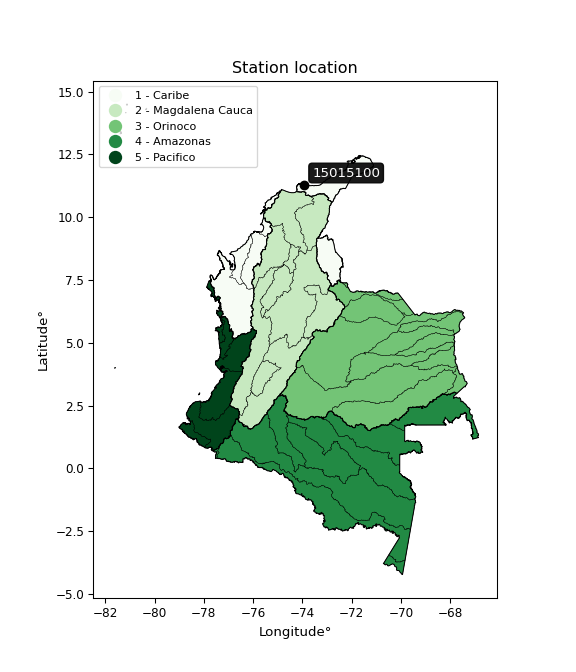

<div align="center">


</div>

# PMP Station (Rain, Pmax24h): 15015100

Probable Maximum Precipitation (PMP) is the greatest amount of rainfall for a specific duration that is meteorologically possible for a given location, acting as a "worst-case" scenario for extreme storms, crucial for designing safety-critical infrastructure like bridges, river deviations, dams, spillways, and nuclear plants to prevent catastrophic failure. PMP is calculated by hydrologists using meteorological data to determine the upper limit of extreme rainfall, often leading to the Probable Maximum Flood (PMF) for flood control design, and is increasingly being studied for climate change impacts. Probable Maximum Precipitation (PMP) is the theoretical upper limit of rainfall, a deterministic estimate for extreme events, while probability distributions (like GEV, Gumbel) describe the likelihood and frequency of various precipitation amounts, including rare ones, showing how often events occur, with PMP representing the extreme end of these distributions, used for critical infrastructure design to ensure safety against the worst conceivable weather, unlike standard statistical forecasts which cover typical probabilities.

The most common probability distributions in hydrology, used for analyzing floods, rainfall, and streamflow, include the Normal, Log-Normal, Gumbel, Gamma (including Log-Pearson Type III), and Generalized Extreme Value (GEV) distributions, often chosen based on the data´s skewness and whether modeling extremes or general conditions, with Gumbel and GEV popular for extreme events like floods, while the Normal distribution serves as a baseline, though often requiring transformations for skewed hydrological data. These distributions help in designing water infrastructure, managing water resources, and forecasting hydrologic events.

> Hydrological data often isn´t perfectly normal (it´s skewed), so different distributions are needed for different applications, such as: **Flood Frequency Analysis**: Using Gumbel, GEV, or Log-Pearson Type III for predicting extreme flood magnitudes and their return periods, **Rainfall Analysis**: Normal for annual totals, but Log-Normal, Weibull, or GEV for intensity or extreme daily rainfall, **Streamflow Modeling**: Gamma and Log-Normal for maximum flows, GEV for minimum flows, and Kappa for daily flows.

<div align="center">

</img>

</div>


## A. General information


### 1. General running parameters

• app_version: _v20260113_. • runtime: _2026-01-17 18:24:04.630693_. • Python version: _3.14.0_. • SciPy version: _1.16.3_. • Pandas version: _2.3.3_. • NumPy version: _2.3.5_. • Stations dataset (station_dataset_file): _dataset/pmax24h_in/automatic_colombia_2003_2025.csv_. • Stations catalog (station_catalog_file): _dataset/CNE.xls_. • Minimum year to eval til year_max (date_min): _1900_. • Maximum year to eval since year_min (date_max): _2025_. • Creates, save and include plots into reports (create_plot): _False_. • Plot only fit distributions with Δo > Δ (plot_only_fit): _True_. • Plot only simple graphs avoiding multiple CDFs and multiple Extreme values plots (plot_only_simple): _True_. • Eval low extreme values, if False, evaluates high extreme values (low_extreme): _False_. • Eval every SciPy distribution as logarithmic (pdist_logarithmic_on): _True_. • Standard deviation normalized (ddof): _1.0_. • Return periods to eval in years (Tr): _[2, 2.33, 5, 10, 15, 20, 25, 50, 75, 100, 200, 250, 500, 750, 1000]_. • Minimum data sample per station, 0 means any (minimum_sample): _5_. • Z-Score maximum threshold to adjust a value, 0 means disable (zscore_max): _3.5_. • Z-Score minimum threshold to adjust a value, 0 means disable (zscore_min): _-2.5_. • Avoid zeros, e.g. rain = 0 (avoid_zeros): _True_. • Avoid null values (avoid_nans): _True_. 

:file_folder:Table: [dataset.csv](../../dataset/pmax24h_in/automatic_colombia_2003_2025.csv)

> Delta Degrees of Freedom (DDOF): is a parameter used in the formulas for calculating variance and standard deviation. When ddof=0, the divisor is $N$ (the total number of observations) and this is used when your data set is the entire population. When ddof=1, the divisor is $N-1$ and this is used when your data set is a sample drawn from a larger population. Using $N-1$ provides an unbiased estimate of the population variance (known as Bessel´s correction).


### 2. Station info and location

|   id |   CODIGO | NOMBRE                    | CATEGORIA               | TECNOLOGIA                              | ESTADO   | FECHA_INSTALACION   |   FECHA_SUSPENSION |   ALTITUD |   LATITUD |   LONGITUD | DEPARTAMENTO   | MUNICIPIO   | AREA_OPERATIVA                                         | ENTIDAD                                                     | AREA_HIDROGRAFICA   | ZONA_HIDROGRAFICA   | SUBZONA_HIDROGRAFICA          |   CORRIENTE | Catalogo   |   Version |
|-----:|---------:|:--------------------------|:------------------------|:----------------------------------------|:---------|:--------------------|-------------------:|----------:|----------:|-----------:|:---------------|:------------|:-------------------------------------------------------|:------------------------------------------------------------|:--------------------|:--------------------|:------------------------------|------------:|:-----------|----------:|
|    0 | 15015100 | PARQUE TAYRONA [15015100] | Climatológica Ordinaria | Automática con Telemetría, Convencional | Activa   | 15/11/1977          |                nan |        23 |   11.3017 |   -73.9288 | Magdalena      | Santa Marta | Area Operativa 05 - Magdalena-Cesar-Guajira-San Andrés | INSTITUTO DE HIDROLOGIA METEOROLOGIA Y ESTUDIOS AMBIENTALES | Caribe              | Caribe - Guajira    | Río  Piedras - Río Manzanares |         nan | CNE_IDEAM  |  20251226 |

<div align="center">

Dynamic map: [:earth_americas:Google](http://maps.google.com/maps?q=11.301674,-73.928809) [:earth_americas:OSM](https://www.openstreetmap.org/#map=18/11.301674/-73.928809&layers=P) [:earth_americas:Bing](https://www.bing.com/maps?cp=11.301674~-73.928809&lvl=18) [:earth_americas:Apple](https://maps.apple.com/frame?center=11.301674%2C-73.928809&span=0.003%2C0.006)

</div>


<div align="center">

```geojson
{
  "type": "Feature",
  "geometry": {
    "type": "Point", 
    "coordinates": [-73.928809, 11.301674]
  }, 
  "properties": {
    "Name": "15015100"
  }
}
```

</div>


### 3. Discrete values table and plot

<div align="center">

|               |           0 |           1 |          2 |          3 |           4 |
|:--------------|------------:|------------:|-----------:|-----------:|------------:|
| Date          | 2021        | 2022        | 2023       | 2024       | 2025        |
| Value         |  113.2      |  204.7      |    5.1     |  438       |  148.2      |
| Value_initial |  113.2      |  204.7      |    5.1     |  438       |  148.2      |
| count         |    5        |    5        |    5       |    5       |    5        |
| mean          |  181.84     |  181.84     |  181.84    |  181.84    |  181.84     |
| std           |  160.64     |  160.64     |  160.64    |  160.64    |  160.64     |
| zscore        |   -0.427291 |    0.142306 |   -1.10023 |    1.59462 |   -0.209413 |


</div>


> The initial value (value_initial) correspond to the initial obtained or null completed value, and value (value) is adjusted only when the initial value is outside the valid range (outlier) definite through the Z-Score value. If Z-Score is active, values out of range or outliers are replaced with the station mean value. A Z-Score (or standard score) measures how many standard deviations a data point is from the mean of a dataset, indicating its relative position; positive scores mean above the mean, negative mean below, and a score of zero is exactly at the mean, allowing for comparison of values from different distributions. It´s calculated using the formula $z=(x–μ)/σ$, where $x$ is the data point, $μ$ is the mean, and $σ$ is the standard deviation, helping identify outliers and understand probability.
>
> <sub>**Note**: In this study, "completing" (filling gaps in) and "extending" (forecasting or lengthening the historical record) rainfall data series are avoided for certain critical analyses because they introduce artificial bias and uncertainty, which can distort the statistics of rare events (extremes), alter day-to-day variability, and compromise the integrity and homogeneity of the original data. Some reasons against Completing/Extending rainfall data are: **Distortion of Extremes and Variability**: The primary issue is that most gap-filling or extension methods rely on averaging or regression with nearby stations, which inherently smooths the data. Rainfall is highly variable in space and time, with a large percentage of zero values and occasional large storms. Infilling methods often underestimate the highest values and overestimate the lowest (zero) values, which severely distorts analyses focused on flood frequency, drought severity, and intensity-duration-frequency (IDF) curves, **Loss of Data Homogeneity**: Infilled or extended data are synthetic estimates, not actual measurements. Combining these estimates with observed data can violate the assumption of data homogeneity, which requires that the data properties do not change over time. Inhomogeneity can lead to incorrect conclusions about long-term trends or changes in climate patterns, **Propagation of Errors**: Errors and biases from the original data (e.g., wind-induced undercatch, instrument errors, site changes) or the data used for imputation can propagate through the analysis, leading to unreliable hydrological models and inaccurate predictions, **Compromised Statistical Integrity**: For statistical analyses, especially those involving the frequency of events, using artificial data can introduce time bias or autocorrelation that doesn´t exist in reality, making it difficult to assess the true probability of events, **Difficulty in Validation**: It is difficult to accurately validate the quality of filled or extended data, especially for past periods where ground-truth measurements are unavailable. The reliability of imputation techniques heavily depends on the density of the surrounding station network and the complexity of the local topography.</sub>


### 4. Active continuous probability distributions from SciPy (80 of 104 available)

A Probability Density Function (PDF) describes the relative likelihood of a continuous random variable falling within a specific range, where the total area under its curve equals 1, and the area over any interval gives the actual probability for that range. Unlike discrete probabilities (like rolling a die), a PDF shows density, not direct probability for a single point (which is zero), with higher points indicating higher likelihood, often visualized as a bell curve for normal distributions.

A log of a probability density function (log-PDF) is simply the logarithm of the PDF´s value, denoted as $log(f(x))$, useful for converting multiplication of probabilities into addition, improving numerical stability with tiny numbers, and connecting to information theory concepts like entropy. Instead of dealing with very small probabilities (e.g., 0.000001), log-PDFs use negative numbers (e.g., $log(0.00001) ≈ -11.51$ that are easier for computers to handle, preventing underflow errors and simplifying complex calculations. In this study, each active probability distribution from SciPy is also evaluated in the $log$ form.

[scipy.stats](https://docs.scipy.org/doc/scipy/reference/stats.html) is a Python´s powerful submodule within the SciPy library for comprehensive statistical analysis, offering over 130 probability distributions (like Normal, Poisson), functions for descriptive stats (mean, variance), hypothesis testing (t-tests, chi-square), random variable generation, and statistical tests, making it essential for data science, modeling, and research. It provides tools to explore, model, and draw conclusions from data efficiently, working seamlessly with NumPy.

<div align="center">

|   id | p_dist           |   n_parameter | fit_method   | label                                                                       | active   | ref                                                                                                      |
|-----:|:-----------------|--------------:|:-------------|:----------------------------------------------------------------------------|:---------|:---------------------------------------------------------------------------------------------------------|
|    0 | alpha            |             3 | MLE          | Alpha                                                                       | True     | [:mortar_board:](https://docs.scipy.org/doc/scipy/reference/generated/scipy.stats.alpha.html)            |
|    1 | anglit           |             2 | MM           | Anglit                                                                      | True     | [:mortar_board:](https://docs.scipy.org/doc/scipy/reference/generated/scipy.stats.anglit.html)           |
|    2 | arcsine          |             2 | MM           | Arcsine                                                                     | True     | [:mortar_board:](https://docs.scipy.org/doc/scipy/reference/generated/scipy.stats.arcsine.html)          |
|    3 | argus            |             3 | MLE          | Argus                                                                       | True     | [:mortar_board:](https://docs.scipy.org/doc/scipy/reference/generated/scipy.stats.argus.html)            |
|    4 | beta             |             4 | MLE          | Beta                                                                        | True     | [:mortar_board:](https://docs.scipy.org/doc/scipy/reference/generated/scipy.stats.beta.html)             |
|    5 | betaprime        |             4 | MLE          | Beta prime                                                                  | True     | [:mortar_board:](https://docs.scipy.org/doc/scipy/reference/generated/scipy.stats.betaprime.html)        |
|    6 | bradford         |             3 | MLE          | Bradford                                                                    | True     | [:mortar_board:](https://docs.scipy.org/doc/scipy/reference/generated/scipy.stats.bradford.html)         |
|    7 | burr             |             4 | MLE          | Burr (Type III)                                                             | True     | [:mortar_board:](https://docs.scipy.org/doc/scipy/reference/generated/scipy.stats.burr.html)             |
|    8 | burr12           |             4 | MLE          | Burr (Type III) 12                                                          | True     | [:mortar_board:](https://docs.scipy.org/doc/scipy/reference/generated/scipy.stats.burr12.html)           |
|    9 | cosine           |             2 | MLE          | Cosine                                                                      | True     | [:mortar_board:](https://docs.scipy.org/doc/scipy/reference/generated/scipy.stats.cosine.html)           |
|   10 | crystalball      |             4 | MLE          | Crystalball                                                                 | True     | [:mortar_board:](https://docs.scipy.org/doc/scipy/reference/generated/scipy.stats.crystalball.html)      |
|   11 | dgamma           |             3 | MLE          | Double gamma                                                                | True     | [:mortar_board:](https://docs.scipy.org/doc/scipy/reference/generated/scipy.stats.dgamma.html)           |
|   12 | dweibull         |             3 | MLE          | Double Weibull                                                              | True     | [:mortar_board:](https://docs.scipy.org/doc/scipy/reference/generated/scipy.stats.dweibull.html)         |
|   13 | erlang           |             3 | MLE          | Erlang                                                                      | True     | [:mortar_board:](https://docs.scipy.org/doc/scipy/reference/generated/scipy.stats.erlang.html)           |
|   14 | exponnorm        |             3 | MLE          | Exponentially modified Normal                                               | True     | [:mortar_board:](https://docs.scipy.org/doc/scipy/reference/generated/scipy.stats.exponnorm.html)        |
|   15 | exponpow         |             3 | MLE          | Exponential power                                                           | True     | [:mortar_board:](https://docs.scipy.org/doc/scipy/reference/generated/scipy.stats.exponpow.html)         |
|   16 | exponweib        |             4 | MLE          | Exponentiated Weibull                                                       | True     | [:mortar_board:](https://docs.scipy.org/doc/scipy/reference/generated/scipy.stats.exponweib.html)        |
|   17 | f                |             4 | MLE          | F                                                                           | True     | [:mortar_board:](https://docs.scipy.org/doc/scipy/reference/generated/scipy.stats.f.html)                |
|   18 | fatiguelife      |             3 | MLE          | Fatigue-life (Birnbaum-Saunders)                                            | True     | [:mortar_board:](https://docs.scipy.org/doc/scipy/reference/generated/scipy.stats.fatiguelife.html)      |
|   19 | foldnorm         |             3 | MM           | Fold Normal                                                                 | True     | [:mortar_board:](https://docs.scipy.org/doc/scipy/reference/generated/scipy.stats.foldnorm.html)         |
|   20 | gamma            |             3 | MLE          | Gamma                                                                       | True     | [:mortar_board:](https://docs.scipy.org/doc/scipy/reference/generated/scipy.stats.gamma.html)            |
|   21 | gausshyper       |             6 | MLE          | Gauss hypergeometric                                                        | True     | [:mortar_board:](https://docs.scipy.org/doc/scipy/reference/generated/scipy.stats.gausshyper.html)       |
|   22 | genexpon         |             5 | MLE          | Generalized exponential                                                     | True     | [:mortar_board:](https://docs.scipy.org/doc/scipy/reference/generated/scipy.stats.genexpon.html)         |
|   23 | genextreme       |             3 | MLE          | Generalized exponential                                                     | True     | [:mortar_board:](https://docs.scipy.org/doc/scipy/reference/generated/scipy.stats.genextreme.html)       |
|   24 | gengamma         |             4 | MLE          | Generalized gamma                                                           | True     | [:mortar_board:](https://docs.scipy.org/doc/scipy/reference/generated/scipy.stats.gengamma.html)         |
|   25 | genhalflogistic  |             3 | MLE          | Generalized half-logistic                                                   | True     | [:mortar_board:](https://docs.scipy.org/doc/scipy/reference/generated/scipy.stats.genhalflogistic.html)  |
|   26 | genlogistic      |             3 | MLE          | Generalized logistic                                                        | True     | [:mortar_board:](https://docs.scipy.org/doc/scipy/reference/generated/scipy.stats.genlogistic.html)      |
|   27 | gennorm          |             3 | MLE          | Generalized Normal                                                          | True     | [:mortar_board:](https://docs.scipy.org/doc/scipy/reference/generated/scipy.stats.gennorm.html)          |
|   28 | genpareto        |             3 | MLE          | Generalized Pareto                                                          | True     | [:mortar_board:](https://docs.scipy.org/doc/scipy/reference/generated/scipy.stats.genpareto.html)        |
|   29 | gompertz         |             3 | MLE          | Gompertz (or truncated Gumbel)                                              | True     | [:mortar_board:](https://docs.scipy.org/doc/scipy/reference/generated/scipy.stats.gompertz.html)         |
|   30 | gumbel_l         |             2 | MM           | Gumbel Left Skew                                                            | True     | [:mortar_board:](https://docs.scipy.org/doc/scipy/reference/generated/scipy.stats.gumbel_l.html)         |
|   31 | gumbel_r         |             2 | MM           | Gumbel Right Skew                                                           | True     | [:mortar_board:](https://docs.scipy.org/doc/scipy/reference/generated/scipy.stats.gumbel_r.html)         |
|   32 | halfgennorm      |             3 | MLE          | Upper half of a generalized normal                                          | True     | [:mortar_board:](https://docs.scipy.org/doc/scipy/reference/generated/scipy.stats.halfgennorm.html)      |
|   33 | halflogistic     |             2 | MM           | Half-logistic                                                               | True     | [:mortar_board:](https://docs.scipy.org/doc/scipy/reference/generated/scipy.stats.halflogistic.html)     |
|   34 | halfnorm         |             2 | MM           | Half Normal                                                                 | True     | [:mortar_board:](https://docs.scipy.org/doc/scipy/reference/generated/scipy.stats.halfnorm.html)         |
|   35 | hypsecant        |             2 | MM           | hyperbolic secant                                                           | True     | [:mortar_board:](https://docs.scipy.org/doc/scipy/reference/generated/scipy.stats.hypsecant.html)        |
|   36 | invgamma         |             3 | MLE          | Inverted gamma                                                              | True     | [:mortar_board:](https://docs.scipy.org/doc/scipy/reference/generated/scipy.stats.invgamma.html)         |
|   37 | invgauss         |             3 | MLE          | Inverse Gaussian                                                            | True     | [:mortar_board:](https://docs.scipy.org/doc/scipy/reference/generated/scipy.stats.invgauss.html)         |
|   38 | invweibull       |             3 | MLE          | Inverted Weibull                                                            | True     | [:mortar_board:](https://docs.scipy.org/doc/scipy/reference/generated/scipy.stats.invweibull.html)       |
|   39 | johnsonsb        |             4 | MLE          | Johnson SB                                                                  | True     | [:mortar_board:](https://docs.scipy.org/doc/scipy/reference/generated/scipy.stats.johnsonsb.html)        |
|   40 | johnsonsu        |             4 | MLE          | Johnson Su                                                                  | True     | [:mortar_board:](https://docs.scipy.org/doc/scipy/reference/generated/scipy.stats.johnsonsu.html)        |
|   41 | kappa3           |             3 | MLE          | Kappa 3                                                                     | True     | [:mortar_board:](https://docs.scipy.org/doc/scipy/reference/generated/scipy.stats.kappa3.html)           |
|   42 | kappa4           |             4 | MLE          | Kappa 4                                                                     | True     | [:mortar_board:](https://docs.scipy.org/doc/scipy/reference/generated/scipy.stats.kappa4.html)           |
|   43 | ksone            |             3 | MLE          | Kolmogorov-Smirnov one-sided test statistic distribution                    | True     | [:mortar_board:](https://docs.scipy.org/doc/scipy/reference/generated/scipy.stats.ksone.html)            |
|   44 | kstwobign        |             2 | MLE          | Limiting distribution of scaled Kolmogorov-Smirnov two-sided test statistic | True     | [:mortar_board:](https://docs.scipy.org/doc/scipy/reference/generated/scipy.stats.kstwobign.html)        |
|   45 | laplace          |             2 | MM           | Laplace                                                                     | True     | [:mortar_board:](https://docs.scipy.org/doc/scipy/reference/generated/scipy.stats.laplace.html)          |
|   46 | levy_l           |             2 | MLE          | Left-skewed Levy                                                            | True     | [:mortar_board:](https://docs.scipy.org/doc/scipy/reference/generated/scipy.stats.levy_l.html)           |
|   47 | loggamma         |             3 | MLE          | Log gamma                                                                   | True     | [:mortar_board:](https://docs.scipy.org/doc/scipy/reference/generated/scipy.stats.loggamma.html)         |
|   48 | logistic         |             2 | MM           | Logistic (or Sech-squared)                                                  | True     | [:mortar_board:](https://docs.scipy.org/doc/scipy/reference/generated/scipy.stats.logistic.html)         |
|   49 | loglaplace       |             3 | MLE          | Log-Laplace                                                                 | True     | [:mortar_board:](https://docs.scipy.org/doc/scipy/reference/generated/scipy.stats.loglaplace.html)       |
|   50 | lomax            |             3 | MLE          | Lomax (Pareto of the second kind)                                           | True     | [:mortar_board:](https://docs.scipy.org/doc/scipy/reference/generated/scipy.stats.lomax.html)            |
|   51 | maxwell          |             2 | MM           | Maxwell                                                                     | True     | [:mortar_board:](https://docs.scipy.org/doc/scipy/reference/generated/scipy.stats.maxwell.html)          |
|   52 | mielke           |             4 | MLE          | Mielke Beta-Kappa / Dagum                                                   | True     | [:mortar_board:](https://docs.scipy.org/doc/scipy/reference/generated/scipy.stats.mielke.html)           |
|   53 | moyal            |             2 | MM           | Moyal                                                                       | True     | [:mortar_board:](https://docs.scipy.org/doc/scipy/reference/generated/scipy.stats.moyal.html)            |
|   54 | nakagami         |             3 | MLE          | Nakagami                                                                    | True     | [:mortar_board:](https://docs.scipy.org/doc/scipy/reference/generated/scipy.stats.nakagami.html)         |
|   55 | ncf              |             5 | MLE          | Non-central F distribution                                                  | True     | [:mortar_board:](https://docs.scipy.org/doc/scipy/reference/generated/scipy.stats.ncf.html)              |
|   56 | nct              |             4 | MLE          | Non-central Student’s t                                                     | True     | [:mortar_board:](https://docs.scipy.org/doc/scipy/reference/generated/scipy.stats.nct.html)              |
|   57 | norm             |             2 | MM           | Normal                                                                      | True     | [:mortar_board:](https://docs.scipy.org/doc/scipy/reference/generated/scipy.stats.norm.html)             |
|   58 | pearson3         |             3 | MM           | Pearson type III                                                            | True     | [:mortar_board:](https://docs.scipy.org/doc/scipy/reference/generated/scipy.stats.pearson3.html)         |
|   59 | powerlaw         |             3 | MLE          | Power-function                                                              | True     | [:mortar_board:](https://docs.scipy.org/doc/scipy/reference/generated/scipy.stats.powerlaw.html)         |
|   60 | rayleigh         |             2 | MM           | Rayleigh                                                                    | True     | [:mortar_board:](https://docs.scipy.org/doc/scipy/reference/generated/scipy.stats.rayleigh.html)         |
|   61 | rdist            |             3 | MLE          | R-distributed (symmetric beta)                                              | True     | [:mortar_board:](https://docs.scipy.org/doc/scipy/reference/generated/scipy.stats.rdist.html)            |
|   62 | rice             |             3 | MLE          | Rice                                                                        | True     | [:mortar_board:](https://docs.scipy.org/doc/scipy/reference/generated/scipy.stats.rice.html)             |
|   63 | semicircular     |             2 | MM           | Semicircular                                                                | True     | [:mortar_board:](https://docs.scipy.org/doc/scipy/reference/generated/scipy.stats.semicircular.html)     |
|   64 | skewnorm         |             3 | MLE          | Skew normal                                                                 | True     | [:mortar_board:](https://docs.scipy.org/doc/scipy/reference/generated/scipy.stats.skewnorm.html)         |
|   65 | t                |             3 | MLE          | Student’s t                                                                 | True     | [:mortar_board:](https://docs.scipy.org/doc/scipy/reference/generated/scipy.stats.t.html)                |
|   66 | trapezoid        |             4 | MLE          | Trapezoid                                                                   | True     | [:mortar_board:](https://docs.scipy.org/doc/scipy/reference/generated/scipy.stats.trapezoid.html)        |
|   67 | triang           |             3 | MLE          | Triangular                                                                  | True     | [:mortar_board:](https://docs.scipy.org/doc/scipy/reference/generated/scipy.stats.triang.html)           |
|   68 | truncexpon       |             3 | MLE          | Truncated exponential                                                       | True     | [:mortar_board:](https://docs.scipy.org/doc/scipy/reference/generated/scipy.stats.truncexpon.html)       |
|   69 | truncnorm        |             4 | MLE          | Truncated normal                                                            | True     | [:mortar_board:](https://docs.scipy.org/doc/scipy/reference/generated/scipy.stats.truncnorm.html)        |
|   70 | truncpareto      |             4 | MLE          | Upper truncated Pareto                                                      | True     | [:mortar_board:](https://docs.scipy.org/doc/scipy/reference/generated/scipy.stats.truncpareto.html)      |
|   71 | truncweibull_min |             5 | MLE          | Doubly truncated Weibull minimum                                            | True     | [:mortar_board:](https://docs.scipy.org/doc/scipy/reference/generated/scipy.stats.truncweibull_min.html) |
|   72 | tukeylambda      |             3 | MLE          | Tukey-Lamdba                                                                | True     | [:mortar_board:](https://docs.scipy.org/doc/scipy/reference/generated/scipy.stats.tukeylambda.html)      |
|   73 | uniform          |             2 | MLE          | Uniform                                                                     | True     | [:mortar_board:](https://docs.scipy.org/doc/scipy/reference/generated/scipy.stats.uniform.html)          |
|   74 | vonmises         |             3 | MLE          | Von Mises                                                                   | True     | [:mortar_board:](https://docs.scipy.org/doc/scipy/reference/generated/scipy.stats.vonmises.html)         |
|   75 | vonmises_line    |             3 | MLE          | Von Mises line                                                              | True     | [:mortar_board:](https://docs.scipy.org/doc/scipy/reference/generated/scipy.stats.vonmises_line.html)    |
|   76 | wald             |             2 | MM           | Wald                                                                        | True     | [:mortar_board:](https://docs.scipy.org/doc/scipy/reference/generated/scipy.stats.wald.html)             |
|   77 | weibull_max      |             3 | MLE          | Weibull maximum                                                             | True     | [:mortar_board:](https://docs.scipy.org/doc/scipy/reference/generated/scipy.stats.weibull_max.html)      |
|   78 | weibull_min      |             3 | MLE          | Weibull minimum                                                             | True     | [:mortar_board:](https://docs.scipy.org/doc/scipy/reference/generated/scipy.stats.weibull_min.html)      |
|   79 | wrapcauchy       |             3 | MLE          | Wrapped  Cauchy                                                             | True     | [:mortar_board:](https://docs.scipy.org/doc/scipy/reference/generated/scipy.stats.wrapcauchy.html)       |

</div>

> **n_parameter:** # arguments & localization & scale.
>
> **Fit methods:** (MLE) maximum likelihood, (MM) L-moments.
>
>**Inactive** (With the only purpose of prevent loops, zero divisions, infinite values, over high estimated values or horizontal trending for recurrence intervals estimations, the follow distributions were disabled.)**:** lognorm, norminvgauss, powernorm, powerlognorm, cauchy, halfcauchy, foldcauchy, skewcauchy, chi2, expon, fisk, genhyperbolic, geninvgauss, gibrat, kstwo, laplace_asymmetric, levy, levy_stable, ncx2, pareto, rel_breitwigner, recipinvgauss, studentized_range, loguniform, 


## B. Probability (PDF) vs. Empirical (EDF) distributions functions

A continuous probability distribution (CPD) describes probabilities for variables that can take any value within a range (like rain any time), unlike discrete variables with specific outcomes (like temperature). It uses a Probability Density Function (PDF), a curve where the total area under it equals 1, and the probability of the variable falling within an interval (a to b) is found by calculating the area under the curve between those points. A key feature is that the probability of hitting any single exact value is zero, so probabilities are always expressed for ranges, e.g., $P(a ≤ X ≤ b)$.

<div align="center">

Distributions parameters from station values
|     |   station | p_dist              |   n |               loc |            scale | shape                  | shape1                 | shape2                | shape3             |
|----:|----------:|:--------------------|----:|------------------:|-----------------:|:-----------------------|:-----------------------|:----------------------|:-------------------|
|   0 |  15015100 | alpha               |   5 |      -0.0258722   |     11.4586      | 1.3781566077904402e-10 |                        |                       |                    |
|   1 |  15015100 | anglit              |   5 |     181.84        |    420.323       |                        |                        |                       |                    |
|   2 |  15015100 | arcsine             |   5 |     -21.3551      |    406.39        |                        |                        |                       |                    |
|   3 |  15015100 | argus               |   5 |    -136.786       |    605.921       | 5.877224321768056e-07  |                        |                       |                    |
|   4 |  15015100 | beta                |   5 |     -16.1582      |    454.158       | 1.1107361034182182     | 0.5094486665100426     |                       |                    |
|   5 |  15015100 | betaprime           |   5 |       5.1         |    544.92        | 0.7763782584393113     | 2.5025625575164923     |                       |                    |
|   6 |  15015100 | bradford            |   5 |       5.1         |    444.096       | 0.8475780983820631     |                        |                       |                    |
|   7 |  15015100 | burr                |   5 |       5.09985     |    396.818       | 3.0412119708723235     | 0.14038042249776655    |                       |                    |
|   8 |  15015100 | burr12              |   5 |      -0.141601    |      5.09501     | 159.3484573919641      | 0.0021419547457091495  |                       |                    |
|   9 |  15015100 | cosine              |   5 |     196.802       |    121.169       |                        |                        |                       |                    |
|  10 |  15015100 | crystalball         |   5 |       5.00673     |    211.523       | 39.26380190438138      | 3491.89030069416       |                       |                    |
|  11 |  15015100 | dgamma              |   5 |     148.2         |    106.099       | 0.8705040540951955     |                        |                       |                    |
|  12 |  15015100 | dweibull            |   5 |     148.2         |    124.545       | 0.771072994264095      |                        |                       |                    |
|  13 |  15015100 | erlang              |   5 |       5.1         |    197.535       | 0.3867451433529725     |                        |                       |                    |
|  14 |  15015100 | exponnorm           |   5 |      43.9291      |     63.3331      | 2.1775465633619104     |                        |                       |                    |
|  15 |  15015100 | exponpow            |   5 |       5.1         |    336.171       | 0.7622659657281381     |                        |                       |                    |
|  16 |  15015100 | exponweib           |   5 |       4.65601     |    125.244       | 0.8360539043325361     | 0.9033638516192047     |                       |                    |
|  17 |  15015100 | f                   |   5 |       5.1         |    222.127       | 1.118662583883253      | 54.589398024080744     |                       |                    |
|  18 |  15015100 | fatiguelife         |   5 |       5.1         |      0.000616513 | 509.5527526780579      |                        |                       |                    |
|  19 |  15015100 | foldnorm            |   5 |     -24.7317      |    183.199       | 0.9415691211983788     |                        |                       |                    |
|  20 |  15015100 | gamma               |   5 |       5.1         |    307.999       | 0.2661888579812357     |                        |                       |                    |
|  21 |  15015100 | gausshyper          |   5 |     -38.8136      |    476.814       | 1.0997891082318447     | 0.9414464700103123     | 1.0584347828797314    | 0.9677875655400165 |
|  22 |  15015100 | genexpon            |   5 |       5.09993     |      2.51796     | 0.014257018896542527   | 2.6759235267495533e-08 | 2.663456010951431     |                    |
|  23 |  15015100 | genextreme          |   5 |       7.21313     |      9.98873     | -4.723200147114525     |                        |                       |                    |
|  24 |  15015100 | gengamma            |   5 |       5.1         |      0.277009    | 3.0793120821447        | 0.20811759387032108    |                       |                    |
|  25 |  15015100 | genhalflogistic     |   5 |     -39.3039      |    508.832       | 1.066054889611713      |                        |                       |                    |
|  26 |  15015100 | genlogistic         |   5 |    -614.113       |    110.455       | 742.23288221244        |                        |                       |                    |
|  27 |  15015100 | gennorm             |   5 |     148.2         |      1.27233     | 0.31436872910120994    |                        |                       |                    |
|  28 |  15015100 | genpareto           |   5 |      -2.46212     |    643.236       | -1.460365338495523     |                        |                       |                    |
|  29 |  15015100 | gompertz            |   5 |       5.1         |    395.746       | 1.4746308358194913     |                        |                       |                    |
|  30 |  15015100 | gumbel_l            |   5 |     246.504       |    112.027       |                        |                        |                       |                    |
|  31 |  15015100 | gumbel_r            |   5 |     117.176       |    112.027       |                        |                        |                       |                    |
|  32 |  15015100 | halfgennorm         |   5 |       5.1         |      3.81616     | 0.3647459140889179     |                        |                       |                    |
|  33 |  15015100 | halflogistic        |   5 |     204.104       |      8.57917     |                        |                        |                       |                    |
|  34 |  15015100 | halfnorm            |   5 |      -8.33688     |    238.351       |                        |                        |                       |                    |
|  35 |  15015100 | hypsecant           |   5 |     181.84        |     91.4699      |                        |                        |                       |                    |
|  36 |  15015100 | invgamma            |   5 |    -223.7         |   3165.93        | 8.784355241913705      |                        |                       |                    |
|  37 |  15015100 | invgauss            |   5 |    -117.376       |   1120.49        | 0.26704113661041895    |                        |                       |                    |
|  38 |  15015100 | invweibull          |   5 |       5.1         |      8.69874     | 0.05656368899876122    |                        |                       |                    |
|  39 |  15015100 | johnsonsb           |   5 |       5.1         |    432.9         | -0.4170251613008211    | 0.11599164662028684    |                       |                    |
|  40 |  15015100 | johnsonsu           |   5 |    -113.462       |      8.13209     | -8.375376724001953     | 2.0105390162020997     |                       |                    |
|  41 |  15015100 | kappa3              |   5 |       5.1         |    198.086       | 3.264423503861666      |                        |                       |                    |
|  42 |  15015100 | kappa4              |   5 |     -37.8576      |    484.497       | 1.097339875113226      | 1.010079669342078      |                       |                    |
|  43 |  15015100 | ksone               |   5 |     -38.19        |    519.48        | 1.0                    |                        |                       |                    |
|  44 |  15015100 | kstwobign           |   5 |    -277.849       |    528.777       |                        |                        |                       |                    |
|  45 |  15015100 | laplace             |   5 |     181.84        |    101.598       |                        |                        |                       |                    |
|  46 |  15015100 | levy_l              |   5 |     463.397       |     97.1817      |                        |                        |                       |                    |
|  47 |  15015100 | loggamma            |   5 |  -27753.6         |   4155.96        | 830.5918397350326      |                        |                       |                    |
|  48 |  15015100 | logistic            |   5 |     181.84        |     79.2153      |                        |                        |                       |                    |
|  49 |  15015100 | loglaplace          |   5 |      -0.461896    |    148.662       | 1.007787040532846      |                        |                       |                    |
|  50 |  15015100 | lomax               |   5 |       5.1         |      3.41407e+11 | 1855871428.7178133     |                        |                       |                    |
|  51 |  15015100 | maxwell             |   5 |    -158.623       |    213.353       |                        |                        |                       |                    |
|  52 |  15015100 | mielke              |   5 |      -2.11121     |    444.034       | 0.6822674988198578     | 588.0402362129139      |                       |                    |
|  53 |  15015100 | moyal               |   5 |      99.6742      |     64.679       |                        |                        |                       |                    |
|  54 |  15015100 | nakagami            |   5 |     113.2         |    147.265       | 0.27357156519428405    |                        |                       |                    |
|  55 |  15015100 | ncf                 |   5 |      -0.0409684   |      1.10971e-05 | 6.354910925166602e-07  | 3.351901438584955      | 7.3759109540329915    |                    |
|  56 |  15015100 | nct                 |   5 |      -0.284605    |      0.219594    | 0.36001411937135575    | 54.73606158747181      |                       |                    |
|  57 |  15015100 | norm                |   5 |     181.84        |    143.681       |                        |                        |                       |                    |
|  58 |  15015100 | pearson3            |   5 |     181.84        |    143.681       | 0.7375394103412185     |                        |                       |                    |
|  59 |  15015100 | powerlaw            |   5 |       5.1         |    432.9         | 0.11364548040412571    |                        |                       |                    |
|  60 |  15015100 | rayleigh            |   5 |     -93.0295      |    219.314       |                        |                        |                       |                    |
|  61 |  15015100 | rdist               |   5 |     -38.0162      |    242.716       | 1.0794708581662646     |                        |                       |                    |
|  62 |  15015100 | rice                |   5 |     -65.0174      |    201.969       | 0.000545413740348026   |                        |                       |                    |
|  63 |  15015100 | semicircular        |   5 |     181.84        |    287.361       |                        |                        |                       |                    |
|  64 |  15015100 | skewnorm            |   5 |       5.0999      |    227.756       | 12611754.937402993     |                        |                       |                    |
|  65 |  15015100 | t                   |   5 |     181.761       |    143.678       | 124825.27131600422     |                        |                       |                    |
|  66 |  15015100 | trapezoid           |   5 |     -40.0995      |    519.48        | 1.0                    | 1.0                    |                       |                    |
|  67 |  15015100 | triang              |   5 |    -176.97        |    614.97        | 0.999999999914919      |                        |                       |                    |
|  68 |  15015100 | truncexpon          |   5 |       5.1         |    542.113       | 0.7985415296145593     |                        |                       |                    |
|  69 |  15015100 | truncnorm           |   5 |     181.84        |    143.681       | -380.688606719649      | 579.9962234147002      |                       |                    |
|  70 |  15015100 | truncpareto         |   5 |    -105.277       |    110.377       | 5.21661167652104e-08   | 4.922008120985021      |                       |                    |
|  71 |  15015100 | truncweibull_min    |   5 |     -22.361       |    509.857       | 1.1756129850179007     | 0.0007694425720287884  | 0.902922555090832     |                    |
|  72 |  15015100 | tukeylambda         |   5 |     -33.516       |    260.432       | 1.0932577394235787     |                        |                       |                    |
|  73 |  15015100 | uniform             |   5 |       5.1         |    432.9         |                        |                        |                       |                    |
|  74 |  15015100 | vonmises            |   5 |      -1.78669     |      1           | 1.400513836793546      |                        |                       |                    |
|  75 |  15015100 | vonmises_line       |   5 |     221.664       |     68.9345      | 4.801805263626156e-08  |                        |                       |                    |
|  76 |  15015100 | wald                |   5 |      38.1594      |    143.681       |                        |                        |                       |                    |
|  77 |  15015100 | weibull_max         |   5 |     438           |      1.69495     | 0.13860960328553412    |                        |                       |                    |
|  78 |  15015100 | weibull_min         |   5 |       5.1         |     55.2815      | 0.2718011694983804     |                        |                       |                    |
|  79 |  15015100 | wrapcauchy          |   5 |       5.07208     |     68.9026      | 0.16655693500051005    |                        |                       |                    |
|  80 |  15015100 | logalpha            |   5 |     -31.3131      |    808.615       | 22.617508587886597     |                        |                       |                    |
|  81 |  15015100 | loganglit           |   5 |       4.55214     |      4.47636     |                        |                        |                       |                    |
|  82 |  15015100 | logarcsine          |   5 |       2.38816     |      4.32796     |                        |                        |                       |                    |
|  83 |  15015100 | logargus            |   5 |      -0.403014    |      6.63054     | 2.4637898366605215     |                        |                       |                    |
|  84 |  15015100 | logbeta             |   5 |       1.20603     |      4.87619     | 0.5669106642309001     | 0.1915647600261607     |                       |                    |
|  85 |  15015100 | logbetaprime        |   5 |      -3.99778     |      1.54294e+09 | 22.660824448522852     | 4077257445.086189      |                       |                    |
|  86 |  15015100 | logbradford         |   5 |       1.61982     |      4.46252     | 1.3252805003265275e-05 |                        |                       |                    |
|  87 |  15015100 | logburr             |   5 |      -4.31655     |     10.43        | 1262.9531803554423     | 0.004401663913702176   |                       |                    |
|  88 |  15015100 | logburr12           |   5 |   -4956.02        |   4974.62        | 5265.930883321971      | 1430866.9489052575     |                       |                    |
|  89 |  15015100 | logcosine           |   5 |       4.30793     |      1.30519     |                        |                        |                       |                    |
|  90 |  15015100 | logcrystalball      |   5 |       4.55214     |      1.53017     | 7.745449542688602      | 24.672322706764852     |                       |                    |
|  91 |  15015100 | logdgamma           |   5 |       4.99856     |      1.39794     | 0.7109638619276932     |                        |                       |                    |
|  92 |  15015100 | logdweibull         |   5 |       4.99856     |      1.12352     | 0.8271889574513129     |                        |                       |                    |
|  93 |  15015100 | logerlang           |   5 |     -19.7991      |      0.101755    | 239.17028985609522     |                        |                       |                    |
|  94 |  15015100 | logexponnorm        |   5 |       4.55178     |      1.5302      | 0.00023795123541029057 |                        |                       |                    |
|  95 |  15015100 | logexponpow         |   5 |       1.62924     |      1.37813     | 0.22531636974626817    |                        |                       |                    |
|  96 |  15015100 | logexponweib        |   5 |       1.62924     |      1.04975     | 1.2237675155771097     | 0.4369011620282643     |                       |                    |
|  97 |  15015100 | logf                |   5 |   -1887.59        |   1892.14        | 8819682.210623387      | 4622137.477517825      |                       |                    |
|  98 |  15015100 | logfatiguelife      |   5 |    -788.916       |    793.471       | 0.0019329702352372706  |                        |                       |                    |
|  99 |  15015100 | logfoldnorm         |   5 |      -5.10312     |      1.38755     | 6.978101004801581      |                        |                       |                    |
| 100 |  15015100 | loggamma            |   5 |     -22.6467      |      0.0925668   | 293.87142148225854     |                        |                       |                    |
| 101 |  15015100 | loggausshyper       |   5 |       1.31529     |      4.76693     | 1.1291253498477687     | 0.7070674870941709     | 1.0565469836806058    | 1.0538084421748621 |
| 102 |  15015100 | loggenexpon         |   5 |       1.35456     |      0.149835    | 0.012943814853580704   | 8.42007584420113       | 0.0003084266877559792 |                    |
| 103 |  15015100 | loggenextreme       |   5 |       4.69981     |      1.62857     | 1.1780671748686506     |                        |                       |                    |
| 104 |  15015100 | loggengamma         |   5 |       1.62924     |      1.06179     | 1.4003908173279351     | 0.2238436729074948     |                       |                    |
| 105 |  15015100 | loggenhalflogistic  |   5 |       1.19793     |      5.22993     | 1.0707671947938322     |                        |                       |                    |
| 106 |  15015100 | loggenlogistic      |   5 |       6.08226     |      4.48709e-06 | 2.939716781906641e-06  |                        |                       |                    |
| 107 |  15015100 | loggennorm          |   5 |       4.99856     |      0.00385464  | 0.28117965741347983    |                        |                       |                    |
| 108 |  15015100 | loggenpareto        |   5 |      -0.0112365   |     11.3569      | -1.8637841399714457    |                        |                       |                    |
| 109 |  15015100 | loggompertz         |   5 |       1.62924     |      1.11864     | 0.04425921368801698    |                        |                       |                    |
| 110 |  15015100 | loggumbel_l         |   5 |       5.2408      |      1.19307     |                        |                        |                       |                    |
| 111 |  15015100 | loggumbel_r         |   5 |       3.86349     |      1.19307     |                        |                        |                       |                    |
| 112 |  15015100 | loghalfgennorm      |   5 |       1.62924     |      1.2971      | 0.6556467615066455     |                        |                       |                    |
| 113 |  15015100 | loghalflogistic     |   5 |       2.73847     |      1.30829     |                        |                        |                       |                    |
| 114 |  15015100 | loghalfnorm         |   5 |       2.52681     |      2.53838     |                        |                        |                       |                    |
| 115 |  15015100 | loghypsecant        |   5 |       4.55214     |      0.974136    |                        |                        |                       |                    |
| 116 |  15015100 | loginvgamma         |   5 |     -24.0702      |   8598.84        | 301.3477601949494      |                        |                       |                    |
| 117 |  15015100 | loginvgauss         |   5 |     -10.5552      |   1258.66        | 0.011953774486927832   |                        |                       |                    |
| 118 |  15015100 | loginvweibull       |   5 | -210148           | 210152           | 121148.69356533425     |                        |                       |                    |
| 119 |  15015100 | logjohnsonsb        |   5 |       1.62924     |      4.7664      | 0.009254802831155184   | 0.06217300308365577    |                       |                    |
| 120 |  15015100 | logjohnsonsu        |   5 |       6.36188     |      0.00799211  | 6.3262718413741705     | 1.1009902044975646     |                       |                    |
| 121 |  15015100 | logkappa3           |   5 |       1.62924     |      4.44747     | 1303.0825686378441     |                        |                       |                    |
| 122 |  15015100 | logkappa4           |   5 |       1.04106     |      5.23929     | 1.126777830192268      | 1.0380401865045348     |                       |                    |
| 123 |  15015100 | logksone            |   5 |       1.18394     |      5.34357     | 1.0                    |                        |                       |                    |
| 124 |  15015100 | logkstwobign        |   5 |      -2.37611     |      7.89798     |                        |                        |                       |                    |
| 125 |  15015100 | loglaplace          |   5 |       4.55214     |      1.08199     |                        |                        |                       |                    |
| 126 |  15015100 | loglevy_l           |   5 |       6.18913     |      0.408155    |                        |                        |                       |                    |
| 127 |  15015100 | logloggamma         |   5 |       6.08228     |      4.17649e-06 | 2.7299266776153788e-06 |                        |                       |                    |
| 128 |  15015100 | loglogistic         |   5 |       4.55214     |      0.843627    |                        |                        |                       |                    |
| 129 |  15015100 | logloglaplace       |   5 |      -0.00400808  |      5.00257     | 3.4896193603947117     |                        |                       |                    |
| 130 |  15015100 | loglomax            |   5 |       1.62924     |      3.6011e+09  | 1265281166.769721      |                        |                       |                    |
| 131 |  15015100 | logmaxwell          |   5 |       0.926285    |      2.27217     |                        |                        |                       |                    |
| 132 |  15015100 | logmielke           |   5 |      -1.54676e+07 |      1.54676e+07 | 10136842.63827343      | 7225084398.253284      |                       |                    |
| 133 |  15015100 | logmoyal            |   5 |       3.6771      |      0.688818    |                        |                        |                       |                    |
| 134 |  15015100 | lognakagami         |   5 |       4.72916     |      0.953957    | 0.04991969194918905    |                        |                       |                    |
| 135 |  15015100 | logncf              |   5 |      -0.106518    |      5.18933e-06 | 3.4419817029866285e-05 | 95.49271140871028      | 30.546584273672856    |                    |
| 136 |  15015100 | lognct              |   5 |     -94.2651      |      1.46918     | 24105.882102667107     | 67.25867879113463      |                       |                    |
| 137 |  15015100 | lognorm             |   5 |       4.55214     |      1.53017     |                        |                        |                       |                    |
| 138 |  15015100 | logpearson3         |   5 |       4.55215     |      1.53016     | -1.1632693388672402    |                        |                       |                    |
| 139 |  15015100 | logpowerlaw         |   5 |       1.62924     |      4.45298     | 0.13032505342998396    |                        |                       |                    |
| 140 |  15015100 | lograyleigh         |   5 |       1.62484     |      2.33565     |                        |                        |                       |                    |
| 141 |  15015100 | logrdist            |   5 |       2.28641     |      2.44274     | 1.0586665889470535     |                        |                       |                    |
| 142 |  15015100 | logrice             |   5 |       0.437073    |      1.64773     | 2.2582040910770376     |                        |                       |                    |
| 143 |  15015100 | logsemicircular     |   5 |       4.55214     |      3.06034     |                        |                        |                       |                    |
| 144 |  15015100 | logskewnorm         |   5 |       6.08222     |      2.16369     | -18798337.964094207    |                        |                       |                    |
| 145 |  15015100 | logt                |   5 |       4.55214     |      1.53017     | 1260545379.2622862     |                        |                       |                    |
| 146 |  15015100 | logtrapezoid        |   5 |       0.224171    |      6.49196     | 1.0                    | 1.0                    |                       |                    |
| 147 |  15015100 | logtriang           |   5 |       0.266687    |      5.81557     | 0.9999989328808976     |                        |                       |                    |
| 148 |  15015100 | logtruncexpon       |   5 |       1.62924     |      6.819       | 0.6530270409401173     |                        |                       |                    |
| 149 |  15015100 | logtruncnorm        |   5 |      -0.327488    |      6.13849     | -3.5788470673249746    | 1.0441821265073419     |                       |                    |
| 150 |  15015100 | logtruncpareto      |   5 |       1.59917     |      0.030074    | 0.26047545300835745    | 149.06719594212117     |                       |                    |
| 151 |  15015100 | logtruncweibull_min |   5 |       1.46781     |      7.39661     | 1.2893161772999755     | 0.00017533702537882309 | 0.6238546100937348    |                    |
| 152 |  15015100 | logtukeylambda      |   5 |       3.85573     |      2.44132     | 1.0964884339942134     |                        |                       |                    |
| 153 |  15015100 | loguniform          |   5 |       1.62924     |      4.45298     |                        |                        |                       |                    |
| 154 |  15015100 | logvonmises         |   5 |      -0.835169    |      1           | 1.2712320080856563     |                        |                       |                    |
| 155 |  15015100 | logvonmises_line    |   5 |       4.93628     |      1.05268     | 1.083881264641656      |                        |                       |                    |
| 156 |  15015100 | logwald             |   5 |       3.02196     |      1.53019     |                        |                        |                       |                    |
| 157 |  15015100 | logweibull_max      |   5 |       6.08222     |      1.56657     | 0.9997634562553146     |                        |                       |                    |
| 158 |  15015100 | logweibull_min      |   5 |       1.62924     |      1.2271      | 0.42059617643922287    |                        |                       |                    |
| 159 |  15015100 | logwrapcauchy       |   5 |       1.62924     |      0.708717    | 0.4455764690580507     |                        |                       |                    |

</div>

> **loc** (Location parameter): This shifts the distribution along the x-axis. For many common distributions, like the normal (Gaussian) distribution, loc represents the mean $μ$. For others, like the uniform distribution, it might represent the minimum value, or for the beta distribution, the left end of the support interval.
>
> **scale** (Scale parameter): This determines the width or spread of the distribution. For the normal distribution, scale represents the standard deviation $σ$. For a uniform distribution, it defines the length of the interval (from $loc$ to $loc + scale$).
>
> **shape** (Shape parameters): Refers to parameters that define the specific form of a probability distribution, distinct from its location (loc) and scale (scale). These parameters are required arguments for most distribution functions. For example, a normal (Gaussian) distribution is fully defined by its location (mean) and scale (standard deviation), so it has no specific shape parameters beyond loc and scale. However, other distributions have intrinsic properties that need specification, as Gamma distribution that takes a shape parameter, often named $a$ or $alpha$.


### 0. Cumulative distribution values - CDF (160 evaluated)

Cumulative Distribution Function (CDF), denoted as $F$<sub>$X$</sub>$(x)$, is a function that gives the probability that a random variable $X$ will take a value less than or equal to a specific value, $x$ (i.e., $(P(X≥x)$. It essentially "accumulates" probabilities from a given point up to the far right (positive infinity), providing a complete picture of the distribution´s probabilities for both discrete (like rain) and continuous (like temperature) variables, helping to find probabilities over ranges or above certain values. Each station is evaluated separately ordering the $x$ values ascending, calculating the CDF and PDF values for the activated distributions and their logarithmic forms.

<div align="center">

CDF ordered by x ascending and calculating $log(f(x))$ separately
|   id |   Station |   date |     x |   count |   mean |    std |    zscore |   Value_initial |   station |   m |     alpha |   alpha_pdf |   anglit |   anglit_pdf |   arcsine |   arcsine_pdf |     argus |   argus_pdf |      beta |        beta_pdf |   betaprime |   betaprime_pdf |    bradford |   bradford_pdf |       burr |    burr_pdf |     burr12 |   burr12_pdf |    cosine |   cosine_pdf |   crystalball |   crystalball_pdf |   dgamma |   dgamma_pdf |   dweibull |   dweibull_pdf |      erlang |   erlang_pdf |   exponnorm |   exponnorm_pdf |   exponpow |   exponpow_pdf |   exponweib |   exponweib_pdf |           f |        f_pdf |   fatiguelife |   fatiguelife_pdf |   foldnorm |   foldnorm_pdf |       gamma |   gamma_pdf |   gausshyper |   gausshyper_pdf |    genexpon |   genexpon_pdf |   genextreme |   genextreme_pdf |    gengamma |    gengamma_pdf |   genhalflogistic |   genhalflogistic_pdf |   genlogistic |   genlogistic_pdf |   gennorm |   gennorm_pdf |   genpareto |   genpareto_pdf |    gompertz |   gompertz_pdf |   gumbel_l |   gumbel_l_pdf |   gumbel_r |   gumbel_r_pdf |   halfgennorm |   halfgennorm_pdf |   halflogistic |   halflogistic_pdf |   halfnorm |   halfnorm_pdf |   hypsecant |   hypsecant_pdf |   invgamma |   invgamma_pdf |   invgauss |   invgauss_pdf |   invweibull |   invweibull_pdf |   johnsonsb |   johnsonsb_pdf |   johnsonsu |   johnsonsu_pdf |      kappa3 |   kappa3_pdf |      kappa4 |   kappa4_pdf |     ksone |   ksone_pdf |   kstwobign |   kstwobign_pdf |   laplace |   laplace_pdf |   levy_l |   levy_l_pdf |   loggamma |   loggamma_pdf |   logistic |   logistic_pdf |   loglaplace |   loglaplace_pdf |       lomax |   lomax_pdf |   maxwell |   maxwell_pdf |    mielke |   mielke_pdf |     moyal |   moyal_pdf |    nakagami |    nakagami_pdf |      ncf |     ncf_pdf |       nct |     nct_pdf |     norm |    norm_pdf |   pearson3 |   pearson3_pdf |   powerlaw |   powerlaw_pdf |   rayleigh |   rayleigh_pdf |    rdist |      rdist_pdf |      rice |    rice_pdf |   semicircular |   semicircular_pdf |   skewnorm |   skewnorm_pdf |        t |       t_pdf |   trapezoid |   trapezoid_pdf |    triang |   triang_pdf |   truncexpon |   truncexpon_pdf |   truncnorm |   truncnorm_pdf |   truncpareto |   truncpareto_pdf |   truncweibull_min |   truncweibull_min_pdf |   tukeylambda |   tukeylambda_pdf |   uniform |   uniform_pdf |   vonmises |   vonmises_pdf |   vonmises_line |   vonmises_line_pdf |     wald |    wald_pdf |   weibull_max |   weibull_max_pdf |   weibull_min |   weibull_min_pdf |   wrapcauchy |   wrapcauchy_pdf |   logalpha |   logalpha_pdf |   loganglit |   loganglit_pdf |   logarcsine |   logarcsine_pdf |   logargus |   logargus_pdf |   logbeta |   logbeta_pdf |   logbetaprime |   logbetaprime_pdf |   logbradford |   logbradford_pdf |   logburr |   logburr_pdf |   logburr12 |   logburr12_pdf |   logcosine |   logcosine_pdf |   logcrystalball |   logcrystalball_pdf |   logdgamma |   logdgamma_pdf |   logdweibull |   logdweibull_pdf |   logerlang |   logerlang_pdf |   logexponnorm |   logexponnorm_pdf |   logexponpow |   logexponpow_pdf |   logexponweib |   logexponweib_pdf |      logf |   logf_pdf |   logfatiguelife |   logfatiguelife_pdf |   logfoldnorm |   logfoldnorm_pdf |   loggausshyper |   loggausshyper_pdf |   loggenexpon |   loggenexpon_pdf |   loggenextreme |   loggenextreme_pdf |   loggengamma |   loggengamma_pdf |   loggenhalflogistic |   loggenhalflogistic_pdf |   loggenlogistic |   loggenlogistic_pdf |   loggennorm |   loggennorm_pdf |   loggenpareto |   loggenpareto_pdf |   loggompertz |   loggompertz_pdf |   loggumbel_l |   loggumbel_l_pdf |   loggumbel_r |   loggumbel_r_pdf |   loghalfgennorm |   loghalfgennorm_pdf |   loghalflogistic |   loghalflogistic_pdf |   loghalfnorm |   loghalfnorm_pdf |   loghypsecant |   loghypsecant_pdf |   loginvgamma |   loginvgamma_pdf |   loginvgauss |   loginvgauss_pdf |   loginvweibull |   loginvweibull_pdf |   logjohnsonsb |   logjohnsonsb_pdf |   logjohnsonsu |   logjohnsonsu_pdf |   logkappa3 |   logkappa3_pdf |   logkappa4 |   logkappa4_pdf |   logksone |   logksone_pdf |   logkstwobign |   logkstwobign_pdf |   loglevy_l |   loglevy_l_pdf |   logloggamma |   logloggamma_pdf |   loglogistic |   loglogistic_pdf |   logloglaplace |   logloglaplace_pdf |    loglomax |   loglomax_pdf |   logmaxwell |   logmaxwell_pdf |   logmielke |   logmielke_pdf |    logmoyal |   logmoyal_pdf |   lognakagami |   lognakagami_pdf |    logncf |   logncf_pdf |    lognct |   lognct_pdf |   lognorm |   lognorm_pdf |   logpearson3 |   logpearson3_pdf |   logpowerlaw |   logpowerlaw_pdf |   lograyleigh |   lograyleigh_pdf |   logrdist |   logrdist_pdf |   logrice |   logrice_pdf |   logsemicircular |   logsemicircular_pdf |   logskewnorm |   logskewnorm_pdf |     logt |   logt_pdf |   logtrapezoid |   logtrapezoid_pdf |   logtriang |   logtriang_pdf |   logtruncexpon |   logtruncexpon_pdf |   logtruncnorm |   logtruncnorm_pdf |   logtruncpareto |   logtruncpareto_pdf |   logtruncweibull_min |   logtruncweibull_min_pdf |   logtukeylambda |   logtukeylambda_pdf |   loguniform |   loguniform_pdf |   logvonmises |   logvonmises_pdf |   logvonmises_line |   logvonmises_line_pdf |   logwald |   logwald_pdf |   logweibull_max |   logweibull_max_pdf |   logweibull_min |   logweibull_min_pdf |   logwrapcauchy |   logwrapcauchy_pdf |
|-----:|----------:|-------:|------:|--------:|-------:|-------:|----------:|----------------:|----------:|----:|----------:|------------:|---------:|-------------:|----------:|--------------:|----------:|------------:|----------:|----------------:|------------:|----------------:|------------:|---------------:|-----------:|------------:|-----------:|-------------:|----------:|-------------:|--------------:|------------------:|---------:|-------------:|-----------:|---------------:|------------:|-------------:|------------:|----------------:|-----------:|---------------:|------------:|----------------:|------------:|-------------:|--------------:|------------------:|-----------:|---------------:|------------:|------------:|-------------:|-----------------:|------------:|---------------:|-------------:|-----------------:|------------:|----------------:|------------------:|----------------------:|--------------:|------------------:|----------:|--------------:|------------:|----------------:|------------:|---------------:|-----------:|---------------:|-----------:|---------------:|--------------:|------------------:|---------------:|-------------------:|-----------:|---------------:|------------:|----------------:|-----------:|---------------:|-----------:|---------------:|-------------:|-----------------:|------------:|----------------:|------------:|----------------:|------------:|-------------:|------------:|-------------:|----------:|------------:|------------:|----------------:|----------:|--------------:|---------:|-------------:|-----------:|---------------:|-----------:|---------------:|-------------:|-----------------:|------------:|------------:|----------:|--------------:|----------:|-------------:|----------:|------------:|------------:|----------------:|---------:|------------:|----------:|------------:|---------:|------------:|-----------:|---------------:|-----------:|---------------:|-----------:|---------------:|---------:|---------------:|----------:|------------:|---------------:|-------------------:|-----------:|---------------:|---------:|------------:|------------:|----------------:|----------:|-------------:|-------------:|-----------------:|------------:|----------------:|--------------:|------------------:|-------------------:|-----------------------:|--------------:|------------------:|----------:|--------------:|-----------:|---------------:|----------------:|--------------------:|---------:|------------:|--------------:|------------------:|--------------:|------------------:|-------------:|-----------------:|-----------:|---------------:|------------:|----------------:|-------------:|-----------------:|-----------:|---------------:|----------:|--------------:|---------------:|-------------------:|--------------:|------------------:|----------:|--------------:|------------:|----------------:|------------:|----------------:|-----------------:|---------------------:|------------:|----------------:|--------------:|------------------:|------------:|----------------:|---------------:|-------------------:|--------------:|------------------:|---------------:|-------------------:|----------:|-----------:|-----------------:|---------------------:|--------------:|------------------:|----------------:|--------------------:|--------------:|------------------:|----------------:|--------------------:|--------------:|------------------:|---------------------:|-------------------------:|-----------------:|---------------------:|-------------:|-----------------:|---------------:|-------------------:|--------------:|------------------:|--------------:|------------------:|--------------:|------------------:|-----------------:|---------------------:|------------------:|----------------------:|--------------:|------------------:|---------------:|-------------------:|--------------:|------------------:|--------------:|------------------:|----------------:|--------------------:|---------------:|-------------------:|---------------:|-------------------:|------------:|----------------:|------------:|----------------:|-----------:|---------------:|---------------:|-------------------:|------------:|----------------:|--------------:|------------------:|--------------:|------------------:|----------------:|--------------------:|------------:|---------------:|-------------:|-----------------:|------------:|----------------:|------------:|---------------:|--------------:|------------------:|----------:|-------------:|----------:|-------------:|----------:|--------------:|--------------:|------------------:|--------------:|------------------:|--------------:|------------------:|-----------:|---------------:|----------:|--------------:|------------------:|----------------------:|--------------:|------------------:|---------:|-----------:|---------------:|-------------------:|------------:|----------------:|----------------:|--------------------:|---------------:|-------------------:|-----------------:|---------------------:|----------------------:|--------------------------:|-----------------:|---------------------:|-------------:|-----------------:|--------------:|------------------:|-------------------:|-----------------------:|----------:|--------------:|-----------------:|---------------------:|-----------------:|---------------------:|----------------:|--------------------:|
|    0 |  15015100 |   2023 |   5.1 |       5 | 181.84 | 160.64 | -1.10023  |             5.1 |  15015100 |   1 | 0.0253879 | 0.0286023   | 0.127354 |  0.00158625  |  0.164245 |    0.00317498 | 0.0811128 |  0.00112716 | 0.0165225 |     0.000873035 | 2.36674e-08 |     0.593483    | 4.93869e-13 |     0.00310901 | 0.00180527 | 5.18044     | 0.00965772 |  0.0637934   | 0.0890558 |  0.00129864  |      0.500176 |       0.00188605  | 0.10734  |  0.00107601  |   0.164282 |    0.000985258 | 2.20105e-07 |  9.58419e+07 |   0.0611182 |     0.00151394  | 3.9888e-14 |   34.2333      |   0.0140673 |     0.0238565   | 1.27549e-06 | 75.8432      |     0.0469873 |       9.70776e+07 |  0.0833607 |    0.00279147  | 2.37271e-05 | 7.11106e+09 |    0.0976563 |       0.00235    | 3.68815e-07 |     0.00566212 |    0.0108498 |      6.12891     | 7.74953e-11 | 55903           |         0.0457661 |            0.00108117 |     0.0656593 |       0.00161586  |  0.105837 |   0.000629142 |   0.0117884 |      0.00156315 | 3.85482e-11 |    0.00372621  |   0.109452 |    0.000921481 |  0.0659101 |    0.00159997  |    1.9937e-12 |       0.0598287   |      0         |         0          |  0.0449563 |    0.0033422   |   0.0915627 |     0.000987267 |  0.0587803 |    0.00177124  |  0.0550653 |    0.00199716  |  0.000326803 |      1.67044e+11 | 1.43749e-05 |     2.13905e+06 |   0.0556982 |     0.00190083  | 1.35856e-12 |  0.00351358  | 2.88846e-15 |   0.0537493  | 0.0833333 |    0.001925 |   0.0630156 |     0.00169643  | 0.0877946 |    0.00086414 | 0.354834 |  0.000360525 |  0.0290172 |      0.0450099 |  0.0969892 |    0.00110562  |    0.0335555 |        0.0310127 | 3.84862e-11 | 0.00543595  |  0.101024 |   0.00164055  | 0.0601375 |   0.00568973 | 0.0377672 | 0.00148104  | 0           |     0           | 0.03988  | 0.0031225   | 0.0546238 | 0.0289449   | 0.109332 | 0.00130299  |   0.086811 |    0.00165747  | 0.00976903 |    1.24998e+12 |  0.0952534 |    0.00184584  | 0.559893 |     0.00140287 | 0.0584835 | 0.0016184   |       0.134771 |         0.00174682 |   0        |    0.00350324  | 0.109432 | 0.00130386  |  0.00757059 |     0.000334985 | 0.0876534 |  0.000962854 |  6.75794e-09 |       0.00335378 |    0.109332 |     0.00130299  |      0        |        0.00568473 |          0.0536067 |             0.00227377 |      0.579117 |        0.00205029 |  0        |       0.00231 |    1.73134 |      0.324492  |     5.30554e-07 |          0.00230878 | 0        | 0           |      0.115778 |       7.99275e-05 |   2.72486e-05 |       8.33852e+09 |  9.02597e-05 |       0.00323306 |  0.0268722 |      0.0462617 |   0.0174363 |       0.0584807 |     0        |         0        |  0.0340861 |      0.0376401 | 0.0729102 |   0.102374    |      0.0357871 |          0.0580693 |    0.00211196 |          0.22409  |  0.043971 |    nan        |    0.021757 |       0.0228566 |   0.0323045 |       0.0654645 |        0.0280548 |            0.0420575 |   0.0248968 |       0.0194429 |     0.0418512 |         0.0254863 |   0.0283493 |       0.0449205 |      0.0280574 |          0.0420599 |   0.000276447 |       2.80521e+11 |    4.16206e-09 |        1.00219e+07 | 0.0285983 |  0.0426294 |        0.0279978 |            0.0420432 |     0.0167466 |         0.0299966 |       0.0504911 |            0.177374 |     0.0277009 |          0.114879 |       0.0672624 |           0.0346082 |   9.78515e-06 |       1.38123e+10 |            0.0431431 |                 0.104668 |         0        |            0.0354268 |    0.0328779 |        0.0124862 |       0.154885 |        0.101829    |   2.11782e-10 |         0.0395651 |     0.0472997 |         0.0386927 |    0.00149479 |        0.00815105 |      1.00624e-08 |            0.569668  |          0        |              0        |      0        |          0        |      0.0316532 |          0.0324401 |     0.0308899 |         0.0487691 |     0.0299702 |         0.0513984 |       0.0367296 |            0.069963 |     0.00993546 |         7.4206e+12 |      0.0714112 |          0.0317185 | 1.13949e-10 |        0.223613 | 6.92658e-15 |       11.9621   |  0.0833333 |       0.187141 |      0.0408039 |          0.0875477 |    0.235199 |       0.0250297 |     0.0544381 |          0.035583 |     0.0303338 |         0.0348657 |       0.0100583 |           0.0214906 | 7.10097e-11 |      0.35136   |    0.0076532 |        0.0320397 |   0.0536507 |       0.0351606 | 9.79788e-06 |    0.000145567 |     0         |       0           | 0.0244165 |    0.0552473 | 0.0283069 |    0.0424029 | 0.0280548 |     0.0420575 |     0.0496223 |         0.0409614 |    0.00750609 |       4.40556e+12 |   1.77412e-06 |       0.000806488 |   0.409886 |    0.140411    |  0.024386 |     0.0471801 |        0.00567346 |             0.0616393 |     0.0395853 |         0.0443612 | 0.028055 |  0.0420577 |      0.0468429 |           0.066677 |   0.0548937 |       0.0805748 |     8.34742e-07 |            0.305817 |       0.733742 |          0.0725328 |      1.52414e-16 |           11.8902    |             0.0171004 |                  0.136357 |      7.10543e-15 |             0.392676 |     0        |         0.224569 |       0.97694 |         0.0408487 |        2.07387e-06 |              0.0388642 |  0        |     0         |        0.0583204 |            0.0372101 |      2.39216e-07 |          4.53122e+08 |     2.68319e-09 |            0.585526 |
|    1 |  15015100 |   2021 | 113.2 |       5 | 181.84 | 160.64 | -0.427291 |           113.2 |  15015100 |   2 | 0.919391  | 0.000709508 | 0.339585 |  0.00225335  |  0.390316 |    0.00166436 | 0.244129  |  0.00186075 | 0.131788  |     0.00122768  | 0.4716      |     0.00240813  | 0.305549    |     0.00257728 | 0.57244    | 0.00221827  | 0.653133   |  0.00104455  | 0.288886  |  0.00232655  |      0.695499 |       0.00165478  | 0.327645 |  0.00357683  |   0.343375 |    0.00284273  | 0.774873    |  0.001846    |   0.367292  |     0.00359418  | 0.407655   |    0.0026801   |   0.638464  |     0.00277288  | 0.49102     |  0.00212116  |     0.794396  |       0.00108185  |  0.380092  |    0.00265744  | 0.781633    | 0.00145246  |    0.347291  |       0.00222753 | 0.457777    |     0.00307014 |    0.647412  |      0.000551282 | 0.655026    |     0.00128343  |         0.178609  |            0.00139796 |     0.358939  |       0.00332728  |  0.252362 |   0.00305045  |   0.18827   |      0.00171133 | 0.370725    |    0.00308132  |   0.26232  |    0.0020034   |  0.354825  |    0.00328174  |    0.712769   |       0.00202507  |      0         |         0          |  0.389883  |    0.00293943  |   0.280838  |     0.00268717  |  0.376652  |    0.00340621  |  0.391468  |    0.00335631  |  0.420144    |      0.000190638 | 0.293003    |     0.000491894 |   0.385609  |     0.00339004  | 0.375015    |  0.00332798  | 0.277966    |   0.00234677 | 0.291426  |    0.001925 |   0.355197  |     0.00318957  | 0.254424  |    0.00250423 | 0.401659 |  0.000522364 |  0.551041  |      0.24827   |  0.295983  |    0.00263052  |    0.575458  |        0.39237   | 0.444355    | 0.00302046  |  0.34586  |   0.00269612  | 0.398568  |   0.00235822 | 0.367737  | 0.0037031   | 1.34309e-09 | 51711.2         | 0.449648 | 0.0029265   | 0.64582   | 0.00112166  | 0.316423 | 0.00247716  |   0.350529 |    0.0029274   | 0.854125   |    0.000897941 |  0.357326  |    0.00275555  | 0.724251 |     0.00173304 | 0.32248   | 0.00296009  |       0.349394 |         0.00215127 |   0.36495  |    0.00313006  | 0.316617 | 0.00247784  |  0.0870851  |     0.00113614  | 0.222637  |  0.00153453  |  0.328685    |       0.00274748 |    0.316423 |     0.00247716  |      0.428419 |        0.00287199 |          0.32281   |             0.0025178  |      0.802236 |        0.00208753 |  0.249711 |       0.00231 |   18.9536  |      0.0660565 |     0.24958     |          0.00230878 | 0.384223 | 0.00591256  |      0.125945 |       0.00011136  |   0.698789    |       0.000908777 |  0.302307    |       0.00218623 |  0.572323  |      0.244238  |   0.539502  |       0.222698  |     0.526067 |         0.147589 |  0.425208  |      0.292946  | 0.328486  |   0.107107    |      0.561036  |          0.216059  |    0.696769   |          0.224088 |  0.453123 |      0.278469 |    0.44647  |       0.347519  |   0.601842  |       0.237584  |        0.546047  |            0.258979  |   0.342563  |       0.370605  |     0.367861  |         0.346641  |   0.556826  |       0.249601  |      0.546047  |          0.258974  |   0.901867    |       0.0284386   |    0.759986    |        0.0528907   | 0.546671  |  0.257828  |        0.545211  |            0.258379  |     0.542992  |         0.285845  |       0.639043  |            0.202786 |     0.612736  |          0.184102 |       0.374579  |           0.230752  |   0.569044    |       0.0319455   |            0.536628  |                 0.245729 |         0        |            0.269988  |    0.242052  |        0.379857  |       0.55399  |        0.176861    |   0.484625    |         0.32578   |     0.478611  |         0.28461   |    0.616287   |        0.250035   |      0.676684    |            0.096991  |          0.641548 |              0.224881 |      0.614396 |          0.215737 |      0.557525  |          0.32144   |     0.55602   |         0.237342  |     0.578759  |         0.234418  |       0.575051  |            0.18342  |     0.519079   |         0.0228589  |      0.38451   |          0.257661  | 0.693181    |        0.223613 | 0.711661    |        0.209092 |  0.663454  |       0.187141 |      0.60676   |          0.174958  |    0.403013 |       0.125632  |     0.412939  |          0.269914 |     0.552264  |         0.293102  |       0.412167  |           0.303879  | 0.66351     |      0.118229  |    0.576695  |        0.242422  |   0.409141  |       0.268135  | 0.641249    |    0.242104    |     0.0279238 |       3.13889e+12 | 0.577549  |    0.208942  | 0.546102  |    0.257816  | 0.546047  |     0.258979  |     0.468965  |         0.269887  |    0.953893   |       0.0401031   |   0.586565    |       0.235265    |   1        |    2.28017e+06 |  0.553415 |     0.250701  |        0.536802   |             0.207674  |     0.531741  |         0.303268  | 0.546047 |  0.258979  |      0.481543  |           0.213782 |   0.588798  |       0.263889  |     0.761781    |            0.194103 |       0.93326  |          0.0543559 |      0.963426    |            0.0340697 |             0.700074  |                  0.231414 |      0.691684    |             0.220491 |     0.696144 |         0.224569 |       1.24547 |         0.286367  |        0.430144    |              0.332595  |  0.710514 |     0.219913  |        0.421582  |            0.269057  |      0.771598    |          0.0457606   |     0.584419    |            0.120439 |
|    2 |  15015100 |   2025 | 148.2 |       5 | 181.84 | 160.64 | -0.209413 |           148.2 |  15015100 |   3 | 0.938381  | 0.000414884 | 0.420308 |  0.00234871  |  0.447058 |    0.00158844 | 0.312733  |  0.00205505 | 0.176578  |     0.00133319  | 0.546586    |     0.00190586  | 0.393345    |     0.00244205 | 0.643      | 0.00183578  | 0.683575   |  0.000728059 | 0.374021  |  0.00252273  |      0.750786 |       0.00149982  | 0.5      |  0.409194    |   0.5      |   10.0607      | 0.82919     |  0.0013019   |   0.489785  |     0.00333819  | 0.49569    |    0.00236     |   0.722     |     0.00204702  | 0.557708    |  0.00171507  |     0.827796  |       0.000842912 |  0.471273  |    0.00254576  | 0.824941    | 0.00105527  |    0.424153  |       0.00216472 | 0.555254    |     0.00251821 |    0.663845  |      0.0004024   | 0.693433    |     0.000942431 |         0.229842  |            0.00153293 |     0.474029  |       0.003202    |  0.5      |   0.0519155   |   0.249236  |      0.00177396 | 0.473959    |    0.00281401  |   0.340202 |    0.00244903  |  0.468553  |    0.00317077  |    0.771838   |       0.00140615  |      0         |         0          |  0.488657  |    0.00269813  |   0.385488  |     0.00325717  |  0.491832  |    0.00313588  |  0.503228  |    0.00300435  |  0.425918    |      0.000143692 | 0.308934    |     0.000426524 |   0.499106  |     0.00306388  | 0.487516    |  0.00308037  | 0.359085    |   0.00229157 | 0.358801  |    0.001925 |   0.465145  |     0.00305772  | 0.359063  |    0.00353417 | 0.421287 |  0.00060239  |  0.616684  |      0.23798   |  0.395401  |    0.00301784  |    0.669033  |        0.305887  | 0.540623    | 0.00249715  |  0.441611 |   0.00274998  | 0.477578  |   0.00216774 | 0.491956  | 0.00334722  | 0.353176    |     0.00545445  | 0.540253 | 0.00227771  | 0.678449  | 0.000778849 | 0.407442 | 0.00270152  |   0.453416 |    0.00291858  | 0.88179    |    0.00070029  |  0.453882  |    0.00273895  | 0.790195 |     0.00208046 | 0.427216  | 0.00299396  |       0.425645 |         0.00220017 |   0.470195 |    0.00287573  | 0.407655 | 0.00270191  |  0.13139    |     0.00139554  | 0.279584  |  0.00171962  |  0.421808    |       0.0025757  |    0.407442 |     0.00270152  |      0.521655 |        0.00247543 |          0.409927  |             0.00245569 |      0.875815 |        0.00212034 |  0.330561 |       0.00231 |   24.2074  |      0.269087  |     0.330388    |          0.00230878 | 0.555649 | 0.00399703  |      0.130104 |       0.000126909 |   0.726102    |       0.000673705 |  0.373243    |       0.00188827 |  0.63636   |      0.230224  |   0.599068  |       0.218967  |     0.566141 |         0.150328 |  0.510853  |      0.343535  | 0.35947   |   0.12414     |      0.617813  |          0.204835  |    0.75714    |          0.224088 |  0.533421 |      0.318336 |    0.5449   |       0.380292  |   0.664556  |       0.227203  |        0.614759  |            0.249855  |   0.5       |    5641.49      |     0.5       |       149.899     |   0.622705  |       0.238399  |      0.614757  |          0.24985   |   0.909089    |       0.025267    |    0.773517    |        0.047704    | 0.615067  |  0.248693  |        0.613768  |            0.249319  |     0.618725  |         0.274688  |       0.694702  |            0.210974 |     0.660707  |          0.171795 |       0.443402  |           0.282472  |   0.577306    |       0.0294557   |            0.606323  |                 0.272494 |         0        |            0.322106  |    0.5       |       10.3013    |       0.60408  |        0.196029    |   0.574894    |         0.341894  |     0.557912  |         0.302458  |    0.679633   |        0.220001   |      0.701551    |            0.0878113 |          0.698191 |              0.195878 |      0.66982  |          0.195653 |      0.641019  |          0.295215  |     0.618583  |         0.226216  |     0.64012   |         0.220327  |       0.62269   |            0.170045 |     0.52551    |         0.025064   |      0.46211   |          0.320718  | 0.753424    |        0.223613 | 0.767936    |        0.208767 |  0.713871  |       0.187141 |      0.652142  |          0.161851  |    0.441797 |       0.165292  |     0.492451  |          0.321886 |     0.629288  |         0.276526  |       0.5       |           0.348783  | 0.693901    |      0.107551  |    0.639939  |        0.226354  |   0.488148  |       0.319913  | 0.70158     |    0.206221    |     0.779394  |       0.287742    | 0.63193   |    0.194362  | 0.614494  |    0.248672  | 0.614759  |     0.249855  |     0.544646  |         0.290972  |    0.96431    |       0.0372994   |   0.647679    |       0.217887    |   1        |    0           |  0.619741 |     0.240593  |        0.592535   |             0.205797  |     0.616485  |         0.325294  | 0.614759 |  0.249855  |      0.540859  |           0.226567 |   0.662037  |       0.27982   |     0.813054    |            0.186583 |       0.947638 |          0.0523754 |      0.972137    |            0.0307021 |             0.761981  |                  0.228077 |      0.751244    |             0.221754 |     0.756645 |         0.224569 |       1.33091 |         0.345702  |        0.521139    |              0.33898   |  0.762955 |     0.171828  |        0.500674  |            0.319552  |      0.783318    |          0.0413661   |     0.621085    |            0.154975 |
|    3 |  15015100 |   2022 | 204.7 |       5 | 181.84 | 160.64 |  0.142306 |           204.7 |  15015100 |   4 | 0.955365  | 0.000217795 | 0.55428  |  0.00236506  |  0.535887 |    0.00157653 | 0.436318  |  0.00230502 | 0.257304  |     0.00153216  | 0.637821    |     0.0013658   | 0.525788    |     0.00225136 | 0.733637   | 0.00139643  | 0.716578   |  0.000472252 | 0.52074   |  0.0026242   |      0.827434 |       0.00120785  | 0.739755 |  0.00274511  |   0.709683 |    0.00215391  | 0.887011    |  0.000797502 |   0.654596  |     0.00246418  | 0.61646    |    0.0019278   |   0.814796  |     0.00130362  | 0.641495    |  0.00128388  |     0.867929  |       0.000598241 |  0.607902  |    0.00227121  | 0.873126    | 0.000688091 |    0.543695  |       0.00206848 | 0.677019    |     0.00182876 |    0.682608  |      0.000276468 | 0.737276    |     0.000642767 |         0.323666  |            0.00179976 |     0.639114  |       0.00258953  |  0.799537 |   0.00192459  |   0.352842  |      0.00189948 | 0.619876    |    0.0023455   |   0.497699 |    0.0030873   |  0.63266   |    0.00258549  |    0.834285   |       0.0008666   |      0.0347017 |         0.0582105  |  0.628568  |    0.00224518  |   0.578736  |     0.00337402  |  0.649361  |    0.00241527  |  0.65287   |    0.002287    |  0.43275     |      0.000102718 | 0.331737    |     0.000391324 |   0.651982  |     0.00233502  | 0.645025    |  0.00245928  | 0.486688    |   0.00222949 | 0.467564  |    0.001925 |   0.624398  |     0.00253999  | 0.600744  |    0.00392978 | 0.460064 |  0.000783324 |  0.690528  |      0.218071  |  0.571649  |    0.00309115  |    0.754447  |        0.226945  | 0.662104    | 0.00183679  |  0.592686 |   0.002544    | 0.593738  |   0.00195873 | 0.657033  | 0.00248161  | 0.586281    |     0.00322547  | 0.646581 | 0.00154317  | 0.713668  | 0.000502621 | 0.563206 | 0.00274167  |   0.609805 |    0.00256177  | 0.915776   |    0.000521412 |  0.602066  |    0.0024632   | 1        | 16100.3        | 0.590043  | 0.00271069  |       0.550591 |         0.00220838 |   0.619174 |    0.00238612  | 0.563425 | 0.00274147  |  0.222067   |     0.00181427  | 0.385184  |  0.00201841  |  0.560009    |       0.00232077 |    0.563206 |     0.00274167  |      0.647917 |        0.00202423 |          0.544809  |             0.00231242 |      1        |        0.00366418 |  0.461076 |       0.00231 |   33.1946  |      0.255841  |     0.460834    |          0.00230878 | 0.724681 | 0.00220083  |      0.138203 |       0.000162498 |   0.757703    |       0.000467724 |  0.472148    |       0.00166235 |  0.707149  |      0.207182  |   0.668516  |       0.210326  |     0.615706 |         0.157378 |  0.631969  |      0.405954  | 0.404645  |   0.159511    |      0.681241  |          0.187305  |    0.829516   |          0.224088 |  0.644707 |      0.371856 |    0.670163 |       0.3883    |   0.735146  |       0.208919  |        0.692455  |            0.229757  |   0.676404  |       0.338454  |     0.649967  |         0.319663  |   0.696511  |       0.217433  |      0.692451  |          0.229754  |   0.916724    |       0.0221171   |    0.788055    |        0.0424768   | 0.692403  |  0.228716  |        0.691313  |            0.229372  |     0.703643  |         0.24919   |       0.765198  |            0.227118 |     0.713614  |          0.155623 |       0.547578  |           0.368006  |   0.5864      |       0.0269298   |            0.700528  |                 0.31262  |         0        |            0.398012  |    0.776604  |        0.319607  |       0.67255  |        0.230968    |   0.685434    |         0.337674  |     0.656998  |         0.307626  |    0.744823   |        0.183922   |      0.728325    |            0.0782203 |          0.756165 |              0.163655 |      0.729099 |          0.17146  |      0.728729  |          0.245968  |     0.688651  |         0.206697  |     0.707839  |         0.198241  |       0.674874  |            0.152986 |     0.534277   |         0.0297     |      0.580259  |          0.413616  | 0.825647    |        0.223613 | 0.835408    |        0.209228 |  0.774314  |       0.187141 |      0.701814  |          0.145706  |    0.507221 |       0.249288  |     0.608204  |          0.397547 |     0.713412  |         0.242353  |       0.598069  |           0.263369  | 0.726739    |      0.0960129 |    0.709278  |        0.202326  |   0.603224  |       0.39533   | 0.76181     |    0.167668    |     0.842574  |       0.139424    | 0.691541  |    0.174445  | 0.691824  |    0.228701  | 0.692455  |     0.229757  |     0.641414  |         0.305872  |    0.975883   |       0.0344451   |   0.714216    |       0.193659    |   1        |    0           |  0.694431 |     0.220632  |        0.65835    |             0.201341  |     0.725166  |         0.346662  | 0.692455 |  0.229757  |      0.616512  |           0.241894 |   0.755498  |       0.29892   |     0.871912    |            0.177952 |       0.964166 |          0.0499689 |      0.981499    |            0.0273831 |             0.834909  |                  0.2234   |      0.823221    |             0.224147 |     0.829176 |         0.224569 |       1.45056 |         0.388261  |        0.627767    |              0.316098  |  0.811329 |     0.1301    |        0.615297  |            0.392742  |      0.795943    |          0.0369437   |     0.682273    |            0.232749 |
|    4 |  15015100 |   2024 | 438   |       5 | 181.84 | 160.64 |  1.59462  |           438   |  15015100 |   5 | 0.97913   | 4.76348e-05 | 0.969355 |  0.000820096 |  1        |    0          | 0.968317  |  0.00148618 | 1         | 80280.1         | 0.82771     |     0.000469925 | 0.98105     |     0.00170244 | 0.92316    | 0.000395318 | 0.781359   |  0.000170324 | 0.962148  |  0.000778152 |      0.979672 |       0.000232078 | 0.974786 |  0.000246402 |   0.926536 |    0.000374867 | 0.97522     |  0.00015227  |   0.936199  |     0.000462626 | 0.905788   |    0.000676341 |   0.960996  |     0.000250514 | 0.832579    |  0.000509763 |     0.949963  |       0.000196011 |  0.943172  |    0.000626151 | 0.958885    | 0.00018279  |    1         |       0.0136224  | 0.913805    |     0.00048805 |    0.723173  |      0.000114632 | 0.82851     |     0.000244722 |         1         |            0.0382854  |     0.947269  |       0.000464564 |  0.94783  |   0.000210231 |   1         |    166.4        | 0.946517    |    0.000595045 |   0.996016 |    0.0001965   |  0.944545  |    0.000481023 |    0.937938   |       0.000217638 |      1         |         3.3676e-13 |  0.938876  |    0.000579785 |   0.961353  |     0.000421469 |  0.935465  |    0.000464681 |  0.932513  |    0.000487127 |  0.448563    |      4.69882e-05 | 0.998768    |     8.63583e+06 |   0.93271   |     0.000474787 | 0.932935    |  0.000436992 | 0.991673    |   0.00216783 | 0.916667  |    0.001925 |   0.948816  |     0.000524142 | 0.959823  |    0.00039545 | 0.949551 |  0.0045354   |  0.832401  |      0.15237   |  0.962084  |    0.000460501 |    0.878431  |        0.112357  | 0.904938    | 0.000516754 |  0.950115 |   0.000586103 | 0.993958  |   0.00153254 | 0.941697  | 0.000449906 | 0.952852    |     0.000533765 | 0.842837 | 0.000438008 | 0.782186  | 0.000178895 | 0.962694 | 0.000566635 |   0.946703 |    0.000540976 | 1          |    0.000262521 |  0.946677  |    0.000588705 | 1        |     0          | 0.955017  | 0.000554706 |       0.978879 |         0.00100396 |   0.942661 |    0.000575409 | 0.96274  | 0.000566058 |  0.84703    |     0.00354332  | 1         |  0.00325219  |  1           |       0.00150915 |    0.962694 |     0.000566635 |      1        |        0.00115496 |          1         |             0.0015871  |      1        |        0          |  1        |       0.00231 |   70.4849  |      0.415189  |     0.999473    |          0.00230878 | 0.943676 | 0.000337875 |      0.98653  |       3.26236e+10 |   0.826156    |       0.000190968 |  1           |       0.00323306 |  0.839903  |      0.140748  |   0.815804  |       0.173196  |     0.749982 |         0.208011 |  0.962776  |      0.360314  | 0.999089  |   1.07426e+11 |      0.805089  |          0.137306  |    0.999973   |          0.224087 |  0.983372 |      0.514053 |    0.916806 |       0.219535  |   0.871969  |       0.147525  |        0.84133   |            0.158143  |   0.840722  |       0.138431  |     0.810564  |         0.140345  |   0.837181  |       0.150099  |      0.841325  |          0.158143  |   0.931325    |       0.0166481   |    0.816609    |        0.0331898   | 0.840713  |  0.157746  |        0.840087  |            0.158277  |     0.860623  |         0.159925  |       1         |         4772.67     |     0.816757  |          0.115555 |       1         |         158.403     |   0.605049    |       0.0223769   |            1         |                 4.33487  |         0.999974 |            0.655044  |    0.894597  |        0.0781575 |       1        |        2.18278e+06 |   0.902315    |         0.206983  |     0.867922  |         0.224106  |    0.855797   |        0.1117     |      0.78066     |            0.0603442 |          0.855928 |              0.10219  |      0.838684 |          0.117862 |      0.869506  |          0.130238  |     0.823645  |         0.146416  |     0.835485  |         0.136573  |       0.775977  |            0.113458 |     0.569165   |         0.0834321  |      0.950399  |          0.403278  | 0.99574     |        0.222754 | 0.998447    |        0.244157 |  0.916667  |       0.187141 |      0.798455  |          0.108979  |    0.949291 |       1.08088   |     0.999962  |          0.653617 |     0.859807  |         0.142882  |       0.747761  |           0.144624  | 0.790828    |      0.0734947 |    0.838802  |        0.137758  |   0.993063  |       0.646257  | 0.861473    |    0.0995377   |     0.911572  |       0.0611204   | 0.805376  |    0.125098  | 0.840154  |    0.157829  | 0.84133   |     0.158143  |     0.864876  |         0.257309  |    1          |       0.0292669   |   0.838138    |       0.132254    |   1        |    0           |  0.837796 |     0.153442  |        0.804482   |             0.180157  |     1         |         0.368761  | 0.841329 |  0.158143  |      0.814243  |           0.277991 |   0.999987  |       0.343902  |     0.999999    |            0.159168 |       1        |          0.0442425 |      1           |            0.0216618 |             1         |                  0.210247 |      0.999999    |             0.326022 |     1        |         0.224569 |       1.72944 |         0.306321  |        0.822864    |              0.189917  |  0.885467 |     0.0717932 |        1         |            0.643509  |      0.820869    |          0.0290952   |     0.999986    |            0.585526 |


</div>

An Empirical Distribution Function (EDF) is a step-function estimate of a true cumulative distribution function (CDF) based on observed sample data, representing the proportion of data points less than or equal to a given value. It is calculated by ordering your data and jumping up by $1/n$ (where $n$ is sample size) at each unique data point, allowing analysis without assuming an underlying population distribution, and it gets closer to the true CDF as the sample size grows. For the empirical probability calculations, the parameter $m$ correspond to the order number which means the position of the $x$ values in an ascending order list.

The Kolmogorov-Smirnov (K-S) test is a non-parametric statistical test used to determine if a sample data set comes from a specific theoretical distribution (one-sample) or if two different samples come from the same underlying distribution (two-sample), by comparing their cumulative distribution functions (CDFs). It calculates the maximum vertical difference (D statistic) between these functions, with a small p-value indicating a significant difference and rejection of the null hypothesis (that the data/samples match).


### 1. EDF California (1923)

California´s estimates the true probability distribution of water-related data (like rainfall, streamflow) using observed samples, crucial for risk assessment.

<div align="center">


$P=m/n$


</div>


**1.1. Empirical values**

<div align="center">

|                | 0              | 1                  | 2              | 3                 | 4              |
|:---------------|:---------------|:-------------------|:---------------|:------------------|:---------------|
| date           | 2023           | 2021               | 2025           | 2022              | 2024           |
| x              | 5.1            | 113.2              | 148.2          | 204.7             | 438.0          |
| m              | 1              | 2                  | 3              | 4                 | 5              |
| empirical_dist | edf_california | edf_california     | edf_california | edf_california    | edf_california |
| empirical      | 0.2            | 0.4                | 0.6            | 0.8               | 1.0            |
| empirical_tr   | 1.25           | 1.6666666666666667 | 2.5            | 5.000000000000001 | inf            |

</div>


**1.2. Kolmogorov-Smirnov fit test (sorted by Δ)**


<div align="center">

|                | 0                   | 1                   | 2                  | 3                  | 4                   | 5                   | 6                  | 7                   | 8                   | 9                   | 10                  | 11                 | 12                  | 13                  | 14                  | 15                  | 16                  | 17                 | 18                  | 19                  | 20                 | 21                  | 22                  | 23                  | 24                  | 25                  | 26                  | 27                  | 28                  | 29                  | 30                  | 31                 | 32                  | 33                 | 34                  | 35                  | 36                  | 37                  | 38                  | 39                  | 40                  | 41                  | 42                  | 43                  | 44                  | 45                  | 46                  | 47                  | 48                 | 49                  | 50                  | 51                  | 52                 | 53                  | 54                  | 55                  | 56                  | 57                  | 58                 | 59                  | 60                 | 61                  | 62                 | 63                 | 64                  | 65                  | 66                  | 67                  | 68                 | 69                 | 70                 | 71                  | 72                 | 73                  | 74                  | 75                  | 76                 | 77                  | 78                 | 79                 | 80                 | 81                  | 82                  | 83                  | 84                  | 85                  | 86                 | 87                  | 88                  | 89                  | 90                  | 91                  | 92                  | 93                  | 94                  | 95                 | 96                  | 97                 | 98                 | 99                  | 100                 | 101                | 102                | 103                 | 104                 | 105                | 106                 | 107                 | 108                | 109                | 110                 | 111                | 112                | 113                 | 114                | 115                 | 116                | 117                 | 118                 | 119                 | 120                | 121                | 122                 | 123                 | 124                 | 125                | 126                | 127                | 128                 | 129                 | 130                | 131                 | 132                | 133                | 134                | 135                 | 136                | 137                 | 138                | 139                 | 140                 | 141                | 142                 | 143                 | 144                | 145                | 146                | 147                | 148                | 149                | 150                | 151                | 152                | 153                | 154                | 155                | 156                | 157                | 158                | 159                |
|:---------------|:--------------------|:--------------------|:-------------------|:-------------------|:--------------------|:--------------------|:-------------------|:--------------------|:--------------------|:--------------------|:--------------------|:-------------------|:--------------------|:--------------------|:--------------------|:--------------------|:--------------------|:-------------------|:--------------------|:--------------------|:-------------------|:--------------------|:--------------------|:--------------------|:--------------------|:--------------------|:--------------------|:--------------------|:--------------------|:--------------------|:--------------------|:-------------------|:--------------------|:-------------------|:--------------------|:--------------------|:--------------------|:--------------------|:--------------------|:--------------------|:--------------------|:--------------------|:--------------------|:--------------------|:--------------------|:--------------------|:--------------------|:--------------------|:-------------------|:--------------------|:--------------------|:--------------------|:-------------------|:--------------------|:--------------------|:--------------------|:--------------------|:--------------------|:-------------------|:--------------------|:-------------------|:--------------------|:-------------------|:-------------------|:--------------------|:--------------------|:--------------------|:--------------------|:-------------------|:-------------------|:-------------------|:--------------------|:-------------------|:--------------------|:--------------------|:--------------------|:-------------------|:--------------------|:-------------------|:-------------------|:-------------------|:--------------------|:--------------------|:--------------------|:--------------------|:--------------------|:-------------------|:--------------------|:--------------------|:--------------------|:--------------------|:--------------------|:--------------------|:--------------------|:--------------------|:-------------------|:--------------------|:-------------------|:-------------------|:--------------------|:--------------------|:-------------------|:-------------------|:--------------------|:--------------------|:-------------------|:--------------------|:--------------------|:-------------------|:-------------------|:--------------------|:-------------------|:-------------------|:--------------------|:-------------------|:--------------------|:-------------------|:--------------------|:--------------------|:--------------------|:-------------------|:-------------------|:--------------------|:--------------------|:--------------------|:-------------------|:-------------------|:-------------------|:--------------------|:--------------------|:-------------------|:--------------------|:-------------------|:-------------------|:-------------------|:--------------------|:-------------------|:--------------------|:-------------------|:--------------------|:--------------------|:-------------------|:--------------------|:--------------------|:-------------------|:-------------------|:-------------------|:-------------------|:-------------------|:-------------------|:-------------------|:-------------------|:-------------------|:-------------------|:-------------------|:-------------------|:-------------------|:-------------------|:-------------------|:-------------------|
| station        | 15015100            | 15015100            | 15015100           | 15015100           | 15015100            | 15015100            | 15015100           | 15015100            | 15015100            | 15015100            | 15015100            | 15015100           | 15015100            | 15015100            | 15015100            | 15015100            | 15015100            | 15015100           | 15015100            | 15015100            | 15015100           | 15015100            | 15015100            | 15015100            | 15015100            | 15015100            | 15015100            | 15015100            | 15015100            | 15015100            | 15015100            | 15015100           | 15015100            | 15015100           | 15015100            | 15015100            | 15015100            | 15015100            | 15015100            | 15015100            | 15015100            | 15015100            | 15015100            | 15015100            | 15015100            | 15015100            | 15015100            | 15015100            | 15015100           | 15015100            | 15015100            | 15015100            | 15015100           | 15015100            | 15015100            | 15015100            | 15015100            | 15015100            | 15015100           | 15015100            | 15015100           | 15015100            | 15015100           | 15015100           | 15015100            | 15015100            | 15015100            | 15015100            | 15015100           | 15015100           | 15015100           | 15015100            | 15015100           | 15015100            | 15015100            | 15015100            | 15015100           | 15015100            | 15015100           | 15015100           | 15015100           | 15015100            | 15015100            | 15015100            | 15015100            | 15015100            | 15015100           | 15015100            | 15015100            | 15015100            | 15015100            | 15015100            | 15015100            | 15015100            | 15015100            | 15015100           | 15015100            | 15015100           | 15015100           | 15015100            | 15015100            | 15015100           | 15015100           | 15015100            | 15015100            | 15015100           | 15015100            | 15015100            | 15015100           | 15015100           | 15015100            | 15015100           | 15015100           | 15015100            | 15015100           | 15015100            | 15015100           | 15015100            | 15015100            | 15015100            | 15015100           | 15015100           | 15015100            | 15015100            | 15015100            | 15015100           | 15015100           | 15015100           | 15015100            | 15015100            | 15015100           | 15015100            | 15015100           | 15015100           | 15015100           | 15015100            | 15015100           | 15015100            | 15015100           | 15015100            | 15015100            | 15015100           | 15015100            | 15015100            | 15015100           | 15015100           | 15015100           | 15015100           | 15015100           | 15015100           | 15015100           | 15015100           | 15015100           | 15015100           | 15015100           | 15015100           | 15015100           | 15015100           | 15015100           | 15015100           |
| empirical_dist | edf_california      | edf_california      | edf_california     | edf_california     | edf_california      | edf_california      | edf_california     | edf_california      | edf_california      | edf_california      | edf_california      | edf_california     | edf_california      | edf_california      | edf_california      | edf_california      | edf_california      | edf_california     | edf_california      | edf_california      | edf_california     | edf_california      | edf_california      | edf_california      | edf_california      | edf_california      | edf_california      | edf_california      | edf_california      | edf_california      | edf_california      | edf_california     | edf_california      | edf_california     | edf_california      | edf_california      | edf_california      | edf_california      | edf_california      | edf_california      | edf_california      | edf_california      | edf_california      | edf_california      | edf_california      | edf_california      | edf_california      | edf_california      | edf_california     | edf_california      | edf_california      | edf_california      | edf_california     | edf_california      | edf_california      | edf_california      | edf_california      | edf_california      | edf_california     | edf_california      | edf_california     | edf_california      | edf_california     | edf_california     | edf_california      | edf_california      | edf_california      | edf_california      | edf_california     | edf_california     | edf_california     | edf_california      | edf_california     | edf_california      | edf_california      | edf_california      | edf_california     | edf_california      | edf_california     | edf_california     | edf_california     | edf_california      | edf_california      | edf_california      | edf_california      | edf_california      | edf_california     | edf_california      | edf_california      | edf_california      | edf_california      | edf_california      | edf_california      | edf_california      | edf_california      | edf_california     | edf_california      | edf_california     | edf_california     | edf_california      | edf_california      | edf_california     | edf_california     | edf_california      | edf_california      | edf_california     | edf_california      | edf_california      | edf_california     | edf_california     | edf_california      | edf_california     | edf_california     | edf_california      | edf_california     | edf_california      | edf_california     | edf_california      | edf_california      | edf_california      | edf_california     | edf_california     | edf_california      | edf_california      | edf_california      | edf_california     | edf_california     | edf_california     | edf_california      | edf_california      | edf_california     | edf_california      | edf_california     | edf_california     | edf_california     | edf_california      | edf_california     | edf_california      | edf_california     | edf_california      | edf_california      | edf_california     | edf_california      | edf_california      | edf_california     | edf_california     | edf_california     | edf_california     | edf_california     | edf_california     | edf_california     | edf_california     | edf_california     | edf_california     | edf_california     | edf_california     | edf_california     | edf_california     | edf_california     | edf_california     |
| p_dist         | dgamma              | dweibull            | exponnorm          | invgauss           | gennorm             | johnsonsu           | invgamma           | loggumbel_l         | loggenpareto        | logburr             | loggenhalflogistic  | logpearson3        | ncf                 | logskewnorm         | genlogistic         | moyal               | loggennorm          | gumbel_r           | logargus            | loghypsecant        | loglogistic        | loggamma            | loggamma            | logf                | halfnorm            | logerlang           | lognct              | logexponnorm        | logt                | lognorm             | logcrystalball      | logfatiguelife     | logalpha            | logdgamma          | loglaplace          | loglaplace          | kstwobign           | logrice             | loginvgamma         | logburr12           | loginvgauss         | logfoldnorm         | loganglit           | logweibull_max      | logtrapezoid        | logtriang           | logdweibull         | pearson3            | logloggamma        | foldnorm            | logmaxwell          | logncf              | logbetaprime       | logsemicircular     | logmielke           | rayleigh            | burr                | logvonmises_line    | lograyleigh        | f                   | genexpon           | betaprime           | logwrapcauchy      | loggompertz        | gompertz            | lomax               | kappa3              | exponpow            | skewnorm           | wald               | truncpareto        | logcosine           | mielke             | logkstwobign        | maxwell             | rice                | loggenexpon        | loghalfnorm         | loggumbel_r        | logjohnsonsu       | hypsecant          | loginvweibull       | logistic            | t                   | norm                | truncnorm           | exponweib          | loggausshyper       | truncexpon          | laplace             | logmoyal            | loghalflogistic     | anglit              | nct                 | semicircular        | logarcsine         | logloglaplace       | loggenextreme      | burr12             | gengamma            | truncweibull_min    | gausshyper         | logksone           | loglomax            | arcsine             | bradford           | loghalfgennorm      | genextreme          | cosine             | logtukeylambda     | loglevy_l           | logkappa3          | loguniform         | logbradford         | weibull_min        | logtruncweibull_min | crystalball        | gumbel_l            | logwald             | logkappa4           | halfgennorm        | kappa4             | wrapcauchy          | ksone               | uniform             | vonmises_line      | levy_l             | rdist              | logexponweib        | logtruncexpon       | argus              | logweibull_min      | lognakagami        | erlang             | gamma              | fatiguelife         | loggengamma        | logbeta             | nakagami           | tukeylambda         | triang              | logjohnsonsb       | genpareto           | powerlaw            | johnsonsb          | genhalflogistic    | logexponpow        | alpha              | logtruncnorm       | beta               | invweibull         | logpowerlaw        | logtruncpareto     | trapezoid          | logrdist           | weibull_max        | halflogistic       | loggenlogistic     | logvonmises        | vonmises           |
| delta          | 0.09999999999997322 | 0.10000000000074166 | 0.1454039598734449 | 0.1471297222031358 | 0.14763758212547984 | 0.14801798749709139 | 0.150638642117206  | 0.15270025484562355 | 0.15398984539909166 | 0.15602900002793102 | 0.15685694307762388 | 0.1585860952062752 | 0.16012000398249857 | 0.16041465416555944 | 0.16088605560756575 | 0.16223283078942397 | 0.16712209524774302 | 0.1673404511359159 | 0.16803094332445911 | 0.16834679542096176 | 0.1696661903328887 | 0.17098276796512998 | 0.17098276796512998 | 0.17140173337580877 | 0.17143244810538183 | 0.17165068179239165 | 0.17169307864399716 | 0.17194255409079434 | 0.17194501996772288 | 0.17194518114308077 | 0.17194518238242323 | 0.1720021866506484 | 0.17312779850363388 | 0.1751031620102018 | 0.17545814491746192 | 0.17545814491746192 | 0.17560186547396484 | 0.17561398092311803 | 0.17635499308919544 | 0.17824301668339038 | 0.17875861022676331 | 0.18325339595599405 | 0.18419631158889704 | 0.18470272793533127 | 0.18575686370226185 | 0.18879756845034534 | 0.18943581438741675 | 0.19019465797621005 | 0.1917964819608784 | 0.19209773609647718 | 0.19234680094303427 | 0.19462449548212457 | 0.1949112360021834 | 0.19551831156193833 | 0.19677603738511784 | 0.19793422515755776 | 0.19819472584468226 | 0.19999792612772285 | 0.1999982258817717 | 0.19999872451195047 | 0.1999996311848224 | 0.19999997633262204 | 0.1999999973168113 | 0.1999999997882179 | 0.19999999996145182 | 0.19999999996151385 | 0.19999999999864146 | 0.19999999999996013 | 0.2                | 0.2                | 0.2                | 0.20184189912464023 | 0.2062617456304715 | 0.20676001581225034 | 0.20731424655273523 | 0.20995733666084382 | 0.2127358334817937 | 0.21439629298800733 | 0.2162868953599607 | 0.2197409613847291 | 0.2212639978276162 | 0.22402270886031916 | 0.22835138822558987 | 0.23657516295282588 | 0.23679392575025937 | 0.23679395982354712 | 0.2384644846047177 | 0.23904342314072036 | 0.23999111948316443 | 0.24093702159044417 | 0.24124917292606518 | 0.24154775801859252 | 0.24572047270847652 | 0.24582016961604725 | 0.24940946040275525 | 0.2500182807005864 | 0.25223875352418457 | 0.2524221932347984 | 0.2531334544703061 | 0.25502564120578175 | 0.25519068982969617 | 0.2563048467586996 | 0.2634536049088154 | 0.26350991996890805 | 0.26411330332109406 | 0.2742117204190706 | 0.27668358254228187 | 0.27682729148301977 | 0.2792595210922607 | 0.2916839462935016 | 0.29277904035551683 | 0.2931809223958729 | 0.2961443258905786 | 0.29676889228265013 | 0.2987888660732806 | 0.3000736355345395  | 0.3001759165006112 | 0.30230077050635407 | 0.31051441510662436 | 0.31166119242700985 | 0.312769129119689  | 0.3133118504457627 | 0.32785174622847935 | 0.33243628243628254 | 0.33892353892353894 | 0.3391661867354225 | 0.3399362312310463 | 0.3598929321068815 | 0.35998572219165625 | 0.36178087030565786 | 0.3636823121770971 | 0.37159843972048345 | 0.3720762143967566 | 0.3748733263021784 | 0.381633369092212  | 0.39439602828863685 | 0.394950907995398  | 0.39535473756749906 | 0.3999999986569133 | 0.40223557970699486 | 0.41481607920098235 | 0.4308349979520937 | 0.44715815219856997 | 0.45412525684186633 | 0.4682626981873452 | 0.4763337353203542 | 0.5018670738539304 | 0.5193905118356806 | 0.5337421393397006 | 0.5426963954196666 | 0.5514370899833707 | 0.5538932514126917 | 0.5634258478366829 | 0.5779333254029465 | 0.5999999976635491 | 0.6617967851909049 | 0.7652983272116458 | 0.8                | 0.8454710403314717 | 69.48492530515334  |
| deltao         | 0.5865427407550001  | 0.5865427407550001  | 0.5865427407550001 | 0.5865427407550001 | 0.5865427407550001  | 0.5865427407550001  | 0.5865427407550001 | 0.5865427407550001  | 0.5865427407550001  | 0.5865427407550001  | 0.5865427407550001  | 0.5865427407550001 | 0.5865427407550001  | 0.5865427407550001  | 0.5865427407550001  | 0.5865427407550001  | 0.5865427407550001  | 0.5865427407550001 | 0.5865427407550001  | 0.5865427407550001  | 0.5865427407550001 | 0.5865427407550001  | 0.5865427407550001  | 0.5865427407550001  | 0.5865427407550001  | 0.5865427407550001  | 0.5865427407550001  | 0.5865427407550001  | 0.5865427407550001  | 0.5865427407550001  | 0.5865427407550001  | 0.5865427407550001 | 0.5865427407550001  | 0.5865427407550001 | 0.5865427407550001  | 0.5865427407550001  | 0.5865427407550001  | 0.5865427407550001  | 0.5865427407550001  | 0.5865427407550001  | 0.5865427407550001  | 0.5865427407550001  | 0.5865427407550001  | 0.5865427407550001  | 0.5865427407550001  | 0.5865427407550001  | 0.5865427407550001  | 0.5865427407550001  | 0.5865427407550001 | 0.5865427407550001  | 0.5865427407550001  | 0.5865427407550001  | 0.5865427407550001 | 0.5865427407550001  | 0.5865427407550001  | 0.5865427407550001  | 0.5865427407550001  | 0.5865427407550001  | 0.5865427407550001 | 0.5865427407550001  | 0.5865427407550001 | 0.5865427407550001  | 0.5865427407550001 | 0.5865427407550001 | 0.5865427407550001  | 0.5865427407550001  | 0.5865427407550001  | 0.5865427407550001  | 0.5865427407550001 | 0.5865427407550001 | 0.5865427407550001 | 0.5865427407550001  | 0.5865427407550001 | 0.5865427407550001  | 0.5865427407550001  | 0.5865427407550001  | 0.5865427407550001 | 0.5865427407550001  | 0.5865427407550001 | 0.5865427407550001 | 0.5865427407550001 | 0.5865427407550001  | 0.5865427407550001  | 0.5865427407550001  | 0.5865427407550001  | 0.5865427407550001  | 0.5865427407550001 | 0.5865427407550001  | 0.5865427407550001  | 0.5865427407550001  | 0.5865427407550001  | 0.5865427407550001  | 0.5865427407550001  | 0.5865427407550001  | 0.5865427407550001  | 0.5865427407550001 | 0.5865427407550001  | 0.5865427407550001 | 0.5865427407550001 | 0.5865427407550001  | 0.5865427407550001  | 0.5865427407550001 | 0.5865427407550001 | 0.5865427407550001  | 0.5865427407550001  | 0.5865427407550001 | 0.5865427407550001  | 0.5865427407550001  | 0.5865427407550001 | 0.5865427407550001 | 0.5865427407550001  | 0.5865427407550001 | 0.5865427407550001 | 0.5865427407550001  | 0.5865427407550001 | 0.5865427407550001  | 0.5865427407550001 | 0.5865427407550001  | 0.5865427407550001  | 0.5865427407550001  | 0.5865427407550001 | 0.5865427407550001 | 0.5865427407550001  | 0.5865427407550001  | 0.5865427407550001  | 0.5865427407550001 | 0.5865427407550001 | 0.5865427407550001 | 0.5865427407550001  | 0.5865427407550001  | 0.5865427407550001 | 0.5865427407550001  | 0.5865427407550001 | 0.5865427407550001 | 0.5865427407550001 | 0.5865427407550001  | 0.5865427407550001 | 0.5865427407550001  | 0.5865427407550001 | 0.5865427407550001  | 0.5865427407550001  | 0.5865427407550001 | 0.5865427407550001  | 0.5865427407550001  | 0.5865427407550001 | 0.5865427407550001 | 0.5865427407550001 | 0.5865427407550001 | 0.5865427407550001 | 0.5865427407550001 | 0.5865427407550001 | 0.5865427407550001 | 0.5865427407550001 | 0.5865427407550001 | 0.5865427407550001 | 0.5865427407550001 | 0.5865427407550001 | 0.5865427407550001 | 0.5865427407550001 | 0.5865427407550001 |
| eval           | Δo > Δ              | Δo > Δ              | Δo > Δ             | Δo > Δ             | Δo > Δ              | Δo > Δ              | Δo > Δ             | Δo > Δ              | Δo > Δ              | Δo > Δ              | Δo > Δ              | Δo > Δ             | Δo > Δ              | Δo > Δ              | Δo > Δ              | Δo > Δ              | Δo > Δ              | Δo > Δ             | Δo > Δ              | Δo > Δ              | Δo > Δ             | Δo > Δ              | Δo > Δ              | Δo > Δ              | Δo > Δ              | Δo > Δ              | Δo > Δ              | Δo > Δ              | Δo > Δ              | Δo > Δ              | Δo > Δ              | Δo > Δ             | Δo > Δ              | Δo > Δ             | Δo > Δ              | Δo > Δ              | Δo > Δ              | Δo > Δ              | Δo > Δ              | Δo > Δ              | Δo > Δ              | Δo > Δ              | Δo > Δ              | Δo > Δ              | Δo > Δ              | Δo > Δ              | Δo > Δ              | Δo > Δ              | Δo > Δ             | Δo > Δ              | Δo > Δ              | Δo > Δ              | Δo > Δ             | Δo > Δ              | Δo > Δ              | Δo > Δ              | Δo > Δ              | Δo > Δ              | Δo > Δ             | Δo > Δ              | Δo > Δ             | Δo > Δ              | Δo > Δ             | Δo > Δ             | Δo > Δ              | Δo > Δ              | Δo > Δ              | Δo > Δ              | Δo > Δ             | Δo > Δ             | Δo > Δ             | Δo > Δ              | Δo > Δ             | Δo > Δ              | Δo > Δ              | Δo > Δ              | Δo > Δ             | Δo > Δ              | Δo > Δ             | Δo > Δ             | Δo > Δ             | Δo > Δ              | Δo > Δ              | Δo > Δ              | Δo > Δ              | Δo > Δ              | Δo > Δ             | Δo > Δ              | Δo > Δ              | Δo > Δ              | Δo > Δ              | Δo > Δ              | Δo > Δ              | Δo > Δ              | Δo > Δ              | Δo > Δ             | Δo > Δ              | Δo > Δ             | Δo > Δ             | Δo > Δ              | Δo > Δ              | Δo > Δ             | Δo > Δ             | Δo > Δ              | Δo > Δ              | Δo > Δ             | Δo > Δ              | Δo > Δ              | Δo > Δ             | Δo > Δ             | Δo > Δ              | Δo > Δ             | Δo > Δ             | Δo > Δ              | Δo > Δ             | Δo > Δ              | Δo > Δ             | Δo > Δ              | Δo > Δ              | Δo > Δ              | Δo > Δ             | Δo > Δ             | Δo > Δ              | Δo > Δ              | Δo > Δ              | Δo > Δ             | Δo > Δ             | Δo > Δ             | Δo > Δ              | Δo > Δ              | Δo > Δ             | Δo > Δ              | Δo > Δ             | Δo > Δ             | Δo > Δ             | Δo > Δ              | Δo > Δ             | Δo > Δ              | Δo > Δ             | Δo > Δ              | Δo > Δ              | Δo > Δ             | Δo > Δ              | Δo > Δ              | Δo > Δ             | Δo > Δ             | Δo > Δ             | Δo > Δ             | Δo > Δ             | Δo > Δ             | Δo > Δ             | Δo > Δ             | Δo > Δ             | Δo > Δ             | Δo <= Δ            | Δo <= Δ            | Δo <= Δ            | Δo <= Δ            | Δo <= Δ            | Δo <= Δ            |
| fit            | 1                   | 1                   | 1                  | 1                  | 1                   | 1                   | 1                  | 1                   | 1                   | 1                   | 1                   | 1                  | 1                   | 1                   | 1                   | 1                   | 1                   | 1                  | 1                   | 1                   | 1                  | 1                   | 1                   | 1                   | 1                   | 1                   | 1                   | 1                   | 1                   | 1                   | 1                   | 1                  | 1                   | 1                  | 1                   | 1                   | 1                   | 1                   | 1                   | 1                   | 1                   | 1                   | 1                   | 1                   | 1                   | 1                   | 1                   | 1                   | 1                  | 1                   | 1                   | 1                   | 1                  | 1                   | 1                   | 1                   | 1                   | 1                   | 1                  | 1                   | 1                  | 1                   | 1                  | 1                  | 1                   | 1                   | 1                   | 1                   | 1                  | 1                  | 1                  | 1                   | 1                  | 1                   | 1                   | 1                   | 1                  | 1                   | 1                  | 1                  | 1                  | 1                   | 1                   | 1                   | 1                   | 1                   | 1                  | 1                   | 1                   | 1                   | 1                   | 1                   | 1                   | 1                   | 1                   | 1                  | 1                   | 1                  | 1                  | 1                   | 1                   | 1                  | 1                  | 1                   | 1                   | 1                  | 1                   | 1                   | 1                  | 1                  | 1                   | 1                  | 1                  | 1                   | 1                  | 1                   | 1                  | 1                   | 1                   | 1                   | 1                  | 1                  | 1                   | 1                   | 1                   | 1                  | 1                  | 1                  | 1                   | 1                   | 1                  | 1                   | 1                  | 1                  | 1                  | 1                   | 1                  | 1                   | 1                  | 1                   | 1                   | 1                  | 1                   | 1                   | 1                  | 1                  | 1                  | 1                  | 1                  | 1                  | 1                  | 1                  | 1                  | 1                  | 0                  | 0                  | 0                  | 0                  | 0                  | 0                  |
| n              | 5                   | 5                   | 5                  | 5                  | 5                   | 5                   | 5                  | 5                   | 5                   | 5                   | 5                   | 5                  | 5                   | 5                   | 5                   | 5                   | 5                   | 5                  | 5                   | 5                   | 5                  | 5                   | 5                   | 5                   | 5                   | 5                   | 5                   | 5                   | 5                   | 5                   | 5                   | 5                  | 5                   | 5                  | 5                   | 5                   | 5                   | 5                   | 5                   | 5                   | 5                   | 5                   | 5                   | 5                   | 5                   | 5                   | 5                   | 5                   | 5                  | 5                   | 5                   | 5                   | 5                  | 5                   | 5                   | 5                   | 5                   | 5                   | 5                  | 5                   | 5                  | 5                   | 5                  | 5                  | 5                   | 5                   | 5                   | 5                   | 5                  | 5                  | 5                  | 5                   | 5                  | 5                   | 5                   | 5                   | 5                  | 5                   | 5                  | 5                  | 5                  | 5                   | 5                   | 5                   | 5                   | 5                   | 5                  | 5                   | 5                   | 5                   | 5                   | 5                   | 5                   | 5                   | 5                   | 5                  | 5                   | 5                  | 5                  | 5                   | 5                   | 5                  | 5                  | 5                   | 5                   | 5                  | 5                   | 5                   | 5                  | 5                  | 5                   | 5                  | 5                  | 5                   | 5                  | 5                   | 5                  | 5                   | 5                   | 5                   | 5                  | 5                  | 5                   | 5                   | 5                   | 5                  | 5                  | 5                  | 5                   | 5                   | 5                  | 5                   | 5                  | 5                  | 5                  | 5                   | 5                  | 5                   | 5                  | 5                   | 5                   | 5                  | 5                   | 5                   | 5                  | 5                  | 5                  | 5                  | 5                  | 5                  | 5                  | 5                  | 5                  | 5                  | 5                  | 5                  | 5                  | 5                  | 5                  | 5                  |
| best_fit       | 1                   | 0                   | 0                  | 0                  | 0                   | 0                   | 0                  | 0                   | 0                   | 0                   | 0                   | 0                  | 0                   | 0                   | 0                   | 0                   | 0                   | 0                  | 0                   | 0                   | 0                  | 0                   | 0                   | 0                   | 0                   | 0                   | 0                   | 0                   | 0                   | 0                   | 0                   | 0                  | 0                   | 0                  | 0                   | 0                   | 0                   | 0                   | 0                   | 0                   | 0                   | 0                   | 0                   | 0                   | 0                   | 0                   | 0                   | 0                   | 0                  | 0                   | 0                   | 0                   | 0                  | 0                   | 0                   | 0                   | 0                   | 0                   | 0                  | 0                   | 0                  | 0                   | 0                  | 0                  | 0                   | 0                   | 0                   | 0                   | 0                  | 0                  | 0                  | 0                   | 0                  | 0                   | 0                   | 0                   | 0                  | 0                   | 0                  | 0                  | 0                  | 0                   | 0                   | 0                   | 0                   | 0                   | 0                  | 0                   | 0                   | 0                   | 0                   | 0                   | 0                   | 0                   | 0                   | 0                  | 0                   | 0                  | 0                  | 0                   | 0                   | 0                  | 0                  | 0                   | 0                   | 0                  | 0                   | 0                   | 0                  | 0                  | 0                   | 0                  | 0                  | 0                   | 0                  | 0                   | 0                  | 0                   | 0                   | 0                   | 0                  | 0                  | 0                   | 0                   | 0                   | 0                  | 0                  | 0                  | 0                   | 0                   | 0                  | 0                   | 0                  | 0                  | 0                  | 0                   | 0                  | 0                   | 0                  | 0                   | 0                   | 0                  | 0                   | 0                   | 0                  | 0                  | 0                  | 0                  | 0                  | 0                  | 0                  | 0                  | 0                  | 0                  | 0                  | 0                  | 0                  | 0                  | 0                  | 0                  |
| best_fit_sort  | 1                   | 2                   | 3                  | 4                  | 5                   | 6                   | 7                  | 8                   | 9                   | 10                  | 11                  | 12                 | 13                  | 14                  | 15                  | 16                  | 17                  | 18                 | 19                  | 20                  | 21                 | 22                  | 23                  | 24                  | 25                  | 26                  | 27                  | 28                  | 29                  | 30                  | 31                  | 32                 | 33                  | 34                 | 35                  | 36                  | 37                  | 38                  | 39                  | 40                  | 41                  | 42                  | 43                  | 44                  | 45                  | 46                  | 47                  | 48                  | 49                 | 50                  | 51                  | 52                  | 53                 | 54                  | 55                  | 56                  | 57                  | 58                  | 59                 | 60                  | 61                 | 62                  | 63                 | 64                 | 65                  | 66                  | 67                  | 68                  | 69                 | 70                 | 71                 | 72                  | 73                 | 74                  | 75                  | 76                  | 77                 | 78                  | 79                 | 80                 | 81                 | 82                  | 83                  | 84                  | 85                  | 86                  | 87                 | 88                  | 89                  | 90                  | 91                  | 92                  | 93                  | 94                  | 95                  | 96                 | 97                  | 98                 | 99                 | 100                 | 101                 | 102                | 103                | 104                 | 105                 | 106                | 107                 | 108                 | 109                | 110                | 111                 | 112                | 113                | 114                 | 115                | 116                 | 117                | 118                 | 119                 | 120                 | 121                | 122                | 123                 | 124                 | 125                 | 126                | 127                | 128                | 129                 | 130                 | 131                | 132                 | 133                | 134                | 135                | 136                 | 137                | 138                 | 139                | 140                 | 141                 | 142                | 143                 | 144                 | 145                | 146                | 147                | 148                | 149                | 150                | 151                | 152                | 153                | 154                | 155                | 156                | 157                | 158                | 159                | 160                |

</div>


**1.3. Best fit**

<div align="center">

|   id |   station | empirical_dist   | p_dist   |   delta |   deltao | eval   |   fit |   n |   best_fit |   best_fit_sort |
|-----:|----------:|:-----------------|:---------|--------:|---------:|:-------|------:|----:|-----------:|----------------:|
|    0 |  15015100 | edf_california   | dgamma   |     0.1 | 0.586543 | Δo > Δ |     1 |   5 |          1 |               1 |

</div>


### 2. EDF Hazen (1930)

Hazen method for plotting positions is a formula used to estimate the empirical cumulative probability distribution of flood events or other hydrological data. This formula often results in biased estimations, particularly when extrapolating to extreme events (high return periods).

<div align="center">


$P=(m-0.5)/n$


</div>


**2.1. Empirical values**

<div align="center">

|                | 0                  | 1                  | 2         | 3                 | 4                  |
|:---------------|:-------------------|:-------------------|:----------|:------------------|:-------------------|
| date           | 2023               | 2021               | 2025      | 2022              | 2024               |
| x              | 5.1                | 113.2              | 148.2     | 204.7             | 438.0              |
| m              | 1                  | 2                  | 3         | 4                 | 5                  |
| empirical_dist | edf_hazen          | edf_hazen          | edf_hazen | edf_hazen         | edf_hazen          |
| empirical      | 0.1                | 0.3                | 0.5       | 0.7               | 0.9                |
| empirical_tr   | 1.1111111111111112 | 1.4285714285714286 | 2.0       | 3.333333333333333 | 10.000000000000002 |

</div>


**2.2. Kolmogorov-Smirnov fit test (sorted by Δ)**


<div align="center">

|                | 0                   | 1                   | 2                   | 3                  | 4                   | 5                   | 6                   | 7                   | 8                   | 9                   | 10                  | 11                  | 12                 | 13                  | 14                  | 15                  | 16                  | 17                  | 18                 | 19                  | 20                 | 21                 | 22                  | 23                  | 24                  | 25                  | 26                  | 27                  | 28                 | 29                 | 30                  | 31                  | 32                  | 33                  | 34                  | 35                 | 36                  | 37                  | 38                  | 39                 | 40                  | 41                  | 42                 | 43                  | 44                 | 45                 | 46                  | 47                  | 48                  | 49                 | 50                  | 51                  | 52                  | 53                  | 54                  | 55                  | 56                  | 57                  | 58                  | 59                  | 60                  | 61                  | 62                  | 63                 | 64                  | 65                  | 66                  | 67                 | 68                  | 69                  | 70                 | 71                 | 72                 | 73                  | 74                  | 75                 | 76                  | 77                  | 78                  | 79                  | 80                 | 81                 | 82                 | 83                  | 84                 | 85                 | 86                 | 87                 | 88                 | 89                 | 90                  | 91                  | 92                  | 93                 | 94                  | 95                  | 96                 | 97                 | 98                  | 99                 | 100                | 101                | 102                | 103                | 104                 | 105                | 106                 | 107                | 108                 | 109                 | 110                 | 111                 | 112                | 113                 | 114                | 115                | 116                 | 117                | 118                | 119                 | 120                 | 121                | 122                 | 123                | 124                 | 125                 | 126                | 127                | 128                 | 129                 | 130                 | 131                | 132                 | 133                 | 134                | 135                | 136                 | 137                 | 138                 | 139                 | 140                | 141                | 142                | 143                 | 144                | 145                 | 146                | 147                | 148                | 149                | 150                | 151                | 152                | 153                | 154                | 155                | 156                | 157                | 158                | 159                |
|:---------------|:--------------------|:--------------------|:--------------------|:-------------------|:--------------------|:--------------------|:--------------------|:--------------------|:--------------------|:--------------------|:--------------------|:--------------------|:-------------------|:--------------------|:--------------------|:--------------------|:--------------------|:--------------------|:-------------------|:--------------------|:-------------------|:-------------------|:--------------------|:--------------------|:--------------------|:--------------------|:--------------------|:--------------------|:-------------------|:-------------------|:--------------------|:--------------------|:--------------------|:--------------------|:--------------------|:-------------------|:--------------------|:--------------------|:--------------------|:-------------------|:--------------------|:--------------------|:-------------------|:--------------------|:-------------------|:-------------------|:--------------------|:--------------------|:--------------------|:-------------------|:--------------------|:--------------------|:--------------------|:--------------------|:--------------------|:--------------------|:--------------------|:--------------------|:--------------------|:--------------------|:--------------------|:--------------------|:--------------------|:-------------------|:--------------------|:--------------------|:--------------------|:-------------------|:--------------------|:--------------------|:-------------------|:-------------------|:-------------------|:--------------------|:--------------------|:-------------------|:--------------------|:--------------------|:--------------------|:--------------------|:-------------------|:-------------------|:-------------------|:--------------------|:-------------------|:-------------------|:-------------------|:-------------------|:-------------------|:-------------------|:--------------------|:--------------------|:--------------------|:-------------------|:--------------------|:--------------------|:-------------------|:-------------------|:--------------------|:-------------------|:-------------------|:-------------------|:-------------------|:-------------------|:--------------------|:-------------------|:--------------------|:-------------------|:--------------------|:--------------------|:--------------------|:--------------------|:-------------------|:--------------------|:-------------------|:-------------------|:--------------------|:-------------------|:-------------------|:--------------------|:--------------------|:-------------------|:--------------------|:-------------------|:--------------------|:--------------------|:-------------------|:-------------------|:--------------------|:--------------------|:--------------------|:-------------------|:--------------------|:--------------------|:-------------------|:-------------------|:--------------------|:--------------------|:--------------------|:--------------------|:-------------------|:-------------------|:-------------------|:--------------------|:-------------------|:--------------------|:-------------------|:-------------------|:-------------------|:-------------------|:-------------------|:-------------------|:-------------------|:-------------------|:-------------------|:-------------------|:-------------------|:-------------------|:-------------------|:-------------------|
| station        | 15015100            | 15015100            | 15015100            | 15015100           | 15015100            | 15015100            | 15015100            | 15015100            | 15015100            | 15015100            | 15015100            | 15015100            | 15015100           | 15015100            | 15015100            | 15015100            | 15015100            | 15015100            | 15015100           | 15015100            | 15015100           | 15015100           | 15015100            | 15015100            | 15015100            | 15015100            | 15015100            | 15015100            | 15015100           | 15015100           | 15015100            | 15015100            | 15015100            | 15015100            | 15015100            | 15015100           | 15015100            | 15015100            | 15015100            | 15015100           | 15015100            | 15015100            | 15015100           | 15015100            | 15015100           | 15015100           | 15015100            | 15015100            | 15015100            | 15015100           | 15015100            | 15015100            | 15015100            | 15015100            | 15015100            | 15015100            | 15015100            | 15015100            | 15015100            | 15015100            | 15015100            | 15015100            | 15015100            | 15015100           | 15015100            | 15015100            | 15015100            | 15015100           | 15015100            | 15015100            | 15015100           | 15015100           | 15015100           | 15015100            | 15015100            | 15015100           | 15015100            | 15015100            | 15015100            | 15015100            | 15015100           | 15015100           | 15015100           | 15015100            | 15015100           | 15015100           | 15015100           | 15015100           | 15015100           | 15015100           | 15015100            | 15015100            | 15015100            | 15015100           | 15015100            | 15015100            | 15015100           | 15015100           | 15015100            | 15015100           | 15015100           | 15015100           | 15015100           | 15015100           | 15015100            | 15015100           | 15015100            | 15015100           | 15015100            | 15015100            | 15015100            | 15015100            | 15015100           | 15015100            | 15015100           | 15015100           | 15015100            | 15015100           | 15015100           | 15015100            | 15015100            | 15015100           | 15015100            | 15015100           | 15015100            | 15015100            | 15015100           | 15015100           | 15015100            | 15015100            | 15015100            | 15015100           | 15015100            | 15015100            | 15015100           | 15015100           | 15015100            | 15015100            | 15015100            | 15015100            | 15015100           | 15015100           | 15015100           | 15015100            | 15015100           | 15015100            | 15015100           | 15015100           | 15015100           | 15015100           | 15015100           | 15015100           | 15015100           | 15015100           | 15015100           | 15015100           | 15015100           | 15015100           | 15015100           | 15015100           |
| empirical_dist | edf_hazen           | edf_hazen           | edf_hazen           | edf_hazen          | edf_hazen           | edf_hazen           | edf_hazen           | edf_hazen           | edf_hazen           | edf_hazen           | edf_hazen           | edf_hazen           | edf_hazen          | edf_hazen           | edf_hazen           | edf_hazen           | edf_hazen           | edf_hazen           | edf_hazen          | edf_hazen           | edf_hazen          | edf_hazen          | edf_hazen           | edf_hazen           | edf_hazen           | edf_hazen           | edf_hazen           | edf_hazen           | edf_hazen          | edf_hazen          | edf_hazen           | edf_hazen           | edf_hazen           | edf_hazen           | edf_hazen           | edf_hazen          | edf_hazen           | edf_hazen           | edf_hazen           | edf_hazen          | edf_hazen           | edf_hazen           | edf_hazen          | edf_hazen           | edf_hazen          | edf_hazen          | edf_hazen           | edf_hazen           | edf_hazen           | edf_hazen          | edf_hazen           | edf_hazen           | edf_hazen           | edf_hazen           | edf_hazen           | edf_hazen           | edf_hazen           | edf_hazen           | edf_hazen           | edf_hazen           | edf_hazen           | edf_hazen           | edf_hazen           | edf_hazen          | edf_hazen           | edf_hazen           | edf_hazen           | edf_hazen          | edf_hazen           | edf_hazen           | edf_hazen          | edf_hazen          | edf_hazen          | edf_hazen           | edf_hazen           | edf_hazen          | edf_hazen           | edf_hazen           | edf_hazen           | edf_hazen           | edf_hazen          | edf_hazen          | edf_hazen          | edf_hazen           | edf_hazen          | edf_hazen          | edf_hazen          | edf_hazen          | edf_hazen          | edf_hazen          | edf_hazen           | edf_hazen           | edf_hazen           | edf_hazen          | edf_hazen           | edf_hazen           | edf_hazen          | edf_hazen          | edf_hazen           | edf_hazen          | edf_hazen          | edf_hazen          | edf_hazen          | edf_hazen          | edf_hazen           | edf_hazen          | edf_hazen           | edf_hazen          | edf_hazen           | edf_hazen           | edf_hazen           | edf_hazen           | edf_hazen          | edf_hazen           | edf_hazen          | edf_hazen          | edf_hazen           | edf_hazen          | edf_hazen          | edf_hazen           | edf_hazen           | edf_hazen          | edf_hazen           | edf_hazen          | edf_hazen           | edf_hazen           | edf_hazen          | edf_hazen          | edf_hazen           | edf_hazen           | edf_hazen           | edf_hazen          | edf_hazen           | edf_hazen           | edf_hazen          | edf_hazen          | edf_hazen           | edf_hazen           | edf_hazen           | edf_hazen           | edf_hazen          | edf_hazen          | edf_hazen          | edf_hazen           | edf_hazen          | edf_hazen           | edf_hazen          | edf_hazen          | edf_hazen          | edf_hazen          | edf_hazen          | edf_hazen          | edf_hazen          | edf_hazen          | edf_hazen          | edf_hazen          | edf_hazen          | edf_hazen          | edf_hazen          | edf_hazen          |
| p_dist         | genlogistic         | dweibull            | exponnorm           | gumbel_r           | moyal               | dgamma              | logdgamma           | kstwobign           | loggennorm          | invgamma            | johnsonsu           | logdweibull         | halfnorm           | pearson3            | invgauss            | foldnorm            | rayleigh            | gennorm             | gompertz           | kappa3              | skewnorm           | wald               | mielke              | maxwell             | exponpow            | logmielke           | rice                | logloggamma         | logjohnsonsu       | hypsecant          | logweibull_max      | logargus            | logistic            | truncpareto         | logvonmises_line    | t                  | norm                | truncnorm           | truncexpon          | laplace            | lomax               | anglit              | logburr12          | semicircular        | ncf                | logloglaplace      | loggenextreme       | logburr             | truncweibull_min    | gausshyper         | genexpon            | arcsine             | logpearson3         | betaprime           | bradford            | loggumbel_l         | cosine              | logtrapezoid        | loggompertz         | f                   | loglevy_l           | gumbel_l            | kappa4              | logarcsine         | wrapcauchy          | logskewnorm         | ksone               | loggenhalflogistic | logsemicircular     | uniform             | vonmises_line      | loganglit          | logfoldnorm        | logfatiguelife      | logexponnorm        | logcrystalball     | lognorm             | logt                | lognct              | logf                | loggamma           | loggamma           | loglogistic        | logrice             | loggenpareto       | levy_l             | loginvgamma        | logerlang          | loghypsecant       | logbetaprime       | argus               | logalpha            | burr                | loginvweibull      | loglaplace          | loglaplace          | logmaxwell         | logncf             | loginvgauss         | lognakagami        | logwrapcauchy      | lograyleigh        | logtriang          | loggengamma        | logbeta             | nakagami           | logcosine           | logkstwobign       | loggenexpon         | loghalfnorm         | triang              | loggumbel_r         | logjohnsonsb       | exponweib           | loggausshyper      | logmoyal           | loghalflogistic     | nct                | genpareto          | genextreme          | burr12              | gengamma           | logksone            | loglomax           | johnsonsb           | genhalflogistic     | loghalfgennorm     | logtukeylambda     | logkappa3           | loguniform          | logbradford         | weibull_min        | logtruncweibull_min | crystalball         | logwald            | logkappa4          | halfgennorm         | beta                | invweibull          | rdist               | logexponweib       | logtruncexpon      | logweibull_min     | erlang              | trapezoid          | gamma               | fatiguelife        | tukeylambda        | powerlaw           | weibull_max        | logexponpow        | alpha              | logtruncnorm       | logpowerlaw        | logtruncpareto     | halflogistic       | logrdist           | loggenlogistic     | logvonmises        | vonmises           |
| delta          | 0.06088605560756566 | 0.06428166003369779 | 0.06729189164279259 | 0.0673404511359158 | 0.06773735179213874 | 0.07478585247267844 | 0.07510316201020178 | 0.07560186547396475 | 0.07660434138915528 | 0.07665242920113646 | 0.08560938240562144 | 0.08943581438741677 | 0.0898829291974459 | 0.09019465797620996 | 0.09146773658319535 | 0.09209773609647709 | 0.09793422515755767 | 0.09953710341218625 | 0.0999999999614518 | 0.09999999999864145 | 0.1                | 0.1                | 0.10626174563047142 | 0.10731424655273514 | 0.10765480166929992 | 0.10914088951958933 | 0.10995733666084373 | 0.11293866968942767 | 0.119740961384729  | 0.1212639978276161 | 0.12158184410782358 | 0.12520828221442953 | 0.12835138822558978 | 0.12841895457270358 | 0.13014387294313212 | 0.1365751629528258 | 0.13679392575025928 | 0.13679395982354703 | 0.13999111948316434 | 0.1409370215904442 | 0.14435532091023445 | 0.14572047270847643 | 0.1464700918174064 | 0.14940946040275516 | 0.1496483614733135 | 0.1522387535241846 | 0.15242219323479833 | 0.15312290311997573 | 0.15519068982969608 | 0.1563048467586995 | 0.15777654930949386 | 0.16411330332109397 | 0.16896494810423596 | 0.17160000166930944 | 0.17421172041907051 | 0.17861063112787628 | 0.17925952109226062 | 0.18154289259892742 | 0.18462513021506716 | 0.19102009334428927 | 0.19277904035551674 | 0.20230077050635398 | 0.21331185044576262 | 0.2260668246334368 | 0.22785174622847926 | 0.23174115340265594 | 0.23243628243628245 | 0.2366279560454187 | 0.23680183243824243 | 0.23892353892353885 | 0.2391661867354224 | 0.2395024198164824 | 0.2429920655268592 | 0.24521087538526126 | 0.24604658024685838 | 0.2460472782414979 | 0.24604727826220313 | 0.24604737843017227 | 0.24610166276643103 | 0.24667055664604703 | 0.2510405467686038 | 0.2510405467686038 | 0.2522638824798394 | 0.25341522620742923 | 0.2539898453990917 | 0.2548342132487772 | 0.256020287481657  | 0.2568255030296694 | 0.2575247480158403 | 0.261036112032143  | 0.26368231217709703 | 0.27232342292027617 | 0.27243959040576055 | 0.2750511664949034 | 0.27545814491746196 | 0.27545814491746196 | 0.2766946334490547 | 0.2775494644950279 | 0.27875861022676335 | 0.2793937609152852 | 0.2844190788386192 | 0.286564848909543  | 0.2887975684503454 | 0.294950907995398  | 0.29535473756749897 | 0.2999999986569133 | 0.30184189912464027 | 0.3067600158122504 | 0.31273583348179373 | 0.31439629298800736 | 0.31481607920098226 | 0.31628689535996074 | 0.3308349979520937 | 0.33846448460471773 | 0.3390434231407204 | 0.3412491729260652 | 0.34154775801859255 | 0.3458201696160473 | 0.3471581521985699 | 0.34741163640574596 | 0.35313345447030614 | 0.3550256412057818 | 0.36345360490881545 | 0.3635099199689081 | 0.36826269818734514 | 0.37633373532035413 | 0.3766835825422819 | 0.3916839462935016 | 0.39318092239587293 | 0.39614432589057863 | 0.39676889228265017 | 0.3987888660732806 | 0.4000736355345395  | 0.40017591650061124 | 0.4105144151066244 | 0.4116611924270099 | 0.41276912911968905 | 0.44269639541966654 | 0.45143708998337073 | 0.45989293210688154 | 0.4599857221916563 | 0.4617808703056579 | 0.4715984397204835 | 0.47487332630217843 | 0.4779333254029464 | 0.48163336909221205 | 0.4943960282886369 | 0.5022355797069948 | 0.5541252568418664 | 0.5617967851909048 | 0.6018670738539305 | 0.6193905118356806 | 0.6337421393397006 | 0.6538932514126918 | 0.663425847836683  | 0.6652983272116457 | 0.6999999976635491 | 0.7                | 0.9454710403314717 | 69.58492530515333  |
| deltao         | 0.5865427407550001  | 0.5865427407550001  | 0.5865427407550001  | 0.5865427407550001 | 0.5865427407550001  | 0.5865427407550001  | 0.5865427407550001  | 0.5865427407550001  | 0.5865427407550001  | 0.5865427407550001  | 0.5865427407550001  | 0.5865427407550001  | 0.5865427407550001 | 0.5865427407550001  | 0.5865427407550001  | 0.5865427407550001  | 0.5865427407550001  | 0.5865427407550001  | 0.5865427407550001 | 0.5865427407550001  | 0.5865427407550001 | 0.5865427407550001 | 0.5865427407550001  | 0.5865427407550001  | 0.5865427407550001  | 0.5865427407550001  | 0.5865427407550001  | 0.5865427407550001  | 0.5865427407550001 | 0.5865427407550001 | 0.5865427407550001  | 0.5865427407550001  | 0.5865427407550001  | 0.5865427407550001  | 0.5865427407550001  | 0.5865427407550001 | 0.5865427407550001  | 0.5865427407550001  | 0.5865427407550001  | 0.5865427407550001 | 0.5865427407550001  | 0.5865427407550001  | 0.5865427407550001 | 0.5865427407550001  | 0.5865427407550001 | 0.5865427407550001 | 0.5865427407550001  | 0.5865427407550001  | 0.5865427407550001  | 0.5865427407550001 | 0.5865427407550001  | 0.5865427407550001  | 0.5865427407550001  | 0.5865427407550001  | 0.5865427407550001  | 0.5865427407550001  | 0.5865427407550001  | 0.5865427407550001  | 0.5865427407550001  | 0.5865427407550001  | 0.5865427407550001  | 0.5865427407550001  | 0.5865427407550001  | 0.5865427407550001 | 0.5865427407550001  | 0.5865427407550001  | 0.5865427407550001  | 0.5865427407550001 | 0.5865427407550001  | 0.5865427407550001  | 0.5865427407550001 | 0.5865427407550001 | 0.5865427407550001 | 0.5865427407550001  | 0.5865427407550001  | 0.5865427407550001 | 0.5865427407550001  | 0.5865427407550001  | 0.5865427407550001  | 0.5865427407550001  | 0.5865427407550001 | 0.5865427407550001 | 0.5865427407550001 | 0.5865427407550001  | 0.5865427407550001 | 0.5865427407550001 | 0.5865427407550001 | 0.5865427407550001 | 0.5865427407550001 | 0.5865427407550001 | 0.5865427407550001  | 0.5865427407550001  | 0.5865427407550001  | 0.5865427407550001 | 0.5865427407550001  | 0.5865427407550001  | 0.5865427407550001 | 0.5865427407550001 | 0.5865427407550001  | 0.5865427407550001 | 0.5865427407550001 | 0.5865427407550001 | 0.5865427407550001 | 0.5865427407550001 | 0.5865427407550001  | 0.5865427407550001 | 0.5865427407550001  | 0.5865427407550001 | 0.5865427407550001  | 0.5865427407550001  | 0.5865427407550001  | 0.5865427407550001  | 0.5865427407550001 | 0.5865427407550001  | 0.5865427407550001 | 0.5865427407550001 | 0.5865427407550001  | 0.5865427407550001 | 0.5865427407550001 | 0.5865427407550001  | 0.5865427407550001  | 0.5865427407550001 | 0.5865427407550001  | 0.5865427407550001 | 0.5865427407550001  | 0.5865427407550001  | 0.5865427407550001 | 0.5865427407550001 | 0.5865427407550001  | 0.5865427407550001  | 0.5865427407550001  | 0.5865427407550001 | 0.5865427407550001  | 0.5865427407550001  | 0.5865427407550001 | 0.5865427407550001 | 0.5865427407550001  | 0.5865427407550001  | 0.5865427407550001  | 0.5865427407550001  | 0.5865427407550001 | 0.5865427407550001 | 0.5865427407550001 | 0.5865427407550001  | 0.5865427407550001 | 0.5865427407550001  | 0.5865427407550001 | 0.5865427407550001 | 0.5865427407550001 | 0.5865427407550001 | 0.5865427407550001 | 0.5865427407550001 | 0.5865427407550001 | 0.5865427407550001 | 0.5865427407550001 | 0.5865427407550001 | 0.5865427407550001 | 0.5865427407550001 | 0.5865427407550001 | 0.5865427407550001 |
| eval           | Δo > Δ              | Δo > Δ              | Δo > Δ              | Δo > Δ             | Δo > Δ              | Δo > Δ              | Δo > Δ              | Δo > Δ              | Δo > Δ              | Δo > Δ              | Δo > Δ              | Δo > Δ              | Δo > Δ             | Δo > Δ              | Δo > Δ              | Δo > Δ              | Δo > Δ              | Δo > Δ              | Δo > Δ             | Δo > Δ              | Δo > Δ             | Δo > Δ             | Δo > Δ              | Δo > Δ              | Δo > Δ              | Δo > Δ              | Δo > Δ              | Δo > Δ              | Δo > Δ             | Δo > Δ             | Δo > Δ              | Δo > Δ              | Δo > Δ              | Δo > Δ              | Δo > Δ              | Δo > Δ             | Δo > Δ              | Δo > Δ              | Δo > Δ              | Δo > Δ             | Δo > Δ              | Δo > Δ              | Δo > Δ             | Δo > Δ              | Δo > Δ             | Δo > Δ             | Δo > Δ              | Δo > Δ              | Δo > Δ              | Δo > Δ             | Δo > Δ              | Δo > Δ              | Δo > Δ              | Δo > Δ              | Δo > Δ              | Δo > Δ              | Δo > Δ              | Δo > Δ              | Δo > Δ              | Δo > Δ              | Δo > Δ              | Δo > Δ              | Δo > Δ              | Δo > Δ             | Δo > Δ              | Δo > Δ              | Δo > Δ              | Δo > Δ             | Δo > Δ              | Δo > Δ              | Δo > Δ             | Δo > Δ             | Δo > Δ             | Δo > Δ              | Δo > Δ              | Δo > Δ             | Δo > Δ              | Δo > Δ              | Δo > Δ              | Δo > Δ              | Δo > Δ             | Δo > Δ             | Δo > Δ             | Δo > Δ              | Δo > Δ             | Δo > Δ             | Δo > Δ             | Δo > Δ             | Δo > Δ             | Δo > Δ             | Δo > Δ              | Δo > Δ              | Δo > Δ              | Δo > Δ             | Δo > Δ              | Δo > Δ              | Δo > Δ             | Δo > Δ             | Δo > Δ              | Δo > Δ             | Δo > Δ             | Δo > Δ             | Δo > Δ             | Δo > Δ             | Δo > Δ              | Δo > Δ             | Δo > Δ              | Δo > Δ             | Δo > Δ              | Δo > Δ              | Δo > Δ              | Δo > Δ              | Δo > Δ             | Δo > Δ              | Δo > Δ             | Δo > Δ             | Δo > Δ              | Δo > Δ             | Δo > Δ             | Δo > Δ              | Δo > Δ              | Δo > Δ             | Δo > Δ              | Δo > Δ             | Δo > Δ              | Δo > Δ              | Δo > Δ             | Δo > Δ             | Δo > Δ              | Δo > Δ              | Δo > Δ              | Δo > Δ             | Δo > Δ              | Δo > Δ              | Δo > Δ             | Δo > Δ             | Δo > Δ              | Δo > Δ              | Δo > Δ              | Δo > Δ              | Δo > Δ             | Δo > Δ             | Δo > Δ             | Δo > Δ              | Δo > Δ             | Δo > Δ              | Δo > Δ             | Δo > Δ             | Δo > Δ             | Δo > Δ             | Δo <= Δ            | Δo <= Δ            | Δo <= Δ            | Δo <= Δ            | Δo <= Δ            | Δo <= Δ            | Δo <= Δ            | Δo <= Δ            | Δo <= Δ            | Δo <= Δ            |
| fit            | 1                   | 1                   | 1                   | 1                  | 1                   | 1                   | 1                   | 1                   | 1                   | 1                   | 1                   | 1                   | 1                  | 1                   | 1                   | 1                   | 1                   | 1                   | 1                  | 1                   | 1                  | 1                  | 1                   | 1                   | 1                   | 1                   | 1                   | 1                   | 1                  | 1                  | 1                   | 1                   | 1                   | 1                   | 1                   | 1                  | 1                   | 1                   | 1                   | 1                  | 1                   | 1                   | 1                  | 1                   | 1                  | 1                  | 1                   | 1                   | 1                   | 1                  | 1                   | 1                   | 1                   | 1                   | 1                   | 1                   | 1                   | 1                   | 1                   | 1                   | 1                   | 1                   | 1                   | 1                  | 1                   | 1                   | 1                   | 1                  | 1                   | 1                   | 1                  | 1                  | 1                  | 1                   | 1                   | 1                  | 1                   | 1                   | 1                   | 1                   | 1                  | 1                  | 1                  | 1                   | 1                  | 1                  | 1                  | 1                  | 1                  | 1                  | 1                   | 1                   | 1                   | 1                  | 1                   | 1                   | 1                  | 1                  | 1                   | 1                  | 1                  | 1                  | 1                  | 1                  | 1                   | 1                  | 1                   | 1                  | 1                   | 1                   | 1                   | 1                   | 1                  | 1                   | 1                  | 1                  | 1                   | 1                  | 1                  | 1                   | 1                   | 1                  | 1                   | 1                  | 1                   | 1                   | 1                  | 1                  | 1                   | 1                   | 1                   | 1                  | 1                   | 1                   | 1                  | 1                  | 1                   | 1                   | 1                   | 1                   | 1                  | 1                  | 1                  | 1                   | 1                  | 1                   | 1                  | 1                  | 1                  | 1                  | 0                  | 0                  | 0                  | 0                  | 0                  | 0                  | 0                  | 0                  | 0                  | 0                  |
| n              | 5                   | 5                   | 5                   | 5                  | 5                   | 5                   | 5                   | 5                   | 5                   | 5                   | 5                   | 5                   | 5                  | 5                   | 5                   | 5                   | 5                   | 5                   | 5                  | 5                   | 5                  | 5                  | 5                   | 5                   | 5                   | 5                   | 5                   | 5                   | 5                  | 5                  | 5                   | 5                   | 5                   | 5                   | 5                   | 5                  | 5                   | 5                   | 5                   | 5                  | 5                   | 5                   | 5                  | 5                   | 5                  | 5                  | 5                   | 5                   | 5                   | 5                  | 5                   | 5                   | 5                   | 5                   | 5                   | 5                   | 5                   | 5                   | 5                   | 5                   | 5                   | 5                   | 5                   | 5                  | 5                   | 5                   | 5                   | 5                  | 5                   | 5                   | 5                  | 5                  | 5                  | 5                   | 5                   | 5                  | 5                   | 5                   | 5                   | 5                   | 5                  | 5                  | 5                  | 5                   | 5                  | 5                  | 5                  | 5                  | 5                  | 5                  | 5                   | 5                   | 5                   | 5                  | 5                   | 5                   | 5                  | 5                  | 5                   | 5                  | 5                  | 5                  | 5                  | 5                  | 5                   | 5                  | 5                   | 5                  | 5                   | 5                   | 5                   | 5                   | 5                  | 5                   | 5                  | 5                  | 5                   | 5                  | 5                  | 5                   | 5                   | 5                  | 5                   | 5                  | 5                   | 5                   | 5                  | 5                  | 5                   | 5                   | 5                   | 5                  | 5                   | 5                   | 5                  | 5                  | 5                   | 5                   | 5                   | 5                   | 5                  | 5                  | 5                  | 5                   | 5                  | 5                   | 5                  | 5                  | 5                  | 5                  | 5                  | 5                  | 5                  | 5                  | 5                  | 5                  | 5                  | 5                  | 5                  | 5                  |
| best_fit       | 1                   | 0                   | 0                   | 0                  | 0                   | 0                   | 0                   | 0                   | 0                   | 0                   | 0                   | 0                   | 0                  | 0                   | 0                   | 0                   | 0                   | 0                   | 0                  | 0                   | 0                  | 0                  | 0                   | 0                   | 0                   | 0                   | 0                   | 0                   | 0                  | 0                  | 0                   | 0                   | 0                   | 0                   | 0                   | 0                  | 0                   | 0                   | 0                   | 0                  | 0                   | 0                   | 0                  | 0                   | 0                  | 0                  | 0                   | 0                   | 0                   | 0                  | 0                   | 0                   | 0                   | 0                   | 0                   | 0                   | 0                   | 0                   | 0                   | 0                   | 0                   | 0                   | 0                   | 0                  | 0                   | 0                   | 0                   | 0                  | 0                   | 0                   | 0                  | 0                  | 0                  | 0                   | 0                   | 0                  | 0                   | 0                   | 0                   | 0                   | 0                  | 0                  | 0                  | 0                   | 0                  | 0                  | 0                  | 0                  | 0                  | 0                  | 0                   | 0                   | 0                   | 0                  | 0                   | 0                   | 0                  | 0                  | 0                   | 0                  | 0                  | 0                  | 0                  | 0                  | 0                   | 0                  | 0                   | 0                  | 0                   | 0                   | 0                   | 0                   | 0                  | 0                   | 0                  | 0                  | 0                   | 0                  | 0                  | 0                   | 0                   | 0                  | 0                   | 0                  | 0                   | 0                   | 0                  | 0                  | 0                   | 0                   | 0                   | 0                  | 0                   | 0                   | 0                  | 0                  | 0                   | 0                   | 0                   | 0                   | 0                  | 0                  | 0                  | 0                   | 0                  | 0                   | 0                  | 0                  | 0                  | 0                  | 0                  | 0                  | 0                  | 0                  | 0                  | 0                  | 0                  | 0                  | 0                  | 0                  |
| best_fit_sort  | 1                   | 2                   | 3                   | 4                  | 5                   | 6                   | 7                   | 8                   | 9                   | 10                  | 11                  | 12                  | 13                 | 14                  | 15                  | 16                  | 17                  | 18                  | 19                 | 20                  | 21                 | 22                 | 23                  | 24                  | 25                  | 26                  | 27                  | 28                  | 29                 | 30                 | 31                  | 32                  | 33                  | 34                  | 35                  | 36                 | 37                  | 38                  | 39                  | 40                 | 41                  | 42                  | 43                 | 44                  | 45                 | 46                 | 47                  | 48                  | 49                  | 50                 | 51                  | 52                  | 53                  | 54                  | 55                  | 56                  | 57                  | 58                  | 59                  | 60                  | 61                  | 62                  | 63                  | 64                 | 65                  | 66                  | 67                  | 68                 | 69                  | 70                  | 71                 | 72                 | 73                 | 74                  | 75                  | 76                 | 77                  | 78                  | 79                  | 80                  | 81                 | 82                 | 83                 | 84                  | 85                 | 86                 | 87                 | 88                 | 89                 | 90                 | 91                  | 92                  | 93                  | 94                 | 95                  | 96                  | 97                 | 98                 | 99                  | 100                | 101                | 102                | 103                | 104                | 105                 | 106                | 107                 | 108                | 109                 | 110                 | 111                 | 112                 | 113                | 114                 | 115                | 116                | 117                 | 118                | 119                | 120                 | 121                 | 122                | 123                 | 124                | 125                 | 126                 | 127                | 128                | 129                 | 130                 | 131                 | 132                | 133                 | 134                 | 135                | 136                | 137                 | 138                 | 139                 | 140                 | 141                | 142                | 143                | 144                 | 145                | 146                 | 147                | 148                | 149                | 150                | 151                | 152                | 153                | 154                | 155                | 156                | 157                | 158                | 159                | 160                |

</div>


**2.3. Best fit**

<div align="center">

|   id |   station | empirical_dist   | p_dist      |     delta |   deltao | eval   |   fit |   n |   best_fit |   best_fit_sort |
|-----:|----------:|:-----------------|:------------|----------:|---------:|:-------|------:|----:|-----------:|----------------:|
|    0 |  15015100 | edf_hazen        | genlogistic | 0.0608861 | 0.586543 | Δo > Δ |     1 |   5 |          1 |               1 |

</div>


### 3. EDF Weibull (1939)

Weibull plotting position formula is an empirical method used to estimate the non-exceedance probability or plotting position for a set of observed data, is often recommended or widely used in practice, particularly in flood frequency analysis.

<div align="center">


$P=m/(n+1)$


</div>


**3.1. Empirical values**

<div align="center">

|                | 0                   | 1                  | 2           | 3                  | 4                  |
|:---------------|:--------------------|:-------------------|:------------|:-------------------|:-------------------|
| date           | 2023                | 2021               | 2025        | 2022               | 2024               |
| x              | 5.1                 | 113.2              | 148.2       | 204.7              | 438.0              |
| m              | 1                   | 2                  | 3           | 4                  | 5                  |
| empirical_dist | edf_weibull         | edf_weibull        | edf_weibull | edf_weibull        | edf_weibull        |
| empirical      | 0.16666666666666666 | 0.3333333333333333 | 0.5         | 0.6666666666666666 | 0.8333333333333334 |
| empirical_tr   | 1.2                 | 1.4999999999999998 | 2.0         | 2.9999999999999996 | 6.000000000000002  |

</div>


**3.2. Kolmogorov-Smirnov fit test (sorted by Δ)**


<div align="center">

|                | 0                  | 1                  | 2                   | 3                   | 4                  | 5                   | 6                   | 7                   | 8                   | 9                   | 10                  | 11                  | 12                  | 13                 | 14                  | 15                  | 16                 | 17                  | 18                  | 19                 | 20                 | 21                  | 22                  | 23                  | 24                  | 25                 | 26                  | 27                 | 28                 | 29                 | 30                  | 31                  | 32                  | 33                  | 34                 | 35                 | 36                 | 37                  | 38                 | 39                  | 40                  | 41                 | 42                 | 43                  | 44                  | 45                  | 46                 | 47                  | 48                  | 49                 | 50                 | 51                 | 52                  | 53                  | 54                  | 55                  | 56                  | 57                  | 58                  | 59                  | 60                  | 61                  | 62                 | 63                  | 64                  | 65                  | 66                  | 67                  | 68                 | 69                  | 70                  | 71                  | 72                 | 73                  | 74                  | 75                  | 76                 | 77                 | 78                  | 79                 | 80                 | 81                 | 82                 | 83                  | 84                 | 85                  | 86                  | 87                  | 88                  | 89                  | 90                 | 91                  | 92                  | 93                  | 94                  | 95                  | 96                  | 97                  | 98                  | 99                  | 100                | 101                 | 102                 | 103                 | 104                 | 105                 | 106                 | 107                | 108                 | 109                 | 110                | 111                | 112                | 113                 | 114                | 115                | 116                 | 117                 | 118                 | 119                | 120                 | 121                | 122                 | 123                | 124                | 125                | 126                | 127                | 128                | 129                | 130                | 131                 | 132                | 133                 | 134                 | 135                 | 136                | 137                | 138                | 139                | 140                 | 141                 | 142                 | 143                | 144                | 145                | 146                 | 147                 | 148                | 149                | 150                | 151                | 152                | 153                | 154                | 155                | 156                | 157                | 158                | 159                |
|:---------------|:-------------------|:-------------------|:--------------------|:--------------------|:-------------------|:--------------------|:--------------------|:--------------------|:--------------------|:--------------------|:--------------------|:--------------------|:--------------------|:-------------------|:--------------------|:--------------------|:-------------------|:--------------------|:--------------------|:-------------------|:-------------------|:--------------------|:--------------------|:--------------------|:--------------------|:-------------------|:--------------------|:-------------------|:-------------------|:-------------------|:--------------------|:--------------------|:--------------------|:--------------------|:-------------------|:-------------------|:-------------------|:--------------------|:-------------------|:--------------------|:--------------------|:-------------------|:-------------------|:--------------------|:--------------------|:--------------------|:-------------------|:--------------------|:--------------------|:-------------------|:-------------------|:-------------------|:--------------------|:--------------------|:--------------------|:--------------------|:--------------------|:--------------------|:--------------------|:--------------------|:--------------------|:--------------------|:-------------------|:--------------------|:--------------------|:--------------------|:--------------------|:--------------------|:-------------------|:--------------------|:--------------------|:--------------------|:-------------------|:--------------------|:--------------------|:--------------------|:-------------------|:-------------------|:--------------------|:-------------------|:-------------------|:-------------------|:-------------------|:--------------------|:-------------------|:--------------------|:--------------------|:--------------------|:--------------------|:--------------------|:-------------------|:--------------------|:--------------------|:--------------------|:--------------------|:--------------------|:--------------------|:--------------------|:--------------------|:--------------------|:-------------------|:--------------------|:--------------------|:--------------------|:--------------------|:--------------------|:--------------------|:-------------------|:--------------------|:--------------------|:-------------------|:-------------------|:-------------------|:--------------------|:-------------------|:-------------------|:--------------------|:--------------------|:--------------------|:-------------------|:--------------------|:-------------------|:--------------------|:-------------------|:-------------------|:-------------------|:-------------------|:-------------------|:-------------------|:-------------------|:-------------------|:--------------------|:-------------------|:--------------------|:--------------------|:--------------------|:-------------------|:-------------------|:-------------------|:-------------------|:--------------------|:--------------------|:--------------------|:-------------------|:-------------------|:-------------------|:--------------------|:--------------------|:-------------------|:-------------------|:-------------------|:-------------------|:-------------------|:-------------------|:-------------------|:-------------------|:-------------------|:-------------------|:-------------------|:-------------------|
| station        | 15015100           | 15015100           | 15015100            | 15015100            | 15015100           | 15015100            | 15015100            | 15015100            | 15015100            | 15015100            | 15015100            | 15015100            | 15015100            | 15015100           | 15015100            | 15015100            | 15015100           | 15015100            | 15015100            | 15015100           | 15015100           | 15015100            | 15015100            | 15015100            | 15015100            | 15015100           | 15015100            | 15015100           | 15015100           | 15015100           | 15015100            | 15015100            | 15015100            | 15015100            | 15015100           | 15015100           | 15015100           | 15015100            | 15015100           | 15015100            | 15015100            | 15015100           | 15015100           | 15015100            | 15015100            | 15015100            | 15015100           | 15015100            | 15015100            | 15015100           | 15015100           | 15015100           | 15015100            | 15015100            | 15015100            | 15015100            | 15015100            | 15015100            | 15015100            | 15015100            | 15015100            | 15015100            | 15015100           | 15015100            | 15015100            | 15015100            | 15015100            | 15015100            | 15015100           | 15015100            | 15015100            | 15015100            | 15015100           | 15015100            | 15015100            | 15015100            | 15015100           | 15015100           | 15015100            | 15015100           | 15015100           | 15015100           | 15015100           | 15015100            | 15015100           | 15015100            | 15015100            | 15015100            | 15015100            | 15015100            | 15015100           | 15015100            | 15015100            | 15015100            | 15015100            | 15015100            | 15015100            | 15015100            | 15015100            | 15015100            | 15015100           | 15015100            | 15015100            | 15015100            | 15015100            | 15015100            | 15015100            | 15015100           | 15015100            | 15015100            | 15015100           | 15015100           | 15015100           | 15015100            | 15015100           | 15015100           | 15015100            | 15015100            | 15015100            | 15015100           | 15015100            | 15015100           | 15015100            | 15015100           | 15015100           | 15015100           | 15015100           | 15015100           | 15015100           | 15015100           | 15015100           | 15015100            | 15015100           | 15015100            | 15015100            | 15015100            | 15015100           | 15015100           | 15015100           | 15015100           | 15015100            | 15015100            | 15015100            | 15015100           | 15015100           | 15015100           | 15015100            | 15015100            | 15015100           | 15015100           | 15015100           | 15015100           | 15015100           | 15015100           | 15015100           | 15015100           | 15015100           | 15015100           | 15015100           | 15015100           |
| empirical_dist | edf_weibull        | edf_weibull        | edf_weibull         | edf_weibull         | edf_weibull        | edf_weibull         | edf_weibull         | edf_weibull         | edf_weibull         | edf_weibull         | edf_weibull         | edf_weibull         | edf_weibull         | edf_weibull        | edf_weibull         | edf_weibull         | edf_weibull        | edf_weibull         | edf_weibull         | edf_weibull        | edf_weibull        | edf_weibull         | edf_weibull         | edf_weibull         | edf_weibull         | edf_weibull        | edf_weibull         | edf_weibull        | edf_weibull        | edf_weibull        | edf_weibull         | edf_weibull         | edf_weibull         | edf_weibull         | edf_weibull        | edf_weibull        | edf_weibull        | edf_weibull         | edf_weibull        | edf_weibull         | edf_weibull         | edf_weibull        | edf_weibull        | edf_weibull         | edf_weibull         | edf_weibull         | edf_weibull        | edf_weibull         | edf_weibull         | edf_weibull        | edf_weibull        | edf_weibull        | edf_weibull         | edf_weibull         | edf_weibull         | edf_weibull         | edf_weibull         | edf_weibull         | edf_weibull         | edf_weibull         | edf_weibull         | edf_weibull         | edf_weibull        | edf_weibull         | edf_weibull         | edf_weibull         | edf_weibull         | edf_weibull         | edf_weibull        | edf_weibull         | edf_weibull         | edf_weibull         | edf_weibull        | edf_weibull         | edf_weibull         | edf_weibull         | edf_weibull        | edf_weibull        | edf_weibull         | edf_weibull        | edf_weibull        | edf_weibull        | edf_weibull        | edf_weibull         | edf_weibull        | edf_weibull         | edf_weibull         | edf_weibull         | edf_weibull         | edf_weibull         | edf_weibull        | edf_weibull         | edf_weibull         | edf_weibull         | edf_weibull         | edf_weibull         | edf_weibull         | edf_weibull         | edf_weibull         | edf_weibull         | edf_weibull        | edf_weibull         | edf_weibull         | edf_weibull         | edf_weibull         | edf_weibull         | edf_weibull         | edf_weibull        | edf_weibull         | edf_weibull         | edf_weibull        | edf_weibull        | edf_weibull        | edf_weibull         | edf_weibull        | edf_weibull        | edf_weibull         | edf_weibull         | edf_weibull         | edf_weibull        | edf_weibull         | edf_weibull        | edf_weibull         | edf_weibull        | edf_weibull        | edf_weibull        | edf_weibull        | edf_weibull        | edf_weibull        | edf_weibull        | edf_weibull        | edf_weibull         | edf_weibull        | edf_weibull         | edf_weibull         | edf_weibull         | edf_weibull        | edf_weibull        | edf_weibull        | edf_weibull        | edf_weibull         | edf_weibull         | edf_weibull         | edf_weibull        | edf_weibull        | edf_weibull        | edf_weibull         | edf_weibull         | edf_weibull        | edf_weibull        | edf_weibull        | edf_weibull        | edf_weibull        | edf_weibull        | edf_weibull        | edf_weibull        | edf_weibull        | edf_weibull        | edf_weibull        | edf_weibull        |
| p_dist         | dweibull           | exponnorm          | invgamma            | foldnorm            | johnsonsu          | gumbel_r            | invgauss            | rayleigh            | pearson3            | genlogistic         | kstwobign           | maxwell             | logjohnsonsu        | rice               | halfnorm            | logdweibull         | ncf                | hypsecant           | logistic            | moyal              | truncnorm          | norm                | t                   | logargus            | gennorm             | loggennorm         | logpearson3         | anglit             | laplace            | dgamma             | logdgamma           | logburr12           | loggumbel_l         | semicircular        | cosine             | logtrapezoid       | logburr            | logloglaplace       | loglevy_l          | logmielke           | mielke              | logloggamma        | logvonmises_line   | f                   | genexpon            | betaprime           | truncexpon         | loggompertz         | gompertz            | lomax              | kappa3             | bradford           | truncweibull_min    | exponpow            | loggenextreme       | logweibull_max      | arcsine             | truncpareto         | skewnorm            | wald                | gausshyper          | gumbel_l            | kappa4             | logarcsine          | wrapcauchy          | logskewnorm         | ksone               | loggenhalflogistic  | logsemicircular    | uniform             | vonmises_line       | loganglit           | levy_l             | logfoldnorm         | logfatiguelife      | logexponnorm        | logcrystalball     | lognorm            | logt                | lognct             | logf               | loggamma           | loggamma           | loglogistic         | logrice            | loggenpareto        | loginvgamma         | logerlang           | loghypsecant        | logbetaprime        | argus              | loggengamma         | logalpha            | burr                | loginvweibull       | loglaplace          | loglaplace          | logmaxwell          | logncf              | loginvgauss         | logwrapcauchy      | lograyleigh         | logtriang           | logbeta             | logjohnsonsb        | logcosine           | logkstwobign        | loggenexpon        | loghalfnorm         | triang              | loggumbel_r        | exponweib          | lognakagami        | loggausshyper       | logmoyal           | loghalflogistic    | nct                 | genpareto           | genextreme          | burr12             | gengamma            | logksone           | loglomax            | nakagami           | johnsonsb          | genhalflogistic    | loghalfgennorm     | logtukeylambda     | logkappa3          | crystalball        | loguniform         | logbradford         | weibull_min        | logtruncweibull_min | logwald             | logkappa4           | halfgennorm        | invweibull         | rdist              | beta               | logexponweib        | logtruncexpon       | logweibull_min      | erlang             | trapezoid          | gamma              | fatiguelife         | tukeylambda         | powerlaw           | weibull_max        | logexponpow        | alpha              | logtruncnorm       | logpowerlaw        | logtruncpareto     | halflogistic       | logrdist           | loggenlogistic     | logvonmises        | vonmises           |
| delta          | 0.0932030198407906 | 0.105548491669444  | 0.10788632361651287 | 0.10983862730406146 | 0.1109685065892842 | 0.11121205336728246 | 0.11160138746534448 | 0.11334397925901896 | 0.11336994863489391 | 0.11393582575696759 | 0.11548266640496918 | 0.11678213447351227 | 0.11706547340251772 | 0.1216837214033838 | 0.12171034442659592 | 0.12481542889089897 | 0.1267866706491652 | 0.12802000473375907 | 0.12875031310525153 | 0.1288994974560906 | 0.1293606964812315 | 0.12936070717673132 | 0.12940706837436222 | 0.13258058220261174 | 0.13287043674551957 | 0.1337887619144097 | 0.13563161477090263 | 0.1360221246970431 | 0.1409370215904442 | 0.1414525191393451 | 0.14176982867686844 | 0.14490968335005702 | 0.14527729779454296 | 0.14554549991415888 | 0.1459261877589273 | 0.1482095592655941 | 0.1500383538337121 | 0.15660839979766258 | 0.1594457070221834 | 0.15973004927180157 | 0.16062482655531363 | 0.1666289557329078 | 0.1666645927943895 | 0.16666539117861712 | 0.16666629785148904 | 0.16666664299928868 | 0.1666666632693672 | 0.16666666645488454 | 0.16666666662811846 | 0.1666666666281805 | 0.1666666666653081 | 0.1666666666661728 | 0.16666666666660812 | 0.16666666666662677 | 0.16666666666663799 | 0.16666666666666607 | 0.16666666666666663 | 0.16666666666666666 | 0.16666666666666666 | 0.16666666666666666 | 0.16666666666667507 | 0.16896743717302065 | 0.1799785171124293 | 0.19273349130010348 | 0.19451841289514593 | 0.19840782006932262 | 0.19910294910294912 | 0.20329462271208537 | 0.2034684991049091 | 0.20559020559020552 | 0.20583285340208907 | 0.20616908648314908 | 0.2066028978977129 | 0.20965873219352588 | 0.21187754205192794 | 0.21271324691352506 | 0.2127139449081646 | 0.2127139449288698 | 0.21271404509683894 | 0.2127683294330977 | 0.2133372233127137 | 0.2177072134352705 | 0.2177072134352705 | 0.21893054914650606 | 0.2200818928740959 | 0.22065651206575837 | 0.22268695414832368 | 0.22349216969633606 | 0.22419141468250697 | 0.22770277869880967 | 0.2303489788437637 | 0.23571038145532014 | 0.23899008958694284 | 0.23910625707242722 | 0.24171783316157008 | 0.24212481158412863 | 0.24212481158412863 | 0.24336130011572138 | 0.24421613116169455 | 0.24542527689343002 | 0.2510857455052859 | 0.25323151557620965 | 0.25546423511701205 | 0.26202140423416564 | 0.26416833128542705 | 0.26850856579130694 | 0.27342668247891705 | 0.2794025001484604 | 0.28106295965467404 | 0.28148274586764893 | 0.2829535620266274 | 0.3051311512713844 | 0.3054095477300899 | 0.30571008980738706 | 0.3079158395927319 | 0.3082144246852592 | 0.31248683628271395 | 0.31382481886523655 | 0.31407830307241263 | 0.3198001211369728 | 0.32169230787244846 | 0.3301202715754821 | 0.33017658663557475 | 0.3333333319902466 | 0.3349293648540118 | 0.3430004019870208 | 0.3433502492089486 | 0.3583506129601683 | 0.3598475890625396 | 0.3621652818063486 | 0.3628109925572453 | 0.36343555894931684 | 0.3654555327399473 | 0.3667403022012062  | 0.37718108177329107 | 0.37832785909367656 | 0.3794357957863557 | 0.3847704233167041 | 0.3932262654402149 | 0.4093630620863332 | 0.42665238885832296 | 0.42844753697232457 | 0.43826510638715016 | 0.4415399929688451 | 0.4445999920696131 | 0.4483000357588787 | 0.46106269495530355 | 0.46890224637366157 | 0.520791923508533  | 0.5284634518575715 | 0.568533740520597  | 0.5860571785023474 | 0.599926728847241  | 0.6205599180793584 | 0.6300925145033496 | 0.6319649938783123 | 0.6666666643302157 | 0.6666666666666666 | 0.9121377069981385 | 69.65159197182001  |
| deltao         | 0.5865427407550001 | 0.5865427407550001 | 0.5865427407550001  | 0.5865427407550001  | 0.5865427407550001 | 0.5865427407550001  | 0.5865427407550001  | 0.5865427407550001  | 0.5865427407550001  | 0.5865427407550001  | 0.5865427407550001  | 0.5865427407550001  | 0.5865427407550001  | 0.5865427407550001 | 0.5865427407550001  | 0.5865427407550001  | 0.5865427407550001 | 0.5865427407550001  | 0.5865427407550001  | 0.5865427407550001 | 0.5865427407550001 | 0.5865427407550001  | 0.5865427407550001  | 0.5865427407550001  | 0.5865427407550001  | 0.5865427407550001 | 0.5865427407550001  | 0.5865427407550001 | 0.5865427407550001 | 0.5865427407550001 | 0.5865427407550001  | 0.5865427407550001  | 0.5865427407550001  | 0.5865427407550001  | 0.5865427407550001 | 0.5865427407550001 | 0.5865427407550001 | 0.5865427407550001  | 0.5865427407550001 | 0.5865427407550001  | 0.5865427407550001  | 0.5865427407550001 | 0.5865427407550001 | 0.5865427407550001  | 0.5865427407550001  | 0.5865427407550001  | 0.5865427407550001 | 0.5865427407550001  | 0.5865427407550001  | 0.5865427407550001 | 0.5865427407550001 | 0.5865427407550001 | 0.5865427407550001  | 0.5865427407550001  | 0.5865427407550001  | 0.5865427407550001  | 0.5865427407550001  | 0.5865427407550001  | 0.5865427407550001  | 0.5865427407550001  | 0.5865427407550001  | 0.5865427407550001  | 0.5865427407550001 | 0.5865427407550001  | 0.5865427407550001  | 0.5865427407550001  | 0.5865427407550001  | 0.5865427407550001  | 0.5865427407550001 | 0.5865427407550001  | 0.5865427407550001  | 0.5865427407550001  | 0.5865427407550001 | 0.5865427407550001  | 0.5865427407550001  | 0.5865427407550001  | 0.5865427407550001 | 0.5865427407550001 | 0.5865427407550001  | 0.5865427407550001 | 0.5865427407550001 | 0.5865427407550001 | 0.5865427407550001 | 0.5865427407550001  | 0.5865427407550001 | 0.5865427407550001  | 0.5865427407550001  | 0.5865427407550001  | 0.5865427407550001  | 0.5865427407550001  | 0.5865427407550001 | 0.5865427407550001  | 0.5865427407550001  | 0.5865427407550001  | 0.5865427407550001  | 0.5865427407550001  | 0.5865427407550001  | 0.5865427407550001  | 0.5865427407550001  | 0.5865427407550001  | 0.5865427407550001 | 0.5865427407550001  | 0.5865427407550001  | 0.5865427407550001  | 0.5865427407550001  | 0.5865427407550001  | 0.5865427407550001  | 0.5865427407550001 | 0.5865427407550001  | 0.5865427407550001  | 0.5865427407550001 | 0.5865427407550001 | 0.5865427407550001 | 0.5865427407550001  | 0.5865427407550001 | 0.5865427407550001 | 0.5865427407550001  | 0.5865427407550001  | 0.5865427407550001  | 0.5865427407550001 | 0.5865427407550001  | 0.5865427407550001 | 0.5865427407550001  | 0.5865427407550001 | 0.5865427407550001 | 0.5865427407550001 | 0.5865427407550001 | 0.5865427407550001 | 0.5865427407550001 | 0.5865427407550001 | 0.5865427407550001 | 0.5865427407550001  | 0.5865427407550001 | 0.5865427407550001  | 0.5865427407550001  | 0.5865427407550001  | 0.5865427407550001 | 0.5865427407550001 | 0.5865427407550001 | 0.5865427407550001 | 0.5865427407550001  | 0.5865427407550001  | 0.5865427407550001  | 0.5865427407550001 | 0.5865427407550001 | 0.5865427407550001 | 0.5865427407550001  | 0.5865427407550001  | 0.5865427407550001 | 0.5865427407550001 | 0.5865427407550001 | 0.5865427407550001 | 0.5865427407550001 | 0.5865427407550001 | 0.5865427407550001 | 0.5865427407550001 | 0.5865427407550001 | 0.5865427407550001 | 0.5865427407550001 | 0.5865427407550001 |
| eval           | Δo > Δ             | Δo > Δ             | Δo > Δ              | Δo > Δ              | Δo > Δ             | Δo > Δ              | Δo > Δ              | Δo > Δ              | Δo > Δ              | Δo > Δ              | Δo > Δ              | Δo > Δ              | Δo > Δ              | Δo > Δ             | Δo > Δ              | Δo > Δ              | Δo > Δ             | Δo > Δ              | Δo > Δ              | Δo > Δ             | Δo > Δ             | Δo > Δ              | Δo > Δ              | Δo > Δ              | Δo > Δ              | Δo > Δ             | Δo > Δ              | Δo > Δ             | Δo > Δ             | Δo > Δ             | Δo > Δ              | Δo > Δ              | Δo > Δ              | Δo > Δ              | Δo > Δ             | Δo > Δ             | Δo > Δ             | Δo > Δ              | Δo > Δ             | Δo > Δ              | Δo > Δ              | Δo > Δ             | Δo > Δ             | Δo > Δ              | Δo > Δ              | Δo > Δ              | Δo > Δ             | Δo > Δ              | Δo > Δ              | Δo > Δ             | Δo > Δ             | Δo > Δ             | Δo > Δ              | Δo > Δ              | Δo > Δ              | Δo > Δ              | Δo > Δ              | Δo > Δ              | Δo > Δ              | Δo > Δ              | Δo > Δ              | Δo > Δ              | Δo > Δ             | Δo > Δ              | Δo > Δ              | Δo > Δ              | Δo > Δ              | Δo > Δ              | Δo > Δ             | Δo > Δ              | Δo > Δ              | Δo > Δ              | Δo > Δ             | Δo > Δ              | Δo > Δ              | Δo > Δ              | Δo > Δ             | Δo > Δ             | Δo > Δ              | Δo > Δ             | Δo > Δ             | Δo > Δ             | Δo > Δ             | Δo > Δ              | Δo > Δ             | Δo > Δ              | Δo > Δ              | Δo > Δ              | Δo > Δ              | Δo > Δ              | Δo > Δ             | Δo > Δ              | Δo > Δ              | Δo > Δ              | Δo > Δ              | Δo > Δ              | Δo > Δ              | Δo > Δ              | Δo > Δ              | Δo > Δ              | Δo > Δ             | Δo > Δ              | Δo > Δ              | Δo > Δ              | Δo > Δ              | Δo > Δ              | Δo > Δ              | Δo > Δ             | Δo > Δ              | Δo > Δ              | Δo > Δ             | Δo > Δ             | Δo > Δ             | Δo > Δ              | Δo > Δ             | Δo > Δ             | Δo > Δ              | Δo > Δ              | Δo > Δ              | Δo > Δ             | Δo > Δ              | Δo > Δ             | Δo > Δ              | Δo > Δ             | Δo > Δ             | Δo > Δ             | Δo > Δ             | Δo > Δ             | Δo > Δ             | Δo > Δ             | Δo > Δ             | Δo > Δ              | Δo > Δ             | Δo > Δ              | Δo > Δ              | Δo > Δ              | Δo > Δ             | Δo > Δ             | Δo > Δ             | Δo > Δ             | Δo > Δ              | Δo > Δ              | Δo > Δ              | Δo > Δ             | Δo > Δ             | Δo > Δ             | Δo > Δ              | Δo > Δ              | Δo > Δ             | Δo > Δ             | Δo > Δ             | Δo > Δ             | Δo <= Δ            | Δo <= Δ            | Δo <= Δ            | Δo <= Δ            | Δo <= Δ            | Δo <= Δ            | Δo <= Δ            | Δo <= Δ            |
| fit            | 1                  | 1                  | 1                   | 1                   | 1                  | 1                   | 1                   | 1                   | 1                   | 1                   | 1                   | 1                   | 1                   | 1                  | 1                   | 1                   | 1                  | 1                   | 1                   | 1                  | 1                  | 1                   | 1                   | 1                   | 1                   | 1                  | 1                   | 1                  | 1                  | 1                  | 1                   | 1                   | 1                   | 1                   | 1                  | 1                  | 1                  | 1                   | 1                  | 1                   | 1                   | 1                  | 1                  | 1                   | 1                   | 1                   | 1                  | 1                   | 1                   | 1                  | 1                  | 1                  | 1                   | 1                   | 1                   | 1                   | 1                   | 1                   | 1                   | 1                   | 1                   | 1                   | 1                  | 1                   | 1                   | 1                   | 1                   | 1                   | 1                  | 1                   | 1                   | 1                   | 1                  | 1                   | 1                   | 1                   | 1                  | 1                  | 1                   | 1                  | 1                  | 1                  | 1                  | 1                   | 1                  | 1                   | 1                   | 1                   | 1                   | 1                   | 1                  | 1                   | 1                   | 1                   | 1                   | 1                   | 1                   | 1                   | 1                   | 1                   | 1                  | 1                   | 1                   | 1                   | 1                   | 1                   | 1                   | 1                  | 1                   | 1                   | 1                  | 1                  | 1                  | 1                   | 1                  | 1                  | 1                   | 1                   | 1                   | 1                  | 1                   | 1                  | 1                   | 1                  | 1                  | 1                  | 1                  | 1                  | 1                  | 1                  | 1                  | 1                   | 1                  | 1                   | 1                   | 1                   | 1                  | 1                  | 1                  | 1                  | 1                   | 1                   | 1                   | 1                  | 1                  | 1                  | 1                   | 1                   | 1                  | 1                  | 1                  | 1                  | 0                  | 0                  | 0                  | 0                  | 0                  | 0                  | 0                  | 0                  |
| n              | 5                  | 5                  | 5                   | 5                   | 5                  | 5                   | 5                   | 5                   | 5                   | 5                   | 5                   | 5                   | 5                   | 5                  | 5                   | 5                   | 5                  | 5                   | 5                   | 5                  | 5                  | 5                   | 5                   | 5                   | 5                   | 5                  | 5                   | 5                  | 5                  | 5                  | 5                   | 5                   | 5                   | 5                   | 5                  | 5                  | 5                  | 5                   | 5                  | 5                   | 5                   | 5                  | 5                  | 5                   | 5                   | 5                   | 5                  | 5                   | 5                   | 5                  | 5                  | 5                  | 5                   | 5                   | 5                   | 5                   | 5                   | 5                   | 5                   | 5                   | 5                   | 5                   | 5                  | 5                   | 5                   | 5                   | 5                   | 5                   | 5                  | 5                   | 5                   | 5                   | 5                  | 5                   | 5                   | 5                   | 5                  | 5                  | 5                   | 5                  | 5                  | 5                  | 5                  | 5                   | 5                  | 5                   | 5                   | 5                   | 5                   | 5                   | 5                  | 5                   | 5                   | 5                   | 5                   | 5                   | 5                   | 5                   | 5                   | 5                   | 5                  | 5                   | 5                   | 5                   | 5                   | 5                   | 5                   | 5                  | 5                   | 5                   | 5                  | 5                  | 5                  | 5                   | 5                  | 5                  | 5                   | 5                   | 5                   | 5                  | 5                   | 5                  | 5                   | 5                  | 5                  | 5                  | 5                  | 5                  | 5                  | 5                  | 5                  | 5                   | 5                  | 5                   | 5                   | 5                   | 5                  | 5                  | 5                  | 5                  | 5                   | 5                   | 5                   | 5                  | 5                  | 5                  | 5                   | 5                   | 5                  | 5                  | 5                  | 5                  | 5                  | 5                  | 5                  | 5                  | 5                  | 5                  | 5                  | 5                  |
| best_fit       | 1                  | 0                  | 0                   | 0                   | 0                  | 0                   | 0                   | 0                   | 0                   | 0                   | 0                   | 0                   | 0                   | 0                  | 0                   | 0                   | 0                  | 0                   | 0                   | 0                  | 0                  | 0                   | 0                   | 0                   | 0                   | 0                  | 0                   | 0                  | 0                  | 0                  | 0                   | 0                   | 0                   | 0                   | 0                  | 0                  | 0                  | 0                   | 0                  | 0                   | 0                   | 0                  | 0                  | 0                   | 0                   | 0                   | 0                  | 0                   | 0                   | 0                  | 0                  | 0                  | 0                   | 0                   | 0                   | 0                   | 0                   | 0                   | 0                   | 0                   | 0                   | 0                   | 0                  | 0                   | 0                   | 0                   | 0                   | 0                   | 0                  | 0                   | 0                   | 0                   | 0                  | 0                   | 0                   | 0                   | 0                  | 0                  | 0                   | 0                  | 0                  | 0                  | 0                  | 0                   | 0                  | 0                   | 0                   | 0                   | 0                   | 0                   | 0                  | 0                   | 0                   | 0                   | 0                   | 0                   | 0                   | 0                   | 0                   | 0                   | 0                  | 0                   | 0                   | 0                   | 0                   | 0                   | 0                   | 0                  | 0                   | 0                   | 0                  | 0                  | 0                  | 0                   | 0                  | 0                  | 0                   | 0                   | 0                   | 0                  | 0                   | 0                  | 0                   | 0                  | 0                  | 0                  | 0                  | 0                  | 0                  | 0                  | 0                  | 0                   | 0                  | 0                   | 0                   | 0                   | 0                  | 0                  | 0                  | 0                  | 0                   | 0                   | 0                   | 0                  | 0                  | 0                  | 0                   | 0                   | 0                  | 0                  | 0                  | 0                  | 0                  | 0                  | 0                  | 0                  | 0                  | 0                  | 0                  | 0                  |
| best_fit_sort  | 1                  | 2                  | 3                   | 4                   | 5                  | 6                   | 7                   | 8                   | 9                   | 10                  | 11                  | 12                  | 13                  | 14                 | 15                  | 16                  | 17                 | 18                  | 19                  | 20                 | 21                 | 22                  | 23                  | 24                  | 25                  | 26                 | 27                  | 28                 | 29                 | 30                 | 31                  | 32                  | 33                  | 34                  | 35                 | 36                 | 37                 | 38                  | 39                 | 40                  | 41                  | 42                 | 43                 | 44                  | 45                  | 46                  | 47                 | 48                  | 49                  | 50                 | 51                 | 52                 | 53                  | 54                  | 55                  | 56                  | 57                  | 58                  | 59                  | 60                  | 61                  | 62                  | 63                 | 64                  | 65                  | 66                  | 67                  | 68                  | 69                 | 70                  | 71                  | 72                  | 73                 | 74                  | 75                  | 76                  | 77                 | 78                 | 79                  | 80                 | 81                 | 82                 | 83                 | 84                  | 85                 | 86                  | 87                  | 88                  | 89                  | 90                  | 91                 | 92                  | 93                  | 94                  | 95                  | 96                  | 97                  | 98                  | 99                  | 100                 | 101                | 102                 | 103                 | 104                 | 105                 | 106                 | 107                 | 108                | 109                 | 110                 | 111                | 112                | 113                | 114                 | 115                | 116                | 117                 | 118                 | 119                 | 120                | 121                 | 122                | 123                 | 124                | 125                | 126                | 127                | 128                | 129                | 130                | 131                | 132                 | 133                | 134                 | 135                 | 136                 | 137                | 138                | 139                | 140                | 141                 | 142                 | 143                 | 144                | 145                | 146                | 147                 | 148                 | 149                | 150                | 151                | 152                | 153                | 154                | 155                | 156                | 157                | 158                | 159                | 160                |

</div>


**3.3. Best fit**

<div align="center">

|   id |   station | empirical_dist   | p_dist   |    delta |   deltao | eval   |   fit |   n |   best_fit |   best_fit_sort |
|-----:|----------:|:-----------------|:---------|---------:|---------:|:-------|------:|----:|-----------:|----------------:|
|    0 |  15015100 | edf_weibull      | dweibull | 0.093203 | 0.586543 | Δo > Δ |     1 |   5 |          1 |               1 |

</div>


### 4. EDF Beard (1943)

The Beard formula (or Beard´s plotting position formula) in hydrology is used to estimate the empirical non-exceedance probability _(P)_ of a flood event (or other extreme hydrological data point) within a given dataset.

<div align="center">


$P=(m-0.31)/(n+0.38)$


</div>


**4.1. Empirical values**

<div align="center">

|                | 0                   | 1                  | 2         | 3                  | 4                  |
|:---------------|:--------------------|:-------------------|:----------|:-------------------|:-------------------|
| date           | 2023                | 2021               | 2025      | 2022               | 2024               |
| x              | 5.1                 | 113.2              | 148.2     | 204.7              | 438.0              |
| m              | 1                   | 2                  | 3         | 4                  | 5                  |
| empirical_dist | edf_beard           | edf_beard          | edf_beard | edf_beard          | edf_beard          |
| empirical      | 0.12825278810408922 | 0.3141263940520446 | 0.5       | 0.6858736059479554 | 0.8717472118959109 |
| empirical_tr   | 1.1471215351812367  | 1.4579945799457996 | 2.0       | 3.183431952662722  | 7.797101449275368  |

</div>


**4.2. Kolmogorov-Smirnov fit test (sorted by Δ)**


<div align="center">

|                | 0                    | 1                   | 2                   | 3                   | 4                   | 5                  | 6                   | 7                   | 8                   | 9                   | 10                  | 11                  | 12                  | 13                  | 14                  | 15                  | 16                  | 17                  | 18                 | 19                  | 20                 | 21                  | 22                  | 23                  | 24                  | 25                  | 26                  | 27                  | 28                  | 29                  | 30                  | 31                  | 32                 | 33                  | 34                  | 35                  | 36                  | 37                  | 38                  | 39                  | 40                  | 41                 | 42                  | 43                  | 44                  | 45                 | 46                 | 47                 | 48                  | 49                  | 50                  | 51                  | 52                  | 53                 | 54                 | 55                  | 56                 | 57                  | 58                  | 59                  | 60                  | 61                  | 62                 | 63                  | 64                  | 65                 | 66                  | 67                  | 68                 | 69                  | 70                  | 71                  | 72                  | 73                  | 74                  | 75                  | 76                  | 77                 | 78                  | 79                 | 80                 | 81                 | 82                 | 83                  | 84                 | 85                  | 86                  | 87                  | 88                  | 89                  | 90                 | 91                  | 92                 | 93                 | 94                 | 95                 | 96                 | 97                  | 98                 | 99                  | 100                | 101                 | 102                 | 103                 | 104                | 105                 | 106                 | 107                | 108                 | 109                 | 110                | 111                 | 112                | 113                | 114                 | 115                | 116                | 117                 | 118                 | 119                | 120                | 121                 | 122                | 123                 | 124                | 125                | 126                 | 127                | 128                | 129                | 130                | 131                 | 132                | 133                 | 134                 | 135                 | 136                | 137                | 138                | 139                 | 140                 | 141                 | 142                 | 143                | 144                | 145                | 146                 | 147                 | 148                | 149                | 150                | 151                | 152                | 153                | 154                | 155                | 156                | 157                | 158                | 159                |
|:---------------|:---------------------|:--------------------|:--------------------|:--------------------|:--------------------|:-------------------|:--------------------|:--------------------|:--------------------|:--------------------|:--------------------|:--------------------|:--------------------|:--------------------|:--------------------|:--------------------|:--------------------|:--------------------|:-------------------|:--------------------|:-------------------|:--------------------|:--------------------|:--------------------|:--------------------|:--------------------|:--------------------|:--------------------|:--------------------|:--------------------|:--------------------|:--------------------|:-------------------|:--------------------|:--------------------|:--------------------|:--------------------|:--------------------|:--------------------|:--------------------|:--------------------|:-------------------|:--------------------|:--------------------|:--------------------|:-------------------|:-------------------|:-------------------|:--------------------|:--------------------|:--------------------|:--------------------|:--------------------|:-------------------|:-------------------|:--------------------|:-------------------|:--------------------|:--------------------|:--------------------|:--------------------|:--------------------|:-------------------|:--------------------|:--------------------|:-------------------|:--------------------|:--------------------|:-------------------|:--------------------|:--------------------|:--------------------|:--------------------|:--------------------|:--------------------|:--------------------|:--------------------|:-------------------|:--------------------|:-------------------|:-------------------|:-------------------|:-------------------|:--------------------|:-------------------|:--------------------|:--------------------|:--------------------|:--------------------|:--------------------|:-------------------|:--------------------|:-------------------|:-------------------|:-------------------|:-------------------|:-------------------|:--------------------|:-------------------|:--------------------|:-------------------|:--------------------|:--------------------|:--------------------|:-------------------|:--------------------|:--------------------|:-------------------|:--------------------|:--------------------|:-------------------|:--------------------|:-------------------|:-------------------|:--------------------|:-------------------|:-------------------|:--------------------|:--------------------|:-------------------|:-------------------|:--------------------|:-------------------|:--------------------|:-------------------|:-------------------|:--------------------|:-------------------|:-------------------|:-------------------|:-------------------|:--------------------|:-------------------|:--------------------|:--------------------|:--------------------|:-------------------|:-------------------|:-------------------|:--------------------|:--------------------|:--------------------|:--------------------|:-------------------|:-------------------|:-------------------|:--------------------|:--------------------|:-------------------|:-------------------|:-------------------|:-------------------|:-------------------|:-------------------|:-------------------|:-------------------|:-------------------|:-------------------|:-------------------|:-------------------|
| station        | 15015100             | 15015100            | 15015100            | 15015100            | 15015100            | 15015100           | 15015100            | 15015100            | 15015100            | 15015100            | 15015100            | 15015100            | 15015100            | 15015100            | 15015100            | 15015100            | 15015100            | 15015100            | 15015100           | 15015100            | 15015100           | 15015100            | 15015100            | 15015100            | 15015100            | 15015100            | 15015100            | 15015100            | 15015100            | 15015100            | 15015100            | 15015100            | 15015100           | 15015100            | 15015100            | 15015100            | 15015100            | 15015100            | 15015100            | 15015100            | 15015100            | 15015100           | 15015100            | 15015100            | 15015100            | 15015100           | 15015100           | 15015100           | 15015100            | 15015100            | 15015100            | 15015100            | 15015100            | 15015100           | 15015100           | 15015100            | 15015100           | 15015100            | 15015100            | 15015100            | 15015100            | 15015100            | 15015100           | 15015100            | 15015100            | 15015100           | 15015100            | 15015100            | 15015100           | 15015100            | 15015100            | 15015100            | 15015100            | 15015100            | 15015100            | 15015100            | 15015100            | 15015100           | 15015100            | 15015100           | 15015100           | 15015100           | 15015100           | 15015100            | 15015100           | 15015100            | 15015100            | 15015100            | 15015100            | 15015100            | 15015100           | 15015100            | 15015100           | 15015100           | 15015100           | 15015100           | 15015100           | 15015100            | 15015100           | 15015100            | 15015100           | 15015100            | 15015100            | 15015100            | 15015100           | 15015100            | 15015100            | 15015100           | 15015100            | 15015100            | 15015100           | 15015100            | 15015100           | 15015100           | 15015100            | 15015100           | 15015100           | 15015100            | 15015100            | 15015100           | 15015100           | 15015100            | 15015100           | 15015100            | 15015100           | 15015100           | 15015100            | 15015100           | 15015100           | 15015100           | 15015100           | 15015100            | 15015100           | 15015100            | 15015100            | 15015100            | 15015100           | 15015100           | 15015100           | 15015100            | 15015100            | 15015100            | 15015100            | 15015100           | 15015100           | 15015100           | 15015100            | 15015100            | 15015100           | 15015100           | 15015100           | 15015100           | 15015100           | 15015100           | 15015100           | 15015100           | 15015100           | 15015100           | 15015100           | 15015100           |
| empirical_dist | edf_beard            | edf_beard           | edf_beard           | edf_beard           | edf_beard           | edf_beard          | edf_beard           | edf_beard           | edf_beard           | edf_beard           | edf_beard           | edf_beard           | edf_beard           | edf_beard           | edf_beard           | edf_beard           | edf_beard           | edf_beard           | edf_beard          | edf_beard           | edf_beard          | edf_beard           | edf_beard           | edf_beard           | edf_beard           | edf_beard           | edf_beard           | edf_beard           | edf_beard           | edf_beard           | edf_beard           | edf_beard           | edf_beard          | edf_beard           | edf_beard           | edf_beard           | edf_beard           | edf_beard           | edf_beard           | edf_beard           | edf_beard           | edf_beard          | edf_beard           | edf_beard           | edf_beard           | edf_beard          | edf_beard          | edf_beard          | edf_beard           | edf_beard           | edf_beard           | edf_beard           | edf_beard           | edf_beard          | edf_beard          | edf_beard           | edf_beard          | edf_beard           | edf_beard           | edf_beard           | edf_beard           | edf_beard           | edf_beard          | edf_beard           | edf_beard           | edf_beard          | edf_beard           | edf_beard           | edf_beard          | edf_beard           | edf_beard           | edf_beard           | edf_beard           | edf_beard           | edf_beard           | edf_beard           | edf_beard           | edf_beard          | edf_beard           | edf_beard          | edf_beard          | edf_beard          | edf_beard          | edf_beard           | edf_beard          | edf_beard           | edf_beard           | edf_beard           | edf_beard           | edf_beard           | edf_beard          | edf_beard           | edf_beard          | edf_beard          | edf_beard          | edf_beard          | edf_beard          | edf_beard           | edf_beard          | edf_beard           | edf_beard          | edf_beard           | edf_beard           | edf_beard           | edf_beard          | edf_beard           | edf_beard           | edf_beard          | edf_beard           | edf_beard           | edf_beard          | edf_beard           | edf_beard          | edf_beard          | edf_beard           | edf_beard          | edf_beard          | edf_beard           | edf_beard           | edf_beard          | edf_beard          | edf_beard           | edf_beard          | edf_beard           | edf_beard          | edf_beard          | edf_beard           | edf_beard          | edf_beard          | edf_beard          | edf_beard          | edf_beard           | edf_beard          | edf_beard           | edf_beard           | edf_beard           | edf_beard          | edf_beard          | edf_beard          | edf_beard           | edf_beard           | edf_beard           | edf_beard           | edf_beard          | edf_beard          | edf_beard          | edf_beard           | edf_beard           | edf_beard          | edf_beard          | edf_beard          | edf_beard          | edf_beard          | edf_beard          | edf_beard          | edf_beard          | edf_beard          | edf_beard          | edf_beard          | edf_beard          |
| p_dist         | dweibull             | exponnorm           | invgamma            | johnsonsu           | gumbel_r            | genlogistic        | pearson3            | kstwobign           | invgauss            | foldnorm            | halfnorm            | rayleigh            | logdweibull         | moyal               | maxwell             | loggennorm          | rice                | dgamma              | logdgamma          | logjohnsonsu        | logargus           | gennorm             | logistic            | hypsecant           | logmielke           | mielke              | t                   | norm                | truncnorm           | logloglaplace       | logloggamma         | logvonmises_line    | truncexpon         | gompertz            | kappa3              | exponpow            | logweibull_max      | skewnorm            | wald                | truncpareto         | lomax               | anglit             | logburr12           | semicircular        | ncf                 | loggenextreme      | logburr            | laplace            | truncweibull_min    | gausshyper          | genexpon            | arcsine             | logpearson3         | betaprime          | bradford           | loggumbel_l         | cosine             | logtrapezoid        | loggompertz         | f                   | loglevy_l           | gumbel_l            | kappa4             | logarcsine          | wrapcauchy          | logskewnorm        | ksone               | loggenhalflogistic  | logsemicircular    | uniform             | vonmises_line       | loganglit           | levy_l              | logfoldnorm         | logfatiguelife      | logexponnorm        | logcrystalball      | lognorm            | logt                | lognct             | logf               | loggamma           | loggamma           | loglogistic         | logrice            | loggenpareto        | loginvgamma         | logerlang           | loghypsecant        | logbetaprime        | argus              | logalpha            | burr               | loginvweibull      | loglaplace         | loglaplace         | logmaxwell         | logncf              | loginvgauss        | loggengamma         | logwrapcauchy      | lograyleigh         | logtriang           | logbeta             | lognakagami        | logcosine           | logkstwobign        | loggenexpon        | loghalfnorm         | triang              | loggumbel_r        | logjohnsonsb        | nakagami           | exponweib          | loggausshyper       | logmoyal           | loghalflogistic    | nct                 | genpareto           | genextreme         | burr12             | gengamma            | logksone           | loglomax            | johnsonsb          | genhalflogistic    | loghalfgennorm      | logtukeylambda     | logkappa3          | crystalball        | loguniform         | logbradford         | weibull_min        | logtruncweibull_min | logwald             | logkappa4           | halfgennorm        | invweibull         | beta               | rdist               | logexponweib        | logtruncexpon       | logweibull_min      | erlang             | trapezoid          | gamma              | fatiguelife         | tukeylambda         | powerlaw           | weibull_max        | logexponpow        | alpha              | logtruncnorm       | logpowerlaw        | logtruncpareto     | halflogistic       | logrdist           | loggenlogistic     | logvonmises        | vonmises           |
| delta          | 0.054789141278213105 | 0.06713461310686655 | 0.06947244505393543 | 0.07255462802670676 | 0.07279817480470496 | 0.0755219471943901 | 0.07606826392416544 | 0.07706878784239168 | 0.07734134253115071 | 0.07797134204443257 | 0.08329646586401848 | 0.08380783110551315 | 0.08640155032832153 | 0.09048561889351317 | 0.09318785250069062 | 0.09537488335183224 | 0.09583094260879921 | 0.10303864057676759 | 0.103355950114291  | 0.10561456733268448 | 0.1110818881623849 | 0.11366349746423077 | 0.11422499417354526 | 0.11451208651389133 | 0.12131617070922407 | 0.12221094799273613 | 0.12244876890078127 | 0.12266753169821476 | 0.12266756577150251 | 0.12398596542009543 | 0.12821507717033032 | 0.12825071423181206 | 0.1282527847067897 | 0.12825278806554102 | 0.12825278810273066 | 0.12825278810404933 | 0.12825278810408858 | 0.12825278810408922 | 0.12825278810408922 | 0.12825278810408922 | 0.13022892685818982 | 0.1315940786564319 | 0.13234369776536176 | 0.13528306635071063 | 0.13552196742126887 | 0.1382957991827538 | 0.1389965090679311 | 0.1409370215904442 | 0.14106429577765156 | 0.14217845270665497 | 0.14365015525744923 | 0.14998690926904945 | 0.15483855405219132 | 0.1574736076172648 | 0.160085326367026  | 0.16448423707583165 | 0.1651331270402161 | 0.16741649854688279 | 0.17049873616302252 | 0.17689369929224463 | 0.17865264630347222 | 0.18817437645430946 | 0.1991854563937181 | 0.21194043058139217 | 0.21372535217643474 | 0.2176147593506113 | 0.21830988838423793 | 0.22250156199337406 | 0.2226754383861978 | 0.22479714487149433 | 0.22503979268337787 | 0.22537602576443777 | 0.22658142514468796 | 0.22886567147481457 | 0.23108448133321663 | 0.23192018619481375 | 0.23192088418945328 | 0.2319208842101585 | 0.23192098437812764 | 0.2319752687143864 | 0.2325441625940024 | 0.2369141527165592 | 0.2369141527165592 | 0.23813748842779475 | 0.2392888321553846 | 0.23986345134704706 | 0.24189389342961237 | 0.24269910897762476 | 0.24339835396379567 | 0.24690971798009836 | 0.2495559181250525 | 0.25819702886823154 | 0.2583131963537159 | 0.2609247724428588 | 0.2613317508654173 | 0.2613317508654173 | 0.2625682393970101 | 0.26342307044298324 | 0.2646322161747187 | 0.26669811989130887 | 0.2702926847865746 | 0.27243845485749835 | 0.27467117439830074 | 0.28122834351545445 | 0.2862026084488012 | 0.28771550507259563 | 0.29263362176020574 | 0.2986094394297491 | 0.30026989893596273 | 0.30068968514893774 | 0.3021605013079161 | 0.30258220984800455 | 0.3141263927089579 | 0.3243380905526731 | 0.32491702908867576 | 0.3271227788740206 | 0.3274213639665479 | 0.33169377556400265 | 0.33303175814652536 | 0.3332852423537013 | 0.3390070604182615 | 0.34089924715373715 | 0.3493272108567708 | 0.34938352591686345 | 0.3541363041353006 | 0.3622073412683096 | 0.36255718849023727 | 0.377557552241457  | 0.3790545283438283 | 0.3813722210876373 | 0.382017931838534  | 0.38264249823060553 | 0.384662472021236  | 0.3859472414824949  | 0.39638802105457976 | 0.39753479837496525 | 0.3986427350676444 | 0.4231843018792816 | 0.428570001367622  | 0.43164014400279227 | 0.44585932813961165 | 0.44765447625361326 | 0.45747204566843885 | 0.4607469322501338 | 0.4638069313509019 | 0.4675069750401674 | 0.48026963423659225 | 0.48810918565495026 | 0.5399988627898218 | 0.5476703911388603 | 0.5877406798018858 | 0.605264117783636  | 0.6191336681285295 | 0.6397668573606472 | 0.6492994537846384 | 0.6511719331596011 | 0.6858736036115045 | 0.6858736059479554 | 0.931344646279427  | 69.61317809325743  |
| deltao         | 0.5865427407550001   | 0.5865427407550001  | 0.5865427407550001  | 0.5865427407550001  | 0.5865427407550001  | 0.5865427407550001 | 0.5865427407550001  | 0.5865427407550001  | 0.5865427407550001  | 0.5865427407550001  | 0.5865427407550001  | 0.5865427407550001  | 0.5865427407550001  | 0.5865427407550001  | 0.5865427407550001  | 0.5865427407550001  | 0.5865427407550001  | 0.5865427407550001  | 0.5865427407550001 | 0.5865427407550001  | 0.5865427407550001 | 0.5865427407550001  | 0.5865427407550001  | 0.5865427407550001  | 0.5865427407550001  | 0.5865427407550001  | 0.5865427407550001  | 0.5865427407550001  | 0.5865427407550001  | 0.5865427407550001  | 0.5865427407550001  | 0.5865427407550001  | 0.5865427407550001 | 0.5865427407550001  | 0.5865427407550001  | 0.5865427407550001  | 0.5865427407550001  | 0.5865427407550001  | 0.5865427407550001  | 0.5865427407550001  | 0.5865427407550001  | 0.5865427407550001 | 0.5865427407550001  | 0.5865427407550001  | 0.5865427407550001  | 0.5865427407550001 | 0.5865427407550001 | 0.5865427407550001 | 0.5865427407550001  | 0.5865427407550001  | 0.5865427407550001  | 0.5865427407550001  | 0.5865427407550001  | 0.5865427407550001 | 0.5865427407550001 | 0.5865427407550001  | 0.5865427407550001 | 0.5865427407550001  | 0.5865427407550001  | 0.5865427407550001  | 0.5865427407550001  | 0.5865427407550001  | 0.5865427407550001 | 0.5865427407550001  | 0.5865427407550001  | 0.5865427407550001 | 0.5865427407550001  | 0.5865427407550001  | 0.5865427407550001 | 0.5865427407550001  | 0.5865427407550001  | 0.5865427407550001  | 0.5865427407550001  | 0.5865427407550001  | 0.5865427407550001  | 0.5865427407550001  | 0.5865427407550001  | 0.5865427407550001 | 0.5865427407550001  | 0.5865427407550001 | 0.5865427407550001 | 0.5865427407550001 | 0.5865427407550001 | 0.5865427407550001  | 0.5865427407550001 | 0.5865427407550001  | 0.5865427407550001  | 0.5865427407550001  | 0.5865427407550001  | 0.5865427407550001  | 0.5865427407550001 | 0.5865427407550001  | 0.5865427407550001 | 0.5865427407550001 | 0.5865427407550001 | 0.5865427407550001 | 0.5865427407550001 | 0.5865427407550001  | 0.5865427407550001 | 0.5865427407550001  | 0.5865427407550001 | 0.5865427407550001  | 0.5865427407550001  | 0.5865427407550001  | 0.5865427407550001 | 0.5865427407550001  | 0.5865427407550001  | 0.5865427407550001 | 0.5865427407550001  | 0.5865427407550001  | 0.5865427407550001 | 0.5865427407550001  | 0.5865427407550001 | 0.5865427407550001 | 0.5865427407550001  | 0.5865427407550001 | 0.5865427407550001 | 0.5865427407550001  | 0.5865427407550001  | 0.5865427407550001 | 0.5865427407550001 | 0.5865427407550001  | 0.5865427407550001 | 0.5865427407550001  | 0.5865427407550001 | 0.5865427407550001 | 0.5865427407550001  | 0.5865427407550001 | 0.5865427407550001 | 0.5865427407550001 | 0.5865427407550001 | 0.5865427407550001  | 0.5865427407550001 | 0.5865427407550001  | 0.5865427407550001  | 0.5865427407550001  | 0.5865427407550001 | 0.5865427407550001 | 0.5865427407550001 | 0.5865427407550001  | 0.5865427407550001  | 0.5865427407550001  | 0.5865427407550001  | 0.5865427407550001 | 0.5865427407550001 | 0.5865427407550001 | 0.5865427407550001  | 0.5865427407550001  | 0.5865427407550001 | 0.5865427407550001 | 0.5865427407550001 | 0.5865427407550001 | 0.5865427407550001 | 0.5865427407550001 | 0.5865427407550001 | 0.5865427407550001 | 0.5865427407550001 | 0.5865427407550001 | 0.5865427407550001 | 0.5865427407550001 |
| eval           | Δo > Δ               | Δo > Δ              | Δo > Δ              | Δo > Δ              | Δo > Δ              | Δo > Δ             | Δo > Δ              | Δo > Δ              | Δo > Δ              | Δo > Δ              | Δo > Δ              | Δo > Δ              | Δo > Δ              | Δo > Δ              | Δo > Δ              | Δo > Δ              | Δo > Δ              | Δo > Δ              | Δo > Δ             | Δo > Δ              | Δo > Δ             | Δo > Δ              | Δo > Δ              | Δo > Δ              | Δo > Δ              | Δo > Δ              | Δo > Δ              | Δo > Δ              | Δo > Δ              | Δo > Δ              | Δo > Δ              | Δo > Δ              | Δo > Δ             | Δo > Δ              | Δo > Δ              | Δo > Δ              | Δo > Δ              | Δo > Δ              | Δo > Δ              | Δo > Δ              | Δo > Δ              | Δo > Δ             | Δo > Δ              | Δo > Δ              | Δo > Δ              | Δo > Δ             | Δo > Δ             | Δo > Δ             | Δo > Δ              | Δo > Δ              | Δo > Δ              | Δo > Δ              | Δo > Δ              | Δo > Δ             | Δo > Δ             | Δo > Δ              | Δo > Δ             | Δo > Δ              | Δo > Δ              | Δo > Δ              | Δo > Δ              | Δo > Δ              | Δo > Δ             | Δo > Δ              | Δo > Δ              | Δo > Δ             | Δo > Δ              | Δo > Δ              | Δo > Δ             | Δo > Δ              | Δo > Δ              | Δo > Δ              | Δo > Δ              | Δo > Δ              | Δo > Δ              | Δo > Δ              | Δo > Δ              | Δo > Δ             | Δo > Δ              | Δo > Δ             | Δo > Δ             | Δo > Δ             | Δo > Δ             | Δo > Δ              | Δo > Δ             | Δo > Δ              | Δo > Δ              | Δo > Δ              | Δo > Δ              | Δo > Δ              | Δo > Δ             | Δo > Δ              | Δo > Δ             | Δo > Δ             | Δo > Δ             | Δo > Δ             | Δo > Δ             | Δo > Δ              | Δo > Δ             | Δo > Δ              | Δo > Δ             | Δo > Δ              | Δo > Δ              | Δo > Δ              | Δo > Δ             | Δo > Δ              | Δo > Δ              | Δo > Δ             | Δo > Δ              | Δo > Δ              | Δo > Δ             | Δo > Δ              | Δo > Δ             | Δo > Δ             | Δo > Δ              | Δo > Δ             | Δo > Δ             | Δo > Δ              | Δo > Δ              | Δo > Δ             | Δo > Δ             | Δo > Δ              | Δo > Δ             | Δo > Δ              | Δo > Δ             | Δo > Δ             | Δo > Δ              | Δo > Δ             | Δo > Δ             | Δo > Δ             | Δo > Δ             | Δo > Δ              | Δo > Δ             | Δo > Δ              | Δo > Δ              | Δo > Δ              | Δo > Δ             | Δo > Δ             | Δo > Δ             | Δo > Δ              | Δo > Δ              | Δo > Δ              | Δo > Δ              | Δo > Δ             | Δo > Δ             | Δo > Δ             | Δo > Δ              | Δo > Δ              | Δo > Δ             | Δo > Δ             | Δo <= Δ            | Δo <= Δ            | Δo <= Δ            | Δo <= Δ            | Δo <= Δ            | Δo <= Δ            | Δo <= Δ            | Δo <= Δ            | Δo <= Δ            | Δo <= Δ            |
| fit            | 1                    | 1                   | 1                   | 1                   | 1                   | 1                  | 1                   | 1                   | 1                   | 1                   | 1                   | 1                   | 1                   | 1                   | 1                   | 1                   | 1                   | 1                   | 1                  | 1                   | 1                  | 1                   | 1                   | 1                   | 1                   | 1                   | 1                   | 1                   | 1                   | 1                   | 1                   | 1                   | 1                  | 1                   | 1                   | 1                   | 1                   | 1                   | 1                   | 1                   | 1                   | 1                  | 1                   | 1                   | 1                   | 1                  | 1                  | 1                  | 1                   | 1                   | 1                   | 1                   | 1                   | 1                  | 1                  | 1                   | 1                  | 1                   | 1                   | 1                   | 1                   | 1                   | 1                  | 1                   | 1                   | 1                  | 1                   | 1                   | 1                  | 1                   | 1                   | 1                   | 1                   | 1                   | 1                   | 1                   | 1                   | 1                  | 1                   | 1                  | 1                  | 1                  | 1                  | 1                   | 1                  | 1                   | 1                   | 1                   | 1                   | 1                   | 1                  | 1                   | 1                  | 1                  | 1                  | 1                  | 1                  | 1                   | 1                  | 1                   | 1                  | 1                   | 1                   | 1                   | 1                  | 1                   | 1                   | 1                  | 1                   | 1                   | 1                  | 1                   | 1                  | 1                  | 1                   | 1                  | 1                  | 1                   | 1                   | 1                  | 1                  | 1                   | 1                  | 1                   | 1                  | 1                  | 1                   | 1                  | 1                  | 1                  | 1                  | 1                   | 1                  | 1                   | 1                   | 1                   | 1                  | 1                  | 1                  | 1                   | 1                   | 1                   | 1                   | 1                  | 1                  | 1                  | 1                   | 1                   | 1                  | 1                  | 0                  | 0                  | 0                  | 0                  | 0                  | 0                  | 0                  | 0                  | 0                  | 0                  |
| n              | 5                    | 5                   | 5                   | 5                   | 5                   | 5                  | 5                   | 5                   | 5                   | 5                   | 5                   | 5                   | 5                   | 5                   | 5                   | 5                   | 5                   | 5                   | 5                  | 5                   | 5                  | 5                   | 5                   | 5                   | 5                   | 5                   | 5                   | 5                   | 5                   | 5                   | 5                   | 5                   | 5                  | 5                   | 5                   | 5                   | 5                   | 5                   | 5                   | 5                   | 5                   | 5                  | 5                   | 5                   | 5                   | 5                  | 5                  | 5                  | 5                   | 5                   | 5                   | 5                   | 5                   | 5                  | 5                  | 5                   | 5                  | 5                   | 5                   | 5                   | 5                   | 5                   | 5                  | 5                   | 5                   | 5                  | 5                   | 5                   | 5                  | 5                   | 5                   | 5                   | 5                   | 5                   | 5                   | 5                   | 5                   | 5                  | 5                   | 5                  | 5                  | 5                  | 5                  | 5                   | 5                  | 5                   | 5                   | 5                   | 5                   | 5                   | 5                  | 5                   | 5                  | 5                  | 5                  | 5                  | 5                  | 5                   | 5                  | 5                   | 5                  | 5                   | 5                   | 5                   | 5                  | 5                   | 5                   | 5                  | 5                   | 5                   | 5                  | 5                   | 5                  | 5                  | 5                   | 5                  | 5                  | 5                   | 5                   | 5                  | 5                  | 5                   | 5                  | 5                   | 5                  | 5                  | 5                   | 5                  | 5                  | 5                  | 5                  | 5                   | 5                  | 5                   | 5                   | 5                   | 5                  | 5                  | 5                  | 5                   | 5                   | 5                   | 5                   | 5                  | 5                  | 5                  | 5                   | 5                   | 5                  | 5                  | 5                  | 5                  | 5                  | 5                  | 5                  | 5                  | 5                  | 5                  | 5                  | 5                  |
| best_fit       | 1                    | 0                   | 0                   | 0                   | 0                   | 0                  | 0                   | 0                   | 0                   | 0                   | 0                   | 0                   | 0                   | 0                   | 0                   | 0                   | 0                   | 0                   | 0                  | 0                   | 0                  | 0                   | 0                   | 0                   | 0                   | 0                   | 0                   | 0                   | 0                   | 0                   | 0                   | 0                   | 0                  | 0                   | 0                   | 0                   | 0                   | 0                   | 0                   | 0                   | 0                   | 0                  | 0                   | 0                   | 0                   | 0                  | 0                  | 0                  | 0                   | 0                   | 0                   | 0                   | 0                   | 0                  | 0                  | 0                   | 0                  | 0                   | 0                   | 0                   | 0                   | 0                   | 0                  | 0                   | 0                   | 0                  | 0                   | 0                   | 0                  | 0                   | 0                   | 0                   | 0                   | 0                   | 0                   | 0                   | 0                   | 0                  | 0                   | 0                  | 0                  | 0                  | 0                  | 0                   | 0                  | 0                   | 0                   | 0                   | 0                   | 0                   | 0                  | 0                   | 0                  | 0                  | 0                  | 0                  | 0                  | 0                   | 0                  | 0                   | 0                  | 0                   | 0                   | 0                   | 0                  | 0                   | 0                   | 0                  | 0                   | 0                   | 0                  | 0                   | 0                  | 0                  | 0                   | 0                  | 0                  | 0                   | 0                   | 0                  | 0                  | 0                   | 0                  | 0                   | 0                  | 0                  | 0                   | 0                  | 0                  | 0                  | 0                  | 0                   | 0                  | 0                   | 0                   | 0                   | 0                  | 0                  | 0                  | 0                   | 0                   | 0                   | 0                   | 0                  | 0                  | 0                  | 0                   | 0                   | 0                  | 0                  | 0                  | 0                  | 0                  | 0                  | 0                  | 0                  | 0                  | 0                  | 0                  | 0                  |
| best_fit_sort  | 1                    | 2                   | 3                   | 4                   | 5                   | 6                  | 7                   | 8                   | 9                   | 10                  | 11                  | 12                  | 13                  | 14                  | 15                  | 16                  | 17                  | 18                  | 19                 | 20                  | 21                 | 22                  | 23                  | 24                  | 25                  | 26                  | 27                  | 28                  | 29                  | 30                  | 31                  | 32                  | 33                 | 34                  | 35                  | 36                  | 37                  | 38                  | 39                  | 40                  | 41                  | 42                 | 43                  | 44                  | 45                  | 46                 | 47                 | 48                 | 49                  | 50                  | 51                  | 52                  | 53                  | 54                 | 55                 | 56                  | 57                 | 58                  | 59                  | 60                  | 61                  | 62                  | 63                 | 64                  | 65                  | 66                 | 67                  | 68                  | 69                 | 70                  | 71                  | 72                  | 73                  | 74                  | 75                  | 76                  | 77                  | 78                 | 79                  | 80                 | 81                 | 82                 | 83                 | 84                  | 85                 | 86                  | 87                  | 88                  | 89                  | 90                  | 91                 | 92                  | 93                 | 94                 | 95                 | 96                 | 97                 | 98                  | 99                 | 100                 | 101                | 102                 | 103                 | 104                 | 105                | 106                 | 107                 | 108                | 109                 | 110                 | 111                | 112                 | 113                | 114                | 115                 | 116                | 117                | 118                 | 119                 | 120                | 121                | 122                 | 123                | 124                 | 125                | 126                | 127                 | 128                | 129                | 130                | 131                | 132                 | 133                | 134                 | 135                 | 136                 | 137                | 138                | 139                | 140                 | 141                 | 142                 | 143                 | 144                | 145                | 146                | 147                 | 148                 | 149                | 150                | 151                | 152                | 153                | 154                | 155                | 156                | 157                | 158                | 159                | 160                |

</div>


**4.3. Best fit**

<div align="center">

|   id |   station | empirical_dist   | p_dist   |     delta |   deltao | eval   |   fit |   n |   best_fit |   best_fit_sort |
|-----:|----------:|:-----------------|:---------|----------:|---------:|:-------|------:|----:|-----------:|----------------:|
|    0 |  15015100 | edf_beard        | dweibull | 0.0547891 | 0.586543 | Δo > Δ |     1 |   5 |          1 |               1 |

</div>


### 5. EDF Chegodayev (1955)

The Chegodayev formula is an empirical plotting position formula used in hydrological frequency analysis to estimate the exceedance probability or return period of a specific event from a set of observed data. It is primarily used for plotting observed data points on probability paper to fit a theoretical distribution, particularly for analyzing extreme events like maximum flood flows or rainfall intensities. The constant _b_ value in the generalized plotting position formula is 0.3.

<div align="center">


$P=(m-b)/(n+1-2b)$


</div>


**5.1. Empirical values**

<div align="center">

|                | 0                   | 1                   | 2              | 3                  | 4                  |
|:---------------|:--------------------|:--------------------|:---------------|:-------------------|:-------------------|
| date           | 2023                | 2021                | 2025           | 2022               | 2024               |
| x              | 5.1                 | 113.2               | 148.2          | 204.7              | 438.0              |
| m              | 1                   | 2                   | 3              | 4                  | 5                  |
| empirical_dist | edf_chegodayev      | edf_chegodayev      | edf_chegodayev | edf_chegodayev     | edf_chegodayev     |
| empirical      | 0.12962962962962962 | 0.31481481481481477 | 0.5            | 0.6851851851851851 | 0.8703703703703703 |
| empirical_tr   | 1.148936170212766   | 1.4594594594594594  | 2.0            | 3.1764705882352935 | 7.714285714285713  |

</div>


**5.2. Kolmogorov-Smirnov fit test (sorted by Δ)**


<div align="center">

|                | 0                   | 1                   | 2                   | 3                   | 4                   | 5                   | 6                   | 7                   | 8                   | 9                  | 10                  | 11                  | 12                  | 13                  | 14                 | 15                 | 16                  | 17                  | 18                 | 19                  | 20                  | 21                  | 22                  | 23                  | 24                  | 25                  | 26                  | 27                  | 28                  | 29                  | 30                  | 31                  | 32                 | 33                  | 34                  | 35                  | 36                  | 37                 | 38                  | 39                  | 40                  | 41                 | 42                 | 43                  | 44                  | 45                 | 46                  | 47                  | 48                 | 49                  | 50                  | 51                  | 52                  | 53                  | 54                  | 55                 | 56                  | 57                  | 58                  | 59                  | 60                 | 61                  | 62                  | 63                  | 64                  | 65                  | 66                 | 67                  | 68                  | 69                 | 70                  | 71                  | 72                  | 73                  | 74                  | 75                 | 76                  | 77                  | 78                 | 79                  | 80                  | 81                  | 82                  | 83                 | 84                  | 85                  | 86                  | 87                 | 88                  | 89                  | 90                 | 91                 | 92                  | 93                  | 94                 | 95                 | 96                 | 97                 | 98                  | 99                  | 100                 | 101                | 102                | 103                 | 104                 | 105                | 106                | 107                 | 108                | 109                | 110                 | 111                 | 112                 | 113                 | 114                | 115                 | 116                 | 117                | 118                 | 119                | 120                 | 121                | 122                | 123                | 124                | 125                | 126                | 127                 | 128                 | 129                 | 130                 | 131                | 132                 | 133                 | 134                | 135                | 136                 | 137                 | 138                | 139                 | 140                | 141                | 142                | 143                 | 144                | 145                 | 146                | 147                | 148                | 149                | 150                | 151                | 152                | 153                | 154                | 155                | 156                | 157                | 158                | 159                |
|:---------------|:--------------------|:--------------------|:--------------------|:--------------------|:--------------------|:--------------------|:--------------------|:--------------------|:--------------------|:-------------------|:--------------------|:--------------------|:--------------------|:--------------------|:-------------------|:-------------------|:--------------------|:--------------------|:-------------------|:--------------------|:--------------------|:--------------------|:--------------------|:--------------------|:--------------------|:--------------------|:--------------------|:--------------------|:--------------------|:--------------------|:--------------------|:--------------------|:-------------------|:--------------------|:--------------------|:--------------------|:--------------------|:-------------------|:--------------------|:--------------------|:--------------------|:-------------------|:-------------------|:--------------------|:--------------------|:-------------------|:--------------------|:--------------------|:-------------------|:--------------------|:--------------------|:--------------------|:--------------------|:--------------------|:--------------------|:-------------------|:--------------------|:--------------------|:--------------------|:--------------------|:-------------------|:--------------------|:--------------------|:--------------------|:--------------------|:--------------------|:-------------------|:--------------------|:--------------------|:-------------------|:--------------------|:--------------------|:--------------------|:--------------------|:--------------------|:-------------------|:--------------------|:--------------------|:-------------------|:--------------------|:--------------------|:--------------------|:--------------------|:-------------------|:--------------------|:--------------------|:--------------------|:-------------------|:--------------------|:--------------------|:-------------------|:-------------------|:--------------------|:--------------------|:-------------------|:-------------------|:-------------------|:-------------------|:--------------------|:--------------------|:--------------------|:-------------------|:-------------------|:--------------------|:--------------------|:-------------------|:-------------------|:--------------------|:-------------------|:-------------------|:--------------------|:--------------------|:--------------------|:--------------------|:-------------------|:--------------------|:--------------------|:-------------------|:--------------------|:-------------------|:--------------------|:-------------------|:-------------------|:-------------------|:-------------------|:-------------------|:-------------------|:--------------------|:--------------------|:--------------------|:--------------------|:-------------------|:--------------------|:--------------------|:-------------------|:-------------------|:--------------------|:--------------------|:-------------------|:--------------------|:-------------------|:-------------------|:-------------------|:--------------------|:-------------------|:--------------------|:-------------------|:-------------------|:-------------------|:-------------------|:-------------------|:-------------------|:-------------------|:-------------------|:-------------------|:-------------------|:-------------------|:-------------------|:-------------------|:-------------------|
| station        | 15015100            | 15015100            | 15015100            | 15015100            | 15015100            | 15015100            | 15015100            | 15015100            | 15015100            | 15015100           | 15015100            | 15015100            | 15015100            | 15015100            | 15015100           | 15015100           | 15015100            | 15015100            | 15015100           | 15015100            | 15015100            | 15015100            | 15015100            | 15015100            | 15015100            | 15015100            | 15015100            | 15015100            | 15015100            | 15015100            | 15015100            | 15015100            | 15015100           | 15015100            | 15015100            | 15015100            | 15015100            | 15015100           | 15015100            | 15015100            | 15015100            | 15015100           | 15015100           | 15015100            | 15015100            | 15015100           | 15015100            | 15015100            | 15015100           | 15015100            | 15015100            | 15015100            | 15015100            | 15015100            | 15015100            | 15015100           | 15015100            | 15015100            | 15015100            | 15015100            | 15015100           | 15015100            | 15015100            | 15015100            | 15015100            | 15015100            | 15015100           | 15015100            | 15015100            | 15015100           | 15015100            | 15015100            | 15015100            | 15015100            | 15015100            | 15015100           | 15015100            | 15015100            | 15015100           | 15015100            | 15015100            | 15015100            | 15015100            | 15015100           | 15015100            | 15015100            | 15015100            | 15015100           | 15015100            | 15015100            | 15015100           | 15015100           | 15015100            | 15015100            | 15015100           | 15015100           | 15015100           | 15015100           | 15015100            | 15015100            | 15015100            | 15015100           | 15015100           | 15015100            | 15015100            | 15015100           | 15015100           | 15015100            | 15015100           | 15015100           | 15015100            | 15015100            | 15015100            | 15015100            | 15015100           | 15015100            | 15015100            | 15015100           | 15015100            | 15015100           | 15015100            | 15015100           | 15015100           | 15015100           | 15015100           | 15015100           | 15015100           | 15015100            | 15015100            | 15015100            | 15015100            | 15015100           | 15015100            | 15015100            | 15015100           | 15015100           | 15015100            | 15015100            | 15015100           | 15015100            | 15015100           | 15015100           | 15015100           | 15015100            | 15015100           | 15015100            | 15015100           | 15015100           | 15015100           | 15015100           | 15015100           | 15015100           | 15015100           | 15015100           | 15015100           | 15015100           | 15015100           | 15015100           | 15015100           | 15015100           |
| empirical_dist | edf_chegodayev      | edf_chegodayev      | edf_chegodayev      | edf_chegodayev      | edf_chegodayev      | edf_chegodayev      | edf_chegodayev      | edf_chegodayev      | edf_chegodayev      | edf_chegodayev     | edf_chegodayev      | edf_chegodayev      | edf_chegodayev      | edf_chegodayev      | edf_chegodayev     | edf_chegodayev     | edf_chegodayev      | edf_chegodayev      | edf_chegodayev     | edf_chegodayev      | edf_chegodayev      | edf_chegodayev      | edf_chegodayev      | edf_chegodayev      | edf_chegodayev      | edf_chegodayev      | edf_chegodayev      | edf_chegodayev      | edf_chegodayev      | edf_chegodayev      | edf_chegodayev      | edf_chegodayev      | edf_chegodayev     | edf_chegodayev      | edf_chegodayev      | edf_chegodayev      | edf_chegodayev      | edf_chegodayev     | edf_chegodayev      | edf_chegodayev      | edf_chegodayev      | edf_chegodayev     | edf_chegodayev     | edf_chegodayev      | edf_chegodayev      | edf_chegodayev     | edf_chegodayev      | edf_chegodayev      | edf_chegodayev     | edf_chegodayev      | edf_chegodayev      | edf_chegodayev      | edf_chegodayev      | edf_chegodayev      | edf_chegodayev      | edf_chegodayev     | edf_chegodayev      | edf_chegodayev      | edf_chegodayev      | edf_chegodayev      | edf_chegodayev     | edf_chegodayev      | edf_chegodayev      | edf_chegodayev      | edf_chegodayev      | edf_chegodayev      | edf_chegodayev     | edf_chegodayev      | edf_chegodayev      | edf_chegodayev     | edf_chegodayev      | edf_chegodayev      | edf_chegodayev      | edf_chegodayev      | edf_chegodayev      | edf_chegodayev     | edf_chegodayev      | edf_chegodayev      | edf_chegodayev     | edf_chegodayev      | edf_chegodayev      | edf_chegodayev      | edf_chegodayev      | edf_chegodayev     | edf_chegodayev      | edf_chegodayev      | edf_chegodayev      | edf_chegodayev     | edf_chegodayev      | edf_chegodayev      | edf_chegodayev     | edf_chegodayev     | edf_chegodayev      | edf_chegodayev      | edf_chegodayev     | edf_chegodayev     | edf_chegodayev     | edf_chegodayev     | edf_chegodayev      | edf_chegodayev      | edf_chegodayev      | edf_chegodayev     | edf_chegodayev     | edf_chegodayev      | edf_chegodayev      | edf_chegodayev     | edf_chegodayev     | edf_chegodayev      | edf_chegodayev     | edf_chegodayev     | edf_chegodayev      | edf_chegodayev      | edf_chegodayev      | edf_chegodayev      | edf_chegodayev     | edf_chegodayev      | edf_chegodayev      | edf_chegodayev     | edf_chegodayev      | edf_chegodayev     | edf_chegodayev      | edf_chegodayev     | edf_chegodayev     | edf_chegodayev     | edf_chegodayev     | edf_chegodayev     | edf_chegodayev     | edf_chegodayev      | edf_chegodayev      | edf_chegodayev      | edf_chegodayev      | edf_chegodayev     | edf_chegodayev      | edf_chegodayev      | edf_chegodayev     | edf_chegodayev     | edf_chegodayev      | edf_chegodayev      | edf_chegodayev     | edf_chegodayev      | edf_chegodayev     | edf_chegodayev     | edf_chegodayev     | edf_chegodayev      | edf_chegodayev     | edf_chegodayev      | edf_chegodayev     | edf_chegodayev     | edf_chegodayev     | edf_chegodayev     | edf_chegodayev     | edf_chegodayev     | edf_chegodayev     | edf_chegodayev     | edf_chegodayev     | edf_chegodayev     | edf_chegodayev     | edf_chegodayev     | edf_chegodayev     | edf_chegodayev     |
| p_dist         | dweibull            | exponnorm           | invgamma            | johnsonsu           | gumbel_r            | pearson3            | invgauss            | genlogistic         | foldnorm            | kstwobign          | rayleigh            | halfnorm            | logdweibull         | moyal               | maxwell            | rice               | loggennorm          | dgamma              | logdgamma          | logjohnsonsu        | logargus            | logistic            | gennorm             | hypsecant           | t                   | norm                | truncnorm           | logloglaplace       | logmielke           | mielke              | logloggamma         | logvonmises_line    | truncexpon         | gompertz            | lomax               | kappa3              | exponpow            | logweibull_max     | wald                | skewnorm            | truncpareto         | anglit             | logburr12          | semicircular        | ncf                 | loggenextreme      | logburr             | truncweibull_min    | laplace            | gausshyper          | genexpon            | arcsine             | logpearson3         | betaprime           | bradford            | loggumbel_l        | cosine              | logtrapezoid        | loggompertz         | f                   | loglevy_l          | gumbel_l            | kappa4              | logarcsine          | wrapcauchy          | logskewnorm         | ksone              | loggenhalflogistic  | logsemicircular     | uniform            | vonmises_line       | loganglit           | levy_l              | logfoldnorm         | logfatiguelife      | logexponnorm       | logcrystalball      | lognorm             | logt               | lognct              | logf                | loggamma            | loggamma            | loglogistic        | logrice             | loggenpareto        | loginvgamma         | logerlang          | loghypsecant        | logbetaprime        | argus              | logalpha           | burr                | loginvweibull       | loglaplace         | loglaplace         | logmaxwell         | logncf             | loginvgauss         | loggengamma         | logwrapcauchy       | lograyleigh        | logtriang          | logbeta             | lognakagami         | logcosine          | logkstwobign       | loggenexpon         | loghalfnorm        | triang             | logjohnsonsb        | loggumbel_r         | nakagami            | exponweib           | loggausshyper      | logmoyal            | loghalflogistic     | nct                | genpareto           | genextreme         | burr12              | gengamma           | logksone           | loglomax           | johnsonsb          | genhalflogistic    | loghalfgennorm     | logtukeylambda      | logkappa3           | crystalball         | loguniform          | logbradford        | weibull_min         | logtruncweibull_min | logwald            | logkappa4          | halfgennorm         | invweibull          | beta               | rdist               | logexponweib       | logtruncexpon      | logweibull_min     | erlang              | trapezoid          | gamma               | fatiguelife        | tukeylambda        | powerlaw           | weibull_max        | logexponpow        | alpha              | logtruncnorm       | logpowerlaw        | logtruncpareto     | halflogistic       | logrdist           | loggenlogistic     | logvonmises        | vonmises           |
| delta          | 0.05616598280375362 | 0.06851145463240696 | 0.07084928657947584 | 0.07393146955224716 | 0.07417501633024548 | 0.07633291159785693 | 0.07665292176838057 | 0.07689878871993061 | 0.07728292128166225 | 0.0784456293679322 | 0.08311941034274284 | 0.08467330738955889 | 0.08777839185386194 | 0.09186246041905358 | 0.0924994317379203 | 0.0951425218460289 | 0.09675172487737264 | 0.10441548210230811 | 0.1047327916398314 | 0.10492614656991417 | 0.11039346739961475 | 0.11353657341077494 | 0.11435191822700108 | 0.11451208651389133 | 0.12176034813801095 | 0.12197911093544445 | 0.12197914500873219 | 0.12260912389455492 | 0.12269301223476459 | 0.12358778951827665 | 0.12959191869587083 | 0.12962755575735246 | 0.1296296262323302 | 0.12962962959108143 | 0.12962962959114346 | 0.12962962962827107 | 0.12962962962958974 | 0.1296296296296291 | 0.12962962962962962 | 0.12962962962962962 | 0.12962962962962965 | 0.1309056578936616 | 0.1316552770025916 | 0.13459464558794032 | 0.13483354665849873 | 0.1376073784199835 | 0.13830808830516095 | 0.14037587501488125 | 0.1409370215904442 | 0.14149003194388465 | 0.14296173449467908 | 0.14929848850627914 | 0.15415013328942118 | 0.15678518685449466 | 0.15939690560425568 | 0.1637958163130615 | 0.16444470627744578 | 0.16672807778411264 | 0.16981031540025238 | 0.17620527852947448 | 0.1779642255407019 | 0.18748595569153914 | 0.19849703563094778 | 0.21125200981862202 | 0.21303693141366442 | 0.21692633858784116 | 0.2176214676214676 | 0.22181314123060392 | 0.22198701762342765 | 0.224108724108724  | 0.22435137192060756 | 0.22468760500166762 | 0.22520458361914755 | 0.22817725071204442 | 0.23039606057044648 | 0.2312317654320436 | 0.23123246342668313 | 0.23123246344738835 | 0.2312325636153575 | 0.23128684795161625 | 0.23185574183123225 | 0.23622573195378904 | 0.23622573195378904 | 0.2374490676650246 | 0.23860041139261445 | 0.23917503058427692 | 0.24120547266684222 | 0.2420106882148546 | 0.24270993320102552 | 0.24622129721732822 | 0.2488674973622822 | 0.2575086081054614 | 0.25762477559094576 | 0.26023635168008863 | 0.2606433301026472 | 0.2606433301026472 | 0.2618798186342399 | 0.2627346496802131 | 0.26394379541194857 | 0.26532127836576835 | 0.26960426402380444 | 0.2717500340947282 | 0.2739827536355306 | 0.28053992275268413 | 0.28689102921157134 | 0.2870270843098255 | 0.2919452009974356 | 0.29792101866697895 | 0.2995814781731926 | 0.3000012643861674 | 0.30120536832246403 | 0.30147208054514596 | 0.31481481347172807 | 0.32364966978990295 | 0.3242286083259056 | 0.32643435811125043 | 0.32673294320377777 | 0.3310053548012325 | 0.33234333738375504 | 0.3325968215909312 | 0.33831863965549136 | 0.340210826390967  | 0.3486387900940007 | 0.3486951051540933 | 0.3534478833725303 | 0.3615189205055393 | 0.3618687677274671 | 0.37686913147868684 | 0.37836610758105815 | 0.38068380032486715 | 0.38132951107576385 | 0.3819540774678354 | 0.38397405125846584 | 0.3852588207197247  | 0.3956996002918096 | 0.3968463776121951 | 0.39795431430487427 | 0.42180746035374106 | 0.4278815806048517 | 0.43026330247725186 | 0.4451709073768415 | 0.4469660554908431 | 0.4567836249056687 | 0.46005851148736365 | 0.4631185105881316 | 0.46681855427739727 | 0.4795812134738221 | 0.4874207648921801 | 0.5393104420270516 | 0.54698197037609   | 0.5870522590391156 | 0.6045756970208659 | 0.6184452473657595 | 0.639078436597877  | 0.6486110330218682 | 0.6504835123968309 | 0.6851851828487343 | 0.6851851851851851 | 0.9306562255166569 | 69.61455493478297  |
| deltao         | 0.5865427407550001  | 0.5865427407550001  | 0.5865427407550001  | 0.5865427407550001  | 0.5865427407550001  | 0.5865427407550001  | 0.5865427407550001  | 0.5865427407550001  | 0.5865427407550001  | 0.5865427407550001 | 0.5865427407550001  | 0.5865427407550001  | 0.5865427407550001  | 0.5865427407550001  | 0.5865427407550001 | 0.5865427407550001 | 0.5865427407550001  | 0.5865427407550001  | 0.5865427407550001 | 0.5865427407550001  | 0.5865427407550001  | 0.5865427407550001  | 0.5865427407550001  | 0.5865427407550001  | 0.5865427407550001  | 0.5865427407550001  | 0.5865427407550001  | 0.5865427407550001  | 0.5865427407550001  | 0.5865427407550001  | 0.5865427407550001  | 0.5865427407550001  | 0.5865427407550001 | 0.5865427407550001  | 0.5865427407550001  | 0.5865427407550001  | 0.5865427407550001  | 0.5865427407550001 | 0.5865427407550001  | 0.5865427407550001  | 0.5865427407550001  | 0.5865427407550001 | 0.5865427407550001 | 0.5865427407550001  | 0.5865427407550001  | 0.5865427407550001 | 0.5865427407550001  | 0.5865427407550001  | 0.5865427407550001 | 0.5865427407550001  | 0.5865427407550001  | 0.5865427407550001  | 0.5865427407550001  | 0.5865427407550001  | 0.5865427407550001  | 0.5865427407550001 | 0.5865427407550001  | 0.5865427407550001  | 0.5865427407550001  | 0.5865427407550001  | 0.5865427407550001 | 0.5865427407550001  | 0.5865427407550001  | 0.5865427407550001  | 0.5865427407550001  | 0.5865427407550001  | 0.5865427407550001 | 0.5865427407550001  | 0.5865427407550001  | 0.5865427407550001 | 0.5865427407550001  | 0.5865427407550001  | 0.5865427407550001  | 0.5865427407550001  | 0.5865427407550001  | 0.5865427407550001 | 0.5865427407550001  | 0.5865427407550001  | 0.5865427407550001 | 0.5865427407550001  | 0.5865427407550001  | 0.5865427407550001  | 0.5865427407550001  | 0.5865427407550001 | 0.5865427407550001  | 0.5865427407550001  | 0.5865427407550001  | 0.5865427407550001 | 0.5865427407550001  | 0.5865427407550001  | 0.5865427407550001 | 0.5865427407550001 | 0.5865427407550001  | 0.5865427407550001  | 0.5865427407550001 | 0.5865427407550001 | 0.5865427407550001 | 0.5865427407550001 | 0.5865427407550001  | 0.5865427407550001  | 0.5865427407550001  | 0.5865427407550001 | 0.5865427407550001 | 0.5865427407550001  | 0.5865427407550001  | 0.5865427407550001 | 0.5865427407550001 | 0.5865427407550001  | 0.5865427407550001 | 0.5865427407550001 | 0.5865427407550001  | 0.5865427407550001  | 0.5865427407550001  | 0.5865427407550001  | 0.5865427407550001 | 0.5865427407550001  | 0.5865427407550001  | 0.5865427407550001 | 0.5865427407550001  | 0.5865427407550001 | 0.5865427407550001  | 0.5865427407550001 | 0.5865427407550001 | 0.5865427407550001 | 0.5865427407550001 | 0.5865427407550001 | 0.5865427407550001 | 0.5865427407550001  | 0.5865427407550001  | 0.5865427407550001  | 0.5865427407550001  | 0.5865427407550001 | 0.5865427407550001  | 0.5865427407550001  | 0.5865427407550001 | 0.5865427407550001 | 0.5865427407550001  | 0.5865427407550001  | 0.5865427407550001 | 0.5865427407550001  | 0.5865427407550001 | 0.5865427407550001 | 0.5865427407550001 | 0.5865427407550001  | 0.5865427407550001 | 0.5865427407550001  | 0.5865427407550001 | 0.5865427407550001 | 0.5865427407550001 | 0.5865427407550001 | 0.5865427407550001 | 0.5865427407550001 | 0.5865427407550001 | 0.5865427407550001 | 0.5865427407550001 | 0.5865427407550001 | 0.5865427407550001 | 0.5865427407550001 | 0.5865427407550001 | 0.5865427407550001 |
| eval           | Δo > Δ              | Δo > Δ              | Δo > Δ              | Δo > Δ              | Δo > Δ              | Δo > Δ              | Δo > Δ              | Δo > Δ              | Δo > Δ              | Δo > Δ             | Δo > Δ              | Δo > Δ              | Δo > Δ              | Δo > Δ              | Δo > Δ             | Δo > Δ             | Δo > Δ              | Δo > Δ              | Δo > Δ             | Δo > Δ              | Δo > Δ              | Δo > Δ              | Δo > Δ              | Δo > Δ              | Δo > Δ              | Δo > Δ              | Δo > Δ              | Δo > Δ              | Δo > Δ              | Δo > Δ              | Δo > Δ              | Δo > Δ              | Δo > Δ             | Δo > Δ              | Δo > Δ              | Δo > Δ              | Δo > Δ              | Δo > Δ             | Δo > Δ              | Δo > Δ              | Δo > Δ              | Δo > Δ             | Δo > Δ             | Δo > Δ              | Δo > Δ              | Δo > Δ             | Δo > Δ              | Δo > Δ              | Δo > Δ             | Δo > Δ              | Δo > Δ              | Δo > Δ              | Δo > Δ              | Δo > Δ              | Δo > Δ              | Δo > Δ             | Δo > Δ              | Δo > Δ              | Δo > Δ              | Δo > Δ              | Δo > Δ             | Δo > Δ              | Δo > Δ              | Δo > Δ              | Δo > Δ              | Δo > Δ              | Δo > Δ             | Δo > Δ              | Δo > Δ              | Δo > Δ             | Δo > Δ              | Δo > Δ              | Δo > Δ              | Δo > Δ              | Δo > Δ              | Δo > Δ             | Δo > Δ              | Δo > Δ              | Δo > Δ             | Δo > Δ              | Δo > Δ              | Δo > Δ              | Δo > Δ              | Δo > Δ             | Δo > Δ              | Δo > Δ              | Δo > Δ              | Δo > Δ             | Δo > Δ              | Δo > Δ              | Δo > Δ             | Δo > Δ             | Δo > Δ              | Δo > Δ              | Δo > Δ             | Δo > Δ             | Δo > Δ             | Δo > Δ             | Δo > Δ              | Δo > Δ              | Δo > Δ              | Δo > Δ             | Δo > Δ             | Δo > Δ              | Δo > Δ              | Δo > Δ             | Δo > Δ             | Δo > Δ              | Δo > Δ             | Δo > Δ             | Δo > Δ              | Δo > Δ              | Δo > Δ              | Δo > Δ              | Δo > Δ             | Δo > Δ              | Δo > Δ              | Δo > Δ             | Δo > Δ              | Δo > Δ             | Δo > Δ              | Δo > Δ             | Δo > Δ             | Δo > Δ             | Δo > Δ             | Δo > Δ             | Δo > Δ             | Δo > Δ              | Δo > Δ              | Δo > Δ              | Δo > Δ              | Δo > Δ             | Δo > Δ              | Δo > Δ              | Δo > Δ             | Δo > Δ             | Δo > Δ              | Δo > Δ              | Δo > Δ             | Δo > Δ              | Δo > Δ             | Δo > Δ             | Δo > Δ             | Δo > Δ              | Δo > Δ             | Δo > Δ              | Δo > Δ             | Δo > Δ             | Δo > Δ             | Δo > Δ             | Δo <= Δ            | Δo <= Δ            | Δo <= Δ            | Δo <= Δ            | Δo <= Δ            | Δo <= Δ            | Δo <= Δ            | Δo <= Δ            | Δo <= Δ            | Δo <= Δ            |
| fit            | 1                   | 1                   | 1                   | 1                   | 1                   | 1                   | 1                   | 1                   | 1                   | 1                  | 1                   | 1                   | 1                   | 1                   | 1                  | 1                  | 1                   | 1                   | 1                  | 1                   | 1                   | 1                   | 1                   | 1                   | 1                   | 1                   | 1                   | 1                   | 1                   | 1                   | 1                   | 1                   | 1                  | 1                   | 1                   | 1                   | 1                   | 1                  | 1                   | 1                   | 1                   | 1                  | 1                  | 1                   | 1                   | 1                  | 1                   | 1                   | 1                  | 1                   | 1                   | 1                   | 1                   | 1                   | 1                   | 1                  | 1                   | 1                   | 1                   | 1                   | 1                  | 1                   | 1                   | 1                   | 1                   | 1                   | 1                  | 1                   | 1                   | 1                  | 1                   | 1                   | 1                   | 1                   | 1                   | 1                  | 1                   | 1                   | 1                  | 1                   | 1                   | 1                   | 1                   | 1                  | 1                   | 1                   | 1                   | 1                  | 1                   | 1                   | 1                  | 1                  | 1                   | 1                   | 1                  | 1                  | 1                  | 1                  | 1                   | 1                   | 1                   | 1                  | 1                  | 1                   | 1                   | 1                  | 1                  | 1                   | 1                  | 1                  | 1                   | 1                   | 1                   | 1                   | 1                  | 1                   | 1                   | 1                  | 1                   | 1                  | 1                   | 1                  | 1                  | 1                  | 1                  | 1                  | 1                  | 1                   | 1                   | 1                   | 1                   | 1                  | 1                   | 1                   | 1                  | 1                  | 1                   | 1                   | 1                  | 1                   | 1                  | 1                  | 1                  | 1                   | 1                  | 1                   | 1                  | 1                  | 1                  | 1                  | 0                  | 0                  | 0                  | 0                  | 0                  | 0                  | 0                  | 0                  | 0                  | 0                  |
| n              | 5                   | 5                   | 5                   | 5                   | 5                   | 5                   | 5                   | 5                   | 5                   | 5                  | 5                   | 5                   | 5                   | 5                   | 5                  | 5                  | 5                   | 5                   | 5                  | 5                   | 5                   | 5                   | 5                   | 5                   | 5                   | 5                   | 5                   | 5                   | 5                   | 5                   | 5                   | 5                   | 5                  | 5                   | 5                   | 5                   | 5                   | 5                  | 5                   | 5                   | 5                   | 5                  | 5                  | 5                   | 5                   | 5                  | 5                   | 5                   | 5                  | 5                   | 5                   | 5                   | 5                   | 5                   | 5                   | 5                  | 5                   | 5                   | 5                   | 5                   | 5                  | 5                   | 5                   | 5                   | 5                   | 5                   | 5                  | 5                   | 5                   | 5                  | 5                   | 5                   | 5                   | 5                   | 5                   | 5                  | 5                   | 5                   | 5                  | 5                   | 5                   | 5                   | 5                   | 5                  | 5                   | 5                   | 5                   | 5                  | 5                   | 5                   | 5                  | 5                  | 5                   | 5                   | 5                  | 5                  | 5                  | 5                  | 5                   | 5                   | 5                   | 5                  | 5                  | 5                   | 5                   | 5                  | 5                  | 5                   | 5                  | 5                  | 5                   | 5                   | 5                   | 5                   | 5                  | 5                   | 5                   | 5                  | 5                   | 5                  | 5                   | 5                  | 5                  | 5                  | 5                  | 5                  | 5                  | 5                   | 5                   | 5                   | 5                   | 5                  | 5                   | 5                   | 5                  | 5                  | 5                   | 5                   | 5                  | 5                   | 5                  | 5                  | 5                  | 5                   | 5                  | 5                   | 5                  | 5                  | 5                  | 5                  | 5                  | 5                  | 5                  | 5                  | 5                  | 5                  | 5                  | 5                  | 5                  | 5                  |
| best_fit       | 1                   | 0                   | 0                   | 0                   | 0                   | 0                   | 0                   | 0                   | 0                   | 0                  | 0                   | 0                   | 0                   | 0                   | 0                  | 0                  | 0                   | 0                   | 0                  | 0                   | 0                   | 0                   | 0                   | 0                   | 0                   | 0                   | 0                   | 0                   | 0                   | 0                   | 0                   | 0                   | 0                  | 0                   | 0                   | 0                   | 0                   | 0                  | 0                   | 0                   | 0                   | 0                  | 0                  | 0                   | 0                   | 0                  | 0                   | 0                   | 0                  | 0                   | 0                   | 0                   | 0                   | 0                   | 0                   | 0                  | 0                   | 0                   | 0                   | 0                   | 0                  | 0                   | 0                   | 0                   | 0                   | 0                   | 0                  | 0                   | 0                   | 0                  | 0                   | 0                   | 0                   | 0                   | 0                   | 0                  | 0                   | 0                   | 0                  | 0                   | 0                   | 0                   | 0                   | 0                  | 0                   | 0                   | 0                   | 0                  | 0                   | 0                   | 0                  | 0                  | 0                   | 0                   | 0                  | 0                  | 0                  | 0                  | 0                   | 0                   | 0                   | 0                  | 0                  | 0                   | 0                   | 0                  | 0                  | 0                   | 0                  | 0                  | 0                   | 0                   | 0                   | 0                   | 0                  | 0                   | 0                   | 0                  | 0                   | 0                  | 0                   | 0                  | 0                  | 0                  | 0                  | 0                  | 0                  | 0                   | 0                   | 0                   | 0                   | 0                  | 0                   | 0                   | 0                  | 0                  | 0                   | 0                   | 0                  | 0                   | 0                  | 0                  | 0                  | 0                   | 0                  | 0                   | 0                  | 0                  | 0                  | 0                  | 0                  | 0                  | 0                  | 0                  | 0                  | 0                  | 0                  | 0                  | 0                  | 0                  |
| best_fit_sort  | 1                   | 2                   | 3                   | 4                   | 5                   | 6                   | 7                   | 8                   | 9                   | 10                 | 11                  | 12                  | 13                  | 14                  | 15                 | 16                 | 17                  | 18                  | 19                 | 20                  | 21                  | 22                  | 23                  | 24                  | 25                  | 26                  | 27                  | 28                  | 29                  | 30                  | 31                  | 32                  | 33                 | 34                  | 35                  | 36                  | 37                  | 38                 | 39                  | 40                  | 41                  | 42                 | 43                 | 44                  | 45                  | 46                 | 47                  | 48                  | 49                 | 50                  | 51                  | 52                  | 53                  | 54                  | 55                  | 56                 | 57                  | 58                  | 59                  | 60                  | 61                 | 62                  | 63                  | 64                  | 65                  | 66                  | 67                 | 68                  | 69                  | 70                 | 71                  | 72                  | 73                  | 74                  | 75                  | 76                 | 77                  | 78                  | 79                 | 80                  | 81                  | 82                  | 83                  | 84                 | 85                  | 86                  | 87                  | 88                 | 89                  | 90                  | 91                 | 92                 | 93                  | 94                  | 95                 | 96                 | 97                 | 98                 | 99                  | 100                 | 101                 | 102                | 103                | 104                 | 105                 | 106                | 107                | 108                 | 109                | 110                | 111                 | 112                 | 113                 | 114                 | 115                | 116                 | 117                 | 118                | 119                 | 120                | 121                 | 122                | 123                | 124                | 125                | 126                | 127                | 128                 | 129                 | 130                 | 131                 | 132                | 133                 | 134                 | 135                | 136                | 137                 | 138                 | 139                | 140                 | 141                | 142                | 143                | 144                 | 145                | 146                 | 147                | 148                | 149                | 150                | 151                | 152                | 153                | 154                | 155                | 156                | 157                | 158                | 159                | 160                |

</div>


**5.3. Best fit**

<div align="center">

|   id |   station | empirical_dist   | p_dist   |    delta |   deltao | eval   |   fit |   n |   best_fit |   best_fit_sort |
|-----:|----------:|:-----------------|:---------|---------:|---------:|:-------|------:|----:|-----------:|----------------:|
|    0 |  15015100 | edf_chegodayev   | dweibull | 0.056166 | 0.586543 | Δo > Δ |     1 |   5 |          1 |               1 |

</div>


### 6. EDF Blom (1958)

The Blom formula is a specific "plotting position" formula used in hydrology and statistical analysis to estimate the empirical cumulative probability (or non-exceedance probability) of a data series. It is particularly recommended for data that are approximately normally distributed. The constant _a_ is set to 0.375 (or 3/8).

<div align="center">


$P=(m-a)/(n+1-2a)$


</div>


**6.1. Empirical values**

<div align="center">

|                | 0                   | 1                   | 2        | 3                  | 4                  |
|:---------------|:--------------------|:--------------------|:---------|:-------------------|:-------------------|
| date           | 2023                | 2021                | 2025     | 2022               | 2024               |
| x              | 5.1                 | 113.2               | 148.2    | 204.7              | 438.0              |
| m              | 1                   | 2                   | 3        | 4                  | 5                  |
| empirical_dist | edf_blom            | edf_blom            | edf_blom | edf_blom           | edf_blom           |
| empirical      | 0.11904761904761904 | 0.30952380952380953 | 0.5      | 0.6904761904761905 | 0.8809523809523809 |
| empirical_tr   | 1.135135135135135   | 1.4482758620689655  | 2.0      | 3.230769230769231  | 8.399999999999999  |

</div>


**6.2. Kolmogorov-Smirnov fit test (sorted by Δ)**


<div align="center">

|                | 0                   | 1                   | 2                  | 3                   | 4                   | 5                   | 6                   | 7                   | 8                   | 9                   | 10                 | 11                 | 12                 | 13                  | 14                  | 15                  | 16                  | 17                  | 18                  | 19                  | 20                  | 21                 | 22                  | 23                  | 24                  | 25                  | 26                  | 27                  | 28                  | 29                  | 30                  | 31                  | 32                  | 33                  | 34                  | 35                 | 36                 | 37                  | 38                  | 39                 | 40                 | 41                  | 42                  | 43                  | 44                  | 45                 | 46                  | 47                  | 48                 | 49                 | 50                  | 51                  | 52                 | 53                 | 54                  | 55                  | 56                  | 57                  | 58                 | 59                  | 60                  | 61                 | 62                  | 63                  | 64                  | 65                 | 66                  | 67                  | 68                 | 69                  | 70                 | 71                  | 72                  | 73                  | 74                  | 75                  | 76                  | 77                  | 78                  | 79                  | 80                 | 81                  | 82                  | 83                  | 84                 | 85                  | 86                  | 87                  | 88                  | 89                  | 90                  | 91                 | 92                 | 93                  | 94                 | 95                 | 96                  | 97                  | 98                 | 99                 | 100                 | 101                 | 102                 | 103                | 104                | 105                | 106                 | 107                | 108                | 109                 | 110                | 111                 | 112                | 113                | 114                 | 115                 | 116                | 117                 | 118                | 119                | 120                | 121                 | 122                | 123                 | 124                 | 125                 | 126                 | 127                 | 128                | 129                | 130                | 131                | 132                | 133                 | 134                 | 135                 | 136                | 137                 | 138                 | 139                 | 140                 | 141                 | 142                 | 143                | 144                 | 145                | 146                 | 147                 | 148                | 149                | 150                | 151                | 152                | 153                | 154                | 155                | 156                | 157                | 158                | 159                |
|:---------------|:--------------------|:--------------------|:-------------------|:--------------------|:--------------------|:--------------------|:--------------------|:--------------------|:--------------------|:--------------------|:-------------------|:-------------------|:-------------------|:--------------------|:--------------------|:--------------------|:--------------------|:--------------------|:--------------------|:--------------------|:--------------------|:-------------------|:--------------------|:--------------------|:--------------------|:--------------------|:--------------------|:--------------------|:--------------------|:--------------------|:--------------------|:--------------------|:--------------------|:--------------------|:--------------------|:-------------------|:-------------------|:--------------------|:--------------------|:-------------------|:-------------------|:--------------------|:--------------------|:--------------------|:--------------------|:-------------------|:--------------------|:--------------------|:-------------------|:-------------------|:--------------------|:--------------------|:-------------------|:-------------------|:--------------------|:--------------------|:--------------------|:--------------------|:-------------------|:--------------------|:--------------------|:-------------------|:--------------------|:--------------------|:--------------------|:-------------------|:--------------------|:--------------------|:-------------------|:--------------------|:-------------------|:--------------------|:--------------------|:--------------------|:--------------------|:--------------------|:--------------------|:--------------------|:--------------------|:--------------------|:-------------------|:--------------------|:--------------------|:--------------------|:-------------------|:--------------------|:--------------------|:--------------------|:--------------------|:--------------------|:--------------------|:-------------------|:-------------------|:--------------------|:-------------------|:-------------------|:--------------------|:--------------------|:-------------------|:-------------------|:--------------------|:--------------------|:--------------------|:-------------------|:-------------------|:-------------------|:--------------------|:-------------------|:-------------------|:--------------------|:-------------------|:--------------------|:-------------------|:-------------------|:--------------------|:--------------------|:-------------------|:--------------------|:-------------------|:-------------------|:-------------------|:--------------------|:-------------------|:--------------------|:--------------------|:--------------------|:--------------------|:--------------------|:-------------------|:-------------------|:-------------------|:-------------------|:-------------------|:--------------------|:--------------------|:--------------------|:-------------------|:--------------------|:--------------------|:--------------------|:--------------------|:--------------------|:--------------------|:-------------------|:--------------------|:-------------------|:--------------------|:--------------------|:-------------------|:-------------------|:-------------------|:-------------------|:-------------------|:-------------------|:-------------------|:-------------------|:-------------------|:-------------------|:-------------------|:-------------------|
| station        | 15015100            | 15015100            | 15015100           | 15015100            | 15015100            | 15015100            | 15015100            | 15015100            | 15015100            | 15015100            | 15015100           | 15015100           | 15015100           | 15015100            | 15015100            | 15015100            | 15015100            | 15015100            | 15015100            | 15015100            | 15015100            | 15015100           | 15015100            | 15015100            | 15015100            | 15015100            | 15015100            | 15015100            | 15015100            | 15015100            | 15015100            | 15015100            | 15015100            | 15015100            | 15015100            | 15015100           | 15015100           | 15015100            | 15015100            | 15015100           | 15015100           | 15015100            | 15015100            | 15015100            | 15015100            | 15015100           | 15015100            | 15015100            | 15015100           | 15015100           | 15015100            | 15015100            | 15015100           | 15015100           | 15015100            | 15015100            | 15015100            | 15015100            | 15015100           | 15015100            | 15015100            | 15015100           | 15015100            | 15015100            | 15015100            | 15015100           | 15015100            | 15015100            | 15015100           | 15015100            | 15015100           | 15015100            | 15015100            | 15015100            | 15015100            | 15015100            | 15015100            | 15015100            | 15015100            | 15015100            | 15015100           | 15015100            | 15015100            | 15015100            | 15015100           | 15015100            | 15015100            | 15015100            | 15015100            | 15015100            | 15015100            | 15015100           | 15015100           | 15015100            | 15015100           | 15015100           | 15015100            | 15015100            | 15015100           | 15015100           | 15015100            | 15015100            | 15015100            | 15015100           | 15015100           | 15015100           | 15015100            | 15015100           | 15015100           | 15015100            | 15015100           | 15015100            | 15015100           | 15015100           | 15015100            | 15015100            | 15015100           | 15015100            | 15015100           | 15015100           | 15015100           | 15015100            | 15015100           | 15015100            | 15015100            | 15015100            | 15015100            | 15015100            | 15015100           | 15015100           | 15015100           | 15015100           | 15015100           | 15015100            | 15015100            | 15015100            | 15015100           | 15015100            | 15015100            | 15015100            | 15015100            | 15015100            | 15015100            | 15015100           | 15015100            | 15015100           | 15015100            | 15015100            | 15015100           | 15015100           | 15015100           | 15015100           | 15015100           | 15015100           | 15015100           | 15015100           | 15015100           | 15015100           | 15015100           | 15015100           |
| empirical_dist | edf_blom            | edf_blom            | edf_blom           | edf_blom            | edf_blom            | edf_blom            | edf_blom            | edf_blom            | edf_blom            | edf_blom            | edf_blom           | edf_blom           | edf_blom           | edf_blom            | edf_blom            | edf_blom            | edf_blom            | edf_blom            | edf_blom            | edf_blom            | edf_blom            | edf_blom           | edf_blom            | edf_blom            | edf_blom            | edf_blom            | edf_blom            | edf_blom            | edf_blom            | edf_blom            | edf_blom            | edf_blom            | edf_blom            | edf_blom            | edf_blom            | edf_blom           | edf_blom           | edf_blom            | edf_blom            | edf_blom           | edf_blom           | edf_blom            | edf_blom            | edf_blom            | edf_blom            | edf_blom           | edf_blom            | edf_blom            | edf_blom           | edf_blom           | edf_blom            | edf_blom            | edf_blom           | edf_blom           | edf_blom            | edf_blom            | edf_blom            | edf_blom            | edf_blom           | edf_blom            | edf_blom            | edf_blom           | edf_blom            | edf_blom            | edf_blom            | edf_blom           | edf_blom            | edf_blom            | edf_blom           | edf_blom            | edf_blom           | edf_blom            | edf_blom            | edf_blom            | edf_blom            | edf_blom            | edf_blom            | edf_blom            | edf_blom            | edf_blom            | edf_blom           | edf_blom            | edf_blom            | edf_blom            | edf_blom           | edf_blom            | edf_blom            | edf_blom            | edf_blom            | edf_blom            | edf_blom            | edf_blom           | edf_blom           | edf_blom            | edf_blom           | edf_blom           | edf_blom            | edf_blom            | edf_blom           | edf_blom           | edf_blom            | edf_blom            | edf_blom            | edf_blom           | edf_blom           | edf_blom           | edf_blom            | edf_blom           | edf_blom           | edf_blom            | edf_blom           | edf_blom            | edf_blom           | edf_blom           | edf_blom            | edf_blom            | edf_blom           | edf_blom            | edf_blom           | edf_blom           | edf_blom           | edf_blom            | edf_blom           | edf_blom            | edf_blom            | edf_blom            | edf_blom            | edf_blom            | edf_blom           | edf_blom           | edf_blom           | edf_blom           | edf_blom           | edf_blom            | edf_blom            | edf_blom            | edf_blom           | edf_blom            | edf_blom            | edf_blom            | edf_blom            | edf_blom            | edf_blom            | edf_blom           | edf_blom            | edf_blom           | edf_blom            | edf_blom            | edf_blom           | edf_blom           | edf_blom           | edf_blom           | edf_blom           | edf_blom           | edf_blom           | edf_blom           | edf_blom           | edf_blom           | edf_blom           | edf_blom           |
| p_dist         | dweibull            | exponnorm           | gumbel_r           | genlogistic         | invgamma            | kstwobign           | johnsonsu           | logdweibull         | halfnorm            | pearson3            | moyal              | invgauss           | foldnorm           | loggennorm          | rayleigh            | dgamma              | logdgamma           | maxwell             | rice                | gennorm             | logjohnsonsu        | logmielke          | mielke              | hypsecant           | logargus            | logistic            | logloggamma         | gompertz            | kappa3              | exponpow            | logweibull_max      | wald                | skewnorm            | truncpareto         | logvonmises_line    | t                  | norm               | truncnorm           | truncexpon          | logloglaplace      | lomax              | anglit              | logburr12           | semicircular        | ncf                 | laplace            | loggenextreme       | logburr             | truncweibull_min   | gausshyper         | genexpon            | arcsine             | logpearson3        | betaprime          | bradford            | loggumbel_l         | cosine              | logtrapezoid        | loggompertz        | f                   | loglevy_l           | gumbel_l           | kappa4              | logarcsine          | wrapcauchy          | logskewnorm        | ksone               | loggenhalflogistic  | logsemicircular    | uniform             | vonmises_line      | loganglit           | logfoldnorm         | logfatiguelife      | levy_l              | logexponnorm        | logcrystalball      | lognorm             | logt                | lognct              | logf               | loggamma            | loggamma            | loglogistic         | logrice            | loggenpareto        | loginvgamma         | logerlang           | loghypsecant        | logbetaprime        | argus               | logalpha           | burr               | loginvweibull       | loglaplace         | loglaplace         | logmaxwell          | logncf              | loginvgauss        | logwrapcauchy      | loggengamma         | lograyleigh         | logtriang           | lognakagami        | logbeta            | logcosine          | logkstwobign        | loggenexpon        | loghalfnorm        | triang              | loggumbel_r        | nakagami            | logjohnsonsb       | exponweib          | loggausshyper       | logmoyal            | loghalflogistic    | nct                 | genpareto          | genextreme         | burr12             | gengamma            | logksone           | loglomax            | johnsonsb           | genhalflogistic     | loghalfgennorm      | logtukeylambda      | logkappa3          | crystalball        | loguniform         | logbradford        | weibull_min        | logtruncweibull_min | logwald             | logkappa4           | halfgennorm        | invweibull          | beta                | rdist               | logexponweib        | logtruncexpon       | logweibull_min      | erlang             | trapezoid           | gamma              | fatiguelife         | tukeylambda         | powerlaw           | weibull_max        | logexponpow        | alpha              | logtruncnorm       | logpowerlaw        | logtruncpareto     | halflogistic       | logrdist           | loggenlogistic     | logvonmises        | vonmises           |
| delta          | 0.04558397222174304 | 0.05792944405039638 | 0.0635930057482349 | 0.06631677813792003 | 0.06712861967732692 | 0.06786361878592162 | 0.07608557288181189 | 0.07719638127185136 | 0.08035911967363635 | 0.08067084845240047 | 0.081280449837043  | 0.0819439270593858 | 0.0825739265726676 | 0.08616971429536206 | 0.08841041563374819 | 0.09383347152029753 | 0.09415078105782082 | 0.09779043702892565 | 0.10043352713703424 | 0.10906091293599574 | 0.11021715186091952 | 0.112111001652754  | 0.11300577893626607 | 0.11451208651389133 | 0.11568447269061999 | 0.11882757870178029 | 0.11900990811386025 | 0.11904761900907083 | 0.11904761904626049 | 0.11904761904757916 | 0.11904761904761851 | 0.11904761904761904 | 0.11904761904761904 | 0.11904761904761907 | 0.12062006341932258 | 0.1270513534290163 | 0.1272701162264498 | 0.12727015029973754 | 0.13046730995935485 | 0.1331911344765655 | 0.1348315113864249 | 0.13619666318466694 | 0.13694628229359684 | 0.13988565087894567 | 0.14012455194950396 | 0.1409370215904442 | 0.14289838371098884 | 0.14359909359616618 | 0.1456668803058866 | 0.14678103723489   | 0.14825273978568432 | 0.15458949379728448 | 0.1594411385804264 | 0.1620761921454999 | 0.16468791089526102 | 0.16908682160406674 | 0.16973571156845113 | 0.17201908307511787 | 0.1751013206912576 | 0.18149628382047972 | 0.18325523083170725 | 0.1927769609825445 | 0.20378804092195313 | 0.21654301510962726 | 0.21832793670466977 | 0.2222173438788464 | 0.22291247291247296 | 0.22710414652160915 | 0.2272780229144329 | 0.22939972939972936 | 0.2296423772116129 | 0.22997861029267286 | 0.23346825600304966 | 0.23568706586145172 | 0.23578659420115813 | 0.23652277072304884 | 0.23652346871768837 | 0.23652346873839358 | 0.23652356890636272 | 0.23657785324262148 | 0.2371467471222375 | 0.24151673724479428 | 0.24151673724479428 | 0.24274007295602984 | 0.2438914166836197 | 0.24446603587528215 | 0.24649647795784746 | 0.24730169350585984 | 0.24800093849203075 | 0.25151230250833345 | 0.25415850265328754 | 0.2627996133964666 | 0.262915780881951  | 0.26552735697109386 | 0.2659343353936524 | 0.2659343353936524 | 0.26717082392524516 | 0.26802565497121833 | 0.2692348007029538 | 0.2748952693148097 | 0.27590328894777894 | 0.27704103938573343 | 0.27927375892653583 | 0.2816000239205661 | 0.2858309280436895 | 0.2923180896008307 | 0.29723620628844083 | 0.3032120239579842 | 0.3048724834641978 | 0.30529226967717277 | 0.3067630858361512 | 0.30952380818072284 | 0.3117873789044746 | 0.3289406750809082 | 0.32951961361691084 | 0.33172536340225567 | 0.332023948494783  | 0.33629636009223773 | 0.3376343426747604 | 0.3378878268819364 | 0.3436096449464966 | 0.34550183168197224 | 0.3539297953850059 | 0.35398611044509853 | 0.35873888866353565 | 0.36680992579654464 | 0.36715977301847236 | 0.38216013676969207 | 0.3836571128720634 | 0.3859748056158724 | 0.3866205163667691 | 0.3872450827588406 | 0.3892650565494711 | 0.39054982601072996 | 0.40099060558281485 | 0.40213738290320034 | 0.4032453195958795 | 0.43238947093575164 | 0.43317258589585705 | 0.44084531305926244 | 0.45046191266784674 | 0.45225706078184835 | 0.46207463019667394 | 0.4653495167783689 | 0.46840951587913693 | 0.4721095595684025 | 0.48487221876482733 | 0.49271177018318535 | 0.5446014473180568 | 0.5522729756670953 | 0.5923432643301209 | 0.6098667023118711 | 0.6237362526567647 | 0.6443694418888822 | 0.6539020383128734 | 0.6557745176878362 | 0.6904761881397395 | 0.6904761904761905 | 0.9359472308076622 | 69.60397292420096  |
| deltao         | 0.5865427407550001  | 0.5865427407550001  | 0.5865427407550001 | 0.5865427407550001  | 0.5865427407550001  | 0.5865427407550001  | 0.5865427407550001  | 0.5865427407550001  | 0.5865427407550001  | 0.5865427407550001  | 0.5865427407550001 | 0.5865427407550001 | 0.5865427407550001 | 0.5865427407550001  | 0.5865427407550001  | 0.5865427407550001  | 0.5865427407550001  | 0.5865427407550001  | 0.5865427407550001  | 0.5865427407550001  | 0.5865427407550001  | 0.5865427407550001 | 0.5865427407550001  | 0.5865427407550001  | 0.5865427407550001  | 0.5865427407550001  | 0.5865427407550001  | 0.5865427407550001  | 0.5865427407550001  | 0.5865427407550001  | 0.5865427407550001  | 0.5865427407550001  | 0.5865427407550001  | 0.5865427407550001  | 0.5865427407550001  | 0.5865427407550001 | 0.5865427407550001 | 0.5865427407550001  | 0.5865427407550001  | 0.5865427407550001 | 0.5865427407550001 | 0.5865427407550001  | 0.5865427407550001  | 0.5865427407550001  | 0.5865427407550001  | 0.5865427407550001 | 0.5865427407550001  | 0.5865427407550001  | 0.5865427407550001 | 0.5865427407550001 | 0.5865427407550001  | 0.5865427407550001  | 0.5865427407550001 | 0.5865427407550001 | 0.5865427407550001  | 0.5865427407550001  | 0.5865427407550001  | 0.5865427407550001  | 0.5865427407550001 | 0.5865427407550001  | 0.5865427407550001  | 0.5865427407550001 | 0.5865427407550001  | 0.5865427407550001  | 0.5865427407550001  | 0.5865427407550001 | 0.5865427407550001  | 0.5865427407550001  | 0.5865427407550001 | 0.5865427407550001  | 0.5865427407550001 | 0.5865427407550001  | 0.5865427407550001  | 0.5865427407550001  | 0.5865427407550001  | 0.5865427407550001  | 0.5865427407550001  | 0.5865427407550001  | 0.5865427407550001  | 0.5865427407550001  | 0.5865427407550001 | 0.5865427407550001  | 0.5865427407550001  | 0.5865427407550001  | 0.5865427407550001 | 0.5865427407550001  | 0.5865427407550001  | 0.5865427407550001  | 0.5865427407550001  | 0.5865427407550001  | 0.5865427407550001  | 0.5865427407550001 | 0.5865427407550001 | 0.5865427407550001  | 0.5865427407550001 | 0.5865427407550001 | 0.5865427407550001  | 0.5865427407550001  | 0.5865427407550001 | 0.5865427407550001 | 0.5865427407550001  | 0.5865427407550001  | 0.5865427407550001  | 0.5865427407550001 | 0.5865427407550001 | 0.5865427407550001 | 0.5865427407550001  | 0.5865427407550001 | 0.5865427407550001 | 0.5865427407550001  | 0.5865427407550001 | 0.5865427407550001  | 0.5865427407550001 | 0.5865427407550001 | 0.5865427407550001  | 0.5865427407550001  | 0.5865427407550001 | 0.5865427407550001  | 0.5865427407550001 | 0.5865427407550001 | 0.5865427407550001 | 0.5865427407550001  | 0.5865427407550001 | 0.5865427407550001  | 0.5865427407550001  | 0.5865427407550001  | 0.5865427407550001  | 0.5865427407550001  | 0.5865427407550001 | 0.5865427407550001 | 0.5865427407550001 | 0.5865427407550001 | 0.5865427407550001 | 0.5865427407550001  | 0.5865427407550001  | 0.5865427407550001  | 0.5865427407550001 | 0.5865427407550001  | 0.5865427407550001  | 0.5865427407550001  | 0.5865427407550001  | 0.5865427407550001  | 0.5865427407550001  | 0.5865427407550001 | 0.5865427407550001  | 0.5865427407550001 | 0.5865427407550001  | 0.5865427407550001  | 0.5865427407550001 | 0.5865427407550001 | 0.5865427407550001 | 0.5865427407550001 | 0.5865427407550001 | 0.5865427407550001 | 0.5865427407550001 | 0.5865427407550001 | 0.5865427407550001 | 0.5865427407550001 | 0.5865427407550001 | 0.5865427407550001 |
| eval           | Δo > Δ              | Δo > Δ              | Δo > Δ             | Δo > Δ              | Δo > Δ              | Δo > Δ              | Δo > Δ              | Δo > Δ              | Δo > Δ              | Δo > Δ              | Δo > Δ             | Δo > Δ             | Δo > Δ             | Δo > Δ              | Δo > Δ              | Δo > Δ              | Δo > Δ              | Δo > Δ              | Δo > Δ              | Δo > Δ              | Δo > Δ              | Δo > Δ             | Δo > Δ              | Δo > Δ              | Δo > Δ              | Δo > Δ              | Δo > Δ              | Δo > Δ              | Δo > Δ              | Δo > Δ              | Δo > Δ              | Δo > Δ              | Δo > Δ              | Δo > Δ              | Δo > Δ              | Δo > Δ             | Δo > Δ             | Δo > Δ              | Δo > Δ              | Δo > Δ             | Δo > Δ             | Δo > Δ              | Δo > Δ              | Δo > Δ              | Δo > Δ              | Δo > Δ             | Δo > Δ              | Δo > Δ              | Δo > Δ             | Δo > Δ             | Δo > Δ              | Δo > Δ              | Δo > Δ             | Δo > Δ             | Δo > Δ              | Δo > Δ              | Δo > Δ              | Δo > Δ              | Δo > Δ             | Δo > Δ              | Δo > Δ              | Δo > Δ             | Δo > Δ              | Δo > Δ              | Δo > Δ              | Δo > Δ             | Δo > Δ              | Δo > Δ              | Δo > Δ             | Δo > Δ              | Δo > Δ             | Δo > Δ              | Δo > Δ              | Δo > Δ              | Δo > Δ              | Δo > Δ              | Δo > Δ              | Δo > Δ              | Δo > Δ              | Δo > Δ              | Δo > Δ             | Δo > Δ              | Δo > Δ              | Δo > Δ              | Δo > Δ             | Δo > Δ              | Δo > Δ              | Δo > Δ              | Δo > Δ              | Δo > Δ              | Δo > Δ              | Δo > Δ             | Δo > Δ             | Δo > Δ              | Δo > Δ             | Δo > Δ             | Δo > Δ              | Δo > Δ              | Δo > Δ             | Δo > Δ             | Δo > Δ              | Δo > Δ              | Δo > Δ              | Δo > Δ             | Δo > Δ             | Δo > Δ             | Δo > Δ              | Δo > Δ             | Δo > Δ             | Δo > Δ              | Δo > Δ             | Δo > Δ              | Δo > Δ             | Δo > Δ             | Δo > Δ              | Δo > Δ              | Δo > Δ             | Δo > Δ              | Δo > Δ             | Δo > Δ             | Δo > Δ             | Δo > Δ              | Δo > Δ             | Δo > Δ              | Δo > Δ              | Δo > Δ              | Δo > Δ              | Δo > Δ              | Δo > Δ             | Δo > Δ             | Δo > Δ             | Δo > Δ             | Δo > Δ             | Δo > Δ              | Δo > Δ              | Δo > Δ              | Δo > Δ             | Δo > Δ              | Δo > Δ              | Δo > Δ              | Δo > Δ              | Δo > Δ              | Δo > Δ              | Δo > Δ             | Δo > Δ              | Δo > Δ             | Δo > Δ              | Δo > Δ              | Δo > Δ             | Δo > Δ             | Δo <= Δ            | Δo <= Δ            | Δo <= Δ            | Δo <= Δ            | Δo <= Δ            | Δo <= Δ            | Δo <= Δ            | Δo <= Δ            | Δo <= Δ            | Δo <= Δ            |
| fit            | 1                   | 1                   | 1                  | 1                   | 1                   | 1                   | 1                   | 1                   | 1                   | 1                   | 1                  | 1                  | 1                  | 1                   | 1                   | 1                   | 1                   | 1                   | 1                   | 1                   | 1                   | 1                  | 1                   | 1                   | 1                   | 1                   | 1                   | 1                   | 1                   | 1                   | 1                   | 1                   | 1                   | 1                   | 1                   | 1                  | 1                  | 1                   | 1                   | 1                  | 1                  | 1                   | 1                   | 1                   | 1                   | 1                  | 1                   | 1                   | 1                  | 1                  | 1                   | 1                   | 1                  | 1                  | 1                   | 1                   | 1                   | 1                   | 1                  | 1                   | 1                   | 1                  | 1                   | 1                   | 1                   | 1                  | 1                   | 1                   | 1                  | 1                   | 1                  | 1                   | 1                   | 1                   | 1                   | 1                   | 1                   | 1                   | 1                   | 1                   | 1                  | 1                   | 1                   | 1                   | 1                  | 1                   | 1                   | 1                   | 1                   | 1                   | 1                   | 1                  | 1                  | 1                   | 1                  | 1                  | 1                   | 1                   | 1                  | 1                  | 1                   | 1                   | 1                   | 1                  | 1                  | 1                  | 1                   | 1                  | 1                  | 1                   | 1                  | 1                   | 1                  | 1                  | 1                   | 1                   | 1                  | 1                   | 1                  | 1                  | 1                  | 1                   | 1                  | 1                   | 1                   | 1                   | 1                   | 1                   | 1                  | 1                  | 1                  | 1                  | 1                  | 1                   | 1                   | 1                   | 1                  | 1                   | 1                   | 1                   | 1                   | 1                   | 1                   | 1                  | 1                   | 1                  | 1                   | 1                   | 1                  | 1                  | 0                  | 0                  | 0                  | 0                  | 0                  | 0                  | 0                  | 0                  | 0                  | 0                  |
| n              | 5                   | 5                   | 5                  | 5                   | 5                   | 5                   | 5                   | 5                   | 5                   | 5                   | 5                  | 5                  | 5                  | 5                   | 5                   | 5                   | 5                   | 5                   | 5                   | 5                   | 5                   | 5                  | 5                   | 5                   | 5                   | 5                   | 5                   | 5                   | 5                   | 5                   | 5                   | 5                   | 5                   | 5                   | 5                   | 5                  | 5                  | 5                   | 5                   | 5                  | 5                  | 5                   | 5                   | 5                   | 5                   | 5                  | 5                   | 5                   | 5                  | 5                  | 5                   | 5                   | 5                  | 5                  | 5                   | 5                   | 5                   | 5                   | 5                  | 5                   | 5                   | 5                  | 5                   | 5                   | 5                   | 5                  | 5                   | 5                   | 5                  | 5                   | 5                  | 5                   | 5                   | 5                   | 5                   | 5                   | 5                   | 5                   | 5                   | 5                   | 5                  | 5                   | 5                   | 5                   | 5                  | 5                   | 5                   | 5                   | 5                   | 5                   | 5                   | 5                  | 5                  | 5                   | 5                  | 5                  | 5                   | 5                   | 5                  | 5                  | 5                   | 5                   | 5                   | 5                  | 5                  | 5                  | 5                   | 5                  | 5                  | 5                   | 5                  | 5                   | 5                  | 5                  | 5                   | 5                   | 5                  | 5                   | 5                  | 5                  | 5                  | 5                   | 5                  | 5                   | 5                   | 5                   | 5                   | 5                   | 5                  | 5                  | 5                  | 5                  | 5                  | 5                   | 5                   | 5                   | 5                  | 5                   | 5                   | 5                   | 5                   | 5                   | 5                   | 5                  | 5                   | 5                  | 5                   | 5                   | 5                  | 5                  | 5                  | 5                  | 5                  | 5                  | 5                  | 5                  | 5                  | 5                  | 5                  | 5                  |
| best_fit       | 1                   | 0                   | 0                  | 0                   | 0                   | 0                   | 0                   | 0                   | 0                   | 0                   | 0                  | 0                  | 0                  | 0                   | 0                   | 0                   | 0                   | 0                   | 0                   | 0                   | 0                   | 0                  | 0                   | 0                   | 0                   | 0                   | 0                   | 0                   | 0                   | 0                   | 0                   | 0                   | 0                   | 0                   | 0                   | 0                  | 0                  | 0                   | 0                   | 0                  | 0                  | 0                   | 0                   | 0                   | 0                   | 0                  | 0                   | 0                   | 0                  | 0                  | 0                   | 0                   | 0                  | 0                  | 0                   | 0                   | 0                   | 0                   | 0                  | 0                   | 0                   | 0                  | 0                   | 0                   | 0                   | 0                  | 0                   | 0                   | 0                  | 0                   | 0                  | 0                   | 0                   | 0                   | 0                   | 0                   | 0                   | 0                   | 0                   | 0                   | 0                  | 0                   | 0                   | 0                   | 0                  | 0                   | 0                   | 0                   | 0                   | 0                   | 0                   | 0                  | 0                  | 0                   | 0                  | 0                  | 0                   | 0                   | 0                  | 0                  | 0                   | 0                   | 0                   | 0                  | 0                  | 0                  | 0                   | 0                  | 0                  | 0                   | 0                  | 0                   | 0                  | 0                  | 0                   | 0                   | 0                  | 0                   | 0                  | 0                  | 0                  | 0                   | 0                  | 0                   | 0                   | 0                   | 0                   | 0                   | 0                  | 0                  | 0                  | 0                  | 0                  | 0                   | 0                   | 0                   | 0                  | 0                   | 0                   | 0                   | 0                   | 0                   | 0                   | 0                  | 0                   | 0                  | 0                   | 0                   | 0                  | 0                  | 0                  | 0                  | 0                  | 0                  | 0                  | 0                  | 0                  | 0                  | 0                  | 0                  |
| best_fit_sort  | 1                   | 2                   | 3                  | 4                   | 5                   | 6                   | 7                   | 8                   | 9                   | 10                  | 11                 | 12                 | 13                 | 14                  | 15                  | 16                  | 17                  | 18                  | 19                  | 20                  | 21                  | 22                 | 23                  | 24                  | 25                  | 26                  | 27                  | 28                  | 29                  | 30                  | 31                  | 32                  | 33                  | 34                  | 35                  | 36                 | 37                 | 38                  | 39                  | 40                 | 41                 | 42                  | 43                  | 44                  | 45                  | 46                 | 47                  | 48                  | 49                 | 50                 | 51                  | 52                  | 53                 | 54                 | 55                  | 56                  | 57                  | 58                  | 59                 | 60                  | 61                  | 62                 | 63                  | 64                  | 65                  | 66                 | 67                  | 68                  | 69                 | 70                  | 71                 | 72                  | 73                  | 74                  | 75                  | 76                  | 77                  | 78                  | 79                  | 80                  | 81                 | 82                  | 83                  | 84                  | 85                 | 86                  | 87                  | 88                  | 89                  | 90                  | 91                  | 92                 | 93                 | 94                  | 95                 | 96                 | 97                  | 98                  | 99                 | 100                | 101                 | 102                 | 103                 | 104                | 105                | 106                | 107                 | 108                | 109                | 110                 | 111                | 112                 | 113                | 114                | 115                 | 116                 | 117                | 118                 | 119                | 120                | 121                | 122                 | 123                | 124                 | 125                 | 126                 | 127                 | 128                 | 129                | 130                | 131                | 132                | 133                | 134                 | 135                 | 136                 | 137                | 138                 | 139                 | 140                 | 141                 | 142                 | 143                 | 144                | 145                 | 146                | 147                 | 148                 | 149                | 150                | 151                | 152                | 153                | 154                | 155                | 156                | 157                | 158                | 159                | 160                |

</div>


**6.3. Best fit**

<div align="center">

|   id |   station | empirical_dist   | p_dist   |    delta |   deltao | eval   |   fit |   n |   best_fit |   best_fit_sort |
|-----:|----------:|:-----------------|:---------|---------:|---------:|:-------|------:|----:|-----------:|----------------:|
|    0 |  15015100 | edf_blom         | dweibull | 0.045584 | 0.586543 | Δo > Δ |     1 |   5 |          1 |               1 |

</div>


### 7. EDF Tukey (1962)

In hydrology, the Tukey formula is used as a plotting position formula to estimate the empirical probability or frequency of a flood event (or other hydrological data). The formula parameter is given as _c=0.333_ (or 1/3).

<div align="center">


$P=(m-c)/(n+1-2c)$


</div>


**7.1. Empirical values**

<div align="center">

|                | 0                  | 1                  | 2         | 3         | 4         |
|:---------------|:-------------------|:-------------------|:----------|:----------|:----------|
| date           | 2023               | 2021               | 2025      | 2022      | 2024      |
| x              | 5.1                | 113.2              | 148.2     | 204.7     | 438.0     |
| m              | 1                  | 2                  | 3         | 4         | 5         |
| empirical_dist | edf_tukey          | edf_tukey          | edf_tukey | edf_tukey | edf_tukey |
| empirical      | 0.125              | 0.3125             | 0.5       | 0.6875    | 0.875     |
| empirical_tr   | 1.1428571428571428 | 1.4545454545454546 | 2.0       | 3.2       | 8.0       |

</div>


**7.2. Kolmogorov-Smirnov fit test (sorted by Δ)**


<div align="center">

|                | 0                   | 1                   | 2                   | 3                   | 4                   | 5                   | 6                   | 7                  | 8                   | 9                   | 10                  | 11                  | 12                  | 13                  | 14                  | 15                  | 16                  | 17                  | 18                  | 19                  | 20                 | 21                  | 22                  | 23                  | 24                  | 25                 | 26                  | 27                  | 28                  | 29                  | 30                  | 31                 | 32                  | 33                  | 34                  | 35                 | 36                 | 37                 | 38                  | 39                  | 40                  | 41                  | 42                  | 43                 | 44                 | 45                  | 46                  | 47                 | 48                  | 49                  | 50                  | 51                  | 52                  | 53                  | 54                  | 55                  | 56                  | 57                 | 58                  | 59                  | 60                  | 61                  | 62                  | 63                 | 64                 | 65                  | 66                 | 67                  | 68                  | 69                 | 70                  | 71                 | 72                  | 73                 | 74                  | 75                  | 76                 | 77                  | 78                  | 79                  | 80                  | 81                 | 82                 | 83                  | 84                  | 85                  | 86                 | 87                  | 88                 | 89                 | 90                 | 91                  | 92                  | 93                 | 94                  | 95                  | 96                 | 97                  | 98                  | 99                 | 100                | 101                 | 102                 | 103                | 104                 | 105                 | 106                 | 107                | 108                 | 109                | 110                 | 111                | 112                | 113                | 114                | 115                | 116                 | 117                 | 118                | 119                 | 120                 | 121                | 122                 | 123                 | 124                | 125                | 126                | 127                | 128                | 129                | 130                | 131                 | 132                | 133                 | 134                | 135                 | 136                 | 137                | 138                | 139                | 140                | 141                | 142                | 143                | 144                 | 145                 | 146                 | 147                | 148                | 149                | 150                | 151                | 152                | 153                | 154                | 155                | 156                | 157                | 158                | 159                |
|:---------------|:--------------------|:--------------------|:--------------------|:--------------------|:--------------------|:--------------------|:--------------------|:-------------------|:--------------------|:--------------------|:--------------------|:--------------------|:--------------------|:--------------------|:--------------------|:--------------------|:--------------------|:--------------------|:--------------------|:--------------------|:-------------------|:--------------------|:--------------------|:--------------------|:--------------------|:-------------------|:--------------------|:--------------------|:--------------------|:--------------------|:--------------------|:-------------------|:--------------------|:--------------------|:--------------------|:-------------------|:-------------------|:-------------------|:--------------------|:--------------------|:--------------------|:--------------------|:--------------------|:-------------------|:-------------------|:--------------------|:--------------------|:-------------------|:--------------------|:--------------------|:--------------------|:--------------------|:--------------------|:--------------------|:--------------------|:--------------------|:--------------------|:-------------------|:--------------------|:--------------------|:--------------------|:--------------------|:--------------------|:-------------------|:-------------------|:--------------------|:-------------------|:--------------------|:--------------------|:-------------------|:--------------------|:-------------------|:--------------------|:-------------------|:--------------------|:--------------------|:-------------------|:--------------------|:--------------------|:--------------------|:--------------------|:-------------------|:-------------------|:--------------------|:--------------------|:--------------------|:-------------------|:--------------------|:-------------------|:-------------------|:-------------------|:--------------------|:--------------------|:-------------------|:--------------------|:--------------------|:-------------------|:--------------------|:--------------------|:-------------------|:-------------------|:--------------------|:--------------------|:-------------------|:--------------------|:--------------------|:--------------------|:-------------------|:--------------------|:-------------------|:--------------------|:-------------------|:-------------------|:-------------------|:-------------------|:-------------------|:--------------------|:--------------------|:-------------------|:--------------------|:--------------------|:-------------------|:--------------------|:--------------------|:-------------------|:-------------------|:-------------------|:-------------------|:-------------------|:-------------------|:-------------------|:--------------------|:-------------------|:--------------------|:-------------------|:--------------------|:--------------------|:-------------------|:-------------------|:-------------------|:-------------------|:-------------------|:-------------------|:-------------------|:--------------------|:--------------------|:--------------------|:-------------------|:-------------------|:-------------------|:-------------------|:-------------------|:-------------------|:-------------------|:-------------------|:-------------------|:-------------------|:-------------------|:-------------------|:-------------------|
| station        | 15015100            | 15015100            | 15015100            | 15015100            | 15015100            | 15015100            | 15015100            | 15015100           | 15015100            | 15015100            | 15015100            | 15015100            | 15015100            | 15015100            | 15015100            | 15015100            | 15015100            | 15015100            | 15015100            | 15015100            | 15015100           | 15015100            | 15015100            | 15015100            | 15015100            | 15015100           | 15015100            | 15015100            | 15015100            | 15015100            | 15015100            | 15015100           | 15015100            | 15015100            | 15015100            | 15015100           | 15015100           | 15015100           | 15015100            | 15015100            | 15015100            | 15015100            | 15015100            | 15015100           | 15015100           | 15015100            | 15015100            | 15015100           | 15015100            | 15015100            | 15015100            | 15015100            | 15015100            | 15015100            | 15015100            | 15015100            | 15015100            | 15015100           | 15015100            | 15015100            | 15015100            | 15015100            | 15015100            | 15015100           | 15015100           | 15015100            | 15015100           | 15015100            | 15015100            | 15015100           | 15015100            | 15015100           | 15015100            | 15015100           | 15015100            | 15015100            | 15015100           | 15015100            | 15015100            | 15015100            | 15015100            | 15015100           | 15015100           | 15015100            | 15015100            | 15015100            | 15015100           | 15015100            | 15015100           | 15015100           | 15015100           | 15015100            | 15015100            | 15015100           | 15015100            | 15015100            | 15015100           | 15015100            | 15015100            | 15015100           | 15015100           | 15015100            | 15015100            | 15015100           | 15015100            | 15015100            | 15015100            | 15015100           | 15015100            | 15015100           | 15015100            | 15015100           | 15015100           | 15015100           | 15015100           | 15015100           | 15015100            | 15015100            | 15015100           | 15015100            | 15015100            | 15015100           | 15015100            | 15015100            | 15015100           | 15015100           | 15015100           | 15015100           | 15015100           | 15015100           | 15015100           | 15015100            | 15015100           | 15015100            | 15015100           | 15015100            | 15015100            | 15015100           | 15015100           | 15015100           | 15015100           | 15015100           | 15015100           | 15015100           | 15015100            | 15015100            | 15015100            | 15015100           | 15015100           | 15015100           | 15015100           | 15015100           | 15015100           | 15015100           | 15015100           | 15015100           | 15015100           | 15015100           | 15015100           | 15015100           |
| empirical_dist | edf_tukey           | edf_tukey           | edf_tukey           | edf_tukey           | edf_tukey           | edf_tukey           | edf_tukey           | edf_tukey          | edf_tukey           | edf_tukey           | edf_tukey           | edf_tukey           | edf_tukey           | edf_tukey           | edf_tukey           | edf_tukey           | edf_tukey           | edf_tukey           | edf_tukey           | edf_tukey           | edf_tukey          | edf_tukey           | edf_tukey           | edf_tukey           | edf_tukey           | edf_tukey          | edf_tukey           | edf_tukey           | edf_tukey           | edf_tukey           | edf_tukey           | edf_tukey          | edf_tukey           | edf_tukey           | edf_tukey           | edf_tukey          | edf_tukey          | edf_tukey          | edf_tukey           | edf_tukey           | edf_tukey           | edf_tukey           | edf_tukey           | edf_tukey          | edf_tukey          | edf_tukey           | edf_tukey           | edf_tukey          | edf_tukey           | edf_tukey           | edf_tukey           | edf_tukey           | edf_tukey           | edf_tukey           | edf_tukey           | edf_tukey           | edf_tukey           | edf_tukey          | edf_tukey           | edf_tukey           | edf_tukey           | edf_tukey           | edf_tukey           | edf_tukey          | edf_tukey          | edf_tukey           | edf_tukey          | edf_tukey           | edf_tukey           | edf_tukey          | edf_tukey           | edf_tukey          | edf_tukey           | edf_tukey          | edf_tukey           | edf_tukey           | edf_tukey          | edf_tukey           | edf_tukey           | edf_tukey           | edf_tukey           | edf_tukey          | edf_tukey          | edf_tukey           | edf_tukey           | edf_tukey           | edf_tukey          | edf_tukey           | edf_tukey          | edf_tukey          | edf_tukey          | edf_tukey           | edf_tukey           | edf_tukey          | edf_tukey           | edf_tukey           | edf_tukey          | edf_tukey           | edf_tukey           | edf_tukey          | edf_tukey          | edf_tukey           | edf_tukey           | edf_tukey          | edf_tukey           | edf_tukey           | edf_tukey           | edf_tukey          | edf_tukey           | edf_tukey          | edf_tukey           | edf_tukey          | edf_tukey          | edf_tukey          | edf_tukey          | edf_tukey          | edf_tukey           | edf_tukey           | edf_tukey          | edf_tukey           | edf_tukey           | edf_tukey          | edf_tukey           | edf_tukey           | edf_tukey          | edf_tukey          | edf_tukey          | edf_tukey          | edf_tukey          | edf_tukey          | edf_tukey          | edf_tukey           | edf_tukey          | edf_tukey           | edf_tukey          | edf_tukey           | edf_tukey           | edf_tukey          | edf_tukey          | edf_tukey          | edf_tukey          | edf_tukey          | edf_tukey          | edf_tukey          | edf_tukey           | edf_tukey           | edf_tukey           | edf_tukey          | edf_tukey          | edf_tukey          | edf_tukey          | edf_tukey          | edf_tukey          | edf_tukey          | edf_tukey          | edf_tukey          | edf_tukey          | edf_tukey          | edf_tukey          | edf_tukey          |
| p_dist         | dweibull            | exponnorm           | invgamma            | gumbel_r            | genlogistic         | johnsonsu           | kstwobign           | pearson3           | invgauss            | foldnorm            | halfnorm            | logdweibull         | rayleigh            | moyal               | loggennorm          | maxwell             | rice                | dgamma              | logdgamma           | logjohnsonsu        | gennorm            | logargus            | hypsecant           | logistic            | logmielke           | mielke             | t                   | norm                | truncnorm           | logloggamma         | logvonmises_line    | gompertz           | kappa3              | exponpow            | logweibull_max      | wald               | truncpareto        | skewnorm           | logloglaplace       | truncexpon          | lomax               | anglit              | logburr12           | semicircular       | ncf                | loggenextreme       | logburr             | laplace            | truncweibull_min    | gausshyper          | genexpon            | arcsine             | logpearson3         | betaprime           | bradford            | loggumbel_l         | cosine              | logtrapezoid       | loggompertz         | f                   | loglevy_l           | gumbel_l            | kappa4              | logarcsine         | wrapcauchy         | logskewnorm         | ksone              | loggenhalflogistic  | logsemicircular     | uniform            | vonmises_line       | loganglit          | levy_l              | logfoldnorm        | logfatiguelife      | logexponnorm        | logcrystalball     | lognorm             | logt                | lognct              | logf                | loggamma           | loggamma           | loglogistic         | logrice             | loggenpareto        | loginvgamma        | logerlang           | loghypsecant       | logbetaprime       | argus              | logalpha            | burr                | loginvweibull      | loglaplace          | loglaplace          | logmaxwell         | logncf              | loginvgauss         | loggengamma        | logwrapcauchy      | lograyleigh         | logtriang           | logbeta            | lognakagami         | logcosine           | logkstwobign        | loggenexpon        | loghalfnorm         | triang             | loggumbel_r         | logjohnsonsb       | nakagami           | exponweib          | loggausshyper      | logmoyal           | loghalflogistic     | nct                 | genpareto          | genextreme          | burr12              | gengamma           | logksone            | loglomax            | johnsonsb          | genhalflogistic    | loghalfgennorm     | logtukeylambda     | logkappa3          | crystalball        | loguniform         | logbradford         | weibull_min        | logtruncweibull_min | logwald            | logkappa4           | halfgennorm         | invweibull         | beta               | rdist              | logexponweib       | logtruncexpon      | logweibull_min     | erlang             | trapezoid           | gamma               | fatiguelife         | tukeylambda        | powerlaw           | weibull_max        | logexponpow        | alpha              | logtruncnorm       | logpowerlaw        | logtruncpareto     | halflogistic       | logrdist           | loggenlogistic     | logvonmises        | vonmises           |
| delta          | 0.05153635317412397 | 0.06388182500277734 | 0.06621965694984622 | 0.06954538670061583 | 0.07226915909030096 | 0.07310938240562143 | 0.07381599973830255 | 0.07769465797621   | 0.07896773658319534 | 0.07959773609647713 | 0.08004367775992927 | 0.08314876222423231 | 0.08543422515755772 | 0.08723283078942395 | 0.09212209524774302 | 0.09481424655273518 | 0.09745733666084377 | 0.09978585247267846 | 0.10010316201020178 | 0.10724096138472905 | 0.1120371034121862 | 0.11270828221442952 | 0.11451208651389133 | 0.11585138822558982 | 0.11806338260513494 | 0.118958159888647  | 0.12407516295282583 | 0.12429392575025933 | 0.12429395982354707 | 0.12496228906624118 | 0.12499792612772284 | 0.1249999999614518 | 0.12499999999864145 | 0.12499999999996012 | 0.12499999999999944 | 0.125              | 0.125              | 0.125              | 0.12723875352418457 | 0.12749111948316438 | 0.13185532091023444 | 0.13322047270847648 | 0.13397009181740638 | 0.1369094604027552 | 0.1371483614733135 | 0.13992219323479838 | 0.14062290311997572 | 0.1409370215904442 | 0.14269068982969613 | 0.14380484675869953 | 0.14527654930949385 | 0.15161330332109402 | 0.15646494810423595 | 0.15910000166930943 | 0.16171172041907056 | 0.16611063112787627 | 0.16675952109226067 | 0.1690428925989274 | 0.17212513021506715 | 0.17852009334428925 | 0.18027904035551678 | 0.18980077050635402 | 0.20081185044576266 | 0.2135668246334368 | 0.2153517462284793 | 0.21924115340265593 | 0.2199362824362825 | 0.22412795604541869 | 0.22430183243824242 | 0.2264235389235389 | 0.22666618673542244 | 0.2270024198164824 | 0.22983421324877717 | 0.2304920655268592 | 0.23271087538526125 | 0.23354658024685837 | 0.2335472782414979 | 0.23354727826220312 | 0.23354737843017226 | 0.23360166276643102 | 0.23417055664604702 | 0.2385405467686038 | 0.2385405467686038 | 0.23976388247983937 | 0.24091522620742922 | 0.24148984539909168 | 0.243520287481657  | 0.24432550302966938 | 0.2450247480158403 | 0.248536112032143  | 0.2511823121770971 | 0.25982342292027616 | 0.25993959040576053 | 0.2625511664949034 | 0.26295814491746194 | 0.26295814491746194 | 0.2641946334490547 | 0.26504946449502786 | 0.26625861022676334 | 0.269950907995398  | 0.2719190788386192 | 0.27406484890954297 | 0.27629756845034537 | 0.282854737567499  | 0.28457621439675657 | 0.28934189912464026 | 0.29426001581225036 | 0.3002358334817937 | 0.30189629298800735 | 0.3023160792009823 | 0.30378689535996073 | 0.3058349979520937 | 0.3124999986569133 | 0.3259644846047177 | 0.3265434231407204 | 0.3287491729260652 | 0.32904775801859254 | 0.33332016961604727 | 0.3346581521985699 | 0.33491163640574595 | 0.34063345447030613 | 0.3425256412057818 | 0.35095360490881544 | 0.35100991996890807 | 0.3557626981873452 | 0.3638337353203542 | 0.3641835825422819 | 0.3791839462935016 | 0.3806809223958729 | 0.3829986151396819 | 0.3836443258905786 | 0.38426889228265015 | 0.3862888660732806 | 0.3875736355345395  | 0.3980144151066244 | 0.39916119242700987 | 0.40026912911968904 | 0.4264370899833707 | 0.4301963954196666 | 0.4348929321068815 | 0.4474857221916563 | 0.4492808703056579 | 0.4590984397204835 | 0.4623733263021784 | 0.46543332540294646 | 0.46913336909221204 | 0.48189602828863687 | 0.4897355797069949 | 0.5416252568418664 | 0.5492967851909049 | 0.5893670738539304 | 0.6068905118356807 | 0.6207600621805742 | 0.6413932514126918 | 0.650925847836683  | 0.6527983272116458 | 0.6874999976635491 | 0.6875             | 0.9329710403314717 | 69.60992530515334  |
| deltao         | 0.5865427407550001  | 0.5865427407550001  | 0.5865427407550001  | 0.5865427407550001  | 0.5865427407550001  | 0.5865427407550001  | 0.5865427407550001  | 0.5865427407550001 | 0.5865427407550001  | 0.5865427407550001  | 0.5865427407550001  | 0.5865427407550001  | 0.5865427407550001  | 0.5865427407550001  | 0.5865427407550001  | 0.5865427407550001  | 0.5865427407550001  | 0.5865427407550001  | 0.5865427407550001  | 0.5865427407550001  | 0.5865427407550001 | 0.5865427407550001  | 0.5865427407550001  | 0.5865427407550001  | 0.5865427407550001  | 0.5865427407550001 | 0.5865427407550001  | 0.5865427407550001  | 0.5865427407550001  | 0.5865427407550001  | 0.5865427407550001  | 0.5865427407550001 | 0.5865427407550001  | 0.5865427407550001  | 0.5865427407550001  | 0.5865427407550001 | 0.5865427407550001 | 0.5865427407550001 | 0.5865427407550001  | 0.5865427407550001  | 0.5865427407550001  | 0.5865427407550001  | 0.5865427407550001  | 0.5865427407550001 | 0.5865427407550001 | 0.5865427407550001  | 0.5865427407550001  | 0.5865427407550001 | 0.5865427407550001  | 0.5865427407550001  | 0.5865427407550001  | 0.5865427407550001  | 0.5865427407550001  | 0.5865427407550001  | 0.5865427407550001  | 0.5865427407550001  | 0.5865427407550001  | 0.5865427407550001 | 0.5865427407550001  | 0.5865427407550001  | 0.5865427407550001  | 0.5865427407550001  | 0.5865427407550001  | 0.5865427407550001 | 0.5865427407550001 | 0.5865427407550001  | 0.5865427407550001 | 0.5865427407550001  | 0.5865427407550001  | 0.5865427407550001 | 0.5865427407550001  | 0.5865427407550001 | 0.5865427407550001  | 0.5865427407550001 | 0.5865427407550001  | 0.5865427407550001  | 0.5865427407550001 | 0.5865427407550001  | 0.5865427407550001  | 0.5865427407550001  | 0.5865427407550001  | 0.5865427407550001 | 0.5865427407550001 | 0.5865427407550001  | 0.5865427407550001  | 0.5865427407550001  | 0.5865427407550001 | 0.5865427407550001  | 0.5865427407550001 | 0.5865427407550001 | 0.5865427407550001 | 0.5865427407550001  | 0.5865427407550001  | 0.5865427407550001 | 0.5865427407550001  | 0.5865427407550001  | 0.5865427407550001 | 0.5865427407550001  | 0.5865427407550001  | 0.5865427407550001 | 0.5865427407550001 | 0.5865427407550001  | 0.5865427407550001  | 0.5865427407550001 | 0.5865427407550001  | 0.5865427407550001  | 0.5865427407550001  | 0.5865427407550001 | 0.5865427407550001  | 0.5865427407550001 | 0.5865427407550001  | 0.5865427407550001 | 0.5865427407550001 | 0.5865427407550001 | 0.5865427407550001 | 0.5865427407550001 | 0.5865427407550001  | 0.5865427407550001  | 0.5865427407550001 | 0.5865427407550001  | 0.5865427407550001  | 0.5865427407550001 | 0.5865427407550001  | 0.5865427407550001  | 0.5865427407550001 | 0.5865427407550001 | 0.5865427407550001 | 0.5865427407550001 | 0.5865427407550001 | 0.5865427407550001 | 0.5865427407550001 | 0.5865427407550001  | 0.5865427407550001 | 0.5865427407550001  | 0.5865427407550001 | 0.5865427407550001  | 0.5865427407550001  | 0.5865427407550001 | 0.5865427407550001 | 0.5865427407550001 | 0.5865427407550001 | 0.5865427407550001 | 0.5865427407550001 | 0.5865427407550001 | 0.5865427407550001  | 0.5865427407550001  | 0.5865427407550001  | 0.5865427407550001 | 0.5865427407550001 | 0.5865427407550001 | 0.5865427407550001 | 0.5865427407550001 | 0.5865427407550001 | 0.5865427407550001 | 0.5865427407550001 | 0.5865427407550001 | 0.5865427407550001 | 0.5865427407550001 | 0.5865427407550001 | 0.5865427407550001 |
| eval           | Δo > Δ              | Δo > Δ              | Δo > Δ              | Δo > Δ              | Δo > Δ              | Δo > Δ              | Δo > Δ              | Δo > Δ             | Δo > Δ              | Δo > Δ              | Δo > Δ              | Δo > Δ              | Δo > Δ              | Δo > Δ              | Δo > Δ              | Δo > Δ              | Δo > Δ              | Δo > Δ              | Δo > Δ              | Δo > Δ              | Δo > Δ             | Δo > Δ              | Δo > Δ              | Δo > Δ              | Δo > Δ              | Δo > Δ             | Δo > Δ              | Δo > Δ              | Δo > Δ              | Δo > Δ              | Δo > Δ              | Δo > Δ             | Δo > Δ              | Δo > Δ              | Δo > Δ              | Δo > Δ             | Δo > Δ             | Δo > Δ             | Δo > Δ              | Δo > Δ              | Δo > Δ              | Δo > Δ              | Δo > Δ              | Δo > Δ             | Δo > Δ             | Δo > Δ              | Δo > Δ              | Δo > Δ             | Δo > Δ              | Δo > Δ              | Δo > Δ              | Δo > Δ              | Δo > Δ              | Δo > Δ              | Δo > Δ              | Δo > Δ              | Δo > Δ              | Δo > Δ             | Δo > Δ              | Δo > Δ              | Δo > Δ              | Δo > Δ              | Δo > Δ              | Δo > Δ             | Δo > Δ             | Δo > Δ              | Δo > Δ             | Δo > Δ              | Δo > Δ              | Δo > Δ             | Δo > Δ              | Δo > Δ             | Δo > Δ              | Δo > Δ             | Δo > Δ              | Δo > Δ              | Δo > Δ             | Δo > Δ              | Δo > Δ              | Δo > Δ              | Δo > Δ              | Δo > Δ             | Δo > Δ             | Δo > Δ              | Δo > Δ              | Δo > Δ              | Δo > Δ             | Δo > Δ              | Δo > Δ             | Δo > Δ             | Δo > Δ             | Δo > Δ              | Δo > Δ              | Δo > Δ             | Δo > Δ              | Δo > Δ              | Δo > Δ             | Δo > Δ              | Δo > Δ              | Δo > Δ             | Δo > Δ             | Δo > Δ              | Δo > Δ              | Δo > Δ             | Δo > Δ              | Δo > Δ              | Δo > Δ              | Δo > Δ             | Δo > Δ              | Δo > Δ             | Δo > Δ              | Δo > Δ             | Δo > Δ             | Δo > Δ             | Δo > Δ             | Δo > Δ             | Δo > Δ              | Δo > Δ              | Δo > Δ             | Δo > Δ              | Δo > Δ              | Δo > Δ             | Δo > Δ              | Δo > Δ              | Δo > Δ             | Δo > Δ             | Δo > Δ             | Δo > Δ             | Δo > Δ             | Δo > Δ             | Δo > Δ             | Δo > Δ              | Δo > Δ             | Δo > Δ              | Δo > Δ             | Δo > Δ              | Δo > Δ              | Δo > Δ             | Δo > Δ             | Δo > Δ             | Δo > Δ             | Δo > Δ             | Δo > Δ             | Δo > Δ             | Δo > Δ              | Δo > Δ              | Δo > Δ              | Δo > Δ             | Δo > Δ             | Δo > Δ             | Δo <= Δ            | Δo <= Δ            | Δo <= Δ            | Δo <= Δ            | Δo <= Δ            | Δo <= Δ            | Δo <= Δ            | Δo <= Δ            | Δo <= Δ            | Δo <= Δ            |
| fit            | 1                   | 1                   | 1                   | 1                   | 1                   | 1                   | 1                   | 1                  | 1                   | 1                   | 1                   | 1                   | 1                   | 1                   | 1                   | 1                   | 1                   | 1                   | 1                   | 1                   | 1                  | 1                   | 1                   | 1                   | 1                   | 1                  | 1                   | 1                   | 1                   | 1                   | 1                   | 1                  | 1                   | 1                   | 1                   | 1                  | 1                  | 1                  | 1                   | 1                   | 1                   | 1                   | 1                   | 1                  | 1                  | 1                   | 1                   | 1                  | 1                   | 1                   | 1                   | 1                   | 1                   | 1                   | 1                   | 1                   | 1                   | 1                  | 1                   | 1                   | 1                   | 1                   | 1                   | 1                  | 1                  | 1                   | 1                  | 1                   | 1                   | 1                  | 1                   | 1                  | 1                   | 1                  | 1                   | 1                   | 1                  | 1                   | 1                   | 1                   | 1                   | 1                  | 1                  | 1                   | 1                   | 1                   | 1                  | 1                   | 1                  | 1                  | 1                  | 1                   | 1                   | 1                  | 1                   | 1                   | 1                  | 1                   | 1                   | 1                  | 1                  | 1                   | 1                   | 1                  | 1                   | 1                   | 1                   | 1                  | 1                   | 1                  | 1                   | 1                  | 1                  | 1                  | 1                  | 1                  | 1                   | 1                   | 1                  | 1                   | 1                   | 1                  | 1                   | 1                   | 1                  | 1                  | 1                  | 1                  | 1                  | 1                  | 1                  | 1                   | 1                  | 1                   | 1                  | 1                   | 1                   | 1                  | 1                  | 1                  | 1                  | 1                  | 1                  | 1                  | 1                   | 1                   | 1                   | 1                  | 1                  | 1                  | 0                  | 0                  | 0                  | 0                  | 0                  | 0                  | 0                  | 0                  | 0                  | 0                  |
| n              | 5                   | 5                   | 5                   | 5                   | 5                   | 5                   | 5                   | 5                  | 5                   | 5                   | 5                   | 5                   | 5                   | 5                   | 5                   | 5                   | 5                   | 5                   | 5                   | 5                   | 5                  | 5                   | 5                   | 5                   | 5                   | 5                  | 5                   | 5                   | 5                   | 5                   | 5                   | 5                  | 5                   | 5                   | 5                   | 5                  | 5                  | 5                  | 5                   | 5                   | 5                   | 5                   | 5                   | 5                  | 5                  | 5                   | 5                   | 5                  | 5                   | 5                   | 5                   | 5                   | 5                   | 5                   | 5                   | 5                   | 5                   | 5                  | 5                   | 5                   | 5                   | 5                   | 5                   | 5                  | 5                  | 5                   | 5                  | 5                   | 5                   | 5                  | 5                   | 5                  | 5                   | 5                  | 5                   | 5                   | 5                  | 5                   | 5                   | 5                   | 5                   | 5                  | 5                  | 5                   | 5                   | 5                   | 5                  | 5                   | 5                  | 5                  | 5                  | 5                   | 5                   | 5                  | 5                   | 5                   | 5                  | 5                   | 5                   | 5                  | 5                  | 5                   | 5                   | 5                  | 5                   | 5                   | 5                   | 5                  | 5                   | 5                  | 5                   | 5                  | 5                  | 5                  | 5                  | 5                  | 5                   | 5                   | 5                  | 5                   | 5                   | 5                  | 5                   | 5                   | 5                  | 5                  | 5                  | 5                  | 5                  | 5                  | 5                  | 5                   | 5                  | 5                   | 5                  | 5                   | 5                   | 5                  | 5                  | 5                  | 5                  | 5                  | 5                  | 5                  | 5                   | 5                   | 5                   | 5                  | 5                  | 5                  | 5                  | 5                  | 5                  | 5                  | 5                  | 5                  | 5                  | 5                  | 5                  | 5                  |
| best_fit       | 1                   | 0                   | 0                   | 0                   | 0                   | 0                   | 0                   | 0                  | 0                   | 0                   | 0                   | 0                   | 0                   | 0                   | 0                   | 0                   | 0                   | 0                   | 0                   | 0                   | 0                  | 0                   | 0                   | 0                   | 0                   | 0                  | 0                   | 0                   | 0                   | 0                   | 0                   | 0                  | 0                   | 0                   | 0                   | 0                  | 0                  | 0                  | 0                   | 0                   | 0                   | 0                   | 0                   | 0                  | 0                  | 0                   | 0                   | 0                  | 0                   | 0                   | 0                   | 0                   | 0                   | 0                   | 0                   | 0                   | 0                   | 0                  | 0                   | 0                   | 0                   | 0                   | 0                   | 0                  | 0                  | 0                   | 0                  | 0                   | 0                   | 0                  | 0                   | 0                  | 0                   | 0                  | 0                   | 0                   | 0                  | 0                   | 0                   | 0                   | 0                   | 0                  | 0                  | 0                   | 0                   | 0                   | 0                  | 0                   | 0                  | 0                  | 0                  | 0                   | 0                   | 0                  | 0                   | 0                   | 0                  | 0                   | 0                   | 0                  | 0                  | 0                   | 0                   | 0                  | 0                   | 0                   | 0                   | 0                  | 0                   | 0                  | 0                   | 0                  | 0                  | 0                  | 0                  | 0                  | 0                   | 0                   | 0                  | 0                   | 0                   | 0                  | 0                   | 0                   | 0                  | 0                  | 0                  | 0                  | 0                  | 0                  | 0                  | 0                   | 0                  | 0                   | 0                  | 0                   | 0                   | 0                  | 0                  | 0                  | 0                  | 0                  | 0                  | 0                  | 0                   | 0                   | 0                   | 0                  | 0                  | 0                  | 0                  | 0                  | 0                  | 0                  | 0                  | 0                  | 0                  | 0                  | 0                  | 0                  |
| best_fit_sort  | 1                   | 2                   | 3                   | 4                   | 5                   | 6                   | 7                   | 8                  | 9                   | 10                  | 11                  | 12                  | 13                  | 14                  | 15                  | 16                  | 17                  | 18                  | 19                  | 20                  | 21                 | 22                  | 23                  | 24                  | 25                  | 26                 | 27                  | 28                  | 29                  | 30                  | 31                  | 32                 | 33                  | 34                  | 35                  | 36                 | 37                 | 38                 | 39                  | 40                  | 41                  | 42                  | 43                  | 44                 | 45                 | 46                  | 47                  | 48                 | 49                  | 50                  | 51                  | 52                  | 53                  | 54                  | 55                  | 56                  | 57                  | 58                 | 59                  | 60                  | 61                  | 62                  | 63                  | 64                 | 65                 | 66                  | 67                 | 68                  | 69                  | 70                 | 71                  | 72                 | 73                  | 74                 | 75                  | 76                  | 77                 | 78                  | 79                  | 80                  | 81                  | 82                 | 83                 | 84                  | 85                  | 86                  | 87                 | 88                  | 89                 | 90                 | 91                 | 92                  | 93                  | 94                 | 95                  | 96                  | 97                 | 98                  | 99                  | 100                | 101                | 102                 | 103                 | 104                | 105                 | 106                 | 107                 | 108                | 109                 | 110                | 111                 | 112                | 113                | 114                | 115                | 116                | 117                 | 118                 | 119                | 120                 | 121                 | 122                | 123                 | 124                 | 125                | 126                | 127                | 128                | 129                | 130                | 131                | 132                 | 133                | 134                 | 135                | 136                 | 137                 | 138                | 139                | 140                | 141                | 142                | 143                | 144                | 145                 | 146                 | 147                 | 148                | 149                | 150                | 151                | 152                | 153                | 154                | 155                | 156                | 157                | 158                | 159                | 160                |

</div>


**7.3. Best fit**

<div align="center">

|   id |   station | empirical_dist   | p_dist   |     delta |   deltao | eval   |   fit |   n |   best_fit |   best_fit_sort |
|-----:|----------:|:-----------------|:---------|----------:|---------:|:-------|------:|----:|-----------:|----------------:|
|    0 |  15015100 | edf_tukey        | dweibull | 0.0515364 | 0.586543 | Δo > Δ |     1 |   5 |          1 |               1 |

</div>


### 8. EDF Gringorten (1963)

Gringorten plotting position formula is essential for estimating the probability and return periods of extreme events like floods and heavy rainfall. The constant _a=0.44_.

<div align="center">


$P=(m-a)/(n+1-2a)$


</div>


**8.1. Empirical values**

<div align="center">

|                | 0                   | 1                  | 2              | 3                 | 4                  |
|:---------------|:--------------------|:-------------------|:---------------|:------------------|:-------------------|
| date           | 2023                | 2021               | 2025           | 2022              | 2024               |
| x              | 5.1                 | 113.2              | 148.2          | 204.7             | 438.0              |
| m              | 1                   | 2                  | 3              | 4                 | 5                  |
| empirical_dist | edf_gringorten      | edf_gringorten     | edf_gringorten | edf_gringorten    | edf_gringorten     |
| empirical      | 0.10937500000000001 | 0.3046875          | 0.5            | 0.6953125         | 0.8906249999999999 |
| empirical_tr   | 1.1228070175438596  | 1.4382022471910112 | 2.0            | 3.282051282051282 | 9.142857142857133  |

</div>


**8.2. Kolmogorov-Smirnov fit test (sorted by Δ)**


<div align="center">

|                | 0                   | 1                   | 2                   | 3                   | 4                   | 5                   | 6                   | 7                   | 8                   | 9                   | 10                  | 11                 | 12                  | 13                 | 14                  | 15                  | 16                  | 17                  | 18                  | 19                 | 20                  | 21                  | 22                 | 23                  | 24                  | 25                  | 26                  | 27                  | 28                  | 29                  | 30                  | 31                  | 32                  | 33                  | 34                 | 35                  | 36                  | 37                  | 38                  | 39                  | 40                 | 41                  | 42                  | 43                  | 44                 | 45                 | 46                  | 47                  | 48                  | 49                  | 50                  | 51                  | 52                  | 53                  | 54                  | 55                  | 56                  | 57                 | 58                  | 59                  | 60                  | 61                  | 62                  | 63                 | 64                 | 65                  | 66                 | 67                  | 68                  | 69                 | 70                  | 71                 | 72                 | 73                  | 74                  | 75                 | 76                  | 77                  | 78                  | 79                  | 80                  | 81                 | 82                 | 83                  | 84                  | 85                  | 86                 | 87                 | 88                 | 89                 | 90                 | 91                  | 92                  | 93                 | 94                  | 95                  | 96                 | 97                  | 98                  | 99                 | 100                | 101                 | 102                 | 103                | 104                | 105                 | 106                 | 107                | 108                | 109                 | 110                | 111                 | 112                 | 113                | 114                | 115                | 116                 | 117                 | 118                | 119                 | 120                 | 121                | 122                 | 123                 | 124                | 125                | 126                | 127                | 128                | 129                | 130                | 131                 | 132                | 133                 | 134                | 135                 | 136                 | 137                | 138                | 139                | 140                | 141                | 142                | 143                | 144                 | 145                 | 146                 | 147                | 148                | 149                | 150                | 151                | 152                | 153                | 154                | 155                | 156                | 157                | 158                | 159                |
|:---------------|:--------------------|:--------------------|:--------------------|:--------------------|:--------------------|:--------------------|:--------------------|:--------------------|:--------------------|:--------------------|:--------------------|:-------------------|:--------------------|:-------------------|:--------------------|:--------------------|:--------------------|:--------------------|:--------------------|:-------------------|:--------------------|:--------------------|:-------------------|:--------------------|:--------------------|:--------------------|:--------------------|:--------------------|:--------------------|:--------------------|:--------------------|:--------------------|:--------------------|:--------------------|:-------------------|:--------------------|:--------------------|:--------------------|:--------------------|:--------------------|:-------------------|:--------------------|:--------------------|:--------------------|:-------------------|:-------------------|:--------------------|:--------------------|:--------------------|:--------------------|:--------------------|:--------------------|:--------------------|:--------------------|:--------------------|:--------------------|:--------------------|:-------------------|:--------------------|:--------------------|:--------------------|:--------------------|:--------------------|:-------------------|:-------------------|:--------------------|:-------------------|:--------------------|:--------------------|:-------------------|:--------------------|:-------------------|:-------------------|:--------------------|:--------------------|:-------------------|:--------------------|:--------------------|:--------------------|:--------------------|:--------------------|:-------------------|:-------------------|:--------------------|:--------------------|:--------------------|:-------------------|:-------------------|:-------------------|:-------------------|:-------------------|:--------------------|:--------------------|:-------------------|:--------------------|:--------------------|:-------------------|:--------------------|:--------------------|:-------------------|:-------------------|:--------------------|:--------------------|:-------------------|:-------------------|:--------------------|:--------------------|:-------------------|:-------------------|:--------------------|:-------------------|:--------------------|:--------------------|:-------------------|:-------------------|:-------------------|:--------------------|:--------------------|:-------------------|:--------------------|:--------------------|:-------------------|:--------------------|:--------------------|:-------------------|:-------------------|:-------------------|:-------------------|:-------------------|:-------------------|:-------------------|:--------------------|:-------------------|:--------------------|:-------------------|:--------------------|:--------------------|:-------------------|:-------------------|:-------------------|:-------------------|:-------------------|:-------------------|:-------------------|:--------------------|:--------------------|:--------------------|:-------------------|:-------------------|:-------------------|:-------------------|:-------------------|:-------------------|:-------------------|:-------------------|:-------------------|:-------------------|:-------------------|:-------------------|:-------------------|
| station        | 15015100            | 15015100            | 15015100            | 15015100            | 15015100            | 15015100            | 15015100            | 15015100            | 15015100            | 15015100            | 15015100            | 15015100           | 15015100            | 15015100           | 15015100            | 15015100            | 15015100            | 15015100            | 15015100            | 15015100           | 15015100            | 15015100            | 15015100           | 15015100            | 15015100            | 15015100            | 15015100            | 15015100            | 15015100            | 15015100            | 15015100            | 15015100            | 15015100            | 15015100            | 15015100           | 15015100            | 15015100            | 15015100            | 15015100            | 15015100            | 15015100           | 15015100            | 15015100            | 15015100            | 15015100           | 15015100           | 15015100            | 15015100            | 15015100            | 15015100            | 15015100            | 15015100            | 15015100            | 15015100            | 15015100            | 15015100            | 15015100            | 15015100           | 15015100            | 15015100            | 15015100            | 15015100            | 15015100            | 15015100           | 15015100           | 15015100            | 15015100           | 15015100            | 15015100            | 15015100           | 15015100            | 15015100           | 15015100           | 15015100            | 15015100            | 15015100           | 15015100            | 15015100            | 15015100            | 15015100            | 15015100            | 15015100           | 15015100           | 15015100            | 15015100            | 15015100            | 15015100           | 15015100           | 15015100           | 15015100           | 15015100           | 15015100            | 15015100            | 15015100           | 15015100            | 15015100            | 15015100           | 15015100            | 15015100            | 15015100           | 15015100           | 15015100            | 15015100            | 15015100           | 15015100           | 15015100            | 15015100            | 15015100           | 15015100           | 15015100            | 15015100           | 15015100            | 15015100            | 15015100           | 15015100           | 15015100           | 15015100            | 15015100            | 15015100           | 15015100            | 15015100            | 15015100           | 15015100            | 15015100            | 15015100           | 15015100           | 15015100           | 15015100           | 15015100           | 15015100           | 15015100           | 15015100            | 15015100           | 15015100            | 15015100           | 15015100            | 15015100            | 15015100           | 15015100           | 15015100           | 15015100           | 15015100           | 15015100           | 15015100           | 15015100            | 15015100            | 15015100            | 15015100           | 15015100           | 15015100           | 15015100           | 15015100           | 15015100           | 15015100           | 15015100           | 15015100           | 15015100           | 15015100           | 15015100           | 15015100           |
| empirical_dist | edf_gringorten      | edf_gringorten      | edf_gringorten      | edf_gringorten      | edf_gringorten      | edf_gringorten      | edf_gringorten      | edf_gringorten      | edf_gringorten      | edf_gringorten      | edf_gringorten      | edf_gringorten     | edf_gringorten      | edf_gringorten     | edf_gringorten      | edf_gringorten      | edf_gringorten      | edf_gringorten      | edf_gringorten      | edf_gringorten     | edf_gringorten      | edf_gringorten      | edf_gringorten     | edf_gringorten      | edf_gringorten      | edf_gringorten      | edf_gringorten      | edf_gringorten      | edf_gringorten      | edf_gringorten      | edf_gringorten      | edf_gringorten      | edf_gringorten      | edf_gringorten      | edf_gringorten     | edf_gringorten      | edf_gringorten      | edf_gringorten      | edf_gringorten      | edf_gringorten      | edf_gringorten     | edf_gringorten      | edf_gringorten      | edf_gringorten      | edf_gringorten     | edf_gringorten     | edf_gringorten      | edf_gringorten      | edf_gringorten      | edf_gringorten      | edf_gringorten      | edf_gringorten      | edf_gringorten      | edf_gringorten      | edf_gringorten      | edf_gringorten      | edf_gringorten      | edf_gringorten     | edf_gringorten      | edf_gringorten      | edf_gringorten      | edf_gringorten      | edf_gringorten      | edf_gringorten     | edf_gringorten     | edf_gringorten      | edf_gringorten     | edf_gringorten      | edf_gringorten      | edf_gringorten     | edf_gringorten      | edf_gringorten     | edf_gringorten     | edf_gringorten      | edf_gringorten      | edf_gringorten     | edf_gringorten      | edf_gringorten      | edf_gringorten      | edf_gringorten      | edf_gringorten      | edf_gringorten     | edf_gringorten     | edf_gringorten      | edf_gringorten      | edf_gringorten      | edf_gringorten     | edf_gringorten     | edf_gringorten     | edf_gringorten     | edf_gringorten     | edf_gringorten      | edf_gringorten      | edf_gringorten     | edf_gringorten      | edf_gringorten      | edf_gringorten     | edf_gringorten      | edf_gringorten      | edf_gringorten     | edf_gringorten     | edf_gringorten      | edf_gringorten      | edf_gringorten     | edf_gringorten     | edf_gringorten      | edf_gringorten      | edf_gringorten     | edf_gringorten     | edf_gringorten      | edf_gringorten     | edf_gringorten      | edf_gringorten      | edf_gringorten     | edf_gringorten     | edf_gringorten     | edf_gringorten      | edf_gringorten      | edf_gringorten     | edf_gringorten      | edf_gringorten      | edf_gringorten     | edf_gringorten      | edf_gringorten      | edf_gringorten     | edf_gringorten     | edf_gringorten     | edf_gringorten     | edf_gringorten     | edf_gringorten     | edf_gringorten     | edf_gringorten      | edf_gringorten     | edf_gringorten      | edf_gringorten     | edf_gringorten      | edf_gringorten      | edf_gringorten     | edf_gringorten     | edf_gringorten     | edf_gringorten     | edf_gringorten     | edf_gringorten     | edf_gringorten     | edf_gringorten      | edf_gringorten      | edf_gringorten      | edf_gringorten     | edf_gringorten     | edf_gringorten     | edf_gringorten     | edf_gringorten     | edf_gringorten     | edf_gringorten     | edf_gringorten     | edf_gringorten     | edf_gringorten     | edf_gringorten     | edf_gringorten     | edf_gringorten     |
| p_dist         | dweibull            | genlogistic         | exponnorm           | gumbel_r            | kstwobign           | moyal               | invgamma            | logdweibull         | johnsonsu           | loggennorm          | dgamma              | logdgamma          | halfnorm            | pearson3           | invgauss            | foldnorm            | rayleigh            | maxwell             | mielke              | gennorm            | logmielke           | rice                | logloggamma        | gompertz            | kappa3              | exponpow            | wald                | skewnorm            | logjohnsonsu        | hypsecant           | logweibull_max      | logargus            | logistic            | truncpareto         | logvonmises_line   | t                   | norm                | truncnorm           | truncexpon          | lomax               | laplace            | anglit              | logburr12           | logloglaplace       | semicircular       | ncf                | loggenextreme       | logburr             | truncweibull_min    | gausshyper          | genexpon            | arcsine             | logpearson3         | betaprime           | bradford            | loggumbel_l         | cosine              | logtrapezoid       | loggompertz         | f                   | loglevy_l           | gumbel_l            | kappa4              | logarcsine         | wrapcauchy         | logskewnorm         | ksone              | loggenhalflogistic  | logsemicircular     | uniform            | vonmises_line       | loganglit          | logfoldnorm        | logfatiguelife      | logexponnorm        | logcrystalball     | lognorm             | logt                | lognct              | logf                | levy_l              | loggamma           | loggamma           | loglogistic         | logrice             | loggenpareto        | loginvgamma        | logerlang          | loghypsecant       | logbetaprime       | argus              | logalpha            | burr                | loginvweibull      | loglaplace          | loglaplace          | logmaxwell         | logncf              | loginvgauss         | lognakagami        | logwrapcauchy      | lograyleigh         | logtriang           | loggengamma        | logbeta            | logcosine           | logkstwobign        | nakagami           | loggenexpon        | loghalfnorm         | triang             | loggumbel_r         | logjohnsonsb        | exponweib          | loggausshyper      | logmoyal           | loghalflogistic     | nct                 | genpareto          | genextreme          | burr12              | gengamma           | logksone            | loglomax            | johnsonsb          | genhalflogistic    | loghalfgennorm     | logtukeylambda     | logkappa3          | crystalball        | loguniform         | logbradford         | weibull_min        | logtruncweibull_min | logwald            | logkappa4           | halfgennorm         | beta               | invweibull         | rdist              | logexponweib       | logtruncexpon      | logweibull_min     | erlang             | trapezoid           | gamma               | fatiguelife         | tukeylambda        | powerlaw           | weibull_max        | logexponpow        | alpha              | logtruncnorm       | logpowerlaw        | logtruncpareto     | halflogistic       | logrdist           | loggenlogistic     | logvonmises        | vonmises           |
| delta          | 0.05490666003369778 | 0.05664415909030107 | 0.06260439164279258 | 0.06265295113591585 | 0.07091436547396479 | 0.07160783078942398 | 0.07196492920113645 | 0.08006081438741663 | 0.08092188240562143 | 0.08129184138915524 | 0.08416085247267857 | 0.0844781620102018 | 0.08519542919744588 | 0.08550715797621   | 0.08678023658319534 | 0.08741023609647713 | 0.09324672515755772 | 0.10262674655273518 | 0.10333315988864711 | 0.1042246034121862 | 0.10445338951958932 | 0.10526983666084377 | 0.1093372890662413 | 0.10937499996145181 | 0.10937499999864146 | 0.10937499999996013 | 0.10937500000000001 | 0.10937500000000001 | 0.11505346138472905 | 0.11657649782761614 | 0.11689434410782357 | 0.12052078221442952 | 0.12366388822558982 | 0.12373145457270357 | 0.1254563729431321 | 0.13188766295282583 | 0.13210642575025933 | 0.13210645982354707 | 0.13530361948316438 | 0.13966782091023444 | 0.1409370215904442 | 0.14103297270847648 | 0.14178259181740638 | 0.14286375352418446 | 0.1447219604027552 | 0.1449608614733135 | 0.14773469323479838 | 0.14843540311997572 | 0.15050318982969613 | 0.15161734675869953 | 0.15308904930949385 | 0.15942580332109402 | 0.16427744810423595 | 0.16691250166930943 | 0.16952422041907056 | 0.17392313112787627 | 0.17457202109226067 | 0.1768553925989274 | 0.17993763021506715 | 0.18633259334428925 | 0.18809154035551678 | 0.19761327050635402 | 0.20862435044576266 | 0.2213793246334368 | 0.2231642462284793 | 0.22705365340265593 | 0.2277487824362825 | 0.23194045604541869 | 0.23211433243824242 | 0.2342360389235389 | 0.23447868673542244 | 0.2348149198164824 | 0.2383045655268592 | 0.24052337538526125 | 0.24135908024685837 | 0.2413597782414979 | 0.24135977826220312 | 0.24135987843017226 | 0.24141416276643102 | 0.24198305664604702 | 0.24545921324877717 | 0.2463530467686038 | 0.2463530467686038 | 0.24757638247983937 | 0.24872772620742922 | 0.24930234539909168 | 0.251332787481657  | 0.2521380030296694 | 0.2528372480158403 | 0.256348612032143  | 0.2589948121770971 | 0.26763592292027616 | 0.26775209040576053 | 0.2703636664949034 | 0.27077064491746194 | 0.27077064491746194 | 0.2720071334490547 | 0.27286196449502786 | 0.27407111022676334 | 0.2793937609152852 | 0.2797315788386192 | 0.28187734890954297 | 0.28411006845034537 | 0.2855759079953979 | 0.290667237567499  | 0.29715439912464026 | 0.30207251581225036 | 0.3046874986569133 | 0.3080483334817937 | 0.30970879298800735 | 0.3101285792009823 | 0.31159939535996073 | 0.32145999795209357 | 0.3337769846047177 | 0.3343559231407204 | 0.3365616729260652 | 0.33686025801859254 | 0.34113266961604727 | 0.3424706521985699 | 0.34272413640574595 | 0.34844595447030613 | 0.3503381412057818 | 0.35876610490881544 | 0.35882241996890807 | 0.3635751981873452 | 0.3716462353203542 | 0.3719960825422819 | 0.3869964462935016 | 0.3884934223958729 | 0.3908111151396819 | 0.3914568258905786 | 0.39208139228265015 | 0.3941013660732806 | 0.3953861355345395  | 0.4058269151066244 | 0.40697369242700987 | 0.40808162911968904 | 0.4380088954196666 | 0.4420620899833706 | 0.4505179321068815 | 0.4552982221916563 | 0.4570933703056579 | 0.4669109397204835 | 0.4701858263021784 | 0.47324582540294646 | 0.47694586909221204 | 0.48970852828863687 | 0.4975480797069949 | 0.5494377568418664 | 0.5571092851909049 | 0.5971795738539304 | 0.6147030118356807 | 0.6285725621805742 | 0.6492057514126918 | 0.658738347836683  | 0.6606108272116458 | 0.6953124976635491 | 0.6953125          | 0.9407835403314717 | 69.59430030515334  |
| deltao         | 0.5865427407550001  | 0.5865427407550001  | 0.5865427407550001  | 0.5865427407550001  | 0.5865427407550001  | 0.5865427407550001  | 0.5865427407550001  | 0.5865427407550001  | 0.5865427407550001  | 0.5865427407550001  | 0.5865427407550001  | 0.5865427407550001 | 0.5865427407550001  | 0.5865427407550001 | 0.5865427407550001  | 0.5865427407550001  | 0.5865427407550001  | 0.5865427407550001  | 0.5865427407550001  | 0.5865427407550001 | 0.5865427407550001  | 0.5865427407550001  | 0.5865427407550001 | 0.5865427407550001  | 0.5865427407550001  | 0.5865427407550001  | 0.5865427407550001  | 0.5865427407550001  | 0.5865427407550001  | 0.5865427407550001  | 0.5865427407550001  | 0.5865427407550001  | 0.5865427407550001  | 0.5865427407550001  | 0.5865427407550001 | 0.5865427407550001  | 0.5865427407550001  | 0.5865427407550001  | 0.5865427407550001  | 0.5865427407550001  | 0.5865427407550001 | 0.5865427407550001  | 0.5865427407550001  | 0.5865427407550001  | 0.5865427407550001 | 0.5865427407550001 | 0.5865427407550001  | 0.5865427407550001  | 0.5865427407550001  | 0.5865427407550001  | 0.5865427407550001  | 0.5865427407550001  | 0.5865427407550001  | 0.5865427407550001  | 0.5865427407550001  | 0.5865427407550001  | 0.5865427407550001  | 0.5865427407550001 | 0.5865427407550001  | 0.5865427407550001  | 0.5865427407550001  | 0.5865427407550001  | 0.5865427407550001  | 0.5865427407550001 | 0.5865427407550001 | 0.5865427407550001  | 0.5865427407550001 | 0.5865427407550001  | 0.5865427407550001  | 0.5865427407550001 | 0.5865427407550001  | 0.5865427407550001 | 0.5865427407550001 | 0.5865427407550001  | 0.5865427407550001  | 0.5865427407550001 | 0.5865427407550001  | 0.5865427407550001  | 0.5865427407550001  | 0.5865427407550001  | 0.5865427407550001  | 0.5865427407550001 | 0.5865427407550001 | 0.5865427407550001  | 0.5865427407550001  | 0.5865427407550001  | 0.5865427407550001 | 0.5865427407550001 | 0.5865427407550001 | 0.5865427407550001 | 0.5865427407550001 | 0.5865427407550001  | 0.5865427407550001  | 0.5865427407550001 | 0.5865427407550001  | 0.5865427407550001  | 0.5865427407550001 | 0.5865427407550001  | 0.5865427407550001  | 0.5865427407550001 | 0.5865427407550001 | 0.5865427407550001  | 0.5865427407550001  | 0.5865427407550001 | 0.5865427407550001 | 0.5865427407550001  | 0.5865427407550001  | 0.5865427407550001 | 0.5865427407550001 | 0.5865427407550001  | 0.5865427407550001 | 0.5865427407550001  | 0.5865427407550001  | 0.5865427407550001 | 0.5865427407550001 | 0.5865427407550001 | 0.5865427407550001  | 0.5865427407550001  | 0.5865427407550001 | 0.5865427407550001  | 0.5865427407550001  | 0.5865427407550001 | 0.5865427407550001  | 0.5865427407550001  | 0.5865427407550001 | 0.5865427407550001 | 0.5865427407550001 | 0.5865427407550001 | 0.5865427407550001 | 0.5865427407550001 | 0.5865427407550001 | 0.5865427407550001  | 0.5865427407550001 | 0.5865427407550001  | 0.5865427407550001 | 0.5865427407550001  | 0.5865427407550001  | 0.5865427407550001 | 0.5865427407550001 | 0.5865427407550001 | 0.5865427407550001 | 0.5865427407550001 | 0.5865427407550001 | 0.5865427407550001 | 0.5865427407550001  | 0.5865427407550001  | 0.5865427407550001  | 0.5865427407550001 | 0.5865427407550001 | 0.5865427407550001 | 0.5865427407550001 | 0.5865427407550001 | 0.5865427407550001 | 0.5865427407550001 | 0.5865427407550001 | 0.5865427407550001 | 0.5865427407550001 | 0.5865427407550001 | 0.5865427407550001 | 0.5865427407550001 |
| eval           | Δo > Δ              | Δo > Δ              | Δo > Δ              | Δo > Δ              | Δo > Δ              | Δo > Δ              | Δo > Δ              | Δo > Δ              | Δo > Δ              | Δo > Δ              | Δo > Δ              | Δo > Δ             | Δo > Δ              | Δo > Δ             | Δo > Δ              | Δo > Δ              | Δo > Δ              | Δo > Δ              | Δo > Δ              | Δo > Δ             | Δo > Δ              | Δo > Δ              | Δo > Δ             | Δo > Δ              | Δo > Δ              | Δo > Δ              | Δo > Δ              | Δo > Δ              | Δo > Δ              | Δo > Δ              | Δo > Δ              | Δo > Δ              | Δo > Δ              | Δo > Δ              | Δo > Δ             | Δo > Δ              | Δo > Δ              | Δo > Δ              | Δo > Δ              | Δo > Δ              | Δo > Δ             | Δo > Δ              | Δo > Δ              | Δo > Δ              | Δo > Δ             | Δo > Δ             | Δo > Δ              | Δo > Δ              | Δo > Δ              | Δo > Δ              | Δo > Δ              | Δo > Δ              | Δo > Δ              | Δo > Δ              | Δo > Δ              | Δo > Δ              | Δo > Δ              | Δo > Δ             | Δo > Δ              | Δo > Δ              | Δo > Δ              | Δo > Δ              | Δo > Δ              | Δo > Δ             | Δo > Δ             | Δo > Δ              | Δo > Δ             | Δo > Δ              | Δo > Δ              | Δo > Δ             | Δo > Δ              | Δo > Δ             | Δo > Δ             | Δo > Δ              | Δo > Δ              | Δo > Δ             | Δo > Δ              | Δo > Δ              | Δo > Δ              | Δo > Δ              | Δo > Δ              | Δo > Δ             | Δo > Δ             | Δo > Δ              | Δo > Δ              | Δo > Δ              | Δo > Δ             | Δo > Δ             | Δo > Δ             | Δo > Δ             | Δo > Δ             | Δo > Δ              | Δo > Δ              | Δo > Δ             | Δo > Δ              | Δo > Δ              | Δo > Δ             | Δo > Δ              | Δo > Δ              | Δo > Δ             | Δo > Δ             | Δo > Δ              | Δo > Δ              | Δo > Δ             | Δo > Δ             | Δo > Δ              | Δo > Δ              | Δo > Δ             | Δo > Δ             | Δo > Δ              | Δo > Δ             | Δo > Δ              | Δo > Δ              | Δo > Δ             | Δo > Δ             | Δo > Δ             | Δo > Δ              | Δo > Δ              | Δo > Δ             | Δo > Δ              | Δo > Δ              | Δo > Δ             | Δo > Δ              | Δo > Δ              | Δo > Δ             | Δo > Δ             | Δo > Δ             | Δo > Δ             | Δo > Δ             | Δo > Δ             | Δo > Δ             | Δo > Δ              | Δo > Δ             | Δo > Δ              | Δo > Δ             | Δo > Δ              | Δo > Δ              | Δo > Δ             | Δo > Δ             | Δo > Δ             | Δo > Δ             | Δo > Δ             | Δo > Δ             | Δo > Δ             | Δo > Δ              | Δo > Δ              | Δo > Δ              | Δo > Δ             | Δo > Δ             | Δo > Δ             | Δo <= Δ            | Δo <= Δ            | Δo <= Δ            | Δo <= Δ            | Δo <= Δ            | Δo <= Δ            | Δo <= Δ            | Δo <= Δ            | Δo <= Δ            | Δo <= Δ            |
| fit            | 1                   | 1                   | 1                   | 1                   | 1                   | 1                   | 1                   | 1                   | 1                   | 1                   | 1                   | 1                  | 1                   | 1                  | 1                   | 1                   | 1                   | 1                   | 1                   | 1                  | 1                   | 1                   | 1                  | 1                   | 1                   | 1                   | 1                   | 1                   | 1                   | 1                   | 1                   | 1                   | 1                   | 1                   | 1                  | 1                   | 1                   | 1                   | 1                   | 1                   | 1                  | 1                   | 1                   | 1                   | 1                  | 1                  | 1                   | 1                   | 1                   | 1                   | 1                   | 1                   | 1                   | 1                   | 1                   | 1                   | 1                   | 1                  | 1                   | 1                   | 1                   | 1                   | 1                   | 1                  | 1                  | 1                   | 1                  | 1                   | 1                   | 1                  | 1                   | 1                  | 1                  | 1                   | 1                   | 1                  | 1                   | 1                   | 1                   | 1                   | 1                   | 1                  | 1                  | 1                   | 1                   | 1                   | 1                  | 1                  | 1                  | 1                  | 1                  | 1                   | 1                   | 1                  | 1                   | 1                   | 1                  | 1                   | 1                   | 1                  | 1                  | 1                   | 1                   | 1                  | 1                  | 1                   | 1                   | 1                  | 1                  | 1                   | 1                  | 1                   | 1                   | 1                  | 1                  | 1                  | 1                   | 1                   | 1                  | 1                   | 1                   | 1                  | 1                   | 1                   | 1                  | 1                  | 1                  | 1                  | 1                  | 1                  | 1                  | 1                   | 1                  | 1                   | 1                  | 1                   | 1                   | 1                  | 1                  | 1                  | 1                  | 1                  | 1                  | 1                  | 1                   | 1                   | 1                   | 1                  | 1                  | 1                  | 0                  | 0                  | 0                  | 0                  | 0                  | 0                  | 0                  | 0                  | 0                  | 0                  |
| n              | 5                   | 5                   | 5                   | 5                   | 5                   | 5                   | 5                   | 5                   | 5                   | 5                   | 5                   | 5                  | 5                   | 5                  | 5                   | 5                   | 5                   | 5                   | 5                   | 5                  | 5                   | 5                   | 5                  | 5                   | 5                   | 5                   | 5                   | 5                   | 5                   | 5                   | 5                   | 5                   | 5                   | 5                   | 5                  | 5                   | 5                   | 5                   | 5                   | 5                   | 5                  | 5                   | 5                   | 5                   | 5                  | 5                  | 5                   | 5                   | 5                   | 5                   | 5                   | 5                   | 5                   | 5                   | 5                   | 5                   | 5                   | 5                  | 5                   | 5                   | 5                   | 5                   | 5                   | 5                  | 5                  | 5                   | 5                  | 5                   | 5                   | 5                  | 5                   | 5                  | 5                  | 5                   | 5                   | 5                  | 5                   | 5                   | 5                   | 5                   | 5                   | 5                  | 5                  | 5                   | 5                   | 5                   | 5                  | 5                  | 5                  | 5                  | 5                  | 5                   | 5                   | 5                  | 5                   | 5                   | 5                  | 5                   | 5                   | 5                  | 5                  | 5                   | 5                   | 5                  | 5                  | 5                   | 5                   | 5                  | 5                  | 5                   | 5                  | 5                   | 5                   | 5                  | 5                  | 5                  | 5                   | 5                   | 5                  | 5                   | 5                   | 5                  | 5                   | 5                   | 5                  | 5                  | 5                  | 5                  | 5                  | 5                  | 5                  | 5                   | 5                  | 5                   | 5                  | 5                   | 5                   | 5                  | 5                  | 5                  | 5                  | 5                  | 5                  | 5                  | 5                   | 5                   | 5                   | 5                  | 5                  | 5                  | 5                  | 5                  | 5                  | 5                  | 5                  | 5                  | 5                  | 5                  | 5                  | 5                  |
| best_fit       | 1                   | 0                   | 0                   | 0                   | 0                   | 0                   | 0                   | 0                   | 0                   | 0                   | 0                   | 0                  | 0                   | 0                  | 0                   | 0                   | 0                   | 0                   | 0                   | 0                  | 0                   | 0                   | 0                  | 0                   | 0                   | 0                   | 0                   | 0                   | 0                   | 0                   | 0                   | 0                   | 0                   | 0                   | 0                  | 0                   | 0                   | 0                   | 0                   | 0                   | 0                  | 0                   | 0                   | 0                   | 0                  | 0                  | 0                   | 0                   | 0                   | 0                   | 0                   | 0                   | 0                   | 0                   | 0                   | 0                   | 0                   | 0                  | 0                   | 0                   | 0                   | 0                   | 0                   | 0                  | 0                  | 0                   | 0                  | 0                   | 0                   | 0                  | 0                   | 0                  | 0                  | 0                   | 0                   | 0                  | 0                   | 0                   | 0                   | 0                   | 0                   | 0                  | 0                  | 0                   | 0                   | 0                   | 0                  | 0                  | 0                  | 0                  | 0                  | 0                   | 0                   | 0                  | 0                   | 0                   | 0                  | 0                   | 0                   | 0                  | 0                  | 0                   | 0                   | 0                  | 0                  | 0                   | 0                   | 0                  | 0                  | 0                   | 0                  | 0                   | 0                   | 0                  | 0                  | 0                  | 0                   | 0                   | 0                  | 0                   | 0                   | 0                  | 0                   | 0                   | 0                  | 0                  | 0                  | 0                  | 0                  | 0                  | 0                  | 0                   | 0                  | 0                   | 0                  | 0                   | 0                   | 0                  | 0                  | 0                  | 0                  | 0                  | 0                  | 0                  | 0                   | 0                   | 0                   | 0                  | 0                  | 0                  | 0                  | 0                  | 0                  | 0                  | 0                  | 0                  | 0                  | 0                  | 0                  | 0                  |
| best_fit_sort  | 1                   | 2                   | 3                   | 4                   | 5                   | 6                   | 7                   | 8                   | 9                   | 10                  | 11                  | 12                 | 13                  | 14                 | 15                  | 16                  | 17                  | 18                  | 19                  | 20                 | 21                  | 22                  | 23                 | 24                  | 25                  | 26                  | 27                  | 28                  | 29                  | 30                  | 31                  | 32                  | 33                  | 34                  | 35                 | 36                  | 37                  | 38                  | 39                  | 40                  | 41                 | 42                  | 43                  | 44                  | 45                 | 46                 | 47                  | 48                  | 49                  | 50                  | 51                  | 52                  | 53                  | 54                  | 55                  | 56                  | 57                  | 58                 | 59                  | 60                  | 61                  | 62                  | 63                  | 64                 | 65                 | 66                  | 67                 | 68                  | 69                  | 70                 | 71                  | 72                 | 73                 | 74                  | 75                  | 76                 | 77                  | 78                  | 79                  | 80                  | 81                  | 82                 | 83                 | 84                  | 85                  | 86                  | 87                 | 88                 | 89                 | 90                 | 91                 | 92                  | 93                  | 94                 | 95                  | 96                  | 97                 | 98                  | 99                  | 100                | 101                | 102                 | 103                 | 104                | 105                | 106                 | 107                 | 108                | 109                | 110                 | 111                | 112                 | 113                 | 114                | 115                | 116                | 117                 | 118                 | 119                | 120                 | 121                 | 122                | 123                 | 124                 | 125                | 126                | 127                | 128                | 129                | 130                | 131                | 132                 | 133                | 134                 | 135                | 136                 | 137                 | 138                | 139                | 140                | 141                | 142                | 143                | 144                | 145                 | 146                 | 147                 | 148                | 149                | 150                | 151                | 152                | 153                | 154                | 155                | 156                | 157                | 158                | 159                | 160                |

</div>


**8.3. Best fit**

<div align="center">

|   id |   station | empirical_dist   | p_dist   |     delta |   deltao | eval   |   fit |   n |   best_fit |   best_fit_sort |
|-----:|----------:|:-----------------|:---------|----------:|---------:|:-------|------:|----:|-----------:|----------------:|
|    0 |  15015100 | edf_gringorten   | dweibull | 0.0549067 | 0.586543 | Δo > Δ |     1 |   5 |          1 |               1 |

</div>


### 9. EDF Filliben (1975)

The specific values of the constants (0.3175) (often denoted as $alpha$) and (0.365) are derived from a method proposed by James J. Filliben in a 1975 paper. This particular formula is the mean value of the $i$-th order statistic of the normal distribution and is considered a robust and effective plotting position formula for the normal probability plot correlation coefficient test for normality.

<div align="center">


$P=(m-0.3175)/(n+0.365)$


</div>


**9.1. Empirical values**

<div align="center">

|                | 0                   | 1                  | 2            | 3                  | 4                  |
|:---------------|:--------------------|:-------------------|:-------------|:-------------------|:-------------------|
| date           | 2023                | 2021               | 2025         | 2022               | 2024               |
| x              | 5.1                 | 113.2              | 148.2        | 204.7              | 438.0              |
| m              | 1                   | 2                  | 3            | 4                  | 5                  |
| empirical_dist | edf_filliben        | edf_filliben       | edf_filliben | edf_filliben       | edf_filliben       |
| empirical      | 0.12721342031686858 | 0.3136067101584343 | 0.5          | 0.6863932898415657 | 0.8727865796831314 |
| empirical_tr   | 1.1457554725040042  | 1.456890699253225  | 2.0          | 3.188707280832095  | 7.860805860805863  |

</div>


**9.2. Kolmogorov-Smirnov fit test (sorted by Δ)**


<div align="center">

|                | 0                    | 1                   | 2                  | 3                   | 4                   | 5                   | 6                  | 7                   | 8                   | 9                  | 10                  | 11                  | 12                 | 13                  | 14                  | 15                 | 16                  | 17                  | 18                  | 19                  | 20                  | 21                  | 22                  | 23                  | 24                  | 25                  | 26                 | 27                 | 28                  | 29                  | 30                  | 31                  | 32                 | 33                 | 34                  | 35                 | 36                 | 37                  | 38                  | 39                  | 40                  | 41                  | 42                 | 43                  | 44                  | 45                  | 46                  | 47                 | 48                 | 49                 | 50                  | 51                  | 52                  | 53                  | 54                  | 55                 | 56                  | 57                  | 58                  | 59                  | 60                  | 61                 | 62                  | 63                  | 64                  | 65                  | 66                  | 67                 | 68                  | 69                  | 70                 | 71                  | 72                 | 73                  | 74                  | 75                 | 76                  | 77                  | 78                  | 79                  | 80                  | 81                  | 82                  | 83                 | 84                  | 85                 | 86                  | 87                 | 88                 | 89                 | 90                  | 91                 | 92                  | 93                 | 94                  | 95                  | 96                 | 97                 | 98                  | 99                  | 100                 | 101                | 102                | 103                | 104                 | 105                | 106                | 107                 | 108                | 109                 | 110                 | 111                | 112                | 113                 | 114                | 115                | 116                 | 117                | 118                | 119                | 120                 | 121                | 122                 | 123                | 124                 | 125                 | 126                | 127                 | 128                 | 129                 | 130                 | 131                | 132                 | 133                 | 134                | 135                | 136                 | 137                 | 138                 | 139                 | 140                | 141                | 142                | 143                 | 144                 | 145                 | 146                | 147                | 148                | 149                | 150                | 151                | 152                | 153                | 154                | 155                | 156                | 157                | 158                | 159                |
|:---------------|:---------------------|:--------------------|:-------------------|:--------------------|:--------------------|:--------------------|:-------------------|:--------------------|:--------------------|:-------------------|:--------------------|:--------------------|:-------------------|:--------------------|:--------------------|:-------------------|:--------------------|:--------------------|:--------------------|:--------------------|:--------------------|:--------------------|:--------------------|:--------------------|:--------------------|:--------------------|:-------------------|:-------------------|:--------------------|:--------------------|:--------------------|:--------------------|:-------------------|:-------------------|:--------------------|:-------------------|:-------------------|:--------------------|:--------------------|:--------------------|:--------------------|:--------------------|:-------------------|:--------------------|:--------------------|:--------------------|:--------------------|:-------------------|:-------------------|:-------------------|:--------------------|:--------------------|:--------------------|:--------------------|:--------------------|:-------------------|:--------------------|:--------------------|:--------------------|:--------------------|:--------------------|:-------------------|:--------------------|:--------------------|:--------------------|:--------------------|:--------------------|:-------------------|:--------------------|:--------------------|:-------------------|:--------------------|:-------------------|:--------------------|:--------------------|:-------------------|:--------------------|:--------------------|:--------------------|:--------------------|:--------------------|:--------------------|:--------------------|:-------------------|:--------------------|:-------------------|:--------------------|:-------------------|:-------------------|:-------------------|:--------------------|:-------------------|:--------------------|:-------------------|:--------------------|:--------------------|:-------------------|:-------------------|:--------------------|:--------------------|:--------------------|:-------------------|:-------------------|:-------------------|:--------------------|:-------------------|:-------------------|:--------------------|:-------------------|:--------------------|:--------------------|:-------------------|:-------------------|:--------------------|:-------------------|:-------------------|:--------------------|:-------------------|:-------------------|:-------------------|:--------------------|:-------------------|:--------------------|:-------------------|:--------------------|:--------------------|:-------------------|:--------------------|:--------------------|:--------------------|:--------------------|:-------------------|:--------------------|:--------------------|:-------------------|:-------------------|:--------------------|:--------------------|:--------------------|:--------------------|:-------------------|:-------------------|:-------------------|:--------------------|:--------------------|:--------------------|:-------------------|:-------------------|:-------------------|:-------------------|:-------------------|:-------------------|:-------------------|:-------------------|:-------------------|:-------------------|:-------------------|:-------------------|:-------------------|:-------------------|
| station        | 15015100             | 15015100            | 15015100           | 15015100            | 15015100            | 15015100            | 15015100           | 15015100            | 15015100            | 15015100           | 15015100            | 15015100            | 15015100           | 15015100            | 15015100            | 15015100           | 15015100            | 15015100            | 15015100            | 15015100            | 15015100            | 15015100            | 15015100            | 15015100            | 15015100            | 15015100            | 15015100           | 15015100           | 15015100            | 15015100            | 15015100            | 15015100            | 15015100           | 15015100           | 15015100            | 15015100           | 15015100           | 15015100            | 15015100            | 15015100            | 15015100            | 15015100            | 15015100           | 15015100            | 15015100            | 15015100            | 15015100            | 15015100           | 15015100           | 15015100           | 15015100            | 15015100            | 15015100            | 15015100            | 15015100            | 15015100           | 15015100            | 15015100            | 15015100            | 15015100            | 15015100            | 15015100           | 15015100            | 15015100            | 15015100            | 15015100            | 15015100            | 15015100           | 15015100            | 15015100            | 15015100           | 15015100            | 15015100           | 15015100            | 15015100            | 15015100           | 15015100            | 15015100            | 15015100            | 15015100            | 15015100            | 15015100            | 15015100            | 15015100           | 15015100            | 15015100           | 15015100            | 15015100           | 15015100           | 15015100           | 15015100            | 15015100           | 15015100            | 15015100           | 15015100            | 15015100            | 15015100           | 15015100           | 15015100            | 15015100            | 15015100            | 15015100           | 15015100           | 15015100           | 15015100            | 15015100           | 15015100           | 15015100            | 15015100           | 15015100            | 15015100            | 15015100           | 15015100           | 15015100            | 15015100           | 15015100           | 15015100            | 15015100           | 15015100           | 15015100           | 15015100            | 15015100           | 15015100            | 15015100           | 15015100            | 15015100            | 15015100           | 15015100            | 15015100            | 15015100            | 15015100            | 15015100           | 15015100            | 15015100            | 15015100           | 15015100           | 15015100            | 15015100            | 15015100            | 15015100            | 15015100           | 15015100           | 15015100           | 15015100            | 15015100            | 15015100            | 15015100           | 15015100           | 15015100           | 15015100           | 15015100           | 15015100           | 15015100           | 15015100           | 15015100           | 15015100           | 15015100           | 15015100           | 15015100           | 15015100           |
| empirical_dist | edf_filliben         | edf_filliben        | edf_filliben       | edf_filliben        | edf_filliben        | edf_filliben        | edf_filliben       | edf_filliben        | edf_filliben        | edf_filliben       | edf_filliben        | edf_filliben        | edf_filliben       | edf_filliben        | edf_filliben        | edf_filliben       | edf_filliben        | edf_filliben        | edf_filliben        | edf_filliben        | edf_filliben        | edf_filliben        | edf_filliben        | edf_filliben        | edf_filliben        | edf_filliben        | edf_filliben       | edf_filliben       | edf_filliben        | edf_filliben        | edf_filliben        | edf_filliben        | edf_filliben       | edf_filliben       | edf_filliben        | edf_filliben       | edf_filliben       | edf_filliben        | edf_filliben        | edf_filliben        | edf_filliben        | edf_filliben        | edf_filliben       | edf_filliben        | edf_filliben        | edf_filliben        | edf_filliben        | edf_filliben       | edf_filliben       | edf_filliben       | edf_filliben        | edf_filliben        | edf_filliben        | edf_filliben        | edf_filliben        | edf_filliben       | edf_filliben        | edf_filliben        | edf_filliben        | edf_filliben        | edf_filliben        | edf_filliben       | edf_filliben        | edf_filliben        | edf_filliben        | edf_filliben        | edf_filliben        | edf_filliben       | edf_filliben        | edf_filliben        | edf_filliben       | edf_filliben        | edf_filliben       | edf_filliben        | edf_filliben        | edf_filliben       | edf_filliben        | edf_filliben        | edf_filliben        | edf_filliben        | edf_filliben        | edf_filliben        | edf_filliben        | edf_filliben       | edf_filliben        | edf_filliben       | edf_filliben        | edf_filliben       | edf_filliben       | edf_filliben       | edf_filliben        | edf_filliben       | edf_filliben        | edf_filliben       | edf_filliben        | edf_filliben        | edf_filliben       | edf_filliben       | edf_filliben        | edf_filliben        | edf_filliben        | edf_filliben       | edf_filliben       | edf_filliben       | edf_filliben        | edf_filliben       | edf_filliben       | edf_filliben        | edf_filliben       | edf_filliben        | edf_filliben        | edf_filliben       | edf_filliben       | edf_filliben        | edf_filliben       | edf_filliben       | edf_filliben        | edf_filliben       | edf_filliben       | edf_filliben       | edf_filliben        | edf_filliben       | edf_filliben        | edf_filliben       | edf_filliben        | edf_filliben        | edf_filliben       | edf_filliben        | edf_filliben        | edf_filliben        | edf_filliben        | edf_filliben       | edf_filliben        | edf_filliben        | edf_filliben       | edf_filliben       | edf_filliben        | edf_filliben        | edf_filliben        | edf_filliben        | edf_filliben       | edf_filliben       | edf_filliben       | edf_filliben        | edf_filliben        | edf_filliben        | edf_filliben       | edf_filliben       | edf_filliben       | edf_filliben       | edf_filliben       | edf_filliben       | edf_filliben       | edf_filliben       | edf_filliben       | edf_filliben       | edf_filliben       | edf_filliben       | edf_filliben       | edf_filliben       |
| p_dist         | dweibull             | exponnorm           | invgamma           | gumbel_r            | johnsonsu           | genlogistic         | kstwobign          | pearson3            | invgauss            | foldnorm           | halfnorm            | rayleigh            | logdweibull        | moyal               | maxwell             | loggennorm         | rice                | dgamma              | logdgamma           | logjohnsonsu        | logargus            | gennorm             | hypsecant           | logistic            | logmielke           | mielke              | t                  | norm               | truncnorm           | logloglaplace       | logloggamma         | logvonmises_line    | truncexpon         | gompertz           | kappa3              | exponpow           | logweibull_max     | skewnorm            | wald                | truncpareto         | lomax               | anglit              | logburr12          | semicircular        | ncf                 | loggenextreme       | logburr             | laplace            | truncweibull_min   | gausshyper         | genexpon            | arcsine             | logpearson3         | betaprime           | bradford            | loggumbel_l        | cosine              | logtrapezoid        | loggompertz         | f                   | loglevy_l           | gumbel_l           | kappa4              | logarcsine          | wrapcauchy          | logskewnorm         | ksone               | loggenhalflogistic | logsemicircular     | uniform             | vonmises_line      | loganglit           | levy_l             | logfoldnorm         | logfatiguelife      | logexponnorm       | logcrystalball      | lognorm             | logt                | lognct              | logf                | loggamma            | loggamma            | loglogistic        | logrice             | loggenpareto       | loginvgamma         | logerlang          | loghypsecant       | logbetaprime       | argus               | logalpha           | burr                | loginvweibull      | loglaplace          | loglaplace          | logmaxwell         | logncf             | loginvgauss         | loggengamma         | logwrapcauchy       | lograyleigh        | logtriang          | logbeta            | lognakagami         | logcosine          | logkstwobign       | loggenexpon         | loghalfnorm        | triang              | loggumbel_r         | logjohnsonsb       | nakagami           | exponweib           | loggausshyper      | logmoyal           | loghalflogistic     | nct                | genpareto          | genextreme         | burr12              | gengamma           | logksone            | loglomax           | johnsonsb           | genhalflogistic     | loghalfgennorm     | logtukeylambda      | logkappa3           | crystalball         | loguniform          | logbradford        | weibull_min         | logtruncweibull_min | logwald            | logkappa4          | halfgennorm         | invweibull          | beta                | rdist               | logexponweib       | logtruncexpon      | logweibull_min     | erlang              | trapezoid           | gamma               | fatiguelife        | tukeylambda        | powerlaw           | weibull_max        | logexponpow        | alpha              | logtruncnorm       | logpowerlaw        | logtruncpareto     | halflogistic       | logrdist           | loggenlogistic     | logvonmises        | vonmises           |
| delta          | 0.053749773490992525 | 0.06609524531964592 | 0.0684330772667148 | 0.07175880701748438 | 0.07200267224718715 | 0.07448257940716951 | 0.0760294200551711 | 0.07658794781777567 | 0.07786102642476106 | 0.0784910259380428 | 0.08225709807679785 | 0.08432751499912339 | 0.0853621825411009 | 0.08944625110629253 | 0.09370753639430085 | 0.0943355155646116 | 0.09635062650240944 | 0.10199927278954701 | 0.10231658232707036 | 0.10613425122629472 | 0.11160157205599525 | 0.11314381357062053 | 0.11451208651389133 | 0.11474467806715549 | 0.12027680292200349 | 0.12117158020551555 | 0.1229684527943915 | 0.123187215591825  | 0.12318724966511274 | 0.12502533320731601 | 0.12717570938310974 | 0.12721134644459142 | 0.1272134169195691 | 0.1272134202783204 | 0.12721342031551003 | 0.1272134203168287 | 0.127213420316868  | 0.12721342031686858 | 0.12721342031686858 | 0.12721342031686858 | 0.13074861075180017 | 0.13211376255004215 | 0.1328633816589721 | 0.13580275024432087 | 0.13604165131487922 | 0.13881548307636404 | 0.13951619296154144 | 0.1409370215904442 | 0.1415839796712618 | 0.1426981366002652 | 0.14416983915105958 | 0.15050659316265969 | 0.15535823794580167 | 0.15799329151087516 | 0.16060501026063623 | 0.165003920969442  | 0.16565281093382633 | 0.16793618244049313 | 0.17101842005663287 | 0.17741338318585498 | 0.17917233019708245 | 0.1886940603479197 | 0.19970514028732833 | 0.21246011447500252 | 0.21424503607004497 | 0.21813444324422165 | 0.21882957227784816 | 0.2230212458869844 | 0.22319512227980814 | 0.22531682876510456 | 0.2255594765769881 | 0.22589570965804812 | 0.2276207929319086 | 0.22938535536842491 | 0.23160416522682697 | 0.2324398700884241 | 0.23244056808306363 | 0.23244056810376884 | 0.23244066827173798 | 0.23249495260799674 | 0.23306384648761275 | 0.23743383661016954 | 0.23743383661016954 | 0.2386571723214051 | 0.23980851604899495 | 0.2403831352406574 | 0.24241357732322272 | 0.2432187928712351 | 0.243918037857406  | 0.2474294018737087 | 0.25007560201866275 | 0.2587167127618419 | 0.25883288024732626 | 0.2614444563364691 | 0.26185143475902767 | 0.26185143475902767 | 0.2630879232906204 | 0.2639427543365936 | 0.26515190006832906 | 0.26773748767852945 | 0.27081236868018493 | 0.2729581387511087 | 0.2751908582919111 | 0.2817480274090647 | 0.28568292455519084 | 0.288235188966206  | 0.2931533056538161 | 0.29912912332335945 | 0.3007895828295731 | 0.30120936904254797 | 0.30268018520152645 | 0.3036215776352251 | 0.3136067088153476 | 0.32485777444628344 | 0.3254367129822861 | 0.3276424627676309 | 0.32794104786015826 | 0.332213459457613  | 0.3335514420401356 | 0.3338049262473117 | 0.33952674431187185 | 0.3414189310473475 | 0.34984689475038117 | 0.3499032098104738 | 0.35465598802891085 | 0.36272702516191985 | 0.3630768723838476 | 0.37807723613506733 | 0.37957421223743865 | 0.38189190498124764 | 0.38253761573214434 | 0.3831621821242159 | 0.38518215591484634 | 0.3864669253761052  | 0.3969077049481901 | 0.3980544822685756 | 0.39916241896125476 | 0.42422366966650216 | 0.42908968526123226 | 0.43267951179001296 | 0.446379012033222  | 0.4481741601472236 | 0.4579917295620492 | 0.46126661614374415 | 0.46432661524451213 | 0.46802665893377776 | 0.4807893181302026 | 0.4886288695485606 | 0.5405185466834321 | 0.5481900750324705 | 0.5882603636954962 | 0.6057838016772463 | 0.6196533520221399 | 0.6402865412542575 | 0.6498191376782487 | 0.6516916170532114 | 0.6863932875051149 | 0.6863932898415657 | 0.9318643301730374 | 69.6121387254702   |
| deltao         | 0.5865427407550001   | 0.5865427407550001  | 0.5865427407550001 | 0.5865427407550001  | 0.5865427407550001  | 0.5865427407550001  | 0.5865427407550001 | 0.5865427407550001  | 0.5865427407550001  | 0.5865427407550001 | 0.5865427407550001  | 0.5865427407550001  | 0.5865427407550001 | 0.5865427407550001  | 0.5865427407550001  | 0.5865427407550001 | 0.5865427407550001  | 0.5865427407550001  | 0.5865427407550001  | 0.5865427407550001  | 0.5865427407550001  | 0.5865427407550001  | 0.5865427407550001  | 0.5865427407550001  | 0.5865427407550001  | 0.5865427407550001  | 0.5865427407550001 | 0.5865427407550001 | 0.5865427407550001  | 0.5865427407550001  | 0.5865427407550001  | 0.5865427407550001  | 0.5865427407550001 | 0.5865427407550001 | 0.5865427407550001  | 0.5865427407550001 | 0.5865427407550001 | 0.5865427407550001  | 0.5865427407550001  | 0.5865427407550001  | 0.5865427407550001  | 0.5865427407550001  | 0.5865427407550001 | 0.5865427407550001  | 0.5865427407550001  | 0.5865427407550001  | 0.5865427407550001  | 0.5865427407550001 | 0.5865427407550001 | 0.5865427407550001 | 0.5865427407550001  | 0.5865427407550001  | 0.5865427407550001  | 0.5865427407550001  | 0.5865427407550001  | 0.5865427407550001 | 0.5865427407550001  | 0.5865427407550001  | 0.5865427407550001  | 0.5865427407550001  | 0.5865427407550001  | 0.5865427407550001 | 0.5865427407550001  | 0.5865427407550001  | 0.5865427407550001  | 0.5865427407550001  | 0.5865427407550001  | 0.5865427407550001 | 0.5865427407550001  | 0.5865427407550001  | 0.5865427407550001 | 0.5865427407550001  | 0.5865427407550001 | 0.5865427407550001  | 0.5865427407550001  | 0.5865427407550001 | 0.5865427407550001  | 0.5865427407550001  | 0.5865427407550001  | 0.5865427407550001  | 0.5865427407550001  | 0.5865427407550001  | 0.5865427407550001  | 0.5865427407550001 | 0.5865427407550001  | 0.5865427407550001 | 0.5865427407550001  | 0.5865427407550001 | 0.5865427407550001 | 0.5865427407550001 | 0.5865427407550001  | 0.5865427407550001 | 0.5865427407550001  | 0.5865427407550001 | 0.5865427407550001  | 0.5865427407550001  | 0.5865427407550001 | 0.5865427407550001 | 0.5865427407550001  | 0.5865427407550001  | 0.5865427407550001  | 0.5865427407550001 | 0.5865427407550001 | 0.5865427407550001 | 0.5865427407550001  | 0.5865427407550001 | 0.5865427407550001 | 0.5865427407550001  | 0.5865427407550001 | 0.5865427407550001  | 0.5865427407550001  | 0.5865427407550001 | 0.5865427407550001 | 0.5865427407550001  | 0.5865427407550001 | 0.5865427407550001 | 0.5865427407550001  | 0.5865427407550001 | 0.5865427407550001 | 0.5865427407550001 | 0.5865427407550001  | 0.5865427407550001 | 0.5865427407550001  | 0.5865427407550001 | 0.5865427407550001  | 0.5865427407550001  | 0.5865427407550001 | 0.5865427407550001  | 0.5865427407550001  | 0.5865427407550001  | 0.5865427407550001  | 0.5865427407550001 | 0.5865427407550001  | 0.5865427407550001  | 0.5865427407550001 | 0.5865427407550001 | 0.5865427407550001  | 0.5865427407550001  | 0.5865427407550001  | 0.5865427407550001  | 0.5865427407550001 | 0.5865427407550001 | 0.5865427407550001 | 0.5865427407550001  | 0.5865427407550001  | 0.5865427407550001  | 0.5865427407550001 | 0.5865427407550001 | 0.5865427407550001 | 0.5865427407550001 | 0.5865427407550001 | 0.5865427407550001 | 0.5865427407550001 | 0.5865427407550001 | 0.5865427407550001 | 0.5865427407550001 | 0.5865427407550001 | 0.5865427407550001 | 0.5865427407550001 | 0.5865427407550001 |
| eval           | Δo > Δ               | Δo > Δ              | Δo > Δ             | Δo > Δ              | Δo > Δ              | Δo > Δ              | Δo > Δ             | Δo > Δ              | Δo > Δ              | Δo > Δ             | Δo > Δ              | Δo > Δ              | Δo > Δ             | Δo > Δ              | Δo > Δ              | Δo > Δ             | Δo > Δ              | Δo > Δ              | Δo > Δ              | Δo > Δ              | Δo > Δ              | Δo > Δ              | Δo > Δ              | Δo > Δ              | Δo > Δ              | Δo > Δ              | Δo > Δ             | Δo > Δ             | Δo > Δ              | Δo > Δ              | Δo > Δ              | Δo > Δ              | Δo > Δ             | Δo > Δ             | Δo > Δ              | Δo > Δ             | Δo > Δ             | Δo > Δ              | Δo > Δ              | Δo > Δ              | Δo > Δ              | Δo > Δ              | Δo > Δ             | Δo > Δ              | Δo > Δ              | Δo > Δ              | Δo > Δ              | Δo > Δ             | Δo > Δ             | Δo > Δ             | Δo > Δ              | Δo > Δ              | Δo > Δ              | Δo > Δ              | Δo > Δ              | Δo > Δ             | Δo > Δ              | Δo > Δ              | Δo > Δ              | Δo > Δ              | Δo > Δ              | Δo > Δ             | Δo > Δ              | Δo > Δ              | Δo > Δ              | Δo > Δ              | Δo > Δ              | Δo > Δ             | Δo > Δ              | Δo > Δ              | Δo > Δ             | Δo > Δ              | Δo > Δ             | Δo > Δ              | Δo > Δ              | Δo > Δ             | Δo > Δ              | Δo > Δ              | Δo > Δ              | Δo > Δ              | Δo > Δ              | Δo > Δ              | Δo > Δ              | Δo > Δ             | Δo > Δ              | Δo > Δ             | Δo > Δ              | Δo > Δ             | Δo > Δ             | Δo > Δ             | Δo > Δ              | Δo > Δ             | Δo > Δ              | Δo > Δ             | Δo > Δ              | Δo > Δ              | Δo > Δ             | Δo > Δ             | Δo > Δ              | Δo > Δ              | Δo > Δ              | Δo > Δ             | Δo > Δ             | Δo > Δ             | Δo > Δ              | Δo > Δ             | Δo > Δ             | Δo > Δ              | Δo > Δ             | Δo > Δ              | Δo > Δ              | Δo > Δ             | Δo > Δ             | Δo > Δ              | Δo > Δ             | Δo > Δ             | Δo > Δ              | Δo > Δ             | Δo > Δ             | Δo > Δ             | Δo > Δ              | Δo > Δ             | Δo > Δ              | Δo > Δ             | Δo > Δ              | Δo > Δ              | Δo > Δ             | Δo > Δ              | Δo > Δ              | Δo > Δ              | Δo > Δ              | Δo > Δ             | Δo > Δ              | Δo > Δ              | Δo > Δ             | Δo > Δ             | Δo > Δ              | Δo > Δ              | Δo > Δ              | Δo > Δ              | Δo > Δ             | Δo > Δ             | Δo > Δ             | Δo > Δ              | Δo > Δ              | Δo > Δ              | Δo > Δ             | Δo > Δ             | Δo > Δ             | Δo > Δ             | Δo <= Δ            | Δo <= Δ            | Δo <= Δ            | Δo <= Δ            | Δo <= Δ            | Δo <= Δ            | Δo <= Δ            | Δo <= Δ            | Δo <= Δ            | Δo <= Δ            |
| fit            | 1                    | 1                   | 1                  | 1                   | 1                   | 1                   | 1                  | 1                   | 1                   | 1                  | 1                   | 1                   | 1                  | 1                   | 1                   | 1                  | 1                   | 1                   | 1                   | 1                   | 1                   | 1                   | 1                   | 1                   | 1                   | 1                   | 1                  | 1                  | 1                   | 1                   | 1                   | 1                   | 1                  | 1                  | 1                   | 1                  | 1                  | 1                   | 1                   | 1                   | 1                   | 1                   | 1                  | 1                   | 1                   | 1                   | 1                   | 1                  | 1                  | 1                  | 1                   | 1                   | 1                   | 1                   | 1                   | 1                  | 1                   | 1                   | 1                   | 1                   | 1                   | 1                  | 1                   | 1                   | 1                   | 1                   | 1                   | 1                  | 1                   | 1                   | 1                  | 1                   | 1                  | 1                   | 1                   | 1                  | 1                   | 1                   | 1                   | 1                   | 1                   | 1                   | 1                   | 1                  | 1                   | 1                  | 1                   | 1                  | 1                  | 1                  | 1                   | 1                  | 1                   | 1                  | 1                   | 1                   | 1                  | 1                  | 1                   | 1                   | 1                   | 1                  | 1                  | 1                  | 1                   | 1                  | 1                  | 1                   | 1                  | 1                   | 1                   | 1                  | 1                  | 1                   | 1                  | 1                  | 1                   | 1                  | 1                  | 1                  | 1                   | 1                  | 1                   | 1                  | 1                   | 1                   | 1                  | 1                   | 1                   | 1                   | 1                   | 1                  | 1                   | 1                   | 1                  | 1                  | 1                   | 1                   | 1                   | 1                   | 1                  | 1                  | 1                  | 1                   | 1                   | 1                   | 1                  | 1                  | 1                  | 1                  | 0                  | 0                  | 0                  | 0                  | 0                  | 0                  | 0                  | 0                  | 0                  | 0                  |
| n              | 5                    | 5                   | 5                  | 5                   | 5                   | 5                   | 5                  | 5                   | 5                   | 5                  | 5                   | 5                   | 5                  | 5                   | 5                   | 5                  | 5                   | 5                   | 5                   | 5                   | 5                   | 5                   | 5                   | 5                   | 5                   | 5                   | 5                  | 5                  | 5                   | 5                   | 5                   | 5                   | 5                  | 5                  | 5                   | 5                  | 5                  | 5                   | 5                   | 5                   | 5                   | 5                   | 5                  | 5                   | 5                   | 5                   | 5                   | 5                  | 5                  | 5                  | 5                   | 5                   | 5                   | 5                   | 5                   | 5                  | 5                   | 5                   | 5                   | 5                   | 5                   | 5                  | 5                   | 5                   | 5                   | 5                   | 5                   | 5                  | 5                   | 5                   | 5                  | 5                   | 5                  | 5                   | 5                   | 5                  | 5                   | 5                   | 5                   | 5                   | 5                   | 5                   | 5                   | 5                  | 5                   | 5                  | 5                   | 5                  | 5                  | 5                  | 5                   | 5                  | 5                   | 5                  | 5                   | 5                   | 5                  | 5                  | 5                   | 5                   | 5                   | 5                  | 5                  | 5                  | 5                   | 5                  | 5                  | 5                   | 5                  | 5                   | 5                   | 5                  | 5                  | 5                   | 5                  | 5                  | 5                   | 5                  | 5                  | 5                  | 5                   | 5                  | 5                   | 5                  | 5                   | 5                   | 5                  | 5                   | 5                   | 5                   | 5                   | 5                  | 5                   | 5                   | 5                  | 5                  | 5                   | 5                   | 5                   | 5                   | 5                  | 5                  | 5                  | 5                   | 5                   | 5                   | 5                  | 5                  | 5                  | 5                  | 5                  | 5                  | 5                  | 5                  | 5                  | 5                  | 5                  | 5                  | 5                  | 5                  |
| best_fit       | 1                    | 0                   | 0                  | 0                   | 0                   | 0                   | 0                  | 0                   | 0                   | 0                  | 0                   | 0                   | 0                  | 0                   | 0                   | 0                  | 0                   | 0                   | 0                   | 0                   | 0                   | 0                   | 0                   | 0                   | 0                   | 0                   | 0                  | 0                  | 0                   | 0                   | 0                   | 0                   | 0                  | 0                  | 0                   | 0                  | 0                  | 0                   | 0                   | 0                   | 0                   | 0                   | 0                  | 0                   | 0                   | 0                   | 0                   | 0                  | 0                  | 0                  | 0                   | 0                   | 0                   | 0                   | 0                   | 0                  | 0                   | 0                   | 0                   | 0                   | 0                   | 0                  | 0                   | 0                   | 0                   | 0                   | 0                   | 0                  | 0                   | 0                   | 0                  | 0                   | 0                  | 0                   | 0                   | 0                  | 0                   | 0                   | 0                   | 0                   | 0                   | 0                   | 0                   | 0                  | 0                   | 0                  | 0                   | 0                  | 0                  | 0                  | 0                   | 0                  | 0                   | 0                  | 0                   | 0                   | 0                  | 0                  | 0                   | 0                   | 0                   | 0                  | 0                  | 0                  | 0                   | 0                  | 0                  | 0                   | 0                  | 0                   | 0                   | 0                  | 0                  | 0                   | 0                  | 0                  | 0                   | 0                  | 0                  | 0                  | 0                   | 0                  | 0                   | 0                  | 0                   | 0                   | 0                  | 0                   | 0                   | 0                   | 0                   | 0                  | 0                   | 0                   | 0                  | 0                  | 0                   | 0                   | 0                   | 0                   | 0                  | 0                  | 0                  | 0                   | 0                   | 0                   | 0                  | 0                  | 0                  | 0                  | 0                  | 0                  | 0                  | 0                  | 0                  | 0                  | 0                  | 0                  | 0                  | 0                  |
| best_fit_sort  | 1                    | 2                   | 3                  | 4                   | 5                   | 6                   | 7                  | 8                   | 9                   | 10                 | 11                  | 12                  | 13                 | 14                  | 15                  | 16                 | 17                  | 18                  | 19                  | 20                  | 21                  | 22                  | 23                  | 24                  | 25                  | 26                  | 27                 | 28                 | 29                  | 30                  | 31                  | 32                  | 33                 | 34                 | 35                  | 36                 | 37                 | 38                  | 39                  | 40                  | 41                  | 42                  | 43                 | 44                  | 45                  | 46                  | 47                  | 48                 | 49                 | 50                 | 51                  | 52                  | 53                  | 54                  | 55                  | 56                 | 57                  | 58                  | 59                  | 60                  | 61                  | 62                 | 63                  | 64                  | 65                  | 66                  | 67                  | 68                 | 69                  | 70                  | 71                 | 72                  | 73                 | 74                  | 75                  | 76                 | 77                  | 78                  | 79                  | 80                  | 81                  | 82                  | 83                  | 84                 | 85                  | 86                 | 87                  | 88                 | 89                 | 90                 | 91                  | 92                 | 93                  | 94                 | 95                  | 96                  | 97                 | 98                 | 99                  | 100                 | 101                 | 102                | 103                | 104                | 105                 | 106                | 107                | 108                 | 109                | 110                 | 111                 | 112                | 113                | 114                 | 115                | 116                | 117                 | 118                | 119                | 120                | 121                 | 122                | 123                 | 124                | 125                 | 126                 | 127                | 128                 | 129                 | 130                 | 131                 | 132                | 133                 | 134                 | 135                | 136                | 137                 | 138                 | 139                 | 140                 | 141                | 142                | 143                | 144                 | 145                 | 146                 | 147                | 148                | 149                | 150                | 151                | 152                | 153                | 154                | 155                | 156                | 157                | 158                | 159                | 160                |

</div>


**9.3. Best fit**

<div align="center">

|   id |   station | empirical_dist   | p_dist   |     delta |   deltao | eval   |   fit |   n |   best_fit |   best_fit_sort |
|-----:|----------:|:-----------------|:---------|----------:|---------:|:-------|------:|----:|-----------:|----------------:|
|    0 |  15015100 | edf_filliben     | dweibull | 0.0537498 | 0.586543 | Δo > Δ |     1 |   5 |          1 |               1 |

</div>


### 10. EDF Jenkinson (1977)

The Jenkinson formula in hydrology is an empirical plotting position formula used to estimate the non-exceedance probability _(P)_ or return period _(T)_ of a given ordered observation within a sample. It is a widely used method in the frequency analysis of extreme events such as floods and rainfall, as it provides a distribution-free way to plot data. _a≈0.31_ and _b≈0.38_ are constants derived to approximate the median of the probability distribution for the given rank.

<div align="center">


$P=(m-a)/(n+b)$


</div>


**10.1. Empirical values**

<div align="center">

|                | 0                   | 1                  | 2             | 3                  | 4                  |
|:---------------|:--------------------|:-------------------|:--------------|:-------------------|:-------------------|
| date           | 2023                | 2021               | 2025          | 2022               | 2024               |
| x              | 5.1                 | 113.2              | 148.2         | 204.7              | 438.0              |
| m              | 1                   | 2                  | 3             | 4                  | 5                  |
| empirical_dist | edf_jenkinson       | edf_jenkinson      | edf_jenkinson | edf_jenkinson      | edf_jenkinson      |
| empirical      | 0.12825278810408922 | 0.3141263940520446 | 0.5           | 0.6858736059479554 | 0.8717472118959109 |
| empirical_tr   | 1.1471215351812367  | 1.4579945799457996 | 2.0           | 3.183431952662722  | 7.797101449275368  |

</div>


**10.2. Kolmogorov-Smirnov fit test (sorted by Δ)**


<div align="center">

|                | 0                    | 1                   | 2                   | 3                   | 4                   | 5                  | 6                   | 7                   | 8                   | 9                   | 10                  | 11                  | 12                  | 13                  | 14                  | 15                  | 16                  | 17                  | 18                 | 19                  | 20                 | 21                  | 22                  | 23                  | 24                  | 25                  | 26                  | 27                  | 28                  | 29                  | 30                  | 31                  | 32                 | 33                  | 34                  | 35                  | 36                  | 37                  | 38                  | 39                  | 40                  | 41                 | 42                  | 43                  | 44                  | 45                 | 46                 | 47                 | 48                  | 49                  | 50                  | 51                  | 52                  | 53                 | 54                 | 55                  | 56                 | 57                  | 58                  | 59                  | 60                  | 61                  | 62                 | 63                  | 64                  | 65                 | 66                  | 67                  | 68                 | 69                  | 70                  | 71                  | 72                  | 73                  | 74                  | 75                  | 76                  | 77                 | 78                  | 79                 | 80                 | 81                 | 82                 | 83                  | 84                 | 85                  | 86                  | 87                  | 88                  | 89                  | 90                 | 91                  | 92                 | 93                 | 94                 | 95                 | 96                 | 97                  | 98                 | 99                  | 100                | 101                 | 102                 | 103                 | 104                | 105                 | 106                 | 107                | 108                 | 109                 | 110                | 111                 | 112                | 113                | 114                 | 115                | 116                | 117                 | 118                 | 119                | 120                | 121                 | 122                | 123                 | 124                | 125                | 126                 | 127                | 128                | 129                | 130                | 131                 | 132                | 133                 | 134                 | 135                 | 136                | 137                | 138                | 139                 | 140                 | 141                 | 142                 | 143                | 144                | 145                | 146                 | 147                 | 148                | 149                | 150                | 151                | 152                | 153                | 154                | 155                | 156                | 157                | 158                | 159                |
|:---------------|:---------------------|:--------------------|:--------------------|:--------------------|:--------------------|:-------------------|:--------------------|:--------------------|:--------------------|:--------------------|:--------------------|:--------------------|:--------------------|:--------------------|:--------------------|:--------------------|:--------------------|:--------------------|:-------------------|:--------------------|:-------------------|:--------------------|:--------------------|:--------------------|:--------------------|:--------------------|:--------------------|:--------------------|:--------------------|:--------------------|:--------------------|:--------------------|:-------------------|:--------------------|:--------------------|:--------------------|:--------------------|:--------------------|:--------------------|:--------------------|:--------------------|:-------------------|:--------------------|:--------------------|:--------------------|:-------------------|:-------------------|:-------------------|:--------------------|:--------------------|:--------------------|:--------------------|:--------------------|:-------------------|:-------------------|:--------------------|:-------------------|:--------------------|:--------------------|:--------------------|:--------------------|:--------------------|:-------------------|:--------------------|:--------------------|:-------------------|:--------------------|:--------------------|:-------------------|:--------------------|:--------------------|:--------------------|:--------------------|:--------------------|:--------------------|:--------------------|:--------------------|:-------------------|:--------------------|:-------------------|:-------------------|:-------------------|:-------------------|:--------------------|:-------------------|:--------------------|:--------------------|:--------------------|:--------------------|:--------------------|:-------------------|:--------------------|:-------------------|:-------------------|:-------------------|:-------------------|:-------------------|:--------------------|:-------------------|:--------------------|:-------------------|:--------------------|:--------------------|:--------------------|:-------------------|:--------------------|:--------------------|:-------------------|:--------------------|:--------------------|:-------------------|:--------------------|:-------------------|:-------------------|:--------------------|:-------------------|:-------------------|:--------------------|:--------------------|:-------------------|:-------------------|:--------------------|:-------------------|:--------------------|:-------------------|:-------------------|:--------------------|:-------------------|:-------------------|:-------------------|:-------------------|:--------------------|:-------------------|:--------------------|:--------------------|:--------------------|:-------------------|:-------------------|:-------------------|:--------------------|:--------------------|:--------------------|:--------------------|:-------------------|:-------------------|:-------------------|:--------------------|:--------------------|:-------------------|:-------------------|:-------------------|:-------------------|:-------------------|:-------------------|:-------------------|:-------------------|:-------------------|:-------------------|:-------------------|:-------------------|
| station        | 15015100             | 15015100            | 15015100            | 15015100            | 15015100            | 15015100           | 15015100            | 15015100            | 15015100            | 15015100            | 15015100            | 15015100            | 15015100            | 15015100            | 15015100            | 15015100            | 15015100            | 15015100            | 15015100           | 15015100            | 15015100           | 15015100            | 15015100            | 15015100            | 15015100            | 15015100            | 15015100            | 15015100            | 15015100            | 15015100            | 15015100            | 15015100            | 15015100           | 15015100            | 15015100            | 15015100            | 15015100            | 15015100            | 15015100            | 15015100            | 15015100            | 15015100           | 15015100            | 15015100            | 15015100            | 15015100           | 15015100           | 15015100           | 15015100            | 15015100            | 15015100            | 15015100            | 15015100            | 15015100           | 15015100           | 15015100            | 15015100           | 15015100            | 15015100            | 15015100            | 15015100            | 15015100            | 15015100           | 15015100            | 15015100            | 15015100           | 15015100            | 15015100            | 15015100           | 15015100            | 15015100            | 15015100            | 15015100            | 15015100            | 15015100            | 15015100            | 15015100            | 15015100           | 15015100            | 15015100           | 15015100           | 15015100           | 15015100           | 15015100            | 15015100           | 15015100            | 15015100            | 15015100            | 15015100            | 15015100            | 15015100           | 15015100            | 15015100           | 15015100           | 15015100           | 15015100           | 15015100           | 15015100            | 15015100           | 15015100            | 15015100           | 15015100            | 15015100            | 15015100            | 15015100           | 15015100            | 15015100            | 15015100           | 15015100            | 15015100            | 15015100           | 15015100            | 15015100           | 15015100           | 15015100            | 15015100           | 15015100           | 15015100            | 15015100            | 15015100           | 15015100           | 15015100            | 15015100           | 15015100            | 15015100           | 15015100           | 15015100            | 15015100           | 15015100           | 15015100           | 15015100           | 15015100            | 15015100           | 15015100            | 15015100            | 15015100            | 15015100           | 15015100           | 15015100           | 15015100            | 15015100            | 15015100            | 15015100            | 15015100           | 15015100           | 15015100           | 15015100            | 15015100            | 15015100           | 15015100           | 15015100           | 15015100           | 15015100           | 15015100           | 15015100           | 15015100           | 15015100           | 15015100           | 15015100           | 15015100           |
| empirical_dist | edf_jenkinson        | edf_jenkinson       | edf_jenkinson       | edf_jenkinson       | edf_jenkinson       | edf_jenkinson      | edf_jenkinson       | edf_jenkinson       | edf_jenkinson       | edf_jenkinson       | edf_jenkinson       | edf_jenkinson       | edf_jenkinson       | edf_jenkinson       | edf_jenkinson       | edf_jenkinson       | edf_jenkinson       | edf_jenkinson       | edf_jenkinson      | edf_jenkinson       | edf_jenkinson      | edf_jenkinson       | edf_jenkinson       | edf_jenkinson       | edf_jenkinson       | edf_jenkinson       | edf_jenkinson       | edf_jenkinson       | edf_jenkinson       | edf_jenkinson       | edf_jenkinson       | edf_jenkinson       | edf_jenkinson      | edf_jenkinson       | edf_jenkinson       | edf_jenkinson       | edf_jenkinson       | edf_jenkinson       | edf_jenkinson       | edf_jenkinson       | edf_jenkinson       | edf_jenkinson      | edf_jenkinson       | edf_jenkinson       | edf_jenkinson       | edf_jenkinson      | edf_jenkinson      | edf_jenkinson      | edf_jenkinson       | edf_jenkinson       | edf_jenkinson       | edf_jenkinson       | edf_jenkinson       | edf_jenkinson      | edf_jenkinson      | edf_jenkinson       | edf_jenkinson      | edf_jenkinson       | edf_jenkinson       | edf_jenkinson       | edf_jenkinson       | edf_jenkinson       | edf_jenkinson      | edf_jenkinson       | edf_jenkinson       | edf_jenkinson      | edf_jenkinson       | edf_jenkinson       | edf_jenkinson      | edf_jenkinson       | edf_jenkinson       | edf_jenkinson       | edf_jenkinson       | edf_jenkinson       | edf_jenkinson       | edf_jenkinson       | edf_jenkinson       | edf_jenkinson      | edf_jenkinson       | edf_jenkinson      | edf_jenkinson      | edf_jenkinson      | edf_jenkinson      | edf_jenkinson       | edf_jenkinson      | edf_jenkinson       | edf_jenkinson       | edf_jenkinson       | edf_jenkinson       | edf_jenkinson       | edf_jenkinson      | edf_jenkinson       | edf_jenkinson      | edf_jenkinson      | edf_jenkinson      | edf_jenkinson      | edf_jenkinson      | edf_jenkinson       | edf_jenkinson      | edf_jenkinson       | edf_jenkinson      | edf_jenkinson       | edf_jenkinson       | edf_jenkinson       | edf_jenkinson      | edf_jenkinson       | edf_jenkinson       | edf_jenkinson      | edf_jenkinson       | edf_jenkinson       | edf_jenkinson      | edf_jenkinson       | edf_jenkinson      | edf_jenkinson      | edf_jenkinson       | edf_jenkinson      | edf_jenkinson      | edf_jenkinson       | edf_jenkinson       | edf_jenkinson      | edf_jenkinson      | edf_jenkinson       | edf_jenkinson      | edf_jenkinson       | edf_jenkinson      | edf_jenkinson      | edf_jenkinson       | edf_jenkinson      | edf_jenkinson      | edf_jenkinson      | edf_jenkinson      | edf_jenkinson       | edf_jenkinson      | edf_jenkinson       | edf_jenkinson       | edf_jenkinson       | edf_jenkinson      | edf_jenkinson      | edf_jenkinson      | edf_jenkinson       | edf_jenkinson       | edf_jenkinson       | edf_jenkinson       | edf_jenkinson      | edf_jenkinson      | edf_jenkinson      | edf_jenkinson       | edf_jenkinson       | edf_jenkinson      | edf_jenkinson      | edf_jenkinson      | edf_jenkinson      | edf_jenkinson      | edf_jenkinson      | edf_jenkinson      | edf_jenkinson      | edf_jenkinson      | edf_jenkinson      | edf_jenkinson      | edf_jenkinson      |
| p_dist         | dweibull             | exponnorm           | invgamma            | johnsonsu           | gumbel_r            | genlogistic        | pearson3            | kstwobign           | invgauss            | foldnorm            | halfnorm            | rayleigh            | logdweibull         | moyal               | maxwell             | loggennorm          | rice                | dgamma              | logdgamma          | logjohnsonsu        | logargus           | gennorm             | logistic            | hypsecant           | logmielke           | mielke              | t                   | norm                | truncnorm           | logloglaplace       | logloggamma         | logvonmises_line    | truncexpon         | gompertz            | kappa3              | exponpow            | logweibull_max      | skewnorm            | wald                | truncpareto         | lomax               | anglit             | logburr12           | semicircular        | ncf                 | loggenextreme      | logburr            | laplace            | truncweibull_min    | gausshyper          | genexpon            | arcsine             | logpearson3         | betaprime          | bradford           | loggumbel_l         | cosine             | logtrapezoid        | loggompertz         | f                   | loglevy_l           | gumbel_l            | kappa4             | logarcsine          | wrapcauchy          | logskewnorm        | ksone               | loggenhalflogistic  | logsemicircular    | uniform             | vonmises_line       | loganglit           | levy_l              | logfoldnorm         | logfatiguelife      | logexponnorm        | logcrystalball      | lognorm            | logt                | lognct             | logf               | loggamma           | loggamma           | loglogistic         | logrice            | loggenpareto        | loginvgamma         | logerlang           | loghypsecant        | logbetaprime        | argus              | logalpha            | burr               | loginvweibull      | loglaplace         | loglaplace         | logmaxwell         | logncf              | loginvgauss        | loggengamma         | logwrapcauchy      | lograyleigh         | logtriang           | logbeta             | lognakagami        | logcosine           | logkstwobign        | loggenexpon        | loghalfnorm         | triang              | loggumbel_r        | logjohnsonsb        | nakagami           | exponweib          | loggausshyper       | logmoyal           | loghalflogistic    | nct                 | genpareto           | genextreme         | burr12             | gengamma            | logksone           | loglomax            | johnsonsb          | genhalflogistic    | loghalfgennorm      | logtukeylambda     | logkappa3          | crystalball        | loguniform         | logbradford         | weibull_min        | logtruncweibull_min | logwald             | logkappa4           | halfgennorm        | invweibull         | beta               | rdist               | logexponweib        | logtruncexpon       | logweibull_min      | erlang             | trapezoid          | gamma              | fatiguelife         | tukeylambda         | powerlaw           | weibull_max        | logexponpow        | alpha              | logtruncnorm       | logpowerlaw        | logtruncpareto     | halflogistic       | logrdist           | loggenlogistic     | logvonmises        | vonmises           |
| delta          | 0.054789141278213105 | 0.06713461310686655 | 0.06947244505393543 | 0.07255462802670676 | 0.07279817480470496 | 0.0755219471943901 | 0.07606826392416544 | 0.07706878784239168 | 0.07734134253115071 | 0.07797134204443257 | 0.08329646586401848 | 0.08380783110551315 | 0.08640155032832153 | 0.09048561889351317 | 0.09318785250069062 | 0.09537488335183224 | 0.09583094260879921 | 0.10303864057676759 | 0.103355950114291  | 0.10561456733268448 | 0.1110818881623849 | 0.11366349746423077 | 0.11422499417354526 | 0.11451208651389133 | 0.12131617070922407 | 0.12221094799273613 | 0.12244876890078127 | 0.12266753169821476 | 0.12266756577150251 | 0.12398596542009543 | 0.12821507717033032 | 0.12825071423181206 | 0.1282527847067897 | 0.12825278806554102 | 0.12825278810273066 | 0.12825278810404933 | 0.12825278810408858 | 0.12825278810408922 | 0.12825278810408922 | 0.12825278810408922 | 0.13022892685818982 | 0.1315940786564319 | 0.13234369776536176 | 0.13528306635071063 | 0.13552196742126887 | 0.1382957991827538 | 0.1389965090679311 | 0.1409370215904442 | 0.14106429577765156 | 0.14217845270665497 | 0.14365015525744923 | 0.14998690926904945 | 0.15483855405219132 | 0.1574736076172648 | 0.160085326367026  | 0.16448423707583165 | 0.1651331270402161 | 0.16741649854688279 | 0.17049873616302252 | 0.17689369929224463 | 0.17865264630347222 | 0.18817437645430946 | 0.1991854563937181 | 0.21194043058139217 | 0.21372535217643474 | 0.2176147593506113 | 0.21830988838423793 | 0.22250156199337406 | 0.2226754383861978 | 0.22479714487149433 | 0.22503979268337787 | 0.22537602576443777 | 0.22658142514468796 | 0.22886567147481457 | 0.23108448133321663 | 0.23192018619481375 | 0.23192088418945328 | 0.2319208842101585 | 0.23192098437812764 | 0.2319752687143864 | 0.2325441625940024 | 0.2369141527165592 | 0.2369141527165592 | 0.23813748842779475 | 0.2392888321553846 | 0.23986345134704706 | 0.24189389342961237 | 0.24269910897762476 | 0.24339835396379567 | 0.24690971798009836 | 0.2495559181250525 | 0.25819702886823154 | 0.2583131963537159 | 0.2609247724428588 | 0.2613317508654173 | 0.2613317508654173 | 0.2625682393970101 | 0.26342307044298324 | 0.2646322161747187 | 0.26669811989130887 | 0.2702926847865746 | 0.27243845485749835 | 0.27467117439830074 | 0.28122834351545445 | 0.2862026084488012 | 0.28771550507259563 | 0.29263362176020574 | 0.2986094394297491 | 0.30026989893596273 | 0.30068968514893774 | 0.3021605013079161 | 0.30258220984800455 | 0.3141263927089579 | 0.3243380905526731 | 0.32491702908867576 | 0.3271227788740206 | 0.3274213639665479 | 0.33169377556400265 | 0.33303175814652536 | 0.3332852423537013 | 0.3390070604182615 | 0.34089924715373715 | 0.3493272108567708 | 0.34938352591686345 | 0.3541363041353006 | 0.3622073412683096 | 0.36255718849023727 | 0.377557552241457  | 0.3790545283438283 | 0.3813722210876373 | 0.382017931838534  | 0.38264249823060553 | 0.384662472021236  | 0.3859472414824949  | 0.39638802105457976 | 0.39753479837496525 | 0.3986427350676444 | 0.4231843018792816 | 0.428570001367622  | 0.43164014400279227 | 0.44585932813961165 | 0.44765447625361326 | 0.45747204566843885 | 0.4607469322501338 | 0.4638069313509019 | 0.4675069750401674 | 0.48026963423659225 | 0.48810918565495026 | 0.5399988627898218 | 0.5476703911388603 | 0.5877406798018858 | 0.605264117783636  | 0.6191336681285295 | 0.6397668573606472 | 0.6492994537846384 | 0.6511719331596011 | 0.6858736036115045 | 0.6858736059479554 | 0.931344646279427  | 69.61317809325743  |
| deltao         | 0.5865427407550001   | 0.5865427407550001  | 0.5865427407550001  | 0.5865427407550001  | 0.5865427407550001  | 0.5865427407550001 | 0.5865427407550001  | 0.5865427407550001  | 0.5865427407550001  | 0.5865427407550001  | 0.5865427407550001  | 0.5865427407550001  | 0.5865427407550001  | 0.5865427407550001  | 0.5865427407550001  | 0.5865427407550001  | 0.5865427407550001  | 0.5865427407550001  | 0.5865427407550001 | 0.5865427407550001  | 0.5865427407550001 | 0.5865427407550001  | 0.5865427407550001  | 0.5865427407550001  | 0.5865427407550001  | 0.5865427407550001  | 0.5865427407550001  | 0.5865427407550001  | 0.5865427407550001  | 0.5865427407550001  | 0.5865427407550001  | 0.5865427407550001  | 0.5865427407550001 | 0.5865427407550001  | 0.5865427407550001  | 0.5865427407550001  | 0.5865427407550001  | 0.5865427407550001  | 0.5865427407550001  | 0.5865427407550001  | 0.5865427407550001  | 0.5865427407550001 | 0.5865427407550001  | 0.5865427407550001  | 0.5865427407550001  | 0.5865427407550001 | 0.5865427407550001 | 0.5865427407550001 | 0.5865427407550001  | 0.5865427407550001  | 0.5865427407550001  | 0.5865427407550001  | 0.5865427407550001  | 0.5865427407550001 | 0.5865427407550001 | 0.5865427407550001  | 0.5865427407550001 | 0.5865427407550001  | 0.5865427407550001  | 0.5865427407550001  | 0.5865427407550001  | 0.5865427407550001  | 0.5865427407550001 | 0.5865427407550001  | 0.5865427407550001  | 0.5865427407550001 | 0.5865427407550001  | 0.5865427407550001  | 0.5865427407550001 | 0.5865427407550001  | 0.5865427407550001  | 0.5865427407550001  | 0.5865427407550001  | 0.5865427407550001  | 0.5865427407550001  | 0.5865427407550001  | 0.5865427407550001  | 0.5865427407550001 | 0.5865427407550001  | 0.5865427407550001 | 0.5865427407550001 | 0.5865427407550001 | 0.5865427407550001 | 0.5865427407550001  | 0.5865427407550001 | 0.5865427407550001  | 0.5865427407550001  | 0.5865427407550001  | 0.5865427407550001  | 0.5865427407550001  | 0.5865427407550001 | 0.5865427407550001  | 0.5865427407550001 | 0.5865427407550001 | 0.5865427407550001 | 0.5865427407550001 | 0.5865427407550001 | 0.5865427407550001  | 0.5865427407550001 | 0.5865427407550001  | 0.5865427407550001 | 0.5865427407550001  | 0.5865427407550001  | 0.5865427407550001  | 0.5865427407550001 | 0.5865427407550001  | 0.5865427407550001  | 0.5865427407550001 | 0.5865427407550001  | 0.5865427407550001  | 0.5865427407550001 | 0.5865427407550001  | 0.5865427407550001 | 0.5865427407550001 | 0.5865427407550001  | 0.5865427407550001 | 0.5865427407550001 | 0.5865427407550001  | 0.5865427407550001  | 0.5865427407550001 | 0.5865427407550001 | 0.5865427407550001  | 0.5865427407550001 | 0.5865427407550001  | 0.5865427407550001 | 0.5865427407550001 | 0.5865427407550001  | 0.5865427407550001 | 0.5865427407550001 | 0.5865427407550001 | 0.5865427407550001 | 0.5865427407550001  | 0.5865427407550001 | 0.5865427407550001  | 0.5865427407550001  | 0.5865427407550001  | 0.5865427407550001 | 0.5865427407550001 | 0.5865427407550001 | 0.5865427407550001  | 0.5865427407550001  | 0.5865427407550001  | 0.5865427407550001  | 0.5865427407550001 | 0.5865427407550001 | 0.5865427407550001 | 0.5865427407550001  | 0.5865427407550001  | 0.5865427407550001 | 0.5865427407550001 | 0.5865427407550001 | 0.5865427407550001 | 0.5865427407550001 | 0.5865427407550001 | 0.5865427407550001 | 0.5865427407550001 | 0.5865427407550001 | 0.5865427407550001 | 0.5865427407550001 | 0.5865427407550001 |
| eval           | Δo > Δ               | Δo > Δ              | Δo > Δ              | Δo > Δ              | Δo > Δ              | Δo > Δ             | Δo > Δ              | Δo > Δ              | Δo > Δ              | Δo > Δ              | Δo > Δ              | Δo > Δ              | Δo > Δ              | Δo > Δ              | Δo > Δ              | Δo > Δ              | Δo > Δ              | Δo > Δ              | Δo > Δ             | Δo > Δ              | Δo > Δ             | Δo > Δ              | Δo > Δ              | Δo > Δ              | Δo > Δ              | Δo > Δ              | Δo > Δ              | Δo > Δ              | Δo > Δ              | Δo > Δ              | Δo > Δ              | Δo > Δ              | Δo > Δ             | Δo > Δ              | Δo > Δ              | Δo > Δ              | Δo > Δ              | Δo > Δ              | Δo > Δ              | Δo > Δ              | Δo > Δ              | Δo > Δ             | Δo > Δ              | Δo > Δ              | Δo > Δ              | Δo > Δ             | Δo > Δ             | Δo > Δ             | Δo > Δ              | Δo > Δ              | Δo > Δ              | Δo > Δ              | Δo > Δ              | Δo > Δ             | Δo > Δ             | Δo > Δ              | Δo > Δ             | Δo > Δ              | Δo > Δ              | Δo > Δ              | Δo > Δ              | Δo > Δ              | Δo > Δ             | Δo > Δ              | Δo > Δ              | Δo > Δ             | Δo > Δ              | Δo > Δ              | Δo > Δ             | Δo > Δ              | Δo > Δ              | Δo > Δ              | Δo > Δ              | Δo > Δ              | Δo > Δ              | Δo > Δ              | Δo > Δ              | Δo > Δ             | Δo > Δ              | Δo > Δ             | Δo > Δ             | Δo > Δ             | Δo > Δ             | Δo > Δ              | Δo > Δ             | Δo > Δ              | Δo > Δ              | Δo > Δ              | Δo > Δ              | Δo > Δ              | Δo > Δ             | Δo > Δ              | Δo > Δ             | Δo > Δ             | Δo > Δ             | Δo > Δ             | Δo > Δ             | Δo > Δ              | Δo > Δ             | Δo > Δ              | Δo > Δ             | Δo > Δ              | Δo > Δ              | Δo > Δ              | Δo > Δ             | Δo > Δ              | Δo > Δ              | Δo > Δ             | Δo > Δ              | Δo > Δ              | Δo > Δ             | Δo > Δ              | Δo > Δ             | Δo > Δ             | Δo > Δ              | Δo > Δ             | Δo > Δ             | Δo > Δ              | Δo > Δ              | Δo > Δ             | Δo > Δ             | Δo > Δ              | Δo > Δ             | Δo > Δ              | Δo > Δ             | Δo > Δ             | Δo > Δ              | Δo > Δ             | Δo > Δ             | Δo > Δ             | Δo > Δ             | Δo > Δ              | Δo > Δ             | Δo > Δ              | Δo > Δ              | Δo > Δ              | Δo > Δ             | Δo > Δ             | Δo > Δ             | Δo > Δ              | Δo > Δ              | Δo > Δ              | Δo > Δ              | Δo > Δ             | Δo > Δ             | Δo > Δ             | Δo > Δ              | Δo > Δ              | Δo > Δ             | Δo > Δ             | Δo <= Δ            | Δo <= Δ            | Δo <= Δ            | Δo <= Δ            | Δo <= Δ            | Δo <= Δ            | Δo <= Δ            | Δo <= Δ            | Δo <= Δ            | Δo <= Δ            |
| fit            | 1                    | 1                   | 1                   | 1                   | 1                   | 1                  | 1                   | 1                   | 1                   | 1                   | 1                   | 1                   | 1                   | 1                   | 1                   | 1                   | 1                   | 1                   | 1                  | 1                   | 1                  | 1                   | 1                   | 1                   | 1                   | 1                   | 1                   | 1                   | 1                   | 1                   | 1                   | 1                   | 1                  | 1                   | 1                   | 1                   | 1                   | 1                   | 1                   | 1                   | 1                   | 1                  | 1                   | 1                   | 1                   | 1                  | 1                  | 1                  | 1                   | 1                   | 1                   | 1                   | 1                   | 1                  | 1                  | 1                   | 1                  | 1                   | 1                   | 1                   | 1                   | 1                   | 1                  | 1                   | 1                   | 1                  | 1                   | 1                   | 1                  | 1                   | 1                   | 1                   | 1                   | 1                   | 1                   | 1                   | 1                   | 1                  | 1                   | 1                  | 1                  | 1                  | 1                  | 1                   | 1                  | 1                   | 1                   | 1                   | 1                   | 1                   | 1                  | 1                   | 1                  | 1                  | 1                  | 1                  | 1                  | 1                   | 1                  | 1                   | 1                  | 1                   | 1                   | 1                   | 1                  | 1                   | 1                   | 1                  | 1                   | 1                   | 1                  | 1                   | 1                  | 1                  | 1                   | 1                  | 1                  | 1                   | 1                   | 1                  | 1                  | 1                   | 1                  | 1                   | 1                  | 1                  | 1                   | 1                  | 1                  | 1                  | 1                  | 1                   | 1                  | 1                   | 1                   | 1                   | 1                  | 1                  | 1                  | 1                   | 1                   | 1                   | 1                   | 1                  | 1                  | 1                  | 1                   | 1                   | 1                  | 1                  | 0                  | 0                  | 0                  | 0                  | 0                  | 0                  | 0                  | 0                  | 0                  | 0                  |
| n              | 5                    | 5                   | 5                   | 5                   | 5                   | 5                  | 5                   | 5                   | 5                   | 5                   | 5                   | 5                   | 5                   | 5                   | 5                   | 5                   | 5                   | 5                   | 5                  | 5                   | 5                  | 5                   | 5                   | 5                   | 5                   | 5                   | 5                   | 5                   | 5                   | 5                   | 5                   | 5                   | 5                  | 5                   | 5                   | 5                   | 5                   | 5                   | 5                   | 5                   | 5                   | 5                  | 5                   | 5                   | 5                   | 5                  | 5                  | 5                  | 5                   | 5                   | 5                   | 5                   | 5                   | 5                  | 5                  | 5                   | 5                  | 5                   | 5                   | 5                   | 5                   | 5                   | 5                  | 5                   | 5                   | 5                  | 5                   | 5                   | 5                  | 5                   | 5                   | 5                   | 5                   | 5                   | 5                   | 5                   | 5                   | 5                  | 5                   | 5                  | 5                  | 5                  | 5                  | 5                   | 5                  | 5                   | 5                   | 5                   | 5                   | 5                   | 5                  | 5                   | 5                  | 5                  | 5                  | 5                  | 5                  | 5                   | 5                  | 5                   | 5                  | 5                   | 5                   | 5                   | 5                  | 5                   | 5                   | 5                  | 5                   | 5                   | 5                  | 5                   | 5                  | 5                  | 5                   | 5                  | 5                  | 5                   | 5                   | 5                  | 5                  | 5                   | 5                  | 5                   | 5                  | 5                  | 5                   | 5                  | 5                  | 5                  | 5                  | 5                   | 5                  | 5                   | 5                   | 5                   | 5                  | 5                  | 5                  | 5                   | 5                   | 5                   | 5                   | 5                  | 5                  | 5                  | 5                   | 5                   | 5                  | 5                  | 5                  | 5                  | 5                  | 5                  | 5                  | 5                  | 5                  | 5                  | 5                  | 5                  |
| best_fit       | 1                    | 0                   | 0                   | 0                   | 0                   | 0                  | 0                   | 0                   | 0                   | 0                   | 0                   | 0                   | 0                   | 0                   | 0                   | 0                   | 0                   | 0                   | 0                  | 0                   | 0                  | 0                   | 0                   | 0                   | 0                   | 0                   | 0                   | 0                   | 0                   | 0                   | 0                   | 0                   | 0                  | 0                   | 0                   | 0                   | 0                   | 0                   | 0                   | 0                   | 0                   | 0                  | 0                   | 0                   | 0                   | 0                  | 0                  | 0                  | 0                   | 0                   | 0                   | 0                   | 0                   | 0                  | 0                  | 0                   | 0                  | 0                   | 0                   | 0                   | 0                   | 0                   | 0                  | 0                   | 0                   | 0                  | 0                   | 0                   | 0                  | 0                   | 0                   | 0                   | 0                   | 0                   | 0                   | 0                   | 0                   | 0                  | 0                   | 0                  | 0                  | 0                  | 0                  | 0                   | 0                  | 0                   | 0                   | 0                   | 0                   | 0                   | 0                  | 0                   | 0                  | 0                  | 0                  | 0                  | 0                  | 0                   | 0                  | 0                   | 0                  | 0                   | 0                   | 0                   | 0                  | 0                   | 0                   | 0                  | 0                   | 0                   | 0                  | 0                   | 0                  | 0                  | 0                   | 0                  | 0                  | 0                   | 0                   | 0                  | 0                  | 0                   | 0                  | 0                   | 0                  | 0                  | 0                   | 0                  | 0                  | 0                  | 0                  | 0                   | 0                  | 0                   | 0                   | 0                   | 0                  | 0                  | 0                  | 0                   | 0                   | 0                   | 0                   | 0                  | 0                  | 0                  | 0                   | 0                   | 0                  | 0                  | 0                  | 0                  | 0                  | 0                  | 0                  | 0                  | 0                  | 0                  | 0                  | 0                  |
| best_fit_sort  | 1                    | 2                   | 3                   | 4                   | 5                   | 6                  | 7                   | 8                   | 9                   | 10                  | 11                  | 12                  | 13                  | 14                  | 15                  | 16                  | 17                  | 18                  | 19                 | 20                  | 21                 | 22                  | 23                  | 24                  | 25                  | 26                  | 27                  | 28                  | 29                  | 30                  | 31                  | 32                  | 33                 | 34                  | 35                  | 36                  | 37                  | 38                  | 39                  | 40                  | 41                  | 42                 | 43                  | 44                  | 45                  | 46                 | 47                 | 48                 | 49                  | 50                  | 51                  | 52                  | 53                  | 54                 | 55                 | 56                  | 57                 | 58                  | 59                  | 60                  | 61                  | 62                  | 63                 | 64                  | 65                  | 66                 | 67                  | 68                  | 69                 | 70                  | 71                  | 72                  | 73                  | 74                  | 75                  | 76                  | 77                  | 78                 | 79                  | 80                 | 81                 | 82                 | 83                 | 84                  | 85                 | 86                  | 87                  | 88                  | 89                  | 90                  | 91                 | 92                  | 93                 | 94                 | 95                 | 96                 | 97                 | 98                  | 99                 | 100                 | 101                | 102                 | 103                 | 104                 | 105                | 106                 | 107                 | 108                | 109                 | 110                 | 111                | 112                 | 113                | 114                | 115                 | 116                | 117                | 118                 | 119                 | 120                | 121                | 122                 | 123                | 124                 | 125                | 126                | 127                 | 128                | 129                | 130                | 131                | 132                 | 133                | 134                 | 135                 | 136                 | 137                | 138                | 139                | 140                 | 141                 | 142                 | 143                 | 144                | 145                | 146                | 147                 | 148                 | 149                | 150                | 151                | 152                | 153                | 154                | 155                | 156                | 157                | 158                | 159                | 160                |

</div>


**10.3. Best fit**

<div align="center">

|   id |   station | empirical_dist   | p_dist   |     delta |   deltao | eval   |   fit |   n |   best_fit |   best_fit_sort |
|-----:|----------:|:-----------------|:---------|----------:|---------:|:-------|------:|----:|-----------:|----------------:|
|    0 |  15015100 | edf_jenkinson    | dweibull | 0.0547891 | 0.586543 | Δo > Δ |     1 |   5 |          1 |               1 |

</div>


### 11. EDF Cunnane (1978)

Cunnane´s work in statistical hydrology has focused on the performance and evaluation of different probability distributions (such as GEV, Gumbel, Lognormal) for flood frequency estimation. _b_ is a constant, typically set to 0.4.

<div align="center">


$P=(m-b)/(n+1-2b)$


</div>


**11.1. Empirical values**

<div align="center">

|                | 0                   | 1                  | 2           | 3                  | 4                  |
|:---------------|:--------------------|:-------------------|:------------|:-------------------|:-------------------|
| date           | 2023                | 2021               | 2025        | 2022               | 2024               |
| x              | 5.1                 | 113.2              | 148.2       | 204.7              | 438.0              |
| m              | 1                   | 2                  | 3           | 4                  | 5                  |
| empirical_dist | edf_cunnane         | edf_cunnane        | edf_cunnane | edf_cunnane        | edf_cunnane        |
| empirical      | 0.11538461538461538 | 0.3076923076923077 | 0.5         | 0.6923076923076923 | 0.8846153846153845 |
| empirical_tr   | 1.1304347826086958  | 1.4444444444444444 | 2.0         | 3.25               | 8.666666666666655  |

</div>


**11.2. Kolmogorov-Smirnov fit test (sorted by Δ)**


<div align="center">

|                | 0                   | 1                   | 2                   | 3                   | 4                   | 5                   | 6                   | 7                   | 8                   | 9                   | 10                  | 11                  | 12                  | 13                  | 14                  | 15                  | 16                  | 17                  | 18                  | 19                  | 20                  | 21                  | 22                  | 23                  | 24                  | 25                  | 26                  | 27                  | 28                  | 29                  | 30                  | 31                  | 32                  | 33                  | 34                 | 35                  | 36                  | 37                  | 38                  | 39                  | 40                  | 41                  | 42                  | 43                 | 44                 | 45                 | 46                  | 47                 | 48                  | 49                  | 50                  | 51                 | 52                  | 53                  | 54                  | 55                  | 56                  | 57                 | 58                  | 59                  | 60                  | 61                 | 62                  | 63                  | 64                 | 65                  | 66                  | 67                  | 68                 | 69                  | 70                  | 71                  | 72                  | 73                  | 74                  | 75                 | 76                 | 77                  | 78                 | 79                  | 80                 | 81                 | 82                 | 83                  | 84                 | 85                  | 86                  | 87                  | 88                  | 89                 | 90                  | 91                  | 92                 | 93                 | 94                  | 95                  | 96                 | 97                  | 98                 | 99                 | 100                 | 101                | 102                | 103                 | 104                | 105                 | 106                 | 107                | 108                 | 109                | 110                | 111                | 112                 | 113                | 114                 | 115                | 116                 | 117                 | 118                | 119                 | 120                | 121                 | 122                 | 123                 | 124                | 125                 | 126                | 127                | 128                | 129                | 130                | 131                 | 132                | 133                 | 134                | 135                 | 136                 | 137                | 138                | 139                 | 140                 | 141                | 142                 | 143                | 144                 | 145                 | 146                 | 147                | 148                | 149                | 150                | 151                | 152                | 153                | 154                | 155                | 156                | 157                | 158                | 159                |
|:---------------|:--------------------|:--------------------|:--------------------|:--------------------|:--------------------|:--------------------|:--------------------|:--------------------|:--------------------|:--------------------|:--------------------|:--------------------|:--------------------|:--------------------|:--------------------|:--------------------|:--------------------|:--------------------|:--------------------|:--------------------|:--------------------|:--------------------|:--------------------|:--------------------|:--------------------|:--------------------|:--------------------|:--------------------|:--------------------|:--------------------|:--------------------|:--------------------|:--------------------|:--------------------|:-------------------|:--------------------|:--------------------|:--------------------|:--------------------|:--------------------|:--------------------|:--------------------|:--------------------|:-------------------|:-------------------|:-------------------|:--------------------|:-------------------|:--------------------|:--------------------|:--------------------|:-------------------|:--------------------|:--------------------|:--------------------|:--------------------|:--------------------|:-------------------|:--------------------|:--------------------|:--------------------|:-------------------|:--------------------|:--------------------|:-------------------|:--------------------|:--------------------|:--------------------|:-------------------|:--------------------|:--------------------|:--------------------|:--------------------|:--------------------|:--------------------|:-------------------|:-------------------|:--------------------|:-------------------|:--------------------|:-------------------|:-------------------|:-------------------|:--------------------|:-------------------|:--------------------|:--------------------|:--------------------|:--------------------|:-------------------|:--------------------|:--------------------|:-------------------|:-------------------|:--------------------|:--------------------|:-------------------|:--------------------|:-------------------|:-------------------|:--------------------|:-------------------|:-------------------|:--------------------|:-------------------|:--------------------|:--------------------|:-------------------|:--------------------|:-------------------|:-------------------|:-------------------|:--------------------|:-------------------|:--------------------|:-------------------|:--------------------|:--------------------|:-------------------|:--------------------|:-------------------|:--------------------|:--------------------|:--------------------|:-------------------|:--------------------|:-------------------|:-------------------|:-------------------|:-------------------|:-------------------|:--------------------|:-------------------|:--------------------|:-------------------|:--------------------|:--------------------|:-------------------|:-------------------|:--------------------|:--------------------|:-------------------|:--------------------|:-------------------|:--------------------|:--------------------|:--------------------|:-------------------|:-------------------|:-------------------|:-------------------|:-------------------|:-------------------|:-------------------|:-------------------|:-------------------|:-------------------|:-------------------|:-------------------|:-------------------|
| station        | 15015100            | 15015100            | 15015100            | 15015100            | 15015100            | 15015100            | 15015100            | 15015100            | 15015100            | 15015100            | 15015100            | 15015100            | 15015100            | 15015100            | 15015100            | 15015100            | 15015100            | 15015100            | 15015100            | 15015100            | 15015100            | 15015100            | 15015100            | 15015100            | 15015100            | 15015100            | 15015100            | 15015100            | 15015100            | 15015100            | 15015100            | 15015100            | 15015100            | 15015100            | 15015100           | 15015100            | 15015100            | 15015100            | 15015100            | 15015100            | 15015100            | 15015100            | 15015100            | 15015100           | 15015100           | 15015100           | 15015100            | 15015100           | 15015100            | 15015100            | 15015100            | 15015100           | 15015100            | 15015100            | 15015100            | 15015100            | 15015100            | 15015100           | 15015100            | 15015100            | 15015100            | 15015100           | 15015100            | 15015100            | 15015100           | 15015100            | 15015100            | 15015100            | 15015100           | 15015100            | 15015100            | 15015100            | 15015100            | 15015100            | 15015100            | 15015100           | 15015100           | 15015100            | 15015100           | 15015100            | 15015100           | 15015100           | 15015100           | 15015100            | 15015100           | 15015100            | 15015100            | 15015100            | 15015100            | 15015100           | 15015100            | 15015100            | 15015100           | 15015100           | 15015100            | 15015100            | 15015100           | 15015100            | 15015100           | 15015100           | 15015100            | 15015100           | 15015100           | 15015100            | 15015100           | 15015100            | 15015100            | 15015100           | 15015100            | 15015100           | 15015100           | 15015100           | 15015100            | 15015100           | 15015100            | 15015100           | 15015100            | 15015100            | 15015100           | 15015100            | 15015100           | 15015100            | 15015100            | 15015100            | 15015100           | 15015100            | 15015100           | 15015100           | 15015100           | 15015100           | 15015100           | 15015100            | 15015100           | 15015100            | 15015100           | 15015100            | 15015100            | 15015100           | 15015100           | 15015100            | 15015100            | 15015100           | 15015100            | 15015100           | 15015100            | 15015100            | 15015100            | 15015100           | 15015100           | 15015100           | 15015100           | 15015100           | 15015100           | 15015100           | 15015100           | 15015100           | 15015100           | 15015100           | 15015100           | 15015100           |
| empirical_dist | edf_cunnane         | edf_cunnane         | edf_cunnane         | edf_cunnane         | edf_cunnane         | edf_cunnane         | edf_cunnane         | edf_cunnane         | edf_cunnane         | edf_cunnane         | edf_cunnane         | edf_cunnane         | edf_cunnane         | edf_cunnane         | edf_cunnane         | edf_cunnane         | edf_cunnane         | edf_cunnane         | edf_cunnane         | edf_cunnane         | edf_cunnane         | edf_cunnane         | edf_cunnane         | edf_cunnane         | edf_cunnane         | edf_cunnane         | edf_cunnane         | edf_cunnane         | edf_cunnane         | edf_cunnane         | edf_cunnane         | edf_cunnane         | edf_cunnane         | edf_cunnane         | edf_cunnane        | edf_cunnane         | edf_cunnane         | edf_cunnane         | edf_cunnane         | edf_cunnane         | edf_cunnane         | edf_cunnane         | edf_cunnane         | edf_cunnane        | edf_cunnane        | edf_cunnane        | edf_cunnane         | edf_cunnane        | edf_cunnane         | edf_cunnane         | edf_cunnane         | edf_cunnane        | edf_cunnane         | edf_cunnane         | edf_cunnane         | edf_cunnane         | edf_cunnane         | edf_cunnane        | edf_cunnane         | edf_cunnane         | edf_cunnane         | edf_cunnane        | edf_cunnane         | edf_cunnane         | edf_cunnane        | edf_cunnane         | edf_cunnane         | edf_cunnane         | edf_cunnane        | edf_cunnane         | edf_cunnane         | edf_cunnane         | edf_cunnane         | edf_cunnane         | edf_cunnane         | edf_cunnane        | edf_cunnane        | edf_cunnane         | edf_cunnane        | edf_cunnane         | edf_cunnane        | edf_cunnane        | edf_cunnane        | edf_cunnane         | edf_cunnane        | edf_cunnane         | edf_cunnane         | edf_cunnane         | edf_cunnane         | edf_cunnane        | edf_cunnane         | edf_cunnane         | edf_cunnane        | edf_cunnane        | edf_cunnane         | edf_cunnane         | edf_cunnane        | edf_cunnane         | edf_cunnane        | edf_cunnane        | edf_cunnane         | edf_cunnane        | edf_cunnane        | edf_cunnane         | edf_cunnane        | edf_cunnane         | edf_cunnane         | edf_cunnane        | edf_cunnane         | edf_cunnane        | edf_cunnane        | edf_cunnane        | edf_cunnane         | edf_cunnane        | edf_cunnane         | edf_cunnane        | edf_cunnane         | edf_cunnane         | edf_cunnane        | edf_cunnane         | edf_cunnane        | edf_cunnane         | edf_cunnane         | edf_cunnane         | edf_cunnane        | edf_cunnane         | edf_cunnane        | edf_cunnane        | edf_cunnane        | edf_cunnane        | edf_cunnane        | edf_cunnane         | edf_cunnane        | edf_cunnane         | edf_cunnane        | edf_cunnane         | edf_cunnane         | edf_cunnane        | edf_cunnane        | edf_cunnane         | edf_cunnane         | edf_cunnane        | edf_cunnane         | edf_cunnane        | edf_cunnane         | edf_cunnane         | edf_cunnane         | edf_cunnane        | edf_cunnane        | edf_cunnane        | edf_cunnane        | edf_cunnane        | edf_cunnane        | edf_cunnane        | edf_cunnane        | edf_cunnane        | edf_cunnane        | edf_cunnane        | edf_cunnane        | edf_cunnane        |
| p_dist         | dweibull            | exponnorm           | gumbel_r            | genlogistic         | kstwobign           | invgamma            | logdweibull         | moyal               | johnsonsu           | halfnorm            | pearson3            | invgauss            | loggennorm          | foldnorm            | dgamma              | rayleigh            | logdgamma           | maxwell             | rice                | gennorm             | logmielke           | mielke              | logjohnsonsu        | hypsecant           | logloggamma         | gompertz            | kappa3              | exponpow            | logweibull_max      | skewnorm            | wald                | logargus            | logistic            | truncpareto         | logvonmises_line   | t                   | norm                | truncnorm           | truncexpon          | lomax               | logloglaplace       | anglit              | logburr12           | laplace            | semicircular       | ncf                | loggenextreme       | logburr            | truncweibull_min    | gausshyper          | genexpon            | arcsine            | logpearson3         | betaprime           | bradford            | loggumbel_l         | cosine              | logtrapezoid       | loggompertz         | f                   | loglevy_l           | gumbel_l           | kappa4              | logarcsine          | wrapcauchy         | logskewnorm         | ksone               | loggenhalflogistic  | logsemicircular    | uniform             | vonmises_line       | loganglit           | logfoldnorm         | logfatiguelife      | logexponnorm        | logcrystalball     | lognorm            | logt                | lognct             | logf                | levy_l             | loggamma           | loggamma           | loglogistic         | logrice            | loggenpareto        | loginvgamma         | logerlang           | loghypsecant        | logbetaprime       | argus               | logalpha            | burr               | loginvweibull      | loglaplace          | loglaplace          | logmaxwell         | logncf              | loginvgauss        | logwrapcauchy      | lograyleigh         | loggengamma        | lognakagami        | logtriang           | logbeta            | logcosine           | logkstwobign        | loggenexpon        | loghalfnorm         | triang             | nakagami           | loggumbel_r        | logjohnsonsb        | exponweib          | loggausshyper       | logmoyal           | loghalflogistic     | nct                 | genpareto          | genextreme          | burr12             | gengamma            | logksone            | loglomax            | johnsonsb          | genhalflogistic     | loghalfgennorm     | logtukeylambda     | logkappa3          | crystalball        | loguniform         | logbradford         | weibull_min        | logtruncweibull_min | logwald            | logkappa4           | halfgennorm         | beta               | invweibull         | rdist               | logexponweib        | logtruncexpon      | logweibull_min      | erlang             | trapezoid           | gamma               | fatiguelife         | tukeylambda        | powerlaw           | weibull_max        | logexponpow        | alpha              | logtruncnorm       | logpowerlaw        | logtruncpareto     | halflogistic       | logrdist           | loggenlogistic     | logvonmises        | vonmises           |
| delta          | 0.04889704464908241 | 0.05959958395048487 | 0.05993000208523136 | 0.06265377447491649 | 0.06790955778165708 | 0.06896012150882874 | 0.07405119900280122 | 0.07761744617403935 | 0.07791707471331372 | 0.08219062150513817 | 0.08250235028390229 | 0.08377542889088763 | 0.08429664908146295 | 0.08440542840416942 | 0.09017046785729399 | 0.09024191746525001 | 0.09048777739481716 | 0.09962193886042747 | 0.10226502896853606 | 0.10722941110449391 | 0.10844799798975047 | 0.10934277527326253 | 0.11204865369242134 | 0.11451208651389133 | 0.11534690445085671 | 0.11538461534606717 | 0.11538461538325682 | 0.11538461538457549 | 0.11538461538461497 | 0.11538461538461538 | 0.11538461538461538 | 0.11751597452212181 | 0.12065908053328211 | 0.12072664688039586 | 0.1224515652508244 | 0.12888285526051813 | 0.12910161805795162 | 0.12910165213123936 | 0.13229881179085667 | 0.13666301321792673 | 0.13685413813956904 | 0.13802816501616877 | 0.13877778412509867 | 0.1409370215904442 | 0.1417171527104475 | 0.1419560537810058 | 0.14472988554249067 | 0.145430595427668  | 0.14749838213738842 | 0.14861253906639182 | 0.15008424161718614 | 0.1564209956287863 | 0.16127264041192824 | 0.16390769397700172 | 0.16651941272676285 | 0.17091832343556856 | 0.17156721339995296 | 0.1738505849066197 | 0.17693282252275944 | 0.18332778565198155 | 0.18508673266320907 | 0.1946084628140463 | 0.20561954275345495 | 0.21837451694112908 | 0.2201594385361716 | 0.22404884571034822 | 0.22474397474397478 | 0.22893564835311098 | 0.2291095247459347 | 0.23123123123123118 | 0.23147387904311473 | 0.23181011212417468 | 0.23529975783455148 | 0.23751856769295354 | 0.23835427255455066 | 0.2383549705491902 | 0.2383549705698954 | 0.23835507073786455 | 0.2384093550741233 | 0.23897824895373931 | 0.2394495978641618 | 0.2433482390762961 | 0.2433482390762961 | 0.24457157478753166 | 0.2457229185151215 | 0.24629753770678398 | 0.24832797978934928 | 0.24913319533736167 | 0.24983244032353258 | 0.2533438043398353 | 0.25599000448478937 | 0.26463111522796845 | 0.2647472827134528 | 0.2673588588025957 | 0.26776583722515424 | 0.26776583722515424 | 0.269002325756747  | 0.26985715680272016 | 0.2710663025344556 | 0.2767267711463115 | 0.27887254121723526 | 0.2795662926107825 | 0.2797685220890643 | 0.28110526075803766 | 0.2876624298751913 | 0.29414959143233255 | 0.29906770811994265 | 0.305043525789486  | 0.30670398529569964 | 0.3071237715086746 | 0.307692306349221  | 0.308594587667653  | 0.31545038256747815 | 0.33077217691241   | 0.33135111544841267 | 0.3335568652337575 | 0.33385545032628483 | 0.33812786192373956 | 0.3394658445062622 | 0.33971932871343824 | 0.3454411467779984 | 0.34733333351347406 | 0.35576129721650773 | 0.35581761227660036 | 0.3605703904950375 | 0.36864142762804647 | 0.3689912748499742 | 0.3839916386011939 | 0.3854886147035652 | 0.3878063074473742 | 0.3884520181982709 | 0.38907658459034244 | 0.3910965583809729 | 0.3923813278422318  | 0.4028221074143167 | 0.40396888473470216 | 0.40507682142738133 | 0.4350040877273589 | 0.4360524745987552 | 0.44450831672226615 | 0.45229341449934857 | 0.4540885626133502 | 0.46390613202817577 | 0.4671810186098707 | 0.47024101771063875 | 0.47394106139990433 | 0.48670372059632916 | 0.4945432720146872 | 0.5464329491495586 | 0.5541044774985971 | 0.5941747661616227 | 0.611698204143373  | 0.6255677544882665 | 0.6462009437203841 | 0.6557335401443752 | 0.6576060195193381 | 0.6923076899712414 | 0.6923076923076923 | 0.937778732639164  | 69.60030992053795  |
| deltao         | 0.5865427407550001  | 0.5865427407550001  | 0.5865427407550001  | 0.5865427407550001  | 0.5865427407550001  | 0.5865427407550001  | 0.5865427407550001  | 0.5865427407550001  | 0.5865427407550001  | 0.5865427407550001  | 0.5865427407550001  | 0.5865427407550001  | 0.5865427407550001  | 0.5865427407550001  | 0.5865427407550001  | 0.5865427407550001  | 0.5865427407550001  | 0.5865427407550001  | 0.5865427407550001  | 0.5865427407550001  | 0.5865427407550001  | 0.5865427407550001  | 0.5865427407550001  | 0.5865427407550001  | 0.5865427407550001  | 0.5865427407550001  | 0.5865427407550001  | 0.5865427407550001  | 0.5865427407550001  | 0.5865427407550001  | 0.5865427407550001  | 0.5865427407550001  | 0.5865427407550001  | 0.5865427407550001  | 0.5865427407550001 | 0.5865427407550001  | 0.5865427407550001  | 0.5865427407550001  | 0.5865427407550001  | 0.5865427407550001  | 0.5865427407550001  | 0.5865427407550001  | 0.5865427407550001  | 0.5865427407550001 | 0.5865427407550001 | 0.5865427407550001 | 0.5865427407550001  | 0.5865427407550001 | 0.5865427407550001  | 0.5865427407550001  | 0.5865427407550001  | 0.5865427407550001 | 0.5865427407550001  | 0.5865427407550001  | 0.5865427407550001  | 0.5865427407550001  | 0.5865427407550001  | 0.5865427407550001 | 0.5865427407550001  | 0.5865427407550001  | 0.5865427407550001  | 0.5865427407550001 | 0.5865427407550001  | 0.5865427407550001  | 0.5865427407550001 | 0.5865427407550001  | 0.5865427407550001  | 0.5865427407550001  | 0.5865427407550001 | 0.5865427407550001  | 0.5865427407550001  | 0.5865427407550001  | 0.5865427407550001  | 0.5865427407550001  | 0.5865427407550001  | 0.5865427407550001 | 0.5865427407550001 | 0.5865427407550001  | 0.5865427407550001 | 0.5865427407550001  | 0.5865427407550001 | 0.5865427407550001 | 0.5865427407550001 | 0.5865427407550001  | 0.5865427407550001 | 0.5865427407550001  | 0.5865427407550001  | 0.5865427407550001  | 0.5865427407550001  | 0.5865427407550001 | 0.5865427407550001  | 0.5865427407550001  | 0.5865427407550001 | 0.5865427407550001 | 0.5865427407550001  | 0.5865427407550001  | 0.5865427407550001 | 0.5865427407550001  | 0.5865427407550001 | 0.5865427407550001 | 0.5865427407550001  | 0.5865427407550001 | 0.5865427407550001 | 0.5865427407550001  | 0.5865427407550001 | 0.5865427407550001  | 0.5865427407550001  | 0.5865427407550001 | 0.5865427407550001  | 0.5865427407550001 | 0.5865427407550001 | 0.5865427407550001 | 0.5865427407550001  | 0.5865427407550001 | 0.5865427407550001  | 0.5865427407550001 | 0.5865427407550001  | 0.5865427407550001  | 0.5865427407550001 | 0.5865427407550001  | 0.5865427407550001 | 0.5865427407550001  | 0.5865427407550001  | 0.5865427407550001  | 0.5865427407550001 | 0.5865427407550001  | 0.5865427407550001 | 0.5865427407550001 | 0.5865427407550001 | 0.5865427407550001 | 0.5865427407550001 | 0.5865427407550001  | 0.5865427407550001 | 0.5865427407550001  | 0.5865427407550001 | 0.5865427407550001  | 0.5865427407550001  | 0.5865427407550001 | 0.5865427407550001 | 0.5865427407550001  | 0.5865427407550001  | 0.5865427407550001 | 0.5865427407550001  | 0.5865427407550001 | 0.5865427407550001  | 0.5865427407550001  | 0.5865427407550001  | 0.5865427407550001 | 0.5865427407550001 | 0.5865427407550001 | 0.5865427407550001 | 0.5865427407550001 | 0.5865427407550001 | 0.5865427407550001 | 0.5865427407550001 | 0.5865427407550001 | 0.5865427407550001 | 0.5865427407550001 | 0.5865427407550001 | 0.5865427407550001 |
| eval           | Δo > Δ              | Δo > Δ              | Δo > Δ              | Δo > Δ              | Δo > Δ              | Δo > Δ              | Δo > Δ              | Δo > Δ              | Δo > Δ              | Δo > Δ              | Δo > Δ              | Δo > Δ              | Δo > Δ              | Δo > Δ              | Δo > Δ              | Δo > Δ              | Δo > Δ              | Δo > Δ              | Δo > Δ              | Δo > Δ              | Δo > Δ              | Δo > Δ              | Δo > Δ              | Δo > Δ              | Δo > Δ              | Δo > Δ              | Δo > Δ              | Δo > Δ              | Δo > Δ              | Δo > Δ              | Δo > Δ              | Δo > Δ              | Δo > Δ              | Δo > Δ              | Δo > Δ             | Δo > Δ              | Δo > Δ              | Δo > Δ              | Δo > Δ              | Δo > Δ              | Δo > Δ              | Δo > Δ              | Δo > Δ              | Δo > Δ             | Δo > Δ             | Δo > Δ             | Δo > Δ              | Δo > Δ             | Δo > Δ              | Δo > Δ              | Δo > Δ              | Δo > Δ             | Δo > Δ              | Δo > Δ              | Δo > Δ              | Δo > Δ              | Δo > Δ              | Δo > Δ             | Δo > Δ              | Δo > Δ              | Δo > Δ              | Δo > Δ             | Δo > Δ              | Δo > Δ              | Δo > Δ             | Δo > Δ              | Δo > Δ              | Δo > Δ              | Δo > Δ             | Δo > Δ              | Δo > Δ              | Δo > Δ              | Δo > Δ              | Δo > Δ              | Δo > Δ              | Δo > Δ             | Δo > Δ             | Δo > Δ              | Δo > Δ             | Δo > Δ              | Δo > Δ             | Δo > Δ             | Δo > Δ             | Δo > Δ              | Δo > Δ             | Δo > Δ              | Δo > Δ              | Δo > Δ              | Δo > Δ              | Δo > Δ             | Δo > Δ              | Δo > Δ              | Δo > Δ             | Δo > Δ             | Δo > Δ              | Δo > Δ              | Δo > Δ             | Δo > Δ              | Δo > Δ             | Δo > Δ             | Δo > Δ              | Δo > Δ             | Δo > Δ             | Δo > Δ              | Δo > Δ             | Δo > Δ              | Δo > Δ              | Δo > Δ             | Δo > Δ              | Δo > Δ             | Δo > Δ             | Δo > Δ             | Δo > Δ              | Δo > Δ             | Δo > Δ              | Δo > Δ             | Δo > Δ              | Δo > Δ              | Δo > Δ             | Δo > Δ              | Δo > Δ             | Δo > Δ              | Δo > Δ              | Δo > Δ              | Δo > Δ             | Δo > Δ              | Δo > Δ             | Δo > Δ             | Δo > Δ             | Δo > Δ             | Δo > Δ             | Δo > Δ              | Δo > Δ             | Δo > Δ              | Δo > Δ             | Δo > Δ              | Δo > Δ              | Δo > Δ             | Δo > Δ             | Δo > Δ              | Δo > Δ              | Δo > Δ             | Δo > Δ              | Δo > Δ             | Δo > Δ              | Δo > Δ              | Δo > Δ              | Δo > Δ             | Δo > Δ             | Δo > Δ             | Δo <= Δ            | Δo <= Δ            | Δo <= Δ            | Δo <= Δ            | Δo <= Δ            | Δo <= Δ            | Δo <= Δ            | Δo <= Δ            | Δo <= Δ            | Δo <= Δ            |
| fit            | 1                   | 1                   | 1                   | 1                   | 1                   | 1                   | 1                   | 1                   | 1                   | 1                   | 1                   | 1                   | 1                   | 1                   | 1                   | 1                   | 1                   | 1                   | 1                   | 1                   | 1                   | 1                   | 1                   | 1                   | 1                   | 1                   | 1                   | 1                   | 1                   | 1                   | 1                   | 1                   | 1                   | 1                   | 1                  | 1                   | 1                   | 1                   | 1                   | 1                   | 1                   | 1                   | 1                   | 1                  | 1                  | 1                  | 1                   | 1                  | 1                   | 1                   | 1                   | 1                  | 1                   | 1                   | 1                   | 1                   | 1                   | 1                  | 1                   | 1                   | 1                   | 1                  | 1                   | 1                   | 1                  | 1                   | 1                   | 1                   | 1                  | 1                   | 1                   | 1                   | 1                   | 1                   | 1                   | 1                  | 1                  | 1                   | 1                  | 1                   | 1                  | 1                  | 1                  | 1                   | 1                  | 1                   | 1                   | 1                   | 1                   | 1                  | 1                   | 1                   | 1                  | 1                  | 1                   | 1                   | 1                  | 1                   | 1                  | 1                  | 1                   | 1                  | 1                  | 1                   | 1                  | 1                   | 1                   | 1                  | 1                   | 1                  | 1                  | 1                  | 1                   | 1                  | 1                   | 1                  | 1                   | 1                   | 1                  | 1                   | 1                  | 1                   | 1                   | 1                   | 1                  | 1                   | 1                  | 1                  | 1                  | 1                  | 1                  | 1                   | 1                  | 1                   | 1                  | 1                   | 1                   | 1                  | 1                  | 1                   | 1                   | 1                  | 1                   | 1                  | 1                   | 1                   | 1                   | 1                  | 1                  | 1                  | 0                  | 0                  | 0                  | 0                  | 0                  | 0                  | 0                  | 0                  | 0                  | 0                  |
| n              | 5                   | 5                   | 5                   | 5                   | 5                   | 5                   | 5                   | 5                   | 5                   | 5                   | 5                   | 5                   | 5                   | 5                   | 5                   | 5                   | 5                   | 5                   | 5                   | 5                   | 5                   | 5                   | 5                   | 5                   | 5                   | 5                   | 5                   | 5                   | 5                   | 5                   | 5                   | 5                   | 5                   | 5                   | 5                  | 5                   | 5                   | 5                   | 5                   | 5                   | 5                   | 5                   | 5                   | 5                  | 5                  | 5                  | 5                   | 5                  | 5                   | 5                   | 5                   | 5                  | 5                   | 5                   | 5                   | 5                   | 5                   | 5                  | 5                   | 5                   | 5                   | 5                  | 5                   | 5                   | 5                  | 5                   | 5                   | 5                   | 5                  | 5                   | 5                   | 5                   | 5                   | 5                   | 5                   | 5                  | 5                  | 5                   | 5                  | 5                   | 5                  | 5                  | 5                  | 5                   | 5                  | 5                   | 5                   | 5                   | 5                   | 5                  | 5                   | 5                   | 5                  | 5                  | 5                   | 5                   | 5                  | 5                   | 5                  | 5                  | 5                   | 5                  | 5                  | 5                   | 5                  | 5                   | 5                   | 5                  | 5                   | 5                  | 5                  | 5                  | 5                   | 5                  | 5                   | 5                  | 5                   | 5                   | 5                  | 5                   | 5                  | 5                   | 5                   | 5                   | 5                  | 5                   | 5                  | 5                  | 5                  | 5                  | 5                  | 5                   | 5                  | 5                   | 5                  | 5                   | 5                   | 5                  | 5                  | 5                   | 5                   | 5                  | 5                   | 5                  | 5                   | 5                   | 5                   | 5                  | 5                  | 5                  | 5                  | 5                  | 5                  | 5                  | 5                  | 5                  | 5                  | 5                  | 5                  | 5                  |
| best_fit       | 1                   | 0                   | 0                   | 0                   | 0                   | 0                   | 0                   | 0                   | 0                   | 0                   | 0                   | 0                   | 0                   | 0                   | 0                   | 0                   | 0                   | 0                   | 0                   | 0                   | 0                   | 0                   | 0                   | 0                   | 0                   | 0                   | 0                   | 0                   | 0                   | 0                   | 0                   | 0                   | 0                   | 0                   | 0                  | 0                   | 0                   | 0                   | 0                   | 0                   | 0                   | 0                   | 0                   | 0                  | 0                  | 0                  | 0                   | 0                  | 0                   | 0                   | 0                   | 0                  | 0                   | 0                   | 0                   | 0                   | 0                   | 0                  | 0                   | 0                   | 0                   | 0                  | 0                   | 0                   | 0                  | 0                   | 0                   | 0                   | 0                  | 0                   | 0                   | 0                   | 0                   | 0                   | 0                   | 0                  | 0                  | 0                   | 0                  | 0                   | 0                  | 0                  | 0                  | 0                   | 0                  | 0                   | 0                   | 0                   | 0                   | 0                  | 0                   | 0                   | 0                  | 0                  | 0                   | 0                   | 0                  | 0                   | 0                  | 0                  | 0                   | 0                  | 0                  | 0                   | 0                  | 0                   | 0                   | 0                  | 0                   | 0                  | 0                  | 0                  | 0                   | 0                  | 0                   | 0                  | 0                   | 0                   | 0                  | 0                   | 0                  | 0                   | 0                   | 0                   | 0                  | 0                   | 0                  | 0                  | 0                  | 0                  | 0                  | 0                   | 0                  | 0                   | 0                  | 0                   | 0                   | 0                  | 0                  | 0                   | 0                   | 0                  | 0                   | 0                  | 0                   | 0                   | 0                   | 0                  | 0                  | 0                  | 0                  | 0                  | 0                  | 0                  | 0                  | 0                  | 0                  | 0                  | 0                  | 0                  |
| best_fit_sort  | 1                   | 2                   | 3                   | 4                   | 5                   | 6                   | 7                   | 8                   | 9                   | 10                  | 11                  | 12                  | 13                  | 14                  | 15                  | 16                  | 17                  | 18                  | 19                  | 20                  | 21                  | 22                  | 23                  | 24                  | 25                  | 26                  | 27                  | 28                  | 29                  | 30                  | 31                  | 32                  | 33                  | 34                  | 35                 | 36                  | 37                  | 38                  | 39                  | 40                  | 41                  | 42                  | 43                  | 44                 | 45                 | 46                 | 47                  | 48                 | 49                  | 50                  | 51                  | 52                 | 53                  | 54                  | 55                  | 56                  | 57                  | 58                 | 59                  | 60                  | 61                  | 62                 | 63                  | 64                  | 65                 | 66                  | 67                  | 68                  | 69                 | 70                  | 71                  | 72                  | 73                  | 74                  | 75                  | 76                 | 77                 | 78                  | 79                 | 80                  | 81                 | 82                 | 83                 | 84                  | 85                 | 86                  | 87                  | 88                  | 89                  | 90                 | 91                  | 92                  | 93                 | 94                 | 95                  | 96                  | 97                 | 98                  | 99                 | 100                | 101                 | 102                | 103                | 104                 | 105                | 106                 | 107                 | 108                | 109                 | 110                | 111                | 112                | 113                 | 114                | 115                 | 116                | 117                 | 118                 | 119                | 120                 | 121                | 122                 | 123                 | 124                 | 125                | 126                 | 127                | 128                | 129                | 130                | 131                | 132                 | 133                | 134                 | 135                | 136                 | 137                 | 138                | 139                | 140                 | 141                 | 142                | 143                 | 144                | 145                 | 146                 | 147                 | 148                | 149                | 150                | 151                | 152                | 153                | 154                | 155                | 156                | 157                | 158                | 159                | 160                |

</div>


**11.3. Best fit**

<div align="center">

|   id |   station | empirical_dist   | p_dist   |    delta |   deltao | eval   |   fit |   n |   best_fit |   best_fit_sort |
|-----:|----------:|:-----------------|:---------|---------:|---------:|:-------|------:|----:|-----------:|----------------:|
|    0 |  15015100 | edf_cunnane      | dweibull | 0.048897 | 0.586543 | Δo > Δ |     1 |   5 |          1 |               1 |

</div>


### 12. EDF Adamowski (1981)

The Adamowski formula in hydrology refers to a specific plotting position formula used for estimating the non-parametric empirical distribution of hydrological events (like flood peaks) to calculate their return periods. This formula provides an alternative to traditional parametric methods (like the Gumbel or Log Pearson Type III distributions). 

<div align="center">


$P=(m-0.25)/(n+0.5)$


</div>


**12.1. Empirical values**

<div align="center">

|                | 0                   | 1                  | 2             | 3                  | 4                  |
|:---------------|:--------------------|:-------------------|:--------------|:-------------------|:-------------------|
| date           | 2023                | 2021               | 2025          | 2022               | 2024               |
| x              | 5.1                 | 113.2              | 148.2         | 204.7              | 438.0              |
| m              | 1                   | 2                  | 3             | 4                  | 5                  |
| empirical_dist | edf_adamowski       | edf_adamowski      | edf_adamowski | edf_adamowski      | edf_adamowski      |
| empirical      | 0.13636363636363635 | 0.3181818181818182 | 0.5           | 0.6818181818181818 | 0.8636363636363636 |
| empirical_tr   | 1.1578947368421053  | 1.4666666666666666 | 2.0           | 3.1428571428571423 | 7.333333333333334  |

</div>


**12.2. Kolmogorov-Smirnov fit test (sorted by Δ)**


<div align="center">

|                | 0                   | 1                   | 2                   | 3                   | 4                  | 5                   | 6                   | 7                   | 8                   | 9                   | 10                 | 11                  | 12                  | 13                  | 14                  | 15                  | 16                  | 17                  | 18                  | 19                  | 20                  | 21                  | 22                  | 23                  | 24                 | 25                 | 26                  | 27                  | 28                  | 29                 | 30                 | 31                  | 32                  | 33                  | 34                  | 35                  | 36                 | 37                 | 38                  | 39                 | 40                 | 41                  | 42                 | 43                 | 44                  | 45                  | 46                  | 47                 | 48                 | 49                  | 50                 | 51                  | 52                  | 53                  | 54                  | 55                 | 56                  | 57                  | 58                  | 59                  | 60                  | 61                 | 62                  | 63                  | 64                  | 65                  | 66                  | 67                 | 68                  | 69                  | 70                 | 71                  | 72                  | 73                  | 74                  | 75                 | 76                  | 77                  | 78                  | 79                  | 80                  | 81                  | 82                  | 83                 | 84                  | 85                 | 86                  | 87                 | 88                 | 89                 | 90                  | 91                 | 92                  | 93                 | 94                  | 95                  | 96                 | 97                  | 98                 | 99                  | 100                 | 101                | 102                | 103                | 104                | 105                | 106                 | 107                | 108                 | 109                | 110                 | 111                 | 112                | 113                 | 114                | 115                | 116                 | 117                | 118                | 119                | 120                 | 121                | 122                 | 123                | 124                 | 125                 | 126                | 127                 | 128                 | 129                 | 130                 | 131                | 132                 | 133                 | 134                | 135                | 136                 | 137                 | 138                 | 139                 | 140                | 141                | 142                | 143                 | 144                 | 145                 | 146                | 147                | 148                | 149                | 150                | 151                | 152                | 153                | 154                | 155                | 156                | 157                | 158                | 159                |
|:---------------|:--------------------|:--------------------|:--------------------|:--------------------|:-------------------|:--------------------|:--------------------|:--------------------|:--------------------|:--------------------|:-------------------|:--------------------|:--------------------|:--------------------|:--------------------|:--------------------|:--------------------|:--------------------|:--------------------|:--------------------|:--------------------|:--------------------|:--------------------|:--------------------|:-------------------|:-------------------|:--------------------|:--------------------|:--------------------|:-------------------|:-------------------|:--------------------|:--------------------|:--------------------|:--------------------|:--------------------|:-------------------|:-------------------|:--------------------|:-------------------|:-------------------|:--------------------|:-------------------|:-------------------|:--------------------|:--------------------|:--------------------|:-------------------|:-------------------|:--------------------|:-------------------|:--------------------|:--------------------|:--------------------|:--------------------|:-------------------|:--------------------|:--------------------|:--------------------|:--------------------|:--------------------|:-------------------|:--------------------|:--------------------|:--------------------|:--------------------|:--------------------|:-------------------|:--------------------|:--------------------|:-------------------|:--------------------|:--------------------|:--------------------|:--------------------|:-------------------|:--------------------|:--------------------|:--------------------|:--------------------|:--------------------|:--------------------|:--------------------|:-------------------|:--------------------|:-------------------|:--------------------|:-------------------|:-------------------|:-------------------|:--------------------|:-------------------|:--------------------|:-------------------|:--------------------|:--------------------|:-------------------|:--------------------|:-------------------|:--------------------|:--------------------|:-------------------|:-------------------|:-------------------|:-------------------|:-------------------|:--------------------|:-------------------|:--------------------|:-------------------|:--------------------|:--------------------|:-------------------|:--------------------|:-------------------|:-------------------|:--------------------|:-------------------|:-------------------|:-------------------|:--------------------|:-------------------|:--------------------|:-------------------|:--------------------|:--------------------|:-------------------|:--------------------|:--------------------|:--------------------|:--------------------|:-------------------|:--------------------|:--------------------|:-------------------|:-------------------|:--------------------|:--------------------|:--------------------|:--------------------|:-------------------|:-------------------|:-------------------|:--------------------|:--------------------|:--------------------|:-------------------|:-------------------|:-------------------|:-------------------|:-------------------|:-------------------|:-------------------|:-------------------|:-------------------|:-------------------|:-------------------|:-------------------|:-------------------|:-------------------|
| station        | 15015100            | 15015100            | 15015100            | 15015100            | 15015100           | 15015100            | 15015100            | 15015100            | 15015100            | 15015100            | 15015100           | 15015100            | 15015100            | 15015100            | 15015100            | 15015100            | 15015100            | 15015100            | 15015100            | 15015100            | 15015100            | 15015100            | 15015100            | 15015100            | 15015100           | 15015100           | 15015100            | 15015100            | 15015100            | 15015100           | 15015100           | 15015100            | 15015100            | 15015100            | 15015100            | 15015100            | 15015100           | 15015100           | 15015100            | 15015100           | 15015100           | 15015100            | 15015100           | 15015100           | 15015100            | 15015100            | 15015100            | 15015100           | 15015100           | 15015100            | 15015100           | 15015100            | 15015100            | 15015100            | 15015100            | 15015100           | 15015100            | 15015100            | 15015100            | 15015100            | 15015100            | 15015100           | 15015100            | 15015100            | 15015100            | 15015100            | 15015100            | 15015100           | 15015100            | 15015100            | 15015100           | 15015100            | 15015100            | 15015100            | 15015100            | 15015100           | 15015100            | 15015100            | 15015100            | 15015100            | 15015100            | 15015100            | 15015100            | 15015100           | 15015100            | 15015100           | 15015100            | 15015100           | 15015100           | 15015100           | 15015100            | 15015100           | 15015100            | 15015100           | 15015100            | 15015100            | 15015100           | 15015100            | 15015100           | 15015100            | 15015100            | 15015100           | 15015100           | 15015100           | 15015100           | 15015100           | 15015100            | 15015100           | 15015100            | 15015100           | 15015100            | 15015100            | 15015100           | 15015100            | 15015100           | 15015100           | 15015100            | 15015100           | 15015100           | 15015100           | 15015100            | 15015100           | 15015100            | 15015100           | 15015100            | 15015100            | 15015100           | 15015100            | 15015100            | 15015100            | 15015100            | 15015100           | 15015100            | 15015100            | 15015100           | 15015100           | 15015100            | 15015100            | 15015100            | 15015100            | 15015100           | 15015100           | 15015100           | 15015100            | 15015100            | 15015100            | 15015100           | 15015100           | 15015100           | 15015100           | 15015100           | 15015100           | 15015100           | 15015100           | 15015100           | 15015100           | 15015100           | 15015100           | 15015100           | 15015100           |
| empirical_dist | edf_adamowski       | edf_adamowski       | edf_adamowski       | edf_adamowski       | edf_adamowski      | edf_adamowski       | edf_adamowski       | edf_adamowski       | edf_adamowski       | edf_adamowski       | edf_adamowski      | edf_adamowski       | edf_adamowski       | edf_adamowski       | edf_adamowski       | edf_adamowski       | edf_adamowski       | edf_adamowski       | edf_adamowski       | edf_adamowski       | edf_adamowski       | edf_adamowski       | edf_adamowski       | edf_adamowski       | edf_adamowski      | edf_adamowski      | edf_adamowski       | edf_adamowski       | edf_adamowski       | edf_adamowski      | edf_adamowski      | edf_adamowski       | edf_adamowski       | edf_adamowski       | edf_adamowski       | edf_adamowski       | edf_adamowski      | edf_adamowski      | edf_adamowski       | edf_adamowski      | edf_adamowski      | edf_adamowski       | edf_adamowski      | edf_adamowski      | edf_adamowski       | edf_adamowski       | edf_adamowski       | edf_adamowski      | edf_adamowski      | edf_adamowski       | edf_adamowski      | edf_adamowski       | edf_adamowski       | edf_adamowski       | edf_adamowski       | edf_adamowski      | edf_adamowski       | edf_adamowski       | edf_adamowski       | edf_adamowski       | edf_adamowski       | edf_adamowski      | edf_adamowski       | edf_adamowski       | edf_adamowski       | edf_adamowski       | edf_adamowski       | edf_adamowski      | edf_adamowski       | edf_adamowski       | edf_adamowski      | edf_adamowski       | edf_adamowski       | edf_adamowski       | edf_adamowski       | edf_adamowski      | edf_adamowski       | edf_adamowski       | edf_adamowski       | edf_adamowski       | edf_adamowski       | edf_adamowski       | edf_adamowski       | edf_adamowski      | edf_adamowski       | edf_adamowski      | edf_adamowski       | edf_adamowski      | edf_adamowski      | edf_adamowski      | edf_adamowski       | edf_adamowski      | edf_adamowski       | edf_adamowski      | edf_adamowski       | edf_adamowski       | edf_adamowski      | edf_adamowski       | edf_adamowski      | edf_adamowski       | edf_adamowski       | edf_adamowski      | edf_adamowski      | edf_adamowski      | edf_adamowski      | edf_adamowski      | edf_adamowski       | edf_adamowski      | edf_adamowski       | edf_adamowski      | edf_adamowski       | edf_adamowski       | edf_adamowski      | edf_adamowski       | edf_adamowski      | edf_adamowski      | edf_adamowski       | edf_adamowski      | edf_adamowski      | edf_adamowski      | edf_adamowski       | edf_adamowski      | edf_adamowski       | edf_adamowski      | edf_adamowski       | edf_adamowski       | edf_adamowski      | edf_adamowski       | edf_adamowski       | edf_adamowski       | edf_adamowski       | edf_adamowski      | edf_adamowski       | edf_adamowski       | edf_adamowski      | edf_adamowski      | edf_adamowski       | edf_adamowski       | edf_adamowski       | edf_adamowski       | edf_adamowski      | edf_adamowski      | edf_adamowski      | edf_adamowski       | edf_adamowski       | edf_adamowski       | edf_adamowski      | edf_adamowski      | edf_adamowski      | edf_adamowski      | edf_adamowski      | edf_adamowski      | edf_adamowski      | edf_adamowski      | edf_adamowski      | edf_adamowski      | edf_adamowski      | edf_adamowski      | edf_adamowski      | edf_adamowski      |
| p_dist         | dweibull            | exponnorm           | invgamma            | foldnorm            | johnsonsu          | gumbel_r            | invgauss            | rayleigh            | pearson3            | genlogistic         | kstwobign          | maxwell             | halfnorm            | rice                | logdweibull         | moyal               | logjohnsonsu        | loggennorm          | logargus            | logistic            | dgamma              | logdgamma           | hypsecant           | gennorm             | t                  | norm               | truncnorm           | logloglaplace       | anglit              | logburr12          | logmielke          | mielke              | semicircular        | ncf                 | logburr             | logloggamma         | logvonmises_line   | truncexpon         | gompertz            | lomax              | kappa3             | exponpow            | loggenextreme      | logweibull_max     | wald                | skewnorm            | truncpareto         | truncweibull_min   | gausshyper         | genexpon            | laplace            | arcsine             | logpearson3         | betaprime           | bradford            | loggumbel_l        | cosine              | logtrapezoid        | loggompertz         | f                   | loglevy_l           | gumbel_l           | kappa4              | logarcsine          | wrapcauchy          | logskewnorm         | ksone               | loggenhalflogistic | logsemicircular     | uniform             | vonmises_line      | loganglit           | levy_l              | logfoldnorm         | logfatiguelife      | logexponnorm       | logcrystalball      | lognorm             | logt                | lognct              | logf                | loggamma            | loggamma            | loglogistic        | logrice             | loggenpareto       | loginvgamma         | logerlang          | loghypsecant       | logbetaprime       | argus               | logalpha           | burr                | loginvweibull      | loglaplace          | loglaplace          | logmaxwell         | loggengamma         | logncf             | loginvgauss         | logwrapcauchy       | lograyleigh        | logtriang          | logbeta            | logcosine          | logkstwobign       | lognakagami         | logjohnsonsb       | loggenexpon         | loghalfnorm        | triang              | loggumbel_r         | nakagami           | exponweib           | loggausshyper      | logmoyal           | loghalflogistic     | nct                | genpareto          | genextreme         | burr12              | gengamma           | logksone            | loglomax           | johnsonsb           | genhalflogistic     | loghalfgennorm     | logtukeylambda      | logkappa3           | crystalball         | loguniform          | logbradford        | weibull_min         | logtruncweibull_min | logwald            | logkappa4          | halfgennorm         | invweibull          | rdist               | beta                | logexponweib       | logtruncexpon      | logweibull_min     | erlang              | trapezoid           | gamma               | fatiguelife        | tukeylambda        | powerlaw           | weibull_max        | logexponpow        | alpha              | logtruncnorm       | logpowerlaw        | logtruncpareto     | halflogistic       | logrdist           | loggenlogistic     | logvonmises        | vonmises           |
| delta          | 0.06289998953776033 | 0.07524546136641369 | 0.07758329331348257 | 0.07953559700103119 | 0.0806654762862539 | 0.08090902306425218 | 0.08129835716231418 | 0.08304094895598868 | 0.08306691833186364 | 0.08363279545393731 | 0.0851796361019389 | 0.08913242837091695 | 0.09140731412356562 | 0.09177551847902554 | 0.09451239858786867 | 0.09859646715306031 | 0.10155914320291082 | 0.10348573161137938 | 0.10702646403261135 | 0.11016957004377159 | 0.11114948883631481 | 0.11146679837383813 | 0.11451208651389133 | 0.11771892159400443 | 0.1183933447710076 | 0.1186121075684411 | 0.11861214164172884 | 0.12630536949463228 | 0.12753865452665825 | 0.1282882736355882 | 0.1294270189687713 | 0.13032179625228335 | 0.13122764222093697 | 0.13146654329149532 | 0.13494108493815754 | 0.13632592542987754 | 0.1363615624913592 | 0.1363636329663369 | 0.13636363632508816 | 0.1363636363251502 | 0.1363636363622778 | 0.13636363636359647 | 0.1363636363636077 | 0.1363636363636358 | 0.13636363636363635 | 0.13636363636363635 | 0.13636363636363635 | 0.1370088716478779 | 0.1381230285768813 | 0.13959473112767568 | 0.1409370215904442 | 0.14593148513927579 | 0.15078312992241777 | 0.15341818348749126 | 0.15602990223725233 | 0.1604288129460581 | 0.16107770291044243 | 0.16336107441710923 | 0.16644331203324897 | 0.17283827516247108 | 0.17459722217369855 | 0.1841189523245358 | 0.19513003226394443 | 0.20788500645161861 | 0.20966992804666107 | 0.21355933522083775 | 0.21425446425446426 | 0.2184461378636005 | 0.21862001425642424 | 0.22074172074172066 | 0.2209843685536042 | 0.22132060163466422 | 0.22175441304922805 | 0.22481024734504101 | 0.22702905720344307 | 0.2278647620650402 | 0.22786546005967973 | 0.22786546008038494 | 0.22786556024835408 | 0.22791984458461284 | 0.22848873846422885 | 0.23285872858678563 | 0.23285872858678563 | 0.2340820642980212 | 0.23523340802561105 | 0.2358080272172735 | 0.23783846929983882 | 0.2386436848478512 | 0.2393429298340221 | 0.2428542938503248 | 0.24550049399527885 | 0.254141604738458  | 0.25425777222394236 | 0.2568693483130852 | 0.25727632673564377 | 0.25727632673564377 | 0.2585128152672365 | 0.25858727163176165 | 0.2593676463132097 | 0.26057679204494516 | 0.26623726065680103 | 0.2683830307277248 | 0.2706157502685272 | 0.2771729193856808 | 0.2836600809428221 | 0.2885781976304322 | 0.29025803257857474 | 0.2944713615884573 | 0.29455401529997555 | 0.2962144748061892 | 0.29663426101916407 | 0.29810507717814255 | 0.3181818168387315 | 0.32028266642289954 | 0.3208616049589022 | 0.323067354744247  | 0.32336593983677436 | 0.3276383514342291 | 0.3289763340167517 | 0.3292298182239278 | 0.33495163628848795 | 0.3368438230239636 | 0.34527178672699727 | 0.3453281017870899 | 0.35008088000552695 | 0.35815191713853595 | 0.3585017643604637 | 0.37350212811168343 | 0.37499910421405475 | 0.37731679695786374 | 0.37796250770876044 | 0.378587074100832  | 0.38060704789146244 | 0.3818918173527213  | 0.3923325969248062 | 0.3934793742451917 | 0.39458731093787086 | 0.41507345361973436 | 0.42352929574324516 | 0.42451457723784836 | 0.4418039040098381 | 0.4435990521238397 | 0.4534166215386653 | 0.45669150812036025 | 0.45975150722112823 | 0.46345155091039386 | 0.4762142101068187 | 0.4840537615251767 | 0.5359434386600481 | 0.5436149670090866 | 0.5836852556721122 | 0.6012086936538625 | 0.6150782439987561 | 0.6357114332308735 | 0.6452440296548647 | 0.6471165090298274 | 0.6818181794817308 | 0.6818181818181818 | 0.9272892221496536 | 69.62128894151698  |
| deltao         | 0.5865427407550001  | 0.5865427407550001  | 0.5865427407550001  | 0.5865427407550001  | 0.5865427407550001 | 0.5865427407550001  | 0.5865427407550001  | 0.5865427407550001  | 0.5865427407550001  | 0.5865427407550001  | 0.5865427407550001 | 0.5865427407550001  | 0.5865427407550001  | 0.5865427407550001  | 0.5865427407550001  | 0.5865427407550001  | 0.5865427407550001  | 0.5865427407550001  | 0.5865427407550001  | 0.5865427407550001  | 0.5865427407550001  | 0.5865427407550001  | 0.5865427407550001  | 0.5865427407550001  | 0.5865427407550001 | 0.5865427407550001 | 0.5865427407550001  | 0.5865427407550001  | 0.5865427407550001  | 0.5865427407550001 | 0.5865427407550001 | 0.5865427407550001  | 0.5865427407550001  | 0.5865427407550001  | 0.5865427407550001  | 0.5865427407550001  | 0.5865427407550001 | 0.5865427407550001 | 0.5865427407550001  | 0.5865427407550001 | 0.5865427407550001 | 0.5865427407550001  | 0.5865427407550001 | 0.5865427407550001 | 0.5865427407550001  | 0.5865427407550001  | 0.5865427407550001  | 0.5865427407550001 | 0.5865427407550001 | 0.5865427407550001  | 0.5865427407550001 | 0.5865427407550001  | 0.5865427407550001  | 0.5865427407550001  | 0.5865427407550001  | 0.5865427407550001 | 0.5865427407550001  | 0.5865427407550001  | 0.5865427407550001  | 0.5865427407550001  | 0.5865427407550001  | 0.5865427407550001 | 0.5865427407550001  | 0.5865427407550001  | 0.5865427407550001  | 0.5865427407550001  | 0.5865427407550001  | 0.5865427407550001 | 0.5865427407550001  | 0.5865427407550001  | 0.5865427407550001 | 0.5865427407550001  | 0.5865427407550001  | 0.5865427407550001  | 0.5865427407550001  | 0.5865427407550001 | 0.5865427407550001  | 0.5865427407550001  | 0.5865427407550001  | 0.5865427407550001  | 0.5865427407550001  | 0.5865427407550001  | 0.5865427407550001  | 0.5865427407550001 | 0.5865427407550001  | 0.5865427407550001 | 0.5865427407550001  | 0.5865427407550001 | 0.5865427407550001 | 0.5865427407550001 | 0.5865427407550001  | 0.5865427407550001 | 0.5865427407550001  | 0.5865427407550001 | 0.5865427407550001  | 0.5865427407550001  | 0.5865427407550001 | 0.5865427407550001  | 0.5865427407550001 | 0.5865427407550001  | 0.5865427407550001  | 0.5865427407550001 | 0.5865427407550001 | 0.5865427407550001 | 0.5865427407550001 | 0.5865427407550001 | 0.5865427407550001  | 0.5865427407550001 | 0.5865427407550001  | 0.5865427407550001 | 0.5865427407550001  | 0.5865427407550001  | 0.5865427407550001 | 0.5865427407550001  | 0.5865427407550001 | 0.5865427407550001 | 0.5865427407550001  | 0.5865427407550001 | 0.5865427407550001 | 0.5865427407550001 | 0.5865427407550001  | 0.5865427407550001 | 0.5865427407550001  | 0.5865427407550001 | 0.5865427407550001  | 0.5865427407550001  | 0.5865427407550001 | 0.5865427407550001  | 0.5865427407550001  | 0.5865427407550001  | 0.5865427407550001  | 0.5865427407550001 | 0.5865427407550001  | 0.5865427407550001  | 0.5865427407550001 | 0.5865427407550001 | 0.5865427407550001  | 0.5865427407550001  | 0.5865427407550001  | 0.5865427407550001  | 0.5865427407550001 | 0.5865427407550001 | 0.5865427407550001 | 0.5865427407550001  | 0.5865427407550001  | 0.5865427407550001  | 0.5865427407550001 | 0.5865427407550001 | 0.5865427407550001 | 0.5865427407550001 | 0.5865427407550001 | 0.5865427407550001 | 0.5865427407550001 | 0.5865427407550001 | 0.5865427407550001 | 0.5865427407550001 | 0.5865427407550001 | 0.5865427407550001 | 0.5865427407550001 | 0.5865427407550001 |
| eval           | Δo > Δ              | Δo > Δ              | Δo > Δ              | Δo > Δ              | Δo > Δ             | Δo > Δ              | Δo > Δ              | Δo > Δ              | Δo > Δ              | Δo > Δ              | Δo > Δ             | Δo > Δ              | Δo > Δ              | Δo > Δ              | Δo > Δ              | Δo > Δ              | Δo > Δ              | Δo > Δ              | Δo > Δ              | Δo > Δ              | Δo > Δ              | Δo > Δ              | Δo > Δ              | Δo > Δ              | Δo > Δ             | Δo > Δ             | Δo > Δ              | Δo > Δ              | Δo > Δ              | Δo > Δ             | Δo > Δ             | Δo > Δ              | Δo > Δ              | Δo > Δ              | Δo > Δ              | Δo > Δ              | Δo > Δ             | Δo > Δ             | Δo > Δ              | Δo > Δ             | Δo > Δ             | Δo > Δ              | Δo > Δ             | Δo > Δ             | Δo > Δ              | Δo > Δ              | Δo > Δ              | Δo > Δ             | Δo > Δ             | Δo > Δ              | Δo > Δ             | Δo > Δ              | Δo > Δ              | Δo > Δ              | Δo > Δ              | Δo > Δ             | Δo > Δ              | Δo > Δ              | Δo > Δ              | Δo > Δ              | Δo > Δ              | Δo > Δ             | Δo > Δ              | Δo > Δ              | Δo > Δ              | Δo > Δ              | Δo > Δ              | Δo > Δ             | Δo > Δ              | Δo > Δ              | Δo > Δ             | Δo > Δ              | Δo > Δ              | Δo > Δ              | Δo > Δ              | Δo > Δ             | Δo > Δ              | Δo > Δ              | Δo > Δ              | Δo > Δ              | Δo > Δ              | Δo > Δ              | Δo > Δ              | Δo > Δ             | Δo > Δ              | Δo > Δ             | Δo > Δ              | Δo > Δ             | Δo > Δ             | Δo > Δ             | Δo > Δ              | Δo > Δ             | Δo > Δ              | Δo > Δ             | Δo > Δ              | Δo > Δ              | Δo > Δ             | Δo > Δ              | Δo > Δ             | Δo > Δ              | Δo > Δ              | Δo > Δ             | Δo > Δ             | Δo > Δ             | Δo > Δ             | Δo > Δ             | Δo > Δ              | Δo > Δ             | Δo > Δ              | Δo > Δ             | Δo > Δ              | Δo > Δ              | Δo > Δ             | Δo > Δ              | Δo > Δ             | Δo > Δ             | Δo > Δ              | Δo > Δ             | Δo > Δ             | Δo > Δ             | Δo > Δ              | Δo > Δ             | Δo > Δ              | Δo > Δ             | Δo > Δ              | Δo > Δ              | Δo > Δ             | Δo > Δ              | Δo > Δ              | Δo > Δ              | Δo > Δ              | Δo > Δ             | Δo > Δ              | Δo > Δ              | Δo > Δ             | Δo > Δ             | Δo > Δ              | Δo > Δ              | Δo > Δ              | Δo > Δ              | Δo > Δ             | Δo > Δ             | Δo > Δ             | Δo > Δ              | Δo > Δ              | Δo > Δ              | Δo > Δ             | Δo > Δ             | Δo > Δ             | Δo > Δ             | Δo > Δ             | Δo <= Δ            | Δo <= Δ            | Δo <= Δ            | Δo <= Δ            | Δo <= Δ            | Δo <= Δ            | Δo <= Δ            | Δo <= Δ            | Δo <= Δ            |
| fit            | 1                   | 1                   | 1                   | 1                   | 1                  | 1                   | 1                   | 1                   | 1                   | 1                   | 1                  | 1                   | 1                   | 1                   | 1                   | 1                   | 1                   | 1                   | 1                   | 1                   | 1                   | 1                   | 1                   | 1                   | 1                  | 1                  | 1                   | 1                   | 1                   | 1                  | 1                  | 1                   | 1                   | 1                   | 1                   | 1                   | 1                  | 1                  | 1                   | 1                  | 1                  | 1                   | 1                  | 1                  | 1                   | 1                   | 1                   | 1                  | 1                  | 1                   | 1                  | 1                   | 1                   | 1                   | 1                   | 1                  | 1                   | 1                   | 1                   | 1                   | 1                   | 1                  | 1                   | 1                   | 1                   | 1                   | 1                   | 1                  | 1                   | 1                   | 1                  | 1                   | 1                   | 1                   | 1                   | 1                  | 1                   | 1                   | 1                   | 1                   | 1                   | 1                   | 1                   | 1                  | 1                   | 1                  | 1                   | 1                  | 1                  | 1                  | 1                   | 1                  | 1                   | 1                  | 1                   | 1                   | 1                  | 1                   | 1                  | 1                   | 1                   | 1                  | 1                  | 1                  | 1                  | 1                  | 1                   | 1                  | 1                   | 1                  | 1                   | 1                   | 1                  | 1                   | 1                  | 1                  | 1                   | 1                  | 1                  | 1                  | 1                   | 1                  | 1                   | 1                  | 1                   | 1                   | 1                  | 1                   | 1                   | 1                   | 1                   | 1                  | 1                   | 1                   | 1                  | 1                  | 1                   | 1                   | 1                   | 1                   | 1                  | 1                  | 1                  | 1                   | 1                   | 1                   | 1                  | 1                  | 1                  | 1                  | 1                  | 0                  | 0                  | 0                  | 0                  | 0                  | 0                  | 0                  | 0                  | 0                  |
| n              | 5                   | 5                   | 5                   | 5                   | 5                  | 5                   | 5                   | 5                   | 5                   | 5                   | 5                  | 5                   | 5                   | 5                   | 5                   | 5                   | 5                   | 5                   | 5                   | 5                   | 5                   | 5                   | 5                   | 5                   | 5                  | 5                  | 5                   | 5                   | 5                   | 5                  | 5                  | 5                   | 5                   | 5                   | 5                   | 5                   | 5                  | 5                  | 5                   | 5                  | 5                  | 5                   | 5                  | 5                  | 5                   | 5                   | 5                   | 5                  | 5                  | 5                   | 5                  | 5                   | 5                   | 5                   | 5                   | 5                  | 5                   | 5                   | 5                   | 5                   | 5                   | 5                  | 5                   | 5                   | 5                   | 5                   | 5                   | 5                  | 5                   | 5                   | 5                  | 5                   | 5                   | 5                   | 5                   | 5                  | 5                   | 5                   | 5                   | 5                   | 5                   | 5                   | 5                   | 5                  | 5                   | 5                  | 5                   | 5                  | 5                  | 5                  | 5                   | 5                  | 5                   | 5                  | 5                   | 5                   | 5                  | 5                   | 5                  | 5                   | 5                   | 5                  | 5                  | 5                  | 5                  | 5                  | 5                   | 5                  | 5                   | 5                  | 5                   | 5                   | 5                  | 5                   | 5                  | 5                  | 5                   | 5                  | 5                  | 5                  | 5                   | 5                  | 5                   | 5                  | 5                   | 5                   | 5                  | 5                   | 5                   | 5                   | 5                   | 5                  | 5                   | 5                   | 5                  | 5                  | 5                   | 5                   | 5                   | 5                   | 5                  | 5                  | 5                  | 5                   | 5                   | 5                   | 5                  | 5                  | 5                  | 5                  | 5                  | 5                  | 5                  | 5                  | 5                  | 5                  | 5                  | 5                  | 5                  | 5                  |
| best_fit       | 1                   | 0                   | 0                   | 0                   | 0                  | 0                   | 0                   | 0                   | 0                   | 0                   | 0                  | 0                   | 0                   | 0                   | 0                   | 0                   | 0                   | 0                   | 0                   | 0                   | 0                   | 0                   | 0                   | 0                   | 0                  | 0                  | 0                   | 0                   | 0                   | 0                  | 0                  | 0                   | 0                   | 0                   | 0                   | 0                   | 0                  | 0                  | 0                   | 0                  | 0                  | 0                   | 0                  | 0                  | 0                   | 0                   | 0                   | 0                  | 0                  | 0                   | 0                  | 0                   | 0                   | 0                   | 0                   | 0                  | 0                   | 0                   | 0                   | 0                   | 0                   | 0                  | 0                   | 0                   | 0                   | 0                   | 0                   | 0                  | 0                   | 0                   | 0                  | 0                   | 0                   | 0                   | 0                   | 0                  | 0                   | 0                   | 0                   | 0                   | 0                   | 0                   | 0                   | 0                  | 0                   | 0                  | 0                   | 0                  | 0                  | 0                  | 0                   | 0                  | 0                   | 0                  | 0                   | 0                   | 0                  | 0                   | 0                  | 0                   | 0                   | 0                  | 0                  | 0                  | 0                  | 0                  | 0                   | 0                  | 0                   | 0                  | 0                   | 0                   | 0                  | 0                   | 0                  | 0                  | 0                   | 0                  | 0                  | 0                  | 0                   | 0                  | 0                   | 0                  | 0                   | 0                   | 0                  | 0                   | 0                   | 0                   | 0                   | 0                  | 0                   | 0                   | 0                  | 0                  | 0                   | 0                   | 0                   | 0                   | 0                  | 0                  | 0                  | 0                   | 0                   | 0                   | 0                  | 0                  | 0                  | 0                  | 0                  | 0                  | 0                  | 0                  | 0                  | 0                  | 0                  | 0                  | 0                  | 0                  |
| best_fit_sort  | 1                   | 2                   | 3                   | 4                   | 5                  | 6                   | 7                   | 8                   | 9                   | 10                  | 11                 | 12                  | 13                  | 14                  | 15                  | 16                  | 17                  | 18                  | 19                  | 20                  | 21                  | 22                  | 23                  | 24                  | 25                 | 26                 | 27                  | 28                  | 29                  | 30                 | 31                 | 32                  | 33                  | 34                  | 35                  | 36                  | 37                 | 38                 | 39                  | 40                 | 41                 | 42                  | 43                 | 44                 | 45                  | 46                  | 47                  | 48                 | 49                 | 50                  | 51                 | 52                  | 53                  | 54                  | 55                  | 56                 | 57                  | 58                  | 59                  | 60                  | 61                  | 62                 | 63                  | 64                  | 65                  | 66                  | 67                  | 68                 | 69                  | 70                  | 71                 | 72                  | 73                  | 74                  | 75                  | 76                 | 77                  | 78                  | 79                  | 80                  | 81                  | 82                  | 83                  | 84                 | 85                  | 86                 | 87                  | 88                 | 89                 | 90                 | 91                  | 92                 | 93                  | 94                 | 95                  | 96                  | 97                 | 98                  | 99                 | 100                 | 101                 | 102                | 103                | 104                | 105                | 106                | 107                 | 108                | 109                 | 110                | 111                 | 112                 | 113                | 114                 | 115                | 116                | 117                 | 118                | 119                | 120                | 121                 | 122                | 123                 | 124                | 125                 | 126                 | 127                | 128                 | 129                 | 130                 | 131                 | 132                | 133                 | 134                 | 135                | 136                | 137                 | 138                 | 139                 | 140                 | 141                | 142                | 143                | 144                 | 145                 | 146                 | 147                | 148                | 149                | 150                | 151                | 152                | 153                | 154                | 155                | 156                | 157                | 158                | 159                | 160                |

</div>


**12.3. Best fit**

<div align="center">

|   id |   station | empirical_dist   | p_dist   |   delta |   deltao | eval   |   fit |   n |   best_fit |   best_fit_sort |
|-----:|----------:|:-----------------|:---------|--------:|---------:|:-------|------:|----:|-----------:|----------------:|
|    0 |  15015100 | edf_adamowski    | dweibull |  0.0629 | 0.586543 | Δo > Δ |     1 |   5 |          1 |               1 |

</div>


## C. Best fit & Estimate extreme values for specific return periods - Tr

Best fit in probability distribution analysis means finding the theoretical distribution (like Normal, Poisson, Exponential) that most accurately mirrors your real-world data´s patterns (shape, center, spread) for better predictions, using methods like visual checks (Q-Q plots), goodness-of-fit tests (Kolmogorov-Smirnov, Chi-Squared), and information criteria (AIC) to score and select the simplest, most representative model.


### 1. Best fit (ordered by delta Δ)

:file_folder:Table: [bestfit_15015100.csv](table/bestfit_15015100.csv)

<div align="center">

|   id |   station | empirical_dist   | p_dist      |     delta |   deltao | eval   |   fit |   n |   best_fit |   best_fit_sort |
|-----:|----------:|:-----------------|:------------|----------:|---------:|:-------|------:|----:|-----------:|----------------:|
|    0 |  15015100 | edf_blom         | dweibull    | 0.045584  | 0.586543 | Δo > Δ |     1 |   5 |          1 |               1 |
|    1 |  15015100 | edf_cunnane      | dweibull    | 0.048897  | 0.586543 | Δo > Δ |     1 |   5 |          1 |               2 |
|    2 |  15015100 | edf_tukey        | dweibull    | 0.0515364 | 0.586543 | Δo > Δ |     1 |   5 |          1 |               3 |
|    3 |  15015100 | edf_filliben     | dweibull    | 0.0537498 | 0.586543 | Δo > Δ |     1 |   5 |          1 |               4 |
|    4 |  15015100 | edf_jenkinson    | dweibull    | 0.0547891 | 0.586543 | Δo > Δ |     1 |   5 |          1 |               5 |
|    5 |  15015100 | edf_beard        | dweibull    | 0.0547891 | 0.586543 | Δo > Δ |     1 |   5 |          1 |               6 |
|    6 |  15015100 | edf_gringorten   | dweibull    | 0.0549067 | 0.586543 | Δo > Δ |     1 |   5 |          1 |               7 |
|    7 |  15015100 | edf_chegodayev   | dweibull    | 0.056166  | 0.586543 | Δo > Δ |     1 |   5 |          1 |               8 |
|    8 |  15015100 | edf_hazen        | genlogistic | 0.0608861 | 0.586543 | Δo > Δ |     1 |   5 |          1 |               9 |
|    9 |  15015100 | edf_adamowski    | dweibull    | 0.0629    | 0.586543 | Δo > Δ |     1 |   5 |          1 |              10 |
|   10 |  15015100 | edf_weibull      | dweibull    | 0.093203  | 0.586543 | Δo > Δ |     1 |   5 |          1 |              11 |
|   11 |  15015100 | edf_california   | dgamma      | 0.1       | 0.586543 | Δo > Δ |     1 |   5 |          1 |              12 |

</div>


### 2. Extreme values and % difference analysis

In hydrology, a return period (or recurrence interval $Tr$) is the statistical average time between extreme events like floods or droughts of a specific magnitude, indicating how rare an event is, with a 100-year flood, for example, having a 1% chance of occurring in any given year, not that it happens exactly every century. It is a key tool for infrastructure design (like bridges or dams) and risk assessment, calculated from historical data to determine the probability of future events, although it is important to remember it is statistical average, and events can cluster or be missed.

The extreme value porcentage difference is evaluated as $pdiff = 1 - (ETrBf / ETr) * 100$, where _ETrBf_ correspond to the bestfit extreme value for a specific recurrence interval and _ETr_ correspond to the extreme value for one of the most used PDFsused in hydrology.

> risk_rate: assuming the return period as the project useful life.

:file_folder:Table: [extreme_15015100.csv](table/extreme_15015100.csv), all PDFs.  
:file_folder:Table: [extremepdiff_15015100.csv](table/extremepdiff_15015100.csv), % difference between bestfit and most used PDFs in Hydrology.

<div align="center">

Extreme values table for only best fit PDFs
|   id |      tr |   prob_l |     prob_g |     alpha |   anglit |   arcsine |   argus |    beta |   betaprime |   bradford |      burr |   burr12 |   cosine |   crystalball |   dgamma |   dweibull |   erlang |   exponnorm |   exponpow |   exponweib |        f |   fatiguelife |   foldnorm |     gamma |   gausshyper |   genexpon |       genextreme |   gengamma |   genhalflogistic |   genlogistic |   gennorm |   genpareto |   gompertz |   gumbel_l |   gumbel_r |   halfgennorm |   halflogistic |   halfnorm |   hypsecant |   invgamma |   invgauss |       invweibull |   johnsonsb |   johnsonsu |   kappa3 |   kappa4 |   ksone |   kstwobign |   laplace |   levy_l |   loggamma |   logistic |   loglaplace |    lomax |   maxwell |   mielke |   moyal |   nakagami |       ncf |              nct |    norm |   pearson3 |   powerlaw |   rayleigh |    rdist |    rice |   semicircular |   skewnorm |       t |   trapezoid |   triang |   truncexpon |   truncnorm |   truncpareto |   truncweibull_min |   tukeylambda |   uniform |   vonmises |   vonmises_line |     wald |   weibull_max |   weibull_min |   wrapcauchy |   logalpha |   loganglit |   logarcsine |   logargus |   logbeta |   logbetaprime |   logbradford |   logburr |   logburr12 |   logcosine |   logcrystalball |   logdgamma |      logdweibull |   logerlang |   logexponnorm |      logexponpow |     logexponweib |       logf |   logfatiguelife |   logfoldnorm |   loggausshyper |   loggenexpon |   loggenextreme |    loggengamma |   loggenhalflogistic |   loggenlogistic |       loggennorm |   loggenpareto |   loggompertz |   loggumbel_l |   loggumbel_r |   loghalfgennorm |   loghalflogistic |   loghalfnorm |   loghypsecant |   loginvgamma |   loginvgauss |    loginvweibull |   logjohnsonsb |   logjohnsonsu |   logkappa3 |   logkappa4 |   logksone |   logkstwobign |   loglevy_l |   logloggamma |   loglogistic |    logloglaplace |         loglomax |   logmaxwell |   logmielke |    logmoyal |   lognakagami |      logncf |     lognct |    lognorm |   logpearson3 |   logpowerlaw |   lograyleigh |   logrdist |    logrice |   logsemicircular |   logskewnorm |       logt |   logtrapezoid |   logtriang |   logtruncexpon |   logtruncnorm |   logtruncpareto |   logtruncweibull_min |   logtukeylambda |   loguniform |   logvonmises |   logvonmises_line |          logwald |   logweibull_max |   logweibull_min |   logwrapcauchy |   station |   n |   risk_rate |
|-----:|--------:|---------:|-----------:|----------:|---------:|----------:|--------:|--------:|------------:|-----------:|----------:|---------:|---------:|--------------:|---------:|-----------:|---------:|------------:|-----------:|------------:|---------:|--------------:|-----------:|----------:|-------------:|-----------:|-----------------:|-----------:|------------------:|--------------:|----------:|------------:|-----------:|-----------:|-----------:|--------------:|---------------:|-----------:|------------:|-----------:|-----------:|-----------------:|------------:|------------:|---------:|---------:|--------:|------------:|----------:|---------:|-----------:|-----------:|-------------:|---------:|----------:|---------:|--------:|-----------:|----------:|-----------------:|--------:|-----------:|-----------:|-----------:|---------:|--------:|---------------:|-----------:|--------:|------------:|---------:|-------------:|------------:|--------------:|-------------------:|--------------:|----------:|-----------:|----------------:|---------:|--------------:|--------------:|-------------:|-----------:|------------:|-------------:|-----------:|----------:|---------------:|--------------:|----------:|------------:|------------:|-----------------:|------------:|-----------------:|------------:|---------------:|-----------------:|-----------------:|-----------:|-----------------:|--------------:|----------------:|--------------:|----------------:|---------------:|---------------------:|-----------------:|-----------------:|---------------:|--------------:|--------------:|--------------:|-----------------:|------------------:|--------------:|---------------:|--------------:|--------------:|-----------------:|---------------:|---------------:|------------:|------------:|-----------:|---------------:|------------:|--------------:|--------------:|-----------------:|-----------------:|-------------:|------------:|------------:|--------------:|------------:|-----------:|-----------:|--------------:|--------------:|--------------:|-----------:|-----------:|------------------:|--------------:|-----------:|---------------:|------------:|----------------:|---------------:|-----------------:|----------------------:|-----------------:|-------------:|--------------:|-------------------:|-----------------:|-----------------:|-----------------:|----------------:|----------:|----:|------------:|
|    0 |    2    | 0.5      | 0.5        |   16.9627 |  181.84  |   181.84  | 231.801 | 333.555 |     125.508 |    193.336 |   83.5348 |  38.6833 |  196.802 |       5.00673 |  148.2   |    148.2   |  31.7281 |     151.278 |    150.032 |     72.3371 |  117.493 |       5.10062 |    159.585 |   21.2975 |      183.749 |    127.518 |     17.0406      |    41.0645 |           290.036 |       156.393 |   148.2   |     277.936 |    157.579 |    205.444 |    158.236 |       47.9718 |        213.53  |    152.429 |     181.84  |    150.816 |    147.128 |   5674.44        |     426.433 |     148.492 |  152.277 |  210.678 | 221.55  |     159.752 |   181.84  |  249.781 |    92.3149 |    181.84  |      94.8356 |  132.612 |   169.552 |  158.655 | 150.615 |    180.34  |   131.559 |     43.0485      | 181.84  |    164.328 |    6.07171 |    165.193 | -38.0162 | 172.783 |        181.84  |    158.719 | 181.761 |     327.228 |  257.879 |      179.44  |     181.84  |       139.601 |            185.543 |     -33.516   |   221.55  | -1.78669   |         221.664 |  135.265 |       437.88  |       19.4533 |      221.536 |    84.6617 |     94.8356 |      94.8354 |    143.55  |   319.003 |        85.7865 |       47.0433 |   133.056 |     131.452 |     74.2864 |          94.8356 |     148.2   |    148.2         |     90.3535 |        94.8355 |      5.5248      |     10.2814      |    94.5243 |          95.1018 |       97.4497 |         55.7812 |       63.5196 |         178.493 |  23.4858       |               97.116 |          inf     |    148.2         |        82.1062 |       118.637 |       121.94  |        73.756 |     28.7709      |           65.0898 |       69.3332 |        94.8356 |       89.6531 |       81.5442 |     76.5735      |        46.3115 |        165.903 |       5.1   |     41.5495 |    47.2631 |        64.0744 |     198.732 |       151.69  |       94.8356 |    148.2         |     36.6713      |      83.2023 |     153.725 |     68.0068 |       113.557 |     79.1571 |    94.7427 |    94.8356 |       126.738 |       5.21249 |       79.4287 |     9.8396 |    91.6263 |           94.8356 |       101.782 |    94.8355 |        123.307 |     79.7515 |         33.0666 |       0.229248 |          5.87255 |               48.3206 |          47.2631 |      47.2631 |      0.433801 |            139.251 |     57.7499      |          147.887 |      8.52165     |         47.2637 |  15015100 |   5 |    0.75     |
|    1 |    2.33 | 0.570815 | 0.429185   |   20.1887 |  211.706 |   226.674 | 261.014 | 360.996 |     161.447 |    224.979 |  112.469  |  60.5927 |  223.871 |      42.7531  |  159.43  |    159.088 |  44.2737 |     173.845 |    181.984 |     91.2061 |  156.01  |      10.1987  |    188.692 |   32.4984 |      217.878 |    154.49  |     37.6152      |    64.5549 |           318.3   |       179.828 |   152.058 |     309.934 |    184.521 |    227.751 |    181.994 |       63.2825 |        215.235 |    180.101 |     202.36  |    174.691 |    171.843 | 240908           |     435.463 |     172.817 |  176.495 |  242.704 | 258.337 |     184.457 |   197.356 |  307.914 |   122.63   |    204.431 |     111.876  |  160.706 |   196.19  |  193.103 | 173.105 |    199.987 |   162.301 |     66.1679      | 207.48  |    189.848 |    8.21689 |    192.225 |  12.8635 | 197.677 |        213.872 |    185.161 | 207.4   |     352.38  |  287.654 |      209.377 |     207.48  |       168.858 |            216.026 |       1.05043 |   252.206 | -1.61511   |         252.336 |  152.077 |       437.974 |       34.9617 |      263.793 |   112.504  |    130.348  |     152.873  |    175.075 |   378.974 |       118.462  |       64.5271 |   166.133 |     158.576 |     99.4354 |         124.612  |     160.722 |    166.407       |    119.75   |       124.613  |      5.96685     |     14.601       |   124.363  |         125.048  |      124.829  |         80.371  |       90.6487 |         217.674 | 119.714        |              129.644 |          inf     |    151.84        |       124.305  |       146.442 |       154.639 |        94.991 |     45.5764      |           84.4299 |       93.0955 |       117.999  |      120.514  |      109.44   |    110.623       |       446.499  |        200.04  |       5.1   |     57.9348 |    69.0021 |        92.6694 |     253.689 |       185.765 |      120.63   |    185.371       |     56.6364      |     110.494  |     188.158 |     86.4117 |       114.553 |    109.623  |   124.64   |   124.612  |       162.007 |       5.41691 |      105.927  |    16.5298 |   121.368  |          133.39   |       128.475 |   124.612  |        168.848 |    105.687  |         45.1562 |       0.583671 |          6.2712  |               65.1636 |          65.3027 |      64.7847 |      0.520296 |            171.793 |     69.0735      |          181.995 |     11.6284      |        100.595  |  15015100 |   5 |    0.729209 |
|    2 |    5    | 0.8      | 0.2        |   45.2031 |  317.079 |   346.228 | 354.721 | 420.974 |     384.999 |    337.35  |  258.718  | inf      |  321.419 |     183.029   |  229.972 |    259.396 | 127.888  |     280.422 |    323.365 |    193.82   |  380.39  |     118.486   |    303.991 |  126.697  |      334.244 |    289.346 |   2528.81        |   339.329  |           392.131 |       281.621 |   204.941 |     396.009 |    297.098 |    299.816 |    285.21  |      170.355  |        222.955 |    297.123 |     284.668 |    283.343 |    285.658 |      2.8573e+12  |     437.992 |     284.72  |  283.726 |  348.405 | 377.394 |     289.396 |   274.933 |  404.226 |   358.449  |    291.656 |     255.588  |  301.173 |   301.035 |  318.055 | 277.282 |    293.299 |   357.238 |    555.227       | 302.765 |    294.814 |   65.8642  |    300.447 | 152.833  | 297.339 |        323.182 |    296.981 | 302.684 |     424.538 |  373.076 |      319.439 |     302.765 |       289.719 |            324.497 |     112.129   |   351.42  | -0.949046  |         351.603 |  246.193 |       438     |      323.496  |      372.02  |   337.12   |    400.38   |     546.12   |    300.97  |   436.811 |       422.205  |      179.438  |   299.788 |     290.706 |    284.365  |         343.768  |     338.511 |    407.241       |    347.653  |       343.777  |     16.0292      |    275.114       |   344.699  |         346.139  |      313.289  |        237.725  |      380.568  |         345.865 |   6.10744e+15  |              275.248 |          inf     |    222.223       |       323.35   |       292.809 |       333.141 |       285.151 |    614.513       |          273.983  |      323.72   |       283.51   |      375.233  |      343.797  |    546.961       |       599.221  |        323.655 |     182.519 |    172.8    |   234.816  |       444.272  |     380.167 |       311.342 |      305.411  |    665.615       |    497.619       |     337.494  |     314.925 |    262.063  |       160.693 |    419.768  |   345.788  |   343.768  |       345.765 |      11.3914  |      335.387  |    68.129  |   348.044  |          427.267  |       253.169 |   343.769  |        416.03  |    237.055  |        138.235  |      13.0502   |         11.7184  |              175.231  |         184.516  |     179.76   |      1.0564   |            390.676 |    188.199       |          308.825 |    228.936       |        297.985  |  15015100 |   5 |    0.67232  |
|    3 |   10    | 0.9      | 0.1        |   91.1607 |  376.722 |   375.09  | 399.909 | 433.642 |     661.746 |    391.557 |  387.612  | inf      |  380.354 |     276.084   |  298.373 |    379.067 | 222.158  |     376.023 |    429.639 |    294.45   |  613.046 |     268.002   |    383.341 |  249.954  |      387.039 |    411.764 |  87375           |   947.098  |           417.319 |       364.519 |   301.015 |     422.74  |    377.33  |    339.938 |    369.279 |      313.158  |        229.365 |    383.716 |     350.394 |    377.738 |    383.373 |      1.65088e+18 |     438     |     382.133 |  378.958 |  395.176 | 429.342 |     369.293 |   345.355 |  427.478 |   741.345  |    355.894 |     541.068  |  428.685 |   374.82  |  378.384 | 367.984 |    367.375 |   623.547 |   3809.23        | 365.974 |    373.561 |  176.399   |    377.611 | 189.99   | 368.401 |        379.271 |    379.726 | 365.892 |     452.722 |  406.442 |      375.485 |     365.974 |       357.964 |            378.398 |     159.564   |   394.71  | -0.442281  |         394.915 |  346.072 |       438     |     1194.23   |      406.567 |   724.951  |    755.664  |     742.638  |    375.326 |   437.968 |      1045.34   |      280.362  |   371.531 |     407.393 |    536.509  |         673.937  |     758.566 |   1092.05        |    716.868  |       673.964  |    106.109       |  25320.2         |   678.1    |         680.598  |      576.832  |        346.671  |     1065.22   |         397.286 |   1.4727e+60   |              355.492 |          inf     |    470.838       |       402.959  |       433.162 |       510.74  |       698.077 |   9407.91        |          728.245  |      814.094  |       570.9    |      823.861  |      769.298  |   2010.49        |       599.226  |        392.084 |     285.446 |    278.406  |   400.678  |      1465.3    |     419.166 |       372.817 |      605.335  |   2779.45        |   3578.11        |     740.512  |     376.929 |    688.518  |       367.413 |   1159.93   |   681.111  |   673.937  |       505.765 |      37.0871  |      762.855  |    98.3671 |   703.995  |          776.462  |       333.728 |   673.938  |        591.692 |    324.998  |        240.144  |      62.8156   |         29.9537  |              274.793  |         287.439  |     280.597  |      1.81712  |            733.92  |    545.227       |          371.39  |  37922.3         |        367.423  |  15015100 |   5 |    0.651322 |
|    4 |   15    | 0.933333 | 0.0666667  |  136.954  |  402.191 |   380.595 | 417.088 | 436.034 |     864.143 |    410.378 |  465.893  | inf      |  407.199 |     322.52    |  339.113 |    457.167 | 282.12   |     431.941 |    484.421 |    355.47   |  757.815 |     365.789   |    423.261 |  332.505  |      404.599 |    483.374 | 645413           |  1540.1    |           424.824 |       411.286 |   380.708 |     429.559 |    417.683 |    358.109 |    416.709 |      417.847  |        232.993 |    428.779 |     387.904 |    433.49  |    439.694 |      2.94072e+21 |     438     |     439.32  |  438.915 |  410.792 | 446.658 |     411.709 |   386.549 |  434.502 |  1070.24   |    390.894 |     839.038  |  503.274 |   412.678 |  399.216 | 420.624 |    406.553 |   837.425 |  11748.5         | 397.517 |    415.665 |  241.002   |    417.37  | 197.726  | 405.015 |        401.144 |    422.785 | 397.435 |     461.766 |  417.147 |      395.533 |     397.517 |       383.239 |            397.555 |     175.056   |   409.14  | -0.154049  |         409.353 |  410.21  |       438     |     2164.8    |      417.232 |  1075.05   |    991.118  |     787.476  |    405.931 |   437.996 |      1675.46   |      325.328  |   397.344 |     474.669 |    716.412  |         942.995  |    1244.46  |   2036.83        |   1033.83   |       943.039  |    495.462       | 866314           |   950.552  |         953.93   |      782.243  |        383.654  |     1812.66   |         412.803 |   2.40488e+112 |              383.564 |          inf     |    901.637       |       421.178  |       517.696 |       619.784 |      1156.85  |  53390.2         |         1266.3    |     1315.52   |       851.229  |     1232.41   |     1166.33   |   4190.52        |       599.226  |        420.763 |     331.332 |    325.758  |   478.798  |      2761      |     431.716 |       394.147 |      878.771  |   7387.67        |  11345.5         |    1108.23   |     398.437 |   1206.09   |       664.075 |   2007.16   |   955.575  |   942.995  |       591.812 |      70.2376  |     1165.01   |   106.012  |  1001.77   |          980.133  |       365.484 |   942.997  |        662.487 |    359.625  |        291.705  |     113.353    |         53.6798  |              320.352  |         332.188  |     325.497  |      2.46982  |           1039.05  |   1079.51        |          393.156 |      2.51498e+06 |        390.312  |  15015100 |   5 |    0.644736 |
|    5 |   20    | 0.95     | 0.05       |  182.708  |  417.173 |   382.533 | 426.518 | 436.883 |    1029.34  |    419.934 |  524.476  | inf      |  423.709 |     352.93    |  368.225 |    515.552 | 326.224  |     471.615 |    520.588 |    399.525  |  863.74  |     438.188   |    449.467 |  394.493  |      413.294 |    534.182 |      2.61768e+06 |  2098.19   |           428.392 |       444.032 |   448.65  |     432.455 |    444.007 |    369.419 |    449.919 |      501.969  |        235.535 |    458.823 |     414.365 |    473.68  |    479.497 |      5.5531e+23  |     438     |     480.299 |  484.515 |  418.593 | 455.316 |     440.282 |   415.777 |  438.099 |  1363.4    |    415.085 |    1145.42   |  556.196 |   437.803 |  409.764 | 457.904 |    432.789 |  1023.45  |  26123.3         | 418.174 |    444.269 |  280.758   |    443.796 | 200.6    | 429.351 |        413.276 |    451.494 | 418.092 |     466.227 |  422.429 |      405.842 |     418.174 |       396.388 |            407.387 |     182.702   |   416.355 |  0.0496319 |         416.572 |  458.005 |       438     |     3136.3    |      422.472 |  1397.75   |   1162.57   |     803.903  |    423.277 |   437.999 |      2298.1    |      350.447  |   410.614 |     522.045 |    855.845  |        1175.03   |    1779.86  |   3222.73        |   1316.35   |      1175.09   |   1776.49        |      1.61249e+07 |  1185.91   |        1190.07   |      954.942  |        400.946  |     2581.91   |         420.076 |   3.10503e+166 |              397.654 |          inf     |   1589.06        |       428.08   |       578.592 |       699.121 |      1647.7   | 193861           |         1865.82   |     1811.56   |      1128.32   |     1610.43   |     1539.73   |   7008.09        |       599.226  |        437.568 |     356.971 |    352.099  |   523.396  |      4230.7    |     438.288 |       404.966 |     1137      |  15888.7         |  25728.2         |    1448.23   |     409.345 |   1793.93   |      1021.01  |   2919.94   |  1192.91   |  1175.03   |       648.863 |     102.862   |     1543.68   |   108.961  |  1262.57   |         1115.31   |       382.428 |  1175.03   |        700.47  |    378.041  |        322.182  |     155.06     |         78.6073  |              346.14   |         356.764  |     350.573  |      3.05687  |           1309.58  |   1795.94        |          404.204 |      8.8112e+07  |        401.917  |  15015100 |   5 |    0.641514 |
|    6 |   25    | 0.96     | 0.04       |  228.445  |  427.326 |   383.433 | 432.598 | 437.279 |    1171.37  |    425.715 |  572.261  | inf      |  435.286 |     375.316   |  390.899 |    562.372 | 361.176  |     502.389 |    547.278 |    434.078  |  947.572 |     495.712   |    468.781 |  444.196  |      418.461 |    573.592 |      7.6966e+06  |  2622.68   |           430.467 |       469.254 |   508.208 |     433.997 |    463.283 |    377.468 |    475.499 |      572.992  |        237.493 |    481.177 |     434.844 |    505.32  |    510.327 |      3.14569e+25 |     438     |     512.394 |  522.017 |  423.267 | 460.511 |     461.684 |   438.448 |  440.357 |  1630.74   |    433.59  |    1458.21   |  597.246 |   456.456 |  416.134 | 486.799 |    452.343 |  1191.26  |  48552.7         | 433.38  |    465.851 |  307.364   |    463.43  | 201.986  | 447.432 |        421.147 |    472.854 | 433.298 |     468.885 |  425.575 |      412.123 |     433.38  |       404.448 |            413.372 |     187.245   |   420.684 |  0.205771  |         420.903 |  496.288 |       438     |     4083.64   |      425.596 |  1699.63   |   1295.33   |     811.641  |    434.668 |   438     |      2910.39   |      366.44   |   418.693 |     558.612 |    969.518  |        1381.59   |    2356.26  |   4639.3         |   1574      |      1381.67   |   5283.94        |      1.99128e+08 |  1395.67   |        1400.55   |     1105.99   |        410.621  |     3358.6    |         424.236 |   4.00683e+220 |              406.074 |          inf     |   2631.58        |       431.429  |       626.304 |       761.689 |      2163.66  | 543967           |         2515.14   |     2298.49   |      1403.3    |     1964.8    |     1894.1    |  10414.2         |       599.226  |        448.973 |     373.297 |    368.779  |   552.125  |      5824.28   |     442.463 |       411.506 |     1384.7    |  30103.5         |  48553.8         |    1766.49   |     415.938 |   2440.36   |      1422.8   |   3879.63   |  1404.61   |  1381.59   |       690.739 |     132.254   |     1902.69   |   110.399  |  1497.28   |         1212.83   |       392.958 |  1381.59   |        724.127 |    389.459  |        342.216  |     188.422    |        102.576   |              362.687  |         372.217  |     366.537  |      3.58661  |           1545.43  |   2699.96        |          410.886 |      1.96405e+09 |        408.961  |  15015100 |   5 |    0.639603 |
|    7 |   50    | 0.98     | 0.02       |  457.059  |  452.318 |   384.634 | 446.385 | 437.815 |    1703.44  |    437.384 |  737.961  | inf      |  465.603 |     439.421   |  461.734 |    715.439 | 473.074  |     597.982 |    623.647 |    543.248  | 1216.45  |     680.274   |    524.162 |  605.857  |      428.599 |    696.01  |      2.13385e+08 |  4868.21   |           434.441 |       546.95  |   733.933 |     436.545 |    517.795 |    399.315 |    554.3   |      826.822  |        243.527 |    546.151 |     498.336 |    606.801 |    606.069 |      7.91474e+30 |     438     |     614.224 |  653.066 |  432.591 | 470.9   |     524.531 |   508.87  |  445.44  |  2733.78   |    490.132 |    3086.97   |  724.758 |   510.553 |  428.967 | 576.504 |    509.258 |  1880.05  | 332949           | 476.924 |    530.152 |  367.496   |    520.425 | 203.948  | 499.919 |        439.126 |    534.94  | 476.842 |     474.159 |  431.819 |      424.907 |     476.924 |       420.956 |            425.545 |     196.188   |   429.342 |  0.650825  |         429.566 |  621.283 |       438     |     8363.43   |      431.81  |  3008.72   |   1690.34   |     822.091  |    461.091 |   438     |      5822.07   |      400.649  |   435.152 |     671.315 |   1343.93   |        2196.74   |    5704.96  |  14995.1         |   2637.53   |      2196.88   | 261160           |      2.01961e+12 |  2225.19   |        2233.12   |     1684.14   |        427.499  |     7211.74   |         431.936 | inf            |              422.664 |          inf     |  18711.3         |       436.185  |       776.894 |       961.229 |      5007.87  |      1.58421e+07 |         6311.95   |     4591.52   |      2759.39   |     3505.21   |     3471.59   |  35281.9         |       599.226  |        477.393 |     408.224 |    404.023  |   614.399  |     14890.7    |     452.011 |       424.694 |     2528.52   | 290466           | 349124           |    3142.79   |     429.232 |   6343.84   |      3848.6   |   9114.31   |  2243.02   |  2196.74   |       807.575 |     231.082   |     3491.21   |   112.436  |  2441.53   |         1468.79   |       414.875 |  2196.74   |        773.468 |    413.148  |        386.727  |     283.254    |        193.896   |              398.414  |         404.606  |     400.678  |      5.50911  |           2319.15  |  10220.7         |          424.367 |      2.27994e+14 |        423.286  |  15015100 |   5 |    0.63583  |
|    8 |   75    | 0.986667 | 0.0133333  |  685.642  |  463.318 |   384.857 | 451.853 | 437.917 |    2090.66  |    441.305 |  850.229  | inf      |  480.081 |     473.818   |  503.387 |    809.789 | 540.41   |     653.9   |    664.394 |    608.23   | 1379.23  |     791.426   |    553.908 |  704.506  |      431.88  |    767.619 |      1.47168e+09 |  6703.72   |           435.698 |       592.11  |   896.479 |     437.195 |    546.516 |    410.363 |    600.102 |      999.408  |        247.034 |    581.521 |     535.441 |    668.795 |    662.163 |      1.09029e+34 |     438     |     675.529 |  742.037 |  435.685 | 474.364 |     559.109 |   550.064 |  447.529 |  3615.78   |    522.788 |    4786.99   |  799.347 |   539.964 |  433.272 | 628.962 |    540.246 |  2436.27  |      1.02684e+06 | 500.288 |    566.195 |  389.773   |    551.432 | 204.345  | 528.474 |        446.309 |    568.737 | 500.207 |     475.906 |  433.886 |      429.236 |     500.288 |       426.577 |            429.665 |     199.106   |   432.228 |  0.856768  |         432.453 |  698.198 |       438     |    12019.4    |      433.875 |  4116.26   |   1900.41   |     824.043  |    471.8   |   438     |      8534.74   |      412.748  |   440.845 |     736.697 |   1570.75   |        2817.36   |    9636.53  |  30561.8         |   3488.53   |      2817.56   |      3.55894e+06 |      1.24472e+15 |  2858.18   |        2868.65   |     2110.43   |        432.047  |    10934      |         434.244 | inf            |              428.039 |          inf     |  79775.3         |       437.146  |       866.488 |      1081.25  |      8156.31  |      1.27211e+08 |        10775.8    |     6691.82   |      4096.63   |     4809.75   |     4843.2    |  71708.1         |       599.226  |        490.261 |     420.578 |    416.252  |   636.681  |     24958.3    |     455.994 |       429.122 |     3580.18   |      1.36907e+06 |      1.10701e+06 |    4298.81   |     433.696 |  11091.2    |      6667.89  |  14789.1    |  2883.87   |  2817.36   |       866.946 |     283.272   |     4857.25   |   112.844  |  3175.29   |         1585.55   |       422.446 |  2817.37   |        790.532 |    421.304  |        403.013  |     326.428    |        248.754   |              411.159  |         415.765  |     412.752  |      6.61937  |           2715.13  |  23186.4         |          428.895 |      9.22473e+17 |        428.144  |  15015100 |   5 |    0.634587 |
|    9 |  100    | 0.99     | 0.01       |  914.216  |  469.858 |   384.935 | 454.905 | 437.953 |    2406.16  |    443.272 |  938.322  | inf      |  489.155 |     497.082   |  533.018 |    878.681 | 588.864  |     693.574 |    691.798 |    654.776  | 1497.03  |     871.404   |    574.034 |  775.966  |      433.488 |    818.428 |      5.77265e+09 |  8285.71   |           436.309 |       624.072 |  1026.38  |     437.471 |    565.699 |    417.59  |    632.519 |     1133.03   |        249.516 |    605.616 |     561.761 |    714.117 |    702.034 |      1.81668e+36 |     438     |     719.894 |  811.711 |  437.227 | 476.095 |     582.8   |   579.292 |  448.75  |  4372.72   |    545.844 |    6535      |  852.269 |   559.997 |  435.43  | 666.179 |    561.346 |  2920.87  |      2.28318e+06 | 516.091 |    591.189 |  401.36    |    572.557 | 204.492  | 547.928 |        450.331 |    591.761 | 516.01  |     476.777 |  434.917 |      431.414 |     516.091 |       429.41  |            431.736 |     200.546   |   433.671 |  0.972184  |         433.897 |  754.277 |       438     |    15237.5    |      434.906 |  5102.78   |   2037.51   |     824.728  |    477.835 |   438     |     11100.7    |      418.934  |   443.853 |     782.871 |   1732.03   |        3333.75   |   14012.4   |  51175.3         |   4219.29   |      3333.99   |      2.59764e+07 |      1.90904e+17 |  3385.59   |        3398.3    |     2458.38   |        434.027  |    14520.5    |         435.326 | inf            |              430.67  |          inf     | 258752           |       437.501  |       930.664 |      1167.75  |     11519.3   |      5.84744e+08 |        15734.7    |     8649.4    |      5422.03   |     5971.39   |     6085.65   | 118460           |       599.226  |        498.114 |     426.894 |    422.425  |   648.123  |     35554.6    |     458.339 |       431.342 |     4576.6    |      4.61206e+06 |      2.51036e+06 |    5321.14   |     435.934 |  16485.8    |      9699.1   |  20737.6    |  3418.39   |  3333.75   |       905.297 |     314.733   |     6082.68   |   112.993  |  3793.42   |         1654.94   |       426.282 |  3333.76   |        799.183 |    425.432  |        411.451  |     350.858    |        284.019   |              417.697  |         421.383  |     418.924  |      7.30975  |           2947.68  |  42131.8         |          431.165 |      6.68999e+20 |        430.591  |  15015100 |   5 |    0.633968 |
|   10 |  200    | 0.995    | 0.005      | 1828.49   |  482.215 |   385.01  | 460.21  | 437.988 |    3333.71  |    446.229 | 1185.18   | inf      |  507.606 |     549.853   |  604.622 |   1050.78  | 707.53   |     789.167 |    753.367 |    768.275  | 1788.36  |    1067.17    |    619.703 |  952.27   |      435.837 |    940.846 |      1.54298e+11 | 13225.5    |           437.195 |       700.912 |  1392.15  |     437.808 |    608.426 |    433.297 |    710.452 |     1494.32   |        255.485 |    660.723 |     625.169 |    828.359 |    798.403 |      3.9862e+41  |     438     |     829.997 | 1005.82  |  439.531 | 478.693 |     637.367 |   649.714 |  451.064 |  6749.06   |    601.151 |   13834.3    |  979.781 |   605.83  |  438.682 | 755.845 |    609.555 |  4494.35  |      1.56567e+07 | 551.937 |    649.745 |  419.321   |    620.892 | 204.642  | 592.441 |        457.343 |    644.419 | 551.856 |     478.08  |  436.461 |      434.697 |     551.937 |       433.688 |            434.859 |     202.671   |   435.836 |  1.15862   |         436.063 |  893.964 |       438     |    25520.3    |      436.453 |  8380.03   |   2324.07   |     825.389  |    488.419 |   438     |     20405.9    |      428.386  |   449.094 |     893.463 |   2112.85   |        4883.42   |   34769.9   | 182967           |   6515.76   |      4883.82   |      4.73578e+09 |      1.86743e+23 |  4971.47   |        4991.49   |     3475.26   |        436.505  |    27801.5    |         436.82  | inf            |              434.505 |          inf     |      7.61303e+06 |       437.863  |      1087.19  |      1380.38  |     26416.7   |      2.69208e+10 |        39094.8    |    15554.9    |     10652      |     9823.79   |    10313.8    | 395979           |       599.226  |        513.631 |     436.549 |    431.696  |   665.673  |     80326.5    |     462.814 |       434.679 |     8247.94   |      1.34446e+08 |      1.80506e+07 |    8669.42   |     439.324 |  42838.2    |     22778.7   |  46156      |  5028.2    |  4883.42   |       985.881 |     370.258   |    10177.8    |   113.144  |  5681.03   |         1783.26   |       432.102 |  4883.44   |        812.309 |    431.686  |        424.489  |     391.612    |        350.267   |              427.717  |         429.809  |     428.356  |      8.5444   |           3344.47  | 186504           |          434.578 |      6.09578e+28 |        434.286  |  15015100 |   5 |    0.633042 |
|   11 |  250    | 0.996    | 0.004      | 2285.63   |  485.36  |   385.019 | 461.452 | 437.992 |    3691.36  |    446.822 | 1276.74   | inf      |  512.663 |     565.979   |  627.727 |   1107.9   | 746.227  |     819.941 |    771.993 |    805.186  | 1884.35  |    1130.98    |    633.663 | 1010.09   |      436.293 |    980.255 |      4.43726e+11 | 15204.3    |           437.365 |       725.615 |  1526.59  |     437.861 |    621.254 |    437.919 |    735.506 |     1622.79   |        257.403 |    677.677 |     645.58  |    866.773 |    829.528 |      2.07828e+43 |     438     |     866.462 | 1077.32  |  439.99  | 479.212 |     654.255 |   672.385 |  451.666 |  7712.41   |    618.907 |   17612.2    | 1020.83  |   619.939 |  439.346 | 784.711 |    624.37  |  5155.84  |      2.90995e+07 | 562.891 |    668.159 |  422.999   |    635.771 | 204.662  | 606.143 |        458.988 |    660.619 | 562.811 |     478.34  |  436.769 |      435.356 |     562.891 |       434.548 |            435.486 |     203.089   |   436.268 |  1.19738   |         436.496 |  940.176 |       438     |    29702.3    |      436.763 |  9775.9    |   2403.23   |     825.468  |    490.913 |   438     |     24664.5    |      430.302  |   450.419 |     928.884 |   2231.16   |        5487.68   |   46667     | 278209           |   7447.64   |      5488.15   |      2.83953e+10 |      2.64568e+25 |  5590.89   |        5613.99   |     3863.05   |        436.909  |    33958.7    |         437.093 | inf            |              435.247 |          inf     |      2.69576e+07 |       437.909  |      1138.11  |      1450.02  |     34495.3   |      9.65966e+10 |        52382.9    |    18632.8    |     13238.5    |    11460.9    |    12150.5    | 583665           |       599.226  |        517.794 |     438.512 |    433.54   |   669.24   |    103372      |     463.986 |       435.348 |     9964.81   |      4.6283e+08  |      3.40649e+07 |   10075      |     440.027 |  58255.8    |     29576.4   |  59505.4    |  5657.84   |  5487.68   |      1008.56  |     382.74    |    11925.3    |   113.163  |  6427.94   |         1814.78   |       433.275 |  5487.7    |        814.956 |    432.946  |        427.154  |     400.412    |        365.862   |              429.753  |         431.484  |     430.267  |      8.82203  |           3431.07  | 305091           |          435.262 |      4.77004e+31 |        435.028  |  15015100 |   5 |    0.632858 |
|   12 |  500    | 0.998    | 0.002      | 4571.3    |  493.157 |   385.031 | 464.306 | 437.998 |    5029.56  |    448.008 | 1606.55   | inf      |  526.123 |     613.803   |  699.636 |   1290.27  | 867.704  |     915.533 |    826.639 |    920.889  | 2189.13  |    1331.12    |    675.066 | 1192.39   |      437.182 |   1102.67  |      1.1776e+13  | 22781.3    |           437.697 |       802.288 |  1999.43  |     437.95  |    658.64  |    451.167 |    813.27  |     2060.98   |        263.359 |    728.224 |     708.983 |    991.662 |    926.544 |      4.43983e+48 |     438     |     983.097 | 1332.71  |  440.903 | 480.251 |     704.862 |   742.807 |  453.221 | 11481.1    |    673.973 |   37284.3    | 1148.34  |   662.04  |  440.769 | 874.376 |    668.485 |  7873.74  |      1.99548e+08 | 595.376 |    724.204 |  430.441   |    680.164 | 204.689  | 647.025 |        462.776 |    708.92  | 595.297 |     478.861 |  437.385 |      436.676 |     595.376 |       436.271 |            436.741 |     203.912   |   437.134 |  1.2758    |         437.362 | 1087.12  |       438     |    45890.7    |      437.381 | 15546.1    |   2611.32   |     825.574  |    496.674 |   438     |     43690.3    |      434.16   |   453.958 |    1038.4   |   2579.27   |        7755.99   |  116924     |      1.04884e+06 |  11097.5    |      7756.7    |      1.02013e+13 |      6.55907e+32 |  7920.1    |        7955.7    |     5286.57   |        437.59   |    61703.8    |         437.599 | inf            |              436.688 |          436.681 |      2.47844e+09 |       437.975  |      1297.79  |      1669.74  |     78963.8   |      5.84115e+12 |       129895      |    31920.2    |     26006.8    |    18203.5    |    19902.2    |      1.94594e+06 |       599.226  |        528.733 |     442.559 |    437.194  |   676.43   |    220130      |     467.026 |       436.686 |    17912.7    |      3.71428e+10 |      2.44942e+08 |   15774.9    |     441.579 | 151374      |     64086.5   | 129916      |  8029      |  7755.99   |      1070.08  |     409.254   |    19133.6    |   113.19   |  9274.01   |         1889.48   |       435.631 |  7756.02   |        820.272 |    435.475  |        432.54   |     418.713    |        399.845   |              433.855  |         434.804  |     434.117  |      9.409    |           3611.7   |      1.459e+06   |          436.63  |      5.42308e+41 |        436.517  |  15015100 |   5 |    0.632489 |
|   13 |  750    | 0.998667 | 0.00133333 | 6856.97   |  496.61  |   385.033 | 465.453 | 437.999 |    6002.57  |    448.404 | 1836.59   | inf      |  532.646 |     640.37    |  741.782 |   1400.2   | 939.539  |     971.451 |    856.588 |    989.252  | 2372     |    1449.38    |    698.068 | 1300.66   |      437.468 |   1174.28  |      8.00563e+13 | 28356.9    |           437.804 |       847.111 |  2316.7   |     437.972 |    678.977 |    458.248 |    858.731 |     2345.51   |        266.84  |    756.463 |     746.071 |   1068.9   |    983.534 |      5.79534e+51 |     438     |    1053.78  | 1508.94  |  441.206 | 480.597 |     733.292 |   784.001 |  453.958 | 14341.2    |    706.145 |   57817.1    | 1222.93  |   685.587 |  441.342 | 926.826 |    693.093 | 10069.9   |      6.15417e+08 | 613.422 |    756.274 |  432.947   |    704.989 | 204.695  | 669.886 |        464.301 |    735.903 | 613.344 |     479.034 |  437.59  |      437.117 |     613.422 |       436.847 |            437.161 |     204.181   |   437.423 |  1.30213   |         437.651 | 1175.22  |       438     |    57903.4    |      437.588 | 20209      |   2709.12   |     825.593  |    499     |   438     |     60402.3    |      435.453  |   455.787 |    1102.14  |   2767.01   |        9399.44   |  200621     |      2.31769e+06 |  13871.6    |      9400.34   |      3.91524e+14 |      4.48822e+37 |  9610.92   |        9656.4    |     6293.03   |        437.769  |    86183.6    |         437.752 | inf            |              437.15  |          437.126 |      5.4406e+10  |       437.988  |      1392.2   |      1800.52  |    128142     |      7.04668e+13 |       220881      |    43119.4    |     38603.3    |    23625      |    26306.3    |      3.9342e+06  |       599.226  |        533.99  |     444.058 |    438.392  |   678.844  |    336587      |     468.475 |       437.132 |    25232.5    |      7.45446e+11 |      7.76665e+08 |   20271      |     442.232 | 264631      |     98343.7   | 204185      |  9753.19   |  9399.44   |      1100.47  |     418.578   |    24923.7    |   113.195  | 11370.3    |         1920.41   |       436.419 |  9399.48   |        822.051 |    436.321  |        434.352  |     425.03     |        412.071   |              435.232  |         435.894  |     435.407  |      9.6141   |           3674.13  |      3.72859e+06 |          437.087 |      2.43628e+48 |        437.014  |  15015100 |   5 |    0.632366 |
|   14 | 1000    | 0.999    | 0.001      | 9142.63   |  498.667 |   385.034 | 466.097 | 437.999 |    6795.09  |    448.602 | 2019.19   | inf      |  536.761 |     658.661   |  771.718 |   1479.58  | 990.807  |    1011.13  |    877.03  |   1038.04   | 2503.78  |    1533.73    |    713.907 | 1378.12   |      437.608 |   1225.09  |      3.1178e+14  | 32895      |           437.855 |       878.905 |  2560.93  |     437.982 |    692.797 |    463.013 |    890.978 |     2560.36   |        269.309 |    775.965 |     772.386 |   1125.69  |   1024.08  |      9.40102e+53 |     438     |    1105.08  | 1647.84  |  441.357 | 480.771 |     752.988 |   813.229 |  454.422 | 16724.5    |    728.961 |   78929.4    | 1275.85  |   701.862 |  441.686 | 964.04  |    710.072 | 11983.6   |      1.36838e+09 | 625.847 |    778.745 |  434.206   |    722.144 | 204.697  | 685.685 |        465.157 |    754.538 | 625.769 |     479.121 |  437.692 |      437.338 |     625.847 |       437.135 |            437.37  |     204.314   |   437.567 |  1.31531   |         437.795 | 1238.59  |       438     |    67712.3    |      437.691 | 24256.8    |   2769.13   |     825.6    |    500.308 |   438     |     75690.7    |      436.102  |   457.022 |    1147.22  |   2892.41   |       10729.2    |  294561     |      4.09636e+06 |  16185.4    |     10730.3    |      5.66379e+15 |      2.0688e+41  | 10980.7    |       11034.6    |     7095.27   |        437.846  |   108577      |         437.823 | inf            |              437.375 |          437.349 |      6.01922e+11 |       437.993  |      1459.59  |      1894.25  |    180650     |      4.28923e+14 |       321892      |    53072.7    |     51089.6    |    28313.4    |    31941.9    |      6.48217e+06 |       599.226  |        537.304 |     444.909 |    438.985  |   680.055  |    451711      |     469.388 |       437.355 |    32172.5    |      7.81261e+12 |      1.76124e+09 |   24107.4    |     442.633 | 393334      |    131974     | 280968      | 11151.5    | 10729.2    |      1119.83  |     423.335   |    29919.7    |   113.197  | 13083.7    |         1938      |       436.814 | 10729.3    |        822.941 |    436.744  |        435.262  |     428.23     |        418.364   |              435.922  |         436.434  |     436.054  |      9.71843  |           3705.76  |      7.32255e+06 |          437.315 |      2.89196e+53 |        437.263  |  15015100 |   5 |    0.632305 |


</div>


<sub>**APP DISCLAIMER**: NO WARRANTY - This software is provided by [github.com/rcfdtools](https://github.com/rcfdtools) "as is", without any express or implied warranty, including warranties of merchantability, fitness for a particular purpose, or non-infringement. There is no guarantee that the software will be error-free or operate without interruption. LIMITATION OF LIABILITY - Neither the authors nor copyright holders will be liable for claims or damages arising from the software or its use. You are responsible for determining if the software is appropriate for your use and assume all associated risks, including errors, legal compliance, and data loss. NO PROFESSIONAL ADVICE - The software provides general information and does not offer professional advice. It should not replace consultation with professional advisors.</sub>