<div align="center">


</div>

# Station (rain, Pmax24h): 15015100

Probable Maximum Precipitation (PMP) is the greatest amount of rainfall for a specific duration that is meteorologically possible for a given location, acting as a "worst-case" scenario for extreme storms, crucial for designing safety-critical infrastructure like bridges, river deviations, dams, spillways, and nuclear plants to prevent catastrophic failure. PMP is calculated by hydrologists using meteorological data to determine the upper limit of extreme rainfall, often leading to the Probable Maximum Flood (PMF) for flood control design, and is increasingly being studied for climate change impacts.

<div align="center">

</img>

</div>


## A. General information


### 1. General running parameters

• app_version: _v20251225_. • runtime: _2025-12-26 14:29:50.888910_. • Python version: _3.14.0_. • SciPy version: _1.16.3_. • Pandas version: _2.3.3_. • NumPy version: _2.3.5_. • Stations dataset (station_dataset_file): _dataset/pmax24h_in/automatic_colombia.csv_. • Stations catalog (station_catalog_file): _dataset/CNE_IDEAM.xls_. • Plot only fit distributions with Δo > Δ (plot_only_fit): _True_. • Eval low extreme values, if False, evaluates high extreme values (low_extreme): _False_. • Eval every SciPy distribution as logarithmic (pdist_logarithmic_on): _True_. • Standard deviation normalized (ddof): _1.0_. • Return periods to eval in years (Tr): _[2, 2.33, 5, 10, 15, 20, 25, 50, 75, 100, 200, 250, 500, 750, 1000]_. • Minimum data sample per station, 0 means any (minimum_sample): _5_. • Z-Score threshold to adjust a value, 0 means disable (zscore): _3.5_. • Avoid zeros, e.g. rain = 0 (avoid_zeros): _True_. • Avoid null values (avoid_nans): _True_. [:file_folder:Dataset file.](../../dataset/pmax24h_in/automatic_colombia.csv)


### 2. Station info and location

|   id |   CODIGO | NOMBRE                    | CATEGORIA               | TECNOLOGIA                              | ESTADO   | FECHA_INSTALACION   |   FECHA_SUSPENSION |   ALTITUD |   LATITUD |   LONGITUD | DEPARTAMENTO   | MUNICIPIO   | AREA_OPERATIVA                                         | ENTIDAD                                                     | AREA_HIDROGRAFICA   | ZONA_HIDROGRAFICA   | SUBZONA_HIDROGRAFICA          |   CORRIENTE | OBSERVACION                                                                                                                                                                                                                                                                   |   SUBRED | Catalogo   |
|-----:|---------:|:--------------------------|:------------------------|:----------------------------------------|:---------|:--------------------|-------------------:|----------:|----------:|-----------:|:---------------|:------------|:-------------------------------------------------------|:------------------------------------------------------------|:--------------------|:--------------------|:------------------------------|------------:|:------------------------------------------------------------------------------------------------------------------------------------------------------------------------------------------------------------------------------------------------------------------------------|---------:|:-----------|
|    0 | 15015100 | PARQUE TAYRONA [15015100] | Climatológica Ordinaria | Automática con Telemetría, Convencional | Activa   | 15/11/1977          |                nan |        23 |   11.3017 |   -73.9288 | Magdalena      | Santa Marta | Area Operativa 05 - Magdalena-Cesar-Guajira-San Andrés | INSTITUTO DE HIDROLOGIA METEOROLOGIA Y ESTUDIOS AMBIENTALES | Caribe              | Caribe - Guajira    | Río  Piedras - Río Manzanares |         nan | Creación estación por solicitud del Coordinador del AO 05.|10/02/2025$mvelez$Se realiza el cambio de elevación y coordenadas a solicitud del grupo de automatización en el marco del ejercicio wigos comunicado mediante correo electrónico 19/12/2024 ingeniero Julián Urrea |      nan | CNE_IDEAM  |

<div align="center">

Map location in: [:earth_americas:Google](http://maps.google.com/maps?q=11.301674,-73.928809) [:earth_americas:OSM](https://www.openstreetmap.org/#map=18/11.301674/-73.928809&layers=P) [:earth_americas:Bing](https://www.bing.com/maps?cp=11.301674~-73.928809&lvl=18) [:earth_americas:Apple](https://maps.apple.com/frame?center=11.301674%2C-73.928809&span=0.003%2C0.006)

</div>


<div align="center">

```geojson
{
  "type": "Feature",
  "geometry": {
    "type": "Point", 
    "coordinates": [-73.928809, 11.301674]
  }, 
  "properties": {
    "Name": "15015100"
  }
}
```

</div>


### 3. Discrete values table and plot

|               |           0 |           1 |          2 |          3 |           4 |
|:--------------|------------:|------------:|-----------:|-----------:|------------:|
| Date          | 2021        | 2022        | 2023       | 2024       | 2025        |
| Value         |  113.2      |  204.7      |    5.1     |  438       |  148.2      |
| Value_initial |  113.2      |  204.7      |    5.1     |  438       |  148.2      |
| count         |    5        |    5        |    5       |    5       |    5        |
| mean          |  181.84     |  181.84     |  181.84    |  181.84    |  181.84     |
| std           |  160.64     |  160.64     |  160.64    |  160.64    |  160.64     |
| zscore        |   -0.427291 |    0.142306 |   -1.10023 |    1.59462 |   -0.209413 |

<div align="center">

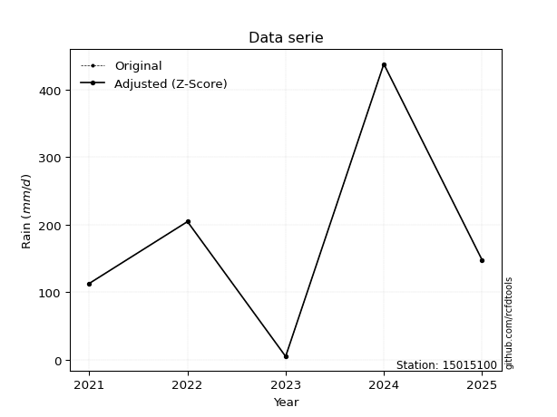</img>

</div>

> If Z-Score is active, values out of range or outliers are replaced with the station mean value.


### 4. Active continuous probability distributions from SciPy (45 of 104 available)

[scipy.stats](https://docs.scipy.org/doc/scipy/reference/stats.html) is a Python´s powerful submodule within the SciPy library for comprehensive statistical analysis, offering over 130 probability distributions (like Normal, Poisson), functions for descriptive stats (mean, variance), hypothesis testing (t-tests, chi-square), random variable generation, and statistical tests, making it essential for data science, modeling, and research. It provides tools to explore, model, and draw conclusions from data efficiently, working seamlessly with NumPy.

<div align="center">

|   id | p_dist             |   n_parameter | fit_method   | label                                                                       | active   | ref                                                                                                        |
|-----:|:-------------------|--------------:|:-------------|:----------------------------------------------------------------------------|:---------|:-----------------------------------------------------------------------------------------------------------|
|    0 | alpha              |             3 | MLE          | Alpha                                                                       | True     | [:mortar_board:](https://docs.scipy.org/doc/scipy/reference/generated/scipy.stats.alpha.html)              |
|    1 | betaprime          |             4 | MLE          | Beta prime                                                                  | True     | [:mortar_board:](https://docs.scipy.org/doc/scipy/reference/generated/scipy.stats.betaprime.html)          |
|    2 | chi2               |             3 | MLE          | Chi²                                                                        | True     | [:mortar_board:](https://docs.scipy.org/doc/scipy/reference/generated/scipy.stats.chi2.html)               |
|    3 | crystalball        |             4 | MLE          | Crystalball                                                                 | True     | [:mortar_board:](https://docs.scipy.org/doc/scipy/reference/generated/scipy.stats.crystalball.html)        |
|    4 | erlang             |             3 | MLE          | Erlang                                                                      | True     | [:mortar_board:](https://docs.scipy.org/doc/scipy/reference/generated/scipy.stats.erlang.html)             |
|    5 | expon              |             2 | MLE          | Exponential                                                                 | True     | [:mortar_board:](https://docs.scipy.org/doc/scipy/reference/generated/scipy.stats.expon.html)              |
|    6 | exponnorm          |             3 | MLE          | Exponentially modified Normal                                               | True     | [:mortar_board:](https://docs.scipy.org/doc/scipy/reference/generated/scipy.stats.exponnorm.html)          |
|    7 | f                  |             4 | MLE          | F                                                                           | True     | [:mortar_board:](https://docs.scipy.org/doc/scipy/reference/generated/scipy.stats.f.html)                  |
|    8 | fatiguelife        |             3 | MLE          | Fatigue-life (Birnbaum-Saunders)                                            | True     | [:mortar_board:](https://docs.scipy.org/doc/scipy/reference/generated/scipy.stats.fatiguelife.html)        |
|    9 | fisk               |             3 | MLE          | Fisk                                                                        | True     | [:mortar_board:](https://docs.scipy.org/doc/scipy/reference/generated/scipy.stats.fisk.html)               |
|   10 | gamma              |             3 | MLE          | Gamma                                                                       | True     | [:mortar_board:](https://docs.scipy.org/doc/scipy/reference/generated/scipy.stats.gamma.html)              |
|   11 | genexpon           |             5 | MLE          | Generalized exponential                                                     | True     | [:mortar_board:](https://docs.scipy.org/doc/scipy/reference/generated/scipy.stats.genexpon.html)           |
|   12 | genlogistic        |             3 | MLE          | Generalized logistic                                                        | True     | [:mortar_board:](https://docs.scipy.org/doc/scipy/reference/generated/scipy.stats.genlogistic.html)        |
|   13 | gibrat             |             2 | MM           | Gibrat                                                                      | True     | [:mortar_board:](https://docs.scipy.org/doc/scipy/reference/generated/scipy.stats.gibrat.html)             |
|   14 | gompertz           |             3 | MLE          | Gompertz (or truncated Gumbel)                                              | True     | [:mortar_board:](https://docs.scipy.org/doc/scipy/reference/generated/scipy.stats.gompertz.html)           |
|   15 | gumbel_l           |             2 | MM           | Gumbel Left Skew                                                            | True     | [:mortar_board:](https://docs.scipy.org/doc/scipy/reference/generated/scipy.stats.gumbel_l.html)           |
|   16 | gumbel_r           |             2 | MM           | Gumbel Right Skew                                                           | True     | [:mortar_board:](https://docs.scipy.org/doc/scipy/reference/generated/scipy.stats.gumbel_r.html)           |
|   17 | halflogistic       |             2 | MM           | Half-logistic                                                               | True     | [:mortar_board:](https://docs.scipy.org/doc/scipy/reference/generated/scipy.stats.halflogistic.html)       |
|   18 | halfnorm           |             2 | MM           | Half Normal                                                                 | True     | [:mortar_board:](https://docs.scipy.org/doc/scipy/reference/generated/scipy.stats.halfnorm.html)           |
|   19 | hypsecant          |             2 | MM           | hyperbolic secant                                                           | True     | [:mortar_board:](https://docs.scipy.org/doc/scipy/reference/generated/scipy.stats.hypsecant.html)          |
|   20 | invgamma           |             3 | MLE          | Inverted gamma                                                              | True     | [:mortar_board:](https://docs.scipy.org/doc/scipy/reference/generated/scipy.stats.invgamma.html)           |
|   21 | invgauss           |             3 | MLE          | Inverse Gaussian                                                            | True     | [:mortar_board:](https://docs.scipy.org/doc/scipy/reference/generated/scipy.stats.invgauss.html)           |
|   22 | invweibull         |             3 | MLE          | Inverted Weibull                                                            | True     | [:mortar_board:](https://docs.scipy.org/doc/scipy/reference/generated/scipy.stats.invweibull.html)         |
|   23 | johnsonsu          |             4 | MLE          | Johnson Su                                                                  | True     | [:mortar_board:](https://docs.scipy.org/doc/scipy/reference/generated/scipy.stats.johnsonsu.html)          |
|   24 | kstwobign          |             2 | MLE          | Limiting distribution of scaled Kolmogorov-Smirnov two-sided test statistic | True     | [:mortar_board:](https://docs.scipy.org/doc/scipy/reference/generated/scipy.stats.kstwobign.html)          |
|   25 | laplace            |             2 | MM           | Laplace                                                                     | True     | [:mortar_board:](https://docs.scipy.org/doc/scipy/reference/generated/scipy.stats.laplace.html)            |
|   26 | laplace_asymmetric |             3 | MLE          | Asymmetric Laplace                                                          | True     | [:mortar_board:](https://docs.scipy.org/doc/scipy/reference/generated/scipy.stats.laplace_asymmetric.html) |
|   27 | loggamma           |             3 | MLE          | Log gamma                                                                   | True     | [:mortar_board:](https://docs.scipy.org/doc/scipy/reference/generated/scipy.stats.loggamma.html)           |
|   28 | logistic           |             2 | MM           | Logistic (or Sech-squared)                                                  | True     | [:mortar_board:](https://docs.scipy.org/doc/scipy/reference/generated/scipy.stats.logistic.html)           |
|   29 | lognorm            |             3 | MLE          | Log Normal                                                                  | True     | [:mortar_board:](https://docs.scipy.org/doc/scipy/reference/generated/scipy.stats.lognorm.html)            |
|   30 | maxwell            |             2 | MM           | Maxwell                                                                     | True     | [:mortar_board:](https://docs.scipy.org/doc/scipy/reference/generated/scipy.stats.maxwell.html)            |
|   31 | mielke             |             4 | MLE          | Mielke Beta-Kappa / Dagum                                                   | True     | [:mortar_board:](https://docs.scipy.org/doc/scipy/reference/generated/scipy.stats.mielke.html)             |
|   32 | moyal              |             2 | MM           | Moyal                                                                       | True     | [:mortar_board:](https://docs.scipy.org/doc/scipy/reference/generated/scipy.stats.moyal.html)              |
|   33 | nakagami           |             3 | MLE          | Nakagami                                                                    | True     | [:mortar_board:](https://docs.scipy.org/doc/scipy/reference/generated/scipy.stats.nakagami.html)           |
|   34 | ncf                |             5 | MLE          | Non-central F distribution                                                  | True     | [:mortar_board:](https://docs.scipy.org/doc/scipy/reference/generated/scipy.stats.ncf.html)                |
|   35 | nct                |             4 | MLE          | Non-central Student’s t                                                     | True     | [:mortar_board:](https://docs.scipy.org/doc/scipy/reference/generated/scipy.stats.nct.html)                |
|   36 | norm               |             2 | MM           | Normal                                                                      | True     | [:mortar_board:](https://docs.scipy.org/doc/scipy/reference/generated/scipy.stats.norm.html)               |
|   37 | pareto             |             3 | MLE          | Pareto                                                                      | True     | [:mortar_board:](https://docs.scipy.org/doc/scipy/reference/generated/scipy.stats.pareto.html)             |
|   38 | pearson3           |             3 | MM           | Pearson type III                                                            | True     | [:mortar_board:](https://docs.scipy.org/doc/scipy/reference/generated/scipy.stats.pearson3.html)           |
|   39 | rayleigh           |             2 | MM           | Rayleigh                                                                    | True     | [:mortar_board:](https://docs.scipy.org/doc/scipy/reference/generated/scipy.stats.rayleigh.html)           |
|   40 | rice               |             3 | MLE          | Rice                                                                        | True     | [:mortar_board:](https://docs.scipy.org/doc/scipy/reference/generated/scipy.stats.rice.html)               |
|   41 | t                  |             3 | MLE          | Student’s t                                                                 | True     | [:mortar_board:](https://docs.scipy.org/doc/scipy/reference/generated/scipy.stats.t.html)                  |
|   42 | truncnorm          |             4 | MLE          | Truncated normal                                                            | True     | [:mortar_board:](https://docs.scipy.org/doc/scipy/reference/generated/scipy.stats.truncnorm.html)          |
|   43 | wald               |             2 | MM           | Wald                                                                        | True     | [:mortar_board:](https://docs.scipy.org/doc/scipy/reference/generated/scipy.stats.wald.html)               |
|   44 | weibull_min        |             3 | MLE          | Weibull minimum                                                             | True     | [:mortar_board:](https://docs.scipy.org/doc/scipy/reference/generated/scipy.stats.weibull_min.html)        |

</div>

> **n_parameter:** # arguments & localization & scale.
>
> **Fit methods:** (MLE) maximum likelihood, (MM) L-moments.
>
>**Inactive:** foldnorm, gennorm, norminvgauss, powernorm, powerlognorm, skewnorm, genextreme, anglit, arcsine, argus, beta, bradford, burr, burr12, cauchy, cosine, halfcauchy, foldcauchy, skewcauchy, wrapcauchy, dgamma, gengamma, exponweib, exponpow, truncexpon, gausshyper, genhalflogistic, genhyperbolic, geninvgauss, halfgennorm, johnsonsb, kappa4, kappa3, ksone, kstwo, loglaplace, levy, levy_l, levy_stable, ncx2, genpareto, truncpareto, lomax, powerlaw, rdist, rel_breitwigner, recipinvgauss, semicircular, studentized_range, trapezoid, triang, truncweibull_min, tukeylambda, uniform, loguniform, vonmises, vonmises_line, weibull_max, dweibull, 


## B. Probability distributions vs. Empirical distributions

A continuous probability distribution (CPD) describes probabilities for variables that can take any value within a range (like rain any time), unlike discrete variables with specific outcomes (like temperature). It uses a Probability Density Function (PDF), a curve where the total area under it equals 1, and the probability of the variable falling within an interval (a to b) is found by calculating the area under the curve between those points. A key feature is that the probability of hitting any single exact value is zero, so probabilities are always expressed for ranges, e.g., $P(a ≤ X ≤ b)$.

<div align="center">

Distributions parameters
|    |   station | p_dist                |   n |               loc |            scale | shape                  | shape1                 | shape2                | shape3   |
|---:|----------:|:----------------------|----:|------------------:|-----------------:|:-----------------------|:-----------------------|:----------------------|:---------|
|  0 |  15015100 | alpha                 |   5 |      -0.0258722   |     11.4586      | 1.3781566077904402e-10 |                        |                       |          |
|  1 |  15015100 | betaprime             |   5 |       5.1         |    544.92        | 0.7763782584393113     | 2.5025625575164923     |                       |          |
|  2 |  15015100 | chi2                  |   5 |       5.1         |      2.88647     | 1.0303101533306425     |                        |                       |          |
|  3 |  15015100 | crystalball           |   5 |       5.00673     |    211.523       | 39.26380190438138      | 3491.89030069416       |                       |          |
|  4 |  15015100 | erlang                |   5 |       5.1         |    197.535       | 0.3867451433529725     |                        |                       |          |
|  5 |  15015100 | expon                 |   5 |       5.1         |    176.74        |                        |                        |                       |          |
|  6 |  15015100 | exponnorm             |   5 |      43.9291      |     63.3331      | 2.1775465633619104     |                        |                       |          |
|  7 |  15015100 | f                     |   5 |       5.1         |    222.127       | 1.118662583883253      | 54.589398024080744     |                       |          |
|  8 |  15015100 | fatiguelife           |   5 |       5.1         |      0.000616513 | 509.5527526780579      |                        |                       |          |
|  9 |  15015100 | fisk                  |   5 |     -99.9499      |    250.254       | 3.2777551524963453     |                        |                       |          |
| 10 |  15015100 | gamma                 |   5 |       5.1         |    307.999       | 0.2661888579812357     |                        |                       |          |
| 11 |  15015100 | genexpon              |   5 |       5.09993     |      2.51796     | 0.014257018896542527   | 2.6759235267495533e-08 | 2.663456010951431     |          |
| 12 |  15015100 | genlogistic           |   5 |    -614.113       |    110.455       | 742.23288221244        |                        |                       |          |
| 13 |  15015100 | gibrat                |   5 |      72.2297      |     66.482       |                        |                        |                       |          |
| 14 |  15015100 | gompertz              |   5 |       5.1         |    395.746       | 1.4746308358194913     |                        |                       |          |
| 15 |  15015100 | gumbel_l              |   5 |     246.504       |    112.027       |                        |                        |                       |          |
| 16 |  15015100 | gumbel_r              |   5 |     117.176       |    112.027       |                        |                        |                       |          |
| 17 |  15015100 | halflogistic          |   5 |     204.104       |      8.57917     |                        |                        |                       |          |
| 18 |  15015100 | halfnorm              |   5 |      -8.33688     |    238.351       |                        |                        |                       |          |
| 19 |  15015100 | hypsecant             |   5 |     181.84        |     91.4699      |                        |                        |                       |          |
| 20 |  15015100 | invgamma              |   5 |    -223.7         |   3165.93        | 8.784355241913705      |                        |                       |          |
| 21 |  15015100 | invgauss              |   5 |    -117.376       |   1120.49        | 0.26704113661041895    |                        |                       |          |
| 22 |  15015100 | invweibull            |   5 |       5.1         |      8.69874     | 0.05656368899876122    |                        |                       |          |
| 23 |  15015100 | johnsonsu             |   5 |    -113.462       |      8.13209     | -8.375376724001953     | 2.0105390162020997     |                       |          |
| 24 |  15015100 | kstwobign             |   5 |    -277.849       |    528.777       |                        |                        |                       |          |
| 25 |  15015100 | laplace               |   5 |     181.84        |    101.598       |                        |                        |                       |          |
| 26 |  15015100 | laplace_asymmetric    |   5 |     148.2         |    100.715       | 0.8468447229860789     |                        |                       |          |
| 27 |  15015100 | loggamma              |   5 |  -27753.6         |   4155.96        | 830.5918397350326      |                        |                       |          |
| 28 |  15015100 | logistic              |   5 |     181.84        |     79.2153      |                        |                        |                       |          |
| 29 |  15015100 | lognorm               |   5 |       5.1         |      0.0652984   | 15.971042101658718     |                        |                       |          |
| 30 |  15015100 | maxwell               |   5 |    -158.623       |    213.353       |                        |                        |                       |          |
| 31 |  15015100 | mielke                |   5 |      -2.11121     |    444.034       | 0.6822674988198578     | 588.0402362129139      |                       |          |
| 32 |  15015100 | moyal                 |   5 |      99.6742      |     64.679       |                        |                        |                       |          |
| 33 |  15015100 | nakagami              |   5 |     113.2         |    147.265       | 0.27357156519428405    |                        |                       |          |
| 34 |  15015100 | ncf                   |   5 |      -0.0409684   |      1.10971e-05 | 6.354910925166602e-07  | 3.351901438584955      | 7.3759109540329915    |          |
| 35 |  15015100 | nct                   |   5 |      -0.284605    |      0.219594    | 0.36001411937135575    | 54.73606158747181      |                       |          |
| 36 |  15015100 | norm                  |   5 |     181.84        |    143.681       |                        |                        |                       |          |
| 37 |  15015100 | pareto                |   5 |       3.46378     |      1.63622     | 0.2620244728024954     |                        |                       |          |
| 38 |  15015100 | pearson3              |   5 |     181.84        |    143.681       | 0.7375394103412185     |                        |                       |          |
| 39 |  15015100 | rayleigh              |   5 |     -93.0295      |    219.314       |                        |                        |                       |          |
| 40 |  15015100 | rice                  |   5 |     -65.0174      |    201.969       | 0.000545413740348026   |                        |                       |          |
| 41 |  15015100 | t                     |   5 |     181.761       |    143.678       | 124825.27131600422     |                        |                       |          |
| 42 |  15015100 | truncnorm             |   5 |     181.84        |    143.681       | -380.688606719649      | 579.9962234147002      |                       |          |
| 43 |  15015100 | wald                  |   5 |      38.1594      |    143.681       |                        |                        |                       |          |
| 44 |  15015100 | weibull_min           |   5 |       5.1         |     55.2815      | 0.2718011694983804     |                        |                       |          |
| 45 |  15015100 | logalpha              |   5 |     -31.3131      |    808.615       | 22.617508587886597     |                        |                       |          |
| 46 |  15015100 | logbetaprime          |   5 |      -3.99778     |      1.54294e+09 | 22.660824448522852     | 4077257445.086189      |                       |          |
| 47 |  15015100 | logchi2               |   5 |       1.62924     |      2.01933     | 1.557474900091758      |                        |                       |          |
| 48 |  15015100 | logcrystalball        |   5 |       4.55214     |      1.53017     | 7.745449542688602      | 24.672322706764852     |                       |          |
| 49 |  15015100 | logerlang             |   5 |     -19.7991      |      0.101755    | 239.17028985609522     |                        |                       |          |
| 50 |  15015100 | logexpon              |   5 |       1.62924     |      2.9229      |                        |                        |                       |          |
| 51 |  15015100 | logexponnorm          |   5 |       4.55178     |      1.5302      | 0.00023795123541029057 |                        |                       |          |
| 52 |  15015100 | logf                  |   5 |   -1887.59        |   1892.14        | 8819682.210623387      | 4622137.477517825      |                       |          |
| 53 |  15015100 | logfatiguelife        |   5 |    -788.916       |    793.471       | 0.0019329702352372706  |                        |                       |          |
| 54 |  15015100 | logfisk               |   5 |      -6.12563e+07 |      6.12563e+07 | 75564565.52127531      |                        |                       |          |
| 55 |  15015100 | loggamma              |   5 |     -22.6467      |      0.0925668   | 293.87142148225854     |                        |                       |          |
| 56 |  15015100 | loggenexpon           |   5 |       1.35456     |      0.149835    | 0.012943814853580704   | 8.42007584420113       | 0.0003084266877559792 |          |
| 57 |  15015100 | loggenlogistic        |   5 |       6.08226     |      4.48709e-06 | 2.939716781906641e-06  |                        |                       |          |
| 58 |  15015100 | loggibrat             |   5 |       3.38475     |      0.708052    |                        |                        |                       |          |
| 59 |  15015100 | loggompertz           |   5 |       1.62924     |      1.11864     | 0.04425921368801698    |                        |                       |          |
| 60 |  15015100 | loggumbel_l           |   5 |       5.2408      |      1.19307     |                        |                        |                       |          |
| 61 |  15015100 | loggumbel_r           |   5 |       3.86349     |      1.19307     |                        |                        |                       |          |
| 62 |  15015100 | loghalflogistic       |   5 |       2.73847     |      1.30829     |                        |                        |                       |          |
| 63 |  15015100 | loghalfnorm           |   5 |       2.52681     |      2.53838     |                        |                        |                       |          |
| 64 |  15015100 | loghypsecant          |   5 |       4.55214     |      0.974136    |                        |                        |                       |          |
| 65 |  15015100 | loginvgamma           |   5 |     -24.0702      |   8598.84        | 301.3477601949494      |                        |                       |          |
| 66 |  15015100 | loginvgauss           |   5 |     -10.5552      |   1258.66        | 0.011953774486927832   |                        |                       |          |
| 67 |  15015100 | loginvweibull         |   5 | -210148           | 210152           | 121148.69356533425     |                        |                       |          |
| 68 |  15015100 | logjohnsonsu          |   5 |       6.36188     |      0.00799211  | 6.3262718413741705     | 1.1009902044975646     |                       |          |
| 69 |  15015100 | logkstwobign          |   5 |      -2.37611     |      7.89798     |                        |                        |                       |          |
| 70 |  15015100 | loglaplace            |   5 |       4.55214     |      1.08199     |                        |                        |                       |          |
| 71 |  15015100 | loglaplace_asymmetric |   5 |       5.32155     |      0.826023    | 1.5688902124072932     |                        |                       |          |
| 72 |  15015100 | logloggamma           |   5 |       6.08228     |      4.17649e-06 | 2.7299266776153788e-06 |                        |                       |          |
| 73 |  15015100 | loglogistic           |   5 |       4.55214     |      0.843627    |                        |                        |                       |          |
| 74 |  15015100 | loglognorm            |   5 |       1.62924     |      0.00207136  | 14.932537848151576     |                        |                       |          |
| 75 |  15015100 | logmaxwell            |   5 |       0.926285    |      2.27217     |                        |                        |                       |          |
| 76 |  15015100 | logmielke             |   5 |      -1.54676e+07 |      1.54676e+07 | 10136842.63827343      | 7225084398.253284      |                       |          |
| 77 |  15015100 | logmoyal              |   5 |       3.6771      |      0.688818    |                        |                        |                       |          |
| 78 |  15015100 | lognakagami           |   5 |       4.72916     |      0.953957    | 0.04991969194918905    |                        |                       |          |
| 79 |  15015100 | logncf                |   5 |      -0.106518    |      5.18933e-06 | 3.4419817029866285e-05 | 95.49271140871028      | 30.546584273672856    |          |
| 80 |  15015100 | lognct                |   5 |     -94.2651      |      1.46918     | 24105.882102667107     | 67.25867879113463      |                       |          |
| 81 |  15015100 | lognorm               |   5 |       4.55214     |      1.53017     |                        |                        |                       |          |
| 82 |  15015100 | logpareto             |   5 |       1.59917     |      0.030074    | 0.26047545300835745    |                        |                       |          |
| 83 |  15015100 | logpearson3           |   5 |       4.55215     |      1.53016     | -1.1632693388672402    |                        |                       |          |
| 84 |  15015100 | lograyleigh           |   5 |       1.62484     |      2.33565     |                        |                        |                       |          |
| 85 |  15015100 | logrice               |   5 |       0.437073    |      1.64773     | 2.2582040910770376     |                        |                       |          |
| 86 |  15015100 | logt                  |   5 |       4.55214     |      1.53017     | 1260545379.2622862     |                        |                       |          |
| 87 |  15015100 | logtruncnorm          |   5 |      -0.327488    |      6.13849     | -3.5788470673249746    | 1.0441821265073419     |                       |          |
| 88 |  15015100 | logwald               |   5 |       3.02196     |      1.53019     |                        |                        |                       |          |
| 89 |  15015100 | logweibull_min        |   5 |       1.62924     |      1.2271      | 0.42059617643922287    |                        |                       |          |

</div>

> **loc** (Location parameter): This shifts the distribution along the x-axis. For many common distributions, like the normal (Gaussian) distribution, loc represents the mean $μ$. For others, like the uniform distribution, it might represent the minimum value, or for the beta distribution, the left end of the support interval.
>
> **scale** (Scale parameter): This determines the width or spread of the distribution. For the normal distribution, scale represents the standard deviation $σ$. For a uniform distribution, it defines the length of the interval (from $loc$ to $loc + scale$).
>
> **shape** (Shape parameters): Refers to parameters that define the specific form of a probability distribution, distinct from its location (loc) and scale (scale). These parameters are required arguments for most distribution functions. For example, a normal (Gaussian) distribution is fully defined by its location (mean) and scale (standard deviation), so it has no specific shape parameters beyond loc and scale. However, other distributions have intrinsic properties that need specification, as Gamma distribution that takes a shape parameter, often named $a$ or $alpha$.


### 0. Cumulative distribution values - CDF (90 evaluated)

> Ordered by x ascending and calculating $log(f(x))$ separately. 

|   id |   Station |   date |     x |   count |   mean |    std |    zscore |   Value_initial |   station |   m |     alpha |   alpha_pdf |   betaprime |   betaprime_pdf |        chi2 |    chi2_pdf |   crystalball |   crystalball_pdf |      erlang |   erlang_pdf |    expon |   expon_pdf |   exponnorm |   exponnorm_pdf |           f |        f_pdf |   fatiguelife |   fatiguelife_pdf |      fisk |   fisk_pdf |       gamma |   gamma_pdf |    genexpon |   genexpon_pdf |   genlogistic |   genlogistic_pdf |   gibrat |   gibrat_pdf |    gompertz |   gompertz_pdf |   gumbel_l |   gumbel_l_pdf |   gumbel_r |   gumbel_r_pdf |   halflogistic |   halflogistic_pdf |   halfnorm |   halfnorm_pdf |   hypsecant |   hypsecant_pdf |   invgamma |   invgamma_pdf |   invgauss |   invgauss_pdf |   invweibull |   invweibull_pdf |   johnsonsu |   johnsonsu_pdf |   kstwobign |   kstwobign_pdf |   laplace |   laplace_pdf |   laplace_asymmetric |   laplace_asymmetric_pdf |   loggamma |   loggamma_pdf |   logistic |   logistic_pdf |   lognorm |   lognorm_pdf |   maxwell |   maxwell_pdf |    mielke |   mielke_pdf |     moyal |   moyal_pdf |    nakagami |    nakagami_pdf |      ncf |     ncf_pdf |       nct |     nct_pdf |     norm |    norm_pdf |      pareto |   pareto_pdf |   pearson3 |   pearson3_pdf |   rayleigh |   rayleigh_pdf |      rice |    rice_pdf |        t |       t_pdf |   truncnorm |   truncnorm_pdf |     wald |    wald_pdf |   weibull_min |   weibull_min_pdf |   logalpha |   logalpha_pdf |   logbetaprime |   logbetaprime_pdf |     logchi2 |   logchi2_pdf |   logcrystalball |   logcrystalball_pdf |   logerlang |   logerlang_pdf |   logexpon |   logexpon_pdf |   logexponnorm |   logexponnorm_pdf |      logf |   logf_pdf |   logfatiguelife |   logfatiguelife_pdf |   logfisk |   logfisk_pdf |   loggenexpon |   loggenexpon_pdf |   loggenlogistic |   loggenlogistic_pdf |   loggibrat |   loggibrat_pdf |   loggompertz |   loggompertz_pdf |   loggumbel_l |   loggumbel_l_pdf |   loggumbel_r |   loggumbel_r_pdf |   loghalflogistic |   loghalflogistic_pdf |   loghalfnorm |   loghalfnorm_pdf |   loghypsecant |   loghypsecant_pdf |   loginvgamma |   loginvgamma_pdf |   loginvgauss |   loginvgauss_pdf |   loginvweibull |   loginvweibull_pdf |   logjohnsonsu |   logjohnsonsu_pdf |   logkstwobign |   logkstwobign_pdf |   loglaplace |   loglaplace_pdf |   loglaplace_asymmetric |   loglaplace_asymmetric_pdf |   logloggamma |   logloggamma_pdf |   loglogistic |   loglogistic_pdf |   loglognorm |   loglognorm_pdf |   logmaxwell |   logmaxwell_pdf |   logmielke |   logmielke_pdf |    logmoyal |   logmoyal_pdf |   lognakagami |   lognakagami_pdf |    logncf |   logncf_pdf |    lognct |   lognct_pdf |   logpareto |   logpareto_pdf |   logpearson3 |   logpearson3_pdf |   lograyleigh |   lograyleigh_pdf |   logrice |   logrice_pdf |     logt |   logt_pdf |   logtruncnorm |   logtruncnorm_pdf |   logwald |   logwald_pdf |   logweibull_min |   logweibull_min_pdf |
|-----:|----------:|-------:|------:|--------:|-------:|-------:|----------:|----------------:|----------:|----:|----------:|------------:|------------:|----------------:|------------:|------------:|--------------:|------------------:|------------:|-------------:|---------:|------------:|------------:|----------------:|------------:|-------------:|--------------:|------------------:|----------:|-----------:|------------:|------------:|------------:|---------------:|--------------:|------------------:|---------:|-------------:|------------:|---------------:|-----------:|---------------:|-----------:|---------------:|---------------:|-------------------:|-----------:|---------------:|------------:|----------------:|-----------:|---------------:|-----------:|---------------:|-------------:|-----------------:|------------:|----------------:|------------:|----------------:|----------:|--------------:|---------------------:|-------------------------:|-----------:|---------------:|-----------:|---------------:|----------:|--------------:|----------:|--------------:|----------:|-------------:|----------:|------------:|------------:|----------------:|---------:|------------:|----------:|------------:|---------:|------------:|------------:|-------------:|-----------:|---------------:|-----------:|---------------:|----------:|------------:|---------:|------------:|------------:|----------------:|---------:|------------:|--------------:|------------------:|-----------:|---------------:|---------------:|-------------------:|------------:|--------------:|-----------------:|---------------------:|------------:|----------------:|-----------:|---------------:|---------------:|-------------------:|----------:|-----------:|-----------------:|---------------------:|----------:|--------------:|--------------:|------------------:|-----------------:|---------------------:|------------:|----------------:|--------------:|------------------:|--------------:|------------------:|--------------:|------------------:|------------------:|----------------------:|--------------:|------------------:|---------------:|-------------------:|--------------:|------------------:|--------------:|------------------:|----------------:|--------------------:|---------------:|-------------------:|---------------:|-------------------:|-------------:|-----------------:|------------------------:|----------------------------:|--------------:|------------------:|--------------:|------------------:|-------------:|-----------------:|-------------:|-----------------:|------------:|----------------:|------------:|---------------:|--------------:|------------------:|----------:|-------------:|----------:|-------------:|------------:|----------------:|--------------:|------------------:|--------------:|------------------:|----------:|--------------:|---------:|-----------:|---------------:|-------------------:|----------:|--------------:|-----------------:|---------------------:|
|    0 |  15015100 |   2023 |   5.1 |       5 | 181.84 | 160.64 | -1.10023  |             5.1 |  15015100 |   1 | 0.0253879 | 0.0286023   | 2.36674e-08 |     0.593483    | 8.05517e-09 | 4.6721e+06  |      0.500176 |       0.00188605  | 2.20105e-07 |  9.58419e+07 | 0        | 0.00565803  |   0.0611182 |     0.00151394  | 1.27549e-06 | 75.8432      |     0.0469873 |       9.70776e+07 | 0.0549286 | 0.00161974 | 2.37271e-05 | 7.11106e+09 | 3.68815e-07 |     0.00566212 |     0.0656593 |       0.00161586  | 0        |  0           | 3.85482e-11 |    0.00372621  |   0.109452 |    0.000921481 |  0.0659101 |    0.00159997  |      0         |         0          |  0.0449563 |    0.0033422   |   0.0915627 |     0.000987267 |  0.0587803 |    0.00177124  |  0.0550653 |    0.00199716  |  0.000326803 |      1.67044e+11 |   0.0556982 |     0.00190083  |   0.0630156 |     0.00169643  | 0.0877946 |    0.00086414 |            0.0780073 |              0.000914617 |  0.0290172 |      0.0450099 |  0.0969892 |    0.00110562  | 0.0280548 |     0.0420575 |  0.101024 |   0.00164055  | 0.0601375 |   0.00568973 | 0.0377672 | 0.00148104  | 0           |     0           | 0.03988  | 0.0031225   | 0.0546238 | 0.0289449   | 0.109332 | 0.00130299  | 1.11022e-16 |  0.16014     |   0.086811 |    0.00165747  |  0.0952534 |    0.00184584  | 0.0584835 | 0.0016184   | 0.109432 | 0.00130386  |    0.109332 |     0.00130299  | 0        | 0           |   2.72486e-05 |       8.33852e+09 |  0.0268722 |      0.0462617 |      0.0357871 |          0.0580693 | 2.35135e-13 |   824.649     |        0.0280548 |            0.0420575 |   0.0283493 |       0.0449205 |   0        |      0.342125  |      0.0280574 |          0.0420599 | 0.0285983 |  0.0426294 |        0.0279978 |            0.0420432 | 0.0186955 |     0.0226312 |     0.0277009 |          0.114879 |         0        |            0.0354268 |    0        |       0         |   2.11782e-10 |         0.0395651 |     0.0472997 |         0.0386927 |    0.00149479 |        0.00815105 |          0        |              0        |      0        |          0        |      0.0316532 |          0.0324401 |     0.0308899 |         0.0487691 |     0.0299702 |         0.0513984 |       0.0367296 |            0.069963 |      0.0714112 |          0.0317185 |      0.0408039 |          0.0875477 |    0.0335555 |        0.0310127 |               0.0411688 |                   0.0317675 |     0.0544381 |          0.035583 |     0.0303338 |         0.0348657 |    0.0227536 |      1.62856e+13 |    0.0076532 |        0.0320397 |   0.0536507 |       0.0351606 | 9.79788e-06 |    0.000145567 |     0         |       0           | 0.0244165 |    0.0552473 | 0.0283069 |    0.0424029 | 1.11022e-16 |       8.66114   |     0.0496223 |         0.0409614 |   1.77412e-06 |       0.000806488 |  0.024386 |     0.0471801 | 0.028055 |  0.0420577 |       0.733742 |          0.0725328 |  0        |     0         |      2.39216e-07 |          4.53122e+08 |
|    1 |  15015100 |   2021 | 113.2 |       5 | 181.84 | 160.64 | -0.427291 |           113.2 |  15015100 |   2 | 0.919391  | 0.000709508 | 0.4716      |     0.00240813  | 1           | 1.7926e-10  |      0.695499 |       0.00165478  | 0.774873    |  0.001846    | 0.457536 | 0.00306928  |   0.367292  |     0.00359418  | 0.49102     |  0.00212116  |     0.794396  |       0.00108185  | 0.371446  | 0.00359029 | 0.781633    | 0.00145246  | 0.457777    |     0.00307014 |     0.358939  |       0.00332728  | 0.314163 |  0.00866075  | 0.370725    |    0.00308132  |   0.26232  |    0.0020034   |  0.354825  |    0.00328174  |      0         |         0          |  0.389883  |    0.00293943  |   0.280838  |     0.00268717  |  0.376652  |    0.00340621  |  0.391468  |    0.00335631  |  0.420144    |      0.000190638 |   0.385609  |     0.00339004  |   0.355197  |     0.00318957  | 0.254424  |    0.00250423 |            0.277064  |              0.00324851  |  0.551041  |      0.24827   |  0.295983  |    0.00263052  | 0.546047  |     0.258979  |  0.34586  |   0.00269612  | 0.398568  |   0.00235822 | 0.367737  | 0.0037031   | 1.34309e-09 | 51711.2         | 0.449648 | 0.0029265   | 0.64582   | 0.00112166  | 0.316423 | 0.00247716  | 0.667792    |  0.000793236 |   0.350529 |    0.0029274   |  0.357326  |    0.00275555  | 0.32248   | 0.00296009  | 0.316617 | 0.00247784  |    0.316423 |     0.00247716  | 0.384223 | 0.00591256  |   0.698789    |       0.000908777 |  0.572323  |      0.244238  |      0.561036  |          0.216059  | 0.64433     |     0.102484  |        0.546047  |            0.258979  |   0.556826  |       0.249601  |   0.653738 |      0.118465  |      0.546047  |          0.258974  | 0.546671  |  0.257828  |        0.545211  |            0.258379  | 0.465901  |     0.306961  |     0.612736  |          0.184102 |         0        |            0.269988  |    0.7393   |       0.241605  |   0.484625    |         0.32578   |     0.478611  |         0.28461   |    0.616287   |        0.250035   |          0.641548 |              0.224881 |      0.614396 |          0.215737 |      0.557525  |          0.32144   |     0.55602   |         0.237342  |     0.578759  |         0.234418  |       0.575051  |            0.18342  |      0.38451   |          0.257661  |      0.60676   |          0.174958  |    0.575458  |        0.39237   |               0.450205  |                   0.347396  |     0.412939  |          0.269914 |     0.552264  |         0.293102  |    0.68779   |      0.00764496  |    0.576695  |        0.242422  |   0.409141  |       0.268135  | 0.641249    |    0.242104    |     0.0279238 |       3.13889e+12 | 0.577549  |    0.208942  | 0.546102  |    0.257816  | 0.701785    |       0.0248172 |     0.468965  |         0.269887  |   0.586565    |       0.235265    |  0.553415 |     0.250701  | 0.546047 |  0.258979  |       0.93326  |          0.0543559 |  0.710514 |     0.219913  |      0.771598    |          0.0457606   |
|    2 |  15015100 |   2025 | 148.2 |       5 | 181.84 | 160.64 | -0.209413 |           148.2 |  15015100 |   3 | 0.938381  | 0.000414884 | 0.546586    |     0.00190586  | 1           | 3.64246e-13 |      0.750786 |       0.00149982  | 0.82919     |  0.0013019   | 0.554992 | 0.00251787  |   0.489785  |     0.00333819  | 0.557708    |  0.00171507  |     0.827796  |       0.000842912 | 0.493081  | 0.00330156 | 0.824941    | 0.00105527  | 0.555254    |     0.00251821 |     0.474029  |       0.003202    | 0.553066 |  0.00520477  | 0.473959    |    0.00281401  |   0.340202 |    0.00244903  |  0.468553  |    0.00317077  |      0         |         0          |  0.488657  |    0.00269813  |   0.385488  |     0.00325717  |  0.491832  |    0.00313588  |  0.503228  |    0.00300435  |  0.425918    |      0.000143692 |   0.499106  |     0.00306388  |   0.465145  |     0.00305772  | 0.359063  |    0.00353417 |            0.417638  |              0.00489671  |  0.616684  |      0.23798   |  0.395401  |    0.00301784  | 0.614759  |     0.249855  |  0.441611 |   0.00274998  | 0.477578  |   0.00216774 | 0.491956  | 0.00334722  | 0.353176    |     0.00545445  | 0.540253 | 0.00227771  | 0.678449  | 0.000778849 | 0.407442 | 0.00270152  | 0.691036    |  0.000559336 |   0.453416 |    0.00291858  |  0.453882  |    0.00273895  | 0.427216  | 0.00299396  | 0.407655 | 0.00270191  |    0.407442 |     0.00270152  | 0.555649 | 0.00399703  |   0.726102    |       0.000673705 |  0.63636   |      0.230224  |      0.617813  |          0.204835  | 0.670794    |     0.0941193 |        0.614759  |            0.249855  |   0.622705  |       0.238399  |   0.684227 |      0.108034  |      0.614757  |          0.24985   | 0.615067  |  0.248693  |        0.613768  |            0.249319  | 0.548776  |     0.30546   |     0.660707  |          0.171795 |         0        |            0.322106  |    0.794983 |       0.176067  |   0.574894    |         0.341894  |     0.557912  |         0.302458  |    0.679633   |        0.220001   |          0.698191 |              0.195878 |      0.66982  |          0.195653 |      0.641019  |          0.295215  |     0.618583  |         0.226216  |     0.64012   |         0.220327  |       0.62269   |            0.170045 |      0.46211   |          0.320718  |      0.652142  |          0.161851  |    0.669033  |        0.305887  |               0.554234  |                   0.42767   |     0.492451  |          0.321886 |     0.629288  |         0.276526  |    0.689763  |      0.00701438  |    0.639939  |        0.226354  |   0.488148  |       0.319913  | 0.70158     |    0.206221    |     0.779394  |       0.287742    | 0.63193   |    0.194362  | 0.614494  |    0.248672  | 0.70813     |       0.0223642 |     0.544646  |         0.290972  |   0.647679    |       0.217887    |  0.619741 |     0.240593  | 0.614759 |  0.249855  |       0.947638 |          0.0523754 |  0.762955 |     0.171828  |      0.783318    |          0.0413661   |
|    3 |  15015100 |   2022 | 204.7 |       5 | 181.84 | 160.64 |  0.142306 |           204.7 |  15015100 |   4 | 0.955365  | 0.000217795 | 0.637821    |     0.0013658   | 1           | 1.74127e-17 |      0.827434 |       0.00120785  | 0.887011    |  0.000797502 | 0.676754 | 0.00182893  |   0.654596  |     0.00246418  | 0.641495    |  0.00128388  |     0.867929  |       0.000598241 | 0.655813  | 0.00242857 | 0.873126    | 0.000688091 | 0.677019    |     0.00182876 |     0.639114  |       0.00258953  | 0.754723 |  0.00237454  | 0.619876    |    0.0023455   |   0.497699 |    0.0030873   |  0.63266   |    0.00258549  |      0.0347017 |         0.0582105  |  0.628568  |    0.00224518  |   0.578736  |     0.00337402  |  0.649361  |    0.00241527  |  0.65287   |    0.002287    |  0.43275     |      0.000102718 |   0.651982  |     0.00233502  |   0.624398  |     0.00253999  | 0.600744  |    0.00392978 |            0.637864  |              0.00304497  |  0.690528  |      0.218071  |  0.571649  |    0.00309115  | 0.692455  |     0.229757  |  0.592686 |   0.002544    | 0.593738  |   0.00195873 | 0.657033  | 0.00248161  | 0.586281    |     0.00322547  | 0.646581 | 0.00154317  | 0.713668  | 0.000502621 | 0.563206 | 0.00274167  | 0.716597    |  0.000369012 |   0.609805 |    0.00256177  |  0.602066  |    0.0024632   | 0.590043  | 0.00271069  | 0.563425 | 0.00274147  |    0.563206 |     0.00274167  | 0.724681 | 0.00220083  |   0.757703    |       0.000467724 |  0.707149  |      0.207182  |      0.681241  |          0.187305  | 0.699714    |     0.0851433 |        0.692455  |            0.229757  |   0.696511  |       0.217433  |   0.717261 |      0.0967322 |      0.692451  |          0.229754  | 0.692403  |  0.228716  |        0.691313  |            0.229372  | 0.644317  |     0.282703  |     0.713614  |          0.155623 |         0        |            0.398012  |    0.842857 |       0.12415   |   0.685434    |         0.337674  |     0.656998  |         0.307626  |    0.744823   |        0.183922   |          0.756165 |              0.163655 |      0.729099 |          0.17146  |      0.728729  |          0.245968  |     0.688651  |         0.206697  |     0.707839  |         0.198241  |       0.674874  |            0.152986 |      0.580259  |          0.413616  |      0.701814  |          0.145706  |    0.754447  |        0.226945  |               0.711101  |                   0.548714  |     0.608204  |          0.397547 |     0.713412  |         0.242353  |    0.691923  |      0.00638128  |    0.709278  |        0.202326  |   0.603224  |       0.39533   | 0.76181     |    0.167668    |     0.842574  |       0.139424    | 0.691541  |    0.174445  | 0.691824  |    0.228701  | 0.71495     |       0.0199465 |     0.641414  |         0.305872  |   0.714216    |       0.193659    |  0.694431 |     0.220632  | 0.692455 |  0.229757  |       0.964166 |          0.0499689 |  0.811329 |     0.1301    |      0.795943    |          0.0369437   |
|    4 |  15015100 |   2024 | 438   |       5 | 181.84 | 160.64 |  1.59462  |           438   |  15015100 |   5 | 0.97913   | 4.76348e-05 | 0.82771     |     0.000469925 | 1           | 3.36383e-35 |      0.979672 |       0.000232078 | 0.97522     |  0.00015227  | 0.913651 | 0.000488564 |   0.936199  |     0.000462626 | 0.832579    |  0.000509763 |     0.949963  |       0.000196011 | 0.924731  | 0.0004241  | 0.958885    | 0.00018279  | 0.913805    |     0.00048805 |     0.947269  |       0.000464564 | 0.95591  |  0.000254914 | 0.946517    |    0.000595045 |   0.996016 |    0.0001965   |  0.944545  |    0.000481023 |      1         |         3.3676e-13 |  0.938876  |    0.000579785 |   0.961353  |     0.000421469 |  0.935465  |    0.000464681 |  0.932513  |    0.000487127 |  0.448563    |      4.69882e-05 |   0.93271   |     0.000474787 |   0.948816  |     0.000524142 | 0.959823  |    0.00039545 |            0.949075  |              0.000428193 |  0.832401  |      0.15237   |  0.962084  |    0.000460501 | 0.84133   |     0.158143  |  0.950115 |   0.000586103 | 0.993958  |   0.00153254 | 0.941697  | 0.000449906 | 0.952852    |     0.000533765 | 0.842837 | 0.000438008 | 0.782186  | 0.000178895 | 0.962694 | 0.000566635 | 0.768365    |  0.000139676 |   0.946703 |    0.000540976 |  0.946677  |    0.000588705 | 0.955017  | 0.000554706 | 0.96274  | 0.000566058 |    0.962694 |     0.000566635 | 0.943676 | 0.000337875 |   0.826156    |       0.000190968 |  0.839903  |      0.140748  |      0.805089  |          0.137306  | 0.75754     |     0.067663  |        0.84133   |            0.158143  |   0.837181  |       0.150099  |   0.782047 |      0.0745672 |      0.841325  |          0.158143  | 0.840713  |  0.157746  |        0.840087  |            0.158277  | 0.822372  |     0.180196  |     0.816757  |          0.115555 |         0.999974 |            0.655044  |    0.909478 |       0.0604601 |   0.902315    |         0.206983  |     0.867922  |         0.224106  |    0.855797   |        0.1117     |          0.855928 |              0.10219  |      0.838684 |          0.117862 |      0.869506  |          0.130238  |     0.823645  |         0.146416  |     0.835485  |         0.136573  |       0.775977  |            0.113458 |      0.950399  |          0.403278  |      0.798455  |          0.108979  |    0.878431  |        0.112357  |               0.931877  |                   0.129387  |     0.999962  |          0.653617 |     0.859807  |         0.142882  |    0.696322  |      0.00525762  |    0.838802  |        0.137758  |   0.993063  |       0.646257  | 0.861473    |    0.0995377   |     0.911572  |       0.0611204   | 0.805376  |    0.125098  | 0.840154  |    0.157829  | 0.728427    |       0.015779  |     0.864876  |         0.257309  |   0.838138    |       0.132254    |  0.837796 |     0.153442  | 0.841329 |  0.158143  |       1        |          0.0442425 |  0.885467 |     0.0717932 |      0.820869    |          0.0290952   |

An Empirical Distribution Function (EDF) is a step-function estimate of a true cumulative distribution function (CDF) based on observed sample data, representing the proportion of data points less than or equal to a given value. It is calculated by ordering your data and jumping up by $1/n$ (where $n$ is sample size) at each unique data point, allowing analysis without assuming an underlying population distribution, and it gets closer to the true CDF as the sample size grows.


### 1. Empirical - EDF California (1923)

California´s estimates the true probability distribution of water-related data (like rainfall, streamflow) using observed samples, crucial for risk assessment.

<div align="center">


$P=m/n$


</div>


**1.1. Empirical values**

<div align="center">

|                | 0              | 1                  | 2              | 3                 | 4              |
|:---------------|:---------------|:-------------------|:---------------|:------------------|:---------------|
| date           | 2023           | 2021               | 2025           | 2022              | 2024           |
| x              | 5.1            | 113.2              | 148.2          | 204.7             | 438.0          |
| m              | 1              | 2                  | 3              | 4                 | 5              |
| empirical_dist | edf_california | edf_california     | edf_california | edf_california    | edf_california |
| empirical      | 0.2            | 0.4                | 0.6            | 0.8               | 1.0            |
| empirical_tr   | 1.25           | 1.6666666666666667 | 2.5            | 5.000000000000001 | inf            |

</div>


**1.2. Kolmogorov-Smirnov fit test (sorted by Δ)**


<div align="center">

|                | 0                   | 1                  | 2                  | 3                   | 4                  | 5                   | 6                  | 7                     | 8                   | 9                   | 10                  | 11                 | 12                  | 13                 | 14                  | 15                  | 16                  | 17                  | 18                  | 19                  | 20                  | 21                  | 22                  | 23                  | 24                  | 25                 | 26                  | 27                  | 28                  | 29                  | 30                  | 31                  | 32                  | 33                 | 34                  | 35                 | 36                  | 37                  | 38                 | 39                  | 40                  | 41                 | 42                  | 43                 | 44                  | 45                 | 46                  | 47                 | 48                 | 49                 | 50                 | 51                  | 52                  | 53                  | 54                 | 55                  | 56                 | 57                 | 58                 | 59                  | 60                  | 61                  | 62                  | 63                  | 64                  | 65                  | 66                  | 67                  | 68                  | 69                 | 70                 | 71                 | 72                 | 73                  | 74                  | 75                 | 76                  | 77                  | 78                  | 79                 | 80                 | 81                 | 82                  | 83                 | 84                 | 85                 | 86                 | 87                 | 88                 | 89                 |
|:---------------|:--------------------|:-------------------|:-------------------|:--------------------|:-------------------|:--------------------|:-------------------|:----------------------|:--------------------|:--------------------|:--------------------|:-------------------|:--------------------|:-------------------|:--------------------|:--------------------|:--------------------|:--------------------|:--------------------|:--------------------|:--------------------|:--------------------|:--------------------|:--------------------|:--------------------|:-------------------|:--------------------|:--------------------|:--------------------|:--------------------|:--------------------|:--------------------|:--------------------|:-------------------|:--------------------|:-------------------|:--------------------|:--------------------|:-------------------|:--------------------|:--------------------|:-------------------|:--------------------|:-------------------|:--------------------|:-------------------|:--------------------|:-------------------|:-------------------|:-------------------|:-------------------|:--------------------|:--------------------|:--------------------|:-------------------|:--------------------|:-------------------|:-------------------|:-------------------|:--------------------|:--------------------|:--------------------|:--------------------|:--------------------|:--------------------|:--------------------|:--------------------|:--------------------|:--------------------|:-------------------|:-------------------|:-------------------|:-------------------|:--------------------|:--------------------|:-------------------|:--------------------|:--------------------|:--------------------|:-------------------|:-------------------|:-------------------|:--------------------|:-------------------|:-------------------|:-------------------|:-------------------|:-------------------|:-------------------|:-------------------|
| station        | 15015100            | 15015100           | 15015100           | 15015100            | 15015100           | 15015100            | 15015100           | 15015100              | 15015100            | 15015100            | 15015100            | 15015100           | 15015100            | 15015100           | 15015100            | 15015100            | 15015100            | 15015100            | 15015100            | 15015100            | 15015100            | 15015100            | 15015100            | 15015100            | 15015100            | 15015100           | 15015100            | 15015100            | 15015100            | 15015100            | 15015100            | 15015100            | 15015100            | 15015100           | 15015100            | 15015100           | 15015100            | 15015100            | 15015100           | 15015100            | 15015100            | 15015100           | 15015100            | 15015100           | 15015100            | 15015100           | 15015100            | 15015100           | 15015100           | 15015100           | 15015100           | 15015100            | 15015100            | 15015100            | 15015100           | 15015100            | 15015100           | 15015100           | 15015100           | 15015100            | 15015100            | 15015100            | 15015100            | 15015100            | 15015100            | 15015100            | 15015100            | 15015100            | 15015100            | 15015100           | 15015100           | 15015100           | 15015100           | 15015100            | 15015100            | 15015100           | 15015100            | 15015100            | 15015100            | 15015100           | 15015100           | 15015100           | 15015100            | 15015100           | 15015100           | 15015100           | 15015100           | 15015100           | 15015100           | 15015100           |
| empirical_dist | edf_california      | edf_california     | edf_california     | edf_california      | edf_california     | edf_california      | edf_california     | edf_california        | edf_california      | edf_california      | edf_california      | edf_california     | edf_california      | edf_california     | edf_california      | edf_california      | edf_california      | edf_california      | edf_california      | edf_california      | edf_california      | edf_california      | edf_california      | edf_california      | edf_california      | edf_california     | edf_california      | edf_california      | edf_california      | edf_california      | edf_california      | edf_california      | edf_california      | edf_california     | edf_california      | edf_california     | edf_california      | edf_california      | edf_california     | edf_california      | edf_california      | edf_california     | edf_california      | edf_california     | edf_california      | edf_california     | edf_california      | edf_california     | edf_california     | edf_california     | edf_california     | edf_california      | edf_california      | edf_california      | edf_california     | edf_california      | edf_california     | edf_california     | edf_california     | edf_california      | edf_california      | edf_california      | edf_california      | edf_california      | edf_california      | edf_california      | edf_california      | edf_california      | edf_california      | edf_california     | edf_california     | edf_california     | edf_california     | edf_california      | edf_california      | edf_california     | edf_california      | edf_california      | edf_california      | edf_california     | edf_california     | edf_california     | edf_california      | edf_california     | edf_california     | edf_california     | edf_california     | edf_california     | edf_california     | edf_california     |
| p_dist         | fisk                | exponnorm          | invgauss           | johnsonsu           | invgamma           | loggumbel_l         | logpearson3        | loglaplace_asymmetric | ncf                 | genlogistic         | moyal               | gumbel_r           | loghypsecant        | loglogistic        | loggamma            | loggamma            | logf                | halfnorm            | logerlang           | lognct              | logexponnorm        | logt                | lognorm             | lognorm             | logcrystalball      | logfatiguelife     | logalpha            | loglaplace          | kstwobign           | logrice             | loginvgamma         | loginvgauss         | logfisk             | laplace_asymmetric | pearson3            | logloggamma        | logmaxwell          | logncf              | logbetaprime       | logmielke           | rayleigh            | lograyleigh        | f                   | genexpon           | betaprime           | loggompertz        | gompertz            | expon              | gibrat             | wald               | mielke             | logkstwobign        | maxwell             | rice                | loggenexpon        | loghalfnorm         | loggumbel_r        | logjohnsonsu       | hypsecant          | loginvweibull       | logistic            | t                   | norm                | truncnorm           | laplace             | logmoyal            | loghalflogistic     | logchi2             | nct                 | logexpon           | pareto             | weibull_min        | crystalball        | logpareto           | gumbel_l            | loglognorm         | logwald             | loggibrat           | logweibull_min      | lognakagami        | erlang             | gamma              | fatiguelife         | nakagami           | alpha              | logtruncnorm       | invweibull         | chi2               | halflogistic       | loggenlogistic     |
| delta          | 0.14507141198880796 | 0.1454039598734449 | 0.1471297222031358 | 0.14801798749709139 | 0.150638642117206  | 0.15270025484562355 | 0.1585860952062752 | 0.15883117282548564   | 0.16012000398249857 | 0.16088605560756575 | 0.16223283078942397 | 0.1673404511359159 | 0.16834679542096176 | 0.1696661903328887 | 0.17098276796512998 | 0.17098276796512998 | 0.17140173337580877 | 0.17143244810538183 | 0.17165068179239165 | 0.17169307864399716 | 0.17194255409079434 | 0.17194501996772288 | 0.17194518114308077 | 0.17194518114308077 | 0.17194518238242323 | 0.1720021866506484 | 0.17312779850363388 | 0.17545814491746192 | 0.17560186547396484 | 0.17561398092311803 | 0.17635499308919544 | 0.17875861022676331 | 0.18130452869084285 | 0.1823616680284248 | 0.19019465797621005 | 0.1917964819608784 | 0.19234680094303427 | 0.19462449548212457 | 0.1949112360021834 | 0.19677603738511784 | 0.19793422515755776 | 0.1999982258817717 | 0.19999872451195047 | 0.1999996311848224 | 0.19999997633262204 | 0.1999999997882179 | 0.19999999996145182 | 0.2                | 0.2                | 0.2                | 0.2062617456304715 | 0.20676001581225034 | 0.20731424655273523 | 0.20995733666084382 | 0.2127358334817937 | 0.21439629298800733 | 0.2162868953599607 | 0.2197409613847291 | 0.2212639978276162 | 0.22402270886031916 | 0.22835138822558987 | 0.23657516295282588 | 0.23679392575025937 | 0.23679395982354712 | 0.24093702159044417 | 0.24124917292606518 | 0.24154775801859252 | 0.24432993123827462 | 0.24582016961604725 | 0.2537381887137756 | 0.2677917690863342 | 0.2987888660732806 | 0.3001759165006112 | 0.30178496164044577 | 0.30230077050635407 | 0.3036775636190797 | 0.31051441510662436 | 0.33929974491068216 | 0.37159843972048345 | 0.3720762143967566 | 0.3748733263021784 | 0.381633369092212  | 0.39439602828863685 | 0.3999999986569133 | 0.5193905118356806 | 0.5337421393397006 | 0.5514370899833707 | 0.599999998990052  | 0.7652983272116458 | 0.8                |
| deltao         | 0.5865427407550001  | 0.5865427407550001 | 0.5865427407550001 | 0.5865427407550001  | 0.5865427407550001 | 0.5865427407550001  | 0.5865427407550001 | 0.5865427407550001    | 0.5865427407550001  | 0.5865427407550001  | 0.5865427407550001  | 0.5865427407550001 | 0.5865427407550001  | 0.5865427407550001 | 0.5865427407550001  | 0.5865427407550001  | 0.5865427407550001  | 0.5865427407550001  | 0.5865427407550001  | 0.5865427407550001  | 0.5865427407550001  | 0.5865427407550001  | 0.5865427407550001  | 0.5865427407550001  | 0.5865427407550001  | 0.5865427407550001 | 0.5865427407550001  | 0.5865427407550001  | 0.5865427407550001  | 0.5865427407550001  | 0.5865427407550001  | 0.5865427407550001  | 0.5865427407550001  | 0.5865427407550001 | 0.5865427407550001  | 0.5865427407550001 | 0.5865427407550001  | 0.5865427407550001  | 0.5865427407550001 | 0.5865427407550001  | 0.5865427407550001  | 0.5865427407550001 | 0.5865427407550001  | 0.5865427407550001 | 0.5865427407550001  | 0.5865427407550001 | 0.5865427407550001  | 0.5865427407550001 | 0.5865427407550001 | 0.5865427407550001 | 0.5865427407550001 | 0.5865427407550001  | 0.5865427407550001  | 0.5865427407550001  | 0.5865427407550001 | 0.5865427407550001  | 0.5865427407550001 | 0.5865427407550001 | 0.5865427407550001 | 0.5865427407550001  | 0.5865427407550001  | 0.5865427407550001  | 0.5865427407550001  | 0.5865427407550001  | 0.5865427407550001  | 0.5865427407550001  | 0.5865427407550001  | 0.5865427407550001  | 0.5865427407550001  | 0.5865427407550001 | 0.5865427407550001 | 0.5865427407550001 | 0.5865427407550001 | 0.5865427407550001  | 0.5865427407550001  | 0.5865427407550001 | 0.5865427407550001  | 0.5865427407550001  | 0.5865427407550001  | 0.5865427407550001 | 0.5865427407550001 | 0.5865427407550001 | 0.5865427407550001  | 0.5865427407550001 | 0.5865427407550001 | 0.5865427407550001 | 0.5865427407550001 | 0.5865427407550001 | 0.5865427407550001 | 0.5865427407550001 |
| eval           | Δo > Δ              | Δo > Δ             | Δo > Δ             | Δo > Δ              | Δo > Δ             | Δo > Δ              | Δo > Δ             | Δo > Δ                | Δo > Δ              | Δo > Δ              | Δo > Δ              | Δo > Δ             | Δo > Δ              | Δo > Δ             | Δo > Δ              | Δo > Δ              | Δo > Δ              | Δo > Δ              | Δo > Δ              | Δo > Δ              | Δo > Δ              | Δo > Δ              | Δo > Δ              | Δo > Δ              | Δo > Δ              | Δo > Δ             | Δo > Δ              | Δo > Δ              | Δo > Δ              | Δo > Δ              | Δo > Δ              | Δo > Δ              | Δo > Δ              | Δo > Δ             | Δo > Δ              | Δo > Δ             | Δo > Δ              | Δo > Δ              | Δo > Δ             | Δo > Δ              | Δo > Δ              | Δo > Δ             | Δo > Δ              | Δo > Δ             | Δo > Δ              | Δo > Δ             | Δo > Δ              | Δo > Δ             | Δo > Δ             | Δo > Δ             | Δo > Δ             | Δo > Δ              | Δo > Δ              | Δo > Δ              | Δo > Δ             | Δo > Δ              | Δo > Δ             | Δo > Δ             | Δo > Δ             | Δo > Δ              | Δo > Δ              | Δo > Δ              | Δo > Δ              | Δo > Δ              | Δo > Δ              | Δo > Δ              | Δo > Δ              | Δo > Δ              | Δo > Δ              | Δo > Δ             | Δo > Δ             | Δo > Δ             | Δo > Δ             | Δo > Δ              | Δo > Δ              | Δo > Δ             | Δo > Δ              | Δo > Δ              | Δo > Δ              | Δo > Δ             | Δo > Δ             | Δo > Δ             | Δo > Δ              | Δo > Δ             | Δo > Δ             | Δo > Δ             | Δo > Δ             | Δo <= Δ            | Δo <= Δ            | Δo <= Δ            |
| fit            | 1                   | 1                  | 1                  | 1                   | 1                  | 1                   | 1                  | 1                     | 1                   | 1                   | 1                   | 1                  | 1                   | 1                  | 1                   | 1                   | 1                   | 1                   | 1                   | 1                   | 1                   | 1                   | 1                   | 1                   | 1                   | 1                  | 1                   | 1                   | 1                   | 1                   | 1                   | 1                   | 1                   | 1                  | 1                   | 1                  | 1                   | 1                   | 1                  | 1                   | 1                   | 1                  | 1                   | 1                  | 1                   | 1                  | 1                   | 1                  | 1                  | 1                  | 1                  | 1                   | 1                   | 1                   | 1                  | 1                   | 1                  | 1                  | 1                  | 1                   | 1                   | 1                   | 1                   | 1                   | 1                   | 1                   | 1                   | 1                   | 1                   | 1                  | 1                  | 1                  | 1                  | 1                   | 1                   | 1                  | 1                   | 1                   | 1                   | 1                  | 1                  | 1                  | 1                   | 1                  | 1                  | 1                  | 1                  | 0                  | 0                  | 0                  |
| n              | 5                   | 5                  | 5                  | 5                   | 5                  | 5                   | 5                  | 5                     | 5                   | 5                   | 5                   | 5                  | 5                   | 5                  | 5                   | 5                   | 5                   | 5                   | 5                   | 5                   | 5                   | 5                   | 5                   | 5                   | 5                   | 5                  | 5                   | 5                   | 5                   | 5                   | 5                   | 5                   | 5                   | 5                  | 5                   | 5                  | 5                   | 5                   | 5                  | 5                   | 5                   | 5                  | 5                   | 5                  | 5                   | 5                  | 5                   | 5                  | 5                  | 5                  | 5                  | 5                   | 5                   | 5                   | 5                  | 5                   | 5                  | 5                  | 5                  | 5                   | 5                   | 5                   | 5                   | 5                   | 5                   | 5                   | 5                   | 5                   | 5                   | 5                  | 5                  | 5                  | 5                  | 5                   | 5                   | 5                  | 5                   | 5                   | 5                   | 5                  | 5                  | 5                  | 5                   | 5                  | 5                  | 5                  | 5                  | 5                  | 5                  | 5                  |
| best_fit       | 1                   | 0                  | 0                  | 0                   | 0                  | 0                   | 0                  | 0                     | 0                   | 0                   | 0                   | 0                  | 0                   | 0                  | 0                   | 0                   | 0                   | 0                   | 0                   | 0                   | 0                   | 0                   | 0                   | 0                   | 0                   | 0                  | 0                   | 0                   | 0                   | 0                   | 0                   | 0                   | 0                   | 0                  | 0                   | 0                  | 0                   | 0                   | 0                  | 0                   | 0                   | 0                  | 0                   | 0                  | 0                   | 0                  | 0                   | 0                  | 0                  | 0                  | 0                  | 0                   | 0                   | 0                   | 0                  | 0                   | 0                  | 0                  | 0                  | 0                   | 0                   | 0                   | 0                   | 0                   | 0                   | 0                   | 0                   | 0                   | 0                   | 0                  | 0                  | 0                  | 0                  | 0                   | 0                   | 0                  | 0                   | 0                   | 0                   | 0                  | 0                  | 0                  | 0                   | 0                  | 0                  | 0                  | 0                  | 0                  | 0                  | 0                  |
| best_fit_sort  | 1                   | 2                  | 3                  | 4                   | 5                  | 6                   | 7                  | 8                     | 9                   | 10                  | 11                  | 12                 | 13                  | 14                 | 15                  | 16                  | 17                  | 18                  | 19                  | 20                  | 21                  | 22                  | 23                  | 24                  | 25                  | 26                 | 27                  | 28                  | 29                  | 30                  | 31                  | 32                  | 33                  | 34                 | 35                  | 36                 | 37                  | 38                  | 39                 | 40                  | 41                  | 42                 | 43                  | 44                 | 45                  | 46                 | 47                  | 48                 | 49                 | 50                 | 51                 | 52                  | 53                  | 54                  | 55                 | 56                  | 57                 | 58                 | 59                 | 60                  | 61                  | 62                  | 63                  | 64                  | 65                  | 66                  | 67                  | 68                  | 69                  | 70                 | 71                 | 72                 | 73                 | 74                  | 75                  | 76                 | 77                  | 78                  | 79                  | 80                 | 81                 | 82                 | 83                  | 84                 | 85                 | 86                 | 87                 | 88                 | 89                 | 90                 |

</div>


<div align="center">

</img>

</div>


**1.3. Best fit**

<div align="center">

|   id |   station | empirical_dist   | p_dist   |    delta |   deltao | eval   |   fit |   n |   best_fit |   best_fit_sort |
|-----:|----------:|:-----------------|:---------|---------:|---------:|:-------|------:|----:|-----------:|----------------:|
|    0 |  15015100 | edf_california   | fisk     | 0.145071 | 0.586543 | Δo > Δ |     1 |   5 |          1 |               1 |

</div>


<div align="center">

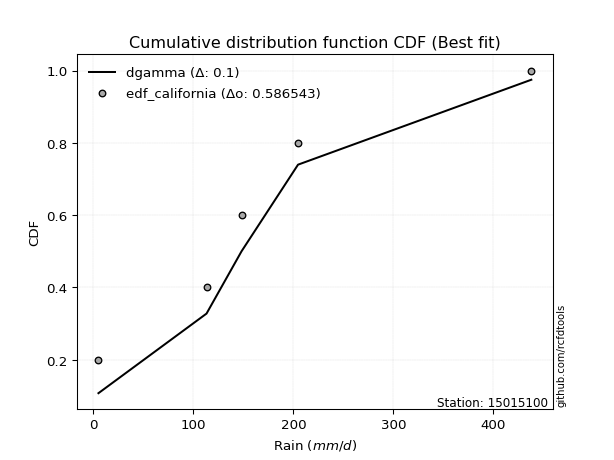</img>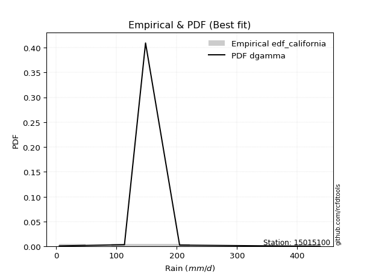</img>

</div>


### 2. Empirical - EDF Hazen (1930)

Hazen method for plotting positions is a formula used to estimate the empirical cumulative probability distribution of flood events or other hydrological data. This formula often results in biased estimations, particularly when extrapolating to extreme events (high return periods).

<div align="center">


$P=(m-0.5)/n$


</div>


**2.1. Empirical values**

<div align="center">

|                | 0                  | 1                  | 2         | 3                 | 4                  |
|:---------------|:-------------------|:-------------------|:----------|:------------------|:-------------------|
| date           | 2023               | 2021               | 2025      | 2022              | 2024               |
| x              | 5.1                | 113.2              | 148.2     | 204.7             | 438.0              |
| m              | 1                  | 2                  | 3         | 4                 | 5                  |
| empirical_dist | edf_hazen          | edf_hazen          | edf_hazen | edf_hazen         | edf_hazen          |
| empirical      | 0.1                | 0.3                | 0.5       | 0.7               | 0.9                |
| empirical_tr   | 1.1111111111111112 | 1.4285714285714286 | 2.0       | 3.333333333333333 | 10.000000000000002 |

</div>


**2.2. Kolmogorov-Smirnov fit test (sorted by Δ)**


<div align="center">

|                | 0                   | 1                   | 2                  | 3                   | 4                   | 5                   | 6                   | 7                   | 8                   | 9                  | 10                  | 11                  | 12                  | 13                 | 14                 | 15                 | 16                  | 17                  | 18                  | 19                  | 20                  | 21                 | 22                 | 23                  | 24                 | 25                  | 26                  | 27                 | 28                 | 29                    | 30                  | 31                  | 32                 | 33                  | 34                  | 35                  | 36                  | 37                  | 38                  | 39                  | 40                  | 41                 | 42                  | 43                  | 44                  | 45                  | 46                  | 47                 | 48                 | 49                 | 50                  | 51                 | 52                 | 53                 | 54                 | 55                  | 56                 | 57                  | 58                 | 59                 | 60                  | 61                 | 62                 | 63                 | 64                 | 65                  | 66                  | 67                  | 68                 | 69                  | 70                  | 71                 | 72                  | 73                 | 74                 | 75                 | 76                  | 77                 | 78                 | 79                 | 80                  | 81                 | 82                  | 83                  | 84                 | 85                 | 86                 | 87                 | 88                 | 89                 |
|:---------------|:--------------------|:--------------------|:-------------------|:--------------------|:--------------------|:--------------------|:--------------------|:--------------------|:--------------------|:-------------------|:--------------------|:--------------------|:--------------------|:-------------------|:-------------------|:-------------------|:--------------------|:--------------------|:--------------------|:--------------------|:--------------------|:-------------------|:-------------------|:--------------------|:-------------------|:--------------------|:--------------------|:-------------------|:-------------------|:----------------------|:--------------------|:--------------------|:-------------------|:--------------------|:--------------------|:--------------------|:--------------------|:--------------------|:--------------------|:--------------------|:--------------------|:-------------------|:--------------------|:--------------------|:--------------------|:--------------------|:--------------------|:-------------------|:-------------------|:-------------------|:--------------------|:-------------------|:-------------------|:-------------------|:-------------------|:--------------------|:-------------------|:--------------------|:-------------------|:-------------------|:--------------------|:-------------------|:-------------------|:-------------------|:-------------------|:--------------------|:--------------------|:--------------------|:-------------------|:--------------------|:--------------------|:-------------------|:--------------------|:-------------------|:-------------------|:-------------------|:--------------------|:-------------------|:-------------------|:-------------------|:--------------------|:-------------------|:--------------------|:--------------------|:-------------------|:-------------------|:-------------------|:-------------------|:-------------------|:-------------------|
| station        | 15015100            | 15015100            | 15015100           | 15015100            | 15015100            | 15015100            | 15015100            | 15015100            | 15015100            | 15015100           | 15015100            | 15015100            | 15015100            | 15015100           | 15015100           | 15015100           | 15015100            | 15015100            | 15015100            | 15015100            | 15015100            | 15015100           | 15015100           | 15015100            | 15015100           | 15015100            | 15015100            | 15015100           | 15015100           | 15015100              | 15015100            | 15015100            | 15015100           | 15015100            | 15015100            | 15015100            | 15015100            | 15015100            | 15015100            | 15015100            | 15015100            | 15015100           | 15015100            | 15015100            | 15015100            | 15015100            | 15015100            | 15015100           | 15015100           | 15015100           | 15015100            | 15015100           | 15015100           | 15015100           | 15015100           | 15015100            | 15015100           | 15015100            | 15015100           | 15015100           | 15015100            | 15015100           | 15015100           | 15015100           | 15015100           | 15015100            | 15015100            | 15015100            | 15015100           | 15015100            | 15015100            | 15015100           | 15015100            | 15015100           | 15015100           | 15015100           | 15015100            | 15015100           | 15015100           | 15015100           | 15015100            | 15015100           | 15015100            | 15015100            | 15015100           | 15015100           | 15015100           | 15015100           | 15015100           | 15015100           |
| empirical_dist | edf_hazen           | edf_hazen           | edf_hazen          | edf_hazen           | edf_hazen           | edf_hazen           | edf_hazen           | edf_hazen           | edf_hazen           | edf_hazen          | edf_hazen           | edf_hazen           | edf_hazen           | edf_hazen          | edf_hazen          | edf_hazen          | edf_hazen           | edf_hazen           | edf_hazen           | edf_hazen           | edf_hazen           | edf_hazen          | edf_hazen          | edf_hazen           | edf_hazen          | edf_hazen           | edf_hazen           | edf_hazen          | edf_hazen          | edf_hazen             | edf_hazen           | edf_hazen           | edf_hazen          | edf_hazen           | edf_hazen           | edf_hazen           | edf_hazen           | edf_hazen           | edf_hazen           | edf_hazen           | edf_hazen           | edf_hazen          | edf_hazen           | edf_hazen           | edf_hazen           | edf_hazen           | edf_hazen           | edf_hazen          | edf_hazen          | edf_hazen          | edf_hazen           | edf_hazen          | edf_hazen          | edf_hazen          | edf_hazen          | edf_hazen           | edf_hazen          | edf_hazen           | edf_hazen          | edf_hazen          | edf_hazen           | edf_hazen          | edf_hazen          | edf_hazen          | edf_hazen          | edf_hazen           | edf_hazen           | edf_hazen           | edf_hazen          | edf_hazen           | edf_hazen           | edf_hazen          | edf_hazen           | edf_hazen          | edf_hazen          | edf_hazen          | edf_hazen           | edf_hazen          | edf_hazen          | edf_hazen          | edf_hazen           | edf_hazen          | edf_hazen           | edf_hazen           | edf_hazen          | edf_hazen          | edf_hazen          | edf_hazen          | edf_hazen          | edf_hazen          |
| p_dist         | genlogistic         | exponnorm           | gumbel_r           | moyal               | fisk                | kstwobign           | invgamma            | laplace_asymmetric  | johnsonsu           | halfnorm           | pearson3            | invgauss            | rayleigh            | gompertz           | wald               | gibrat             | mielke              | maxwell             | logmielke           | rice                | logloggamma         | logjohnsonsu       | hypsecant          | logistic            | t                  | norm                | truncnorm           | laplace            | ncf                | loglaplace_asymmetric | expon               | genexpon            | logfisk            | logpearson3         | betaprime           | loggumbel_l         | loggompertz         | f                   | gumbel_l            | logfatiguelife      | logexponnorm        | logcrystalball     | lognorm             | lognorm             | logt                | lognct              | logf                | loggamma           | loggamma           | loglogistic        | logrice             | loginvgamma        | logerlang          | loghypsecant       | logbetaprime       | logalpha            | loginvweibull      | loglaplace          | logmaxwell         | logncf             | loginvgauss         | lognakagami        | lograyleigh        | nakagami           | logkstwobign       | loggenexpon         | loghalfnorm         | loggumbel_r         | logmoyal           | loghalflogistic     | logchi2             | nct                | logexpon            | pareto             | loglognorm         | weibull_min        | crystalball         | logpareto          | logwald            | loggibrat          | invweibull          | logweibull_min     | erlang              | gamma               | fatiguelife        | alpha              | logtruncnorm       | halflogistic       | chi2               | loggenlogistic     |
| delta          | 0.06088605560756566 | 0.06729189164279259 | 0.0673404511359158 | 0.06773735179213874 | 0.07144630858841144 | 0.07560186547396475 | 0.07665242920113646 | 0.08236166802842482 | 0.08560938240562144 | 0.0898829291974459 | 0.09019465797620996 | 0.09146773658319535 | 0.09793422515755767 | 0.0999999999614518 | 0.1                | 0.1                | 0.10626174563047142 | 0.10731424655273514 | 0.10914088951958933 | 0.10995733666084373 | 0.11293866968942767 | 0.119740961384729  | 0.1212639978276161 | 0.12835138822558978 | 0.1365751629528258 | 0.13679392575025928 | 0.13679395982354703 | 0.1409370215904442 | 0.1496483614733135 | 0.15020481958754228   | 0.15753564841744333 | 0.15777654930949386 | 0.1659012197100807 | 0.16896494810423596 | 0.17160000166930944 | 0.17861063112787628 | 0.18462513021506716 | 0.19102009334428927 | 0.20230077050635398 | 0.24521087538526126 | 0.24604658024685838 | 0.2460472782414979 | 0.24604727826220313 | 0.24604727826220313 | 0.24604737843017227 | 0.24610166276643103 | 0.24667055664604703 | 0.2510405467686038 | 0.2510405467686038 | 0.2522638824798394 | 0.25341522620742923 | 0.256020287481657  | 0.2568255030296694 | 0.2575247480158403 | 0.261036112032143  | 0.27232342292027617 | 0.2750511664949034 | 0.27545814491746196 | 0.2766946334490547 | 0.2775494644950279 | 0.27875861022676335 | 0.2793937609152852 | 0.286564848909543  | 0.2999999986569133 | 0.3067600158122504 | 0.31273583348179373 | 0.31439629298800736 | 0.31628689535996074 | 0.3412491729260652 | 0.34154775801859255 | 0.34432993123827466 | 0.3458201696160473 | 0.35373818871377566 | 0.3677917690863342 | 0.3877903962338625 | 0.3987888660732806 | 0.40017591650061124 | 0.4017849616404458 | 0.4105144151066244 | 0.4392997449106822 | 0.45143708998337073 | 0.4715984397204835 | 0.47487332630217843 | 0.48163336909221205 | 0.4943960282886369 | 0.6193905118356806 | 0.6337421393397006 | 0.6652983272116457 | 0.699999998990052  | 0.7                |
| deltao         | 0.5865427407550001  | 0.5865427407550001  | 0.5865427407550001 | 0.5865427407550001  | 0.5865427407550001  | 0.5865427407550001  | 0.5865427407550001  | 0.5865427407550001  | 0.5865427407550001  | 0.5865427407550001 | 0.5865427407550001  | 0.5865427407550001  | 0.5865427407550001  | 0.5865427407550001 | 0.5865427407550001 | 0.5865427407550001 | 0.5865427407550001  | 0.5865427407550001  | 0.5865427407550001  | 0.5865427407550001  | 0.5865427407550001  | 0.5865427407550001 | 0.5865427407550001 | 0.5865427407550001  | 0.5865427407550001 | 0.5865427407550001  | 0.5865427407550001  | 0.5865427407550001 | 0.5865427407550001 | 0.5865427407550001    | 0.5865427407550001  | 0.5865427407550001  | 0.5865427407550001 | 0.5865427407550001  | 0.5865427407550001  | 0.5865427407550001  | 0.5865427407550001  | 0.5865427407550001  | 0.5865427407550001  | 0.5865427407550001  | 0.5865427407550001  | 0.5865427407550001 | 0.5865427407550001  | 0.5865427407550001  | 0.5865427407550001  | 0.5865427407550001  | 0.5865427407550001  | 0.5865427407550001 | 0.5865427407550001 | 0.5865427407550001 | 0.5865427407550001  | 0.5865427407550001 | 0.5865427407550001 | 0.5865427407550001 | 0.5865427407550001 | 0.5865427407550001  | 0.5865427407550001 | 0.5865427407550001  | 0.5865427407550001 | 0.5865427407550001 | 0.5865427407550001  | 0.5865427407550001 | 0.5865427407550001 | 0.5865427407550001 | 0.5865427407550001 | 0.5865427407550001  | 0.5865427407550001  | 0.5865427407550001  | 0.5865427407550001 | 0.5865427407550001  | 0.5865427407550001  | 0.5865427407550001 | 0.5865427407550001  | 0.5865427407550001 | 0.5865427407550001 | 0.5865427407550001 | 0.5865427407550001  | 0.5865427407550001 | 0.5865427407550001 | 0.5865427407550001 | 0.5865427407550001  | 0.5865427407550001 | 0.5865427407550001  | 0.5865427407550001  | 0.5865427407550001 | 0.5865427407550001 | 0.5865427407550001 | 0.5865427407550001 | 0.5865427407550001 | 0.5865427407550001 |
| eval           | Δo > Δ              | Δo > Δ              | Δo > Δ             | Δo > Δ              | Δo > Δ              | Δo > Δ              | Δo > Δ              | Δo > Δ              | Δo > Δ              | Δo > Δ             | Δo > Δ              | Δo > Δ              | Δo > Δ              | Δo > Δ             | Δo > Δ             | Δo > Δ             | Δo > Δ              | Δo > Δ              | Δo > Δ              | Δo > Δ              | Δo > Δ              | Δo > Δ             | Δo > Δ             | Δo > Δ              | Δo > Δ             | Δo > Δ              | Δo > Δ              | Δo > Δ             | Δo > Δ             | Δo > Δ                | Δo > Δ              | Δo > Δ              | Δo > Δ             | Δo > Δ              | Δo > Δ              | Δo > Δ              | Δo > Δ              | Δo > Δ              | Δo > Δ              | Δo > Δ              | Δo > Δ              | Δo > Δ             | Δo > Δ              | Δo > Δ              | Δo > Δ              | Δo > Δ              | Δo > Δ              | Δo > Δ             | Δo > Δ             | Δo > Δ             | Δo > Δ              | Δo > Δ             | Δo > Δ             | Δo > Δ             | Δo > Δ             | Δo > Δ              | Δo > Δ             | Δo > Δ              | Δo > Δ             | Δo > Δ             | Δo > Δ              | Δo > Δ             | Δo > Δ             | Δo > Δ             | Δo > Δ             | Δo > Δ              | Δo > Δ              | Δo > Δ              | Δo > Δ             | Δo > Δ              | Δo > Δ              | Δo > Δ             | Δo > Δ              | Δo > Δ             | Δo > Δ             | Δo > Δ             | Δo > Δ              | Δo > Δ             | Δo > Δ             | Δo > Δ             | Δo > Δ              | Δo > Δ             | Δo > Δ              | Δo > Δ              | Δo > Δ             | Δo <= Δ            | Δo <= Δ            | Δo <= Δ            | Δo <= Δ            | Δo <= Δ            |
| fit            | 1                   | 1                   | 1                  | 1                   | 1                   | 1                   | 1                   | 1                   | 1                   | 1                  | 1                   | 1                   | 1                   | 1                  | 1                  | 1                  | 1                   | 1                   | 1                   | 1                   | 1                   | 1                  | 1                  | 1                   | 1                  | 1                   | 1                   | 1                  | 1                  | 1                     | 1                   | 1                   | 1                  | 1                   | 1                   | 1                   | 1                   | 1                   | 1                   | 1                   | 1                   | 1                  | 1                   | 1                   | 1                   | 1                   | 1                   | 1                  | 1                  | 1                  | 1                   | 1                  | 1                  | 1                  | 1                  | 1                   | 1                  | 1                   | 1                  | 1                  | 1                   | 1                  | 1                  | 1                  | 1                  | 1                   | 1                   | 1                   | 1                  | 1                   | 1                   | 1                  | 1                   | 1                  | 1                  | 1                  | 1                   | 1                  | 1                  | 1                  | 1                   | 1                  | 1                   | 1                   | 1                  | 0                  | 0                  | 0                  | 0                  | 0                  |
| n              | 5                   | 5                   | 5                  | 5                   | 5                   | 5                   | 5                   | 5                   | 5                   | 5                  | 5                   | 5                   | 5                   | 5                  | 5                  | 5                  | 5                   | 5                   | 5                   | 5                   | 5                   | 5                  | 5                  | 5                   | 5                  | 5                   | 5                   | 5                  | 5                  | 5                     | 5                   | 5                   | 5                  | 5                   | 5                   | 5                   | 5                   | 5                   | 5                   | 5                   | 5                   | 5                  | 5                   | 5                   | 5                   | 5                   | 5                   | 5                  | 5                  | 5                  | 5                   | 5                  | 5                  | 5                  | 5                  | 5                   | 5                  | 5                   | 5                  | 5                  | 5                   | 5                  | 5                  | 5                  | 5                  | 5                   | 5                   | 5                   | 5                  | 5                   | 5                   | 5                  | 5                   | 5                  | 5                  | 5                  | 5                   | 5                  | 5                  | 5                  | 5                   | 5                  | 5                   | 5                   | 5                  | 5                  | 5                  | 5                  | 5                  | 5                  |
| best_fit       | 1                   | 0                   | 0                  | 0                   | 0                   | 0                   | 0                   | 0                   | 0                   | 0                  | 0                   | 0                   | 0                   | 0                  | 0                  | 0                  | 0                   | 0                   | 0                   | 0                   | 0                   | 0                  | 0                  | 0                   | 0                  | 0                   | 0                   | 0                  | 0                  | 0                     | 0                   | 0                   | 0                  | 0                   | 0                   | 0                   | 0                   | 0                   | 0                   | 0                   | 0                   | 0                  | 0                   | 0                   | 0                   | 0                   | 0                   | 0                  | 0                  | 0                  | 0                   | 0                  | 0                  | 0                  | 0                  | 0                   | 0                  | 0                   | 0                  | 0                  | 0                   | 0                  | 0                  | 0                  | 0                  | 0                   | 0                   | 0                   | 0                  | 0                   | 0                   | 0                  | 0                   | 0                  | 0                  | 0                  | 0                   | 0                  | 0                  | 0                  | 0                   | 0                  | 0                   | 0                   | 0                  | 0                  | 0                  | 0                  | 0                  | 0                  |
| best_fit_sort  | 1                   | 2                   | 3                  | 4                   | 5                   | 6                   | 7                   | 8                   | 9                   | 10                 | 11                  | 12                  | 13                  | 14                 | 15                 | 16                 | 17                  | 18                  | 19                  | 20                  | 21                  | 22                 | 23                 | 24                  | 25                 | 26                  | 27                  | 28                 | 29                 | 30                    | 31                  | 32                  | 33                 | 34                  | 35                  | 36                  | 37                  | 38                  | 39                  | 40                  | 41                  | 42                 | 43                  | 44                  | 45                  | 46                  | 47                  | 48                 | 49                 | 50                 | 51                  | 52                 | 53                 | 54                 | 55                 | 56                  | 57                 | 58                  | 59                 | 60                 | 61                  | 62                 | 63                 | 64                 | 65                 | 66                  | 67                  | 68                  | 69                 | 70                  | 71                  | 72                 | 73                  | 74                 | 75                 | 76                 | 77                  | 78                 | 79                 | 80                 | 81                  | 82                 | 83                  | 84                  | 85                 | 86                 | 87                 | 88                 | 89                 | 90                 |

</div>


<div align="center">

</img>

</div>


**2.3. Best fit**

<div align="center">

|   id |   station | empirical_dist   | p_dist      |     delta |   deltao | eval   |   fit |   n |   best_fit |   best_fit_sort |
|-----:|----------:|:-----------------|:------------|----------:|---------:|:-------|------:|----:|-----------:|----------------:|
|    0 |  15015100 | edf_hazen        | genlogistic | 0.0608861 | 0.586543 | Δo > Δ |     1 |   5 |          1 |               1 |

</div>


<div align="center">

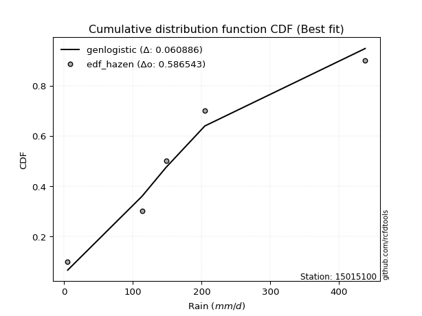</img>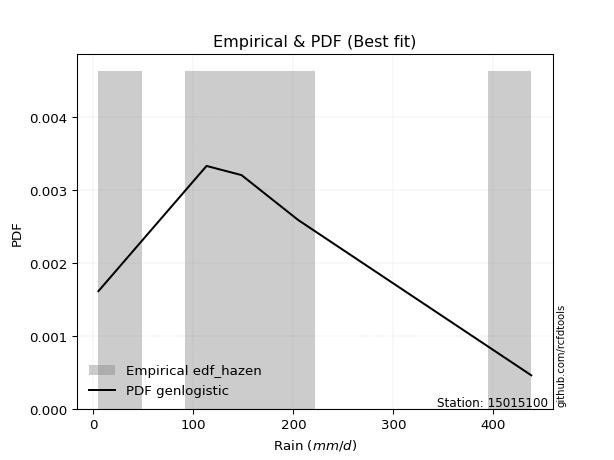</img>

</div>


### 3. Empirical - EDF Weibull (1939)

Weibull plotting position formula is an empirical method used to estimate the non-exceedance probability or plotting position for a set of observed data, is often recommended or widely used in practice, particularly in flood frequency analysis.

<div align="center">


$P=m/(n+1)$


</div>


**3.1. Empirical values**

<div align="center">

|                | 0                   | 1                  | 2           | 3                  | 4                  |
|:---------------|:--------------------|:-------------------|:------------|:-------------------|:-------------------|
| date           | 2023                | 2021               | 2025        | 2022               | 2024               |
| x              | 5.1                 | 113.2              | 148.2       | 204.7              | 438.0              |
| m              | 1                   | 2                  | 3           | 4                  | 5                  |
| empirical_dist | edf_weibull         | edf_weibull        | edf_weibull | edf_weibull        | edf_weibull        |
| empirical      | 0.16666666666666666 | 0.3333333333333333 | 0.5         | 0.6666666666666666 | 0.8333333333333334 |
| empirical_tr   | 1.2                 | 1.4999999999999998 | 2.0         | 2.9999999999999996 | 6.000000000000002  |

</div>


**3.2. Kolmogorov-Smirnov fit test (sorted by Δ)**


<div align="center">

|                | 0                  | 1                   | 2                  | 3                   | 4                   | 5                   | 6                   | 7                   | 8                   | 9                   | 10                  | 11                  | 12                  | 13                 | 14                  | 15                    | 16                 | 17                  | 18                  | 19                 | 20                 | 21                  | 22                  | 23                  | 24                 | 25                  | 26                 | 27                  | 28                  | 29                 | 30                  | 31                  | 32                  | 33                  | 34                  | 35                  | 36                  | 37                  | 38                  | 39                  | 40                  | 41                 | 42                 | 43                 | 44                  | 45                 | 46                 | 47                 | 48                 | 49                  | 50                 | 51                  | 52                  | 53                  | 54                  | 55                  | 56                  | 57                  | 58                  | 59                  | 60                  | 61                  | 62                  | 63                 | 64                  | 65                 | 66                 | 67                 | 68                 | 69                  | 70                  | 71                  | 72                 | 73                 | 74                 | 75                 | 76                 | 77                 | 78                  | 79                 | 80                  | 81                  | 82                 | 83                 | 84                  | 85                 | 86                 | 87                 | 88                 | 89                 |
|:---------------|:-------------------|:--------------------|:-------------------|:--------------------|:--------------------|:--------------------|:--------------------|:--------------------|:--------------------|:--------------------|:--------------------|:--------------------|:--------------------|:-------------------|:--------------------|:----------------------|:-------------------|:--------------------|:--------------------|:-------------------|:-------------------|:--------------------|:--------------------|:--------------------|:-------------------|:--------------------|:-------------------|:--------------------|:--------------------|:-------------------|:--------------------|:--------------------|:--------------------|:--------------------|:--------------------|:--------------------|:--------------------|:--------------------|:--------------------|:--------------------|:--------------------|:-------------------|:-------------------|:-------------------|:--------------------|:-------------------|:-------------------|:-------------------|:-------------------|:--------------------|:-------------------|:--------------------|:--------------------|:--------------------|:--------------------|:--------------------|:--------------------|:--------------------|:--------------------|:--------------------|:--------------------|:--------------------|:--------------------|:-------------------|:--------------------|:-------------------|:-------------------|:-------------------|:-------------------|:--------------------|:--------------------|:--------------------|:-------------------|:-------------------|:-------------------|:-------------------|:-------------------|:-------------------|:--------------------|:-------------------|:--------------------|:--------------------|:-------------------|:-------------------|:--------------------|:-------------------|:-------------------|:-------------------|:-------------------|:-------------------|
| station        | 15015100           | 15015100            | 15015100           | 15015100            | 15015100            | 15015100            | 15015100            | 15015100            | 15015100            | 15015100            | 15015100            | 15015100            | 15015100            | 15015100           | 15015100            | 15015100              | 15015100           | 15015100            | 15015100            | 15015100           | 15015100           | 15015100            | 15015100            | 15015100            | 15015100           | 15015100            | 15015100           | 15015100            | 15015100            | 15015100           | 15015100            | 15015100            | 15015100            | 15015100            | 15015100            | 15015100            | 15015100            | 15015100            | 15015100            | 15015100            | 15015100            | 15015100           | 15015100           | 15015100           | 15015100            | 15015100           | 15015100           | 15015100           | 15015100           | 15015100            | 15015100           | 15015100            | 15015100            | 15015100            | 15015100            | 15015100            | 15015100            | 15015100            | 15015100            | 15015100            | 15015100            | 15015100            | 15015100            | 15015100           | 15015100            | 15015100           | 15015100           | 15015100           | 15015100           | 15015100            | 15015100            | 15015100            | 15015100           | 15015100           | 15015100           | 15015100           | 15015100           | 15015100           | 15015100            | 15015100           | 15015100            | 15015100            | 15015100           | 15015100           | 15015100            | 15015100           | 15015100           | 15015100           | 15015100           | 15015100           |
| empirical_dist | edf_weibull        | edf_weibull         | edf_weibull        | edf_weibull         | edf_weibull         | edf_weibull         | edf_weibull         | edf_weibull         | edf_weibull         | edf_weibull         | edf_weibull         | edf_weibull         | edf_weibull         | edf_weibull        | edf_weibull         | edf_weibull           | edf_weibull        | edf_weibull         | edf_weibull         | edf_weibull        | edf_weibull        | edf_weibull         | edf_weibull         | edf_weibull         | edf_weibull        | edf_weibull         | edf_weibull        | edf_weibull         | edf_weibull         | edf_weibull        | edf_weibull         | edf_weibull         | edf_weibull         | edf_weibull         | edf_weibull         | edf_weibull         | edf_weibull         | edf_weibull         | edf_weibull         | edf_weibull         | edf_weibull         | edf_weibull        | edf_weibull        | edf_weibull        | edf_weibull         | edf_weibull        | edf_weibull        | edf_weibull        | edf_weibull        | edf_weibull         | edf_weibull        | edf_weibull         | edf_weibull         | edf_weibull         | edf_weibull         | edf_weibull         | edf_weibull         | edf_weibull         | edf_weibull         | edf_weibull         | edf_weibull         | edf_weibull         | edf_weibull         | edf_weibull        | edf_weibull         | edf_weibull        | edf_weibull        | edf_weibull        | edf_weibull        | edf_weibull         | edf_weibull         | edf_weibull         | edf_weibull        | edf_weibull        | edf_weibull        | edf_weibull        | edf_weibull        | edf_weibull        | edf_weibull         | edf_weibull        | edf_weibull         | edf_weibull         | edf_weibull        | edf_weibull        | edf_weibull         | edf_weibull        | edf_weibull        | edf_weibull        | edf_weibull        | edf_weibull        |
| p_dist         | exponnorm          | invgamma            | johnsonsu          | gumbel_r            | invgauss            | fisk                | rayleigh            | pearson3            | genlogistic         | kstwobign           | laplace_asymmetric  | maxwell             | logjohnsonsu        | rice               | halfnorm            | loglaplace_asymmetric | ncf                | hypsecant           | logistic            | moyal              | truncnorm          | norm                | t                   | logpearson3         | laplace            | loggumbel_l         | logfisk            | logmielke           | mielke              | logloggamma        | f                   | genexpon            | betaprime           | loggompertz         | gompertz            | gibrat              | wald                | expon               | gumbel_l            | logfatiguelife      | logexponnorm        | logcrystalball     | lognorm            | lognorm            | logt                | lognct             | logf               | loggamma           | loggamma           | loglogistic         | logrice            | loginvgamma         | logerlang           | loghypsecant        | logbetaprime        | logalpha            | loginvweibull       | loglaplace          | logmaxwell          | logncf              | loginvgauss         | lograyleigh         | logkstwobign        | loggenexpon        | loghalfnorm         | loggumbel_r        | lognakagami        | logmoyal           | loghalflogistic    | logchi2             | nct                 | logexpon            | nakagami           | pareto             | loglognorm         | crystalball        | weibull_min        | logpareto          | logwald             | invweibull         | loggibrat           | logweibull_min      | erlang             | gamma              | fatiguelife         | alpha              | logtruncnorm       | halflogistic       | chi2               | loggenlogistic     |
| delta          | 0.105548491669444  | 0.10788632361651287 | 0.1109685065892842 | 0.11121205336728246 | 0.11160138746534448 | 0.11173807865547462 | 0.11334397925901896 | 0.11336994863489391 | 0.11393582575696759 | 0.11548266640496918 | 0.11574204795480192 | 0.11678213447351227 | 0.11706547340251772 | 0.1216837214033838 | 0.12171034442659592 | 0.1254978394921523    | 0.1267866706491652 | 0.12802000473375907 | 0.12875031310525153 | 0.1288994974560906 | 0.1293606964812315 | 0.12936070717673132 | 0.12940706837436222 | 0.13563161477090263 | 0.1409370215904442 | 0.14527729779454296 | 0.1479711953575095 | 0.15973004927180157 | 0.16062482655531363 | 0.1666289557329078 | 0.16666539117861712 | 0.16666629785148904 | 0.16666664299928868 | 0.16666666645488454 | 0.16666666662811846 | 0.16666666666666666 | 0.16666666666666666 | 0.16666666666666666 | 0.16896743717302065 | 0.21187754205192794 | 0.21271324691352506 | 0.2127139449081646 | 0.2127139449288698 | 0.2127139449288698 | 0.21271404509683894 | 0.2127683294330977 | 0.2133372233127137 | 0.2177072134352705 | 0.2177072134352705 | 0.21893054914650606 | 0.2200818928740959 | 0.22268695414832368 | 0.22349216969633606 | 0.22419141468250697 | 0.22770277869880967 | 0.23899008958694284 | 0.24171783316157008 | 0.24212481158412863 | 0.24336130011572138 | 0.24421613116169455 | 0.24542527689343002 | 0.25323151557620965 | 0.27342668247891705 | 0.2794025001484604 | 0.28106295965467404 | 0.2829535620266274 | 0.3054095477300899 | 0.3079158395927319 | 0.3082144246852592 | 0.31099659790494133 | 0.31248683628271395 | 0.32040485538044233 | 0.3333333319902466 | 0.3344584357530009 | 0.3544570629005292 | 0.3621652818063486 | 0.3654555327399473 | 0.3684516283071125 | 0.37718108177329107 | 0.3847704233167041 | 0.40596641157734886 | 0.43826510638715016 | 0.4415399929688451 | 0.4483000357588787 | 0.46106269495530355 | 0.5860571785023474 | 0.599926728847241  | 0.6319649938783123 | 0.6666666656567186 | 0.6666666666666666 |
| deltao         | 0.5865427407550001 | 0.5865427407550001  | 0.5865427407550001 | 0.5865427407550001  | 0.5865427407550001  | 0.5865427407550001  | 0.5865427407550001  | 0.5865427407550001  | 0.5865427407550001  | 0.5865427407550001  | 0.5865427407550001  | 0.5865427407550001  | 0.5865427407550001  | 0.5865427407550001 | 0.5865427407550001  | 0.5865427407550001    | 0.5865427407550001 | 0.5865427407550001  | 0.5865427407550001  | 0.5865427407550001 | 0.5865427407550001 | 0.5865427407550001  | 0.5865427407550001  | 0.5865427407550001  | 0.5865427407550001 | 0.5865427407550001  | 0.5865427407550001 | 0.5865427407550001  | 0.5865427407550001  | 0.5865427407550001 | 0.5865427407550001  | 0.5865427407550001  | 0.5865427407550001  | 0.5865427407550001  | 0.5865427407550001  | 0.5865427407550001  | 0.5865427407550001  | 0.5865427407550001  | 0.5865427407550001  | 0.5865427407550001  | 0.5865427407550001  | 0.5865427407550001 | 0.5865427407550001 | 0.5865427407550001 | 0.5865427407550001  | 0.5865427407550001 | 0.5865427407550001 | 0.5865427407550001 | 0.5865427407550001 | 0.5865427407550001  | 0.5865427407550001 | 0.5865427407550001  | 0.5865427407550001  | 0.5865427407550001  | 0.5865427407550001  | 0.5865427407550001  | 0.5865427407550001  | 0.5865427407550001  | 0.5865427407550001  | 0.5865427407550001  | 0.5865427407550001  | 0.5865427407550001  | 0.5865427407550001  | 0.5865427407550001 | 0.5865427407550001  | 0.5865427407550001 | 0.5865427407550001 | 0.5865427407550001 | 0.5865427407550001 | 0.5865427407550001  | 0.5865427407550001  | 0.5865427407550001  | 0.5865427407550001 | 0.5865427407550001 | 0.5865427407550001 | 0.5865427407550001 | 0.5865427407550001 | 0.5865427407550001 | 0.5865427407550001  | 0.5865427407550001 | 0.5865427407550001  | 0.5865427407550001  | 0.5865427407550001 | 0.5865427407550001 | 0.5865427407550001  | 0.5865427407550001 | 0.5865427407550001 | 0.5865427407550001 | 0.5865427407550001 | 0.5865427407550001 |
| eval           | Δo > Δ             | Δo > Δ              | Δo > Δ             | Δo > Δ              | Δo > Δ              | Δo > Δ              | Δo > Δ              | Δo > Δ              | Δo > Δ              | Δo > Δ              | Δo > Δ              | Δo > Δ              | Δo > Δ              | Δo > Δ             | Δo > Δ              | Δo > Δ                | Δo > Δ             | Δo > Δ              | Δo > Δ              | Δo > Δ             | Δo > Δ             | Δo > Δ              | Δo > Δ              | Δo > Δ              | Δo > Δ             | Δo > Δ              | Δo > Δ             | Δo > Δ              | Δo > Δ              | Δo > Δ             | Δo > Δ              | Δo > Δ              | Δo > Δ              | Δo > Δ              | Δo > Δ              | Δo > Δ              | Δo > Δ              | Δo > Δ              | Δo > Δ              | Δo > Δ              | Δo > Δ              | Δo > Δ             | Δo > Δ             | Δo > Δ             | Δo > Δ              | Δo > Δ             | Δo > Δ             | Δo > Δ             | Δo > Δ             | Δo > Δ              | Δo > Δ             | Δo > Δ              | Δo > Δ              | Δo > Δ              | Δo > Δ              | Δo > Δ              | Δo > Δ              | Δo > Δ              | Δo > Δ              | Δo > Δ              | Δo > Δ              | Δo > Δ              | Δo > Δ              | Δo > Δ             | Δo > Δ              | Δo > Δ             | Δo > Δ             | Δo > Δ             | Δo > Δ             | Δo > Δ              | Δo > Δ              | Δo > Δ              | Δo > Δ             | Δo > Δ             | Δo > Δ             | Δo > Δ             | Δo > Δ             | Δo > Δ             | Δo > Δ              | Δo > Δ             | Δo > Δ              | Δo > Δ              | Δo > Δ             | Δo > Δ             | Δo > Δ              | Δo > Δ             | Δo <= Δ            | Δo <= Δ            | Δo <= Δ            | Δo <= Δ            |
| fit            | 1                  | 1                   | 1                  | 1                   | 1                   | 1                   | 1                   | 1                   | 1                   | 1                   | 1                   | 1                   | 1                   | 1                  | 1                   | 1                     | 1                  | 1                   | 1                   | 1                  | 1                  | 1                   | 1                   | 1                   | 1                  | 1                   | 1                  | 1                   | 1                   | 1                  | 1                   | 1                   | 1                   | 1                   | 1                   | 1                   | 1                   | 1                   | 1                   | 1                   | 1                   | 1                  | 1                  | 1                  | 1                   | 1                  | 1                  | 1                  | 1                  | 1                   | 1                  | 1                   | 1                   | 1                   | 1                   | 1                   | 1                   | 1                   | 1                   | 1                   | 1                   | 1                   | 1                   | 1                  | 1                   | 1                  | 1                  | 1                  | 1                  | 1                   | 1                   | 1                   | 1                  | 1                  | 1                  | 1                  | 1                  | 1                  | 1                   | 1                  | 1                   | 1                   | 1                  | 1                  | 1                   | 1                  | 0                  | 0                  | 0                  | 0                  |
| n              | 5                  | 5                   | 5                  | 5                   | 5                   | 5                   | 5                   | 5                   | 5                   | 5                   | 5                   | 5                   | 5                   | 5                  | 5                   | 5                     | 5                  | 5                   | 5                   | 5                  | 5                  | 5                   | 5                   | 5                   | 5                  | 5                   | 5                  | 5                   | 5                   | 5                  | 5                   | 5                   | 5                   | 5                   | 5                   | 5                   | 5                   | 5                   | 5                   | 5                   | 5                   | 5                  | 5                  | 5                  | 5                   | 5                  | 5                  | 5                  | 5                  | 5                   | 5                  | 5                   | 5                   | 5                   | 5                   | 5                   | 5                   | 5                   | 5                   | 5                   | 5                   | 5                   | 5                   | 5                  | 5                   | 5                  | 5                  | 5                  | 5                  | 5                   | 5                   | 5                   | 5                  | 5                  | 5                  | 5                  | 5                  | 5                  | 5                   | 5                  | 5                   | 5                   | 5                  | 5                  | 5                   | 5                  | 5                  | 5                  | 5                  | 5                  |
| best_fit       | 1                  | 0                   | 0                  | 0                   | 0                   | 0                   | 0                   | 0                   | 0                   | 0                   | 0                   | 0                   | 0                   | 0                  | 0                   | 0                     | 0                  | 0                   | 0                   | 0                  | 0                  | 0                   | 0                   | 0                   | 0                  | 0                   | 0                  | 0                   | 0                   | 0                  | 0                   | 0                   | 0                   | 0                   | 0                   | 0                   | 0                   | 0                   | 0                   | 0                   | 0                   | 0                  | 0                  | 0                  | 0                   | 0                  | 0                  | 0                  | 0                  | 0                   | 0                  | 0                   | 0                   | 0                   | 0                   | 0                   | 0                   | 0                   | 0                   | 0                   | 0                   | 0                   | 0                   | 0                  | 0                   | 0                  | 0                  | 0                  | 0                  | 0                   | 0                   | 0                   | 0                  | 0                  | 0                  | 0                  | 0                  | 0                  | 0                   | 0                  | 0                   | 0                   | 0                  | 0                  | 0                   | 0                  | 0                  | 0                  | 0                  | 0                  |
| best_fit_sort  | 1                  | 2                   | 3                  | 4                   | 5                   | 6                   | 7                   | 8                   | 9                   | 10                  | 11                  | 12                  | 13                  | 14                 | 15                  | 16                    | 17                 | 18                  | 19                  | 20                 | 21                 | 22                  | 23                  | 24                  | 25                 | 26                  | 27                 | 28                  | 29                  | 30                 | 31                  | 32                  | 33                  | 34                  | 35                  | 36                  | 37                  | 38                  | 39                  | 40                  | 41                  | 42                 | 43                 | 44                 | 45                  | 46                 | 47                 | 48                 | 49                 | 50                  | 51                 | 52                  | 53                  | 54                  | 55                  | 56                  | 57                  | 58                  | 59                  | 60                  | 61                  | 62                  | 63                  | 64                 | 65                  | 66                 | 67                 | 68                 | 69                 | 70                  | 71                  | 72                  | 73                 | 74                 | 75                 | 76                 | 77                 | 78                 | 79                  | 80                 | 81                  | 82                  | 83                 | 84                 | 85                  | 86                 | 87                 | 88                 | 89                 | 90                 |

</div>


<div align="center">

</img>

</div>


**3.3. Best fit**

<div align="center">

|   id |   station | empirical_dist   | p_dist    |    delta |   deltao | eval   |   fit |   n |   best_fit |   best_fit_sort |
|-----:|----------:|:-----------------|:----------|---------:|---------:|:-------|------:|----:|-----------:|----------------:|
|    0 |  15015100 | edf_weibull      | exponnorm | 0.105548 | 0.586543 | Δo > Δ |     1 |   5 |          1 |               1 |

</div>


<div align="center">

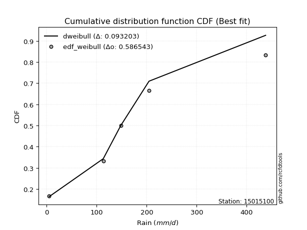</img></img>

</div>


### 4. Empirical - EDF Beard (1943)

The Beard formula (or Beard´s plotting position formula) in hydrology is used to estimate the empirical non-exceedance probability _(P)_ of a flood event (or other extreme hydrological data point) within a given dataset.

<div align="center">


$P=(m-0.31)/(n+0.38)$


</div>


**4.1. Empirical values**

<div align="center">

|                | 0                   | 1                  | 2         | 3                  | 4                  |
|:---------------|:--------------------|:-------------------|:----------|:-------------------|:-------------------|
| date           | 2023                | 2021               | 2025      | 2022               | 2024               |
| x              | 5.1                 | 113.2              | 148.2     | 204.7              | 438.0              |
| m              | 1                   | 2                  | 3         | 4                  | 5                  |
| empirical_dist | edf_beard           | edf_beard          | edf_beard | edf_beard          | edf_beard          |
| empirical      | 0.12825278810408922 | 0.3141263940520446 | 0.5       | 0.6858736059479554 | 0.8717472118959109 |
| empirical_tr   | 1.1471215351812367  | 1.4579945799457996 | 2.0       | 3.183431952662722  | 7.797101449275368  |

</div>


**4.2. Kolmogorov-Smirnov fit test (sorted by Δ)**


<div align="center">

|                | 0                   | 1                   | 2                   | 3                   | 4                   | 5                  | 6                   | 7                   | 8                   | 9                   | 10                  | 11                  | 12                  | 13                  | 14                  | 15                  | 16                  | 17                  | 18                  | 19                  | 20                  | 21                  | 22                  | 23                  | 24                  | 25                  | 26                  | 27                  | 28                    | 29                 | 30                 | 31                  | 32                  | 33                  | 34                 | 35                  | 36                  | 37                  | 38                  | 39                  | 40                  | 41                  | 42                 | 43                 | 44                  | 45                 | 46                 | 47                 | 48                 | 49                  | 50                 | 51                  | 52                  | 53                  | 54                  | 55                  | 56                 | 57                 | 58                 | 59                  | 60                 | 61                  | 62                 | 63                  | 64                 | 65                  | 66                 | 67                 | 68                 | 69                 | 70                 | 71                  | 72                 | 73                 | 74                 | 75                 | 76                 | 77                  | 78                  | 79                 | 80                  | 81                  | 82                 | 83                 | 84                  | 85                 | 86                 | 87                 | 88                 | 89                 |
|:---------------|:--------------------|:--------------------|:--------------------|:--------------------|:--------------------|:-------------------|:--------------------|:--------------------|:--------------------|:--------------------|:--------------------|:--------------------|:--------------------|:--------------------|:--------------------|:--------------------|:--------------------|:--------------------|:--------------------|:--------------------|:--------------------|:--------------------|:--------------------|:--------------------|:--------------------|:--------------------|:--------------------|:--------------------|:----------------------|:-------------------|:-------------------|:--------------------|:--------------------|:--------------------|:-------------------|:--------------------|:--------------------|:--------------------|:--------------------|:--------------------|:--------------------|:--------------------|:-------------------|:-------------------|:--------------------|:-------------------|:-------------------|:-------------------|:-------------------|:--------------------|:-------------------|:--------------------|:--------------------|:--------------------|:--------------------|:--------------------|:-------------------|:-------------------|:-------------------|:--------------------|:-------------------|:--------------------|:-------------------|:--------------------|:-------------------|:--------------------|:-------------------|:-------------------|:-------------------|:-------------------|:-------------------|:--------------------|:-------------------|:-------------------|:-------------------|:-------------------|:-------------------|:--------------------|:--------------------|:-------------------|:--------------------|:--------------------|:-------------------|:-------------------|:--------------------|:-------------------|:-------------------|:-------------------|:-------------------|:-------------------|
| station        | 15015100            | 15015100            | 15015100            | 15015100            | 15015100            | 15015100           | 15015100            | 15015100            | 15015100            | 15015100            | 15015100            | 15015100            | 15015100            | 15015100            | 15015100            | 15015100            | 15015100            | 15015100            | 15015100            | 15015100            | 15015100            | 15015100            | 15015100            | 15015100            | 15015100            | 15015100            | 15015100            | 15015100            | 15015100              | 15015100           | 15015100           | 15015100            | 15015100            | 15015100            | 15015100           | 15015100            | 15015100            | 15015100            | 15015100            | 15015100            | 15015100            | 15015100            | 15015100           | 15015100           | 15015100            | 15015100           | 15015100           | 15015100           | 15015100           | 15015100            | 15015100           | 15015100            | 15015100            | 15015100            | 15015100            | 15015100            | 15015100           | 15015100           | 15015100           | 15015100            | 15015100           | 15015100            | 15015100           | 15015100            | 15015100           | 15015100            | 15015100           | 15015100           | 15015100           | 15015100           | 15015100           | 15015100            | 15015100           | 15015100           | 15015100           | 15015100           | 15015100           | 15015100            | 15015100            | 15015100           | 15015100            | 15015100            | 15015100           | 15015100           | 15015100            | 15015100           | 15015100           | 15015100           | 15015100           | 15015100           |
| empirical_dist | edf_beard           | edf_beard           | edf_beard           | edf_beard           | edf_beard           | edf_beard          | edf_beard           | edf_beard           | edf_beard           | edf_beard           | edf_beard           | edf_beard           | edf_beard           | edf_beard           | edf_beard           | edf_beard           | edf_beard           | edf_beard           | edf_beard           | edf_beard           | edf_beard           | edf_beard           | edf_beard           | edf_beard           | edf_beard           | edf_beard           | edf_beard           | edf_beard           | edf_beard             | edf_beard          | edf_beard          | edf_beard           | edf_beard           | edf_beard           | edf_beard          | edf_beard           | edf_beard           | edf_beard           | edf_beard           | edf_beard           | edf_beard           | edf_beard           | edf_beard          | edf_beard          | edf_beard           | edf_beard          | edf_beard          | edf_beard          | edf_beard          | edf_beard           | edf_beard          | edf_beard           | edf_beard           | edf_beard           | edf_beard           | edf_beard           | edf_beard          | edf_beard          | edf_beard          | edf_beard           | edf_beard          | edf_beard           | edf_beard          | edf_beard           | edf_beard          | edf_beard           | edf_beard          | edf_beard          | edf_beard          | edf_beard          | edf_beard          | edf_beard           | edf_beard          | edf_beard          | edf_beard          | edf_beard          | edf_beard          | edf_beard           | edf_beard           | edf_beard          | edf_beard           | edf_beard           | edf_beard          | edf_beard          | edf_beard           | edf_beard          | edf_beard          | edf_beard          | edf_beard          | edf_beard          |
| p_dist         | exponnorm           | invgamma            | johnsonsu           | gumbel_r            | fisk                | genlogistic        | pearson3            | kstwobign           | invgauss            | laplace_asymmetric  | halfnorm            | rayleigh            | moyal               | maxwell             | rice                | logjohnsonsu        | logistic            | hypsecant           | logmielke           | mielke              | t                   | norm                | truncnorm           | logloggamma         | gompertz            | wald                | gibrat              | ncf                 | loglaplace_asymmetric | laplace            | expon              | genexpon            | logfisk             | logpearson3         | betaprime          | loggumbel_l         | loggompertz         | f                   | gumbel_l            | logfatiguelife      | logexponnorm        | logcrystalball      | lognorm            | lognorm            | logt                | lognct             | logf               | loggamma           | loggamma           | loglogistic         | logrice            | loginvgamma         | logerlang           | loghypsecant        | logbetaprime        | logalpha            | loginvweibull      | loglaplace         | logmaxwell         | logncf              | loginvgauss        | lograyleigh         | lognakagami        | logkstwobign        | loggenexpon        | loghalfnorm         | loggumbel_r        | nakagami           | logmoyal           | loghalflogistic    | logchi2            | nct                 | logexpon           | pareto             | loglognorm         | crystalball        | weibull_min        | logpareto           | logwald             | invweibull         | loggibrat           | logweibull_min      | erlang             | gamma              | fatiguelife         | alpha              | logtruncnorm       | halflogistic       | chi2               | loggenlogistic     |
| delta          | 0.06713461310686655 | 0.06947244505393543 | 0.07255462802670676 | 0.07279817480470496 | 0.07332420009289718 | 0.0755219471943901 | 0.07606826392416544 | 0.07706878784239168 | 0.07734134253115071 | 0.08236166802842482 | 0.08329646586401848 | 0.08380783110551315 | 0.09048561889351317 | 0.09318785250069062 | 0.09583094260879921 | 0.10561456733268448 | 0.11422499417354526 | 0.11451208651389133 | 0.12131617070922407 | 0.12221094799273613 | 0.12244876890078127 | 0.12266753169821476 | 0.12266756577150251 | 0.12821507717033032 | 0.12825278806554102 | 0.12825278810408922 | 0.12825278810408922 | 0.13552196742126887 | 0.13607842553549765   | 0.1409370215904442 | 0.1434092543653987 | 0.14365015525744923 | 0.15177482565803607 | 0.15483855405219132 | 0.1574736076172648 | 0.16448423707583165 | 0.17049873616302252 | 0.17689369929224463 | 0.18817437645430946 | 0.23108448133321663 | 0.23192018619481375 | 0.23192088418945328 | 0.2319208842101585 | 0.2319208842101585 | 0.23192098437812764 | 0.2319752687143864 | 0.2325441625940024 | 0.2369141527165592 | 0.2369141527165592 | 0.23813748842779475 | 0.2392888321553846 | 0.24189389342961237 | 0.24269910897762476 | 0.24339835396379567 | 0.24690971798009836 | 0.25819702886823154 | 0.2609247724428588 | 0.2613317508654173 | 0.2625682393970101 | 0.26342307044298324 | 0.2646322161747187 | 0.27243845485749835 | 0.2862026084488012 | 0.29263362176020574 | 0.2986094394297491 | 0.30026989893596273 | 0.3021605013079161 | 0.3141263927089579 | 0.3271227788740206 | 0.3274213639665479 | 0.33020353718623   | 0.33169377556400265 | 0.339611794661731  | 0.3536653750342896 | 0.3736640021818179 | 0.3813722210876373 | 0.384662472021236  | 0.38765856758840117 | 0.39638802105457976 | 0.4231843018792816 | 0.42517335085863756 | 0.45747204566843885 | 0.4607469322501338 | 0.4675069750401674 | 0.48026963423659225 | 0.605264117783636  | 0.6191336681285295 | 0.6511719331596011 | 0.6858736049380074 | 0.6858736059479554 |
| deltao         | 0.5865427407550001  | 0.5865427407550001  | 0.5865427407550001  | 0.5865427407550001  | 0.5865427407550001  | 0.5865427407550001 | 0.5865427407550001  | 0.5865427407550001  | 0.5865427407550001  | 0.5865427407550001  | 0.5865427407550001  | 0.5865427407550001  | 0.5865427407550001  | 0.5865427407550001  | 0.5865427407550001  | 0.5865427407550001  | 0.5865427407550001  | 0.5865427407550001  | 0.5865427407550001  | 0.5865427407550001  | 0.5865427407550001  | 0.5865427407550001  | 0.5865427407550001  | 0.5865427407550001  | 0.5865427407550001  | 0.5865427407550001  | 0.5865427407550001  | 0.5865427407550001  | 0.5865427407550001    | 0.5865427407550001 | 0.5865427407550001 | 0.5865427407550001  | 0.5865427407550001  | 0.5865427407550001  | 0.5865427407550001 | 0.5865427407550001  | 0.5865427407550001  | 0.5865427407550001  | 0.5865427407550001  | 0.5865427407550001  | 0.5865427407550001  | 0.5865427407550001  | 0.5865427407550001 | 0.5865427407550001 | 0.5865427407550001  | 0.5865427407550001 | 0.5865427407550001 | 0.5865427407550001 | 0.5865427407550001 | 0.5865427407550001  | 0.5865427407550001 | 0.5865427407550001  | 0.5865427407550001  | 0.5865427407550001  | 0.5865427407550001  | 0.5865427407550001  | 0.5865427407550001 | 0.5865427407550001 | 0.5865427407550001 | 0.5865427407550001  | 0.5865427407550001 | 0.5865427407550001  | 0.5865427407550001 | 0.5865427407550001  | 0.5865427407550001 | 0.5865427407550001  | 0.5865427407550001 | 0.5865427407550001 | 0.5865427407550001 | 0.5865427407550001 | 0.5865427407550001 | 0.5865427407550001  | 0.5865427407550001 | 0.5865427407550001 | 0.5865427407550001 | 0.5865427407550001 | 0.5865427407550001 | 0.5865427407550001  | 0.5865427407550001  | 0.5865427407550001 | 0.5865427407550001  | 0.5865427407550001  | 0.5865427407550001 | 0.5865427407550001 | 0.5865427407550001  | 0.5865427407550001 | 0.5865427407550001 | 0.5865427407550001 | 0.5865427407550001 | 0.5865427407550001 |
| eval           | Δo > Δ              | Δo > Δ              | Δo > Δ              | Δo > Δ              | Δo > Δ              | Δo > Δ             | Δo > Δ              | Δo > Δ              | Δo > Δ              | Δo > Δ              | Δo > Δ              | Δo > Δ              | Δo > Δ              | Δo > Δ              | Δo > Δ              | Δo > Δ              | Δo > Δ              | Δo > Δ              | Δo > Δ              | Δo > Δ              | Δo > Δ              | Δo > Δ              | Δo > Δ              | Δo > Δ              | Δo > Δ              | Δo > Δ              | Δo > Δ              | Δo > Δ              | Δo > Δ                | Δo > Δ             | Δo > Δ             | Δo > Δ              | Δo > Δ              | Δo > Δ              | Δo > Δ             | Δo > Δ              | Δo > Δ              | Δo > Δ              | Δo > Δ              | Δo > Δ              | Δo > Δ              | Δo > Δ              | Δo > Δ             | Δo > Δ             | Δo > Δ              | Δo > Δ             | Δo > Δ             | Δo > Δ             | Δo > Δ             | Δo > Δ              | Δo > Δ             | Δo > Δ              | Δo > Δ              | Δo > Δ              | Δo > Δ              | Δo > Δ              | Δo > Δ             | Δo > Δ             | Δo > Δ             | Δo > Δ              | Δo > Δ             | Δo > Δ              | Δo > Δ             | Δo > Δ              | Δo > Δ             | Δo > Δ              | Δo > Δ             | Δo > Δ             | Δo > Δ             | Δo > Δ             | Δo > Δ             | Δo > Δ              | Δo > Δ             | Δo > Δ             | Δo > Δ             | Δo > Δ             | Δo > Δ             | Δo > Δ              | Δo > Δ              | Δo > Δ             | Δo > Δ              | Δo > Δ              | Δo > Δ             | Δo > Δ             | Δo > Δ              | Δo <= Δ            | Δo <= Δ            | Δo <= Δ            | Δo <= Δ            | Δo <= Δ            |
| fit            | 1                   | 1                   | 1                   | 1                   | 1                   | 1                  | 1                   | 1                   | 1                   | 1                   | 1                   | 1                   | 1                   | 1                   | 1                   | 1                   | 1                   | 1                   | 1                   | 1                   | 1                   | 1                   | 1                   | 1                   | 1                   | 1                   | 1                   | 1                   | 1                     | 1                  | 1                  | 1                   | 1                   | 1                   | 1                  | 1                   | 1                   | 1                   | 1                   | 1                   | 1                   | 1                   | 1                  | 1                  | 1                   | 1                  | 1                  | 1                  | 1                  | 1                   | 1                  | 1                   | 1                   | 1                   | 1                   | 1                   | 1                  | 1                  | 1                  | 1                   | 1                  | 1                   | 1                  | 1                   | 1                  | 1                   | 1                  | 1                  | 1                  | 1                  | 1                  | 1                   | 1                  | 1                  | 1                  | 1                  | 1                  | 1                   | 1                   | 1                  | 1                   | 1                   | 1                  | 1                  | 1                   | 0                  | 0                  | 0                  | 0                  | 0                  |
| n              | 5                   | 5                   | 5                   | 5                   | 5                   | 5                  | 5                   | 5                   | 5                   | 5                   | 5                   | 5                   | 5                   | 5                   | 5                   | 5                   | 5                   | 5                   | 5                   | 5                   | 5                   | 5                   | 5                   | 5                   | 5                   | 5                   | 5                   | 5                   | 5                     | 5                  | 5                  | 5                   | 5                   | 5                   | 5                  | 5                   | 5                   | 5                   | 5                   | 5                   | 5                   | 5                   | 5                  | 5                  | 5                   | 5                  | 5                  | 5                  | 5                  | 5                   | 5                  | 5                   | 5                   | 5                   | 5                   | 5                   | 5                  | 5                  | 5                  | 5                   | 5                  | 5                   | 5                  | 5                   | 5                  | 5                   | 5                  | 5                  | 5                  | 5                  | 5                  | 5                   | 5                  | 5                  | 5                  | 5                  | 5                  | 5                   | 5                   | 5                  | 5                   | 5                   | 5                  | 5                  | 5                   | 5                  | 5                  | 5                  | 5                  | 5                  |
| best_fit       | 1                   | 0                   | 0                   | 0                   | 0                   | 0                  | 0                   | 0                   | 0                   | 0                   | 0                   | 0                   | 0                   | 0                   | 0                   | 0                   | 0                   | 0                   | 0                   | 0                   | 0                   | 0                   | 0                   | 0                   | 0                   | 0                   | 0                   | 0                   | 0                     | 0                  | 0                  | 0                   | 0                   | 0                   | 0                  | 0                   | 0                   | 0                   | 0                   | 0                   | 0                   | 0                   | 0                  | 0                  | 0                   | 0                  | 0                  | 0                  | 0                  | 0                   | 0                  | 0                   | 0                   | 0                   | 0                   | 0                   | 0                  | 0                  | 0                  | 0                   | 0                  | 0                   | 0                  | 0                   | 0                  | 0                   | 0                  | 0                  | 0                  | 0                  | 0                  | 0                   | 0                  | 0                  | 0                  | 0                  | 0                  | 0                   | 0                   | 0                  | 0                   | 0                   | 0                  | 0                  | 0                   | 0                  | 0                  | 0                  | 0                  | 0                  |
| best_fit_sort  | 1                   | 2                   | 3                   | 4                   | 5                   | 6                  | 7                   | 8                   | 9                   | 10                  | 11                  | 12                  | 13                  | 14                  | 15                  | 16                  | 17                  | 18                  | 19                  | 20                  | 21                  | 22                  | 23                  | 24                  | 25                  | 26                  | 27                  | 28                  | 29                    | 30                 | 31                 | 32                  | 33                  | 34                  | 35                 | 36                  | 37                  | 38                  | 39                  | 40                  | 41                  | 42                  | 43                 | 44                 | 45                  | 46                 | 47                 | 48                 | 49                 | 50                  | 51                 | 52                  | 53                  | 54                  | 55                  | 56                  | 57                 | 58                 | 59                 | 60                  | 61                 | 62                  | 63                 | 64                  | 65                 | 66                  | 67                 | 68                 | 69                 | 70                 | 71                 | 72                  | 73                 | 74                 | 75                 | 76                 | 77                 | 78                  | 79                  | 80                 | 81                  | 82                  | 83                 | 84                 | 85                  | 86                 | 87                 | 88                 | 89                 | 90                 |

</div>


<div align="center">

</img>

</div>


**4.3. Best fit**

<div align="center">

|   id |   station | empirical_dist   | p_dist    |     delta |   deltao | eval   |   fit |   n |   best_fit |   best_fit_sort |
|-----:|----------:|:-----------------|:----------|----------:|---------:|:-------|------:|----:|-----------:|----------------:|
|    0 |  15015100 | edf_beard        | exponnorm | 0.0671346 | 0.586543 | Δo > Δ |     1 |   5 |          1 |               1 |

</div>


<div align="center">

</img>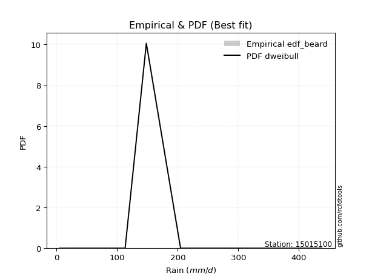</img>

</div>


### 5. Empirical - EDF Chegodayev (1955)

The Chegodayev formula is an empirical plotting position formula used in hydrological frequency analysis to estimate the exceedance probability or return period of a specific event from a set of observed data. It is primarily used for plotting observed data points on probability paper to fit a theoretical distribution, particularly for analyzing extreme events like maximum flood flows or rainfall intensities. The constant _b_ value in the generalized plotting position formula is 0.3.

<div align="center">


$P=(m-b)/(n+1-2b)$


</div>


**5.1. Empirical values**

<div align="center">

|                | 0                   | 1                   | 2              | 3                  | 4                  |
|:---------------|:--------------------|:--------------------|:---------------|:-------------------|:-------------------|
| date           | 2023                | 2021                | 2025           | 2022               | 2024               |
| x              | 5.1                 | 113.2               | 148.2          | 204.7              | 438.0              |
| m              | 1                   | 2                   | 3              | 4                  | 5                  |
| empirical_dist | edf_chegodayev      | edf_chegodayev      | edf_chegodayev | edf_chegodayev     | edf_chegodayev     |
| empirical      | 0.12962962962962962 | 0.31481481481481477 | 0.5            | 0.6851851851851851 | 0.8703703703703703 |
| empirical_tr   | 1.148936170212766   | 1.4594594594594594  | 2.0            | 3.1764705882352935 | 7.714285714285713  |

</div>


**5.2. Kolmogorov-Smirnov fit test (sorted by Δ)**


<div align="center">

|                | 0                   | 1                   | 2                   | 3                   | 4                   | 5                   | 6                   | 7                   | 8                  | 9                   | 10                  | 11                  | 12                  | 13                 | 14                 | 15                  | 16                  | 17                  | 18                  | 19                  | 20                  | 21                  | 22                  | 23                  | 24                  | 25                  | 26                  | 27                  | 28                    | 29                 | 30                  | 31                  | 32                  | 33                  | 34                  | 35                 | 36                  | 37                  | 38                  | 39                  | 40                 | 41                  | 42                  | 43                  | 44                 | 45                  | 46                  | 47                  | 48                  | 49                 | 50                  | 51                  | 52                 | 53                  | 54                  | 55                 | 56                  | 57                 | 58                 | 59                 | 60                  | 61                 | 62                  | 63                 | 64                  | 65                 | 66                  | 67                  | 68                  | 69                  | 70                 | 71                 | 72                 | 73                 | 74                  | 75                  | 76                  | 77                 | 78                 | 79                  | 80                 | 81                 | 82                  | 83                  | 84                 | 85                 | 86                 | 87                 | 88                 | 89                 |
|:---------------|:--------------------|:--------------------|:--------------------|:--------------------|:--------------------|:--------------------|:--------------------|:--------------------|:-------------------|:--------------------|:--------------------|:--------------------|:--------------------|:-------------------|:-------------------|:--------------------|:--------------------|:--------------------|:--------------------|:--------------------|:--------------------|:--------------------|:--------------------|:--------------------|:--------------------|:--------------------|:--------------------|:--------------------|:----------------------|:-------------------|:--------------------|:--------------------|:--------------------|:--------------------|:--------------------|:-------------------|:--------------------|:--------------------|:--------------------|:--------------------|:-------------------|:--------------------|:--------------------|:--------------------|:-------------------|:--------------------|:--------------------|:--------------------|:--------------------|:-------------------|:--------------------|:--------------------|:-------------------|:--------------------|:--------------------|:-------------------|:--------------------|:-------------------|:-------------------|:-------------------|:--------------------|:-------------------|:--------------------|:-------------------|:--------------------|:-------------------|:--------------------|:--------------------|:--------------------|:--------------------|:-------------------|:-------------------|:-------------------|:-------------------|:--------------------|:--------------------|:--------------------|:-------------------|:-------------------|:--------------------|:-------------------|:-------------------|:--------------------|:--------------------|:-------------------|:-------------------|:-------------------|:-------------------|:-------------------|:-------------------|
| station        | 15015100            | 15015100            | 15015100            | 15015100            | 15015100            | 15015100            | 15015100            | 15015100            | 15015100           | 15015100            | 15015100            | 15015100            | 15015100            | 15015100           | 15015100           | 15015100            | 15015100            | 15015100            | 15015100            | 15015100            | 15015100            | 15015100            | 15015100            | 15015100            | 15015100            | 15015100            | 15015100            | 15015100            | 15015100              | 15015100           | 15015100            | 15015100            | 15015100            | 15015100            | 15015100            | 15015100           | 15015100            | 15015100            | 15015100            | 15015100            | 15015100           | 15015100            | 15015100            | 15015100            | 15015100           | 15015100            | 15015100            | 15015100            | 15015100            | 15015100           | 15015100            | 15015100            | 15015100           | 15015100            | 15015100            | 15015100           | 15015100            | 15015100           | 15015100           | 15015100           | 15015100            | 15015100           | 15015100            | 15015100           | 15015100            | 15015100           | 15015100            | 15015100            | 15015100            | 15015100            | 15015100           | 15015100           | 15015100           | 15015100           | 15015100            | 15015100            | 15015100            | 15015100           | 15015100           | 15015100            | 15015100           | 15015100           | 15015100            | 15015100            | 15015100           | 15015100           | 15015100           | 15015100           | 15015100           | 15015100           |
| empirical_dist | edf_chegodayev      | edf_chegodayev      | edf_chegodayev      | edf_chegodayev      | edf_chegodayev      | edf_chegodayev      | edf_chegodayev      | edf_chegodayev      | edf_chegodayev     | edf_chegodayev      | edf_chegodayev      | edf_chegodayev      | edf_chegodayev      | edf_chegodayev     | edf_chegodayev     | edf_chegodayev      | edf_chegodayev      | edf_chegodayev      | edf_chegodayev      | edf_chegodayev      | edf_chegodayev      | edf_chegodayev      | edf_chegodayev      | edf_chegodayev      | edf_chegodayev      | edf_chegodayev      | edf_chegodayev      | edf_chegodayev      | edf_chegodayev        | edf_chegodayev     | edf_chegodayev      | edf_chegodayev      | edf_chegodayev      | edf_chegodayev      | edf_chegodayev      | edf_chegodayev     | edf_chegodayev      | edf_chegodayev      | edf_chegodayev      | edf_chegodayev      | edf_chegodayev     | edf_chegodayev      | edf_chegodayev      | edf_chegodayev      | edf_chegodayev     | edf_chegodayev      | edf_chegodayev      | edf_chegodayev      | edf_chegodayev      | edf_chegodayev     | edf_chegodayev      | edf_chegodayev      | edf_chegodayev     | edf_chegodayev      | edf_chegodayev      | edf_chegodayev     | edf_chegodayev      | edf_chegodayev     | edf_chegodayev     | edf_chegodayev     | edf_chegodayev      | edf_chegodayev     | edf_chegodayev      | edf_chegodayev     | edf_chegodayev      | edf_chegodayev     | edf_chegodayev      | edf_chegodayev      | edf_chegodayev      | edf_chegodayev      | edf_chegodayev     | edf_chegodayev     | edf_chegodayev     | edf_chegodayev     | edf_chegodayev      | edf_chegodayev      | edf_chegodayev      | edf_chegodayev     | edf_chegodayev     | edf_chegodayev      | edf_chegodayev     | edf_chegodayev     | edf_chegodayev      | edf_chegodayev      | edf_chegodayev     | edf_chegodayev     | edf_chegodayev     | edf_chegodayev     | edf_chegodayev     | edf_chegodayev     |
| p_dist         | exponnorm           | invgamma            | johnsonsu           | gumbel_r            | fisk                | pearson3            | invgauss            | genlogistic         | kstwobign          | laplace_asymmetric  | rayleigh            | halfnorm            | moyal               | maxwell            | rice               | logjohnsonsu        | logistic            | hypsecant           | t                   | norm                | truncnorm           | logmielke           | mielke              | logloggamma         | gompertz            | wald                | gibrat              | ncf                 | loglaplace_asymmetric | laplace            | expon               | genexpon            | logfisk             | logpearson3         | betaprime           | loggumbel_l        | loggompertz         | f                   | gumbel_l            | logfatiguelife      | logexponnorm       | logcrystalball      | lognorm             | lognorm             | logt               | lognct              | logf                | loggamma            | loggamma            | loglogistic        | logrice             | loginvgamma         | logerlang          | loghypsecant        | logbetaprime        | logalpha           | loginvweibull       | loglaplace         | logmaxwell         | logncf             | loginvgauss         | lograyleigh        | lognakagami         | logkstwobign       | loggenexpon         | loghalfnorm        | loggumbel_r         | nakagami            | logmoyal            | loghalflogistic     | logchi2            | nct                | logexpon           | pareto             | loglognorm          | crystalball         | weibull_min         | logpareto          | logwald            | invweibull          | loggibrat          | logweibull_min     | erlang              | gamma               | fatiguelife        | alpha              | logtruncnorm       | halflogistic       | chi2               | loggenlogistic     |
| delta          | 0.06851145463240696 | 0.07084928657947584 | 0.07393146955224716 | 0.07417501633024548 | 0.07470104161843759 | 0.07633291159785693 | 0.07665292176838057 | 0.07689878871993061 | 0.0784456293679322 | 0.08236166802842482 | 0.08311941034274284 | 0.08467330738955889 | 0.09186246041905358 | 0.0924994317379203 | 0.0951425218460289 | 0.10492614656991417 | 0.11353657341077494 | 0.11451208651389133 | 0.12176034813801095 | 0.12197911093544445 | 0.12197914500873219 | 0.12269301223476459 | 0.12358778951827665 | 0.12959191869587083 | 0.12962962959108143 | 0.12962962962962962 | 0.12962962962962962 | 0.13483354665849873 | 0.1353900047727275    | 0.1409370215904442 | 0.14272083360262855 | 0.14296173449467908 | 0.15108640489526592 | 0.15415013328942118 | 0.15678518685449466 | 0.1637958163130615 | 0.16981031540025238 | 0.17620527852947448 | 0.18748595569153914 | 0.23039606057044648 | 0.2312317654320436 | 0.23123246342668313 | 0.23123246344738835 | 0.23123246344738835 | 0.2312325636153575 | 0.23128684795161625 | 0.23185574183123225 | 0.23622573195378904 | 0.23622573195378904 | 0.2374490676650246 | 0.23860041139261445 | 0.24120547266684222 | 0.2420106882148546 | 0.24270993320102552 | 0.24622129721732822 | 0.2575086081054614 | 0.26023635168008863 | 0.2606433301026472 | 0.2618798186342399 | 0.2627346496802131 | 0.26394379541194857 | 0.2717500340947282 | 0.28689102921157134 | 0.2919452009974356 | 0.29792101866697895 | 0.2995814781731926 | 0.30147208054514596 | 0.31481481347172807 | 0.32643435811125043 | 0.32673294320377777 | 0.3295151164234599 | 0.3310053548012325 | 0.3389233738989609 | 0.3529769542715194 | 0.37297558141904774 | 0.38068380032486715 | 0.38397405125846584 | 0.386970146825631  | 0.3956996002918096 | 0.42180746035374106 | 0.4244849300958674 | 0.4567836249056687 | 0.46005851148736365 | 0.46681855427739727 | 0.4795812134738221 | 0.6045756970208659 | 0.6184452473657595 | 0.6504835123968309 | 0.6851851841752372 | 0.6851851851851851 |
| deltao         | 0.5865427407550001  | 0.5865427407550001  | 0.5865427407550001  | 0.5865427407550001  | 0.5865427407550001  | 0.5865427407550001  | 0.5865427407550001  | 0.5865427407550001  | 0.5865427407550001 | 0.5865427407550001  | 0.5865427407550001  | 0.5865427407550001  | 0.5865427407550001  | 0.5865427407550001 | 0.5865427407550001 | 0.5865427407550001  | 0.5865427407550001  | 0.5865427407550001  | 0.5865427407550001  | 0.5865427407550001  | 0.5865427407550001  | 0.5865427407550001  | 0.5865427407550001  | 0.5865427407550001  | 0.5865427407550001  | 0.5865427407550001  | 0.5865427407550001  | 0.5865427407550001  | 0.5865427407550001    | 0.5865427407550001 | 0.5865427407550001  | 0.5865427407550001  | 0.5865427407550001  | 0.5865427407550001  | 0.5865427407550001  | 0.5865427407550001 | 0.5865427407550001  | 0.5865427407550001  | 0.5865427407550001  | 0.5865427407550001  | 0.5865427407550001 | 0.5865427407550001  | 0.5865427407550001  | 0.5865427407550001  | 0.5865427407550001 | 0.5865427407550001  | 0.5865427407550001  | 0.5865427407550001  | 0.5865427407550001  | 0.5865427407550001 | 0.5865427407550001  | 0.5865427407550001  | 0.5865427407550001 | 0.5865427407550001  | 0.5865427407550001  | 0.5865427407550001 | 0.5865427407550001  | 0.5865427407550001 | 0.5865427407550001 | 0.5865427407550001 | 0.5865427407550001  | 0.5865427407550001 | 0.5865427407550001  | 0.5865427407550001 | 0.5865427407550001  | 0.5865427407550001 | 0.5865427407550001  | 0.5865427407550001  | 0.5865427407550001  | 0.5865427407550001  | 0.5865427407550001 | 0.5865427407550001 | 0.5865427407550001 | 0.5865427407550001 | 0.5865427407550001  | 0.5865427407550001  | 0.5865427407550001  | 0.5865427407550001 | 0.5865427407550001 | 0.5865427407550001  | 0.5865427407550001 | 0.5865427407550001 | 0.5865427407550001  | 0.5865427407550001  | 0.5865427407550001 | 0.5865427407550001 | 0.5865427407550001 | 0.5865427407550001 | 0.5865427407550001 | 0.5865427407550001 |
| eval           | Δo > Δ              | Δo > Δ              | Δo > Δ              | Δo > Δ              | Δo > Δ              | Δo > Δ              | Δo > Δ              | Δo > Δ              | Δo > Δ             | Δo > Δ              | Δo > Δ              | Δo > Δ              | Δo > Δ              | Δo > Δ             | Δo > Δ             | Δo > Δ              | Δo > Δ              | Δo > Δ              | Δo > Δ              | Δo > Δ              | Δo > Δ              | Δo > Δ              | Δo > Δ              | Δo > Δ              | Δo > Δ              | Δo > Δ              | Δo > Δ              | Δo > Δ              | Δo > Δ                | Δo > Δ             | Δo > Δ              | Δo > Δ              | Δo > Δ              | Δo > Δ              | Δo > Δ              | Δo > Δ             | Δo > Δ              | Δo > Δ              | Δo > Δ              | Δo > Δ              | Δo > Δ             | Δo > Δ              | Δo > Δ              | Δo > Δ              | Δo > Δ             | Δo > Δ              | Δo > Δ              | Δo > Δ              | Δo > Δ              | Δo > Δ             | Δo > Δ              | Δo > Δ              | Δo > Δ             | Δo > Δ              | Δo > Δ              | Δo > Δ             | Δo > Δ              | Δo > Δ             | Δo > Δ             | Δo > Δ             | Δo > Δ              | Δo > Δ             | Δo > Δ              | Δo > Δ             | Δo > Δ              | Δo > Δ             | Δo > Δ              | Δo > Δ              | Δo > Δ              | Δo > Δ              | Δo > Δ             | Δo > Δ             | Δo > Δ             | Δo > Δ             | Δo > Δ              | Δo > Δ              | Δo > Δ              | Δo > Δ             | Δo > Δ             | Δo > Δ              | Δo > Δ             | Δo > Δ             | Δo > Δ              | Δo > Δ              | Δo > Δ             | Δo <= Δ            | Δo <= Δ            | Δo <= Δ            | Δo <= Δ            | Δo <= Δ            |
| fit            | 1                   | 1                   | 1                   | 1                   | 1                   | 1                   | 1                   | 1                   | 1                  | 1                   | 1                   | 1                   | 1                   | 1                  | 1                  | 1                   | 1                   | 1                   | 1                   | 1                   | 1                   | 1                   | 1                   | 1                   | 1                   | 1                   | 1                   | 1                   | 1                     | 1                  | 1                   | 1                   | 1                   | 1                   | 1                   | 1                  | 1                   | 1                   | 1                   | 1                   | 1                  | 1                   | 1                   | 1                   | 1                  | 1                   | 1                   | 1                   | 1                   | 1                  | 1                   | 1                   | 1                  | 1                   | 1                   | 1                  | 1                   | 1                  | 1                  | 1                  | 1                   | 1                  | 1                   | 1                  | 1                   | 1                  | 1                   | 1                   | 1                   | 1                   | 1                  | 1                  | 1                  | 1                  | 1                   | 1                   | 1                   | 1                  | 1                  | 1                   | 1                  | 1                  | 1                   | 1                   | 1                  | 0                  | 0                  | 0                  | 0                  | 0                  |
| n              | 5                   | 5                   | 5                   | 5                   | 5                   | 5                   | 5                   | 5                   | 5                  | 5                   | 5                   | 5                   | 5                   | 5                  | 5                  | 5                   | 5                   | 5                   | 5                   | 5                   | 5                   | 5                   | 5                   | 5                   | 5                   | 5                   | 5                   | 5                   | 5                     | 5                  | 5                   | 5                   | 5                   | 5                   | 5                   | 5                  | 5                   | 5                   | 5                   | 5                   | 5                  | 5                   | 5                   | 5                   | 5                  | 5                   | 5                   | 5                   | 5                   | 5                  | 5                   | 5                   | 5                  | 5                   | 5                   | 5                  | 5                   | 5                  | 5                  | 5                  | 5                   | 5                  | 5                   | 5                  | 5                   | 5                  | 5                   | 5                   | 5                   | 5                   | 5                  | 5                  | 5                  | 5                  | 5                   | 5                   | 5                   | 5                  | 5                  | 5                   | 5                  | 5                  | 5                   | 5                   | 5                  | 5                  | 5                  | 5                  | 5                  | 5                  |
| best_fit       | 1                   | 0                   | 0                   | 0                   | 0                   | 0                   | 0                   | 0                   | 0                  | 0                   | 0                   | 0                   | 0                   | 0                  | 0                  | 0                   | 0                   | 0                   | 0                   | 0                   | 0                   | 0                   | 0                   | 0                   | 0                   | 0                   | 0                   | 0                   | 0                     | 0                  | 0                   | 0                   | 0                   | 0                   | 0                   | 0                  | 0                   | 0                   | 0                   | 0                   | 0                  | 0                   | 0                   | 0                   | 0                  | 0                   | 0                   | 0                   | 0                   | 0                  | 0                   | 0                   | 0                  | 0                   | 0                   | 0                  | 0                   | 0                  | 0                  | 0                  | 0                   | 0                  | 0                   | 0                  | 0                   | 0                  | 0                   | 0                   | 0                   | 0                   | 0                  | 0                  | 0                  | 0                  | 0                   | 0                   | 0                   | 0                  | 0                  | 0                   | 0                  | 0                  | 0                   | 0                   | 0                  | 0                  | 0                  | 0                  | 0                  | 0                  |
| best_fit_sort  | 1                   | 2                   | 3                   | 4                   | 5                   | 6                   | 7                   | 8                   | 9                  | 10                  | 11                  | 12                  | 13                  | 14                 | 15                 | 16                  | 17                  | 18                  | 19                  | 20                  | 21                  | 22                  | 23                  | 24                  | 25                  | 26                  | 27                  | 28                  | 29                    | 30                 | 31                  | 32                  | 33                  | 34                  | 35                  | 36                 | 37                  | 38                  | 39                  | 40                  | 41                 | 42                  | 43                  | 44                  | 45                 | 46                  | 47                  | 48                  | 49                  | 50                 | 51                  | 52                  | 53                 | 54                  | 55                  | 56                 | 57                  | 58                 | 59                 | 60                 | 61                  | 62                 | 63                  | 64                 | 65                  | 66                 | 67                  | 68                  | 69                  | 70                  | 71                 | 72                 | 73                 | 74                 | 75                  | 76                  | 77                  | 78                 | 79                 | 80                  | 81                 | 82                 | 83                  | 84                  | 85                 | 86                 | 87                 | 88                 | 89                 | 90                 |

</div>


<div align="center">

</img>

</div>


**5.3. Best fit**

<div align="center">

|   id |   station | empirical_dist   | p_dist    |     delta |   deltao | eval   |   fit |   n |   best_fit |   best_fit_sort |
|-----:|----------:|:-----------------|:----------|----------:|---------:|:-------|------:|----:|-----------:|----------------:|
|    0 |  15015100 | edf_chegodayev   | exponnorm | 0.0685115 | 0.586543 | Δo > Δ |     1 |   5 |          1 |               1 |

</div>


<div align="center">

</img></img>

</div>


### 6. Empirical - EDF Blom (1958)

The Blom formula is a specific "plotting position" formula used in hydrology and statistical analysis to estimate the empirical cumulative probability (or non-exceedance probability) of a data series. It is particularly recommended for data that are approximately normally distributed. The constant _a_ is set to 0.375 (or 3/8).

<div align="center">


$P=(m-a)/(n+1-2a)$


</div>


**6.1. Empirical values**

<div align="center">

|                | 0                   | 1                   | 2        | 3                  | 4                  |
|:---------------|:--------------------|:--------------------|:---------|:-------------------|:-------------------|
| date           | 2023                | 2021                | 2025     | 2022               | 2024               |
| x              | 5.1                 | 113.2               | 148.2    | 204.7              | 438.0              |
| m              | 1                   | 2                   | 3        | 4                  | 5                  |
| empirical_dist | edf_blom            | edf_blom            | edf_blom | edf_blom           | edf_blom           |
| empirical      | 0.11904761904761904 | 0.30952380952380953 | 0.5      | 0.6904761904761905 | 0.8809523809523809 |
| empirical_tr   | 1.135135135135135   | 1.4482758620689655  | 2.0      | 3.230769230769231  | 8.399999999999999  |

</div>


**6.2. Kolmogorov-Smirnov fit test (sorted by Δ)**


<div align="center">

|                | 0                   | 1                  | 2                   | 3                   | 4                   | 5                   | 6                   | 7                   | 8                   | 9                  | 10                 | 11                  | 12                  | 13                  | 14                  | 15                  | 16                 | 17                  | 18                  | 19                  | 20                  | 21                  | 22                  | 23                  | 24                 | 25                 | 26                  | 27                  | 28                    | 29                 | 30                  | 31                  | 32                  | 33                 | 34                 | 35                  | 36                 | 37                  | 38                 | 39                  | 40                  | 41                  | 42                  | 43                  | 44                  | 45                  | 46                 | 47                  | 48                  | 49                  | 50                 | 51                  | 52                  | 53                  | 54                  | 55                 | 56                  | 57                 | 58                  | 59                  | 60                 | 61                  | 62                 | 63                  | 64                 | 65                 | 66                 | 67                  | 68                  | 69                 | 70                 | 71                  | 72                 | 73                  | 74                 | 75                 | 76                 | 77                  | 78                  | 79                  | 80                  | 81                  | 82                 | 83                 | 84                  | 85                 | 86                 | 87                 | 88                 | 89                 |
|:---------------|:--------------------|:-------------------|:--------------------|:--------------------|:--------------------|:--------------------|:--------------------|:--------------------|:--------------------|:-------------------|:-------------------|:--------------------|:--------------------|:--------------------|:--------------------|:--------------------|:-------------------|:--------------------|:--------------------|:--------------------|:--------------------|:--------------------|:--------------------|:--------------------|:-------------------|:-------------------|:--------------------|:--------------------|:----------------------|:-------------------|:--------------------|:--------------------|:--------------------|:-------------------|:-------------------|:--------------------|:-------------------|:--------------------|:-------------------|:--------------------|:--------------------|:--------------------|:--------------------|:--------------------|:--------------------|:--------------------|:-------------------|:--------------------|:--------------------|:--------------------|:-------------------|:--------------------|:--------------------|:--------------------|:--------------------|:-------------------|:--------------------|:-------------------|:--------------------|:--------------------|:-------------------|:--------------------|:-------------------|:--------------------|:-------------------|:-------------------|:-------------------|:--------------------|:--------------------|:-------------------|:-------------------|:--------------------|:-------------------|:--------------------|:-------------------|:-------------------|:-------------------|:--------------------|:--------------------|:--------------------|:--------------------|:--------------------|:-------------------|:-------------------|:--------------------|:-------------------|:-------------------|:-------------------|:-------------------|:-------------------|
| station        | 15015100            | 15015100           | 15015100            | 15015100            | 15015100            | 15015100            | 15015100            | 15015100            | 15015100            | 15015100           | 15015100           | 15015100            | 15015100            | 15015100            | 15015100            | 15015100            | 15015100           | 15015100            | 15015100            | 15015100            | 15015100            | 15015100            | 15015100            | 15015100            | 15015100           | 15015100           | 15015100            | 15015100            | 15015100              | 15015100           | 15015100            | 15015100            | 15015100            | 15015100           | 15015100           | 15015100            | 15015100           | 15015100            | 15015100           | 15015100            | 15015100            | 15015100            | 15015100            | 15015100            | 15015100            | 15015100            | 15015100           | 15015100            | 15015100            | 15015100            | 15015100           | 15015100            | 15015100            | 15015100            | 15015100            | 15015100           | 15015100            | 15015100           | 15015100            | 15015100            | 15015100           | 15015100            | 15015100           | 15015100            | 15015100           | 15015100           | 15015100           | 15015100            | 15015100            | 15015100           | 15015100           | 15015100            | 15015100           | 15015100            | 15015100           | 15015100           | 15015100           | 15015100            | 15015100            | 15015100            | 15015100            | 15015100            | 15015100           | 15015100           | 15015100            | 15015100           | 15015100           | 15015100           | 15015100           | 15015100           |
| empirical_dist | edf_blom            | edf_blom           | edf_blom            | edf_blom            | edf_blom            | edf_blom            | edf_blom            | edf_blom            | edf_blom            | edf_blom           | edf_blom           | edf_blom            | edf_blom            | edf_blom            | edf_blom            | edf_blom            | edf_blom           | edf_blom            | edf_blom            | edf_blom            | edf_blom            | edf_blom            | edf_blom            | edf_blom            | edf_blom           | edf_blom           | edf_blom            | edf_blom            | edf_blom              | edf_blom           | edf_blom            | edf_blom            | edf_blom            | edf_blom           | edf_blom           | edf_blom            | edf_blom           | edf_blom            | edf_blom           | edf_blom            | edf_blom            | edf_blom            | edf_blom            | edf_blom            | edf_blom            | edf_blom            | edf_blom           | edf_blom            | edf_blom            | edf_blom            | edf_blom           | edf_blom            | edf_blom            | edf_blom            | edf_blom            | edf_blom           | edf_blom            | edf_blom           | edf_blom            | edf_blom            | edf_blom           | edf_blom            | edf_blom           | edf_blom            | edf_blom           | edf_blom           | edf_blom           | edf_blom            | edf_blom            | edf_blom           | edf_blom           | edf_blom            | edf_blom           | edf_blom            | edf_blom           | edf_blom           | edf_blom           | edf_blom            | edf_blom            | edf_blom            | edf_blom            | edf_blom            | edf_blom           | edf_blom           | edf_blom            | edf_blom           | edf_blom           | edf_blom           | edf_blom           | edf_blom           |
| p_dist         | exponnorm           | gumbel_r           | fisk                | genlogistic         | invgamma            | kstwobign           | johnsonsu           | halfnorm            | pearson3            | moyal              | invgauss           | laplace_asymmetric  | rayleigh            | maxwell             | rice                | logjohnsonsu        | logmielke          | mielke              | hypsecant           | logistic            | logloggamma         | gompertz            | gibrat              | wald                | t                  | norm               | truncnorm           | ncf                 | loglaplace_asymmetric | laplace            | expon               | genexpon            | logfisk             | logpearson3        | betaprime          | loggumbel_l         | loggompertz        | f                   | gumbel_l           | logfatiguelife      | logexponnorm        | logcrystalball      | lognorm             | lognorm             | logt                | lognct              | logf               | loggamma            | loggamma            | loglogistic         | logrice            | loginvgamma         | logerlang           | loghypsecant        | logbetaprime        | logalpha           | loginvweibull       | loglaplace         | logmaxwell          | logncf              | loginvgauss        | lograyleigh         | lognakagami        | logkstwobign        | loggenexpon        | loghalfnorm        | loggumbel_r        | nakagami            | logmoyal            | loghalflogistic    | logchi2            | nct                 | logexpon           | pareto              | loglognorm         | crystalball        | weibull_min        | logpareto           | logwald             | loggibrat           | invweibull          | logweibull_min      | erlang             | gamma              | fatiguelife         | alpha              | logtruncnorm       | halflogistic       | chi2               | loggenlogistic     |
| delta          | 0.05792944405039638 | 0.0635930057482349 | 0.06411903103642701 | 0.06631677813792003 | 0.06712861967732692 | 0.06786361878592162 | 0.07608557288181189 | 0.08035911967363635 | 0.08067084845240047 | 0.081280449837043  | 0.0819439270593858 | 0.08236166802842482 | 0.08841041563374819 | 0.09779043702892565 | 0.10043352713703424 | 0.11021715186091952 | 0.112111001652754  | 0.11300577893626607 | 0.11451208651389133 | 0.11882757870178029 | 0.11900990811386025 | 0.11904761900907083 | 0.11904761904761904 | 0.11904761904761904 | 0.1270513534290163 | 0.1272701162264498 | 0.12727015029973754 | 0.14012455194950396 | 0.14068101006373274   | 0.1409370215904442 | 0.14801183889363378 | 0.14825273978568432 | 0.15637741018627116 | 0.1594411385804264 | 0.1620761921454999 | 0.16908682160406674 | 0.1751013206912576 | 0.18149628382047972 | 0.1927769609825445 | 0.23568706586145172 | 0.23652277072304884 | 0.23652346871768837 | 0.23652346873839358 | 0.23652346873839358 | 0.23652356890636272 | 0.23657785324262148 | 0.2371467471222375 | 0.24151673724479428 | 0.24151673724479428 | 0.24274007295602984 | 0.2438914166836197 | 0.24649647795784746 | 0.24730169350585984 | 0.24800093849203075 | 0.25151230250833345 | 0.2627996133964666 | 0.26552735697109386 | 0.2659343353936524 | 0.26717082392524516 | 0.26802565497121833 | 0.2692348007029538 | 0.27704103938573343 | 0.2816000239205661 | 0.29723620628844083 | 0.3032120239579842 | 0.3048724834641978 | 0.3067630858361512 | 0.30952380818072284 | 0.33172536340225567 | 0.332023948494783  | 0.3348061217144651 | 0.33629636009223773 | 0.3442143791899661 | 0.35826795956252466 | 0.378266586710053  | 0.3859748056158724 | 0.3892650565494711 | 0.39226115211663626 | 0.40099060558281485 | 0.42977593538687264 | 0.43238947093575164 | 0.46207463019667394 | 0.4653495167783689 | 0.4721095595684025 | 0.48487221876482733 | 0.6098667023118711 | 0.6237362526567647 | 0.6557745176878362 | 0.6904761894662425 | 0.6904761904761905 |
| deltao         | 0.5865427407550001  | 0.5865427407550001 | 0.5865427407550001  | 0.5865427407550001  | 0.5865427407550001  | 0.5865427407550001  | 0.5865427407550001  | 0.5865427407550001  | 0.5865427407550001  | 0.5865427407550001 | 0.5865427407550001 | 0.5865427407550001  | 0.5865427407550001  | 0.5865427407550001  | 0.5865427407550001  | 0.5865427407550001  | 0.5865427407550001 | 0.5865427407550001  | 0.5865427407550001  | 0.5865427407550001  | 0.5865427407550001  | 0.5865427407550001  | 0.5865427407550001  | 0.5865427407550001  | 0.5865427407550001 | 0.5865427407550001 | 0.5865427407550001  | 0.5865427407550001  | 0.5865427407550001    | 0.5865427407550001 | 0.5865427407550001  | 0.5865427407550001  | 0.5865427407550001  | 0.5865427407550001 | 0.5865427407550001 | 0.5865427407550001  | 0.5865427407550001 | 0.5865427407550001  | 0.5865427407550001 | 0.5865427407550001  | 0.5865427407550001  | 0.5865427407550001  | 0.5865427407550001  | 0.5865427407550001  | 0.5865427407550001  | 0.5865427407550001  | 0.5865427407550001 | 0.5865427407550001  | 0.5865427407550001  | 0.5865427407550001  | 0.5865427407550001 | 0.5865427407550001  | 0.5865427407550001  | 0.5865427407550001  | 0.5865427407550001  | 0.5865427407550001 | 0.5865427407550001  | 0.5865427407550001 | 0.5865427407550001  | 0.5865427407550001  | 0.5865427407550001 | 0.5865427407550001  | 0.5865427407550001 | 0.5865427407550001  | 0.5865427407550001 | 0.5865427407550001 | 0.5865427407550001 | 0.5865427407550001  | 0.5865427407550001  | 0.5865427407550001 | 0.5865427407550001 | 0.5865427407550001  | 0.5865427407550001 | 0.5865427407550001  | 0.5865427407550001 | 0.5865427407550001 | 0.5865427407550001 | 0.5865427407550001  | 0.5865427407550001  | 0.5865427407550001  | 0.5865427407550001  | 0.5865427407550001  | 0.5865427407550001 | 0.5865427407550001 | 0.5865427407550001  | 0.5865427407550001 | 0.5865427407550001 | 0.5865427407550001 | 0.5865427407550001 | 0.5865427407550001 |
| eval           | Δo > Δ              | Δo > Δ             | Δo > Δ              | Δo > Δ              | Δo > Δ              | Δo > Δ              | Δo > Δ              | Δo > Δ              | Δo > Δ              | Δo > Δ             | Δo > Δ             | Δo > Δ              | Δo > Δ              | Δo > Δ              | Δo > Δ              | Δo > Δ              | Δo > Δ             | Δo > Δ              | Δo > Δ              | Δo > Δ              | Δo > Δ              | Δo > Δ              | Δo > Δ              | Δo > Δ              | Δo > Δ             | Δo > Δ             | Δo > Δ              | Δo > Δ              | Δo > Δ                | Δo > Δ             | Δo > Δ              | Δo > Δ              | Δo > Δ              | Δo > Δ             | Δo > Δ             | Δo > Δ              | Δo > Δ             | Δo > Δ              | Δo > Δ             | Δo > Δ              | Δo > Δ              | Δo > Δ              | Δo > Δ              | Δo > Δ              | Δo > Δ              | Δo > Δ              | Δo > Δ             | Δo > Δ              | Δo > Δ              | Δo > Δ              | Δo > Δ             | Δo > Δ              | Δo > Δ              | Δo > Δ              | Δo > Δ              | Δo > Δ             | Δo > Δ              | Δo > Δ             | Δo > Δ              | Δo > Δ              | Δo > Δ             | Δo > Δ              | Δo > Δ             | Δo > Δ              | Δo > Δ             | Δo > Δ             | Δo > Δ             | Δo > Δ              | Δo > Δ              | Δo > Δ             | Δo > Δ             | Δo > Δ              | Δo > Δ             | Δo > Δ              | Δo > Δ             | Δo > Δ             | Δo > Δ             | Δo > Δ              | Δo > Δ              | Δo > Δ              | Δo > Δ              | Δo > Δ              | Δo > Δ             | Δo > Δ             | Δo > Δ              | Δo <= Δ            | Δo <= Δ            | Δo <= Δ            | Δo <= Δ            | Δo <= Δ            |
| fit            | 1                   | 1                  | 1                   | 1                   | 1                   | 1                   | 1                   | 1                   | 1                   | 1                  | 1                  | 1                   | 1                   | 1                   | 1                   | 1                   | 1                  | 1                   | 1                   | 1                   | 1                   | 1                   | 1                   | 1                   | 1                  | 1                  | 1                   | 1                   | 1                     | 1                  | 1                   | 1                   | 1                   | 1                  | 1                  | 1                   | 1                  | 1                   | 1                  | 1                   | 1                   | 1                   | 1                   | 1                   | 1                   | 1                   | 1                  | 1                   | 1                   | 1                   | 1                  | 1                   | 1                   | 1                   | 1                   | 1                  | 1                   | 1                  | 1                   | 1                   | 1                  | 1                   | 1                  | 1                   | 1                  | 1                  | 1                  | 1                   | 1                   | 1                  | 1                  | 1                   | 1                  | 1                   | 1                  | 1                  | 1                  | 1                   | 1                   | 1                   | 1                   | 1                   | 1                  | 1                  | 1                   | 0                  | 0                  | 0                  | 0                  | 0                  |
| n              | 5                   | 5                  | 5                   | 5                   | 5                   | 5                   | 5                   | 5                   | 5                   | 5                  | 5                  | 5                   | 5                   | 5                   | 5                   | 5                   | 5                  | 5                   | 5                   | 5                   | 5                   | 5                   | 5                   | 5                   | 5                  | 5                  | 5                   | 5                   | 5                     | 5                  | 5                   | 5                   | 5                   | 5                  | 5                  | 5                   | 5                  | 5                   | 5                  | 5                   | 5                   | 5                   | 5                   | 5                   | 5                   | 5                   | 5                  | 5                   | 5                   | 5                   | 5                  | 5                   | 5                   | 5                   | 5                   | 5                  | 5                   | 5                  | 5                   | 5                   | 5                  | 5                   | 5                  | 5                   | 5                  | 5                  | 5                  | 5                   | 5                   | 5                  | 5                  | 5                   | 5                  | 5                   | 5                  | 5                  | 5                  | 5                   | 5                   | 5                   | 5                   | 5                   | 5                  | 5                  | 5                   | 5                  | 5                  | 5                  | 5                  | 5                  |
| best_fit       | 1                   | 0                  | 0                   | 0                   | 0                   | 0                   | 0                   | 0                   | 0                   | 0                  | 0                  | 0                   | 0                   | 0                   | 0                   | 0                   | 0                  | 0                   | 0                   | 0                   | 0                   | 0                   | 0                   | 0                   | 0                  | 0                  | 0                   | 0                   | 0                     | 0                  | 0                   | 0                   | 0                   | 0                  | 0                  | 0                   | 0                  | 0                   | 0                  | 0                   | 0                   | 0                   | 0                   | 0                   | 0                   | 0                   | 0                  | 0                   | 0                   | 0                   | 0                  | 0                   | 0                   | 0                   | 0                   | 0                  | 0                   | 0                  | 0                   | 0                   | 0                  | 0                   | 0                  | 0                   | 0                  | 0                  | 0                  | 0                   | 0                   | 0                  | 0                  | 0                   | 0                  | 0                   | 0                  | 0                  | 0                  | 0                   | 0                   | 0                   | 0                   | 0                   | 0                  | 0                  | 0                   | 0                  | 0                  | 0                  | 0                  | 0                  |
| best_fit_sort  | 1                   | 2                  | 3                   | 4                   | 5                   | 6                   | 7                   | 8                   | 9                   | 10                 | 11                 | 12                  | 13                  | 14                  | 15                  | 16                  | 17                 | 18                  | 19                  | 20                  | 21                  | 22                  | 23                  | 24                  | 25                 | 26                 | 27                  | 28                  | 29                    | 30                 | 31                  | 32                  | 33                  | 34                 | 35                 | 36                  | 37                 | 38                  | 39                 | 40                  | 41                  | 42                  | 43                  | 44                  | 45                  | 46                  | 47                 | 48                  | 49                  | 50                  | 51                 | 52                  | 53                  | 54                  | 55                  | 56                 | 57                  | 58                 | 59                  | 60                  | 61                 | 62                  | 63                 | 64                  | 65                 | 66                 | 67                 | 68                  | 69                  | 70                 | 71                 | 72                  | 73                 | 74                  | 75                 | 76                 | 77                 | 78                  | 79                  | 80                  | 81                  | 82                  | 83                 | 84                 | 85                  | 86                 | 87                 | 88                 | 89                 | 90                 |

</div>


<div align="center">

</img>

</div>


**6.3. Best fit**

<div align="center">

|   id |   station | empirical_dist   | p_dist    |     delta |   deltao | eval   |   fit |   n |   best_fit |   best_fit_sort |
|-----:|----------:|:-----------------|:----------|----------:|---------:|:-------|------:|----:|-----------:|----------------:|
|    0 |  15015100 | edf_blom         | exponnorm | 0.0579294 | 0.586543 | Δo > Δ |     1 |   5 |          1 |               1 |

</div>


<div align="center">

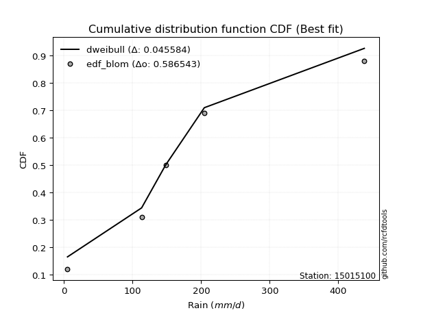</img></img>

</div>


### 7. Empirical - EDF Tukey (1962)

In hydrology, the Tukey formula is used as a plotting position formula to estimate the empirical probability or frequency of a flood event (or other hydrological data). The formula parameter is given as _c=0.333_ (or 1/3).

<div align="center">


$P=(m-c)/(n+1-2c)$


</div>


**7.1. Empirical values**

<div align="center">

|                | 0                  | 1                  | 2         | 3         | 4         |
|:---------------|:-------------------|:-------------------|:----------|:----------|:----------|
| date           | 2023               | 2021               | 2025      | 2022      | 2024      |
| x              | 5.1                | 113.2              | 148.2     | 204.7     | 438.0     |
| m              | 1                  | 2                  | 3         | 4         | 5         |
| empirical_dist | edf_tukey          | edf_tukey          | edf_tukey | edf_tukey | edf_tukey |
| empirical      | 0.125              | 0.3125             | 0.5       | 0.6875    | 0.875     |
| empirical_tr   | 1.1428571428571428 | 1.4545454545454546 | 2.0       | 3.2       | 8.0       |

</div>


**7.2. Kolmogorov-Smirnov fit test (sorted by Δ)**


<div align="center">

|                | 0                   | 1                   | 2                   | 3                   | 4                   | 5                   | 6                   | 7                  | 8                   | 9                   | 10                  | 11                  | 12                  | 13                  | 14                  | 15                  | 16                  | 17                  | 18                  | 19                 | 20                  | 21                  | 22                  | 23                  | 24                 | 25                 | 26                 | 27                 | 28                    | 29                 | 30                  | 31                  | 32                 | 33                  | 34                  | 35                  | 36                  | 37                  | 38                  | 39                  | 40                  | 41                 | 42                  | 43                  | 44                  | 45                  | 46                  | 47                 | 48                 | 49                  | 50                  | 51                 | 52                  | 53                 | 54                 | 55                  | 56                 | 57                  | 58                 | 59                  | 60                  | 61                  | 62                  | 63                  | 64                 | 65                  | 66                  | 67                 | 68                 | 69                  | 70                  | 71                  | 72                  | 73                 | 74                 | 75                 | 76                 | 77                 | 78                 | 79                 | 80                 | 81                 | 82                 | 83                  | 84                  | 85                 | 86                 | 87                 | 88                 | 89                 |
|:---------------|:--------------------|:--------------------|:--------------------|:--------------------|:--------------------|:--------------------|:--------------------|:-------------------|:--------------------|:--------------------|:--------------------|:--------------------|:--------------------|:--------------------|:--------------------|:--------------------|:--------------------|:--------------------|:--------------------|:-------------------|:--------------------|:--------------------|:--------------------|:--------------------|:-------------------|:-------------------|:-------------------|:-------------------|:----------------------|:-------------------|:--------------------|:--------------------|:-------------------|:--------------------|:--------------------|:--------------------|:--------------------|:--------------------|:--------------------|:--------------------|:--------------------|:-------------------|:--------------------|:--------------------|:--------------------|:--------------------|:--------------------|:-------------------|:-------------------|:--------------------|:--------------------|:-------------------|:--------------------|:-------------------|:-------------------|:--------------------|:-------------------|:--------------------|:-------------------|:--------------------|:--------------------|:--------------------|:--------------------|:--------------------|:-------------------|:--------------------|:--------------------|:-------------------|:-------------------|:--------------------|:--------------------|:--------------------|:--------------------|:-------------------|:-------------------|:-------------------|:-------------------|:-------------------|:-------------------|:-------------------|:-------------------|:-------------------|:-------------------|:--------------------|:--------------------|:-------------------|:-------------------|:-------------------|:-------------------|:-------------------|
| station        | 15015100            | 15015100            | 15015100            | 15015100            | 15015100            | 15015100            | 15015100            | 15015100           | 15015100            | 15015100            | 15015100            | 15015100            | 15015100            | 15015100            | 15015100            | 15015100            | 15015100            | 15015100            | 15015100            | 15015100           | 15015100            | 15015100            | 15015100            | 15015100            | 15015100           | 15015100           | 15015100           | 15015100           | 15015100              | 15015100           | 15015100            | 15015100            | 15015100           | 15015100            | 15015100            | 15015100            | 15015100            | 15015100            | 15015100            | 15015100            | 15015100            | 15015100           | 15015100            | 15015100            | 15015100            | 15015100            | 15015100            | 15015100           | 15015100           | 15015100            | 15015100            | 15015100           | 15015100            | 15015100           | 15015100           | 15015100            | 15015100           | 15015100            | 15015100           | 15015100            | 15015100            | 15015100            | 15015100            | 15015100            | 15015100           | 15015100            | 15015100            | 15015100           | 15015100           | 15015100            | 15015100            | 15015100            | 15015100            | 15015100           | 15015100           | 15015100           | 15015100           | 15015100           | 15015100           | 15015100           | 15015100           | 15015100           | 15015100           | 15015100            | 15015100            | 15015100           | 15015100           | 15015100           | 15015100           | 15015100           |
| empirical_dist | edf_tukey           | edf_tukey           | edf_tukey           | edf_tukey           | edf_tukey           | edf_tukey           | edf_tukey           | edf_tukey          | edf_tukey           | edf_tukey           | edf_tukey           | edf_tukey           | edf_tukey           | edf_tukey           | edf_tukey           | edf_tukey           | edf_tukey           | edf_tukey           | edf_tukey           | edf_tukey          | edf_tukey           | edf_tukey           | edf_tukey           | edf_tukey           | edf_tukey          | edf_tukey          | edf_tukey          | edf_tukey          | edf_tukey             | edf_tukey          | edf_tukey           | edf_tukey           | edf_tukey          | edf_tukey           | edf_tukey           | edf_tukey           | edf_tukey           | edf_tukey           | edf_tukey           | edf_tukey           | edf_tukey           | edf_tukey          | edf_tukey           | edf_tukey           | edf_tukey           | edf_tukey           | edf_tukey           | edf_tukey          | edf_tukey          | edf_tukey           | edf_tukey           | edf_tukey          | edf_tukey           | edf_tukey          | edf_tukey          | edf_tukey           | edf_tukey          | edf_tukey           | edf_tukey          | edf_tukey           | edf_tukey           | edf_tukey           | edf_tukey           | edf_tukey           | edf_tukey          | edf_tukey           | edf_tukey           | edf_tukey          | edf_tukey          | edf_tukey           | edf_tukey           | edf_tukey           | edf_tukey           | edf_tukey          | edf_tukey          | edf_tukey          | edf_tukey          | edf_tukey          | edf_tukey          | edf_tukey          | edf_tukey          | edf_tukey          | edf_tukey          | edf_tukey           | edf_tukey           | edf_tukey          | edf_tukey          | edf_tukey          | edf_tukey          | edf_tukey          |
| p_dist         | exponnorm           | invgamma            | gumbel_r            | fisk                | genlogistic         | johnsonsu           | kstwobign           | pearson3           | invgauss            | halfnorm            | laplace_asymmetric  | rayleigh            | moyal               | maxwell             | rice                | logjohnsonsu        | hypsecant           | logistic            | logmielke           | mielke             | t                   | norm                | truncnorm           | logloggamma         | gompertz           | wald               | gibrat             | ncf                | loglaplace_asymmetric | laplace            | expon               | genexpon            | logfisk            | logpearson3         | betaprime           | loggumbel_l         | loggompertz         | f                   | gumbel_l            | logfatiguelife      | logexponnorm        | logcrystalball     | lognorm             | lognorm             | logt                | lognct              | logf                | loggamma           | loggamma           | loglogistic         | logrice             | loginvgamma        | logerlang           | loghypsecant       | logbetaprime       | logalpha            | loginvweibull      | loglaplace          | logmaxwell         | logncf              | loginvgauss         | lograyleigh         | lognakagami         | logkstwobign        | loggenexpon        | loghalfnorm         | loggumbel_r         | nakagami           | logmoyal           | loghalflogistic     | logchi2             | nct                 | logexpon            | pareto             | loglognorm         | crystalball        | weibull_min        | logpareto          | logwald            | invweibull         | loggibrat          | logweibull_min     | erlang             | gamma               | fatiguelife         | alpha              | logtruncnorm       | halflogistic       | chi2               | loggenlogistic     |
| delta          | 0.06388182500277734 | 0.06621965694984622 | 0.06954538670061583 | 0.07007141198880797 | 0.07226915909030096 | 0.07310938240562143 | 0.07381599973830255 | 0.07769465797621   | 0.07896773658319534 | 0.08004367775992927 | 0.08236166802842482 | 0.08543422515755772 | 0.08723283078942395 | 0.09481424655273518 | 0.09745733666084377 | 0.10724096138472905 | 0.11451208651389133 | 0.11585138822558982 | 0.11806338260513494 | 0.118958159888647  | 0.12407516295282583 | 0.12429392575025933 | 0.12429395982354707 | 0.12496228906624118 | 0.1249999999614518 | 0.125              | 0.125              | 0.1371483614733135 | 0.13770481958754227   | 0.1409370215904442 | 0.14503564841744332 | 0.14527654930949385 | 0.1534012197100807 | 0.15646494810423595 | 0.15910000166930943 | 0.16611063112787627 | 0.17212513021506715 | 0.17852009334428925 | 0.18980077050635402 | 0.23271087538526125 | 0.23354658024685837 | 0.2335472782414979 | 0.23354727826220312 | 0.23354727826220312 | 0.23354737843017226 | 0.23360166276643102 | 0.23417055664604702 | 0.2385405467686038 | 0.2385405467686038 | 0.23976388247983937 | 0.24091522620742922 | 0.243520287481657  | 0.24432550302966938 | 0.2450247480158403 | 0.248536112032143  | 0.25982342292027616 | 0.2625511664949034 | 0.26295814491746194 | 0.2641946334490547 | 0.26504946449502786 | 0.26625861022676334 | 0.27406484890954297 | 0.28457621439675657 | 0.29426001581225036 | 0.3002358334817937 | 0.30189629298800735 | 0.30378689535996073 | 0.3124999986569133 | 0.3287491729260652 | 0.32904775801859254 | 0.33182993123827464 | 0.33332016961604727 | 0.34123818871377565 | 0.3552917690863342 | 0.3752903962338625 | 0.3829986151396819 | 0.3862888660732806 | 0.3892849616404458 | 0.3980144151066244 | 0.4264370899833707 | 0.4267997449106822 | 0.4590984397204835 | 0.4623733263021784 | 0.46913336909221204 | 0.48189602828863687 | 0.6068905118356807 | 0.6207600621805742 | 0.6527983272116458 | 0.687499998990052  | 0.6875             |
| deltao         | 0.5865427407550001  | 0.5865427407550001  | 0.5865427407550001  | 0.5865427407550001  | 0.5865427407550001  | 0.5865427407550001  | 0.5865427407550001  | 0.5865427407550001 | 0.5865427407550001  | 0.5865427407550001  | 0.5865427407550001  | 0.5865427407550001  | 0.5865427407550001  | 0.5865427407550001  | 0.5865427407550001  | 0.5865427407550001  | 0.5865427407550001  | 0.5865427407550001  | 0.5865427407550001  | 0.5865427407550001 | 0.5865427407550001  | 0.5865427407550001  | 0.5865427407550001  | 0.5865427407550001  | 0.5865427407550001 | 0.5865427407550001 | 0.5865427407550001 | 0.5865427407550001 | 0.5865427407550001    | 0.5865427407550001 | 0.5865427407550001  | 0.5865427407550001  | 0.5865427407550001 | 0.5865427407550001  | 0.5865427407550001  | 0.5865427407550001  | 0.5865427407550001  | 0.5865427407550001  | 0.5865427407550001  | 0.5865427407550001  | 0.5865427407550001  | 0.5865427407550001 | 0.5865427407550001  | 0.5865427407550001  | 0.5865427407550001  | 0.5865427407550001  | 0.5865427407550001  | 0.5865427407550001 | 0.5865427407550001 | 0.5865427407550001  | 0.5865427407550001  | 0.5865427407550001 | 0.5865427407550001  | 0.5865427407550001 | 0.5865427407550001 | 0.5865427407550001  | 0.5865427407550001 | 0.5865427407550001  | 0.5865427407550001 | 0.5865427407550001  | 0.5865427407550001  | 0.5865427407550001  | 0.5865427407550001  | 0.5865427407550001  | 0.5865427407550001 | 0.5865427407550001  | 0.5865427407550001  | 0.5865427407550001 | 0.5865427407550001 | 0.5865427407550001  | 0.5865427407550001  | 0.5865427407550001  | 0.5865427407550001  | 0.5865427407550001 | 0.5865427407550001 | 0.5865427407550001 | 0.5865427407550001 | 0.5865427407550001 | 0.5865427407550001 | 0.5865427407550001 | 0.5865427407550001 | 0.5865427407550001 | 0.5865427407550001 | 0.5865427407550001  | 0.5865427407550001  | 0.5865427407550001 | 0.5865427407550001 | 0.5865427407550001 | 0.5865427407550001 | 0.5865427407550001 |
| eval           | Δo > Δ              | Δo > Δ              | Δo > Δ              | Δo > Δ              | Δo > Δ              | Δo > Δ              | Δo > Δ              | Δo > Δ             | Δo > Δ              | Δo > Δ              | Δo > Δ              | Δo > Δ              | Δo > Δ              | Δo > Δ              | Δo > Δ              | Δo > Δ              | Δo > Δ              | Δo > Δ              | Δo > Δ              | Δo > Δ             | Δo > Δ              | Δo > Δ              | Δo > Δ              | Δo > Δ              | Δo > Δ             | Δo > Δ             | Δo > Δ             | Δo > Δ             | Δo > Δ                | Δo > Δ             | Δo > Δ              | Δo > Δ              | Δo > Δ             | Δo > Δ              | Δo > Δ              | Δo > Δ              | Δo > Δ              | Δo > Δ              | Δo > Δ              | Δo > Δ              | Δo > Δ              | Δo > Δ             | Δo > Δ              | Δo > Δ              | Δo > Δ              | Δo > Δ              | Δo > Δ              | Δo > Δ             | Δo > Δ             | Δo > Δ              | Δo > Δ              | Δo > Δ             | Δo > Δ              | Δo > Δ             | Δo > Δ             | Δo > Δ              | Δo > Δ             | Δo > Δ              | Δo > Δ             | Δo > Δ              | Δo > Δ              | Δo > Δ              | Δo > Δ              | Δo > Δ              | Δo > Δ             | Δo > Δ              | Δo > Δ              | Δo > Δ             | Δo > Δ             | Δo > Δ              | Δo > Δ              | Δo > Δ              | Δo > Δ              | Δo > Δ             | Δo > Δ             | Δo > Δ             | Δo > Δ             | Δo > Δ             | Δo > Δ             | Δo > Δ             | Δo > Δ             | Δo > Δ             | Δo > Δ             | Δo > Δ              | Δo > Δ              | Δo <= Δ            | Δo <= Δ            | Δo <= Δ            | Δo <= Δ            | Δo <= Δ            |
| fit            | 1                   | 1                   | 1                   | 1                   | 1                   | 1                   | 1                   | 1                  | 1                   | 1                   | 1                   | 1                   | 1                   | 1                   | 1                   | 1                   | 1                   | 1                   | 1                   | 1                  | 1                   | 1                   | 1                   | 1                   | 1                  | 1                  | 1                  | 1                  | 1                     | 1                  | 1                   | 1                   | 1                  | 1                   | 1                   | 1                   | 1                   | 1                   | 1                   | 1                   | 1                   | 1                  | 1                   | 1                   | 1                   | 1                   | 1                   | 1                  | 1                  | 1                   | 1                   | 1                  | 1                   | 1                  | 1                  | 1                   | 1                  | 1                   | 1                  | 1                   | 1                   | 1                   | 1                   | 1                   | 1                  | 1                   | 1                   | 1                  | 1                  | 1                   | 1                   | 1                   | 1                   | 1                  | 1                  | 1                  | 1                  | 1                  | 1                  | 1                  | 1                  | 1                  | 1                  | 1                   | 1                   | 0                  | 0                  | 0                  | 0                  | 0                  |
| n              | 5                   | 5                   | 5                   | 5                   | 5                   | 5                   | 5                   | 5                  | 5                   | 5                   | 5                   | 5                   | 5                   | 5                   | 5                   | 5                   | 5                   | 5                   | 5                   | 5                  | 5                   | 5                   | 5                   | 5                   | 5                  | 5                  | 5                  | 5                  | 5                     | 5                  | 5                   | 5                   | 5                  | 5                   | 5                   | 5                   | 5                   | 5                   | 5                   | 5                   | 5                   | 5                  | 5                   | 5                   | 5                   | 5                   | 5                   | 5                  | 5                  | 5                   | 5                   | 5                  | 5                   | 5                  | 5                  | 5                   | 5                  | 5                   | 5                  | 5                   | 5                   | 5                   | 5                   | 5                   | 5                  | 5                   | 5                   | 5                  | 5                  | 5                   | 5                   | 5                   | 5                   | 5                  | 5                  | 5                  | 5                  | 5                  | 5                  | 5                  | 5                  | 5                  | 5                  | 5                   | 5                   | 5                  | 5                  | 5                  | 5                  | 5                  |
| best_fit       | 1                   | 0                   | 0                   | 0                   | 0                   | 0                   | 0                   | 0                  | 0                   | 0                   | 0                   | 0                   | 0                   | 0                   | 0                   | 0                   | 0                   | 0                   | 0                   | 0                  | 0                   | 0                   | 0                   | 0                   | 0                  | 0                  | 0                  | 0                  | 0                     | 0                  | 0                   | 0                   | 0                  | 0                   | 0                   | 0                   | 0                   | 0                   | 0                   | 0                   | 0                   | 0                  | 0                   | 0                   | 0                   | 0                   | 0                   | 0                  | 0                  | 0                   | 0                   | 0                  | 0                   | 0                  | 0                  | 0                   | 0                  | 0                   | 0                  | 0                   | 0                   | 0                   | 0                   | 0                   | 0                  | 0                   | 0                   | 0                  | 0                  | 0                   | 0                   | 0                   | 0                   | 0                  | 0                  | 0                  | 0                  | 0                  | 0                  | 0                  | 0                  | 0                  | 0                  | 0                   | 0                   | 0                  | 0                  | 0                  | 0                  | 0                  |
| best_fit_sort  | 1                   | 2                   | 3                   | 4                   | 5                   | 6                   | 7                   | 8                  | 9                   | 10                  | 11                  | 12                  | 13                  | 14                  | 15                  | 16                  | 17                  | 18                  | 19                  | 20                 | 21                  | 22                  | 23                  | 24                  | 25                 | 26                 | 27                 | 28                 | 29                    | 30                 | 31                  | 32                  | 33                 | 34                  | 35                  | 36                  | 37                  | 38                  | 39                  | 40                  | 41                  | 42                 | 43                  | 44                  | 45                  | 46                  | 47                  | 48                 | 49                 | 50                  | 51                  | 52                 | 53                  | 54                 | 55                 | 56                  | 57                 | 58                  | 59                 | 60                  | 61                  | 62                  | 63                  | 64                  | 65                 | 66                  | 67                  | 68                 | 69                 | 70                  | 71                  | 72                  | 73                  | 74                 | 75                 | 76                 | 77                 | 78                 | 79                 | 80                 | 81                 | 82                 | 83                 | 84                  | 85                  | 86                 | 87                 | 88                 | 89                 | 90                 |

</div>


<div align="center">

</img>

</div>


**7.3. Best fit**

<div align="center">

|   id |   station | empirical_dist   | p_dist    |     delta |   deltao | eval   |   fit |   n |   best_fit |   best_fit_sort |
|-----:|----------:|:-----------------|:----------|----------:|---------:|:-------|------:|----:|-----------:|----------------:|
|    0 |  15015100 | edf_tukey        | exponnorm | 0.0638818 | 0.586543 | Δo > Δ |     1 |   5 |          1 |               1 |

</div>


<div align="center">

</img></img>

</div>


### 8. Empirical - EDF Gringorten (1963)

Gringorten plotting position formula is essential for estimating the probability and return periods of extreme events like floods and heavy rainfall. The constant _a=0.44_.

<div align="center">


$P=(m-a)/(n+1-2a)$


</div>


**8.1. Empirical values**

<div align="center">

|                | 0                   | 1                  | 2              | 3                 | 4                  |
|:---------------|:--------------------|:-------------------|:---------------|:------------------|:-------------------|
| date           | 2023                | 2021               | 2025           | 2022              | 2024               |
| x              | 5.1                 | 113.2              | 148.2          | 204.7             | 438.0              |
| m              | 1                   | 2                  | 3              | 4                 | 5                  |
| empirical_dist | edf_gringorten      | edf_gringorten     | edf_gringorten | edf_gringorten    | edf_gringorten     |
| empirical      | 0.10937500000000001 | 0.3046875          | 0.5            | 0.6953125         | 0.8906249999999999 |
| empirical_tr   | 1.1228070175438596  | 1.4382022471910112 | 2.0            | 3.282051282051282 | 9.142857142857133  |

</div>


**8.2. Kolmogorov-Smirnov fit test (sorted by Δ)**


<div align="center">

|                | 0                   | 1                   | 2                   | 3                   | 4                   | 5                   | 6                   | 7                   | 8                   | 9                   | 10                 | 11                  | 12                  | 13                  | 14                  | 15                  | 16                  | 17                 | 18                  | 19                  | 20                  | 21                  | 22                  | 23                  | 24                  | 25                  | 26                  | 27                 | 28                 | 29                    | 30                  | 31                  | 32                 | 33                  | 34                  | 35                  | 36                  | 37                  | 38                  | 39                  | 40                  | 41                 | 42                  | 43                  | 44                  | 45                  | 46                  | 47                 | 48                 | 49                  | 50                  | 51                 | 52                 | 53                 | 54                 | 55                  | 56                 | 57                  | 58                 | 59                  | 60                  | 61                 | 62                  | 63                  | 64                 | 65                 | 66                  | 67                  | 68                 | 69                  | 70                  | 71                  | 72                  | 73                 | 74                 | 75                 | 76                 | 77                 | 78                 | 79                 | 80                 | 81                 | 82                 | 83                  | 84                  | 85                 | 86                 | 87                 | 88                 | 89                 |
|:---------------|:--------------------|:--------------------|:--------------------|:--------------------|:--------------------|:--------------------|:--------------------|:--------------------|:--------------------|:--------------------|:-------------------|:--------------------|:--------------------|:--------------------|:--------------------|:--------------------|:--------------------|:-------------------|:--------------------|:--------------------|:--------------------|:--------------------|:--------------------|:--------------------|:--------------------|:--------------------|:--------------------|:-------------------|:-------------------|:----------------------|:--------------------|:--------------------|:-------------------|:--------------------|:--------------------|:--------------------|:--------------------|:--------------------|:--------------------|:--------------------|:--------------------|:-------------------|:--------------------|:--------------------|:--------------------|:--------------------|:--------------------|:-------------------|:-------------------|:--------------------|:--------------------|:-------------------|:-------------------|:-------------------|:-------------------|:--------------------|:-------------------|:--------------------|:-------------------|:--------------------|:--------------------|:-------------------|:--------------------|:--------------------|:-------------------|:-------------------|:--------------------|:--------------------|:-------------------|:--------------------|:--------------------|:--------------------|:--------------------|:-------------------|:-------------------|:-------------------|:-------------------|:-------------------|:-------------------|:-------------------|:-------------------|:-------------------|:-------------------|:--------------------|:--------------------|:-------------------|:-------------------|:-------------------|:-------------------|:-------------------|
| station        | 15015100            | 15015100            | 15015100            | 15015100            | 15015100            | 15015100            | 15015100            | 15015100            | 15015100            | 15015100            | 15015100           | 15015100            | 15015100            | 15015100            | 15015100            | 15015100            | 15015100            | 15015100           | 15015100            | 15015100            | 15015100            | 15015100            | 15015100            | 15015100            | 15015100            | 15015100            | 15015100            | 15015100           | 15015100           | 15015100              | 15015100            | 15015100            | 15015100           | 15015100            | 15015100            | 15015100            | 15015100            | 15015100            | 15015100            | 15015100            | 15015100            | 15015100           | 15015100            | 15015100            | 15015100            | 15015100            | 15015100            | 15015100           | 15015100           | 15015100            | 15015100            | 15015100           | 15015100           | 15015100           | 15015100           | 15015100            | 15015100           | 15015100            | 15015100           | 15015100            | 15015100            | 15015100           | 15015100            | 15015100            | 15015100           | 15015100           | 15015100            | 15015100            | 15015100           | 15015100            | 15015100            | 15015100            | 15015100            | 15015100           | 15015100           | 15015100           | 15015100           | 15015100           | 15015100           | 15015100           | 15015100           | 15015100           | 15015100           | 15015100            | 15015100            | 15015100           | 15015100           | 15015100           | 15015100           | 15015100           |
| empirical_dist | edf_gringorten      | edf_gringorten      | edf_gringorten      | edf_gringorten      | edf_gringorten      | edf_gringorten      | edf_gringorten      | edf_gringorten      | edf_gringorten      | edf_gringorten      | edf_gringorten     | edf_gringorten      | edf_gringorten      | edf_gringorten      | edf_gringorten      | edf_gringorten      | edf_gringorten      | edf_gringorten     | edf_gringorten      | edf_gringorten      | edf_gringorten      | edf_gringorten      | edf_gringorten      | edf_gringorten      | edf_gringorten      | edf_gringorten      | edf_gringorten      | edf_gringorten     | edf_gringorten     | edf_gringorten        | edf_gringorten      | edf_gringorten      | edf_gringorten     | edf_gringorten      | edf_gringorten      | edf_gringorten      | edf_gringorten      | edf_gringorten      | edf_gringorten      | edf_gringorten      | edf_gringorten      | edf_gringorten     | edf_gringorten      | edf_gringorten      | edf_gringorten      | edf_gringorten      | edf_gringorten      | edf_gringorten     | edf_gringorten     | edf_gringorten      | edf_gringorten      | edf_gringorten     | edf_gringorten     | edf_gringorten     | edf_gringorten     | edf_gringorten      | edf_gringorten     | edf_gringorten      | edf_gringorten     | edf_gringorten      | edf_gringorten      | edf_gringorten     | edf_gringorten      | edf_gringorten      | edf_gringorten     | edf_gringorten     | edf_gringorten      | edf_gringorten      | edf_gringorten     | edf_gringorten      | edf_gringorten      | edf_gringorten      | edf_gringorten      | edf_gringorten     | edf_gringorten     | edf_gringorten     | edf_gringorten     | edf_gringorten     | edf_gringorten     | edf_gringorten     | edf_gringorten     | edf_gringorten     | edf_gringorten     | edf_gringorten      | edf_gringorten      | edf_gringorten     | edf_gringorten     | edf_gringorten     | edf_gringorten     | edf_gringorten     |
| p_dist         | genlogistic         | exponnorm           | gumbel_r            | fisk                | kstwobign           | moyal               | invgamma            | johnsonsu           | laplace_asymmetric  | halfnorm            | pearson3           | invgauss            | rayleigh            | maxwell             | mielke              | logmielke           | rice                | logloggamma        | gompertz            | gibrat              | wald                | logjohnsonsu        | hypsecant           | logistic            | t                   | norm                | truncnorm           | laplace            | ncf                | loglaplace_asymmetric | expon               | genexpon            | logfisk            | logpearson3         | betaprime           | loggumbel_l         | loggompertz         | f                   | gumbel_l            | logfatiguelife      | logexponnorm        | logcrystalball     | lognorm             | lognorm             | logt                | lognct              | logf                | loggamma           | loggamma           | loglogistic         | logrice             | loginvgamma        | logerlang          | loghypsecant       | logbetaprime       | logalpha            | loginvweibull      | loglaplace          | logmaxwell         | logncf              | loginvgauss         | lognakagami        | lograyleigh         | logkstwobign        | nakagami           | loggenexpon        | loghalfnorm         | loggumbel_r         | logmoyal           | loghalflogistic     | logchi2             | nct                 | logexpon            | pareto             | loglognorm         | crystalball        | weibull_min        | logpareto          | logwald            | loggibrat          | invweibull         | logweibull_min     | erlang             | gamma               | fatiguelife         | alpha              | logtruncnorm       | halflogistic       | chi2               | loggenlogistic     |
| delta          | 0.05664415909030107 | 0.06260439164279258 | 0.06265295113591585 | 0.06675880858841143 | 0.07091436547396479 | 0.07160783078942398 | 0.07196492920113645 | 0.08092188240562143 | 0.08236166802842482 | 0.08519542919744588 | 0.08550715797621   | 0.08678023658319534 | 0.09324672515755772 | 0.10262674655273518 | 0.10333315988864711 | 0.10445338951958932 | 0.10526983666084377 | 0.1093372890662413 | 0.10937499996145181 | 0.10937500000000001 | 0.10937500000000001 | 0.11505346138472905 | 0.11657649782761614 | 0.12366388822558982 | 0.13188766295282583 | 0.13210642575025933 | 0.13210645982354707 | 0.1409370215904442 | 0.1449608614733135 | 0.14551731958754227   | 0.15284814841744332 | 0.15308904930949385 | 0.1612137197100807 | 0.16427744810423595 | 0.16691250166930943 | 0.17392313112787627 | 0.17993763021506715 | 0.18633259334428925 | 0.19761327050635402 | 0.24052337538526125 | 0.24135908024685837 | 0.2413597782414979 | 0.24135977826220312 | 0.24135977826220312 | 0.24135987843017226 | 0.24141416276643102 | 0.24198305664604702 | 0.2463530467686038 | 0.2463530467686038 | 0.24757638247983937 | 0.24872772620742922 | 0.251332787481657  | 0.2521380030296694 | 0.2528372480158403 | 0.256348612032143  | 0.26763592292027616 | 0.2703636664949034 | 0.27077064491746194 | 0.2720071334490547 | 0.27286196449502786 | 0.27407111022676334 | 0.2793937609152852 | 0.28187734890954297 | 0.30207251581225036 | 0.3046874986569133 | 0.3080483334817937 | 0.30970879298800735 | 0.31159939535996073 | 0.3365616729260652 | 0.33686025801859254 | 0.33964243123827464 | 0.34113266961604727 | 0.34905068871377565 | 0.3631042690863342 | 0.3831028962338625 | 0.3908111151396819 | 0.3941013660732806 | 0.3970974616404458 | 0.4058269151066244 | 0.4346122449106822 | 0.4420620899833706 | 0.4669109397204835 | 0.4701858263021784 | 0.47694586909221204 | 0.48970852828863687 | 0.6147030118356807 | 0.6285725621805742 | 0.6606108272116458 | 0.695312498990052  | 0.6953125          |
| deltao         | 0.5865427407550001  | 0.5865427407550001  | 0.5865427407550001  | 0.5865427407550001  | 0.5865427407550001  | 0.5865427407550001  | 0.5865427407550001  | 0.5865427407550001  | 0.5865427407550001  | 0.5865427407550001  | 0.5865427407550001 | 0.5865427407550001  | 0.5865427407550001  | 0.5865427407550001  | 0.5865427407550001  | 0.5865427407550001  | 0.5865427407550001  | 0.5865427407550001 | 0.5865427407550001  | 0.5865427407550001  | 0.5865427407550001  | 0.5865427407550001  | 0.5865427407550001  | 0.5865427407550001  | 0.5865427407550001  | 0.5865427407550001  | 0.5865427407550001  | 0.5865427407550001 | 0.5865427407550001 | 0.5865427407550001    | 0.5865427407550001  | 0.5865427407550001  | 0.5865427407550001 | 0.5865427407550001  | 0.5865427407550001  | 0.5865427407550001  | 0.5865427407550001  | 0.5865427407550001  | 0.5865427407550001  | 0.5865427407550001  | 0.5865427407550001  | 0.5865427407550001 | 0.5865427407550001  | 0.5865427407550001  | 0.5865427407550001  | 0.5865427407550001  | 0.5865427407550001  | 0.5865427407550001 | 0.5865427407550001 | 0.5865427407550001  | 0.5865427407550001  | 0.5865427407550001 | 0.5865427407550001 | 0.5865427407550001 | 0.5865427407550001 | 0.5865427407550001  | 0.5865427407550001 | 0.5865427407550001  | 0.5865427407550001 | 0.5865427407550001  | 0.5865427407550001  | 0.5865427407550001 | 0.5865427407550001  | 0.5865427407550001  | 0.5865427407550001 | 0.5865427407550001 | 0.5865427407550001  | 0.5865427407550001  | 0.5865427407550001 | 0.5865427407550001  | 0.5865427407550001  | 0.5865427407550001  | 0.5865427407550001  | 0.5865427407550001 | 0.5865427407550001 | 0.5865427407550001 | 0.5865427407550001 | 0.5865427407550001 | 0.5865427407550001 | 0.5865427407550001 | 0.5865427407550001 | 0.5865427407550001 | 0.5865427407550001 | 0.5865427407550001  | 0.5865427407550001  | 0.5865427407550001 | 0.5865427407550001 | 0.5865427407550001 | 0.5865427407550001 | 0.5865427407550001 |
| eval           | Δo > Δ              | Δo > Δ              | Δo > Δ              | Δo > Δ              | Δo > Δ              | Δo > Δ              | Δo > Δ              | Δo > Δ              | Δo > Δ              | Δo > Δ              | Δo > Δ             | Δo > Δ              | Δo > Δ              | Δo > Δ              | Δo > Δ              | Δo > Δ              | Δo > Δ              | Δo > Δ             | Δo > Δ              | Δo > Δ              | Δo > Δ              | Δo > Δ              | Δo > Δ              | Δo > Δ              | Δo > Δ              | Δo > Δ              | Δo > Δ              | Δo > Δ             | Δo > Δ             | Δo > Δ                | Δo > Δ              | Δo > Δ              | Δo > Δ             | Δo > Δ              | Δo > Δ              | Δo > Δ              | Δo > Δ              | Δo > Δ              | Δo > Δ              | Δo > Δ              | Δo > Δ              | Δo > Δ             | Δo > Δ              | Δo > Δ              | Δo > Δ              | Δo > Δ              | Δo > Δ              | Δo > Δ             | Δo > Δ             | Δo > Δ              | Δo > Δ              | Δo > Δ             | Δo > Δ             | Δo > Δ             | Δo > Δ             | Δo > Δ              | Δo > Δ             | Δo > Δ              | Δo > Δ             | Δo > Δ              | Δo > Δ              | Δo > Δ             | Δo > Δ              | Δo > Δ              | Δo > Δ             | Δo > Δ             | Δo > Δ              | Δo > Δ              | Δo > Δ             | Δo > Δ              | Δo > Δ              | Δo > Δ              | Δo > Δ              | Δo > Δ             | Δo > Δ             | Δo > Δ             | Δo > Δ             | Δo > Δ             | Δo > Δ             | Δo > Δ             | Δo > Δ             | Δo > Δ             | Δo > Δ             | Δo > Δ              | Δo > Δ              | Δo <= Δ            | Δo <= Δ            | Δo <= Δ            | Δo <= Δ            | Δo <= Δ            |
| fit            | 1                   | 1                   | 1                   | 1                   | 1                   | 1                   | 1                   | 1                   | 1                   | 1                   | 1                  | 1                   | 1                   | 1                   | 1                   | 1                   | 1                   | 1                  | 1                   | 1                   | 1                   | 1                   | 1                   | 1                   | 1                   | 1                   | 1                   | 1                  | 1                  | 1                     | 1                   | 1                   | 1                  | 1                   | 1                   | 1                   | 1                   | 1                   | 1                   | 1                   | 1                   | 1                  | 1                   | 1                   | 1                   | 1                   | 1                   | 1                  | 1                  | 1                   | 1                   | 1                  | 1                  | 1                  | 1                  | 1                   | 1                  | 1                   | 1                  | 1                   | 1                   | 1                  | 1                   | 1                   | 1                  | 1                  | 1                   | 1                   | 1                  | 1                   | 1                   | 1                   | 1                   | 1                  | 1                  | 1                  | 1                  | 1                  | 1                  | 1                  | 1                  | 1                  | 1                  | 1                   | 1                   | 0                  | 0                  | 0                  | 0                  | 0                  |
| n              | 5                   | 5                   | 5                   | 5                   | 5                   | 5                   | 5                   | 5                   | 5                   | 5                   | 5                  | 5                   | 5                   | 5                   | 5                   | 5                   | 5                   | 5                  | 5                   | 5                   | 5                   | 5                   | 5                   | 5                   | 5                   | 5                   | 5                   | 5                  | 5                  | 5                     | 5                   | 5                   | 5                  | 5                   | 5                   | 5                   | 5                   | 5                   | 5                   | 5                   | 5                   | 5                  | 5                   | 5                   | 5                   | 5                   | 5                   | 5                  | 5                  | 5                   | 5                   | 5                  | 5                  | 5                  | 5                  | 5                   | 5                  | 5                   | 5                  | 5                   | 5                   | 5                  | 5                   | 5                   | 5                  | 5                  | 5                   | 5                   | 5                  | 5                   | 5                   | 5                   | 5                   | 5                  | 5                  | 5                  | 5                  | 5                  | 5                  | 5                  | 5                  | 5                  | 5                  | 5                   | 5                   | 5                  | 5                  | 5                  | 5                  | 5                  |
| best_fit       | 1                   | 0                   | 0                   | 0                   | 0                   | 0                   | 0                   | 0                   | 0                   | 0                   | 0                  | 0                   | 0                   | 0                   | 0                   | 0                   | 0                   | 0                  | 0                   | 0                   | 0                   | 0                   | 0                   | 0                   | 0                   | 0                   | 0                   | 0                  | 0                  | 0                     | 0                   | 0                   | 0                  | 0                   | 0                   | 0                   | 0                   | 0                   | 0                   | 0                   | 0                   | 0                  | 0                   | 0                   | 0                   | 0                   | 0                   | 0                  | 0                  | 0                   | 0                   | 0                  | 0                  | 0                  | 0                  | 0                   | 0                  | 0                   | 0                  | 0                   | 0                   | 0                  | 0                   | 0                   | 0                  | 0                  | 0                   | 0                   | 0                  | 0                   | 0                   | 0                   | 0                   | 0                  | 0                  | 0                  | 0                  | 0                  | 0                  | 0                  | 0                  | 0                  | 0                  | 0                   | 0                   | 0                  | 0                  | 0                  | 0                  | 0                  |
| best_fit_sort  | 1                   | 2                   | 3                   | 4                   | 5                   | 6                   | 7                   | 8                   | 9                   | 10                  | 11                 | 12                  | 13                  | 14                  | 15                  | 16                  | 17                  | 18                 | 19                  | 20                  | 21                  | 22                  | 23                  | 24                  | 25                  | 26                  | 27                  | 28                 | 29                 | 30                    | 31                  | 32                  | 33                 | 34                  | 35                  | 36                  | 37                  | 38                  | 39                  | 40                  | 41                  | 42                 | 43                  | 44                  | 45                  | 46                  | 47                  | 48                 | 49                 | 50                  | 51                  | 52                 | 53                 | 54                 | 55                 | 56                  | 57                 | 58                  | 59                 | 60                  | 61                  | 62                 | 63                  | 64                  | 65                 | 66                 | 67                  | 68                  | 69                 | 70                  | 71                  | 72                  | 73                  | 74                 | 75                 | 76                 | 77                 | 78                 | 79                 | 80                 | 81                 | 82                 | 83                 | 84                  | 85                  | 86                 | 87                 | 88                 | 89                 | 90                 |

</div>


<div align="center">

</img>

</div>


**8.3. Best fit**

<div align="center">

|   id |   station | empirical_dist   | p_dist      |     delta |   deltao | eval   |   fit |   n |   best_fit |   best_fit_sort |
|-----:|----------:|:-----------------|:------------|----------:|---------:|:-------|------:|----:|-----------:|----------------:|
|    0 |  15015100 | edf_gringorten   | genlogistic | 0.0566442 | 0.586543 | Δo > Δ |     1 |   5 |          1 |               1 |

</div>


<div align="center">

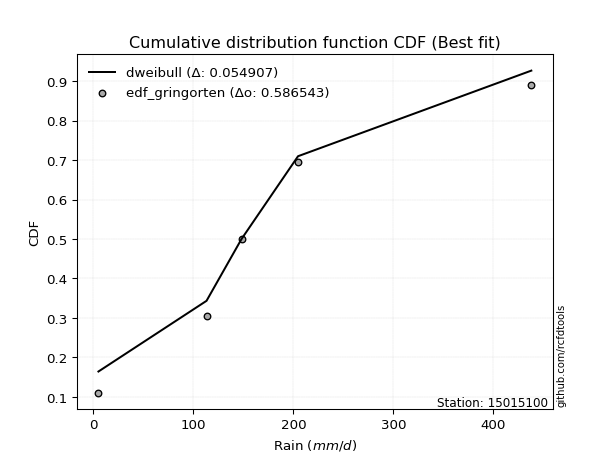</img>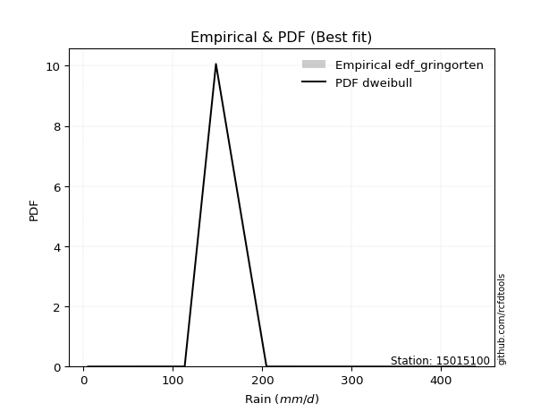</img>

</div>


### 9. Empirical - EDF Filliben (1975)

The specific values of the constants (0.3175) (often denoted as $alpha$) and (0.365) are derived from a method proposed by James J. Filliben in a 1975 paper. This particular formula is the mean value of the $i$-th order statistic of the normal distribution and is considered a robust and effective plotting position formula for the normal probability plot correlation coefficient test for normality.

<div align="center">


$P=(m-0.3175)/(n+0.365)$


</div>


**9.1. Empirical values**

<div align="center">

|                | 0                   | 1                  | 2            | 3                  | 4                  |
|:---------------|:--------------------|:-------------------|:-------------|:-------------------|:-------------------|
| date           | 2023                | 2021               | 2025         | 2022               | 2024               |
| x              | 5.1                 | 113.2              | 148.2        | 204.7              | 438.0              |
| m              | 1                   | 2                  | 3            | 4                  | 5                  |
| empirical_dist | edf_filliben        | edf_filliben       | edf_filliben | edf_filliben       | edf_filliben       |
| empirical      | 0.12721342031686858 | 0.3136067101584343 | 0.5          | 0.6863932898415657 | 0.8727865796831314 |
| empirical_tr   | 1.1457554725040042  | 1.456890699253225  | 2.0          | 3.188707280832095  | 7.860805860805863  |

</div>


**9.2. Kolmogorov-Smirnov fit test (sorted by Δ)**


<div align="center">

|                | 0                   | 1                  | 2                   | 3                   | 4                   | 5                   | 6                  | 7                   | 8                   | 9                   | 10                  | 11                  | 12                  | 13                  | 14                  | 15                  | 16                  | 17                  | 18                  | 19                  | 20                 | 21                 | 22                  | 23                  | 24                 | 25                  | 26                  | 27                  | 28                    | 29                 | 30                  | 31                  | 32                  | 33                  | 34                  | 35                 | 36                  | 37                  | 38                 | 39                  | 40                 | 41                  | 42                  | 43                  | 44                  | 45                  | 46                  | 47                  | 48                  | 49                 | 50                  | 51                  | 52                 | 53                 | 54                 | 55                 | 56                 | 57                  | 58                 | 59                 | 60                  | 61                 | 62                  | 63                 | 64                  | 65                 | 66                  | 67                 | 68                 | 69                  | 70                  | 71                 | 72                  | 73                 | 74                  | 75                  | 76                  | 77                 | 78                 | 79                  | 80                 | 81                 | 82                  | 83                  | 84                 | 85                 | 86                 | 87                 | 88                 | 89                 |
|:---------------|:--------------------|:-------------------|:--------------------|:--------------------|:--------------------|:--------------------|:-------------------|:--------------------|:--------------------|:--------------------|:--------------------|:--------------------|:--------------------|:--------------------|:--------------------|:--------------------|:--------------------|:--------------------|:--------------------|:--------------------|:-------------------|:-------------------|:--------------------|:--------------------|:-------------------|:--------------------|:--------------------|:--------------------|:----------------------|:-------------------|:--------------------|:--------------------|:--------------------|:--------------------|:--------------------|:-------------------|:--------------------|:--------------------|:-------------------|:--------------------|:-------------------|:--------------------|:--------------------|:--------------------|:--------------------|:--------------------|:--------------------|:--------------------|:--------------------|:-------------------|:--------------------|:--------------------|:-------------------|:-------------------|:-------------------|:-------------------|:-------------------|:--------------------|:-------------------|:-------------------|:--------------------|:-------------------|:--------------------|:-------------------|:--------------------|:-------------------|:--------------------|:-------------------|:-------------------|:--------------------|:--------------------|:-------------------|:--------------------|:-------------------|:--------------------|:--------------------|:--------------------|:-------------------|:-------------------|:--------------------|:-------------------|:-------------------|:--------------------|:--------------------|:-------------------|:-------------------|:-------------------|:-------------------|:-------------------|:-------------------|
| station        | 15015100            | 15015100           | 15015100            | 15015100            | 15015100            | 15015100            | 15015100           | 15015100            | 15015100            | 15015100            | 15015100            | 15015100            | 15015100            | 15015100            | 15015100            | 15015100            | 15015100            | 15015100            | 15015100            | 15015100            | 15015100           | 15015100           | 15015100            | 15015100            | 15015100           | 15015100            | 15015100            | 15015100            | 15015100              | 15015100           | 15015100            | 15015100            | 15015100            | 15015100            | 15015100            | 15015100           | 15015100            | 15015100            | 15015100           | 15015100            | 15015100           | 15015100            | 15015100            | 15015100            | 15015100            | 15015100            | 15015100            | 15015100            | 15015100            | 15015100           | 15015100            | 15015100            | 15015100           | 15015100           | 15015100           | 15015100           | 15015100           | 15015100            | 15015100           | 15015100           | 15015100            | 15015100           | 15015100            | 15015100           | 15015100            | 15015100           | 15015100            | 15015100           | 15015100           | 15015100            | 15015100            | 15015100           | 15015100            | 15015100           | 15015100            | 15015100            | 15015100            | 15015100           | 15015100           | 15015100            | 15015100           | 15015100           | 15015100            | 15015100            | 15015100           | 15015100           | 15015100           | 15015100           | 15015100           | 15015100           |
| empirical_dist | edf_filliben        | edf_filliben       | edf_filliben        | edf_filliben        | edf_filliben        | edf_filliben        | edf_filliben       | edf_filliben        | edf_filliben        | edf_filliben        | edf_filliben        | edf_filliben        | edf_filliben        | edf_filliben        | edf_filliben        | edf_filliben        | edf_filliben        | edf_filliben        | edf_filliben        | edf_filliben        | edf_filliben       | edf_filliben       | edf_filliben        | edf_filliben        | edf_filliben       | edf_filliben        | edf_filliben        | edf_filliben        | edf_filliben          | edf_filliben       | edf_filliben        | edf_filliben        | edf_filliben        | edf_filliben        | edf_filliben        | edf_filliben       | edf_filliben        | edf_filliben        | edf_filliben       | edf_filliben        | edf_filliben       | edf_filliben        | edf_filliben        | edf_filliben        | edf_filliben        | edf_filliben        | edf_filliben        | edf_filliben        | edf_filliben        | edf_filliben       | edf_filliben        | edf_filliben        | edf_filliben       | edf_filliben       | edf_filliben       | edf_filliben       | edf_filliben       | edf_filliben        | edf_filliben       | edf_filliben       | edf_filliben        | edf_filliben       | edf_filliben        | edf_filliben       | edf_filliben        | edf_filliben       | edf_filliben        | edf_filliben       | edf_filliben       | edf_filliben        | edf_filliben        | edf_filliben       | edf_filliben        | edf_filliben       | edf_filliben        | edf_filliben        | edf_filliben        | edf_filliben       | edf_filliben       | edf_filliben        | edf_filliben       | edf_filliben       | edf_filliben        | edf_filliben        | edf_filliben       | edf_filliben       | edf_filliben       | edf_filliben       | edf_filliben       | edf_filliben       |
| p_dist         | exponnorm           | invgamma           | gumbel_r            | johnsonsu           | fisk                | genlogistic         | kstwobign          | pearson3            | invgauss            | halfnorm            | laplace_asymmetric  | rayleigh            | moyal               | maxwell             | rice                | logjohnsonsu        | hypsecant           | logistic            | logmielke           | mielke              | t                  | norm               | truncnorm           | logloggamma         | gompertz           | wald                | gibrat              | ncf                 | loglaplace_asymmetric | laplace            | expon               | genexpon            | logfisk             | logpearson3         | betaprime           | loggumbel_l        | loggompertz         | f                   | gumbel_l           | logfatiguelife      | logexponnorm       | logcrystalball      | lognorm             | lognorm             | logt                | lognct              | logf                | loggamma            | loggamma            | loglogistic        | logrice             | loginvgamma         | logerlang          | loghypsecant       | logbetaprime       | logalpha           | loginvweibull      | loglaplace          | logmaxwell         | logncf             | loginvgauss         | lograyleigh        | lognakagami         | logkstwobign       | loggenexpon         | loghalfnorm        | loggumbel_r         | nakagami           | logmoyal           | loghalflogistic     | logchi2             | nct                | logexpon            | pareto             | loglognorm          | crystalball         | weibull_min         | logpareto          | logwald            | invweibull          | loggibrat          | logweibull_min     | erlang              | gamma               | fatiguelife        | alpha              | logtruncnorm       | halflogistic       | chi2               | loggenlogistic     |
| delta          | 0.06609524531964592 | 0.0684330772667148 | 0.07175880701748438 | 0.07200267224718715 | 0.07228483230567655 | 0.07448257940716951 | 0.0760294200551711 | 0.07658794781777567 | 0.07786102642476106 | 0.08225709807679785 | 0.08236166802842482 | 0.08432751499912339 | 0.08944625110629253 | 0.09370753639430085 | 0.09635062650240944 | 0.10613425122629472 | 0.11451208651389133 | 0.11474467806715549 | 0.12027680292200349 | 0.12117158020551555 | 0.1229684527943915 | 0.123187215591825  | 0.12318724966511274 | 0.12717570938310974 | 0.1272134202783204 | 0.12721342031686858 | 0.12721342031686858 | 0.13604165131487922 | 0.136598109429108     | 0.1409370215904442 | 0.14392893825900904 | 0.14416983915105958 | 0.15229450955164642 | 0.15535823794580167 | 0.15799329151087516 | 0.165003920969442  | 0.17101842005663287 | 0.17741338318585498 | 0.1886940603479197 | 0.23160416522682697 | 0.2324398700884241 | 0.23244056808306363 | 0.23244056810376884 | 0.23244056810376884 | 0.23244066827173798 | 0.23249495260799674 | 0.23306384648761275 | 0.23743383661016954 | 0.23743383661016954 | 0.2386571723214051 | 0.23980851604899495 | 0.24241357732322272 | 0.2432187928712351 | 0.243918037857406  | 0.2474294018737087 | 0.2587167127618419 | 0.2614444563364691 | 0.26185143475902767 | 0.2630879232906204 | 0.2639427543365936 | 0.26515190006832906 | 0.2729581387511087 | 0.28568292455519084 | 0.2931533056538161 | 0.29912912332335945 | 0.3007895828295731 | 0.30268018520152645 | 0.3136067088153476 | 0.3276424627676309 | 0.32794104786015826 | 0.33072322107984037 | 0.332213459457613  | 0.34013147855534137 | 0.3541850589278999 | 0.37418368607542823 | 0.38189190498124764 | 0.38518215591484634 | 0.3881782514820115 | 0.3969077049481901 | 0.42422366966650216 | 0.4256930347522479 | 0.4579917295620492 | 0.46126661614374415 | 0.46802665893377776 | 0.4807893181302026 | 0.6057838016772463 | 0.6196533520221399 | 0.6516916170532114 | 0.6863932888316178 | 0.6863932898415657 |
| deltao         | 0.5865427407550001  | 0.5865427407550001 | 0.5865427407550001  | 0.5865427407550001  | 0.5865427407550001  | 0.5865427407550001  | 0.5865427407550001 | 0.5865427407550001  | 0.5865427407550001  | 0.5865427407550001  | 0.5865427407550001  | 0.5865427407550001  | 0.5865427407550001  | 0.5865427407550001  | 0.5865427407550001  | 0.5865427407550001  | 0.5865427407550001  | 0.5865427407550001  | 0.5865427407550001  | 0.5865427407550001  | 0.5865427407550001 | 0.5865427407550001 | 0.5865427407550001  | 0.5865427407550001  | 0.5865427407550001 | 0.5865427407550001  | 0.5865427407550001  | 0.5865427407550001  | 0.5865427407550001    | 0.5865427407550001 | 0.5865427407550001  | 0.5865427407550001  | 0.5865427407550001  | 0.5865427407550001  | 0.5865427407550001  | 0.5865427407550001 | 0.5865427407550001  | 0.5865427407550001  | 0.5865427407550001 | 0.5865427407550001  | 0.5865427407550001 | 0.5865427407550001  | 0.5865427407550001  | 0.5865427407550001  | 0.5865427407550001  | 0.5865427407550001  | 0.5865427407550001  | 0.5865427407550001  | 0.5865427407550001  | 0.5865427407550001 | 0.5865427407550001  | 0.5865427407550001  | 0.5865427407550001 | 0.5865427407550001 | 0.5865427407550001 | 0.5865427407550001 | 0.5865427407550001 | 0.5865427407550001  | 0.5865427407550001 | 0.5865427407550001 | 0.5865427407550001  | 0.5865427407550001 | 0.5865427407550001  | 0.5865427407550001 | 0.5865427407550001  | 0.5865427407550001 | 0.5865427407550001  | 0.5865427407550001 | 0.5865427407550001 | 0.5865427407550001  | 0.5865427407550001  | 0.5865427407550001 | 0.5865427407550001  | 0.5865427407550001 | 0.5865427407550001  | 0.5865427407550001  | 0.5865427407550001  | 0.5865427407550001 | 0.5865427407550001 | 0.5865427407550001  | 0.5865427407550001 | 0.5865427407550001 | 0.5865427407550001  | 0.5865427407550001  | 0.5865427407550001 | 0.5865427407550001 | 0.5865427407550001 | 0.5865427407550001 | 0.5865427407550001 | 0.5865427407550001 |
| eval           | Δo > Δ              | Δo > Δ             | Δo > Δ              | Δo > Δ              | Δo > Δ              | Δo > Δ              | Δo > Δ             | Δo > Δ              | Δo > Δ              | Δo > Δ              | Δo > Δ              | Δo > Δ              | Δo > Δ              | Δo > Δ              | Δo > Δ              | Δo > Δ              | Δo > Δ              | Δo > Δ              | Δo > Δ              | Δo > Δ              | Δo > Δ             | Δo > Δ             | Δo > Δ              | Δo > Δ              | Δo > Δ             | Δo > Δ              | Δo > Δ              | Δo > Δ              | Δo > Δ                | Δo > Δ             | Δo > Δ              | Δo > Δ              | Δo > Δ              | Δo > Δ              | Δo > Δ              | Δo > Δ             | Δo > Δ              | Δo > Δ              | Δo > Δ             | Δo > Δ              | Δo > Δ             | Δo > Δ              | Δo > Δ              | Δo > Δ              | Δo > Δ              | Δo > Δ              | Δo > Δ              | Δo > Δ              | Δo > Δ              | Δo > Δ             | Δo > Δ              | Δo > Δ              | Δo > Δ             | Δo > Δ             | Δo > Δ             | Δo > Δ             | Δo > Δ             | Δo > Δ              | Δo > Δ             | Δo > Δ             | Δo > Δ              | Δo > Δ             | Δo > Δ              | Δo > Δ             | Δo > Δ              | Δo > Δ             | Δo > Δ              | Δo > Δ             | Δo > Δ             | Δo > Δ              | Δo > Δ              | Δo > Δ             | Δo > Δ              | Δo > Δ             | Δo > Δ              | Δo > Δ              | Δo > Δ              | Δo > Δ             | Δo > Δ             | Δo > Δ              | Δo > Δ             | Δo > Δ             | Δo > Δ              | Δo > Δ              | Δo > Δ             | Δo <= Δ            | Δo <= Δ            | Δo <= Δ            | Δo <= Δ            | Δo <= Δ            |
| fit            | 1                   | 1                  | 1                   | 1                   | 1                   | 1                   | 1                  | 1                   | 1                   | 1                   | 1                   | 1                   | 1                   | 1                   | 1                   | 1                   | 1                   | 1                   | 1                   | 1                   | 1                  | 1                  | 1                   | 1                   | 1                  | 1                   | 1                   | 1                   | 1                     | 1                  | 1                   | 1                   | 1                   | 1                   | 1                   | 1                  | 1                   | 1                   | 1                  | 1                   | 1                  | 1                   | 1                   | 1                   | 1                   | 1                   | 1                   | 1                   | 1                   | 1                  | 1                   | 1                   | 1                  | 1                  | 1                  | 1                  | 1                  | 1                   | 1                  | 1                  | 1                   | 1                  | 1                   | 1                  | 1                   | 1                  | 1                   | 1                  | 1                  | 1                   | 1                   | 1                  | 1                   | 1                  | 1                   | 1                   | 1                   | 1                  | 1                  | 1                   | 1                  | 1                  | 1                   | 1                   | 1                  | 0                  | 0                  | 0                  | 0                  | 0                  |
| n              | 5                   | 5                  | 5                   | 5                   | 5                   | 5                   | 5                  | 5                   | 5                   | 5                   | 5                   | 5                   | 5                   | 5                   | 5                   | 5                   | 5                   | 5                   | 5                   | 5                   | 5                  | 5                  | 5                   | 5                   | 5                  | 5                   | 5                   | 5                   | 5                     | 5                  | 5                   | 5                   | 5                   | 5                   | 5                   | 5                  | 5                   | 5                   | 5                  | 5                   | 5                  | 5                   | 5                   | 5                   | 5                   | 5                   | 5                   | 5                   | 5                   | 5                  | 5                   | 5                   | 5                  | 5                  | 5                  | 5                  | 5                  | 5                   | 5                  | 5                  | 5                   | 5                  | 5                   | 5                  | 5                   | 5                  | 5                   | 5                  | 5                  | 5                   | 5                   | 5                  | 5                   | 5                  | 5                   | 5                   | 5                   | 5                  | 5                  | 5                   | 5                  | 5                  | 5                   | 5                   | 5                  | 5                  | 5                  | 5                  | 5                  | 5                  |
| best_fit       | 1                   | 0                  | 0                   | 0                   | 0                   | 0                   | 0                  | 0                   | 0                   | 0                   | 0                   | 0                   | 0                   | 0                   | 0                   | 0                   | 0                   | 0                   | 0                   | 0                   | 0                  | 0                  | 0                   | 0                   | 0                  | 0                   | 0                   | 0                   | 0                     | 0                  | 0                   | 0                   | 0                   | 0                   | 0                   | 0                  | 0                   | 0                   | 0                  | 0                   | 0                  | 0                   | 0                   | 0                   | 0                   | 0                   | 0                   | 0                   | 0                   | 0                  | 0                   | 0                   | 0                  | 0                  | 0                  | 0                  | 0                  | 0                   | 0                  | 0                  | 0                   | 0                  | 0                   | 0                  | 0                   | 0                  | 0                   | 0                  | 0                  | 0                   | 0                   | 0                  | 0                   | 0                  | 0                   | 0                   | 0                   | 0                  | 0                  | 0                   | 0                  | 0                  | 0                   | 0                   | 0                  | 0                  | 0                  | 0                  | 0                  | 0                  |
| best_fit_sort  | 1                   | 2                  | 3                   | 4                   | 5                   | 6                   | 7                  | 8                   | 9                   | 10                  | 11                  | 12                  | 13                  | 14                  | 15                  | 16                  | 17                  | 18                  | 19                  | 20                  | 21                 | 22                 | 23                  | 24                  | 25                 | 26                  | 27                  | 28                  | 29                    | 30                 | 31                  | 32                  | 33                  | 34                  | 35                  | 36                 | 37                  | 38                  | 39                 | 40                  | 41                 | 42                  | 43                  | 44                  | 45                  | 46                  | 47                  | 48                  | 49                  | 50                 | 51                  | 52                  | 53                 | 54                 | 55                 | 56                 | 57                 | 58                  | 59                 | 60                 | 61                  | 62                 | 63                  | 64                 | 65                  | 66                 | 67                  | 68                 | 69                 | 70                  | 71                  | 72                 | 73                  | 74                 | 75                  | 76                  | 77                  | 78                 | 79                 | 80                  | 81                 | 82                 | 83                  | 84                  | 85                 | 86                 | 87                 | 88                 | 89                 | 90                 |

</div>


<div align="center">

</img>

</div>


**9.3. Best fit**

<div align="center">

|   id |   station | empirical_dist   | p_dist    |     delta |   deltao | eval   |   fit |   n |   best_fit |   best_fit_sort |
|-----:|----------:|:-----------------|:----------|----------:|---------:|:-------|------:|----:|-----------:|----------------:|
|    0 |  15015100 | edf_filliben     | exponnorm | 0.0660952 | 0.586543 | Δo > Δ |     1 |   5 |          1 |               1 |

</div>


<div align="center">

</img></img>

</div>


### 10. Empirical - EDF Jenkinson (1977)

The Jenkinson formula in hydrology is an empirical plotting position formula used to estimate the non-exceedance probability _(P)_ or return period _(T)_ of a given ordered observation within a sample. It is a widely used method in the frequency analysis of extreme events such as floods and rainfall, as it provides a distribution-free way to plot data. _a≈0.31_ and _b≈0.38_ are constants derived to approximate the median of the probability distribution for the given rank.

<div align="center">


$P=(m-a)/(n+b)$


</div>


**10.1. Empirical values**

<div align="center">

|                | 0                   | 1                  | 2             | 3                  | 4                  |
|:---------------|:--------------------|:-------------------|:--------------|:-------------------|:-------------------|
| date           | 2023                | 2021               | 2025          | 2022               | 2024               |
| x              | 5.1                 | 113.2              | 148.2         | 204.7              | 438.0              |
| m              | 1                   | 2                  | 3             | 4                  | 5                  |
| empirical_dist | edf_jenkinson       | edf_jenkinson      | edf_jenkinson | edf_jenkinson      | edf_jenkinson      |
| empirical      | 0.12825278810408922 | 0.3141263940520446 | 0.5           | 0.6858736059479554 | 0.8717472118959109 |
| empirical_tr   | 1.1471215351812367  | 1.4579945799457996 | 2.0           | 3.183431952662722  | 7.797101449275368  |

</div>


**10.2. Kolmogorov-Smirnov fit test (sorted by Δ)**


<div align="center">

|                | 0                   | 1                   | 2                   | 3                   | 4                   | 5                  | 6                   | 7                   | 8                   | 9                   | 10                  | 11                  | 12                  | 13                  | 14                  | 15                  | 16                  | 17                  | 18                  | 19                  | 20                  | 21                  | 22                  | 23                  | 24                  | 25                  | 26                  | 27                  | 28                    | 29                 | 30                 | 31                  | 32                  | 33                  | 34                 | 35                  | 36                  | 37                  | 38                  | 39                  | 40                  | 41                  | 42                 | 43                 | 44                  | 45                 | 46                 | 47                 | 48                 | 49                  | 50                 | 51                  | 52                  | 53                  | 54                  | 55                  | 56                 | 57                 | 58                 | 59                  | 60                 | 61                  | 62                 | 63                  | 64                 | 65                  | 66                 | 67                 | 68                 | 69                 | 70                 | 71                  | 72                 | 73                 | 74                 | 75                 | 76                 | 77                  | 78                  | 79                 | 80                  | 81                  | 82                 | 83                 | 84                  | 85                 | 86                 | 87                 | 88                 | 89                 |
|:---------------|:--------------------|:--------------------|:--------------------|:--------------------|:--------------------|:-------------------|:--------------------|:--------------------|:--------------------|:--------------------|:--------------------|:--------------------|:--------------------|:--------------------|:--------------------|:--------------------|:--------------------|:--------------------|:--------------------|:--------------------|:--------------------|:--------------------|:--------------------|:--------------------|:--------------------|:--------------------|:--------------------|:--------------------|:----------------------|:-------------------|:-------------------|:--------------------|:--------------------|:--------------------|:-------------------|:--------------------|:--------------------|:--------------------|:--------------------|:--------------------|:--------------------|:--------------------|:-------------------|:-------------------|:--------------------|:-------------------|:-------------------|:-------------------|:-------------------|:--------------------|:-------------------|:--------------------|:--------------------|:--------------------|:--------------------|:--------------------|:-------------------|:-------------------|:-------------------|:--------------------|:-------------------|:--------------------|:-------------------|:--------------------|:-------------------|:--------------------|:-------------------|:-------------------|:-------------------|:-------------------|:-------------------|:--------------------|:-------------------|:-------------------|:-------------------|:-------------------|:-------------------|:--------------------|:--------------------|:-------------------|:--------------------|:--------------------|:-------------------|:-------------------|:--------------------|:-------------------|:-------------------|:-------------------|:-------------------|:-------------------|
| station        | 15015100            | 15015100            | 15015100            | 15015100            | 15015100            | 15015100           | 15015100            | 15015100            | 15015100            | 15015100            | 15015100            | 15015100            | 15015100            | 15015100            | 15015100            | 15015100            | 15015100            | 15015100            | 15015100            | 15015100            | 15015100            | 15015100            | 15015100            | 15015100            | 15015100            | 15015100            | 15015100            | 15015100            | 15015100              | 15015100           | 15015100           | 15015100            | 15015100            | 15015100            | 15015100           | 15015100            | 15015100            | 15015100            | 15015100            | 15015100            | 15015100            | 15015100            | 15015100           | 15015100           | 15015100            | 15015100           | 15015100           | 15015100           | 15015100           | 15015100            | 15015100           | 15015100            | 15015100            | 15015100            | 15015100            | 15015100            | 15015100           | 15015100           | 15015100           | 15015100            | 15015100           | 15015100            | 15015100           | 15015100            | 15015100           | 15015100            | 15015100           | 15015100           | 15015100           | 15015100           | 15015100           | 15015100            | 15015100           | 15015100           | 15015100           | 15015100           | 15015100           | 15015100            | 15015100            | 15015100           | 15015100            | 15015100            | 15015100           | 15015100           | 15015100            | 15015100           | 15015100           | 15015100           | 15015100           | 15015100           |
| empirical_dist | edf_jenkinson       | edf_jenkinson       | edf_jenkinson       | edf_jenkinson       | edf_jenkinson       | edf_jenkinson      | edf_jenkinson       | edf_jenkinson       | edf_jenkinson       | edf_jenkinson       | edf_jenkinson       | edf_jenkinson       | edf_jenkinson       | edf_jenkinson       | edf_jenkinson       | edf_jenkinson       | edf_jenkinson       | edf_jenkinson       | edf_jenkinson       | edf_jenkinson       | edf_jenkinson       | edf_jenkinson       | edf_jenkinson       | edf_jenkinson       | edf_jenkinson       | edf_jenkinson       | edf_jenkinson       | edf_jenkinson       | edf_jenkinson         | edf_jenkinson      | edf_jenkinson      | edf_jenkinson       | edf_jenkinson       | edf_jenkinson       | edf_jenkinson      | edf_jenkinson       | edf_jenkinson       | edf_jenkinson       | edf_jenkinson       | edf_jenkinson       | edf_jenkinson       | edf_jenkinson       | edf_jenkinson      | edf_jenkinson      | edf_jenkinson       | edf_jenkinson      | edf_jenkinson      | edf_jenkinson      | edf_jenkinson      | edf_jenkinson       | edf_jenkinson      | edf_jenkinson       | edf_jenkinson       | edf_jenkinson       | edf_jenkinson       | edf_jenkinson       | edf_jenkinson      | edf_jenkinson      | edf_jenkinson      | edf_jenkinson       | edf_jenkinson      | edf_jenkinson       | edf_jenkinson      | edf_jenkinson       | edf_jenkinson      | edf_jenkinson       | edf_jenkinson      | edf_jenkinson      | edf_jenkinson      | edf_jenkinson      | edf_jenkinson      | edf_jenkinson       | edf_jenkinson      | edf_jenkinson      | edf_jenkinson      | edf_jenkinson      | edf_jenkinson      | edf_jenkinson       | edf_jenkinson       | edf_jenkinson      | edf_jenkinson       | edf_jenkinson       | edf_jenkinson      | edf_jenkinson      | edf_jenkinson       | edf_jenkinson      | edf_jenkinson      | edf_jenkinson      | edf_jenkinson      | edf_jenkinson      |
| p_dist         | exponnorm           | invgamma            | johnsonsu           | gumbel_r            | fisk                | genlogistic        | pearson3            | kstwobign           | invgauss            | laplace_asymmetric  | halfnorm            | rayleigh            | moyal               | maxwell             | rice                | logjohnsonsu        | logistic            | hypsecant           | logmielke           | mielke              | t                   | norm                | truncnorm           | logloggamma         | gompertz            | wald                | gibrat              | ncf                 | loglaplace_asymmetric | laplace            | expon              | genexpon            | logfisk             | logpearson3         | betaprime          | loggumbel_l         | loggompertz         | f                   | gumbel_l            | logfatiguelife      | logexponnorm        | logcrystalball      | lognorm            | lognorm            | logt                | lognct             | logf               | loggamma           | loggamma           | loglogistic         | logrice            | loginvgamma         | logerlang           | loghypsecant        | logbetaprime        | logalpha            | loginvweibull      | loglaplace         | logmaxwell         | logncf              | loginvgauss        | lograyleigh         | lognakagami        | logkstwobign        | loggenexpon        | loghalfnorm         | loggumbel_r        | nakagami           | logmoyal           | loghalflogistic    | logchi2            | nct                 | logexpon           | pareto             | loglognorm         | crystalball        | weibull_min        | logpareto           | logwald             | invweibull         | loggibrat           | logweibull_min      | erlang             | gamma              | fatiguelife         | alpha              | logtruncnorm       | halflogistic       | chi2               | loggenlogistic     |
| delta          | 0.06713461310686655 | 0.06947244505393543 | 0.07255462802670676 | 0.07279817480470496 | 0.07332420009289718 | 0.0755219471943901 | 0.07606826392416544 | 0.07706878784239168 | 0.07734134253115071 | 0.08236166802842482 | 0.08329646586401848 | 0.08380783110551315 | 0.09048561889351317 | 0.09318785250069062 | 0.09583094260879921 | 0.10561456733268448 | 0.11422499417354526 | 0.11451208651389133 | 0.12131617070922407 | 0.12221094799273613 | 0.12244876890078127 | 0.12266753169821476 | 0.12266756577150251 | 0.12821507717033032 | 0.12825278806554102 | 0.12825278810408922 | 0.12825278810408922 | 0.13552196742126887 | 0.13607842553549765   | 0.1409370215904442 | 0.1434092543653987 | 0.14365015525744923 | 0.15177482565803607 | 0.15483855405219132 | 0.1574736076172648 | 0.16448423707583165 | 0.17049873616302252 | 0.17689369929224463 | 0.18817437645430946 | 0.23108448133321663 | 0.23192018619481375 | 0.23192088418945328 | 0.2319208842101585 | 0.2319208842101585 | 0.23192098437812764 | 0.2319752687143864 | 0.2325441625940024 | 0.2369141527165592 | 0.2369141527165592 | 0.23813748842779475 | 0.2392888321553846 | 0.24189389342961237 | 0.24269910897762476 | 0.24339835396379567 | 0.24690971798009836 | 0.25819702886823154 | 0.2609247724428588 | 0.2613317508654173 | 0.2625682393970101 | 0.26342307044298324 | 0.2646322161747187 | 0.27243845485749835 | 0.2862026084488012 | 0.29263362176020574 | 0.2986094394297491 | 0.30026989893596273 | 0.3021605013079161 | 0.3141263927089579 | 0.3271227788740206 | 0.3274213639665479 | 0.33020353718623   | 0.33169377556400265 | 0.339611794661731  | 0.3536653750342896 | 0.3736640021818179 | 0.3813722210876373 | 0.384662472021236  | 0.38765856758840117 | 0.39638802105457976 | 0.4231843018792816 | 0.42517335085863756 | 0.45747204566843885 | 0.4607469322501338 | 0.4675069750401674 | 0.48026963423659225 | 0.605264117783636  | 0.6191336681285295 | 0.6511719331596011 | 0.6858736049380074 | 0.6858736059479554 |
| deltao         | 0.5865427407550001  | 0.5865427407550001  | 0.5865427407550001  | 0.5865427407550001  | 0.5865427407550001  | 0.5865427407550001 | 0.5865427407550001  | 0.5865427407550001  | 0.5865427407550001  | 0.5865427407550001  | 0.5865427407550001  | 0.5865427407550001  | 0.5865427407550001  | 0.5865427407550001  | 0.5865427407550001  | 0.5865427407550001  | 0.5865427407550001  | 0.5865427407550001  | 0.5865427407550001  | 0.5865427407550001  | 0.5865427407550001  | 0.5865427407550001  | 0.5865427407550001  | 0.5865427407550001  | 0.5865427407550001  | 0.5865427407550001  | 0.5865427407550001  | 0.5865427407550001  | 0.5865427407550001    | 0.5865427407550001 | 0.5865427407550001 | 0.5865427407550001  | 0.5865427407550001  | 0.5865427407550001  | 0.5865427407550001 | 0.5865427407550001  | 0.5865427407550001  | 0.5865427407550001  | 0.5865427407550001  | 0.5865427407550001  | 0.5865427407550001  | 0.5865427407550001  | 0.5865427407550001 | 0.5865427407550001 | 0.5865427407550001  | 0.5865427407550001 | 0.5865427407550001 | 0.5865427407550001 | 0.5865427407550001 | 0.5865427407550001  | 0.5865427407550001 | 0.5865427407550001  | 0.5865427407550001  | 0.5865427407550001  | 0.5865427407550001  | 0.5865427407550001  | 0.5865427407550001 | 0.5865427407550001 | 0.5865427407550001 | 0.5865427407550001  | 0.5865427407550001 | 0.5865427407550001  | 0.5865427407550001 | 0.5865427407550001  | 0.5865427407550001 | 0.5865427407550001  | 0.5865427407550001 | 0.5865427407550001 | 0.5865427407550001 | 0.5865427407550001 | 0.5865427407550001 | 0.5865427407550001  | 0.5865427407550001 | 0.5865427407550001 | 0.5865427407550001 | 0.5865427407550001 | 0.5865427407550001 | 0.5865427407550001  | 0.5865427407550001  | 0.5865427407550001 | 0.5865427407550001  | 0.5865427407550001  | 0.5865427407550001 | 0.5865427407550001 | 0.5865427407550001  | 0.5865427407550001 | 0.5865427407550001 | 0.5865427407550001 | 0.5865427407550001 | 0.5865427407550001 |
| eval           | Δo > Δ              | Δo > Δ              | Δo > Δ              | Δo > Δ              | Δo > Δ              | Δo > Δ             | Δo > Δ              | Δo > Δ              | Δo > Δ              | Δo > Δ              | Δo > Δ              | Δo > Δ              | Δo > Δ              | Δo > Δ              | Δo > Δ              | Δo > Δ              | Δo > Δ              | Δo > Δ              | Δo > Δ              | Δo > Δ              | Δo > Δ              | Δo > Δ              | Δo > Δ              | Δo > Δ              | Δo > Δ              | Δo > Δ              | Δo > Δ              | Δo > Δ              | Δo > Δ                | Δo > Δ             | Δo > Δ             | Δo > Δ              | Δo > Δ              | Δo > Δ              | Δo > Δ             | Δo > Δ              | Δo > Δ              | Δo > Δ              | Δo > Δ              | Δo > Δ              | Δo > Δ              | Δo > Δ              | Δo > Δ             | Δo > Δ             | Δo > Δ              | Δo > Δ             | Δo > Δ             | Δo > Δ             | Δo > Δ             | Δo > Δ              | Δo > Δ             | Δo > Δ              | Δo > Δ              | Δo > Δ              | Δo > Δ              | Δo > Δ              | Δo > Δ             | Δo > Δ             | Δo > Δ             | Δo > Δ              | Δo > Δ             | Δo > Δ              | Δo > Δ             | Δo > Δ              | Δo > Δ             | Δo > Δ              | Δo > Δ             | Δo > Δ             | Δo > Δ             | Δo > Δ             | Δo > Δ             | Δo > Δ              | Δo > Δ             | Δo > Δ             | Δo > Δ             | Δo > Δ             | Δo > Δ             | Δo > Δ              | Δo > Δ              | Δo > Δ             | Δo > Δ              | Δo > Δ              | Δo > Δ             | Δo > Δ             | Δo > Δ              | Δo <= Δ            | Δo <= Δ            | Δo <= Δ            | Δo <= Δ            | Δo <= Δ            |
| fit            | 1                   | 1                   | 1                   | 1                   | 1                   | 1                  | 1                   | 1                   | 1                   | 1                   | 1                   | 1                   | 1                   | 1                   | 1                   | 1                   | 1                   | 1                   | 1                   | 1                   | 1                   | 1                   | 1                   | 1                   | 1                   | 1                   | 1                   | 1                   | 1                     | 1                  | 1                  | 1                   | 1                   | 1                   | 1                  | 1                   | 1                   | 1                   | 1                   | 1                   | 1                   | 1                   | 1                  | 1                  | 1                   | 1                  | 1                  | 1                  | 1                  | 1                   | 1                  | 1                   | 1                   | 1                   | 1                   | 1                   | 1                  | 1                  | 1                  | 1                   | 1                  | 1                   | 1                  | 1                   | 1                  | 1                   | 1                  | 1                  | 1                  | 1                  | 1                  | 1                   | 1                  | 1                  | 1                  | 1                  | 1                  | 1                   | 1                   | 1                  | 1                   | 1                   | 1                  | 1                  | 1                   | 0                  | 0                  | 0                  | 0                  | 0                  |
| n              | 5                   | 5                   | 5                   | 5                   | 5                   | 5                  | 5                   | 5                   | 5                   | 5                   | 5                   | 5                   | 5                   | 5                   | 5                   | 5                   | 5                   | 5                   | 5                   | 5                   | 5                   | 5                   | 5                   | 5                   | 5                   | 5                   | 5                   | 5                   | 5                     | 5                  | 5                  | 5                   | 5                   | 5                   | 5                  | 5                   | 5                   | 5                   | 5                   | 5                   | 5                   | 5                   | 5                  | 5                  | 5                   | 5                  | 5                  | 5                  | 5                  | 5                   | 5                  | 5                   | 5                   | 5                   | 5                   | 5                   | 5                  | 5                  | 5                  | 5                   | 5                  | 5                   | 5                  | 5                   | 5                  | 5                   | 5                  | 5                  | 5                  | 5                  | 5                  | 5                   | 5                  | 5                  | 5                  | 5                  | 5                  | 5                   | 5                   | 5                  | 5                   | 5                   | 5                  | 5                  | 5                   | 5                  | 5                  | 5                  | 5                  | 5                  |
| best_fit       | 1                   | 0                   | 0                   | 0                   | 0                   | 0                  | 0                   | 0                   | 0                   | 0                   | 0                   | 0                   | 0                   | 0                   | 0                   | 0                   | 0                   | 0                   | 0                   | 0                   | 0                   | 0                   | 0                   | 0                   | 0                   | 0                   | 0                   | 0                   | 0                     | 0                  | 0                  | 0                   | 0                   | 0                   | 0                  | 0                   | 0                   | 0                   | 0                   | 0                   | 0                   | 0                   | 0                  | 0                  | 0                   | 0                  | 0                  | 0                  | 0                  | 0                   | 0                  | 0                   | 0                   | 0                   | 0                   | 0                   | 0                  | 0                  | 0                  | 0                   | 0                  | 0                   | 0                  | 0                   | 0                  | 0                   | 0                  | 0                  | 0                  | 0                  | 0                  | 0                   | 0                  | 0                  | 0                  | 0                  | 0                  | 0                   | 0                   | 0                  | 0                   | 0                   | 0                  | 0                  | 0                   | 0                  | 0                  | 0                  | 0                  | 0                  |
| best_fit_sort  | 1                   | 2                   | 3                   | 4                   | 5                   | 6                  | 7                   | 8                   | 9                   | 10                  | 11                  | 12                  | 13                  | 14                  | 15                  | 16                  | 17                  | 18                  | 19                  | 20                  | 21                  | 22                  | 23                  | 24                  | 25                  | 26                  | 27                  | 28                  | 29                    | 30                 | 31                 | 32                  | 33                  | 34                  | 35                 | 36                  | 37                  | 38                  | 39                  | 40                  | 41                  | 42                  | 43                 | 44                 | 45                  | 46                 | 47                 | 48                 | 49                 | 50                  | 51                 | 52                  | 53                  | 54                  | 55                  | 56                  | 57                 | 58                 | 59                 | 60                  | 61                 | 62                  | 63                 | 64                  | 65                 | 66                  | 67                 | 68                 | 69                 | 70                 | 71                 | 72                  | 73                 | 74                 | 75                 | 76                 | 77                 | 78                  | 79                  | 80                 | 81                  | 82                  | 83                 | 84                 | 85                  | 86                 | 87                 | 88                 | 89                 | 90                 |

</div>


<div align="center">

</img>

</div>


**10.3. Best fit**

<div align="center">

|   id |   station | empirical_dist   | p_dist    |     delta |   deltao | eval   |   fit |   n |   best_fit |   best_fit_sort |
|-----:|----------:|:-----------------|:----------|----------:|---------:|:-------|------:|----:|-----------:|----------------:|
|    0 |  15015100 | edf_jenkinson    | exponnorm | 0.0671346 | 0.586543 | Δo > Δ |     1 |   5 |          1 |               1 |

</div>


<div align="center">

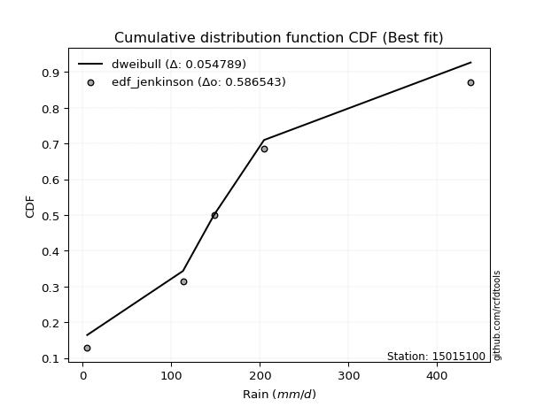</img>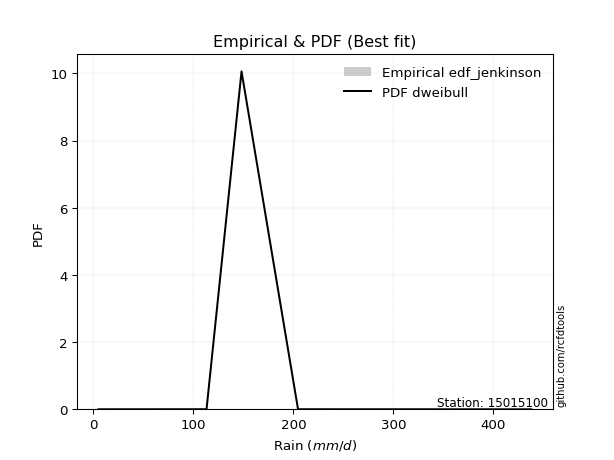</img>

</div>


### 11. Empirical - EDF Cunnane (1978)

Cunnane´s work in statistical hydrology has focused on the performance and evaluation of different probability distributions (such as GEV, Gumbel, Lognormal) for flood frequency estimation. _b_ is a constant, typically set to 0.4.

<div align="center">


$P=(m-b)/(n+1-2b)$


</div>


**11.1. Empirical values**

<div align="center">

|                | 0                   | 1                  | 2           | 3                  | 4                  |
|:---------------|:--------------------|:-------------------|:------------|:-------------------|:-------------------|
| date           | 2023                | 2021               | 2025        | 2022               | 2024               |
| x              | 5.1                 | 113.2              | 148.2       | 204.7              | 438.0              |
| m              | 1                   | 2                  | 3           | 4                  | 5                  |
| empirical_dist | edf_cunnane         | edf_cunnane        | edf_cunnane | edf_cunnane        | edf_cunnane        |
| empirical      | 0.11538461538461538 | 0.3076923076923077 | 0.5         | 0.6923076923076923 | 0.8846153846153845 |
| empirical_tr   | 1.1304347826086958  | 1.4444444444444444 | 2.0         | 3.25               | 8.666666666666655  |

</div>


**11.2. Kolmogorov-Smirnov fit test (sorted by Δ)**


<div align="center">

|                | 0                   | 1                   | 2                   | 3                   | 4                   | 5                   | 6                   | 7                   | 8                   | 9                   | 10                  | 11                  | 12                  | 13                  | 14                  | 15                  | 16                  | 17                  | 18                  | 19                  | 20                  | 21                  | 22                  | 23                  | 24                  | 25                  | 26                  | 27                 | 28                 | 29                    | 30                 | 31                  | 32                  | 33                  | 34                  | 35                  | 36                  | 37                  | 38                 | 39                  | 40                  | 41                 | 42                 | 43                 | 44                  | 45                 | 46                  | 47                 | 48                 | 49                  | 50                 | 51                  | 52                  | 53                  | 54                 | 55                  | 56                 | 57                  | 58                 | 59                  | 60                 | 61                  | 62                 | 63                  | 64                 | 65                  | 66                 | 67                 | 68                 | 69                  | 70                  | 71                  | 72                  | 73                 | 74                 | 75                 | 76                 | 77                 | 78                 | 79                  | 80                 | 81                  | 82                 | 83                  | 84                  | 85                 | 86                 | 87                 | 88                 | 89                 |
|:---------------|:--------------------|:--------------------|:--------------------|:--------------------|:--------------------|:--------------------|:--------------------|:--------------------|:--------------------|:--------------------|:--------------------|:--------------------|:--------------------|:--------------------|:--------------------|:--------------------|:--------------------|:--------------------|:--------------------|:--------------------|:--------------------|:--------------------|:--------------------|:--------------------|:--------------------|:--------------------|:--------------------|:-------------------|:-------------------|:----------------------|:-------------------|:--------------------|:--------------------|:--------------------|:--------------------|:--------------------|:--------------------|:--------------------|:-------------------|:--------------------|:--------------------|:-------------------|:-------------------|:-------------------|:--------------------|:-------------------|:--------------------|:-------------------|:-------------------|:--------------------|:-------------------|:--------------------|:--------------------|:--------------------|:-------------------|:--------------------|:-------------------|:--------------------|:-------------------|:--------------------|:-------------------|:--------------------|:-------------------|:--------------------|:-------------------|:--------------------|:-------------------|:-------------------|:-------------------|:--------------------|:--------------------|:--------------------|:--------------------|:-------------------|:-------------------|:-------------------|:-------------------|:-------------------|:-------------------|:--------------------|:-------------------|:--------------------|:-------------------|:--------------------|:--------------------|:-------------------|:-------------------|:-------------------|:-------------------|:-------------------|
| station        | 15015100            | 15015100            | 15015100            | 15015100            | 15015100            | 15015100            | 15015100            | 15015100            | 15015100            | 15015100            | 15015100            | 15015100            | 15015100            | 15015100            | 15015100            | 15015100            | 15015100            | 15015100            | 15015100            | 15015100            | 15015100            | 15015100            | 15015100            | 15015100            | 15015100            | 15015100            | 15015100            | 15015100           | 15015100           | 15015100              | 15015100           | 15015100            | 15015100            | 15015100            | 15015100            | 15015100            | 15015100            | 15015100            | 15015100           | 15015100            | 15015100            | 15015100           | 15015100           | 15015100           | 15015100            | 15015100           | 15015100            | 15015100           | 15015100           | 15015100            | 15015100           | 15015100            | 15015100            | 15015100            | 15015100           | 15015100            | 15015100           | 15015100            | 15015100           | 15015100            | 15015100           | 15015100            | 15015100           | 15015100            | 15015100           | 15015100            | 15015100           | 15015100           | 15015100           | 15015100            | 15015100            | 15015100            | 15015100            | 15015100           | 15015100           | 15015100           | 15015100           | 15015100           | 15015100           | 15015100            | 15015100           | 15015100            | 15015100           | 15015100            | 15015100            | 15015100           | 15015100           | 15015100           | 15015100           | 15015100           |
| empirical_dist | edf_cunnane         | edf_cunnane         | edf_cunnane         | edf_cunnane         | edf_cunnane         | edf_cunnane         | edf_cunnane         | edf_cunnane         | edf_cunnane         | edf_cunnane         | edf_cunnane         | edf_cunnane         | edf_cunnane         | edf_cunnane         | edf_cunnane         | edf_cunnane         | edf_cunnane         | edf_cunnane         | edf_cunnane         | edf_cunnane         | edf_cunnane         | edf_cunnane         | edf_cunnane         | edf_cunnane         | edf_cunnane         | edf_cunnane         | edf_cunnane         | edf_cunnane        | edf_cunnane        | edf_cunnane           | edf_cunnane        | edf_cunnane         | edf_cunnane         | edf_cunnane         | edf_cunnane         | edf_cunnane         | edf_cunnane         | edf_cunnane         | edf_cunnane        | edf_cunnane         | edf_cunnane         | edf_cunnane        | edf_cunnane        | edf_cunnane        | edf_cunnane         | edf_cunnane        | edf_cunnane         | edf_cunnane        | edf_cunnane        | edf_cunnane         | edf_cunnane        | edf_cunnane         | edf_cunnane         | edf_cunnane         | edf_cunnane        | edf_cunnane         | edf_cunnane        | edf_cunnane         | edf_cunnane        | edf_cunnane         | edf_cunnane        | edf_cunnane         | edf_cunnane        | edf_cunnane         | edf_cunnane        | edf_cunnane         | edf_cunnane        | edf_cunnane        | edf_cunnane        | edf_cunnane         | edf_cunnane         | edf_cunnane         | edf_cunnane         | edf_cunnane        | edf_cunnane        | edf_cunnane        | edf_cunnane        | edf_cunnane        | edf_cunnane        | edf_cunnane         | edf_cunnane        | edf_cunnane         | edf_cunnane        | edf_cunnane         | edf_cunnane         | edf_cunnane        | edf_cunnane        | edf_cunnane        | edf_cunnane        | edf_cunnane        |
| p_dist         | exponnorm           | gumbel_r            | genlogistic         | fisk                | kstwobign           | invgamma            | moyal               | johnsonsu           | halfnorm            | laplace_asymmetric  | pearson3            | invgauss            | rayleigh            | maxwell             | rice                | logmielke           | mielke              | logjohnsonsu        | hypsecant           | logloggamma         | gompertz            | gibrat              | wald                | logistic            | t                   | norm                | truncnorm           | laplace            | ncf                | loglaplace_asymmetric | expon              | genexpon            | logfisk             | logpearson3         | betaprime           | loggumbel_l         | loggompertz         | f                   | gumbel_l           | logfatiguelife      | logexponnorm        | logcrystalball     | lognorm            | lognorm            | logt                | lognct             | logf                | loggamma           | loggamma           | loglogistic         | logrice            | loginvgamma         | logerlang           | loghypsecant        | logbetaprime       | logalpha            | loginvweibull      | loglaplace          | logmaxwell         | logncf              | loginvgauss        | lograyleigh         | lognakagami        | logkstwobign        | loggenexpon        | loghalfnorm         | nakagami           | loggumbel_r        | logmoyal           | loghalflogistic     | logchi2             | nct                 | logexpon            | pareto             | loglognorm         | crystalball        | weibull_min        | logpareto          | logwald            | loggibrat           | invweibull         | logweibull_min      | erlang             | gamma               | fatiguelife         | alpha              | logtruncnorm       | halflogistic       | chi2               | loggenlogistic     |
| delta          | 0.05959958395048487 | 0.05993000208523136 | 0.06265377447491649 | 0.06375400089610372 | 0.06790955778165708 | 0.06896012150882874 | 0.07761744617403935 | 0.07791707471331372 | 0.08219062150513817 | 0.08236166802842482 | 0.08250235028390229 | 0.08377542889088763 | 0.09024191746525001 | 0.09962193886042747 | 0.10226502896853606 | 0.10844799798975047 | 0.10934277527326253 | 0.11204865369242134 | 0.11451208651389133 | 0.11534690445085671 | 0.11538461534606717 | 0.11538461538461538 | 0.11538461538461538 | 0.12065908053328211 | 0.12888285526051813 | 0.12910161805795162 | 0.12910165213123936 | 0.1409370215904442 | 0.1419560537810058 | 0.14251251189523456   | 0.1498433407251356 | 0.15008424161718614 | 0.15820891201777298 | 0.16127264041192824 | 0.16390769397700172 | 0.17091832343556856 | 0.17693282252275944 | 0.18332778565198155 | 0.1946084628140463 | 0.23751856769295354 | 0.23835427255455066 | 0.2383549705491902 | 0.2383549705698954 | 0.2383549705698954 | 0.23835507073786455 | 0.2384093550741233 | 0.23897824895373931 | 0.2433482390762961 | 0.2433482390762961 | 0.24457157478753166 | 0.2457229185151215 | 0.24832797978934928 | 0.24913319533736167 | 0.24983244032353258 | 0.2533438043398353 | 0.26463111522796845 | 0.2673588588025957 | 0.26776583722515424 | 0.269002325756747  | 0.26985715680272016 | 0.2710663025344556 | 0.27887254121723526 | 0.2797685220890643 | 0.29906770811994265 | 0.305043525789486  | 0.30670398529569964 | 0.307692306349221  | 0.308594587667653  | 0.3335568652337575 | 0.33385545032628483 | 0.33663762354596694 | 0.33812786192373956 | 0.34604588102146794 | 0.3600994613940265 | 0.3800980885415548 | 0.3878063074473742 | 0.3910965583809729 | 0.3940926539481381 | 0.4028221074143167 | 0.43160743721837447 | 0.4360524745987552 | 0.46390613202817577 | 0.4671810186098707 | 0.47394106139990433 | 0.48670372059632916 | 0.611698204143373  | 0.6255677544882665 | 0.6576060195193381 | 0.6923076912977443 | 0.6923076923076923 |
| deltao         | 0.5865427407550001  | 0.5865427407550001  | 0.5865427407550001  | 0.5865427407550001  | 0.5865427407550001  | 0.5865427407550001  | 0.5865427407550001  | 0.5865427407550001  | 0.5865427407550001  | 0.5865427407550001  | 0.5865427407550001  | 0.5865427407550001  | 0.5865427407550001  | 0.5865427407550001  | 0.5865427407550001  | 0.5865427407550001  | 0.5865427407550001  | 0.5865427407550001  | 0.5865427407550001  | 0.5865427407550001  | 0.5865427407550001  | 0.5865427407550001  | 0.5865427407550001  | 0.5865427407550001  | 0.5865427407550001  | 0.5865427407550001  | 0.5865427407550001  | 0.5865427407550001 | 0.5865427407550001 | 0.5865427407550001    | 0.5865427407550001 | 0.5865427407550001  | 0.5865427407550001  | 0.5865427407550001  | 0.5865427407550001  | 0.5865427407550001  | 0.5865427407550001  | 0.5865427407550001  | 0.5865427407550001 | 0.5865427407550001  | 0.5865427407550001  | 0.5865427407550001 | 0.5865427407550001 | 0.5865427407550001 | 0.5865427407550001  | 0.5865427407550001 | 0.5865427407550001  | 0.5865427407550001 | 0.5865427407550001 | 0.5865427407550001  | 0.5865427407550001 | 0.5865427407550001  | 0.5865427407550001  | 0.5865427407550001  | 0.5865427407550001 | 0.5865427407550001  | 0.5865427407550001 | 0.5865427407550001  | 0.5865427407550001 | 0.5865427407550001  | 0.5865427407550001 | 0.5865427407550001  | 0.5865427407550001 | 0.5865427407550001  | 0.5865427407550001 | 0.5865427407550001  | 0.5865427407550001 | 0.5865427407550001 | 0.5865427407550001 | 0.5865427407550001  | 0.5865427407550001  | 0.5865427407550001  | 0.5865427407550001  | 0.5865427407550001 | 0.5865427407550001 | 0.5865427407550001 | 0.5865427407550001 | 0.5865427407550001 | 0.5865427407550001 | 0.5865427407550001  | 0.5865427407550001 | 0.5865427407550001  | 0.5865427407550001 | 0.5865427407550001  | 0.5865427407550001  | 0.5865427407550001 | 0.5865427407550001 | 0.5865427407550001 | 0.5865427407550001 | 0.5865427407550001 |
| eval           | Δo > Δ              | Δo > Δ              | Δo > Δ              | Δo > Δ              | Δo > Δ              | Δo > Δ              | Δo > Δ              | Δo > Δ              | Δo > Δ              | Δo > Δ              | Δo > Δ              | Δo > Δ              | Δo > Δ              | Δo > Δ              | Δo > Δ              | Δo > Δ              | Δo > Δ              | Δo > Δ              | Δo > Δ              | Δo > Δ              | Δo > Δ              | Δo > Δ              | Δo > Δ              | Δo > Δ              | Δo > Δ              | Δo > Δ              | Δo > Δ              | Δo > Δ             | Δo > Δ             | Δo > Δ                | Δo > Δ             | Δo > Δ              | Δo > Δ              | Δo > Δ              | Δo > Δ              | Δo > Δ              | Δo > Δ              | Δo > Δ              | Δo > Δ             | Δo > Δ              | Δo > Δ              | Δo > Δ             | Δo > Δ             | Δo > Δ             | Δo > Δ              | Δo > Δ             | Δo > Δ              | Δo > Δ             | Δo > Δ             | Δo > Δ              | Δo > Δ             | Δo > Δ              | Δo > Δ              | Δo > Δ              | Δo > Δ             | Δo > Δ              | Δo > Δ             | Δo > Δ              | Δo > Δ             | Δo > Δ              | Δo > Δ             | Δo > Δ              | Δo > Δ             | Δo > Δ              | Δo > Δ             | Δo > Δ              | Δo > Δ             | Δo > Δ             | Δo > Δ             | Δo > Δ              | Δo > Δ              | Δo > Δ              | Δo > Δ              | Δo > Δ             | Δo > Δ             | Δo > Δ             | Δo > Δ             | Δo > Δ             | Δo > Δ             | Δo > Δ              | Δo > Δ             | Δo > Δ              | Δo > Δ             | Δo > Δ              | Δo > Δ              | Δo <= Δ            | Δo <= Δ            | Δo <= Δ            | Δo <= Δ            | Δo <= Δ            |
| fit            | 1                   | 1                   | 1                   | 1                   | 1                   | 1                   | 1                   | 1                   | 1                   | 1                   | 1                   | 1                   | 1                   | 1                   | 1                   | 1                   | 1                   | 1                   | 1                   | 1                   | 1                   | 1                   | 1                   | 1                   | 1                   | 1                   | 1                   | 1                  | 1                  | 1                     | 1                  | 1                   | 1                   | 1                   | 1                   | 1                   | 1                   | 1                   | 1                  | 1                   | 1                   | 1                  | 1                  | 1                  | 1                   | 1                  | 1                   | 1                  | 1                  | 1                   | 1                  | 1                   | 1                   | 1                   | 1                  | 1                   | 1                  | 1                   | 1                  | 1                   | 1                  | 1                   | 1                  | 1                   | 1                  | 1                   | 1                  | 1                  | 1                  | 1                   | 1                   | 1                   | 1                   | 1                  | 1                  | 1                  | 1                  | 1                  | 1                  | 1                   | 1                  | 1                   | 1                  | 1                   | 1                   | 0                  | 0                  | 0                  | 0                  | 0                  |
| n              | 5                   | 5                   | 5                   | 5                   | 5                   | 5                   | 5                   | 5                   | 5                   | 5                   | 5                   | 5                   | 5                   | 5                   | 5                   | 5                   | 5                   | 5                   | 5                   | 5                   | 5                   | 5                   | 5                   | 5                   | 5                   | 5                   | 5                   | 5                  | 5                  | 5                     | 5                  | 5                   | 5                   | 5                   | 5                   | 5                   | 5                   | 5                   | 5                  | 5                   | 5                   | 5                  | 5                  | 5                  | 5                   | 5                  | 5                   | 5                  | 5                  | 5                   | 5                  | 5                   | 5                   | 5                   | 5                  | 5                   | 5                  | 5                   | 5                  | 5                   | 5                  | 5                   | 5                  | 5                   | 5                  | 5                   | 5                  | 5                  | 5                  | 5                   | 5                   | 5                   | 5                   | 5                  | 5                  | 5                  | 5                  | 5                  | 5                  | 5                   | 5                  | 5                   | 5                  | 5                   | 5                   | 5                  | 5                  | 5                  | 5                  | 5                  |
| best_fit       | 1                   | 0                   | 0                   | 0                   | 0                   | 0                   | 0                   | 0                   | 0                   | 0                   | 0                   | 0                   | 0                   | 0                   | 0                   | 0                   | 0                   | 0                   | 0                   | 0                   | 0                   | 0                   | 0                   | 0                   | 0                   | 0                   | 0                   | 0                  | 0                  | 0                     | 0                  | 0                   | 0                   | 0                   | 0                   | 0                   | 0                   | 0                   | 0                  | 0                   | 0                   | 0                  | 0                  | 0                  | 0                   | 0                  | 0                   | 0                  | 0                  | 0                   | 0                  | 0                   | 0                   | 0                   | 0                  | 0                   | 0                  | 0                   | 0                  | 0                   | 0                  | 0                   | 0                  | 0                   | 0                  | 0                   | 0                  | 0                  | 0                  | 0                   | 0                   | 0                   | 0                   | 0                  | 0                  | 0                  | 0                  | 0                  | 0                  | 0                   | 0                  | 0                   | 0                  | 0                   | 0                   | 0                  | 0                  | 0                  | 0                  | 0                  |
| best_fit_sort  | 1                   | 2                   | 3                   | 4                   | 5                   | 6                   | 7                   | 8                   | 9                   | 10                  | 11                  | 12                  | 13                  | 14                  | 15                  | 16                  | 17                  | 18                  | 19                  | 20                  | 21                  | 22                  | 23                  | 24                  | 25                  | 26                  | 27                  | 28                 | 29                 | 30                    | 31                 | 32                  | 33                  | 34                  | 35                  | 36                  | 37                  | 38                  | 39                 | 40                  | 41                  | 42                 | 43                 | 44                 | 45                  | 46                 | 47                  | 48                 | 49                 | 50                  | 51                 | 52                  | 53                  | 54                  | 55                 | 56                  | 57                 | 58                  | 59                 | 60                  | 61                 | 62                  | 63                 | 64                  | 65                 | 66                  | 67                 | 68                 | 69                 | 70                  | 71                  | 72                  | 73                  | 74                 | 75                 | 76                 | 77                 | 78                 | 79                 | 80                  | 81                 | 82                  | 83                 | 84                  | 85                  | 86                 | 87                 | 88                 | 89                 | 90                 |

</div>


<div align="center">

</img>

</div>


**11.3. Best fit**

<div align="center">

|   id |   station | empirical_dist   | p_dist    |     delta |   deltao | eval   |   fit |   n |   best_fit |   best_fit_sort |
|-----:|----------:|:-----------------|:----------|----------:|---------:|:-------|------:|----:|-----------:|----------------:|
|    0 |  15015100 | edf_cunnane      | exponnorm | 0.0595996 | 0.586543 | Δo > Δ |     1 |   5 |          1 |               1 |

</div>


<div align="center">

</img>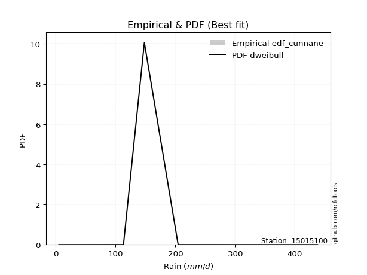</img>

</div>


### 12. Empirical - EDF Adamowski (1981)

The Adamowski formula in hydrology refers to a specific plotting position formula used for estimating the non-parametric empirical distribution of hydrological events (like flood peaks) to calculate their return periods. This formula provides an alternative to traditional parametric methods (like the Gumbel or Log Pearson Type III distributions). 

<div align="center">


$P=(m-0.25)/(n+0.5)$


</div>


**12.1. Empirical values**

<div align="center">

|                | 0                   | 1                  | 2             | 3                  | 4                  |
|:---------------|:--------------------|:-------------------|:--------------|:-------------------|:-------------------|
| date           | 2023                | 2021               | 2025          | 2022               | 2024               |
| x              | 5.1                 | 113.2              | 148.2         | 204.7              | 438.0              |
| m              | 1                   | 2                  | 3             | 4                  | 5                  |
| empirical_dist | edf_adamowski       | edf_adamowski      | edf_adamowski | edf_adamowski      | edf_adamowski      |
| empirical      | 0.13636363636363635 | 0.3181818181818182 | 0.5           | 0.6818181818181818 | 0.8636363636363636 |
| empirical_tr   | 1.1578947368421053  | 1.4666666666666666 | 2.0           | 3.1428571428571423 | 7.333333333333334  |

</div>


**12.2. Kolmogorov-Smirnov fit test (sorted by Δ)**


<div align="center">

|                | 0                   | 1                   | 2                  | 3                   | 4                   | 5                   | 6                   | 7                   | 8                   | 9                  | 10                  | 11                  | 12                  | 13                  | 14                  | 15                  | 16                  | 17                  | 18                 | 19                 | 20                  | 21                 | 22                  | 23                  | 24                    | 25                  | 26                  | 27                  | 28                  | 29                  | 30                  | 31                 | 32                  | 33                  | 34                  | 35                 | 36                  | 37                  | 38                 | 39                  | 40                 | 41                  | 42                  | 43                  | 44                  | 45                  | 46                  | 47                  | 48                  | 49                 | 50                  | 51                  | 52                 | 53                 | 54                 | 55                 | 56                 | 57                  | 58                 | 59                 | 60                  | 61                 | 62                 | 63                  | 64                  | 65                 | 66                  | 67                 | 68                 | 69                  | 70                  | 71                 | 72                  | 73                 | 74                  | 75                  | 76                  | 77                 | 78                 | 79                  | 80                 | 81                 | 82                  | 83                  | 84                 | 85                 | 86                 | 87                 | 88                 | 89                 |
|:---------------|:--------------------|:--------------------|:-------------------|:--------------------|:--------------------|:--------------------|:--------------------|:--------------------|:--------------------|:-------------------|:--------------------|:--------------------|:--------------------|:--------------------|:--------------------|:--------------------|:--------------------|:--------------------|:-------------------|:-------------------|:--------------------|:-------------------|:--------------------|:--------------------|:----------------------|:--------------------|:--------------------|:--------------------|:--------------------|:--------------------|:--------------------|:-------------------|:--------------------|:--------------------|:--------------------|:-------------------|:--------------------|:--------------------|:-------------------|:--------------------|:-------------------|:--------------------|:--------------------|:--------------------|:--------------------|:--------------------|:--------------------|:--------------------|:--------------------|:-------------------|:--------------------|:--------------------|:-------------------|:-------------------|:-------------------|:-------------------|:-------------------|:--------------------|:-------------------|:-------------------|:--------------------|:-------------------|:-------------------|:--------------------|:--------------------|:-------------------|:--------------------|:-------------------|:-------------------|:--------------------|:--------------------|:-------------------|:--------------------|:-------------------|:--------------------|:--------------------|:--------------------|:-------------------|:-------------------|:--------------------|:-------------------|:-------------------|:--------------------|:--------------------|:-------------------|:-------------------|:-------------------|:-------------------|:-------------------|:-------------------|
| station        | 15015100            | 15015100            | 15015100           | 15015100            | 15015100            | 15015100            | 15015100            | 15015100            | 15015100            | 15015100           | 15015100            | 15015100            | 15015100            | 15015100            | 15015100            | 15015100            | 15015100            | 15015100            | 15015100           | 15015100           | 15015100            | 15015100           | 15015100            | 15015100            | 15015100              | 15015100            | 15015100            | 15015100            | 15015100            | 15015100            | 15015100            | 15015100           | 15015100            | 15015100            | 15015100            | 15015100           | 15015100            | 15015100            | 15015100           | 15015100            | 15015100           | 15015100            | 15015100            | 15015100            | 15015100            | 15015100            | 15015100            | 15015100            | 15015100            | 15015100           | 15015100            | 15015100            | 15015100           | 15015100           | 15015100           | 15015100           | 15015100           | 15015100            | 15015100           | 15015100           | 15015100            | 15015100           | 15015100           | 15015100            | 15015100            | 15015100           | 15015100            | 15015100           | 15015100           | 15015100            | 15015100            | 15015100           | 15015100            | 15015100           | 15015100            | 15015100            | 15015100            | 15015100           | 15015100           | 15015100            | 15015100           | 15015100           | 15015100            | 15015100            | 15015100           | 15015100           | 15015100           | 15015100           | 15015100           | 15015100           |
| empirical_dist | edf_adamowski       | edf_adamowski       | edf_adamowski      | edf_adamowski       | edf_adamowski       | edf_adamowski       | edf_adamowski       | edf_adamowski       | edf_adamowski       | edf_adamowski      | edf_adamowski       | edf_adamowski       | edf_adamowski       | edf_adamowski       | edf_adamowski       | edf_adamowski       | edf_adamowski       | edf_adamowski       | edf_adamowski      | edf_adamowski      | edf_adamowski       | edf_adamowski      | edf_adamowski       | edf_adamowski       | edf_adamowski         | edf_adamowski       | edf_adamowski       | edf_adamowski       | edf_adamowski       | edf_adamowski       | edf_adamowski       | edf_adamowski      | edf_adamowski       | edf_adamowski       | edf_adamowski       | edf_adamowski      | edf_adamowski       | edf_adamowski       | edf_adamowski      | edf_adamowski       | edf_adamowski      | edf_adamowski       | edf_adamowski       | edf_adamowski       | edf_adamowski       | edf_adamowski       | edf_adamowski       | edf_adamowski       | edf_adamowski       | edf_adamowski      | edf_adamowski       | edf_adamowski       | edf_adamowski      | edf_adamowski      | edf_adamowski      | edf_adamowski      | edf_adamowski      | edf_adamowski       | edf_adamowski      | edf_adamowski      | edf_adamowski       | edf_adamowski      | edf_adamowski      | edf_adamowski       | edf_adamowski       | edf_adamowski      | edf_adamowski       | edf_adamowski      | edf_adamowski      | edf_adamowski       | edf_adamowski       | edf_adamowski      | edf_adamowski       | edf_adamowski      | edf_adamowski       | edf_adamowski       | edf_adamowski       | edf_adamowski      | edf_adamowski      | edf_adamowski       | edf_adamowski      | edf_adamowski      | edf_adamowski       | edf_adamowski       | edf_adamowski      | edf_adamowski      | edf_adamowski      | edf_adamowski      | edf_adamowski      | edf_adamowski      |
| p_dist         | exponnorm           | invgamma            | johnsonsu          | gumbel_r            | invgauss            | fisk                | rayleigh            | pearson3            | genlogistic         | kstwobign          | laplace_asymmetric  | maxwell             | halfnorm            | rice                | moyal               | logjohnsonsu        | logistic            | hypsecant           | t                  | norm               | truncnorm           | logmielke          | mielke              | ncf                 | loglaplace_asymmetric | logloggamma         | gompertz            | wald                | gibrat              | expon               | genexpon            | laplace            | logfisk             | logpearson3         | betaprime           | loggumbel_l        | loggompertz         | f                   | gumbel_l           | logfatiguelife      | logexponnorm       | logcrystalball      | lognorm             | lognorm             | logt                | lognct              | logf                | loggamma            | loggamma            | loglogistic        | logrice             | loginvgamma         | logerlang          | loghypsecant       | logbetaprime       | logalpha           | loginvweibull      | loglaplace          | logmaxwell         | logncf             | loginvgauss         | lograyleigh        | logkstwobign       | lognakagami         | loggenexpon         | loghalfnorm        | loggumbel_r         | nakagami           | logmoyal           | loghalflogistic     | logchi2             | nct                | logexpon            | pareto             | loglognorm          | crystalball         | weibull_min         | logpareto          | logwald            | invweibull          | loggibrat          | logweibull_min     | erlang              | gamma               | fatiguelife        | alpha              | logtruncnorm       | halflogistic       | chi2               | loggenlogistic     |
| delta          | 0.07524546136641369 | 0.07758329331348257 | 0.0806654762862539 | 0.08090902306425218 | 0.08129835716231418 | 0.08143504835244432 | 0.08304094895598868 | 0.08306691833186364 | 0.08363279545393731 | 0.0851796361019389 | 0.08543901765177164 | 0.08913242837091695 | 0.09140731412356562 | 0.09177551847902554 | 0.09859646715306031 | 0.10155914320291082 | 0.11016957004377159 | 0.11451208651389133 | 0.1183933447710076 | 0.1186121075684411 | 0.11861214164172884 | 0.1294270189687713 | 0.13032179625228335 | 0.13146654329149532 | 0.1320230014057241    | 0.13632592542987754 | 0.13636363632508816 | 0.13636363636363635 | 0.13636363636363635 | 0.13935383023562514 | 0.13959473112767568 | 0.1409370215904442 | 0.14771940152826252 | 0.15078312992241777 | 0.15341818348749126 | 0.1604288129460581 | 0.16644331203324897 | 0.17283827516247108 | 0.1841189523245358 | 0.22702905720344307 | 0.2278647620650402 | 0.22786546005967973 | 0.22786546008038494 | 0.22786546008038494 | 0.22786556024835408 | 0.22791984458461284 | 0.22848873846422885 | 0.23285872858678563 | 0.23285872858678563 | 0.2340820642980212 | 0.23523340802561105 | 0.23783846929983882 | 0.2386436848478512 | 0.2393429298340221 | 0.2428542938503248 | 0.254141604738458  | 0.2568693483130852 | 0.25727632673564377 | 0.2585128152672365 | 0.2593676463132097 | 0.26057679204494516 | 0.2683830307277248 | 0.2885781976304322 | 0.29025803257857474 | 0.29455401529997555 | 0.2962144748061892 | 0.29810507717814255 | 0.3181818168387315 | 0.323067354744247  | 0.32336593983677436 | 0.32614811305645647 | 0.3276383514342291 | 0.33555637053195747 | 0.349609950904516  | 0.36960857805204433 | 0.37731679695786374 | 0.38060704789146244 | 0.3836031434586276 | 0.3923325969248062 | 0.41507345361973436 | 0.421117926728864  | 0.4534166215386653 | 0.45669150812036025 | 0.46345155091039386 | 0.4762142101068187 | 0.6012086936538625 | 0.6150782439987561 | 0.6471165090298274 | 0.6818181808082338 | 0.6818181818181818 |
| deltao         | 0.5865427407550001  | 0.5865427407550001  | 0.5865427407550001 | 0.5865427407550001  | 0.5865427407550001  | 0.5865427407550001  | 0.5865427407550001  | 0.5865427407550001  | 0.5865427407550001  | 0.5865427407550001 | 0.5865427407550001  | 0.5865427407550001  | 0.5865427407550001  | 0.5865427407550001  | 0.5865427407550001  | 0.5865427407550001  | 0.5865427407550001  | 0.5865427407550001  | 0.5865427407550001 | 0.5865427407550001 | 0.5865427407550001  | 0.5865427407550001 | 0.5865427407550001  | 0.5865427407550001  | 0.5865427407550001    | 0.5865427407550001  | 0.5865427407550001  | 0.5865427407550001  | 0.5865427407550001  | 0.5865427407550001  | 0.5865427407550001  | 0.5865427407550001 | 0.5865427407550001  | 0.5865427407550001  | 0.5865427407550001  | 0.5865427407550001 | 0.5865427407550001  | 0.5865427407550001  | 0.5865427407550001 | 0.5865427407550001  | 0.5865427407550001 | 0.5865427407550001  | 0.5865427407550001  | 0.5865427407550001  | 0.5865427407550001  | 0.5865427407550001  | 0.5865427407550001  | 0.5865427407550001  | 0.5865427407550001  | 0.5865427407550001 | 0.5865427407550001  | 0.5865427407550001  | 0.5865427407550001 | 0.5865427407550001 | 0.5865427407550001 | 0.5865427407550001 | 0.5865427407550001 | 0.5865427407550001  | 0.5865427407550001 | 0.5865427407550001 | 0.5865427407550001  | 0.5865427407550001 | 0.5865427407550001 | 0.5865427407550001  | 0.5865427407550001  | 0.5865427407550001 | 0.5865427407550001  | 0.5865427407550001 | 0.5865427407550001 | 0.5865427407550001  | 0.5865427407550001  | 0.5865427407550001 | 0.5865427407550001  | 0.5865427407550001 | 0.5865427407550001  | 0.5865427407550001  | 0.5865427407550001  | 0.5865427407550001 | 0.5865427407550001 | 0.5865427407550001  | 0.5865427407550001 | 0.5865427407550001 | 0.5865427407550001  | 0.5865427407550001  | 0.5865427407550001 | 0.5865427407550001 | 0.5865427407550001 | 0.5865427407550001 | 0.5865427407550001 | 0.5865427407550001 |
| eval           | Δo > Δ              | Δo > Δ              | Δo > Δ             | Δo > Δ              | Δo > Δ              | Δo > Δ              | Δo > Δ              | Δo > Δ              | Δo > Δ              | Δo > Δ             | Δo > Δ              | Δo > Δ              | Δo > Δ              | Δo > Δ              | Δo > Δ              | Δo > Δ              | Δo > Δ              | Δo > Δ              | Δo > Δ             | Δo > Δ             | Δo > Δ              | Δo > Δ             | Δo > Δ              | Δo > Δ              | Δo > Δ                | Δo > Δ              | Δo > Δ              | Δo > Δ              | Δo > Δ              | Δo > Δ              | Δo > Δ              | Δo > Δ             | Δo > Δ              | Δo > Δ              | Δo > Δ              | Δo > Δ             | Δo > Δ              | Δo > Δ              | Δo > Δ             | Δo > Δ              | Δo > Δ             | Δo > Δ              | Δo > Δ              | Δo > Δ              | Δo > Δ              | Δo > Δ              | Δo > Δ              | Δo > Δ              | Δo > Δ              | Δo > Δ             | Δo > Δ              | Δo > Δ              | Δo > Δ             | Δo > Δ             | Δo > Δ             | Δo > Δ             | Δo > Δ             | Δo > Δ              | Δo > Δ             | Δo > Δ             | Δo > Δ              | Δo > Δ             | Δo > Δ             | Δo > Δ              | Δo > Δ              | Δo > Δ             | Δo > Δ              | Δo > Δ             | Δo > Δ             | Δo > Δ              | Δo > Δ              | Δo > Δ             | Δo > Δ              | Δo > Δ             | Δo > Δ              | Δo > Δ              | Δo > Δ              | Δo > Δ             | Δo > Δ             | Δo > Δ              | Δo > Δ             | Δo > Δ             | Δo > Δ              | Δo > Δ              | Δo > Δ             | Δo <= Δ            | Δo <= Δ            | Δo <= Δ            | Δo <= Δ            | Δo <= Δ            |
| fit            | 1                   | 1                   | 1                  | 1                   | 1                   | 1                   | 1                   | 1                   | 1                   | 1                  | 1                   | 1                   | 1                   | 1                   | 1                   | 1                   | 1                   | 1                   | 1                  | 1                  | 1                   | 1                  | 1                   | 1                   | 1                     | 1                   | 1                   | 1                   | 1                   | 1                   | 1                   | 1                  | 1                   | 1                   | 1                   | 1                  | 1                   | 1                   | 1                  | 1                   | 1                  | 1                   | 1                   | 1                   | 1                   | 1                   | 1                   | 1                   | 1                   | 1                  | 1                   | 1                   | 1                  | 1                  | 1                  | 1                  | 1                  | 1                   | 1                  | 1                  | 1                   | 1                  | 1                  | 1                   | 1                   | 1                  | 1                   | 1                  | 1                  | 1                   | 1                   | 1                  | 1                   | 1                  | 1                   | 1                   | 1                   | 1                  | 1                  | 1                   | 1                  | 1                  | 1                   | 1                   | 1                  | 0                  | 0                  | 0                  | 0                  | 0                  |
| n              | 5                   | 5                   | 5                  | 5                   | 5                   | 5                   | 5                   | 5                   | 5                   | 5                  | 5                   | 5                   | 5                   | 5                   | 5                   | 5                   | 5                   | 5                   | 5                  | 5                  | 5                   | 5                  | 5                   | 5                   | 5                     | 5                   | 5                   | 5                   | 5                   | 5                   | 5                   | 5                  | 5                   | 5                   | 5                   | 5                  | 5                   | 5                   | 5                  | 5                   | 5                  | 5                   | 5                   | 5                   | 5                   | 5                   | 5                   | 5                   | 5                   | 5                  | 5                   | 5                   | 5                  | 5                  | 5                  | 5                  | 5                  | 5                   | 5                  | 5                  | 5                   | 5                  | 5                  | 5                   | 5                   | 5                  | 5                   | 5                  | 5                  | 5                   | 5                   | 5                  | 5                   | 5                  | 5                   | 5                   | 5                   | 5                  | 5                  | 5                   | 5                  | 5                  | 5                   | 5                   | 5                  | 5                  | 5                  | 5                  | 5                  | 5                  |
| best_fit       | 1                   | 0                   | 0                  | 0                   | 0                   | 0                   | 0                   | 0                   | 0                   | 0                  | 0                   | 0                   | 0                   | 0                   | 0                   | 0                   | 0                   | 0                   | 0                  | 0                  | 0                   | 0                  | 0                   | 0                   | 0                     | 0                   | 0                   | 0                   | 0                   | 0                   | 0                   | 0                  | 0                   | 0                   | 0                   | 0                  | 0                   | 0                   | 0                  | 0                   | 0                  | 0                   | 0                   | 0                   | 0                   | 0                   | 0                   | 0                   | 0                   | 0                  | 0                   | 0                   | 0                  | 0                  | 0                  | 0                  | 0                  | 0                   | 0                  | 0                  | 0                   | 0                  | 0                  | 0                   | 0                   | 0                  | 0                   | 0                  | 0                  | 0                   | 0                   | 0                  | 0                   | 0                  | 0                   | 0                   | 0                   | 0                  | 0                  | 0                   | 0                  | 0                  | 0                   | 0                   | 0                  | 0                  | 0                  | 0                  | 0                  | 0                  |
| best_fit_sort  | 1                   | 2                   | 3                  | 4                   | 5                   | 6                   | 7                   | 8                   | 9                   | 10                 | 11                  | 12                  | 13                  | 14                  | 15                  | 16                  | 17                  | 18                  | 19                 | 20                 | 21                  | 22                 | 23                  | 24                  | 25                    | 26                  | 27                  | 28                  | 29                  | 30                  | 31                  | 32                 | 33                  | 34                  | 35                  | 36                 | 37                  | 38                  | 39                 | 40                  | 41                 | 42                  | 43                  | 44                  | 45                  | 46                  | 47                  | 48                  | 49                  | 50                 | 51                  | 52                  | 53                 | 54                 | 55                 | 56                 | 57                 | 58                  | 59                 | 60                 | 61                  | 62                 | 63                 | 64                  | 65                  | 66                 | 67                  | 68                 | 69                 | 70                  | 71                  | 72                 | 73                  | 74                 | 75                  | 76                  | 77                  | 78                 | 79                 | 80                  | 81                 | 82                 | 83                  | 84                  | 85                 | 86                 | 87                 | 88                 | 89                 | 90                 |

</div>


<div align="center">

</img>

</div>


**12.3. Best fit**

<div align="center">

|   id |   station | empirical_dist   | p_dist    |     delta |   deltao | eval   |   fit |   n |   best_fit |   best_fit_sort |
|-----:|----------:|:-----------------|:----------|----------:|---------:|:-------|------:|----:|-----------:|----------------:|
|    0 |  15015100 | edf_adamowski    | exponnorm | 0.0752455 | 0.586543 | Δo > Δ |     1 |   5 |          1 |               1 |

</div>


<div align="center">

</img>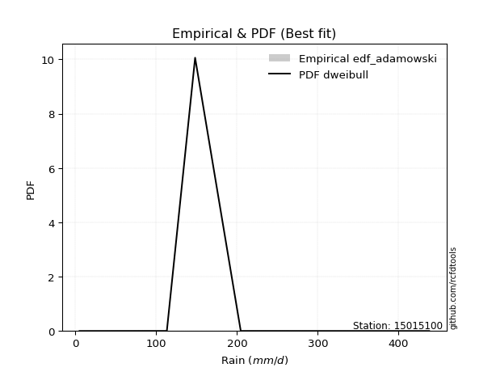</img>

</div>


## C. Best fit & Estimate extreme values for specific return periods - Tr


### 1. Best fit (ordered by delta Δ)

<div align="center">

|   id |   station | empirical_dist   | p_dist      |     delta |   deltao | eval   |   fit |   n |   best_fit |   best_fit_sort |
|-----:|----------:|:-----------------|:------------|----------:|---------:|:-------|------:|----:|-----------:|----------------:|
|    0 |  15015100 | edf_gringorten   | genlogistic | 0.0566442 | 0.586543 | Δo > Δ |     1 |   5 |          1 |               1 |
|    1 |  15015100 | edf_blom         | exponnorm   | 0.0579294 | 0.586543 | Δo > Δ |     1 |   5 |          1 |               2 |
|    2 |  15015100 | edf_cunnane      | exponnorm   | 0.0595996 | 0.586543 | Δo > Δ |     1 |   5 |          1 |               3 |
|    3 |  15015100 | edf_hazen        | genlogistic | 0.0608861 | 0.586543 | Δo > Δ |     1 |   5 |          1 |               4 |
|    4 |  15015100 | edf_tukey        | exponnorm   | 0.0638818 | 0.586543 | Δo > Δ |     1 |   5 |          1 |               5 |
|    5 |  15015100 | edf_filliben     | exponnorm   | 0.0660952 | 0.586543 | Δo > Δ |     1 |   5 |          1 |               6 |
|    6 |  15015100 | edf_beard        | exponnorm   | 0.0671346 | 0.586543 | Δo > Δ |     1 |   5 |          1 |               7 |
|    7 |  15015100 | edf_jenkinson    | exponnorm   | 0.0671346 | 0.586543 | Δo > Δ |     1 |   5 |          1 |               8 |
|    8 |  15015100 | edf_chegodayev   | exponnorm   | 0.0685115 | 0.586543 | Δo > Δ |     1 |   5 |          1 |               9 |
|    9 |  15015100 | edf_adamowski    | exponnorm   | 0.0752455 | 0.586543 | Δo > Δ |     1 |   5 |          1 |              10 |
|   10 |  15015100 | edf_weibull      | exponnorm   | 0.105548  | 0.586543 | Δo > Δ |     1 |   5 |          1 |              11 |
|   11 |  15015100 | edf_california   | fisk        | 0.145071  | 0.586543 | Δo > Δ |     1 |   5 |          1 |              12 |

</div>

:file_folder:Tables: [bestfit_15015100.csv](table/bestfit_15015100.csv) | [extreme_15015100.csv](table/extreme_15015100.csv)


### 2. Extreme values

In hydrology, a return period (or recurrence interval $Tr$) is the statistical average time between extreme events like floods or droughts of a specific magnitude, indicating how rare an event is, with a 100-year flood, for example, having a 1% chance of occurring in any given year, not that it happens exactly every century. It is a key tool for infrastructure design (like bridges or dams) and risk assessment, calculated from historical data to determine the probability of future events, although it is important to remember it is statistical average, and events can cluster or be missed.

> risk_rate: assuming the return period as the project useful life.

|   id |      tr |   prob_l |     prob_g |     alpha |   betaprime |     chi2 |   crystalball |   erlang |    expon |   exponnorm |        f |   fatiguelife |     fisk |     gamma |   genexpon |   genlogistic |   gibrat |   gompertz |   gumbel_l |   gumbel_r |   halflogistic |   halfnorm |   hypsecant |   invgamma |   invgauss |       invweibull |   johnsonsu |   kstwobign |   laplace |   laplace_asymmetric |   loggamma |   logistic |    lognorm |   maxwell |   mielke |   moyal |   nakagami |       ncf |              nct |    norm |           pareto |   pearson3 |   rayleigh |    rice |       t |   truncnorm |     wald |   weibull_min |   logalpha |   logbetaprime |          logchi2 |   logcrystalball |   logerlang |         logexpon |   logexponnorm |       logf |   logfatiguelife |   logfisk |   loggenexpon |   loggenlogistic |        loggibrat |   loggompertz |   loggumbel_l |   loggumbel_r |   loghalflogistic |   loghalfnorm |   loghypsecant |   loginvgamma |   loginvgauss |    loginvweibull |   logjohnsonsu |   logkstwobign |   loglaplace |   loglaplace_asymmetric |   logloggamma |   loglogistic |     loglognorm |   logmaxwell |   logmielke |    logmoyal |   lognakagami |      logncf |     lognct |     logpareto |   logpearson3 |   lograyleigh |    logrice |       logt |   logtruncnorm |          logwald |   logweibull_min |   station |   n |   risk_rate |
|-----:|--------:|---------:|-----------:|----------:|------------:|---------:|--------------:|---------:|---------:|------------:|---------:|--------------:|---------:|----------:|-----------:|--------------:|---------:|-----------:|-----------:|-----------:|---------------:|-----------:|------------:|-----------:|-----------:|-----------------:|------------:|------------:|----------:|---------------------:|-----------:|-----------:|-----------:|----------:|---------:|--------:|-----------:|----------:|-----------------:|--------:|-----------------:|-----------:|-----------:|--------:|--------:|------------:|---------:|--------------:|-----------:|---------------:|-----------------:|-----------------:|------------:|-----------------:|---------------:|-----------:|-----------------:|----------:|--------------:|-----------------:|-----------------:|--------------:|--------------:|--------------:|------------------:|--------------:|---------------:|--------------:|--------------:|-----------------:|---------------:|---------------:|-------------:|------------------------:|--------------:|--------------:|---------------:|-------------:|------------:|------------:|--------------:|------------:|-----------:|--------------:|--------------:|--------------:|-----------:|-----------:|---------------:|-----------------:|-----------------:|----------:|----:|------------:|
|    0 |    2    | 0.5      | 0.5        |   16.9627 |     125.508 |  6.48862 |       5.00673 |  31.7281 |  127.607 |     151.278 |  117.493 |       5.10062 |  150.304 |   21.2975 |    127.518 |       156.393 |  138.712 |    157.579 |    205.444 |    158.236 |        213.53  |    152.429 |     181.84  |    150.816 |    147.128 |   5674.44        |     148.492 |     159.752 |   181.84  |              166.335 |    92.3149 |    181.84  |    94.8356 |   169.552 |  158.655 | 150.615 |    180.34  |   131.559 |     43.0485      | 181.84  |     26.5156      |    164.328 |    165.193 | 172.783 | 181.761 |     181.84  |  135.265 |       19.4533 |    84.6617 |        85.7865 |     35.6159      |          94.8356 |     90.3535 |     38.6769      |        94.8355 |    94.5243 |          95.1018 |   126.456 |       63.5196 |          inf     |     59.9077      |       118.637 |       121.94  |        73.756 |           65.0898 |       69.3332 |        94.8356 |       89.6531 |       81.5442 |     76.5735      |        165.903 |        64.0744 |      94.8356 |                 129.685 |       151.69  |       94.8356 |   5.11057      |      83.2023 |     153.725 |     68.0068 |       113.557 |     79.1571 |    94.7427 |   7.61089     |       126.738 |       79.4287 |    91.6263 |    94.8355 |       0.229248 |     57.7499      |      8.52165     |  15015100 |   5 |    0.75     |
|    1 |    2.33 | 0.570815 | 0.429185   |   20.1887 |     161.447 |  6.99478 |      42.7531  |  44.2737 |  154.599 |     173.845 |  156.01  |      10.1987  |  173.053 |   32.4984 |    154.49  |       179.828 |  151.7   |    184.521 |    227.751 |    181.994 |        215.235 |    180.101 |     202.36  |    174.691 |    171.843 | 240908           |     172.817 |     184.457 |   197.356 |              184.498 |   122.63   |    204.431 |   124.612  |   196.19  |  193.103 | 173.105 |    199.987 |   162.301 |     66.1679      | 207.48  |     44.7527      |    189.848 |    192.225 | 197.677 | 207.4   |     207.48  |  152.077 |       34.9617 |   112.504  |       118.462  |     59.4001      |         124.612  |    119.75   |     60.4389      |       124.613  |   124.363  |         125.048  |   159.346 |       90.6487 |          inf     |     68.7951      |       146.442 |       154.639 |        94.991 |           84.4299 |       93.0955 |       117.999  |      120.514  |      109.44   |    110.623       |        200.04  |        92.6694 |     111.876  |                 153.971 |       185.765 |      120.63   |   5.25402      |     110.494  |     188.158 |     86.4117 |       114.553 |    109.623  |   124.64   |  10.7271      |       162.007 |      105.927  |   121.368  |   124.612  |       0.583671 |     69.0735      |     11.6284      |  15015100 |   5 |    0.729209 |
|    2 |    5    | 0.8      | 0.2        |   45.2031 |     384.999 |  9.9901  |     183.029   | 127.888  |  289.552 |     280.422 |  380.39  |     118.486   |  282.049 |  126.697  |    289.346 |       281.621 |  226.476 |    297.098 |    299.816 |    285.21  |        222.955 |    297.123 |     284.668 |    283.343 |    285.658 |      2.8573e+12  |     284.72  |     289.396 |   274.933 |              275.308 |   358.449  |    291.656 |   343.768  |   301.035 |  318.055 | 277.282 |    293.299 |   357.238 |    555.227       | 302.765 |    764.522       |    294.814 |    300.447 | 297.339 | 302.684 |     302.765 |  246.193 |      323.496  |   337.12   |       422.205  |    876.677       |         343.768  |    347.653  |    563.109       |       343.777  |   344.699  |         346.139  |   389.045 |      380.568  |          inf     |    152.555       |       292.809 |       333.141 |       285.151 |          273.983  |      323.72   |       283.51   |      375.233  |      343.797  |    546.961       |        323.655 |       444.272  |     255.588  |                 248.433 |       311.342 |      305.411  |   9.24239e+258 |     337.494  |     314.925 |    262.063  |       160.693 |    419.768  |   345.788  |   9.89899e+06 |       345.765 |      335.387  |   348.044  |   343.769  |      13.0502   |    188.199       |    228.936       |  15015100 |   5 |    0.67232  |
|    3 |   10    | 0.9      | 0.1        |   91.1607 |     661.746 | 13.0961  |     276.084   | 222.158  |  412.059 |     376.023 |  613.046 |     268.002   |  389.274 |  249.954  |    411.764 |       364.519 |  311.713 |    377.33  |    339.938 |    369.279 |        229.365 |    383.716 |     350.394 |    377.738 |    383.373 |      1.65088e+18 |     382.133 |     369.293 |   345.355 |              357.744 |   741.345  |    355.894 |   673.937  |   374.82  |  378.384 | 367.984 |    367.375 |   623.547 |   3809.23        | 365.974 |  10725.6         |    373.561 |    377.611 | 368.401 | 365.892 |     365.974 |  346.072 |     1194.23   |   724.951  |      1045.34   |  11230.5         |         673.937  |    716.868  |   4270.46        |       673.964  |   678.1    |         680.598  |   750.751 |     1065.22   |          inf     |    378.159       |       433.162 |       510.74  |       698.077 |          728.245  |      814.094  |       570.9    |      823.861  |      769.298  |   2010.49        |        392.084 |      1465.3    |     541.068  |                 357.85  |       372.817 |      605.335  | inf            |     740.512  |     376.929 |    688.518  |       367.413 |   1159.93   |   681.111  |   7.4875e+90  |       505.765 |      762.855  |   703.995  |   673.938  |      62.8156   |    545.227       |  37922.3         |  15015100 |   5 |    0.651322 |
|    4 |   15    | 0.933333 | 0.0666667  |  136.954  |     864.143 | 15.012   |     322.52    | 282.12   |  483.721 |     431.941 |  757.815 |     365.789   |  459.872 |  332.505  |    483.374 |       411.286 |  370.505 |    417.683 |    358.109 |    416.709 |        232.993 |    428.779 |     387.904 |    433.49  |    439.694 |      2.94072e+21 |     439.32  |     411.709 |   386.549 |              405.965 |  1070.24   |    390.894 |   942.995  |   412.678 |  399.216 | 420.624 |    406.553 |   837.425 |  11748.5         | 397.517 |  50390.8         |    415.665 |    417.37  | 405.015 | 397.435 |     397.517 |  410.21  |     2164.8    |  1075.05   |      1675.46   |  51269.9         |         942.995  |   1033.83   |  13969.2         |       943.039  |   950.552  |         953.93   |  1074.11  |     1812.66   |          inf     |    707.311       |       517.696 |       619.784 |      1156.85  |         1266.3    |     1315.52   |       851.229  |     1232.41   |     1166.33   |   4190.52        |        420.763 |      2761      |     839.038  |                 443.01  |       394.147 |      878.771  | inf            |    1108.23   |     398.437 |   1206.09   |       664.075 |   2007.16   |   955.575  | inf           |       591.812 |     1165.01   |  1001.77   |   942.997  |     113.353    |   1079.51        |      2.51498e+06 |  15015100 |   5 |    0.644736 |
|    5 |   20    | 0.95     | 0.05       |  182.708  |    1029.34  | 16.4033  |     352.93    | 326.224  |  534.566 |     471.615 |  863.74  |     438.188   |  514.536 |  394.493  |    534.182 |       444.032 |  416.623 |    444.007 |    369.419 |    449.919 |        235.535 |    458.823 |     414.365 |    473.68  |    479.497 |      5.5531e+23  |     480.299 |     440.282 |   415.777 |              440.179 |  1363.4    |    415.085 |  1175.03   |   437.803 |  409.764 | 457.904 |    432.789 |  1023.45  |  26123.3         | 418.174 | 151061           |    444.269 |    443.796 | 429.351 | 418.092 |     418.174 |  458.005 |     3136.3    |  1397.75   |      2298.1    | 151879           |        1175.03   |   1316.35   |  32385.9         |      1175.09   |  1185.91   |        1190.07   |  1375.82  |     2581.91   |          inf     |   1155.91        |       578.592 |       699.121 |      1647.7   |         1865.82   |     1811.56   |      1128.32   |     1610.43   |     1539.73   |   7008.09        |        437.568 |      4230.7    |    1145.42   |                 515.459 |       404.966 |     1137      | inf            |    1448.23   |     409.345 |   1793.93   |      1021.01  |   2919.94   |  1192.91   | inf           |       648.863 |     1543.68   |  1262.57   |  1175.03   |     155.06     |   1795.94        |      8.8112e+07  |  15015100 |   5 |    0.641514 |
|    6 |   25    | 0.96     | 0.04       |  228.445  |    1171.37  | 17.4977  |     375.316   | 361.176  |  574.004 |     502.389 |  947.572 |     495.712   |  559.931 |  444.196  |    573.592 |       469.254 |  455.07  |    463.283 |    377.468 |    475.499 |        237.493 |    481.177 |     434.844 |    505.32  |    510.327 |      3.14569e+25 |     512.394 |     461.684 |   438.448 |              466.717 |  1630.74   |    433.59  |  1381.59   |   456.456 |  416.134 | 486.799 |    452.343 |  1191.26  |  48552.7         | 433.38  | 353995           |    465.851 |    463.43  | 447.432 | 433.298 |     433.38  |  496.288 |     4083.64   |  1699.63   |      2910.39   | 354078           |        1381.59   |   1574      |  62174.9         |      1381.67   |  1395.67   |        1400.55   |  1662.67  |     3358.6    |          inf     |   1740.81        |       626.304 |       761.689 |      2163.66  |         2515.14   |     2298.49   |      1403.3    |     1964.8    |     1894.1    |  10414.2         |        448.973 |      5824.28   |    1458.21   |                 579.719 |       411.506 |     1384.7    | inf            |    1766.49   |     415.938 |   2440.36   |      1422.8   |   3879.63   |  1404.61   | inf           |       690.739 |     1902.69   |  1497.28   |  1381.59   |     188.422    |   2699.96        |      1.96405e+09 |  15015100 |   5 |    0.639603 |
|    7 |   50    | 0.98     | 0.02       |  457.059  |    1703.44  | 20.9654  |     439.421   | 473.074  |  696.511 |     597.982 | 1216.45  |     680.274   |  720.473 |  605.857  |    696.01  |       546.95  |  590.595 |    517.795 |    399.315 |    554.3   |        243.527 |    546.151 |     498.336 |    606.801 |    606.069 |      7.91474e+30 |     614.224 |     524.531 |   508.87  |              549.153 |  2733.78   |    490.132 |  2196.74   |   510.553 |  428.967 | 576.504 |    509.258 |  1880.05  | 332949           | 476.924 |      4.98719e+06 |    530.152 |    520.425 | 499.919 | 476.842 |     476.924 |  621.283 |     8363.43   |  3008.72   |      5822.07   |      5.00028e+06 |        2196.74   |   2637.53   | 471516           |      2196.88   |  2225.19   |        2233.12   |  2965.48  |     7211.74   |          inf     |   7372.33        |       776.894 |       961.229 |      5007.87  |         6311.95   |     4591.52   |      2759.39   |     3505.21   |     3471.59   |  35281.9         |        477.393 |     14890.7    |    3086.97   |                 835.046 |       424.694 |     2528.52   | inf            |    3142.79   |     429.232 |   6343.84   |      3848.6   |   9114.31   |  2243.02   | inf           |       807.575 |     3491.21   |  2441.53   |  2196.74   |     283.254    |  10220.7         |      2.27994e+14 |  15015100 |   5 |    0.63583  |
|    8 |   75    | 0.986667 | 0.0133333  |  685.642  |    2090.66  | 23.0326  |     473.818   | 540.41   |  768.173 |     653.9   | 1379.23  |     791.426   |  830.427 |  704.506  |    767.619 |       592.11  |  682.129 |    546.516 |    410.363 |    600.102 |        247.034 |    581.521 |     535.441 |    668.795 |    662.163 |      1.09029e+34 |     675.529 |     559.109 |   550.064 |              597.374 |  3615.78   |    522.788 |  2817.36   |   539.964 |  433.272 | 628.962 |    540.246 |  2436.27  |      1.02684e+06 | 500.288 |      2.34367e+07 |    566.195 |    551.432 | 528.474 | 500.207 |     500.288 |  698.198 |    12019.4    |  4116.26   |      8534.74   |      2.37791e+07 |        2817.36   |   3488.53   |      1.54239e+06 |      2817.56   |  2858.18   |        2868.65   |  4142.19  |    10934      |          inf     |  19542.6         |       866.488 |      1081.25  |      8156.31  |        10775.8    |     6691.82   |      4096.63   |     4809.75   |     4843.2    |  71708.1         |        490.261 |     24958.3    |    4786.99   |                1033.77  |       429.122 |     3580.18   | inf            |    4298.81   |     433.696 |  11091.2    |      6667.89  |  14789.1    |  2883.87   | inf           |       866.946 |     4857.25   |  3175.29   |  2817.37   |     326.428    |  23186.4         |      9.22473e+17 |  15015100 |   5 |    0.634587 |
|    9 |  100    | 0.99     | 0.01       |  914.216  |    2406.16  | 24.5134  |     497.082   | 588.864  |  819.018 |     693.574 | 1497.03  |     871.404   |  916.821 |  775.966  |    818.428 |       624.072 |  753.037 |    565.699 |    417.59  |    632.519 |        249.516 |    605.616 |     561.761 |    714.117 |    702.034 |      1.81668e+36 |     719.894 |     582.8   |   579.292 |              631.588 |  4372.72   |    545.844 |  3333.75   |   559.997 |  435.43  | 666.179 |    561.346 |  2920.87  |      2.28318e+06 | 516.091 |      7.02615e+07 |    591.189 |    572.557 | 547.928 | 516.01  |     516.091 |  754.277 |    15237.5    |  5102.78   |     11100.7    |      7.21666e+07 |        3333.75   |   4219.29   |      3.57584e+06 |      3333.99   |  3385.59   |        3398.3    |  5244.44  |    14520.5    |          inf     |  41586.9         |       930.664 |      1167.75  |     11519.3   |        15734.7    |     8649.4    |      5422.03   |     5971.39   |     6085.65   | 118460           |        498.114 |     35554.6    |    6535      |                1202.83  |       431.342 |     4576.6    | inf            |    5321.14   |     435.934 |  16485.8    |      9699.1   |  20737.6    |  3418.39   | inf           |       905.297 |     6082.68   |  3793.42   |  3333.76   |     350.858    |  42131.8         |      6.68999e+20 |  15015100 |   5 |    0.633968 |
|   10 |  200    | 0.995    | 0.005      | 1828.49   |    3333.71  | 28.121   |     549.853   | 707.53   |  941.525 |     789.167 | 1788.36  |    1067.17    | 1158.2   |  952.27   |    940.846 |       700.912 |  945.95  |    608.426 |    433.297 |    710.452 |        255.485 |    660.723 |     625.169 |    828.359 |    798.403 |      3.9862e+41  |     829.997 |     637.367 |   649.714 |              714.024 |  6749.06   |    601.151 |  4883.42   |   605.83  |  438.682 | 755.845 |    609.555 |  4494.35  |      1.56567e+07 | 551.937 |      9.89873e+08 |    649.745 |    620.892 | 592.441 | 551.856 |     551.937 |  893.964 |    25520.3    |  8380.03   |     20405.9    |      1.05864e+09 |        4883.42   |   6515.76   |      2.71182e+07 |      4883.82   |  4971.47   |        4991.49   |  9236.39  |    27801.5    |          inf     | 324527           |      1087.19  |      1380.38  |     26416.7   |        39094.8    |    15554.9    |     10652      |     9823.79   |    10313.8    | 395979           |        513.631 |     80326.5    |   13834.3    |                1732.59  |       434.679 |     8247.94   | inf            |    8669.42   |     439.324 |  42838.2    |     22778.7   |  46156      |  5028.2    | inf           |       985.881 |    10177.8    |  5681.03   |  4883.44   |     391.612    | 186504           |      6.09578e+28 |  15015100 |   5 |    0.633042 |
|   11 |  250    | 0.996    | 0.004      | 2285.63   |    3691.36  | 29.2926  |     565.979   | 746.227  |  980.963 |     819.941 | 1884.35  |    1130.98    | 1247.24  | 1010.09   |    980.255 |       725.615 | 1015.17  |    621.254 |    437.919 |    735.506 |        257.403 |    677.677 |     645.58  |    866.773 |    829.528 |      2.07828e+43 |     866.462 |     654.255 |   672.385 |              740.562 |  7712.41   |    618.907 |  5487.68   |   619.939 |  439.346 | 784.711 |    624.37  |  5155.84  |      2.90995e+07 | 562.891 |      2.31969e+09 |    668.159 |    635.771 | 606.143 | 562.811 |     562.891 |  940.176 |    29702.3    |  9775.9    |     24664.5    |      2.52045e+09 |        5487.68   |   7447.64   |      5.20618e+07 |      5488.15   |  5590.89   |        5613.99   | 11076.8   |    33958.7    |          inf     | 678279           |      1138.11  |      1450.02  |     34495.3   |        52382.9    |    18632.8    |     13238.5    |    11460.9    |    12150.5    | 583665           |        517.794 |    103372      |   17612.2    |                1948.58  |       435.348 |     9964.81   | inf            |   10075      |     440.027 |  58255.8    |     29576.4   |  59505.4    |  5657.84   | inf           |      1008.56  |    11925.3    |  6427.94   |  5487.7    |     400.412    | 305091           |      4.77004e+31 |  15015100 |   5 |    0.632858 |
|   12 |  500    | 0.998    | 0.002      | 4571.3    |    5029.56  | 32.9589  |     613.803   | 867.704  | 1103.47  |     915.533 | 2189.13  |    1331.12    | 1565.52  | 1192.39   |   1102.67  |       802.288 | 1254.38  |    658.64  |    451.167 |    813.27  |        263.359 |    728.224 |     708.983 |    991.662 |    926.544 |      4.43983e+48 |     983.097 |     704.862 |   742.807 |              822.997 | 11481.1    |    673.973 |  7755.99   |   662.04  |  440.769 | 874.376 |    668.485 |  7873.74  |      1.99548e+08 | 595.376 |      3.26808e+10 |    724.204 |    680.164 | 647.025 | 595.297 |     595.376 | 1087.12  |    45890.7    | 15546.1    |     43690.3    |      3.7575e+10  |        7755.99   |  11097.5    |      3.94822e+08 |      7756.7    |  7920.1    |        7955.7    | 19460.4   |    61703.8    |          436.681 |      8.66689e+06 |      1297.79  |      1669.74  |     78963.8   |       129895      |    31920.2    |     26006.8    |    18203.5    |    19902.2    |      1.94594e+06 |        528.733 |    220130      |   37284.3    |                2806.8   |       436.686 |    17912.7    | inf            |   15774.9    |     441.579 | 151374      |     64086.5   | 129916      |  8029      | inf           |      1070.08  |    19133.6    |  9274.01   |  7756.02   |     418.713    |      1.459e+06   |      5.42308e+41 |  15015100 |   5 |    0.632489 |
|   13 |  750    | 0.998667 | 0.00133333 | 6856.97   |    6002.57  | 35.1197  |     640.37    | 939.539  | 1175.13  |     971.451 | 2372     |    1449.38    | 1785.21  | 1300.66   |   1174.28  |       847.111 | 1412.58  |    678.977 |    458.248 |    858.731 |        266.84  |    756.463 |     746.071 |   1068.9   |    983.534 |      5.79534e+51 |    1053.78  |     733.292 |   784.001 |              871.219 | 14341.2    |    706.145 |  9399.44   |   685.587 |  441.342 | 926.826 |    693.093 | 10069.9   |      6.15417e+08 | 613.422 |      1.5358e+11  |    756.274 |    704.989 | 669.886 | 613.344 |     613.422 | 1175.22  |    57903.4    | 20209      |     60402.3    |      1.83343e+11 |        9399.44   |  13871.6    |      1.29151e+09 |      9400.34   |  9610.92   |        9656.4    | 27048     |    86183.6    |          437.126 |      4.67309e+07 |      1392.2   |      1800.52  |    128142     |       220881      |    43119.4    |     38603.3    |    23625      |    26306.3    |      3.9342e+06  |        533.99  |    336587      |   57817.1    |                3474.76  |       437.132 |    25232.5    | inf            |   20271      |     442.232 | 264631      |     98343.7   | 204185      |  9753.19   | inf           |      1100.47  |    24923.7    | 11370.3    |  9399.48   |     425.03     |      3.72859e+06 |      2.43628e+48 |  15015100 |   5 |    0.632366 |
|   14 | 1000    | 0.999    | 0.001      | 9142.63   |    6795.09  | 36.6592  |     658.661   | 990.807  | 1225.98  |    1011.13  | 2503.78  |    1533.73    | 1958.35  | 1378.12   |   1225.09  |       878.905 | 1533.65  |    692.797 |    463.013 |    890.978 |        269.309 |    775.965 |     772.386 |   1125.69  |   1024.08  |      9.40102e+53 |    1105.08  |     752.988 |   813.229 |              905.433 | 16724.5    |    728.961 | 10729.2    |   701.862 |  441.686 | 964.04  |    710.072 | 11983.6   |      1.36838e+09 | 625.847 |      4.60421e+11 |    778.745 |    722.144 | 685.685 | 625.769 |     625.847 | 1238.59  |    67712.3    | 24256.8    |     75690.7    |      5.65497e+11 |       10729.2    |  16185.4    |      2.99421e+09 |     10730.3    | 10980.7    |       11034.6    | 34161.3   |   108577      |          437.349 |      1.69656e+08 |      1459.59  |      1894.25  |    180650     |       321892      |    53072.7    |     51089.6    |    28313.4    |    31941.9    |      6.48217e+06 |        537.304 |    451711      |   78929.4    |                4043.01  |       437.355 |    32172.5    | inf            |   24107.4    |     442.633 | 393334      |    131974     | 280968      | 11151.5    | inf           |      1119.83  |    29919.7    | 13083.7    | 10729.3    |     428.23     |      7.32255e+06 |      2.89196e+53 |  15015100 |   5 |    0.632305 |

<div align="center">

</img>

</div>


<div align="center">

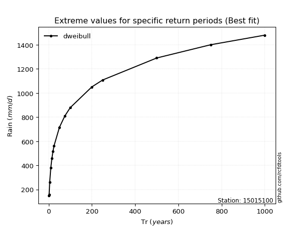</img>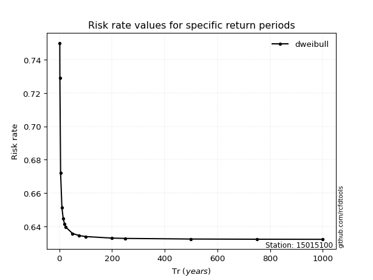</img>

</div>


<sub>**APP DISCLAIMER**: NO WARRANTY - This software is provided by [github.com/rcfdtools](https://github.com/rcfdtools) "as is", without any express or implied warranty, including warranties of merchantability, fitness for a particular purpose, or non-infringement. There is no guarantee that the software will be error-free or operate without interruption. LIMITATION OF LIABILITY - Neither the authors nor copyright holders will be liable for claims or damages arising from the software or its use. You are responsible for determining if the software is appropriate for your use and assume all associated risks, including errors, legal compliance, and data loss. NO PROFESSIONAL ADVICE - The software provides general information and does not offer professional advice. It should not replace consultation with professional advisors.</sub>