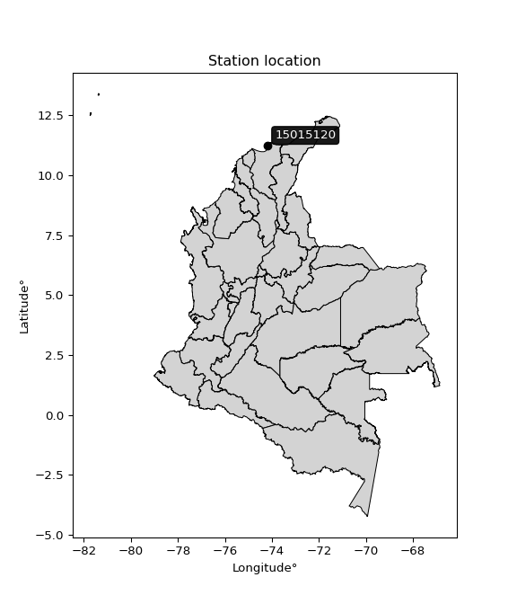

<div align="center">


</div>

# PMP Station (Rain, Pmax24h): 15015120

Probable Maximum Precipitation (PMP) is the greatest amount of rainfall for a specific duration that is meteorologically possible for a given location, acting as a "worst-case" scenario for extreme storms, crucial for designing safety-critical infrastructure like bridges, river deviations, dams, spillways, and nuclear plants to prevent catastrophic failure. PMP is calculated by hydrologists using meteorological data to determine the upper limit of extreme rainfall, often leading to the Probable Maximum Flood (PMF) for flood control design, and is increasingly being studied for climate change impacts. Probable Maximum Precipitation (PMP) is the theoretical upper limit of rainfall, a deterministic estimate for extreme events, while probability distributions (like GEV, Gumbel) describe the likelihood and frequency of various precipitation amounts, including rare ones, showing how often events occur, with PMP representing the extreme end of these distributions, used for critical infrastructure design to ensure safety against the worst conceivable weather, unlike standard statistical forecasts which cover typical probabilities.

The most common probability distributions in hydrology, used for analyzing floods, rainfall, and streamflow, include the Normal, Log-Normal, Gumbel, Gamma (including Log-Pearson Type III), and Generalized Extreme Value (GEV) distributions, often chosen based on the data´s skewness and whether modeling extremes or general conditions, with Gumbel and GEV popular for extreme events like floods, while the Normal distribution serves as a baseline, though often requiring transformations for skewed hydrological data. These distributions help in designing water infrastructure, managing water resources, and forecasting hydrologic events.

> Hydrological data often isn´t perfectly normal (it´s skewed), so different distributions are needed for different applications, such as: **Flood Frequency Analysis**: Using Gumbel, GEV, or Log-Pearson Type III for predicting extreme flood magnitudes and their return periods, **Rainfall Analysis**: Normal for annual totals, but Log-Normal, Weibull, or GEV for intensity or extreme daily rainfall, **Streamflow Modeling**: Gamma and Log-Normal for maximum flows, GEV for minimum flows, and Kappa for daily flows.

<div align="center">

</img>

</div>


## A. General information


### 1. General running parameters

• app_version: _v20260108_. • runtime: _2026-01-08 13:24:42.400241_. • Python version: _3.14.0_. • SciPy version: _1.16.3_. • Pandas version: _2.3.3_. • NumPy version: _2.3.5_. • Stations dataset (station_dataset_file): _dataset/pmax24h_in/automatic_colombia_2003_2024.csv_. • Stations catalog (station_catalog_file): _dataset/CNE.xls_. • Minimum year to eval til year_max (date_min): _1900_. • Maximum year to eval since year_min (date_max): _2024_. • Creates, save and include plots into reports (create_plot): _False_. • Plot only fit distributions with Δo > Δ (plot_only_fit): _True_. • Plot only simple graphs avoiding multiple CDFs and multiple Extreme values plots (plot_only_simple): _True_. • Eval low extreme values, if False, evaluates high extreme values (low_extreme): _False_. • Eval every SciPy distribution as logarithmic (pdist_logarithmic_on): _True_. • Standard deviation normalized (ddof): _1.0_. • Return periods to eval in years (Tr): _[2, 2.33, 5, 10, 15, 20, 25, 50, 75, 100, 200, 250, 500, 750, 1000]_. • Minimum data sample per station, 0 means any (minimum_sample): _5_. • Z-Score maximum threshold to adjust a value, 0 means disable (zscore_max): _3.5_. • Z-Score minimum threshold to adjust a value, 0 means disable (zscore_min): _-2.5_. • Avoid zeros, e.g. rain = 0 (avoid_zeros): _True_. • Avoid null values (avoid_nans): _True_. 

:file_folder:Table: [dataset.csv](../../dataset/pmax24h_in/automatic_colombia_2003_2024.csv)

> Delta Degrees of Freedom (DDOF): is a parameter used in the formulas for calculating variance and standard deviation. When ddof=0, the divisor is $N$ (the total number of observations) and this is used when your data set is the entire population. When ddof=1, the divisor is $N-1$ and this is used when your data set is a sample drawn from a larger population. Using $N-1$ provides an unbiased estimate of the population variance (known as Bessel´s correction).


### 2. Station info and location

|   id |   CODIGO | NOMBRE                                    | CATEGORIA               | TECNOLOGIA                              | ESTADO   | FECHA_INSTALACION   |   FECHA_SUSPENSION |   ALTITUD |   LATITUD |   LONGITUD | DEPARTAMENTO   | MUNICIPIO   | AREA_OPERATIVA                                         | ENTIDAD                                                     | AREA_HIDROGRAFICA   | ZONA_HIDROGRAFICA   | SUBZONA_HIDROGRAFICA          |   CORRIENTE | Catalogo   |   Version |
|-----:|---------:|:------------------------------------------|:------------------------|:----------------------------------------|:---------|:--------------------|-------------------:|----------:|----------:|-----------:|:---------------|:------------|:-------------------------------------------------------|:------------------------------------------------------------|:--------------------|:--------------------|:------------------------------|------------:|:-----------|----------:|
|    0 | 15015120 | UNIVERSIDAD TECNOLOGICA  - AUT [15015120] | Climatológica Principal | Automática con Telemetría, Convencional | Activa   | 13/09/2007          |                nan |         7 |   11.2231 |   -74.1859 | Magdalena      | Santa Marta | Area Operativa 05 - Magdalena-Cesar-Guajira-San Andrés | INSTITUTO DE HIDROLOGIA METEOROLOGIA Y ESTUDIOS AMBIENTALES | Caribe              | Caribe - Guajira    | Río  Piedras - Río Manzanares |         nan | CNE_IDEAM  |  20251226 |

<div align="center">

Dynamic map: [:earth_americas:Google](http://maps.google.com/maps?q=11.22305556,-74.18591667) [:earth_americas:OSM](https://www.openstreetmap.org/#map=18/11.22305556/-74.18591667&layers=P) [:earth_americas:Bing](https://www.bing.com/maps?cp=11.22305556~-74.18591667&lvl=18) [:earth_americas:Apple](https://maps.apple.com/frame?center=11.22305556%2C-74.18591667&span=0.003%2C0.006)

</div>


<div align="center">

```geojson
{
  "type": "Feature",
  "geometry": {
    "type": "Point", 
    "coordinates": [-74.18591667, 11.22305556]
  }, 
  "properties": {
    "Name": "15015120"
  }
}
```

</div>


### 3. Discrete values table and plot

<div align="center">

|               |           0 |           1 |          2 |            3 |           4 |          5 |          6 |           7 |           8 |           9 |         10 |         11 |          12 |          13 |          14 |          15 |         16 |        17 |
|:--------------|------------:|------------:|-----------:|-------------:|------------:|-----------:|-----------:|------------:|------------:|------------:|-----------:|-----------:|------------:|------------:|------------:|------------:|-----------:|----------:|
| Date          | 2007        | 2008        | 2009       | 2010         | 2011        | 2012       | 2013       | 2014        | 2015        | 2016        | 2017       | 2018       | 2019        | 2020        | 2021        | 2022        | 2023       | 2024      |
| Value         |   74.2      |   85.3      |   24.9     |   64.7       |   64.8      |  207.2     |   51       |   49        |   81.6      |   57.1      |   85.8     |  112.3     |   43.2      |   55.5      |   18        |   71.6      |    0.4     |    4.4    |
| Value_initial |   74.2      |   85.3      |   24.9     |   64.7       |   64.8      |  207.2     |   51       |   49        |   81.6      |   57.1      |   85.8     |  112.3     |   43.2      |   55.5      |   18        |   71.6      |    0.4     |    4.4    |
| count         |   18        |   18        |   18       |   18         |   18        |   18       |   18       |   18        |   18        |   18        |   18       |   18       |   18        |   18        |   18        |   18        |   18       |   18      |
| mean          |   63.9444   |   63.9444   |   63.9444  |   63.9444    |   63.9444   |   63.9444  |   63.9444  |   63.9444   |   63.9444   |   63.9444   |   63.9444  |   63.9444  |   63.9444   |   63.9444   |   63.9444   |   63.9444   |   63.9444  |   63.9444 |
| std           |   46.2914   |   46.2914   |   46.2914  |   46.2914    |   46.2914   |   46.2914  |   46.2914  |   46.2914   |   46.2914   |   46.2914   |   46.2914  |   46.2914  |   46.2914   |   46.2914   |   46.2914   |   46.2914   |   46.2914  |   46.2914 |
| zscore        |    0.221544 |    0.461329 |   -0.84345 |    0.0163217 |    0.018482 |    3.09465 |   -0.27963 |   -0.322834 |    0.381401 |   -0.147856 |    0.47213 |    1.04459 |   -0.448128 |   -0.182419 |   -0.992506 |    0.165378 |   -1.37271 |   -1.2863 |


</div>


> The initial value (value_initial) correspond to the initial obtained or null completed value, and value (value) is adjusted only when the initial value is outside the valid range (outlier) definite through the Z-Score value. If Z-Score is active, values out of range or outliers are replaced with the station mean value. A Z-Score (or standard score) measures how many standard deviations a data point is from the mean of a dataset, indicating its relative position; positive scores mean above the mean, negative mean below, and a score of zero is exactly at the mean, allowing for comparison of values from different distributions. It´s calculated using the formula $z=(x–μ)/σ$, where $x$ is the data point, $μ$ is the mean, and $σ$ is the standard deviation, helping identify outliers and understand probability.
>
> <sub>**Note**: In this study, "completing" (filling gaps in) and "extending" (forecasting or lengthening the historical record) rainfall data series are avoided for certain critical analyses because they introduce artificial bias and uncertainty, which can distort the statistics of rare events (extremes), alter day-to-day variability, and compromise the integrity and homogeneity of the original data. Some reasons against Completing/Extending rainfall data are: **Distortion of Extremes and Variability**: The primary issue is that most gap-filling or extension methods rely on averaging or regression with nearby stations, which inherently smooths the data. Rainfall is highly variable in space and time, with a large percentage of zero values and occasional large storms. Infilling methods often underestimate the highest values and overestimate the lowest (zero) values, which severely distorts analyses focused on flood frequency, drought severity, and intensity-duration-frequency (IDF) curves, **Loss of Data Homogeneity**: Infilled or extended data are synthetic estimates, not actual measurements. Combining these estimates with observed data can violate the assumption of data homogeneity, which requires that the data properties do not change over time. Inhomogeneity can lead to incorrect conclusions about long-term trends or changes in climate patterns, **Propagation of Errors**: Errors and biases from the original data (e.g., wind-induced undercatch, instrument errors, site changes) or the data used for imputation can propagate through the analysis, leading to unreliable hydrological models and inaccurate predictions, **Compromised Statistical Integrity**: For statistical analyses, especially those involving the frequency of events, using artificial data can introduce time bias or autocorrelation that doesn´t exist in reality, making it difficult to assess the true probability of events, **Difficulty in Validation**: It is difficult to accurately validate the quality of filled or extended data, especially for past periods where ground-truth measurements are unavailable. The reliability of imputation techniques heavily depends on the density of the surrounding station network and the complexity of the local topography.</sub>


### 4. Active continuous probability distributions from SciPy (43 of 104 available)

A Probability Density Function (PDF) describes the relative likelihood of a continuous random variable falling within a specific range, where the total area under its curve equals 1, and the area over any interval gives the actual probability for that range. Unlike discrete probabilities (like rolling a die), a PDF shows density, not direct probability for a single point (which is zero), with higher points indicating higher likelihood, often visualized as a bell curve for normal distributions.

A log of a probability density function (log-PDF) is simply the logarithm of the PDF´s value, denoted as $log(f(x))$, useful for converting multiplication of probabilities into addition, improving numerical stability with tiny numbers, and connecting to information theory concepts like entropy. Instead of dealing with very small probabilities (e.g., 0.000001), log-PDFs use negative numbers (e.g., $log(0.00001) ≈ -11.51$ that are easier for computers to handle, preventing underflow errors and simplifying complex calculations. In this study, each active probability distribution from SciPy is also evaluated in the $log$ form.

[scipy.stats](https://docs.scipy.org/doc/scipy/reference/stats.html) is a Python´s powerful submodule within the SciPy library for comprehensive statistical analysis, offering over 130 probability distributions (like Normal, Poisson), functions for descriptive stats (mean, variance), hypothesis testing (t-tests, chi-square), random variable generation, and statistical tests, making it essential for data science, modeling, and research. It provides tools to explore, model, and draw conclusions from data efficiently, working seamlessly with NumPy.

<div align="center">

|   id | p_dist             |   n_parameter | fit_method   | label                                                                       | active   | ref                                                                                                        |
|-----:|:-------------------|--------------:|:-------------|:----------------------------------------------------------------------------|:---------|:-----------------------------------------------------------------------------------------------------------|
|    0 | alpha              |             3 | MLE          | Alpha                                                                       | True     | [:mortar_board:](https://docs.scipy.org/doc/scipy/reference/generated/scipy.stats.alpha.html)              |
|    1 | betaprime          |             4 | MLE          | Beta prime                                                                  | True     | [:mortar_board:](https://docs.scipy.org/doc/scipy/reference/generated/scipy.stats.betaprime.html)          |
|    2 | chi2               |             3 | MLE          | Chi²                                                                        | True     | [:mortar_board:](https://docs.scipy.org/doc/scipy/reference/generated/scipy.stats.chi2.html)               |
|    3 | crystalball        |             4 | MLE          | Crystalball                                                                 | True     | [:mortar_board:](https://docs.scipy.org/doc/scipy/reference/generated/scipy.stats.crystalball.html)        |
|    4 | erlang             |             3 | MLE          | Erlang                                                                      | True     | [:mortar_board:](https://docs.scipy.org/doc/scipy/reference/generated/scipy.stats.erlang.html)             |
|    5 | expon              |             2 | MLE          | Exponential                                                                 | True     | [:mortar_board:](https://docs.scipy.org/doc/scipy/reference/generated/scipy.stats.expon.html)              |
|    6 | exponnorm          |             3 | MLE          | Exponentially modified Normal                                               | True     | [:mortar_board:](https://docs.scipy.org/doc/scipy/reference/generated/scipy.stats.exponnorm.html)          |
|    7 | f                  |             4 | MLE          | F                                                                           | True     | [:mortar_board:](https://docs.scipy.org/doc/scipy/reference/generated/scipy.stats.f.html)                  |
|    8 | fatiguelife        |             3 | MLE          | Fatigue-life (Birnbaum-Saunders)                                            | True     | [:mortar_board:](https://docs.scipy.org/doc/scipy/reference/generated/scipy.stats.fatiguelife.html)        |
|    9 | fisk               |             3 | MLE          | Fisk                                                                        | True     | [:mortar_board:](https://docs.scipy.org/doc/scipy/reference/generated/scipy.stats.fisk.html)               |
|   10 | gamma              |             3 | MLE          | Gamma                                                                       | True     | [:mortar_board:](https://docs.scipy.org/doc/scipy/reference/generated/scipy.stats.gamma.html)              |
|   11 | genexpon           |             5 | MLE          | Generalized exponential                                                     | True     | [:mortar_board:](https://docs.scipy.org/doc/scipy/reference/generated/scipy.stats.genexpon.html)           |
|   12 | genlogistic        |             3 | MLE          | Generalized logistic                                                        | True     | [:mortar_board:](https://docs.scipy.org/doc/scipy/reference/generated/scipy.stats.genlogistic.html)        |
|   13 | gibrat             |             2 | MM           | Gibrat                                                                      | True     | [:mortar_board:](https://docs.scipy.org/doc/scipy/reference/generated/scipy.stats.gibrat.html)             |
|   14 | gompertz           |             3 | MLE          | Gompertz (or truncated Gumbel)                                              | True     | [:mortar_board:](https://docs.scipy.org/doc/scipy/reference/generated/scipy.stats.gompertz.html)           |
|   15 | gumbel_l           |             2 | MM           | Gumbel Left Skew                                                            | True     | [:mortar_board:](https://docs.scipy.org/doc/scipy/reference/generated/scipy.stats.gumbel_l.html)           |
|   16 | gumbel_r           |             2 | MM           | Gumbel Right Skew                                                           | True     | [:mortar_board:](https://docs.scipy.org/doc/scipy/reference/generated/scipy.stats.gumbel_r.html)           |
|   17 | halflogistic       |             2 | MM           | Half-logistic                                                               | True     | [:mortar_board:](https://docs.scipy.org/doc/scipy/reference/generated/scipy.stats.halflogistic.html)       |
|   18 | halfnorm           |             2 | MM           | Half Normal                                                                 | True     | [:mortar_board:](https://docs.scipy.org/doc/scipy/reference/generated/scipy.stats.halfnorm.html)           |
|   19 | hypsecant          |             2 | MM           | hyperbolic secant                                                           | True     | [:mortar_board:](https://docs.scipy.org/doc/scipy/reference/generated/scipy.stats.hypsecant.html)          |
|   20 | invgamma           |             3 | MLE          | Inverted gamma                                                              | True     | [:mortar_board:](https://docs.scipy.org/doc/scipy/reference/generated/scipy.stats.invgamma.html)           |
|   21 | invgauss           |             3 | MLE          | Inverse Gaussian                                                            | True     | [:mortar_board:](https://docs.scipy.org/doc/scipy/reference/generated/scipy.stats.invgauss.html)           |
|   22 | invweibull         |             3 | MLE          | Inverted Weibull                                                            | True     | [:mortar_board:](https://docs.scipy.org/doc/scipy/reference/generated/scipy.stats.invweibull.html)         |
|   23 | kstwobign          |             2 | MLE          | Limiting distribution of scaled Kolmogorov-Smirnov two-sided test statistic | True     | [:mortar_board:](https://docs.scipy.org/doc/scipy/reference/generated/scipy.stats.kstwobign.html)          |
|   24 | laplace            |             2 | MM           | Laplace                                                                     | True     | [:mortar_board:](https://docs.scipy.org/doc/scipy/reference/generated/scipy.stats.laplace.html)            |
|   25 | laplace_asymmetric |             3 | MLE          | Asymmetric Laplace                                                          | True     | [:mortar_board:](https://docs.scipy.org/doc/scipy/reference/generated/scipy.stats.laplace_asymmetric.html) |
|   26 | loggamma           |             3 | MLE          | Log gamma                                                                   | True     | [:mortar_board:](https://docs.scipy.org/doc/scipy/reference/generated/scipy.stats.loggamma.html)           |
|   27 | logistic           |             2 | MM           | Logistic (or Sech-squared)                                                  | True     | [:mortar_board:](https://docs.scipy.org/doc/scipy/reference/generated/scipy.stats.logistic.html)           |
|   28 | lognorm            |             3 | MLE          | Log Normal                                                                  | True     | [:mortar_board:](https://docs.scipy.org/doc/scipy/reference/generated/scipy.stats.lognorm.html)            |
|   29 | maxwell            |             2 | MM           | Maxwell                                                                     | True     | [:mortar_board:](https://docs.scipy.org/doc/scipy/reference/generated/scipy.stats.maxwell.html)            |
|   30 | mielke             |             4 | MLE          | Mielke Beta-Kappa / Dagum                                                   | True     | [:mortar_board:](https://docs.scipy.org/doc/scipy/reference/generated/scipy.stats.mielke.html)             |
|   31 | moyal              |             2 | MM           | Moyal                                                                       | True     | [:mortar_board:](https://docs.scipy.org/doc/scipy/reference/generated/scipy.stats.moyal.html)              |
|   32 | nakagami           |             3 | MLE          | Nakagami                                                                    | True     | [:mortar_board:](https://docs.scipy.org/doc/scipy/reference/generated/scipy.stats.nakagami.html)           |
|   33 | ncf                |             5 | MLE          | Non-central F distribution                                                  | True     | [:mortar_board:](https://docs.scipy.org/doc/scipy/reference/generated/scipy.stats.ncf.html)                |
|   34 | nct                |             4 | MLE          | Non-central Student’s t                                                     | True     | [:mortar_board:](https://docs.scipy.org/doc/scipy/reference/generated/scipy.stats.nct.html)                |
|   35 | norm               |             2 | MM           | Normal                                                                      | True     | [:mortar_board:](https://docs.scipy.org/doc/scipy/reference/generated/scipy.stats.norm.html)               |
|   36 | pearson3           |             3 | MM           | Pearson type III                                                            | True     | [:mortar_board:](https://docs.scipy.org/doc/scipy/reference/generated/scipy.stats.pearson3.html)           |
|   37 | rayleigh           |             2 | MM           | Rayleigh                                                                    | True     | [:mortar_board:](https://docs.scipy.org/doc/scipy/reference/generated/scipy.stats.rayleigh.html)           |
|   38 | rice               |             3 | MLE          | Rice                                                                        | True     | [:mortar_board:](https://docs.scipy.org/doc/scipy/reference/generated/scipy.stats.rice.html)               |
|   39 | t                  |             3 | MLE          | Student’s t                                                                 | True     | [:mortar_board:](https://docs.scipy.org/doc/scipy/reference/generated/scipy.stats.t.html)                  |
|   40 | truncnorm          |             4 | MLE          | Truncated normal                                                            | True     | [:mortar_board:](https://docs.scipy.org/doc/scipy/reference/generated/scipy.stats.truncnorm.html)          |
|   41 | wald               |             2 | MM           | Wald                                                                        | True     | [:mortar_board:](https://docs.scipy.org/doc/scipy/reference/generated/scipy.stats.wald.html)               |
|   42 | weibull_min        |             3 | MLE          | Weibull minimum                                                             | True     | [:mortar_board:](https://docs.scipy.org/doc/scipy/reference/generated/scipy.stats.weibull_min.html)        |

</div>

> **n_parameter:** # arguments & localization & scale.
>
> **Fit methods:** (MLE) maximum likelihood, (MM) L-moments.
>
>**Inactive** (With the only purpose of prevent loops, zero divisions, infinite values, over high estimated values or horizontal trending for recurrence intervals estimations, the follow distributions were disabled.)**:** foldnorm, gennorm, norminvgauss, powernorm, powerlognorm, skewnorm, genextreme, anglit, arcsine, argus, beta, bradford, burr, burr12, cauchy, cosine, halfcauchy, foldcauchy, skewcauchy, wrapcauchy, dgamma, gengamma, exponweib, exponpow, truncexpon, gausshyper, genhalflogistic, genhyperbolic, geninvgauss, halfgennorm, johnsonsb, johnsonsu, kappa4, kappa3, ksone, kstwo, loglaplace, levy, levy_l, levy_stable, ncx2, pareto, genpareto, truncpareto, lomax, powerlaw, rdist, rel_breitwigner, recipinvgauss, semicircular, studentized_range, trapezoid, triang, truncweibull_min, tukeylambda, uniform, loguniform, vonmises, vonmises_line, weibull_max, dweibull, 


## B. Probability (PDF) vs. Empirical (EDF) distributions functions

A continuous probability distribution (CPD) describes probabilities for variables that can take any value within a range (like rain any time), unlike discrete variables with specific outcomes (like temperature). It uses a Probability Density Function (PDF), a curve where the total area under it equals 1, and the probability of the variable falling within an interval (a to b) is found by calculating the area under the curve between those points. A key feature is that the probability of hitting any single exact value is zero, so probabilities are always expressed for ranges, e.g., $P(a ≤ X ≤ b)$.

<div align="center">

Distributions parameters from station values
|    |   station | p_dist                |   n |              loc |           scale | shape                  | shape1                | shape2                 | shape3   |
|---:|----------:|:----------------------|----:|-----------------:|----------------:|:-----------------------|:----------------------|:-----------------------|:---------|
|  0 |  15015120 | alpha                 |  18 |      0.00077876  |     1.69392     | 3.831877664001834e-09  |                       |                        |          |
|  1 |  15015120 | betaprime             |  18 |    -24.041       |   652.711       | 4.625636702429359      | 35.37929160200818     |                        |          |
|  2 |  15015120 | chi2                  |  18 |    -18.149       |    11.9379      | 6.876706331810675      |                       |                        |          |
|  3 |  15015120 | crystalball           |  18 |     63.9444      |    44.9871      | 2740.494209352487      | 6764.594991227988     |                        |          |
|  4 |  15015120 | erlang                |  18 |    -18.149       |    23.8758      | 3.438351888469385      |                       |                        |          |
|  5 |  15015120 | expon                 |  18 |      0.4         |    63.5444      |                        |                       |                        |          |
|  6 |  15015120 | exponnorm             |  18 |     29.7722      |    24.5856      | 1.389925844063371      |                       |                        |          |
|  7 |  15015120 | f                     |  18 |    -32.7976      |    92.3444      | 12.694437652435875     | 46.06590469552181     |                        |          |
|  8 |  15015120 | fatiguelife           |  18 |    -56.6457      |   113.342       | 0.3576790979327702     |                       |                        |          |
|  9 |  15015120 | fisk                  |  18 |    -73.1632      |   131.25        | 6.06679985232324       |                       |                        |          |
| 10 |  15015120 | gamma                 |  18 |    -18.1489      |    23.8758      | 3.4383441400081844     |                       |                        |          |
| 11 |  15015120 | genexpon              |  18 |      0.399945    |     2.58152     | 0.040619445628127984   | 7.496364963315997e-08 | 2.376417914662521      |          |
| 12 |  15015120 | genlogistic           |  18 |    -37.6777      |    32.6182      | 13.12496846252924      |                       |                        |          |
| 13 |  15015120 | gibrat                |  18 |     29.6249      |    20.8158      |                        |                       |                        |          |
| 14 |  15015120 | gompertz              |  18 |      0.4         |   145.688       | 1.5716762285387906     |                       |                        |          |
| 15 |  15015120 | gumbel_l              |  18 |     84.191       |    35.0763      |                        |                       |                        |          |
| 16 |  15015120 | gumbel_r              |  18 |     43.6979      |    35.0763      |                        |                       |                        |          |
| 17 |  15015120 | halflogistic          |  18 |     10.6243      |    38.4624      |                        |                       |                        |          |
| 18 |  15015120 | halfnorm              |  18 |      4.39915     |    74.629       |                        |                       |                        |          |
| 19 |  15015120 | hypsecant             |  18 |     63.9444      |    28.6397      |                        |                       |                        |          |
| 20 |  15015120 | invgamma              |  18 |    -93.5673      |  2194.96        | 14.943719512205782     |                       |                        |          |
| 21 |  15015120 | invgauss              |  18 |    -58.1275      |   951.555       | 0.12809280545652746    |                       |                        |          |
| 22 |  15015120 | invweibull            |  18 |  -3072.83        |  3117.01        | 91.77274810260731      |                       |                        |          |
| 23 |  15015120 | kstwobign             |  18 |    -80.9741      |   167.751       |                        |                       |                        |          |
| 24 |  15015120 | laplace               |  18 |     63.9444      |    31.8107      |                        |                       |                        |          |
| 25 |  15015120 | laplace_asymmetric    |  18 |     64.7         |    30.2151      | 1.0125888320182557     |                       |                        |          |
| 26 |  15015120 | loggamma              |  18 | -15887.5         |  2094.86        | 2027.9098032419224     |                       |                        |          |
| 27 |  15015120 | logistic              |  18 |     63.9444      |    24.8027      |                        |                       |                        |          |
| 28 |  15015120 | lognorm               |  18 |    -55.9473      |   112.554       | 0.3536503238122593     |                       |                        |          |
| 29 |  15015120 | maxwell               |  18 |    -42.6561      |    66.802       |                        |                       |                        |          |
| 30 |  15015120 | mielke                |  18 |      0.4         |    99.9663      | 0.9492002081787354     | 4.392359578991369     |                        |          |
| 31 |  15015120 | moyal                 |  18 |     38.2179      |    20.2513      |                        |                       |                        |          |
| 32 |  15015120 | nakagami              |  18 |      3.38321     |    75.7438      | 0.5845836357954238     |                       |                        |          |
| 33 |  15015120 | ncf                   |  18 |     -0.00948418  |     3.63119e-05 | 2.9475627121571113e-06 | 2.719257794330427     | 3.2266966766134804     |          |
| 34 |  15015120 | nct                   |  18 |     -0.0938968   |    29.7264      | 5.8847991793319405     | 1.8539719484573838    |                        |          |
| 35 |  15015120 | norm                  |  18 |     63.9444      |    44.9871      |                        |                       |                        |          |
| 36 |  15015120 | pearson3              |  18 |     63.9444      |    44.9871      | 1.4892493574596106     |                       |                        |          |
| 37 |  15015120 | rayleigh              |  18 |    -22.1185      |    68.6683      |                        |                       |                        |          |
| 38 |  15015120 | rice                  |  18 |    -14.3147      |    63.8292      | 0.0004981385429786817  |                       |                        |          |
| 39 |  15015120 | t                     |  18 |     56.323       |    44.1739      | 6.659248732684226      |                       |                        |          |
| 40 |  15015120 | truncnorm             |  18 |     63.9444      |    44.9871      | -10.51381271781538     | 3346.394720620906     |                        |          |
| 41 |  15015120 | wald                  |  18 |     18.9573      |    44.9871      |                        |                       |                        |          |
| 42 |  15015120 | weibull_min           |  18 |     16.7877      |    54.7069      | 1.285778030213487      |                       |                        |          |
| 43 |  15015120 | logalpha              |  18 |    -21.4683      |   391.162       | 15.621475288856871     |                       |                        |          |
| 44 |  15015120 | logbetaprime          |  18 |  -1156.51        |   386.849       | 2835540.68471145       | 945461.837411189      |                        |          |
| 45 |  15015120 | logchi2               |  18 |     -0.916291    |     3.55391     | 1.1357910976428203     |                       |                        |          |
| 46 |  15015120 | logcrystalball        |  18 |      3.69973     |     1.37234     | 6.844090821232506      | 22.92269076881228     |                        |          |
| 47 |  15015120 | logerlang             |  18 |     -0.916291    |    80.8716      | 0.22492227452173075    |                       |                        |          |
| 48 |  15015120 | logexpon              |  18 |     -0.916291    |     4.61601     |                        |                       |                        |          |
| 49 |  15015120 | logexponnorm          |  18 |      3.69892     |     1.37235     | 0.0005938636489896981  |                       |                        |          |
| 50 |  15015120 | logf                  |  18 |     -0.916291    |     1.14821     | 1.1285914208848218     | 1.106535965095838     |                        |          |
| 51 |  15015120 | logfatiguelife        |  18 |   -851.017       |   854.722       | 0.0016009344258134054  |                       |                        |          |
| 52 |  15015120 | logfisk               |  18 |     -2.44262e+06 |     2.44262e+06 | 4065712.0500964406     |                       |                        |          |
| 53 |  15015120 | loggamma              |  18 |     -0.916291    |     5.57463     | 0.9245536444468546     |                       |                        |          |
| 54 |  15015120 | loggenexpon           |  18 |     -1.31405     |     0.106537    | 6.968212628228719e-06  | 8.05313518725405      | 0.00010435926705105992 |          |
| 55 |  15015120 | loggenlogistic        |  18 |      4.63247     |     0.212539    | 0.21170901586566637    |                       |                        |          |
| 56 |  15015120 | loggibrat             |  18 |      2.65282     |     0.634982    |                        |                       |                        |          |
| 57 |  15015120 | loggompertz           |  18 |     -2.01449     |     0.790558    | 0.00037687221510803316 |                       |                        |          |
| 58 |  15015120 | loggumbel_l           |  18 |      4.31735     |     1.07001     |                        |                       |                        |          |
| 59 |  15015120 | loggumbel_r           |  18 |      3.0821      |     1.07001     |                        |                       |                        |          |
| 60 |  15015120 | loghalflogistic       |  18 |      2.07322     |     1.17327     |                        |                       |                        |          |
| 61 |  15015120 | loghalfnorm           |  18 |      1.88329     |     2.27656     |                        |                       |                        |          |
| 62 |  15015120 | loghypsecant          |  18 |      3.69972     |     0.87366     |                        |                       |                        |          |
| 63 |  15015120 | loginvgamma           |  18 |    -36.3531      | 29765.7         | 744.2292414508222      |                       |                        |          |
| 64 |  15015120 | loginvgauss           |  18 |    -15.0648      |  2625.39        | 0.007138014823255698   |                       |                        |          |
| 65 |  15015120 | loginvweibull         |  18 |     -5.74549e+08 |     5.74549e+08 | 286765227.3818082      |                       |                        |          |
| 66 |  15015120 | logkstwobign          |  18 |     -4.63908     |     9.63369     |                        |                       |                        |          |
| 67 |  15015120 | loglaplace            |  18 |      3.69972     |     0.970393    |                        |                       |                        |          |
| 68 |  15015120 | loglaplace_asymmetric |  18 |      4.40183     |     0.567037    | 1.7948453220227039     |                       |                        |          |
| 69 |  15015120 | logloggamma           |  18 |      4.76561     |     0.466624    | 0.44157409901982037    |                       |                        |          |
| 70 |  15015120 | loglogistic           |  18 |      3.69972     |     0.756612    |                        |                       |                        |          |
| 71 |  15015120 | loglognorm            |  18 |  -1360.21        |  1363.9         | 0.0010072854924857537  |                       |                        |          |
| 72 |  15015120 | logmaxwell            |  18 |      0.447798    |     2.03784     |                        |                       |                        |          |
| 73 |  15015120 | logmielke             |  18 |     -1.9409e+08  |     1.9409e+08  | 496395179.56677824     | 151672435.26578996    |                        |          |
| 74 |  15015120 | logmoyal              |  18 |      2.91493     |     0.617771    |                        |                       |                        |          |
| 75 |  15015120 | lognakagami           |  18 |  -1847.98        |  1851.68        | 455071.05470855        |                       |                        |          |
| 76 |  15015120 | logncf                |  18 |     -0.916291    |     1.07585     | 1.0789586255995343     | 1.164098411953814     | 1.123058110055135      |          |
| 77 |  15015120 | lognct                |  18 |    -87.7305      |     1.32175     | 25820.982146725415     | 69.17100890565374     |                        |          |
| 78 |  15015120 | lognorm               |  18 |      3.69972     |     1.37234     |                        |                       |                        |          |
| 79 |  15015120 | logpearson3           |  18 |      3.69972     |     1.37235     | -2.2050851217858662    |                       |                        |          |
| 80 |  15015120 | lograyleigh           |  18 |      1.07438     |     2.09472     |                        |                       |                        |          |
| 81 |  15015120 | logrice               |  18 |   -439.85        |     1.37237     | 323.1986100364402      |                       |                        |          |
| 82 |  15015120 | logt                  |  18 |      4.1635      |     0.30691     | 1.0588140084596405     |                       |                        |          |
| 83 |  15015120 | logtruncnorm          |  18 |      1.57269     |     6.01014     | -0.4168510189121389    | 0.6257745912838497    |                        |          |
| 84 |  15015120 | logwald               |  18 |      2.32742     |     1.37232     |                        |                       |                        |          |
| 85 |  15015120 | logweibull_min        |  18 |     -0.916291    |     3.70143     | 0.7335744880516373     |                       |                        |          |

</div>

> **loc** (Location parameter): This shifts the distribution along the x-axis. For many common distributions, like the normal (Gaussian) distribution, loc represents the mean $μ$. For others, like the uniform distribution, it might represent the minimum value, or for the beta distribution, the left end of the support interval.
>
> **scale** (Scale parameter): This determines the width or spread of the distribution. For the normal distribution, scale represents the standard deviation $σ$. For a uniform distribution, it defines the length of the interval (from $loc$ to $loc + scale$).
>
> **shape** (Shape parameters): Refers to parameters that define the specific form of a probability distribution, distinct from its location (loc) and scale (scale). These parameters are required arguments for most distribution functions. For example, a normal (Gaussian) distribution is fully defined by its location (mean) and scale (standard deviation), so it has no specific shape parameters beyond loc and scale. However, other distributions have intrinsic properties that need specification, as Gamma distribution that takes a shape parameter, often named $a$ or $alpha$.


### 0. Cumulative distribution values - CDF (86 evaluated)

Cumulative Distribution Function (CDF), denoted as $F$<sub>$X$</sub>$(x)$, is a function that gives the probability that a random variable $X$ will take a value less than or equal to a specific value, $x$ (i.e., $(P(X≥x)$. It essentially "accumulates" probabilities from a given point up to the far right (positive infinity), providing a complete picture of the distribution´s probabilities for both discrete (like rain) and continuous (like temperature) variables, helping to find probabilities over ranges or above certain values. Each station is evaluated separately ordering the $x$ values ascending, calculating the CDF and PDF values for the activated distributions and their logarithmic forms.

<div align="center">

CDF ordered by x ascending and calculating $log(f(x))$ separately
|   id |   Station |   date |     x |   count |    mean |     std |     zscore |   Value_initial |   station |   m |       alpha |   alpha_pdf |   betaprime |   betaprime_pdf |      chi2 |   chi2_pdf |   crystalball |   crystalball_pdf |    erlang |   erlang_pdf |     expon |   expon_pdf |   exponnorm |   exponnorm_pdf |         f |       f_pdf |   fatiguelife |   fatiguelife_pdf |      fisk |    fisk_pdf |     gamma |   gamma_pdf |    genexpon |   genexpon_pdf |   genlogistic |   genlogistic_pdf |   gibrat |   gibrat_pdf |   gompertz |   gompertz_pdf |   gumbel_l |   gumbel_l_pdf |   gumbel_r |   gumbel_r_pdf |   halflogistic |   halflogistic_pdf |   halfnorm |   halfnorm_pdf |   hypsecant |   hypsecant_pdf |   invgamma |   invgamma_pdf |   invgauss |   invgauss_pdf |   invweibull |   invweibull_pdf |   kstwobign |   kstwobign_pdf |   laplace |   laplace_pdf |   laplace_asymmetric |   laplace_asymmetric_pdf |    loggamma |   loggamma_pdf |   logistic |   logistic_pdf |     lognorm |   lognorm_pdf |   maxwell |   maxwell_pdf |      mielke |   mielke_pdf |     moyal |   moyal_pdf |   nakagami |   nakagami_pdf |      ncf |     ncf_pdf |       nct |     nct_pdf |      norm |    norm_pdf |    pearson3 |   pearson3_pdf |   rayleigh |   rayleigh_pdf |      rice |    rice_pdf |        t |       t_pdf |   truncnorm |   truncnorm_pdf |      wald |    wald_pdf |   weibull_min |   weibull_min_pdf |    logalpha |   logalpha_pdf |   logbetaprime |   logbetaprime_pdf |     logchi2 |   logchi2_pdf |   logcrystalball |   logcrystalball_pdf |   logerlang |   logerlang_pdf |   logexpon |   logexpon_pdf |   logexponnorm |   logexponnorm_pdf |        logf |    logf_pdf |   logfatiguelife |   logfatiguelife_pdf |     logfisk |   logfisk_pdf |   loggenexpon |   loggenexpon_pdf |   loggenlogistic |   loggenlogistic_pdf |   loggibrat |   loggibrat_pdf |   loggompertz |   loggompertz_pdf |   loggumbel_l |   loggumbel_l_pdf |   loggumbel_r |   loggumbel_r_pdf |   loghalflogistic |   loghalflogistic_pdf |   loghalfnorm |   loghalfnorm_pdf |   loghypsecant |   loghypsecant_pdf |   loginvgamma |   loginvgamma_pdf |   loginvgauss |   loginvgauss_pdf |   loginvweibull |   loginvweibull_pdf |   logkstwobign |   logkstwobign_pdf |   loglaplace |   loglaplace_pdf |   loglaplace_asymmetric |   loglaplace_asymmetric_pdf |   logloggamma |   logloggamma_pdf |   loglogistic |   loglogistic_pdf |   loglognorm |   loglognorm_pdf |   logmaxwell |   logmaxwell_pdf |   logmielke |   logmielke_pdf |     logmoyal |   logmoyal_pdf |   lognakagami |   lognakagami_pdf |      logncf |   logncf_pdf |      lognct |   lognct_pdf |   logpearson3 |   logpearson3_pdf |   lograyleigh |   lograyleigh_pdf |     logrice |   logrice_pdf |      logt |   logt_pdf |   logtruncnorm |   logtruncnorm_pdf |   logwald |   logwald_pdf |   logweibull_min |   logweibull_min_pdf |
|-----:|----------:|-------:|------:|--------:|--------:|--------:|-----------:|----------------:|----------:|----:|------------:|------------:|------------:|----------------:|----------:|-----------:|--------------:|------------------:|----------:|-------------:|----------:|------------:|------------:|----------------:|----------:|------------:|--------------:|------------------:|----------:|------------:|----------:|------------:|------------:|---------------:|--------------:|------------------:|---------:|-------------:|-----------:|---------------:|-----------:|---------------:|-----------:|---------------:|---------------:|-------------------:|-----------:|---------------:|------------:|----------------:|-----------:|---------------:|-----------:|---------------:|-------------:|-----------------:|------------:|----------------:|----------:|--------------:|---------------------:|-------------------------:|------------:|---------------:|-----------:|---------------:|------------:|--------------:|----------:|--------------:|------------:|-------------:|----------:|------------:|-----------:|---------------:|---------:|------------:|----------:|------------:|----------:|------------:|------------:|---------------:|-----------:|---------------:|----------:|------------:|---------:|------------:|------------:|----------------:|----------:|------------:|--------------:|------------------:|------------:|---------------:|---------------:|-------------------:|------------:|--------------:|-----------------:|---------------------:|------------:|----------------:|-----------:|---------------:|---------------:|-------------------:|------------:|------------:|-----------------:|---------------------:|------------:|--------------:|--------------:|------------------:|-----------------:|---------------------:|------------:|----------------:|--------------:|------------------:|--------------:|------------------:|--------------:|------------------:|------------------:|----------------------:|--------------:|------------------:|---------------:|-------------------:|--------------:|------------------:|--------------:|------------------:|----------------:|--------------------:|---------------:|-------------------:|-------------:|-----------------:|------------------------:|----------------------------:|--------------:|------------------:|--------------:|------------------:|-------------:|-----------------:|-------------:|-----------------:|------------:|----------------:|-------------:|---------------:|--------------:|------------------:|------------:|-------------:|------------:|-------------:|--------------:|------------------:|--------------:|------------------:|------------:|--------------:|----------:|-----------:|---------------:|-------------------:|----------:|--------------:|-----------------:|---------------------:|
|    0 |  15015120 |   2023 |   0.4 |      18 | 63.9444 | 46.2914 | -1.37271   |             0.4 |  15015120 |   1 | 2.20496e-05 | 0.00104469  |   0.0219371 |     0.00312666  | 0.0217457 | 0.00334957 |     0.0789009 |       0.00327022  | 0.0217456 |   0.00334957 | 0         | 0.015737    |   0.0310406 |     0.00248925  | 0.0254165 | 0.00318005  |     0.0251508 |       0.00305016  | 0.0289612 | 0.00231928  | 0.0217456 |  0.00334957 | 8.63262e-07 |    0.0157347   |     0.0285544 |       0.00272687  | 0        |  0           | 7.8038e-13 |    0.010788    |  0.0876556 |    0.00238612  |  0.0321841 |    0.00315295  |      0         |        0           | 0          |    0           |   0.0689579 |      0.00238898 |  0.0256855 |    0.00286471  |  0.0252795 |    0.00305569  |    0.0256639 |       0.00280698 |    0.027311 |     0.0031836   | 0.0678315 |   0.00213235  |            0.0618937 |              0.00202297  | 3.73467e-16 |      3.1101    |  0.0716246 |    0.00268094  | 0.000384662 |    0.00101551 | 0.0629617 |   0.00403119  | 3.35448e-13 |  0.0441687   | 0.0109609 |  0.0019709  | 0          |    0           | 0.204545 | 0.0129715   | 0.0330294 | 0.0023819   | 0.0789009 | 0.00327022  | 0           |    0           |  0.0523496 |    0.00452559  | 0.0262228 | 0.00351701  | 0.124005 | 0.00380917  |   0.0789009 |     0.00327022  | 0         | 0           |    0          |       0           | 0.000323292 |     0.00109812 |    0.000398074 |         0.00104901 | 3.20792e-10 |    1.6409e+06 |      0.000384658 |            0.0010155 |  0.00010529 |      2.1331e+11 |   0        |      0.216637  |    0.000384673 |         0.00101553 | 6.13277e-10 | 3.11712e+06 |      0.000354169 |          0.000948394 | 0.000297426 |   0.000494916 |    0.00586542 |         0.0293385 |       0.00397754 |           0.00396201 |    0        |       0         |    0.00113428 |        0.00191014 |    0.00748423 |         0.0069683 |   5.97039e-19 |       2.34139e-17 |          0        |             0         |      0        |          0        |     0.00323048 |         0.00369757 |    0.00036077 |        0.00105283 |   0.000486051 |          0.001464 |       0.0011029 |          0.00374861 |     0.00167532 |          0.0069856 |   0.00429631 |       0.00442739 |              0.00410417 |                  0.00403262 |    0.00521827 |        0.00493812 |    0.00223584 |        0.00294846 |  0.000385355 |       0.00101955 |    0         |        0         | 0.000406813 |     0.000944678 | 2.37203e-109 |   9.49499e-107 |     0.0003868 |        0.00102152 | 9.01266e-10 |  4.37943e+06 | 0.000400011 |   0.00105458 |     0.0138227 |        0.00948076 |     0         |         0         | 0.000384722 |    0.00101564 | 0.0164879 | 0.00342777 |     0.00251496 |           0.153895 |  0        |     0         |      7.57145e-13 |         5002.8       |
|    1 |  15015120 |   2024 |   4.4 |      18 | 63.9444 | 46.2914 | -1.2863    |             4.4 |  15015120 |   2 | 0.700201    | 0.0648464   |   0.0367297 |     0.00427971  | 0.0375633 | 0.00456057 |     0.0928198 |       0.00369321  | 0.0375632 |   0.00456057 | 0.0610078 | 0.0147769   |   0.0423458 |     0.00318069  | 0.0402616 | 0.00425402  |     0.0393967 |       0.00408623  | 0.0394989 | 0.00296747  | 0.0375632 |  0.00456057 | 0.061       |    0.0147749   |     0.0411129 |       0.00357086  | 0        |  0           | 0.0428065  |    0.0106136   |  0.0977098 |    0.00264488  |  0.0466102 |    0.00407408  |      0         |        0           | 9.0502e-06 |    0.0106914   |   0.0791945 |      0.00273676 |  0.03903   |    0.00382501  |  0.0395533 |    0.00409504  |    0.0387531 |       0.00375678 |    0.042059 |     0.00420034  | 0.0769204 |   0.00241807  |            0.0705384 |              0.00230552  | 0.387231    |      0.118466  |  0.0831174 |    0.00307261  | 0.0530146   |    0.0787346  | 0.0802737 |   0.00462441  | 0.0471209   |  0.0111818   | 0.0211826 |  0.00318898 | 0.00530355 |    0.00609794  | 0.254826 | 0.0121439   | 0.0438677 | 0.00305745  | 0.0928198 | 0.00369321  | 0.000810502 |    0.00166204  |  0.0718562 |    0.00521978  | 0.0420725 | 0.00440025  | 0.140067 | 0.0042261   |   0.0928198 |     0.00369321  | 0         | 0           |    0          |       0           | 0.0774164   |     0.107697   |    0.0539388   |         0.0796793  | 0.538993    |    0.102422   |      0.0530143   |            0.0787342 |  0.494324   |      0.0452573  |   0.405166 |      0.128863  |    0.0530147   |         0.0787344  | 0.620907    | 0.0665231   |      0.0518806   |          0.0778228   | 0.0158474   |   0.0259599   |    0.251192   |         0.154842  |       0.0433452  |           0.0431759  |    0        |       0         |    0.0305363  |        0.0384926  |    0.0681998  |         0.0615129 |   0.0115303   |       0.0480902   |          0        |             0         |      0        |          0        |     0.0501601  |         0.0571764  |    0.0616189  |        0.0893431  |   0.0758347   |          0.102409 |       0.12776   |          0.131206   |     0.185674   |          0.155093  |   0.0508466  |       0.0523979  |              0.0432975  |                  0.0425427  |    0.0504543  |        0.0477167  |    0.0506111  |        0.0635063  |  0.0533368   |       0.0791561  |    0.0321621 |        0.0885982 | 0.0489136   |     0.075347    | 0.00142183   |   0.0127038    |     0.0532825 |        0.0790755  | 0.500676    |  0.0759137   | 0.0540688   |   0.0797524  |     0.0725908 |        0.0507732  |     0.0187192 |         0.0910696 | 0.0530161   |    0.078735   | 0.0323108 | 0.0126387  |     0.392953   |           0.167655 |  0        |     0         |      0.516771    |            0.107513  |
|    2 |  15015120 |   2021 |  18   |      18 | 63.9444 | 46.2914 | -0.992506  |            18   |  15015120 |   3 | 0.925021    | 0.00415338  |   0.121297  |     0.00800412  | 0.125515  | 0.00815504 |     0.153561  |       0.00526423  | 0.125515  |   0.00815504 | 0.241924  | 0.0119299   |   0.105057  |     0.00617385  | 0.123295  | 0.00784575  |     0.119761  |       0.00764557  | 0.0987634 | 0.00592345  | 0.125515  |  0.00815505 | 0.241894    |    0.0119286   |     0.112125  |       0.00692819  | 0        |  0           | 0.182752   |    0.00994852  |  0.140597  |    0.00371231  |  0.124863  |    0.0074062   |      0.0955896 |        0.0128809   | 0.144611   |    0.0105153   |   0.126306  |      0.00429535 |  0.115378  |    0.00739004  |  0.120186  |    0.00767815  |    0.114328  |       0.00736185 |    0.122769 |     0.00755167  | 0.117955  |   0.00370802  |            0.110021  |              0.00359598  | 0.532074    |      0.0888584 |  0.135592  |    0.00472556  | 0.277676    |    0.244298   | 0.156392  |   0.00652066  | 0.19228     |  0.010365    | 0.0994835 |  0.00835509 | 0.118729   |    0.00936711  | 0.398959 | 0.00910449  | 0.105344  | 0.00615932  | 0.153561  | 0.00526423  | 0.0996963   |    0.0105898   |  0.156897  |    0.0071732   | 0.120282  | 0.00697758  | 0.207903 | 0.00577309  |   0.153561  |     0.00526423  | 0         | 0           |    0.00743263 |       0.00785384  | 0.331081    |     0.239058   |    0.279676    |         0.244374   | 0.657121    |    0.0687997  |      0.277675    |            0.244298  |  0.546747   |      0.0310852  |   0.561618 |      0.0949698 |    0.277675    |         0.244297   | 0.69082     | 0.0373492   |      0.275749    |          0.244409    | 0.143823    |   0.204961    |    0.479947   |         0.161601  |       0.176338   |           0.175601   |    0.162754 |       1.0357    |    0.169832   |        0.195848   |    0.231661   |         0.189228  |   0.30233     |       0.337995    |          0.334808 |             0.378387  |      0.341778 |          0.317809 |     0.240028   |         0.249432   |    0.297529   |        0.242317   |   0.32106     |          0.236333 |       0.361108  |          0.183582   |     0.42561    |          0.171796  |   0.217144   |       0.223769   |              0.172829   |                  0.169816   |    0.190373   |        0.177918   |    0.255459   |        0.251383   |  0.27868     |       0.244607   |    0.303037  |        0.274257  | 0.263158    |     0.225441    | 0.307693     |   0.391527     |     0.278574  |        0.2447     | 0.583733    |  0.0460807   | 0.279546    |   0.243807   |     0.196705  |        0.141325   |     0.313253  |         0.284222  | 0.277675    |    0.244293   | 0.0699526 | 0.0558896  |     0.62741    |           0.163693 |  0.280833 |     0.724107  |      0.639686    |            0.0708782 |
|    3 |  15015120 |   2009 |  24.9 |      18 | 63.9444 | 46.2914 | -0.84345   |            24.9 |  15015120 |   4 | 0.945761    | 0.00217498  |   0.181453  |     0.00935202  | 0.186195  | 0.00935205 |     0.192724  |       0.00608492  | 0.186195  |   0.00935205 | 0.319928  | 0.0107023   |   0.153441  |     0.00784301  | 0.182393  | 0.00921049  |     0.177571  |       0.00904092  | 0.145741  | 0.00770238  | 0.186195  |  0.00935206 | 0.319891    |    0.0107013   |     0.165609  |       0.00853167  | 0        |  0           | 0.25011    |    0.00957131  |  0.168443  |    0.00437291  |  0.181045  |    0.00882099  |      0.183479  |        0.0125621   | 0.216456   |    0.0102955   |   0.159438  |      0.00533715 |  0.171886  |    0.00892852  |  0.178263  |    0.00908522  |    0.170787  |       0.0089422  |    0.179432 |     0.00880306  | 0.146527  |   0.00460621  |            0.137854  |              0.00450569  | 0.559999    |      0.0833178 |  0.171618  |    0.00573185  | 0.36193     |    0.273113   | 0.204242  |   0.00732527  | 0.263112    |  0.0101726   | 0.164735  |  0.010426   | 0.184865   |    0.00974945  | 0.457152 | 0.00779794  | 0.154064  | 0.00795737  | 0.192724  | 0.00608492  | 0.177617    |    0.0117894   |  0.208971  |    0.00788767  | 0.171986  | 0.00796981  | 0.250509 | 0.0065719   |   0.192724  |     0.00608492  | 0.0152713 | 0.0106722   |    0.0823552  |       0.0125002   | 0.410671    |     0.249684   |    0.363867    |         0.272649   | 0.678561    |    0.0634465  |      0.361929    |            0.273113  |  0.556498   |      0.0290586  |   0.591377 |      0.0885229 |    0.361928    |         0.273111   | 0.702307    | 0.0335644   |      0.360099    |          0.27359     | 0.223779    |   0.289125    |    0.53165    |         0.156739  |       0.243575   |           0.242316   |    0.451447 |       0.704536  |    0.244806   |        0.268581   |    0.300146   |         0.233424  |   0.413414    |       0.341278    |          0.45145  |             0.339304  |      0.44139  |          0.295373 |     0.331774   |         0.314632   |    0.379893   |        0.263426   |   0.400322    |          0.250456 |       0.420515  |          0.181818   |     0.480472   |          0.165931  |   0.303372   |       0.312628   |              0.237731   |                  0.233587   |    0.257385   |        0.237541   |    0.34506    |        0.298691   |  0.362998    |       0.273185   |    0.394538  |        0.287149  | 0.339677    |     0.244132    | 0.432769     |   0.372414     |     0.362937  |        0.273374   | 0.597989    |  0.0418956   | 0.363525    |   0.271921   |     0.248647  |        0.180552   |     0.406718  |         0.289415  | 0.361927    |    0.273107   | 0.093971  | 0.0977464  |     0.680189   |           0.161531 |  0.480162 |     0.507578  |      0.66173     |            0.0651073 |
|    4 |  15015120 |   2019 |  43.2 |      18 | 63.9444 | 46.2914 | -0.448128  |            43.2 |  15015120 |   5 | 0.968722    | 0.00072368  |   0.368665  |     0.0105627   | 0.370578  | 0.0103077  |     0.322356  |       0.00797351  | 0.370578  |   0.0103077  | 0.490102  | 0.00802428  |   0.330442  |     0.0110347   | 0.368134  | 0.0105442   |     0.36141   |       0.0105109   | 0.325118  | 0.0114397   | 0.370578  |  0.0103077  | 0.490053    |    0.00802389  |     0.347843  |       0.0108202   | 0.334515 |  0.0268217   | 0.415329   |    0.0084613   |  0.267135  |    0.00649356  |  0.362658  |    0.0104869   |      0.399854  |        0.0109213   | 0.396878   |    0.00933974  |   0.287302  |      0.00872397 |  0.357565  |    0.0107849   |  0.362996  |    0.0105564   |    0.357242  |       0.0108301  |    0.356369 |     0.0100534   | 0.26047   |   0.00818812  |            0.250716  |              0.00819456  | 0.603502    |      0.0747673 |  0.302298  |    0.00850367  | 0.519213    |    0.290364   | 0.352303  |   0.00863824  | 0.444704    |  0.00963048  | 0.376557  |  0.0117827  | 0.364332   |    0.00965     | 0.574826 | 0.00526684  | 0.335265  | 0.011295    | 0.322356  | 0.00797351  | 0.393585    |    0.0112229   |  0.363905  |    0.00881141  | 0.333667  | 0.00940657  | 0.38773  | 0.00827184  |   0.322356  |     0.00797351  | 0.398152  | 0.0184035   |    0.32436    |       0.0128963   | 0.547836    |     0.243305   |    0.520666    |         0.289133   | 0.711297    |    0.0556222  |      0.519212    |            0.290365  |  0.57169    |      0.0261923  |   0.637352 |      0.078563  |    0.51921     |         0.290363   | 0.719322    | 0.0284323   |      0.517772    |          0.291239    | 0.419047    |   0.405214    |    0.614848   |         0.144535  |       0.420294   |           0.411675   |    0.712683 |       0.306201  |    0.431115   |        0.40618    |    0.449675   |         0.307174  |   0.589891    |       0.290983    |          0.617728 |             0.263542  |      0.591721 |          0.248985 |     0.524066   |         0.3633     |    0.528683   |        0.270288   |   0.539548    |          0.249748 |       0.517886  |          0.170082   |     0.56813    |          0.151524  |   0.532932   |       0.481318   |              0.408507   |                  0.401385   |    0.423094   |        0.368859   |    0.521832   |        0.32979    |  0.520197    |       0.289998   |    0.551397  |        0.275752  | 0.476611    |     0.246989    | 0.615504     |   0.2859       |     0.520277  |        0.290301   | 0.619405    |  0.0360809   | 0.519892    |   0.288351   |     0.372814  |        0.278156   |     0.561964  |         0.268686  | 0.519207    |    0.29036    | 0.2047    | 0.394321   |     0.767961   |           0.156875 |  0.686646 |     0.270599  |      0.695222    |            0.0567366 |
|    5 |  15015120 |   2014 |  49   |      18 | 63.9444 | 46.2914 | -0.322834  |            49   |  15015120 |   6 | 0.972422    | 0.000562593 |   0.429403  |     0.0103431   | 0.429789  | 0.0100768  |     0.369871  |       0.00839188  | 0.429789  |   0.0100768  | 0.534582  | 0.00732429  |   0.395511  |     0.0113368   | 0.42885   | 0.0103525   |     0.422059  |       0.0103618   | 0.392873  | 0.0118454   | 0.429789  |  0.0100768  | 0.534531    |    0.00732404  |     0.410792  |       0.0108331   | 0.47141  |  0.0205376   | 0.463311   |    0.00808236  |  0.306967  |    0.00724477  |  0.423285  |    0.0103746   |      0.461231  |        0.0102342   | 0.449916   |    0.00894283  |   0.340965  |      0.00975572 |  0.419967  |    0.0106852   |  0.423886  |    0.010399    |    0.419856  |       0.0107114  |    0.414378 |     0.00991555  | 0.312566  |   0.00982581  |            0.303048  |              0.00990501  | 0.612806    |      0.0729503 |  0.353764  |    0.00921735  | 0.555661    |    0.287868   | 0.40286   |   0.00877216  | 0.499832    |  0.00936781  | 0.443509  |  0.0112548  | 0.419586   |    0.00938837  | 0.603658 | 0.00468987  | 0.401686  | 0.0115364   | 0.369871  | 0.00839188  | 0.456732    |    0.0105324   |  0.415102  |    0.00882165  | 0.388581  | 0.00950178  | 0.436627 | 0.00856347  |   0.369871  |     0.00839188  | 0.494627  | 0.0149611   |    0.397164   |       0.0121783   | 0.578165    |     0.237968   |    0.556952    |         0.28653    | 0.718203    |    0.0540217  |      0.55566     |            0.287868  |  0.574953   |      0.0256189  |   0.647116 |      0.0764478 |    0.555658    |         0.287867   | 0.722841    | 0.0274393   |      0.554332    |          0.288778    | 0.470784    |   0.414701    |    0.632848   |         0.141188  |       0.475139   |           0.459204   |    0.748082 |       0.257517  |    0.483969   |        0.432093   |    0.489248   |         0.320707  |   0.625507    |       0.27428     |          0.649833 |             0.246199  |      0.622366 |          0.237484 |     0.569431   |         0.355707   |    0.562518   |        0.266538   |   0.570751    |          0.245387 |       0.539075  |          0.166252   |     0.58698    |          0.147703  |   0.589797   |       0.422718   |              0.462336   |                  0.454276   |    0.471581   |        0.400718   |    0.563134   |        0.325152   |  0.556594    |       0.287417   |    0.585673  |        0.268127  | 0.507488    |     0.242948    | 0.650155     |   0.264263     |     0.556712  |        0.287728   | 0.623878    |  0.034936    | 0.556082    |   0.285787   |     0.409723  |        0.30843    |     0.595271  |         0.259876  | 0.555654    |    0.287863   | 0.265996  | 0.592782   |     0.787647   |           0.155645 |  0.718549 |     0.2368    |      0.702262    |            0.0550354 |
|    6 |  15015120 |   2013 |  51   |      18 | 63.9444 | 46.2914 | -0.27963   |            51   |  15015120 |   7 | 0.973503    | 0.000519357 |   0.449968  |     0.0102182   | 0.449824  | 0.0099546  |     0.386774  |       0.00850832  | 0.449824  |   0.0099546  | 0.549002  | 0.00709736  |   0.418205  |     0.0113496   | 0.449441  | 0.0102347   |     0.442682  |       0.0102577   | 0.416604  | 0.0118755   | 0.449824  |  0.0099546  | 0.548951    |    0.00709714  |     0.432398  |       0.0107667   | 0.510575 |  0.0186573   | 0.479343   |    0.0079493   |  0.321719  |    0.00750661  |  0.443942  |    0.0102778   |      0.481452  |        0.00998643  | 0.467657   |    0.00879758  |   0.360794  |      0.0100683  |  0.441245  |    0.0105883   |  0.44458   |    0.0102914   |    0.441178  |       0.0106061  |    0.434121 |     0.00982388  | 0.332848  |   0.0104634   |            0.32352   |              0.0105741   | 0.615713    |      0.0723834 |  0.372409  |    0.00942319  | 0.567152    |    0.286574   | 0.420421  |   0.0087866   | 0.518462    |  0.00926041  | 0.465781  |  0.0110125  | 0.438255   |    0.00927879  | 0.612857 | 0.00451041  | 0.424752  | 0.0115211   | 0.386774  | 0.00850832  | 0.477537    |    0.0102712   |  0.432723  |    0.0087965   | 0.407583  | 0.00949729  | 0.453821 | 0.00862734  |   0.386774  |     0.00850832  | 0.523495  | 0.0139194   |    0.421239   |       0.011895    | 0.587646    |     0.236016   |    0.568389    |         0.28521    | 0.720354    |    0.0535265  |      0.567151    |            0.286574  |  0.575974   |      0.0254423  |   0.650161 |      0.0757881 |    0.56715     |         0.286573   | 0.723933    | 0.0271359   |      0.56586     |          0.287491    | 0.487401    |   0.415858    |    0.638474   |         0.14009   |       0.493812   |           0.474329   |    0.758112 |       0.244096  |    0.501399   |        0.439169   |    0.502155   |         0.324511  |   0.636371    |       0.268804    |          0.659573 |             0.240764  |      0.631793 |          0.233795 |     0.583586   |         0.351851   |    0.57315    |        0.264958   |   0.580535    |          0.243707 |       0.545701  |          0.164968   |     0.592864   |          0.14646   |   0.606365   |       0.405645   |              0.480871   |                  0.472488   |    0.487808   |        0.410492   |    0.576095   |        0.322767   |  0.568067    |       0.286099   |    0.596345  |        0.265387  | 0.517176    |     0.241356    | 0.660591     |   0.257499     |     0.568197  |        0.28641    | 0.625268    |  0.0345848   | 0.567489    |   0.284483   |     0.422269  |        0.318877   |     0.605607  |         0.256835  | 0.567145    |    0.28657    | 0.291291  | 0.67303    |     0.793865   |           0.155242 |  0.727828 |     0.22717   |      0.704453    |            0.0545099 |
|    7 |  15015120 |   2020 |  55.5 |      18 | 63.9444 | 46.2914 | -0.182419  |            55.5 |  15015120 |   8 | 0.975651    | 0.000438588 |   0.495184  |     0.00986222  | 0.493886  | 0.00961467 |     0.425553  |       0.00871306  | 0.493886  |   0.00961467 | 0.579836  | 0.00661213  |   0.469059  |     0.0112157   | 0.494761  | 0.00989037  |     0.48817   |       0.00994143  | 0.46985   | 0.0117453   | 0.493886  |  0.00961467 | 0.579784    |    0.006612    |     0.480309  |       0.0105022   | 0.586116 |  0.0150574   | 0.514435   |    0.0076461   |  0.35682   |    0.0080925   |  0.489541  |    0.00996892  |      0.525112  |        0.00941514  | 0.506487   |    0.0084571   |   0.407477  |      0.0106481  |  0.488227  |    0.0102714   |  0.490201  |    0.00996669  |    0.488196  |       0.0102692  |    0.477743 |     0.00954946  | 0.383427  |   0.0120534   |            0.374781  |              0.0122496   | 0.621784    |      0.0712008 |  0.415697  |    0.00979301  | 0.591243    |    0.283065   | 0.459934  |   0.00876157  | 0.559528    |  0.00898263  | 0.513972  |  0.0103908  | 0.479399   |    0.00900047  | 0.632302 | 0.00413892  | 0.476224  | 0.0113185   | 0.425553  | 0.00871306  | 0.522388    |    0.00965793  |  0.472092  |    0.00868982  | 0.450183  | 0.00942162  | 0.492841 | 0.00869787  |   0.425553  |     0.00871306  | 0.581343  | 0.0118532   |    0.473255   |       0.0112151   | 0.607416    |     0.231511   |    0.592362    |         0.281657   | 0.724836    |    0.0524998  |      0.591242    |            0.283065  |  0.57811    |      0.0250773  |   0.656511 |      0.0744125 |    0.59124     |         0.283064   | 0.726201    | 0.0265125   |      0.590029    |          0.28399     | 0.522569    |   0.415274    |    0.65022    |         0.137717  |       0.535244   |           0.505314   |    0.777644 |       0.218474  |    0.539092   |        0.451798   |    0.529905   |         0.33162   |   0.658605    |       0.257057    |          0.679451 |             0.229421  |      0.651231 |          0.225954 |     0.612926   |         0.341652   |    0.595393   |        0.261029   |   0.600978    |          0.239718 |       0.559532  |          0.162159   |     0.605136   |          0.143796  |   0.639213   |       0.371795   |              0.52253    |                  0.513421   |    0.52336    |        0.430135   |    0.60313    |        0.316363   |  0.592115    |       0.282543   |    0.618525  |        0.259135  | 0.537427    |     0.237542    | 0.681768     |   0.24345      |     0.592273  |        0.282853   | 0.628162    |  0.0338614   | 0.591403    |   0.28097    |     0.450215  |        0.34246    |     0.627041  |         0.250064  | 0.591236    |    0.283061   | 0.355925  | 0.856514   |     0.806956   |           0.154372 |  0.746227 |     0.208359  |      0.709016    |            0.0534217 |
|    8 |  15015120 |   2016 |  57.1 |      18 | 63.9444 | 46.2914 | -0.147856  |            57.1 |  15015120 |   9 | 0.976333    | 0.000414363 |   0.510847  |     0.00971432  | 0.509159  | 0.00947524 |     0.439537  |       0.00876588  | 0.509159  |   0.00947524 | 0.590283  | 0.00644772  |   0.486929  |     0.0111173   | 0.510471  | 0.00974517  |     0.503969  |       0.00980529  | 0.48856   | 0.0116373   | 0.509159  |  0.00947524 | 0.590231    |    0.00644762  |     0.497012  |       0.0103742   | 0.609327 |  0.0139715   | 0.526581   |    0.00753715  |  0.369932  |    0.00829751  |  0.505384  |    0.00983264  |      0.540011  |        0.00920884  | 0.519919   |    0.00833194  |   0.424643  |      0.0108043  |  0.50455   |    0.0101301   |  0.506038  |    0.00982741  |    0.50451   |       0.0101207  |    0.49293  |     0.0094322   | 0.403205  |   0.0126752   |            0.394902  |              0.0129072   | 0.623802    |      0.0708081 |  0.431446  |    0.00989007  | 0.599268    |    0.281655   | 0.473932  |   0.00873409  | 0.573812    |  0.00887107  | 0.530406  |  0.0101512  | 0.493713   |    0.00889187  | 0.638825 | 0.00401677  | 0.494239  | 0.0111956   | 0.439537  | 0.00876588  | 0.537663    |    0.00943457  |  0.485954  |    0.00863606  | 0.465221  | 0.00937395  | 0.506759 | 0.00869806  |   0.439537  |     0.00876588  | 0.599784  | 0.0112049   |    0.490999   |       0.0109634   | 0.613973    |     0.229888   |    0.600347    |         0.280235   | 0.726324    |    0.0521607  |      0.599267    |            0.281655  |  0.578821   |      0.0249571  |   0.658619 |      0.0739557 |    0.599266    |         0.281654   | 0.726951    | 0.0263082   |      0.598081    |          0.282581    | 0.534357    |   0.414157    |    0.654122   |         0.136905  |       0.549746   |           0.515156   |    0.783741 |       0.210621  |    0.551982   |        0.455238   |    0.53936    |         0.333697  |   0.665854    |       0.253075    |          0.685917 |             0.225658  |      0.657615 |          0.223309 |     0.622579   |         0.337657   |    0.602791   |        0.259534   |   0.60777     |          0.238249 |       0.564127  |          0.161188   |     0.60921    |          0.14289   |   0.649627   |       0.361064   |              0.537328   |                  0.52796    |    0.535674   |        0.436325   |    0.612085   |        0.313816   |  0.600126    |       0.281119   |    0.625858  |        0.256902  | 0.544159    |     0.23613     | 0.688621     |   0.238814     |     0.600292  |        0.281428   | 0.629121    |  0.0336238   | 0.599369    |   0.279564   |     0.460067  |        0.350884   |     0.634114  |         0.247691  | 0.599261    |    0.281652   | 0.381112  | 0.915092   |     0.811339   |           0.154074 |  0.752065 |     0.202471  |      0.710529    |            0.0530626 |
|    9 |  15015120 |   2010 |  64.7 |      18 | 63.9444 | 46.2914 |  0.0163217 |            64.7 |  15015120 |  10 | 0.979113    | 0.000322764 |   0.581682  |     0.00889994  | 0.578369  | 0.00871442 |     0.5067    |       0.00886667  | 0.578369  |   0.00871442 | 0.636469  | 0.0057209   |   0.568777  |     0.0103451   | 0.581565  | 0.00893511  |     0.575664  |       0.00903105  | 0.574015  | 0.0107604   | 0.578369  |  0.00871442 | 0.636416    |    0.0057209   |     0.573005  |       0.00957778  | 0.699087 |  0.00992643  | 0.581879   |    0.00701325  |  0.436555  |    0.00921534  |  0.577241  |    0.00904289  |      0.606249  |        0.00822183  | 0.580914   |    0.00771369  |   0.508396  |      0.0111104  |  0.578543  |    0.00930427  |  0.577844  |    0.00903823  |    0.578308  |       0.00926375 |    0.56219  |     0.00876809  | 0.511736  |   0.0153491   |            0.506255  |              0.0165467   | 0.632543    |      0.0691087 |  0.507615  |    0.0100772   | 0.634015    |    0.274141   | 0.53947   |   0.00848005  | 0.638955    |  0.00824531  | 0.603031  |  0.00894895 | 0.559168   |    0.00831816  | 0.667323 | 0.00349869  | 0.57628   | 0.0103235   | 0.5067    | 0.00886667  | 0.605301    |    0.00836542  |  0.550333  |    0.00827924  | 0.535228  | 0.00901382  | 0.572378 | 0.00852201  |   0.5067    |     0.00886667  | 0.674719  | 0.00864791  |    0.569681   |       0.00973767  | 0.642226    |     0.222156   |    0.634915    |         0.272693   | 0.73275     |    0.0507037  |      0.634014    |            0.274141  |  0.581907   |      0.0244428  |   0.667737 |      0.0719806 |    0.634013    |         0.27414    | 0.730184    | 0.0254403   |      0.632943    |          0.275058    | 0.585558    |   0.403938    |    0.671003   |         0.133251  |       0.616538   |           0.551593   |    0.808084 |       0.179994  |    0.609559   |        0.46467    |    0.581533   |         0.340698  |   0.69638     |       0.235504    |          0.713097 |             0.209454  |      0.684791 |          0.21165  |     0.663544   |         0.3173     |    0.634766   |        0.251988   |   0.637104    |          0.231072 |       0.583995  |          0.156776   |     0.626814   |          0.138849  |   0.69196    |       0.317439   |              0.607521   |                  0.59693    |    0.591741   |        0.459949   |    0.6505     |        0.300484   |  0.634802    |       0.273551   |    0.657314  |        0.246381  | 0.573245    |     0.229228    | 0.717217     |   0.21904      |     0.635006  |        0.273849   | 0.633259    |  0.0326108   | 0.633857    |   0.2721     |     0.506378  |        0.391335   |     0.66439   |         0.236753  | 0.634008    |    0.274138   | 0.506559  | 1.04801    |     0.830508   |           0.152729 |  0.775855 |     0.178898  |      0.717063    |            0.0515223 |
|   10 |  15015120 |   2011 |  64.8 |      18 | 63.9444 | 46.2914 |  0.018482  |            64.8 |  15015120 |  11 | 0.979145    | 0.000321769 |   0.582572  |     0.00888828  | 0.57924   | 0.00870356 |     0.507587  |       0.00886632  | 0.57924   |   0.00870356 | 0.63704   | 0.0057119   |   0.569811  |     0.0103321   | 0.582458  | 0.00892342  |     0.576566  |       0.00901975  | 0.57509   | 0.0107456   | 0.57924   |  0.00870356 | 0.636988    |    0.00571191  |     0.573962  |       0.00956563  | 0.700078 |  0.00988347  | 0.58258    |    0.0070063   |  0.437477  |    0.00922652  |  0.578145  |    0.00903126  |      0.607071  |        0.00820887  | 0.581685   |    0.00770533  |   0.509507  |      0.0111093  |  0.579473  |    0.00929205  |  0.578747  |    0.00902673  |    0.579234  |       0.00925119 |    0.563066 |     0.00875841  | 0.513268  |   0.0153009   |            0.507907  |              0.0164914   | 0.63265     |      0.069088  |  0.508623  |    0.0100766   | 0.634439    |    0.274035   | 0.540318  |   0.00847543  | 0.639779    |  0.00823602  | 0.603925  |  0.00893283 | 0.559999   |    0.00831006  | 0.667672 | 0.0034925   | 0.577312  | 0.0103094   | 0.507587  | 0.00886632  | 0.606137    |    0.00835144  |  0.551161  |    0.00827352  | 0.536129  | 0.00900773  | 0.57323  | 0.0085178   |   0.507587  |     0.00886632  | 0.675582  | 0.00861929  |    0.570654   |       0.00972144  | 0.642569    |     0.222055   |    0.635336    |         0.272587   | 0.732828    |    0.0506861  |      0.634438    |            0.274035  |  0.581945   |      0.0244365  |   0.667848 |      0.0719565 |    0.634436    |         0.274035   | 0.730223    | 0.0254298   |      0.633368    |          0.274952    | 0.586182    |   0.403759    |    0.671208   |         0.133205  |       0.61739    |           0.551945   |    0.808361 |       0.179652  |    0.610276   |        0.464722   |    0.582059   |         0.340761  |   0.696743    |       0.235287    |          0.71342  |             0.209257  |      0.685118 |          0.211506 |     0.664033   |         0.317024   |    0.635155   |        0.251886   |   0.637461    |          0.230977 |       0.584237  |          0.15672    |     0.627028   |          0.138799  |   0.69245    |       0.316934   |              0.608444   |                  0.597837   |    0.592451   |        0.460196   |    0.650964   |        0.300299   |  0.635225    |       0.273444   |    0.657695  |        0.246244  | 0.573599    |     0.229136    | 0.717555     |   0.218802     |     0.635429  |        0.273742   | 0.633309    |  0.0325986   | 0.634278    |   0.271995   |     0.506983  |        0.391873   |     0.664755  |         0.236613  | 0.634431    |    0.274032   | 0.508178  | 1.04778    |     0.830744   |           0.152712 |  0.776131 |     0.178629  |      0.717142    |            0.0515037 |
|   11 |  15015120 |   2022 |  71.6 |      18 | 63.9444 | 46.2914 |  0.165378  |            71.6 |  15015120 |  12 | 0.981125    | 0.000263569 |   0.64023   |     0.00806041  | 0.635836  | 0.00793311 |     0.567563  |       0.00874045  | 0.635836  |   0.00793311 | 0.673875  | 0.00513223  |   0.636777  |     0.00932866  | 0.640342  | 0.00809064  |     0.635184  |       0.00820849  | 0.644406  | 0.00960319  | 0.635836  |  0.00793311 | 0.673823    |    0.00513231  |     0.636038  |       0.00867308  | 0.758461 |  0.00743194  | 0.62861    |    0.00653154  |  0.50262   |    0.00990329  |  0.636756  |    0.0081939   |      0.659917  |        0.00733846  | 0.632128   |    0.00712789  |   0.584091  |      0.0107287  |  0.639711  |    0.00841045  |  0.63737   |    0.0082033   |    0.639123  |       0.00835032 |    0.620292 |     0.00806123  | 0.606946  |   0.012356    |            0.608188  |              0.0131307   | 0.639478    |      0.0677629 |  0.576558  |    0.00984324  | 0.661422    |    0.266567   | 0.596724  |   0.00809274  | 0.6935      |  0.00754565  | 0.66096   |  0.00784771 | 0.614571   |    0.00773232  | 0.690066 | 0.0031043   | 0.643921  | 0.00925236  | 0.567563  | 0.00874045  | 0.659732    |    0.00741872  |  0.605975  |    0.00783136  | 0.59581   | 0.00852342  | 0.629934 | 0.0081263   |   0.567563  |     0.00874045  | 0.728154  | 0.00691947  |    0.633031   |       0.00862963  | 0.664392    |     0.21525    |    0.662175    |         0.265122   | 0.73783     |    0.0495617  |      0.661421    |            0.266567  |  0.584364   |      0.0240417  |   0.674951 |      0.0704176 |    0.661419    |         0.266567   | 0.732728    | 0.0247705   |      0.660442    |          0.267464    | 0.625814    |   0.389774    |    0.684352   |         0.1302    |       0.673361   |           0.56715    |    0.82524  |       0.159151  |    0.656699   |        0.464442   |    0.616222   |         0.343492  |   0.719526    |       0.221345    |          0.733675 |             0.196766  |      0.705759 |          0.202196 |     0.694747   |         0.298252   |    0.659944   |        0.244789   |   0.660191    |          0.224469 |       0.599694  |          0.153051   |     0.640716   |          0.135519  |   0.722505   |       0.285962   |              0.671124   |                  0.659424   |    0.639071   |        0.473128   |    0.680304   |        0.287453   |  0.662147    |       0.265944   |    0.681816  |        0.237115  | 0.596158    |     0.222894    | 0.738635     |   0.203805     |     0.662381  |        0.266227   | 0.636523    |  0.0318255   | 0.661061    |   0.264604   |     0.5479    |        0.428975   |     0.687909  |         0.227369  | 0.661414    |    0.266565   | 0.608603  | 0.936374   |     0.845928   |           0.151599 |  0.793121 |     0.162227  |      0.722222    |            0.0503176 |
|   12 |  15015120 |   2007 |  74.2 |      18 | 63.9444 | 46.2914 |  0.221544  |            74.2 |  15015120 |  13 | 0.981786    | 0.000245426 |   0.660762  |     0.00773274  | 0.656065  | 0.00762767 |     0.590164  |       0.00864046  | 0.656065  |   0.00762767 | 0.68695   | 0.00492648  |   0.660478  |     0.00890038  | 0.660948  | 0.00775976  |     0.656105  |       0.00788332  | 0.668749  | 0.00911992  | 0.656066  |  0.00762767 | 0.686898    |    0.00492659  |     0.658116  |       0.00830814  | 0.776809 |  0.00669748  | 0.645356   |    0.00634935  |  0.528642  |    0.0101073   |  0.657624  |    0.00785785  |      0.678574  |        0.00701383  | 0.650369   |    0.00690356  |   0.611623  |      0.0104379  |  0.661118  |    0.00805589  |  0.658272  |    0.007874    |    0.660367  |       0.00799104 |    0.640887 |     0.00778026  | 0.637793  |   0.0113863   |            0.640883  |              0.012035    | 0.641887    |      0.0672959 |  0.601923  |    0.00966071  | 0.670878    |    0.263609   | 0.617536  |   0.00791407  | 0.712743    |  0.00725425  | 0.680839  |  0.00744555 | 0.634374   |    0.0075      | 0.697963 | 0.00297152  | 0.667408  | 0.00881272  | 0.590164  | 0.00864046  | 0.678572    |    0.0070746   |  0.626087  |    0.00763779  | 0.617692  | 0.00830596  | 0.650808 | 0.00792665  |   0.590164  |     0.00864046  | 0.745432  | 0.00638046  |    0.654937   |       0.00822267  | 0.672025    |     0.2127     |    0.67158     |         0.262171   | 0.739591    |    0.0491678  |      0.670877    |            0.263609  |  0.585219   |      0.0239038  |   0.677453 |      0.0698756 |    0.670875    |         0.263609   | 0.733607    | 0.0245416   |      0.669929    |          0.264497    | 0.63961     |   0.383679    |    0.688976   |         0.129109  |       0.693617   |           0.568177   |    0.830798 |       0.152539  |    0.673233   |        0.462476   |    0.628481   |         0.343792  |   0.727333    |       0.216411    |          0.740615 |             0.192406  |      0.712912 |          0.198876 |     0.705259   |         0.291179   |    0.668627   |        0.242045   |   0.668153    |          0.221995 |       0.60513   |          0.151713   |     0.645528   |          0.134337  |   0.732519   |       0.275642   |              0.695063   |                  0.682945   |    0.656003   |        0.476082   |    0.690469   |        0.282472   |  0.671581    |       0.262977   |    0.690214  |        0.23372   | 0.604066    |     0.220529    | 0.745811     |   0.198624     |     0.671824  |        0.263254   | 0.637654    |  0.0315564   | 0.670447    |   0.26168    |     0.563457  |        0.443468   |     0.695959  |         0.223977  | 0.67087     |    0.263607   | 0.640752  | 0.864735   |     0.851328   |           0.151193 |  0.798811 |     0.156818  |      0.72401     |            0.0499026 |
|   13 |  15015120 |   2015 |  81.6 |      18 | 63.9444 | 46.2914 |  0.381401  |            81.6 |  15015120 |  14 | 0.983438    | 0.00020294  |   0.714516  |     0.006797    | 0.709268  | 0.00675173 |     0.65264   |       0.00821062  | 0.709268  |   0.00675173 | 0.721363  | 0.00438491  |   0.721669  |     0.00763247  | 0.714863  | 0.00681302  |     0.710973  |       0.00694575  | 0.731015  | 0.00770807  | 0.709268  |  0.00675173 | 0.721312    |    0.00438509  |     0.715676  |       0.00724712  | 0.819917 |  0.00505003  | 0.690423   |    0.00583129  |  0.60497   |    0.0104601   |  0.712194  |    0.00689132  |      0.727155  |        0.00612605  | 0.69908    |    0.00626125  |   0.684864  |      0.00929201 |  0.716954  |    0.0070352   |  0.713033  |    0.00692665  |    0.715696  |       0.00696493 |    0.695444 |     0.00696241  | 0.712969  |   0.00902308  |            0.719758  |              0.00939168  | 0.648225    |      0.0660681 |  0.670808  |    0.00890326  | 0.695538    |    0.255041   | 0.673992  |   0.00732675  | 0.763184    |  0.00636686  | 0.731874  |  0.00636494 | 0.687361   |    0.00681647  | 0.718668 | 0.00263398  | 0.727891  | 0.00753306  | 0.65264   | 0.00821062  | 0.727436    |    0.00614491  |  0.680403  |    0.00702984  | 0.67665   | 0.00761236  | 0.707018 | 0.00723884  |   0.65264   |     0.00821062  | 0.787718  | 0.00510657  |    0.711633   |       0.0071139   | 0.691912    |     0.205638   |    0.696104    |         0.253633   | 0.744215    |    0.0481379  |      0.695537    |            0.255041  |  0.587474   |      0.0235443  |   0.684028 |      0.0684512 |    0.695536    |         0.255041   | 0.735912    | 0.0239484   |      0.694673    |          0.255899    | 0.675224    |   0.365017    |    0.70111    |         0.126165  |       0.747248   |           0.556363   |    0.84452  |       0.13652   |    0.716765   |        0.452088   |    0.661134   |         0.34271   |   0.747287    |       0.203446    |          0.758364 |             0.181068  |      0.731399 |          0.190063 |     0.732023   |         0.271759   |    0.691272   |        0.234249   |   0.688931    |          0.215056 |       0.619381  |          0.14809    |     0.658149   |          0.13117   |   0.757481   |       0.249919   |              0.763116   |                  0.749812   |    0.70145    |        0.478677   |    0.716661   |        0.268378   |  0.69618     |       0.254392   |    0.711992  |        0.224387  | 0.62472     |     0.213927    | 0.764055     |   0.185298     |     0.696449  |        0.254649   | 0.64062     |  0.0308572   | 0.694929    |   0.253223   |     0.607587  |        0.485942   |     0.716814  |         0.214748  | 0.69553     |    0.25504    | 0.713136  | 0.659207   |     0.865649   |           0.15009  |  0.813071 |     0.143448  |      0.728702    |            0.048819  |
|   14 |  15015120 |   2008 |  85.3 |      18 | 63.9444 | 46.2914 |  0.461329  |            85.3 |  15015120 |  15 | 0.984156    | 0.000185719 |   0.738813  |     0.00633813  | 0.733447  | 0.0063195  |     0.682501  |       0.00792299  | 0.733447  |   0.0063195  | 0.737124  | 0.00413688  |   0.748739  |     0.00700291  | 0.739208  | 0.00634835  |     0.735813  |       0.00648213  | 0.758251  | 0.00701792  | 0.733447  |  0.00631949 | 0.737074    |    0.00413708  |     0.741515  |       0.0067217   | 0.837398 |  0.00441644  | 0.711521   |    0.00557364  |  0.643749  |    0.0104827   |  0.736809  |    0.00641575  |      0.749039  |        0.00570609  | 0.721653   |    0.00594091  |   0.717994  |      0.0086082  |  0.742052  |    0.00653299  |  0.737795  |    0.0064593   |    0.740535  |       0.00646402 |    0.720445 |     0.00655256  | 0.744486  |   0.00803232  |            0.752439  |              0.00829645  | 0.651143    |      0.0655035 |  0.702873  |    0.00842015  | 0.706753    |    0.250729   | 0.7005    |   0.00699824  | 0.785889    |  0.00590502  | 0.754493  |  0.00586648 | 0.711937   |    0.00646749  | 0.728134 | 0.00248493  | 0.754595  | 0.00690484  | 0.682501  | 0.00792299  | 0.749362    |    0.00571091  |  0.705811  |    0.00670182  | 0.704121  | 0.00723433  | 0.733081 | 0.00684476  |   0.682501  |     0.00792299  | 0.805631  | 0.00458757  |    0.736982   |       0.00659231  | 0.700956    |     0.202227   |    0.707257    |         0.249341   | 0.74634     |    0.0476672  |      0.706752    |            0.250729  |  0.588514   |      0.0233804  |   0.687049 |      0.0677968 |    0.70675     |         0.250729   | 0.736968    | 0.0236797   |      0.705925    |          0.25157     | 0.691197    |   0.355275    |    0.706674   |         0.124774  |       0.771638   |           0.542725   |    0.850423 |       0.129768  |    0.736653   |        0.444595   |    0.676301   |         0.341224  |   0.756177    |       0.197508    |          0.766279 |             0.175925  |      0.739737 |          0.185976 |     0.74387    |         0.262541   |    0.701574   |        0.230392   |   0.698393    |          0.211663 |       0.62591   |          0.146375   |     0.663933   |          0.129686  |   0.768314   |       0.238755   |              0.794138   |                  0.651617   |    0.722645   |        0.476883   |    0.72841    |        0.261467   |  0.707366    |       0.250075   |    0.721843  |        0.21991   | 0.634136    |     0.210716    | 0.772139     |   0.179324     |     0.707646  |        0.250321   | 0.641982    |  0.0305396   | 0.706065    |   0.24897    |     0.629619  |        0.508019   |     0.72624   |         0.210367  | 0.706745    |    0.250727   | 0.740403  | 0.572103   |     0.872293   |           0.149565 |  0.819304 |     0.13769   |      0.730856    |            0.0483244 |
|   15 |  15015120 |   2017 |  85.8 |      18 | 63.9444 | 46.2914 |  0.47213   |            85.8 |  15015120 |  16 | 0.984249    | 0.000183561 |   0.741966  |     0.00627697  | 0.736592  | 0.00626172 |     0.686452  |       0.00788081  | 0.736592  |   0.00626172 | 0.739184  | 0.00410446  |   0.75222   |     0.00691917  | 0.742367  | 0.00628641  |     0.739038  |       0.00642017  | 0.761737  | 0.00692666  | 0.736592  |  0.00626172 | 0.739134    |    0.00410466  |     0.744859  |       0.00665157  | 0.839586 |  0.00433863  | 0.7143     |    0.00553894  |  0.648989  |    0.0104768   |  0.740001  |    0.00635235  |      0.751879  |        0.0056507   | 0.724613   |    0.00589779  |   0.722274  |      0.00851288 |  0.745301  |    0.00646605  |  0.741009  |    0.0063969   |    0.743751  |       0.00639744 |    0.723708 |     0.00649746  | 0.748471  |   0.00790705  |            0.756553  |              0.00815859  | 0.651525    |      0.0654295 |  0.707066  |    0.00835085  | 0.708217    |    0.250146   | 0.703987  |   0.00695245  | 0.788825    |  0.00584233  | 0.75741   |  0.00580142 | 0.715159   |    0.00642018  | 0.729372 | 0.00246569  | 0.758027  | 0.00682147  | 0.686452  | 0.00788081  | 0.752204    |    0.00565393  |  0.709151  |    0.00665658  | 0.707725  | 0.00718207  | 0.736489 | 0.00678966  |   0.686452  |     0.00788081  | 0.807909  | 0.00452251  |    0.740261   |       0.00652367  | 0.702136    |     0.201772   |    0.708713    |         0.248762   | 0.746618    |    0.0476056  |      0.708216    |            0.250146  |  0.588651   |      0.023359   |   0.687445 |      0.067711  |    0.708214    |         0.250146   | 0.737106    | 0.0236447   |      0.707394    |          0.250985    | 0.693269    |   0.353948    |    0.707403   |         0.12459   |       0.774803   |           0.540522   |    0.851179 |       0.12891   |    0.739248   |        0.443481   |    0.678295   |         0.34098   |   0.757329    |       0.196732    |          0.767306 |             0.175254  |      0.740822 |          0.185439 |     0.7454     |         0.261323   |    0.702919   |        0.229873   |   0.699629    |          0.211209 |       0.626765  |          0.146148   |     0.66469    |          0.12949   |   0.769705   |       0.237321   |              0.797911   |                  0.639673   |    0.725431   |        0.47649    |    0.729935   |        0.260543   |  0.708826    |       0.249492   |    0.723127  |        0.219315  | 0.635366    |     0.210287    | 0.773185     |   0.178549     |     0.709108  |        0.249737   | 0.64216     |  0.0304982   | 0.707518    |   0.248396   |     0.632597  |        0.511053   |     0.727468  |         0.209786  | 0.708209    |    0.250145   | 0.743715  | 0.561361   |     0.873167   |           0.149496 |  0.820107 |     0.136953  |      0.731138    |            0.0482597 |
|   16 |  15015120 |   2018 | 112.3 |      18 | 63.9444 | 46.2914 |  1.04459   |           112.3 |  15015120 |  17 | 0.987965    | 0.000107159 |   0.869306  |     0.0035038   | 0.865207  | 0.00359035 |     0.858785  |       0.00497667  | 0.865208  |   0.00359035 | 0.828122  | 0.00270484  |   0.88433   |     0.00337337  | 0.869532  | 0.0034867   |     0.869371  |       0.00358265  | 0.890673  | 0.00318529  | 0.865208  |  0.00359035 | 0.828079    |    0.00270514  |     0.876748  |       0.00351792  | 0.916084 |  0.00186413  | 0.837368   |    0.00378197  |  0.892319  |    0.00684154  |  0.868097  |    0.00350076  |      0.86722   |        0.00322302  | 0.851775   |    0.00375926  |   0.883657  |      0.00397245 |  0.874306  |    0.00347226  |  0.87057   |    0.00355252  |    0.871514  |       0.00345331 |    0.859438 |     0.00385763  | 0.890655  |   0.00343735  |            0.899835  |              0.00335679  | 0.668686    |      0.0621158 |  0.875404  |    0.00439758  | 0.771656    |    0.220368   | 0.854049  |   0.00436099  | 0.90228     |  0.00289796  | 0.872438  |  0.00312251 | 0.852713   |    0.00401472  | 0.783444 | 0.00168436  | 0.887792  | 0.00328666  | 0.858785  | 0.00497667  | 0.867177    |    0.00320797  |  0.852792  |    0.0041964   | 0.860184  | 0.00434511  | 0.876201 | 0.0038037   |   0.858785  |     0.00497667  | 0.893365  | 0.00224605  |    0.870916   |       0.00355761  | 0.753532    |     0.179858   |    0.771804    |         0.219183   | 0.75906     |    0.0448778  |      0.771655    |            0.220368  |  0.594809   |      0.0224151  |   0.705149 |      0.0638757 |    0.771653    |         0.220368   | 0.743261    | 0.0221191   |      0.771043    |          0.221081    | 0.77962     |   0.28598     |    0.739782   |         0.115959  |       0.898398   |           0.355403   |    0.881181 |       0.0960419 |    0.848858   |        0.361321   |    0.767412   |         0.317031  |   0.805623    |       0.162734    |          0.810486 |             0.14622   |      0.787443 |          0.16115  |     0.808264   |         0.20643    |    0.761389   |        0.203999   |   0.753529    |          0.188896 |       0.664676  |          0.135505   |     0.698325   |          0.120433  |   0.825488   |       0.179836   |              0.913793   |                  0.272871   |    0.847184   |        0.412672   |    0.794135   |        0.216075   |  0.772089    |       0.219728   |    0.77838   |        0.191018  | 0.689207    |     0.189489    | 0.816697     |   0.14572      |     0.772426  |        0.219892   | 0.65012     |  0.0286846   | 0.770544    |   0.21907    |     0.793066  |        0.702501   |     0.780289  |         0.182604  | 0.771648    |    0.220368   | 0.845173  | 0.244203   |     0.912963   |           0.146176 |  0.852833 |     0.107659  |      0.743738    |            0.0454025 |
|   17 |  15015120 |   2012 | 207.2 |      18 | 63.9444 | 46.2914 |  3.09465   |           207.2 |  15015120 |  18 | 0.993477    | 3.14805e-05 |   0.991502  |     0.000253067 | 0.992065  | 0.00025576 |     0.999275  |       5.57063e-05 | 0.992065  |   0.00025576 | 0.961397  | 0.000607502 |   0.992798  |     0.000210764 | 0.991008  | 0.000257003 |     0.992518  |       0.000238821 | 0.990094  | 0.000212244 | 0.992065  |  0.00025576 | 0.961379    |    0.000607699 |     0.992822  |       0.000219206 | 0.983971 |  0.000225766 | 0.992753   |    0.000323291 |  1         |    3.13786e-15 |  0.990591  |    0.000266988 |      0.98801   |        0.000309852 | 0.993421   |    0.000266376 |   0.995719  |      0.00014947 |  0.991458  |    0.000238022 |  0.992473  |    0.000237644 |    0.990749  |       0.00025764 |    0.994533 |     0.000223943 | 0.994464  |   0.000174022 |            0.995836  |              0.000139544 | 0.704577    |      0.055221  |  0.996908  |    0.000124283 | 0.883102    |    0.143092   | 0.99708   |   0.000153172 | 0.991343    |  0.000179434 | 0.987698  |  0.00030372 | 0.995175   |    0.000216946 | 0.880172 | 0.000607518 | 0.991105  | 0.000207784 | 0.999275  | 5.57063e-05 | 0.988188    |    0.000312454 |  0.996213  |    0.000184174 | 0.997575  | 0.000131847 | 0.993951 | 0.000180269 |   0.999275  |     5.57063e-05 | 0.981842  | 0.000308427 |    0.993064   |       0.000232826 | 0.847785    |     0.128206   |    0.882731    |         0.142607   | 0.784817    |    0.0393778  |      0.883101    |            0.143093  |  0.607946   |      0.0205368  |   0.741789 |      0.0559382 |    0.8831      |         0.143094   | 0.755879    | 0.0191943   |      0.882823    |          0.143478    | 0.907457    |   0.139782    |    0.804655   |         0.0958546 |       0.992356   |           0.0351871  |    0.925109 |       0.0527438 |    0.983443   |        0.0858948  |    0.924625   |         0.182115  |   0.885206    |       0.100875    |          0.883055 |             0.0938463 |      0.870383 |          0.111136 |     0.902671   |         0.109675   |    0.866508   |        0.139062   |   0.852456    |          0.134041 |       0.740175  |          0.11115    |     0.765836   |          0.100162  |   0.907168   |       0.0956647  |              0.987597   |                  0.0392603  |    0.992412   |        0.0623653  |    0.89656    |        0.122573   |  0.883203    |       0.142678   |    0.875487  |        0.127077  | 0.790119    |     0.140341    | 0.887719     |   0.0902732    |     0.883574  |        0.142629   | 0.666571    |  0.0251579   | 0.881571    |   0.143012   |     1         |        0          |     0.873467  |         0.122825  | 0.883095    |    0.143096   | 0.923805  | 0.0657645  |     1          |           0.137859 |  0.904351 |     0.0648741 |      0.769746    |            0.0396889 |


</div>

An Empirical Distribution Function (EDF) is a step-function estimate of a true cumulative distribution function (CDF) based on observed sample data, representing the proportion of data points less than or equal to a given value. It is calculated by ordering your data and jumping up by $1/n$ (where $n$ is sample size) at each unique data point, allowing analysis without assuming an underlying population distribution, and it gets closer to the true CDF as the sample size grows. For the empirical probability calculations, the parameter $m$ correspond to the order number which means the position of the $x$ values in an ascending order list.

The Kolmogorov-Smirnov (K-S) test is a non-parametric statistical test used to determine if a sample data set comes from a specific theoretical distribution (one-sample) or if two different samples come from the same underlying distribution (two-sample), by comparing their cumulative distribution functions (CDFs). It calculates the maximum vertical difference (D statistic) between these functions, with a small p-value indicating a significant difference and rejection of the null hypothesis (that the data/samples match).


### 1. EDF California (1923)

California´s estimates the true probability distribution of water-related data (like rainfall, streamflow) using observed samples, crucial for risk assessment.

<div align="center">


$P=m/n$


</div>


**1.1. Empirical values**

<div align="center">

|                | 0                   | 1                  | 2                   | 3                  | 4                  | 5                  | 6                  | 7                  | 8              | 9                  | 10                 | 11                 | 12                 | 13                 | 14                 | 15                 | 16                 | 17             |
|:---------------|:--------------------|:-------------------|:--------------------|:-------------------|:-------------------|:-------------------|:-------------------|:-------------------|:---------------|:-------------------|:-------------------|:-------------------|:-------------------|:-------------------|:-------------------|:-------------------|:-------------------|:---------------|
| date           | 2023                | 2024               | 2021                | 2009               | 2019               | 2014               | 2013               | 2020               | 2016           | 2010               | 2011               | 2022               | 2007               | 2015               | 2008               | 2017               | 2018               | 2012           |
| x              | 0.4                 | 4.4                | 18.0                | 24.9               | 43.2               | 49.0               | 51.0               | 55.5               | 57.1           | 64.7               | 64.8               | 71.6               | 74.2               | 81.6               | 85.3               | 85.8               | 112.3              | 207.2          |
| m              | 1                   | 2                  | 3                   | 4                  | 5                  | 6                  | 7                  | 8                  | 9              | 10                 | 11                 | 12                 | 13                 | 14                 | 15                 | 16                 | 17                 | 18             |
| empirical_dist | edf_california      | edf_california     | edf_california      | edf_california     | edf_california     | edf_california     | edf_california     | edf_california     | edf_california | edf_california     | edf_california     | edf_california     | edf_california     | edf_california     | edf_california     | edf_california     | edf_california     | edf_california |
| empirical      | 0.05555555555555555 | 0.1111111111111111 | 0.16666666666666666 | 0.2222222222222222 | 0.2777777777777778 | 0.3333333333333333 | 0.3888888888888889 | 0.4444444444444444 | 0.5            | 0.5555555555555556 | 0.6111111111111112 | 0.6666666666666666 | 0.7222222222222222 | 0.7777777777777778 | 0.8333333333333334 | 0.8888888888888888 | 0.9444444444444444 | 1.0            |
| empirical_tr   | 1.0588235294117647  | 1.125              | 1.2                 | 1.2857142857142856 | 1.3846153846153846 | 1.4999999999999998 | 1.6363636363636362 | 1.7999999999999998 | 2.0            | 2.25               | 2.5714285714285716 | 2.9999999999999996 | 3.5999999999999996 | 4.5                | 6.000000000000002  | 8.999999999999996  | 17.999999999999993 | inf            |

</div>


**1.2. Kolmogorov-Smirnov fit test (sorted by Δ)**


<div align="center">

|                | 0                   | 1                     | 2                   | 3                   | 4                   | 5                   | 6                   | 7                   | 8                   | 9                   | 10                  | 11                  | 12                  | 13                  | 14                  | 15                  | 16                  | 17                  | 18                  | 19                  | 20                  | 21                  | 22                  | 23                  | 24                  | 25                  | 26                  | 27                  | 28                  | 29                  | 30                  | 31                  | 32                  | 33                  | 34                  | 35                  | 36                  | 37                  | 38                  | 39                  | 40                  | 41                  | 42                  | 43                  | 44                  | 45                  | 46                  | 47                  | 48                  | 49                  | 50                  | 51                  | 52                  | 53                  | 54                  | 55                  | 56                  | 57                  | 58                  | 59                  | 60                  | 61                  | 62                  | 63                  | 64                  | 65                  | 66                  | 67                  | 68                  | 69                  | 70                  | 71                  | 72                  | 73                  | 74                  | 75                  | 76                  | 77                  | 78                  | 79                  | 80                  | 81                  | 82                  | 83                  | 84                  | 85                  |
|:---------------|:--------------------|:----------------------|:--------------------|:--------------------|:--------------------|:--------------------|:--------------------|:--------------------|:--------------------|:--------------------|:--------------------|:--------------------|:--------------------|:--------------------|:--------------------|:--------------------|:--------------------|:--------------------|:--------------------|:--------------------|:--------------------|:--------------------|:--------------------|:--------------------|:--------------------|:--------------------|:--------------------|:--------------------|:--------------------|:--------------------|:--------------------|:--------------------|:--------------------|:--------------------|:--------------------|:--------------------|:--------------------|:--------------------|:--------------------|:--------------------|:--------------------|:--------------------|:--------------------|:--------------------|:--------------------|:--------------------|:--------------------|:--------------------|:--------------------|:--------------------|:--------------------|:--------------------|:--------------------|:--------------------|:--------------------|:--------------------|:--------------------|:--------------------|:--------------------|:--------------------|:--------------------|:--------------------|:--------------------|:--------------------|:--------------------|:--------------------|:--------------------|:--------------------|:--------------------|:--------------------|:--------------------|:--------------------|:--------------------|:--------------------|:--------------------|:--------------------|:--------------------|:--------------------|:--------------------|:--------------------|:--------------------|:--------------------|:--------------------|:--------------------|:--------------------|:--------------------|
| station        | 15015120            | 15015120              | 15015120            | 15015120            | 15015120            | 15015120            | 15015120            | 15015120            | 15015120            | 15015120            | 15015120            | 15015120            | 15015120            | 15015120            | 15015120            | 15015120            | 15015120            | 15015120            | 15015120            | 15015120            | 15015120            | 15015120            | 15015120            | 15015120            | 15015120            | 15015120            | 15015120            | 15015120            | 15015120            | 15015120            | 15015120            | 15015120            | 15015120            | 15015120            | 15015120            | 15015120            | 15015120            | 15015120            | 15015120            | 15015120            | 15015120            | 15015120            | 15015120            | 15015120            | 15015120            | 15015120            | 15015120            | 15015120            | 15015120            | 15015120            | 15015120            | 15015120            | 15015120            | 15015120            | 15015120            | 15015120            | 15015120            | 15015120            | 15015120            | 15015120            | 15015120            | 15015120            | 15015120            | 15015120            | 15015120            | 15015120            | 15015120            | 15015120            | 15015120            | 15015120            | 15015120            | 15015120            | 15015120            | 15015120            | 15015120            | 15015120            | 15015120            | 15015120            | 15015120            | 15015120            | 15015120            | 15015120            | 15015120            | 15015120            | 15015120            | 15015120            |
| empirical_dist | edf_california      | edf_california        | edf_california      | edf_california      | edf_california      | edf_california      | edf_california      | edf_california      | edf_california      | edf_california      | edf_california      | edf_california      | edf_california      | edf_california      | edf_california      | edf_california      | edf_california      | edf_california      | edf_california      | edf_california      | edf_california      | edf_california      | edf_california      | edf_california      | edf_california      | edf_california      | edf_california      | edf_california      | edf_california      | edf_california      | edf_california      | edf_california      | edf_california      | edf_california      | edf_california      | edf_california      | edf_california      | edf_california      | edf_california      | edf_california      | edf_california      | edf_california      | edf_california      | edf_california      | edf_california      | edf_california      | edf_california      | edf_california      | edf_california      | edf_california      | edf_california      | edf_california      | edf_california      | edf_california      | edf_california      | edf_california      | edf_california      | edf_california      | edf_california      | edf_california      | edf_california      | edf_california      | edf_california      | edf_california      | edf_california      | edf_california      | edf_california      | edf_california      | edf_california      | edf_california      | edf_california      | edf_california      | edf_california      | edf_california      | edf_california      | edf_california      | edf_california      | edf_california      | edf_california      | edf_california      | edf_california      | edf_california      | edf_california      | edf_california      | edf_california      | edf_california      |
| p_dist         | fisk                | loglaplace_asymmetric | nct                 | moyal               | laplace_asymmetric  | exponnorm           | pearson3            | halflogistic        | laplace             | loggenlogistic      | invgamma            | genlogistic         | invweibull          | logt                | f                   | betaprime           | invgauss            | gumbel_r            | fatiguelife         | gamma               | erlang              | chi2                | t                   | loggompertz         | weibull_min         | logloggamma         | halfnorm            | kstwobign           | hypsecant           | mielke              | nakagami            | gompertz            | rayleigh            | rice                | logistic            | maxwell             | logfisk             | norm                | truncnorm           | crystalball         | wald                | loggumbel_l         | genexpon            | expon               | gibrat              | gumbel_l            | logfatiguelife      | logrice             | logexponnorm        | logcrystalball      | lognorm             | lognorm             | lognct              | loglognorm          | lognakagami         | logbetaprime        | loglogistic         | loghypsecant        | loginvgamma         | logmielke           | logpearson3         | loglaplace          | loginvgauss         | logalpha            | logmaxwell          | loginvweibull       | lograyleigh         | logkstwobign        | ncf                 | loggumbel_r         | loghalfnorm         | loggenexpon         | logmoyal            | loghalflogistic     | loggamma            | loggamma            | logerlang           | logexpon            | logwald             | logncf              | loggibrat           | logweibull_min      | logtruncnorm        | logchi2             | logf                | alpha               |
| delta          | 0.12715152998007417 | 0.13072896658835953   | 0.13086207418984797 | 0.13147906458216152 | 0.13233633819656043 | 0.13666888815671596 | 0.1366852114866326  | 0.13701022070268742 | 0.14041768515065667 | 0.1425161617215281  | 0.143587506928462   | 0.14403009075763207 | 0.14513806365743065 | 0.14517401448130163 | 0.14652209688013929 | 0.14692241980873932 | 0.14788020984760997 | 0.14888761399695893 | 0.14985076939821274 | 0.15229641111984504 | 0.15229652599984211 | 0.15229655827083322 | 0.1523997174449152  | 0.15333693031182372 | 0.15923403683258056 | 0.1634576544672025  | 0.16427588478457655 | 0.16518093849868154 | 0.16661504585810172 | 0.16692648713046676 | 0.1737295781153827  | 0.17458931108667564 | 0.17973831648120986 | 0.18116344080836777 | 0.18182289581315625 | 0.1849015553495953  | 0.1956198382245068  | 0.20243694100288723 | 0.2024369475835064  | 0.20243694784955424 | 0.20695095567804084 | 0.21059424676927097 | 0.2122749961471383  | 0.21232409610641867 | 0.2222222222222222  | 0.2398995660125509  | 0.23999380709276685 | 0.2414291328092515  | 0.241432618042852   | 0.24143390567621137 | 0.24143493020955242 | 0.24143493020955242 | 0.2421141292868686  | 0.24241966639023027 | 0.24249936359293567 | 0.24288792703859097 | 0.24405452341459333 | 0.24628813601908972 | 0.2509053416035171  | 0.25523786447653873 | 0.2562915881709322  | 0.25646415692720886 | 0.26177002853541476 | 0.27005826263151256 | 0.27361924995604747 | 0.279768919596904   | 0.2841860802103059  | 0.2903526751702562  | 0.29704828544522766 | 0.31211363878452236 | 0.3139436663860029  | 0.3370703306536227  | 0.3377266752188305  | 0.33994974044657056 | 0.3654075771827374  | 0.3654075771827374  | 0.3920537931767444  | 0.39495118528428985 | 0.40886800711287097 | 0.4170662233856326  | 0.43490478401861    | 0.47301890188768925 | 0.49018279378195395 | 0.4904543654449641  | 0.5241532712688276  | 0.7583545963593542  |
| deltao         | 0.32102346734599996 | 0.32102346734599996   | 0.32102346734599996 | 0.32102346734599996 | 0.32102346734599996 | 0.32102346734599996 | 0.32102346734599996 | 0.32102346734599996 | 0.32102346734599996 | 0.32102346734599996 | 0.32102346734599996 | 0.32102346734599996 | 0.32102346734599996 | 0.32102346734599996 | 0.32102346734599996 | 0.32102346734599996 | 0.32102346734599996 | 0.32102346734599996 | 0.32102346734599996 | 0.32102346734599996 | 0.32102346734599996 | 0.32102346734599996 | 0.32102346734599996 | 0.32102346734599996 | 0.32102346734599996 | 0.32102346734599996 | 0.32102346734599996 | 0.32102346734599996 | 0.32102346734599996 | 0.32102346734599996 | 0.32102346734599996 | 0.32102346734599996 | 0.32102346734599996 | 0.32102346734599996 | 0.32102346734599996 | 0.32102346734599996 | 0.32102346734599996 | 0.32102346734599996 | 0.32102346734599996 | 0.32102346734599996 | 0.32102346734599996 | 0.32102346734599996 | 0.32102346734599996 | 0.32102346734599996 | 0.32102346734599996 | 0.32102346734599996 | 0.32102346734599996 | 0.32102346734599996 | 0.32102346734599996 | 0.32102346734599996 | 0.32102346734599996 | 0.32102346734599996 | 0.32102346734599996 | 0.32102346734599996 | 0.32102346734599996 | 0.32102346734599996 | 0.32102346734599996 | 0.32102346734599996 | 0.32102346734599996 | 0.32102346734599996 | 0.32102346734599996 | 0.32102346734599996 | 0.32102346734599996 | 0.32102346734599996 | 0.32102346734599996 | 0.32102346734599996 | 0.32102346734599996 | 0.32102346734599996 | 0.32102346734599996 | 0.32102346734599996 | 0.32102346734599996 | 0.32102346734599996 | 0.32102346734599996 | 0.32102346734599996 | 0.32102346734599996 | 0.32102346734599996 | 0.32102346734599996 | 0.32102346734599996 | 0.32102346734599996 | 0.32102346734599996 | 0.32102346734599996 | 0.32102346734599996 | 0.32102346734599996 | 0.32102346734599996 | 0.32102346734599996 | 0.32102346734599996 |
| eval           | Δo > Δ              | Δo > Δ                | Δo > Δ              | Δo > Δ              | Δo > Δ              | Δo > Δ              | Δo > Δ              | Δo > Δ              | Δo > Δ              | Δo > Δ              | Δo > Δ              | Δo > Δ              | Δo > Δ              | Δo > Δ              | Δo > Δ              | Δo > Δ              | Δo > Δ              | Δo > Δ              | Δo > Δ              | Δo > Δ              | Δo > Δ              | Δo > Δ              | Δo > Δ              | Δo > Δ              | Δo > Δ              | Δo > Δ              | Δo > Δ              | Δo > Δ              | Δo > Δ              | Δo > Δ              | Δo > Δ              | Δo > Δ              | Δo > Δ              | Δo > Δ              | Δo > Δ              | Δo > Δ              | Δo > Δ              | Δo > Δ              | Δo > Δ              | Δo > Δ              | Δo > Δ              | Δo > Δ              | Δo > Δ              | Δo > Δ              | Δo > Δ              | Δo > Δ              | Δo > Δ              | Δo > Δ              | Δo > Δ              | Δo > Δ              | Δo > Δ              | Δo > Δ              | Δo > Δ              | Δo > Δ              | Δo > Δ              | Δo > Δ              | Δo > Δ              | Δo > Δ              | Δo > Δ              | Δo > Δ              | Δo > Δ              | Δo > Δ              | Δo > Δ              | Δo > Δ              | Δo > Δ              | Δo > Δ              | Δo > Δ              | Δo > Δ              | Δo > Δ              | Δo > Δ              | Δo > Δ              | Δo <= Δ             | Δo <= Δ             | Δo <= Δ             | Δo <= Δ             | Δo <= Δ             | Δo <= Δ             | Δo <= Δ             | Δo <= Δ             | Δo <= Δ             | Δo <= Δ             | Δo <= Δ             | Δo <= Δ             | Δo <= Δ             | Δo <= Δ             | Δo <= Δ             |
| fit            | 1                   | 1                     | 1                   | 1                   | 1                   | 1                   | 1                   | 1                   | 1                   | 1                   | 1                   | 1                   | 1                   | 1                   | 1                   | 1                   | 1                   | 1                   | 1                   | 1                   | 1                   | 1                   | 1                   | 1                   | 1                   | 1                   | 1                   | 1                   | 1                   | 1                   | 1                   | 1                   | 1                   | 1                   | 1                   | 1                   | 1                   | 1                   | 1                   | 1                   | 1                   | 1                   | 1                   | 1                   | 1                   | 1                   | 1                   | 1                   | 1                   | 1                   | 1                   | 1                   | 1                   | 1                   | 1                   | 1                   | 1                   | 1                   | 1                   | 1                   | 1                   | 1                   | 1                   | 1                   | 1                   | 1                   | 1                   | 1                   | 1                   | 1                   | 1                   | 0                   | 0                   | 0                   | 0                   | 0                   | 0                   | 0                   | 0                   | 0                   | 0                   | 0                   | 0                   | 0                   | 0                   | 0                   |
| n              | 18                  | 18                    | 18                  | 18                  | 18                  | 18                  | 18                  | 18                  | 18                  | 18                  | 18                  | 18                  | 18                  | 18                  | 18                  | 18                  | 18                  | 18                  | 18                  | 18                  | 18                  | 18                  | 18                  | 18                  | 18                  | 18                  | 18                  | 18                  | 18                  | 18                  | 18                  | 18                  | 18                  | 18                  | 18                  | 18                  | 18                  | 18                  | 18                  | 18                  | 18                  | 18                  | 18                  | 18                  | 18                  | 18                  | 18                  | 18                  | 18                  | 18                  | 18                  | 18                  | 18                  | 18                  | 18                  | 18                  | 18                  | 18                  | 18                  | 18                  | 18                  | 18                  | 18                  | 18                  | 18                  | 18                  | 18                  | 18                  | 18                  | 18                  | 18                  | 18                  | 18                  | 18                  | 18                  | 18                  | 18                  | 18                  | 18                  | 18                  | 18                  | 18                  | 18                  | 18                  | 18                  | 18                  |
| best_fit       | 1                   | 0                     | 0                   | 0                   | 0                   | 0                   | 0                   | 0                   | 0                   | 0                   | 0                   | 0                   | 0                   | 0                   | 0                   | 0                   | 0                   | 0                   | 0                   | 0                   | 0                   | 0                   | 0                   | 0                   | 0                   | 0                   | 0                   | 0                   | 0                   | 0                   | 0                   | 0                   | 0                   | 0                   | 0                   | 0                   | 0                   | 0                   | 0                   | 0                   | 0                   | 0                   | 0                   | 0                   | 0                   | 0                   | 0                   | 0                   | 0                   | 0                   | 0                   | 0                   | 0                   | 0                   | 0                   | 0                   | 0                   | 0                   | 0                   | 0                   | 0                   | 0                   | 0                   | 0                   | 0                   | 0                   | 0                   | 0                   | 0                   | 0                   | 0                   | 0                   | 0                   | 0                   | 0                   | 0                   | 0                   | 0                   | 0                   | 0                   | 0                   | 0                   | 0                   | 0                   | 0                   | 0                   |
| best_fit_sort  | 1                   | 2                     | 3                   | 4                   | 5                   | 6                   | 7                   | 8                   | 9                   | 10                  | 11                  | 12                  | 13                  | 14                  | 15                  | 16                  | 17                  | 18                  | 19                  | 20                  | 21                  | 22                  | 23                  | 24                  | 25                  | 26                  | 27                  | 28                  | 29                  | 30                  | 31                  | 32                  | 33                  | 34                  | 35                  | 36                  | 37                  | 38                  | 39                  | 40                  | 41                  | 42                  | 43                  | 44                  | 45                  | 46                  | 47                  | 48                  | 49                  | 50                  | 51                  | 52                  | 53                  | 54                  | 55                  | 56                  | 57                  | 58                  | 59                  | 60                  | 61                  | 62                  | 63                  | 64                  | 65                  | 66                  | 67                  | 68                  | 69                  | 70                  | 71                  | 72                  | 73                  | 74                  | 75                  | 76                  | 77                  | 78                  | 79                  | 80                  | 81                  | 82                  | 83                  | 84                  | 85                  | 86                  |

</div>


<div align="center">

</img>

</div>


**1.3. Best fit**

<div align="center">

|   id |   station | empirical_dist   | p_dist   |    delta |   deltao | eval   |   fit |   n |   best_fit |   best_fit_sort |
|-----:|----------:|:-----------------|:---------|---------:|---------:|:-------|------:|----:|-----------:|----------------:|
|    0 |  15015120 | edf_california   | fisk     | 0.127152 | 0.321023 | Δo > Δ |     1 |  18 |          1 |               1 |

</div>


### 2. EDF Hazen (1930)

Hazen method for plotting positions is a formula used to estimate the empirical cumulative probability distribution of flood events or other hydrological data. This formula often results in biased estimations, particularly when extrapolating to extreme events (high return periods).

<div align="center">


$P=(m-0.5)/n$


</div>


**2.1. Empirical values**

<div align="center">

|                | 0                    | 1                   | 2                  | 3                   | 4                  | 5                  | 6                  | 7                  | 8                  | 9                  | 10                 | 11                 | 12                 | 13        | 14                 | 15                 | 16                 | 17                 |
|:---------------|:---------------------|:--------------------|:-------------------|:--------------------|:-------------------|:-------------------|:-------------------|:-------------------|:-------------------|:-------------------|:-------------------|:-------------------|:-------------------|:----------|:-------------------|:-------------------|:-------------------|:-------------------|
| date           | 2023                 | 2024                | 2021               | 2009                | 2019               | 2014               | 2013               | 2020               | 2016               | 2010               | 2011               | 2022               | 2007               | 2015      | 2008               | 2017               | 2018               | 2012               |
| x              | 0.4                  | 4.4                 | 18.0               | 24.9                | 43.2               | 49.0               | 51.0               | 55.5               | 57.1               | 64.7               | 64.8               | 71.6               | 74.2               | 81.6      | 85.3               | 85.8               | 112.3              | 207.2              |
| m              | 1                    | 2                   | 3                  | 4                   | 5                  | 6                  | 7                  | 8                  | 9                  | 10                 | 11                 | 12                 | 13                 | 14        | 15                 | 16                 | 17                 | 18                 |
| empirical_dist | edf_hazen            | edf_hazen           | edf_hazen          | edf_hazen           | edf_hazen          | edf_hazen          | edf_hazen          | edf_hazen          | edf_hazen          | edf_hazen          | edf_hazen          | edf_hazen          | edf_hazen          | edf_hazen | edf_hazen          | edf_hazen          | edf_hazen          | edf_hazen          |
| empirical      | 0.027777777777777776 | 0.08333333333333333 | 0.1388888888888889 | 0.19444444444444445 | 0.25               | 0.3055555555555556 | 0.3611111111111111 | 0.4166666666666667 | 0.4722222222222222 | 0.5277777777777778 | 0.5833333333333334 | 0.6388888888888888 | 0.6944444444444444 | 0.75      | 0.8055555555555556 | 0.8611111111111112 | 0.9166666666666666 | 0.9722222222222222 |
| empirical_tr   | 1.0285714285714287   | 1.090909090909091   | 1.161290322580645  | 1.2413793103448276  | 1.3333333333333333 | 1.44               | 1.565217391304348  | 1.7142857142857144 | 1.894736842105263  | 2.1176470588235294 | 2.4000000000000004 | 2.7692307692307687 | 3.2727272727272725 | 4.0       | 5.142857142857143  | 7.200000000000003  | 11.999999999999995 | 35.999999999999986 |

</div>


**2.2. Kolmogorov-Smirnov fit test (sorted by Δ)**


<div align="center">

|                | 0                   | 1                   | 2                   | 3                   | 4                   | 5                   | 6                   | 7                   | 8                   | 9                   | 10                  | 11                  | 12                  | 13                  | 14                  | 15                  | 16                  | 17                  | 18                  | 19                  | 20                  | 21                  | 22                  | 23                  | 24                  | 25                  | 26                  | 27                  | 28                  | 29                  | 30                    | 31                  | 32                  | 33                  | 34                  | 35                  | 36                  | 37                  | 38                  | 39                  | 40                  | 41                  | 42                  | 43                  | 44                  | 45                  | 46                  | 47                  | 48                  | 49                  | 50                  | 51                  | 52                  | 53                  | 54                  | 55                  | 56                  | 57                  | 58                  | 59                  | 60                  | 61                  | 62                  | 63                  | 64                  | 65                  | 66                  | 67                  | 68                  | 69                  | 70                  | 71                  | 72                  | 73                  | 74                  | 75                  | 76                  | 77                  | 78                  | 79                  | 80                  | 81                  | 82                  | 83                  | 84                  | 85                  |
|:---------------|:--------------------|:--------------------|:--------------------|:--------------------|:--------------------|:--------------------|:--------------------|:--------------------|:--------------------|:--------------------|:--------------------|:--------------------|:--------------------|:--------------------|:--------------------|:--------------------|:--------------------|:--------------------|:--------------------|:--------------------|:--------------------|:--------------------|:--------------------|:--------------------|:--------------------|:--------------------|:--------------------|:--------------------|:--------------------|:--------------------|:----------------------|:--------------------|:--------------------|:--------------------|:--------------------|:--------------------|:--------------------|:--------------------|:--------------------|:--------------------|:--------------------|:--------------------|:--------------------|:--------------------|:--------------------|:--------------------|:--------------------|:--------------------|:--------------------|:--------------------|:--------------------|:--------------------|:--------------------|:--------------------|:--------------------|:--------------------|:--------------------|:--------------------|:--------------------|:--------------------|:--------------------|:--------------------|:--------------------|:--------------------|:--------------------|:--------------------|:--------------------|:--------------------|:--------------------|:--------------------|:--------------------|:--------------------|:--------------------|:--------------------|:--------------------|:--------------------|:--------------------|:--------------------|:--------------------|:--------------------|:--------------------|:--------------------|:--------------------|:--------------------|:--------------------|:--------------------|
| station        | 15015120            | 15015120            | 15015120            | 15015120            | 15015120            | 15015120            | 15015120            | 15015120            | 15015120            | 15015120            | 15015120            | 15015120            | 15015120            | 15015120            | 15015120            | 15015120            | 15015120            | 15015120            | 15015120            | 15015120            | 15015120            | 15015120            | 15015120            | 15015120            | 15015120            | 15015120            | 15015120            | 15015120            | 15015120            | 15015120            | 15015120              | 15015120            | 15015120            | 15015120            | 15015120            | 15015120            | 15015120            | 15015120            | 15015120            | 15015120            | 15015120            | 15015120            | 15015120            | 15015120            | 15015120            | 15015120            | 15015120            | 15015120            | 15015120            | 15015120            | 15015120            | 15015120            | 15015120            | 15015120            | 15015120            | 15015120            | 15015120            | 15015120            | 15015120            | 15015120            | 15015120            | 15015120            | 15015120            | 15015120            | 15015120            | 15015120            | 15015120            | 15015120            | 15015120            | 15015120            | 15015120            | 15015120            | 15015120            | 15015120            | 15015120            | 15015120            | 15015120            | 15015120            | 15015120            | 15015120            | 15015120            | 15015120            | 15015120            | 15015120            | 15015120            | 15015120            |
| empirical_dist | edf_hazen           | edf_hazen           | edf_hazen           | edf_hazen           | edf_hazen           | edf_hazen           | edf_hazen           | edf_hazen           | edf_hazen           | edf_hazen           | edf_hazen           | edf_hazen           | edf_hazen           | edf_hazen           | edf_hazen           | edf_hazen           | edf_hazen           | edf_hazen           | edf_hazen           | edf_hazen           | edf_hazen           | edf_hazen           | edf_hazen           | edf_hazen           | edf_hazen           | edf_hazen           | edf_hazen           | edf_hazen           | edf_hazen           | edf_hazen           | edf_hazen             | edf_hazen           | edf_hazen           | edf_hazen           | edf_hazen           | edf_hazen           | edf_hazen           | edf_hazen           | edf_hazen           | edf_hazen           | edf_hazen           | edf_hazen           | edf_hazen           | edf_hazen           | edf_hazen           | edf_hazen           | edf_hazen           | edf_hazen           | edf_hazen           | edf_hazen           | edf_hazen           | edf_hazen           | edf_hazen           | edf_hazen           | edf_hazen           | edf_hazen           | edf_hazen           | edf_hazen           | edf_hazen           | edf_hazen           | edf_hazen           | edf_hazen           | edf_hazen           | edf_hazen           | edf_hazen           | edf_hazen           | edf_hazen           | edf_hazen           | edf_hazen           | edf_hazen           | edf_hazen           | edf_hazen           | edf_hazen           | edf_hazen           | edf_hazen           | edf_hazen           | edf_hazen           | edf_hazen           | edf_hazen           | edf_hazen           | edf_hazen           | edf_hazen           | edf_hazen           | edf_hazen           | edf_hazen           | edf_hazen           |
| p_dist         | fisk                | nct                 | laplace_asymmetric  | exponnorm           | laplace             | invgamma            | genlogistic         | invweibull          | logt                | invgauss            | gumbel_r            | fatiguelife         | f                   | betaprime           | gamma               | erlang              | chi2                | weibull_min         | kstwobign           | t                   | moyal               | hypsecant           | nakagami            | halfnorm            | pearson3            | rayleigh            | rice                | logistic            | halflogistic        | maxwell             | loglaplace_asymmetric | gompertz            | logfisk             | loggenlogistic      | logloggamma         | norm                | truncnorm           | crystalball         | loggompertz         | wald                | gibrat              | mielke              | loggumbel_l         | gumbel_l            | logmielke           | logpearson3         | genexpon            | expon               | logfatiguelife      | loginvweibull       | logrice             | logexponnorm        | logcrystalball      | lognorm             | lognorm             | lognct              | loglognorm          | lognakagami         | logbetaprime        | loglogistic         | loghypsecant        | loginvgamma         | loglaplace          | loginvgauss         | logalpha            | logmaxwell          | lograyleigh         | logkstwobign        | ncf                 | loggumbel_r         | loghalfnorm         | loggenexpon         | logmoyal            | loghalflogistic     | loggamma            | loggamma            | logerlang           | logexpon            | logwald             | logncf              | loggibrat           | logweibull_min      | logtruncnorm        | logchi2             | logf                | alpha               |
| delta          | 0.0993737522022965  | 0.10308429641207029 | 0.10455856041878275 | 0.10889111037893828 | 0.11263990737287899 | 0.11580972915068433 | 0.11625231297985439 | 0.11736028587965297 | 0.11739623670352395 | 0.12010243206983229 | 0.12110983621918125 | 0.12207299162043506 | 0.12329431307599281 | 0.12384695809577956 | 0.12451863334206736 | 0.12451874822206443 | 0.12451878049305554 | 0.1314562590548028  | 0.13740316072090386 | 0.13773019739280118 | 0.13795376062984221 | 0.13883726808032404 | 0.14595180033760502 | 0.1468783906161989  | 0.1511768632737221  | 0.15196053870343218 | 0.1533856630305901  | 0.15404511803537857 | 0.1556752295890962  | 0.1571237775718176  | 0.15850674436613732   | 0.16532940704320476 | 0.16904658370852582 | 0.17029393949930588 | 0.17309373361983882 | 0.17465916322510955 | 0.1746591698057287  | 0.17465917007177656 | 0.1811147080896015  | 0.18907186786357855 | 0.19444444444444445 | 0.19470426490824455 | 0.19967514535331654 | 0.21212178823477323 | 0.22746008669876094 | 0.22851381039315455 | 0.24005277392491609 | 0.24010187388419646 | 0.26777158487054464 | 0.2678861200733944  | 0.2692069105870293  | 0.2692103958206298  | 0.26921168345398916 | 0.2692127079873302  | 0.2692127079873302  | 0.2698919070646464  | 0.27019744416800806 | 0.27027714137071346 | 0.27066570481636876 | 0.2718323011923711  | 0.2740659137968675  | 0.27868311938129486 | 0.2842419347049866  | 0.28954780631319255 | 0.29783604040929035 | 0.30139702773382526 | 0.3119638579880837  | 0.318130452948034   | 0.32482606322300545 | 0.33989141656230015 | 0.3417214441637807  | 0.3648481084314005  | 0.3655044529966083  | 0.36772751822434835 | 0.39318535496051515 | 0.39318535496051515 | 0.41099037902543    | 0.4227289630620676  | 0.43664578489064876 | 0.44484400116341033 | 0.4626825617963878  | 0.500796679665467   | 0.5179605715597317  | 0.5182321432227419  | 0.5519310490466054  | 0.786132374137132   |
| deltao         | 0.32102346734599996 | 0.32102346734599996 | 0.32102346734599996 | 0.32102346734599996 | 0.32102346734599996 | 0.32102346734599996 | 0.32102346734599996 | 0.32102346734599996 | 0.32102346734599996 | 0.32102346734599996 | 0.32102346734599996 | 0.32102346734599996 | 0.32102346734599996 | 0.32102346734599996 | 0.32102346734599996 | 0.32102346734599996 | 0.32102346734599996 | 0.32102346734599996 | 0.32102346734599996 | 0.32102346734599996 | 0.32102346734599996 | 0.32102346734599996 | 0.32102346734599996 | 0.32102346734599996 | 0.32102346734599996 | 0.32102346734599996 | 0.32102346734599996 | 0.32102346734599996 | 0.32102346734599996 | 0.32102346734599996 | 0.32102346734599996   | 0.32102346734599996 | 0.32102346734599996 | 0.32102346734599996 | 0.32102346734599996 | 0.32102346734599996 | 0.32102346734599996 | 0.32102346734599996 | 0.32102346734599996 | 0.32102346734599996 | 0.32102346734599996 | 0.32102346734599996 | 0.32102346734599996 | 0.32102346734599996 | 0.32102346734599996 | 0.32102346734599996 | 0.32102346734599996 | 0.32102346734599996 | 0.32102346734599996 | 0.32102346734599996 | 0.32102346734599996 | 0.32102346734599996 | 0.32102346734599996 | 0.32102346734599996 | 0.32102346734599996 | 0.32102346734599996 | 0.32102346734599996 | 0.32102346734599996 | 0.32102346734599996 | 0.32102346734599996 | 0.32102346734599996 | 0.32102346734599996 | 0.32102346734599996 | 0.32102346734599996 | 0.32102346734599996 | 0.32102346734599996 | 0.32102346734599996 | 0.32102346734599996 | 0.32102346734599996 | 0.32102346734599996 | 0.32102346734599996 | 0.32102346734599996 | 0.32102346734599996 | 0.32102346734599996 | 0.32102346734599996 | 0.32102346734599996 | 0.32102346734599996 | 0.32102346734599996 | 0.32102346734599996 | 0.32102346734599996 | 0.32102346734599996 | 0.32102346734599996 | 0.32102346734599996 | 0.32102346734599996 | 0.32102346734599996 | 0.32102346734599996 |
| eval           | Δo > Δ              | Δo > Δ              | Δo > Δ              | Δo > Δ              | Δo > Δ              | Δo > Δ              | Δo > Δ              | Δo > Δ              | Δo > Δ              | Δo > Δ              | Δo > Δ              | Δo > Δ              | Δo > Δ              | Δo > Δ              | Δo > Δ              | Δo > Δ              | Δo > Δ              | Δo > Δ              | Δo > Δ              | Δo > Δ              | Δo > Δ              | Δo > Δ              | Δo > Δ              | Δo > Δ              | Δo > Δ              | Δo > Δ              | Δo > Δ              | Δo > Δ              | Δo > Δ              | Δo > Δ              | Δo > Δ                | Δo > Δ              | Δo > Δ              | Δo > Δ              | Δo > Δ              | Δo > Δ              | Δo > Δ              | Δo > Δ              | Δo > Δ              | Δo > Δ              | Δo > Δ              | Δo > Δ              | Δo > Δ              | Δo > Δ              | Δo > Δ              | Δo > Δ              | Δo > Δ              | Δo > Δ              | Δo > Δ              | Δo > Δ              | Δo > Δ              | Δo > Δ              | Δo > Δ              | Δo > Δ              | Δo > Δ              | Δo > Δ              | Δo > Δ              | Δo > Δ              | Δo > Δ              | Δo > Δ              | Δo > Δ              | Δo > Δ              | Δo > Δ              | Δo > Δ              | Δo > Δ              | Δo > Δ              | Δo > Δ              | Δo > Δ              | Δo <= Δ             | Δo <= Δ             | Δo <= Δ             | Δo <= Δ             | Δo <= Δ             | Δo <= Δ             | Δo <= Δ             | Δo <= Δ             | Δo <= Δ             | Δo <= Δ             | Δo <= Δ             | Δo <= Δ             | Δo <= Δ             | Δo <= Δ             | Δo <= Δ             | Δo <= Δ             | Δo <= Δ             | Δo <= Δ             |
| fit            | 1                   | 1                   | 1                   | 1                   | 1                   | 1                   | 1                   | 1                   | 1                   | 1                   | 1                   | 1                   | 1                   | 1                   | 1                   | 1                   | 1                   | 1                   | 1                   | 1                   | 1                   | 1                   | 1                   | 1                   | 1                   | 1                   | 1                   | 1                   | 1                   | 1                   | 1                     | 1                   | 1                   | 1                   | 1                   | 1                   | 1                   | 1                   | 1                   | 1                   | 1                   | 1                   | 1                   | 1                   | 1                   | 1                   | 1                   | 1                   | 1                   | 1                   | 1                   | 1                   | 1                   | 1                   | 1                   | 1                   | 1                   | 1                   | 1                   | 1                   | 1                   | 1                   | 1                   | 1                   | 1                   | 1                   | 1                   | 1                   | 0                   | 0                   | 0                   | 0                   | 0                   | 0                   | 0                   | 0                   | 0                   | 0                   | 0                   | 0                   | 0                   | 0                   | 0                   | 0                   | 0                   | 0                   |
| n              | 18                  | 18                  | 18                  | 18                  | 18                  | 18                  | 18                  | 18                  | 18                  | 18                  | 18                  | 18                  | 18                  | 18                  | 18                  | 18                  | 18                  | 18                  | 18                  | 18                  | 18                  | 18                  | 18                  | 18                  | 18                  | 18                  | 18                  | 18                  | 18                  | 18                  | 18                    | 18                  | 18                  | 18                  | 18                  | 18                  | 18                  | 18                  | 18                  | 18                  | 18                  | 18                  | 18                  | 18                  | 18                  | 18                  | 18                  | 18                  | 18                  | 18                  | 18                  | 18                  | 18                  | 18                  | 18                  | 18                  | 18                  | 18                  | 18                  | 18                  | 18                  | 18                  | 18                  | 18                  | 18                  | 18                  | 18                  | 18                  | 18                  | 18                  | 18                  | 18                  | 18                  | 18                  | 18                  | 18                  | 18                  | 18                  | 18                  | 18                  | 18                  | 18                  | 18                  | 18                  | 18                  | 18                  |
| best_fit       | 1                   | 0                   | 0                   | 0                   | 0                   | 0                   | 0                   | 0                   | 0                   | 0                   | 0                   | 0                   | 0                   | 0                   | 0                   | 0                   | 0                   | 0                   | 0                   | 0                   | 0                   | 0                   | 0                   | 0                   | 0                   | 0                   | 0                   | 0                   | 0                   | 0                   | 0                     | 0                   | 0                   | 0                   | 0                   | 0                   | 0                   | 0                   | 0                   | 0                   | 0                   | 0                   | 0                   | 0                   | 0                   | 0                   | 0                   | 0                   | 0                   | 0                   | 0                   | 0                   | 0                   | 0                   | 0                   | 0                   | 0                   | 0                   | 0                   | 0                   | 0                   | 0                   | 0                   | 0                   | 0                   | 0                   | 0                   | 0                   | 0                   | 0                   | 0                   | 0                   | 0                   | 0                   | 0                   | 0                   | 0                   | 0                   | 0                   | 0                   | 0                   | 0                   | 0                   | 0                   | 0                   | 0                   |
| best_fit_sort  | 1                   | 2                   | 3                   | 4                   | 5                   | 6                   | 7                   | 8                   | 9                   | 10                  | 11                  | 12                  | 13                  | 14                  | 15                  | 16                  | 17                  | 18                  | 19                  | 20                  | 21                  | 22                  | 23                  | 24                  | 25                  | 26                  | 27                  | 28                  | 29                  | 30                  | 31                    | 32                  | 33                  | 34                  | 35                  | 36                  | 37                  | 38                  | 39                  | 40                  | 41                  | 42                  | 43                  | 44                  | 45                  | 46                  | 47                  | 48                  | 49                  | 50                  | 51                  | 52                  | 53                  | 54                  | 55                  | 56                  | 57                  | 58                  | 59                  | 60                  | 61                  | 62                  | 63                  | 64                  | 65                  | 66                  | 67                  | 68                  | 69                  | 70                  | 71                  | 72                  | 73                  | 74                  | 75                  | 76                  | 77                  | 78                  | 79                  | 80                  | 81                  | 82                  | 83                  | 84                  | 85                  | 86                  |

</div>


<div align="center">

</img>

</div>


**2.3. Best fit**

<div align="center">

|   id |   station | empirical_dist   | p_dist   |     delta |   deltao | eval   |   fit |   n |   best_fit |   best_fit_sort |
|-----:|----------:|:-----------------|:---------|----------:|---------:|:-------|------:|----:|-----------:|----------------:|
|    0 |  15015120 | edf_hazen        | fisk     | 0.0993738 | 0.321023 | Δo > Δ |     1 |  18 |          1 |               1 |

</div>


### 3. EDF Weibull (1939)

Weibull plotting position formula is an empirical method used to estimate the non-exceedance probability or plotting position for a set of observed data, is often recommended or widely used in practice, particularly in flood frequency analysis.

<div align="center">


$P=m/(n+1)$


</div>


**3.1. Empirical values**

<div align="center">

|                | 0                   | 1                   | 2                   | 3                   | 4                  | 5                  | 6                  | 7                   | 8                   | 9                  | 10                 | 11                | 12                 | 13                 | 14                 | 15                 | 16                 | 17                 |
|:---------------|:--------------------|:--------------------|:--------------------|:--------------------|:-------------------|:-------------------|:-------------------|:--------------------|:--------------------|:-------------------|:-------------------|:------------------|:-------------------|:-------------------|:-------------------|:-------------------|:-------------------|:-------------------|
| date           | 2023                | 2024                | 2021                | 2009                | 2019               | 2014               | 2013               | 2020                | 2016                | 2010               | 2011               | 2022              | 2007               | 2015               | 2008               | 2017               | 2018               | 2012               |
| x              | 0.4                 | 4.4                 | 18.0                | 24.9                | 43.2               | 49.0               | 51.0               | 55.5                | 57.1                | 64.7               | 64.8               | 71.6              | 74.2               | 81.6               | 85.3               | 85.8               | 112.3              | 207.2              |
| m              | 1                   | 2                   | 3                   | 4                   | 5                  | 6                  | 7                  | 8                   | 9                   | 10                 | 11                 | 12                | 13                 | 14                 | 15                 | 16                 | 17                 | 18                 |
| empirical_dist | edf_weibull         | edf_weibull         | edf_weibull         | edf_weibull         | edf_weibull        | edf_weibull        | edf_weibull        | edf_weibull         | edf_weibull         | edf_weibull        | edf_weibull        | edf_weibull       | edf_weibull        | edf_weibull        | edf_weibull        | edf_weibull        | edf_weibull        | edf_weibull        |
| empirical      | 0.05263157894736842 | 0.10526315789473684 | 0.15789473684210525 | 0.21052631578947367 | 0.2631578947368421 | 0.3157894736842105 | 0.3684210526315789 | 0.42105263157894735 | 0.47368421052631576 | 0.5263157894736842 | 0.5789473684210527 | 0.631578947368421 | 0.6842105263157895 | 0.7368421052631579 | 0.7894736842105263 | 0.8421052631578947 | 0.8947368421052632 | 0.9473684210526315 |
| empirical_tr   | 1.0555555555555556  | 1.1176470588235294  | 1.1875              | 1.2666666666666666  | 1.357142857142857  | 1.4615384615384615 | 1.5833333333333335 | 1.7272727272727273  | 1.8999999999999997  | 2.111111111111111  | 2.375              | 2.714285714285714 | 3.166666666666667  | 3.7999999999999994 | 4.75               | 6.333333333333331  | 9.5                | 18.999999999999982 |

</div>


**3.2. Kolmogorov-Smirnov fit test (sorted by Δ)**


<div align="center">

|                | 0                   | 1                   | 2                   | 3                   | 4                   | 5                   | 6                   | 7                   | 8                   | 9                   | 10                  | 11                  | 12                  | 13                  | 14                  | 15                  | 16                  | 17                  | 18                  | 19                  | 20                  | 21                  | 22                  | 23                  | 24                  | 25                  | 26                  | 27                  | 28                  | 29                    | 30                  | 31                  | 32                  | 33                  | 34                  | 35                  | 36                  | 37                  | 38                  | 39                  | 40                  | 41                  | 42                  | 43                  | 44                  | 45                  | 46                  | 47                  | 48                  | 49                  | 50                  | 51                  | 52                  | 53                  | 54                  | 55                  | 56                  | 57                  | 58                  | 59                  | 60                  | 61                  | 62                  | 63                  | 64                  | 65                  | 66                  | 67                  | 68                  | 69                  | 70                  | 71                  | 72                  | 73                  | 74                  | 75                  | 76                  | 77                  | 78                  | 79                  | 80                  | 81                  | 82                  | 83                  | 84                  | 85                  |
|:---------------|:--------------------|:--------------------|:--------------------|:--------------------|:--------------------|:--------------------|:--------------------|:--------------------|:--------------------|:--------------------|:--------------------|:--------------------|:--------------------|:--------------------|:--------------------|:--------------------|:--------------------|:--------------------|:--------------------|:--------------------|:--------------------|:--------------------|:--------------------|:--------------------|:--------------------|:--------------------|:--------------------|:--------------------|:--------------------|:----------------------|:--------------------|:--------------------|:--------------------|:--------------------|:--------------------|:--------------------|:--------------------|:--------------------|:--------------------|:--------------------|:--------------------|:--------------------|:--------------------|:--------------------|:--------------------|:--------------------|:--------------------|:--------------------|:--------------------|:--------------------|:--------------------|:--------------------|:--------------------|:--------------------|:--------------------|:--------------------|:--------------------|:--------------------|:--------------------|:--------------------|:--------------------|:--------------------|:--------------------|:--------------------|:--------------------|:--------------------|:--------------------|:--------------------|:--------------------|:--------------------|:--------------------|:--------------------|:--------------------|:--------------------|:--------------------|:--------------------|:--------------------|:--------------------|:--------------------|:--------------------|:--------------------|:--------------------|:--------------------|:--------------------|:--------------------|:--------------------|
| station        | 15015120            | 15015120            | 15015120            | 15015120            | 15015120            | 15015120            | 15015120            | 15015120            | 15015120            | 15015120            | 15015120            | 15015120            | 15015120            | 15015120            | 15015120            | 15015120            | 15015120            | 15015120            | 15015120            | 15015120            | 15015120            | 15015120            | 15015120            | 15015120            | 15015120            | 15015120            | 15015120            | 15015120            | 15015120            | 15015120              | 15015120            | 15015120            | 15015120            | 15015120            | 15015120            | 15015120            | 15015120            | 15015120            | 15015120            | 15015120            | 15015120            | 15015120            | 15015120            | 15015120            | 15015120            | 15015120            | 15015120            | 15015120            | 15015120            | 15015120            | 15015120            | 15015120            | 15015120            | 15015120            | 15015120            | 15015120            | 15015120            | 15015120            | 15015120            | 15015120            | 15015120            | 15015120            | 15015120            | 15015120            | 15015120            | 15015120            | 15015120            | 15015120            | 15015120            | 15015120            | 15015120            | 15015120            | 15015120            | 15015120            | 15015120            | 15015120            | 15015120            | 15015120            | 15015120            | 15015120            | 15015120            | 15015120            | 15015120            | 15015120            | 15015120            | 15015120            |
| empirical_dist | edf_weibull         | edf_weibull         | edf_weibull         | edf_weibull         | edf_weibull         | edf_weibull         | edf_weibull         | edf_weibull         | edf_weibull         | edf_weibull         | edf_weibull         | edf_weibull         | edf_weibull         | edf_weibull         | edf_weibull         | edf_weibull         | edf_weibull         | edf_weibull         | edf_weibull         | edf_weibull         | edf_weibull         | edf_weibull         | edf_weibull         | edf_weibull         | edf_weibull         | edf_weibull         | edf_weibull         | edf_weibull         | edf_weibull         | edf_weibull           | edf_weibull         | edf_weibull         | edf_weibull         | edf_weibull         | edf_weibull         | edf_weibull         | edf_weibull         | edf_weibull         | edf_weibull         | edf_weibull         | edf_weibull         | edf_weibull         | edf_weibull         | edf_weibull         | edf_weibull         | edf_weibull         | edf_weibull         | edf_weibull         | edf_weibull         | edf_weibull         | edf_weibull         | edf_weibull         | edf_weibull         | edf_weibull         | edf_weibull         | edf_weibull         | edf_weibull         | edf_weibull         | edf_weibull         | edf_weibull         | edf_weibull         | edf_weibull         | edf_weibull         | edf_weibull         | edf_weibull         | edf_weibull         | edf_weibull         | edf_weibull         | edf_weibull         | edf_weibull         | edf_weibull         | edf_weibull         | edf_weibull         | edf_weibull         | edf_weibull         | edf_weibull         | edf_weibull         | edf_weibull         | edf_weibull         | edf_weibull         | edf_weibull         | edf_weibull         | edf_weibull         | edf_weibull         | edf_weibull         | edf_weibull         |
| p_dist         | fisk                | laplace_asymmetric  | nct                 | exponnorm           | laplace             | genlogistic         | invweibull          | invgamma            | fatiguelife         | gumbel_r            | invgauss            | f                   | betaprime           | erlang              | chi2                | gamma               | logt                | kstwobign           | hypsecant           | t                   | nakagami            | moyal               | rayleigh            | halfnorm            | rice                | logistic            | maxwell             | pearson3            | halflogistic        | loglaplace_asymmetric | weibull_min         | gompertz            | norm                | truncnorm           | crystalball         | logfisk             | loggenlogistic      | logloggamma         | loggompertz         | mielke              | loggumbel_l         | gumbel_l            | wald                | logpearson3         | gibrat              | logmielke           | genexpon            | expon               | logfatiguelife      | loginvweibull       | logrice             | logexponnorm        | logcrystalball      | lognorm             | lognorm             | lognct              | loglognorm          | lognakagami         | logbetaprime        | loglogistic         | loghypsecant        | loginvgamma         | loglaplace          | loginvgauss         | logalpha            | logmaxwell          | lograyleigh         | logkstwobign        | ncf                 | loggumbel_r         | loghalfnorm         | loggenexpon         | logmoyal            | loghalflogistic     | loggamma            | loggamma            | logerlang           | logexpon            | logwald             | logncf              | loggibrat           | logweibull_min      | logchi2             | logtruncnorm        | logf                | alpha               |
| delta          | 0.08036790424908002 | 0.08555271246556628 | 0.085896655475173   | 0.08988526242572181 | 0.09363405941966252 | 0.09724646502663792 | 0.10406633236803114 | 0.10417747333318894 | 0.10626907344052405 | 0.10749544229093111 | 0.1080963823875179  | 0.11306039494733788 | 0.11361303996712463 | 0.11399950422322336 | 0.11399952331783919 | 0.11399967440096564 | 0.11655534140915931 | 0.11839731276768739 | 0.11983142012710757 | 0.12457230265595909 | 0.12694595238438855 | 0.1277198425011873  | 0.1329546907502157  | 0.13412672325922814 | 0.13437981507737362 | 0.1350392700821621  | 0.13811792961860114 | 0.14094294514506717 | 0.14544131146044126 | 0.14654654182373456   | 0.15046210700801915 | 0.15217151230636267 | 0.15565331527189308 | 0.15565332185251224 | 0.1556533221185601  | 0.15588868897168373 | 0.15934927599417414 | 0.15993583888299673 | 0.1681795367921307  | 0.18404260319493249 | 0.18651725061647445 | 0.19311594028155676 | 0.1952550492452923  | 0.20950796243993808 | 0.21052631578947367 | 0.2134530556156159  | 0.226894879188074   | 0.22694397914735437 | 0.25461369013370255 | 0.2547282253365523  | 0.2560490158501872  | 0.2560525010837877  | 0.25605378871714707 | 0.2560548132504881  | 0.2560548132504881  | 0.2567340123278043  | 0.25703954943116597 | 0.25711924663387137 | 0.25750781007952667 | 0.258674406455529   | 0.2609080190600254  | 0.2655252246444528  | 0.27400801657633167 | 0.27638991157635046 | 0.28467814567244826 | 0.28823913299698317 | 0.2988059632512416  | 0.3049725582111919  | 0.31166816848616336 | 0.32673352182545806 | 0.3285635494269386  | 0.3516902136945584  | 0.3523465582597662  | 0.35456962348750626 | 0.3741795070072988  | 0.3741795070072988  | 0.3890605544640265  | 0.4037231151088512  | 0.42348789015380667 | 0.42583815321019397 | 0.4495246670595457  | 0.4817908317122506  | 0.4992262952695255  | 0.5048026768228897  | 0.5329252010933889  | 0.7671265261839155  |
| deltao         | 0.32102346734599996 | 0.32102346734599996 | 0.32102346734599996 | 0.32102346734599996 | 0.32102346734599996 | 0.32102346734599996 | 0.32102346734599996 | 0.32102346734599996 | 0.32102346734599996 | 0.32102346734599996 | 0.32102346734599996 | 0.32102346734599996 | 0.32102346734599996 | 0.32102346734599996 | 0.32102346734599996 | 0.32102346734599996 | 0.32102346734599996 | 0.32102346734599996 | 0.32102346734599996 | 0.32102346734599996 | 0.32102346734599996 | 0.32102346734599996 | 0.32102346734599996 | 0.32102346734599996 | 0.32102346734599996 | 0.32102346734599996 | 0.32102346734599996 | 0.32102346734599996 | 0.32102346734599996 | 0.32102346734599996   | 0.32102346734599996 | 0.32102346734599996 | 0.32102346734599996 | 0.32102346734599996 | 0.32102346734599996 | 0.32102346734599996 | 0.32102346734599996 | 0.32102346734599996 | 0.32102346734599996 | 0.32102346734599996 | 0.32102346734599996 | 0.32102346734599996 | 0.32102346734599996 | 0.32102346734599996 | 0.32102346734599996 | 0.32102346734599996 | 0.32102346734599996 | 0.32102346734599996 | 0.32102346734599996 | 0.32102346734599996 | 0.32102346734599996 | 0.32102346734599996 | 0.32102346734599996 | 0.32102346734599996 | 0.32102346734599996 | 0.32102346734599996 | 0.32102346734599996 | 0.32102346734599996 | 0.32102346734599996 | 0.32102346734599996 | 0.32102346734599996 | 0.32102346734599996 | 0.32102346734599996 | 0.32102346734599996 | 0.32102346734599996 | 0.32102346734599996 | 0.32102346734599996 | 0.32102346734599996 | 0.32102346734599996 | 0.32102346734599996 | 0.32102346734599996 | 0.32102346734599996 | 0.32102346734599996 | 0.32102346734599996 | 0.32102346734599996 | 0.32102346734599996 | 0.32102346734599996 | 0.32102346734599996 | 0.32102346734599996 | 0.32102346734599996 | 0.32102346734599996 | 0.32102346734599996 | 0.32102346734599996 | 0.32102346734599996 | 0.32102346734599996 | 0.32102346734599996 |
| eval           | Δo > Δ              | Δo > Δ              | Δo > Δ              | Δo > Δ              | Δo > Δ              | Δo > Δ              | Δo > Δ              | Δo > Δ              | Δo > Δ              | Δo > Δ              | Δo > Δ              | Δo > Δ              | Δo > Δ              | Δo > Δ              | Δo > Δ              | Δo > Δ              | Δo > Δ              | Δo > Δ              | Δo > Δ              | Δo > Δ              | Δo > Δ              | Δo > Δ              | Δo > Δ              | Δo > Δ              | Δo > Δ              | Δo > Δ              | Δo > Δ              | Δo > Δ              | Δo > Δ              | Δo > Δ                | Δo > Δ              | Δo > Δ              | Δo > Δ              | Δo > Δ              | Δo > Δ              | Δo > Δ              | Δo > Δ              | Δo > Δ              | Δo > Δ              | Δo > Δ              | Δo > Δ              | Δo > Δ              | Δo > Δ              | Δo > Δ              | Δo > Δ              | Δo > Δ              | Δo > Δ              | Δo > Δ              | Δo > Δ              | Δo > Δ              | Δo > Δ              | Δo > Δ              | Δo > Δ              | Δo > Δ              | Δo > Δ              | Δo > Δ              | Δo > Δ              | Δo > Δ              | Δo > Δ              | Δo > Δ              | Δo > Δ              | Δo > Δ              | Δo > Δ              | Δo > Δ              | Δo > Δ              | Δo > Δ              | Δo > Δ              | Δo > Δ              | Δo > Δ              | Δo <= Δ             | Δo <= Δ             | Δo <= Δ             | Δo <= Δ             | Δo <= Δ             | Δo <= Δ             | Δo <= Δ             | Δo <= Δ             | Δo <= Δ             | Δo <= Δ             | Δo <= Δ             | Δo <= Δ             | Δo <= Δ             | Δo <= Δ             | Δo <= Δ             | Δo <= Δ             | Δo <= Δ             |
| fit            | 1                   | 1                   | 1                   | 1                   | 1                   | 1                   | 1                   | 1                   | 1                   | 1                   | 1                   | 1                   | 1                   | 1                   | 1                   | 1                   | 1                   | 1                   | 1                   | 1                   | 1                   | 1                   | 1                   | 1                   | 1                   | 1                   | 1                   | 1                   | 1                   | 1                     | 1                   | 1                   | 1                   | 1                   | 1                   | 1                   | 1                   | 1                   | 1                   | 1                   | 1                   | 1                   | 1                   | 1                   | 1                   | 1                   | 1                   | 1                   | 1                   | 1                   | 1                   | 1                   | 1                   | 1                   | 1                   | 1                   | 1                   | 1                   | 1                   | 1                   | 1                   | 1                   | 1                   | 1                   | 1                   | 1                   | 1                   | 1                   | 1                   | 0                   | 0                   | 0                   | 0                   | 0                   | 0                   | 0                   | 0                   | 0                   | 0                   | 0                   | 0                   | 0                   | 0                   | 0                   | 0                   | 0                   |
| n              | 18                  | 18                  | 18                  | 18                  | 18                  | 18                  | 18                  | 18                  | 18                  | 18                  | 18                  | 18                  | 18                  | 18                  | 18                  | 18                  | 18                  | 18                  | 18                  | 18                  | 18                  | 18                  | 18                  | 18                  | 18                  | 18                  | 18                  | 18                  | 18                  | 18                    | 18                  | 18                  | 18                  | 18                  | 18                  | 18                  | 18                  | 18                  | 18                  | 18                  | 18                  | 18                  | 18                  | 18                  | 18                  | 18                  | 18                  | 18                  | 18                  | 18                  | 18                  | 18                  | 18                  | 18                  | 18                  | 18                  | 18                  | 18                  | 18                  | 18                  | 18                  | 18                  | 18                  | 18                  | 18                  | 18                  | 18                  | 18                  | 18                  | 18                  | 18                  | 18                  | 18                  | 18                  | 18                  | 18                  | 18                  | 18                  | 18                  | 18                  | 18                  | 18                  | 18                  | 18                  | 18                  | 18                  |
| best_fit       | 1                   | 0                   | 0                   | 0                   | 0                   | 0                   | 0                   | 0                   | 0                   | 0                   | 0                   | 0                   | 0                   | 0                   | 0                   | 0                   | 0                   | 0                   | 0                   | 0                   | 0                   | 0                   | 0                   | 0                   | 0                   | 0                   | 0                   | 0                   | 0                   | 0                     | 0                   | 0                   | 0                   | 0                   | 0                   | 0                   | 0                   | 0                   | 0                   | 0                   | 0                   | 0                   | 0                   | 0                   | 0                   | 0                   | 0                   | 0                   | 0                   | 0                   | 0                   | 0                   | 0                   | 0                   | 0                   | 0                   | 0                   | 0                   | 0                   | 0                   | 0                   | 0                   | 0                   | 0                   | 0                   | 0                   | 0                   | 0                   | 0                   | 0                   | 0                   | 0                   | 0                   | 0                   | 0                   | 0                   | 0                   | 0                   | 0                   | 0                   | 0                   | 0                   | 0                   | 0                   | 0                   | 0                   |
| best_fit_sort  | 1                   | 2                   | 3                   | 4                   | 5                   | 6                   | 7                   | 8                   | 9                   | 10                  | 11                  | 12                  | 13                  | 14                  | 15                  | 16                  | 17                  | 18                  | 19                  | 20                  | 21                  | 22                  | 23                  | 24                  | 25                  | 26                  | 27                  | 28                  | 29                  | 30                    | 31                  | 32                  | 33                  | 34                  | 35                  | 36                  | 37                  | 38                  | 39                  | 40                  | 41                  | 42                  | 43                  | 44                  | 45                  | 46                  | 47                  | 48                  | 49                  | 50                  | 51                  | 52                  | 53                  | 54                  | 55                  | 56                  | 57                  | 58                  | 59                  | 60                  | 61                  | 62                  | 63                  | 64                  | 65                  | 66                  | 67                  | 68                  | 69                  | 70                  | 71                  | 72                  | 73                  | 74                  | 75                  | 76                  | 77                  | 78                  | 79                  | 80                  | 81                  | 82                  | 83                  | 84                  | 85                  | 86                  |

</div>


<div align="center">

</img>

</div>


**3.3. Best fit**

<div align="center">

|   id |   station | empirical_dist   | p_dist   |     delta |   deltao | eval   |   fit |   n |   best_fit |   best_fit_sort |
|-----:|----------:|:-----------------|:---------|----------:|---------:|:-------|------:|----:|-----------:|----------------:|
|    0 |  15015120 | edf_weibull      | fisk     | 0.0803679 | 0.321023 | Δo > Δ |     1 |  18 |          1 |               1 |

</div>


### 4. EDF Beard (1943)

The Beard formula (or Beard´s plotting position formula) in hydrology is used to estimate the empirical non-exceedance probability _(P)_ of a flood event (or other extreme hydrological data point) within a given dataset.

<div align="center">


$P=(m-0.31)/(n+0.38)$


</div>


**4.1. Empirical values**

<div align="center">

|                | 0                   | 1                   | 2                   | 3                   | 4                  | 5                   | 6                  | 7                  | 8                   | 9                  | 10                 | 11                 | 12                | 13                 | 14                 | 15                 | 16                 | 17                 |
|:---------------|:--------------------|:--------------------|:--------------------|:--------------------|:-------------------|:--------------------|:-------------------|:-------------------|:--------------------|:-------------------|:-------------------|:-------------------|:------------------|:-------------------|:-------------------|:-------------------|:-------------------|:-------------------|
| date           | 2023                | 2024                | 2021                | 2009                | 2019               | 2014                | 2013               | 2020               | 2016                | 2010               | 2011               | 2022               | 2007              | 2015               | 2008               | 2017               | 2018               | 2012               |
| x              | 0.4                 | 4.4                 | 18.0                | 24.9                | 43.2               | 49.0                | 51.0               | 55.5               | 57.1                | 64.7               | 64.8               | 71.6               | 74.2              | 81.6               | 85.3               | 85.8               | 112.3              | 207.2              |
| m              | 1                   | 2                   | 3                   | 4                   | 5                  | 6                   | 7                  | 8                  | 9                   | 10                 | 11                 | 12                 | 13                | 14                 | 15                 | 16                 | 17                 | 18                 |
| empirical_dist | edf_beard           | edf_beard           | edf_beard           | edf_beard           | edf_beard          | edf_beard           | edf_beard          | edf_beard          | edf_beard           | edf_beard          | edf_beard          | edf_beard          | edf_beard         | edf_beard          | edf_beard          | edf_beard          | edf_beard          | edf_beard          |
| empirical      | 0.03754080522306855 | 0.09194776931447225 | 0.14635473340587596 | 0.20076169749727965 | 0.2551686615886834 | 0.30957562568008706 | 0.3639825897714908 | 0.4183895538628945 | 0.47279651795429817 | 0.5272034820457019 | 0.5816104461371056 | 0.6360174102285092 | 0.690424374319913 | 0.7448313384113167 | 0.7992383025027203 | 0.8536452665941241 | 0.9080522306855279 | 0.9624591947769315 |
| empirical_tr   | 1.0390050876201244  | 1.1012582384661473  | 1.17144678138942    | 1.2511912865895167  | 1.3425858290723158 | 1.4483845547675334  | 1.572284003421728  | 1.7193638914873717 | 1.896800825593395   | 2.1150747986191027 | 2.390117035110533  | 2.747384155455904  | 3.230228471001758 | 3.9189765458422174 | 4.981029810298102  | 6.832713754646843  | 10.875739644970428 | 26.637681159420353 |

</div>


**4.2. Kolmogorov-Smirnov fit test (sorted by Δ)**


<div align="center">

|                | 0                   | 1                   | 2                   | 3                   | 4                   | 5                   | 6                   | 7                   | 8                   | 9                   | 10                  | 11                  | 12                  | 13                  | 14                  | 15                  | 16                  | 17                  | 18                  | 19                  | 20                  | 21                  | 22                  | 23                  | 24                  | 25                  | 26                  | 27                  | 28                  | 29                  | 30                    | 31                  | 32                  | 33                  | 34                  | 35                  | 36                  | 37                  | 38                  | 39                  | 40                  | 41                  | 42                  | 43                  | 44                  | 45                  | 46                  | 47                  | 48                  | 49                  | 50                  | 51                  | 52                  | 53                  | 54                  | 55                  | 56                  | 57                  | 58                  | 59                  | 60                  | 61                  | 62                  | 63                  | 64                  | 65                  | 66                  | 67                  | 68                  | 69                  | 70                  | 71                  | 72                  | 73                  | 74                  | 75                  | 76                  | 77                  | 78                  | 79                  | 80                  | 81                  | 82                  | 83                  | 84                  | 85                  |
|:---------------|:--------------------|:--------------------|:--------------------|:--------------------|:--------------------|:--------------------|:--------------------|:--------------------|:--------------------|:--------------------|:--------------------|:--------------------|:--------------------|:--------------------|:--------------------|:--------------------|:--------------------|:--------------------|:--------------------|:--------------------|:--------------------|:--------------------|:--------------------|:--------------------|:--------------------|:--------------------|:--------------------|:--------------------|:--------------------|:--------------------|:----------------------|:--------------------|:--------------------|:--------------------|:--------------------|:--------------------|:--------------------|:--------------------|:--------------------|:--------------------|:--------------------|:--------------------|:--------------------|:--------------------|:--------------------|:--------------------|:--------------------|:--------------------|:--------------------|:--------------------|:--------------------|:--------------------|:--------------------|:--------------------|:--------------------|:--------------------|:--------------------|:--------------------|:--------------------|:--------------------|:--------------------|:--------------------|:--------------------|:--------------------|:--------------------|:--------------------|:--------------------|:--------------------|:--------------------|:--------------------|:--------------------|:--------------------|:--------------------|:--------------------|:--------------------|:--------------------|:--------------------|:--------------------|:--------------------|:--------------------|:--------------------|:--------------------|:--------------------|:--------------------|:--------------------|:--------------------|
| station        | 15015120            | 15015120            | 15015120            | 15015120            | 15015120            | 15015120            | 15015120            | 15015120            | 15015120            | 15015120            | 15015120            | 15015120            | 15015120            | 15015120            | 15015120            | 15015120            | 15015120            | 15015120            | 15015120            | 15015120            | 15015120            | 15015120            | 15015120            | 15015120            | 15015120            | 15015120            | 15015120            | 15015120            | 15015120            | 15015120            | 15015120              | 15015120            | 15015120            | 15015120            | 15015120            | 15015120            | 15015120            | 15015120            | 15015120            | 15015120            | 15015120            | 15015120            | 15015120            | 15015120            | 15015120            | 15015120            | 15015120            | 15015120            | 15015120            | 15015120            | 15015120            | 15015120            | 15015120            | 15015120            | 15015120            | 15015120            | 15015120            | 15015120            | 15015120            | 15015120            | 15015120            | 15015120            | 15015120            | 15015120            | 15015120            | 15015120            | 15015120            | 15015120            | 15015120            | 15015120            | 15015120            | 15015120            | 15015120            | 15015120            | 15015120            | 15015120            | 15015120            | 15015120            | 15015120            | 15015120            | 15015120            | 15015120            | 15015120            | 15015120            | 15015120            | 15015120            |
| empirical_dist | edf_beard           | edf_beard           | edf_beard           | edf_beard           | edf_beard           | edf_beard           | edf_beard           | edf_beard           | edf_beard           | edf_beard           | edf_beard           | edf_beard           | edf_beard           | edf_beard           | edf_beard           | edf_beard           | edf_beard           | edf_beard           | edf_beard           | edf_beard           | edf_beard           | edf_beard           | edf_beard           | edf_beard           | edf_beard           | edf_beard           | edf_beard           | edf_beard           | edf_beard           | edf_beard           | edf_beard             | edf_beard           | edf_beard           | edf_beard           | edf_beard           | edf_beard           | edf_beard           | edf_beard           | edf_beard           | edf_beard           | edf_beard           | edf_beard           | edf_beard           | edf_beard           | edf_beard           | edf_beard           | edf_beard           | edf_beard           | edf_beard           | edf_beard           | edf_beard           | edf_beard           | edf_beard           | edf_beard           | edf_beard           | edf_beard           | edf_beard           | edf_beard           | edf_beard           | edf_beard           | edf_beard           | edf_beard           | edf_beard           | edf_beard           | edf_beard           | edf_beard           | edf_beard           | edf_beard           | edf_beard           | edf_beard           | edf_beard           | edf_beard           | edf_beard           | edf_beard           | edf_beard           | edf_beard           | edf_beard           | edf_beard           | edf_beard           | edf_beard           | edf_beard           | edf_beard           | edf_beard           | edf_beard           | edf_beard           | edf_beard           |
| p_dist         | fisk                | nct                 | laplace_asymmetric  | exponnorm           | laplace             | genlogistic         | logt                | invweibull          | invgamma            | gumbel_r            | invgauss            | fatiguelife         | f                   | betaprime           | erlang              | chi2                | gamma               | kstwobign           | hypsecant           | t                   | moyal               | nakagami            | weibull_min         | halfnorm            | rayleigh            | rice                | logistic            | pearson3            | maxwell             | halflogistic        | loglaplace_asymmetric | gompertz            | logfisk             | loggenlogistic      | norm                | truncnorm           | crystalball         | logloggamma         | loggompertz         | wald                | mielke              | loggumbel_l         | gibrat              | gumbel_l            | logpearson3         | logmielke           | genexpon            | expon               | logfatiguelife      | loginvweibull       | logrice             | logexponnorm        | logcrystalball      | lognorm             | lognorm             | lognct              | loglognorm          | lognakagami         | logbetaprime        | loglogistic         | loghypsecant        | loginvgamma         | loglaplace          | loginvgauss         | logalpha            | logmaxwell          | lograyleigh         | logkstwobign        | ncf                 | loggumbel_r         | loghalfnorm         | loggenexpon         | logmoyal            | loghalflogistic     | loggamma            | loggamma            | logerlang           | logexpon            | logwald             | logncf              | loggibrat           | logweibull_min      | logchi2             | logtruncnorm        | logf                | alpha               |
| delta          | 0.09190790768530943 | 0.09561845189508322 | 0.09709271590179569 | 0.10142526586195122 | 0.10517406285589193 | 0.10878646846286733 | 0.10993039218653688 | 0.11028018037215459 | 0.11039132133731239 | 0.11370929029505455 | 0.11431023039164134 | 0.11460714710344799 | 0.11927424295146133 | 0.11982688797124808 | 0.1202133522273468  | 0.12021337132196264 | 0.12021352240508909 | 0.1299373162039168  | 0.13137142356333698 | 0.13256153580411778 | 0.13393369050531073 | 0.13848595582061796 | 0.13892210357178986 | 0.1417097290275155  | 0.14449469418644512 | 0.14591981851360303 | 0.1465792735183915  | 0.1471567931491906  | 0.14965793305483055 | 0.1516551594645647  | 0.15333808277745392   | 0.16016074545452136 | 0.16387792211984242 | 0.1655631239982976  | 0.16719331870812248 | 0.16719332528874165 | 0.1671933255547895  | 0.16792507203115542 | 0.1759460465009181  | 0.18549043095309828 | 0.19025645119905593 | 0.19450648376463314 | 0.20076169749727965 | 0.20465594371778617 | 0.22104796587616748 | 0.2214422887637746  | 0.2348841123362327  | 0.23493321229551306 | 0.26260292328186124 | 0.262717458484711   | 0.2640382489983459  | 0.2640417342319464  | 0.26404302186530576 | 0.2640440463986468  | 0.2640440463986468  | 0.264723245475963   | 0.26502878257932466 | 0.26510847978203006 | 0.26549704322768536 | 0.2666636396036877  | 0.2688972522081841  | 0.27351445779261147 | 0.2802218645804551  | 0.28437914472450915 | 0.29266737882060695 | 0.29622836614514186 | 0.3067951963994003  | 0.3129617913593506  | 0.31965740163432205 | 0.33472275497361675 | 0.3365527825750973  | 0.3596794468427171  | 0.3603357914079249  | 0.36255885663566495 | 0.3857195104435281  | 0.3857195104435281  | 0.4023759430442911  | 0.4152631185450805  | 0.43147712330196536 | 0.43737815664642327 | 0.4575139002077044  | 0.4933308351484799  | 0.5107662987057549  | 0.5127919099710483  | 0.5444652045296183  | 0.7786665296201449  |
| deltao         | 0.32102346734599996 | 0.32102346734599996 | 0.32102346734599996 | 0.32102346734599996 | 0.32102346734599996 | 0.32102346734599996 | 0.32102346734599996 | 0.32102346734599996 | 0.32102346734599996 | 0.32102346734599996 | 0.32102346734599996 | 0.32102346734599996 | 0.32102346734599996 | 0.32102346734599996 | 0.32102346734599996 | 0.32102346734599996 | 0.32102346734599996 | 0.32102346734599996 | 0.32102346734599996 | 0.32102346734599996 | 0.32102346734599996 | 0.32102346734599996 | 0.32102346734599996 | 0.32102346734599996 | 0.32102346734599996 | 0.32102346734599996 | 0.32102346734599996 | 0.32102346734599996 | 0.32102346734599996 | 0.32102346734599996 | 0.32102346734599996   | 0.32102346734599996 | 0.32102346734599996 | 0.32102346734599996 | 0.32102346734599996 | 0.32102346734599996 | 0.32102346734599996 | 0.32102346734599996 | 0.32102346734599996 | 0.32102346734599996 | 0.32102346734599996 | 0.32102346734599996 | 0.32102346734599996 | 0.32102346734599996 | 0.32102346734599996 | 0.32102346734599996 | 0.32102346734599996 | 0.32102346734599996 | 0.32102346734599996 | 0.32102346734599996 | 0.32102346734599996 | 0.32102346734599996 | 0.32102346734599996 | 0.32102346734599996 | 0.32102346734599996 | 0.32102346734599996 | 0.32102346734599996 | 0.32102346734599996 | 0.32102346734599996 | 0.32102346734599996 | 0.32102346734599996 | 0.32102346734599996 | 0.32102346734599996 | 0.32102346734599996 | 0.32102346734599996 | 0.32102346734599996 | 0.32102346734599996 | 0.32102346734599996 | 0.32102346734599996 | 0.32102346734599996 | 0.32102346734599996 | 0.32102346734599996 | 0.32102346734599996 | 0.32102346734599996 | 0.32102346734599996 | 0.32102346734599996 | 0.32102346734599996 | 0.32102346734599996 | 0.32102346734599996 | 0.32102346734599996 | 0.32102346734599996 | 0.32102346734599996 | 0.32102346734599996 | 0.32102346734599996 | 0.32102346734599996 | 0.32102346734599996 |
| eval           | Δo > Δ              | Δo > Δ              | Δo > Δ              | Δo > Δ              | Δo > Δ              | Δo > Δ              | Δo > Δ              | Δo > Δ              | Δo > Δ              | Δo > Δ              | Δo > Δ              | Δo > Δ              | Δo > Δ              | Δo > Δ              | Δo > Δ              | Δo > Δ              | Δo > Δ              | Δo > Δ              | Δo > Δ              | Δo > Δ              | Δo > Δ              | Δo > Δ              | Δo > Δ              | Δo > Δ              | Δo > Δ              | Δo > Δ              | Δo > Δ              | Δo > Δ              | Δo > Δ              | Δo > Δ              | Δo > Δ                | Δo > Δ              | Δo > Δ              | Δo > Δ              | Δo > Δ              | Δo > Δ              | Δo > Δ              | Δo > Δ              | Δo > Δ              | Δo > Δ              | Δo > Δ              | Δo > Δ              | Δo > Δ              | Δo > Δ              | Δo > Δ              | Δo > Δ              | Δo > Δ              | Δo > Δ              | Δo > Δ              | Δo > Δ              | Δo > Δ              | Δo > Δ              | Δo > Δ              | Δo > Δ              | Δo > Δ              | Δo > Δ              | Δo > Δ              | Δo > Δ              | Δo > Δ              | Δo > Δ              | Δo > Δ              | Δo > Δ              | Δo > Δ              | Δo > Δ              | Δo > Δ              | Δo > Δ              | Δo > Δ              | Δo > Δ              | Δo > Δ              | Δo <= Δ             | Δo <= Δ             | Δo <= Δ             | Δo <= Δ             | Δo <= Δ             | Δo <= Δ             | Δo <= Δ             | Δo <= Δ             | Δo <= Δ             | Δo <= Δ             | Δo <= Δ             | Δo <= Δ             | Δo <= Δ             | Δo <= Δ             | Δo <= Δ             | Δo <= Δ             | Δo <= Δ             |
| fit            | 1                   | 1                   | 1                   | 1                   | 1                   | 1                   | 1                   | 1                   | 1                   | 1                   | 1                   | 1                   | 1                   | 1                   | 1                   | 1                   | 1                   | 1                   | 1                   | 1                   | 1                   | 1                   | 1                   | 1                   | 1                   | 1                   | 1                   | 1                   | 1                   | 1                   | 1                     | 1                   | 1                   | 1                   | 1                   | 1                   | 1                   | 1                   | 1                   | 1                   | 1                   | 1                   | 1                   | 1                   | 1                   | 1                   | 1                   | 1                   | 1                   | 1                   | 1                   | 1                   | 1                   | 1                   | 1                   | 1                   | 1                   | 1                   | 1                   | 1                   | 1                   | 1                   | 1                   | 1                   | 1                   | 1                   | 1                   | 1                   | 1                   | 0                   | 0                   | 0                   | 0                   | 0                   | 0                   | 0                   | 0                   | 0                   | 0                   | 0                   | 0                   | 0                   | 0                   | 0                   | 0                   | 0                   |
| n              | 18                  | 18                  | 18                  | 18                  | 18                  | 18                  | 18                  | 18                  | 18                  | 18                  | 18                  | 18                  | 18                  | 18                  | 18                  | 18                  | 18                  | 18                  | 18                  | 18                  | 18                  | 18                  | 18                  | 18                  | 18                  | 18                  | 18                  | 18                  | 18                  | 18                  | 18                    | 18                  | 18                  | 18                  | 18                  | 18                  | 18                  | 18                  | 18                  | 18                  | 18                  | 18                  | 18                  | 18                  | 18                  | 18                  | 18                  | 18                  | 18                  | 18                  | 18                  | 18                  | 18                  | 18                  | 18                  | 18                  | 18                  | 18                  | 18                  | 18                  | 18                  | 18                  | 18                  | 18                  | 18                  | 18                  | 18                  | 18                  | 18                  | 18                  | 18                  | 18                  | 18                  | 18                  | 18                  | 18                  | 18                  | 18                  | 18                  | 18                  | 18                  | 18                  | 18                  | 18                  | 18                  | 18                  |
| best_fit       | 1                   | 0                   | 0                   | 0                   | 0                   | 0                   | 0                   | 0                   | 0                   | 0                   | 0                   | 0                   | 0                   | 0                   | 0                   | 0                   | 0                   | 0                   | 0                   | 0                   | 0                   | 0                   | 0                   | 0                   | 0                   | 0                   | 0                   | 0                   | 0                   | 0                   | 0                     | 0                   | 0                   | 0                   | 0                   | 0                   | 0                   | 0                   | 0                   | 0                   | 0                   | 0                   | 0                   | 0                   | 0                   | 0                   | 0                   | 0                   | 0                   | 0                   | 0                   | 0                   | 0                   | 0                   | 0                   | 0                   | 0                   | 0                   | 0                   | 0                   | 0                   | 0                   | 0                   | 0                   | 0                   | 0                   | 0                   | 0                   | 0                   | 0                   | 0                   | 0                   | 0                   | 0                   | 0                   | 0                   | 0                   | 0                   | 0                   | 0                   | 0                   | 0                   | 0                   | 0                   | 0                   | 0                   |
| best_fit_sort  | 1                   | 2                   | 3                   | 4                   | 5                   | 6                   | 7                   | 8                   | 9                   | 10                  | 11                  | 12                  | 13                  | 14                  | 15                  | 16                  | 17                  | 18                  | 19                  | 20                  | 21                  | 22                  | 23                  | 24                  | 25                  | 26                  | 27                  | 28                  | 29                  | 30                  | 31                    | 32                  | 33                  | 34                  | 35                  | 36                  | 37                  | 38                  | 39                  | 40                  | 41                  | 42                  | 43                  | 44                  | 45                  | 46                  | 47                  | 48                  | 49                  | 50                  | 51                  | 52                  | 53                  | 54                  | 55                  | 56                  | 57                  | 58                  | 59                  | 60                  | 61                  | 62                  | 63                  | 64                  | 65                  | 66                  | 67                  | 68                  | 69                  | 70                  | 71                  | 72                  | 73                  | 74                  | 75                  | 76                  | 77                  | 78                  | 79                  | 80                  | 81                  | 82                  | 83                  | 84                  | 85                  | 86                  |

</div>


<div align="center">

</img>

</div>


**4.3. Best fit**

<div align="center">

|   id |   station | empirical_dist   | p_dist   |     delta |   deltao | eval   |   fit |   n |   best_fit |   best_fit_sort |
|-----:|----------:|:-----------------|:---------|----------:|---------:|:-------|------:|----:|-----------:|----------------:|
|    0 |  15015120 | edf_beard        | fisk     | 0.0919079 | 0.321023 | Δo > Δ |     1 |  18 |          1 |               1 |

</div>


### 5. EDF Chegodayev (1955)

The Chegodayev formula is an empirical plotting position formula used in hydrological frequency analysis to estimate the exceedance probability or return period of a specific event from a set of observed data. It is primarily used for plotting observed data points on probability paper to fit a theoretical distribution, particularly for analyzing extreme events like maximum flood flows or rainfall intensities. The constant _b_ value in the generalized plotting position formula is 0.3.

<div align="center">


$P=(m-b)/(n+1-2b)$


</div>


**5.1. Empirical values**

<div align="center">

|                | 0                   | 1                  | 2                   | 3                   | 4                  | 5                  | 6                   | 7                   | 8                   | 9                  | 10                 | 11                 | 12                 | 13                 | 14                 | 15                 | 16                | 17                 |
|:---------------|:--------------------|:-------------------|:--------------------|:--------------------|:-------------------|:-------------------|:--------------------|:--------------------|:--------------------|:-------------------|:-------------------|:-------------------|:-------------------|:-------------------|:-------------------|:-------------------|:------------------|:-------------------|
| date           | 2023                | 2024               | 2021                | 2009                | 2019               | 2014               | 2013                | 2020                | 2016                | 2010               | 2011               | 2022               | 2007               | 2015               | 2008               | 2017               | 2018              | 2012               |
| x              | 0.4                 | 4.4                | 18.0                | 24.9                | 43.2               | 49.0               | 51.0                | 55.5                | 57.1                | 64.7               | 64.8               | 71.6               | 74.2               | 81.6               | 85.3               | 85.8               | 112.3             | 207.2              |
| m              | 1                   | 2                  | 3                   | 4                   | 5                  | 6                  | 7                   | 8                   | 9                   | 10                 | 11                 | 12                 | 13                 | 14                 | 15                 | 16                 | 17                | 18                 |
| empirical_dist | edf_chegodayev      | edf_chegodayev     | edf_chegodayev      | edf_chegodayev      | edf_chegodayev     | edf_chegodayev     | edf_chegodayev      | edf_chegodayev      | edf_chegodayev      | edf_chegodayev     | edf_chegodayev     | edf_chegodayev     | edf_chegodayev     | edf_chegodayev     | edf_chegodayev     | edf_chegodayev     | edf_chegodayev    | edf_chegodayev     |
| empirical      | 0.03804347826086957 | 0.0923913043478261 | 0.14673913043478262 | 0.20108695652173916 | 0.2554347826086957 | 0.3097826086956522 | 0.36413043478260876 | 0.41847826086956524 | 0.47282608695652173 | 0.5271739130434783 | 0.5815217391304348 | 0.6358695652173914 | 0.6902173913043479 | 0.7445652173913043 | 0.7989130434782609 | 0.8532608695652174 | 0.907608695652174 | 0.9619565217391305 |
| empirical_tr   | 1.03954802259887    | 1.1017964071856288 | 1.1719745222929936  | 1.251700680272109   | 1.343065693430657  | 1.4488188976377954 | 1.5726495726495728  | 1.719626168224299   | 1.8969072164948453  | 2.1149425287356323 | 2.38961038961039   | 2.7462686567164183 | 3.228070175438597  | 3.914893617021276  | 4.972972972972973  | 6.814814814814816  | 10.82352941176471 | 26.285714285714324 |

</div>


**5.2. Kolmogorov-Smirnov fit test (sorted by Δ)**


<div align="center">

|                | 0                   | 1                   | 2                   | 3                   | 4                   | 5                   | 6                   | 7                   | 8                   | 9                   | 10                  | 11                  | 12                  | 13                  | 14                  | 15                  | 16                  | 17                  | 18                  | 19                  | 20                  | 21                  | 22                  | 23                  | 24                  | 25                  | 26                  | 27                  | 28                  | 29                  | 30                    | 31                  | 32                  | 33                  | 34                  | 35                  | 36                  | 37                  | 38                  | 39                  | 40                  | 41                  | 42                  | 43                  | 44                  | 45                  | 46                  | 47                  | 48                  | 49                  | 50                  | 51                  | 52                  | 53                  | 54                  | 55                  | 56                  | 57                  | 58                  | 59                  | 60                  | 61                  | 62                  | 63                  | 64                  | 65                  | 66                  | 67                  | 68                  | 69                  | 70                  | 71                  | 72                  | 73                  | 74                  | 75                  | 76                  | 77                  | 78                  | 79                  | 80                  | 81                  | 82                  | 83                  | 84                  | 85                  |
|:---------------|:--------------------|:--------------------|:--------------------|:--------------------|:--------------------|:--------------------|:--------------------|:--------------------|:--------------------|:--------------------|:--------------------|:--------------------|:--------------------|:--------------------|:--------------------|:--------------------|:--------------------|:--------------------|:--------------------|:--------------------|:--------------------|:--------------------|:--------------------|:--------------------|:--------------------|:--------------------|:--------------------|:--------------------|:--------------------|:--------------------|:----------------------|:--------------------|:--------------------|:--------------------|:--------------------|:--------------------|:--------------------|:--------------------|:--------------------|:--------------------|:--------------------|:--------------------|:--------------------|:--------------------|:--------------------|:--------------------|:--------------------|:--------------------|:--------------------|:--------------------|:--------------------|:--------------------|:--------------------|:--------------------|:--------------------|:--------------------|:--------------------|:--------------------|:--------------------|:--------------------|:--------------------|:--------------------|:--------------------|:--------------------|:--------------------|:--------------------|:--------------------|:--------------------|:--------------------|:--------------------|:--------------------|:--------------------|:--------------------|:--------------------|:--------------------|:--------------------|:--------------------|:--------------------|:--------------------|:--------------------|:--------------------|:--------------------|:--------------------|:--------------------|:--------------------|:--------------------|
| station        | 15015120            | 15015120            | 15015120            | 15015120            | 15015120            | 15015120            | 15015120            | 15015120            | 15015120            | 15015120            | 15015120            | 15015120            | 15015120            | 15015120            | 15015120            | 15015120            | 15015120            | 15015120            | 15015120            | 15015120            | 15015120            | 15015120            | 15015120            | 15015120            | 15015120            | 15015120            | 15015120            | 15015120            | 15015120            | 15015120            | 15015120              | 15015120            | 15015120            | 15015120            | 15015120            | 15015120            | 15015120            | 15015120            | 15015120            | 15015120            | 15015120            | 15015120            | 15015120            | 15015120            | 15015120            | 15015120            | 15015120            | 15015120            | 15015120            | 15015120            | 15015120            | 15015120            | 15015120            | 15015120            | 15015120            | 15015120            | 15015120            | 15015120            | 15015120            | 15015120            | 15015120            | 15015120            | 15015120            | 15015120            | 15015120            | 15015120            | 15015120            | 15015120            | 15015120            | 15015120            | 15015120            | 15015120            | 15015120            | 15015120            | 15015120            | 15015120            | 15015120            | 15015120            | 15015120            | 15015120            | 15015120            | 15015120            | 15015120            | 15015120            | 15015120            | 15015120            |
| empirical_dist | edf_chegodayev      | edf_chegodayev      | edf_chegodayev      | edf_chegodayev      | edf_chegodayev      | edf_chegodayev      | edf_chegodayev      | edf_chegodayev      | edf_chegodayev      | edf_chegodayev      | edf_chegodayev      | edf_chegodayev      | edf_chegodayev      | edf_chegodayev      | edf_chegodayev      | edf_chegodayev      | edf_chegodayev      | edf_chegodayev      | edf_chegodayev      | edf_chegodayev      | edf_chegodayev      | edf_chegodayev      | edf_chegodayev      | edf_chegodayev      | edf_chegodayev      | edf_chegodayev      | edf_chegodayev      | edf_chegodayev      | edf_chegodayev      | edf_chegodayev      | edf_chegodayev        | edf_chegodayev      | edf_chegodayev      | edf_chegodayev      | edf_chegodayev      | edf_chegodayev      | edf_chegodayev      | edf_chegodayev      | edf_chegodayev      | edf_chegodayev      | edf_chegodayev      | edf_chegodayev      | edf_chegodayev      | edf_chegodayev      | edf_chegodayev      | edf_chegodayev      | edf_chegodayev      | edf_chegodayev      | edf_chegodayev      | edf_chegodayev      | edf_chegodayev      | edf_chegodayev      | edf_chegodayev      | edf_chegodayev      | edf_chegodayev      | edf_chegodayev      | edf_chegodayev      | edf_chegodayev      | edf_chegodayev      | edf_chegodayev      | edf_chegodayev      | edf_chegodayev      | edf_chegodayev      | edf_chegodayev      | edf_chegodayev      | edf_chegodayev      | edf_chegodayev      | edf_chegodayev      | edf_chegodayev      | edf_chegodayev      | edf_chegodayev      | edf_chegodayev      | edf_chegodayev      | edf_chegodayev      | edf_chegodayev      | edf_chegodayev      | edf_chegodayev      | edf_chegodayev      | edf_chegodayev      | edf_chegodayev      | edf_chegodayev      | edf_chegodayev      | edf_chegodayev      | edf_chegodayev      | edf_chegodayev      | edf_chegodayev      |
| p_dist         | fisk                | nct                 | laplace_asymmetric  | exponnorm           | laplace             | genlogistic         | logt                | invweibull          | invgamma            | gumbel_r            | invgauss            | fatiguelife         | f                   | betaprime           | erlang              | chi2                | gamma               | kstwobign           | hypsecant           | t                   | moyal               | nakagami            | weibull_min         | halfnorm            | rayleigh            | rice                | logistic            | pearson3            | maxwell             | halflogistic        | loglaplace_asymmetric | gompertz            | logfisk             | loggenlogistic      | norm                | truncnorm           | crystalball         | logloggamma         | loggompertz         | wald                | mielke              | loggumbel_l         | gibrat              | gumbel_l            | logpearson3         | logmielke           | genexpon            | expon               | logfatiguelife      | loginvweibull       | logrice             | logexponnorm        | logcrystalball      | lognorm             | lognorm             | lognct              | loglognorm          | lognakagami         | logbetaprime        | loglogistic         | loghypsecant        | loginvgamma         | loglaplace          | loginvgauss         | logalpha            | logmaxwell          | lograyleigh         | logkstwobign        | ncf                 | loggumbel_r         | loghalfnorm         | loggenexpon         | logmoyal            | loghalflogistic     | loggamma            | loggamma            | logerlang           | logexpon            | logwald             | logncf              | loggibrat           | logweibull_min      | logchi2             | logtruncnorm        | logf                | alpha               |
| delta          | 0.09152351065640274 | 0.09523405486617653 | 0.096708318872889   | 0.10104086883304453 | 0.10478966582698523 | 0.10840207143396063 | 0.1095459951576302  | 0.11007319735658944 | 0.11018433832174723 | 0.1135023072794894  | 0.11410324737607619 | 0.1142227500745413  | 0.11906725993589617 | 0.11961990495568292 | 0.12000636921178165 | 0.12000638830639748 | 0.12000653938952394 | 0.1295529191750101  | 0.13098702653443028 | 0.1322954147841055  | 0.13372670748974558 | 0.13810155879171127 | 0.13930650060069652 | 0.14144360800750322 | 0.14411029715753843 | 0.14553542148469634 | 0.14619487648948482 | 0.14694981013362546 | 0.14927353602592386 | 0.15144817644899955 | 0.15307196175744164   | 0.15989462443450908 | 0.16361180109983015 | 0.16535614098273244 | 0.1668089216792158  | 0.16680892825983495 | 0.1668089285258828  | 0.16765895101114314 | 0.17567992548090583 | 0.1858156899775578  | 0.19004946818349078 | 0.19424036274462086 | 0.20108695652173916 | 0.20427154668887948 | 0.2206635688472608  | 0.2211761677437623  | 0.2346179913162204  | 0.23466709127550078 | 0.26233680226184897 | 0.26245133746469873 | 0.2637721279783336  | 0.2637756132119341  | 0.2637769008452935  | 0.26377792537863454 | 0.26377792537863454 | 0.2644571244559507  | 0.2647626615593124  | 0.2648423587620178  | 0.2652309222076731  | 0.26639751858367544 | 0.26863113118817183 | 0.2732483367725992  | 0.28001488156488996 | 0.28411302370449687 | 0.29240125780059467 | 0.2959622451251296  | 0.306529075379388   | 0.3126956703393383  | 0.31939128061430977 | 0.3344566339536045  | 0.336286661555085   | 0.3594133258227048  | 0.3600696703879126  | 0.3622927356156527  | 0.38533511341462146 | 0.38533511341462146 | 0.4019324080109372  | 0.4148787215161739  | 0.4312110022819531  | 0.43699375961751663 | 0.4572477791876921  | 0.4929464381195733  | 0.5103819016768482  | 0.5125257889510361  | 0.5440808075007116  | 0.7782821325912382  |
| deltao         | 0.32102346734599996 | 0.32102346734599996 | 0.32102346734599996 | 0.32102346734599996 | 0.32102346734599996 | 0.32102346734599996 | 0.32102346734599996 | 0.32102346734599996 | 0.32102346734599996 | 0.32102346734599996 | 0.32102346734599996 | 0.32102346734599996 | 0.32102346734599996 | 0.32102346734599996 | 0.32102346734599996 | 0.32102346734599996 | 0.32102346734599996 | 0.32102346734599996 | 0.32102346734599996 | 0.32102346734599996 | 0.32102346734599996 | 0.32102346734599996 | 0.32102346734599996 | 0.32102346734599996 | 0.32102346734599996 | 0.32102346734599996 | 0.32102346734599996 | 0.32102346734599996 | 0.32102346734599996 | 0.32102346734599996 | 0.32102346734599996   | 0.32102346734599996 | 0.32102346734599996 | 0.32102346734599996 | 0.32102346734599996 | 0.32102346734599996 | 0.32102346734599996 | 0.32102346734599996 | 0.32102346734599996 | 0.32102346734599996 | 0.32102346734599996 | 0.32102346734599996 | 0.32102346734599996 | 0.32102346734599996 | 0.32102346734599996 | 0.32102346734599996 | 0.32102346734599996 | 0.32102346734599996 | 0.32102346734599996 | 0.32102346734599996 | 0.32102346734599996 | 0.32102346734599996 | 0.32102346734599996 | 0.32102346734599996 | 0.32102346734599996 | 0.32102346734599996 | 0.32102346734599996 | 0.32102346734599996 | 0.32102346734599996 | 0.32102346734599996 | 0.32102346734599996 | 0.32102346734599996 | 0.32102346734599996 | 0.32102346734599996 | 0.32102346734599996 | 0.32102346734599996 | 0.32102346734599996 | 0.32102346734599996 | 0.32102346734599996 | 0.32102346734599996 | 0.32102346734599996 | 0.32102346734599996 | 0.32102346734599996 | 0.32102346734599996 | 0.32102346734599996 | 0.32102346734599996 | 0.32102346734599996 | 0.32102346734599996 | 0.32102346734599996 | 0.32102346734599996 | 0.32102346734599996 | 0.32102346734599996 | 0.32102346734599996 | 0.32102346734599996 | 0.32102346734599996 | 0.32102346734599996 |
| eval           | Δo > Δ              | Δo > Δ              | Δo > Δ              | Δo > Δ              | Δo > Δ              | Δo > Δ              | Δo > Δ              | Δo > Δ              | Δo > Δ              | Δo > Δ              | Δo > Δ              | Δo > Δ              | Δo > Δ              | Δo > Δ              | Δo > Δ              | Δo > Δ              | Δo > Δ              | Δo > Δ              | Δo > Δ              | Δo > Δ              | Δo > Δ              | Δo > Δ              | Δo > Δ              | Δo > Δ              | Δo > Δ              | Δo > Δ              | Δo > Δ              | Δo > Δ              | Δo > Δ              | Δo > Δ              | Δo > Δ                | Δo > Δ              | Δo > Δ              | Δo > Δ              | Δo > Δ              | Δo > Δ              | Δo > Δ              | Δo > Δ              | Δo > Δ              | Δo > Δ              | Δo > Δ              | Δo > Δ              | Δo > Δ              | Δo > Δ              | Δo > Δ              | Δo > Δ              | Δo > Δ              | Δo > Δ              | Δo > Δ              | Δo > Δ              | Δo > Δ              | Δo > Δ              | Δo > Δ              | Δo > Δ              | Δo > Δ              | Δo > Δ              | Δo > Δ              | Δo > Δ              | Δo > Δ              | Δo > Δ              | Δo > Δ              | Δo > Δ              | Δo > Δ              | Δo > Δ              | Δo > Δ              | Δo > Δ              | Δo > Δ              | Δo > Δ              | Δo > Δ              | Δo <= Δ             | Δo <= Δ             | Δo <= Δ             | Δo <= Δ             | Δo <= Δ             | Δo <= Δ             | Δo <= Δ             | Δo <= Δ             | Δo <= Δ             | Δo <= Δ             | Δo <= Δ             | Δo <= Δ             | Δo <= Δ             | Δo <= Δ             | Δo <= Δ             | Δo <= Δ             | Δo <= Δ             |
| fit            | 1                   | 1                   | 1                   | 1                   | 1                   | 1                   | 1                   | 1                   | 1                   | 1                   | 1                   | 1                   | 1                   | 1                   | 1                   | 1                   | 1                   | 1                   | 1                   | 1                   | 1                   | 1                   | 1                   | 1                   | 1                   | 1                   | 1                   | 1                   | 1                   | 1                   | 1                     | 1                   | 1                   | 1                   | 1                   | 1                   | 1                   | 1                   | 1                   | 1                   | 1                   | 1                   | 1                   | 1                   | 1                   | 1                   | 1                   | 1                   | 1                   | 1                   | 1                   | 1                   | 1                   | 1                   | 1                   | 1                   | 1                   | 1                   | 1                   | 1                   | 1                   | 1                   | 1                   | 1                   | 1                   | 1                   | 1                   | 1                   | 1                   | 0                   | 0                   | 0                   | 0                   | 0                   | 0                   | 0                   | 0                   | 0                   | 0                   | 0                   | 0                   | 0                   | 0                   | 0                   | 0                   | 0                   |
| n              | 18                  | 18                  | 18                  | 18                  | 18                  | 18                  | 18                  | 18                  | 18                  | 18                  | 18                  | 18                  | 18                  | 18                  | 18                  | 18                  | 18                  | 18                  | 18                  | 18                  | 18                  | 18                  | 18                  | 18                  | 18                  | 18                  | 18                  | 18                  | 18                  | 18                  | 18                    | 18                  | 18                  | 18                  | 18                  | 18                  | 18                  | 18                  | 18                  | 18                  | 18                  | 18                  | 18                  | 18                  | 18                  | 18                  | 18                  | 18                  | 18                  | 18                  | 18                  | 18                  | 18                  | 18                  | 18                  | 18                  | 18                  | 18                  | 18                  | 18                  | 18                  | 18                  | 18                  | 18                  | 18                  | 18                  | 18                  | 18                  | 18                  | 18                  | 18                  | 18                  | 18                  | 18                  | 18                  | 18                  | 18                  | 18                  | 18                  | 18                  | 18                  | 18                  | 18                  | 18                  | 18                  | 18                  |
| best_fit       | 1                   | 0                   | 0                   | 0                   | 0                   | 0                   | 0                   | 0                   | 0                   | 0                   | 0                   | 0                   | 0                   | 0                   | 0                   | 0                   | 0                   | 0                   | 0                   | 0                   | 0                   | 0                   | 0                   | 0                   | 0                   | 0                   | 0                   | 0                   | 0                   | 0                   | 0                     | 0                   | 0                   | 0                   | 0                   | 0                   | 0                   | 0                   | 0                   | 0                   | 0                   | 0                   | 0                   | 0                   | 0                   | 0                   | 0                   | 0                   | 0                   | 0                   | 0                   | 0                   | 0                   | 0                   | 0                   | 0                   | 0                   | 0                   | 0                   | 0                   | 0                   | 0                   | 0                   | 0                   | 0                   | 0                   | 0                   | 0                   | 0                   | 0                   | 0                   | 0                   | 0                   | 0                   | 0                   | 0                   | 0                   | 0                   | 0                   | 0                   | 0                   | 0                   | 0                   | 0                   | 0                   | 0                   |
| best_fit_sort  | 1                   | 2                   | 3                   | 4                   | 5                   | 6                   | 7                   | 8                   | 9                   | 10                  | 11                  | 12                  | 13                  | 14                  | 15                  | 16                  | 17                  | 18                  | 19                  | 20                  | 21                  | 22                  | 23                  | 24                  | 25                  | 26                  | 27                  | 28                  | 29                  | 30                  | 31                    | 32                  | 33                  | 34                  | 35                  | 36                  | 37                  | 38                  | 39                  | 40                  | 41                  | 42                  | 43                  | 44                  | 45                  | 46                  | 47                  | 48                  | 49                  | 50                  | 51                  | 52                  | 53                  | 54                  | 55                  | 56                  | 57                  | 58                  | 59                  | 60                  | 61                  | 62                  | 63                  | 64                  | 65                  | 66                  | 67                  | 68                  | 69                  | 70                  | 71                  | 72                  | 73                  | 74                  | 75                  | 76                  | 77                  | 78                  | 79                  | 80                  | 81                  | 82                  | 83                  | 84                  | 85                  | 86                  |

</div>


<div align="center">

</img>

</div>


**5.3. Best fit**

<div align="center">

|   id |   station | empirical_dist   | p_dist   |     delta |   deltao | eval   |   fit |   n |   best_fit |   best_fit_sort |
|-----:|----------:|:-----------------|:---------|----------:|---------:|:-------|------:|----:|-----------:|----------------:|
|    0 |  15015120 | edf_chegodayev   | fisk     | 0.0915235 | 0.321023 | Δo > Δ |     1 |  18 |          1 |               1 |

</div>


### 6. EDF Blom (1958)

The Blom formula is a specific "plotting position" formula used in hydrology and statistical analysis to estimate the empirical cumulative probability (or non-exceedance probability) of a data series. It is particularly recommended for data that are approximately normally distributed. The constant _a_ is set to 0.375 (or 3/8).

<div align="center">


$P=(m-a)/(n+1-2a)$


</div>


**6.1. Empirical values**

<div align="center">

|                | 0                   | 1                   | 2                   | 3                   | 4                  | 5                  | 6                  | 7                  | 8                  | 9                  | 10                 | 11                 | 12                 | 13                 | 14                 | 15                 | 16                 | 17                 |
|:---------------|:--------------------|:--------------------|:--------------------|:--------------------|:-------------------|:-------------------|:-------------------|:-------------------|:-------------------|:-------------------|:-------------------|:-------------------|:-------------------|:-------------------|:-------------------|:-------------------|:-------------------|:-------------------|
| date           | 2023                | 2024                | 2021                | 2009                | 2019               | 2014               | 2013               | 2020               | 2016               | 2010               | 2011               | 2022               | 2007               | 2015               | 2008               | 2017               | 2018               | 2012               |
| x              | 0.4                 | 4.4                 | 18.0                | 24.9                | 43.2               | 49.0               | 51.0               | 55.5               | 57.1               | 64.7               | 64.8               | 71.6               | 74.2               | 81.6               | 85.3               | 85.8               | 112.3              | 207.2              |
| m              | 1                   | 2                   | 3                   | 4                   | 5                  | 6                  | 7                  | 8                  | 9                  | 10                 | 11                 | 12                 | 13                 | 14                 | 15                 | 16                 | 17                 | 18                 |
| empirical_dist | edf_blom            | edf_blom            | edf_blom            | edf_blom            | edf_blom           | edf_blom           | edf_blom           | edf_blom           | edf_blom           | edf_blom           | edf_blom           | edf_blom           | edf_blom           | edf_blom           | edf_blom           | edf_blom           | edf_blom           | edf_blom           |
| empirical      | 0.03424657534246575 | 0.08904109589041095 | 0.14383561643835616 | 0.19863013698630136 | 0.2534246575342466 | 0.3082191780821918 | 0.363013698630137  | 0.4178082191780822 | 0.4726027397260274 | 0.5273972602739726 | 0.5821917808219178 | 0.636986301369863  | 0.6917808219178082 | 0.7465753424657534 | 0.8013698630136986 | 0.8561643835616438 | 0.910958904109589  | 0.9657534246575342 |
| empirical_tr   | 1.0354609929078014  | 1.0977443609022557  | 1.168               | 1.2478632478632479  | 1.3394495412844036 | 1.4455445544554455 | 1.5698924731182795 | 1.7176470588235295 | 1.896103896103896  | 2.1159420289855073 | 2.3934426229508197 | 2.7547169811320753 | 3.2444444444444445 | 3.9459459459459456 | 5.0344827586206895 | 6.952380952380952  | 11.230769230769228 | 29.199999999999978 |

</div>


**6.2. Kolmogorov-Smirnov fit test (sorted by Δ)**


<div align="center">

|                | 0                   | 1                   | 2                   | 3                   | 4                   | 5                   | 6                   | 7                   | 8                   | 9                   | 10                  | 11                  | 12                  | 13                  | 14                  | 15                  | 16                  | 17                  | 18                  | 19                  | 20                  | 21                  | 22                  | 23                  | 24                  | 25                  | 26                  | 27                  | 28                  | 29                  | 30                    | 31                  | 32                  | 33                  | 34                  | 35                  | 36                  | 37                  | 38                  | 39                  | 40                  | 41                  | 42                  | 43                  | 44                  | 45                  | 46                  | 47                  | 48                  | 49                  | 50                  | 51                  | 52                  | 53                  | 54                  | 55                  | 56                  | 57                  | 58                  | 59                  | 60                  | 61                  | 62                  | 63                  | 64                  | 65                  | 66                  | 67                  | 68                  | 69                  | 70                  | 71                  | 72                  | 73                  | 74                  | 75                  | 76                  | 77                  | 78                  | 79                  | 80                  | 81                  | 82                  | 83                  | 84                  | 85                  |
|:---------------|:--------------------|:--------------------|:--------------------|:--------------------|:--------------------|:--------------------|:--------------------|:--------------------|:--------------------|:--------------------|:--------------------|:--------------------|:--------------------|:--------------------|:--------------------|:--------------------|:--------------------|:--------------------|:--------------------|:--------------------|:--------------------|:--------------------|:--------------------|:--------------------|:--------------------|:--------------------|:--------------------|:--------------------|:--------------------|:--------------------|:----------------------|:--------------------|:--------------------|:--------------------|:--------------------|:--------------------|:--------------------|:--------------------|:--------------------|:--------------------|:--------------------|:--------------------|:--------------------|:--------------------|:--------------------|:--------------------|:--------------------|:--------------------|:--------------------|:--------------------|:--------------------|:--------------------|:--------------------|:--------------------|:--------------------|:--------------------|:--------------------|:--------------------|:--------------------|:--------------------|:--------------------|:--------------------|:--------------------|:--------------------|:--------------------|:--------------------|:--------------------|:--------------------|:--------------------|:--------------------|:--------------------|:--------------------|:--------------------|:--------------------|:--------------------|:--------------------|:--------------------|:--------------------|:--------------------|:--------------------|:--------------------|:--------------------|:--------------------|:--------------------|:--------------------|:--------------------|
| station        | 15015120            | 15015120            | 15015120            | 15015120            | 15015120            | 15015120            | 15015120            | 15015120            | 15015120            | 15015120            | 15015120            | 15015120            | 15015120            | 15015120            | 15015120            | 15015120            | 15015120            | 15015120            | 15015120            | 15015120            | 15015120            | 15015120            | 15015120            | 15015120            | 15015120            | 15015120            | 15015120            | 15015120            | 15015120            | 15015120            | 15015120              | 15015120            | 15015120            | 15015120            | 15015120            | 15015120            | 15015120            | 15015120            | 15015120            | 15015120            | 15015120            | 15015120            | 15015120            | 15015120            | 15015120            | 15015120            | 15015120            | 15015120            | 15015120            | 15015120            | 15015120            | 15015120            | 15015120            | 15015120            | 15015120            | 15015120            | 15015120            | 15015120            | 15015120            | 15015120            | 15015120            | 15015120            | 15015120            | 15015120            | 15015120            | 15015120            | 15015120            | 15015120            | 15015120            | 15015120            | 15015120            | 15015120            | 15015120            | 15015120            | 15015120            | 15015120            | 15015120            | 15015120            | 15015120            | 15015120            | 15015120            | 15015120            | 15015120            | 15015120            | 15015120            | 15015120            |
| empirical_dist | edf_blom            | edf_blom            | edf_blom            | edf_blom            | edf_blom            | edf_blom            | edf_blom            | edf_blom            | edf_blom            | edf_blom            | edf_blom            | edf_blom            | edf_blom            | edf_blom            | edf_blom            | edf_blom            | edf_blom            | edf_blom            | edf_blom            | edf_blom            | edf_blom            | edf_blom            | edf_blom            | edf_blom            | edf_blom            | edf_blom            | edf_blom            | edf_blom            | edf_blom            | edf_blom            | edf_blom              | edf_blom            | edf_blom            | edf_blom            | edf_blom            | edf_blom            | edf_blom            | edf_blom            | edf_blom            | edf_blom            | edf_blom            | edf_blom            | edf_blom            | edf_blom            | edf_blom            | edf_blom            | edf_blom            | edf_blom            | edf_blom            | edf_blom            | edf_blom            | edf_blom            | edf_blom            | edf_blom            | edf_blom            | edf_blom            | edf_blom            | edf_blom            | edf_blom            | edf_blom            | edf_blom            | edf_blom            | edf_blom            | edf_blom            | edf_blom            | edf_blom            | edf_blom            | edf_blom            | edf_blom            | edf_blom            | edf_blom            | edf_blom            | edf_blom            | edf_blom            | edf_blom            | edf_blom            | edf_blom            | edf_blom            | edf_blom            | edf_blom            | edf_blom            | edf_blom            | edf_blom            | edf_blom            | edf_blom            | edf_blom            |
| p_dist         | fisk                | nct                 | laplace_asymmetric  | exponnorm           | laplace             | genlogistic         | invgamma            | invweibull          | logt                | invgauss            | gumbel_r            | fatiguelife         | f                   | betaprime           | erlang              | chi2                | gamma               | kstwobign           | hypsecant           | t                   | moyal               | weibull_min         | nakagami            | halfnorm            | rayleigh            | rice                | pearson3            | logistic            | maxwell             | halflogistic        | loglaplace_asymmetric | gompertz            | logfisk             | loggenlogistic      | logloggamma         | norm                | truncnorm           | crystalball         | loggompertz         | wald                | mielke              | loggumbel_l         | gibrat              | gumbel_l            | logmielke           | logpearson3         | genexpon            | expon               | logfatiguelife      | loginvweibull       | logrice             | logexponnorm        | logcrystalball      | lognorm             | lognorm             | lognct              | loglognorm          | lognakagami         | logbetaprime        | loglogistic         | loghypsecant        | loginvgamma         | loglaplace          | loginvgauss         | logalpha            | logmaxwell          | lograyleigh         | logkstwobign        | ncf                 | loggumbel_r         | loghalfnorm         | loggenexpon         | logmoyal            | loghalflogistic     | loggamma            | loggamma            | logerlang           | logexpon            | logwald             | logncf              | loggibrat           | logweibull_min      | logchi2             | logtruncnorm        | logf                | alpha               |
| delta          | 0.09442702465282915 | 0.09813756886260294 | 0.09961183286931541 | 0.10394438282947094 | 0.10769317982341164 | 0.11130558543038704 | 0.11174776893520766 | 0.11241355833018563 | 0.1124495091540566  | 0.11566667798953661 | 0.11616310866971391 | 0.11712626407096771 | 0.1206306905493566  | 0.12118333556914335 | 0.12156979982524208 | 0.12156981891985791 | 0.12156997000298436 | 0.13245643317143652 | 0.1338905405308567  | 0.1343055398585546  | 0.135290138103206   | 0.13640298660427005 | 0.14100507278813768 | 0.1434537330819523  | 0.14701381115396484 | 0.14843893548112275 | 0.14851324074708588 | 0.14909839048591123 | 0.15217705002235027 | 0.15301160706245998 | 0.15508208683189073   | 0.16190474950895817 | 0.16562192617427923 | 0.16691957159619286 | 0.16966907608559223 | 0.1697124356756422  | 0.16971244225626136 | 0.16971244252230921 | 0.17769005055535492 | 0.18640824533694234 | 0.1916128987969512  | 0.19625048781906995 | 0.19863013698630136 | 0.2071750606853059  | 0.2231862928182114  | 0.2235670828436872  | 0.2366281163906695  | 0.23667721634994987 | 0.26434692733629805 | 0.2644614625391478  | 0.2657822530527827  | 0.2657857382863832  | 0.26578702591974257 | 0.2657880504530836  | 0.2657880504530836  | 0.2664672495303998  | 0.26677278663376147 | 0.26685248383646687 | 0.26724104728212217 | 0.26840764365812453 | 0.2706412562626209  | 0.2752584618470483  | 0.2815783121783504  | 0.28612314877894596 | 0.29441138287504376 | 0.2979723701995787  | 0.3085392004538371  | 0.3147057954137874  | 0.32140140568875886 | 0.33646675902805356 | 0.3382967866295341  | 0.3614234508971539  | 0.3620797954623617  | 0.36430286069010176 | 0.38823862741104787 | 0.38823862741104787 | 0.4052826164683524  | 0.4177822355126003  | 0.43322112735640217 | 0.43989727361394304 | 0.4592579042621412  | 0.4958499521159997  | 0.5132854156732746  | 0.5145359140254852  | 0.546984321497138   | 0.7811856465876647  |
| deltao         | 0.32102346734599996 | 0.32102346734599996 | 0.32102346734599996 | 0.32102346734599996 | 0.32102346734599996 | 0.32102346734599996 | 0.32102346734599996 | 0.32102346734599996 | 0.32102346734599996 | 0.32102346734599996 | 0.32102346734599996 | 0.32102346734599996 | 0.32102346734599996 | 0.32102346734599996 | 0.32102346734599996 | 0.32102346734599996 | 0.32102346734599996 | 0.32102346734599996 | 0.32102346734599996 | 0.32102346734599996 | 0.32102346734599996 | 0.32102346734599996 | 0.32102346734599996 | 0.32102346734599996 | 0.32102346734599996 | 0.32102346734599996 | 0.32102346734599996 | 0.32102346734599996 | 0.32102346734599996 | 0.32102346734599996 | 0.32102346734599996   | 0.32102346734599996 | 0.32102346734599996 | 0.32102346734599996 | 0.32102346734599996 | 0.32102346734599996 | 0.32102346734599996 | 0.32102346734599996 | 0.32102346734599996 | 0.32102346734599996 | 0.32102346734599996 | 0.32102346734599996 | 0.32102346734599996 | 0.32102346734599996 | 0.32102346734599996 | 0.32102346734599996 | 0.32102346734599996 | 0.32102346734599996 | 0.32102346734599996 | 0.32102346734599996 | 0.32102346734599996 | 0.32102346734599996 | 0.32102346734599996 | 0.32102346734599996 | 0.32102346734599996 | 0.32102346734599996 | 0.32102346734599996 | 0.32102346734599996 | 0.32102346734599996 | 0.32102346734599996 | 0.32102346734599996 | 0.32102346734599996 | 0.32102346734599996 | 0.32102346734599996 | 0.32102346734599996 | 0.32102346734599996 | 0.32102346734599996 | 0.32102346734599996 | 0.32102346734599996 | 0.32102346734599996 | 0.32102346734599996 | 0.32102346734599996 | 0.32102346734599996 | 0.32102346734599996 | 0.32102346734599996 | 0.32102346734599996 | 0.32102346734599996 | 0.32102346734599996 | 0.32102346734599996 | 0.32102346734599996 | 0.32102346734599996 | 0.32102346734599996 | 0.32102346734599996 | 0.32102346734599996 | 0.32102346734599996 | 0.32102346734599996 |
| eval           | Δo > Δ              | Δo > Δ              | Δo > Δ              | Δo > Δ              | Δo > Δ              | Δo > Δ              | Δo > Δ              | Δo > Δ              | Δo > Δ              | Δo > Δ              | Δo > Δ              | Δo > Δ              | Δo > Δ              | Δo > Δ              | Δo > Δ              | Δo > Δ              | Δo > Δ              | Δo > Δ              | Δo > Δ              | Δo > Δ              | Δo > Δ              | Δo > Δ              | Δo > Δ              | Δo > Δ              | Δo > Δ              | Δo > Δ              | Δo > Δ              | Δo > Δ              | Δo > Δ              | Δo > Δ              | Δo > Δ                | Δo > Δ              | Δo > Δ              | Δo > Δ              | Δo > Δ              | Δo > Δ              | Δo > Δ              | Δo > Δ              | Δo > Δ              | Δo > Δ              | Δo > Δ              | Δo > Δ              | Δo > Δ              | Δo > Δ              | Δo > Δ              | Δo > Δ              | Δo > Δ              | Δo > Δ              | Δo > Δ              | Δo > Δ              | Δo > Δ              | Δo > Δ              | Δo > Δ              | Δo > Δ              | Δo > Δ              | Δo > Δ              | Δo > Δ              | Δo > Δ              | Δo > Δ              | Δo > Δ              | Δo > Δ              | Δo > Δ              | Δo > Δ              | Δo > Δ              | Δo > Δ              | Δo > Δ              | Δo > Δ              | Δo > Δ              | Δo <= Δ             | Δo <= Δ             | Δo <= Δ             | Δo <= Δ             | Δo <= Δ             | Δo <= Δ             | Δo <= Δ             | Δo <= Δ             | Δo <= Δ             | Δo <= Δ             | Δo <= Δ             | Δo <= Δ             | Δo <= Δ             | Δo <= Δ             | Δo <= Δ             | Δo <= Δ             | Δo <= Δ             | Δo <= Δ             |
| fit            | 1                   | 1                   | 1                   | 1                   | 1                   | 1                   | 1                   | 1                   | 1                   | 1                   | 1                   | 1                   | 1                   | 1                   | 1                   | 1                   | 1                   | 1                   | 1                   | 1                   | 1                   | 1                   | 1                   | 1                   | 1                   | 1                   | 1                   | 1                   | 1                   | 1                   | 1                     | 1                   | 1                   | 1                   | 1                   | 1                   | 1                   | 1                   | 1                   | 1                   | 1                   | 1                   | 1                   | 1                   | 1                   | 1                   | 1                   | 1                   | 1                   | 1                   | 1                   | 1                   | 1                   | 1                   | 1                   | 1                   | 1                   | 1                   | 1                   | 1                   | 1                   | 1                   | 1                   | 1                   | 1                   | 1                   | 1                   | 1                   | 0                   | 0                   | 0                   | 0                   | 0                   | 0                   | 0                   | 0                   | 0                   | 0                   | 0                   | 0                   | 0                   | 0                   | 0                   | 0                   | 0                   | 0                   |
| n              | 18                  | 18                  | 18                  | 18                  | 18                  | 18                  | 18                  | 18                  | 18                  | 18                  | 18                  | 18                  | 18                  | 18                  | 18                  | 18                  | 18                  | 18                  | 18                  | 18                  | 18                  | 18                  | 18                  | 18                  | 18                  | 18                  | 18                  | 18                  | 18                  | 18                  | 18                    | 18                  | 18                  | 18                  | 18                  | 18                  | 18                  | 18                  | 18                  | 18                  | 18                  | 18                  | 18                  | 18                  | 18                  | 18                  | 18                  | 18                  | 18                  | 18                  | 18                  | 18                  | 18                  | 18                  | 18                  | 18                  | 18                  | 18                  | 18                  | 18                  | 18                  | 18                  | 18                  | 18                  | 18                  | 18                  | 18                  | 18                  | 18                  | 18                  | 18                  | 18                  | 18                  | 18                  | 18                  | 18                  | 18                  | 18                  | 18                  | 18                  | 18                  | 18                  | 18                  | 18                  | 18                  | 18                  |
| best_fit       | 1                   | 0                   | 0                   | 0                   | 0                   | 0                   | 0                   | 0                   | 0                   | 0                   | 0                   | 0                   | 0                   | 0                   | 0                   | 0                   | 0                   | 0                   | 0                   | 0                   | 0                   | 0                   | 0                   | 0                   | 0                   | 0                   | 0                   | 0                   | 0                   | 0                   | 0                     | 0                   | 0                   | 0                   | 0                   | 0                   | 0                   | 0                   | 0                   | 0                   | 0                   | 0                   | 0                   | 0                   | 0                   | 0                   | 0                   | 0                   | 0                   | 0                   | 0                   | 0                   | 0                   | 0                   | 0                   | 0                   | 0                   | 0                   | 0                   | 0                   | 0                   | 0                   | 0                   | 0                   | 0                   | 0                   | 0                   | 0                   | 0                   | 0                   | 0                   | 0                   | 0                   | 0                   | 0                   | 0                   | 0                   | 0                   | 0                   | 0                   | 0                   | 0                   | 0                   | 0                   | 0                   | 0                   |
| best_fit_sort  | 1                   | 2                   | 3                   | 4                   | 5                   | 6                   | 7                   | 8                   | 9                   | 10                  | 11                  | 12                  | 13                  | 14                  | 15                  | 16                  | 17                  | 18                  | 19                  | 20                  | 21                  | 22                  | 23                  | 24                  | 25                  | 26                  | 27                  | 28                  | 29                  | 30                  | 31                    | 32                  | 33                  | 34                  | 35                  | 36                  | 37                  | 38                  | 39                  | 40                  | 41                  | 42                  | 43                  | 44                  | 45                  | 46                  | 47                  | 48                  | 49                  | 50                  | 51                  | 52                  | 53                  | 54                  | 55                  | 56                  | 57                  | 58                  | 59                  | 60                  | 61                  | 62                  | 63                  | 64                  | 65                  | 66                  | 67                  | 68                  | 69                  | 70                  | 71                  | 72                  | 73                  | 74                  | 75                  | 76                  | 77                  | 78                  | 79                  | 80                  | 81                  | 82                  | 83                  | 84                  | 85                  | 86                  |

</div>


<div align="center">

</img>

</div>


**6.3. Best fit**

<div align="center">

|   id |   station | empirical_dist   | p_dist   |    delta |   deltao | eval   |   fit |   n |   best_fit |   best_fit_sort |
|-----:|----------:|:-----------------|:---------|---------:|---------:|:-------|------:|----:|-----------:|----------------:|
|    0 |  15015120 | edf_blom         | fisk     | 0.094427 | 0.321023 | Δo > Δ |     1 |  18 |          1 |               1 |

</div>


### 7. EDF Tukey (1962)

In hydrology, the Tukey formula is used as a plotting position formula to estimate the empirical probability or frequency of a flood event (or other hydrological data). The formula parameter is given as _c=0.333_ (or 1/3).

<div align="center">


$P=(m-c)/(n+1-2c)$


</div>


**7.1. Empirical values**

<div align="center">

|                | 0                   | 1                   | 2                   | 3         | 4                  | 5                  | 6                   | 7                   | 8                  | 9                  | 10                 | 11                 | 12                 | 13                 | 14                | 15                 | 16                 | 17                 |
|:---------------|:--------------------|:--------------------|:--------------------|:----------|:-------------------|:-------------------|:--------------------|:--------------------|:-------------------|:-------------------|:-------------------|:-------------------|:-------------------|:-------------------|:------------------|:-------------------|:-------------------|:-------------------|
| date           | 2023                | 2024                | 2021                | 2009      | 2019               | 2014               | 2013                | 2020                | 2016               | 2010               | 2011               | 2022               | 2007               | 2015               | 2008              | 2017               | 2018               | 2012               |
| x              | 0.4                 | 4.4                 | 18.0                | 24.9      | 43.2               | 49.0               | 51.0                | 55.5                | 57.1               | 64.7               | 64.8               | 71.6               | 74.2               | 81.6               | 85.3              | 85.8               | 112.3              | 207.2              |
| m              | 1                   | 2                   | 3                   | 4         | 5                  | 6                  | 7                   | 8                   | 9                  | 10                 | 11                 | 12                 | 13                 | 14                 | 15                | 16                 | 17                 | 18                 |
| empirical_dist | edf_tukey           | edf_tukey           | edf_tukey           | edf_tukey | edf_tukey          | edf_tukey          | edf_tukey           | edf_tukey           | edf_tukey          | edf_tukey          | edf_tukey          | edf_tukey          | edf_tukey          | edf_tukey          | edf_tukey         | edf_tukey          | edf_tukey          | edf_tukey          |
| empirical      | 0.03636363636363636 | 0.09090909090909091 | 0.14545454545454545 | 0.2       | 0.2545454545454545 | 0.3090909090909091 | 0.36363636363636365 | 0.41818181818181815 | 0.4727272727272727 | 0.5272727272727272 | 0.5818181818181818 | 0.6363636363636364 | 0.6909090909090909 | 0.7454545454545455 | 0.8               | 0.8545454545454545 | 0.9090909090909091 | 0.9636363636363636 |
| empirical_tr   | 1.0377358490566038  | 1.1                 | 1.1702127659574468  | 1.25      | 1.3414634146341462 | 1.4473684210526316 | 1.5714285714285714  | 1.71875             | 1.8965517241379308 | 2.115384615384615  | 2.391304347826087  | 2.75               | 3.235294117647059  | 3.928571428571429  | 5.000000000000001 | 6.874999999999997  | 10.999999999999996 | 27.49999999999999  |

</div>


**7.2. Kolmogorov-Smirnov fit test (sorted by Δ)**


<div align="center">

|                | 0                   | 1                   | 2                   | 3                   | 4                   | 5                   | 6                   | 7                   | 8                   | 9                   | 10                  | 11                  | 12                  | 13                  | 14                  | 15                  | 16                  | 17                  | 18                  | 19                  | 20                  | 21                  | 22                  | 23                  | 24                  | 25                  | 26                  | 27                  | 28                  | 29                  | 30                    | 31                  | 32                  | 33                  | 34                  | 35                  | 36                  | 37                  | 38                  | 39                  | 40                  | 41                  | 42                  | 43                  | 44                  | 45                  | 46                  | 47                  | 48                  | 49                  | 50                  | 51                  | 52                  | 53                  | 54                  | 55                  | 56                  | 57                  | 58                  | 59                  | 60                  | 61                  | 62                  | 63                  | 64                  | 65                  | 66                  | 67                  | 68                  | 69                  | 70                  | 71                  | 72                  | 73                  | 74                  | 75                  | 76                  | 77                  | 78                  | 79                  | 80                  | 81                  | 82                  | 83                  | 84                  | 85                  |
|:---------------|:--------------------|:--------------------|:--------------------|:--------------------|:--------------------|:--------------------|:--------------------|:--------------------|:--------------------|:--------------------|:--------------------|:--------------------|:--------------------|:--------------------|:--------------------|:--------------------|:--------------------|:--------------------|:--------------------|:--------------------|:--------------------|:--------------------|:--------------------|:--------------------|:--------------------|:--------------------|:--------------------|:--------------------|:--------------------|:--------------------|:----------------------|:--------------------|:--------------------|:--------------------|:--------------------|:--------------------|:--------------------|:--------------------|:--------------------|:--------------------|:--------------------|:--------------------|:--------------------|:--------------------|:--------------------|:--------------------|:--------------------|:--------------------|:--------------------|:--------------------|:--------------------|:--------------------|:--------------------|:--------------------|:--------------------|:--------------------|:--------------------|:--------------------|:--------------------|:--------------------|:--------------------|:--------------------|:--------------------|:--------------------|:--------------------|:--------------------|:--------------------|:--------------------|:--------------------|:--------------------|:--------------------|:--------------------|:--------------------|:--------------------|:--------------------|:--------------------|:--------------------|:--------------------|:--------------------|:--------------------|:--------------------|:--------------------|:--------------------|:--------------------|:--------------------|:--------------------|
| station        | 15015120            | 15015120            | 15015120            | 15015120            | 15015120            | 15015120            | 15015120            | 15015120            | 15015120            | 15015120            | 15015120            | 15015120            | 15015120            | 15015120            | 15015120            | 15015120            | 15015120            | 15015120            | 15015120            | 15015120            | 15015120            | 15015120            | 15015120            | 15015120            | 15015120            | 15015120            | 15015120            | 15015120            | 15015120            | 15015120            | 15015120              | 15015120            | 15015120            | 15015120            | 15015120            | 15015120            | 15015120            | 15015120            | 15015120            | 15015120            | 15015120            | 15015120            | 15015120            | 15015120            | 15015120            | 15015120            | 15015120            | 15015120            | 15015120            | 15015120            | 15015120            | 15015120            | 15015120            | 15015120            | 15015120            | 15015120            | 15015120            | 15015120            | 15015120            | 15015120            | 15015120            | 15015120            | 15015120            | 15015120            | 15015120            | 15015120            | 15015120            | 15015120            | 15015120            | 15015120            | 15015120            | 15015120            | 15015120            | 15015120            | 15015120            | 15015120            | 15015120            | 15015120            | 15015120            | 15015120            | 15015120            | 15015120            | 15015120            | 15015120            | 15015120            | 15015120            |
| empirical_dist | edf_tukey           | edf_tukey           | edf_tukey           | edf_tukey           | edf_tukey           | edf_tukey           | edf_tukey           | edf_tukey           | edf_tukey           | edf_tukey           | edf_tukey           | edf_tukey           | edf_tukey           | edf_tukey           | edf_tukey           | edf_tukey           | edf_tukey           | edf_tukey           | edf_tukey           | edf_tukey           | edf_tukey           | edf_tukey           | edf_tukey           | edf_tukey           | edf_tukey           | edf_tukey           | edf_tukey           | edf_tukey           | edf_tukey           | edf_tukey           | edf_tukey             | edf_tukey           | edf_tukey           | edf_tukey           | edf_tukey           | edf_tukey           | edf_tukey           | edf_tukey           | edf_tukey           | edf_tukey           | edf_tukey           | edf_tukey           | edf_tukey           | edf_tukey           | edf_tukey           | edf_tukey           | edf_tukey           | edf_tukey           | edf_tukey           | edf_tukey           | edf_tukey           | edf_tukey           | edf_tukey           | edf_tukey           | edf_tukey           | edf_tukey           | edf_tukey           | edf_tukey           | edf_tukey           | edf_tukey           | edf_tukey           | edf_tukey           | edf_tukey           | edf_tukey           | edf_tukey           | edf_tukey           | edf_tukey           | edf_tukey           | edf_tukey           | edf_tukey           | edf_tukey           | edf_tukey           | edf_tukey           | edf_tukey           | edf_tukey           | edf_tukey           | edf_tukey           | edf_tukey           | edf_tukey           | edf_tukey           | edf_tukey           | edf_tukey           | edf_tukey           | edf_tukey           | edf_tukey           | edf_tukey           |
| p_dist         | fisk                | nct                 | laplace_asymmetric  | exponnorm           | laplace             | genlogistic         | invweibull          | logt                | invgamma            | gumbel_r            | invgauss            | fatiguelife         | f                   | betaprime           | erlang              | chi2                | gamma               | kstwobign           | hypsecant           | t                   | moyal               | weibull_min         | nakagami            | halfnorm            | rayleigh            | rice                | logistic            | pearson3            | maxwell             | halflogistic        | loglaplace_asymmetric | gompertz            | logfisk             | loggenlogistic      | norm                | truncnorm           | crystalball         | logloggamma         | loggompertz         | wald                | mielke              | loggumbel_l         | gibrat              | gumbel_l            | logpearson3         | logmielke           | genexpon            | expon               | logfatiguelife      | loginvweibull       | logrice             | logexponnorm        | logcrystalball      | lognorm             | lognorm             | lognct              | loglognorm          | lognakagami         | logbetaprime        | loglogistic         | loghypsecant        | loginvgamma         | loglaplace          | loginvgauss         | logalpha            | logmaxwell          | lograyleigh         | logkstwobign        | ncf                 | loggumbel_r         | loghalfnorm         | loggenexpon         | logmoyal            | loghalflogistic     | loggamma            | loggamma            | logerlang           | logexpon            | logwald             | logncf              | loggibrat           | logweibull_min      | logchi2             | logtruncnorm        | logf                | alpha               |
| delta          | 0.09280809563663983 | 0.09651863984641362 | 0.09799290385312609 | 0.10232545381328162 | 0.10607425080722233 | 0.10968665641419773 | 0.1107946293139963  | 0.11083058013786729 | 0.11087603792649037 | 0.11454417965352459 | 0.11479494698081932 | 0.11550733505477839 | 0.11975895954063931 | 0.12031160456042606 | 0.12069806881652478 | 0.12069808791114062 | 0.12069823899426707 | 0.1308375041552472  | 0.13227161151466738 | 0.13318474284734666 | 0.1344184070944887  | 0.13802191562045935 | 0.13938614377194836 | 0.14233293607074438 | 0.14539488213777552 | 0.14682000646493343 | 0.1474794614697219  | 0.1476415097383686  | 0.15055812100616095 | 0.15213987605374268 | 0.1539612898206828    | 0.16078395249775024 | 0.1645011291630713  | 0.16604784058747557 | 0.16809350665945288 | 0.16809351324007205 | 0.1680935135061199  | 0.1685482790743843  | 0.176569253544147   | 0.18553651432822504 | 0.1907411677882339  | 0.19512969080786202 | 0.2                 | 0.20555613166911657 | 0.22194815382749788 | 0.22206549580700347 | 0.23550731937946157 | 0.23555641933874194 | 0.2632261303250901  | 0.2633406655279399  | 0.26466145604157476 | 0.26466494127517526 | 0.26466622890853464 | 0.2646672534418757  | 0.2646672534418757  | 0.26534645251919187 | 0.26565198962255354 | 0.26573168682525894 | 0.26612025027091424 | 0.2672868466469166  | 0.269520459251413   | 0.27413766483584034 | 0.2807065811696331  | 0.285002351767738   | 0.29329058586383583 | 0.29685157318837074 | 0.30741840344262916 | 0.3135849984025795  | 0.3202806086775509  | 0.33534596201684563 | 0.3371759896183262  | 0.36030265388594596 | 0.36095899845115376 | 0.36318206367889383 | 0.3866196983948586  | 0.3866196983948586  | 0.40341462144967244 | 0.41616330649641103 | 0.43210033034519424 | 0.4382783445977538  | 0.45813710725093326 | 0.49423102309981043 | 0.5116664866570853  | 0.5134151170142772  | 0.5453653924809487  | 0.7795667175714753  |
| deltao         | 0.32102346734599996 | 0.32102346734599996 | 0.32102346734599996 | 0.32102346734599996 | 0.32102346734599996 | 0.32102346734599996 | 0.32102346734599996 | 0.32102346734599996 | 0.32102346734599996 | 0.32102346734599996 | 0.32102346734599996 | 0.32102346734599996 | 0.32102346734599996 | 0.32102346734599996 | 0.32102346734599996 | 0.32102346734599996 | 0.32102346734599996 | 0.32102346734599996 | 0.32102346734599996 | 0.32102346734599996 | 0.32102346734599996 | 0.32102346734599996 | 0.32102346734599996 | 0.32102346734599996 | 0.32102346734599996 | 0.32102346734599996 | 0.32102346734599996 | 0.32102346734599996 | 0.32102346734599996 | 0.32102346734599996 | 0.32102346734599996   | 0.32102346734599996 | 0.32102346734599996 | 0.32102346734599996 | 0.32102346734599996 | 0.32102346734599996 | 0.32102346734599996 | 0.32102346734599996 | 0.32102346734599996 | 0.32102346734599996 | 0.32102346734599996 | 0.32102346734599996 | 0.32102346734599996 | 0.32102346734599996 | 0.32102346734599996 | 0.32102346734599996 | 0.32102346734599996 | 0.32102346734599996 | 0.32102346734599996 | 0.32102346734599996 | 0.32102346734599996 | 0.32102346734599996 | 0.32102346734599996 | 0.32102346734599996 | 0.32102346734599996 | 0.32102346734599996 | 0.32102346734599996 | 0.32102346734599996 | 0.32102346734599996 | 0.32102346734599996 | 0.32102346734599996 | 0.32102346734599996 | 0.32102346734599996 | 0.32102346734599996 | 0.32102346734599996 | 0.32102346734599996 | 0.32102346734599996 | 0.32102346734599996 | 0.32102346734599996 | 0.32102346734599996 | 0.32102346734599996 | 0.32102346734599996 | 0.32102346734599996 | 0.32102346734599996 | 0.32102346734599996 | 0.32102346734599996 | 0.32102346734599996 | 0.32102346734599996 | 0.32102346734599996 | 0.32102346734599996 | 0.32102346734599996 | 0.32102346734599996 | 0.32102346734599996 | 0.32102346734599996 | 0.32102346734599996 | 0.32102346734599996 |
| eval           | Δo > Δ              | Δo > Δ              | Δo > Δ              | Δo > Δ              | Δo > Δ              | Δo > Δ              | Δo > Δ              | Δo > Δ              | Δo > Δ              | Δo > Δ              | Δo > Δ              | Δo > Δ              | Δo > Δ              | Δo > Δ              | Δo > Δ              | Δo > Δ              | Δo > Δ              | Δo > Δ              | Δo > Δ              | Δo > Δ              | Δo > Δ              | Δo > Δ              | Δo > Δ              | Δo > Δ              | Δo > Δ              | Δo > Δ              | Δo > Δ              | Δo > Δ              | Δo > Δ              | Δo > Δ              | Δo > Δ                | Δo > Δ              | Δo > Δ              | Δo > Δ              | Δo > Δ              | Δo > Δ              | Δo > Δ              | Δo > Δ              | Δo > Δ              | Δo > Δ              | Δo > Δ              | Δo > Δ              | Δo > Δ              | Δo > Δ              | Δo > Δ              | Δo > Δ              | Δo > Δ              | Δo > Δ              | Δo > Δ              | Δo > Δ              | Δo > Δ              | Δo > Δ              | Δo > Δ              | Δo > Δ              | Δo > Δ              | Δo > Δ              | Δo > Δ              | Δo > Δ              | Δo > Δ              | Δo > Δ              | Δo > Δ              | Δo > Δ              | Δo > Δ              | Δo > Δ              | Δo > Δ              | Δo > Δ              | Δo > Δ              | Δo > Δ              | Δo > Δ              | Δo <= Δ             | Δo <= Δ             | Δo <= Δ             | Δo <= Δ             | Δo <= Δ             | Δo <= Δ             | Δo <= Δ             | Δo <= Δ             | Δo <= Δ             | Δo <= Δ             | Δo <= Δ             | Δo <= Δ             | Δo <= Δ             | Δo <= Δ             | Δo <= Δ             | Δo <= Δ             | Δo <= Δ             |
| fit            | 1                   | 1                   | 1                   | 1                   | 1                   | 1                   | 1                   | 1                   | 1                   | 1                   | 1                   | 1                   | 1                   | 1                   | 1                   | 1                   | 1                   | 1                   | 1                   | 1                   | 1                   | 1                   | 1                   | 1                   | 1                   | 1                   | 1                   | 1                   | 1                   | 1                   | 1                     | 1                   | 1                   | 1                   | 1                   | 1                   | 1                   | 1                   | 1                   | 1                   | 1                   | 1                   | 1                   | 1                   | 1                   | 1                   | 1                   | 1                   | 1                   | 1                   | 1                   | 1                   | 1                   | 1                   | 1                   | 1                   | 1                   | 1                   | 1                   | 1                   | 1                   | 1                   | 1                   | 1                   | 1                   | 1                   | 1                   | 1                   | 1                   | 0                   | 0                   | 0                   | 0                   | 0                   | 0                   | 0                   | 0                   | 0                   | 0                   | 0                   | 0                   | 0                   | 0                   | 0                   | 0                   | 0                   |
| n              | 18                  | 18                  | 18                  | 18                  | 18                  | 18                  | 18                  | 18                  | 18                  | 18                  | 18                  | 18                  | 18                  | 18                  | 18                  | 18                  | 18                  | 18                  | 18                  | 18                  | 18                  | 18                  | 18                  | 18                  | 18                  | 18                  | 18                  | 18                  | 18                  | 18                  | 18                    | 18                  | 18                  | 18                  | 18                  | 18                  | 18                  | 18                  | 18                  | 18                  | 18                  | 18                  | 18                  | 18                  | 18                  | 18                  | 18                  | 18                  | 18                  | 18                  | 18                  | 18                  | 18                  | 18                  | 18                  | 18                  | 18                  | 18                  | 18                  | 18                  | 18                  | 18                  | 18                  | 18                  | 18                  | 18                  | 18                  | 18                  | 18                  | 18                  | 18                  | 18                  | 18                  | 18                  | 18                  | 18                  | 18                  | 18                  | 18                  | 18                  | 18                  | 18                  | 18                  | 18                  | 18                  | 18                  |
| best_fit       | 1                   | 0                   | 0                   | 0                   | 0                   | 0                   | 0                   | 0                   | 0                   | 0                   | 0                   | 0                   | 0                   | 0                   | 0                   | 0                   | 0                   | 0                   | 0                   | 0                   | 0                   | 0                   | 0                   | 0                   | 0                   | 0                   | 0                   | 0                   | 0                   | 0                   | 0                     | 0                   | 0                   | 0                   | 0                   | 0                   | 0                   | 0                   | 0                   | 0                   | 0                   | 0                   | 0                   | 0                   | 0                   | 0                   | 0                   | 0                   | 0                   | 0                   | 0                   | 0                   | 0                   | 0                   | 0                   | 0                   | 0                   | 0                   | 0                   | 0                   | 0                   | 0                   | 0                   | 0                   | 0                   | 0                   | 0                   | 0                   | 0                   | 0                   | 0                   | 0                   | 0                   | 0                   | 0                   | 0                   | 0                   | 0                   | 0                   | 0                   | 0                   | 0                   | 0                   | 0                   | 0                   | 0                   |
| best_fit_sort  | 1                   | 2                   | 3                   | 4                   | 5                   | 6                   | 7                   | 8                   | 9                   | 10                  | 11                  | 12                  | 13                  | 14                  | 15                  | 16                  | 17                  | 18                  | 19                  | 20                  | 21                  | 22                  | 23                  | 24                  | 25                  | 26                  | 27                  | 28                  | 29                  | 30                  | 31                    | 32                  | 33                  | 34                  | 35                  | 36                  | 37                  | 38                  | 39                  | 40                  | 41                  | 42                  | 43                  | 44                  | 45                  | 46                  | 47                  | 48                  | 49                  | 50                  | 51                  | 52                  | 53                  | 54                  | 55                  | 56                  | 57                  | 58                  | 59                  | 60                  | 61                  | 62                  | 63                  | 64                  | 65                  | 66                  | 67                  | 68                  | 69                  | 70                  | 71                  | 72                  | 73                  | 74                  | 75                  | 76                  | 77                  | 78                  | 79                  | 80                  | 81                  | 82                  | 83                  | 84                  | 85                  | 86                  |

</div>


<div align="center">

</img>

</div>


**7.3. Best fit**

<div align="center">

|   id |   station | empirical_dist   | p_dist   |     delta |   deltao | eval   |   fit |   n |   best_fit |   best_fit_sort |
|-----:|----------:|:-----------------|:---------|----------:|---------:|:-------|------:|----:|-----------:|----------------:|
|    0 |  15015120 | edf_tukey        | fisk     | 0.0928081 | 0.321023 | Δo > Δ |     1 |  18 |          1 |               1 |

</div>


### 8. EDF Gringorten (1963)

Gringorten plotting position formula is essential for estimating the probability and return periods of extreme events like floods and heavy rainfall. The constant _a=0.44_.

<div align="center">


$P=(m-a)/(n+1-2a)$


</div>


**8.1. Empirical values**

<div align="center">

|                | 0                   | 1                   | 2                  | 3                   | 4                  | 5                  | 6                   | 7                  | 8                   | 9                  | 10                 | 11                 | 12                 | 13                 | 14                 | 15                 | 16                 | 17                 |
|:---------------|:--------------------|:--------------------|:-------------------|:--------------------|:-------------------|:-------------------|:--------------------|:-------------------|:--------------------|:-------------------|:-------------------|:-------------------|:-------------------|:-------------------|:-------------------|:-------------------|:-------------------|:-------------------|
| date           | 2023                | 2024                | 2021               | 2009                | 2019               | 2014               | 2013                | 2020               | 2016                | 2010               | 2011               | 2022               | 2007               | 2015               | 2008               | 2017               | 2018               | 2012               |
| x              | 0.4                 | 4.4                 | 18.0               | 24.9                | 43.2               | 49.0               | 51.0                | 55.5               | 57.1                | 64.7               | 64.8               | 71.6               | 74.2               | 81.6               | 85.3               | 85.8               | 112.3              | 207.2              |
| m              | 1                   | 2                   | 3                  | 4                   | 5                  | 6                  | 7                   | 8                  | 9                   | 10                 | 11                 | 12                 | 13                 | 14                 | 15                 | 16                 | 17                 | 18                 |
| empirical_dist | edf_gringorten      | edf_gringorten      | edf_gringorten     | edf_gringorten      | edf_gringorten     | edf_gringorten     | edf_gringorten      | edf_gringorten     | edf_gringorten      | edf_gringorten     | edf_gringorten     | edf_gringorten     | edf_gringorten     | edf_gringorten     | edf_gringorten     | edf_gringorten     | edf_gringorten     | edf_gringorten     |
| empirical      | 0.03090507726269316 | 0.08609271523178808 | 0.141280353200883  | 0.19646799116997793 | 0.2516556291390728 | 0.3068432671081677 | 0.36203090507726265 | 0.4172185430463576 | 0.47240618101545256 | 0.5275938189845475 | 0.5827814569536424 | 0.6379690949227373 | 0.6931567328918322 | 0.7483443708609271 | 0.8035320088300221 | 0.8587196467991169 | 0.9139072847682118 | 0.9690949227373067 |
| empirical_tr   | 1.031890660592255   | 1.0942028985507246  | 1.1645244215938304 | 1.2445054945054945  | 1.3362831858407078 | 1.4426751592356688 | 1.5674740484429064  | 1.7159090909090906 | 1.8953974895397487  | 2.1168224299065423 | 2.3968253968253967 | 2.76219512195122   | 3.2589928057553954 | 3.9736842105263146 | 5.089887640449438  | 7.078124999999997  | 11.6153846153846   | 32.35714285714269  |

</div>


**8.2. Kolmogorov-Smirnov fit test (sorted by Δ)**


<div align="center">

|                | 0                   | 1                   | 2                   | 3                   | 4                   | 5                   | 6                   | 7                   | 8                   | 9                   | 10                  | 11                  | 12                  | 13                  | 14                  | 15                  | 16                  | 17                  | 18                  | 19                  | 20                  | 21                  | 22                  | 23                  | 24                  | 25                  | 26                  | 27                  | 28                  | 29                  | 30                    | 31                  | 32                  | 33                  | 34                  | 35                  | 36                  | 37                  | 38                  | 39                  | 40                  | 41                  | 42                  | 43                  | 44                  | 45                  | 46                  | 47                  | 48                  | 49                  | 50                  | 51                  | 52                  | 53                  | 54                  | 55                  | 56                  | 57                  | 58                  | 59                  | 60                  | 61                  | 62                  | 63                  | 64                  | 65                  | 66                  | 67                  | 68                  | 69                  | 70                  | 71                  | 72                  | 73                  | 74                  | 75                  | 76                  | 77                  | 78                  | 79                  | 80                  | 81                  | 82                  | 83                  | 84                  | 85                  |
|:---------------|:--------------------|:--------------------|:--------------------|:--------------------|:--------------------|:--------------------|:--------------------|:--------------------|:--------------------|:--------------------|:--------------------|:--------------------|:--------------------|:--------------------|:--------------------|:--------------------|:--------------------|:--------------------|:--------------------|:--------------------|:--------------------|:--------------------|:--------------------|:--------------------|:--------------------|:--------------------|:--------------------|:--------------------|:--------------------|:--------------------|:----------------------|:--------------------|:--------------------|:--------------------|:--------------------|:--------------------|:--------------------|:--------------------|:--------------------|:--------------------|:--------------------|:--------------------|:--------------------|:--------------------|:--------------------|:--------------------|:--------------------|:--------------------|:--------------------|:--------------------|:--------------------|:--------------------|:--------------------|:--------------------|:--------------------|:--------------------|:--------------------|:--------------------|:--------------------|:--------------------|:--------------------|:--------------------|:--------------------|:--------------------|:--------------------|:--------------------|:--------------------|:--------------------|:--------------------|:--------------------|:--------------------|:--------------------|:--------------------|:--------------------|:--------------------|:--------------------|:--------------------|:--------------------|:--------------------|:--------------------|:--------------------|:--------------------|:--------------------|:--------------------|:--------------------|:--------------------|
| station        | 15015120            | 15015120            | 15015120            | 15015120            | 15015120            | 15015120            | 15015120            | 15015120            | 15015120            | 15015120            | 15015120            | 15015120            | 15015120            | 15015120            | 15015120            | 15015120            | 15015120            | 15015120            | 15015120            | 15015120            | 15015120            | 15015120            | 15015120            | 15015120            | 15015120            | 15015120            | 15015120            | 15015120            | 15015120            | 15015120            | 15015120              | 15015120            | 15015120            | 15015120            | 15015120            | 15015120            | 15015120            | 15015120            | 15015120            | 15015120            | 15015120            | 15015120            | 15015120            | 15015120            | 15015120            | 15015120            | 15015120            | 15015120            | 15015120            | 15015120            | 15015120            | 15015120            | 15015120            | 15015120            | 15015120            | 15015120            | 15015120            | 15015120            | 15015120            | 15015120            | 15015120            | 15015120            | 15015120            | 15015120            | 15015120            | 15015120            | 15015120            | 15015120            | 15015120            | 15015120            | 15015120            | 15015120            | 15015120            | 15015120            | 15015120            | 15015120            | 15015120            | 15015120            | 15015120            | 15015120            | 15015120            | 15015120            | 15015120            | 15015120            | 15015120            | 15015120            |
| empirical_dist | edf_gringorten      | edf_gringorten      | edf_gringorten      | edf_gringorten      | edf_gringorten      | edf_gringorten      | edf_gringorten      | edf_gringorten      | edf_gringorten      | edf_gringorten      | edf_gringorten      | edf_gringorten      | edf_gringorten      | edf_gringorten      | edf_gringorten      | edf_gringorten      | edf_gringorten      | edf_gringorten      | edf_gringorten      | edf_gringorten      | edf_gringorten      | edf_gringorten      | edf_gringorten      | edf_gringorten      | edf_gringorten      | edf_gringorten      | edf_gringorten      | edf_gringorten      | edf_gringorten      | edf_gringorten      | edf_gringorten        | edf_gringorten      | edf_gringorten      | edf_gringorten      | edf_gringorten      | edf_gringorten      | edf_gringorten      | edf_gringorten      | edf_gringorten      | edf_gringorten      | edf_gringorten      | edf_gringorten      | edf_gringorten      | edf_gringorten      | edf_gringorten      | edf_gringorten      | edf_gringorten      | edf_gringorten      | edf_gringorten      | edf_gringorten      | edf_gringorten      | edf_gringorten      | edf_gringorten      | edf_gringorten      | edf_gringorten      | edf_gringorten      | edf_gringorten      | edf_gringorten      | edf_gringorten      | edf_gringorten      | edf_gringorten      | edf_gringorten      | edf_gringorten      | edf_gringorten      | edf_gringorten      | edf_gringorten      | edf_gringorten      | edf_gringorten      | edf_gringorten      | edf_gringorten      | edf_gringorten      | edf_gringorten      | edf_gringorten      | edf_gringorten      | edf_gringorten      | edf_gringorten      | edf_gringorten      | edf_gringorten      | edf_gringorten      | edf_gringorten      | edf_gringorten      | edf_gringorten      | edf_gringorten      | edf_gringorten      | edf_gringorten      | edf_gringorten      |
| p_dist         | fisk                | nct                 | laplace_asymmetric  | exponnorm           | laplace             | invgamma            | genlogistic         | invweibull          | logt                | invgauss            | gumbel_r            | fatiguelife         | f                   | betaprime           | erlang              | chi2                | gamma               | weibull_min         | kstwobign           | t                   | hypsecant           | moyal               | nakagami            | halfnorm            | rayleigh            | pearson3            | rice                | logistic            | halflogistic        | maxwell             | loglaplace_asymmetric | gompertz            | logfisk             | loggenlogistic      | logloggamma         | norm                | truncnorm           | crystalball         | loggompertz         | wald                | mielke              | gibrat              | loggumbel_l         | gumbel_l            | logmielke           | logpearson3         | genexpon            | expon               | logfatiguelife      | loginvweibull       | logrice             | logexponnorm        | logcrystalball      | lognorm             | lognorm             | lognct              | loglognorm          | lognakagami         | logbetaprime        | loglogistic         | loghypsecant        | loginvgamma         | loglaplace          | loginvgauss         | logalpha            | logmaxwell          | lograyleigh         | logkstwobign        | ncf                 | loggumbel_r         | loghalfnorm         | loggenexpon         | logmoyal            | loghalflogistic     | loggamma            | loggamma            | logerlang           | logexpon            | logwald             | logncf              | loggibrat           | logweibull_min      | logchi2             | logtruncnorm        | logf                | alpha               |
| delta          | 0.09698228789030228 | 0.10069283210007607 | 0.10216709610678854 | 0.10649964606694406 | 0.11024844306088477 | 0.11341826483869011 | 0.11386084866786017 | 0.11496882156765875 | 0.11500477239152973 | 0.11771096775783807 | 0.11871837190718704 | 0.11968152730844084 | 0.12200660152338066 | 0.12255924654316741 | 0.12294571079926614 | 0.12294572989388197 | 0.12294588097700843 | 0.1338477233667969  | 0.13501169640890964 | 0.13607456825372838 | 0.13644580376832982 | 0.13666604907723007 | 0.1435603360256108  | 0.1452227614771261  | 0.14956907439143796 | 0.14988915172110995 | 0.15099419871859587 | 0.15165365372338435 | 0.15438751803648404 | 0.1547323132598234  | 0.15685111522706452   | 0.16367377790413196 | 0.16739095456945302 | 0.16863831036023308 | 0.17143810448076602 | 0.17226769891311533 | 0.1722677054937345  | 0.17226770575978234 | 0.1794590789505287  | 0.1877841563109664  | 0.19304863576917175 | 0.19646799116997793 | 0.19801951621424374 | 0.20973032392277902 | 0.22495532121338518 | 0.22612234608116033 | 0.23839714478584328 | 0.23844624474512366 | 0.26611595573147184 | 0.2662304909343216  | 0.2675512814479565  | 0.267554766681557   | 0.26755605431491636 | 0.2675570788482574  | 0.2675570788482574  | 0.2682362779255736  | 0.26854181502893526 | 0.26862151223164066 | 0.26901007567729596 | 0.2701766720532983  | 0.2724102846577947  | 0.27702749024222206 | 0.28295422315237445 | 0.28789217717411975 | 0.29618041127021755 | 0.29974139859475246 | 0.3103082288490109  | 0.3164748238089612  | 0.32317043408393265 | 0.33823578742322735 | 0.3400658150247079  | 0.3631924792923277  | 0.3638488238575355  | 0.36607188908527555 | 0.39079389064852105 | 0.39079389064852105 | 0.40823099712697525 | 0.4203374987500735  | 0.43499015575157596 | 0.4424525368514162  | 0.461026932657315   | 0.4984052153534729  | 0.5158406789107477  | 0.5163049424206589  | 0.5495395847346112  | 0.7837409098251378  |
| deltao         | 0.32102346734599996 | 0.32102346734599996 | 0.32102346734599996 | 0.32102346734599996 | 0.32102346734599996 | 0.32102346734599996 | 0.32102346734599996 | 0.32102346734599996 | 0.32102346734599996 | 0.32102346734599996 | 0.32102346734599996 | 0.32102346734599996 | 0.32102346734599996 | 0.32102346734599996 | 0.32102346734599996 | 0.32102346734599996 | 0.32102346734599996 | 0.32102346734599996 | 0.32102346734599996 | 0.32102346734599996 | 0.32102346734599996 | 0.32102346734599996 | 0.32102346734599996 | 0.32102346734599996 | 0.32102346734599996 | 0.32102346734599996 | 0.32102346734599996 | 0.32102346734599996 | 0.32102346734599996 | 0.32102346734599996 | 0.32102346734599996   | 0.32102346734599996 | 0.32102346734599996 | 0.32102346734599996 | 0.32102346734599996 | 0.32102346734599996 | 0.32102346734599996 | 0.32102346734599996 | 0.32102346734599996 | 0.32102346734599996 | 0.32102346734599996 | 0.32102346734599996 | 0.32102346734599996 | 0.32102346734599996 | 0.32102346734599996 | 0.32102346734599996 | 0.32102346734599996 | 0.32102346734599996 | 0.32102346734599996 | 0.32102346734599996 | 0.32102346734599996 | 0.32102346734599996 | 0.32102346734599996 | 0.32102346734599996 | 0.32102346734599996 | 0.32102346734599996 | 0.32102346734599996 | 0.32102346734599996 | 0.32102346734599996 | 0.32102346734599996 | 0.32102346734599996 | 0.32102346734599996 | 0.32102346734599996 | 0.32102346734599996 | 0.32102346734599996 | 0.32102346734599996 | 0.32102346734599996 | 0.32102346734599996 | 0.32102346734599996 | 0.32102346734599996 | 0.32102346734599996 | 0.32102346734599996 | 0.32102346734599996 | 0.32102346734599996 | 0.32102346734599996 | 0.32102346734599996 | 0.32102346734599996 | 0.32102346734599996 | 0.32102346734599996 | 0.32102346734599996 | 0.32102346734599996 | 0.32102346734599996 | 0.32102346734599996 | 0.32102346734599996 | 0.32102346734599996 | 0.32102346734599996 |
| eval           | Δo > Δ              | Δo > Δ              | Δo > Δ              | Δo > Δ              | Δo > Δ              | Δo > Δ              | Δo > Δ              | Δo > Δ              | Δo > Δ              | Δo > Δ              | Δo > Δ              | Δo > Δ              | Δo > Δ              | Δo > Δ              | Δo > Δ              | Δo > Δ              | Δo > Δ              | Δo > Δ              | Δo > Δ              | Δo > Δ              | Δo > Δ              | Δo > Δ              | Δo > Δ              | Δo > Δ              | Δo > Δ              | Δo > Δ              | Δo > Δ              | Δo > Δ              | Δo > Δ              | Δo > Δ              | Δo > Δ                | Δo > Δ              | Δo > Δ              | Δo > Δ              | Δo > Δ              | Δo > Δ              | Δo > Δ              | Δo > Δ              | Δo > Δ              | Δo > Δ              | Δo > Δ              | Δo > Δ              | Δo > Δ              | Δo > Δ              | Δo > Δ              | Δo > Δ              | Δo > Δ              | Δo > Δ              | Δo > Δ              | Δo > Δ              | Δo > Δ              | Δo > Δ              | Δo > Δ              | Δo > Δ              | Δo > Δ              | Δo > Δ              | Δo > Δ              | Δo > Δ              | Δo > Δ              | Δo > Δ              | Δo > Δ              | Δo > Δ              | Δo > Δ              | Δo > Δ              | Δo > Δ              | Δo > Δ              | Δo > Δ              | Δo > Δ              | Δo <= Δ             | Δo <= Δ             | Δo <= Δ             | Δo <= Δ             | Δo <= Δ             | Δo <= Δ             | Δo <= Δ             | Δo <= Δ             | Δo <= Δ             | Δo <= Δ             | Δo <= Δ             | Δo <= Δ             | Δo <= Δ             | Δo <= Δ             | Δo <= Δ             | Δo <= Δ             | Δo <= Δ             | Δo <= Δ             |
| fit            | 1                   | 1                   | 1                   | 1                   | 1                   | 1                   | 1                   | 1                   | 1                   | 1                   | 1                   | 1                   | 1                   | 1                   | 1                   | 1                   | 1                   | 1                   | 1                   | 1                   | 1                   | 1                   | 1                   | 1                   | 1                   | 1                   | 1                   | 1                   | 1                   | 1                   | 1                     | 1                   | 1                   | 1                   | 1                   | 1                   | 1                   | 1                   | 1                   | 1                   | 1                   | 1                   | 1                   | 1                   | 1                   | 1                   | 1                   | 1                   | 1                   | 1                   | 1                   | 1                   | 1                   | 1                   | 1                   | 1                   | 1                   | 1                   | 1                   | 1                   | 1                   | 1                   | 1                   | 1                   | 1                   | 1                   | 1                   | 1                   | 0                   | 0                   | 0                   | 0                   | 0                   | 0                   | 0                   | 0                   | 0                   | 0                   | 0                   | 0                   | 0                   | 0                   | 0                   | 0                   | 0                   | 0                   |
| n              | 18                  | 18                  | 18                  | 18                  | 18                  | 18                  | 18                  | 18                  | 18                  | 18                  | 18                  | 18                  | 18                  | 18                  | 18                  | 18                  | 18                  | 18                  | 18                  | 18                  | 18                  | 18                  | 18                  | 18                  | 18                  | 18                  | 18                  | 18                  | 18                  | 18                  | 18                    | 18                  | 18                  | 18                  | 18                  | 18                  | 18                  | 18                  | 18                  | 18                  | 18                  | 18                  | 18                  | 18                  | 18                  | 18                  | 18                  | 18                  | 18                  | 18                  | 18                  | 18                  | 18                  | 18                  | 18                  | 18                  | 18                  | 18                  | 18                  | 18                  | 18                  | 18                  | 18                  | 18                  | 18                  | 18                  | 18                  | 18                  | 18                  | 18                  | 18                  | 18                  | 18                  | 18                  | 18                  | 18                  | 18                  | 18                  | 18                  | 18                  | 18                  | 18                  | 18                  | 18                  | 18                  | 18                  |
| best_fit       | 1                   | 0                   | 0                   | 0                   | 0                   | 0                   | 0                   | 0                   | 0                   | 0                   | 0                   | 0                   | 0                   | 0                   | 0                   | 0                   | 0                   | 0                   | 0                   | 0                   | 0                   | 0                   | 0                   | 0                   | 0                   | 0                   | 0                   | 0                   | 0                   | 0                   | 0                     | 0                   | 0                   | 0                   | 0                   | 0                   | 0                   | 0                   | 0                   | 0                   | 0                   | 0                   | 0                   | 0                   | 0                   | 0                   | 0                   | 0                   | 0                   | 0                   | 0                   | 0                   | 0                   | 0                   | 0                   | 0                   | 0                   | 0                   | 0                   | 0                   | 0                   | 0                   | 0                   | 0                   | 0                   | 0                   | 0                   | 0                   | 0                   | 0                   | 0                   | 0                   | 0                   | 0                   | 0                   | 0                   | 0                   | 0                   | 0                   | 0                   | 0                   | 0                   | 0                   | 0                   | 0                   | 0                   |
| best_fit_sort  | 1                   | 2                   | 3                   | 4                   | 5                   | 6                   | 7                   | 8                   | 9                   | 10                  | 11                  | 12                  | 13                  | 14                  | 15                  | 16                  | 17                  | 18                  | 19                  | 20                  | 21                  | 22                  | 23                  | 24                  | 25                  | 26                  | 27                  | 28                  | 29                  | 30                  | 31                    | 32                  | 33                  | 34                  | 35                  | 36                  | 37                  | 38                  | 39                  | 40                  | 41                  | 42                  | 43                  | 44                  | 45                  | 46                  | 47                  | 48                  | 49                  | 50                  | 51                  | 52                  | 53                  | 54                  | 55                  | 56                  | 57                  | 58                  | 59                  | 60                  | 61                  | 62                  | 63                  | 64                  | 65                  | 66                  | 67                  | 68                  | 69                  | 70                  | 71                  | 72                  | 73                  | 74                  | 75                  | 76                  | 77                  | 78                  | 79                  | 80                  | 81                  | 82                  | 83                  | 84                  | 85                  | 86                  |

</div>


<div align="center">

</img>

</div>


**8.3. Best fit**

<div align="center">

|   id |   station | empirical_dist   | p_dist   |     delta |   deltao | eval   |   fit |   n |   best_fit |   best_fit_sort |
|-----:|----------:|:-----------------|:---------|----------:|---------:|:-------|------:|----:|-----------:|----------------:|
|    0 |  15015120 | edf_gringorten   | fisk     | 0.0969823 | 0.321023 | Δo > Δ |     1 |  18 |          1 |               1 |

</div>


### 9. EDF Filliben (1975)

The specific values of the constants (0.3175) (often denoted as $alpha$) and (0.365) are derived from a method proposed by James J. Filliben in a 1975 paper. This particular formula is the mean value of the $i$-th order statistic of the normal distribution and is considered a robust and effective plotting position formula for the normal probability plot correlation coefficient test for normality.

<div align="center">


$P=(m-0.3175)/(n+0.365)$


</div>


**9.1. Empirical values**

<div align="center">

|                | 0                  | 1                  | 2                   | 3                   | 4                   | 5                  | 6                   | 7                  | 8                   | 9                  | 10                | 11                 | 12                 | 13                 | 14                 | 15                 | 16                 | 17                 |
|:---------------|:-------------------|:-------------------|:--------------------|:--------------------|:--------------------|:-------------------|:--------------------|:-------------------|:--------------------|:-------------------|:------------------|:-------------------|:-------------------|:-------------------|:-------------------|:-------------------|:-------------------|:-------------------|
| date           | 2023               | 2024               | 2021                | 2009                | 2019                | 2014               | 2013                | 2020               | 2016                | 2010               | 2011              | 2022               | 2007               | 2015               | 2008               | 2017               | 2018               | 2012               |
| x              | 0.4                | 4.4                | 18.0                | 24.9                | 43.2                | 49.0               | 51.0                | 55.5               | 57.1                | 64.7               | 64.8              | 71.6               | 74.2               | 81.6               | 85.3               | 85.8               | 112.3              | 207.2              |
| m              | 1                  | 2                  | 3                   | 4                   | 5                   | 6                  | 7                   | 8                  | 9                   | 10                 | 11                | 12                 | 13                 | 14                 | 15                 | 16                 | 17                 | 18                 |
| empirical_dist | edf_filliben       | edf_filliben       | edf_filliben        | edf_filliben        | edf_filliben        | edf_filliben       | edf_filliben        | edf_filliben       | edf_filliben        | edf_filliben       | edf_filliben      | edf_filliben       | edf_filliben       | edf_filliben       | edf_filliben       | edf_filliben       | edf_filliben       | edf_filliben       |
| empirical      | 0.0371630819493602 | 0.0916144840729649 | 0.14606588619656957 | 0.20051728832017426 | 0.25496869044377896 | 0.3094200925673836 | 0.36387149469098834 | 0.418322896814593  | 0.47277429893819767 | 0.5272257010618023 | 0.581677103185407 | 0.6361285053090118 | 0.6905799074326164 | 0.7450313095562211 | 0.7994827116798258 | 0.8539341138034304 | 0.9083855159270352 | 0.96283691805064   |
| empirical_tr   | 1.03859748338753   | 1.100854188520905  | 1.1710505340347521  | 1.2508087859696917  | 1.3422254704915038  | 1.4480583481174847 | 1.5720094157928526  | 1.7191668616896794 | 1.8967208882003614  | 2.1151742009789807 | 2.390497884803124 | 2.7482229704451933 | 3.2318521777386717 | 3.9220501868659907 | 4.987101154107265  | 6.846225535880707  | 10.915304606240722 | 26.908424908425033 |

</div>


**9.2. Kolmogorov-Smirnov fit test (sorted by Δ)**


<div align="center">

|                | 0                   | 1                   | 2                   | 3                   | 4                   | 5                   | 6                   | 7                   | 8                   | 9                   | 10                  | 11                  | 12                  | 13                  | 14                  | 15                  | 16                  | 17                  | 18                  | 19                  | 20                  | 21                  | 22                  | 23                  | 24                  | 25                  | 26                  | 27                  | 28                  | 29                  | 30                    | 31                  | 32                  | 33                  | 34                  | 35                  | 36                  | 37                  | 38                  | 39                  | 40                  | 41                  | 42                  | 43                  | 44                  | 45                  | 46                  | 47                  | 48                  | 49                  | 50                  | 51                  | 52                  | 53                  | 54                  | 55                  | 56                  | 57                  | 58                  | 59                  | 60                  | 61                  | 62                  | 63                  | 64                  | 65                  | 66                  | 67                  | 68                  | 69                  | 70                  | 71                  | 72                  | 73                  | 74                  | 75                  | 76                  | 77                  | 78                  | 79                  | 80                  | 81                  | 82                  | 83                  | 84                  | 85                  |
|:---------------|:--------------------|:--------------------|:--------------------|:--------------------|:--------------------|:--------------------|:--------------------|:--------------------|:--------------------|:--------------------|:--------------------|:--------------------|:--------------------|:--------------------|:--------------------|:--------------------|:--------------------|:--------------------|:--------------------|:--------------------|:--------------------|:--------------------|:--------------------|:--------------------|:--------------------|:--------------------|:--------------------|:--------------------|:--------------------|:--------------------|:----------------------|:--------------------|:--------------------|:--------------------|:--------------------|:--------------------|:--------------------|:--------------------|:--------------------|:--------------------|:--------------------|:--------------------|:--------------------|:--------------------|:--------------------|:--------------------|:--------------------|:--------------------|:--------------------|:--------------------|:--------------------|:--------------------|:--------------------|:--------------------|:--------------------|:--------------------|:--------------------|:--------------------|:--------------------|:--------------------|:--------------------|:--------------------|:--------------------|:--------------------|:--------------------|:--------------------|:--------------------|:--------------------|:--------------------|:--------------------|:--------------------|:--------------------|:--------------------|:--------------------|:--------------------|:--------------------|:--------------------|:--------------------|:--------------------|:--------------------|:--------------------|:--------------------|:--------------------|:--------------------|:--------------------|:--------------------|
| station        | 15015120            | 15015120            | 15015120            | 15015120            | 15015120            | 15015120            | 15015120            | 15015120            | 15015120            | 15015120            | 15015120            | 15015120            | 15015120            | 15015120            | 15015120            | 15015120            | 15015120            | 15015120            | 15015120            | 15015120            | 15015120            | 15015120            | 15015120            | 15015120            | 15015120            | 15015120            | 15015120            | 15015120            | 15015120            | 15015120            | 15015120              | 15015120            | 15015120            | 15015120            | 15015120            | 15015120            | 15015120            | 15015120            | 15015120            | 15015120            | 15015120            | 15015120            | 15015120            | 15015120            | 15015120            | 15015120            | 15015120            | 15015120            | 15015120            | 15015120            | 15015120            | 15015120            | 15015120            | 15015120            | 15015120            | 15015120            | 15015120            | 15015120            | 15015120            | 15015120            | 15015120            | 15015120            | 15015120            | 15015120            | 15015120            | 15015120            | 15015120            | 15015120            | 15015120            | 15015120            | 15015120            | 15015120            | 15015120            | 15015120            | 15015120            | 15015120            | 15015120            | 15015120            | 15015120            | 15015120            | 15015120            | 15015120            | 15015120            | 15015120            | 15015120            | 15015120            |
| empirical_dist | edf_filliben        | edf_filliben        | edf_filliben        | edf_filliben        | edf_filliben        | edf_filliben        | edf_filliben        | edf_filliben        | edf_filliben        | edf_filliben        | edf_filliben        | edf_filliben        | edf_filliben        | edf_filliben        | edf_filliben        | edf_filliben        | edf_filliben        | edf_filliben        | edf_filliben        | edf_filliben        | edf_filliben        | edf_filliben        | edf_filliben        | edf_filliben        | edf_filliben        | edf_filliben        | edf_filliben        | edf_filliben        | edf_filliben        | edf_filliben        | edf_filliben          | edf_filliben        | edf_filliben        | edf_filliben        | edf_filliben        | edf_filliben        | edf_filliben        | edf_filliben        | edf_filliben        | edf_filliben        | edf_filliben        | edf_filliben        | edf_filliben        | edf_filliben        | edf_filliben        | edf_filliben        | edf_filliben        | edf_filliben        | edf_filliben        | edf_filliben        | edf_filliben        | edf_filliben        | edf_filliben        | edf_filliben        | edf_filliben        | edf_filliben        | edf_filliben        | edf_filliben        | edf_filliben        | edf_filliben        | edf_filliben        | edf_filliben        | edf_filliben        | edf_filliben        | edf_filliben        | edf_filliben        | edf_filliben        | edf_filliben        | edf_filliben        | edf_filliben        | edf_filliben        | edf_filliben        | edf_filliben        | edf_filliben        | edf_filliben        | edf_filliben        | edf_filliben        | edf_filliben        | edf_filliben        | edf_filliben        | edf_filliben        | edf_filliben        | edf_filliben        | edf_filliben        | edf_filliben        | edf_filliben        |
| p_dist         | fisk                | nct                 | laplace_asymmetric  | exponnorm           | laplace             | genlogistic         | logt                | invweibull          | invgamma            | gumbel_r            | invgauss            | fatiguelife         | f                   | betaprime           | erlang              | chi2                | gamma               | kstwobign           | hypsecant           | t                   | moyal               | weibull_min         | nakagami            | halfnorm            | rayleigh            | rice                | logistic            | pearson3            | maxwell             | halflogistic        | loglaplace_asymmetric | gompertz            | logfisk             | loggenlogistic      | norm                | truncnorm           | crystalball         | logloggamma         | loggompertz         | wald                | mielke              | loggumbel_l         | gibrat              | gumbel_l            | logpearson3         | logmielke           | genexpon            | expon               | logfatiguelife      | loginvweibull       | logrice             | logexponnorm        | logcrystalball      | lognorm             | lognorm             | lognct              | loglognorm          | lognakagami         | logbetaprime        | loglogistic         | loghypsecant        | loginvgamma         | loglaplace          | loginvgauss         | logalpha            | logmaxwell          | lograyleigh         | logkstwobign        | ncf                 | loggumbel_r         | loghalfnorm         | loggenexpon         | logmoyal            | loghalflogistic     | loggamma            | loggamma            | logerlang           | logexpon            | logwald             | logncf              | loggibrat           | logweibull_min      | logchi2             | logtruncnorm        | logf                | alpha               |
| delta          | 0.09219675489461576 | 0.09590729910438955 | 0.09738156311110202 | 0.10171411307125755 | 0.10546291006519826 | 0.10907531567217366 | 0.11021923939584322 | 0.11043571348485803 | 0.11054685445001583 | 0.11393283891150052 | 0.11446576350434479 | 0.11489599431275432 | 0.11942977606416477 | 0.11998242108395152 | 0.12036888534005025 | 0.12036890443466608 | 0.12036905551779253 | 0.13022616341322313 | 0.1316602707726433  | 0.13276150694902222 | 0.13408922361801417 | 0.13863325636248347 | 0.1387748030299243  | 0.14190970017241994 | 0.14478354139575145 | 0.14620866572290936 | 0.14686812072769784 | 0.14731232626189406 | 0.14994678026413688 | 0.15181069257726815 | 0.15353805392235836   | 0.1603607165994258  | 0.16407789326474687 | 0.16571865711100103 | 0.16748216591742882 | 0.16748217249804798 | 0.16748217276409583 | 0.16812504317605986 | 0.17614601764582255 | 0.1852460217759929  | 0.19041198431175937 | 0.19470645490953759 | 0.20051728832017426 | 0.2049447909270925  | 0.22133681308547382 | 0.22164225990867903 | 0.23508408348113713 | 0.2351331834404175  | 0.2628028944267657  | 0.26291742962961545 | 0.2642382201432503  | 0.2642417053768508  | 0.2642429930102102  | 0.26424401754355126 | 0.26424401754355126 | 0.26492321662086743 | 0.2652287537242291  | 0.2653084509269345  | 0.2656970143725898  | 0.26686361074859216 | 0.26909722335308855 | 0.2737144289375159  | 0.28037739769315856 | 0.2845791158694136  | 0.2928673499655114  | 0.2964283372900463  | 0.3069951675443047  | 0.31316176250425504 | 0.3198573727792265  | 0.3349227261185212  | 0.33675275372000174 | 0.3598794179876215  | 0.3605357625528293  | 0.3627588277805694  | 0.3860083576528345  | 0.3860083576528345  | 0.4027092282857984  | 0.4155519657543869  | 0.4316770944468698  | 0.43766700385572965 | 0.4577138713526088  | 0.4936196823577863  | 0.5110551459150612  | 0.5129918811159528  | 0.5447540517389247  | 0.7789553768294513  |
| deltao         | 0.32102346734599996 | 0.32102346734599996 | 0.32102346734599996 | 0.32102346734599996 | 0.32102346734599996 | 0.32102346734599996 | 0.32102346734599996 | 0.32102346734599996 | 0.32102346734599996 | 0.32102346734599996 | 0.32102346734599996 | 0.32102346734599996 | 0.32102346734599996 | 0.32102346734599996 | 0.32102346734599996 | 0.32102346734599996 | 0.32102346734599996 | 0.32102346734599996 | 0.32102346734599996 | 0.32102346734599996 | 0.32102346734599996 | 0.32102346734599996 | 0.32102346734599996 | 0.32102346734599996 | 0.32102346734599996 | 0.32102346734599996 | 0.32102346734599996 | 0.32102346734599996 | 0.32102346734599996 | 0.32102346734599996 | 0.32102346734599996   | 0.32102346734599996 | 0.32102346734599996 | 0.32102346734599996 | 0.32102346734599996 | 0.32102346734599996 | 0.32102346734599996 | 0.32102346734599996 | 0.32102346734599996 | 0.32102346734599996 | 0.32102346734599996 | 0.32102346734599996 | 0.32102346734599996 | 0.32102346734599996 | 0.32102346734599996 | 0.32102346734599996 | 0.32102346734599996 | 0.32102346734599996 | 0.32102346734599996 | 0.32102346734599996 | 0.32102346734599996 | 0.32102346734599996 | 0.32102346734599996 | 0.32102346734599996 | 0.32102346734599996 | 0.32102346734599996 | 0.32102346734599996 | 0.32102346734599996 | 0.32102346734599996 | 0.32102346734599996 | 0.32102346734599996 | 0.32102346734599996 | 0.32102346734599996 | 0.32102346734599996 | 0.32102346734599996 | 0.32102346734599996 | 0.32102346734599996 | 0.32102346734599996 | 0.32102346734599996 | 0.32102346734599996 | 0.32102346734599996 | 0.32102346734599996 | 0.32102346734599996 | 0.32102346734599996 | 0.32102346734599996 | 0.32102346734599996 | 0.32102346734599996 | 0.32102346734599996 | 0.32102346734599996 | 0.32102346734599996 | 0.32102346734599996 | 0.32102346734599996 | 0.32102346734599996 | 0.32102346734599996 | 0.32102346734599996 | 0.32102346734599996 |
| eval           | Δo > Δ              | Δo > Δ              | Δo > Δ              | Δo > Δ              | Δo > Δ              | Δo > Δ              | Δo > Δ              | Δo > Δ              | Δo > Δ              | Δo > Δ              | Δo > Δ              | Δo > Δ              | Δo > Δ              | Δo > Δ              | Δo > Δ              | Δo > Δ              | Δo > Δ              | Δo > Δ              | Δo > Δ              | Δo > Δ              | Δo > Δ              | Δo > Δ              | Δo > Δ              | Δo > Δ              | Δo > Δ              | Δo > Δ              | Δo > Δ              | Δo > Δ              | Δo > Δ              | Δo > Δ              | Δo > Δ                | Δo > Δ              | Δo > Δ              | Δo > Δ              | Δo > Δ              | Δo > Δ              | Δo > Δ              | Δo > Δ              | Δo > Δ              | Δo > Δ              | Δo > Δ              | Δo > Δ              | Δo > Δ              | Δo > Δ              | Δo > Δ              | Δo > Δ              | Δo > Δ              | Δo > Δ              | Δo > Δ              | Δo > Δ              | Δo > Δ              | Δo > Δ              | Δo > Δ              | Δo > Δ              | Δo > Δ              | Δo > Δ              | Δo > Δ              | Δo > Δ              | Δo > Δ              | Δo > Δ              | Δo > Δ              | Δo > Δ              | Δo > Δ              | Δo > Δ              | Δo > Δ              | Δo > Δ              | Δo > Δ              | Δo > Δ              | Δo > Δ              | Δo <= Δ             | Δo <= Δ             | Δo <= Δ             | Δo <= Δ             | Δo <= Δ             | Δo <= Δ             | Δo <= Δ             | Δo <= Δ             | Δo <= Δ             | Δo <= Δ             | Δo <= Δ             | Δo <= Δ             | Δo <= Δ             | Δo <= Δ             | Δo <= Δ             | Δo <= Δ             | Δo <= Δ             |
| fit            | 1                   | 1                   | 1                   | 1                   | 1                   | 1                   | 1                   | 1                   | 1                   | 1                   | 1                   | 1                   | 1                   | 1                   | 1                   | 1                   | 1                   | 1                   | 1                   | 1                   | 1                   | 1                   | 1                   | 1                   | 1                   | 1                   | 1                   | 1                   | 1                   | 1                   | 1                     | 1                   | 1                   | 1                   | 1                   | 1                   | 1                   | 1                   | 1                   | 1                   | 1                   | 1                   | 1                   | 1                   | 1                   | 1                   | 1                   | 1                   | 1                   | 1                   | 1                   | 1                   | 1                   | 1                   | 1                   | 1                   | 1                   | 1                   | 1                   | 1                   | 1                   | 1                   | 1                   | 1                   | 1                   | 1                   | 1                   | 1                   | 1                   | 0                   | 0                   | 0                   | 0                   | 0                   | 0                   | 0                   | 0                   | 0                   | 0                   | 0                   | 0                   | 0                   | 0                   | 0                   | 0                   | 0                   |
| n              | 18                  | 18                  | 18                  | 18                  | 18                  | 18                  | 18                  | 18                  | 18                  | 18                  | 18                  | 18                  | 18                  | 18                  | 18                  | 18                  | 18                  | 18                  | 18                  | 18                  | 18                  | 18                  | 18                  | 18                  | 18                  | 18                  | 18                  | 18                  | 18                  | 18                  | 18                    | 18                  | 18                  | 18                  | 18                  | 18                  | 18                  | 18                  | 18                  | 18                  | 18                  | 18                  | 18                  | 18                  | 18                  | 18                  | 18                  | 18                  | 18                  | 18                  | 18                  | 18                  | 18                  | 18                  | 18                  | 18                  | 18                  | 18                  | 18                  | 18                  | 18                  | 18                  | 18                  | 18                  | 18                  | 18                  | 18                  | 18                  | 18                  | 18                  | 18                  | 18                  | 18                  | 18                  | 18                  | 18                  | 18                  | 18                  | 18                  | 18                  | 18                  | 18                  | 18                  | 18                  | 18                  | 18                  |
| best_fit       | 1                   | 0                   | 0                   | 0                   | 0                   | 0                   | 0                   | 0                   | 0                   | 0                   | 0                   | 0                   | 0                   | 0                   | 0                   | 0                   | 0                   | 0                   | 0                   | 0                   | 0                   | 0                   | 0                   | 0                   | 0                   | 0                   | 0                   | 0                   | 0                   | 0                   | 0                     | 0                   | 0                   | 0                   | 0                   | 0                   | 0                   | 0                   | 0                   | 0                   | 0                   | 0                   | 0                   | 0                   | 0                   | 0                   | 0                   | 0                   | 0                   | 0                   | 0                   | 0                   | 0                   | 0                   | 0                   | 0                   | 0                   | 0                   | 0                   | 0                   | 0                   | 0                   | 0                   | 0                   | 0                   | 0                   | 0                   | 0                   | 0                   | 0                   | 0                   | 0                   | 0                   | 0                   | 0                   | 0                   | 0                   | 0                   | 0                   | 0                   | 0                   | 0                   | 0                   | 0                   | 0                   | 0                   |
| best_fit_sort  | 1                   | 2                   | 3                   | 4                   | 5                   | 6                   | 7                   | 8                   | 9                   | 10                  | 11                  | 12                  | 13                  | 14                  | 15                  | 16                  | 17                  | 18                  | 19                  | 20                  | 21                  | 22                  | 23                  | 24                  | 25                  | 26                  | 27                  | 28                  | 29                  | 30                  | 31                    | 32                  | 33                  | 34                  | 35                  | 36                  | 37                  | 38                  | 39                  | 40                  | 41                  | 42                  | 43                  | 44                  | 45                  | 46                  | 47                  | 48                  | 49                  | 50                  | 51                  | 52                  | 53                  | 54                  | 55                  | 56                  | 57                  | 58                  | 59                  | 60                  | 61                  | 62                  | 63                  | 64                  | 65                  | 66                  | 67                  | 68                  | 69                  | 70                  | 71                  | 72                  | 73                  | 74                  | 75                  | 76                  | 77                  | 78                  | 79                  | 80                  | 81                  | 82                  | 83                  | 84                  | 85                  | 86                  |

</div>


<div align="center">

</img>

</div>


**9.3. Best fit**

<div align="center">

|   id |   station | empirical_dist   | p_dist   |     delta |   deltao | eval   |   fit |   n |   best_fit |   best_fit_sort |
|-----:|----------:|:-----------------|:---------|----------:|---------:|:-------|------:|----:|-----------:|----------------:|
|    0 |  15015120 | edf_filliben     | fisk     | 0.0921968 | 0.321023 | Δo > Δ |     1 |  18 |          1 |               1 |

</div>


### 10. EDF Jenkinson (1977)

The Jenkinson formula in hydrology is an empirical plotting position formula used to estimate the non-exceedance probability _(P)_ or return period _(T)_ of a given ordered observation within a sample. It is a widely used method in the frequency analysis of extreme events such as floods and rainfall, as it provides a distribution-free way to plot data. _a≈0.31_ and _b≈0.38_ are constants derived to approximate the median of the probability distribution for the given rank.

<div align="center">


$P=(m-a)/(n+b)$


</div>


**10.1. Empirical values**

<div align="center">

|                | 0                   | 1                   | 2                   | 3                   | 4                  | 5                   | 6                  | 7                  | 8                   | 9                  | 10                 | 11                 | 12                | 13                 | 14                 | 15                 | 16                 | 17                 |
|:---------------|:--------------------|:--------------------|:--------------------|:--------------------|:-------------------|:--------------------|:-------------------|:-------------------|:--------------------|:-------------------|:-------------------|:-------------------|:------------------|:-------------------|:-------------------|:-------------------|:-------------------|:-------------------|
| date           | 2023                | 2024                | 2021                | 2009                | 2019               | 2014                | 2013               | 2020               | 2016                | 2010               | 2011               | 2022               | 2007              | 2015               | 2008               | 2017               | 2018               | 2012               |
| x              | 0.4                 | 4.4                 | 18.0                | 24.9                | 43.2               | 49.0                | 51.0               | 55.5               | 57.1                | 64.7               | 64.8               | 71.6               | 74.2              | 81.6               | 85.3               | 85.8               | 112.3              | 207.2              |
| m              | 1                   | 2                   | 3                   | 4                   | 5                  | 6                   | 7                  | 8                  | 9                   | 10                 | 11                 | 12                 | 13                | 14                 | 15                 | 16                 | 17                 | 18                 |
| empirical_dist | edf_jenkinson       | edf_jenkinson       | edf_jenkinson       | edf_jenkinson       | edf_jenkinson      | edf_jenkinson       | edf_jenkinson      | edf_jenkinson      | edf_jenkinson       | edf_jenkinson      | edf_jenkinson      | edf_jenkinson      | edf_jenkinson     | edf_jenkinson      | edf_jenkinson      | edf_jenkinson      | edf_jenkinson      | edf_jenkinson      |
| empirical      | 0.03754080522306855 | 0.09194776931447225 | 0.14635473340587596 | 0.20076169749727965 | 0.2551686615886834 | 0.30957562568008706 | 0.3639825897714908 | 0.4183895538628945 | 0.47279651795429817 | 0.5272034820457019 | 0.5816104461371056 | 0.6360174102285092 | 0.690424374319913 | 0.7448313384113167 | 0.7992383025027203 | 0.8536452665941241 | 0.9080522306855279 | 0.9624591947769315 |
| empirical_tr   | 1.0390050876201244  | 1.1012582384661473  | 1.17144678138942    | 1.2511912865895167  | 1.3425858290723158 | 1.4483845547675334  | 1.572284003421728  | 1.7193638914873717 | 1.896800825593395   | 2.1150747986191027 | 2.390117035110533  | 2.747384155455904  | 3.230228471001758 | 3.9189765458422174 | 4.981029810298102  | 6.832713754646843  | 10.875739644970428 | 26.637681159420353 |

</div>


**10.2. Kolmogorov-Smirnov fit test (sorted by Δ)**


<div align="center">

|                | 0                   | 1                   | 2                   | 3                   | 4                   | 5                   | 6                   | 7                   | 8                   | 9                   | 10                  | 11                  | 12                  | 13                  | 14                  | 15                  | 16                  | 17                  | 18                  | 19                  | 20                  | 21                  | 22                  | 23                  | 24                  | 25                  | 26                  | 27                  | 28                  | 29                  | 30                    | 31                  | 32                  | 33                  | 34                  | 35                  | 36                  | 37                  | 38                  | 39                  | 40                  | 41                  | 42                  | 43                  | 44                  | 45                  | 46                  | 47                  | 48                  | 49                  | 50                  | 51                  | 52                  | 53                  | 54                  | 55                  | 56                  | 57                  | 58                  | 59                  | 60                  | 61                  | 62                  | 63                  | 64                  | 65                  | 66                  | 67                  | 68                  | 69                  | 70                  | 71                  | 72                  | 73                  | 74                  | 75                  | 76                  | 77                  | 78                  | 79                  | 80                  | 81                  | 82                  | 83                  | 84                  | 85                  |
|:---------------|:--------------------|:--------------------|:--------------------|:--------------------|:--------------------|:--------------------|:--------------------|:--------------------|:--------------------|:--------------------|:--------------------|:--------------------|:--------------------|:--------------------|:--------------------|:--------------------|:--------------------|:--------------------|:--------------------|:--------------------|:--------------------|:--------------------|:--------------------|:--------------------|:--------------------|:--------------------|:--------------------|:--------------------|:--------------------|:--------------------|:----------------------|:--------------------|:--------------------|:--------------------|:--------------------|:--------------------|:--------------------|:--------------------|:--------------------|:--------------------|:--------------------|:--------------------|:--------------------|:--------------------|:--------------------|:--------------------|:--------------------|:--------------------|:--------------------|:--------------------|:--------------------|:--------------------|:--------------------|:--------------------|:--------------------|:--------------------|:--------------------|:--------------------|:--------------------|:--------------------|:--------------------|:--------------------|:--------------------|:--------------------|:--------------------|:--------------------|:--------------------|:--------------------|:--------------------|:--------------------|:--------------------|:--------------------|:--------------------|:--------------------|:--------------------|:--------------------|:--------------------|:--------------------|:--------------------|:--------------------|:--------------------|:--------------------|:--------------------|:--------------------|:--------------------|:--------------------|
| station        | 15015120            | 15015120            | 15015120            | 15015120            | 15015120            | 15015120            | 15015120            | 15015120            | 15015120            | 15015120            | 15015120            | 15015120            | 15015120            | 15015120            | 15015120            | 15015120            | 15015120            | 15015120            | 15015120            | 15015120            | 15015120            | 15015120            | 15015120            | 15015120            | 15015120            | 15015120            | 15015120            | 15015120            | 15015120            | 15015120            | 15015120              | 15015120            | 15015120            | 15015120            | 15015120            | 15015120            | 15015120            | 15015120            | 15015120            | 15015120            | 15015120            | 15015120            | 15015120            | 15015120            | 15015120            | 15015120            | 15015120            | 15015120            | 15015120            | 15015120            | 15015120            | 15015120            | 15015120            | 15015120            | 15015120            | 15015120            | 15015120            | 15015120            | 15015120            | 15015120            | 15015120            | 15015120            | 15015120            | 15015120            | 15015120            | 15015120            | 15015120            | 15015120            | 15015120            | 15015120            | 15015120            | 15015120            | 15015120            | 15015120            | 15015120            | 15015120            | 15015120            | 15015120            | 15015120            | 15015120            | 15015120            | 15015120            | 15015120            | 15015120            | 15015120            | 15015120            |
| empirical_dist | edf_jenkinson       | edf_jenkinson       | edf_jenkinson       | edf_jenkinson       | edf_jenkinson       | edf_jenkinson       | edf_jenkinson       | edf_jenkinson       | edf_jenkinson       | edf_jenkinson       | edf_jenkinson       | edf_jenkinson       | edf_jenkinson       | edf_jenkinson       | edf_jenkinson       | edf_jenkinson       | edf_jenkinson       | edf_jenkinson       | edf_jenkinson       | edf_jenkinson       | edf_jenkinson       | edf_jenkinson       | edf_jenkinson       | edf_jenkinson       | edf_jenkinson       | edf_jenkinson       | edf_jenkinson       | edf_jenkinson       | edf_jenkinson       | edf_jenkinson       | edf_jenkinson         | edf_jenkinson       | edf_jenkinson       | edf_jenkinson       | edf_jenkinson       | edf_jenkinson       | edf_jenkinson       | edf_jenkinson       | edf_jenkinson       | edf_jenkinson       | edf_jenkinson       | edf_jenkinson       | edf_jenkinson       | edf_jenkinson       | edf_jenkinson       | edf_jenkinson       | edf_jenkinson       | edf_jenkinson       | edf_jenkinson       | edf_jenkinson       | edf_jenkinson       | edf_jenkinson       | edf_jenkinson       | edf_jenkinson       | edf_jenkinson       | edf_jenkinson       | edf_jenkinson       | edf_jenkinson       | edf_jenkinson       | edf_jenkinson       | edf_jenkinson       | edf_jenkinson       | edf_jenkinson       | edf_jenkinson       | edf_jenkinson       | edf_jenkinson       | edf_jenkinson       | edf_jenkinson       | edf_jenkinson       | edf_jenkinson       | edf_jenkinson       | edf_jenkinson       | edf_jenkinson       | edf_jenkinson       | edf_jenkinson       | edf_jenkinson       | edf_jenkinson       | edf_jenkinson       | edf_jenkinson       | edf_jenkinson       | edf_jenkinson       | edf_jenkinson       | edf_jenkinson       | edf_jenkinson       | edf_jenkinson       | edf_jenkinson       |
| p_dist         | fisk                | nct                 | laplace_asymmetric  | exponnorm           | laplace             | genlogistic         | logt                | invweibull          | invgamma            | gumbel_r            | invgauss            | fatiguelife         | f                   | betaprime           | erlang              | chi2                | gamma               | kstwobign           | hypsecant           | t                   | moyal               | nakagami            | weibull_min         | halfnorm            | rayleigh            | rice                | logistic            | pearson3            | maxwell             | halflogistic        | loglaplace_asymmetric | gompertz            | logfisk             | loggenlogistic      | norm                | truncnorm           | crystalball         | logloggamma         | loggompertz         | wald                | mielke              | loggumbel_l         | gibrat              | gumbel_l            | logpearson3         | logmielke           | genexpon            | expon               | logfatiguelife      | loginvweibull       | logrice             | logexponnorm        | logcrystalball      | lognorm             | lognorm             | lognct              | loglognorm          | lognakagami         | logbetaprime        | loglogistic         | loghypsecant        | loginvgamma         | loglaplace          | loginvgauss         | logalpha            | logmaxwell          | lograyleigh         | logkstwobign        | ncf                 | loggumbel_r         | loghalfnorm         | loggenexpon         | logmoyal            | loghalflogistic     | loggamma            | loggamma            | logerlang           | logexpon            | logwald             | logncf              | loggibrat           | logweibull_min      | logchi2             | logtruncnorm        | logf                | alpha               |
| delta          | 0.09190790768530943 | 0.09561845189508322 | 0.09709271590179569 | 0.10142526586195122 | 0.10517406285589193 | 0.10878646846286733 | 0.10993039218653688 | 0.11028018037215459 | 0.11039132133731239 | 0.11370929029505455 | 0.11431023039164134 | 0.11460714710344799 | 0.11927424295146133 | 0.11982688797124808 | 0.1202133522273468  | 0.12021337132196264 | 0.12021352240508909 | 0.1299373162039168  | 0.13137142356333698 | 0.13256153580411778 | 0.13393369050531073 | 0.13848595582061796 | 0.13892210357178986 | 0.1417097290275155  | 0.14449469418644512 | 0.14591981851360303 | 0.1465792735183915  | 0.1471567931491906  | 0.14965793305483055 | 0.1516551594645647  | 0.15333808277745392   | 0.16016074545452136 | 0.16387792211984242 | 0.1655631239982976  | 0.16719331870812248 | 0.16719332528874165 | 0.1671933255547895  | 0.16792507203115542 | 0.1759460465009181  | 0.18549043095309828 | 0.19025645119905593 | 0.19450648376463314 | 0.20076169749727965 | 0.20465594371778617 | 0.22104796587616748 | 0.2214422887637746  | 0.2348841123362327  | 0.23493321229551306 | 0.26260292328186124 | 0.262717458484711   | 0.2640382489983459  | 0.2640417342319464  | 0.26404302186530576 | 0.2640440463986468  | 0.2640440463986468  | 0.264723245475963   | 0.26502878257932466 | 0.26510847978203006 | 0.26549704322768536 | 0.2666636396036877  | 0.2688972522081841  | 0.27351445779261147 | 0.2802218645804551  | 0.28437914472450915 | 0.29266737882060695 | 0.29622836614514186 | 0.3067951963994003  | 0.3129617913593506  | 0.31965740163432205 | 0.33472275497361675 | 0.3365527825750973  | 0.3596794468427171  | 0.3603357914079249  | 0.36255885663566495 | 0.3857195104435281  | 0.3857195104435281  | 0.4023759430442911  | 0.4152631185450805  | 0.43147712330196536 | 0.43737815664642327 | 0.4575139002077044  | 0.4933308351484799  | 0.5107662987057549  | 0.5127919099710483  | 0.5444652045296183  | 0.7786665296201449  |
| deltao         | 0.32102346734599996 | 0.32102346734599996 | 0.32102346734599996 | 0.32102346734599996 | 0.32102346734599996 | 0.32102346734599996 | 0.32102346734599996 | 0.32102346734599996 | 0.32102346734599996 | 0.32102346734599996 | 0.32102346734599996 | 0.32102346734599996 | 0.32102346734599996 | 0.32102346734599996 | 0.32102346734599996 | 0.32102346734599996 | 0.32102346734599996 | 0.32102346734599996 | 0.32102346734599996 | 0.32102346734599996 | 0.32102346734599996 | 0.32102346734599996 | 0.32102346734599996 | 0.32102346734599996 | 0.32102346734599996 | 0.32102346734599996 | 0.32102346734599996 | 0.32102346734599996 | 0.32102346734599996 | 0.32102346734599996 | 0.32102346734599996   | 0.32102346734599996 | 0.32102346734599996 | 0.32102346734599996 | 0.32102346734599996 | 0.32102346734599996 | 0.32102346734599996 | 0.32102346734599996 | 0.32102346734599996 | 0.32102346734599996 | 0.32102346734599996 | 0.32102346734599996 | 0.32102346734599996 | 0.32102346734599996 | 0.32102346734599996 | 0.32102346734599996 | 0.32102346734599996 | 0.32102346734599996 | 0.32102346734599996 | 0.32102346734599996 | 0.32102346734599996 | 0.32102346734599996 | 0.32102346734599996 | 0.32102346734599996 | 0.32102346734599996 | 0.32102346734599996 | 0.32102346734599996 | 0.32102346734599996 | 0.32102346734599996 | 0.32102346734599996 | 0.32102346734599996 | 0.32102346734599996 | 0.32102346734599996 | 0.32102346734599996 | 0.32102346734599996 | 0.32102346734599996 | 0.32102346734599996 | 0.32102346734599996 | 0.32102346734599996 | 0.32102346734599996 | 0.32102346734599996 | 0.32102346734599996 | 0.32102346734599996 | 0.32102346734599996 | 0.32102346734599996 | 0.32102346734599996 | 0.32102346734599996 | 0.32102346734599996 | 0.32102346734599996 | 0.32102346734599996 | 0.32102346734599996 | 0.32102346734599996 | 0.32102346734599996 | 0.32102346734599996 | 0.32102346734599996 | 0.32102346734599996 |
| eval           | Δo > Δ              | Δo > Δ              | Δo > Δ              | Δo > Δ              | Δo > Δ              | Δo > Δ              | Δo > Δ              | Δo > Δ              | Δo > Δ              | Δo > Δ              | Δo > Δ              | Δo > Δ              | Δo > Δ              | Δo > Δ              | Δo > Δ              | Δo > Δ              | Δo > Δ              | Δo > Δ              | Δo > Δ              | Δo > Δ              | Δo > Δ              | Δo > Δ              | Δo > Δ              | Δo > Δ              | Δo > Δ              | Δo > Δ              | Δo > Δ              | Δo > Δ              | Δo > Δ              | Δo > Δ              | Δo > Δ                | Δo > Δ              | Δo > Δ              | Δo > Δ              | Δo > Δ              | Δo > Δ              | Δo > Δ              | Δo > Δ              | Δo > Δ              | Δo > Δ              | Δo > Δ              | Δo > Δ              | Δo > Δ              | Δo > Δ              | Δo > Δ              | Δo > Δ              | Δo > Δ              | Δo > Δ              | Δo > Δ              | Δo > Δ              | Δo > Δ              | Δo > Δ              | Δo > Δ              | Δo > Δ              | Δo > Δ              | Δo > Δ              | Δo > Δ              | Δo > Δ              | Δo > Δ              | Δo > Δ              | Δo > Δ              | Δo > Δ              | Δo > Δ              | Δo > Δ              | Δo > Δ              | Δo > Δ              | Δo > Δ              | Δo > Δ              | Δo > Δ              | Δo <= Δ             | Δo <= Δ             | Δo <= Δ             | Δo <= Δ             | Δo <= Δ             | Δo <= Δ             | Δo <= Δ             | Δo <= Δ             | Δo <= Δ             | Δo <= Δ             | Δo <= Δ             | Δo <= Δ             | Δo <= Δ             | Δo <= Δ             | Δo <= Δ             | Δo <= Δ             | Δo <= Δ             |
| fit            | 1                   | 1                   | 1                   | 1                   | 1                   | 1                   | 1                   | 1                   | 1                   | 1                   | 1                   | 1                   | 1                   | 1                   | 1                   | 1                   | 1                   | 1                   | 1                   | 1                   | 1                   | 1                   | 1                   | 1                   | 1                   | 1                   | 1                   | 1                   | 1                   | 1                   | 1                     | 1                   | 1                   | 1                   | 1                   | 1                   | 1                   | 1                   | 1                   | 1                   | 1                   | 1                   | 1                   | 1                   | 1                   | 1                   | 1                   | 1                   | 1                   | 1                   | 1                   | 1                   | 1                   | 1                   | 1                   | 1                   | 1                   | 1                   | 1                   | 1                   | 1                   | 1                   | 1                   | 1                   | 1                   | 1                   | 1                   | 1                   | 1                   | 0                   | 0                   | 0                   | 0                   | 0                   | 0                   | 0                   | 0                   | 0                   | 0                   | 0                   | 0                   | 0                   | 0                   | 0                   | 0                   | 0                   |
| n              | 18                  | 18                  | 18                  | 18                  | 18                  | 18                  | 18                  | 18                  | 18                  | 18                  | 18                  | 18                  | 18                  | 18                  | 18                  | 18                  | 18                  | 18                  | 18                  | 18                  | 18                  | 18                  | 18                  | 18                  | 18                  | 18                  | 18                  | 18                  | 18                  | 18                  | 18                    | 18                  | 18                  | 18                  | 18                  | 18                  | 18                  | 18                  | 18                  | 18                  | 18                  | 18                  | 18                  | 18                  | 18                  | 18                  | 18                  | 18                  | 18                  | 18                  | 18                  | 18                  | 18                  | 18                  | 18                  | 18                  | 18                  | 18                  | 18                  | 18                  | 18                  | 18                  | 18                  | 18                  | 18                  | 18                  | 18                  | 18                  | 18                  | 18                  | 18                  | 18                  | 18                  | 18                  | 18                  | 18                  | 18                  | 18                  | 18                  | 18                  | 18                  | 18                  | 18                  | 18                  | 18                  | 18                  |
| best_fit       | 1                   | 0                   | 0                   | 0                   | 0                   | 0                   | 0                   | 0                   | 0                   | 0                   | 0                   | 0                   | 0                   | 0                   | 0                   | 0                   | 0                   | 0                   | 0                   | 0                   | 0                   | 0                   | 0                   | 0                   | 0                   | 0                   | 0                   | 0                   | 0                   | 0                   | 0                     | 0                   | 0                   | 0                   | 0                   | 0                   | 0                   | 0                   | 0                   | 0                   | 0                   | 0                   | 0                   | 0                   | 0                   | 0                   | 0                   | 0                   | 0                   | 0                   | 0                   | 0                   | 0                   | 0                   | 0                   | 0                   | 0                   | 0                   | 0                   | 0                   | 0                   | 0                   | 0                   | 0                   | 0                   | 0                   | 0                   | 0                   | 0                   | 0                   | 0                   | 0                   | 0                   | 0                   | 0                   | 0                   | 0                   | 0                   | 0                   | 0                   | 0                   | 0                   | 0                   | 0                   | 0                   | 0                   |
| best_fit_sort  | 1                   | 2                   | 3                   | 4                   | 5                   | 6                   | 7                   | 8                   | 9                   | 10                  | 11                  | 12                  | 13                  | 14                  | 15                  | 16                  | 17                  | 18                  | 19                  | 20                  | 21                  | 22                  | 23                  | 24                  | 25                  | 26                  | 27                  | 28                  | 29                  | 30                  | 31                    | 32                  | 33                  | 34                  | 35                  | 36                  | 37                  | 38                  | 39                  | 40                  | 41                  | 42                  | 43                  | 44                  | 45                  | 46                  | 47                  | 48                  | 49                  | 50                  | 51                  | 52                  | 53                  | 54                  | 55                  | 56                  | 57                  | 58                  | 59                  | 60                  | 61                  | 62                  | 63                  | 64                  | 65                  | 66                  | 67                  | 68                  | 69                  | 70                  | 71                  | 72                  | 73                  | 74                  | 75                  | 76                  | 77                  | 78                  | 79                  | 80                  | 81                  | 82                  | 83                  | 84                  | 85                  | 86                  |

</div>


<div align="center">

</img>

</div>


**10.3. Best fit**

<div align="center">

|   id |   station | empirical_dist   | p_dist   |     delta |   deltao | eval   |   fit |   n |   best_fit |   best_fit_sort |
|-----:|----------:|:-----------------|:---------|----------:|---------:|:-------|------:|----:|-----------:|----------------:|
|    0 |  15015120 | edf_jenkinson    | fisk     | 0.0919079 | 0.321023 | Δo > Δ |     1 |  18 |          1 |               1 |

</div>


### 11. EDF Cunnane (1978)

Cunnane´s work in statistical hydrology has focused on the performance and evaluation of different probability distributions (such as GEV, Gumbel, Lognormal) for flood frequency estimation. _b_ is a constant, typically set to 0.4.

<div align="center">


$P=(m-b)/(n+1-2b)$


</div>


**11.1. Empirical values**

<div align="center">

|                | 0                   | 1                   | 2                   | 3                   | 4                   | 5                  | 6                  | 7                  | 8                  | 9                  | 10                 | 11                 | 12                 | 13                 | 14                 | 15                 | 16                 | 17                 |
|:---------------|:--------------------|:--------------------|:--------------------|:--------------------|:--------------------|:-------------------|:-------------------|:-------------------|:-------------------|:-------------------|:-------------------|:-------------------|:-------------------|:-------------------|:-------------------|:-------------------|:-------------------|:-------------------|
| date           | 2023                | 2024                | 2021                | 2009                | 2019                | 2014               | 2013               | 2020               | 2016               | 2010               | 2011               | 2022               | 2007               | 2015               | 2008               | 2017               | 2018               | 2012               |
| x              | 0.4                 | 4.4                 | 18.0                | 24.9                | 43.2                | 49.0               | 51.0               | 55.5               | 57.1               | 64.7               | 64.8               | 71.6               | 74.2               | 81.6               | 85.3               | 85.8               | 112.3              | 207.2              |
| m              | 1                   | 2                   | 3                   | 4                   | 5                   | 6                  | 7                  | 8                  | 9                  | 10                 | 11                 | 12                 | 13                 | 14                 | 15                 | 16                 | 17                 | 18                 |
| empirical_dist | edf_cunnane         | edf_cunnane         | edf_cunnane         | edf_cunnane         | edf_cunnane         | edf_cunnane        | edf_cunnane        | edf_cunnane        | edf_cunnane        | edf_cunnane        | edf_cunnane        | edf_cunnane        | edf_cunnane        | edf_cunnane        | edf_cunnane        | edf_cunnane        | edf_cunnane        | edf_cunnane        |
| empirical      | 0.03296703296703297 | 0.08791208791208792 | 0.14285714285714288 | 0.19780219780219782 | 0.25274725274725274 | 0.3076923076923077 | 0.3626373626373626 | 0.4175824175824176 | 0.4725274725274725 | 0.5274725274725275 | 0.5824175824175825 | 0.6373626373626373 | 0.6923076923076923 | 0.7472527472527473 | 0.8021978021978022 | 0.8571428571428572 | 0.9120879120879122 | 0.9670329670329672 |
| empirical_tr   | 1.0340909090909092  | 1.0963855421686748  | 1.1666666666666667  | 1.2465753424657533  | 1.338235294117647   | 1.4444444444444444 | 1.5689655172413794 | 1.716981132075472  | 1.8958333333333333 | 2.116279069767442  | 2.3947368421052633 | 2.7575757575757573 | 3.25               | 3.956521739130435  | 5.055555555555556  | 7.0000000000000036 | 11.375000000000012 | 30.333333333333442 |

</div>


**11.2. Kolmogorov-Smirnov fit test (sorted by Δ)**


<div align="center">

|                | 0                   | 1                   | 2                   | 3                   | 4                   | 5                   | 6                   | 7                   | 8                   | 9                   | 10                  | 11                  | 12                  | 13                  | 14                  | 15                  | 16                  | 17                  | 18                  | 19                  | 20                  | 21                  | 22                  | 23                  | 24                  | 25                  | 26                  | 27                  | 28                  | 29                  | 30                    | 31                  | 32                  | 33                  | 34                  | 35                  | 36                  | 37                  | 38                  | 39                  | 40                  | 41                  | 42                  | 43                  | 44                  | 45                  | 46                  | 47                  | 48                  | 49                  | 50                  | 51                  | 52                  | 53                  | 54                  | 55                  | 56                  | 57                  | 58                  | 59                  | 60                  | 61                  | 62                  | 63                  | 64                  | 65                  | 66                  | 67                  | 68                  | 69                  | 70                  | 71                  | 72                  | 73                  | 74                  | 75                  | 76                  | 77                  | 78                  | 79                  | 80                  | 81                  | 82                  | 83                  | 84                  | 85                  |
|:---------------|:--------------------|:--------------------|:--------------------|:--------------------|:--------------------|:--------------------|:--------------------|:--------------------|:--------------------|:--------------------|:--------------------|:--------------------|:--------------------|:--------------------|:--------------------|:--------------------|:--------------------|:--------------------|:--------------------|:--------------------|:--------------------|:--------------------|:--------------------|:--------------------|:--------------------|:--------------------|:--------------------|:--------------------|:--------------------|:--------------------|:----------------------|:--------------------|:--------------------|:--------------------|:--------------------|:--------------------|:--------------------|:--------------------|:--------------------|:--------------------|:--------------------|:--------------------|:--------------------|:--------------------|:--------------------|:--------------------|:--------------------|:--------------------|:--------------------|:--------------------|:--------------------|:--------------------|:--------------------|:--------------------|:--------------------|:--------------------|:--------------------|:--------------------|:--------------------|:--------------------|:--------------------|:--------------------|:--------------------|:--------------------|:--------------------|:--------------------|:--------------------|:--------------------|:--------------------|:--------------------|:--------------------|:--------------------|:--------------------|:--------------------|:--------------------|:--------------------|:--------------------|:--------------------|:--------------------|:--------------------|:--------------------|:--------------------|:--------------------|:--------------------|:--------------------|:--------------------|
| station        | 15015120            | 15015120            | 15015120            | 15015120            | 15015120            | 15015120            | 15015120            | 15015120            | 15015120            | 15015120            | 15015120            | 15015120            | 15015120            | 15015120            | 15015120            | 15015120            | 15015120            | 15015120            | 15015120            | 15015120            | 15015120            | 15015120            | 15015120            | 15015120            | 15015120            | 15015120            | 15015120            | 15015120            | 15015120            | 15015120            | 15015120              | 15015120            | 15015120            | 15015120            | 15015120            | 15015120            | 15015120            | 15015120            | 15015120            | 15015120            | 15015120            | 15015120            | 15015120            | 15015120            | 15015120            | 15015120            | 15015120            | 15015120            | 15015120            | 15015120            | 15015120            | 15015120            | 15015120            | 15015120            | 15015120            | 15015120            | 15015120            | 15015120            | 15015120            | 15015120            | 15015120            | 15015120            | 15015120            | 15015120            | 15015120            | 15015120            | 15015120            | 15015120            | 15015120            | 15015120            | 15015120            | 15015120            | 15015120            | 15015120            | 15015120            | 15015120            | 15015120            | 15015120            | 15015120            | 15015120            | 15015120            | 15015120            | 15015120            | 15015120            | 15015120            | 15015120            |
| empirical_dist | edf_cunnane         | edf_cunnane         | edf_cunnane         | edf_cunnane         | edf_cunnane         | edf_cunnane         | edf_cunnane         | edf_cunnane         | edf_cunnane         | edf_cunnane         | edf_cunnane         | edf_cunnane         | edf_cunnane         | edf_cunnane         | edf_cunnane         | edf_cunnane         | edf_cunnane         | edf_cunnane         | edf_cunnane         | edf_cunnane         | edf_cunnane         | edf_cunnane         | edf_cunnane         | edf_cunnane         | edf_cunnane         | edf_cunnane         | edf_cunnane         | edf_cunnane         | edf_cunnane         | edf_cunnane         | edf_cunnane           | edf_cunnane         | edf_cunnane         | edf_cunnane         | edf_cunnane         | edf_cunnane         | edf_cunnane         | edf_cunnane         | edf_cunnane         | edf_cunnane         | edf_cunnane         | edf_cunnane         | edf_cunnane         | edf_cunnane         | edf_cunnane         | edf_cunnane         | edf_cunnane         | edf_cunnane         | edf_cunnane         | edf_cunnane         | edf_cunnane         | edf_cunnane         | edf_cunnane         | edf_cunnane         | edf_cunnane         | edf_cunnane         | edf_cunnane         | edf_cunnane         | edf_cunnane         | edf_cunnane         | edf_cunnane         | edf_cunnane         | edf_cunnane         | edf_cunnane         | edf_cunnane         | edf_cunnane         | edf_cunnane         | edf_cunnane         | edf_cunnane         | edf_cunnane         | edf_cunnane         | edf_cunnane         | edf_cunnane         | edf_cunnane         | edf_cunnane         | edf_cunnane         | edf_cunnane         | edf_cunnane         | edf_cunnane         | edf_cunnane         | edf_cunnane         | edf_cunnane         | edf_cunnane         | edf_cunnane         | edf_cunnane         | edf_cunnane         |
| p_dist         | fisk                | nct                 | laplace_asymmetric  | exponnorm           | laplace             | invgamma            | genlogistic         | invweibull          | logt                | invgauss            | gumbel_r            | fatiguelife         | f                   | betaprime           | erlang              | chi2                | gamma               | kstwobign           | hypsecant           | t                   | weibull_min         | moyal               | nakagami            | halfnorm            | rayleigh            | pearson3            | rice                | logistic            | maxwell             | halflogistic        | loglaplace_asymmetric | gompertz            | logfisk             | loggenlogistic      | logloggamma         | norm                | truncnorm           | crystalball         | loggompertz         | wald                | mielke              | loggumbel_l         | gibrat              | gumbel_l            | logmielke           | logpearson3         | genexpon            | expon               | logfatiguelife      | loginvweibull       | logrice             | logexponnorm        | logcrystalball      | lognorm             | lognorm             | lognct              | loglognorm          | lognakagami         | logbetaprime        | loglogistic         | loghypsecant        | loginvgamma         | loglaplace          | loginvgauss         | logalpha            | logmaxwell          | lograyleigh         | logkstwobign        | ncf                 | loggumbel_r         | loghalfnorm         | loggenexpon         | logmoyal            | loghalflogistic     | loggamma            | loggamma            | logerlang           | logexpon            | logwald             | logncf              | loggibrat           | logweibull_min      | logchi2             | logtruncnorm        | logf                | alpha               |
| delta          | 0.09540549823404254 | 0.09911604244381633 | 0.1005903064505288  | 0.10492285641068433 | 0.10867165340462503 | 0.11227463932509174 | 0.11228405901160043 | 0.11339203191139902 | 0.11342798273527    | 0.1161935483794207  | 0.1171415822509273  | 0.1181047376521811  | 0.12115756093924068 | 0.12171020595902743 | 0.12209667021512616 | 0.12209668930974199 | 0.12209684039286844 | 0.1334349067526499  | 0.13486901411207008 | 0.13498294464554844 | 0.13542451302305678 | 0.13581700849309009 | 0.14198354636935107 | 0.14413113786894616 | 0.14799228473517823 | 0.14904011113696997 | 0.14941740906233614 | 0.15007686406712462 | 0.15315552360356366 | 0.15353847745234406 | 0.15575949161888458   | 0.16258215429595202 | 0.16629933096127308 | 0.16754668675205314 | 0.17034648087258608 | 0.1706909092568556  | 0.17069091583747475 | 0.1706909161035226  | 0.17836745534234877 | 0.18693511572682642 | 0.19213976918683529 | 0.1969278926060638  | 0.19780219780219782 | 0.20815353426651928 | 0.22386369760520525 | 0.2245455564249006  | 0.23730552117766335 | 0.23735462113694372 | 0.2650243321232919  | 0.26513886732614167 | 0.26645965783977654 | 0.26646314307337704 | 0.2664644307067364  | 0.2664654552400775  | 0.2664654552400775  | 0.26714465431739365 | 0.2674501914207553  | 0.2675298886234607  | 0.267918452069116   | 0.2690850484451184  | 0.2713186610496148  | 0.2759358666340421  | 0.28210518256823447 | 0.2868005535659398  | 0.2950887876620376  | 0.2986497749865725  | 0.30921660524083094 | 0.31538320020078126 | 0.3220788104757527  | 0.3371441638150474  | 0.33897419141652796 | 0.36210085568414774 | 0.36275720024935554 | 0.3649802654770956  | 0.38921710099226114 | 0.38921710099226114 | 0.4064116244466754  | 0.4187607090938136  | 0.433898532143396   | 0.4408757471951563  | 0.45993530904913504 | 0.49682842569721297 | 0.5142638892544878  | 0.515213318812479   | 0.5479627950783513  | 0.7821641201688779  |
| deltao         | 0.32102346734599996 | 0.32102346734599996 | 0.32102346734599996 | 0.32102346734599996 | 0.32102346734599996 | 0.32102346734599996 | 0.32102346734599996 | 0.32102346734599996 | 0.32102346734599996 | 0.32102346734599996 | 0.32102346734599996 | 0.32102346734599996 | 0.32102346734599996 | 0.32102346734599996 | 0.32102346734599996 | 0.32102346734599996 | 0.32102346734599996 | 0.32102346734599996 | 0.32102346734599996 | 0.32102346734599996 | 0.32102346734599996 | 0.32102346734599996 | 0.32102346734599996 | 0.32102346734599996 | 0.32102346734599996 | 0.32102346734599996 | 0.32102346734599996 | 0.32102346734599996 | 0.32102346734599996 | 0.32102346734599996 | 0.32102346734599996   | 0.32102346734599996 | 0.32102346734599996 | 0.32102346734599996 | 0.32102346734599996 | 0.32102346734599996 | 0.32102346734599996 | 0.32102346734599996 | 0.32102346734599996 | 0.32102346734599996 | 0.32102346734599996 | 0.32102346734599996 | 0.32102346734599996 | 0.32102346734599996 | 0.32102346734599996 | 0.32102346734599996 | 0.32102346734599996 | 0.32102346734599996 | 0.32102346734599996 | 0.32102346734599996 | 0.32102346734599996 | 0.32102346734599996 | 0.32102346734599996 | 0.32102346734599996 | 0.32102346734599996 | 0.32102346734599996 | 0.32102346734599996 | 0.32102346734599996 | 0.32102346734599996 | 0.32102346734599996 | 0.32102346734599996 | 0.32102346734599996 | 0.32102346734599996 | 0.32102346734599996 | 0.32102346734599996 | 0.32102346734599996 | 0.32102346734599996 | 0.32102346734599996 | 0.32102346734599996 | 0.32102346734599996 | 0.32102346734599996 | 0.32102346734599996 | 0.32102346734599996 | 0.32102346734599996 | 0.32102346734599996 | 0.32102346734599996 | 0.32102346734599996 | 0.32102346734599996 | 0.32102346734599996 | 0.32102346734599996 | 0.32102346734599996 | 0.32102346734599996 | 0.32102346734599996 | 0.32102346734599996 | 0.32102346734599996 | 0.32102346734599996 |
| eval           | Δo > Δ              | Δo > Δ              | Δo > Δ              | Δo > Δ              | Δo > Δ              | Δo > Δ              | Δo > Δ              | Δo > Δ              | Δo > Δ              | Δo > Δ              | Δo > Δ              | Δo > Δ              | Δo > Δ              | Δo > Δ              | Δo > Δ              | Δo > Δ              | Δo > Δ              | Δo > Δ              | Δo > Δ              | Δo > Δ              | Δo > Δ              | Δo > Δ              | Δo > Δ              | Δo > Δ              | Δo > Δ              | Δo > Δ              | Δo > Δ              | Δo > Δ              | Δo > Δ              | Δo > Δ              | Δo > Δ                | Δo > Δ              | Δo > Δ              | Δo > Δ              | Δo > Δ              | Δo > Δ              | Δo > Δ              | Δo > Δ              | Δo > Δ              | Δo > Δ              | Δo > Δ              | Δo > Δ              | Δo > Δ              | Δo > Δ              | Δo > Δ              | Δo > Δ              | Δo > Δ              | Δo > Δ              | Δo > Δ              | Δo > Δ              | Δo > Δ              | Δo > Δ              | Δo > Δ              | Δo > Δ              | Δo > Δ              | Δo > Δ              | Δo > Δ              | Δo > Δ              | Δo > Δ              | Δo > Δ              | Δo > Δ              | Δo > Δ              | Δo > Δ              | Δo > Δ              | Δo > Δ              | Δo > Δ              | Δo > Δ              | Δo > Δ              | Δo <= Δ             | Δo <= Δ             | Δo <= Δ             | Δo <= Δ             | Δo <= Δ             | Δo <= Δ             | Δo <= Δ             | Δo <= Δ             | Δo <= Δ             | Δo <= Δ             | Δo <= Δ             | Δo <= Δ             | Δo <= Δ             | Δo <= Δ             | Δo <= Δ             | Δo <= Δ             | Δo <= Δ             | Δo <= Δ             |
| fit            | 1                   | 1                   | 1                   | 1                   | 1                   | 1                   | 1                   | 1                   | 1                   | 1                   | 1                   | 1                   | 1                   | 1                   | 1                   | 1                   | 1                   | 1                   | 1                   | 1                   | 1                   | 1                   | 1                   | 1                   | 1                   | 1                   | 1                   | 1                   | 1                   | 1                   | 1                     | 1                   | 1                   | 1                   | 1                   | 1                   | 1                   | 1                   | 1                   | 1                   | 1                   | 1                   | 1                   | 1                   | 1                   | 1                   | 1                   | 1                   | 1                   | 1                   | 1                   | 1                   | 1                   | 1                   | 1                   | 1                   | 1                   | 1                   | 1                   | 1                   | 1                   | 1                   | 1                   | 1                   | 1                   | 1                   | 1                   | 1                   | 0                   | 0                   | 0                   | 0                   | 0                   | 0                   | 0                   | 0                   | 0                   | 0                   | 0                   | 0                   | 0                   | 0                   | 0                   | 0                   | 0                   | 0                   |
| n              | 18                  | 18                  | 18                  | 18                  | 18                  | 18                  | 18                  | 18                  | 18                  | 18                  | 18                  | 18                  | 18                  | 18                  | 18                  | 18                  | 18                  | 18                  | 18                  | 18                  | 18                  | 18                  | 18                  | 18                  | 18                  | 18                  | 18                  | 18                  | 18                  | 18                  | 18                    | 18                  | 18                  | 18                  | 18                  | 18                  | 18                  | 18                  | 18                  | 18                  | 18                  | 18                  | 18                  | 18                  | 18                  | 18                  | 18                  | 18                  | 18                  | 18                  | 18                  | 18                  | 18                  | 18                  | 18                  | 18                  | 18                  | 18                  | 18                  | 18                  | 18                  | 18                  | 18                  | 18                  | 18                  | 18                  | 18                  | 18                  | 18                  | 18                  | 18                  | 18                  | 18                  | 18                  | 18                  | 18                  | 18                  | 18                  | 18                  | 18                  | 18                  | 18                  | 18                  | 18                  | 18                  | 18                  |
| best_fit       | 1                   | 0                   | 0                   | 0                   | 0                   | 0                   | 0                   | 0                   | 0                   | 0                   | 0                   | 0                   | 0                   | 0                   | 0                   | 0                   | 0                   | 0                   | 0                   | 0                   | 0                   | 0                   | 0                   | 0                   | 0                   | 0                   | 0                   | 0                   | 0                   | 0                   | 0                     | 0                   | 0                   | 0                   | 0                   | 0                   | 0                   | 0                   | 0                   | 0                   | 0                   | 0                   | 0                   | 0                   | 0                   | 0                   | 0                   | 0                   | 0                   | 0                   | 0                   | 0                   | 0                   | 0                   | 0                   | 0                   | 0                   | 0                   | 0                   | 0                   | 0                   | 0                   | 0                   | 0                   | 0                   | 0                   | 0                   | 0                   | 0                   | 0                   | 0                   | 0                   | 0                   | 0                   | 0                   | 0                   | 0                   | 0                   | 0                   | 0                   | 0                   | 0                   | 0                   | 0                   | 0                   | 0                   |
| best_fit_sort  | 1                   | 2                   | 3                   | 4                   | 5                   | 6                   | 7                   | 8                   | 9                   | 10                  | 11                  | 12                  | 13                  | 14                  | 15                  | 16                  | 17                  | 18                  | 19                  | 20                  | 21                  | 22                  | 23                  | 24                  | 25                  | 26                  | 27                  | 28                  | 29                  | 30                  | 31                    | 32                  | 33                  | 34                  | 35                  | 36                  | 37                  | 38                  | 39                  | 40                  | 41                  | 42                  | 43                  | 44                  | 45                  | 46                  | 47                  | 48                  | 49                  | 50                  | 51                  | 52                  | 53                  | 54                  | 55                  | 56                  | 57                  | 58                  | 59                  | 60                  | 61                  | 62                  | 63                  | 64                  | 65                  | 66                  | 67                  | 68                  | 69                  | 70                  | 71                  | 72                  | 73                  | 74                  | 75                  | 76                  | 77                  | 78                  | 79                  | 80                  | 81                  | 82                  | 83                  | 84                  | 85                  | 86                  |

</div>


<div align="center">

</img>

</div>


**11.3. Best fit**

<div align="center">

|   id |   station | empirical_dist   | p_dist   |     delta |   deltao | eval   |   fit |   n |   best_fit |   best_fit_sort |
|-----:|----------:|:-----------------|:---------|----------:|---------:|:-------|------:|----:|-----------:|----------------:|
|    0 |  15015120 | edf_cunnane      | fisk     | 0.0954055 | 0.321023 | Δo > Δ |     1 |  18 |          1 |               1 |

</div>


### 12. EDF Adamowski (1981)

The Adamowski formula in hydrology refers to a specific plotting position formula used for estimating the non-parametric empirical distribution of hydrological events (like flood peaks) to calculate their return periods. This formula provides an alternative to traditional parametric methods (like the Gumbel or Log Pearson Type III distributions). 

<div align="center">


$P=(m-0.25)/(n+0.5)$


</div>


**12.1. Empirical values**

<div align="center">

|                | 0                   | 1                  | 2                   | 3                   | 4                   | 5                  | 6                   | 7                  | 8                   | 9                 | 10                | 11                 | 12                 | 13                 | 14                 | 15                 | 16                 | 17                 |
|:---------------|:--------------------|:-------------------|:--------------------|:--------------------|:--------------------|:-------------------|:--------------------|:-------------------|:--------------------|:------------------|:------------------|:-------------------|:-------------------|:-------------------|:-------------------|:-------------------|:-------------------|:-------------------|
| date           | 2023                | 2024               | 2021                | 2009                | 2019                | 2014               | 2013                | 2020               | 2016                | 2010              | 2011              | 2022               | 2007               | 2015               | 2008               | 2017               | 2018               | 2012               |
| x              | 0.4                 | 4.4                | 18.0                | 24.9                | 43.2                | 49.0               | 51.0                | 55.5               | 57.1                | 64.7              | 64.8              | 71.6               | 74.2               | 81.6               | 85.3               | 85.8               | 112.3              | 207.2              |
| m              | 1                   | 2                  | 3                   | 4                   | 5                   | 6                  | 7                   | 8                  | 9                   | 10                | 11                | 12                 | 13                 | 14                 | 15                 | 16                 | 17                 | 18                 |
| empirical_dist | edf_adamowski       | edf_adamowski      | edf_adamowski       | edf_adamowski       | edf_adamowski       | edf_adamowski      | edf_adamowski       | edf_adamowski      | edf_adamowski       | edf_adamowski     | edf_adamowski     | edf_adamowski      | edf_adamowski      | edf_adamowski      | edf_adamowski      | edf_adamowski      | edf_adamowski      | edf_adamowski      |
| empirical      | 0.04054054054054054 | 0.0945945945945946 | 0.14864864864864866 | 0.20270270270270271 | 0.25675675675675674 | 0.3108108108108108 | 0.36486486486486486 | 0.4189189189189189 | 0.47297297297297297 | 0.527027027027027 | 0.581081081081081 | 0.6351351351351351 | 0.6891891891891891 | 0.7432432432432432 | 0.7972972972972973 | 0.8513513513513513 | 0.9054054054054054 | 0.9594594594594594 |
| empirical_tr   | 1.0422535211267605  | 1.1044776119402986 | 1.1746031746031746  | 1.2542372881355932  | 1.3454545454545455  | 1.4509803921568627 | 1.574468085106383   | 1.7209302325581393 | 1.8974358974358976  | 2.114285714285714 | 2.387096774193548 | 2.7407407407407405 | 3.2173913043478257 | 3.8947368421052624 | 4.933333333333333  | 6.727272727272726  | 10.571428571428568 | 24.66666666666665  |

</div>


**12.2. Kolmogorov-Smirnov fit test (sorted by Δ)**


<div align="center">

|                | 0                   | 1                   | 2                   | 3                   | 4                   | 5                   | 6                   | 7                   | 8                   | 9                   | 10                  | 11                  | 12                  | 13                  | 14                  | 15                  | 16                  | 17                  | 18                  | 19                  | 20                  | 21                  | 22                  | 23                  | 24                  | 25                  | 26                  | 27                  | 28                  | 29                  | 30                    | 31                  | 32                  | 33                  | 34                  | 35                  | 36                  | 37                  | 38                  | 39                  | 40                  | 41                  | 42                  | 43                  | 44                  | 45                  | 46                  | 47                  | 48                  | 49                  | 50                  | 51                  | 52                  | 53                  | 54                  | 55                  | 56                  | 57                  | 58                  | 59                  | 60                  | 61                  | 62                  | 63                  | 64                  | 65                  | 66                  | 67                  | 68                  | 69                  | 70                  | 71                  | 72                  | 73                  | 74                  | 75                  | 76                  | 77                  | 78                  | 79                  | 80                  | 81                  | 82                  | 83                  | 84                  | 85                  |
|:---------------|:--------------------|:--------------------|:--------------------|:--------------------|:--------------------|:--------------------|:--------------------|:--------------------|:--------------------|:--------------------|:--------------------|:--------------------|:--------------------|:--------------------|:--------------------|:--------------------|:--------------------|:--------------------|:--------------------|:--------------------|:--------------------|:--------------------|:--------------------|:--------------------|:--------------------|:--------------------|:--------------------|:--------------------|:--------------------|:--------------------|:----------------------|:--------------------|:--------------------|:--------------------|:--------------------|:--------------------|:--------------------|:--------------------|:--------------------|:--------------------|:--------------------|:--------------------|:--------------------|:--------------------|:--------------------|:--------------------|:--------------------|:--------------------|:--------------------|:--------------------|:--------------------|:--------------------|:--------------------|:--------------------|:--------------------|:--------------------|:--------------------|:--------------------|:--------------------|:--------------------|:--------------------|:--------------------|:--------------------|:--------------------|:--------------------|:--------------------|:--------------------|:--------------------|:--------------------|:--------------------|:--------------------|:--------------------|:--------------------|:--------------------|:--------------------|:--------------------|:--------------------|:--------------------|:--------------------|:--------------------|:--------------------|:--------------------|:--------------------|:--------------------|:--------------------|:--------------------|
| station        | 15015120            | 15015120            | 15015120            | 15015120            | 15015120            | 15015120            | 15015120            | 15015120            | 15015120            | 15015120            | 15015120            | 15015120            | 15015120            | 15015120            | 15015120            | 15015120            | 15015120            | 15015120            | 15015120            | 15015120            | 15015120            | 15015120            | 15015120            | 15015120            | 15015120            | 15015120            | 15015120            | 15015120            | 15015120            | 15015120            | 15015120              | 15015120            | 15015120            | 15015120            | 15015120            | 15015120            | 15015120            | 15015120            | 15015120            | 15015120            | 15015120            | 15015120            | 15015120            | 15015120            | 15015120            | 15015120            | 15015120            | 15015120            | 15015120            | 15015120            | 15015120            | 15015120            | 15015120            | 15015120            | 15015120            | 15015120            | 15015120            | 15015120            | 15015120            | 15015120            | 15015120            | 15015120            | 15015120            | 15015120            | 15015120            | 15015120            | 15015120            | 15015120            | 15015120            | 15015120            | 15015120            | 15015120            | 15015120            | 15015120            | 15015120            | 15015120            | 15015120            | 15015120            | 15015120            | 15015120            | 15015120            | 15015120            | 15015120            | 15015120            | 15015120            | 15015120            |
| empirical_dist | edf_adamowski       | edf_adamowski       | edf_adamowski       | edf_adamowski       | edf_adamowski       | edf_adamowski       | edf_adamowski       | edf_adamowski       | edf_adamowski       | edf_adamowski       | edf_adamowski       | edf_adamowski       | edf_adamowski       | edf_adamowski       | edf_adamowski       | edf_adamowski       | edf_adamowski       | edf_adamowski       | edf_adamowski       | edf_adamowski       | edf_adamowski       | edf_adamowski       | edf_adamowski       | edf_adamowski       | edf_adamowski       | edf_adamowski       | edf_adamowski       | edf_adamowski       | edf_adamowski       | edf_adamowski       | edf_adamowski         | edf_adamowski       | edf_adamowski       | edf_adamowski       | edf_adamowski       | edf_adamowski       | edf_adamowski       | edf_adamowski       | edf_adamowski       | edf_adamowski       | edf_adamowski       | edf_adamowski       | edf_adamowski       | edf_adamowski       | edf_adamowski       | edf_adamowski       | edf_adamowski       | edf_adamowski       | edf_adamowski       | edf_adamowski       | edf_adamowski       | edf_adamowski       | edf_adamowski       | edf_adamowski       | edf_adamowski       | edf_adamowski       | edf_adamowski       | edf_adamowski       | edf_adamowski       | edf_adamowski       | edf_adamowski       | edf_adamowski       | edf_adamowski       | edf_adamowski       | edf_adamowski       | edf_adamowski       | edf_adamowski       | edf_adamowski       | edf_adamowski       | edf_adamowski       | edf_adamowski       | edf_adamowski       | edf_adamowski       | edf_adamowski       | edf_adamowski       | edf_adamowski       | edf_adamowski       | edf_adamowski       | edf_adamowski       | edf_adamowski       | edf_adamowski       | edf_adamowski       | edf_adamowski       | edf_adamowski       | edf_adamowski       | edf_adamowski       |
| p_dist         | fisk                | nct                 | laplace_asymmetric  | exponnorm           | laplace             | genlogistic         | logt                | invweibull          | invgamma            | fatiguelife         | gumbel_r            | invgauss            | f                   | betaprime           | erlang              | chi2                | gamma               | kstwobign           | hypsecant           | t                   | moyal               | nakagami            | halfnorm            | weibull_min         | rayleigh            | rice                | logistic            | pearson3            | maxwell             | halflogistic        | loglaplace_asymmetric | gompertz            | logfisk             | loggenlogistic      | norm                | truncnorm           | crystalball         | logloggamma         | loggompertz         | wald                | mielke              | loggumbel_l         | gumbel_l            | gibrat              | logpearson3         | logmielke           | genexpon            | expon               | logfatiguelife      | loginvweibull       | logrice             | logexponnorm        | logcrystalball      | lognorm             | lognorm             | lognct              | loglognorm          | lognakagami         | logbetaprime        | loglogistic         | loghypsecant        | loginvgamma         | loglaplace          | loginvgauss         | logalpha            | logmaxwell          | lograyleigh         | logkstwobign        | ncf                 | loggumbel_r         | loghalfnorm         | loggenexpon         | logmoyal            | loghalflogistic     | loggamma            | loggamma            | logerlang           | logexpon            | logwald             | logncf              | loggibrat           | logweibull_min      | logchi2             | logtruncnorm        | logf                | alpha               |
| delta          | 0.08961399244253665 | 0.09332453665231044 | 0.09479880065902291 | 0.09913135061917844 | 0.10288014761311914 | 0.10649255322009454 | 0.10873172832238835 | 0.10904499524143085 | 0.10915613620658865 | 0.11231323186067521 | 0.11247410516433082 | 0.1130750452609176  | 0.11803905782073759 | 0.11859170284052434 | 0.11897816709662307 | 0.1189781861912389  | 0.11897833727436535 | 0.12764340096114402 | 0.1290775083205642  | 0.13097344063604444 | 0.132698505374587   | 0.13619204057784517 | 0.14012163385944215 | 0.14121601881456256 | 0.14220077894367233 | 0.14362590327083025 | 0.14428535827561872 | 0.14592160801846688 | 0.14736401781205777 | 0.15041997433384097 | 0.15174998760938058   | 0.158572650286448   | 0.16228982695176908 | 0.16432793886757385 | 0.1648994034653497  | 0.16489941004596886 | 0.16489941031201671 | 0.16633697686308208 | 0.17435795133284476 | 0.18743143615852134 | 0.1890212660683322  | 0.1929183885965598  | 0.2023620284750134  | 0.20270270270270271 | 0.2187540506333947  | 0.21985419359570124 | 0.23329601716815934 | 0.23334511712743972 | 0.2610148281137879  | 0.26112936331663766 | 0.26245015383027254 | 0.26245363906387303 | 0.2624549266972324  | 0.26245595123057347 | 0.26245595123057347 | 0.26313515030788964 | 0.2634406874112513  | 0.2635203846139567  | 0.263908948059612   | 0.2650755444356144  | 0.26730915704011077 | 0.2719263626245381  | 0.2789866794497314  | 0.2827910495564358  | 0.2910792836525336  | 0.2946402709770685  | 0.30520710123132694 | 0.31137369619127725 | 0.3180693064662487  | 0.3331346598055434  | 0.33496468740702395 | 0.35809135167464373 | 0.35874769623985153 | 0.3609707614675916  | 0.38342559520075536 | 0.38342559520075536 | 0.39972911776416875 | 0.4129692033023078  | 0.429889028133892   | 0.43508424140365054 | 0.45592580503963104 | 0.4910369199057072  | 0.5084723834629821  | 0.5112038148029749  | 0.5421712892868455  | 0.7763726143773721  |
| deltao         | 0.32102346734599996 | 0.32102346734599996 | 0.32102346734599996 | 0.32102346734599996 | 0.32102346734599996 | 0.32102346734599996 | 0.32102346734599996 | 0.32102346734599996 | 0.32102346734599996 | 0.32102346734599996 | 0.32102346734599996 | 0.32102346734599996 | 0.32102346734599996 | 0.32102346734599996 | 0.32102346734599996 | 0.32102346734599996 | 0.32102346734599996 | 0.32102346734599996 | 0.32102346734599996 | 0.32102346734599996 | 0.32102346734599996 | 0.32102346734599996 | 0.32102346734599996 | 0.32102346734599996 | 0.32102346734599996 | 0.32102346734599996 | 0.32102346734599996 | 0.32102346734599996 | 0.32102346734599996 | 0.32102346734599996 | 0.32102346734599996   | 0.32102346734599996 | 0.32102346734599996 | 0.32102346734599996 | 0.32102346734599996 | 0.32102346734599996 | 0.32102346734599996 | 0.32102346734599996 | 0.32102346734599996 | 0.32102346734599996 | 0.32102346734599996 | 0.32102346734599996 | 0.32102346734599996 | 0.32102346734599996 | 0.32102346734599996 | 0.32102346734599996 | 0.32102346734599996 | 0.32102346734599996 | 0.32102346734599996 | 0.32102346734599996 | 0.32102346734599996 | 0.32102346734599996 | 0.32102346734599996 | 0.32102346734599996 | 0.32102346734599996 | 0.32102346734599996 | 0.32102346734599996 | 0.32102346734599996 | 0.32102346734599996 | 0.32102346734599996 | 0.32102346734599996 | 0.32102346734599996 | 0.32102346734599996 | 0.32102346734599996 | 0.32102346734599996 | 0.32102346734599996 | 0.32102346734599996 | 0.32102346734599996 | 0.32102346734599996 | 0.32102346734599996 | 0.32102346734599996 | 0.32102346734599996 | 0.32102346734599996 | 0.32102346734599996 | 0.32102346734599996 | 0.32102346734599996 | 0.32102346734599996 | 0.32102346734599996 | 0.32102346734599996 | 0.32102346734599996 | 0.32102346734599996 | 0.32102346734599996 | 0.32102346734599996 | 0.32102346734599996 | 0.32102346734599996 | 0.32102346734599996 |
| eval           | Δo > Δ              | Δo > Δ              | Δo > Δ              | Δo > Δ              | Δo > Δ              | Δo > Δ              | Δo > Δ              | Δo > Δ              | Δo > Δ              | Δo > Δ              | Δo > Δ              | Δo > Δ              | Δo > Δ              | Δo > Δ              | Δo > Δ              | Δo > Δ              | Δo > Δ              | Δo > Δ              | Δo > Δ              | Δo > Δ              | Δo > Δ              | Δo > Δ              | Δo > Δ              | Δo > Δ              | Δo > Δ              | Δo > Δ              | Δo > Δ              | Δo > Δ              | Δo > Δ              | Δo > Δ              | Δo > Δ                | Δo > Δ              | Δo > Δ              | Δo > Δ              | Δo > Δ              | Δo > Δ              | Δo > Δ              | Δo > Δ              | Δo > Δ              | Δo > Δ              | Δo > Δ              | Δo > Δ              | Δo > Δ              | Δo > Δ              | Δo > Δ              | Δo > Δ              | Δo > Δ              | Δo > Δ              | Δo > Δ              | Δo > Δ              | Δo > Δ              | Δo > Δ              | Δo > Δ              | Δo > Δ              | Δo > Δ              | Δo > Δ              | Δo > Δ              | Δo > Δ              | Δo > Δ              | Δo > Δ              | Δo > Δ              | Δo > Δ              | Δo > Δ              | Δo > Δ              | Δo > Δ              | Δo > Δ              | Δo > Δ              | Δo > Δ              | Δo > Δ              | Δo <= Δ             | Δo <= Δ             | Δo <= Δ             | Δo <= Δ             | Δo <= Δ             | Δo <= Δ             | Δo <= Δ             | Δo <= Δ             | Δo <= Δ             | Δo <= Δ             | Δo <= Δ             | Δo <= Δ             | Δo <= Δ             | Δo <= Δ             | Δo <= Δ             | Δo <= Δ             | Δo <= Δ             |
| fit            | 1                   | 1                   | 1                   | 1                   | 1                   | 1                   | 1                   | 1                   | 1                   | 1                   | 1                   | 1                   | 1                   | 1                   | 1                   | 1                   | 1                   | 1                   | 1                   | 1                   | 1                   | 1                   | 1                   | 1                   | 1                   | 1                   | 1                   | 1                   | 1                   | 1                   | 1                     | 1                   | 1                   | 1                   | 1                   | 1                   | 1                   | 1                   | 1                   | 1                   | 1                   | 1                   | 1                   | 1                   | 1                   | 1                   | 1                   | 1                   | 1                   | 1                   | 1                   | 1                   | 1                   | 1                   | 1                   | 1                   | 1                   | 1                   | 1                   | 1                   | 1                   | 1                   | 1                   | 1                   | 1                   | 1                   | 1                   | 1                   | 1                   | 0                   | 0                   | 0                   | 0                   | 0                   | 0                   | 0                   | 0                   | 0                   | 0                   | 0                   | 0                   | 0                   | 0                   | 0                   | 0                   | 0                   |
| n              | 18                  | 18                  | 18                  | 18                  | 18                  | 18                  | 18                  | 18                  | 18                  | 18                  | 18                  | 18                  | 18                  | 18                  | 18                  | 18                  | 18                  | 18                  | 18                  | 18                  | 18                  | 18                  | 18                  | 18                  | 18                  | 18                  | 18                  | 18                  | 18                  | 18                  | 18                    | 18                  | 18                  | 18                  | 18                  | 18                  | 18                  | 18                  | 18                  | 18                  | 18                  | 18                  | 18                  | 18                  | 18                  | 18                  | 18                  | 18                  | 18                  | 18                  | 18                  | 18                  | 18                  | 18                  | 18                  | 18                  | 18                  | 18                  | 18                  | 18                  | 18                  | 18                  | 18                  | 18                  | 18                  | 18                  | 18                  | 18                  | 18                  | 18                  | 18                  | 18                  | 18                  | 18                  | 18                  | 18                  | 18                  | 18                  | 18                  | 18                  | 18                  | 18                  | 18                  | 18                  | 18                  | 18                  |
| best_fit       | 1                   | 0                   | 0                   | 0                   | 0                   | 0                   | 0                   | 0                   | 0                   | 0                   | 0                   | 0                   | 0                   | 0                   | 0                   | 0                   | 0                   | 0                   | 0                   | 0                   | 0                   | 0                   | 0                   | 0                   | 0                   | 0                   | 0                   | 0                   | 0                   | 0                   | 0                     | 0                   | 0                   | 0                   | 0                   | 0                   | 0                   | 0                   | 0                   | 0                   | 0                   | 0                   | 0                   | 0                   | 0                   | 0                   | 0                   | 0                   | 0                   | 0                   | 0                   | 0                   | 0                   | 0                   | 0                   | 0                   | 0                   | 0                   | 0                   | 0                   | 0                   | 0                   | 0                   | 0                   | 0                   | 0                   | 0                   | 0                   | 0                   | 0                   | 0                   | 0                   | 0                   | 0                   | 0                   | 0                   | 0                   | 0                   | 0                   | 0                   | 0                   | 0                   | 0                   | 0                   | 0                   | 0                   |
| best_fit_sort  | 1                   | 2                   | 3                   | 4                   | 5                   | 6                   | 7                   | 8                   | 9                   | 10                  | 11                  | 12                  | 13                  | 14                  | 15                  | 16                  | 17                  | 18                  | 19                  | 20                  | 21                  | 22                  | 23                  | 24                  | 25                  | 26                  | 27                  | 28                  | 29                  | 30                  | 31                    | 32                  | 33                  | 34                  | 35                  | 36                  | 37                  | 38                  | 39                  | 40                  | 41                  | 42                  | 43                  | 44                  | 45                  | 46                  | 47                  | 48                  | 49                  | 50                  | 51                  | 52                  | 53                  | 54                  | 55                  | 56                  | 57                  | 58                  | 59                  | 60                  | 61                  | 62                  | 63                  | 64                  | 65                  | 66                  | 67                  | 68                  | 69                  | 70                  | 71                  | 72                  | 73                  | 74                  | 75                  | 76                  | 77                  | 78                  | 79                  | 80                  | 81                  | 82                  | 83                  | 84                  | 85                  | 86                  |

</div>


<div align="center">

</img>

</div>


**12.3. Best fit**

<div align="center">

|   id |   station | empirical_dist   | p_dist   |    delta |   deltao | eval   |   fit |   n |   best_fit |   best_fit_sort |
|-----:|----------:|:-----------------|:---------|---------:|---------:|:-------|------:|----:|-----------:|----------------:|
|    0 |  15015120 | edf_adamowski    | fisk     | 0.089614 | 0.321023 | Δo > Δ |     1 |  18 |          1 |               1 |

</div>


## C. Best fit & Estimate extreme values for specific return periods - Tr

Best fit in probability distribution analysis means finding the theoretical distribution (like Normal, Poisson, Exponential) that most accurately mirrors your real-world data´s patterns (shape, center, spread) for better predictions, using methods like visual checks (Q-Q plots), goodness-of-fit tests (Kolmogorov-Smirnov, Chi-Squared), and information criteria (AIC) to score and select the simplest, most representative model.


### 1. Best fit (ordered by delta Δ)

:file_folder:Table: [bestfit_15015120.csv](table/bestfit_15015120.csv)

<div align="center">

|   id |   station | empirical_dist   | p_dist   |     delta |   deltao | eval   |   fit |   n |   best_fit |   best_fit_sort |
|-----:|----------:|:-----------------|:---------|----------:|---------:|:-------|------:|----:|-----------:|----------------:|
|    0 |  15015120 | edf_weibull      | fisk     | 0.0803679 | 0.321023 | Δo > Δ |     1 |  18 |          1 |               1 |
|    1 |  15015120 | edf_adamowski    | fisk     | 0.089614  | 0.321023 | Δo > Δ |     1 |  18 |          1 |               2 |
|    2 |  15015120 | edf_chegodayev   | fisk     | 0.0915235 | 0.321023 | Δo > Δ |     1 |  18 |          1 |               3 |
|    3 |  15015120 | edf_jenkinson    | fisk     | 0.0919079 | 0.321023 | Δo > Δ |     1 |  18 |          1 |               4 |
|    4 |  15015120 | edf_beard        | fisk     | 0.0919079 | 0.321023 | Δo > Δ |     1 |  18 |          1 |               5 |
|    5 |  15015120 | edf_filliben     | fisk     | 0.0921968 | 0.321023 | Δo > Δ |     1 |  18 |          1 |               6 |
|    6 |  15015120 | edf_tukey        | fisk     | 0.0928081 | 0.321023 | Δo > Δ |     1 |  18 |          1 |               7 |
|    7 |  15015120 | edf_blom         | fisk     | 0.094427  | 0.321023 | Δo > Δ |     1 |  18 |          1 |               8 |
|    8 |  15015120 | edf_cunnane      | fisk     | 0.0954055 | 0.321023 | Δo > Δ |     1 |  18 |          1 |               9 |
|    9 |  15015120 | edf_gringorten   | fisk     | 0.0969823 | 0.321023 | Δo > Δ |     1 |  18 |          1 |              10 |
|   10 |  15015120 | edf_hazen        | fisk     | 0.0993738 | 0.321023 | Δo > Δ |     1 |  18 |          1 |              11 |
|   11 |  15015120 | edf_california   | fisk     | 0.127152  | 0.321023 | Δo > Δ |     1 |  18 |          1 |              12 |

</div>


### 2. Extreme values and % difference analysis

In hydrology, a return period (or recurrence interval $Tr$) is the statistical average time between extreme events like floods or droughts of a specific magnitude, indicating how rare an event is, with a 100-year flood, for example, having a 1% chance of occurring in any given year, not that it happens exactly every century. It is a key tool for infrastructure design (like bridges or dams) and risk assessment, calculated from historical data to determine the probability of future events, although it is important to remember it is statistical average, and events can cluster or be missed.

> risk_rate: assuming the return period as the project useful life.

:file_folder:Table: [extreme_15015120.csv](table/extreme_15015120.csv), all PDFs.  
:file_folder:Table: [extremepdiff_15015120.csv](table/extremepdiff_15015120.csv), % difference between bestfit and most used PDFs in Hydrology.

<div align="center">

Extreme values table for only best fit PDFs
|   id |      tr |   prob_l |     prob_g |      alpha |   betaprime |     chi2 |   crystalball |   erlang |    expon |   exponnorm |        f |   fatiguelife |     fisk |    gamma |   genexpon |   genlogistic |   gibrat |   gompertz |   gumbel_l |   gumbel_r |   halflogistic |   halfnorm |   hypsecant |   invgamma |   invgauss |   invweibull |   kstwobign |   laplace |   laplace_asymmetric |         loggamma |   logistic |   lognorm |   maxwell |   mielke |    moyal |   nakagami |       ncf |      nct |     norm |   pearson3 |   rayleigh |     rice |        t |   truncnorm |     wald |   weibull_min |   logalpha |   logbetaprime |          logchi2 |   logcrystalball |     logerlang |         logexpon |   logexponnorm |            logf |   logfatiguelife |   logfisk |   loggenexpon |   loggenlogistic |        loggibrat |   loggompertz |   loggumbel_l |   loggumbel_r |   loghalflogistic |   loghalfnorm |   loghypsecant |   loginvgamma |   loginvgauss |    loginvweibull |     logkstwobign |   loglaplace |   loglaplace_asymmetric |   logloggamma |   loglogistic |   loglognorm |   logmaxwell |   logmielke |   logmoyal |   lognakagami |        logncf |    lognct |   logpearson3 |   lograyleigh |   logrice |             logt |   logtruncnorm |     logwald |   logweibull_min |   station |   n |   risk_rate |
|-----:|--------:|---------:|-----------:|-----------:|------------:|---------:|--------------:|---------:|---------:|------------:|---------:|--------------:|---------:|---------:|-----------:|--------------:|---------:|-----------:|-----------:|-----------:|---------------:|-----------:|------------:|-----------:|-----------:|-------------:|------------:|----------:|---------------------:|-----------------:|-----------:|----------:|----------:|---------:|---------:|-----------:|----------:|---------:|---------:|-----------:|-----------:|---------:|---------:|------------:|---------:|--------------:|-----------:|---------------:|-----------------:|-----------------:|--------------:|-----------------:|---------------:|----------------:|-----------------:|----------:|--------------:|-----------------:|-----------------:|--------------:|--------------:|--------------:|------------------:|--------------:|---------------:|--------------:|--------------:|-----------------:|-----------------:|-------------:|------------------------:|--------------:|--------------:|-------------:|-------------:|------------:|-----------:|--------------:|--------------:|----------:|--------------:|--------------:|----------:|-----------------:|---------------:|------------:|-----------------:|----------:|----:|------------:|
|    0 |    2    | 0.5      | 0.5        |    2.51219 |     55.9894 |  56.1377 |       63.9444 |  56.1377 |  44.4457 |     58.2803 |  56.031  |       56.696  |  58.0864 |  56.1377 |    44.452  |       57.3883 |  50.4408 |    53.6277 |    71.3351 |    56.5538 |        52.8795 |    54.7356 |     63.9444 |    56.6517 |    56.4873 |      56.6554 |     57.8519 |   63.9444 |              64.3196 |     12.703       |    63.9444 |   40.4361 |   60.0969 |  49.0179 |  54.1678 |     57.809 |   30.7597 |  57.6156 |  63.9444 |    53.2191 |    58.7322 |  60.8384 |  56.323  |     63.9444 |  49.3615 |       57.926  |    35.5764 |        40.2227 |      3.07413     |          40.4363 |  5.00129      |      9.80887     |        40.4365 |    1.28237      |          40.6445 |   52.5681 |       20.3906 |          51.6662 |     26.7839      |       50.8377 |       50.6621 |       32.2743 |           28.8525 |        30.533 |        40.4361 |       38.8648 |       36.9169 |     38.9228      |     28.0365      |      40.4361 |                 53.0654 |       52.5241 |       40.4361 |      40.2961 |      35.9577 |     47.5162 |    30.0086 |       40.2879 |   4.36105     |   40.3228 |       63.6464 |       34.492  |   40.4369 |     64.2964      |        8.33768 |     25.9166 |      3.77945     |  15015120 |  18 |    0.75     |
|    1 |    2.33 | 0.570815 | 0.429185   |    2.98907 |     63.4886 |  63.8378 |       71.9724 |  63.8378 |  54.1502 |     64.8973 |  63.5062 |       64.1649 |  64.4033 |  63.8378 |    54.1579 |       64.4718 |  54.5074 |    63.1346 |    78.3196 |    63.9926 |        60.5278 |    63.3999 |     70.3692 |    63.8739 |    63.9262 |      63.8956 |     65.6891 |   68.8026 |              68.8815 |     28.3999      |    71.0177 |   51.6567 |   68.4374 |  56.7627 |  61.2096 |     66.11  |   42.4444 |  64.1725 |  71.9724 |    60.7111 |    67.1961 |  68.7059 |  64.5167 |     71.9724 |  54.6255 |       64.8166 |    47.5142 |        51.436  |      6.10119     |          51.6569 | 41.7862       |     19.8509      |        51.6571 |    2.33887      |          51.8876 |   62.3923 |       32.0955 |          59.4526 |     30.3213      |       59.5001 |       62.6924 |       40.4956 |           36.434  |        39.77  |        49.1911 |       50.553  |       49.0128 |     59.5302      |     43.9737      |      46.8956 |                 60.7237 |       61.7987 |       50.1739 |      51.4927 |      46.3757 |     64.0188 |    37.1996 |       51.4686 |  13.7563      |   51.6002 |       75.4318 |       44.6529 |   51.6579 |     68.8637      |       12.7638  |     30.431  |      7.61375     |  15015120 |  18 |    0.729209 |
|    2 |    5    | 0.8      | 0.2        |    6.68694 |     96.0333 |  97.0614 |      101.807  |  97.0614 | 102.671  |     93.3787 |  95.9505 |       96.3351 |  91.7808 |  97.0613 |   102.686  |       94.9461 |  77.9203 |   103.123  |   100.883  |    96.3102 |        95.1348 |   100.04   |     96.1405 |    95.1334 |    96.0083 |      95.5453 |     98.9802 |   93.0923 |              91.6659 |   1684.36        |    98.3283 |  128.344  |  101.265  |  87.7536 |  93.8278 |    100.627 |  122.822  |  92.4832 | 101.807  |    95.0802 |   101.081  | 100.203  |  96.0345 |    101.807  |  84.0936 |       95.9979 |   148.051  |       128.345  |    309.71        |         128.345  |  4.07449e+10  |    673.777       |       128.346  | 4392.36         |         128.673  |  120.901  |      197.457  |          89.9747 |     61.9331      |       98.9247 |      124.78   |      108.532  |          104.707  |       121.61  |       107.972  |      137.082  |      145.955  |    377.081       |    297.512       |      98.3848 |                 86.0821 |      100.695  |      115.424  |     128.124  |     126.243  |    222.628  |   100.617  |      127.9    |   1.07609e+07 |  129.15   |      113.406  |      125.533  |  128.349  |     96.865       |       53.0584  |     74.7669 |    475.744       |  15015120 |  18 |    0.67232  |
|    3 |   10    | 0.9      | 0.1        |   13.4808  |    122.161  | 123.309  |      121.598  | 123.309  | 146.716  |    117.287  | 122.144  |      121.905  | 115.37   | 123.309  |   146.738  |      119.57   | 104.608  |   131.841  |   113.446  |   122.632  |       123.874  |   127.153  |    116.72   |   120.518  |   121.576  |     121.559  |    124.327  |  115.142  |             112.349  |  71858.8         |   118.442  |  234.734  |  124.367  | 111.522  | 122.227  |    125.892 |  245.339  | 116.236  | 121.598  |   123.944  |   125.241  | 122.661  | 119.159  |    121.598  | 115.366  |      121.441  |   333.45   |       235.514  |  16501.4         |         234.735  |  2.81839e+23  |  16522.5         |       234.737  |    4.10798e+14  |         235.163  |  196.797  |      721.691  |         112.81   |    139.793       |      131.294  |      183.053  |      242.261  |          251.604  |       278.078 |       202.278  |      270.575  |      311.4    |   1695.92        |   1275.5         |     192.773  |                107.156  |      129.05   |      213.187  |     234.636  |     255.433  |    595.271  |   239.284  |      233.969  |   3.27839e+25 |  237.566  |      128.578  |      262.325  |  234.745  |    156.641       |      102.805   |    194.093  |  41023.1         |  15015120 |  18 |    0.651322 |
|    4 |   15    | 0.933333 | 0.0666667  |   20.2504  |    136.716  | 137.717  |      131.474  | 137.717  | 172.482  |    131.155  | 136.829  |      136.041  | 129.613  | 137.717  |   172.506  |      133.426  | 123.016  |   146.342  |   119.135  |   137.483  |       140.138  |   141.262  |    128.464  |   134.872  |   135.741  |     136.33   |    137.783  |  128.04   |             124.448  | 653250           |   129.4    |  317.262  |  136.221  | 125.294  | 138.709  |    139.004 |  351.573  | 130.211  | 131.474  |   140.258  |   137.69   | 134.232  | 131.829  |    131.474  | 135.448  |      135.511  |   509.582  |       318.886  | 187413           |         317.263  |  2.01871e+32  | 107378           |       317.267  |    1.6598e+31   |         317.776  |  256.626  |     1407.55   |         125.863  |    245.108       |      149.253  |      217.746  |      381.092  |          413.221  |       427.653 |       289.429  |      382.012  |      459.257  |   3961.01        |   2762.41        |     285.708  |                121.8    |      143.661  |      297.813  |     317.369  |     366.705  |   1030.65   |   395.609  |      316.269  |   1.80649e+52 |  322.095  |      133.141  |      383.495  |  317.279  |    244.25        |      129.205   |    358.14   | 712869           |  15015120 |  18 |    0.644736 |
|    5 |   20    | 0.95     | 0.05       |   27.0141  |    146.834  | 147.636  |      137.942  | 147.636  | 190.762  |    140.987  | 147.084  |      145.819  | 140.081  | 147.636  |   190.79   |      143.117  | 137.456  |   155.82   |   122.676  |   147.881  |       151.534  |   150.669  |    136.749  |   144.961  |   145.552  |     146.713  |    146.848  |  137.191  |             133.032  |      3.13946e+06 |   136.974  |  386.459  |  144.088  | 135.324  | 150.381  |    147.739 |  448.559  | 140.317  | 137.942  |   151.649  |   145.964  | 141.923  | 140.663  |    137.942  | 150.413  |      145.209  |   677.589  |       388.913  |      1.08684e+06 |         386.461  |  1.07241e+39  | 405167           |       386.466  |    1.0523e+53   |         387.056  |  308.304  |     2194.47   |         135.302  |    380.765       |      161.653  |      242.586  |      523.344  |          584.984  |       569.792 |       372.653  |      479.798  |      594.58   |   7173.82        |   4649.07        |     377.714  |                133.389  |      153.349  |      375.224  |     386.794  |     466.165  |   1511.36   |   564.816  |      385.285  |   2.13405e+86 |  393.187  |      135.27   |      493.603  |  386.482  |    375.605       |      145.107   |    565.339  |      5.96105e+06 |  15015120 |  18 |    0.641514 |
|    6 |   25    | 0.96     | 0.04       |   33.7754  |    154.591  | 155.185  |      142.703  | 155.185  | 204.942  |    148.612  | 154.974  |      153.287  | 148.452  | 155.185  |   204.971  |      150.578  | 149.494  |   162.77   |   125.196  |   155.891  |       160.313  |   157.668  |    143.161  |   152.762  |   153.053  |     154.734  |    153.637  |  144.29   |             139.691  |      1.06282e+07 |   142.769  |  446.869  |  149.928  | 143.338  | 159.429  |    154.236 |  539.229  | 148.307  | 142.703  |   160.397  |   152.112  | 147.637  | 147.48   |    142.703  | 162.4    |      152.589  |   838.888  |       450.122  |      4.31747e+06 |         446.87   |  2.86437e+44  |      1.13494e+06 |       446.877  |    5.43168e+79  |         447.546  |  354.759  |     3052.41   |         142.806  |    549.711       |      171.099  |      261.97   |      668.185  |          764.632  |       705.41  |       453.161  |      568.036  |      720.466  |  11335.4         |   6866.04        |     469.033  |                143.131  |      160.531  |      447.769  |     447.437  |     557.076  |   2028.43   |   744.338  |      445.543  |   1.4166e+127 |  455.386  |      136.482  |      595.417  |  446.896  |    572.857       |      155.667   |    814.906  |      3.26134e+07 |  15015120 |  18 |    0.639603 |
|    7 |   50    | 0.98     | 0.02       |   67.5713  |    178.328  | 177.979  |      156.337  | 177.979  | 248.987  |    172.299  | 179.276  |      175.974  | 176.122  | 177.979  |   249.023  |      173.548  | 191.928  |   182.457  |   132.037  |   180.563  |       187.364  |   178.012  |    163.041  |   177.022  |   175.877  |     179.567  |    173.575  |  166.339  |             160.374  |      4.73244e+08 |   160.472  |  677.339  |  166.866  | 170.038  | 187.516  |    173.115 |  937.392  | 174.22   | 156.337  |   187.176  |   169.957  | 164.225  | 168.765  |    156.337  | 201.536  |      174.831  |  1574.97   |       684.16   |      3.3682e+08  |         677.341  |  1.7977e+62   |      2.78311e+07 |       677.352  |    9.18412e+280 |         678.402  |  544.714  |     7956.87   |         167.601  |   2005.84        |      199.617  |      322.759  |     1418.3    |         1745.08   |      1312.08  |       831.047  |      925.722  |     1260.22   |  46397           |  21576.1         |     919.011  |                178.171  |      181.284  |      768.409  |     679.05   |     933.933  |   5009.91   |  1753.37   |      675.482  | inf           |  693.621  |      138.705  |     1026.22   |  677.384  |   4420.46        |      179.411   |   2688.97   |      8.37016e+09 |  15015120 |  18 |    0.63583  |
|    8 |   75    | 0.986667 | 0.0133333  |  101.362   |    192.045  | 190.937  |      163.652  | 190.937  | 274.752  |    186.154  | 193.433  |      188.963  | 193.649  | 190.937  |   274.792  |      186.892  | 220.587  |   192.85   |   135.496  |   194.904  |       203.088  |   189.086  |    174.659  |   191.325  |   188.971  |     194.089  |    184.545  |  179.237  |             172.473  |      4.37998e+09 |   170.697  |  846.689  |  176.075  | 187.261  | 203.941  |    183.391 | 1283.7    | 190.315  | 163.652  |   202.614  |   179.666  | 173.25   | 181.469  |    163.652  | 225.619  |      187.43   |  2234.39   |       856.548  |      4.4873e+09  |         846.692  |  1.56076e+73  |      1.80872e+08 |       846.706  |  inf            |         848.114  |  697.799  |    13402.1    |         183.447  |   4808.19        |      215.801  |      358.679  |     2196.64   |         2819.24   |      1839.39  |      1184.51   |     1206.76   |     1710.85   | 105254           |  40510.3         |    1362.07   |                202.521  |      192.51   |     1049.67   |     849.443  |    1236.85   |   8464.91   |  2893.84   |      844.481  | inf           |  869.432  |      139.361  |     1379.94   |  846.749  |  32020.7         |      188.189   |   5605.75   |      2.55738e+11 |  15015120 |  18 |    0.634587 |
|    9 |  100    | 0.99     | 0.01       |  135.152   |    201.732  | 199.993  |      168.6    | 199.993  | 293.033  |    195.985  | 203.484  |      198.08   | 206.762  | 199.993  |   293.075  |      196.335  | 242.789  |   199.798  |   137.759  |   205.054  |       214.217  |   196.631  |    182.9    |   201.559  |   198.173  |     204.406  |    192.061  |  188.389  |             181.057  |      2.12748e+10 |   177.916  |  984.635  |  182.347  | 200.344  | 215.593  |    190.391 | 1600.13   | 202.226  | 168.6    |   213.485  |   186.28   | 179.398  | 190.665  |    168.6    | 243.177  |      196.209  |  2844.43   |       997.179  |      2.85981e+10 |         984.638  |  1.39181e+81  |      6.8248e+08  |       984.655  |  inf            |         986.399  |  831.135  |    19118.5    |         195.417  |   9464.75        |      227.09   |      384.31   |     2993.83   |         3958.89   |      2315.38  |      1523.06   |     1445.53   |     2108.61   | 187942           |  62376.4         |    1800.69   |                221.789  |      200.13   |     1308.25   |     988.342  |    1497.68   |  12266.6    |  4129.07   |      982.161  | inf           | 1013.02   |      139.665  |     1688.44   |  984.707  | 223250           |      192.754   |   9577.44   |      3.11119e+12 |  15015120 |  18 |    0.633968 |
|   10 |  200    | 0.995    | 0.005      |  270.309   |    224.99   | 221.415  |      179.824  | 221.415  | 337.079  |    219.671  | 227.795  |      219.771  | 240.903  | 221.415  |   337.127  |      219.032  | 303.191  |   215.293  |   142.677  |   229.455  |       240.974  |   213.885  |    202.753  |   226.596  |   220.102  |     229.343  |    209.372  |  210.438  |             201.74   |      9.63306e+11 |   195.233  | 1386.65   |  196.698  | 235.283  | 243.668  |    206.406 | 2703.47   | 232.839  | 179.824  |   239.439  |   201.414  | 193.465  | 213.641  |    179.824  | 286.914  |      216.881  |  4992.87   |      1407.89   |      2.58617e+12 |        1386.65   |  6.74774e+100 |      1.67359e+10 |      1386.68   |  inf            |        1389.61   | 1264.27   |    43106      |         227.133  |  59747.3         |      253.708  |      446.517  |     6302.33   |         8954.53   |      3919.35  |      2790.86   |     2185.22   |     3411.19   | 757431           | 168567           |    3528.22   |                276.085  |      217.478  |     2218.76   |    1393.57   |    2320.29   |  29906.6    |  9722.95   |     1383.49   | inf           | 1433.08   |      140.079  |     2679.06   | 1386.76   |      4.21158e+08 |      199.833   |  36363.9    |      1.61434e+15 |  15015120 |  18 |    0.633042 |
|   11 |  250    | 0.996    | 0.004      |  337.887   |    232.467  | 228.208  |      183.253  | 228.207  | 351.258  |    227.297  | 235.668  |      226.685  | 252.724  | 228.208  |   351.309  |      226.328  | 324.864  |   219.95   |   144.124  |   237.3    |       249.576  |   219.193  |    209.144  |   234.79   |   227.102  |     237.4    |    214.729  |  217.536  |             208.398  |      3.29145e+12 |   200.792  | 1539.59   |  201.115  | 247.683  | 252.706  |    211.334 | 3196.18   | 243.331  | 183.253  |   247.732  |   206.072  | 197.795  | 221.331  |    183.253  | 301.383  |      223.405  |  5955.24   |      1564.42   |      1.11479e+13 |        1539.6    |  2.00578e+107 |      4.68799e+10 |      1539.63   |  inf            |        1543.09   | 1446.52   |    55366      |         238.311  | 115727           |      262.118  |      466.668  |     8006.25   |        11641.3    |      4608.27  |      3391.63   |     2481.93   |     3958.95   |      1.18562e+06 | 229292           |    4381.23   |                296.251  |      222.794  |     2628.84   |    1547.88   |    2655.02   |  39823.9    | 12809.6    |     1536.2    | inf           | 1593.41   |      140.153  |     3088.16   | 1539.72   |      1.67474e+10 |      201.283   |  56540.5    |      1.29049e+16 |  15015120 |  18 |    0.632858 |
|   12 |  500    | 0.998    | 0.002      |  675.776   |    255.717  | 249.033  |      193.425  | 249.033  | 395.304  |    250.983  | 260.321  |      247.985  | 292.289  | 249.033  |   395.361  |      248.973  | 399.763  |   233.533  |   148.272  |   261.648  |       276.274  |   235.02   |    228.996  |   260.733  |   248.7    |     262.532  |    230.784  |  239.586  |             229.082  |      1.50102e+14 |   218.034  | 2099.7    |  214.297  | 290.327  | 280.781  |    226.029 | 5360.77   | 278.156  | 193.425  |   273.331  |   219.972  | 210.716  | 246.307  |    193.425  | 347.391  |      243.31   | 10169.3    |      2138.77   |      1.07277e+15 |        2099.7    |  5.69658e+127 |      1.1496e+12  |      2099.75   |  inf            |        2105.46   | 2196.36   |   116853      |         276.475  |      1.13686e+06 |      287.804  |      529.619  |    16826.8    |        26284.6    |      7468.13  |      6214.55   |     3630.93   |     6189.95   |      4.76371e+06 | 576516           |    8584.47   |                368.776  |      238.588  |     4448.21   |    2113.54   |    3969.24   |  96847.4    | 30162.9    |     2095.56   | inf           | 2182.58   |      140.289  |     4718.96   | 2099.88   |      1.01165e+18 |      204.218   | 230074      |      9.96927e+18 |  15015120 |  18 |    0.632489 |
|   13 |  750    | 0.998667 | 0.00133333 | 1013.66    |    269.356  | 261.046  |      199.075  | 261.046  | 421.069  |    264.839  | 274.908  |      260.341  | 317.591  | 261.046  |   421.129  |      262.21   | 449.297  |   240.929  |   150.489  |   275.882  |       291.882  |   243.862  |    240.608  |   276.287  |   261.248  |     277.313  |    239.803  |  252.484  |             241.18   |      1.40509e+15 |   228.107  | 2494.67   |  221.67   | 318.501  | 297.203  |    234.241 | 7243.87   | 300.25   | 199.075  |   288.205  |   227.745  | 217.941  | 261.781  |    199.075  | 374.976  |      254.723  | 13803.5    |      2544.64   |      1.5782e+16  |        2494.68   |  8.49205e+139 |      7.47112e+12 |      2494.73   |  inf            |        2502.28   | 2803.31   |   177450      |         301.48   |      5.15147e+06 |      302.549  |      566.675  |    25976.2    |        42313      |      9780.19  |      8856.34   |     4493.88   |     7962      |      1.0741e+07  | 967740           |   12723.1    |                419.174  |      247.376  |     6048.36   |    2512.88   |    4970.32   | 162805      | 49778.4    |     2490.1    | inf           | 2599.63   |      140.329  |     5981.64   | 2494.89   |      3.6533e+25  |      205.207   | 533722      |      5.54567e+20 |  15015120 |  18 |    0.632366 |
|   14 | 1000    | 0.999    | 0.001      | 1351.55    |    279.059  | 269.503  |      202.965  | 269.503  | 439.349  |    274.669  | 285.344  |      269.068  | 336.589  | 269.503  |   439.413  |      271.599  | 487.202  |   245.957  |   151.981  |   285.979  |       302.954  |   249.968  |    248.847  |   287.506  |   270.12   |     287.838  |    246.051  |  261.635  |             249.765  |      6.87394e+15 |   235.251  | 2808.99   |  226.766  | 340.106  | 308.855  |    239.913 | 8964.7    | 316.772  | 202.965  |   298.718  |   233.116  | 222.934  | 273.194  |    202.965  | 394.819  |      262.727  | 17096      |      2868.07   |      1.0704e+17  |        2809      |  4.43284e+148 |      2.81906e+13 |      2809.06   |  inf            |        2818.23   | 3332.88   |   236849      |         320.554  |      1.63723e+07 |      312.896  |      593.064  |    35345.9    |        59312.5    |     11782.6   |     11387      |     5208.6    |     9482.65   |      1.9121e+07  |      1.38548e+06 |   16820.2    |                459.056  |      253.431  |     7521.03   |    2830.9    |    5806.24   | 235325      | 71024.5    |     2804.12   | inf           | 2932.33   |      140.348  |     7046.6    | 2809.25   |      9.52566e+32 |      205.703   | 977667      |      1.0143e+22  |  15015120 |  18 |    0.632305 |


</div>


<div align="center">

</img>

</div>


<sub>**APP DISCLAIMER**: NO WARRANTY - This software is provided by [github.com/rcfdtools](https://github.com/rcfdtools) "as is", without any express or implied warranty, including warranties of merchantability, fitness for a particular purpose, or non-infringement. There is no guarantee that the software will be error-free or operate without interruption. LIMITATION OF LIABILITY - Neither the authors nor copyright holders will be liable for claims or damages arising from the software or its use. You are responsible for determining if the software is appropriate for your use and assume all associated risks, including errors, legal compliance, and data loss. NO PROFESSIONAL ADVICE - The software provides general information and does not offer professional advice. It should not replace consultation with professional advisors.</sub>