<div align="center">


</div>

# Station (rain, Pmax24h): 15015120

Probable Maximum Precipitation (PMP) is the greatest amount of rainfall for a specific duration that is meteorologically possible for a given location, acting as a "worst-case" scenario for extreme storms, crucial for designing safety-critical infrastructure like bridges, river deviations, dams, spillways, and nuclear plants to prevent catastrophic failure. PMP is calculated by hydrologists using meteorological data to determine the upper limit of extreme rainfall, often leading to the Probable Maximum Flood (PMF) for flood control design, and is increasingly being studied for climate change impacts.

<div align="center">

</img>

</div>


## A. General information


### 1. General running parameters

• app_version: _v20251225_. • runtime: _2025-12-26 14:29:50.888910_. • Python version: _3.14.0_. • SciPy version: _1.16.3_. • Pandas version: _2.3.3_. • NumPy version: _2.3.5_. • Stations dataset (station_dataset_file): _dataset/pmax24h_in/automatic_colombia.csv_. • Stations catalog (station_catalog_file): _dataset/CNE_IDEAM.xls_. • Plot only fit distributions with Δo > Δ (plot_only_fit): _True_. • Eval low extreme values, if False, evaluates high extreme values (low_extreme): _False_. • Eval every SciPy distribution as logarithmic (pdist_logarithmic_on): _True_. • Standard deviation normalized (ddof): _1.0_. • Return periods to eval in years (Tr): _[2, 2.33, 5, 10, 15, 20, 25, 50, 75, 100, 200, 250, 500, 750, 1000]_. • Minimum data sample per station, 0 means any (minimum_sample): _5_. • Z-Score threshold to adjust a value, 0 means disable (zscore): _3.5_. • Avoid zeros, e.g. rain = 0 (avoid_zeros): _True_. • Avoid null values (avoid_nans): _True_. [:file_folder:Dataset file.](../../dataset/pmax24h_in/automatic_colombia.csv)


### 2. Station info and location

|   id |   CODIGO | NOMBRE                                    | CATEGORIA               | TECNOLOGIA                              | ESTADO   | FECHA_INSTALACION   |   FECHA_SUSPENSION |   ALTITUD |   LATITUD |   LONGITUD | DEPARTAMENTO   | MUNICIPIO   | AREA_OPERATIVA                                         | ENTIDAD                                                     | AREA_HIDROGRAFICA   | ZONA_HIDROGRAFICA   | SUBZONA_HIDROGRAFICA          |   CORRIENTE | OBSERVACION                                                                                   | SUBRED                                                   | Catalogo   |
|-----:|---------:|:------------------------------------------|:------------------------|:----------------------------------------|:---------|:--------------------|-------------------:|----------:|----------:|-----------:|:---------------|:------------|:-------------------------------------------------------|:------------------------------------------------------------|:--------------------|:--------------------|:------------------------------|------------:|:----------------------------------------------------------------------------------------------|:---------------------------------------------------------|:-----------|
|    0 | 15015120 | UNIVERSIDAD TECNOLOGICA  - AUT [15015120] | Climatológica Principal | Automática con Telemetría, Convencional | Activa   | 13/09/2007          |                nan |         7 |   11.2231 |   -74.1859 | Magdalena      | Santa Marta | Area Operativa 05 - Magdalena-Cesar-Guajira-San Andrés | INSTITUTO DE HIDROLOGIA METEOROLOGIA Y ESTUDIOS AMBIENTALES | Caribe              | Caribe - Guajira    | Río  Piedras - Río Manzanares |         nan | Actualizada Tecnologia y Tipo de Transmision por solicitud del coordinador del AO. (03022021) | Radiación Visible,Radición Global,Radiación Ultravioleta | CNE_IDEAM  |

<div align="center">

Map location in: [:earth_americas:Google](http://maps.google.com/maps?q=11.22305556,-74.18591667) [:earth_americas:OSM](https://www.openstreetmap.org/#map=18/11.22305556/-74.18591667&layers=P) [:earth_americas:Bing](https://www.bing.com/maps?cp=11.22305556~-74.18591667&lvl=18) [:earth_americas:Apple](https://maps.apple.com/frame?center=11.22305556%2C-74.18591667&span=0.003%2C0.006)

</div>


<div align="center">

```geojson
{
  "type": "Feature",
  "geometry": {
    "type": "Point", 
    "coordinates": [-74.18591667, 11.22305556]
  }, 
  "properties": {
    "Name": "15015120"
  }
}
```

</div>


### 3. Discrete values table and plot

|               |           0 |           1 |           2 |            3 |           4 |          5 |          6 |           7 |           8 |            9 |          10 |         11 |          12 |          13 |          14 |          15 |         16 |         17 |        18 |
|:--------------|------------:|------------:|------------:|-------------:|------------:|-----------:|-----------:|------------:|------------:|-------------:|------------:|-----------:|------------:|------------:|------------:|------------:|-----------:|-----------:|----------:|
| Date          | 2007        | 2008        | 2009        | 2010         | 2011        | 2012       | 2013       | 2014        | 2015        | 2016         | 2017        | 2018       | 2019        | 2020        | 2021        | 2022        | 2023       | 2024       | 2025      |
| Value         |   74.2      |   85.3      |   24.9      |   64.7       |   64.8      |  207.2     |   51       |   49        |   81.6      |   57.1       |   85.8      |  112.3     |   43.2      |   55.5      |   18        |   71.6      |    0.4     |    4.4     |   12.2    |
| Value_initial |   74.2      |   85.3      |   24.9      |   64.7       |   64.8      |  207.2     |   51       |   49        |   81.6      |   57.1       |   85.8      |  112.3     |   43.2      |   55.5      |   18        |   71.6      |    0.4     |    4.4     |   12.2    |
| count         |   19        |   19        |   19        |   19         |   19        |   19       |   19       |   19        |   19        |   19         |   19        |   19       |   19        |   19        |   19        |   19        |   19       |   19       |   19      |
| mean          |   61.2211   |   61.2211   |   61.2211   |   61.2211    |   61.2211   |   61.2211  |   61.2211  |   61.2211   |   61.2211   |   61.2211    |   61.2211   |   61.2211  |   61.2211   |   61.2211   |   61.2211   |   61.2211   |   61.2211  |   61.2211  |   61.2211 |
| std           |   46.527    |   46.527    |   46.527    |   46.527     |   46.527    |   46.527   |   46.527   |   46.527    |   46.527    |   46.527     |   46.527    |   46.527   |   46.527    |   46.527    |   46.527    |   46.527    |   46.527   |   46.527   |   46.527  |
| zscore        |    0.278955 |    0.517526 |   -0.780645 |    0.0747727 |    0.076922 |    3.13751 |   -0.21968 |   -0.262666 |    0.438003 |   -0.0885734 |    0.528273 |    1.09783 |   -0.387325 |   -0.122962 |   -0.928946 |    0.223074 |   -1.30722 |   -1.22125 |   -1.0536 |

<div align="center">

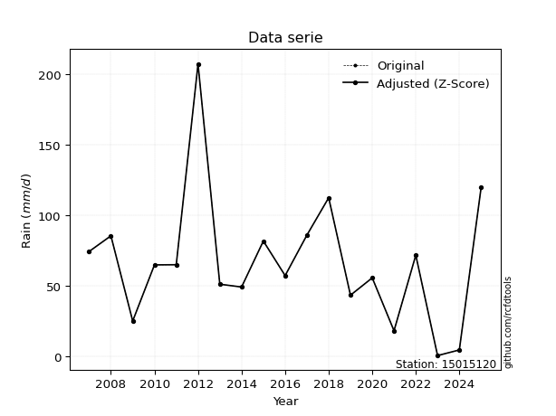</img>

</div>

> If Z-Score is active, values out of range or outliers are replaced with the station mean value.


### 4. Active continuous probability distributions from SciPy (45 of 104 available)

[scipy.stats](https://docs.scipy.org/doc/scipy/reference/stats.html) is a Python´s powerful submodule within the SciPy library for comprehensive statistical analysis, offering over 130 probability distributions (like Normal, Poisson), functions for descriptive stats (mean, variance), hypothesis testing (t-tests, chi-square), random variable generation, and statistical tests, making it essential for data science, modeling, and research. It provides tools to explore, model, and draw conclusions from data efficiently, working seamlessly with NumPy.

<div align="center">

|   id | p_dist             |   n_parameter | fit_method   | label                                                                       | active   | ref                                                                                                        |
|-----:|:-------------------|--------------:|:-------------|:----------------------------------------------------------------------------|:---------|:-----------------------------------------------------------------------------------------------------------|
|    0 | alpha              |             3 | MLE          | Alpha                                                                       | True     | [:mortar_board:](https://docs.scipy.org/doc/scipy/reference/generated/scipy.stats.alpha.html)              |
|    1 | betaprime          |             4 | MLE          | Beta prime                                                                  | True     | [:mortar_board:](https://docs.scipy.org/doc/scipy/reference/generated/scipy.stats.betaprime.html)          |
|    2 | chi2               |             3 | MLE          | Chi²                                                                        | True     | [:mortar_board:](https://docs.scipy.org/doc/scipy/reference/generated/scipy.stats.chi2.html)               |
|    3 | crystalball        |             4 | MLE          | Crystalball                                                                 | True     | [:mortar_board:](https://docs.scipy.org/doc/scipy/reference/generated/scipy.stats.crystalball.html)        |
|    4 | erlang             |             3 | MLE          | Erlang                                                                      | True     | [:mortar_board:](https://docs.scipy.org/doc/scipy/reference/generated/scipy.stats.erlang.html)             |
|    5 | expon              |             2 | MLE          | Exponential                                                                 | True     | [:mortar_board:](https://docs.scipy.org/doc/scipy/reference/generated/scipy.stats.expon.html)              |
|    6 | exponnorm          |             3 | MLE          | Exponentially modified Normal                                               | True     | [:mortar_board:](https://docs.scipy.org/doc/scipy/reference/generated/scipy.stats.exponnorm.html)          |
|    7 | f                  |             4 | MLE          | F                                                                           | True     | [:mortar_board:](https://docs.scipy.org/doc/scipy/reference/generated/scipy.stats.f.html)                  |
|    8 | fatiguelife        |             3 | MLE          | Fatigue-life (Birnbaum-Saunders)                                            | True     | [:mortar_board:](https://docs.scipy.org/doc/scipy/reference/generated/scipy.stats.fatiguelife.html)        |
|    9 | fisk               |             3 | MLE          | Fisk                                                                        | True     | [:mortar_board:](https://docs.scipy.org/doc/scipy/reference/generated/scipy.stats.fisk.html)               |
|   10 | gamma              |             3 | MLE          | Gamma                                                                       | True     | [:mortar_board:](https://docs.scipy.org/doc/scipy/reference/generated/scipy.stats.gamma.html)              |
|   11 | genexpon           |             5 | MLE          | Generalized exponential                                                     | True     | [:mortar_board:](https://docs.scipy.org/doc/scipy/reference/generated/scipy.stats.genexpon.html)           |
|   12 | genlogistic        |             3 | MLE          | Generalized logistic                                                        | True     | [:mortar_board:](https://docs.scipy.org/doc/scipy/reference/generated/scipy.stats.genlogistic.html)        |
|   13 | gibrat             |             2 | MM           | Gibrat                                                                      | True     | [:mortar_board:](https://docs.scipy.org/doc/scipy/reference/generated/scipy.stats.gibrat.html)             |
|   14 | gompertz           |             3 | MLE          | Gompertz (or truncated Gumbel)                                              | True     | [:mortar_board:](https://docs.scipy.org/doc/scipy/reference/generated/scipy.stats.gompertz.html)           |
|   15 | gumbel_l           |             2 | MM           | Gumbel Left Skew                                                            | True     | [:mortar_board:](https://docs.scipy.org/doc/scipy/reference/generated/scipy.stats.gumbel_l.html)           |
|   16 | gumbel_r           |             2 | MM           | Gumbel Right Skew                                                           | True     | [:mortar_board:](https://docs.scipy.org/doc/scipy/reference/generated/scipy.stats.gumbel_r.html)           |
|   17 | halflogistic       |             2 | MM           | Half-logistic                                                               | True     | [:mortar_board:](https://docs.scipy.org/doc/scipy/reference/generated/scipy.stats.halflogistic.html)       |
|   18 | halfnorm           |             2 | MM           | Half Normal                                                                 | True     | [:mortar_board:](https://docs.scipy.org/doc/scipy/reference/generated/scipy.stats.halfnorm.html)           |
|   19 | hypsecant          |             2 | MM           | hyperbolic secant                                                           | True     | [:mortar_board:](https://docs.scipy.org/doc/scipy/reference/generated/scipy.stats.hypsecant.html)          |
|   20 | invgamma           |             3 | MLE          | Inverted gamma                                                              | True     | [:mortar_board:](https://docs.scipy.org/doc/scipy/reference/generated/scipy.stats.invgamma.html)           |
|   21 | invgauss           |             3 | MLE          | Inverse Gaussian                                                            | True     | [:mortar_board:](https://docs.scipy.org/doc/scipy/reference/generated/scipy.stats.invgauss.html)           |
|   22 | invweibull         |             3 | MLE          | Inverted Weibull                                                            | True     | [:mortar_board:](https://docs.scipy.org/doc/scipy/reference/generated/scipy.stats.invweibull.html)         |
|   23 | johnsonsu          |             4 | MLE          | Johnson Su                                                                  | True     | [:mortar_board:](https://docs.scipy.org/doc/scipy/reference/generated/scipy.stats.johnsonsu.html)          |
|   24 | kstwobign          |             2 | MLE          | Limiting distribution of scaled Kolmogorov-Smirnov two-sided test statistic | True     | [:mortar_board:](https://docs.scipy.org/doc/scipy/reference/generated/scipy.stats.kstwobign.html)          |
|   25 | laplace            |             2 | MM           | Laplace                                                                     | True     | [:mortar_board:](https://docs.scipy.org/doc/scipy/reference/generated/scipy.stats.laplace.html)            |
|   26 | laplace_asymmetric |             3 | MLE          | Asymmetric Laplace                                                          | True     | [:mortar_board:](https://docs.scipy.org/doc/scipy/reference/generated/scipy.stats.laplace_asymmetric.html) |
|   27 | loggamma           |             3 | MLE          | Log gamma                                                                   | True     | [:mortar_board:](https://docs.scipy.org/doc/scipy/reference/generated/scipy.stats.loggamma.html)           |
|   28 | logistic           |             2 | MM           | Logistic (or Sech-squared)                                                  | True     | [:mortar_board:](https://docs.scipy.org/doc/scipy/reference/generated/scipy.stats.logistic.html)           |
|   29 | lognorm            |             3 | MLE          | Log Normal                                                                  | True     | [:mortar_board:](https://docs.scipy.org/doc/scipy/reference/generated/scipy.stats.lognorm.html)            |
|   30 | maxwell            |             2 | MM           | Maxwell                                                                     | True     | [:mortar_board:](https://docs.scipy.org/doc/scipy/reference/generated/scipy.stats.maxwell.html)            |
|   31 | mielke             |             4 | MLE          | Mielke Beta-Kappa / Dagum                                                   | True     | [:mortar_board:](https://docs.scipy.org/doc/scipy/reference/generated/scipy.stats.mielke.html)             |
|   32 | moyal              |             2 | MM           | Moyal                                                                       | True     | [:mortar_board:](https://docs.scipy.org/doc/scipy/reference/generated/scipy.stats.moyal.html)              |
|   33 | nakagami           |             3 | MLE          | Nakagami                                                                    | True     | [:mortar_board:](https://docs.scipy.org/doc/scipy/reference/generated/scipy.stats.nakagami.html)           |
|   34 | ncf                |             5 | MLE          | Non-central F distribution                                                  | True     | [:mortar_board:](https://docs.scipy.org/doc/scipy/reference/generated/scipy.stats.ncf.html)                |
|   35 | nct                |             4 | MLE          | Non-central Student’s t                                                     | True     | [:mortar_board:](https://docs.scipy.org/doc/scipy/reference/generated/scipy.stats.nct.html)                |
|   36 | norm               |             2 | MM           | Normal                                                                      | True     | [:mortar_board:](https://docs.scipy.org/doc/scipy/reference/generated/scipy.stats.norm.html)               |
|   37 | pareto             |             3 | MLE          | Pareto                                                                      | True     | [:mortar_board:](https://docs.scipy.org/doc/scipy/reference/generated/scipy.stats.pareto.html)             |
|   38 | pearson3           |             3 | MM           | Pearson type III                                                            | True     | [:mortar_board:](https://docs.scipy.org/doc/scipy/reference/generated/scipy.stats.pearson3.html)           |
|   39 | rayleigh           |             2 | MM           | Rayleigh                                                                    | True     | [:mortar_board:](https://docs.scipy.org/doc/scipy/reference/generated/scipy.stats.rayleigh.html)           |
|   40 | rice               |             3 | MLE          | Rice                                                                        | True     | [:mortar_board:](https://docs.scipy.org/doc/scipy/reference/generated/scipy.stats.rice.html)               |
|   41 | t                  |             3 | MLE          | Student’s t                                                                 | True     | [:mortar_board:](https://docs.scipy.org/doc/scipy/reference/generated/scipy.stats.t.html)                  |
|   42 | truncnorm          |             4 | MLE          | Truncated normal                                                            | True     | [:mortar_board:](https://docs.scipy.org/doc/scipy/reference/generated/scipy.stats.truncnorm.html)          |
|   43 | wald               |             2 | MM           | Wald                                                                        | True     | [:mortar_board:](https://docs.scipy.org/doc/scipy/reference/generated/scipy.stats.wald.html)               |
|   44 | weibull_min        |             3 | MLE          | Weibull minimum                                                             | True     | [:mortar_board:](https://docs.scipy.org/doc/scipy/reference/generated/scipy.stats.weibull_min.html)        |

</div>

> **n_parameter:** # arguments & localization & scale.
>
> **Fit methods:** (MLE) maximum likelihood, (MM) L-moments.
>
>**Inactive:** foldnorm, gennorm, norminvgauss, powernorm, powerlognorm, skewnorm, genextreme, anglit, arcsine, argus, beta, bradford, burr, burr12, cauchy, cosine, halfcauchy, foldcauchy, skewcauchy, wrapcauchy, dgamma, gengamma, exponweib, exponpow, truncexpon, gausshyper, genhalflogistic, genhyperbolic, geninvgauss, halfgennorm, johnsonsb, kappa4, kappa3, ksone, kstwo, loglaplace, levy, levy_l, levy_stable, ncx2, genpareto, truncpareto, lomax, powerlaw, rdist, rel_breitwigner, recipinvgauss, semicircular, studentized_range, trapezoid, triang, truncweibull_min, tukeylambda, uniform, loguniform, vonmises, vonmises_line, weibull_max, dweibull, 


## B. Probability distributions vs. Empirical distributions

A continuous probability distribution (CPD) describes probabilities for variables that can take any value within a range (like rain any time), unlike discrete variables with specific outcomes (like temperature). It uses a Probability Density Function (PDF), a curve where the total area under it equals 1, and the probability of the variable falling within an interval (a to b) is found by calculating the area under the curve between those points. A key feature is that the probability of hitting any single exact value is zero, so probabilities are always expressed for ranges, e.g., $P(a ≤ X ≤ b)$.

<div align="center">

Distributions parameters
|    |   station | p_dist                |   n |              loc |           scale | shape                  | shape1                | shape2                | shape3   |
|---:|----------:|:----------------------|----:|-----------------:|----------------:|:-----------------------|:----------------------|:----------------------|:---------|
|  0 |  15015120 | alpha                 |  19 |      0.000647505 |     1.7406      | 6.086612316538246e-09  |                       |                       |          |
|  1 |  15015120 | betaprime             |  19 |     -8.2328      | 15358.2         | 2.249044173544413      | 498.3679943852153     |                       |          |
|  2 |  15015120 | chi2                  |  19 |     -7.31577     |    16.0476      | 4.270836029311785      |                       |                       |          |
|  3 |  15015120 | crystalball           |  19 |     61.2211      |    45.286       | 4459.033948776174      | 2018.167610288365     |                       |          |
|  4 |  15015120 | erlang                |  19 |     -7.31579     |    32.0953      | 2.135416619559772      |                       |                       |          |
|  5 |  15015120 | expon                 |  19 |      0.4         |    60.8211      |                        |                       |                       |          |
|  6 |  15015120 | exponnorm             |  19 |     26.2222      |    24.5051      | 1.4282250737718343     |                       |                       |          |
|  7 |  15015120 | f                     |  19 |     -7.62091     |    68.7321      | 4.3450903835096355     | 1171.277412817186     |                       |          |
|  8 |  15015120 | fatiguelife           |  19 |    -43.144       |    95.7934      | 0.42276307633046817    |                       |                       |          |
|  9 |  15015120 | fisk                  |  19 |    -60.5289      |   115.292       | 5.187598970707814      |                       |                       |          |
| 10 |  15015120 | gamma                 |  19 |      0.4         |    70.4385      | 0.8760765421361723     |                       |                       |          |
| 11 |  15015120 | genexpon              |  19 |      0.39994     |     2.41352     | 0.03972702437294902    | 7.194743759945772e-07 | 2.2109490502196225    |          |
| 12 |  15015120 | genlogistic           |  19 |   -149.529       |    33.6934      | 290.4192284892021      |                       |                       |          |
| 13 |  15015120 | gibrat                |  19 |     26.6735      |    20.9541      |                        |                       |                       |          |
| 14 |  15015120 | gompertz              |  19 |      0.4         |   151.374       | 1.726880264520951      |                       |                       |          |
| 15 |  15015120 | gumbel_l              |  19 |     81.6022      |    35.3094      |                        |                       |                       |          |
| 16 |  15015120 | gumbel_r              |  19 |     40.8399      |    35.3094      |                        |                       |                       |          |
| 17 |  15015120 | halflogistic          |  19 |      7.54659     |    38.7179      |                        |                       |                       |          |
| 18 |  15015120 | halfnorm              |  19 |      1.28011     |    75.1248      |                        |                       |                       |          |
| 19 |  15015120 | hypsecant             |  19 |     61.2211      |    28.83        |                        |                       |                       |          |
| 20 |  15015120 | invgamma              |  19 |    -80.6071      |  1563.28        | 12.02507955695885      |                       |                       |          |
| 21 |  15015120 | invgauss              |  19 |    -45.9399      |   613.933       | 0.17454824347391487    |                       |                       |          |
| 22 |  15015120 | invweibull            |  19 |   -896.605       |   937.487       | 28.119786978434796     |                       |                       |          |
| 23 |  15015120 | johnsonsu             |  19 |    -44.1566      |     7.12396     | -8.103527441041074     | 2.451666306087029     |                       |          |
| 24 |  15015120 | kstwobign             |  19 |    -81.8035      |   165.454       |                        |                       |                       |          |
| 25 |  15015120 | laplace               |  19 |     61.2211      |    32.0221      |                        |                       |                       |          |
| 26 |  15015120 | laplace_asymmetric    |  19 |     55.5         |    30.6804      | 0.9111003758064053     |                       |                       |          |
| 27 |  15015120 | loggamma              |  19 | -18766.7         |  2390.85        | 2631.1830650643296     |                       |                       |          |
| 28 |  15015120 | logistic              |  19 |     61.2211      |    24.9675      |                        |                       |                       |          |
| 29 |  15015120 | lognorm               |  19 |    -44.7733      |    97.5996      | 0.4061077058465929     |                       |                       |          |
| 30 |  15015120 | maxwell               |  19 |    -46.0879      |    67.2459      |                        |                       |                       |          |
| 31 |  15015120 | mielke                |  19 |      0.4         |   140.794       | 0.5035516994693462     | 5.764661168009505     |                       |          |
| 32 |  15015120 | moyal                 |  19 |     35.3236      |    20.3859      |                        |                       |                       |          |
| 33 |  15015120 | nakagami              |  19 |      4.4         |    79.272       | 0.31668705237788186    |                       |                       |          |
| 34 |  15015120 | ncf                   |  19 |     -0.00790256  |     6.1415e-06  | 1.0702329818624164e-06 | 4.739109195079653     | 8.377165465126703     |          |
| 35 |  15015120 | nct                   |  19 |     -0.115722    |    29.9501      | 5.573570005142626      | 1.741821566448713     |                       |          |
| 36 |  15015120 | norm                  |  19 |     61.2211      |    45.286       |                        |                       |                       |          |
| 37 |  15015120 | pareto                |  19 |      0.4         |     2.70148e-07 | 0.05555556238044472    |                       |                       |          |
| 38 |  15015120 | pearson3              |  19 |     61.221       |    45.2861      | 1.4852215798569366     |                       |                       |          |
| 39 |  15015120 | rayleigh              |  19 |    -25.4138      |    69.1246      |                        |                       |                       |          |
| 40 |  15015120 | rice                  |  19 |    -15.7144      |    63.1264      | 0.000576999893648295   |                       |                       |          |
| 41 |  15015120 | t                     |  19 |     56.7443      |    28.3975      | 2.9703219345966607     |                       |                       |          |
| 42 |  15015120 | truncnorm             |  19 |     61.2211      |    45.286       | -10.61670431003529     | 3443.0783659242543    |                       |          |
| 43 |  15015120 | wald                  |  19 |     15.935       |    45.2861      |                        |                       |                       |          |
| 44 |  15015120 | weibull_min           |  19 |     10.9926      |    57.0201      | 1.2749803026492759     |                       |                       |          |
| 45 |  15015120 | logalpha              |  19 |    -40.6664      |  1341.59        | 30.31232358824009      |                       |                       |          |
| 46 |  15015120 | logbetaprime          |  19 |     -1.84043     |     1.59233e+12 | 4.043688327196559      | 1101531339978.523     |                       |          |
| 47 |  15015120 | logchi2               |  19 |     -0.916291    |     3.33109     | 1.142041999163863      |                       |                       |          |
| 48 |  15015120 | logcrystalball        |  19 |      4.21598     |     0.459088    | 0.810516527379834      | 3.171256283530827     |                       |          |
| 49 |  15015120 | logerlang             |  19 |     -0.916291    |    95.6091      | 0.26474087158180043    |                       |                       |          |
| 50 |  15015120 | logexpon              |  19 |     -0.916291    |     4.55295     |                        |                       |                       |          |
| 51 |  15015120 | logexponnorm          |  19 |      3.63566     |     1.36228     | 0.000732486286714259   |                       |                       |          |
| 52 |  15015120 | logf                  |  19 |     -0.916291    |     1.14821     | 1.1285914208848218     | 1.106535965095838     |                       |          |
| 53 |  15015120 | logfatiguelife        |  19 |   -876.385       |   880.026       | 0.001551710896053226   |                       |                       |          |
| 54 |  15015120 | logfisk               |  19 | -87668           | 87671.8         | 139134.7994804514      |                       |                       |          |
| 55 |  15015120 | loggamma              |  19 |    -17.0699      |     0.103567    | 199.70289419243727     |                       |                       |          |
| 56 |  15015120 | loggenexpon           |  19 |     -0.925632    |     0.0395856   | 0.0009642448894651963  | 4.300690924810596     | 2.864840123222156e-05 |          |
| 57 |  15015120 | loggenlogistic        |  19 |      4.62697     |     0.214841    | 0.20281693210468854    |                       |                       |          |
| 58 |  15015120 | loggibrat             |  19 |      2.5974      |     0.63034     |                        |                       |                       |          |
| 59 |  15015120 | loggompertz           |  19 |     -1.93963     |     0.824901    | 0.0006089879819559054  |                       |                       |          |
| 60 |  15015120 | loggumbel_l           |  19 |      4.24975     |     1.06216     |                        |                       |                       |          |
| 61 |  15015120 | loggumbel_r           |  19 |      3.02356     |     1.06216     |                        |                       |                       |          |
| 62 |  15015120 | loghalflogistic       |  19 |      2.02205     |     1.1647      |                        |                       |                       |          |
| 63 |  15015120 | loghalfnorm           |  19 |      1.83358     |     2.25984     |                        |                       |                       |          |
| 64 |  15015120 | loghypsecant          |  19 |      3.63666     |     0.867252    |                        |                       |                       |          |
| 65 |  15015120 | loginvgamma           |  19 |    -37.2409      | 32382.6         | 793.9411268274698      |                       |                       |          |
| 66 |  15015120 | loginvgauss           |  19 |    -15.0508      |  2582.32        | 0.007233092601064247   |                       |                       |          |
| 67 |  15015120 | loginvweibull         |  19 |     -1.60435e+09 |     1.60435e+09 | 871172756.725023       |                       |                       |          |
| 68 |  15015120 | logjohnsonsu          |  19 |      4.34961     |     0.236301    | 0.6603731973849838     | 0.6732209550279812    |                       |          |
| 69 |  15015120 | logkstwobign          |  19 |     -4.52276     |     9.42857     |                        |                       |                       |          |
| 70 |  15015120 | loglaplace            |  19 |      3.63666     |     0.963275    |                        |                       |                       |          |
| 71 |  15015120 | loglaplace_asymmetric |  19 |      4.40183     |     0.582326    | 1.8535450566442178     |                       |                       |          |
| 72 |  15015120 | logloggamma           |  19 |      4.73941     |     0.48437     | 0.4428207451997577     |                       |                       |          |
| 73 |  15015120 | loglogistic           |  19 |      3.63666     |     0.751063    |                        |                       |                       |          |
| 74 |  15015120 | loglognorm            |  19 |   -799.663       |   803.3         | 0.0016873717620707837  |                       |                       |          |
| 75 |  15015120 | logmaxwell            |  19 |      0.408719    |     2.02281     |                        |                       |                       |          |
| 76 |  15015120 | logmielke             |  19 |     -2.58005e+08 |     2.58005e+08 | 651571059.4271054      | 296987156.8906784     |                       |          |
| 77 |  15015120 | logmoyal              |  19 |      2.85762     |     0.61324     |                        |                       |                       |          |
| 78 |  15015120 | lognakagami           |  19 |  -1553.04        |  1556.68        | 326065.2734433415      |                       |                       |          |
| 79 |  15015120 | logncf                |  19 |     -0.916291    |     1.07585     | 1.0789586255995343     | 1.164098411953814     | 1.123058110055135     |          |
| 80 |  15015120 | lognct                |  19 |    -79.5974      |     1.3163      | 24166.971218150276     | 63.2298975062517      |                       |          |
| 81 |  15015120 | lognorm               |  19 |      3.63666     |     1.36228     |                        |                       |                       |          |
| 82 |  15015120 | logpareto             |  19 |     -0.916291    |     2.63902e-08 | 0.05555561359150003    |                       |                       |          |
| 83 |  15015120 | logpearson3           |  19 |      3.63666     |     1.36227     | -2.032486835477717     |                       |                       |          |
| 84 |  15015120 | lograyleigh           |  19 |      1.0306      |     2.07934     |                        |                       |                       |          |
| 85 |  15015120 | logrice               |  19 |   -613.111       |     1.36172     | 452.91702275263015     |                       |                       |          |
| 86 |  15015120 | logt                  |  19 |      4.14707     |     0.340896    | 1.055579140094367      |                       |                       |          |
| 87 |  15015120 | logtruncnorm          |  19 |      1.67238     |     6.16583     | -0.41984160881768684   | 0.5938056172191902    |                       |          |
| 88 |  15015120 | logwald               |  19 |      2.27437     |     1.36229     |                        |                       |                       |          |
| 89 |  15015120 | logweibull_min        |  19 |     -0.916291    |     2.78847     | 0.7860104029242743     |                       |                       |          |

</div>

> **loc** (Location parameter): This shifts the distribution along the x-axis. For many common distributions, like the normal (Gaussian) distribution, loc represents the mean $μ$. For others, like the uniform distribution, it might represent the minimum value, or for the beta distribution, the left end of the support interval.
>
> **scale** (Scale parameter): This determines the width or spread of the distribution. For the normal distribution, scale represents the standard deviation $σ$. For a uniform distribution, it defines the length of the interval (from $loc$ to $loc + scale$).
>
> **shape** (Shape parameters): Refers to parameters that define the specific form of a probability distribution, distinct from its location (loc) and scale (scale). These parameters are required arguments for most distribution functions. For example, a normal (Gaussian) distribution is fully defined by its location (mean) and scale (standard deviation), so it has no specific shape parameters beyond loc and scale. However, other distributions have intrinsic properties that need specification, as Gamma distribution that takes a shape parameter, often named $a$ or $alpha$.


### 0. Cumulative distribution values - CDF (90 evaluated)

> Ordered by x ascending and calculating $log(f(x))$ separately. 

|   id |   Station |   date |     x |   count |    mean |    std |     zscore |   Value_initial |   station |   m |       alpha |   alpha_pdf |   betaprime |   betaprime_pdf |      chi2 |    chi2_pdf |   crystalball |   crystalball_pdf |    erlang |   erlang_pdf |     expon |   expon_pdf |   exponnorm |   exponnorm_pdf |         f |       f_pdf |   fatiguelife |   fatiguelife_pdf |      fisk |    fisk_pdf |       gamma |   gamma_pdf |    genexpon |   genexpon_pdf |   genlogistic |   genlogistic_pdf |   gibrat |   gibrat_pdf |    gompertz |   gompertz_pdf |   gumbel_l |   gumbel_l_pdf |   gumbel_r |   gumbel_r_pdf |   halflogistic |   halflogistic_pdf |   halfnorm |   halfnorm_pdf |   hypsecant |   hypsecant_pdf |   invgamma |   invgamma_pdf |   invgauss |   invgauss_pdf |   invweibull |   invweibull_pdf |   johnsonsu |   johnsonsu_pdf |   kstwobign |   kstwobign_pdf |   laplace |   laplace_pdf |   laplace_asymmetric |   laplace_asymmetric_pdf |    loggamma |   loggamma_pdf |   logistic |   logistic_pdf |     lognorm |   lognorm_pdf |   maxwell |   maxwell_pdf |      mielke |     mielke_pdf |     moyal |   moyal_pdf |    nakagami |    nakagami_pdf |       ncf |     ncf_pdf |       nct |     nct_pdf |      norm |   norm_pdf |   pareto |       pareto_pdf |    pearson3 |   pearson3_pdf |   rayleigh |   rayleigh_pdf |      rice |   rice_pdf |         t |       t_pdf |   truncnorm |   truncnorm_pdf |        wald |    wald_pdf |   weibull_min |   weibull_min_pdf |    logalpha |   logalpha_pdf |   logbetaprime |   logbetaprime_pdf |     logchi2 |   logchi2_pdf |   logcrystalball |   logcrystalball_pdf |   logerlang |   logerlang_pdf |   logexpon |   logexpon_pdf |   logexponnorm |   logexponnorm_pdf |        logf |    logf_pdf |   logfatiguelife |   logfatiguelife_pdf |     logfisk |   logfisk_pdf |   loggenexpon |   loggenexpon_pdf |   loggenlogistic |   loggenlogistic_pdf |   loggibrat |   loggibrat_pdf |   loggompertz |   loggompertz_pdf |   loggumbel_l |   loggumbel_l_pdf |   loggumbel_r |   loggumbel_r_pdf |   loghalflogistic |   loghalflogistic_pdf |   loghalfnorm |   loghalfnorm_pdf |   loghypsecant |   loghypsecant_pdf |   loginvgamma |   loginvgamma_pdf |   loginvgauss |   loginvgauss_pdf |   loginvweibull |   loginvweibull_pdf |   logjohnsonsu |   logjohnsonsu_pdf |   logkstwobign |   logkstwobign_pdf |   loglaplace |   loglaplace_pdf |   loglaplace_asymmetric |   loglaplace_asymmetric_pdf |   logloggamma |   logloggamma_pdf |   loglogistic |   loglogistic_pdf |   loglognorm |   loglognorm_pdf |   logmaxwell |   logmaxwell_pdf |   logmielke |   logmielke_pdf |     logmoyal |   logmoyal_pdf |   lognakagami |   lognakagami_pdf |      logncf |   logncf_pdf |      lognct |   lognct_pdf |   logpareto |   logpareto_pdf |   logpearson3 |   logpearson3_pdf |   lograyleigh |   lograyleigh_pdf |     logrice |   logrice_pdf |      logt |   logt_pdf |   logtruncnorm |   logtruncnorm_pdf |   logwald |   logwald_pdf |   logweibull_min |   logweibull_min_pdf |
|-----:|----------:|-------:|------:|--------:|--------:|-------:|-----------:|----------------:|----------:|----:|------------:|------------:|------------:|----------------:|----------:|------------:|--------------:|------------------:|----------:|-------------:|----------:|------------:|------------:|----------------:|----------:|------------:|--------------:|------------------:|----------:|------------:|------------:|------------:|------------:|---------------:|--------------:|------------------:|---------:|-------------:|------------:|---------------:|-----------:|---------------:|-----------:|---------------:|---------------:|-------------------:|-----------:|---------------:|------------:|----------------:|-----------:|---------------:|-----------:|---------------:|-------------:|-----------------:|------------:|----------------:|------------:|----------------:|----------:|--------------:|---------------------:|-------------------------:|------------:|---------------:|-----------:|---------------:|------------:|--------------:|----------:|--------------:|------------:|---------------:|----------:|------------:|------------:|----------------:|----------:|------------:|----------:|------------:|----------:|-----------:|---------:|-----------------:|------------:|---------------:|-----------:|---------------:|----------:|-----------:|----------:|------------:|------------:|----------------:|------------:|------------:|--------------:|------------------:|------------:|---------------:|---------------:|-------------------:|------------:|--------------:|-----------------:|---------------------:|------------:|----------------:|-----------:|---------------:|---------------:|-------------------:|------------:|------------:|-----------------:|---------------------:|------------:|--------------:|--------------:|------------------:|-----------------:|---------------------:|------------:|----------------:|--------------:|------------------:|--------------:|------------------:|--------------:|------------------:|------------------:|----------------------:|--------------:|------------------:|---------------:|-------------------:|--------------:|------------------:|--------------:|------------------:|----------------:|--------------------:|---------------:|-------------------:|---------------:|-------------------:|-------------:|-----------------:|------------------------:|----------------------------:|--------------:|------------------:|--------------:|------------------:|-------------:|-----------------:|-------------:|-----------------:|------------:|----------------:|-------------:|---------------:|--------------:|------------------:|------------:|-------------:|------------:|-------------:|------------:|----------------:|--------------:|------------------:|--------------:|------------------:|------------:|--------------:|----------:|-----------:|---------------:|-------------------:|----------:|--------------:|-----------------:|---------------------:|
|    0 |  15015120 |   2023 |   0.4 |      19 | 61.2211 | 46.527 | -1.30722   |             0.4 |  15015120 |   1 | 1.30927e-05 | 0.000652813 |   0.0185618 |     0.00442583  | 0.0178139 | 0.00455929  |     0.0896292 |       0.0035749   | 0.017814  |  0.0045593   | 0         | 0.0164417   |   0.0398514 |     0.00303291  | 0.0181372 | 0.00452642  |     0.0278353 |       0.00374647  | 0.0352824 | 0.00289802  | 1.44729e-16 | 2.28411     | 9.84836e-07 |    0.0164602   |     0.0342974 |       0.00341328  | 0        |  0           | 1.96575e-13 |    0.011408    |  0.0954209 |    0.00256918  |  0.0431362 |    0.00384017  |      0         |        0           |  0         |    0           |   0.0768346 |     0.00263929  |  0.0305568 |    0.00347584  |  0.0281768 |    0.0037094   |    0.0314331 |      0.00340931  |   0.0291118 |     0.00360588  |   0.0340675 |     0.00372807  | 0.0748331 |    0.00233692 |            0.0631812 |               0.00226027 | 0.000433492 |      0.0012564 |  0.0804678 |    0.00296356  | 0.000415646 |    0.00109927 | 0.0762834 |   0.00446524  | 2.89383e-06 | 1032.42        | 0.0185201 |  0.00287888 | 0           |     0           | 0.0174878 | 0.00583921  | 0.0422338 | 0.00288324  | 0.0896292 | 0.0035749  | 0        | 205649           | 3.66004e-05 |    0.000411076 |  0.0673527 |    0.00503853  | 0.0320568 | 0.00391419 | 0.0712019 | 0.00242187  |   0.0896292 |      0.0035749  | 0           | 0           |    0          |        0          | 0.000292795 |     0.00091813 |     0.00384822 |          0.0147514 | 2.94862e-10 |   1.51656e+06 |        0.0237816 |           0.00787565 | 1.97664e-05 |     4.71345e+10 |   0        |      0.219638  |    0.000415671 |         0.00109932 | 6.13277e-10 | 3.11712e+06 |      0.000410191 |           0.00108892 | 0.000494855 |   0.000784987 |    0.00023094 |         0.0250872 |       0.00533741 |           0.00503869 |    0        |       0         |     0.0014955 |        0.00254874 |     0.0076921 |          0.007214 |   1.86356e-18 |       7.16256e-17 |          0        |             0         |      0        |          0        |     0.00334114 |         0.00385248 |   0.000417455 |        0.00121264 |   0.000579849 |        0.00171367 |     0.000517001 |          0.00212445 |      0.0289657 |         0.00844064 |     0.00142699 |         0.00627712 |   0.00442858 |       0.00459742 |              0.00561372 |                  0.00520094 |    0.00641419 |        0.00586395 |     0.0023243 |        0.00308749 |  0.000378113 |       0.00101766 |    0         |        0         | 5.85845e-05 |     0.000146208 | 2.34928e-104 |   9.03361e-102 |   0.000412711 |         0.0010925 | 9.01266e-10 |  4.37943e+06 | 0.000426537 |   0.00112883 |    0        |     2.10516e+06 |     0.0131896 |        0.00958654 |     0         |          0        | 0.000413606 |    0.00109471 | 0.0186328 |  0.003872  |    1.75617e-07 |           0.153331 | 0         |     0         |      1.28666e-13 |          910.923     |
|    1 |  15015120 |   2024 |   4.4 |      19 | 61.2211 | 46.527 | -1.22125   |             4.4 |  15015120 |   2 | 0.692364    | 0.0663543   |   0.0400244 |     0.0062508   | 0.0400056 | 0.00646735  |     0.104791  |       0.00400949  | 0.0400058 |  0.00646737  | 0.0636507 | 0.0153952   |   0.0534914 |     0.00380308  | 0.0401342 | 0.00640771  |     0.0454052 |       0.0050443   | 0.0484022 | 0.00368     | 0.0827403   | 0.0175789   | 0.0637218   |    0.0154116   |     0.0499324 |       0.00441873  | 0        |  0           | 0.0451875   |    0.0111842   |  0.106237  |    0.00284295  |  0.0604025 |    0.00480137  |      0         |        0           |  0.0331262 |    0.0106116   |   0.0881337 |     0.0030181   |  0.0466808 |    0.00460032  |  0.0455479 |    0.00498341  |    0.0472173 |      0.00449896  |   0.0459294 |     0.00481366  |   0.0511052 |     0.00479586  | 0.0847897 |    0.00264785 |            0.0729011 |               0.002608   | 0.0686944   |      0.0972361 |  0.0931471 |    0.00338323  | 0.0568307   |    0.0837955  | 0.0953086 |   0.0050456   | 0.166435    |    0.0209522   | 0.0327629 |  0.00427749 | 1.42531e-11 | 10164.1         | 0.0463284 | 0.00846289  | 0.0552364 | 0.00363766  | 0.104791  | 0.00400949 | 0.600386 |      0.0055502   | 0.0123215   |    0.00513597  |  0.0888175 |    0.00568535  | 0.0494977 | 0.00479775 | 0.0817135 | 0.00284587  |   0.104791  |      0.00400949 | 0           | 0           |    0          |        0          | 0.0644999   |     0.095183   |     0.193432   |          0.137945  | 0.552818    |   0.104093    |        0.0639086 |           0.0333681  | 0.414998    |     0.0449174   |   0.409431 |      0.129711  |    0.0568316   |         0.0837962  | 0.620907    | 0.0665231   |      0.0566998   |           0.0836485  | 0.0217714   |   0.0337998   |    0.248973   |         0.160318  |       0.0513379  |           0.0484646  |    0        |       0         |     0.0372131 |        0.044973   |     0.0711599 |          0.064553 |   0.0139759   |       0.0561901   |          0        |             0         |      0        |          0        |     0.0529287  |         0.0607495  |   0.0683377   |        0.0975883  |   0.0815686   |        0.107595   |     0.127696    |          0.142708   |      0.0683827 |         0.0308503  |     0.187896   |         0.159099   |   0.0533778  |       0.0554128  |              0.0517689  |                  0.0479622  |    0.0574177  |        0.0524488  |     0.0536903 |        0.0676477  |  0.0557077   |       0.0831249  |    0.0364968 |        0.0964033 | 0.0175649   |     0.0373299   | 0.00213522   |   0.0179033    |   0.0566343   |         0.0835573 | 0.500676    |  0.0759137   | 0.0577571   |   0.0847346  |    0.638701 |     0.00837075  |     0.0755471 |        0.0550924  |     0.0232482 |          0.101887 | 0.0567573   |    0.0837446  | 0.0365195 |  0.014297  |    0.389147    |           0.167378 | 0         |     0         |      0.588585    |            0.119775  |
|    2 |  15015120 |   2025 |  12.2 |      19 | 61.2211 | 46.527 | -1.0536    |            12.2 |  15015120 |   3 | 0.886543    | 0.00923729  |   0.0997038 |     0.00884038  | 0.101453  | 0.0090533   |     0.139521  |       0.00490346  | 0.101454  |  0.00905331  | 0.176352  | 0.0135422   |   0.0897568 |     0.00553823  | 0.101092  | 0.00899463  |     0.0944147 |       0.00746324  | 0.083932  | 0.00548422  | 0.20292     | 0.0137619   | 0.176535    |    0.0135546   |     0.0925277 |       0.00650983  | 0        |  0           | 0.130642    |    0.0107217   |  0.130711  |    0.00344865  |  0.105356  |    0.00671476  |      0.0600214 |        0.0128674   |  0.115571  |    0.0105092   |   0.114992  |     0.00390244  |  0.0914826 |    0.00687761  |  0.0939916 |    0.00738623  |    0.0910953 |      0.006753    |   0.0927843 |     0.00716875  |   0.0965623 |     0.00682457  | 0.108176  |    0.00337816 |            0.0963652 |               0.00344741 | 0.226728    |      0.213514  |  0.1231    |    0.00432348  | 0.202331    |    0.206943   | 0.138928  |   0.00612283  | 0.286962    |    0.0122458   | 0.0778618 |  0.00729094 | 0.178587    |     0.0144679   | 0.125508  | 0.0113589   | 0.090309  | 0.00541493  | 0.139521  | 0.00490346 | 0.623695 |      0.00177168  | 0.0722318   |    0.00961289  |  0.137609  |    0.00678869  | 0.0931422 | 0.00635251 | 0.107821  | 0.00390355  |   0.139521  |      0.00490346 | 0           | 0           |    0.00730927 |        0.00768999 | 0.221817    |     0.214177   |     0.344821   |          0.15389   | 0.6439      |   0.0767219   |        0.117724  |           0.0814383  | 0.454813    |     0.0342469   |   0.527946 |      0.103681  |    0.202332    |         0.206943   | 0.675254    | 0.0429082   |      0.201898    |           0.20645    | 0.100956    |   0.144045    |    0.420053   |         0.170203  |       0.134447   |           0.126916   |    0        |       0         |     0.123705  |        0.140927   |     0.17537   |          0.1497   |   0.194977    |       0.300107    |          0.202943 |             0.411615  |      0.232415 |          0.337985 |     0.16794    |         0.184786   |   0.227769    |        0.215966   |   0.245303    |        0.211026   |     0.306374    |          0.196799   |      0.116295  |         0.0706936  |     0.364394   |         0.178752   |   0.15387    |       0.159736   |              0.133171   |                  0.123378   |    0.145482   |        0.132097   |     0.180719  |        0.197133   |  0.201034    |       0.207477   |    0.215754  |        0.247217  | 0.118671    |     0.186255    | 0.18123      |   0.355837     |   0.201797    |         0.206547  | 0.564683    |  0.0520809   | 0.204086    |   0.20731    |    0.645745 |     0.00575847  |     0.159086  |        0.116351   |     0.221338  |          0.264889 | 0.202236    |    0.20697    | 0.0601724 |  0.0374655 |    0.559503    |           0.165951 | 0.0363866 |     0.535965  |      0.690698    |            0.0834706 |
|    3 |  15015120 |   2021 |  18   |      19 | 61.2211 | 46.527 | -0.928946  |            18   |  15015120 |   4 | 0.922962    | 0.00426672  |   0.154629  |     0.0100007   | 0.15745   | 0.0101539   |     0.16994   |       0.00558663  | 0.157451  |  0.0101539   | 0.251267  | 0.0123104   |   0.125914  |     0.00693449  | 0.156797  | 0.0101128   |     0.142104  |       0.00891815  | 0.12004   | 0.00697793  | 0.277577    | 0.0120615   | 0.251516    |    0.0123204   |     0.134642  |       0.00798511  | 0        |  0           | 0.191778    |    0.010357    |  0.15218   |    0.00396393  |  0.148152  |    0.00801199  |      0.13418   |        0.0126814   |  0.176123  |    0.010361    |   0.139872  |     0.00469698  |  0.135935  |    0.00841038  |  0.141264  |    0.00885401  |    0.134876  |      0.00830768  |   0.13888   |     0.00867453  |   0.139997  |     0.00810932  | 0.129656  |    0.00404894 |            0.118586  |               0.00424234 | 0.317114    |      0.249223  |  0.150448  |    0.00511919  | 0.291907    |    0.252044   | 0.176571  |   0.00684327  | 0.350959    |    0.0100412   | 0.126159  |  0.00929332 | 0.253584    |     0.0117265   | 0.193553  | 0.01193     | 0.125999  | 0.00690384  | 0.16994   | 0.00558663 | 0.631961 |      0.00116174  | 0.132995    |    0.0111584   |  0.178993  |    0.00745949  | 0.132916  | 0.00733591 | 0.133314  | 0.00492291  |   0.16994   |      0.00558663 | 7.52531e-06 | 4.15725e-05 |    0.0667208  |        0.0117254  | 0.312577    |     0.250373   |     0.404549   |          0.152673  | 0.672221    |   0.0691013   |        0.156897  |           0.123889   | 0.467583    |     0.0315093   |   0.566597 |      0.0951917 |    0.291909    |         0.252044   | 0.69082     | 0.0373492   |      0.29125     |           0.251391   | 0.172303    |   0.226331    |    0.485673   |         0.166632  |       0.194083   |           0.183164   |    0.221785 |       1.01534   |     0.191008  |        0.208475   |     0.242768  |          0.198252 |   0.321874    |       0.343521    |          0.356411 |             0.374763  |      0.35996  |          0.316501 |     0.254729   |         0.263358   |   0.319222    |        0.252182   |   0.333117    |        0.238497   |     0.383761    |          0.199577   |      0.150036  |         0.106202   |     0.433318   |         0.174857   |   0.230413   |       0.239197   |              0.190942   |                  0.176901   |    0.206834   |        0.186229   |     0.270194  |        0.262547   |  0.290934    |       0.253152   |    0.31891   |        0.279719  | 0.207179    |     0.267903    | 0.330231     |   0.394301     |   0.29122     |         0.251662  | 0.583733    |  0.0460807   | 0.293677    |   0.251724   |    0.647859 |     0.00513925  |     0.21148   |        0.15493    |     0.329668  |          0.288337 | 0.291832    |    0.252118   | 0.0791167 |  0.0632018 |    0.623732    |           0.164222 | 0.321449  |     0.691122  |      0.721177    |            0.0735299 |
|    4 |  15015120 |   2009 |  24.9 |      19 | 61.2211 | 46.527 | -0.780645  |            24.9 |  15015120 |   5 | 0.944269    | 0.00223461  |   0.22641   |     0.0106958   | 0.230006  | 0.0107676   |     0.211266  |       0.0063865   | 0.230007  |  0.0107676   | 0.331568  | 0.0109901   |   0.179404  |     0.00854546  | 0.229149  | 0.0107495   |     0.208107  |       0.0101115   | 0.174342  | 0.00874105  | 0.35519     | 0.0104968   | 0.331877    |    0.0109976   |     0.194978  |       0.00943413  | 0        |  0           | 0.261686    |    0.00990242  |  0.181855  |    0.00465073  |  0.207928  |    0.00924864  |      0.220423  |        0.0122865   |  0.246789  |    0.0101086   |   0.175985  |     0.00579798  |  0.199157  |    0.00982883  |  0.206924  |    0.0100777   |    0.197554  |      0.00977647  |   0.20361   |     0.00999328  |   0.200155  |     0.00925237  | 0.160832  |    0.00502252 |            0.151787  |               0.00543011 | 0.401295    |      0.267604  |  0.189274  |    0.00614597  | 0.378425    |    0.279144   | 0.226398  |   0.00757399  | 0.414564    |    0.00852023  | 0.196596  |  0.010978   | 0.327919    |     0.00996965  | 0.275114  | 0.0115761   | 0.179765  | 0.00865766  | 0.211266  | 0.0063865  | 0.638663 |      0.000819359 | 0.212996    |    0.0118694   |  0.232716  |    0.00807938  | 0.186956  | 0.00828651 | 0.172264  | 0.00641722  |   0.211266  |      0.0063865  | 0.0619284   | 0.0197002   |    0.152504   |        0.0128561  | 0.397127    |     0.268659   |     0.453591   |          0.149269  | 0.693725    |   0.0635466   |        0.206075  |           0.184493   | 0.477486    |     0.0295694   |   0.596411 |      0.0886434 |    0.378426    |         0.279143   | 0.702307    | 0.0335644   |      0.377541    |           0.278409   | 0.258378    |   0.3041      |    0.538906   |         0.161116  |       0.263592   |           0.248491   |    0.49177  |       0.645956  |     0.269789  |        0.278869   |     0.314392  |          0.243637 |   0.433798    |       0.341094    |          0.471559 |             0.333834  |      0.458956 |          0.29291  |     0.350955   |         0.327527   |   0.404375    |        0.270564   |   0.412803    |        0.250894   |     0.447979    |          0.195336   |      0.192213  |         0.158739   |     0.489072   |         0.168363   |   0.322705   |       0.335008   |              0.257908   |                  0.238944   |    0.276497   |        0.245344   |     0.36318   |        0.307937   |  0.377867    |       0.280566   |    0.411768  |        0.290002  | 0.303401    |     0.321324    | 0.454879     |   0.367713     |   0.377623    |         0.278824  | 0.597989    |  0.0418956   | 0.379988    |   0.278197   |    0.649456 |     0.0047141   |     0.268289  |        0.196907   |     0.424052  |          0.290964 | 0.378379    |    0.279248   | 0.106232  |  0.110111  |    0.676721    |           0.162299 | 0.509546  |     0.476273  |      0.743851    |            0.0663781 |
|    5 |  15015120 |   2019 |  43.2 |      19 | 61.2211 | 46.527 | -0.387325  |            43.2 |  15015120 |   6 | 0.96786     | 0.000743586 |   0.421623  |     0.010219    | 0.425008  | 0.0101463   |     0.345338  |       0.00813878  | 0.425008  |  0.0101463   | 0.50525   | 0.00813451  |   0.364772  |     0.0111723   | 0.424224  | 0.0101657   |     0.402931  |       0.0106182   | 0.366266  | 0.0116083   | 0.518361    | 0.00755446  | 0.505649    |    0.00813726  |     0.38641   |       0.010887    | 0.406184 |  0.023469    | 0.431231    |    0.00860872  |  0.286111  |    0.00681406  |  0.39245   |    0.010396    |      0.43043   |        0.0105213   |  0.423158  |    0.00908958  |   0.31285   |     0.00918694  |  0.394882  |    0.0109364   |  0.401864  |    0.0106553   |    0.393409  |      0.0109814   |   0.399397  |     0.0108025   |   0.382116  |     0.0101568   | 0.284815  |    0.00889432 |            0.292116  |               0.0104503  | 0.550891    |      0.268997  |  0.327001  |    0.00881431  | 0.537775    |    0.291536   | 0.376981  |   0.00866356  | 0.548975    |    0.00645208  | 0.409751  |  0.0114849  | 0.484884    |     0.00747042  | 0.463254  | 0.00882795  | 0.369448  | 0.0114463   | 0.345338  | 0.00813878 | 0.64969  |      0.000454713 | 0.424813    |    0.0108185   |  0.388987  |    0.00877397  | 0.35306   | 0.00956451 | 0.333143  | 0.0111705   |   0.345338  |      0.00813878 | 0.44793     | 0.0165337   |    0.38291    |        0.0117926  | 0.547095    |     0.269211   |     0.533384   |          0.139696  | 0.726436    |   0.0554436   |        0.36061   |           0.417747   | 0.492992    |     0.0268141   |   0.642412 |      0.0785399 |    0.537775    |         0.291535   | 0.719322    | 0.0284323   |      0.536494    |           0.290884   | 0.455116    |   0.393552    |    0.624153   |         0.147559  |       0.441937   |           0.409759   |    0.731438 |       0.282223  |     0.458689  |        0.403158   |     0.469573  |          0.316646 |   0.608254    |       0.284703    |          0.634315 |             0.256566  |      0.607475 |          0.244966 |     0.54724    |         0.362998   |   0.555386    |        0.270985   |   0.551485    |        0.247435   |     0.551358    |          0.178249   |      0.329553  |         0.38692    |     0.577766   |         0.152855   |   0.562753   |       0.453917   |              0.429689   |                  0.398094   |    0.445263   |        0.37068    |     0.542895  |        0.330412   |  0.538029    |       0.292936   |    0.568933  |        0.274096  | 0.490922    |     0.343369    | 0.633454     |   0.276885     |   0.536848    |         0.291422  | 0.619405    |  0.0360809   | 0.53858     |   0.289835   |    0.651886 |     0.00413053  |     0.40234   |        0.296666   |     0.579028  |          0.266317 | 0.537793    |    0.291654   | 0.228372  |  0.42252   |    0.765034    |           0.158079 | 0.703391  |     0.254589  |      0.777503    |            0.0561335 |
|    6 |  15015120 |   2014 |  49   |      19 | 61.2211 | 46.527 | -0.262666  |            49   |  15015120 |   7 | 0.971663    | 0.000578074 |   0.479363  |     0.00967279  | 0.482266  | 0.00958121  |     0.393633  |       0.00849438  | 0.482266  |  0.00958121  | 0.550251  | 0.00739463  |   0.42998   |     0.0112492   | 0.481608  | 0.00960477  |     0.463397  |       0.0101999   | 0.433884  | 0.0116337   | 0.56009     | 0.00684862  | 0.550662    |    0.00739632  |     0.449017  |       0.0106558   | 0.525291 |  0.0178326   | 0.47992     |    0.00817925  |  0.327797  |    0.0075616   |  0.452188  |    0.0101639   |      0.489441  |        0.00982034  |  0.474707  |    0.0086804   |   0.368937  |     0.0101182   |  0.457459  |    0.0105997   |  0.462573  |    0.0102455   |    0.456259  |      0.0106467   |   0.461047  |     0.0104187   |   0.440448  |     0.00992597  | 0.341369  |    0.0106604  |            0.359475  |               0.01286    | 0.584486    |      0.26404   |  0.380016  |    0.00943642  | 0.57429     |    0.287757   | 0.427487  |   0.00872991  | 0.585198    |    0.00605017  | 0.474594  |  0.0108363  | 0.526606    |     0.00692749  | 0.511794  | 0.00791973  | 0.436114  | 0.0114722   | 0.393633  | 0.00849438 | 0.652154 |      0.000397629 | 0.485497    |    0.0100925   |  0.43979   |    0.00872446  | 0.408724  | 0.00960216 | 0.401467  | 0.0123133   |   0.393633  |      0.00849438 | 0.534526    | 0.0134332   |    0.449105   |        0.011018   | 0.580703    |     0.264036   |     0.550814   |          0.136996  | 0.733316    |   0.0537889   |        0.419367  |           0.51746    | 0.496335    |     0.0262611   |   0.652171 |      0.0763965 |    0.57429     |         0.287756   | 0.722841    | 0.0274393   |      0.572931    |           0.287171   | 0.504977    |   0.39671     |    0.642512   |         0.14388   |       0.496325   |           0.453731   |    0.764102 |       0.237905  |     0.510872  |        0.424401   |     0.510279  |          0.32916  |   0.643034    |       0.267319    |          0.665536 |             0.239144  |      0.637596 |          0.233201 |     0.592331   |         0.3517     |   0.589209    |        0.265667   |   0.582364    |        0.242559   |     0.573496    |          0.173147   |      0.384992  |         0.499514   |     0.596768   |         0.148792   |   0.616356   |       0.398271   |              0.482885   |                  0.447378   |    0.493808   |        0.399698   |     0.584127  |        0.323439   |  0.574714    |       0.289053   |    0.602942  |        0.265564  | 0.533725    |     0.335457    | 0.666963     |   0.255188     |   0.573353    |         0.287702  | 0.623878    |  0.034936    | 0.574876    |   0.285988   |    0.652399 |     0.00401638  |     0.441535  |        0.326063   |     0.611989  |          0.25677  | 0.574323    |    0.287871   | 0.292711  |  0.608885  |    0.784879    |           0.156953 | 0.733423  |     0.223039  |      0.784444    |            0.0540743 |
|    7 |  15015120 |   2013 |  51   |      19 | 61.2211 | 46.527 | -0.21968   |            51   |  15015120 |   8 | 0.972774    | 0.00053365  |   0.498499  |     0.0094619   | 0.501214  | 0.00936626  |     0.410717  |       0.00858784  | 0.501215  |  0.00936625  | 0.5648    | 0.00715542  |   0.452426  |     0.0111888   | 0.500605  | 0.00939058  |     0.483615  |       0.0100154   | 0.457068  | 0.0115426   | 0.573561    | 0.00662371  | 0.565214    |    0.00715679  |     0.470194  |       0.010517    | 0.559314 |  0.0162179   | 0.496129    |    0.00802973  |  0.343178  |    0.00781916  |  0.472389  |    0.0100333   |      0.508833  |        0.00957036  |  0.49192   |    0.00853182  |   0.389442  |     0.0103816   |  0.478493  |    0.0104298   |  0.482884  |    0.0100625   |    0.477384  |      0.0104749   |   0.481708  |     0.0102391   |   0.460182  |     0.00980562  | 0.36337   |    0.0113475  |            0.386137  |               0.0138138  | 0.595011    |      0.26209   |  0.399062  |    0.00960495  | 0.585769    |    0.286055   | 0.444942  |   0.00872234  | 0.597173    |    0.00592659  | 0.496     |  0.010567   | 0.540287    |     0.0067546   | 0.527334  | 0.00762156  | 0.458982  | 0.0113879   | 0.410717  | 0.00858784 | 0.652933 |      0.000381058 | 0.505416    |    0.00982583  |  0.457198  |    0.00868057  | 0.427907  | 0.00957776 | 0.426379  | 0.0125863   |   0.410717  |      0.00858784 | 0.560458    | 0.0125111   |    0.470858   |        0.0107333  | 0.591226    |     0.262021   |     0.556277   |          0.136108  | 0.735457    |   0.0532771   |        0.440691  |           0.548214   | 0.497382    |     0.0260906   |   0.655214 |      0.0757282 |    0.585769    |         0.286054   | 0.723933    | 0.0271359   |      0.584387    |           0.285494   | 0.520837    |   0.39606     |    0.648244   |         0.142675  |       0.514754   |           0.467553   |    0.773372 |       0.225668  |     0.527963  |        0.429924   |     0.523516  |          0.332555 |   0.653615    |       0.261675    |          0.674994 |             0.233701  |      0.64685  |          0.229435 |     0.606304   |         0.346754   |   0.599797    |        0.263596   |   0.592032    |        0.240729   |     0.580389    |          0.171462   |      0.405848  |         0.543903   |     0.602694   |         0.147474   |   0.631962   |       0.382069   |              0.501118   |                  0.46427    |    0.509974   |        0.40843    |     0.597005  |        0.320333   |  0.586244    |       0.287311   |    0.613506  |        0.262551  | 0.547079    |     0.332094    | 0.677037     |   0.248447     |   0.58483     |         0.28602   | 0.625268    |  0.0345848   | 0.586284    |   0.284274   |    0.652559 |     0.0039814   |     0.454777  |        0.336023   |     0.622197  |          0.253511 | 0.585806    |    0.286167   | 0.318456  |  0.678688  |    0.79115     |           0.156584 | 0.742164  |     0.214044  |      0.786594    |            0.05344   |
|    8 |  15015120 |   2020 |  55.5 |      19 | 61.2211 | 46.527 | -0.122962  |            55.5 |  15015120 |   9 | 0.97498     | 0.00045066  |   0.539958  |     0.0089588   | 0.54223   | 0.00885786  |     0.449735  |       0.00873937  | 0.54223   |  0.00885786  | 0.595837  | 0.00664512  |   0.502212  |     0.010906    | 0.541732  | 0.0088829   |     0.52765   |       0.0095443   | 0.508261  | 0.0111743   | 0.602283    | 0.00614853  | 0.596256    |    0.00664583  |     0.516658  |       0.0101147   | 0.625121 |  0.0131531   | 0.531502    |    0.0076913   |  0.379653  |    0.00838873  |  0.51674   |    0.00966201  |      0.550617  |        0.00899869  |  0.52954   |    0.00818551  |   0.437245  |     0.0108271   |  0.524426  |    0.00996892  |  0.527134  |    0.00959206  |    0.523507  |      0.0100067   |   0.526754  |     0.00976743  |   0.503589  |     0.00947325  | 0.418195  |    0.0130596  |            0.453583  |               0.0162267  | 0.61698     |      0.257405  |  0.442964  |    0.00988272  | 0.609779    |    0.281691   | 0.484059  |   0.00865077  | 0.623256    |    0.00567045  | 0.542091  |  0.0099073  | 0.569845    |     0.00638703  | 0.560179  | 0.00698391  | 0.509534  | 0.0110468   | 0.449735  | 0.00873937 | 0.654571 |      0.000348285 | 0.548253    |    0.00920999  |  0.495957  |    0.00853542  | 0.47077   | 0.0094578  | 0.483915  | 0.0129163   |   0.449735  |      0.00873937 | 0.612534    | 0.0106895   |    0.517682   |        0.0100745  | 0.613184    |     0.257208   |     0.567705   |          0.134185  | 0.739917    |   0.0522164   |        0.489508  |           0.604079   | 0.499573    |     0.0257383   |   0.661558 |      0.0743347 |    0.609779    |         0.28169    | 0.726201    | 0.0265125   |      0.608352    |           0.281186   | 0.554183    |   0.392089    |    0.660199   |         0.140078  |       0.555487   |           0.495506   |    0.791443 |       0.202282  |     0.564734  |        0.439226   |     0.551905  |          0.338656 |   0.675234    |       0.249643    |          0.694274 |             0.222368  |      0.665913 |          0.221445 |     0.635121   |         0.334457   |   0.621882    |        0.258646   |   0.61221     |        0.236442   |     0.594734    |          0.167815   |      0.456321  |         0.653518   |     0.615045   |         0.144652   |   0.662892   |       0.349961   |              0.541954   |                  0.502104   |    0.545251   |        0.425651   |     0.623771  |        0.312465   |  0.610357    |       0.282854   |    0.635423  |        0.25575   | 0.57482     |     0.32379     | 0.697452     |   0.234501     |   0.608839    |         0.281696  | 0.628162    |  0.0338614   | 0.610143    |   0.2799     |    0.652893 |     0.00390939  |     0.484115  |        0.358143   |     0.643331  |          0.246305 | 0.609826    |    0.281797   | 0.382144  |  0.825091  |    0.804357    |           0.155784 | 0.759506  |     0.19646   |      0.791057    |            0.0521291 |
|    9 |  15015120 |   2016 |  57.1 |      19 | 61.2211 | 46.527 | -0.0885734 |            57.1 |  15015120 |  10 | 0.975681    | 0.000425769 |   0.554144  |     0.00877293  | 0.556253  | 0.00867124  |     0.463746  |       0.00877299  | 0.556253  |  0.00867124  | 0.60633   | 0.00647259  |   0.519548  |     0.0107611   | 0.555795  | 0.00869626  |     0.542776  |       0.00936182  | 0.526     | 0.0109955   | 0.611992    | 0.00598916  | 0.60675     |    0.00647308  |     0.532708  |       0.00994633  | 0.645417 |  0.0122307   | 0.543711    |    0.00757045  |  0.393232  |    0.00858545  |  0.532077  |    0.00950804  |      0.564851  |        0.00879365  |  0.542535  |    0.00805882  |   0.454654  |     0.0109291   |  0.54023   |    0.00978352  |  0.542335  |    0.00940912  |    0.539368  |      0.00981792  |   0.542234  |     0.00958149  |   0.518639  |     0.00933759  | 0.439621  |    0.0137287  |            0.478938  |               0.0154737  | 0.624271    |      0.255666  |  0.458829  |    0.00994513  | 0.617762    |    0.279997   | 0.497867  |   0.00860786  | 0.632261    |    0.00558558  | 0.557745  |  0.00966062 | 0.579964    |     0.00626261  | 0.57118   | 0.00676881  | 0.527079  | 0.0108811   | 0.463746  | 0.00877299 | 0.65512  |      0.000337919 | 0.562811    |    0.00898832  |  0.509562  |    0.00846926  | 0.485853  | 0.00939469 | 0.5046    | 0.0129315   |   0.463746  |      0.00877299 | 0.629176    | 0.0101186   |    0.533611   |        0.00983682 | 0.620469    |     0.255428   |     0.571509   |          0.133525  | 0.741396    |   0.0518662   |        0.506899  |           0.619371   | 0.500303    |     0.0256222   |   0.663664 |      0.0738721 |    0.617762    |         0.279995   | 0.726951    | 0.0263082   |      0.61632     |           0.279512   | 0.565298    |   0.389981    |    0.664168   |         0.139189  |       0.569695   |           0.504251   |    0.797089 |       0.195106  |     0.577251  |        0.441549   |     0.561554  |          0.34035  |   0.682271    |       0.245585    |          0.700541 |             0.218616  |      0.672168 |          0.218754 |     0.644561   |         0.329828   |   0.629207    |        0.256815   |   0.618908    |        0.234879   |     0.599486    |          0.166566   |      0.47548   |         0.69507    |     0.619143   |         0.143694   |   0.672693   |       0.339786   |              0.556414   |                  0.515501   |    0.557425   |        0.430962   |     0.632609  |        0.309448   |  0.618372    |       0.281125   |    0.642658  |        0.253342  | 0.583979    |     0.320663    | 0.704052     |   0.229915     |   0.616822    |         0.280015  | 0.629121    |  0.0336238   | 0.618075    |   0.278207   |    0.653003 |     0.00388576  |     0.494404  |        0.36592    |     0.650296  |          0.243794 | 0.617811    |    0.280101   | 0.406208  |  0.867293  |    0.808781    |           0.15551  | 0.765011  |     0.190953  |      0.792533    |            0.0516974 |
|   10 |  15015120 |   2010 |  64.7 |      19 | 61.2211 | 46.527 |  0.0747727 |            64.7 |  15015120 |  11 | 0.978537    | 0.000331651 |   0.617387  |     0.00786561  | 0.618728  | 0.00776671  |     0.530617  |       0.00878343  | 0.618728  |  0.00776671  | 0.652573  | 0.00571229  |   0.598001  |     0.00982358  | 0.618455  | 0.00779006  |     0.610432  |       0.00842753  | 0.605606  | 0.00989423  | 0.654805    | 0.00529343  | 0.652993    |    0.00571191  |     0.604885  |       0.00901728  | 0.724395 |  0.00878422  | 0.59906     |    0.00699465  |  0.461838  |    0.00944346  |  0.60123   |    0.00866321  |      0.62798   |        0.00782119  |  0.601439  |    0.0074371   |   0.538318  |     0.010961    |  0.610935  |    0.00879992  |  0.610332  |    0.00846902  |    0.610266  |      0.00881605  |   0.611447  |     0.00861363  |   0.58689   |     0.0086012   | 0.551474  |    0.0140068  |            0.584212  |               0.0123474  | 0.655698    |      0.247102  |  0.534779  |    0.00996457  | 0.652225    |    0.271263   | 0.562192  |   0.00828955  | 0.673275    |    0.0052157   | 0.626609  |  0.00845808 | 0.625418    |     0.00570833  | 0.618974  | 0.00583174  | 0.606097  | 0.00985676  | 0.530617  | 0.00878343 | 0.657522 |      0.000295903 | 0.627127    |    0.00794045  |  0.572475  |    0.00806283  | 0.555748  | 0.00896481 | 0.601133  | 0.0122803   |   0.530617  |      0.00878343 | 0.697063    | 0.00786212  |    0.604074   |        0.00870847 | 0.651856    |     0.24671    |     0.58801    |          0.130555  | 0.747783    |   0.0503621   |        0.587337  |           0.6606     | 0.503473    |     0.0251249   |   0.672769 |      0.0718723 |    0.652225    |         0.271262   | 0.730184    | 0.0254403   |      0.650729    |           0.270877   | 0.613251    |   0.376393    |    0.681313   |         0.135203  |       0.634805   |           0.535518   |    0.819661 |       0.16708   |     0.632817  |        0.446238   |     0.604441  |          0.345393 |   0.711846    |       0.227792    |          0.726844 |             0.202497  |      0.698764 |          0.206916 |     0.684394   |         0.307152   |   0.660752    |        0.247841   |   0.647797    |        0.227331   |     0.61995     |          0.160952   |      0.574475  |         0.888628   |     0.636833   |         0.13943    |   0.712513   |       0.298448   |              0.624707   |                  0.578771   |    0.612564   |        0.450389   |     0.670357  |        0.294221   |  0.652966    |       0.272231   |    0.673623  |        0.242104  | 0.623109    |     0.305202    | 0.731552     |   0.210424     |   0.651291    |         0.271342  | 0.633259    |  0.0326108   | 0.652316    |   0.269508   |    0.653482 |     0.00378506  |     0.542364  |        0.402316   |     0.680049  |          0.232299 | 0.652286    |    0.271356   | 0.521378  |  0.939319  |    0.828136    |           0.15427  | 0.787459  |     0.168887  |      0.798876    |            0.0498506 |
|   11 |  15015120 |   2011 |  64.8 |      19 | 61.2211 | 46.527 |  0.076922  |            64.8 |  15015120 |  12 | 0.97857     | 0.000330629 |   0.618173  |     0.00785357  | 0.619504  | 0.00775476  |     0.531496  |       0.00878192  | 0.619504  |  0.00775475  | 0.653143  | 0.0057029   |   0.598983  |     0.00980905  | 0.619233  | 0.00777807  |     0.611274  |       0.00841475  | 0.606595  | 0.00987766  | 0.655334    | 0.00528491  | 0.653563    |    0.00570251  |     0.605786  |       0.00900399  | 0.725271 |  0.00874745  | 0.599759    |    0.00698707  |  0.462783  |    0.00945362  |  0.602095  |    0.00865115  |      0.628762  |        0.00780851  |  0.602182  |    0.00742874  |   0.539414  |     0.0109564   |  0.611814  |    0.00878618  |  0.611178  |    0.00845613  |    0.611147  |      0.00880207  |   0.612308  |     0.00860026  |   0.58775   |     0.00859072  | 0.552873  |    0.0139631  |            0.585445  |               0.0123108  | 0.65608     |      0.246987  |  0.535775  |    0.00996175  | 0.652644    |    0.271142   | 0.563021  |   0.0082842   | 0.673796    |    0.00521113  | 0.627454  |  0.00844225 | 0.625989    |     0.0057014   | 0.619557  | 0.00582033  | 0.607082  | 0.00984127  | 0.531496  | 0.00878192 | 0.657552 |      0.000295418 | 0.62792     |    0.00792686  |  0.573281  |    0.00805656  | 0.556644  | 0.00895785 | 0.60236   | 0.0122644   |   0.531496  |      0.00878192 | 0.697848    | 0.0078368   |    0.604944   |        0.00869378 | 0.652237    |     0.246594   |     0.588211   |          0.130518  | 0.747861    |   0.0503439   |        0.588357  |           0.66082    | 0.503512    |     0.0251189   |   0.67288  |      0.0718479 |    0.652643    |         0.271141   | 0.730223    | 0.0254298   |      0.651147    |           0.270758   | 0.613832    |   0.376184    |    0.681521   |         0.135153  |       0.635633   |           0.535805   |    0.819919 |       0.166766  |     0.633506  |        0.446235   |     0.604974  |          0.345429 |   0.712197    |       0.227573    |          0.727157 |             0.202302  |      0.699083 |          0.20677  |     0.684868   |         0.306852   |   0.661135    |        0.247721   |   0.648148    |        0.227232   |     0.620199    |          0.160881   |      0.575849  |         0.890836   |     0.637048   |         0.139377   |   0.712973   |       0.29797    |              0.625601   |                  0.5796     |    0.61326    |        0.450581   |     0.670811  |        0.294015   |  0.653386    |       0.272108   |    0.673997  |        0.241959  | 0.62358     |     0.304995    | 0.731877     |   0.210191     |   0.65171     |         0.271222  | 0.633309    |  0.0325986   | 0.652732    |   0.269388   |    0.653488 |     0.00378384  |     0.542986  |        0.40279    |     0.680407  |          0.232153 | 0.652705    |    0.271236   | 0.522829  |  0.938751  |    0.828374    |           0.154254 | 0.787719  |     0.168634  |      0.798953    |            0.0498283 |
|   12 |  15015120 |   2022 |  71.6 |      19 | 61.2211 | 46.527 |  0.223074  |            71.6 |  15015120 |  13 | 0.980605    | 0.000270827 |   0.668802  |     0.00704001  | 0.669489  | 0.00695004  |     0.590638  |       0.00858104  | 0.669489  |  0.00695004  | 0.689834  | 0.00509965  |   0.662123  |     0.00873877  | 0.669367  | 0.00697045  |     0.665513  |       0.00753623  | 0.669764  | 0.00868391  | 0.689379    | 0.00473924  | 0.690249    |    0.00509865  |     0.663856  |       0.00806636  | 0.777176 |  0.00663886  | 0.64552     |    0.00647253  |  0.529196  |    0.0100444   |  0.658055  |    0.00779889  |      0.678959  |        0.00696079  |  0.650748  |    0.00685328  |   0.612195  |     0.0103622   |  0.668332  |    0.00783177  |  0.665671  |    0.00756926  |    0.667719  |      0.00783248  |   0.667661  |     0.00767723  |   0.643672  |     0.00784854  | 0.638418  |    0.0112917  |            0.661248  |               0.0100598  | 0.680343    |      0.239156  |  0.602453  |    0.0095926   | 0.679292    |    0.262752   | 0.61797   |   0.00785792  | 0.708203    |    0.00491221  | 0.681248  |  0.00738808 | 0.663197    |     0.00524813  | 0.656619  | 0.00509773  | 0.670251  | 0.00871906  | 0.590638  | 0.00858104 | 0.659456 |      0.000265718 | 0.67873     |    0.0070252   |  0.626506  |    0.00758319  | 0.615794  | 0.00841837 | 0.681302  | 0.010857    |   0.590638  |      0.00858104 | 0.745782    | 0.00632761  |    0.660709   |        0.00771497 | 0.676456    |     0.238671   |     0.601114   |          0.128071  | 0.752826    |   0.0491839   |        0.654479  |           0.659188   | 0.505999    |     0.0247369   |   0.679972 |      0.0702903 |    0.679292    |         0.262751   | 0.732728    | 0.0247705   |      0.677762    |           0.262455   | 0.650631    |   0.360739    |    0.694846   |         0.131884  |       0.689783   |           0.546834   |    0.835599 |       0.147965  |     0.677912  |        0.442598   |     0.639512  |          0.346279 |   0.734206    |       0.213569    |          0.746723 |             0.189922  |      0.719246 |          0.197345 |     0.714499   |         0.286804   |   0.685454    |        0.239558   |   0.670491    |        0.220477   |     0.636024    |          0.156284   |      0.670255  |         0.978827   |     0.650784   |         0.135924   |   0.741219   |       0.268647   |              0.686197   |                  0.63574    |    0.658741   |        0.45988    |     0.699459  |        0.279892   |  0.680124    |       0.263578   |    0.697665  |        0.232326  | 0.653327    |     0.290985    | 0.752111     |   0.195482     |   0.678368    |         0.262879  | 0.636523    |  0.0318255   | 0.679208    |   0.261058   |    0.653862 |     0.00370705  |     0.58475   |        0.434714   |     0.703096  |          0.222524 | 0.679362    |    0.262836   | 0.61233   |  0.835506  |    0.843716    |           0.153226 | 0.803765  |     0.153262  |      0.803855    |            0.0484119 |
|   13 |  15015120 |   2007 |  74.2 |      19 | 61.2211 | 46.527 |  0.278955  |            74.2 |  15015120 |  14 | 0.981285    | 0.000252185 |   0.686709  |     0.00673512  | 0.687167  | 0.00664952  |     0.61279   |       0.00845492  | 0.687167  |  0.00664951  | 0.702814  | 0.00488624  |   0.684279  |     0.00830306  | 0.687097  | 0.00666862  |     0.684671  |       0.00720089  | 0.691727  | 0.00821062  | 0.701449    | 0.00454724  | 0.703226    |    0.00488504  |     0.684351  |       0.00769866  | 0.793593 |  0.00600258  | 0.662094    |    0.0062768   |  0.555532  |    0.0102072   |  0.677897  |    0.00746371  |      0.696647  |        0.00664657  |  0.668277  |    0.00663085  |   0.638691  |     0.0100094   |  0.688216  |    0.00746385  |  0.68491   |    0.0072304   |    0.687598  |      0.00745976  |   0.687162  |     0.00732351  |   0.663697  |     0.00755461  | 0.666616  |    0.0104111  |            0.686419  |               0.00931226 | 0.68882     |      0.236168  |  0.627109  |    0.00936591  | 0.688606    |    0.259479   | 0.638155  |   0.00766612  | 0.720832    |    0.00480242  | 0.699952  |  0.00700203 | 0.676627    |     0.00508351  | 0.669546  | 0.00484791  | 0.692337  | 0.00826969  | 0.61279   | 0.00845492 | 0.660134 |      0.000255846 | 0.696564    |    0.00669458  |  0.645962  |    0.00738082  | 0.637377  | 0.00818204 | 0.708682  | 0.0101967   |   0.61279   |      0.00845492 | 0.761598    | 0.00584679  |    0.680297   |        0.00735403 | 0.684915    |     0.235657   |     0.605666   |          0.127182  | 0.754573    |   0.0487777   |        0.677859  |           0.6511     | 0.506879    |     0.0246034   |   0.682469 |      0.0697418 |    0.688606    |         0.259478   | 0.733607    | 0.0245416   |      0.687066    |           0.259214   | 0.663386    |   0.354382    |    0.699529   |         0.1307    |       0.709289   |           0.546483   |    0.840768 |       0.141893  |     0.693648  |        0.439577   |     0.651857  |          0.345842 |   0.741735    |       0.208634    |          0.75342  |             0.185609  |      0.726225 |          0.19399  |     0.724597   |         0.279395   |   0.693944    |        0.236451   |   0.67831     |        0.217925   |     0.641569    |          0.154623   |      0.705048  |         0.967161   |     0.655611   |         0.134683   |   0.750626   |       0.258881   |              0.709252   |                  0.6571     |    0.675177   |        0.461515   |     0.709347  |        0.27451    |  0.689467    |       0.260252   |    0.705889  |        0.228767  | 0.663612    |     0.285703    | 0.758993     |   0.190415     |   0.687687    |         0.259622  | 0.637654    |  0.0315564   | 0.688462    |   0.257812   |    0.653994 |     0.00368033  |     0.600471  |        0.446794   |     0.710971  |          0.219007 | 0.68868     |    0.259559   | 0.641105  |  0.776912  |    0.849175    |           0.15285  | 0.809141  |     0.148189  |      0.805573    |            0.0479175 |
|   14 |  15015120 |   2015 |  81.6 |      19 | 61.2211 | 46.527 |  0.438003  |            81.6 |  15015120 |  15 | 0.982982    | 0.000208529 |   0.733424  |     0.00589937  | 0.733299  | 0.00582781  |     0.673647  |       0.00796109  | 0.733299  |  0.0058278   | 0.736859  | 0.00432648  |   0.741096  |     0.00705705  | 0.733356  | 0.00584298  |     0.734489  |       0.00627122  | 0.747549  | 0.00688811  | 0.733204    | 0.00404557  | 0.73726     |    0.00432482  |     0.737466  |       0.00666203  | 0.832392 |  0.00456538  | 0.706496    |    0.00572516  |  0.632098  |    0.0104187   |  0.729602  |    0.00651418  |      0.74263   |        0.00579189  |  0.714999  |    0.00599706  |   0.708312  |     0.00875981  |  0.73963   |    0.00644024  |  0.734909  |    0.0062907   |    0.738943  |      0.0064264   |   0.737694  |     0.0063422   |   0.716479  |     0.00671093  | 0.735404  |    0.00826293 |            0.748283  |               0.0074751  | 0.710877    |      0.22777   |  0.693433  |    0.00851441  | 0.712835    |    0.250113   | 0.692668  |   0.00705202  | 0.755231    |    0.00449518  | 0.747893  |  0.00597335 | 0.712576    |     0.0046378   | 0.702995  | 0.00420952  | 0.748802  | 0.00699802  | 0.673647  | 0.00796109 | 0.661933 |      0.000231299 | 0.742765    |    0.00580554  |  0.698309  |    0.00675674  | 0.695241  | 0.00744237 | 0.776782  | 0.00820098  |   0.673647  |      0.00796109 | 0.800452    | 0.00470506  |    0.731055   |        0.00637769 | 0.706921    |     0.227211   |     0.617643   |          0.124782  | 0.75916     |   0.0477159   |        0.738079  |           0.61172    | 0.509202    |     0.0242551   |   0.689031 |      0.0683007 |    0.712835    |         0.250112   | 0.735912    | 0.0239484   |      0.711274    |           0.249938   | 0.696204    |   0.335654    |    0.711802   |         0.127507  |       0.760707   |           0.531691   |    0.853541 |       0.127166  |     0.734886  |        0.42687    |     0.684606  |          0.342644 |   0.760952    |       0.195714    |          0.77053  |             0.174416  |      0.744243 |          0.185097 |     0.750207   |         0.259362   |   0.716013    |        0.227741   |   0.698692    |        0.210806   |     0.656057    |          0.150159   |      0.790446  |         0.800736   |     0.668256   |         0.131359   |   0.774061   |       0.234552   |              0.774553   |                  0.717599   |    0.719073   |        0.46066    |     0.734736  |        0.259498   |  0.713763    |       0.250746   |    0.727177  |        0.219033  | 0.690084    |     0.271094    | 0.776471     |   0.177408     |   0.711932    |         0.250298  | 0.64062     |  0.0308572   | 0.712537    |   0.248536   |    0.65434  |     0.00361092  |     0.644543  |        0.480879   |     0.731339  |          0.20948  | 0.712916    |    0.250182   | 0.706994  |  0.609709  |    0.863657    |           0.151829 | 0.822621  |     0.135639  |      0.810066    |            0.0466297 |
|   15 |  15015120 |   2008 |  85.3 |      19 | 61.2211 | 46.527 |  0.517526  |            85.3 |  15015120 |  16 | 0.98372     | 0.000190834 |   0.754514  |     0.00550342  | 0.754138  | 0.0054393   |     0.702536  |       0.00764813  | 0.754138  |  0.00543929  | 0.752389  | 0.00407113  |   0.766088  |     0.00645604  | 0.754248  | 0.00545249  |     0.756866  |       0.00582754  | 0.771871  | 0.00626395  | 0.747746    | 0.00381741  | 0.752785    |    0.00406928  |     0.761185  |       0.00616185  | 0.848225 |  0.00400829  | 0.727175    |    0.00545346  |  0.670575  |    0.0103597   |  0.752847  |    0.00605301  |      0.763311  |        0.0053897   |  0.736605  |    0.00568255  |   0.739439  |     0.0080618   |  0.76255   |    0.00595203  |  0.75735   |    0.00584231  |    0.761806  |      0.00593549  |   0.760289  |     0.00587459  |   0.740535  |     0.00629349  | 0.764276  |    0.00736128 |            0.774476  |               0.00669728 | 0.720887    |      0.223657  |  0.724004  |    0.00800329  | 0.723824    |    0.245451   | 0.718143  |   0.00671574  | 0.771579    |    0.00434123  | 0.769114  |  0.00550211 | 0.729343    |     0.00442644  | 0.71804   | 0.00392709  | 0.77356   | 0.00638867  | 0.702536  | 0.00764813 | 0.662769 |      0.000220672 | 0.763474    |    0.00539225  |  0.722698  |    0.00642523  | 0.722048  | 0.0070458  | 0.805313  | 0.00722932  |   0.702536  |      0.00764813 | 0.816977    | 0.00423743  |    0.753801   |        0.00592088 | 0.716906    |     0.223085   |     0.623152   |          0.123648  | 0.761265    |   0.0472308   |        0.764642  |           0.585523   | 0.510274    |     0.0240963   |   0.692045 |      0.0676387 |    0.723823    |         0.245451   | 0.736968    | 0.0236797   |      0.722256    |           0.245319   | 0.71088     |   0.326172    |    0.717423   |         0.126001  |       0.783981   |           0.517177   |    0.859041 |       0.120951  |     0.753638  |        0.418586   |     0.699747  |          0.340102 |   0.7695      |       0.18982     |          0.778152 |             0.169349  |      0.75236  |          0.18098  |     0.761501   |         0.249987   |   0.726018    |        0.223485   |   0.707964    |        0.207342   |     0.662669    |          0.148064   |      0.82339   |         0.683778   |     0.674047   |         0.129804   |   0.784227   |       0.223999   |              0.804231   |                  0.623133   |    0.739435   |        0.457348   |     0.746083  |        0.252233   |  0.724778    |       0.246018   |    0.736787  |        0.21439   | 0.70195     |     0.264078    | 0.784208     |   0.17159      |   0.722929    |         0.245655  | 0.641982    |  0.0305396   | 0.723457    |   0.243923   |    0.6545   |     0.00357941  |     0.66624   |        0.497797   |     0.740529  |          0.204976 | 0.723907    |    0.245516   | 0.732402  |  0.537275  |    0.870379    |           0.151342 | 0.828515  |     0.130232  |      0.812121    |            0.0460434 |
|   16 |  15015120 |   2017 |  85.8 |      19 | 61.2211 | 46.527 |  0.528273  |            85.8 |  15015120 |  17 | 0.983815    | 0.000188617 |   0.757252  |     0.00545117  | 0.756845  | 0.00538805  |     0.706349  |       0.0076029   | 0.756845  |  0.00538805  | 0.754417  | 0.0040378   |   0.769296  |     0.00637679  | 0.756961  | 0.00540098  |     0.759765  |       0.00576891  | 0.774982  | 0.00618223  | 0.749647    | 0.00378766  | 0.754811    |    0.00403593  |     0.764249  |       0.00609561  | 0.850212 |  0.00393967  | 0.729893    |    0.005417    |  0.675751  |    0.0103424   |  0.755858  |    0.00599177  |      0.765992  |        0.00533674  |  0.739436  |    0.00564028  |   0.743446  |     0.0079662   |  0.76551   |    0.0058876   |  0.760256  |    0.00578306  |    0.764758  |      0.00587081  |   0.763211  |     0.00581287  |   0.743668  |     0.0062376   | 0.767929  |    0.00724724 |            0.7778    |               0.00659857 | 0.722192    |      0.223106  |  0.727988  |    0.00793117  | 0.725257    |    0.244824   | 0.721489  |   0.00666917  | 0.773744    |    0.00432028  | 0.771849  |  0.00544073 | 0.731549    |     0.00439843  | 0.719995  | 0.00389066  | 0.776734  | 0.00630841  | 0.706349  | 0.0076029  | 0.662879 |      0.000219308 | 0.766157    |    0.00533806  |  0.7259    |    0.00637974  | 0.725557  | 0.00699128 | 0.808896  | 0.00710227  |   0.706349  |      0.0076029  | 0.819081    | 0.00417869  |    0.756746   |        0.00586085 | 0.718208    |     0.222533   |     0.623874   |          0.123498  | 0.761541    |   0.0471674   |        0.768053  |           0.58175    | 0.510414    |     0.0240755   |   0.69244  |      0.0675519 |    0.725256    |         0.244823   | 0.737106    | 0.0236447   |      0.723688    |           0.244698   | 0.712783    |   0.324893    |    0.718159   |         0.125802  |       0.786997   |           0.514889   |    0.859745 |       0.12016   |     0.756081  |        0.417382   |     0.701733  |          0.339716 |   0.770607    |       0.18905     |          0.779139 |             0.168688  |      0.753416 |          0.180439 |     0.762958   |         0.248754   |   0.727323    |        0.222916   |   0.709174    |        0.206879   |     0.663534    |          0.147788   |      0.827341  |         0.668091   |     0.674805   |         0.129599   |   0.785532   |       0.222644   |              0.807839   |                  0.611648   |    0.742107   |        0.456762   |     0.747555  |        0.251266   |  0.726214    |       0.245382   |    0.738038  |        0.213774  | 0.703491    |     0.263145    | 0.785209     |   0.170835     |   0.724363    |         0.245031  | 0.64216     |  0.0304982   | 0.724881    |   0.243302   |    0.654521 |     0.0035753   |     0.669156  |        0.500078   |     0.741725  |          0.20438  | 0.725341    |    0.244888   | 0.735515  |  0.528238  |    0.871264    |           0.151277 | 0.829274  |     0.129539  |      0.81239     |            0.0459668 |
|   17 |  15015120 |   2018 | 112.3 |      19 | 61.2211 | 46.527 |  1.09783   |           112.3 |  15015120 |  18 | 0.987634    | 0.000110111 |   0.869184  |     0.00315231  | 0.867762  | 0.00313577  |     0.870323  |       0.00466328  | 0.867762  |  0.00313576  | 0.841155  | 0.00261169  |   0.89082   |     0.0031132   | 0.868059  | 0.00313759  |     0.876217  |       0.0032027   | 0.890914  | 0.00291712  | 0.831939    | 0.00251442  | 0.841489    |    0.00260917  |     0.884724  |       0.0032154   | 0.920384 |  0.00172991  | 0.84889     |    0.0036103   |  0.907954  |    0.00621853  |  0.876211  |    0.0032793   |      0.874707  |        0.00303332  |  0.86054   |    0.00356391  |   0.892776  |     0.00364926  |  0.881986  |    0.00312248  |  0.876754  |    0.00319583  |    0.880839  |      0.00311497  |   0.879216  |     0.00314578  |   0.872509  |     0.0036131   | 0.898558  |    0.00316789 |            0.898848  |               0.00300385 | 0.778667    |      0.196053  |  0.885524  |    0.00406012  | 0.787015    |    0.213314   | 0.864186  |   0.00410885  | 0.872608    |    0.0031016   | 0.879679  |  0.00292863 | 0.829952    |     0.00308057  | 0.801917  | 0.00243041  | 0.895836  | 0.00300149  | 0.870323  | 0.00466328 | 0.667903 |      0.000164878 | 0.874586    |    0.00302322  |  0.862556  |    0.0039613   | 0.872061  | 0.00410999 | 0.926858  | 0.00249988  |   0.870323  |      0.00466328 | 0.898571    | 0.0021047   |    0.875183   |        0.0032688  | 0.774533    |     0.195546   |     0.656171   |          0.116456  | 0.773853    |   0.044359    |        0.896415  |           0.362397   | 0.51677     |     0.0231596   |   0.710095 |      0.0636742 |    0.787014    |         0.213314   | 0.743261    | 0.0221191   |      0.785448    |           0.213452   | 0.791845    |   0.261577    |    0.750772   |         0.116498  |       0.903975   |           0.334616   |    0.887758 |       0.0898269 |     0.858507  |        0.335527   |     0.789584  |          0.308775 |   0.816893    |       0.155545    |          0.820624 |             0.140198  |      0.798677 |          0.156069 |     0.822452   |         0.194273   |   0.783636    |        0.195065   |   0.76187     |        0.18432    |     0.701593    |          0.135016   |      0.932061  |         0.200603   |     0.708414   |         0.120139   |   0.837814   |       0.168369   |              0.918418   |                  0.259676   |    0.857631   |        0.387478   |     0.80907   |        0.205676   |  0.788069    |       0.213478   |    0.791692  |        0.184748  | 0.768458    |     0.219527    | 0.826778     |   0.138995     |   0.786191    |         0.213621  | 0.65012     |  0.0286846   | 0.786277    |   0.212168   |    0.655458 |     0.00339536  |     0.819287  |        0.621398   |     0.793013  |          0.17668  | 0.787112    |    0.213345   | 0.834338  |  0.24676   |    0.91157     |           0.148188 | 0.860252  |     0.101982  |      0.824302    |            0.0425998 |
|   18 |  15015120 |   2012 | 207.2 |      19 | 61.2211 | 46.527 |  3.13751   |           207.2 |  15015120 |  19 | 0.993297    | 3.23479e-05 |   0.988703  |     0.000305313 | 0.988089  | 0.000316399 |     0.999367  |       4.88201e-05 | 0.988089  |  0.000316399 | 0.966631  | 0.000548637 |   0.992743  |     0.000207338 | 0.988161  | 0.000314476 |     0.990879  |       0.000259679 | 0.987514  | 0.000238912 | 0.958706    | 0.000605717 | 0.966761    |    0.000547132 |     0.9927    |       0.000215871 | 0.984362 |  0.000217419 | 0.993545    |    0.000288688 |  1         |    5.89493e-16 |  0.991049  |    0.000252364 |      0.988544  |        0.000294198 |  0.993875  |    0.000248124 |   0.995974  |     0.000139635 |  0.990173  |    0.000246508 |  0.990821  |    0.000258608 |    0.989923  |      0.000255424 |   0.990166  |     0.000256085 |   0.995524  |     0.000189022 | 0.994762  |    0.00016357 |            0.99396   |               0.00017937 | 0.878628    |      0.130634  |  0.997119  |    0.000115055 | 0.893568    |    0.134793   | 0.997339  |   0.000139784 | 0.991002    |    0.000237209 | 0.988221  |  0.00028889 | 0.978357    |     0.000553132 | 0.924147  | 0.000636852 | 0.99107   | 0.000200174 | 0.999367  | 4.882e-05  | 0.679043 |      8.62232e-05 | 0.988755    |    0.000296235 |  0.996525  |    0.000169185 | 0.99804   | 0.00010964 | 0.993272  | 0.000122616 |   0.999367  |      4.882e-05  | 0.982376    | 0.000296621 |    0.992042   |        0.00024996 | 0.874401    |     0.130952   |     0.722476   |          0.100025  | 0.799245    |   0.0387113   |        0.994305  |           0.0342788  | 0.530379    |     0.0213311   |   0.746586 |      0.0556593 |    0.893567    |         0.134793   | 0.755879    | 0.0191943   |      0.892247    |           0.135412   | 0.909547    |   0.130562    |    0.815552   |         0.0950627 |       0.992605   |           0.0336725  |    0.928961 |       0.0496283 |     0.983586  |        0.0817841  |     0.937623  |          0.162939 |   0.8926      |       0.0954789   |          0.889947 |             0.0892909 |      0.878578 |          0.106403 |     0.91063    |         0.101701   |   0.882589    |        0.128519   |   0.858051    |        0.129832   |     0.775593    |          0.107026   |      0.982     |         0.0294471  |     0.775507   |         0.0991364  |   0.914126   |       0.0891479  |              0.988389   |                  0.0369591  |    0.992651   |        0.0586747  |     0.905467  |        0.113967   |  0.894504    |       0.134325   |    0.884824  |        0.12069   | 0.874523    |     0.130928    | 0.894344     |   0.0856404    |   0.892975    |         0.135207  | 0.666571    |  0.0251579   | 0.892443    |   0.134665   |    0.657427 |     0.00304511  |     1         |        0          |     0.882499  |          0.116942 | 0.893663    |    0.134761   | 0.916206  |  0.0704787 |    1           |           0.140391 | 0.909111  |     0.0615967 |      0.848299    |            0.0359786 |

An Empirical Distribution Function (EDF) is a step-function estimate of a true cumulative distribution function (CDF) based on observed sample data, representing the proportion of data points less than or equal to a given value. It is calculated by ordering your data and jumping up by $1/n$ (where $n$ is sample size) at each unique data point, allowing analysis without assuming an underlying population distribution, and it gets closer to the true CDF as the sample size grows.


### 1. Empirical - EDF California (1923)

California´s estimates the true probability distribution of water-related data (like rainfall, streamflow) using observed samples, crucial for risk assessment.

<div align="center">


$P=m/n$


</div>


**1.1. Empirical values**

<div align="center">

|                | 0                   | 1                   | 2                   | 3                   | 4                  | 5                  | 6                  | 7                   | 8                   | 9                  | 10                 | 11                | 12                 | 13                 | 14                 | 15                 | 16                 | 17                 | 18             |
|:---------------|:--------------------|:--------------------|:--------------------|:--------------------|:-------------------|:-------------------|:-------------------|:--------------------|:--------------------|:-------------------|:-------------------|:------------------|:-------------------|:-------------------|:-------------------|:-------------------|:-------------------|:-------------------|:---------------|
| date           | 2023                | 2024                | 2025                | 2021                | 2009               | 2019               | 2014               | 2013                | 2020                | 2016               | 2010               | 2011              | 2022               | 2007               | 2015               | 2008               | 2017               | 2018               | 2012           |
| x              | 0.4                 | 4.4                 | 12.2                | 18.0                | 24.9               | 43.2               | 49.0               | 51.0                | 55.5                | 57.1               | 64.7               | 64.8              | 71.6               | 74.2               | 81.6               | 85.3               | 85.8               | 112.3              | 207.2          |
| m              | 1                   | 2                   | 3                   | 4                   | 5                  | 6                  | 7                  | 8                   | 9                   | 10                 | 11                 | 12                | 13                 | 14                 | 15                 | 16                 | 17                 | 18                 | 19             |
| empirical_dist | edf_california      | edf_california      | edf_california      | edf_california      | edf_california     | edf_california     | edf_california     | edf_california      | edf_california      | edf_california     | edf_california     | edf_california    | edf_california     | edf_california     | edf_california     | edf_california     | edf_california     | edf_california     | edf_california |
| empirical      | 0.05263157894736842 | 0.10526315789473684 | 0.15789473684210525 | 0.21052631578947367 | 0.2631578947368421 | 0.3157894736842105 | 0.3684210526315789 | 0.42105263157894735 | 0.47368421052631576 | 0.5263157894736842 | 0.5789473684210527 | 0.631578947368421 | 0.6842105263157895 | 0.7368421052631579 | 0.7894736842105263 | 0.8421052631578947 | 0.8947368421052632 | 0.9473684210526315 | 1.0            |
| empirical_tr   | 1.0555555555555556  | 1.1176470588235294  | 1.1875              | 1.2666666666666666  | 1.357142857142857  | 1.4615384615384615 | 1.5833333333333335 | 1.7272727272727273  | 1.8999999999999997  | 2.111111111111111  | 2.375              | 2.714285714285714 | 3.166666666666667  | 3.7999999999999994 | 4.75               | 6.333333333333331  | 9.5                | 18.999999999999982 | inf            |

</div>


**1.2. Kolmogorov-Smirnov fit test (sorted by Δ)**


<div align="center">

|                | 0                   | 1                   | 2                     | 3                   | 4                   | 5                   | 6                   | 7                   | 8                   | 9                   | 10                  | 11                  | 12                  | 13                  | 14                  | 15                  | 16                  | 17                  | 18                  | 19                  | 20                  | 21                  | 22                  | 23                  | 24                  | 25                  | 26                  | 27                  | 28                  | 29                  | 30                  | 31                  | 32                  | 33                  | 34                  | 35                  | 36                  | 37                  | 38                  | 39                  | 40                  | 41                  | 42                  | 43                  | 44                  | 45                  | 46                  | 47                  | 48                  | 49                  | 50                  | 51                  | 52                  | 53                  | 54                  | 55                  | 56                  | 57                  | 58                  | 59                  | 60                  | 61                  | 62                  | 63                  | 64                  | 65                  | 66                  | 67                  | 68                  | 69                  | 70                  | 71                  | 72                  | 73                  | 74                  | 75                  | 76                  | 77                  | 78                  | 79                  | 80                  | 81                  | 82                  | 83                  | 84                  | 85                  | 86                  | 87                  | 88                  | 89                  |
|:---------------|:--------------------|:--------------------|:----------------------|:--------------------|:--------------------|:--------------------|:--------------------|:--------------------|:--------------------|:--------------------|:--------------------|:--------------------|:--------------------|:--------------------|:--------------------|:--------------------|:--------------------|:--------------------|:--------------------|:--------------------|:--------------------|:--------------------|:--------------------|:--------------------|:--------------------|:--------------------|:--------------------|:--------------------|:--------------------|:--------------------|:--------------------|:--------------------|:--------------------|:--------------------|:--------------------|:--------------------|:--------------------|:--------------------|:--------------------|:--------------------|:--------------------|:--------------------|:--------------------|:--------------------|:--------------------|:--------------------|:--------------------|:--------------------|:--------------------|:--------------------|:--------------------|:--------------------|:--------------------|:--------------------|:--------------------|:--------------------|:--------------------|:--------------------|:--------------------|:--------------------|:--------------------|:--------------------|:--------------------|:--------------------|:--------------------|:--------------------|:--------------------|:--------------------|:--------------------|:--------------------|:--------------------|:--------------------|:--------------------|:--------------------|:--------------------|:--------------------|:--------------------|:--------------------|:--------------------|:--------------------|:--------------------|:--------------------|:--------------------|:--------------------|:--------------------|:--------------------|:--------------------|:--------------------|:--------------------|:--------------------|
| station        | 15015120            | 15015120            | 15015120              | 15015120            | 15015120            | 15015120            | 15015120            | 15015120            | 15015120            | 15015120            | 15015120            | 15015120            | 15015120            | 15015120            | 15015120            | 15015120            | 15015120            | 15015120            | 15015120            | 15015120            | 15015120            | 15015120            | 15015120            | 15015120            | 15015120            | 15015120            | 15015120            | 15015120            | 15015120            | 15015120            | 15015120            | 15015120            | 15015120            | 15015120            | 15015120            | 15015120            | 15015120            | 15015120            | 15015120            | 15015120            | 15015120            | 15015120            | 15015120            | 15015120            | 15015120            | 15015120            | 15015120            | 15015120            | 15015120            | 15015120            | 15015120            | 15015120            | 15015120            | 15015120            | 15015120            | 15015120            | 15015120            | 15015120            | 15015120            | 15015120            | 15015120            | 15015120            | 15015120            | 15015120            | 15015120            | 15015120            | 15015120            | 15015120            | 15015120            | 15015120            | 15015120            | 15015120            | 15015120            | 15015120            | 15015120            | 15015120            | 15015120            | 15015120            | 15015120            | 15015120            | 15015120            | 15015120            | 15015120            | 15015120            | 15015120            | 15015120            | 15015120            | 15015120            | 15015120            | 15015120            |
| empirical_dist | edf_california      | edf_california      | edf_california        | edf_california      | edf_california      | edf_california      | edf_california      | edf_california      | edf_california      | edf_california      | edf_california      | edf_california      | edf_california      | edf_california      | edf_california      | edf_california      | edf_california      | edf_california      | edf_california      | edf_california      | edf_california      | edf_california      | edf_california      | edf_california      | edf_california      | edf_california      | edf_california      | edf_california      | edf_california      | edf_california      | edf_california      | edf_california      | edf_california      | edf_california      | edf_california      | edf_california      | edf_california      | edf_california      | edf_california      | edf_california      | edf_california      | edf_california      | edf_california      | edf_california      | edf_california      | edf_california      | edf_california      | edf_california      | edf_california      | edf_california      | edf_california      | edf_california      | edf_california      | edf_california      | edf_california      | edf_california      | edf_california      | edf_california      | edf_california      | edf_california      | edf_california      | edf_california      | edf_california      | edf_california      | edf_california      | edf_california      | edf_california      | edf_california      | edf_california      | edf_california      | edf_california      | edf_california      | edf_california      | edf_california      | edf_california      | edf_california      | edf_california      | edf_california      | edf_california      | edf_california      | edf_california      | edf_california      | edf_california      | edf_california      | edf_california      | edf_california      | edf_california      | edf_california      | edf_california      | edf_california      |
| p_dist         | logjohnsonsu        | t                   | loglaplace_asymmetric | laplace_asymmetric  | nct                 | fisk                | moyal               | exponnorm           | logcrystalball      | laplace             | loggenlogistic      | pearson3            | halflogistic        | invgamma            | invweibull          | genlogistic         | johnsonsu           | invgauss            | fatiguelife         | betaprime           | f                   | erlang              | chi2                | gumbel_r            | loggompertz         | weibull_min         | kstwobign           | hypsecant           | logloggamma         | halfnorm            | logt                | gompertz            | logistic            | rayleigh            | nakagami            | rice                | maxwell             | ncf                 | logfisk             | norm                | truncnorm           | crystalball         | expon               | genexpon            | logmielke           | loggumbel_l         | gamma               | wald                | gumbel_l            | logfatiguelife      | lognakagami         | lognorm             | lognorm             | logexponnorm        | logrice             | loglognorm          | lognct              | logpearson3         | loglogistic         | logalpha            | loghypsecant        | mielke              | loggamma            | loggamma            | loginvgauss         | loginvgamma         | loginvweibull       | loglaplace          | logmaxwell          | logkstwobign        | gibrat              | lograyleigh         | logbetaprime        | loghalfnorm         | loggumbel_r         | loggenexpon         | logmoyal            | loghalflogistic     | logexpon            | logwald             | logncf              | loggibrat           | logtruncnorm        | logerlang           | logchi2             | pareto              | logf                | logweibull_min      | logpareto           | alpha               |
| delta          | 0.07094441969181392 | 0.09089396722503426 | 0.1144639121853614    | 0.11693700462280376 | 0.11800301332984775 | 0.11975459577653824 | 0.12288745407766932 | 0.12544081838649013 | 0.1266841887750607  | 0.12680830641500718 | 0.12790425851489945 | 0.12858015180202576 | 0.12874439121852221 | 0.1292268153011723  | 0.12997914181350467 | 0.1304876381429072  | 0.13152550408605201 | 0.13448072739771633 | 0.13497169206089576 | 0.1374844676467748  | 0.13777558374086285 | 0.13789155380157359 | 0.13789174778223867 | 0.13887853699865416 | 0.14289903365126466 | 0.1505854698596564  | 0.15106913210276895 | 0.151291026266424   | 0.15263012972493706 | 0.15530082771021825 | 0.15922150831188175 | 0.16484426171809885 | 0.16674902464896857 | 0.16883710566608057 | 0.16909489670385675 | 0.16917939973727003 | 0.1732477856645357  | 0.17474214667189814 | 0.18195421526898337 | 0.18838822095138286 | 0.1883882236469222  | 0.18838822842031555 | 0.1894610256193362  | 0.18985939502739024 | 0.19124608121999997 | 0.19300349044848863 | 0.2025720131073575  | 0.21051879048401825 | 0.21898622751686447 | 0.22070464399352974 | 0.2210588423355314  | 0.22198544383775987 | 0.22198544383775987 | 0.22198585035518048 | 0.22200333798858585 | 0.2222395958209955  | 0.22279075243453195 | 0.22558078503289802 | 0.22710529919895772 | 0.23130527599154505 | 0.23145095551237727 | 0.2331860237027702  | 0.2351017350745297  | 0.2351017350745297  | 0.2356955475478656  | 0.23959668512246257 | 0.2457758014192255  | 0.24793458214424496 | 0.2531436395908868  | 0.2619763249913425  | 0.2631578947368421  | 0.26323873600300873 | 0.29119716332849654 | 0.2916851788127267  | 0.2924649706393091  | 0.3083631028865329  | 0.3176649770183194  | 0.3185255824032963  | 0.3700515568826613  | 0.3876014397540597  | 0.40678805294205506 | 0.41564815741697836 | 0.4492448127009959  | 0.4696214892606755  | 0.48600570906742807 | 0.495122428789989   | 0.5173590436338136  | 0.5328037620358361  | 0.5334377331255794  | 0.7286485512523646  |
| deltao         | 0.31564497164100014 | 0.31564497164100014 | 0.31564497164100014   | 0.31564497164100014 | 0.31564497164100014 | 0.31564497164100014 | 0.31564497164100014 | 0.31564497164100014 | 0.31564497164100014 | 0.31564497164100014 | 0.31564497164100014 | 0.31564497164100014 | 0.31564497164100014 | 0.31564497164100014 | 0.31564497164100014 | 0.31564497164100014 | 0.31564497164100014 | 0.31564497164100014 | 0.31564497164100014 | 0.31564497164100014 | 0.31564497164100014 | 0.31564497164100014 | 0.31564497164100014 | 0.31564497164100014 | 0.31564497164100014 | 0.31564497164100014 | 0.31564497164100014 | 0.31564497164100014 | 0.31564497164100014 | 0.31564497164100014 | 0.31564497164100014 | 0.31564497164100014 | 0.31564497164100014 | 0.31564497164100014 | 0.31564497164100014 | 0.31564497164100014 | 0.31564497164100014 | 0.31564497164100014 | 0.31564497164100014 | 0.31564497164100014 | 0.31564497164100014 | 0.31564497164100014 | 0.31564497164100014 | 0.31564497164100014 | 0.31564497164100014 | 0.31564497164100014 | 0.31564497164100014 | 0.31564497164100014 | 0.31564497164100014 | 0.31564497164100014 | 0.31564497164100014 | 0.31564497164100014 | 0.31564497164100014 | 0.31564497164100014 | 0.31564497164100014 | 0.31564497164100014 | 0.31564497164100014 | 0.31564497164100014 | 0.31564497164100014 | 0.31564497164100014 | 0.31564497164100014 | 0.31564497164100014 | 0.31564497164100014 | 0.31564497164100014 | 0.31564497164100014 | 0.31564497164100014 | 0.31564497164100014 | 0.31564497164100014 | 0.31564497164100014 | 0.31564497164100014 | 0.31564497164100014 | 0.31564497164100014 | 0.31564497164100014 | 0.31564497164100014 | 0.31564497164100014 | 0.31564497164100014 | 0.31564497164100014 | 0.31564497164100014 | 0.31564497164100014 | 0.31564497164100014 | 0.31564497164100014 | 0.31564497164100014 | 0.31564497164100014 | 0.31564497164100014 | 0.31564497164100014 | 0.31564497164100014 | 0.31564497164100014 | 0.31564497164100014 | 0.31564497164100014 | 0.31564497164100014 |
| eval           | Δo > Δ              | Δo > Δ              | Δo > Δ                | Δo > Δ              | Δo > Δ              | Δo > Δ              | Δo > Δ              | Δo > Δ              | Δo > Δ              | Δo > Δ              | Δo > Δ              | Δo > Δ              | Δo > Δ              | Δo > Δ              | Δo > Δ              | Δo > Δ              | Δo > Δ              | Δo > Δ              | Δo > Δ              | Δo > Δ              | Δo > Δ              | Δo > Δ              | Δo > Δ              | Δo > Δ              | Δo > Δ              | Δo > Δ              | Δo > Δ              | Δo > Δ              | Δo > Δ              | Δo > Δ              | Δo > Δ              | Δo > Δ              | Δo > Δ              | Δo > Δ              | Δo > Δ              | Δo > Δ              | Δo > Δ              | Δo > Δ              | Δo > Δ              | Δo > Δ              | Δo > Δ              | Δo > Δ              | Δo > Δ              | Δo > Δ              | Δo > Δ              | Δo > Δ              | Δo > Δ              | Δo > Δ              | Δo > Δ              | Δo > Δ              | Δo > Δ              | Δo > Δ              | Δo > Δ              | Δo > Δ              | Δo > Δ              | Δo > Δ              | Δo > Δ              | Δo > Δ              | Δo > Δ              | Δo > Δ              | Δo > Δ              | Δo > Δ              | Δo > Δ              | Δo > Δ              | Δo > Δ              | Δo > Δ              | Δo > Δ              | Δo > Δ              | Δo > Δ              | Δo > Δ              | Δo > Δ              | Δo > Δ              | Δo > Δ              | Δo > Δ              | Δo > Δ              | Δo > Δ              | Δo <= Δ             | Δo <= Δ             | Δo <= Δ             | Δo <= Δ             | Δo <= Δ             | Δo <= Δ             | Δo <= Δ             | Δo <= Δ             | Δo <= Δ             | Δo <= Δ             | Δo <= Δ             | Δo <= Δ             | Δo <= Δ             | Δo <= Δ             |
| fit            | 1                   | 1                   | 1                     | 1                   | 1                   | 1                   | 1                   | 1                   | 1                   | 1                   | 1                   | 1                   | 1                   | 1                   | 1                   | 1                   | 1                   | 1                   | 1                   | 1                   | 1                   | 1                   | 1                   | 1                   | 1                   | 1                   | 1                   | 1                   | 1                   | 1                   | 1                   | 1                   | 1                   | 1                   | 1                   | 1                   | 1                   | 1                   | 1                   | 1                   | 1                   | 1                   | 1                   | 1                   | 1                   | 1                   | 1                   | 1                   | 1                   | 1                   | 1                   | 1                   | 1                   | 1                   | 1                   | 1                   | 1                   | 1                   | 1                   | 1                   | 1                   | 1                   | 1                   | 1                   | 1                   | 1                   | 1                   | 1                   | 1                   | 1                   | 1                   | 1                   | 1                   | 1                   | 1                   | 1                   | 0                   | 0                   | 0                   | 0                   | 0                   | 0                   | 0                   | 0                   | 0                   | 0                   | 0                   | 0                   | 0                   | 0                   |
| n              | 19                  | 19                  | 19                    | 19                  | 19                  | 19                  | 19                  | 19                  | 19                  | 19                  | 19                  | 19                  | 19                  | 19                  | 19                  | 19                  | 19                  | 19                  | 19                  | 19                  | 19                  | 19                  | 19                  | 19                  | 19                  | 19                  | 19                  | 19                  | 19                  | 19                  | 19                  | 19                  | 19                  | 19                  | 19                  | 19                  | 19                  | 19                  | 19                  | 19                  | 19                  | 19                  | 19                  | 19                  | 19                  | 19                  | 19                  | 19                  | 19                  | 19                  | 19                  | 19                  | 19                  | 19                  | 19                  | 19                  | 19                  | 19                  | 19                  | 19                  | 19                  | 19                  | 19                  | 19                  | 19                  | 19                  | 19                  | 19                  | 19                  | 19                  | 19                  | 19                  | 19                  | 19                  | 19                  | 19                  | 19                  | 19                  | 19                  | 19                  | 19                  | 19                  | 19                  | 19                  | 19                  | 19                  | 19                  | 19                  | 19                  | 19                  |
| best_fit       | 1                   | 0                   | 0                     | 0                   | 0                   | 0                   | 0                   | 0                   | 0                   | 0                   | 0                   | 0                   | 0                   | 0                   | 0                   | 0                   | 0                   | 0                   | 0                   | 0                   | 0                   | 0                   | 0                   | 0                   | 0                   | 0                   | 0                   | 0                   | 0                   | 0                   | 0                   | 0                   | 0                   | 0                   | 0                   | 0                   | 0                   | 0                   | 0                   | 0                   | 0                   | 0                   | 0                   | 0                   | 0                   | 0                   | 0                   | 0                   | 0                   | 0                   | 0                   | 0                   | 0                   | 0                   | 0                   | 0                   | 0                   | 0                   | 0                   | 0                   | 0                   | 0                   | 0                   | 0                   | 0                   | 0                   | 0                   | 0                   | 0                   | 0                   | 0                   | 0                   | 0                   | 0                   | 0                   | 0                   | 0                   | 0                   | 0                   | 0                   | 0                   | 0                   | 0                   | 0                   | 0                   | 0                   | 0                   | 0                   | 0                   | 0                   |
| best_fit_sort  | 1                   | 2                   | 3                     | 4                   | 5                   | 6                   | 7                   | 8                   | 9                   | 10                  | 11                  | 12                  | 13                  | 14                  | 15                  | 16                  | 17                  | 18                  | 19                  | 20                  | 21                  | 22                  | 23                  | 24                  | 25                  | 26                  | 27                  | 28                  | 29                  | 30                  | 31                  | 32                  | 33                  | 34                  | 35                  | 36                  | 37                  | 38                  | 39                  | 40                  | 41                  | 42                  | 43                  | 44                  | 45                  | 46                  | 47                  | 48                  | 49                  | 50                  | 51                  | 52                  | 53                  | 54                  | 55                  | 56                  | 57                  | 58                  | 59                  | 60                  | 61                  | 62                  | 63                  | 64                  | 65                  | 66                  | 67                  | 68                  | 69                  | 70                  | 71                  | 72                  | 73                  | 74                  | 75                  | 76                  | 77                  | 78                  | 79                  | 80                  | 81                  | 82                  | 83                  | 84                  | 85                  | 86                  | 87                  | 88                  | 89                  | 90                  |

</div>


<div align="center">

</img>

</div>


**1.3. Best fit**

<div align="center">

|   id |   station | empirical_dist   | p_dist       |     delta |   deltao | eval   |   fit |   n |   best_fit |   best_fit_sort |
|-----:|----------:|:-----------------|:-------------|----------:|---------:|:-------|------:|----:|-----------:|----------------:|
|    0 |  15015120 | edf_california   | logjohnsonsu | 0.0709444 | 0.315645 | Δo > Δ |     1 |  19 |          1 |               1 |

</div>


<div align="center">

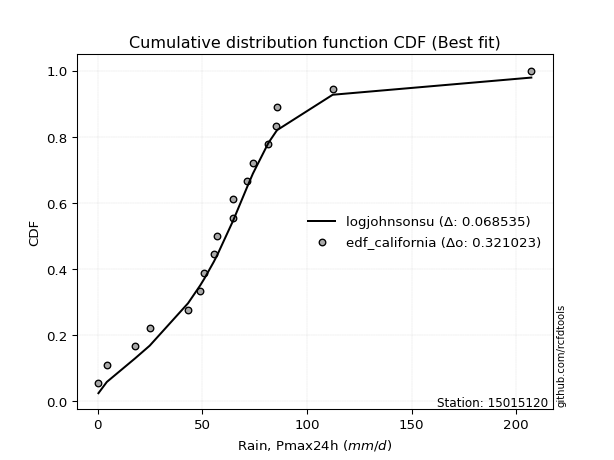</img>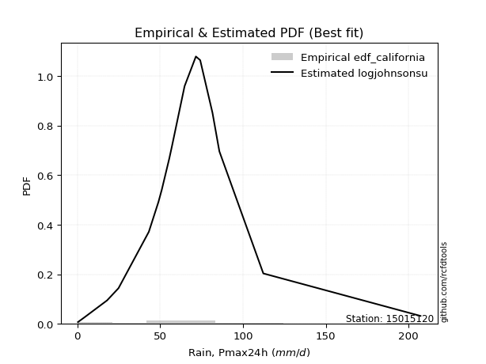</img>

</div>


### 2. Empirical - EDF Hazen (1930)

Hazen method for plotting positions is a formula used to estimate the empirical cumulative probability distribution of flood events or other hydrological data. This formula often results in biased estimations, particularly when extrapolating to extreme events (high return periods).

<div align="center">


$P=(m-0.5)/n$


</div>


**2.1. Empirical values**

<div align="center">

|                | 0                   | 1                   | 2                   | 3                   | 4                   | 5                  | 6                   | 7                   | 8                  | 9         | 10                 | 11                 | 12                 | 13                 | 14                 | 15                 | 16                | 17                 | 18                 |
|:---------------|:--------------------|:--------------------|:--------------------|:--------------------|:--------------------|:-------------------|:--------------------|:--------------------|:-------------------|:----------|:-------------------|:-------------------|:-------------------|:-------------------|:-------------------|:-------------------|:------------------|:-------------------|:-------------------|
| date           | 2023                | 2024                | 2025                | 2021                | 2009                | 2019               | 2014                | 2013                | 2020               | 2016      | 2010               | 2011               | 2022               | 2007               | 2015               | 2008               | 2017              | 2018               | 2012               |
| x              | 0.4                 | 4.4                 | 12.2                | 18.0                | 24.9                | 43.2               | 49.0                | 51.0                | 55.5               | 57.1      | 64.7               | 64.8               | 71.6               | 74.2               | 81.6               | 85.3               | 85.8              | 112.3              | 207.2              |
| m              | 1                   | 2                   | 3                   | 4                   | 5                   | 6                  | 7                   | 8                   | 9                  | 10        | 11                 | 12                 | 13                 | 14                 | 15                 | 16                 | 17                | 18                 | 19                 |
| empirical_dist | edf_hazen           | edf_hazen           | edf_hazen           | edf_hazen           | edf_hazen           | edf_hazen          | edf_hazen           | edf_hazen           | edf_hazen          | edf_hazen | edf_hazen          | edf_hazen          | edf_hazen          | edf_hazen          | edf_hazen          | edf_hazen          | edf_hazen         | edf_hazen          | edf_hazen          |
| empirical      | 0.02631578947368421 | 0.07894736842105263 | 0.13157894736842105 | 0.18421052631578946 | 0.23684210526315788 | 0.2894736842105263 | 0.34210526315789475 | 0.39473684210526316 | 0.4473684210526316 | 0.5       | 0.5526315789473685 | 0.6052631578947368 | 0.6578947368421053 | 0.7105263157894737 | 0.7631578947368421 | 0.8157894736842105 | 0.868421052631579 | 0.9210526315789473 | 0.9736842105263158 |
| empirical_tr   | 1.027027027027027   | 1.0857142857142856  | 1.1515151515151514  | 1.2258064516129032  | 1.3103448275862069  | 1.4074074074074074 | 1.5199999999999998  | 1.6521739130434783  | 1.8095238095238098 | 2.0       | 2.235294117647059  | 2.533333333333333  | 2.9230769230769234 | 3.4545454545454546 | 4.222222222222223  | 5.428571428571428  | 7.600000000000002 | 12.666666666666663 | 38.00000000000004  |

</div>


**2.2. Kolmogorov-Smirnov fit test (sorted by Δ)**


<div align="center">

|                | 0                   | 1                   | 2                   | 3                   | 4                   | 5                   | 6                   | 7                   | 8                   | 9                   | 10                  | 11                  | 12                  | 13                  | 14                  | 15                  | 16                  | 17                  | 18                  | 19                  | 20                  | 21                  | 22                  | 23                  | 24                  | 25                  | 26                    | 27                  | 28                  | 29                  | 30                  | 31                  | 32                  | 33                  | 34                  | 35                  | 36                  | 37                  | 38                  | 39                  | 40                  | 41                  | 42                  | 43                  | 44                  | 45                  | 46                  | 47                  | 48                  | 49                  | 50                  | 51                  | 52                  | 53                  | 54                  | 55                  | 56                  | 57                  | 58                  | 59                  | 60                  | 61                  | 62                  | 63                  | 64                  | 65                  | 66                  | 67                  | 68                  | 69                  | 70                  | 71                  | 72                  | 73                  | 74                  | 75                  | 76                  | 77                  | 78                  | 79                  | 80                  | 81                  | 82                  | 83                  | 84                  | 85                  | 86                  | 87                  | 88                  | 89                  |
|:---------------|:--------------------|:--------------------|:--------------------|:--------------------|:--------------------|:--------------------|:--------------------|:--------------------|:--------------------|:--------------------|:--------------------|:--------------------|:--------------------|:--------------------|:--------------------|:--------------------|:--------------------|:--------------------|:--------------------|:--------------------|:--------------------|:--------------------|:--------------------|:--------------------|:--------------------|:--------------------|:----------------------|:--------------------|:--------------------|:--------------------|:--------------------|:--------------------|:--------------------|:--------------------|:--------------------|:--------------------|:--------------------|:--------------------|:--------------------|:--------------------|:--------------------|:--------------------|:--------------------|:--------------------|:--------------------|:--------------------|:--------------------|:--------------------|:--------------------|:--------------------|:--------------------|:--------------------|:--------------------|:--------------------|:--------------------|:--------------------|:--------------------|:--------------------|:--------------------|:--------------------|:--------------------|:--------------------|:--------------------|:--------------------|:--------------------|:--------------------|:--------------------|:--------------------|:--------------------|:--------------------|:--------------------|:--------------------|:--------------------|:--------------------|:--------------------|:--------------------|:--------------------|:--------------------|:--------------------|:--------------------|:--------------------|:--------------------|:--------------------|:--------------------|:--------------------|:--------------------|:--------------------|:--------------------|:--------------------|:--------------------|
| station        | 15015120            | 15015120            | 15015120            | 15015120            | 15015120            | 15015120            | 15015120            | 15015120            | 15015120            | 15015120            | 15015120            | 15015120            | 15015120            | 15015120            | 15015120            | 15015120            | 15015120            | 15015120            | 15015120            | 15015120            | 15015120            | 15015120            | 15015120            | 15015120            | 15015120            | 15015120            | 15015120              | 15015120            | 15015120            | 15015120            | 15015120            | 15015120            | 15015120            | 15015120            | 15015120            | 15015120            | 15015120            | 15015120            | 15015120            | 15015120            | 15015120            | 15015120            | 15015120            | 15015120            | 15015120            | 15015120            | 15015120            | 15015120            | 15015120            | 15015120            | 15015120            | 15015120            | 15015120            | 15015120            | 15015120            | 15015120            | 15015120            | 15015120            | 15015120            | 15015120            | 15015120            | 15015120            | 15015120            | 15015120            | 15015120            | 15015120            | 15015120            | 15015120            | 15015120            | 15015120            | 15015120            | 15015120            | 15015120            | 15015120            | 15015120            | 15015120            | 15015120            | 15015120            | 15015120            | 15015120            | 15015120            | 15015120            | 15015120            | 15015120            | 15015120            | 15015120            | 15015120            | 15015120            | 15015120            | 15015120            |
| empirical_dist | edf_hazen           | edf_hazen           | edf_hazen           | edf_hazen           | edf_hazen           | edf_hazen           | edf_hazen           | edf_hazen           | edf_hazen           | edf_hazen           | edf_hazen           | edf_hazen           | edf_hazen           | edf_hazen           | edf_hazen           | edf_hazen           | edf_hazen           | edf_hazen           | edf_hazen           | edf_hazen           | edf_hazen           | edf_hazen           | edf_hazen           | edf_hazen           | edf_hazen           | edf_hazen           | edf_hazen             | edf_hazen           | edf_hazen           | edf_hazen           | edf_hazen           | edf_hazen           | edf_hazen           | edf_hazen           | edf_hazen           | edf_hazen           | edf_hazen           | edf_hazen           | edf_hazen           | edf_hazen           | edf_hazen           | edf_hazen           | edf_hazen           | edf_hazen           | edf_hazen           | edf_hazen           | edf_hazen           | edf_hazen           | edf_hazen           | edf_hazen           | edf_hazen           | edf_hazen           | edf_hazen           | edf_hazen           | edf_hazen           | edf_hazen           | edf_hazen           | edf_hazen           | edf_hazen           | edf_hazen           | edf_hazen           | edf_hazen           | edf_hazen           | edf_hazen           | edf_hazen           | edf_hazen           | edf_hazen           | edf_hazen           | edf_hazen           | edf_hazen           | edf_hazen           | edf_hazen           | edf_hazen           | edf_hazen           | edf_hazen           | edf_hazen           | edf_hazen           | edf_hazen           | edf_hazen           | edf_hazen           | edf_hazen           | edf_hazen           | edf_hazen           | edf_hazen           | edf_hazen           | edf_hazen           | edf_hazen           | edf_hazen           | edf_hazen           | edf_hazen           |
| p_dist         | logjohnsonsu        | t                   | laplace_asymmetric  | fisk                | nct                 | exponnorm           | logcrystalball      | laplace             | genlogistic         | gumbel_r            | invweibull          | invgamma            | johnsonsu           | invgauss            | fatiguelife         | weibull_min         | kstwobign           | hypsecant           | moyal               | logt                | halfnorm            | betaprime           | f                   | chi2                | erlang              | logistic            | loglaplace_asymmetric | gompertz            | rayleigh            | rice                | pearson3            | maxwell             | halflogistic        | loggenlogistic      | logloggamma         | norm                | truncnorm           | crystalball         | logfisk             | loggompertz         | ncf                 | loggumbel_l         | wald                | gumbel_l            | nakagami            | logpearson3         | logmielke           | expon               | genexpon            | gamma               | gibrat              | logfatiguelife      | lognakagami         | lognorm             | lognorm             | logexponnorm        | logrice             | loglognorm          | lognct              | loglogistic         | logalpha            | loghypsecant        | mielke              | loggamma            | loggamma            | loginvweibull       | loginvgauss         | logbetaprime        | loginvgamma         | loglaplace          | logmaxwell          | logkstwobign        | lograyleigh         | loghalfnorm         | loggumbel_r         | loggenexpon         | logmoyal            | loghalflogistic     | logexpon            | logwald             | logncf              | loggibrat           | logerlang           | logtruncnorm        | logchi2             | pareto              | logf                | logweibull_min      | logpareto           | alpha               |
| delta          | 0.04462863021812971 | 0.06457817775135005 | 0.09062121514911958 | 0.09343880630285406 | 0.09400892086804702 | 0.09912502891280595 | 0.10036839930137653 | 0.100492516941323   | 0.1069112652320311  | 0.11256274752496997 | 0.11415336161659767 | 0.11535378982027383 | 0.11894124036714127 | 0.12046728410945268 | 0.1212913597030304  | 0.12426968038597219 | 0.12475334262908477 | 0.12497523679273981 | 0.13248860465665785 | 0.13290571883819757 | 0.1336840059110334  | 0.13725770272266424 | 0.13950297473266798 | 0.14016035405751748 | 0.1401607106148116  | 0.1404332351752844  | 0.14077970165904558   | 0.141757565969982   | 0.14252131619239639 | 0.14286361026358585 | 0.14339140657580357 | 0.1469319961908515  | 0.1473361399667743  | 0.15422004798858363 | 0.1557894161592901  | 0.16207243147769868 | 0.16207243417323802 | 0.16207243894663137 | 0.16564192528122185 | 0.16921482312494884 | 0.17378032836509721 | 0.18009909005507652 | 0.19242083376843305 | 0.1926704380431803  | 0.19541068617754093 | 0.19926499555921384 | 0.20144800620196385 | 0.21577681509302038 | 0.21617518450107442 | 0.2288878025810417  | 0.23684210526315788 | 0.24702043346721392 | 0.2473746318092156  | 0.24830123331144405 | 0.24830123331144405 | 0.24830163982886466 | 0.24831912746227003 | 0.2485553852946797  | 0.24910654190821613 | 0.2534210886726419  | 0.2576210654652292  | 0.25776674498606145 | 0.2595018131764544  | 0.2614175245482139  | 0.2614175245482139  | 0.26188414424933437 | 0.2620113370215498  | 0.26488137385481236 | 0.26591247459614675 | 0.27425037161792915 | 0.279459429064571   | 0.28829211446502667 | 0.2895545254766929  | 0.3180009682864109  | 0.3187807601129933  | 0.3346788923602171  | 0.3439807664920036  | 0.3448413718769805  | 0.3963673463563455  | 0.4139172292277439  | 0.4331038424157393  | 0.44196394689066254 | 0.4433056997869913  | 0.4755606021746801  | 0.5123214985411123  | 0.5214382182636732  | 0.5436748331074979  | 0.5591195515095203  | 0.5597535225992636  | 0.7549643407260489  |
| deltao         | 0.31564497164100014 | 0.31564497164100014 | 0.31564497164100014 | 0.31564497164100014 | 0.31564497164100014 | 0.31564497164100014 | 0.31564497164100014 | 0.31564497164100014 | 0.31564497164100014 | 0.31564497164100014 | 0.31564497164100014 | 0.31564497164100014 | 0.31564497164100014 | 0.31564497164100014 | 0.31564497164100014 | 0.31564497164100014 | 0.31564497164100014 | 0.31564497164100014 | 0.31564497164100014 | 0.31564497164100014 | 0.31564497164100014 | 0.31564497164100014 | 0.31564497164100014 | 0.31564497164100014 | 0.31564497164100014 | 0.31564497164100014 | 0.31564497164100014   | 0.31564497164100014 | 0.31564497164100014 | 0.31564497164100014 | 0.31564497164100014 | 0.31564497164100014 | 0.31564497164100014 | 0.31564497164100014 | 0.31564497164100014 | 0.31564497164100014 | 0.31564497164100014 | 0.31564497164100014 | 0.31564497164100014 | 0.31564497164100014 | 0.31564497164100014 | 0.31564497164100014 | 0.31564497164100014 | 0.31564497164100014 | 0.31564497164100014 | 0.31564497164100014 | 0.31564497164100014 | 0.31564497164100014 | 0.31564497164100014 | 0.31564497164100014 | 0.31564497164100014 | 0.31564497164100014 | 0.31564497164100014 | 0.31564497164100014 | 0.31564497164100014 | 0.31564497164100014 | 0.31564497164100014 | 0.31564497164100014 | 0.31564497164100014 | 0.31564497164100014 | 0.31564497164100014 | 0.31564497164100014 | 0.31564497164100014 | 0.31564497164100014 | 0.31564497164100014 | 0.31564497164100014 | 0.31564497164100014 | 0.31564497164100014 | 0.31564497164100014 | 0.31564497164100014 | 0.31564497164100014 | 0.31564497164100014 | 0.31564497164100014 | 0.31564497164100014 | 0.31564497164100014 | 0.31564497164100014 | 0.31564497164100014 | 0.31564497164100014 | 0.31564497164100014 | 0.31564497164100014 | 0.31564497164100014 | 0.31564497164100014 | 0.31564497164100014 | 0.31564497164100014 | 0.31564497164100014 | 0.31564497164100014 | 0.31564497164100014 | 0.31564497164100014 | 0.31564497164100014 | 0.31564497164100014 |
| eval           | Δo > Δ              | Δo > Δ              | Δo > Δ              | Δo > Δ              | Δo > Δ              | Δo > Δ              | Δo > Δ              | Δo > Δ              | Δo > Δ              | Δo > Δ              | Δo > Δ              | Δo > Δ              | Δo > Δ              | Δo > Δ              | Δo > Δ              | Δo > Δ              | Δo > Δ              | Δo > Δ              | Δo > Δ              | Δo > Δ              | Δo > Δ              | Δo > Δ              | Δo > Δ              | Δo > Δ              | Δo > Δ              | Δo > Δ              | Δo > Δ                | Δo > Δ              | Δo > Δ              | Δo > Δ              | Δo > Δ              | Δo > Δ              | Δo > Δ              | Δo > Δ              | Δo > Δ              | Δo > Δ              | Δo > Δ              | Δo > Δ              | Δo > Δ              | Δo > Δ              | Δo > Δ              | Δo > Δ              | Δo > Δ              | Δo > Δ              | Δo > Δ              | Δo > Δ              | Δo > Δ              | Δo > Δ              | Δo > Δ              | Δo > Δ              | Δo > Δ              | Δo > Δ              | Δo > Δ              | Δo > Δ              | Δo > Δ              | Δo > Δ              | Δo > Δ              | Δo > Δ              | Δo > Δ              | Δo > Δ              | Δo > Δ              | Δo > Δ              | Δo > Δ              | Δo > Δ              | Δo > Δ              | Δo > Δ              | Δo > Δ              | Δo > Δ              | Δo > Δ              | Δo > Δ              | Δo > Δ              | Δo > Δ              | Δo > Δ              | Δo <= Δ             | Δo <= Δ             | Δo <= Δ             | Δo <= Δ             | Δo <= Δ             | Δo <= Δ             | Δo <= Δ             | Δo <= Δ             | Δo <= Δ             | Δo <= Δ             | Δo <= Δ             | Δo <= Δ             | Δo <= Δ             | Δo <= Δ             | Δo <= Δ             | Δo <= Δ             | Δo <= Δ             |
| fit            | 1                   | 1                   | 1                   | 1                   | 1                   | 1                   | 1                   | 1                   | 1                   | 1                   | 1                   | 1                   | 1                   | 1                   | 1                   | 1                   | 1                   | 1                   | 1                   | 1                   | 1                   | 1                   | 1                   | 1                   | 1                   | 1                   | 1                     | 1                   | 1                   | 1                   | 1                   | 1                   | 1                   | 1                   | 1                   | 1                   | 1                   | 1                   | 1                   | 1                   | 1                   | 1                   | 1                   | 1                   | 1                   | 1                   | 1                   | 1                   | 1                   | 1                   | 1                   | 1                   | 1                   | 1                   | 1                   | 1                   | 1                   | 1                   | 1                   | 1                   | 1                   | 1                   | 1                   | 1                   | 1                   | 1                   | 1                   | 1                   | 1                   | 1                   | 1                   | 1                   | 1                   | 0                   | 0                   | 0                   | 0                   | 0                   | 0                   | 0                   | 0                   | 0                   | 0                   | 0                   | 0                   | 0                   | 0                   | 0                   | 0                   | 0                   |
| n              | 19                  | 19                  | 19                  | 19                  | 19                  | 19                  | 19                  | 19                  | 19                  | 19                  | 19                  | 19                  | 19                  | 19                  | 19                  | 19                  | 19                  | 19                  | 19                  | 19                  | 19                  | 19                  | 19                  | 19                  | 19                  | 19                  | 19                    | 19                  | 19                  | 19                  | 19                  | 19                  | 19                  | 19                  | 19                  | 19                  | 19                  | 19                  | 19                  | 19                  | 19                  | 19                  | 19                  | 19                  | 19                  | 19                  | 19                  | 19                  | 19                  | 19                  | 19                  | 19                  | 19                  | 19                  | 19                  | 19                  | 19                  | 19                  | 19                  | 19                  | 19                  | 19                  | 19                  | 19                  | 19                  | 19                  | 19                  | 19                  | 19                  | 19                  | 19                  | 19                  | 19                  | 19                  | 19                  | 19                  | 19                  | 19                  | 19                  | 19                  | 19                  | 19                  | 19                  | 19                  | 19                  | 19                  | 19                  | 19                  | 19                  | 19                  |
| best_fit       | 1                   | 0                   | 0                   | 0                   | 0                   | 0                   | 0                   | 0                   | 0                   | 0                   | 0                   | 0                   | 0                   | 0                   | 0                   | 0                   | 0                   | 0                   | 0                   | 0                   | 0                   | 0                   | 0                   | 0                   | 0                   | 0                   | 0                     | 0                   | 0                   | 0                   | 0                   | 0                   | 0                   | 0                   | 0                   | 0                   | 0                   | 0                   | 0                   | 0                   | 0                   | 0                   | 0                   | 0                   | 0                   | 0                   | 0                   | 0                   | 0                   | 0                   | 0                   | 0                   | 0                   | 0                   | 0                   | 0                   | 0                   | 0                   | 0                   | 0                   | 0                   | 0                   | 0                   | 0                   | 0                   | 0                   | 0                   | 0                   | 0                   | 0                   | 0                   | 0                   | 0                   | 0                   | 0                   | 0                   | 0                   | 0                   | 0                   | 0                   | 0                   | 0                   | 0                   | 0                   | 0                   | 0                   | 0                   | 0                   | 0                   | 0                   |
| best_fit_sort  | 1                   | 2                   | 3                   | 4                   | 5                   | 6                   | 7                   | 8                   | 9                   | 10                  | 11                  | 12                  | 13                  | 14                  | 15                  | 16                  | 17                  | 18                  | 19                  | 20                  | 21                  | 22                  | 23                  | 24                  | 25                  | 26                  | 27                    | 28                  | 29                  | 30                  | 31                  | 32                  | 33                  | 34                  | 35                  | 36                  | 37                  | 38                  | 39                  | 40                  | 41                  | 42                  | 43                  | 44                  | 45                  | 46                  | 47                  | 48                  | 49                  | 50                  | 51                  | 52                  | 53                  | 54                  | 55                  | 56                  | 57                  | 58                  | 59                  | 60                  | 61                  | 62                  | 63                  | 64                  | 65                  | 66                  | 67                  | 68                  | 69                  | 70                  | 71                  | 72                  | 73                  | 74                  | 75                  | 76                  | 77                  | 78                  | 79                  | 80                  | 81                  | 82                  | 83                  | 84                  | 85                  | 86                  | 87                  | 88                  | 89                  | 90                  |

</div>


<div align="center">

</img>

</div>


**2.3. Best fit**

<div align="center">

|   id |   station | empirical_dist   | p_dist       |     delta |   deltao | eval   |   fit |   n |   best_fit |   best_fit_sort |
|-----:|----------:|:-----------------|:-------------|----------:|---------:|:-------|------:|----:|-----------:|----------------:|
|    0 |  15015120 | edf_hazen        | logjohnsonsu | 0.0446286 | 0.315645 | Δo > Δ |     1 |  19 |          1 |               1 |

</div>


<div align="center">

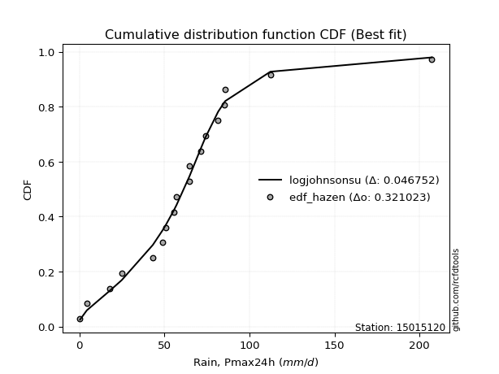</img>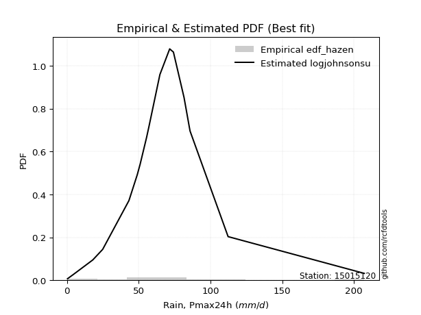</img>

</div>


### 3. Empirical - EDF Weibull (1939)

Weibull plotting position formula is an empirical method used to estimate the non-exceedance probability or plotting position for a set of observed data, is often recommended or widely used in practice, particularly in flood frequency analysis.

<div align="center">


$P=m/(n+1)$


</div>


**3.1. Empirical values**

<div align="center">

|                | 0                  | 1                  | 2                  | 3           | 4                  | 5                  | 6                  | 7                  | 8                  | 9           | 10                 | 11          | 12                | 13                | 14          | 15                | 16                | 17                 | 18                 |
|:---------------|:-------------------|:-------------------|:-------------------|:------------|:-------------------|:-------------------|:-------------------|:-------------------|:-------------------|:------------|:-------------------|:------------|:------------------|:------------------|:------------|:------------------|:------------------|:-------------------|:-------------------|
| date           | 2023               | 2024               | 2025               | 2021        | 2009               | 2019               | 2014               | 2013               | 2020               | 2016        | 2010               | 2011        | 2022              | 2007              | 2015        | 2008              | 2017              | 2018               | 2012               |
| x              | 0.4                | 4.4                | 12.2               | 18.0        | 24.9               | 43.2               | 49.0               | 51.0               | 55.5               | 57.1        | 64.7               | 64.8        | 71.6              | 74.2              | 81.6        | 85.3              | 85.8              | 112.3              | 207.2              |
| m              | 1                  | 2                  | 3                  | 4           | 5                  | 6                  | 7                  | 8                  | 9                  | 10          | 11                 | 12          | 13                | 14                | 15          | 16                | 17                | 18                 | 19                 |
| empirical_dist | edf_weibull        | edf_weibull        | edf_weibull        | edf_weibull | edf_weibull        | edf_weibull        | edf_weibull        | edf_weibull        | edf_weibull        | edf_weibull | edf_weibull        | edf_weibull | edf_weibull       | edf_weibull       | edf_weibull | edf_weibull       | edf_weibull       | edf_weibull        | edf_weibull        |
| empirical      | 0.05               | 0.1                | 0.15               | 0.2         | 0.25               | 0.3                | 0.35               | 0.4                | 0.45               | 0.5         | 0.55               | 0.6         | 0.65              | 0.7               | 0.75        | 0.8               | 0.85              | 0.9                | 0.95               |
| empirical_tr   | 1.0526315789473684 | 1.1111111111111112 | 1.1764705882352942 | 1.25        | 1.3333333333333333 | 1.4285714285714286 | 1.5384615384615383 | 1.6666666666666667 | 1.8181818181818181 | 2.0         | 2.2222222222222223 | 2.5         | 2.857142857142857 | 3.333333333333333 | 4.0         | 5.000000000000001 | 6.666666666666666 | 10.000000000000002 | 19.999999999999982 |

</div>


**3.2. Kolmogorov-Smirnov fit test (sorted by Δ)**


<div align="center">

|                | 0                   | 1                   | 2                   | 3                   | 4                   | 5                   | 6                   | 7                   | 8                   | 9                   | 10                  | 11                  | 12                  | 13                  | 14                  | 15                  | 16                  | 17                  | 18                  | 19                  | 20                  | 21                  | 22                  | 23                  | 24                  | 25                  | 26                  | 27                  | 28                    | 29                  | 30                  | 31                  | 32                  | 33                  | 34                  | 35                  | 36                  | 37                  | 38                  | 39                  | 40                  | 41                  | 42                  | 43                  | 44                  | 45                  | 46                  | 47                  | 48                  | 49                  | 50                  | 51                  | 52                  | 53                  | 54                  | 55                  | 56                  | 57                  | 58                  | 59                  | 60                  | 61                  | 62                  | 63                  | 64                  | 65                  | 66                  | 67                  | 68                  | 69                  | 70                  | 71                  | 72                  | 73                  | 74                  | 75                  | 76                  | 77                  | 78                  | 79                  | 80                  | 81                  | 82                  | 83                  | 84                  | 85                  | 86                  | 87                  | 88                  | 89                  |
|:---------------|:--------------------|:--------------------|:--------------------|:--------------------|:--------------------|:--------------------|:--------------------|:--------------------|:--------------------|:--------------------|:--------------------|:--------------------|:--------------------|:--------------------|:--------------------|:--------------------|:--------------------|:--------------------|:--------------------|:--------------------|:--------------------|:--------------------|:--------------------|:--------------------|:--------------------|:--------------------|:--------------------|:--------------------|:----------------------|:--------------------|:--------------------|:--------------------|:--------------------|:--------------------|:--------------------|:--------------------|:--------------------|:--------------------|:--------------------|:--------------------|:--------------------|:--------------------|:--------------------|:--------------------|:--------------------|:--------------------|:--------------------|:--------------------|:--------------------|:--------------------|:--------------------|:--------------------|:--------------------|:--------------------|:--------------------|:--------------------|:--------------------|:--------------------|:--------------------|:--------------------|:--------------------|:--------------------|:--------------------|:--------------------|:--------------------|:--------------------|:--------------------|:--------------------|:--------------------|:--------------------|:--------------------|:--------------------|:--------------------|:--------------------|:--------------------|:--------------------|:--------------------|:--------------------|:--------------------|:--------------------|:--------------------|:--------------------|:--------------------|:--------------------|:--------------------|:--------------------|:--------------------|:--------------------|:--------------------|:--------------------|
| station        | 15015120            | 15015120            | 15015120            | 15015120            | 15015120            | 15015120            | 15015120            | 15015120            | 15015120            | 15015120            | 15015120            | 15015120            | 15015120            | 15015120            | 15015120            | 15015120            | 15015120            | 15015120            | 15015120            | 15015120            | 15015120            | 15015120            | 15015120            | 15015120            | 15015120            | 15015120            | 15015120            | 15015120            | 15015120              | 15015120            | 15015120            | 15015120            | 15015120            | 15015120            | 15015120            | 15015120            | 15015120            | 15015120            | 15015120            | 15015120            | 15015120            | 15015120            | 15015120            | 15015120            | 15015120            | 15015120            | 15015120            | 15015120            | 15015120            | 15015120            | 15015120            | 15015120            | 15015120            | 15015120            | 15015120            | 15015120            | 15015120            | 15015120            | 15015120            | 15015120            | 15015120            | 15015120            | 15015120            | 15015120            | 15015120            | 15015120            | 15015120            | 15015120            | 15015120            | 15015120            | 15015120            | 15015120            | 15015120            | 15015120            | 15015120            | 15015120            | 15015120            | 15015120            | 15015120            | 15015120            | 15015120            | 15015120            | 15015120            | 15015120            | 15015120            | 15015120            | 15015120            | 15015120            | 15015120            | 15015120            |
| empirical_dist | edf_weibull         | edf_weibull         | edf_weibull         | edf_weibull         | edf_weibull         | edf_weibull         | edf_weibull         | edf_weibull         | edf_weibull         | edf_weibull         | edf_weibull         | edf_weibull         | edf_weibull         | edf_weibull         | edf_weibull         | edf_weibull         | edf_weibull         | edf_weibull         | edf_weibull         | edf_weibull         | edf_weibull         | edf_weibull         | edf_weibull         | edf_weibull         | edf_weibull         | edf_weibull         | edf_weibull         | edf_weibull         | edf_weibull           | edf_weibull         | edf_weibull         | edf_weibull         | edf_weibull         | edf_weibull         | edf_weibull         | edf_weibull         | edf_weibull         | edf_weibull         | edf_weibull         | edf_weibull         | edf_weibull         | edf_weibull         | edf_weibull         | edf_weibull         | edf_weibull         | edf_weibull         | edf_weibull         | edf_weibull         | edf_weibull         | edf_weibull         | edf_weibull         | edf_weibull         | edf_weibull         | edf_weibull         | edf_weibull         | edf_weibull         | edf_weibull         | edf_weibull         | edf_weibull         | edf_weibull         | edf_weibull         | edf_weibull         | edf_weibull         | edf_weibull         | edf_weibull         | edf_weibull         | edf_weibull         | edf_weibull         | edf_weibull         | edf_weibull         | edf_weibull         | edf_weibull         | edf_weibull         | edf_weibull         | edf_weibull         | edf_weibull         | edf_weibull         | edf_weibull         | edf_weibull         | edf_weibull         | edf_weibull         | edf_weibull         | edf_weibull         | edf_weibull         | edf_weibull         | edf_weibull         | edf_weibull         | edf_weibull         | edf_weibull         | edf_weibull         |
| p_dist         | logjohnsonsu        | t                   | exponnorm           | logcrystalball      | fisk                | nct                 | laplace             | laplace_asymmetric  | genlogistic         | gumbel_r            | invweibull          | kstwobign           | hypsecant           | invgamma            | johnsonsu           | invgauss            | fatiguelife         | logistic            | rayleigh            | rice                | moyal               | halfnorm            | maxwell             | betaprime           | gompertz            | f                   | chi2                | erlang              | loglaplace_asymmetric | pearson3            | halflogistic        | weibull_min         | norm                | truncnorm           | crystalball         | logt                | logloggamma         | loggenlogistic      | logfisk             | loggompertz         | ncf                 | loggumbel_l         | gumbel_l            | logpearson3         | nakagami            | logmielke           | wald                | expon               | genexpon            | gamma               | logfatiguelife      | lognakagami         | lognorm             | lognorm             | logexponnorm        | logrice             | loglognorm          | lognct              | loglogistic         | logbetaprime        | logalpha            | loghypsecant        | mielke              | gibrat              | loggamma            | loggamma            | loginvweibull       | loginvgauss         | loginvgamma         | loglaplace          | logmaxwell          | logkstwobign        | lograyleigh         | loghalfnorm         | loggumbel_r         | loggenexpon         | logmoyal            | loghalflogistic     | logexpon            | logwald             | logncf              | logerlang           | loggibrat           | logtruncnorm        | logchi2             | pareto              | logf                | logpareto           | logweibull_min      | alpha               |
| delta          | 0.05778652495497183 | 0.07773607248819217 | 0.08070397628122694 | 0.08194734666979753 | 0.08388372384587722 | 0.08611418402594179 | 0.08916846268029643 | 0.0982126754782533  | 0.09901652838992586 | 0.10218751320300107 | 0.10625862477449244 | 0.10633228999750577 | 0.1065541841611608  | 0.1074590529781686  | 0.11104650352503603 | 0.11257254726734744 | 0.11339662286092517 | 0.12201218254370538 | 0.12410026356081738 | 0.12444255763200684 | 0.12459386781455262 | 0.1247071394353364  | 0.1285109435592725  | 0.129362965880559   | 0.13123125018050835 | 0.13160823789056275 | 0.13226561721541225 | 0.13226597377270638 | 0.13288496481694034   | 0.13549666973369834 | 0.13944140312466907 | 0.14269073301755114 | 0.14365137884611967 | 0.14365138154165902 | 0.14365138631505237 | 0.1437681864967038  | 0.14526310036981643 | 0.1463253111464784  | 0.15511560949174819 | 0.1608721442033244  | 0.16325401257562355 | 0.16957277426560285 | 0.1742493854116013  | 0.18084394292763484 | 0.18488437038806727 | 0.19092169041249019 | 0.1999924746945446  | 0.20525049930354672 | 0.20564886871160076 | 0.21836148679156803 | 0.23649411767774026 | 0.23684831601974193 | 0.23777491752197039 | 0.23777491752197039 | 0.237775324039391   | 0.23779281167279637 | 0.23802906950520603 | 0.23858022611874247 | 0.24289477288316824 | 0.24382874227586504 | 0.24709474967575557 | 0.24724042919658779 | 0.24897549738698072 | 0.25                | 0.2508912087587402  | 0.2508912087587402  | 0.2513578284598607  | 0.2514850212320761  | 0.2553861588066731  | 0.2663556347758239  | 0.26893311327509734 | 0.277765798675553   | 0.27902820968721925 | 0.30747465249693723 | 0.3082544443235196  | 0.3241525765707434  | 0.33345445070252994 | 0.33431505608750683 | 0.3779462937247665  | 0.4033909134382702  | 0.4146827897841603  | 0.41962148926067544 | 0.4314376311011889  | 0.46503428638520644 | 0.4939004459095333  | 0.5003855866847259  | 0.5252537804759189  | 0.5387008910203163  | 0.5406984988779413  | 0.7365432880944699  |
| deltao         | 0.31564497164100014 | 0.31564497164100014 | 0.31564497164100014 | 0.31564497164100014 | 0.31564497164100014 | 0.31564497164100014 | 0.31564497164100014 | 0.31564497164100014 | 0.31564497164100014 | 0.31564497164100014 | 0.31564497164100014 | 0.31564497164100014 | 0.31564497164100014 | 0.31564497164100014 | 0.31564497164100014 | 0.31564497164100014 | 0.31564497164100014 | 0.31564497164100014 | 0.31564497164100014 | 0.31564497164100014 | 0.31564497164100014 | 0.31564497164100014 | 0.31564497164100014 | 0.31564497164100014 | 0.31564497164100014 | 0.31564497164100014 | 0.31564497164100014 | 0.31564497164100014 | 0.31564497164100014   | 0.31564497164100014 | 0.31564497164100014 | 0.31564497164100014 | 0.31564497164100014 | 0.31564497164100014 | 0.31564497164100014 | 0.31564497164100014 | 0.31564497164100014 | 0.31564497164100014 | 0.31564497164100014 | 0.31564497164100014 | 0.31564497164100014 | 0.31564497164100014 | 0.31564497164100014 | 0.31564497164100014 | 0.31564497164100014 | 0.31564497164100014 | 0.31564497164100014 | 0.31564497164100014 | 0.31564497164100014 | 0.31564497164100014 | 0.31564497164100014 | 0.31564497164100014 | 0.31564497164100014 | 0.31564497164100014 | 0.31564497164100014 | 0.31564497164100014 | 0.31564497164100014 | 0.31564497164100014 | 0.31564497164100014 | 0.31564497164100014 | 0.31564497164100014 | 0.31564497164100014 | 0.31564497164100014 | 0.31564497164100014 | 0.31564497164100014 | 0.31564497164100014 | 0.31564497164100014 | 0.31564497164100014 | 0.31564497164100014 | 0.31564497164100014 | 0.31564497164100014 | 0.31564497164100014 | 0.31564497164100014 | 0.31564497164100014 | 0.31564497164100014 | 0.31564497164100014 | 0.31564497164100014 | 0.31564497164100014 | 0.31564497164100014 | 0.31564497164100014 | 0.31564497164100014 | 0.31564497164100014 | 0.31564497164100014 | 0.31564497164100014 | 0.31564497164100014 | 0.31564497164100014 | 0.31564497164100014 | 0.31564497164100014 | 0.31564497164100014 | 0.31564497164100014 |
| eval           | Δo > Δ              | Δo > Δ              | Δo > Δ              | Δo > Δ              | Δo > Δ              | Δo > Δ              | Δo > Δ              | Δo > Δ              | Δo > Δ              | Δo > Δ              | Δo > Δ              | Δo > Δ              | Δo > Δ              | Δo > Δ              | Δo > Δ              | Δo > Δ              | Δo > Δ              | Δo > Δ              | Δo > Δ              | Δo > Δ              | Δo > Δ              | Δo > Δ              | Δo > Δ              | Δo > Δ              | Δo > Δ              | Δo > Δ              | Δo > Δ              | Δo > Δ              | Δo > Δ                | Δo > Δ              | Δo > Δ              | Δo > Δ              | Δo > Δ              | Δo > Δ              | Δo > Δ              | Δo > Δ              | Δo > Δ              | Δo > Δ              | Δo > Δ              | Δo > Δ              | Δo > Δ              | Δo > Δ              | Δo > Δ              | Δo > Δ              | Δo > Δ              | Δo > Δ              | Δo > Δ              | Δo > Δ              | Δo > Δ              | Δo > Δ              | Δo > Δ              | Δo > Δ              | Δo > Δ              | Δo > Δ              | Δo > Δ              | Δo > Δ              | Δo > Δ              | Δo > Δ              | Δo > Δ              | Δo > Δ              | Δo > Δ              | Δo > Δ              | Δo > Δ              | Δo > Δ              | Δo > Δ              | Δo > Δ              | Δo > Δ              | Δo > Δ              | Δo > Δ              | Δo > Δ              | Δo > Δ              | Δo > Δ              | Δo > Δ              | Δo > Δ              | Δo > Δ              | Δo <= Δ             | Δo <= Δ             | Δo <= Δ             | Δo <= Δ             | Δo <= Δ             | Δo <= Δ             | Δo <= Δ             | Δo <= Δ             | Δo <= Δ             | Δo <= Δ             | Δo <= Δ             | Δo <= Δ             | Δo <= Δ             | Δo <= Δ             | Δo <= Δ             |
| fit            | 1                   | 1                   | 1                   | 1                   | 1                   | 1                   | 1                   | 1                   | 1                   | 1                   | 1                   | 1                   | 1                   | 1                   | 1                   | 1                   | 1                   | 1                   | 1                   | 1                   | 1                   | 1                   | 1                   | 1                   | 1                   | 1                   | 1                   | 1                   | 1                     | 1                   | 1                   | 1                   | 1                   | 1                   | 1                   | 1                   | 1                   | 1                   | 1                   | 1                   | 1                   | 1                   | 1                   | 1                   | 1                   | 1                   | 1                   | 1                   | 1                   | 1                   | 1                   | 1                   | 1                   | 1                   | 1                   | 1                   | 1                   | 1                   | 1                   | 1                   | 1                   | 1                   | 1                   | 1                   | 1                   | 1                   | 1                   | 1                   | 1                   | 1                   | 1                   | 1                   | 1                   | 1                   | 1                   | 0                   | 0                   | 0                   | 0                   | 0                   | 0                   | 0                   | 0                   | 0                   | 0                   | 0                   | 0                   | 0                   | 0                   | 0                   |
| n              | 19                  | 19                  | 19                  | 19                  | 19                  | 19                  | 19                  | 19                  | 19                  | 19                  | 19                  | 19                  | 19                  | 19                  | 19                  | 19                  | 19                  | 19                  | 19                  | 19                  | 19                  | 19                  | 19                  | 19                  | 19                  | 19                  | 19                  | 19                  | 19                    | 19                  | 19                  | 19                  | 19                  | 19                  | 19                  | 19                  | 19                  | 19                  | 19                  | 19                  | 19                  | 19                  | 19                  | 19                  | 19                  | 19                  | 19                  | 19                  | 19                  | 19                  | 19                  | 19                  | 19                  | 19                  | 19                  | 19                  | 19                  | 19                  | 19                  | 19                  | 19                  | 19                  | 19                  | 19                  | 19                  | 19                  | 19                  | 19                  | 19                  | 19                  | 19                  | 19                  | 19                  | 19                  | 19                  | 19                  | 19                  | 19                  | 19                  | 19                  | 19                  | 19                  | 19                  | 19                  | 19                  | 19                  | 19                  | 19                  | 19                  | 19                  |
| best_fit       | 1                   | 0                   | 0                   | 0                   | 0                   | 0                   | 0                   | 0                   | 0                   | 0                   | 0                   | 0                   | 0                   | 0                   | 0                   | 0                   | 0                   | 0                   | 0                   | 0                   | 0                   | 0                   | 0                   | 0                   | 0                   | 0                   | 0                   | 0                   | 0                     | 0                   | 0                   | 0                   | 0                   | 0                   | 0                   | 0                   | 0                   | 0                   | 0                   | 0                   | 0                   | 0                   | 0                   | 0                   | 0                   | 0                   | 0                   | 0                   | 0                   | 0                   | 0                   | 0                   | 0                   | 0                   | 0                   | 0                   | 0                   | 0                   | 0                   | 0                   | 0                   | 0                   | 0                   | 0                   | 0                   | 0                   | 0                   | 0                   | 0                   | 0                   | 0                   | 0                   | 0                   | 0                   | 0                   | 0                   | 0                   | 0                   | 0                   | 0                   | 0                   | 0                   | 0                   | 0                   | 0                   | 0                   | 0                   | 0                   | 0                   | 0                   |
| best_fit_sort  | 1                   | 2                   | 3                   | 4                   | 5                   | 6                   | 7                   | 8                   | 9                   | 10                  | 11                  | 12                  | 13                  | 14                  | 15                  | 16                  | 17                  | 18                  | 19                  | 20                  | 21                  | 22                  | 23                  | 24                  | 25                  | 26                  | 27                  | 28                  | 29                    | 30                  | 31                  | 32                  | 33                  | 34                  | 35                  | 36                  | 37                  | 38                  | 39                  | 40                  | 41                  | 42                  | 43                  | 44                  | 45                  | 46                  | 47                  | 48                  | 49                  | 50                  | 51                  | 52                  | 53                  | 54                  | 55                  | 56                  | 57                  | 58                  | 59                  | 60                  | 61                  | 62                  | 63                  | 64                  | 65                  | 66                  | 67                  | 68                  | 69                  | 70                  | 71                  | 72                  | 73                  | 74                  | 75                  | 76                  | 77                  | 78                  | 79                  | 80                  | 81                  | 82                  | 83                  | 84                  | 85                  | 86                  | 87                  | 88                  | 89                  | 90                  |

</div>


<div align="center">

</img>

</div>


**3.3. Best fit**

<div align="center">

|   id |   station | empirical_dist   | p_dist       |     delta |   deltao | eval   |   fit |   n |   best_fit |   best_fit_sort |
|-----:|----------:|:-----------------|:-------------|----------:|---------:|:-------|------:|----:|-----------:|----------------:|
|    0 |  15015120 | edf_weibull      | logjohnsonsu | 0.0577865 | 0.315645 | Δo > Δ |     1 |  19 |          1 |               1 |

</div>


<div align="center">

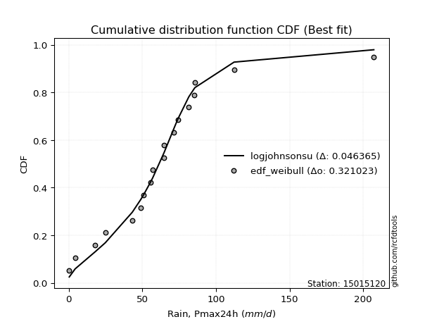</img></img>

</div>


### 4. Empirical - EDF Beard (1943)

The Beard formula (or Beard´s plotting position formula) in hydrology is used to estimate the empirical non-exceedance probability _(P)_ of a flood event (or other extreme hydrological data point) within a given dataset.

<div align="center">


$P=(m-0.31)/(n+0.38)$


</div>


**4.1. Empirical values**

<div align="center">

|                | 0                   | 1                   | 2                  | 3                   | 4                   | 5                   | 6                  | 7                  | 8                  | 9         | 10                 | 11                 | 12                 | 13                 | 14                 | 15                 | 16                 | 17                 | 18                 |
|:---------------|:--------------------|:--------------------|:-------------------|:--------------------|:--------------------|:--------------------|:-------------------|:-------------------|:-------------------|:----------|:-------------------|:-------------------|:-------------------|:-------------------|:-------------------|:-------------------|:-------------------|:-------------------|:-------------------|
| date           | 2023                | 2024                | 2025               | 2021                | 2009                | 2019                | 2014               | 2013               | 2020               | 2016      | 2010               | 2011               | 2022               | 2007               | 2015               | 2008               | 2017               | 2018               | 2012               |
| x              | 0.4                 | 4.4                 | 12.2               | 18.0                | 24.9                | 43.2                | 49.0               | 51.0               | 55.5               | 57.1      | 64.7               | 64.8               | 71.6               | 74.2               | 81.6               | 85.3               | 85.8               | 112.3              | 207.2              |
| m              | 1                   | 2                   | 3                  | 4                   | 5                   | 6                   | 7                  | 8                  | 9                  | 10        | 11                 | 12                 | 13                 | 14                 | 15                 | 16                 | 17                 | 18                 | 19                 |
| empirical_dist | edf_beard           | edf_beard           | edf_beard          | edf_beard           | edf_beard           | edf_beard           | edf_beard          | edf_beard          | edf_beard          | edf_beard | edf_beard          | edf_beard          | edf_beard          | edf_beard          | edf_beard          | edf_beard          | edf_beard          | edf_beard          | edf_beard          |
| empirical      | 0.03560371517027864 | 0.08720330237358101 | 0.1388028895768834 | 0.19040247678018576 | 0.24200206398348817 | 0.29360165118679055 | 0.3452012383900929 | 0.3968008255933953 | 0.4484004127966976 | 0.5       | 0.5515995872033024 | 0.6031991744066048 | 0.6547987616099071 | 0.7063983488132095 | 0.7579979360165119 | 0.8095975232198143 | 0.8611971104231168 | 0.9127966976264191 | 0.9643962848297215 |
| empirical_tr   | 1.0369181380417336  | 1.0955342001130581  | 1.1611743559017376 | 1.2351816443594645  | 1.3192648059904697  | 1.4156318480642804  | 1.5271867612293144 | 1.6578272027373824 | 1.812909260991581  | 2.0       | 2.230149597238205  | 2.5201560468140443 | 2.896860986547085  | 3.40597539543058   | 4.132196162046909  | 5.252032520325204  | 7.204460966542758  | 11.467455621301793 | 28.086956521739243 |

</div>


**4.2. Kolmogorov-Smirnov fit test (sorted by Δ)**


<div align="center">

|                | 0                   | 1                   | 2                   | 3                   | 4                   | 5                   | 6                   | 7                   | 8                   | 9                   | 10                  | 11                  | 12                  | 13                  | 14                  | 15                  | 16                  | 17                  | 18                  | 19                  | 20                  | 21                  | 22                  | 23                  | 24                  | 25                  | 26                  | 27                  | 28                  | 29                    | 30                  | 31                  | 32                  | 33                  | 34                  | 35                  | 36                  | 37                  | 38                  | 39                  | 40                  | 41                  | 42                  | 43                  | 44                  | 45                  | 46                  | 47                  | 48                  | 49                  | 50                  | 51                  | 52                  | 53                  | 54                  | 55                  | 56                  | 57                  | 58                  | 59                  | 60                  | 61                  | 62                  | 63                  | 64                  | 65                  | 66                  | 67                  | 68                  | 69                  | 70                  | 71                  | 72                  | 73                  | 74                  | 75                  | 76                  | 77                  | 78                  | 79                  | 80                  | 81                  | 82                  | 83                  | 84                  | 85                  | 86                  | 87                  | 88                  | 89                  |
|:---------------|:--------------------|:--------------------|:--------------------|:--------------------|:--------------------|:--------------------|:--------------------|:--------------------|:--------------------|:--------------------|:--------------------|:--------------------|:--------------------|:--------------------|:--------------------|:--------------------|:--------------------|:--------------------|:--------------------|:--------------------|:--------------------|:--------------------|:--------------------|:--------------------|:--------------------|:--------------------|:--------------------|:--------------------|:--------------------|:----------------------|:--------------------|:--------------------|:--------------------|:--------------------|:--------------------|:--------------------|:--------------------|:--------------------|:--------------------|:--------------------|:--------------------|:--------------------|:--------------------|:--------------------|:--------------------|:--------------------|:--------------------|:--------------------|:--------------------|:--------------------|:--------------------|:--------------------|:--------------------|:--------------------|:--------------------|:--------------------|:--------------------|:--------------------|:--------------------|:--------------------|:--------------------|:--------------------|:--------------------|:--------------------|:--------------------|:--------------------|:--------------------|:--------------------|:--------------------|:--------------------|:--------------------|:--------------------|:--------------------|:--------------------|:--------------------|:--------------------|:--------------------|:--------------------|:--------------------|:--------------------|:--------------------|:--------------------|:--------------------|:--------------------|:--------------------|:--------------------|:--------------------|:--------------------|:--------------------|:--------------------|
| station        | 15015120            | 15015120            | 15015120            | 15015120            | 15015120            | 15015120            | 15015120            | 15015120            | 15015120            | 15015120            | 15015120            | 15015120            | 15015120            | 15015120            | 15015120            | 15015120            | 15015120            | 15015120            | 15015120            | 15015120            | 15015120            | 15015120            | 15015120            | 15015120            | 15015120            | 15015120            | 15015120            | 15015120            | 15015120            | 15015120              | 15015120            | 15015120            | 15015120            | 15015120            | 15015120            | 15015120            | 15015120            | 15015120            | 15015120            | 15015120            | 15015120            | 15015120            | 15015120            | 15015120            | 15015120            | 15015120            | 15015120            | 15015120            | 15015120            | 15015120            | 15015120            | 15015120            | 15015120            | 15015120            | 15015120            | 15015120            | 15015120            | 15015120            | 15015120            | 15015120            | 15015120            | 15015120            | 15015120            | 15015120            | 15015120            | 15015120            | 15015120            | 15015120            | 15015120            | 15015120            | 15015120            | 15015120            | 15015120            | 15015120            | 15015120            | 15015120            | 15015120            | 15015120            | 15015120            | 15015120            | 15015120            | 15015120            | 15015120            | 15015120            | 15015120            | 15015120            | 15015120            | 15015120            | 15015120            | 15015120            |
| empirical_dist | edf_beard           | edf_beard           | edf_beard           | edf_beard           | edf_beard           | edf_beard           | edf_beard           | edf_beard           | edf_beard           | edf_beard           | edf_beard           | edf_beard           | edf_beard           | edf_beard           | edf_beard           | edf_beard           | edf_beard           | edf_beard           | edf_beard           | edf_beard           | edf_beard           | edf_beard           | edf_beard           | edf_beard           | edf_beard           | edf_beard           | edf_beard           | edf_beard           | edf_beard           | edf_beard             | edf_beard           | edf_beard           | edf_beard           | edf_beard           | edf_beard           | edf_beard           | edf_beard           | edf_beard           | edf_beard           | edf_beard           | edf_beard           | edf_beard           | edf_beard           | edf_beard           | edf_beard           | edf_beard           | edf_beard           | edf_beard           | edf_beard           | edf_beard           | edf_beard           | edf_beard           | edf_beard           | edf_beard           | edf_beard           | edf_beard           | edf_beard           | edf_beard           | edf_beard           | edf_beard           | edf_beard           | edf_beard           | edf_beard           | edf_beard           | edf_beard           | edf_beard           | edf_beard           | edf_beard           | edf_beard           | edf_beard           | edf_beard           | edf_beard           | edf_beard           | edf_beard           | edf_beard           | edf_beard           | edf_beard           | edf_beard           | edf_beard           | edf_beard           | edf_beard           | edf_beard           | edf_beard           | edf_beard           | edf_beard           | edf_beard           | edf_beard           | edf_beard           | edf_beard           | edf_beard           |
| p_dist         | logjohnsonsu        | t                   | fisk                | laplace_asymmetric  | nct                 | exponnorm           | logcrystalball      | laplace             | genlogistic         | gumbel_r            | invweibull          | invgamma            | johnsonsu           | invgauss            | kstwobign           | hypsecant           | fatiguelife         | moyal               | halfnorm            | weibull_min         | logistic            | betaprime           | rayleigh            | rice                | logt                | f                   | chi2                | erlang              | gompertz            | loglaplace_asymmetric | maxwell             | pearson3            | halflogistic        | loggenlogistic      | logloggamma         | norm                | truncnorm           | crystalball         | logfisk             | loggompertz         | ncf                 | loggumbel_l         | gumbel_l            | wald                | nakagami            | logpearson3         | logmielke           | expon               | genexpon            | gamma               | gibrat              | logfatiguelife      | lognakagami         | lognorm             | lognorm             | logexponnorm        | logrice             | loglognorm          | lognct              | loglogistic         | logalpha            | loghypsecant        | mielke              | logbetaprime        | loggamma            | loggamma            | loginvweibull       | loginvgauss         | loginvgamma         | loglaplace          | logmaxwell          | logkstwobign        | lograyleigh         | loghalfnorm         | loggumbel_r         | loggenexpon         | logmoyal            | loghalflogistic     | logexpon            | logwald             | logncf              | logerlang           | loggibrat           | logtruncnorm        | logchi2             | pareto              | logf                | logpareto           | logweibull_min      | alpha               |
| delta          | 0.04978858893846    | 0.06973813647168034 | 0.08868248545578428 | 0.09021473946174147 | 0.09091294563584884 | 0.09190108670434372 | 0.0931444570929143  | 0.09326857473286077 | 0.10381528999983292 | 0.10698627481290812 | 0.11105738638439949 | 0.11225781458807566 | 0.11584526513494309 | 0.1173713088772545  | 0.11752940042062254 | 0.11775129458427758 | 0.11819538447083222 | 0.12939262942445967 | 0.1295560389347692  | 0.13149362259443453 | 0.13320929296682216 | 0.13416172749046607 | 0.13529737398393415 | 0.13563966805512362 | 0.13577025048019198 | 0.1364069995004698  | 0.1370643788253193  | 0.13706473538261343 | 0.1376295989937178  | 0.1376837264268474    | 0.13970805398238928 | 0.1402954313436054  | 0.14424016473457613 | 0.15112407275638545 | 0.15166144918302588 | 0.15484848926923644 | 0.1548484919647758  | 0.15484849673816914 | 0.16151395830495763 | 0.16567090581323146 | 0.169652361388833   | 0.1759711230788123  | 0.18544649583471806 | 0.19039495147473035 | 0.1912827192012767  | 0.1920410533507516  | 0.19732003922569963 | 0.21164884811675616 | 0.2120472175248102  | 0.22475983560477747 | 0.24200206398348817 | 0.2428924664909497  | 0.24324666483295138 | 0.24417326633517983 | 0.24417326633517983 | 0.24417367285260044 | 0.2441911604860058  | 0.24442741831841547 | 0.2449785749319519  | 0.24929312169637768 | 0.253493098488965   | 0.25363877800979723 | 0.25537384620019016 | 0.25662543990228415 | 0.25728955757194966 | 0.25728955757194966 | 0.25775617727307015 | 0.25788337004528555 | 0.26178450761988253 | 0.27115439638573097 | 0.2753314620883068  | 0.28416414748876245 | 0.2854265585004287  | 0.31387300131014667 | 0.31465279313672906 | 0.33055092538395286 | 0.3398527995157394  | 0.3407134049007163  | 0.3891434041478832  | 0.40978926225147966 | 0.42587990020727695 | 0.434017774090397   | 0.4378359799143983  | 0.4714326351984159  | 0.50509755633265    | 0.5131822843111449  | 0.5364508908990355  | 0.5514975886467353  | 0.551895609301058   | 0.7477403985175866  |
| deltao         | 0.31564497164100014 | 0.31564497164100014 | 0.31564497164100014 | 0.31564497164100014 | 0.31564497164100014 | 0.31564497164100014 | 0.31564497164100014 | 0.31564497164100014 | 0.31564497164100014 | 0.31564497164100014 | 0.31564497164100014 | 0.31564497164100014 | 0.31564497164100014 | 0.31564497164100014 | 0.31564497164100014 | 0.31564497164100014 | 0.31564497164100014 | 0.31564497164100014 | 0.31564497164100014 | 0.31564497164100014 | 0.31564497164100014 | 0.31564497164100014 | 0.31564497164100014 | 0.31564497164100014 | 0.31564497164100014 | 0.31564497164100014 | 0.31564497164100014 | 0.31564497164100014 | 0.31564497164100014 | 0.31564497164100014   | 0.31564497164100014 | 0.31564497164100014 | 0.31564497164100014 | 0.31564497164100014 | 0.31564497164100014 | 0.31564497164100014 | 0.31564497164100014 | 0.31564497164100014 | 0.31564497164100014 | 0.31564497164100014 | 0.31564497164100014 | 0.31564497164100014 | 0.31564497164100014 | 0.31564497164100014 | 0.31564497164100014 | 0.31564497164100014 | 0.31564497164100014 | 0.31564497164100014 | 0.31564497164100014 | 0.31564497164100014 | 0.31564497164100014 | 0.31564497164100014 | 0.31564497164100014 | 0.31564497164100014 | 0.31564497164100014 | 0.31564497164100014 | 0.31564497164100014 | 0.31564497164100014 | 0.31564497164100014 | 0.31564497164100014 | 0.31564497164100014 | 0.31564497164100014 | 0.31564497164100014 | 0.31564497164100014 | 0.31564497164100014 | 0.31564497164100014 | 0.31564497164100014 | 0.31564497164100014 | 0.31564497164100014 | 0.31564497164100014 | 0.31564497164100014 | 0.31564497164100014 | 0.31564497164100014 | 0.31564497164100014 | 0.31564497164100014 | 0.31564497164100014 | 0.31564497164100014 | 0.31564497164100014 | 0.31564497164100014 | 0.31564497164100014 | 0.31564497164100014 | 0.31564497164100014 | 0.31564497164100014 | 0.31564497164100014 | 0.31564497164100014 | 0.31564497164100014 | 0.31564497164100014 | 0.31564497164100014 | 0.31564497164100014 | 0.31564497164100014 |
| eval           | Δo > Δ              | Δo > Δ              | Δo > Δ              | Δo > Δ              | Δo > Δ              | Δo > Δ              | Δo > Δ              | Δo > Δ              | Δo > Δ              | Δo > Δ              | Δo > Δ              | Δo > Δ              | Δo > Δ              | Δo > Δ              | Δo > Δ              | Δo > Δ              | Δo > Δ              | Δo > Δ              | Δo > Δ              | Δo > Δ              | Δo > Δ              | Δo > Δ              | Δo > Δ              | Δo > Δ              | Δo > Δ              | Δo > Δ              | Δo > Δ              | Δo > Δ              | Δo > Δ              | Δo > Δ                | Δo > Δ              | Δo > Δ              | Δo > Δ              | Δo > Δ              | Δo > Δ              | Δo > Δ              | Δo > Δ              | Δo > Δ              | Δo > Δ              | Δo > Δ              | Δo > Δ              | Δo > Δ              | Δo > Δ              | Δo > Δ              | Δo > Δ              | Δo > Δ              | Δo > Δ              | Δo > Δ              | Δo > Δ              | Δo > Δ              | Δo > Δ              | Δo > Δ              | Δo > Δ              | Δo > Δ              | Δo > Δ              | Δo > Δ              | Δo > Δ              | Δo > Δ              | Δo > Δ              | Δo > Δ              | Δo > Δ              | Δo > Δ              | Δo > Δ              | Δo > Δ              | Δo > Δ              | Δo > Δ              | Δo > Δ              | Δo > Δ              | Δo > Δ              | Δo > Δ              | Δo > Δ              | Δo > Δ              | Δo > Δ              | Δo > Δ              | Δo > Δ              | Δo <= Δ             | Δo <= Δ             | Δo <= Δ             | Δo <= Δ             | Δo <= Δ             | Δo <= Δ             | Δo <= Δ             | Δo <= Δ             | Δo <= Δ             | Δo <= Δ             | Δo <= Δ             | Δo <= Δ             | Δo <= Δ             | Δo <= Δ             | Δo <= Δ             |
| fit            | 1                   | 1                   | 1                   | 1                   | 1                   | 1                   | 1                   | 1                   | 1                   | 1                   | 1                   | 1                   | 1                   | 1                   | 1                   | 1                   | 1                   | 1                   | 1                   | 1                   | 1                   | 1                   | 1                   | 1                   | 1                   | 1                   | 1                   | 1                   | 1                   | 1                     | 1                   | 1                   | 1                   | 1                   | 1                   | 1                   | 1                   | 1                   | 1                   | 1                   | 1                   | 1                   | 1                   | 1                   | 1                   | 1                   | 1                   | 1                   | 1                   | 1                   | 1                   | 1                   | 1                   | 1                   | 1                   | 1                   | 1                   | 1                   | 1                   | 1                   | 1                   | 1                   | 1                   | 1                   | 1                   | 1                   | 1                   | 1                   | 1                   | 1                   | 1                   | 1                   | 1                   | 1                   | 1                   | 0                   | 0                   | 0                   | 0                   | 0                   | 0                   | 0                   | 0                   | 0                   | 0                   | 0                   | 0                   | 0                   | 0                   | 0                   |
| n              | 19                  | 19                  | 19                  | 19                  | 19                  | 19                  | 19                  | 19                  | 19                  | 19                  | 19                  | 19                  | 19                  | 19                  | 19                  | 19                  | 19                  | 19                  | 19                  | 19                  | 19                  | 19                  | 19                  | 19                  | 19                  | 19                  | 19                  | 19                  | 19                  | 19                    | 19                  | 19                  | 19                  | 19                  | 19                  | 19                  | 19                  | 19                  | 19                  | 19                  | 19                  | 19                  | 19                  | 19                  | 19                  | 19                  | 19                  | 19                  | 19                  | 19                  | 19                  | 19                  | 19                  | 19                  | 19                  | 19                  | 19                  | 19                  | 19                  | 19                  | 19                  | 19                  | 19                  | 19                  | 19                  | 19                  | 19                  | 19                  | 19                  | 19                  | 19                  | 19                  | 19                  | 19                  | 19                  | 19                  | 19                  | 19                  | 19                  | 19                  | 19                  | 19                  | 19                  | 19                  | 19                  | 19                  | 19                  | 19                  | 19                  | 19                  |
| best_fit       | 1                   | 0                   | 0                   | 0                   | 0                   | 0                   | 0                   | 0                   | 0                   | 0                   | 0                   | 0                   | 0                   | 0                   | 0                   | 0                   | 0                   | 0                   | 0                   | 0                   | 0                   | 0                   | 0                   | 0                   | 0                   | 0                   | 0                   | 0                   | 0                   | 0                     | 0                   | 0                   | 0                   | 0                   | 0                   | 0                   | 0                   | 0                   | 0                   | 0                   | 0                   | 0                   | 0                   | 0                   | 0                   | 0                   | 0                   | 0                   | 0                   | 0                   | 0                   | 0                   | 0                   | 0                   | 0                   | 0                   | 0                   | 0                   | 0                   | 0                   | 0                   | 0                   | 0                   | 0                   | 0                   | 0                   | 0                   | 0                   | 0                   | 0                   | 0                   | 0                   | 0                   | 0                   | 0                   | 0                   | 0                   | 0                   | 0                   | 0                   | 0                   | 0                   | 0                   | 0                   | 0                   | 0                   | 0                   | 0                   | 0                   | 0                   |
| best_fit_sort  | 1                   | 2                   | 3                   | 4                   | 5                   | 6                   | 7                   | 8                   | 9                   | 10                  | 11                  | 12                  | 13                  | 14                  | 15                  | 16                  | 17                  | 18                  | 19                  | 20                  | 21                  | 22                  | 23                  | 24                  | 25                  | 26                  | 27                  | 28                  | 29                  | 30                    | 31                  | 32                  | 33                  | 34                  | 35                  | 36                  | 37                  | 38                  | 39                  | 40                  | 41                  | 42                  | 43                  | 44                  | 45                  | 46                  | 47                  | 48                  | 49                  | 50                  | 51                  | 52                  | 53                  | 54                  | 55                  | 56                  | 57                  | 58                  | 59                  | 60                  | 61                  | 62                  | 63                  | 64                  | 65                  | 66                  | 67                  | 68                  | 69                  | 70                  | 71                  | 72                  | 73                  | 74                  | 75                  | 76                  | 77                  | 78                  | 79                  | 80                  | 81                  | 82                  | 83                  | 84                  | 85                  | 86                  | 87                  | 88                  | 89                  | 90                  |

</div>


<div align="center">

</img>

</div>


**4.3. Best fit**

<div align="center">

|   id |   station | empirical_dist   | p_dist       |     delta |   deltao | eval   |   fit |   n |   best_fit |   best_fit_sort |
|-----:|----------:|:-----------------|:-------------|----------:|---------:|:-------|------:|----:|-----------:|----------------:|
|    0 |  15015120 | edf_beard        | logjohnsonsu | 0.0497886 | 0.315645 | Δo > Δ |     1 |  19 |          1 |               1 |

</div>


<div align="center">

</img>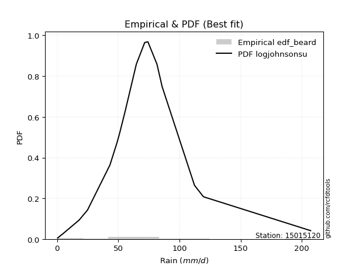</img>

</div>


### 5. Empirical - EDF Chegodayev (1955)

The Chegodayev formula is an empirical plotting position formula used in hydrological frequency analysis to estimate the exceedance probability or return period of a specific event from a set of observed data. It is primarily used for plotting observed data points on probability paper to fit a theoretical distribution, particularly for analyzing extreme events like maximum flood flows or rainfall intensities. The constant _b_ value in the generalized plotting position formula is 0.3.

<div align="center">


$P=(m-b)/(n+1-2b)$


</div>


**5.1. Empirical values**

<div align="center">

|                | 0                   | 1                   | 2                  | 3                  | 4                   | 5                   | 6                  | 7                  | 8                  | 9              | 10                 | 11                 | 12                 | 13                 | 14                 | 15                 | 16                 | 17                 | 18                 |
|:---------------|:--------------------|:--------------------|:-------------------|:-------------------|:--------------------|:--------------------|:-------------------|:-------------------|:-------------------|:---------------|:-------------------|:-------------------|:-------------------|:-------------------|:-------------------|:-------------------|:-------------------|:-------------------|:-------------------|
| date           | 2023                | 2024                | 2025               | 2021               | 2009                | 2019                | 2014               | 2013               | 2020               | 2016           | 2010               | 2011               | 2022               | 2007               | 2015               | 2008               | 2017               | 2018               | 2012               |
| x              | 0.4                 | 4.4                 | 12.2               | 18.0               | 24.9                | 43.2                | 49.0               | 51.0               | 55.5               | 57.1           | 64.7               | 64.8               | 71.6               | 74.2               | 81.6               | 85.3               | 85.8               | 112.3              | 207.2              |
| m              | 1                   | 2                   | 3                  | 4                  | 5                   | 6                   | 7                  | 8                  | 9                  | 10             | 11                 | 12                 | 13                 | 14                 | 15                 | 16                 | 17                 | 18                 | 19                 |
| empirical_dist | edf_chegodayev      | edf_chegodayev      | edf_chegodayev     | edf_chegodayev     | edf_chegodayev      | edf_chegodayev      | edf_chegodayev     | edf_chegodayev     | edf_chegodayev     | edf_chegodayev | edf_chegodayev     | edf_chegodayev     | edf_chegodayev     | edf_chegodayev     | edf_chegodayev     | edf_chegodayev     | edf_chegodayev     | edf_chegodayev     | edf_chegodayev     |
| empirical      | 0.03608247422680413 | 0.08762886597938145 | 0.1391752577319588 | 0.1907216494845361 | 0.24226804123711343 | 0.29381443298969073 | 0.3453608247422681 | 0.3969072164948454 | 0.4484536082474227 | 0.5            | 0.5515463917525774 | 0.6030927835051546 | 0.654639175257732  | 0.7061855670103093 | 0.7577319587628866 | 0.8092783505154639 | 0.8608247422680413 | 0.9123711340206185 | 0.9639175257731959 |
| empirical_tr   | 1.0374331550802138  | 1.096045197740113   | 1.1616766467065869 | 1.2356687898089171 | 1.3197278911564627  | 1.416058394160584   | 1.5275590551181104 | 1.6581196581196582 | 1.8130841121495327 | 2.0            | 2.2298850574712645 | 2.519480519480519  | 2.8955223880597014 | 3.403508771929825  | 4.127659574468085  | 5.243243243243244  | 7.185185185185188  | 11.41176470588235  | 27.714285714285726 |

</div>


**5.2. Kolmogorov-Smirnov fit test (sorted by Δ)**


<div align="center">

|                | 0                   | 1                   | 2                   | 3                   | 4                   | 5                   | 6                   | 7                   | 8                   | 9                   | 10                  | 11                  | 12                  | 13                  | 14                  | 15                  | 16                  | 17                  | 18                  | 19                  | 20                  | 21                  | 22                  | 23                  | 24                  | 25                  | 26                  | 27                  | 28                  | 29                    | 30                  | 31                  | 32                  | 33                  | 34                  | 35                  | 36                  | 37                  | 38                  | 39                  | 40                  | 41                  | 42                  | 43                  | 44                  | 45                  | 46                  | 47                  | 48                  | 49                  | 50                  | 51                  | 52                  | 53                  | 54                  | 55                  | 56                  | 57                  | 58                  | 59                  | 60                  | 61                  | 62                  | 63                  | 64                  | 65                  | 66                  | 67                  | 68                  | 69                  | 70                  | 71                  | 72                  | 73                  | 74                  | 75                  | 76                  | 77                  | 78                  | 79                  | 80                  | 81                  | 82                  | 83                  | 84                  | 85                  | 86                  | 87                  | 88                  | 89                  |
|:---------------|:--------------------|:--------------------|:--------------------|:--------------------|:--------------------|:--------------------|:--------------------|:--------------------|:--------------------|:--------------------|:--------------------|:--------------------|:--------------------|:--------------------|:--------------------|:--------------------|:--------------------|:--------------------|:--------------------|:--------------------|:--------------------|:--------------------|:--------------------|:--------------------|:--------------------|:--------------------|:--------------------|:--------------------|:--------------------|:----------------------|:--------------------|:--------------------|:--------------------|:--------------------|:--------------------|:--------------------|:--------------------|:--------------------|:--------------------|:--------------------|:--------------------|:--------------------|:--------------------|:--------------------|:--------------------|:--------------------|:--------------------|:--------------------|:--------------------|:--------------------|:--------------------|:--------------------|:--------------------|:--------------------|:--------------------|:--------------------|:--------------------|:--------------------|:--------------------|:--------------------|:--------------------|:--------------------|:--------------------|:--------------------|:--------------------|:--------------------|:--------------------|:--------------------|:--------------------|:--------------------|:--------------------|:--------------------|:--------------------|:--------------------|:--------------------|:--------------------|:--------------------|:--------------------|:--------------------|:--------------------|:--------------------|:--------------------|:--------------------|:--------------------|:--------------------|:--------------------|:--------------------|:--------------------|:--------------------|:--------------------|
| station        | 15015120            | 15015120            | 15015120            | 15015120            | 15015120            | 15015120            | 15015120            | 15015120            | 15015120            | 15015120            | 15015120            | 15015120            | 15015120            | 15015120            | 15015120            | 15015120            | 15015120            | 15015120            | 15015120            | 15015120            | 15015120            | 15015120            | 15015120            | 15015120            | 15015120            | 15015120            | 15015120            | 15015120            | 15015120            | 15015120              | 15015120            | 15015120            | 15015120            | 15015120            | 15015120            | 15015120            | 15015120            | 15015120            | 15015120            | 15015120            | 15015120            | 15015120            | 15015120            | 15015120            | 15015120            | 15015120            | 15015120            | 15015120            | 15015120            | 15015120            | 15015120            | 15015120            | 15015120            | 15015120            | 15015120            | 15015120            | 15015120            | 15015120            | 15015120            | 15015120            | 15015120            | 15015120            | 15015120            | 15015120            | 15015120            | 15015120            | 15015120            | 15015120            | 15015120            | 15015120            | 15015120            | 15015120            | 15015120            | 15015120            | 15015120            | 15015120            | 15015120            | 15015120            | 15015120            | 15015120            | 15015120            | 15015120            | 15015120            | 15015120            | 15015120            | 15015120            | 15015120            | 15015120            | 15015120            | 15015120            |
| empirical_dist | edf_chegodayev      | edf_chegodayev      | edf_chegodayev      | edf_chegodayev      | edf_chegodayev      | edf_chegodayev      | edf_chegodayev      | edf_chegodayev      | edf_chegodayev      | edf_chegodayev      | edf_chegodayev      | edf_chegodayev      | edf_chegodayev      | edf_chegodayev      | edf_chegodayev      | edf_chegodayev      | edf_chegodayev      | edf_chegodayev      | edf_chegodayev      | edf_chegodayev      | edf_chegodayev      | edf_chegodayev      | edf_chegodayev      | edf_chegodayev      | edf_chegodayev      | edf_chegodayev      | edf_chegodayev      | edf_chegodayev      | edf_chegodayev      | edf_chegodayev        | edf_chegodayev      | edf_chegodayev      | edf_chegodayev      | edf_chegodayev      | edf_chegodayev      | edf_chegodayev      | edf_chegodayev      | edf_chegodayev      | edf_chegodayev      | edf_chegodayev      | edf_chegodayev      | edf_chegodayev      | edf_chegodayev      | edf_chegodayev      | edf_chegodayev      | edf_chegodayev      | edf_chegodayev      | edf_chegodayev      | edf_chegodayev      | edf_chegodayev      | edf_chegodayev      | edf_chegodayev      | edf_chegodayev      | edf_chegodayev      | edf_chegodayev      | edf_chegodayev      | edf_chegodayev      | edf_chegodayev      | edf_chegodayev      | edf_chegodayev      | edf_chegodayev      | edf_chegodayev      | edf_chegodayev      | edf_chegodayev      | edf_chegodayev      | edf_chegodayev      | edf_chegodayev      | edf_chegodayev      | edf_chegodayev      | edf_chegodayev      | edf_chegodayev      | edf_chegodayev      | edf_chegodayev      | edf_chegodayev      | edf_chegodayev      | edf_chegodayev      | edf_chegodayev      | edf_chegodayev      | edf_chegodayev      | edf_chegodayev      | edf_chegodayev      | edf_chegodayev      | edf_chegodayev      | edf_chegodayev      | edf_chegodayev      | edf_chegodayev      | edf_chegodayev      | edf_chegodayev      | edf_chegodayev      | edf_chegodayev      |
| p_dist         | logjohnsonsu        | t                   | fisk                | laplace_asymmetric  | nct                 | exponnorm           | logcrystalball      | laplace             | genlogistic         | gumbel_r            | invweibull          | invgamma            | johnsonsu           | kstwobign           | invgauss            | hypsecant           | fatiguelife         | moyal               | halfnorm            | weibull_min         | logistic            | betaprime           | rayleigh            | rice                | logt                | f                   | chi2                | erlang              | gompertz            | loglaplace_asymmetric | maxwell             | pearson3            | halflogistic        | loggenlogistic      | logloggamma         | norm                | truncnorm           | crystalball         | logfisk             | loggompertz         | ncf                 | loggumbel_l         | gumbel_l            | wald                | nakagami            | logpearson3         | logmielke           | expon               | genexpon            | gamma               | gibrat              | logfatiguelife      | lognakagami         | lognorm             | lognorm             | logexponnorm        | logrice             | loglognorm          | lognct              | loglogistic         | logalpha            | loghypsecant        | mielke              | logbetaprime        | loggamma            | loggamma            | loginvweibull       | loginvgauss         | loginvgamma         | loglaplace          | logmaxwell          | logkstwobign        | lograyleigh         | loghalfnorm         | loggumbel_r         | loggenexpon         | logmoyal            | loghalflogistic     | logexpon            | logwald             | logncf              | logerlang           | loggibrat           | logtruncnorm        | logchi2             | pareto              | logf                | logpareto           | logweibull_min      | alpha               |
| delta          | 0.05005456619208526 | 0.0700041137253056  | 0.08852289910360911 | 0.09048071671536673 | 0.09075335928367367 | 0.09152871854926825 | 0.09277208893783884 | 0.0928962065777853  | 0.10365570364765775 | 0.10682668846073295 | 0.11089780003222433 | 0.11209822823590049 | 0.11568567878276792 | 0.11715703226554708 | 0.11721172252507933 | 0.11737892642920211 | 0.11803579811865705 | 0.1292330430722845  | 0.1293463146930683  | 0.13186599074950994 | 0.1328369248117467  | 0.1340021411382909  | 0.1349250058288587  | 0.13526729990004815 | 0.13603622773381724 | 0.13624741314829464 | 0.13690479247314413 | 0.13690514903043827 | 0.1374168171908176  | 0.13752414007467223   | 0.13933568582731382 | 0.14013584499143023 | 0.14408057838240096 | 0.15096448640421029 | 0.1514486673801257  | 0.15447612111416098 | 0.15447612380970033 | 0.15447612858309367 | 0.16130117650205744 | 0.1655113194610563  | 0.1694395795859328  | 0.1757583412759121  | 0.1850741276796426  | 0.19071412417908068 | 0.19106993739837652 | 0.19166868519567615 | 0.19710725742279944 | 0.21143606631385597 | 0.21183443572191002 | 0.22454705380187728 | 0.24226804123711343 | 0.2426796846880495  | 0.2430338830300512  | 0.24396048453227964 | 0.24396048453227964 | 0.24396089104970026 | 0.24397837868310562 | 0.24421463651551528 | 0.24476579312905172 | 0.2490803398934775  | 0.2532803166860648  | 0.25342599620689704 | 0.25516106439728997 | 0.25619987629648355 | 0.25707677576904947 | 0.25707677576904947 | 0.25754339547016997 | 0.25767058824238537 | 0.26157172581698235 | 0.2709948100335558  | 0.2751186802854066  | 0.28395136568586227 | 0.2852137766975285  | 0.3136602195072465  | 0.3144400113338289  | 0.3303381435810527  | 0.3396400177128392  | 0.3405006230978161  | 0.3887710359928077  | 0.40957648044857947 | 0.4255075320522015  | 0.4335390150338714  | 0.43762319811149814 | 0.4712198533955157  | 0.5047251881775745  | 0.5127567207053444  | 0.5360785227439601  | 0.5510720250409348  | 0.5515232411459825  | 0.7473680303625111  |
| deltao         | 0.31564497164100014 | 0.31564497164100014 | 0.31564497164100014 | 0.31564497164100014 | 0.31564497164100014 | 0.31564497164100014 | 0.31564497164100014 | 0.31564497164100014 | 0.31564497164100014 | 0.31564497164100014 | 0.31564497164100014 | 0.31564497164100014 | 0.31564497164100014 | 0.31564497164100014 | 0.31564497164100014 | 0.31564497164100014 | 0.31564497164100014 | 0.31564497164100014 | 0.31564497164100014 | 0.31564497164100014 | 0.31564497164100014 | 0.31564497164100014 | 0.31564497164100014 | 0.31564497164100014 | 0.31564497164100014 | 0.31564497164100014 | 0.31564497164100014 | 0.31564497164100014 | 0.31564497164100014 | 0.31564497164100014   | 0.31564497164100014 | 0.31564497164100014 | 0.31564497164100014 | 0.31564497164100014 | 0.31564497164100014 | 0.31564497164100014 | 0.31564497164100014 | 0.31564497164100014 | 0.31564497164100014 | 0.31564497164100014 | 0.31564497164100014 | 0.31564497164100014 | 0.31564497164100014 | 0.31564497164100014 | 0.31564497164100014 | 0.31564497164100014 | 0.31564497164100014 | 0.31564497164100014 | 0.31564497164100014 | 0.31564497164100014 | 0.31564497164100014 | 0.31564497164100014 | 0.31564497164100014 | 0.31564497164100014 | 0.31564497164100014 | 0.31564497164100014 | 0.31564497164100014 | 0.31564497164100014 | 0.31564497164100014 | 0.31564497164100014 | 0.31564497164100014 | 0.31564497164100014 | 0.31564497164100014 | 0.31564497164100014 | 0.31564497164100014 | 0.31564497164100014 | 0.31564497164100014 | 0.31564497164100014 | 0.31564497164100014 | 0.31564497164100014 | 0.31564497164100014 | 0.31564497164100014 | 0.31564497164100014 | 0.31564497164100014 | 0.31564497164100014 | 0.31564497164100014 | 0.31564497164100014 | 0.31564497164100014 | 0.31564497164100014 | 0.31564497164100014 | 0.31564497164100014 | 0.31564497164100014 | 0.31564497164100014 | 0.31564497164100014 | 0.31564497164100014 | 0.31564497164100014 | 0.31564497164100014 | 0.31564497164100014 | 0.31564497164100014 | 0.31564497164100014 |
| eval           | Δo > Δ              | Δo > Δ              | Δo > Δ              | Δo > Δ              | Δo > Δ              | Δo > Δ              | Δo > Δ              | Δo > Δ              | Δo > Δ              | Δo > Δ              | Δo > Δ              | Δo > Δ              | Δo > Δ              | Δo > Δ              | Δo > Δ              | Δo > Δ              | Δo > Δ              | Δo > Δ              | Δo > Δ              | Δo > Δ              | Δo > Δ              | Δo > Δ              | Δo > Δ              | Δo > Δ              | Δo > Δ              | Δo > Δ              | Δo > Δ              | Δo > Δ              | Δo > Δ              | Δo > Δ                | Δo > Δ              | Δo > Δ              | Δo > Δ              | Δo > Δ              | Δo > Δ              | Δo > Δ              | Δo > Δ              | Δo > Δ              | Δo > Δ              | Δo > Δ              | Δo > Δ              | Δo > Δ              | Δo > Δ              | Δo > Δ              | Δo > Δ              | Δo > Δ              | Δo > Δ              | Δo > Δ              | Δo > Δ              | Δo > Δ              | Δo > Δ              | Δo > Δ              | Δo > Δ              | Δo > Δ              | Δo > Δ              | Δo > Δ              | Δo > Δ              | Δo > Δ              | Δo > Δ              | Δo > Δ              | Δo > Δ              | Δo > Δ              | Δo > Δ              | Δo > Δ              | Δo > Δ              | Δo > Δ              | Δo > Δ              | Δo > Δ              | Δo > Δ              | Δo > Δ              | Δo > Δ              | Δo > Δ              | Δo > Δ              | Δo > Δ              | Δo > Δ              | Δo <= Δ             | Δo <= Δ             | Δo <= Δ             | Δo <= Δ             | Δo <= Δ             | Δo <= Δ             | Δo <= Δ             | Δo <= Δ             | Δo <= Δ             | Δo <= Δ             | Δo <= Δ             | Δo <= Δ             | Δo <= Δ             | Δo <= Δ             | Δo <= Δ             |
| fit            | 1                   | 1                   | 1                   | 1                   | 1                   | 1                   | 1                   | 1                   | 1                   | 1                   | 1                   | 1                   | 1                   | 1                   | 1                   | 1                   | 1                   | 1                   | 1                   | 1                   | 1                   | 1                   | 1                   | 1                   | 1                   | 1                   | 1                   | 1                   | 1                   | 1                     | 1                   | 1                   | 1                   | 1                   | 1                   | 1                   | 1                   | 1                   | 1                   | 1                   | 1                   | 1                   | 1                   | 1                   | 1                   | 1                   | 1                   | 1                   | 1                   | 1                   | 1                   | 1                   | 1                   | 1                   | 1                   | 1                   | 1                   | 1                   | 1                   | 1                   | 1                   | 1                   | 1                   | 1                   | 1                   | 1                   | 1                   | 1                   | 1                   | 1                   | 1                   | 1                   | 1                   | 1                   | 1                   | 0                   | 0                   | 0                   | 0                   | 0                   | 0                   | 0                   | 0                   | 0                   | 0                   | 0                   | 0                   | 0                   | 0                   | 0                   |
| n              | 19                  | 19                  | 19                  | 19                  | 19                  | 19                  | 19                  | 19                  | 19                  | 19                  | 19                  | 19                  | 19                  | 19                  | 19                  | 19                  | 19                  | 19                  | 19                  | 19                  | 19                  | 19                  | 19                  | 19                  | 19                  | 19                  | 19                  | 19                  | 19                  | 19                    | 19                  | 19                  | 19                  | 19                  | 19                  | 19                  | 19                  | 19                  | 19                  | 19                  | 19                  | 19                  | 19                  | 19                  | 19                  | 19                  | 19                  | 19                  | 19                  | 19                  | 19                  | 19                  | 19                  | 19                  | 19                  | 19                  | 19                  | 19                  | 19                  | 19                  | 19                  | 19                  | 19                  | 19                  | 19                  | 19                  | 19                  | 19                  | 19                  | 19                  | 19                  | 19                  | 19                  | 19                  | 19                  | 19                  | 19                  | 19                  | 19                  | 19                  | 19                  | 19                  | 19                  | 19                  | 19                  | 19                  | 19                  | 19                  | 19                  | 19                  |
| best_fit       | 1                   | 0                   | 0                   | 0                   | 0                   | 0                   | 0                   | 0                   | 0                   | 0                   | 0                   | 0                   | 0                   | 0                   | 0                   | 0                   | 0                   | 0                   | 0                   | 0                   | 0                   | 0                   | 0                   | 0                   | 0                   | 0                   | 0                   | 0                   | 0                   | 0                     | 0                   | 0                   | 0                   | 0                   | 0                   | 0                   | 0                   | 0                   | 0                   | 0                   | 0                   | 0                   | 0                   | 0                   | 0                   | 0                   | 0                   | 0                   | 0                   | 0                   | 0                   | 0                   | 0                   | 0                   | 0                   | 0                   | 0                   | 0                   | 0                   | 0                   | 0                   | 0                   | 0                   | 0                   | 0                   | 0                   | 0                   | 0                   | 0                   | 0                   | 0                   | 0                   | 0                   | 0                   | 0                   | 0                   | 0                   | 0                   | 0                   | 0                   | 0                   | 0                   | 0                   | 0                   | 0                   | 0                   | 0                   | 0                   | 0                   | 0                   |
| best_fit_sort  | 1                   | 2                   | 3                   | 4                   | 5                   | 6                   | 7                   | 8                   | 9                   | 10                  | 11                  | 12                  | 13                  | 14                  | 15                  | 16                  | 17                  | 18                  | 19                  | 20                  | 21                  | 22                  | 23                  | 24                  | 25                  | 26                  | 27                  | 28                  | 29                  | 30                    | 31                  | 32                  | 33                  | 34                  | 35                  | 36                  | 37                  | 38                  | 39                  | 40                  | 41                  | 42                  | 43                  | 44                  | 45                  | 46                  | 47                  | 48                  | 49                  | 50                  | 51                  | 52                  | 53                  | 54                  | 55                  | 56                  | 57                  | 58                  | 59                  | 60                  | 61                  | 62                  | 63                  | 64                  | 65                  | 66                  | 67                  | 68                  | 69                  | 70                  | 71                  | 72                  | 73                  | 74                  | 75                  | 76                  | 77                  | 78                  | 79                  | 80                  | 81                  | 82                  | 83                  | 84                  | 85                  | 86                  | 87                  | 88                  | 89                  | 90                  |

</div>


<div align="center">

</img>

</div>


**5.3. Best fit**

<div align="center">

|   id |   station | empirical_dist   | p_dist       |     delta |   deltao | eval   |   fit |   n |   best_fit |   best_fit_sort |
|-----:|----------:|:-----------------|:-------------|----------:|---------:|:-------|------:|----:|-----------:|----------------:|
|    0 |  15015120 | edf_chegodayev   | logjohnsonsu | 0.0500546 | 0.315645 | Δo > Δ |     1 |  19 |          1 |               1 |

</div>


<div align="center">

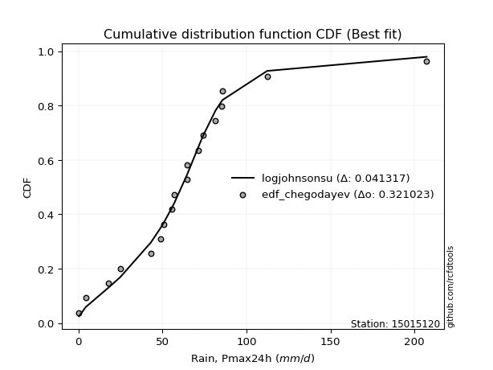</img>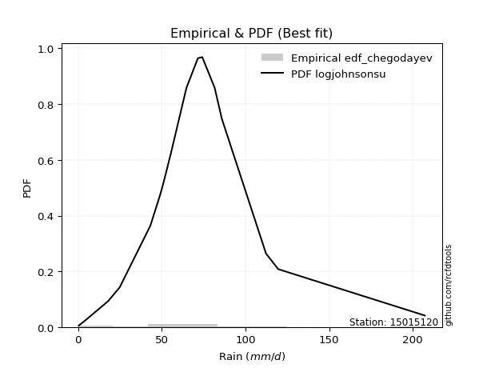</img>

</div>


### 6. Empirical - EDF Blom (1958)

The Blom formula is a specific "plotting position" formula used in hydrology and statistical analysis to estimate the empirical cumulative probability (or non-exceedance probability) of a data series. It is particularly recommended for data that are approximately normally distributed. The constant _a_ is set to 0.375 (or 3/8).

<div align="center">


$P=(m-a)/(n+1-2a)$


</div>


**6.1. Empirical values**

<div align="center">

|                | 0                    | 1                   | 2                   | 3                   | 4                   | 5                  | 6                   | 7                  | 8                   | 9        | 10                 | 11                 | 12                 | 13                 | 14                 | 15                 | 16                 | 17                 | 18                 |
|:---------------|:---------------------|:--------------------|:--------------------|:--------------------|:--------------------|:-------------------|:--------------------|:-------------------|:--------------------|:---------|:-------------------|:-------------------|:-------------------|:-------------------|:-------------------|:-------------------|:-------------------|:-------------------|:-------------------|
| date           | 2023                 | 2024                | 2025                | 2021                | 2009                | 2019               | 2014                | 2013               | 2020                | 2016     | 2010               | 2011               | 2022               | 2007               | 2015               | 2008               | 2017               | 2018               | 2012               |
| x              | 0.4                  | 4.4                 | 12.2                | 18.0                | 24.9                | 43.2               | 49.0                | 51.0               | 55.5                | 57.1     | 64.7               | 64.8               | 71.6               | 74.2               | 81.6               | 85.3               | 85.8               | 112.3              | 207.2              |
| m              | 1                    | 2                   | 3                   | 4                   | 5                   | 6                  | 7                   | 8                  | 9                   | 10       | 11                 | 12                 | 13                 | 14                 | 15                 | 16                 | 17                 | 18                 | 19                 |
| empirical_dist | edf_blom             | edf_blom            | edf_blom            | edf_blom            | edf_blom            | edf_blom           | edf_blom            | edf_blom           | edf_blom            | edf_blom | edf_blom           | edf_blom           | edf_blom           | edf_blom           | edf_blom           | edf_blom           | edf_blom           | edf_blom           | edf_blom           |
| empirical      | 0.032467532467532464 | 0.08441558441558442 | 0.13636363636363635 | 0.18831168831168832 | 0.24025974025974026 | 0.2922077922077922 | 0.34415584415584416 | 0.3961038961038961 | 0.44805194805194803 | 0.5      | 0.551948051948052  | 0.6038961038961039 | 0.6558441558441559 | 0.7077922077922078 | 0.7597402597402597 | 0.8116883116883117 | 0.8636363636363636 | 0.9155844155844156 | 0.9675324675324676 |
| empirical_tr   | 1.0335570469798658   | 1.0921985815602837  | 1.1578947368421053  | 1.232               | 1.3162393162393162  | 1.4128440366972477 | 1.5247524752475246  | 1.6559139784946235 | 1.811764705882353   | 2.0      | 2.2318840579710146 | 2.5245901639344264 | 2.905660377358491  | 3.4222222222222216 | 4.162162162162161  | 5.310344827586206  | 7.333333333333334  | 11.84615384615385  | 30.800000000000043 |

</div>


**6.2. Kolmogorov-Smirnov fit test (sorted by Δ)**


<div align="center">

|                | 0                    | 1                   | 2                   | 3                   | 4                   | 5                   | 6                   | 7                   | 8                   | 9                   | 10                  | 11                  | 12                  | 13                  | 14                  | 15                  | 16                  | 17                  | 18                  | 19                  | 20                  | 21                  | 22                  | 23                  | 24                  | 25                  | 26                  | 27                  | 28                    | 29                  | 30                  | 31                  | 32                  | 33                  | 34                  | 35                  | 36                  | 37                  | 38                  | 39                  | 40                  | 41                  | 42                  | 43                  | 44                  | 45                  | 46                  | 47                  | 48                  | 49                  | 50                  | 51                  | 52                  | 53                  | 54                  | 55                  | 56                  | 57                  | 58                  | 59                  | 60                  | 61                  | 62                  | 63                  | 64                  | 65                  | 66                  | 67                  | 68                  | 69                  | 70                  | 71                  | 72                  | 73                  | 74                  | 75                  | 76                  | 77                  | 78                  | 79                  | 80                  | 81                  | 82                  | 83                  | 84                  | 85                  | 86                  | 87                  | 88                  | 89                  |
|:---------------|:---------------------|:--------------------|:--------------------|:--------------------|:--------------------|:--------------------|:--------------------|:--------------------|:--------------------|:--------------------|:--------------------|:--------------------|:--------------------|:--------------------|:--------------------|:--------------------|:--------------------|:--------------------|:--------------------|:--------------------|:--------------------|:--------------------|:--------------------|:--------------------|:--------------------|:--------------------|:--------------------|:--------------------|:----------------------|:--------------------|:--------------------|:--------------------|:--------------------|:--------------------|:--------------------|:--------------------|:--------------------|:--------------------|:--------------------|:--------------------|:--------------------|:--------------------|:--------------------|:--------------------|:--------------------|:--------------------|:--------------------|:--------------------|:--------------------|:--------------------|:--------------------|:--------------------|:--------------------|:--------------------|:--------------------|:--------------------|:--------------------|:--------------------|:--------------------|:--------------------|:--------------------|:--------------------|:--------------------|:--------------------|:--------------------|:--------------------|:--------------------|:--------------------|:--------------------|:--------------------|:--------------------|:--------------------|:--------------------|:--------------------|:--------------------|:--------------------|:--------------------|:--------------------|:--------------------|:--------------------|:--------------------|:--------------------|:--------------------|:--------------------|:--------------------|:--------------------|:--------------------|:--------------------|:--------------------|:--------------------|
| station        | 15015120             | 15015120            | 15015120            | 15015120            | 15015120            | 15015120            | 15015120            | 15015120            | 15015120            | 15015120            | 15015120            | 15015120            | 15015120            | 15015120            | 15015120            | 15015120            | 15015120            | 15015120            | 15015120            | 15015120            | 15015120            | 15015120            | 15015120            | 15015120            | 15015120            | 15015120            | 15015120            | 15015120            | 15015120              | 15015120            | 15015120            | 15015120            | 15015120            | 15015120            | 15015120            | 15015120            | 15015120            | 15015120            | 15015120            | 15015120            | 15015120            | 15015120            | 15015120            | 15015120            | 15015120            | 15015120            | 15015120            | 15015120            | 15015120            | 15015120            | 15015120            | 15015120            | 15015120            | 15015120            | 15015120            | 15015120            | 15015120            | 15015120            | 15015120            | 15015120            | 15015120            | 15015120            | 15015120            | 15015120            | 15015120            | 15015120            | 15015120            | 15015120            | 15015120            | 15015120            | 15015120            | 15015120            | 15015120            | 15015120            | 15015120            | 15015120            | 15015120            | 15015120            | 15015120            | 15015120            | 15015120            | 15015120            | 15015120            | 15015120            | 15015120            | 15015120            | 15015120            | 15015120            | 15015120            | 15015120            |
| empirical_dist | edf_blom             | edf_blom            | edf_blom            | edf_blom            | edf_blom            | edf_blom            | edf_blom            | edf_blom            | edf_blom            | edf_blom            | edf_blom            | edf_blom            | edf_blom            | edf_blom            | edf_blom            | edf_blom            | edf_blom            | edf_blom            | edf_blom            | edf_blom            | edf_blom            | edf_blom            | edf_blom            | edf_blom            | edf_blom            | edf_blom            | edf_blom            | edf_blom            | edf_blom              | edf_blom            | edf_blom            | edf_blom            | edf_blom            | edf_blom            | edf_blom            | edf_blom            | edf_blom            | edf_blom            | edf_blom            | edf_blom            | edf_blom            | edf_blom            | edf_blom            | edf_blom            | edf_blom            | edf_blom            | edf_blom            | edf_blom            | edf_blom            | edf_blom            | edf_blom            | edf_blom            | edf_blom            | edf_blom            | edf_blom            | edf_blom            | edf_blom            | edf_blom            | edf_blom            | edf_blom            | edf_blom            | edf_blom            | edf_blom            | edf_blom            | edf_blom            | edf_blom            | edf_blom            | edf_blom            | edf_blom            | edf_blom            | edf_blom            | edf_blom            | edf_blom            | edf_blom            | edf_blom            | edf_blom            | edf_blom            | edf_blom            | edf_blom            | edf_blom            | edf_blom            | edf_blom            | edf_blom            | edf_blom            | edf_blom            | edf_blom            | edf_blom            | edf_blom            | edf_blom            | edf_blom            |
| p_dist         | logjohnsonsu         | t                   | laplace_asymmetric  | fisk                | nct                 | exponnorm           | logcrystalball      | laplace             | genlogistic         | gumbel_r            | invweibull          | invgamma            | johnsonsu           | invgauss            | fatiguelife         | kstwobign           | hypsecant           | weibull_min         | moyal               | halfnorm            | logt                | betaprime           | logistic            | f                   | rayleigh            | rice                | chi2                | erlang              | loglaplace_asymmetric | gompertz            | pearson3            | maxwell             | halflogistic        | loggenlogistic      | logloggamma         | norm                | truncnorm           | crystalball         | logfisk             | loggompertz         | ncf                 | loggumbel_l         | gumbel_l            | wald                | nakagami            | logpearson3         | logmielke           | expon               | genexpon            | gamma               | gibrat              | logfatiguelife      | lognakagami         | lognorm             | lognorm             | logexponnorm        | logrice             | loglognorm          | lognct              | loglogistic         | logalpha            | loghypsecant        | mielke              | loggamma            | loggamma            | loginvweibull       | loginvgauss         | logbetaprime        | loginvgamma         | loglaplace          | logmaxwell          | logkstwobign        | lograyleigh         | loghalfnorm         | loggumbel_r         | loggenexpon         | logmoyal            | loghalflogistic     | logexpon            | logwald             | logncf              | logerlang           | loggibrat           | logtruncnorm        | logchi2             | pareto              | logf                | logpareto           | logweibull_min      | alpha               |
| delta          | 0.048046265214712086 | 0.06799581274793243 | 0.08847241573799355 | 0.08972787969003304 | 0.0919583398700976  | 0.09434033991759061 | 0.0955837103061612  | 0.09570782794610766 | 0.10486068423408168 | 0.10803166904715689 | 0.11210278061864826 | 0.11330320882232442 | 0.11689065936919185 | 0.11841670311150326 | 0.11924077870508099 | 0.11996865363386944 | 0.12019054779752447 | 0.1290543693811875  | 0.13043802365870844 | 0.13094989791376754 | 0.13402792675644407 | 0.13520712172471483 | 0.13564854618006905 | 0.13745239373471857 | 0.13773662719718105 | 0.1380789212683705  | 0.13810977305956806 | 0.1381101296168622  | 0.13872912066109616   | 0.13902345797271615 | 0.14134082557785416 | 0.14214730719563617 | 0.1452855589688249  | 0.15216946699063422 | 0.15305530816202423 | 0.15728774248248334 | 0.1572877451780227  | 0.15728774995141603 | 0.16290781728395598 | 0.16671630004748023 | 0.17104622036783135 | 0.17736498205781065 | 0.18788574904796496 | 0.19037025277048364 | 0.19267657818027506 | 0.1944803065639985  | 0.19871389820469798 | 0.2130427070957545  | 0.21344107650380856 | 0.22615369458377582 | 0.24025974025974026 | 0.24428632546994805 | 0.24464052381194973 | 0.24556712531417818 | 0.24556712531417818 | 0.2455675318315988  | 0.24558501946500416 | 0.24582127729741382 | 0.24637243391095026 | 0.25068698067537604 | 0.25488695746796336 | 0.2550326369887956  | 0.2567677051791885  | 0.258683416550948   | 0.258683416550948   | 0.2591500362520685  | 0.2592772290242839  | 0.25941315786028063 | 0.2631783665988809  | 0.27219979061997973 | 0.27672532106730513 | 0.2855580064677608  | 0.28682041747942705 | 0.315266860289145   | 0.3160466521157274  | 0.3319447843629512  | 0.34124665849473773 | 0.34210726387971463 | 0.3915826573611302  | 0.411183121230478   | 0.42831915342052396 | 0.43715395679314306 | 0.4392298388933967  | 0.47282649417741424 | 0.507536809545897   | 0.5159700022691415  | 0.5388901441122825  | 0.5542853066047319  | 0.554334862514305   | 0.7501796517308336  |
| deltao         | 0.31564497164100014  | 0.31564497164100014 | 0.31564497164100014 | 0.31564497164100014 | 0.31564497164100014 | 0.31564497164100014 | 0.31564497164100014 | 0.31564497164100014 | 0.31564497164100014 | 0.31564497164100014 | 0.31564497164100014 | 0.31564497164100014 | 0.31564497164100014 | 0.31564497164100014 | 0.31564497164100014 | 0.31564497164100014 | 0.31564497164100014 | 0.31564497164100014 | 0.31564497164100014 | 0.31564497164100014 | 0.31564497164100014 | 0.31564497164100014 | 0.31564497164100014 | 0.31564497164100014 | 0.31564497164100014 | 0.31564497164100014 | 0.31564497164100014 | 0.31564497164100014 | 0.31564497164100014   | 0.31564497164100014 | 0.31564497164100014 | 0.31564497164100014 | 0.31564497164100014 | 0.31564497164100014 | 0.31564497164100014 | 0.31564497164100014 | 0.31564497164100014 | 0.31564497164100014 | 0.31564497164100014 | 0.31564497164100014 | 0.31564497164100014 | 0.31564497164100014 | 0.31564497164100014 | 0.31564497164100014 | 0.31564497164100014 | 0.31564497164100014 | 0.31564497164100014 | 0.31564497164100014 | 0.31564497164100014 | 0.31564497164100014 | 0.31564497164100014 | 0.31564497164100014 | 0.31564497164100014 | 0.31564497164100014 | 0.31564497164100014 | 0.31564497164100014 | 0.31564497164100014 | 0.31564497164100014 | 0.31564497164100014 | 0.31564497164100014 | 0.31564497164100014 | 0.31564497164100014 | 0.31564497164100014 | 0.31564497164100014 | 0.31564497164100014 | 0.31564497164100014 | 0.31564497164100014 | 0.31564497164100014 | 0.31564497164100014 | 0.31564497164100014 | 0.31564497164100014 | 0.31564497164100014 | 0.31564497164100014 | 0.31564497164100014 | 0.31564497164100014 | 0.31564497164100014 | 0.31564497164100014 | 0.31564497164100014 | 0.31564497164100014 | 0.31564497164100014 | 0.31564497164100014 | 0.31564497164100014 | 0.31564497164100014 | 0.31564497164100014 | 0.31564497164100014 | 0.31564497164100014 | 0.31564497164100014 | 0.31564497164100014 | 0.31564497164100014 | 0.31564497164100014 |
| eval           | Δo > Δ               | Δo > Δ              | Δo > Δ              | Δo > Δ              | Δo > Δ              | Δo > Δ              | Δo > Δ              | Δo > Δ              | Δo > Δ              | Δo > Δ              | Δo > Δ              | Δo > Δ              | Δo > Δ              | Δo > Δ              | Δo > Δ              | Δo > Δ              | Δo > Δ              | Δo > Δ              | Δo > Δ              | Δo > Δ              | Δo > Δ              | Δo > Δ              | Δo > Δ              | Δo > Δ              | Δo > Δ              | Δo > Δ              | Δo > Δ              | Δo > Δ              | Δo > Δ                | Δo > Δ              | Δo > Δ              | Δo > Δ              | Δo > Δ              | Δo > Δ              | Δo > Δ              | Δo > Δ              | Δo > Δ              | Δo > Δ              | Δo > Δ              | Δo > Δ              | Δo > Δ              | Δo > Δ              | Δo > Δ              | Δo > Δ              | Δo > Δ              | Δo > Δ              | Δo > Δ              | Δo > Δ              | Δo > Δ              | Δo > Δ              | Δo > Δ              | Δo > Δ              | Δo > Δ              | Δo > Δ              | Δo > Δ              | Δo > Δ              | Δo > Δ              | Δo > Δ              | Δo > Δ              | Δo > Δ              | Δo > Δ              | Δo > Δ              | Δo > Δ              | Δo > Δ              | Δo > Δ              | Δo > Δ              | Δo > Δ              | Δo > Δ              | Δo > Δ              | Δo > Δ              | Δo > Δ              | Δo > Δ              | Δo > Δ              | Δo > Δ              | Δo <= Δ             | Δo <= Δ             | Δo <= Δ             | Δo <= Δ             | Δo <= Δ             | Δo <= Δ             | Δo <= Δ             | Δo <= Δ             | Δo <= Δ             | Δo <= Δ             | Δo <= Δ             | Δo <= Δ             | Δo <= Δ             | Δo <= Δ             | Δo <= Δ             | Δo <= Δ             |
| fit            | 1                    | 1                   | 1                   | 1                   | 1                   | 1                   | 1                   | 1                   | 1                   | 1                   | 1                   | 1                   | 1                   | 1                   | 1                   | 1                   | 1                   | 1                   | 1                   | 1                   | 1                   | 1                   | 1                   | 1                   | 1                   | 1                   | 1                   | 1                   | 1                     | 1                   | 1                   | 1                   | 1                   | 1                   | 1                   | 1                   | 1                   | 1                   | 1                   | 1                   | 1                   | 1                   | 1                   | 1                   | 1                   | 1                   | 1                   | 1                   | 1                   | 1                   | 1                   | 1                   | 1                   | 1                   | 1                   | 1                   | 1                   | 1                   | 1                   | 1                   | 1                   | 1                   | 1                   | 1                   | 1                   | 1                   | 1                   | 1                   | 1                   | 1                   | 1                   | 1                   | 1                   | 1                   | 0                   | 0                   | 0                   | 0                   | 0                   | 0                   | 0                   | 0                   | 0                   | 0                   | 0                   | 0                   | 0                   | 0                   | 0                   | 0                   |
| n              | 19                   | 19                  | 19                  | 19                  | 19                  | 19                  | 19                  | 19                  | 19                  | 19                  | 19                  | 19                  | 19                  | 19                  | 19                  | 19                  | 19                  | 19                  | 19                  | 19                  | 19                  | 19                  | 19                  | 19                  | 19                  | 19                  | 19                  | 19                  | 19                    | 19                  | 19                  | 19                  | 19                  | 19                  | 19                  | 19                  | 19                  | 19                  | 19                  | 19                  | 19                  | 19                  | 19                  | 19                  | 19                  | 19                  | 19                  | 19                  | 19                  | 19                  | 19                  | 19                  | 19                  | 19                  | 19                  | 19                  | 19                  | 19                  | 19                  | 19                  | 19                  | 19                  | 19                  | 19                  | 19                  | 19                  | 19                  | 19                  | 19                  | 19                  | 19                  | 19                  | 19                  | 19                  | 19                  | 19                  | 19                  | 19                  | 19                  | 19                  | 19                  | 19                  | 19                  | 19                  | 19                  | 19                  | 19                  | 19                  | 19                  | 19                  |
| best_fit       | 1                    | 0                   | 0                   | 0                   | 0                   | 0                   | 0                   | 0                   | 0                   | 0                   | 0                   | 0                   | 0                   | 0                   | 0                   | 0                   | 0                   | 0                   | 0                   | 0                   | 0                   | 0                   | 0                   | 0                   | 0                   | 0                   | 0                   | 0                   | 0                     | 0                   | 0                   | 0                   | 0                   | 0                   | 0                   | 0                   | 0                   | 0                   | 0                   | 0                   | 0                   | 0                   | 0                   | 0                   | 0                   | 0                   | 0                   | 0                   | 0                   | 0                   | 0                   | 0                   | 0                   | 0                   | 0                   | 0                   | 0                   | 0                   | 0                   | 0                   | 0                   | 0                   | 0                   | 0                   | 0                   | 0                   | 0                   | 0                   | 0                   | 0                   | 0                   | 0                   | 0                   | 0                   | 0                   | 0                   | 0                   | 0                   | 0                   | 0                   | 0                   | 0                   | 0                   | 0                   | 0                   | 0                   | 0                   | 0                   | 0                   | 0                   |
| best_fit_sort  | 1                    | 2                   | 3                   | 4                   | 5                   | 6                   | 7                   | 8                   | 9                   | 10                  | 11                  | 12                  | 13                  | 14                  | 15                  | 16                  | 17                  | 18                  | 19                  | 20                  | 21                  | 22                  | 23                  | 24                  | 25                  | 26                  | 27                  | 28                  | 29                    | 30                  | 31                  | 32                  | 33                  | 34                  | 35                  | 36                  | 37                  | 38                  | 39                  | 40                  | 41                  | 42                  | 43                  | 44                  | 45                  | 46                  | 47                  | 48                  | 49                  | 50                  | 51                  | 52                  | 53                  | 54                  | 55                  | 56                  | 57                  | 58                  | 59                  | 60                  | 61                  | 62                  | 63                  | 64                  | 65                  | 66                  | 67                  | 68                  | 69                  | 70                  | 71                  | 72                  | 73                  | 74                  | 75                  | 76                  | 77                  | 78                  | 79                  | 80                  | 81                  | 82                  | 83                  | 84                  | 85                  | 86                  | 87                  | 88                  | 89                  | 90                  |

</div>


<div align="center">

</img>

</div>


**6.3. Best fit**

<div align="center">

|   id |   station | empirical_dist   | p_dist       |     delta |   deltao | eval   |   fit |   n |   best_fit |   best_fit_sort |
|-----:|----------:|:-----------------|:-------------|----------:|---------:|:-------|------:|----:|-----------:|----------------:|
|    0 |  15015120 | edf_blom         | logjohnsonsu | 0.0480463 | 0.315645 | Δo > Δ |     1 |  19 |          1 |               1 |

</div>


<div align="center">

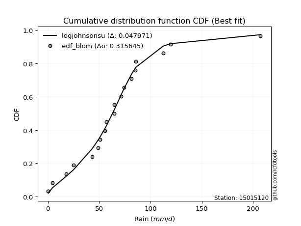</img></img>

</div>


### 7. Empirical - EDF Tukey (1962)

In hydrology, the Tukey formula is used as a plotting position formula to estimate the empirical probability or frequency of a flood event (or other hydrological data). The formula parameter is given as _c=0.333_ (or 1/3).

<div align="center">


$P=(m-c)/(n+1-2c)$


</div>


**7.1. Empirical values**

<div align="center">

|                | 0                    | 1                   | 2                   | 3                  | 4                  | 5                   | 6                  | 7                   | 8                  | 9         | 10                 | 11                 | 12                 | 13                 | 14                 | 15                 | 16                 | 17                 | 18                 |
|:---------------|:---------------------|:--------------------|:--------------------|:-------------------|:-------------------|:--------------------|:-------------------|:--------------------|:-------------------|:----------|:-------------------|:-------------------|:-------------------|:-------------------|:-------------------|:-------------------|:-------------------|:-------------------|:-------------------|
| date           | 2023                 | 2024                | 2025                | 2021               | 2009               | 2019                | 2014               | 2013                | 2020               | 2016      | 2010               | 2011               | 2022               | 2007               | 2015               | 2008               | 2017               | 2018               | 2012               |
| x              | 0.4                  | 4.4                 | 12.2                | 18.0               | 24.9               | 43.2                | 49.0               | 51.0                | 55.5               | 57.1      | 64.7               | 64.8               | 71.6               | 74.2               | 81.6               | 85.3               | 85.8               | 112.3              | 207.2              |
| m              | 1                    | 2                   | 3                   | 4                  | 5                  | 6                   | 7                  | 8                   | 9                  | 10        | 11                 | 12                 | 13                 | 14                 | 15                 | 16                 | 17                 | 18                 | 19                 |
| empirical_dist | edf_tukey            | edf_tukey           | edf_tukey           | edf_tukey          | edf_tukey          | edf_tukey           | edf_tukey          | edf_tukey           | edf_tukey          | edf_tukey | edf_tukey          | edf_tukey          | edf_tukey          | edf_tukey          | edf_tukey          | edf_tukey          | edf_tukey          | edf_tukey          | edf_tukey          |
| empirical      | 0.034482758620689655 | 0.08620689655172414 | 0.13793103448275862 | 0.1896551724137931 | 0.2413793103448276 | 0.29310344827586204 | 0.3448275862068966 | 0.39655172413793105 | 0.4482758620689655 | 0.5       | 0.5517241379310345 | 0.603448275862069  | 0.6551724137931034 | 0.7068965517241379 | 0.7586206896551724 | 0.8103448275862069 | 0.8620689655172413 | 0.9137931034482759 | 0.9655172413793104 |
| empirical_tr   | 1.0357142857142856   | 1.0943396226415094  | 1.1600000000000001  | 1.2340425531914894 | 1.3181818181818183 | 1.4146341463414636  | 1.5263157894736843 | 1.6571428571428573  | 1.8125             | 2.0       | 2.230769230769231  | 2.5217391304347827 | 2.9                | 3.4117647058823524 | 4.142857142857142  | 5.272727272727272  | 7.249999999999997  | 11.600000000000007 | 29.000000000000036 |

</div>


**7.2. Kolmogorov-Smirnov fit test (sorted by Δ)**


<div align="center">

|                | 0                    | 1                   | 2                   | 3                   | 4                   | 5                   | 6                   | 7                   | 8                   | 9                   | 10                  | 11                  | 12                  | 13                  | 14                  | 15                  | 16                  | 17                  | 18                  | 19                  | 20                  | 21                  | 22                  | 23                  | 24                  | 25                  | 26                  | 27                  | 28                    | 29                  | 30                  | 31                  | 32                  | 33                  | 34                  | 35                  | 36                  | 37                  | 38                  | 39                  | 40                  | 41                  | 42                  | 43                  | 44                  | 45                  | 46                  | 47                  | 48                  | 49                  | 50                  | 51                  | 52                  | 53                  | 54                  | 55                  | 56                  | 57                  | 58                  | 59                  | 60                  | 61                  | 62                  | 63                  | 64                  | 65                  | 66                  | 67                  | 68                  | 69                  | 70                  | 71                  | 72                  | 73                  | 74                  | 75                  | 76                  | 77                  | 78                  | 79                  | 80                  | 81                  | 82                  | 83                  | 84                  | 85                  | 86                  | 87                  | 88                  | 89                  |
|:---------------|:---------------------|:--------------------|:--------------------|:--------------------|:--------------------|:--------------------|:--------------------|:--------------------|:--------------------|:--------------------|:--------------------|:--------------------|:--------------------|:--------------------|:--------------------|:--------------------|:--------------------|:--------------------|:--------------------|:--------------------|:--------------------|:--------------------|:--------------------|:--------------------|:--------------------|:--------------------|:--------------------|:--------------------|:----------------------|:--------------------|:--------------------|:--------------------|:--------------------|:--------------------|:--------------------|:--------------------|:--------------------|:--------------------|:--------------------|:--------------------|:--------------------|:--------------------|:--------------------|:--------------------|:--------------------|:--------------------|:--------------------|:--------------------|:--------------------|:--------------------|:--------------------|:--------------------|:--------------------|:--------------------|:--------------------|:--------------------|:--------------------|:--------------------|:--------------------|:--------------------|:--------------------|:--------------------|:--------------------|:--------------------|:--------------------|:--------------------|:--------------------|:--------------------|:--------------------|:--------------------|:--------------------|:--------------------|:--------------------|:--------------------|:--------------------|:--------------------|:--------------------|:--------------------|:--------------------|:--------------------|:--------------------|:--------------------|:--------------------|:--------------------|:--------------------|:--------------------|:--------------------|:--------------------|:--------------------|:--------------------|
| station        | 15015120             | 15015120            | 15015120            | 15015120            | 15015120            | 15015120            | 15015120            | 15015120            | 15015120            | 15015120            | 15015120            | 15015120            | 15015120            | 15015120            | 15015120            | 15015120            | 15015120            | 15015120            | 15015120            | 15015120            | 15015120            | 15015120            | 15015120            | 15015120            | 15015120            | 15015120            | 15015120            | 15015120            | 15015120              | 15015120            | 15015120            | 15015120            | 15015120            | 15015120            | 15015120            | 15015120            | 15015120            | 15015120            | 15015120            | 15015120            | 15015120            | 15015120            | 15015120            | 15015120            | 15015120            | 15015120            | 15015120            | 15015120            | 15015120            | 15015120            | 15015120            | 15015120            | 15015120            | 15015120            | 15015120            | 15015120            | 15015120            | 15015120            | 15015120            | 15015120            | 15015120            | 15015120            | 15015120            | 15015120            | 15015120            | 15015120            | 15015120            | 15015120            | 15015120            | 15015120            | 15015120            | 15015120            | 15015120            | 15015120            | 15015120            | 15015120            | 15015120            | 15015120            | 15015120            | 15015120            | 15015120            | 15015120            | 15015120            | 15015120            | 15015120            | 15015120            | 15015120            | 15015120            | 15015120            | 15015120            |
| empirical_dist | edf_tukey            | edf_tukey           | edf_tukey           | edf_tukey           | edf_tukey           | edf_tukey           | edf_tukey           | edf_tukey           | edf_tukey           | edf_tukey           | edf_tukey           | edf_tukey           | edf_tukey           | edf_tukey           | edf_tukey           | edf_tukey           | edf_tukey           | edf_tukey           | edf_tukey           | edf_tukey           | edf_tukey           | edf_tukey           | edf_tukey           | edf_tukey           | edf_tukey           | edf_tukey           | edf_tukey           | edf_tukey           | edf_tukey             | edf_tukey           | edf_tukey           | edf_tukey           | edf_tukey           | edf_tukey           | edf_tukey           | edf_tukey           | edf_tukey           | edf_tukey           | edf_tukey           | edf_tukey           | edf_tukey           | edf_tukey           | edf_tukey           | edf_tukey           | edf_tukey           | edf_tukey           | edf_tukey           | edf_tukey           | edf_tukey           | edf_tukey           | edf_tukey           | edf_tukey           | edf_tukey           | edf_tukey           | edf_tukey           | edf_tukey           | edf_tukey           | edf_tukey           | edf_tukey           | edf_tukey           | edf_tukey           | edf_tukey           | edf_tukey           | edf_tukey           | edf_tukey           | edf_tukey           | edf_tukey           | edf_tukey           | edf_tukey           | edf_tukey           | edf_tukey           | edf_tukey           | edf_tukey           | edf_tukey           | edf_tukey           | edf_tukey           | edf_tukey           | edf_tukey           | edf_tukey           | edf_tukey           | edf_tukey           | edf_tukey           | edf_tukey           | edf_tukey           | edf_tukey           | edf_tukey           | edf_tukey           | edf_tukey           | edf_tukey           | edf_tukey           |
| p_dist         | logjohnsonsu         | t                   | fisk                | laplace_asymmetric  | nct                 | exponnorm           | logcrystalball      | laplace             | genlogistic         | gumbel_r            | invweibull          | invgamma            | johnsonsu           | invgauss            | kstwobign           | fatiguelife         | hypsecant           | moyal               | halfnorm            | weibull_min         | logistic            | betaprime           | logt                | rayleigh            | rice                | f                   | chi2                | erlang              | loglaplace_asymmetric | gompertz            | maxwell             | pearson3            | halflogistic        | loggenlogistic      | logloggamma         | norm                | truncnorm           | crystalball         | logfisk             | loggompertz         | ncf                 | loggumbel_l         | gumbel_l            | wald                | nakagami            | logpearson3         | logmielke           | expon               | genexpon            | gamma               | gibrat              | logfatiguelife      | lognakagami         | lognorm             | lognorm             | logexponnorm        | logrice             | loglognorm          | lognct              | loglogistic         | logalpha            | loghypsecant        | mielke              | logbetaprime        | loggamma            | loggamma            | loginvweibull       | loginvgauss         | loginvgamma         | loglaplace          | logmaxwell          | logkstwobign        | lograyleigh         | loghalfnorm         | loggumbel_r         | loggenexpon         | logmoyal            | loghalflogistic     | logexpon            | logwald             | logncf              | logerlang           | loggibrat           | logtruncnorm        | logchi2             | pareto              | logf                | logpareto           | logweibull_min      | alpha               |
| delta          | 0.049165835299799426 | 0.06911538283301977 | 0.08905613763898063 | 0.0895919858230809  | 0.09128659781904519 | 0.09277294179846829 | 0.09401631218703888 | 0.09414042982698534 | 0.10418894218302927 | 0.10735992699610447 | 0.11143103856759584 | 0.112631466771272   | 0.11621891731813944 | 0.11774496106045085 | 0.11840125551474712 | 0.11856903665402857 | 0.11862314967840215 | 0.12976628160765602 | 0.1300542418456977  | 0.13062176750030977 | 0.13408114806094673 | 0.13453537967366241 | 0.1351474968415314  | 0.13616922907805873 | 0.1365115231492482  | 0.13678065168366615 | 0.13743803100851565 | 0.13743838756580978 | 0.13805737861004375   | 0.1381278019046463  | 0.14057990907651385 | 0.14066908352680174 | 0.14461381691777248 | 0.1514977249395818  | 0.15215965209395438 | 0.15572034436336102 | 0.15572034705890037 | 0.1557203518322937  | 0.16201216121588613 | 0.1660445579964278  | 0.1701505642997615  | 0.1764693259897408  | 0.18631835092884264 | 0.18969851071943122 | 0.1917809221122052  | 0.19291290844487619 | 0.19781824213662813 | 0.21214705102768466 | 0.2125454204357387  | 0.22525803851570597 | 0.2413793103448276  | 0.2433906694018782  | 0.24374486774387988 | 0.24467146924610833 | 0.24467146924610833 | 0.24467187576352895 | 0.2446893633969343  | 0.24492562122934397 | 0.2454767778428804  | 0.2497913246073062  | 0.2539913013998935  | 0.25413698092072573 | 0.25587204911111866 | 0.25762184572414093 | 0.25778776048287816 | 0.25778776048287816 | 0.25825438018399866 | 0.25838157295621406 | 0.26228271053081104 | 0.2715280485689273  | 0.2758296649992353  | 0.28466235039969096 | 0.2859247614113572  | 0.3143712042210752  | 0.31515099604765756 | 0.33104912829488137 | 0.3403510024266679  | 0.3412116078116448  | 0.3900152592420079  | 0.41028746516240816 | 0.4267517553014017  | 0.43513873063998587 | 0.4383341828253268  | 0.4719308381093444  | 0.5059694114267748  | 0.5141786901330017  | 0.5373227459931602  | 0.552493994468592   | 0.5527674643951828  | 0.7486122536117112  |
| deltao         | 0.31564497164100014  | 0.31564497164100014 | 0.31564497164100014 | 0.31564497164100014 | 0.31564497164100014 | 0.31564497164100014 | 0.31564497164100014 | 0.31564497164100014 | 0.31564497164100014 | 0.31564497164100014 | 0.31564497164100014 | 0.31564497164100014 | 0.31564497164100014 | 0.31564497164100014 | 0.31564497164100014 | 0.31564497164100014 | 0.31564497164100014 | 0.31564497164100014 | 0.31564497164100014 | 0.31564497164100014 | 0.31564497164100014 | 0.31564497164100014 | 0.31564497164100014 | 0.31564497164100014 | 0.31564497164100014 | 0.31564497164100014 | 0.31564497164100014 | 0.31564497164100014 | 0.31564497164100014   | 0.31564497164100014 | 0.31564497164100014 | 0.31564497164100014 | 0.31564497164100014 | 0.31564497164100014 | 0.31564497164100014 | 0.31564497164100014 | 0.31564497164100014 | 0.31564497164100014 | 0.31564497164100014 | 0.31564497164100014 | 0.31564497164100014 | 0.31564497164100014 | 0.31564497164100014 | 0.31564497164100014 | 0.31564497164100014 | 0.31564497164100014 | 0.31564497164100014 | 0.31564497164100014 | 0.31564497164100014 | 0.31564497164100014 | 0.31564497164100014 | 0.31564497164100014 | 0.31564497164100014 | 0.31564497164100014 | 0.31564497164100014 | 0.31564497164100014 | 0.31564497164100014 | 0.31564497164100014 | 0.31564497164100014 | 0.31564497164100014 | 0.31564497164100014 | 0.31564497164100014 | 0.31564497164100014 | 0.31564497164100014 | 0.31564497164100014 | 0.31564497164100014 | 0.31564497164100014 | 0.31564497164100014 | 0.31564497164100014 | 0.31564497164100014 | 0.31564497164100014 | 0.31564497164100014 | 0.31564497164100014 | 0.31564497164100014 | 0.31564497164100014 | 0.31564497164100014 | 0.31564497164100014 | 0.31564497164100014 | 0.31564497164100014 | 0.31564497164100014 | 0.31564497164100014 | 0.31564497164100014 | 0.31564497164100014 | 0.31564497164100014 | 0.31564497164100014 | 0.31564497164100014 | 0.31564497164100014 | 0.31564497164100014 | 0.31564497164100014 | 0.31564497164100014 |
| eval           | Δo > Δ               | Δo > Δ              | Δo > Δ              | Δo > Δ              | Δo > Δ              | Δo > Δ              | Δo > Δ              | Δo > Δ              | Δo > Δ              | Δo > Δ              | Δo > Δ              | Δo > Δ              | Δo > Δ              | Δo > Δ              | Δo > Δ              | Δo > Δ              | Δo > Δ              | Δo > Δ              | Δo > Δ              | Δo > Δ              | Δo > Δ              | Δo > Δ              | Δo > Δ              | Δo > Δ              | Δo > Δ              | Δo > Δ              | Δo > Δ              | Δo > Δ              | Δo > Δ                | Δo > Δ              | Δo > Δ              | Δo > Δ              | Δo > Δ              | Δo > Δ              | Δo > Δ              | Δo > Δ              | Δo > Δ              | Δo > Δ              | Δo > Δ              | Δo > Δ              | Δo > Δ              | Δo > Δ              | Δo > Δ              | Δo > Δ              | Δo > Δ              | Δo > Δ              | Δo > Δ              | Δo > Δ              | Δo > Δ              | Δo > Δ              | Δo > Δ              | Δo > Δ              | Δo > Δ              | Δo > Δ              | Δo > Δ              | Δo > Δ              | Δo > Δ              | Δo > Δ              | Δo > Δ              | Δo > Δ              | Δo > Δ              | Δo > Δ              | Δo > Δ              | Δo > Δ              | Δo > Δ              | Δo > Δ              | Δo > Δ              | Δo > Δ              | Δo > Δ              | Δo > Δ              | Δo > Δ              | Δo > Δ              | Δo > Δ              | Δo > Δ              | Δo > Δ              | Δo <= Δ             | Δo <= Δ             | Δo <= Δ             | Δo <= Δ             | Δo <= Δ             | Δo <= Δ             | Δo <= Δ             | Δo <= Δ             | Δo <= Δ             | Δo <= Δ             | Δo <= Δ             | Δo <= Δ             | Δo <= Δ             | Δo <= Δ             | Δo <= Δ             |
| fit            | 1                    | 1                   | 1                   | 1                   | 1                   | 1                   | 1                   | 1                   | 1                   | 1                   | 1                   | 1                   | 1                   | 1                   | 1                   | 1                   | 1                   | 1                   | 1                   | 1                   | 1                   | 1                   | 1                   | 1                   | 1                   | 1                   | 1                   | 1                   | 1                     | 1                   | 1                   | 1                   | 1                   | 1                   | 1                   | 1                   | 1                   | 1                   | 1                   | 1                   | 1                   | 1                   | 1                   | 1                   | 1                   | 1                   | 1                   | 1                   | 1                   | 1                   | 1                   | 1                   | 1                   | 1                   | 1                   | 1                   | 1                   | 1                   | 1                   | 1                   | 1                   | 1                   | 1                   | 1                   | 1                   | 1                   | 1                   | 1                   | 1                   | 1                   | 1                   | 1                   | 1                   | 1                   | 1                   | 0                   | 0                   | 0                   | 0                   | 0                   | 0                   | 0                   | 0                   | 0                   | 0                   | 0                   | 0                   | 0                   | 0                   | 0                   |
| n              | 19                   | 19                  | 19                  | 19                  | 19                  | 19                  | 19                  | 19                  | 19                  | 19                  | 19                  | 19                  | 19                  | 19                  | 19                  | 19                  | 19                  | 19                  | 19                  | 19                  | 19                  | 19                  | 19                  | 19                  | 19                  | 19                  | 19                  | 19                  | 19                    | 19                  | 19                  | 19                  | 19                  | 19                  | 19                  | 19                  | 19                  | 19                  | 19                  | 19                  | 19                  | 19                  | 19                  | 19                  | 19                  | 19                  | 19                  | 19                  | 19                  | 19                  | 19                  | 19                  | 19                  | 19                  | 19                  | 19                  | 19                  | 19                  | 19                  | 19                  | 19                  | 19                  | 19                  | 19                  | 19                  | 19                  | 19                  | 19                  | 19                  | 19                  | 19                  | 19                  | 19                  | 19                  | 19                  | 19                  | 19                  | 19                  | 19                  | 19                  | 19                  | 19                  | 19                  | 19                  | 19                  | 19                  | 19                  | 19                  | 19                  | 19                  |
| best_fit       | 1                    | 0                   | 0                   | 0                   | 0                   | 0                   | 0                   | 0                   | 0                   | 0                   | 0                   | 0                   | 0                   | 0                   | 0                   | 0                   | 0                   | 0                   | 0                   | 0                   | 0                   | 0                   | 0                   | 0                   | 0                   | 0                   | 0                   | 0                   | 0                     | 0                   | 0                   | 0                   | 0                   | 0                   | 0                   | 0                   | 0                   | 0                   | 0                   | 0                   | 0                   | 0                   | 0                   | 0                   | 0                   | 0                   | 0                   | 0                   | 0                   | 0                   | 0                   | 0                   | 0                   | 0                   | 0                   | 0                   | 0                   | 0                   | 0                   | 0                   | 0                   | 0                   | 0                   | 0                   | 0                   | 0                   | 0                   | 0                   | 0                   | 0                   | 0                   | 0                   | 0                   | 0                   | 0                   | 0                   | 0                   | 0                   | 0                   | 0                   | 0                   | 0                   | 0                   | 0                   | 0                   | 0                   | 0                   | 0                   | 0                   | 0                   |
| best_fit_sort  | 1                    | 2                   | 3                   | 4                   | 5                   | 6                   | 7                   | 8                   | 9                   | 10                  | 11                  | 12                  | 13                  | 14                  | 15                  | 16                  | 17                  | 18                  | 19                  | 20                  | 21                  | 22                  | 23                  | 24                  | 25                  | 26                  | 27                  | 28                  | 29                    | 30                  | 31                  | 32                  | 33                  | 34                  | 35                  | 36                  | 37                  | 38                  | 39                  | 40                  | 41                  | 42                  | 43                  | 44                  | 45                  | 46                  | 47                  | 48                  | 49                  | 50                  | 51                  | 52                  | 53                  | 54                  | 55                  | 56                  | 57                  | 58                  | 59                  | 60                  | 61                  | 62                  | 63                  | 64                  | 65                  | 66                  | 67                  | 68                  | 69                  | 70                  | 71                  | 72                  | 73                  | 74                  | 75                  | 76                  | 77                  | 78                  | 79                  | 80                  | 81                  | 82                  | 83                  | 84                  | 85                  | 86                  | 87                  | 88                  | 89                  | 90                  |

</div>


<div align="center">

</img>

</div>


**7.3. Best fit**

<div align="center">

|   id |   station | empirical_dist   | p_dist       |     delta |   deltao | eval   |   fit |   n |   best_fit |   best_fit_sort |
|-----:|----------:|:-----------------|:-------------|----------:|---------:|:-------|------:|----:|-----------:|----------------:|
|    0 |  15015120 | edf_tukey        | logjohnsonsu | 0.0491658 | 0.315645 | Δo > Δ |     1 |  19 |          1 |               1 |

</div>


<div align="center">

</img></img>

</div>


### 8. Empirical - EDF Gringorten (1963)

Gringorten plotting position formula is essential for estimating the probability and return periods of extreme events like floods and heavy rainfall. The constant _a=0.44_.

<div align="center">


$P=(m-a)/(n+1-2a)$


</div>


**8.1. Empirical values**

<div align="center">

|                | 0                    | 1                   | 2                   | 3                   | 4                   | 5                   | 6                  | 7                  | 8                  | 9              | 10                 | 11                | 12                 | 13                 | 14                 | 15                 | 16                 | 17                 | 18                 |
|:---------------|:---------------------|:--------------------|:--------------------|:--------------------|:--------------------|:--------------------|:-------------------|:-------------------|:-------------------|:---------------|:-------------------|:------------------|:-------------------|:-------------------|:-------------------|:-------------------|:-------------------|:-------------------|:-------------------|
| date           | 2023                 | 2024                | 2025                | 2021                | 2009                | 2019                | 2014               | 2013               | 2020               | 2016           | 2010               | 2011              | 2022               | 2007               | 2015               | 2008               | 2017               | 2018               | 2012               |
| x              | 0.4                  | 4.4                 | 12.2                | 18.0                | 24.9                | 43.2                | 49.0               | 51.0               | 55.5               | 57.1           | 64.7               | 64.8              | 71.6               | 74.2               | 81.6               | 85.3               | 85.8               | 112.3              | 207.2              |
| m              | 1                    | 2                   | 3                   | 4                   | 5                   | 6                   | 7                  | 8                  | 9                  | 10             | 11                 | 12                | 13                 | 14                 | 15                 | 16                 | 17                 | 18                 | 19                 |
| empirical_dist | edf_gringorten       | edf_gringorten      | edf_gringorten      | edf_gringorten      | edf_gringorten      | edf_gringorten      | edf_gringorten     | edf_gringorten     | edf_gringorten     | edf_gringorten | edf_gringorten     | edf_gringorten    | edf_gringorten     | edf_gringorten     | edf_gringorten     | edf_gringorten     | edf_gringorten     | edf_gringorten     | edf_gringorten     |
| empirical      | 0.029288702928870293 | 0.08158995815899582 | 0.13389121338912133 | 0.18619246861924685 | 0.23849372384937234 | 0.29079497907949786 | 0.3430962343096234 | 0.3953974895397489 | 0.4476987447698745 | 0.5            | 0.5523012552301255 | 0.604602510460251 | 0.6569037656903766 | 0.7092050209205021 | 0.7615062761506276 | 0.8138075313807531 | 0.8661087866108785 | 0.918410041841004  | 0.9707112970711296 |
| empirical_tr   | 1.0301724137931034   | 1.0888382687927107  | 1.1545893719806763  | 1.2287917737789202  | 1.313186813186813   | 1.4100294985250739  | 1.522292993630573  | 1.6539792387543253 | 1.8106060606060606 | 2.0            | 2.2336448598130842 | 2.529100529100529 | 2.9146341463414633 | 3.4388489208633093 | 4.192982456140351  | 5.370786516853932  | 7.468749999999993  | 12.256410256410238 | 34.14285714285699  |

</div>


**8.2. Kolmogorov-Smirnov fit test (sorted by Δ)**


<div align="center">

|                | 0                   | 1                   | 2                   | 3                   | 4                   | 5                   | 6                   | 7                   | 8                   | 9                   | 10                  | 11                  | 12                  | 13                  | 14                  | 15                  | 16                  | 17                  | 18                  | 19                  | 20                  | 21                  | 22                  | 23                  | 24                  | 25                  | 26                    | 27                  | 28                  | 29                  | 30                  | 31                  | 32                  | 33                  | 34                  | 35                  | 36                  | 37                  | 38                  | 39                  | 40                  | 41                  | 42                  | 43                  | 44                  | 45                  | 46                  | 47                  | 48                  | 49                  | 50                  | 51                  | 52                  | 53                  | 54                  | 55                  | 56                  | 57                  | 58                  | 59                  | 60                  | 61                  | 62                  | 63                  | 64                  | 65                  | 66                  | 67                  | 68                  | 69                  | 70                  | 71                  | 72                  | 73                  | 74                  | 75                  | 76                  | 77                  | 78                  | 79                  | 80                  | 81                  | 82                  | 83                  | 84                  | 85                  | 86                  | 87                  | 88                  | 89                  |
|:---------------|:--------------------|:--------------------|:--------------------|:--------------------|:--------------------|:--------------------|:--------------------|:--------------------|:--------------------|:--------------------|:--------------------|:--------------------|:--------------------|:--------------------|:--------------------|:--------------------|:--------------------|:--------------------|:--------------------|:--------------------|:--------------------|:--------------------|:--------------------|:--------------------|:--------------------|:--------------------|:----------------------|:--------------------|:--------------------|:--------------------|:--------------------|:--------------------|:--------------------|:--------------------|:--------------------|:--------------------|:--------------------|:--------------------|:--------------------|:--------------------|:--------------------|:--------------------|:--------------------|:--------------------|:--------------------|:--------------------|:--------------------|:--------------------|:--------------------|:--------------------|:--------------------|:--------------------|:--------------------|:--------------------|:--------------------|:--------------------|:--------------------|:--------------------|:--------------------|:--------------------|:--------------------|:--------------------|:--------------------|:--------------------|:--------------------|:--------------------|:--------------------|:--------------------|:--------------------|:--------------------|:--------------------|:--------------------|:--------------------|:--------------------|:--------------------|:--------------------|:--------------------|:--------------------|:--------------------|:--------------------|:--------------------|:--------------------|:--------------------|:--------------------|:--------------------|:--------------------|:--------------------|:--------------------|:--------------------|:--------------------|
| station        | 15015120            | 15015120            | 15015120            | 15015120            | 15015120            | 15015120            | 15015120            | 15015120            | 15015120            | 15015120            | 15015120            | 15015120            | 15015120            | 15015120            | 15015120            | 15015120            | 15015120            | 15015120            | 15015120            | 15015120            | 15015120            | 15015120            | 15015120            | 15015120            | 15015120            | 15015120            | 15015120              | 15015120            | 15015120            | 15015120            | 15015120            | 15015120            | 15015120            | 15015120            | 15015120            | 15015120            | 15015120            | 15015120            | 15015120            | 15015120            | 15015120            | 15015120            | 15015120            | 15015120            | 15015120            | 15015120            | 15015120            | 15015120            | 15015120            | 15015120            | 15015120            | 15015120            | 15015120            | 15015120            | 15015120            | 15015120            | 15015120            | 15015120            | 15015120            | 15015120            | 15015120            | 15015120            | 15015120            | 15015120            | 15015120            | 15015120            | 15015120            | 15015120            | 15015120            | 15015120            | 15015120            | 15015120            | 15015120            | 15015120            | 15015120            | 15015120            | 15015120            | 15015120            | 15015120            | 15015120            | 15015120            | 15015120            | 15015120            | 15015120            | 15015120            | 15015120            | 15015120            | 15015120            | 15015120            | 15015120            |
| empirical_dist | edf_gringorten      | edf_gringorten      | edf_gringorten      | edf_gringorten      | edf_gringorten      | edf_gringorten      | edf_gringorten      | edf_gringorten      | edf_gringorten      | edf_gringorten      | edf_gringorten      | edf_gringorten      | edf_gringorten      | edf_gringorten      | edf_gringorten      | edf_gringorten      | edf_gringorten      | edf_gringorten      | edf_gringorten      | edf_gringorten      | edf_gringorten      | edf_gringorten      | edf_gringorten      | edf_gringorten      | edf_gringorten      | edf_gringorten      | edf_gringorten        | edf_gringorten      | edf_gringorten      | edf_gringorten      | edf_gringorten      | edf_gringorten      | edf_gringorten      | edf_gringorten      | edf_gringorten      | edf_gringorten      | edf_gringorten      | edf_gringorten      | edf_gringorten      | edf_gringorten      | edf_gringorten      | edf_gringorten      | edf_gringorten      | edf_gringorten      | edf_gringorten      | edf_gringorten      | edf_gringorten      | edf_gringorten      | edf_gringorten      | edf_gringorten      | edf_gringorten      | edf_gringorten      | edf_gringorten      | edf_gringorten      | edf_gringorten      | edf_gringorten      | edf_gringorten      | edf_gringorten      | edf_gringorten      | edf_gringorten      | edf_gringorten      | edf_gringorten      | edf_gringorten      | edf_gringorten      | edf_gringorten      | edf_gringorten      | edf_gringorten      | edf_gringorten      | edf_gringorten      | edf_gringorten      | edf_gringorten      | edf_gringorten      | edf_gringorten      | edf_gringorten      | edf_gringorten      | edf_gringorten      | edf_gringorten      | edf_gringorten      | edf_gringorten      | edf_gringorten      | edf_gringorten      | edf_gringorten      | edf_gringorten      | edf_gringorten      | edf_gringorten      | edf_gringorten      | edf_gringorten      | edf_gringorten      | edf_gringorten      | edf_gringorten      |
| p_dist         | logjohnsonsu        | t                   | laplace_asymmetric  | fisk                | nct                 | exponnorm           | logcrystalball      | laplace             | genlogistic         | gumbel_r            | invweibull          | invgamma            | johnsonsu           | invgauss            | fatiguelife         | kstwobign           | hypsecant           | weibull_min         | moyal               | logt                | halfnorm            | betaprime           | logistic            | f                   | chi2                | erlang              | loglaplace_asymmetric | rayleigh            | gompertz            | rice                | pearson3            | maxwell             | halflogistic        | loggenlogistic      | logloggamma         | norm                | truncnorm           | crystalball         | logfisk             | loggompertz         | ncf                 | loggumbel_l         | gumbel_l            | wald                | nakagami            | logpearson3         | logmielke           | expon               | genexpon            | gamma               | gibrat              | logfatiguelife      | lognakagami         | lognorm             | lognorm             | logexponnorm        | logrice             | loglognorm          | lognct              | loglogistic         | logalpha            | loghypsecant        | mielke              | loggamma            | loggamma            | loginvweibull       | loginvgauss         | logbetaprime        | loginvgamma         | loglaplace          | logmaxwell          | logkstwobign        | lograyleigh         | loghalfnorm         | loggumbel_r         | loggenexpon         | logmoyal            | loghalflogistic     | logexpon            | logwald             | logncf              | logerlang           | loggibrat           | logtruncnorm        | logchi2             | pareto              | logf                | logweibull_min      | logpareto           | alpha               |
| delta          | 0.04628024880434417 | 0.06622979633756451 | 0.08830894912841913 | 0.09112654028215361 | 0.09301794971631838 | 0.0968127628921055  | 0.09805613328067608 | 0.09818025092062255 | 0.10592029408030246 | 0.11025048150426953 | 0.11316239046486903 | 0.1143628186685452  | 0.11795026921541263 | 0.11947631295772404 | 0.12030038855130176 | 0.12244107660838432 | 0.12266297077203936 | 0.12658194640667247 | 0.1314976335049292  | 0.13226191034607615 | 0.13236271104206188 | 0.1362667315709356  | 0.13812096915458394 | 0.13851200358093935 | 0.13916938290578884 | 0.13916973946308298 | 0.13978873050731694   | 0.14020905017169594 | 0.14043627110101048 | 0.1405513442428854  | 0.14240043542407493 | 0.14461973017015106 | 0.14634516881504567 | 0.153229076836855   | 0.15446812129031856 | 0.15976016545699823 | 0.15976016815253757 | 0.15976017292593092 | 0.1643206304122503  | 0.1678935282559773  | 0.17245903349612568 | 0.17877779518610498 | 0.19035817202247984 | 0.19142986261670442 | 0.1940893913085694  | 0.1969527295385134  | 0.2001267113329923  | 0.21445552022404885 | 0.2148538896321029  | 0.22756650771207015 | 0.23849372384937234 | 0.24569913859824238 | 0.24605333694024406 | 0.2469799384424725  | 0.2469799384424725  | 0.24698034495989313 | 0.2469978325932985  | 0.24723409042570815 | 0.2477852470392446  | 0.25209979380367037 | 0.2562997705962577  | 0.2564454501170899  | 0.25818051830748284 | 0.26009622967924234 | 0.26009622967924234 | 0.26056284938036284 | 0.26069004215257824 | 0.2622387841168691  | 0.2645911797271752  | 0.2732594004662005  | 0.27813813419559946 | 0.28697081959605514 | 0.2882332306077214  | 0.31667967341743936 | 0.31745946524402174 | 0.33335759749124555 | 0.34265947162303206 | 0.34352007700800896 | 0.3940550803356452  | 0.41259593435877234 | 0.43079157639503896 | 0.44033278633180506 | 0.440642652021691   | 0.47423930730570857 | 0.510009232520412   | 0.51879562852573    | 0.5413625670867975  | 0.55680728548882    | 0.5571109328613204  | 0.7526520747053486  |
| deltao         | 0.31564497164100014 | 0.31564497164100014 | 0.31564497164100014 | 0.31564497164100014 | 0.31564497164100014 | 0.31564497164100014 | 0.31564497164100014 | 0.31564497164100014 | 0.31564497164100014 | 0.31564497164100014 | 0.31564497164100014 | 0.31564497164100014 | 0.31564497164100014 | 0.31564497164100014 | 0.31564497164100014 | 0.31564497164100014 | 0.31564497164100014 | 0.31564497164100014 | 0.31564497164100014 | 0.31564497164100014 | 0.31564497164100014 | 0.31564497164100014 | 0.31564497164100014 | 0.31564497164100014 | 0.31564497164100014 | 0.31564497164100014 | 0.31564497164100014   | 0.31564497164100014 | 0.31564497164100014 | 0.31564497164100014 | 0.31564497164100014 | 0.31564497164100014 | 0.31564497164100014 | 0.31564497164100014 | 0.31564497164100014 | 0.31564497164100014 | 0.31564497164100014 | 0.31564497164100014 | 0.31564497164100014 | 0.31564497164100014 | 0.31564497164100014 | 0.31564497164100014 | 0.31564497164100014 | 0.31564497164100014 | 0.31564497164100014 | 0.31564497164100014 | 0.31564497164100014 | 0.31564497164100014 | 0.31564497164100014 | 0.31564497164100014 | 0.31564497164100014 | 0.31564497164100014 | 0.31564497164100014 | 0.31564497164100014 | 0.31564497164100014 | 0.31564497164100014 | 0.31564497164100014 | 0.31564497164100014 | 0.31564497164100014 | 0.31564497164100014 | 0.31564497164100014 | 0.31564497164100014 | 0.31564497164100014 | 0.31564497164100014 | 0.31564497164100014 | 0.31564497164100014 | 0.31564497164100014 | 0.31564497164100014 | 0.31564497164100014 | 0.31564497164100014 | 0.31564497164100014 | 0.31564497164100014 | 0.31564497164100014 | 0.31564497164100014 | 0.31564497164100014 | 0.31564497164100014 | 0.31564497164100014 | 0.31564497164100014 | 0.31564497164100014 | 0.31564497164100014 | 0.31564497164100014 | 0.31564497164100014 | 0.31564497164100014 | 0.31564497164100014 | 0.31564497164100014 | 0.31564497164100014 | 0.31564497164100014 | 0.31564497164100014 | 0.31564497164100014 | 0.31564497164100014 |
| eval           | Δo > Δ              | Δo > Δ              | Δo > Δ              | Δo > Δ              | Δo > Δ              | Δo > Δ              | Δo > Δ              | Δo > Δ              | Δo > Δ              | Δo > Δ              | Δo > Δ              | Δo > Δ              | Δo > Δ              | Δo > Δ              | Δo > Δ              | Δo > Δ              | Δo > Δ              | Δo > Δ              | Δo > Δ              | Δo > Δ              | Δo > Δ              | Δo > Δ              | Δo > Δ              | Δo > Δ              | Δo > Δ              | Δo > Δ              | Δo > Δ                | Δo > Δ              | Δo > Δ              | Δo > Δ              | Δo > Δ              | Δo > Δ              | Δo > Δ              | Δo > Δ              | Δo > Δ              | Δo > Δ              | Δo > Δ              | Δo > Δ              | Δo > Δ              | Δo > Δ              | Δo > Δ              | Δo > Δ              | Δo > Δ              | Δo > Δ              | Δo > Δ              | Δo > Δ              | Δo > Δ              | Δo > Δ              | Δo > Δ              | Δo > Δ              | Δo > Δ              | Δo > Δ              | Δo > Δ              | Δo > Δ              | Δo > Δ              | Δo > Δ              | Δo > Δ              | Δo > Δ              | Δo > Δ              | Δo > Δ              | Δo > Δ              | Δo > Δ              | Δo > Δ              | Δo > Δ              | Δo > Δ              | Δo > Δ              | Δo > Δ              | Δo > Δ              | Δo > Δ              | Δo > Δ              | Δo > Δ              | Δo > Δ              | Δo > Δ              | Δo <= Δ             | Δo <= Δ             | Δo <= Δ             | Δo <= Δ             | Δo <= Δ             | Δo <= Δ             | Δo <= Δ             | Δo <= Δ             | Δo <= Δ             | Δo <= Δ             | Δo <= Δ             | Δo <= Δ             | Δo <= Δ             | Δo <= Δ             | Δo <= Δ             | Δo <= Δ             | Δo <= Δ             |
| fit            | 1                   | 1                   | 1                   | 1                   | 1                   | 1                   | 1                   | 1                   | 1                   | 1                   | 1                   | 1                   | 1                   | 1                   | 1                   | 1                   | 1                   | 1                   | 1                   | 1                   | 1                   | 1                   | 1                   | 1                   | 1                   | 1                   | 1                     | 1                   | 1                   | 1                   | 1                   | 1                   | 1                   | 1                   | 1                   | 1                   | 1                   | 1                   | 1                   | 1                   | 1                   | 1                   | 1                   | 1                   | 1                   | 1                   | 1                   | 1                   | 1                   | 1                   | 1                   | 1                   | 1                   | 1                   | 1                   | 1                   | 1                   | 1                   | 1                   | 1                   | 1                   | 1                   | 1                   | 1                   | 1                   | 1                   | 1                   | 1                   | 1                   | 1                   | 1                   | 1                   | 1                   | 0                   | 0                   | 0                   | 0                   | 0                   | 0                   | 0                   | 0                   | 0                   | 0                   | 0                   | 0                   | 0                   | 0                   | 0                   | 0                   | 0                   |
| n              | 19                  | 19                  | 19                  | 19                  | 19                  | 19                  | 19                  | 19                  | 19                  | 19                  | 19                  | 19                  | 19                  | 19                  | 19                  | 19                  | 19                  | 19                  | 19                  | 19                  | 19                  | 19                  | 19                  | 19                  | 19                  | 19                  | 19                    | 19                  | 19                  | 19                  | 19                  | 19                  | 19                  | 19                  | 19                  | 19                  | 19                  | 19                  | 19                  | 19                  | 19                  | 19                  | 19                  | 19                  | 19                  | 19                  | 19                  | 19                  | 19                  | 19                  | 19                  | 19                  | 19                  | 19                  | 19                  | 19                  | 19                  | 19                  | 19                  | 19                  | 19                  | 19                  | 19                  | 19                  | 19                  | 19                  | 19                  | 19                  | 19                  | 19                  | 19                  | 19                  | 19                  | 19                  | 19                  | 19                  | 19                  | 19                  | 19                  | 19                  | 19                  | 19                  | 19                  | 19                  | 19                  | 19                  | 19                  | 19                  | 19                  | 19                  |
| best_fit       | 1                   | 0                   | 0                   | 0                   | 0                   | 0                   | 0                   | 0                   | 0                   | 0                   | 0                   | 0                   | 0                   | 0                   | 0                   | 0                   | 0                   | 0                   | 0                   | 0                   | 0                   | 0                   | 0                   | 0                   | 0                   | 0                   | 0                     | 0                   | 0                   | 0                   | 0                   | 0                   | 0                   | 0                   | 0                   | 0                   | 0                   | 0                   | 0                   | 0                   | 0                   | 0                   | 0                   | 0                   | 0                   | 0                   | 0                   | 0                   | 0                   | 0                   | 0                   | 0                   | 0                   | 0                   | 0                   | 0                   | 0                   | 0                   | 0                   | 0                   | 0                   | 0                   | 0                   | 0                   | 0                   | 0                   | 0                   | 0                   | 0                   | 0                   | 0                   | 0                   | 0                   | 0                   | 0                   | 0                   | 0                   | 0                   | 0                   | 0                   | 0                   | 0                   | 0                   | 0                   | 0                   | 0                   | 0                   | 0                   | 0                   | 0                   |
| best_fit_sort  | 1                   | 2                   | 3                   | 4                   | 5                   | 6                   | 7                   | 8                   | 9                   | 10                  | 11                  | 12                  | 13                  | 14                  | 15                  | 16                  | 17                  | 18                  | 19                  | 20                  | 21                  | 22                  | 23                  | 24                  | 25                  | 26                  | 27                    | 28                  | 29                  | 30                  | 31                  | 32                  | 33                  | 34                  | 35                  | 36                  | 37                  | 38                  | 39                  | 40                  | 41                  | 42                  | 43                  | 44                  | 45                  | 46                  | 47                  | 48                  | 49                  | 50                  | 51                  | 52                  | 53                  | 54                  | 55                  | 56                  | 57                  | 58                  | 59                  | 60                  | 61                  | 62                  | 63                  | 64                  | 65                  | 66                  | 67                  | 68                  | 69                  | 70                  | 71                  | 72                  | 73                  | 74                  | 75                  | 76                  | 77                  | 78                  | 79                  | 80                  | 81                  | 82                  | 83                  | 84                  | 85                  | 86                  | 87                  | 88                  | 89                  | 90                  |

</div>


<div align="center">

</img>

</div>


**8.3. Best fit**

<div align="center">

|   id |   station | empirical_dist   | p_dist       |     delta |   deltao | eval   |   fit |   n |   best_fit |   best_fit_sort |
|-----:|----------:|:-----------------|:-------------|----------:|---------:|:-------|------:|----:|-----------:|----------------:|
|    0 |  15015120 | edf_gringorten   | logjohnsonsu | 0.0462802 | 0.315645 | Δo > Δ |     1 |  19 |          1 |               1 |

</div>


<div align="center">

</img></img>

</div>


### 9. Empirical - EDF Filliben (1975)

The specific values of the constants (0.3175) (often denoted as $alpha$) and (0.365) are derived from a method proposed by James J. Filliben in a 1975 paper. This particular formula is the mean value of the $i$-th order statistic of the normal distribution and is considered a robust and effective plotting position formula for the normal probability plot correlation coefficient test for normality.

<div align="center">


$P=(m-0.3175)/(n+0.365)$


</div>


**9.1. Empirical values**

<div align="center">

|                | 0                   | 1                   | 2                  | 3                   | 4                   | 5                  | 6                  | 7                  | 8                  | 9            | 10                 | 11                 | 12                 | 13                 | 14                 | 15                 | 16                | 17                 | 18                 |
|:---------------|:--------------------|:--------------------|:-------------------|:--------------------|:--------------------|:-------------------|:-------------------|:-------------------|:-------------------|:-------------|:-------------------|:-------------------|:-------------------|:-------------------|:-------------------|:-------------------|:------------------|:-------------------|:-------------------|
| date           | 2023                | 2024                | 2025               | 2021                | 2009                | 2019               | 2014               | 2013               | 2020               | 2016         | 2010               | 2011               | 2022               | 2007               | 2015               | 2008               | 2017              | 2018               | 2012               |
| x              | 0.4                 | 4.4                 | 12.2               | 18.0                | 24.9                | 43.2               | 49.0               | 51.0               | 55.5               | 57.1         | 64.7               | 64.8               | 71.6               | 74.2               | 81.6               | 85.3               | 85.8              | 112.3              | 207.2              |
| m              | 1                   | 2                   | 3                  | 4                   | 5                   | 6                  | 7                  | 8                  | 9                  | 10           | 11                 | 12                 | 13                 | 14                 | 15                 | 16                 | 17                | 18                 | 19                 |
| empirical_dist | edf_filliben        | edf_filliben        | edf_filliben       | edf_filliben        | edf_filliben        | edf_filliben       | edf_filliben       | edf_filliben       | edf_filliben       | edf_filliben | edf_filliben       | edf_filliben       | edf_filliben       | edf_filliben       | edf_filliben       | edf_filliben       | edf_filliben      | edf_filliben       | edf_filliben       |
| empirical      | 0.03524399690162665 | 0.08688355280144593 | 0.1385231087012652 | 0.19016266460108444 | 0.24180222050090372 | 0.293441776400723  | 0.3450813323005423 | 0.3967208882003615 | 0.4483604441001807 | 0.5          | 0.5516395558998193 | 0.6032791117996386 | 0.6549186676994578 | 0.7065582235992771 | 0.7581977794990963 | 0.8098373353989156 | 0.861476891298735 | 0.9131164471985542 | 0.9647560030983735 |
| empirical_tr   | 1.0365315134484143  | 1.0951505726000283  | 1.1607972426195114 | 1.2348158775705405  | 1.3189170781542654  | 1.4153115293257812 | 1.5269071555292728 | 1.6576075326342818 | 1.8127779077931194 | 2.0          | 2.2303484019579614 | 2.5206638464041657 | 2.8978675645342316 | 3.407831060272768  | 4.135611318739989  | 5.258655804480651  | 7.219012115563846 | 11.509658246656779 | 28.373626373626497 |

</div>


**9.2. Kolmogorov-Smirnov fit test (sorted by Δ)**


<div align="center">

|                | 0                   | 1                   | 2                   | 3                   | 4                   | 5                   | 6                   | 7                   | 8                   | 9                   | 10                  | 11                  | 12                  | 13                  | 14                  | 15                  | 16                  | 17                  | 18                  | 19                  | 20                  | 21                  | 22                  | 23                  | 24                  | 25                  | 26                  | 27                  | 28                  | 29                    | 30                  | 31                  | 32                  | 33                  | 34                  | 35                  | 36                  | 37                  | 38                  | 39                  | 40                  | 41                  | 42                  | 43                  | 44                  | 45                  | 46                  | 47                  | 48                  | 49                  | 50                  | 51                  | 52                  | 53                  | 54                  | 55                  | 56                  | 57                  | 58                  | 59                  | 60                  | 61                  | 62                  | 63                  | 64                  | 65                  | 66                  | 67                  | 68                  | 69                  | 70                  | 71                  | 72                  | 73                  | 74                  | 75                  | 76                  | 77                  | 78                  | 79                  | 80                  | 81                  | 82                  | 83                  | 84                  | 85                  | 86                  | 87                  | 88                  | 89                  |
|:---------------|:--------------------|:--------------------|:--------------------|:--------------------|:--------------------|:--------------------|:--------------------|:--------------------|:--------------------|:--------------------|:--------------------|:--------------------|:--------------------|:--------------------|:--------------------|:--------------------|:--------------------|:--------------------|:--------------------|:--------------------|:--------------------|:--------------------|:--------------------|:--------------------|:--------------------|:--------------------|:--------------------|:--------------------|:--------------------|:----------------------|:--------------------|:--------------------|:--------------------|:--------------------|:--------------------|:--------------------|:--------------------|:--------------------|:--------------------|:--------------------|:--------------------|:--------------------|:--------------------|:--------------------|:--------------------|:--------------------|:--------------------|:--------------------|:--------------------|:--------------------|:--------------------|:--------------------|:--------------------|:--------------------|:--------------------|:--------------------|:--------------------|:--------------------|:--------------------|:--------------------|:--------------------|:--------------------|:--------------------|:--------------------|:--------------------|:--------------------|:--------------------|:--------------------|:--------------------|:--------------------|:--------------------|:--------------------|:--------------------|:--------------------|:--------------------|:--------------------|:--------------------|:--------------------|:--------------------|:--------------------|:--------------------|:--------------------|:--------------------|:--------------------|:--------------------|:--------------------|:--------------------|:--------------------|:--------------------|:--------------------|
| station        | 15015120            | 15015120            | 15015120            | 15015120            | 15015120            | 15015120            | 15015120            | 15015120            | 15015120            | 15015120            | 15015120            | 15015120            | 15015120            | 15015120            | 15015120            | 15015120            | 15015120            | 15015120            | 15015120            | 15015120            | 15015120            | 15015120            | 15015120            | 15015120            | 15015120            | 15015120            | 15015120            | 15015120            | 15015120            | 15015120              | 15015120            | 15015120            | 15015120            | 15015120            | 15015120            | 15015120            | 15015120            | 15015120            | 15015120            | 15015120            | 15015120            | 15015120            | 15015120            | 15015120            | 15015120            | 15015120            | 15015120            | 15015120            | 15015120            | 15015120            | 15015120            | 15015120            | 15015120            | 15015120            | 15015120            | 15015120            | 15015120            | 15015120            | 15015120            | 15015120            | 15015120            | 15015120            | 15015120            | 15015120            | 15015120            | 15015120            | 15015120            | 15015120            | 15015120            | 15015120            | 15015120            | 15015120            | 15015120            | 15015120            | 15015120            | 15015120            | 15015120            | 15015120            | 15015120            | 15015120            | 15015120            | 15015120            | 15015120            | 15015120            | 15015120            | 15015120            | 15015120            | 15015120            | 15015120            | 15015120            |
| empirical_dist | edf_filliben        | edf_filliben        | edf_filliben        | edf_filliben        | edf_filliben        | edf_filliben        | edf_filliben        | edf_filliben        | edf_filliben        | edf_filliben        | edf_filliben        | edf_filliben        | edf_filliben        | edf_filliben        | edf_filliben        | edf_filliben        | edf_filliben        | edf_filliben        | edf_filliben        | edf_filliben        | edf_filliben        | edf_filliben        | edf_filliben        | edf_filliben        | edf_filliben        | edf_filliben        | edf_filliben        | edf_filliben        | edf_filliben        | edf_filliben          | edf_filliben        | edf_filliben        | edf_filliben        | edf_filliben        | edf_filliben        | edf_filliben        | edf_filliben        | edf_filliben        | edf_filliben        | edf_filliben        | edf_filliben        | edf_filliben        | edf_filliben        | edf_filliben        | edf_filliben        | edf_filliben        | edf_filliben        | edf_filliben        | edf_filliben        | edf_filliben        | edf_filliben        | edf_filliben        | edf_filliben        | edf_filliben        | edf_filliben        | edf_filliben        | edf_filliben        | edf_filliben        | edf_filliben        | edf_filliben        | edf_filliben        | edf_filliben        | edf_filliben        | edf_filliben        | edf_filliben        | edf_filliben        | edf_filliben        | edf_filliben        | edf_filliben        | edf_filliben        | edf_filliben        | edf_filliben        | edf_filliben        | edf_filliben        | edf_filliben        | edf_filliben        | edf_filliben        | edf_filliben        | edf_filliben        | edf_filliben        | edf_filliben        | edf_filliben        | edf_filliben        | edf_filliben        | edf_filliben        | edf_filliben        | edf_filliben        | edf_filliben        | edf_filliben        | edf_filliben        |
| p_dist         | logjohnsonsu        | t                   | fisk                | laplace_asymmetric  | nct                 | exponnorm           | logcrystalball      | laplace             | genlogistic         | gumbel_r            | invweibull          | invgamma            | johnsonsu           | invgauss            | kstwobign           | hypsecant           | fatiguelife         | moyal               | halfnorm            | weibull_min         | logistic            | betaprime           | logt                | rayleigh            | rice                | f                   | chi2                | erlang              | gompertz            | loglaplace_asymmetric | maxwell             | pearson3            | halflogistic        | loggenlogistic      | logloggamma         | norm                | truncnorm           | crystalball         | logfisk             | loggompertz         | ncf                 | loggumbel_l         | gumbel_l            | wald                | nakagami            | logpearson3         | logmielke           | expon               | genexpon            | gamma               | gibrat              | logfatiguelife      | lognakagami         | lognorm             | lognorm             | logexponnorm        | logrice             | loglognorm          | lognct              | loglogistic         | logalpha            | loghypsecant        | mielke              | logbetaprime        | loggamma            | loggamma            | loginvweibull       | loginvgauss         | loginvgamma         | loglaplace          | logmaxwell          | logkstwobign        | lograyleigh         | loghalfnorm         | loggumbel_r         | loggenexpon         | logmoyal            | loghalflogistic     | logexpon            | logwald             | logncf              | logerlang           | loggibrat           | logtruncnorm        | logchi2             | pareto              | logf                | logpareto           | logweibull_min      | alpha               |
| delta          | 0.04958874545587555 | 0.06953829298909589 | 0.08880239154533492 | 0.09001489597915702 | 0.09103285172539949 | 0.09218086757996191 | 0.0934242379685325  | 0.09354835560847896 | 0.10393519608938356 | 0.10710618090245877 | 0.11117729247395014 | 0.1123777206776263  | 0.11596517122449373 | 0.11749121496680515 | 0.11780918129624074 | 0.11803107545989577 | 0.11831529056038287 | 0.12951253551401032 | 0.12971591372083674 | 0.13121384171881634 | 0.13348907384244035 | 0.1342816335800167  | 0.13557040699760753 | 0.13557715485955235 | 0.13591944893074182 | 0.13652690559002045 | 0.13718428491486995 | 0.13718464147216408 | 0.13778947377978534 | 0.13780363251639804   | 0.13998783485800748 | 0.14041533743315604 | 0.14436007082412677 | 0.1512439788459361  | 0.15182132396909342 | 0.15512827014485464 | 0.155128272840394   | 0.15512827761378734 | 0.16167383309102518 | 0.1657908119027821  | 0.16981223617490054 | 0.17613099786487985 | 0.18572627671033626 | 0.19015513929562902 | 0.19144259398734426 | 0.1923208342263698  | 0.19747991401176718 | 0.2118087229028237  | 0.21220709231087775 | 0.22491971039084502 | 0.24180222050090372 | 0.24305234127701725 | 0.24340653961901892 | 0.24433314112124738 | 0.24433314112124738 | 0.244333547638668   | 0.24435103527207336 | 0.24458729310448302 | 0.24513844971801946 | 0.24945299648244523 | 0.25365297327503256 | 0.2537986527958648  | 0.2555337209862577  | 0.25694518947441924 | 0.2574494323580172  | 0.2574494323580172  | 0.2579160520591377  | 0.2580432448313531  | 0.2619443824059501  | 0.2712743024752816  | 0.2754913368743743  | 0.28432402227483    | 0.28558643328649624 | 0.3140328760962142  | 0.3148126679227966  | 0.3307108001700204  | 0.3400126743018069  | 0.3408732796867838  | 0.3894231850235014  | 0.4099491370375472  | 0.42615968108289515 | 0.434377492359049   | 0.43799585470046587 | 0.47159250998448343 | 0.5053773372082682  | 0.51350203388328    | 0.5367306717746537  | 0.5518173382188704  | 0.5521753901766762  | 0.7480201793932048  |
| deltao         | 0.31564497164100014 | 0.31564497164100014 | 0.31564497164100014 | 0.31564497164100014 | 0.31564497164100014 | 0.31564497164100014 | 0.31564497164100014 | 0.31564497164100014 | 0.31564497164100014 | 0.31564497164100014 | 0.31564497164100014 | 0.31564497164100014 | 0.31564497164100014 | 0.31564497164100014 | 0.31564497164100014 | 0.31564497164100014 | 0.31564497164100014 | 0.31564497164100014 | 0.31564497164100014 | 0.31564497164100014 | 0.31564497164100014 | 0.31564497164100014 | 0.31564497164100014 | 0.31564497164100014 | 0.31564497164100014 | 0.31564497164100014 | 0.31564497164100014 | 0.31564497164100014 | 0.31564497164100014 | 0.31564497164100014   | 0.31564497164100014 | 0.31564497164100014 | 0.31564497164100014 | 0.31564497164100014 | 0.31564497164100014 | 0.31564497164100014 | 0.31564497164100014 | 0.31564497164100014 | 0.31564497164100014 | 0.31564497164100014 | 0.31564497164100014 | 0.31564497164100014 | 0.31564497164100014 | 0.31564497164100014 | 0.31564497164100014 | 0.31564497164100014 | 0.31564497164100014 | 0.31564497164100014 | 0.31564497164100014 | 0.31564497164100014 | 0.31564497164100014 | 0.31564497164100014 | 0.31564497164100014 | 0.31564497164100014 | 0.31564497164100014 | 0.31564497164100014 | 0.31564497164100014 | 0.31564497164100014 | 0.31564497164100014 | 0.31564497164100014 | 0.31564497164100014 | 0.31564497164100014 | 0.31564497164100014 | 0.31564497164100014 | 0.31564497164100014 | 0.31564497164100014 | 0.31564497164100014 | 0.31564497164100014 | 0.31564497164100014 | 0.31564497164100014 | 0.31564497164100014 | 0.31564497164100014 | 0.31564497164100014 | 0.31564497164100014 | 0.31564497164100014 | 0.31564497164100014 | 0.31564497164100014 | 0.31564497164100014 | 0.31564497164100014 | 0.31564497164100014 | 0.31564497164100014 | 0.31564497164100014 | 0.31564497164100014 | 0.31564497164100014 | 0.31564497164100014 | 0.31564497164100014 | 0.31564497164100014 | 0.31564497164100014 | 0.31564497164100014 | 0.31564497164100014 |
| eval           | Δo > Δ              | Δo > Δ              | Δo > Δ              | Δo > Δ              | Δo > Δ              | Δo > Δ              | Δo > Δ              | Δo > Δ              | Δo > Δ              | Δo > Δ              | Δo > Δ              | Δo > Δ              | Δo > Δ              | Δo > Δ              | Δo > Δ              | Δo > Δ              | Δo > Δ              | Δo > Δ              | Δo > Δ              | Δo > Δ              | Δo > Δ              | Δo > Δ              | Δo > Δ              | Δo > Δ              | Δo > Δ              | Δo > Δ              | Δo > Δ              | Δo > Δ              | Δo > Δ              | Δo > Δ                | Δo > Δ              | Δo > Δ              | Δo > Δ              | Δo > Δ              | Δo > Δ              | Δo > Δ              | Δo > Δ              | Δo > Δ              | Δo > Δ              | Δo > Δ              | Δo > Δ              | Δo > Δ              | Δo > Δ              | Δo > Δ              | Δo > Δ              | Δo > Δ              | Δo > Δ              | Δo > Δ              | Δo > Δ              | Δo > Δ              | Δo > Δ              | Δo > Δ              | Δo > Δ              | Δo > Δ              | Δo > Δ              | Δo > Δ              | Δo > Δ              | Δo > Δ              | Δo > Δ              | Δo > Δ              | Δo > Δ              | Δo > Δ              | Δo > Δ              | Δo > Δ              | Δo > Δ              | Δo > Δ              | Δo > Δ              | Δo > Δ              | Δo > Δ              | Δo > Δ              | Δo > Δ              | Δo > Δ              | Δo > Δ              | Δo > Δ              | Δo > Δ              | Δo <= Δ             | Δo <= Δ             | Δo <= Δ             | Δo <= Δ             | Δo <= Δ             | Δo <= Δ             | Δo <= Δ             | Δo <= Δ             | Δo <= Δ             | Δo <= Δ             | Δo <= Δ             | Δo <= Δ             | Δo <= Δ             | Δo <= Δ             | Δo <= Δ             |
| fit            | 1                   | 1                   | 1                   | 1                   | 1                   | 1                   | 1                   | 1                   | 1                   | 1                   | 1                   | 1                   | 1                   | 1                   | 1                   | 1                   | 1                   | 1                   | 1                   | 1                   | 1                   | 1                   | 1                   | 1                   | 1                   | 1                   | 1                   | 1                   | 1                   | 1                     | 1                   | 1                   | 1                   | 1                   | 1                   | 1                   | 1                   | 1                   | 1                   | 1                   | 1                   | 1                   | 1                   | 1                   | 1                   | 1                   | 1                   | 1                   | 1                   | 1                   | 1                   | 1                   | 1                   | 1                   | 1                   | 1                   | 1                   | 1                   | 1                   | 1                   | 1                   | 1                   | 1                   | 1                   | 1                   | 1                   | 1                   | 1                   | 1                   | 1                   | 1                   | 1                   | 1                   | 1                   | 1                   | 0                   | 0                   | 0                   | 0                   | 0                   | 0                   | 0                   | 0                   | 0                   | 0                   | 0                   | 0                   | 0                   | 0                   | 0                   |
| n              | 19                  | 19                  | 19                  | 19                  | 19                  | 19                  | 19                  | 19                  | 19                  | 19                  | 19                  | 19                  | 19                  | 19                  | 19                  | 19                  | 19                  | 19                  | 19                  | 19                  | 19                  | 19                  | 19                  | 19                  | 19                  | 19                  | 19                  | 19                  | 19                  | 19                    | 19                  | 19                  | 19                  | 19                  | 19                  | 19                  | 19                  | 19                  | 19                  | 19                  | 19                  | 19                  | 19                  | 19                  | 19                  | 19                  | 19                  | 19                  | 19                  | 19                  | 19                  | 19                  | 19                  | 19                  | 19                  | 19                  | 19                  | 19                  | 19                  | 19                  | 19                  | 19                  | 19                  | 19                  | 19                  | 19                  | 19                  | 19                  | 19                  | 19                  | 19                  | 19                  | 19                  | 19                  | 19                  | 19                  | 19                  | 19                  | 19                  | 19                  | 19                  | 19                  | 19                  | 19                  | 19                  | 19                  | 19                  | 19                  | 19                  | 19                  |
| best_fit       | 1                   | 0                   | 0                   | 0                   | 0                   | 0                   | 0                   | 0                   | 0                   | 0                   | 0                   | 0                   | 0                   | 0                   | 0                   | 0                   | 0                   | 0                   | 0                   | 0                   | 0                   | 0                   | 0                   | 0                   | 0                   | 0                   | 0                   | 0                   | 0                   | 0                     | 0                   | 0                   | 0                   | 0                   | 0                   | 0                   | 0                   | 0                   | 0                   | 0                   | 0                   | 0                   | 0                   | 0                   | 0                   | 0                   | 0                   | 0                   | 0                   | 0                   | 0                   | 0                   | 0                   | 0                   | 0                   | 0                   | 0                   | 0                   | 0                   | 0                   | 0                   | 0                   | 0                   | 0                   | 0                   | 0                   | 0                   | 0                   | 0                   | 0                   | 0                   | 0                   | 0                   | 0                   | 0                   | 0                   | 0                   | 0                   | 0                   | 0                   | 0                   | 0                   | 0                   | 0                   | 0                   | 0                   | 0                   | 0                   | 0                   | 0                   |
| best_fit_sort  | 1                   | 2                   | 3                   | 4                   | 5                   | 6                   | 7                   | 8                   | 9                   | 10                  | 11                  | 12                  | 13                  | 14                  | 15                  | 16                  | 17                  | 18                  | 19                  | 20                  | 21                  | 22                  | 23                  | 24                  | 25                  | 26                  | 27                  | 28                  | 29                  | 30                    | 31                  | 32                  | 33                  | 34                  | 35                  | 36                  | 37                  | 38                  | 39                  | 40                  | 41                  | 42                  | 43                  | 44                  | 45                  | 46                  | 47                  | 48                  | 49                  | 50                  | 51                  | 52                  | 53                  | 54                  | 55                  | 56                  | 57                  | 58                  | 59                  | 60                  | 61                  | 62                  | 63                  | 64                  | 65                  | 66                  | 67                  | 68                  | 69                  | 70                  | 71                  | 72                  | 73                  | 74                  | 75                  | 76                  | 77                  | 78                  | 79                  | 80                  | 81                  | 82                  | 83                  | 84                  | 85                  | 86                  | 87                  | 88                  | 89                  | 90                  |

</div>


<div align="center">

</img>

</div>


**9.3. Best fit**

<div align="center">

|   id |   station | empirical_dist   | p_dist       |     delta |   deltao | eval   |   fit |   n |   best_fit |   best_fit_sort |
|-----:|----------:|:-----------------|:-------------|----------:|---------:|:-------|------:|----:|-----------:|----------------:|
|    0 |  15015120 | edf_filliben     | logjohnsonsu | 0.0495887 | 0.315645 | Δo > Δ |     1 |  19 |          1 |               1 |

</div>


<div align="center">

</img></img>

</div>


### 10. Empirical - EDF Jenkinson (1977)

The Jenkinson formula in hydrology is an empirical plotting position formula used to estimate the non-exceedance probability _(P)_ or return period _(T)_ of a given ordered observation within a sample. It is a widely used method in the frequency analysis of extreme events such as floods and rainfall, as it provides a distribution-free way to plot data. _a≈0.31_ and _b≈0.38_ are constants derived to approximate the median of the probability distribution for the given rank.

<div align="center">


$P=(m-a)/(n+b)$


</div>


**10.1. Empirical values**

<div align="center">

|                | 0                   | 1                   | 2                  | 3                   | 4                   | 5                   | 6                  | 7                  | 8                  | 9             | 10                 | 11                 | 12                 | 13                 | 14                 | 15                 | 16                 | 17                 | 18                 |
|:---------------|:--------------------|:--------------------|:-------------------|:--------------------|:--------------------|:--------------------|:-------------------|:-------------------|:-------------------|:--------------|:-------------------|:-------------------|:-------------------|:-------------------|:-------------------|:-------------------|:-------------------|:-------------------|:-------------------|
| date           | 2023                | 2024                | 2025               | 2021                | 2009                | 2019                | 2014               | 2013               | 2020               | 2016          | 2010               | 2011               | 2022               | 2007               | 2015               | 2008               | 2017               | 2018               | 2012               |
| x              | 0.4                 | 4.4                 | 12.2               | 18.0                | 24.9                | 43.2                | 49.0               | 51.0               | 55.5               | 57.1          | 64.7               | 64.8               | 71.6               | 74.2               | 81.6               | 85.3               | 85.8               | 112.3              | 207.2              |
| m              | 1                   | 2                   | 3                  | 4                   | 5                   | 6                   | 7                  | 8                  | 9                  | 10            | 11                 | 12                 | 13                 | 14                 | 15                 | 16                 | 17                 | 18                 | 19                 |
| empirical_dist | edf_jenkinson       | edf_jenkinson       | edf_jenkinson      | edf_jenkinson       | edf_jenkinson       | edf_jenkinson       | edf_jenkinson      | edf_jenkinson      | edf_jenkinson      | edf_jenkinson | edf_jenkinson      | edf_jenkinson      | edf_jenkinson      | edf_jenkinson      | edf_jenkinson      | edf_jenkinson      | edf_jenkinson      | edf_jenkinson      | edf_jenkinson      |
| empirical      | 0.03560371517027864 | 0.08720330237358101 | 0.1388028895768834 | 0.19040247678018576 | 0.24200206398348817 | 0.29360165118679055 | 0.3452012383900929 | 0.3968008255933953 | 0.4484004127966976 | 0.5           | 0.5515995872033024 | 0.6031991744066048 | 0.6547987616099071 | 0.7063983488132095 | 0.7579979360165119 | 0.8095975232198143 | 0.8611971104231168 | 0.9127966976264191 | 0.9643962848297215 |
| empirical_tr   | 1.0369181380417336  | 1.0955342001130581  | 1.1611743559017376 | 1.2351816443594645  | 1.3192648059904697  | 1.4156318480642804  | 1.5271867612293144 | 1.6578272027373824 | 1.812909260991581  | 2.0           | 2.230149597238205  | 2.5201560468140443 | 2.896860986547085  | 3.40597539543058   | 4.132196162046909  | 5.252032520325204  | 7.204460966542758  | 11.467455621301793 | 28.086956521739243 |

</div>


**10.2. Kolmogorov-Smirnov fit test (sorted by Δ)**


<div align="center">

|                | 0                   | 1                   | 2                   | 3                   | 4                   | 5                   | 6                   | 7                   | 8                   | 9                   | 10                  | 11                  | 12                  | 13                  | 14                  | 15                  | 16                  | 17                  | 18                  | 19                  | 20                  | 21                  | 22                  | 23                  | 24                  | 25                  | 26                  | 27                  | 28                  | 29                    | 30                  | 31                  | 32                  | 33                  | 34                  | 35                  | 36                  | 37                  | 38                  | 39                  | 40                  | 41                  | 42                  | 43                  | 44                  | 45                  | 46                  | 47                  | 48                  | 49                  | 50                  | 51                  | 52                  | 53                  | 54                  | 55                  | 56                  | 57                  | 58                  | 59                  | 60                  | 61                  | 62                  | 63                  | 64                  | 65                  | 66                  | 67                  | 68                  | 69                  | 70                  | 71                  | 72                  | 73                  | 74                  | 75                  | 76                  | 77                  | 78                  | 79                  | 80                  | 81                  | 82                  | 83                  | 84                  | 85                  | 86                  | 87                  | 88                  | 89                  |
|:---------------|:--------------------|:--------------------|:--------------------|:--------------------|:--------------------|:--------------------|:--------------------|:--------------------|:--------------------|:--------------------|:--------------------|:--------------------|:--------------------|:--------------------|:--------------------|:--------------------|:--------------------|:--------------------|:--------------------|:--------------------|:--------------------|:--------------------|:--------------------|:--------------------|:--------------------|:--------------------|:--------------------|:--------------------|:--------------------|:----------------------|:--------------------|:--------------------|:--------------------|:--------------------|:--------------------|:--------------------|:--------------------|:--------------------|:--------------------|:--------------------|:--------------------|:--------------------|:--------------------|:--------------------|:--------------------|:--------------------|:--------------------|:--------------------|:--------------------|:--------------------|:--------------------|:--------------------|:--------------------|:--------------------|:--------------------|:--------------------|:--------------------|:--------------------|:--------------------|:--------------------|:--------------------|:--------------------|:--------------------|:--------------------|:--------------------|:--------------------|:--------------------|:--------------------|:--------------------|:--------------------|:--------------------|:--------------------|:--------------------|:--------------------|:--------------------|:--------------------|:--------------------|:--------------------|:--------------------|:--------------------|:--------------------|:--------------------|:--------------------|:--------------------|:--------------------|:--------------------|:--------------------|:--------------------|:--------------------|:--------------------|
| station        | 15015120            | 15015120            | 15015120            | 15015120            | 15015120            | 15015120            | 15015120            | 15015120            | 15015120            | 15015120            | 15015120            | 15015120            | 15015120            | 15015120            | 15015120            | 15015120            | 15015120            | 15015120            | 15015120            | 15015120            | 15015120            | 15015120            | 15015120            | 15015120            | 15015120            | 15015120            | 15015120            | 15015120            | 15015120            | 15015120              | 15015120            | 15015120            | 15015120            | 15015120            | 15015120            | 15015120            | 15015120            | 15015120            | 15015120            | 15015120            | 15015120            | 15015120            | 15015120            | 15015120            | 15015120            | 15015120            | 15015120            | 15015120            | 15015120            | 15015120            | 15015120            | 15015120            | 15015120            | 15015120            | 15015120            | 15015120            | 15015120            | 15015120            | 15015120            | 15015120            | 15015120            | 15015120            | 15015120            | 15015120            | 15015120            | 15015120            | 15015120            | 15015120            | 15015120            | 15015120            | 15015120            | 15015120            | 15015120            | 15015120            | 15015120            | 15015120            | 15015120            | 15015120            | 15015120            | 15015120            | 15015120            | 15015120            | 15015120            | 15015120            | 15015120            | 15015120            | 15015120            | 15015120            | 15015120            | 15015120            |
| empirical_dist | edf_jenkinson       | edf_jenkinson       | edf_jenkinson       | edf_jenkinson       | edf_jenkinson       | edf_jenkinson       | edf_jenkinson       | edf_jenkinson       | edf_jenkinson       | edf_jenkinson       | edf_jenkinson       | edf_jenkinson       | edf_jenkinson       | edf_jenkinson       | edf_jenkinson       | edf_jenkinson       | edf_jenkinson       | edf_jenkinson       | edf_jenkinson       | edf_jenkinson       | edf_jenkinson       | edf_jenkinson       | edf_jenkinson       | edf_jenkinson       | edf_jenkinson       | edf_jenkinson       | edf_jenkinson       | edf_jenkinson       | edf_jenkinson       | edf_jenkinson         | edf_jenkinson       | edf_jenkinson       | edf_jenkinson       | edf_jenkinson       | edf_jenkinson       | edf_jenkinson       | edf_jenkinson       | edf_jenkinson       | edf_jenkinson       | edf_jenkinson       | edf_jenkinson       | edf_jenkinson       | edf_jenkinson       | edf_jenkinson       | edf_jenkinson       | edf_jenkinson       | edf_jenkinson       | edf_jenkinson       | edf_jenkinson       | edf_jenkinson       | edf_jenkinson       | edf_jenkinson       | edf_jenkinson       | edf_jenkinson       | edf_jenkinson       | edf_jenkinson       | edf_jenkinson       | edf_jenkinson       | edf_jenkinson       | edf_jenkinson       | edf_jenkinson       | edf_jenkinson       | edf_jenkinson       | edf_jenkinson       | edf_jenkinson       | edf_jenkinson       | edf_jenkinson       | edf_jenkinson       | edf_jenkinson       | edf_jenkinson       | edf_jenkinson       | edf_jenkinson       | edf_jenkinson       | edf_jenkinson       | edf_jenkinson       | edf_jenkinson       | edf_jenkinson       | edf_jenkinson       | edf_jenkinson       | edf_jenkinson       | edf_jenkinson       | edf_jenkinson       | edf_jenkinson       | edf_jenkinson       | edf_jenkinson       | edf_jenkinson       | edf_jenkinson       | edf_jenkinson       | edf_jenkinson       | edf_jenkinson       |
| p_dist         | logjohnsonsu        | t                   | fisk                | laplace_asymmetric  | nct                 | exponnorm           | logcrystalball      | laplace             | genlogistic         | gumbel_r            | invweibull          | invgamma            | johnsonsu           | invgauss            | kstwobign           | hypsecant           | fatiguelife         | moyal               | halfnorm            | weibull_min         | logistic            | betaprime           | rayleigh            | rice                | logt                | f                   | chi2                | erlang              | gompertz            | loglaplace_asymmetric | maxwell             | pearson3            | halflogistic        | loggenlogistic      | logloggamma         | norm                | truncnorm           | crystalball         | logfisk             | loggompertz         | ncf                 | loggumbel_l         | gumbel_l            | wald                | nakagami            | logpearson3         | logmielke           | expon               | genexpon            | gamma               | gibrat              | logfatiguelife      | lognakagami         | lognorm             | lognorm             | logexponnorm        | logrice             | loglognorm          | lognct              | loglogistic         | logalpha            | loghypsecant        | mielke              | logbetaprime        | loggamma            | loggamma            | loginvweibull       | loginvgauss         | loginvgamma         | loglaplace          | logmaxwell          | logkstwobign        | lograyleigh         | loghalfnorm         | loggumbel_r         | loggenexpon         | logmoyal            | loghalflogistic     | logexpon            | logwald             | logncf              | logerlang           | loggibrat           | logtruncnorm        | logchi2             | pareto              | logf                | logpareto           | logweibull_min      | alpha               |
| delta          | 0.04978858893846    | 0.06973813647168034 | 0.08868248545578428 | 0.09021473946174147 | 0.09091294563584884 | 0.09190108670434372 | 0.0931444570929143  | 0.09326857473286077 | 0.10381528999983292 | 0.10698627481290812 | 0.11105738638439949 | 0.11225781458807566 | 0.11584526513494309 | 0.1173713088772545  | 0.11752940042062254 | 0.11775129458427758 | 0.11819538447083222 | 0.12939262942445967 | 0.1295560389347692  | 0.13149362259443453 | 0.13320929296682216 | 0.13416172749046607 | 0.13529737398393415 | 0.13563966805512362 | 0.13577025048019198 | 0.1364069995004698  | 0.1370643788253193  | 0.13706473538261343 | 0.1376295989937178  | 0.1376837264268474    | 0.13970805398238928 | 0.1402954313436054  | 0.14424016473457613 | 0.15112407275638545 | 0.15166144918302588 | 0.15484848926923644 | 0.1548484919647758  | 0.15484849673816914 | 0.16151395830495763 | 0.16567090581323146 | 0.169652361388833   | 0.1759711230788123  | 0.18544649583471806 | 0.19039495147473035 | 0.1912827192012767  | 0.1920410533507516  | 0.19732003922569963 | 0.21164884811675616 | 0.2120472175248102  | 0.22475983560477747 | 0.24200206398348817 | 0.2428924664909497  | 0.24324666483295138 | 0.24417326633517983 | 0.24417326633517983 | 0.24417367285260044 | 0.2441911604860058  | 0.24442741831841547 | 0.2449785749319519  | 0.24929312169637768 | 0.253493098488965   | 0.25363877800979723 | 0.25537384620019016 | 0.25662543990228415 | 0.25728955757194966 | 0.25728955757194966 | 0.25775617727307015 | 0.25788337004528555 | 0.26178450761988253 | 0.27115439638573097 | 0.2753314620883068  | 0.28416414748876245 | 0.2854265585004287  | 0.31387300131014667 | 0.31465279313672906 | 0.33055092538395286 | 0.3398527995157394  | 0.3407134049007163  | 0.3891434041478832  | 0.40978926225147966 | 0.42587990020727695 | 0.434017774090397   | 0.4378359799143983  | 0.4714326351984159  | 0.50509755633265    | 0.5131822843111449  | 0.5364508908990355  | 0.5514975886467353  | 0.551895609301058   | 0.7477403985175866  |
| deltao         | 0.31564497164100014 | 0.31564497164100014 | 0.31564497164100014 | 0.31564497164100014 | 0.31564497164100014 | 0.31564497164100014 | 0.31564497164100014 | 0.31564497164100014 | 0.31564497164100014 | 0.31564497164100014 | 0.31564497164100014 | 0.31564497164100014 | 0.31564497164100014 | 0.31564497164100014 | 0.31564497164100014 | 0.31564497164100014 | 0.31564497164100014 | 0.31564497164100014 | 0.31564497164100014 | 0.31564497164100014 | 0.31564497164100014 | 0.31564497164100014 | 0.31564497164100014 | 0.31564497164100014 | 0.31564497164100014 | 0.31564497164100014 | 0.31564497164100014 | 0.31564497164100014 | 0.31564497164100014 | 0.31564497164100014   | 0.31564497164100014 | 0.31564497164100014 | 0.31564497164100014 | 0.31564497164100014 | 0.31564497164100014 | 0.31564497164100014 | 0.31564497164100014 | 0.31564497164100014 | 0.31564497164100014 | 0.31564497164100014 | 0.31564497164100014 | 0.31564497164100014 | 0.31564497164100014 | 0.31564497164100014 | 0.31564497164100014 | 0.31564497164100014 | 0.31564497164100014 | 0.31564497164100014 | 0.31564497164100014 | 0.31564497164100014 | 0.31564497164100014 | 0.31564497164100014 | 0.31564497164100014 | 0.31564497164100014 | 0.31564497164100014 | 0.31564497164100014 | 0.31564497164100014 | 0.31564497164100014 | 0.31564497164100014 | 0.31564497164100014 | 0.31564497164100014 | 0.31564497164100014 | 0.31564497164100014 | 0.31564497164100014 | 0.31564497164100014 | 0.31564497164100014 | 0.31564497164100014 | 0.31564497164100014 | 0.31564497164100014 | 0.31564497164100014 | 0.31564497164100014 | 0.31564497164100014 | 0.31564497164100014 | 0.31564497164100014 | 0.31564497164100014 | 0.31564497164100014 | 0.31564497164100014 | 0.31564497164100014 | 0.31564497164100014 | 0.31564497164100014 | 0.31564497164100014 | 0.31564497164100014 | 0.31564497164100014 | 0.31564497164100014 | 0.31564497164100014 | 0.31564497164100014 | 0.31564497164100014 | 0.31564497164100014 | 0.31564497164100014 | 0.31564497164100014 |
| eval           | Δo > Δ              | Δo > Δ              | Δo > Δ              | Δo > Δ              | Δo > Δ              | Δo > Δ              | Δo > Δ              | Δo > Δ              | Δo > Δ              | Δo > Δ              | Δo > Δ              | Δo > Δ              | Δo > Δ              | Δo > Δ              | Δo > Δ              | Δo > Δ              | Δo > Δ              | Δo > Δ              | Δo > Δ              | Δo > Δ              | Δo > Δ              | Δo > Δ              | Δo > Δ              | Δo > Δ              | Δo > Δ              | Δo > Δ              | Δo > Δ              | Δo > Δ              | Δo > Δ              | Δo > Δ                | Δo > Δ              | Δo > Δ              | Δo > Δ              | Δo > Δ              | Δo > Δ              | Δo > Δ              | Δo > Δ              | Δo > Δ              | Δo > Δ              | Δo > Δ              | Δo > Δ              | Δo > Δ              | Δo > Δ              | Δo > Δ              | Δo > Δ              | Δo > Δ              | Δo > Δ              | Δo > Δ              | Δo > Δ              | Δo > Δ              | Δo > Δ              | Δo > Δ              | Δo > Δ              | Δo > Δ              | Δo > Δ              | Δo > Δ              | Δo > Δ              | Δo > Δ              | Δo > Δ              | Δo > Δ              | Δo > Δ              | Δo > Δ              | Δo > Δ              | Δo > Δ              | Δo > Δ              | Δo > Δ              | Δo > Δ              | Δo > Δ              | Δo > Δ              | Δo > Δ              | Δo > Δ              | Δo > Δ              | Δo > Δ              | Δo > Δ              | Δo > Δ              | Δo <= Δ             | Δo <= Δ             | Δo <= Δ             | Δo <= Δ             | Δo <= Δ             | Δo <= Δ             | Δo <= Δ             | Δo <= Δ             | Δo <= Δ             | Δo <= Δ             | Δo <= Δ             | Δo <= Δ             | Δo <= Δ             | Δo <= Δ             | Δo <= Δ             |
| fit            | 1                   | 1                   | 1                   | 1                   | 1                   | 1                   | 1                   | 1                   | 1                   | 1                   | 1                   | 1                   | 1                   | 1                   | 1                   | 1                   | 1                   | 1                   | 1                   | 1                   | 1                   | 1                   | 1                   | 1                   | 1                   | 1                   | 1                   | 1                   | 1                   | 1                     | 1                   | 1                   | 1                   | 1                   | 1                   | 1                   | 1                   | 1                   | 1                   | 1                   | 1                   | 1                   | 1                   | 1                   | 1                   | 1                   | 1                   | 1                   | 1                   | 1                   | 1                   | 1                   | 1                   | 1                   | 1                   | 1                   | 1                   | 1                   | 1                   | 1                   | 1                   | 1                   | 1                   | 1                   | 1                   | 1                   | 1                   | 1                   | 1                   | 1                   | 1                   | 1                   | 1                   | 1                   | 1                   | 0                   | 0                   | 0                   | 0                   | 0                   | 0                   | 0                   | 0                   | 0                   | 0                   | 0                   | 0                   | 0                   | 0                   | 0                   |
| n              | 19                  | 19                  | 19                  | 19                  | 19                  | 19                  | 19                  | 19                  | 19                  | 19                  | 19                  | 19                  | 19                  | 19                  | 19                  | 19                  | 19                  | 19                  | 19                  | 19                  | 19                  | 19                  | 19                  | 19                  | 19                  | 19                  | 19                  | 19                  | 19                  | 19                    | 19                  | 19                  | 19                  | 19                  | 19                  | 19                  | 19                  | 19                  | 19                  | 19                  | 19                  | 19                  | 19                  | 19                  | 19                  | 19                  | 19                  | 19                  | 19                  | 19                  | 19                  | 19                  | 19                  | 19                  | 19                  | 19                  | 19                  | 19                  | 19                  | 19                  | 19                  | 19                  | 19                  | 19                  | 19                  | 19                  | 19                  | 19                  | 19                  | 19                  | 19                  | 19                  | 19                  | 19                  | 19                  | 19                  | 19                  | 19                  | 19                  | 19                  | 19                  | 19                  | 19                  | 19                  | 19                  | 19                  | 19                  | 19                  | 19                  | 19                  |
| best_fit       | 1                   | 0                   | 0                   | 0                   | 0                   | 0                   | 0                   | 0                   | 0                   | 0                   | 0                   | 0                   | 0                   | 0                   | 0                   | 0                   | 0                   | 0                   | 0                   | 0                   | 0                   | 0                   | 0                   | 0                   | 0                   | 0                   | 0                   | 0                   | 0                   | 0                     | 0                   | 0                   | 0                   | 0                   | 0                   | 0                   | 0                   | 0                   | 0                   | 0                   | 0                   | 0                   | 0                   | 0                   | 0                   | 0                   | 0                   | 0                   | 0                   | 0                   | 0                   | 0                   | 0                   | 0                   | 0                   | 0                   | 0                   | 0                   | 0                   | 0                   | 0                   | 0                   | 0                   | 0                   | 0                   | 0                   | 0                   | 0                   | 0                   | 0                   | 0                   | 0                   | 0                   | 0                   | 0                   | 0                   | 0                   | 0                   | 0                   | 0                   | 0                   | 0                   | 0                   | 0                   | 0                   | 0                   | 0                   | 0                   | 0                   | 0                   |
| best_fit_sort  | 1                   | 2                   | 3                   | 4                   | 5                   | 6                   | 7                   | 8                   | 9                   | 10                  | 11                  | 12                  | 13                  | 14                  | 15                  | 16                  | 17                  | 18                  | 19                  | 20                  | 21                  | 22                  | 23                  | 24                  | 25                  | 26                  | 27                  | 28                  | 29                  | 30                    | 31                  | 32                  | 33                  | 34                  | 35                  | 36                  | 37                  | 38                  | 39                  | 40                  | 41                  | 42                  | 43                  | 44                  | 45                  | 46                  | 47                  | 48                  | 49                  | 50                  | 51                  | 52                  | 53                  | 54                  | 55                  | 56                  | 57                  | 58                  | 59                  | 60                  | 61                  | 62                  | 63                  | 64                  | 65                  | 66                  | 67                  | 68                  | 69                  | 70                  | 71                  | 72                  | 73                  | 74                  | 75                  | 76                  | 77                  | 78                  | 79                  | 80                  | 81                  | 82                  | 83                  | 84                  | 85                  | 86                  | 87                  | 88                  | 89                  | 90                  |

</div>


<div align="center">

</img>

</div>


**10.3. Best fit**

<div align="center">

|   id |   station | empirical_dist   | p_dist       |     delta |   deltao | eval   |   fit |   n |   best_fit |   best_fit_sort |
|-----:|----------:|:-----------------|:-------------|----------:|---------:|:-------|------:|----:|-----------:|----------------:|
|    0 |  15015120 | edf_jenkinson    | logjohnsonsu | 0.0497886 | 0.315645 | Δo > Δ |     1 |  19 |          1 |               1 |

</div>


<div align="center">

</img></img>

</div>


### 11. Empirical - EDF Cunnane (1978)

Cunnane´s work in statistical hydrology has focused on the performance and evaluation of different probability distributions (such as GEV, Gumbel, Lognormal) for flood frequency estimation. _b_ is a constant, typically set to 0.4.

<div align="center">


$P=(m-b)/(n+1-2b)$


</div>


**11.1. Empirical values**

<div align="center">

|                | 0                 | 1                   | 2                   | 3                  | 4                   | 5                  | 6                  | 7                  | 8                  | 9           | 10                 | 11                 | 12                | 13                 | 14                 | 15                | 16                 | 17                 | 18                 |
|:---------------|:------------------|:--------------------|:--------------------|:-------------------|:--------------------|:-------------------|:-------------------|:-------------------|:-------------------|:------------|:-------------------|:-------------------|:------------------|:-------------------|:-------------------|:------------------|:-------------------|:-------------------|:-------------------|
| date           | 2023              | 2024                | 2025                | 2021               | 2009                | 2019               | 2014               | 2013               | 2020               | 2016        | 2010               | 2011               | 2022              | 2007               | 2015               | 2008              | 2017               | 2018               | 2012               |
| x              | 0.4               | 4.4                 | 12.2                | 18.0               | 24.9                | 43.2               | 49.0               | 51.0               | 55.5               | 57.1        | 64.7               | 64.8               | 71.6              | 74.2               | 81.6               | 85.3              | 85.8               | 112.3              | 207.2              |
| m              | 1                 | 2                   | 3                   | 4                  | 5                   | 6                  | 7                  | 8                  | 9                  | 10          | 11                 | 12                 | 13                | 14                 | 15                 | 16                | 17                 | 18                 | 19                 |
| empirical_dist | edf_cunnane       | edf_cunnane         | edf_cunnane         | edf_cunnane        | edf_cunnane         | edf_cunnane        | edf_cunnane        | edf_cunnane        | edf_cunnane        | edf_cunnane | edf_cunnane        | edf_cunnane        | edf_cunnane       | edf_cunnane        | edf_cunnane        | edf_cunnane       | edf_cunnane        | edf_cunnane        | edf_cunnane        |
| empirical      | 0.03125           | 0.08333333333333334 | 0.13541666666666669 | 0.1875             | 0.23958333333333331 | 0.2916666666666667 | 0.34375            | 0.3958333333333333 | 0.4479166666666667 | 0.5         | 0.5520833333333334 | 0.6041666666666666 | 0.65625           | 0.7083333333333334 | 0.7604166666666666 | 0.8125            | 0.8645833333333335 | 0.9166666666666667 | 0.9687500000000001 |
| empirical_tr   | 1.032258064516129 | 1.090909090909091   | 1.1566265060240966  | 1.2307692307692308 | 1.3150684931506849  | 1.411764705882353  | 1.5238095238095237 | 1.6551724137931032 | 1.8113207547169814 | 2.0         | 2.2325581395348837 | 2.526315789473684  | 2.909090909090909 | 3.428571428571429  | 4.17391304347826   | 5.333333333333333 | 7.384615384615393  | 12.00000000000001  | 32.000000000000114 |

</div>


**11.2. Kolmogorov-Smirnov fit test (sorted by Δ)**


<div align="center">

|                | 0                    | 1                   | 2                   | 3                   | 4                   | 5                   | 6                   | 7                   | 8                   | 9                   | 10                  | 11                  | 12                  | 13                  | 14                  | 15                  | 16                  | 17                  | 18                  | 19                  | 20                  | 21                  | 22                  | 23                  | 24                  | 25                  | 26                  | 27                  | 28                    | 29                  | 30                  | 31                  | 32                  | 33                  | 34                  | 35                  | 36                  | 37                  | 38                  | 39                  | 40                  | 41                  | 42                  | 43                  | 44                  | 45                  | 46                  | 47                  | 48                  | 49                  | 50                  | 51                  | 52                  | 53                  | 54                  | 55                  | 56                  | 57                  | 58                  | 59                  | 60                  | 61                  | 62                  | 63                  | 64                  | 65                  | 66                  | 67                  | 68                  | 69                  | 70                  | 71                  | 72                  | 73                  | 74                  | 75                  | 76                  | 77                  | 78                  | 79                  | 80                  | 81                  | 82                  | 83                  | 84                  | 85                  | 86                  | 87                  | 88                  | 89                  |
|:---------------|:---------------------|:--------------------|:--------------------|:--------------------|:--------------------|:--------------------|:--------------------|:--------------------|:--------------------|:--------------------|:--------------------|:--------------------|:--------------------|:--------------------|:--------------------|:--------------------|:--------------------|:--------------------|:--------------------|:--------------------|:--------------------|:--------------------|:--------------------|:--------------------|:--------------------|:--------------------|:--------------------|:--------------------|:----------------------|:--------------------|:--------------------|:--------------------|:--------------------|:--------------------|:--------------------|:--------------------|:--------------------|:--------------------|:--------------------|:--------------------|:--------------------|:--------------------|:--------------------|:--------------------|:--------------------|:--------------------|:--------------------|:--------------------|:--------------------|:--------------------|:--------------------|:--------------------|:--------------------|:--------------------|:--------------------|:--------------------|:--------------------|:--------------------|:--------------------|:--------------------|:--------------------|:--------------------|:--------------------|:--------------------|:--------------------|:--------------------|:--------------------|:--------------------|:--------------------|:--------------------|:--------------------|:--------------------|:--------------------|:--------------------|:--------------------|:--------------------|:--------------------|:--------------------|:--------------------|:--------------------|:--------------------|:--------------------|:--------------------|:--------------------|:--------------------|:--------------------|:--------------------|:--------------------|:--------------------|:--------------------|
| station        | 15015120             | 15015120            | 15015120            | 15015120            | 15015120            | 15015120            | 15015120            | 15015120            | 15015120            | 15015120            | 15015120            | 15015120            | 15015120            | 15015120            | 15015120            | 15015120            | 15015120            | 15015120            | 15015120            | 15015120            | 15015120            | 15015120            | 15015120            | 15015120            | 15015120            | 15015120            | 15015120            | 15015120            | 15015120              | 15015120            | 15015120            | 15015120            | 15015120            | 15015120            | 15015120            | 15015120            | 15015120            | 15015120            | 15015120            | 15015120            | 15015120            | 15015120            | 15015120            | 15015120            | 15015120            | 15015120            | 15015120            | 15015120            | 15015120            | 15015120            | 15015120            | 15015120            | 15015120            | 15015120            | 15015120            | 15015120            | 15015120            | 15015120            | 15015120            | 15015120            | 15015120            | 15015120            | 15015120            | 15015120            | 15015120            | 15015120            | 15015120            | 15015120            | 15015120            | 15015120            | 15015120            | 15015120            | 15015120            | 15015120            | 15015120            | 15015120            | 15015120            | 15015120            | 15015120            | 15015120            | 15015120            | 15015120            | 15015120            | 15015120            | 15015120            | 15015120            | 15015120            | 15015120            | 15015120            | 15015120            |
| empirical_dist | edf_cunnane          | edf_cunnane         | edf_cunnane         | edf_cunnane         | edf_cunnane         | edf_cunnane         | edf_cunnane         | edf_cunnane         | edf_cunnane         | edf_cunnane         | edf_cunnane         | edf_cunnane         | edf_cunnane         | edf_cunnane         | edf_cunnane         | edf_cunnane         | edf_cunnane         | edf_cunnane         | edf_cunnane         | edf_cunnane         | edf_cunnane         | edf_cunnane         | edf_cunnane         | edf_cunnane         | edf_cunnane         | edf_cunnane         | edf_cunnane         | edf_cunnane         | edf_cunnane           | edf_cunnane         | edf_cunnane         | edf_cunnane         | edf_cunnane         | edf_cunnane         | edf_cunnane         | edf_cunnane         | edf_cunnane         | edf_cunnane         | edf_cunnane         | edf_cunnane         | edf_cunnane         | edf_cunnane         | edf_cunnane         | edf_cunnane         | edf_cunnane         | edf_cunnane         | edf_cunnane         | edf_cunnane         | edf_cunnane         | edf_cunnane         | edf_cunnane         | edf_cunnane         | edf_cunnane         | edf_cunnane         | edf_cunnane         | edf_cunnane         | edf_cunnane         | edf_cunnane         | edf_cunnane         | edf_cunnane         | edf_cunnane         | edf_cunnane         | edf_cunnane         | edf_cunnane         | edf_cunnane         | edf_cunnane         | edf_cunnane         | edf_cunnane         | edf_cunnane         | edf_cunnane         | edf_cunnane         | edf_cunnane         | edf_cunnane         | edf_cunnane         | edf_cunnane         | edf_cunnane         | edf_cunnane         | edf_cunnane         | edf_cunnane         | edf_cunnane         | edf_cunnane         | edf_cunnane         | edf_cunnane         | edf_cunnane         | edf_cunnane         | edf_cunnane         | edf_cunnane         | edf_cunnane         | edf_cunnane         | edf_cunnane         |
| p_dist         | logjohnsonsu         | t                   | laplace_asymmetric  | fisk                | nct                 | exponnorm           | logcrystalball      | laplace             | genlogistic         | gumbel_r            | invweibull          | invgamma            | johnsonsu           | invgauss            | fatiguelife         | kstwobign           | hypsecant           | weibull_min         | moyal               | halfnorm            | logt                | betaprime           | logistic            | f                   | chi2                | erlang              | rayleigh            | rice                | loglaplace_asymmetric | gompertz            | pearson3            | maxwell             | halflogistic        | loggenlogistic      | logloggamma         | norm                | truncnorm           | crystalball         | logfisk             | loggompertz         | ncf                 | loggumbel_l         | gumbel_l            | wald                | nakagami            | logpearson3         | logmielke           | expon               | genexpon            | gamma               | gibrat              | logfatiguelife      | lognakagami         | lognorm             | lognorm             | logexponnorm        | logrice             | loglognorm          | lognct              | loglogistic         | logalpha            | loghypsecant        | mielke              | loggamma            | loggamma            | loginvweibull       | loginvgauss         | logbetaprime        | loginvgamma         | loglaplace          | logmaxwell          | logkstwobign        | lograyleigh         | loghalfnorm         | loggumbel_r         | loggenexpon         | logmoyal            | loghalflogistic     | logexpon            | logwald             | logncf              | logerlang           | loggibrat           | logtruncnorm        | logchi2             | pareto              | logf                | logweibull_min      | logpareto           | alpha               |
| delta          | 0.047369858288305144 | 0.06731940582152549 | 0.08779600881158661 | 0.0901337238458772  | 0.09236418402594176 | 0.09528730961456044 | 0.09653068000313103 | 0.0966547976430775  | 0.10526652838992584 | 0.10872502822672447 | 0.11250862477449242 | 0.11370905297816858 | 0.11729650352503601 | 0.11882254726734742 | 0.11964662286092514 | 0.12091562333083927 | 0.1211375174944943  | 0.12810739968421783 | 0.1308438678145526  | 0.13149102345489305 | 0.13335151983003712 | 0.135612965880559   | 0.1365955158770389  | 0.13785823789056273 | 0.13851561721541222 | 0.13851597377270636 | 0.13868359689415088 | 0.13902589096534035 | 0.13913496481694032   | 0.13956458351384166 | 0.14174666973369832 | 0.143094276892606   | 0.14569140312466905 | 0.15257531114647838 | 0.15359643370314974 | 0.15823471217945317 | 0.15823471487499252 | 0.15823471964838587 | 0.1634489428250815  | 0.16712214420332439 | 0.17158734590895686 | 0.17790610759893616 | 0.1888327187449348  | 0.1907760969263278  | 0.19321770372140057 | 0.19542727626096834 | 0.1992550237458235  | 0.21358383263688002 | 0.21398220204493407 | 0.22669482012490133 | 0.23958333333333331 | 0.24482745101107356 | 0.24518164935307524 | 0.2461082508553037  | 0.2461082508553037  | 0.2461086573727243  | 0.24612614500612967 | 0.24636240283853933 | 0.24691355945207577 | 0.25122810621650155 | 0.25542808300908887 | 0.2555737625299211  | 0.257308830720314   | 0.2592245420920735  | 0.2592245420920735  | 0.259691161793194   | 0.2598183545654094  | 0.26049540894253176 | 0.2637194921400064  | 0.2726056347758239  | 0.27726644660843064 | 0.2860991320088863  | 0.28736154302055256 | 0.31580798583027053 | 0.3165877776568529  | 0.3324859099040767  | 0.34178778403586324 | 0.34264838942084014 | 0.39252962705809985 | 0.4117242467716035  | 0.4292661231174936  | 0.4383714892606756  | 0.4397709644345222  | 0.47336761971853974 | 0.5084837792428667  | 0.5170522533513925  | 0.5398371138092521  | 0.5552818322112747  | 0.5553675576869829  | 0.7511266214278032  |
| deltao         | 0.31564497164100014  | 0.31564497164100014 | 0.31564497164100014 | 0.31564497164100014 | 0.31564497164100014 | 0.31564497164100014 | 0.31564497164100014 | 0.31564497164100014 | 0.31564497164100014 | 0.31564497164100014 | 0.31564497164100014 | 0.31564497164100014 | 0.31564497164100014 | 0.31564497164100014 | 0.31564497164100014 | 0.31564497164100014 | 0.31564497164100014 | 0.31564497164100014 | 0.31564497164100014 | 0.31564497164100014 | 0.31564497164100014 | 0.31564497164100014 | 0.31564497164100014 | 0.31564497164100014 | 0.31564497164100014 | 0.31564497164100014 | 0.31564497164100014 | 0.31564497164100014 | 0.31564497164100014   | 0.31564497164100014 | 0.31564497164100014 | 0.31564497164100014 | 0.31564497164100014 | 0.31564497164100014 | 0.31564497164100014 | 0.31564497164100014 | 0.31564497164100014 | 0.31564497164100014 | 0.31564497164100014 | 0.31564497164100014 | 0.31564497164100014 | 0.31564497164100014 | 0.31564497164100014 | 0.31564497164100014 | 0.31564497164100014 | 0.31564497164100014 | 0.31564497164100014 | 0.31564497164100014 | 0.31564497164100014 | 0.31564497164100014 | 0.31564497164100014 | 0.31564497164100014 | 0.31564497164100014 | 0.31564497164100014 | 0.31564497164100014 | 0.31564497164100014 | 0.31564497164100014 | 0.31564497164100014 | 0.31564497164100014 | 0.31564497164100014 | 0.31564497164100014 | 0.31564497164100014 | 0.31564497164100014 | 0.31564497164100014 | 0.31564497164100014 | 0.31564497164100014 | 0.31564497164100014 | 0.31564497164100014 | 0.31564497164100014 | 0.31564497164100014 | 0.31564497164100014 | 0.31564497164100014 | 0.31564497164100014 | 0.31564497164100014 | 0.31564497164100014 | 0.31564497164100014 | 0.31564497164100014 | 0.31564497164100014 | 0.31564497164100014 | 0.31564497164100014 | 0.31564497164100014 | 0.31564497164100014 | 0.31564497164100014 | 0.31564497164100014 | 0.31564497164100014 | 0.31564497164100014 | 0.31564497164100014 | 0.31564497164100014 | 0.31564497164100014 | 0.31564497164100014 |
| eval           | Δo > Δ               | Δo > Δ              | Δo > Δ              | Δo > Δ              | Δo > Δ              | Δo > Δ              | Δo > Δ              | Δo > Δ              | Δo > Δ              | Δo > Δ              | Δo > Δ              | Δo > Δ              | Δo > Δ              | Δo > Δ              | Δo > Δ              | Δo > Δ              | Δo > Δ              | Δo > Δ              | Δo > Δ              | Δo > Δ              | Δo > Δ              | Δo > Δ              | Δo > Δ              | Δo > Δ              | Δo > Δ              | Δo > Δ              | Δo > Δ              | Δo > Δ              | Δo > Δ                | Δo > Δ              | Δo > Δ              | Δo > Δ              | Δo > Δ              | Δo > Δ              | Δo > Δ              | Δo > Δ              | Δo > Δ              | Δo > Δ              | Δo > Δ              | Δo > Δ              | Δo > Δ              | Δo > Δ              | Δo > Δ              | Δo > Δ              | Δo > Δ              | Δo > Δ              | Δo > Δ              | Δo > Δ              | Δo > Δ              | Δo > Δ              | Δo > Δ              | Δo > Δ              | Δo > Δ              | Δo > Δ              | Δo > Δ              | Δo > Δ              | Δo > Δ              | Δo > Δ              | Δo > Δ              | Δo > Δ              | Δo > Δ              | Δo > Δ              | Δo > Δ              | Δo > Δ              | Δo > Δ              | Δo > Δ              | Δo > Δ              | Δo > Δ              | Δo > Δ              | Δo > Δ              | Δo > Δ              | Δo > Δ              | Δo > Δ              | Δo <= Δ             | Δo <= Δ             | Δo <= Δ             | Δo <= Δ             | Δo <= Δ             | Δo <= Δ             | Δo <= Δ             | Δo <= Δ             | Δo <= Δ             | Δo <= Δ             | Δo <= Δ             | Δo <= Δ             | Δo <= Δ             | Δo <= Δ             | Δo <= Δ             | Δo <= Δ             | Δo <= Δ             |
| fit            | 1                    | 1                   | 1                   | 1                   | 1                   | 1                   | 1                   | 1                   | 1                   | 1                   | 1                   | 1                   | 1                   | 1                   | 1                   | 1                   | 1                   | 1                   | 1                   | 1                   | 1                   | 1                   | 1                   | 1                   | 1                   | 1                   | 1                   | 1                   | 1                     | 1                   | 1                   | 1                   | 1                   | 1                   | 1                   | 1                   | 1                   | 1                   | 1                   | 1                   | 1                   | 1                   | 1                   | 1                   | 1                   | 1                   | 1                   | 1                   | 1                   | 1                   | 1                   | 1                   | 1                   | 1                   | 1                   | 1                   | 1                   | 1                   | 1                   | 1                   | 1                   | 1                   | 1                   | 1                   | 1                   | 1                   | 1                   | 1                   | 1                   | 1                   | 1                   | 1                   | 1                   | 0                   | 0                   | 0                   | 0                   | 0                   | 0                   | 0                   | 0                   | 0                   | 0                   | 0                   | 0                   | 0                   | 0                   | 0                   | 0                   | 0                   |
| n              | 19                   | 19                  | 19                  | 19                  | 19                  | 19                  | 19                  | 19                  | 19                  | 19                  | 19                  | 19                  | 19                  | 19                  | 19                  | 19                  | 19                  | 19                  | 19                  | 19                  | 19                  | 19                  | 19                  | 19                  | 19                  | 19                  | 19                  | 19                  | 19                    | 19                  | 19                  | 19                  | 19                  | 19                  | 19                  | 19                  | 19                  | 19                  | 19                  | 19                  | 19                  | 19                  | 19                  | 19                  | 19                  | 19                  | 19                  | 19                  | 19                  | 19                  | 19                  | 19                  | 19                  | 19                  | 19                  | 19                  | 19                  | 19                  | 19                  | 19                  | 19                  | 19                  | 19                  | 19                  | 19                  | 19                  | 19                  | 19                  | 19                  | 19                  | 19                  | 19                  | 19                  | 19                  | 19                  | 19                  | 19                  | 19                  | 19                  | 19                  | 19                  | 19                  | 19                  | 19                  | 19                  | 19                  | 19                  | 19                  | 19                  | 19                  |
| best_fit       | 1                    | 0                   | 0                   | 0                   | 0                   | 0                   | 0                   | 0                   | 0                   | 0                   | 0                   | 0                   | 0                   | 0                   | 0                   | 0                   | 0                   | 0                   | 0                   | 0                   | 0                   | 0                   | 0                   | 0                   | 0                   | 0                   | 0                   | 0                   | 0                     | 0                   | 0                   | 0                   | 0                   | 0                   | 0                   | 0                   | 0                   | 0                   | 0                   | 0                   | 0                   | 0                   | 0                   | 0                   | 0                   | 0                   | 0                   | 0                   | 0                   | 0                   | 0                   | 0                   | 0                   | 0                   | 0                   | 0                   | 0                   | 0                   | 0                   | 0                   | 0                   | 0                   | 0                   | 0                   | 0                   | 0                   | 0                   | 0                   | 0                   | 0                   | 0                   | 0                   | 0                   | 0                   | 0                   | 0                   | 0                   | 0                   | 0                   | 0                   | 0                   | 0                   | 0                   | 0                   | 0                   | 0                   | 0                   | 0                   | 0                   | 0                   |
| best_fit_sort  | 1                    | 2                   | 3                   | 4                   | 5                   | 6                   | 7                   | 8                   | 9                   | 10                  | 11                  | 12                  | 13                  | 14                  | 15                  | 16                  | 17                  | 18                  | 19                  | 20                  | 21                  | 22                  | 23                  | 24                  | 25                  | 26                  | 27                  | 28                  | 29                    | 30                  | 31                  | 32                  | 33                  | 34                  | 35                  | 36                  | 37                  | 38                  | 39                  | 40                  | 41                  | 42                  | 43                  | 44                  | 45                  | 46                  | 47                  | 48                  | 49                  | 50                  | 51                  | 52                  | 53                  | 54                  | 55                  | 56                  | 57                  | 58                  | 59                  | 60                  | 61                  | 62                  | 63                  | 64                  | 65                  | 66                  | 67                  | 68                  | 69                  | 70                  | 71                  | 72                  | 73                  | 74                  | 75                  | 76                  | 77                  | 78                  | 79                  | 80                  | 81                  | 82                  | 83                  | 84                  | 85                  | 86                  | 87                  | 88                  | 89                  | 90                  |

</div>


<div align="center">

</img>

</div>


**11.3. Best fit**

<div align="center">

|   id |   station | empirical_dist   | p_dist       |     delta |   deltao | eval   |   fit |   n |   best_fit |   best_fit_sort |
|-----:|----------:|:-----------------|:-------------|----------:|---------:|:-------|------:|----:|-----------:|----------------:|
|    0 |  15015120 | edf_cunnane      | logjohnsonsu | 0.0473699 | 0.315645 | Δo > Δ |     1 |  19 |          1 |               1 |

</div>


<div align="center">

</img></img>

</div>


### 12. Empirical - EDF Adamowski (1981)

The Adamowski formula in hydrology refers to a specific plotting position formula used for estimating the non-parametric empirical distribution of hydrological events (like flood peaks) to calculate their return periods. This formula provides an alternative to traditional parametric methods (like the Gumbel or Log Pearson Type III distributions). 

<div align="center">


$P=(m-0.25)/(n+0.5)$


</div>


**12.1. Empirical values**

<div align="center">

|                | 0                    | 1                   | 2                   | 3                   | 4                   | 5                  | 6                   | 7                  | 8                   | 9             | 10                 | 11                 | 12                 | 13                 | 14                 | 15                 | 16                 | 17                 | 18                 |
|:---------------|:---------------------|:--------------------|:--------------------|:--------------------|:--------------------|:-------------------|:--------------------|:-------------------|:--------------------|:--------------|:-------------------|:-------------------|:-------------------|:-------------------|:-------------------|:-------------------|:-------------------|:-------------------|:-------------------|
| date           | 2023                 | 2024                | 2025                | 2021                | 2009                | 2019               | 2014                | 2013               | 2020                | 2016          | 2010               | 2011               | 2022               | 2007               | 2015               | 2008               | 2017               | 2018               | 2012               |
| x              | 0.4                  | 4.4                 | 12.2                | 18.0                | 24.9                | 43.2               | 49.0                | 51.0               | 55.5                | 57.1          | 64.7               | 64.8               | 71.6               | 74.2               | 81.6               | 85.3               | 85.8               | 112.3              | 207.2              |
| m              | 1                    | 2                   | 3                   | 4                   | 5                   | 6                  | 7                   | 8                  | 9                   | 10            | 11                 | 12                 | 13                 | 14                 | 15                 | 16                 | 17                 | 18                 | 19                 |
| empirical_dist | edf_adamowski        | edf_adamowski       | edf_adamowski       | edf_adamowski       | edf_adamowski       | edf_adamowski      | edf_adamowski       | edf_adamowski      | edf_adamowski       | edf_adamowski | edf_adamowski      | edf_adamowski      | edf_adamowski      | edf_adamowski      | edf_adamowski      | edf_adamowski      | edf_adamowski      | edf_adamowski      | edf_adamowski      |
| empirical      | 0.038461538461538464 | 0.08974358974358974 | 0.14102564102564102 | 0.19230769230769232 | 0.24358974358974358 | 0.2948717948717949 | 0.34615384615384615 | 0.3974358974358974 | 0.44871794871794873 | 0.5           | 0.5512820512820513 | 0.6025641025641025 | 0.6538461538461539 | 0.7051282051282052 | 0.7564102564102564 | 0.8076923076923077 | 0.8589743589743589 | 0.9102564102564102 | 0.9615384615384616 |
| empirical_tr   | 1.04                 | 1.0985915492957747  | 1.164179104477612   | 1.2380952380952381  | 1.3220338983050848  | 1.4181818181818182 | 1.5294117647058822  | 1.6595744680851061 | 1.813953488372093   | 2.0           | 2.2285714285714286 | 2.5161290322580645 | 2.888888888888889  | 3.3913043478260874 | 4.105263157894736  | 5.2                | 7.090909090909088  | 11.14285714285714  | 26.000000000000018 |

</div>


**12.2. Kolmogorov-Smirnov fit test (sorted by Δ)**


<div align="center">

|                | 0                    | 1                   | 2                   | 3                   | 4                   | 5                   | 6                   | 7                   | 8                   | 9                   | 10                  | 11                  | 12                  | 13                  | 14                  | 15                  | 16                  | 17                  | 18                  | 19                  | 20                  | 21                  | 22                  | 23                  | 24                  | 25                  | 26                  | 27                  | 28                    | 29                  | 30                  | 31                  | 32                  | 33                  | 34                  | 35                  | 36                  | 37                  | 38                  | 39                  | 40                  | 41                  | 42                  | 43                  | 44                  | 45                  | 46                  | 47                  | 48                  | 49                  | 50                  | 51                  | 52                  | 53                  | 54                  | 55                  | 56                  | 57                  | 58                  | 59                  | 60                  | 61                  | 62                  | 63                  | 64                  | 65                  | 66                  | 67                  | 68                  | 69                  | 70                  | 71                  | 72                  | 73                  | 74                  | 75                  | 76                  | 77                  | 78                  | 79                  | 80                  | 81                  | 82                  | 83                  | 84                  | 85                  | 86                  | 87                  | 88                  | 89                  |
|:---------------|:---------------------|:--------------------|:--------------------|:--------------------|:--------------------|:--------------------|:--------------------|:--------------------|:--------------------|:--------------------|:--------------------|:--------------------|:--------------------|:--------------------|:--------------------|:--------------------|:--------------------|:--------------------|:--------------------|:--------------------|:--------------------|:--------------------|:--------------------|:--------------------|:--------------------|:--------------------|:--------------------|:--------------------|:----------------------|:--------------------|:--------------------|:--------------------|:--------------------|:--------------------|:--------------------|:--------------------|:--------------------|:--------------------|:--------------------|:--------------------|:--------------------|:--------------------|:--------------------|:--------------------|:--------------------|:--------------------|:--------------------|:--------------------|:--------------------|:--------------------|:--------------------|:--------------------|:--------------------|:--------------------|:--------------------|:--------------------|:--------------------|:--------------------|:--------------------|:--------------------|:--------------------|:--------------------|:--------------------|:--------------------|:--------------------|:--------------------|:--------------------|:--------------------|:--------------------|:--------------------|:--------------------|:--------------------|:--------------------|:--------------------|:--------------------|:--------------------|:--------------------|:--------------------|:--------------------|:--------------------|:--------------------|:--------------------|:--------------------|:--------------------|:--------------------|:--------------------|:--------------------|:--------------------|:--------------------|:--------------------|
| station        | 15015120             | 15015120            | 15015120            | 15015120            | 15015120            | 15015120            | 15015120            | 15015120            | 15015120            | 15015120            | 15015120            | 15015120            | 15015120            | 15015120            | 15015120            | 15015120            | 15015120            | 15015120            | 15015120            | 15015120            | 15015120            | 15015120            | 15015120            | 15015120            | 15015120            | 15015120            | 15015120            | 15015120            | 15015120              | 15015120            | 15015120            | 15015120            | 15015120            | 15015120            | 15015120            | 15015120            | 15015120            | 15015120            | 15015120            | 15015120            | 15015120            | 15015120            | 15015120            | 15015120            | 15015120            | 15015120            | 15015120            | 15015120            | 15015120            | 15015120            | 15015120            | 15015120            | 15015120            | 15015120            | 15015120            | 15015120            | 15015120            | 15015120            | 15015120            | 15015120            | 15015120            | 15015120            | 15015120            | 15015120            | 15015120            | 15015120            | 15015120            | 15015120            | 15015120            | 15015120            | 15015120            | 15015120            | 15015120            | 15015120            | 15015120            | 15015120            | 15015120            | 15015120            | 15015120            | 15015120            | 15015120            | 15015120            | 15015120            | 15015120            | 15015120            | 15015120            | 15015120            | 15015120            | 15015120            | 15015120            |
| empirical_dist | edf_adamowski        | edf_adamowski       | edf_adamowski       | edf_adamowski       | edf_adamowski       | edf_adamowski       | edf_adamowski       | edf_adamowski       | edf_adamowski       | edf_adamowski       | edf_adamowski       | edf_adamowski       | edf_adamowski       | edf_adamowski       | edf_adamowski       | edf_adamowski       | edf_adamowski       | edf_adamowski       | edf_adamowski       | edf_adamowski       | edf_adamowski       | edf_adamowski       | edf_adamowski       | edf_adamowski       | edf_adamowski       | edf_adamowski       | edf_adamowski       | edf_adamowski       | edf_adamowski         | edf_adamowski       | edf_adamowski       | edf_adamowski       | edf_adamowski       | edf_adamowski       | edf_adamowski       | edf_adamowski       | edf_adamowski       | edf_adamowski       | edf_adamowski       | edf_adamowski       | edf_adamowski       | edf_adamowski       | edf_adamowski       | edf_adamowski       | edf_adamowski       | edf_adamowski       | edf_adamowski       | edf_adamowski       | edf_adamowski       | edf_adamowski       | edf_adamowski       | edf_adamowski       | edf_adamowski       | edf_adamowski       | edf_adamowski       | edf_adamowski       | edf_adamowski       | edf_adamowski       | edf_adamowski       | edf_adamowski       | edf_adamowski       | edf_adamowski       | edf_adamowski       | edf_adamowski       | edf_adamowski       | edf_adamowski       | edf_adamowski       | edf_adamowski       | edf_adamowski       | edf_adamowski       | edf_adamowski       | edf_adamowski       | edf_adamowski       | edf_adamowski       | edf_adamowski       | edf_adamowski       | edf_adamowski       | edf_adamowski       | edf_adamowski       | edf_adamowski       | edf_adamowski       | edf_adamowski       | edf_adamowski       | edf_adamowski       | edf_adamowski       | edf_adamowski       | edf_adamowski       | edf_adamowski       | edf_adamowski       | edf_adamowski       |
| p_dist         | logjohnsonsu         | t                   | fisk                | exponnorm           | nct                 | logcrystalball      | laplace             | laplace_asymmetric  | genlogistic         | gumbel_r            | invweibull          | invgamma            | johnsonsu           | kstwobign           | hypsecant           | invgauss            | fatiguelife         | moyal               | halfnorm            | logistic            | rayleigh            | betaprime           | rice                | weibull_min         | f                   | chi2                | erlang              | gompertz            | loglaplace_asymmetric | logt                | maxwell             | pearson3            | halflogistic        | loggenlogistic      | logloggamma         | norm                | truncnorm           | crystalball         | logfisk             | loggompertz         | ncf                 | loggumbel_l         | gumbel_l            | logpearson3         | nakagami            | wald                | logmielke           | expon               | genexpon            | gamma               | logfatiguelife      | lognakagami         | lognorm             | lognorm             | logexponnorm        | logrice             | loglognorm          | gibrat              | lognct              | loglogistic         | logalpha            | loghypsecant        | logbetaprime        | mielke              | loggamma            | loggamma            | loginvweibull       | loginvgauss         | loginvgamma         | loglaplace          | logmaxwell          | logkstwobign        | lograyleigh         | loghalfnorm         | loggumbel_r         | loggenexpon         | logmoyal            | loghalflogistic     | logexpon            | logwald             | logncf              | logerlang           | loggibrat           | logtruncnorm        | logchi2             | pareto              | logf                | logpareto           | logweibull_min      | alpha               |
| delta          | 0.051376268544715414 | 0.07132581607793576 | 0.08772987769203106 | 0.08967833525558588 | 0.08996033787209562 | 0.09092170564415647 | 0.09104582328410293 | 0.09180241906799688 | 0.1028626822360797  | 0.1060336670491549  | 0.11010477862064627 | 0.11130520682432243 | 0.11489265737118987 | 0.11530664897186471 | 0.11552854313551975 | 0.11641870111350128 | 0.117242776707079   | 0.12844002166070645 | 0.12855329328149023 | 0.13098654151806433 | 0.13307462253517632 | 0.13320911972671284 | 0.1334169166063658  | 0.13371637404319217 | 0.13545439173671658 | 0.13611177106156608 | 0.1361121276188602  | 0.13635945530871346 | 0.13673111866309418   | 0.1373579300864474  | 0.13748530253363145 | 0.13934282357985217 | 0.1432875569708229  | 0.15017146499263223 | 0.15039130549802154 | 0.1526257378204786  | 0.15262574051601796 | 0.1526257452894113  | 0.1602438146199533  | 0.16471829804947824 | 0.16838221770382866 | 0.17470097939380796 | 0.18322374438596023 | 0.18981830190199378 | 0.19001257551627238 | 0.1923001670022369  | 0.1960498955406953  | 0.21037870443175183 | 0.21077707383980587 | 0.22348969191977314 | 0.24162232280594537 | 0.24197652114794704 | 0.2429031226501755  | 0.2429031226501755  | 0.2429035291675961  | 0.24292101680100148 | 0.24315727463341114 | 0.24358974358974358 | 0.24370843124694758 | 0.24802297801137335 | 0.2522229548039607  | 0.2523686343247929  | 0.25408515253227526 | 0.2541037025151858  | 0.2560194138869453  | 0.2560194138869453  | 0.2564860335880658  | 0.2566132263602812  | 0.2605143639348782  | 0.27020178862197775 | 0.27406131840330245 | 0.2828940038037581  | 0.28415641481542436 | 0.31260285762514234 | 0.3133826494517247  | 0.32928078169894853 | 0.33858265583073505 | 0.33944326121571194 | 0.3869206526991255  | 0.4085191185664753  | 0.4236571487585193  | 0.43115995079913705 | 0.436565836229394   | 0.47016249151341155 | 0.5028748048838922  | 0.5106419969411361  | 0.5342281394502779  | 0.5489573012767265  | 0.5496728578523002  | 0.745517647068829   |
| deltao         | 0.31564497164100014  | 0.31564497164100014 | 0.31564497164100014 | 0.31564497164100014 | 0.31564497164100014 | 0.31564497164100014 | 0.31564497164100014 | 0.31564497164100014 | 0.31564497164100014 | 0.31564497164100014 | 0.31564497164100014 | 0.31564497164100014 | 0.31564497164100014 | 0.31564497164100014 | 0.31564497164100014 | 0.31564497164100014 | 0.31564497164100014 | 0.31564497164100014 | 0.31564497164100014 | 0.31564497164100014 | 0.31564497164100014 | 0.31564497164100014 | 0.31564497164100014 | 0.31564497164100014 | 0.31564497164100014 | 0.31564497164100014 | 0.31564497164100014 | 0.31564497164100014 | 0.31564497164100014   | 0.31564497164100014 | 0.31564497164100014 | 0.31564497164100014 | 0.31564497164100014 | 0.31564497164100014 | 0.31564497164100014 | 0.31564497164100014 | 0.31564497164100014 | 0.31564497164100014 | 0.31564497164100014 | 0.31564497164100014 | 0.31564497164100014 | 0.31564497164100014 | 0.31564497164100014 | 0.31564497164100014 | 0.31564497164100014 | 0.31564497164100014 | 0.31564497164100014 | 0.31564497164100014 | 0.31564497164100014 | 0.31564497164100014 | 0.31564497164100014 | 0.31564497164100014 | 0.31564497164100014 | 0.31564497164100014 | 0.31564497164100014 | 0.31564497164100014 | 0.31564497164100014 | 0.31564497164100014 | 0.31564497164100014 | 0.31564497164100014 | 0.31564497164100014 | 0.31564497164100014 | 0.31564497164100014 | 0.31564497164100014 | 0.31564497164100014 | 0.31564497164100014 | 0.31564497164100014 | 0.31564497164100014 | 0.31564497164100014 | 0.31564497164100014 | 0.31564497164100014 | 0.31564497164100014 | 0.31564497164100014 | 0.31564497164100014 | 0.31564497164100014 | 0.31564497164100014 | 0.31564497164100014 | 0.31564497164100014 | 0.31564497164100014 | 0.31564497164100014 | 0.31564497164100014 | 0.31564497164100014 | 0.31564497164100014 | 0.31564497164100014 | 0.31564497164100014 | 0.31564497164100014 | 0.31564497164100014 | 0.31564497164100014 | 0.31564497164100014 | 0.31564497164100014 |
| eval           | Δo > Δ               | Δo > Δ              | Δo > Δ              | Δo > Δ              | Δo > Δ              | Δo > Δ              | Δo > Δ              | Δo > Δ              | Δo > Δ              | Δo > Δ              | Δo > Δ              | Δo > Δ              | Δo > Δ              | Δo > Δ              | Δo > Δ              | Δo > Δ              | Δo > Δ              | Δo > Δ              | Δo > Δ              | Δo > Δ              | Δo > Δ              | Δo > Δ              | Δo > Δ              | Δo > Δ              | Δo > Δ              | Δo > Δ              | Δo > Δ              | Δo > Δ              | Δo > Δ                | Δo > Δ              | Δo > Δ              | Δo > Δ              | Δo > Δ              | Δo > Δ              | Δo > Δ              | Δo > Δ              | Δo > Δ              | Δo > Δ              | Δo > Δ              | Δo > Δ              | Δo > Δ              | Δo > Δ              | Δo > Δ              | Δo > Δ              | Δo > Δ              | Δo > Δ              | Δo > Δ              | Δo > Δ              | Δo > Δ              | Δo > Δ              | Δo > Δ              | Δo > Δ              | Δo > Δ              | Δo > Δ              | Δo > Δ              | Δo > Δ              | Δo > Δ              | Δo > Δ              | Δo > Δ              | Δo > Δ              | Δo > Δ              | Δo > Δ              | Δo > Δ              | Δo > Δ              | Δo > Δ              | Δo > Δ              | Δo > Δ              | Δo > Δ              | Δo > Δ              | Δo > Δ              | Δo > Δ              | Δo > Δ              | Δo > Δ              | Δo > Δ              | Δo > Δ              | Δo <= Δ             | Δo <= Δ             | Δo <= Δ             | Δo <= Δ             | Δo <= Δ             | Δo <= Δ             | Δo <= Δ             | Δo <= Δ             | Δo <= Δ             | Δo <= Δ             | Δo <= Δ             | Δo <= Δ             | Δo <= Δ             | Δo <= Δ             | Δo <= Δ             |
| fit            | 1                    | 1                   | 1                   | 1                   | 1                   | 1                   | 1                   | 1                   | 1                   | 1                   | 1                   | 1                   | 1                   | 1                   | 1                   | 1                   | 1                   | 1                   | 1                   | 1                   | 1                   | 1                   | 1                   | 1                   | 1                   | 1                   | 1                   | 1                   | 1                     | 1                   | 1                   | 1                   | 1                   | 1                   | 1                   | 1                   | 1                   | 1                   | 1                   | 1                   | 1                   | 1                   | 1                   | 1                   | 1                   | 1                   | 1                   | 1                   | 1                   | 1                   | 1                   | 1                   | 1                   | 1                   | 1                   | 1                   | 1                   | 1                   | 1                   | 1                   | 1                   | 1                   | 1                   | 1                   | 1                   | 1                   | 1                   | 1                   | 1                   | 1                   | 1                   | 1                   | 1                   | 1                   | 1                   | 0                   | 0                   | 0                   | 0                   | 0                   | 0                   | 0                   | 0                   | 0                   | 0                   | 0                   | 0                   | 0                   | 0                   | 0                   |
| n              | 19                   | 19                  | 19                  | 19                  | 19                  | 19                  | 19                  | 19                  | 19                  | 19                  | 19                  | 19                  | 19                  | 19                  | 19                  | 19                  | 19                  | 19                  | 19                  | 19                  | 19                  | 19                  | 19                  | 19                  | 19                  | 19                  | 19                  | 19                  | 19                    | 19                  | 19                  | 19                  | 19                  | 19                  | 19                  | 19                  | 19                  | 19                  | 19                  | 19                  | 19                  | 19                  | 19                  | 19                  | 19                  | 19                  | 19                  | 19                  | 19                  | 19                  | 19                  | 19                  | 19                  | 19                  | 19                  | 19                  | 19                  | 19                  | 19                  | 19                  | 19                  | 19                  | 19                  | 19                  | 19                  | 19                  | 19                  | 19                  | 19                  | 19                  | 19                  | 19                  | 19                  | 19                  | 19                  | 19                  | 19                  | 19                  | 19                  | 19                  | 19                  | 19                  | 19                  | 19                  | 19                  | 19                  | 19                  | 19                  | 19                  | 19                  |
| best_fit       | 1                    | 0                   | 0                   | 0                   | 0                   | 0                   | 0                   | 0                   | 0                   | 0                   | 0                   | 0                   | 0                   | 0                   | 0                   | 0                   | 0                   | 0                   | 0                   | 0                   | 0                   | 0                   | 0                   | 0                   | 0                   | 0                   | 0                   | 0                   | 0                     | 0                   | 0                   | 0                   | 0                   | 0                   | 0                   | 0                   | 0                   | 0                   | 0                   | 0                   | 0                   | 0                   | 0                   | 0                   | 0                   | 0                   | 0                   | 0                   | 0                   | 0                   | 0                   | 0                   | 0                   | 0                   | 0                   | 0                   | 0                   | 0                   | 0                   | 0                   | 0                   | 0                   | 0                   | 0                   | 0                   | 0                   | 0                   | 0                   | 0                   | 0                   | 0                   | 0                   | 0                   | 0                   | 0                   | 0                   | 0                   | 0                   | 0                   | 0                   | 0                   | 0                   | 0                   | 0                   | 0                   | 0                   | 0                   | 0                   | 0                   | 0                   |
| best_fit_sort  | 1                    | 2                   | 3                   | 4                   | 5                   | 6                   | 7                   | 8                   | 9                   | 10                  | 11                  | 12                  | 13                  | 14                  | 15                  | 16                  | 17                  | 18                  | 19                  | 20                  | 21                  | 22                  | 23                  | 24                  | 25                  | 26                  | 27                  | 28                  | 29                    | 30                  | 31                  | 32                  | 33                  | 34                  | 35                  | 36                  | 37                  | 38                  | 39                  | 40                  | 41                  | 42                  | 43                  | 44                  | 45                  | 46                  | 47                  | 48                  | 49                  | 50                  | 51                  | 52                  | 53                  | 54                  | 55                  | 56                  | 57                  | 58                  | 59                  | 60                  | 61                  | 62                  | 63                  | 64                  | 65                  | 66                  | 67                  | 68                  | 69                  | 70                  | 71                  | 72                  | 73                  | 74                  | 75                  | 76                  | 77                  | 78                  | 79                  | 80                  | 81                  | 82                  | 83                  | 84                  | 85                  | 86                  | 87                  | 88                  | 89                  | 90                  |

</div>


<div align="center">

</img>

</div>


**12.3. Best fit**

<div align="center">

|   id |   station | empirical_dist   | p_dist       |     delta |   deltao | eval   |   fit |   n |   best_fit |   best_fit_sort |
|-----:|----------:|:-----------------|:-------------|----------:|---------:|:-------|------:|----:|-----------:|----------------:|
|    0 |  15015120 | edf_adamowski    | logjohnsonsu | 0.0513763 | 0.315645 | Δo > Δ |     1 |  19 |          1 |               1 |

</div>


<div align="center">

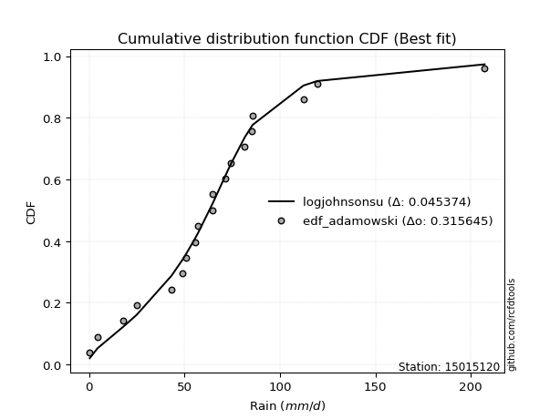</img>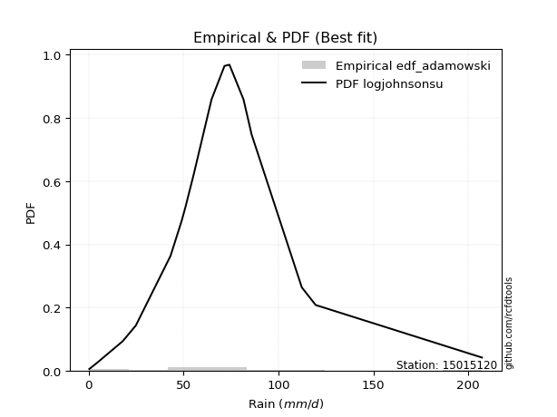</img>

</div>


## C. Best fit & Estimate extreme values for specific return periods - Tr


### 1. Best fit (ordered by delta Δ)

<div align="center">

|   id |   station | empirical_dist   | p_dist       |     delta |   deltao | eval   |   fit |   n |   best_fit |   best_fit_sort |
|-----:|----------:|:-----------------|:-------------|----------:|---------:|:-------|------:|----:|-----------:|----------------:|
|    0 |  15015120 | edf_hazen        | logjohnsonsu | 0.0446286 | 0.315645 | Δo > Δ |     1 |  19 |          1 |               1 |
|    1 |  15015120 | edf_gringorten   | logjohnsonsu | 0.0462802 | 0.315645 | Δo > Δ |     1 |  19 |          1 |               2 |
|    2 |  15015120 | edf_cunnane      | logjohnsonsu | 0.0473699 | 0.315645 | Δo > Δ |     1 |  19 |          1 |               3 |
|    3 |  15015120 | edf_blom         | logjohnsonsu | 0.0480463 | 0.315645 | Δo > Δ |     1 |  19 |          1 |               4 |
|    4 |  15015120 | edf_tukey        | logjohnsonsu | 0.0491658 | 0.315645 | Δo > Δ |     1 |  19 |          1 |               5 |
|    5 |  15015120 | edf_filliben     | logjohnsonsu | 0.0495887 | 0.315645 | Δo > Δ |     1 |  19 |          1 |               6 |
|    6 |  15015120 | edf_beard        | logjohnsonsu | 0.0497886 | 0.315645 | Δo > Δ |     1 |  19 |          1 |               7 |
|    7 |  15015120 | edf_jenkinson    | logjohnsonsu | 0.0497886 | 0.315645 | Δo > Δ |     1 |  19 |          1 |               8 |
|    8 |  15015120 | edf_chegodayev   | logjohnsonsu | 0.0500546 | 0.315645 | Δo > Δ |     1 |  19 |          1 |               9 |
|    9 |  15015120 | edf_adamowski    | logjohnsonsu | 0.0513763 | 0.315645 | Δo > Δ |     1 |  19 |          1 |              10 |
|   10 |  15015120 | edf_weibull      | logjohnsonsu | 0.0577865 | 0.315645 | Δo > Δ |     1 |  19 |          1 |              11 |
|   11 |  15015120 | edf_california   | logjohnsonsu | 0.0709444 | 0.315645 | Δo > Δ |     1 |  19 |          1 |              12 |

</div>

:file_folder:Tables: [bestfit_15015120.csv](table/bestfit_15015120.csv) | [extreme_15015120.csv](table/extreme_15015120.csv)


### 2. Extreme values

In hydrology, a return period (or recurrence interval $Tr$) is the statistical average time between extreme events like floods or droughts of a specific magnitude, indicating how rare an event is, with a 100-year flood, for example, having a 1% chance of occurring in any given year, not that it happens exactly every century. It is a key tool for infrastructure design (like bridges or dams) and risk assessment, calculated from historical data to determine the probability of future events, although it is important to remember it is statistical average, and events can cluster or be missed.

> risk_rate: assuming the return period as the project useful life.

|   id |      tr |   prob_l |     prob_g |      alpha |   betaprime |     chi2 |   crystalball |   erlang |    expon |   exponnorm |        f |   fatiguelife |     fisk |    gamma |   genexpon |   genlogistic |   gibrat |   gompertz |   gumbel_l |   gumbel_r |   halflogistic |   halfnorm |   hypsecant |   invgamma |   invgauss |   invweibull |   johnsonsu |   kstwobign |   laplace |   laplace_asymmetric |   loggamma |   logistic |   lognorm |   maxwell |   mielke |    moyal |   nakagami |       ncf |      nct |     norm |      pareto |   pearson3 |   rayleigh |     rice |        t |   truncnorm |     wald |   weibull_min |   logalpha |     logbetaprime |          logchi2 |   logcrystalball |       logerlang |         logexpon |   logexponnorm |            logf |   logfatiguelife |   logfisk |   loggenexpon |   loggenlogistic |        loggibrat |   loggompertz |   loggumbel_l |   loggumbel_r |   loghalflogistic |   loghalfnorm |   loghypsecant |   loginvgamma |   loginvgauss |    loginvweibull |   logjohnsonsu |     logkstwobign |   loglaplace |   loglaplace_asymmetric |   logloggamma |   loglogistic |   loglognorm |   logmaxwell |   logmielke |   logmoyal |   lognakagami |        logncf |    lognct |   logpareto |   logpearson3 |   lograyleigh |   logrice |             logt |   logtruncnorm |     logwald |   logweibull_min |   station |   n |   risk_rate |
|-----:|--------:|---------:|-----------:|-----------:|------------:|---------:|--------------:|---------:|---------:|------------:|---------:|--------------:|---------:|---------:|-----------:|--------------:|---------:|-----------:|-----------:|-----------:|---------------:|-----------:|------------:|-----------:|-----------:|-------------:|------------:|------------:|----------:|---------------------:|-----------:|-----------:|----------:|----------:|---------:|---------:|-----------:|----------:|---------:|---------:|------------:|-----------:|-----------:|---------:|---------:|------------:|---------:|--------------:|-----------:|-----------------:|-----------------:|-----------------:|----------------:|-----------------:|---------------:|----------------:|-----------------:|----------:|--------------:|-----------------:|-----------------:|--------------:|--------------:|--------------:|------------------:|--------------:|---------------:|--------------:|--------------:|-----------------:|---------------:|-----------------:|-------------:|------------------------:|--------------:|--------------:|-------------:|-------------:|------------:|-----------:|--------------:|--------------:|----------:|------------:|--------------:|--------------:|----------:|-----------------:|---------------:|------------:|-----------------:|----------:|----:|------------:|
|    0 |    2    | 0.5      | 0.5        |    2.58126 |     51.1588 |  50.8704 |       61.2211 |  50.8704 |  42.5579 |     55.2974 |  50.9356 |       52.6494 |  54.7632 |  40.8187 |    42.5097 |       53.8661 |  47.6277 |    51.4832 |    68.6608 |    53.7813 |        50.0826 |    51.951  |     61.2211 |    53.0818 |    52.7154 |      53.1809 |     52.802  |     55.1217 |   61.2211 |              58.4894 |    35.8107 |    61.2211 |   37.9647 |   57.3479 |  35.9466 |  51.3795 |    45.2511 |   47.5315 |  54.6401 |  61.2211 | 0.470817    |    50.4509 |    55.9742 |  58.6113 |  56.7443 |     61.2211 |  46.5412 |       53.7669 |    36.3211 |     34.1515      |      2.75583     |          56.4646 |   56.4299       |      9.38931     |        37.9646 |    1.28237      |          38.1201 |   48.3892 |       19.6224 |          49.3972 |     25.2226      |       47.7551 |       47.487  |       30.3518 |           27.156  |       28.7263 |        37.9647 |       35.2843 |       35.1652 |     32.6489      |        59.0753 |     26.5779      |      37.9647 |                 50.8772 |       49.7617 |       37.9647 |      37.9559 |      33.7897 |     44.3596 |    28.2362 |       38.0827 |   4.36105     |   37.8322 |    0.402777 |       57.9748 |       32.4218 |   37.9644 |     63.2482      |        8.53412 |     24.4116 |      2.30016     |  15015120 |  19 |    0.75     |
|    1 |    2.33 | 0.570815 | 0.429185   |    3.07129 |     59.0251 |  58.799  |       69.3024 |  58.7989 |  51.8466 |     61.9854 |  58.8479 |       60.154  |  61.2786 |  50.5869 |    51.7878 |       61.0194 |  51.7213 |    60.7467 |    75.6917 |    61.2695 |        57.7817 |    60.6729 |     67.6885 |    60.2899 |    60.187  |      60.3711 |     60.1416 |     62.8517 |   66.1115 |              63.6321 |    46.538  |    68.3413 |   48.4124 |   65.7438 |  46.6524 |  58.468  |    55.6521 |   57.0462 |  61.2128 |  69.3024 | 1.50664     |    57.9967 |    64.4944 |  66.3921 |  62.2659 |     69.3024 |  51.8402 |       60.9971 |    47.2048 |     56.8042      |      5.25691     |          63.0968 | 1765.95         |     18.8197      |        48.4123 |    2.33887      |          48.6405 |   57.9149 |       30.4348 |          57.2269 |     28.528       |       56.2728 |       58.6716 |       38.0201 |           34.2333 |       37.3441 |        46.1182 |       45.7413 |       46.7309 |     48.2487      |        64.4332 |     41.2884      |      43.9815 |                 58.6968 |       58.8904 |       47.0327 |      48.3441 |      43.4979 |     54.8191 |    34.9473 |       48.57   |  13.7563      |   48.3098 |    0.445665 |       69.3135 |       41.8933 |   48.4071 |     68.2609      |       13.0613  |     28.6303 |      3.80879     |  15015120 |  19 |    0.729209 |
|    2 |    5    | 0.8      | 0.2        |    6.87105 |     94.3101 |  94.5015 |       99.3348 |  94.5015 |  98.2877 |     90.9334 |  94.4556 |       93.3321 |  90.0822 | 100.695  |    98.1758 |       92.0825 |  75.2897 |   100.088  |    98.4054 |    93.8019 |        92.6186 |    97.5565 |     93.6311 |    92.0762 |    93.2177 |      92.246  |     92.6049 |     95.687  |   90.5626 |              89.3446 |   125.636  |    95.8334 |  119.483  |   98.7896 |  92.0702 |  91.303  |   103.187  |  111.517  |  89.675  |  99.3347 | 1.03053e+06 |    92.5908 |    98.6042 |  97.5421 |  84.5744 |     99.3347 |  81.5041 |       93.8111 |   128.552  |    497.116       |    211.289       |          90.8167 |    7.54726e+15  |    608.742       |       119.484  | 4392.36         |         120.393  |  115.91   |      176.744  |          88.0177 |     57.9666      |       95.6378 |      116.189  |      101.164  |           97.6266 |      113.258  |       100.645  |      122.378  |      139.698  |    263.257       |        82.5988 |    268.201       |      91.771  |                 84.7289 |       97.6641 |      107.539  |     118.869  |     117.538  |    130.748  |    93.838  |      119.952  |   1.07609e+07 |  119.956  |  inf        |      108.823  |      116.885  |  119.426  |     99.7811      |       53.9706  |     69.8821 |     66.1796      |  15015120 |  19 |    0.67232  |
|    3 |   10    | 0.9      | 0.1        |   13.8521  |    123.325  | 123.951  |      119.257  | 123.951  | 140.446  |    115.379  | 123.827  |      120.48   | 115.566  | 147.18   |   140.286  |      117.374  | 102.155  |   128.662  |   111.051  |   120.299  |       121.549  |   124.849  |    114.347  |   118.544  |   120.301  |     118.991  |    119.519  |    120.687  |  112.759  |             112.686  |   246.948  |   116.08   |  217.562  |  122.046  | 121.883  | 119.891  |   140.076  |  176.064  | 113.717  | 119.257  | 2.70146e+11 |   121.626  |   122.925  | 119.753  | 103.378  |    119.257  | 112.985  |      120.671  |   256.258  |   2700.29        |   8844.87        |         113.43   |    2.80589e+32  |  14289.2         |       217.563  |    4.10798e+14  |         219.752  |  193.215  |      620.324  |         110.992  |    130.064       |      128.498  |      169.972  |      224.487  |          233.091  |      257.411  |       187.686  |      239.211  |      298.92   |   1048.5         |        99.4766 |   1114.75        |     178.929  |                105.343  |      126.305  |      197.731  |     216.027  |     236.587  |    256.932  |   221.748  |      218.531  |   3.27839e+25 |  219.487  |  inf        |      127.003  |      242.934  |  217.405  |    170.57        |      103.891   |    180.152  |   1262.82        |  15015120 |  19 |    0.651322 |
|    4 |   15    | 0.933333 | 0.0666667  |   20.8083  |    139.571  | 140.458  |      129.199  | 140.458  | 165.106  |    129.579  | 140.297  |      135.716  | 131.221  | 174.62   |   164.918  |      131.641  | 120.685  |   143.176  |   116.778  |   135.248  |       137.921  |   139.053  |    126.169  |   133.754  |   135.537  |     134.398  |    134.865  |    133.959  |  125.742  |             126.339  |   347.76   |   127.112  |  293.404  |  133.978  | 136.752  | 136.482  |   159.487  |  222.989  | 127.942  | 129.199  | 3.99247e+14 |   138.032  |   135.457  | 131.197  | 115.035  |    129.199  | 133.2    |      135.551  |   364.422  |   6797.3         |  86587.1         |         126.388  |    3.59481e+43  |  90519.3         |       293.406  |    1.6598e+31   |         296.762  |  255.244  |     1184.94   |         124.097  |    227.115       |      146.889  |      201.928  |      351.961  |          381.431  |      394.619  |       267.844  |      336.005  |      441.539  |   2286.6         |       113.024  |   2374.86        |     264.426  |                119.654  |      141.159  |      275.546  |     291.102  |     338.746  |    373.856  |   365.268  |      294.798  |   1.80649e+52 |  296.795  |  inf        |      133.109  |      354.158  |  293.156  |    280.224       |      130.181   |    330.932  |   8004.53        |  15015120 |  19 |    0.644736 |
|    5 |   20    | 0.95     | 0.05       |   27.7584  |    150.867  | 151.938  |      135.71   | 151.938  | 182.604  |    139.648  | 151.754  |      146.335  | 142.848  | 194.169  |   182.395  |      141.63   | 135.221  |   152.69   |   120.343  |   145.716  |       149.392  |   148.522  |    134.509  |   144.543  |   146.172  |     145.324  |    145.685  |    142.899  |  134.955  |             136.027  |   435.959  |   134.736  |  356.881  |  141.897  | 146.784  | 148.232  |   172.468  |  261.335  | 138.268  | 135.71   | 7.08172e+16 |   149.486  |   143.786  | 138.803  | 123.847  |    135.71   | 148.264  |      145.815  |   460.28   |  12808.1         | 450814           |         135.571  |    7.93167e+51  | 335414           |       356.884  |    1.0523e+53   |         361.308  |  309.405  |     1822.05   |         133.565  |    351.679       |      159.643  |      224.785  |      482.215  |          538.61   |      524.672  |       344.223  |      420.561  |      572.248  |   3947.15        |       125.484  |   3952.78        |     348.863  |                130.972  |      151.041  |      346.58   |     353.917  |     429.862  |    485.376  |   520.137  |      358.65   |   2.13405e+86 |  361.673  |  inf        |      136.155  |      454.998  |  356.55   |    453.519       |      145.958   |    520.65   |  31107.7         |  15015120 |  19 |    0.641514 |
|    6 |   25    | 0.96     | 0.04       |   34.706   |    159.518  | 160.731  |      140.503  | 160.731  | 196.175  |    147.458  | 160.534  |      154.485  | 152.216  | 209.37   |   195.952  |      149.325  | 147.339  |   159.678  |   122.88   |   153.778  |       158.23   |   155.568  |    140.964  |   152.941  |   154.345  |     153.819  |    154.066  |    149.596  |  142.1    |             143.541  |   515.366  |   140.569  |  412.227  |  147.776  | 154.431  | 157.34   |   182.138  |  294.38   | 146.454  | 140.503  | 3.93114e+18 |   158.282  |   149.974  | 144.455  | 131.071  |    140.503  | 160.331  |      153.63   |   547.434  |  20724           |      1.64529e+06 |         142.713  |    3.89769e+58  | 926418           |       412.231  |    5.43168e+79  |         417.645  |  358.475  |     2508.53   |         141.09   |    506.358       |      169.388  |      242.61   |      614.57   |          702.639  |      648.532  |       417.989  |      496.618  |      693.962  |   6010.46        |       137.41   |   5789.46        |     432.52   |                140.484  |      158.382  |      413.052  |     408.678  |     513.018  |    593.106  |   684.072  |      414.335  |   1.4166e+127 |  418.351  |  inf        |      137.975  |      548.094  |  411.821  |    727.51        |      156.414   |    748.486  |  91404.7         |  15015120 |  19 |    0.639603 |
|    7 |   50    | 0.98     | 0.02       |   69.4332  |    185.901  | 187.548  |      154.227  | 187.547  | 238.333  |    171.717  | 187.322  |      179.429  | 183.597  | 256.762  |   238.061  |      173.026  | 190.055  |   179.533  |   129.766  |   178.615  |       185.46   |   176.047  |    160.976  |   179.354  |   179.415  |     180.426  |    180.164  |    169.261  |  164.296  |             166.882  |   835.855  |   158.39   |  622.928  |  164.826  | 178.231  | 185.613  |   210.273  |  418.971  | 173.136  | 154.227  | 1.03052e+24 |   185.203  |   167.938  | 160.86   | 156.237  |    154.227  | 199.727  |      177.205  |   905.96   |  88214           |      9.81316e+07 |         165.127  |    2.29273e+80  |      2.17461e+07 |       622.935  |    9.18412e+280 |         632.513  |  562.072  |     6347.29   |         165.954  |   1830.25        |      198.947  |      298.45   |     1297.32   |         1593.96   |     1200.8    |       763.143  |      803.167  |     1216.77   |  21952.7         |       194.562  |  17754.8         |     843.297  |                174.663  |      179.665  |      706.029  |     617.104  |     856.8    |   1097.23   |  1601.31   |      626.407  | inf           |  634.874  |  inf        |      141.586  |      940.884  |  622.208  |   7192.61        |      179.861   |   2448.35   |      2.95182e+06 |  15015120 |  19 |    0.63583  |
|    8 |   75    | 0.986667 | 0.0133333  |  104.156   |    201.055  | 202.948  |      161.591  | 202.948  | 262.994  |    185.908  | 202.718  |      193.821  | 203.789  | 284.583  |   262.694  |      186.802  | 218.905  |   190.044  |   133.248  |   193.051  |       201.289  |   187.195  |    172.671  |   195.13   |   193.919  |     196.2    |    195.554  |    180.08   |  177.28   |             180.535  |  1086.41   |   168.683  |  777.401  |  174.097  | 192.633  | 202.147  |   225.59   |  510.463  | 189.807  | 161.591  | 1.523e+27   |   200.722  |   177.711  | 169.785  | 173.321  |    161.591  | 223.97   |      190.572  |  1192.46   | 200449           |      1.11409e+09 |         178.471  |    4.44204e+93  |      1.37757e+08 |       777.41   |  inf            |         790.364  |  728.802  |    10519.2    |         181.851  |   4359.34        |      215.805  |      331.408  |     2002.83   |         2566.08   |     1679.21   |      1084.9    |     1042.56   |     1654.08   |  46610.2         |       252.067  |  32891.6         |    1246.25   |                198.391  |      191.215  |      962.254  |     769.893  |    1132.36   |   1567.23   |  2633.18   |      781.951  | inf           |  794.226  |  inf        |      142.772  |     1262.44   |  776.432  |  66472.9         |      188.508   |   5076.8    |      2.44455e+07 |  15015120 |  19 |    0.634587 |
|    9 |  100    | 0.99     | 0.01       |  138.877   |    211.706  | 213.77   |      166.572  | 213.77   | 280.491  |    195.977  | 213.542  |      203.965  | 219.043  | 304.357  |   280.171  |      196.552  | 241.254  |   197.082  |   135.526  |   203.268  |       212.492  |   194.789  |    180.967  |   206.505  |   204.158  |     207.504  |    206.558  |    187.493  |  186.492  |             190.223  |  1298.58   |   175.95   |  903.057  |  180.411  | 203.222  | 213.878  |   236.022  |  585.496  | 202.191  | 166.572  | 2.70145e+29 |   211.648  |   184.369  | 175.865  | 186.725  |    166.572  | 241.645  |      199.891  |  1438.61   | 355371           |      6.33163e+09 |         188.068  |    1.87822e+103 |      5.10451e+08 |       903.069  |  inf            |         918.933  |  875.511  |    14841.3    |         193.865  |   8538.82        |      227.598  |      354.911  |     2723.48   |         3594.47   |     2110.18   |      1392.41   |     1245.19   |     2040.55   |  79417.1         |       311.991  |  50181.9         |    1644.2    |                217.157  |      199.071  |     1197.37   |     894.178  |    1369.21   |   2016.5    |  3747.36   |      908.513  | inf           |  924.16   |  inf        |      143.359  |     1542.39   |  901.877  | 589792           |      193.001   |   8639.85   |      1.13277e+08 |  15015120 |  19 |    0.633968 |
|   10 |  200    | 0.995    | 0.005      |  277.758   |    237.083  | 239.543  |      177.87   | 239.543  | 322.649  |    220.236  | 239.339  |      228.224  | 259.319  | 352.104  |   322.281  |      219.991  | 302.057  |   212.807  |   140.477  |   227.832  |       239.427  |   212.158  |    200.952  |   234.64   |   228.7    |     235.159  |    233.424  |    204.567  |  208.688  |             213.564  |  1952.59   |   193.382  | 1268.57   |  194.857  | 230.4    | 242.139  |   259.862  |  808.332  | 234.19   | 177.87   | 7.08168e+34 |   237.734  |   199.604  | 189.778  | 224.266  |    177.87   | 285.672  |      221.85   |  2214.14   |      1.37299e+06 |      4.3316e+11  |         211.694  |    1.06069e+127 |      1.1982e+10  |      1268.59   |  inf            |        1293.61   | 1359.35   |    32627      |         225.722  |  53181.2         |      255.5    |      411.905  |     5702.01   |         8081.89   |     3558.21   |      2540.16   |     1869.53   |     3308.33   | 285958           |       587.304  | 132772           |    3205.75   |                269.991  |      216.997  |     2022.84   |    1255.73   |    2114.43   |   3694.01   |  8768.87   |     1276.8    | inf           | 1303.41   |  inf        |      144.228  |     2439.04   | 1266.74   |      2.87463e+09 |      199.963   |  32485.8    |      5.06609e+09 |  15015120 |  19 |    0.633042 |
|   11 |  250    | 0.996    | 0.004      |  347.198   |    245.178  | 247.761  |      181.323  | 247.761  | 336.221  |    228.046  | 247.57   |      235.988  | 273.442  | 367.502  |   335.837  |      227.527  | 323.874  |   217.54   |   141.933  |   235.729  |       248.086  |   217.502  |    207.385  |   243.939  |   236.572  |     244.197  |    242.194  |    209.851  |  215.834  |             221.078  |  2213.77   |   198.978  | 1407.41   |  199.304  | 239.739  | 251.237  |   267.191  |  895.053  | 245.21   | 181.323  | 3.93112e+36 |   246.068  |   204.293  | 194.06   | 238.183  |    181.323  | 300.238  |      228.784  |  2529.91   |      2.10589e+06 |      1.70542e+12 |         219.466  |    6.53639e+134 |      3.30944e+10 |      1407.43   |  inf            |        1436.15   | 1565.58   |    41581.7    |         236.959  | 102513           |      264.344  |      430.355  |     7230.92   |        10486.7    |     4178.67   |      3082.54   |     2118.84   |     3842.23   | 431691           |       749.967  | 179423           |    3974.49   |                289.597  |      222.501  |     2393.73   |    1393.07   |    2417.05   |   4487.07   | 11529.3    |     1416.74   | inf           | 1447.89   |  inf        |      144.4    |     2808.56   | 1405.32   |      1.8264e+11  |      201.388   |  50347.9    |      1.77444e+10 |  15015120 |  19 |    0.632858 |
|   12 |  500    | 0.998    | 0.002      |  694.398   |    270.134  | 273.083  |      191.562  | 273.083  | 378.379  |    252.305  | 272.951  |      259.999  | 321.332  | 415.4    |   377.947  |      250.915  | 399.271  |   231.365  |   146.109  |   260.239  |       274.962  |   233.433  |    227.369  |   273.661  |   260.961  |     272.708  |    269.866  |    225.686  |  238.03   |             244.419  |  3220.25   |   216.334  | 1915.07   |  212.573  | 270.907  | 279.498  |   289.022  | 1222.84   | 281.972  | 191.562  | 1.03052e+42 |   271.793  |   218.286  | 206.838  | 288.32   |    191.562  | 346.551  |      249.951  |  3773.12   |      7.7999e+06  |      1.23604e+14 |         244.164  |    2.39268e+159 |      7.76833e+11 |      1915.1    |  inf            |        1958.21   | 2426.15   |    85744.2    |         275.361  | 990360           |      291.428  |      487.954  |    15114.7    |        23537.1    |     6747.95   |      5623.17   |     3079.71   |     6020.12   |      1.55007e+06 |      1863.8    | 442360           |    7749.18   |                360.055  |      238.883  |     4034.8    |    1895.35   |    3602.79   |   8204.1    | 26978.1    |     1928.58   | inf           | 1977.79   |  inf        |      144.737  |     4278.37   | 1911.98   |      1.1097e+20  |      204.271   | 202785      |      9.50072e+11 |  15015120 |  19 |    0.632489 |
|   13 |  750    | 0.998667 | 0.00133333 | 1041.6     |    284.616  | 287.768  |      197.249  | 287.768  | 403.04   |    266.496  | 287.683  |      273.982  | 352.429  | 443.461  |   402.58   |      264.588  | 449.134  |   238.903  |   148.341  |   274.567  |       290.674  |   242.334  |    239.059  |   291.681  |   275.196  |     289.705  |    286.376  |    234.582  |  251.013  |             258.073  |  3971.88   |   226.474  | 2272.43   |  219.995  | 290.828  | 296.03   |   301.204  | 1463.98   | 305.429  | 197.249  | 1.52299e+45 |   286.739  |   226.11   | 213.984  | 323.314  |    197.249  | 374.319  |      262.095  |  4724.74   |      1.6578e+07  |      1.53865e+15 |         259.027  |    9.32065e+173 |      4.92109e+12 |      2272.47   |  inf            |        2326.41   | 3133.75   |   128525      |         300.551  |      4.43835e+06 |      307.024  |      521.836  |    23259      |        37758.5    |     8819.56   |      7992.77   |     3797.59   |     7752.92   |      3.27271e+06 |      3584.55   | 734400           |   11452      |                408.97   |      248.017  |     5473.88   |    2249.02   |    4503.97   |  11673.3    | 44359.3    |     2289.03   | inf           | 2352.1    |  inf        |      144.848  |     5413.72   | 2268.6    |      3.88662e+28 |      205.242   | 467533      |      1.03276e+13 |  15015120 |  19 |    0.632366 |
|   14 | 1000    | 0.999    | 0.001      | 1388.8     |    294.847  | 298.137  |      201.165  | 298.137  | 420.537  |    276.565  | 298.091  |      283.88   | 376.005  | 463.387  |   420.057  |      274.286  | 487.291  |   244.032  |   149.843  |   284.731  |       301.819  |   248.48   |    247.352  |   304.771  |   285.287  |     301.911  |    298.245  |    240.745  |  260.226  |             267.76   |  4592.11   |   233.665  | 2556.53   |  225.124  | 305.8    | 307.759  |   309.612  | 1661.88   | 323.035  | 201.165  | 2.70144e+47 |   297.303  |   231.517  | 218.922  | 351.116  |    201.165  | 394.294  |      270.615  |  5522.71   |      2.8171e+07  |      9.26495e+15 |         269.767  |    2.55428e+184 |      1.82348e+13 |      2556.58   |  inf            |        2619.46   | 3757.39   |   170011      |         319.781  |      1.39871e+07 |      317.987  |      545.955  |    31577.1    |        52797.7    |    10610.8    |     10257.7    |     4390.22   |     9241.46   |      5.56068e+06 |      6068.87   |      1.04341e+06 |   15108.8    |                447.655  |      254.317  |     6795.81   |    2530.23   |    5255.43   |  14990.8    | 63127.6    |     2575.65   | inf           | 2650.32   |  inf        |      144.903  |     6369.9    | 2552.1    |      9.60036e+36 |      205.73    | 852645      |      5.75236e+13 |  15015120 |  19 |    0.632305 |

<div align="center">

</img>

</div>


<div align="center">

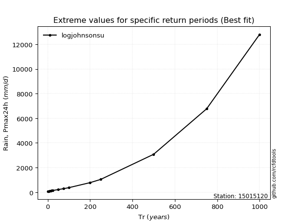</img>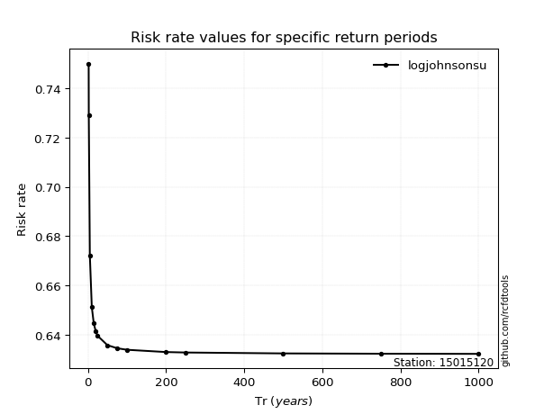</img>

</div>


<sub>**APP DISCLAIMER**: NO WARRANTY - This software is provided by [github.com/rcfdtools](https://github.com/rcfdtools) "as is", without any express or implied warranty, including warranties of merchantability, fitness for a particular purpose, or non-infringement. There is no guarantee that the software will be error-free or operate without interruption. LIMITATION OF LIABILITY - Neither the authors nor copyright holders will be liable for claims or damages arising from the software or its use. You are responsible for determining if the software is appropriate for your use and assume all associated risks, including errors, legal compliance, and data loss. NO PROFESSIONAL ADVICE - The software provides general information and does not offer professional advice. It should not replace consultation with professional advisors.</sub>