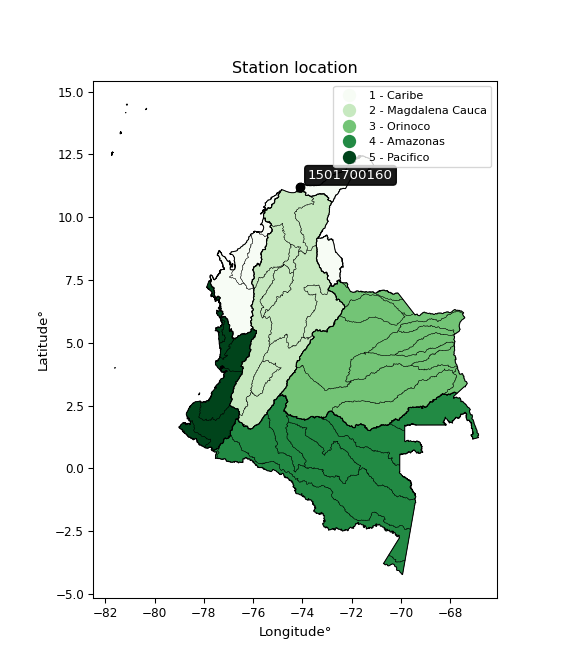

<div align="center">


</div>

# PMax24h Station (Rain): 1501700160

Maximum Precipitation in 24 hours (PMax24h) is the greatest amount of rainfall for a specific duration that is meteorologically possible for a given location, acting as a "worst-case" scenario for extreme storms, crucial for designing safety-critical infrastructure like bridges, river deviations, dams, spillways, and nuclear plants to prevent catastrophic failure. The PMax24h is related with the Probable Maximum Precipitation (PMP) and it is calculated by hydrologists using meteorological data to determine the upper limit of extreme rainfall, often leading to the Probable Maximum Flood (PMF) for flood control design, and is increasingly being studied for climate change impacts. Probable Maximum Precipitation (PMP) is the theoretical upper limit of rainfall, a deterministic estimate for extreme events, while probability distributions (like GEV, Gumbel) describe the likelihood and frequency of various precipitation amounts, including rare ones, showing how often events occur, with PMP representing the extreme end of these distributions, used for critical infrastructure design to ensure safety against the worst conceivable weather, unlike standard statistical forecasts which cover typical probabilities.

The most common probability distributions in hydrology, used for analyzing floods, rainfall, and streamflow, include the Normal, Log-Normal, Gumbel, Gamma (including Log-Pearson Type III), and Generalized Extreme Value (GEV) distributions, often chosen based on the data´s skewness and whether modeling extremes or general conditions, with Gumbel and GEV popular for extreme events like floods, while the Normal distribution serves as a baseline, though often requiring transformations for skewed hydrological data. These distributions help in designing water infrastructure, managing water resources, and forecasting hydrologic events.

> Hydrological data often isn´t perfectly normal (it´s skewed), so different distributions are needed for different applications, such as: **Flood Frequency Analysis**: Using Gumbel, GEV, or Log-Pearson Type III for predicting extreme flood magnitudes and their return periods, **Rainfall Analysis**: Normal for annual totals, but Log-Normal, Weibull, or GEV for intensity or extreme daily rainfall, **Streamflow Modeling**: Gamma and Log-Normal for maximum flows, GEV for minimum flows, and Kappa for daily flows.

<div align="center">

</img>

</div>


## A. General information


### 1. General running parameters

• app_version: _v20260225_. • runtime: _2026-02-28 16:54:07.457399_. • Python version: _3.14.0_. • SciPy version: _1.16.3_. • Pandas version: _2.3.3_. • NumPy version: _2.3.5_. • Stations dataset (station_dataset_file): _dataset/pmax24h_in/automatic_colombia_2003_2025.csv_. • Stations catalog (station_catalog_file): _dataset/CNE.xls_. • Minimum year to eval til year_max (date_min): _1900_. • Maximum year to eval since year_min (date_max): _2025_. • Creates, save and include plots into reports (create_plot): _False_. • Plot only fit distributions with Δo > Δ (plot_only_fit): _True_. • Plot only simple graphs avoiding multiple CDFs and multiple Extreme values plots (plot_only_simple): _False_. • Eval low extreme values, if False, evaluates high extreme values (low_extreme): _False_. • Eval every SciPy distribution as logarithmic (pdist_logarithmic_on): _True_. • Standard deviation normalized (ddof): _1.0_. • Return periods to eval in years (Tr): _[2, 2.33, 5, 10, 15, 20, 25, 50, 75, 100, 200, 250, 500, 750, 1000]_. • Minimum data sample per station, 0 means any (minimum_sample): _5_. • Z-Score maximum threshold to adjust a value, 0 means disable (zscore_max): _3.5_. • Z-Score minimum threshold to adjust a value, 0 means disable (zscore_min): _-2.5_. • Avoid zeros, e.g. rain = 0 (avoid_zeros): _True_. • Avoid null values (avoid_nans): _True_. 

:file_folder:Table: [dataset.csv](../../dataset/pmax24h_in/automatic_colombia_2003_2025.csv)

> Delta Degrees of Freedom (DDOF): is a parameter used in the formulas for calculating variance and standard deviation. When ddof=0, the divisor is $N$ (the total number of observations) and this is used when your data set is the entire population. When ddof=1, the divisor is $N-1$ and this is used when your data set is a sample drawn from a larger population. Using $N-1$ provides an unbiased estimate of the population variance (known as Bessel´s correction).


### 2. Station info and location

|   id |     CODIGO | NOMBRE                                      | CATEGORIA    | TECNOLOGIA                              | ESTADO           | FECHA_INSTALACION   |   FECHA_SUSPENSION |   ALTITUD |   LATITUD |   LONGITUD | DEPARTAMENTO   | MUNICIPIO   | AREA_OPERATIVA                                         | ENTIDAD                                                     | AREA_HIDROGRAFICA   | ZONA_HIDROGRAFICA   | SUBZONA_HIDROGRAFICA          | CORRIENTE   | Catalogo   |   Version |
|-----:|-----------:|:--------------------------------------------|:-------------|:----------------------------------------|:-----------------|:--------------------|-------------------:|----------:|----------:|-----------:|:---------------|:------------|:-------------------------------------------------------|:------------------------------------------------------------|:--------------------|:--------------------|:------------------------------|:------------|:-----------|----------:|
|    0 | 1501700160 | RIO MANZANARES ALERTAS - AUT   [1501700160] | Limnigráfica | Automática con Telemetría, Convencional | En Mantenimiento | 17/09/2018          |                nan |       226 |   11.2083 |   -74.0965 | Magdalena      | Santa Marta | Area Operativa 05 - Magdalena-Cesar-Guajira-San Andrés | INSTITUTO DE HIDROLOGIA METEOROLOGIA Y ESTUDIOS AMBIENTALES | Caribe              | Caribe - Guajira    | Río  Piedras - Río Manzanares | Manzanares  | CNE_IDEAM  |  20251226 |

<div align="center">

Dynamic map: [:earth_americas:Google](http://maps.google.com/maps?q=11.208274,-74.096506) [:earth_americas:OSM](https://www.openstreetmap.org/#map=18/11.208274/-74.096506&layers=P) [:earth_americas:Bing](https://www.bing.com/maps?cp=11.208274~-74.096506&lvl=18) [:earth_americas:Apple](https://maps.apple.com/frame?center=11.208274%2C-74.096506&span=0.003%2C0.006)

</div>


<div align="center">

```geojson
{
  "type": "Feature",
  "geometry": {
    "type": "Point", 
    "coordinates": [-74.096506, 11.208274]
  }, 
  "properties": {
    "Name": "1501700160"
  }
}
```

</div>


### 3. Discrete values table and plot

<div align="center">

|               |           0 |          1 |           2 |          3 |           4 |
|:--------------|------------:|-----------:|------------:|-----------:|------------:|
| Date          | 2019        | 2020       | 2021        | 2022       | 2025        |
| Value         |   36        |    2.2     |   42.2      |   52.8     |   29.8      |
| Value_initial |   36        |    2.2     |   42.2      |   52.8     |   29.8      |
| count         |    5        |    5       |    5        |    5       |    5        |
| mean          |   32.6      |   32.6     |   32.6      |   32.6     |   32.6      |
| std           |   18.9984   |   18.9984  |   18.9984   |   18.9984  |   18.9984   |
| zscore        |    0.178962 |   -1.60013 |    0.505305 |    1.06325 |   -0.147381 |


</div>


> The initial value (value_initial) correspond to the initial obtained or null completed value, and value (value) is adjusted only when the initial value is outside the valid range (outlier) definite through the Z-Score value. If Z-Score is active, values out of range or outliers are replaced with the station mean value. A Z-Score (or standard score) measures how many standard deviations a data point is from the mean of a dataset, indicating its relative position; positive scores mean above the mean, negative mean below, and a score of zero is exactly at the mean, allowing for comparison of values from different distributions. It´s calculated using the formula $z=(x–μ)/σ$, where $x$ is the data point, $μ$ is the mean, and $σ$ is the standard deviation, helping identify outliers and understand probability.
>
> <sub>**Note**: In this study, "completing" (filling gaps in) and "extending" (forecasting or lengthening the historical record) rainfall data series are avoided for certain critical analyses because they introduce artificial bias and uncertainty, which can distort the statistics of rare events (extremes), alter day-to-day variability, and compromise the integrity and homogeneity of the original data. Some reasons against Completing/Extending rainfall data are: **Distortion of Extremes and Variability**: The primary issue is that most gap-filling or extension methods rely on averaging or regression with nearby stations, which inherently smooths the data. Rainfall is highly variable in space and time, with a large percentage of zero values and occasional large storms. Infilling methods often underestimate the highest values and overestimate the lowest (zero) values, which severely distorts analyses focused on flood frequency, drought severity, and intensity-duration-frequency (IDF) curves, **Loss of Data Homogeneity**: Infilled or extended data are synthetic estimates, not actual measurements. Combining these estimates with observed data can violate the assumption of data homogeneity, which requires that the data properties do not change over time. Inhomogeneity can lead to incorrect conclusions about long-term trends or changes in climate patterns, **Propagation of Errors**: Errors and biases from the original data (e.g., wind-induced undercatch, instrument errors, site changes) or the data used for imputation can propagate through the analysis, leading to unreliable hydrological models and inaccurate predictions, **Compromised Statistical Integrity**: For statistical analyses, especially those involving the frequency of events, using artificial data can introduce time bias or autocorrelation that doesn´t exist in reality, making it difficult to assess the true probability of events, **Difficulty in Validation**: It is difficult to accurately validate the quality of filled or extended data, especially for past periods where ground-truth measurements are unavailable. The reliability of imputation techniques heavily depends on the density of the surrounding station network and the complexity of the local topography.</sub>


### 4. Active continuous probability distributions from SciPy (80 of 104 available)

A Probability Density Function (PDF) describes the relative likelihood of a continuous random variable falling within a specific range, where the total area under its curve equals 1, and the area over any interval gives the actual probability for that range. Unlike discrete probabilities (like rolling a die), a PDF shows density, not direct probability for a single point (which is zero), with higher points indicating higher likelihood, often visualized as a bell curve for normal distributions.

A log of a probability density function (log-PDF) is simply the logarithm of the PDF´s value, denoted as $log(f(x))$, useful for converting multiplication of probabilities into addition, improving numerical stability with tiny numbers, and connecting to information theory concepts like entropy. Instead of dealing with very small probabilities (e.g., 0.000001), log-PDFs use negative numbers (e.g., $log(0.00001) ≈ -11.51$ that are easier for computers to handle, preventing underflow errors and simplifying complex calculations. In this study, each active probability distribution from SciPy is also evaluated in the $log$ form.

[scipy.stats](https://docs.scipy.org/doc/scipy/reference/stats.html) is a Python´s powerful submodule within the SciPy library for comprehensive statistical analysis, offering over 130 probability distributions (like Normal, Poisson, etc.), functions for descriptive stats (mean, variance), hypothesis testing (t-tests, chi-square), random variable generation, and statistical tests, making it essential for data science, modeling, and research. It provides tools to explore, model, and draw conclusions from data efficiently, working seamlessly with [NumPy](https://numpy.org/).

<div align="center">

|   id | p_dist           |   n_parameter | fit_method   | label                                                                       | active   | ref                                                                                                      |
|-----:|:-----------------|--------------:|:-------------|:----------------------------------------------------------------------------|:---------|:---------------------------------------------------------------------------------------------------------|
|    0 | alpha            |             3 | MLE          | Alpha                                                                       | True     | [:mortar_board:](https://docs.scipy.org/doc/scipy/reference/generated/scipy.stats.alpha.html)            |
|    1 | anglit           |             2 | MM           | Anglit                                                                      | True     | [:mortar_board:](https://docs.scipy.org/doc/scipy/reference/generated/scipy.stats.anglit.html)           |
|    2 | arcsine          |             2 | MM           | Arcsine                                                                     | True     | [:mortar_board:](https://docs.scipy.org/doc/scipy/reference/generated/scipy.stats.arcsine.html)          |
|    3 | argus            |             3 | MLE          | Argus                                                                       | True     | [:mortar_board:](https://docs.scipy.org/doc/scipy/reference/generated/scipy.stats.argus.html)            |
|    4 | beta             |             4 | MLE          | Beta                                                                        | True     | [:mortar_board:](https://docs.scipy.org/doc/scipy/reference/generated/scipy.stats.beta.html)             |
|    5 | betaprime        |             4 | MLE          | Beta prime                                                                  | True     | [:mortar_board:](https://docs.scipy.org/doc/scipy/reference/generated/scipy.stats.betaprime.html)        |
|    6 | bradford         |             3 | MLE          | Bradford                                                                    | True     | [:mortar_board:](https://docs.scipy.org/doc/scipy/reference/generated/scipy.stats.bradford.html)         |
|    7 | burr             |             4 | MLE          | Burr (Type III)                                                             | True     | [:mortar_board:](https://docs.scipy.org/doc/scipy/reference/generated/scipy.stats.burr.html)             |
|    8 | burr12           |             4 | MLE          | Burr (Type III) 12                                                          | True     | [:mortar_board:](https://docs.scipy.org/doc/scipy/reference/generated/scipy.stats.burr12.html)           |
|    9 | cosine           |             2 | MLE          | Cosine                                                                      | True     | [:mortar_board:](https://docs.scipy.org/doc/scipy/reference/generated/scipy.stats.cosine.html)           |
|   10 | crystalball      |             4 | MLE          | Crystalball                                                                 | True     | [:mortar_board:](https://docs.scipy.org/doc/scipy/reference/generated/scipy.stats.crystalball.html)      |
|   11 | dgamma           |             3 | MLE          | Double gamma                                                                | True     | [:mortar_board:](https://docs.scipy.org/doc/scipy/reference/generated/scipy.stats.dgamma.html)           |
|   12 | dweibull         |             3 | MLE          | Double Weibull                                                              | True     | [:mortar_board:](https://docs.scipy.org/doc/scipy/reference/generated/scipy.stats.dweibull.html)         |
|   13 | erlang           |             3 | MLE          | Erlang                                                                      | True     | [:mortar_board:](https://docs.scipy.org/doc/scipy/reference/generated/scipy.stats.erlang.html)           |
|   14 | exponnorm        |             3 | MLE          | Exponentially modified Normal                                               | True     | [:mortar_board:](https://docs.scipy.org/doc/scipy/reference/generated/scipy.stats.exponnorm.html)        |
|   15 | exponpow         |             3 | MLE          | Exponential power                                                           | True     | [:mortar_board:](https://docs.scipy.org/doc/scipy/reference/generated/scipy.stats.exponpow.html)         |
|   16 | exponweib        |             4 | MLE          | Exponentiated Weibull                                                       | True     | [:mortar_board:](https://docs.scipy.org/doc/scipy/reference/generated/scipy.stats.exponweib.html)        |
|   17 | f                |             4 | MLE          | F                                                                           | True     | [:mortar_board:](https://docs.scipy.org/doc/scipy/reference/generated/scipy.stats.f.html)                |
|   18 | fatiguelife      |             3 | MLE          | Fatigue-life (Birnbaum-Saunders)                                            | True     | [:mortar_board:](https://docs.scipy.org/doc/scipy/reference/generated/scipy.stats.fatiguelife.html)      |
|   19 | foldnorm         |             3 | MM           | Fold Normal                                                                 | True     | [:mortar_board:](https://docs.scipy.org/doc/scipy/reference/generated/scipy.stats.foldnorm.html)         |
|   20 | gamma            |             3 | MLE          | Gamma                                                                       | True     | [:mortar_board:](https://docs.scipy.org/doc/scipy/reference/generated/scipy.stats.gamma.html)            |
|   21 | gausshyper       |             6 | MLE          | Gauss hypergeometric                                                        | True     | [:mortar_board:](https://docs.scipy.org/doc/scipy/reference/generated/scipy.stats.gausshyper.html)       |
|   22 | genexpon         |             5 | MLE          | Generalized exponential                                                     | True     | [:mortar_board:](https://docs.scipy.org/doc/scipy/reference/generated/scipy.stats.genexpon.html)         |
|   23 | genextreme       |             3 | MLE          | Generalized exponential                                                     | True     | [:mortar_board:](https://docs.scipy.org/doc/scipy/reference/generated/scipy.stats.genextreme.html)       |
|   24 | gengamma         |             4 | MLE          | Generalized gamma                                                           | True     | [:mortar_board:](https://docs.scipy.org/doc/scipy/reference/generated/scipy.stats.gengamma.html)         |
|   25 | genhalflogistic  |             3 | MLE          | Generalized half-logistic                                                   | True     | [:mortar_board:](https://docs.scipy.org/doc/scipy/reference/generated/scipy.stats.genhalflogistic.html)  |
|   26 | genlogistic      |             3 | MLE          | Generalized logistic                                                        | True     | [:mortar_board:](https://docs.scipy.org/doc/scipy/reference/generated/scipy.stats.genlogistic.html)      |
|   27 | gennorm          |             3 | MLE          | Generalized Normal                                                          | True     | [:mortar_board:](https://docs.scipy.org/doc/scipy/reference/generated/scipy.stats.gennorm.html)          |
|   28 | genpareto        |             3 | MLE          | Generalized Pareto                                                          | True     | [:mortar_board:](https://docs.scipy.org/doc/scipy/reference/generated/scipy.stats.genpareto.html)        |
|   29 | gompertz         |             3 | MLE          | Gompertz (or truncated Gumbel)                                              | True     | [:mortar_board:](https://docs.scipy.org/doc/scipy/reference/generated/scipy.stats.gompertz.html)         |
|   30 | gumbel_l         |             2 | MM           | Gumbel Left Skew                                                            | True     | [:mortar_board:](https://docs.scipy.org/doc/scipy/reference/generated/scipy.stats.gumbel_l.html)         |
|   31 | gumbel_r         |             2 | MM           | Gumbel Right Skew                                                           | True     | [:mortar_board:](https://docs.scipy.org/doc/scipy/reference/generated/scipy.stats.gumbel_r.html)         |
|   32 | halfgennorm      |             3 | MLE          | Upper half of a generalized normal                                          | True     | [:mortar_board:](https://docs.scipy.org/doc/scipy/reference/generated/scipy.stats.halfgennorm.html)      |
|   33 | halflogistic     |             2 | MM           | Half-logistic                                                               | True     | [:mortar_board:](https://docs.scipy.org/doc/scipy/reference/generated/scipy.stats.halflogistic.html)     |
|   34 | halfnorm         |             2 | MM           | Half Normal                                                                 | True     | [:mortar_board:](https://docs.scipy.org/doc/scipy/reference/generated/scipy.stats.halfnorm.html)         |
|   35 | hypsecant        |             2 | MM           | hyperbolic secant                                                           | True     | [:mortar_board:](https://docs.scipy.org/doc/scipy/reference/generated/scipy.stats.hypsecant.html)        |
|   36 | invgamma         |             3 | MLE          | Inverted gamma                                                              | True     | [:mortar_board:](https://docs.scipy.org/doc/scipy/reference/generated/scipy.stats.invgamma.html)         |
|   37 | invgauss         |             3 | MLE          | Inverse Gaussian                                                            | True     | [:mortar_board:](https://docs.scipy.org/doc/scipy/reference/generated/scipy.stats.invgauss.html)         |
|   38 | invweibull       |             3 | MLE          | Inverted Weibull                                                            | True     | [:mortar_board:](https://docs.scipy.org/doc/scipy/reference/generated/scipy.stats.invweibull.html)       |
|   39 | johnsonsb        |             4 | MLE          | Johnson SB                                                                  | True     | [:mortar_board:](https://docs.scipy.org/doc/scipy/reference/generated/scipy.stats.johnsonsb.html)        |
|   40 | johnsonsu        |             4 | MLE          | Johnson Su                                                                  | True     | [:mortar_board:](https://docs.scipy.org/doc/scipy/reference/generated/scipy.stats.johnsonsu.html)        |
|   41 | kappa3           |             3 | MLE          | Kappa 3                                                                     | True     | [:mortar_board:](https://docs.scipy.org/doc/scipy/reference/generated/scipy.stats.kappa3.html)           |
|   42 | kappa4           |             4 | MLE          | Kappa 4                                                                     | True     | [:mortar_board:](https://docs.scipy.org/doc/scipy/reference/generated/scipy.stats.kappa4.html)           |
|   43 | ksone            |             3 | MLE          | Kolmogorov-Smirnov one-sided test statistic distribution                    | True     | [:mortar_board:](https://docs.scipy.org/doc/scipy/reference/generated/scipy.stats.ksone.html)            |
|   44 | kstwobign        |             2 | MLE          | Limiting distribution of scaled Kolmogorov-Smirnov two-sided test statistic | True     | [:mortar_board:](https://docs.scipy.org/doc/scipy/reference/generated/scipy.stats.kstwobign.html)        |
|   45 | laplace          |             2 | MM           | Laplace                                                                     | True     | [:mortar_board:](https://docs.scipy.org/doc/scipy/reference/generated/scipy.stats.laplace.html)          |
|   46 | levy_l           |             2 | MLE          | Left-skewed Levy                                                            | True     | [:mortar_board:](https://docs.scipy.org/doc/scipy/reference/generated/scipy.stats.levy_l.html)           |
|   47 | loggamma         |             3 | MLE          | Log gamma                                                                   | True     | [:mortar_board:](https://docs.scipy.org/doc/scipy/reference/generated/scipy.stats.loggamma.html)         |
|   48 | logistic         |             2 | MM           | Logistic (or Sech-squared)                                                  | True     | [:mortar_board:](https://docs.scipy.org/doc/scipy/reference/generated/scipy.stats.logistic.html)         |
|   49 | loglaplace       |             3 | MLE          | Log-Laplace                                                                 | True     | [:mortar_board:](https://docs.scipy.org/doc/scipy/reference/generated/scipy.stats.loglaplace.html)       |
|   50 | lomax            |             3 | MLE          | Lomax (Pareto of the second kind)                                           | True     | [:mortar_board:](https://docs.scipy.org/doc/scipy/reference/generated/scipy.stats.lomax.html)            |
|   51 | maxwell          |             2 | MM           | Maxwell                                                                     | True     | [:mortar_board:](https://docs.scipy.org/doc/scipy/reference/generated/scipy.stats.maxwell.html)          |
|   52 | mielke           |             4 | MLE          | Mielke Beta-Kappa / Dagum                                                   | True     | [:mortar_board:](https://docs.scipy.org/doc/scipy/reference/generated/scipy.stats.mielke.html)           |
|   53 | moyal            |             2 | MM           | Moyal                                                                       | True     | [:mortar_board:](https://docs.scipy.org/doc/scipy/reference/generated/scipy.stats.moyal.html)            |
|   54 | nakagami         |             3 | MLE          | Nakagami                                                                    | True     | [:mortar_board:](https://docs.scipy.org/doc/scipy/reference/generated/scipy.stats.nakagami.html)         |
|   55 | ncf              |             5 | MLE          | Non-central F distribution                                                  | True     | [:mortar_board:](https://docs.scipy.org/doc/scipy/reference/generated/scipy.stats.ncf.html)              |
|   56 | nct              |             4 | MLE          | Non-central Student’s t                                                     | True     | [:mortar_board:](https://docs.scipy.org/doc/scipy/reference/generated/scipy.stats.nct.html)              |
|   57 | norm             |             2 | MM           | Normal                                                                      | True     | [:mortar_board:](https://docs.scipy.org/doc/scipy/reference/generated/scipy.stats.norm.html)             |
|   58 | pearson3         |             3 | MM           | Pearson type III                                                            | True     | [:mortar_board:](https://docs.scipy.org/doc/scipy/reference/generated/scipy.stats.pearson3.html)         |
|   59 | powerlaw         |             3 | MLE          | Power-function                                                              | True     | [:mortar_board:](https://docs.scipy.org/doc/scipy/reference/generated/scipy.stats.powerlaw.html)         |
|   60 | rayleigh         |             2 | MM           | Rayleigh                                                                    | True     | [:mortar_board:](https://docs.scipy.org/doc/scipy/reference/generated/scipy.stats.rayleigh.html)         |
|   61 | rdist            |             3 | MLE          | R-distributed (symmetric beta)                                              | True     | [:mortar_board:](https://docs.scipy.org/doc/scipy/reference/generated/scipy.stats.rdist.html)            |
|   62 | rice             |             3 | MLE          | Rice                                                                        | True     | [:mortar_board:](https://docs.scipy.org/doc/scipy/reference/generated/scipy.stats.rice.html)             |
|   63 | semicircular     |             2 | MM           | Semicircular                                                                | True     | [:mortar_board:](https://docs.scipy.org/doc/scipy/reference/generated/scipy.stats.semicircular.html)     |
|   64 | skewnorm         |             3 | MLE          | Skew normal                                                                 | True     | [:mortar_board:](https://docs.scipy.org/doc/scipy/reference/generated/scipy.stats.skewnorm.html)         |
|   65 | t                |             3 | MLE          | Student’s t                                                                 | True     | [:mortar_board:](https://docs.scipy.org/doc/scipy/reference/generated/scipy.stats.t.html)                |
|   66 | trapezoid        |             4 | MLE          | Trapezoid                                                                   | True     | [:mortar_board:](https://docs.scipy.org/doc/scipy/reference/generated/scipy.stats.trapezoid.html)        |
|   67 | triang           |             3 | MLE          | Triangular                                                                  | True     | [:mortar_board:](https://docs.scipy.org/doc/scipy/reference/generated/scipy.stats.triang.html)           |
|   68 | truncexpon       |             3 | MLE          | Truncated exponential                                                       | True     | [:mortar_board:](https://docs.scipy.org/doc/scipy/reference/generated/scipy.stats.truncexpon.html)       |
|   69 | truncnorm        |             4 | MLE          | Truncated normal                                                            | True     | [:mortar_board:](https://docs.scipy.org/doc/scipy/reference/generated/scipy.stats.truncnorm.html)        |
|   70 | truncpareto      |             4 | MLE          | Upper truncated Pareto                                                      | True     | [:mortar_board:](https://docs.scipy.org/doc/scipy/reference/generated/scipy.stats.truncpareto.html)      |
|   71 | truncweibull_min |             5 | MLE          | Doubly truncated Weibull minimum                                            | True     | [:mortar_board:](https://docs.scipy.org/doc/scipy/reference/generated/scipy.stats.truncweibull_min.html) |
|   72 | tukeylambda      |             3 | MLE          | Tukey-Lamdba                                                                | True     | [:mortar_board:](https://docs.scipy.org/doc/scipy/reference/generated/scipy.stats.tukeylambda.html)      |
|   73 | uniform          |             2 | MLE          | Uniform                                                                     | True     | [:mortar_board:](https://docs.scipy.org/doc/scipy/reference/generated/scipy.stats.uniform.html)          |
|   74 | vonmises         |             3 | MLE          | Von Mises                                                                   | True     | [:mortar_board:](https://docs.scipy.org/doc/scipy/reference/generated/scipy.stats.vonmises.html)         |
|   75 | vonmises_line    |             3 | MLE          | Von Mises line                                                              | True     | [:mortar_board:](https://docs.scipy.org/doc/scipy/reference/generated/scipy.stats.vonmises_line.html)    |
|   76 | wald             |             2 | MM           | Wald                                                                        | True     | [:mortar_board:](https://docs.scipy.org/doc/scipy/reference/generated/scipy.stats.wald.html)             |
|   77 | weibull_max      |             3 | MLE          | Weibull maximum                                                             | True     | [:mortar_board:](https://docs.scipy.org/doc/scipy/reference/generated/scipy.stats.weibull_max.html)      |
|   78 | weibull_min      |             3 | MLE          | Weibull minimum                                                             | True     | [:mortar_board:](https://docs.scipy.org/doc/scipy/reference/generated/scipy.stats.weibull_min.html)      |
|   79 | wrapcauchy       |             3 | MLE          | Wrapped  Cauchy                                                             | True     | [:mortar_board:](https://docs.scipy.org/doc/scipy/reference/generated/scipy.stats.wrapcauchy.html)       |

</div>

> **n_parameter:** # arguments & localization & scale.
>
> **Fit methods:** (MLE) maximum likelihood, (MM) L-moments.
>
>**Inactive** (With the only purpose of prevent loops, zero divisions, infinite values, over high estimated values or horizontal trending for recurrence intervals estimations, the follow distributions were disabled.)**:** lognorm, norminvgauss, powernorm, powerlognorm, cauchy, halfcauchy, foldcauchy, skewcauchy, chi2, expon, fisk, genhyperbolic, geninvgauss, gibrat, kstwo, laplace_asymmetric, levy, levy_stable, ncx2, pareto, rel_breitwigner, recipinvgauss, studentized_range, loguniform, 


## B. Probability (PDF) vs. Empirical (EDF) distributions functions

A continuous probability distribution (CPD) describes probabilities for variables that can take any value within a range (like rain any time), unlike discrete variables with specific outcomes (like temperature). It uses a Probability Density Function (PDF), a curve where the total area under it equals 1, and the probability of the variable falling within an interval (a to b) is found by calculating the area under the curve between those points. A key feature is that the probability of hitting any single exact value is zero, so probabilities are always expressed for ranges, e.g., $P(a ≤ X ≤ b)$.

<div align="center">

Distributions parameters from station values
|     |    station | p_dist              |   n |             loc |           scale | shape                  | shape1                 | shape2                | shape3             |
|----:|-----------:|:--------------------|----:|----------------:|----------------:|:-----------------------|:-----------------------|:----------------------|:-------------------|
|   0 | 1501700160 | alpha               |   5 |  -194.04        |  3377.09        | 15.113319293148454     |                        |                       |                    |
|   1 | 1501700160 | anglit              |   5 |    32.6         |    49.7104      |                        |                        |                       |                    |
|   2 | 1501700160 | arcsine             |   5 |     8.56868     |    48.0626      |                        |                        |                       |                    |
|   3 | 1501700160 | argus               |   5 |   -15.0723      |    70.1034      | 1.8439854481411633     |                        |                       |                    |
|   4 | 1501700160 | beta                |   5 |    -2.95636     |    55.7564      | 1.3076400059498394     | 0.5935192785708283     |                       |                    |
|   5 | 1501700160 | betaprime           |   5 |  -320.661       | 15817.8         | 407.50634351457165     | 18256.901203209505     |                       |                    |
|   6 | 1501700160 | bradford            |   5 |    -3.84571     |    56.6457      | 3.6151266911110374e-06 |                        |                       |                    |
|   7 | 1501700160 | burr                |   5 |    -0.728429    |    54.3428      | 243.0058178933225      | 0.0049696624200666634  |                       |                    |
|   8 | 1501700160 | burr12              |   5 |    -0.783436    |     2.92782     | 244.16479450783567     | 0.001952219713889871   |                       |                    |
|   9 | 1501700160 | cosine              |   5 |    30.7369      |    14.3036      |                        |                        |                       |                    |
|  10 | 1501700160 | crystalball         |   5 |    32.6         |    16.9927      | 3464.7253710892664     | 423.8657538782884      |                       |                    |
|  11 | 1501700160 | dgamma              |   5 |    36           |    15.2358      | 0.783844264020774      |                        |                       |                    |
|  12 | 1501700160 | dweibull            |   5 |    36           |    12.5792      | 0.9471015229368991     |                        |                       |                    |
|  13 | 1501700160 | erlang              |   5 |  -217.873       |     1.21938     | 205.2751574477311      |                        |                       |                    |
|  14 | 1501700160 | exponnorm           |   5 |    32.5847      |    16.9927      | 0.0008973395313330683  |                        |                       |                    |
|  15 | 1501700160 | exponpow            |   5 |     2.2         |     3.41567     | 0.16040469679520353    |                        |                       |                    |
|  16 | 1501700160 | exponweib           |   5 |     2.2         |     3.95832     | 1.686879293871556      | 0.3407486570383015     |                       |                    |
|  17 | 1501700160 | f                   |   5 | -3193.84        |  3226.47        | 74640.75407842099      | 2066130.0275123157     |                       |                    |
|  18 | 1501700160 | fatiguelife         |   5 |     2.2         |     4.02682e-06 | 2711.687350554079      |                        |                       |                    |
|  19 | 1501700160 | foldnorm            |   5 |   -50.1341      |    15.4773      | 5.369849080653982      |                        |                       |                    |
|  20 | 1501700160 | gamma               |   5 |  -253.059       |     1.07009     | 266.938424463811       |                        |                       |                    |
|  21 | 1501700160 | gausshyper          |   5 |    -2.88479     |    55.6848      | 1.2203037354678523     | 0.6066744081800337     | 1.2136534408214437    | 0.9912086576255783 |
|  22 | 1501700160 | genexpon            |   5 |     2.19997     |     1.30517     | 0.042908284488240744   | 2.4163052452445095e-07 | 0.9718171848669386    |                    |
|  23 | 1501700160 | genextreme          |   5 |    33.0944      |    24.3735      | 1.236881469810752      |                        |                       |                    |
|  24 | 1501700160 | gengamma            |   5 |    -2.022e+08   |     2.02201e+08 | 0.743915500190408      | 18808061.297972463     |                       |                    |
|  25 | 1501700160 | genhalflogistic     |   5 |    -4.00714     |    68.8327      | 1.2116906630207365     |                        |                       |                    |
|  26 | 1501700160 | genlogistic         |   5 |    48.9783      |     3.97068     | 0.22601932740370795    |                        |                       |                    |
|  27 | 1501700160 | gennorm             |   5 |    36           |     0.0132742   | 0.23921243203673226    |                        |                       |                    |
|  28 | 1501700160 | genpareto           |   5 |    -0.057182    |   114.778       | -2.1714831310824207    |                        |                       |                    |
|  29 | 1501700160 | gompertz            |   5 |    -7.82589     |    13.7113      | 0.0314915317345201     |                        |                       |                    |
|  30 | 1501700160 | gumbel_l            |   5 |    40.2476      |    13.2492      |                        |                        |                       |                    |
|  31 | 1501700160 | gumbel_r            |   5 |    24.9524      |    13.2492      |                        |                        |                       |                    |
|  32 | 1501700160 | halfgennorm         |   5 |     2.2         |     4.16969     | 0.45407951817572195    |                        |                       |                    |
|  33 | 1501700160 | halflogistic        |   5 |    12.4596      |    14.5282      |                        |                        |                       |                    |
|  34 | 1501700160 | halfnorm            |   5 |    10.1083      |    28.1891      |                        |                        |                       |                    |
|  35 | 1501700160 | hypsecant           |   5 |    32.6         |    10.8179      |                        |                        |                       |                    |
|  36 | 1501700160 | invgamma            |   5 |  -200.838       | 40050.5         | 172.5727131948716      |                        |                       |                    |
|  37 | 1501700160 | invgauss            |   5 |  -116.891       |  9447.92        | 0.0158416994850199     |                        |                       |                    |
|  38 | 1501700160 | invweibull          |   5 |    -8.38917e+08 |     8.38917e+08 | 45622574.41359809      |                        |                       |                    |
|  39 | 1501700160 | johnsonsb           |   5 |    -4.96064     |    57.7606      | -0.2589486351330272    | 0.14775325323363372    |                       |                    |
|  40 | 1501700160 | johnsonsu           |   5 |    63.0949      |     0.698798    | 7.401961198734369      | 1.7179785498984277     |                       |                    |
|  41 | 1501700160 | kappa3              |   5 |     1.98339     |    50.7292      | 813.3991537016         |                        |                       |                    |
|  42 | 1501700160 | kappa4              |   5 |    -2.74035     |    59.0876      | 1.0915102531234093     | 1.0630353339495078     |                       |                    |
|  43 | 1501700160 | ksone               |   5 |    -2.86        |    60.72        | 1.0                    |                        |                       |                    |
|  44 | 1501700160 | kstwobign           |   5 |   -40.1205      |    82.9398      |                        |                        |                       |                    |
|  45 | 1501700160 | laplace             |   5 |    32.6         |    12.0157      |                        |                        |                       |                    |
|  46 | 1501700160 | levy_l              |   5 |    54.3768      |     6.01999     |                        |                        |                       |                    |
|  47 | 1501700160 | loggamma            |   5 |    52.8003      |     2.58751e-05 | 1.2770343172446567e-06 |                        |                       |                    |
|  48 | 1501700160 | logistic            |   5 |    32.6         |     9.36857     |                        |                        |                       |                    |
|  49 | 1501700160 | loglaplace          |   5 |    -0.113238    |    36.1132      | 1.438621141791847      |                        |                       |                    |
|  50 | 1501700160 | lomax               |   5 |     2.2         |     2.11225e+10 | 826756169.6210085      |                        |                       |                    |
|  51 | 1501700160 | maxwell             |   5 |    -7.66557     |    25.2327      |                        |                        |                       |                    |
|  52 | 1501700160 | mielke              |   5 |    -7.41848     |    60.2747      | 1.7981418656280077     | 6757.7667235346635     |                       |                    |
|  53 | 1501700160 | moyal               |   5 |    22.8825      |     7.6494      |                        |                        |                       |                    |
|  54 | 1501700160 | nakagami            |   5 |     2.2         |    34.0404      | 0.4263261070143767     |                        |                       |                    |
|  55 | 1501700160 | ncf                 |   5 |    -1.62564     |     3.58425e-08 | 1.1076681280654833e-08 | 317.24583576076134     | 10.553332375997506    |                    |
|  56 | 1501700160 | nct                 |   5 | -1050.54        |    16.9857      | 1604576.2066229032     | 63.76778987528604      |                       |                    |
|  57 | 1501700160 | norm                |   5 |    32.6         |    16.9927      |                        |                        |                       |                    |
|  58 | 1501700160 | pearson3            |   5 |    32.6         |    16.9927      | -0.7724168137606701    |                        |                       |                    |
|  59 | 1501700160 | powerlaw            |   5 |     2.2         |    50.6         | 0.12339842271702801    |                        |                       |                    |
|  60 | 1501700160 | rayleigh            |   5 |     0.0919646   |    25.9377      |                        |                        |                       |                    |
|  61 | 1501700160 | rdist               |   5 |    -1.86732     |    31.6673      | 1.0088556180034516     |                        |                       |                    |
|  62 | 1501700160 | rice                |   5 |    -9.60517     |    18.5528      | 2.0034784844930256     |                        |                       |                    |
|  63 | 1501700160 | semicircular        |   5 |    32.6         |    33.9854      |                        |                        |                       |                    |
|  64 | 1501700160 | skewnorm            |   5 |    52.8         |    26.3977      | -13716367.949740268    |                        |                       |                    |
|  65 | 1501700160 | t                   |   5 |    32.6002      |    16.9926      | 120227193.09606948     |                        |                       |                    |
|  66 | 1501700160 | trapezoid           |   5 |   -16.2358      |    72.0939      | 1.0                    | 1.0                    |                       |                    |
|  67 | 1501700160 | triang              |   5 |   -16.7135      |    69.5136      | 0.9999993398135789     |                        |                       |                    |
|  68 | 1501700160 | truncexpon          |   5 |    -2.13376     |    84.0416      | 0.6536494427592165     |                        |                       |                    |
|  69 | 1501700160 | truncnorm           |   5 |    -1.7466      |     2.77892     | 1.4162894961093984     | 19.62871328276836      |                       |                    |
|  70 | 1501700160 | truncpareto         |   5 |     1.89083     |     0.309166    | 0.2606793166504516     | 164.66628414183293     |                       |                    |
|  71 | 1501700160 | truncweibull_min    |   5 |    -1.16176     |    87.8092      | 1.4268728796619905     | 0.002251143214947931   | 0.6145339856664614    |                    |
|  72 | 1501700160 | tukeylambda         |   5 |    15.9834      |    12.7623      | 0.9030783381200649     |                        |                       |                    |
|  73 | 1501700160 | uniform             |   5 |     2.2         |    50.6         |                        |                        |                       |                    |
|  74 | 1501700160 | vonmises            |   5 |    -2.41623     |     1           | 1.0954752805866235     |                        |                       |                    |
|  75 | 1501700160 | vonmises_line       |   5 |    36.8801      |    11.039       | 1.0090188325750478     |                        |                       |                    |
|  76 | 1501700160 | wald                |   5 |    15.6073      |    16.9927      |                        |                        |                       |                    |
|  77 | 1501700160 | weibull_max         |   5 |    52.8         |     1.59613     | 0.29619411479657853    |                        |                       |                    |
|  78 | 1501700160 | weibull_min         |   5 |    -9.96019e+08 |     9.9602e+08  | 77695055.11522985      |                        |                       |                    |
|  79 | 1501700160 | wrapcauchy          |   5 |     2.19999     |     8.05324     | 0.24469635395754158    |                        |                       |                    |
|  80 | 1501700160 | logalpha            |   5 |   -24.4281      |   583.107       | 21.283534030485896     |                        |                       |                    |
|  81 | 1501700160 | loganglit           |   5 |     3.09508     |     3.41838     |                        |                        |                       |                    |
|  82 | 1501700160 | logarcsine          |   5 |     1.44254     |     3.30508     |                        |                        |                       |                    |
|  83 | 1501700160 | logargus            |   5 |    -0.694801    |     4.74444     | 3.0320598723432104     |                        |                       |                    |
|  84 | 1501700160 | logbeta             |   5 |     0.481236    |     3.48528     | 0.13016443778702164    | 0.03728194896098473    |                       |                    |
|  85 | 1501700160 | logbetaprime        |   5 |   -26.1234      |   234.598       | 628.6236946231768      | 5049.842038979088      |                       |                    |
|  86 | 1501700160 | logbradford         |   5 |     0.788448    |     3.17807     | 0.823502200628556      |                        |                       |                    |
|  87 | 1501700160 | logburr             |   5 |     0.106953    |     3.89282     | 407.31583211864097     | 0.005840948491091177   |                       |                    |
|  88 | 1501700160 | logburr12           |   5 | -4353.19        |  4363.28        | 9775.201466672312      | 1974779.71558872       |                       |                    |
|  89 | 1501700160 | logcosine           |   5 |     2.87399     |     1.00292     |                        |                        |                       |                    |
|  90 | 1501700160 | logcrystalball      |   5 |     3.09508     |     1.16852     | 71.25797133956408      | 1317.3627284490863     |                       |                    |
|  91 | 1501700160 | logdgamma           |   5 |     3.74242     |     1.13551     | 0.5324540375918312     |                        |                       |                    |
|  92 | 1501700160 | logdweibull         |   5 |     3.58352     |     1.29614     | 0.49867791764549485    |                        |                       |                    |
|  93 | 1501700160 | logerlang           |   5 |   -15.183       |     0.083162    | 219.741680868164       |                        |                       |                    |
|  94 | 1501700160 | logexponnorm        |   5 |     3.09434     |     1.16853     | 0.0006351545560939008  |                        |                       |                    |
|  95 | 1501700160 | logexponpow         |   5 |    -6.87554e+07 |     6.87554e+07 | 95552512.33403951      |                        |                       |                    |
|  96 | 1501700160 | logexponweib        |   5 |     0.788457    |     1.49371     | 1.3065114047935726     | 0.10483021484637998    |                       |                    |
|  97 | 1501700160 | logf                |   5 |  -417.031       |   420.134       | 282647.6388677724      | 2448207.6772172474     |                       |                    |
|  98 | 1501700160 | logfatiguelife      |   5 |  -872.236       |   875.331       | 0.0013289441481455708  |                        |                       |                    |
|  99 | 1501700160 | logfoldnorm         |   5 |    -4.72952     |     1.01978     | 7.702664045180117      |                        |                       |                    |
| 100 | 1501700160 | loggamma            |   5 |   -19.2826      |     0.0673654   | 331.79628451286214     |                        |                       |                    |
| 101 | 1501700160 | loggausshyper       |   5 |     0.520406    |     3.44611     | 1.1508489396563433     | 0.7929497014307669     | 0.9318924360485807    | 0.965859359225004  |
| 102 | 1501700160 | loggenexpon         |   5 |     0.762797    |     0.0158062   | 0.002633502943003003   | 3.0247279418442767     | 1.486397408500465e-05 |                    |
| 103 | 1501700160 | loggenextreme       |   5 |     3.24003     |     1.05654     | 1.4543307093107267     |                        |                       |                    |
| 104 | 1501700160 | loggengamma         |   5 |    -4.37721e+07 |     4.37721e+07 | 0.021261347845183288   | 2277272793.2436743     |                       |                    |
| 105 | 1501700160 | loggenhalflogistic  |   5 |     0.523942    |     3.65522     | 1.0617696491612387     |                        |                       |                    |
| 106 | 1501700160 | loggenlogistic      |   5 |     3.96656     |     5.99502e-06 | 6.812336867460073e-06  |                        |                       |                    |
| 107 | 1501700160 | loggennorm          |   5 |     3.58352     |     0.0211521   | 0.3792987701637007     |                        |                       |                    |
| 108 | 1501700160 | loggenpareto        |   5 |    -0.00156603  |     8.75243     | -2.205710277982913     |                        |                       |                    |
| 109 | 1501700160 | loggompertz         |   5 |     0.786672    |     0.682561    | 0.017645210147329032   |                        |                       |                    |
| 110 | 1501700160 | loggumbel_l         |   5 |     3.62098     |     0.91109     |                        |                        |                       |                    |
| 111 | 1501700160 | loggumbel_r         |   5 |     2.56919     |     0.91109     |                        |                        |                       |                    |
| 112 | 1501700160 | loghalfgennorm      |   5 |     0.788457    |     0.954665    | 0.6361453646226576     |                        |                       |                    |
| 113 | 1501700160 | loghalflogistic     |   5 |     1.71012     |     0.999042    |                        |                        |                       |                    |
| 114 | 1501700160 | loghalfnorm         |   5 |     1.54838     |     1.93849     |                        |                        |                       |                    |
| 115 | 1501700160 | loghypsecant        |   5 |     3.09508     |     0.743902    |                        |                        |                       |                    |
| 116 | 1501700160 | loginvgamma         |   5 |   -22.5622      | 11133.6         | 434.8225827003546      |                        |                       |                    |
| 117 | 1501700160 | loginvgauss         |   5 |    -9.12942     |  1101.98        | 0.011068968247557005   |                        |                       |                    |
| 118 | 1501700160 | loginvweibull       |   5 |    -1.23893e+08 |     1.23893e+08 | 90944259.1637524       |                        |                       |                    |
| 119 | 1501700160 | logjohnsonsb        |   5 |     0.719863    |     3.24665     | -0.8290575785421945    | 0.07314767266105296    |                       |                    |
| 120 | 1501700160 | logjohnsonsu        |   5 |     3.96651     |     3.90363e-15 | 3.7402476345263675     | 0.15286540707193985    |                       |                    |
| 121 | 1501700160 | logkappa3           |   5 |     0.788457    |     3.17805     | 817083.529029659       |                        |                       |                    |
| 122 | 1501700160 | logkappa4           |   5 |     0.416541    |     3.92132     | 1.0530236501360573     | 1.1046076563987555     |                       |                    |
| 123 | 1501700160 | logksone            |   5 |     0.470652    |     3.81366     | 1.0                    |                        |                       |                    |
| 124 | 1501700160 | logkstwobign        |   5 |    -2.35129     |     6.20667     |                        |                        |                       |                    |
| 125 | 1501700160 | loglaplace          |   5 |     3.09508     |     0.826267    |                        |                        |                       |                    |
| 126 | 1501700160 | loglevy_l           |   5 |     4.00497     |     0.146462    |                        |                        |                       |                    |
| 127 | 1501700160 | logloggamma         |   5 |     3.96665     |     1.13724e-05 | 1.3006191623282296e-05 |                        |                       |                    |
| 128 | 1501700160 | loglogistic         |   5 |     3.09508     |     0.644238    |                        |                        |                       |                    |
| 129 | 1501700160 | logloglaplace       |   5 |  -169.673       |   173.255       | 228.03930179677428     |                        |                       |                    |
| 130 | 1501700160 | loglomax            |   5 |     0.788457    |     1.40379e+06 | 599497.1742065169      |                        |                       |                    |
| 131 | 1501700160 | logmaxwell          |   5 |     0.326185    |     1.73515     |                        |                        |                       |                    |
| 132 | 1501700160 | logmielke           |   5 |    -2.19643e+08 |     2.19643e+08 | 247766804.08126158     | 72830934770.52486      |                       |                    |
| 133 | 1501700160 | logmoyal            |   5 |     2.42685     |     0.526018    |                        |                        |                       |                    |
| 134 | 1501700160 | lognakagami         |   5 |     3.39451     |     0.323025    | 0.1510073379371703     |                        |                       |                    |
| 135 | 1501700160 | logncf              |   5 | -1935.71        |  1931.17        | 22561879.513270557     | 7243468.159240518      | 89294.1086494721      |                    |
| 136 | 1501700160 | lognct              |   5 |    72.8095      |     1.14204     | 42940.17250531711      | -61.04230927425297     |                       |                    |
| 137 | 1501700160 | lognorm             |   5 |     3.09508     |     1.16852     |                        |                        |                       |                    |
| 138 | 1501700160 | logpearson3         |   5 |     3.09508     |     1.16851     | -1.403397558908822     |                        |                       |                    |
| 139 | 1501700160 | logpowerlaw         |   5 |     0.788457    |     3.17805     | 0.13057203498890232    |                        |                       |                    |
| 140 | 1501700160 | lograyleigh         |   5 |     0.859622    |     1.78364     |                        |                        |                       |                    |
| 141 | 1501700160 | logrdist            |   5 |     1.50021     |     1.8943      | 0.9540523844737909     |                        |                       |                    |
| 142 | 1501700160 | logrice             |   5 |  -230.905       |     1.16852     | 200.25024055705535     |                        |                       |                    |
| 143 | 1501700160 | logsemicircular     |   5 |     3.09508     |     2.33704     |                        |                        |                       |                    |
| 144 | 1501700160 | logskewnorm         |   5 |     3.96651     |     1.45745     | -5286148.798775574     |                        |                       |                    |
| 145 | 1501700160 | logt                |   5 |     3.64513     |     0.205113    | 0.88120495760336       |                        |                       |                    |
| 146 | 1501700160 | logtrapezoid        |   5 |    -0.220486    |     4.9576      | 1.0                    | 1.0                    |                       |                    |
| 147 | 1501700160 | logtriang           |   5 |     0.106065    |     3.86045     | 0.9999995854721602     |                        |                       |                    |
| 148 | 1501700160 | logtruncexpon       |   5 |     0.78845     |     5.377       | 0.5911341615875623     |                        |                       |                    |
| 149 | 1501700160 | logtruncnorm        |   5 |    -0.1433      |     3.09929     | 0.3000636513089087     | 1.326051638335966      |                       |                    |
| 150 | 1501700160 | logtruncpareto      |   5 |     0.764604    |     0.0238535   | 0.26039580315015537    | 134.23233176002094     |                       |                    |
| 151 | 1501700160 | logtruncweibull_min |   5 |     0.545159    |     6.13751     | 1.2379972341919996     | 2.073455863177755e-05  | 0.5574491952987526    |                    |
| 152 | 1501700160 | logtukeylambda      |   5 |     2.38339     |     1.98935     | 1.2472903936207853     |                        |                       |                    |
| 153 | 1501700160 | loguniform          |   5 |     0.788457    |     3.17805     |                        |                        |                       |                    |
| 154 | 1501700160 | logvonmises         |   5 |    -2.69818     |     1           | 1.4806684571697508     |                        |                       |                    |
| 155 | 1501700160 | logvonmises_line    |   5 |     3.44117     |     0.844384    | 1.3136282825848573     |                        |                       |                    |
| 156 | 1501700160 | logwald             |   5 |     1.92659     |     1.1685      |                        |                        |                       |                    |
| 157 | 1501700160 | logweibull_max      |   5 |     3.96651     |     1.50879     | 0.13759323993324435    |                        |                       |                    |
| 158 | 1501700160 | logweibull_min      |   5 |     0.788457    |     2.40167     | 0.8693552154563127     |                        |                       |                    |
| 159 | 1501700160 | logwrapcauchy       |   5 |     0.788433    |     0.505807    | 0.7344532235817041     |                        |                       |                    |

</div>

> **loc** (Location parameter): This shifts the distribution along the x-axis. For many common distributions, like the normal (Gaussian) distribution, loc represents the mean $μ$. For others, like the uniform distribution, it might represent the minimum value, or for the beta distribution, the left end of the support interval.
>
> **scale** (Scale parameter): This determines the width or spread of the distribution. For the normal distribution, scale represents the standard deviation $σ$. For a uniform distribution, it defines the length of the interval (from $loc$ to $loc + scale$).
>
> **shape** (Shape parameters): Refers to parameters that define the specific form of a probability distribution, distinct from its location (loc) and scale (scale). These parameters are required arguments for most distribution functions. For example, a normal (Gaussian) distribution is fully defined by its location (mean) and scale (standard deviation), so it has no specific shape parameters beyond loc and scale. However, other distributions have intrinsic properties that need specification, as Gamma distribution that takes a shape parameter, often named $a$ or $alpha$.


### 0. Cumulative distribution values - CDF (160 evaluated)

Cumulative Distribution Function (CDF), denoted as $F$<sub>$X$</sub>$(x)$, is a function that gives the probability that a random variable $X$ will take a value less than or equal to a specific value, $x$ (i.e., $(P(X≥x)$. It essentially "accumulates" probabilities from a given point up to the far right (positive infinity), providing a complete picture of the distribution´s probabilities for both discrete (like rain) and continuous (like temperature) variables, helping to find probabilities over ranges or above certain values. Each station is evaluated separately ordering the $x$ values ascending, calculating the CDF and PDF values for the activated distributions and their logarithmic forms.

<div align="center">

CDF ordered by x ascending and calculating $log(f(x))$ separately
|   id |    Station |   date |    x |   count |   mean |     std |    zscore |   Value_initial |    station |   m |     alpha |   alpha_pdf |    anglit |   anglit_pdf |   arcsine |   arcsine_pdf |     argus |   argus_pdf |     beta |      beta_pdf |   betaprime |   betaprime_pdf |   bradford |   bradford_pdf |      burr |    burr_pdf |    burr12 |   burr12_pdf |    cosine |   cosine_pdf |   crystalball |   crystalball_pdf |    dgamma |   dgamma_pdf |   dweibull |   dweibull_pdf |    erlang |   erlang_pdf |   exponnorm |   exponnorm_pdf |   exponpow |   exponpow_pdf |   exponweib |   exponweib_pdf |         f |      f_pdf |   fatiguelife |   fatiguelife_pdf |   foldnorm |   foldnorm_pdf |     gamma |   gamma_pdf |   gausshyper |   gausshyper_pdf |   genexpon |   genexpon_pdf |   genextreme |   genextreme_pdf |   gengamma |   gengamma_pdf |   genhalflogistic |   genhalflogistic_pdf |   genlogistic |   genlogistic_pdf |   gennorm |   gennorm_pdf |   genpareto |   genpareto_pdf |   gompertz |   gompertz_pdf |   gumbel_l |   gumbel_l_pdf |   gumbel_r |   gumbel_r_pdf |   halfgennorm |   halfgennorm_pdf |   halflogistic |   halflogistic_pdf |   halfnorm |   halfnorm_pdf |   hypsecant |   hypsecant_pdf |   invgamma |   invgamma_pdf |   invgauss |   invgauss_pdf |   invweibull |   invweibull_pdf |   johnsonsb |   johnsonsb_pdf |   johnsonsu |   johnsonsu_pdf |     kappa3 |   kappa3_pdf |      kappa4 |   kappa4_pdf |     ksone |   ksone_pdf |   kstwobign |   kstwobign_pdf |   laplace |   laplace_pdf |   levy_l |   levy_l_pdf |   loggamma |   loggamma_pdf |   logistic |   logistic_pdf |   loglaplace |   loglaplace_pdf |       lomax |   lomax_pdf |   maxwell |   maxwell_pdf |    mielke |   mielke_pdf |       moyal |   moyal_pdf |    nakagami |   nakagami_pdf |       ncf |    ncf_pdf |       nct |    nct_pdf |      norm |   norm_pdf |   pearson3 |   pearson3_pdf |   powerlaw |   powerlaw_pdf |   rayleigh |   rayleigh_pdf |    rdist |     rdist_pdf |      rice |   rice_pdf |   semicircular |   semicircular_pdf |   skewnorm |   skewnorm_pdf |         t |      t_pdf |   trapezoid |   trapezoid_pdf |    triang |   triang_pdf |   truncexpon |   truncexpon_pdf |   truncnorm |   truncnorm_pdf |   truncpareto |   truncpareto_pdf |   truncweibull_min |   truncweibull_min_pdf |   tukeylambda |   tukeylambda_pdf |   uniform |   uniform_pdf |   vonmises |   vonmises_pdf |   vonmises_line |   vonmises_line_pdf |     wald |   wald_pdf |   weibull_max |   weibull_max_pdf |   weibull_min |   weibull_min_pdf |   wrapcauchy |   wrapcauchy_pdf |   logalpha |   logalpha_pdf |   loganglit |   loganglit_pdf |   logarcsine |   logarcsine_pdf |   logargus |   logargus_pdf |   logbeta |   logbeta_pdf |   logbetaprime |   logbetaprime_pdf |   logbradford |   logbradford_pdf |   logburr |   logburr_pdf |   logburr12 |   logburr12_pdf |   logcosine |   logcosine_pdf |   logcrystalball |   logcrystalball_pdf |   logdgamma |   logdgamma_pdf |   logdweibull |   logdweibull_pdf |   logerlang |   logerlang_pdf |   logexponnorm |   logexponnorm_pdf |   logexponpow |   logexponpow_pdf |   logexponweib |   logexponweib_pdf |      logf |   logf_pdf |   logfatiguelife |   logfatiguelife_pdf |   logfoldnorm |   logfoldnorm_pdf |   loggausshyper |   loggausshyper_pdf |   loggenexpon |   loggenexpon_pdf |   loggenextreme |   loggenextreme_pdf |   loggengamma |   loggengamma_pdf |   loggenhalflogistic |   loggenhalflogistic_pdf |   loggenlogistic |   loggenlogistic_pdf |   loggennorm |   loggennorm_pdf |   loggenpareto |   loggenpareto_pdf |   loggompertz |   loggompertz_pdf |   loggumbel_l |   loggumbel_l_pdf |   loggumbel_r |   loggumbel_r_pdf |   loghalfgennorm |   loghalfgennorm_pdf |   loghalflogistic |   loghalflogistic_pdf |   loghalfnorm |   loghalfnorm_pdf |   loghypsecant |   loghypsecant_pdf |   loginvgamma |   loginvgamma_pdf |   loginvgauss |   loginvgauss_pdf |   loginvweibull |   loginvweibull_pdf |   logjohnsonsb |   logjohnsonsb_pdf |   logjohnsonsu |   logjohnsonsu_pdf |   logkappa3 |   logkappa3_pdf |   logkappa4 |   logkappa4_pdf |   logksone |   logksone_pdf |   logkstwobign |   logkstwobign_pdf |   loglevy_l |   loglevy_l_pdf |   logloggamma |   logloggamma_pdf |   loglogistic |   loglogistic_pdf |   logloglaplace |   logloglaplace_pdf |    loglomax |   loglomax_pdf |   logmaxwell |   logmaxwell_pdf |   logmielke |   logmielke_pdf |    logmoyal |   logmoyal_pdf |   lognakagami |   lognakagami_pdf |    logncf |   logncf_pdf |    lognct |   lognct_pdf |   lognorm |   lognorm_pdf |   logpearson3 |   logpearson3_pdf |   logpowerlaw |   logpowerlaw_pdf |   lograyleigh |   lograyleigh_pdf |   logrdist |   logrdist_pdf |   logrice |   logrice_pdf |   logsemicircular |   logsemicircular_pdf |   logskewnorm |   logskewnorm_pdf |      logt |   logt_pdf |   logtrapezoid |   logtrapezoid_pdf |   logtriang |   logtriang_pdf |   logtruncexpon |   logtruncexpon_pdf |   logtruncnorm |   logtruncnorm_pdf |   logtruncpareto |   logtruncpareto_pdf |   logtruncweibull_min |   logtruncweibull_min_pdf |   logtukeylambda |   logtukeylambda_pdf |   loguniform |   loguniform_pdf |   logvonmises |   logvonmises_pdf |   logvonmises_line |   logvonmises_line_pdf |   logwald |   logwald_pdf |   logweibull_max |   logweibull_max_pdf |   logweibull_min |   logweibull_min_pdf |   logwrapcauchy |   logwrapcauchy_pdf |
|-----:|-----------:|-------:|-----:|--------:|-------:|--------:|----------:|----------------:|-----------:|----:|----------:|------------:|----------:|-------------:|----------:|--------------:|----------:|------------:|---------:|--------------:|------------:|----------------:|-----------:|---------------:|----------:|------------:|----------:|-------------:|----------:|-------------:|--------------:|------------------:|----------:|-------------:|-----------:|---------------:|----------:|-------------:|------------:|----------------:|-----------:|---------------:|------------:|----------------:|----------:|-----------:|--------------:|------------------:|-----------:|---------------:|----------:|------------:|-------------:|-----------------:|-----------:|---------------:|-------------:|-----------------:|-----------:|---------------:|------------------:|----------------------:|--------------:|------------------:|----------:|--------------:|------------:|----------------:|-----------:|---------------:|-----------:|---------------:|-----------:|---------------:|--------------:|------------------:|---------------:|-------------------:|-----------:|---------------:|------------:|----------------:|-----------:|---------------:|-----------:|---------------:|-------------:|-----------------:|------------:|----------------:|------------:|----------------:|-----------:|-------------:|------------:|-------------:|----------:|------------:|------------:|----------------:|----------:|--------------:|---------:|-------------:|-----------:|---------------:|-----------:|---------------:|-------------:|-----------------:|------------:|------------:|----------:|--------------:|----------:|-------------:|------------:|------------:|------------:|---------------:|----------:|-----------:|----------:|-----------:|----------:|-----------:|-----------:|---------------:|-----------:|---------------:|-----------:|---------------:|---------:|--------------:|----------:|-----------:|---------------:|-------------------:|-----------:|---------------:|----------:|-----------:|------------:|----------------:|----------:|-------------:|-------------:|-----------------:|------------:|----------------:|--------------:|------------------:|-------------------:|-----------------------:|--------------:|------------------:|----------:|--------------:|-----------:|---------------:|----------------:|--------------------:|---------:|-----------:|--------------:|------------------:|--------------:|------------------:|-------------:|-----------------:|-----------:|---------------:|------------:|----------------:|-------------:|-----------------:|-----------:|---------------:|----------:|--------------:|---------------:|-------------------:|--------------:|------------------:|----------:|--------------:|------------:|----------------:|------------:|----------------:|-----------------:|---------------------:|------------:|----------------:|--------------:|------------------:|------------:|----------------:|---------------:|-------------------:|--------------:|------------------:|---------------:|-------------------:|----------:|-----------:|-----------------:|---------------------:|--------------:|------------------:|----------------:|--------------------:|--------------:|------------------:|----------------:|--------------------:|--------------:|------------------:|---------------------:|-------------------------:|-----------------:|---------------------:|-------------:|-----------------:|---------------:|-------------------:|--------------:|------------------:|--------------:|------------------:|--------------:|------------------:|-----------------:|---------------------:|------------------:|----------------------:|--------------:|------------------:|---------------:|-------------------:|--------------:|------------------:|--------------:|------------------:|----------------:|--------------------:|---------------:|-------------------:|---------------:|-------------------:|------------:|----------------:|------------:|----------------:|-----------:|---------------:|---------------:|-------------------:|------------:|----------------:|--------------:|------------------:|--------------:|------------------:|----------------:|--------------------:|------------:|---------------:|-------------:|-----------------:|------------:|----------------:|------------:|---------------:|--------------:|------------------:|----------:|-------------:|----------:|-------------:|----------:|--------------:|--------------:|------------------:|--------------:|------------------:|--------------:|------------------:|-----------:|---------------:|----------:|--------------:|------------------:|----------------------:|--------------:|------------------:|----------:|-----------:|---------------:|-------------------:|------------:|----------------:|----------------:|--------------------:|---------------:|-------------------:|-----------------:|---------------------:|----------------------:|--------------------------:|-----------------:|---------------------:|-------------:|-----------------:|--------------:|------------------:|-------------------:|-----------------------:|----------:|--------------:|-----------------:|---------------------:|-----------------:|---------------------:|----------------:|--------------------:|
|    0 | 1501700160 |   2020 |  2.2 |       5 |   32.6 | 18.9984 | -1.60013  |             2.2 | 1501700160 |   1 | 0.0180542 |   0.003892  | 0.0299228 |   0.00685467 |  0        |     0         | 0.0431814 |  0.00518112 | 0.024804 |     0.0064004 |   0.0405593 |      0.00523827 |   0.106729 |      0.0176536 | 0.0293818 | nan         | 0.0089491 |   0.156756   | 0.0374286 |    0.0065462 |     0.0368072 |        0.00473872 | 0.0360709 |   0.00254037 |  0.0390375 |     0.00278944 | 0.0373622 |   0.00508562 |   0.0368072 |      0.00473872 | 0.00283015 |    1.02225e+12 | 6.79025e-10 | 878886          | 0.0364123 | 0.00472574 |     0.0429362 |       4.22227e+11 |  0.0233782 |     0.00356933 | 0.0372645 |  0.00501599 |     0.052563 |        0.0122481 |  8.889e-07 |     0.0328756  |     0.117244 |       0.00401546 |  0.0581097 |     0.00397585 |         0.0477113 |            0.00813651 |     0.0697584 |        0.00397076 | 0.0634139 |    0.00174355 |   0.0198972 |       0.00892   |  0.0333659 |     0.00461252 |  0.0550304 |     0.00403706 | 0.00381314 |     0.00160286 |   3.89565e-10 |        0.0987088  |       0        |         0          |   0        |     0          |   0.0382754 |      0.00352964 |  0.0342805 |     0.00514055 |  0.0391373 |     0.00569672 |    0.0405047 |       0.00706277 |    0.291895 |     0.00808724  |   0.0715899 |      0.00385367 | 0.00423483 |    0.0195508 | 2.41554e-15 |    0.370258  | 0.0833333 |    0.016469 |   0.0429959 |      0.00861216 | 0.0398282 |    0.00331469 | 0.265896 |   0.00245153 |  0.0282416 |      0.0566724 |  0.0375108 |     0.00385371 |    0.0306609 |        0.0371077 | 1.14527e-10 |  0.0391409  | 0.0151867 |    0.00447815 | 0.0368832 |    0.0068952 | 0.000111195 | 0.000115081 | 3.14788e-15 |     6.04394    | 0.0290363 | 0.00837096 | 0.0368308 | 0.00474049 | 0.0368072 | 0.00473872 |  0.0533271 |     0.00451659 | 0.00785656 |    2.18309e+12 | 0.00329721 |     0.00312307 | 0.541247 |      0.010197 | 0.0297976 | 0.00545672 |      0.0202385 |         0.00837449 |  0.0552594 |     0.00481418 | 0.0368056 | 0.00473857 |    0.065392 |      0.00709404 | 0.0740293 |   0.00782821 |     0.104739 |        0.0235505 |  0.00726986 |     0.668415    |   1.50917e-16 |        1.14615    |          0.0236689 |              0.0101777 |     0.0100044 |         0.0305659 |  0        |     0.0197628 |    1.08883 |       0.108266 |     1.87971e-12 |          0.00413492 | 0        | 0          |     0.0618138 |       0.00100722  |     0.0497337 |        0.00378139 |  1.64502e-07 |        0.032568  |  0.0328549 |      0.0672657 |   0.0121885 |       0.0641981 |     0        |         0        |  0.0138395 |      0.0226086 |  0.165139 |   0.0756909   |      0.0286631 |           0.056344 |    4.0336e-06 |          0.43132  | 0.0158307 |    nan        |  0.00173119 |      0.00388336 |   0.0300377 |       0.0814062 |        0.0241923 |            0.0486569 |   0.0124723 |     0.0125275   |      0.115309 |       0.03018     |   0.0268046 |       0.0549989 |      0.0241935 |          0.0486584 |     0.0143419 |         0.0199302 |     0.00609803 |        7.44639e+12 | 0.0247511 |  0.0493018 |         0.023538 |            0.0478891 |      0.010961 |         0.0283108 |       0.0590921 |            0.247896 |    0.00432524 |          0.170489 |       0.0633719 |           0.0378253 |     0.0286928 |         0.0317381 |            0.0376311 |                 0.147966 |          0       |            0.0306973 |    0.0153828 |        0.0103886 |      0.0957538 |        0.128996    |   4.62164e-05 |          0.025918 |     0.0436664 |         0.0468656 |   0.000858416 |        0.00665223 |      4.06114e-11 |            0.748153  |          0        |              0        |      0        |          0        |      0.0286395 |          0.0384471 |      0.024552 |         0.0530194 |     0.0273984 |         0.0608824 |        0.034695 |           0.0856022 |       0.133577 |         0.234815   |      0.0532572 |        0.00521613  | 1.48645e-08 |        0.314653 |   0.0552277 |        0.300479 |  0.0833333 |       0.262215 |       0.039932 |           0.109911 |    0.168976 |       0.0258706 |     0.0263904 |         0.0301816 |     0.0271093 |         0.0409389 |       0.0122806 |           0.0164287 | 4.39559e-09 |       0.427058 |    0.0049235 |        0.0315002 |   0.0273567 |       0.0308595 | 2.07233e-06 |    4.61985e-05 |   0           |       0           | 0.0241518 |    0.0485555 | 0.0240934 |    0.0484356 | 0.0241923 |     0.0486569 |     0.0479791 |         0.0482008 |    0.00709919 |       8.34927e+12 |      0        |          0        |   0.381203 |    0.176095    | 0.0241927 |     0.0486577 |       0.000889228 |             0.0438024 |     0.0292164 |         0.0507984 | 0.0306552 | 0.00942836 |      0.0414181 |          0.0821019 |   0.0312459 |       0.0915775 |     3.08129e-06 |            0.416707 |    0.000753625 |           0.42476  |      1.54026e-16 |           15.1449    |             0.0473985 |                  0.238993 |      2.20268e-13 |             0.502305 |     0        |         0.314658 |       1.0079  |         0.0242682 |        2.42717e-10 |              0.0342335 |  0        |      0        |         0.330239 |          0.0158409   |      6.29497e-15 |           49.2924    |     5.07258e-05 |            2.05521  |
|    1 | 1501700160 |   2025 | 29.8 |       5 |   32.6 | 18.9984 | -0.147381 |            29.8 | 1501700160 |   2 | 0.510455  |   0.02688   | 0.443793  |   0.019989   |  0.462828 |     0.0133365 | 0.355813  |  0.0193142  | 0.326345 |     0.0155745 |   0.447651  |      0.0224764  |   0.593968 |      0.0176536 | 0.498376  |   0.019715  | 0.673181  |   0.0050937  | 0.479157  |    0.02223   |     0.43456   |        0.0231607  | 0.275498  |   0.0224304  |  0.299746  |     0.0234288  | 0.449051  |   0.022806   |   0.43456   |      0.0231607  | 0.952534   |    0.00156121  | 0.769337    |      0.00522273 | 0.434613  | 0.0231646  |     0.832843  |       0.00437824  |  0.418692  |     0.0252388  | 0.444476  |  0.022743   |     0.450248 |        0.0160229 |  0.596417  |     0.0132681  |     0.322024 |       0.0128266  |  0.355724  |     0.0211904  |         0.356702  |            0.0156584  |     0.335054  |        0.0189208  | 0.201522  |    0.0153735  |   0.318319  |       0.0136489 |  0.367608  |     0.0225876  |  0.365237  |     0.0217751  | 0.499781   |     0.0261632  |   0.628713    |        0.00933103 |       0.534756 |         0.0245741  |   0.51517  |     0.0221766  |   0.418516  |      0.0284656  |  0.45728   |     0.022636   |  0.461214  |     0.0215491  |    0.489318  |       0.0190196  |    0.421551 |     0.00417596  |   0.334703  |      0.0187875  | 0.543836   |    0.0195508 | 0.552436    |    0.0188262 | 0.537879  |    0.016469 |   0.524027  |      0.0185255  | 0.396065  |    0.0329624  | 0.379343 |   0.00710771 |  0.61114   |      0.309395  |  0.425833  |     0.0260978  |    0.651992  |        0.421181  | 0.660503    |  0.0132882  | 0.468964  |    0.0231517  | 0.420253  |    0.0203038 | 0.524612    | 0.0271023   | 0.605397    |     0.0153153  | 0.510027  | 0.0190983  | 0.434558  | 0.0231557  | 0.43456   | 0.0231607  |  0.385942  |     0.021518   | 0.927933   |    0.00414875  | 0.48104    |     0.0229164  | 1        | 410372        | 0.447116  | 0.0227481  |      0.447609  |         0.0186685  |  0.383598  |     0.0206789  | 0.434554  | 0.0231607  |    0.407749 |      0.0177145  | 0.447732  |   0.0192517  |     0.658785 |        0.016958  |  1          |     1.90175e-28 |   0.939044    |        0.00392568 |          0.514442  |              0.0211477 |     0.991008  |         0.0303746 |  0.545455 |     0.0197628 |    5.7583  |       0.257945 |     0.293808    |          0.025457   | 0.593351 | 0.0302611  |     0.110374  |       0.00313259  |     0.355471  |        0.0220834  |  0.527702    |        0.0121479 |  0.627614  |      0.285003  |   0.587145  |       0.288058  |     0.557996 |         0.19586  |  0.486671  |      0.645715  |  0.264019 |   0.0557535   |      0.604267  |           0.309411 |    0.858884   |          0.257462 | 0.668953  |      0.484102 |  0.451811   |      0.739404   |   0.661546  |       0.296487  |        0.601119  |            0.330382  |   0.229153  |     0.337998    |      0.340959 |       0.344397    |   0.605329  |       0.308824  |      0.601119  |          0.330379  |     0.508317  |         0.626792  |     0.573692   |        0.0169416   | 0.597767  |  0.327622  |         0.601506 |            0.331675  |      0.604027 |         0.377828  |       0.7814    |            0.311945 |    0.653939   |          0.221347 |       0.428092  |           0.436602  |     0.512495  |         0.566889  |            0.688557  |                 0.432948 |          0       |            0.593191  |    0.252231  |        0.614742  |      0.584439  |        0.329373    |   0.545057    |          0.536703 |     0.541555  |         0.39244   |   0.667515    |        0.296135   |      0.69359     |            0.112543  |          0.687395 |              0.263997 |      0.659083 |          0.261534 |      0.624796  |          0.395426  |      0.605571 |         0.307783  |     0.619314  |         0.289548  |        0.608817 |           0.221771  |       0.236924 |         0.0479167  |      0.0882014 |        0.0427511   | 0.820002    |        0.314653 |   0.807413  |        0.306602 |  0.766679  |       0.262215 |       0.641822 |           0.209926 |    0.375737 |       0.283915  |     0.519794  |         0.594468  |     0.614146  |         0.367831  |       0.390704  |           0.514805  | 0.671406    |       0.140328 |    0.627545  |        0.3011    |   0.517339  |       0.583581  | 0.690188    |    0.27922     |   2.61701e-05 |       1.77977e+10 | 0.599583  |    0.329973  | 0.600852  |    0.331113  | 0.601119  |     0.330382  |     0.51356   |         0.38498   |    0.974423   |       0.0488219   |      0.63574  |          0.290239 |   1        |    1.73841e+07 | 0.601123  |     0.330382  |       0.581341    |             0.27016   |     0.694712  |         0.506872  | 0.228307  | 0.595575   |      0.531706  |          0.294167  |   0.725614  |       0.441311  |     0.860625    |            0.256651 |    0.881163    |           0.231647 |      0.979633    |            0.0403692 |             0.834525  |                  0.296981 |      0.805573    |             0.31127  |     0.820015 |         0.314658 |       1.41886 |         0.418405  |        0.477915    |              0.472698  |  0.753391 |      0.236223 |         0.416834 |          0.0877412   |      0.658219    |            0.122405  |     0.57536     |            0.158585 |
|    2 | 1501700160 |   2019 | 36   |       5 |   32.6 | 18.9984 |  0.178962 |            36   | 1501700160 |   3 | 0.667433  |   0.0231828 | 0.568183  |   0.0199286  |  0.545187 |     0.0133802 | 0.490137  |  0.0240782  | 0.431927 |     0.018665  |   0.586536  |      0.0218735  |   0.70342  |      0.0176536 | 0.623059  |   0.0204866 | 0.700708  |   0.00387842 | 0.615811  |    0.0215091 |     0.579293  |        0.023012   | 0.5       |  49.2082     |  0.5       |     0.232481   | 0.589534  |   0.0220459  |   0.579294  |      0.023012   | 0.960801   |    0.00113899  | 0.797789    |      0.00403761 | 0.579273  | 0.0229851  |     0.857332  |       0.0035631   |  0.577439  |     0.0252889  | 0.585002  |  0.0221205  |     0.553346 |        0.0173568 |  0.670838  |     0.0108215  |     0.415199 |       0.0175633  |  0.504797  |     0.0266477  |         0.464254  |            0.0192683  |     0.473694  |        0.025975   | 0.5       |    1.19183    |   0.410127  |       0.0161693 |  0.522048  |     0.0268317  |  0.516022  |     0.0265097  | 0.647666   |     0.021234   |   0.680351    |        0.00743342 |       0.669679 |         0.0189814  |   0.641642 |     0.0185637  |   0.598435  |      0.0280286  |  0.594958  |     0.0213502  |  0.591801  |     0.0202206  |    0.600392  |       0.0166576  |    0.449365 |     0.00490779  |   0.470881  |      0.0252195  | 0.665051   |    0.0195508 | 0.66913     |    0.0188459 | 0.639987  |    0.016469 |   0.631346  |      0.0160032  | 0.623227  |    0.0313569  | 0.432916 |   0.0105479  |  0.668006  |      0.291366  |  0.589746  |     0.0258253  |    0.723151  |        0.33506   | 0.733655    |  0.010425   | 0.607554  |    0.0211856  | 0.554416  |    0.0229607 | 0.67138     | 0.020222    | 0.692885    |     0.012922   | 0.621237  | 0.0166497  | 0.57926   | 0.0230071  | 0.579293  | 0.023012   |  0.530086  |     0.0246043  | 0.951429   |    0.00347352  | 0.616447   |     0.0204718  | 1        |      0        | 0.587564  | 0.0221082  |      0.563583  |         0.0186382  |  0.524504  |     0.0246844  | 0.579288  | 0.0230121  |    0.524975 |      0.0201002  | 0.575048  |   0.0218179  |     0.76014  |        0.0157519 |  1          |     1.57999e-40 |   0.960458    |        0.00304845 |          0.646475  |              0.021375  |     1         |         0         |  0.667984 |     0.0197628 |    6.73614 |       0.27463  |     0.47265     |          0.0310097  | 0.737271 | 0.0175625  |     0.134246  |       0.0047528   |     0.509545  |        0.027256   |  0.608216    |        0.0142803 |  0.679734  |      0.265847  |   0.640948  |       0.280672  |     0.595509 |         0.201627 |  0.622894  |      0.795446  |  0.276351 |   0.0776674   |      0.661242  |           0.29249  |    0.906849   |          0.250149 | 0.764107  |      0.522899 |  0.600944   |      0.822519   |   0.716033  |       0.2793    |        0.662025  |            0.312849  |   0.311544  |     0.575877    |      0.5      |       7.69595e+06 |   0.66213   |       0.291268  |      0.662025  |          0.312846  |     0.635388  |         0.710125  |     0.576785   |        0.0158084   | 0.658215  |  0.310787  |         0.662632 |            0.313868  |      0.67333  |         0.353672  |       0.842172  |            0.333132 |    0.694327   |          0.205884 |       0.525236  |           0.60719   |     0.631667  |         0.69871   |            0.775549  |                 0.490009 |          0       |            0.735312  |    0.5       |        6.09547   |      0.653539  |        0.410124    |   0.64813     |          0.547547 |     0.616999  |         0.403443  |   0.720026    |        0.259585   |      0.713966    |            0.103239  |          0.734116 |              0.230758 |      0.706217 |          0.237212 |      0.695421  |          0.349754  |      0.662103 |         0.289494  |     0.672299  |         0.270425  |        0.649242 |           0.205859  |       0.247652 |         0.0684645  |      0.098422  |        0.0692374   | 0.879475    |        0.314653 |   0.866292  |        0.317287 |  0.81624   |       0.262215 |       0.680065 |           0.194695 |    0.44448  |       0.46902   |     0.645224  |         0.737916  |     0.680954  |         0.337229  |       0.501126  |           0.656616  | 0.696887    |       0.129446 |    0.682353  |        0.278228  |   0.640283  |       0.722267  | 0.739095    |    0.238965    |   0.680875    |       1.04009     | 0.660434  |    0.312675  | 0.6619    |    0.3136    | 0.662025  |     0.312849  |     0.589343  |         0.415778  |    0.983372   |       0.0459385   |      0.688421 |          0.266774 |   1        |    0           | 0.662029  |     0.312848  |       0.632077    |             0.266389  |     0.792718  |         0.528872  | 0.409624  | 1.38032    |      0.58876   |          0.309547  |   0.811423  |       0.466677  |     0.908292    |            0.247786 |    0.923432    |           0.215668 |      0.986935    |            0.0369878 |             0.890198  |                  0.292056 |      0.865107    |             0.319336 |     0.879488 |         0.314658 |       1.49936 |         0.429764  |        0.567008    |              0.464907  |  0.793488 |      0.190114 |         0.436888 |          0.129972    |      0.680489    |            0.113387  |     0.61695     |            0.307128 |
|    3 | 1501700160 |   2021 | 42.2 |       5 |   32.6 | 18.9984 |  0.505305 |            42.2 | 1501700160 |   4 | 0.793355  |   0.0172746 | 0.688353  |   0.0186346  |  0.630809 |     0.0144486 | 0.654156  |  0.0286776  | 0.561358 |     0.0235536 |   0.713883  |      0.0188775  |   0.812872 |      0.0176536 | 0.75221   |   0.0211611 | 0.722125  |   0.00308149 | 0.741876  |    0.0188679 |     0.713946  |        0.0200143  | 0.724502  |   0.0224304  |  0.700254  |     0.0234288  | 0.717367  |   0.018866   |   0.713946  |      0.0200143  | 0.966963   |    0.000866989 | 0.820178    |      0.00323241 | 0.7137    | 0.0199725  |     0.877438  |       0.00294977  |  0.72439   |     0.0215823  | 0.713629  |  0.0190368  |     0.667883 |        0.0199062 |  0.731535  |     0.00882602 |     0.54567  |       0.0252106  |  0.679159  |     0.0286724  |         0.599749  |            0.0249263  |     0.654745  |        0.031547   | 0.798478  |    0.0153735  |   0.522851  |       0.0207296 |  0.692209  |     0.0271581  |  0.686128  |     0.0274512  | 0.76182    |     0.0156424  |   0.721945    |        0.00605231 |       0.771304 |         0.0139415  |   0.745064 |     0.0148056  |   0.751358  |      0.0207173  |  0.717696  |     0.0179867  |  0.708391  |     0.0171801  |    0.694784  |       0.0137593  |    0.484686 |     0.00680571  |   0.645481  |      0.030578   | 0.786265   |    0.0195508 | 0.78656     |    0.0190815 | 0.742095  |    0.016469 |   0.72191   |      0.013203   | 0.775101  |    0.0187171  | 0.51802  |   0.0179909  |  0.712825  |      0.272218  |  0.735888  |     0.0207456  |    0.771586  |        0.276441  | 0.791045    |  0.00817868 | 0.728146  |    0.0175221  | 0.704809  |    0.0255418 | 0.777258    | 0.0141752   | 0.765885    |     0.0106523  | 0.715558  | 0.0137467  | 0.713887  | 0.0200114  | 0.713946  | 0.0200143  |  0.684595  |     0.0245901  | 0.971409   |    0.00299676  | 0.732267   |     0.0167573  | 1        |      0        | 0.716241  | 0.019067   |      0.677408  |         0.0179693  |  0.688015  |     0.0278843  | 0.713942  | 0.0200145  |    0.656992 |      0.0224859  | 0.718274  |   0.024384   |     0.854286 |        0.0146317 |  1          |     9.04381e-55 |   0.977452    |        0.00246967 |          0.778745  |              0.0212399 |     1         |         0         |  0.790514 |     0.0197628 |    7.71262 |       0.290728 |     0.659324    |          0.027732   | 0.823223 | 0.0108296  |     0.173421  |       0.00849014  |     0.685105  |        0.0283836  |  0.711828    |        0.0198364 |  0.720516  |      0.247123  |   0.684874  |       0.271804  |     0.628121 |         0.209349 |  0.758033  |      0.896474  |  0.291766 |   0.124582    |      0.706307  |           0.274164 |    0.946131   |          0.244315 | 0.84983   |      0.556143 |  0.730761   |      0.792626   |   0.759039  |       0.261517  |        0.710204  |            0.292842  |   0.5       |     3.05396e+06 |      0.648047 |       0.387811    |   0.706968  |       0.272558  |      0.710204  |          0.292839  |     0.750145  |         0.721049  |     0.579229   |        0.0149668   | 0.706121  |  0.291479  |         0.710952 |            0.29359   |      0.727393 |         0.325789  |       0.897472  |            0.366894 |    0.725974   |          0.192383 |       0.640552  |           0.875469  |     0.753048  |         0.832972  |            0.858206  |                 0.553692 |          0       |            0.880826  |    0.727865  |        0.711503  |      0.728278  |        0.549734    |   0.733642    |          0.523131 |     0.681006  |         0.400045  |   0.75889     |        0.229809   |      0.729801    |            0.0961726 |          0.768693 |              0.204752 |      0.742294 |          0.216921 |      0.747473  |          0.304958  |      0.706623 |         0.27037   |     0.713803  |         0.251626  |        0.680863 |           0.192117  |       0.261496 |         0.114065   |      0.113396  |        0.13109     | 0.929473    |        0.314653 |   0.917815  |        0.332786 |  0.857907  |       0.262215 |       0.709978 |           0.181809 |    0.544871 |       0.858666  |     0.77381   |         0.884975  |     0.732003  |         0.304506  |       0.595236  |           0.532261  | 0.716774    |       0.120953 |    0.724869  |        0.256619  |   0.765981  |       0.86406   | 0.774601    |    0.208458    |   0.806073    |       0.600474    | 0.708602  |    0.292876  | 0.710196  |    0.293561  | 0.710204  |     0.292842  |     0.657017  |         0.43459   |    0.990498   |       0.0437823   |      0.729132 |          0.245447 |   1        |    0           | 0.710208  |     0.29284   |       0.674056    |             0.261746  |     0.877802  |         0.541018  | 0.636898  | 1.22152    |      0.638975  |          0.322478  |   0.887273  |       0.488001  |     0.94709     |            0.240571 |    0.956652    |           0.202507 |      0.992612    |            0.0345177 |             0.93626   |                  0.287665 |      0.916673    |             0.330792 |     0.929488 |         0.314658 |       1.56724 |         0.421969  |        0.638833    |              0.436043  |  0.821192 |      0.159671 |         0.463379 |          0.218854    |      0.697946    |            0.10642   |     0.690044    |            0.682533 |
|    4 | 1501700160 |   2022 | 52.8 |       5 |   32.6 | 18.9984 |  1.06325  |            52.8 | 1501700160 |   5 | 0.923927  |   0.0079312 | 0.863075  |   0.0138308  |  0.81778  |     0.0244518 | 0.963165  |  0.0233388  | 1        | 39119.6       |   0.874376  |      0.0112426  |   1        |      0.0176536 | 0.981807  |   0.0215999 | 0.749839  |   0.00222536 | 0.904586  |    0.0114419 |     0.88273   |        0.0115823  | 0.877767  |   0.00901793 |  0.865796  |     0.00995084 | 0.876692  |   0.0110785  |   0.88273   |      0.0115822  | 0.974496   |    0.000581669 | 0.849297    |      0.00233741 | 0.882142  | 0.0115682  |     0.904434  |       0.00219284  |  0.89987   |     0.0113499  | 0.874949  |  0.0112532  |     1        |    18142.7       |  0.810529  |     0.00622903 |     1        |      46.6258     |  0.930712  |     0.0152593  |         1         |           17.8079     |     0.929494  |        0.0146229  | 0.887708  |    0.00476403 |   1         |       3.527e+06 |  0.924944  |     0.0143475  |  0.924152  |     0.0147643  | 0.884944   |     0.00816412 |   0.776806    |        0.00441917 |       0.882807 |         0.00759393 |   0.870094 |     0.00899091 |   0.902387  |      0.00888257 |  0.869564  |     0.0106622  |  0.856047  |     0.0106605  |    0.814963  |       0.00906842 |    1        |     1.45034e+07 |   0.943827  |      0.0188321  | 0.993498   |    0.0194537 | 0.998804    |    0.0258672 | 0.916667  |    0.016469 |   0.837601  |      0.00876053 | 0.906919  |    0.00774663 | 0.949287 |   0.0732845  |  0.770384  |      0.24081   |  0.896242  |     0.00992601 |    0.825844  |        0.210774  | 0.862004    |  0.00540129 | 0.875158  |    0.0102833  | 0.998322  |    0.0297561 | 0.887485    | 0.00730555  | 0.860055    |     0.00722682 | 0.835372  | 0.00899265 | 0.882665  | 0.0115837  | 0.88273   | 0.0115823  |  0.904692  |     0.0151216  | 1          |    0.0024387   | 0.873147   |     0.00993841 | 1        |      0        | 0.877977  | 0.0112734  |      0.854748  |         0.0150642  |  1         |     0.0302255  | 0.882728  | 0.0115824  |    0.916961 |      0.0265648  | 0.999997  |   0.0287713  |     1        |        0.0128979 |  1          |     3.97324e-84 |   1           |        0.00183999 |          1         |              0.0203977 |     1         |         0         |  1        |     0.0197628 |    9.13255 |       0.155775 |     0.874018    |          0.0129092  | 0.904181 | 0.00524999 |     0.999944  |       2.33958e+09 |     0.928757  |        0.0146806  |  1           |        0.032568  |  0.77269   |      0.218161  |   0.744022  |       0.255331  |     0.676806 |         0.2267   |  0.955149  |      0.751871  |  0.800982 |   1.91753e+13 |      0.764411  |           0.243668 |    0.999998   |          0.236535 | 0.979623  |      0.586069 |  0.885748   |      0.556052   |   0.814437  |       0.232177  |        0.772092  |            0.258528  |   0.72203   |     0.463014    |      0.709924 |       0.205642    |   0.764676  |       0.24179   |      0.772092  |          0.258526  |     0.89772   |         0.55382   |     0.582463   |        0.0139213   | 0.767822  |  0.258222  |         0.772963 |            0.258879  |      0.795226 |         0.278431  |       1         |          410.637    |    0.766918   |          0.17301  |       1         |       91264.8       |     0.962801  |         0.95965   |            1         |                 4.6376   |          0.99994 |            1.13609   |    0.831181  |        0.303772  |      1         |        6.01381e+07 |   0.841797    |          0.43146  |     0.76804   |         0.372013  |   0.805945    |        0.190842   |      0.750329    |            0.0872227 |          0.810772 |              0.171489 |      0.78776  |          0.18905  |      0.808673  |          0.241985  |      0.763807 |         0.239373  |     0.766963  |         0.22244   |        0.721741 |           0.172762  |       0.968426 |         1.4405e+13 |      0.99985   |        1.67604e+10 | 0.999984    |        0.314652 |   1         |        8.26963  |  0.916667  |       0.262215 |       0.748701 |           0.163865 |    0.949005 |       3.01518   |     0.999854  |         1.14348   |     0.794562  |         0.253374  |       0.698485  |           0.395977  | 0.742622    |       0.109915 |    0.778759  |        0.22409   |   0.986225  |       1.09365   | 0.816986    |    0.170878    |   0.90499     |       0.314931    | 0.770531  |    0.258849  | 0.772234  |    0.259137  | 0.772092  |     0.258528  |     0.755758  |         0.442023  |    1          |       0.0410855   |      0.780648 |          0.214217 |   1        |    0           | 0.772096  |     0.258526  |       0.731759    |             0.252759  |     0.999999  |         0.547451  | 0.807674  | 0.432466   |      0.713282  |          0.340713  |   0.999999  |       0.518075  |     0.999892    |            0.230751 |    0.999999    |           0.184474 |      1           |            0.0315011 |             1         |                  0.281153 |      0.995109    |             0.396722 |     1        |         0.314658 |       1.65829 |         0.386367  |        0.729594    |              0.3703    |  0.853046 |      0.126219 |         0.992732 |          2.24376e+12 |      0.72077     |            0.0974436 |     1           |            2.05521  |


</div>

An Empirical Distribution Function (EDF) is a step-function estimate of a true cumulative distribution function (CDF) based on observed sample data, representing the proportion of data points less than or equal to a given value. It is calculated by ordering your data and jumping up by $1/n$ (where $n$ is sample size) at each unique data point, allowing analysis without assuming an underlying population distribution, and it gets closer to the true CDF as the sample size grows. For the empirical probability calculations, the parameter $m$ correspond to the order number which means the position of the $x$ values in an ascending order list.

The Kolmogorov-Smirnov (K-S) test is a non-parametric statistical test used to determine if a sample data set comes from a specific theoretical distribution (one-sample) or if two different samples come from the same underlying distribution (two-sample), by comparing their cumulative distribution functions (CDFs). It calculates the maximum vertical difference (D statistic) between these functions, with a small p-value indicating a significant difference and rejection of the null hypothesis (that the data/samples match).


### 1. EDF California (1923)

California´s estimates the true probability distribution of water-related data (like rainfall, streamflow) using observed samples, crucial for risk assessment.

<div align="center">


$P=m/n$


</div>


**1.1. Empirical values**

<div align="center">

|                | 0              | 1                  | 2              | 3                 | 4              |
|:---------------|:---------------|:-------------------|:---------------|:------------------|:---------------|
| date           | 2020           | 2025               | 2019           | 2021              | 2022           |
| x              | 2.2            | 29.8               | 36.0           | 42.2              | 52.8           |
| m              | 1              | 2                  | 3              | 4                 | 5              |
| empirical_dist | edf_california | edf_california     | edf_california | edf_california    | edf_california |
| empirical      | 0.2            | 0.4                | 0.6            | 0.8               | 1.0            |
| empirical_tr   | 1.25           | 1.6666666666666667 | 2.5            | 5.000000000000001 | inf            |

</div>


**1.2. Kolmogorov-Smirnov fit test (sorted by Δ)**


<div align="center">

|                | 0                   | 1                   | 2                   | 3                   | 4                   | 5                   | 6                   | 7                  | 8                   | 9                   | 10                 | 11                  | 12                  | 13                  | 14                  | 15                 | 16                 | 17                  | 18                  | 19                  | 20                 | 21                  | 22                  | 23                  | 24                  | 25                  | 26                  | 27                  | 28                  | 29                 | 30                  | 31                 | 32                  | 33                 | 34                 | 35                  | 36                  | 37                  | 38                  | 39                 | 40                 | 41                  | 42                  | 43                  | 44                  | 45                  | 46                 | 47                  | 48                  | 49                  | 50                  | 51                 | 52                 | 53                  | 54                  | 55                 | 56                 | 57                  | 58                  | 59                  | 60                 | 61                 | 62                 | 63                 | 64                 | 65                 | 66                 | 67                 | 68                 | 69                  | 70                  | 71                  | 72                  | 73                 | 74                 | 75                  | 76                 | 77                  | 78                  | 79                  | 80                  | 81                  | 82                  | 83                  | 84                  | 85                  | 86                 | 87                  | 88                  | 89                 | 90                 | 91                  | 92                  | 93                  | 94                 | 95                 | 96                 | 97                 | 98                 | 99                  | 100                | 101                | 102                | 103                 | 104                | 105                 | 106                | 107                | 108                | 109                | 110                 | 111                | 112                 | 113                | 114                | 115                | 116                 | 117                | 118                 | 119                | 120                | 121                 | 122                | 123                | 124                | 125                 | 126                | 127                | 128                | 129                | 130                 | 131                 | 132                | 133                 | 134                 | 135                | 136                 | 137                | 138                | 139                | 140                 | 141                | 142                 | 143                | 144                | 145                | 146                | 147                | 148                | 149                | 150                | 151                | 152                | 153                | 154                | 155                | 156                | 157                | 158                | 159                |
|:---------------|:--------------------|:--------------------|:--------------------|:--------------------|:--------------------|:--------------------|:--------------------|:-------------------|:--------------------|:--------------------|:-------------------|:--------------------|:--------------------|:--------------------|:--------------------|:-------------------|:-------------------|:--------------------|:--------------------|:--------------------|:-------------------|:--------------------|:--------------------|:--------------------|:--------------------|:--------------------|:--------------------|:--------------------|:--------------------|:-------------------|:--------------------|:-------------------|:--------------------|:-------------------|:-------------------|:--------------------|:--------------------|:--------------------|:--------------------|:-------------------|:-------------------|:--------------------|:--------------------|:--------------------|:--------------------|:--------------------|:-------------------|:--------------------|:--------------------|:--------------------|:--------------------|:-------------------|:-------------------|:--------------------|:--------------------|:-------------------|:-------------------|:--------------------|:--------------------|:--------------------|:-------------------|:-------------------|:-------------------|:-------------------|:-------------------|:-------------------|:-------------------|:-------------------|:-------------------|:--------------------|:--------------------|:--------------------|:--------------------|:-------------------|:-------------------|:--------------------|:-------------------|:--------------------|:--------------------|:--------------------|:--------------------|:--------------------|:--------------------|:--------------------|:--------------------|:--------------------|:-------------------|:--------------------|:--------------------|:-------------------|:-------------------|:--------------------|:--------------------|:--------------------|:-------------------|:-------------------|:-------------------|:-------------------|:-------------------|:--------------------|:-------------------|:-------------------|:-------------------|:--------------------|:-------------------|:--------------------|:-------------------|:-------------------|:-------------------|:-------------------|:--------------------|:-------------------|:--------------------|:-------------------|:-------------------|:-------------------|:--------------------|:-------------------|:--------------------|:-------------------|:-------------------|:--------------------|:-------------------|:-------------------|:-------------------|:--------------------|:-------------------|:-------------------|:-------------------|:-------------------|:--------------------|:--------------------|:-------------------|:--------------------|:--------------------|:-------------------|:--------------------|:-------------------|:-------------------|:-------------------|:--------------------|:-------------------|:--------------------|:-------------------|:-------------------|:-------------------|:-------------------|:-------------------|:-------------------|:-------------------|:-------------------|:-------------------|:-------------------|:-------------------|:-------------------|:-------------------|:-------------------|:-------------------|:-------------------|:-------------------|
| station        | 1501700160          | 1501700160          | 1501700160          | 1501700160          | 1501700160          | 1501700160          | 1501700160          | 1501700160         | 1501700160          | 1501700160          | 1501700160         | 1501700160          | 1501700160          | 1501700160          | 1501700160          | 1501700160         | 1501700160         | 1501700160          | 1501700160          | 1501700160          | 1501700160         | 1501700160          | 1501700160          | 1501700160          | 1501700160          | 1501700160          | 1501700160          | 1501700160          | 1501700160          | 1501700160         | 1501700160          | 1501700160         | 1501700160          | 1501700160         | 1501700160         | 1501700160          | 1501700160          | 1501700160          | 1501700160          | 1501700160         | 1501700160         | 1501700160          | 1501700160          | 1501700160          | 1501700160          | 1501700160          | 1501700160         | 1501700160          | 1501700160          | 1501700160          | 1501700160          | 1501700160         | 1501700160         | 1501700160          | 1501700160          | 1501700160         | 1501700160         | 1501700160          | 1501700160          | 1501700160          | 1501700160         | 1501700160         | 1501700160         | 1501700160         | 1501700160         | 1501700160         | 1501700160         | 1501700160         | 1501700160         | 1501700160          | 1501700160          | 1501700160          | 1501700160          | 1501700160         | 1501700160         | 1501700160          | 1501700160         | 1501700160          | 1501700160          | 1501700160          | 1501700160          | 1501700160          | 1501700160          | 1501700160          | 1501700160          | 1501700160          | 1501700160         | 1501700160          | 1501700160          | 1501700160         | 1501700160         | 1501700160          | 1501700160          | 1501700160          | 1501700160         | 1501700160         | 1501700160         | 1501700160         | 1501700160         | 1501700160          | 1501700160         | 1501700160         | 1501700160         | 1501700160          | 1501700160         | 1501700160          | 1501700160         | 1501700160         | 1501700160         | 1501700160         | 1501700160          | 1501700160         | 1501700160          | 1501700160         | 1501700160         | 1501700160         | 1501700160          | 1501700160         | 1501700160          | 1501700160         | 1501700160         | 1501700160          | 1501700160         | 1501700160         | 1501700160         | 1501700160          | 1501700160         | 1501700160         | 1501700160         | 1501700160         | 1501700160          | 1501700160          | 1501700160         | 1501700160          | 1501700160          | 1501700160         | 1501700160          | 1501700160         | 1501700160         | 1501700160         | 1501700160          | 1501700160         | 1501700160          | 1501700160         | 1501700160         | 1501700160         | 1501700160         | 1501700160         | 1501700160         | 1501700160         | 1501700160         | 1501700160         | 1501700160         | 1501700160         | 1501700160         | 1501700160         | 1501700160         | 1501700160         | 1501700160         | 1501700160         |
| empirical_dist | edf_california      | edf_california      | edf_california      | edf_california      | edf_california      | edf_california      | edf_california      | edf_california     | edf_california      | edf_california      | edf_california     | edf_california      | edf_california      | edf_california      | edf_california      | edf_california     | edf_california     | edf_california      | edf_california      | edf_california      | edf_california     | edf_california      | edf_california      | edf_california      | edf_california      | edf_california      | edf_california      | edf_california      | edf_california      | edf_california     | edf_california      | edf_california     | edf_california      | edf_california     | edf_california     | edf_california      | edf_california      | edf_california      | edf_california      | edf_california     | edf_california     | edf_california      | edf_california      | edf_california      | edf_california      | edf_california      | edf_california     | edf_california      | edf_california      | edf_california      | edf_california      | edf_california     | edf_california     | edf_california      | edf_california      | edf_california     | edf_california     | edf_california      | edf_california      | edf_california      | edf_california     | edf_california     | edf_california     | edf_california     | edf_california     | edf_california     | edf_california     | edf_california     | edf_california     | edf_california      | edf_california      | edf_california      | edf_california      | edf_california     | edf_california     | edf_california      | edf_california     | edf_california      | edf_california      | edf_california      | edf_california      | edf_california      | edf_california      | edf_california      | edf_california      | edf_california      | edf_california     | edf_california      | edf_california      | edf_california     | edf_california     | edf_california      | edf_california      | edf_california      | edf_california     | edf_california     | edf_california     | edf_california     | edf_california     | edf_california      | edf_california     | edf_california     | edf_california     | edf_california      | edf_california     | edf_california      | edf_california     | edf_california     | edf_california     | edf_california     | edf_california      | edf_california     | edf_california      | edf_california     | edf_california     | edf_california     | edf_california      | edf_california     | edf_california      | edf_california     | edf_california     | edf_california      | edf_california     | edf_california     | edf_california     | edf_california      | edf_california     | edf_california     | edf_california     | edf_california     | edf_california      | edf_california      | edf_california     | edf_california      | edf_california      | edf_california     | edf_california      | edf_california     | edf_california     | edf_california     | edf_california      | edf_california     | edf_california      | edf_california     | edf_california     | edf_california     | edf_california     | edf_california     | edf_california     | edf_california     | edf_california     | edf_california     | edf_california     | edf_california     | edf_california     | edf_california     | edf_california     | edf_california     | edf_california     | edf_california     |
| p_dist         | triang              | ksone               | gengamma            | trapezoid           | skewnorm            | gumbel_l            | genlogistic         | pearson3           | gausshyper          | weibull_min         | johnsonsu          | argus               | betaprime           | loggenextreme       | laplace             | invgauss           | dweibull           | hypsecant           | kstwobign           | logistic            | cosine             | erlang              | gamma               | mielke              | nct                 | exponnorm           | norm                | crystalball         | t                   | f                  | dgamma              | invgamma           | gompertz            | anglit             | rice               | burr                | ncf                 | loggengamma         | logmielke           | logloggamma        | truncweibull_min   | foldnorm            | semicircular        | alpha               | loggenpareto        | loggennorm          | maxwell            | invweibull          | logexponpow         | logargus            | logt                | bradford           | kappa3             | gumbel_r            | rayleigh            | logburr12          | gennorm            | moyal               | logwrapcauchy       | loggompertz         | genexpon           | wrapcauchy         | vonmises_line      | kappa4             | uniform            | wald               | halflogistic       | halfnorm           | arcsine            | genhalflogistic     | logfoldnorm         | nakagami            | loglogistic         | loghypsecant       | logfatiguelife     | logmaxwell          | logalpha           | lognct              | logrice             | lognorm             | logcrystalball      | logexponnorm        | halfgennorm         | logncf              | loggamma            | loggamma            | loggumbel_l        | logf                | loginvgauss         | logerlang          | logbetaprime       | lograyleigh         | loginvgamma         | beta                | logpearson3        | logkstwobign       | loglaplace         | loglaplace         | loggenexpon        | genextreme          | loglevy_l          | loganglit          | truncexpon         | loghalfnorm         | lomax              | logcosine           | loggumbel_r        | logsemicircular    | logburr            | logvonmises_line   | loglomax            | burr12             | genpareto           | loginvweibull      | logweibull_min     | levy_l             | logtrapezoid        | loghalflogistic    | loggenhalflogistic  | logdweibull        | logmoyal           | loghalfgennorm      | logskewnorm        | logdgamma          | logloglaplace      | johnsonsb           | logarcsine         | logtriang          | logweibull_max     | logwald            | logksone            | exponweib           | loggausshyper      | lognakagami         | logtukeylambda      | logkappa4          | logexponweib        | logkappa3          | loguniform         | fatiguelife        | logtruncweibull_min | logbradford        | logtruncexpon       | logtruncnorm       | logbeta            | powerlaw           | logjohnsonsb       | truncpareto        | exponpow           | logpowerlaw        | logtruncpareto     | tukeylambda        | logrdist           | rdist              | truncnorm          | weibull_max        | logjohnsonsu       | loggenlogistic     | logvonmises        | vonmises           |
| delta          | 0.12597072975179446 | 0.13787878787878782 | 0.14189032045804986 | 0.14300835853274751 | 0.14474055181643944 | 0.14496957248614228 | 0.14525488297072597 | 0.1466729261453652 | 0.14743703375682865 | 0.15026628467030143 | 0.1545185116928116 | 0.15681859435655993 | 0.15944074613920908 | 0.15944750123660378 | 0.16017177986901543 | 0.1608626833504205 | 0.160962541045101  | 0.16172460719806014 | 0.16239925566122182 | 0.16248915150696958 | 0.162571413538611  | 0.16263782984130437 | 0.16273552331358934 | 0.16311675679474982 | 0.16316917781331913 | 0.16319281402011776 | 0.16319283852823088 | 0.16319284517728053 | 0.16319438127900834 | 0.1635876817897116 | 0.16392910445958675 | 0.1657194804670388 | 0.16663408754060727 | 0.1700771846022191 | 0.1702023878016034 | 0.17061820925885135 | 0.17096370982704523 | 0.17130717716027186 | 0.17264331526304727 | 0.1736096178663169 | 0.1763311414819196 | 0.17662181640837615 | 0.17976149781887146 | 0.18194582753770994 | 0.18443933965577497 | 0.18461720159182252 | 0.1848132563643503 | 0.18503730317709066 | 0.18565813164237718 | 0.18616046576731587 | 0.19232615926616037 | 0.1939678604096069 | 0.1957651671821291 | 0.19618686258495074 | 0.19670278501669625 | 0.1982688092297354 | 0.1984781976089433 | 0.19988880465763786 | 0.19994927417019898 | 0.19995378359274402 | 0.1999991110996066 | 0.1999998354977014 | 0.1999999999981203 | 0.1999999999999976 | 0.2                | 0.2                | 0.2                | 0.2                | 0.2                | 0.20025145892093155 | 0.20477358367927956 | 0.20539731815701445 | 0.21414610547685953 | 0.2247960087242904 | 0.2270373194891342 | 0.22754480510491282 | 0.2276139839686121 | 0.22776574328236754 | 0.22790390011257522 | 0.22790789129496059 | 0.22790790787202841 | 0.22790842960896096 | 0.22871255056730122 | 0.22946937852170846 | 0.22961600495044754 | 0.22961600495044754 | 0.2319599562957324 | 0.23217811635937458 | 0.23303703824110644 | 0.2353243882080589 | 0.2355894632080524 | 0.23573988043665717 | 0.23619311756105832 | 0.23864163146863593 | 0.2442422578159863 | 0.2512987569536089 | 0.25199207851199   | 0.25199207851199   | 0.2539389056519539 | 0.25433037560122984 | 0.2551285055630783 | 0.2559777196011328 | 0.258784919974522  | 0.25908267857771705 | 0.2605029809870806 | 0.26154566777299315 | 0.2675146765867966 | 0.2682406423425976 | 0.2689525770378155 | 0.2704058256816435 | 0.27140618586662746 | 0.2731806995080702 | 0.27714861485656117 | 0.278259315638666  | 0.2792295901930496 | 0.2819799553198916 | 0.28671757536290987 | 0.28739548700064   | 0.28855697133955815 | 0.2900763870210348 | 0.2901877798069571 | 0.29358976259847325 | 0.2947121093155155 | 0.3000000050942565 | 0.3015145911553423 | 0.31531423285520743 | 0.3231939685900257 | 0.3256137454213104 | 0.3366208875614942 | 0.3533913055473261 | 0.36667896252032317 | 0.36933703378187266 | 0.3813997565143995 | 0.39997382989535646 | 0.40557294872429706 | 0.4074125245755038 | 0.41753720380089954 | 0.4200019317879161 | 0.4200147550243879 | 0.4328425356892276 | 0.4345254607177794  | 0.4588837010393938 | 0.46062524362024604 | 0.4811629137678963 | 0.5082343569418017 | 0.5279325777584043 | 0.5385044454801066 | 0.5390436870113784 | 0.5525339889165461 | 0.5744229849981358 | 0.5796327452943592 | 0.591008291600032  | 0.5999999846715837 | 0.599999994279552  | 0.6                | 0.6265785011597022 | 0.6866042336741273 | 0.8                | 1.0188554837650288 | 8.13254914660159   |
| deltao         | 0.5865427407550001  | 0.5865427407550001  | 0.5865427407550001  | 0.5865427407550001  | 0.5865427407550001  | 0.5865427407550001  | 0.5865427407550001  | 0.5865427407550001 | 0.5865427407550001  | 0.5865427407550001  | 0.5865427407550001 | 0.5865427407550001  | 0.5865427407550001  | 0.5865427407550001  | 0.5865427407550001  | 0.5865427407550001 | 0.5865427407550001 | 0.5865427407550001  | 0.5865427407550001  | 0.5865427407550001  | 0.5865427407550001 | 0.5865427407550001  | 0.5865427407550001  | 0.5865427407550001  | 0.5865427407550001  | 0.5865427407550001  | 0.5865427407550001  | 0.5865427407550001  | 0.5865427407550001  | 0.5865427407550001 | 0.5865427407550001  | 0.5865427407550001 | 0.5865427407550001  | 0.5865427407550001 | 0.5865427407550001 | 0.5865427407550001  | 0.5865427407550001  | 0.5865427407550001  | 0.5865427407550001  | 0.5865427407550001 | 0.5865427407550001 | 0.5865427407550001  | 0.5865427407550001  | 0.5865427407550001  | 0.5865427407550001  | 0.5865427407550001  | 0.5865427407550001 | 0.5865427407550001  | 0.5865427407550001  | 0.5865427407550001  | 0.5865427407550001  | 0.5865427407550001 | 0.5865427407550001 | 0.5865427407550001  | 0.5865427407550001  | 0.5865427407550001 | 0.5865427407550001 | 0.5865427407550001  | 0.5865427407550001  | 0.5865427407550001  | 0.5865427407550001 | 0.5865427407550001 | 0.5865427407550001 | 0.5865427407550001 | 0.5865427407550001 | 0.5865427407550001 | 0.5865427407550001 | 0.5865427407550001 | 0.5865427407550001 | 0.5865427407550001  | 0.5865427407550001  | 0.5865427407550001  | 0.5865427407550001  | 0.5865427407550001 | 0.5865427407550001 | 0.5865427407550001  | 0.5865427407550001 | 0.5865427407550001  | 0.5865427407550001  | 0.5865427407550001  | 0.5865427407550001  | 0.5865427407550001  | 0.5865427407550001  | 0.5865427407550001  | 0.5865427407550001  | 0.5865427407550001  | 0.5865427407550001 | 0.5865427407550001  | 0.5865427407550001  | 0.5865427407550001 | 0.5865427407550001 | 0.5865427407550001  | 0.5865427407550001  | 0.5865427407550001  | 0.5865427407550001 | 0.5865427407550001 | 0.5865427407550001 | 0.5865427407550001 | 0.5865427407550001 | 0.5865427407550001  | 0.5865427407550001 | 0.5865427407550001 | 0.5865427407550001 | 0.5865427407550001  | 0.5865427407550001 | 0.5865427407550001  | 0.5865427407550001 | 0.5865427407550001 | 0.5865427407550001 | 0.5865427407550001 | 0.5865427407550001  | 0.5865427407550001 | 0.5865427407550001  | 0.5865427407550001 | 0.5865427407550001 | 0.5865427407550001 | 0.5865427407550001  | 0.5865427407550001 | 0.5865427407550001  | 0.5865427407550001 | 0.5865427407550001 | 0.5865427407550001  | 0.5865427407550001 | 0.5865427407550001 | 0.5865427407550001 | 0.5865427407550001  | 0.5865427407550001 | 0.5865427407550001 | 0.5865427407550001 | 0.5865427407550001 | 0.5865427407550001  | 0.5865427407550001  | 0.5865427407550001 | 0.5865427407550001  | 0.5865427407550001  | 0.5865427407550001 | 0.5865427407550001  | 0.5865427407550001 | 0.5865427407550001 | 0.5865427407550001 | 0.5865427407550001  | 0.5865427407550001 | 0.5865427407550001  | 0.5865427407550001 | 0.5865427407550001 | 0.5865427407550001 | 0.5865427407550001 | 0.5865427407550001 | 0.5865427407550001 | 0.5865427407550001 | 0.5865427407550001 | 0.5865427407550001 | 0.5865427407550001 | 0.5865427407550001 | 0.5865427407550001 | 0.5865427407550001 | 0.5865427407550001 | 0.5865427407550001 | 0.5865427407550001 | 0.5865427407550001 |
| eval           | Δo > Δ              | Δo > Δ              | Δo > Δ              | Δo > Δ              | Δo > Δ              | Δo > Δ              | Δo > Δ              | Δo > Δ             | Δo > Δ              | Δo > Δ              | Δo > Δ             | Δo > Δ              | Δo > Δ              | Δo > Δ              | Δo > Δ              | Δo > Δ             | Δo > Δ             | Δo > Δ              | Δo > Δ              | Δo > Δ              | Δo > Δ             | Δo > Δ              | Δo > Δ              | Δo > Δ              | Δo > Δ              | Δo > Δ              | Δo > Δ              | Δo > Δ              | Δo > Δ              | Δo > Δ             | Δo > Δ              | Δo > Δ             | Δo > Δ              | Δo > Δ             | Δo > Δ             | Δo > Δ              | Δo > Δ              | Δo > Δ              | Δo > Δ              | Δo > Δ             | Δo > Δ             | Δo > Δ              | Δo > Δ              | Δo > Δ              | Δo > Δ              | Δo > Δ              | Δo > Δ             | Δo > Δ              | Δo > Δ              | Δo > Δ              | Δo > Δ              | Δo > Δ             | Δo > Δ             | Δo > Δ              | Δo > Δ              | Δo > Δ             | Δo > Δ             | Δo > Δ              | Δo > Δ              | Δo > Δ              | Δo > Δ             | Δo > Δ             | Δo > Δ             | Δo > Δ             | Δo > Δ             | Δo > Δ             | Δo > Δ             | Δo > Δ             | Δo > Δ             | Δo > Δ              | Δo > Δ              | Δo > Δ              | Δo > Δ              | Δo > Δ             | Δo > Δ             | Δo > Δ              | Δo > Δ             | Δo > Δ              | Δo > Δ              | Δo > Δ              | Δo > Δ              | Δo > Δ              | Δo > Δ              | Δo > Δ              | Δo > Δ              | Δo > Δ              | Δo > Δ             | Δo > Δ              | Δo > Δ              | Δo > Δ             | Δo > Δ             | Δo > Δ              | Δo > Δ              | Δo > Δ              | Δo > Δ             | Δo > Δ             | Δo > Δ             | Δo > Δ             | Δo > Δ             | Δo > Δ              | Δo > Δ             | Δo > Δ             | Δo > Δ             | Δo > Δ              | Δo > Δ             | Δo > Δ              | Δo > Δ             | Δo > Δ             | Δo > Δ             | Δo > Δ             | Δo > Δ              | Δo > Δ             | Δo > Δ              | Δo > Δ             | Δo > Δ             | Δo > Δ             | Δo > Δ              | Δo > Δ             | Δo > Δ              | Δo > Δ             | Δo > Δ             | Δo > Δ              | Δo > Δ             | Δo > Δ             | Δo > Δ             | Δo > Δ              | Δo > Δ             | Δo > Δ             | Δo > Δ             | Δo > Δ             | Δo > Δ              | Δo > Δ              | Δo > Δ             | Δo > Δ              | Δo > Δ              | Δo > Δ             | Δo > Δ              | Δo > Δ             | Δo > Δ             | Δo > Δ             | Δo > Δ              | Δo > Δ             | Δo > Δ              | Δo > Δ             | Δo > Δ             | Δo > Δ             | Δo > Δ             | Δo > Δ             | Δo > Δ             | Δo > Δ             | Δo > Δ             | Δo <= Δ            | Δo <= Δ            | Δo <= Δ            | Δo <= Δ            | Δo <= Δ            | Δo <= Δ            | Δo <= Δ            | Δo <= Δ            | Δo <= Δ            |
| fit            | 1                   | 1                   | 1                   | 1                   | 1                   | 1                   | 1                   | 1                  | 1                   | 1                   | 1                  | 1                   | 1                   | 1                   | 1                   | 1                  | 1                  | 1                   | 1                   | 1                   | 1                  | 1                   | 1                   | 1                   | 1                   | 1                   | 1                   | 1                   | 1                   | 1                  | 1                   | 1                  | 1                   | 1                  | 1                  | 1                   | 1                   | 1                   | 1                   | 1                  | 1                  | 1                   | 1                   | 1                   | 1                   | 1                   | 1                  | 1                   | 1                   | 1                   | 1                   | 1                  | 1                  | 1                   | 1                   | 1                  | 1                  | 1                   | 1                   | 1                   | 1                  | 1                  | 1                  | 1                  | 1                  | 1                  | 1                  | 1                  | 1                  | 1                   | 1                   | 1                   | 1                   | 1                  | 1                  | 1                   | 1                  | 1                   | 1                   | 1                   | 1                   | 1                   | 1                   | 1                   | 1                   | 1                   | 1                  | 1                   | 1                   | 1                  | 1                  | 1                   | 1                   | 1                   | 1                  | 1                  | 1                  | 1                  | 1                  | 1                   | 1                  | 1                  | 1                  | 1                   | 1                  | 1                   | 1                  | 1                  | 1                  | 1                  | 1                   | 1                  | 1                   | 1                  | 1                  | 1                  | 1                   | 1                  | 1                   | 1                  | 1                  | 1                   | 1                  | 1                  | 1                  | 1                   | 1                  | 1                  | 1                  | 1                  | 1                   | 1                   | 1                  | 1                   | 1                   | 1                  | 1                   | 1                  | 1                  | 1                  | 1                   | 1                  | 1                   | 1                  | 1                  | 1                  | 1                  | 1                  | 1                  | 1                  | 1                  | 0                  | 0                  | 0                  | 0                  | 0                  | 0                  | 0                  | 0                  | 0                  |
| n              | 5                   | 5                   | 5                   | 5                   | 5                   | 5                   | 5                   | 5                  | 5                   | 5                   | 5                  | 5                   | 5                   | 5                   | 5                   | 5                  | 5                  | 5                   | 5                   | 5                   | 5                  | 5                   | 5                   | 5                   | 5                   | 5                   | 5                   | 5                   | 5                   | 5                  | 5                   | 5                  | 5                   | 5                  | 5                  | 5                   | 5                   | 5                   | 5                   | 5                  | 5                  | 5                   | 5                   | 5                   | 5                   | 5                   | 5                  | 5                   | 5                   | 5                   | 5                   | 5                  | 5                  | 5                   | 5                   | 5                  | 5                  | 5                   | 5                   | 5                   | 5                  | 5                  | 5                  | 5                  | 5                  | 5                  | 5                  | 5                  | 5                  | 5                   | 5                   | 5                   | 5                   | 5                  | 5                  | 5                   | 5                  | 5                   | 5                   | 5                   | 5                   | 5                   | 5                   | 5                   | 5                   | 5                   | 5                  | 5                   | 5                   | 5                  | 5                  | 5                   | 5                   | 5                   | 5                  | 5                  | 5                  | 5                  | 5                  | 5                   | 5                  | 5                  | 5                  | 5                   | 5                  | 5                   | 5                  | 5                  | 5                  | 5                  | 5                   | 5                  | 5                   | 5                  | 5                  | 5                  | 5                   | 5                  | 5                   | 5                  | 5                  | 5                   | 5                  | 5                  | 5                  | 5                   | 5                  | 5                  | 5                  | 5                  | 5                   | 5                   | 5                  | 5                   | 5                   | 5                  | 5                   | 5                  | 5                  | 5                  | 5                   | 5                  | 5                   | 5                  | 5                  | 5                  | 5                  | 5                  | 5                  | 5                  | 5                  | 5                  | 5                  | 5                  | 5                  | 5                  | 5                  | 5                  | 5                  | 5                  |
| best_fit       | 1                   | 0                   | 0                   | 0                   | 0                   | 0                   | 0                   | 0                  | 0                   | 0                   | 0                  | 0                   | 0                   | 0                   | 0                   | 0                  | 0                  | 0                   | 0                   | 0                   | 0                  | 0                   | 0                   | 0                   | 0                   | 0                   | 0                   | 0                   | 0                   | 0                  | 0                   | 0                  | 0                   | 0                  | 0                  | 0                   | 0                   | 0                   | 0                   | 0                  | 0                  | 0                   | 0                   | 0                   | 0                   | 0                   | 0                  | 0                   | 0                   | 0                   | 0                   | 0                  | 0                  | 0                   | 0                   | 0                  | 0                  | 0                   | 0                   | 0                   | 0                  | 0                  | 0                  | 0                  | 0                  | 0                  | 0                  | 0                  | 0                  | 0                   | 0                   | 0                   | 0                   | 0                  | 0                  | 0                   | 0                  | 0                   | 0                   | 0                   | 0                   | 0                   | 0                   | 0                   | 0                   | 0                   | 0                  | 0                   | 0                   | 0                  | 0                  | 0                   | 0                   | 0                   | 0                  | 0                  | 0                  | 0                  | 0                  | 0                   | 0                  | 0                  | 0                  | 0                   | 0                  | 0                   | 0                  | 0                  | 0                  | 0                  | 0                   | 0                  | 0                   | 0                  | 0                  | 0                  | 0                   | 0                  | 0                   | 0                  | 0                  | 0                   | 0                  | 0                  | 0                  | 0                   | 0                  | 0                  | 0                  | 0                  | 0                   | 0                   | 0                  | 0                   | 0                   | 0                  | 0                   | 0                  | 0                  | 0                  | 0                   | 0                  | 0                   | 0                  | 0                  | 0                  | 0                  | 0                  | 0                  | 0                  | 0                  | 0                  | 0                  | 0                  | 0                  | 0                  | 0                  | 0                  | 0                  | 0                  |
| best_fit_sort  | 1                   | 2                   | 3                   | 4                   | 5                   | 6                   | 7                   | 8                  | 9                   | 10                  | 11                 | 12                  | 13                  | 14                  | 15                  | 16                 | 17                 | 18                  | 19                  | 20                  | 21                 | 22                  | 23                  | 24                  | 25                  | 26                  | 27                  | 28                  | 29                  | 30                 | 31                  | 32                 | 33                  | 34                 | 35                 | 36                  | 37                  | 38                  | 39                  | 40                 | 41                 | 42                  | 43                  | 44                  | 45                  | 46                  | 47                 | 48                  | 49                  | 50                  | 51                  | 52                 | 53                 | 54                  | 55                  | 56                 | 57                 | 58                  | 59                  | 60                  | 61                 | 62                 | 63                 | 64                 | 65                 | 66                 | 67                 | 68                 | 69                 | 70                  | 71                  | 72                  | 73                  | 74                 | 75                 | 76                  | 77                 | 78                  | 79                  | 80                  | 81                  | 82                  | 83                  | 84                  | 85                  | 86                  | 87                 | 88                  | 89                  | 90                 | 91                 | 92                  | 93                  | 94                  | 95                 | 96                 | 97                 | 98                 | 99                 | 100                 | 101                | 102                | 103                | 104                 | 105                | 106                 | 107                | 108                | 109                | 110                | 111                 | 112                | 113                 | 114                | 115                | 116                | 117                 | 118                | 119                 | 120                | 121                | 122                 | 123                | 124                | 125                | 126                 | 127                | 128                | 129                | 130                | 131                 | 132                 | 133                | 134                 | 135                 | 136                | 137                 | 138                | 139                | 140                | 141                 | 142                | 143                 | 144                | 145                | 146                | 147                | 148                | 149                | 150                | 151                | 152                | 153                | 154                | 155                | 156                | 157                | 158                | 159                | 160                |

</div>


**1.3. Best fit**

<div align="center">

|   id |    station | empirical_dist   | p_dist   |    delta |   deltao | eval   |   fit |   n |   best_fit |   best_fit_sort |
|-----:|-----------:|:-----------------|:---------|---------:|---------:|:-------|------:|----:|-----------:|----------------:|
|    0 | 1501700160 | edf_california   | triang   | 0.125971 | 0.586543 | Δo > Δ |     1 |   5 |          1 |               1 |

</div>


### 2. EDF Hazen (1930)

Hazen method for plotting positions is a formula used to estimate the empirical cumulative probability distribution of flood events or other hydrological data. This formula often results in biased estimations, particularly when extrapolating to extreme events (high return periods).

<div align="center">


$P=(m-0.5)/n$


</div>


**2.1. Empirical values**

<div align="center">

|                | 0                  | 1                  | 2         | 3                 | 4                  |
|:---------------|:-------------------|:-------------------|:----------|:------------------|:-------------------|
| date           | 2020               | 2025               | 2019      | 2021              | 2022               |
| x              | 2.2                | 29.8               | 36.0      | 42.2              | 52.8               |
| m              | 1                  | 2                  | 3         | 4                 | 5                  |
| empirical_dist | edf_hazen          | edf_hazen          | edf_hazen | edf_hazen         | edf_hazen          |
| empirical      | 0.1                | 0.3                | 0.5       | 0.7               | 0.9                |
| empirical_tr   | 1.1111111111111112 | 1.4285714285714286 | 2.0       | 3.333333333333333 | 10.000000000000002 |

</div>


**2.2. Kolmogorov-Smirnov fit test (sorted by Δ)**


<div align="center">

|                | 0                    | 1                   | 2                   | 3                   | 4                    | 5                   | 6                   | 7                   | 8                  | 9                   | 10                  | 11                  | 12                 | 13                  | 14                 | 15                  | 16                 | 17                  | 18                  | 19                  | 20                  | 21                  | 22                  | 23                  | 24                  | 25                  | 26                  | 27                  | 28                  | 29                  | 30                 | 31                  | 32                  | 33                  | 34                  | 35                  | 36                  | 37                  | 38                  | 39                  | 40                  | 41                  | 42                 | 43                  | 44                  | 45                  | 46                 | 47                  | 48                 | 49                  | 50                  | 51                  | 52                 | 53                  | 54                  | 55                  | 56                  | 57                  | 58                 | 59                  | 60                 | 61                  | 62                  | 63                  | 64                  | 65                  | 66                  | 67                  | 68                  | 69                  | 70                  | 71                 | 72                  | 73                  | 74                  | 75                  | 76                 | 77                  | 78                  | 79                  | 80                 | 81                  | 82                 | 83                 | 84                  | 85                  | 86                 | 87                 | 88                 | 89                 | 90                  | 91                  | 92                 | 93                  | 94                  | 95                  | 96                  | 97                 | 98                  | 99                 | 100                 | 101                 | 102                | 103                | 104                 | 105                 | 106                 | 107                 | 108                 | 109                 | 110                 | 111                | 112                | 113                 | 114                 | 115                | 116                | 117                 | 118                | 119                | 120                | 121                 | 122                 | 123                | 124                 | 125                | 126                | 127                | 128                | 129                 | 130                | 131                | 132                | 133                 | 134                | 135                | 136                 | 137                | 138                | 139                | 140                | 141                | 142                | 143                 | 144                | 145                | 146                | 147                | 148                | 149                | 150                | 151                | 152                | 153                | 154                | 155                | 156                | 157                | 158                | 159                |
|:---------------|:---------------------|:--------------------|:--------------------|:--------------------|:---------------------|:--------------------|:--------------------|:--------------------|:-------------------|:--------------------|:--------------------|:--------------------|:-------------------|:--------------------|:-------------------|:--------------------|:-------------------|:--------------------|:--------------------|:--------------------|:--------------------|:--------------------|:--------------------|:--------------------|:--------------------|:--------------------|:--------------------|:--------------------|:--------------------|:--------------------|:-------------------|:--------------------|:--------------------|:--------------------|:--------------------|:--------------------|:--------------------|:--------------------|:--------------------|:--------------------|:--------------------|:--------------------|:-------------------|:--------------------|:--------------------|:--------------------|:-------------------|:--------------------|:-------------------|:--------------------|:--------------------|:--------------------|:-------------------|:--------------------|:--------------------|:--------------------|:--------------------|:--------------------|:-------------------|:--------------------|:-------------------|:--------------------|:--------------------|:--------------------|:--------------------|:--------------------|:--------------------|:--------------------|:--------------------|:--------------------|:--------------------|:-------------------|:--------------------|:--------------------|:--------------------|:--------------------|:-------------------|:--------------------|:--------------------|:--------------------|:-------------------|:--------------------|:-------------------|:-------------------|:--------------------|:--------------------|:-------------------|:-------------------|:-------------------|:-------------------|:--------------------|:--------------------|:-------------------|:--------------------|:--------------------|:--------------------|:--------------------|:-------------------|:--------------------|:-------------------|:--------------------|:--------------------|:-------------------|:-------------------|:--------------------|:--------------------|:--------------------|:--------------------|:--------------------|:--------------------|:--------------------|:-------------------|:-------------------|:--------------------|:--------------------|:-------------------|:-------------------|:--------------------|:-------------------|:-------------------|:-------------------|:--------------------|:--------------------|:-------------------|:--------------------|:-------------------|:-------------------|:-------------------|:-------------------|:--------------------|:-------------------|:-------------------|:-------------------|:--------------------|:-------------------|:-------------------|:--------------------|:-------------------|:-------------------|:-------------------|:-------------------|:-------------------|:-------------------|:--------------------|:-------------------|:-------------------|:-------------------|:-------------------|:-------------------|:-------------------|:-------------------|:-------------------|:-------------------|:-------------------|:-------------------|:-------------------|:-------------------|:-------------------|:-------------------|:-------------------|
| station        | 1501700160           | 1501700160          | 1501700160          | 1501700160          | 1501700160           | 1501700160          | 1501700160          | 1501700160          | 1501700160         | 1501700160          | 1501700160          | 1501700160          | 1501700160         | 1501700160          | 1501700160         | 1501700160          | 1501700160         | 1501700160          | 1501700160          | 1501700160          | 1501700160          | 1501700160          | 1501700160          | 1501700160          | 1501700160          | 1501700160          | 1501700160          | 1501700160          | 1501700160          | 1501700160          | 1501700160         | 1501700160          | 1501700160          | 1501700160          | 1501700160          | 1501700160          | 1501700160          | 1501700160          | 1501700160          | 1501700160          | 1501700160          | 1501700160          | 1501700160         | 1501700160          | 1501700160          | 1501700160          | 1501700160         | 1501700160          | 1501700160         | 1501700160          | 1501700160          | 1501700160          | 1501700160         | 1501700160          | 1501700160          | 1501700160          | 1501700160          | 1501700160          | 1501700160         | 1501700160          | 1501700160         | 1501700160          | 1501700160          | 1501700160          | 1501700160          | 1501700160          | 1501700160          | 1501700160          | 1501700160          | 1501700160          | 1501700160          | 1501700160         | 1501700160          | 1501700160          | 1501700160          | 1501700160          | 1501700160         | 1501700160          | 1501700160          | 1501700160          | 1501700160         | 1501700160          | 1501700160         | 1501700160         | 1501700160          | 1501700160          | 1501700160         | 1501700160         | 1501700160         | 1501700160         | 1501700160          | 1501700160          | 1501700160         | 1501700160          | 1501700160          | 1501700160          | 1501700160          | 1501700160         | 1501700160          | 1501700160         | 1501700160          | 1501700160          | 1501700160         | 1501700160         | 1501700160          | 1501700160          | 1501700160          | 1501700160          | 1501700160          | 1501700160          | 1501700160          | 1501700160         | 1501700160         | 1501700160          | 1501700160          | 1501700160         | 1501700160         | 1501700160          | 1501700160         | 1501700160         | 1501700160         | 1501700160          | 1501700160          | 1501700160         | 1501700160          | 1501700160         | 1501700160         | 1501700160         | 1501700160         | 1501700160          | 1501700160         | 1501700160         | 1501700160         | 1501700160          | 1501700160         | 1501700160         | 1501700160          | 1501700160         | 1501700160         | 1501700160         | 1501700160         | 1501700160         | 1501700160         | 1501700160          | 1501700160         | 1501700160         | 1501700160         | 1501700160         | 1501700160         | 1501700160         | 1501700160         | 1501700160         | 1501700160         | 1501700160         | 1501700160         | 1501700160         | 1501700160         | 1501700160         | 1501700160         | 1501700160         |
| empirical_dist | edf_hazen            | edf_hazen           | edf_hazen           | edf_hazen           | edf_hazen            | edf_hazen           | edf_hazen           | edf_hazen           | edf_hazen          | edf_hazen           | edf_hazen           | edf_hazen           | edf_hazen          | edf_hazen           | edf_hazen          | edf_hazen           | edf_hazen          | edf_hazen           | edf_hazen           | edf_hazen           | edf_hazen           | edf_hazen           | edf_hazen           | edf_hazen           | edf_hazen           | edf_hazen           | edf_hazen           | edf_hazen           | edf_hazen           | edf_hazen           | edf_hazen          | edf_hazen           | edf_hazen           | edf_hazen           | edf_hazen           | edf_hazen           | edf_hazen           | edf_hazen           | edf_hazen           | edf_hazen           | edf_hazen           | edf_hazen           | edf_hazen          | edf_hazen           | edf_hazen           | edf_hazen           | edf_hazen          | edf_hazen           | edf_hazen          | edf_hazen           | edf_hazen           | edf_hazen           | edf_hazen          | edf_hazen           | edf_hazen           | edf_hazen           | edf_hazen           | edf_hazen           | edf_hazen          | edf_hazen           | edf_hazen          | edf_hazen           | edf_hazen           | edf_hazen           | edf_hazen           | edf_hazen           | edf_hazen           | edf_hazen           | edf_hazen           | edf_hazen           | edf_hazen           | edf_hazen          | edf_hazen           | edf_hazen           | edf_hazen           | edf_hazen           | edf_hazen          | edf_hazen           | edf_hazen           | edf_hazen           | edf_hazen          | edf_hazen           | edf_hazen          | edf_hazen          | edf_hazen           | edf_hazen           | edf_hazen          | edf_hazen          | edf_hazen          | edf_hazen          | edf_hazen           | edf_hazen           | edf_hazen          | edf_hazen           | edf_hazen           | edf_hazen           | edf_hazen           | edf_hazen          | edf_hazen           | edf_hazen          | edf_hazen           | edf_hazen           | edf_hazen          | edf_hazen          | edf_hazen           | edf_hazen           | edf_hazen           | edf_hazen           | edf_hazen           | edf_hazen           | edf_hazen           | edf_hazen          | edf_hazen          | edf_hazen           | edf_hazen           | edf_hazen          | edf_hazen          | edf_hazen           | edf_hazen          | edf_hazen          | edf_hazen          | edf_hazen           | edf_hazen           | edf_hazen          | edf_hazen           | edf_hazen          | edf_hazen          | edf_hazen          | edf_hazen          | edf_hazen           | edf_hazen          | edf_hazen          | edf_hazen          | edf_hazen           | edf_hazen          | edf_hazen          | edf_hazen           | edf_hazen          | edf_hazen          | edf_hazen          | edf_hazen          | edf_hazen          | edf_hazen          | edf_hazen           | edf_hazen          | edf_hazen          | edf_hazen          | edf_hazen          | edf_hazen          | edf_hazen          | edf_hazen          | edf_hazen          | edf_hazen          | edf_hazen          | edf_hazen          | edf_hazen          | edf_hazen          | edf_hazen          | edf_hazen          | edf_hazen          |
| p_dist         | genlogistic          | johnsonsu           | weibull_min         | gengamma            | dweibull             | argus               | dgamma              | gumbel_l            | gompertz           | loggennorm          | pearson3            | logt                | gennorm            | skewnorm            | vonmises_line      | genhalflogistic     | trapezoid          | hypsecant           | foldnorm            | mielke              | laplace             | logistic            | loggenextreme       | t                   | nct                 | crystalball         | norm                | exponnorm           | f                   | beta                | anglit             | gamma               | rice                | semicircular        | betaprime           | triang              | erlang              | gausshyper          | logburr12           | genextreme          | loglevy_l           | invgamma            | invgauss           | arcsine             | maxwell             | genpareto           | logvonmises_line   | cosine              | rayleigh           | levy_l              | logargus            | invweibull          | logdweibull        | burr                | gumbel_r            | logdgamma           | logloglaplace       | logexponpow         | ncf                | alpha               | loggengamma        | logpearson3         | truncweibull_min    | halfnorm            | johnsonsb           | logmielke           | logloggamma         | kstwobign           | moyal               | wrapcauchy          | logtrapezoid        | halflogistic       | logweibull_max      | ksone               | loggumbel_l         | kappa3              | loggompertz        | uniform             | kappa4              | logarcsine          | logwrapcauchy      | logsemicircular     | loggenpareto       | loganglit          | wald                | bradford            | genexpon           | logf               | logncf             | lognakagami        | lognct              | logcrystalball      | lognorm            | logexponnorm        | logrice             | logfatiguelife      | logfoldnorm         | logbetaprime       | logerlang           | nakagami           | loginvgamma         | loginvweibull       | loggamma           | loggamma           | loglogistic         | logexponweib        | loginvgauss         | loghypsecant        | logmaxwell          | logalpha            | halfgennorm         | lograyleigh        | logkstwobign       | loglaplace          | loglaplace          | loggenexpon        | logweibull_min     | truncexpon          | loghalfnorm        | lomax              | logcosine          | loggumbel_r         | logburr             | loglomax           | burr12              | loghalflogistic    | loggenhalflogistic | logmoyal           | loghalfgennorm     | logskewnorm         | logbeta            | logtriang          | logjohnsonsb       | logwald             | logksone           | exponweib          | loggausshyper       | logtukeylambda     | logkappa4          | logkappa3          | loguniform         | weibull_max        | fatiguelife        | logtruncweibull_min | logbradford        | logtruncexpon      | logtruncnorm       | logjohnsonsu       | powerlaw           | truncpareto        | exponpow           | logpowerlaw        | logtruncpareto     | tukeylambda        | logrdist           | rdist              | truncnorm          | loggenlogistic     | logvonmises        | vonmises           |
| delta          | 0.045254882970725885 | 0.05451851169281152 | 0.05547069368740537 | 0.05572354776256133 | 0.060962541045100994 | 0.06316477638905349 | 0.06392910445958673 | 0.06523689346081668 | 0.0676076308724543 | 0.08461720159182251 | 0.08594178855131884 | 0.09232615926616039 | 0.0984781976089435 | 0.09999968460417319 | 0.0999999999981203 | 0.10025145892093146 | 0.1077491588448019 | 0.11851649743062559 | 0.11869207833341916 | 0.12025327187009333 | 0.12322659851685347 | 0.12583333161863802 | 0.12809186327764738 | 0.13455446051189274 | 0.13455839993717772 | 0.13455989467094664 | 0.13455991235262704 | 0.13456035119931503 | 0.13461339298302377 | 0.13864163146863584 | 0.1437928663981019 | 0.14447620481032702 | 0.14711564731519128 | 0.14760937754529435 | 0.14765062798242362 | 0.14773233044049783 | 0.14905084273426872 | 0.15024769330659293 | 0.15181125794850187 | 0.15433037560122975 | 0.15512850556307822 | 0.15727977540200222 | 0.1612137385920535 | 0.16282778610710485 | 0.16896441120790562 | 0.17714861485656108 | 0.177915181482508  | 0.17915701994956196 | 0.1810398567980916 | 0.18197995531989153 | 0.18667085480650641 | 0.18931816794572626 | 0.1900763870210348 | 0.19837604237012607 | 0.19978113392728297 | 0.20000000509425642 | 0.20151459115534232 | 0.20831651788347422 | 0.21002671394571   | 0.21045524109693142 | 0.2124954260981668 | 0.21356025022324493 | 0.21444172445110748 | 0.21516999127617292 | 0.21531423285520734 | 0.21733905298217854 | 0.21979448429229137 | 0.22402660385305923 | 0.22461221486624222 | 0.22770152657394066 | 0.23170585502613256 | 0.2347564763809002 | 0.23662088756149413 | 0.23787878787878786 | 0.24155486935932952 | 0.24383596662125023 | 0.2450572287075266 | 0.24545454545454554 | 0.25243576357823955 | 0.25799580193146116 | 0.2753601865211858 | 0.28134109682199154 | 0.284439339655775  | 0.2871452723426848 | 0.29335107597146987 | 0.29396786040960693 | 0.296417188381987  | 0.2977671242192544 | 0.2995834717018829 | 0.2999738298953564 | 0.30085216355989536 | 0.30111852712299475 | 0.3011185409739779 | 0.30111940323447267 | 0.30112323242311306 | 0.30150566332447676 | 0.30402654733282725 | 0.3042670246836889 | 0.30532872049264986 | 0.3053973181570145 | 0.30557100580125235 | 0.30881731560738085 | 0.3111398546453173 | 0.3111398546453173 | 0.31414610547685956 | 0.31753720380089956 | 0.31931383443415157 | 0.32479600872429043 | 0.32754480510491285 | 0.32761398396861213 | 0.32871255056730125 | 0.3357398804366572 | 0.3418222403830225 | 0.35199207851199005 | 0.35199207851199005 | 0.3539389056519539 | 0.3582186819179833 | 0.35878491997452205 | 0.3590826785777171 | 0.3605029809870806 | 0.3615456677729932 | 0.36751467658679665 | 0.36895257703781553 | 0.3714061858666275 | 0.37318069950807026 | 0.38739548700064   | 0.3885569713395582 | 0.3901877798069571 | 0.3935897625984733 | 0.39471210931551554 | 0.4082343569418017 | 0.4256137454213104 | 0.4385044454801065 | 0.45339130554732615 | 0.4666789625203232 | 0.4693370337818727 | 0.48139975651439953 | 0.505572948724297  | 0.5074125245755039 | 0.5200019317879161 | 0.5200147550243879 | 0.5265785011597021 | 0.5328425356892277 | 0.5345254607177794  | 0.5588837010393939 | 0.5606252436202461 | 0.5811629137678964 | 0.5866042336741272 | 0.6279325777584044 | 0.6390436870113785 | 0.6525339889165462 | 0.6744229849981358 | 0.6796327452943591 | 0.691008291600032  | 0.6999999846715836 | 0.6999999942795521 | 0.7                | 0.7                | 1.1188554837650289 | 8.23254914660159   |
| deltao         | 0.5865427407550001   | 0.5865427407550001  | 0.5865427407550001  | 0.5865427407550001  | 0.5865427407550001   | 0.5865427407550001  | 0.5865427407550001  | 0.5865427407550001  | 0.5865427407550001 | 0.5865427407550001  | 0.5865427407550001  | 0.5865427407550001  | 0.5865427407550001 | 0.5865427407550001  | 0.5865427407550001 | 0.5865427407550001  | 0.5865427407550001 | 0.5865427407550001  | 0.5865427407550001  | 0.5865427407550001  | 0.5865427407550001  | 0.5865427407550001  | 0.5865427407550001  | 0.5865427407550001  | 0.5865427407550001  | 0.5865427407550001  | 0.5865427407550001  | 0.5865427407550001  | 0.5865427407550001  | 0.5865427407550001  | 0.5865427407550001 | 0.5865427407550001  | 0.5865427407550001  | 0.5865427407550001  | 0.5865427407550001  | 0.5865427407550001  | 0.5865427407550001  | 0.5865427407550001  | 0.5865427407550001  | 0.5865427407550001  | 0.5865427407550001  | 0.5865427407550001  | 0.5865427407550001 | 0.5865427407550001  | 0.5865427407550001  | 0.5865427407550001  | 0.5865427407550001 | 0.5865427407550001  | 0.5865427407550001 | 0.5865427407550001  | 0.5865427407550001  | 0.5865427407550001  | 0.5865427407550001 | 0.5865427407550001  | 0.5865427407550001  | 0.5865427407550001  | 0.5865427407550001  | 0.5865427407550001  | 0.5865427407550001 | 0.5865427407550001  | 0.5865427407550001 | 0.5865427407550001  | 0.5865427407550001  | 0.5865427407550001  | 0.5865427407550001  | 0.5865427407550001  | 0.5865427407550001  | 0.5865427407550001  | 0.5865427407550001  | 0.5865427407550001  | 0.5865427407550001  | 0.5865427407550001 | 0.5865427407550001  | 0.5865427407550001  | 0.5865427407550001  | 0.5865427407550001  | 0.5865427407550001 | 0.5865427407550001  | 0.5865427407550001  | 0.5865427407550001  | 0.5865427407550001 | 0.5865427407550001  | 0.5865427407550001 | 0.5865427407550001 | 0.5865427407550001  | 0.5865427407550001  | 0.5865427407550001 | 0.5865427407550001 | 0.5865427407550001 | 0.5865427407550001 | 0.5865427407550001  | 0.5865427407550001  | 0.5865427407550001 | 0.5865427407550001  | 0.5865427407550001  | 0.5865427407550001  | 0.5865427407550001  | 0.5865427407550001 | 0.5865427407550001  | 0.5865427407550001 | 0.5865427407550001  | 0.5865427407550001  | 0.5865427407550001 | 0.5865427407550001 | 0.5865427407550001  | 0.5865427407550001  | 0.5865427407550001  | 0.5865427407550001  | 0.5865427407550001  | 0.5865427407550001  | 0.5865427407550001  | 0.5865427407550001 | 0.5865427407550001 | 0.5865427407550001  | 0.5865427407550001  | 0.5865427407550001 | 0.5865427407550001 | 0.5865427407550001  | 0.5865427407550001 | 0.5865427407550001 | 0.5865427407550001 | 0.5865427407550001  | 0.5865427407550001  | 0.5865427407550001 | 0.5865427407550001  | 0.5865427407550001 | 0.5865427407550001 | 0.5865427407550001 | 0.5865427407550001 | 0.5865427407550001  | 0.5865427407550001 | 0.5865427407550001 | 0.5865427407550001 | 0.5865427407550001  | 0.5865427407550001 | 0.5865427407550001 | 0.5865427407550001  | 0.5865427407550001 | 0.5865427407550001 | 0.5865427407550001 | 0.5865427407550001 | 0.5865427407550001 | 0.5865427407550001 | 0.5865427407550001  | 0.5865427407550001 | 0.5865427407550001 | 0.5865427407550001 | 0.5865427407550001 | 0.5865427407550001 | 0.5865427407550001 | 0.5865427407550001 | 0.5865427407550001 | 0.5865427407550001 | 0.5865427407550001 | 0.5865427407550001 | 0.5865427407550001 | 0.5865427407550001 | 0.5865427407550001 | 0.5865427407550001 | 0.5865427407550001 |
| eval           | Δo > Δ               | Δo > Δ              | Δo > Δ              | Δo > Δ              | Δo > Δ               | Δo > Δ              | Δo > Δ              | Δo > Δ              | Δo > Δ             | Δo > Δ              | Δo > Δ              | Δo > Δ              | Δo > Δ             | Δo > Δ              | Δo > Δ             | Δo > Δ              | Δo > Δ             | Δo > Δ              | Δo > Δ              | Δo > Δ              | Δo > Δ              | Δo > Δ              | Δo > Δ              | Δo > Δ              | Δo > Δ              | Δo > Δ              | Δo > Δ              | Δo > Δ              | Δo > Δ              | Δo > Δ              | Δo > Δ             | Δo > Δ              | Δo > Δ              | Δo > Δ              | Δo > Δ              | Δo > Δ              | Δo > Δ              | Δo > Δ              | Δo > Δ              | Δo > Δ              | Δo > Δ              | Δo > Δ              | Δo > Δ             | Δo > Δ              | Δo > Δ              | Δo > Δ              | Δo > Δ             | Δo > Δ              | Δo > Δ             | Δo > Δ              | Δo > Δ              | Δo > Δ              | Δo > Δ             | Δo > Δ              | Δo > Δ              | Δo > Δ              | Δo > Δ              | Δo > Δ              | Δo > Δ             | Δo > Δ              | Δo > Δ             | Δo > Δ              | Δo > Δ              | Δo > Δ              | Δo > Δ              | Δo > Δ              | Δo > Δ              | Δo > Δ              | Δo > Δ              | Δo > Δ              | Δo > Δ              | Δo > Δ             | Δo > Δ              | Δo > Δ              | Δo > Δ              | Δo > Δ              | Δo > Δ             | Δo > Δ              | Δo > Δ              | Δo > Δ              | Δo > Δ             | Δo > Δ              | Δo > Δ             | Δo > Δ             | Δo > Δ              | Δo > Δ              | Δo > Δ             | Δo > Δ             | Δo > Δ             | Δo > Δ             | Δo > Δ              | Δo > Δ              | Δo > Δ             | Δo > Δ              | Δo > Δ              | Δo > Δ              | Δo > Δ              | Δo > Δ             | Δo > Δ              | Δo > Δ             | Δo > Δ              | Δo > Δ              | Δo > Δ             | Δo > Δ             | Δo > Δ              | Δo > Δ              | Δo > Δ              | Δo > Δ              | Δo > Δ              | Δo > Δ              | Δo > Δ              | Δo > Δ             | Δo > Δ             | Δo > Δ              | Δo > Δ              | Δo > Δ             | Δo > Δ             | Δo > Δ              | Δo > Δ             | Δo > Δ             | Δo > Δ             | Δo > Δ              | Δo > Δ              | Δo > Δ             | Δo > Δ              | Δo > Δ             | Δo > Δ             | Δo > Δ             | Δo > Δ             | Δo > Δ              | Δo > Δ             | Δo > Δ             | Δo > Δ             | Δo > Δ              | Δo > Δ             | Δo > Δ             | Δo > Δ              | Δo > Δ             | Δo > Δ             | Δo > Δ             | Δo > Δ             | Δo > Δ             | Δo > Δ             | Δo > Δ              | Δo > Δ             | Δo > Δ             | Δo > Δ             | Δo <= Δ            | Δo <= Δ            | Δo <= Δ            | Δo <= Δ            | Δo <= Δ            | Δo <= Δ            | Δo <= Δ            | Δo <= Δ            | Δo <= Δ            | Δo <= Δ            | Δo <= Δ            | Δo <= Δ            | Δo <= Δ            |
| fit            | 1                    | 1                   | 1                   | 1                   | 1                    | 1                   | 1                   | 1                   | 1                  | 1                   | 1                   | 1                   | 1                  | 1                   | 1                  | 1                   | 1                  | 1                   | 1                   | 1                   | 1                   | 1                   | 1                   | 1                   | 1                   | 1                   | 1                   | 1                   | 1                   | 1                   | 1                  | 1                   | 1                   | 1                   | 1                   | 1                   | 1                   | 1                   | 1                   | 1                   | 1                   | 1                   | 1                  | 1                   | 1                   | 1                   | 1                  | 1                   | 1                  | 1                   | 1                   | 1                   | 1                  | 1                   | 1                   | 1                   | 1                   | 1                   | 1                  | 1                   | 1                  | 1                   | 1                   | 1                   | 1                   | 1                   | 1                   | 1                   | 1                   | 1                   | 1                   | 1                  | 1                   | 1                   | 1                   | 1                   | 1                  | 1                   | 1                   | 1                   | 1                  | 1                   | 1                  | 1                  | 1                   | 1                   | 1                  | 1                  | 1                  | 1                  | 1                   | 1                   | 1                  | 1                   | 1                   | 1                   | 1                   | 1                  | 1                   | 1                  | 1                   | 1                   | 1                  | 1                  | 1                   | 1                   | 1                   | 1                   | 1                   | 1                   | 1                   | 1                  | 1                  | 1                   | 1                   | 1                  | 1                  | 1                   | 1                  | 1                  | 1                  | 1                   | 1                   | 1                  | 1                   | 1                  | 1                  | 1                  | 1                  | 1                   | 1                  | 1                  | 1                  | 1                   | 1                  | 1                  | 1                   | 1                  | 1                  | 1                  | 1                  | 1                  | 1                  | 1                   | 1                  | 1                  | 1                  | 0                  | 0                  | 0                  | 0                  | 0                  | 0                  | 0                  | 0                  | 0                  | 0                  | 0                  | 0                  | 0                  |
| n              | 5                    | 5                   | 5                   | 5                   | 5                    | 5                   | 5                   | 5                   | 5                  | 5                   | 5                   | 5                   | 5                  | 5                   | 5                  | 5                   | 5                  | 5                   | 5                   | 5                   | 5                   | 5                   | 5                   | 5                   | 5                   | 5                   | 5                   | 5                   | 5                   | 5                   | 5                  | 5                   | 5                   | 5                   | 5                   | 5                   | 5                   | 5                   | 5                   | 5                   | 5                   | 5                   | 5                  | 5                   | 5                   | 5                   | 5                  | 5                   | 5                  | 5                   | 5                   | 5                   | 5                  | 5                   | 5                   | 5                   | 5                   | 5                   | 5                  | 5                   | 5                  | 5                   | 5                   | 5                   | 5                   | 5                   | 5                   | 5                   | 5                   | 5                   | 5                   | 5                  | 5                   | 5                   | 5                   | 5                   | 5                  | 5                   | 5                   | 5                   | 5                  | 5                   | 5                  | 5                  | 5                   | 5                   | 5                  | 5                  | 5                  | 5                  | 5                   | 5                   | 5                  | 5                   | 5                   | 5                   | 5                   | 5                  | 5                   | 5                  | 5                   | 5                   | 5                  | 5                  | 5                   | 5                   | 5                   | 5                   | 5                   | 5                   | 5                   | 5                  | 5                  | 5                   | 5                   | 5                  | 5                  | 5                   | 5                  | 5                  | 5                  | 5                   | 5                   | 5                  | 5                   | 5                  | 5                  | 5                  | 5                  | 5                   | 5                  | 5                  | 5                  | 5                   | 5                  | 5                  | 5                   | 5                  | 5                  | 5                  | 5                  | 5                  | 5                  | 5                   | 5                  | 5                  | 5                  | 5                  | 5                  | 5                  | 5                  | 5                  | 5                  | 5                  | 5                  | 5                  | 5                  | 5                  | 5                  | 5                  |
| best_fit       | 1                    | 0                   | 0                   | 0                   | 0                    | 0                   | 0                   | 0                   | 0                  | 0                   | 0                   | 0                   | 0                  | 0                   | 0                  | 0                   | 0                  | 0                   | 0                   | 0                   | 0                   | 0                   | 0                   | 0                   | 0                   | 0                   | 0                   | 0                   | 0                   | 0                   | 0                  | 0                   | 0                   | 0                   | 0                   | 0                   | 0                   | 0                   | 0                   | 0                   | 0                   | 0                   | 0                  | 0                   | 0                   | 0                   | 0                  | 0                   | 0                  | 0                   | 0                   | 0                   | 0                  | 0                   | 0                   | 0                   | 0                   | 0                   | 0                  | 0                   | 0                  | 0                   | 0                   | 0                   | 0                   | 0                   | 0                   | 0                   | 0                   | 0                   | 0                   | 0                  | 0                   | 0                   | 0                   | 0                   | 0                  | 0                   | 0                   | 0                   | 0                  | 0                   | 0                  | 0                  | 0                   | 0                   | 0                  | 0                  | 0                  | 0                  | 0                   | 0                   | 0                  | 0                   | 0                   | 0                   | 0                   | 0                  | 0                   | 0                  | 0                   | 0                   | 0                  | 0                  | 0                   | 0                   | 0                   | 0                   | 0                   | 0                   | 0                   | 0                  | 0                  | 0                   | 0                   | 0                  | 0                  | 0                   | 0                  | 0                  | 0                  | 0                   | 0                   | 0                  | 0                   | 0                  | 0                  | 0                  | 0                  | 0                   | 0                  | 0                  | 0                  | 0                   | 0                  | 0                  | 0                   | 0                  | 0                  | 0                  | 0                  | 0                  | 0                  | 0                   | 0                  | 0                  | 0                  | 0                  | 0                  | 0                  | 0                  | 0                  | 0                  | 0                  | 0                  | 0                  | 0                  | 0                  | 0                  | 0                  |
| best_fit_sort  | 1                    | 2                   | 3                   | 4                   | 5                    | 6                   | 7                   | 8                   | 9                  | 10                  | 11                  | 12                  | 13                 | 14                  | 15                 | 16                  | 17                 | 18                  | 19                  | 20                  | 21                  | 22                  | 23                  | 24                  | 25                  | 26                  | 27                  | 28                  | 29                  | 30                  | 31                 | 32                  | 33                  | 34                  | 35                  | 36                  | 37                  | 38                  | 39                  | 40                  | 41                  | 42                  | 43                 | 44                  | 45                  | 46                  | 47                 | 48                  | 49                 | 50                  | 51                  | 52                  | 53                 | 54                  | 55                  | 56                  | 57                  | 58                  | 59                 | 60                  | 61                 | 62                  | 63                  | 64                  | 65                  | 66                  | 67                  | 68                  | 69                  | 70                  | 71                  | 72                 | 73                  | 74                  | 75                  | 76                  | 77                 | 78                  | 79                  | 80                  | 81                 | 82                  | 83                 | 84                 | 85                  | 86                  | 87                 | 88                 | 89                 | 90                 | 91                  | 92                  | 93                 | 94                  | 95                  | 96                  | 97                  | 98                 | 99                  | 100                | 101                 | 102                 | 103                | 104                | 105                 | 106                 | 107                 | 108                 | 109                 | 110                 | 111                 | 112                | 113                | 114                 | 115                 | 116                | 117                | 118                 | 119                | 120                | 121                | 122                 | 123                 | 124                | 125                 | 126                | 127                | 128                | 129                | 130                 | 131                | 132                | 133                | 134                 | 135                | 136                | 137                 | 138                | 139                | 140                | 141                | 142                | 143                | 144                 | 145                | 146                | 147                | 148                | 149                | 150                | 151                | 152                | 153                | 154                | 155                | 156                | 157                | 158                | 159                | 160                |

</div>


**2.3. Best fit**

<div align="center">

|   id |    station | empirical_dist   | p_dist      |     delta |   deltao | eval   |   fit |   n |   best_fit |   best_fit_sort |
|-----:|-----------:|:-----------------|:------------|----------:|---------:|:-------|------:|----:|-----------:|----------------:|
|    0 | 1501700160 | edf_hazen        | genlogistic | 0.0452549 | 0.586543 | Δo > Δ |     1 |   5 |          1 |               1 |

</div>


### 3. EDF Weibull (1939)

Weibull plotting position formula is an empirical method used to estimate the non-exceedance probability or plotting position for a set of observed data, is often recommended or widely used in practice, particularly in flood frequency analysis.

<div align="center">


$P=m/(n+1)$


</div>


**3.1. Empirical values**

<div align="center">

|                | 0                   | 1                  | 2           | 3                  | 4                  |
|:---------------|:--------------------|:-------------------|:------------|:-------------------|:-------------------|
| date           | 2020                | 2025               | 2019        | 2021               | 2022               |
| x              | 2.2                 | 29.8               | 36.0        | 42.2               | 52.8               |
| m              | 1                   | 2                  | 3           | 4                  | 5                  |
| empirical_dist | edf_weibull         | edf_weibull        | edf_weibull | edf_weibull        | edf_weibull        |
| empirical      | 0.16666666666666666 | 0.3333333333333333 | 0.5         | 0.6666666666666666 | 0.8333333333333334 |
| empirical_tr   | 1.2                 | 1.4999999999999998 | 2.0         | 2.9999999999999996 | 6.000000000000002  |

</div>


**3.2. Kolmogorov-Smirnov fit test (sorted by Δ)**


<div align="center">

|                | 0                   | 1                   | 2                   | 3                   | 4                   | 5                   | 6                   | 7                  | 8                   | 9                   | 10                  | 11                  | 12                 | 13                  | 14                  | 15                  | 16                 | 17                  | 18                  | 19                 | 20                  | 21                  | 22                 | 23                  | 24                  | 25                  | 26                  | 27                  | 28                  | 29                  | 30                  | 31                 | 32                  | 33                 | 34                 | 35                  | 36                  | 37                 | 38                  | 39                  | 40                 | 41                  | 42                  | 43                  | 44                  | 45                  | 46                  | 47                  | 48                 | 49                  | 50                 | 51                  | 52                  | 53                  | 54                  | 55                  | 56                 | 57                  | 58                 | 59                  | 60                 | 61                  | 62                 | 63                  | 64                 | 65                  | 66                  | 67                 | 68                 | 69                  | 70                  | 71                  | 72                 | 73                  | 74                 | 75                 | 76                  | 77                 | 78                  | 79                  | 80                 | 81                  | 82                 | 83                 | 84                  | 85                  | 86                 | 87                  | 88                  | 89                  | 90                  | 91                 | 92                  | 93                  | 94                  | 95                  | 96                 | 97                  | 98                  | 99                  | 100                | 101                | 102                 | 103                 | 104                 | 105                 | 106                | 107                | 108                | 109                 | 110                | 111                | 112                | 113                | 114                | 115                 | 116                 | 117                 | 118                | 119                 | 120                 | 121                | 122                | 123                 | 124                 | 125                | 126                 | 127                | 128                 | 129                | 130                | 131                | 132                 | 133                | 134                | 135                 | 136                | 137                 | 138                | 139                | 140                | 141                 | 142                | 143                 | 144                | 145                | 146                | 147                | 148                | 149                | 150                | 151                | 152                | 153                | 154                | 155                | 156                | 157                | 158                | 159                |
|:---------------|:--------------------|:--------------------|:--------------------|:--------------------|:--------------------|:--------------------|:--------------------|:-------------------|:--------------------|:--------------------|:--------------------|:--------------------|:-------------------|:--------------------|:--------------------|:--------------------|:-------------------|:--------------------|:--------------------|:-------------------|:--------------------|:--------------------|:-------------------|:--------------------|:--------------------|:--------------------|:--------------------|:--------------------|:--------------------|:--------------------|:--------------------|:-------------------|:--------------------|:-------------------|:-------------------|:--------------------|:--------------------|:-------------------|:--------------------|:--------------------|:-------------------|:--------------------|:--------------------|:--------------------|:--------------------|:--------------------|:--------------------|:--------------------|:-------------------|:--------------------|:-------------------|:--------------------|:--------------------|:--------------------|:--------------------|:--------------------|:-------------------|:--------------------|:-------------------|:--------------------|:-------------------|:--------------------|:-------------------|:--------------------|:-------------------|:--------------------|:--------------------|:-------------------|:-------------------|:--------------------|:--------------------|:--------------------|:-------------------|:--------------------|:-------------------|:-------------------|:--------------------|:-------------------|:--------------------|:--------------------|:-------------------|:--------------------|:-------------------|:-------------------|:--------------------|:--------------------|:-------------------|:--------------------|:--------------------|:--------------------|:--------------------|:-------------------|:--------------------|:--------------------|:--------------------|:--------------------|:-------------------|:--------------------|:--------------------|:--------------------|:-------------------|:-------------------|:--------------------|:--------------------|:--------------------|:--------------------|:-------------------|:-------------------|:-------------------|:--------------------|:-------------------|:-------------------|:-------------------|:-------------------|:-------------------|:--------------------|:--------------------|:--------------------|:-------------------|:--------------------|:--------------------|:-------------------|:-------------------|:--------------------|:--------------------|:-------------------|:--------------------|:-------------------|:--------------------|:-------------------|:-------------------|:-------------------|:--------------------|:-------------------|:-------------------|:--------------------|:-------------------|:--------------------|:-------------------|:-------------------|:-------------------|:--------------------|:-------------------|:--------------------|:-------------------|:-------------------|:-------------------|:-------------------|:-------------------|:-------------------|:-------------------|:-------------------|:-------------------|:-------------------|:-------------------|:-------------------|:-------------------|:-------------------|:-------------------|:-------------------|
| station        | 1501700160          | 1501700160          | 1501700160          | 1501700160          | 1501700160          | 1501700160          | 1501700160          | 1501700160         | 1501700160          | 1501700160          | 1501700160          | 1501700160          | 1501700160         | 1501700160          | 1501700160          | 1501700160          | 1501700160         | 1501700160          | 1501700160          | 1501700160         | 1501700160          | 1501700160          | 1501700160         | 1501700160          | 1501700160          | 1501700160          | 1501700160          | 1501700160          | 1501700160          | 1501700160          | 1501700160          | 1501700160         | 1501700160          | 1501700160         | 1501700160         | 1501700160          | 1501700160          | 1501700160         | 1501700160          | 1501700160          | 1501700160         | 1501700160          | 1501700160          | 1501700160          | 1501700160          | 1501700160          | 1501700160          | 1501700160          | 1501700160         | 1501700160          | 1501700160         | 1501700160          | 1501700160          | 1501700160          | 1501700160          | 1501700160          | 1501700160         | 1501700160          | 1501700160         | 1501700160          | 1501700160         | 1501700160          | 1501700160         | 1501700160          | 1501700160         | 1501700160          | 1501700160          | 1501700160         | 1501700160         | 1501700160          | 1501700160          | 1501700160          | 1501700160         | 1501700160          | 1501700160         | 1501700160         | 1501700160          | 1501700160         | 1501700160          | 1501700160          | 1501700160         | 1501700160          | 1501700160         | 1501700160         | 1501700160          | 1501700160          | 1501700160         | 1501700160          | 1501700160          | 1501700160          | 1501700160          | 1501700160         | 1501700160          | 1501700160          | 1501700160          | 1501700160          | 1501700160         | 1501700160          | 1501700160          | 1501700160          | 1501700160         | 1501700160         | 1501700160          | 1501700160          | 1501700160          | 1501700160          | 1501700160         | 1501700160         | 1501700160         | 1501700160          | 1501700160         | 1501700160         | 1501700160         | 1501700160         | 1501700160         | 1501700160          | 1501700160          | 1501700160          | 1501700160         | 1501700160          | 1501700160          | 1501700160         | 1501700160         | 1501700160          | 1501700160          | 1501700160         | 1501700160          | 1501700160         | 1501700160          | 1501700160         | 1501700160         | 1501700160         | 1501700160          | 1501700160         | 1501700160         | 1501700160          | 1501700160         | 1501700160          | 1501700160         | 1501700160         | 1501700160         | 1501700160          | 1501700160         | 1501700160          | 1501700160         | 1501700160         | 1501700160         | 1501700160         | 1501700160         | 1501700160         | 1501700160         | 1501700160         | 1501700160         | 1501700160         | 1501700160         | 1501700160         | 1501700160         | 1501700160         | 1501700160         | 1501700160         |
| empirical_dist | edf_weibull         | edf_weibull         | edf_weibull         | edf_weibull         | edf_weibull         | edf_weibull         | edf_weibull         | edf_weibull        | edf_weibull         | edf_weibull         | edf_weibull         | edf_weibull         | edf_weibull        | edf_weibull         | edf_weibull         | edf_weibull         | edf_weibull        | edf_weibull         | edf_weibull         | edf_weibull        | edf_weibull         | edf_weibull         | edf_weibull        | edf_weibull         | edf_weibull         | edf_weibull         | edf_weibull         | edf_weibull         | edf_weibull         | edf_weibull         | edf_weibull         | edf_weibull        | edf_weibull         | edf_weibull        | edf_weibull        | edf_weibull         | edf_weibull         | edf_weibull        | edf_weibull         | edf_weibull         | edf_weibull        | edf_weibull         | edf_weibull         | edf_weibull         | edf_weibull         | edf_weibull         | edf_weibull         | edf_weibull         | edf_weibull        | edf_weibull         | edf_weibull        | edf_weibull         | edf_weibull         | edf_weibull         | edf_weibull         | edf_weibull         | edf_weibull        | edf_weibull         | edf_weibull        | edf_weibull         | edf_weibull        | edf_weibull         | edf_weibull        | edf_weibull         | edf_weibull        | edf_weibull         | edf_weibull         | edf_weibull        | edf_weibull        | edf_weibull         | edf_weibull         | edf_weibull         | edf_weibull        | edf_weibull         | edf_weibull        | edf_weibull        | edf_weibull         | edf_weibull        | edf_weibull         | edf_weibull         | edf_weibull        | edf_weibull         | edf_weibull        | edf_weibull        | edf_weibull         | edf_weibull         | edf_weibull        | edf_weibull         | edf_weibull         | edf_weibull         | edf_weibull         | edf_weibull        | edf_weibull         | edf_weibull         | edf_weibull         | edf_weibull         | edf_weibull        | edf_weibull         | edf_weibull         | edf_weibull         | edf_weibull        | edf_weibull        | edf_weibull         | edf_weibull         | edf_weibull         | edf_weibull         | edf_weibull        | edf_weibull        | edf_weibull        | edf_weibull         | edf_weibull        | edf_weibull        | edf_weibull        | edf_weibull        | edf_weibull        | edf_weibull         | edf_weibull         | edf_weibull         | edf_weibull        | edf_weibull         | edf_weibull         | edf_weibull        | edf_weibull        | edf_weibull         | edf_weibull         | edf_weibull        | edf_weibull         | edf_weibull        | edf_weibull         | edf_weibull        | edf_weibull        | edf_weibull        | edf_weibull         | edf_weibull        | edf_weibull        | edf_weibull         | edf_weibull        | edf_weibull         | edf_weibull        | edf_weibull        | edf_weibull        | edf_weibull         | edf_weibull        | edf_weibull         | edf_weibull        | edf_weibull        | edf_weibull        | edf_weibull        | edf_weibull        | edf_weibull        | edf_weibull        | edf_weibull        | edf_weibull        | edf_weibull        | edf_weibull        | edf_weibull        | edf_weibull        | edf_weibull        | edf_weibull        | edf_weibull        |
| p_dist         | genlogistic         | trapezoid           | gengamma            | johnsonsu           | gumbel_l            | pearson3            | weibull_min         | loglevy_l          | logdweibull         | betaprime           | laplace             | dweibull            | invgauss           | hypsecant           | logistic            | erlang              | gamma              | argus               | nct                 | exponnorm          | norm                | crystalball         | t                  | f                   | dgamma              | gennorm             | invgamma            | gompertz            | logt                | anglit              | rice                | foldnorm           | cosine              | semicircular       | levy_l             | loggennorm          | maxwell             | logargus           | logloglaplace       | invweibull          | rayleigh           | logburr12           | mielke              | burr                | gumbel_r            | triang              | skewnorm            | genpareto           | beta               | logvonmises_line    | loggenextreme      | vonmises_line       | gausshyper          | genhalflogistic     | genextreme          | arcsine             | logexponpow        | ncf                 | alpha              | loggengamma         | logpearson3        | truncweibull_min    | halfnorm           | johnsonsb           | logmielke          | logloggamma         | logdgamma           | kstwobign          | moyal              | wrapcauchy          | logtrapezoid        | halflogistic        | logweibull_max     | ksone               | loggumbel_l        | kappa3             | loggompertz         | uniform            | kappa4              | logarcsine          | logwrapcauchy      | logsemicircular     | logexponweib       | loggenpareto       | loganglit           | wald                | bradford           | genexpon            | logf                | logncf              | lognct              | logcrystalball     | lognorm             | logexponnorm        | logrice             | logfatiguelife      | logfoldnorm        | logbetaprime        | logerlang           | nakagami            | loginvgamma        | loginvweibull      | loggamma            | loggamma            | loglogistic         | loginvgauss         | loghypsecant       | logmaxwell         | logalpha           | halfgennorm         | lograyleigh        | logkstwobign       | loglaplace         | loglaplace         | loggenexpon        | logweibull_min      | truncexpon          | loghalfnorm         | lomax              | logcosine           | lognakagami         | loggumbel_r        | logburr            | loglomax            | burr12              | loghalflogistic    | loggenhalflogistic  | logmoyal           | loghalfgennorm      | logskewnorm        | logbeta            | logtriang          | logjohnsonsb        | logwald            | logksone           | exponweib           | loggausshyper      | logtukeylambda      | logkappa4          | logkappa3          | loguniform         | weibull_max         | fatiguelife        | logtruncweibull_min | logbradford        | logtruncexpon      | logtruncnorm       | logjohnsonsu       | powerlaw           | truncpareto        | exponpow           | logpowerlaw        | logtruncpareto     | tukeylambda        | logrdist           | rdist              | loggenlogistic     | truncnorm          | logvonmises        | vonmises           |
| delta          | 0.09690831352942521 | 0.10127469247572542 | 0.10855698712471651 | 0.11049356293423851 | 0.11163623915280892 | 0.11333959281203183 | 0.11693295133696807 | 0.1217951722297449 | 0.12340972035436815 | 0.12610741280587573 | 0.12683844653568208 | 0.12762920771176764 | 0.1278804052587202 | 0.12839127386472682 | 0.12915581817363622 | 0.12930449650797105 | 0.129402189980256  | 0.12983144305572014 | 0.12983584447998578 | 0.1298594806867844 | 0.12985950519489753 | 0.12985951184394717 | 0.129861047945675  | 0.13025434845637823 | 0.13059577112625337 | 0.13181153094227682 | 0.13238614713370545 | 0.13330075420727394 | 0.13601146299272465 | 0.13674385126888577 | 0.13686905446827005 | 0.1432884830750428 | 0.14582368661622863 | 0.1464281644855381 | 0.1486466219865582 | 0.15128386825848916 | 0.15147992303101696 | 0.1533375214731731 | 0.15438608218858818 | 0.15598483461239293 | 0.1633694516833629 | 0.16493547589640203 | 0.16498875186473327 | 0.16504270903679275 | 0.16644780059394965 | 0.16666412941412212 | 0.16666635127083984 | 0.16666662172220703 | 0.1666666662586631 | 0.16666666642394948 | 0.1666666666559613 | 0.16666666666478694 | 0.16666666666622065 | 0.16666666666653063 | 0.16666666666666663 | 0.16666666666666666 | 0.1749831845501409 | 0.17669338061237666 | 0.1771219077635981 | 0.17916209276483347 | 0.1802269168899116 | 0.18110839111777416 | 0.1818366579428396 | 0.18198089952187402 | 0.1840057196488452 | 0.18646115095895804 | 0.18845648057081643 | 0.1906932705197259 | 0.1912788815329089 | 0.19436819324060733 | 0.19837252169279923 | 0.20142314304756687 | 0.2032875542281608 | 0.20454545454545453 | 0.2082215360259962 | 0.2105026332879169 | 0.21172389537419328 | 0.2121212121212122 | 0.21910243024490622 | 0.22466246859812783 | 0.2420268531878525 | 0.24800776348865822 | 0.2508705371342329 | 0.2511060063224417 | 0.25381193900935145 | 0.26001774263813654 | 0.2606345270762736 | 0.26308385504865367 | 0.26443379088592106 | 0.26625013836854955 | 0.26751883022656203 | 0.2677851937896614 | 0.26778520764064456 | 0.26778606990113935 | 0.26778989908977974 | 0.26817232999114343 | 0.2706932139994939 | 0.27093369135035555 | 0.27199538715931654 | 0.27206398482368116 | 0.272237672467919  | 0.2754839822740475 | 0.27780652131198397 | 0.27780652131198397 | 0.28081277214352623 | 0.28598050110081824 | 0.2914626753909571 | 0.2942114717715795 | 0.2942806506352788 | 0.29537921723396793 | 0.3024065471033239 | 0.3084889070496892 | 0.3186587451786567 | 0.3186587451786567 | 0.3206055723186206 | 0.32488534858464996 | 0.32545158664118873 | 0.32574934524438376 | 0.3271696476537473 | 0.32821233443965986 | 0.33330716322868975 | 0.3341813432534633 | 0.3356192437044822 | 0.33807285253329417 | 0.33984736617473693 | 0.3540621536673067 | 0.35522363800622486 | 0.3568544464736238 | 0.36025642926513995 | 0.3613787759821822 | 0.3749010236084684 | 0.3922804120879771 | 0.40517111214677315 | 0.4200579722139928 | 0.4333456291869899 | 0.43600370044853937 | 0.4480664231810662 | 0.47223961539096376 | 0.4740791912421705 | 0.4866685984545828 | 0.4866814216910546 | 0.49324516782636874 | 0.4995092023558943 | 0.5011921273844462  | 0.5255503677060605 | 0.5272919102869127 | 0.547829580434563  | 0.5532709003407938 | 0.594599244425071  | 0.605710353678045  | 0.6192006555832128 | 0.6410896516648026 | 0.6462994119610259 | 0.6576749582666988 | 0.6666666513382504 | 0.6666666609462186 | 0.6666666666666666 | 0.6666666666666667 | 1.0855221504316956 | 8.299215813268257  |
| deltao         | 0.5865427407550001  | 0.5865427407550001  | 0.5865427407550001  | 0.5865427407550001  | 0.5865427407550001  | 0.5865427407550001  | 0.5865427407550001  | 0.5865427407550001 | 0.5865427407550001  | 0.5865427407550001  | 0.5865427407550001  | 0.5865427407550001  | 0.5865427407550001 | 0.5865427407550001  | 0.5865427407550001  | 0.5865427407550001  | 0.5865427407550001 | 0.5865427407550001  | 0.5865427407550001  | 0.5865427407550001 | 0.5865427407550001  | 0.5865427407550001  | 0.5865427407550001 | 0.5865427407550001  | 0.5865427407550001  | 0.5865427407550001  | 0.5865427407550001  | 0.5865427407550001  | 0.5865427407550001  | 0.5865427407550001  | 0.5865427407550001  | 0.5865427407550001 | 0.5865427407550001  | 0.5865427407550001 | 0.5865427407550001 | 0.5865427407550001  | 0.5865427407550001  | 0.5865427407550001 | 0.5865427407550001  | 0.5865427407550001  | 0.5865427407550001 | 0.5865427407550001  | 0.5865427407550001  | 0.5865427407550001  | 0.5865427407550001  | 0.5865427407550001  | 0.5865427407550001  | 0.5865427407550001  | 0.5865427407550001 | 0.5865427407550001  | 0.5865427407550001 | 0.5865427407550001  | 0.5865427407550001  | 0.5865427407550001  | 0.5865427407550001  | 0.5865427407550001  | 0.5865427407550001 | 0.5865427407550001  | 0.5865427407550001 | 0.5865427407550001  | 0.5865427407550001 | 0.5865427407550001  | 0.5865427407550001 | 0.5865427407550001  | 0.5865427407550001 | 0.5865427407550001  | 0.5865427407550001  | 0.5865427407550001 | 0.5865427407550001 | 0.5865427407550001  | 0.5865427407550001  | 0.5865427407550001  | 0.5865427407550001 | 0.5865427407550001  | 0.5865427407550001 | 0.5865427407550001 | 0.5865427407550001  | 0.5865427407550001 | 0.5865427407550001  | 0.5865427407550001  | 0.5865427407550001 | 0.5865427407550001  | 0.5865427407550001 | 0.5865427407550001 | 0.5865427407550001  | 0.5865427407550001  | 0.5865427407550001 | 0.5865427407550001  | 0.5865427407550001  | 0.5865427407550001  | 0.5865427407550001  | 0.5865427407550001 | 0.5865427407550001  | 0.5865427407550001  | 0.5865427407550001  | 0.5865427407550001  | 0.5865427407550001 | 0.5865427407550001  | 0.5865427407550001  | 0.5865427407550001  | 0.5865427407550001 | 0.5865427407550001 | 0.5865427407550001  | 0.5865427407550001  | 0.5865427407550001  | 0.5865427407550001  | 0.5865427407550001 | 0.5865427407550001 | 0.5865427407550001 | 0.5865427407550001  | 0.5865427407550001 | 0.5865427407550001 | 0.5865427407550001 | 0.5865427407550001 | 0.5865427407550001 | 0.5865427407550001  | 0.5865427407550001  | 0.5865427407550001  | 0.5865427407550001 | 0.5865427407550001  | 0.5865427407550001  | 0.5865427407550001 | 0.5865427407550001 | 0.5865427407550001  | 0.5865427407550001  | 0.5865427407550001 | 0.5865427407550001  | 0.5865427407550001 | 0.5865427407550001  | 0.5865427407550001 | 0.5865427407550001 | 0.5865427407550001 | 0.5865427407550001  | 0.5865427407550001 | 0.5865427407550001 | 0.5865427407550001  | 0.5865427407550001 | 0.5865427407550001  | 0.5865427407550001 | 0.5865427407550001 | 0.5865427407550001 | 0.5865427407550001  | 0.5865427407550001 | 0.5865427407550001  | 0.5865427407550001 | 0.5865427407550001 | 0.5865427407550001 | 0.5865427407550001 | 0.5865427407550001 | 0.5865427407550001 | 0.5865427407550001 | 0.5865427407550001 | 0.5865427407550001 | 0.5865427407550001 | 0.5865427407550001 | 0.5865427407550001 | 0.5865427407550001 | 0.5865427407550001 | 0.5865427407550001 | 0.5865427407550001 |
| eval           | Δo > Δ              | Δo > Δ              | Δo > Δ              | Δo > Δ              | Δo > Δ              | Δo > Δ              | Δo > Δ              | Δo > Δ             | Δo > Δ              | Δo > Δ              | Δo > Δ              | Δo > Δ              | Δo > Δ             | Δo > Δ              | Δo > Δ              | Δo > Δ              | Δo > Δ             | Δo > Δ              | Δo > Δ              | Δo > Δ             | Δo > Δ              | Δo > Δ              | Δo > Δ             | Δo > Δ              | Δo > Δ              | Δo > Δ              | Δo > Δ              | Δo > Δ              | Δo > Δ              | Δo > Δ              | Δo > Δ              | Δo > Δ             | Δo > Δ              | Δo > Δ             | Δo > Δ             | Δo > Δ              | Δo > Δ              | Δo > Δ             | Δo > Δ              | Δo > Δ              | Δo > Δ             | Δo > Δ              | Δo > Δ              | Δo > Δ              | Δo > Δ              | Δo > Δ              | Δo > Δ              | Δo > Δ              | Δo > Δ             | Δo > Δ              | Δo > Δ             | Δo > Δ              | Δo > Δ              | Δo > Δ              | Δo > Δ              | Δo > Δ              | Δo > Δ             | Δo > Δ              | Δo > Δ             | Δo > Δ              | Δo > Δ             | Δo > Δ              | Δo > Δ             | Δo > Δ              | Δo > Δ             | Δo > Δ              | Δo > Δ              | Δo > Δ             | Δo > Δ             | Δo > Δ              | Δo > Δ              | Δo > Δ              | Δo > Δ             | Δo > Δ              | Δo > Δ             | Δo > Δ             | Δo > Δ              | Δo > Δ             | Δo > Δ              | Δo > Δ              | Δo > Δ             | Δo > Δ              | Δo > Δ             | Δo > Δ             | Δo > Δ              | Δo > Δ              | Δo > Δ             | Δo > Δ              | Δo > Δ              | Δo > Δ              | Δo > Δ              | Δo > Δ             | Δo > Δ              | Δo > Δ              | Δo > Δ              | Δo > Δ              | Δo > Δ             | Δo > Δ              | Δo > Δ              | Δo > Δ              | Δo > Δ             | Δo > Δ             | Δo > Δ              | Δo > Δ              | Δo > Δ              | Δo > Δ              | Δo > Δ             | Δo > Δ             | Δo > Δ             | Δo > Δ              | Δo > Δ             | Δo > Δ             | Δo > Δ             | Δo > Δ             | Δo > Δ             | Δo > Δ              | Δo > Δ              | Δo > Δ              | Δo > Δ             | Δo > Δ              | Δo > Δ              | Δo > Δ             | Δo > Δ             | Δo > Δ              | Δo > Δ              | Δo > Δ             | Δo > Δ              | Δo > Δ             | Δo > Δ              | Δo > Δ             | Δo > Δ             | Δo > Δ             | Δo > Δ              | Δo > Δ             | Δo > Δ             | Δo > Δ              | Δo > Δ             | Δo > Δ              | Δo > Δ             | Δo > Δ             | Δo > Δ             | Δo > Δ              | Δo > Δ             | Δo > Δ              | Δo > Δ             | Δo > Δ             | Δo > Δ             | Δo > Δ             | Δo <= Δ            | Δo <= Δ            | Δo <= Δ            | Δo <= Δ            | Δo <= Δ            | Δo <= Δ            | Δo <= Δ            | Δo <= Δ            | Δo <= Δ            | Δo <= Δ            | Δo <= Δ            | Δo <= Δ            |
| fit            | 1                   | 1                   | 1                   | 1                   | 1                   | 1                   | 1                   | 1                  | 1                   | 1                   | 1                   | 1                   | 1                  | 1                   | 1                   | 1                   | 1                  | 1                   | 1                   | 1                  | 1                   | 1                   | 1                  | 1                   | 1                   | 1                   | 1                   | 1                   | 1                   | 1                   | 1                   | 1                  | 1                   | 1                  | 1                  | 1                   | 1                   | 1                  | 1                   | 1                   | 1                  | 1                   | 1                   | 1                   | 1                   | 1                   | 1                   | 1                   | 1                  | 1                   | 1                  | 1                   | 1                   | 1                   | 1                   | 1                   | 1                  | 1                   | 1                  | 1                   | 1                  | 1                   | 1                  | 1                   | 1                  | 1                   | 1                   | 1                  | 1                  | 1                   | 1                   | 1                   | 1                  | 1                   | 1                  | 1                  | 1                   | 1                  | 1                   | 1                   | 1                  | 1                   | 1                  | 1                  | 1                   | 1                   | 1                  | 1                   | 1                   | 1                   | 1                   | 1                  | 1                   | 1                   | 1                   | 1                   | 1                  | 1                   | 1                   | 1                   | 1                  | 1                  | 1                   | 1                   | 1                   | 1                   | 1                  | 1                  | 1                  | 1                   | 1                  | 1                  | 1                  | 1                  | 1                  | 1                   | 1                   | 1                   | 1                  | 1                   | 1                   | 1                  | 1                  | 1                   | 1                   | 1                  | 1                   | 1                  | 1                   | 1                  | 1                  | 1                  | 1                   | 1                  | 1                  | 1                   | 1                  | 1                   | 1                  | 1                  | 1                  | 1                   | 1                  | 1                   | 1                  | 1                  | 1                  | 1                  | 0                  | 0                  | 0                  | 0                  | 0                  | 0                  | 0                  | 0                  | 0                  | 0                  | 0                  | 0                  |
| n              | 5                   | 5                   | 5                   | 5                   | 5                   | 5                   | 5                   | 5                  | 5                   | 5                   | 5                   | 5                   | 5                  | 5                   | 5                   | 5                   | 5                  | 5                   | 5                   | 5                  | 5                   | 5                   | 5                  | 5                   | 5                   | 5                   | 5                   | 5                   | 5                   | 5                   | 5                   | 5                  | 5                   | 5                  | 5                  | 5                   | 5                   | 5                  | 5                   | 5                   | 5                  | 5                   | 5                   | 5                   | 5                   | 5                   | 5                   | 5                   | 5                  | 5                   | 5                  | 5                   | 5                   | 5                   | 5                   | 5                   | 5                  | 5                   | 5                  | 5                   | 5                  | 5                   | 5                  | 5                   | 5                  | 5                   | 5                   | 5                  | 5                  | 5                   | 5                   | 5                   | 5                  | 5                   | 5                  | 5                  | 5                   | 5                  | 5                   | 5                   | 5                  | 5                   | 5                  | 5                  | 5                   | 5                   | 5                  | 5                   | 5                   | 5                   | 5                   | 5                  | 5                   | 5                   | 5                   | 5                   | 5                  | 5                   | 5                   | 5                   | 5                  | 5                  | 5                   | 5                   | 5                   | 5                   | 5                  | 5                  | 5                  | 5                   | 5                  | 5                  | 5                  | 5                  | 5                  | 5                   | 5                   | 5                   | 5                  | 5                   | 5                   | 5                  | 5                  | 5                   | 5                   | 5                  | 5                   | 5                  | 5                   | 5                  | 5                  | 5                  | 5                   | 5                  | 5                  | 5                   | 5                  | 5                   | 5                  | 5                  | 5                  | 5                   | 5                  | 5                   | 5                  | 5                  | 5                  | 5                  | 5                  | 5                  | 5                  | 5                  | 5                  | 5                  | 5                  | 5                  | 5                  | 5                  | 5                  | 5                  |
| best_fit       | 1                   | 0                   | 0                   | 0                   | 0                   | 0                   | 0                   | 0                  | 0                   | 0                   | 0                   | 0                   | 0                  | 0                   | 0                   | 0                   | 0                  | 0                   | 0                   | 0                  | 0                   | 0                   | 0                  | 0                   | 0                   | 0                   | 0                   | 0                   | 0                   | 0                   | 0                   | 0                  | 0                   | 0                  | 0                  | 0                   | 0                   | 0                  | 0                   | 0                   | 0                  | 0                   | 0                   | 0                   | 0                   | 0                   | 0                   | 0                   | 0                  | 0                   | 0                  | 0                   | 0                   | 0                   | 0                   | 0                   | 0                  | 0                   | 0                  | 0                   | 0                  | 0                   | 0                  | 0                   | 0                  | 0                   | 0                   | 0                  | 0                  | 0                   | 0                   | 0                   | 0                  | 0                   | 0                  | 0                  | 0                   | 0                  | 0                   | 0                   | 0                  | 0                   | 0                  | 0                  | 0                   | 0                   | 0                  | 0                   | 0                   | 0                   | 0                   | 0                  | 0                   | 0                   | 0                   | 0                   | 0                  | 0                   | 0                   | 0                   | 0                  | 0                  | 0                   | 0                   | 0                   | 0                   | 0                  | 0                  | 0                  | 0                   | 0                  | 0                  | 0                  | 0                  | 0                  | 0                   | 0                   | 0                   | 0                  | 0                   | 0                   | 0                  | 0                  | 0                   | 0                   | 0                  | 0                   | 0                  | 0                   | 0                  | 0                  | 0                  | 0                   | 0                  | 0                  | 0                   | 0                  | 0                   | 0                  | 0                  | 0                  | 0                   | 0                  | 0                   | 0                  | 0                  | 0                  | 0                  | 0                  | 0                  | 0                  | 0                  | 0                  | 0                  | 0                  | 0                  | 0                  | 0                  | 0                  | 0                  |
| best_fit_sort  | 1                   | 2                   | 3                   | 4                   | 5                   | 6                   | 7                   | 8                  | 9                   | 10                  | 11                  | 12                  | 13                 | 14                  | 15                  | 16                  | 17                 | 18                  | 19                  | 20                 | 21                  | 22                  | 23                 | 24                  | 25                  | 26                  | 27                  | 28                  | 29                  | 30                  | 31                  | 32                 | 33                  | 34                 | 35                 | 36                  | 37                  | 38                 | 39                  | 40                  | 41                 | 42                  | 43                  | 44                  | 45                  | 46                  | 47                  | 48                  | 49                 | 50                  | 51                 | 52                  | 53                  | 54                  | 55                  | 56                  | 57                 | 58                  | 59                 | 60                  | 61                 | 62                  | 63                 | 64                  | 65                 | 66                  | 67                  | 68                 | 69                 | 70                  | 71                  | 72                  | 73                 | 74                  | 75                 | 76                 | 77                  | 78                 | 79                  | 80                  | 81                 | 82                  | 83                 | 84                 | 85                  | 86                  | 87                 | 88                  | 89                  | 90                  | 91                  | 92                 | 93                  | 94                  | 95                  | 96                  | 97                 | 98                  | 99                  | 100                 | 101                | 102                | 103                 | 104                 | 105                 | 106                 | 107                | 108                | 109                | 110                 | 111                | 112                | 113                | 114                | 115                | 116                 | 117                 | 118                 | 119                | 120                 | 121                 | 122                | 123                | 124                 | 125                 | 126                | 127                 | 128                | 129                 | 130                | 131                | 132                | 133                 | 134                | 135                | 136                 | 137                | 138                 | 139                | 140                | 141                | 142                 | 143                | 144                 | 145                | 146                | 147                | 148                | 149                | 150                | 151                | 152                | 153                | 154                | 155                | 156                | 157                | 158                | 159                | 160                |

</div>


**3.3. Best fit**

<div align="center">

|   id |    station | empirical_dist   | p_dist      |     delta |   deltao | eval   |   fit |   n |   best_fit |   best_fit_sort |
|-----:|-----------:|:-----------------|:------------|----------:|---------:|:-------|------:|----:|-----------:|----------------:|
|    0 | 1501700160 | edf_weibull      | genlogistic | 0.0969083 | 0.586543 | Δo > Δ |     1 |   5 |          1 |               1 |

</div>


### 4. EDF Beard (1943)

The Beard formula (or Beard´s plotting position formula) in hydrology is used to estimate the empirical non-exceedance probability _(P)_ of a flood event (or other extreme hydrological data point) within a given dataset.

<div align="center">


$P=(m-0.31)/(n+0.38)$


</div>


**4.1. Empirical values**

<div align="center">

|                | 0                   | 1                  | 2         | 3                  | 4                  |
|:---------------|:--------------------|:-------------------|:----------|:-------------------|:-------------------|
| date           | 2020                | 2025               | 2019      | 2021               | 2022               |
| x              | 2.2                 | 29.8               | 36.0      | 42.2               | 52.8               |
| m              | 1                   | 2                  | 3         | 4                  | 5                  |
| empirical_dist | edf_beard           | edf_beard          | edf_beard | edf_beard          | edf_beard          |
| empirical      | 0.12825278810408922 | 0.3141263940520446 | 0.5       | 0.6858736059479554 | 0.8717472118959109 |
| empirical_tr   | 1.1471215351812367  | 1.4579945799457996 | 2.0       | 3.183431952662722  | 7.797101449275368  |

</div>


**4.2. Kolmogorov-Smirnov fit test (sorted by Δ)**


<div align="center">

|                | 0                    | 1                   | 2                   | 3                   | 4                   | 5                   | 6                  | 7                   | 8                   | 9                   | 10                  | 11                 | 12                  | 13                  | 14                  | 15                  | 16                  | 17                 | 18                  | 19                  | 20                  | 21                 | 22                  | 23                  | 24                  | 25                  | 26                 | 27                 | 28                 | 29                  | 30                  | 31                 | 32                  | 33                  | 34                 | 35                 | 36                  | 37                 | 38                  | 39                  | 40                 | 41                 | 42                  | 43                  | 44                  | 45                  | 46                  | 47                  | 48                  | 49                  | 50                 | 51                  | 52                  | 53                  | 54                  | 55                  | 56                  | 57                  | 58                  | 59                 | 60                  | 61                 | 62                  | 63                 | 64                  | 65                 | 66                  | 67                 | 68                 | 69                  | 70                  | 71                  | 72                 | 73                  | 74                  | 75                 | 76                  | 77                 | 78                  | 79                  | 80                 | 81                 | 82                  | 83                  | 84                  | 85                 | 86                  | 87                  | 88                  | 89                 | 90                 | 91                  | 92                  | 93                  | 94                 | 95                 | 96                 | 97                  | 98                  | 99                  | 100                | 101                | 102                 | 103                 | 104                | 105                 | 106                | 107                | 108                | 109                 | 110                | 111                 | 112                 | 113                | 114                | 115                | 116                 | 117                | 118                 | 119                | 120                 | 121                | 122                | 123                 | 124                | 125                | 126                 | 127                | 128                 | 129                | 130                | 131                | 132                 | 133                | 134                 | 135                 | 136                | 137                 | 138                | 139                | 140                | 141                | 142                | 143                 | 144                | 145                | 146                | 147                | 148                | 149                | 150                | 151                | 152                | 153                | 154                | 155                | 156                | 157                | 158                | 159                |
|:---------------|:---------------------|:--------------------|:--------------------|:--------------------|:--------------------|:--------------------|:-------------------|:--------------------|:--------------------|:--------------------|:--------------------|:-------------------|:--------------------|:--------------------|:--------------------|:--------------------|:--------------------|:-------------------|:--------------------|:--------------------|:--------------------|:-------------------|:--------------------|:--------------------|:--------------------|:--------------------|:-------------------|:-------------------|:-------------------|:--------------------|:--------------------|:-------------------|:--------------------|:--------------------|:-------------------|:-------------------|:--------------------|:-------------------|:--------------------|:--------------------|:-------------------|:-------------------|:--------------------|:--------------------|:--------------------|:--------------------|:--------------------|:--------------------|:--------------------|:--------------------|:-------------------|:--------------------|:--------------------|:--------------------|:--------------------|:--------------------|:--------------------|:--------------------|:--------------------|:-------------------|:--------------------|:-------------------|:--------------------|:-------------------|:--------------------|:-------------------|:--------------------|:-------------------|:-------------------|:--------------------|:--------------------|:--------------------|:-------------------|:--------------------|:--------------------|:-------------------|:--------------------|:-------------------|:--------------------|:--------------------|:-------------------|:-------------------|:--------------------|:--------------------|:--------------------|:-------------------|:--------------------|:--------------------|:--------------------|:-------------------|:-------------------|:--------------------|:--------------------|:--------------------|:-------------------|:-------------------|:-------------------|:--------------------|:--------------------|:--------------------|:-------------------|:-------------------|:--------------------|:--------------------|:-------------------|:--------------------|:-------------------|:-------------------|:-------------------|:--------------------|:-------------------|:--------------------|:--------------------|:-------------------|:-------------------|:-------------------|:--------------------|:-------------------|:--------------------|:-------------------|:--------------------|:-------------------|:-------------------|:--------------------|:-------------------|:-------------------|:--------------------|:-------------------|:--------------------|:-------------------|:-------------------|:-------------------|:--------------------|:-------------------|:--------------------|:--------------------|:-------------------|:--------------------|:-------------------|:-------------------|:-------------------|:-------------------|:-------------------|:--------------------|:-------------------|:-------------------|:-------------------|:-------------------|:-------------------|:-------------------|:-------------------|:-------------------|:-------------------|:-------------------|:-------------------|:-------------------|:-------------------|:-------------------|:-------------------|:-------------------|
| station        | 1501700160           | 1501700160          | 1501700160          | 1501700160          | 1501700160          | 1501700160          | 1501700160         | 1501700160          | 1501700160          | 1501700160          | 1501700160          | 1501700160         | 1501700160          | 1501700160          | 1501700160          | 1501700160          | 1501700160          | 1501700160         | 1501700160          | 1501700160          | 1501700160          | 1501700160         | 1501700160          | 1501700160          | 1501700160          | 1501700160          | 1501700160         | 1501700160         | 1501700160         | 1501700160          | 1501700160          | 1501700160         | 1501700160          | 1501700160          | 1501700160         | 1501700160         | 1501700160          | 1501700160         | 1501700160          | 1501700160          | 1501700160         | 1501700160         | 1501700160          | 1501700160          | 1501700160          | 1501700160          | 1501700160          | 1501700160          | 1501700160          | 1501700160          | 1501700160         | 1501700160          | 1501700160          | 1501700160          | 1501700160          | 1501700160          | 1501700160          | 1501700160          | 1501700160          | 1501700160         | 1501700160          | 1501700160         | 1501700160          | 1501700160         | 1501700160          | 1501700160         | 1501700160          | 1501700160         | 1501700160         | 1501700160          | 1501700160          | 1501700160          | 1501700160         | 1501700160          | 1501700160          | 1501700160         | 1501700160          | 1501700160         | 1501700160          | 1501700160          | 1501700160         | 1501700160         | 1501700160          | 1501700160          | 1501700160          | 1501700160         | 1501700160          | 1501700160          | 1501700160          | 1501700160         | 1501700160         | 1501700160          | 1501700160          | 1501700160          | 1501700160         | 1501700160         | 1501700160         | 1501700160          | 1501700160          | 1501700160          | 1501700160         | 1501700160         | 1501700160          | 1501700160          | 1501700160         | 1501700160          | 1501700160         | 1501700160         | 1501700160         | 1501700160          | 1501700160         | 1501700160          | 1501700160          | 1501700160         | 1501700160         | 1501700160         | 1501700160          | 1501700160         | 1501700160          | 1501700160         | 1501700160          | 1501700160         | 1501700160         | 1501700160          | 1501700160         | 1501700160         | 1501700160          | 1501700160         | 1501700160          | 1501700160         | 1501700160         | 1501700160         | 1501700160          | 1501700160         | 1501700160          | 1501700160          | 1501700160         | 1501700160          | 1501700160         | 1501700160         | 1501700160         | 1501700160         | 1501700160         | 1501700160          | 1501700160         | 1501700160         | 1501700160         | 1501700160         | 1501700160         | 1501700160         | 1501700160         | 1501700160         | 1501700160         | 1501700160         | 1501700160         | 1501700160         | 1501700160         | 1501700160         | 1501700160         | 1501700160         |
| empirical_dist | edf_beard            | edf_beard           | edf_beard           | edf_beard           | edf_beard           | edf_beard           | edf_beard          | edf_beard           | edf_beard           | edf_beard           | edf_beard           | edf_beard          | edf_beard           | edf_beard           | edf_beard           | edf_beard           | edf_beard           | edf_beard          | edf_beard           | edf_beard           | edf_beard           | edf_beard          | edf_beard           | edf_beard           | edf_beard           | edf_beard           | edf_beard          | edf_beard          | edf_beard          | edf_beard           | edf_beard           | edf_beard          | edf_beard           | edf_beard           | edf_beard          | edf_beard          | edf_beard           | edf_beard          | edf_beard           | edf_beard           | edf_beard          | edf_beard          | edf_beard           | edf_beard           | edf_beard           | edf_beard           | edf_beard           | edf_beard           | edf_beard           | edf_beard           | edf_beard          | edf_beard           | edf_beard           | edf_beard           | edf_beard           | edf_beard           | edf_beard           | edf_beard           | edf_beard           | edf_beard          | edf_beard           | edf_beard          | edf_beard           | edf_beard          | edf_beard           | edf_beard          | edf_beard           | edf_beard          | edf_beard          | edf_beard           | edf_beard           | edf_beard           | edf_beard          | edf_beard           | edf_beard           | edf_beard          | edf_beard           | edf_beard          | edf_beard           | edf_beard           | edf_beard          | edf_beard          | edf_beard           | edf_beard           | edf_beard           | edf_beard          | edf_beard           | edf_beard           | edf_beard           | edf_beard          | edf_beard          | edf_beard           | edf_beard           | edf_beard           | edf_beard          | edf_beard          | edf_beard          | edf_beard           | edf_beard           | edf_beard           | edf_beard          | edf_beard          | edf_beard           | edf_beard           | edf_beard          | edf_beard           | edf_beard          | edf_beard          | edf_beard          | edf_beard           | edf_beard          | edf_beard           | edf_beard           | edf_beard          | edf_beard          | edf_beard          | edf_beard           | edf_beard          | edf_beard           | edf_beard          | edf_beard           | edf_beard          | edf_beard          | edf_beard           | edf_beard          | edf_beard          | edf_beard           | edf_beard          | edf_beard           | edf_beard          | edf_beard          | edf_beard          | edf_beard           | edf_beard          | edf_beard           | edf_beard           | edf_beard          | edf_beard           | edf_beard          | edf_beard          | edf_beard          | edf_beard          | edf_beard          | edf_beard           | edf_beard          | edf_beard          | edf_beard          | edf_beard          | edf_beard          | edf_beard          | edf_beard          | edf_beard          | edf_beard          | edf_beard          | edf_beard          | edf_beard          | edf_beard          | edf_beard          | edf_beard          | edf_beard          |
| p_dist         | genlogistic          | gengamma            | johnsonsu           | gumbel_l            | pearson3            | weibull_min         | dweibull           | argus               | dgamma              | trapezoid           | gompertz            | logt               | hypsecant           | foldnorm            | logistic            | gennorm             | loggennorm          | t                  | nct                 | crystalball         | norm                | exponnorm          | f                   | laplace             | mielke              | skewnorm            | beta               | loggenextreme      | vonmises_line      | genhalflogistic     | anglit              | gamma              | rice                | semicircular        | betaprime          | triang             | erlang              | gausshyper         | logburr12           | genextreme          | loglevy_l          | invgamma           | invgauss            | arcsine             | maxwell             | logdweibull         | genpareto           | logvonmises_line    | cosine              | rayleigh            | levy_l             | logargus            | logloglaplace       | invweibull          | burr                | gumbel_r            | logdgamma           | logexponpow         | ncf                 | alpha              | loggengamma         | logpearson3        | truncweibull_min    | halfnorm           | johnsonsb           | logmielke          | logloggamma         | kstwobign          | moyal              | wrapcauchy          | logtrapezoid        | halflogistic        | logweibull_max     | ksone               | loggumbel_l         | kappa3             | loggompertz         | uniform            | kappa4              | logarcsine          | logwrapcauchy      | logsemicircular    | loggenpareto        | loganglit           | wald                | bradford           | genexpon            | logf                | logncf              | lognct             | logcrystalball     | lognorm             | logexponnorm        | logrice             | logfatiguelife     | logexponweib       | logfoldnorm        | logbetaprime        | logerlang           | nakagami            | loginvgamma        | loginvweibull      | loggamma            | loggamma            | loglogistic        | loginvgauss         | loghypsecant       | logmaxwell         | logalpha           | lognakagami         | halfgennorm        | lograyleigh         | logkstwobign        | loglaplace         | loglaplace         | loggenexpon        | logweibull_min      | truncexpon         | loghalfnorm         | lomax              | logcosine           | loggumbel_r        | logburr            | loglomax            | burr12             | loghalflogistic    | loggenhalflogistic  | logmoyal           | loghalfgennorm      | logskewnorm        | logbeta            | logtriang          | logjohnsonsb        | logwald            | logksone            | exponweib           | loggausshyper      | logtukeylambda      | logkappa4          | logkappa3          | loguniform         | weibull_max        | fatiguelife        | logtruncweibull_min | logbradford        | logtruncexpon      | logtruncnorm       | logjohnsonsu       | powerlaw           | truncpareto        | exponpow           | logpowerlaw        | logtruncpareto     | tukeylambda        | logrdist           | rdist              | truncnorm          | loggenlogistic     | logvonmises        | vonmises           |
| delta          | 0.058494434966847766 | 0.07014310856213907 | 0.07207968437166101 | 0.07322236059023148 | 0.07492571424945439 | 0.07851907277439063 | 0.0892153291491902 | 0.09141756449314264 | 0.09218189256367594 | 0.09362276479275727 | 0.09488687564469649 | 0.0975975844301472 | 0.10439010337858096 | 0.10487460451246536 | 0.11170693756659339 | 0.11260459166098802 | 0.11286998969591172 | 0.1204280664598481 | 0.12043200588513309 | 0.12043350061890201 | 0.12043351830058241 | 0.1204339571472704 | 0.12048699893097914 | 0.12322659851685347 | 0.12657487330215578 | 0.12825247270826234 | 0.1282527876960856 | 0.1282527880933838 | 0.1282527881022095 | 0.12825278810395313 | 0.12966647234605727 | 0.1303498107582824 | 0.13298925326314665 | 0.13348298349324972 | 0.133524233930379  | 0.1336059363884532 | 0.13492444868222409 | 0.1361212992545483 | 0.13768486389645723 | 0.14020398154918523 | 0.1410021115110337 | 0.1431533813499576 | 0.14708734454000888 | 0.14870139205506022 | 0.15483801715586099 | 0.16182359891694564 | 0.16302222080451656 | 0.16378878743046338 | 0.16503062589751732 | 0.16691346274604696 | 0.167853561267847  | 0.17254446075446178 | 0.17326180305125316 | 0.17519177389368162 | 0.18424964831808144 | 0.18565473987523834 | 0.18845648057081643 | 0.19419012383142958 | 0.19590031989366535 | 0.1963288470448868 | 0.19836903204612216 | 0.1994338561712003 | 0.20031533039906285 | 0.2010435972241283 | 0.20118783880316282 | 0.2032126589301339 | 0.20566809024024674 | 0.2099002098010146 | 0.2104858208141976 | 0.21357513252189603 | 0.21757946097408792 | 0.22063008232885556 | 0.2224944935094496 | 0.22375239382674322 | 0.22742847530728488 | 0.2297095725692056 | 0.23093083465548198 | 0.2313281514025009 | 0.23830936952619491 | 0.24386940787941652 | 0.2612337924691412 | 0.2672147027699469 | 0.27031294560373037 | 0.27301887829064014 | 0.27922468191942523 | 0.2798414663575623 | 0.28229079432994236 | 0.28364073016720975 | 0.28545707764983824 | 0.2867257695078507 | 0.2869921330709501 | 0.28699214692193326 | 0.28699300918242804 | 0.28699683837106843 | 0.2873792692724321 | 0.2892844156968104 | 0.2899001532807826 | 0.29014063063164425 | 0.29120232644060523 | 0.29127092410496985 | 0.2914446117492077 | 0.2946909215553362 | 0.29701346059327266 | 0.29701346059327266 | 0.3000197114248149 | 0.30518744038210693 | 0.3106696146722458 | 0.3134184110528682 | 0.3134875899165675 | 0.31410022394740106 | 0.3145861565152566 | 0.32161348638461257 | 0.32769584633097787 | 0.3378656844599454 | 0.3378656844599454 | 0.3398125115999093 | 0.34409228786593865 | 0.3446585259224774 | 0.34495628452567245 | 0.346376586935036  | 0.34741927372094855 | 0.353388282534752  | 0.3548261829857709 | 0.35727979181458286 | 0.3590543054560256 | 0.3732690929485954 | 0.37443057728751356 | 0.3760613857549125 | 0.37946336854642865 | 0.3805857152634709 | 0.3941079628897572 | 0.4114873513692658 | 0.42437805142806195 | 0.4392649114952815 | 0.45255256846827857 | 0.45521063972982806 | 0.4672733624623549 | 0.49144655467225246 | 0.4932861305234592 | 0.5058755377358715 | 0.5058883609723432 | 0.5124521071076575 | 0.518716141637183  | 0.5203990666657348  | 0.5447573069873493 | 0.5464988495682015 | 0.5670365197158518 | 0.5724778396220827 | 0.6138061837063598 | 0.6249172929593338 | 0.6384075948645016 | 0.6602965909460912 | 0.6655063512423145 | 0.6768818975479873 | 0.685873590619539  | 0.6858736002275074 | 0.6858736059479553 | 0.6858736059479554 | 1.1047290897129842 | 8.260801934705679  |
| deltao         | 0.5865427407550001   | 0.5865427407550001  | 0.5865427407550001  | 0.5865427407550001  | 0.5865427407550001  | 0.5865427407550001  | 0.5865427407550001 | 0.5865427407550001  | 0.5865427407550001  | 0.5865427407550001  | 0.5865427407550001  | 0.5865427407550001 | 0.5865427407550001  | 0.5865427407550001  | 0.5865427407550001  | 0.5865427407550001  | 0.5865427407550001  | 0.5865427407550001 | 0.5865427407550001  | 0.5865427407550001  | 0.5865427407550001  | 0.5865427407550001 | 0.5865427407550001  | 0.5865427407550001  | 0.5865427407550001  | 0.5865427407550001  | 0.5865427407550001 | 0.5865427407550001 | 0.5865427407550001 | 0.5865427407550001  | 0.5865427407550001  | 0.5865427407550001 | 0.5865427407550001  | 0.5865427407550001  | 0.5865427407550001 | 0.5865427407550001 | 0.5865427407550001  | 0.5865427407550001 | 0.5865427407550001  | 0.5865427407550001  | 0.5865427407550001 | 0.5865427407550001 | 0.5865427407550001  | 0.5865427407550001  | 0.5865427407550001  | 0.5865427407550001  | 0.5865427407550001  | 0.5865427407550001  | 0.5865427407550001  | 0.5865427407550001  | 0.5865427407550001 | 0.5865427407550001  | 0.5865427407550001  | 0.5865427407550001  | 0.5865427407550001  | 0.5865427407550001  | 0.5865427407550001  | 0.5865427407550001  | 0.5865427407550001  | 0.5865427407550001 | 0.5865427407550001  | 0.5865427407550001 | 0.5865427407550001  | 0.5865427407550001 | 0.5865427407550001  | 0.5865427407550001 | 0.5865427407550001  | 0.5865427407550001 | 0.5865427407550001 | 0.5865427407550001  | 0.5865427407550001  | 0.5865427407550001  | 0.5865427407550001 | 0.5865427407550001  | 0.5865427407550001  | 0.5865427407550001 | 0.5865427407550001  | 0.5865427407550001 | 0.5865427407550001  | 0.5865427407550001  | 0.5865427407550001 | 0.5865427407550001 | 0.5865427407550001  | 0.5865427407550001  | 0.5865427407550001  | 0.5865427407550001 | 0.5865427407550001  | 0.5865427407550001  | 0.5865427407550001  | 0.5865427407550001 | 0.5865427407550001 | 0.5865427407550001  | 0.5865427407550001  | 0.5865427407550001  | 0.5865427407550001 | 0.5865427407550001 | 0.5865427407550001 | 0.5865427407550001  | 0.5865427407550001  | 0.5865427407550001  | 0.5865427407550001 | 0.5865427407550001 | 0.5865427407550001  | 0.5865427407550001  | 0.5865427407550001 | 0.5865427407550001  | 0.5865427407550001 | 0.5865427407550001 | 0.5865427407550001 | 0.5865427407550001  | 0.5865427407550001 | 0.5865427407550001  | 0.5865427407550001  | 0.5865427407550001 | 0.5865427407550001 | 0.5865427407550001 | 0.5865427407550001  | 0.5865427407550001 | 0.5865427407550001  | 0.5865427407550001 | 0.5865427407550001  | 0.5865427407550001 | 0.5865427407550001 | 0.5865427407550001  | 0.5865427407550001 | 0.5865427407550001 | 0.5865427407550001  | 0.5865427407550001 | 0.5865427407550001  | 0.5865427407550001 | 0.5865427407550001 | 0.5865427407550001 | 0.5865427407550001  | 0.5865427407550001 | 0.5865427407550001  | 0.5865427407550001  | 0.5865427407550001 | 0.5865427407550001  | 0.5865427407550001 | 0.5865427407550001 | 0.5865427407550001 | 0.5865427407550001 | 0.5865427407550001 | 0.5865427407550001  | 0.5865427407550001 | 0.5865427407550001 | 0.5865427407550001 | 0.5865427407550001 | 0.5865427407550001 | 0.5865427407550001 | 0.5865427407550001 | 0.5865427407550001 | 0.5865427407550001 | 0.5865427407550001 | 0.5865427407550001 | 0.5865427407550001 | 0.5865427407550001 | 0.5865427407550001 | 0.5865427407550001 | 0.5865427407550001 |
| eval           | Δo > Δ               | Δo > Δ              | Δo > Δ              | Δo > Δ              | Δo > Δ              | Δo > Δ              | Δo > Δ             | Δo > Δ              | Δo > Δ              | Δo > Δ              | Δo > Δ              | Δo > Δ             | Δo > Δ              | Δo > Δ              | Δo > Δ              | Δo > Δ              | Δo > Δ              | Δo > Δ             | Δo > Δ              | Δo > Δ              | Δo > Δ              | Δo > Δ             | Δo > Δ              | Δo > Δ              | Δo > Δ              | Δo > Δ              | Δo > Δ             | Δo > Δ             | Δo > Δ             | Δo > Δ              | Δo > Δ              | Δo > Δ             | Δo > Δ              | Δo > Δ              | Δo > Δ             | Δo > Δ             | Δo > Δ              | Δo > Δ             | Δo > Δ              | Δo > Δ              | Δo > Δ             | Δo > Δ             | Δo > Δ              | Δo > Δ              | Δo > Δ              | Δo > Δ              | Δo > Δ              | Δo > Δ              | Δo > Δ              | Δo > Δ              | Δo > Δ             | Δo > Δ              | Δo > Δ              | Δo > Δ              | Δo > Δ              | Δo > Δ              | Δo > Δ              | Δo > Δ              | Δo > Δ              | Δo > Δ             | Δo > Δ              | Δo > Δ             | Δo > Δ              | Δo > Δ             | Δo > Δ              | Δo > Δ             | Δo > Δ              | Δo > Δ             | Δo > Δ             | Δo > Δ              | Δo > Δ              | Δo > Δ              | Δo > Δ             | Δo > Δ              | Δo > Δ              | Δo > Δ             | Δo > Δ              | Δo > Δ             | Δo > Δ              | Δo > Δ              | Δo > Δ             | Δo > Δ             | Δo > Δ              | Δo > Δ              | Δo > Δ              | Δo > Δ             | Δo > Δ              | Δo > Δ              | Δo > Δ              | Δo > Δ             | Δo > Δ             | Δo > Δ              | Δo > Δ              | Δo > Δ              | Δo > Δ             | Δo > Δ             | Δo > Δ             | Δo > Δ              | Δo > Δ              | Δo > Δ              | Δo > Δ             | Δo > Δ             | Δo > Δ              | Δo > Δ              | Δo > Δ             | Δo > Δ              | Δo > Δ             | Δo > Δ             | Δo > Δ             | Δo > Δ              | Δo > Δ             | Δo > Δ              | Δo > Δ              | Δo > Δ             | Δo > Δ             | Δo > Δ             | Δo > Δ              | Δo > Δ             | Δo > Δ              | Δo > Δ             | Δo > Δ              | Δo > Δ             | Δo > Δ             | Δo > Δ              | Δo > Δ             | Δo > Δ             | Δo > Δ              | Δo > Δ             | Δo > Δ              | Δo > Δ             | Δo > Δ             | Δo > Δ             | Δo > Δ              | Δo > Δ             | Δo > Δ              | Δo > Δ              | Δo > Δ             | Δo > Δ              | Δo > Δ             | Δo > Δ             | Δo > Δ             | Δo > Δ             | Δo > Δ             | Δo > Δ              | Δo > Δ             | Δo > Δ             | Δo > Δ             | Δo > Δ             | Δo <= Δ            | Δo <= Δ            | Δo <= Δ            | Δo <= Δ            | Δo <= Δ            | Δo <= Δ            | Δo <= Δ            | Δo <= Δ            | Δo <= Δ            | Δo <= Δ            | Δo <= Δ            | Δo <= Δ            |
| fit            | 1                    | 1                   | 1                   | 1                   | 1                   | 1                   | 1                  | 1                   | 1                   | 1                   | 1                   | 1                  | 1                   | 1                   | 1                   | 1                   | 1                   | 1                  | 1                   | 1                   | 1                   | 1                  | 1                   | 1                   | 1                   | 1                   | 1                  | 1                  | 1                  | 1                   | 1                   | 1                  | 1                   | 1                   | 1                  | 1                  | 1                   | 1                  | 1                   | 1                   | 1                  | 1                  | 1                   | 1                   | 1                   | 1                   | 1                   | 1                   | 1                   | 1                   | 1                  | 1                   | 1                   | 1                   | 1                   | 1                   | 1                   | 1                   | 1                   | 1                  | 1                   | 1                  | 1                   | 1                  | 1                   | 1                  | 1                   | 1                  | 1                  | 1                   | 1                   | 1                   | 1                  | 1                   | 1                   | 1                  | 1                   | 1                  | 1                   | 1                   | 1                  | 1                  | 1                   | 1                   | 1                   | 1                  | 1                   | 1                   | 1                   | 1                  | 1                  | 1                   | 1                   | 1                   | 1                  | 1                  | 1                  | 1                   | 1                   | 1                   | 1                  | 1                  | 1                   | 1                   | 1                  | 1                   | 1                  | 1                  | 1                  | 1                   | 1                  | 1                   | 1                   | 1                  | 1                  | 1                  | 1                   | 1                  | 1                   | 1                  | 1                   | 1                  | 1                  | 1                   | 1                  | 1                  | 1                   | 1                  | 1                   | 1                  | 1                  | 1                  | 1                   | 1                  | 1                   | 1                   | 1                  | 1                   | 1                  | 1                  | 1                  | 1                  | 1                  | 1                   | 1                  | 1                  | 1                  | 1                  | 0                  | 0                  | 0                  | 0                  | 0                  | 0                  | 0                  | 0                  | 0                  | 0                  | 0                  | 0                  |
| n              | 5                    | 5                   | 5                   | 5                   | 5                   | 5                   | 5                  | 5                   | 5                   | 5                   | 5                   | 5                  | 5                   | 5                   | 5                   | 5                   | 5                   | 5                  | 5                   | 5                   | 5                   | 5                  | 5                   | 5                   | 5                   | 5                   | 5                  | 5                  | 5                  | 5                   | 5                   | 5                  | 5                   | 5                   | 5                  | 5                  | 5                   | 5                  | 5                   | 5                   | 5                  | 5                  | 5                   | 5                   | 5                   | 5                   | 5                   | 5                   | 5                   | 5                   | 5                  | 5                   | 5                   | 5                   | 5                   | 5                   | 5                   | 5                   | 5                   | 5                  | 5                   | 5                  | 5                   | 5                  | 5                   | 5                  | 5                   | 5                  | 5                  | 5                   | 5                   | 5                   | 5                  | 5                   | 5                   | 5                  | 5                   | 5                  | 5                   | 5                   | 5                  | 5                  | 5                   | 5                   | 5                   | 5                  | 5                   | 5                   | 5                   | 5                  | 5                  | 5                   | 5                   | 5                   | 5                  | 5                  | 5                  | 5                   | 5                   | 5                   | 5                  | 5                  | 5                   | 5                   | 5                  | 5                   | 5                  | 5                  | 5                  | 5                   | 5                  | 5                   | 5                   | 5                  | 5                  | 5                  | 5                   | 5                  | 5                   | 5                  | 5                   | 5                  | 5                  | 5                   | 5                  | 5                  | 5                   | 5                  | 5                   | 5                  | 5                  | 5                  | 5                   | 5                  | 5                   | 5                   | 5                  | 5                   | 5                  | 5                  | 5                  | 5                  | 5                  | 5                   | 5                  | 5                  | 5                  | 5                  | 5                  | 5                  | 5                  | 5                  | 5                  | 5                  | 5                  | 5                  | 5                  | 5                  | 5                  | 5                  |
| best_fit       | 1                    | 0                   | 0                   | 0                   | 0                   | 0                   | 0                  | 0                   | 0                   | 0                   | 0                   | 0                  | 0                   | 0                   | 0                   | 0                   | 0                   | 0                  | 0                   | 0                   | 0                   | 0                  | 0                   | 0                   | 0                   | 0                   | 0                  | 0                  | 0                  | 0                   | 0                   | 0                  | 0                   | 0                   | 0                  | 0                  | 0                   | 0                  | 0                   | 0                   | 0                  | 0                  | 0                   | 0                   | 0                   | 0                   | 0                   | 0                   | 0                   | 0                   | 0                  | 0                   | 0                   | 0                   | 0                   | 0                   | 0                   | 0                   | 0                   | 0                  | 0                   | 0                  | 0                   | 0                  | 0                   | 0                  | 0                   | 0                  | 0                  | 0                   | 0                   | 0                   | 0                  | 0                   | 0                   | 0                  | 0                   | 0                  | 0                   | 0                   | 0                  | 0                  | 0                   | 0                   | 0                   | 0                  | 0                   | 0                   | 0                   | 0                  | 0                  | 0                   | 0                   | 0                   | 0                  | 0                  | 0                  | 0                   | 0                   | 0                   | 0                  | 0                  | 0                   | 0                   | 0                  | 0                   | 0                  | 0                  | 0                  | 0                   | 0                  | 0                   | 0                   | 0                  | 0                  | 0                  | 0                   | 0                  | 0                   | 0                  | 0                   | 0                  | 0                  | 0                   | 0                  | 0                  | 0                   | 0                  | 0                   | 0                  | 0                  | 0                  | 0                   | 0                  | 0                   | 0                   | 0                  | 0                   | 0                  | 0                  | 0                  | 0                  | 0                  | 0                   | 0                  | 0                  | 0                  | 0                  | 0                  | 0                  | 0                  | 0                  | 0                  | 0                  | 0                  | 0                  | 0                  | 0                  | 0                  | 0                  |
| best_fit_sort  | 1                    | 2                   | 3                   | 4                   | 5                   | 6                   | 7                  | 8                   | 9                   | 10                  | 11                  | 12                 | 13                  | 14                  | 15                  | 16                  | 17                  | 18                 | 19                  | 20                  | 21                  | 22                 | 23                  | 24                  | 25                  | 26                  | 27                 | 28                 | 29                 | 30                  | 31                  | 32                 | 33                  | 34                  | 35                 | 36                 | 37                  | 38                 | 39                  | 40                  | 41                 | 42                 | 43                  | 44                  | 45                  | 46                  | 47                  | 48                  | 49                  | 50                  | 51                 | 52                  | 53                  | 54                  | 55                  | 56                  | 57                  | 58                  | 59                  | 60                 | 61                  | 62                 | 63                  | 64                 | 65                  | 66                 | 67                  | 68                 | 69                 | 70                  | 71                  | 72                  | 73                 | 74                  | 75                  | 76                 | 77                  | 78                 | 79                  | 80                  | 81                 | 82                 | 83                  | 84                  | 85                  | 86                 | 87                  | 88                  | 89                  | 90                 | 91                 | 92                  | 93                  | 94                  | 95                 | 96                 | 97                 | 98                  | 99                  | 100                 | 101                | 102                | 103                 | 104                 | 105                | 106                 | 107                | 108                | 109                | 110                 | 111                | 112                 | 113                 | 114                | 115                | 116                | 117                 | 118                | 119                 | 120                | 121                 | 122                | 123                | 124                 | 125                | 126                | 127                 | 128                | 129                 | 130                | 131                | 132                | 133                 | 134                | 135                 | 136                 | 137                | 138                 | 139                | 140                | 141                | 142                | 143                | 144                 | 145                | 146                | 147                | 148                | 149                | 150                | 151                | 152                | 153                | 154                | 155                | 156                | 157                | 158                | 159                | 160                |

</div>


**4.3. Best fit**

<div align="center">

|   id |    station | empirical_dist   | p_dist      |     delta |   deltao | eval   |   fit |   n |   best_fit |   best_fit_sort |
|-----:|-----------:|:-----------------|:------------|----------:|---------:|:-------|------:|----:|-----------:|----------------:|
|    0 | 1501700160 | edf_beard        | genlogistic | 0.0584944 | 0.586543 | Δo > Δ |     1 |   5 |          1 |               1 |

</div>


### 5. EDF Chegodayev (1955)

The Chegodayev formula is an empirical plotting position formula used in hydrological frequency analysis to estimate the exceedance probability or return period of a specific event from a set of observed data. It is primarily used for plotting observed data points on probability paper to fit a theoretical distribution, particularly for analyzing extreme events like maximum flood flows or rainfall intensities. The constant _b_ value in the generalized plotting position formula is 0.3.

<div align="center">


$P=(m-b)/(n+1-2b)$


</div>


**5.1. Empirical values**

<div align="center">

|                | 0                   | 1                   | 2              | 3                  | 4                  |
|:---------------|:--------------------|:--------------------|:---------------|:-------------------|:-------------------|
| date           | 2020                | 2025                | 2019           | 2021               | 2022               |
| x              | 2.2                 | 29.8                | 36.0           | 42.2               | 52.8               |
| m              | 1                   | 2                   | 3              | 4                  | 5                  |
| empirical_dist | edf_chegodayev      | edf_chegodayev      | edf_chegodayev | edf_chegodayev     | edf_chegodayev     |
| empirical      | 0.12962962962962962 | 0.31481481481481477 | 0.5            | 0.6851851851851851 | 0.8703703703703703 |
| empirical_tr   | 1.148936170212766   | 1.4594594594594594  | 2.0            | 3.1764705882352935 | 7.714285714285713  |

</div>


**5.2. Kolmogorov-Smirnov fit test (sorted by Δ)**


<div align="center">

|                | 0                   | 1                   | 2                   | 3                   | 4                  | 5                   | 6                  | 7                   | 8                   | 9                   | 10                  | 11                 | 12                  | 13                  | 14                  | 15                  | 16                  | 17                  | 18                  | 19                  | 20                  | 21                  | 22                  | 23                  | 24                 | 25                  | 26                  | 27                  | 28                  | 29                 | 30                  | 31                  | 32                 | 33                  | 34                  | 35                  | 36                  | 37                  | 38                  | 39                  | 40                 | 41                  | 42                  | 43                  | 44                  | 45                  | 46                  | 47                  | 48                  | 49                 | 50                 | 51                  | 52                  | 53                  | 54                 | 55                 | 56                  | 57                  | 58                 | 59                  | 60                  | 61                  | 62                 | 63                  | 64                 | 65                  | 66                 | 67                  | 68                  | 69                  | 70                  | 71                 | 72                 | 73                  | 74                  | 75                  | 76                  | 77                  | 78                  | 79                  | 80                  | 81                  | 82                 | 83                 | 84                 | 85                  | 86                 | 87                 | 88                 | 89                 | 90                  | 91                 | 92                 | 93                 | 94                 | 95                 | 96                  | 97                 | 98                 | 99                 | 100                 | 101                 | 102                | 103                | 104                | 105                | 106                 | 107                 | 108                 | 109                | 110                | 111                | 112                | 113                 | 114                 | 115                | 116                | 117                | 118                | 119                 | 120                | 121                 | 122                 | 123                | 124                | 125                 | 126                | 127                 | 128                | 129                 | 130                | 131                 | 132                 | 133                 | 134                | 135                | 136                 | 137                | 138                 | 139                | 140                | 141                | 142                | 143                 | 144                | 145                | 146                | 147                | 148                | 149                | 150                | 151                | 152                | 153                | 154                | 155                | 156                | 157                | 158                | 159                |
|:---------------|:--------------------|:--------------------|:--------------------|:--------------------|:-------------------|:--------------------|:-------------------|:--------------------|:--------------------|:--------------------|:--------------------|:-------------------|:--------------------|:--------------------|:--------------------|:--------------------|:--------------------|:--------------------|:--------------------|:--------------------|:--------------------|:--------------------|:--------------------|:--------------------|:-------------------|:--------------------|:--------------------|:--------------------|:--------------------|:-------------------|:--------------------|:--------------------|:-------------------|:--------------------|:--------------------|:--------------------|:--------------------|:--------------------|:--------------------|:--------------------|:-------------------|:--------------------|:--------------------|:--------------------|:--------------------|:--------------------|:--------------------|:--------------------|:--------------------|:-------------------|:-------------------|:--------------------|:--------------------|:--------------------|:-------------------|:-------------------|:--------------------|:--------------------|:-------------------|:--------------------|:--------------------|:--------------------|:-------------------|:--------------------|:-------------------|:--------------------|:-------------------|:--------------------|:--------------------|:--------------------|:--------------------|:-------------------|:-------------------|:--------------------|:--------------------|:--------------------|:--------------------|:--------------------|:--------------------|:--------------------|:--------------------|:--------------------|:-------------------|:-------------------|:-------------------|:--------------------|:-------------------|:-------------------|:-------------------|:-------------------|:--------------------|:-------------------|:-------------------|:-------------------|:-------------------|:-------------------|:--------------------|:-------------------|:-------------------|:-------------------|:--------------------|:--------------------|:-------------------|:-------------------|:-------------------|:-------------------|:--------------------|:--------------------|:--------------------|:-------------------|:-------------------|:-------------------|:-------------------|:--------------------|:--------------------|:-------------------|:-------------------|:-------------------|:-------------------|:--------------------|:-------------------|:--------------------|:--------------------|:-------------------|:-------------------|:--------------------|:-------------------|:--------------------|:-------------------|:--------------------|:-------------------|:--------------------|:--------------------|:--------------------|:-------------------|:-------------------|:--------------------|:-------------------|:--------------------|:-------------------|:-------------------|:-------------------|:-------------------|:--------------------|:-------------------|:-------------------|:-------------------|:-------------------|:-------------------|:-------------------|:-------------------|:-------------------|:-------------------|:-------------------|:-------------------|:-------------------|:-------------------|:-------------------|:-------------------|:-------------------|
| station        | 1501700160          | 1501700160          | 1501700160          | 1501700160          | 1501700160         | 1501700160          | 1501700160         | 1501700160          | 1501700160          | 1501700160          | 1501700160          | 1501700160         | 1501700160          | 1501700160          | 1501700160          | 1501700160          | 1501700160          | 1501700160          | 1501700160          | 1501700160          | 1501700160          | 1501700160          | 1501700160          | 1501700160          | 1501700160         | 1501700160          | 1501700160          | 1501700160          | 1501700160          | 1501700160         | 1501700160          | 1501700160          | 1501700160         | 1501700160          | 1501700160          | 1501700160          | 1501700160          | 1501700160          | 1501700160          | 1501700160          | 1501700160         | 1501700160          | 1501700160          | 1501700160          | 1501700160          | 1501700160          | 1501700160          | 1501700160          | 1501700160          | 1501700160         | 1501700160         | 1501700160          | 1501700160          | 1501700160          | 1501700160         | 1501700160         | 1501700160          | 1501700160          | 1501700160         | 1501700160          | 1501700160          | 1501700160          | 1501700160         | 1501700160          | 1501700160         | 1501700160          | 1501700160         | 1501700160          | 1501700160          | 1501700160          | 1501700160          | 1501700160         | 1501700160         | 1501700160          | 1501700160          | 1501700160          | 1501700160          | 1501700160          | 1501700160          | 1501700160          | 1501700160          | 1501700160          | 1501700160         | 1501700160         | 1501700160         | 1501700160          | 1501700160         | 1501700160         | 1501700160         | 1501700160         | 1501700160          | 1501700160         | 1501700160         | 1501700160         | 1501700160         | 1501700160         | 1501700160          | 1501700160         | 1501700160         | 1501700160         | 1501700160          | 1501700160          | 1501700160         | 1501700160         | 1501700160         | 1501700160         | 1501700160          | 1501700160          | 1501700160          | 1501700160         | 1501700160         | 1501700160         | 1501700160         | 1501700160          | 1501700160          | 1501700160         | 1501700160         | 1501700160         | 1501700160         | 1501700160          | 1501700160         | 1501700160          | 1501700160          | 1501700160         | 1501700160         | 1501700160          | 1501700160         | 1501700160          | 1501700160         | 1501700160          | 1501700160         | 1501700160          | 1501700160          | 1501700160          | 1501700160         | 1501700160         | 1501700160          | 1501700160         | 1501700160          | 1501700160         | 1501700160         | 1501700160         | 1501700160         | 1501700160          | 1501700160         | 1501700160         | 1501700160         | 1501700160         | 1501700160         | 1501700160         | 1501700160         | 1501700160         | 1501700160         | 1501700160         | 1501700160         | 1501700160         | 1501700160         | 1501700160         | 1501700160         | 1501700160         |
| empirical_dist | edf_chegodayev      | edf_chegodayev      | edf_chegodayev      | edf_chegodayev      | edf_chegodayev     | edf_chegodayev      | edf_chegodayev     | edf_chegodayev      | edf_chegodayev      | edf_chegodayev      | edf_chegodayev      | edf_chegodayev     | edf_chegodayev      | edf_chegodayev      | edf_chegodayev      | edf_chegodayev      | edf_chegodayev      | edf_chegodayev      | edf_chegodayev      | edf_chegodayev      | edf_chegodayev      | edf_chegodayev      | edf_chegodayev      | edf_chegodayev      | edf_chegodayev     | edf_chegodayev      | edf_chegodayev      | edf_chegodayev      | edf_chegodayev      | edf_chegodayev     | edf_chegodayev      | edf_chegodayev      | edf_chegodayev     | edf_chegodayev      | edf_chegodayev      | edf_chegodayev      | edf_chegodayev      | edf_chegodayev      | edf_chegodayev      | edf_chegodayev      | edf_chegodayev     | edf_chegodayev      | edf_chegodayev      | edf_chegodayev      | edf_chegodayev      | edf_chegodayev      | edf_chegodayev      | edf_chegodayev      | edf_chegodayev      | edf_chegodayev     | edf_chegodayev     | edf_chegodayev      | edf_chegodayev      | edf_chegodayev      | edf_chegodayev     | edf_chegodayev     | edf_chegodayev      | edf_chegodayev      | edf_chegodayev     | edf_chegodayev      | edf_chegodayev      | edf_chegodayev      | edf_chegodayev     | edf_chegodayev      | edf_chegodayev     | edf_chegodayev      | edf_chegodayev     | edf_chegodayev      | edf_chegodayev      | edf_chegodayev      | edf_chegodayev      | edf_chegodayev     | edf_chegodayev     | edf_chegodayev      | edf_chegodayev      | edf_chegodayev      | edf_chegodayev      | edf_chegodayev      | edf_chegodayev      | edf_chegodayev      | edf_chegodayev      | edf_chegodayev      | edf_chegodayev     | edf_chegodayev     | edf_chegodayev     | edf_chegodayev      | edf_chegodayev     | edf_chegodayev     | edf_chegodayev     | edf_chegodayev     | edf_chegodayev      | edf_chegodayev     | edf_chegodayev     | edf_chegodayev     | edf_chegodayev     | edf_chegodayev     | edf_chegodayev      | edf_chegodayev     | edf_chegodayev     | edf_chegodayev     | edf_chegodayev      | edf_chegodayev      | edf_chegodayev     | edf_chegodayev     | edf_chegodayev     | edf_chegodayev     | edf_chegodayev      | edf_chegodayev      | edf_chegodayev      | edf_chegodayev     | edf_chegodayev     | edf_chegodayev     | edf_chegodayev     | edf_chegodayev      | edf_chegodayev      | edf_chegodayev     | edf_chegodayev     | edf_chegodayev     | edf_chegodayev     | edf_chegodayev      | edf_chegodayev     | edf_chegodayev      | edf_chegodayev      | edf_chegodayev     | edf_chegodayev     | edf_chegodayev      | edf_chegodayev     | edf_chegodayev      | edf_chegodayev     | edf_chegodayev      | edf_chegodayev     | edf_chegodayev      | edf_chegodayev      | edf_chegodayev      | edf_chegodayev     | edf_chegodayev     | edf_chegodayev      | edf_chegodayev     | edf_chegodayev      | edf_chegodayev     | edf_chegodayev     | edf_chegodayev     | edf_chegodayev     | edf_chegodayev      | edf_chegodayev     | edf_chegodayev     | edf_chegodayev     | edf_chegodayev     | edf_chegodayev     | edf_chegodayev     | edf_chegodayev     | edf_chegodayev     | edf_chegodayev     | edf_chegodayev     | edf_chegodayev     | edf_chegodayev     | edf_chegodayev     | edf_chegodayev     | edf_chegodayev     | edf_chegodayev     |
| p_dist         | genlogistic         | gengamma            | johnsonsu           | gumbel_l            | pearson3           | weibull_min         | dweibull           | argus               | trapezoid           | dgamma              | gompertz            | logt               | hypsecant           | foldnorm            | logistic            | gennorm             | loggennorm          | t                   | nct                 | crystalball         | norm                | exponnorm           | f                   | laplace             | mielke             | anglit              | skewnorm            | beta                | loggenextreme       | vonmises_line      | genhalflogistic     | gamma               | rice               | semicircular        | betaprime           | triang              | erlang              | gausshyper          | logburr12           | genextreme          | loglevy_l          | invgamma            | invgauss            | arcsine             | maxwell             | logdweibull         | genpareto           | logvonmises_line    | cosine              | rayleigh           | levy_l             | logargus            | logloglaplace       | invweibull          | burr               | gumbel_r           | logdgamma           | logexponpow         | ncf                | alpha               | loggengamma         | logpearson3         | truncweibull_min   | halfnorm            | johnsonsb          | logmielke           | logloggamma        | kstwobign           | moyal               | wrapcauchy          | logtrapezoid        | halflogistic       | logweibull_max     | ksone               | loggumbel_l         | kappa3              | loggompertz         | uniform             | kappa4              | logarcsine          | logwrapcauchy       | logsemicircular     | loggenpareto       | loganglit          | wald               | bradford            | genexpon           | logf               | logncf             | lognct             | logcrystalball      | lognorm            | logexponnorm       | logrice            | logfatiguelife     | logexponweib       | logfoldnorm         | logbetaprime       | logerlang          | nakagami           | loginvgamma         | loginvweibull       | loggamma           | loggamma           | loglogistic        | loginvgauss        | loghypsecant        | logmaxwell          | logalpha            | halfgennorm        | lognakagami        | lograyleigh        | logkstwobign       | loglaplace          | loglaplace          | loggenexpon        | logweibull_min     | truncexpon         | loghalfnorm        | lomax               | logcosine          | loggumbel_r         | logburr             | loglomax           | burr12             | loghalflogistic     | loggenhalflogistic | logmoyal            | loghalfgennorm     | logskewnorm         | logbeta            | logtriang           | logjohnsonsb        | logwald             | logksone           | exponweib          | loggausshyper       | logtukeylambda     | logkappa4           | logkappa3          | loguniform         | weibull_max        | fatiguelife        | logtruncweibull_min | logbradford        | logtruncexpon      | logtruncnorm       | logjohnsonsu       | powerlaw           | truncpareto        | exponpow           | logpowerlaw        | logtruncpareto     | tukeylambda        | logrdist           | rdist              | loggenlogistic     | truncnorm          | logvonmises        | vonmises           |
| delta          | 0.05987127649238817 | 0.07151995008767947 | 0.07345652589720153 | 0.07459920211577188 | 0.0763025557749948 | 0.07989591429993104 | 0.0905921706747306 | 0.09279440601868316 | 0.09293434402998713 | 0.09355873408921635 | 0.09626371717023689 | 0.0989744259556876 | 0.10370168261581081 | 0.10625144603800576 | 0.11101851680382324 | 0.11329301242375833 | 0.11424683122145213 | 0.11973964569707796 | 0.11974358512236294 | 0.11974507985613186 | 0.11974509753781226 | 0.11974553638450025 | 0.11979857816820899 | 0.12322659851685347 | 0.1279517148276963 | 0.12897805158328712 | 0.12962931423380286 | 0.12962962922162613 | 0.12962962961892432 | 0.1296296296277499 | 0.12962962962949365 | 0.12966138999551224 | 0.1323008325003765 | 0.13279456273047957 | 0.13283581316760884 | 0.13291751562568305 | 0.13423602791945394 | 0.13543287849177815 | 0.13699644313368708 | 0.13951556078641492 | 0.1403136907482634 | 0.14246496058718744 | 0.14639892377723873 | 0.14801297129229007 | 0.15414959639309084 | 0.16044675739140513 | 0.16233380004174625 | 0.16310036666769323 | 0.16434220513474718 | 0.1662250419832768 | 0.1671651405050767 | 0.17185603999169163 | 0.17188496152571264 | 0.17450335313091148 | 0.1835612275553113 | 0.1849663191124682 | 0.18845648057081643 | 0.19350170306865944 | 0.1952118991308952 | 0.19564042628211664 | 0.19768061128335201 | 0.19874543540843015 | 0.1996269096362927 | 0.20035517646135814 | 0.2004994180403925 | 0.20252423816736376 | 0.2049796694774766 | 0.20921178903824444 | 0.20979740005142744 | 0.21288671175912588 | 0.21689104021131778 | 0.2199416615660854 | 0.2218060727466793 | 0.22306397306397308 | 0.22674005454451474 | 0.22902115180643545 | 0.23024241389271183 | 0.23063973063973076 | 0.23762094876342477 | 0.24318098711664637 | 0.26054537170637104 | 0.26652628200717676 | 0.2696245248409602 | 0.27233045752787   | 0.2785362611566551 | 0.27915304559479215 | 0.2816023735671722 | 0.2829523094044396 | 0.2847686568870681 | 0.2860373487450806 | 0.28630371230817997 | 0.2863037261591631 | 0.2863045884196579 | 0.2863084176082983 | 0.286690848509662  | 0.2879075741712699 | 0.28921173251801247 | 0.2894522098688741 | 0.2905139056778351 | 0.2905825033421997 | 0.29075619098643757 | 0.29400250079256607 | 0.2963250398305025 | 0.2963250398305025 | 0.2993312906620448 | 0.3044990196193368 | 0.30998119390947565 | 0.31272999029009807 | 0.31279916915379735 | 0.3138977357524865 | 0.3147886447101712 | 0.3209250656218424 | 0.3270074255682077 | 0.33717726369717527 | 0.33717726369717527 | 0.3391240908371391 | 0.3434038671031685 | 0.3439701051597073 | 0.3442678637629023 | 0.34568816617226583 | 0.3467308529581784 | 0.35269986177198187 | 0.35413776222300075 | 0.3565913710518127 | 0.3583658846932555 | 0.37258067218582525 | 0.3737421565247434 | 0.37537296499214234 | 0.3787749477836585 | 0.37989729450070076 | 0.3934195421269869 | 0.41079893060649564 | 0.42368963066529164 | 0.43857649073251137 | 0.4518641477055084 | 0.4545222189670579 | 0.46658494169958475 | 0.4907581339094823 | 0.49259770976068906 | 0.5051871169731014 | 0.5051999402095732 | 0.5117636863448872 | 0.5180277208744128 | 0.5197106459029647  | 0.544068886224579  | 0.5458104288054313 | 0.5663480989530816 | 0.5717894188593123 | 0.6131177629435896 | 0.6242288721965636 | 0.6377191741017314 | 0.6596081701833211 | 0.6648179304795444 | 0.6761934767852172 | 0.6851851698567689 | 0.6851851794647372 | 0.6851851851851851 | 0.6851851851851852 | 1.1040406689502142 | 8.26217877623122   |
| deltao         | 0.5865427407550001  | 0.5865427407550001  | 0.5865427407550001  | 0.5865427407550001  | 0.5865427407550001 | 0.5865427407550001  | 0.5865427407550001 | 0.5865427407550001  | 0.5865427407550001  | 0.5865427407550001  | 0.5865427407550001  | 0.5865427407550001 | 0.5865427407550001  | 0.5865427407550001  | 0.5865427407550001  | 0.5865427407550001  | 0.5865427407550001  | 0.5865427407550001  | 0.5865427407550001  | 0.5865427407550001  | 0.5865427407550001  | 0.5865427407550001  | 0.5865427407550001  | 0.5865427407550001  | 0.5865427407550001 | 0.5865427407550001  | 0.5865427407550001  | 0.5865427407550001  | 0.5865427407550001  | 0.5865427407550001 | 0.5865427407550001  | 0.5865427407550001  | 0.5865427407550001 | 0.5865427407550001  | 0.5865427407550001  | 0.5865427407550001  | 0.5865427407550001  | 0.5865427407550001  | 0.5865427407550001  | 0.5865427407550001  | 0.5865427407550001 | 0.5865427407550001  | 0.5865427407550001  | 0.5865427407550001  | 0.5865427407550001  | 0.5865427407550001  | 0.5865427407550001  | 0.5865427407550001  | 0.5865427407550001  | 0.5865427407550001 | 0.5865427407550001 | 0.5865427407550001  | 0.5865427407550001  | 0.5865427407550001  | 0.5865427407550001 | 0.5865427407550001 | 0.5865427407550001  | 0.5865427407550001  | 0.5865427407550001 | 0.5865427407550001  | 0.5865427407550001  | 0.5865427407550001  | 0.5865427407550001 | 0.5865427407550001  | 0.5865427407550001 | 0.5865427407550001  | 0.5865427407550001 | 0.5865427407550001  | 0.5865427407550001  | 0.5865427407550001  | 0.5865427407550001  | 0.5865427407550001 | 0.5865427407550001 | 0.5865427407550001  | 0.5865427407550001  | 0.5865427407550001  | 0.5865427407550001  | 0.5865427407550001  | 0.5865427407550001  | 0.5865427407550001  | 0.5865427407550001  | 0.5865427407550001  | 0.5865427407550001 | 0.5865427407550001 | 0.5865427407550001 | 0.5865427407550001  | 0.5865427407550001 | 0.5865427407550001 | 0.5865427407550001 | 0.5865427407550001 | 0.5865427407550001  | 0.5865427407550001 | 0.5865427407550001 | 0.5865427407550001 | 0.5865427407550001 | 0.5865427407550001 | 0.5865427407550001  | 0.5865427407550001 | 0.5865427407550001 | 0.5865427407550001 | 0.5865427407550001  | 0.5865427407550001  | 0.5865427407550001 | 0.5865427407550001 | 0.5865427407550001 | 0.5865427407550001 | 0.5865427407550001  | 0.5865427407550001  | 0.5865427407550001  | 0.5865427407550001 | 0.5865427407550001 | 0.5865427407550001 | 0.5865427407550001 | 0.5865427407550001  | 0.5865427407550001  | 0.5865427407550001 | 0.5865427407550001 | 0.5865427407550001 | 0.5865427407550001 | 0.5865427407550001  | 0.5865427407550001 | 0.5865427407550001  | 0.5865427407550001  | 0.5865427407550001 | 0.5865427407550001 | 0.5865427407550001  | 0.5865427407550001 | 0.5865427407550001  | 0.5865427407550001 | 0.5865427407550001  | 0.5865427407550001 | 0.5865427407550001  | 0.5865427407550001  | 0.5865427407550001  | 0.5865427407550001 | 0.5865427407550001 | 0.5865427407550001  | 0.5865427407550001 | 0.5865427407550001  | 0.5865427407550001 | 0.5865427407550001 | 0.5865427407550001 | 0.5865427407550001 | 0.5865427407550001  | 0.5865427407550001 | 0.5865427407550001 | 0.5865427407550001 | 0.5865427407550001 | 0.5865427407550001 | 0.5865427407550001 | 0.5865427407550001 | 0.5865427407550001 | 0.5865427407550001 | 0.5865427407550001 | 0.5865427407550001 | 0.5865427407550001 | 0.5865427407550001 | 0.5865427407550001 | 0.5865427407550001 | 0.5865427407550001 |
| eval           | Δo > Δ              | Δo > Δ              | Δo > Δ              | Δo > Δ              | Δo > Δ             | Δo > Δ              | Δo > Δ             | Δo > Δ              | Δo > Δ              | Δo > Δ              | Δo > Δ              | Δo > Δ             | Δo > Δ              | Δo > Δ              | Δo > Δ              | Δo > Δ              | Δo > Δ              | Δo > Δ              | Δo > Δ              | Δo > Δ              | Δo > Δ              | Δo > Δ              | Δo > Δ              | Δo > Δ              | Δo > Δ             | Δo > Δ              | Δo > Δ              | Δo > Δ              | Δo > Δ              | Δo > Δ             | Δo > Δ              | Δo > Δ              | Δo > Δ             | Δo > Δ              | Δo > Δ              | Δo > Δ              | Δo > Δ              | Δo > Δ              | Δo > Δ              | Δo > Δ              | Δo > Δ             | Δo > Δ              | Δo > Δ              | Δo > Δ              | Δo > Δ              | Δo > Δ              | Δo > Δ              | Δo > Δ              | Δo > Δ              | Δo > Δ             | Δo > Δ             | Δo > Δ              | Δo > Δ              | Δo > Δ              | Δo > Δ             | Δo > Δ             | Δo > Δ              | Δo > Δ              | Δo > Δ             | Δo > Δ              | Δo > Δ              | Δo > Δ              | Δo > Δ             | Δo > Δ              | Δo > Δ             | Δo > Δ              | Δo > Δ             | Δo > Δ              | Δo > Δ              | Δo > Δ              | Δo > Δ              | Δo > Δ             | Δo > Δ             | Δo > Δ              | Δo > Δ              | Δo > Δ              | Δo > Δ              | Δo > Δ              | Δo > Δ              | Δo > Δ              | Δo > Δ              | Δo > Δ              | Δo > Δ             | Δo > Δ             | Δo > Δ             | Δo > Δ              | Δo > Δ             | Δo > Δ             | Δo > Δ             | Δo > Δ             | Δo > Δ              | Δo > Δ             | Δo > Δ             | Δo > Δ             | Δo > Δ             | Δo > Δ             | Δo > Δ              | Δo > Δ             | Δo > Δ             | Δo > Δ             | Δo > Δ              | Δo > Δ              | Δo > Δ             | Δo > Δ             | Δo > Δ             | Δo > Δ             | Δo > Δ              | Δo > Δ              | Δo > Δ              | Δo > Δ             | Δo > Δ             | Δo > Δ             | Δo > Δ             | Δo > Δ              | Δo > Δ              | Δo > Δ             | Δo > Δ             | Δo > Δ             | Δo > Δ             | Δo > Δ              | Δo > Δ             | Δo > Δ              | Δo > Δ              | Δo > Δ             | Δo > Δ             | Δo > Δ              | Δo > Δ             | Δo > Δ              | Δo > Δ             | Δo > Δ              | Δo > Δ             | Δo > Δ              | Δo > Δ              | Δo > Δ              | Δo > Δ             | Δo > Δ             | Δo > Δ              | Δo > Δ             | Δo > Δ              | Δo > Δ             | Δo > Δ             | Δo > Δ             | Δo > Δ             | Δo > Δ              | Δo > Δ             | Δo > Δ             | Δo > Δ             | Δo > Δ             | Δo <= Δ            | Δo <= Δ            | Δo <= Δ            | Δo <= Δ            | Δo <= Δ            | Δo <= Δ            | Δo <= Δ            | Δo <= Δ            | Δo <= Δ            | Δo <= Δ            | Δo <= Δ            | Δo <= Δ            |
| fit            | 1                   | 1                   | 1                   | 1                   | 1                  | 1                   | 1                  | 1                   | 1                   | 1                   | 1                   | 1                  | 1                   | 1                   | 1                   | 1                   | 1                   | 1                   | 1                   | 1                   | 1                   | 1                   | 1                   | 1                   | 1                  | 1                   | 1                   | 1                   | 1                   | 1                  | 1                   | 1                   | 1                  | 1                   | 1                   | 1                   | 1                   | 1                   | 1                   | 1                   | 1                  | 1                   | 1                   | 1                   | 1                   | 1                   | 1                   | 1                   | 1                   | 1                  | 1                  | 1                   | 1                   | 1                   | 1                  | 1                  | 1                   | 1                   | 1                  | 1                   | 1                   | 1                   | 1                  | 1                   | 1                  | 1                   | 1                  | 1                   | 1                   | 1                   | 1                   | 1                  | 1                  | 1                   | 1                   | 1                   | 1                   | 1                   | 1                   | 1                   | 1                   | 1                   | 1                  | 1                  | 1                  | 1                   | 1                  | 1                  | 1                  | 1                  | 1                   | 1                  | 1                  | 1                  | 1                  | 1                  | 1                   | 1                  | 1                  | 1                  | 1                   | 1                   | 1                  | 1                  | 1                  | 1                  | 1                   | 1                   | 1                   | 1                  | 1                  | 1                  | 1                  | 1                   | 1                   | 1                  | 1                  | 1                  | 1                  | 1                   | 1                  | 1                   | 1                   | 1                  | 1                  | 1                   | 1                  | 1                   | 1                  | 1                   | 1                  | 1                   | 1                   | 1                   | 1                  | 1                  | 1                   | 1                  | 1                   | 1                  | 1                  | 1                  | 1                  | 1                   | 1                  | 1                  | 1                  | 1                  | 0                  | 0                  | 0                  | 0                  | 0                  | 0                  | 0                  | 0                  | 0                  | 0                  | 0                  | 0                  |
| n              | 5                   | 5                   | 5                   | 5                   | 5                  | 5                   | 5                  | 5                   | 5                   | 5                   | 5                   | 5                  | 5                   | 5                   | 5                   | 5                   | 5                   | 5                   | 5                   | 5                   | 5                   | 5                   | 5                   | 5                   | 5                  | 5                   | 5                   | 5                   | 5                   | 5                  | 5                   | 5                   | 5                  | 5                   | 5                   | 5                   | 5                   | 5                   | 5                   | 5                   | 5                  | 5                   | 5                   | 5                   | 5                   | 5                   | 5                   | 5                   | 5                   | 5                  | 5                  | 5                   | 5                   | 5                   | 5                  | 5                  | 5                   | 5                   | 5                  | 5                   | 5                   | 5                   | 5                  | 5                   | 5                  | 5                   | 5                  | 5                   | 5                   | 5                   | 5                   | 5                  | 5                  | 5                   | 5                   | 5                   | 5                   | 5                   | 5                   | 5                   | 5                   | 5                   | 5                  | 5                  | 5                  | 5                   | 5                  | 5                  | 5                  | 5                  | 5                   | 5                  | 5                  | 5                  | 5                  | 5                  | 5                   | 5                  | 5                  | 5                  | 5                   | 5                   | 5                  | 5                  | 5                  | 5                  | 5                   | 5                   | 5                   | 5                  | 5                  | 5                  | 5                  | 5                   | 5                   | 5                  | 5                  | 5                  | 5                  | 5                   | 5                  | 5                   | 5                   | 5                  | 5                  | 5                   | 5                  | 5                   | 5                  | 5                   | 5                  | 5                   | 5                   | 5                   | 5                  | 5                  | 5                   | 5                  | 5                   | 5                  | 5                  | 5                  | 5                  | 5                   | 5                  | 5                  | 5                  | 5                  | 5                  | 5                  | 5                  | 5                  | 5                  | 5                  | 5                  | 5                  | 5                  | 5                  | 5                  | 5                  |
| best_fit       | 1                   | 0                   | 0                   | 0                   | 0                  | 0                   | 0                  | 0                   | 0                   | 0                   | 0                   | 0                  | 0                   | 0                   | 0                   | 0                   | 0                   | 0                   | 0                   | 0                   | 0                   | 0                   | 0                   | 0                   | 0                  | 0                   | 0                   | 0                   | 0                   | 0                  | 0                   | 0                   | 0                  | 0                   | 0                   | 0                   | 0                   | 0                   | 0                   | 0                   | 0                  | 0                   | 0                   | 0                   | 0                   | 0                   | 0                   | 0                   | 0                   | 0                  | 0                  | 0                   | 0                   | 0                   | 0                  | 0                  | 0                   | 0                   | 0                  | 0                   | 0                   | 0                   | 0                  | 0                   | 0                  | 0                   | 0                  | 0                   | 0                   | 0                   | 0                   | 0                  | 0                  | 0                   | 0                   | 0                   | 0                   | 0                   | 0                   | 0                   | 0                   | 0                   | 0                  | 0                  | 0                  | 0                   | 0                  | 0                  | 0                  | 0                  | 0                   | 0                  | 0                  | 0                  | 0                  | 0                  | 0                   | 0                  | 0                  | 0                  | 0                   | 0                   | 0                  | 0                  | 0                  | 0                  | 0                   | 0                   | 0                   | 0                  | 0                  | 0                  | 0                  | 0                   | 0                   | 0                  | 0                  | 0                  | 0                  | 0                   | 0                  | 0                   | 0                   | 0                  | 0                  | 0                   | 0                  | 0                   | 0                  | 0                   | 0                  | 0                   | 0                   | 0                   | 0                  | 0                  | 0                   | 0                  | 0                   | 0                  | 0                  | 0                  | 0                  | 0                   | 0                  | 0                  | 0                  | 0                  | 0                  | 0                  | 0                  | 0                  | 0                  | 0                  | 0                  | 0                  | 0                  | 0                  | 0                  | 0                  |
| best_fit_sort  | 1                   | 2                   | 3                   | 4                   | 5                  | 6                   | 7                  | 8                   | 9                   | 10                  | 11                  | 12                 | 13                  | 14                  | 15                  | 16                  | 17                  | 18                  | 19                  | 20                  | 21                  | 22                  | 23                  | 24                  | 25                 | 26                  | 27                  | 28                  | 29                  | 30                 | 31                  | 32                  | 33                 | 34                  | 35                  | 36                  | 37                  | 38                  | 39                  | 40                  | 41                 | 42                  | 43                  | 44                  | 45                  | 46                  | 47                  | 48                  | 49                  | 50                 | 51                 | 52                  | 53                  | 54                  | 55                 | 56                 | 57                  | 58                  | 59                 | 60                  | 61                  | 62                  | 63                 | 64                  | 65                 | 66                  | 67                 | 68                  | 69                  | 70                  | 71                  | 72                 | 73                 | 74                  | 75                  | 76                  | 77                  | 78                  | 79                  | 80                  | 81                  | 82                  | 83                 | 84                 | 85                 | 86                  | 87                 | 88                 | 89                 | 90                 | 91                  | 92                 | 93                 | 94                 | 95                 | 96                 | 97                  | 98                 | 99                 | 100                | 101                 | 102                 | 103                | 104                | 105                | 106                | 107                 | 108                 | 109                 | 110                | 111                | 112                | 113                | 114                 | 115                 | 116                | 117                | 118                | 119                | 120                 | 121                | 122                 | 123                 | 124                | 125                | 126                 | 127                | 128                 | 129                | 130                 | 131                | 132                 | 133                 | 134                 | 135                | 136                | 137                 | 138                | 139                 | 140                | 141                | 142                | 143                | 144                 | 145                | 146                | 147                | 148                | 149                | 150                | 151                | 152                | 153                | 154                | 155                | 156                | 157                | 158                | 159                | 160                |

</div>


**5.3. Best fit**

<div align="center">

|   id |    station | empirical_dist   | p_dist      |     delta |   deltao | eval   |   fit |   n |   best_fit |   best_fit_sort |
|-----:|-----------:|:-----------------|:------------|----------:|---------:|:-------|------:|----:|-----------:|----------------:|
|    0 | 1501700160 | edf_chegodayev   | genlogistic | 0.0598713 | 0.586543 | Δo > Δ |     1 |   5 |          1 |               1 |

</div>


### 6. EDF Blom (1958)

The Blom formula is a specific "plotting position" formula used in hydrology and statistical analysis to estimate the empirical cumulative probability (or non-exceedance probability) of a data series. It is particularly recommended for data that are approximately normally distributed. The constant _a_ is set to 0.375 (or 3/8).

<div align="center">


$P=(m-a)/(n+1-2a)$


</div>


**6.1. Empirical values**

<div align="center">

|                | 0                   | 1                   | 2        | 3                  | 4                  |
|:---------------|:--------------------|:--------------------|:---------|:-------------------|:-------------------|
| date           | 2020                | 2025                | 2019     | 2021               | 2022               |
| x              | 2.2                 | 29.8                | 36.0     | 42.2               | 52.8               |
| m              | 1                   | 2                   | 3        | 4                  | 5                  |
| empirical_dist | edf_blom            | edf_blom            | edf_blom | edf_blom           | edf_blom           |
| empirical      | 0.11904761904761904 | 0.30952380952380953 | 0.5      | 0.6904761904761905 | 0.8809523809523809 |
| empirical_tr   | 1.135135135135135   | 1.4482758620689655  | 2.0      | 3.230769230769231  | 8.399999999999999  |

</div>


**6.2. Kolmogorov-Smirnov fit test (sorted by Δ)**


<div align="center">

|                | 0                   | 1                   | 2                   | 3                  | 4                   | 5                  | 6                   | 7                   | 8                   | 9                   | 10                  | 11                  | 12                  | 13                  | 14                  | 15                  | 16                  | 17                  | 18                  | 19                  | 20                  | 21                  | 22                  | 23                 | 24                  | 25                 | 26                 | 27                  | 28                  | 29                  | 30                  | 31                  | 32                  | 33                 | 34                  | 35                  | 36                  | 37                 | 38                  | 39                  | 40                  | 41                  | 42                  | 43                 | 44                  | 45                 | 46                  | 47                 | 48                 | 49                  | 50                  | 51                  | 52                 | 53                  | 54                  | 55                  | 56                  | 57                  | 58                  | 59                  | 60                  | 61                  | 62                  | 63                  | 64                  | 65                 | 66                  | 67                  | 68                  | 69                  | 70                 | 71                  | 72                  | 73                 | 74                  | 75                 | 76                  | 77                 | 78                 | 79                 | 80                 | 81                 | 82                  | 83                  | 84                 | 85                 | 86                  | 87                  | 88                  | 89                 | 90                 | 91                  | 92                 | 93                 | 94                 | 95                 | 96                  | 97                 | 98                  | 99                 | 100                 | 101                | 102                 | 103                 | 104                | 105                 | 106                | 107                | 108                | 109                | 110                | 111                 | 112                 | 113                | 114                | 115                 | 116                 | 117                | 118                 | 119                 | 120                 | 121                | 122                | 123                 | 124                | 125                | 126                 | 127                | 128                 | 129                | 130                | 131                | 132                | 133                | 134                 | 135                 | 136                | 137                 | 138                | 139                | 140                | 141                | 142                | 143                 | 144                | 145                | 146                | 147                | 148                | 149                | 150                | 151                | 152                | 153                | 154                | 155                | 156                | 157                | 158                | 159                |
|:---------------|:--------------------|:--------------------|:--------------------|:-------------------|:--------------------|:-------------------|:--------------------|:--------------------|:--------------------|:--------------------|:--------------------|:--------------------|:--------------------|:--------------------|:--------------------|:--------------------|:--------------------|:--------------------|:--------------------|:--------------------|:--------------------|:--------------------|:--------------------|:-------------------|:--------------------|:-------------------|:-------------------|:--------------------|:--------------------|:--------------------|:--------------------|:--------------------|:--------------------|:-------------------|:--------------------|:--------------------|:--------------------|:-------------------|:--------------------|:--------------------|:--------------------|:--------------------|:--------------------|:-------------------|:--------------------|:-------------------|:--------------------|:-------------------|:-------------------|:--------------------|:--------------------|:--------------------|:-------------------|:--------------------|:--------------------|:--------------------|:--------------------|:--------------------|:--------------------|:--------------------|:--------------------|:--------------------|:--------------------|:--------------------|:--------------------|:-------------------|:--------------------|:--------------------|:--------------------|:--------------------|:-------------------|:--------------------|:--------------------|:-------------------|:--------------------|:-------------------|:--------------------|:-------------------|:-------------------|:-------------------|:-------------------|:-------------------|:--------------------|:--------------------|:-------------------|:-------------------|:--------------------|:--------------------|:--------------------|:-------------------|:-------------------|:--------------------|:-------------------|:-------------------|:-------------------|:-------------------|:--------------------|:-------------------|:--------------------|:-------------------|:--------------------|:-------------------|:--------------------|:--------------------|:-------------------|:--------------------|:-------------------|:-------------------|:-------------------|:-------------------|:-------------------|:--------------------|:--------------------|:-------------------|:-------------------|:--------------------|:--------------------|:-------------------|:--------------------|:--------------------|:--------------------|:-------------------|:-------------------|:--------------------|:-------------------|:-------------------|:--------------------|:-------------------|:--------------------|:-------------------|:-------------------|:-------------------|:-------------------|:-------------------|:--------------------|:--------------------|:-------------------|:--------------------|:-------------------|:-------------------|:-------------------|:-------------------|:-------------------|:--------------------|:-------------------|:-------------------|:-------------------|:-------------------|:-------------------|:-------------------|:-------------------|:-------------------|:-------------------|:-------------------|:-------------------|:-------------------|:-------------------|:-------------------|:-------------------|:-------------------|
| station        | 1501700160          | 1501700160          | 1501700160          | 1501700160         | 1501700160          | 1501700160         | 1501700160          | 1501700160          | 1501700160          | 1501700160          | 1501700160          | 1501700160          | 1501700160          | 1501700160          | 1501700160          | 1501700160          | 1501700160          | 1501700160          | 1501700160          | 1501700160          | 1501700160          | 1501700160          | 1501700160          | 1501700160         | 1501700160          | 1501700160         | 1501700160         | 1501700160          | 1501700160          | 1501700160          | 1501700160          | 1501700160          | 1501700160          | 1501700160         | 1501700160          | 1501700160          | 1501700160          | 1501700160         | 1501700160          | 1501700160          | 1501700160          | 1501700160          | 1501700160          | 1501700160         | 1501700160          | 1501700160         | 1501700160          | 1501700160         | 1501700160         | 1501700160          | 1501700160          | 1501700160          | 1501700160         | 1501700160          | 1501700160          | 1501700160          | 1501700160          | 1501700160          | 1501700160          | 1501700160          | 1501700160          | 1501700160          | 1501700160          | 1501700160          | 1501700160          | 1501700160         | 1501700160          | 1501700160          | 1501700160          | 1501700160          | 1501700160         | 1501700160          | 1501700160          | 1501700160         | 1501700160          | 1501700160         | 1501700160          | 1501700160         | 1501700160         | 1501700160         | 1501700160         | 1501700160         | 1501700160          | 1501700160          | 1501700160         | 1501700160         | 1501700160          | 1501700160          | 1501700160          | 1501700160         | 1501700160         | 1501700160          | 1501700160         | 1501700160         | 1501700160         | 1501700160         | 1501700160          | 1501700160         | 1501700160          | 1501700160         | 1501700160          | 1501700160         | 1501700160          | 1501700160          | 1501700160         | 1501700160          | 1501700160         | 1501700160         | 1501700160         | 1501700160         | 1501700160         | 1501700160          | 1501700160          | 1501700160         | 1501700160         | 1501700160          | 1501700160          | 1501700160         | 1501700160          | 1501700160          | 1501700160          | 1501700160         | 1501700160         | 1501700160          | 1501700160         | 1501700160         | 1501700160          | 1501700160         | 1501700160          | 1501700160         | 1501700160         | 1501700160         | 1501700160         | 1501700160         | 1501700160          | 1501700160          | 1501700160         | 1501700160          | 1501700160         | 1501700160         | 1501700160         | 1501700160         | 1501700160         | 1501700160          | 1501700160         | 1501700160         | 1501700160         | 1501700160         | 1501700160         | 1501700160         | 1501700160         | 1501700160         | 1501700160         | 1501700160         | 1501700160         | 1501700160         | 1501700160         | 1501700160         | 1501700160         | 1501700160         |
| empirical_dist | edf_blom            | edf_blom            | edf_blom            | edf_blom           | edf_blom            | edf_blom           | edf_blom            | edf_blom            | edf_blom            | edf_blom            | edf_blom            | edf_blom            | edf_blom            | edf_blom            | edf_blom            | edf_blom            | edf_blom            | edf_blom            | edf_blom            | edf_blom            | edf_blom            | edf_blom            | edf_blom            | edf_blom           | edf_blom            | edf_blom           | edf_blom           | edf_blom            | edf_blom            | edf_blom            | edf_blom            | edf_blom            | edf_blom            | edf_blom           | edf_blom            | edf_blom            | edf_blom            | edf_blom           | edf_blom            | edf_blom            | edf_blom            | edf_blom            | edf_blom            | edf_blom           | edf_blom            | edf_blom           | edf_blom            | edf_blom           | edf_blom           | edf_blom            | edf_blom            | edf_blom            | edf_blom           | edf_blom            | edf_blom            | edf_blom            | edf_blom            | edf_blom            | edf_blom            | edf_blom            | edf_blom            | edf_blom            | edf_blom            | edf_blom            | edf_blom            | edf_blom           | edf_blom            | edf_blom            | edf_blom            | edf_blom            | edf_blom           | edf_blom            | edf_blom            | edf_blom           | edf_blom            | edf_blom           | edf_blom            | edf_blom           | edf_blom           | edf_blom           | edf_blom           | edf_blom           | edf_blom            | edf_blom            | edf_blom           | edf_blom           | edf_blom            | edf_blom            | edf_blom            | edf_blom           | edf_blom           | edf_blom            | edf_blom           | edf_blom           | edf_blom           | edf_blom           | edf_blom            | edf_blom           | edf_blom            | edf_blom           | edf_blom            | edf_blom           | edf_blom            | edf_blom            | edf_blom           | edf_blom            | edf_blom           | edf_blom           | edf_blom           | edf_blom           | edf_blom           | edf_blom            | edf_blom            | edf_blom           | edf_blom           | edf_blom            | edf_blom            | edf_blom           | edf_blom            | edf_blom            | edf_blom            | edf_blom           | edf_blom           | edf_blom            | edf_blom           | edf_blom           | edf_blom            | edf_blom           | edf_blom            | edf_blom           | edf_blom           | edf_blom           | edf_blom           | edf_blom           | edf_blom            | edf_blom            | edf_blom           | edf_blom            | edf_blom           | edf_blom           | edf_blom           | edf_blom           | edf_blom           | edf_blom            | edf_blom           | edf_blom           | edf_blom           | edf_blom           | edf_blom           | edf_blom           | edf_blom           | edf_blom           | edf_blom           | edf_blom           | edf_blom           | edf_blom           | edf_blom           | edf_blom           | edf_blom           | edf_blom           |
| p_dist         | genlogistic         | gengamma            | johnsonsu           | gumbel_l           | weibull_min         | pearson3           | dweibull            | argus               | dgamma              | gompertz            | logt                | trapezoid           | loggennorm          | gennorm             | hypsecant           | foldnorm            | logistic            | mielke              | skewnorm            | loggenextreme       | vonmises_line       | genhalflogistic     | laplace             | t                  | nct                 | crystalball        | norm               | exponnorm           | f                   | beta                | anglit              | gamma               | rice                | semicircular       | betaprime           | triang              | erlang              | gausshyper         | logburr12           | genextreme          | loglevy_l           | invgamma            | invgauss            | arcsine            | maxwell             | genpareto          | logvonmises_line    | cosine             | logdweibull        | rayleigh            | levy_l              | logargus            | invweibull         | logloglaplace       | burr                | gumbel_r            | logdgamma           | logexponpow         | ncf                 | alpha               | loggengamma         | logpearson3         | truncweibull_min    | halfnorm            | johnsonsb           | logmielke          | logloggamma         | kstwobign           | moyal               | wrapcauchy          | logtrapezoid       | halflogistic        | logweibull_max      | ksone              | loggumbel_l         | kappa3             | loggompertz         | uniform            | kappa4             | logarcsine         | logwrapcauchy      | logsemicircular    | loggenpareto        | loganglit           | wald               | bradford           | genexpon            | logf                | logncf              | lognct             | logcrystalball     | lognorm             | logexponnorm       | logrice            | logfatiguelife     | logfoldnorm        | logbetaprime        | logerlang          | nakagami            | loginvgamma        | logexponweib        | loginvweibull      | loggamma            | loggamma            | loglogistic        | lognakagami         | loginvgauss        | loghypsecant       | logmaxwell         | logalpha           | halfgennorm        | lograyleigh         | logkstwobign        | loglaplace         | loglaplace         | loggenexpon         | logweibull_min      | truncexpon         | loghalfnorm         | lomax               | logcosine           | loggumbel_r        | logburr            | loglomax            | burr12             | loghalflogistic    | loggenhalflogistic  | logmoyal           | loghalfgennorm      | logskewnorm        | logbeta            | logtriang          | logjohnsonsb       | logwald            | logksone            | exponweib           | loggausshyper      | logtukeylambda      | logkappa4          | logkappa3          | loguniform         | weibull_max        | fatiguelife        | logtruncweibull_min | logbradford        | logtruncexpon      | logtruncnorm       | logjohnsonsu       | powerlaw           | truncpareto        | exponpow           | logpowerlaw        | logtruncpareto     | tukeylambda        | logrdist           | rdist              | truncnorm          | loggenlogistic     | logvonmises        | vonmises           |
| delta          | 0.04928926591037759 | 0.06093793950566889 | 0.06287451531519095 | 0.0640171915337613 | 0.06931390371792046 | 0.0764179790275093 | 0.08001016009272002 | 0.08221239543667258 | 0.08297672350720577 | 0.08568170658822631 | 0.09037621433529558 | 0.09822534932099236 | 0.10366482063944155 | 0.10800200713275299 | 0.10899268790681604 | 0.10916826880960961 | 0.11630952209482848 | 0.11736970424568571 | 0.11904730365179228 | 0.11904761903691374 | 0.11904761904573934 | 0.11904761904748307 | 0.12322659851685347 | 0.1250306509880832 | 0.12503459041336817 | 0.1250360851471371 | 0.1250361028288175 | 0.12503654167550549 | 0.12508958345921423 | 0.12911782194482635 | 0.13426905687429236 | 0.13495239528651748 | 0.13759183779138173 | 0.1380855680214848 | 0.13812681845861408 | 0.13820852091668828 | 0.13952703321045917 | 0.1407238837827834 | 0.14228744842469232 | 0.14480656607742026 | 0.14560469603926873 | 0.14775596587819267 | 0.15168992906824397 | 0.1533039765832953 | 0.15944060168409607 | 0.1676248053327516 | 0.16839137195869847 | 0.1696332104257524 | 0.1710287679734157 | 0.17151604727428205 | 0.17245614579608204 | 0.17714704528269687 | 0.1797943584219167 | 0.18246697210772322 | 0.18885223284631653 | 0.19025732440347343 | 0.19047619557044693 | 0.19879270835966467 | 0.20050290442190044 | 0.20093143157312188 | 0.20297161657435725 | 0.20403644069943538 | 0.20491791492729794 | 0.20564618175236338 | 0.20579042333139785 | 0.207815243458369  | 0.21027067476848182 | 0.21450279432924968 | 0.21508840534243268 | 0.21817771705013111 | 0.222182045502323  | 0.22523266685709065 | 0.22709707803768464 | 0.2283549783549783 | 0.23203105983551997 | 0.2343121570974407 | 0.23553341918371706 | 0.235930735930736  | 0.24291195405443   | 0.2484719924076516 | 0.2658363769973763 | 0.271817287298182  | 0.27491553013196546 | 0.27762146281887523 | 0.2838272664476603 | 0.2844440508857974 | 0.28689337885817745 | 0.28824331469544484 | 0.29005966217807333 | 0.2913283540360858 | 0.2915947175991852 | 0.29159473145016834 | 0.2915955937106631 | 0.2915994228993035 | 0.2919818538006672 | 0.2945027378090177 | 0.29474321515987933 | 0.2958049109688403 | 0.29587350863320494 | 0.2960471962774428 | 0.29848958475328047 | 0.2992935060835713 | 0.30161604512150775 | 0.30161604512150775 | 0.30462229595305   | 0.30949763941916597 | 0.309790024910342  | 0.3152721992004809 | 0.3180209955811033 | 0.3180901744448026 | 0.3191887410434917 | 0.32621607091284766 | 0.33229843085921296 | 0.3424682689881805 | 0.3424682689881805 | 0.34441509612814436 | 0.34869487239417374 | 0.3492611104507125 | 0.34955886905390754 | 0.35097917146327107 | 0.35202185824918364 | 0.3579908670629871 | 0.359428767514006  | 0.36188237634281795 | 0.3636568899842607 | 0.3778716774768305 | 0.37903316181574864 | 0.3806639702831476 | 0.38406595307466374 | 0.385188299791706  | 0.3987105474179922 | 0.4160899358975009 | 0.428980635956297  | 0.4438674960235166 | 0.45715515299651366 | 0.45981322425806315 | 0.47187594699059   | 0.49604913920048754 | 0.4978887150516943 | 0.5104781222641066 | 0.5104909455005784 | 0.5170546916358926 | 0.5233187261654181 | 0.5250016511939699  | 0.5493598915155843 | 0.5511014340964365 | 0.5716391042440868 | 0.5770804241503177 | 0.6184087682345948 | 0.6295198774875689 | 0.6430101793927366 | 0.6648991754743263 | 0.6701089357705496 | 0.6814844820762225 | 0.6904761751477742 | 0.6904761847557425 | 0.6904761904761905 | 0.6904761904761905 | 1.1093316742412194 | 8.251596765649209  |
| deltao         | 0.5865427407550001  | 0.5865427407550001  | 0.5865427407550001  | 0.5865427407550001 | 0.5865427407550001  | 0.5865427407550001 | 0.5865427407550001  | 0.5865427407550001  | 0.5865427407550001  | 0.5865427407550001  | 0.5865427407550001  | 0.5865427407550001  | 0.5865427407550001  | 0.5865427407550001  | 0.5865427407550001  | 0.5865427407550001  | 0.5865427407550001  | 0.5865427407550001  | 0.5865427407550001  | 0.5865427407550001  | 0.5865427407550001  | 0.5865427407550001  | 0.5865427407550001  | 0.5865427407550001 | 0.5865427407550001  | 0.5865427407550001 | 0.5865427407550001 | 0.5865427407550001  | 0.5865427407550001  | 0.5865427407550001  | 0.5865427407550001  | 0.5865427407550001  | 0.5865427407550001  | 0.5865427407550001 | 0.5865427407550001  | 0.5865427407550001  | 0.5865427407550001  | 0.5865427407550001 | 0.5865427407550001  | 0.5865427407550001  | 0.5865427407550001  | 0.5865427407550001  | 0.5865427407550001  | 0.5865427407550001 | 0.5865427407550001  | 0.5865427407550001 | 0.5865427407550001  | 0.5865427407550001 | 0.5865427407550001 | 0.5865427407550001  | 0.5865427407550001  | 0.5865427407550001  | 0.5865427407550001 | 0.5865427407550001  | 0.5865427407550001  | 0.5865427407550001  | 0.5865427407550001  | 0.5865427407550001  | 0.5865427407550001  | 0.5865427407550001  | 0.5865427407550001  | 0.5865427407550001  | 0.5865427407550001  | 0.5865427407550001  | 0.5865427407550001  | 0.5865427407550001 | 0.5865427407550001  | 0.5865427407550001  | 0.5865427407550001  | 0.5865427407550001  | 0.5865427407550001 | 0.5865427407550001  | 0.5865427407550001  | 0.5865427407550001 | 0.5865427407550001  | 0.5865427407550001 | 0.5865427407550001  | 0.5865427407550001 | 0.5865427407550001 | 0.5865427407550001 | 0.5865427407550001 | 0.5865427407550001 | 0.5865427407550001  | 0.5865427407550001  | 0.5865427407550001 | 0.5865427407550001 | 0.5865427407550001  | 0.5865427407550001  | 0.5865427407550001  | 0.5865427407550001 | 0.5865427407550001 | 0.5865427407550001  | 0.5865427407550001 | 0.5865427407550001 | 0.5865427407550001 | 0.5865427407550001 | 0.5865427407550001  | 0.5865427407550001 | 0.5865427407550001  | 0.5865427407550001 | 0.5865427407550001  | 0.5865427407550001 | 0.5865427407550001  | 0.5865427407550001  | 0.5865427407550001 | 0.5865427407550001  | 0.5865427407550001 | 0.5865427407550001 | 0.5865427407550001 | 0.5865427407550001 | 0.5865427407550001 | 0.5865427407550001  | 0.5865427407550001  | 0.5865427407550001 | 0.5865427407550001 | 0.5865427407550001  | 0.5865427407550001  | 0.5865427407550001 | 0.5865427407550001  | 0.5865427407550001  | 0.5865427407550001  | 0.5865427407550001 | 0.5865427407550001 | 0.5865427407550001  | 0.5865427407550001 | 0.5865427407550001 | 0.5865427407550001  | 0.5865427407550001 | 0.5865427407550001  | 0.5865427407550001 | 0.5865427407550001 | 0.5865427407550001 | 0.5865427407550001 | 0.5865427407550001 | 0.5865427407550001  | 0.5865427407550001  | 0.5865427407550001 | 0.5865427407550001  | 0.5865427407550001 | 0.5865427407550001 | 0.5865427407550001 | 0.5865427407550001 | 0.5865427407550001 | 0.5865427407550001  | 0.5865427407550001 | 0.5865427407550001 | 0.5865427407550001 | 0.5865427407550001 | 0.5865427407550001 | 0.5865427407550001 | 0.5865427407550001 | 0.5865427407550001 | 0.5865427407550001 | 0.5865427407550001 | 0.5865427407550001 | 0.5865427407550001 | 0.5865427407550001 | 0.5865427407550001 | 0.5865427407550001 | 0.5865427407550001 |
| eval           | Δo > Δ              | Δo > Δ              | Δo > Δ              | Δo > Δ             | Δo > Δ              | Δo > Δ             | Δo > Δ              | Δo > Δ              | Δo > Δ              | Δo > Δ              | Δo > Δ              | Δo > Δ              | Δo > Δ              | Δo > Δ              | Δo > Δ              | Δo > Δ              | Δo > Δ              | Δo > Δ              | Δo > Δ              | Δo > Δ              | Δo > Δ              | Δo > Δ              | Δo > Δ              | Δo > Δ             | Δo > Δ              | Δo > Δ             | Δo > Δ             | Δo > Δ              | Δo > Δ              | Δo > Δ              | Δo > Δ              | Δo > Δ              | Δo > Δ              | Δo > Δ             | Δo > Δ              | Δo > Δ              | Δo > Δ              | Δo > Δ             | Δo > Δ              | Δo > Δ              | Δo > Δ              | Δo > Δ              | Δo > Δ              | Δo > Δ             | Δo > Δ              | Δo > Δ             | Δo > Δ              | Δo > Δ             | Δo > Δ             | Δo > Δ              | Δo > Δ              | Δo > Δ              | Δo > Δ             | Δo > Δ              | Δo > Δ              | Δo > Δ              | Δo > Δ              | Δo > Δ              | Δo > Δ              | Δo > Δ              | Δo > Δ              | Δo > Δ              | Δo > Δ              | Δo > Δ              | Δo > Δ              | Δo > Δ             | Δo > Δ              | Δo > Δ              | Δo > Δ              | Δo > Δ              | Δo > Δ             | Δo > Δ              | Δo > Δ              | Δo > Δ             | Δo > Δ              | Δo > Δ             | Δo > Δ              | Δo > Δ             | Δo > Δ             | Δo > Δ             | Δo > Δ             | Δo > Δ             | Δo > Δ              | Δo > Δ              | Δo > Δ             | Δo > Δ             | Δo > Δ              | Δo > Δ              | Δo > Δ              | Δo > Δ             | Δo > Δ             | Δo > Δ              | Δo > Δ             | Δo > Δ             | Δo > Δ             | Δo > Δ             | Δo > Δ              | Δo > Δ             | Δo > Δ              | Δo > Δ             | Δo > Δ              | Δo > Δ             | Δo > Δ              | Δo > Δ              | Δo > Δ             | Δo > Δ              | Δo > Δ             | Δo > Δ             | Δo > Δ             | Δo > Δ             | Δo > Δ             | Δo > Δ              | Δo > Δ              | Δo > Δ             | Δo > Δ             | Δo > Δ              | Δo > Δ              | Δo > Δ             | Δo > Δ              | Δo > Δ              | Δo > Δ              | Δo > Δ             | Δo > Δ             | Δo > Δ              | Δo > Δ             | Δo > Δ             | Δo > Δ              | Δo > Δ             | Δo > Δ              | Δo > Δ             | Δo > Δ             | Δo > Δ             | Δo > Δ             | Δo > Δ             | Δo > Δ              | Δo > Δ              | Δo > Δ             | Δo > Δ              | Δo > Δ             | Δo > Δ             | Δo > Δ             | Δo > Δ             | Δo > Δ             | Δo > Δ              | Δo > Δ             | Δo > Δ             | Δo > Δ             | Δo > Δ             | Δo <= Δ            | Δo <= Δ            | Δo <= Δ            | Δo <= Δ            | Δo <= Δ            | Δo <= Δ            | Δo <= Δ            | Δo <= Δ            | Δo <= Δ            | Δo <= Δ            | Δo <= Δ            | Δo <= Δ            |
| fit            | 1                   | 1                   | 1                   | 1                  | 1                   | 1                  | 1                   | 1                   | 1                   | 1                   | 1                   | 1                   | 1                   | 1                   | 1                   | 1                   | 1                   | 1                   | 1                   | 1                   | 1                   | 1                   | 1                   | 1                  | 1                   | 1                  | 1                  | 1                   | 1                   | 1                   | 1                   | 1                   | 1                   | 1                  | 1                   | 1                   | 1                   | 1                  | 1                   | 1                   | 1                   | 1                   | 1                   | 1                  | 1                   | 1                  | 1                   | 1                  | 1                  | 1                   | 1                   | 1                   | 1                  | 1                   | 1                   | 1                   | 1                   | 1                   | 1                   | 1                   | 1                   | 1                   | 1                   | 1                   | 1                   | 1                  | 1                   | 1                   | 1                   | 1                   | 1                  | 1                   | 1                   | 1                  | 1                   | 1                  | 1                   | 1                  | 1                  | 1                  | 1                  | 1                  | 1                   | 1                   | 1                  | 1                  | 1                   | 1                   | 1                   | 1                  | 1                  | 1                   | 1                  | 1                  | 1                  | 1                  | 1                   | 1                  | 1                   | 1                  | 1                   | 1                  | 1                   | 1                   | 1                  | 1                   | 1                  | 1                  | 1                  | 1                  | 1                  | 1                   | 1                   | 1                  | 1                  | 1                   | 1                   | 1                  | 1                   | 1                   | 1                   | 1                  | 1                  | 1                   | 1                  | 1                  | 1                   | 1                  | 1                   | 1                  | 1                  | 1                  | 1                  | 1                  | 1                   | 1                   | 1                  | 1                   | 1                  | 1                  | 1                  | 1                  | 1                  | 1                   | 1                  | 1                  | 1                  | 1                  | 0                  | 0                  | 0                  | 0                  | 0                  | 0                  | 0                  | 0                  | 0                  | 0                  | 0                  | 0                  |
| n              | 5                   | 5                   | 5                   | 5                  | 5                   | 5                  | 5                   | 5                   | 5                   | 5                   | 5                   | 5                   | 5                   | 5                   | 5                   | 5                   | 5                   | 5                   | 5                   | 5                   | 5                   | 5                   | 5                   | 5                  | 5                   | 5                  | 5                  | 5                   | 5                   | 5                   | 5                   | 5                   | 5                   | 5                  | 5                   | 5                   | 5                   | 5                  | 5                   | 5                   | 5                   | 5                   | 5                   | 5                  | 5                   | 5                  | 5                   | 5                  | 5                  | 5                   | 5                   | 5                   | 5                  | 5                   | 5                   | 5                   | 5                   | 5                   | 5                   | 5                   | 5                   | 5                   | 5                   | 5                   | 5                   | 5                  | 5                   | 5                   | 5                   | 5                   | 5                  | 5                   | 5                   | 5                  | 5                   | 5                  | 5                   | 5                  | 5                  | 5                  | 5                  | 5                  | 5                   | 5                   | 5                  | 5                  | 5                   | 5                   | 5                   | 5                  | 5                  | 5                   | 5                  | 5                  | 5                  | 5                  | 5                   | 5                  | 5                   | 5                  | 5                   | 5                  | 5                   | 5                   | 5                  | 5                   | 5                  | 5                  | 5                  | 5                  | 5                  | 5                   | 5                   | 5                  | 5                  | 5                   | 5                   | 5                  | 5                   | 5                   | 5                   | 5                  | 5                  | 5                   | 5                  | 5                  | 5                   | 5                  | 5                   | 5                  | 5                  | 5                  | 5                  | 5                  | 5                   | 5                   | 5                  | 5                   | 5                  | 5                  | 5                  | 5                  | 5                  | 5                   | 5                  | 5                  | 5                  | 5                  | 5                  | 5                  | 5                  | 5                  | 5                  | 5                  | 5                  | 5                  | 5                  | 5                  | 5                  | 5                  |
| best_fit       | 1                   | 0                   | 0                   | 0                  | 0                   | 0                  | 0                   | 0                   | 0                   | 0                   | 0                   | 0                   | 0                   | 0                   | 0                   | 0                   | 0                   | 0                   | 0                   | 0                   | 0                   | 0                   | 0                   | 0                  | 0                   | 0                  | 0                  | 0                   | 0                   | 0                   | 0                   | 0                   | 0                   | 0                  | 0                   | 0                   | 0                   | 0                  | 0                   | 0                   | 0                   | 0                   | 0                   | 0                  | 0                   | 0                  | 0                   | 0                  | 0                  | 0                   | 0                   | 0                   | 0                  | 0                   | 0                   | 0                   | 0                   | 0                   | 0                   | 0                   | 0                   | 0                   | 0                   | 0                   | 0                   | 0                  | 0                   | 0                   | 0                   | 0                   | 0                  | 0                   | 0                   | 0                  | 0                   | 0                  | 0                   | 0                  | 0                  | 0                  | 0                  | 0                  | 0                   | 0                   | 0                  | 0                  | 0                   | 0                   | 0                   | 0                  | 0                  | 0                   | 0                  | 0                  | 0                  | 0                  | 0                   | 0                  | 0                   | 0                  | 0                   | 0                  | 0                   | 0                   | 0                  | 0                   | 0                  | 0                  | 0                  | 0                  | 0                  | 0                   | 0                   | 0                  | 0                  | 0                   | 0                   | 0                  | 0                   | 0                   | 0                   | 0                  | 0                  | 0                   | 0                  | 0                  | 0                   | 0                  | 0                   | 0                  | 0                  | 0                  | 0                  | 0                  | 0                   | 0                   | 0                  | 0                   | 0                  | 0                  | 0                  | 0                  | 0                  | 0                   | 0                  | 0                  | 0                  | 0                  | 0                  | 0                  | 0                  | 0                  | 0                  | 0                  | 0                  | 0                  | 0                  | 0                  | 0                  | 0                  |
| best_fit_sort  | 1                   | 2                   | 3                   | 4                  | 5                   | 6                  | 7                   | 8                   | 9                   | 10                  | 11                  | 12                  | 13                  | 14                  | 15                  | 16                  | 17                  | 18                  | 19                  | 20                  | 21                  | 22                  | 23                  | 24                 | 25                  | 26                 | 27                 | 28                  | 29                  | 30                  | 31                  | 32                  | 33                  | 34                 | 35                  | 36                  | 37                  | 38                 | 39                  | 40                  | 41                  | 42                  | 43                  | 44                 | 45                  | 46                 | 47                  | 48                 | 49                 | 50                  | 51                  | 52                  | 53                 | 54                  | 55                  | 56                  | 57                  | 58                  | 59                  | 60                  | 61                  | 62                  | 63                  | 64                  | 65                  | 66                 | 67                  | 68                  | 69                  | 70                  | 71                 | 72                  | 73                  | 74                 | 75                  | 76                 | 77                  | 78                 | 79                 | 80                 | 81                 | 82                 | 83                  | 84                  | 85                 | 86                 | 87                  | 88                  | 89                  | 90                 | 91                 | 92                  | 93                 | 94                 | 95                 | 96                 | 97                  | 98                 | 99                  | 100                | 101                 | 102                | 103                 | 104                 | 105                | 106                 | 107                | 108                | 109                | 110                | 111                | 112                 | 113                 | 114                | 115                | 116                 | 117                 | 118                | 119                 | 120                 | 121                 | 122                | 123                | 124                 | 125                | 126                | 127                 | 128                | 129                 | 130                | 131                | 132                | 133                | 134                | 135                 | 136                 | 137                | 138                 | 139                | 140                | 141                | 142                | 143                | 144                 | 145                | 146                | 147                | 148                | 149                | 150                | 151                | 152                | 153                | 154                | 155                | 156                | 157                | 158                | 159                | 160                |

</div>


**6.3. Best fit**

<div align="center">

|   id |    station | empirical_dist   | p_dist      |     delta |   deltao | eval   |   fit |   n |   best_fit |   best_fit_sort |
|-----:|-----------:|:-----------------|:------------|----------:|---------:|:-------|------:|----:|-----------:|----------------:|
|    0 | 1501700160 | edf_blom         | genlogistic | 0.0492893 | 0.586543 | Δo > Δ |     1 |   5 |          1 |               1 |

</div>


### 7. EDF Tukey (1962)

In hydrology, the Tukey formula is used as a plotting position formula to estimate the empirical probability or frequency of a flood event (or other hydrological data). The formula parameter is given as _c=0.333_ (or 1/3).

<div align="center">


$P=(m-c)/(n+1-2c)$


</div>


**7.1. Empirical values**

<div align="center">

|                | 0                  | 1                  | 2         | 3         | 4         |
|:---------------|:-------------------|:-------------------|:----------|:----------|:----------|
| date           | 2020               | 2025               | 2019      | 2021      | 2022      |
| x              | 2.2                | 29.8               | 36.0      | 42.2      | 52.8      |
| m              | 1                  | 2                  | 3         | 4         | 5         |
| empirical_dist | edf_tukey          | edf_tukey          | edf_tukey | edf_tukey | edf_tukey |
| empirical      | 0.125              | 0.3125             | 0.5       | 0.6875    | 0.875     |
| empirical_tr   | 1.1428571428571428 | 1.4545454545454546 | 2.0       | 3.2       | 8.0       |

</div>


**7.2. Kolmogorov-Smirnov fit test (sorted by Δ)**


<div align="center">

|                | 0                   | 1                   | 2                   | 3                   | 4                   | 5                   | 6                   | 7                   | 8                   | 9                   | 10                  | 11                 | 12                  | 13                  | 14                 | 15                  | 16                  | 17                  | 18                  | 19                  | 20                  | 21                  | 22                  | 23                  | 24                  | 25                  | 26                  | 27                 | 28                 | 29                  | 30                 | 31                 | 32                  | 33                  | 34                 | 35                  | 36                 | 37                  | 38                  | 39                 | 40                  | 41                 | 42                 | 43                  | 44                 | 45                  | 46                  | 47                 | 48                  | 49                  | 50                  | 51                 | 52                 | 53                  | 54                  | 55                  | 56                  | 57                 | 58                  | 59                 | 60                  | 61                  | 62                  | 63                 | 64                 | 65                  | 66                  | 67                  | 68                 | 69                  | 70                  | 71                  | 72                  | 73                  | 74                 | 75                  | 76                 | 77                  | 78                  | 79                  | 80                 | 81                  | 82                 | 83                  | 84                  | 85                 | 86                 | 87                 | 88                  | 89                  | 90                  | 91                 | 92                  | 93                  | 94                  | 95                  | 96                  | 97                  | 98                  | 99                 | 100                 | 101                 | 102                | 103                | 104                 | 105                 | 106                | 107                 | 108                 | 109                | 110                 | 111                | 112                | 113                 | 114                 | 115                | 116                | 117                 | 118                | 119                | 120                | 121                 | 122                | 123                | 124                 | 125                | 126                | 127                | 128                 | 129                | 130                 | 131                | 132                | 133                 | 134                | 135                | 136                | 137                | 138                 | 139                | 140                | 141                | 142                | 143                 | 144                | 145                | 146                | 147                | 148                | 149                | 150                | 151                | 152                | 153                | 154                | 155                | 156                | 157                | 158                | 159                |
|:---------------|:--------------------|:--------------------|:--------------------|:--------------------|:--------------------|:--------------------|:--------------------|:--------------------|:--------------------|:--------------------|:--------------------|:-------------------|:--------------------|:--------------------|:-------------------|:--------------------|:--------------------|:--------------------|:--------------------|:--------------------|:--------------------|:--------------------|:--------------------|:--------------------|:--------------------|:--------------------|:--------------------|:-------------------|:-------------------|:--------------------|:-------------------|:-------------------|:--------------------|:--------------------|:-------------------|:--------------------|:-------------------|:--------------------|:--------------------|:-------------------|:--------------------|:-------------------|:-------------------|:--------------------|:-------------------|:--------------------|:--------------------|:-------------------|:--------------------|:--------------------|:--------------------|:-------------------|:-------------------|:--------------------|:--------------------|:--------------------|:--------------------|:-------------------|:--------------------|:-------------------|:--------------------|:--------------------|:--------------------|:-------------------|:-------------------|:--------------------|:--------------------|:--------------------|:-------------------|:--------------------|:--------------------|:--------------------|:--------------------|:--------------------|:-------------------|:--------------------|:-------------------|:--------------------|:--------------------|:--------------------|:-------------------|:--------------------|:-------------------|:--------------------|:--------------------|:-------------------|:-------------------|:-------------------|:--------------------|:--------------------|:--------------------|:-------------------|:--------------------|:--------------------|:--------------------|:--------------------|:--------------------|:--------------------|:--------------------|:-------------------|:--------------------|:--------------------|:-------------------|:-------------------|:--------------------|:--------------------|:-------------------|:--------------------|:--------------------|:-------------------|:--------------------|:-------------------|:-------------------|:--------------------|:--------------------|:-------------------|:-------------------|:--------------------|:-------------------|:-------------------|:-------------------|:--------------------|:-------------------|:-------------------|:--------------------|:-------------------|:-------------------|:-------------------|:--------------------|:-------------------|:--------------------|:-------------------|:-------------------|:--------------------|:-------------------|:-------------------|:-------------------|:-------------------|:--------------------|:-------------------|:-------------------|:-------------------|:-------------------|:--------------------|:-------------------|:-------------------|:-------------------|:-------------------|:-------------------|:-------------------|:-------------------|:-------------------|:-------------------|:-------------------|:-------------------|:-------------------|:-------------------|:-------------------|:-------------------|:-------------------|
| station        | 1501700160          | 1501700160          | 1501700160          | 1501700160          | 1501700160          | 1501700160          | 1501700160          | 1501700160          | 1501700160          | 1501700160          | 1501700160          | 1501700160         | 1501700160          | 1501700160          | 1501700160         | 1501700160          | 1501700160          | 1501700160          | 1501700160          | 1501700160          | 1501700160          | 1501700160          | 1501700160          | 1501700160          | 1501700160          | 1501700160          | 1501700160          | 1501700160         | 1501700160         | 1501700160          | 1501700160         | 1501700160         | 1501700160          | 1501700160          | 1501700160         | 1501700160          | 1501700160         | 1501700160          | 1501700160          | 1501700160         | 1501700160          | 1501700160         | 1501700160         | 1501700160          | 1501700160         | 1501700160          | 1501700160          | 1501700160         | 1501700160          | 1501700160          | 1501700160          | 1501700160         | 1501700160         | 1501700160          | 1501700160          | 1501700160          | 1501700160          | 1501700160         | 1501700160          | 1501700160         | 1501700160          | 1501700160          | 1501700160          | 1501700160         | 1501700160         | 1501700160          | 1501700160          | 1501700160          | 1501700160         | 1501700160          | 1501700160          | 1501700160          | 1501700160          | 1501700160          | 1501700160         | 1501700160          | 1501700160         | 1501700160          | 1501700160          | 1501700160          | 1501700160         | 1501700160          | 1501700160         | 1501700160          | 1501700160          | 1501700160         | 1501700160         | 1501700160         | 1501700160          | 1501700160          | 1501700160          | 1501700160         | 1501700160          | 1501700160          | 1501700160          | 1501700160          | 1501700160          | 1501700160          | 1501700160          | 1501700160         | 1501700160          | 1501700160          | 1501700160         | 1501700160         | 1501700160          | 1501700160          | 1501700160         | 1501700160          | 1501700160          | 1501700160         | 1501700160          | 1501700160         | 1501700160         | 1501700160          | 1501700160          | 1501700160         | 1501700160         | 1501700160          | 1501700160         | 1501700160         | 1501700160         | 1501700160          | 1501700160         | 1501700160         | 1501700160          | 1501700160         | 1501700160         | 1501700160         | 1501700160          | 1501700160         | 1501700160          | 1501700160         | 1501700160         | 1501700160          | 1501700160         | 1501700160         | 1501700160         | 1501700160         | 1501700160          | 1501700160         | 1501700160         | 1501700160         | 1501700160         | 1501700160          | 1501700160         | 1501700160         | 1501700160         | 1501700160         | 1501700160         | 1501700160         | 1501700160         | 1501700160         | 1501700160         | 1501700160         | 1501700160         | 1501700160         | 1501700160         | 1501700160         | 1501700160         | 1501700160         |
| empirical_dist | edf_tukey           | edf_tukey           | edf_tukey           | edf_tukey           | edf_tukey           | edf_tukey           | edf_tukey           | edf_tukey           | edf_tukey           | edf_tukey           | edf_tukey           | edf_tukey          | edf_tukey           | edf_tukey           | edf_tukey          | edf_tukey           | edf_tukey           | edf_tukey           | edf_tukey           | edf_tukey           | edf_tukey           | edf_tukey           | edf_tukey           | edf_tukey           | edf_tukey           | edf_tukey           | edf_tukey           | edf_tukey          | edf_tukey          | edf_tukey           | edf_tukey          | edf_tukey          | edf_tukey           | edf_tukey           | edf_tukey          | edf_tukey           | edf_tukey          | edf_tukey           | edf_tukey           | edf_tukey          | edf_tukey           | edf_tukey          | edf_tukey          | edf_tukey           | edf_tukey          | edf_tukey           | edf_tukey           | edf_tukey          | edf_tukey           | edf_tukey           | edf_tukey           | edf_tukey          | edf_tukey          | edf_tukey           | edf_tukey           | edf_tukey           | edf_tukey           | edf_tukey          | edf_tukey           | edf_tukey          | edf_tukey           | edf_tukey           | edf_tukey           | edf_tukey          | edf_tukey          | edf_tukey           | edf_tukey           | edf_tukey           | edf_tukey          | edf_tukey           | edf_tukey           | edf_tukey           | edf_tukey           | edf_tukey           | edf_tukey          | edf_tukey           | edf_tukey          | edf_tukey           | edf_tukey           | edf_tukey           | edf_tukey          | edf_tukey           | edf_tukey          | edf_tukey           | edf_tukey           | edf_tukey          | edf_tukey          | edf_tukey          | edf_tukey           | edf_tukey           | edf_tukey           | edf_tukey          | edf_tukey           | edf_tukey           | edf_tukey           | edf_tukey           | edf_tukey           | edf_tukey           | edf_tukey           | edf_tukey          | edf_tukey           | edf_tukey           | edf_tukey          | edf_tukey          | edf_tukey           | edf_tukey           | edf_tukey          | edf_tukey           | edf_tukey           | edf_tukey          | edf_tukey           | edf_tukey          | edf_tukey          | edf_tukey           | edf_tukey           | edf_tukey          | edf_tukey          | edf_tukey           | edf_tukey          | edf_tukey          | edf_tukey          | edf_tukey           | edf_tukey          | edf_tukey          | edf_tukey           | edf_tukey          | edf_tukey          | edf_tukey          | edf_tukey           | edf_tukey          | edf_tukey           | edf_tukey          | edf_tukey          | edf_tukey           | edf_tukey          | edf_tukey          | edf_tukey          | edf_tukey          | edf_tukey           | edf_tukey          | edf_tukey          | edf_tukey          | edf_tukey          | edf_tukey           | edf_tukey          | edf_tukey          | edf_tukey          | edf_tukey          | edf_tukey          | edf_tukey          | edf_tukey          | edf_tukey          | edf_tukey          | edf_tukey          | edf_tukey          | edf_tukey          | edf_tukey          | edf_tukey          | edf_tukey          | edf_tukey          |
| p_dist         | genlogistic         | gengamma            | johnsonsu           | gumbel_l            | pearson3            | weibull_min         | dweibull            | argus               | dgamma              | gompertz            | logt                | trapezoid          | hypsecant           | foldnorm            | loggennorm         | gennorm             | logistic            | t                   | nct                 | crystalball         | norm                | exponnorm           | f                   | laplace             | mielke              | skewnorm            | loggenextreme       | vonmises_line      | genhalflogistic    | beta                | anglit             | gamma              | rice                | semicircular        | betaprime          | triang              | erlang             | gausshyper          | logburr12           | genextreme         | loglevy_l           | invgamma           | invgauss           | arcsine             | maxwell            | genpareto           | logdweibull         | logvonmises_line   | cosine              | rayleigh            | levy_l              | logargus           | logloglaplace      | invweibull          | burr                | gumbel_r            | logdgamma           | logexponpow        | ncf                 | alpha              | loggengamma         | logpearson3         | truncweibull_min    | halfnorm           | johnsonsb          | logmielke           | logloggamma         | kstwobign           | moyal              | wrapcauchy          | logtrapezoid        | halflogistic        | logweibull_max      | ksone               | loggumbel_l        | kappa3              | loggompertz        | uniform             | kappa4              | logarcsine          | logwrapcauchy      | logsemicircular     | loggenpareto       | loganglit           | wald                | bradford           | genexpon           | logf               | logncf              | lognct              | logcrystalball      | lognorm            | logexponnorm        | logrice             | logfatiguelife      | logfoldnorm         | logbetaprime        | logexponweib        | logerlang           | nakagami           | loginvgamma         | loginvweibull       | loggamma           | loggamma           | loglogistic         | loginvgauss         | loghypsecant       | lognakagami         | logmaxwell          | logalpha           | halfgennorm         | lograyleigh        | logkstwobign       | loglaplace          | loglaplace          | loggenexpon        | logweibull_min     | truncexpon          | loghalfnorm        | lomax              | logcosine          | loggumbel_r         | logburr            | loglomax           | burr12              | loghalflogistic    | loggenhalflogistic | logmoyal           | loghalfgennorm      | logskewnorm        | logbeta             | logtriang          | logjohnsonsb       | logwald             | logksone           | exponweib          | loggausshyper      | logtukeylambda     | logkappa4           | logkappa3          | loguniform         | weibull_max        | fatiguelife        | logtruncweibull_min | logbradford        | logtruncexpon      | logtruncnorm       | logjohnsonsu       | powerlaw           | truncpareto        | exponpow           | logpowerlaw        | logtruncpareto     | tukeylambda        | logrdist           | rdist              | truncnorm          | loggenlogistic     | logvonmises        | vonmises           |
| delta          | 0.05524164686275855 | 0.06689032045804985 | 0.06882689626757188 | 0.06996957248614226 | 0.07344178855131883 | 0.07526628467030141 | 0.08596254104510098 | 0.08816477638905351 | 0.08892910445958672 | 0.09163408754060727 | 0.09434479632605798 | 0.0952491588448019 | 0.10601649743062558 | 0.10619207833341915 | 0.1096172015918225 | 0.11097819760894345 | 0.11333333161863801 | 0.12205446051189273 | 0.12205839993717771 | 0.12205989467094663 | 0.12205991235262703 | 0.12206035119931502 | 0.12211339298302376 | 0.12322659851685347 | 0.12332208519806664 | 0.12499968460417321 | 0.12499999998929467 | 0.1249999999981203 | 0.124999999999864  | 0.12614163146863588 | 0.1312928663981019 | 0.131976204810327  | 0.13461564731519127 | 0.13510937754529434 | 0.1351506279824236 | 0.13523233044049782 | 0.1365508427342687 | 0.13774769330659292 | 0.13931125794850185 | 0.1418303756012298 | 0.14262850556307827 | 0.1447797754020022 | 0.1487137385920535 | 0.15032778610710484 | 0.1564644112079056 | 0.16464861485656113 | 0.16507638702103478 | 0.165415181482508  | 0.16665701994956195 | 0.16853985679809158 | 0.16947995531989157 | 0.1741708548065064 | 0.1765145911553423 | 0.17681816794572625 | 0.18587604237012606 | 0.18728113392728296 | 0.18845648057081643 | 0.1958165178834742 | 0.19752671394570998 | 0.1979552410969314 | 0.19999542609816678 | 0.20106025022324492 | 0.20194172445110747 | 0.2026699912761729 | 0.2028142328552074 | 0.20483905298217853 | 0.20729448429229136 | 0.21152660385305921 | 0.2121122148662422 | 0.21520152657394065 | 0.21920585502613255 | 0.22225647638090018 | 0.22412088756149418 | 0.22537878787878785 | 0.2290548693593295 | 0.23133596662125022 | 0.2325572287075266 | 0.23295454545454553 | 0.23993576357823954 | 0.24549580193146114 | 0.2628601865211858 | 0.26884109682199153 | 0.271939339655775  | 0.27464527234268477 | 0.28085107597146985 | 0.2814678604096069 | 0.283917188381987  | 0.2852671242192544 | 0.28708347170188286 | 0.28835216355989535 | 0.28861852712299474 | 0.2886185409739779 | 0.28861940323447266 | 0.28862323242311305 | 0.28900566332447675 | 0.29152654733282723 | 0.29176702468368887 | 0.29253720380089954 | 0.29282872049264985 | 0.2928973181570145 | 0.29307100580125234 | 0.29631731560738084 | 0.2986398546453173 | 0.2986398546453173 | 0.30164610547685955 | 0.30681383443415156 | 0.3122960087242904 | 0.31247382989535644 | 0.31504480510491284 | 0.3151139839686121 | 0.31621255056730124 | 0.3232398804366572 | 0.3293222403830225 | 0.33949207851199004 | 0.33949207851199004 | 0.3414389056519539 | 0.3457186819179833 | 0.34628491997452204 | 0.3465826785777171 | 0.3480029809870806 | 0.3490456677729932 | 0.35501467658679664 | 0.3564525770378155 | 0.3589061858666275 | 0.36068069950807025 | 0.37489548700064   | 0.3760569713395582 | 0.3776877798069571 | 0.38108976259847327 | 0.3822121093155155 | 0.39573435694180176 | 0.4131137454213104 | 0.4260044454801065 | 0.44089130554732614 | 0.4541789625203232 | 0.4568370337818727 | 0.4688997565143995 | 0.4930729487242971 | 0.49491252457550383 | 0.5075019317879161 | 0.5075147550243879 | 0.5140785011597021 | 0.5203425356892276 | 0.5220254607177794  | 0.5463837010393938 | 0.5481252436202461 | 0.5686629137678963 | 0.5741042336741272 | 0.6154325777584043 | 0.6265436870113784 | 0.6400339889165462 | 0.6619229849981358 | 0.6671327452943592 | 0.678508291600032  | 0.6874999846715837 | 0.687499994279552  | 0.6875             | 0.6875             | 1.106355483765029  | 8.25754914660159   |
| deltao         | 0.5865427407550001  | 0.5865427407550001  | 0.5865427407550001  | 0.5865427407550001  | 0.5865427407550001  | 0.5865427407550001  | 0.5865427407550001  | 0.5865427407550001  | 0.5865427407550001  | 0.5865427407550001  | 0.5865427407550001  | 0.5865427407550001 | 0.5865427407550001  | 0.5865427407550001  | 0.5865427407550001 | 0.5865427407550001  | 0.5865427407550001  | 0.5865427407550001  | 0.5865427407550001  | 0.5865427407550001  | 0.5865427407550001  | 0.5865427407550001  | 0.5865427407550001  | 0.5865427407550001  | 0.5865427407550001  | 0.5865427407550001  | 0.5865427407550001  | 0.5865427407550001 | 0.5865427407550001 | 0.5865427407550001  | 0.5865427407550001 | 0.5865427407550001 | 0.5865427407550001  | 0.5865427407550001  | 0.5865427407550001 | 0.5865427407550001  | 0.5865427407550001 | 0.5865427407550001  | 0.5865427407550001  | 0.5865427407550001 | 0.5865427407550001  | 0.5865427407550001 | 0.5865427407550001 | 0.5865427407550001  | 0.5865427407550001 | 0.5865427407550001  | 0.5865427407550001  | 0.5865427407550001 | 0.5865427407550001  | 0.5865427407550001  | 0.5865427407550001  | 0.5865427407550001 | 0.5865427407550001 | 0.5865427407550001  | 0.5865427407550001  | 0.5865427407550001  | 0.5865427407550001  | 0.5865427407550001 | 0.5865427407550001  | 0.5865427407550001 | 0.5865427407550001  | 0.5865427407550001  | 0.5865427407550001  | 0.5865427407550001 | 0.5865427407550001 | 0.5865427407550001  | 0.5865427407550001  | 0.5865427407550001  | 0.5865427407550001 | 0.5865427407550001  | 0.5865427407550001  | 0.5865427407550001  | 0.5865427407550001  | 0.5865427407550001  | 0.5865427407550001 | 0.5865427407550001  | 0.5865427407550001 | 0.5865427407550001  | 0.5865427407550001  | 0.5865427407550001  | 0.5865427407550001 | 0.5865427407550001  | 0.5865427407550001 | 0.5865427407550001  | 0.5865427407550001  | 0.5865427407550001 | 0.5865427407550001 | 0.5865427407550001 | 0.5865427407550001  | 0.5865427407550001  | 0.5865427407550001  | 0.5865427407550001 | 0.5865427407550001  | 0.5865427407550001  | 0.5865427407550001  | 0.5865427407550001  | 0.5865427407550001  | 0.5865427407550001  | 0.5865427407550001  | 0.5865427407550001 | 0.5865427407550001  | 0.5865427407550001  | 0.5865427407550001 | 0.5865427407550001 | 0.5865427407550001  | 0.5865427407550001  | 0.5865427407550001 | 0.5865427407550001  | 0.5865427407550001  | 0.5865427407550001 | 0.5865427407550001  | 0.5865427407550001 | 0.5865427407550001 | 0.5865427407550001  | 0.5865427407550001  | 0.5865427407550001 | 0.5865427407550001 | 0.5865427407550001  | 0.5865427407550001 | 0.5865427407550001 | 0.5865427407550001 | 0.5865427407550001  | 0.5865427407550001 | 0.5865427407550001 | 0.5865427407550001  | 0.5865427407550001 | 0.5865427407550001 | 0.5865427407550001 | 0.5865427407550001  | 0.5865427407550001 | 0.5865427407550001  | 0.5865427407550001 | 0.5865427407550001 | 0.5865427407550001  | 0.5865427407550001 | 0.5865427407550001 | 0.5865427407550001 | 0.5865427407550001 | 0.5865427407550001  | 0.5865427407550001 | 0.5865427407550001 | 0.5865427407550001 | 0.5865427407550001 | 0.5865427407550001  | 0.5865427407550001 | 0.5865427407550001 | 0.5865427407550001 | 0.5865427407550001 | 0.5865427407550001 | 0.5865427407550001 | 0.5865427407550001 | 0.5865427407550001 | 0.5865427407550001 | 0.5865427407550001 | 0.5865427407550001 | 0.5865427407550001 | 0.5865427407550001 | 0.5865427407550001 | 0.5865427407550001 | 0.5865427407550001 |
| eval           | Δo > Δ              | Δo > Δ              | Δo > Δ              | Δo > Δ              | Δo > Δ              | Δo > Δ              | Δo > Δ              | Δo > Δ              | Δo > Δ              | Δo > Δ              | Δo > Δ              | Δo > Δ             | Δo > Δ              | Δo > Δ              | Δo > Δ             | Δo > Δ              | Δo > Δ              | Δo > Δ              | Δo > Δ              | Δo > Δ              | Δo > Δ              | Δo > Δ              | Δo > Δ              | Δo > Δ              | Δo > Δ              | Δo > Δ              | Δo > Δ              | Δo > Δ             | Δo > Δ             | Δo > Δ              | Δo > Δ             | Δo > Δ             | Δo > Δ              | Δo > Δ              | Δo > Δ             | Δo > Δ              | Δo > Δ             | Δo > Δ              | Δo > Δ              | Δo > Δ             | Δo > Δ              | Δo > Δ             | Δo > Δ             | Δo > Δ              | Δo > Δ             | Δo > Δ              | Δo > Δ              | Δo > Δ             | Δo > Δ              | Δo > Δ              | Δo > Δ              | Δo > Δ             | Δo > Δ             | Δo > Δ              | Δo > Δ              | Δo > Δ              | Δo > Δ              | Δo > Δ             | Δo > Δ              | Δo > Δ             | Δo > Δ              | Δo > Δ              | Δo > Δ              | Δo > Δ             | Δo > Δ             | Δo > Δ              | Δo > Δ              | Δo > Δ              | Δo > Δ             | Δo > Δ              | Δo > Δ              | Δo > Δ              | Δo > Δ              | Δo > Δ              | Δo > Δ             | Δo > Δ              | Δo > Δ             | Δo > Δ              | Δo > Δ              | Δo > Δ              | Δo > Δ             | Δo > Δ              | Δo > Δ             | Δo > Δ              | Δo > Δ              | Δo > Δ             | Δo > Δ             | Δo > Δ             | Δo > Δ              | Δo > Δ              | Δo > Δ              | Δo > Δ             | Δo > Δ              | Δo > Δ              | Δo > Δ              | Δo > Δ              | Δo > Δ              | Δo > Δ              | Δo > Δ              | Δo > Δ             | Δo > Δ              | Δo > Δ              | Δo > Δ             | Δo > Δ             | Δo > Δ              | Δo > Δ              | Δo > Δ             | Δo > Δ              | Δo > Δ              | Δo > Δ             | Δo > Δ              | Δo > Δ             | Δo > Δ             | Δo > Δ              | Δo > Δ              | Δo > Δ             | Δo > Δ             | Δo > Δ              | Δo > Δ             | Δo > Δ             | Δo > Δ             | Δo > Δ              | Δo > Δ             | Δo > Δ             | Δo > Δ              | Δo > Δ             | Δo > Δ             | Δo > Δ             | Δo > Δ              | Δo > Δ             | Δo > Δ              | Δo > Δ             | Δo > Δ             | Δo > Δ              | Δo > Δ             | Δo > Δ             | Δo > Δ             | Δo > Δ             | Δo > Δ              | Δo > Δ             | Δo > Δ             | Δo > Δ             | Δo > Δ             | Δo > Δ              | Δo > Δ             | Δo > Δ             | Δo > Δ             | Δo > Δ             | Δo <= Δ            | Δo <= Δ            | Δo <= Δ            | Δo <= Δ            | Δo <= Δ            | Δo <= Δ            | Δo <= Δ            | Δo <= Δ            | Δo <= Δ            | Δo <= Δ            | Δo <= Δ            | Δo <= Δ            |
| fit            | 1                   | 1                   | 1                   | 1                   | 1                   | 1                   | 1                   | 1                   | 1                   | 1                   | 1                   | 1                  | 1                   | 1                   | 1                  | 1                   | 1                   | 1                   | 1                   | 1                   | 1                   | 1                   | 1                   | 1                   | 1                   | 1                   | 1                   | 1                  | 1                  | 1                   | 1                  | 1                  | 1                   | 1                   | 1                  | 1                   | 1                  | 1                   | 1                   | 1                  | 1                   | 1                  | 1                  | 1                   | 1                  | 1                   | 1                   | 1                  | 1                   | 1                   | 1                   | 1                  | 1                  | 1                   | 1                   | 1                   | 1                   | 1                  | 1                   | 1                  | 1                   | 1                   | 1                   | 1                  | 1                  | 1                   | 1                   | 1                   | 1                  | 1                   | 1                   | 1                   | 1                   | 1                   | 1                  | 1                   | 1                  | 1                   | 1                   | 1                   | 1                  | 1                   | 1                  | 1                   | 1                   | 1                  | 1                  | 1                  | 1                   | 1                   | 1                   | 1                  | 1                   | 1                   | 1                   | 1                   | 1                   | 1                   | 1                   | 1                  | 1                   | 1                   | 1                  | 1                  | 1                   | 1                   | 1                  | 1                   | 1                   | 1                  | 1                   | 1                  | 1                  | 1                   | 1                   | 1                  | 1                  | 1                   | 1                  | 1                  | 1                  | 1                   | 1                  | 1                  | 1                   | 1                  | 1                  | 1                  | 1                   | 1                  | 1                   | 1                  | 1                  | 1                   | 1                  | 1                  | 1                  | 1                  | 1                   | 1                  | 1                  | 1                  | 1                  | 1                   | 1                  | 1                  | 1                  | 1                  | 0                  | 0                  | 0                  | 0                  | 0                  | 0                  | 0                  | 0                  | 0                  | 0                  | 0                  | 0                  |
| n              | 5                   | 5                   | 5                   | 5                   | 5                   | 5                   | 5                   | 5                   | 5                   | 5                   | 5                   | 5                  | 5                   | 5                   | 5                  | 5                   | 5                   | 5                   | 5                   | 5                   | 5                   | 5                   | 5                   | 5                   | 5                   | 5                   | 5                   | 5                  | 5                  | 5                   | 5                  | 5                  | 5                   | 5                   | 5                  | 5                   | 5                  | 5                   | 5                   | 5                  | 5                   | 5                  | 5                  | 5                   | 5                  | 5                   | 5                   | 5                  | 5                   | 5                   | 5                   | 5                  | 5                  | 5                   | 5                   | 5                   | 5                   | 5                  | 5                   | 5                  | 5                   | 5                   | 5                   | 5                  | 5                  | 5                   | 5                   | 5                   | 5                  | 5                   | 5                   | 5                   | 5                   | 5                   | 5                  | 5                   | 5                  | 5                   | 5                   | 5                   | 5                  | 5                   | 5                  | 5                   | 5                   | 5                  | 5                  | 5                  | 5                   | 5                   | 5                   | 5                  | 5                   | 5                   | 5                   | 5                   | 5                   | 5                   | 5                   | 5                  | 5                   | 5                   | 5                  | 5                  | 5                   | 5                   | 5                  | 5                   | 5                   | 5                  | 5                   | 5                  | 5                  | 5                   | 5                   | 5                  | 5                  | 5                   | 5                  | 5                  | 5                  | 5                   | 5                  | 5                  | 5                   | 5                  | 5                  | 5                  | 5                   | 5                  | 5                   | 5                  | 5                  | 5                   | 5                  | 5                  | 5                  | 5                  | 5                   | 5                  | 5                  | 5                  | 5                  | 5                   | 5                  | 5                  | 5                  | 5                  | 5                  | 5                  | 5                  | 5                  | 5                  | 5                  | 5                  | 5                  | 5                  | 5                  | 5                  | 5                  |
| best_fit       | 1                   | 0                   | 0                   | 0                   | 0                   | 0                   | 0                   | 0                   | 0                   | 0                   | 0                   | 0                  | 0                   | 0                   | 0                  | 0                   | 0                   | 0                   | 0                   | 0                   | 0                   | 0                   | 0                   | 0                   | 0                   | 0                   | 0                   | 0                  | 0                  | 0                   | 0                  | 0                  | 0                   | 0                   | 0                  | 0                   | 0                  | 0                   | 0                   | 0                  | 0                   | 0                  | 0                  | 0                   | 0                  | 0                   | 0                   | 0                  | 0                   | 0                   | 0                   | 0                  | 0                  | 0                   | 0                   | 0                   | 0                   | 0                  | 0                   | 0                  | 0                   | 0                   | 0                   | 0                  | 0                  | 0                   | 0                   | 0                   | 0                  | 0                   | 0                   | 0                   | 0                   | 0                   | 0                  | 0                   | 0                  | 0                   | 0                   | 0                   | 0                  | 0                   | 0                  | 0                   | 0                   | 0                  | 0                  | 0                  | 0                   | 0                   | 0                   | 0                  | 0                   | 0                   | 0                   | 0                   | 0                   | 0                   | 0                   | 0                  | 0                   | 0                   | 0                  | 0                  | 0                   | 0                   | 0                  | 0                   | 0                   | 0                  | 0                   | 0                  | 0                  | 0                   | 0                   | 0                  | 0                  | 0                   | 0                  | 0                  | 0                  | 0                   | 0                  | 0                  | 0                   | 0                  | 0                  | 0                  | 0                   | 0                  | 0                   | 0                  | 0                  | 0                   | 0                  | 0                  | 0                  | 0                  | 0                   | 0                  | 0                  | 0                  | 0                  | 0                   | 0                  | 0                  | 0                  | 0                  | 0                  | 0                  | 0                  | 0                  | 0                  | 0                  | 0                  | 0                  | 0                  | 0                  | 0                  | 0                  |
| best_fit_sort  | 1                   | 2                   | 3                   | 4                   | 5                   | 6                   | 7                   | 8                   | 9                   | 10                  | 11                  | 12                 | 13                  | 14                  | 15                 | 16                  | 17                  | 18                  | 19                  | 20                  | 21                  | 22                  | 23                  | 24                  | 25                  | 26                  | 27                  | 28                 | 29                 | 30                  | 31                 | 32                 | 33                  | 34                  | 35                 | 36                  | 37                 | 38                  | 39                  | 40                 | 41                  | 42                 | 43                 | 44                  | 45                 | 46                  | 47                  | 48                 | 49                  | 50                  | 51                  | 52                 | 53                 | 54                  | 55                  | 56                  | 57                  | 58                 | 59                  | 60                 | 61                  | 62                  | 63                  | 64                 | 65                 | 66                  | 67                  | 68                  | 69                 | 70                  | 71                  | 72                  | 73                  | 74                  | 75                 | 76                  | 77                 | 78                  | 79                  | 80                  | 81                 | 82                  | 83                 | 84                  | 85                  | 86                 | 87                 | 88                 | 89                  | 90                  | 91                  | 92                 | 93                  | 94                  | 95                  | 96                  | 97                  | 98                  | 99                  | 100                | 101                 | 102                 | 103                | 104                | 105                 | 106                 | 107                | 108                 | 109                 | 110                | 111                 | 112                | 113                | 114                 | 115                 | 116                | 117                | 118                 | 119                | 120                | 121                | 122                 | 123                | 124                | 125                 | 126                | 127                | 128                | 129                 | 130                | 131                 | 132                | 133                | 134                 | 135                | 136                | 137                | 138                | 139                 | 140                | 141                | 142                | 143                | 144                 | 145                | 146                | 147                | 148                | 149                | 150                | 151                | 152                | 153                | 154                | 155                | 156                | 157                | 158                | 159                | 160                |

</div>


**7.3. Best fit**

<div align="center">

|   id |    station | empirical_dist   | p_dist      |     delta |   deltao | eval   |   fit |   n |   best_fit |   best_fit_sort |
|-----:|-----------:|:-----------------|:------------|----------:|---------:|:-------|------:|----:|-----------:|----------------:|
|    0 | 1501700160 | edf_tukey        | genlogistic | 0.0552416 | 0.586543 | Δo > Δ |     1 |   5 |          1 |               1 |

</div>


### 8. EDF Gringorten (1963)

Gringorten plotting position formula is essential for estimating the probability and return periods of extreme events like floods and heavy rainfall. The constant _a=0.44_.

<div align="center">


$P=(m-a)/(n+1-2a)$


</div>


**8.1. Empirical values**

<div align="center">

|                | 0                   | 1                  | 2              | 3                 | 4                  |
|:---------------|:--------------------|:-------------------|:---------------|:------------------|:-------------------|
| date           | 2020                | 2025               | 2019           | 2021              | 2022               |
| x              | 2.2                 | 29.8               | 36.0           | 42.2              | 52.8               |
| m              | 1                   | 2                  | 3              | 4                 | 5                  |
| empirical_dist | edf_gringorten      | edf_gringorten     | edf_gringorten | edf_gringorten    | edf_gringorten     |
| empirical      | 0.10937500000000001 | 0.3046875          | 0.5            | 0.6953125         | 0.8906249999999999 |
| empirical_tr   | 1.1228070175438596  | 1.4382022471910112 | 2.0            | 3.282051282051282 | 9.142857142857133  |

</div>


**8.2. Kolmogorov-Smirnov fit test (sorted by Δ)**


<div align="center">

|                | 0                   | 1                    | 2                   | 3                   | 4                   | 5                   | 6                   | 7                   | 8                   | 9                   | 10                  | 11                  | 12                 | 13                  | 14                  | 15                  | 16                  | 17                  | 18                  | 19                  | 20                  | 21                  | 22                  | 23                  | 24                 | 25                  | 26                  | 27                  | 28                  | 29                  | 30                 | 31                 | 32                  | 33                  | 34                 | 35                  | 36                 | 37                  | 38                  | 39                 | 40                  | 41                 | 42                 | 43                  | 44                 | 45                  | 46                 | 47                  | 48                  | 49                  | 50                  | 51                 | 52                  | 53                  | 54                  | 55                  | 56                  | 57                 | 58                  | 59                 | 60                  | 61                  | 62                  | 63                 | 64                 | 65                  | 66                  | 67                  | 68                 | 69                  | 70                  | 71                  | 72                  | 73                  | 74                 | 75                  | 76                 | 77                  | 78                  | 79                  | 80                 | 81                  | 82                 | 83                  | 84                  | 85                 | 86                 | 87                 | 88                  | 89                  | 90                  | 91                 | 92                  | 93                  | 94                  | 95                  | 96                  | 97                  | 98                 | 99                  | 100                 | 101                 | 102                | 103                | 104                | 105                 | 106                 | 107                | 108                 | 109                | 110                 | 111                | 112                | 113                 | 114                 | 115                | 116                | 117                 | 118                | 119                | 120                | 121                 | 122                | 123                | 124                 | 125                | 126                | 127                | 128                 | 129                | 130                 | 131                | 132                | 133                 | 134                | 135                | 136                | 137                | 138                | 139                | 140                | 141                | 142                | 143                 | 144                | 145                | 146                | 147                | 148                | 149                | 150                | 151                | 152                | 153                | 154                | 155                | 156                | 157                | 158                | 159                |
|:---------------|:--------------------|:---------------------|:--------------------|:--------------------|:--------------------|:--------------------|:--------------------|:--------------------|:--------------------|:--------------------|:--------------------|:--------------------|:-------------------|:--------------------|:--------------------|:--------------------|:--------------------|:--------------------|:--------------------|:--------------------|:--------------------|:--------------------|:--------------------|:--------------------|:-------------------|:--------------------|:--------------------|:--------------------|:--------------------|:--------------------|:-------------------|:-------------------|:--------------------|:--------------------|:-------------------|:--------------------|:-------------------|:--------------------|:--------------------|:-------------------|:--------------------|:-------------------|:-------------------|:--------------------|:-------------------|:--------------------|:-------------------|:--------------------|:--------------------|:--------------------|:--------------------|:-------------------|:--------------------|:--------------------|:--------------------|:--------------------|:--------------------|:-------------------|:--------------------|:-------------------|:--------------------|:--------------------|:--------------------|:-------------------|:-------------------|:--------------------|:--------------------|:--------------------|:-------------------|:--------------------|:--------------------|:--------------------|:--------------------|:--------------------|:-------------------|:--------------------|:-------------------|:--------------------|:--------------------|:--------------------|:-------------------|:--------------------|:-------------------|:--------------------|:--------------------|:-------------------|:-------------------|:-------------------|:--------------------|:--------------------|:--------------------|:-------------------|:--------------------|:--------------------|:--------------------|:--------------------|:--------------------|:--------------------|:-------------------|:--------------------|:--------------------|:--------------------|:-------------------|:-------------------|:-------------------|:--------------------|:--------------------|:-------------------|:--------------------|:-------------------|:--------------------|:-------------------|:-------------------|:--------------------|:--------------------|:-------------------|:-------------------|:--------------------|:-------------------|:-------------------|:-------------------|:--------------------|:-------------------|:-------------------|:--------------------|:-------------------|:-------------------|:-------------------|:--------------------|:-------------------|:--------------------|:-------------------|:-------------------|:--------------------|:-------------------|:-------------------|:-------------------|:-------------------|:-------------------|:-------------------|:-------------------|:-------------------|:-------------------|:--------------------|:-------------------|:-------------------|:-------------------|:-------------------|:-------------------|:-------------------|:-------------------|:-------------------|:-------------------|:-------------------|:-------------------|:-------------------|:-------------------|:-------------------|:-------------------|:-------------------|
| station        | 1501700160          | 1501700160           | 1501700160          | 1501700160          | 1501700160          | 1501700160          | 1501700160          | 1501700160          | 1501700160          | 1501700160          | 1501700160          | 1501700160          | 1501700160         | 1501700160          | 1501700160          | 1501700160          | 1501700160          | 1501700160          | 1501700160          | 1501700160          | 1501700160          | 1501700160          | 1501700160          | 1501700160          | 1501700160         | 1501700160          | 1501700160          | 1501700160          | 1501700160          | 1501700160          | 1501700160         | 1501700160         | 1501700160          | 1501700160          | 1501700160         | 1501700160          | 1501700160         | 1501700160          | 1501700160          | 1501700160         | 1501700160          | 1501700160         | 1501700160         | 1501700160          | 1501700160         | 1501700160          | 1501700160         | 1501700160          | 1501700160          | 1501700160          | 1501700160          | 1501700160         | 1501700160          | 1501700160          | 1501700160          | 1501700160          | 1501700160          | 1501700160         | 1501700160          | 1501700160         | 1501700160          | 1501700160          | 1501700160          | 1501700160         | 1501700160         | 1501700160          | 1501700160          | 1501700160          | 1501700160         | 1501700160          | 1501700160          | 1501700160          | 1501700160          | 1501700160          | 1501700160         | 1501700160          | 1501700160         | 1501700160          | 1501700160          | 1501700160          | 1501700160         | 1501700160          | 1501700160         | 1501700160          | 1501700160          | 1501700160         | 1501700160         | 1501700160         | 1501700160          | 1501700160          | 1501700160          | 1501700160         | 1501700160          | 1501700160          | 1501700160          | 1501700160          | 1501700160          | 1501700160          | 1501700160         | 1501700160          | 1501700160          | 1501700160          | 1501700160         | 1501700160         | 1501700160         | 1501700160          | 1501700160          | 1501700160         | 1501700160          | 1501700160         | 1501700160          | 1501700160         | 1501700160         | 1501700160          | 1501700160          | 1501700160         | 1501700160         | 1501700160          | 1501700160         | 1501700160         | 1501700160         | 1501700160          | 1501700160         | 1501700160         | 1501700160          | 1501700160         | 1501700160         | 1501700160         | 1501700160          | 1501700160         | 1501700160          | 1501700160         | 1501700160         | 1501700160          | 1501700160         | 1501700160         | 1501700160         | 1501700160         | 1501700160         | 1501700160         | 1501700160         | 1501700160         | 1501700160         | 1501700160          | 1501700160         | 1501700160         | 1501700160         | 1501700160         | 1501700160         | 1501700160         | 1501700160         | 1501700160         | 1501700160         | 1501700160         | 1501700160         | 1501700160         | 1501700160         | 1501700160         | 1501700160         | 1501700160         |
| empirical_dist | edf_gringorten      | edf_gringorten       | edf_gringorten      | edf_gringorten      | edf_gringorten      | edf_gringorten      | edf_gringorten      | edf_gringorten      | edf_gringorten      | edf_gringorten      | edf_gringorten      | edf_gringorten      | edf_gringorten     | edf_gringorten      | edf_gringorten      | edf_gringorten      | edf_gringorten      | edf_gringorten      | edf_gringorten      | edf_gringorten      | edf_gringorten      | edf_gringorten      | edf_gringorten      | edf_gringorten      | edf_gringorten     | edf_gringorten      | edf_gringorten      | edf_gringorten      | edf_gringorten      | edf_gringorten      | edf_gringorten     | edf_gringorten     | edf_gringorten      | edf_gringorten      | edf_gringorten     | edf_gringorten      | edf_gringorten     | edf_gringorten      | edf_gringorten      | edf_gringorten     | edf_gringorten      | edf_gringorten     | edf_gringorten     | edf_gringorten      | edf_gringorten     | edf_gringorten      | edf_gringorten     | edf_gringorten      | edf_gringorten      | edf_gringorten      | edf_gringorten      | edf_gringorten     | edf_gringorten      | edf_gringorten      | edf_gringorten      | edf_gringorten      | edf_gringorten      | edf_gringorten     | edf_gringorten      | edf_gringorten     | edf_gringorten      | edf_gringorten      | edf_gringorten      | edf_gringorten     | edf_gringorten     | edf_gringorten      | edf_gringorten      | edf_gringorten      | edf_gringorten     | edf_gringorten      | edf_gringorten      | edf_gringorten      | edf_gringorten      | edf_gringorten      | edf_gringorten     | edf_gringorten      | edf_gringorten     | edf_gringorten      | edf_gringorten      | edf_gringorten      | edf_gringorten     | edf_gringorten      | edf_gringorten     | edf_gringorten      | edf_gringorten      | edf_gringorten     | edf_gringorten     | edf_gringorten     | edf_gringorten      | edf_gringorten      | edf_gringorten      | edf_gringorten     | edf_gringorten      | edf_gringorten      | edf_gringorten      | edf_gringorten      | edf_gringorten      | edf_gringorten      | edf_gringorten     | edf_gringorten      | edf_gringorten      | edf_gringorten      | edf_gringorten     | edf_gringorten     | edf_gringorten     | edf_gringorten      | edf_gringorten      | edf_gringorten     | edf_gringorten      | edf_gringorten     | edf_gringorten      | edf_gringorten     | edf_gringorten     | edf_gringorten      | edf_gringorten      | edf_gringorten     | edf_gringorten     | edf_gringorten      | edf_gringorten     | edf_gringorten     | edf_gringorten     | edf_gringorten      | edf_gringorten     | edf_gringorten     | edf_gringorten      | edf_gringorten     | edf_gringorten     | edf_gringorten     | edf_gringorten      | edf_gringorten     | edf_gringorten      | edf_gringorten     | edf_gringorten     | edf_gringorten      | edf_gringorten     | edf_gringorten     | edf_gringorten     | edf_gringorten     | edf_gringorten     | edf_gringorten     | edf_gringorten     | edf_gringorten     | edf_gringorten     | edf_gringorten      | edf_gringorten     | edf_gringorten     | edf_gringorten     | edf_gringorten     | edf_gringorten     | edf_gringorten     | edf_gringorten     | edf_gringorten     | edf_gringorten     | edf_gringorten     | edf_gringorten     | edf_gringorten     | edf_gringorten     | edf_gringorten     | edf_gringorten     | edf_gringorten     |
| p_dist         | genlogistic         | gengamma             | johnsonsu           | weibull_min         | gumbel_l            | dweibull            | argus               | dgamma              | gompertz            | pearson3            | logt                | loggennorm          | trapezoid          | gennorm             | skewnorm            | vonmises_line       | genhalflogistic     | hypsecant           | foldnorm            | mielke              | logistic            | laplace             | loggenextreme       | t                   | nct                | crystalball         | norm                | exponnorm           | f                   | beta                | anglit             | gamma              | rice                | semicircular        | betaprime          | triang              | erlang             | gausshyper          | logburr12           | genextreme         | loglevy_l           | invgamma           | invgauss           | arcsine             | maxwell            | genpareto           | logvonmises_line   | cosine              | rayleigh            | levy_l              | logdweibull         | logargus           | invweibull          | logloglaplace       | burr                | gumbel_r            | logdgamma           | logexponpow        | ncf                 | alpha              | loggengamma         | logpearson3         | truncweibull_min    | halfnorm           | johnsonsb          | logmielke           | logloggamma         | kstwobign           | moyal              | wrapcauchy          | logtrapezoid        | halflogistic        | logweibull_max      | ksone               | loggumbel_l        | kappa3              | loggompertz        | uniform             | kappa4              | logarcsine          | logwrapcauchy      | logsemicircular     | loggenpareto       | loganglit           | wald                | bradford           | genexpon           | logf               | logncf              | lognct              | logcrystalball      | lognorm            | logexponnorm        | logrice             | logfatiguelife      | logfoldnorm         | logbetaprime        | logerlang           | nakagami           | loginvgamma         | loginvweibull       | lognakagami         | loggamma           | loggamma           | logexponweib       | loglogistic         | loginvgauss         | loghypsecant       | logmaxwell          | logalpha           | halfgennorm         | lograyleigh        | logkstwobign       | loglaplace          | loglaplace          | loggenexpon        | logweibull_min     | truncexpon          | loghalfnorm        | lomax              | logcosine          | loggumbel_r         | logburr            | loglomax           | burr12              | loghalflogistic    | loggenhalflogistic | logmoyal           | loghalfgennorm      | logskewnorm        | logbeta             | logtriang          | logjohnsonsb       | logwald             | logksone           | exponweib          | loggausshyper      | logtukeylambda     | logkappa4          | logkappa3          | loguniform         | weibull_max        | fatiguelife        | logtruncweibull_min | logbradford        | logtruncexpon      | logtruncnorm       | logjohnsonsu       | powerlaw           | truncpareto        | exponpow           | logpowerlaw        | logtruncpareto     | tukeylambda        | logrdist           | rdist              | truncnorm          | loggenlogistic     | logvonmises        | vonmises           |
| delta          | 0.04056738297072593 | 0.051265320458049865 | 0.05320189626757199 | 0.05964128467030142 | 0.06054939346081667 | 0.07033754104510101 | 0.07253977638905362 | 0.07330410445958674 | 0.07600908754060728 | 0.08125428855131883 | 0.09037621433529558 | 0.09399220159182252 | 0.1030616588448019 | 0.10316569760894345 | 0.10937468460417332 | 0.10937499999812031 | 0.10937499999986411 | 0.11382899743062558 | 0.11400457833341915 | 0.11556577187009331 | 0.12114583161863801 | 0.12322659851685347 | 0.12340436327764737 | 0.12986696051189273 | 0.1298708999371777 | 0.12987239467094663 | 0.12987241235262703 | 0.12987285119931502 | 0.12992589298302376 | 0.13395413146863588 | 0.1391053663981019 | 0.139788704810327  | 0.14242814731519127 | 0.14292187754529434 | 0.1429631279824236 | 0.14304483044049782 | 0.1443633427342687 | 0.14556019330659292 | 0.14712375794850185 | 0.1496428756012298 | 0.15044100556307827 | 0.1525922754020022 | 0.1565262385920535 | 0.15814028610710484 | 0.1642769112079056 | 0.17246111485656113 | 0.173227681482508  | 0.17446951994956195 | 0.17635235679809158 | 0.17729245531989157 | 0.18070138702103467 | 0.1819833548065064 | 0.18463066794572625 | 0.19213959115534218 | 0.19368854237012606 | 0.19509363392728296 | 0.19531250509425646 | 0.2036290178834742 | 0.20533921394570998 | 0.2057677410969314 | 0.20780792609816678 | 0.20887275022324492 | 0.20975422445110747 | 0.2104824912761729 | 0.2106267328552074 | 0.21265155298217853 | 0.21510698429229136 | 0.21933910385305921 | 0.2199247148662422 | 0.22301402657394065 | 0.22701835502613255 | 0.23006897638090018 | 0.23193338756149418 | 0.23319128787878785 | 0.2368673693593295 | 0.23914846662125022 | 0.2403697287075266 | 0.24076704545454553 | 0.24774826357823954 | 0.25330830193146114 | 0.2706726865211858 | 0.27665359682199153 | 0.279751839655775  | 0.28245777234268477 | 0.28866357597146985 | 0.2892803604096069 | 0.291729688381987  | 0.2930796242192544 | 0.29489597170188286 | 0.29616466355989535 | 0.29643102712299474 | 0.2964310409739779 | 0.29643190323447266 | 0.29643573242311305 | 0.29681816332447675 | 0.29933904733282723 | 0.29957952468368887 | 0.30064122049264985 | 0.3007098181570145 | 0.30088350580125234 | 0.30412981560738084 | 0.30466132989535644 | 0.3064523546453173 | 0.3064523546453173 | 0.3081622038008994 | 0.30945860547685955 | 0.31462633443415156 | 0.3201085087242904 | 0.32285730510491284 | 0.3229264839686121 | 0.32402505056730124 | 0.3310523804366572 | 0.3371347403830225 | 0.34730457851199004 | 0.34730457851199004 | 0.3492514056519539 | 0.3535311819179833 | 0.35409741997452204 | 0.3543951785777171 | 0.3558154809870806 | 0.3568581677729932 | 0.36282717658679664 | 0.3642650770378155 | 0.3667186858666275 | 0.36849319950807025 | 0.38270798700064   | 0.3838694713395582 | 0.3855002798069571 | 0.38890226259847327 | 0.3900246093155155 | 0.40354685694180176 | 0.4209262454213104 | 0.4338169454801065 | 0.44870380554732614 | 0.4619914625203232 | 0.4646495337818727 | 0.4767122565143995 | 0.5008854487242971 | 0.5027250245755038 | 0.5153144317879161 | 0.5153272550243879 | 0.5218910011597021 | 0.5281550356892276 | 0.5298379607177794  | 0.5541962010393938 | 0.5559377436202461 | 0.5764754137678963 | 0.5819167336741272 | 0.6232450777584043 | 0.6343561870113784 | 0.6478464889165462 | 0.6697354849981358 | 0.6749452452943592 | 0.686320791600032  | 0.6953124846715837 | 0.695312494279552  | 0.6953125          | 0.6953125          | 1.114167983765029  | 8.24192414660159   |
| deltao         | 0.5865427407550001  | 0.5865427407550001   | 0.5865427407550001  | 0.5865427407550001  | 0.5865427407550001  | 0.5865427407550001  | 0.5865427407550001  | 0.5865427407550001  | 0.5865427407550001  | 0.5865427407550001  | 0.5865427407550001  | 0.5865427407550001  | 0.5865427407550001 | 0.5865427407550001  | 0.5865427407550001  | 0.5865427407550001  | 0.5865427407550001  | 0.5865427407550001  | 0.5865427407550001  | 0.5865427407550001  | 0.5865427407550001  | 0.5865427407550001  | 0.5865427407550001  | 0.5865427407550001  | 0.5865427407550001 | 0.5865427407550001  | 0.5865427407550001  | 0.5865427407550001  | 0.5865427407550001  | 0.5865427407550001  | 0.5865427407550001 | 0.5865427407550001 | 0.5865427407550001  | 0.5865427407550001  | 0.5865427407550001 | 0.5865427407550001  | 0.5865427407550001 | 0.5865427407550001  | 0.5865427407550001  | 0.5865427407550001 | 0.5865427407550001  | 0.5865427407550001 | 0.5865427407550001 | 0.5865427407550001  | 0.5865427407550001 | 0.5865427407550001  | 0.5865427407550001 | 0.5865427407550001  | 0.5865427407550001  | 0.5865427407550001  | 0.5865427407550001  | 0.5865427407550001 | 0.5865427407550001  | 0.5865427407550001  | 0.5865427407550001  | 0.5865427407550001  | 0.5865427407550001  | 0.5865427407550001 | 0.5865427407550001  | 0.5865427407550001 | 0.5865427407550001  | 0.5865427407550001  | 0.5865427407550001  | 0.5865427407550001 | 0.5865427407550001 | 0.5865427407550001  | 0.5865427407550001  | 0.5865427407550001  | 0.5865427407550001 | 0.5865427407550001  | 0.5865427407550001  | 0.5865427407550001  | 0.5865427407550001  | 0.5865427407550001  | 0.5865427407550001 | 0.5865427407550001  | 0.5865427407550001 | 0.5865427407550001  | 0.5865427407550001  | 0.5865427407550001  | 0.5865427407550001 | 0.5865427407550001  | 0.5865427407550001 | 0.5865427407550001  | 0.5865427407550001  | 0.5865427407550001 | 0.5865427407550001 | 0.5865427407550001 | 0.5865427407550001  | 0.5865427407550001  | 0.5865427407550001  | 0.5865427407550001 | 0.5865427407550001  | 0.5865427407550001  | 0.5865427407550001  | 0.5865427407550001  | 0.5865427407550001  | 0.5865427407550001  | 0.5865427407550001 | 0.5865427407550001  | 0.5865427407550001  | 0.5865427407550001  | 0.5865427407550001 | 0.5865427407550001 | 0.5865427407550001 | 0.5865427407550001  | 0.5865427407550001  | 0.5865427407550001 | 0.5865427407550001  | 0.5865427407550001 | 0.5865427407550001  | 0.5865427407550001 | 0.5865427407550001 | 0.5865427407550001  | 0.5865427407550001  | 0.5865427407550001 | 0.5865427407550001 | 0.5865427407550001  | 0.5865427407550001 | 0.5865427407550001 | 0.5865427407550001 | 0.5865427407550001  | 0.5865427407550001 | 0.5865427407550001 | 0.5865427407550001  | 0.5865427407550001 | 0.5865427407550001 | 0.5865427407550001 | 0.5865427407550001  | 0.5865427407550001 | 0.5865427407550001  | 0.5865427407550001 | 0.5865427407550001 | 0.5865427407550001  | 0.5865427407550001 | 0.5865427407550001 | 0.5865427407550001 | 0.5865427407550001 | 0.5865427407550001 | 0.5865427407550001 | 0.5865427407550001 | 0.5865427407550001 | 0.5865427407550001 | 0.5865427407550001  | 0.5865427407550001 | 0.5865427407550001 | 0.5865427407550001 | 0.5865427407550001 | 0.5865427407550001 | 0.5865427407550001 | 0.5865427407550001 | 0.5865427407550001 | 0.5865427407550001 | 0.5865427407550001 | 0.5865427407550001 | 0.5865427407550001 | 0.5865427407550001 | 0.5865427407550001 | 0.5865427407550001 | 0.5865427407550001 |
| eval           | Δo > Δ              | Δo > Δ               | Δo > Δ              | Δo > Δ              | Δo > Δ              | Δo > Δ              | Δo > Δ              | Δo > Δ              | Δo > Δ              | Δo > Δ              | Δo > Δ              | Δo > Δ              | Δo > Δ             | Δo > Δ              | Δo > Δ              | Δo > Δ              | Δo > Δ              | Δo > Δ              | Δo > Δ              | Δo > Δ              | Δo > Δ              | Δo > Δ              | Δo > Δ              | Δo > Δ              | Δo > Δ             | Δo > Δ              | Δo > Δ              | Δo > Δ              | Δo > Δ              | Δo > Δ              | Δo > Δ             | Δo > Δ             | Δo > Δ              | Δo > Δ              | Δo > Δ             | Δo > Δ              | Δo > Δ             | Δo > Δ              | Δo > Δ              | Δo > Δ             | Δo > Δ              | Δo > Δ             | Δo > Δ             | Δo > Δ              | Δo > Δ             | Δo > Δ              | Δo > Δ             | Δo > Δ              | Δo > Δ              | Δo > Δ              | Δo > Δ              | Δo > Δ             | Δo > Δ              | Δo > Δ              | Δo > Δ              | Δo > Δ              | Δo > Δ              | Δo > Δ             | Δo > Δ              | Δo > Δ             | Δo > Δ              | Δo > Δ              | Δo > Δ              | Δo > Δ             | Δo > Δ             | Δo > Δ              | Δo > Δ              | Δo > Δ              | Δo > Δ             | Δo > Δ              | Δo > Δ              | Δo > Δ              | Δo > Δ              | Δo > Δ              | Δo > Δ             | Δo > Δ              | Δo > Δ             | Δo > Δ              | Δo > Δ              | Δo > Δ              | Δo > Δ             | Δo > Δ              | Δo > Δ             | Δo > Δ              | Δo > Δ              | Δo > Δ             | Δo > Δ             | Δo > Δ             | Δo > Δ              | Δo > Δ              | Δo > Δ              | Δo > Δ             | Δo > Δ              | Δo > Δ              | Δo > Δ              | Δo > Δ              | Δo > Δ              | Δo > Δ              | Δo > Δ             | Δo > Δ              | Δo > Δ              | Δo > Δ              | Δo > Δ             | Δo > Δ             | Δo > Δ             | Δo > Δ              | Δo > Δ              | Δo > Δ             | Δo > Δ              | Δo > Δ             | Δo > Δ              | Δo > Δ             | Δo > Δ             | Δo > Δ              | Δo > Δ              | Δo > Δ             | Δo > Δ             | Δo > Δ              | Δo > Δ             | Δo > Δ             | Δo > Δ             | Δo > Δ              | Δo > Δ             | Δo > Δ             | Δo > Δ              | Δo > Δ             | Δo > Δ             | Δo > Δ             | Δo > Δ              | Δo > Δ             | Δo > Δ              | Δo > Δ             | Δo > Δ             | Δo > Δ              | Δo > Δ             | Δo > Δ             | Δo > Δ             | Δo > Δ             | Δo > Δ             | Δo > Δ             | Δo > Δ             | Δo > Δ             | Δo > Δ             | Δo > Δ              | Δo > Δ             | Δo > Δ             | Δo > Δ             | Δo > Δ             | Δo <= Δ            | Δo <= Δ            | Δo <= Δ            | Δo <= Δ            | Δo <= Δ            | Δo <= Δ            | Δo <= Δ            | Δo <= Δ            | Δo <= Δ            | Δo <= Δ            | Δo <= Δ            | Δo <= Δ            |
| fit            | 1                   | 1                    | 1                   | 1                   | 1                   | 1                   | 1                   | 1                   | 1                   | 1                   | 1                   | 1                   | 1                  | 1                   | 1                   | 1                   | 1                   | 1                   | 1                   | 1                   | 1                   | 1                   | 1                   | 1                   | 1                  | 1                   | 1                   | 1                   | 1                   | 1                   | 1                  | 1                  | 1                   | 1                   | 1                  | 1                   | 1                  | 1                   | 1                   | 1                  | 1                   | 1                  | 1                  | 1                   | 1                  | 1                   | 1                  | 1                   | 1                   | 1                   | 1                   | 1                  | 1                   | 1                   | 1                   | 1                   | 1                   | 1                  | 1                   | 1                  | 1                   | 1                   | 1                   | 1                  | 1                  | 1                   | 1                   | 1                   | 1                  | 1                   | 1                   | 1                   | 1                   | 1                   | 1                  | 1                   | 1                  | 1                   | 1                   | 1                   | 1                  | 1                   | 1                  | 1                   | 1                   | 1                  | 1                  | 1                  | 1                   | 1                   | 1                   | 1                  | 1                   | 1                   | 1                   | 1                   | 1                   | 1                   | 1                  | 1                   | 1                   | 1                   | 1                  | 1                  | 1                  | 1                   | 1                   | 1                  | 1                   | 1                  | 1                   | 1                  | 1                  | 1                   | 1                   | 1                  | 1                  | 1                   | 1                  | 1                  | 1                  | 1                   | 1                  | 1                  | 1                   | 1                  | 1                  | 1                  | 1                   | 1                  | 1                   | 1                  | 1                  | 1                   | 1                  | 1                  | 1                  | 1                  | 1                  | 1                  | 1                  | 1                  | 1                  | 1                   | 1                  | 1                  | 1                  | 1                  | 0                  | 0                  | 0                  | 0                  | 0                  | 0                  | 0                  | 0                  | 0                  | 0                  | 0                  | 0                  |
| n              | 5                   | 5                    | 5                   | 5                   | 5                   | 5                   | 5                   | 5                   | 5                   | 5                   | 5                   | 5                   | 5                  | 5                   | 5                   | 5                   | 5                   | 5                   | 5                   | 5                   | 5                   | 5                   | 5                   | 5                   | 5                  | 5                   | 5                   | 5                   | 5                   | 5                   | 5                  | 5                  | 5                   | 5                   | 5                  | 5                   | 5                  | 5                   | 5                   | 5                  | 5                   | 5                  | 5                  | 5                   | 5                  | 5                   | 5                  | 5                   | 5                   | 5                   | 5                   | 5                  | 5                   | 5                   | 5                   | 5                   | 5                   | 5                  | 5                   | 5                  | 5                   | 5                   | 5                   | 5                  | 5                  | 5                   | 5                   | 5                   | 5                  | 5                   | 5                   | 5                   | 5                   | 5                   | 5                  | 5                   | 5                  | 5                   | 5                   | 5                   | 5                  | 5                   | 5                  | 5                   | 5                   | 5                  | 5                  | 5                  | 5                   | 5                   | 5                   | 5                  | 5                   | 5                   | 5                   | 5                   | 5                   | 5                   | 5                  | 5                   | 5                   | 5                   | 5                  | 5                  | 5                  | 5                   | 5                   | 5                  | 5                   | 5                  | 5                   | 5                  | 5                  | 5                   | 5                   | 5                  | 5                  | 5                   | 5                  | 5                  | 5                  | 5                   | 5                  | 5                  | 5                   | 5                  | 5                  | 5                  | 5                   | 5                  | 5                   | 5                  | 5                  | 5                   | 5                  | 5                  | 5                  | 5                  | 5                  | 5                  | 5                  | 5                  | 5                  | 5                   | 5                  | 5                  | 5                  | 5                  | 5                  | 5                  | 5                  | 5                  | 5                  | 5                  | 5                  | 5                  | 5                  | 5                  | 5                  | 5                  |
| best_fit       | 1                   | 0                    | 0                   | 0                   | 0                   | 0                   | 0                   | 0                   | 0                   | 0                   | 0                   | 0                   | 0                  | 0                   | 0                   | 0                   | 0                   | 0                   | 0                   | 0                   | 0                   | 0                   | 0                   | 0                   | 0                  | 0                   | 0                   | 0                   | 0                   | 0                   | 0                  | 0                  | 0                   | 0                   | 0                  | 0                   | 0                  | 0                   | 0                   | 0                  | 0                   | 0                  | 0                  | 0                   | 0                  | 0                   | 0                  | 0                   | 0                   | 0                   | 0                   | 0                  | 0                   | 0                   | 0                   | 0                   | 0                   | 0                  | 0                   | 0                  | 0                   | 0                   | 0                   | 0                  | 0                  | 0                   | 0                   | 0                   | 0                  | 0                   | 0                   | 0                   | 0                   | 0                   | 0                  | 0                   | 0                  | 0                   | 0                   | 0                   | 0                  | 0                   | 0                  | 0                   | 0                   | 0                  | 0                  | 0                  | 0                   | 0                   | 0                   | 0                  | 0                   | 0                   | 0                   | 0                   | 0                   | 0                   | 0                  | 0                   | 0                   | 0                   | 0                  | 0                  | 0                  | 0                   | 0                   | 0                  | 0                   | 0                  | 0                   | 0                  | 0                  | 0                   | 0                   | 0                  | 0                  | 0                   | 0                  | 0                  | 0                  | 0                   | 0                  | 0                  | 0                   | 0                  | 0                  | 0                  | 0                   | 0                  | 0                   | 0                  | 0                  | 0                   | 0                  | 0                  | 0                  | 0                  | 0                  | 0                  | 0                  | 0                  | 0                  | 0                   | 0                  | 0                  | 0                  | 0                  | 0                  | 0                  | 0                  | 0                  | 0                  | 0                  | 0                  | 0                  | 0                  | 0                  | 0                  | 0                  |
| best_fit_sort  | 1                   | 2                    | 3                   | 4                   | 5                   | 6                   | 7                   | 8                   | 9                   | 10                  | 11                  | 12                  | 13                 | 14                  | 15                  | 16                  | 17                  | 18                  | 19                  | 20                  | 21                  | 22                  | 23                  | 24                  | 25                 | 26                  | 27                  | 28                  | 29                  | 30                  | 31                 | 32                 | 33                  | 34                  | 35                 | 36                  | 37                 | 38                  | 39                  | 40                 | 41                  | 42                 | 43                 | 44                  | 45                 | 46                  | 47                 | 48                  | 49                  | 50                  | 51                  | 52                 | 53                  | 54                  | 55                  | 56                  | 57                  | 58                 | 59                  | 60                 | 61                  | 62                  | 63                  | 64                 | 65                 | 66                  | 67                  | 68                  | 69                 | 70                  | 71                  | 72                  | 73                  | 74                  | 75                 | 76                  | 77                 | 78                  | 79                  | 80                  | 81                 | 82                  | 83                 | 84                  | 85                  | 86                 | 87                 | 88                 | 89                  | 90                  | 91                  | 92                 | 93                  | 94                  | 95                  | 96                  | 97                  | 98                  | 99                 | 100                 | 101                 | 102                 | 103                | 104                | 105                | 106                 | 107                 | 108                | 109                 | 110                | 111                 | 112                | 113                | 114                 | 115                 | 116                | 117                | 118                 | 119                | 120                | 121                | 122                 | 123                | 124                | 125                 | 126                | 127                | 128                | 129                 | 130                | 131                 | 132                | 133                | 134                 | 135                | 136                | 137                | 138                | 139                | 140                | 141                | 142                | 143                | 144                 | 145                | 146                | 147                | 148                | 149                | 150                | 151                | 152                | 153                | 154                | 155                | 156                | 157                | 158                | 159                | 160                |

</div>


**8.3. Best fit**

<div align="center">

|   id |    station | empirical_dist   | p_dist      |     delta |   deltao | eval   |   fit |   n |   best_fit |   best_fit_sort |
|-----:|-----------:|:-----------------|:------------|----------:|---------:|:-------|------:|----:|-----------:|----------------:|
|    0 | 1501700160 | edf_gringorten   | genlogistic | 0.0405674 | 0.586543 | Δo > Δ |     1 |   5 |          1 |               1 |

</div>


### 9. EDF Filliben (1975)

The specific values of the constants (0.3175) (often denoted as $alpha$) and (0.365) are derived from a method proposed by James J. Filliben in a 1975 paper. This particular formula is the mean value of the $i$-th order statistic of the normal distribution and is considered a robust and effective plotting position formula for the normal probability plot correlation coefficient test for normality.

<div align="center">


$P=(m-0.3175)/(n+0.365)$


</div>


**9.1. Empirical values**

<div align="center">

|                | 0                   | 1                  | 2            | 3                  | 4                  |
|:---------------|:--------------------|:-------------------|:-------------|:-------------------|:-------------------|
| date           | 2020                | 2025               | 2019         | 2021               | 2022               |
| x              | 2.2                 | 29.8               | 36.0         | 42.2               | 52.8               |
| m              | 1                   | 2                  | 3            | 4                  | 5                  |
| empirical_dist | edf_filliben        | edf_filliben       | edf_filliben | edf_filliben       | edf_filliben       |
| empirical      | 0.12721342031686858 | 0.3136067101584343 | 0.5          | 0.6863932898415657 | 0.8727865796831314 |
| empirical_tr   | 1.1457554725040042  | 1.456890699253225  | 2.0          | 3.188707280832095  | 7.860805860805863  |

</div>


**9.2. Kolmogorov-Smirnov fit test (sorted by Δ)**


<div align="center">

|                | 0                   | 1                   | 2                   | 3                   | 4                   | 5                  | 6                   | 7                   | 8                  | 9                   | 10                  | 11                  | 12                 | 13                  | 14                  | 15                  | 16                  | 17                  | 18                  | 19                  | 20                  | 21                  | 22                  | 23                  | 24                 | 25                  | 26                  | 27                  | 28                  | 29                  | 30                  | 31                  | 32                 | 33                  | 34                  | 35                  | 36                  | 37                  | 38                  | 39                  | 40                  | 41                  | 42                  | 43                  | 44                  | 45                  | 46                 | 47                  | 48                  | 49                 | 50                  | 51                  | 52                  | 53                  | 54                  | 55                  | 56                  | 57                  | 58                 | 59                  | 60                 | 61                  | 62                 | 63                  | 64                  | 65                  | 66                  | 67                  | 68                  | 69                  | 70                  | 71                 | 72                  | 73                  | 74                  | 75                  | 76                  | 77                  | 78                  | 79                  | 80                  | 81                  | 82                 | 83                 | 84                 | 85                  | 86                 | 87                 | 88                 | 89                  | 90                  | 91                 | 92                 | 93                 | 94                  | 95                 | 96                  | 97                 | 98                 | 99                 | 100                 | 101                 | 102                | 103                | 104                | 105                | 106                 | 107                | 108                 | 109                 | 110                 | 111                | 112                | 113                 | 114                 | 115                | 116                | 117                 | 118                | 119                | 120                | 121                 | 122                 | 123                | 124                 | 125                 | 126                | 127                 | 128                | 129                 | 130                | 131                 | 132                | 133                 | 134                | 135                | 136                 | 137                | 138                 | 139                | 140                | 141                | 142                | 143                 | 144                | 145                | 146                | 147                | 148                | 149                | 150                | 151                | 152                | 153                | 154                | 155                | 156                | 157                | 158                | 159                |
|:---------------|:--------------------|:--------------------|:--------------------|:--------------------|:--------------------|:-------------------|:--------------------|:--------------------|:-------------------|:--------------------|:--------------------|:--------------------|:-------------------|:--------------------|:--------------------|:--------------------|:--------------------|:--------------------|:--------------------|:--------------------|:--------------------|:--------------------|:--------------------|:--------------------|:-------------------|:--------------------|:--------------------|:--------------------|:--------------------|:--------------------|:--------------------|:--------------------|:-------------------|:--------------------|:--------------------|:--------------------|:--------------------|:--------------------|:--------------------|:--------------------|:--------------------|:--------------------|:--------------------|:--------------------|:--------------------|:--------------------|:-------------------|:--------------------|:--------------------|:-------------------|:--------------------|:--------------------|:--------------------|:--------------------|:--------------------|:--------------------|:--------------------|:--------------------|:-------------------|:--------------------|:-------------------|:--------------------|:-------------------|:--------------------|:--------------------|:--------------------|:--------------------|:--------------------|:--------------------|:--------------------|:--------------------|:-------------------|:--------------------|:--------------------|:--------------------|:--------------------|:--------------------|:--------------------|:--------------------|:--------------------|:--------------------|:--------------------|:-------------------|:-------------------|:-------------------|:--------------------|:-------------------|:-------------------|:-------------------|:--------------------|:--------------------|:-------------------|:-------------------|:-------------------|:--------------------|:-------------------|:--------------------|:-------------------|:-------------------|:-------------------|:--------------------|:--------------------|:-------------------|:-------------------|:-------------------|:-------------------|:--------------------|:-------------------|:--------------------|:--------------------|:--------------------|:-------------------|:-------------------|:--------------------|:--------------------|:-------------------|:-------------------|:--------------------|:-------------------|:-------------------|:-------------------|:--------------------|:--------------------|:-------------------|:--------------------|:--------------------|:-------------------|:--------------------|:-------------------|:--------------------|:-------------------|:--------------------|:-------------------|:--------------------|:-------------------|:-------------------|:--------------------|:-------------------|:--------------------|:-------------------|:-------------------|:-------------------|:-------------------|:--------------------|:-------------------|:-------------------|:-------------------|:-------------------|:-------------------|:-------------------|:-------------------|:-------------------|:-------------------|:-------------------|:-------------------|:-------------------|:-------------------|:-------------------|:-------------------|:-------------------|
| station        | 1501700160          | 1501700160          | 1501700160          | 1501700160          | 1501700160          | 1501700160         | 1501700160          | 1501700160          | 1501700160         | 1501700160          | 1501700160          | 1501700160          | 1501700160         | 1501700160          | 1501700160          | 1501700160          | 1501700160          | 1501700160          | 1501700160          | 1501700160          | 1501700160          | 1501700160          | 1501700160          | 1501700160          | 1501700160         | 1501700160          | 1501700160          | 1501700160          | 1501700160          | 1501700160          | 1501700160          | 1501700160          | 1501700160         | 1501700160          | 1501700160          | 1501700160          | 1501700160          | 1501700160          | 1501700160          | 1501700160          | 1501700160          | 1501700160          | 1501700160          | 1501700160          | 1501700160          | 1501700160          | 1501700160         | 1501700160          | 1501700160          | 1501700160         | 1501700160          | 1501700160          | 1501700160          | 1501700160          | 1501700160          | 1501700160          | 1501700160          | 1501700160          | 1501700160         | 1501700160          | 1501700160         | 1501700160          | 1501700160         | 1501700160          | 1501700160          | 1501700160          | 1501700160          | 1501700160          | 1501700160          | 1501700160          | 1501700160          | 1501700160         | 1501700160          | 1501700160          | 1501700160          | 1501700160          | 1501700160          | 1501700160          | 1501700160          | 1501700160          | 1501700160          | 1501700160          | 1501700160         | 1501700160         | 1501700160         | 1501700160          | 1501700160         | 1501700160         | 1501700160         | 1501700160          | 1501700160          | 1501700160         | 1501700160         | 1501700160         | 1501700160          | 1501700160         | 1501700160          | 1501700160         | 1501700160         | 1501700160         | 1501700160          | 1501700160          | 1501700160         | 1501700160         | 1501700160         | 1501700160         | 1501700160          | 1501700160         | 1501700160          | 1501700160          | 1501700160          | 1501700160         | 1501700160         | 1501700160          | 1501700160          | 1501700160         | 1501700160         | 1501700160          | 1501700160         | 1501700160         | 1501700160         | 1501700160          | 1501700160          | 1501700160         | 1501700160          | 1501700160          | 1501700160         | 1501700160          | 1501700160         | 1501700160          | 1501700160         | 1501700160          | 1501700160         | 1501700160          | 1501700160         | 1501700160         | 1501700160          | 1501700160         | 1501700160          | 1501700160         | 1501700160         | 1501700160         | 1501700160         | 1501700160          | 1501700160         | 1501700160         | 1501700160         | 1501700160         | 1501700160         | 1501700160         | 1501700160         | 1501700160         | 1501700160         | 1501700160         | 1501700160         | 1501700160         | 1501700160         | 1501700160         | 1501700160         | 1501700160         |
| empirical_dist | edf_filliben        | edf_filliben        | edf_filliben        | edf_filliben        | edf_filliben        | edf_filliben       | edf_filliben        | edf_filliben        | edf_filliben       | edf_filliben        | edf_filliben        | edf_filliben        | edf_filliben       | edf_filliben        | edf_filliben        | edf_filliben        | edf_filliben        | edf_filliben        | edf_filliben        | edf_filliben        | edf_filliben        | edf_filliben        | edf_filliben        | edf_filliben        | edf_filliben       | edf_filliben        | edf_filliben        | edf_filliben        | edf_filliben        | edf_filliben        | edf_filliben        | edf_filliben        | edf_filliben       | edf_filliben        | edf_filliben        | edf_filliben        | edf_filliben        | edf_filliben        | edf_filliben        | edf_filliben        | edf_filliben        | edf_filliben        | edf_filliben        | edf_filliben        | edf_filliben        | edf_filliben        | edf_filliben       | edf_filliben        | edf_filliben        | edf_filliben       | edf_filliben        | edf_filliben        | edf_filliben        | edf_filliben        | edf_filliben        | edf_filliben        | edf_filliben        | edf_filliben        | edf_filliben       | edf_filliben        | edf_filliben       | edf_filliben        | edf_filliben       | edf_filliben        | edf_filliben        | edf_filliben        | edf_filliben        | edf_filliben        | edf_filliben        | edf_filliben        | edf_filliben        | edf_filliben       | edf_filliben        | edf_filliben        | edf_filliben        | edf_filliben        | edf_filliben        | edf_filliben        | edf_filliben        | edf_filliben        | edf_filliben        | edf_filliben        | edf_filliben       | edf_filliben       | edf_filliben       | edf_filliben        | edf_filliben       | edf_filliben       | edf_filliben       | edf_filliben        | edf_filliben        | edf_filliben       | edf_filliben       | edf_filliben       | edf_filliben        | edf_filliben       | edf_filliben        | edf_filliben       | edf_filliben       | edf_filliben       | edf_filliben        | edf_filliben        | edf_filliben       | edf_filliben       | edf_filliben       | edf_filliben       | edf_filliben        | edf_filliben       | edf_filliben        | edf_filliben        | edf_filliben        | edf_filliben       | edf_filliben       | edf_filliben        | edf_filliben        | edf_filliben       | edf_filliben       | edf_filliben        | edf_filliben       | edf_filliben       | edf_filliben       | edf_filliben        | edf_filliben        | edf_filliben       | edf_filliben        | edf_filliben        | edf_filliben       | edf_filliben        | edf_filliben       | edf_filliben        | edf_filliben       | edf_filliben        | edf_filliben       | edf_filliben        | edf_filliben       | edf_filliben       | edf_filliben        | edf_filliben       | edf_filliben        | edf_filliben       | edf_filliben       | edf_filliben       | edf_filliben       | edf_filliben        | edf_filliben       | edf_filliben       | edf_filliben       | edf_filliben       | edf_filliben       | edf_filliben       | edf_filliben       | edf_filliben       | edf_filliben       | edf_filliben       | edf_filliben       | edf_filliben       | edf_filliben       | edf_filliben       | edf_filliben       | edf_filliben       |
| p_dist         | genlogistic         | gengamma            | johnsonsu           | gumbel_l            | pearson3            | weibull_min        | dweibull            | argus               | dgamma             | gompertz            | trapezoid           | logt                | hypsecant          | foldnorm            | loggennorm          | gennorm             | logistic            | t                   | nct                 | crystalball         | norm                | exponnorm           | f                   | laplace             | mielke             | skewnorm            | beta                | loggenextreme       | vonmises_line       | genhalflogistic     | anglit              | gamma               | rice               | semicircular        | betaprime           | triang              | erlang              | gausshyper          | logburr12           | genextreme          | loglevy_l           | invgamma            | invgauss            | arcsine             | maxwell             | logdweibull         | genpareto          | logvonmises_line    | cosine              | rayleigh           | levy_l              | logargus            | logloglaplace       | invweibull          | burr                | gumbel_r            | logdgamma           | logexponpow         | ncf                | alpha               | loggengamma        | logpearson3         | truncweibull_min   | halfnorm            | johnsonsb           | logmielke           | logloggamma         | kstwobign           | moyal               | wrapcauchy          | logtrapezoid        | halflogistic       | logweibull_max      | ksone               | loggumbel_l         | kappa3              | loggompertz         | uniform             | kappa4              | logarcsine          | logwrapcauchy       | logsemicircular     | loggenpareto       | loganglit          | wald               | bradford            | genexpon           | logf               | logncf             | lognct              | logcrystalball      | lognorm            | logexponnorm       | logrice            | logfatiguelife      | logexponweib       | logfoldnorm         | logbetaprime       | logerlang          | nakagami           | loginvgamma         | loginvweibull       | loggamma           | loggamma           | loglogistic        | loginvgauss        | loghypsecant        | lognakagami        | logmaxwell          | logalpha            | halfgennorm         | lograyleigh        | logkstwobign       | loglaplace          | loglaplace          | loggenexpon        | logweibull_min     | truncexpon          | loghalfnorm        | lomax              | logcosine          | loggumbel_r         | logburr             | loglomax           | burr12              | loghalflogistic     | loggenhalflogistic | logmoyal            | loghalfgennorm     | logskewnorm         | logbeta            | logtriang           | logjohnsonsb       | logwald             | logksone           | exponweib          | loggausshyper       | logtukeylambda     | logkappa4           | logkappa3          | loguniform         | weibull_max        | fatiguelife        | logtruncweibull_min | logbradford        | logtruncexpon      | logtruncnorm       | logjohnsonsu       | powerlaw           | truncpareto        | exponpow           | logpowerlaw        | logtruncpareto     | tukeylambda        | logrdist           | rdist              | truncnorm          | loggenlogistic     | logvonmises        | vonmises           |
| delta          | 0.05745506717962713 | 0.06910374077491843 | 0.07104031658444043 | 0.07218299280301084 | 0.07388634646223376 | 0.07747970498717   | 0.08817596136196956 | 0.09037819670592206 | 0.0911425247764553 | 0.09384750785747585 | 0.09414244868636762 | 0.09655821664292656 | 0.1049097872721913 | 0.10508536817498487 | 0.11183062190869109 | 0.11208490776737778 | 0.11222662146020373 | 0.12094775035345845 | 0.12095168977874343 | 0.12095318451251236 | 0.12095320219419275 | 0.12095364104088074 | 0.12100668282458948 | 0.12322659851685347 | 0.1255355055149352 | 0.12721310492104176 | 0.12721341990886503 | 0.12721342030616323 | 0.12721342031498886 | 0.12721342031673255 | 0.13018615623966762 | 0.13086949465189274 | 0.133508937156757  | 0.13400266738686006 | 0.13404391782398933 | 0.13412562028206354 | 0.13544413257583443 | 0.13664098314815865 | 0.13820454779006758 | 0.14072366544279546 | 0.14152179540464394 | 0.14367306524356793 | 0.14760702843361923 | 0.14922107594867057 | 0.15535770104947133 | 0.16286296670416622 | 0.1635419046981268 | 0.16430847132407372 | 0.16555030979112767 | 0.1674331466396573 | 0.16837324516145724 | 0.17306414464807213 | 0.17430117083847374 | 0.17571145778729197 | 0.18476933221169178 | 0.18617442376884868 | 0.18845648057081643 | 0.19470980772503993 | 0.1964200037872757 | 0.19684853093849713 | 0.1988887159397325 | 0.19995354006481064 | 0.2008350142926732 | 0.20156328111773864 | 0.20170752269677306 | 0.20373234282374425 | 0.20618777413385708 | 0.21041989369462494 | 0.21100550470780793 | 0.21409481641550637 | 0.21809914486769827 | 0.2211497662224659 | 0.22301417740305984 | 0.22427207772035357 | 0.22794815920089523 | 0.23022925646281595 | 0.23145051854909232 | 0.23184783529611125 | 0.23882905341980526 | 0.24438909177302687 | 0.26175347636275154 | 0.26773438666355726 | 0.2708326294973407 | 0.2735385621842505 | 0.2797443658130356 | 0.28036115025117264 | 0.2828104782235527 | 0.2841604140608201 | 0.2859767615434486 | 0.28724545340146107 | 0.28751181696456046 | 0.2875118308155436 | 0.2875126930760384 | 0.2875165222646788 | 0.28789895316604247 | 0.290323783484031  | 0.29041983717439296 | 0.2906603145252546 | 0.2917220103342156 | 0.2917906079985802 | 0.29196429564281806 | 0.29521060544894656 | 0.297533144486883  | 0.297533144486883  | 0.3005393953184253 | 0.3057071242757173 | 0.31118929856585614 | 0.3135805400537907 | 0.31393809494647856 | 0.31400727381017784 | 0.31510584040886697 | 0.3221331702782229 | 0.3282155302245882 | 0.33838536835355576 | 0.33838536835355576 | 0.3403321954935196 | 0.344611971759549  | 0.34517820981608777 | 0.3454759684192828 | 0.3468962708286463 | 0.3479389576145589 | 0.35390796642836236 | 0.35534586687938124 | 0.3577994757081932 | 0.35957398934963597 | 0.37378877684220574 | 0.3749502611811239 | 0.37658106964852284 | 0.379983052440039  | 0.38110539915708125 | 0.3946276467833674 | 0.41200703526287613 | 0.4248977353216722 | 0.43978459538889186 | 0.4530722523618889 | 0.4557303236234384 | 0.46779304635596525 | 0.4919662385658628 | 0.49380581441706956 | 0.5063952216294818 | 0.5064080448659536 | 0.5129717910012678 | 0.5192358255307934 | 0.5209187505593451  | 0.5452769908809596 | 0.5470185334618118 | 0.5675562036094621 | 0.5729975235156929 | 0.6143258675999701 | 0.6254369768529442 | 0.638927278758112  | 0.6608162748397015 | 0.6660260351359248 | 0.6774015814415977 | 0.6863932745131494 | 0.6863932841211178 | 0.6863932898415657 | 0.6863932898415657 | 1.1052487736065946 | 8.25976256691846   |
| deltao         | 0.5865427407550001  | 0.5865427407550001  | 0.5865427407550001  | 0.5865427407550001  | 0.5865427407550001  | 0.5865427407550001 | 0.5865427407550001  | 0.5865427407550001  | 0.5865427407550001 | 0.5865427407550001  | 0.5865427407550001  | 0.5865427407550001  | 0.5865427407550001 | 0.5865427407550001  | 0.5865427407550001  | 0.5865427407550001  | 0.5865427407550001  | 0.5865427407550001  | 0.5865427407550001  | 0.5865427407550001  | 0.5865427407550001  | 0.5865427407550001  | 0.5865427407550001  | 0.5865427407550001  | 0.5865427407550001 | 0.5865427407550001  | 0.5865427407550001  | 0.5865427407550001  | 0.5865427407550001  | 0.5865427407550001  | 0.5865427407550001  | 0.5865427407550001  | 0.5865427407550001 | 0.5865427407550001  | 0.5865427407550001  | 0.5865427407550001  | 0.5865427407550001  | 0.5865427407550001  | 0.5865427407550001  | 0.5865427407550001  | 0.5865427407550001  | 0.5865427407550001  | 0.5865427407550001  | 0.5865427407550001  | 0.5865427407550001  | 0.5865427407550001  | 0.5865427407550001 | 0.5865427407550001  | 0.5865427407550001  | 0.5865427407550001 | 0.5865427407550001  | 0.5865427407550001  | 0.5865427407550001  | 0.5865427407550001  | 0.5865427407550001  | 0.5865427407550001  | 0.5865427407550001  | 0.5865427407550001  | 0.5865427407550001 | 0.5865427407550001  | 0.5865427407550001 | 0.5865427407550001  | 0.5865427407550001 | 0.5865427407550001  | 0.5865427407550001  | 0.5865427407550001  | 0.5865427407550001  | 0.5865427407550001  | 0.5865427407550001  | 0.5865427407550001  | 0.5865427407550001  | 0.5865427407550001 | 0.5865427407550001  | 0.5865427407550001  | 0.5865427407550001  | 0.5865427407550001  | 0.5865427407550001  | 0.5865427407550001  | 0.5865427407550001  | 0.5865427407550001  | 0.5865427407550001  | 0.5865427407550001  | 0.5865427407550001 | 0.5865427407550001 | 0.5865427407550001 | 0.5865427407550001  | 0.5865427407550001 | 0.5865427407550001 | 0.5865427407550001 | 0.5865427407550001  | 0.5865427407550001  | 0.5865427407550001 | 0.5865427407550001 | 0.5865427407550001 | 0.5865427407550001  | 0.5865427407550001 | 0.5865427407550001  | 0.5865427407550001 | 0.5865427407550001 | 0.5865427407550001 | 0.5865427407550001  | 0.5865427407550001  | 0.5865427407550001 | 0.5865427407550001 | 0.5865427407550001 | 0.5865427407550001 | 0.5865427407550001  | 0.5865427407550001 | 0.5865427407550001  | 0.5865427407550001  | 0.5865427407550001  | 0.5865427407550001 | 0.5865427407550001 | 0.5865427407550001  | 0.5865427407550001  | 0.5865427407550001 | 0.5865427407550001 | 0.5865427407550001  | 0.5865427407550001 | 0.5865427407550001 | 0.5865427407550001 | 0.5865427407550001  | 0.5865427407550001  | 0.5865427407550001 | 0.5865427407550001  | 0.5865427407550001  | 0.5865427407550001 | 0.5865427407550001  | 0.5865427407550001 | 0.5865427407550001  | 0.5865427407550001 | 0.5865427407550001  | 0.5865427407550001 | 0.5865427407550001  | 0.5865427407550001 | 0.5865427407550001 | 0.5865427407550001  | 0.5865427407550001 | 0.5865427407550001  | 0.5865427407550001 | 0.5865427407550001 | 0.5865427407550001 | 0.5865427407550001 | 0.5865427407550001  | 0.5865427407550001 | 0.5865427407550001 | 0.5865427407550001 | 0.5865427407550001 | 0.5865427407550001 | 0.5865427407550001 | 0.5865427407550001 | 0.5865427407550001 | 0.5865427407550001 | 0.5865427407550001 | 0.5865427407550001 | 0.5865427407550001 | 0.5865427407550001 | 0.5865427407550001 | 0.5865427407550001 | 0.5865427407550001 |
| eval           | Δo > Δ              | Δo > Δ              | Δo > Δ              | Δo > Δ              | Δo > Δ              | Δo > Δ             | Δo > Δ              | Δo > Δ              | Δo > Δ             | Δo > Δ              | Δo > Δ              | Δo > Δ              | Δo > Δ             | Δo > Δ              | Δo > Δ              | Δo > Δ              | Δo > Δ              | Δo > Δ              | Δo > Δ              | Δo > Δ              | Δo > Δ              | Δo > Δ              | Δo > Δ              | Δo > Δ              | Δo > Δ             | Δo > Δ              | Δo > Δ              | Δo > Δ              | Δo > Δ              | Δo > Δ              | Δo > Δ              | Δo > Δ              | Δo > Δ             | Δo > Δ              | Δo > Δ              | Δo > Δ              | Δo > Δ              | Δo > Δ              | Δo > Δ              | Δo > Δ              | Δo > Δ              | Δo > Δ              | Δo > Δ              | Δo > Δ              | Δo > Δ              | Δo > Δ              | Δo > Δ             | Δo > Δ              | Δo > Δ              | Δo > Δ             | Δo > Δ              | Δo > Δ              | Δo > Δ              | Δo > Δ              | Δo > Δ              | Δo > Δ              | Δo > Δ              | Δo > Δ              | Δo > Δ             | Δo > Δ              | Δo > Δ             | Δo > Δ              | Δo > Δ             | Δo > Δ              | Δo > Δ              | Δo > Δ              | Δo > Δ              | Δo > Δ              | Δo > Δ              | Δo > Δ              | Δo > Δ              | Δo > Δ             | Δo > Δ              | Δo > Δ              | Δo > Δ              | Δo > Δ              | Δo > Δ              | Δo > Δ              | Δo > Δ              | Δo > Δ              | Δo > Δ              | Δo > Δ              | Δo > Δ             | Δo > Δ             | Δo > Δ             | Δo > Δ              | Δo > Δ             | Δo > Δ             | Δo > Δ             | Δo > Δ              | Δo > Δ              | Δo > Δ             | Δo > Δ             | Δo > Δ             | Δo > Δ              | Δo > Δ             | Δo > Δ              | Δo > Δ             | Δo > Δ             | Δo > Δ             | Δo > Δ              | Δo > Δ              | Δo > Δ             | Δo > Δ             | Δo > Δ             | Δo > Δ             | Δo > Δ              | Δo > Δ             | Δo > Δ              | Δo > Δ              | Δo > Δ              | Δo > Δ             | Δo > Δ             | Δo > Δ              | Δo > Δ              | Δo > Δ             | Δo > Δ             | Δo > Δ              | Δo > Δ             | Δo > Δ             | Δo > Δ             | Δo > Δ              | Δo > Δ              | Δo > Δ             | Δo > Δ              | Δo > Δ              | Δo > Δ             | Δo > Δ              | Δo > Δ             | Δo > Δ              | Δo > Δ             | Δo > Δ              | Δo > Δ             | Δo > Δ              | Δo > Δ             | Δo > Δ             | Δo > Δ              | Δo > Δ             | Δo > Δ              | Δo > Δ             | Δo > Δ             | Δo > Δ             | Δo > Δ             | Δo > Δ              | Δo > Δ             | Δo > Δ             | Δo > Δ             | Δo > Δ             | Δo <= Δ            | Δo <= Δ            | Δo <= Δ            | Δo <= Δ            | Δo <= Δ            | Δo <= Δ            | Δo <= Δ            | Δo <= Δ            | Δo <= Δ            | Δo <= Δ            | Δo <= Δ            | Δo <= Δ            |
| fit            | 1                   | 1                   | 1                   | 1                   | 1                   | 1                  | 1                   | 1                   | 1                  | 1                   | 1                   | 1                   | 1                  | 1                   | 1                   | 1                   | 1                   | 1                   | 1                   | 1                   | 1                   | 1                   | 1                   | 1                   | 1                  | 1                   | 1                   | 1                   | 1                   | 1                   | 1                   | 1                   | 1                  | 1                   | 1                   | 1                   | 1                   | 1                   | 1                   | 1                   | 1                   | 1                   | 1                   | 1                   | 1                   | 1                   | 1                  | 1                   | 1                   | 1                  | 1                   | 1                   | 1                   | 1                   | 1                   | 1                   | 1                   | 1                   | 1                  | 1                   | 1                  | 1                   | 1                  | 1                   | 1                   | 1                   | 1                   | 1                   | 1                   | 1                   | 1                   | 1                  | 1                   | 1                   | 1                   | 1                   | 1                   | 1                   | 1                   | 1                   | 1                   | 1                   | 1                  | 1                  | 1                  | 1                   | 1                  | 1                  | 1                  | 1                   | 1                   | 1                  | 1                  | 1                  | 1                   | 1                  | 1                   | 1                  | 1                  | 1                  | 1                   | 1                   | 1                  | 1                  | 1                  | 1                  | 1                   | 1                  | 1                   | 1                   | 1                   | 1                  | 1                  | 1                   | 1                   | 1                  | 1                  | 1                   | 1                  | 1                  | 1                  | 1                   | 1                   | 1                  | 1                   | 1                   | 1                  | 1                   | 1                  | 1                   | 1                  | 1                   | 1                  | 1                   | 1                  | 1                  | 1                   | 1                  | 1                   | 1                  | 1                  | 1                  | 1                  | 1                   | 1                  | 1                  | 1                  | 1                  | 0                  | 0                  | 0                  | 0                  | 0                  | 0                  | 0                  | 0                  | 0                  | 0                  | 0                  | 0                  |
| n              | 5                   | 5                   | 5                   | 5                   | 5                   | 5                  | 5                   | 5                   | 5                  | 5                   | 5                   | 5                   | 5                  | 5                   | 5                   | 5                   | 5                   | 5                   | 5                   | 5                   | 5                   | 5                   | 5                   | 5                   | 5                  | 5                   | 5                   | 5                   | 5                   | 5                   | 5                   | 5                   | 5                  | 5                   | 5                   | 5                   | 5                   | 5                   | 5                   | 5                   | 5                   | 5                   | 5                   | 5                   | 5                   | 5                   | 5                  | 5                   | 5                   | 5                  | 5                   | 5                   | 5                   | 5                   | 5                   | 5                   | 5                   | 5                   | 5                  | 5                   | 5                  | 5                   | 5                  | 5                   | 5                   | 5                   | 5                   | 5                   | 5                   | 5                   | 5                   | 5                  | 5                   | 5                   | 5                   | 5                   | 5                   | 5                   | 5                   | 5                   | 5                   | 5                   | 5                  | 5                  | 5                  | 5                   | 5                  | 5                  | 5                  | 5                   | 5                   | 5                  | 5                  | 5                  | 5                   | 5                  | 5                   | 5                  | 5                  | 5                  | 5                   | 5                   | 5                  | 5                  | 5                  | 5                  | 5                   | 5                  | 5                   | 5                   | 5                   | 5                  | 5                  | 5                   | 5                   | 5                  | 5                  | 5                   | 5                  | 5                  | 5                  | 5                   | 5                   | 5                  | 5                   | 5                   | 5                  | 5                   | 5                  | 5                   | 5                  | 5                   | 5                  | 5                   | 5                  | 5                  | 5                   | 5                  | 5                   | 5                  | 5                  | 5                  | 5                  | 5                   | 5                  | 5                  | 5                  | 5                  | 5                  | 5                  | 5                  | 5                  | 5                  | 5                  | 5                  | 5                  | 5                  | 5                  | 5                  | 5                  |
| best_fit       | 1                   | 0                   | 0                   | 0                   | 0                   | 0                  | 0                   | 0                   | 0                  | 0                   | 0                   | 0                   | 0                  | 0                   | 0                   | 0                   | 0                   | 0                   | 0                   | 0                   | 0                   | 0                   | 0                   | 0                   | 0                  | 0                   | 0                   | 0                   | 0                   | 0                   | 0                   | 0                   | 0                  | 0                   | 0                   | 0                   | 0                   | 0                   | 0                   | 0                   | 0                   | 0                   | 0                   | 0                   | 0                   | 0                   | 0                  | 0                   | 0                   | 0                  | 0                   | 0                   | 0                   | 0                   | 0                   | 0                   | 0                   | 0                   | 0                  | 0                   | 0                  | 0                   | 0                  | 0                   | 0                   | 0                   | 0                   | 0                   | 0                   | 0                   | 0                   | 0                  | 0                   | 0                   | 0                   | 0                   | 0                   | 0                   | 0                   | 0                   | 0                   | 0                   | 0                  | 0                  | 0                  | 0                   | 0                  | 0                  | 0                  | 0                   | 0                   | 0                  | 0                  | 0                  | 0                   | 0                  | 0                   | 0                  | 0                  | 0                  | 0                   | 0                   | 0                  | 0                  | 0                  | 0                  | 0                   | 0                  | 0                   | 0                   | 0                   | 0                  | 0                  | 0                   | 0                   | 0                  | 0                  | 0                   | 0                  | 0                  | 0                  | 0                   | 0                   | 0                  | 0                   | 0                   | 0                  | 0                   | 0                  | 0                   | 0                  | 0                   | 0                  | 0                   | 0                  | 0                  | 0                   | 0                  | 0                   | 0                  | 0                  | 0                  | 0                  | 0                   | 0                  | 0                  | 0                  | 0                  | 0                  | 0                  | 0                  | 0                  | 0                  | 0                  | 0                  | 0                  | 0                  | 0                  | 0                  | 0                  |
| best_fit_sort  | 1                   | 2                   | 3                   | 4                   | 5                   | 6                  | 7                   | 8                   | 9                  | 10                  | 11                  | 12                  | 13                 | 14                  | 15                  | 16                  | 17                  | 18                  | 19                  | 20                  | 21                  | 22                  | 23                  | 24                  | 25                 | 26                  | 27                  | 28                  | 29                  | 30                  | 31                  | 32                  | 33                 | 34                  | 35                  | 36                  | 37                  | 38                  | 39                  | 40                  | 41                  | 42                  | 43                  | 44                  | 45                  | 46                  | 47                 | 48                  | 49                  | 50                 | 51                  | 52                  | 53                  | 54                  | 55                  | 56                  | 57                  | 58                  | 59                 | 60                  | 61                 | 62                  | 63                 | 64                  | 65                  | 66                  | 67                  | 68                  | 69                  | 70                  | 71                  | 72                 | 73                  | 74                  | 75                  | 76                  | 77                  | 78                  | 79                  | 80                  | 81                  | 82                  | 83                 | 84                 | 85                 | 86                  | 87                 | 88                 | 89                 | 90                  | 91                  | 92                 | 93                 | 94                 | 95                  | 96                 | 97                  | 98                 | 99                 | 100                | 101                 | 102                 | 103                | 104                | 105                | 106                | 107                 | 108                | 109                 | 110                 | 111                 | 112                | 113                | 114                 | 115                 | 116                | 117                | 118                 | 119                | 120                | 121                | 122                 | 123                 | 124                | 125                 | 126                 | 127                | 128                 | 129                | 130                 | 131                | 132                 | 133                | 134                 | 135                | 136                | 137                 | 138                | 139                 | 140                | 141                | 142                | 143                | 144                 | 145                | 146                | 147                | 148                | 149                | 150                | 151                | 152                | 153                | 154                | 155                | 156                | 157                | 158                | 159                | 160                |

</div>


**9.3. Best fit**

<div align="center">

|   id |    station | empirical_dist   | p_dist      |     delta |   deltao | eval   |   fit |   n |   best_fit |   best_fit_sort |
|-----:|-----------:|:-----------------|:------------|----------:|---------:|:-------|------:|----:|-----------:|----------------:|
|    0 | 1501700160 | edf_filliben     | genlogistic | 0.0574551 | 0.586543 | Δo > Δ |     1 |   5 |          1 |               1 |

</div>


### 10. EDF Jenkinson (1977)

The Jenkinson formula in hydrology is an empirical plotting position formula used to estimate the non-exceedance probability _(P)_ or return period _(T)_ of a given ordered observation within a sample. It is a widely used method in the frequency analysis of extreme events such as floods and rainfall, as it provides a distribution-free way to plot data. _a≈0.31_ and _b≈0.38_ are constants derived to approximate the median of the probability distribution for the given rank.

<div align="center">


$P=(m-a)/(n+b)$


</div>


**10.1. Empirical values**

<div align="center">

|                | 0                   | 1                  | 2             | 3                  | 4                  |
|:---------------|:--------------------|:-------------------|:--------------|:-------------------|:-------------------|
| date           | 2020                | 2025               | 2019          | 2021               | 2022               |
| x              | 2.2                 | 29.8               | 36.0          | 42.2               | 52.8               |
| m              | 1                   | 2                  | 3             | 4                  | 5                  |
| empirical_dist | edf_jenkinson       | edf_jenkinson      | edf_jenkinson | edf_jenkinson      | edf_jenkinson      |
| empirical      | 0.12825278810408922 | 0.3141263940520446 | 0.5           | 0.6858736059479554 | 0.8717472118959109 |
| empirical_tr   | 1.1471215351812367  | 1.4579945799457996 | 2.0           | 3.183431952662722  | 7.797101449275368  |

</div>


**10.2. Kolmogorov-Smirnov fit test (sorted by Δ)**


<div align="center">

|                | 0                    | 1                   | 2                   | 3                   | 4                   | 5                   | 6                  | 7                   | 8                   | 9                   | 10                  | 11                 | 12                  | 13                  | 14                  | 15                  | 16                  | 17                 | 18                  | 19                  | 20                  | 21                 | 22                  | 23                  | 24                  | 25                  | 26                 | 27                 | 28                 | 29                  | 30                  | 31                 | 32                  | 33                  | 34                 | 35                 | 36                  | 37                 | 38                  | 39                  | 40                 | 41                 | 42                  | 43                  | 44                  | 45                  | 46                  | 47                  | 48                  | 49                  | 50                 | 51                  | 52                  | 53                  | 54                  | 55                  | 56                  | 57                  | 58                  | 59                 | 60                  | 61                 | 62                  | 63                 | 64                  | 65                 | 66                  | 67                 | 68                 | 69                  | 70                  | 71                  | 72                 | 73                  | 74                  | 75                 | 76                  | 77                 | 78                  | 79                  | 80                 | 81                 | 82                  | 83                  | 84                  | 85                 | 86                  | 87                  | 88                  | 89                 | 90                 | 91                  | 92                  | 93                  | 94                 | 95                 | 96                 | 97                  | 98                  | 99                  | 100                | 101                | 102                 | 103                 | 104                | 105                 | 106                | 107                | 108                | 109                 | 110                | 111                 | 112                 | 113                | 114                | 115                | 116                 | 117                | 118                 | 119                | 120                 | 121                | 122                | 123                 | 124                | 125                | 126                 | 127                | 128                 | 129                | 130                | 131                | 132                 | 133                | 134                 | 135                 | 136                | 137                 | 138                | 139                | 140                | 141                | 142                | 143                 | 144                | 145                | 146                | 147                | 148                | 149                | 150                | 151                | 152                | 153                | 154                | 155                | 156                | 157                | 158                | 159                |
|:---------------|:---------------------|:--------------------|:--------------------|:--------------------|:--------------------|:--------------------|:-------------------|:--------------------|:--------------------|:--------------------|:--------------------|:-------------------|:--------------------|:--------------------|:--------------------|:--------------------|:--------------------|:-------------------|:--------------------|:--------------------|:--------------------|:-------------------|:--------------------|:--------------------|:--------------------|:--------------------|:-------------------|:-------------------|:-------------------|:--------------------|:--------------------|:-------------------|:--------------------|:--------------------|:-------------------|:-------------------|:--------------------|:-------------------|:--------------------|:--------------------|:-------------------|:-------------------|:--------------------|:--------------------|:--------------------|:--------------------|:--------------------|:--------------------|:--------------------|:--------------------|:-------------------|:--------------------|:--------------------|:--------------------|:--------------------|:--------------------|:--------------------|:--------------------|:--------------------|:-------------------|:--------------------|:-------------------|:--------------------|:-------------------|:--------------------|:-------------------|:--------------------|:-------------------|:-------------------|:--------------------|:--------------------|:--------------------|:-------------------|:--------------------|:--------------------|:-------------------|:--------------------|:-------------------|:--------------------|:--------------------|:-------------------|:-------------------|:--------------------|:--------------------|:--------------------|:-------------------|:--------------------|:--------------------|:--------------------|:-------------------|:-------------------|:--------------------|:--------------------|:--------------------|:-------------------|:-------------------|:-------------------|:--------------------|:--------------------|:--------------------|:-------------------|:-------------------|:--------------------|:--------------------|:-------------------|:--------------------|:-------------------|:-------------------|:-------------------|:--------------------|:-------------------|:--------------------|:--------------------|:-------------------|:-------------------|:-------------------|:--------------------|:-------------------|:--------------------|:-------------------|:--------------------|:-------------------|:-------------------|:--------------------|:-------------------|:-------------------|:--------------------|:-------------------|:--------------------|:-------------------|:-------------------|:-------------------|:--------------------|:-------------------|:--------------------|:--------------------|:-------------------|:--------------------|:-------------------|:-------------------|:-------------------|:-------------------|:-------------------|:--------------------|:-------------------|:-------------------|:-------------------|:-------------------|:-------------------|:-------------------|:-------------------|:-------------------|:-------------------|:-------------------|:-------------------|:-------------------|:-------------------|:-------------------|:-------------------|:-------------------|
| station        | 1501700160           | 1501700160          | 1501700160          | 1501700160          | 1501700160          | 1501700160          | 1501700160         | 1501700160          | 1501700160          | 1501700160          | 1501700160          | 1501700160         | 1501700160          | 1501700160          | 1501700160          | 1501700160          | 1501700160          | 1501700160         | 1501700160          | 1501700160          | 1501700160          | 1501700160         | 1501700160          | 1501700160          | 1501700160          | 1501700160          | 1501700160         | 1501700160         | 1501700160         | 1501700160          | 1501700160          | 1501700160         | 1501700160          | 1501700160          | 1501700160         | 1501700160         | 1501700160          | 1501700160         | 1501700160          | 1501700160          | 1501700160         | 1501700160         | 1501700160          | 1501700160          | 1501700160          | 1501700160          | 1501700160          | 1501700160          | 1501700160          | 1501700160          | 1501700160         | 1501700160          | 1501700160          | 1501700160          | 1501700160          | 1501700160          | 1501700160          | 1501700160          | 1501700160          | 1501700160         | 1501700160          | 1501700160         | 1501700160          | 1501700160         | 1501700160          | 1501700160         | 1501700160          | 1501700160         | 1501700160         | 1501700160          | 1501700160          | 1501700160          | 1501700160         | 1501700160          | 1501700160          | 1501700160         | 1501700160          | 1501700160         | 1501700160          | 1501700160          | 1501700160         | 1501700160         | 1501700160          | 1501700160          | 1501700160          | 1501700160         | 1501700160          | 1501700160          | 1501700160          | 1501700160         | 1501700160         | 1501700160          | 1501700160          | 1501700160          | 1501700160         | 1501700160         | 1501700160         | 1501700160          | 1501700160          | 1501700160          | 1501700160         | 1501700160         | 1501700160          | 1501700160          | 1501700160         | 1501700160          | 1501700160         | 1501700160         | 1501700160         | 1501700160          | 1501700160         | 1501700160          | 1501700160          | 1501700160         | 1501700160         | 1501700160         | 1501700160          | 1501700160         | 1501700160          | 1501700160         | 1501700160          | 1501700160         | 1501700160         | 1501700160          | 1501700160         | 1501700160         | 1501700160          | 1501700160         | 1501700160          | 1501700160         | 1501700160         | 1501700160         | 1501700160          | 1501700160         | 1501700160          | 1501700160          | 1501700160         | 1501700160          | 1501700160         | 1501700160         | 1501700160         | 1501700160         | 1501700160         | 1501700160          | 1501700160         | 1501700160         | 1501700160         | 1501700160         | 1501700160         | 1501700160         | 1501700160         | 1501700160         | 1501700160         | 1501700160         | 1501700160         | 1501700160         | 1501700160         | 1501700160         | 1501700160         | 1501700160         |
| empirical_dist | edf_jenkinson        | edf_jenkinson       | edf_jenkinson       | edf_jenkinson       | edf_jenkinson       | edf_jenkinson       | edf_jenkinson      | edf_jenkinson       | edf_jenkinson       | edf_jenkinson       | edf_jenkinson       | edf_jenkinson      | edf_jenkinson       | edf_jenkinson       | edf_jenkinson       | edf_jenkinson       | edf_jenkinson       | edf_jenkinson      | edf_jenkinson       | edf_jenkinson       | edf_jenkinson       | edf_jenkinson      | edf_jenkinson       | edf_jenkinson       | edf_jenkinson       | edf_jenkinson       | edf_jenkinson      | edf_jenkinson      | edf_jenkinson      | edf_jenkinson       | edf_jenkinson       | edf_jenkinson      | edf_jenkinson       | edf_jenkinson       | edf_jenkinson      | edf_jenkinson      | edf_jenkinson       | edf_jenkinson      | edf_jenkinson       | edf_jenkinson       | edf_jenkinson      | edf_jenkinson      | edf_jenkinson       | edf_jenkinson       | edf_jenkinson       | edf_jenkinson       | edf_jenkinson       | edf_jenkinson       | edf_jenkinson       | edf_jenkinson       | edf_jenkinson      | edf_jenkinson       | edf_jenkinson       | edf_jenkinson       | edf_jenkinson       | edf_jenkinson       | edf_jenkinson       | edf_jenkinson       | edf_jenkinson       | edf_jenkinson      | edf_jenkinson       | edf_jenkinson      | edf_jenkinson       | edf_jenkinson      | edf_jenkinson       | edf_jenkinson      | edf_jenkinson       | edf_jenkinson      | edf_jenkinson      | edf_jenkinson       | edf_jenkinson       | edf_jenkinson       | edf_jenkinson      | edf_jenkinson       | edf_jenkinson       | edf_jenkinson      | edf_jenkinson       | edf_jenkinson      | edf_jenkinson       | edf_jenkinson       | edf_jenkinson      | edf_jenkinson      | edf_jenkinson       | edf_jenkinson       | edf_jenkinson       | edf_jenkinson      | edf_jenkinson       | edf_jenkinson       | edf_jenkinson       | edf_jenkinson      | edf_jenkinson      | edf_jenkinson       | edf_jenkinson       | edf_jenkinson       | edf_jenkinson      | edf_jenkinson      | edf_jenkinson      | edf_jenkinson       | edf_jenkinson       | edf_jenkinson       | edf_jenkinson      | edf_jenkinson      | edf_jenkinson       | edf_jenkinson       | edf_jenkinson      | edf_jenkinson       | edf_jenkinson      | edf_jenkinson      | edf_jenkinson      | edf_jenkinson       | edf_jenkinson      | edf_jenkinson       | edf_jenkinson       | edf_jenkinson      | edf_jenkinson      | edf_jenkinson      | edf_jenkinson       | edf_jenkinson      | edf_jenkinson       | edf_jenkinson      | edf_jenkinson       | edf_jenkinson      | edf_jenkinson      | edf_jenkinson       | edf_jenkinson      | edf_jenkinson      | edf_jenkinson       | edf_jenkinson      | edf_jenkinson       | edf_jenkinson      | edf_jenkinson      | edf_jenkinson      | edf_jenkinson       | edf_jenkinson      | edf_jenkinson       | edf_jenkinson       | edf_jenkinson      | edf_jenkinson       | edf_jenkinson      | edf_jenkinson      | edf_jenkinson      | edf_jenkinson      | edf_jenkinson      | edf_jenkinson       | edf_jenkinson      | edf_jenkinson      | edf_jenkinson      | edf_jenkinson      | edf_jenkinson      | edf_jenkinson      | edf_jenkinson      | edf_jenkinson      | edf_jenkinson      | edf_jenkinson      | edf_jenkinson      | edf_jenkinson      | edf_jenkinson      | edf_jenkinson      | edf_jenkinson      | edf_jenkinson      |
| p_dist         | genlogistic          | gengamma            | johnsonsu           | gumbel_l            | pearson3            | weibull_min         | dweibull           | argus               | dgamma              | trapezoid           | gompertz            | logt               | hypsecant           | foldnorm            | logistic            | gennorm             | loggennorm          | t                  | nct                 | crystalball         | norm                | exponnorm          | f                   | laplace             | mielke              | skewnorm            | beta               | loggenextreme      | vonmises_line      | genhalflogistic     | anglit              | gamma              | rice                | semicircular        | betaprime          | triang             | erlang              | gausshyper         | logburr12           | genextreme          | loglevy_l          | invgamma           | invgauss            | arcsine             | maxwell             | logdweibull         | genpareto           | logvonmises_line    | cosine              | rayleigh            | levy_l             | logargus            | logloglaplace       | invweibull          | burr                | gumbel_r            | logdgamma           | logexponpow         | ncf                 | alpha              | loggengamma         | logpearson3        | truncweibull_min    | halfnorm           | johnsonsb           | logmielke          | logloggamma         | kstwobign          | moyal              | wrapcauchy          | logtrapezoid        | halflogistic        | logweibull_max     | ksone               | loggumbel_l         | kappa3             | loggompertz         | uniform            | kappa4              | logarcsine          | logwrapcauchy      | logsemicircular    | loggenpareto        | loganglit           | wald                | bradford           | genexpon            | logf                | logncf              | lognct             | logcrystalball     | lognorm             | logexponnorm        | logrice             | logfatiguelife     | logexponweib       | logfoldnorm        | logbetaprime        | logerlang           | nakagami            | loginvgamma        | loginvweibull      | loggamma            | loggamma            | loglogistic        | loginvgauss         | loghypsecant       | logmaxwell         | logalpha           | lognakagami         | halfgennorm        | lograyleigh         | logkstwobign        | loglaplace         | loglaplace         | loggenexpon        | logweibull_min      | truncexpon         | loghalfnorm         | lomax              | logcosine           | loggumbel_r        | logburr            | loglomax            | burr12             | loghalflogistic    | loggenhalflogistic  | logmoyal           | loghalfgennorm      | logskewnorm        | logbeta            | logtriang          | logjohnsonsb        | logwald            | logksone            | exponweib           | loggausshyper      | logtukeylambda      | logkappa4          | logkappa3          | loguniform         | weibull_max        | fatiguelife        | logtruncweibull_min | logbradford        | logtruncexpon      | logtruncnorm       | logjohnsonsu       | powerlaw           | truncpareto        | exponpow           | logpowerlaw        | logtruncpareto     | tukeylambda        | logrdist           | rdist              | truncnorm          | loggenlogistic     | logvonmises        | vonmises           |
| delta          | 0.058494434966847766 | 0.07014310856213907 | 0.07207968437166101 | 0.07322236059023148 | 0.07492571424945439 | 0.07851907277439063 | 0.0892153291491902 | 0.09141756449314264 | 0.09218189256367594 | 0.09362276479275727 | 0.09488687564469649 | 0.0975975844301472 | 0.10439010337858096 | 0.10487460451246536 | 0.11170693756659339 | 0.11260459166098802 | 0.11286998969591172 | 0.1204280664598481 | 0.12043200588513309 | 0.12043350061890201 | 0.12043351830058241 | 0.1204339571472704 | 0.12048699893097914 | 0.12322659851685347 | 0.12657487330215578 | 0.12825247270826234 | 0.1282527876960856 | 0.1282527880933838 | 0.1282527881022095 | 0.12825278810395313 | 0.12966647234605727 | 0.1303498107582824 | 0.13298925326314665 | 0.13348298349324972 | 0.133524233930379  | 0.1336059363884532 | 0.13492444868222409 | 0.1361212992545483 | 0.13768486389645723 | 0.14020398154918523 | 0.1410021115110337 | 0.1431533813499576 | 0.14708734454000888 | 0.14870139205506022 | 0.15483801715586099 | 0.16182359891694564 | 0.16302222080451656 | 0.16378878743046338 | 0.16503062589751732 | 0.16691346274604696 | 0.167853561267847  | 0.17254446075446178 | 0.17326180305125316 | 0.17519177389368162 | 0.18424964831808144 | 0.18565473987523834 | 0.18845648057081643 | 0.19419012383142958 | 0.19590031989366535 | 0.1963288470448868 | 0.19836903204612216 | 0.1994338561712003 | 0.20031533039906285 | 0.2010435972241283 | 0.20118783880316282 | 0.2032126589301339 | 0.20566809024024674 | 0.2099002098010146 | 0.2104858208141976 | 0.21357513252189603 | 0.21757946097408792 | 0.22063008232885556 | 0.2224944935094496 | 0.22375239382674322 | 0.22742847530728488 | 0.2297095725692056 | 0.23093083465548198 | 0.2313281514025009 | 0.23830936952619491 | 0.24386940787941652 | 0.2612337924691412 | 0.2672147027699469 | 0.27031294560373037 | 0.27301887829064014 | 0.27922468191942523 | 0.2798414663575623 | 0.28229079432994236 | 0.28364073016720975 | 0.28545707764983824 | 0.2867257695078507 | 0.2869921330709501 | 0.28699214692193326 | 0.28699300918242804 | 0.28699683837106843 | 0.2873792692724321 | 0.2892844156968104 | 0.2899001532807826 | 0.29014063063164425 | 0.29120232644060523 | 0.29127092410496985 | 0.2914446117492077 | 0.2946909215553362 | 0.29701346059327266 | 0.29701346059327266 | 0.3000197114248149 | 0.30518744038210693 | 0.3106696146722458 | 0.3134184110528682 | 0.3134875899165675 | 0.31410022394740106 | 0.3145861565152566 | 0.32161348638461257 | 0.32769584633097787 | 0.3378656844599454 | 0.3378656844599454 | 0.3398125115999093 | 0.34409228786593865 | 0.3446585259224774 | 0.34495628452567245 | 0.346376586935036  | 0.34741927372094855 | 0.353388282534752  | 0.3548261829857709 | 0.35727979181458286 | 0.3590543054560256 | 0.3732690929485954 | 0.37443057728751356 | 0.3760613857549125 | 0.37946336854642865 | 0.3805857152634709 | 0.3941079628897572 | 0.4114873513692658 | 0.42437805142806195 | 0.4392649114952815 | 0.45255256846827857 | 0.45521063972982806 | 0.4672733624623549 | 0.49144655467225246 | 0.4932861305234592 | 0.5058755377358715 | 0.5058883609723432 | 0.5124521071076575 | 0.518716141637183  | 0.5203990666657348  | 0.5447573069873493 | 0.5464988495682015 | 0.5670365197158518 | 0.5724778396220827 | 0.6138061837063598 | 0.6249172929593338 | 0.6384075948645016 | 0.6602965909460912 | 0.6655063512423145 | 0.6768818975479873 | 0.685873590619539  | 0.6858736002275074 | 0.6858736059479553 | 0.6858736059479554 | 1.1047290897129842 | 8.260801934705679  |
| deltao         | 0.5865427407550001   | 0.5865427407550001  | 0.5865427407550001  | 0.5865427407550001  | 0.5865427407550001  | 0.5865427407550001  | 0.5865427407550001 | 0.5865427407550001  | 0.5865427407550001  | 0.5865427407550001  | 0.5865427407550001  | 0.5865427407550001 | 0.5865427407550001  | 0.5865427407550001  | 0.5865427407550001  | 0.5865427407550001  | 0.5865427407550001  | 0.5865427407550001 | 0.5865427407550001  | 0.5865427407550001  | 0.5865427407550001  | 0.5865427407550001 | 0.5865427407550001  | 0.5865427407550001  | 0.5865427407550001  | 0.5865427407550001  | 0.5865427407550001 | 0.5865427407550001 | 0.5865427407550001 | 0.5865427407550001  | 0.5865427407550001  | 0.5865427407550001 | 0.5865427407550001  | 0.5865427407550001  | 0.5865427407550001 | 0.5865427407550001 | 0.5865427407550001  | 0.5865427407550001 | 0.5865427407550001  | 0.5865427407550001  | 0.5865427407550001 | 0.5865427407550001 | 0.5865427407550001  | 0.5865427407550001  | 0.5865427407550001  | 0.5865427407550001  | 0.5865427407550001  | 0.5865427407550001  | 0.5865427407550001  | 0.5865427407550001  | 0.5865427407550001 | 0.5865427407550001  | 0.5865427407550001  | 0.5865427407550001  | 0.5865427407550001  | 0.5865427407550001  | 0.5865427407550001  | 0.5865427407550001  | 0.5865427407550001  | 0.5865427407550001 | 0.5865427407550001  | 0.5865427407550001 | 0.5865427407550001  | 0.5865427407550001 | 0.5865427407550001  | 0.5865427407550001 | 0.5865427407550001  | 0.5865427407550001 | 0.5865427407550001 | 0.5865427407550001  | 0.5865427407550001  | 0.5865427407550001  | 0.5865427407550001 | 0.5865427407550001  | 0.5865427407550001  | 0.5865427407550001 | 0.5865427407550001  | 0.5865427407550001 | 0.5865427407550001  | 0.5865427407550001  | 0.5865427407550001 | 0.5865427407550001 | 0.5865427407550001  | 0.5865427407550001  | 0.5865427407550001  | 0.5865427407550001 | 0.5865427407550001  | 0.5865427407550001  | 0.5865427407550001  | 0.5865427407550001 | 0.5865427407550001 | 0.5865427407550001  | 0.5865427407550001  | 0.5865427407550001  | 0.5865427407550001 | 0.5865427407550001 | 0.5865427407550001 | 0.5865427407550001  | 0.5865427407550001  | 0.5865427407550001  | 0.5865427407550001 | 0.5865427407550001 | 0.5865427407550001  | 0.5865427407550001  | 0.5865427407550001 | 0.5865427407550001  | 0.5865427407550001 | 0.5865427407550001 | 0.5865427407550001 | 0.5865427407550001  | 0.5865427407550001 | 0.5865427407550001  | 0.5865427407550001  | 0.5865427407550001 | 0.5865427407550001 | 0.5865427407550001 | 0.5865427407550001  | 0.5865427407550001 | 0.5865427407550001  | 0.5865427407550001 | 0.5865427407550001  | 0.5865427407550001 | 0.5865427407550001 | 0.5865427407550001  | 0.5865427407550001 | 0.5865427407550001 | 0.5865427407550001  | 0.5865427407550001 | 0.5865427407550001  | 0.5865427407550001 | 0.5865427407550001 | 0.5865427407550001 | 0.5865427407550001  | 0.5865427407550001 | 0.5865427407550001  | 0.5865427407550001  | 0.5865427407550001 | 0.5865427407550001  | 0.5865427407550001 | 0.5865427407550001 | 0.5865427407550001 | 0.5865427407550001 | 0.5865427407550001 | 0.5865427407550001  | 0.5865427407550001 | 0.5865427407550001 | 0.5865427407550001 | 0.5865427407550001 | 0.5865427407550001 | 0.5865427407550001 | 0.5865427407550001 | 0.5865427407550001 | 0.5865427407550001 | 0.5865427407550001 | 0.5865427407550001 | 0.5865427407550001 | 0.5865427407550001 | 0.5865427407550001 | 0.5865427407550001 | 0.5865427407550001 |
| eval           | Δo > Δ               | Δo > Δ              | Δo > Δ              | Δo > Δ              | Δo > Δ              | Δo > Δ              | Δo > Δ             | Δo > Δ              | Δo > Δ              | Δo > Δ              | Δo > Δ              | Δo > Δ             | Δo > Δ              | Δo > Δ              | Δo > Δ              | Δo > Δ              | Δo > Δ              | Δo > Δ             | Δo > Δ              | Δo > Δ              | Δo > Δ              | Δo > Δ             | Δo > Δ              | Δo > Δ              | Δo > Δ              | Δo > Δ              | Δo > Δ             | Δo > Δ             | Δo > Δ             | Δo > Δ              | Δo > Δ              | Δo > Δ             | Δo > Δ              | Δo > Δ              | Δo > Δ             | Δo > Δ             | Δo > Δ              | Δo > Δ             | Δo > Δ              | Δo > Δ              | Δo > Δ             | Δo > Δ             | Δo > Δ              | Δo > Δ              | Δo > Δ              | Δo > Δ              | Δo > Δ              | Δo > Δ              | Δo > Δ              | Δo > Δ              | Δo > Δ             | Δo > Δ              | Δo > Δ              | Δo > Δ              | Δo > Δ              | Δo > Δ              | Δo > Δ              | Δo > Δ              | Δo > Δ              | Δo > Δ             | Δo > Δ              | Δo > Δ             | Δo > Δ              | Δo > Δ             | Δo > Δ              | Δo > Δ             | Δo > Δ              | Δo > Δ             | Δo > Δ             | Δo > Δ              | Δo > Δ              | Δo > Δ              | Δo > Δ             | Δo > Δ              | Δo > Δ              | Δo > Δ             | Δo > Δ              | Δo > Δ             | Δo > Δ              | Δo > Δ              | Δo > Δ             | Δo > Δ             | Δo > Δ              | Δo > Δ              | Δo > Δ              | Δo > Δ             | Δo > Δ              | Δo > Δ              | Δo > Δ              | Δo > Δ             | Δo > Δ             | Δo > Δ              | Δo > Δ              | Δo > Δ              | Δo > Δ             | Δo > Δ             | Δo > Δ             | Δo > Δ              | Δo > Δ              | Δo > Δ              | Δo > Δ             | Δo > Δ             | Δo > Δ              | Δo > Δ              | Δo > Δ             | Δo > Δ              | Δo > Δ             | Δo > Δ             | Δo > Δ             | Δo > Δ              | Δo > Δ             | Δo > Δ              | Δo > Δ              | Δo > Δ             | Δo > Δ             | Δo > Δ             | Δo > Δ              | Δo > Δ             | Δo > Δ              | Δo > Δ             | Δo > Δ              | Δo > Δ             | Δo > Δ             | Δo > Δ              | Δo > Δ             | Δo > Δ             | Δo > Δ              | Δo > Δ             | Δo > Δ              | Δo > Δ             | Δo > Δ             | Δo > Δ             | Δo > Δ              | Δo > Δ             | Δo > Δ              | Δo > Δ              | Δo > Δ             | Δo > Δ              | Δo > Δ             | Δo > Δ             | Δo > Δ             | Δo > Δ             | Δo > Δ             | Δo > Δ              | Δo > Δ             | Δo > Δ             | Δo > Δ             | Δo > Δ             | Δo <= Δ            | Δo <= Δ            | Δo <= Δ            | Δo <= Δ            | Δo <= Δ            | Δo <= Δ            | Δo <= Δ            | Δo <= Δ            | Δo <= Δ            | Δo <= Δ            | Δo <= Δ            | Δo <= Δ            |
| fit            | 1                    | 1                   | 1                   | 1                   | 1                   | 1                   | 1                  | 1                   | 1                   | 1                   | 1                   | 1                  | 1                   | 1                   | 1                   | 1                   | 1                   | 1                  | 1                   | 1                   | 1                   | 1                  | 1                   | 1                   | 1                   | 1                   | 1                  | 1                  | 1                  | 1                   | 1                   | 1                  | 1                   | 1                   | 1                  | 1                  | 1                   | 1                  | 1                   | 1                   | 1                  | 1                  | 1                   | 1                   | 1                   | 1                   | 1                   | 1                   | 1                   | 1                   | 1                  | 1                   | 1                   | 1                   | 1                   | 1                   | 1                   | 1                   | 1                   | 1                  | 1                   | 1                  | 1                   | 1                  | 1                   | 1                  | 1                   | 1                  | 1                  | 1                   | 1                   | 1                   | 1                  | 1                   | 1                   | 1                  | 1                   | 1                  | 1                   | 1                   | 1                  | 1                  | 1                   | 1                   | 1                   | 1                  | 1                   | 1                   | 1                   | 1                  | 1                  | 1                   | 1                   | 1                   | 1                  | 1                  | 1                  | 1                   | 1                   | 1                   | 1                  | 1                  | 1                   | 1                   | 1                  | 1                   | 1                  | 1                  | 1                  | 1                   | 1                  | 1                   | 1                   | 1                  | 1                  | 1                  | 1                   | 1                  | 1                   | 1                  | 1                   | 1                  | 1                  | 1                   | 1                  | 1                  | 1                   | 1                  | 1                   | 1                  | 1                  | 1                  | 1                   | 1                  | 1                   | 1                   | 1                  | 1                   | 1                  | 1                  | 1                  | 1                  | 1                  | 1                   | 1                  | 1                  | 1                  | 1                  | 0                  | 0                  | 0                  | 0                  | 0                  | 0                  | 0                  | 0                  | 0                  | 0                  | 0                  | 0                  |
| n              | 5                    | 5                   | 5                   | 5                   | 5                   | 5                   | 5                  | 5                   | 5                   | 5                   | 5                   | 5                  | 5                   | 5                   | 5                   | 5                   | 5                   | 5                  | 5                   | 5                   | 5                   | 5                  | 5                   | 5                   | 5                   | 5                   | 5                  | 5                  | 5                  | 5                   | 5                   | 5                  | 5                   | 5                   | 5                  | 5                  | 5                   | 5                  | 5                   | 5                   | 5                  | 5                  | 5                   | 5                   | 5                   | 5                   | 5                   | 5                   | 5                   | 5                   | 5                  | 5                   | 5                   | 5                   | 5                   | 5                   | 5                   | 5                   | 5                   | 5                  | 5                   | 5                  | 5                   | 5                  | 5                   | 5                  | 5                   | 5                  | 5                  | 5                   | 5                   | 5                   | 5                  | 5                   | 5                   | 5                  | 5                   | 5                  | 5                   | 5                   | 5                  | 5                  | 5                   | 5                   | 5                   | 5                  | 5                   | 5                   | 5                   | 5                  | 5                  | 5                   | 5                   | 5                   | 5                  | 5                  | 5                  | 5                   | 5                   | 5                   | 5                  | 5                  | 5                   | 5                   | 5                  | 5                   | 5                  | 5                  | 5                  | 5                   | 5                  | 5                   | 5                   | 5                  | 5                  | 5                  | 5                   | 5                  | 5                   | 5                  | 5                   | 5                  | 5                  | 5                   | 5                  | 5                  | 5                   | 5                  | 5                   | 5                  | 5                  | 5                  | 5                   | 5                  | 5                   | 5                   | 5                  | 5                   | 5                  | 5                  | 5                  | 5                  | 5                  | 5                   | 5                  | 5                  | 5                  | 5                  | 5                  | 5                  | 5                  | 5                  | 5                  | 5                  | 5                  | 5                  | 5                  | 5                  | 5                  | 5                  |
| best_fit       | 1                    | 0                   | 0                   | 0                   | 0                   | 0                   | 0                  | 0                   | 0                   | 0                   | 0                   | 0                  | 0                   | 0                   | 0                   | 0                   | 0                   | 0                  | 0                   | 0                   | 0                   | 0                  | 0                   | 0                   | 0                   | 0                   | 0                  | 0                  | 0                  | 0                   | 0                   | 0                  | 0                   | 0                   | 0                  | 0                  | 0                   | 0                  | 0                   | 0                   | 0                  | 0                  | 0                   | 0                   | 0                   | 0                   | 0                   | 0                   | 0                   | 0                   | 0                  | 0                   | 0                   | 0                   | 0                   | 0                   | 0                   | 0                   | 0                   | 0                  | 0                   | 0                  | 0                   | 0                  | 0                   | 0                  | 0                   | 0                  | 0                  | 0                   | 0                   | 0                   | 0                  | 0                   | 0                   | 0                  | 0                   | 0                  | 0                   | 0                   | 0                  | 0                  | 0                   | 0                   | 0                   | 0                  | 0                   | 0                   | 0                   | 0                  | 0                  | 0                   | 0                   | 0                   | 0                  | 0                  | 0                  | 0                   | 0                   | 0                   | 0                  | 0                  | 0                   | 0                   | 0                  | 0                   | 0                  | 0                  | 0                  | 0                   | 0                  | 0                   | 0                   | 0                  | 0                  | 0                  | 0                   | 0                  | 0                   | 0                  | 0                   | 0                  | 0                  | 0                   | 0                  | 0                  | 0                   | 0                  | 0                   | 0                  | 0                  | 0                  | 0                   | 0                  | 0                   | 0                   | 0                  | 0                   | 0                  | 0                  | 0                  | 0                  | 0                  | 0                   | 0                  | 0                  | 0                  | 0                  | 0                  | 0                  | 0                  | 0                  | 0                  | 0                  | 0                  | 0                  | 0                  | 0                  | 0                  | 0                  |
| best_fit_sort  | 1                    | 2                   | 3                   | 4                   | 5                   | 6                   | 7                  | 8                   | 9                   | 10                  | 11                  | 12                 | 13                  | 14                  | 15                  | 16                  | 17                  | 18                 | 19                  | 20                  | 21                  | 22                 | 23                  | 24                  | 25                  | 26                  | 27                 | 28                 | 29                 | 30                  | 31                  | 32                 | 33                  | 34                  | 35                 | 36                 | 37                  | 38                 | 39                  | 40                  | 41                 | 42                 | 43                  | 44                  | 45                  | 46                  | 47                  | 48                  | 49                  | 50                  | 51                 | 52                  | 53                  | 54                  | 55                  | 56                  | 57                  | 58                  | 59                  | 60                 | 61                  | 62                 | 63                  | 64                 | 65                  | 66                 | 67                  | 68                 | 69                 | 70                  | 71                  | 72                  | 73                 | 74                  | 75                  | 76                 | 77                  | 78                 | 79                  | 80                  | 81                 | 82                 | 83                  | 84                  | 85                  | 86                 | 87                  | 88                  | 89                  | 90                 | 91                 | 92                  | 93                  | 94                  | 95                 | 96                 | 97                 | 98                  | 99                  | 100                 | 101                | 102                | 103                 | 104                 | 105                | 106                 | 107                | 108                | 109                | 110                 | 111                | 112                 | 113                 | 114                | 115                | 116                | 117                 | 118                | 119                 | 120                | 121                 | 122                | 123                | 124                 | 125                | 126                | 127                 | 128                | 129                 | 130                | 131                | 132                | 133                 | 134                | 135                 | 136                 | 137                | 138                 | 139                | 140                | 141                | 142                | 143                | 144                 | 145                | 146                | 147                | 148                | 149                | 150                | 151                | 152                | 153                | 154                | 155                | 156                | 157                | 158                | 159                | 160                |

</div>


**10.3. Best fit**

<div align="center">

|   id |    station | empirical_dist   | p_dist      |     delta |   deltao | eval   |   fit |   n |   best_fit |   best_fit_sort |
|-----:|-----------:|:-----------------|:------------|----------:|---------:|:-------|------:|----:|-----------:|----------------:|
|    0 | 1501700160 | edf_jenkinson    | genlogistic | 0.0584944 | 0.586543 | Δo > Δ |     1 |   5 |          1 |               1 |

</div>


### 11. EDF Cunnane (1978)

Cunnane´s work in statistical hydrology has focused on the performance and evaluation of different probability distributions (such as GEV, Gumbel, Lognormal) for flood frequency estimation. _b_ is a constant, typically set to 0.4.

<div align="center">


$P=(m-b)/(n+1-2b)$


</div>


**11.1. Empirical values**

<div align="center">

|                | 0                   | 1                  | 2           | 3                  | 4                  |
|:---------------|:--------------------|:-------------------|:------------|:-------------------|:-------------------|
| date           | 2020                | 2025               | 2019        | 2021               | 2022               |
| x              | 2.2                 | 29.8               | 36.0        | 42.2               | 52.8               |
| m              | 1                   | 2                  | 3           | 4                  | 5                  |
| empirical_dist | edf_cunnane         | edf_cunnane        | edf_cunnane | edf_cunnane        | edf_cunnane        |
| empirical      | 0.11538461538461538 | 0.3076923076923077 | 0.5         | 0.6923076923076923 | 0.8846153846153845 |
| empirical_tr   | 1.1304347826086958  | 1.4444444444444444 | 2.0         | 3.25               | 8.666666666666655  |

</div>


**11.2. Kolmogorov-Smirnov fit test (sorted by Δ)**


<div align="center">

|                | 0                   | 1                   | 2                   | 3                    | 4                   | 5                   | 6                   | 7                   | 8                  | 9                   | 10                  | 11                  | 12                  | 13                  | 14                  | 15                  | 16                  | 17                  | 18                  | 19                  | 20                 | 21                  | 22                  | 23                  | 24                 | 25                  | 26                  | 27                 | 28                  | 29                  | 30                  | 31                 | 32                  | 33                  | 34                 | 35                 | 36                 | 37                 | 38                  | 39                 | 40                  | 41                 | 42                 | 43                  | 44                 | 45                  | 46                 | 47                  | 48                  | 49                  | 50                  | 51                 | 52                  | 53                  | 54                  | 55                  | 56                  | 57                 | 58                  | 59                 | 60                  | 61                 | 62                  | 63                 | 64                  | 65                  | 66                  | 67                 | 68                 | 69                  | 70                  | 71                  | 72                  | 73                  | 74                 | 75                 | 76                 | 77                  | 78                  | 79                  | 80                 | 81                 | 82                 | 83                  | 84                  | 85                 | 86                 | 87                  | 88                  | 89                  | 90                  | 91                  | 92                  | 93                  | 94                  | 95                 | 96                  | 97                  | 98                  | 99                  | 100                 | 101                | 102                | 103                | 104                 | 105                 | 106                 | 107                | 108                 | 109                | 110                 | 111                | 112                | 113                | 114                | 115                | 116                 | 117                 | 118                 | 119                | 120                 | 121                 | 122                | 123                 | 124                 | 125                | 126                 | 127                | 128                 | 129                | 130                 | 131                | 132                | 133                 | 134                | 135                 | 136                | 137                 | 138                | 139                | 140                | 141                | 142                | 143                 | 144                | 145                | 146                | 147                | 148                | 149                | 150                | 151                | 152                | 153                | 154                | 155                | 156                | 157                | 158                | 159                |
|:---------------|:--------------------|:--------------------|:--------------------|:---------------------|:--------------------|:--------------------|:--------------------|:--------------------|:-------------------|:--------------------|:--------------------|:--------------------|:--------------------|:--------------------|:--------------------|:--------------------|:--------------------|:--------------------|:--------------------|:--------------------|:-------------------|:--------------------|:--------------------|:--------------------|:-------------------|:--------------------|:--------------------|:-------------------|:--------------------|:--------------------|:--------------------|:-------------------|:--------------------|:--------------------|:-------------------|:-------------------|:-------------------|:-------------------|:--------------------|:-------------------|:--------------------|:-------------------|:-------------------|:--------------------|:-------------------|:--------------------|:-------------------|:--------------------|:--------------------|:--------------------|:--------------------|:-------------------|:--------------------|:--------------------|:--------------------|:--------------------|:--------------------|:-------------------|:--------------------|:-------------------|:--------------------|:-------------------|:--------------------|:-------------------|:--------------------|:--------------------|:--------------------|:-------------------|:-------------------|:--------------------|:--------------------|:--------------------|:--------------------|:--------------------|:-------------------|:-------------------|:-------------------|:--------------------|:--------------------|:--------------------|:-------------------|:-------------------|:-------------------|:--------------------|:--------------------|:-------------------|:-------------------|:--------------------|:--------------------|:--------------------|:--------------------|:--------------------|:--------------------|:--------------------|:--------------------|:-------------------|:--------------------|:--------------------|:--------------------|:--------------------|:--------------------|:-------------------|:-------------------|:-------------------|:--------------------|:--------------------|:--------------------|:-------------------|:--------------------|:-------------------|:--------------------|:-------------------|:-------------------|:-------------------|:-------------------|:-------------------|:--------------------|:--------------------|:--------------------|:-------------------|:--------------------|:--------------------|:-------------------|:--------------------|:--------------------|:-------------------|:--------------------|:-------------------|:--------------------|:-------------------|:--------------------|:-------------------|:-------------------|:--------------------|:-------------------|:--------------------|:-------------------|:--------------------|:-------------------|:-------------------|:-------------------|:-------------------|:-------------------|:--------------------|:-------------------|:-------------------|:-------------------|:-------------------|:-------------------|:-------------------|:-------------------|:-------------------|:-------------------|:-------------------|:-------------------|:-------------------|:-------------------|:-------------------|:-------------------|:-------------------|
| station        | 1501700160          | 1501700160          | 1501700160          | 1501700160           | 1501700160          | 1501700160          | 1501700160          | 1501700160          | 1501700160         | 1501700160          | 1501700160          | 1501700160          | 1501700160          | 1501700160          | 1501700160          | 1501700160          | 1501700160          | 1501700160          | 1501700160          | 1501700160          | 1501700160         | 1501700160          | 1501700160          | 1501700160          | 1501700160         | 1501700160          | 1501700160          | 1501700160         | 1501700160          | 1501700160          | 1501700160          | 1501700160         | 1501700160          | 1501700160          | 1501700160         | 1501700160         | 1501700160         | 1501700160         | 1501700160          | 1501700160         | 1501700160          | 1501700160         | 1501700160         | 1501700160          | 1501700160         | 1501700160          | 1501700160         | 1501700160          | 1501700160          | 1501700160          | 1501700160          | 1501700160         | 1501700160          | 1501700160          | 1501700160          | 1501700160          | 1501700160          | 1501700160         | 1501700160          | 1501700160         | 1501700160          | 1501700160         | 1501700160          | 1501700160         | 1501700160          | 1501700160          | 1501700160          | 1501700160         | 1501700160         | 1501700160          | 1501700160          | 1501700160          | 1501700160          | 1501700160          | 1501700160         | 1501700160         | 1501700160         | 1501700160          | 1501700160          | 1501700160          | 1501700160         | 1501700160         | 1501700160         | 1501700160          | 1501700160          | 1501700160         | 1501700160         | 1501700160          | 1501700160          | 1501700160          | 1501700160          | 1501700160          | 1501700160          | 1501700160          | 1501700160          | 1501700160         | 1501700160          | 1501700160          | 1501700160          | 1501700160          | 1501700160          | 1501700160         | 1501700160         | 1501700160         | 1501700160          | 1501700160          | 1501700160          | 1501700160         | 1501700160          | 1501700160         | 1501700160          | 1501700160         | 1501700160         | 1501700160         | 1501700160         | 1501700160         | 1501700160          | 1501700160          | 1501700160          | 1501700160         | 1501700160          | 1501700160          | 1501700160         | 1501700160          | 1501700160          | 1501700160         | 1501700160          | 1501700160         | 1501700160          | 1501700160         | 1501700160          | 1501700160         | 1501700160         | 1501700160          | 1501700160         | 1501700160          | 1501700160         | 1501700160          | 1501700160         | 1501700160         | 1501700160         | 1501700160         | 1501700160         | 1501700160          | 1501700160         | 1501700160         | 1501700160         | 1501700160         | 1501700160         | 1501700160         | 1501700160         | 1501700160         | 1501700160         | 1501700160         | 1501700160         | 1501700160         | 1501700160         | 1501700160         | 1501700160         | 1501700160         |
| empirical_dist | edf_cunnane         | edf_cunnane         | edf_cunnane         | edf_cunnane          | edf_cunnane         | edf_cunnane         | edf_cunnane         | edf_cunnane         | edf_cunnane        | edf_cunnane         | edf_cunnane         | edf_cunnane         | edf_cunnane         | edf_cunnane         | edf_cunnane         | edf_cunnane         | edf_cunnane         | edf_cunnane         | edf_cunnane         | edf_cunnane         | edf_cunnane        | edf_cunnane         | edf_cunnane         | edf_cunnane         | edf_cunnane        | edf_cunnane         | edf_cunnane         | edf_cunnane        | edf_cunnane         | edf_cunnane         | edf_cunnane         | edf_cunnane        | edf_cunnane         | edf_cunnane         | edf_cunnane        | edf_cunnane        | edf_cunnane        | edf_cunnane        | edf_cunnane         | edf_cunnane        | edf_cunnane         | edf_cunnane        | edf_cunnane        | edf_cunnane         | edf_cunnane        | edf_cunnane         | edf_cunnane        | edf_cunnane         | edf_cunnane         | edf_cunnane         | edf_cunnane         | edf_cunnane        | edf_cunnane         | edf_cunnane         | edf_cunnane         | edf_cunnane         | edf_cunnane         | edf_cunnane        | edf_cunnane         | edf_cunnane        | edf_cunnane         | edf_cunnane        | edf_cunnane         | edf_cunnane        | edf_cunnane         | edf_cunnane         | edf_cunnane         | edf_cunnane        | edf_cunnane        | edf_cunnane         | edf_cunnane         | edf_cunnane         | edf_cunnane         | edf_cunnane         | edf_cunnane        | edf_cunnane        | edf_cunnane        | edf_cunnane         | edf_cunnane         | edf_cunnane         | edf_cunnane        | edf_cunnane        | edf_cunnane        | edf_cunnane         | edf_cunnane         | edf_cunnane        | edf_cunnane        | edf_cunnane         | edf_cunnane         | edf_cunnane         | edf_cunnane         | edf_cunnane         | edf_cunnane         | edf_cunnane         | edf_cunnane         | edf_cunnane        | edf_cunnane         | edf_cunnane         | edf_cunnane         | edf_cunnane         | edf_cunnane         | edf_cunnane        | edf_cunnane        | edf_cunnane        | edf_cunnane         | edf_cunnane         | edf_cunnane         | edf_cunnane        | edf_cunnane         | edf_cunnane        | edf_cunnane         | edf_cunnane        | edf_cunnane        | edf_cunnane        | edf_cunnane        | edf_cunnane        | edf_cunnane         | edf_cunnane         | edf_cunnane         | edf_cunnane        | edf_cunnane         | edf_cunnane         | edf_cunnane        | edf_cunnane         | edf_cunnane         | edf_cunnane        | edf_cunnane         | edf_cunnane        | edf_cunnane         | edf_cunnane        | edf_cunnane         | edf_cunnane        | edf_cunnane        | edf_cunnane         | edf_cunnane        | edf_cunnane         | edf_cunnane        | edf_cunnane         | edf_cunnane        | edf_cunnane        | edf_cunnane        | edf_cunnane        | edf_cunnane        | edf_cunnane         | edf_cunnane        | edf_cunnane        | edf_cunnane        | edf_cunnane        | edf_cunnane        | edf_cunnane        | edf_cunnane        | edf_cunnane        | edf_cunnane        | edf_cunnane        | edf_cunnane        | edf_cunnane        | edf_cunnane        | edf_cunnane        | edf_cunnane        | edf_cunnane        |
| p_dist         | genlogistic         | gengamma            | johnsonsu           | gumbel_l             | weibull_min         | dweibull            | pearson3            | argus               | dgamma             | gompertz            | logt                | loggennorm          | trapezoid           | gennorm             | hypsecant           | foldnorm            | mielke              | skewnorm            | vonmises_line       | genhalflogistic     | logistic           | loggenextreme       | laplace             | t                   | nct                | crystalball         | norm                | exponnorm          | f                   | beta                | anglit              | gamma              | rice                | semicircular        | betaprime          | triang             | erlang             | gausshyper         | logburr12           | genextreme         | loglevy_l           | invgamma           | invgauss           | arcsine             | maxwell            | genpareto           | logvonmises_line   | cosine              | rayleigh            | levy_l              | logdweibull         | logargus           | invweibull          | logloglaplace       | burr                | gumbel_r            | logdgamma           | logexponpow        | ncf                 | alpha              | loggengamma         | logpearson3        | truncweibull_min    | halfnorm           | johnsonsb           | logmielke           | logloggamma         | kstwobign          | moyal              | wrapcauchy          | logtrapezoid        | halflogistic        | logweibull_max      | ksone               | loggumbel_l        | kappa3             | loggompertz        | uniform             | kappa4              | logarcsine          | logwrapcauchy      | logsemicircular    | loggenpareto       | loganglit           | wald                | bradford           | genexpon           | logf                | logncf              | lognct              | logcrystalball      | lognorm             | logexponnorm        | logrice             | logfatiguelife      | logfoldnorm        | logbetaprime        | logerlang           | nakagami            | loginvgamma         | loginvweibull       | logexponweib       | loggamma           | loggamma           | loglogistic         | lognakagami         | loginvgauss         | loghypsecant       | logmaxwell          | logalpha           | halfgennorm         | lograyleigh        | logkstwobign       | loglaplace         | loglaplace         | loggenexpon        | logweibull_min      | truncexpon          | loghalfnorm         | lomax              | logcosine           | loggumbel_r         | logburr            | loglomax            | burr12              | loghalflogistic    | loggenhalflogistic  | logmoyal           | loghalfgennorm      | logskewnorm        | logbeta             | logtriang          | logjohnsonsb       | logwald             | logksone           | exponweib           | loggausshyper      | logtukeylambda      | logkappa4          | logkappa3          | loguniform         | weibull_max        | fatiguelife        | logtruncweibull_min | logbradford        | logtruncexpon      | logtruncnorm       | logjohnsonsu       | powerlaw           | truncpareto        | exponpow           | logpowerlaw        | logtruncpareto     | tukeylambda        | logrdist           | rdist              | truncnorm          | loggenlogistic     | logvonmises        | vonmises           |
| delta          | 0.04562626224737393 | 0.05727493584266523 | 0.05921151165218741 | 0.060354187870757636 | 0.06565090005491678 | 0.07634715642971637 | 0.07824948085901112 | 0.07854939177366904 | 0.0793137198442021 | 0.08201870292522265 | 0.09037621433529558 | 0.10000181697643788 | 0.10005685115249419 | 0.10617050530125116 | 0.11082418973831787 | 0.11099977064111144 | 0.11370670058268217 | 0.11538429998878874 | 0.11538461538273567 | 0.11538461538447953 | 0.1181410239263303 | 0.12039955558533966 | 0.12322659851685347 | 0.12686215281958502 | 0.12686609224487   | 0.12686758697863892 | 0.12686760466031932 | 0.1268680435070073 | 0.12692108529071605 | 0.13094932377632817 | 0.13610055870579418 | 0.1367838971180193 | 0.13942333962288356 | 0.13991706985298663 | 0.1399583202901159 | 0.1400400227481901 | 0.141358535041961  | 0.1425553856142852 | 0.14411895025619414 | 0.1466380679089221 | 0.14743619787077056 | 0.1495874677096945 | 0.1535214308997458 | 0.15513547841479713 | 0.1612721035155979 | 0.16945630716425342 | 0.1702228737902003 | 0.17146471225725424 | 0.17334754910578387 | 0.17428764762758386 | 0.17469177163641925 | 0.1789785471141987 | 0.18162586025341854 | 0.18612997577072676 | 0.19068373467781835 | 0.19208882623497525 | 0.19230769740194875 | 0.2006242101911665 | 0.20233440625340227 | 0.2027629334046237 | 0.20480311840585907 | 0.2058679425309372 | 0.20674941675879976 | 0.2074776835838652 | 0.20762192516289968 | 0.20964674528987082 | 0.21210217659998365 | 0.2163342961607515 | 0.2169199071739345 | 0.22000921888163294 | 0.22401354733382484 | 0.22706416868859247 | 0.22892857986918647 | 0.23018648018648014 | 0.2338625616670218 | 0.2361436589289425 | 0.2373649210152189 | 0.23776223776223782 | 0.24474345588593183 | 0.25030349423915343 | 0.2676678788288781 | 0.2736487891296838 | 0.2767470319634673 | 0.27945296465037706 | 0.28565876827916215 | 0.2862755527172992 | 0.2887248806896793 | 0.29007481652694667 | 0.29189116400957515 | 0.29315985586758764 | 0.29342621943068703 | 0.29342623328167017 | 0.29342709554216495 | 0.29343092473080534 | 0.29381335563216904 | 0.2963342396405195 | 0.29657471699138116 | 0.29763641280034214 | 0.29770501046470677 | 0.29787869810894463 | 0.30112500791507313 | 0.302152588416284  | 0.3034475469530096 | 0.3034475469530096 | 0.30645379778455184 | 0.30766613758766415 | 0.31162152674184385 | 0.3171037010319827 | 0.31985249741260513 | 0.3199216762763044 | 0.32102024287499353 | 0.3280475727443495 | 0.3341299326907148 | 0.3442997708196823 | 0.3442997708196823 | 0.3462465979596462 | 0.35052637422567556 | 0.35109261228221433 | 0.35139037088540936 | 0.3528106732947729 | 0.35385336008068546 | 0.35982236889448893 | 0.3612602693455078 | 0.36371387817431977 | 0.36548839181576254 | 0.3797031793083323 | 0.38086466364725047 | 0.3824954721146494 | 0.38589745490616556 | 0.3870198016232078 | 0.40054204924949405 | 0.4179214377290027 | 0.4308121377877988 | 0.44569899785501843 | 0.4589866548280155 | 0.46164472608956497 | 0.4737074488220918 | 0.49788064103198937 | 0.4997202168831961 | 0.5123096240956084 | 0.5123224473320802 | 0.5188861934673944 | 0.5251502279969199 | 0.5268331530254717  | 0.5511913933470861 | 0.5529329359279384 | 0.5734706060755886 | 0.5789119259818195 | 0.6202402700660966 | 0.6313513793190707 | 0.6448416812242385 | 0.6667306773058281 | 0.6719404376020515 | 0.6833159839077243 | 0.692307676979276  | 0.6923076865872443 | 0.6923076923076923 | 0.6923076923076923 | 1.1111631760727212 | 8.247933761986205  |
| deltao         | 0.5865427407550001  | 0.5865427407550001  | 0.5865427407550001  | 0.5865427407550001   | 0.5865427407550001  | 0.5865427407550001  | 0.5865427407550001  | 0.5865427407550001  | 0.5865427407550001 | 0.5865427407550001  | 0.5865427407550001  | 0.5865427407550001  | 0.5865427407550001  | 0.5865427407550001  | 0.5865427407550001  | 0.5865427407550001  | 0.5865427407550001  | 0.5865427407550001  | 0.5865427407550001  | 0.5865427407550001  | 0.5865427407550001 | 0.5865427407550001  | 0.5865427407550001  | 0.5865427407550001  | 0.5865427407550001 | 0.5865427407550001  | 0.5865427407550001  | 0.5865427407550001 | 0.5865427407550001  | 0.5865427407550001  | 0.5865427407550001  | 0.5865427407550001 | 0.5865427407550001  | 0.5865427407550001  | 0.5865427407550001 | 0.5865427407550001 | 0.5865427407550001 | 0.5865427407550001 | 0.5865427407550001  | 0.5865427407550001 | 0.5865427407550001  | 0.5865427407550001 | 0.5865427407550001 | 0.5865427407550001  | 0.5865427407550001 | 0.5865427407550001  | 0.5865427407550001 | 0.5865427407550001  | 0.5865427407550001  | 0.5865427407550001  | 0.5865427407550001  | 0.5865427407550001 | 0.5865427407550001  | 0.5865427407550001  | 0.5865427407550001  | 0.5865427407550001  | 0.5865427407550001  | 0.5865427407550001 | 0.5865427407550001  | 0.5865427407550001 | 0.5865427407550001  | 0.5865427407550001 | 0.5865427407550001  | 0.5865427407550001 | 0.5865427407550001  | 0.5865427407550001  | 0.5865427407550001  | 0.5865427407550001 | 0.5865427407550001 | 0.5865427407550001  | 0.5865427407550001  | 0.5865427407550001  | 0.5865427407550001  | 0.5865427407550001  | 0.5865427407550001 | 0.5865427407550001 | 0.5865427407550001 | 0.5865427407550001  | 0.5865427407550001  | 0.5865427407550001  | 0.5865427407550001 | 0.5865427407550001 | 0.5865427407550001 | 0.5865427407550001  | 0.5865427407550001  | 0.5865427407550001 | 0.5865427407550001 | 0.5865427407550001  | 0.5865427407550001  | 0.5865427407550001  | 0.5865427407550001  | 0.5865427407550001  | 0.5865427407550001  | 0.5865427407550001  | 0.5865427407550001  | 0.5865427407550001 | 0.5865427407550001  | 0.5865427407550001  | 0.5865427407550001  | 0.5865427407550001  | 0.5865427407550001  | 0.5865427407550001 | 0.5865427407550001 | 0.5865427407550001 | 0.5865427407550001  | 0.5865427407550001  | 0.5865427407550001  | 0.5865427407550001 | 0.5865427407550001  | 0.5865427407550001 | 0.5865427407550001  | 0.5865427407550001 | 0.5865427407550001 | 0.5865427407550001 | 0.5865427407550001 | 0.5865427407550001 | 0.5865427407550001  | 0.5865427407550001  | 0.5865427407550001  | 0.5865427407550001 | 0.5865427407550001  | 0.5865427407550001  | 0.5865427407550001 | 0.5865427407550001  | 0.5865427407550001  | 0.5865427407550001 | 0.5865427407550001  | 0.5865427407550001 | 0.5865427407550001  | 0.5865427407550001 | 0.5865427407550001  | 0.5865427407550001 | 0.5865427407550001 | 0.5865427407550001  | 0.5865427407550001 | 0.5865427407550001  | 0.5865427407550001 | 0.5865427407550001  | 0.5865427407550001 | 0.5865427407550001 | 0.5865427407550001 | 0.5865427407550001 | 0.5865427407550001 | 0.5865427407550001  | 0.5865427407550001 | 0.5865427407550001 | 0.5865427407550001 | 0.5865427407550001 | 0.5865427407550001 | 0.5865427407550001 | 0.5865427407550001 | 0.5865427407550001 | 0.5865427407550001 | 0.5865427407550001 | 0.5865427407550001 | 0.5865427407550001 | 0.5865427407550001 | 0.5865427407550001 | 0.5865427407550001 | 0.5865427407550001 |
| eval           | Δo > Δ              | Δo > Δ              | Δo > Δ              | Δo > Δ               | Δo > Δ              | Δo > Δ              | Δo > Δ              | Δo > Δ              | Δo > Δ             | Δo > Δ              | Δo > Δ              | Δo > Δ              | Δo > Δ              | Δo > Δ              | Δo > Δ              | Δo > Δ              | Δo > Δ              | Δo > Δ              | Δo > Δ              | Δo > Δ              | Δo > Δ             | Δo > Δ              | Δo > Δ              | Δo > Δ              | Δo > Δ             | Δo > Δ              | Δo > Δ              | Δo > Δ             | Δo > Δ              | Δo > Δ              | Δo > Δ              | Δo > Δ             | Δo > Δ              | Δo > Δ              | Δo > Δ             | Δo > Δ             | Δo > Δ             | Δo > Δ             | Δo > Δ              | Δo > Δ             | Δo > Δ              | Δo > Δ             | Δo > Δ             | Δo > Δ              | Δo > Δ             | Δo > Δ              | Δo > Δ             | Δo > Δ              | Δo > Δ              | Δo > Δ              | Δo > Δ              | Δo > Δ             | Δo > Δ              | Δo > Δ              | Δo > Δ              | Δo > Δ              | Δo > Δ              | Δo > Δ             | Δo > Δ              | Δo > Δ             | Δo > Δ              | Δo > Δ             | Δo > Δ              | Δo > Δ             | Δo > Δ              | Δo > Δ              | Δo > Δ              | Δo > Δ             | Δo > Δ             | Δo > Δ              | Δo > Δ              | Δo > Δ              | Δo > Δ              | Δo > Δ              | Δo > Δ             | Δo > Δ             | Δo > Δ             | Δo > Δ              | Δo > Δ              | Δo > Δ              | Δo > Δ             | Δo > Δ             | Δo > Δ             | Δo > Δ              | Δo > Δ              | Δo > Δ             | Δo > Δ             | Δo > Δ              | Δo > Δ              | Δo > Δ              | Δo > Δ              | Δo > Δ              | Δo > Δ              | Δo > Δ              | Δo > Δ              | Δo > Δ             | Δo > Δ              | Δo > Δ              | Δo > Δ              | Δo > Δ              | Δo > Δ              | Δo > Δ             | Δo > Δ             | Δo > Δ             | Δo > Δ              | Δo > Δ              | Δo > Δ              | Δo > Δ             | Δo > Δ              | Δo > Δ             | Δo > Δ              | Δo > Δ             | Δo > Δ             | Δo > Δ             | Δo > Δ             | Δo > Δ             | Δo > Δ              | Δo > Δ              | Δo > Δ              | Δo > Δ             | Δo > Δ              | Δo > Δ              | Δo > Δ             | Δo > Δ              | Δo > Δ              | Δo > Δ             | Δo > Δ              | Δo > Δ             | Δo > Δ              | Δo > Δ             | Δo > Δ              | Δo > Δ             | Δo > Δ             | Δo > Δ              | Δo > Δ             | Δo > Δ              | Δo > Δ             | Δo > Δ              | Δo > Δ             | Δo > Δ             | Δo > Δ             | Δo > Δ             | Δo > Δ             | Δo > Δ              | Δo > Δ             | Δo > Δ             | Δo > Δ             | Δo > Δ             | Δo <= Δ            | Δo <= Δ            | Δo <= Δ            | Δo <= Δ            | Δo <= Δ            | Δo <= Δ            | Δo <= Δ            | Δo <= Δ            | Δo <= Δ            | Δo <= Δ            | Δo <= Δ            | Δo <= Δ            |
| fit            | 1                   | 1                   | 1                   | 1                    | 1                   | 1                   | 1                   | 1                   | 1                  | 1                   | 1                   | 1                   | 1                   | 1                   | 1                   | 1                   | 1                   | 1                   | 1                   | 1                   | 1                  | 1                   | 1                   | 1                   | 1                  | 1                   | 1                   | 1                  | 1                   | 1                   | 1                   | 1                  | 1                   | 1                   | 1                  | 1                  | 1                  | 1                  | 1                   | 1                  | 1                   | 1                  | 1                  | 1                   | 1                  | 1                   | 1                  | 1                   | 1                   | 1                   | 1                   | 1                  | 1                   | 1                   | 1                   | 1                   | 1                   | 1                  | 1                   | 1                  | 1                   | 1                  | 1                   | 1                  | 1                   | 1                   | 1                   | 1                  | 1                  | 1                   | 1                   | 1                   | 1                   | 1                   | 1                  | 1                  | 1                  | 1                   | 1                   | 1                   | 1                  | 1                  | 1                  | 1                   | 1                   | 1                  | 1                  | 1                   | 1                   | 1                   | 1                   | 1                   | 1                   | 1                   | 1                   | 1                  | 1                   | 1                   | 1                   | 1                   | 1                   | 1                  | 1                  | 1                  | 1                   | 1                   | 1                   | 1                  | 1                   | 1                  | 1                   | 1                  | 1                  | 1                  | 1                  | 1                  | 1                   | 1                   | 1                   | 1                  | 1                   | 1                   | 1                  | 1                   | 1                   | 1                  | 1                   | 1                  | 1                   | 1                  | 1                   | 1                  | 1                  | 1                   | 1                  | 1                   | 1                  | 1                   | 1                  | 1                  | 1                  | 1                  | 1                  | 1                   | 1                  | 1                  | 1                  | 1                  | 0                  | 0                  | 0                  | 0                  | 0                  | 0                  | 0                  | 0                  | 0                  | 0                  | 0                  | 0                  |
| n              | 5                   | 5                   | 5                   | 5                    | 5                   | 5                   | 5                   | 5                   | 5                  | 5                   | 5                   | 5                   | 5                   | 5                   | 5                   | 5                   | 5                   | 5                   | 5                   | 5                   | 5                  | 5                   | 5                   | 5                   | 5                  | 5                   | 5                   | 5                  | 5                   | 5                   | 5                   | 5                  | 5                   | 5                   | 5                  | 5                  | 5                  | 5                  | 5                   | 5                  | 5                   | 5                  | 5                  | 5                   | 5                  | 5                   | 5                  | 5                   | 5                   | 5                   | 5                   | 5                  | 5                   | 5                   | 5                   | 5                   | 5                   | 5                  | 5                   | 5                  | 5                   | 5                  | 5                   | 5                  | 5                   | 5                   | 5                   | 5                  | 5                  | 5                   | 5                   | 5                   | 5                   | 5                   | 5                  | 5                  | 5                  | 5                   | 5                   | 5                   | 5                  | 5                  | 5                  | 5                   | 5                   | 5                  | 5                  | 5                   | 5                   | 5                   | 5                   | 5                   | 5                   | 5                   | 5                   | 5                  | 5                   | 5                   | 5                   | 5                   | 5                   | 5                  | 5                  | 5                  | 5                   | 5                   | 5                   | 5                  | 5                   | 5                  | 5                   | 5                  | 5                  | 5                  | 5                  | 5                  | 5                   | 5                   | 5                   | 5                  | 5                   | 5                   | 5                  | 5                   | 5                   | 5                  | 5                   | 5                  | 5                   | 5                  | 5                   | 5                  | 5                  | 5                   | 5                  | 5                   | 5                  | 5                   | 5                  | 5                  | 5                  | 5                  | 5                  | 5                   | 5                  | 5                  | 5                  | 5                  | 5                  | 5                  | 5                  | 5                  | 5                  | 5                  | 5                  | 5                  | 5                  | 5                  | 5                  | 5                  |
| best_fit       | 1                   | 0                   | 0                   | 0                    | 0                   | 0                   | 0                   | 0                   | 0                  | 0                   | 0                   | 0                   | 0                   | 0                   | 0                   | 0                   | 0                   | 0                   | 0                   | 0                   | 0                  | 0                   | 0                   | 0                   | 0                  | 0                   | 0                   | 0                  | 0                   | 0                   | 0                   | 0                  | 0                   | 0                   | 0                  | 0                  | 0                  | 0                  | 0                   | 0                  | 0                   | 0                  | 0                  | 0                   | 0                  | 0                   | 0                  | 0                   | 0                   | 0                   | 0                   | 0                  | 0                   | 0                   | 0                   | 0                   | 0                   | 0                  | 0                   | 0                  | 0                   | 0                  | 0                   | 0                  | 0                   | 0                   | 0                   | 0                  | 0                  | 0                   | 0                   | 0                   | 0                   | 0                   | 0                  | 0                  | 0                  | 0                   | 0                   | 0                   | 0                  | 0                  | 0                  | 0                   | 0                   | 0                  | 0                  | 0                   | 0                   | 0                   | 0                   | 0                   | 0                   | 0                   | 0                   | 0                  | 0                   | 0                   | 0                   | 0                   | 0                   | 0                  | 0                  | 0                  | 0                   | 0                   | 0                   | 0                  | 0                   | 0                  | 0                   | 0                  | 0                  | 0                  | 0                  | 0                  | 0                   | 0                   | 0                   | 0                  | 0                   | 0                   | 0                  | 0                   | 0                   | 0                  | 0                   | 0                  | 0                   | 0                  | 0                   | 0                  | 0                  | 0                   | 0                  | 0                   | 0                  | 0                   | 0                  | 0                  | 0                  | 0                  | 0                  | 0                   | 0                  | 0                  | 0                  | 0                  | 0                  | 0                  | 0                  | 0                  | 0                  | 0                  | 0                  | 0                  | 0                  | 0                  | 0                  | 0                  |
| best_fit_sort  | 1                   | 2                   | 3                   | 4                    | 5                   | 6                   | 7                   | 8                   | 9                  | 10                  | 11                  | 12                  | 13                  | 14                  | 15                  | 16                  | 17                  | 18                  | 19                  | 20                  | 21                 | 22                  | 23                  | 24                  | 25                 | 26                  | 27                  | 28                 | 29                  | 30                  | 31                  | 32                 | 33                  | 34                  | 35                 | 36                 | 37                 | 38                 | 39                  | 40                 | 41                  | 42                 | 43                 | 44                  | 45                 | 46                  | 47                 | 48                  | 49                  | 50                  | 51                  | 52                 | 53                  | 54                  | 55                  | 56                  | 57                  | 58                 | 59                  | 60                 | 61                  | 62                 | 63                  | 64                 | 65                  | 66                  | 67                  | 68                 | 69                 | 70                  | 71                  | 72                  | 73                  | 74                  | 75                 | 76                 | 77                 | 78                  | 79                  | 80                  | 81                 | 82                 | 83                 | 84                  | 85                  | 86                 | 87                 | 88                  | 89                  | 90                  | 91                  | 92                  | 93                  | 94                  | 95                  | 96                 | 97                  | 98                  | 99                  | 100                 | 101                 | 102                | 103                | 104                | 105                 | 106                 | 107                 | 108                | 109                 | 110                | 111                 | 112                | 113                | 114                | 115                | 116                | 117                 | 118                 | 119                 | 120                | 121                 | 122                 | 123                | 124                 | 125                 | 126                | 127                 | 128                | 129                 | 130                | 131                 | 132                | 133                | 134                 | 135                | 136                 | 137                | 138                 | 139                | 140                | 141                | 142                | 143                | 144                 | 145                | 146                | 147                | 148                | 149                | 150                | 151                | 152                | 153                | 154                | 155                | 156                | 157                | 158                | 159                | 160                |

</div>


**11.3. Best fit**

<div align="center">

|   id |    station | empirical_dist   | p_dist      |     delta |   deltao | eval   |   fit |   n |   best_fit |   best_fit_sort |
|-----:|-----------:|:-----------------|:------------|----------:|---------:|:-------|------:|----:|-----------:|----------------:|
|    0 | 1501700160 | edf_cunnane      | genlogistic | 0.0456263 | 0.586543 | Δo > Δ |     1 |   5 |          1 |               1 |

</div>


### 12. EDF Adamowski (1981)

The Adamowski formula in hydrology refers to a specific plotting position formula used for estimating the non-parametric empirical distribution of hydrological events (like flood peaks) to calculate their return periods. This formula provides an alternative to traditional parametric methods (like the Gumbel or Log Pearson Type III distributions). 

<div align="center">


$P=(m-0.25)/(n+0.5)$


</div>


**12.1. Empirical values**

<div align="center">

|                | 0                   | 1                  | 2             | 3                  | 4                  |
|:---------------|:--------------------|:-------------------|:--------------|:-------------------|:-------------------|
| date           | 2020                | 2025               | 2019          | 2021               | 2022               |
| x              | 2.2                 | 29.8               | 36.0          | 42.2               | 52.8               |
| m              | 1                   | 2                  | 3             | 4                  | 5                  |
| empirical_dist | edf_adamowski       | edf_adamowski      | edf_adamowski | edf_adamowski      | edf_adamowski      |
| empirical      | 0.13636363636363635 | 0.3181818181818182 | 0.5           | 0.6818181818181818 | 0.8636363636363636 |
| empirical_tr   | 1.1578947368421053  | 1.4666666666666666 | 2.0           | 3.1428571428571423 | 7.333333333333334  |

</div>


**12.2. Kolmogorov-Smirnov fit test (sorted by Δ)**


<div align="center">

|                | 0                  | 1                  | 2                   | 3                   | 4                   | 5                   | 6                   | 7                   | 8                   | 9                   | 10                 | 11                  | 12                  | 13                  | 14                 | 15                  | 16                  | 17                  | 18                  | 19                  | 20                  | 21                  | 22                  | 23                  | 24                  | 25                  | 26                 | 27                  | 28                  | 29                  | 30                  | 31                 | 32                  | 33                  | 34                  | 35                  | 36                  | 37                  | 38                  | 39                  | 40                  | 41                  | 42                  | 43                  | 44                  | 45                  | 46                 | 47                  | 48                  | 49                 | 50                  | 51                  | 52                  | 53                  | 54                  | 55                  | 56                  | 57                  | 58                 | 59                  | 60                 | 61                  | 62                 | 63                  | 64                  | 65                  | 66                  | 67                  | 68                  | 69                  | 70                  | 71                 | 72                  | 73                  | 74                  | 75                  | 76                  | 77                  | 78                  | 79                  | 80                  | 81                  | 82                 | 83                 | 84                 | 85                  | 86                 | 87                 | 88                 | 89                 | 90                  | 91                  | 92                 | 93                 | 94                 | 95                  | 96                  | 97                 | 98                 | 99                 | 100                 | 101                 | 102                | 103                | 104                | 105                | 106                 | 107                 | 108                 | 109                 | 110                | 111                | 112                | 113                 | 114                 | 115                | 116                | 117                 | 118                | 119                | 120                | 121                 | 122                 | 123                | 124                 | 125                 | 126                | 127                 | 128                | 129                 | 130                | 131                 | 132                | 133                 | 134                | 135                | 136                 | 137                | 138                 | 139                | 140                | 141                | 142                | 143                 | 144                | 145                | 146                | 147                | 148                | 149                | 150                | 151                | 152                | 153                | 154                | 155                | 156                | 157                | 158                | 159                |
|:---------------|:-------------------|:-------------------|:--------------------|:--------------------|:--------------------|:--------------------|:--------------------|:--------------------|:--------------------|:--------------------|:-------------------|:--------------------|:--------------------|:--------------------|:-------------------|:--------------------|:--------------------|:--------------------|:--------------------|:--------------------|:--------------------|:--------------------|:--------------------|:--------------------|:--------------------|:--------------------|:-------------------|:--------------------|:--------------------|:--------------------|:--------------------|:-------------------|:--------------------|:--------------------|:--------------------|:--------------------|:--------------------|:--------------------|:--------------------|:--------------------|:--------------------|:--------------------|:--------------------|:--------------------|:--------------------|:--------------------|:-------------------|:--------------------|:--------------------|:-------------------|:--------------------|:--------------------|:--------------------|:--------------------|:--------------------|:--------------------|:--------------------|:--------------------|:-------------------|:--------------------|:-------------------|:--------------------|:-------------------|:--------------------|:--------------------|:--------------------|:--------------------|:--------------------|:--------------------|:--------------------|:--------------------|:-------------------|:--------------------|:--------------------|:--------------------|:--------------------|:--------------------|:--------------------|:--------------------|:--------------------|:--------------------|:--------------------|:-------------------|:-------------------|:-------------------|:--------------------|:-------------------|:-------------------|:-------------------|:-------------------|:--------------------|:--------------------|:-------------------|:-------------------|:-------------------|:--------------------|:--------------------|:-------------------|:-------------------|:-------------------|:--------------------|:--------------------|:-------------------|:-------------------|:-------------------|:-------------------|:--------------------|:--------------------|:--------------------|:--------------------|:-------------------|:-------------------|:-------------------|:--------------------|:--------------------|:-------------------|:-------------------|:--------------------|:-------------------|:-------------------|:-------------------|:--------------------|:--------------------|:-------------------|:--------------------|:--------------------|:-------------------|:--------------------|:-------------------|:--------------------|:-------------------|:--------------------|:-------------------|:--------------------|:-------------------|:-------------------|:--------------------|:-------------------|:--------------------|:-------------------|:-------------------|:-------------------|:-------------------|:--------------------|:-------------------|:-------------------|:-------------------|:-------------------|:-------------------|:-------------------|:-------------------|:-------------------|:-------------------|:-------------------|:-------------------|:-------------------|:-------------------|:-------------------|:-------------------|:-------------------|
| station        | 1501700160         | 1501700160         | 1501700160          | 1501700160          | 1501700160          | 1501700160          | 1501700160          | 1501700160          | 1501700160          | 1501700160          | 1501700160         | 1501700160          | 1501700160          | 1501700160          | 1501700160         | 1501700160          | 1501700160          | 1501700160          | 1501700160          | 1501700160          | 1501700160          | 1501700160          | 1501700160          | 1501700160          | 1501700160          | 1501700160          | 1501700160         | 1501700160          | 1501700160          | 1501700160          | 1501700160          | 1501700160         | 1501700160          | 1501700160          | 1501700160          | 1501700160          | 1501700160          | 1501700160          | 1501700160          | 1501700160          | 1501700160          | 1501700160          | 1501700160          | 1501700160          | 1501700160          | 1501700160          | 1501700160         | 1501700160          | 1501700160          | 1501700160         | 1501700160          | 1501700160          | 1501700160          | 1501700160          | 1501700160          | 1501700160          | 1501700160          | 1501700160          | 1501700160         | 1501700160          | 1501700160         | 1501700160          | 1501700160         | 1501700160          | 1501700160          | 1501700160          | 1501700160          | 1501700160          | 1501700160          | 1501700160          | 1501700160          | 1501700160         | 1501700160          | 1501700160          | 1501700160          | 1501700160          | 1501700160          | 1501700160          | 1501700160          | 1501700160          | 1501700160          | 1501700160          | 1501700160         | 1501700160         | 1501700160         | 1501700160          | 1501700160         | 1501700160         | 1501700160         | 1501700160         | 1501700160          | 1501700160          | 1501700160         | 1501700160         | 1501700160         | 1501700160          | 1501700160          | 1501700160         | 1501700160         | 1501700160         | 1501700160          | 1501700160          | 1501700160         | 1501700160         | 1501700160         | 1501700160         | 1501700160          | 1501700160          | 1501700160          | 1501700160          | 1501700160         | 1501700160         | 1501700160         | 1501700160          | 1501700160          | 1501700160         | 1501700160         | 1501700160          | 1501700160         | 1501700160         | 1501700160         | 1501700160          | 1501700160          | 1501700160         | 1501700160          | 1501700160          | 1501700160         | 1501700160          | 1501700160         | 1501700160          | 1501700160         | 1501700160          | 1501700160         | 1501700160          | 1501700160         | 1501700160         | 1501700160          | 1501700160         | 1501700160          | 1501700160         | 1501700160         | 1501700160         | 1501700160         | 1501700160          | 1501700160         | 1501700160         | 1501700160         | 1501700160         | 1501700160         | 1501700160         | 1501700160         | 1501700160         | 1501700160         | 1501700160         | 1501700160         | 1501700160         | 1501700160         | 1501700160         | 1501700160         | 1501700160         |
| empirical_dist | edf_adamowski      | edf_adamowski      | edf_adamowski       | edf_adamowski       | edf_adamowski       | edf_adamowski       | edf_adamowski       | edf_adamowski       | edf_adamowski       | edf_adamowski       | edf_adamowski      | edf_adamowski       | edf_adamowski       | edf_adamowski       | edf_adamowski      | edf_adamowski       | edf_adamowski       | edf_adamowski       | edf_adamowski       | edf_adamowski       | edf_adamowski       | edf_adamowski       | edf_adamowski       | edf_adamowski       | edf_adamowski       | edf_adamowski       | edf_adamowski      | edf_adamowski       | edf_adamowski       | edf_adamowski       | edf_adamowski       | edf_adamowski      | edf_adamowski       | edf_adamowski       | edf_adamowski       | edf_adamowski       | edf_adamowski       | edf_adamowski       | edf_adamowski       | edf_adamowski       | edf_adamowski       | edf_adamowski       | edf_adamowski       | edf_adamowski       | edf_adamowski       | edf_adamowski       | edf_adamowski      | edf_adamowski       | edf_adamowski       | edf_adamowski      | edf_adamowski       | edf_adamowski       | edf_adamowski       | edf_adamowski       | edf_adamowski       | edf_adamowski       | edf_adamowski       | edf_adamowski       | edf_adamowski      | edf_adamowski       | edf_adamowski      | edf_adamowski       | edf_adamowski      | edf_adamowski       | edf_adamowski       | edf_adamowski       | edf_adamowski       | edf_adamowski       | edf_adamowski       | edf_adamowski       | edf_adamowski       | edf_adamowski      | edf_adamowski       | edf_adamowski       | edf_adamowski       | edf_adamowski       | edf_adamowski       | edf_adamowski       | edf_adamowski       | edf_adamowski       | edf_adamowski       | edf_adamowski       | edf_adamowski      | edf_adamowski      | edf_adamowski      | edf_adamowski       | edf_adamowski      | edf_adamowski      | edf_adamowski      | edf_adamowski      | edf_adamowski       | edf_adamowski       | edf_adamowski      | edf_adamowski      | edf_adamowski      | edf_adamowski       | edf_adamowski       | edf_adamowski      | edf_adamowski      | edf_adamowski      | edf_adamowski       | edf_adamowski       | edf_adamowski      | edf_adamowski      | edf_adamowski      | edf_adamowski      | edf_adamowski       | edf_adamowski       | edf_adamowski       | edf_adamowski       | edf_adamowski      | edf_adamowski      | edf_adamowski      | edf_adamowski       | edf_adamowski       | edf_adamowski      | edf_adamowski      | edf_adamowski       | edf_adamowski      | edf_adamowski      | edf_adamowski      | edf_adamowski       | edf_adamowski       | edf_adamowski      | edf_adamowski       | edf_adamowski       | edf_adamowski      | edf_adamowski       | edf_adamowski      | edf_adamowski       | edf_adamowski      | edf_adamowski       | edf_adamowski      | edf_adamowski       | edf_adamowski      | edf_adamowski      | edf_adamowski       | edf_adamowski      | edf_adamowski       | edf_adamowski      | edf_adamowski      | edf_adamowski      | edf_adamowski      | edf_adamowski       | edf_adamowski      | edf_adamowski      | edf_adamowski      | edf_adamowski      | edf_adamowski      | edf_adamowski      | edf_adamowski      | edf_adamowski      | edf_adamowski      | edf_adamowski      | edf_adamowski      | edf_adamowski      | edf_adamowski      | edf_adamowski      | edf_adamowski      | edf_adamowski      |
| p_dist         | genlogistic        | gengamma           | johnsonsu           | gumbel_l            | pearson3            | weibull_min         | trapezoid           | dweibull            | argus               | dgamma              | hypsecant          | gompertz            | logt                | logistic            | foldnorm           | t                   | nct                 | crystalball         | norm                | exponnorm           | f                   | gennorm             | loggennorm          | laplace             | anglit              | gamma               | rice               | semicircular        | betaprime           | erlang              | logburr12           | mielke             | triang              | skewnorm            | beta                | loggenextreme       | vonmises_line       | gausshyper          | genhalflogistic     | genextreme          | loglevy_l           | invgamma            | invgauss            | arcsine             | maxwell             | logdweibull         | genpareto          | logvonmises_line    | cosine              | rayleigh           | levy_l              | logloglaplace       | logargus            | invweibull          | burr                | gumbel_r            | logdgamma           | logexponpow         | ncf                | alpha               | loggengamma        | logpearson3         | truncweibull_min   | halfnorm            | johnsonsb           | logmielke           | logloggamma         | kstwobign           | moyal               | wrapcauchy          | logtrapezoid        | halflogistic       | logweibull_max      | ksone               | loggumbel_l         | kappa3              | loggompertz         | uniform             | kappa4              | logarcsine          | logwrapcauchy       | logsemicircular     | loggenpareto       | loganglit          | wald               | bradford            | genexpon           | logf               | logexponweib       | logncf             | lognct              | logcrystalball      | lognorm            | logexponnorm       | logrice            | logfatiguelife      | logfoldnorm         | logbetaprime       | logerlang          | nakagami           | loginvgamma         | loginvweibull       | loggamma           | loggamma           | loglogistic        | loginvgauss        | loghypsecant        | logmaxwell          | logalpha            | halfgennorm         | lograyleigh        | lognakagami        | logkstwobign       | loglaplace          | loglaplace          | loggenexpon        | logweibull_min     | truncexpon          | loghalfnorm        | lomax              | logcosine          | loggumbel_r         | logburr             | loglomax           | burr12              | loghalflogistic     | loggenhalflogistic | logmoyal            | loghalfgennorm     | logskewnorm         | logbeta            | logtriang           | logjohnsonsb       | logwald             | logksone           | exponweib          | loggausshyper       | logtukeylambda     | logkappa4           | logkappa3          | loguniform         | weibull_max        | fatiguelife        | logtruncweibull_min | logbradford        | logtruncexpon      | logtruncnorm       | logjohnsonsu       | powerlaw           | truncpareto        | exponpow           | logpowerlaw        | logtruncpareto     | tukeylambda        | logrdist           | rdist              | loggenlogistic     | truncnorm          | logvonmises        | vonmises           |
| delta          | 0.0666052832263949 | 0.0782539568216862 | 0.08019053263120823 | 0.08133320884977861 | 0.08303656250900153 | 0.08662992103393777 | 0.08956734066298372 | 0.09732617740873734 | 0.09952841275268987 | 0.10029274082322308 | 0.1003346792488074 | 0.10299772390424362 | 0.10570843268969433 | 0.10765151343681983 | 0.1129854527720125 | 0.11637264233007455 | 0.11637658175535953 | 0.11637807648912846 | 0.11637809417080885 | 0.11637853301749684 | 0.11643157480120558 | 0.11666001579076168 | 0.12098083795545886 | 0.12322659851685347 | 0.12561104821628372 | 0.12629438662850884 | 0.1289338291333731 | 0.12942755936347616 | 0.12946880980060543 | 0.13086902455245053 | 0.13463244559337173 | 0.134685721561703  | 0.13636109911109184 | 0.13636332096780956 | 0.13636363595563283 | 0.13636363635293103 | 0.13636363636175663 | 0.13636363636319038 | 0.13636363636350035 | 0.13636363636363635 | 0.13694668738126003 | 0.13909795722018403 | 0.14303192041023532 | 0.14464596792528667 | 0.15078259302608743 | 0.15371275065739842 | 0.1589667966747429 | 0.15973336330068982 | 0.16097520176774377 | 0.1628580386162734 | 0.16379813713807334 | 0.16515095479170594 | 0.16848903662468823 | 0.17113634976390807 | 0.18019422418830788 | 0.18159931574546478 | 0.18845648057081643 | 0.19013469970165603 | 0.1918448957638918 | 0.19227342291511323 | 0.1943136079163486 | 0.19537843204142674 | 0.1962599062692893 | 0.19698817309435473 | 0.19713241467338916 | 0.19915723480036035 | 0.20161266611047318 | 0.20584478567124104 | 0.20643039668442403 | 0.20951970839212247 | 0.21352403684431437 | 0.216574658199082  | 0.21843906937967594 | 0.21969696969696967 | 0.22337305117751133 | 0.22565414843943205 | 0.22687541052570842 | 0.22727272727272735 | 0.23425394539642136 | 0.23981398374964297 | 0.25717836833936764 | 0.26315927864017336 | 0.2662575214739568 | 0.2689634541608666 | 0.2751692577896517 | 0.27578604222778874 | 0.2782353702001688 | 0.2795853060374362 | 0.2811735674372632 | 0.2814016535200647 | 0.28267034537807717 | 0.28293670894117656 | 0.2829367227921597 | 0.2829375850526545 | 0.2829414142412949 | 0.28332384514265857 | 0.28584472915100906 | 0.2860852065018707 | 0.2871469023108317 | 0.2872154999751963 | 0.28738918761943416 | 0.29063549742556266 | 0.2929580364634991 | 0.2929580364634991 | 0.2959642872950414 | 0.3011320162523334 | 0.30661419054247224 | 0.30936298692309466 | 0.30943216578679394 | 0.31053073238548307 | 0.317558062254839  | 0.3181556480771746 | 0.3236404222012043 | 0.33381026033017186 | 0.33381026033017186 | 0.3357570874701357 | 0.3400368637361651 | 0.34060310179270387 | 0.3409008603958989 | 0.3423211628052624 | 0.343363849591175  | 0.34933285840497846 | 0.35077075885599734 | 0.3532243676848093 | 0.35499888132625207 | 0.36921366881882184 | 0.37037515315774   | 0.37200596162513894 | 0.3754079444166551 | 0.37653029113369735 | 0.3900525387599835 | 0.40743192723949223 | 0.4203226272982883 | 0.43520948736550796 | 0.448497144338505  | 0.4511552156000545 | 0.46321793833258135 | 0.4873911305424789 | 0.48923070639368565 | 0.501820113606098  | 0.5018329368425698 | 0.5083966829778839 | 0.5146607175074094 | 0.5163436425359613  | 0.5407018828575756 | 0.5424434254384278 | 0.5629810955860781 | 0.568422415492309  | 0.6097507595765861 | 0.6208618688295602 | 0.6343521707347279 | 0.6562411668163177 | 0.661450927112541  | 0.6728264734182139 | 0.6818181664897656 | 0.6818181760977338 | 0.6818181818181818 | 0.6818181818181819 | 1.1006736655832108 | 8.268912782965227  |
| deltao         | 0.5865427407550001 | 0.5865427407550001 | 0.5865427407550001  | 0.5865427407550001  | 0.5865427407550001  | 0.5865427407550001  | 0.5865427407550001  | 0.5865427407550001  | 0.5865427407550001  | 0.5865427407550001  | 0.5865427407550001 | 0.5865427407550001  | 0.5865427407550001  | 0.5865427407550001  | 0.5865427407550001 | 0.5865427407550001  | 0.5865427407550001  | 0.5865427407550001  | 0.5865427407550001  | 0.5865427407550001  | 0.5865427407550001  | 0.5865427407550001  | 0.5865427407550001  | 0.5865427407550001  | 0.5865427407550001  | 0.5865427407550001  | 0.5865427407550001 | 0.5865427407550001  | 0.5865427407550001  | 0.5865427407550001  | 0.5865427407550001  | 0.5865427407550001 | 0.5865427407550001  | 0.5865427407550001  | 0.5865427407550001  | 0.5865427407550001  | 0.5865427407550001  | 0.5865427407550001  | 0.5865427407550001  | 0.5865427407550001  | 0.5865427407550001  | 0.5865427407550001  | 0.5865427407550001  | 0.5865427407550001  | 0.5865427407550001  | 0.5865427407550001  | 0.5865427407550001 | 0.5865427407550001  | 0.5865427407550001  | 0.5865427407550001 | 0.5865427407550001  | 0.5865427407550001  | 0.5865427407550001  | 0.5865427407550001  | 0.5865427407550001  | 0.5865427407550001  | 0.5865427407550001  | 0.5865427407550001  | 0.5865427407550001 | 0.5865427407550001  | 0.5865427407550001 | 0.5865427407550001  | 0.5865427407550001 | 0.5865427407550001  | 0.5865427407550001  | 0.5865427407550001  | 0.5865427407550001  | 0.5865427407550001  | 0.5865427407550001  | 0.5865427407550001  | 0.5865427407550001  | 0.5865427407550001 | 0.5865427407550001  | 0.5865427407550001  | 0.5865427407550001  | 0.5865427407550001  | 0.5865427407550001  | 0.5865427407550001  | 0.5865427407550001  | 0.5865427407550001  | 0.5865427407550001  | 0.5865427407550001  | 0.5865427407550001 | 0.5865427407550001 | 0.5865427407550001 | 0.5865427407550001  | 0.5865427407550001 | 0.5865427407550001 | 0.5865427407550001 | 0.5865427407550001 | 0.5865427407550001  | 0.5865427407550001  | 0.5865427407550001 | 0.5865427407550001 | 0.5865427407550001 | 0.5865427407550001  | 0.5865427407550001  | 0.5865427407550001 | 0.5865427407550001 | 0.5865427407550001 | 0.5865427407550001  | 0.5865427407550001  | 0.5865427407550001 | 0.5865427407550001 | 0.5865427407550001 | 0.5865427407550001 | 0.5865427407550001  | 0.5865427407550001  | 0.5865427407550001  | 0.5865427407550001  | 0.5865427407550001 | 0.5865427407550001 | 0.5865427407550001 | 0.5865427407550001  | 0.5865427407550001  | 0.5865427407550001 | 0.5865427407550001 | 0.5865427407550001  | 0.5865427407550001 | 0.5865427407550001 | 0.5865427407550001 | 0.5865427407550001  | 0.5865427407550001  | 0.5865427407550001 | 0.5865427407550001  | 0.5865427407550001  | 0.5865427407550001 | 0.5865427407550001  | 0.5865427407550001 | 0.5865427407550001  | 0.5865427407550001 | 0.5865427407550001  | 0.5865427407550001 | 0.5865427407550001  | 0.5865427407550001 | 0.5865427407550001 | 0.5865427407550001  | 0.5865427407550001 | 0.5865427407550001  | 0.5865427407550001 | 0.5865427407550001 | 0.5865427407550001 | 0.5865427407550001 | 0.5865427407550001  | 0.5865427407550001 | 0.5865427407550001 | 0.5865427407550001 | 0.5865427407550001 | 0.5865427407550001 | 0.5865427407550001 | 0.5865427407550001 | 0.5865427407550001 | 0.5865427407550001 | 0.5865427407550001 | 0.5865427407550001 | 0.5865427407550001 | 0.5865427407550001 | 0.5865427407550001 | 0.5865427407550001 | 0.5865427407550001 |
| eval           | Δo > Δ             | Δo > Δ             | Δo > Δ              | Δo > Δ              | Δo > Δ              | Δo > Δ              | Δo > Δ              | Δo > Δ              | Δo > Δ              | Δo > Δ              | Δo > Δ             | Δo > Δ              | Δo > Δ              | Δo > Δ              | Δo > Δ             | Δo > Δ              | Δo > Δ              | Δo > Δ              | Δo > Δ              | Δo > Δ              | Δo > Δ              | Δo > Δ              | Δo > Δ              | Δo > Δ              | Δo > Δ              | Δo > Δ              | Δo > Δ             | Δo > Δ              | Δo > Δ              | Δo > Δ              | Δo > Δ              | Δo > Δ             | Δo > Δ              | Δo > Δ              | Δo > Δ              | Δo > Δ              | Δo > Δ              | Δo > Δ              | Δo > Δ              | Δo > Δ              | Δo > Δ              | Δo > Δ              | Δo > Δ              | Δo > Δ              | Δo > Δ              | Δo > Δ              | Δo > Δ             | Δo > Δ              | Δo > Δ              | Δo > Δ             | Δo > Δ              | Δo > Δ              | Δo > Δ              | Δo > Δ              | Δo > Δ              | Δo > Δ              | Δo > Δ              | Δo > Δ              | Δo > Δ             | Δo > Δ              | Δo > Δ             | Δo > Δ              | Δo > Δ             | Δo > Δ              | Δo > Δ              | Δo > Δ              | Δo > Δ              | Δo > Δ              | Δo > Δ              | Δo > Δ              | Δo > Δ              | Δo > Δ             | Δo > Δ              | Δo > Δ              | Δo > Δ              | Δo > Δ              | Δo > Δ              | Δo > Δ              | Δo > Δ              | Δo > Δ              | Δo > Δ              | Δo > Δ              | Δo > Δ             | Δo > Δ             | Δo > Δ             | Δo > Δ              | Δo > Δ             | Δo > Δ             | Δo > Δ             | Δo > Δ             | Δo > Δ              | Δo > Δ              | Δo > Δ             | Δo > Δ             | Δo > Δ             | Δo > Δ              | Δo > Δ              | Δo > Δ             | Δo > Δ             | Δo > Δ             | Δo > Δ              | Δo > Δ              | Δo > Δ             | Δo > Δ             | Δo > Δ             | Δo > Δ             | Δo > Δ              | Δo > Δ              | Δo > Δ              | Δo > Δ              | Δo > Δ             | Δo > Δ             | Δo > Δ             | Δo > Δ              | Δo > Δ              | Δo > Δ             | Δo > Δ             | Δo > Δ              | Δo > Δ             | Δo > Δ             | Δo > Δ             | Δo > Δ              | Δo > Δ              | Δo > Δ             | Δo > Δ              | Δo > Δ              | Δo > Δ             | Δo > Δ              | Δo > Δ             | Δo > Δ              | Δo > Δ             | Δo > Δ              | Δo > Δ             | Δo > Δ              | Δo > Δ             | Δo > Δ             | Δo > Δ              | Δo > Δ             | Δo > Δ              | Δo > Δ             | Δo > Δ             | Δo > Δ             | Δo > Δ             | Δo > Δ              | Δo > Δ             | Δo > Δ             | Δo > Δ             | Δo > Δ             | Δo <= Δ            | Δo <= Δ            | Δo <= Δ            | Δo <= Δ            | Δo <= Δ            | Δo <= Δ            | Δo <= Δ            | Δo <= Δ            | Δo <= Δ            | Δo <= Δ            | Δo <= Δ            | Δo <= Δ            |
| fit            | 1                  | 1                  | 1                   | 1                   | 1                   | 1                   | 1                   | 1                   | 1                   | 1                   | 1                  | 1                   | 1                   | 1                   | 1                  | 1                   | 1                   | 1                   | 1                   | 1                   | 1                   | 1                   | 1                   | 1                   | 1                   | 1                   | 1                  | 1                   | 1                   | 1                   | 1                   | 1                  | 1                   | 1                   | 1                   | 1                   | 1                   | 1                   | 1                   | 1                   | 1                   | 1                   | 1                   | 1                   | 1                   | 1                   | 1                  | 1                   | 1                   | 1                  | 1                   | 1                   | 1                   | 1                   | 1                   | 1                   | 1                   | 1                   | 1                  | 1                   | 1                  | 1                   | 1                  | 1                   | 1                   | 1                   | 1                   | 1                   | 1                   | 1                   | 1                   | 1                  | 1                   | 1                   | 1                   | 1                   | 1                   | 1                   | 1                   | 1                   | 1                   | 1                   | 1                  | 1                  | 1                  | 1                   | 1                  | 1                  | 1                  | 1                  | 1                   | 1                   | 1                  | 1                  | 1                  | 1                   | 1                   | 1                  | 1                  | 1                  | 1                   | 1                   | 1                  | 1                  | 1                  | 1                  | 1                   | 1                   | 1                   | 1                   | 1                  | 1                  | 1                  | 1                   | 1                   | 1                  | 1                  | 1                   | 1                  | 1                  | 1                  | 1                   | 1                   | 1                  | 1                   | 1                   | 1                  | 1                   | 1                  | 1                   | 1                  | 1                   | 1                  | 1                   | 1                  | 1                  | 1                   | 1                  | 1                   | 1                  | 1                  | 1                  | 1                  | 1                   | 1                  | 1                  | 1                  | 1                  | 0                  | 0                  | 0                  | 0                  | 0                  | 0                  | 0                  | 0                  | 0                  | 0                  | 0                  | 0                  |
| n              | 5                  | 5                  | 5                   | 5                   | 5                   | 5                   | 5                   | 5                   | 5                   | 5                   | 5                  | 5                   | 5                   | 5                   | 5                  | 5                   | 5                   | 5                   | 5                   | 5                   | 5                   | 5                   | 5                   | 5                   | 5                   | 5                   | 5                  | 5                   | 5                   | 5                   | 5                   | 5                  | 5                   | 5                   | 5                   | 5                   | 5                   | 5                   | 5                   | 5                   | 5                   | 5                   | 5                   | 5                   | 5                   | 5                   | 5                  | 5                   | 5                   | 5                  | 5                   | 5                   | 5                   | 5                   | 5                   | 5                   | 5                   | 5                   | 5                  | 5                   | 5                  | 5                   | 5                  | 5                   | 5                   | 5                   | 5                   | 5                   | 5                   | 5                   | 5                   | 5                  | 5                   | 5                   | 5                   | 5                   | 5                   | 5                   | 5                   | 5                   | 5                   | 5                   | 5                  | 5                  | 5                  | 5                   | 5                  | 5                  | 5                  | 5                  | 5                   | 5                   | 5                  | 5                  | 5                  | 5                   | 5                   | 5                  | 5                  | 5                  | 5                   | 5                   | 5                  | 5                  | 5                  | 5                  | 5                   | 5                   | 5                   | 5                   | 5                  | 5                  | 5                  | 5                   | 5                   | 5                  | 5                  | 5                   | 5                  | 5                  | 5                  | 5                   | 5                   | 5                  | 5                   | 5                   | 5                  | 5                   | 5                  | 5                   | 5                  | 5                   | 5                  | 5                   | 5                  | 5                  | 5                   | 5                  | 5                   | 5                  | 5                  | 5                  | 5                  | 5                   | 5                  | 5                  | 5                  | 5                  | 5                  | 5                  | 5                  | 5                  | 5                  | 5                  | 5                  | 5                  | 5                  | 5                  | 5                  | 5                  |
| best_fit       | 1                  | 0                  | 0                   | 0                   | 0                   | 0                   | 0                   | 0                   | 0                   | 0                   | 0                  | 0                   | 0                   | 0                   | 0                  | 0                   | 0                   | 0                   | 0                   | 0                   | 0                   | 0                   | 0                   | 0                   | 0                   | 0                   | 0                  | 0                   | 0                   | 0                   | 0                   | 0                  | 0                   | 0                   | 0                   | 0                   | 0                   | 0                   | 0                   | 0                   | 0                   | 0                   | 0                   | 0                   | 0                   | 0                   | 0                  | 0                   | 0                   | 0                  | 0                   | 0                   | 0                   | 0                   | 0                   | 0                   | 0                   | 0                   | 0                  | 0                   | 0                  | 0                   | 0                  | 0                   | 0                   | 0                   | 0                   | 0                   | 0                   | 0                   | 0                   | 0                  | 0                   | 0                   | 0                   | 0                   | 0                   | 0                   | 0                   | 0                   | 0                   | 0                   | 0                  | 0                  | 0                  | 0                   | 0                  | 0                  | 0                  | 0                  | 0                   | 0                   | 0                  | 0                  | 0                  | 0                   | 0                   | 0                  | 0                  | 0                  | 0                   | 0                   | 0                  | 0                  | 0                  | 0                  | 0                   | 0                   | 0                   | 0                   | 0                  | 0                  | 0                  | 0                   | 0                   | 0                  | 0                  | 0                   | 0                  | 0                  | 0                  | 0                   | 0                   | 0                  | 0                   | 0                   | 0                  | 0                   | 0                  | 0                   | 0                  | 0                   | 0                  | 0                   | 0                  | 0                  | 0                   | 0                  | 0                   | 0                  | 0                  | 0                  | 0                  | 0                   | 0                  | 0                  | 0                  | 0                  | 0                  | 0                  | 0                  | 0                  | 0                  | 0                  | 0                  | 0                  | 0                  | 0                  | 0                  | 0                  |
| best_fit_sort  | 1                  | 2                  | 3                   | 4                   | 5                   | 6                   | 7                   | 8                   | 9                   | 10                  | 11                 | 12                  | 13                  | 14                  | 15                 | 16                  | 17                  | 18                  | 19                  | 20                  | 21                  | 22                  | 23                  | 24                  | 25                  | 26                  | 27                 | 28                  | 29                  | 30                  | 31                  | 32                 | 33                  | 34                  | 35                  | 36                  | 37                  | 38                  | 39                  | 40                  | 41                  | 42                  | 43                  | 44                  | 45                  | 46                  | 47                 | 48                  | 49                  | 50                 | 51                  | 52                  | 53                  | 54                  | 55                  | 56                  | 57                  | 58                  | 59                 | 60                  | 61                 | 62                  | 63                 | 64                  | 65                  | 66                  | 67                  | 68                  | 69                  | 70                  | 71                  | 72                 | 73                  | 74                  | 75                  | 76                  | 77                  | 78                  | 79                  | 80                  | 81                  | 82                  | 83                 | 84                 | 85                 | 86                  | 87                 | 88                 | 89                 | 90                 | 91                  | 92                  | 93                 | 94                 | 95                 | 96                  | 97                  | 98                 | 99                 | 100                | 101                 | 102                 | 103                | 104                | 105                | 106                | 107                 | 108                 | 109                 | 110                 | 111                | 112                | 113                | 114                 | 115                 | 116                | 117                | 118                 | 119                | 120                | 121                | 122                 | 123                 | 124                | 125                 | 126                 | 127                | 128                 | 129                | 130                 | 131                | 132                 | 133                | 134                 | 135                | 136                | 137                 | 138                | 139                 | 140                | 141                | 142                | 143                | 144                 | 145                | 146                | 147                | 148                | 149                | 150                | 151                | 152                | 153                | 154                | 155                | 156                | 157                | 158                | 159                | 160                |

</div>


**12.3. Best fit**

<div align="center">

|   id |    station | empirical_dist   | p_dist      |     delta |   deltao | eval   |   fit |   n |   best_fit |   best_fit_sort |
|-----:|-----------:|:-----------------|:------------|----------:|---------:|:-------|------:|----:|-----------:|----------------:|
|    0 | 1501700160 | edf_adamowski    | genlogistic | 0.0666053 | 0.586543 | Δo > Δ |     1 |   5 |          1 |               1 |

</div>


## C. Best fit & Estimate extreme values for specific return periods - Tr

Best fit in probability distribution analysis means finding the theoretical distribution (like Normal, Poisson, Exponential, etc.) that most accurately mirrors your real-world data´s patterns (shape, center, spread) for better predictions, using methods like visual checks (Q-Q plots), goodness-of-fit tests (Kolmogorov-Smirnov, Chi-Squared), and information criteria (AIC) to score and select the simplest, most representative model.


### 1. Best fit (ordered by delta Δ)

:file_folder:Table: [bestfit_1501700160.csv](table/bestfit_1501700160.csv)

<div align="center">

|   id |    station | empirical_dist   | p_dist      |     delta |   deltao | eval   |   fit |   n |   best_fit |   best_fit_sort |
|-----:|-----------:|:-----------------|:------------|----------:|---------:|:-------|------:|----:|-----------:|----------------:|
|    0 | 1501700160 | edf_gringorten   | genlogistic | 0.0405674 | 0.586543 | Δo > Δ |     1 |   5 |          1 |               1 |
|    1 | 1501700160 | edf_hazen        | genlogistic | 0.0452549 | 0.586543 | Δo > Δ |     1 |   5 |          1 |               2 |
|    2 | 1501700160 | edf_cunnane      | genlogistic | 0.0456263 | 0.586543 | Δo > Δ |     1 |   5 |          1 |               3 |
|    3 | 1501700160 | edf_blom         | genlogistic | 0.0492893 | 0.586543 | Δo > Δ |     1 |   5 |          1 |               4 |
|    4 | 1501700160 | edf_tukey        | genlogistic | 0.0552416 | 0.586543 | Δo > Δ |     1 |   5 |          1 |               5 |
|    5 | 1501700160 | edf_filliben     | genlogistic | 0.0574551 | 0.586543 | Δo > Δ |     1 |   5 |          1 |               6 |
|    6 | 1501700160 | edf_beard        | genlogistic | 0.0584944 | 0.586543 | Δo > Δ |     1 |   5 |          1 |               7 |
|    7 | 1501700160 | edf_jenkinson    | genlogistic | 0.0584944 | 0.586543 | Δo > Δ |     1 |   5 |          1 |               8 |
|    8 | 1501700160 | edf_chegodayev   | genlogistic | 0.0598713 | 0.586543 | Δo > Δ |     1 |   5 |          1 |               9 |
|    9 | 1501700160 | edf_adamowski    | genlogistic | 0.0666053 | 0.586543 | Δo > Δ |     1 |   5 |          1 |              10 |
|   10 | 1501700160 | edf_weibull      | genlogistic | 0.0969083 | 0.586543 | Δo > Δ |     1 |   5 |          1 |              11 |
|   11 | 1501700160 | edf_california   | triang      | 0.125971  | 0.586543 | Δo > Δ |     1 |   5 |          1 |              12 |

</div>


### 2. Extreme values and % difference analysis

In hydrology, a return period (or recurrence interval $Tr$) is the statistical average time between extreme events like floods or droughts of a specific magnitude, indicating how rare an event is, with a 100-year flood, for example, having a 1% chance of occurring in any given year, not that it happens exactly every century. It is a key tool for infrastructure design (like bridges or dams) and risk assessment, calculated from historical data to determine the probability of future events, although it is important to remember it is statistical average, and events can cluster or be missed.

The extreme value porcentage difference is evaluated as $pdiff = 1 - (ETrBf / ETr) * 100$, where _ETrBf_ correspond to the bestfit extreme value for a specific recurrence interval and _ETr_ correspond to the extreme value for one of the most used PDFsused in hydrology.

> risk_rate: assuming the return period as the project useful life.

:file_folder:Table: [extreme_1501700160.csv](table/extreme_1501700160.csv), all PDFs.  
:file_folder:Table: [extremepdiff_1501700160.csv](table/extremepdiff_1501700160.csv), % difference between bestfit and most used PDFs in Hydrology.

<div align="center">

Extreme values table for only best fit PDFs
|   id |      tr |   prob_l |     prob_g |   alpha |   anglit |   arcsine |   argus |    beta |   betaprime |   bradford |    burr |   burr12 |   cosine |   crystalball |   dgamma |   dweibull |   erlang |   exponnorm |   exponpow |   exponweib |       f |   fatiguelife |   foldnorm |   gamma |   gausshyper |   genexpon |   genextreme |   gengamma |   genhalflogistic |   genlogistic |   gennorm |   genpareto |   gompertz |   gumbel_l |   gumbel_r |   halfgennorm |   halflogistic |   halfnorm |   hypsecant |   invgamma |   invgauss |   invweibull |   johnsonsb |   johnsonsu |   kappa3 |   kappa4 |   ksone |   kstwobign |   laplace |   levy_l |   loggamma |   logistic |   loglaplace |    lomax |   maxwell |   mielke |    moyal |   nakagami |      ncf |     nct |    norm |   pearson3 |   powerlaw |   rayleigh |    rdist |    rice |   semicircular |   skewnorm |       t |   trapezoid |   triang |   truncexpon |   truncnorm |   truncpareto |   truncweibull_min |   tukeylambda |   uniform |   vonmises |   vonmises_line |     wald |   weibull_max |   weibull_min |   wrapcauchy |   logalpha |   loganglit |   logarcsine |   logargus |   logbeta |   logbetaprime |   logbradford |   logburr |   logburr12 |   logcosine |   logcrystalball |   logdgamma |      logdweibull |   logerlang |   logexponnorm |   logexponpow |   logexponweib |     logf |   logfatiguelife |   logfoldnorm |   loggausshyper |   loggenexpon |   loggenextreme |   loggengamma |   loggenhalflogistic |   loggenlogistic |   loggennorm |   loggenpareto |   loggompertz |   loggumbel_l |   loggumbel_r |   loghalfgennorm |   loghalflogistic |   loghalfnorm |   loghypsecant |   loginvgamma |   loginvgauss |   loginvweibull |   logjohnsonsb |   logjohnsonsu |   logkappa3 |   logkappa4 |   logksone |   logkstwobign |   loglevy_l |   logloggamma |   loglogistic |   logloglaplace |         loglomax |   logmaxwell |   logmielke |   logmoyal |   lognakagami |   logncf |   lognct |   lognorm |   logpearson3 |   logpowerlaw |   lograyleigh |   logrdist |   logrice |   logsemicircular |   logskewnorm |            logt |   logtrapezoid |   logtriang |   logtruncexpon |   logtruncnorm |   logtruncpareto |   logtruncweibull_min |   logtukeylambda |   loguniform |   logvonmises |   logvonmises_line |     logwald |   logweibull_max |   logweibull_min |   logwrapcauchy |    station |   n |   risk_rate |
|-----:|--------:|---------:|-----------:|--------:|---------:|----------:|--------:|--------:|------------:|-----------:|--------:|---------:|---------:|--------------:|---------:|-----------:|---------:|------------:|-----------:|------------:|--------:|--------------:|-----------:|--------:|-------------:|-----------:|-------------:|-----------:|------------------:|--------------:|----------:|------------:|-----------:|-----------:|-----------:|--------------:|---------------:|-----------:|------------:|-----------:|-----------:|-------------:|------------:|------------:|---------:|---------:|--------:|------------:|----------:|---------:|-----------:|-----------:|-------------:|---------:|----------:|---------:|---------:|-----------:|---------:|--------:|--------:|-----------:|-----------:|-----------:|---------:|--------:|---------------:|-----------:|--------:|------------:|---------:|-------------:|------------:|--------------:|-------------------:|--------------:|----------:|-----------:|----------------:|---------:|--------------:|--------------:|-------------:|-----------:|------------:|-------------:|-----------:|----------:|---------------:|--------------:|----------:|------------:|------------:|-----------------:|------------:|-----------------:|------------:|---------------:|--------------:|---------------:|---------:|-----------------:|--------------:|----------------:|--------------:|----------------:|--------------:|---------------------:|-----------------:|-------------:|---------------:|--------------:|--------------:|--------------:|-----------------:|------------------:|--------------:|---------------:|--------------:|--------------:|----------------:|---------------:|---------------:|------------:|------------:|-----------:|---------------:|------------:|--------------:|--------------:|----------------:|-----------------:|-------------:|------------:|-----------:|--------------:|---------:|---------:|----------:|--------------:|--------------:|--------------:|-----------:|----------:|------------------:|--------------:|----------------:|---------------:|------------:|----------------:|---------------:|-----------------:|----------------------:|-----------------:|-------------:|--------------:|-------------------:|------------:|-----------------:|-----------------:|----------------:|-----------:|----:|------------:|
|    0 |    2    | 0.5      | 0.5        | 29.4118 |  32.6    |   32.6    | 36.4069 | 39.4396 |     32.1209 |    24.4771 | 29.8823 |  11.7503 |  30.7369 |       32.6    |  36      |    36      |  32.0285 |     32.6    |    2.26267 |     7.26753 | 32.5981 |       2.2     |    32.9766 | 32.2325 |      32.8534 |    23.2838 |      40.2769 |    35.8196 |           37.7935 |       36.9905 |   36      |     41.0666 |    35.1722 |    35.3916 |    29.8084 |       18.9324 |        28.4205 |    29.1216 |     32.6    |    31.6903 |    31.6053 |      30.3641 |     44.2674 |     37.1284 |  27.5578 |  27.0176 | 27.5    |     28.5183 |   32.6    |  41.1443 |    21.0421 |    32.6    |      22.0891 |  19.909  |   31.1467 | -7.41848 |  28.9071 |    23.4412 |  29.2773 | 32.6007 | 32.6    |    34.7672 |    2.38393 |    30.6312 | -1.86732 | 32.1175 |        32.6    |    34.995  | 32.6002 |     34.7424 |  32.44   |      20.9224 |     3.14532 |       3.68642 |            29.1163 |       15.9834 |   27.5    |  -2.41623  |         36.8801 |  27.0917 |       52.3369 |       35.6484 |      27.5    |    19.4715 |     22.0891 |      22.089  |    30.4139 |   52.7989 |        21.4701 |       8.50458 |   20.4071 |     31.7529 |     17.7075 |          22.0891 |     42.2    |     36           |     21.4016 |        22.089  |       29.4049 |   3.54874      |  22.2472 |          22.0919 |       22.7714 |         11.2829 |       15.8512 |         34.4737 |       29.1424 |              18.0704 |         inf      |      36      |        22.3387 |       27.3676 |       26.7639 |       18.2308 |      8.59521     |           16.5714 |       17.3896 |        22.0891 |       21.3806 |       20.1104 |         18.9016 |        52.798  |        52.7956 |         2.2 |     10.433  |    10.7778 |        16.2028 |     39.7667 |       28.8053 |       22.0891 |         35.9384 |     11.1511      |      19.9882 |     28.9129 |    17.1353 |       31.855  |  22.1777 |  22.1191 |   22.0891 |       28.7601 |       2.23488 |       19.2921 |    4.48264 |   22.0888 |           22.0891 |       19.7564 |    38.2876      |        26.7109 |     17.0443 |         8.55221 |        7.95149 |          2.45302 |               10.052  |          10.8416 |      10.7778 |     0.0673282 |            31.2234 |     15.1244 |          47.5303 |     10.6329      |         10.7776 | 1501700160 |   5 |    0.75     |
|    1 |    2.33 | 0.570815 | 0.429185   | 32.0817 |  36.1321 |   37.9023 | 39.1856 | 42.5979 |     35.2847 |    28.4885 | 33.4308 |  16.4839 |  33.9323 |       35.6324 |  37.194  |    37.7297 |  35.1561 |     35.6323 |    2.36152 |    10.0553  | 35.6328 |       3.14293 |    35.7385 | 35.3615 |      36.9981 |    27.9292 |      43.1664 |    38.4083 |           41.0066 |       39.4752 |   36.3093 |     44.3784 |    37.7944 |    38.0298 |    32.6182 |       24.263  |        31.3094 |    32.3943 |     35.0268 |    34.8804 |    34.9716 |      34.2638 |     49.9553 |     39.6912 |  31.18   |  30.7765 | 31.7999 |     32.3932 |   34.435  |  44.7453 |    26.2086 |    35.2717 |      25.06   |  23.8108 |   34.2971 | -7.41848 |  31.567  |    27.604  |  33.0826 | 35.6337 | 35.6324 |    37.6419 |    2.73806 |    33.8282 |  5.0785  | 35.2463 |        36.3883 |    37.8364 | 35.6326 |     38.2329 |  35.8056 |      24.7663 |     3.33883 |       4.38822 |            32.4556 |       17.9172 |   31.0833 |  -2.21794  |         39.1729 |  29.08   |       52.5737 |       38.2011 |      33.2474 |    24.5473 |     28.162  |      31.8075 |    33.6427 |   52.8    |        26.7793 |      10.6664  |   24.1053 |     34.6996 |     22.1545 |          27.2106 |     43.2002 |     37.0938      |     26.6861 |        27.2105 |       32.8003 |  25.2808       |  27.4643 |          27.1892 |       27.3164 |         14.5334 |       20.9124 |         38.6034 |       32.8497 |              22.1616 |         inf      |      36.8858 |        28.5691 |       31.2559 |       32.0876 |       22.1167 |     12.4133      |           20.2133 |       21.7785 |        26.1007 |       26.6583 |       25.3003 |         25.233  |        52.7998 |        52.7986 |         2.2 |     13.3632 |    14.1194 |        21.6533 |     43.4078 |       32.3424 |       26.5441 |         40.3615 |     15.945       |      24.8234 |     32.5153 |    20.5744 |       33.0597 |  27.332  |  27.2374 |   27.2106 |       34.4188 |       2.29753 |       24.0358 |    6.90105 |   27.2102 |           28.6625 |       23.1121 |    40.158       |        33.9572 |     20.5472 |        10.6923  |        9.81947 |          2.57864 |               12.5926 |          13.7442 |      13.498  |     0.0794776 |            36.2964 |     17.3404 |          51.6247 |     15.9504      |         28.9227 | 1501700160 |   5 |    0.729209 |
|    2 |    5    | 0.8      | 0.2        | 42.589  |  48.5944 |   52.0417 | 47.0843 | 50.0586 |     47.2117 |    41.4708 | 44.4463 | inf      |  45.4475 |       46.9014 |  46.2545 |    47.4701 |  47.0074 |     46.9014 |    4.83335 |    36.5535  | 46.9279 |      23.1737  |    46.0026 | 47.1898 |      48.0846 |    51.155  |      49.7178 |    46.5791 |           48.8358 |       46.9091 |   42.2998 |     51.1956 |    46.379  |    46.5527 |    44.8253 |       58.4653 |        44.3813 |    46.2342 |     44.7612 |    47.2596 |    48.1586 |      51.2058 |     52.7664 |     47.1902 |  42.9025 |  42.9035 | 45.716  |     48.8531 |   43.6098 |  50.7114 |    60.0167 |    45.5876 |      47.0958 |  43.319  |   46.6969 | -7.41848 |  43.8877 |    45.5898 |  49.1711 | 46.9055 | 46.9014 |    47.1528 |   10.4948  |    46.6273 | 23.6701  | 47.0092 |        49.3161 |    46.1122 | 46.9016 |     48.247  |  45.4613 |      38.5694 |     4.23572 |      11.2149  |            43.2019 |       24.2326 |   42.68   |  -1.44236  |         48.1538 |  40.2108 |       52.7899 |       46.4476 |      46.1119 |    60.155  |     66.3504 |      84.1007 |    44.2042 |   52.8    |        61.5398 |      23.8027  |   38.5228 |     46.2214 |     49.6721 |          59.0588 |     65.7313 |    106.83        |     61.5467 |        59.059  |       45.2687 |   3.46332e+231 |  60.128  |          58.838  |       53.7195 |         31.6152 |       64.5755 |         48.6428 |       44.5717 |              37.8091 |         inf      |      48.3038 |        47.1118 |       48.1651 |       57.6594 |       51.2015 |    101.237       |           49.662  |       56.4104 |        50.9763 |       61.8996 |       61.7098 |         88.5268 |        52.8    |        52.8    |         2.2 |     29.087  |    33.838  |        74.2108 |     50.1888 |       43.4463 |       53.957  |         72.1947 |     95.3095      |      58.2339 |     43.8573 |    48.0043 |       41.7817 |  59.4344 |  59.0081 |   59.0588 |       58.3989 |       3.91123 |       57.9564 |   21.2977  |   59.0579 |           69.7267 |       36.4985 |    51.9051      |        67.6083 |     35.1264 |        23.6493  |       21.4208  |          4.10374 |               26.5442 |          29.2707 |      27.9635 |     0.151127  |            65.2038 |     37.2795 |          52.7985 |    139.819       |         47.2024 | 1501700160 |   5 |    0.67232  |
|    3 |   10    | 0.9      | 0.1        | 50.1152 |  55.6481 |   55.4551 | 50.4182 | 51.953  |     55.2719 |    47.1354 | 49.0742 | inf      |  52.4045 |       54.377  |  55.5375 |    56.7908 |  55.0691 |     54.377  |   12.5547  |    83.8121  | 54.4358 |      50.831   |    52.8115 | 55.2116 |      51.2747 |    72.2388 |      51.5817 |    51.0005 |           51.1969 |       51.0474 |   55.6698 |     52.4439 |    51.2103 |    51.2978 |    54.7678 |       99.9003 |        55.237  |    56.4753 |     52.5345 |    55.9523 |    57.518  |      65.0048 |     52.7983 |     50.7873 |  48.0174 |  48.0602 | 51.788  |     61.3852 |   51.9385 |  52.1518 |   105.137  |    53.1848 |      83.5052 |  61.028  |   55.4232 | 49.426   |  54.6147 |    59.0795 |  61.5715 | 54.3831 | 54.377  |    52.4938 |   23.7447  |    55.7533 | 28.2099  | 54.8954 |        55.9496 |    49.4828 | 54.3772 |     52.1586 |  49.2329 |      45.3838 |     4.96875 |      21.7405  |            47.9551 |       27.0662 |   47.74   |  -0.847003 |         55.0234 |  52.0233 |       52.7992 |       51.0389 |      49.6646 |   112.653  |    107.771  |     106.351  |    49.3788 |   52.8    |       107.898  |      35.0297  |   46.1148 |     54.2216 |     80.9027 |          98.7509 |    114.159  |   1042.5         |    108.611  |        98.7516 |       53.0189 | inf            | 101.178  |          98.2256 |       84.1339 |         42.491  |      145.761  |         51.366  |       49.5834 |              45.3974 |         inf      |      74.2474 |        51.5113 |       61.3662 |       79.9065 |      101.441  |    937.558       |          104.767  |      114.081  |        86.9988 |      110.455  |      115.406  |        246.068  |        52.8    |        52.8    |         2.2 |     39.9787 |    49.5484 |       189.565  |     51.9787 |       48.1592 |       90.9781 |        122.599  |    483.094       |     106.117  |     48.6842 |   100.378  |       51.9881 |  99.5234 |  98.5079 |   98.7509 |       74.5234 |       9.08485 |      108.554  |   27.4942  |   98.7492 |          110.029  |       43.9638 |    79.5726      |        88.4742 |     43.311  |        34.8188  |       32.365   |          8.08585 |               37.2307 |          40.1116 |      38.4249 |     0.245812  |           102.036  |     83.9918 |          52.8    |   1160.87        |         50.2108 | 1501700160 |   5 |    0.651322 |
|    4 |   15    | 0.933333 | 0.0666667  | 54.0529 |  58.6602 |   56.1062 | 51.6156 | 52.3729 |     59.3385 |    49.0236 | 50.5968 | inf      |  55.5735 |       58.1075 |  61.1489 |    62.3574 |  59.152  |     58.1075 |   20.6339  |   124.307   | 58.1868 |      68.9194  |    56.2093 | 59.2671 |      52.0157 |    84.572  |      52.0783 |    52.9738 |           51.8397 |       53.0685 |   68.0114 |     52.6523 |    53.4065 |    53.4468 |    60.3773 |      128.597  |        61.3804 |    61.8048 |     56.9706 |    60.4417 |    62.3781 |      72.7901 |     52.7996 |     52.2662 |  49.7224 |  49.7298 | 53.812  |     68.0382 |   56.8104 |  52.5869 |   139.538  |    57.3242 |     116.738  |  71.3871 |   59.9006 | 50.5874  |  60.8403 |    66.1223 |  68.2877 | 58.1146 | 58.1075 |    54.887  |   31.129   |    60.4554 | 29.085   | 58.8485 |        58.5365 |    50.5918 | 58.1077 |     53.4136 |  50.443  |      47.7839 |     5.36939 |      28.3919  |            49.5581 |       28.0369 |   49.4267 |  -0.517942 |         58.7424 |  59.6087 |       52.7998 |       53.1182 |      50.7339 |   155.685  |    132.574  |     111.22   |    51.3564 |   52.8    |       143.203  |      40.0545  |   48.8376 |     58.2869 |    101.033  |         127.629  |    163.045  |   7081.32        |    144.791  |       127.631  |       56.6684 | inf            | 131.204  |         126.864  |      105.244  |         46.3249 |      222.159  |         52.0204 |       51.2587 |              47.9469 |         inf      |     103.633  |        52.2692 |       68.4971 |       92.6319 |      149.189  |   3900.21        |          159.843  |      164.581  |       118.031  |      148.391  |      159.411  |        438.072  |        52.8    |        52.8    |         2.2 |     44.1939 |    56.265  |       311.874  |     52.5319 |       49.7153 |      120.936  |        167.24   |   1248.45        |     144.377  |     50.2794 |   154.015  |       58.6067 | 128.729  | 127.199  |  127.629  |       81.9067 |      14.3262  |      149.995  |   28.7874  |  127.627  |          131.45   |       46.7397 |   123.916       |        96.4491 |     46.3217 |        39.8666  |       37.707   |         12.2386  |               41.773  |          44.3623 |      42.7189 |     0.32414   |           131.547  |    141.504  |          52.8    |   4199.22        |         51.0907 | 1501700160 |   5 |    0.644736 |
|    5 |   20    | 0.95     | 0.05       | 56.7011 |  60.4321 |   56.3355 | 52.2575 | 52.5371 |     62.0178 |    49.9677 | 51.3546 | inf      |  57.5224 |       60.5505 |  65.182  |    66.346  |  61.8477 |     60.5505 |   28.2465  |   159.668   | 60.6449 |      82.3117  |    58.4344 | 61.9421 |      52.3113 |    93.3226 |      52.2999 |    54.1932 |           52.1293 |       54.4079 |   79.1613 |     52.7209 |    54.7756 |    54.7844 |    64.305  |      150.935  |        65.6846 |    65.358  |     60.1001 |    63.4383 |    65.6308 |      78.2412 |     52.7999 |     53.1374 |  50.5748 |  50.5482 | 54.824  |     72.5199 |   60.2671 |  52.8097 |   168.159  |    60.1852 |     148.062  |  78.737  |   62.872  | 51.1612  |  65.2493 |    70.8221 |  72.8796 | 60.5583 | 60.5505 |    56.36   |   35.5908  |    63.5808 | 29.3951  | 61.4426 |        59.9713 |    51.1447 | 60.5506 |     54.0327 |  51.04   |      49.0101 |     5.64287 |      32.7762  |            50.3639 |       28.5311 |   50.27   |  -0.298192 |         61.1607 |  65.2613 |       52.7999 |       54.4125 |      51.2567 |   193.179  |    149.753  |     112.987  |    52.4441 |   52.8    |       172.549  |      42.8744  |   50.2364 |     60.9699 |    115.827  |         150.977  |    212.019  |  35809.9         |    175.049  |       150.978  |       58.9752 | inf            | 155.554  |         150.011  |      121.863  |         48.1975 |      294.138  |         52.2921 |       52.1155 |              49.211  |         inf      |     136.332  |        52.5179 |       73.3526 |      101.557  |      195.45   |  11287.1         |          214.9    |      210.135  |       146.372  |      180.459  |      197.738  |        656.042  |        52.8    |        52.8    |         2.2 |     46.3841 |    59.9573 |       436.147  |     52.8174 |       50.4907 |      147.231  |        208.529  |   2448.66        |     177.109  |     51.0745 |   208.562  |       63.551  | 152.359  | 150.371  |  150.977  |       86.3782 |      18.8044  |      185.958  |   29.2408  |  150.974  |          145.081  |       48.1885 |   196.336       |       100.644  |     47.8831 |        42.7142  |       40.8451  |         16.0122  |               44.2695 |          46.5937 |      45.0426 |     0.39458   |           157.127  |    208.727  |          52.8    |  10645.6         |         51.5208 | 1501700160 |   5 |    0.641514 |
|    6 |   25    | 0.96     | 0.04       | 58.687  |  61.6329 |   56.4418 | 52.6658 | 52.6195 |     63.9982 |    50.5342 | 51.8082 | inf      |  58.8891 |       62.3489 |  68.3337 |    69.4592 |  63.843  |     62.3489 |   35.308   |   191.219   | 62.4552 |      92.9523  |    60.0724 | 63.9208 |      52.4614 |   100.11   |      52.4229 |    55.057  |           52.2914 |       55.4097 |   89.3242 |     52.7513 |    55.7508 |    55.7363 |    67.3303 |      169.389  |        69.0008 |    68.0017 |     62.522  |    65.6733 |    68.061  |      82.4399 |     52.7999 |     53.7338 |  51.0863 |  51.032  | 55.4312 |     75.8769 |   62.9483 |  52.9496 |   193.033  |    62.3738 |     178.04   |  84.4381 |   65.0781 | 51.5033  |  68.6667 |    74.3203 |  76.3589 | 62.3572 | 62.3489 |    57.398  |   38.5479  |    65.9029 | 29.5396  | 63.3547 |        60.9021 |    51.4761 | 62.349  |     54.4016 |  51.3956 |      49.7546 |     5.84941 |      35.8501  |            50.8488 |       28.8317 |   50.776  |  -0.140435 |         62.8547 |  69.7889 |       52.8    |       55.3335 |      51.5677 |   226.896  |    162.643  |     113.817  |    53.1462 |   52.8    |       198.034  |      44.6755  |   51.0881 |     62.954  |    127.475  |         170.851  |    261.079  | 146197           |    201.446  |       170.853  |       60.6309 | inf            | 176.329  |         169.711  |      135.751  |         49.2841 |      362.424  |         52.4351 |       52.647  |              49.9622 |         inf      |     172.389  |        52.6274 |       77.0179 |      108.427  |      240.649  |  26468.6         |          269.944  |      252.031  |       172.897  |      208.66   |      232.189  |        895.417  |        52.8    |        52.8    |         2.2 |     47.7142 |    62.2881 |       560.704  |     52.9975 |       50.9551 |      171.144  |        247.502  |   4129.09        |     206.122  |     51.5508 |   263.813  |       67.5213 | 172.485  | 170.083  |  170.851  |       89.4603 |      22.494   |      218.154  |   29.4483  |  170.848  |          154.672  |       49.0783 |   315.666       |       103.23   |     48.8383 |        44.5385  |       42.9058  |         19.297   |               45.8459 |          47.9601 |      46.4971 |     0.459464  |           179.709  |    284.965  |          52.8    |  22111.4         |         51.7771 | 1501700160 |   5 |    0.639603 |
|    7 |   50    | 0.98     | 0.02       | 64.5518 |  64.5887 |   56.5839 | 53.5758 | 52.7439 |     69.7079 |    51.6671 | 52.7167 | inf      |  62.4678 |       67.4987 |  78.224  |    79.2231 |  69.6089 |     67.4987 |   64.13    |   314.63    | 67.6431 |     127.092   |    64.763  | 69.6326 |      52.6919 |   121.194  |      52.642  |    57.3853 |           52.5831 |       58.3879 |  130.451  |     52.7892 |    58.4012 |    58.3202 |    76.6498 |      232.976  |        79.2184 |    75.6861 |     70.0311 |    72.2138 |    75.1908 |      95.3743 |     52.8    |     55.2524 |  52.1093 |  51.9756 | 56.6456 |     85.7346 |   71.2769 |  53.2645 |   287.363  |    69.0608 |     315.682  | 102.147  |   71.4759 | 52.1828  |  79.2758 |    84.4913 |  86.7923 | 67.5086 | 67.4987 |    60.1592 |   45.1584  |    72.6435 | 29.734   | 68.8404 |        63.0285 |    52.1382 | 67.4989 |     55.1336 |  52.1014 |      51.2635 |     6.46315 |      43.2487  |            51.822  |       29.447  |   51.788  |   0.248387 |         66.8685 |  84.5717 |       52.8    |       57.8336 |      52.1854 |   363.206  |    199.301  |     114.934  |    54.7403 |   52.8    |       294.542  |      48.544   |   52.834  |     68.6717 |    163.834  |         243.454  |    507.943  |      2.66031e+07 |    302.25   |       243.457  |       65.1755 | inf            | 252.516  |         241.659  |      184.912  |         51.3006 |      665.022  |         52.6685 |       53.8187 |              51.4356 |         inf      |     405.115  |        52.7625 |       87.9258 |      129.51   |      456.782  | 433668           |          545.029  |      427.512  |       289.764  |      318.03   |      371.283  |       2334.45   |        52.8    |        52.8    |         2.2 |     50.3694 |    67.2249 |      1172.48   |     53.405  |       51.8821 |      271.061  |        421.878  |  20929.1         |     320.032  |     52.5022 |   547.186  |       80.5868 | 246.081  | 241.995  |  243.454  |       97.2189 |      33.4797  |      346.793  |   29.7173  |  243.449  |          179.026  |       50.9057 |  3973.75        |       108.559  |     50.7907 |        48.4722  |       47.4899  |         30.0729  |               49.1875 |          50.7299 |      49.5484 |     0.719216  |           259.659  |    787.524  |          52.8    | 224441           |         52.288  | 1501700160 |   5 |    0.63583  |
|    8 |   75    | 0.986667 | 0.0133333  | 67.8123 |  65.8896 |   56.6102 | 53.9307 | 52.7717 |     72.7951 |    52.0447 | 53.0291 | inf      |  64.1769 |       70.262  |  84.0641 |    84.9912 |  72.7345 |     70.262  |   86.0618  |   406.511   | 70.4291 |     147.653   |    67.2798 | 72.7252 |      52.7446 |   133.527  |      52.7047 |    58.5539 |           52.6678 |       60.0716 |  162.109  |     52.7955 |    59.7432 |    59.6268 |    82.0666 |      274.564  |        85.1579 |    79.8691 |     74.4194 |    75.8111 |    79.1221 |     102.892  |     52.8    |     55.9636 |  52.4503 |  52.2793 | 57.0504 |     91.1582 |   76.1488 |  53.3939 |   356.376  |    72.9229 |     441.315  | 112.506  |   74.9543 | 52.408   |  85.4799 |    90.0282 |  92.6818 | 70.2727 | 70.262  |    61.5163 |   47.5846  |    76.3106 | 29.7705  | 71.7895 |        63.878  |    52.3589 | 70.2621 |     55.3759 |  52.3351 |      51.7725 |     6.80482 |      46.1596  |            52.1474 |       29.6588 |   52.1253 |   0.400179 |         68.3804 |  93.6683 |       52.8    |       59.0978 |      52.3904 |   470.398  |    217.951  |     115.143  |    55.3733 |   52.8    |       365.021  |      49.9176  |   53.4568 |     71.7579 |    184.691  |         294.402  |    757.479  |      1.0028e+09  |    376.579  |       294.406  |       67.4965 | inf            | 306.207  |         292.139  |      218.265  |         51.8951 |      925.732  |         52.7274 |       54.2915 |              51.912  |         inf      |     731.113  |        52.7847 |       94.0211 |      141.685  |      662.951  |      2.45906e+06 |          819.975  |      570.001  |       391.831  |      400.119  |      480.449  |       4074.49   |        52.8    |        52.8    |         2.2 |     51.2334 |    68.9559 |      1759.44   |     53.5734 |       52.1906 |      353.515  |        576.762  |  54086.7         |     406.513  |     52.8214 |   838.332  |       88.7404 | 297.781  | 292.385  |  294.402  |      100.709  |      38.7075  |      446.262  |   29.7646  |  294.396  |          189.795  |       51.5296 | 60014.6         |       110.383  |     51.4541 |        49.8741  |       49.1721  |         35.7402  |               50.3604 |          51.6523 |      50.6094 |     0.894391  |           305.15   |   1472.06   |          52.8    | 896945           |         52.4584 | 1501700160 |   5 |    0.634587 |
|    9 |  100    | 0.99     | 0.01       | 70.0646 |  66.6631 |   56.6195 | 54.1274 | 52.7826 |     74.8924 |    52.2335 | 53.1955 | inf      |  65.2481 |       72.1309 |  88.2268 |    89.106  |  74.8611 |     72.1309 |  103.969   |   481.393   | 72.3144 |     162.447   |    68.9821 | 74.828  |      52.7655 |   142.278  |      52.7334 |    59.3151 |           52.7069 |       61.2504 |  188.413  |     52.7976 |    60.6214 |    60.4815 |    85.9005 |      306.038  |        89.3618 |    82.7187 |     77.5322 |    78.2797 |    81.8236 |     108.213  |     52.8    |     56.408  |  52.6208 |  52.4279 | 57.2528 |     94.8743 |   79.6055 |  53.4695 |   412.508  |    75.6497 |     559.733  | 119.856  |   77.3236 | 52.5203  |  89.8814 |    93.7998 |  96.7821 | 72.1422 | 72.1309 |    62.3867 |   48.8422  |    78.809  | 29.7833  | 73.7861 |        64.3537 |    52.4692 | 72.131  |     55.4968 |  52.4516 |      52.0282 |     7.04034 |      47.712   |            52.3104 |       29.7669 |   52.294  |   0.479442 |         69.1609 | 100.301  |       52.8    |       59.9248 |      52.4929 |   561.722  |    229.859  |     115.216  |    55.7269 |   52.8    |       422.279  |      50.6211  |   53.7979 |     73.8513 |    199.097  |         334.777  |   1009.43   |      1.71204e+10 |    437.335  |       334.783  |       69.0212 | inf            | 348.868  |         332.141  |      244.172  |         52.1687 |     1159.92   |         52.7523 |       54.5673 |              52.1454 |         inf      |    1158.91   |        52.7919 |       98.2362 |      150.262  |      862.935  |      8.78922e+06 |         1094.83   |      693.395  |       485.357  |      468      |      573.303  |       6043.27   |        52.8    |        52.8    |         2.2 |     51.6551 |    69.8381 |      2323.51   |     53.6721 |       52.3447 |      426.424  |        720.28   | 106084           |     478.445  |     52.985  |  1134.66   |       94.7563 | 338.78   | 332.282  |  334.777  |      102.806  |      41.7237  |      529.911  |   29.7806  |  334.77   |          196.106  |       51.8443 |     1.02865e+06 |       111.304  |     51.7882 |        50.593   |       50.045   |         39.1712  |               50.9584 |          52.1097 |      51.1484 |     1.01405   |           333.281  |   2322.7    |          52.8    |      2.42597e+06 |         52.5436 | 1501700160 |   5 |    0.633968 |
|   10 |  200    | 0.995    | 0.005      | 75.32   |  68.1245 |   56.6284 | 54.4669 | 52.7946 |     79.678  |    52.5168 | 53.4904 | inf      |  67.4261 |       76.3703 |  98.3096 |    99.0877 |  79.7229 |     76.3703 |  155.248   |   697.834   | 76.5935 |     198.661   |    72.8434 | 79.6307 |      52.789  |   163.361  |      52.7718 |    60.9617 |           52.7599 |       64.0572 |  266.457  |     52.7995 |    62.5317 |    62.3391 |    95.1174 |      388.592  |        99.4684 |    89.2362 |     85.0312 |    83.9884 |    88.0802 |     121.005  |     52.8    |     57.3172 |  52.8776 |  52.6446 | 57.5564 |    103.433  |   87.9341 |  53.6128 |   576.009  |    82.1907 |     992.459  | 137.565  |   82.7442 | 52.6885  | 100.486  |   102.424  | 106.438  | 76.383  | 76.3703 |    64.2241 |   50.7858  |    84.5255 | 29.7958  | 78.3206 |        65.183  |    52.6346 | 76.3704 |     55.6777 |  52.6261 |      52.4132 |     7.58661 |      50.1716  |            52.555  |       29.9335 |   52.547  |   0.601383 |         70.3534 | 116.821  |       52.8    |       61.7222 |      52.6465 |   846.58   |    254.158  |     115.286  |    56.3416 |   52.8    |       588.753  |      51.6976  |   54.4258 |     78.6144 |    231.947  |         448.087  |   2036.36   |      3.90171e+13 |    615.578  |       448.096  |       72.3496 | inf            | 469.026  |         444.397  |      314.911  |         52.5356 |     1944.23   |         52.7827 |       55.0935 |              52.4862 |         inf      |    4071.25   |        52.7982 |      108.065  |      170.736  |     1626.44   |      2.17446e+08 |         2193.7    |     1085.49   |       812.864  |      670.606  |      862.078  |      15590.2    |        52.8    |        52.8    |         2.2 |     52.2644 |    71.1826 |      4408.68   |     53.8596 |       52.5758 |      668.631  |       1231.75   | 537711           |     694.569  |     53.2553 |  2352.71   |      110.053  | 453.95   | 444.105  |  448.087  |      106.813  |      46.8439  |      785.1    |   29.7955  |  448.078  |          207.614  |       52.32   |     2.04191e+11 |       112.698  |     52.2923 |        51.6946  |       51.3963  |         45.269   |               51.8702 |          52.7854 |      51.9676 |     1.24773   |           383.279  |   7233.64   |          52.8    |      2.76949e+07 |         52.6717 | 1501700160 |   5 |    0.633042 |
|   11 |  250    | 0.996    | 0.004      | 76.968  |  68.4964 |   56.6294 | 54.5459 | 52.7963 |     81.1482 |    52.5734 | 53.5663 | inf      |  68.0232 |       77.6658 | 101.569  |   102.32   |  81.2192 |     77.6658 |  174.217   |   779.118   | 77.902  |     210.463   |    74.0234 | 81.1076 |      52.7924 |   170.149  |      52.7786 |    61.4441 |           52.7694 |       64.9541 |  296.418  |     52.7997 |    63.094  |    62.8857 |    98.0805 |      417.194  |       102.718  |    91.2412 |     87.4453 |    85.7637 |    90.0282 |     125.118  |     52.8    |     57.5698 |  52.9301 |  52.6866 | 57.6171 |    106.082  |   90.6154 |  53.6501 |   638.248  |    84.2906 |    1193.4    | 143.266  |   84.4127 | 52.722   | 103.9    |   105.077  | 109.488  | 77.6789 | 77.6658 |    64.7489 |   51.1829  |    86.2851 | 29.7973  | 79.7077 |        65.3776 |    52.6677 | 77.6659 |     55.7138 |  52.6609 |      52.4904 |     7.75664 |      50.6833  |            52.604  |       29.9678 |   52.5976 |   0.626078 |         70.5941 | 122.286  |       52.8    |       62.2511 |      52.6772 |   961.746  |    260.743  |     115.295  |    56.4856 |   52.8    |       652.02   |      51.916   |   54.5928 |     80.0735 |    241.863  |         489.839  |   2558.98   |      6.15374e+14 |    683.857  |       489.849  |       73.3319 | inf            | 513.441  |         485.76   |      340.371  |         52.6003 |     2279.56   |         52.7875 |       55.2324 |              52.5524 |          52.6169 |    6382.67   |        52.7989 |      111.141  |      177.276  |     1994.03   |      6.36153e+08 |         2742.91   |     1245.97   |       959.648  |      749.421  |      978.482  |      21143.1    |        52.8    |        52.8    |         2.2 |     52.3809 |    71.4546 |      5375.18   |     53.9085 |       52.622  |      772.504  |       1464.5    | 906725           |     779.018  |     53.3201 |  2975.25   |      115.224  | 496.421  | 485.263  |  489.839  |      107.843  |      47.9635  |      886.088  |   29.7972  |  489.829  |          210.411  |       52.4157 |     1.29783e+14 |       112.978  |     52.3936 |        51.9184  |       51.6728  |         46.6486  |               52.0547 |          52.9181 |      52.133  |     1.30339   |           394.46   |  10533.6    |          52.8    |      6.12963e+07 |         52.6973 | 1501700160 |   5 |    0.632858 |
|   12 |  500    | 0.998    | 0.002      | 81.9759 |  69.4186 |   56.6308 | 54.7269 | 52.7988 |     85.5295 |    52.6867 | 53.7714 | inf      |  69.6121 |       81.5078 | 111.728  |   112.411  |  85.6854 |     81.5077 |  240.777   |  1070.86    | 81.7843 |     247.485   |    77.5227 | 85.5127 |      52.7976 |   191.233  |      52.7909 |    62.822  |           52.7868 |       67.728  |  406.349  |     52.7999 |    64.7069 |    64.4525 |   107.277  |      512.351  |       112.802  |    97.2193 |     94.9437 |    91.115  |    95.9056 |     137.882  |     52.8    |     58.257  |  53.0437 |  52.7684 | 57.7386 |    114.02   |   98.944  |  53.7465 |   866.612  |    90.8032 |    2116.01   | 160.975  |   89.3919 | 52.7892  | 114.504  |   112.983  | 118.81   | 81.5221 | 81.5078 |    66.2082 |   51.9857  |    91.5354 | 29.7993  | 83.8248 |        65.8255 |    52.7338 | 81.5078 |     55.7861 |  52.7305 |      52.6451 |     8.26857 |      51.7275  |            52.702  |       30.0383 |   52.6988 |   0.675652 |         71.0767 | 139.664  |       52.8    |       63.7671 |      52.7386 |  1412.62   |    277.813  |     115.306  |    56.8166 |   52.8    |       883.738  |      52.3561  |   55.0547 |     84.4081 |    270.367  |         637.956  |   5236.04   |      7.47396e+18 |    936.041  |       637.97   |       76.1534 | inf            | 671.508  |         632.504  |      428.633  |         52.7166 |     3665.78   |         52.7954 |       55.5983 |              52.6814 |          52.7098 |   29812      |        52.7998 |      120.455  |      197.443  |     3753.13   |      2.01568e+10 |         5487.67   |     1879.51   |      1607.13   |     1045.4    |     1432.47   |      54431.8    |        52.8    |        52.8    |         2.2 |     52.6047 |    72.0017 |      9735.81   |     54.035  |       52.7144 |     1208.92   |       2509.86   |      4.59595e+06 |    1097.1    |     53.4862 |  6169.06   |      132.074  | 647.219  | 631.101  |  637.956  |      110.415  |      50.3076  |     1271.38   |   29.7993  |  637.943  |          216.993  |       52.6075 |     1.25401e+29 |       113.54   |     52.5965 |        52.3693  |       52.2321  |         49.5909  |               52.4259 |          53.179  |      52.4655 |     1.42428   |           418.014  |  34798.3    |          52.8    |      7.45266e+08 |         52.7486 | 1501700160 |   5 |    0.632489 |
|   13 |  750    | 0.998667 | 0.00133333 | 84.8386 |  69.8269 |   56.6311 | 54.7994 | 52.7994 |     87.9774 |    52.7245 | 53.8784 | inf      |  70.382  |       83.642  | 117.691  |   118.347  |  88.1852 |     83.6419 |  285.03    |  1270.87    | 83.9424 |     269.36    |    79.4666 | 87.9762 |      52.7988 |   203.566  |      52.7945 |    63.5554 |           52.7919 |       69.3451 |  483.588  |     52.8    |    65.5692 |    65.2899 |   112.654  |      572.455  |       118.698  |   100.559  |     99.33   |    94.1449 |    99.2362 |     145.344  |     52.8    |     58.6017 |  53.09   |  52.7947 | 57.779  |    118.479  |  103.816  |  53.7921 |  1028.17   |    94.6081 |    2958.12   | 171.334  |   92.1767 | 52.8116  | 120.707  |   117.399  | 124.171  | 83.6571 | 83.642  |    66.9584 |   52.2558  |    94.4714 | 29.7997  | 86.1141 |        66.0058 |    52.7559 | 83.642  |     55.8101 |  52.7537 |      52.6967 |     8.55757 |      52.0818  |            52.7346 |       30.0626 |   52.7325 |   0.692213 |         71.2378 | 150.084  |       52.8    |       64.5774 |      52.7591 |  1756.15   |    285.724  |     115.308  |    56.9496 |   52.8    |      1047.32   |      52.5037  |   55.3009 |     86.8201 |    285.365  |         738.803  |   7989.99   |      3.29457e+21 |   1115.79   |       738.821  |       77.6638 | inf            | 779.518  |         732.426  |      487.204  |         52.75   |     4782.07   |         52.7975 |       55.777  |              52.7229 |          52.7408 |   81488      |        52.7999 |      125.751  |      209.147  |     5432.01   |      1.65288e+11 |         8231.05   |     2364.75   |      2172.94   |     1260.46   |     1776.7    |      94610.2    |        52.8    |        52.8    |         2.2 |     52.6751 |    72.185  |     13592.5    |     54.0951 |       52.7452 |     1570.47   |       3442.21   |      1.18773e+07 |    1328.67   |     53.5689 |  9450.91   |      142.5    | 749.988  | 730.266  |  738.803  |      111.563  |      51.1214  |     1555.81   |   29.7997  |  738.788  |          219.7    |       52.6716 |     1.49555e+45 |       113.728  |     52.6643 |        52.5206  |       52.4205  |         50.6295  |               52.5503 |          53.264  |      52.5767 |     1.46744   |           426.216  |  71240.6    |          52.8    |      3.27755e+09 |         52.7658 | 1501700160 |   5 |    0.632366 |
|   14 | 1000    | 0.999    | 0.001      | 86.8444 |  70.0702 |   56.6312 | 54.8401 | 52.7996 |     89.6685 |    52.7434 | 53.951  | inf      |  70.8678 |       85.1114 | 121.93   |   122.573  |  89.9142 |     85.1114 |  318.782   |  1426.79    | 85.4288 |     284.964   |    80.8049 | 89.6792 |      52.7992 |   212.317  |      52.7962 |    64.0479 |           52.7943 |       70.491  |  544.716  |     52.8    |    66.1498 |    65.8535 |   116.468  |      617.096  |       122.88   |   102.865  |    102.442  |    96.2551 |   101.557  |     150.637  |     52.8    |     58.825  |  53.1179 |  52.8076 | 57.7993 |    121.569  |  107.273  |  53.8209 |  1157.08   |    97.3064 |    3751.88   | 178.684  |   94.1015 | 52.8229  | 125.109  |   120.448  | 127.937  | 85.127  | 85.1114 |    67.4506 |   52.3914  |    96.5002 | 29.7998  | 87.691  |        66.1071 |    52.7669 | 85.1115 |     55.8221 |  52.7653 |      52.7225 |     8.75832 |      52.2602  |            52.751  |       30.0751 |   52.7494 |   0.700498 |         71.3184 | 157.579  |       52.8    |       65.1227 |      52.7693 |  2043.66   |    290.545  |     115.309  |    57.0243 |   52.8    |      1177.67   |      52.5777  |   55.4695 |     88.4822 |    295.251  |         817.358  |  10799.6    |      3.22204e+23 |   1259.91   |       817.378  |       78.681  | inf            | 863.84   |         810.265  |      532.119  |         52.7652 |     5746.8    |         52.7983 |       55.8916 |              52.7432 |          52.7563 |  174441      |        52.7999 |      129.446  |      217.412  |     7060.85   |      7.62439e+11 |        10973.5    |     2771.2    |      2691.47   |     1435.05   |     2063.8    |     140036      |        52.8    |        52.8    |         2.2 |     52.7091 |    72.2768 |     17127.8    |     54.1329 |       52.7605 |     1890.65   |       4308.45   |      2.32957e+07 |    1516.7    |     53.6238 | 12791.3    |      150.159  | 830.088  | 807.447  |  817.358  |      112.25   |      51.5346  |     1788.75   |   29.7998  |  817.341  |          221.236  |       52.7037 |     1.00883e+62 |       113.822  |     52.6982 |        52.5964  |       52.5151  |         51.1603  |               52.6126 |          53.306  |      52.6325 |     1.48955   |           430.382  | 119278      |          52.8    |      9.45281e+09 |         52.7743 | 1501700160 |   5 |    0.632305 |


</div>


<sub>**APP DISCLAIMER**: NO WARRANTY - This software is provided by [github.com/rcfdtools](https://github.com/rcfdtools) "as is", without any express or implied warranty, including warranties of merchantability, fitness for a particular purpose, or non-infringement. There is no guarantee that the software will be error-free or operate without interruption. LIMITATION OF LIABILITY - Neither the authors nor copyright holders will be liable for claims or damages arising from the software or its use. You are responsible for determining if the software is appropriate for your use and assume all associated risks, including errors, legal compliance, and data loss. NO PROFESSIONAL ADVICE - The software provides general information and does not offer professional advice. It should not replace consultation with professional advisors.</sub>