<div align="center">


</div>

# Station (rain, Pmax24h): 15017030

Probable Maximum Precipitation (PMP) is the greatest amount of rainfall for a specific duration that is meteorologically possible for a given location, acting as a "worst-case" scenario for extreme storms, crucial for designing safety-critical infrastructure like bridges, river deviations, dams, spillways, and nuclear plants to prevent catastrophic failure. PMP is calculated by hydrologists using meteorological data to determine the upper limit of extreme rainfall, often leading to the Probable Maximum Flood (PMF) for flood control design, and is increasingly being studied for climate change impacts.

<div align="center">

</img>

</div>


## A. General information


### 1. General running parameters

• app_version: _v20251225_. • runtime: _2025-12-26 14:29:50.888910_. • Python version: _3.14.0_. • SciPy version: _1.16.3_. • Pandas version: _2.3.3_. • NumPy version: _2.3.5_. • Stations dataset (station_dataset_file): _dataset/pmax24h_in/automatic_colombia.csv_. • Stations catalog (station_catalog_file): _dataset/CNE_IDEAM.xls_. • Plot only fit distributions with Δo > Δ (plot_only_fit): _True_. • Eval low extreme values, if False, evaluates high extreme values (low_extreme): _False_. • Eval every SciPy distribution as logarithmic (pdist_logarithmic_on): _True_. • Standard deviation normalized (ddof): _1.0_. • Return periods to eval in years (Tr): _[2, 2.33, 5, 10, 15, 20, 25, 50, 75, 100, 200, 250, 500, 750, 1000]_. • Minimum data sample per station, 0 means any (minimum_sample): _5_. • Z-Score threshold to adjust a value, 0 means disable (zscore): _3.5_. • Avoid zeros, e.g. rain = 0 (avoid_zeros): _True_. • Avoid null values (avoid_nans): _True_. [:file_folder:Dataset file.](../../dataset/pmax24h_in/automatic_colombia.csv)


### 2. Station info and location

|   id |   CODIGO | NOMBRE                  | CATEGORIA    | TECNOLOGIA                              | ESTADO   | FECHA_INSTALACION   |   FECHA_SUSPENSION |   ALTITUD |   LATITUD |   LONGITUD | DEPARTAMENTO   | MUNICIPIO   | AREA_OPERATIVA                                         | ENTIDAD                                                     | AREA_HIDROGRAFICA   | ZONA_HIDROGRAFICA   | SUBZONA_HIDROGRAFICA          | CORRIENTE   | OBSERVACION                                                                                                                                                                                                                                                                                      | SUBRED                          | Catalogo   |
|-----:|---------:|:------------------------|:-------------|:----------------------------------------|:---------|:--------------------|-------------------:|----------:|----------:|-----------:|:---------------|:------------|:-------------------------------------------------------|:------------------------------------------------------------|:--------------------|:--------------------|:------------------------------|:------------|:-------------------------------------------------------------------------------------------------------------------------------------------------------------------------------------------------------------------------------------------------------------------------------------------------|:--------------------------------|:-----------|
|    0 | 15017030 | MINCA  - AUT [15017030] | Limnigráfica | Automática con Telemetría, Convencional | Activa   | 15/05/1965          |                nan |       625 |   11.1425 |   -74.1118 | Magdalena      | Santa Marta | Area Operativa 05 - Magdalena-Cesar-Guajira-San Andrés | INSTITUTO DE HIDROLOGIA METEOROLOGIA Y ESTUDIOS AMBIENTALES | Caribe              | Caribe - Guajira    | Río  Piedras - Río Manzanares | Gaira       | Actualizada Tecnología y Tipo de Transmisión por solicitud del coordinador del AO. Estado actualizado Activo (03022023) |10/12/2024$mvelez$Se modifican las coordenadas y la elevación de acuerdo con el memorando 20243120210013 del 07/11/2024 emitido por el coordinador Mauricio Romero AOP5 | RED ALERTAS - AREA OPERATIVA 05 | CNE_IDEAM  |

<div align="center">

Map location in: [:earth_americas:Google](http://maps.google.com/maps?q=11.142548,-74.111813) [:earth_americas:OSM](https://www.openstreetmap.org/#map=18/11.142548/-74.111813&layers=P) [:earth_americas:Bing](https://www.bing.com/maps?cp=11.142548~-74.111813&lvl=18) [:earth_americas:Apple](https://maps.apple.com/frame?center=11.142548%2C-74.111813&span=0.003%2C0.006)

</div>


<div align="center">

```geojson
{
  "type": "Feature",
  "geometry": {
    "type": "Point", 
    "coordinates": [-74.111813, 11.142548]
  }, 
  "properties": {
    "Name": "15017030"
  }
}
```

</div>


### 3. Discrete values table and plot

|               |             0 |          1 |           2 |          3 |           4 |
|:--------------|--------------:|-----------:|------------:|-----------:|------------:|
| Date          | 2021          | 2022       | 2023        | 2024       | 2025        |
| Value         |   49.4        |    9.5     |   17.2      |  104.8     |   64.2      |
| Value_initial |   49.4        |    9.5     |   17.2      |  104.8     |   64.2      |
| count         |    5          |    5       |    5        |    5       |    5        |
| mean          |   49.02       |   49.02    |   49.02     |   49.02    |   49.02     |
| std           |   38.4588     |   38.4588  |   38.4588   |   38.4588  |   38.4588   |
| zscore        |    0.00988069 |   -1.02759 |   -0.827378 |    1.45038 |    0.394708 |

<div align="center">

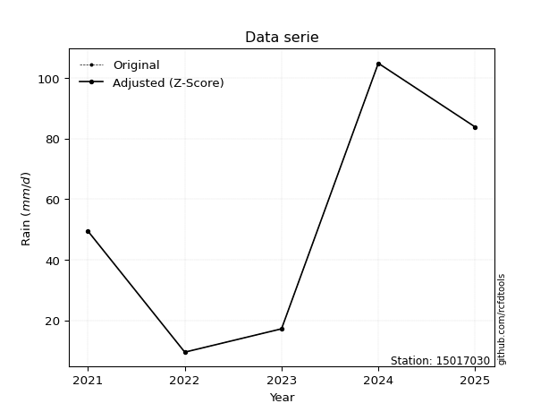</img>

</div>

> If Z-Score is active, values out of range or outliers are replaced with the station mean value.


### 4. Active continuous probability distributions from SciPy (45 of 104 available)

[scipy.stats](https://docs.scipy.org/doc/scipy/reference/stats.html) is a Python´s powerful submodule within the SciPy library for comprehensive statistical analysis, offering over 130 probability distributions (like Normal, Poisson), functions for descriptive stats (mean, variance), hypothesis testing (t-tests, chi-square), random variable generation, and statistical tests, making it essential for data science, modeling, and research. It provides tools to explore, model, and draw conclusions from data efficiently, working seamlessly with NumPy.

<div align="center">

|   id | p_dist             |   n_parameter | fit_method   | label                                                                       | active   | ref                                                                                                        |
|-----:|:-------------------|--------------:|:-------------|:----------------------------------------------------------------------------|:---------|:-----------------------------------------------------------------------------------------------------------|
|    0 | alpha              |             3 | MLE          | Alpha                                                                       | True     | [:mortar_board:](https://docs.scipy.org/doc/scipy/reference/generated/scipy.stats.alpha.html)              |
|    1 | betaprime          |             4 | MLE          | Beta prime                                                                  | True     | [:mortar_board:](https://docs.scipy.org/doc/scipy/reference/generated/scipy.stats.betaprime.html)          |
|    2 | chi2               |             3 | MLE          | Chi²                                                                        | True     | [:mortar_board:](https://docs.scipy.org/doc/scipy/reference/generated/scipy.stats.chi2.html)               |
|    3 | crystalball        |             4 | MLE          | Crystalball                                                                 | True     | [:mortar_board:](https://docs.scipy.org/doc/scipy/reference/generated/scipy.stats.crystalball.html)        |
|    4 | erlang             |             3 | MLE          | Erlang                                                                      | True     | [:mortar_board:](https://docs.scipy.org/doc/scipy/reference/generated/scipy.stats.erlang.html)             |
|    5 | expon              |             2 | MLE          | Exponential                                                                 | True     | [:mortar_board:](https://docs.scipy.org/doc/scipy/reference/generated/scipy.stats.expon.html)              |
|    6 | exponnorm          |             3 | MLE          | Exponentially modified Normal                                               | True     | [:mortar_board:](https://docs.scipy.org/doc/scipy/reference/generated/scipy.stats.exponnorm.html)          |
|    7 | f                  |             4 | MLE          | F                                                                           | True     | [:mortar_board:](https://docs.scipy.org/doc/scipy/reference/generated/scipy.stats.f.html)                  |
|    8 | fatiguelife        |             3 | MLE          | Fatigue-life (Birnbaum-Saunders)                                            | True     | [:mortar_board:](https://docs.scipy.org/doc/scipy/reference/generated/scipy.stats.fatiguelife.html)        |
|    9 | fisk               |             3 | MLE          | Fisk                                                                        | True     | [:mortar_board:](https://docs.scipy.org/doc/scipy/reference/generated/scipy.stats.fisk.html)               |
|   10 | gamma              |             3 | MLE          | Gamma                                                                       | True     | [:mortar_board:](https://docs.scipy.org/doc/scipy/reference/generated/scipy.stats.gamma.html)              |
|   11 | genexpon           |             5 | MLE          | Generalized exponential                                                     | True     | [:mortar_board:](https://docs.scipy.org/doc/scipy/reference/generated/scipy.stats.genexpon.html)           |
|   12 | genlogistic        |             3 | MLE          | Generalized logistic                                                        | True     | [:mortar_board:](https://docs.scipy.org/doc/scipy/reference/generated/scipy.stats.genlogistic.html)        |
|   13 | gibrat             |             2 | MM           | Gibrat                                                                      | True     | [:mortar_board:](https://docs.scipy.org/doc/scipy/reference/generated/scipy.stats.gibrat.html)             |
|   14 | gompertz           |             3 | MLE          | Gompertz (or truncated Gumbel)                                              | True     | [:mortar_board:](https://docs.scipy.org/doc/scipy/reference/generated/scipy.stats.gompertz.html)           |
|   15 | gumbel_l           |             2 | MM           | Gumbel Left Skew                                                            | True     | [:mortar_board:](https://docs.scipy.org/doc/scipy/reference/generated/scipy.stats.gumbel_l.html)           |
|   16 | gumbel_r           |             2 | MM           | Gumbel Right Skew                                                           | True     | [:mortar_board:](https://docs.scipy.org/doc/scipy/reference/generated/scipy.stats.gumbel_r.html)           |
|   17 | halflogistic       |             2 | MM           | Half-logistic                                                               | True     | [:mortar_board:](https://docs.scipy.org/doc/scipy/reference/generated/scipy.stats.halflogistic.html)       |
|   18 | halfnorm           |             2 | MM           | Half Normal                                                                 | True     | [:mortar_board:](https://docs.scipy.org/doc/scipy/reference/generated/scipy.stats.halfnorm.html)           |
|   19 | hypsecant          |             2 | MM           | hyperbolic secant                                                           | True     | [:mortar_board:](https://docs.scipy.org/doc/scipy/reference/generated/scipy.stats.hypsecant.html)          |
|   20 | invgamma           |             3 | MLE          | Inverted gamma                                                              | True     | [:mortar_board:](https://docs.scipy.org/doc/scipy/reference/generated/scipy.stats.invgamma.html)           |
|   21 | invgauss           |             3 | MLE          | Inverse Gaussian                                                            | True     | [:mortar_board:](https://docs.scipy.org/doc/scipy/reference/generated/scipy.stats.invgauss.html)           |
|   22 | invweibull         |             3 | MLE          | Inverted Weibull                                                            | True     | [:mortar_board:](https://docs.scipy.org/doc/scipy/reference/generated/scipy.stats.invweibull.html)         |
|   23 | johnsonsu          |             4 | MLE          | Johnson Su                                                                  | True     | [:mortar_board:](https://docs.scipy.org/doc/scipy/reference/generated/scipy.stats.johnsonsu.html)          |
|   24 | kstwobign          |             2 | MLE          | Limiting distribution of scaled Kolmogorov-Smirnov two-sided test statistic | True     | [:mortar_board:](https://docs.scipy.org/doc/scipy/reference/generated/scipy.stats.kstwobign.html)          |
|   25 | laplace            |             2 | MM           | Laplace                                                                     | True     | [:mortar_board:](https://docs.scipy.org/doc/scipy/reference/generated/scipy.stats.laplace.html)            |
|   26 | laplace_asymmetric |             3 | MLE          | Asymmetric Laplace                                                          | True     | [:mortar_board:](https://docs.scipy.org/doc/scipy/reference/generated/scipy.stats.laplace_asymmetric.html) |
|   27 | loggamma           |             3 | MLE          | Log gamma                                                                   | True     | [:mortar_board:](https://docs.scipy.org/doc/scipy/reference/generated/scipy.stats.loggamma.html)           |
|   28 | logistic           |             2 | MM           | Logistic (or Sech-squared)                                                  | True     | [:mortar_board:](https://docs.scipy.org/doc/scipy/reference/generated/scipy.stats.logistic.html)           |
|   29 | lognorm            |             3 | MLE          | Log Normal                                                                  | True     | [:mortar_board:](https://docs.scipy.org/doc/scipy/reference/generated/scipy.stats.lognorm.html)            |
|   30 | maxwell            |             2 | MM           | Maxwell                                                                     | True     | [:mortar_board:](https://docs.scipy.org/doc/scipy/reference/generated/scipy.stats.maxwell.html)            |
|   31 | mielke             |             4 | MLE          | Mielke Beta-Kappa / Dagum                                                   | True     | [:mortar_board:](https://docs.scipy.org/doc/scipy/reference/generated/scipy.stats.mielke.html)             |
|   32 | moyal              |             2 | MM           | Moyal                                                                       | True     | [:mortar_board:](https://docs.scipy.org/doc/scipy/reference/generated/scipy.stats.moyal.html)              |
|   33 | nakagami           |             3 | MLE          | Nakagami                                                                    | True     | [:mortar_board:](https://docs.scipy.org/doc/scipy/reference/generated/scipy.stats.nakagami.html)           |
|   34 | ncf                |             5 | MLE          | Non-central F distribution                                                  | True     | [:mortar_board:](https://docs.scipy.org/doc/scipy/reference/generated/scipy.stats.ncf.html)                |
|   35 | nct                |             4 | MLE          | Non-central Student’s t                                                     | True     | [:mortar_board:](https://docs.scipy.org/doc/scipy/reference/generated/scipy.stats.nct.html)                |
|   36 | norm               |             2 | MM           | Normal                                                                      | True     | [:mortar_board:](https://docs.scipy.org/doc/scipy/reference/generated/scipy.stats.norm.html)               |
|   37 | pareto             |             3 | MLE          | Pareto                                                                      | True     | [:mortar_board:](https://docs.scipy.org/doc/scipy/reference/generated/scipy.stats.pareto.html)             |
|   38 | pearson3           |             3 | MM           | Pearson type III                                                            | True     | [:mortar_board:](https://docs.scipy.org/doc/scipy/reference/generated/scipy.stats.pearson3.html)           |
|   39 | rayleigh           |             2 | MM           | Rayleigh                                                                    | True     | [:mortar_board:](https://docs.scipy.org/doc/scipy/reference/generated/scipy.stats.rayleigh.html)           |
|   40 | rice               |             3 | MLE          | Rice                                                                        | True     | [:mortar_board:](https://docs.scipy.org/doc/scipy/reference/generated/scipy.stats.rice.html)               |
|   41 | t                  |             3 | MLE          | Student’s t                                                                 | True     | [:mortar_board:](https://docs.scipy.org/doc/scipy/reference/generated/scipy.stats.t.html)                  |
|   42 | truncnorm          |             4 | MLE          | Truncated normal                                                            | True     | [:mortar_board:](https://docs.scipy.org/doc/scipy/reference/generated/scipy.stats.truncnorm.html)          |
|   43 | wald               |             2 | MM           | Wald                                                                        | True     | [:mortar_board:](https://docs.scipy.org/doc/scipy/reference/generated/scipy.stats.wald.html)               |
|   44 | weibull_min        |             3 | MLE          | Weibull minimum                                                             | True     | [:mortar_board:](https://docs.scipy.org/doc/scipy/reference/generated/scipy.stats.weibull_min.html)        |

</div>

> **n_parameter:** # arguments & localization & scale.
>
> **Fit methods:** (MLE) maximum likelihood, (MM) L-moments.
>
>**Inactive:** foldnorm, gennorm, norminvgauss, powernorm, powerlognorm, skewnorm, genextreme, anglit, arcsine, argus, beta, bradford, burr, burr12, cauchy, cosine, halfcauchy, foldcauchy, skewcauchy, wrapcauchy, dgamma, gengamma, exponweib, exponpow, truncexpon, gausshyper, genhalflogistic, genhyperbolic, geninvgauss, halfgennorm, johnsonsb, kappa4, kappa3, ksone, kstwo, loglaplace, levy, levy_l, levy_stable, ncx2, genpareto, truncpareto, lomax, powerlaw, rdist, rel_breitwigner, recipinvgauss, semicircular, studentized_range, trapezoid, triang, truncweibull_min, tukeylambda, uniform, loguniform, vonmises, vonmises_line, weibull_max, dweibull, 


## B. Probability distributions vs. Empirical distributions

A continuous probability distribution (CPD) describes probabilities for variables that can take any value within a range (like rain any time), unlike discrete variables with specific outcomes (like temperature). It uses a Probability Density Function (PDF), a curve where the total area under it equals 1, and the probability of the variable falling within an interval (a to b) is found by calculating the area under the curve between those points. A key feature is that the probability of hitting any single exact value is zero, so probabilities are always expressed for ranges, e.g., $P(a ≤ X ≤ b)$.

<div align="center">

Distributions parameters
|    |   station | p_dist                |   n |             loc |          scale | shape                  | shape1              | shape2             | shape3   |
|---:|----------:|:----------------------|----:|----------------:|---------------:|:-----------------------|:--------------------|:-------------------|:---------|
|  0 |  15017030 | alpha                 |   5 |    -0.0491126   |   18.2187      | 2.397750235432893e-09  |                     |                    |          |
|  1 |  15017030 | betaprime             |   5 |     9.49999     |  952.185       | 0.9303267982131682     | 36.7121832394337    |                    |          |
|  2 |  15017030 | chi2                  |   5 |     9.5         |   23.843       | 1.2270126253071423     |                     |                    |          |
|  3 |  15017030 | crystalball           |   5 |    49.02        |   34.3986      | 33353.919085029134     | 274968.6310466855   |                    |          |
|  4 |  15017030 | erlang                |   5 |     9.5         |   30.0689      | 0.8049003093230268     |                     |                    |          |
|  5 |  15017030 | expon                 |   5 |     9.5         |   39.52        |                        |                     |                    |          |
|  6 |  15017030 | exponnorm             |   5 |     9.44682     |    0.016024    | 2465.6064745681497     |                     |                    |          |
|  7 |  15017030 | f                     |   5 |     3.55511     |   41.3811      | 2.895337641150176      | 64.31348095380926   |                    |          |
|  8 |  15017030 | fatiguelife           |   5 |     9.5         |    0.000786952 | 241.6756439332836      |                     |                    |          |
|  9 |  15017030 | fisk                  |   5 |     9.5         |   26.9939      | 0.5820093455595887     |                     |                    |          |
| 10 |  15017030 | gamma                 |   5 |     9.5         |   43.9546      | 0.2990415736922212     |                     |                    |          |
| 11 |  15017030 | genexpon              |   5 |     9.5         |   60.4841      | 1.4472535391809063     | 0.23128859624736675 | 0.8194698817376178 |          |
| 12 |  15017030 | genlogistic           |   5 |  -155.237       |   27.5515      | 913.3209508502262      |                     |                    |          |
| 13 |  15017030 | gibrat                |   5 |    22.7782      |   15.9165      |                        |                     |                    |          |
| 14 |  15017030 | gompertz              |   5 |     9.5         |  140.554       | 2.731743785441841      |                     |                    |          |
| 15 |  15017030 | gumbel_l              |   5 |    64.5012      |   26.8205      |                        |                     |                    |          |
| 16 |  15017030 | gumbel_r              |   5 |    33.5388      |   26.8205      |                        |                     |                    |          |
| 17 |  15017030 | halflogistic          |   5 |     8.24963     |   29.4096      |                        |                     |                    |          |
| 18 |  15017030 | halfnorm              |   5 |     3.4897      |   57.0638      |                        |                     |                    |          |
| 19 |  15017030 | hypsecant             |   5 |    49.02        |   21.8988      |                        |                     |                    |          |
| 20 |  15017030 | invgamma              |   5 |   -19.7585      |  196.589       | 3.760113983931735      |                     |                    |          |
| 21 |  15017030 | invgauss              |   5 |     1.91458     |   36.247       | 1.2995676456194056     |                     |                    |          |
| 22 |  15017030 | invweibull            |   5 |     0.229181    |   22.1071      | 1.1849361127867502     |                     |                    |          |
| 23 |  15017030 | johnsonsu             |   5 |     9.5         |    4.76639e-09 | -3.4814349905188573    | 0.1982719856589908  |                    |          |
| 24 |  15017030 | kstwobign             |   5 |   -62.2669      |  127.26        |                        |                     |                    |          |
| 25 |  15017030 | laplace               |   5 |    49.02        |   24.3235      |                        |                     |                    |          |
| 26 |  15017030 | laplace_asymmetric    |   5 |    49.4         |   28.5226      | 1.0074496405317115     |                     |                    |          |
| 27 |  15017030 | loggamma              |   5 | -9360.57        | 1299.94        | 1392.45953776635       |                     |                    |          |
| 28 |  15017030 | logistic              |   5 |    49.02        |   18.965       |                        |                     |                    |          |
| 29 |  15017030 | lognorm               |   5 |     9.5         |    0.0195351   | 15.03770278356011      |                     |                    |          |
| 30 |  15017030 | maxwell               |   5 |   -32.4903      |   51.079       |                        |                     |                    |          |
| 31 |  15017030 | mielke                |   5 |    -0.736587    |  113.963       | 0.8784192663868806     | 35.044111016695155  |                    |          |
| 32 |  15017030 | moyal                 |   5 |    29.3487      |   15.4848      |                        |                     |                    |          |
| 33 |  15017030 | nakagami              |   5 |     9.5         |   70.5429      | 0.10824179322741975    |                     |                    |          |
| 34 |  15017030 | ncf                   |   5 |     0.324294    |   34.246       | 3.1044561265615975     | 1181.4059517210162  | 1.3376939829232093 |          |
| 35 |  15017030 | nct                   |   5 |    -0.64359     |    0.258408    | 1.0124196844376916     | 73.56600688024753   |                    |          |
| 36 |  15017030 | norm                  |   5 |    49.02        |   34.3986      |                        |                     |                    |          |
| 37 |  15017030 | pareto                |   5 |     9.14828     |    0.351719    | 0.2698369177424451     |                     |                    |          |
| 38 |  15017030 | pearson3              |   5 |    49.02        |   34.3986      | 0.4083789731229971     |                     |                    |          |
| 39 |  15017030 | rayleigh              |   5 |   -16.7866      |   52.5061      |                        |                     |                    |          |
| 40 |  15017030 | rice                  |   5 |   -10.1755      |   48.0773      | 0.167076541398264      |                     |                    |          |
| 41 |  15017030 | t                     |   5 |    49.0197      |   34.4009      | 962513.3246634059      |                     |                    |          |
| 42 |  15017030 | truncnorm             |   5 |    49.02        |   34.3986      | -166.77835782032275    | 513.8788686919829   |                    |          |
| 43 |  15017030 | wald                  |   5 |    14.6214      |   34.3986      |                        |                     |                    |          |
| 44 |  15017030 | weibull_min           |   5 |     9.5         |   43.0153      | 0.9553388147757356     |                     |                    |          |
| 45 |  15017030 | logalpha              |   5 |   -12.5005      |  285.543       | 17.840807662906215     |                     |                    |          |
| 46 |  15017030 | logbetaprime          |   5 |   -14.7989      |  206.854       | 460.51301315418414     | 5190.2385526996695  |                    |          |
| 47 |  15017030 | logchi2               |   5 |     2.25129     |    0.957351    | 1.0658560123826484     |                     |                    |          |
| 48 |  15017030 | logcrystalball        |   5 |     3.56204     |    0.882565    | 8.859361657707055      | 1.0057347882586272  |                    |          |
| 49 |  15017030 | logerlang             |   5 |   -11.5626      |    0.0527478   | 286.592736316991       |                     |                    |          |
| 50 |  15017030 | logexpon              |   5 |     2.25129     |    1.31075     |                        |                     |                    |          |
| 51 |  15017030 | logexponnorm          |   5 |     3.56177     |    0.882567    | 0.00031443149332620996 |                     |                    |          |
| 52 |  15017030 | logf                  |   5 |  -326.042       |  329.603       | 839539.4823842677      | 414987.8085923032   |                    |          |
| 53 |  15017030 | logfatiguelife        |   5 |  -180.315       |  183.876       | 0.0047956621029130765  |                     |                    |          |
| 54 |  15017030 | logfisk               |   5 |    -2.9874e+07  |    2.9874e+07  | 55161531.335852206     |                     |                    |          |
| 55 |  15017030 | loggamma              |   5 |   -10.8888      |    0.0547469   | 263.9820889734199      |                     |                    |          |
| 56 |  15017030 | loggenexpon           |   5 |     2.25129     |    4.98826e+11 | 278390681662.1478      | 391562150318.2142   | 171815690415.7697  |          |
| 57 |  15017030 | loggenlogistic        |   5 |     4.65232     |    1.59984e-05 | 1.4702283394255988e-05 |                     |                    |          |
| 58 |  15017030 | loggibrat             |   5 |     2.88873     |    0.408386    |                        |                     |                    |          |
| 59 |  15017030 | loggompertz           |   5 |     2.25129     |    1.13331     | 0.31823083323001866    |                     |                    |          |
| 60 |  15017030 | loggumbel_l           |   5 |     3.95924     |    0.688133    |                        |                     |                    |          |
| 61 |  15017030 | loggumbel_r           |   5 |     3.16484     |    0.688133    |                        |                     |                    |          |
| 62 |  15017030 | loghalflogistic       |   5 |     2.51602     |    0.75455     |                        |                     |                    |          |
| 63 |  15017030 | loghalfnorm           |   5 |     2.39389     |    1.46406     |                        |                     |                    |          |
| 64 |  15017030 | loghypsecant          |   5 |     3.56204     |    0.561858    |                        |                     |                    |          |
| 65 |  15017030 | loginvgamma           |   5 |   -10.1994      | 3204.22        | 234.00109158455456     |                     |                    |          |
| 66 |  15017030 | loginvgauss           |   5 |    -2.61602     |  278.898       | 0.022106273314728114   |                     |                    |          |
| 67 |  15017030 | loginvweibull         |   5 |    -3.34339e+07 |    3.34339e+07 | 40025552.73609575      |                     |                    |          |
| 68 |  15017030 | logjohnsonsu          |   5 |     5.12504     |    0.023448    | 7.329071629722375      | 1.5578535518631935  |                    |          |
| 69 |  15017030 | logkstwobign          |   5 |     0.253828    |    3.76585     |                        |                     |                    |          |
| 70 |  15017030 | loglaplace            |   5 |     3.56204     |    0.624068    |                        |                     |                    |          |
| 71 |  15017030 | loglaplace_asymmetric |   5 |     4.162       |    0.587337    | 1.6336863298425643     |                     |                    |          |
| 72 |  15017030 | logloggamma           |   5 |     4.65217     |    8.7128e-06  | 8.003422700331895e-06  |                     |                    |          |
| 73 |  15017030 | loglogistic           |   5 |     3.56204     |    0.486584    |                        |                     |                    |          |
| 74 |  15017030 | loglognorm            |   5 |     2.25129     |    0.00114797  | 14.298378763093263     |                     |                    |          |
| 75 |  15017030 | logmaxwell            |   5 |     1.47073     |    1.31053     |                        |                     |                    |          |
| 76 |  15017030 | logmielke             |   5 |     2.25114     |    2.4324      | 0.8650658788202578     | 142.96984087150528  |                    |          |
| 77 |  15017030 | logmoyal              |   5 |     3.05733     |    0.397294    |                        |                     |                    |          |
| 78 |  15017030 | lognakagami           |   5 |     2.84491     |    1.09018     | 0.41276742895489993    |                     |                    |          |
| 79 |  15017030 | logncf                |   5 |    -1.68804     |    0.177652    | 5.101411328770853      | 789.0899410133936   | 145.31338389215523 |          |
| 80 |  15017030 | lognct                |   5 |   -39.5815      |    0.851898    | 16880.315451054506     | 50.6413378676865    |                    |          |
| 81 |  15017030 | lognorm               |   5 |     3.56204     |    0.882565    |                        |                     |                    |          |
| 82 |  15017030 | logpareto             |   5 |     2.23868     |    0.0126131   | 0.2626844740085877     |                     |                    |          |
| 83 |  15017030 | logpearson3           |   5 |     3.56204     |    0.882571    | -0.31172395536906616   |                     |                    |          |
| 84 |  15017030 | lograyleigh           |   5 |     1.87364     |    1.34715     |                        |                     |                    |          |
| 85 |  15017030 | logrice               |   5 |     1.74364     |    1.02704     | 1.3686142373568175     |                     |                    |          |
| 86 |  15017030 | logt                  |   5 |     3.56205     |    0.882569    | 817593853.7049167      |                     |                    |          |
| 87 |  15017030 | logtruncnorm          |   5 |    -0.0185357   |    1.91503     | 1.4952444387188764     | 27.05890653321102   |                    |          |
| 88 |  15017030 | logwald               |   5 |     2.67949     |    0.882554    |                        |                     |                    |          |
| 89 |  15017030 | logweibull_min        |   5 |    -1.59783e+07 |    1.59783e+07 | 22302124.26088458      |                     |                    |          |

</div>

> **loc** (Location parameter): This shifts the distribution along the x-axis. For many common distributions, like the normal (Gaussian) distribution, loc represents the mean $μ$. For others, like the uniform distribution, it might represent the minimum value, or for the beta distribution, the left end of the support interval.
>
> **scale** (Scale parameter): This determines the width or spread of the distribution. For the normal distribution, scale represents the standard deviation $σ$. For a uniform distribution, it defines the length of the interval (from $loc$ to $loc + scale$).
>
> **shape** (Shape parameters): Refers to parameters that define the specific form of a probability distribution, distinct from its location (loc) and scale (scale). These parameters are required arguments for most distribution functions. For example, a normal (Gaussian) distribution is fully defined by its location (mean) and scale (standard deviation), so it has no specific shape parameters beyond loc and scale. However, other distributions have intrinsic properties that need specification, as Gamma distribution that takes a shape parameter, often named $a$ or $alpha$.


### 0. Cumulative distribution values - CDF (90 evaluated)

> Ordered by x ascending and calculating $log(f(x))$ separately. 

|   id |   Station |   date |     x |   count |   mean |     std |      zscore |   Value_initial |   station |   m |     alpha |   alpha_pdf |   betaprime |   betaprime_pdf |        chi2 |       chi2_pdf |   crystalball |   crystalball_pdf |      erlang |   erlang_pdf |    expon |   expon_pdf |   exponnorm |   exponnorm_pdf |         f |      f_pdf |   fatiguelife |   fatiguelife_pdf |        fisk |        fisk_pdf |       gamma |   gamma_pdf |    genexpon |   genexpon_pdf |   genlogistic |   genlogistic_pdf |   gibrat |   gibrat_pdf |    gompertz |   gompertz_pdf |   gumbel_l |   gumbel_l_pdf |   gumbel_r |   gumbel_r_pdf |   halflogistic |   halflogistic_pdf |   halfnorm |   halfnorm_pdf |   hypsecant |   hypsecant_pdf |   invgamma |   invgamma_pdf |   invgauss |   invgauss_pdf |   invweibull |   invweibull_pdf |   johnsonsu |   johnsonsu_pdf |   kstwobign |   kstwobign_pdf |   laplace |   laplace_pdf |   laplace_asymmetric |   laplace_asymmetric_pdf |   loggamma |   loggamma_pdf |   logistic |   logistic_pdf |   lognorm |   lognorm_pdf |   maxwell |   maxwell_pdf |   mielke |   mielke_pdf |     moyal |   moyal_pdf |    nakagami |   nakagami_pdf |       ncf |    ncf_pdf |       nct |    nct_pdf |     norm |   norm_pdf |      pareto |   pareto_pdf |   pearson3 |   pearson3_pdf |   rayleigh |   rayleigh_pdf |      rice |   rice_pdf |        t |      t_pdf |   truncnorm |   truncnorm_pdf |        wald |   wald_pdf |   weibull_min |   weibull_min_pdf |   logalpha |   logalpha_pdf |   logbetaprime |   logbetaprime_pdf |     logchi2 |   logchi2_pdf |   logcrystalball |   logcrystalball_pdf |   logerlang |   logerlang_pdf |   logexpon |   logexpon_pdf |   logexponnorm |   logexponnorm_pdf |      logf |   logf_pdf |   logfatiguelife |   logfatiguelife_pdf |   logfisk |   logfisk_pdf |   loggenexpon |   loggenexpon_pdf |   loggenlogistic |   loggenlogistic_pdf |   loggibrat |   loggibrat_pdf |   loggompertz |   loggompertz_pdf |   loggumbel_l |   loggumbel_l_pdf |   loggumbel_r |   loggumbel_r_pdf |   loghalflogistic |   loghalflogistic_pdf |   loghalfnorm |   loghalfnorm_pdf |   loghypsecant |   loghypsecant_pdf |   loginvgamma |   loginvgamma_pdf |   loginvgauss |   loginvgauss_pdf |   loginvweibull |   loginvweibull_pdf |   logjohnsonsu |   logjohnsonsu_pdf |   logkstwobign |   logkstwobign_pdf |   loglaplace |   loglaplace_pdf |   loglaplace_asymmetric |   loglaplace_asymmetric_pdf |   logloggamma |   logloggamma_pdf |   loglogistic |   loglogistic_pdf |   loglognorm |   loglognorm_pdf |   logmaxwell |   logmaxwell_pdf |   logmielke |   logmielke_pdf |   logmoyal |   logmoyal_pdf |   lognakagami |   lognakagami_pdf |    logncf |   logncf_pdf |    lognct |   lognct_pdf |   logpareto |   logpareto_pdf |   logpearson3 |   logpearson3_pdf |   lograyleigh |   lograyleigh_pdf |   logrice |   logrice_pdf |      logt |   logt_pdf |   logtruncnorm |   logtruncnorm_pdf |   logwald |   logwald_pdf |   logweibull_min |   logweibull_min_pdf |
|-----:|----------:|-------:|------:|--------:|-------:|--------:|------------:|----------------:|----------:|----:|----------:|------------:|------------:|----------------:|------------:|---------------:|--------------:|------------------:|------------:|-------------:|---------:|------------:|------------:|----------------:|----------:|-----------:|--------------:|------------------:|------------:|----------------:|------------:|------------:|------------:|---------------:|--------------:|------------------:|---------:|-------------:|------------:|---------------:|-----------:|---------------:|-----------:|---------------:|---------------:|-------------------:|-----------:|---------------:|------------:|----------------:|-----------:|---------------:|-----------:|---------------:|-------------:|-----------------:|------------:|----------------:|------------:|----------------:|----------:|--------------:|---------------------:|-------------------------:|-----------:|---------------:|-----------:|---------------:|----------:|--------------:|----------:|--------------:|---------:|-------------:|----------:|------------:|------------:|---------------:|----------:|-----------:|----------:|-----------:|---------:|-----------:|------------:|-------------:|-----------:|---------------:|-----------:|---------------:|----------:|-----------:|---------:|-----------:|------------:|----------------:|------------:|-----------:|--------------:|------------------:|-----------:|---------------:|---------------:|-------------------:|------------:|--------------:|-----------------:|---------------------:|------------:|----------------:|-----------:|---------------:|---------------:|-------------------:|----------:|-----------:|-----------------:|---------------------:|----------:|--------------:|--------------:|------------------:|-----------------:|---------------------:|------------:|----------------:|--------------:|------------------:|--------------:|------------------:|--------------:|------------------:|------------------:|----------------------:|--------------:|------------------:|---------------:|-------------------:|--------------:|------------------:|--------------:|------------------:|----------------:|--------------------:|---------------:|-------------------:|---------------:|-------------------:|-------------:|-----------------:|------------------------:|----------------------------:|--------------:|------------------:|--------------:|------------------:|-------------:|-----------------:|-------------:|-----------------:|------------:|----------------:|-----------:|---------------:|--------------:|------------------:|----------:|-------------:|----------:|-------------:|------------:|----------------:|--------------:|------------------:|--------------:|------------------:|----------:|--------------:|----------:|-----------:|---------------:|-------------------:|----------:|--------------:|-----------------:|---------------------:|
|    0 |  15017030 |   2022 |   9.5 |       5 |  49.02 | 38.4588 | -1.02759    |             9.5 |  15017030 |   1 | 0.0564046 |  0.0258286  | 1.08378e-06 |     0.103289    | 9.30925e-11 | 32151.7        |      0.125302 |        0.00599445 | 9.28681e-14 | 42.0803      | 0        |  0.0253036  |  0.00134505 |      0.0252653  | 0.0714678 | 0.0159049  |     0.0432843 |       1.71594e+07 | 3.82014e-10 | 125164          | 1.39501e-05 | 2.34844e+09 | 1.98495e-14 |     0.0239278  |     0.0994074 |        0.00831878 | 0        |   0          | 8.70015e-15 |     0.0194355  |   0.120712 |     0.00421745 |  0.0862521 |     0.00788051 |      0.0212546 |         0.0169936  |  0.0838829 |     0.013905   |    0.103813 |      0.00465698 |  0.0792966 |     0.0119004  |  0.0593056 |     0.0213901  |    0.0607894 |       0.0217578  | 0.000404086 | 49418.9         |   0.0918584 |      0.00865061 | 0.0984789 |    0.00404871 |             0.125644 |               0.00437251 |  0.0666096 |       0.154813 |   0.110677 |     0.00518998 | 0.0687508 |      0.150038 |  0.121117 |    0.00752947 | 0.120404 |   0.010332   | 0.0576696 |  0.00807101 | 0.000211467 |    2.57713e+10 | 0.0823382 | 0.0126252  | 0.0604896 | 0.0254659  | 0.125302 | 0.00599445 | 1.11022e-16 |  0.767194    |   0.118226 |     0.00688321 |   0.117785 |     0.00841181 | 0.0792633 | 0.007729   | 0.12532  | 0.00599464 |    0.125302 |      0.00599445 | 0           | 0          |   2.22659e-16 |        0.119748   |  0.0648017 |       0.165978 |      0.0686757 |           0.156334 | 5.24303e-09 |   6.29189e+06 |        0.0687508 |             0.150038 |   0.0689274 |        0.157808 |   0        |       0.762922 |      0.0687505 |           0.150037 | 0.0687846 |   0.150428 |        0.0680546 |             0.150063 | 0.0744108 |      0.127174 |   9.17017e-15 |          0.558091 |         0        |             0.101166 |    0        |       0         |   8.17982e-10 |          0.280798 |     0.0801782 |          0.111714 |     0.0230086 |          0.126118 |          0        |              0        |      0        |          0        |      0.0615694 |           0.1089   |     0.0667925 |          0.164247 |     0.0637243 |          0.174239 |       0.0610537 |            0.204362 |       0.107145 |           0.10002  |      0.0588925 |           0.229092 |    0.0612079 |        0.0980789 |               0.0993078 |                    0.103497 |      0.110206 |          0.101234 |     0.0633413 |          0.12193  |    0.0228107 |       8.5219e+12 |    0.0505759 |         0.180874 |  0.00023325 |        1.31089  | 0.00582003 |      0.0617883 |   0           |          0        | 0.0608187 |     0.159732 | 0.0688268 |     0.150602 | 1.11022e-16 |      20.8263    |     0.0756495 |          0.140596 |     0.0385311 |          0.200075 | 0.0476474 |      0.186606 | 0.0687501 |   0.150037 |    0           |           0        | 0         |     0         |        0.0851244 |             0.113608 |
|    1 |  15017030 |   2023 |  17.2 |       5 |  49.02 | 38.4588 | -0.827378   |            17.2 |  15017030 |   2 | 0.290871  |  0.0279691  | 0.287872    |     0.0296158   | 0.343662    |     0.0247452  |      0.177473 |        0.00756062 | 0.320415    |  0.02898     | 0.177032 |  0.0208241  |  0.178184   |      0.0208008  | 0.203122  | 0.017462   |     0.658824  |       0.00975219  | 0.32518     |      0.0165864  | 0.636312    | 0.0215695   | 0.169501    |     0.0201867  |     0.174435  |        0.0110451  | 0        |   0          | 0.142581    |     0.0176028  |   0.157535 |     0.00538461 |  0.158986  |     0.0109008  |      0.151004  |         0.0166136  |  0.189873  |     0.0135845  |    0.14625  |      0.00644592 |  0.189005  |     0.0158686  |  0.245551  |     0.0233971  |    0.254633  |       0.0243204  | 0.805088    |     0.00709745  |   0.16964   |      0.0113734  | 0.135153  |    0.00555648 |             0.164255 |               0.00571619 |  0.211605  |       0.336696 |   0.157383 |     0.00699255 | 0.208237  |      0.324932 |  0.185773 |    0.00920991 | 0.197065 |   0.00965097 | 0.138781  |  0.0127499  | 0.513254    |    0.0144132   | 0.187683  | 0.0142964  | 0.287525  | 0.0272136  | 0.177473 | 0.00756062 | 0.57036     |  0.0143985   |   0.178417 |     0.00872283 |   0.189003 |     0.00999788 | 0.147742  | 0.00995402 | 0.177492 | 0.00756061 |    0.177473 |      0.00756062 | 0.000683098 | 0.00187657 |   0.175767    |        0.0197675  |  0.221574  |       0.360508 |      0.213906  |           0.335839 | 0.544121    |   0.397363    |        0.208237  |             0.324932 |   0.215428  |        0.338249 |   0.364208 |       0.48506  |      0.208236  |           0.324931 | 0.208544  |   0.325282 |        0.20796   |             0.326228 | 0.193921  |      0.288632 |   0.31329     |          0.482926 |         0        |             0.174563 |    0        |       0         |   0.196739    |          0.380829 |     0.179651  |          0.236074 |     0.203539  |          0.470859 |          0.214551 |              0.632144 |      0.241964 |          0.519724 |      0.173243  |           0.29334  |     0.220547  |          0.353378 |     0.228189  |          0.374067 |       0.253158  |            0.416339 |       0.189049 |           0.184823 |      0.26897   |           0.43723  |    0.158457  |        0.25391   |               0.184358  |                    0.192135 |      0.190117 |          0.174638 |     0.186364  |          0.311627 |    0.66894   |       0.0427219  |    0.222801  |         0.386305 |  0.295271   |        0.43018  | 0.191388   |      0.558796  |   1.54392e-13 |        287.005    | 0.214235  |     0.356965 | 0.208782  |     0.325769 | 0.638413    |       0.156679  |     0.202695  |          0.295248 |     0.228876  |          0.412698 | 0.216842  |      0.372029 | 0.208235  |   0.324929 |    1.97515e-09 |           1.01023  | 0.0527762 |     0.957103  |        0.184322  |             0.231954 |
|    2 |  15017030 |   2021 |  49.4 |       5 |  49.02 | 38.4588 |  0.00988069 |            49.4 |  15017030 |   3 | 0.71255   |  0.00555475 | 0.799979    |     0.00762673  | 0.750916    |     0.00666945 |      0.504407 |        0.0115969  | 0.80262     |  0.0072049   | 0.635641 |  0.00921961 |  0.636235   |      0.00920719 | 0.64871   | 0.00960378 |     0.824251  |       0.00301788  | 0.556614    |      0.00359992 | 0.903742    | 0.00327239  | 0.628213    |     0.00948975 |     0.580994  |        0.0114474  | 0.696506 |   0.0131286  | 0.592105    |     0.01053    |   0.434175 |     0.012014   |  0.574899  |     0.0118656  |      0.604119  |         0.0107965  |  0.578917  |     0.0101163  |    0.505523 |      0.0145333  |  0.633739  |     0.00956605 |  0.687709  |     0.00733998 |    0.678541  |       0.00634136 | 0.882214    |     0.00098106  |   0.575418  |      0.0113608  | 0.507751  |    0.0202376  |             0.503711 |               0.0175295  |  0.653948  |       0.408325 |   0.505009 |     0.0131809  | 0.649092  |      0.42008  |  0.537276 |    0.0111058  | 0.486126 |   0.00851718 | 0.600711  |  0.0117581  | 0.730471    |    0.00384126  | 0.598406  | 0.00999994 | 0.707229  | 0.0056411  | 0.504407 | 0.0115969  | 0.721698    |  0.00186567  |   0.531546 |     0.0115307  |   0.548191 |     0.0108469  | 0.530997  | 0.0119216  | 0.504411 | 0.0115961  |    0.504407 |      0.0115969  | 0.672473    | 0.0114074  |   0.605721    |        0.0087861  |  0.666454  |       0.386093 |      0.654668  |           0.407463 | 0.795656    |   0.142128    |        0.649092  |             0.42008  |   0.656722  |        0.405636 |   0.715721 |       0.216883 |      0.64909   |           0.42008  | 0.648792  |   0.418802 |        0.649573  |             0.41946  | 0.627936  |      0.431396 |   0.706785    |          0.263363 |         0        |             0.460288 |    0.817718 |       0.261543  |   0.648257    |          0.423058 |     0.600461  |          0.53268  |     0.70921   |          0.354128 |          0.724502 |              0.314821 |      0.696373 |          0.321067 |      0.68084   |           0.477534 |     0.66391   |          0.391889 |     0.672575  |          0.373775 |       0.678086  |            0.315359 |       0.53437  |           0.505327 |      0.694352  |           0.310917 |    0.709051  |        0.466213  |               0.553591  |                    0.576943 |      0.501088 |          0.460291 |     0.666956  |          0.4565   |    0.694424  |       0.0148717  |    0.670825  |         0.375352 |  0.714368   |        0.3748   | 0.729116   |      0.3275    |   0.684733    |          0.404999 | 0.663255  |     0.395222 | 0.649506  |     0.41891  | 0.722534    |       0.0438736 |     0.632513  |          0.444474 |     0.677364  |          0.360237 | 0.661777  |      0.3898   | 0.649088  |   0.42008  |    0.69789     |           0.380852 | 0.785502  |     0.263619  |        0.588689  |             0.510032 |
|    3 |  15017030 |   2025 |  64.2 |       5 |  49.02 | 38.4588 |  0.394708   |            64.2 |  15017030 |   4 | 0.776745  |  0.0033827  | 0.885544    |     0.00427281  | 0.8308      |     0.00432858 |      0.670501 |        0.0105216  | 0.884368    |  0.00414129  | 0.749453 |  0.00633975 |  0.749888   |      0.00633053 | 0.766884  | 0.006527   |     0.862339  |       0.00219418  | 0.601339    |      0.00255074 | 0.940647    | 0.00187324  | 0.745968    |     0.00658689 |     0.728057  |        0.00838528 | 0.830578 |   0.00609584 | 0.727374    |     0.00781949 |   0.627989 |     0.0137155  |  0.727023  |     0.00864163 |      0.740338  |         0.00768287 |  0.712627  |     0.0079395  |    0.704843 |      0.0116281  |  0.749386  |     0.00627275 |  0.775262  |     0.00474071 |    0.75282   |       0.00395927 | 0.894109    |     0.000663146 |   0.723256  |      0.00857484 | 0.732125  |    0.011013   |             0.705757 |               0.010393   |  0.753139  |       0.345361 |   0.690065 |     0.0112774  | 0.751682  |      0.35877  |  0.68988  |    0.00932994 | 0.610134 |   0.0082535  | 0.745527  |  0.00793238 | 0.779829    |    0.00291001  | 0.725968  | 0.00730605 | 0.772564  | 0.00344957 | 0.670501 | 0.0105216  | 0.744246    |  0.00125358  |   0.69017  |     0.00967126 |   0.695637 |     0.00894099 | 0.692748  | 0.00975066 | 0.670494 | 0.010521   |    0.670501 |      0.0105216  | 0.798586    | 0.00626468 |   0.715797    |        0.00624457 |  0.759271  |       0.320251 |      0.753709  |           0.34504  | 0.829291    |   0.115695    |        0.751682  |             0.35877  |   0.755208  |        0.342743 |   0.767235 |       0.177582 |      0.75168   |           0.35877  | 0.751069  |   0.357721 |        0.751934  |             0.357716 | 0.732481  |      0.361821 |   0.769459    |          0.215921 |         0        |             0.585623 |    0.872259 |       0.164134  |   0.753269    |          0.373955 |     0.73885   |          0.509546 |     0.790741  |          0.269794 |          0.797135 |              0.241585 |      0.772828 |          0.26283  |      0.789213  |           0.348336 |     0.758428  |          0.327051 |     0.762117  |          0.308144 |       0.752863  |            0.255853 |       0.67764  |           0.580087 |      0.768332  |           0.254174 |    0.808816  |        0.306351  |               0.727441  |                    0.758126 |      0.637465 |          0.585564 |     0.774345  |          0.359106 |    0.698031  |       0.0127642  |    0.761049  |         0.311723 |  0.811591   |        0.367415 | 0.803349   |      0.242415  |   0.778737    |          0.313967 | 0.758408  |     0.328631 | 0.751773  |     0.357546 | 0.733007    |       0.0364654 |     0.743104  |          0.393433 |     0.763721  |          0.297934 | 0.756279  |      0.328998 | 0.751678  |   0.358771 |    0.784687    |           0.28516  | 0.842921  |     0.180944  |        0.722169  |             0.496659 |
|    4 |  15017030 |   2024 | 104.8 |       5 |  49.02 | 38.4588 |  1.45038    |           104.8 |  15017030 |   5 | 0.862053  |  0.00130248 | 0.973911    |     0.000928263 | 0.937825    |     0.00149074 |      0.947553 |        0.00311443 | 0.972398    |  0.000963156 | 0.910314 |  0.00226939 |  0.910495   |      0.00226543 | 0.92615   | 0.00209811 |     0.925054  |       0.00106883  | 0.675717    |      0.00133822 | 0.982244    | 0.000504009 | 0.912848    |     0.00232698 |     0.929861  |        0.0024542  | 0.949459 |   0.00126825 | 0.929333    |     0.0027057  |   0.988814 |     0.00187396 |  0.932244  |     0.00243869 |      0.927679  |         0.00237018 |  0.924166  |     0.00289155 |    0.950252 |      0.00226248 |  0.90122   |     0.00205811 |  0.89584   |     0.00179781 |    0.853335  |       0.00153361 | 0.912887    |     0.000329746 |   0.936311  |      0.00262775 | 0.949531  |    0.00207489 |             0.929869 |               0.00247711 |  0.887797  |       0.204291 |   0.949847 |     0.0025119  | 0.891594  |      0.210833 |  0.934918 |    0.0030462  | 0.933217 |   0.00727461 | 0.930287  |  0.00224528 | 0.868721    |    0.00164989  | 0.913341  | 0.00257779 | 0.859718  | 0.00133227 | 0.947553 | 0.00311443 | 0.779665    |  0.000621572 |   0.937881 |     0.00294377 |   0.931516 |     0.00302033 | 0.940413  | 0.00292369 | 0.947542 | 0.00311472 |    0.947553 |      0.00311443 | 0.935193    | 0.00165471 |   0.882129    |        0.00252646 |  0.883675  |       0.189923 |      0.888319  |           0.204258 | 0.87675     |   0.0805101   |        0.891594  |             0.210833 |   0.88878   |        0.202564 |   0.839842 |       0.122188 |      0.891593  |           0.210834 | 0.890709  |   0.210823 |        0.891357  |             0.2101   | 0.871256  |      0.207117 |   0.856613    |          0.143347 |         0.999755 |             0.91876  |    0.928231 |       0.0776183 |   0.902574    |          0.227543 |     0.935224  |          0.257625 |     0.891203  |          0.149174 |          0.888643 |              0.139364 |      0.877023 |          0.165879 |      0.909138  |           0.159529 |     0.885632  |          0.193839 |     0.881964  |          0.184061 |       0.853949  |            0.161406 |       0.941566 |           0.383825 |      0.86935   |           0.161942 |    0.912819  |        0.139698  |               0.93026   |                    0.193983 |      0.999896 |          0.918485 |     0.903796  |          0.178692 |    0.703576  |       0.0100737  |    0.883054  |         0.188458 |  0.987931   |        0.308112 | 0.893091   |      0.133739  |   0.896571    |          0.174576 | 0.885873  |     0.193682 | 0.891232  |     0.210318 | 0.748461    |       0.0273789 |     0.898263  |          0.232352 |     0.880785  |          0.182514 | 0.885575  |      0.199087 | 0.891591  |   0.210836 |    0.890755    |           0.157856 | 0.908211  |     0.0961692 |        0.920989  |             0.279914 |

An Empirical Distribution Function (EDF) is a step-function estimate of a true cumulative distribution function (CDF) based on observed sample data, representing the proportion of data points less than or equal to a given value. It is calculated by ordering your data and jumping up by $1/n$ (where $n$ is sample size) at each unique data point, allowing analysis without assuming an underlying population distribution, and it gets closer to the true CDF as the sample size grows.


### 1. Empirical - EDF California (1923)

California´s estimates the true probability distribution of water-related data (like rainfall, streamflow) using observed samples, crucial for risk assessment.

<div align="center">


$P=m/n$


</div>


**1.1. Empirical values**

<div align="center">

|                | 0              | 1                  | 2              | 3                 | 4              |
|:---------------|:---------------|:-------------------|:---------------|:------------------|:---------------|
| date           | 2022           | 2023               | 2021           | 2025              | 2024           |
| x              | 9.5            | 17.2               | 49.4           | 64.2              | 104.8          |
| m              | 1              | 2                  | 3              | 4                 | 5              |
| empirical_dist | edf_california | edf_california     | edf_california | edf_california    | edf_california |
| empirical      | 0.2            | 0.4                | 0.6            | 0.8               | 1.0            |
| empirical_tr   | 1.25           | 1.6666666666666667 | 2.5            | 5.000000000000001 | inf            |

</div>


**1.2. Kolmogorov-Smirnov fit test (sorted by Δ)**


<div align="center">

|                | 0                   | 1                  | 2                   | 3                  | 4                   | 5                  | 6                   | 7                   | 8                   | 9                  | 10                  | 11                  | 12                  | 13                  | 14                  | 15                  | 16                  | 17                  | 18                 | 19                 | 20                 | 21                  | 22                  | 23                  | 24                  | 25                  | 26                 | 27                  | 28                 | 29                  | 30                 | 31                  | 32                  | 33                  | 34                 | 35                 | 36                 | 37                 | 38                 | 39                 | 40                  | 41                 | 42                  | 43                  | 44                  | 45                  | 46                  | 47                  | 48                  | 49                  | 50                    | 51                  | 52                 | 53                 | 54                 | 55                  | 56                 | 57                  | 58                  | 59                  | 60                  | 61                  | 62                 | 63                  | 64                  | 65                 | 66                 | 67                  | 68                  | 69                  | 70                 | 71                  | 72                 | 73                  | 74                  | 75                  | 76                 | 77                 | 78                  | 79                  | 80                 | 81                 | 82                  | 83                  | 84                 | 85                  | 86                 | 87                 | 88                  | 89                 |
|:---------------|:--------------------|:-------------------|:--------------------|:-------------------|:--------------------|:-------------------|:--------------------|:--------------------|:--------------------|:-------------------|:--------------------|:--------------------|:--------------------|:--------------------|:--------------------|:--------------------|:--------------------|:--------------------|:-------------------|:-------------------|:-------------------|:--------------------|:--------------------|:--------------------|:--------------------|:--------------------|:-------------------|:--------------------|:-------------------|:--------------------|:-------------------|:--------------------|:--------------------|:--------------------|:-------------------|:-------------------|:-------------------|:-------------------|:-------------------|:-------------------|:--------------------|:-------------------|:--------------------|:--------------------|:--------------------|:--------------------|:--------------------|:--------------------|:--------------------|:--------------------|:----------------------|:--------------------|:-------------------|:-------------------|:-------------------|:--------------------|:-------------------|:--------------------|:--------------------|:--------------------|:--------------------|:--------------------|:-------------------|:--------------------|:--------------------|:-------------------|:-------------------|:--------------------|:--------------------|:--------------------|:-------------------|:--------------------|:-------------------|:--------------------|:--------------------|:--------------------|:-------------------|:-------------------|:--------------------|:--------------------|:-------------------|:-------------------|:--------------------|:--------------------|:-------------------|:--------------------|:-------------------|:-------------------|:--------------------|:-------------------|
| station        | 15017030            | 15017030           | 15017030            | 15017030           | 15017030            | 15017030           | 15017030            | 15017030            | 15017030            | 15017030           | 15017030            | 15017030            | 15017030            | 15017030            | 15017030            | 15017030            | 15017030            | 15017030            | 15017030           | 15017030           | 15017030           | 15017030            | 15017030            | 15017030            | 15017030            | 15017030            | 15017030           | 15017030            | 15017030           | 15017030            | 15017030           | 15017030            | 15017030            | 15017030            | 15017030           | 15017030           | 15017030           | 15017030           | 15017030           | 15017030           | 15017030            | 15017030           | 15017030            | 15017030            | 15017030            | 15017030            | 15017030            | 15017030            | 15017030            | 15017030            | 15017030              | 15017030            | 15017030           | 15017030           | 15017030           | 15017030            | 15017030           | 15017030            | 15017030            | 15017030            | 15017030            | 15017030            | 15017030           | 15017030            | 15017030            | 15017030           | 15017030           | 15017030            | 15017030            | 15017030            | 15017030           | 15017030            | 15017030           | 15017030            | 15017030            | 15017030            | 15017030           | 15017030           | 15017030            | 15017030            | 15017030           | 15017030           | 15017030            | 15017030            | 15017030           | 15017030            | 15017030           | 15017030           | 15017030            | 15017030           |
| empirical_dist | edf_california      | edf_california     | edf_california      | edf_california     | edf_california      | edf_california     | edf_california      | edf_california      | edf_california      | edf_california     | edf_california      | edf_california      | edf_california      | edf_california      | edf_california      | edf_california      | edf_california      | edf_california      | edf_california     | edf_california     | edf_california     | edf_california      | edf_california      | edf_california      | edf_california      | edf_california      | edf_california     | edf_california      | edf_california     | edf_california      | edf_california     | edf_california      | edf_california      | edf_california      | edf_california     | edf_california     | edf_california     | edf_california     | edf_california     | edf_california     | edf_california      | edf_california     | edf_california      | edf_california      | edf_california      | edf_california      | edf_california      | edf_california      | edf_california      | edf_california      | edf_california        | edf_california      | edf_california     | edf_california     | edf_california     | edf_california      | edf_california     | edf_california      | edf_california      | edf_california      | edf_california      | edf_california      | edf_california     | edf_california      | edf_california      | edf_california     | edf_california     | edf_california      | edf_california      | edf_california      | edf_california     | edf_california      | edf_california     | edf_california      | edf_california      | edf_california      | edf_california     | edf_california     | edf_california      | edf_california      | edf_california     | edf_california     | edf_california      | edf_california      | edf_california     | edf_california      | edf_california     | edf_california     | edf_california      | edf_california     |
| p_dist         | nct                 | logkstwobign       | alpha               | invweibull         | loginvweibull       | invgauss           | lograyleigh         | loginvgauss         | logmaxwell          | logalpha           | loginvgamma         | logrice             | logerlang           | logncf              | logbetaprime        | loggamma            | loggamma            | lognct              | logf               | lognorm            | lognorm            | logcrystalball      | logexponnorm        | logt                | logfatiguelife      | loggumbel_r         | f                  | logpearson3         | logmielke          | nakagami            | betaprime          | logchi2             | chi2                | loggenexpon         | loghalfnorm        | loghalflogistic    | logexpon           | erlang             | mielke             | loggompertz        | logfisk             | logmoyal           | logloggamma         | halfnorm            | logjohnsonsu        | invgamma            | rayleigh            | ncf                 | loglogistic         | maxwell             | loglaplace_asymmetric | logweibull_min      | pareto             | loggumbel_l        | pearson3           | exponnorm           | t                  | truncnorm           | crystalball         | norm                | expon               | weibull_min         | genlogistic        | loghypsecant        | kstwobign           | genexpon           | laplace_asymmetric | gumbel_r            | loglaplace          | gumbel_l            | logistic           | halflogistic        | logpareto          | rice                | hypsecant           | gompertz            | fatiguelife        | moyal              | laplace             | loglognorm          | gamma              | fisk               | logwald             | wald                | logtruncnorm       | lognakagami         | gibrat             | loggibrat          | johnsonsu           | loggenlogistic     |
| delta          | 0.14028247420855444 | 0.1411075343007266 | 0.14359537887597007 | 0.1466649451977009 | 0.14684183204558143 | 0.1544493465253448 | 0.17112394631034764 | 0.17181080427897694 | 0.17719870504042434 | 0.1784262323477272 | 0.17945271114782096 | 0.18315847296536356 | 0.18457234534095596 | 0.18576482998780933 | 0.18609361633181085 | 0.18839485937847755 | 0.18839485937847755 | 0.19121848429049315 | 0.1914559670231764 | 0.1917632440591327 | 0.1917632440591327 | 0.19176324421618965 | 0.19176425618761683 | 0.19176546564750174 | 0.19204034525233282 | 0.19646074507697098 | 0.1968783609982229 | 0.19730527365793307 | 0.1997667502693431 | 0.19978853339579986 | 0.1999989162176858 | 0.19999999475696673 | 0.19999999990690753 | 0.19999999999999085 | 0.2                | 0.2                | 0.2                | 0.2026204569697957 | 0.2029351704441122 | 0.2032611925775548 | 0.20607900936539691 | 0.2086120629491296 | 0.20988281703786327 | 0.21012652053223702 | 0.21095088022517744 | 0.21099452179999262 | 0.21099660969666173 | 0.21231658158419564 | 0.21363593085164767 | 0.21422700059246783 | 0.21564167101533702   | 0.21567754202453296 | 0.2203347539261682 | 0.2203485874908244 | 0.2215834789299236 | 0.22181581879314216 | 0.2225077281554786 | 0.22252654912283706 | 0.22252664119935817 | 0.22252664246763293 | 0.22296792142248656 | 0.22423334744073065 | 0.2255645066122182 | 0.22675712671991072 | 0.23036024739679625 | 0.2304993061832032 | 0.2357449995534695 | 0.24101441058353631 | 0.24154312634467526 | 0.24246520573396654 | 0.2426171506522706 | 0.24899626933983468 | 0.2515393429601289 | 0.25225809726390136 | 0.25375016502102554 | 0.25741902390975513 | 0.2588237585363352 | 0.2612192228582476 | 0.26484687799169826 | 0.29642373866326066 | 0.3037423914816174 | 0.3242829946586443 | 0.34722378239692786 | 0.39931690189142455 | 0.3999999980248493 | 0.39999999999984565 | 0.4                | 0.4                | 0.40508814563632345 | 0.8                |
| deltao         | 0.5865427407550001  | 0.5865427407550001 | 0.5865427407550001  | 0.5865427407550001 | 0.5865427407550001  | 0.5865427407550001 | 0.5865427407550001  | 0.5865427407550001  | 0.5865427407550001  | 0.5865427407550001 | 0.5865427407550001  | 0.5865427407550001  | 0.5865427407550001  | 0.5865427407550001  | 0.5865427407550001  | 0.5865427407550001  | 0.5865427407550001  | 0.5865427407550001  | 0.5865427407550001 | 0.5865427407550001 | 0.5865427407550001 | 0.5865427407550001  | 0.5865427407550001  | 0.5865427407550001  | 0.5865427407550001  | 0.5865427407550001  | 0.5865427407550001 | 0.5865427407550001  | 0.5865427407550001 | 0.5865427407550001  | 0.5865427407550001 | 0.5865427407550001  | 0.5865427407550001  | 0.5865427407550001  | 0.5865427407550001 | 0.5865427407550001 | 0.5865427407550001 | 0.5865427407550001 | 0.5865427407550001 | 0.5865427407550001 | 0.5865427407550001  | 0.5865427407550001 | 0.5865427407550001  | 0.5865427407550001  | 0.5865427407550001  | 0.5865427407550001  | 0.5865427407550001  | 0.5865427407550001  | 0.5865427407550001  | 0.5865427407550001  | 0.5865427407550001    | 0.5865427407550001  | 0.5865427407550001 | 0.5865427407550001 | 0.5865427407550001 | 0.5865427407550001  | 0.5865427407550001 | 0.5865427407550001  | 0.5865427407550001  | 0.5865427407550001  | 0.5865427407550001  | 0.5865427407550001  | 0.5865427407550001 | 0.5865427407550001  | 0.5865427407550001  | 0.5865427407550001 | 0.5865427407550001 | 0.5865427407550001  | 0.5865427407550001  | 0.5865427407550001  | 0.5865427407550001 | 0.5865427407550001  | 0.5865427407550001 | 0.5865427407550001  | 0.5865427407550001  | 0.5865427407550001  | 0.5865427407550001 | 0.5865427407550001 | 0.5865427407550001  | 0.5865427407550001  | 0.5865427407550001 | 0.5865427407550001 | 0.5865427407550001  | 0.5865427407550001  | 0.5865427407550001 | 0.5865427407550001  | 0.5865427407550001 | 0.5865427407550001 | 0.5865427407550001  | 0.5865427407550001 |
| eval           | Δo > Δ              | Δo > Δ             | Δo > Δ              | Δo > Δ             | Δo > Δ              | Δo > Δ             | Δo > Δ              | Δo > Δ              | Δo > Δ              | Δo > Δ             | Δo > Δ              | Δo > Δ              | Δo > Δ              | Δo > Δ              | Δo > Δ              | Δo > Δ              | Δo > Δ              | Δo > Δ              | Δo > Δ             | Δo > Δ             | Δo > Δ             | Δo > Δ              | Δo > Δ              | Δo > Δ              | Δo > Δ              | Δo > Δ              | Δo > Δ             | Δo > Δ              | Δo > Δ             | Δo > Δ              | Δo > Δ             | Δo > Δ              | Δo > Δ              | Δo > Δ              | Δo > Δ             | Δo > Δ             | Δo > Δ             | Δo > Δ             | Δo > Δ             | Δo > Δ             | Δo > Δ              | Δo > Δ             | Δo > Δ              | Δo > Δ              | Δo > Δ              | Δo > Δ              | Δo > Δ              | Δo > Δ              | Δo > Δ              | Δo > Δ              | Δo > Δ                | Δo > Δ              | Δo > Δ             | Δo > Δ             | Δo > Δ             | Δo > Δ              | Δo > Δ             | Δo > Δ              | Δo > Δ              | Δo > Δ              | Δo > Δ              | Δo > Δ              | Δo > Δ             | Δo > Δ              | Δo > Δ              | Δo > Δ             | Δo > Δ             | Δo > Δ              | Δo > Δ              | Δo > Δ              | Δo > Δ             | Δo > Δ              | Δo > Δ             | Δo > Δ              | Δo > Δ              | Δo > Δ              | Δo > Δ             | Δo > Δ             | Δo > Δ              | Δo > Δ              | Δo > Δ             | Δo > Δ             | Δo > Δ              | Δo > Δ              | Δo > Δ             | Δo > Δ              | Δo > Δ             | Δo > Δ             | Δo > Δ              | Δo <= Δ            |
| fit            | 1                   | 1                  | 1                   | 1                  | 1                   | 1                  | 1                   | 1                   | 1                   | 1                  | 1                   | 1                   | 1                   | 1                   | 1                   | 1                   | 1                   | 1                   | 1                  | 1                  | 1                  | 1                   | 1                   | 1                   | 1                   | 1                   | 1                  | 1                   | 1                  | 1                   | 1                  | 1                   | 1                   | 1                   | 1                  | 1                  | 1                  | 1                  | 1                  | 1                  | 1                   | 1                  | 1                   | 1                   | 1                   | 1                   | 1                   | 1                   | 1                   | 1                   | 1                     | 1                   | 1                  | 1                  | 1                  | 1                   | 1                  | 1                   | 1                   | 1                   | 1                   | 1                   | 1                  | 1                   | 1                   | 1                  | 1                  | 1                   | 1                   | 1                   | 1                  | 1                   | 1                  | 1                   | 1                   | 1                   | 1                  | 1                  | 1                   | 1                   | 1                  | 1                  | 1                   | 1                   | 1                  | 1                   | 1                  | 1                  | 1                   | 0                  |
| n              | 5                   | 5                  | 5                   | 5                  | 5                   | 5                  | 5                   | 5                   | 5                   | 5                  | 5                   | 5                   | 5                   | 5                   | 5                   | 5                   | 5                   | 5                   | 5                  | 5                  | 5                  | 5                   | 5                   | 5                   | 5                   | 5                   | 5                  | 5                   | 5                  | 5                   | 5                  | 5                   | 5                   | 5                   | 5                  | 5                  | 5                  | 5                  | 5                  | 5                  | 5                   | 5                  | 5                   | 5                   | 5                   | 5                   | 5                   | 5                   | 5                   | 5                   | 5                     | 5                   | 5                  | 5                  | 5                  | 5                   | 5                  | 5                   | 5                   | 5                   | 5                   | 5                   | 5                  | 5                   | 5                   | 5                  | 5                  | 5                   | 5                   | 5                   | 5                  | 5                   | 5                  | 5                   | 5                   | 5                   | 5                  | 5                  | 5                   | 5                   | 5                  | 5                  | 5                   | 5                   | 5                  | 5                   | 5                  | 5                  | 5                   | 5                  |
| best_fit       | 1                   | 0                  | 0                   | 0                  | 0                   | 0                  | 0                   | 0                   | 0                   | 0                  | 0                   | 0                   | 0                   | 0                   | 0                   | 0                   | 0                   | 0                   | 0                  | 0                  | 0                  | 0                   | 0                   | 0                   | 0                   | 0                   | 0                  | 0                   | 0                  | 0                   | 0                  | 0                   | 0                   | 0                   | 0                  | 0                  | 0                  | 0                  | 0                  | 0                  | 0                   | 0                  | 0                   | 0                   | 0                   | 0                   | 0                   | 0                   | 0                   | 0                   | 0                     | 0                   | 0                  | 0                  | 0                  | 0                   | 0                  | 0                   | 0                   | 0                   | 0                   | 0                   | 0                  | 0                   | 0                   | 0                  | 0                  | 0                   | 0                   | 0                   | 0                  | 0                   | 0                  | 0                   | 0                   | 0                   | 0                  | 0                  | 0                   | 0                   | 0                  | 0                  | 0                   | 0                   | 0                  | 0                   | 0                  | 0                  | 0                   | 0                  |
| best_fit_sort  | 1                   | 2                  | 3                   | 4                  | 5                   | 6                  | 7                   | 8                   | 9                   | 10                 | 11                  | 12                  | 13                  | 14                  | 15                  | 16                  | 17                  | 18                  | 19                 | 20                 | 21                 | 22                  | 23                  | 24                  | 25                  | 26                  | 27                 | 28                  | 29                 | 30                  | 31                 | 32                  | 33                  | 34                  | 35                 | 36                 | 37                 | 38                 | 39                 | 40                 | 41                  | 42                 | 43                  | 44                  | 45                  | 46                  | 47                  | 48                  | 49                  | 50                  | 51                    | 52                  | 53                 | 54                 | 55                 | 56                  | 57                 | 58                  | 59                  | 60                  | 61                  | 62                  | 63                 | 64                  | 65                  | 66                 | 67                 | 68                  | 69                  | 70                  | 71                 | 72                  | 73                 | 74                  | 75                  | 76                  | 77                 | 78                 | 79                  | 80                  | 81                 | 82                 | 83                  | 84                  | 85                 | 86                  | 87                 | 88                 | 89                  | 90                 |

</div>


<div align="center">

</img>

</div>


**1.3. Best fit**

<div align="center">

|   id |   station | empirical_dist   | p_dist   |    delta |   deltao | eval   |   fit |   n |   best_fit |   best_fit_sort |
|-----:|----------:|:-----------------|:---------|---------:|---------:|:-------|------:|----:|-----------:|----------------:|
|    0 |  15017030 | edf_california   | nct      | 0.140282 | 0.586543 | Δo > Δ |     1 |   5 |          1 |               1 |

</div>


<div align="center">

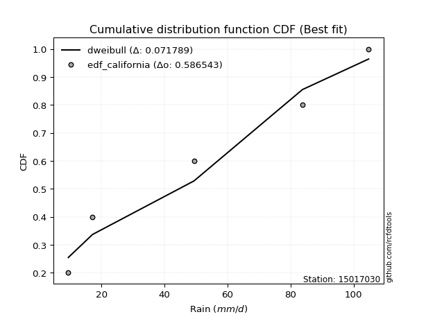</img>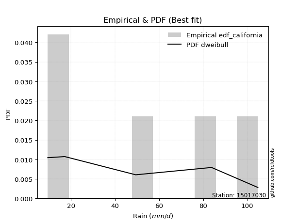</img>

</div>


### 2. Empirical - EDF Hazen (1930)

Hazen method for plotting positions is a formula used to estimate the empirical cumulative probability distribution of flood events or other hydrological data. This formula often results in biased estimations, particularly when extrapolating to extreme events (high return periods).

<div align="center">


$P=(m-0.5)/n$


</div>


**2.1. Empirical values**

<div align="center">

|                | 0                  | 1                  | 2         | 3                 | 4                  |
|:---------------|:-------------------|:-------------------|:----------|:------------------|:-------------------|
| date           | 2022               | 2023               | 2021      | 2025              | 2024               |
| x              | 9.5                | 17.2               | 49.4      | 64.2              | 104.8              |
| m              | 1                  | 2                  | 3         | 4                 | 5                  |
| empirical_dist | edf_hazen          | edf_hazen          | edf_hazen | edf_hazen         | edf_hazen          |
| empirical      | 0.1                | 0.3                | 0.5       | 0.7               | 0.9                |
| empirical_tr   | 1.1111111111111112 | 1.4285714285714286 | 2.0       | 3.333333333333333 | 10.000000000000002 |

</div>


**2.2. Kolmogorov-Smirnov fit test (sorted by Δ)**


<div align="center">

|                | 0                   | 1                   | 2                   | 3                  | 4                  | 5                   | 6                   | 7                     | 8                   | 9                   | 10                  | 11                  | 12                  | 13                  | 14                 | 15                  | 16                  | 17                 | 18                  | 19                  | 20                  | 21                  | 22                  | 23                  | 24                  | 25                  | 26                 | 27                  | 28                 | 29                  | 30                  | 31                  | 32                 | 33                  | 34                 | 35                  | 36                  | 37                  | 38                 | 39                  | 40                  | 41                  | 42                  | 43                  | 44                  | 45                 | 46                  | 47                 | 48                  | 49                  | 50                 | 51                 | 52                  | 53                 | 54                 | 55                  | 56                  | 57                  | 58                  | 59                  | 60                  | 61                 | 62                 | 63                  | 64                  | 65                 | 66                  | 67                  | 68                 | 69                  | 70                  | 71                  | 72                  | 73                  | 74                 | 75                  | 76                 | 77                 | 78                 | 79                 | 80                 | 81                 | 82                  | 83                  | 84                  | 85                  | 86                 | 87                 | 88                 | 89                 |
|:---------------|:--------------------|:--------------------|:--------------------|:-------------------|:-------------------|:--------------------|:--------------------|:----------------------|:--------------------|:--------------------|:--------------------|:--------------------|:--------------------|:--------------------|:-------------------|:--------------------|:--------------------|:-------------------|:--------------------|:--------------------|:--------------------|:--------------------|:--------------------|:--------------------|:--------------------|:--------------------|:-------------------|:--------------------|:-------------------|:--------------------|:--------------------|:--------------------|:-------------------|:--------------------|:-------------------|:--------------------|:--------------------|:--------------------|:-------------------|:--------------------|:--------------------|:--------------------|:--------------------|:--------------------|:--------------------|:-------------------|:--------------------|:-------------------|:--------------------|:--------------------|:-------------------|:-------------------|:--------------------|:-------------------|:-------------------|:--------------------|:--------------------|:--------------------|:--------------------|:--------------------|:--------------------|:-------------------|:-------------------|:--------------------|:--------------------|:-------------------|:--------------------|:--------------------|:-------------------|:--------------------|:--------------------|:--------------------|:--------------------|:--------------------|:-------------------|:--------------------|:-------------------|:-------------------|:-------------------|:-------------------|:-------------------|:-------------------|:--------------------|:--------------------|:--------------------|:--------------------|:-------------------|:-------------------|:-------------------|:-------------------|
| station        | 15017030            | 15017030            | 15017030            | 15017030           | 15017030           | 15017030            | 15017030            | 15017030              | 15017030            | 15017030            | 15017030            | 15017030            | 15017030            | 15017030            | 15017030           | 15017030            | 15017030            | 15017030           | 15017030            | 15017030            | 15017030            | 15017030            | 15017030            | 15017030            | 15017030            | 15017030            | 15017030           | 15017030            | 15017030           | 15017030            | 15017030            | 15017030            | 15017030           | 15017030            | 15017030           | 15017030            | 15017030            | 15017030            | 15017030           | 15017030            | 15017030            | 15017030            | 15017030            | 15017030            | 15017030            | 15017030           | 15017030            | 15017030           | 15017030            | 15017030            | 15017030           | 15017030           | 15017030            | 15017030           | 15017030           | 15017030            | 15017030            | 15017030            | 15017030            | 15017030            | 15017030            | 15017030           | 15017030           | 15017030            | 15017030            | 15017030           | 15017030            | 15017030            | 15017030           | 15017030            | 15017030            | 15017030            | 15017030            | 15017030            | 15017030           | 15017030            | 15017030           | 15017030           | 15017030           | 15017030           | 15017030           | 15017030           | 15017030            | 15017030            | 15017030            | 15017030            | 15017030           | 15017030           | 15017030           | 15017030           |
| empirical_dist | edf_hazen           | edf_hazen           | edf_hazen           | edf_hazen          | edf_hazen          | edf_hazen           | edf_hazen           | edf_hazen             | edf_hazen           | edf_hazen           | edf_hazen           | edf_hazen           | edf_hazen           | edf_hazen           | edf_hazen          | edf_hazen           | edf_hazen           | edf_hazen          | edf_hazen           | edf_hazen           | edf_hazen           | edf_hazen           | edf_hazen           | edf_hazen           | edf_hazen           | edf_hazen           | edf_hazen          | edf_hazen           | edf_hazen          | edf_hazen           | edf_hazen           | edf_hazen           | edf_hazen          | edf_hazen           | edf_hazen          | edf_hazen           | edf_hazen           | edf_hazen           | edf_hazen          | edf_hazen           | edf_hazen           | edf_hazen           | edf_hazen           | edf_hazen           | edf_hazen           | edf_hazen          | edf_hazen           | edf_hazen          | edf_hazen           | edf_hazen           | edf_hazen          | edf_hazen          | edf_hazen           | edf_hazen          | edf_hazen          | edf_hazen           | edf_hazen           | edf_hazen           | edf_hazen           | edf_hazen           | edf_hazen           | edf_hazen          | edf_hazen          | edf_hazen           | edf_hazen           | edf_hazen          | edf_hazen           | edf_hazen           | edf_hazen          | edf_hazen           | edf_hazen           | edf_hazen           | edf_hazen           | edf_hazen           | edf_hazen          | edf_hazen           | edf_hazen          | edf_hazen          | edf_hazen          | edf_hazen          | edf_hazen          | edf_hazen          | edf_hazen           | edf_hazen           | edf_hazen           | edf_hazen           | edf_hazen          | edf_hazen          | edf_hazen          | edf_hazen          |
| p_dist         | mielke              | logloggamma         | halfnorm            | logjohnsonsu       | rayleigh           | ncf                 | maxwell             | loglaplace_asymmetric | logweibull_min      | loggumbel_l         | pearson3            | t                   | truncnorm           | crystalball         | norm               | weibull_min         | genlogistic         | logfisk            | kstwobign           | genexpon            | logpearson3         | invgamma            | expon               | laplace_asymmetric  | exponnorm           | gumbel_r            | gumbel_l           | logistic            | loggompertz        | f                   | logf                | halflogistic        | logt               | logexponnorm        | logcrystalball     | lognorm             | lognorm             | lognct              | logfatiguelife     | rice                | hypsecant           | loggamma            | loggamma            | logbetaprime        | logerlang           | gompertz           | moyal               | logrice            | logncf              | loginvgamma         | laplace            | logalpha           | loglogistic         | logmaxwell         | loginvgauss        | lograyleigh         | loginvweibull       | invweibull          | loghypsecant        | invgauss            | logkstwobign        | loghalfnorm        | loggenexpon        | nct                 | loglaplace          | loggumbel_r        | alpha               | logmielke           | logexpon           | fisk                | loghalflogistic     | logmoyal            | nakagami            | chi2                | pareto             | logwald             | logchi2            | wald               | betaprime          | logtruncnorm       | lognakagami        | gibrat             | erlang              | loggibrat           | logpareto           | fatiguelife         | loglognorm         | gamma              | johnsonsu          | loggenlogistic     |
| delta          | 0.10293517044411216 | 0.10988281703786323 | 0.11012652053223698 | 0.1109508802251774 | 0.1109966096966617 | 0.11231658158419561 | 0.11422700059246779 | 0.11564167101533698   | 0.11567754202453293 | 0.12034858749082436 | 0.12158347892992358 | 0.12250772815547856 | 0.12252654912283703 | 0.12252664119935813 | 0.1225266424676329 | 0.12423334744073061 | 0.12556450661221816 | 0.1279359119709087 | 0.13036024739679622 | 0.13049930618320316 | 0.13251271897464012 | 0.13373882282585348 | 0.13564090926283678 | 0.13574499955346947 | 0.13623467556230806 | 0.14101441058353628 | 0.1424652057339665 | 0.14261715065227057 | 0.1482569764627718 | 0.14871013400965905 | 0.14879177454008974 | 0.14899626933983465 | 0.1490877063581355 | 0.14909030120090982 | 0.149092329974033  | 0.14909233162058055 | 0.14909233162058055 | 0.14950557286966437 | 0.149572514643031  | 0.15225809726390135 | 0.15375016502102548 | 0.15394793292000064 | 0.15394793292000064 | 0.15466784859551996 | 0.15672165051214582 | 0.1574190239097551 | 0.16121922285824758 | 0.161776761244811  | 0.16325520201762334 | 0.16390998640174748 | 0.1648468779916982 | 0.1664535301132486 | 0.16695642281070355 | 0.1708245429411187 | 0.1725754326492075 | 0.17736350360907838 | 0.17808622774144656 | 0.17854148052380603 | 0.18084032873183264 | 0.18770854720933572 | 0.19435203703712955 | 0.1963728532343636 | 0.206784570703743  | 0.20722911353341766 | 0.20905140877603245 | 0.2092100821251347 | 0.21254991733225603 | 0.21436832020050145 | 0.2157206788499998 | 0.22428299465864432 | 0.22450205585577176 | 0.22911582959149768 | 0.23047055255037552 | 0.25091558034956496 | 0.2703598665787617 | 0.28550216189903443 | 0.2956563756845979 | 0.2993169018914245 | 0.2999786263871549 | 0.2999999980248493 | 0.2999999999998456 | 0.3                | 0.30262045696979567 | 0.31771820035534204 | 0.33841270258536743 | 0.35882375853633525 | 0.3689404962628366 | 0.4037423914816174 | 0.5050881456363234 | 0.7                |
| deltao         | 0.5865427407550001  | 0.5865427407550001  | 0.5865427407550001  | 0.5865427407550001 | 0.5865427407550001 | 0.5865427407550001  | 0.5865427407550001  | 0.5865427407550001    | 0.5865427407550001  | 0.5865427407550001  | 0.5865427407550001  | 0.5865427407550001  | 0.5865427407550001  | 0.5865427407550001  | 0.5865427407550001 | 0.5865427407550001  | 0.5865427407550001  | 0.5865427407550001 | 0.5865427407550001  | 0.5865427407550001  | 0.5865427407550001  | 0.5865427407550001  | 0.5865427407550001  | 0.5865427407550001  | 0.5865427407550001  | 0.5865427407550001  | 0.5865427407550001 | 0.5865427407550001  | 0.5865427407550001 | 0.5865427407550001  | 0.5865427407550001  | 0.5865427407550001  | 0.5865427407550001 | 0.5865427407550001  | 0.5865427407550001 | 0.5865427407550001  | 0.5865427407550001  | 0.5865427407550001  | 0.5865427407550001 | 0.5865427407550001  | 0.5865427407550001  | 0.5865427407550001  | 0.5865427407550001  | 0.5865427407550001  | 0.5865427407550001  | 0.5865427407550001 | 0.5865427407550001  | 0.5865427407550001 | 0.5865427407550001  | 0.5865427407550001  | 0.5865427407550001 | 0.5865427407550001 | 0.5865427407550001  | 0.5865427407550001 | 0.5865427407550001 | 0.5865427407550001  | 0.5865427407550001  | 0.5865427407550001  | 0.5865427407550001  | 0.5865427407550001  | 0.5865427407550001  | 0.5865427407550001 | 0.5865427407550001 | 0.5865427407550001  | 0.5865427407550001  | 0.5865427407550001 | 0.5865427407550001  | 0.5865427407550001  | 0.5865427407550001 | 0.5865427407550001  | 0.5865427407550001  | 0.5865427407550001  | 0.5865427407550001  | 0.5865427407550001  | 0.5865427407550001 | 0.5865427407550001  | 0.5865427407550001 | 0.5865427407550001 | 0.5865427407550001 | 0.5865427407550001 | 0.5865427407550001 | 0.5865427407550001 | 0.5865427407550001  | 0.5865427407550001  | 0.5865427407550001  | 0.5865427407550001  | 0.5865427407550001 | 0.5865427407550001 | 0.5865427407550001 | 0.5865427407550001 |
| eval           | Δo > Δ              | Δo > Δ              | Δo > Δ              | Δo > Δ             | Δo > Δ             | Δo > Δ              | Δo > Δ              | Δo > Δ                | Δo > Δ              | Δo > Δ              | Δo > Δ              | Δo > Δ              | Δo > Δ              | Δo > Δ              | Δo > Δ             | Δo > Δ              | Δo > Δ              | Δo > Δ             | Δo > Δ              | Δo > Δ              | Δo > Δ              | Δo > Δ              | Δo > Δ              | Δo > Δ              | Δo > Δ              | Δo > Δ              | Δo > Δ             | Δo > Δ              | Δo > Δ             | Δo > Δ              | Δo > Δ              | Δo > Δ              | Δo > Δ             | Δo > Δ              | Δo > Δ             | Δo > Δ              | Δo > Δ              | Δo > Δ              | Δo > Δ             | Δo > Δ              | Δo > Δ              | Δo > Δ              | Δo > Δ              | Δo > Δ              | Δo > Δ              | Δo > Δ             | Δo > Δ              | Δo > Δ             | Δo > Δ              | Δo > Δ              | Δo > Δ             | Δo > Δ             | Δo > Δ              | Δo > Δ             | Δo > Δ             | Δo > Δ              | Δo > Δ              | Δo > Δ              | Δo > Δ              | Δo > Δ              | Δo > Δ              | Δo > Δ             | Δo > Δ             | Δo > Δ              | Δo > Δ              | Δo > Δ             | Δo > Δ              | Δo > Δ              | Δo > Δ             | Δo > Δ              | Δo > Δ              | Δo > Δ              | Δo > Δ              | Δo > Δ              | Δo > Δ             | Δo > Δ              | Δo > Δ             | Δo > Δ             | Δo > Δ             | Δo > Δ             | Δo > Δ             | Δo > Δ             | Δo > Δ              | Δo > Δ              | Δo > Δ              | Δo > Δ              | Δo > Δ             | Δo > Δ             | Δo > Δ             | Δo <= Δ            |
| fit            | 1                   | 1                   | 1                   | 1                  | 1                  | 1                   | 1                   | 1                     | 1                   | 1                   | 1                   | 1                   | 1                   | 1                   | 1                  | 1                   | 1                   | 1                  | 1                   | 1                   | 1                   | 1                   | 1                   | 1                   | 1                   | 1                   | 1                  | 1                   | 1                  | 1                   | 1                   | 1                   | 1                  | 1                   | 1                  | 1                   | 1                   | 1                   | 1                  | 1                   | 1                   | 1                   | 1                   | 1                   | 1                   | 1                  | 1                   | 1                  | 1                   | 1                   | 1                  | 1                  | 1                   | 1                  | 1                  | 1                   | 1                   | 1                   | 1                   | 1                   | 1                   | 1                  | 1                  | 1                   | 1                   | 1                  | 1                   | 1                   | 1                  | 1                   | 1                   | 1                   | 1                   | 1                   | 1                  | 1                   | 1                  | 1                  | 1                  | 1                  | 1                  | 1                  | 1                   | 1                   | 1                   | 1                   | 1                  | 1                  | 1                  | 0                  |
| n              | 5                   | 5                   | 5                   | 5                  | 5                  | 5                   | 5                   | 5                     | 5                   | 5                   | 5                   | 5                   | 5                   | 5                   | 5                  | 5                   | 5                   | 5                  | 5                   | 5                   | 5                   | 5                   | 5                   | 5                   | 5                   | 5                   | 5                  | 5                   | 5                  | 5                   | 5                   | 5                   | 5                  | 5                   | 5                  | 5                   | 5                   | 5                   | 5                  | 5                   | 5                   | 5                   | 5                   | 5                   | 5                   | 5                  | 5                   | 5                  | 5                   | 5                   | 5                  | 5                  | 5                   | 5                  | 5                  | 5                   | 5                   | 5                   | 5                   | 5                   | 5                   | 5                  | 5                  | 5                   | 5                   | 5                  | 5                   | 5                   | 5                  | 5                   | 5                   | 5                   | 5                   | 5                   | 5                  | 5                   | 5                  | 5                  | 5                  | 5                  | 5                  | 5                  | 5                   | 5                   | 5                   | 5                   | 5                  | 5                  | 5                  | 5                  |
| best_fit       | 1                   | 0                   | 0                   | 0                  | 0                  | 0                   | 0                   | 0                     | 0                   | 0                   | 0                   | 0                   | 0                   | 0                   | 0                  | 0                   | 0                   | 0                  | 0                   | 0                   | 0                   | 0                   | 0                   | 0                   | 0                   | 0                   | 0                  | 0                   | 0                  | 0                   | 0                   | 0                   | 0                  | 0                   | 0                  | 0                   | 0                   | 0                   | 0                  | 0                   | 0                   | 0                   | 0                   | 0                   | 0                   | 0                  | 0                   | 0                  | 0                   | 0                   | 0                  | 0                  | 0                   | 0                  | 0                  | 0                   | 0                   | 0                   | 0                   | 0                   | 0                   | 0                  | 0                  | 0                   | 0                   | 0                  | 0                   | 0                   | 0                  | 0                   | 0                   | 0                   | 0                   | 0                   | 0                  | 0                   | 0                  | 0                  | 0                  | 0                  | 0                  | 0                  | 0                   | 0                   | 0                   | 0                   | 0                  | 0                  | 0                  | 0                  |
| best_fit_sort  | 1                   | 2                   | 3                   | 4                  | 5                  | 6                   | 7                   | 8                     | 9                   | 10                  | 11                  | 12                  | 13                  | 14                  | 15                 | 16                  | 17                  | 18                 | 19                  | 20                  | 21                  | 22                  | 23                  | 24                  | 25                  | 26                  | 27                 | 28                  | 29                 | 30                  | 31                  | 32                  | 33                 | 34                  | 35                 | 36                  | 37                  | 38                  | 39                 | 40                  | 41                  | 42                  | 43                  | 44                  | 45                  | 46                 | 47                  | 48                 | 49                  | 50                  | 51                 | 52                 | 53                  | 54                 | 55                 | 56                  | 57                  | 58                  | 59                  | 60                  | 61                  | 62                 | 63                 | 64                  | 65                  | 66                 | 67                  | 68                  | 69                 | 70                  | 71                  | 72                  | 73                  | 74                  | 75                 | 76                  | 77                 | 78                 | 79                 | 80                 | 81                 | 82                 | 83                  | 84                  | 85                  | 86                  | 87                 | 88                 | 89                 | 90                 |

</div>


<div align="center">

</img>

</div>


**2.3. Best fit**

<div align="center">

|   id |   station | empirical_dist   | p_dist   |    delta |   deltao | eval   |   fit |   n |   best_fit |   best_fit_sort |
|-----:|----------:|:-----------------|:---------|---------:|---------:|:-------|------:|----:|-----------:|----------------:|
|    0 |  15017030 | edf_hazen        | mielke   | 0.102935 | 0.586543 | Δo > Δ |     1 |   5 |          1 |               1 |

</div>


<div align="center">

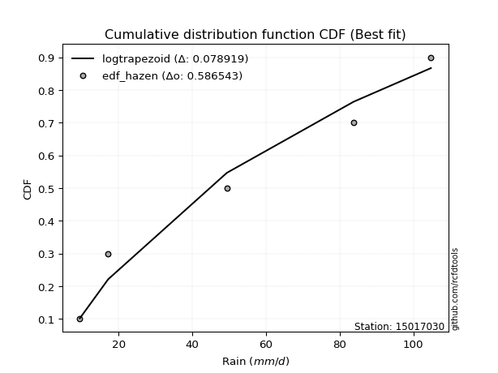</img>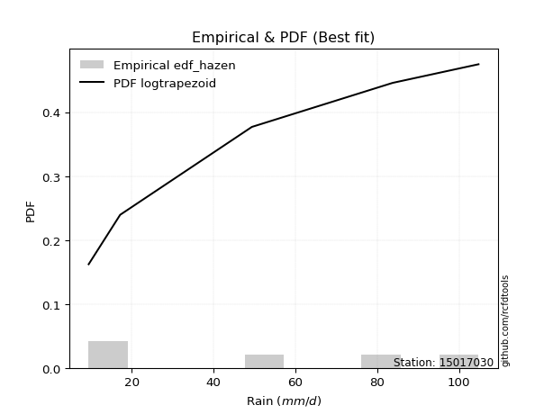</img>

</div>


### 3. Empirical - EDF Weibull (1939)

Weibull plotting position formula is an empirical method used to estimate the non-exceedance probability or plotting position for a set of observed data, is often recommended or widely used in practice, particularly in flood frequency analysis.

<div align="center">


$P=m/(n+1)$


</div>


**3.1. Empirical values**

<div align="center">

|                | 0                   | 1                  | 2           | 3                  | 4                  |
|:---------------|:--------------------|:-------------------|:------------|:-------------------|:-------------------|
| date           | 2022                | 2023               | 2021        | 2025               | 2024               |
| x              | 9.5                 | 17.2               | 49.4        | 64.2               | 104.8              |
| m              | 1                   | 2                  | 3           | 4                  | 5                  |
| empirical_dist | edf_weibull         | edf_weibull        | edf_weibull | edf_weibull        | edf_weibull        |
| empirical      | 0.16666666666666666 | 0.3333333333333333 | 0.5         | 0.6666666666666666 | 0.8333333333333334 |
| empirical_tr   | 1.2                 | 1.4999999999999998 | 2.0         | 2.9999999999999996 | 6.000000000000002  |

</div>


**3.2. Kolmogorov-Smirnov fit test (sorted by Δ)**


<div align="center">

|                | 0                   | 1                   | 2                  | 3                  | 4                   | 5                  | 6                   | 7                   | 8                   | 9                   | 10                  | 11                    | 12                  | 13                 | 14                  | 15                 | 16                  | 17                  | 18                  | 19                 | 20                 | 21                  | 22                  | 23                  | 24                 | 25                  | 26                  | 27                  | 28                  | 29                  | 30                  | 31                 | 32                  | 33                  | 34                  | 35                 | 36                 | 37                 | 38                 | 39                  | 40                 | 41                  | 42                  | 43                  | 44                 | 45                 | 46                 | 47                 | 48                  | 49                 | 50                  | 51                  | 52                  | 53                  | 54                  | 55                  | 56                 | 57                  | 58                  | 59                  | 60                 | 61                 | 62                  | 63                 | 64                  | 65                  | 66                 | 67                  | 68                  | 69                 | 70                  | 71                  | 72                  | 73                  | 74                  | 75                  | 76                 | 77                 | 78                  | 79                 | 80                 | 81                  | 82                 | 83                  | 84                 | 85                 | 86                  | 87                 | 88                  | 89                 |
|:---------------|:--------------------|:--------------------|:-------------------|:-------------------|:--------------------|:-------------------|:--------------------|:--------------------|:--------------------|:--------------------|:--------------------|:----------------------|:--------------------|:-------------------|:--------------------|:-------------------|:--------------------|:--------------------|:--------------------|:-------------------|:-------------------|:--------------------|:--------------------|:--------------------|:-------------------|:--------------------|:--------------------|:--------------------|:--------------------|:--------------------|:--------------------|:-------------------|:--------------------|:--------------------|:--------------------|:-------------------|:-------------------|:-------------------|:-------------------|:--------------------|:-------------------|:--------------------|:--------------------|:--------------------|:-------------------|:-------------------|:-------------------|:-------------------|:--------------------|:-------------------|:--------------------|:--------------------|:--------------------|:--------------------|:--------------------|:--------------------|:-------------------|:--------------------|:--------------------|:--------------------|:-------------------|:-------------------|:--------------------|:-------------------|:--------------------|:--------------------|:-------------------|:--------------------|:--------------------|:-------------------|:--------------------|:--------------------|:--------------------|:--------------------|:--------------------|:--------------------|:-------------------|:-------------------|:--------------------|:-------------------|:-------------------|:--------------------|:-------------------|:--------------------|:-------------------|:-------------------|:--------------------|:-------------------|:--------------------|:-------------------|
| station        | 15017030            | 15017030            | 15017030           | 15017030           | 15017030            | 15017030           | 15017030            | 15017030            | 15017030            | 15017030            | 15017030            | 15017030              | 15017030            | 15017030           | 15017030            | 15017030           | 15017030            | 15017030            | 15017030            | 15017030           | 15017030           | 15017030            | 15017030            | 15017030            | 15017030           | 15017030            | 15017030            | 15017030            | 15017030            | 15017030            | 15017030            | 15017030           | 15017030            | 15017030            | 15017030            | 15017030           | 15017030           | 15017030           | 15017030           | 15017030            | 15017030           | 15017030            | 15017030            | 15017030            | 15017030           | 15017030           | 15017030           | 15017030           | 15017030            | 15017030           | 15017030            | 15017030            | 15017030            | 15017030            | 15017030            | 15017030            | 15017030           | 15017030            | 15017030            | 15017030            | 15017030           | 15017030           | 15017030            | 15017030           | 15017030            | 15017030            | 15017030           | 15017030            | 15017030            | 15017030           | 15017030            | 15017030            | 15017030            | 15017030            | 15017030            | 15017030            | 15017030           | 15017030           | 15017030            | 15017030           | 15017030           | 15017030            | 15017030           | 15017030            | 15017030           | 15017030           | 15017030            | 15017030           | 15017030            | 15017030           |
| empirical_dist | edf_weibull         | edf_weibull         | edf_weibull        | edf_weibull        | edf_weibull         | edf_weibull        | edf_weibull         | edf_weibull         | edf_weibull         | edf_weibull         | edf_weibull         | edf_weibull           | edf_weibull         | edf_weibull        | edf_weibull         | edf_weibull        | edf_weibull         | edf_weibull         | edf_weibull         | edf_weibull        | edf_weibull        | edf_weibull         | edf_weibull         | edf_weibull         | edf_weibull        | edf_weibull         | edf_weibull         | edf_weibull         | edf_weibull         | edf_weibull         | edf_weibull         | edf_weibull        | edf_weibull         | edf_weibull         | edf_weibull         | edf_weibull        | edf_weibull        | edf_weibull        | edf_weibull        | edf_weibull         | edf_weibull        | edf_weibull         | edf_weibull         | edf_weibull         | edf_weibull        | edf_weibull        | edf_weibull        | edf_weibull        | edf_weibull         | edf_weibull        | edf_weibull         | edf_weibull         | edf_weibull         | edf_weibull         | edf_weibull         | edf_weibull         | edf_weibull        | edf_weibull         | edf_weibull         | edf_weibull         | edf_weibull        | edf_weibull        | edf_weibull         | edf_weibull        | edf_weibull         | edf_weibull         | edf_weibull        | edf_weibull         | edf_weibull         | edf_weibull        | edf_weibull         | edf_weibull         | edf_weibull         | edf_weibull         | edf_weibull         | edf_weibull         | edf_weibull        | edf_weibull        | edf_weibull         | edf_weibull        | edf_weibull        | edf_weibull         | edf_weibull        | edf_weibull         | edf_weibull        | edf_weibull        | edf_weibull         | edf_weibull        | edf_weibull         | edf_weibull        |
| p_dist         | logpearson3         | mielke              | logfisk            | halfnorm           | logjohnsonsu        | invgamma           | rayleigh            | ncf                 | maxwell             | f                   | logf                | loglaplace_asymmetric | logweibull_min      | logt               | logexponnorm        | logcrystalball     | lognorm             | lognorm             | lognct              | logfatiguelife     | loggumbel_l        | loggamma            | loggamma            | logbetaprime        | pearson3           | t                   | truncnorm           | crystalball         | norm                | logerlang           | genlogistic         | logrice            | logncf              | kstwobign           | loginvgamma         | exponnorm          | logalpha           | logloggamma        | loggompertz        | fisk                | genexpon           | weibull_min         | expon               | loglogistic         | laplace_asymmetric | logmaxwell         | loginvgauss        | gumbel_r           | gumbel_l            | logistic           | lograyleigh         | loginvweibull       | invweibull          | loghypsecant        | halflogistic        | rice                | hypsecant          | invgauss            | gompertz            | logkstwobign        | moyal              | loghalfnorm        | laplace             | loggenexpon        | nct                 | loglaplace          | loggumbel_r        | alpha               | logmielke           | logexpon           | loghalflogistic     | logmoyal            | nakagami            | pareto              | chi2                | logwald             | logchi2            | betaprime          | erlang              | logpareto          | fatiguelife        | wald                | logtruncnorm       | lognakagami         | gibrat             | loggibrat          | loglognorm          | gamma              | johnsonsu           | loggenlogistic     |
| delta          | 0.13251271897464012 | 0.13626850377744548 | 0.1394123426987302 | 0.1434598538655703 | 0.14428421355851073 | 0.1443278551333259 | 0.14432994302999502 | 0.14564991491752893 | 0.14756033392580112 | 0.14871013400965905 | 0.14879177454008974 | 0.1489750043486703    | 0.14901087535786625 | 0.1490877063581355 | 0.14909030120090982 | 0.149092329974033  | 0.14909233162058055 | 0.14909233162058055 | 0.14950557286966437 | 0.149572514643031  | 0.1536819208241577 | 0.15394793292000064 | 0.15394793292000064 | 0.15466784859551996 | 0.1549168122632569 | 0.15584106148881188 | 0.15585988245617036 | 0.15585997453269146 | 0.15585997580096622 | 0.15672165051214582 | 0.15889783994555148 | 0.161776761244811  | 0.16325520201762334 | 0.16369358073012955 | 0.16390998640174748 | 0.1653216141672819 | 0.1664535301132486 | 0.1665624837182994 | 0.1666666658486851 | 0.16666666628465304 | 0.1666666666666468 | 0.16666666666666644 | 0.16666666666666666 | 0.16695642281070355 | 0.1690783328868028 | 0.1708245429411187 | 0.1725754326492075 | 0.1743477439168696 | 0.17579853906729984 | 0.1759504839856039 | 0.17736350360907838 | 0.17808622774144656 | 0.17854148052380603 | 0.18084032873183264 | 0.18232960267316797 | 0.18559143059723468 | 0.1870834983543588 | 0.18770854720933572 | 0.19075235724308842 | 0.19435203703712955 | 0.1945525561915809 | 0.1963728532343636 | 0.19818021132503152 | 0.206784570703743  | 0.20722911353341766 | 0.20905140877603245 | 0.2092100821251347 | 0.21254991733225603 | 0.21436832020050145 | 0.2157206788499998 | 0.22450205585577176 | 0.22911582959149768 | 0.23047055255037552 | 0.23702653324542838 | 0.25091558034956496 | 0.28550216189903443 | 0.2956563756845979 | 0.2999786263871549 | 0.30262045696979567 | 0.3050793692520341 | 0.3254904252030019 | 0.33265023522475784 | 0.3333333313581826 | 0.33333333333317894 | 0.3333333333333333 | 0.3333333333333333 | 0.33560716292950327 | 0.4037423914816174 | 0.47175481230299016 | 0.6666666666666666 |
| deltao         | 0.5865427407550001  | 0.5865427407550001  | 0.5865427407550001 | 0.5865427407550001 | 0.5865427407550001  | 0.5865427407550001 | 0.5865427407550001  | 0.5865427407550001  | 0.5865427407550001  | 0.5865427407550001  | 0.5865427407550001  | 0.5865427407550001    | 0.5865427407550001  | 0.5865427407550001 | 0.5865427407550001  | 0.5865427407550001 | 0.5865427407550001  | 0.5865427407550001  | 0.5865427407550001  | 0.5865427407550001 | 0.5865427407550001 | 0.5865427407550001  | 0.5865427407550001  | 0.5865427407550001  | 0.5865427407550001 | 0.5865427407550001  | 0.5865427407550001  | 0.5865427407550001  | 0.5865427407550001  | 0.5865427407550001  | 0.5865427407550001  | 0.5865427407550001 | 0.5865427407550001  | 0.5865427407550001  | 0.5865427407550001  | 0.5865427407550001 | 0.5865427407550001 | 0.5865427407550001 | 0.5865427407550001 | 0.5865427407550001  | 0.5865427407550001 | 0.5865427407550001  | 0.5865427407550001  | 0.5865427407550001  | 0.5865427407550001 | 0.5865427407550001 | 0.5865427407550001 | 0.5865427407550001 | 0.5865427407550001  | 0.5865427407550001 | 0.5865427407550001  | 0.5865427407550001  | 0.5865427407550001  | 0.5865427407550001  | 0.5865427407550001  | 0.5865427407550001  | 0.5865427407550001 | 0.5865427407550001  | 0.5865427407550001  | 0.5865427407550001  | 0.5865427407550001 | 0.5865427407550001 | 0.5865427407550001  | 0.5865427407550001 | 0.5865427407550001  | 0.5865427407550001  | 0.5865427407550001 | 0.5865427407550001  | 0.5865427407550001  | 0.5865427407550001 | 0.5865427407550001  | 0.5865427407550001  | 0.5865427407550001  | 0.5865427407550001  | 0.5865427407550001  | 0.5865427407550001  | 0.5865427407550001 | 0.5865427407550001 | 0.5865427407550001  | 0.5865427407550001 | 0.5865427407550001 | 0.5865427407550001  | 0.5865427407550001 | 0.5865427407550001  | 0.5865427407550001 | 0.5865427407550001 | 0.5865427407550001  | 0.5865427407550001 | 0.5865427407550001  | 0.5865427407550001 |
| eval           | Δo > Δ              | Δo > Δ              | Δo > Δ             | Δo > Δ             | Δo > Δ              | Δo > Δ             | Δo > Δ              | Δo > Δ              | Δo > Δ              | Δo > Δ              | Δo > Δ              | Δo > Δ                | Δo > Δ              | Δo > Δ             | Δo > Δ              | Δo > Δ             | Δo > Δ              | Δo > Δ              | Δo > Δ              | Δo > Δ             | Δo > Δ             | Δo > Δ              | Δo > Δ              | Δo > Δ              | Δo > Δ             | Δo > Δ              | Δo > Δ              | Δo > Δ              | Δo > Δ              | Δo > Δ              | Δo > Δ              | Δo > Δ             | Δo > Δ              | Δo > Δ              | Δo > Δ              | Δo > Δ             | Δo > Δ             | Δo > Δ             | Δo > Δ             | Δo > Δ              | Δo > Δ             | Δo > Δ              | Δo > Δ              | Δo > Δ              | Δo > Δ             | Δo > Δ             | Δo > Δ             | Δo > Δ             | Δo > Δ              | Δo > Δ             | Δo > Δ              | Δo > Δ              | Δo > Δ              | Δo > Δ              | Δo > Δ              | Δo > Δ              | Δo > Δ             | Δo > Δ              | Δo > Δ              | Δo > Δ              | Δo > Δ             | Δo > Δ             | Δo > Δ              | Δo > Δ             | Δo > Δ              | Δo > Δ              | Δo > Δ             | Δo > Δ              | Δo > Δ              | Δo > Δ             | Δo > Δ              | Δo > Δ              | Δo > Δ              | Δo > Δ              | Δo > Δ              | Δo > Δ              | Δo > Δ             | Δo > Δ             | Δo > Δ              | Δo > Δ             | Δo > Δ             | Δo > Δ              | Δo > Δ             | Δo > Δ              | Δo > Δ             | Δo > Δ             | Δo > Δ              | Δo > Δ             | Δo > Δ              | Δo <= Δ            |
| fit            | 1                   | 1                   | 1                  | 1                  | 1                   | 1                  | 1                   | 1                   | 1                   | 1                   | 1                   | 1                     | 1                   | 1                  | 1                   | 1                  | 1                   | 1                   | 1                   | 1                  | 1                  | 1                   | 1                   | 1                   | 1                  | 1                   | 1                   | 1                   | 1                   | 1                   | 1                   | 1                  | 1                   | 1                   | 1                   | 1                  | 1                  | 1                  | 1                  | 1                   | 1                  | 1                   | 1                   | 1                   | 1                  | 1                  | 1                  | 1                  | 1                   | 1                  | 1                   | 1                   | 1                   | 1                   | 1                   | 1                   | 1                  | 1                   | 1                   | 1                   | 1                  | 1                  | 1                   | 1                  | 1                   | 1                   | 1                  | 1                   | 1                   | 1                  | 1                   | 1                   | 1                   | 1                   | 1                   | 1                   | 1                  | 1                  | 1                   | 1                  | 1                  | 1                   | 1                  | 1                   | 1                  | 1                  | 1                   | 1                  | 1                   | 0                  |
| n              | 5                   | 5                   | 5                  | 5                  | 5                   | 5                  | 5                   | 5                   | 5                   | 5                   | 5                   | 5                     | 5                   | 5                  | 5                   | 5                  | 5                   | 5                   | 5                   | 5                  | 5                  | 5                   | 5                   | 5                   | 5                  | 5                   | 5                   | 5                   | 5                   | 5                   | 5                   | 5                  | 5                   | 5                   | 5                   | 5                  | 5                  | 5                  | 5                  | 5                   | 5                  | 5                   | 5                   | 5                   | 5                  | 5                  | 5                  | 5                  | 5                   | 5                  | 5                   | 5                   | 5                   | 5                   | 5                   | 5                   | 5                  | 5                   | 5                   | 5                   | 5                  | 5                  | 5                   | 5                  | 5                   | 5                   | 5                  | 5                   | 5                   | 5                  | 5                   | 5                   | 5                   | 5                   | 5                   | 5                   | 5                  | 5                  | 5                   | 5                  | 5                  | 5                   | 5                  | 5                   | 5                  | 5                  | 5                   | 5                  | 5                   | 5                  |
| best_fit       | 1                   | 0                   | 0                  | 0                  | 0                   | 0                  | 0                   | 0                   | 0                   | 0                   | 0                   | 0                     | 0                   | 0                  | 0                   | 0                  | 0                   | 0                   | 0                   | 0                  | 0                  | 0                   | 0                   | 0                   | 0                  | 0                   | 0                   | 0                   | 0                   | 0                   | 0                   | 0                  | 0                   | 0                   | 0                   | 0                  | 0                  | 0                  | 0                  | 0                   | 0                  | 0                   | 0                   | 0                   | 0                  | 0                  | 0                  | 0                  | 0                   | 0                  | 0                   | 0                   | 0                   | 0                   | 0                   | 0                   | 0                  | 0                   | 0                   | 0                   | 0                  | 0                  | 0                   | 0                  | 0                   | 0                   | 0                  | 0                   | 0                   | 0                  | 0                   | 0                   | 0                   | 0                   | 0                   | 0                   | 0                  | 0                  | 0                   | 0                  | 0                  | 0                   | 0                  | 0                   | 0                  | 0                  | 0                   | 0                  | 0                   | 0                  |
| best_fit_sort  | 1                   | 2                   | 3                  | 4                  | 5                   | 6                  | 7                   | 8                   | 9                   | 10                  | 11                  | 12                    | 13                  | 14                 | 15                  | 16                 | 17                  | 18                  | 19                  | 20                 | 21                 | 22                  | 23                  | 24                  | 25                 | 26                  | 27                  | 28                  | 29                  | 30                  | 31                  | 32                 | 33                  | 34                  | 35                  | 36                 | 37                 | 38                 | 39                 | 40                  | 41                 | 42                  | 43                  | 44                  | 45                 | 46                 | 47                 | 48                 | 49                  | 50                 | 51                  | 52                  | 53                  | 54                  | 55                  | 56                  | 57                 | 58                  | 59                  | 60                  | 61                 | 62                 | 63                  | 64                 | 65                  | 66                  | 67                 | 68                  | 69                  | 70                 | 71                  | 72                  | 73                  | 74                  | 75                  | 76                  | 77                 | 78                 | 79                  | 80                 | 81                 | 82                  | 83                 | 84                  | 85                 | 86                 | 87                  | 88                 | 89                  | 90                 |

</div>


<div align="center">

</img>

</div>


**3.3. Best fit**

<div align="center">

|   id |   station | empirical_dist   | p_dist      |    delta |   deltao | eval   |   fit |   n |   best_fit |   best_fit_sort |
|-----:|----------:|:-----------------|:------------|---------:|---------:|:-------|------:|----:|-----------:|----------------:|
|    0 |  15017030 | edf_weibull      | logpearson3 | 0.132513 | 0.586543 | Δo > Δ |     1 |   5 |          1 |               1 |

</div>


<div align="center">

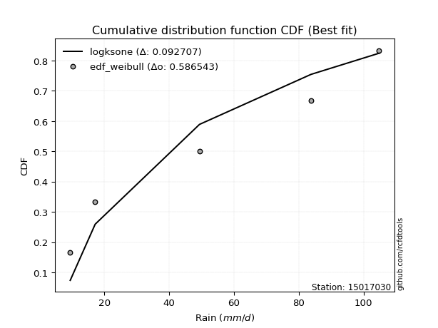</img>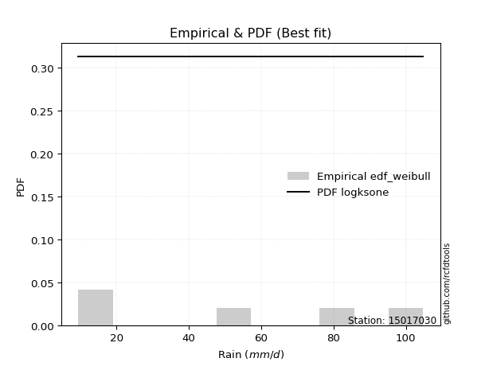</img>

</div>


### 4. Empirical - EDF Beard (1943)

The Beard formula (or Beard´s plotting position formula) in hydrology is used to estimate the empirical non-exceedance probability _(P)_ of a flood event (or other extreme hydrological data point) within a given dataset.

<div align="center">


$P=(m-0.31)/(n+0.38)$


</div>


**4.1. Empirical values**

<div align="center">

|                | 0                   | 1                  | 2         | 3                  | 4                  |
|:---------------|:--------------------|:-------------------|:----------|:-------------------|:-------------------|
| date           | 2022                | 2023               | 2021      | 2025               | 2024               |
| x              | 9.5                 | 17.2               | 49.4      | 64.2               | 104.8              |
| m              | 1                   | 2                  | 3         | 4                  | 5                  |
| empirical_dist | edf_beard           | edf_beard          | edf_beard | edf_beard          | edf_beard          |
| empirical      | 0.12825278810408922 | 0.3141263940520446 | 0.5       | 0.6858736059479554 | 0.8717472118959109 |
| empirical_tr   | 1.1471215351812367  | 1.4579945799457996 | 2.0       | 3.183431952662722  | 7.797101449275368  |

</div>


**4.2. Kolmogorov-Smirnov fit test (sorted by Δ)**


<div align="center">

|                | 0                   | 1                   | 2                   | 3                   | 4                   | 5                  | 6                  | 7                   | 8                     | 9                   | 10                  | 11                  | 12                 | 13                 | 14                  | 15                 | 16                  | 17                  | 18                  | 19                  | 20                  | 21                 | 22                  | 23                 | 24                 | 25                  | 26                  | 27                 | 28                  | 29                 | 30                  | 31                  | 32                  | 33                 | 34                 | 35                  | 36                  | 37                  | 38                  | 39                  | 40                  | 41                 | 42                 | 43                  | 44                  | 45                  | 46                 | 47                 | 48                  | 49                  | 50                 | 51                  | 52                 | 53                 | 54                  | 55                  | 56                  | 57                  | 58                  | 59                  | 60                  | 61                  | 62                 | 63                 | 64                  | 65                  | 66                 | 67                  | 68                  | 69                 | 70                  | 71                  | 72                  | 73                  | 74                 | 75                  | 76                 | 77                 | 78                  | 79                  | 80                 | 81                  | 82                 | 83                  | 84                 | 85                 | 86                  | 87                 | 88                  | 89                 |
|:---------------|:--------------------|:--------------------|:--------------------|:--------------------|:--------------------|:-------------------|:-------------------|:--------------------|:----------------------|:--------------------|:--------------------|:--------------------|:-------------------|:-------------------|:--------------------|:-------------------|:--------------------|:--------------------|:--------------------|:--------------------|:--------------------|:-------------------|:--------------------|:-------------------|:-------------------|:--------------------|:--------------------|:-------------------|:--------------------|:-------------------|:--------------------|:--------------------|:--------------------|:-------------------|:-------------------|:--------------------|:--------------------|:--------------------|:--------------------|:--------------------|:--------------------|:-------------------|:-------------------|:--------------------|:--------------------|:--------------------|:-------------------|:-------------------|:--------------------|:--------------------|:-------------------|:--------------------|:-------------------|:-------------------|:--------------------|:--------------------|:--------------------|:--------------------|:--------------------|:--------------------|:--------------------|:--------------------|:-------------------|:-------------------|:--------------------|:--------------------|:-------------------|:--------------------|:--------------------|:-------------------|:--------------------|:--------------------|:--------------------|:--------------------|:-------------------|:--------------------|:-------------------|:-------------------|:--------------------|:--------------------|:-------------------|:--------------------|:-------------------|:--------------------|:-------------------|:-------------------|:--------------------|:-------------------|:--------------------|:-------------------|
| station        | 15017030            | 15017030            | 15017030            | 15017030            | 15017030            | 15017030           | 15017030           | 15017030            | 15017030              | 15017030            | 15017030            | 15017030            | 15017030           | 15017030           | 15017030            | 15017030           | 15017030            | 15017030            | 15017030            | 15017030            | 15017030            | 15017030           | 15017030            | 15017030           | 15017030           | 15017030            | 15017030            | 15017030           | 15017030            | 15017030           | 15017030            | 15017030            | 15017030            | 15017030           | 15017030           | 15017030            | 15017030            | 15017030            | 15017030            | 15017030            | 15017030            | 15017030           | 15017030           | 15017030            | 15017030            | 15017030            | 15017030           | 15017030           | 15017030            | 15017030            | 15017030           | 15017030            | 15017030           | 15017030           | 15017030            | 15017030            | 15017030            | 15017030            | 15017030            | 15017030            | 15017030            | 15017030            | 15017030           | 15017030           | 15017030            | 15017030            | 15017030           | 15017030            | 15017030            | 15017030           | 15017030            | 15017030            | 15017030            | 15017030            | 15017030           | 15017030            | 15017030           | 15017030           | 15017030            | 15017030            | 15017030           | 15017030            | 15017030           | 15017030            | 15017030           | 15017030           | 15017030            | 15017030           | 15017030            | 15017030           |
| empirical_dist | edf_beard           | edf_beard           | edf_beard           | edf_beard           | edf_beard           | edf_beard          | edf_beard          | edf_beard           | edf_beard             | edf_beard           | edf_beard           | edf_beard           | edf_beard          | edf_beard          | edf_beard           | edf_beard          | edf_beard           | edf_beard           | edf_beard           | edf_beard           | edf_beard           | edf_beard          | edf_beard           | edf_beard          | edf_beard          | edf_beard           | edf_beard           | edf_beard          | edf_beard           | edf_beard          | edf_beard           | edf_beard           | edf_beard           | edf_beard          | edf_beard          | edf_beard           | edf_beard           | edf_beard           | edf_beard           | edf_beard           | edf_beard           | edf_beard          | edf_beard          | edf_beard           | edf_beard           | edf_beard           | edf_beard          | edf_beard          | edf_beard           | edf_beard           | edf_beard          | edf_beard           | edf_beard          | edf_beard          | edf_beard           | edf_beard           | edf_beard           | edf_beard           | edf_beard           | edf_beard           | edf_beard           | edf_beard           | edf_beard          | edf_beard          | edf_beard           | edf_beard           | edf_beard          | edf_beard           | edf_beard           | edf_beard          | edf_beard           | edf_beard           | edf_beard           | edf_beard           | edf_beard          | edf_beard           | edf_beard          | edf_beard          | edf_beard           | edf_beard           | edf_beard          | edf_beard           | edf_beard          | edf_beard           | edf_beard          | edf_beard          | edf_beard           | edf_beard          | edf_beard           | edf_beard          |
| p_dist         | mielke              | halfnorm            | logjohnsonsu        | rayleigh            | ncf                 | logfisk            | logloggamma        | maxwell             | loglaplace_asymmetric | logweibull_min      | logpearson3         | invgamma            | loggumbel_l        | pearson3           | exponnorm           | t                  | truncnorm           | crystalball         | norm                | expon               | weibull_min         | genlogistic        | kstwobign           | genexpon           | loggompertz        | f                   | logf                | logt               | logexponnorm        | logcrystalball     | lognorm             | lognorm             | lognct              | logfatiguelife     | laplace_asymmetric | loggamma            | loggamma            | logbetaprime        | gumbel_r            | gumbel_l            | logerlang           | logistic           | logrice            | halflogistic        | logncf              | loginvgamma         | rice               | logalpha           | loglogistic         | hypsecant           | logmaxwell         | gompertz            | loginvgauss        | moyal              | lograyleigh         | loginvweibull       | invweibull          | laplace             | loghypsecant        | invgauss            | logkstwobign        | fisk                | loghalfnorm        | loggenexpon        | nct                 | loglaplace          | loggumbel_r        | alpha               | logmielke           | logexpon           | loghalflogistic     | logmoyal            | nakagami            | chi2                | pareto             | logwald             | logchi2            | betaprime          | erlang              | wald                | logtruncnorm       | lognakagami         | gibrat             | loggibrat           | logpareto          | fatiguelife        | loglognorm          | gamma              | johnsonsu           | loggenlogistic     |
| delta          | 0.11706156449615679 | 0.12425291458428162 | 0.12507727427722204 | 0.12512300374870633 | 0.12644297563624024 | 0.1279359119709087 | 0.1281486051557219 | 0.12835339464451243 | 0.12976806506738162   | 0.12980393607657756 | 0.13251271897464012 | 0.13373882282585348 | 0.134474981542869  | 0.1357098729819682 | 0.13623467556230806 | 0.1366341222075232 | 0.13665294317488166 | 0.13665303525140277 | 0.13665303651967753 | 0.13709431547453116 | 0.13835974149277525 | 0.1396909006642628 | 0.14448664144884085 | 0.1446257002352478 | 0.1482569764627718 | 0.14871013400965905 | 0.14879177454008974 | 0.1490877063581355 | 0.14909030120090982 | 0.149092329974033  | 0.14909233162058055 | 0.14909233162058055 | 0.14950557286966437 | 0.149572514643031  | 0.1498713936055141 | 0.15394793292000064 | 0.15394793292000064 | 0.15466784859551996 | 0.15514080463558091 | 0.15659159978601114 | 0.15672165051214582 | 0.1567435447043152 | 0.161776761244811  | 0.16312266339187928 | 0.16325520201762334 | 0.16390998640174748 | 0.166384491315946  | 0.1664535301132486 | 0.16695642281070355 | 0.16787655907307011 | 0.1708245429411187 | 0.17154541796179973 | 0.1725754326492075 | 0.1753456169102922 | 0.17736350360907838 | 0.17808622774144656 | 0.17854148052380603 | 0.17897327204374283 | 0.18084032873183264 | 0.18770854720933572 | 0.19435203703712955 | 0.19603020655455516 | 0.1963728532343636 | 0.206784570703743  | 0.20722911353341766 | 0.20905140877603245 | 0.2092100821251347 | 0.21254991733225603 | 0.21436832020050145 | 0.2157206788499998 | 0.22450205585577176 | 0.22911582959149768 | 0.23047055255037552 | 0.25091558034956496 | 0.2562334725267171 | 0.28550216189903443 | 0.2956563756845979 | 0.2999786263871549 | 0.30262045696979567 | 0.31344329594346915 | 0.3141263920768939 | 0.31412639405189025 | 0.3141263940520446 | 0.31771820035534204 | 0.3242863085333228 | 0.3446973644842906 | 0.35481410221079196 | 0.4037423914816174 | 0.49096175158427885 | 0.6858736059479554 |
| deltao         | 0.5865427407550001  | 0.5865427407550001  | 0.5865427407550001  | 0.5865427407550001  | 0.5865427407550001  | 0.5865427407550001 | 0.5865427407550001 | 0.5865427407550001  | 0.5865427407550001    | 0.5865427407550001  | 0.5865427407550001  | 0.5865427407550001  | 0.5865427407550001 | 0.5865427407550001 | 0.5865427407550001  | 0.5865427407550001 | 0.5865427407550001  | 0.5865427407550001  | 0.5865427407550001  | 0.5865427407550001  | 0.5865427407550001  | 0.5865427407550001 | 0.5865427407550001  | 0.5865427407550001 | 0.5865427407550001 | 0.5865427407550001  | 0.5865427407550001  | 0.5865427407550001 | 0.5865427407550001  | 0.5865427407550001 | 0.5865427407550001  | 0.5865427407550001  | 0.5865427407550001  | 0.5865427407550001 | 0.5865427407550001 | 0.5865427407550001  | 0.5865427407550001  | 0.5865427407550001  | 0.5865427407550001  | 0.5865427407550001  | 0.5865427407550001  | 0.5865427407550001 | 0.5865427407550001 | 0.5865427407550001  | 0.5865427407550001  | 0.5865427407550001  | 0.5865427407550001 | 0.5865427407550001 | 0.5865427407550001  | 0.5865427407550001  | 0.5865427407550001 | 0.5865427407550001  | 0.5865427407550001 | 0.5865427407550001 | 0.5865427407550001  | 0.5865427407550001  | 0.5865427407550001  | 0.5865427407550001  | 0.5865427407550001  | 0.5865427407550001  | 0.5865427407550001  | 0.5865427407550001  | 0.5865427407550001 | 0.5865427407550001 | 0.5865427407550001  | 0.5865427407550001  | 0.5865427407550001 | 0.5865427407550001  | 0.5865427407550001  | 0.5865427407550001 | 0.5865427407550001  | 0.5865427407550001  | 0.5865427407550001  | 0.5865427407550001  | 0.5865427407550001 | 0.5865427407550001  | 0.5865427407550001 | 0.5865427407550001 | 0.5865427407550001  | 0.5865427407550001  | 0.5865427407550001 | 0.5865427407550001  | 0.5865427407550001 | 0.5865427407550001  | 0.5865427407550001 | 0.5865427407550001 | 0.5865427407550001  | 0.5865427407550001 | 0.5865427407550001  | 0.5865427407550001 |
| eval           | Δo > Δ              | Δo > Δ              | Δo > Δ              | Δo > Δ              | Δo > Δ              | Δo > Δ             | Δo > Δ             | Δo > Δ              | Δo > Δ                | Δo > Δ              | Δo > Δ              | Δo > Δ              | Δo > Δ             | Δo > Δ             | Δo > Δ              | Δo > Δ             | Δo > Δ              | Δo > Δ              | Δo > Δ              | Δo > Δ              | Δo > Δ              | Δo > Δ             | Δo > Δ              | Δo > Δ             | Δo > Δ             | Δo > Δ              | Δo > Δ              | Δo > Δ             | Δo > Δ              | Δo > Δ             | Δo > Δ              | Δo > Δ              | Δo > Δ              | Δo > Δ             | Δo > Δ             | Δo > Δ              | Δo > Δ              | Δo > Δ              | Δo > Δ              | Δo > Δ              | Δo > Δ              | Δo > Δ             | Δo > Δ             | Δo > Δ              | Δo > Δ              | Δo > Δ              | Δo > Δ             | Δo > Δ             | Δo > Δ              | Δo > Δ              | Δo > Δ             | Δo > Δ              | Δo > Δ             | Δo > Δ             | Δo > Δ              | Δo > Δ              | Δo > Δ              | Δo > Δ              | Δo > Δ              | Δo > Δ              | Δo > Δ              | Δo > Δ              | Δo > Δ             | Δo > Δ             | Δo > Δ              | Δo > Δ              | Δo > Δ             | Δo > Δ              | Δo > Δ              | Δo > Δ             | Δo > Δ              | Δo > Δ              | Δo > Δ              | Δo > Δ              | Δo > Δ             | Δo > Δ              | Δo > Δ             | Δo > Δ             | Δo > Δ              | Δo > Δ              | Δo > Δ             | Δo > Δ              | Δo > Δ             | Δo > Δ              | Δo > Δ             | Δo > Δ             | Δo > Δ              | Δo > Δ             | Δo > Δ              | Δo <= Δ            |
| fit            | 1                   | 1                   | 1                   | 1                   | 1                   | 1                  | 1                  | 1                   | 1                     | 1                   | 1                   | 1                   | 1                  | 1                  | 1                   | 1                  | 1                   | 1                   | 1                   | 1                   | 1                   | 1                  | 1                   | 1                  | 1                  | 1                   | 1                   | 1                  | 1                   | 1                  | 1                   | 1                   | 1                   | 1                  | 1                  | 1                   | 1                   | 1                   | 1                   | 1                   | 1                   | 1                  | 1                  | 1                   | 1                   | 1                   | 1                  | 1                  | 1                   | 1                   | 1                  | 1                   | 1                  | 1                  | 1                   | 1                   | 1                   | 1                   | 1                   | 1                   | 1                   | 1                   | 1                  | 1                  | 1                   | 1                   | 1                  | 1                   | 1                   | 1                  | 1                   | 1                   | 1                   | 1                   | 1                  | 1                   | 1                  | 1                  | 1                   | 1                   | 1                  | 1                   | 1                  | 1                   | 1                  | 1                  | 1                   | 1                  | 1                   | 0                  |
| n              | 5                   | 5                   | 5                   | 5                   | 5                   | 5                  | 5                  | 5                   | 5                     | 5                   | 5                   | 5                   | 5                  | 5                  | 5                   | 5                  | 5                   | 5                   | 5                   | 5                   | 5                   | 5                  | 5                   | 5                  | 5                  | 5                   | 5                   | 5                  | 5                   | 5                  | 5                   | 5                   | 5                   | 5                  | 5                  | 5                   | 5                   | 5                   | 5                   | 5                   | 5                   | 5                  | 5                  | 5                   | 5                   | 5                   | 5                  | 5                  | 5                   | 5                   | 5                  | 5                   | 5                  | 5                  | 5                   | 5                   | 5                   | 5                   | 5                   | 5                   | 5                   | 5                   | 5                  | 5                  | 5                   | 5                   | 5                  | 5                   | 5                   | 5                  | 5                   | 5                   | 5                   | 5                   | 5                  | 5                   | 5                  | 5                  | 5                   | 5                   | 5                  | 5                   | 5                  | 5                   | 5                  | 5                  | 5                   | 5                  | 5                   | 5                  |
| best_fit       | 1                   | 0                   | 0                   | 0                   | 0                   | 0                  | 0                  | 0                   | 0                     | 0                   | 0                   | 0                   | 0                  | 0                  | 0                   | 0                  | 0                   | 0                   | 0                   | 0                   | 0                   | 0                  | 0                   | 0                  | 0                  | 0                   | 0                   | 0                  | 0                   | 0                  | 0                   | 0                   | 0                   | 0                  | 0                  | 0                   | 0                   | 0                   | 0                   | 0                   | 0                   | 0                  | 0                  | 0                   | 0                   | 0                   | 0                  | 0                  | 0                   | 0                   | 0                  | 0                   | 0                  | 0                  | 0                   | 0                   | 0                   | 0                   | 0                   | 0                   | 0                   | 0                   | 0                  | 0                  | 0                   | 0                   | 0                  | 0                   | 0                   | 0                  | 0                   | 0                   | 0                   | 0                   | 0                  | 0                   | 0                  | 0                  | 0                   | 0                   | 0                  | 0                   | 0                  | 0                   | 0                  | 0                  | 0                   | 0                  | 0                   | 0                  |
| best_fit_sort  | 1                   | 2                   | 3                   | 4                   | 5                   | 6                  | 7                  | 8                   | 9                     | 10                  | 11                  | 12                  | 13                 | 14                 | 15                  | 16                 | 17                  | 18                  | 19                  | 20                  | 21                  | 22                 | 23                  | 24                 | 25                 | 26                  | 27                  | 28                 | 29                  | 30                 | 31                  | 32                  | 33                  | 34                 | 35                 | 36                  | 37                  | 38                  | 39                  | 40                  | 41                  | 42                 | 43                 | 44                  | 45                  | 46                  | 47                 | 48                 | 49                  | 50                  | 51                 | 52                  | 53                 | 54                 | 55                  | 56                  | 57                  | 58                  | 59                  | 60                  | 61                  | 62                  | 63                 | 64                 | 65                  | 66                  | 67                 | 68                  | 69                  | 70                 | 71                  | 72                  | 73                  | 74                  | 75                 | 76                  | 77                 | 78                 | 79                  | 80                  | 81                 | 82                  | 83                 | 84                  | 85                 | 86                 | 87                  | 88                 | 89                  | 90                 |

</div>


<div align="center">

</img>

</div>


**4.3. Best fit**

<div align="center">

|   id |   station | empirical_dist   | p_dist   |    delta |   deltao | eval   |   fit |   n |   best_fit |   best_fit_sort |
|-----:|----------:|:-----------------|:---------|---------:|---------:|:-------|------:|----:|-----------:|----------------:|
|    0 |  15017030 | edf_beard        | mielke   | 0.117062 | 0.586543 | Δo > Δ |     1 |   5 |          1 |               1 |

</div>


<div align="center">

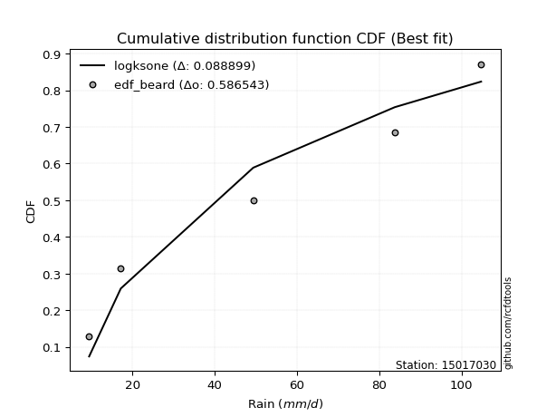</img></img>

</div>


### 5. Empirical - EDF Chegodayev (1955)

The Chegodayev formula is an empirical plotting position formula used in hydrological frequency analysis to estimate the exceedance probability or return period of a specific event from a set of observed data. It is primarily used for plotting observed data points on probability paper to fit a theoretical distribution, particularly for analyzing extreme events like maximum flood flows or rainfall intensities. The constant _b_ value in the generalized plotting position formula is 0.3.

<div align="center">


$P=(m-b)/(n+1-2b)$


</div>


**5.1. Empirical values**

<div align="center">

|                | 0                   | 1                   | 2              | 3                  | 4                  |
|:---------------|:--------------------|:--------------------|:---------------|:-------------------|:-------------------|
| date           | 2022                | 2023                | 2021           | 2025               | 2024               |
| x              | 9.5                 | 17.2                | 49.4           | 64.2               | 104.8              |
| m              | 1                   | 2                   | 3              | 4                  | 5                  |
| empirical_dist | edf_chegodayev      | edf_chegodayev      | edf_chegodayev | edf_chegodayev     | edf_chegodayev     |
| empirical      | 0.12962962962962962 | 0.31481481481481477 | 0.5            | 0.6851851851851851 | 0.8703703703703703 |
| empirical_tr   | 1.148936170212766   | 1.4594594594594594  | 2.0            | 3.1764705882352935 | 7.714285714285713  |

</div>


**5.2. Kolmogorov-Smirnov fit test (sorted by Δ)**


<div align="center">

|                | 0                   | 1                   | 2                  | 3                   | 4                  | 5                  | 6                   | 7                   | 8                     | 9                  | 10                  | 11                  | 12                  | 13                  | 14                 | 15                  | 16                 | 17                 | 18                  | 19                 | 20                 | 21                  | 22                 | 23                  | 24                 | 25                  | 26                  | 27                 | 28                  | 29                 | 30                  | 31                  | 32                  | 33                 | 34                  | 35                  | 36                  | 37                  | 38                  | 39                  | 40                 | 41                  | 42                 | 43                  | 44                  | 45                  | 46                 | 47                  | 48                  | 49                  | 50                 | 51                  | 52                 | 53                  | 54                  | 55                  | 56                  | 57                  | 58                  | 59                  | 60                  | 61                  | 62                 | 63                 | 64                  | 65                  | 66                 | 67                  | 68                  | 69                 | 70                  | 71                  | 72                  | 73                  | 74                  | 75                  | 76                 | 77                 | 78                  | 79                 | 80                  | 81                 | 82                  | 83                  | 84                  | 85                  | 86                 | 87                 | 88                 | 89                 |
|:---------------|:--------------------|:--------------------|:-------------------|:--------------------|:-------------------|:-------------------|:--------------------|:--------------------|:----------------------|:-------------------|:--------------------|:--------------------|:--------------------|:--------------------|:-------------------|:--------------------|:-------------------|:-------------------|:--------------------|:-------------------|:-------------------|:--------------------|:-------------------|:--------------------|:-------------------|:--------------------|:--------------------|:-------------------|:--------------------|:-------------------|:--------------------|:--------------------|:--------------------|:-------------------|:--------------------|:--------------------|:--------------------|:--------------------|:--------------------|:--------------------|:-------------------|:--------------------|:-------------------|:--------------------|:--------------------|:--------------------|:-------------------|:--------------------|:--------------------|:--------------------|:-------------------|:--------------------|:-------------------|:--------------------|:--------------------|:--------------------|:--------------------|:--------------------|:--------------------|:--------------------|:--------------------|:--------------------|:-------------------|:-------------------|:--------------------|:--------------------|:-------------------|:--------------------|:--------------------|:-------------------|:--------------------|:--------------------|:--------------------|:--------------------|:--------------------|:--------------------|:-------------------|:-------------------|:--------------------|:-------------------|:--------------------|:-------------------|:--------------------|:--------------------|:--------------------|:--------------------|:-------------------|:-------------------|:-------------------|:-------------------|
| station        | 15017030            | 15017030            | 15017030           | 15017030            | 15017030           | 15017030           | 15017030            | 15017030            | 15017030              | 15017030           | 15017030            | 15017030            | 15017030            | 15017030            | 15017030           | 15017030            | 15017030           | 15017030           | 15017030            | 15017030           | 15017030           | 15017030            | 15017030           | 15017030            | 15017030           | 15017030            | 15017030            | 15017030           | 15017030            | 15017030           | 15017030            | 15017030            | 15017030            | 15017030           | 15017030            | 15017030            | 15017030            | 15017030            | 15017030            | 15017030            | 15017030           | 15017030            | 15017030           | 15017030            | 15017030            | 15017030            | 15017030           | 15017030            | 15017030            | 15017030            | 15017030           | 15017030            | 15017030           | 15017030            | 15017030            | 15017030            | 15017030            | 15017030            | 15017030            | 15017030            | 15017030            | 15017030            | 15017030           | 15017030           | 15017030            | 15017030            | 15017030           | 15017030            | 15017030            | 15017030           | 15017030            | 15017030            | 15017030            | 15017030            | 15017030            | 15017030            | 15017030           | 15017030           | 15017030            | 15017030           | 15017030            | 15017030           | 15017030            | 15017030            | 15017030            | 15017030            | 15017030           | 15017030           | 15017030           | 15017030           |
| empirical_dist | edf_chegodayev      | edf_chegodayev      | edf_chegodayev     | edf_chegodayev      | edf_chegodayev     | edf_chegodayev     | edf_chegodayev      | edf_chegodayev      | edf_chegodayev        | edf_chegodayev     | edf_chegodayev      | edf_chegodayev      | edf_chegodayev      | edf_chegodayev      | edf_chegodayev     | edf_chegodayev      | edf_chegodayev     | edf_chegodayev     | edf_chegodayev      | edf_chegodayev     | edf_chegodayev     | edf_chegodayev      | edf_chegodayev     | edf_chegodayev      | edf_chegodayev     | edf_chegodayev      | edf_chegodayev      | edf_chegodayev     | edf_chegodayev      | edf_chegodayev     | edf_chegodayev      | edf_chegodayev      | edf_chegodayev      | edf_chegodayev     | edf_chegodayev      | edf_chegodayev      | edf_chegodayev      | edf_chegodayev      | edf_chegodayev      | edf_chegodayev      | edf_chegodayev     | edf_chegodayev      | edf_chegodayev     | edf_chegodayev      | edf_chegodayev      | edf_chegodayev      | edf_chegodayev     | edf_chegodayev      | edf_chegodayev      | edf_chegodayev      | edf_chegodayev     | edf_chegodayev      | edf_chegodayev     | edf_chegodayev      | edf_chegodayev      | edf_chegodayev      | edf_chegodayev      | edf_chegodayev      | edf_chegodayev      | edf_chegodayev      | edf_chegodayev      | edf_chegodayev      | edf_chegodayev     | edf_chegodayev     | edf_chegodayev      | edf_chegodayev      | edf_chegodayev     | edf_chegodayev      | edf_chegodayev      | edf_chegodayev     | edf_chegodayev      | edf_chegodayev      | edf_chegodayev      | edf_chegodayev      | edf_chegodayev      | edf_chegodayev      | edf_chegodayev     | edf_chegodayev     | edf_chegodayev      | edf_chegodayev     | edf_chegodayev      | edf_chegodayev     | edf_chegodayev      | edf_chegodayev      | edf_chegodayev      | edf_chegodayev      | edf_chegodayev     | edf_chegodayev     | edf_chegodayev     | edf_chegodayev     |
| p_dist         | mielke              | halfnorm            | logjohnsonsu       | rayleigh            | ncf                | logfisk            | maxwell             | logloggamma         | loglaplace_asymmetric | logweibull_min     | logpearson3         | invgamma            | loggumbel_l         | pearson3            | exponnorm          | t                   | truncnorm          | crystalball        | norm                | expon              | weibull_min        | genlogistic         | kstwobign          | genexpon            | loggompertz        | f                   | logf                | logt               | logexponnorm        | logcrystalball     | lognorm             | lognorm             | lognct              | logfatiguelife     | laplace_asymmetric  | loggamma            | loggamma            | logbetaprime        | gumbel_r            | logerlang           | gumbel_l           | logistic            | logrice            | logncf              | halflogistic        | loginvgamma         | logalpha           | loglogistic         | rice                | hypsecant           | logmaxwell         | gompertz            | loginvgauss        | moyal               | lograyleigh         | loginvweibull       | invweibull          | laplace             | loghypsecant        | invgauss            | logkstwobign        | fisk                | loghalfnorm        | loggenexpon        | nct                 | loglaplace          | loggumbel_r        | alpha               | logmielke           | logexpon           | loghalflogistic     | logmoyal            | nakagami            | chi2                | pareto              | logwald             | logchi2            | betaprime          | erlang              | wald               | logtruncnorm        | lognakagami        | gibrat              | loggibrat           | logpareto           | fatiguelife         | loglognorm         | gamma              | johnsonsu          | loggenlogistic     |
| delta          | 0.11774998525892694 | 0.12494133534705176 | 0.1257656950399922 | 0.12581142451147648 | 0.1271313963990104 | 0.1279359119709087 | 0.12904181540728257 | 0.12952544668126242 | 0.13045648583015176   | 0.1304923568393477 | 0.13251271897464012 | 0.13373882282585348 | 0.13516340230563914 | 0.13639829374473836 | 0.1366306336079569 | 0.13732254297029334 | 0.1373413639376518 | 0.1373414560141729 | 0.13734145728244768 | 0.1377827362373013 | 0.1390481622555454 | 0.14037932142703294 | 0.145175062211611  | 0.14531412099801794 | 0.1482569764627718 | 0.14871013400965905 | 0.14879177454008974 | 0.1490877063581355 | 0.14909030120090982 | 0.149092329974033  | 0.14909233162058055 | 0.14909233162058055 | 0.14950557286966437 | 0.149572514643031  | 0.15055981436828425 | 0.15394793292000064 | 0.15394793292000064 | 0.15466784859551996 | 0.15582922539835106 | 0.15672165051214582 | 0.1572800205487813 | 0.15743196546708535 | 0.161776761244811  | 0.16325520201762334 | 0.16381108415464943 | 0.16390998640174748 | 0.1664535301132486 | 0.16695642281070355 | 0.16707291207871613 | 0.16856497983584026 | 0.1708245429411187 | 0.17223383872456988 | 0.1725754326492075 | 0.17603403767306236 | 0.17736350360907838 | 0.17808622774144656 | 0.17854148052380603 | 0.17966169280651298 | 0.18084032873183264 | 0.18770854720933572 | 0.19435203703712955 | 0.19465336502901465 | 0.1963728532343636 | 0.206784570703743  | 0.20722911353341766 | 0.20905140877603245 | 0.2092100821251347 | 0.21254991733225603 | 0.21436832020050145 | 0.2157206788499998 | 0.22450205585577176 | 0.22911582959149768 | 0.23047055255037552 | 0.25091558034956496 | 0.25554505176394693 | 0.28550216189903443 | 0.2956563756845979 | 0.2999786263871549 | 0.30262045696979567 | 0.3141317167062393 | 0.31481481283966406 | 0.3148148148146604 | 0.31481481481481477 | 0.31771820035534204 | 0.32359788777055265 | 0.34400894372152047 | 0.3541256814480218 | 0.4037423914816174 | 0.4902733308215087 | 0.6851851851851851 |
| deltao         | 0.5865427407550001  | 0.5865427407550001  | 0.5865427407550001 | 0.5865427407550001  | 0.5865427407550001 | 0.5865427407550001 | 0.5865427407550001  | 0.5865427407550001  | 0.5865427407550001    | 0.5865427407550001 | 0.5865427407550001  | 0.5865427407550001  | 0.5865427407550001  | 0.5865427407550001  | 0.5865427407550001 | 0.5865427407550001  | 0.5865427407550001 | 0.5865427407550001 | 0.5865427407550001  | 0.5865427407550001 | 0.5865427407550001 | 0.5865427407550001  | 0.5865427407550001 | 0.5865427407550001  | 0.5865427407550001 | 0.5865427407550001  | 0.5865427407550001  | 0.5865427407550001 | 0.5865427407550001  | 0.5865427407550001 | 0.5865427407550001  | 0.5865427407550001  | 0.5865427407550001  | 0.5865427407550001 | 0.5865427407550001  | 0.5865427407550001  | 0.5865427407550001  | 0.5865427407550001  | 0.5865427407550001  | 0.5865427407550001  | 0.5865427407550001 | 0.5865427407550001  | 0.5865427407550001 | 0.5865427407550001  | 0.5865427407550001  | 0.5865427407550001  | 0.5865427407550001 | 0.5865427407550001  | 0.5865427407550001  | 0.5865427407550001  | 0.5865427407550001 | 0.5865427407550001  | 0.5865427407550001 | 0.5865427407550001  | 0.5865427407550001  | 0.5865427407550001  | 0.5865427407550001  | 0.5865427407550001  | 0.5865427407550001  | 0.5865427407550001  | 0.5865427407550001  | 0.5865427407550001  | 0.5865427407550001 | 0.5865427407550001 | 0.5865427407550001  | 0.5865427407550001  | 0.5865427407550001 | 0.5865427407550001  | 0.5865427407550001  | 0.5865427407550001 | 0.5865427407550001  | 0.5865427407550001  | 0.5865427407550001  | 0.5865427407550001  | 0.5865427407550001  | 0.5865427407550001  | 0.5865427407550001 | 0.5865427407550001 | 0.5865427407550001  | 0.5865427407550001 | 0.5865427407550001  | 0.5865427407550001 | 0.5865427407550001  | 0.5865427407550001  | 0.5865427407550001  | 0.5865427407550001  | 0.5865427407550001 | 0.5865427407550001 | 0.5865427407550001 | 0.5865427407550001 |
| eval           | Δo > Δ              | Δo > Δ              | Δo > Δ             | Δo > Δ              | Δo > Δ             | Δo > Δ             | Δo > Δ              | Δo > Δ              | Δo > Δ                | Δo > Δ             | Δo > Δ              | Δo > Δ              | Δo > Δ              | Δo > Δ              | Δo > Δ             | Δo > Δ              | Δo > Δ             | Δo > Δ             | Δo > Δ              | Δo > Δ             | Δo > Δ             | Δo > Δ              | Δo > Δ             | Δo > Δ              | Δo > Δ             | Δo > Δ              | Δo > Δ              | Δo > Δ             | Δo > Δ              | Δo > Δ             | Δo > Δ              | Δo > Δ              | Δo > Δ              | Δo > Δ             | Δo > Δ              | Δo > Δ              | Δo > Δ              | Δo > Δ              | Δo > Δ              | Δo > Δ              | Δo > Δ             | Δo > Δ              | Δo > Δ             | Δo > Δ              | Δo > Δ              | Δo > Δ              | Δo > Δ             | Δo > Δ              | Δo > Δ              | Δo > Δ              | Δo > Δ             | Δo > Δ              | Δo > Δ             | Δo > Δ              | Δo > Δ              | Δo > Δ              | Δo > Δ              | Δo > Δ              | Δo > Δ              | Δo > Δ              | Δo > Δ              | Δo > Δ              | Δo > Δ             | Δo > Δ             | Δo > Δ              | Δo > Δ              | Δo > Δ             | Δo > Δ              | Δo > Δ              | Δo > Δ             | Δo > Δ              | Δo > Δ              | Δo > Δ              | Δo > Δ              | Δo > Δ              | Δo > Δ              | Δo > Δ             | Δo > Δ             | Δo > Δ              | Δo > Δ             | Δo > Δ              | Δo > Δ             | Δo > Δ              | Δo > Δ              | Δo > Δ              | Δo > Δ              | Δo > Δ             | Δo > Δ             | Δo > Δ             | Δo <= Δ            |
| fit            | 1                   | 1                   | 1                  | 1                   | 1                  | 1                  | 1                   | 1                   | 1                     | 1                  | 1                   | 1                   | 1                   | 1                   | 1                  | 1                   | 1                  | 1                  | 1                   | 1                  | 1                  | 1                   | 1                  | 1                   | 1                  | 1                   | 1                   | 1                  | 1                   | 1                  | 1                   | 1                   | 1                   | 1                  | 1                   | 1                   | 1                   | 1                   | 1                   | 1                   | 1                  | 1                   | 1                  | 1                   | 1                   | 1                   | 1                  | 1                   | 1                   | 1                   | 1                  | 1                   | 1                  | 1                   | 1                   | 1                   | 1                   | 1                   | 1                   | 1                   | 1                   | 1                   | 1                  | 1                  | 1                   | 1                   | 1                  | 1                   | 1                   | 1                  | 1                   | 1                   | 1                   | 1                   | 1                   | 1                   | 1                  | 1                  | 1                   | 1                  | 1                   | 1                  | 1                   | 1                   | 1                   | 1                   | 1                  | 1                  | 1                  | 0                  |
| n              | 5                   | 5                   | 5                  | 5                   | 5                  | 5                  | 5                   | 5                   | 5                     | 5                  | 5                   | 5                   | 5                   | 5                   | 5                  | 5                   | 5                  | 5                  | 5                   | 5                  | 5                  | 5                   | 5                  | 5                   | 5                  | 5                   | 5                   | 5                  | 5                   | 5                  | 5                   | 5                   | 5                   | 5                  | 5                   | 5                   | 5                   | 5                   | 5                   | 5                   | 5                  | 5                   | 5                  | 5                   | 5                   | 5                   | 5                  | 5                   | 5                   | 5                   | 5                  | 5                   | 5                  | 5                   | 5                   | 5                   | 5                   | 5                   | 5                   | 5                   | 5                   | 5                   | 5                  | 5                  | 5                   | 5                   | 5                  | 5                   | 5                   | 5                  | 5                   | 5                   | 5                   | 5                   | 5                   | 5                   | 5                  | 5                  | 5                   | 5                  | 5                   | 5                  | 5                   | 5                   | 5                   | 5                   | 5                  | 5                  | 5                  | 5                  |
| best_fit       | 1                   | 0                   | 0                  | 0                   | 0                  | 0                  | 0                   | 0                   | 0                     | 0                  | 0                   | 0                   | 0                   | 0                   | 0                  | 0                   | 0                  | 0                  | 0                   | 0                  | 0                  | 0                   | 0                  | 0                   | 0                  | 0                   | 0                   | 0                  | 0                   | 0                  | 0                   | 0                   | 0                   | 0                  | 0                   | 0                   | 0                   | 0                   | 0                   | 0                   | 0                  | 0                   | 0                  | 0                   | 0                   | 0                   | 0                  | 0                   | 0                   | 0                   | 0                  | 0                   | 0                  | 0                   | 0                   | 0                   | 0                   | 0                   | 0                   | 0                   | 0                   | 0                   | 0                  | 0                  | 0                   | 0                   | 0                  | 0                   | 0                   | 0                  | 0                   | 0                   | 0                   | 0                   | 0                   | 0                   | 0                  | 0                  | 0                   | 0                  | 0                   | 0                  | 0                   | 0                   | 0                   | 0                   | 0                  | 0                  | 0                  | 0                  |
| best_fit_sort  | 1                   | 2                   | 3                  | 4                   | 5                  | 6                  | 7                   | 8                   | 9                     | 10                 | 11                  | 12                  | 13                  | 14                  | 15                 | 16                  | 17                 | 18                 | 19                  | 20                 | 21                 | 22                  | 23                 | 24                  | 25                 | 26                  | 27                  | 28                 | 29                  | 30                 | 31                  | 32                  | 33                  | 34                 | 35                  | 36                  | 37                  | 38                  | 39                  | 40                  | 41                 | 42                  | 43                 | 44                  | 45                  | 46                  | 47                 | 48                  | 49                  | 50                  | 51                 | 52                  | 53                 | 54                  | 55                  | 56                  | 57                  | 58                  | 59                  | 60                  | 61                  | 62                  | 63                 | 64                 | 65                  | 66                  | 67                 | 68                  | 69                  | 70                 | 71                  | 72                  | 73                  | 74                  | 75                  | 76                  | 77                 | 78                 | 79                  | 80                 | 81                  | 82                 | 83                  | 84                  | 85                  | 86                  | 87                 | 88                 | 89                 | 90                 |

</div>


<div align="center">

</img>

</div>


**5.3. Best fit**

<div align="center">

|   id |   station | empirical_dist   | p_dist   |   delta |   deltao | eval   |   fit |   n |   best_fit |   best_fit_sort |
|-----:|----------:|:-----------------|:---------|--------:|---------:|:-------|------:|----:|-----------:|----------------:|
|    0 |  15017030 | edf_chegodayev   | mielke   | 0.11775 | 0.586543 | Δo > Δ |     1 |   5 |          1 |               1 |

</div>


<div align="center">

</img>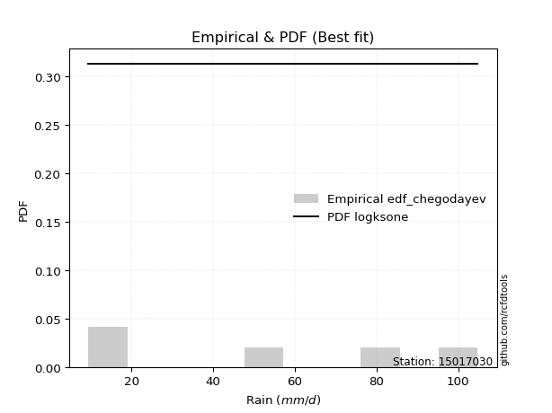</img>

</div>


### 6. Empirical - EDF Blom (1958)

The Blom formula is a specific "plotting position" formula used in hydrology and statistical analysis to estimate the empirical cumulative probability (or non-exceedance probability) of a data series. It is particularly recommended for data that are approximately normally distributed. The constant _a_ is set to 0.375 (or 3/8).

<div align="center">


$P=(m-a)/(n+1-2a)$


</div>


**6.1. Empirical values**

<div align="center">

|                | 0                   | 1                   | 2        | 3                  | 4                  |
|:---------------|:--------------------|:--------------------|:---------|:-------------------|:-------------------|
| date           | 2022                | 2023                | 2021     | 2025               | 2024               |
| x              | 9.5                 | 17.2                | 49.4     | 64.2               | 104.8              |
| m              | 1                   | 2                   | 3        | 4                  | 5                  |
| empirical_dist | edf_blom            | edf_blom            | edf_blom | edf_blom           | edf_blom           |
| empirical      | 0.11904761904761904 | 0.30952380952380953 | 0.5      | 0.6904761904761905 | 0.8809523809523809 |
| empirical_tr   | 1.135135135135135   | 1.4482758620689655  | 2.0      | 3.230769230769231  | 8.399999999999999  |

</div>


**6.2. Kolmogorov-Smirnov fit test (sorted by Δ)**


<div align="center">

|                | 0                  | 1                   | 2                   | 3                   | 4                   | 5                   | 6                   | 7                     | 8                   | 9                  | 10                 | 11                  | 12                 | 13                  | 14                  | 15                  | 16                  | 17                  | 18                  | 19                 | 20                  | 21                  | 22                  | 23                 | 24                  | 25                 | 26                  | 27                  | 28                 | 29                  | 30                 | 31                  | 32                  | 33                  | 34                 | 35                  | 36                  | 37                  | 38                  | 39                  | 40                  | 41                  | 42                 | 43                 | 44                 | 45                  | 46                  | 47                  | 48                 | 49                  | 50                  | 51                  | 52                 | 53                 | 54                  | 55                  | 56                  | 57                  | 58                  | 59                  | 60                  | 61                 | 62                  | 63                 | 64                  | 65                  | 66                 | 67                  | 68                  | 69                 | 70                  | 71                  | 72                  | 73                  | 74                  | 75                  | 76                 | 77                 | 78                  | 79                  | 80                 | 81                  | 82                  | 83                  | 84                 | 85                 | 86                  | 87                 | 88                  | 89                 |
|:---------------|:-------------------|:--------------------|:--------------------|:--------------------|:--------------------|:--------------------|:--------------------|:----------------------|:--------------------|:-------------------|:-------------------|:--------------------|:-------------------|:--------------------|:--------------------|:--------------------|:--------------------|:--------------------|:--------------------|:-------------------|:--------------------|:--------------------|:--------------------|:-------------------|:--------------------|:-------------------|:--------------------|:--------------------|:-------------------|:--------------------|:-------------------|:--------------------|:--------------------|:--------------------|:-------------------|:--------------------|:--------------------|:--------------------|:--------------------|:--------------------|:--------------------|:--------------------|:-------------------|:-------------------|:-------------------|:--------------------|:--------------------|:--------------------|:-------------------|:--------------------|:--------------------|:--------------------|:-------------------|:-------------------|:--------------------|:--------------------|:--------------------|:--------------------|:--------------------|:--------------------|:--------------------|:-------------------|:--------------------|:-------------------|:--------------------|:--------------------|:-------------------|:--------------------|:--------------------|:-------------------|:--------------------|:--------------------|:--------------------|:--------------------|:--------------------|:--------------------|:-------------------|:-------------------|:--------------------|:--------------------|:-------------------|:--------------------|:--------------------|:--------------------|:-------------------|:-------------------|:--------------------|:-------------------|:--------------------|:-------------------|
| station        | 15017030           | 15017030            | 15017030            | 15017030            | 15017030            | 15017030            | 15017030            | 15017030              | 15017030            | 15017030           | 15017030           | 15017030            | 15017030           | 15017030            | 15017030            | 15017030            | 15017030            | 15017030            | 15017030            | 15017030           | 15017030            | 15017030            | 15017030            | 15017030           | 15017030            | 15017030           | 15017030            | 15017030            | 15017030           | 15017030            | 15017030           | 15017030            | 15017030            | 15017030            | 15017030           | 15017030            | 15017030            | 15017030            | 15017030            | 15017030            | 15017030            | 15017030            | 15017030           | 15017030           | 15017030           | 15017030            | 15017030            | 15017030            | 15017030           | 15017030            | 15017030            | 15017030            | 15017030           | 15017030           | 15017030            | 15017030            | 15017030            | 15017030            | 15017030            | 15017030            | 15017030            | 15017030           | 15017030            | 15017030           | 15017030            | 15017030            | 15017030           | 15017030            | 15017030            | 15017030           | 15017030            | 15017030            | 15017030            | 15017030            | 15017030            | 15017030            | 15017030           | 15017030           | 15017030            | 15017030            | 15017030           | 15017030            | 15017030            | 15017030            | 15017030           | 15017030           | 15017030            | 15017030           | 15017030            | 15017030           |
| empirical_dist | edf_blom           | edf_blom            | edf_blom            | edf_blom            | edf_blom            | edf_blom            | edf_blom            | edf_blom              | edf_blom            | edf_blom           | edf_blom           | edf_blom            | edf_blom           | edf_blom            | edf_blom            | edf_blom            | edf_blom            | edf_blom            | edf_blom            | edf_blom           | edf_blom            | edf_blom            | edf_blom            | edf_blom           | edf_blom            | edf_blom           | edf_blom            | edf_blom            | edf_blom           | edf_blom            | edf_blom           | edf_blom            | edf_blom            | edf_blom            | edf_blom           | edf_blom            | edf_blom            | edf_blom            | edf_blom            | edf_blom            | edf_blom            | edf_blom            | edf_blom           | edf_blom           | edf_blom           | edf_blom            | edf_blom            | edf_blom            | edf_blom           | edf_blom            | edf_blom            | edf_blom            | edf_blom           | edf_blom           | edf_blom            | edf_blom            | edf_blom            | edf_blom            | edf_blom            | edf_blom            | edf_blom            | edf_blom           | edf_blom            | edf_blom           | edf_blom            | edf_blom            | edf_blom           | edf_blom            | edf_blom            | edf_blom           | edf_blom            | edf_blom            | edf_blom            | edf_blom            | edf_blom            | edf_blom            | edf_blom           | edf_blom           | edf_blom            | edf_blom            | edf_blom           | edf_blom            | edf_blom            | edf_blom            | edf_blom           | edf_blom           | edf_blom            | edf_blom           | edf_blom            | edf_blom           |
| p_dist         | mielke             | logloggamma         | halfnorm            | logjohnsonsu        | rayleigh            | ncf                 | maxwell             | loglaplace_asymmetric | logweibull_min      | logfisk            | loggumbel_l        | pearson3            | t                  | truncnorm           | crystalball         | norm                | logpearson3         | invgamma            | weibull_min         | genlogistic        | expon               | exponnorm           | kstwobign           | genexpon           | laplace_asymmetric  | loggompertz        | f                   | logf                | logt               | logexponnorm        | logcrystalball     | lognorm             | lognorm             | lognct              | logfatiguelife     | gumbel_r            | gumbel_l            | logistic            | loggamma            | loggamma            | logbetaprime        | logerlang           | halflogistic       | logrice            | rice               | logncf              | hypsecant           | loginvgamma         | logalpha           | gompertz            | loglogistic         | moyal               | logmaxwell         | loginvgauss        | laplace             | lograyleigh         | loginvweibull       | invweibull          | loghypsecant        | invgauss            | logkstwobign        | loghalfnorm        | fisk                | loggenexpon        | nct                 | loglaplace          | loggumbel_r        | alpha               | logmielke           | logexpon           | loghalflogistic     | logmoyal            | nakagami            | chi2                | pareto              | logwald             | logchi2            | betaprime          | erlang              | wald                | logtruncnorm       | lognakagami         | gibrat              | loggibrat           | logpareto          | fatiguelife        | loglognorm          | gamma              | johnsonsu           | loggenlogistic     |
| delta          | 0.1124589799679217 | 0.11940662656167278 | 0.11965033005604653 | 0.12047468974898695 | 0.12052041922047124 | 0.12184039110800515 | 0.12375081011627734 | 0.12516548053914653   | 0.12520135154834247 | 0.1279359119709087 | 0.1298723970146339 | 0.13110728845373312 | 0.1320315376792881 | 0.13205035864664658 | 0.13205045072316768 | 0.13205045199144244 | 0.13251271897464012 | 0.13373882282585348 | 0.13375715696454016 | 0.1350883161360277 | 0.13564090926283678 | 0.13623467556230806 | 0.13988405692060576 | 0.1400231157070127 | 0.14526880907727902 | 0.1482569764627718 | 0.14871013400965905 | 0.14879177454008974 | 0.1490877063581355 | 0.14909030120090982 | 0.149092329974033  | 0.14909233162058055 | 0.14909233162058055 | 0.14950557286966437 | 0.149572514643031  | 0.15053822010734583 | 0.15198901525777606 | 0.15214096017608011 | 0.15394793292000064 | 0.15394793292000064 | 0.15466784859551996 | 0.15672165051214582 | 0.1585200788636442 | 0.161776761244811  | 0.1617819067877109 | 0.16325520201762334 | 0.16327397454483503 | 0.16390998640174748 | 0.1664535301132486 | 0.16694283343356464 | 0.16695642281070355 | 0.17074303238205712 | 0.1708245429411187 | 0.1725754326492075 | 0.17437068751550774 | 0.17736350360907838 | 0.17808622774144656 | 0.17854148052380603 | 0.18084032873183264 | 0.18770854720933572 | 0.19435203703712955 | 0.1963728532343636 | 0.20523537561102523 | 0.206784570703743  | 0.20722911353341766 | 0.20905140877603245 | 0.2092100821251347 | 0.21254991733225603 | 0.21436832020050145 | 0.2157206788499998 | 0.22450205585577176 | 0.22911582959149768 | 0.23047055255037552 | 0.25091558034956496 | 0.26083605705495216 | 0.28550216189903443 | 0.2956563756845979 | 0.2999786263871549 | 0.30262045696979567 | 0.30884071141523406 | 0.3095238075486588 | 0.30952380952365516 | 0.30952380952380953 | 0.31771820035534204 | 0.3288888930615579 | 0.3492999490125257 | 0.35941668673902705 | 0.4037423914816174 | 0.49556433611251394 | 0.6904761904761905 |
| deltao         | 0.5865427407550001 | 0.5865427407550001  | 0.5865427407550001  | 0.5865427407550001  | 0.5865427407550001  | 0.5865427407550001  | 0.5865427407550001  | 0.5865427407550001    | 0.5865427407550001  | 0.5865427407550001 | 0.5865427407550001 | 0.5865427407550001  | 0.5865427407550001 | 0.5865427407550001  | 0.5865427407550001  | 0.5865427407550001  | 0.5865427407550001  | 0.5865427407550001  | 0.5865427407550001  | 0.5865427407550001 | 0.5865427407550001  | 0.5865427407550001  | 0.5865427407550001  | 0.5865427407550001 | 0.5865427407550001  | 0.5865427407550001 | 0.5865427407550001  | 0.5865427407550001  | 0.5865427407550001 | 0.5865427407550001  | 0.5865427407550001 | 0.5865427407550001  | 0.5865427407550001  | 0.5865427407550001  | 0.5865427407550001 | 0.5865427407550001  | 0.5865427407550001  | 0.5865427407550001  | 0.5865427407550001  | 0.5865427407550001  | 0.5865427407550001  | 0.5865427407550001  | 0.5865427407550001 | 0.5865427407550001 | 0.5865427407550001 | 0.5865427407550001  | 0.5865427407550001  | 0.5865427407550001  | 0.5865427407550001 | 0.5865427407550001  | 0.5865427407550001  | 0.5865427407550001  | 0.5865427407550001 | 0.5865427407550001 | 0.5865427407550001  | 0.5865427407550001  | 0.5865427407550001  | 0.5865427407550001  | 0.5865427407550001  | 0.5865427407550001  | 0.5865427407550001  | 0.5865427407550001 | 0.5865427407550001  | 0.5865427407550001 | 0.5865427407550001  | 0.5865427407550001  | 0.5865427407550001 | 0.5865427407550001  | 0.5865427407550001  | 0.5865427407550001 | 0.5865427407550001  | 0.5865427407550001  | 0.5865427407550001  | 0.5865427407550001  | 0.5865427407550001  | 0.5865427407550001  | 0.5865427407550001 | 0.5865427407550001 | 0.5865427407550001  | 0.5865427407550001  | 0.5865427407550001 | 0.5865427407550001  | 0.5865427407550001  | 0.5865427407550001  | 0.5865427407550001 | 0.5865427407550001 | 0.5865427407550001  | 0.5865427407550001 | 0.5865427407550001  | 0.5865427407550001 |
| eval           | Δo > Δ             | Δo > Δ              | Δo > Δ              | Δo > Δ              | Δo > Δ              | Δo > Δ              | Δo > Δ              | Δo > Δ                | Δo > Δ              | Δo > Δ             | Δo > Δ             | Δo > Δ              | Δo > Δ             | Δo > Δ              | Δo > Δ              | Δo > Δ              | Δo > Δ              | Δo > Δ              | Δo > Δ              | Δo > Δ             | Δo > Δ              | Δo > Δ              | Δo > Δ              | Δo > Δ             | Δo > Δ              | Δo > Δ             | Δo > Δ              | Δo > Δ              | Δo > Δ             | Δo > Δ              | Δo > Δ             | Δo > Δ              | Δo > Δ              | Δo > Δ              | Δo > Δ             | Δo > Δ              | Δo > Δ              | Δo > Δ              | Δo > Δ              | Δo > Δ              | Δo > Δ              | Δo > Δ              | Δo > Δ             | Δo > Δ             | Δo > Δ             | Δo > Δ              | Δo > Δ              | Δo > Δ              | Δo > Δ             | Δo > Δ              | Δo > Δ              | Δo > Δ              | Δo > Δ             | Δo > Δ             | Δo > Δ              | Δo > Δ              | Δo > Δ              | Δo > Δ              | Δo > Δ              | Δo > Δ              | Δo > Δ              | Δo > Δ             | Δo > Δ              | Δo > Δ             | Δo > Δ              | Δo > Δ              | Δo > Δ             | Δo > Δ              | Δo > Δ              | Δo > Δ             | Δo > Δ              | Δo > Δ              | Δo > Δ              | Δo > Δ              | Δo > Δ              | Δo > Δ              | Δo > Δ             | Δo > Δ             | Δo > Δ              | Δo > Δ              | Δo > Δ             | Δo > Δ              | Δo > Δ              | Δo > Δ              | Δo > Δ             | Δo > Δ             | Δo > Δ              | Δo > Δ             | Δo > Δ              | Δo <= Δ            |
| fit            | 1                  | 1                   | 1                   | 1                   | 1                   | 1                   | 1                   | 1                     | 1                   | 1                  | 1                  | 1                   | 1                  | 1                   | 1                   | 1                   | 1                   | 1                   | 1                   | 1                  | 1                   | 1                   | 1                   | 1                  | 1                   | 1                  | 1                   | 1                   | 1                  | 1                   | 1                  | 1                   | 1                   | 1                   | 1                  | 1                   | 1                   | 1                   | 1                   | 1                   | 1                   | 1                   | 1                  | 1                  | 1                  | 1                   | 1                   | 1                   | 1                  | 1                   | 1                   | 1                   | 1                  | 1                  | 1                   | 1                   | 1                   | 1                   | 1                   | 1                   | 1                   | 1                  | 1                   | 1                  | 1                   | 1                   | 1                  | 1                   | 1                   | 1                  | 1                   | 1                   | 1                   | 1                   | 1                   | 1                   | 1                  | 1                  | 1                   | 1                   | 1                  | 1                   | 1                   | 1                   | 1                  | 1                  | 1                   | 1                  | 1                   | 0                  |
| n              | 5                  | 5                   | 5                   | 5                   | 5                   | 5                   | 5                   | 5                     | 5                   | 5                  | 5                  | 5                   | 5                  | 5                   | 5                   | 5                   | 5                   | 5                   | 5                   | 5                  | 5                   | 5                   | 5                   | 5                  | 5                   | 5                  | 5                   | 5                   | 5                  | 5                   | 5                  | 5                   | 5                   | 5                   | 5                  | 5                   | 5                   | 5                   | 5                   | 5                   | 5                   | 5                   | 5                  | 5                  | 5                  | 5                   | 5                   | 5                   | 5                  | 5                   | 5                   | 5                   | 5                  | 5                  | 5                   | 5                   | 5                   | 5                   | 5                   | 5                   | 5                   | 5                  | 5                   | 5                  | 5                   | 5                   | 5                  | 5                   | 5                   | 5                  | 5                   | 5                   | 5                   | 5                   | 5                   | 5                   | 5                  | 5                  | 5                   | 5                   | 5                  | 5                   | 5                   | 5                   | 5                  | 5                  | 5                   | 5                  | 5                   | 5                  |
| best_fit       | 1                  | 0                   | 0                   | 0                   | 0                   | 0                   | 0                   | 0                     | 0                   | 0                  | 0                  | 0                   | 0                  | 0                   | 0                   | 0                   | 0                   | 0                   | 0                   | 0                  | 0                   | 0                   | 0                   | 0                  | 0                   | 0                  | 0                   | 0                   | 0                  | 0                   | 0                  | 0                   | 0                   | 0                   | 0                  | 0                   | 0                   | 0                   | 0                   | 0                   | 0                   | 0                   | 0                  | 0                  | 0                  | 0                   | 0                   | 0                   | 0                  | 0                   | 0                   | 0                   | 0                  | 0                  | 0                   | 0                   | 0                   | 0                   | 0                   | 0                   | 0                   | 0                  | 0                   | 0                  | 0                   | 0                   | 0                  | 0                   | 0                   | 0                  | 0                   | 0                   | 0                   | 0                   | 0                   | 0                   | 0                  | 0                  | 0                   | 0                   | 0                  | 0                   | 0                   | 0                   | 0                  | 0                  | 0                   | 0                  | 0                   | 0                  |
| best_fit_sort  | 1                  | 2                   | 3                   | 4                   | 5                   | 6                   | 7                   | 8                     | 9                   | 10                 | 11                 | 12                  | 13                 | 14                  | 15                  | 16                  | 17                  | 18                  | 19                  | 20                 | 21                  | 22                  | 23                  | 24                 | 25                  | 26                 | 27                  | 28                  | 29                 | 30                  | 31                 | 32                  | 33                  | 34                  | 35                 | 36                  | 37                  | 38                  | 39                  | 40                  | 41                  | 42                  | 43                 | 44                 | 45                 | 46                  | 47                  | 48                  | 49                 | 50                  | 51                  | 52                  | 53                 | 54                 | 55                  | 56                  | 57                  | 58                  | 59                  | 60                  | 61                  | 62                 | 63                  | 64                 | 65                  | 66                  | 67                 | 68                  | 69                  | 70                 | 71                  | 72                  | 73                  | 74                  | 75                  | 76                  | 77                 | 78                 | 79                  | 80                  | 81                 | 82                  | 83                  | 84                  | 85                 | 86                 | 87                  | 88                 | 89                  | 90                 |

</div>


<div align="center">

</img>

</div>


**6.3. Best fit**

<div align="center">

|   id |   station | empirical_dist   | p_dist   |    delta |   deltao | eval   |   fit |   n |   best_fit |   best_fit_sort |
|-----:|----------:|:-----------------|:---------|---------:|---------:|:-------|------:|----:|-----------:|----------------:|
|    0 |  15017030 | edf_blom         | mielke   | 0.112459 | 0.586543 | Δo > Δ |     1 |   5 |          1 |               1 |

</div>


<div align="center">

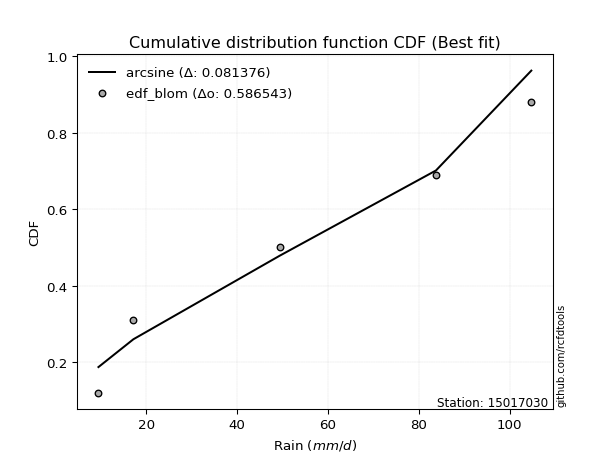</img>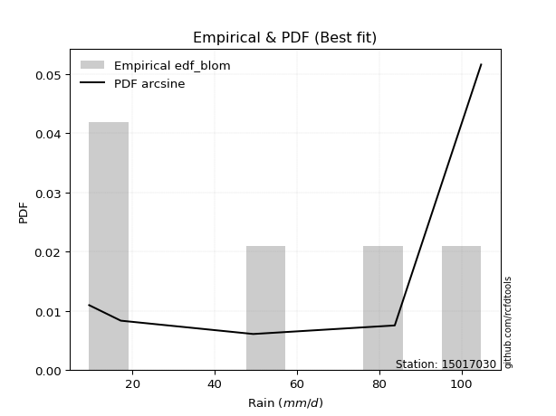</img>

</div>


### 7. Empirical - EDF Tukey (1962)

In hydrology, the Tukey formula is used as a plotting position formula to estimate the empirical probability or frequency of a flood event (or other hydrological data). The formula parameter is given as _c=0.333_ (or 1/3).

<div align="center">


$P=(m-c)/(n+1-2c)$


</div>


**7.1. Empirical values**

<div align="center">

|                | 0                  | 1                  | 2         | 3         | 4         |
|:---------------|:-------------------|:-------------------|:----------|:----------|:----------|
| date           | 2022               | 2023               | 2021      | 2025      | 2024      |
| x              | 9.5                | 17.2               | 49.4      | 64.2      | 104.8     |
| m              | 1                  | 2                  | 3         | 4         | 5         |
| empirical_dist | edf_tukey          | edf_tukey          | edf_tukey | edf_tukey | edf_tukey |
| empirical      | 0.125              | 0.3125             | 0.5       | 0.6875    | 0.875     |
| empirical_tr   | 1.1428571428571428 | 1.4545454545454546 | 2.0       | 3.2       | 8.0       |

</div>


**7.2. Kolmogorov-Smirnov fit test (sorted by Δ)**


<div align="center">

|                | 0                   | 1                  | 2                   | 3                   | 4                   | 5                   | 6                  | 7                  | 8                     | 9                   | 10                  | 11                  | 12                  | 13                 | 14                  | 15                  | 16                  | 17                 | 18                  | 19                  | 20                  | 21                  | 22                  | 23                  | 24                  | 25                 | 26                  | 27                  | 28                 | 29                  | 30                 | 31                  | 32                  | 33                  | 34                 | 35                 | 36                  | 37                  | 38                  | 39                  | 40                  | 41                  | 42                  | 43                 | 44                  | 45                  | 46                  | 47                 | 48                 | 49                  | 50                 | 51                 | 52                 | 53                 | 54                 | 55                  | 56                  | 57                  | 58                  | 59                  | 60                  | 61                 | 62                 | 63                 | 64                  | 65                  | 66                 | 67                  | 68                  | 69                 | 70                  | 71                  | 72                  | 73                  | 74                 | 75                  | 76                 | 77                 | 78                  | 79                 | 80                 | 81                 | 82                 | 83                  | 84                 | 85                  | 86                 | 87                 | 88                  | 89                 |
|:---------------|:--------------------|:-------------------|:--------------------|:--------------------|:--------------------|:--------------------|:-------------------|:-------------------|:----------------------|:--------------------|:--------------------|:--------------------|:--------------------|:-------------------|:--------------------|:--------------------|:--------------------|:-------------------|:--------------------|:--------------------|:--------------------|:--------------------|:--------------------|:--------------------|:--------------------|:-------------------|:--------------------|:--------------------|:-------------------|:--------------------|:-------------------|:--------------------|:--------------------|:--------------------|:-------------------|:-------------------|:--------------------|:--------------------|:--------------------|:--------------------|:--------------------|:--------------------|:--------------------|:-------------------|:--------------------|:--------------------|:--------------------|:-------------------|:-------------------|:--------------------|:-------------------|:-------------------|:-------------------|:-------------------|:-------------------|:--------------------|:--------------------|:--------------------|:--------------------|:--------------------|:--------------------|:-------------------|:-------------------|:-------------------|:--------------------|:--------------------|:-------------------|:--------------------|:--------------------|:-------------------|:--------------------|:--------------------|:--------------------|:--------------------|:-------------------|:--------------------|:-------------------|:-------------------|:--------------------|:-------------------|:-------------------|:-------------------|:-------------------|:--------------------|:-------------------|:--------------------|:-------------------|:-------------------|:--------------------|:-------------------|
| station        | 15017030            | 15017030           | 15017030            | 15017030            | 15017030            | 15017030            | 15017030           | 15017030           | 15017030              | 15017030            | 15017030            | 15017030            | 15017030            | 15017030           | 15017030            | 15017030            | 15017030            | 15017030           | 15017030            | 15017030            | 15017030            | 15017030            | 15017030            | 15017030            | 15017030            | 15017030           | 15017030            | 15017030            | 15017030           | 15017030            | 15017030           | 15017030            | 15017030            | 15017030            | 15017030           | 15017030           | 15017030            | 15017030            | 15017030            | 15017030            | 15017030            | 15017030            | 15017030            | 15017030           | 15017030            | 15017030            | 15017030            | 15017030           | 15017030           | 15017030            | 15017030           | 15017030           | 15017030           | 15017030           | 15017030           | 15017030            | 15017030            | 15017030            | 15017030            | 15017030            | 15017030            | 15017030           | 15017030           | 15017030           | 15017030            | 15017030            | 15017030           | 15017030            | 15017030            | 15017030           | 15017030            | 15017030            | 15017030            | 15017030            | 15017030           | 15017030            | 15017030           | 15017030           | 15017030            | 15017030           | 15017030           | 15017030           | 15017030           | 15017030            | 15017030           | 15017030            | 15017030           | 15017030           | 15017030            | 15017030           |
| empirical_dist | edf_tukey           | edf_tukey          | edf_tukey           | edf_tukey           | edf_tukey           | edf_tukey           | edf_tukey          | edf_tukey          | edf_tukey             | edf_tukey           | edf_tukey           | edf_tukey           | edf_tukey           | edf_tukey          | edf_tukey           | edf_tukey           | edf_tukey           | edf_tukey          | edf_tukey           | edf_tukey           | edf_tukey           | edf_tukey           | edf_tukey           | edf_tukey           | edf_tukey           | edf_tukey          | edf_tukey           | edf_tukey           | edf_tukey          | edf_tukey           | edf_tukey          | edf_tukey           | edf_tukey           | edf_tukey           | edf_tukey          | edf_tukey          | edf_tukey           | edf_tukey           | edf_tukey           | edf_tukey           | edf_tukey           | edf_tukey           | edf_tukey           | edf_tukey          | edf_tukey           | edf_tukey           | edf_tukey           | edf_tukey          | edf_tukey          | edf_tukey           | edf_tukey          | edf_tukey          | edf_tukey          | edf_tukey          | edf_tukey          | edf_tukey           | edf_tukey           | edf_tukey           | edf_tukey           | edf_tukey           | edf_tukey           | edf_tukey          | edf_tukey          | edf_tukey          | edf_tukey           | edf_tukey           | edf_tukey          | edf_tukey           | edf_tukey           | edf_tukey          | edf_tukey           | edf_tukey           | edf_tukey           | edf_tukey           | edf_tukey          | edf_tukey           | edf_tukey          | edf_tukey          | edf_tukey           | edf_tukey          | edf_tukey          | edf_tukey          | edf_tukey          | edf_tukey           | edf_tukey          | edf_tukey           | edf_tukey          | edf_tukey          | edf_tukey           | edf_tukey          |
| p_dist         | mielke              | halfnorm           | logjohnsonsu        | rayleigh            | ncf                 | logloggamma         | maxwell            | logfisk            | loglaplace_asymmetric | logweibull_min      | logpearson3         | loggumbel_l         | invgamma            | pearson3           | t                   | truncnorm           | crystalball         | norm               | expon               | exponnorm           | weibull_min         | genlogistic         | kstwobign           | genexpon            | laplace_asymmetric  | loggompertz        | f                   | logf                | logt               | logexponnorm        | logcrystalball     | lognorm             | lognorm             | lognct              | logfatiguelife     | gumbel_r           | loggamma            | loggamma            | logbetaprime        | gumbel_l            | logistic            | logerlang           | halflogistic        | logrice            | logncf              | loginvgamma         | rice                | hypsecant          | logalpha           | loglogistic         | gompertz           | logmaxwell         | loginvgauss        | moyal              | laplace            | lograyleigh         | loginvweibull       | invweibull          | loghypsecant        | invgauss            | logkstwobign        | loghalfnorm        | fisk               | loggenexpon        | nct                 | loglaplace          | loggumbel_r        | alpha               | logmielke           | logexpon           | loghalflogistic     | logmoyal            | nakagami            | chi2                | pareto             | logwald             | logchi2            | betaprime          | erlang              | wald               | logtruncnorm       | lognakagami        | gibrat             | loggibrat           | logpareto          | fatiguelife         | loglognorm         | gamma              | johnsonsu           | loggenlogistic     |
| delta          | 0.11543517044411217 | 0.122626520532237  | 0.12345088022517742 | 0.12349660969666171 | 0.12481658158419562 | 0.12489581705163277 | 0.1267270005924678 | 0.1279359119709087 | 0.128141671015337     | 0.12817754202453294 | 0.13251271897464012 | 0.13284858749082437 | 0.13373882282585348 | 0.1340834789299236 | 0.13500772815547857 | 0.13502654912283704 | 0.13502664119935814 | 0.1350266424676329 | 0.13564090926283678 | 0.13623467556230806 | 0.13673334744073062 | 0.13806450661221817 | 0.14286024739679623 | 0.14299930618320317 | 0.14824499955346948 | 0.1482569764627718 | 0.14871013400965905 | 0.14879177454008974 | 0.1490877063581355 | 0.14909030120090982 | 0.149092329974033  | 0.14909233162058055 | 0.14909233162058055 | 0.14950557286966437 | 0.149572514643031  | 0.1535144105835363 | 0.15394793292000064 | 0.15394793292000064 | 0.15466784859551996 | 0.15496520573396652 | 0.15511715065227058 | 0.15672165051214582 | 0.16149626933983466 | 0.161776761244811  | 0.16325520201762334 | 0.16390998640174748 | 0.16475809726390137 | 0.1662501650210255 | 0.1664535301132486 | 0.16695642281070355 | 0.1699190239097551 | 0.1708245429411187 | 0.1725754326492075 | 0.1737192228582476 | 0.1773468779916982 | 0.17736350360907838 | 0.17808622774144656 | 0.17854148052380603 | 0.18084032873183264 | 0.18770854720933572 | 0.19435203703712955 | 0.1963728532343636 | 0.1992829946586443 | 0.206784570703743  | 0.20722911353341766 | 0.20905140877603245 | 0.2092100821251347 | 0.21254991733225603 | 0.21436832020050145 | 0.2157206788499998 | 0.22450205585577176 | 0.22911582959149768 | 0.23047055255037552 | 0.25091558034956496 | 0.2578598665787617 | 0.28550216189903443 | 0.2956563756845979 | 0.2999786263871549 | 0.30262045696979567 | 0.3118169018914245 | 0.3124999980248493 | 0.3124999999998456 | 0.3125             | 0.31771820035534204 | 0.3259127025853674 | 0.34632375853633524 | 0.3564404962628366 | 0.4037423914816174 | 0.49258814563632347 | 0.6875             |
| deltao         | 0.5865427407550001  | 0.5865427407550001 | 0.5865427407550001  | 0.5865427407550001  | 0.5865427407550001  | 0.5865427407550001  | 0.5865427407550001 | 0.5865427407550001 | 0.5865427407550001    | 0.5865427407550001  | 0.5865427407550001  | 0.5865427407550001  | 0.5865427407550001  | 0.5865427407550001 | 0.5865427407550001  | 0.5865427407550001  | 0.5865427407550001  | 0.5865427407550001 | 0.5865427407550001  | 0.5865427407550001  | 0.5865427407550001  | 0.5865427407550001  | 0.5865427407550001  | 0.5865427407550001  | 0.5865427407550001  | 0.5865427407550001 | 0.5865427407550001  | 0.5865427407550001  | 0.5865427407550001 | 0.5865427407550001  | 0.5865427407550001 | 0.5865427407550001  | 0.5865427407550001  | 0.5865427407550001  | 0.5865427407550001 | 0.5865427407550001 | 0.5865427407550001  | 0.5865427407550001  | 0.5865427407550001  | 0.5865427407550001  | 0.5865427407550001  | 0.5865427407550001  | 0.5865427407550001  | 0.5865427407550001 | 0.5865427407550001  | 0.5865427407550001  | 0.5865427407550001  | 0.5865427407550001 | 0.5865427407550001 | 0.5865427407550001  | 0.5865427407550001 | 0.5865427407550001 | 0.5865427407550001 | 0.5865427407550001 | 0.5865427407550001 | 0.5865427407550001  | 0.5865427407550001  | 0.5865427407550001  | 0.5865427407550001  | 0.5865427407550001  | 0.5865427407550001  | 0.5865427407550001 | 0.5865427407550001 | 0.5865427407550001 | 0.5865427407550001  | 0.5865427407550001  | 0.5865427407550001 | 0.5865427407550001  | 0.5865427407550001  | 0.5865427407550001 | 0.5865427407550001  | 0.5865427407550001  | 0.5865427407550001  | 0.5865427407550001  | 0.5865427407550001 | 0.5865427407550001  | 0.5865427407550001 | 0.5865427407550001 | 0.5865427407550001  | 0.5865427407550001 | 0.5865427407550001 | 0.5865427407550001 | 0.5865427407550001 | 0.5865427407550001  | 0.5865427407550001 | 0.5865427407550001  | 0.5865427407550001 | 0.5865427407550001 | 0.5865427407550001  | 0.5865427407550001 |
| eval           | Δo > Δ              | Δo > Δ             | Δo > Δ              | Δo > Δ              | Δo > Δ              | Δo > Δ              | Δo > Δ             | Δo > Δ             | Δo > Δ                | Δo > Δ              | Δo > Δ              | Δo > Δ              | Δo > Δ              | Δo > Δ             | Δo > Δ              | Δo > Δ              | Δo > Δ              | Δo > Δ             | Δo > Δ              | Δo > Δ              | Δo > Δ              | Δo > Δ              | Δo > Δ              | Δo > Δ              | Δo > Δ              | Δo > Δ             | Δo > Δ              | Δo > Δ              | Δo > Δ             | Δo > Δ              | Δo > Δ             | Δo > Δ              | Δo > Δ              | Δo > Δ              | Δo > Δ             | Δo > Δ             | Δo > Δ              | Δo > Δ              | Δo > Δ              | Δo > Δ              | Δo > Δ              | Δo > Δ              | Δo > Δ              | Δo > Δ             | Δo > Δ              | Δo > Δ              | Δo > Δ              | Δo > Δ             | Δo > Δ             | Δo > Δ              | Δo > Δ             | Δo > Δ             | Δo > Δ             | Δo > Δ             | Δo > Δ             | Δo > Δ              | Δo > Δ              | Δo > Δ              | Δo > Δ              | Δo > Δ              | Δo > Δ              | Δo > Δ             | Δo > Δ             | Δo > Δ             | Δo > Δ              | Δo > Δ              | Δo > Δ             | Δo > Δ              | Δo > Δ              | Δo > Δ             | Δo > Δ              | Δo > Δ              | Δo > Δ              | Δo > Δ              | Δo > Δ             | Δo > Δ              | Δo > Δ             | Δo > Δ             | Δo > Δ              | Δo > Δ             | Δo > Δ             | Δo > Δ             | Δo > Δ             | Δo > Δ              | Δo > Δ             | Δo > Δ              | Δo > Δ             | Δo > Δ             | Δo > Δ              | Δo <= Δ            |
| fit            | 1                   | 1                  | 1                   | 1                   | 1                   | 1                   | 1                  | 1                  | 1                     | 1                   | 1                   | 1                   | 1                   | 1                  | 1                   | 1                   | 1                   | 1                  | 1                   | 1                   | 1                   | 1                   | 1                   | 1                   | 1                   | 1                  | 1                   | 1                   | 1                  | 1                   | 1                  | 1                   | 1                   | 1                   | 1                  | 1                  | 1                   | 1                   | 1                   | 1                   | 1                   | 1                   | 1                   | 1                  | 1                   | 1                   | 1                   | 1                  | 1                  | 1                   | 1                  | 1                  | 1                  | 1                  | 1                  | 1                   | 1                   | 1                   | 1                   | 1                   | 1                   | 1                  | 1                  | 1                  | 1                   | 1                   | 1                  | 1                   | 1                   | 1                  | 1                   | 1                   | 1                   | 1                   | 1                  | 1                   | 1                  | 1                  | 1                   | 1                  | 1                  | 1                  | 1                  | 1                   | 1                  | 1                   | 1                  | 1                  | 1                   | 0                  |
| n              | 5                   | 5                  | 5                   | 5                   | 5                   | 5                   | 5                  | 5                  | 5                     | 5                   | 5                   | 5                   | 5                   | 5                  | 5                   | 5                   | 5                   | 5                  | 5                   | 5                   | 5                   | 5                   | 5                   | 5                   | 5                   | 5                  | 5                   | 5                   | 5                  | 5                   | 5                  | 5                   | 5                   | 5                   | 5                  | 5                  | 5                   | 5                   | 5                   | 5                   | 5                   | 5                   | 5                   | 5                  | 5                   | 5                   | 5                   | 5                  | 5                  | 5                   | 5                  | 5                  | 5                  | 5                  | 5                  | 5                   | 5                   | 5                   | 5                   | 5                   | 5                   | 5                  | 5                  | 5                  | 5                   | 5                   | 5                  | 5                   | 5                   | 5                  | 5                   | 5                   | 5                   | 5                   | 5                  | 5                   | 5                  | 5                  | 5                   | 5                  | 5                  | 5                  | 5                  | 5                   | 5                  | 5                   | 5                  | 5                  | 5                   | 5                  |
| best_fit       | 1                   | 0                  | 0                   | 0                   | 0                   | 0                   | 0                  | 0                  | 0                     | 0                   | 0                   | 0                   | 0                   | 0                  | 0                   | 0                   | 0                   | 0                  | 0                   | 0                   | 0                   | 0                   | 0                   | 0                   | 0                   | 0                  | 0                   | 0                   | 0                  | 0                   | 0                  | 0                   | 0                   | 0                   | 0                  | 0                  | 0                   | 0                   | 0                   | 0                   | 0                   | 0                   | 0                   | 0                  | 0                   | 0                   | 0                   | 0                  | 0                  | 0                   | 0                  | 0                  | 0                  | 0                  | 0                  | 0                   | 0                   | 0                   | 0                   | 0                   | 0                   | 0                  | 0                  | 0                  | 0                   | 0                   | 0                  | 0                   | 0                   | 0                  | 0                   | 0                   | 0                   | 0                   | 0                  | 0                   | 0                  | 0                  | 0                   | 0                  | 0                  | 0                  | 0                  | 0                   | 0                  | 0                   | 0                  | 0                  | 0                   | 0                  |
| best_fit_sort  | 1                   | 2                  | 3                   | 4                   | 5                   | 6                   | 7                  | 8                  | 9                     | 10                  | 11                  | 12                  | 13                  | 14                 | 15                  | 16                  | 17                  | 18                 | 19                  | 20                  | 21                  | 22                  | 23                  | 24                  | 25                  | 26                 | 27                  | 28                  | 29                 | 30                  | 31                 | 32                  | 33                  | 34                  | 35                 | 36                 | 37                  | 38                  | 39                  | 40                  | 41                  | 42                  | 43                  | 44                 | 45                  | 46                  | 47                  | 48                 | 49                 | 50                  | 51                 | 52                 | 53                 | 54                 | 55                 | 56                  | 57                  | 58                  | 59                  | 60                  | 61                  | 62                 | 63                 | 64                 | 65                  | 66                  | 67                 | 68                  | 69                  | 70                 | 71                  | 72                  | 73                  | 74                  | 75                 | 76                  | 77                 | 78                 | 79                  | 80                 | 81                 | 82                 | 83                 | 84                  | 85                 | 86                  | 87                 | 88                 | 89                  | 90                 |

</div>


<div align="center">

</img>

</div>


**7.3. Best fit**

<div align="center">

|   id |   station | empirical_dist   | p_dist   |    delta |   deltao | eval   |   fit |   n |   best_fit |   best_fit_sort |
|-----:|----------:|:-----------------|:---------|---------:|---------:|:-------|------:|----:|-----------:|----------------:|
|    0 |  15017030 | edf_tukey        | mielke   | 0.115435 | 0.586543 | Δo > Δ |     1 |   5 |          1 |               1 |

</div>


<div align="center">

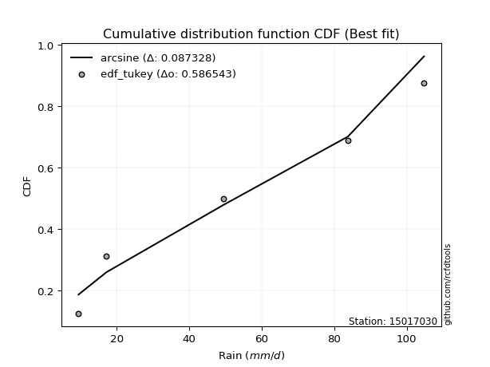</img></img>

</div>


### 8. Empirical - EDF Gringorten (1963)

Gringorten plotting position formula is essential for estimating the probability and return periods of extreme events like floods and heavy rainfall. The constant _a=0.44_.

<div align="center">


$P=(m-a)/(n+1-2a)$


</div>


**8.1. Empirical values**

<div align="center">

|                | 0                   | 1                  | 2              | 3                 | 4                  |
|:---------------|:--------------------|:-------------------|:---------------|:------------------|:-------------------|
| date           | 2022                | 2023               | 2021           | 2025              | 2024               |
| x              | 9.5                 | 17.2               | 49.4           | 64.2              | 104.8              |
| m              | 1                   | 2                  | 3              | 4                 | 5                  |
| empirical_dist | edf_gringorten      | edf_gringorten     | edf_gringorten | edf_gringorten    | edf_gringorten     |
| empirical      | 0.10937500000000001 | 0.3046875          | 0.5            | 0.6953125         | 0.8906249999999999 |
| empirical_tr   | 1.1228070175438596  | 1.4382022471910112 | 2.0            | 3.282051282051282 | 9.142857142857133  |

</div>


**8.2. Kolmogorov-Smirnov fit test (sorted by Δ)**


<div align="center">

|                | 0                   | 1                   | 2                  | 3                   | 4                   | 5                   | 6                  | 7                     | 8                   | 9                   | 10                 | 11                  | 12                  | 13                  | 14                 | 15                 | 16                  | 17                  | 18                  | 19                  | 20                  | 21                  | 22                  | 23                  | 24                  | 25                 | 26                  | 27                  | 28                 | 29                  | 30                  | 31                 | 32                  | 33                 | 34                  | 35                  | 36                  | 37                 | 38                  | 39                  | 40                  | 41                  | 42                  | 43                  | 44                 | 45                 | 46                 | 47                  | 48                  | 49                 | 50                 | 51                  | 52                 | 53                 | 54                 | 55                  | 56                  | 57                  | 58                  | 59                  | 60                  | 61                 | 62                 | 63                  | 64                  | 65                 | 66                  | 67                  | 68                  | 69                 | 70                  | 71                  | 72                  | 73                  | 74                 | 75                  | 76                 | 77                 | 78                  | 79                 | 80                 | 81                 | 82                 | 83                  | 84                 | 85                  | 86                 | 87                 | 88                 | 89                 |
|:---------------|:--------------------|:--------------------|:-------------------|:--------------------|:--------------------|:--------------------|:-------------------|:----------------------|:--------------------|:--------------------|:-------------------|:--------------------|:--------------------|:--------------------|:-------------------|:-------------------|:--------------------|:--------------------|:--------------------|:--------------------|:--------------------|:--------------------|:--------------------|:--------------------|:--------------------|:-------------------|:--------------------|:--------------------|:-------------------|:--------------------|:--------------------|:-------------------|:--------------------|:-------------------|:--------------------|:--------------------|:--------------------|:-------------------|:--------------------|:--------------------|:--------------------|:--------------------|:--------------------|:--------------------|:-------------------|:-------------------|:-------------------|:--------------------|:--------------------|:-------------------|:-------------------|:--------------------|:-------------------|:-------------------|:-------------------|:--------------------|:--------------------|:--------------------|:--------------------|:--------------------|:--------------------|:-------------------|:-------------------|:--------------------|:--------------------|:-------------------|:--------------------|:--------------------|:--------------------|:-------------------|:--------------------|:--------------------|:--------------------|:--------------------|:-------------------|:--------------------|:-------------------|:-------------------|:--------------------|:-------------------|:-------------------|:-------------------|:-------------------|:--------------------|:-------------------|:--------------------|:-------------------|:-------------------|:-------------------|:-------------------|
| station        | 15017030            | 15017030            | 15017030           | 15017030            | 15017030            | 15017030            | 15017030           | 15017030              | 15017030            | 15017030            | 15017030           | 15017030            | 15017030            | 15017030            | 15017030           | 15017030           | 15017030            | 15017030            | 15017030            | 15017030            | 15017030            | 15017030            | 15017030            | 15017030            | 15017030            | 15017030           | 15017030            | 15017030            | 15017030           | 15017030            | 15017030            | 15017030           | 15017030            | 15017030           | 15017030            | 15017030            | 15017030            | 15017030           | 15017030            | 15017030            | 15017030            | 15017030            | 15017030            | 15017030            | 15017030           | 15017030           | 15017030           | 15017030            | 15017030            | 15017030           | 15017030           | 15017030            | 15017030           | 15017030           | 15017030           | 15017030            | 15017030            | 15017030            | 15017030            | 15017030            | 15017030            | 15017030           | 15017030           | 15017030            | 15017030            | 15017030           | 15017030            | 15017030            | 15017030            | 15017030           | 15017030            | 15017030            | 15017030            | 15017030            | 15017030           | 15017030            | 15017030           | 15017030           | 15017030            | 15017030           | 15017030           | 15017030           | 15017030           | 15017030            | 15017030           | 15017030            | 15017030           | 15017030           | 15017030           | 15017030           |
| empirical_dist | edf_gringorten      | edf_gringorten      | edf_gringorten     | edf_gringorten      | edf_gringorten      | edf_gringorten      | edf_gringorten     | edf_gringorten        | edf_gringorten      | edf_gringorten      | edf_gringorten     | edf_gringorten      | edf_gringorten      | edf_gringorten      | edf_gringorten     | edf_gringorten     | edf_gringorten      | edf_gringorten      | edf_gringorten      | edf_gringorten      | edf_gringorten      | edf_gringorten      | edf_gringorten      | edf_gringorten      | edf_gringorten      | edf_gringorten     | edf_gringorten      | edf_gringorten      | edf_gringorten     | edf_gringorten      | edf_gringorten      | edf_gringorten     | edf_gringorten      | edf_gringorten     | edf_gringorten      | edf_gringorten      | edf_gringorten      | edf_gringorten     | edf_gringorten      | edf_gringorten      | edf_gringorten      | edf_gringorten      | edf_gringorten      | edf_gringorten      | edf_gringorten     | edf_gringorten     | edf_gringorten     | edf_gringorten      | edf_gringorten      | edf_gringorten     | edf_gringorten     | edf_gringorten      | edf_gringorten     | edf_gringorten     | edf_gringorten     | edf_gringorten      | edf_gringorten      | edf_gringorten      | edf_gringorten      | edf_gringorten      | edf_gringorten      | edf_gringorten     | edf_gringorten     | edf_gringorten      | edf_gringorten      | edf_gringorten     | edf_gringorten      | edf_gringorten      | edf_gringorten      | edf_gringorten     | edf_gringorten      | edf_gringorten      | edf_gringorten      | edf_gringorten      | edf_gringorten     | edf_gringorten      | edf_gringorten     | edf_gringorten     | edf_gringorten      | edf_gringorten     | edf_gringorten     | edf_gringorten     | edf_gringorten     | edf_gringorten      | edf_gringorten     | edf_gringorten      | edf_gringorten     | edf_gringorten     | edf_gringorten     | edf_gringorten     |
| p_dist         | mielke              | logloggamma         | halfnorm           | logjohnsonsu        | rayleigh            | ncf                 | maxwell            | loglaplace_asymmetric | logweibull_min      | loggumbel_l         | pearson3           | t                   | truncnorm           | crystalball         | norm               | logfisk            | weibull_min         | genlogistic         | logpearson3         | invgamma            | kstwobign           | genexpon            | expon               | exponnorm           | laplace_asymmetric  | gumbel_r           | gumbel_l            | logistic            | loggompertz        | f                   | logf                | logt               | logexponnorm        | logcrystalball     | lognorm             | lognorm             | lognct              | logfatiguelife     | halflogistic        | loggamma            | loggamma            | logbetaprime        | logerlang           | rice                | hypsecant          | logrice            | gompertz           | logncf              | loginvgamma         | moyal              | logalpha           | loglogistic         | laplace            | logmaxwell         | loginvgauss        | lograyleigh         | loginvweibull       | invweibull          | loghypsecant        | invgauss            | logkstwobign        | loghalfnorm        | loggenexpon        | nct                 | loglaplace          | loggumbel_r        | alpha               | logmielke           | fisk                | logexpon           | loghalflogistic     | logmoyal            | nakagami            | chi2                | pareto             | logwald             | logchi2            | betaprime          | erlang              | wald               | logtruncnorm       | lognakagami        | gibrat             | loggibrat           | logpareto          | fatiguelife         | loglognorm         | gamma              | johnsonsu          | loggenlogistic     |
| delta          | 0.10762267044411217 | 0.11457031703786325 | 0.114814020532237  | 0.11563838022517742 | 0.11568410969666171 | 0.11700408158419562 | 0.1189145005924678 | 0.120329171015337     | 0.12036504202453294 | 0.12503608749082437 | 0.1262709789299236 | 0.12719522815547857 | 0.12721404912283704 | 0.12721414119935814 | 0.1272141424676329 | 0.1279359119709087 | 0.12892084744073062 | 0.13025200661221817 | 0.13251271897464012 | 0.13373882282585348 | 0.13504774739679623 | 0.13518680618320317 | 0.13564090926283678 | 0.13623467556230806 | 0.14043249955346948 | 0.1457019105835363 | 0.14715270573396652 | 0.14730465065227058 | 0.1482569764627718 | 0.14871013400965905 | 0.14879177454008974 | 0.1490877063581355 | 0.14909030120090982 | 0.149092329974033  | 0.14909233162058055 | 0.14909233162058055 | 0.14950557286966437 | 0.149572514643031  | 0.15368376933983466 | 0.15394793292000064 | 0.15394793292000064 | 0.15466784859551996 | 0.15672165051214582 | 0.15694559726390137 | 0.1584376650210255 | 0.161776761244811  | 0.1621065239097551 | 0.16325520201762334 | 0.16390998640174748 | 0.1659067228582476 | 0.1664535301132486 | 0.16695642281070355 | 0.1695343779916982 | 0.1708245429411187 | 0.1725754326492075 | 0.17736350360907838 | 0.17808622774144656 | 0.17854148052380603 | 0.18084032873183264 | 0.18770854720933572 | 0.19435203703712955 | 0.1963728532343636 | 0.206784570703743  | 0.20722911353341766 | 0.20905140877603245 | 0.2092100821251347 | 0.21254991733225603 | 0.21436832020050145 | 0.21490799465864419 | 0.2157206788499998 | 0.22450205585577176 | 0.22911582959149768 | 0.23047055255037552 | 0.25091558034956496 | 0.2656723665787617 | 0.28550216189903443 | 0.2956563756845979 | 0.2999786263871549 | 0.30262045696979567 | 0.3040044018914245 | 0.3046874980248493 | 0.3046874999998456 | 0.3046875          | 0.31771820035534204 | 0.3337252025853674 | 0.35413625853633524 | 0.3642529962628366 | 0.4037423914816174 | 0.5004006456363235 | 0.6953125          |
| deltao         | 0.5865427407550001  | 0.5865427407550001  | 0.5865427407550001 | 0.5865427407550001  | 0.5865427407550001  | 0.5865427407550001  | 0.5865427407550001 | 0.5865427407550001    | 0.5865427407550001  | 0.5865427407550001  | 0.5865427407550001 | 0.5865427407550001  | 0.5865427407550001  | 0.5865427407550001  | 0.5865427407550001 | 0.5865427407550001 | 0.5865427407550001  | 0.5865427407550001  | 0.5865427407550001  | 0.5865427407550001  | 0.5865427407550001  | 0.5865427407550001  | 0.5865427407550001  | 0.5865427407550001  | 0.5865427407550001  | 0.5865427407550001 | 0.5865427407550001  | 0.5865427407550001  | 0.5865427407550001 | 0.5865427407550001  | 0.5865427407550001  | 0.5865427407550001 | 0.5865427407550001  | 0.5865427407550001 | 0.5865427407550001  | 0.5865427407550001  | 0.5865427407550001  | 0.5865427407550001 | 0.5865427407550001  | 0.5865427407550001  | 0.5865427407550001  | 0.5865427407550001  | 0.5865427407550001  | 0.5865427407550001  | 0.5865427407550001 | 0.5865427407550001 | 0.5865427407550001 | 0.5865427407550001  | 0.5865427407550001  | 0.5865427407550001 | 0.5865427407550001 | 0.5865427407550001  | 0.5865427407550001 | 0.5865427407550001 | 0.5865427407550001 | 0.5865427407550001  | 0.5865427407550001  | 0.5865427407550001  | 0.5865427407550001  | 0.5865427407550001  | 0.5865427407550001  | 0.5865427407550001 | 0.5865427407550001 | 0.5865427407550001  | 0.5865427407550001  | 0.5865427407550001 | 0.5865427407550001  | 0.5865427407550001  | 0.5865427407550001  | 0.5865427407550001 | 0.5865427407550001  | 0.5865427407550001  | 0.5865427407550001  | 0.5865427407550001  | 0.5865427407550001 | 0.5865427407550001  | 0.5865427407550001 | 0.5865427407550001 | 0.5865427407550001  | 0.5865427407550001 | 0.5865427407550001 | 0.5865427407550001 | 0.5865427407550001 | 0.5865427407550001  | 0.5865427407550001 | 0.5865427407550001  | 0.5865427407550001 | 0.5865427407550001 | 0.5865427407550001 | 0.5865427407550001 |
| eval           | Δo > Δ              | Δo > Δ              | Δo > Δ             | Δo > Δ              | Δo > Δ              | Δo > Δ              | Δo > Δ             | Δo > Δ                | Δo > Δ              | Δo > Δ              | Δo > Δ             | Δo > Δ              | Δo > Δ              | Δo > Δ              | Δo > Δ             | Δo > Δ             | Δo > Δ              | Δo > Δ              | Δo > Δ              | Δo > Δ              | Δo > Δ              | Δo > Δ              | Δo > Δ              | Δo > Δ              | Δo > Δ              | Δo > Δ             | Δo > Δ              | Δo > Δ              | Δo > Δ             | Δo > Δ              | Δo > Δ              | Δo > Δ             | Δo > Δ              | Δo > Δ             | Δo > Δ              | Δo > Δ              | Δo > Δ              | Δo > Δ             | Δo > Δ              | Δo > Δ              | Δo > Δ              | Δo > Δ              | Δo > Δ              | Δo > Δ              | Δo > Δ             | Δo > Δ             | Δo > Δ             | Δo > Δ              | Δo > Δ              | Δo > Δ             | Δo > Δ             | Δo > Δ              | Δo > Δ             | Δo > Δ             | Δo > Δ             | Δo > Δ              | Δo > Δ              | Δo > Δ              | Δo > Δ              | Δo > Δ              | Δo > Δ              | Δo > Δ             | Δo > Δ             | Δo > Δ              | Δo > Δ              | Δo > Δ             | Δo > Δ              | Δo > Δ              | Δo > Δ              | Δo > Δ             | Δo > Δ              | Δo > Δ              | Δo > Δ              | Δo > Δ              | Δo > Δ             | Δo > Δ              | Δo > Δ             | Δo > Δ             | Δo > Δ              | Δo > Δ             | Δo > Δ             | Δo > Δ             | Δo > Δ             | Δo > Δ              | Δo > Δ             | Δo > Δ              | Δo > Δ             | Δo > Δ             | Δo > Δ             | Δo <= Δ            |
| fit            | 1                   | 1                   | 1                  | 1                   | 1                   | 1                   | 1                  | 1                     | 1                   | 1                   | 1                  | 1                   | 1                   | 1                   | 1                  | 1                  | 1                   | 1                   | 1                   | 1                   | 1                   | 1                   | 1                   | 1                   | 1                   | 1                  | 1                   | 1                   | 1                  | 1                   | 1                   | 1                  | 1                   | 1                  | 1                   | 1                   | 1                   | 1                  | 1                   | 1                   | 1                   | 1                   | 1                   | 1                   | 1                  | 1                  | 1                  | 1                   | 1                   | 1                  | 1                  | 1                   | 1                  | 1                  | 1                  | 1                   | 1                   | 1                   | 1                   | 1                   | 1                   | 1                  | 1                  | 1                   | 1                   | 1                  | 1                   | 1                   | 1                   | 1                  | 1                   | 1                   | 1                   | 1                   | 1                  | 1                   | 1                  | 1                  | 1                   | 1                  | 1                  | 1                  | 1                  | 1                   | 1                  | 1                   | 1                  | 1                  | 1                  | 0                  |
| n              | 5                   | 5                   | 5                  | 5                   | 5                   | 5                   | 5                  | 5                     | 5                   | 5                   | 5                  | 5                   | 5                   | 5                   | 5                  | 5                  | 5                   | 5                   | 5                   | 5                   | 5                   | 5                   | 5                   | 5                   | 5                   | 5                  | 5                   | 5                   | 5                  | 5                   | 5                   | 5                  | 5                   | 5                  | 5                   | 5                   | 5                   | 5                  | 5                   | 5                   | 5                   | 5                   | 5                   | 5                   | 5                  | 5                  | 5                  | 5                   | 5                   | 5                  | 5                  | 5                   | 5                  | 5                  | 5                  | 5                   | 5                   | 5                   | 5                   | 5                   | 5                   | 5                  | 5                  | 5                   | 5                   | 5                  | 5                   | 5                   | 5                   | 5                  | 5                   | 5                   | 5                   | 5                   | 5                  | 5                   | 5                  | 5                  | 5                   | 5                  | 5                  | 5                  | 5                  | 5                   | 5                  | 5                   | 5                  | 5                  | 5                  | 5                  |
| best_fit       | 1                   | 0                   | 0                  | 0                   | 0                   | 0                   | 0                  | 0                     | 0                   | 0                   | 0                  | 0                   | 0                   | 0                   | 0                  | 0                  | 0                   | 0                   | 0                   | 0                   | 0                   | 0                   | 0                   | 0                   | 0                   | 0                  | 0                   | 0                   | 0                  | 0                   | 0                   | 0                  | 0                   | 0                  | 0                   | 0                   | 0                   | 0                  | 0                   | 0                   | 0                   | 0                   | 0                   | 0                   | 0                  | 0                  | 0                  | 0                   | 0                   | 0                  | 0                  | 0                   | 0                  | 0                  | 0                  | 0                   | 0                   | 0                   | 0                   | 0                   | 0                   | 0                  | 0                  | 0                   | 0                   | 0                  | 0                   | 0                   | 0                   | 0                  | 0                   | 0                   | 0                   | 0                   | 0                  | 0                   | 0                  | 0                  | 0                   | 0                  | 0                  | 0                  | 0                  | 0                   | 0                  | 0                   | 0                  | 0                  | 0                  | 0                  |
| best_fit_sort  | 1                   | 2                   | 3                  | 4                   | 5                   | 6                   | 7                  | 8                     | 9                   | 10                  | 11                 | 12                  | 13                  | 14                  | 15                 | 16                 | 17                  | 18                  | 19                  | 20                  | 21                  | 22                  | 23                  | 24                  | 25                  | 26                 | 27                  | 28                  | 29                 | 30                  | 31                  | 32                 | 33                  | 34                 | 35                  | 36                  | 37                  | 38                 | 39                  | 40                  | 41                  | 42                  | 43                  | 44                  | 45                 | 46                 | 47                 | 48                  | 49                  | 50                 | 51                 | 52                  | 53                 | 54                 | 55                 | 56                  | 57                  | 58                  | 59                  | 60                  | 61                  | 62                 | 63                 | 64                  | 65                  | 66                 | 67                  | 68                  | 69                  | 70                 | 71                  | 72                  | 73                  | 74                  | 75                 | 76                  | 77                 | 78                 | 79                  | 80                 | 81                 | 82                 | 83                 | 84                  | 85                 | 86                  | 87                 | 88                 | 89                 | 90                 |

</div>


<div align="center">

</img>

</div>


**8.3. Best fit**

<div align="center">

|   id |   station | empirical_dist   | p_dist   |    delta |   deltao | eval   |   fit |   n |   best_fit |   best_fit_sort |
|-----:|----------:|:-----------------|:---------|---------:|---------:|:-------|------:|----:|-----------:|----------------:|
|    0 |  15017030 | edf_gringorten   | mielke   | 0.107623 | 0.586543 | Δo > Δ |     1 |   5 |          1 |               1 |

</div>


<div align="center">

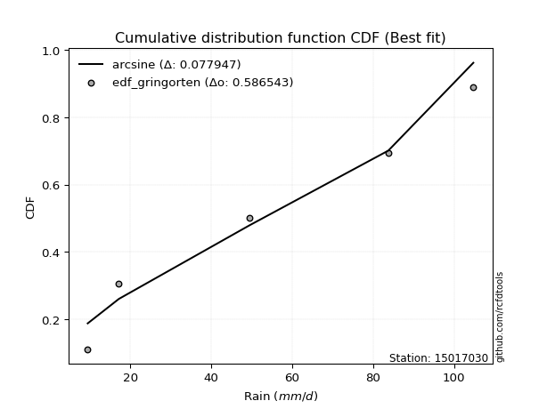</img></img>

</div>


### 9. Empirical - EDF Filliben (1975)

The specific values of the constants (0.3175) (often denoted as $alpha$) and (0.365) are derived from a method proposed by James J. Filliben in a 1975 paper. This particular formula is the mean value of the $i$-th order statistic of the normal distribution and is considered a robust and effective plotting position formula for the normal probability plot correlation coefficient test for normality.

<div align="center">


$P=(m-0.3175)/(n+0.365)$


</div>


**9.1. Empirical values**

<div align="center">

|                | 0                   | 1                  | 2            | 3                  | 4                  |
|:---------------|:--------------------|:-------------------|:-------------|:-------------------|:-------------------|
| date           | 2022                | 2023               | 2021         | 2025               | 2024               |
| x              | 9.5                 | 17.2               | 49.4         | 64.2               | 104.8              |
| m              | 1                   | 2                  | 3            | 4                  | 5                  |
| empirical_dist | edf_filliben        | edf_filliben       | edf_filliben | edf_filliben       | edf_filliben       |
| empirical      | 0.12721342031686858 | 0.3136067101584343 | 0.5          | 0.6863932898415657 | 0.8727865796831314 |
| empirical_tr   | 1.1457554725040042  | 1.456890699253225  | 2.0          | 3.188707280832095  | 7.860805860805863  |

</div>


**9.2. Kolmogorov-Smirnov fit test (sorted by Δ)**


<div align="center">

|                | 0                   | 1                   | 2                  | 3                   | 4                  | 5                   | 6                   | 7                  | 8                     | 9                  | 10                  | 11                  | 12                  | 13                  | 14                  | 15                  | 16                  | 17                  | 18                  | 19                 | 20                 | 21                  | 22                 | 23                  | 24                 | 25                  | 26                  | 27                 | 28                  | 29                 | 30                  | 31                  | 32                  | 33                  | 34                 | 35                  | 36                  | 37                  | 38                  | 39                 | 40                  | 41                  | 42                 | 43                  | 44                  | 45                  | 46                  | 47                 | 48                  | 49                  | 50                 | 51                  | 52                 | 53                  | 54                  | 55                  | 56                  | 57                  | 58                  | 59                  | 60                  | 61                 | 62                  | 63                 | 64                  | 65                  | 66                 | 67                  | 68                  | 69                 | 70                  | 71                  | 72                  | 73                  | 74                 | 75                  | 76                 | 77                 | 78                  | 79                 | 80                  | 81                 | 82                 | 83                  | 84                  | 85                  | 86                 | 87                 | 88                 | 89                 |
|:---------------|:--------------------|:--------------------|:-------------------|:--------------------|:-------------------|:--------------------|:--------------------|:-------------------|:----------------------|:-------------------|:--------------------|:--------------------|:--------------------|:--------------------|:--------------------|:--------------------|:--------------------|:--------------------|:--------------------|:-------------------|:-------------------|:--------------------|:-------------------|:--------------------|:-------------------|:--------------------|:--------------------|:-------------------|:--------------------|:-------------------|:--------------------|:--------------------|:--------------------|:--------------------|:-------------------|:--------------------|:--------------------|:--------------------|:--------------------|:-------------------|:--------------------|:--------------------|:-------------------|:--------------------|:--------------------|:--------------------|:--------------------|:-------------------|:--------------------|:--------------------|:-------------------|:--------------------|:-------------------|:--------------------|:--------------------|:--------------------|:--------------------|:--------------------|:--------------------|:--------------------|:--------------------|:-------------------|:--------------------|:-------------------|:--------------------|:--------------------|:-------------------|:--------------------|:--------------------|:-------------------|:--------------------|:--------------------|:--------------------|:--------------------|:-------------------|:--------------------|:-------------------|:-------------------|:--------------------|:-------------------|:--------------------|:-------------------|:-------------------|:--------------------|:--------------------|:--------------------|:-------------------|:-------------------|:-------------------|:-------------------|
| station        | 15017030            | 15017030            | 15017030           | 15017030            | 15017030           | 15017030            | 15017030            | 15017030           | 15017030              | 15017030           | 15017030            | 15017030            | 15017030            | 15017030            | 15017030            | 15017030            | 15017030            | 15017030            | 15017030            | 15017030           | 15017030           | 15017030            | 15017030           | 15017030            | 15017030           | 15017030            | 15017030            | 15017030           | 15017030            | 15017030           | 15017030            | 15017030            | 15017030            | 15017030            | 15017030           | 15017030            | 15017030            | 15017030            | 15017030            | 15017030           | 15017030            | 15017030            | 15017030           | 15017030            | 15017030            | 15017030            | 15017030            | 15017030           | 15017030            | 15017030            | 15017030           | 15017030            | 15017030           | 15017030            | 15017030            | 15017030            | 15017030            | 15017030            | 15017030            | 15017030            | 15017030            | 15017030           | 15017030            | 15017030           | 15017030            | 15017030            | 15017030           | 15017030            | 15017030            | 15017030           | 15017030            | 15017030            | 15017030            | 15017030            | 15017030           | 15017030            | 15017030           | 15017030           | 15017030            | 15017030           | 15017030            | 15017030           | 15017030           | 15017030            | 15017030            | 15017030            | 15017030           | 15017030           | 15017030           | 15017030           |
| empirical_dist | edf_filliben        | edf_filliben        | edf_filliben       | edf_filliben        | edf_filliben       | edf_filliben        | edf_filliben        | edf_filliben       | edf_filliben          | edf_filliben       | edf_filliben        | edf_filliben        | edf_filliben        | edf_filliben        | edf_filliben        | edf_filliben        | edf_filliben        | edf_filliben        | edf_filliben        | edf_filliben       | edf_filliben       | edf_filliben        | edf_filliben       | edf_filliben        | edf_filliben       | edf_filliben        | edf_filliben        | edf_filliben       | edf_filliben        | edf_filliben       | edf_filliben        | edf_filliben        | edf_filliben        | edf_filliben        | edf_filliben       | edf_filliben        | edf_filliben        | edf_filliben        | edf_filliben        | edf_filliben       | edf_filliben        | edf_filliben        | edf_filliben       | edf_filliben        | edf_filliben        | edf_filliben        | edf_filliben        | edf_filliben       | edf_filliben        | edf_filliben        | edf_filliben       | edf_filliben        | edf_filliben       | edf_filliben        | edf_filliben        | edf_filliben        | edf_filliben        | edf_filliben        | edf_filliben        | edf_filliben        | edf_filliben        | edf_filliben       | edf_filliben        | edf_filliben       | edf_filliben        | edf_filliben        | edf_filliben       | edf_filliben        | edf_filliben        | edf_filliben       | edf_filliben        | edf_filliben        | edf_filliben        | edf_filliben        | edf_filliben       | edf_filliben        | edf_filliben       | edf_filliben       | edf_filliben        | edf_filliben       | edf_filliben        | edf_filliben       | edf_filliben       | edf_filliben        | edf_filliben        | edf_filliben        | edf_filliben       | edf_filliben       | edf_filliben       | edf_filliben       |
| p_dist         | mielke              | halfnorm            | logjohnsonsu       | rayleigh            | ncf                | logloggamma         | maxwell             | logfisk            | loglaplace_asymmetric | logweibull_min     | logpearson3         | invgamma            | loggumbel_l         | pearson3            | t                   | truncnorm           | crystalball         | norm                | exponnorm           | expon              | weibull_min        | genlogistic         | kstwobign          | genexpon            | loggompertz        | f                   | logf                | logt               | logexponnorm        | logcrystalball     | lognorm             | lognorm             | laplace_asymmetric  | lognct              | logfatiguelife     | loggamma            | loggamma            | gumbel_r            | logbetaprime        | gumbel_l           | logistic            | logerlang           | logrice            | halflogistic        | logncf              | loginvgamma         | rice                | logalpha           | loglogistic         | hypsecant           | logmaxwell         | gompertz            | loginvgauss        | moyal               | lograyleigh         | loginvweibull       | laplace             | invweibull          | loghypsecant        | invgauss            | logkstwobign        | loghalfnorm        | fisk                | loggenexpon        | nct                 | loglaplace          | loggumbel_r        | alpha               | logmielke           | logexpon           | loghalflogistic     | logmoyal            | nakagami            | chi2                | pareto             | logwald             | logchi2            | betaprime          | erlang              | wald               | logtruncnorm        | lognakagami        | gibrat             | loggibrat           | logpareto           | fatiguelife         | loglognorm         | gamma              | johnsonsu          | loggenlogistic     |
| delta          | 0.11654188060254644 | 0.12373323069067127 | 0.1245575903836117 | 0.12460331985509598 | 0.1259232917426299 | 0.12710923736850133 | 0.12783371075090208 | 0.1279359119709087 | 0.12924838117377127   | 0.1292842521829672 | 0.13251271897464012 | 0.13373882282585348 | 0.13395529764925865 | 0.13519018908835786 | 0.13611443831391284 | 0.13613325928127132 | 0.13613335135779242 | 0.13613335262606718 | 0.13623467556230806 | 0.1365746315809208 | 0.1378400575991649 | 0.13917121677065245 | 0.1439669575552305 | 0.14410601634163744 | 0.1482569764627718 | 0.14871013400965905 | 0.14879177454008974 | 0.1490877063581355 | 0.14909030120090982 | 0.149092329974033  | 0.14909233162058055 | 0.14909233162058055 | 0.14935170971190376 | 0.14950557286966437 | 0.149572514643031  | 0.15394793292000064 | 0.15394793292000064 | 0.15462112074197057 | 0.15466784859551996 | 0.1560719158924008 | 0.15622386081070486 | 0.15672165051214582 | 0.161776761244811  | 0.16260297949826893 | 0.16325520201762334 | 0.16390998640174748 | 0.16586480742233564 | 0.1664535301132486 | 0.16695642281070355 | 0.16735687517945977 | 0.1708245429411187 | 0.17102573406818938 | 0.1725754326492075 | 0.17482593301668187 | 0.17736350360907838 | 0.17808622774144656 | 0.17845358815013249 | 0.17854148052380603 | 0.18084032873183264 | 0.18770854720933572 | 0.19435203703712955 | 0.1963728532343636 | 0.19706957434177574 | 0.206784570703743  | 0.20722911353341766 | 0.20905140877603245 | 0.2092100821251347 | 0.21254991733225603 | 0.21436832020050145 | 0.2157206788499998 | 0.22450205585577176 | 0.22911582959149768 | 0.23047055255037552 | 0.25091558034956496 | 0.2567531564203274 | 0.28550216189903443 | 0.2956563756845979 | 0.2999786263871549 | 0.30262045696979567 | 0.3129236120498588 | 0.31360670818328357 | 0.3136067101582799 | 0.3136067101584343 | 0.31771820035534204 | 0.32480599242693314 | 0.34521704837790096 | 0.3553337861044023 | 0.4037423914816174 | 0.4914814354778892 | 0.6863932898415657 |
| deltao         | 0.5865427407550001  | 0.5865427407550001  | 0.5865427407550001 | 0.5865427407550001  | 0.5865427407550001 | 0.5865427407550001  | 0.5865427407550001  | 0.5865427407550001 | 0.5865427407550001    | 0.5865427407550001 | 0.5865427407550001  | 0.5865427407550001  | 0.5865427407550001  | 0.5865427407550001  | 0.5865427407550001  | 0.5865427407550001  | 0.5865427407550001  | 0.5865427407550001  | 0.5865427407550001  | 0.5865427407550001 | 0.5865427407550001 | 0.5865427407550001  | 0.5865427407550001 | 0.5865427407550001  | 0.5865427407550001 | 0.5865427407550001  | 0.5865427407550001  | 0.5865427407550001 | 0.5865427407550001  | 0.5865427407550001 | 0.5865427407550001  | 0.5865427407550001  | 0.5865427407550001  | 0.5865427407550001  | 0.5865427407550001 | 0.5865427407550001  | 0.5865427407550001  | 0.5865427407550001  | 0.5865427407550001  | 0.5865427407550001 | 0.5865427407550001  | 0.5865427407550001  | 0.5865427407550001 | 0.5865427407550001  | 0.5865427407550001  | 0.5865427407550001  | 0.5865427407550001  | 0.5865427407550001 | 0.5865427407550001  | 0.5865427407550001  | 0.5865427407550001 | 0.5865427407550001  | 0.5865427407550001 | 0.5865427407550001  | 0.5865427407550001  | 0.5865427407550001  | 0.5865427407550001  | 0.5865427407550001  | 0.5865427407550001  | 0.5865427407550001  | 0.5865427407550001  | 0.5865427407550001 | 0.5865427407550001  | 0.5865427407550001 | 0.5865427407550001  | 0.5865427407550001  | 0.5865427407550001 | 0.5865427407550001  | 0.5865427407550001  | 0.5865427407550001 | 0.5865427407550001  | 0.5865427407550001  | 0.5865427407550001  | 0.5865427407550001  | 0.5865427407550001 | 0.5865427407550001  | 0.5865427407550001 | 0.5865427407550001 | 0.5865427407550001  | 0.5865427407550001 | 0.5865427407550001  | 0.5865427407550001 | 0.5865427407550001 | 0.5865427407550001  | 0.5865427407550001  | 0.5865427407550001  | 0.5865427407550001 | 0.5865427407550001 | 0.5865427407550001 | 0.5865427407550001 |
| eval           | Δo > Δ              | Δo > Δ              | Δo > Δ             | Δo > Δ              | Δo > Δ             | Δo > Δ              | Δo > Δ              | Δo > Δ             | Δo > Δ                | Δo > Δ             | Δo > Δ              | Δo > Δ              | Δo > Δ              | Δo > Δ              | Δo > Δ              | Δo > Δ              | Δo > Δ              | Δo > Δ              | Δo > Δ              | Δo > Δ             | Δo > Δ             | Δo > Δ              | Δo > Δ             | Δo > Δ              | Δo > Δ             | Δo > Δ              | Δo > Δ              | Δo > Δ             | Δo > Δ              | Δo > Δ             | Δo > Δ              | Δo > Δ              | Δo > Δ              | Δo > Δ              | Δo > Δ             | Δo > Δ              | Δo > Δ              | Δo > Δ              | Δo > Δ              | Δo > Δ             | Δo > Δ              | Δo > Δ              | Δo > Δ             | Δo > Δ              | Δo > Δ              | Δo > Δ              | Δo > Δ              | Δo > Δ             | Δo > Δ              | Δo > Δ              | Δo > Δ             | Δo > Δ              | Δo > Δ             | Δo > Δ              | Δo > Δ              | Δo > Δ              | Δo > Δ              | Δo > Δ              | Δo > Δ              | Δo > Δ              | Δo > Δ              | Δo > Δ             | Δo > Δ              | Δo > Δ             | Δo > Δ              | Δo > Δ              | Δo > Δ             | Δo > Δ              | Δo > Δ              | Δo > Δ             | Δo > Δ              | Δo > Δ              | Δo > Δ              | Δo > Δ              | Δo > Δ             | Δo > Δ              | Δo > Δ             | Δo > Δ             | Δo > Δ              | Δo > Δ             | Δo > Δ              | Δo > Δ             | Δo > Δ             | Δo > Δ              | Δo > Δ              | Δo > Δ              | Δo > Δ             | Δo > Δ             | Δo > Δ             | Δo <= Δ            |
| fit            | 1                   | 1                   | 1                  | 1                   | 1                  | 1                   | 1                   | 1                  | 1                     | 1                  | 1                   | 1                   | 1                   | 1                   | 1                   | 1                   | 1                   | 1                   | 1                   | 1                  | 1                  | 1                   | 1                  | 1                   | 1                  | 1                   | 1                   | 1                  | 1                   | 1                  | 1                   | 1                   | 1                   | 1                   | 1                  | 1                   | 1                   | 1                   | 1                   | 1                  | 1                   | 1                   | 1                  | 1                   | 1                   | 1                   | 1                   | 1                  | 1                   | 1                   | 1                  | 1                   | 1                  | 1                   | 1                   | 1                   | 1                   | 1                   | 1                   | 1                   | 1                   | 1                  | 1                   | 1                  | 1                   | 1                   | 1                  | 1                   | 1                   | 1                  | 1                   | 1                   | 1                   | 1                   | 1                  | 1                   | 1                  | 1                  | 1                   | 1                  | 1                   | 1                  | 1                  | 1                   | 1                   | 1                   | 1                  | 1                  | 1                  | 0                  |
| n              | 5                   | 5                   | 5                  | 5                   | 5                  | 5                   | 5                   | 5                  | 5                     | 5                  | 5                   | 5                   | 5                   | 5                   | 5                   | 5                   | 5                   | 5                   | 5                   | 5                  | 5                  | 5                   | 5                  | 5                   | 5                  | 5                   | 5                   | 5                  | 5                   | 5                  | 5                   | 5                   | 5                   | 5                   | 5                  | 5                   | 5                   | 5                   | 5                   | 5                  | 5                   | 5                   | 5                  | 5                   | 5                   | 5                   | 5                   | 5                  | 5                   | 5                   | 5                  | 5                   | 5                  | 5                   | 5                   | 5                   | 5                   | 5                   | 5                   | 5                   | 5                   | 5                  | 5                   | 5                  | 5                   | 5                   | 5                  | 5                   | 5                   | 5                  | 5                   | 5                   | 5                   | 5                   | 5                  | 5                   | 5                  | 5                  | 5                   | 5                  | 5                   | 5                  | 5                  | 5                   | 5                   | 5                   | 5                  | 5                  | 5                  | 5                  |
| best_fit       | 1                   | 0                   | 0                  | 0                   | 0                  | 0                   | 0                   | 0                  | 0                     | 0                  | 0                   | 0                   | 0                   | 0                   | 0                   | 0                   | 0                   | 0                   | 0                   | 0                  | 0                  | 0                   | 0                  | 0                   | 0                  | 0                   | 0                   | 0                  | 0                   | 0                  | 0                   | 0                   | 0                   | 0                   | 0                  | 0                   | 0                   | 0                   | 0                   | 0                  | 0                   | 0                   | 0                  | 0                   | 0                   | 0                   | 0                   | 0                  | 0                   | 0                   | 0                  | 0                   | 0                  | 0                   | 0                   | 0                   | 0                   | 0                   | 0                   | 0                   | 0                   | 0                  | 0                   | 0                  | 0                   | 0                   | 0                  | 0                   | 0                   | 0                  | 0                   | 0                   | 0                   | 0                   | 0                  | 0                   | 0                  | 0                  | 0                   | 0                  | 0                   | 0                  | 0                  | 0                   | 0                   | 0                   | 0                  | 0                  | 0                  | 0                  |
| best_fit_sort  | 1                   | 2                   | 3                  | 4                   | 5                  | 6                   | 7                   | 8                  | 9                     | 10                 | 11                  | 12                  | 13                  | 14                  | 15                  | 16                  | 17                  | 18                  | 19                  | 20                 | 21                 | 22                  | 23                 | 24                  | 25                 | 26                  | 27                  | 28                 | 29                  | 30                 | 31                  | 32                  | 33                  | 34                  | 35                 | 36                  | 37                  | 38                  | 39                  | 40                 | 41                  | 42                  | 43                 | 44                  | 45                  | 46                  | 47                  | 48                 | 49                  | 50                  | 51                 | 52                  | 53                 | 54                  | 55                  | 56                  | 57                  | 58                  | 59                  | 60                  | 61                  | 62                 | 63                  | 64                 | 65                  | 66                  | 67                 | 68                  | 69                  | 70                 | 71                  | 72                  | 73                  | 74                  | 75                 | 76                  | 77                 | 78                 | 79                  | 80                 | 81                  | 82                 | 83                 | 84                  | 85                  | 86                  | 87                 | 88                 | 89                 | 90                 |

</div>


<div align="center">

</img>

</div>


**9.3. Best fit**

<div align="center">

|   id |   station | empirical_dist   | p_dist   |    delta |   deltao | eval   |   fit |   n |   best_fit |   best_fit_sort |
|-----:|----------:|:-----------------|:---------|---------:|---------:|:-------|------:|----:|-----------:|----------------:|
|    0 |  15017030 | edf_filliben     | mielke   | 0.116542 | 0.586543 | Δo > Δ |     1 |   5 |          1 |               1 |

</div>


<div align="center">

</img></img>

</div>


### 10. Empirical - EDF Jenkinson (1977)

The Jenkinson formula in hydrology is an empirical plotting position formula used to estimate the non-exceedance probability _(P)_ or return period _(T)_ of a given ordered observation within a sample. It is a widely used method in the frequency analysis of extreme events such as floods and rainfall, as it provides a distribution-free way to plot data. _a≈0.31_ and _b≈0.38_ are constants derived to approximate the median of the probability distribution for the given rank.

<div align="center">


$P=(m-a)/(n+b)$


</div>


**10.1. Empirical values**

<div align="center">

|                | 0                   | 1                  | 2             | 3                  | 4                  |
|:---------------|:--------------------|:-------------------|:--------------|:-------------------|:-------------------|
| date           | 2022                | 2023               | 2021          | 2025               | 2024               |
| x              | 9.5                 | 17.2               | 49.4          | 64.2               | 104.8              |
| m              | 1                   | 2                  | 3             | 4                  | 5                  |
| empirical_dist | edf_jenkinson       | edf_jenkinson      | edf_jenkinson | edf_jenkinson      | edf_jenkinson      |
| empirical      | 0.12825278810408922 | 0.3141263940520446 | 0.5           | 0.6858736059479554 | 0.8717472118959109 |
| empirical_tr   | 1.1471215351812367  | 1.4579945799457996 | 2.0           | 3.183431952662722  | 7.797101449275368  |

</div>


**10.2. Kolmogorov-Smirnov fit test (sorted by Δ)**


<div align="center">

|                | 0                   | 1                   | 2                   | 3                   | 4                   | 5                  | 6                  | 7                   | 8                     | 9                   | 10                  | 11                  | 12                 | 13                 | 14                  | 15                 | 16                  | 17                  | 18                  | 19                  | 20                  | 21                 | 22                  | 23                 | 24                 | 25                  | 26                  | 27                 | 28                  | 29                 | 30                  | 31                  | 32                  | 33                 | 34                 | 35                  | 36                  | 37                  | 38                  | 39                  | 40                  | 41                 | 42                 | 43                  | 44                  | 45                  | 46                 | 47                 | 48                  | 49                  | 50                 | 51                  | 52                 | 53                 | 54                  | 55                  | 56                  | 57                  | 58                  | 59                  | 60                  | 61                  | 62                 | 63                 | 64                  | 65                  | 66                 | 67                  | 68                  | 69                 | 70                  | 71                  | 72                  | 73                  | 74                 | 75                  | 76                 | 77                 | 78                  | 79                  | 80                 | 81                  | 82                 | 83                  | 84                 | 85                 | 86                  | 87                 | 88                  | 89                 |
|:---------------|:--------------------|:--------------------|:--------------------|:--------------------|:--------------------|:-------------------|:-------------------|:--------------------|:----------------------|:--------------------|:--------------------|:--------------------|:-------------------|:-------------------|:--------------------|:-------------------|:--------------------|:--------------------|:--------------------|:--------------------|:--------------------|:-------------------|:--------------------|:-------------------|:-------------------|:--------------------|:--------------------|:-------------------|:--------------------|:-------------------|:--------------------|:--------------------|:--------------------|:-------------------|:-------------------|:--------------------|:--------------------|:--------------------|:--------------------|:--------------------|:--------------------|:-------------------|:-------------------|:--------------------|:--------------------|:--------------------|:-------------------|:-------------------|:--------------------|:--------------------|:-------------------|:--------------------|:-------------------|:-------------------|:--------------------|:--------------------|:--------------------|:--------------------|:--------------------|:--------------------|:--------------------|:--------------------|:-------------------|:-------------------|:--------------------|:--------------------|:-------------------|:--------------------|:--------------------|:-------------------|:--------------------|:--------------------|:--------------------|:--------------------|:-------------------|:--------------------|:-------------------|:-------------------|:--------------------|:--------------------|:-------------------|:--------------------|:-------------------|:--------------------|:-------------------|:-------------------|:--------------------|:-------------------|:--------------------|:-------------------|
| station        | 15017030            | 15017030            | 15017030            | 15017030            | 15017030            | 15017030           | 15017030           | 15017030            | 15017030              | 15017030            | 15017030            | 15017030            | 15017030           | 15017030           | 15017030            | 15017030           | 15017030            | 15017030            | 15017030            | 15017030            | 15017030            | 15017030           | 15017030            | 15017030           | 15017030           | 15017030            | 15017030            | 15017030           | 15017030            | 15017030           | 15017030            | 15017030            | 15017030            | 15017030           | 15017030           | 15017030            | 15017030            | 15017030            | 15017030            | 15017030            | 15017030            | 15017030           | 15017030           | 15017030            | 15017030            | 15017030            | 15017030           | 15017030           | 15017030            | 15017030            | 15017030           | 15017030            | 15017030           | 15017030           | 15017030            | 15017030            | 15017030            | 15017030            | 15017030            | 15017030            | 15017030            | 15017030            | 15017030           | 15017030           | 15017030            | 15017030            | 15017030           | 15017030            | 15017030            | 15017030           | 15017030            | 15017030            | 15017030            | 15017030            | 15017030           | 15017030            | 15017030           | 15017030           | 15017030            | 15017030            | 15017030           | 15017030            | 15017030           | 15017030            | 15017030           | 15017030           | 15017030            | 15017030           | 15017030            | 15017030           |
| empirical_dist | edf_jenkinson       | edf_jenkinson       | edf_jenkinson       | edf_jenkinson       | edf_jenkinson       | edf_jenkinson      | edf_jenkinson      | edf_jenkinson       | edf_jenkinson         | edf_jenkinson       | edf_jenkinson       | edf_jenkinson       | edf_jenkinson      | edf_jenkinson      | edf_jenkinson       | edf_jenkinson      | edf_jenkinson       | edf_jenkinson       | edf_jenkinson       | edf_jenkinson       | edf_jenkinson       | edf_jenkinson      | edf_jenkinson       | edf_jenkinson      | edf_jenkinson      | edf_jenkinson       | edf_jenkinson       | edf_jenkinson      | edf_jenkinson       | edf_jenkinson      | edf_jenkinson       | edf_jenkinson       | edf_jenkinson       | edf_jenkinson      | edf_jenkinson      | edf_jenkinson       | edf_jenkinson       | edf_jenkinson       | edf_jenkinson       | edf_jenkinson       | edf_jenkinson       | edf_jenkinson      | edf_jenkinson      | edf_jenkinson       | edf_jenkinson       | edf_jenkinson       | edf_jenkinson      | edf_jenkinson      | edf_jenkinson       | edf_jenkinson       | edf_jenkinson      | edf_jenkinson       | edf_jenkinson      | edf_jenkinson      | edf_jenkinson       | edf_jenkinson       | edf_jenkinson       | edf_jenkinson       | edf_jenkinson       | edf_jenkinson       | edf_jenkinson       | edf_jenkinson       | edf_jenkinson      | edf_jenkinson      | edf_jenkinson       | edf_jenkinson       | edf_jenkinson      | edf_jenkinson       | edf_jenkinson       | edf_jenkinson      | edf_jenkinson       | edf_jenkinson       | edf_jenkinson       | edf_jenkinson       | edf_jenkinson      | edf_jenkinson       | edf_jenkinson      | edf_jenkinson      | edf_jenkinson       | edf_jenkinson       | edf_jenkinson      | edf_jenkinson       | edf_jenkinson      | edf_jenkinson       | edf_jenkinson      | edf_jenkinson      | edf_jenkinson       | edf_jenkinson      | edf_jenkinson       | edf_jenkinson      |
| p_dist         | mielke              | halfnorm            | logjohnsonsu        | rayleigh            | ncf                 | logfisk            | logloggamma        | maxwell             | loglaplace_asymmetric | logweibull_min      | logpearson3         | invgamma            | loggumbel_l        | pearson3           | exponnorm           | t                  | truncnorm           | crystalball         | norm                | expon               | weibull_min         | genlogistic        | kstwobign           | genexpon           | loggompertz        | f                   | logf                | logt               | logexponnorm        | logcrystalball     | lognorm             | lognorm             | lognct              | logfatiguelife     | laplace_asymmetric | loggamma            | loggamma            | logbetaprime        | gumbel_r            | gumbel_l            | logerlang           | logistic           | logrice            | halflogistic        | logncf              | loginvgamma         | rice               | logalpha           | loglogistic         | hypsecant           | logmaxwell         | gompertz            | loginvgauss        | moyal              | lograyleigh         | loginvweibull       | invweibull          | laplace             | loghypsecant        | invgauss            | logkstwobign        | fisk                | loghalfnorm        | loggenexpon        | nct                 | loglaplace          | loggumbel_r        | alpha               | logmielke           | logexpon           | loghalflogistic     | logmoyal            | nakagami            | chi2                | pareto             | logwald             | logchi2            | betaprime          | erlang              | wald                | logtruncnorm       | lognakagami         | gibrat             | loggibrat           | logpareto          | fatiguelife        | loglognorm          | gamma              | johnsonsu           | loggenlogistic     |
| delta          | 0.11706156449615679 | 0.12425291458428162 | 0.12507727427722204 | 0.12512300374870633 | 0.12644297563624024 | 0.1279359119709087 | 0.1281486051557219 | 0.12835339464451243 | 0.12976806506738162   | 0.12980393607657756 | 0.13251271897464012 | 0.13373882282585348 | 0.134474981542869  | 0.1357098729819682 | 0.13623467556230806 | 0.1366341222075232 | 0.13665294317488166 | 0.13665303525140277 | 0.13665303651967753 | 0.13709431547453116 | 0.13835974149277525 | 0.1396909006642628 | 0.14448664144884085 | 0.1446257002352478 | 0.1482569764627718 | 0.14871013400965905 | 0.14879177454008974 | 0.1490877063581355 | 0.14909030120090982 | 0.149092329974033  | 0.14909233162058055 | 0.14909233162058055 | 0.14950557286966437 | 0.149572514643031  | 0.1498713936055141 | 0.15394793292000064 | 0.15394793292000064 | 0.15466784859551996 | 0.15514080463558091 | 0.15659159978601114 | 0.15672165051214582 | 0.1567435447043152 | 0.161776761244811  | 0.16312266339187928 | 0.16325520201762334 | 0.16390998640174748 | 0.166384491315946  | 0.1664535301132486 | 0.16695642281070355 | 0.16787655907307011 | 0.1708245429411187 | 0.17154541796179973 | 0.1725754326492075 | 0.1753456169102922 | 0.17736350360907838 | 0.17808622774144656 | 0.17854148052380603 | 0.17897327204374283 | 0.18084032873183264 | 0.18770854720933572 | 0.19435203703712955 | 0.19603020655455516 | 0.1963728532343636 | 0.206784570703743  | 0.20722911353341766 | 0.20905140877603245 | 0.2092100821251347 | 0.21254991733225603 | 0.21436832020050145 | 0.2157206788499998 | 0.22450205585577176 | 0.22911582959149768 | 0.23047055255037552 | 0.25091558034956496 | 0.2562334725267171 | 0.28550216189903443 | 0.2956563756845979 | 0.2999786263871549 | 0.30262045696979567 | 0.31344329594346915 | 0.3141263920768939 | 0.31412639405189025 | 0.3141263940520446 | 0.31771820035534204 | 0.3242863085333228 | 0.3446973644842906 | 0.35481410221079196 | 0.4037423914816174 | 0.49096175158427885 | 0.6858736059479554 |
| deltao         | 0.5865427407550001  | 0.5865427407550001  | 0.5865427407550001  | 0.5865427407550001  | 0.5865427407550001  | 0.5865427407550001 | 0.5865427407550001 | 0.5865427407550001  | 0.5865427407550001    | 0.5865427407550001  | 0.5865427407550001  | 0.5865427407550001  | 0.5865427407550001 | 0.5865427407550001 | 0.5865427407550001  | 0.5865427407550001 | 0.5865427407550001  | 0.5865427407550001  | 0.5865427407550001  | 0.5865427407550001  | 0.5865427407550001  | 0.5865427407550001 | 0.5865427407550001  | 0.5865427407550001 | 0.5865427407550001 | 0.5865427407550001  | 0.5865427407550001  | 0.5865427407550001 | 0.5865427407550001  | 0.5865427407550001 | 0.5865427407550001  | 0.5865427407550001  | 0.5865427407550001  | 0.5865427407550001 | 0.5865427407550001 | 0.5865427407550001  | 0.5865427407550001  | 0.5865427407550001  | 0.5865427407550001  | 0.5865427407550001  | 0.5865427407550001  | 0.5865427407550001 | 0.5865427407550001 | 0.5865427407550001  | 0.5865427407550001  | 0.5865427407550001  | 0.5865427407550001 | 0.5865427407550001 | 0.5865427407550001  | 0.5865427407550001  | 0.5865427407550001 | 0.5865427407550001  | 0.5865427407550001 | 0.5865427407550001 | 0.5865427407550001  | 0.5865427407550001  | 0.5865427407550001  | 0.5865427407550001  | 0.5865427407550001  | 0.5865427407550001  | 0.5865427407550001  | 0.5865427407550001  | 0.5865427407550001 | 0.5865427407550001 | 0.5865427407550001  | 0.5865427407550001  | 0.5865427407550001 | 0.5865427407550001  | 0.5865427407550001  | 0.5865427407550001 | 0.5865427407550001  | 0.5865427407550001  | 0.5865427407550001  | 0.5865427407550001  | 0.5865427407550001 | 0.5865427407550001  | 0.5865427407550001 | 0.5865427407550001 | 0.5865427407550001  | 0.5865427407550001  | 0.5865427407550001 | 0.5865427407550001  | 0.5865427407550001 | 0.5865427407550001  | 0.5865427407550001 | 0.5865427407550001 | 0.5865427407550001  | 0.5865427407550001 | 0.5865427407550001  | 0.5865427407550001 |
| eval           | Δo > Δ              | Δo > Δ              | Δo > Δ              | Δo > Δ              | Δo > Δ              | Δo > Δ             | Δo > Δ             | Δo > Δ              | Δo > Δ                | Δo > Δ              | Δo > Δ              | Δo > Δ              | Δo > Δ             | Δo > Δ             | Δo > Δ              | Δo > Δ             | Δo > Δ              | Δo > Δ              | Δo > Δ              | Δo > Δ              | Δo > Δ              | Δo > Δ             | Δo > Δ              | Δo > Δ             | Δo > Δ             | Δo > Δ              | Δo > Δ              | Δo > Δ             | Δo > Δ              | Δo > Δ             | Δo > Δ              | Δo > Δ              | Δo > Δ              | Δo > Δ             | Δo > Δ             | Δo > Δ              | Δo > Δ              | Δo > Δ              | Δo > Δ              | Δo > Δ              | Δo > Δ              | Δo > Δ             | Δo > Δ             | Δo > Δ              | Δo > Δ              | Δo > Δ              | Δo > Δ             | Δo > Δ             | Δo > Δ              | Δo > Δ              | Δo > Δ             | Δo > Δ              | Δo > Δ             | Δo > Δ             | Δo > Δ              | Δo > Δ              | Δo > Δ              | Δo > Δ              | Δo > Δ              | Δo > Δ              | Δo > Δ              | Δo > Δ              | Δo > Δ             | Δo > Δ             | Δo > Δ              | Δo > Δ              | Δo > Δ             | Δo > Δ              | Δo > Δ              | Δo > Δ             | Δo > Δ              | Δo > Δ              | Δo > Δ              | Δo > Δ              | Δo > Δ             | Δo > Δ              | Δo > Δ             | Δo > Δ             | Δo > Δ              | Δo > Δ              | Δo > Δ             | Δo > Δ              | Δo > Δ             | Δo > Δ              | Δo > Δ             | Δo > Δ             | Δo > Δ              | Δo > Δ             | Δo > Δ              | Δo <= Δ            |
| fit            | 1                   | 1                   | 1                   | 1                   | 1                   | 1                  | 1                  | 1                   | 1                     | 1                   | 1                   | 1                   | 1                  | 1                  | 1                   | 1                  | 1                   | 1                   | 1                   | 1                   | 1                   | 1                  | 1                   | 1                  | 1                  | 1                   | 1                   | 1                  | 1                   | 1                  | 1                   | 1                   | 1                   | 1                  | 1                  | 1                   | 1                   | 1                   | 1                   | 1                   | 1                   | 1                  | 1                  | 1                   | 1                   | 1                   | 1                  | 1                  | 1                   | 1                   | 1                  | 1                   | 1                  | 1                  | 1                   | 1                   | 1                   | 1                   | 1                   | 1                   | 1                   | 1                   | 1                  | 1                  | 1                   | 1                   | 1                  | 1                   | 1                   | 1                  | 1                   | 1                   | 1                   | 1                   | 1                  | 1                   | 1                  | 1                  | 1                   | 1                   | 1                  | 1                   | 1                  | 1                   | 1                  | 1                  | 1                   | 1                  | 1                   | 0                  |
| n              | 5                   | 5                   | 5                   | 5                   | 5                   | 5                  | 5                  | 5                   | 5                     | 5                   | 5                   | 5                   | 5                  | 5                  | 5                   | 5                  | 5                   | 5                   | 5                   | 5                   | 5                   | 5                  | 5                   | 5                  | 5                  | 5                   | 5                   | 5                  | 5                   | 5                  | 5                   | 5                   | 5                   | 5                  | 5                  | 5                   | 5                   | 5                   | 5                   | 5                   | 5                   | 5                  | 5                  | 5                   | 5                   | 5                   | 5                  | 5                  | 5                   | 5                   | 5                  | 5                   | 5                  | 5                  | 5                   | 5                   | 5                   | 5                   | 5                   | 5                   | 5                   | 5                   | 5                  | 5                  | 5                   | 5                   | 5                  | 5                   | 5                   | 5                  | 5                   | 5                   | 5                   | 5                   | 5                  | 5                   | 5                  | 5                  | 5                   | 5                   | 5                  | 5                   | 5                  | 5                   | 5                  | 5                  | 5                   | 5                  | 5                   | 5                  |
| best_fit       | 1                   | 0                   | 0                   | 0                   | 0                   | 0                  | 0                  | 0                   | 0                     | 0                   | 0                   | 0                   | 0                  | 0                  | 0                   | 0                  | 0                   | 0                   | 0                   | 0                   | 0                   | 0                  | 0                   | 0                  | 0                  | 0                   | 0                   | 0                  | 0                   | 0                  | 0                   | 0                   | 0                   | 0                  | 0                  | 0                   | 0                   | 0                   | 0                   | 0                   | 0                   | 0                  | 0                  | 0                   | 0                   | 0                   | 0                  | 0                  | 0                   | 0                   | 0                  | 0                   | 0                  | 0                  | 0                   | 0                   | 0                   | 0                   | 0                   | 0                   | 0                   | 0                   | 0                  | 0                  | 0                   | 0                   | 0                  | 0                   | 0                   | 0                  | 0                   | 0                   | 0                   | 0                   | 0                  | 0                   | 0                  | 0                  | 0                   | 0                   | 0                  | 0                   | 0                  | 0                   | 0                  | 0                  | 0                   | 0                  | 0                   | 0                  |
| best_fit_sort  | 1                   | 2                   | 3                   | 4                   | 5                   | 6                  | 7                  | 8                   | 9                     | 10                  | 11                  | 12                  | 13                 | 14                 | 15                  | 16                 | 17                  | 18                  | 19                  | 20                  | 21                  | 22                 | 23                  | 24                 | 25                 | 26                  | 27                  | 28                 | 29                  | 30                 | 31                  | 32                  | 33                  | 34                 | 35                 | 36                  | 37                  | 38                  | 39                  | 40                  | 41                  | 42                 | 43                 | 44                  | 45                  | 46                  | 47                 | 48                 | 49                  | 50                  | 51                 | 52                  | 53                 | 54                 | 55                  | 56                  | 57                  | 58                  | 59                  | 60                  | 61                  | 62                  | 63                 | 64                 | 65                  | 66                  | 67                 | 68                  | 69                  | 70                 | 71                  | 72                  | 73                  | 74                  | 75                 | 76                  | 77                 | 78                 | 79                  | 80                  | 81                 | 82                  | 83                 | 84                  | 85                 | 86                 | 87                  | 88                 | 89                  | 90                 |

</div>


<div align="center">

</img>

</div>


**10.3. Best fit**

<div align="center">

|   id |   station | empirical_dist   | p_dist   |    delta |   deltao | eval   |   fit |   n |   best_fit |   best_fit_sort |
|-----:|----------:|:-----------------|:---------|---------:|---------:|:-------|------:|----:|-----------:|----------------:|
|    0 |  15017030 | edf_jenkinson    | mielke   | 0.117062 | 0.586543 | Δo > Δ |     1 |   5 |          1 |               1 |

</div>


<div align="center">

</img>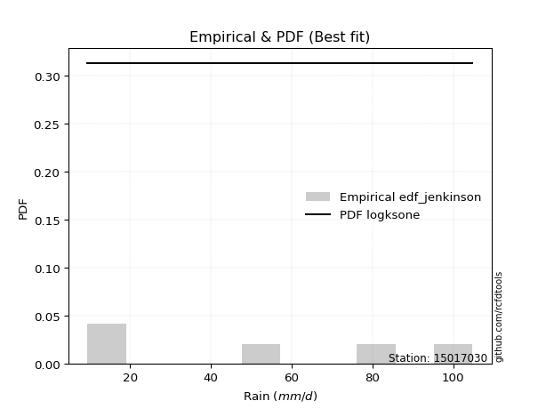</img>

</div>


### 11. Empirical - EDF Cunnane (1978)

Cunnane´s work in statistical hydrology has focused on the performance and evaluation of different probability distributions (such as GEV, Gumbel, Lognormal) for flood frequency estimation. _b_ is a constant, typically set to 0.4.

<div align="center">


$P=(m-b)/(n+1-2b)$


</div>


**11.1. Empirical values**

<div align="center">

|                | 0                   | 1                  | 2           | 3                  | 4                  |
|:---------------|:--------------------|:-------------------|:------------|:-------------------|:-------------------|
| date           | 2022                | 2023               | 2021        | 2025               | 2024               |
| x              | 9.5                 | 17.2               | 49.4        | 64.2               | 104.8              |
| m              | 1                   | 2                  | 3           | 4                  | 5                  |
| empirical_dist | edf_cunnane         | edf_cunnane        | edf_cunnane | edf_cunnane        | edf_cunnane        |
| empirical      | 0.11538461538461538 | 0.3076923076923077 | 0.5         | 0.6923076923076923 | 0.8846153846153845 |
| empirical_tr   | 1.1304347826086958  | 1.4444444444444444 | 2.0         | 3.25               | 8.666666666666655  |

</div>


**11.2. Kolmogorov-Smirnov fit test (sorted by Δ)**


<div align="center">

|                | 0                   | 1                   | 2                  | 3                   | 4                   | 5                   | 6                   | 7                     | 8                   | 9                  | 10                  | 11                 | 12                  | 13                  | 14                  | 15                  | 16                  | 17                  | 18                  | 19                  | 20                  | 21                  | 22                  | 23                  | 24                 | 25                 | 26                 | 27                  | 28                  | 29                 | 30                  | 31                 | 32                  | 33                  | 34                  | 35                 | 36                  | 37                 | 38                  | 39                  | 40                  | 41                  | 42                  | 43                  | 44                 | 45                 | 46                  | 47                  | 48                  | 49                 | 50                  | 51                 | 52                 | 53                  | 54                 | 55                  | 56                  | 57                  | 58                  | 59                  | 60                  | 61                 | 62                 | 63                  | 64                  | 65                  | 66                 | 67                  | 68                  | 69                 | 70                  | 71                  | 72                  | 73                  | 74                 | 75                  | 76                 | 77                 | 78                  | 79                  | 80                 | 81                  | 82                 | 83                  | 84                 | 85                 | 86                  | 87                 | 88                  | 89                 |
|:---------------|:--------------------|:--------------------|:-------------------|:--------------------|:--------------------|:--------------------|:--------------------|:----------------------|:--------------------|:-------------------|:--------------------|:-------------------|:--------------------|:--------------------|:--------------------|:--------------------|:--------------------|:--------------------|:--------------------|:--------------------|:--------------------|:--------------------|:--------------------|:--------------------|:-------------------|:-------------------|:-------------------|:--------------------|:--------------------|:-------------------|:--------------------|:-------------------|:--------------------|:--------------------|:--------------------|:-------------------|:--------------------|:-------------------|:--------------------|:--------------------|:--------------------|:--------------------|:--------------------|:--------------------|:-------------------|:-------------------|:--------------------|:--------------------|:--------------------|:-------------------|:--------------------|:-------------------|:-------------------|:--------------------|:-------------------|:--------------------|:--------------------|:--------------------|:--------------------|:--------------------|:--------------------|:-------------------|:-------------------|:--------------------|:--------------------|:--------------------|:-------------------|:--------------------|:--------------------|:-------------------|:--------------------|:--------------------|:--------------------|:--------------------|:-------------------|:--------------------|:-------------------|:-------------------|:--------------------|:--------------------|:-------------------|:--------------------|:-------------------|:--------------------|:-------------------|:-------------------|:--------------------|:-------------------|:--------------------|:-------------------|
| station        | 15017030            | 15017030            | 15017030           | 15017030            | 15017030            | 15017030            | 15017030            | 15017030              | 15017030            | 15017030           | 15017030            | 15017030           | 15017030            | 15017030            | 15017030            | 15017030            | 15017030            | 15017030            | 15017030            | 15017030            | 15017030            | 15017030            | 15017030            | 15017030            | 15017030           | 15017030           | 15017030           | 15017030            | 15017030            | 15017030           | 15017030            | 15017030           | 15017030            | 15017030            | 15017030            | 15017030           | 15017030            | 15017030           | 15017030            | 15017030            | 15017030            | 15017030            | 15017030            | 15017030            | 15017030           | 15017030           | 15017030            | 15017030            | 15017030            | 15017030           | 15017030            | 15017030           | 15017030           | 15017030            | 15017030           | 15017030            | 15017030            | 15017030            | 15017030            | 15017030            | 15017030            | 15017030           | 15017030           | 15017030            | 15017030            | 15017030            | 15017030           | 15017030            | 15017030            | 15017030           | 15017030            | 15017030            | 15017030            | 15017030            | 15017030           | 15017030            | 15017030           | 15017030           | 15017030            | 15017030            | 15017030           | 15017030            | 15017030           | 15017030            | 15017030           | 15017030           | 15017030            | 15017030           | 15017030            | 15017030           |
| empirical_dist | edf_cunnane         | edf_cunnane         | edf_cunnane        | edf_cunnane         | edf_cunnane         | edf_cunnane         | edf_cunnane         | edf_cunnane           | edf_cunnane         | edf_cunnane        | edf_cunnane         | edf_cunnane        | edf_cunnane         | edf_cunnane         | edf_cunnane         | edf_cunnane         | edf_cunnane         | edf_cunnane         | edf_cunnane         | edf_cunnane         | edf_cunnane         | edf_cunnane         | edf_cunnane         | edf_cunnane         | edf_cunnane        | edf_cunnane        | edf_cunnane        | edf_cunnane         | edf_cunnane         | edf_cunnane        | edf_cunnane         | edf_cunnane        | edf_cunnane         | edf_cunnane         | edf_cunnane         | edf_cunnane        | edf_cunnane         | edf_cunnane        | edf_cunnane         | edf_cunnane         | edf_cunnane         | edf_cunnane         | edf_cunnane         | edf_cunnane         | edf_cunnane        | edf_cunnane        | edf_cunnane         | edf_cunnane         | edf_cunnane         | edf_cunnane        | edf_cunnane         | edf_cunnane        | edf_cunnane        | edf_cunnane         | edf_cunnane        | edf_cunnane         | edf_cunnane         | edf_cunnane         | edf_cunnane         | edf_cunnane         | edf_cunnane         | edf_cunnane        | edf_cunnane        | edf_cunnane         | edf_cunnane         | edf_cunnane         | edf_cunnane        | edf_cunnane         | edf_cunnane         | edf_cunnane        | edf_cunnane         | edf_cunnane         | edf_cunnane         | edf_cunnane         | edf_cunnane        | edf_cunnane         | edf_cunnane        | edf_cunnane        | edf_cunnane         | edf_cunnane         | edf_cunnane        | edf_cunnane         | edf_cunnane        | edf_cunnane         | edf_cunnane        | edf_cunnane        | edf_cunnane         | edf_cunnane        | edf_cunnane         | edf_cunnane        |
| p_dist         | mielke              | logloggamma         | halfnorm           | logjohnsonsu        | rayleigh            | ncf                 | maxwell             | loglaplace_asymmetric | logweibull_min      | logfisk            | loggumbel_l         | pearson3           | t                   | truncnorm           | crystalball         | norm                | weibull_min         | logpearson3         | genlogistic         | invgamma            | expon               | exponnorm           | kstwobign           | genexpon            | laplace_asymmetric | loggompertz        | gumbel_r           | f                   | logf                | logt               | logexponnorm        | logcrystalball     | lognorm             | lognorm             | lognct              | logfatiguelife     | gumbel_l            | logistic           | loggamma            | loggamma            | logbetaprime        | halflogistic        | logerlang           | rice                | hypsecant          | logrice            | logncf              | loginvgamma         | gompertz            | logalpha           | loglogistic         | moyal              | logmaxwell         | laplace             | loginvgauss        | lograyleigh         | loginvweibull       | invweibull          | loghypsecant        | invgauss            | logkstwobign        | loghalfnorm        | loggenexpon        | nct                 | fisk                | loglaplace          | loggumbel_r        | alpha               | logmielke           | logexpon           | loghalflogistic     | logmoyal            | nakagami            | chi2                | pareto             | logwald             | logchi2            | betaprime          | erlang              | wald                | logtruncnorm       | lognakagami         | gibrat             | loggibrat           | logpareto          | fatiguelife        | loglognorm          | gamma              | johnsonsu           | loggenlogistic     |
| delta          | 0.11062747813641988 | 0.11757512473017095 | 0.1178188282245447 | 0.11864318791748513 | 0.11868891738896942 | 0.12000888927650333 | 0.12191930828477551 | 0.1233339787076447    | 0.12336984971684065 | 0.1279359119709087 | 0.12804089518313208 | 0.1292757866222313 | 0.13020003584778628 | 0.13021885681514475 | 0.13021894889166585 | 0.13021895015994062 | 0.13192565513303833 | 0.13251271897464012 | 0.13325681430452588 | 0.13373882282585348 | 0.13564090926283678 | 0.13623467556230806 | 0.13805255508910394 | 0.13819161387551088 | 0.1434373072457772 | 0.1482569764627718 | 0.148706718275844  | 0.14871013400965905 | 0.14879177454008974 | 0.1490877063581355 | 0.14909030120090982 | 0.149092329974033  | 0.14909233162058055 | 0.14909233162058055 | 0.14950557286966437 | 0.149572514643031  | 0.15015751342627423 | 0.1503094583445783 | 0.15394793292000064 | 0.15394793292000064 | 0.15466784859551996 | 0.15668857703214237 | 0.15672165051214582 | 0.15995040495620907 | 0.1614424727133332 | 0.161776761244811  | 0.16325520201762334 | 0.16390998640174748 | 0.16511133160206282 | 0.1664535301132486 | 0.16695642281070355 | 0.1689115305505553 | 0.1708245429411187 | 0.17253918568400592 | 0.1725754326492075 | 0.17736350360907838 | 0.17808622774144656 | 0.17854148052380603 | 0.18084032873183264 | 0.18770854720933572 | 0.19435203703712955 | 0.1963728532343636 | 0.206784570703743  | 0.20722911353341766 | 0.20889837927402877 | 0.20905140877603245 | 0.2092100821251347 | 0.21254991733225603 | 0.21436832020050145 | 0.2157206788499998 | 0.22450205585577176 | 0.22911582959149768 | 0.23047055255037552 | 0.25091558034956496 | 0.262667558886454  | 0.28550216189903443 | 0.2956563756845979 | 0.2999786263871549 | 0.30262045696979567 | 0.30700920958373223 | 0.307692305717157  | 0.30769230769215333 | 0.3076923076923077 | 0.31771820035534204 | 0.3307203948930597 | 0.3511314508440275 | 0.36124818857052887 | 0.4037423914816174 | 0.49739583794401576 | 0.6923076923076923 |
| deltao         | 0.5865427407550001  | 0.5865427407550001  | 0.5865427407550001 | 0.5865427407550001  | 0.5865427407550001  | 0.5865427407550001  | 0.5865427407550001  | 0.5865427407550001    | 0.5865427407550001  | 0.5865427407550001 | 0.5865427407550001  | 0.5865427407550001 | 0.5865427407550001  | 0.5865427407550001  | 0.5865427407550001  | 0.5865427407550001  | 0.5865427407550001  | 0.5865427407550001  | 0.5865427407550001  | 0.5865427407550001  | 0.5865427407550001  | 0.5865427407550001  | 0.5865427407550001  | 0.5865427407550001  | 0.5865427407550001 | 0.5865427407550001 | 0.5865427407550001 | 0.5865427407550001  | 0.5865427407550001  | 0.5865427407550001 | 0.5865427407550001  | 0.5865427407550001 | 0.5865427407550001  | 0.5865427407550001  | 0.5865427407550001  | 0.5865427407550001 | 0.5865427407550001  | 0.5865427407550001 | 0.5865427407550001  | 0.5865427407550001  | 0.5865427407550001  | 0.5865427407550001  | 0.5865427407550001  | 0.5865427407550001  | 0.5865427407550001 | 0.5865427407550001 | 0.5865427407550001  | 0.5865427407550001  | 0.5865427407550001  | 0.5865427407550001 | 0.5865427407550001  | 0.5865427407550001 | 0.5865427407550001 | 0.5865427407550001  | 0.5865427407550001 | 0.5865427407550001  | 0.5865427407550001  | 0.5865427407550001  | 0.5865427407550001  | 0.5865427407550001  | 0.5865427407550001  | 0.5865427407550001 | 0.5865427407550001 | 0.5865427407550001  | 0.5865427407550001  | 0.5865427407550001  | 0.5865427407550001 | 0.5865427407550001  | 0.5865427407550001  | 0.5865427407550001 | 0.5865427407550001  | 0.5865427407550001  | 0.5865427407550001  | 0.5865427407550001  | 0.5865427407550001 | 0.5865427407550001  | 0.5865427407550001 | 0.5865427407550001 | 0.5865427407550001  | 0.5865427407550001  | 0.5865427407550001 | 0.5865427407550001  | 0.5865427407550001 | 0.5865427407550001  | 0.5865427407550001 | 0.5865427407550001 | 0.5865427407550001  | 0.5865427407550001 | 0.5865427407550001  | 0.5865427407550001 |
| eval           | Δo > Δ              | Δo > Δ              | Δo > Δ             | Δo > Δ              | Δo > Δ              | Δo > Δ              | Δo > Δ              | Δo > Δ                | Δo > Δ              | Δo > Δ             | Δo > Δ              | Δo > Δ             | Δo > Δ              | Δo > Δ              | Δo > Δ              | Δo > Δ              | Δo > Δ              | Δo > Δ              | Δo > Δ              | Δo > Δ              | Δo > Δ              | Δo > Δ              | Δo > Δ              | Δo > Δ              | Δo > Δ             | Δo > Δ             | Δo > Δ             | Δo > Δ              | Δo > Δ              | Δo > Δ             | Δo > Δ              | Δo > Δ             | Δo > Δ              | Δo > Δ              | Δo > Δ              | Δo > Δ             | Δo > Δ              | Δo > Δ             | Δo > Δ              | Δo > Δ              | Δo > Δ              | Δo > Δ              | Δo > Δ              | Δo > Δ              | Δo > Δ             | Δo > Δ             | Δo > Δ              | Δo > Δ              | Δo > Δ              | Δo > Δ             | Δo > Δ              | Δo > Δ             | Δo > Δ             | Δo > Δ              | Δo > Δ             | Δo > Δ              | Δo > Δ              | Δo > Δ              | Δo > Δ              | Δo > Δ              | Δo > Δ              | Δo > Δ             | Δo > Δ             | Δo > Δ              | Δo > Δ              | Δo > Δ              | Δo > Δ             | Δo > Δ              | Δo > Δ              | Δo > Δ             | Δo > Δ              | Δo > Δ              | Δo > Δ              | Δo > Δ              | Δo > Δ             | Δo > Δ              | Δo > Δ             | Δo > Δ             | Δo > Δ              | Δo > Δ              | Δo > Δ             | Δo > Δ              | Δo > Δ             | Δo > Δ              | Δo > Δ             | Δo > Δ             | Δo > Δ              | Δo > Δ             | Δo > Δ              | Δo <= Δ            |
| fit            | 1                   | 1                   | 1                  | 1                   | 1                   | 1                   | 1                   | 1                     | 1                   | 1                  | 1                   | 1                  | 1                   | 1                   | 1                   | 1                   | 1                   | 1                   | 1                   | 1                   | 1                   | 1                   | 1                   | 1                   | 1                  | 1                  | 1                  | 1                   | 1                   | 1                  | 1                   | 1                  | 1                   | 1                   | 1                   | 1                  | 1                   | 1                  | 1                   | 1                   | 1                   | 1                   | 1                   | 1                   | 1                  | 1                  | 1                   | 1                   | 1                   | 1                  | 1                   | 1                  | 1                  | 1                   | 1                  | 1                   | 1                   | 1                   | 1                   | 1                   | 1                   | 1                  | 1                  | 1                   | 1                   | 1                   | 1                  | 1                   | 1                   | 1                  | 1                   | 1                   | 1                   | 1                   | 1                  | 1                   | 1                  | 1                  | 1                   | 1                   | 1                  | 1                   | 1                  | 1                   | 1                  | 1                  | 1                   | 1                  | 1                   | 0                  |
| n              | 5                   | 5                   | 5                  | 5                   | 5                   | 5                   | 5                   | 5                     | 5                   | 5                  | 5                   | 5                  | 5                   | 5                   | 5                   | 5                   | 5                   | 5                   | 5                   | 5                   | 5                   | 5                   | 5                   | 5                   | 5                  | 5                  | 5                  | 5                   | 5                   | 5                  | 5                   | 5                  | 5                   | 5                   | 5                   | 5                  | 5                   | 5                  | 5                   | 5                   | 5                   | 5                   | 5                   | 5                   | 5                  | 5                  | 5                   | 5                   | 5                   | 5                  | 5                   | 5                  | 5                  | 5                   | 5                  | 5                   | 5                   | 5                   | 5                   | 5                   | 5                   | 5                  | 5                  | 5                   | 5                   | 5                   | 5                  | 5                   | 5                   | 5                  | 5                   | 5                   | 5                   | 5                   | 5                  | 5                   | 5                  | 5                  | 5                   | 5                   | 5                  | 5                   | 5                  | 5                   | 5                  | 5                  | 5                   | 5                  | 5                   | 5                  |
| best_fit       | 1                   | 0                   | 0                  | 0                   | 0                   | 0                   | 0                   | 0                     | 0                   | 0                  | 0                   | 0                  | 0                   | 0                   | 0                   | 0                   | 0                   | 0                   | 0                   | 0                   | 0                   | 0                   | 0                   | 0                   | 0                  | 0                  | 0                  | 0                   | 0                   | 0                  | 0                   | 0                  | 0                   | 0                   | 0                   | 0                  | 0                   | 0                  | 0                   | 0                   | 0                   | 0                   | 0                   | 0                   | 0                  | 0                  | 0                   | 0                   | 0                   | 0                  | 0                   | 0                  | 0                  | 0                   | 0                  | 0                   | 0                   | 0                   | 0                   | 0                   | 0                   | 0                  | 0                  | 0                   | 0                   | 0                   | 0                  | 0                   | 0                   | 0                  | 0                   | 0                   | 0                   | 0                   | 0                  | 0                   | 0                  | 0                  | 0                   | 0                   | 0                  | 0                   | 0                  | 0                   | 0                  | 0                  | 0                   | 0                  | 0                   | 0                  |
| best_fit_sort  | 1                   | 2                   | 3                  | 4                   | 5                   | 6                   | 7                   | 8                     | 9                   | 10                 | 11                  | 12                 | 13                  | 14                  | 15                  | 16                  | 17                  | 18                  | 19                  | 20                  | 21                  | 22                  | 23                  | 24                  | 25                 | 26                 | 27                 | 28                  | 29                  | 30                 | 31                  | 32                 | 33                  | 34                  | 35                  | 36                 | 37                  | 38                 | 39                  | 40                  | 41                  | 42                  | 43                  | 44                  | 45                 | 46                 | 47                  | 48                  | 49                  | 50                 | 51                  | 52                 | 53                 | 54                  | 55                 | 56                  | 57                  | 58                  | 59                  | 60                  | 61                  | 62                 | 63                 | 64                  | 65                  | 66                  | 67                 | 68                  | 69                  | 70                 | 71                  | 72                  | 73                  | 74                  | 75                 | 76                  | 77                 | 78                 | 79                  | 80                  | 81                 | 82                  | 83                 | 84                  | 85                 | 86                 | 87                  | 88                 | 89                  | 90                 |

</div>


<div align="center">

</img>

</div>


**11.3. Best fit**

<div align="center">

|   id |   station | empirical_dist   | p_dist   |    delta |   deltao | eval   |   fit |   n |   best_fit |   best_fit_sort |
|-----:|----------:|:-----------------|:---------|---------:|---------:|:-------|------:|----:|-----------:|----------------:|
|    0 |  15017030 | edf_cunnane      | mielke   | 0.110627 | 0.586543 | Δo > Δ |     1 |   5 |          1 |               1 |

</div>


<div align="center">

</img>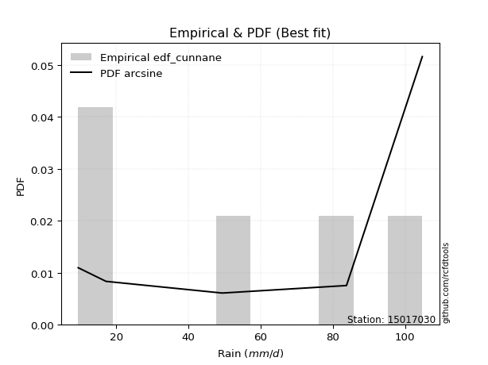</img>

</div>


### 12. Empirical - EDF Adamowski (1981)

The Adamowski formula in hydrology refers to a specific plotting position formula used for estimating the non-parametric empirical distribution of hydrological events (like flood peaks) to calculate their return periods. This formula provides an alternative to traditional parametric methods (like the Gumbel or Log Pearson Type III distributions). 

<div align="center">


$P=(m-0.25)/(n+0.5)$


</div>


**12.1. Empirical values**

<div align="center">

|                | 0                   | 1                  | 2             | 3                  | 4                  |
|:---------------|:--------------------|:-------------------|:--------------|:-------------------|:-------------------|
| date           | 2022                | 2023               | 2021          | 2025               | 2024               |
| x              | 9.5                 | 17.2               | 49.4          | 64.2               | 104.8              |
| m              | 1                   | 2                  | 3             | 4                  | 5                  |
| empirical_dist | edf_adamowski       | edf_adamowski      | edf_adamowski | edf_adamowski      | edf_adamowski      |
| empirical      | 0.13636363636363635 | 0.3181818181818182 | 0.5           | 0.6818181818181818 | 0.8636363636363636 |
| empirical_tr   | 1.1578947368421053  | 1.4666666666666666 | 2.0           | 3.1428571428571423 | 7.333333333333334  |

</div>


**12.2. Kolmogorov-Smirnov fit test (sorted by Δ)**


<div align="center">

|                | 0                   | 1                  | 2                   | 3                  | 4                   | 5                  | 6                   | 7                   | 8                   | 9                     | 10                 | 11                  | 12                  | 13                  | 14                  | 15                  | 16                  | 17                  | 18                  | 19                 | 20                 | 21                  | 22                 | 23                 | 24                  | 25                  | 26                  | 27                 | 28                  | 29                 | 30                  | 31                  | 32                  | 33                 | 34                  | 35                  | 36                  | 37                  | 38                  | 39                  | 40                 | 41                  | 42                 | 43                  | 44                  | 45                 | 46                  | 47                  | 48                  | 49                 | 50                  | 51                 | 52                  | 53                  | 54                  | 55                  | 56                  | 57                  | 58                 | 59                  | 60                  | 61                  | 62                 | 63                 | 64                  | 65                  | 66                 | 67                  | 68                  | 69                 | 70                  | 71                  | 72                  | 73                  | 74                 | 75                  | 76                 | 77                 | 78                  | 79                 | 80                  | 81                 | 82                 | 83                 | 84                  | 85                  | 86                 | 87                 | 88                 | 89                 |
|:---------------|:--------------------|:-------------------|:--------------------|:-------------------|:--------------------|:-------------------|:--------------------|:--------------------|:--------------------|:----------------------|:-------------------|:--------------------|:--------------------|:--------------------|:--------------------|:--------------------|:--------------------|:--------------------|:--------------------|:-------------------|:-------------------|:--------------------|:-------------------|:-------------------|:--------------------|:--------------------|:--------------------|:-------------------|:--------------------|:-------------------|:--------------------|:--------------------|:--------------------|:-------------------|:--------------------|:--------------------|:--------------------|:--------------------|:--------------------|:--------------------|:-------------------|:--------------------|:-------------------|:--------------------|:--------------------|:-------------------|:--------------------|:--------------------|:--------------------|:-------------------|:--------------------|:-------------------|:--------------------|:--------------------|:--------------------|:--------------------|:--------------------|:--------------------|:-------------------|:--------------------|:--------------------|:--------------------|:-------------------|:-------------------|:--------------------|:--------------------|:-------------------|:--------------------|:--------------------|:-------------------|:--------------------|:--------------------|:--------------------|:--------------------|:-------------------|:--------------------|:-------------------|:-------------------|:--------------------|:-------------------|:--------------------|:-------------------|:-------------------|:-------------------|:--------------------|:--------------------|:-------------------|:-------------------|:-------------------|:-------------------|
| station        | 15017030            | 15017030           | 15017030            | 15017030           | 15017030            | 15017030           | 15017030            | 15017030            | 15017030            | 15017030              | 15017030           | 15017030            | 15017030            | 15017030            | 15017030            | 15017030            | 15017030            | 15017030            | 15017030            | 15017030           | 15017030           | 15017030            | 15017030           | 15017030           | 15017030            | 15017030            | 15017030            | 15017030           | 15017030            | 15017030           | 15017030            | 15017030            | 15017030            | 15017030           | 15017030            | 15017030            | 15017030            | 15017030            | 15017030            | 15017030            | 15017030           | 15017030            | 15017030           | 15017030            | 15017030            | 15017030           | 15017030            | 15017030            | 15017030            | 15017030           | 15017030            | 15017030           | 15017030            | 15017030            | 15017030            | 15017030            | 15017030            | 15017030            | 15017030           | 15017030            | 15017030            | 15017030            | 15017030           | 15017030           | 15017030            | 15017030            | 15017030           | 15017030            | 15017030            | 15017030           | 15017030            | 15017030            | 15017030            | 15017030            | 15017030           | 15017030            | 15017030           | 15017030           | 15017030            | 15017030           | 15017030            | 15017030           | 15017030           | 15017030           | 15017030            | 15017030            | 15017030           | 15017030           | 15017030           | 15017030           |
| empirical_dist | edf_adamowski       | edf_adamowski      | edf_adamowski       | edf_adamowski      | edf_adamowski       | edf_adamowski      | edf_adamowski       | edf_adamowski       | edf_adamowski       | edf_adamowski         | edf_adamowski      | edf_adamowski       | edf_adamowski       | edf_adamowski       | edf_adamowski       | edf_adamowski       | edf_adamowski       | edf_adamowski       | edf_adamowski       | edf_adamowski      | edf_adamowski      | edf_adamowski       | edf_adamowski      | edf_adamowski      | edf_adamowski       | edf_adamowski       | edf_adamowski       | edf_adamowski      | edf_adamowski       | edf_adamowski      | edf_adamowski       | edf_adamowski       | edf_adamowski       | edf_adamowski      | edf_adamowski       | edf_adamowski       | edf_adamowski       | edf_adamowski       | edf_adamowski       | edf_adamowski       | edf_adamowski      | edf_adamowski       | edf_adamowski      | edf_adamowski       | edf_adamowski       | edf_adamowski      | edf_adamowski       | edf_adamowski       | edf_adamowski       | edf_adamowski      | edf_adamowski       | edf_adamowski      | edf_adamowski       | edf_adamowski       | edf_adamowski       | edf_adamowski       | edf_adamowski       | edf_adamowski       | edf_adamowski      | edf_adamowski       | edf_adamowski       | edf_adamowski       | edf_adamowski      | edf_adamowski      | edf_adamowski       | edf_adamowski       | edf_adamowski      | edf_adamowski       | edf_adamowski       | edf_adamowski      | edf_adamowski       | edf_adamowski       | edf_adamowski       | edf_adamowski       | edf_adamowski      | edf_adamowski       | edf_adamowski      | edf_adamowski      | edf_adamowski       | edf_adamowski      | edf_adamowski       | edf_adamowski      | edf_adamowski      | edf_adamowski      | edf_adamowski       | edf_adamowski       | edf_adamowski      | edf_adamowski      | edf_adamowski      | edf_adamowski      |
| p_dist         | mielke              | logfisk            | halfnorm            | logjohnsonsu       | rayleigh            | ncf                | maxwell             | logpearson3         | invgamma            | loglaplace_asymmetric | logweibull_min     | logloggamma         | loggumbel_l         | pearson3            | exponnorm           | t                   | truncnorm           | crystalball         | norm                | expon              | weibull_min        | genlogistic         | loggompertz        | kstwobign          | genexpon            | f                   | logf                | logt               | logexponnorm        | logcrystalball     | lognorm             | lognorm             | lognct              | logfatiguelife     | laplace_asymmetric  | loggamma            | loggamma            | logbetaprime        | logerlang           | gumbel_r            | gumbel_l           | logistic            | logrice            | logncf              | loginvgamma         | logalpha           | loglogistic         | halflogistic        | rice                | logmaxwell         | hypsecant           | loginvgauss        | gompertz            | lograyleigh         | loginvweibull       | invweibull          | moyal               | loghypsecant        | laplace            | invgauss            | fisk                | logkstwobign        | loghalfnorm        | loggenexpon        | nct                 | loglaplace          | loggumbel_r        | alpha               | logmielke           | logexpon           | loghalflogistic     | logmoyal            | nakagami            | chi2                | pareto             | logwald             | logchi2            | betaprime          | erlang              | wald               | logtruncnorm        | lognakagami        | gibrat             | loggibrat          | logpareto           | fatiguelife         | loglognorm         | gamma              | johnsonsu          | loggenlogistic     |
| delta          | 0.12111698862593034 | 0.1279359119709087 | 0.12830833871405517 | 0.1291326984069956 | 0.12917842787847988 | 0.1304983997660138 | 0.13240881877428598 | 0.13251271897464012 | 0.13373882282585348 | 0.13382348919715517   | 0.1338593602063511 | 0.13625945341526913 | 0.13853040567264255 | 0.13976529711174177 | 0.13999763697496032 | 0.14068954633729674 | 0.14070836730465522 | 0.14070845938117632 | 0.14070846064945108 | 0.1411497396043047 | 0.1424151656225488 | 0.14374632479403635 | 0.1482569764627718 | 0.1485420655786144 | 0.14868112436502134 | 0.14871013400965905 | 0.14879177454008974 | 0.1490877063581355 | 0.14909030120090982 | 0.149092329974033  | 0.14909233162058055 | 0.14909233162058055 | 0.14950557286966437 | 0.149572514643031  | 0.15392681773528766 | 0.15394793292000064 | 0.15394793292000064 | 0.15466784859551996 | 0.15672165051214582 | 0.15919622876535447 | 0.1606470239157847 | 0.16079896883408876 | 0.161776761244811  | 0.16325520201762334 | 0.16390998640174748 | 0.1664535301132486 | 0.16695642281070355 | 0.16717808752165284 | 0.17043991544571954 | 0.1708245429411187 | 0.17193198320284367 | 0.1725754326492075 | 0.17560084209157328 | 0.17736350360907838 | 0.17808622774144656 | 0.17854148052380603 | 0.17940104104006577 | 0.18084032873183264 | 0.1830286961735164 | 0.18770854720933572 | 0.18791935829500794 | 0.19435203703712955 | 0.1963728532343636 | 0.206784570703743  | 0.20722911353341766 | 0.20905140877603245 | 0.2092100821251347 | 0.21254991733225603 | 0.21436832020050145 | 0.2157206788499998 | 0.22450205585577176 | 0.22911582959149768 | 0.23047055255037552 | 0.25091558034956496 | 0.2521780483969435 | 0.28550216189903443 | 0.2956563756845979 | 0.2999786263871549 | 0.30262045696979567 | 0.3174987200732427 | 0.31818181620666747 | 0.3181818181816638 | 0.3181818181818182 | 0.3181818181818182 | 0.32023088440354924 | 0.34064194035451706 | 0.3507586780810184 | 0.4037423914816174 | 0.4869063274545053 | 0.6818181818181818 |
| deltao         | 0.5865427407550001  | 0.5865427407550001 | 0.5865427407550001  | 0.5865427407550001 | 0.5865427407550001  | 0.5865427407550001 | 0.5865427407550001  | 0.5865427407550001  | 0.5865427407550001  | 0.5865427407550001    | 0.5865427407550001 | 0.5865427407550001  | 0.5865427407550001  | 0.5865427407550001  | 0.5865427407550001  | 0.5865427407550001  | 0.5865427407550001  | 0.5865427407550001  | 0.5865427407550001  | 0.5865427407550001 | 0.5865427407550001 | 0.5865427407550001  | 0.5865427407550001 | 0.5865427407550001 | 0.5865427407550001  | 0.5865427407550001  | 0.5865427407550001  | 0.5865427407550001 | 0.5865427407550001  | 0.5865427407550001 | 0.5865427407550001  | 0.5865427407550001  | 0.5865427407550001  | 0.5865427407550001 | 0.5865427407550001  | 0.5865427407550001  | 0.5865427407550001  | 0.5865427407550001  | 0.5865427407550001  | 0.5865427407550001  | 0.5865427407550001 | 0.5865427407550001  | 0.5865427407550001 | 0.5865427407550001  | 0.5865427407550001  | 0.5865427407550001 | 0.5865427407550001  | 0.5865427407550001  | 0.5865427407550001  | 0.5865427407550001 | 0.5865427407550001  | 0.5865427407550001 | 0.5865427407550001  | 0.5865427407550001  | 0.5865427407550001  | 0.5865427407550001  | 0.5865427407550001  | 0.5865427407550001  | 0.5865427407550001 | 0.5865427407550001  | 0.5865427407550001  | 0.5865427407550001  | 0.5865427407550001 | 0.5865427407550001 | 0.5865427407550001  | 0.5865427407550001  | 0.5865427407550001 | 0.5865427407550001  | 0.5865427407550001  | 0.5865427407550001 | 0.5865427407550001  | 0.5865427407550001  | 0.5865427407550001  | 0.5865427407550001  | 0.5865427407550001 | 0.5865427407550001  | 0.5865427407550001 | 0.5865427407550001 | 0.5865427407550001  | 0.5865427407550001 | 0.5865427407550001  | 0.5865427407550001 | 0.5865427407550001 | 0.5865427407550001 | 0.5865427407550001  | 0.5865427407550001  | 0.5865427407550001 | 0.5865427407550001 | 0.5865427407550001 | 0.5865427407550001 |
| eval           | Δo > Δ              | Δo > Δ             | Δo > Δ              | Δo > Δ             | Δo > Δ              | Δo > Δ             | Δo > Δ              | Δo > Δ              | Δo > Δ              | Δo > Δ                | Δo > Δ             | Δo > Δ              | Δo > Δ              | Δo > Δ              | Δo > Δ              | Δo > Δ              | Δo > Δ              | Δo > Δ              | Δo > Δ              | Δo > Δ             | Δo > Δ             | Δo > Δ              | Δo > Δ             | Δo > Δ             | Δo > Δ              | Δo > Δ              | Δo > Δ              | Δo > Δ             | Δo > Δ              | Δo > Δ             | Δo > Δ              | Δo > Δ              | Δo > Δ              | Δo > Δ             | Δo > Δ              | Δo > Δ              | Δo > Δ              | Δo > Δ              | Δo > Δ              | Δo > Δ              | Δo > Δ             | Δo > Δ              | Δo > Δ             | Δo > Δ              | Δo > Δ              | Δo > Δ             | Δo > Δ              | Δo > Δ              | Δo > Δ              | Δo > Δ             | Δo > Δ              | Δo > Δ             | Δo > Δ              | Δo > Δ              | Δo > Δ              | Δo > Δ              | Δo > Δ              | Δo > Δ              | Δo > Δ             | Δo > Δ              | Δo > Δ              | Δo > Δ              | Δo > Δ             | Δo > Δ             | Δo > Δ              | Δo > Δ              | Δo > Δ             | Δo > Δ              | Δo > Δ              | Δo > Δ             | Δo > Δ              | Δo > Δ              | Δo > Δ              | Δo > Δ              | Δo > Δ             | Δo > Δ              | Δo > Δ             | Δo > Δ             | Δo > Δ              | Δo > Δ             | Δo > Δ              | Δo > Δ             | Δo > Δ             | Δo > Δ             | Δo > Δ              | Δo > Δ              | Δo > Δ             | Δo > Δ             | Δo > Δ             | Δo <= Δ            |
| fit            | 1                   | 1                  | 1                   | 1                  | 1                   | 1                  | 1                   | 1                   | 1                   | 1                     | 1                  | 1                   | 1                   | 1                   | 1                   | 1                   | 1                   | 1                   | 1                   | 1                  | 1                  | 1                   | 1                  | 1                  | 1                   | 1                   | 1                   | 1                  | 1                   | 1                  | 1                   | 1                   | 1                   | 1                  | 1                   | 1                   | 1                   | 1                   | 1                   | 1                   | 1                  | 1                   | 1                  | 1                   | 1                   | 1                  | 1                   | 1                   | 1                   | 1                  | 1                   | 1                  | 1                   | 1                   | 1                   | 1                   | 1                   | 1                   | 1                  | 1                   | 1                   | 1                   | 1                  | 1                  | 1                   | 1                   | 1                  | 1                   | 1                   | 1                  | 1                   | 1                   | 1                   | 1                   | 1                  | 1                   | 1                  | 1                  | 1                   | 1                  | 1                   | 1                  | 1                  | 1                  | 1                   | 1                   | 1                  | 1                  | 1                  | 0                  |
| n              | 5                   | 5                  | 5                   | 5                  | 5                   | 5                  | 5                   | 5                   | 5                   | 5                     | 5                  | 5                   | 5                   | 5                   | 5                   | 5                   | 5                   | 5                   | 5                   | 5                  | 5                  | 5                   | 5                  | 5                  | 5                   | 5                   | 5                   | 5                  | 5                   | 5                  | 5                   | 5                   | 5                   | 5                  | 5                   | 5                   | 5                   | 5                   | 5                   | 5                   | 5                  | 5                   | 5                  | 5                   | 5                   | 5                  | 5                   | 5                   | 5                   | 5                  | 5                   | 5                  | 5                   | 5                   | 5                   | 5                   | 5                   | 5                   | 5                  | 5                   | 5                   | 5                   | 5                  | 5                  | 5                   | 5                   | 5                  | 5                   | 5                   | 5                  | 5                   | 5                   | 5                   | 5                   | 5                  | 5                   | 5                  | 5                  | 5                   | 5                  | 5                   | 5                  | 5                  | 5                  | 5                   | 5                   | 5                  | 5                  | 5                  | 5                  |
| best_fit       | 1                   | 0                  | 0                   | 0                  | 0                   | 0                  | 0                   | 0                   | 0                   | 0                     | 0                  | 0                   | 0                   | 0                   | 0                   | 0                   | 0                   | 0                   | 0                   | 0                  | 0                  | 0                   | 0                  | 0                  | 0                   | 0                   | 0                   | 0                  | 0                   | 0                  | 0                   | 0                   | 0                   | 0                  | 0                   | 0                   | 0                   | 0                   | 0                   | 0                   | 0                  | 0                   | 0                  | 0                   | 0                   | 0                  | 0                   | 0                   | 0                   | 0                  | 0                   | 0                  | 0                   | 0                   | 0                   | 0                   | 0                   | 0                   | 0                  | 0                   | 0                   | 0                   | 0                  | 0                  | 0                   | 0                   | 0                  | 0                   | 0                   | 0                  | 0                   | 0                   | 0                   | 0                   | 0                  | 0                   | 0                  | 0                  | 0                   | 0                  | 0                   | 0                  | 0                  | 0                  | 0                   | 0                   | 0                  | 0                  | 0                  | 0                  |
| best_fit_sort  | 1                   | 2                  | 3                   | 4                  | 5                   | 6                  | 7                   | 8                   | 9                   | 10                    | 11                 | 12                  | 13                  | 14                  | 15                  | 16                  | 17                  | 18                  | 19                  | 20                 | 21                 | 22                  | 23                 | 24                 | 25                  | 26                  | 27                  | 28                 | 29                  | 30                 | 31                  | 32                  | 33                  | 34                 | 35                  | 36                  | 37                  | 38                  | 39                  | 40                  | 41                 | 42                  | 43                 | 44                  | 45                  | 46                 | 47                  | 48                  | 49                  | 50                 | 51                  | 52                 | 53                  | 54                  | 55                  | 56                  | 57                  | 58                  | 59                 | 60                  | 61                  | 62                  | 63                 | 64                 | 65                  | 66                  | 67                 | 68                  | 69                  | 70                 | 71                  | 72                  | 73                  | 74                  | 75                 | 76                  | 77                 | 78                 | 79                  | 80                 | 81                  | 82                 | 83                 | 84                 | 85                  | 86                  | 87                 | 88                 | 89                 | 90                 |

</div>


<div align="center">

</img>

</div>


**12.3. Best fit**

<div align="center">

|   id |   station | empirical_dist   | p_dist   |    delta |   deltao | eval   |   fit |   n |   best_fit |   best_fit_sort |
|-----:|----------:|:-----------------|:---------|---------:|---------:|:-------|------:|----:|-----------:|----------------:|
|    0 |  15017030 | edf_adamowski    | mielke   | 0.121117 | 0.586543 | Δo > Δ |     1 |   5 |          1 |               1 |

</div>


<div align="center">

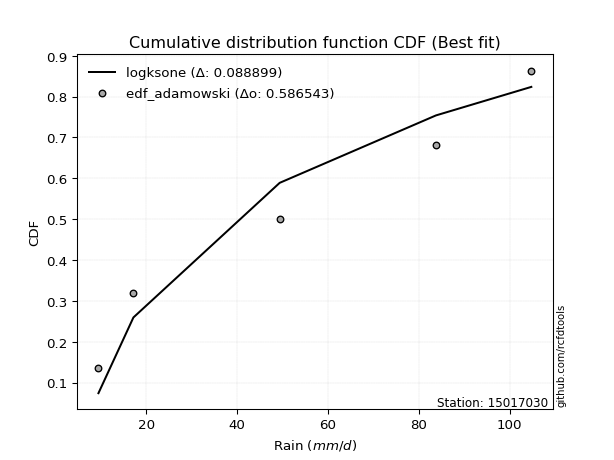</img>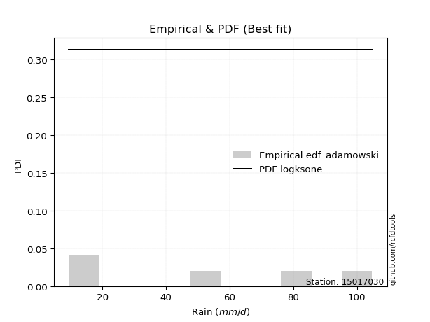</img>

</div>


## C. Best fit & Estimate extreme values for specific return periods - Tr


### 1. Best fit (ordered by delta Δ)

<div align="center">

|   id |   station | empirical_dist   | p_dist      |    delta |   deltao | eval   |   fit |   n |   best_fit |   best_fit_sort |
|-----:|----------:|:-----------------|:------------|---------:|---------:|:-------|------:|----:|-----------:|----------------:|
|    0 |  15017030 | edf_hazen        | mielke      | 0.102935 | 0.586543 | Δo > Δ |     1 |   5 |          1 |               1 |
|    1 |  15017030 | edf_gringorten   | mielke      | 0.107623 | 0.586543 | Δo > Δ |     1 |   5 |          1 |               2 |
|    2 |  15017030 | edf_cunnane      | mielke      | 0.110627 | 0.586543 | Δo > Δ |     1 |   5 |          1 |               3 |
|    3 |  15017030 | edf_blom         | mielke      | 0.112459 | 0.586543 | Δo > Δ |     1 |   5 |          1 |               4 |
|    4 |  15017030 | edf_tukey        | mielke      | 0.115435 | 0.586543 | Δo > Δ |     1 |   5 |          1 |               5 |
|    5 |  15017030 | edf_filliben     | mielke      | 0.116542 | 0.586543 | Δo > Δ |     1 |   5 |          1 |               6 |
|    6 |  15017030 | edf_beard        | mielke      | 0.117062 | 0.586543 | Δo > Δ |     1 |   5 |          1 |               7 |
|    7 |  15017030 | edf_jenkinson    | mielke      | 0.117062 | 0.586543 | Δo > Δ |     1 |   5 |          1 |               8 |
|    8 |  15017030 | edf_chegodayev   | mielke      | 0.11775  | 0.586543 | Δo > Δ |     1 |   5 |          1 |               9 |
|    9 |  15017030 | edf_adamowski    | mielke      | 0.121117 | 0.586543 | Δo > Δ |     1 |   5 |          1 |              10 |
|   10 |  15017030 | edf_weibull      | logpearson3 | 0.132513 | 0.586543 | Δo > Δ |     1 |   5 |          1 |              11 |
|   11 |  15017030 | edf_california   | nct         | 0.140282 | 0.586543 | Δo > Δ |     1 |   5 |          1 |              12 |

</div>

:file_folder:Tables: [bestfit_15017030.csv](table/bestfit_15017030.csv) | [extreme_15017030.csv](table/extreme_15017030.csv)


### 2. Extreme values

In hydrology, a return period (or recurrence interval $Tr$) is the statistical average time between extreme events like floods or droughts of a specific magnitude, indicating how rare an event is, with a 100-year flood, for example, having a 1% chance of occurring in any given year, not that it happens exactly every century. It is a key tool for infrastructure design (like bridges or dams) and risk assessment, calculated from historical data to determine the probability of future events, although it is important to remember it is statistical average, and events can cluster or be missed.

> risk_rate: assuming the return period as the project useful life.

|   id |      tr |   prob_l |     prob_g |      alpha |   betaprime |     chi2 |   crystalball |   erlang |    expon |   exponnorm |        f |   fatiguelife |             fisk |    gamma |   genexpon |   genlogistic |   gibrat |   gompertz |   gumbel_l |   gumbel_r |   halflogistic |   halfnorm |   hypsecant |   invgamma |   invgauss |   invweibull |    johnsonsu |   kstwobign |   laplace |   laplace_asymmetric |   loggamma |   logistic |   lognorm |   maxwell |   mielke |    moyal |   nakagami |      ncf |        nct |     norm |           pareto |   pearson3 |   rayleigh |     rice |        t |   truncnorm |     wald |   weibull_min |   logalpha |   logbetaprime |     logchi2 |   logcrystalball |   logerlang |   logexpon |   logexponnorm |     logf |   logfatiguelife |   logfisk |   loggenexpon |   loggenlogistic |   loggibrat |   loggompertz |   loggumbel_l |   loggumbel_r |   loghalflogistic |   loghalfnorm |   loghypsecant |   loginvgamma |   loginvgauss |   loginvweibull |   logjohnsonsu |   logkstwobign |   loglaplace |   loglaplace_asymmetric |   logloggamma |   loglogistic |   loglognorm |   logmaxwell |   logmielke |   logmoyal |   lognakagami |   logncf |   lognct |       logpareto |   logpearson3 |   lograyleigh |   logrice |     logt |   logtruncnorm |    logwald |   logweibull_min |   station |   n |   risk_rate |
|-----:|--------:|---------:|-----------:|-----------:|------------:|---------:|--------------:|---------:|---------:|------------:|---------:|--------------:|-----------------:|---------:|-----------:|--------------:|---------:|-----------:|-----------:|-----------:|---------------:|-----------:|------------:|-----------:|-----------:|-------------:|-------------:|------------:|----------:|---------------------:|-----------:|-----------:|----------:|----------:|---------:|---------:|-----------:|---------:|-----------:|---------:|-----------------:|-----------:|-----------:|---------:|---------:|------------:|---------:|--------------:|-----------:|---------------:|------------:|-----------------:|------------:|-----------:|---------------:|---------:|-----------------:|----------:|--------------:|-----------------:|------------:|--------------:|--------------:|--------------:|------------------:|--------------:|---------------:|--------------:|--------------:|----------------:|---------------:|---------------:|-------------:|------------------------:|--------------:|--------------:|-------------:|-------------:|------------:|-----------:|--------------:|---------:|---------:|----------------:|--------------:|--------------:|----------:|---------:|---------------:|-----------:|-----------------:|----------:|----:|------------:|
|    0 |    2    | 0.5      | 0.5        |    26.962  |     25.8881 |  25.1373 |       49.02   |  24.7147 |  36.8932 |     36.8323 |  36.2406 |       9.50079 |     36.4939      |  12.6874 |    37.7069 |       42.6723 |  38.6946 |    41.2835 |    54.6712 |    43.3688 |        40.5594 |    41.9786 |     49.02   |    37.5134 |    30.9975 |      30.3498 |      9.60067 |     43.0505 |   49.02   |              49.1875 |    34.6431 |    49.02   |   35.2351 |   46.078  |  51.0322 |  41.5445 |    16.3226 |  40.3548 |    27.3869 |  49.02   |     13.7381      |    46.6846 |    45.0346 |  46.8266 |  49.0197 |     49.02   |  37.8694 |       38.8094 |    33.266  |        34.5522 |     15.5102 |          35.2351 |     34.3631 |    23.5667 |        35.2352 |  35.2271 |          35.1941 |   37.2073 |       26.2909 |          inf     |     27.0345 |       35.224  |       40.7328 |       30.4794 |           28.36   |       29.4115 |        35.2351 |       33.5584 |       32.5274 |         30.4567 |        46.0713 |        29.0885 |      35.2351 |                 44.802  |       49.2832 |       35.2351 |   9.51091    |      32.6733 |     28.2955 |    29.0856 |       33.5579 |  33.7431 |  35.1788 |   11.192        |       36.8858 |       31.8102 |   33.6044 |  35.2354 |        32.5812 |    26.4685 |          41.3527 |  15017030 |   5 |    0.75     |
|    1 |    2.33 | 0.570815 | 0.429185   |    32.0911 |     29.7243 |  30.0762 |       55.1585 |  28.6232 |  42.9287 |     42.8661 |  42.0037 |      10.9653  |     53.5621      |  14.6301 |    43.7561 |       48.5173 |  41.8041 |    47.4153 |    60.0117 |    49.0568 |        46.4075 |    48.6036 |     53.9326 |    43.3496 |    36.6193 |      36.2532 |      9.74761 |     48.9961 |   52.7347 |              53.5129 |    40.6214 |    54.4284 |   41.2453 |   52.4554 |  59.4577 |  46.9289 |    22.0938 |  46.7111 |    32.6547 |  55.1585 |     17.2317      |    52.8479 |    51.5064 |  52.7937 |  55.1585 |     55.1584 |  41.8945 |       45.6017 |    39.1047 |        40.5347 |     18.4516 |          41.2453 |     40.3176 |    28.7896 |        41.2454 |  41.2521 |          41.1945 |   43.4214 |       31.762  |          inf     |     29.2798 |       41.3102 |       46.7145 |       35.2684 |           32.951  |       34.8607 |        39.9682 |       39.433  |       38.3053 |         36.3595 |        53.0036 |        34.6841 |      38.7585 |                 50.8739 |       56.9277 |       40.4799 |   9.64092    |      38.4818 |     33.8967 |    33.3944 |       38.3927 |  39.5773 |  41.1892 |   12.8635       |       43.0827 |       37.556  |   39.5579 |  41.2457 |        37.099  |    29.3481 |          47.6937 |  15017030 |   5 |    0.729209 |
|    2 |    5    | 0.8      | 0.2        |    71.863  |     49.4028 |  57.7179 |       77.9706 |  49.0388 |  73.105  |     73.0339 |  69.6575 |      42.0588  |    301.724       |  29.6418 |    73.3843 |       73.907  |  59.7064 |    74.6056 |    77.2647 |    73.7679 |        72.8691 |    76.6199 |     73.6382 |    73.3796 |    69.8271 |      78.6225 |     16.5206  |     74.2517 |   71.3074 |              75.1308 |    74.1545 |    75.311  |   74.0564 |   77.5565 |  87.6612 |  71.8698 |    71.5529 |  75.7705 |    73.221  |  77.9706 |    146.091       |    77.08   |    77.4157 |  76.6817 |  77.9722 |     77.9706 |  64.4267 |       80.2879 |    73.4745 |        74.0237 |     50.9525 |          74.0564 |     73.7382 |    78.3247 |        74.0568 |  74.2313 |          74.0339 |   78.8294 |       74.5956 |          inf     |     46.3506 |       73.1646 |       72.7272 |       66.4865 |           64.9707 |       71.5332 |        66.2656 |       73.4596 |       73.1282 |         78.4979 |        79.1049 |        73.2322 |      62.419  |                 71.7571 |       82.2074 |       69.1716 |   8.1535e+84 |      73.2738 |     62.2084 |    63.3262 |       68.8744 |  73.4233 |  74.0742 | 3027.78         |       74.8143 |       73.0096 |   73.9044 |  74.0574 |        67.8585 |    52.3174 |          75.6163 |  15017030 |   5 |    0.67232  |
|    3 |   10    | 0.9      | 0.1        |   144.934  |     67.8254 |  85.2083 |       93.1036 |  68.2634 | 100.498  |    100.419  |  94.1326 |      84.991   |   1186.65        |  48.2821 |    99.6422 |       94.5842 |  80.1129 |    95.4265 |    86.8704 |    93.8948 |        94.8444 |    97.3512 |     89.3737 |   104.212  |   107.172  |     147.909  |     74.0645  |     93.4805 |   88.1672 |              94.755  |   111.538  |    90.6903 |  109.191  |   95.2214 | 100.388  |  93.5848 |   126.342  |  99.9636 |   147.056  |  93.1036 |   1796.21        |    94.3328 |    95.8896 |  93.7134 |  93.1063 |     93.1036 |  88.3388 |      112.485  |   114.801  |       111.23   |    144.773  |         109.191  |    111.013  |   194.3    |       109.191  | 109.678  |         109.337  |  122.298  |      149.223  |          inf     |     78.2434 |      103.631  |       93.0529 |      111.43   |          114.177  |      121.761  |        99.2255 |      113.302  |      116.354  |        146.924  |        95.2445 |       129.367  |      96.201  |                 92.0641 |       93.4539 |      102.635  | inf          |     115.288  |     81.8274 |   110.547  |      106.908  | 113.156  | 109.401  |    1.21399e+36  |      105.591  |      117.281  |  113.085  | 109.192  |       111.378  |    96.6246 |          97.7355 |  15017030 |   5 |    0.651322 |
|    4 |   15    | 0.933333 | 0.0666667  |   217.743  |     78.814  | 101.896  |      100.655  |  79.6818 | 116.522  |    116.439  | 108.402  |     113.069   |   2524.43        |  60.5457 |   114.81   |      106.25   |  94.1884 |   106.314  |    91.2206 |   105.25   |       107.28   |   108.14   |     98.3538 |   124.553  |   131.872  |     211.333  |    204.872   |    103.689  |   98.0295 |             106.234  |   137.107  |    99.0696 |  132.535  |  104.285  | 104.816  | 106.187  |   157.606  | 113.547  |   220.146  | 100.655  |   8039.28        |   103.301  |   105.408  | 102.489  | 100.658  |    100.655  | 103.694  |      131.541  |   144.731  |       136.611  |    275.119  |         132.535  |    136.511  |   330.587  |       132.536  | 133.292  |         132.863  |  155.361  |      218.892  |          inf     |    112.278  |      121.98   |      104.041  |      149.118  |          157.089  |      160.59   |       124.936  |      141.562  |      148.331  |        209.259  |       102.643  |       174.99   |     123.9    |                106.512  |       97.228  |      127.251  | inf          |     145.471  |     89.7542 |   152.747  |      134.516  | 141.39   | 132.928  |    2.17128e+165 |      124.613  |      149.724  |  140.122  | 132.537  |       146.111  |   143.28   |         109.779  |  15017030 |   5 |    0.644736 |
|    5 |   20    | 0.95     | 0.05       |   290.489  |     86.7004 | 113.931  |      105.601  |  87.839  | 127.891  |    127.805  | 118.543  |     133.858   |   4259.62        |  69.6901 |   125.505  |      114.417  | 105.23   |   113.557  |    93.9284 |   113.201  |       115.994  |   115.333  |    104.689  |   140.219  |   150.543  |     271.34   |    412.932   |    110.565  |  105.027  |             114.379  |   157.103  |   104.861  |  150.465  |  110.3    | 107.187  | 115.112  |   178.957  | 122.994  |   292.864  | 105.601  |  23329.7         |   109.304  |   111.735  | 108.321  | 105.604  |    105.601  | 115.137  |      145.144  |   169.018  |       156.425  |    438.261  |         150.465  |    156.451  |   482.002  |       150.466  | 151.458  |         150.965  |  183.302  |      285.115  |          inf     |    149.048  |      135.203  |      111.526  |      182.862  |          196.441  |      193.137  |       146.986  |      164.18   |      174.61   |        268.056  |       107.215  |       214.48   |     148.266  |                118.118  |       99.1196 |      147.637  | inf          |     169.747  |     94.0197 |   192.054  |      156.806  | 164.011  | 151.024  |  inf            |      138.579  |      176.112  |  161.339  | 150.468  |       175.892  |   192.17   |         118.014  |  15017030 |   5 |    0.641514 |
|    6 |   25    | 0.96     | 0.04       |   363.209  |     92.8678 | 123.36   |      109.241  |  94.1927 | 136.71   |    136.621  | 126.426  |     150.375   |   6358.78        |  76.9933 |   133.77   |      120.709  | 114.434  |   118.929  |    95.8552 |   119.325  |       122.707  |   120.684  |    109.592  |   153.15   |   165.631  |     328.957  |    697.495   |    115.716  |  110.455  |             120.697  |   173.749  |   109.292  |  165.197  |  114.766  | 108.731  | 122.03   |   195      | 130.23   |   365.33   | 109.241  |  53328           |   113.79   |   116.436  | 112.654  | 109.245  |    109.241  | 124.302  |      155.739  |   189.799  |       172.899  |    631.913  |         165.197  |    173.049  |   645.763  |       165.198  | 166.4    |         165.859  |  208.025  |      348.721  |          inf     |    188.753  |      145.566  |      117.178  |      213.975  |          233.362  |      221.563  |       166.689  |      183.333  |      197.301  |        324.384  |       110.437  |       249.795  |     170.42   |                127.984  |      100.256  |      165.411  | inf          |     190.354  |     96.6829 |   229.355  |      175.765  | 183.183  | 165.907  |  inf            |      149.682  |      198.685  |  179.033  | 165.199  |       202.364  |   243.114  |         124.247  |  15017030 |   5 |    0.639603 |
|    7 |   50    | 0.98     | 0.02       |   726.696  |    112.301  | 153.067  |      119.666  | 114.049  | 164.103  |    164.006  | 151.062  |     203.371   |  21653.4         | 100.622  |   159.299  |      140.089  | 146.88   |   134.416  |   101.086  |   138.191  |       143.39   |   136.24   |    124.792  |   198.245  |   215.539  |     595.401  |   3182.08    |    130.842  |  127.314  |             140.321  |   232.369  |   122.828  |  215.855  |  127.717  | 112.532  | 143.507  |   241.998  | 152.281  |   725.352  | 119.666  | 695804           |   126.951  |   130.081  | 125.233  | 119.671  |    119.666  | 154.227  |      188.857  |   266.839  |       230.779  |   2012.23   |         215.855  |    231.498  |  1601.95   |       215.857  | 217.89   |         217.201  |  306.192  |      641.095  |          inf     |    433.956  |      178.294  |      134.007  |      347.198  |          396.735  |      330.237  |       246.198  |      252.949  |      282.761  |        583.761  |       118.977  |       390.811  |     262.654  |                164.203  |      102.532  |      234.098  | inf          |     265.383  |    102.308  |   397.934  |      244.94   | 252.953  | 217.182  |  inf            |      185.669  |      281.974  |  241.456  | 215.859  |       307.099  |   523.903  |         142.879  |  15017030 |   5 |    0.63583  |
|    8 |   75    | 0.986667 | 0.0133333  |  1090.13   |    123.859  | 170.682  |      125.26   | 125.732  | 180.127  |    180.026  | 165.606  |     235.287   |  43958.8         | 114.975  |   174.153  |      151.353  | 168.794  |   142.742  |   103.731  |   149.156  |       155.414  |   144.708  |    133.676  |   228.558  |   246.627  |     840.637  |   7213.97    |    139.163  |  137.177  |             151.8    |   271.983  |   130.646  |  249.168  |  134.759  | 114.353  | 156.066  |   267.642  | 164.931  |  1083.02   | 125.26   |      3.12656e+06 |   134.206  |   137.504  | 132.076  | 125.265  |    125.26   | 172.641  |      208.361  |   322.109  |       269.787  |   4010.74   |         249.168  |    270.989  |  2725.59   |       249.17   | 251.828  |         251.06   |  382.785  |      906.726  |          inf     |    761.446  |      197.782  |      143.417  |      460.004  |          540.096  |      410.372  |       309.219  |      301.744  |      345.133  |        821.397  |       123.14   |       499.937  |     338.281  |                189.972  |      103.291  |      286.097  | inf          |     317.931  |    104.377  |   549.226  |      293.441  | 301.921  | 250.971  |  inf            |      207.764  |      341.135  |  283.662  | 249.172  |       387.477  |   840.3    |         153.339  |  15017030 |   5 |    0.634587 |
|    9 |  100    | 0.99     | 0.01       |  1453.56   |    132.145  | 183.267  |      129.043  | 134.046  | 191.496  |    191.392  | 175.994  |     258.252   |  72475.9         | 125.349  |   184.664  |      159.326  | 185.77   |   148.365  |   105.461  |   156.917  |       163.924  |   150.476  |    139.977  |   252.071  |   269.434  |    1073.1    |  12555.7     |    144.865  |  144.174  |             159.945  |   302.709  |   136.166  |  274.567  |  139.555  | 115.548  | 164.976  |   285.093  | 173.814  |  1439.18   | 129.043  |      9.0799e+06  |   139.19   |   142.562  | 136.738  | 129.048  |    129.043  | 186.067  |      222.253  |   366.665  |       299.991  |   6571.71   |         274.567  |    301.615  |  3973.96   |       274.569  | 277.742  |         276.923  |  448.138  |     1155.54   |          103.688 |   1177.08   |      211.749  |      149.927  |      561.356  |          671.882  |      475.833  |       363.48   |      340.485  |      395.937  |       1045.99   |       125.792  |       591.823  |     404.807  |                210.672  |      103.671  |      329.624  | inf          |     359.563  |    105.529  |   690.292  |      331.869  | 340.83   | 276.769  |  inf            |      223.901  |      388.401  |  316.383  | 274.572  |       454.872  |  1185.86   |         160.592  |  15017030 |   5 |    0.633968 |
|   10 |  200    | 0.995    | 0.005      |  2907.22   |    152.397  | 213.834  |      137.625  | 154.148  | 218.89   |    218.777  | 201.287  |     314.465   | 240513           | 150.884  |   209.915  |      178.492  | 231.956  |   161.053  |   109.221  |   175.575  |       184.383  |   163.67   |    155.157  |   316.505  |   326.643  |    1930.04   |  44164.2     |    157.998  |  161.034  |             179.569  |   386.546  |   149.407  |  342.194  |  150.528  | 118.237  | 186.443  |   324.875  | 194.944  |  2854.68   | 137.625  |      1.1849e+08  |   150.728  |   154.134  | 147.404  | 137.631  |    137.625  | 219.51   |      255.885  |   495.343  |       382.198  |  21869.8    |         342.194  |    385.161  |  9858.22   |       342.197  | 346.882  |         345.962  |  654.074  |     2052.26   |          104.258 |   3849.97   |      245.84   |      165.113  |      906.023  |         1135.68   |      667.517  |       536.576  |      449.844  |      544.772  |       1870.22   |       131.336  |       872.901  |     623.894  |                270.291  |      104.242  |      462.977  | inf          |     476.479  |    107.685  |  1197.39   |      439.714  | 450.77   | 345.588  |  inf            |      264.327  |      522.665  |  405.507  | 342.201  |       660.024  |  2796.83   |         177.562  |  15017030 |   5 |    0.633042 |
|   11 |  250    | 0.996    | 0.004      |  3634.04   |    159.004  | 223.738  |      140.248  | 160.638  | 227.708  |    227.593  | 209.515  |     332.785   | 353502           | 159.242  |   218.026  |      184.654  | 248.527  |   164.905  |   110.328  |   181.573  |       190.96   |   167.728  |    160.044  |   339.86   |   345.673  |    2330.92   |  64869       |    162.062  |  166.462  |             185.887  |   416.727  |   153.658  |  366.012  |  153.905  | 119.069  | 193.354  |   337.067  | 201.674  |  3558.76   | 140.248  |      2.70909e+08 |   154.318  |   157.696  | 150.687  | 140.254  |    140.248  | 230.573  |      266.757  |   544.106  |       411.726  |  32311.6    |         366.012  |    415.231  | 13207.6    |       366.015  | 371.278  |         370.334  |  738.494  |     2462.82   |          104.372 |   5890.01   |      256.938  |      169.867  |     1056.76   |         1344.45   |      740.778  |       608.251  |      490.437  |      601.858  |       2254.37   |       132.903  |       984.456  |     717.116  |                292.869  |      104.356  |      516.329  | inf          |     519.614  |    108.267  |  1429.68   |      479.462  | 491.609  | 369.867  |  inf            |      277.799  |      572.684  |  437.521  | 366.019  |       741.165  |  3714.87   |         182.889  |  15017030 |   5 |    0.632858 |
|   12 |  500    | 0.998    | 0.002      |  7268.16   |    179.799  | 254.668  |      148.025  | 180.845  | 255.101  |    254.979  | 235.357  |     390.255   |      1.16709e+06 | 185.561  |   243.177  |      203.779  | 305.798  |   176.24   |   113.5    |   200.191  |       211.375  |   179.83   |    175.224  |   421.792  |   406.447  |    4187.19   | 202874       |    174.242  |  183.321  |             205.511  |   521.484  |   166.842  |  446.843  |  163.985  | 121.608  | 214.82   |   373.272  | 222.391  |  7057.92   | 148.025  |      3.53527e+09 |   165.145  |   168.324  | 160.483  | 148.031  |    148.025  | 265.752  |      300.658  |   722.86   |       513.982  | 109538      |         446.843  |    519.575  | 32764.1    |       446.847  | 454.226  |         453.244  | 1076.09   |     4311.53   |          104.6   |  25603      |      291.765  |      184.269  |     1703.82   |         2269.95   |     1010.48   |       897.887  |      635.93   |      813.63   |       4025.72   |       137.221  |      1411.64   |    1105.23   |                375.749  |      104.584  |      724.147  | inf          |     672.964  |    109.894  |  2479.9    |      620.547  | 638.082  | 452.407  |  inf            |      321.037  |      752.216  |  548.295  | 446.852  |      1051.03   |  9160.66   |         199.06   |  15017030 |   5 |    0.632489 |
|   13 |  750    | 0.998667 | 0.00133333 | 10902.3    |    192.154  | 272.862  |      152.345  | 192.695  | 271.125  |    270.998  | 250.683  |     424.211   |      2.34509e+06 | 201.171  |   257.864  |      214.96   | 343.673  |   182.47   |   115.195  |   211.075  |       223.309  |   186.591  |    184.103  |   477.136  |   443.044  |    5897.21   | 382229       |    181.084  |  193.184  |             216.99   |   591.162  |   174.544  |  499.224  |  169.622  | 123.081  | 227.377  |   393.396  | 234.39   | 10534.7    | 152.345  |      1.58857e+10 |   171.276  |   174.267  | 165.961  | 152.352  |    152.345  | 286.845  |      320.572  |   849.596  |       581.813  | 224878      |         499.224  |    588.955  | 55745.5    |       499.228  | 508.095  |         507.123  | 1340.82   |     5959.3    |          104.676 |  67661.1    |      312.371  |      192.46   |     2252.68   |         3083.15   |     1201.88   |      1127.61   |      736.391  |      965.727  |       5650.1    |       139.416  |      1728.44   |    1423.46   |                434.716  |      104.66   |      882.371  | inf          |     777.693  |    110.771  |  3422.59   |      716.687  | 739.284  | 506.005  |  inf            |      347.284  |      876.126  |  621.663  | 499.234  |      1280.3    | 15738      |         208.281  |  15017030 |   5 |    0.632366 |
|   14 | 1000    | 0.999    | 0.001      | 14536.4    |    201.007  | 285.81   |      155.32   | 201.114  | 282.494  |    282.364  | 261.655  |     448.432   |      3.84659e+06 | 212.329  |   268.277  |      222.89   | 372.657  |   186.729  |   116.336  |   218.795  |       231.774  |   191.26   |    190.403  |   520.158  |   469.429  |    7518.71   | 591195       |    185.824  |  200.181  |             225.135  |   644.701  |   180.006  |  538.815  |  173.519  | 124.126  | 236.287  |   407.251  | 242.856  | 13997      | 155.32   |      4.61342e+10 |   175.546  |   178.374  | 169.746  | 155.327  |    155.32   | 302.017  |      334.736  |   951.067  |       633.844  | 375363      |         538.815  |    642.253  | 81278.1    |       538.82   | 548.867  |         547.918  | 1567.16   |     7486.47   |          104.714 | 142335      |      327.09   |      198.177  |     2746.14   |         3831.08   |     1354.83   |      1325.44   |      815.449  |     1088.45   |       7185.87   |       140.847  |      1988.72   |    1703.4    |                482.085  |      104.698  |     1015.11   | inf          |     859.457  |    111.375  |  4301.6    |      791.625  | 818.951  | 546.567  |  inf            |      366.325  |      973.487  |  677.861  | 538.826  |      1468.46   | 23227.9    |         214.726  |  15017030 |   5 |    0.632305 |

<div align="center">

</img>

</div>


<div align="center">

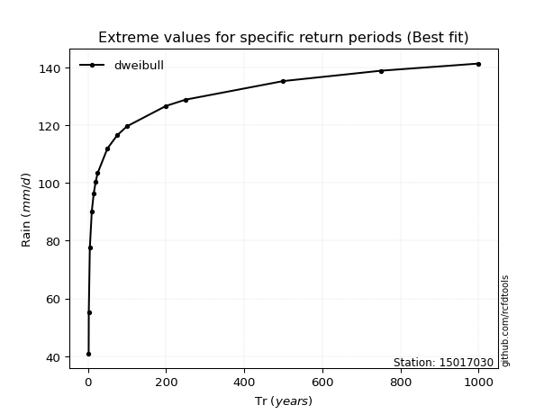</img>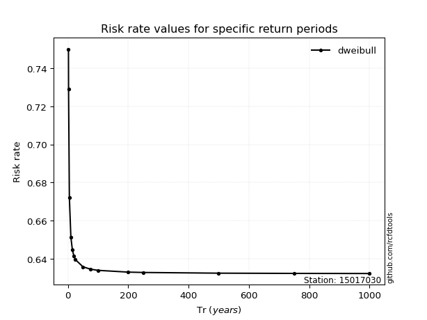</img>

</div>


<sub>**APP DISCLAIMER**: NO WARRANTY - This software is provided by [github.com/rcfdtools](https://github.com/rcfdtools) "as is", without any express or implied warranty, including warranties of merchantability, fitness for a particular purpose, or non-infringement. There is no guarantee that the software will be error-free or operate without interruption. LIMITATION OF LIABILITY - Neither the authors nor copyright holders will be liable for claims or damages arising from the software or its use. You are responsible for determining if the software is appropriate for your use and assume all associated risks, including errors, legal compliance, and data loss. NO PROFESSIONAL ADVICE - The software provides general information and does not offer professional advice. It should not replace consultation with professional advisors.</sub>