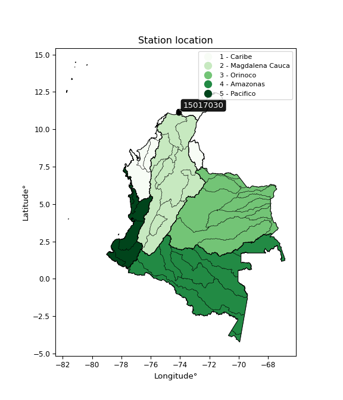

<div align="center">


</div>

# PMP Station (Rain, Pmax24h): 15017030

Probable Maximum Precipitation (PMP) is the greatest amount of rainfall for a specific duration that is meteorologically possible for a given location, acting as a "worst-case" scenario for extreme storms, crucial for designing safety-critical infrastructure like bridges, river deviations, dams, spillways, and nuclear plants to prevent catastrophic failure. PMP is calculated by hydrologists using meteorological data to determine the upper limit of extreme rainfall, often leading to the Probable Maximum Flood (PMF) for flood control design, and is increasingly being studied for climate change impacts. Probable Maximum Precipitation (PMP) is the theoretical upper limit of rainfall, a deterministic estimate for extreme events, while probability distributions (like GEV, Gumbel) describe the likelihood and frequency of various precipitation amounts, including rare ones, showing how often events occur, with PMP representing the extreme end of these distributions, used for critical infrastructure design to ensure safety against the worst conceivable weather, unlike standard statistical forecasts which cover typical probabilities.

The most common probability distributions in hydrology, used for analyzing floods, rainfall, and streamflow, include the Normal, Log-Normal, Gumbel, Gamma (including Log-Pearson Type III), and Generalized Extreme Value (GEV) distributions, often chosen based on the data´s skewness and whether modeling extremes or general conditions, with Gumbel and GEV popular for extreme events like floods, while the Normal distribution serves as a baseline, though often requiring transformations for skewed hydrological data. These distributions help in designing water infrastructure, managing water resources, and forecasting hydrologic events.

> Hydrological data often isn´t perfectly normal (it´s skewed), so different distributions are needed for different applications, such as: **Flood Frequency Analysis**: Using Gumbel, GEV, or Log-Pearson Type III for predicting extreme flood magnitudes and their return periods, **Rainfall Analysis**: Normal for annual totals, but Log-Normal, Weibull, or GEV for intensity or extreme daily rainfall, **Streamflow Modeling**: Gamma and Log-Normal for maximum flows, GEV for minimum flows, and Kappa for daily flows.

<div align="center">

</img>

</div>


## A. General information


### 1. General running parameters

• app_version: _v20260113_. • runtime: _2026-01-17 18:24:04.630693_. • Python version: _3.14.0_. • SciPy version: _1.16.3_. • Pandas version: _2.3.3_. • NumPy version: _2.3.5_. • Stations dataset (station_dataset_file): _dataset/pmax24h_in/automatic_colombia_2003_2025.csv_. • Stations catalog (station_catalog_file): _dataset/CNE.xls_. • Minimum year to eval til year_max (date_min): _1900_. • Maximum year to eval since year_min (date_max): _2025_. • Creates, save and include plots into reports (create_plot): _False_. • Plot only fit distributions with Δo > Δ (plot_only_fit): _True_. • Plot only simple graphs avoiding multiple CDFs and multiple Extreme values plots (plot_only_simple): _True_. • Eval low extreme values, if False, evaluates high extreme values (low_extreme): _False_. • Eval every SciPy distribution as logarithmic (pdist_logarithmic_on): _True_. • Standard deviation normalized (ddof): _1.0_. • Return periods to eval in years (Tr): _[2, 2.33, 5, 10, 15, 20, 25, 50, 75, 100, 200, 250, 500, 750, 1000]_. • Minimum data sample per station, 0 means any (minimum_sample): _5_. • Z-Score maximum threshold to adjust a value, 0 means disable (zscore_max): _3.5_. • Z-Score minimum threshold to adjust a value, 0 means disable (zscore_min): _-2.5_. • Avoid zeros, e.g. rain = 0 (avoid_zeros): _True_. • Avoid null values (avoid_nans): _True_. 

:file_folder:Table: [dataset.csv](../../dataset/pmax24h_in/automatic_colombia_2003_2025.csv)

> Delta Degrees of Freedom (DDOF): is a parameter used in the formulas for calculating variance and standard deviation. When ddof=0, the divisor is $N$ (the total number of observations) and this is used when your data set is the entire population. When ddof=1, the divisor is $N-1$ and this is used when your data set is a sample drawn from a larger population. Using $N-1$ provides an unbiased estimate of the population variance (known as Bessel´s correction).


### 2. Station info and location

|   id |   CODIGO | NOMBRE                  | CATEGORIA    | TECNOLOGIA                              | ESTADO   | FECHA_INSTALACION   |   FECHA_SUSPENSION |   ALTITUD |   LATITUD |   LONGITUD | DEPARTAMENTO   | MUNICIPIO   | AREA_OPERATIVA                                         | ENTIDAD                                                     | AREA_HIDROGRAFICA   | ZONA_HIDROGRAFICA   | SUBZONA_HIDROGRAFICA          | CORRIENTE   | Catalogo   |   Version |
|-----:|---------:|:------------------------|:-------------|:----------------------------------------|:---------|:--------------------|-------------------:|----------:|----------:|-----------:|:---------------|:------------|:-------------------------------------------------------|:------------------------------------------------------------|:--------------------|:--------------------|:------------------------------|:------------|:-----------|----------:|
|    0 | 15017030 | MINCA  - AUT [15017030] | Limnigráfica | Automática con Telemetría, Convencional | Activa   | 15/05/1965          |                nan |       625 |   11.1425 |   -74.1118 | Magdalena      | Santa Marta | Area Operativa 05 - Magdalena-Cesar-Guajira-San Andrés | INSTITUTO DE HIDROLOGIA METEOROLOGIA Y ESTUDIOS AMBIENTALES | Caribe              | Caribe - Guajira    | Río  Piedras - Río Manzanares | Gaira       | CNE_IDEAM  |  20251226 |

<div align="center">

Dynamic map: [:earth_americas:Google](http://maps.google.com/maps?q=11.142548,-74.111813) [:earth_americas:OSM](https://www.openstreetmap.org/#map=18/11.142548/-74.111813&layers=P) [:earth_americas:Bing](https://www.bing.com/maps?cp=11.142548~-74.111813&lvl=18) [:earth_americas:Apple](https://maps.apple.com/frame?center=11.142548%2C-74.111813&span=0.003%2C0.006)

</div>


<div align="center">

```geojson
{
  "type": "Feature",
  "geometry": {
    "type": "Point", 
    "coordinates": [-74.111813, 11.142548]
  }, 
  "properties": {
    "Name": "15017030"
  }
}
```

</div>


### 3. Discrete values table and plot

<div align="center">

|               |            0 |          1 |           2 |          3 |           4 |
|:--------------|-------------:|-----------:|------------:|-----------:|------------:|
| Date          | 2021         | 2022       | 2023        | 2024       | 2025        |
| Value         |   49.4       |    9.5     |   17.2      |  104.8     |   83.8      |
| Value_initial |   49.4       |    9.5     |   17.2      |  104.8     |   83.8      |
| count         |    5         |    5       |    5        |    5       |    5        |
| mean          |   52.94      |   52.94    |   52.94     |   52.94    |   52.94     |
| std           |   41.2877    |   41.2877  |   41.2877   |   41.2877  |   41.2877   |
| zscore        |   -0.0857397 |   -1.05213 |   -0.865632 |    1.25606 |    0.747437 |


</div>


> The initial value (value_initial) correspond to the initial obtained or null completed value, and value (value) is adjusted only when the initial value is outside the valid range (outlier) definite through the Z-Score value. If Z-Score is active, values out of range or outliers are replaced with the station mean value. A Z-Score (or standard score) measures how many standard deviations a data point is from the mean of a dataset, indicating its relative position; positive scores mean above the mean, negative mean below, and a score of zero is exactly at the mean, allowing for comparison of values from different distributions. It´s calculated using the formula $z=(x–μ)/σ$, where $x$ is the data point, $μ$ is the mean, and $σ$ is the standard deviation, helping identify outliers and understand probability.
>
> <sub>**Note**: In this study, "completing" (filling gaps in) and "extending" (forecasting or lengthening the historical record) rainfall data series are avoided for certain critical analyses because they introduce artificial bias and uncertainty, which can distort the statistics of rare events (extremes), alter day-to-day variability, and compromise the integrity and homogeneity of the original data. Some reasons against Completing/Extending rainfall data are: **Distortion of Extremes and Variability**: The primary issue is that most gap-filling or extension methods rely on averaging or regression with nearby stations, which inherently smooths the data. Rainfall is highly variable in space and time, with a large percentage of zero values and occasional large storms. Infilling methods often underestimate the highest values and overestimate the lowest (zero) values, which severely distorts analyses focused on flood frequency, drought severity, and intensity-duration-frequency (IDF) curves, **Loss of Data Homogeneity**: Infilled or extended data are synthetic estimates, not actual measurements. Combining these estimates with observed data can violate the assumption of data homogeneity, which requires that the data properties do not change over time. Inhomogeneity can lead to incorrect conclusions about long-term trends or changes in climate patterns, **Propagation of Errors**: Errors and biases from the original data (e.g., wind-induced undercatch, instrument errors, site changes) or the data used for imputation can propagate through the analysis, leading to unreliable hydrological models and inaccurate predictions, **Compromised Statistical Integrity**: For statistical analyses, especially those involving the frequency of events, using artificial data can introduce time bias or autocorrelation that doesn´t exist in reality, making it difficult to assess the true probability of events, **Difficulty in Validation**: It is difficult to accurately validate the quality of filled or extended data, especially for past periods where ground-truth measurements are unavailable. The reliability of imputation techniques heavily depends on the density of the surrounding station network and the complexity of the local topography.</sub>


### 4. Active continuous probability distributions from SciPy (80 of 104 available)

A Probability Density Function (PDF) describes the relative likelihood of a continuous random variable falling within a specific range, where the total area under its curve equals 1, and the area over any interval gives the actual probability for that range. Unlike discrete probabilities (like rolling a die), a PDF shows density, not direct probability for a single point (which is zero), with higher points indicating higher likelihood, often visualized as a bell curve for normal distributions.

A log of a probability density function (log-PDF) is simply the logarithm of the PDF´s value, denoted as $log(f(x))$, useful for converting multiplication of probabilities into addition, improving numerical stability with tiny numbers, and connecting to information theory concepts like entropy. Instead of dealing with very small probabilities (e.g., 0.000001), log-PDFs use negative numbers (e.g., $log(0.00001) ≈ -11.51$ that are easier for computers to handle, preventing underflow errors and simplifying complex calculations. In this study, each active probability distribution from SciPy is also evaluated in the $log$ form.

[scipy.stats](https://docs.scipy.org/doc/scipy/reference/stats.html) is a Python´s powerful submodule within the SciPy library for comprehensive statistical analysis, offering over 130 probability distributions (like Normal, Poisson), functions for descriptive stats (mean, variance), hypothesis testing (t-tests, chi-square), random variable generation, and statistical tests, making it essential for data science, modeling, and research. It provides tools to explore, model, and draw conclusions from data efficiently, working seamlessly with NumPy.

<div align="center">

|   id | p_dist           |   n_parameter | fit_method   | label                                                                       | active   | ref                                                                                                      |
|-----:|:-----------------|--------------:|:-------------|:----------------------------------------------------------------------------|:---------|:---------------------------------------------------------------------------------------------------------|
|    0 | alpha            |             3 | MLE          | Alpha                                                                       | True     | [:mortar_board:](https://docs.scipy.org/doc/scipy/reference/generated/scipy.stats.alpha.html)            |
|    1 | anglit           |             2 | MM           | Anglit                                                                      | True     | [:mortar_board:](https://docs.scipy.org/doc/scipy/reference/generated/scipy.stats.anglit.html)           |
|    2 | arcsine          |             2 | MM           | Arcsine                                                                     | True     | [:mortar_board:](https://docs.scipy.org/doc/scipy/reference/generated/scipy.stats.arcsine.html)          |
|    3 | argus            |             3 | MLE          | Argus                                                                       | True     | [:mortar_board:](https://docs.scipy.org/doc/scipy/reference/generated/scipy.stats.argus.html)            |
|    4 | beta             |             4 | MLE          | Beta                                                                        | True     | [:mortar_board:](https://docs.scipy.org/doc/scipy/reference/generated/scipy.stats.beta.html)             |
|    5 | betaprime        |             4 | MLE          | Beta prime                                                                  | True     | [:mortar_board:](https://docs.scipy.org/doc/scipy/reference/generated/scipy.stats.betaprime.html)        |
|    6 | bradford         |             3 | MLE          | Bradford                                                                    | True     | [:mortar_board:](https://docs.scipy.org/doc/scipy/reference/generated/scipy.stats.bradford.html)         |
|    7 | burr             |             4 | MLE          | Burr (Type III)                                                             | True     | [:mortar_board:](https://docs.scipy.org/doc/scipy/reference/generated/scipy.stats.burr.html)             |
|    8 | burr12           |             4 | MLE          | Burr (Type III) 12                                                          | True     | [:mortar_board:](https://docs.scipy.org/doc/scipy/reference/generated/scipy.stats.burr12.html)           |
|    9 | cosine           |             2 | MLE          | Cosine                                                                      | True     | [:mortar_board:](https://docs.scipy.org/doc/scipy/reference/generated/scipy.stats.cosine.html)           |
|   10 | crystalball      |             4 | MLE          | Crystalball                                                                 | True     | [:mortar_board:](https://docs.scipy.org/doc/scipy/reference/generated/scipy.stats.crystalball.html)      |
|   11 | dgamma           |             3 | MLE          | Double gamma                                                                | True     | [:mortar_board:](https://docs.scipy.org/doc/scipy/reference/generated/scipy.stats.dgamma.html)           |
|   12 | dweibull         |             3 | MLE          | Double Weibull                                                              | True     | [:mortar_board:](https://docs.scipy.org/doc/scipy/reference/generated/scipy.stats.dweibull.html)         |
|   13 | erlang           |             3 | MLE          | Erlang                                                                      | True     | [:mortar_board:](https://docs.scipy.org/doc/scipy/reference/generated/scipy.stats.erlang.html)           |
|   14 | exponnorm        |             3 | MLE          | Exponentially modified Normal                                               | True     | [:mortar_board:](https://docs.scipy.org/doc/scipy/reference/generated/scipy.stats.exponnorm.html)        |
|   15 | exponpow         |             3 | MLE          | Exponential power                                                           | True     | [:mortar_board:](https://docs.scipy.org/doc/scipy/reference/generated/scipy.stats.exponpow.html)         |
|   16 | exponweib        |             4 | MLE          | Exponentiated Weibull                                                       | True     | [:mortar_board:](https://docs.scipy.org/doc/scipy/reference/generated/scipy.stats.exponweib.html)        |
|   17 | f                |             4 | MLE          | F                                                                           | True     | [:mortar_board:](https://docs.scipy.org/doc/scipy/reference/generated/scipy.stats.f.html)                |
|   18 | fatiguelife      |             3 | MLE          | Fatigue-life (Birnbaum-Saunders)                                            | True     | [:mortar_board:](https://docs.scipy.org/doc/scipy/reference/generated/scipy.stats.fatiguelife.html)      |
|   19 | foldnorm         |             3 | MM           | Fold Normal                                                                 | True     | [:mortar_board:](https://docs.scipy.org/doc/scipy/reference/generated/scipy.stats.foldnorm.html)         |
|   20 | gamma            |             3 | MLE          | Gamma                                                                       | True     | [:mortar_board:](https://docs.scipy.org/doc/scipy/reference/generated/scipy.stats.gamma.html)            |
|   21 | gausshyper       |             6 | MLE          | Gauss hypergeometric                                                        | True     | [:mortar_board:](https://docs.scipy.org/doc/scipy/reference/generated/scipy.stats.gausshyper.html)       |
|   22 | genexpon         |             5 | MLE          | Generalized exponential                                                     | True     | [:mortar_board:](https://docs.scipy.org/doc/scipy/reference/generated/scipy.stats.genexpon.html)         |
|   23 | genextreme       |             3 | MLE          | Generalized exponential                                                     | True     | [:mortar_board:](https://docs.scipy.org/doc/scipy/reference/generated/scipy.stats.genextreme.html)       |
|   24 | gengamma         |             4 | MLE          | Generalized gamma                                                           | True     | [:mortar_board:](https://docs.scipy.org/doc/scipy/reference/generated/scipy.stats.gengamma.html)         |
|   25 | genhalflogistic  |             3 | MLE          | Generalized half-logistic                                                   | True     | [:mortar_board:](https://docs.scipy.org/doc/scipy/reference/generated/scipy.stats.genhalflogistic.html)  |
|   26 | genlogistic      |             3 | MLE          | Generalized logistic                                                        | True     | [:mortar_board:](https://docs.scipy.org/doc/scipy/reference/generated/scipy.stats.genlogistic.html)      |
|   27 | gennorm          |             3 | MLE          | Generalized Normal                                                          | True     | [:mortar_board:](https://docs.scipy.org/doc/scipy/reference/generated/scipy.stats.gennorm.html)          |
|   28 | genpareto        |             3 | MLE          | Generalized Pareto                                                          | True     | [:mortar_board:](https://docs.scipy.org/doc/scipy/reference/generated/scipy.stats.genpareto.html)        |
|   29 | gompertz         |             3 | MLE          | Gompertz (or truncated Gumbel)                                              | True     | [:mortar_board:](https://docs.scipy.org/doc/scipy/reference/generated/scipy.stats.gompertz.html)         |
|   30 | gumbel_l         |             2 | MM           | Gumbel Left Skew                                                            | True     | [:mortar_board:](https://docs.scipy.org/doc/scipy/reference/generated/scipy.stats.gumbel_l.html)         |
|   31 | gumbel_r         |             2 | MM           | Gumbel Right Skew                                                           | True     | [:mortar_board:](https://docs.scipy.org/doc/scipy/reference/generated/scipy.stats.gumbel_r.html)         |
|   32 | halfgennorm      |             3 | MLE          | Upper half of a generalized normal                                          | True     | [:mortar_board:](https://docs.scipy.org/doc/scipy/reference/generated/scipy.stats.halfgennorm.html)      |
|   33 | halflogistic     |             2 | MM           | Half-logistic                                                               | True     | [:mortar_board:](https://docs.scipy.org/doc/scipy/reference/generated/scipy.stats.halflogistic.html)     |
|   34 | halfnorm         |             2 | MM           | Half Normal                                                                 | True     | [:mortar_board:](https://docs.scipy.org/doc/scipy/reference/generated/scipy.stats.halfnorm.html)         |
|   35 | hypsecant        |             2 | MM           | hyperbolic secant                                                           | True     | [:mortar_board:](https://docs.scipy.org/doc/scipy/reference/generated/scipy.stats.hypsecant.html)        |
|   36 | invgamma         |             3 | MLE          | Inverted gamma                                                              | True     | [:mortar_board:](https://docs.scipy.org/doc/scipy/reference/generated/scipy.stats.invgamma.html)         |
|   37 | invgauss         |             3 | MLE          | Inverse Gaussian                                                            | True     | [:mortar_board:](https://docs.scipy.org/doc/scipy/reference/generated/scipy.stats.invgauss.html)         |
|   38 | invweibull       |             3 | MLE          | Inverted Weibull                                                            | True     | [:mortar_board:](https://docs.scipy.org/doc/scipy/reference/generated/scipy.stats.invweibull.html)       |
|   39 | johnsonsb        |             4 | MLE          | Johnson SB                                                                  | True     | [:mortar_board:](https://docs.scipy.org/doc/scipy/reference/generated/scipy.stats.johnsonsb.html)        |
|   40 | johnsonsu        |             4 | MLE          | Johnson Su                                                                  | True     | [:mortar_board:](https://docs.scipy.org/doc/scipy/reference/generated/scipy.stats.johnsonsu.html)        |
|   41 | kappa3           |             3 | MLE          | Kappa 3                                                                     | True     | [:mortar_board:](https://docs.scipy.org/doc/scipy/reference/generated/scipy.stats.kappa3.html)           |
|   42 | kappa4           |             4 | MLE          | Kappa 4                                                                     | True     | [:mortar_board:](https://docs.scipy.org/doc/scipy/reference/generated/scipy.stats.kappa4.html)           |
|   43 | ksone            |             3 | MLE          | Kolmogorov-Smirnov one-sided test statistic distribution                    | True     | [:mortar_board:](https://docs.scipy.org/doc/scipy/reference/generated/scipy.stats.ksone.html)            |
|   44 | kstwobign        |             2 | MLE          | Limiting distribution of scaled Kolmogorov-Smirnov two-sided test statistic | True     | [:mortar_board:](https://docs.scipy.org/doc/scipy/reference/generated/scipy.stats.kstwobign.html)        |
|   45 | laplace          |             2 | MM           | Laplace                                                                     | True     | [:mortar_board:](https://docs.scipy.org/doc/scipy/reference/generated/scipy.stats.laplace.html)          |
|   46 | levy_l           |             2 | MLE          | Left-skewed Levy                                                            | True     | [:mortar_board:](https://docs.scipy.org/doc/scipy/reference/generated/scipy.stats.levy_l.html)           |
|   47 | loggamma         |             3 | MLE          | Log gamma                                                                   | True     | [:mortar_board:](https://docs.scipy.org/doc/scipy/reference/generated/scipy.stats.loggamma.html)         |
|   48 | logistic         |             2 | MM           | Logistic (or Sech-squared)                                                  | True     | [:mortar_board:](https://docs.scipy.org/doc/scipy/reference/generated/scipy.stats.logistic.html)         |
|   49 | loglaplace       |             3 | MLE          | Log-Laplace                                                                 | True     | [:mortar_board:](https://docs.scipy.org/doc/scipy/reference/generated/scipy.stats.loglaplace.html)       |
|   50 | lomax            |             3 | MLE          | Lomax (Pareto of the second kind)                                           | True     | [:mortar_board:](https://docs.scipy.org/doc/scipy/reference/generated/scipy.stats.lomax.html)            |
|   51 | maxwell          |             2 | MM           | Maxwell                                                                     | True     | [:mortar_board:](https://docs.scipy.org/doc/scipy/reference/generated/scipy.stats.maxwell.html)          |
|   52 | mielke           |             4 | MLE          | Mielke Beta-Kappa / Dagum                                                   | True     | [:mortar_board:](https://docs.scipy.org/doc/scipy/reference/generated/scipy.stats.mielke.html)           |
|   53 | moyal            |             2 | MM           | Moyal                                                                       | True     | [:mortar_board:](https://docs.scipy.org/doc/scipy/reference/generated/scipy.stats.moyal.html)            |
|   54 | nakagami         |             3 | MLE          | Nakagami                                                                    | True     | [:mortar_board:](https://docs.scipy.org/doc/scipy/reference/generated/scipy.stats.nakagami.html)         |
|   55 | ncf              |             5 | MLE          | Non-central F distribution                                                  | True     | [:mortar_board:](https://docs.scipy.org/doc/scipy/reference/generated/scipy.stats.ncf.html)              |
|   56 | nct              |             4 | MLE          | Non-central Student’s t                                                     | True     | [:mortar_board:](https://docs.scipy.org/doc/scipy/reference/generated/scipy.stats.nct.html)              |
|   57 | norm             |             2 | MM           | Normal                                                                      | True     | [:mortar_board:](https://docs.scipy.org/doc/scipy/reference/generated/scipy.stats.norm.html)             |
|   58 | pearson3         |             3 | MM           | Pearson type III                                                            | True     | [:mortar_board:](https://docs.scipy.org/doc/scipy/reference/generated/scipy.stats.pearson3.html)         |
|   59 | powerlaw         |             3 | MLE          | Power-function                                                              | True     | [:mortar_board:](https://docs.scipy.org/doc/scipy/reference/generated/scipy.stats.powerlaw.html)         |
|   60 | rayleigh         |             2 | MM           | Rayleigh                                                                    | True     | [:mortar_board:](https://docs.scipy.org/doc/scipy/reference/generated/scipy.stats.rayleigh.html)         |
|   61 | rdist            |             3 | MLE          | R-distributed (symmetric beta)                                              | True     | [:mortar_board:](https://docs.scipy.org/doc/scipy/reference/generated/scipy.stats.rdist.html)            |
|   62 | rice             |             3 | MLE          | Rice                                                                        | True     | [:mortar_board:](https://docs.scipy.org/doc/scipy/reference/generated/scipy.stats.rice.html)             |
|   63 | semicircular     |             2 | MM           | Semicircular                                                                | True     | [:mortar_board:](https://docs.scipy.org/doc/scipy/reference/generated/scipy.stats.semicircular.html)     |
|   64 | skewnorm         |             3 | MLE          | Skew normal                                                                 | True     | [:mortar_board:](https://docs.scipy.org/doc/scipy/reference/generated/scipy.stats.skewnorm.html)         |
|   65 | t                |             3 | MLE          | Student’s t                                                                 | True     | [:mortar_board:](https://docs.scipy.org/doc/scipy/reference/generated/scipy.stats.t.html)                |
|   66 | trapezoid        |             4 | MLE          | Trapezoid                                                                   | True     | [:mortar_board:](https://docs.scipy.org/doc/scipy/reference/generated/scipy.stats.trapezoid.html)        |
|   67 | triang           |             3 | MLE          | Triangular                                                                  | True     | [:mortar_board:](https://docs.scipy.org/doc/scipy/reference/generated/scipy.stats.triang.html)           |
|   68 | truncexpon       |             3 | MLE          | Truncated exponential                                                       | True     | [:mortar_board:](https://docs.scipy.org/doc/scipy/reference/generated/scipy.stats.truncexpon.html)       |
|   69 | truncnorm        |             4 | MLE          | Truncated normal                                                            | True     | [:mortar_board:](https://docs.scipy.org/doc/scipy/reference/generated/scipy.stats.truncnorm.html)        |
|   70 | truncpareto      |             4 | MLE          | Upper truncated Pareto                                                      | True     | [:mortar_board:](https://docs.scipy.org/doc/scipy/reference/generated/scipy.stats.truncpareto.html)      |
|   71 | truncweibull_min |             5 | MLE          | Doubly truncated Weibull minimum                                            | True     | [:mortar_board:](https://docs.scipy.org/doc/scipy/reference/generated/scipy.stats.truncweibull_min.html) |
|   72 | tukeylambda      |             3 | MLE          | Tukey-Lamdba                                                                | True     | [:mortar_board:](https://docs.scipy.org/doc/scipy/reference/generated/scipy.stats.tukeylambda.html)      |
|   73 | uniform          |             2 | MLE          | Uniform                                                                     | True     | [:mortar_board:](https://docs.scipy.org/doc/scipy/reference/generated/scipy.stats.uniform.html)          |
|   74 | vonmises         |             3 | MLE          | Von Mises                                                                   | True     | [:mortar_board:](https://docs.scipy.org/doc/scipy/reference/generated/scipy.stats.vonmises.html)         |
|   75 | vonmises_line    |             3 | MLE          | Von Mises line                                                              | True     | [:mortar_board:](https://docs.scipy.org/doc/scipy/reference/generated/scipy.stats.vonmises_line.html)    |
|   76 | wald             |             2 | MM           | Wald                                                                        | True     | [:mortar_board:](https://docs.scipy.org/doc/scipy/reference/generated/scipy.stats.wald.html)             |
|   77 | weibull_max      |             3 | MLE          | Weibull maximum                                                             | True     | [:mortar_board:](https://docs.scipy.org/doc/scipy/reference/generated/scipy.stats.weibull_max.html)      |
|   78 | weibull_min      |             3 | MLE          | Weibull minimum                                                             | True     | [:mortar_board:](https://docs.scipy.org/doc/scipy/reference/generated/scipy.stats.weibull_min.html)      |
|   79 | wrapcauchy       |             3 | MLE          | Wrapped  Cauchy                                                             | True     | [:mortar_board:](https://docs.scipy.org/doc/scipy/reference/generated/scipy.stats.wrapcauchy.html)       |

</div>

> **n_parameter:** # arguments & localization & scale.
>
> **Fit methods:** (MLE) maximum likelihood, (MM) L-moments.
>
>**Inactive** (With the only purpose of prevent loops, zero divisions, infinite values, over high estimated values or horizontal trending for recurrence intervals estimations, the follow distributions were disabled.)**:** lognorm, norminvgauss, powernorm, powerlognorm, cauchy, halfcauchy, foldcauchy, skewcauchy, chi2, expon, fisk, genhyperbolic, geninvgauss, gibrat, kstwo, laplace_asymmetric, levy, levy_stable, ncx2, pareto, rel_breitwigner, recipinvgauss, studentized_range, loguniform, 


## B. Probability (PDF) vs. Empirical (EDF) distributions functions

A continuous probability distribution (CPD) describes probabilities for variables that can take any value within a range (like rain any time), unlike discrete variables with specific outcomes (like temperature). It uses a Probability Density Function (PDF), a curve where the total area under it equals 1, and the probability of the variable falling within an interval (a to b) is found by calculating the area under the curve between those points. A key feature is that the probability of hitting any single exact value is zero, so probabilities are always expressed for ranges, e.g., $P(a ≤ X ≤ b)$.

<div align="center">

Distributions parameters from station values
|     |   station | p_dist              |   n |               loc |            scale | shape                  | shape1                 | shape2             | shape3             |
|----:|----------:|:--------------------|----:|------------------:|-----------------:|:-----------------------|:-----------------------|:-------------------|:-------------------|
|   0 |  15017030 | alpha               |   5 |      -0.0480204   |     18.2784      | 5.656618826842011e-10  |                        |                    |                    |
|   1 |  15017030 | anglit              |   5 |      52.94        |    108.032       |                        |                        |                    |                    |
|   2 |  15017030 | arcsine             |   5 |       0.714673    |    104.451       |                        |                        |                    |                    |
|   3 |  15017030 | argus               |   5 |     -23.3811      |    136.14        | 3.591440461153922e-06  |                        |                    |                    |
|   4 |  15017030 | beta                |   5 |       8.48246     |     96.3175      | 0.333992134181892      | 0.4379052042919602     |                    |                    |
|   5 |  15017030 | betaprime           |   5 |       9.46453     |    509.941       | 0.7656407609668945     | 14.042875915010498     |                    |                    |
|   6 |  15017030 | bradford            |   5 |       9.5         |     95.3573      | 4.359859489841216      |                        |                    |                    |
|   7 |  15017030 | burr                |   5 |      -0.380738    |      0.307274    | 1.1641217552451835     | 157.90673860039357     |                    |                    |
|   8 |  15017030 | burr12              |   5 |      -0.72319     |     10.0764      | 302.19775694546206     | 0.0024804595321912025  |                    |                    |
|   9 |  15017030 | cosine              |   5 |      53.8695      |     29.2454      |                        |                        |                    |                    |
|  10 |  15017030 | crystalball         |   5 |      52.94        |     36.9289      | 48607.82072425933      | 399.6436863685715      |                    |                    |
|  11 |  15017030 | dgamma              |   5 |      38.1762      |     11.6255      | 2.9783403825806296     |                        |                    |                    |
|  12 |  15017030 | dweibull            |   5 |      40.7994      |     38.4513      | 1.900416746846833      |                        |                    |                    |
|  13 |  15017030 | erlang              |   5 |     -48.6567      |     13.1458      | 7.728966836654246      |                        |                    |                    |
|  14 |  15017030 | exponnorm           |   5 |      48.9938      |     36.7175      | 0.10747421117736584    |                        |                    |                    |
|  15 |  15017030 | exponpow            |   5 |       9.5         |     74.3875      | 0.6048470954464553     |                        |                    |                    |
|  16 |  15017030 | exponweib           |   5 |       8.1665      |     98.2715      | 0.004030470258394467   | 172.73208417957792     |                    |                    |
|  17 |  15017030 | f                   |   5 |       9.5         |     63.1965      | 1.0138255816425366     | 97.18208418071956      |                    |                    |
|  18 |  15017030 | fatiguelife         |   5 |       9.5         |      0.000258458 | 431.37933167990604     |                        |                    |                    |
|  19 |  15017030 | foldnorm            |   5 |     -26.3838      |     38.0549      | 2.0704230622566517     |                        |                    |                    |
|  20 |  15017030 | gamma               |   5 |     -31.9698      |     14.7899      | 5.6361661163186945     |                        |                    |                    |
|  21 |  15017030 | gausshyper          |   5 |      -4.12251     |    108.923       | 1.226147590113879      | 0.8972784403108992     | 1.0172858385715056 | 0.9921484077539011 |
|  22 |  15017030 | genexpon            |   5 |      -0.0291208   |      2.22072     | 4.901800717600242e-07  | 0.043496333474807344   | 1.1985156859385278 |                    |
|  23 |  15017030 | genextreme          |   5 |      13.3626      |    138.469       | 1.5143634069115581     |                        |                    |                    |
|  24 |  15017030 | gengamma            |   5 |       0.80004     |    114.588       | 0.08353830662198786    | 10.70620704057195      |                    |                    |
|  25 |  15017030 | genhalflogistic     |   5 |      -0.0306749   |    117.921       | 1.1248741173445942     |                        |                    |                    |
|  26 |  15017030 | genlogistic         |   5 |    -175.49        |     30.7038      | 948.6504304527452      |                        |                    |                    |
|  27 |  15017030 | gennorm             |   5 |      57.15        |     47.6501      | 9037328.181868684      |                        |                    |                    |
|  28 |  15017030 | genpareto           |   5 |       0.0815532   |    167.314       | -1.5977495687110608    |                        |                    |                    |
|  29 |  15017030 | gompertz            |   5 |       9.5         |    113.089       | 1.821440941979819      |                        |                    |                    |
|  30 |  15017030 | gumbel_l            |   5 |      69.56        |     28.7933      |                        |                        |                    |                    |
|  31 |  15017030 | gumbel_r            |   5 |      36.32        |     28.7933      |                        |                        |                    |                    |
|  32 |  15017030 | halfgennorm         |   5 |       9.5         |     95.955       | 727.091420393014       |                        |                    |                    |
|  33 |  15017030 | halflogistic        |   5 |       9.17069     |     31.5729      |                        |                        |                    |                    |
|  34 |  15017030 | halfnorm            |   5 |       4.06063     |     61.2612      |                        |                        |                    |                    |
|  35 |  15017030 | hypsecant           |   5 |      52.94        |     23.5097      |                        |                        |                    |                    |
|  36 |  15017030 | invgamma            |   5 |     -23.6119      |    221.829       | 3.7931429849433917     |                        |                    |                    |
|  37 |  15017030 | invgauss            |   5 |       2.20711     |     33.6801      | 1.5063158023091376     |                        |                    |                    |
|  38 |  15017030 | invweibull          |   5 | -744448           | 744483           | 24224.34848338869      |                        |                    |                    |
|  39 |  15017030 | johnsonsb           |   5 |     -17.3262      |    122.126       | -0.673980402845932     | 0.13964489347766712    |                    |                    |
|  40 |  15017030 | johnsonsu           |   5 |       2.91816e+08 |      5.73932e+08 | 8527727.256030824      | 17447760.228501454     |                    |                    |
|  41 |  15017030 | kappa3              |   5 |       9.5         |     95.238       | 1873.98758736686       |                        |                    |                    |
|  42 |  15017030 | kappa4              |   5 |      -9.39101     |    125.311       | 1.1789386322562287     | 1.0848834131077099     |                    |                    |
|  43 |  15017030 | ksone               |   5 |     -11.0227      |    127.925       | 1.0                    |                        |                    |                    |
|  44 |  15017030 | kstwobign           |   5 |     -69.3545      |    139.431       |                        |                        |                    |                    |
|  45 |  15017030 | laplace             |   5 |      52.94        |     26.1127      |                        |                        |                    |                    |
|  46 |  15017030 | levy_l              |   5 |     108.821       |     15.3148      |                        |                        |                    |                    |
|  47 |  15017030 | loggamma            |   5 |   -7813.58        |   1146.89        | 952.7077500391401      |                        |                    |                    |
|  48 |  15017030 | logistic            |   5 |      52.94        |     20.36        |                        |                        |                    |                    |
|  49 |  15017030 | loglaplace          |   5 |      -0.11546     |     49.5155      | 1.2599760378152958     |                        |                    |                    |
|  50 |  15017030 | lomax               |   5 |       9.5         |      5.3676e+09  | 121912207.55328204     |                        |                    |                    |
|  51 |  15017030 | maxwell             |   5 |     -34.5659      |     54.8362      |                        |                        |                    |                    |
|  52 |  15017030 | mielke              |   5 |      -0.3361      |      0.492758    | 106.885007312477       | 1.1663781950824603     |                    |                    |
|  53 |  15017030 | moyal               |   5 |      31.8217      |     16.6238      |                        |                        |                    |                    |
|  54 |  15017030 | nakagami            |   5 |       9.5         |     75.7778      | 0.25407546493486677    |                        |                    |                    |
|  55 |  15017030 | ncf                 |   5 |      -0.042822    |      2.3608e-05  | 5.7470754903841305e-06 | 5.430405849757868      | 9.494773780354187  |                    |
|  56 |  15017030 | nct                 |   5 |      -1.06695     |      0.131664    | 0.9553012240739687     | 151.42159497341157     |                    |                    |
|  57 |  15017030 | norm                |   5 |      52.94        |     36.9289      |                        |                        |                    |                    |
|  58 |  15017030 | pearson3            |   5 |      52.94        |     36.9289      | 0.16359180347011648    |                        |                    |                    |
|  59 |  15017030 | powerlaw            |   5 |       9.5         |     95.3         | 0.11860532430231424    |                        |                    |                    |
|  60 |  15017030 | rayleigh            |   5 |     -17.7071      |     56.3682      |                        |                        |                    |                    |
|  61 |  15017030 | rdist               |   5 |      57.1503      |     47.6503      | 1.0301475860205045     |                        |                    |                    |
|  62 |  15017030 | rice                |   5 |     -12.2626      |     47.6326      | 0.6891050965126659     |                        |                    |                    |
|  63 |  15017030 | semicircular        |   5 |      52.94        |     73.8578      |                        |                        |                    |                    |
|  64 |  15017030 | skewnorm            |   5 |       9.49996     |     57.0107      | 7136479.772424128      |                        |                    |                    |
|  65 |  15017030 | t                   |   5 |      52.94        |     36.9288      | 111252.55046326775     |                        |                    |                    |
|  66 |  15017030 | trapezoid           |   5 |     -51.8326      |    156.676       | 0.9999999999999999     | 1.0                    |                    |                    |
|  67 |  15017030 | triang              |   5 |     -51.5651      |    156.365       | 0.9999997254289794     |                        |                    |                    |
|  68 |  15017030 | truncexpon          |   5 |      -1.58772     |    133.523       | 0.7967753466794736     |                        |                    |                    |
|  69 |  15017030 | truncnorm           |   5 |      52.94        |     36.9289      | -224.07081847143252    | 274.4177756558271      |                    |                    |
|  70 |  15017030 | truncpareto         |   5 |       9.10977     |      0.390234    | 0.2713664227425617     | 245.21270836114903     |                    |                    |
|  71 |  15017030 | truncweibull_min    |   5 |      -1.94897     |    132.905       | 1.2043608123788772     | 0.00018941781413196935 | 0.803197850889944  |                    |
|  72 |  15017030 | tukeylambda         |   5 |      57.5804      |     55.8079      | 1.1607196118365004     |                        |                    |                    |
|  73 |  15017030 | uniform             |   5 |       9.5         |     95.3         |                        |                        |                    |                    |
|  74 |  15017030 | vonmises            |   5 |      -2.20231     |      1           | 1.0581403686454944     |                        |                    |                    |
|  75 |  15017030 | vonmises_line       |   5 |      57.2315      |     15.1935      | 4.2927539147029434e-07 |                        |                    |                    |
|  76 |  15017030 | wald                |   5 |      16.0111      |     36.9289      |                        |                        |                    |                    |
|  77 |  15017030 | weibull_max         |   5 |     104.8         |      1.56558     | 0.2572196258288456     |                        |                    |                    |
|  78 |  15017030 | weibull_min         |   5 |       9.5         |     50.9694      | 0.5109864770079149     |                        |                    |                    |
|  79 |  15017030 | wrapcauchy          |   5 |       9.49994     |     15.1675      | 0.632947711017916      |                        |                    |                    |
|  80 |  15017030 | logalpha            |   5 |     -13.8684      |    320.49        | 18.409736176083918     |                        |                    |                    |
|  81 |  15017030 | loganglit           |   5 |       3.61533     |      2.70377     |                        |                        |                    |                    |
|  82 |  15017030 | logarcsine          |   5 |       2.30825     |      2.61416     |                        |                        |                    |                    |
|  83 |  15017030 | logargus            |   5 |       1.3493      |      3.43752     | 1.7318832851348114     |                        |                    |                    |
|  84 |  15017030 | logbeta             |   5 |       2.11397     |      2.53808     | 0.40810222189694145    | 0.2903783028759246     |                    |                    |
|  85 |  15017030 | logbetaprime        |   5 |     -10.829       |    294.781       | 245.37347962236646     | 5012.341783324902      |                    |                    |
|  86 |  15017030 | logbradford         |   5 |       2.25128     |      2.40078     | 1.139537484746021      |                        |                    |                    |
|  87 |  15017030 | logburr             |   5 |       1.21641     |      3.45886     | 588.2241160849386      | 0.003704624663237401   |                    |                    |
|  88 |  15017030 | logburr12           |   5 |    -881.296       |    894.436       | 1215.6740988077286     | 244321.1167522614      |                    |                    |
|  89 |  15017030 | logcosine           |   5 |       3.57073     |      0.734223    |                        |                        |                    |                    |
|  90 |  15017030 | logcrystalball      |   5 |       3.61533     |      0.924239    | 361.64487182251753     | 216.42211322038014     |                    |                    |
|  91 |  15017030 | logdgamma           |   5 |       3.42042     |      0.121417    | 7.352855916894237      |                        |                    |                    |
|  92 |  15017030 | logdweibull         |   5 |       3.43265     |      0.997047    | 3.3988771448589743     |                        |                    |                    |
|  93 |  15017030 | logerlang           |   5 |     -11.2032      |      0.0586305   | 252.64689891971705     |                        |                    |                    |
|  94 |  15017030 | logexponnorm        |   5 |       3.61445     |      0.92424     | 0.0009437344641862288  |                        |                    |                    |
|  95 |  15017030 | logexponpow         |   5 |       2.25129     |      1.70858     | 0.6630384390700066     |                        |                    |                    |
|  96 |  15017030 | logexponweib        |   5 |       2.25129     |      2.55343     | 1.1167240761889847     | 0.12463913986355699    |                    |                    |
|  97 |  15017030 | logf                |   5 |    -365.274       |    368.884       | 924172.896749564       | 485496.2606807549      |                    |                    |
|  98 |  15017030 | logfatiguelife      |   5 |    -123.677       |    127.295       | 0.007270929103127346   |                        |                    |                    |
|  99 |  15017030 | logfoldnorm         |   5 |      -3.35235     |      0.905787    | 7.695619363219221      |                        |                    |                    |
| 100 |  15017030 | loggamma            |   5 |     -11.6709      |      0.0567023   | 269.4728102983545      |                        |                    |                    |
| 101 |  15017030 | loggausshyper       |   5 |       2.23125     |      2.42081     | 0.9954812723674993     | 0.9026920844640294     | 1.1409409453212527 | 1.135797496401891  |
| 102 |  15017030 | loggenexpon         |   5 |       2.25129     |      1.43761     | 0.8619525567080426     | 0.6838745394559922     | 0.5405388406408205 |                    |
| 103 |  15017030 | loggenextreme       |   5 |       3.87227     |      0.962882    | 1.2348117691141045     |                        |                    |                    |
| 104 |  15017030 | loggengamma         |   5 |       2.25129     |      1.18666     | 1.032419127181903      | 0.8613864520414993     |                    |                    |
| 105 |  15017030 | loggenhalflogistic  |   5 |       1.63167     |      3.18124     | 1.053256258050745      |                        |                    |                    |
| 106 |  15017030 | loggenlogistic      |   5 |       4.65273     |      8.40309e-05 | 7.905495292580884e-05  |                        |                    |                    |
| 107 |  15017030 | loggennorm          |   5 |       3.45167     |      1.20038     | 11282298.86486816      |                        |                    |                    |
| 108 |  15017030 | loggenpareto        |   5 |      -0.00707717  |     13.789       | -2.9595752264674626    |                        |                    |                    |
| 109 |  15017030 | loggompertz         |   5 |       2.25129     |      1.16131     | 0.3081957015308646     |                        |                    |                    |
| 110 |  15017030 | loggumbel_l         |   5 |       4.03128     |      0.720626    |                        |                        |                    |                    |
| 111 |  15017030 | loggumbel_r         |   5 |       3.19937     |      0.720626    |                        |                        |                    |                    |
| 112 |  15017030 | loghalfgennorm      |   5 |       2.24462     |      2.41932     | 1258.5227705506568     |                        |                    |                    |
| 113 |  15017030 | loghalflogistic     |   5 |       2.51986     |      0.790213    |                        |                        |                    |                    |
| 114 |  15017030 | loghalfnorm         |   5 |       2.39203     |      1.53319     |                        |                        |                    |                    |
| 115 |  15017030 | loghypsecant        |   5 |       3.61533     |      0.588389    |                        |                        |                    |                    |
| 116 |  15017030 | loginvgamma         |   5 |      -9.85086     |   2738.77        | 204.57831562031504     |                        |                    |                    |
| 117 |  15017030 | loginvgauss         |   5 |      -3.1582      |    329.298       | 0.020522623258870616   |                        |                    |                    |
| 118 |  15017030 | loginvweibull       |   5 | -442598           | 442601           | 506244.6601819119      |                        |                    |                    |
| 119 |  15017030 | logjohnsonsb        |   5 |       0.512006    |      4.14005     | -0.2796177720932478    | 0.14806172522533162    |                    |                    |
| 120 |  15017030 | logjohnsonsu        |   5 |       4.65205     |      2.11832e-15 | 2.2075382909827397     | 0.12143465375046311    |                    |                    |
| 121 |  15017030 | logkappa3           |   5 |       2.25129     |      2.40076     | 6621463.370307092      |                        |                    |                    |
| 122 |  15017030 | logkappa4           |   5 |       1.97579     |      2.87824     | 1.1062785375247275     | 1.0732049765491523     |                    |                    |
| 123 |  15017030 | logksone            |   5 |       2.0145      |      3.20166     | 1.0                    |                        |                    |                    |
| 124 |  15017030 | logkstwobign        |   5 |       0.160261    |      3.93149     |                        |                        |                    |                    |
| 125 |  15017030 | loglaplace          |   5 |       3.61533     |      0.653536    |                        |                        |                    |                    |
| 126 |  15017030 | loglevy_l           |   5 |       4.70761     |      0.210446    |                        |                        |                    |                    |
| 127 |  15017030 | logloggamma         |   5 |       4.65212     |      4.63091e-06 | 4.43513538272873e-06   |                        |                    |                    |
| 128 |  15017030 | loglogistic         |   5 |       3.61533     |      0.50956     |                        |                        |                    |                    |
| 129 |  15017030 | logloglaplace       |   5 |      -0.0280252   |      3.92798     | 4.31658348667271       |                        |                    |                    |
| 130 |  15017030 | loglomax            |   5 |       2.25129     |      8.35119     | 6.354301084809826      |                        |                    |                    |
| 131 |  15017030 | logmaxwell          |   5 |       1.42527     |      1.37242     |                        |                        |                    |                    |
| 132 |  15017030 | logmielke           |   5 |       2.25129     |      2.44618     | 0.5019543932261384     | 424.21141400282545     |                    |                    |
| 133 |  15017030 | logmoyal            |   5 |       3.08679     |      0.416054    |                        |                        |                    |                    |
| 134 |  15017030 | lognakagami         |   5 |       2.84491     |      1.18588     | 0.213464200591007      |                        |                    |                    |
| 135 |  15017030 | logncf              |   5 |      -0.883944    |      3.49978e-05 | 0.0007558502832638522  | 558.0700573079346      | 96.85206630540424  |                    |
| 136 |  15017030 | lognct              |   5 |      53.0031      |      0.910365    | 47889.12525870319      | -54.249004756934255    |                    |                    |
| 137 |  15017030 | lognorm             |   5 |       3.61533     |      0.924239    |                        |                        |                    |                    |
| 138 |  15017030 | logpearson3         |   5 |       3.61533     |      0.924239    | -0.33445962867208046   |                        |                    |                    |
| 139 |  15017030 | logpowerlaw         |   5 |       2.25129     |      2.40076     | 0.1312432539690444     |                        |                    |                    |
| 140 |  15017030 | lograyleigh         |   5 |       1.8472      |      1.41076     |                        |                        |                    |                    |
| 141 |  15017030 | logrdist            |   5 |       3.01582     |      1.41261     | 1.056782632307666      |                        |                    |                    |
| 142 |  15017030 | logrice             |   5 |       1.71946     |      1.07731     | 1.3538829807179003     |                        |                    |                    |
| 143 |  15017030 | logsemicircular     |   5 |       3.61533     |      1.84848     |                        |                        |                    |                    |
| 144 |  15017030 | logskewnorm         |   5 |       4.65205     |      1.38885     | -17692443.324145675    |                        |                    |                    |
| 145 |  15017030 | logt                |   5 |       3.61532     |      0.92424     | 4205287827.9907007     |                        |                    |                    |
| 146 |  15017030 | logtrapezoid        |   5 |       1.00118     |      3.92121     | 1.0                    | 1.0                    |                    |                    |
| 147 |  15017030 | logtriang           |   5 |       1.34042     |      3.31168     | 0.9999850558184111     |                        |                    |                    |
| 148 |  15017030 | logtruncexpon       |   5 |       2.24845     |      2.80758     | 0.8561119250520659     |                        |                    |                    |
| 149 |  15017030 | logtruncnorm        |   5 |      -0.0877313   |      2.43402     | 1.204773653644918      | 1.9473070659024225     |                    |                    |
| 150 |  15017030 | logtruncpareto      |   5 |       2.23821     |      0.0130824   | 0.26289054948517554    | 184.51095200420622     |                    |                    |
| 151 |  15017030 | logtruncweibull_min |   5 |       2.25129     |      2.66504     | 0.8995742589511214     | 1.1394206856203496e-17 | 0.9309039544027518 |                    |
| 152 |  15017030 | logtukeylambda      |   5 |       3.45165     |      1.42874     | 1.190215674976037      |                        |                    |                    |
| 153 |  15017030 | loguniform          |   5 |       2.25129     |      2.40076     |                        |                        |                    |                    |
| 154 |  15017030 | logvonmises         |   5 |      -2.60531     |      1           | 1.5873640693657949     |                        |                    |                    |
| 155 |  15017030 | logvonmises_line    |   5 |       3.4517      |      0.382101    | 0.07347735323629812    |                        |                    |                    |
| 156 |  15017030 | logwald             |   5 |       2.69108     |      0.924245    |                        |                        |                    |                    |
| 157 |  15017030 | logweibull_max      |   5 |       4.65205     |      1.1397      | 0.9857711751650351     |                        |                    |                    |
| 158 |  15017030 | logweibull_min      |   5 |   -2119.14        |   2123.19        | 2893.490104742482      |                        |                    |                    |
| 159 |  15017030 | logwrapcauchy       |   5 |       2.25129     |      0.382093    | 0.5977304081092378     |                        |                    |                    |

</div>

> **loc** (Location parameter): This shifts the distribution along the x-axis. For many common distributions, like the normal (Gaussian) distribution, loc represents the mean $μ$. For others, like the uniform distribution, it might represent the minimum value, or for the beta distribution, the left end of the support interval.
>
> **scale** (Scale parameter): This determines the width or spread of the distribution. For the normal distribution, scale represents the standard deviation $σ$. For a uniform distribution, it defines the length of the interval (from $loc$ to $loc + scale$).
>
> **shape** (Shape parameters): Refers to parameters that define the specific form of a probability distribution, distinct from its location (loc) and scale (scale). These parameters are required arguments for most distribution functions. For example, a normal (Gaussian) distribution is fully defined by its location (mean) and scale (standard deviation), so it has no specific shape parameters beyond loc and scale. However, other distributions have intrinsic properties that need specification, as Gamma distribution that takes a shape parameter, often named $a$ or $alpha$.


### 0. Cumulative distribution values - CDF (160 evaluated)

Cumulative Distribution Function (CDF), denoted as $F$<sub>$X$</sub>$(x)$, is a function that gives the probability that a random variable $X$ will take a value less than or equal to a specific value, $x$ (i.e., $(P(X≥x)$. It essentially "accumulates" probabilities from a given point up to the far right (positive infinity), providing a complete picture of the distribution´s probabilities for both discrete (like rain) and continuous (like temperature) variables, helping to find probabilities over ranges or above certain values. Each station is evaluated separately ordering the $x$ values ascending, calculating the CDF and PDF values for the activated distributions and their logarithmic forms.

<div align="center">

CDF ordered by x ascending and calculating $log(f(x))$ separately
|   id |   Station |   date |     x |   count |   mean |     std |     zscore |   Value_initial |   station |   m |    alpha |   alpha_pdf |   anglit |   anglit_pdf |   arcsine |   arcsine_pdf |    argus |   argus_pdf |     beta |   beta_pdf |   betaprime |   betaprime_pdf |   bradford |   bradford_pdf |      burr |   burr_pdf |    burr12 |   burr12_pdf |    cosine |   cosine_pdf |   crystalball |   crystalball_pdf |   dgamma |   dgamma_pdf |   dweibull |   dweibull_pdf |    erlang |   erlang_pdf |   exponnorm |   exponnorm_pdf |    exponpow |   exponpow_pdf |   exponweib |   exponweib_pdf |          f |       f_pdf |   fatiguelife |   fatiguelife_pdf |   foldnorm |   foldnorm_pdf |     gamma |   gamma_pdf |   gausshyper |   gausshyper_pdf |   genexpon |   genexpon_pdf |   genextreme |   genextreme_pdf |   gengamma |   gengamma_pdf |   genhalflogistic |   genhalflogistic_pdf |   genlogistic |   genlogistic_pdf |     gennorm |   gennorm_pdf |   genpareto |   genpareto_pdf |    gompertz |   gompertz_pdf |   gumbel_l |   gumbel_l_pdf |   gumbel_r |   gumbel_r_pdf |   halfgennorm |   halfgennorm_pdf |   halflogistic |   halflogistic_pdf |   halfnorm |   halfnorm_pdf |   hypsecant |   hypsecant_pdf |   invgamma |   invgamma_pdf |   invgauss |   invgauss_pdf |   invweibull |   invweibull_pdf |   johnsonsb |   johnsonsb_pdf |   johnsonsu |   johnsonsu_pdf |      kappa3 |   kappa3_pdf |      kappa4 |   kappa4_pdf |    ksone |   ksone_pdf |   kstwobign |   kstwobign_pdf |   laplace |   laplace_pdf |   levy_l |   levy_l_pdf |   loggamma |   loggamma_pdf |   logistic |   logistic_pdf |   loglaplace |   loglaplace_pdf |       lomax |   lomax_pdf |   maxwell |   maxwell_pdf |    mielke |   mielke_pdf |     moyal |   moyal_pdf |    nakagami |    nakagami_pdf |      ncf |    ncf_pdf |       nct |    nct_pdf |     norm |   norm_pdf |   pearson3 |   pearson3_pdf |   powerlaw |   powerlaw_pdf |   rayleigh |   rayleigh_pdf |       rdist |       rdist_pdf |      rice |   rice_pdf |   semicircular |   semicircular_pdf |   skewnorm |   skewnorm_pdf |        t |      t_pdf |   trapezoid |   trapezoid_pdf |   triang |   triang_pdf |   truncexpon |   truncexpon_pdf |   truncnorm |   truncnorm_pdf |   truncpareto |   truncpareto_pdf |   truncweibull_min |   truncweibull_min_pdf |   tukeylambda |   tukeylambda_pdf |   uniform |   uniform_pdf |   vonmises |   vonmises_pdf |   vonmises_line |   vonmises_line_pdf |        wald |    wald_pdf |   weibull_max |   weibull_max_pdf |   weibull_min |   weibull_min_pdf |   wrapcauchy |   wrapcauchy_pdf |   logalpha |   logalpha_pdf |   loganglit |   loganglit_pdf |   logarcsine |   logarcsine_pdf |   logargus |   logargus_pdf |   logbeta |   logbeta_pdf |   logbetaprime |   logbetaprime_pdf |   logbradford |   logbradford_pdf |   logburr |   logburr_pdf |   logburr12 |   logburr12_pdf |   logcosine |   logcosine_pdf |   logcrystalball |   logcrystalball_pdf |   logdgamma |   logdgamma_pdf |   logdweibull |   logdweibull_pdf |   logerlang |   logerlang_pdf |   logexponnorm |   logexponnorm_pdf |   logexponpow |   logexponpow_pdf |   logexponweib |   logexponweib_pdf |      logf |   logf_pdf |   logfatiguelife |   logfatiguelife_pdf |   logfoldnorm |   logfoldnorm_pdf |   loggausshyper |   loggausshyper_pdf |   loggenexpon |   loggenexpon_pdf |   loggenextreme |   loggenextreme_pdf |   loggengamma |   loggengamma_pdf |   loggenhalflogistic |   loggenhalflogistic_pdf |   loggenlogistic |   loggenlogistic_pdf |   loggennorm |   loggennorm_pdf |   loggenpareto |   loggenpareto_pdf |   loggompertz |   loggompertz_pdf |   loggumbel_l |   loggumbel_l_pdf |   loggumbel_r |   loggumbel_r_pdf |   loghalfgennorm |   loghalfgennorm_pdf |   loghalflogistic |   loghalflogistic_pdf |   loghalfnorm |   loghalfnorm_pdf |   loghypsecant |   loghypsecant_pdf |   loginvgamma |   loginvgamma_pdf |   loginvgauss |   loginvgauss_pdf |   loginvweibull |   loginvweibull_pdf |   logjohnsonsb |   logjohnsonsb_pdf |   logjohnsonsu |   logjohnsonsu_pdf |   logkappa3 |   logkappa3_pdf |   logkappa4 |   logkappa4_pdf |   logksone |   logksone_pdf |   logkstwobign |   logkstwobign_pdf |   loglevy_l |   loglevy_l_pdf |   logloggamma |   logloggamma_pdf |   loglogistic |   loglogistic_pdf |   logloglaplace |   logloglaplace_pdf |    loglomax |   loglomax_pdf |   logmaxwell |   logmaxwell_pdf |   logmielke |   logmielke_pdf |   logmoyal |   logmoyal_pdf |   lognakagami |   lognakagami_pdf |    logncf |   logncf_pdf |    lognct |   lognct_pdf |   lognorm |   lognorm_pdf |   logpearson3 |   logpearson3_pdf |   logpowerlaw |   logpowerlaw_pdf |   lograyleigh |   lograyleigh_pdf |   logrdist |   logrdist_pdf |   logrice |   logrice_pdf |   logsemicircular |   logsemicircular_pdf |   logskewnorm |   logskewnorm_pdf |      logt |   logt_pdf |   logtrapezoid |   logtrapezoid_pdf |   logtriang |   logtriang_pdf |   logtruncexpon |   logtruncexpon_pdf |   logtruncnorm |   logtruncnorm_pdf |   logtruncpareto |   logtruncpareto_pdf |   logtruncweibull_min |   logtruncweibull_min_pdf |   logtukeylambda |   logtukeylambda_pdf |   loguniform |   loguniform_pdf |   logvonmises |   logvonmises_pdf |   logvonmises_line |   logvonmises_line_pdf |   logwald |   logwald_pdf |   logweibull_max |   logweibull_max_pdf |   logweibull_min |   logweibull_min_pdf |   logwrapcauchy |   logwrapcauchy_pdf |
|-----:|----------:|-------:|------:|--------:|-------:|--------:|-----------:|----------------:|----------:|----:|---------:|------------:|---------:|-------------:|----------:|--------------:|---------:|------------:|---------:|-----------:|------------:|----------------:|-----------:|---------------:|----------:|-----------:|----------:|-------------:|----------:|-------------:|--------------:|------------------:|---------:|-------------:|-----------:|---------------:|----------:|-------------:|------------:|----------------:|------------:|---------------:|------------:|----------------:|-----------:|------------:|--------------:|------------------:|-----------:|---------------:|----------:|------------:|-------------:|-----------------:|-----------:|---------------:|-------------:|-----------------:|-----------:|---------------:|------------------:|----------------------:|--------------:|------------------:|------------:|--------------:|------------:|----------------:|------------:|---------------:|-----------:|---------------:|-----------:|---------------:|--------------:|------------------:|---------------:|-------------------:|-----------:|---------------:|------------:|----------------:|-----------:|---------------:|-----------:|---------------:|-------------:|-----------------:|------------:|----------------:|------------:|----------------:|------------:|-------------:|------------:|-------------:|---------:|------------:|------------:|----------------:|----------:|--------------:|---------:|-------------:|-----------:|---------------:|-----------:|---------------:|-------------:|-----------------:|------------:|------------:|----------:|--------------:|----------:|-------------:|----------:|------------:|------------:|----------------:|---------:|-----------:|----------:|-----------:|---------:|-----------:|-----------:|---------------:|-----------:|---------------:|-----------:|---------------:|------------:|----------------:|----------:|-----------:|---------------:|-------------------:|-----------:|---------------:|---------:|-----------:|------------:|----------------:|---------:|-------------:|-------------:|-----------------:|------------:|----------------:|--------------:|------------------:|-------------------:|-----------------------:|--------------:|------------------:|----------:|--------------:|-----------:|---------------:|----------------:|--------------------:|------------:|------------:|--------------:|------------------:|--------------:|------------------:|-------------:|-----------------:|-----------:|---------------:|------------:|----------------:|-------------:|-----------------:|-----------:|---------------:|----------:|--------------:|---------------:|-------------------:|--------------:|------------------:|----------:|--------------:|------------:|----------------:|------------:|----------------:|-----------------:|---------------------:|------------:|----------------:|--------------:|------------------:|------------:|----------------:|---------------:|-------------------:|--------------:|------------------:|---------------:|-------------------:|----------:|-----------:|-----------------:|---------------------:|--------------:|------------------:|----------------:|--------------------:|--------------:|------------------:|----------------:|--------------------:|--------------:|------------------:|---------------------:|-------------------------:|-----------------:|---------------------:|-------------:|-----------------:|---------------:|-------------------:|--------------:|------------------:|--------------:|------------------:|--------------:|------------------:|-----------------:|---------------------:|------------------:|----------------------:|--------------:|------------------:|---------------:|-------------------:|--------------:|------------------:|--------------:|------------------:|----------------:|--------------------:|---------------:|-------------------:|---------------:|-------------------:|------------:|----------------:|------------:|----------------:|-----------:|---------------:|---------------:|-------------------:|------------:|----------------:|--------------:|------------------:|--------------:|------------------:|----------------:|--------------------:|------------:|---------------:|-------------:|-----------------:|------------:|----------------:|-----------:|---------------:|--------------:|------------------:|----------:|-------------:|----------:|-------------:|----------:|--------------:|--------------:|------------------:|--------------:|------------------:|--------------:|------------------:|-----------:|---------------:|----------:|--------------:|------------------:|----------------------:|--------------:|------------------:|----------:|-----------:|---------------:|-------------------:|------------:|----------------:|----------------:|--------------------:|---------------:|-------------------:|-----------------:|---------------------:|----------------------:|--------------------------:|-----------------:|---------------------:|-------------:|-----------------:|--------------:|------------------:|-------------------:|-----------------------:|----------:|--------------:|-----------------:|---------------------:|-----------------:|---------------------:|----------------:|--------------------:|
|    0 |  15017030 |   2022 |   9.5 |       5 |  52.94 | 41.2877 | -1.05213   |             9.5 |  15017030 |   1 | 0.055574 |  0.0256008  | 0.139859 |   0.00642109 |  0.187322 |    0.0109798  | 0.086212 |  0.00516468 | 0.145233 | 0.0478844  |  0.00533601 |      0.115125   | 7.9623e-09 |     0.0272323  | 0.0636705 | 0.0204802  | 0.0108142 |   0.0716242  | 0.0996123 |   0.00573387 |      0.119734 |        0.00540846 | 0.273515 |   0.011108   |   0.254243 |     0.0104403  | 0.0977953 |   0.00689022 |    0.119693 |      0.00541203 | 8.83588e-11 | 30086          |   0.0500438 |      0.0359242  | 0.00015151 | 26.6439     |     0.0845198 |       1.45105e+08 |   0.128479 |     0.00566402 | 0.0905611 |  0.00746968 |     0.099743 |       0.00857099 |   0.139779 |     0.0167506  |     0.35783  |       0.00254811 |   0.104035 |     0.010695   |         0.0423424 |            0.00465579 |      0.1012   |        0.00754092 | 7.31412e-07 |     0.0104932 |   0.0572804 |      0.00619129 | 3.81606e-13 |     0.0161062  |   0.116793 |     0.00380958 |  0.0790061 |     0.00696466 |      0        |         0.0104298 |     0.00521499 |         0.0158359  |   0.070751 |     0.0129731  |   0.0995073 |      0.00416401 |  0.0827267 |     0.0108589  |  0.0592373 |     0.0216276  |     0.101546 |       0.00755765 |    0.197384 |      0.00185282 |    0.119566 |      0.00540702 | 2.13609e-09 |    0.0104579 | 2.93082e-14 |   2.13628    | 0.160427 |  0.00781706 |    0.093637 |      0.0079732  | 0.0947316 |    0.0036278  | 0.305442 |   0.00146023 |  0.0689606 |       0.151743 |   0.105874 |     0.00464954 |    0.0620192 |         0.094898 | 5.68252e-10 |  0.0227126  |  0.114119 |    0.00680329 | 0.0640478 |   0.0205618  | 0.0503559 |  0.00692107 | 2.76272e-09 | 790314          | 0.101894 | 0.0133981  | 0.0610859 | 0.0240216  | 0.119735 | 0.00540846 |   0.117256 |     0.00570147 |  0.0103701 |    6.92403e+11 |   0.109956 |     0.00762123 | 2.72979e-09 | 265780          | 0.0791187 | 0.00698483 |       0.148443 |         0.00697102 |   0        |     0.0139953  | 0.119735 | 0.00540843 |    0.153242 |      0.00499708 | 0.152513 |   0.00499509 |     0.145089 |       0.0125497  |    0.119735 |      0.00540846 |   1.43195e-16 |       0.89691     |           0.094813 |             0.009722   |   7.10543e-15 |         0.0178238 | 0         |     0.0104932 |    2.22993 |       0.243356 |     2.86817e-06 |           0.0104752 | 0           | 0           |     0.0562857 |       0.000437116 |   3.89312e-09 |       1.11989e+06 |  2.78308e-06 |       0.0466822  |  0.0704866 |       0.16649  |   0.0768532 |        0.197028 |     0        |         0        |  0.0541765 |       0.124205 |  0.145691 |   0.445311    |      0.0720556 |           0.155825 |   9.04328e-06 |          0.624055 | 0.0721163 |    nan        |   0.0800618 |        0.105625 |   0.0588916 |        0.168139 |        0.0699924 |             0.145262 |   0.0938849 |        0.341204 |     0.0843321 |          0.431846 |   0.0689737 |        0.151902 |      0.0699932 |           0.145263 |   4.63912e-11 |     69263.5       |     0.00636535 |        1.98423e+12 | 0.0703646 |   0.14638  |        0.0687367 |             0.144602 |     0.0656335 |          0.141039 |       0.0122309 |            0.60439  |   5.01849e-10 |          0.599575 |       0.0832394 |           0.0698049 |   1.88197e-14 |         37.6875   |             0.108565 |                 0.195406 |         0        |            0.0982465 |  6.42766e-07 |         0.416534 |       0.200711 |        0.112493    |   1.80927e-09 |          0.265385 |     0.0811014 |          0.107851 |     0.0240624 |          0.124451 |         0        |             0.413529 |          0        |              0        |      0        |          0        |      0.0624708 |           0.105492 |     0.0679243 |          0.160375 |     0.0681555 |          0.171242 |        0.062706 |            0.198622 |       0.371705 |        0.0555099   |      0.0184876 |        0.00229074  |  1.3605e-08 |        0.416534 | 3.78568e-15 |       11.9349   |  0.0739596 |       0.312338 |      0.0601522 |           0.222147 |    0.230251 |       0.045546  |      0.100326 |         0.0960845 |     0.0643508 |          0.11816  |       0.0477183 |           0.0903692 | 5.14455e-12 |       0.760886 |    0.0520753 |         0.175713 | 4.27118e-05 |     4442.25     | 0.00634544 |       0.063123 |   0           |       0           | 0.0648049 |     0.162333 | 0.0699904 |     0.145014 | 0.0699924 |      0.145262 |     0.0772089 |          0.135244 |    0.00861322 |        2.5455e+12 |     0.0401919 |          0.194874 |   0.3115   |     0.275651   | 0.0484367 |      0.180867 |         0.0772839 |              0.232432 |     0.0838803 |          0.128954 | 0.0699934 |   0.145263 |       0.101637 |           0.162606 |   0.0756524 |        0.16611  |      0.00175818 |            0.618611 |     0          |           0        |      1.48759e-16 |           26.9254    |            9.6709e-15 |                 21.3135   |      3.11332e-05 |             0.614551 |     0        |         0.416534 |       1.07429 |          0.115148 |         2.7071e-07 |               0.386496 | 0         |      0        |         0.124397 |             0.106462 |        0.0823703 |             0.10759  |     2.49333e-08 |            1.65439  |
|    1 |  15017030 |   2023 |  17.2 |       5 |  52.94 | 41.2877 | -0.865632  |            17.2 |  15017030 |   2 | 0.289264 |  0.0279598  | 0.192787 |   0.00730318 |  0.260089 |    0.00835883 | 0.130275 |  0.00626999 | 0.301098 | 0.0120082  |  0.299808   |      0.0261037  | 0.179652   |     0.0201414  | 0.243131  | 0.022665   | 0.350589  |   0.0271599  | 0.149214  |   0.00713812 |      0.166571 |        0.00676322 | 0.362367 |   0.0116048  |   0.336688 |     0.0107218  | 0.158625  |   0.00885556 |    0.166563 |      0.00676824 | 0.25077     |     0.0192373  |   0.189823  |      0.0146292  | 0.268649   |  0.0169661  |     0.655461  |       0.00956826  |   0.176797 |     0.00689314 | 0.157298  |  0.00977502 |     0.167593 |       0.00899608 |   0.260052 |     0.0144919  |     0.378293 |       0.00277204 |   0.18341  |     0.0100023  |         0.0796467 |            0.00504195 |      0.168125 |        0.00975429 | 0.5         |     0.0104932 |   0.105702  |      0.00638954 | 0.120444    |     0.0151645  |   0.149791 |     0.00479159 |  0.143326  |     0.00966995 |      0        |         0.0104298 |     0.126474   |         0.0155831  |   0.169828 |     0.0127282  |   0.137048  |      0.00565098 |  0.180873  |     0.0141089  |  0.243919  |     0.0228392  |     0.168584 |       0.00976612 |    0.210699 |      0.00162826 |    0.166398 |      0.0067636  | 0.0805256   |    0.0104579 | 0.109484    |   0.0121004  | 0.220618 |  0.00781706 |    0.164353 |      0.0102593  | 0.127221  |    0.00487199 | 0.317346 |   0.00163748 |  0.207705  |       0.318319 |   0.147367 |     0.00617141 |    0.153817  |         0.235361 | 0.160448    |  0.0190684  |  0.172438 |    0.00830451 | 0.244056  |   0.0227189  | 0.120574  |  0.0111656  | 0.243805    |      0.0160559  | 0.214057 | 0.0151102  | 0.272556  | 0.0255317  | 0.166571 | 0.00676322 |   0.166738 |     0.00715013 |  0.742013  |    0.0114294   |   0.174484 |     0.00906923 | 0.178716    |      0.0122835  | 0.140355  | 0.00884657 |       0.204423 |         0.00754314 |   0.107438 |     0.0138683  | 0.166571 | 0.00676318 |    0.194135 |      0.00562444 | 0.1934   |   0.00562494 |     0.238988 |       0.0118465  |    0.166571 |      0.00676322 |   0.72325     |       0.019003    |           0.172354 |             0.0103266  |   0.0875861   |         0.0107846 | 0.0807975 |     0.0104932 |    3.68507 |       0.301264 |     0.080662    |           0.0104752 | 6.68897e-08 | 8.99602e-07 |     0.0598668 |       0.000494951 |   0.316611    |       0.0172647   |  0.272741    |       0.0213646  |  0.221833  |       0.341335 |   0.230232  |        0.311404 |     0.299357 |         0.30146  |  0.157916  |       0.23021  |  0.304867 |   0.202488    |      0.212637  |           0.319444 |   0.32638     |          0.486874 | 0.193687  |      0.25918  |   0.172053  |        0.214938 |   0.209735  |        0.335966 |        0.202262  |             0.30496  |   0.41849   |        0.502163 |     0.423564  |          0.406374 |   0.207813  |        0.318397 |      0.202263  |           0.304961 |   0.473931    |         0.478754  |     0.529176   |        0.0794593   | 0.203533  |   0.306658 |        0.200888  |             0.305142 |     0.196618  |          0.305917 |       0.32411   |            0.463307 |   0.319694    |          0.472634 |       0.138735  |           0.122801  |   0.40768     |          0.460023 |             0.239113 |                 0.24767  |         0        |            0.171734  |  0.5         |         0.416534 |       0.273855 |        0.135769    |   0.18587     |          0.360217 |     0.17532   |          0.220593 |     0.194877  |          0.442253 |         0        |             0.413529 |          0.202823 |              0.606712 |      0.232302 |          0.498193 |      0.167878  |           0.272274 |     0.215149  |          0.33517  |     0.224171  |          0.349539 |        0.245512 |            0.39438  |       0.404465 |        0.0563342   |      0.0201069 |        0.0032683   |  0.247262   |        0.416534 | 0.266943    |        0.410614 |  0.259369  |       0.312338 |      0.260449  |           0.416338 |    0.263222 |       0.0680352 |      0.177141 |         0.169652  |     0.180653  |          0.290481 |       0.129596  |           0.194718  | 0.353605    |       0.459193 |    0.21568   |         0.364327 | 0.491255    |        0.415398 | 0.181112   |       0.524372 |   2.03945e-07 |       1.96064e+08 | 0.214675  |     0.340215 | 0.202019  |     0.304453 | 0.202262  |      0.30496  |     0.196865  |          0.274953 |    0.832446   |        0.184046   |     0.221257  |          0.390383 |   0.4599   |     0.235716   | 0.209604  |      0.351955 |         0.242562  |              0.313063 |     0.193195  |          0.246399 | 0.202263  |   0.304961 |       0.221081 |           0.23982  |   0.206389  |        0.274364 |      0.332753   |            0.500718 |     0.00017682 |           0.897272 |      0.851227    |            0.21175   |            0.375018   |                  0.497884 |      0.256152    |             0.407631 |     0.247262 |         0.416534 |       1.18354 |          0.266636 |         0.235577   |               0.415438 | 0.0362071 |      0.78833  |         0.206953 |             0.177831 |        0.17564   |             0.217113 |     0.420183    |            0.200277 |
|    2 |  15017030 |   2021 |  49.4 |       5 |  52.94 | 41.2877 | -0.0857397 |            49.4 |  15017030 |   3 | 0.711645 |  0.00557068 | 0.467255 |   0.00923667 |  0.478407 |    0.00610898 | 0.396429 |  0.00995581 | 0.535506 | 0.00554752 |  0.748141   |      0.0072703  | 0.618399   |     0.0096422  | 0.655518  | 0.00646535 | 0.699575  |   0.00449283 | 0.451448  |   0.0108207  |      0.461816 |        0.0107535  | 0.538132 |   0.00779232 |   0.528211 |     0.0060544  | 0.508933  |   0.0111357  |    0.46197  |      0.0107556  | 0.6269      |     0.00770601 |   0.546276  |      0.0092234  | 0.569145   |  0.00581275 |     0.818803  |       0.00300747  |   0.468496 |     0.0104534  | 0.533529  |  0.0114503  |     0.464836 |       0.00928661 |   0.606183 |     0.00771363 |     0.487585 |       0.00417456 |   0.484597 |     0.00891713 |         0.276126  |            0.00741161 |      0.535192 |        0.0108929  | 0.5         |     0.0104932 |   0.328671  |      0.00758433 | 0.537267    |     0.010606   |   0.391346 |     0.0104955  |  0.529983  |     0.0116864  |      0.41615  |         0.0104298 |     0.562912   |         0.0108183  |   0.54076  |     0.00990405 |   0.45225   |      0.0133875  |  0.595519  |     0.00954501 |  0.670722  |     0.00712898 |     0.535577 |       0.0108813  |    0.258491 |      0.00149196 |    0.461793 |      0.0107612  | 0.417269    |    0.0104579 | 0.447953    |   0.00974064 | 0.472328 |  0.00781706 |    0.537271 |      0.0108646  | 0.436611  |    0.0167203  | 0.388319 |   0.00299634 |  0.629705  |       0.400632 |   0.456642 |     0.0121867  |    0.676533  |         0.494949 | 0.595957    |  0.00917688 |  0.495972 |    0.0105637  | 0.656815  |   0.00645995 | 0.555616  |  0.0118888  | 0.554902    |      0.00667983 | 0.602792 | 0.008311   | 0.68103   | 0.00573939 | 0.461816 | 0.0107535  |   0.472565 |     0.0108321  |  0.901889  |    0.00268092  |   0.507697 |     0.0103976  | 0.446924    |      0.00690792 | 0.48704   | 0.0112109  |       0.469499 |         0.00860963 |   0.515991 |     0.0109552  | 0.461816 | 0.0107535  |    0.41748  |      0.00824794 | 0.41693  |   0.00825889 |     0.577934 |       0.009308   |    0.461816 |      0.0107535  |   0.923331    |       0.00246817  |           0.508268 |             0.0101266  |   0.418022    |         0.0100335 | 0.418678  |     0.0104932 |    8.86391 |       0.156451 |     0.417964    |           0.0104752 | 0.626941    | 0.0125021   |     0.0818722 |       0.000951309 |   0.58621     |       0.00467606  |  0.481334    |       0.00251089 |  0.645273  |       0.37782  |   0.604493  |        0.361687 |     0.569874 |         0.249515 |  0.536007  |       0.502526 |  0.510932 |   0.222284    |      0.630662  |           0.394212 |   0.759994    |          0.350094 | 0.57518   |      0.467071 |   0.552792  |        0.49424  |   0.640361  |        0.412104 |        0.620941  |             0.411654 |   0.540483  |        0.347355 |     0.536636  |          0.256462 |   0.629488  |        0.40008  |      0.620943  |           0.411653 |   0.80899     |         0.199213  |     0.577985   |        0.0292857   | 0.622752  |   0.410491 |        0.619308  |             0.410701 |     0.622106  |          0.419642 |       0.741424  |            0.346578 |   0.695249    |          0.249698 |       0.378644  |           0.395952  |   0.723192    |          0.188942 |             0.578353 |                 0.42006  |         0        |            0.463363  |  0.5         |         0.416534 |       0.460011 |        0.242593    |   0.61955     |          0.417562 |     0.565428  |          0.502576 |     0.685054  |          0.359585 |         0.684528 |             0.413529 |          0.703018 |              0.320019 |      0.67465  |          0.320845 |      0.648301  |           0.483326 |     0.639838  |          0.3857   |     0.646322  |          0.368714 |        0.656946 |            0.315708 |       0.477364 |        0.0958174   |      0.025882  |        0.00971458  |  0.686722   |        0.416534 | 0.686208    |        0.394181 |  0.588899  |       0.312338 |      0.674002  |           0.311327 |    0.390267 |       0.22134   |      0.486572 |         0.466002  |     0.636121  |          0.454257 |       0.5       |           0.549467  | 0.681722    |       0.202247 |    0.645532  |         0.371958 | 0.820326    |        0.249758 | 0.706656   |       0.3362   |   0.726719    |       0.255614    | 0.637853  |     0.378841 | 0.62048   |     0.411942 | 0.620941  |      0.411654 |     0.601558  |          0.432262 |    0.951872   |        0.0757748  |     0.653062  |          0.357835 |   0.722605 |     0.29593    | 0.635798  |      0.384196 |         0.597636  |              0.340295 |     0.588141  |          0.496142 | 0.620943  |   0.411653 |       0.546494 |           0.377053 |   0.597351  |        0.466766 |      0.773119   |            0.343869 |     0.717981   |           0.484523 |      0.964946    |            0.0593194 |            0.784843   |                  0.304172 |      0.679614    |             0.403528 |     0.686723 |         0.416534 |       1.59828 |          0.431156 |         0.697559   |               0.42797  | 0.76717   |      0.278286 |         0.514877 |             0.447979 |        0.556833  |             0.491534 |     0.552778    |            0.147084 |
|    3 |  15017030 |   2025 |  83.8 |       5 |  52.94 | 41.2877 |  0.747437  |            83.8 |  15017030 |   4 | 0.827434 |  0.00202569 | 0.770369 |   0.00778652 |  0.701228 |    0.00755498 | 0.765584 |  0.010697   | 0.727603 | 0.00637413 |  0.901503   |      0.00255895 | 0.882072   |     0.00619325 | 0.795125  | 0.00251899 | 0.796939  |   0.00180083 | 0.798785  |   0.00827434 |      0.798327 |        0.0076191  | 0.877289 |   0.00647883 |   0.854841 |     0.00793433 | 0.812945  |   0.00615229 |    0.798379 |      0.00761313 | 0.820279    |     0.0039713  |   0.833362  |      0.00767094 | 0.71828    |  0.00324553 |     0.893049  |       0.00154127  |   0.795304 |     0.00745965 | 0.831939  |  0.00573627 |     0.78504  |       0.00944996 |   0.799242 |     0.00393221 |     0.684865 |       0.00815191 |   0.780231 |     0.00816528 |         0.613596  |            0.0131972  |      0.815516 |        0.00541606 | 0.5         |     0.0104932 |   0.634188  |      0.0109026  | 0.815873    |     0.00572066 |   0.805977 |     0.0110496  |  0.825106  |     0.00550896 |      0.774935 |         0.0104298 |     0.828036   |         0.00497825 |   0.806957 |     0.00558284 |   0.832647  |      0.00679504 |  0.814839  |     0.00396962 |  0.82893   |     0.0029104  |     0.81556  |       0.00541003 |    0.324742 |      0.00288941 |    0.798501 |      0.0076207  | 0.77702     |    0.0104579 | 0.775461    |   0.0094981  | 0.741234 |  0.00781706 |    0.821049 |      0.00562688 | 0.846637  |    0.00587312 | 0.565995 |   0.00918545 |  0.812051  |       0.279674 |   0.819907 |     0.00725243 |    0.855909  |         0.220479 | 0.815027    |  0.00420121 |  0.801484 |    0.00659845 | 0.796191  |   0.00251252 | 0.834113  |  0.00491692 | 0.736132    |      0.00413493 | 0.795228 | 0.00359593 | 0.802857  | 0.00218085 | 0.798327 | 0.0076191  |   0.800794 |     0.00723637 |  0.970908  |    0.00154986  |   0.802381 |     0.0063133  | 0.692486    |      0.00817901 | 0.806021  | 0.00674818 |       0.758043 |         0.00783107 |   0.807515 |     0.00598631 | 0.798326 | 0.00761908 |    0.749417 |      0.0110507  | 0.749434 |   0.0110728  |     0.860208 |       0.00719395 |    0.798327 |      0.0076191  |   0.979846    |       0.00112608  |           0.831282 |             0.00856897 |   0.764394    |         0.0102368 | 0.779643  |     0.0104932 |   14.0643  |       0.08175  |     0.778311    |           0.0104752 | 0.865622    | 0.00359127  |     0.142279  |       0.00339823  |   0.702511    |       0.00248044  |  0.584266    |       0.00539302 |  0.814225  |       0.256205 |   0.782924  |        0.304948 |     0.713712 |         0.311037 |  0.832436  |       0.586867 |  0.667189 |   0.450901    |      0.810284  |           0.276359 |   0.9331      |          0.306905 | 0.851003  |      0.577351 |   0.810336  |        0.432777 |   0.83235   |        0.301702 |        0.810504  |             0.29313  |   0.838277  |        0.501422 |     0.815267  |          0.627831 |   0.811611  |        0.27945  |      0.810505  |           0.293129 |   0.893107    |         0.123704  |     0.591436   |        0.0222584   | 0.811462  |   0.291361 |        0.808456  |             0.292791 |     0.814464  |          0.295223 |       0.91933   |            0.335736 |   0.804826    |          0.168918 |       0.695128  |           0.915474  |   0.805722    |          0.127923 |             0.844248 |                 0.609785 |         0        |            0.761812  |  0.5         |         0.416534 |       0.641575 |        0.541572    |   0.817487    |          0.315756 |     0.823633  |          0.424672 |     0.833874  |          0.210223 |         0.903071 |             0.413529 |          0.835969 |              0.190554 |      0.815894 |          0.215408 |      0.843385  |           0.255566 |     0.813067  |          0.263374 |     0.81087   |          0.250003 |        0.794887 |            0.208709 |       0.557361 |        0.276335    |      0.0361043 |        0.0430429   |  0.906852   |        0.416534 | 0.898332    |        0.415602 |  0.753964  |       0.312338 |      0.810793  |           0.208456 |    0.614729 |       0.851096  |      0.807162 |         0.77304   |     0.831417  |          0.275067 |       0.710045  |           0.280854  | 0.770551    |       0.138482 |    0.812033  |         0.254017 | 0.943192    |        0.217459 | 0.841935   |       0.187453 |   0.835694    |       0.163907    | 0.80797   |     0.259534 | 0.810275  |     0.293627 | 0.810504  |      0.29313  |     0.807996  |          0.328559 |    0.98725    |        0.0595138  |     0.812477  |          0.243207 |   1        |     2.9362e+06 | 0.81037   |      0.269277 |         0.770722  |              0.309293 |     0.872084  |          0.567096 | 0.810505  |   0.293128 |       0.763924 |           0.445794 |   0.869495  |        0.563142 |      0.938769   |            0.284868 |     0.931918   |           0.331583 |      0.991201    |            0.0418547 |            0.929512   |                  0.245962 |      0.897987    |             0.430049 |     0.906854 |         0.416534 |       1.79342 |          0.292639 |         0.913194   |               0.391253 | 0.871322  |      0.136322 |         0.818068 |             0.724167 |        0.812169  |             0.427971 |     0.721586    |            0.742047 |
|    4 |  15017030 |   2024 | 104.8 |       5 |  52.94 | 41.2877 |  1.25606   |           104.8 |  15017030 |   5 | 0.861605 |  0.00130664 | 0.909621 |   0.00530814 |  0.962328 |    0.0516196  | 0.961759 |  0.0069901  | 1        | 2.1353e+06 |  0.942145   |      0.00143101 | 0.999709   |     0.00508327 | 0.837841  | 0.00163974 | 0.828056  |   0.00122141 | 0.934009  |   0.00451764 |      0.919888 |        0.00402999 | 0.963265 |   0.00225068 |   0.964082 |     0.0028086  | 0.910965  |   0.00335218 |    0.919838 |      0.004027   | 0.888666    |     0.00262277 |   0.988258  |      0.00692641 | 0.777273   |  0.00242707 |     0.920381  |       0.00109399  |   0.915713 |     0.00406331 | 0.921587  |  0.0030034  |     1        |       0.329088   |   0.866943 |     0.00260616 |     1        |    1895.51       |   0.933038 |     0.00577521 |         1         |            1.00134    |      0.902205 |        0.00302388 | 0.999999    |     0.0104932 |   1         |   5564.09       | 0.910103    |     0.00336296 |   0.96664  |     0.00393967 |  0.911462  |     0.00293462 |      0.993952 |         0.0103584 |     0.907721   |         0.00278789 |   0.899911 |     0.00336946 |   0.930157  |      0.00294703 |  0.879723  |     0.00236431 |  0.878161  |     0.00187686 |     0.902169 |       0.00302194 |    0.999996 |      2.0036e+08 |    0.920042 |      0.00402708 | 0.996634    |    0.010439  | 0.983812    |   0.011359   | 0.905393 |  0.00781706 |    0.911709 |      0.00316284 | 0.931379  |    0.00262788 | 0.949017 |   0.0288343  |  0.867882  |       0.219928 |   0.927382 |     0.00330769 |    0.897663  |         0.15659  | 0.885194    |  0.00260754 |  0.908714 |    0.00371924 | 0.838783  |   0.00163436 | 0.911331  |  0.00265591 | 0.811921    |      0.00312506 | 0.85552  | 0.00226869 | 0.839909  | 0.00142878 | 0.919888 | 0.00402999 |   0.916346 |     0.00387297 |  1         |    0.00124455  |   0.90574  |     0.00363431 | 0.998659    |      1.16472    | 0.914245  | 0.00368633 |       0.906921 |         0.00613727 |   0.9054   |     0.00346106 | 0.919887 | 0.00402998 |    0.999446 |      0.0127617  | 1        |   0.0127906  |     1        |       0.006147   |    0.919888 |      0.00402999 |   1           |       0.000821796 |           1        |             0.00749937 |   0.989106    |         0.0120917 | 1         |     0.0104932 |   17.5659  |       0.346154 |     0.998291    |           0.0104752 | 0.921362    | 0.00192284  |     0.999756  |       4.42268e+09 |   0.747621    |       0.00186315  |  1           |       0.0466822  |  0.865435  |       0.202417 |   0.846944  |        0.266326 |     0.791568 |         0.399877 |  0.954806  |       0.470534 |  0.999981 |   9.76857e+09 |      0.865579  |           0.218441 |   0.999999    |          0.29168  | 0.985363  |      0.613317 |   0.895612  |        0.323666 |   0.892786  |        0.237986 |        0.869007  |             0.230094 |   0.925624  |        0.28388  |     0.931124  |          0.380563 |   0.867415  |        0.21991  |      0.869007  |           0.230093 |   0.917973    |         0.0993665 |     0.596176   |        0.0202053   | 0.869591  |   0.22856  |        0.866951  |             0.230379 |     0.873137  |          0.229621 |       1         |            8.38308  |   0.839477    |          0.141644 |       1         |        1122.93      |   0.832163    |          0.109115 |             1        |                 4.02858  |         0.999365 |            0.939882  |  0.999999    |         0.416534 |       0.999996 |        2.65594e+09 |   0.880873    |          0.249859 |     0.906196  |          0.308055 |     0.875285  |          0.161794 |         0.995543 |             0.412688 |          0.873847 |              0.149574 |      0.859538 |          0.175594 |      0.891745  |           0.18046  |     0.865685  |          0.207772 |     0.860997  |          0.198961 |        0.837153 |            0.170199 |       1        |        1.79721e+08 |      0.984536  |        2.05514e+12 |  0.999998   |        0.416533 | 0.996793    |        0.529171 |  0.823809  |       0.312338 |      0.85309   |           0.170568 |    0.948384 |       2.10292   |      0.999937 |         0.957664  |     0.884377  |          0.200671 |       0.765283  |           0.216487  | 0.799236    |       0.11865  |    0.863027  |         0.202596 | 0.990636    |        0.207051 | 0.878852   |       0.144468 |   0.869077    |       0.135437    | 0.860001  |     0.206362 | 0.868883  |     0.230524 | 0.869007  |      0.230094 |     0.873685  |          0.2578   |    1          |        0.0546673  |     0.861439  |          0.195275 |   1        |     0          | 0.86444   |      0.214551 |         0.837331  |              0.285136 |     1         |          0.574495 | 0.869007  |   0.230093 |       0.866865 |           0.474881 |   0.999985  |        0.603923 |      1          |            0.263058 |     1          |           0.278438 |      1           |            0.037019  |            0.982196   |                  0.225588 |      1           |             0.698494 |     1        |         0.416534 |       1.85104 |          0.223619 |         0.99998    |               0.386496 | 0.897976  |      0.10383  |         1        |             1.41892  |        0.896465  |             0.319898 |     1           |            1.65439  |


</div>

An Empirical Distribution Function (EDF) is a step-function estimate of a true cumulative distribution function (CDF) based on observed sample data, representing the proportion of data points less than or equal to a given value. It is calculated by ordering your data and jumping up by $1/n$ (where $n$ is sample size) at each unique data point, allowing analysis without assuming an underlying population distribution, and it gets closer to the true CDF as the sample size grows. For the empirical probability calculations, the parameter $m$ correspond to the order number which means the position of the $x$ values in an ascending order list.

The Kolmogorov-Smirnov (K-S) test is a non-parametric statistical test used to determine if a sample data set comes from a specific theoretical distribution (one-sample) or if two different samples come from the same underlying distribution (two-sample), by comparing their cumulative distribution functions (CDFs). It calculates the maximum vertical difference (D statistic) between these functions, with a small p-value indicating a significant difference and rejection of the null hypothesis (that the data/samples match).


### 1. EDF California (1923)

California´s estimates the true probability distribution of water-related data (like rainfall, streamflow) using observed samples, crucial for risk assessment.

<div align="center">


$P=m/n$


</div>


**1.1. Empirical values**

<div align="center">

|                | 0              | 1                  | 2              | 3                 | 4              |
|:---------------|:---------------|:-------------------|:---------------|:------------------|:---------------|
| date           | 2022           | 2023               | 2021           | 2025              | 2024           |
| x              | 9.5            | 17.2               | 49.4           | 83.8              | 104.8          |
| m              | 1              | 2                  | 3              | 4                 | 5              |
| empirical_dist | edf_california | edf_california     | edf_california | edf_california    | edf_california |
| empirical      | 0.2            | 0.4                | 0.6            | 0.8               | 1.0            |
| empirical_tr   | 1.25           | 1.6666666666666667 | 2.5            | 5.000000000000001 | inf            |

</div>


**1.2. Kolmogorov-Smirnov fit test (sorted by Δ)**


<div align="center">

|                | 0                  | 1                   | 2                   | 3                   | 4                   | 5                  | 6                   | 7                   | 8                   | 9                  | 10                  | 11                  | 12                  | 13                  | 14                  | 15                  | 16                  | 17                  | 18                  | 19                  | 20                  | 21                  | 22                  | 23                  | 24                  | 25                  | 26                  | 27                  | 28                  | 29                 | 30                 | 31                 | 32                  | 33                  | 34                 | 35                  | 36                 | 37                  | 38                  | 39                  | 40                  | 41                  | 42                  | 43                  | 44                  | 45                  | 46                  | 47                  | 48                  | 49                  | 50                  | 51                  | 52                  | 53                  | 54                 | 55                 | 56                  | 57                  | 58                  | 59                  | 60                 | 61                  | 62                  | 63                 | 64                 | 65                 | 66                  | 67                  | 68                  | 69                 | 70                  | 71                  | 72                  | 73                 | 74                  | 75                  | 76                  | 77                 | 78                  | 79                  | 80                  | 81                 | 82                  | 83                  | 84                  | 85                  | 86                 | 87                 | 88                  | 89                 | 90                 | 91                 | 92                  | 93                 | 94                  | 95                 | 96                  | 97                 | 98                 | 99                 | 100                 | 101                 | 102                 | 103                | 104                 | 105                | 106                 | 107                 | 108                 | 109                 | 110                | 111                | 112                 | 113                 | 114                 | 115                | 116                | 117                | 118                 | 119                | 120                 | 121                | 122                | 123                 | 124                 | 125                 | 126                 | 127                | 128                | 129                | 130                | 131                 | 132                | 133                 | 134                 | 135                | 136                 | 137                 | 138                | 139                | 140                | 141                | 142                | 143                 | 144                 | 145                 | 146                | 147                | 148                 | 149                | 150                | 151                 | 152                | 153                | 154                | 155                | 156                | 157                | 158                | 159                |
|:---------------|:-------------------|:--------------------|:--------------------|:--------------------|:--------------------|:-------------------|:--------------------|:--------------------|:--------------------|:-------------------|:--------------------|:--------------------|:--------------------|:--------------------|:--------------------|:--------------------|:--------------------|:--------------------|:--------------------|:--------------------|:--------------------|:--------------------|:--------------------|:--------------------|:--------------------|:--------------------|:--------------------|:--------------------|:--------------------|:-------------------|:-------------------|:-------------------|:--------------------|:--------------------|:-------------------|:--------------------|:-------------------|:--------------------|:--------------------|:--------------------|:--------------------|:--------------------|:--------------------|:--------------------|:--------------------|:--------------------|:--------------------|:--------------------|:--------------------|:--------------------|:--------------------|:--------------------|:--------------------|:--------------------|:-------------------|:-------------------|:--------------------|:--------------------|:--------------------|:--------------------|:-------------------|:--------------------|:--------------------|:-------------------|:-------------------|:-------------------|:--------------------|:--------------------|:--------------------|:-------------------|:--------------------|:--------------------|:--------------------|:-------------------|:--------------------|:--------------------|:--------------------|:-------------------|:--------------------|:--------------------|:--------------------|:-------------------|:--------------------|:--------------------|:--------------------|:--------------------|:-------------------|:-------------------|:--------------------|:-------------------|:-------------------|:-------------------|:--------------------|:-------------------|:--------------------|:-------------------|:--------------------|:-------------------|:-------------------|:-------------------|:--------------------|:--------------------|:--------------------|:-------------------|:--------------------|:-------------------|:--------------------|:--------------------|:--------------------|:--------------------|:-------------------|:-------------------|:--------------------|:--------------------|:--------------------|:-------------------|:-------------------|:-------------------|:--------------------|:-------------------|:--------------------|:-------------------|:-------------------|:--------------------|:--------------------|:--------------------|:--------------------|:-------------------|:-------------------|:-------------------|:-------------------|:--------------------|:-------------------|:--------------------|:--------------------|:-------------------|:--------------------|:--------------------|:-------------------|:-------------------|:-------------------|:-------------------|:-------------------|:--------------------|:--------------------|:--------------------|:-------------------|:-------------------|:--------------------|:-------------------|:-------------------|:--------------------|:-------------------|:-------------------|:-------------------|:-------------------|:-------------------|:-------------------|:-------------------|:-------------------|
| station        | 15017030           | 15017030            | 15017030            | 15017030            | 15017030            | 15017030           | 15017030            | 15017030            | 15017030            | 15017030           | 15017030            | 15017030            | 15017030            | 15017030            | 15017030            | 15017030            | 15017030            | 15017030            | 15017030            | 15017030            | 15017030            | 15017030            | 15017030            | 15017030            | 15017030            | 15017030            | 15017030            | 15017030            | 15017030            | 15017030           | 15017030           | 15017030           | 15017030            | 15017030            | 15017030           | 15017030            | 15017030           | 15017030            | 15017030            | 15017030            | 15017030            | 15017030            | 15017030            | 15017030            | 15017030            | 15017030            | 15017030            | 15017030            | 15017030            | 15017030            | 15017030            | 15017030            | 15017030            | 15017030            | 15017030           | 15017030           | 15017030            | 15017030            | 15017030            | 15017030            | 15017030           | 15017030            | 15017030            | 15017030           | 15017030           | 15017030           | 15017030            | 15017030            | 15017030            | 15017030           | 15017030            | 15017030            | 15017030            | 15017030           | 15017030            | 15017030            | 15017030            | 15017030           | 15017030            | 15017030            | 15017030            | 15017030           | 15017030            | 15017030            | 15017030            | 15017030            | 15017030           | 15017030           | 15017030            | 15017030           | 15017030           | 15017030           | 15017030            | 15017030           | 15017030            | 15017030           | 15017030            | 15017030           | 15017030           | 15017030           | 15017030            | 15017030            | 15017030            | 15017030           | 15017030            | 15017030           | 15017030            | 15017030            | 15017030            | 15017030            | 15017030           | 15017030           | 15017030            | 15017030            | 15017030            | 15017030           | 15017030           | 15017030           | 15017030            | 15017030           | 15017030            | 15017030           | 15017030           | 15017030            | 15017030            | 15017030            | 15017030            | 15017030           | 15017030           | 15017030           | 15017030           | 15017030            | 15017030           | 15017030            | 15017030            | 15017030           | 15017030            | 15017030            | 15017030           | 15017030           | 15017030           | 15017030           | 15017030           | 15017030            | 15017030            | 15017030            | 15017030           | 15017030           | 15017030            | 15017030           | 15017030           | 15017030            | 15017030           | 15017030           | 15017030           | 15017030           | 15017030           | 15017030           | 15017030           | 15017030           |
| empirical_dist | edf_california     | edf_california      | edf_california      | edf_california      | edf_california      | edf_california     | edf_california      | edf_california      | edf_california      | edf_california     | edf_california      | edf_california      | edf_california      | edf_california      | edf_california      | edf_california      | edf_california      | edf_california      | edf_california      | edf_california      | edf_california      | edf_california      | edf_california      | edf_california      | edf_california      | edf_california      | edf_california      | edf_california      | edf_california      | edf_california     | edf_california     | edf_california     | edf_california      | edf_california      | edf_california     | edf_california      | edf_california     | edf_california      | edf_california      | edf_california      | edf_california      | edf_california      | edf_california      | edf_california      | edf_california      | edf_california      | edf_california      | edf_california      | edf_california      | edf_california      | edf_california      | edf_california      | edf_california      | edf_california      | edf_california     | edf_california     | edf_california      | edf_california      | edf_california      | edf_california      | edf_california     | edf_california      | edf_california      | edf_california     | edf_california     | edf_california     | edf_california      | edf_california      | edf_california      | edf_california     | edf_california      | edf_california      | edf_california      | edf_california     | edf_california      | edf_california      | edf_california      | edf_california     | edf_california      | edf_california      | edf_california      | edf_california     | edf_california      | edf_california      | edf_california      | edf_california      | edf_california     | edf_california     | edf_california      | edf_california     | edf_california     | edf_california     | edf_california      | edf_california     | edf_california      | edf_california     | edf_california      | edf_california     | edf_california     | edf_california     | edf_california      | edf_california      | edf_california      | edf_california     | edf_california      | edf_california     | edf_california      | edf_california      | edf_california      | edf_california      | edf_california     | edf_california     | edf_california      | edf_california      | edf_california      | edf_california     | edf_california     | edf_california     | edf_california      | edf_california     | edf_california      | edf_california     | edf_california     | edf_california      | edf_california      | edf_california      | edf_california      | edf_california     | edf_california     | edf_california     | edf_california     | edf_california      | edf_california     | edf_california      | edf_california      | edf_california     | edf_california      | edf_california      | edf_california     | edf_california     | edf_california     | edf_california     | edf_california     | edf_california      | edf_california      | edf_california      | edf_california     | edf_california     | edf_california      | edf_california     | edf_california     | edf_california      | edf_california     | edf_california     | edf_california     | edf_california     | edf_california     | edf_california     | edf_california     | edf_california     |
| p_dist         | dweibull           | dgamma              | beta                | logdgamma           | logdweibull         | logbeta            | arcsine             | genexpon            | alpha               | logkstwobign       | invgauss            | genextreme          | loggenpareto        | nct                 | loggenhalflogistic  | truncexpon          | mielke              | burr                | logsemicircular     | loginvweibull       | loganglit           | loginvgauss         | logksone            | logalpha            | lograyleigh         | logtrapezoid        | ksone               | logmaxwell          | loginvgamma         | logncf             | ncf                | logbetaprime       | loggausshyper       | burr12              | logcosine          | logrice             | logerlang          | loggamma            | loggamma            | logweibull_max      | logtriang           | betaprime           | semicircular        | logf                | logt                | logexponnorm        | logcrystalball      | lognorm             | lognct              | logtruncexpon       | logfatiguelife      | logtukeylambda      | logbradford         | logvonmises_line    | logwrapcauchy      | logkappa3          | logrdist            | nakagami            | loggenexpon         | exponpow            | loggengamma        | logtruncweibull_min | logkappa4           | loghalflogistic    | loguniform         | loghalfnorm        | loglomax            | logpearson3         | logfoldnorm         | loggumbel_r        | trapezoid           | logburr             | triang              | logskewnorm        | anglit              | logarcsine          | logexponpow         | loglevy_l          | exponweib           | loggompertz         | wrapcauchy          | gengamma           | logmoyal            | invgamma            | loglogistic         | logmielke           | bradford           | rdist              | f                   | logloggamma        | foldnorm           | logweibull_min     | loggumbel_l         | rayleigh           | maxwell             | truncweibull_min   | logburr12           | halfnorm           | invweibull         | genlogistic        | loghypsecant        | gausshyper          | pearson3            | t                  | truncnorm           | norm               | crystalball         | exponnorm           | johnsonsu           | levy_l              | kstwobign          | lomax              | erlang              | logargus            | logjohnsonsb        | gamma              | loglaplace         | loglaplace         | gumbel_l            | cosine             | weibull_min         | logistic           | fatiguelife        | gumbel_r            | rice                | loggenextreme       | hypsecant           | argus              | logloglaplace      | laplace            | halflogistic       | moyal               | gompertz           | kappa4              | skewnorm            | genpareto          | gennorm             | loggennorm          | tukeylambda        | uniform            | vonmises_line      | kappa3             | truncpareto        | genhalflogistic     | powerlaw            | logwald             | logtruncnorm       | lognakagami        | wald                | loghalfgennorm     | halfgennorm        | logexponweib        | logpowerlaw        | logtruncpareto     | johnsonsb          | weibull_max        | logjohnsonsu       | loggenlogistic     | logvonmises        | vonmises           |
| delta          | 0.0717886360543244 | 0.07728865857310063 | 0.09890161957276639 | 0.10611511323347436 | 0.11566787803496723 | 0.1328105185100329 | 0.13991057726965372 | 0.13994773121616905 | 0.14442597063258447 | 0.1469099550444013 | 0.15608091936613389 | 0.15782952308840686 | 0.15842471604503827 | 0.16009051661399998 | 0.16088732145129397 | 0.16101191547246055 | 0.16121738500223914 | 0.16215930248866706 | 0.16266920055755651 | 0.16284725861000338 | 0.16976755048639422 | 0.17582907092289066 | 0.17619088649564052 | 0.17816721223613047 | 0.17874289691592535 | 0.17891924232882103 | 0.17938156994919874 | 0.18431978773005306 | 0.18485135166334238 | 0.1853245013757804 | 0.1859431983268522 | 0.1873632076975297 | 0.18776908346150875 | 0.18918584315282017 | 0.1902647323360498 | 0.19039550424787663 | 0.1921873773042062 | 0.19229475939245133 | 0.19229475939245133 | 0.19304743772744457 | 0.19361094016160782 | 0.19466398753064695 | 0.19557724749389177 | 0.19646701981847353 | 0.19773663005414638 | 0.19773704220949398 | 0.19773839302471102 | 0.19773842415156928 | 0.19798064717983957 | 0.19824181504176594 | 0.19911235782353365 | 0.19996886678078313 | 0.19999095671830136 | 0.19999972929019086 | 0.1999999750667058 | 0.1999999863949771 | 0.19999999651403522 | 0.19999999723727951 | 0.19999999949815106 | 0.19999999991164122 | 0.1999999999999812 | 0.19999999999999035 | 0.19999999999999624 | 0.2                | 0.2                | 0.2                | 0.20076388222261854 | 0.20313502992216326 | 0.20338185484635868 | 0.2051231704882843 | 0.20586512419927877 | 0.20631259727903473 | 0.20660014856215475 | 0.2068047092462676 | 0.20721271187140622 | 0.20843196207668224 | 0.20898965540686576 | 0.2097331232322187 | 0.21017746402417026 | 0.21412958458136852 | 0.21573399775108082 | 0.216590028412692  | 0.21888825826693736 | 0.21912736589683235 | 0.21934695770166546 | 0.22032571499095832 | 0.2203477150162117 | 0.2212838895545172 | 0.22272679120595928 | 0.2228592439717909 | 0.2232031065392745 | 0.2243604820001294 | 0.22468015345938772 | 0.2255155954471125 | 0.22756174163723653 | 0.2276464886976933 | 0.22794745218914358 | 0.2301719268443727 | 0.2314163773333274 | 0.231874839849624  | 0.23212158174493971 | 0.23240688918872512 | 0.23326228231510945 | 0.2334290745009054 | 0.23342939021839848 | 0.2334294035325391 | 0.23342943584793913 | 0.23343707048557508 | 0.23360194860072048 | 0.23400524909510145 | 0.235646719814854  | 0.2395518228748496 | 0.24137523536087155 | 0.24208350406352352 | 0.24263948264444513 | 0.2427019937895034 | 0.2461832998293301 | 0.2461832998293301 | 0.25020907935132497 | 0.2507859632558525 | 0.25237945660459626 | 0.2526333820729296 | 0.2554613844990179 | 0.25667383484179246 | 0.25964529546364795 | 0.26126474513268294 | 0.26295225913406406 | 0.2697254717744545 | 0.270403833034247  | 0.2727792815427293 | 0.2735257653211224 | 0.27942559102982567 | 0.279556329487345  | 0.29051609777826115 | 0.29256205422312515 | 0.2942981455828446 | 0.30000000000000004 | 0.30000000000000004 | 0.3124139106555234 | 0.319202518363064  | 0.3193380338137945 | 0.3194743740114542 | 0.3233310111852814 | 0.32387379978343256 | 0.34201308628187976 | 0.36379290558064054 | 0.399823179618777  | 0.3999997960553407 | 0.39999993311025156 | 0.4                | 0.4                | 0.40382357511826106 | 0.4324459331216006 | 0.4512272607521789 | 0.4752583298637152 | 0.6577207716053834 | 0.7638957470259136 | 0.8                | 0.9982755768710828 | 16.565947202326125 |
| deltao         | 0.5865427407550001 | 0.5865427407550001  | 0.5865427407550001  | 0.5865427407550001  | 0.5865427407550001  | 0.5865427407550001 | 0.5865427407550001  | 0.5865427407550001  | 0.5865427407550001  | 0.5865427407550001 | 0.5865427407550001  | 0.5865427407550001  | 0.5865427407550001  | 0.5865427407550001  | 0.5865427407550001  | 0.5865427407550001  | 0.5865427407550001  | 0.5865427407550001  | 0.5865427407550001  | 0.5865427407550001  | 0.5865427407550001  | 0.5865427407550001  | 0.5865427407550001  | 0.5865427407550001  | 0.5865427407550001  | 0.5865427407550001  | 0.5865427407550001  | 0.5865427407550001  | 0.5865427407550001  | 0.5865427407550001 | 0.5865427407550001 | 0.5865427407550001 | 0.5865427407550001  | 0.5865427407550001  | 0.5865427407550001 | 0.5865427407550001  | 0.5865427407550001 | 0.5865427407550001  | 0.5865427407550001  | 0.5865427407550001  | 0.5865427407550001  | 0.5865427407550001  | 0.5865427407550001  | 0.5865427407550001  | 0.5865427407550001  | 0.5865427407550001  | 0.5865427407550001  | 0.5865427407550001  | 0.5865427407550001  | 0.5865427407550001  | 0.5865427407550001  | 0.5865427407550001  | 0.5865427407550001  | 0.5865427407550001  | 0.5865427407550001 | 0.5865427407550001 | 0.5865427407550001  | 0.5865427407550001  | 0.5865427407550001  | 0.5865427407550001  | 0.5865427407550001 | 0.5865427407550001  | 0.5865427407550001  | 0.5865427407550001 | 0.5865427407550001 | 0.5865427407550001 | 0.5865427407550001  | 0.5865427407550001  | 0.5865427407550001  | 0.5865427407550001 | 0.5865427407550001  | 0.5865427407550001  | 0.5865427407550001  | 0.5865427407550001 | 0.5865427407550001  | 0.5865427407550001  | 0.5865427407550001  | 0.5865427407550001 | 0.5865427407550001  | 0.5865427407550001  | 0.5865427407550001  | 0.5865427407550001 | 0.5865427407550001  | 0.5865427407550001  | 0.5865427407550001  | 0.5865427407550001  | 0.5865427407550001 | 0.5865427407550001 | 0.5865427407550001  | 0.5865427407550001 | 0.5865427407550001 | 0.5865427407550001 | 0.5865427407550001  | 0.5865427407550001 | 0.5865427407550001  | 0.5865427407550001 | 0.5865427407550001  | 0.5865427407550001 | 0.5865427407550001 | 0.5865427407550001 | 0.5865427407550001  | 0.5865427407550001  | 0.5865427407550001  | 0.5865427407550001 | 0.5865427407550001  | 0.5865427407550001 | 0.5865427407550001  | 0.5865427407550001  | 0.5865427407550001  | 0.5865427407550001  | 0.5865427407550001 | 0.5865427407550001 | 0.5865427407550001  | 0.5865427407550001  | 0.5865427407550001  | 0.5865427407550001 | 0.5865427407550001 | 0.5865427407550001 | 0.5865427407550001  | 0.5865427407550001 | 0.5865427407550001  | 0.5865427407550001 | 0.5865427407550001 | 0.5865427407550001  | 0.5865427407550001  | 0.5865427407550001  | 0.5865427407550001  | 0.5865427407550001 | 0.5865427407550001 | 0.5865427407550001 | 0.5865427407550001 | 0.5865427407550001  | 0.5865427407550001 | 0.5865427407550001  | 0.5865427407550001  | 0.5865427407550001 | 0.5865427407550001  | 0.5865427407550001  | 0.5865427407550001 | 0.5865427407550001 | 0.5865427407550001 | 0.5865427407550001 | 0.5865427407550001 | 0.5865427407550001  | 0.5865427407550001  | 0.5865427407550001  | 0.5865427407550001 | 0.5865427407550001 | 0.5865427407550001  | 0.5865427407550001 | 0.5865427407550001 | 0.5865427407550001  | 0.5865427407550001 | 0.5865427407550001 | 0.5865427407550001 | 0.5865427407550001 | 0.5865427407550001 | 0.5865427407550001 | 0.5865427407550001 | 0.5865427407550001 |
| eval           | Δo > Δ             | Δo > Δ              | Δo > Δ              | Δo > Δ              | Δo > Δ              | Δo > Δ             | Δo > Δ              | Δo > Δ              | Δo > Δ              | Δo > Δ             | Δo > Δ              | Δo > Δ              | Δo > Δ              | Δo > Δ              | Δo > Δ              | Δo > Δ              | Δo > Δ              | Δo > Δ              | Δo > Δ              | Δo > Δ              | Δo > Δ              | Δo > Δ              | Δo > Δ              | Δo > Δ              | Δo > Δ              | Δo > Δ              | Δo > Δ              | Δo > Δ              | Δo > Δ              | Δo > Δ             | Δo > Δ             | Δo > Δ             | Δo > Δ              | Δo > Δ              | Δo > Δ             | Δo > Δ              | Δo > Δ             | Δo > Δ              | Δo > Δ              | Δo > Δ              | Δo > Δ              | Δo > Δ              | Δo > Δ              | Δo > Δ              | Δo > Δ              | Δo > Δ              | Δo > Δ              | Δo > Δ              | Δo > Δ              | Δo > Δ              | Δo > Δ              | Δo > Δ              | Δo > Δ              | Δo > Δ              | Δo > Δ             | Δo > Δ             | Δo > Δ              | Δo > Δ              | Δo > Δ              | Δo > Δ              | Δo > Δ             | Δo > Δ              | Δo > Δ              | Δo > Δ             | Δo > Δ             | Δo > Δ             | Δo > Δ              | Δo > Δ              | Δo > Δ              | Δo > Δ             | Δo > Δ              | Δo > Δ              | Δo > Δ              | Δo > Δ             | Δo > Δ              | Δo > Δ              | Δo > Δ              | Δo > Δ             | Δo > Δ              | Δo > Δ              | Δo > Δ              | Δo > Δ             | Δo > Δ              | Δo > Δ              | Δo > Δ              | Δo > Δ              | Δo > Δ             | Δo > Δ             | Δo > Δ              | Δo > Δ             | Δo > Δ             | Δo > Δ             | Δo > Δ              | Δo > Δ             | Δo > Δ              | Δo > Δ             | Δo > Δ              | Δo > Δ             | Δo > Δ             | Δo > Δ             | Δo > Δ              | Δo > Δ              | Δo > Δ              | Δo > Δ             | Δo > Δ              | Δo > Δ             | Δo > Δ              | Δo > Δ              | Δo > Δ              | Δo > Δ              | Δo > Δ             | Δo > Δ             | Δo > Δ              | Δo > Δ              | Δo > Δ              | Δo > Δ             | Δo > Δ             | Δo > Δ             | Δo > Δ              | Δo > Δ             | Δo > Δ              | Δo > Δ             | Δo > Δ             | Δo > Δ              | Δo > Δ              | Δo > Δ              | Δo > Δ              | Δo > Δ             | Δo > Δ             | Δo > Δ             | Δo > Δ             | Δo > Δ              | Δo > Δ             | Δo > Δ              | Δo > Δ              | Δo > Δ             | Δo > Δ              | Δo > Δ              | Δo > Δ             | Δo > Δ             | Δo > Δ             | Δo > Δ             | Δo > Δ             | Δo > Δ              | Δo > Δ              | Δo > Δ              | Δo > Δ             | Δo > Δ             | Δo > Δ              | Δo > Δ             | Δo > Δ             | Δo > Δ              | Δo > Δ             | Δo > Δ             | Δo > Δ             | Δo <= Δ            | Δo <= Δ            | Δo <= Δ            | Δo <= Δ            | Δo <= Δ            |
| fit            | 1                  | 1                   | 1                   | 1                   | 1                   | 1                  | 1                   | 1                   | 1                   | 1                  | 1                   | 1                   | 1                   | 1                   | 1                   | 1                   | 1                   | 1                   | 1                   | 1                   | 1                   | 1                   | 1                   | 1                   | 1                   | 1                   | 1                   | 1                   | 1                   | 1                  | 1                  | 1                  | 1                   | 1                   | 1                  | 1                   | 1                  | 1                   | 1                   | 1                   | 1                   | 1                   | 1                   | 1                   | 1                   | 1                   | 1                   | 1                   | 1                   | 1                   | 1                   | 1                   | 1                   | 1                   | 1                  | 1                  | 1                   | 1                   | 1                   | 1                   | 1                  | 1                   | 1                   | 1                  | 1                  | 1                  | 1                   | 1                   | 1                   | 1                  | 1                   | 1                   | 1                   | 1                  | 1                   | 1                   | 1                   | 1                  | 1                   | 1                   | 1                   | 1                  | 1                   | 1                   | 1                   | 1                   | 1                  | 1                  | 1                   | 1                  | 1                  | 1                  | 1                   | 1                  | 1                   | 1                  | 1                   | 1                  | 1                  | 1                  | 1                   | 1                   | 1                   | 1                  | 1                   | 1                  | 1                   | 1                   | 1                   | 1                   | 1                  | 1                  | 1                   | 1                   | 1                   | 1                  | 1                  | 1                  | 1                   | 1                  | 1                   | 1                  | 1                  | 1                   | 1                   | 1                   | 1                   | 1                  | 1                  | 1                  | 1                  | 1                   | 1                  | 1                   | 1                   | 1                  | 1                   | 1                   | 1                  | 1                  | 1                  | 1                  | 1                  | 1                   | 1                   | 1                   | 1                  | 1                  | 1                   | 1                  | 1                  | 1                   | 1                  | 1                  | 1                  | 0                  | 0                  | 0                  | 0                  | 0                  |
| n              | 5                  | 5                   | 5                   | 5                   | 5                   | 5                  | 5                   | 5                   | 5                   | 5                  | 5                   | 5                   | 5                   | 5                   | 5                   | 5                   | 5                   | 5                   | 5                   | 5                   | 5                   | 5                   | 5                   | 5                   | 5                   | 5                   | 5                   | 5                   | 5                   | 5                  | 5                  | 5                  | 5                   | 5                   | 5                  | 5                   | 5                  | 5                   | 5                   | 5                   | 5                   | 5                   | 5                   | 5                   | 5                   | 5                   | 5                   | 5                   | 5                   | 5                   | 5                   | 5                   | 5                   | 5                   | 5                  | 5                  | 5                   | 5                   | 5                   | 5                   | 5                  | 5                   | 5                   | 5                  | 5                  | 5                  | 5                   | 5                   | 5                   | 5                  | 5                   | 5                   | 5                   | 5                  | 5                   | 5                   | 5                   | 5                  | 5                   | 5                   | 5                   | 5                  | 5                   | 5                   | 5                   | 5                   | 5                  | 5                  | 5                   | 5                  | 5                  | 5                  | 5                   | 5                  | 5                   | 5                  | 5                   | 5                  | 5                  | 5                  | 5                   | 5                   | 5                   | 5                  | 5                   | 5                  | 5                   | 5                   | 5                   | 5                   | 5                  | 5                  | 5                   | 5                   | 5                   | 5                  | 5                  | 5                  | 5                   | 5                  | 5                   | 5                  | 5                  | 5                   | 5                   | 5                   | 5                   | 5                  | 5                  | 5                  | 5                  | 5                   | 5                  | 5                   | 5                   | 5                  | 5                   | 5                   | 5                  | 5                  | 5                  | 5                  | 5                  | 5                   | 5                   | 5                   | 5                  | 5                  | 5                   | 5                  | 5                  | 5                   | 5                  | 5                  | 5                  | 5                  | 5                  | 5                  | 5                  | 5                  |
| best_fit       | 1                  | 0                   | 0                   | 0                   | 0                   | 0                  | 0                   | 0                   | 0                   | 0                  | 0                   | 0                   | 0                   | 0                   | 0                   | 0                   | 0                   | 0                   | 0                   | 0                   | 0                   | 0                   | 0                   | 0                   | 0                   | 0                   | 0                   | 0                   | 0                   | 0                  | 0                  | 0                  | 0                   | 0                   | 0                  | 0                   | 0                  | 0                   | 0                   | 0                   | 0                   | 0                   | 0                   | 0                   | 0                   | 0                   | 0                   | 0                   | 0                   | 0                   | 0                   | 0                   | 0                   | 0                   | 0                  | 0                  | 0                   | 0                   | 0                   | 0                   | 0                  | 0                   | 0                   | 0                  | 0                  | 0                  | 0                   | 0                   | 0                   | 0                  | 0                   | 0                   | 0                   | 0                  | 0                   | 0                   | 0                   | 0                  | 0                   | 0                   | 0                   | 0                  | 0                   | 0                   | 0                   | 0                   | 0                  | 0                  | 0                   | 0                  | 0                  | 0                  | 0                   | 0                  | 0                   | 0                  | 0                   | 0                  | 0                  | 0                  | 0                   | 0                   | 0                   | 0                  | 0                   | 0                  | 0                   | 0                   | 0                   | 0                   | 0                  | 0                  | 0                   | 0                   | 0                   | 0                  | 0                  | 0                  | 0                   | 0                  | 0                   | 0                  | 0                  | 0                   | 0                   | 0                   | 0                   | 0                  | 0                  | 0                  | 0                  | 0                   | 0                  | 0                   | 0                   | 0                  | 0                   | 0                   | 0                  | 0                  | 0                  | 0                  | 0                  | 0                   | 0                   | 0                   | 0                  | 0                  | 0                   | 0                  | 0                  | 0                   | 0                  | 0                  | 0                  | 0                  | 0                  | 0                  | 0                  | 0                  |
| best_fit_sort  | 1                  | 2                   | 3                   | 4                   | 5                   | 6                  | 7                   | 8                   | 9                   | 10                 | 11                  | 12                  | 13                  | 14                  | 15                  | 16                  | 17                  | 18                  | 19                  | 20                  | 21                  | 22                  | 23                  | 24                  | 25                  | 26                  | 27                  | 28                  | 29                  | 30                 | 31                 | 32                 | 33                  | 34                  | 35                 | 36                  | 37                 | 38                  | 39                  | 40                  | 41                  | 42                  | 43                  | 44                  | 45                  | 46                  | 47                  | 48                  | 49                  | 50                  | 51                  | 52                  | 53                  | 54                  | 55                 | 56                 | 57                  | 58                  | 59                  | 60                  | 61                 | 62                  | 63                  | 64                 | 65                 | 66                 | 67                  | 68                  | 69                  | 70                 | 71                  | 72                  | 73                  | 74                 | 75                  | 76                  | 77                  | 78                 | 79                  | 80                  | 81                  | 82                 | 83                  | 84                  | 85                  | 86                  | 87                 | 88                 | 89                  | 90                 | 91                 | 92                 | 93                  | 94                 | 95                  | 96                 | 97                  | 98                 | 99                 | 100                | 101                 | 102                 | 103                 | 104                | 105                 | 106                | 107                 | 108                 | 109                 | 110                 | 111                | 112                | 113                 | 114                 | 115                 | 116                | 117                | 118                | 119                 | 120                | 121                 | 122                | 123                | 124                 | 125                 | 126                 | 127                 | 128                | 129                | 130                | 131                | 132                 | 133                | 134                 | 135                 | 136                | 137                 | 138                 | 139                | 140                | 141                | 142                | 143                | 144                 | 145                 | 146                 | 147                | 148                | 149                 | 150                | 151                | 152                 | 153                | 154                | 155                | 156                | 157                | 158                | 159                | 160                |

</div>


**1.3. Best fit**

<div align="center">

|   id |   station | empirical_dist   | p_dist   |     delta |   deltao | eval   |   fit |   n |   best_fit |   best_fit_sort |
|-----:|----------:|:-----------------|:---------|----------:|---------:|:-------|------:|----:|-----------:|----------------:|
|    0 |  15017030 | edf_california   | dweibull | 0.0717886 | 0.586543 | Δo > Δ |     1 |   5 |          1 |               1 |

</div>


### 2. EDF Hazen (1930)

Hazen method for plotting positions is a formula used to estimate the empirical cumulative probability distribution of flood events or other hydrological data. This formula often results in biased estimations, particularly when extrapolating to extreme events (high return periods).

<div align="center">


$P=(m-0.5)/n$


</div>


**2.1. Empirical values**

<div align="center">

|                | 0                  | 1                  | 2         | 3                 | 4                  |
|:---------------|:-------------------|:-------------------|:----------|:------------------|:-------------------|
| date           | 2022               | 2023               | 2021      | 2025              | 2024               |
| x              | 9.5                | 17.2               | 49.4      | 83.8              | 104.8              |
| m              | 1                  | 2                  | 3         | 4                 | 5                  |
| empirical_dist | edf_hazen          | edf_hazen          | edf_hazen | edf_hazen         | edf_hazen          |
| empirical      | 0.1                | 0.3                | 0.5       | 0.7               | 0.9                |
| empirical_tr   | 1.1111111111111112 | 1.4285714285714286 | 2.0       | 3.333333333333333 | 10.000000000000002 |

</div>


**2.2. Kolmogorov-Smirnov fit test (sorted by Δ)**


<div align="center">

|                | 0                  | 1                  | 2                   | 3                   | 4                   | 5                   | 6                   | 7                   | 8                   | 9                   | 10                 | 11                  | 12                  | 13                  | 14                  | 15                  | 16                  | 17                  | 18                  | 19                  | 20                  | 21                  | 22                  | 23                  | 24                  | 25                  | 26                  | 27                  | 28                  | 29                  | 30                  | 31                  | 32                 | 33                  | 34                  | 35                  | 36                  | 37                  | 38                  | 39                  | 40                  | 41                 | 42                  | 43                  | 44                 | 45                 | 46                  | 47                  | 48                  | 49                 | 50                  | 51                  | 52                 | 53                  | 54                  | 55                  | 56                  | 57                  | 58                 | 59                  | 60                  | 61                  | 62                  | 63                 | 64                 | 65                  | 66                  | 67                  | 68                 | 69                  | 70                 | 71                  | 72                  | 73                 | 74                  | 75                  | 76                  | 77                  | 78                  | 79                 | 80                 | 81                  | 82                  | 83                  | 84                  | 85                  | 86                  | 87                  | 88                  | 89                  | 90                 | 91                  | 92                  | 93                  | 94                  | 95                  | 96                  | 97                  | 98                  | 99                  | 100                 | 101                 | 102                 | 103                 | 104                | 105                 | 106                 | 107                 | 108                 | 109                | 110                 | 111                | 112                 | 113                 | 114                | 115                 | 116                 | 117                | 118                | 119                 | 120                 | 121                 | 122                 | 123                 | 124                 | 125                 | 126                | 127                | 128                 | 129                 | 130                | 131                 | 132                | 133                 | 134                | 135                | 136                 | 137                | 138                | 139                 | 140                 | 141                 | 142                | 143                | 144                | 145                | 146                | 147                 | 148                | 149                 | 150                | 151                | 152                | 153                | 154                | 155                | 156                | 157                | 158                | 159                |
|:---------------|:-------------------|:-------------------|:--------------------|:--------------------|:--------------------|:--------------------|:--------------------|:--------------------|:--------------------|:--------------------|:-------------------|:--------------------|:--------------------|:--------------------|:--------------------|:--------------------|:--------------------|:--------------------|:--------------------|:--------------------|:--------------------|:--------------------|:--------------------|:--------------------|:--------------------|:--------------------|:--------------------|:--------------------|:--------------------|:--------------------|:--------------------|:--------------------|:-------------------|:--------------------|:--------------------|:--------------------|:--------------------|:--------------------|:--------------------|:--------------------|:--------------------|:-------------------|:--------------------|:--------------------|:-------------------|:-------------------|:--------------------|:--------------------|:--------------------|:-------------------|:--------------------|:--------------------|:-------------------|:--------------------|:--------------------|:--------------------|:--------------------|:--------------------|:-------------------|:--------------------|:--------------------|:--------------------|:--------------------|:-------------------|:-------------------|:--------------------|:--------------------|:--------------------|:-------------------|:--------------------|:-------------------|:--------------------|:--------------------|:-------------------|:--------------------|:--------------------|:--------------------|:--------------------|:--------------------|:-------------------|:-------------------|:--------------------|:--------------------|:--------------------|:--------------------|:--------------------|:--------------------|:--------------------|:--------------------|:--------------------|:-------------------|:--------------------|:--------------------|:--------------------|:--------------------|:--------------------|:--------------------|:--------------------|:--------------------|:--------------------|:--------------------|:--------------------|:--------------------|:--------------------|:-------------------|:--------------------|:--------------------|:--------------------|:--------------------|:-------------------|:--------------------|:-------------------|:--------------------|:--------------------|:-------------------|:--------------------|:--------------------|:-------------------|:-------------------|:--------------------|:--------------------|:--------------------|:--------------------|:--------------------|:--------------------|:--------------------|:-------------------|:-------------------|:--------------------|:--------------------|:-------------------|:--------------------|:-------------------|:--------------------|:-------------------|:-------------------|:--------------------|:-------------------|:-------------------|:--------------------|:--------------------|:--------------------|:-------------------|:-------------------|:-------------------|:-------------------|:-------------------|:--------------------|:-------------------|:--------------------|:-------------------|:-------------------|:-------------------|:-------------------|:-------------------|:-------------------|:-------------------|:-------------------|:-------------------|:-------------------|
| station        | 15017030           | 15017030           | 15017030            | 15017030            | 15017030            | 15017030            | 15017030            | 15017030            | 15017030            | 15017030            | 15017030           | 15017030            | 15017030            | 15017030            | 15017030            | 15017030            | 15017030            | 15017030            | 15017030            | 15017030            | 15017030            | 15017030            | 15017030            | 15017030            | 15017030            | 15017030            | 15017030            | 15017030            | 15017030            | 15017030            | 15017030            | 15017030            | 15017030           | 15017030            | 15017030            | 15017030            | 15017030            | 15017030            | 15017030            | 15017030            | 15017030            | 15017030           | 15017030            | 15017030            | 15017030           | 15017030           | 15017030            | 15017030            | 15017030            | 15017030           | 15017030            | 15017030            | 15017030           | 15017030            | 15017030            | 15017030            | 15017030            | 15017030            | 15017030           | 15017030            | 15017030            | 15017030            | 15017030            | 15017030           | 15017030           | 15017030            | 15017030            | 15017030            | 15017030           | 15017030            | 15017030           | 15017030            | 15017030            | 15017030           | 15017030            | 15017030            | 15017030            | 15017030            | 15017030            | 15017030           | 15017030           | 15017030            | 15017030            | 15017030            | 15017030            | 15017030            | 15017030            | 15017030            | 15017030            | 15017030            | 15017030           | 15017030            | 15017030            | 15017030            | 15017030            | 15017030            | 15017030            | 15017030            | 15017030            | 15017030            | 15017030            | 15017030            | 15017030            | 15017030            | 15017030           | 15017030            | 15017030            | 15017030            | 15017030            | 15017030           | 15017030            | 15017030           | 15017030            | 15017030            | 15017030           | 15017030            | 15017030            | 15017030           | 15017030           | 15017030            | 15017030            | 15017030            | 15017030            | 15017030            | 15017030            | 15017030            | 15017030           | 15017030           | 15017030            | 15017030            | 15017030           | 15017030            | 15017030           | 15017030            | 15017030           | 15017030           | 15017030            | 15017030           | 15017030           | 15017030            | 15017030            | 15017030            | 15017030           | 15017030           | 15017030           | 15017030           | 15017030           | 15017030            | 15017030           | 15017030            | 15017030           | 15017030           | 15017030           | 15017030           | 15017030           | 15017030           | 15017030           | 15017030           | 15017030           | 15017030           |
| empirical_dist | edf_hazen          | edf_hazen          | edf_hazen           | edf_hazen           | edf_hazen           | edf_hazen           | edf_hazen           | edf_hazen           | edf_hazen           | edf_hazen           | edf_hazen          | edf_hazen           | edf_hazen           | edf_hazen           | edf_hazen           | edf_hazen           | edf_hazen           | edf_hazen           | edf_hazen           | edf_hazen           | edf_hazen           | edf_hazen           | edf_hazen           | edf_hazen           | edf_hazen           | edf_hazen           | edf_hazen           | edf_hazen           | edf_hazen           | edf_hazen           | edf_hazen           | edf_hazen           | edf_hazen          | edf_hazen           | edf_hazen           | edf_hazen           | edf_hazen           | edf_hazen           | edf_hazen           | edf_hazen           | edf_hazen           | edf_hazen          | edf_hazen           | edf_hazen           | edf_hazen          | edf_hazen          | edf_hazen           | edf_hazen           | edf_hazen           | edf_hazen          | edf_hazen           | edf_hazen           | edf_hazen          | edf_hazen           | edf_hazen           | edf_hazen           | edf_hazen           | edf_hazen           | edf_hazen          | edf_hazen           | edf_hazen           | edf_hazen           | edf_hazen           | edf_hazen          | edf_hazen          | edf_hazen           | edf_hazen           | edf_hazen           | edf_hazen          | edf_hazen           | edf_hazen          | edf_hazen           | edf_hazen           | edf_hazen          | edf_hazen           | edf_hazen           | edf_hazen           | edf_hazen           | edf_hazen           | edf_hazen          | edf_hazen          | edf_hazen           | edf_hazen           | edf_hazen           | edf_hazen           | edf_hazen           | edf_hazen           | edf_hazen           | edf_hazen           | edf_hazen           | edf_hazen          | edf_hazen           | edf_hazen           | edf_hazen           | edf_hazen           | edf_hazen           | edf_hazen           | edf_hazen           | edf_hazen           | edf_hazen           | edf_hazen           | edf_hazen           | edf_hazen           | edf_hazen           | edf_hazen          | edf_hazen           | edf_hazen           | edf_hazen           | edf_hazen           | edf_hazen          | edf_hazen           | edf_hazen          | edf_hazen           | edf_hazen           | edf_hazen          | edf_hazen           | edf_hazen           | edf_hazen          | edf_hazen          | edf_hazen           | edf_hazen           | edf_hazen           | edf_hazen           | edf_hazen           | edf_hazen           | edf_hazen           | edf_hazen          | edf_hazen          | edf_hazen           | edf_hazen           | edf_hazen          | edf_hazen           | edf_hazen          | edf_hazen           | edf_hazen          | edf_hazen          | edf_hazen           | edf_hazen          | edf_hazen          | edf_hazen           | edf_hazen           | edf_hazen           | edf_hazen          | edf_hazen          | edf_hazen          | edf_hazen          | edf_hazen          | edf_hazen           | edf_hazen          | edf_hazen           | edf_hazen          | edf_hazen          | edf_hazen          | edf_hazen          | edf_hazen          | edf_hazen          | edf_hazen          | edf_hazen          | edf_hazen          | edf_hazen          |
| p_dist         | logtrapezoid       | ksone              | arcsine             | logksone            | semicircular        | logsemicircular     | logbeta             | beta                | nakagami            | loggenpareto        | ncf                | loganglit           | trapezoid           | genexpon            | triang              | anglit              | logpearson3         | logarcsine          | wrapcauchy          | gengamma            | logweibull_max      | invgamma            | logfatiguelife      | loggompertz         | logwrapcauchy       | lognct              | lognorm             | logcrystalball      | logexponnorm        | logt                | rdist               | logfoldnorm         | f                  | logf                | logloggamma         | foldnorm            | logdweibull         | logweibull_min      | loggumbel_l         | rayleigh            | exponpow            | maxwell            | logburr12           | logerlang           | loggamma           | loggamma           | halfnorm            | loglevy_l           | logbetaprime        | truncweibull_min   | invweibull          | genlogistic         | gausshyper         | pearson3            | exponweib           | t                   | truncnorm           | norm                | crystalball        | exponnorm           | johnsonsu           | kstwobign           | logrice             | loglogistic        | logncf             | logdgamma           | lomax               | loginvgamma         | logcosine          | erlang              | logargus           | gamma               | loggenhalflogistic  | logalpha           | logmaxwell          | loginvgauss         | loghypsecant        | gumbel_l            | cosine              | logburr            | weibull_min        | logistic            | lograyleigh         | dweibull            | burr                | gumbel_r            | mielke              | loginvweibull       | rice                | truncexpon          | loggenextreme      | hypsecant           | logtriang           | argus               | logloglaplace       | invgauss            | logskewnorm         | laplace             | halflogistic        | logkstwobign        | loghalfnorm         | loglaplace          | loglaplace          | dgamma              | moyal              | gompertz            | nct                 | loglomax            | bradford            | loggumbel_r        | kappa4              | skewnorm           | genpareto           | loggenexpon         | logtukeylambda     | logkappa4           | burr12              | gennorm            | loggennorm         | loghalflogistic     | levy_l              | logmoyal            | logkappa3           | loguniform          | alpha               | tukeylambda         | logvonmises_line   | uniform            | vonmises_line       | kappa3              | loggengamma        | genhalflogistic     | loggausshyper      | betaprime           | genextreme         | logbradford        | logwald             | logjohnsonsb       | logtruncexpon      | logtruncweibull_min | logtruncnorm        | lognakagami         | wald               | logrdist           | halfgennorm        | loghalfgennorm     | logexponweib       | logexponpow         | logmielke          | fatiguelife         | johnsonsb          | truncpareto        | powerlaw           | logpowerlaw        | logtruncpareto     | weibull_max        | logjohnsonsu       | loggenlogistic     | logvonmises        | vonmises           |
| delta          | 0.078919242328821  | 0.0793815699491987 | 0.08732190072275547 | 0.08889854307693446 | 0.09557724749389174 | 0.09763593971821027 | 0.09998104110329331 | 0.09999994785720845 | 0.09999999723727951 | 0.10071130875938736 | 0.1027918850081273 | 0.10449293950477367 | 0.10586512419927874 | 0.10618303822545272 | 0.10660014856215472 | 0.10721271187140619 | 0.10799583671674229 | 0.10843196207668226 | 0.11573399775108073 | 0.11659002841269198 | 0.11806779915812782 | 0.11912736589683232 | 0.11930803833096515 | 0.11954979865014614 | 0.12018274787339472 | 0.12048023245543638 | 0.12094117521834524 | 0.12094130222995425 | 0.12094263470712907 | 0.12094294198181843 | 0.12128388955451716 | 0.12210553181609851 | 0.1227267912059593 | 0.12275227981628456 | 0.12285924397179088 | 0.12320310653927447 | 0.12356364202710357 | 0.12436048200012936 | 0.12468015345938768 | 0.12551559544711247 | 0.12689968333427215 | 0.1275617416372365 | 0.12794745218914355 | 0.12948828626945363 | 0.1297049229209244 | 0.1297049229209244 | 0.13017192684437268 | 0.13025143128833236 | 0.13066248529315305 | 0.131282330219046  | 0.13141637733332737 | 0.13187483984962398 | 0.1324068891887251 | 0.13326228231510942 | 0.13336221197674847 | 0.13342907450090535 | 0.13342939021839845 | 0.13342940353253907 | 0.1334294358479391 | 0.13343707048557504 | 0.13360194860072044 | 0.13564671981485396 | 0.13579764004705341 | 0.1361206800293976 | 0.1378530728855939 | 0.13827659922670765 | 0.13955182287484957 | 0.13983843017152342 | 0.1403608964436639 | 0.14137523536087152 | 0.1420835040635235 | 0.14270199378950338 | 0.14424804758889698 | 0.1452734678722173 | 0.14553227983849948 | 0.14632199213025254 | 0.14830082246867382 | 0.15020907935132494 | 0.15078596325585247 | 0.1510032928195273 | 0.1523794566045963 | 0.15263338207292962 | 0.15306163798993877 | 0.15484078990706285 | 0.15551816009690622 | 0.15667383484179243 | 0.15681463355923353 | 0.15694572332505374 | 0.15964529546364792 | 0.16020809164246586 | 0.1612647451326829 | 0.16295225913406405 | 0.16949490860801286 | 0.16972547177445446 | 0.17040383303424692 | 0.17072170781623774 | 0.17208373353910988 | 0.17277928154272926 | 0.17352576532112238 | 0.17400241105126457 | 0.17464959367421795 | 0.17653336871093828 | 0.17653336871093828 | 0.17728865857310072 | 0.1794255910298256 | 0.17955632948734498 | 0.18103000439487738 | 0.18172152780939688 | 0.18207186321163193 | 0.1850544358873102 | 0.19051609777826112 | 0.1925620542231251 | 0.19429814558284456 | 0.19524905122826808 | 0.197987131748117  | 0.19833227914428386 | 0.19957519850168648 | 0.2                | 0.2                | 0.20301755588419723 | 0.20544194007408242 | 0.20665563223014916 | 0.20685236911923643 | 0.20685425423773063 | 0.21164482371868376 | 0.21241391065552334 | 0.2131940363307584 | 0.219202518363064  | 0.21933803381379446 | 0.21947437401145414 | 0.2231923953069186 | 0.22387379978343258 | 0.2414239713041143 | 0.24814056809106777 | 0.2578295230884069 | 0.2599944704675442 | 0.26717031243526534 | 0.2717054679209683 | 0.273119232510432  | 0.28484343303391646 | 0.29982317961877697 | 0.29999979605534066 | 0.2999999331102515 | 0.2999999965140353 | 0.3                | 0.3                | 0.3038235751182611 | 0.30898965540686574 | 0.3203257149909583 | 0.35546138449901793 | 0.3752583298637151 | 0.4233310111852814 | 0.4420130862818798 | 0.5324459331216007 | 0.5512272607521789 | 0.5577207716053834 | 0.6638957470259135 | 0.7                | 1.0982755768710828 | 16.665947202326127 |
| deltao         | 0.5865427407550001 | 0.5865427407550001 | 0.5865427407550001  | 0.5865427407550001  | 0.5865427407550001  | 0.5865427407550001  | 0.5865427407550001  | 0.5865427407550001  | 0.5865427407550001  | 0.5865427407550001  | 0.5865427407550001 | 0.5865427407550001  | 0.5865427407550001  | 0.5865427407550001  | 0.5865427407550001  | 0.5865427407550001  | 0.5865427407550001  | 0.5865427407550001  | 0.5865427407550001  | 0.5865427407550001  | 0.5865427407550001  | 0.5865427407550001  | 0.5865427407550001  | 0.5865427407550001  | 0.5865427407550001  | 0.5865427407550001  | 0.5865427407550001  | 0.5865427407550001  | 0.5865427407550001  | 0.5865427407550001  | 0.5865427407550001  | 0.5865427407550001  | 0.5865427407550001 | 0.5865427407550001  | 0.5865427407550001  | 0.5865427407550001  | 0.5865427407550001  | 0.5865427407550001  | 0.5865427407550001  | 0.5865427407550001  | 0.5865427407550001  | 0.5865427407550001 | 0.5865427407550001  | 0.5865427407550001  | 0.5865427407550001 | 0.5865427407550001 | 0.5865427407550001  | 0.5865427407550001  | 0.5865427407550001  | 0.5865427407550001 | 0.5865427407550001  | 0.5865427407550001  | 0.5865427407550001 | 0.5865427407550001  | 0.5865427407550001  | 0.5865427407550001  | 0.5865427407550001  | 0.5865427407550001  | 0.5865427407550001 | 0.5865427407550001  | 0.5865427407550001  | 0.5865427407550001  | 0.5865427407550001  | 0.5865427407550001 | 0.5865427407550001 | 0.5865427407550001  | 0.5865427407550001  | 0.5865427407550001  | 0.5865427407550001 | 0.5865427407550001  | 0.5865427407550001 | 0.5865427407550001  | 0.5865427407550001  | 0.5865427407550001 | 0.5865427407550001  | 0.5865427407550001  | 0.5865427407550001  | 0.5865427407550001  | 0.5865427407550001  | 0.5865427407550001 | 0.5865427407550001 | 0.5865427407550001  | 0.5865427407550001  | 0.5865427407550001  | 0.5865427407550001  | 0.5865427407550001  | 0.5865427407550001  | 0.5865427407550001  | 0.5865427407550001  | 0.5865427407550001  | 0.5865427407550001 | 0.5865427407550001  | 0.5865427407550001  | 0.5865427407550001  | 0.5865427407550001  | 0.5865427407550001  | 0.5865427407550001  | 0.5865427407550001  | 0.5865427407550001  | 0.5865427407550001  | 0.5865427407550001  | 0.5865427407550001  | 0.5865427407550001  | 0.5865427407550001  | 0.5865427407550001 | 0.5865427407550001  | 0.5865427407550001  | 0.5865427407550001  | 0.5865427407550001  | 0.5865427407550001 | 0.5865427407550001  | 0.5865427407550001 | 0.5865427407550001  | 0.5865427407550001  | 0.5865427407550001 | 0.5865427407550001  | 0.5865427407550001  | 0.5865427407550001 | 0.5865427407550001 | 0.5865427407550001  | 0.5865427407550001  | 0.5865427407550001  | 0.5865427407550001  | 0.5865427407550001  | 0.5865427407550001  | 0.5865427407550001  | 0.5865427407550001 | 0.5865427407550001 | 0.5865427407550001  | 0.5865427407550001  | 0.5865427407550001 | 0.5865427407550001  | 0.5865427407550001 | 0.5865427407550001  | 0.5865427407550001 | 0.5865427407550001 | 0.5865427407550001  | 0.5865427407550001 | 0.5865427407550001 | 0.5865427407550001  | 0.5865427407550001  | 0.5865427407550001  | 0.5865427407550001 | 0.5865427407550001 | 0.5865427407550001 | 0.5865427407550001 | 0.5865427407550001 | 0.5865427407550001  | 0.5865427407550001 | 0.5865427407550001  | 0.5865427407550001 | 0.5865427407550001 | 0.5865427407550001 | 0.5865427407550001 | 0.5865427407550001 | 0.5865427407550001 | 0.5865427407550001 | 0.5865427407550001 | 0.5865427407550001 | 0.5865427407550001 |
| eval           | Δo > Δ             | Δo > Δ             | Δo > Δ              | Δo > Δ              | Δo > Δ              | Δo > Δ              | Δo > Δ              | Δo > Δ              | Δo > Δ              | Δo > Δ              | Δo > Δ             | Δo > Δ              | Δo > Δ              | Δo > Δ              | Δo > Δ              | Δo > Δ              | Δo > Δ              | Δo > Δ              | Δo > Δ              | Δo > Δ              | Δo > Δ              | Δo > Δ              | Δo > Δ              | Δo > Δ              | Δo > Δ              | Δo > Δ              | Δo > Δ              | Δo > Δ              | Δo > Δ              | Δo > Δ              | Δo > Δ              | Δo > Δ              | Δo > Δ             | Δo > Δ              | Δo > Δ              | Δo > Δ              | Δo > Δ              | Δo > Δ              | Δo > Δ              | Δo > Δ              | Δo > Δ              | Δo > Δ             | Δo > Δ              | Δo > Δ              | Δo > Δ             | Δo > Δ             | Δo > Δ              | Δo > Δ              | Δo > Δ              | Δo > Δ             | Δo > Δ              | Δo > Δ              | Δo > Δ             | Δo > Δ              | Δo > Δ              | Δo > Δ              | Δo > Δ              | Δo > Δ              | Δo > Δ             | Δo > Δ              | Δo > Δ              | Δo > Δ              | Δo > Δ              | Δo > Δ             | Δo > Δ             | Δo > Δ              | Δo > Δ              | Δo > Δ              | Δo > Δ             | Δo > Δ              | Δo > Δ             | Δo > Δ              | Δo > Δ              | Δo > Δ             | Δo > Δ              | Δo > Δ              | Δo > Δ              | Δo > Δ              | Δo > Δ              | Δo > Δ             | Δo > Δ             | Δo > Δ              | Δo > Δ              | Δo > Δ              | Δo > Δ              | Δo > Δ              | Δo > Δ              | Δo > Δ              | Δo > Δ              | Δo > Δ              | Δo > Δ             | Δo > Δ              | Δo > Δ              | Δo > Δ              | Δo > Δ              | Δo > Δ              | Δo > Δ              | Δo > Δ              | Δo > Δ              | Δo > Δ              | Δo > Δ              | Δo > Δ              | Δo > Δ              | Δo > Δ              | Δo > Δ             | Δo > Δ              | Δo > Δ              | Δo > Δ              | Δo > Δ              | Δo > Δ             | Δo > Δ              | Δo > Δ             | Δo > Δ              | Δo > Δ              | Δo > Δ             | Δo > Δ              | Δo > Δ              | Δo > Δ             | Δo > Δ             | Δo > Δ              | Δo > Δ              | Δo > Δ              | Δo > Δ              | Δo > Δ              | Δo > Δ              | Δo > Δ              | Δo > Δ             | Δo > Δ             | Δo > Δ              | Δo > Δ              | Δo > Δ             | Δo > Δ              | Δo > Δ             | Δo > Δ              | Δo > Δ             | Δo > Δ             | Δo > Δ              | Δo > Δ             | Δo > Δ             | Δo > Δ              | Δo > Δ              | Δo > Δ              | Δo > Δ             | Δo > Δ             | Δo > Δ             | Δo > Δ             | Δo > Δ             | Δo > Δ              | Δo > Δ             | Δo > Δ              | Δo > Δ             | Δo > Δ             | Δo > Δ             | Δo > Δ             | Δo > Δ             | Δo > Δ             | Δo <= Δ            | Δo <= Δ            | Δo <= Δ            | Δo <= Δ            |
| fit            | 1                  | 1                  | 1                   | 1                   | 1                   | 1                   | 1                   | 1                   | 1                   | 1                   | 1                  | 1                   | 1                   | 1                   | 1                   | 1                   | 1                   | 1                   | 1                   | 1                   | 1                   | 1                   | 1                   | 1                   | 1                   | 1                   | 1                   | 1                   | 1                   | 1                   | 1                   | 1                   | 1                  | 1                   | 1                   | 1                   | 1                   | 1                   | 1                   | 1                   | 1                   | 1                  | 1                   | 1                   | 1                  | 1                  | 1                   | 1                   | 1                   | 1                  | 1                   | 1                   | 1                  | 1                   | 1                   | 1                   | 1                   | 1                   | 1                  | 1                   | 1                   | 1                   | 1                   | 1                  | 1                  | 1                   | 1                   | 1                   | 1                  | 1                   | 1                  | 1                   | 1                   | 1                  | 1                   | 1                   | 1                   | 1                   | 1                   | 1                  | 1                  | 1                   | 1                   | 1                   | 1                   | 1                   | 1                   | 1                   | 1                   | 1                   | 1                  | 1                   | 1                   | 1                   | 1                   | 1                   | 1                   | 1                   | 1                   | 1                   | 1                   | 1                   | 1                   | 1                   | 1                  | 1                   | 1                   | 1                   | 1                   | 1                  | 1                   | 1                  | 1                   | 1                   | 1                  | 1                   | 1                   | 1                  | 1                  | 1                   | 1                   | 1                   | 1                   | 1                   | 1                   | 1                   | 1                  | 1                  | 1                   | 1                   | 1                  | 1                   | 1                  | 1                   | 1                  | 1                  | 1                   | 1                  | 1                  | 1                   | 1                   | 1                   | 1                  | 1                  | 1                  | 1                  | 1                  | 1                   | 1                  | 1                   | 1                  | 1                  | 1                  | 1                  | 1                  | 1                  | 0                  | 0                  | 0                  | 0                  |
| n              | 5                  | 5                  | 5                   | 5                   | 5                   | 5                   | 5                   | 5                   | 5                   | 5                   | 5                  | 5                   | 5                   | 5                   | 5                   | 5                   | 5                   | 5                   | 5                   | 5                   | 5                   | 5                   | 5                   | 5                   | 5                   | 5                   | 5                   | 5                   | 5                   | 5                   | 5                   | 5                   | 5                  | 5                   | 5                   | 5                   | 5                   | 5                   | 5                   | 5                   | 5                   | 5                  | 5                   | 5                   | 5                  | 5                  | 5                   | 5                   | 5                   | 5                  | 5                   | 5                   | 5                  | 5                   | 5                   | 5                   | 5                   | 5                   | 5                  | 5                   | 5                   | 5                   | 5                   | 5                  | 5                  | 5                   | 5                   | 5                   | 5                  | 5                   | 5                  | 5                   | 5                   | 5                  | 5                   | 5                   | 5                   | 5                   | 5                   | 5                  | 5                  | 5                   | 5                   | 5                   | 5                   | 5                   | 5                   | 5                   | 5                   | 5                   | 5                  | 5                   | 5                   | 5                   | 5                   | 5                   | 5                   | 5                   | 5                   | 5                   | 5                   | 5                   | 5                   | 5                   | 5                  | 5                   | 5                   | 5                   | 5                   | 5                  | 5                   | 5                  | 5                   | 5                   | 5                  | 5                   | 5                   | 5                  | 5                  | 5                   | 5                   | 5                   | 5                   | 5                   | 5                   | 5                   | 5                  | 5                  | 5                   | 5                   | 5                  | 5                   | 5                  | 5                   | 5                  | 5                  | 5                   | 5                  | 5                  | 5                   | 5                   | 5                   | 5                  | 5                  | 5                  | 5                  | 5                  | 5                   | 5                  | 5                   | 5                  | 5                  | 5                  | 5                  | 5                  | 5                  | 5                  | 5                  | 5                  | 5                  |
| best_fit       | 1                  | 0                  | 0                   | 0                   | 0                   | 0                   | 0                   | 0                   | 0                   | 0                   | 0                  | 0                   | 0                   | 0                   | 0                   | 0                   | 0                   | 0                   | 0                   | 0                   | 0                   | 0                   | 0                   | 0                   | 0                   | 0                   | 0                   | 0                   | 0                   | 0                   | 0                   | 0                   | 0                  | 0                   | 0                   | 0                   | 0                   | 0                   | 0                   | 0                   | 0                   | 0                  | 0                   | 0                   | 0                  | 0                  | 0                   | 0                   | 0                   | 0                  | 0                   | 0                   | 0                  | 0                   | 0                   | 0                   | 0                   | 0                   | 0                  | 0                   | 0                   | 0                   | 0                   | 0                  | 0                  | 0                   | 0                   | 0                   | 0                  | 0                   | 0                  | 0                   | 0                   | 0                  | 0                   | 0                   | 0                   | 0                   | 0                   | 0                  | 0                  | 0                   | 0                   | 0                   | 0                   | 0                   | 0                   | 0                   | 0                   | 0                   | 0                  | 0                   | 0                   | 0                   | 0                   | 0                   | 0                   | 0                   | 0                   | 0                   | 0                   | 0                   | 0                   | 0                   | 0                  | 0                   | 0                   | 0                   | 0                   | 0                  | 0                   | 0                  | 0                   | 0                   | 0                  | 0                   | 0                   | 0                  | 0                  | 0                   | 0                   | 0                   | 0                   | 0                   | 0                   | 0                   | 0                  | 0                  | 0                   | 0                   | 0                  | 0                   | 0                  | 0                   | 0                  | 0                  | 0                   | 0                  | 0                  | 0                   | 0                   | 0                   | 0                  | 0                  | 0                  | 0                  | 0                  | 0                   | 0                  | 0                   | 0                  | 0                  | 0                  | 0                  | 0                  | 0                  | 0                  | 0                  | 0                  | 0                  |
| best_fit_sort  | 1                  | 2                  | 3                   | 4                   | 5                   | 6                   | 7                   | 8                   | 9                   | 10                  | 11                 | 12                  | 13                  | 14                  | 15                  | 16                  | 17                  | 18                  | 19                  | 20                  | 21                  | 22                  | 23                  | 24                  | 25                  | 26                  | 27                  | 28                  | 29                  | 30                  | 31                  | 32                  | 33                 | 34                  | 35                  | 36                  | 37                  | 38                  | 39                  | 40                  | 41                  | 42                 | 43                  | 44                  | 45                 | 46                 | 47                  | 48                  | 49                  | 50                 | 51                  | 52                  | 53                 | 54                  | 55                  | 56                  | 57                  | 58                  | 59                 | 60                  | 61                  | 62                  | 63                  | 64                 | 65                 | 66                  | 67                  | 68                  | 69                 | 70                  | 71                 | 72                  | 73                  | 74                 | 75                  | 76                  | 77                  | 78                  | 79                  | 80                 | 81                 | 82                  | 83                  | 84                  | 85                  | 86                  | 87                  | 88                  | 89                  | 90                  | 91                 | 92                  | 93                  | 94                  | 95                  | 96                  | 97                  | 98                  | 99                  | 100                 | 101                 | 102                 | 103                 | 104                 | 105                | 106                 | 107                 | 108                 | 109                 | 110                | 111                 | 112                | 113                 | 114                 | 115                | 116                 | 117                 | 118                | 119                | 120                 | 121                 | 122                 | 123                 | 124                 | 125                 | 126                 | 127                | 128                | 129                 | 130                 | 131                | 132                 | 133                | 134                 | 135                | 136                | 137                 | 138                | 139                | 140                 | 141                 | 142                 | 143                | 144                | 145                | 146                | 147                | 148                 | 149                | 150                 | 151                | 152                | 153                | 154                | 155                | 156                | 157                | 158                | 159                | 160                |

</div>


**2.3. Best fit**

<div align="center">

|   id |   station | empirical_dist   | p_dist       |     delta |   deltao | eval   |   fit |   n |   best_fit |   best_fit_sort |
|-----:|----------:|:-----------------|:-------------|----------:|---------:|:-------|------:|----:|-----------:|----------------:|
|    0 |  15017030 | edf_hazen        | logtrapezoid | 0.0789192 | 0.586543 | Δo > Δ |     1 |   5 |          1 |               1 |

</div>


### 3. EDF Weibull (1939)

Weibull plotting position formula is an empirical method used to estimate the non-exceedance probability or plotting position for a set of observed data, is often recommended or widely used in practice, particularly in flood frequency analysis.

<div align="center">


$P=m/(n+1)$


</div>


**3.1. Empirical values**

<div align="center">

|                | 0                   | 1                  | 2           | 3                  | 4                  |
|:---------------|:--------------------|:-------------------|:------------|:-------------------|:-------------------|
| date           | 2022                | 2023               | 2021        | 2025               | 2024               |
| x              | 9.5                 | 17.2               | 49.4        | 83.8               | 104.8              |
| m              | 1                   | 2                  | 3           | 4                  | 5                  |
| empirical_dist | edf_weibull         | edf_weibull        | edf_weibull | edf_weibull        | edf_weibull        |
| empirical      | 0.16666666666666666 | 0.3333333333333333 | 0.5         | 0.6666666666666666 | 0.8333333333333334 |
| empirical_tr   | 1.2                 | 1.4999999999999998 | 2.0         | 2.9999999999999996 | 6.000000000000002  |

</div>


**3.2. Kolmogorov-Smirnov fit test (sorted by Δ)**


<div align="center">

|                | 0                   | 1                   | 2                   | 3                   | 4                   | 5                   | 6                   | 7                   | 8                   | 9                   | 10                  | 11                 | 12                  | 13                  | 14                  | 15                  | 16                 | 17                  | 18                  | 19                  | 20                  | 21                  | 22                  | 23                 | 24                 | 25                 | 26                  | 27                  | 28                  | 29                  | 30                  | 31                  | 32                 | 33                  | 34                  | 35                  | 36                 | 37                  | 38                  | 39                 | 40                 | 41                 | 42                  | 43                  | 44                 | 45                 | 46                  | 47                 | 48                  | 49                  | 50                  | 51                  | 52                 | 53                  | 54                 | 55                  | 56                 | 57                  | 58                  | 59                  | 60                 | 61                  | 62                  | 63                  | 64                  | 65                 | 66                  | 67                  | 68                  | 69                  | 70                 | 71                  | 72                  | 73                 | 74                  | 75                  | 76                  | 77                 | 78                  | 79                  | 80                 | 81                  | 82                  | 83                  | 84                  | 85                 | 86                 | 87                 | 88                  | 89                  | 90                  | 91                 | 92                  | 93                 | 94                  | 95                  | 96                  | 97                  | 98                  | 99                  | 100                 | 101                 | 102                 | 103                 | 104                 | 105                 | 106                | 107                 | 108                | 109                 | 110                | 111                | 112                 | 113                 | 114                | 115                 | 116                 | 117                 | 118                | 119                 | 120                | 121                 | 122                 | 123                 | 124                 | 125                | 126                 | 127                 | 128                 | 129                 | 130                 | 131                 | 132                 | 133                 | 134                | 135                 | 136                | 137                | 138                | 139                 | 140                 | 141                 | 142                | 143                | 144                | 145                | 146                 | 147                 | 148                | 149                | 150                | 151                 | 152                | 153                 | 154                | 155                | 156                | 157                | 158                | 159                |
|:---------------|:--------------------|:--------------------|:--------------------|:--------------------|:--------------------|:--------------------|:--------------------|:--------------------|:--------------------|:--------------------|:--------------------|:-------------------|:--------------------|:--------------------|:--------------------|:--------------------|:-------------------|:--------------------|:--------------------|:--------------------|:--------------------|:--------------------|:--------------------|:-------------------|:-------------------|:-------------------|:--------------------|:--------------------|:--------------------|:--------------------|:--------------------|:--------------------|:-------------------|:--------------------|:--------------------|:--------------------|:-------------------|:--------------------|:--------------------|:-------------------|:-------------------|:-------------------|:--------------------|:--------------------|:-------------------|:-------------------|:--------------------|:-------------------|:--------------------|:--------------------|:--------------------|:--------------------|:-------------------|:--------------------|:-------------------|:--------------------|:-------------------|:--------------------|:--------------------|:--------------------|:-------------------|:--------------------|:--------------------|:--------------------|:--------------------|:-------------------|:--------------------|:--------------------|:--------------------|:--------------------|:-------------------|:--------------------|:--------------------|:-------------------|:--------------------|:--------------------|:--------------------|:-------------------|:--------------------|:--------------------|:-------------------|:--------------------|:--------------------|:--------------------|:--------------------|:-------------------|:-------------------|:-------------------|:--------------------|:--------------------|:--------------------|:-------------------|:--------------------|:-------------------|:--------------------|:--------------------|:--------------------|:--------------------|:--------------------|:--------------------|:--------------------|:--------------------|:--------------------|:--------------------|:--------------------|:--------------------|:-------------------|:--------------------|:-------------------|:--------------------|:-------------------|:-------------------|:--------------------|:--------------------|:-------------------|:--------------------|:--------------------|:--------------------|:-------------------|:--------------------|:-------------------|:--------------------|:--------------------|:--------------------|:--------------------|:-------------------|:--------------------|:--------------------|:--------------------|:--------------------|:--------------------|:--------------------|:--------------------|:--------------------|:-------------------|:--------------------|:-------------------|:-------------------|:-------------------|:--------------------|:--------------------|:--------------------|:-------------------|:-------------------|:-------------------|:-------------------|:--------------------|:--------------------|:-------------------|:-------------------|:-------------------|:--------------------|:-------------------|:--------------------|:-------------------|:-------------------|:-------------------|:-------------------|:-------------------|:-------------------|
| station        | 15017030            | 15017030            | 15017030            | 15017030            | 15017030            | 15017030            | 15017030            | 15017030            | 15017030            | 15017030            | 15017030            | 15017030           | 15017030            | 15017030            | 15017030            | 15017030            | 15017030           | 15017030            | 15017030            | 15017030            | 15017030            | 15017030            | 15017030            | 15017030           | 15017030           | 15017030           | 15017030            | 15017030            | 15017030            | 15017030            | 15017030            | 15017030            | 15017030           | 15017030            | 15017030            | 15017030            | 15017030           | 15017030            | 15017030            | 15017030           | 15017030           | 15017030           | 15017030            | 15017030            | 15017030           | 15017030           | 15017030            | 15017030           | 15017030            | 15017030            | 15017030            | 15017030            | 15017030           | 15017030            | 15017030           | 15017030            | 15017030           | 15017030            | 15017030            | 15017030            | 15017030           | 15017030            | 15017030            | 15017030            | 15017030            | 15017030           | 15017030            | 15017030            | 15017030            | 15017030            | 15017030           | 15017030            | 15017030            | 15017030           | 15017030            | 15017030            | 15017030            | 15017030           | 15017030            | 15017030            | 15017030           | 15017030            | 15017030            | 15017030            | 15017030            | 15017030           | 15017030           | 15017030           | 15017030            | 15017030            | 15017030            | 15017030           | 15017030            | 15017030           | 15017030            | 15017030            | 15017030            | 15017030            | 15017030            | 15017030            | 15017030            | 15017030            | 15017030            | 15017030            | 15017030            | 15017030            | 15017030           | 15017030            | 15017030           | 15017030            | 15017030           | 15017030           | 15017030            | 15017030            | 15017030           | 15017030            | 15017030            | 15017030            | 15017030           | 15017030            | 15017030           | 15017030            | 15017030            | 15017030            | 15017030            | 15017030           | 15017030            | 15017030            | 15017030            | 15017030            | 15017030            | 15017030            | 15017030            | 15017030            | 15017030           | 15017030            | 15017030           | 15017030           | 15017030           | 15017030            | 15017030            | 15017030            | 15017030           | 15017030           | 15017030           | 15017030           | 15017030            | 15017030            | 15017030           | 15017030           | 15017030           | 15017030            | 15017030           | 15017030            | 15017030           | 15017030           | 15017030           | 15017030           | 15017030           | 15017030           |
| empirical_dist | edf_weibull         | edf_weibull         | edf_weibull         | edf_weibull         | edf_weibull         | edf_weibull         | edf_weibull         | edf_weibull         | edf_weibull         | edf_weibull         | edf_weibull         | edf_weibull        | edf_weibull         | edf_weibull         | edf_weibull         | edf_weibull         | edf_weibull        | edf_weibull         | edf_weibull         | edf_weibull         | edf_weibull         | edf_weibull         | edf_weibull         | edf_weibull        | edf_weibull        | edf_weibull        | edf_weibull         | edf_weibull         | edf_weibull         | edf_weibull         | edf_weibull         | edf_weibull         | edf_weibull        | edf_weibull         | edf_weibull         | edf_weibull         | edf_weibull        | edf_weibull         | edf_weibull         | edf_weibull        | edf_weibull        | edf_weibull        | edf_weibull         | edf_weibull         | edf_weibull        | edf_weibull        | edf_weibull         | edf_weibull        | edf_weibull         | edf_weibull         | edf_weibull         | edf_weibull         | edf_weibull        | edf_weibull         | edf_weibull        | edf_weibull         | edf_weibull        | edf_weibull         | edf_weibull         | edf_weibull         | edf_weibull        | edf_weibull         | edf_weibull         | edf_weibull         | edf_weibull         | edf_weibull        | edf_weibull         | edf_weibull         | edf_weibull         | edf_weibull         | edf_weibull        | edf_weibull         | edf_weibull         | edf_weibull        | edf_weibull         | edf_weibull         | edf_weibull         | edf_weibull        | edf_weibull         | edf_weibull         | edf_weibull        | edf_weibull         | edf_weibull         | edf_weibull         | edf_weibull         | edf_weibull        | edf_weibull        | edf_weibull        | edf_weibull         | edf_weibull         | edf_weibull         | edf_weibull        | edf_weibull         | edf_weibull        | edf_weibull         | edf_weibull         | edf_weibull         | edf_weibull         | edf_weibull         | edf_weibull         | edf_weibull         | edf_weibull         | edf_weibull         | edf_weibull         | edf_weibull         | edf_weibull         | edf_weibull        | edf_weibull         | edf_weibull        | edf_weibull         | edf_weibull        | edf_weibull        | edf_weibull         | edf_weibull         | edf_weibull        | edf_weibull         | edf_weibull         | edf_weibull         | edf_weibull        | edf_weibull         | edf_weibull        | edf_weibull         | edf_weibull         | edf_weibull         | edf_weibull         | edf_weibull        | edf_weibull         | edf_weibull         | edf_weibull         | edf_weibull         | edf_weibull         | edf_weibull         | edf_weibull         | edf_weibull         | edf_weibull        | edf_weibull         | edf_weibull        | edf_weibull        | edf_weibull        | edf_weibull         | edf_weibull         | edf_weibull         | edf_weibull        | edf_weibull        | edf_weibull        | edf_weibull        | edf_weibull         | edf_weibull         | edf_weibull        | edf_weibull        | edf_weibull        | edf_weibull         | edf_weibull        | edf_weibull         | edf_weibull        | edf_weibull        | edf_weibull        | edf_weibull        | edf_weibull        | edf_weibull        |
| p_dist         | logksone            | logsemicircular     | logtrapezoid        | ksone               | loglevy_l           | loganglit           | ncf                 | semicircular        | arcsine             | genexpon            | levy_l              | anglit             | logncf              | logpearson3         | logfatiguelife      | lognct              | logbetaprime       | logrice             | lognorm             | logcrystalball      | logexponnorm        | logt                | logf                | logerlang          | loggamma           | loggamma           | logmaxwell          | loginvgauss         | loginvgamma         | logalpha            | logfoldnorm         | logdweibull         | gengamma           | invgamma            | lograyleigh         | burr                | foldnorm           | mielke              | loginvweibull       | logweibull_min     | loggumbel_l        | rayleigh           | maxwell             | logburr12           | halfnorm           | invweibull         | loglogistic         | genlogistic        | logcosine           | trapezoid           | f                   | pearson3            | logloggamma        | logbeta             | loggenpareto       | triang              | beta               | logwrapcauchy       | weibull_min         | nakagami            | rdist              | loggompertz         | wrapcauchy          | exponpow            | truncweibull_min    | logweibull_max     | logarcsine          | gennorm             | loggennorm          | gausshyper          | exponweib          | t                   | truncnorm           | norm               | crystalball         | exponnorm           | johnsonsu           | kstwobign          | invgauss            | logdgamma           | lomax              | logkstwobign        | loghalfnorm         | erlang              | logargus            | gamma              | loghypsecant       | loggenhalflogistic | nct                 | loglomax            | gumbel_l            | cosine             | logburr             | loggumbel_r        | logistic            | dweibull            | loglaplace          | loglaplace          | gumbel_r            | genextreme          | rice                | truncexpon          | loggenextreme       | loggenexpon         | hypsecant           | burr12              | logtriang          | loghalflogistic     | argus              | logloglaplace       | logjohnsonsb       | logskewnorm        | laplace             | logmoyal            | halflogistic       | dgamma              | alpha               | moyal               | gompertz           | bradford            | loggengamma        | kappa4              | skewnorm            | genpareto           | logtukeylambda      | logkappa4          | logexponweib        | logkappa3           | loguniform          | tukeylambda         | logvonmises_line    | betaprime           | uniform             | loggausshyper       | vonmises_line      | kappa3              | genhalflogistic    | logbradford        | logtruncexpon      | logtruncweibull_min | logwald             | logexponpow         | logmielke          | fatiguelife        | logtruncnorm       | lognakagami        | wald                | logrdist            | halfgennorm        | loghalfgennorm     | johnsonsb          | powerlaw            | truncpareto        | logpowerlaw         | logtruncpareto     | weibull_max        | logjohnsonsu       | loggenlogistic     | logvonmises        | vonmises           |
| delta          | 0.09270711351014324 | 0.10405557180919722 | 0.11225257566215432 | 0.11271490328253203 | 0.11505063460587028 | 0.11625709736287593 | 0.12856166895704624 | 0.12891058082722506 | 0.12899463621922258 | 0.13257566970204682 | 0.13877527340741577 | 0.1405460452047395 | 0.14130353440940258 | 0.14132917005007561 | 0.14178911465862776 | 0.14360864876974244 | 0.1436168451234643 | 0.14370361995758085 | 0.14383770761794534 | 0.14383782837668135 | 0.14383860201961152 | 0.14383873204962672 | 0.14479568840750512 | 0.1449447989281083 | 0.1453845621322063 | 0.1453845621322063 | 0.14553227983849948 | 0.14632199213025254 | 0.14640028213964584 | 0.14755796120023723 | 0.14779721710986027 | 0.14859985817259613 | 0.1499233617460253 | 0.15246069923016564 | 0.15306163798993877 | 0.15551816009690622 | 0.1565364398726078 | 0.15681463355923353 | 0.15694572332505374 | 0.1576938153334627 | 0.158013486792721  | 0.1588489287804458 | 0.16089507497056982 | 0.16128078552247688 | 0.163505260177706  | 0.1647497106666607 | 0.16475011742296197 | 0.1652081731829573 | 0.16568355236095578 | 0.16611291756350943 | 0.16651515659081595 | 0.16659561564844275 | 0.1666035935942699 | 0.16664770776995996 | 0.166662600714374  | 0.16666617950275875 | 0.1666666145238751 | 0.16666664173337245 | 0.16666666277355058 | 0.16666666390394616 | 0.1666666639368796 | 0.16666666485739887 | 0.16666666639046823 | 0.16666666657830786 | 0.16666666666638097 | 0.1666666666666653 | 0.16666666666666666 | 0.16666666666666669 | 0.16666666666666669 | 0.16666666666709629 | 0.1666955453100818 | 0.16676240783423868 | 0.16676272355173177 | 0.1667627368658724 | 0.16676276918127242 | 0.16677040381890837 | 0.16693528193405377 | 0.1689800531481873 | 0.17072170781623774 | 0.17160993256004098 | 0.1728851562081829 | 0.17400241105126457 | 0.17464959367421795 | 0.17470856869420484 | 0.17541683739685682 | 0.1760353271228367 | 0.1767182924450562 | 0.1775813809222303 | 0.18103000439487738 | 0.18172152780939688 | 0.18354241268465826 | 0.1841192965891858 | 0.18433662615286062 | 0.1850544358873102 | 0.18596671540626294 | 0.18817412324039617 | 0.18924240185524532 | 0.18924240185524532 | 0.19000716817512575 | 0.19116285642174022 | 0.19297862879698124 | 0.19354142497579918 | 0.19459807846601623 | 0.19524905122826808 | 0.19628559246739738 | 0.19957519850168648 | 0.2028282419413462 | 0.20301755588419723 | 0.2030588051077878 | 0.20373716636758024 | 0.2050388012543016 | 0.2054170668724432 | 0.20611261487606258 | 0.20665563223014916 | 0.2068590986544557 | 0.21062199190643405 | 0.21164482371868376 | 0.21275892436315894 | 0.2128896628206783 | 0.21540519654496526 | 0.2231923953069186 | 0.22384943111159444 | 0.22589538755645844 | 0.22763147891617788 | 0.23132046508145032 | 0.2316656124776172 | 0.23715690845159443 | 0.24018570245256976 | 0.24018758757106395 | 0.24574724398885667 | 0.24652736966409172 | 0.24814056809106777 | 0.25253585169639736 | 0.25266361360130274 | 0.2526713671471278 | 0.25280770734478747 | 0.2536866038069653 | 0.2664336500104424 | 0.273119232510432  | 0.28484343303391646 | 0.29712623891397383 | 0.30898965540686574 | 0.3203257149909583 | 0.3221280511656846 | 0.3331565129521103 | 0.333333129388674  | 0.33333326644358485 | 0.33333332984736863 | 0.3333333333333333 | 0.3333333333333333 | 0.3419249965303818 | 0.40867975294854647 | 0.4233310111852814 | 0.49911259978826733 | 0.5178939274188457 | 0.52438743827205   | 0.6305624136925801 | 0.6666666666666666 | 1.1267505285427948 | 16.732613868992793 |
| deltao         | 0.5865427407550001  | 0.5865427407550001  | 0.5865427407550001  | 0.5865427407550001  | 0.5865427407550001  | 0.5865427407550001  | 0.5865427407550001  | 0.5865427407550001  | 0.5865427407550001  | 0.5865427407550001  | 0.5865427407550001  | 0.5865427407550001 | 0.5865427407550001  | 0.5865427407550001  | 0.5865427407550001  | 0.5865427407550001  | 0.5865427407550001 | 0.5865427407550001  | 0.5865427407550001  | 0.5865427407550001  | 0.5865427407550001  | 0.5865427407550001  | 0.5865427407550001  | 0.5865427407550001 | 0.5865427407550001 | 0.5865427407550001 | 0.5865427407550001  | 0.5865427407550001  | 0.5865427407550001  | 0.5865427407550001  | 0.5865427407550001  | 0.5865427407550001  | 0.5865427407550001 | 0.5865427407550001  | 0.5865427407550001  | 0.5865427407550001  | 0.5865427407550001 | 0.5865427407550001  | 0.5865427407550001  | 0.5865427407550001 | 0.5865427407550001 | 0.5865427407550001 | 0.5865427407550001  | 0.5865427407550001  | 0.5865427407550001 | 0.5865427407550001 | 0.5865427407550001  | 0.5865427407550001 | 0.5865427407550001  | 0.5865427407550001  | 0.5865427407550001  | 0.5865427407550001  | 0.5865427407550001 | 0.5865427407550001  | 0.5865427407550001 | 0.5865427407550001  | 0.5865427407550001 | 0.5865427407550001  | 0.5865427407550001  | 0.5865427407550001  | 0.5865427407550001 | 0.5865427407550001  | 0.5865427407550001  | 0.5865427407550001  | 0.5865427407550001  | 0.5865427407550001 | 0.5865427407550001  | 0.5865427407550001  | 0.5865427407550001  | 0.5865427407550001  | 0.5865427407550001 | 0.5865427407550001  | 0.5865427407550001  | 0.5865427407550001 | 0.5865427407550001  | 0.5865427407550001  | 0.5865427407550001  | 0.5865427407550001 | 0.5865427407550001  | 0.5865427407550001  | 0.5865427407550001 | 0.5865427407550001  | 0.5865427407550001  | 0.5865427407550001  | 0.5865427407550001  | 0.5865427407550001 | 0.5865427407550001 | 0.5865427407550001 | 0.5865427407550001  | 0.5865427407550001  | 0.5865427407550001  | 0.5865427407550001 | 0.5865427407550001  | 0.5865427407550001 | 0.5865427407550001  | 0.5865427407550001  | 0.5865427407550001  | 0.5865427407550001  | 0.5865427407550001  | 0.5865427407550001  | 0.5865427407550001  | 0.5865427407550001  | 0.5865427407550001  | 0.5865427407550001  | 0.5865427407550001  | 0.5865427407550001  | 0.5865427407550001 | 0.5865427407550001  | 0.5865427407550001 | 0.5865427407550001  | 0.5865427407550001 | 0.5865427407550001 | 0.5865427407550001  | 0.5865427407550001  | 0.5865427407550001 | 0.5865427407550001  | 0.5865427407550001  | 0.5865427407550001  | 0.5865427407550001 | 0.5865427407550001  | 0.5865427407550001 | 0.5865427407550001  | 0.5865427407550001  | 0.5865427407550001  | 0.5865427407550001  | 0.5865427407550001 | 0.5865427407550001  | 0.5865427407550001  | 0.5865427407550001  | 0.5865427407550001  | 0.5865427407550001  | 0.5865427407550001  | 0.5865427407550001  | 0.5865427407550001  | 0.5865427407550001 | 0.5865427407550001  | 0.5865427407550001 | 0.5865427407550001 | 0.5865427407550001 | 0.5865427407550001  | 0.5865427407550001  | 0.5865427407550001  | 0.5865427407550001 | 0.5865427407550001 | 0.5865427407550001 | 0.5865427407550001 | 0.5865427407550001  | 0.5865427407550001  | 0.5865427407550001 | 0.5865427407550001 | 0.5865427407550001 | 0.5865427407550001  | 0.5865427407550001 | 0.5865427407550001  | 0.5865427407550001 | 0.5865427407550001 | 0.5865427407550001 | 0.5865427407550001 | 0.5865427407550001 | 0.5865427407550001 |
| eval           | Δo > Δ              | Δo > Δ              | Δo > Δ              | Δo > Δ              | Δo > Δ              | Δo > Δ              | Δo > Δ              | Δo > Δ              | Δo > Δ              | Δo > Δ              | Δo > Δ              | Δo > Δ             | Δo > Δ              | Δo > Δ              | Δo > Δ              | Δo > Δ              | Δo > Δ             | Δo > Δ              | Δo > Δ              | Δo > Δ              | Δo > Δ              | Δo > Δ              | Δo > Δ              | Δo > Δ             | Δo > Δ             | Δo > Δ             | Δo > Δ              | Δo > Δ              | Δo > Δ              | Δo > Δ              | Δo > Δ              | Δo > Δ              | Δo > Δ             | Δo > Δ              | Δo > Δ              | Δo > Δ              | Δo > Δ             | Δo > Δ              | Δo > Δ              | Δo > Δ             | Δo > Δ             | Δo > Δ             | Δo > Δ              | Δo > Δ              | Δo > Δ             | Δo > Δ             | Δo > Δ              | Δo > Δ             | Δo > Δ              | Δo > Δ              | Δo > Δ              | Δo > Δ              | Δo > Δ             | Δo > Δ              | Δo > Δ             | Δo > Δ              | Δo > Δ             | Δo > Δ              | Δo > Δ              | Δo > Δ              | Δo > Δ             | Δo > Δ              | Δo > Δ              | Δo > Δ              | Δo > Δ              | Δo > Δ             | Δo > Δ              | Δo > Δ              | Δo > Δ              | Δo > Δ              | Δo > Δ             | Δo > Δ              | Δo > Δ              | Δo > Δ             | Δo > Δ              | Δo > Δ              | Δo > Δ              | Δo > Δ             | Δo > Δ              | Δo > Δ              | Δo > Δ             | Δo > Δ              | Δo > Δ              | Δo > Δ              | Δo > Δ              | Δo > Δ             | Δo > Δ             | Δo > Δ             | Δo > Δ              | Δo > Δ              | Δo > Δ              | Δo > Δ             | Δo > Δ              | Δo > Δ             | Δo > Δ              | Δo > Δ              | Δo > Δ              | Δo > Δ              | Δo > Δ              | Δo > Δ              | Δo > Δ              | Δo > Δ              | Δo > Δ              | Δo > Δ              | Δo > Δ              | Δo > Δ              | Δo > Δ             | Δo > Δ              | Δo > Δ             | Δo > Δ              | Δo > Δ             | Δo > Δ             | Δo > Δ              | Δo > Δ              | Δo > Δ             | Δo > Δ              | Δo > Δ              | Δo > Δ              | Δo > Δ             | Δo > Δ              | Δo > Δ             | Δo > Δ              | Δo > Δ              | Δo > Δ              | Δo > Δ              | Δo > Δ             | Δo > Δ              | Δo > Δ              | Δo > Δ              | Δo > Δ              | Δo > Δ              | Δo > Δ              | Δo > Δ              | Δo > Δ              | Δo > Δ             | Δo > Δ              | Δo > Δ             | Δo > Δ             | Δo > Δ             | Δo > Δ              | Δo > Δ              | Δo > Δ              | Δo > Δ             | Δo > Δ             | Δo > Δ             | Δo > Δ             | Δo > Δ              | Δo > Δ              | Δo > Δ             | Δo > Δ             | Δo > Δ             | Δo > Δ              | Δo > Δ             | Δo > Δ              | Δo > Δ             | Δo > Δ             | Δo <= Δ            | Δo <= Δ            | Δo <= Δ            | Δo <= Δ            |
| fit            | 1                   | 1                   | 1                   | 1                   | 1                   | 1                   | 1                   | 1                   | 1                   | 1                   | 1                   | 1                  | 1                   | 1                   | 1                   | 1                   | 1                  | 1                   | 1                   | 1                   | 1                   | 1                   | 1                   | 1                  | 1                  | 1                  | 1                   | 1                   | 1                   | 1                   | 1                   | 1                   | 1                  | 1                   | 1                   | 1                   | 1                  | 1                   | 1                   | 1                  | 1                  | 1                  | 1                   | 1                   | 1                  | 1                  | 1                   | 1                  | 1                   | 1                   | 1                   | 1                   | 1                  | 1                   | 1                  | 1                   | 1                  | 1                   | 1                   | 1                   | 1                  | 1                   | 1                   | 1                   | 1                   | 1                  | 1                   | 1                   | 1                   | 1                   | 1                  | 1                   | 1                   | 1                  | 1                   | 1                   | 1                   | 1                  | 1                   | 1                   | 1                  | 1                   | 1                   | 1                   | 1                   | 1                  | 1                  | 1                  | 1                   | 1                   | 1                   | 1                  | 1                   | 1                  | 1                   | 1                   | 1                   | 1                   | 1                   | 1                   | 1                   | 1                   | 1                   | 1                   | 1                   | 1                   | 1                  | 1                   | 1                  | 1                   | 1                  | 1                  | 1                   | 1                   | 1                  | 1                   | 1                   | 1                   | 1                  | 1                   | 1                  | 1                   | 1                   | 1                   | 1                   | 1                  | 1                   | 1                   | 1                   | 1                   | 1                   | 1                   | 1                   | 1                   | 1                  | 1                   | 1                  | 1                  | 1                  | 1                   | 1                   | 1                   | 1                  | 1                  | 1                  | 1                  | 1                   | 1                   | 1                  | 1                  | 1                  | 1                   | 1                  | 1                   | 1                  | 1                  | 0                  | 0                  | 0                  | 0                  |
| n              | 5                   | 5                   | 5                   | 5                   | 5                   | 5                   | 5                   | 5                   | 5                   | 5                   | 5                   | 5                  | 5                   | 5                   | 5                   | 5                   | 5                  | 5                   | 5                   | 5                   | 5                   | 5                   | 5                   | 5                  | 5                  | 5                  | 5                   | 5                   | 5                   | 5                   | 5                   | 5                   | 5                  | 5                   | 5                   | 5                   | 5                  | 5                   | 5                   | 5                  | 5                  | 5                  | 5                   | 5                   | 5                  | 5                  | 5                   | 5                  | 5                   | 5                   | 5                   | 5                   | 5                  | 5                   | 5                  | 5                   | 5                  | 5                   | 5                   | 5                   | 5                  | 5                   | 5                   | 5                   | 5                   | 5                  | 5                   | 5                   | 5                   | 5                   | 5                  | 5                   | 5                   | 5                  | 5                   | 5                   | 5                   | 5                  | 5                   | 5                   | 5                  | 5                   | 5                   | 5                   | 5                   | 5                  | 5                  | 5                  | 5                   | 5                   | 5                   | 5                  | 5                   | 5                  | 5                   | 5                   | 5                   | 5                   | 5                   | 5                   | 5                   | 5                   | 5                   | 5                   | 5                   | 5                   | 5                  | 5                   | 5                  | 5                   | 5                  | 5                  | 5                   | 5                   | 5                  | 5                   | 5                   | 5                   | 5                  | 5                   | 5                  | 5                   | 5                   | 5                   | 5                   | 5                  | 5                   | 5                   | 5                   | 5                   | 5                   | 5                   | 5                   | 5                   | 5                  | 5                   | 5                  | 5                  | 5                  | 5                   | 5                   | 5                   | 5                  | 5                  | 5                  | 5                  | 5                   | 5                   | 5                  | 5                  | 5                  | 5                   | 5                  | 5                   | 5                  | 5                  | 5                  | 5                  | 5                  | 5                  |
| best_fit       | 1                   | 0                   | 0                   | 0                   | 0                   | 0                   | 0                   | 0                   | 0                   | 0                   | 0                   | 0                  | 0                   | 0                   | 0                   | 0                   | 0                  | 0                   | 0                   | 0                   | 0                   | 0                   | 0                   | 0                  | 0                  | 0                  | 0                   | 0                   | 0                   | 0                   | 0                   | 0                   | 0                  | 0                   | 0                   | 0                   | 0                  | 0                   | 0                   | 0                  | 0                  | 0                  | 0                   | 0                   | 0                  | 0                  | 0                   | 0                  | 0                   | 0                   | 0                   | 0                   | 0                  | 0                   | 0                  | 0                   | 0                  | 0                   | 0                   | 0                   | 0                  | 0                   | 0                   | 0                   | 0                   | 0                  | 0                   | 0                   | 0                   | 0                   | 0                  | 0                   | 0                   | 0                  | 0                   | 0                   | 0                   | 0                  | 0                   | 0                   | 0                  | 0                   | 0                   | 0                   | 0                   | 0                  | 0                  | 0                  | 0                   | 0                   | 0                   | 0                  | 0                   | 0                  | 0                   | 0                   | 0                   | 0                   | 0                   | 0                   | 0                   | 0                   | 0                   | 0                   | 0                   | 0                   | 0                  | 0                   | 0                  | 0                   | 0                  | 0                  | 0                   | 0                   | 0                  | 0                   | 0                   | 0                   | 0                  | 0                   | 0                  | 0                   | 0                   | 0                   | 0                   | 0                  | 0                   | 0                   | 0                   | 0                   | 0                   | 0                   | 0                   | 0                   | 0                  | 0                   | 0                  | 0                  | 0                  | 0                   | 0                   | 0                   | 0                  | 0                  | 0                  | 0                  | 0                   | 0                   | 0                  | 0                  | 0                  | 0                   | 0                  | 0                   | 0                  | 0                  | 0                  | 0                  | 0                  | 0                  |
| best_fit_sort  | 1                   | 2                   | 3                   | 4                   | 5                   | 6                   | 7                   | 8                   | 9                   | 10                  | 11                  | 12                 | 13                  | 14                  | 15                  | 16                  | 17                 | 18                  | 19                  | 20                  | 21                  | 22                  | 23                  | 24                 | 25                 | 26                 | 27                  | 28                  | 29                  | 30                  | 31                  | 32                  | 33                 | 34                  | 35                  | 36                  | 37                 | 38                  | 39                  | 40                 | 41                 | 42                 | 43                  | 44                  | 45                 | 46                 | 47                  | 48                 | 49                  | 50                  | 51                  | 52                  | 53                 | 54                  | 55                 | 56                  | 57                 | 58                  | 59                  | 60                  | 61                 | 62                  | 63                  | 64                  | 65                  | 66                 | 67                  | 68                  | 69                  | 70                  | 71                 | 72                  | 73                  | 74                 | 75                  | 76                  | 77                  | 78                 | 79                  | 80                  | 81                 | 82                  | 83                  | 84                  | 85                  | 86                 | 87                 | 88                 | 89                  | 90                  | 91                  | 92                 | 93                  | 94                 | 95                  | 96                  | 97                  | 98                  | 99                  | 100                 | 101                 | 102                 | 103                 | 104                 | 105                 | 106                 | 107                | 108                 | 109                | 110                 | 111                | 112                | 113                 | 114                 | 115                | 116                 | 117                 | 118                 | 119                | 120                 | 121                | 122                 | 123                 | 124                 | 125                 | 126                | 127                 | 128                 | 129                 | 130                 | 131                 | 132                 | 133                 | 134                 | 135                | 136                 | 137                | 138                | 139                | 140                 | 141                 | 142                 | 143                | 144                | 145                | 146                | 147                 | 148                 | 149                | 150                | 151                | 152                 | 153                | 154                 | 155                | 156                | 157                | 158                | 159                | 160                |

</div>


**3.3. Best fit**

<div align="center">

|   id |   station | empirical_dist   | p_dist   |     delta |   deltao | eval   |   fit |   n |   best_fit |   best_fit_sort |
|-----:|----------:|:-----------------|:---------|----------:|---------:|:-------|------:|----:|-----------:|----------------:|
|    0 |  15017030 | edf_weibull      | logksone | 0.0927071 | 0.586543 | Δo > Δ |     1 |   5 |          1 |               1 |

</div>


### 4. EDF Beard (1943)

The Beard formula (or Beard´s plotting position formula) in hydrology is used to estimate the empirical non-exceedance probability _(P)_ of a flood event (or other extreme hydrological data point) within a given dataset.

<div align="center">


$P=(m-0.31)/(n+0.38)$


</div>


**4.1. Empirical values**

<div align="center">

|                | 0                   | 1                  | 2         | 3                  | 4                  |
|:---------------|:--------------------|:-------------------|:----------|:-------------------|:-------------------|
| date           | 2022                | 2023               | 2021      | 2025               | 2024               |
| x              | 9.5                 | 17.2               | 49.4      | 83.8               | 104.8              |
| m              | 1                   | 2                  | 3         | 4                  | 5                  |
| empirical_dist | edf_beard           | edf_beard          | edf_beard | edf_beard          | edf_beard          |
| empirical      | 0.12825278810408922 | 0.3141263940520446 | 0.5       | 0.6858736059479554 | 0.8717472118959109 |
| empirical_tr   | 1.1471215351812367  | 1.4579945799457996 | 2.0       | 3.183431952662722  | 7.797101449275368  |

</div>


**4.2. Kolmogorov-Smirnov fit test (sorted by Δ)**


<div align="center">

|                | 0                   | 1                   | 2                   | 3                   | 4                   | 5                   | 6                   | 7                   | 8                   | 9                   | 10                  | 11                  | 12                  | 13                  | 14                  | 15                  | 16                  | 17                  | 18                  | 19                  | 20                 | 21                  | 22                 | 23                  | 24                 | 25                 | 26                  | 27                  | 28                  | 29                  | 30                  | 31                  | 32                  | 33                 | 34                 | 35                  | 36                 | 37                  | 38                  | 39                  | 40                  | 41                 | 42                  | 43                 | 44                 | 45                 | 46                 | 47                  | 48                 | 49                  | 50                  | 51                  | 52                 | 53                 | 54                  | 55                  | 56                 | 57                  | 58                 | 59                  | 60                  | 61                  | 62                  | 63                 | 64                 | 65                  | 66                 | 67                  | 68                  | 69                  | 70                 | 71                  | 72                  | 73                 | 74                  | 75                  | 76                  | 77                  | 78                 | 79                  | 80                 | 81                 | 82                  | 83                 | 84                 | 85                  | 86                  | 87                  | 88                  | 89                  | 90                  | 91                  | 92                  | 93                  | 94                  | 95                  | 96                 | 97                 | 98                  | 99                  | 100                 | 101                | 102                 | 103                | 104                 | 105                 | 106                | 107                | 108                | 109                 | 110                 | 111                 | 112                 | 113                 | 114                 | 115                 | 116                 | 117                 | 118                 | 119                | 120                 | 121                 | 122                 | 123                 | 124                 | 125                | 126                 | 127                 | 128                 | 129                 | 130                | 131                 | 132                 | 133                | 134                 | 135                 | 136                | 137                | 138                | 139                 | 140                 | 141                 | 142                | 143                | 144                 | 145                | 146                | 147                | 148                | 149                | 150                | 151                | 152                 | 153                | 154                | 155                | 156                | 157                | 158                | 159                |
|:---------------|:--------------------|:--------------------|:--------------------|:--------------------|:--------------------|:--------------------|:--------------------|:--------------------|:--------------------|:--------------------|:--------------------|:--------------------|:--------------------|:--------------------|:--------------------|:--------------------|:--------------------|:--------------------|:--------------------|:--------------------|:-------------------|:--------------------|:-------------------|:--------------------|:-------------------|:-------------------|:--------------------|:--------------------|:--------------------|:--------------------|:--------------------|:--------------------|:--------------------|:-------------------|:-------------------|:--------------------|:-------------------|:--------------------|:--------------------|:--------------------|:--------------------|:-------------------|:--------------------|:-------------------|:-------------------|:-------------------|:-------------------|:--------------------|:-------------------|:--------------------|:--------------------|:--------------------|:-------------------|:-------------------|:--------------------|:--------------------|:-------------------|:--------------------|:-------------------|:--------------------|:--------------------|:--------------------|:--------------------|:-------------------|:-------------------|:--------------------|:-------------------|:--------------------|:--------------------|:--------------------|:-------------------|:--------------------|:--------------------|:-------------------|:--------------------|:--------------------|:--------------------|:--------------------|:-------------------|:--------------------|:-------------------|:-------------------|:--------------------|:-------------------|:-------------------|:--------------------|:--------------------|:--------------------|:--------------------|:--------------------|:--------------------|:--------------------|:--------------------|:--------------------|:--------------------|:--------------------|:-------------------|:-------------------|:--------------------|:--------------------|:--------------------|:-------------------|:--------------------|:-------------------|:--------------------|:--------------------|:-------------------|:-------------------|:-------------------|:--------------------|:--------------------|:--------------------|:--------------------|:--------------------|:--------------------|:--------------------|:--------------------|:--------------------|:--------------------|:-------------------|:--------------------|:--------------------|:--------------------|:--------------------|:--------------------|:-------------------|:--------------------|:--------------------|:--------------------|:--------------------|:-------------------|:--------------------|:--------------------|:-------------------|:--------------------|:--------------------|:-------------------|:-------------------|:-------------------|:--------------------|:--------------------|:--------------------|:-------------------|:-------------------|:--------------------|:-------------------|:-------------------|:-------------------|:-------------------|:-------------------|:-------------------|:-------------------|:--------------------|:-------------------|:-------------------|:-------------------|:-------------------|:-------------------|:-------------------|:-------------------|
| station        | 15017030            | 15017030            | 15017030            | 15017030            | 15017030            | 15017030            | 15017030            | 15017030            | 15017030            | 15017030            | 15017030            | 15017030            | 15017030            | 15017030            | 15017030            | 15017030            | 15017030            | 15017030            | 15017030            | 15017030            | 15017030           | 15017030            | 15017030           | 15017030            | 15017030           | 15017030           | 15017030            | 15017030            | 15017030            | 15017030            | 15017030            | 15017030            | 15017030            | 15017030           | 15017030           | 15017030            | 15017030           | 15017030            | 15017030            | 15017030            | 15017030            | 15017030           | 15017030            | 15017030           | 15017030           | 15017030           | 15017030           | 15017030            | 15017030           | 15017030            | 15017030            | 15017030            | 15017030           | 15017030           | 15017030            | 15017030            | 15017030           | 15017030            | 15017030           | 15017030            | 15017030            | 15017030            | 15017030            | 15017030           | 15017030           | 15017030            | 15017030           | 15017030            | 15017030            | 15017030            | 15017030           | 15017030            | 15017030            | 15017030           | 15017030            | 15017030            | 15017030            | 15017030            | 15017030           | 15017030            | 15017030           | 15017030           | 15017030            | 15017030           | 15017030           | 15017030            | 15017030            | 15017030            | 15017030            | 15017030            | 15017030            | 15017030            | 15017030            | 15017030            | 15017030            | 15017030            | 15017030           | 15017030           | 15017030            | 15017030            | 15017030            | 15017030           | 15017030            | 15017030           | 15017030            | 15017030            | 15017030           | 15017030           | 15017030           | 15017030            | 15017030            | 15017030            | 15017030            | 15017030            | 15017030            | 15017030            | 15017030            | 15017030            | 15017030            | 15017030           | 15017030            | 15017030            | 15017030            | 15017030            | 15017030            | 15017030           | 15017030            | 15017030            | 15017030            | 15017030            | 15017030           | 15017030            | 15017030            | 15017030           | 15017030            | 15017030            | 15017030           | 15017030           | 15017030           | 15017030            | 15017030            | 15017030            | 15017030           | 15017030           | 15017030            | 15017030           | 15017030           | 15017030           | 15017030           | 15017030           | 15017030           | 15017030           | 15017030            | 15017030           | 15017030           | 15017030           | 15017030           | 15017030           | 15017030           | 15017030           |
| empirical_dist | edf_beard           | edf_beard           | edf_beard           | edf_beard           | edf_beard           | edf_beard           | edf_beard           | edf_beard           | edf_beard           | edf_beard           | edf_beard           | edf_beard           | edf_beard           | edf_beard           | edf_beard           | edf_beard           | edf_beard           | edf_beard           | edf_beard           | edf_beard           | edf_beard          | edf_beard           | edf_beard          | edf_beard           | edf_beard          | edf_beard          | edf_beard           | edf_beard           | edf_beard           | edf_beard           | edf_beard           | edf_beard           | edf_beard           | edf_beard          | edf_beard          | edf_beard           | edf_beard          | edf_beard           | edf_beard           | edf_beard           | edf_beard           | edf_beard          | edf_beard           | edf_beard          | edf_beard          | edf_beard          | edf_beard          | edf_beard           | edf_beard          | edf_beard           | edf_beard           | edf_beard           | edf_beard          | edf_beard          | edf_beard           | edf_beard           | edf_beard          | edf_beard           | edf_beard          | edf_beard           | edf_beard           | edf_beard           | edf_beard           | edf_beard          | edf_beard          | edf_beard           | edf_beard          | edf_beard           | edf_beard           | edf_beard           | edf_beard          | edf_beard           | edf_beard           | edf_beard          | edf_beard           | edf_beard           | edf_beard           | edf_beard           | edf_beard          | edf_beard           | edf_beard          | edf_beard          | edf_beard           | edf_beard          | edf_beard          | edf_beard           | edf_beard           | edf_beard           | edf_beard           | edf_beard           | edf_beard           | edf_beard           | edf_beard           | edf_beard           | edf_beard           | edf_beard           | edf_beard          | edf_beard          | edf_beard           | edf_beard           | edf_beard           | edf_beard          | edf_beard           | edf_beard          | edf_beard           | edf_beard           | edf_beard          | edf_beard          | edf_beard          | edf_beard           | edf_beard           | edf_beard           | edf_beard           | edf_beard           | edf_beard           | edf_beard           | edf_beard           | edf_beard           | edf_beard           | edf_beard          | edf_beard           | edf_beard           | edf_beard           | edf_beard           | edf_beard           | edf_beard          | edf_beard           | edf_beard           | edf_beard           | edf_beard           | edf_beard          | edf_beard           | edf_beard           | edf_beard          | edf_beard           | edf_beard           | edf_beard          | edf_beard          | edf_beard          | edf_beard           | edf_beard           | edf_beard           | edf_beard          | edf_beard          | edf_beard           | edf_beard          | edf_beard          | edf_beard          | edf_beard          | edf_beard          | edf_beard          | edf_beard          | edf_beard           | edf_beard          | edf_beard          | edf_beard          | edf_beard          | edf_beard          | edf_beard          | edf_beard          |
| p_dist         | logksone            | arcsine             | logtrapezoid        | ksone               | logsemicircular     | loganglit           | ncf                 | semicircular        | loglevy_l           | genexpon            | anglit              | logpearson3         | logfatiguelife      | lognct              | lognorm             | logcrystalball      | logexponnorm        | logt                | logf                | trapezoid           | f                  | logbeta             | loggenpareto       | triang              | beta               | logwrapcauchy      | weibull_min         | nakagami            | wrapcauchy          | logarcsine          | logfoldnorm         | logdweibull         | logerlang           | loggamma           | loggamma           | logbetaprime        | gengamma           | loggompertz         | logweibull_max      | invgamma            | exponpow            | rdist              | logrice             | logloggamma        | foldnorm           | logncf             | logweibull_min     | loggumbel_l         | rayleigh           | loginvgamma         | maxwell             | logburr12           | halfnorm           | logalpha           | truncweibull_min    | logmaxwell          | invweibull         | loglogistic         | genlogistic        | loginvgauss         | logcosine           | gausshyper          | pearson3            | exponweib          | t                  | truncnorm           | norm               | crystalball         | exponnorm           | johnsonsu           | kstwobign          | logdgamma           | lograyleigh         | lomax              | erlang              | burr                | logargus            | mielke              | gamma              | loginvweibull       | loghypsecant       | loggenhalflogistic | gumbel_l            | cosine             | logburr            | logistic            | dweibull            | invgauss            | gumbel_r            | rice                | logkstwobign        | truncexpon          | loghalfnorm         | loggenextreme       | loglaplace          | loglaplace          | hypsecant          | levy_l             | nct                 | loglomax            | logtriang           | argus              | logloglaplace       | loggumbel_r        | loggennorm          | gennorm             | logskewnorm        | laplace            | halflogistic       | dgamma              | moyal               | gompertz            | loggenexpon         | bradford            | burr12              | loghalflogistic     | kappa4              | logmoyal            | skewnorm            | genpareto          | alpha               | logtukeylambda      | logkappa4           | logkappa3           | loguniform          | loggengamma        | tukeylambda         | logvonmises_line    | genextreme          | uniform             | vonmises_line      | kappa3              | genhalflogistic     | loggausshyper      | logjohnsonsb        | betaprime           | logbradford        | logtruncexpon      | logexponweib       | logwald             | logtruncweibull_min | logexponpow         | logtruncnorm       | lognakagami        | wald                | logrdist           | halfgennorm        | loghalfgennorm     | logmielke          | fatiguelife        | johnsonsb          | truncpareto        | powerlaw            | logpowerlaw        | logtruncpareto     | weibull_max        | logjohnsonsu       | loggenlogistic     | logvonmises        | vonmises           |
| delta          | 0.08889854307693446 | 0.09058075765664508 | 0.09304563638086563 | 0.09350796400124334 | 0.09763593971821027 | 0.10449293950477367 | 0.10935472967575743 | 0.10970364154593637 | 0.10973312323221873 | 0.11336873042075801 | 0.12133910592345082 | 0.12212223076878681 | 0.12258217537733895 | 0.12440170948845364 | 0.12463076833665654 | 0.12463088909539255 | 0.12463166273832271 | 0.12463179276833791 | 0.12558874912621631 | 0.12769903900093194 | 0.1281012780282385 | 0.12823382920738247 | 0.1282487221517965 | 0.12825230094018125 | 0.1282527359612976 | 0.128252763170795  | 0.12825278421097314 | 0.12825278534136872 | 0.12825278782789074 | 0.12825278810408922 | 0.12859027782857146 | 0.12939291889130733 | 0.12948828626945363 | 0.1297049229209244 | 0.1297049229209244 | 0.13066248529315305 | 0.1307164224647366 | 0.13161353569924505 | 0.13219419321017234 | 0.13325375994887695 | 0.13440497873010515 | 0.1354102836065618 | 0.13579764004705341 | 0.1369856380238355 | 0.1373295005913191 | 0.1378530728855939 | 0.138486876052174  | 0.13880654751143232 | 0.1396419894991571 | 0.13983843017152342 | 0.14168813568928113 | 0.14207384624118818 | 0.1442983208964173 | 0.1452734678722173 | 0.14540872427109053 | 0.14553227983849948 | 0.145542771385372  | 0.14554317814167317 | 0.1460012339016686 | 0.14632199213025254 | 0.14647661307966697 | 0.14653328324076972 | 0.14738867636715405 | 0.147488606028793  | 0.14755546855295   | 0.14755578427044308 | 0.1475557975845837 | 0.14755582989998373 | 0.14756346453761968 | 0.14772834265276508 | 0.1497731138668986 | 0.15240299327875217 | 0.15306163798993877 | 0.1536782169268942 | 0.15550162941291615 | 0.15551816009690622 | 0.15620989811556812 | 0.15681463355923353 | 0.156828387841548  | 0.15694572332505374 | 0.1575113531637674 | 0.1583744416409415 | 0.16433547340336957 | 0.1649123573078971 | 0.1651296868715718 | 0.16675977612497425 | 0.16896718395910737 | 0.17072170781623774 | 0.17080022889383706 | 0.17377168951569255 | 0.17400241105126457 | 0.17433448569451038 | 0.17464959367421795 | 0.17539113918472754 | 0.17653336871093828 | 0.17653336871093828 | 0.1770786531861087 | 0.1771891519699932 | 0.18103000439487738 | 0.18172152780939688 | 0.18362130266005738 | 0.1838518658264991 | 0.18453022708629155 | 0.1850544358873102 | 0.18587360594795543 | 0.18587360594795543 | 0.1862101275911544 | 0.1869056755947739 | 0.187652159373167  | 0.19141505262514524 | 0.19355198508187024 | 0.19368272353938962 | 0.19524905122826808 | 0.19619825726367646 | 0.19957519850168648 | 0.20301755588419723 | 0.20464249183030575 | 0.20665563223014916 | 0.20668844827516974 | 0.2084245396348892 | 0.21164482371868376 | 0.21211352580016152 | 0.21245867319632838 | 0.22097876317128096 | 0.22098064828977515 | 0.2231923953069186 | 0.22654030470756797 | 0.22732043038280292 | 0.22957673498431766 | 0.23332891241510864 | 0.2334644278658391 | 0.23360076806349878 | 0.23447966452567662 | 0.2414239713041143 | 0.24345267981687904 | 0.24814056809106777 | 0.2599944704675442 | 0.273119232510432  | 0.2755707870141719 | 0.27791929963268514 | 0.28484343303391646 | 0.30898965540686574 | 0.3139495736708216 | 0.3141261901073853 | 0.31412632716229616 | 0.3141263905660798 | 0.3141263940520446 | 0.3141263940520446 | 0.3203257149909583 | 0.3413349904469733 | 0.3611319358116706 | 0.4233310111852814 | 0.42788669222983516 | 0.5183195390695561 | 0.5371008667001342 | 0.5435943775533388 | 0.649769352973869  | 0.6858736059479554 | 1.107543589261506  | 16.694199990430214 |
| deltao         | 0.5865427407550001  | 0.5865427407550001  | 0.5865427407550001  | 0.5865427407550001  | 0.5865427407550001  | 0.5865427407550001  | 0.5865427407550001  | 0.5865427407550001  | 0.5865427407550001  | 0.5865427407550001  | 0.5865427407550001  | 0.5865427407550001  | 0.5865427407550001  | 0.5865427407550001  | 0.5865427407550001  | 0.5865427407550001  | 0.5865427407550001  | 0.5865427407550001  | 0.5865427407550001  | 0.5865427407550001  | 0.5865427407550001 | 0.5865427407550001  | 0.5865427407550001 | 0.5865427407550001  | 0.5865427407550001 | 0.5865427407550001 | 0.5865427407550001  | 0.5865427407550001  | 0.5865427407550001  | 0.5865427407550001  | 0.5865427407550001  | 0.5865427407550001  | 0.5865427407550001  | 0.5865427407550001 | 0.5865427407550001 | 0.5865427407550001  | 0.5865427407550001 | 0.5865427407550001  | 0.5865427407550001  | 0.5865427407550001  | 0.5865427407550001  | 0.5865427407550001 | 0.5865427407550001  | 0.5865427407550001 | 0.5865427407550001 | 0.5865427407550001 | 0.5865427407550001 | 0.5865427407550001  | 0.5865427407550001 | 0.5865427407550001  | 0.5865427407550001  | 0.5865427407550001  | 0.5865427407550001 | 0.5865427407550001 | 0.5865427407550001  | 0.5865427407550001  | 0.5865427407550001 | 0.5865427407550001  | 0.5865427407550001 | 0.5865427407550001  | 0.5865427407550001  | 0.5865427407550001  | 0.5865427407550001  | 0.5865427407550001 | 0.5865427407550001 | 0.5865427407550001  | 0.5865427407550001 | 0.5865427407550001  | 0.5865427407550001  | 0.5865427407550001  | 0.5865427407550001 | 0.5865427407550001  | 0.5865427407550001  | 0.5865427407550001 | 0.5865427407550001  | 0.5865427407550001  | 0.5865427407550001  | 0.5865427407550001  | 0.5865427407550001 | 0.5865427407550001  | 0.5865427407550001 | 0.5865427407550001 | 0.5865427407550001  | 0.5865427407550001 | 0.5865427407550001 | 0.5865427407550001  | 0.5865427407550001  | 0.5865427407550001  | 0.5865427407550001  | 0.5865427407550001  | 0.5865427407550001  | 0.5865427407550001  | 0.5865427407550001  | 0.5865427407550001  | 0.5865427407550001  | 0.5865427407550001  | 0.5865427407550001 | 0.5865427407550001 | 0.5865427407550001  | 0.5865427407550001  | 0.5865427407550001  | 0.5865427407550001 | 0.5865427407550001  | 0.5865427407550001 | 0.5865427407550001  | 0.5865427407550001  | 0.5865427407550001 | 0.5865427407550001 | 0.5865427407550001 | 0.5865427407550001  | 0.5865427407550001  | 0.5865427407550001  | 0.5865427407550001  | 0.5865427407550001  | 0.5865427407550001  | 0.5865427407550001  | 0.5865427407550001  | 0.5865427407550001  | 0.5865427407550001  | 0.5865427407550001 | 0.5865427407550001  | 0.5865427407550001  | 0.5865427407550001  | 0.5865427407550001  | 0.5865427407550001  | 0.5865427407550001 | 0.5865427407550001  | 0.5865427407550001  | 0.5865427407550001  | 0.5865427407550001  | 0.5865427407550001 | 0.5865427407550001  | 0.5865427407550001  | 0.5865427407550001 | 0.5865427407550001  | 0.5865427407550001  | 0.5865427407550001 | 0.5865427407550001 | 0.5865427407550001 | 0.5865427407550001  | 0.5865427407550001  | 0.5865427407550001  | 0.5865427407550001 | 0.5865427407550001 | 0.5865427407550001  | 0.5865427407550001 | 0.5865427407550001 | 0.5865427407550001 | 0.5865427407550001 | 0.5865427407550001 | 0.5865427407550001 | 0.5865427407550001 | 0.5865427407550001  | 0.5865427407550001 | 0.5865427407550001 | 0.5865427407550001 | 0.5865427407550001 | 0.5865427407550001 | 0.5865427407550001 | 0.5865427407550001 |
| eval           | Δo > Δ              | Δo > Δ              | Δo > Δ              | Δo > Δ              | Δo > Δ              | Δo > Δ              | Δo > Δ              | Δo > Δ              | Δo > Δ              | Δo > Δ              | Δo > Δ              | Δo > Δ              | Δo > Δ              | Δo > Δ              | Δo > Δ              | Δo > Δ              | Δo > Δ              | Δo > Δ              | Δo > Δ              | Δo > Δ              | Δo > Δ             | Δo > Δ              | Δo > Δ             | Δo > Δ              | Δo > Δ             | Δo > Δ             | Δo > Δ              | Δo > Δ              | Δo > Δ              | Δo > Δ              | Δo > Δ              | Δo > Δ              | Δo > Δ              | Δo > Δ             | Δo > Δ             | Δo > Δ              | Δo > Δ             | Δo > Δ              | Δo > Δ              | Δo > Δ              | Δo > Δ              | Δo > Δ             | Δo > Δ              | Δo > Δ             | Δo > Δ             | Δo > Δ             | Δo > Δ             | Δo > Δ              | Δo > Δ             | Δo > Δ              | Δo > Δ              | Δo > Δ              | Δo > Δ             | Δo > Δ             | Δo > Δ              | Δo > Δ              | Δo > Δ             | Δo > Δ              | Δo > Δ             | Δo > Δ              | Δo > Δ              | Δo > Δ              | Δo > Δ              | Δo > Δ             | Δo > Δ             | Δo > Δ              | Δo > Δ             | Δo > Δ              | Δo > Δ              | Δo > Δ              | Δo > Δ             | Δo > Δ              | Δo > Δ              | Δo > Δ             | Δo > Δ              | Δo > Δ              | Δo > Δ              | Δo > Δ              | Δo > Δ             | Δo > Δ              | Δo > Δ             | Δo > Δ             | Δo > Δ              | Δo > Δ             | Δo > Δ             | Δo > Δ              | Δo > Δ              | Δo > Δ              | Δo > Δ              | Δo > Δ              | Δo > Δ              | Δo > Δ              | Δo > Δ              | Δo > Δ              | Δo > Δ              | Δo > Δ              | Δo > Δ             | Δo > Δ             | Δo > Δ              | Δo > Δ              | Δo > Δ              | Δo > Δ             | Δo > Δ              | Δo > Δ             | Δo > Δ              | Δo > Δ              | Δo > Δ             | Δo > Δ             | Δo > Δ             | Δo > Δ              | Δo > Δ              | Δo > Δ              | Δo > Δ              | Δo > Δ              | Δo > Δ              | Δo > Δ              | Δo > Δ              | Δo > Δ              | Δo > Δ              | Δo > Δ             | Δo > Δ              | Δo > Δ              | Δo > Δ              | Δo > Δ              | Δo > Δ              | Δo > Δ             | Δo > Δ              | Δo > Δ              | Δo > Δ              | Δo > Δ              | Δo > Δ             | Δo > Δ              | Δo > Δ              | Δo > Δ             | Δo > Δ              | Δo > Δ              | Δo > Δ             | Δo > Δ             | Δo > Δ             | Δo > Δ              | Δo > Δ              | Δo > Δ              | Δo > Δ             | Δo > Δ             | Δo > Δ              | Δo > Δ             | Δo > Δ             | Δo > Δ             | Δo > Δ             | Δo > Δ             | Δo > Δ             | Δo > Δ             | Δo > Δ              | Δo > Δ             | Δo > Δ             | Δo > Δ             | Δo <= Δ            | Δo <= Δ            | Δo <= Δ            | Δo <= Δ            |
| fit            | 1                   | 1                   | 1                   | 1                   | 1                   | 1                   | 1                   | 1                   | 1                   | 1                   | 1                   | 1                   | 1                   | 1                   | 1                   | 1                   | 1                   | 1                   | 1                   | 1                   | 1                  | 1                   | 1                  | 1                   | 1                  | 1                  | 1                   | 1                   | 1                   | 1                   | 1                   | 1                   | 1                   | 1                  | 1                  | 1                   | 1                  | 1                   | 1                   | 1                   | 1                   | 1                  | 1                   | 1                  | 1                  | 1                  | 1                  | 1                   | 1                  | 1                   | 1                   | 1                   | 1                  | 1                  | 1                   | 1                   | 1                  | 1                   | 1                  | 1                   | 1                   | 1                   | 1                   | 1                  | 1                  | 1                   | 1                  | 1                   | 1                   | 1                   | 1                  | 1                   | 1                   | 1                  | 1                   | 1                   | 1                   | 1                   | 1                  | 1                   | 1                  | 1                  | 1                   | 1                  | 1                  | 1                   | 1                   | 1                   | 1                   | 1                   | 1                   | 1                   | 1                   | 1                   | 1                   | 1                   | 1                  | 1                  | 1                   | 1                   | 1                   | 1                  | 1                   | 1                  | 1                   | 1                   | 1                  | 1                  | 1                  | 1                   | 1                   | 1                   | 1                   | 1                   | 1                   | 1                   | 1                   | 1                   | 1                   | 1                  | 1                   | 1                   | 1                   | 1                   | 1                   | 1                  | 1                   | 1                   | 1                   | 1                   | 1                  | 1                   | 1                   | 1                  | 1                   | 1                   | 1                  | 1                  | 1                  | 1                   | 1                   | 1                   | 1                  | 1                  | 1                   | 1                  | 1                  | 1                  | 1                  | 1                  | 1                  | 1                  | 1                   | 1                  | 1                  | 1                  | 0                  | 0                  | 0                  | 0                  |
| n              | 5                   | 5                   | 5                   | 5                   | 5                   | 5                   | 5                   | 5                   | 5                   | 5                   | 5                   | 5                   | 5                   | 5                   | 5                   | 5                   | 5                   | 5                   | 5                   | 5                   | 5                  | 5                   | 5                  | 5                   | 5                  | 5                  | 5                   | 5                   | 5                   | 5                   | 5                   | 5                   | 5                   | 5                  | 5                  | 5                   | 5                  | 5                   | 5                   | 5                   | 5                   | 5                  | 5                   | 5                  | 5                  | 5                  | 5                  | 5                   | 5                  | 5                   | 5                   | 5                   | 5                  | 5                  | 5                   | 5                   | 5                  | 5                   | 5                  | 5                   | 5                   | 5                   | 5                   | 5                  | 5                  | 5                   | 5                  | 5                   | 5                   | 5                   | 5                  | 5                   | 5                   | 5                  | 5                   | 5                   | 5                   | 5                   | 5                  | 5                   | 5                  | 5                  | 5                   | 5                  | 5                  | 5                   | 5                   | 5                   | 5                   | 5                   | 5                   | 5                   | 5                   | 5                   | 5                   | 5                   | 5                  | 5                  | 5                   | 5                   | 5                   | 5                  | 5                   | 5                  | 5                   | 5                   | 5                  | 5                  | 5                  | 5                   | 5                   | 5                   | 5                   | 5                   | 5                   | 5                   | 5                   | 5                   | 5                   | 5                  | 5                   | 5                   | 5                   | 5                   | 5                   | 5                  | 5                   | 5                   | 5                   | 5                   | 5                  | 5                   | 5                   | 5                  | 5                   | 5                   | 5                  | 5                  | 5                  | 5                   | 5                   | 5                   | 5                  | 5                  | 5                   | 5                  | 5                  | 5                  | 5                  | 5                  | 5                  | 5                  | 5                   | 5                  | 5                  | 5                  | 5                  | 5                  | 5                  | 5                  |
| best_fit       | 1                   | 0                   | 0                   | 0                   | 0                   | 0                   | 0                   | 0                   | 0                   | 0                   | 0                   | 0                   | 0                   | 0                   | 0                   | 0                   | 0                   | 0                   | 0                   | 0                   | 0                  | 0                   | 0                  | 0                   | 0                  | 0                  | 0                   | 0                   | 0                   | 0                   | 0                   | 0                   | 0                   | 0                  | 0                  | 0                   | 0                  | 0                   | 0                   | 0                   | 0                   | 0                  | 0                   | 0                  | 0                  | 0                  | 0                  | 0                   | 0                  | 0                   | 0                   | 0                   | 0                  | 0                  | 0                   | 0                   | 0                  | 0                   | 0                  | 0                   | 0                   | 0                   | 0                   | 0                  | 0                  | 0                   | 0                  | 0                   | 0                   | 0                   | 0                  | 0                   | 0                   | 0                  | 0                   | 0                   | 0                   | 0                   | 0                  | 0                   | 0                  | 0                  | 0                   | 0                  | 0                  | 0                   | 0                   | 0                   | 0                   | 0                   | 0                   | 0                   | 0                   | 0                   | 0                   | 0                   | 0                  | 0                  | 0                   | 0                   | 0                   | 0                  | 0                   | 0                  | 0                   | 0                   | 0                  | 0                  | 0                  | 0                   | 0                   | 0                   | 0                   | 0                   | 0                   | 0                   | 0                   | 0                   | 0                   | 0                  | 0                   | 0                   | 0                   | 0                   | 0                   | 0                  | 0                   | 0                   | 0                   | 0                   | 0                  | 0                   | 0                   | 0                  | 0                   | 0                   | 0                  | 0                  | 0                  | 0                   | 0                   | 0                   | 0                  | 0                  | 0                   | 0                  | 0                  | 0                  | 0                  | 0                  | 0                  | 0                  | 0                   | 0                  | 0                  | 0                  | 0                  | 0                  | 0                  | 0                  |
| best_fit_sort  | 1                   | 2                   | 3                   | 4                   | 5                   | 6                   | 7                   | 8                   | 9                   | 10                  | 11                  | 12                  | 13                  | 14                  | 15                  | 16                  | 17                  | 18                  | 19                  | 20                  | 21                 | 22                  | 23                 | 24                  | 25                 | 26                 | 27                  | 28                  | 29                  | 30                  | 31                  | 32                  | 33                  | 34                 | 35                 | 36                  | 37                 | 38                  | 39                  | 40                  | 41                  | 42                 | 43                  | 44                 | 45                 | 46                 | 47                 | 48                  | 49                 | 50                  | 51                  | 52                  | 53                 | 54                 | 55                  | 56                  | 57                 | 58                  | 59                 | 60                  | 61                  | 62                  | 63                  | 64                 | 65                 | 66                  | 67                 | 68                  | 69                  | 70                  | 71                 | 72                  | 73                  | 74                 | 75                  | 76                  | 77                  | 78                  | 79                 | 80                  | 81                 | 82                 | 83                  | 84                 | 85                 | 86                  | 87                  | 88                  | 89                  | 90                  | 91                  | 92                  | 93                  | 94                  | 95                  | 96                  | 97                 | 98                 | 99                  | 100                 | 101                 | 102                | 103                 | 104                | 105                 | 106                 | 107                | 108                | 109                | 110                 | 111                 | 112                 | 113                 | 114                 | 115                 | 116                 | 117                 | 118                 | 119                 | 120                | 121                 | 122                 | 123                 | 124                 | 125                 | 126                | 127                 | 128                 | 129                 | 130                 | 131                | 132                 | 133                 | 134                | 135                 | 136                 | 137                | 138                | 139                | 140                 | 141                 | 142                 | 143                | 144                | 145                 | 146                | 147                | 148                | 149                | 150                | 151                | 152                | 153                 | 154                | 155                | 156                | 157                | 158                | 159                | 160                |

</div>


**4.3. Best fit**

<div align="center">

|   id |   station | empirical_dist   | p_dist   |     delta |   deltao | eval   |   fit |   n |   best_fit |   best_fit_sort |
|-----:|----------:|:-----------------|:---------|----------:|---------:|:-------|------:|----:|-----------:|----------------:|
|    0 |  15017030 | edf_beard        | logksone | 0.0888985 | 0.586543 | Δo > Δ |     1 |   5 |          1 |               1 |

</div>


### 5. EDF Chegodayev (1955)

The Chegodayev formula is an empirical plotting position formula used in hydrological frequency analysis to estimate the exceedance probability or return period of a specific event from a set of observed data. It is primarily used for plotting observed data points on probability paper to fit a theoretical distribution, particularly for analyzing extreme events like maximum flood flows or rainfall intensities. The constant _b_ value in the generalized plotting position formula is 0.3.

<div align="center">


$P=(m-b)/(n+1-2b)$


</div>


**5.1. Empirical values**

<div align="center">

|                | 0                   | 1                   | 2              | 3                  | 4                  |
|:---------------|:--------------------|:--------------------|:---------------|:-------------------|:-------------------|
| date           | 2022                | 2023                | 2021           | 2025               | 2024               |
| x              | 9.5                 | 17.2                | 49.4           | 83.8               | 104.8              |
| m              | 1                   | 2                   | 3              | 4                  | 5                  |
| empirical_dist | edf_chegodayev      | edf_chegodayev      | edf_chegodayev | edf_chegodayev     | edf_chegodayev     |
| empirical      | 0.12962962962962962 | 0.31481481481481477 | 0.5            | 0.6851851851851851 | 0.8703703703703703 |
| empirical_tr   | 1.148936170212766   | 1.4594594594594594  | 2.0            | 3.1764705882352935 | 7.714285714285713  |

</div>


**5.2. Kolmogorov-Smirnov fit test (sorted by Δ)**


<div align="center">

|                | 0                   | 1                  | 2                   | 3                   | 4                   | 5                   | 6                   | 7                   | 8                   | 9                   | 10                  | 11                  | 12                  | 13                  | 14                  | 15                  | 16                  | 17                  | 18                  | 19                  | 20                  | 21                  | 22                  | 23                  | 24                  | 25                  | 26                  | 27                  | 28                  | 29                  | 30                  | 31                  | 32                 | 33                 | 34                  | 35                  | 36                  | 37                  | 38                  | 39                 | 40                  | 41                  | 42                  | 43                  | 44                 | 45                  | 46                  | 47                  | 48                  | 49                  | 50                  | 51                  | 52                  | 53                 | 54                  | 55                  | 56                  | 57                  | 58                  | 59                  | 60                 | 61                  | 62                 | 63                 | 64                  | 65                  | 66                  | 67                  | 68                  | 69                  | 70                  | 71                  | 72                 | 73                  | 74                  | 75                 | 76                  | 77                  | 78                  | 79                  | 80                  | 81                 | 82                  | 83                  | 84                  | 85                 | 86                  | 87                  | 88                 | 89                  | 90                 | 91                  | 92                 | 93                 | 94                 | 95                  | 96                  | 97                  | 98                  | 99                  | 100                | 101                 | 102                | 103                 | 104                 | 105                | 106                 | 107                 | 108                 | 109                 | 110                | 111                 | 112                 | 113                 | 114                 | 115                 | 116                | 117                 | 118                | 119                 | 120                 | 121                 | 122                | 123                 | 124                 | 125                | 126                 | 127                 | 128                 | 129                | 130                 | 131                 | 132                 | 133                | 134                 | 135                 | 136                | 137                | 138                | 139                | 140                 | 141                 | 142                 | 143                 | 144                | 145                 | 146                 | 147                 | 148                | 149                 | 150                 | 151                | 152                | 153                | 154                | 155                | 156                | 157                | 158                | 159                |
|:---------------|:--------------------|:-------------------|:--------------------|:--------------------|:--------------------|:--------------------|:--------------------|:--------------------|:--------------------|:--------------------|:--------------------|:--------------------|:--------------------|:--------------------|:--------------------|:--------------------|:--------------------|:--------------------|:--------------------|:--------------------|:--------------------|:--------------------|:--------------------|:--------------------|:--------------------|:--------------------|:--------------------|:--------------------|:--------------------|:--------------------|:--------------------|:--------------------|:-------------------|:-------------------|:--------------------|:--------------------|:--------------------|:--------------------|:--------------------|:-------------------|:--------------------|:--------------------|:--------------------|:--------------------|:-------------------|:--------------------|:--------------------|:--------------------|:--------------------|:--------------------|:--------------------|:--------------------|:--------------------|:-------------------|:--------------------|:--------------------|:--------------------|:--------------------|:--------------------|:--------------------|:-------------------|:--------------------|:-------------------|:-------------------|:--------------------|:--------------------|:--------------------|:--------------------|:--------------------|:--------------------|:--------------------|:--------------------|:-------------------|:--------------------|:--------------------|:-------------------|:--------------------|:--------------------|:--------------------|:--------------------|:--------------------|:-------------------|:--------------------|:--------------------|:--------------------|:-------------------|:--------------------|:--------------------|:-------------------|:--------------------|:-------------------|:--------------------|:-------------------|:-------------------|:-------------------|:--------------------|:--------------------|:--------------------|:--------------------|:--------------------|:-------------------|:--------------------|:-------------------|:--------------------|:--------------------|:-------------------|:--------------------|:--------------------|:--------------------|:--------------------|:-------------------|:--------------------|:--------------------|:--------------------|:--------------------|:--------------------|:-------------------|:--------------------|:-------------------|:--------------------|:--------------------|:--------------------|:-------------------|:--------------------|:--------------------|:-------------------|:--------------------|:--------------------|:--------------------|:-------------------|:--------------------|:--------------------|:--------------------|:-------------------|:--------------------|:--------------------|:-------------------|:-------------------|:-------------------|:-------------------|:--------------------|:--------------------|:--------------------|:--------------------|:-------------------|:--------------------|:--------------------|:--------------------|:-------------------|:--------------------|:--------------------|:-------------------|:-------------------|:-------------------|:-------------------|:-------------------|:-------------------|:-------------------|:-------------------|:-------------------|
| station        | 15017030            | 15017030           | 15017030            | 15017030            | 15017030            | 15017030            | 15017030            | 15017030            | 15017030            | 15017030            | 15017030            | 15017030            | 15017030            | 15017030            | 15017030            | 15017030            | 15017030            | 15017030            | 15017030            | 15017030            | 15017030            | 15017030            | 15017030            | 15017030            | 15017030            | 15017030            | 15017030            | 15017030            | 15017030            | 15017030            | 15017030            | 15017030            | 15017030           | 15017030           | 15017030            | 15017030            | 15017030            | 15017030            | 15017030            | 15017030           | 15017030            | 15017030            | 15017030            | 15017030            | 15017030           | 15017030            | 15017030            | 15017030            | 15017030            | 15017030            | 15017030            | 15017030            | 15017030            | 15017030           | 15017030            | 15017030            | 15017030            | 15017030            | 15017030            | 15017030            | 15017030           | 15017030            | 15017030           | 15017030           | 15017030            | 15017030            | 15017030            | 15017030            | 15017030            | 15017030            | 15017030            | 15017030            | 15017030           | 15017030            | 15017030            | 15017030           | 15017030            | 15017030            | 15017030            | 15017030            | 15017030            | 15017030           | 15017030            | 15017030            | 15017030            | 15017030           | 15017030            | 15017030            | 15017030           | 15017030            | 15017030           | 15017030            | 15017030           | 15017030           | 15017030           | 15017030            | 15017030            | 15017030            | 15017030            | 15017030            | 15017030           | 15017030            | 15017030           | 15017030            | 15017030            | 15017030           | 15017030            | 15017030            | 15017030            | 15017030            | 15017030           | 15017030            | 15017030            | 15017030            | 15017030            | 15017030            | 15017030           | 15017030            | 15017030           | 15017030            | 15017030            | 15017030            | 15017030           | 15017030            | 15017030            | 15017030           | 15017030            | 15017030            | 15017030            | 15017030           | 15017030            | 15017030            | 15017030            | 15017030           | 15017030            | 15017030            | 15017030           | 15017030           | 15017030           | 15017030           | 15017030            | 15017030            | 15017030            | 15017030            | 15017030           | 15017030            | 15017030            | 15017030            | 15017030           | 15017030            | 15017030            | 15017030           | 15017030           | 15017030           | 15017030           | 15017030           | 15017030           | 15017030           | 15017030           | 15017030           |
| empirical_dist | edf_chegodayev      | edf_chegodayev     | edf_chegodayev      | edf_chegodayev      | edf_chegodayev      | edf_chegodayev      | edf_chegodayev      | edf_chegodayev      | edf_chegodayev      | edf_chegodayev      | edf_chegodayev      | edf_chegodayev      | edf_chegodayev      | edf_chegodayev      | edf_chegodayev      | edf_chegodayev      | edf_chegodayev      | edf_chegodayev      | edf_chegodayev      | edf_chegodayev      | edf_chegodayev      | edf_chegodayev      | edf_chegodayev      | edf_chegodayev      | edf_chegodayev      | edf_chegodayev      | edf_chegodayev      | edf_chegodayev      | edf_chegodayev      | edf_chegodayev      | edf_chegodayev      | edf_chegodayev      | edf_chegodayev     | edf_chegodayev     | edf_chegodayev      | edf_chegodayev      | edf_chegodayev      | edf_chegodayev      | edf_chegodayev      | edf_chegodayev     | edf_chegodayev      | edf_chegodayev      | edf_chegodayev      | edf_chegodayev      | edf_chegodayev     | edf_chegodayev      | edf_chegodayev      | edf_chegodayev      | edf_chegodayev      | edf_chegodayev      | edf_chegodayev      | edf_chegodayev      | edf_chegodayev      | edf_chegodayev     | edf_chegodayev      | edf_chegodayev      | edf_chegodayev      | edf_chegodayev      | edf_chegodayev      | edf_chegodayev      | edf_chegodayev     | edf_chegodayev      | edf_chegodayev     | edf_chegodayev     | edf_chegodayev      | edf_chegodayev      | edf_chegodayev      | edf_chegodayev      | edf_chegodayev      | edf_chegodayev      | edf_chegodayev      | edf_chegodayev      | edf_chegodayev     | edf_chegodayev      | edf_chegodayev      | edf_chegodayev     | edf_chegodayev      | edf_chegodayev      | edf_chegodayev      | edf_chegodayev      | edf_chegodayev      | edf_chegodayev     | edf_chegodayev      | edf_chegodayev      | edf_chegodayev      | edf_chegodayev     | edf_chegodayev      | edf_chegodayev      | edf_chegodayev     | edf_chegodayev      | edf_chegodayev     | edf_chegodayev      | edf_chegodayev     | edf_chegodayev     | edf_chegodayev     | edf_chegodayev      | edf_chegodayev      | edf_chegodayev      | edf_chegodayev      | edf_chegodayev      | edf_chegodayev     | edf_chegodayev      | edf_chegodayev     | edf_chegodayev      | edf_chegodayev      | edf_chegodayev     | edf_chegodayev      | edf_chegodayev      | edf_chegodayev      | edf_chegodayev      | edf_chegodayev     | edf_chegodayev      | edf_chegodayev      | edf_chegodayev      | edf_chegodayev      | edf_chegodayev      | edf_chegodayev     | edf_chegodayev      | edf_chegodayev     | edf_chegodayev      | edf_chegodayev      | edf_chegodayev      | edf_chegodayev     | edf_chegodayev      | edf_chegodayev      | edf_chegodayev     | edf_chegodayev      | edf_chegodayev      | edf_chegodayev      | edf_chegodayev     | edf_chegodayev      | edf_chegodayev      | edf_chegodayev      | edf_chegodayev     | edf_chegodayev      | edf_chegodayev      | edf_chegodayev     | edf_chegodayev     | edf_chegodayev     | edf_chegodayev     | edf_chegodayev      | edf_chegodayev      | edf_chegodayev      | edf_chegodayev      | edf_chegodayev     | edf_chegodayev      | edf_chegodayev      | edf_chegodayev      | edf_chegodayev     | edf_chegodayev      | edf_chegodayev      | edf_chegodayev     | edf_chegodayev     | edf_chegodayev     | edf_chegodayev     | edf_chegodayev     | edf_chegodayev     | edf_chegodayev     | edf_chegodayev     | edf_chegodayev     |
| p_dist         | logksone            | arcsine            | logtrapezoid        | ksone               | logsemicircular     | loganglit           | loglevy_l           | ncf                 | semicircular        | genexpon            | anglit              | logpearson3         | logfatiguelife      | lognct              | lognorm             | logcrystalball      | logexponnorm        | logt                | logf                | trapezoid           | logfoldnorm         | f                   | logerlang           | logbeta             | loggenpareto        | triang              | beta                | logwrapcauchy       | weibull_min         | nakagami            | wrapcauchy          | logarcsine          | loggamma           | loggamma           | logdweibull         | logbetaprime        | gengamma            | loggompertz         | logweibull_max      | invgamma           | exponpow            | logrice             | rdist               | logloggamma         | logncf             | foldnorm            | logweibull_min      | loggumbel_l         | loginvgamma         | rayleigh            | maxwell             | logburr12           | halfnorm            | logalpha           | logmaxwell          | truncweibull_min    | invweibull          | loglogistic         | loginvgauss         | genlogistic         | logcosine          | gausshyper          | pearson3           | exponweib          | t                   | truncnorm           | norm                | crystalball         | exponnorm           | johnsonsu           | kstwobign           | lograyleigh         | logdgamma          | lomax               | burr                | erlang             | mielke              | logargus            | loginvweibull       | gamma               | loghypsecant        | loggenhalflogistic | gumbel_l            | cosine              | logburr             | logistic           | dweibull            | invgauss            | gumbel_r           | logkstwobign        | rice               | loghalfnorm         | truncexpon         | levy_l             | loggenextreme      | loglaplace          | loglaplace          | hypsecant           | nct                 | loglomax            | logtriang          | argus               | loggumbel_r        | gennorm             | loggennorm          | logloglaplace      | logskewnorm         | laplace             | halflogistic        | dgamma              | moyal              | gompertz            | loggenexpon         | bradford            | burr12              | loghalflogistic     | kappa4             | logmoyal            | skewnorm           | genpareto           | alpha               | logtukeylambda      | logkappa4          | logkappa3           | loguniform          | loggengamma        | tukeylambda         | logvonmises_line    | genextreme          | uniform            | vonmises_line       | kappa3              | genhalflogistic     | loggausshyper      | logjohnsonsb        | betaprime           | logbradford        | logtruncexpon      | logexponweib       | logwald            | logtruncweibull_min | logexponpow         | logtruncnorm        | lognakagami         | wald               | logrdist            | halfgennorm         | loghalfgennorm      | logmielke          | fatiguelife         | johnsonsb           | truncpareto        | powerlaw           | logpowerlaw        | logtruncpareto     | weibull_max        | logjohnsonsu       | loggenlogistic     | logvonmises        | vonmises           |
| delta          | 0.08889854307693446 | 0.0919575991821856 | 0.09373405714363578 | 0.09419638476401349 | 0.09763593971821027 | 0.10449293950477367 | 0.10973312323221873 | 0.11004315043852775 | 0.11039206230870652 | 0.11405715118352833 | 0.12202752668622097 | 0.12281065153155712 | 0.12327059614010927 | 0.12509013025122395 | 0.12531918909942685 | 0.12531930985816286 | 0.12532008350109303 | 0.12532021353110823 | 0.12627716988898663 | 0.12907588052647245 | 0.12927869859134178 | 0.12947811955377891 | 0.12948828626945363 | 0.12961067073292298 | 0.12962556367733702 | 0.12962914246572177 | 0.12962957748683812 | 0.12962960469633542 | 0.12962962573651354 | 0.12962962686690913 | 0.12962962935343125 | 0.12962962962962962 | 0.1297049229209244 | 0.1297049229209244 | 0.13008133965407764 | 0.13066248529315305 | 0.13140484322750676 | 0.13230195646201537 | 0.13288261397294265 | 0.1339421807116471 | 0.13509339949287547 | 0.13579764004705341 | 0.13609870436933194 | 0.13767405878660566 | 0.1378530728855939 | 0.13801792135408925 | 0.13917529681494414 | 0.13949496827420246 | 0.13983843017152342 | 0.14033041026192725 | 0.14237655645205127 | 0.14276226700395833 | 0.14498674165918746 | 0.1452734678722173 | 0.14553227983849948 | 0.14609714503386084 | 0.14623119214814215 | 0.14623159890444348 | 0.14632199213025254 | 0.14668965466443876 | 0.1471650338424373 | 0.14722170400353987 | 0.1480770971299242 | 0.1481770267915633 | 0.14824388931572013 | 0.14824420503321323 | 0.14824421834735385 | 0.14824425066275387 | 0.14825188530038982 | 0.14841676341553522 | 0.15046153462966874 | 0.15306163798993877 | 0.1530914140415225 | 0.15436663768966435 | 0.15551816009690622 | 0.1561900501756863 | 0.15681463355923353 | 0.15689831887833827 | 0.15694572332505374 | 0.15751680860431816 | 0.15819977392653772 | 0.1590628624037118 | 0.16502389416613972 | 0.16560077807066725 | 0.16581810763434213 | 0.1674481968877444 | 0.16965560472187768 | 0.17072170781623774 | 0.1714886496566072 | 0.17400241105126457 | 0.1744601102784627 | 0.17464959367421795 | 0.1750229064572807 | 0.1758123104444528 | 0.1760795599474977 | 0.17653336871093828 | 0.17653336871093828 | 0.17776707394887883 | 0.18103000439487738 | 0.18172152780939688 | 0.1843097234228277 | 0.18454028658926924 | 0.1850544358873102 | 0.18518518518518523 | 0.18518518518518523 | 0.1852186478490617 | 0.18689854835392472 | 0.18759409635754404 | 0.18834058013593716 | 0.19210347338791556 | 0.1942404058446404 | 0.19437114430215977 | 0.19524905122826808 | 0.19688667802644677 | 0.19957519850168648 | 0.20301755588419723 | 0.2053309125930759 | 0.20665563223014916 | 0.2073768690379399 | 0.20911296039765934 | 0.21164482371868376 | 0.21280194656293183 | 0.2131470939590987 | 0.22166718393405127 | 0.22166906905254546 | 0.2231923953069186 | 0.22722872547033812 | 0.22800885114557323 | 0.22819989345877725 | 0.2340173331778788 | 0.23415284862860924 | 0.23428918882626892 | 0.23516808528844677 | 0.2414239713041143 | 0.24207583829133864 | 0.24814056809106777 | 0.2599944704675442 | 0.273119232510432  | 0.2741939454886314 | 0.2786077203954553 | 0.28484343303391646 | 0.30898965540686574 | 0.31463799443359175 | 0.31481461087015544 | 0.3148147479250663 | 0.31481481132885014 | 0.31481481481481477 | 0.31481481481481477 | 0.3203257149909583 | 0.34064656968420315 | 0.36044351504890026 | 0.4233310111852814 | 0.427198271467065  | 0.5176311183067859 | 0.5364124459373641 | 0.5429059567905685 | 0.6490809322110986 | 0.6851851851851851 | 1.1082320100242762 | 16.695576831955755 |
| deltao         | 0.5865427407550001  | 0.5865427407550001 | 0.5865427407550001  | 0.5865427407550001  | 0.5865427407550001  | 0.5865427407550001  | 0.5865427407550001  | 0.5865427407550001  | 0.5865427407550001  | 0.5865427407550001  | 0.5865427407550001  | 0.5865427407550001  | 0.5865427407550001  | 0.5865427407550001  | 0.5865427407550001  | 0.5865427407550001  | 0.5865427407550001  | 0.5865427407550001  | 0.5865427407550001  | 0.5865427407550001  | 0.5865427407550001  | 0.5865427407550001  | 0.5865427407550001  | 0.5865427407550001  | 0.5865427407550001  | 0.5865427407550001  | 0.5865427407550001  | 0.5865427407550001  | 0.5865427407550001  | 0.5865427407550001  | 0.5865427407550001  | 0.5865427407550001  | 0.5865427407550001 | 0.5865427407550001 | 0.5865427407550001  | 0.5865427407550001  | 0.5865427407550001  | 0.5865427407550001  | 0.5865427407550001  | 0.5865427407550001 | 0.5865427407550001  | 0.5865427407550001  | 0.5865427407550001  | 0.5865427407550001  | 0.5865427407550001 | 0.5865427407550001  | 0.5865427407550001  | 0.5865427407550001  | 0.5865427407550001  | 0.5865427407550001  | 0.5865427407550001  | 0.5865427407550001  | 0.5865427407550001  | 0.5865427407550001 | 0.5865427407550001  | 0.5865427407550001  | 0.5865427407550001  | 0.5865427407550001  | 0.5865427407550001  | 0.5865427407550001  | 0.5865427407550001 | 0.5865427407550001  | 0.5865427407550001 | 0.5865427407550001 | 0.5865427407550001  | 0.5865427407550001  | 0.5865427407550001  | 0.5865427407550001  | 0.5865427407550001  | 0.5865427407550001  | 0.5865427407550001  | 0.5865427407550001  | 0.5865427407550001 | 0.5865427407550001  | 0.5865427407550001  | 0.5865427407550001 | 0.5865427407550001  | 0.5865427407550001  | 0.5865427407550001  | 0.5865427407550001  | 0.5865427407550001  | 0.5865427407550001 | 0.5865427407550001  | 0.5865427407550001  | 0.5865427407550001  | 0.5865427407550001 | 0.5865427407550001  | 0.5865427407550001  | 0.5865427407550001 | 0.5865427407550001  | 0.5865427407550001 | 0.5865427407550001  | 0.5865427407550001 | 0.5865427407550001 | 0.5865427407550001 | 0.5865427407550001  | 0.5865427407550001  | 0.5865427407550001  | 0.5865427407550001  | 0.5865427407550001  | 0.5865427407550001 | 0.5865427407550001  | 0.5865427407550001 | 0.5865427407550001  | 0.5865427407550001  | 0.5865427407550001 | 0.5865427407550001  | 0.5865427407550001  | 0.5865427407550001  | 0.5865427407550001  | 0.5865427407550001 | 0.5865427407550001  | 0.5865427407550001  | 0.5865427407550001  | 0.5865427407550001  | 0.5865427407550001  | 0.5865427407550001 | 0.5865427407550001  | 0.5865427407550001 | 0.5865427407550001  | 0.5865427407550001  | 0.5865427407550001  | 0.5865427407550001 | 0.5865427407550001  | 0.5865427407550001  | 0.5865427407550001 | 0.5865427407550001  | 0.5865427407550001  | 0.5865427407550001  | 0.5865427407550001 | 0.5865427407550001  | 0.5865427407550001  | 0.5865427407550001  | 0.5865427407550001 | 0.5865427407550001  | 0.5865427407550001  | 0.5865427407550001 | 0.5865427407550001 | 0.5865427407550001 | 0.5865427407550001 | 0.5865427407550001  | 0.5865427407550001  | 0.5865427407550001  | 0.5865427407550001  | 0.5865427407550001 | 0.5865427407550001  | 0.5865427407550001  | 0.5865427407550001  | 0.5865427407550001 | 0.5865427407550001  | 0.5865427407550001  | 0.5865427407550001 | 0.5865427407550001 | 0.5865427407550001 | 0.5865427407550001 | 0.5865427407550001 | 0.5865427407550001 | 0.5865427407550001 | 0.5865427407550001 | 0.5865427407550001 |
| eval           | Δo > Δ              | Δo > Δ             | Δo > Δ              | Δo > Δ              | Δo > Δ              | Δo > Δ              | Δo > Δ              | Δo > Δ              | Δo > Δ              | Δo > Δ              | Δo > Δ              | Δo > Δ              | Δo > Δ              | Δo > Δ              | Δo > Δ              | Δo > Δ              | Δo > Δ              | Δo > Δ              | Δo > Δ              | Δo > Δ              | Δo > Δ              | Δo > Δ              | Δo > Δ              | Δo > Δ              | Δo > Δ              | Δo > Δ              | Δo > Δ              | Δo > Δ              | Δo > Δ              | Δo > Δ              | Δo > Δ              | Δo > Δ              | Δo > Δ             | Δo > Δ             | Δo > Δ              | Δo > Δ              | Δo > Δ              | Δo > Δ              | Δo > Δ              | Δo > Δ             | Δo > Δ              | Δo > Δ              | Δo > Δ              | Δo > Δ              | Δo > Δ             | Δo > Δ              | Δo > Δ              | Δo > Δ              | Δo > Δ              | Δo > Δ              | Δo > Δ              | Δo > Δ              | Δo > Δ              | Δo > Δ             | Δo > Δ              | Δo > Δ              | Δo > Δ              | Δo > Δ              | Δo > Δ              | Δo > Δ              | Δo > Δ             | Δo > Δ              | Δo > Δ             | Δo > Δ             | Δo > Δ              | Δo > Δ              | Δo > Δ              | Δo > Δ              | Δo > Δ              | Δo > Δ              | Δo > Δ              | Δo > Δ              | Δo > Δ             | Δo > Δ              | Δo > Δ              | Δo > Δ             | Δo > Δ              | Δo > Δ              | Δo > Δ              | Δo > Δ              | Δo > Δ              | Δo > Δ             | Δo > Δ              | Δo > Δ              | Δo > Δ              | Δo > Δ             | Δo > Δ              | Δo > Δ              | Δo > Δ             | Δo > Δ              | Δo > Δ             | Δo > Δ              | Δo > Δ             | Δo > Δ             | Δo > Δ             | Δo > Δ              | Δo > Δ              | Δo > Δ              | Δo > Δ              | Δo > Δ              | Δo > Δ             | Δo > Δ              | Δo > Δ             | Δo > Δ              | Δo > Δ              | Δo > Δ             | Δo > Δ              | Δo > Δ              | Δo > Δ              | Δo > Δ              | Δo > Δ             | Δo > Δ              | Δo > Δ              | Δo > Δ              | Δo > Δ              | Δo > Δ              | Δo > Δ             | Δo > Δ              | Δo > Δ             | Δo > Δ              | Δo > Δ              | Δo > Δ              | Δo > Δ             | Δo > Δ              | Δo > Δ              | Δo > Δ             | Δo > Δ              | Δo > Δ              | Δo > Δ              | Δo > Δ             | Δo > Δ              | Δo > Δ              | Δo > Δ              | Δo > Δ             | Δo > Δ              | Δo > Δ              | Δo > Δ             | Δo > Δ             | Δo > Δ             | Δo > Δ             | Δo > Δ              | Δo > Δ              | Δo > Δ              | Δo > Δ              | Δo > Δ             | Δo > Δ              | Δo > Δ              | Δo > Δ              | Δo > Δ             | Δo > Δ              | Δo > Δ              | Δo > Δ             | Δo > Δ             | Δo > Δ             | Δo > Δ             | Δo > Δ             | Δo <= Δ            | Δo <= Δ            | Δo <= Δ            | Δo <= Δ            |
| fit            | 1                   | 1                  | 1                   | 1                   | 1                   | 1                   | 1                   | 1                   | 1                   | 1                   | 1                   | 1                   | 1                   | 1                   | 1                   | 1                   | 1                   | 1                   | 1                   | 1                   | 1                   | 1                   | 1                   | 1                   | 1                   | 1                   | 1                   | 1                   | 1                   | 1                   | 1                   | 1                   | 1                  | 1                  | 1                   | 1                   | 1                   | 1                   | 1                   | 1                  | 1                   | 1                   | 1                   | 1                   | 1                  | 1                   | 1                   | 1                   | 1                   | 1                   | 1                   | 1                   | 1                   | 1                  | 1                   | 1                   | 1                   | 1                   | 1                   | 1                   | 1                  | 1                   | 1                  | 1                  | 1                   | 1                   | 1                   | 1                   | 1                   | 1                   | 1                   | 1                   | 1                  | 1                   | 1                   | 1                  | 1                   | 1                   | 1                   | 1                   | 1                   | 1                  | 1                   | 1                   | 1                   | 1                  | 1                   | 1                   | 1                  | 1                   | 1                  | 1                   | 1                  | 1                  | 1                  | 1                   | 1                   | 1                   | 1                   | 1                   | 1                  | 1                   | 1                  | 1                   | 1                   | 1                  | 1                   | 1                   | 1                   | 1                   | 1                  | 1                   | 1                   | 1                   | 1                   | 1                   | 1                  | 1                   | 1                  | 1                   | 1                   | 1                   | 1                  | 1                   | 1                   | 1                  | 1                   | 1                   | 1                   | 1                  | 1                   | 1                   | 1                   | 1                  | 1                   | 1                   | 1                  | 1                  | 1                  | 1                  | 1                   | 1                   | 1                   | 1                   | 1                  | 1                   | 1                   | 1                   | 1                  | 1                   | 1                   | 1                  | 1                  | 1                  | 1                  | 1                  | 0                  | 0                  | 0                  | 0                  |
| n              | 5                   | 5                  | 5                   | 5                   | 5                   | 5                   | 5                   | 5                   | 5                   | 5                   | 5                   | 5                   | 5                   | 5                   | 5                   | 5                   | 5                   | 5                   | 5                   | 5                   | 5                   | 5                   | 5                   | 5                   | 5                   | 5                   | 5                   | 5                   | 5                   | 5                   | 5                   | 5                   | 5                  | 5                  | 5                   | 5                   | 5                   | 5                   | 5                   | 5                  | 5                   | 5                   | 5                   | 5                   | 5                  | 5                   | 5                   | 5                   | 5                   | 5                   | 5                   | 5                   | 5                   | 5                  | 5                   | 5                   | 5                   | 5                   | 5                   | 5                   | 5                  | 5                   | 5                  | 5                  | 5                   | 5                   | 5                   | 5                   | 5                   | 5                   | 5                   | 5                   | 5                  | 5                   | 5                   | 5                  | 5                   | 5                   | 5                   | 5                   | 5                   | 5                  | 5                   | 5                   | 5                   | 5                  | 5                   | 5                   | 5                  | 5                   | 5                  | 5                   | 5                  | 5                  | 5                  | 5                   | 5                   | 5                   | 5                   | 5                   | 5                  | 5                   | 5                  | 5                   | 5                   | 5                  | 5                   | 5                   | 5                   | 5                   | 5                  | 5                   | 5                   | 5                   | 5                   | 5                   | 5                  | 5                   | 5                  | 5                   | 5                   | 5                   | 5                  | 5                   | 5                   | 5                  | 5                   | 5                   | 5                   | 5                  | 5                   | 5                   | 5                   | 5                  | 5                   | 5                   | 5                  | 5                  | 5                  | 5                  | 5                   | 5                   | 5                   | 5                   | 5                  | 5                   | 5                   | 5                   | 5                  | 5                   | 5                   | 5                  | 5                  | 5                  | 5                  | 5                  | 5                  | 5                  | 5                  | 5                  |
| best_fit       | 1                   | 0                  | 0                   | 0                   | 0                   | 0                   | 0                   | 0                   | 0                   | 0                   | 0                   | 0                   | 0                   | 0                   | 0                   | 0                   | 0                   | 0                   | 0                   | 0                   | 0                   | 0                   | 0                   | 0                   | 0                   | 0                   | 0                   | 0                   | 0                   | 0                   | 0                   | 0                   | 0                  | 0                  | 0                   | 0                   | 0                   | 0                   | 0                   | 0                  | 0                   | 0                   | 0                   | 0                   | 0                  | 0                   | 0                   | 0                   | 0                   | 0                   | 0                   | 0                   | 0                   | 0                  | 0                   | 0                   | 0                   | 0                   | 0                   | 0                   | 0                  | 0                   | 0                  | 0                  | 0                   | 0                   | 0                   | 0                   | 0                   | 0                   | 0                   | 0                   | 0                  | 0                   | 0                   | 0                  | 0                   | 0                   | 0                   | 0                   | 0                   | 0                  | 0                   | 0                   | 0                   | 0                  | 0                   | 0                   | 0                  | 0                   | 0                  | 0                   | 0                  | 0                  | 0                  | 0                   | 0                   | 0                   | 0                   | 0                   | 0                  | 0                   | 0                  | 0                   | 0                   | 0                  | 0                   | 0                   | 0                   | 0                   | 0                  | 0                   | 0                   | 0                   | 0                   | 0                   | 0                  | 0                   | 0                  | 0                   | 0                   | 0                   | 0                  | 0                   | 0                   | 0                  | 0                   | 0                   | 0                   | 0                  | 0                   | 0                   | 0                   | 0                  | 0                   | 0                   | 0                  | 0                  | 0                  | 0                  | 0                   | 0                   | 0                   | 0                   | 0                  | 0                   | 0                   | 0                   | 0                  | 0                   | 0                   | 0                  | 0                  | 0                  | 0                  | 0                  | 0                  | 0                  | 0                  | 0                  |
| best_fit_sort  | 1                   | 2                  | 3                   | 4                   | 5                   | 6                   | 7                   | 8                   | 9                   | 10                  | 11                  | 12                  | 13                  | 14                  | 15                  | 16                  | 17                  | 18                  | 19                  | 20                  | 21                  | 22                  | 23                  | 24                  | 25                  | 26                  | 27                  | 28                  | 29                  | 30                  | 31                  | 32                  | 33                 | 34                 | 35                  | 36                  | 37                  | 38                  | 39                  | 40                 | 41                  | 42                  | 43                  | 44                  | 45                 | 46                  | 47                  | 48                  | 49                  | 50                  | 51                  | 52                  | 53                  | 54                 | 55                  | 56                  | 57                  | 58                  | 59                  | 60                  | 61                 | 62                  | 63                 | 64                 | 65                  | 66                  | 67                  | 68                  | 69                  | 70                  | 71                  | 72                  | 73                 | 74                  | 75                  | 76                 | 77                  | 78                  | 79                  | 80                  | 81                  | 82                 | 83                  | 84                  | 85                  | 86                 | 87                  | 88                  | 89                 | 90                  | 91                 | 92                  | 93                 | 94                 | 95                 | 96                  | 97                  | 98                  | 99                  | 100                 | 101                | 102                 | 103                | 104                 | 105                 | 106                | 107                 | 108                 | 109                 | 110                 | 111                | 112                 | 113                 | 114                 | 115                 | 116                 | 117                | 118                 | 119                | 120                 | 121                 | 122                 | 123                | 124                 | 125                 | 126                | 127                 | 128                 | 129                 | 130                | 131                 | 132                 | 133                 | 134                | 135                 | 136                 | 137                | 138                | 139                | 140                | 141                 | 142                 | 143                 | 144                 | 145                | 146                 | 147                 | 148                 | 149                | 150                 | 151                 | 152                | 153                | 154                | 155                | 156                | 157                | 158                | 159                | 160                |

</div>


**5.3. Best fit**

<div align="center">

|   id |   station | empirical_dist   | p_dist   |     delta |   deltao | eval   |   fit |   n |   best_fit |   best_fit_sort |
|-----:|----------:|:-----------------|:---------|----------:|---------:|:-------|------:|----:|-----------:|----------------:|
|    0 |  15017030 | edf_chegodayev   | logksone | 0.0888985 | 0.586543 | Δo > Δ |     1 |   5 |          1 |               1 |

</div>


### 6. EDF Blom (1958)

The Blom formula is a specific "plotting position" formula used in hydrology and statistical analysis to estimate the empirical cumulative probability (or non-exceedance probability) of a data series. It is particularly recommended for data that are approximately normally distributed. The constant _a_ is set to 0.375 (or 3/8).

<div align="center">


$P=(m-a)/(n+1-2a)$


</div>


**6.1. Empirical values**

<div align="center">

|                | 0                   | 1                   | 2        | 3                  | 4                  |
|:---------------|:--------------------|:--------------------|:---------|:-------------------|:-------------------|
| date           | 2022                | 2023                | 2021     | 2025               | 2024               |
| x              | 9.5                 | 17.2                | 49.4     | 83.8               | 104.8              |
| m              | 1                   | 2                   | 3        | 4                  | 5                  |
| empirical_dist | edf_blom            | edf_blom            | edf_blom | edf_blom           | edf_blom           |
| empirical      | 0.11904761904761904 | 0.30952380952380953 | 0.5      | 0.6904761904761905 | 0.8809523809523809 |
| empirical_tr   | 1.135135135135135   | 1.4482758620689655  | 2.0      | 3.230769230769231  | 8.399999999999999  |

</div>


**6.2. Kolmogorov-Smirnov fit test (sorted by Δ)**


<div align="center">

|                | 0                   | 1                   | 2                   | 3                   | 4                   | 5                   | 6                  | 7                   | 8                   | 9                   | 10                  | 11                  | 12                  | 13                  | 14                 | 15                  | 16                  | 17                  | 18                  | 19                  | 20                  | 21                  | 22                  | 23                  | 24                  | 25                  | 26                  | 27                  | 28                  | 29                  | 30                 | 31                  | 32                  | 33                 | 34                  | 35                  | 36                 | 37                 | 38                  | 39                  | 40                 | 41                  | 42                 | 43                 | 44                 | 45                  | 46                 | 47                  | 48                  | 49                 | 50                 | 51                  | 52                  | 53                 | 54                 | 55                  | 56                  | 57                  | 58                  | 59                  | 60                  | 61                 | 62                 | 63                  | 64                  | 65                 | 66                 | 67                 | 68                 | 69                  | 70                  | 71                  | 72                  | 73                  | 74                  | 75                  | 76                  | 77                  | 78                  | 79                  | 80                  | 81                  | 82                  | 83                  | 84                  | 85                  | 86                  | 87                  | 88                  | 89                  | 90                  | 91                  | 92                 | 93                  | 94                  | 95                  | 96                  | 97                  | 98                 | 99                  | 100                 | 101                 | 102                 | 103                | 104                 | 105                | 106                | 107                | 108                 | 109                 | 110                 | 111                 | 112                 | 113                 | 114                 | 115                 | 116                 | 117                 | 118                | 119                 | 120                 | 121                 | 122                 | 123                 | 124                 | 125                | 126                | 127                | 128                 | 129                | 130                | 131                 | 132                 | 133                | 134                 | 135                | 136                | 137                | 138                 | 139                | 140                 | 141                 | 142                | 143                | 144                 | 145                | 146                 | 147                 | 148                | 149                | 150                | 151                | 152                 | 153                | 154                | 155                | 156                | 157                | 158                | 159                |
|:---------------|:--------------------|:--------------------|:--------------------|:--------------------|:--------------------|:--------------------|:-------------------|:--------------------|:--------------------|:--------------------|:--------------------|:--------------------|:--------------------|:--------------------|:-------------------|:--------------------|:--------------------|:--------------------|:--------------------|:--------------------|:--------------------|:--------------------|:--------------------|:--------------------|:--------------------|:--------------------|:--------------------|:--------------------|:--------------------|:--------------------|:-------------------|:--------------------|:--------------------|:-------------------|:--------------------|:--------------------|:-------------------|:-------------------|:--------------------|:--------------------|:-------------------|:--------------------|:-------------------|:-------------------|:-------------------|:--------------------|:-------------------|:--------------------|:--------------------|:-------------------|:-------------------|:--------------------|:--------------------|:-------------------|:-------------------|:--------------------|:--------------------|:--------------------|:--------------------|:--------------------|:--------------------|:-------------------|:-------------------|:--------------------|:--------------------|:-------------------|:-------------------|:-------------------|:-------------------|:--------------------|:--------------------|:--------------------|:--------------------|:--------------------|:--------------------|:--------------------|:--------------------|:--------------------|:--------------------|:--------------------|:--------------------|:--------------------|:--------------------|:--------------------|:--------------------|:--------------------|:--------------------|:--------------------|:--------------------|:--------------------|:--------------------|:--------------------|:-------------------|:--------------------|:--------------------|:--------------------|:--------------------|:--------------------|:-------------------|:--------------------|:--------------------|:--------------------|:--------------------|:-------------------|:--------------------|:-------------------|:-------------------|:-------------------|:--------------------|:--------------------|:--------------------|:--------------------|:--------------------|:--------------------|:--------------------|:--------------------|:--------------------|:--------------------|:-------------------|:--------------------|:--------------------|:--------------------|:--------------------|:--------------------|:--------------------|:-------------------|:-------------------|:-------------------|:--------------------|:-------------------|:-------------------|:--------------------|:--------------------|:-------------------|:--------------------|:-------------------|:-------------------|:-------------------|:--------------------|:-------------------|:--------------------|:--------------------|:-------------------|:-------------------|:--------------------|:-------------------|:--------------------|:--------------------|:-------------------|:-------------------|:-------------------|:-------------------|:--------------------|:-------------------|:-------------------|:-------------------|:-------------------|:-------------------|:-------------------|:-------------------|
| station        | 15017030            | 15017030            | 15017030            | 15017030            | 15017030            | 15017030            | 15017030           | 15017030            | 15017030            | 15017030            | 15017030            | 15017030            | 15017030            | 15017030            | 15017030           | 15017030            | 15017030            | 15017030            | 15017030            | 15017030            | 15017030            | 15017030            | 15017030            | 15017030            | 15017030            | 15017030            | 15017030            | 15017030            | 15017030            | 15017030            | 15017030           | 15017030            | 15017030            | 15017030           | 15017030            | 15017030            | 15017030           | 15017030           | 15017030            | 15017030            | 15017030           | 15017030            | 15017030           | 15017030           | 15017030           | 15017030            | 15017030           | 15017030            | 15017030            | 15017030           | 15017030           | 15017030            | 15017030            | 15017030           | 15017030           | 15017030            | 15017030            | 15017030            | 15017030            | 15017030            | 15017030            | 15017030           | 15017030           | 15017030            | 15017030            | 15017030           | 15017030           | 15017030           | 15017030           | 15017030            | 15017030            | 15017030            | 15017030            | 15017030            | 15017030            | 15017030            | 15017030            | 15017030            | 15017030            | 15017030            | 15017030            | 15017030            | 15017030            | 15017030            | 15017030            | 15017030            | 15017030            | 15017030            | 15017030            | 15017030            | 15017030            | 15017030            | 15017030           | 15017030            | 15017030            | 15017030            | 15017030            | 15017030            | 15017030           | 15017030            | 15017030            | 15017030            | 15017030            | 15017030           | 15017030            | 15017030           | 15017030           | 15017030           | 15017030            | 15017030            | 15017030            | 15017030            | 15017030            | 15017030            | 15017030            | 15017030            | 15017030            | 15017030            | 15017030           | 15017030            | 15017030            | 15017030            | 15017030            | 15017030            | 15017030            | 15017030           | 15017030           | 15017030           | 15017030            | 15017030           | 15017030           | 15017030            | 15017030            | 15017030           | 15017030            | 15017030           | 15017030           | 15017030           | 15017030            | 15017030           | 15017030            | 15017030            | 15017030           | 15017030           | 15017030            | 15017030           | 15017030            | 15017030            | 15017030           | 15017030           | 15017030           | 15017030           | 15017030            | 15017030           | 15017030           | 15017030           | 15017030           | 15017030           | 15017030           | 15017030           |
| empirical_dist | edf_blom            | edf_blom            | edf_blom            | edf_blom            | edf_blom            | edf_blom            | edf_blom           | edf_blom            | edf_blom            | edf_blom            | edf_blom            | edf_blom            | edf_blom            | edf_blom            | edf_blom           | edf_blom            | edf_blom            | edf_blom            | edf_blom            | edf_blom            | edf_blom            | edf_blom            | edf_blom            | edf_blom            | edf_blom            | edf_blom            | edf_blom            | edf_blom            | edf_blom            | edf_blom            | edf_blom           | edf_blom            | edf_blom            | edf_blom           | edf_blom            | edf_blom            | edf_blom           | edf_blom           | edf_blom            | edf_blom            | edf_blom           | edf_blom            | edf_blom           | edf_blom           | edf_blom           | edf_blom            | edf_blom           | edf_blom            | edf_blom            | edf_blom           | edf_blom           | edf_blom            | edf_blom            | edf_blom           | edf_blom           | edf_blom            | edf_blom            | edf_blom            | edf_blom            | edf_blom            | edf_blom            | edf_blom           | edf_blom           | edf_blom            | edf_blom            | edf_blom           | edf_blom           | edf_blom           | edf_blom           | edf_blom            | edf_blom            | edf_blom            | edf_blom            | edf_blom            | edf_blom            | edf_blom            | edf_blom            | edf_blom            | edf_blom            | edf_blom            | edf_blom            | edf_blom            | edf_blom            | edf_blom            | edf_blom            | edf_blom            | edf_blom            | edf_blom            | edf_blom            | edf_blom            | edf_blom            | edf_blom            | edf_blom           | edf_blom            | edf_blom            | edf_blom            | edf_blom            | edf_blom            | edf_blom           | edf_blom            | edf_blom            | edf_blom            | edf_blom            | edf_blom           | edf_blom            | edf_blom           | edf_blom           | edf_blom           | edf_blom            | edf_blom            | edf_blom            | edf_blom            | edf_blom            | edf_blom            | edf_blom            | edf_blom            | edf_blom            | edf_blom            | edf_blom           | edf_blom            | edf_blom            | edf_blom            | edf_blom            | edf_blom            | edf_blom            | edf_blom           | edf_blom           | edf_blom           | edf_blom            | edf_blom           | edf_blom           | edf_blom            | edf_blom            | edf_blom           | edf_blom            | edf_blom           | edf_blom           | edf_blom           | edf_blom            | edf_blom           | edf_blom            | edf_blom            | edf_blom           | edf_blom           | edf_blom            | edf_blom           | edf_blom            | edf_blom            | edf_blom           | edf_blom           | edf_blom           | edf_blom           | edf_blom            | edf_blom           | edf_blom           | edf_blom           | edf_blom           | edf_blom           | edf_blom           | edf_blom           |
| p_dist         | arcsine             | logtrapezoid        | logksone            | ksone               | logsemicircular     | loganglit           | ncf                | semicircular        | genexpon            | loglevy_l           | anglit              | logpearson3         | trapezoid           | f                   | logbeta            | loggenpareto        | triang              | beta                | logwrapcauchy       | nakagami            | wrapcauchy          | logarcsine          | logfatiguelife      | lognct              | lognorm             | logcrystalball      | logexponnorm        | logt                | logf                | logfoldnorm         | logdweibull        | gengamma            | loggompertz         | logweibull_max     | invgamma            | logerlang           | loggamma           | loggamma           | exponpow            | logbetaprime        | rdist              | logloggamma         | foldnorm           | weibull_min        | logweibull_min     | loggumbel_l         | rayleigh           | logrice             | maxwell             | logburr12          | logncf             | halfnorm            | loginvgamma         | truncweibull_min   | invweibull         | loglogistic         | genlogistic         | logcosine           | gausshyper          | pearson3            | exponweib           | t                  | truncnorm          | norm                | crystalball         | exponnorm          | johnsonsu          | kstwobign          | logalpha           | logmaxwell          | loginvgauss         | logdgamma           | lomax               | erlang              | logargus            | gamma               | loghypsecant        | lograyleigh         | loggenhalflogistic  | burr                | mielke              | loginvweibull       | gumbel_l            | cosine              | logburr             | logistic            | dweibull            | gumbel_r            | rice                | truncexpon          | invgauss            | loggenextreme       | hypsecant          | logkstwobign        | loghalfnorm         | loglaplace          | loglaplace          | logtriang           | argus              | logloglaplace       | nct                 | logskewnorm         | loglomax            | laplace            | halflogistic        | loggumbel_r        | levy_l             | dgamma             | moyal               | gompertz            | loggennorm          | gennorm             | bradford            | loggenexpon         | burr12              | kappa4              | skewnorm            | loghalflogistic     | genpareto          | logmoyal            | logtukeylambda      | logkappa4           | alpha               | logkappa3           | loguniform          | tukeylambda        | logvonmises_line   | loggengamma        | uniform             | vonmises_line      | kappa3             | genhalflogistic     | genextreme          | loggausshyper      | betaprime           | logjohnsonsb       | logbradford        | logtruncexpon      | logwald             | logexponweib       | logtruncweibull_min | logexponpow         | logtruncnorm       | lognakagami        | wald                | logrdist           | halfgennorm         | loghalfgennorm      | logmielke          | fatiguelife        | johnsonsb          | truncpareto        | powerlaw            | logpowerlaw        | logtruncpareto     | weibull_max        | logjohnsonsu       | loggenlogistic     | logvonmises        | vonmises           |
| delta          | 0.08137558860017502 | 0.08844305185263054 | 0.08889854307693446 | 0.08890537947300825 | 0.09763593971821027 | 0.10449293950477367 | 0.1047521451475224 | 0.10510105701770128 | 0.10876614589252298 | 0.11120381224071332 | 0.11673652139521573 | 0.11751964624055178 | 0.11849386994446187 | 0.11889610897176835 | 0.1190286601509124 | 0.11904355309532644 | 0.11904713188371119 | 0.11904756690482754 | 0.11904759411432483 | 0.11904761628489854 | 0.11904761877142067 | 0.11904761904761904 | 0.11930803833096515 | 0.12048023245543638 | 0.12094117521834524 | 0.12094130222995425 | 0.12094263470712907 | 0.12094294198181843 | 0.12275227981628456 | 0.12398769330033643 | 0.1247903343630723 | 0.12611383793650152 | 0.12701095117101002 | 0.1275916086819373 | 0.12865117542064186 | 0.12948828626945363 | 0.1297049229209244 | 0.1297049229209244 | 0.12980239420187012 | 0.13066248529315305 | 0.1308076990783267 | 0.13238305349560042 | 0.132726916063084  | 0.1333318375569772 | 0.1338842915239389 | 0.13420396298319723 | 0.135039404970922  | 0.13579764004705341 | 0.13708555116104604 | 0.1374712617129531 | 0.1378530728855939 | 0.13969573636818222 | 0.13983843017152342 | 0.1408061397428555 | 0.1409401868571369 | 0.14094059361343814 | 0.14139864937343352 | 0.14187402855143194 | 0.14193069871253464 | 0.14278609183891897 | 0.14288602150055796 | 0.1429528840247149 | 0.142953199742208  | 0.14295321305634862 | 0.14295324537174864 | 0.1429608800093846 | 0.14312575812453   | 0.1451705293386635 | 0.1452734678722173 | 0.14553227983849948 | 0.14632199213025254 | 0.14780040875051714 | 0.14907563239865912 | 0.15089904488468106 | 0.15160731358733304 | 0.15222580331331292 | 0.15290876863553238 | 0.15306163798993877 | 0.15377185711270647 | 0.15551816009690622 | 0.15681463355923353 | 0.15694572332505374 | 0.15973288887513448 | 0.16030977277966202 | 0.16052710234333678 | 0.16215719159673916 | 0.16436459943087234 | 0.16619764436560197 | 0.16916910498745746 | 0.16973190116627535 | 0.17072170781623774 | 0.17078855465649245 | 0.1724760686578736 | 0.17400241105126457 | 0.17464959367421795 | 0.17653336871093828 | 0.17653336871093828 | 0.17901871813182235 | 0.179249281298264  | 0.17992764255805646 | 0.18103000439487738 | 0.18160754306291937 | 0.18172152780939688 | 0.1823030910665388 | 0.18304957484493192 | 0.1850544358873102 | 0.1863943210264634 | 0.1868124680969102 | 0.18894940055363516 | 0.18908013901115453 | 0.19047619047619047 | 0.19047619047619047 | 0.19159567273544142 | 0.19524905122826808 | 0.19957519850168648 | 0.20003990730207066 | 0.20208586374693466 | 0.20301755588419723 | 0.2038219551066541 | 0.20665563223014916 | 0.20751094127192649 | 0.20785608866809335 | 0.21164482371868376 | 0.21637617864304592 | 0.21637806376154012 | 0.2219377201793329 | 0.2227178458545679 | 0.2231923953069186 | 0.22872632788687355 | 0.228861843337604  | 0.2289981835352637 | 0.22987707999744153 | 0.23878190404078783 | 0.2414239713041143 | 0.24814056809106777 | 0.2526578488733492 | 0.2599944704675442 | 0.273119232510432  | 0.27331671510445005 | 0.284775956070642  | 0.28484343303391646 | 0.30898965540686574 | 0.3093469891425865 | 0.3095236055791502 | 0.30952374263406107 | 0.3095238060378448 | 0.30952380952380953 | 0.30952380952380953 | 0.3203257149909583 | 0.3459375749752084 | 0.3657345203399056 | 0.4233310111852814 | 0.43248927675807025 | 0.5229221235977911 | 0.5417034512283694 | 0.5481969620815739 | 0.654371937502104  | 0.6904761904761905 | 1.1029410047332708 | 16.684994821373746 |
| deltao         | 0.5865427407550001  | 0.5865427407550001  | 0.5865427407550001  | 0.5865427407550001  | 0.5865427407550001  | 0.5865427407550001  | 0.5865427407550001 | 0.5865427407550001  | 0.5865427407550001  | 0.5865427407550001  | 0.5865427407550001  | 0.5865427407550001  | 0.5865427407550001  | 0.5865427407550001  | 0.5865427407550001 | 0.5865427407550001  | 0.5865427407550001  | 0.5865427407550001  | 0.5865427407550001  | 0.5865427407550001  | 0.5865427407550001  | 0.5865427407550001  | 0.5865427407550001  | 0.5865427407550001  | 0.5865427407550001  | 0.5865427407550001  | 0.5865427407550001  | 0.5865427407550001  | 0.5865427407550001  | 0.5865427407550001  | 0.5865427407550001 | 0.5865427407550001  | 0.5865427407550001  | 0.5865427407550001 | 0.5865427407550001  | 0.5865427407550001  | 0.5865427407550001 | 0.5865427407550001 | 0.5865427407550001  | 0.5865427407550001  | 0.5865427407550001 | 0.5865427407550001  | 0.5865427407550001 | 0.5865427407550001 | 0.5865427407550001 | 0.5865427407550001  | 0.5865427407550001 | 0.5865427407550001  | 0.5865427407550001  | 0.5865427407550001 | 0.5865427407550001 | 0.5865427407550001  | 0.5865427407550001  | 0.5865427407550001 | 0.5865427407550001 | 0.5865427407550001  | 0.5865427407550001  | 0.5865427407550001  | 0.5865427407550001  | 0.5865427407550001  | 0.5865427407550001  | 0.5865427407550001 | 0.5865427407550001 | 0.5865427407550001  | 0.5865427407550001  | 0.5865427407550001 | 0.5865427407550001 | 0.5865427407550001 | 0.5865427407550001 | 0.5865427407550001  | 0.5865427407550001  | 0.5865427407550001  | 0.5865427407550001  | 0.5865427407550001  | 0.5865427407550001  | 0.5865427407550001  | 0.5865427407550001  | 0.5865427407550001  | 0.5865427407550001  | 0.5865427407550001  | 0.5865427407550001  | 0.5865427407550001  | 0.5865427407550001  | 0.5865427407550001  | 0.5865427407550001  | 0.5865427407550001  | 0.5865427407550001  | 0.5865427407550001  | 0.5865427407550001  | 0.5865427407550001  | 0.5865427407550001  | 0.5865427407550001  | 0.5865427407550001 | 0.5865427407550001  | 0.5865427407550001  | 0.5865427407550001  | 0.5865427407550001  | 0.5865427407550001  | 0.5865427407550001 | 0.5865427407550001  | 0.5865427407550001  | 0.5865427407550001  | 0.5865427407550001  | 0.5865427407550001 | 0.5865427407550001  | 0.5865427407550001 | 0.5865427407550001 | 0.5865427407550001 | 0.5865427407550001  | 0.5865427407550001  | 0.5865427407550001  | 0.5865427407550001  | 0.5865427407550001  | 0.5865427407550001  | 0.5865427407550001  | 0.5865427407550001  | 0.5865427407550001  | 0.5865427407550001  | 0.5865427407550001 | 0.5865427407550001  | 0.5865427407550001  | 0.5865427407550001  | 0.5865427407550001  | 0.5865427407550001  | 0.5865427407550001  | 0.5865427407550001 | 0.5865427407550001 | 0.5865427407550001 | 0.5865427407550001  | 0.5865427407550001 | 0.5865427407550001 | 0.5865427407550001  | 0.5865427407550001  | 0.5865427407550001 | 0.5865427407550001  | 0.5865427407550001 | 0.5865427407550001 | 0.5865427407550001 | 0.5865427407550001  | 0.5865427407550001 | 0.5865427407550001  | 0.5865427407550001  | 0.5865427407550001 | 0.5865427407550001 | 0.5865427407550001  | 0.5865427407550001 | 0.5865427407550001  | 0.5865427407550001  | 0.5865427407550001 | 0.5865427407550001 | 0.5865427407550001 | 0.5865427407550001 | 0.5865427407550001  | 0.5865427407550001 | 0.5865427407550001 | 0.5865427407550001 | 0.5865427407550001 | 0.5865427407550001 | 0.5865427407550001 | 0.5865427407550001 |
| eval           | Δo > Δ              | Δo > Δ              | Δo > Δ              | Δo > Δ              | Δo > Δ              | Δo > Δ              | Δo > Δ             | Δo > Δ              | Δo > Δ              | Δo > Δ              | Δo > Δ              | Δo > Δ              | Δo > Δ              | Δo > Δ              | Δo > Δ             | Δo > Δ              | Δo > Δ              | Δo > Δ              | Δo > Δ              | Δo > Δ              | Δo > Δ              | Δo > Δ              | Δo > Δ              | Δo > Δ              | Δo > Δ              | Δo > Δ              | Δo > Δ              | Δo > Δ              | Δo > Δ              | Δo > Δ              | Δo > Δ             | Δo > Δ              | Δo > Δ              | Δo > Δ             | Δo > Δ              | Δo > Δ              | Δo > Δ             | Δo > Δ             | Δo > Δ              | Δo > Δ              | Δo > Δ             | Δo > Δ              | Δo > Δ             | Δo > Δ             | Δo > Δ             | Δo > Δ              | Δo > Δ             | Δo > Δ              | Δo > Δ              | Δo > Δ             | Δo > Δ             | Δo > Δ              | Δo > Δ              | Δo > Δ             | Δo > Δ             | Δo > Δ              | Δo > Δ              | Δo > Δ              | Δo > Δ              | Δo > Δ              | Δo > Δ              | Δo > Δ             | Δo > Δ             | Δo > Δ              | Δo > Δ              | Δo > Δ             | Δo > Δ             | Δo > Δ             | Δo > Δ             | Δo > Δ              | Δo > Δ              | Δo > Δ              | Δo > Δ              | Δo > Δ              | Δo > Δ              | Δo > Δ              | Δo > Δ              | Δo > Δ              | Δo > Δ              | Δo > Δ              | Δo > Δ              | Δo > Δ              | Δo > Δ              | Δo > Δ              | Δo > Δ              | Δo > Δ              | Δo > Δ              | Δo > Δ              | Δo > Δ              | Δo > Δ              | Δo > Δ              | Δo > Δ              | Δo > Δ             | Δo > Δ              | Δo > Δ              | Δo > Δ              | Δo > Δ              | Δo > Δ              | Δo > Δ             | Δo > Δ              | Δo > Δ              | Δo > Δ              | Δo > Δ              | Δo > Δ             | Δo > Δ              | Δo > Δ             | Δo > Δ             | Δo > Δ             | Δo > Δ              | Δo > Δ              | Δo > Δ              | Δo > Δ              | Δo > Δ              | Δo > Δ              | Δo > Δ              | Δo > Δ              | Δo > Δ              | Δo > Δ              | Δo > Δ             | Δo > Δ              | Δo > Δ              | Δo > Δ              | Δo > Δ              | Δo > Δ              | Δo > Δ              | Δo > Δ             | Δo > Δ             | Δo > Δ             | Δo > Δ              | Δo > Δ             | Δo > Δ             | Δo > Δ              | Δo > Δ              | Δo > Δ             | Δo > Δ              | Δo > Δ             | Δo > Δ             | Δo > Δ             | Δo > Δ              | Δo > Δ             | Δo > Δ              | Δo > Δ              | Δo > Δ             | Δo > Δ             | Δo > Δ              | Δo > Δ             | Δo > Δ              | Δo > Δ              | Δo > Δ             | Δo > Δ             | Δo > Δ             | Δo > Δ             | Δo > Δ              | Δo > Δ             | Δo > Δ             | Δo > Δ             | Δo <= Δ            | Δo <= Δ            | Δo <= Δ            | Δo <= Δ            |
| fit            | 1                   | 1                   | 1                   | 1                   | 1                   | 1                   | 1                  | 1                   | 1                   | 1                   | 1                   | 1                   | 1                   | 1                   | 1                  | 1                   | 1                   | 1                   | 1                   | 1                   | 1                   | 1                   | 1                   | 1                   | 1                   | 1                   | 1                   | 1                   | 1                   | 1                   | 1                  | 1                   | 1                   | 1                  | 1                   | 1                   | 1                  | 1                  | 1                   | 1                   | 1                  | 1                   | 1                  | 1                  | 1                  | 1                   | 1                  | 1                   | 1                   | 1                  | 1                  | 1                   | 1                   | 1                  | 1                  | 1                   | 1                   | 1                   | 1                   | 1                   | 1                   | 1                  | 1                  | 1                   | 1                   | 1                  | 1                  | 1                  | 1                  | 1                   | 1                   | 1                   | 1                   | 1                   | 1                   | 1                   | 1                   | 1                   | 1                   | 1                   | 1                   | 1                   | 1                   | 1                   | 1                   | 1                   | 1                   | 1                   | 1                   | 1                   | 1                   | 1                   | 1                  | 1                   | 1                   | 1                   | 1                   | 1                   | 1                  | 1                   | 1                   | 1                   | 1                   | 1                  | 1                   | 1                  | 1                  | 1                  | 1                   | 1                   | 1                   | 1                   | 1                   | 1                   | 1                   | 1                   | 1                   | 1                   | 1                  | 1                   | 1                   | 1                   | 1                   | 1                   | 1                   | 1                  | 1                  | 1                  | 1                   | 1                  | 1                  | 1                   | 1                   | 1                  | 1                   | 1                  | 1                  | 1                  | 1                   | 1                  | 1                   | 1                   | 1                  | 1                  | 1                   | 1                  | 1                   | 1                   | 1                  | 1                  | 1                  | 1                  | 1                   | 1                  | 1                  | 1                  | 0                  | 0                  | 0                  | 0                  |
| n              | 5                   | 5                   | 5                   | 5                   | 5                   | 5                   | 5                  | 5                   | 5                   | 5                   | 5                   | 5                   | 5                   | 5                   | 5                  | 5                   | 5                   | 5                   | 5                   | 5                   | 5                   | 5                   | 5                   | 5                   | 5                   | 5                   | 5                   | 5                   | 5                   | 5                   | 5                  | 5                   | 5                   | 5                  | 5                   | 5                   | 5                  | 5                  | 5                   | 5                   | 5                  | 5                   | 5                  | 5                  | 5                  | 5                   | 5                  | 5                   | 5                   | 5                  | 5                  | 5                   | 5                   | 5                  | 5                  | 5                   | 5                   | 5                   | 5                   | 5                   | 5                   | 5                  | 5                  | 5                   | 5                   | 5                  | 5                  | 5                  | 5                  | 5                   | 5                   | 5                   | 5                   | 5                   | 5                   | 5                   | 5                   | 5                   | 5                   | 5                   | 5                   | 5                   | 5                   | 5                   | 5                   | 5                   | 5                   | 5                   | 5                   | 5                   | 5                   | 5                   | 5                  | 5                   | 5                   | 5                   | 5                   | 5                   | 5                  | 5                   | 5                   | 5                   | 5                   | 5                  | 5                   | 5                  | 5                  | 5                  | 5                   | 5                   | 5                   | 5                   | 5                   | 5                   | 5                   | 5                   | 5                   | 5                   | 5                  | 5                   | 5                   | 5                   | 5                   | 5                   | 5                   | 5                  | 5                  | 5                  | 5                   | 5                  | 5                  | 5                   | 5                   | 5                  | 5                   | 5                  | 5                  | 5                  | 5                   | 5                  | 5                   | 5                   | 5                  | 5                  | 5                   | 5                  | 5                   | 5                   | 5                  | 5                  | 5                  | 5                  | 5                   | 5                  | 5                  | 5                  | 5                  | 5                  | 5                  | 5                  |
| best_fit       | 1                   | 0                   | 0                   | 0                   | 0                   | 0                   | 0                  | 0                   | 0                   | 0                   | 0                   | 0                   | 0                   | 0                   | 0                  | 0                   | 0                   | 0                   | 0                   | 0                   | 0                   | 0                   | 0                   | 0                   | 0                   | 0                   | 0                   | 0                   | 0                   | 0                   | 0                  | 0                   | 0                   | 0                  | 0                   | 0                   | 0                  | 0                  | 0                   | 0                   | 0                  | 0                   | 0                  | 0                  | 0                  | 0                   | 0                  | 0                   | 0                   | 0                  | 0                  | 0                   | 0                   | 0                  | 0                  | 0                   | 0                   | 0                   | 0                   | 0                   | 0                   | 0                  | 0                  | 0                   | 0                   | 0                  | 0                  | 0                  | 0                  | 0                   | 0                   | 0                   | 0                   | 0                   | 0                   | 0                   | 0                   | 0                   | 0                   | 0                   | 0                   | 0                   | 0                   | 0                   | 0                   | 0                   | 0                   | 0                   | 0                   | 0                   | 0                   | 0                   | 0                  | 0                   | 0                   | 0                   | 0                   | 0                   | 0                  | 0                   | 0                   | 0                   | 0                   | 0                  | 0                   | 0                  | 0                  | 0                  | 0                   | 0                   | 0                   | 0                   | 0                   | 0                   | 0                   | 0                   | 0                   | 0                   | 0                  | 0                   | 0                   | 0                   | 0                   | 0                   | 0                   | 0                  | 0                  | 0                  | 0                   | 0                  | 0                  | 0                   | 0                   | 0                  | 0                   | 0                  | 0                  | 0                  | 0                   | 0                  | 0                   | 0                   | 0                  | 0                  | 0                   | 0                  | 0                   | 0                   | 0                  | 0                  | 0                  | 0                  | 0                   | 0                  | 0                  | 0                  | 0                  | 0                  | 0                  | 0                  |
| best_fit_sort  | 1                   | 2                   | 3                   | 4                   | 5                   | 6                   | 7                  | 8                   | 9                   | 10                  | 11                  | 12                  | 13                  | 14                  | 15                 | 16                  | 17                  | 18                  | 19                  | 20                  | 21                  | 22                  | 23                  | 24                  | 25                  | 26                  | 27                  | 28                  | 29                  | 30                  | 31                 | 32                  | 33                  | 34                 | 35                  | 36                  | 37                 | 38                 | 39                  | 40                  | 41                 | 42                  | 43                 | 44                 | 45                 | 46                  | 47                 | 48                  | 49                  | 50                 | 51                 | 52                  | 53                  | 54                 | 55                 | 56                  | 57                  | 58                  | 59                  | 60                  | 61                  | 62                 | 63                 | 64                  | 65                  | 66                 | 67                 | 68                 | 69                 | 70                  | 71                  | 72                  | 73                  | 74                  | 75                  | 76                  | 77                  | 78                  | 79                  | 80                  | 81                  | 82                  | 83                  | 84                  | 85                  | 86                  | 87                  | 88                  | 89                  | 90                  | 91                  | 92                  | 93                 | 94                  | 95                  | 96                  | 97                  | 98                  | 99                 | 100                 | 101                 | 102                 | 103                 | 104                | 105                 | 106                | 107                | 108                | 109                 | 110                 | 111                 | 112                 | 113                 | 114                 | 115                 | 116                 | 117                 | 118                 | 119                | 120                 | 121                 | 122                 | 123                 | 124                 | 125                 | 126                | 127                | 128                | 129                 | 130                | 131                | 132                 | 133                 | 134                | 135                 | 136                | 137                | 138                | 139                 | 140                | 141                 | 142                 | 143                | 144                | 145                 | 146                | 147                 | 148                 | 149                | 150                | 151                | 152                | 153                 | 154                | 155                | 156                | 157                | 158                | 159                | 160                |

</div>


**6.3. Best fit**

<div align="center">

|   id |   station | empirical_dist   | p_dist   |     delta |   deltao | eval   |   fit |   n |   best_fit |   best_fit_sort |
|-----:|----------:|:-----------------|:---------|----------:|---------:|:-------|------:|----:|-----------:|----------------:|
|    0 |  15017030 | edf_blom         | arcsine  | 0.0813756 | 0.586543 | Δo > Δ |     1 |   5 |          1 |               1 |

</div>


### 7. EDF Tukey (1962)

In hydrology, the Tukey formula is used as a plotting position formula to estimate the empirical probability or frequency of a flood event (or other hydrological data). The formula parameter is given as _c=0.333_ (or 1/3).

<div align="center">


$P=(m-c)/(n+1-2c)$


</div>


**7.1. Empirical values**

<div align="center">

|                | 0                  | 1                  | 2         | 3         | 4         |
|:---------------|:-------------------|:-------------------|:----------|:----------|:----------|
| date           | 2022               | 2023               | 2021      | 2025      | 2024      |
| x              | 9.5                | 17.2               | 49.4      | 83.8      | 104.8     |
| m              | 1                  | 2                  | 3         | 4         | 5         |
| empirical_dist | edf_tukey          | edf_tukey          | edf_tukey | edf_tukey | edf_tukey |
| empirical      | 0.125              | 0.3125             | 0.5       | 0.6875    | 0.875     |
| empirical_tr   | 1.1428571428571428 | 1.4545454545454546 | 2.0       | 3.2       | 8.0       |

</div>


**7.2. Kolmogorov-Smirnov fit test (sorted by Δ)**


<div align="center">

|                | 0                   | 1                   | 2                   | 3                   | 4                   | 5                   | 6                   | 7                   | 8                   | 9                   | 10                 | 11                  | 12                  | 13                  | 14                  | 15                  | 16                  | 17                  | 18                  | 19                 | 20                 | 21                  | 22                  | 23                  | 24                  | 25                  | 26                 | 27                 | 28                 | 29                 | 30                  | 31                  | 32                 | 33                  | 34                 | 35                 | 36                 | 37                  | 38                  | 39                  | 40                  | 41                  | 42                 | 43                  | 44                  | 45                  | 46                 | 47                 | 48                  | 49                  | 50                 | 51                  | 52                 | 53                  | 54                  | 55                 | 56                 | 57                 | 58                 | 59                 | 60                  | 61                  | 62                  | 63                  | 64                  | 65                  | 66                 | 67                  | 68                  | 69                  | 70                  | 71                 | 72                  | 73                  | 74                  | 75                 | 76                 | 77                  | 78                  | 79                  | 80                  | 81                  | 82                  | 83                  | 84                  | 85                  | 86                 | 87                  | 88                  | 89                  | 90                 | 91                  | 92                  | 93                  | 94                  | 95                  | 96                  | 97                  | 98                  | 99                  | 100                 | 101                 | 102                 | 103                 | 104                | 105                 | 106                | 107                | 108                | 109                 | 110                 | 111                | 112                | 113                 | 114                 | 115                 | 116                 | 117                 | 118                 | 119                 | 120                 | 121                 | 122                 | 123                | 124                 | 125                | 126                 | 127                 | 128                 | 129                 | 130                 | 131                 | 132                | 133                | 134                 | 135                 | 136                | 137                | 138                | 139                 | 140                 | 141                 | 142                | 143                | 144                 | 145                 | 146                | 147                | 148                | 149                | 150                 | 151                | 152                | 153                | 154                | 155                | 156                | 157                | 158                | 159                |
|:---------------|:--------------------|:--------------------|:--------------------|:--------------------|:--------------------|:--------------------|:--------------------|:--------------------|:--------------------|:--------------------|:-------------------|:--------------------|:--------------------|:--------------------|:--------------------|:--------------------|:--------------------|:--------------------|:--------------------|:-------------------|:-------------------|:--------------------|:--------------------|:--------------------|:--------------------|:--------------------|:-------------------|:-------------------|:-------------------|:-------------------|:--------------------|:--------------------|:-------------------|:--------------------|:-------------------|:-------------------|:-------------------|:--------------------|:--------------------|:--------------------|:--------------------|:--------------------|:-------------------|:--------------------|:--------------------|:--------------------|:-------------------|:-------------------|:--------------------|:--------------------|:-------------------|:--------------------|:-------------------|:--------------------|:--------------------|:-------------------|:-------------------|:-------------------|:-------------------|:-------------------|:--------------------|:--------------------|:--------------------|:--------------------|:--------------------|:--------------------|:-------------------|:--------------------|:--------------------|:--------------------|:--------------------|:-------------------|:--------------------|:--------------------|:--------------------|:-------------------|:-------------------|:--------------------|:--------------------|:--------------------|:--------------------|:--------------------|:--------------------|:--------------------|:--------------------|:--------------------|:-------------------|:--------------------|:--------------------|:--------------------|:-------------------|:--------------------|:--------------------|:--------------------|:--------------------|:--------------------|:--------------------|:--------------------|:--------------------|:--------------------|:--------------------|:--------------------|:--------------------|:--------------------|:-------------------|:--------------------|:-------------------|:-------------------|:-------------------|:--------------------|:--------------------|:-------------------|:-------------------|:--------------------|:--------------------|:--------------------|:--------------------|:--------------------|:--------------------|:--------------------|:--------------------|:--------------------|:--------------------|:-------------------|:--------------------|:-------------------|:--------------------|:--------------------|:--------------------|:--------------------|:--------------------|:--------------------|:-------------------|:-------------------|:--------------------|:--------------------|:-------------------|:-------------------|:-------------------|:--------------------|:--------------------|:--------------------|:-------------------|:-------------------|:--------------------|:--------------------|:-------------------|:-------------------|:-------------------|:-------------------|:--------------------|:-------------------|:-------------------|:-------------------|:-------------------|:-------------------|:-------------------|:-------------------|:-------------------|:-------------------|
| station        | 15017030            | 15017030            | 15017030            | 15017030            | 15017030            | 15017030            | 15017030            | 15017030            | 15017030            | 15017030            | 15017030           | 15017030            | 15017030            | 15017030            | 15017030            | 15017030            | 15017030            | 15017030            | 15017030            | 15017030           | 15017030           | 15017030            | 15017030            | 15017030            | 15017030            | 15017030            | 15017030           | 15017030           | 15017030           | 15017030           | 15017030            | 15017030            | 15017030           | 15017030            | 15017030           | 15017030           | 15017030           | 15017030            | 15017030            | 15017030            | 15017030            | 15017030            | 15017030           | 15017030            | 15017030            | 15017030            | 15017030           | 15017030           | 15017030            | 15017030            | 15017030           | 15017030            | 15017030           | 15017030            | 15017030            | 15017030           | 15017030           | 15017030           | 15017030           | 15017030           | 15017030            | 15017030            | 15017030            | 15017030            | 15017030            | 15017030            | 15017030           | 15017030            | 15017030            | 15017030            | 15017030            | 15017030           | 15017030            | 15017030            | 15017030            | 15017030           | 15017030           | 15017030            | 15017030            | 15017030            | 15017030            | 15017030            | 15017030            | 15017030            | 15017030            | 15017030            | 15017030           | 15017030            | 15017030            | 15017030            | 15017030           | 15017030            | 15017030            | 15017030            | 15017030            | 15017030            | 15017030            | 15017030            | 15017030            | 15017030            | 15017030            | 15017030            | 15017030            | 15017030            | 15017030           | 15017030            | 15017030           | 15017030           | 15017030           | 15017030            | 15017030            | 15017030           | 15017030           | 15017030            | 15017030            | 15017030            | 15017030            | 15017030            | 15017030            | 15017030            | 15017030            | 15017030            | 15017030            | 15017030           | 15017030            | 15017030           | 15017030            | 15017030            | 15017030            | 15017030            | 15017030            | 15017030            | 15017030           | 15017030           | 15017030            | 15017030            | 15017030           | 15017030           | 15017030           | 15017030            | 15017030            | 15017030            | 15017030           | 15017030           | 15017030            | 15017030            | 15017030           | 15017030           | 15017030           | 15017030           | 15017030            | 15017030           | 15017030           | 15017030           | 15017030           | 15017030           | 15017030           | 15017030           | 15017030           | 15017030           |
| empirical_dist | edf_tukey           | edf_tukey           | edf_tukey           | edf_tukey           | edf_tukey           | edf_tukey           | edf_tukey           | edf_tukey           | edf_tukey           | edf_tukey           | edf_tukey          | edf_tukey           | edf_tukey           | edf_tukey           | edf_tukey           | edf_tukey           | edf_tukey           | edf_tukey           | edf_tukey           | edf_tukey          | edf_tukey          | edf_tukey           | edf_tukey           | edf_tukey           | edf_tukey           | edf_tukey           | edf_tukey          | edf_tukey          | edf_tukey          | edf_tukey          | edf_tukey           | edf_tukey           | edf_tukey          | edf_tukey           | edf_tukey          | edf_tukey          | edf_tukey          | edf_tukey           | edf_tukey           | edf_tukey           | edf_tukey           | edf_tukey           | edf_tukey          | edf_tukey           | edf_tukey           | edf_tukey           | edf_tukey          | edf_tukey          | edf_tukey           | edf_tukey           | edf_tukey          | edf_tukey           | edf_tukey          | edf_tukey           | edf_tukey           | edf_tukey          | edf_tukey          | edf_tukey          | edf_tukey          | edf_tukey          | edf_tukey           | edf_tukey           | edf_tukey           | edf_tukey           | edf_tukey           | edf_tukey           | edf_tukey          | edf_tukey           | edf_tukey           | edf_tukey           | edf_tukey           | edf_tukey          | edf_tukey           | edf_tukey           | edf_tukey           | edf_tukey          | edf_tukey          | edf_tukey           | edf_tukey           | edf_tukey           | edf_tukey           | edf_tukey           | edf_tukey           | edf_tukey           | edf_tukey           | edf_tukey           | edf_tukey          | edf_tukey           | edf_tukey           | edf_tukey           | edf_tukey          | edf_tukey           | edf_tukey           | edf_tukey           | edf_tukey           | edf_tukey           | edf_tukey           | edf_tukey           | edf_tukey           | edf_tukey           | edf_tukey           | edf_tukey           | edf_tukey           | edf_tukey           | edf_tukey          | edf_tukey           | edf_tukey          | edf_tukey          | edf_tukey          | edf_tukey           | edf_tukey           | edf_tukey          | edf_tukey          | edf_tukey           | edf_tukey           | edf_tukey           | edf_tukey           | edf_tukey           | edf_tukey           | edf_tukey           | edf_tukey           | edf_tukey           | edf_tukey           | edf_tukey          | edf_tukey           | edf_tukey          | edf_tukey           | edf_tukey           | edf_tukey           | edf_tukey           | edf_tukey           | edf_tukey           | edf_tukey          | edf_tukey          | edf_tukey           | edf_tukey           | edf_tukey          | edf_tukey          | edf_tukey          | edf_tukey           | edf_tukey           | edf_tukey           | edf_tukey          | edf_tukey          | edf_tukey           | edf_tukey           | edf_tukey          | edf_tukey          | edf_tukey          | edf_tukey          | edf_tukey           | edf_tukey          | edf_tukey          | edf_tukey          | edf_tukey          | edf_tukey          | edf_tukey          | edf_tukey          | edf_tukey          | edf_tukey          |
| p_dist         | arcsine             | logksone            | logtrapezoid        | ksone               | logsemicircular     | loganglit           | ncf                 | semicircular        | loglevy_l           | genexpon            | anglit             | logpearson3         | logfatiguelife      | lognct              | lognorm             | logcrystalball      | logexponnorm        | logt                | logf                | trapezoid          | f                  | logbeta             | loggenpareto        | triang              | beta                | logwrapcauchy       | nakagami           | wrapcauchy         | logarcsine         | logfoldnorm        | weibull_min         | logdweibull         | gengamma           | logerlang           | loggamma           | loggamma           | loggompertz        | logweibull_max      | logbetaprime        | invgamma            | exponpow            | rdist               | logloggamma        | foldnorm            | logrice             | logweibull_min      | loggumbel_l        | logncf             | rayleigh            | loginvgamma         | maxwell            | logburr12           | halfnorm           | truncweibull_min    | invweibull          | loglogistic        | genlogistic        | logcosine          | gausshyper         | logalpha           | logmaxwell          | pearson3            | exponweib           | t                   | truncnorm           | norm                | crystalball        | exponnorm           | johnsonsu           | loginvgauss         | kstwobign           | logdgamma          | lomax               | lograyleigh         | erlang              | logargus           | gamma              | burr                | loghypsecant        | loggenhalflogistic  | mielke              | loginvweibull       | gumbel_l            | cosine              | logburr             | logistic            | dweibull           | gumbel_r            | invgauss            | rice                | truncexpon         | loggenextreme       | logkstwobign        | loghalfnorm         | hypsecant           | loglaplace          | loglaplace          | levy_l              | nct                 | loglomax            | logtriang           | argus               | logloglaplace       | logskewnorm         | loggumbel_r        | laplace             | halflogistic       | gennorm            | loggennorm         | dgamma              | moyal               | gompertz           | bradford           | loggenexpon         | burr12              | kappa4              | loghalflogistic     | skewnorm            | logmoyal            | genpareto           | logtukeylambda      | logkappa4           | alpha               | logkappa3          | loguniform          | loggengamma        | tukeylambda         | logvonmises_line    | uniform             | vonmises_line       | kappa3              | genextreme          | genhalflogistic    | loggausshyper      | logjohnsonsb        | betaprime           | logbradford        | logtruncexpon      | logwald            | logexponweib        | logtruncweibull_min | logexponpow         | logtruncnorm       | lognakagami        | wald                | logrdist            | halfgennorm        | loghalfgennorm     | logmielke          | fatiguelife        | johnsonsb           | truncpareto        | powerlaw           | logpowerlaw        | logtruncpareto     | weibull_max        | logjohnsonsu       | loggenlogistic     | logvonmises        | vonmises           |
| delta          | 0.08732796955255595 | 0.08889854307693446 | 0.09141924232882101 | 0.09188156994919872 | 0.09763593971821027 | 0.10449293950477367 | 0.10772833562371287 | 0.10807724749389175 | 0.10973312323221873 | 0.11174233636871345 | 0.1197127118714062 | 0.12049583671674224 | 0.12095578132529439 | 0.12277531543640907 | 0.12300437428461197 | 0.12300449504334798 | 0.12300526868627815 | 0.12300539871629335 | 0.12396235507417175 | 0.1244462508968428 | 0.1248484899241493 | 0.12498104110329333 | 0.12499593404770737 | 0.12499951283609212 | 0.12499994785720847 | 0.12499997506670579 | 0.1249999972372795 | 0.1249999997238016 | 0.125              | 0.1269638837765269 | 0.12737945660459626 | 0.12776652483926276 | 0.129090028412692  | 0.12948828626945363 | 0.1297049229209244 | 0.1297049229209244 | 0.1299871416472005 | 0.13056779915812777 | 0.13066248529315305 | 0.13162736589683233 | 0.13277858467806058 | 0.13378388955451717 | 0.1353592439717909 | 0.13570310653927448 | 0.13579764004705341 | 0.13686048200012937 | 0.1371801534593877 | 0.1378530728855939 | 0.13801559544711248 | 0.13983843017152342 | 0.1400617416372365 | 0.14044745218914356 | 0.1426719268443727 | 0.14378233021904596 | 0.14391637733332738 | 0.1439167840896286 | 0.144374839849624  | 0.1448502190276224 | 0.1449068891887251 | 0.1452734678722173 | 0.14553227983849948 | 0.14576228231510943 | 0.14586221197674842 | 0.14592907450090536 | 0.14592939021839846 | 0.14592940353253908 | 0.1459294358479391 | 0.14593707048557505 | 0.14610194860072045 | 0.14632199213025254 | 0.14814671981485397 | 0.1507765992267076 | 0.15205182287484958 | 0.15306163798993877 | 0.15387523536087153 | 0.1545835040635235 | 0.1552019937895034 | 0.15551816009690622 | 0.15588495911172284 | 0.15674804758889693 | 0.15681463355923353 | 0.15694572332505374 | 0.16270907935132495 | 0.16328596325585248 | 0.16350329281952725 | 0.16513338207292963 | 0.1673407899070628 | 0.16917383484179244 | 0.17072170781623774 | 0.17214529546364793 | 0.1727080916424658 | 0.17376474513268292 | 0.17400241105126457 | 0.17464959367421795 | 0.17545225913406406 | 0.17653336871093828 | 0.17653336871093828 | 0.18044194007408243 | 0.18103000439487738 | 0.18172152780939688 | 0.18199490860801282 | 0.18222547177445447 | 0.18290383303424693 | 0.18458373353910984 | 0.1850544358873102 | 0.18527928154272927 | 0.1860257653211224 | 0.1875             | 0.1875             | 0.18978865857310068 | 0.19192559102982562 | 0.192056329487345  | 0.1945718632116319 | 0.19524905122826808 | 0.19957519850168648 | 0.20301609777826113 | 0.20301755588419723 | 0.20506205422312512 | 0.20665563223014916 | 0.20679814558284457 | 0.21048713174811695 | 0.21083227914428382 | 0.21164482371868376 | 0.2193523691192364 | 0.21935425423773058 | 0.2231923953069186 | 0.22491391065552335 | 0.22569403633075835 | 0.23170251836306402 | 0.23183803381379448 | 0.23197437401145415 | 0.23282952308840688 | 0.232853270473632  | 0.2414239713041143 | 0.24670546792096826 | 0.24814056809106777 | 0.2599944704675442 | 0.273119232510432  | 0.2762929055806405 | 0.27882357511826106 | 0.28484343303391646 | 0.30898965540686574 | 0.312323179618777  | 0.3124997960553407 | 0.31249993311025154 | 0.31249999651403526 | 0.3125             | 0.3125             | 0.3203257149909583 | 0.3429613844990179 | 0.36275832986371515 | 0.4233310111852814 | 0.4295130862818798 | 0.5199459331216006 | 0.5387272607521789 | 0.5452207716053834 | 0.6513957470259135 | 0.6875             | 1.1059171952094613 | 16.690947202326125 |
| deltao         | 0.5865427407550001  | 0.5865427407550001  | 0.5865427407550001  | 0.5865427407550001  | 0.5865427407550001  | 0.5865427407550001  | 0.5865427407550001  | 0.5865427407550001  | 0.5865427407550001  | 0.5865427407550001  | 0.5865427407550001 | 0.5865427407550001  | 0.5865427407550001  | 0.5865427407550001  | 0.5865427407550001  | 0.5865427407550001  | 0.5865427407550001  | 0.5865427407550001  | 0.5865427407550001  | 0.5865427407550001 | 0.5865427407550001 | 0.5865427407550001  | 0.5865427407550001  | 0.5865427407550001  | 0.5865427407550001  | 0.5865427407550001  | 0.5865427407550001 | 0.5865427407550001 | 0.5865427407550001 | 0.5865427407550001 | 0.5865427407550001  | 0.5865427407550001  | 0.5865427407550001 | 0.5865427407550001  | 0.5865427407550001 | 0.5865427407550001 | 0.5865427407550001 | 0.5865427407550001  | 0.5865427407550001  | 0.5865427407550001  | 0.5865427407550001  | 0.5865427407550001  | 0.5865427407550001 | 0.5865427407550001  | 0.5865427407550001  | 0.5865427407550001  | 0.5865427407550001 | 0.5865427407550001 | 0.5865427407550001  | 0.5865427407550001  | 0.5865427407550001 | 0.5865427407550001  | 0.5865427407550001 | 0.5865427407550001  | 0.5865427407550001  | 0.5865427407550001 | 0.5865427407550001 | 0.5865427407550001 | 0.5865427407550001 | 0.5865427407550001 | 0.5865427407550001  | 0.5865427407550001  | 0.5865427407550001  | 0.5865427407550001  | 0.5865427407550001  | 0.5865427407550001  | 0.5865427407550001 | 0.5865427407550001  | 0.5865427407550001  | 0.5865427407550001  | 0.5865427407550001  | 0.5865427407550001 | 0.5865427407550001  | 0.5865427407550001  | 0.5865427407550001  | 0.5865427407550001 | 0.5865427407550001 | 0.5865427407550001  | 0.5865427407550001  | 0.5865427407550001  | 0.5865427407550001  | 0.5865427407550001  | 0.5865427407550001  | 0.5865427407550001  | 0.5865427407550001  | 0.5865427407550001  | 0.5865427407550001 | 0.5865427407550001  | 0.5865427407550001  | 0.5865427407550001  | 0.5865427407550001 | 0.5865427407550001  | 0.5865427407550001  | 0.5865427407550001  | 0.5865427407550001  | 0.5865427407550001  | 0.5865427407550001  | 0.5865427407550001  | 0.5865427407550001  | 0.5865427407550001  | 0.5865427407550001  | 0.5865427407550001  | 0.5865427407550001  | 0.5865427407550001  | 0.5865427407550001 | 0.5865427407550001  | 0.5865427407550001 | 0.5865427407550001 | 0.5865427407550001 | 0.5865427407550001  | 0.5865427407550001  | 0.5865427407550001 | 0.5865427407550001 | 0.5865427407550001  | 0.5865427407550001  | 0.5865427407550001  | 0.5865427407550001  | 0.5865427407550001  | 0.5865427407550001  | 0.5865427407550001  | 0.5865427407550001  | 0.5865427407550001  | 0.5865427407550001  | 0.5865427407550001 | 0.5865427407550001  | 0.5865427407550001 | 0.5865427407550001  | 0.5865427407550001  | 0.5865427407550001  | 0.5865427407550001  | 0.5865427407550001  | 0.5865427407550001  | 0.5865427407550001 | 0.5865427407550001 | 0.5865427407550001  | 0.5865427407550001  | 0.5865427407550001 | 0.5865427407550001 | 0.5865427407550001 | 0.5865427407550001  | 0.5865427407550001  | 0.5865427407550001  | 0.5865427407550001 | 0.5865427407550001 | 0.5865427407550001  | 0.5865427407550001  | 0.5865427407550001 | 0.5865427407550001 | 0.5865427407550001 | 0.5865427407550001 | 0.5865427407550001  | 0.5865427407550001 | 0.5865427407550001 | 0.5865427407550001 | 0.5865427407550001 | 0.5865427407550001 | 0.5865427407550001 | 0.5865427407550001 | 0.5865427407550001 | 0.5865427407550001 |
| eval           | Δo > Δ              | Δo > Δ              | Δo > Δ              | Δo > Δ              | Δo > Δ              | Δo > Δ              | Δo > Δ              | Δo > Δ              | Δo > Δ              | Δo > Δ              | Δo > Δ             | Δo > Δ              | Δo > Δ              | Δo > Δ              | Δo > Δ              | Δo > Δ              | Δo > Δ              | Δo > Δ              | Δo > Δ              | Δo > Δ             | Δo > Δ             | Δo > Δ              | Δo > Δ              | Δo > Δ              | Δo > Δ              | Δo > Δ              | Δo > Δ             | Δo > Δ             | Δo > Δ             | Δo > Δ             | Δo > Δ              | Δo > Δ              | Δo > Δ             | Δo > Δ              | Δo > Δ             | Δo > Δ             | Δo > Δ             | Δo > Δ              | Δo > Δ              | Δo > Δ              | Δo > Δ              | Δo > Δ              | Δo > Δ             | Δo > Δ              | Δo > Δ              | Δo > Δ              | Δo > Δ             | Δo > Δ             | Δo > Δ              | Δo > Δ              | Δo > Δ             | Δo > Δ              | Δo > Δ             | Δo > Δ              | Δo > Δ              | Δo > Δ             | Δo > Δ             | Δo > Δ             | Δo > Δ             | Δo > Δ             | Δo > Δ              | Δo > Δ              | Δo > Δ              | Δo > Δ              | Δo > Δ              | Δo > Δ              | Δo > Δ             | Δo > Δ              | Δo > Δ              | Δo > Δ              | Δo > Δ              | Δo > Δ             | Δo > Δ              | Δo > Δ              | Δo > Δ              | Δo > Δ             | Δo > Δ             | Δo > Δ              | Δo > Δ              | Δo > Δ              | Δo > Δ              | Δo > Δ              | Δo > Δ              | Δo > Δ              | Δo > Δ              | Δo > Δ              | Δo > Δ             | Δo > Δ              | Δo > Δ              | Δo > Δ              | Δo > Δ             | Δo > Δ              | Δo > Δ              | Δo > Δ              | Δo > Δ              | Δo > Δ              | Δo > Δ              | Δo > Δ              | Δo > Δ              | Δo > Δ              | Δo > Δ              | Δo > Δ              | Δo > Δ              | Δo > Δ              | Δo > Δ             | Δo > Δ              | Δo > Δ             | Δo > Δ             | Δo > Δ             | Δo > Δ              | Δo > Δ              | Δo > Δ             | Δo > Δ             | Δo > Δ              | Δo > Δ              | Δo > Δ              | Δo > Δ              | Δo > Δ              | Δo > Δ              | Δo > Δ              | Δo > Δ              | Δo > Δ              | Δo > Δ              | Δo > Δ             | Δo > Δ              | Δo > Δ             | Δo > Δ              | Δo > Δ              | Δo > Δ              | Δo > Δ              | Δo > Δ              | Δo > Δ              | Δo > Δ             | Δo > Δ             | Δo > Δ              | Δo > Δ              | Δo > Δ             | Δo > Δ             | Δo > Δ             | Δo > Δ              | Δo > Δ              | Δo > Δ              | Δo > Δ             | Δo > Δ             | Δo > Δ              | Δo > Δ              | Δo > Δ             | Δo > Δ             | Δo > Δ             | Δo > Δ             | Δo > Δ              | Δo > Δ             | Δo > Δ             | Δo > Δ             | Δo > Δ             | Δo > Δ             | Δo <= Δ            | Δo <= Δ            | Δo <= Δ            | Δo <= Δ            |
| fit            | 1                   | 1                   | 1                   | 1                   | 1                   | 1                   | 1                   | 1                   | 1                   | 1                   | 1                  | 1                   | 1                   | 1                   | 1                   | 1                   | 1                   | 1                   | 1                   | 1                  | 1                  | 1                   | 1                   | 1                   | 1                   | 1                   | 1                  | 1                  | 1                  | 1                  | 1                   | 1                   | 1                  | 1                   | 1                  | 1                  | 1                  | 1                   | 1                   | 1                   | 1                   | 1                   | 1                  | 1                   | 1                   | 1                   | 1                  | 1                  | 1                   | 1                   | 1                  | 1                   | 1                  | 1                   | 1                   | 1                  | 1                  | 1                  | 1                  | 1                  | 1                   | 1                   | 1                   | 1                   | 1                   | 1                   | 1                  | 1                   | 1                   | 1                   | 1                   | 1                  | 1                   | 1                   | 1                   | 1                  | 1                  | 1                   | 1                   | 1                   | 1                   | 1                   | 1                   | 1                   | 1                   | 1                   | 1                  | 1                   | 1                   | 1                   | 1                  | 1                   | 1                   | 1                   | 1                   | 1                   | 1                   | 1                   | 1                   | 1                   | 1                   | 1                   | 1                   | 1                   | 1                  | 1                   | 1                  | 1                  | 1                  | 1                   | 1                   | 1                  | 1                  | 1                   | 1                   | 1                   | 1                   | 1                   | 1                   | 1                   | 1                   | 1                   | 1                   | 1                  | 1                   | 1                  | 1                   | 1                   | 1                   | 1                   | 1                   | 1                   | 1                  | 1                  | 1                   | 1                   | 1                  | 1                  | 1                  | 1                   | 1                   | 1                   | 1                  | 1                  | 1                   | 1                   | 1                  | 1                  | 1                  | 1                  | 1                   | 1                  | 1                  | 1                  | 1                  | 1                  | 0                  | 0                  | 0                  | 0                  |
| n              | 5                   | 5                   | 5                   | 5                   | 5                   | 5                   | 5                   | 5                   | 5                   | 5                   | 5                  | 5                   | 5                   | 5                   | 5                   | 5                   | 5                   | 5                   | 5                   | 5                  | 5                  | 5                   | 5                   | 5                   | 5                   | 5                   | 5                  | 5                  | 5                  | 5                  | 5                   | 5                   | 5                  | 5                   | 5                  | 5                  | 5                  | 5                   | 5                   | 5                   | 5                   | 5                   | 5                  | 5                   | 5                   | 5                   | 5                  | 5                  | 5                   | 5                   | 5                  | 5                   | 5                  | 5                   | 5                   | 5                  | 5                  | 5                  | 5                  | 5                  | 5                   | 5                   | 5                   | 5                   | 5                   | 5                   | 5                  | 5                   | 5                   | 5                   | 5                   | 5                  | 5                   | 5                   | 5                   | 5                  | 5                  | 5                   | 5                   | 5                   | 5                   | 5                   | 5                   | 5                   | 5                   | 5                   | 5                  | 5                   | 5                   | 5                   | 5                  | 5                   | 5                   | 5                   | 5                   | 5                   | 5                   | 5                   | 5                   | 5                   | 5                   | 5                   | 5                   | 5                   | 5                  | 5                   | 5                  | 5                  | 5                  | 5                   | 5                   | 5                  | 5                  | 5                   | 5                   | 5                   | 5                   | 5                   | 5                   | 5                   | 5                   | 5                   | 5                   | 5                  | 5                   | 5                  | 5                   | 5                   | 5                   | 5                   | 5                   | 5                   | 5                  | 5                  | 5                   | 5                   | 5                  | 5                  | 5                  | 5                   | 5                   | 5                   | 5                  | 5                  | 5                   | 5                   | 5                  | 5                  | 5                  | 5                  | 5                   | 5                  | 5                  | 5                  | 5                  | 5                  | 5                  | 5                  | 5                  | 5                  |
| best_fit       | 1                   | 0                   | 0                   | 0                   | 0                   | 0                   | 0                   | 0                   | 0                   | 0                   | 0                  | 0                   | 0                   | 0                   | 0                   | 0                   | 0                   | 0                   | 0                   | 0                  | 0                  | 0                   | 0                   | 0                   | 0                   | 0                   | 0                  | 0                  | 0                  | 0                  | 0                   | 0                   | 0                  | 0                   | 0                  | 0                  | 0                  | 0                   | 0                   | 0                   | 0                   | 0                   | 0                  | 0                   | 0                   | 0                   | 0                  | 0                  | 0                   | 0                   | 0                  | 0                   | 0                  | 0                   | 0                   | 0                  | 0                  | 0                  | 0                  | 0                  | 0                   | 0                   | 0                   | 0                   | 0                   | 0                   | 0                  | 0                   | 0                   | 0                   | 0                   | 0                  | 0                   | 0                   | 0                   | 0                  | 0                  | 0                   | 0                   | 0                   | 0                   | 0                   | 0                   | 0                   | 0                   | 0                   | 0                  | 0                   | 0                   | 0                   | 0                  | 0                   | 0                   | 0                   | 0                   | 0                   | 0                   | 0                   | 0                   | 0                   | 0                   | 0                   | 0                   | 0                   | 0                  | 0                   | 0                  | 0                  | 0                  | 0                   | 0                   | 0                  | 0                  | 0                   | 0                   | 0                   | 0                   | 0                   | 0                   | 0                   | 0                   | 0                   | 0                   | 0                  | 0                   | 0                  | 0                   | 0                   | 0                   | 0                   | 0                   | 0                   | 0                  | 0                  | 0                   | 0                   | 0                  | 0                  | 0                  | 0                   | 0                   | 0                   | 0                  | 0                  | 0                   | 0                   | 0                  | 0                  | 0                  | 0                  | 0                   | 0                  | 0                  | 0                  | 0                  | 0                  | 0                  | 0                  | 0                  | 0                  |
| best_fit_sort  | 1                   | 2                   | 3                   | 4                   | 5                   | 6                   | 7                   | 8                   | 9                   | 10                  | 11                 | 12                  | 13                  | 14                  | 15                  | 16                  | 17                  | 18                  | 19                  | 20                 | 21                 | 22                  | 23                  | 24                  | 25                  | 26                  | 27                 | 28                 | 29                 | 30                 | 31                  | 32                  | 33                 | 34                  | 35                 | 36                 | 37                 | 38                  | 39                  | 40                  | 41                  | 42                  | 43                 | 44                  | 45                  | 46                  | 47                 | 48                 | 49                  | 50                  | 51                 | 52                  | 53                 | 54                  | 55                  | 56                 | 57                 | 58                 | 59                 | 60                 | 61                  | 62                  | 63                  | 64                  | 65                  | 66                  | 67                 | 68                  | 69                  | 70                  | 71                  | 72                 | 73                  | 74                  | 75                  | 76                 | 77                 | 78                  | 79                  | 80                  | 81                  | 82                  | 83                  | 84                  | 85                  | 86                  | 87                 | 88                  | 89                  | 90                  | 91                 | 92                  | 93                  | 94                  | 95                  | 96                  | 97                  | 98                  | 99                  | 100                 | 101                 | 102                 | 103                 | 104                 | 105                | 106                 | 107                | 108                | 109                | 110                 | 111                 | 112                | 113                | 114                 | 115                 | 116                 | 117                 | 118                 | 119                 | 120                 | 121                 | 122                 | 123                 | 124                | 125                 | 126                | 127                 | 128                 | 129                 | 130                 | 131                 | 132                 | 133                | 134                | 135                 | 136                 | 137                | 138                | 139                | 140                 | 141                 | 142                 | 143                | 144                | 145                 | 146                 | 147                | 148                | 149                | 150                | 151                 | 152                | 153                | 154                | 155                | 156                | 157                | 158                | 159                | 160                |

</div>


**7.3. Best fit**

<div align="center">

|   id |   station | empirical_dist   | p_dist   |    delta |   deltao | eval   |   fit |   n |   best_fit |   best_fit_sort |
|-----:|----------:|:-----------------|:---------|---------:|---------:|:-------|------:|----:|-----------:|----------------:|
|    0 |  15017030 | edf_tukey        | arcsine  | 0.087328 | 0.586543 | Δo > Δ |     1 |   5 |          1 |               1 |

</div>


### 8. EDF Gringorten (1963)

Gringorten plotting position formula is essential for estimating the probability and return periods of extreme events like floods and heavy rainfall. The constant _a=0.44_.

<div align="center">


$P=(m-a)/(n+1-2a)$


</div>


**8.1. Empirical values**

<div align="center">

|                | 0                   | 1                  | 2              | 3                 | 4                  |
|:---------------|:--------------------|:-------------------|:---------------|:------------------|:-------------------|
| date           | 2022                | 2023               | 2021           | 2025              | 2024               |
| x              | 9.5                 | 17.2               | 49.4           | 83.8              | 104.8              |
| m              | 1                   | 2                  | 3              | 4                 | 5                  |
| empirical_dist | edf_gringorten      | edf_gringorten     | edf_gringorten | edf_gringorten    | edf_gringorten     |
| empirical      | 0.10937500000000001 | 0.3046875          | 0.5            | 0.6953125         | 0.8906249999999999 |
| empirical_tr   | 1.1228070175438596  | 1.4382022471910112 | 2.0            | 3.282051282051282 | 9.142857142857133  |

</div>


**8.2. Kolmogorov-Smirnov fit test (sorted by Δ)**


<div align="center">

|                | 0                   | 1                   | 2                   | 3                   | 4                   | 5                   | 6                  | 7                   | 8                   | 9                   | 10                  | 11                  | 12                  | 13                  | 14                  | 15                  | 16                  | 17                 | 18                  | 19                  | 20                  | 21                  | 22                  | 23                  | 24                  | 25                  | 26                  | 27                  | 28                  | 29                  | 30                  | 31                  | 32                  | 33                  | 34                  | 35                  | 36                  | 37                 | 38                  | 39                  | 40                 | 41                  | 42                 | 43                 | 44                  | 45                  | 46                 | 47                  | 48                 | 49                  | 50                  | 51                  | 52                 | 53                 | 54                 | 55                 | 56                  | 57                  | 58                  | 59                  | 60                  | 61                 | 62                  | 63                  | 64                  | 65                  | 66                 | 67                 | 68                  | 69                  | 70                 | 71                  | 72                  | 73                  | 74                 | 75                 | 76                  | 77                  | 78                  | 79                  | 80                  | 81                  | 82                  | 83                  | 84                  | 85                  | 86                 | 87                  | 88                  | 89                 | 90                  | 91                  | 92                  | 93                  | 94                  | 95                  | 96                  | 97                  | 98                  | 99                  | 100                 | 101                 | 102                | 103                 | 104                 | 105                 | 106                 | 107                | 108                | 109                | 110                 | 111                 | 112                | 113                | 114                 | 115                 | 116                 | 117                 | 118                 | 119                 | 120                 | 121                 | 122                | 123                 | 124                 | 125                 | 126                 | 127                | 128                 | 129                 | 130                 | 131                | 132                | 133                 | 134                 | 135                | 136                 | 137                | 138                | 139                 | 140                 | 141                | 142                | 143                 | 144                 | 145                | 146                | 147                 | 148                | 149                | 150                 | 151                | 152                | 153                | 154                | 155                | 156                | 157                | 158                | 159                |
|:---------------|:--------------------|:--------------------|:--------------------|:--------------------|:--------------------|:--------------------|:-------------------|:--------------------|:--------------------|:--------------------|:--------------------|:--------------------|:--------------------|:--------------------|:--------------------|:--------------------|:--------------------|:-------------------|:--------------------|:--------------------|:--------------------|:--------------------|:--------------------|:--------------------|:--------------------|:--------------------|:--------------------|:--------------------|:--------------------|:--------------------|:--------------------|:--------------------|:--------------------|:--------------------|:--------------------|:--------------------|:--------------------|:-------------------|:--------------------|:--------------------|:-------------------|:--------------------|:-------------------|:-------------------|:--------------------|:--------------------|:-------------------|:--------------------|:-------------------|:--------------------|:--------------------|:--------------------|:-------------------|:-------------------|:-------------------|:-------------------|:--------------------|:--------------------|:--------------------|:--------------------|:--------------------|:-------------------|:--------------------|:--------------------|:--------------------|:--------------------|:-------------------|:-------------------|:--------------------|:--------------------|:-------------------|:--------------------|:--------------------|:--------------------|:-------------------|:-------------------|:--------------------|:--------------------|:--------------------|:--------------------|:--------------------|:--------------------|:--------------------|:--------------------|:--------------------|:--------------------|:-------------------|:--------------------|:--------------------|:-------------------|:--------------------|:--------------------|:--------------------|:--------------------|:--------------------|:--------------------|:--------------------|:--------------------|:--------------------|:--------------------|:--------------------|:--------------------|:-------------------|:--------------------|:--------------------|:--------------------|:--------------------|:-------------------|:-------------------|:-------------------|:--------------------|:--------------------|:-------------------|:-------------------|:--------------------|:--------------------|:--------------------|:--------------------|:--------------------|:--------------------|:--------------------|:--------------------|:-------------------|:--------------------|:--------------------|:--------------------|:--------------------|:-------------------|:--------------------|:--------------------|:--------------------|:-------------------|:-------------------|:--------------------|:--------------------|:-------------------|:--------------------|:-------------------|:-------------------|:--------------------|:--------------------|:-------------------|:-------------------|:--------------------|:--------------------|:-------------------|:-------------------|:--------------------|:-------------------|:-------------------|:--------------------|:-------------------|:-------------------|:-------------------|:-------------------|:-------------------|:-------------------|:-------------------|:-------------------|:-------------------|
| station        | 15017030            | 15017030            | 15017030            | 15017030            | 15017030            | 15017030            | 15017030           | 15017030            | 15017030            | 15017030            | 15017030            | 15017030            | 15017030            | 15017030            | 15017030            | 15017030            | 15017030            | 15017030           | 15017030            | 15017030            | 15017030            | 15017030            | 15017030            | 15017030            | 15017030            | 15017030            | 15017030            | 15017030            | 15017030            | 15017030            | 15017030            | 15017030            | 15017030            | 15017030            | 15017030            | 15017030            | 15017030            | 15017030           | 15017030            | 15017030            | 15017030           | 15017030            | 15017030           | 15017030           | 15017030            | 15017030            | 15017030           | 15017030            | 15017030           | 15017030            | 15017030            | 15017030            | 15017030           | 15017030           | 15017030           | 15017030           | 15017030            | 15017030            | 15017030            | 15017030            | 15017030            | 15017030           | 15017030            | 15017030            | 15017030            | 15017030            | 15017030           | 15017030           | 15017030            | 15017030            | 15017030           | 15017030            | 15017030            | 15017030            | 15017030           | 15017030           | 15017030            | 15017030            | 15017030            | 15017030            | 15017030            | 15017030            | 15017030            | 15017030            | 15017030            | 15017030            | 15017030           | 15017030            | 15017030            | 15017030           | 15017030            | 15017030            | 15017030            | 15017030            | 15017030            | 15017030            | 15017030            | 15017030            | 15017030            | 15017030            | 15017030            | 15017030            | 15017030           | 15017030            | 15017030            | 15017030            | 15017030            | 15017030           | 15017030           | 15017030           | 15017030            | 15017030            | 15017030           | 15017030           | 15017030            | 15017030            | 15017030            | 15017030            | 15017030            | 15017030            | 15017030            | 15017030            | 15017030           | 15017030            | 15017030            | 15017030            | 15017030            | 15017030           | 15017030            | 15017030            | 15017030            | 15017030           | 15017030           | 15017030            | 15017030            | 15017030           | 15017030            | 15017030           | 15017030           | 15017030            | 15017030            | 15017030           | 15017030           | 15017030            | 15017030            | 15017030           | 15017030           | 15017030            | 15017030           | 15017030           | 15017030            | 15017030           | 15017030           | 15017030           | 15017030           | 15017030           | 15017030           | 15017030           | 15017030           | 15017030           |
| empirical_dist | edf_gringorten      | edf_gringorten      | edf_gringorten      | edf_gringorten      | edf_gringorten      | edf_gringorten      | edf_gringorten     | edf_gringorten      | edf_gringorten      | edf_gringorten      | edf_gringorten      | edf_gringorten      | edf_gringorten      | edf_gringorten      | edf_gringorten      | edf_gringorten      | edf_gringorten      | edf_gringorten     | edf_gringorten      | edf_gringorten      | edf_gringorten      | edf_gringorten      | edf_gringorten      | edf_gringorten      | edf_gringorten      | edf_gringorten      | edf_gringorten      | edf_gringorten      | edf_gringorten      | edf_gringorten      | edf_gringorten      | edf_gringorten      | edf_gringorten      | edf_gringorten      | edf_gringorten      | edf_gringorten      | edf_gringorten      | edf_gringorten     | edf_gringorten      | edf_gringorten      | edf_gringorten     | edf_gringorten      | edf_gringorten     | edf_gringorten     | edf_gringorten      | edf_gringorten      | edf_gringorten     | edf_gringorten      | edf_gringorten     | edf_gringorten      | edf_gringorten      | edf_gringorten      | edf_gringorten     | edf_gringorten     | edf_gringorten     | edf_gringorten     | edf_gringorten      | edf_gringorten      | edf_gringorten      | edf_gringorten      | edf_gringorten      | edf_gringorten     | edf_gringorten      | edf_gringorten      | edf_gringorten      | edf_gringorten      | edf_gringorten     | edf_gringorten     | edf_gringorten      | edf_gringorten      | edf_gringorten     | edf_gringorten      | edf_gringorten      | edf_gringorten      | edf_gringorten     | edf_gringorten     | edf_gringorten      | edf_gringorten      | edf_gringorten      | edf_gringorten      | edf_gringorten      | edf_gringorten      | edf_gringorten      | edf_gringorten      | edf_gringorten      | edf_gringorten      | edf_gringorten     | edf_gringorten      | edf_gringorten      | edf_gringorten     | edf_gringorten      | edf_gringorten      | edf_gringorten      | edf_gringorten      | edf_gringorten      | edf_gringorten      | edf_gringorten      | edf_gringorten      | edf_gringorten      | edf_gringorten      | edf_gringorten      | edf_gringorten      | edf_gringorten     | edf_gringorten      | edf_gringorten      | edf_gringorten      | edf_gringorten      | edf_gringorten     | edf_gringorten     | edf_gringorten     | edf_gringorten      | edf_gringorten      | edf_gringorten     | edf_gringorten     | edf_gringorten      | edf_gringorten      | edf_gringorten      | edf_gringorten      | edf_gringorten      | edf_gringorten      | edf_gringorten      | edf_gringorten      | edf_gringorten     | edf_gringorten      | edf_gringorten      | edf_gringorten      | edf_gringorten      | edf_gringorten     | edf_gringorten      | edf_gringorten      | edf_gringorten      | edf_gringorten     | edf_gringorten     | edf_gringorten      | edf_gringorten      | edf_gringorten     | edf_gringorten      | edf_gringorten     | edf_gringorten     | edf_gringorten      | edf_gringorten      | edf_gringorten     | edf_gringorten     | edf_gringorten      | edf_gringorten      | edf_gringorten     | edf_gringorten     | edf_gringorten      | edf_gringorten     | edf_gringorten     | edf_gringorten      | edf_gringorten     | edf_gringorten     | edf_gringorten     | edf_gringorten     | edf_gringorten     | edf_gringorten     | edf_gringorten     | edf_gringorten     | edf_gringorten     |
| p_dist         | arcsine             | logtrapezoid        | ksone               | logksone            | logsemicircular     | semicircular        | ncf                | loganglit           | genexpon            | logbeta             | loggenpareto        | beta                | nakagami            | logarcsine          | trapezoid           | wrapcauchy          | triang              | anglit             | logpearson3         | f                   | logwrapcauchy       | logfatiguelife      | logdweibull         | lognct              | loglevy_l           | lognorm             | logcrystalball      | logexponnorm        | logt                | gengamma            | logfoldnorm         | loggompertz         | logf                | logweibull_max      | invgamma            | rdist               | exponpow            | logloggamma        | foldnorm            | logweibull_min      | loggumbel_l        | logerlang           | loggamma           | loggamma           | rayleigh            | logbetaprime        | maxwell            | logburr12           | halfnorm           | logrice             | truncweibull_min    | invweibull          | loglogistic        | genlogistic        | gausshyper         | logncf             | pearson3            | exponweib           | t                   | truncnorm           | norm                | crystalball        | exponnorm           | johnsonsu           | loginvgamma         | kstwobign           | logcosine          | logdgamma          | weibull_min         | lomax               | logalpha           | logmaxwell          | erlang              | loginvgauss         | logargus           | gamma              | loghypsecant        | loggenhalflogistic  | lograyleigh         | gumbel_l            | cosine              | burr                | logburr             | mielke              | loginvweibull       | logistic            | dweibull           | gumbel_r            | rice                | truncexpon         | loggenextreme       | hypsecant           | invgauss            | logkstwobign        | logtriang           | argus               | loghalfnorm         | logloglaplace       | loglaplace          | loglaplace          | logskewnorm         | laplace             | halflogistic       | nct                 | loglomax            | dgamma              | moyal               | gompertz           | loggumbel_r        | bradford           | kappa4              | loggenexpon         | gennorm            | loggennorm         | levy_l              | skewnorm            | genpareto           | burr12              | logtukeylambda      | loghalflogistic     | logkappa4           | logmoyal            | logkappa3          | loguniform          | alpha               | tukeylambda         | logvonmises_line    | loggengamma        | uniform             | vonmises_line       | kappa3              | genhalflogistic    | loggausshyper      | betaprime           | genextreme          | logbradford        | logjohnsonsb        | logwald            | logtruncexpon      | logtruncweibull_min | logexponweib        | logtruncnorm       | lognakagami        | wald                | logrdist            | loghalfgennorm     | halfgennorm        | logexponpow         | logmielke          | fatiguelife        | johnsonsb           | truncpareto        | powerlaw           | logpowerlaw        | logtruncpareto     | weibull_max        | logjohnsonsu       | loggenlogistic     | logvonmises        | vonmises           |
| delta          | 0.07794690072275547 | 0.08360674232882101 | 0.08406906994919872 | 0.08889854307693446 | 0.09763593971821027 | 0.10026474749389175 | 0.1027918850081273 | 0.10449293950477367 | 0.10618303822545272 | 0.10935604110329344 | 0.10937093404770748 | 0.10937494785720858 | 0.10937499723727952 | 0.10937500000000001 | 0.11055262419927875 | 0.11104649775108077 | 0.11128764856215473 | 0.1119002118714062 | 0.11268333671674224 | 0.11335179120595917 | 0.11549524787339471 | 0.11930803833096515 | 0.11995402483926276 | 0.12048023245543638 | 0.12087643128833235 | 0.12094117521834524 | 0.12094130222995425 | 0.12094263470712907 | 0.12094294198181843 | 0.12127752841269199 | 0.12210553181609851 | 0.12217464164720049 | 0.12275227981628456 | 0.12275529915812777 | 0.12381486589683233 | 0.12597138955451717 | 0.12689968333427215 | 0.1275467439717909 | 0.12789060653927448 | 0.12904798200012937 | 0.1293676534593877 | 0.12948828626945363 | 0.1297049229209244 | 0.1297049229209244 | 0.13020309544711248 | 0.13066248529315305 | 0.1322492416372365 | 0.13263495218914356 | 0.1348594268443727 | 0.13579764004705341 | 0.13596983021904596 | 0.13610387733332738 | 0.1361206800293976 | 0.136562339849624  | 0.1370943891887251 | 0.1378530728855939 | 0.13794978231510943 | 0.13804971197674842 | 0.13811657450090536 | 0.13811689021839846 | 0.13811690353253908 | 0.1381169358479391 | 0.13812457048557505 | 0.13828944860072045 | 0.13983843017152342 | 0.14033421981485397 | 0.1403608964436639 | 0.1429640992267076 | 0.14300445660459615 | 0.14423932287484958 | 0.1452734678722173 | 0.14553227983849948 | 0.14606273536087153 | 0.14632199213025254 | 0.1467710040635235 | 0.1473894937895034 | 0.14830082246867382 | 0.14893554758889693 | 0.15306163798993877 | 0.15489657935132495 | 0.15547346325585248 | 0.15551816009690622 | 0.15569079281952725 | 0.15681463355923353 | 0.15694572332505374 | 0.15732088207292963 | 0.1595282899070628 | 0.16136133484179244 | 0.16433279546364793 | 0.1648955916424658 | 0.16595224513268292 | 0.16763975913406406 | 0.17072170781623774 | 0.17400241105126457 | 0.17418240860801282 | 0.17441297177445447 | 0.17464959367421795 | 0.17509133303424693 | 0.17653336871093828 | 0.17653336871093828 | 0.17677123353910984 | 0.17746678154272927 | 0.1782132653211224 | 0.18103000439487738 | 0.18172152780939688 | 0.18197615857310068 | 0.18411309102982562 | 0.184243829487345  | 0.1850544358873102 | 0.1867593632116319 | 0.19520359777826113 | 0.19524905122826808 | 0.1953125          | 0.1953125          | 0.19606694007408243 | 0.19724955422312512 | 0.19898564558284457 | 0.19957519850168648 | 0.20267463174811695 | 0.20301755588419723 | 0.20301977914428382 | 0.20665563223014916 | 0.2115398691192364 | 0.21154175423773058 | 0.21164482371868376 | 0.21710141065552335 | 0.21788153633075835 | 0.2231923953069186 | 0.22389001836306402 | 0.22402553381379448 | 0.22416187401145415 | 0.225040770473632  | 0.2414239713041143 | 0.24814056809106777 | 0.24845452308840688 | 0.2599944704675442 | 0.26233046792096826 | 0.2684804055806405 | 0.273119232510432  | 0.28484343303391646 | 0.29444857511826095 | 0.304510679618777  | 0.3046872960553407 | 0.30468743311025154 | 0.30468749651403526 | 0.3046875          | 0.3046875          | 0.30898965540686574 | 0.3203257149909583 | 0.3507738844990179 | 0.37057082986371515 | 0.4233310111852814 | 0.4373255862818798 | 0.5277584331216006 | 0.5465397607521789 | 0.5530332716053834 | 0.6592082470259135 | 0.6953125          | 1.0982755768710828 | 16.675322202326125 |
| deltao         | 0.5865427407550001  | 0.5865427407550001  | 0.5865427407550001  | 0.5865427407550001  | 0.5865427407550001  | 0.5865427407550001  | 0.5865427407550001 | 0.5865427407550001  | 0.5865427407550001  | 0.5865427407550001  | 0.5865427407550001  | 0.5865427407550001  | 0.5865427407550001  | 0.5865427407550001  | 0.5865427407550001  | 0.5865427407550001  | 0.5865427407550001  | 0.5865427407550001 | 0.5865427407550001  | 0.5865427407550001  | 0.5865427407550001  | 0.5865427407550001  | 0.5865427407550001  | 0.5865427407550001  | 0.5865427407550001  | 0.5865427407550001  | 0.5865427407550001  | 0.5865427407550001  | 0.5865427407550001  | 0.5865427407550001  | 0.5865427407550001  | 0.5865427407550001  | 0.5865427407550001  | 0.5865427407550001  | 0.5865427407550001  | 0.5865427407550001  | 0.5865427407550001  | 0.5865427407550001 | 0.5865427407550001  | 0.5865427407550001  | 0.5865427407550001 | 0.5865427407550001  | 0.5865427407550001 | 0.5865427407550001 | 0.5865427407550001  | 0.5865427407550001  | 0.5865427407550001 | 0.5865427407550001  | 0.5865427407550001 | 0.5865427407550001  | 0.5865427407550001  | 0.5865427407550001  | 0.5865427407550001 | 0.5865427407550001 | 0.5865427407550001 | 0.5865427407550001 | 0.5865427407550001  | 0.5865427407550001  | 0.5865427407550001  | 0.5865427407550001  | 0.5865427407550001  | 0.5865427407550001 | 0.5865427407550001  | 0.5865427407550001  | 0.5865427407550001  | 0.5865427407550001  | 0.5865427407550001 | 0.5865427407550001 | 0.5865427407550001  | 0.5865427407550001  | 0.5865427407550001 | 0.5865427407550001  | 0.5865427407550001  | 0.5865427407550001  | 0.5865427407550001 | 0.5865427407550001 | 0.5865427407550001  | 0.5865427407550001  | 0.5865427407550001  | 0.5865427407550001  | 0.5865427407550001  | 0.5865427407550001  | 0.5865427407550001  | 0.5865427407550001  | 0.5865427407550001  | 0.5865427407550001  | 0.5865427407550001 | 0.5865427407550001  | 0.5865427407550001  | 0.5865427407550001 | 0.5865427407550001  | 0.5865427407550001  | 0.5865427407550001  | 0.5865427407550001  | 0.5865427407550001  | 0.5865427407550001  | 0.5865427407550001  | 0.5865427407550001  | 0.5865427407550001  | 0.5865427407550001  | 0.5865427407550001  | 0.5865427407550001  | 0.5865427407550001 | 0.5865427407550001  | 0.5865427407550001  | 0.5865427407550001  | 0.5865427407550001  | 0.5865427407550001 | 0.5865427407550001 | 0.5865427407550001 | 0.5865427407550001  | 0.5865427407550001  | 0.5865427407550001 | 0.5865427407550001 | 0.5865427407550001  | 0.5865427407550001  | 0.5865427407550001  | 0.5865427407550001  | 0.5865427407550001  | 0.5865427407550001  | 0.5865427407550001  | 0.5865427407550001  | 0.5865427407550001 | 0.5865427407550001  | 0.5865427407550001  | 0.5865427407550001  | 0.5865427407550001  | 0.5865427407550001 | 0.5865427407550001  | 0.5865427407550001  | 0.5865427407550001  | 0.5865427407550001 | 0.5865427407550001 | 0.5865427407550001  | 0.5865427407550001  | 0.5865427407550001 | 0.5865427407550001  | 0.5865427407550001 | 0.5865427407550001 | 0.5865427407550001  | 0.5865427407550001  | 0.5865427407550001 | 0.5865427407550001 | 0.5865427407550001  | 0.5865427407550001  | 0.5865427407550001 | 0.5865427407550001 | 0.5865427407550001  | 0.5865427407550001 | 0.5865427407550001 | 0.5865427407550001  | 0.5865427407550001 | 0.5865427407550001 | 0.5865427407550001 | 0.5865427407550001 | 0.5865427407550001 | 0.5865427407550001 | 0.5865427407550001 | 0.5865427407550001 | 0.5865427407550001 |
| eval           | Δo > Δ              | Δo > Δ              | Δo > Δ              | Δo > Δ              | Δo > Δ              | Δo > Δ              | Δo > Δ             | Δo > Δ              | Δo > Δ              | Δo > Δ              | Δo > Δ              | Δo > Δ              | Δo > Δ              | Δo > Δ              | Δo > Δ              | Δo > Δ              | Δo > Δ              | Δo > Δ             | Δo > Δ              | Δo > Δ              | Δo > Δ              | Δo > Δ              | Δo > Δ              | Δo > Δ              | Δo > Δ              | Δo > Δ              | Δo > Δ              | Δo > Δ              | Δo > Δ              | Δo > Δ              | Δo > Δ              | Δo > Δ              | Δo > Δ              | Δo > Δ              | Δo > Δ              | Δo > Δ              | Δo > Δ              | Δo > Δ             | Δo > Δ              | Δo > Δ              | Δo > Δ             | Δo > Δ              | Δo > Δ             | Δo > Δ             | Δo > Δ              | Δo > Δ              | Δo > Δ             | Δo > Δ              | Δo > Δ             | Δo > Δ              | Δo > Δ              | Δo > Δ              | Δo > Δ             | Δo > Δ             | Δo > Δ             | Δo > Δ             | Δo > Δ              | Δo > Δ              | Δo > Δ              | Δo > Δ              | Δo > Δ              | Δo > Δ             | Δo > Δ              | Δo > Δ              | Δo > Δ              | Δo > Δ              | Δo > Δ             | Δo > Δ             | Δo > Δ              | Δo > Δ              | Δo > Δ             | Δo > Δ              | Δo > Δ              | Δo > Δ              | Δo > Δ             | Δo > Δ             | Δo > Δ              | Δo > Δ              | Δo > Δ              | Δo > Δ              | Δo > Δ              | Δo > Δ              | Δo > Δ              | Δo > Δ              | Δo > Δ              | Δo > Δ              | Δo > Δ             | Δo > Δ              | Δo > Δ              | Δo > Δ             | Δo > Δ              | Δo > Δ              | Δo > Δ              | Δo > Δ              | Δo > Δ              | Δo > Δ              | Δo > Δ              | Δo > Δ              | Δo > Δ              | Δo > Δ              | Δo > Δ              | Δo > Δ              | Δo > Δ             | Δo > Δ              | Δo > Δ              | Δo > Δ              | Δo > Δ              | Δo > Δ             | Δo > Δ             | Δo > Δ             | Δo > Δ              | Δo > Δ              | Δo > Δ             | Δo > Δ             | Δo > Δ              | Δo > Δ              | Δo > Δ              | Δo > Δ              | Δo > Δ              | Δo > Δ              | Δo > Δ              | Δo > Δ              | Δo > Δ             | Δo > Δ              | Δo > Δ              | Δo > Δ              | Δo > Δ              | Δo > Δ             | Δo > Δ              | Δo > Δ              | Δo > Δ              | Δo > Δ             | Δo > Δ             | Δo > Δ              | Δo > Δ              | Δo > Δ             | Δo > Δ              | Δo > Δ             | Δo > Δ             | Δo > Δ              | Δo > Δ              | Δo > Δ             | Δo > Δ             | Δo > Δ              | Δo > Δ              | Δo > Δ             | Δo > Δ             | Δo > Δ              | Δo > Δ             | Δo > Δ             | Δo > Δ              | Δo > Δ             | Δo > Δ             | Δo > Δ             | Δo > Δ             | Δo > Δ             | Δo <= Δ            | Δo <= Δ            | Δo <= Δ            | Δo <= Δ            |
| fit            | 1                   | 1                   | 1                   | 1                   | 1                   | 1                   | 1                  | 1                   | 1                   | 1                   | 1                   | 1                   | 1                   | 1                   | 1                   | 1                   | 1                   | 1                  | 1                   | 1                   | 1                   | 1                   | 1                   | 1                   | 1                   | 1                   | 1                   | 1                   | 1                   | 1                   | 1                   | 1                   | 1                   | 1                   | 1                   | 1                   | 1                   | 1                  | 1                   | 1                   | 1                  | 1                   | 1                  | 1                  | 1                   | 1                   | 1                  | 1                   | 1                  | 1                   | 1                   | 1                   | 1                  | 1                  | 1                  | 1                  | 1                   | 1                   | 1                   | 1                   | 1                   | 1                  | 1                   | 1                   | 1                   | 1                   | 1                  | 1                  | 1                   | 1                   | 1                  | 1                   | 1                   | 1                   | 1                  | 1                  | 1                   | 1                   | 1                   | 1                   | 1                   | 1                   | 1                   | 1                   | 1                   | 1                   | 1                  | 1                   | 1                   | 1                  | 1                   | 1                   | 1                   | 1                   | 1                   | 1                   | 1                   | 1                   | 1                   | 1                   | 1                   | 1                   | 1                  | 1                   | 1                   | 1                   | 1                   | 1                  | 1                  | 1                  | 1                   | 1                   | 1                  | 1                  | 1                   | 1                   | 1                   | 1                   | 1                   | 1                   | 1                   | 1                   | 1                  | 1                   | 1                   | 1                   | 1                   | 1                  | 1                   | 1                   | 1                   | 1                  | 1                  | 1                   | 1                   | 1                  | 1                   | 1                  | 1                  | 1                   | 1                   | 1                  | 1                  | 1                   | 1                   | 1                  | 1                  | 1                   | 1                  | 1                  | 1                   | 1                  | 1                  | 1                  | 1                  | 1                  | 0                  | 0                  | 0                  | 0                  |
| n              | 5                   | 5                   | 5                   | 5                   | 5                   | 5                   | 5                  | 5                   | 5                   | 5                   | 5                   | 5                   | 5                   | 5                   | 5                   | 5                   | 5                   | 5                  | 5                   | 5                   | 5                   | 5                   | 5                   | 5                   | 5                   | 5                   | 5                   | 5                   | 5                   | 5                   | 5                   | 5                   | 5                   | 5                   | 5                   | 5                   | 5                   | 5                  | 5                   | 5                   | 5                  | 5                   | 5                  | 5                  | 5                   | 5                   | 5                  | 5                   | 5                  | 5                   | 5                   | 5                   | 5                  | 5                  | 5                  | 5                  | 5                   | 5                   | 5                   | 5                   | 5                   | 5                  | 5                   | 5                   | 5                   | 5                   | 5                  | 5                  | 5                   | 5                   | 5                  | 5                   | 5                   | 5                   | 5                  | 5                  | 5                   | 5                   | 5                   | 5                   | 5                   | 5                   | 5                   | 5                   | 5                   | 5                   | 5                  | 5                   | 5                   | 5                  | 5                   | 5                   | 5                   | 5                   | 5                   | 5                   | 5                   | 5                   | 5                   | 5                   | 5                   | 5                   | 5                  | 5                   | 5                   | 5                   | 5                   | 5                  | 5                  | 5                  | 5                   | 5                   | 5                  | 5                  | 5                   | 5                   | 5                   | 5                   | 5                   | 5                   | 5                   | 5                   | 5                  | 5                   | 5                   | 5                   | 5                   | 5                  | 5                   | 5                   | 5                   | 5                  | 5                  | 5                   | 5                   | 5                  | 5                   | 5                  | 5                  | 5                   | 5                   | 5                  | 5                  | 5                   | 5                   | 5                  | 5                  | 5                   | 5                  | 5                  | 5                   | 5                  | 5                  | 5                  | 5                  | 5                  | 5                  | 5                  | 5                  | 5                  |
| best_fit       | 1                   | 0                   | 0                   | 0                   | 0                   | 0                   | 0                  | 0                   | 0                   | 0                   | 0                   | 0                   | 0                   | 0                   | 0                   | 0                   | 0                   | 0                  | 0                   | 0                   | 0                   | 0                   | 0                   | 0                   | 0                   | 0                   | 0                   | 0                   | 0                   | 0                   | 0                   | 0                   | 0                   | 0                   | 0                   | 0                   | 0                   | 0                  | 0                   | 0                   | 0                  | 0                   | 0                  | 0                  | 0                   | 0                   | 0                  | 0                   | 0                  | 0                   | 0                   | 0                   | 0                  | 0                  | 0                  | 0                  | 0                   | 0                   | 0                   | 0                   | 0                   | 0                  | 0                   | 0                   | 0                   | 0                   | 0                  | 0                  | 0                   | 0                   | 0                  | 0                   | 0                   | 0                   | 0                  | 0                  | 0                   | 0                   | 0                   | 0                   | 0                   | 0                   | 0                   | 0                   | 0                   | 0                   | 0                  | 0                   | 0                   | 0                  | 0                   | 0                   | 0                   | 0                   | 0                   | 0                   | 0                   | 0                   | 0                   | 0                   | 0                   | 0                   | 0                  | 0                   | 0                   | 0                   | 0                   | 0                  | 0                  | 0                  | 0                   | 0                   | 0                  | 0                  | 0                   | 0                   | 0                   | 0                   | 0                   | 0                   | 0                   | 0                   | 0                  | 0                   | 0                   | 0                   | 0                   | 0                  | 0                   | 0                   | 0                   | 0                  | 0                  | 0                   | 0                   | 0                  | 0                   | 0                  | 0                  | 0                   | 0                   | 0                  | 0                  | 0                   | 0                   | 0                  | 0                  | 0                   | 0                  | 0                  | 0                   | 0                  | 0                  | 0                  | 0                  | 0                  | 0                  | 0                  | 0                  | 0                  |
| best_fit_sort  | 1                   | 2                   | 3                   | 4                   | 5                   | 6                   | 7                  | 8                   | 9                   | 10                  | 11                  | 12                  | 13                  | 14                  | 15                  | 16                  | 17                  | 18                 | 19                  | 20                  | 21                  | 22                  | 23                  | 24                  | 25                  | 26                  | 27                  | 28                  | 29                  | 30                  | 31                  | 32                  | 33                  | 34                  | 35                  | 36                  | 37                  | 38                 | 39                  | 40                  | 41                 | 42                  | 43                 | 44                 | 45                  | 46                  | 47                 | 48                  | 49                 | 50                  | 51                  | 52                  | 53                 | 54                 | 55                 | 56                 | 57                  | 58                  | 59                  | 60                  | 61                  | 62                 | 63                  | 64                  | 65                  | 66                  | 67                 | 68                 | 69                  | 70                  | 71                 | 72                  | 73                  | 74                  | 75                 | 76                 | 77                  | 78                  | 79                  | 80                  | 81                  | 82                  | 83                  | 84                  | 85                  | 86                  | 87                 | 88                  | 89                  | 90                 | 91                  | 92                  | 93                  | 94                  | 95                  | 96                  | 97                  | 98                  | 99                  | 100                 | 101                 | 102                 | 103                | 104                 | 105                 | 106                 | 107                 | 108                | 109                | 110                | 111                 | 112                 | 113                | 114                | 115                 | 116                 | 117                 | 118                 | 119                 | 120                 | 121                 | 122                 | 123                | 124                 | 125                 | 126                 | 127                 | 128                | 129                 | 130                 | 131                 | 132                | 133                | 134                 | 135                 | 136                | 137                 | 138                | 139                | 140                 | 141                 | 142                | 143                | 144                 | 145                 | 146                | 147                | 148                 | 149                | 150                | 151                 | 152                | 153                | 154                | 155                | 156                | 157                | 158                | 159                | 160                |

</div>


**8.3. Best fit**

<div align="center">

|   id |   station | empirical_dist   | p_dist   |     delta |   deltao | eval   |   fit |   n |   best_fit |   best_fit_sort |
|-----:|----------:|:-----------------|:---------|----------:|---------:|:-------|------:|----:|-----------:|----------------:|
|    0 |  15017030 | edf_gringorten   | arcsine  | 0.0779469 | 0.586543 | Δo > Δ |     1 |   5 |          1 |               1 |

</div>


### 9. EDF Filliben (1975)

The specific values of the constants (0.3175) (often denoted as $alpha$) and (0.365) are derived from a method proposed by James J. Filliben in a 1975 paper. This particular formula is the mean value of the $i$-th order statistic of the normal distribution and is considered a robust and effective plotting position formula for the normal probability plot correlation coefficient test for normality.

<div align="center">


$P=(m-0.3175)/(n+0.365)$


</div>


**9.1. Empirical values**

<div align="center">

|                | 0                   | 1                  | 2            | 3                  | 4                  |
|:---------------|:--------------------|:-------------------|:-------------|:-------------------|:-------------------|
| date           | 2022                | 2023               | 2021         | 2025               | 2024               |
| x              | 9.5                 | 17.2               | 49.4         | 83.8               | 104.8              |
| m              | 1                   | 2                  | 3            | 4                  | 5                  |
| empirical_dist | edf_filliben        | edf_filliben       | edf_filliben | edf_filliben       | edf_filliben       |
| empirical      | 0.12721342031686858 | 0.3136067101584343 | 0.5          | 0.6863932898415657 | 0.8727865796831314 |
| empirical_tr   | 1.1457554725040042  | 1.456890699253225  | 2.0          | 3.188707280832095  | 7.860805860805863  |

</div>


**9.2. Kolmogorov-Smirnov fit test (sorted by Δ)**


<div align="center">

|                | 0                   | 1                  | 2                   | 3                   | 4                   | 5                   | 6                  | 7                   | 8                   | 9                   | 10                  | 11                  | 12                  | 13                 | 14                 | 15                  | 16                  | 17                  | 18                  | 19                  | 20                  | 21                 | 22                  | 23                  | 24                  | 25                  | 26                 | 27                  | 28                  | 29                  | 30                  | 31                 | 32                  | 33                 | 34                 | 35                  | 36                  | 37                  | 38                 | 39                 | 40                  | 41                  | 42                  | 43                  | 44                  | 45                 | 46                  | 47                  | 48                  | 49                  | 50                  | 51                  | 52                  | 53                 | 54                  | 55                  | 56                 | 57                  | 58                  | 59                  | 60                  | 61                  | 62                 | 63                  | 64                  | 65                  | 66                  | 67                  | 68                  | 69                  | 70                  | 71                  | 72                  | 73                  | 74                 | 75                  | 76                  | 77                  | 78                  | 79                  | 80                  | 81                  | 82                  | 83                  | 84                  | 85                 | 86                  | 87                 | 88                  | 89                 | 90                  | 91                  | 92                  | 93                 | 94                  | 95                  | 96                  | 97                  | 98                  | 99                  | 100                 | 101                 | 102                | 103                | 104                 | 105                 | 106                 | 107                 | 108                 | 109                | 110                | 111                 | 112                 | 113                 | 114                 | 115                 | 116                | 117                | 118                 | 119                 | 120                 | 121                 | 122                 | 123                 | 124                 | 125                | 126                 | 127                 | 128                | 129                | 130                 | 131                 | 132                 | 133                | 134                 | 135                 | 136                | 137                | 138                | 139                | 140                 | 141                 | 142                 | 143                 | 144                | 145                | 146                | 147                | 148                | 149                 | 150                | 151                | 152                | 153                | 154                | 155                | 156                | 157                | 158                | 159                |
|:---------------|:--------------------|:-------------------|:--------------------|:--------------------|:--------------------|:--------------------|:-------------------|:--------------------|:--------------------|:--------------------|:--------------------|:--------------------|:--------------------|:-------------------|:-------------------|:--------------------|:--------------------|:--------------------|:--------------------|:--------------------|:--------------------|:-------------------|:--------------------|:--------------------|:--------------------|:--------------------|:-------------------|:--------------------|:--------------------|:--------------------|:--------------------|:-------------------|:--------------------|:-------------------|:-------------------|:--------------------|:--------------------|:--------------------|:-------------------|:-------------------|:--------------------|:--------------------|:--------------------|:--------------------|:--------------------|:-------------------|:--------------------|:--------------------|:--------------------|:--------------------|:--------------------|:--------------------|:--------------------|:-------------------|:--------------------|:--------------------|:-------------------|:--------------------|:--------------------|:--------------------|:--------------------|:--------------------|:-------------------|:--------------------|:--------------------|:--------------------|:--------------------|:--------------------|:--------------------|:--------------------|:--------------------|:--------------------|:--------------------|:--------------------|:-------------------|:--------------------|:--------------------|:--------------------|:--------------------|:--------------------|:--------------------|:--------------------|:--------------------|:--------------------|:--------------------|:-------------------|:--------------------|:-------------------|:--------------------|:-------------------|:--------------------|:--------------------|:--------------------|:-------------------|:--------------------|:--------------------|:--------------------|:--------------------|:--------------------|:--------------------|:--------------------|:--------------------|:-------------------|:-------------------|:--------------------|:--------------------|:--------------------|:--------------------|:--------------------|:-------------------|:-------------------|:--------------------|:--------------------|:--------------------|:--------------------|:--------------------|:-------------------|:-------------------|:--------------------|:--------------------|:--------------------|:--------------------|:--------------------|:--------------------|:--------------------|:-------------------|:--------------------|:--------------------|:-------------------|:-------------------|:--------------------|:--------------------|:--------------------|:-------------------|:--------------------|:--------------------|:-------------------|:-------------------|:-------------------|:-------------------|:--------------------|:--------------------|:--------------------|:--------------------|:-------------------|:-------------------|:-------------------|:-------------------|:-------------------|:--------------------|:-------------------|:-------------------|:-------------------|:-------------------|:-------------------|:-------------------|:-------------------|:-------------------|:-------------------|:-------------------|
| station        | 15017030            | 15017030           | 15017030            | 15017030            | 15017030            | 15017030            | 15017030           | 15017030            | 15017030            | 15017030            | 15017030            | 15017030            | 15017030            | 15017030           | 15017030           | 15017030            | 15017030            | 15017030            | 15017030            | 15017030            | 15017030            | 15017030           | 15017030            | 15017030            | 15017030            | 15017030            | 15017030           | 15017030            | 15017030            | 15017030            | 15017030            | 15017030           | 15017030            | 15017030           | 15017030           | 15017030            | 15017030            | 15017030            | 15017030           | 15017030           | 15017030            | 15017030            | 15017030            | 15017030            | 15017030            | 15017030           | 15017030            | 15017030            | 15017030            | 15017030            | 15017030            | 15017030            | 15017030            | 15017030           | 15017030            | 15017030            | 15017030           | 15017030            | 15017030            | 15017030            | 15017030            | 15017030            | 15017030           | 15017030            | 15017030            | 15017030            | 15017030            | 15017030            | 15017030            | 15017030            | 15017030            | 15017030            | 15017030            | 15017030            | 15017030           | 15017030            | 15017030            | 15017030            | 15017030            | 15017030            | 15017030            | 15017030            | 15017030            | 15017030            | 15017030            | 15017030           | 15017030            | 15017030           | 15017030            | 15017030           | 15017030            | 15017030            | 15017030            | 15017030           | 15017030            | 15017030            | 15017030            | 15017030            | 15017030            | 15017030            | 15017030            | 15017030            | 15017030           | 15017030           | 15017030            | 15017030            | 15017030            | 15017030            | 15017030            | 15017030           | 15017030           | 15017030            | 15017030            | 15017030            | 15017030            | 15017030            | 15017030           | 15017030           | 15017030            | 15017030            | 15017030            | 15017030            | 15017030            | 15017030            | 15017030            | 15017030           | 15017030            | 15017030            | 15017030           | 15017030           | 15017030            | 15017030            | 15017030            | 15017030           | 15017030            | 15017030            | 15017030           | 15017030           | 15017030           | 15017030           | 15017030            | 15017030            | 15017030            | 15017030            | 15017030           | 15017030           | 15017030           | 15017030           | 15017030           | 15017030            | 15017030           | 15017030           | 15017030           | 15017030           | 15017030           | 15017030           | 15017030           | 15017030           | 15017030           | 15017030           |
| empirical_dist | edf_filliben        | edf_filliben       | edf_filliben        | edf_filliben        | edf_filliben        | edf_filliben        | edf_filliben       | edf_filliben        | edf_filliben        | edf_filliben        | edf_filliben        | edf_filliben        | edf_filliben        | edf_filliben       | edf_filliben       | edf_filliben        | edf_filliben        | edf_filliben        | edf_filliben        | edf_filliben        | edf_filliben        | edf_filliben       | edf_filliben        | edf_filliben        | edf_filliben        | edf_filliben        | edf_filliben       | edf_filliben        | edf_filliben        | edf_filliben        | edf_filliben        | edf_filliben       | edf_filliben        | edf_filliben       | edf_filliben       | edf_filliben        | edf_filliben        | edf_filliben        | edf_filliben       | edf_filliben       | edf_filliben        | edf_filliben        | edf_filliben        | edf_filliben        | edf_filliben        | edf_filliben       | edf_filliben        | edf_filliben        | edf_filliben        | edf_filliben        | edf_filliben        | edf_filliben        | edf_filliben        | edf_filliben       | edf_filliben        | edf_filliben        | edf_filliben       | edf_filliben        | edf_filliben        | edf_filliben        | edf_filliben        | edf_filliben        | edf_filliben       | edf_filliben        | edf_filliben        | edf_filliben        | edf_filliben        | edf_filliben        | edf_filliben        | edf_filliben        | edf_filliben        | edf_filliben        | edf_filliben        | edf_filliben        | edf_filliben       | edf_filliben        | edf_filliben        | edf_filliben        | edf_filliben        | edf_filliben        | edf_filliben        | edf_filliben        | edf_filliben        | edf_filliben        | edf_filliben        | edf_filliben       | edf_filliben        | edf_filliben       | edf_filliben        | edf_filliben       | edf_filliben        | edf_filliben        | edf_filliben        | edf_filliben       | edf_filliben        | edf_filliben        | edf_filliben        | edf_filliben        | edf_filliben        | edf_filliben        | edf_filliben        | edf_filliben        | edf_filliben       | edf_filliben       | edf_filliben        | edf_filliben        | edf_filliben        | edf_filliben        | edf_filliben        | edf_filliben       | edf_filliben       | edf_filliben        | edf_filliben        | edf_filliben        | edf_filliben        | edf_filliben        | edf_filliben       | edf_filliben       | edf_filliben        | edf_filliben        | edf_filliben        | edf_filliben        | edf_filliben        | edf_filliben        | edf_filliben        | edf_filliben       | edf_filliben        | edf_filliben        | edf_filliben       | edf_filliben       | edf_filliben        | edf_filliben        | edf_filliben        | edf_filliben       | edf_filliben        | edf_filliben        | edf_filliben       | edf_filliben       | edf_filliben       | edf_filliben       | edf_filliben        | edf_filliben        | edf_filliben        | edf_filliben        | edf_filliben       | edf_filliben       | edf_filliben       | edf_filliben       | edf_filliben       | edf_filliben        | edf_filliben       | edf_filliben       | edf_filliben       | edf_filliben       | edf_filliben       | edf_filliben       | edf_filliben       | edf_filliben       | edf_filliben       | edf_filliben       |
| p_dist         | logksone            | arcsine            | logtrapezoid        | ksone               | logsemicircular     | loganglit           | ncf                | semicircular        | loglevy_l           | genexpon            | anglit              | logpearson3         | logfatiguelife      | lognct             | lognorm            | logcrystalball      | logexponnorm        | logt                | logf                | trapezoid           | f                   | logbeta            | loggenpareto        | triang              | beta                | logwrapcauchy       | weibull_min        | nakagami            | wrapcauchy          | logarcsine          | logfoldnorm         | logdweibull        | logerlang           | loggamma           | loggamma           | gengamma            | logbetaprime        | loggompertz         | logweibull_max     | invgamma           | exponpow            | rdist               | logrice             | logloggamma         | foldnorm            | logncf             | logweibull_min      | loggumbel_l         | rayleigh            | loginvgamma         | maxwell             | logburr12           | halfnorm            | truncweibull_min   | invweibull          | loglogistic         | logalpha           | genlogistic         | logmaxwell          | logcosine           | gausshyper          | loginvgauss         | pearson3           | exponweib           | t                   | truncnorm           | norm                | crystalball         | exponnorm           | johnsonsu           | kstwobign           | logdgamma           | lograyleigh         | lomax               | erlang             | burr                | logargus            | gamma               | mielke              | loginvweibull       | loghypsecant        | loggenhalflogistic  | gumbel_l            | cosine              | logburr             | logistic           | dweibull            | gumbel_r           | invgauss            | rice               | truncexpon          | logkstwobign        | loghalfnorm         | loggenextreme      | loglaplace          | loglaplace          | hypsecant           | levy_l              | nct                 | loglomax            | logtriang           | argus               | logloglaplace      | loggumbel_r        | logskewnorm         | laplace             | loggennorm          | gennorm             | halflogistic        | dgamma             | moyal              | gompertz            | loggenexpon         | bradford            | burr12              | loghalflogistic     | kappa4             | skewnorm           | logmoyal            | genpareto           | logtukeylambda      | alpha               | logkappa4           | logkappa3           | loguniform          | loggengamma        | tukeylambda         | logvonmises_line    | genextreme         | uniform            | vonmises_line       | kappa3              | genhalflogistic     | loggausshyper      | logjohnsonsb        | betaprime           | logbradford        | logtruncexpon      | logexponweib       | logwald            | logtruncweibull_min | logexponpow         | logtruncnorm        | lognakagami         | wald               | logrdist           | halfgennorm        | loghalfgennorm     | logmielke          | fatiguelife         | johnsonsb          | truncpareto        | powerlaw           | logpowerlaw        | logtruncpareto     | weibull_max        | logjohnsonsu       | loggenlogistic     | logvonmises        | vonmises           |
| delta          | 0.08889854307693446 | 0.0895413898694245 | 0.09252595248725529 | 0.09298828010763299 | 0.09763593971821027 | 0.10449293950477367 | 0.1088350457821472 | 0.10918395765232602 | 0.10973312323221873 | 0.11284904652714778 | 0.12081942202984047 | 0.12160254687517658 | 0.12206249148372872 | 0.1238820255948434 | 0.1241110844430463 | 0.12411120520178232 | 0.12411197884471248 | 0.12411210887472768 | 0.12506906523260608 | 0.12665967121371136 | 0.12706191024101787 | 0.1271944614201619 | 0.12720935436457592 | 0.12721293315296067 | 0.12721336817407702 | 0.12721339538357437 | 0.1272134164237525 | 0.12721341755414808 | 0.12721342004067016 | 0.12721342031686858 | 0.12807059393496123 | 0.1288732349976971 | 0.12948828626945363 | 0.1297049229209244 | 0.1297049229209244 | 0.13019673857112626 | 0.13066248529315305 | 0.13109385180563482 | 0.1316745093165621 | 0.1327340760552666 | 0.13388529483649492 | 0.13489059971295145 | 0.13579764004705341 | 0.13646595413022516 | 0.13680981669770875 | 0.1378530728855939 | 0.13796719215856365 | 0.13828686361782197 | 0.13912230560554675 | 0.13983843017152342 | 0.14116845179567078 | 0.14155416234757784 | 0.14377863700280696 | 0.1448890403774803 | 0.14502308749176165 | 0.14502349424806293 | 0.1452734678722173 | 0.14548155000805826 | 0.14553227983849948 | 0.14595692918605674 | 0.14601359934715938 | 0.14632199213025254 | 0.1468689924735437 | 0.14696892213518276 | 0.14703578465933964 | 0.14703610037683273 | 0.14703611369097336 | 0.14703614600637338 | 0.14704378064400933 | 0.14720865875915473 | 0.14925342997328825 | 0.15188330938514194 | 0.15306163798993877 | 0.15315853303328386 | 0.1549819455193058 | 0.15551816009690622 | 0.15569021422195778 | 0.15630870394793767 | 0.15681463355923353 | 0.15694572332505374 | 0.15699166927015717 | 0.15785475774733126 | 0.16381578950975922 | 0.16439267341428676 | 0.16461000297796158 | 0.1662400922313639 | 0.16844750006549714 | 0.1702805450002267 | 0.17072170781623774 | 0.1732520056220822 | 0.17381480180090014 | 0.17400241105126457 | 0.17464959367421795 | 0.1748714552911172 | 0.17653336871093828 | 0.17653336871093828 | 0.17655896929249834 | 0.17822851975721385 | 0.18103000439487738 | 0.18172152780939688 | 0.18310161876644715 | 0.18333218193288875 | 0.1840105431926812 | 0.1850544358873102 | 0.18569044369754417 | 0.18638599170116354 | 0.18639328984156572 | 0.18639328984156572 | 0.18713247547955666 | 0.190895368731535  | 0.1930323011882599 | 0.19316303964577927 | 0.19524905122826808 | 0.19567857337006622 | 0.19957519850168648 | 0.20301755588419723 | 0.2041228079366954 | 0.2061687643815594 | 0.20665563223014916 | 0.20790485574127884 | 0.21159384190655128 | 0.21164482371868376 | 0.21193898930271815 | 0.22045907927767072 | 0.22046096439616492 | 0.2231923953069186 | 0.22602062081395763 | 0.22680074648919268 | 0.2306161027715383 | 0.2328092285214983 | 0.23294474397222875 | 0.23308108416988843 | 0.23395998063206627 | 0.2414239713041143 | 0.24449204760409968 | 0.24814056809106777 | 0.2599944704675442 | 0.273119232510432  | 0.2766101548013925 | 0.2773996157390748 | 0.28484343303391646 | 0.30898965540686574 | 0.31342988977721126 | 0.31360650621377495 | 0.3136066432686858 | 0.3136067066724696 | 0.3136067101584343 | 0.3136067101584343 | 0.3203257149909583 | 0.34185467434058364 | 0.3616516197052808 | 0.4233310111852814 | 0.4284063761234455 | 0.5188392229631664 | 0.5376205505937446 | 0.5441140614469491 | 0.6502890368674792 | 0.6863932898415657 | 1.1070239053678956 | 16.693160622642992 |
| deltao         | 0.5865427407550001  | 0.5865427407550001 | 0.5865427407550001  | 0.5865427407550001  | 0.5865427407550001  | 0.5865427407550001  | 0.5865427407550001 | 0.5865427407550001  | 0.5865427407550001  | 0.5865427407550001  | 0.5865427407550001  | 0.5865427407550001  | 0.5865427407550001  | 0.5865427407550001 | 0.5865427407550001 | 0.5865427407550001  | 0.5865427407550001  | 0.5865427407550001  | 0.5865427407550001  | 0.5865427407550001  | 0.5865427407550001  | 0.5865427407550001 | 0.5865427407550001  | 0.5865427407550001  | 0.5865427407550001  | 0.5865427407550001  | 0.5865427407550001 | 0.5865427407550001  | 0.5865427407550001  | 0.5865427407550001  | 0.5865427407550001  | 0.5865427407550001 | 0.5865427407550001  | 0.5865427407550001 | 0.5865427407550001 | 0.5865427407550001  | 0.5865427407550001  | 0.5865427407550001  | 0.5865427407550001 | 0.5865427407550001 | 0.5865427407550001  | 0.5865427407550001  | 0.5865427407550001  | 0.5865427407550001  | 0.5865427407550001  | 0.5865427407550001 | 0.5865427407550001  | 0.5865427407550001  | 0.5865427407550001  | 0.5865427407550001  | 0.5865427407550001  | 0.5865427407550001  | 0.5865427407550001  | 0.5865427407550001 | 0.5865427407550001  | 0.5865427407550001  | 0.5865427407550001 | 0.5865427407550001  | 0.5865427407550001  | 0.5865427407550001  | 0.5865427407550001  | 0.5865427407550001  | 0.5865427407550001 | 0.5865427407550001  | 0.5865427407550001  | 0.5865427407550001  | 0.5865427407550001  | 0.5865427407550001  | 0.5865427407550001  | 0.5865427407550001  | 0.5865427407550001  | 0.5865427407550001  | 0.5865427407550001  | 0.5865427407550001  | 0.5865427407550001 | 0.5865427407550001  | 0.5865427407550001  | 0.5865427407550001  | 0.5865427407550001  | 0.5865427407550001  | 0.5865427407550001  | 0.5865427407550001  | 0.5865427407550001  | 0.5865427407550001  | 0.5865427407550001  | 0.5865427407550001 | 0.5865427407550001  | 0.5865427407550001 | 0.5865427407550001  | 0.5865427407550001 | 0.5865427407550001  | 0.5865427407550001  | 0.5865427407550001  | 0.5865427407550001 | 0.5865427407550001  | 0.5865427407550001  | 0.5865427407550001  | 0.5865427407550001  | 0.5865427407550001  | 0.5865427407550001  | 0.5865427407550001  | 0.5865427407550001  | 0.5865427407550001 | 0.5865427407550001 | 0.5865427407550001  | 0.5865427407550001  | 0.5865427407550001  | 0.5865427407550001  | 0.5865427407550001  | 0.5865427407550001 | 0.5865427407550001 | 0.5865427407550001  | 0.5865427407550001  | 0.5865427407550001  | 0.5865427407550001  | 0.5865427407550001  | 0.5865427407550001 | 0.5865427407550001 | 0.5865427407550001  | 0.5865427407550001  | 0.5865427407550001  | 0.5865427407550001  | 0.5865427407550001  | 0.5865427407550001  | 0.5865427407550001  | 0.5865427407550001 | 0.5865427407550001  | 0.5865427407550001  | 0.5865427407550001 | 0.5865427407550001 | 0.5865427407550001  | 0.5865427407550001  | 0.5865427407550001  | 0.5865427407550001 | 0.5865427407550001  | 0.5865427407550001  | 0.5865427407550001 | 0.5865427407550001 | 0.5865427407550001 | 0.5865427407550001 | 0.5865427407550001  | 0.5865427407550001  | 0.5865427407550001  | 0.5865427407550001  | 0.5865427407550001 | 0.5865427407550001 | 0.5865427407550001 | 0.5865427407550001 | 0.5865427407550001 | 0.5865427407550001  | 0.5865427407550001 | 0.5865427407550001 | 0.5865427407550001 | 0.5865427407550001 | 0.5865427407550001 | 0.5865427407550001 | 0.5865427407550001 | 0.5865427407550001 | 0.5865427407550001 | 0.5865427407550001 |
| eval           | Δo > Δ              | Δo > Δ             | Δo > Δ              | Δo > Δ              | Δo > Δ              | Δo > Δ              | Δo > Δ             | Δo > Δ              | Δo > Δ              | Δo > Δ              | Δo > Δ              | Δo > Δ              | Δo > Δ              | Δo > Δ             | Δo > Δ             | Δo > Δ              | Δo > Δ              | Δo > Δ              | Δo > Δ              | Δo > Δ              | Δo > Δ              | Δo > Δ             | Δo > Δ              | Δo > Δ              | Δo > Δ              | Δo > Δ              | Δo > Δ             | Δo > Δ              | Δo > Δ              | Δo > Δ              | Δo > Δ              | Δo > Δ             | Δo > Δ              | Δo > Δ             | Δo > Δ             | Δo > Δ              | Δo > Δ              | Δo > Δ              | Δo > Δ             | Δo > Δ             | Δo > Δ              | Δo > Δ              | Δo > Δ              | Δo > Δ              | Δo > Δ              | Δo > Δ             | Δo > Δ              | Δo > Δ              | Δo > Δ              | Δo > Δ              | Δo > Δ              | Δo > Δ              | Δo > Δ              | Δo > Δ             | Δo > Δ              | Δo > Δ              | Δo > Δ             | Δo > Δ              | Δo > Δ              | Δo > Δ              | Δo > Δ              | Δo > Δ              | Δo > Δ             | Δo > Δ              | Δo > Δ              | Δo > Δ              | Δo > Δ              | Δo > Δ              | Δo > Δ              | Δo > Δ              | Δo > Δ              | Δo > Δ              | Δo > Δ              | Δo > Δ              | Δo > Δ             | Δo > Δ              | Δo > Δ              | Δo > Δ              | Δo > Δ              | Δo > Δ              | Δo > Δ              | Δo > Δ              | Δo > Δ              | Δo > Δ              | Δo > Δ              | Δo > Δ             | Δo > Δ              | Δo > Δ             | Δo > Δ              | Δo > Δ             | Δo > Δ              | Δo > Δ              | Δo > Δ              | Δo > Δ             | Δo > Δ              | Δo > Δ              | Δo > Δ              | Δo > Δ              | Δo > Δ              | Δo > Δ              | Δo > Δ              | Δo > Δ              | Δo > Δ             | Δo > Δ             | Δo > Δ              | Δo > Δ              | Δo > Δ              | Δo > Δ              | Δo > Δ              | Δo > Δ             | Δo > Δ             | Δo > Δ              | Δo > Δ              | Δo > Δ              | Δo > Δ              | Δo > Δ              | Δo > Δ             | Δo > Δ             | Δo > Δ              | Δo > Δ              | Δo > Δ              | Δo > Δ              | Δo > Δ              | Δo > Δ              | Δo > Δ              | Δo > Δ             | Δo > Δ              | Δo > Δ              | Δo > Δ             | Δo > Δ             | Δo > Δ              | Δo > Δ              | Δo > Δ              | Δo > Δ             | Δo > Δ              | Δo > Δ              | Δo > Δ             | Δo > Δ             | Δo > Δ             | Δo > Δ             | Δo > Δ              | Δo > Δ              | Δo > Δ              | Δo > Δ              | Δo > Δ             | Δo > Δ             | Δo > Δ             | Δo > Δ             | Δo > Δ             | Δo > Δ              | Δo > Δ             | Δo > Δ             | Δo > Δ             | Δo > Δ             | Δo > Δ             | Δo > Δ             | Δo <= Δ            | Δo <= Δ            | Δo <= Δ            | Δo <= Δ            |
| fit            | 1                   | 1                  | 1                   | 1                   | 1                   | 1                   | 1                  | 1                   | 1                   | 1                   | 1                   | 1                   | 1                   | 1                  | 1                  | 1                   | 1                   | 1                   | 1                   | 1                   | 1                   | 1                  | 1                   | 1                   | 1                   | 1                   | 1                  | 1                   | 1                   | 1                   | 1                   | 1                  | 1                   | 1                  | 1                  | 1                   | 1                   | 1                   | 1                  | 1                  | 1                   | 1                   | 1                   | 1                   | 1                   | 1                  | 1                   | 1                   | 1                   | 1                   | 1                   | 1                   | 1                   | 1                  | 1                   | 1                   | 1                  | 1                   | 1                   | 1                   | 1                   | 1                   | 1                  | 1                   | 1                   | 1                   | 1                   | 1                   | 1                   | 1                   | 1                   | 1                   | 1                   | 1                   | 1                  | 1                   | 1                   | 1                   | 1                   | 1                   | 1                   | 1                   | 1                   | 1                   | 1                   | 1                  | 1                   | 1                  | 1                   | 1                  | 1                   | 1                   | 1                   | 1                  | 1                   | 1                   | 1                   | 1                   | 1                   | 1                   | 1                   | 1                   | 1                  | 1                  | 1                   | 1                   | 1                   | 1                   | 1                   | 1                  | 1                  | 1                   | 1                   | 1                   | 1                   | 1                   | 1                  | 1                  | 1                   | 1                   | 1                   | 1                   | 1                   | 1                   | 1                   | 1                  | 1                   | 1                   | 1                  | 1                  | 1                   | 1                   | 1                   | 1                  | 1                   | 1                   | 1                  | 1                  | 1                  | 1                  | 1                   | 1                   | 1                   | 1                   | 1                  | 1                  | 1                  | 1                  | 1                  | 1                   | 1                  | 1                  | 1                  | 1                  | 1                  | 1                  | 0                  | 0                  | 0                  | 0                  |
| n              | 5                   | 5                  | 5                   | 5                   | 5                   | 5                   | 5                  | 5                   | 5                   | 5                   | 5                   | 5                   | 5                   | 5                  | 5                  | 5                   | 5                   | 5                   | 5                   | 5                   | 5                   | 5                  | 5                   | 5                   | 5                   | 5                   | 5                  | 5                   | 5                   | 5                   | 5                   | 5                  | 5                   | 5                  | 5                  | 5                   | 5                   | 5                   | 5                  | 5                  | 5                   | 5                   | 5                   | 5                   | 5                   | 5                  | 5                   | 5                   | 5                   | 5                   | 5                   | 5                   | 5                   | 5                  | 5                   | 5                   | 5                  | 5                   | 5                   | 5                   | 5                   | 5                   | 5                  | 5                   | 5                   | 5                   | 5                   | 5                   | 5                   | 5                   | 5                   | 5                   | 5                   | 5                   | 5                  | 5                   | 5                   | 5                   | 5                   | 5                   | 5                   | 5                   | 5                   | 5                   | 5                   | 5                  | 5                   | 5                  | 5                   | 5                  | 5                   | 5                   | 5                   | 5                  | 5                   | 5                   | 5                   | 5                   | 5                   | 5                   | 5                   | 5                   | 5                  | 5                  | 5                   | 5                   | 5                   | 5                   | 5                   | 5                  | 5                  | 5                   | 5                   | 5                   | 5                   | 5                   | 5                  | 5                  | 5                   | 5                   | 5                   | 5                   | 5                   | 5                   | 5                   | 5                  | 5                   | 5                   | 5                  | 5                  | 5                   | 5                   | 5                   | 5                  | 5                   | 5                   | 5                  | 5                  | 5                  | 5                  | 5                   | 5                   | 5                   | 5                   | 5                  | 5                  | 5                  | 5                  | 5                  | 5                   | 5                  | 5                  | 5                  | 5                  | 5                  | 5                  | 5                  | 5                  | 5                  | 5                  |
| best_fit       | 1                   | 0                  | 0                   | 0                   | 0                   | 0                   | 0                  | 0                   | 0                   | 0                   | 0                   | 0                   | 0                   | 0                  | 0                  | 0                   | 0                   | 0                   | 0                   | 0                   | 0                   | 0                  | 0                   | 0                   | 0                   | 0                   | 0                  | 0                   | 0                   | 0                   | 0                   | 0                  | 0                   | 0                  | 0                  | 0                   | 0                   | 0                   | 0                  | 0                  | 0                   | 0                   | 0                   | 0                   | 0                   | 0                  | 0                   | 0                   | 0                   | 0                   | 0                   | 0                   | 0                   | 0                  | 0                   | 0                   | 0                  | 0                   | 0                   | 0                   | 0                   | 0                   | 0                  | 0                   | 0                   | 0                   | 0                   | 0                   | 0                   | 0                   | 0                   | 0                   | 0                   | 0                   | 0                  | 0                   | 0                   | 0                   | 0                   | 0                   | 0                   | 0                   | 0                   | 0                   | 0                   | 0                  | 0                   | 0                  | 0                   | 0                  | 0                   | 0                   | 0                   | 0                  | 0                   | 0                   | 0                   | 0                   | 0                   | 0                   | 0                   | 0                   | 0                  | 0                  | 0                   | 0                   | 0                   | 0                   | 0                   | 0                  | 0                  | 0                   | 0                   | 0                   | 0                   | 0                   | 0                  | 0                  | 0                   | 0                   | 0                   | 0                   | 0                   | 0                   | 0                   | 0                  | 0                   | 0                   | 0                  | 0                  | 0                   | 0                   | 0                   | 0                  | 0                   | 0                   | 0                  | 0                  | 0                  | 0                  | 0                   | 0                   | 0                   | 0                   | 0                  | 0                  | 0                  | 0                  | 0                  | 0                   | 0                  | 0                  | 0                  | 0                  | 0                  | 0                  | 0                  | 0                  | 0                  | 0                  |
| best_fit_sort  | 1                   | 2                  | 3                   | 4                   | 5                   | 6                   | 7                  | 8                   | 9                   | 10                  | 11                  | 12                  | 13                  | 14                 | 15                 | 16                  | 17                  | 18                  | 19                  | 20                  | 21                  | 22                 | 23                  | 24                  | 25                  | 26                  | 27                 | 28                  | 29                  | 30                  | 31                  | 32                 | 33                  | 34                 | 35                 | 36                  | 37                  | 38                  | 39                 | 40                 | 41                  | 42                  | 43                  | 44                  | 45                  | 46                 | 47                  | 48                  | 49                  | 50                  | 51                  | 52                  | 53                  | 54                 | 55                  | 56                  | 57                 | 58                  | 59                  | 60                  | 61                  | 62                  | 63                 | 64                  | 65                  | 66                  | 67                  | 68                  | 69                  | 70                  | 71                  | 72                  | 73                  | 74                  | 75                 | 76                  | 77                  | 78                  | 79                  | 80                  | 81                  | 82                  | 83                  | 84                  | 85                  | 86                 | 87                  | 88                 | 89                  | 90                 | 91                  | 92                  | 93                  | 94                 | 95                  | 96                  | 97                  | 98                  | 99                  | 100                 | 101                 | 102                 | 103                | 104                | 105                 | 106                 | 107                 | 108                 | 109                 | 110                | 111                | 112                 | 113                 | 114                 | 115                 | 116                 | 117                | 118                | 119                 | 120                 | 121                 | 122                 | 123                 | 124                 | 125                 | 126                | 127                 | 128                 | 129                | 130                | 131                 | 132                 | 133                 | 134                | 135                 | 136                 | 137                | 138                | 139                | 140                | 141                 | 142                 | 143                 | 144                 | 145                | 146                | 147                | 148                | 149                | 150                 | 151                | 152                | 153                | 154                | 155                | 156                | 157                | 158                | 159                | 160                |

</div>


**9.3. Best fit**

<div align="center">

|   id |   station | empirical_dist   | p_dist   |     delta |   deltao | eval   |   fit |   n |   best_fit |   best_fit_sort |
|-----:|----------:|:-----------------|:---------|----------:|---------:|:-------|------:|----:|-----------:|----------------:|
|    0 |  15017030 | edf_filliben     | logksone | 0.0888985 | 0.586543 | Δo > Δ |     1 |   5 |          1 |               1 |

</div>


### 10. EDF Jenkinson (1977)

The Jenkinson formula in hydrology is an empirical plotting position formula used to estimate the non-exceedance probability _(P)_ or return period _(T)_ of a given ordered observation within a sample. It is a widely used method in the frequency analysis of extreme events such as floods and rainfall, as it provides a distribution-free way to plot data. _a≈0.31_ and _b≈0.38_ are constants derived to approximate the median of the probability distribution for the given rank.

<div align="center">


$P=(m-a)/(n+b)$


</div>


**10.1. Empirical values**

<div align="center">

|                | 0                   | 1                  | 2             | 3                  | 4                  |
|:---------------|:--------------------|:-------------------|:--------------|:-------------------|:-------------------|
| date           | 2022                | 2023               | 2021          | 2025               | 2024               |
| x              | 9.5                 | 17.2               | 49.4          | 83.8               | 104.8              |
| m              | 1                   | 2                  | 3             | 4                  | 5                  |
| empirical_dist | edf_jenkinson       | edf_jenkinson      | edf_jenkinson | edf_jenkinson      | edf_jenkinson      |
| empirical      | 0.12825278810408922 | 0.3141263940520446 | 0.5           | 0.6858736059479554 | 0.8717472118959109 |
| empirical_tr   | 1.1471215351812367  | 1.4579945799457996 | 2.0           | 3.183431952662722  | 7.797101449275368  |

</div>


**10.2. Kolmogorov-Smirnov fit test (sorted by Δ)**


<div align="center">

|                | 0                   | 1                   | 2                   | 3                   | 4                   | 5                   | 6                   | 7                   | 8                   | 9                   | 10                  | 11                  | 12                  | 13                  | 14                  | 15                  | 16                  | 17                  | 18                  | 19                  | 20                 | 21                  | 22                 | 23                  | 24                 | 25                 | 26                  | 27                  | 28                  | 29                  | 30                  | 31                  | 32                  | 33                 | 34                 | 35                  | 36                 | 37                  | 38                  | 39                  | 40                  | 41                 | 42                  | 43                 | 44                 | 45                 | 46                 | 47                  | 48                 | 49                  | 50                  | 51                  | 52                 | 53                 | 54                  | 55                  | 56                 | 57                  | 58                 | 59                  | 60                  | 61                  | 62                  | 63                 | 64                 | 65                  | 66                 | 67                  | 68                  | 69                  | 70                 | 71                  | 72                  | 73                 | 74                  | 75                  | 76                  | 77                  | 78                 | 79                  | 80                 | 81                 | 82                  | 83                 | 84                 | 85                  | 86                  | 87                  | 88                  | 89                  | 90                  | 91                  | 92                  | 93                  | 94                  | 95                  | 96                 | 97                 | 98                  | 99                  | 100                 | 101                | 102                 | 103                | 104                 | 105                 | 106                | 107                | 108                | 109                 | 110                 | 111                 | 112                 | 113                 | 114                 | 115                 | 116                 | 117                 | 118                 | 119                | 120                 | 121                 | 122                 | 123                 | 124                 | 125                | 126                 | 127                 | 128                 | 129                 | 130                | 131                 | 132                 | 133                | 134                 | 135                 | 136                | 137                | 138                | 139                 | 140                 | 141                 | 142                | 143                | 144                 | 145                | 146                | 147                | 148                | 149                | 150                | 151                | 152                 | 153                | 154                | 155                | 156                | 157                | 158                | 159                |
|:---------------|:--------------------|:--------------------|:--------------------|:--------------------|:--------------------|:--------------------|:--------------------|:--------------------|:--------------------|:--------------------|:--------------------|:--------------------|:--------------------|:--------------------|:--------------------|:--------------------|:--------------------|:--------------------|:--------------------|:--------------------|:-------------------|:--------------------|:-------------------|:--------------------|:-------------------|:-------------------|:--------------------|:--------------------|:--------------------|:--------------------|:--------------------|:--------------------|:--------------------|:-------------------|:-------------------|:--------------------|:-------------------|:--------------------|:--------------------|:--------------------|:--------------------|:-------------------|:--------------------|:-------------------|:-------------------|:-------------------|:-------------------|:--------------------|:-------------------|:--------------------|:--------------------|:--------------------|:-------------------|:-------------------|:--------------------|:--------------------|:-------------------|:--------------------|:-------------------|:--------------------|:--------------------|:--------------------|:--------------------|:-------------------|:-------------------|:--------------------|:-------------------|:--------------------|:--------------------|:--------------------|:-------------------|:--------------------|:--------------------|:-------------------|:--------------------|:--------------------|:--------------------|:--------------------|:-------------------|:--------------------|:-------------------|:-------------------|:--------------------|:-------------------|:-------------------|:--------------------|:--------------------|:--------------------|:--------------------|:--------------------|:--------------------|:--------------------|:--------------------|:--------------------|:--------------------|:--------------------|:-------------------|:-------------------|:--------------------|:--------------------|:--------------------|:-------------------|:--------------------|:-------------------|:--------------------|:--------------------|:-------------------|:-------------------|:-------------------|:--------------------|:--------------------|:--------------------|:--------------------|:--------------------|:--------------------|:--------------------|:--------------------|:--------------------|:--------------------|:-------------------|:--------------------|:--------------------|:--------------------|:--------------------|:--------------------|:-------------------|:--------------------|:--------------------|:--------------------|:--------------------|:-------------------|:--------------------|:--------------------|:-------------------|:--------------------|:--------------------|:-------------------|:-------------------|:-------------------|:--------------------|:--------------------|:--------------------|:-------------------|:-------------------|:--------------------|:-------------------|:-------------------|:-------------------|:-------------------|:-------------------|:-------------------|:-------------------|:--------------------|:-------------------|:-------------------|:-------------------|:-------------------|:-------------------|:-------------------|:-------------------|
| station        | 15017030            | 15017030            | 15017030            | 15017030            | 15017030            | 15017030            | 15017030            | 15017030            | 15017030            | 15017030            | 15017030            | 15017030            | 15017030            | 15017030            | 15017030            | 15017030            | 15017030            | 15017030            | 15017030            | 15017030            | 15017030           | 15017030            | 15017030           | 15017030            | 15017030           | 15017030           | 15017030            | 15017030            | 15017030            | 15017030            | 15017030            | 15017030            | 15017030            | 15017030           | 15017030           | 15017030            | 15017030           | 15017030            | 15017030            | 15017030            | 15017030            | 15017030           | 15017030            | 15017030           | 15017030           | 15017030           | 15017030           | 15017030            | 15017030           | 15017030            | 15017030            | 15017030            | 15017030           | 15017030           | 15017030            | 15017030            | 15017030           | 15017030            | 15017030           | 15017030            | 15017030            | 15017030            | 15017030            | 15017030           | 15017030           | 15017030            | 15017030           | 15017030            | 15017030            | 15017030            | 15017030           | 15017030            | 15017030            | 15017030           | 15017030            | 15017030            | 15017030            | 15017030            | 15017030           | 15017030            | 15017030           | 15017030           | 15017030            | 15017030           | 15017030           | 15017030            | 15017030            | 15017030            | 15017030            | 15017030            | 15017030            | 15017030            | 15017030            | 15017030            | 15017030            | 15017030            | 15017030           | 15017030           | 15017030            | 15017030            | 15017030            | 15017030           | 15017030            | 15017030           | 15017030            | 15017030            | 15017030           | 15017030           | 15017030           | 15017030            | 15017030            | 15017030            | 15017030            | 15017030            | 15017030            | 15017030            | 15017030            | 15017030            | 15017030            | 15017030           | 15017030            | 15017030            | 15017030            | 15017030            | 15017030            | 15017030           | 15017030            | 15017030            | 15017030            | 15017030            | 15017030           | 15017030            | 15017030            | 15017030           | 15017030            | 15017030            | 15017030           | 15017030           | 15017030           | 15017030            | 15017030            | 15017030            | 15017030           | 15017030           | 15017030            | 15017030           | 15017030           | 15017030           | 15017030           | 15017030           | 15017030           | 15017030           | 15017030            | 15017030           | 15017030           | 15017030           | 15017030           | 15017030           | 15017030           | 15017030           |
| empirical_dist | edf_jenkinson       | edf_jenkinson       | edf_jenkinson       | edf_jenkinson       | edf_jenkinson       | edf_jenkinson       | edf_jenkinson       | edf_jenkinson       | edf_jenkinson       | edf_jenkinson       | edf_jenkinson       | edf_jenkinson       | edf_jenkinson       | edf_jenkinson       | edf_jenkinson       | edf_jenkinson       | edf_jenkinson       | edf_jenkinson       | edf_jenkinson       | edf_jenkinson       | edf_jenkinson      | edf_jenkinson       | edf_jenkinson      | edf_jenkinson       | edf_jenkinson      | edf_jenkinson      | edf_jenkinson       | edf_jenkinson       | edf_jenkinson       | edf_jenkinson       | edf_jenkinson       | edf_jenkinson       | edf_jenkinson       | edf_jenkinson      | edf_jenkinson      | edf_jenkinson       | edf_jenkinson      | edf_jenkinson       | edf_jenkinson       | edf_jenkinson       | edf_jenkinson       | edf_jenkinson      | edf_jenkinson       | edf_jenkinson      | edf_jenkinson      | edf_jenkinson      | edf_jenkinson      | edf_jenkinson       | edf_jenkinson      | edf_jenkinson       | edf_jenkinson       | edf_jenkinson       | edf_jenkinson      | edf_jenkinson      | edf_jenkinson       | edf_jenkinson       | edf_jenkinson      | edf_jenkinson       | edf_jenkinson      | edf_jenkinson       | edf_jenkinson       | edf_jenkinson       | edf_jenkinson       | edf_jenkinson      | edf_jenkinson      | edf_jenkinson       | edf_jenkinson      | edf_jenkinson       | edf_jenkinson       | edf_jenkinson       | edf_jenkinson      | edf_jenkinson       | edf_jenkinson       | edf_jenkinson      | edf_jenkinson       | edf_jenkinson       | edf_jenkinson       | edf_jenkinson       | edf_jenkinson      | edf_jenkinson       | edf_jenkinson      | edf_jenkinson      | edf_jenkinson       | edf_jenkinson      | edf_jenkinson      | edf_jenkinson       | edf_jenkinson       | edf_jenkinson       | edf_jenkinson       | edf_jenkinson       | edf_jenkinson       | edf_jenkinson       | edf_jenkinson       | edf_jenkinson       | edf_jenkinson       | edf_jenkinson       | edf_jenkinson      | edf_jenkinson      | edf_jenkinson       | edf_jenkinson       | edf_jenkinson       | edf_jenkinson      | edf_jenkinson       | edf_jenkinson      | edf_jenkinson       | edf_jenkinson       | edf_jenkinson      | edf_jenkinson      | edf_jenkinson      | edf_jenkinson       | edf_jenkinson       | edf_jenkinson       | edf_jenkinson       | edf_jenkinson       | edf_jenkinson       | edf_jenkinson       | edf_jenkinson       | edf_jenkinson       | edf_jenkinson       | edf_jenkinson      | edf_jenkinson       | edf_jenkinson       | edf_jenkinson       | edf_jenkinson       | edf_jenkinson       | edf_jenkinson      | edf_jenkinson       | edf_jenkinson       | edf_jenkinson       | edf_jenkinson       | edf_jenkinson      | edf_jenkinson       | edf_jenkinson       | edf_jenkinson      | edf_jenkinson       | edf_jenkinson       | edf_jenkinson      | edf_jenkinson      | edf_jenkinson      | edf_jenkinson       | edf_jenkinson       | edf_jenkinson       | edf_jenkinson      | edf_jenkinson      | edf_jenkinson       | edf_jenkinson      | edf_jenkinson      | edf_jenkinson      | edf_jenkinson      | edf_jenkinson      | edf_jenkinson      | edf_jenkinson      | edf_jenkinson       | edf_jenkinson      | edf_jenkinson      | edf_jenkinson      | edf_jenkinson      | edf_jenkinson      | edf_jenkinson      | edf_jenkinson      |
| p_dist         | logksone            | arcsine             | logtrapezoid        | ksone               | logsemicircular     | loganglit           | ncf                 | semicircular        | loglevy_l           | genexpon            | anglit              | logpearson3         | logfatiguelife      | lognct              | lognorm             | logcrystalball      | logexponnorm        | logt                | logf                | trapezoid           | f                  | logbeta             | loggenpareto       | triang              | beta               | logwrapcauchy      | weibull_min         | nakagami            | wrapcauchy          | logarcsine          | logfoldnorm         | logdweibull         | logerlang           | loggamma           | loggamma           | logbetaprime        | gengamma           | loggompertz         | logweibull_max      | invgamma            | exponpow            | rdist              | logrice             | logloggamma        | foldnorm           | logncf             | logweibull_min     | loggumbel_l         | rayleigh           | loginvgamma         | maxwell             | logburr12           | halfnorm           | logalpha           | truncweibull_min    | logmaxwell          | invweibull         | loglogistic         | genlogistic        | loginvgauss         | logcosine           | gausshyper          | pearson3            | exponweib          | t                  | truncnorm           | norm               | crystalball         | exponnorm           | johnsonsu           | kstwobign          | logdgamma           | lograyleigh         | lomax              | erlang              | burr                | logargus            | mielke              | gamma              | loginvweibull       | loghypsecant       | loggenhalflogistic | gumbel_l            | cosine             | logburr            | logistic            | dweibull            | invgauss            | gumbel_r            | rice                | logkstwobign        | truncexpon          | loghalfnorm         | loggenextreme       | loglaplace          | loglaplace          | hypsecant          | levy_l             | nct                 | loglomax            | logtriang           | argus              | logloglaplace       | loggumbel_r        | loggennorm          | gennorm             | logskewnorm        | laplace            | halflogistic       | dgamma              | moyal               | gompertz            | loggenexpon         | bradford            | burr12              | loghalflogistic     | kappa4              | logmoyal            | skewnorm            | genpareto          | alpha               | logtukeylambda      | logkappa4           | logkappa3           | loguniform          | loggengamma        | tukeylambda         | logvonmises_line    | genextreme          | uniform             | vonmises_line      | kappa3              | genhalflogistic     | loggausshyper      | logjohnsonsb        | betaprime           | logbradford        | logtruncexpon      | logexponweib       | logwald             | logtruncweibull_min | logexponpow         | logtruncnorm       | lognakagami        | wald                | logrdist           | halfgennorm        | loghalfgennorm     | logmielke          | fatiguelife        | johnsonsb          | truncpareto        | powerlaw            | logpowerlaw        | logtruncpareto     | weibull_max        | logjohnsonsu       | loggenlogistic     | logvonmises        | vonmises           |
| delta          | 0.08889854307693446 | 0.09058075765664508 | 0.09304563638086563 | 0.09350796400124334 | 0.09763593971821027 | 0.10449293950477367 | 0.10935472967575743 | 0.10970364154593637 | 0.10973312323221873 | 0.11336873042075801 | 0.12133910592345082 | 0.12212223076878681 | 0.12258217537733895 | 0.12440170948845364 | 0.12463076833665654 | 0.12463088909539255 | 0.12463166273832271 | 0.12463179276833791 | 0.12558874912621631 | 0.12769903900093194 | 0.1281012780282385 | 0.12823382920738247 | 0.1282487221517965 | 0.12825230094018125 | 0.1282527359612976 | 0.128252763170795  | 0.12825278421097314 | 0.12825278534136872 | 0.12825278782789074 | 0.12825278810408922 | 0.12859027782857146 | 0.12939291889130733 | 0.12948828626945363 | 0.1297049229209244 | 0.1297049229209244 | 0.13066248529315305 | 0.1307164224647366 | 0.13161353569924505 | 0.13219419321017234 | 0.13325375994887695 | 0.13440497873010515 | 0.1354102836065618 | 0.13579764004705341 | 0.1369856380238355 | 0.1373295005913191 | 0.1378530728855939 | 0.138486876052174  | 0.13880654751143232 | 0.1396419894991571 | 0.13983843017152342 | 0.14168813568928113 | 0.14207384624118818 | 0.1442983208964173 | 0.1452734678722173 | 0.14540872427109053 | 0.14553227983849948 | 0.145542771385372  | 0.14554317814167317 | 0.1460012339016686 | 0.14632199213025254 | 0.14647661307966697 | 0.14653328324076972 | 0.14738867636715405 | 0.147488606028793  | 0.14755546855295   | 0.14755578427044308 | 0.1475557975845837 | 0.14755582989998373 | 0.14756346453761968 | 0.14772834265276508 | 0.1497731138668986 | 0.15240299327875217 | 0.15306163798993877 | 0.1536782169268942 | 0.15550162941291615 | 0.15551816009690622 | 0.15620989811556812 | 0.15681463355923353 | 0.156828387841548  | 0.15694572332505374 | 0.1575113531637674 | 0.1583744416409415 | 0.16433547340336957 | 0.1649123573078971 | 0.1651296868715718 | 0.16675977612497425 | 0.16896718395910737 | 0.17072170781623774 | 0.17080022889383706 | 0.17377168951569255 | 0.17400241105126457 | 0.17433448569451038 | 0.17464959367421795 | 0.17539113918472754 | 0.17653336871093828 | 0.17653336871093828 | 0.1770786531861087 | 0.1771891519699932 | 0.18103000439487738 | 0.18172152780939688 | 0.18362130266005738 | 0.1838518658264991 | 0.18453022708629155 | 0.1850544358873102 | 0.18587360594795543 | 0.18587360594795543 | 0.1862101275911544 | 0.1869056755947739 | 0.187652159373167  | 0.19141505262514524 | 0.19355198508187024 | 0.19368272353938962 | 0.19524905122826808 | 0.19619825726367646 | 0.19957519850168648 | 0.20301755588419723 | 0.20464249183030575 | 0.20665563223014916 | 0.20668844827516974 | 0.2084245396348892 | 0.21164482371868376 | 0.21211352580016152 | 0.21245867319632838 | 0.22097876317128096 | 0.22098064828977515 | 0.2231923953069186 | 0.22654030470756797 | 0.22732043038280292 | 0.22957673498431766 | 0.23332891241510864 | 0.2334644278658391 | 0.23360076806349878 | 0.23447966452567662 | 0.2414239713041143 | 0.24345267981687904 | 0.24814056809106777 | 0.2599944704675442 | 0.273119232510432  | 0.2755707870141719 | 0.27791929963268514 | 0.28484343303391646 | 0.30898965540686574 | 0.3139495736708216 | 0.3141261901073853 | 0.31412632716229616 | 0.3141263905660798 | 0.3141263940520446 | 0.3141263940520446 | 0.3203257149909583 | 0.3413349904469733 | 0.3611319358116706 | 0.4233310111852814 | 0.42788669222983516 | 0.5183195390695561 | 0.5371008667001342 | 0.5435943775533388 | 0.649769352973869  | 0.6858736059479554 | 1.107543589261506  | 16.694199990430214 |
| deltao         | 0.5865427407550001  | 0.5865427407550001  | 0.5865427407550001  | 0.5865427407550001  | 0.5865427407550001  | 0.5865427407550001  | 0.5865427407550001  | 0.5865427407550001  | 0.5865427407550001  | 0.5865427407550001  | 0.5865427407550001  | 0.5865427407550001  | 0.5865427407550001  | 0.5865427407550001  | 0.5865427407550001  | 0.5865427407550001  | 0.5865427407550001  | 0.5865427407550001  | 0.5865427407550001  | 0.5865427407550001  | 0.5865427407550001 | 0.5865427407550001  | 0.5865427407550001 | 0.5865427407550001  | 0.5865427407550001 | 0.5865427407550001 | 0.5865427407550001  | 0.5865427407550001  | 0.5865427407550001  | 0.5865427407550001  | 0.5865427407550001  | 0.5865427407550001  | 0.5865427407550001  | 0.5865427407550001 | 0.5865427407550001 | 0.5865427407550001  | 0.5865427407550001 | 0.5865427407550001  | 0.5865427407550001  | 0.5865427407550001  | 0.5865427407550001  | 0.5865427407550001 | 0.5865427407550001  | 0.5865427407550001 | 0.5865427407550001 | 0.5865427407550001 | 0.5865427407550001 | 0.5865427407550001  | 0.5865427407550001 | 0.5865427407550001  | 0.5865427407550001  | 0.5865427407550001  | 0.5865427407550001 | 0.5865427407550001 | 0.5865427407550001  | 0.5865427407550001  | 0.5865427407550001 | 0.5865427407550001  | 0.5865427407550001 | 0.5865427407550001  | 0.5865427407550001  | 0.5865427407550001  | 0.5865427407550001  | 0.5865427407550001 | 0.5865427407550001 | 0.5865427407550001  | 0.5865427407550001 | 0.5865427407550001  | 0.5865427407550001  | 0.5865427407550001  | 0.5865427407550001 | 0.5865427407550001  | 0.5865427407550001  | 0.5865427407550001 | 0.5865427407550001  | 0.5865427407550001  | 0.5865427407550001  | 0.5865427407550001  | 0.5865427407550001 | 0.5865427407550001  | 0.5865427407550001 | 0.5865427407550001 | 0.5865427407550001  | 0.5865427407550001 | 0.5865427407550001 | 0.5865427407550001  | 0.5865427407550001  | 0.5865427407550001  | 0.5865427407550001  | 0.5865427407550001  | 0.5865427407550001  | 0.5865427407550001  | 0.5865427407550001  | 0.5865427407550001  | 0.5865427407550001  | 0.5865427407550001  | 0.5865427407550001 | 0.5865427407550001 | 0.5865427407550001  | 0.5865427407550001  | 0.5865427407550001  | 0.5865427407550001 | 0.5865427407550001  | 0.5865427407550001 | 0.5865427407550001  | 0.5865427407550001  | 0.5865427407550001 | 0.5865427407550001 | 0.5865427407550001 | 0.5865427407550001  | 0.5865427407550001  | 0.5865427407550001  | 0.5865427407550001  | 0.5865427407550001  | 0.5865427407550001  | 0.5865427407550001  | 0.5865427407550001  | 0.5865427407550001  | 0.5865427407550001  | 0.5865427407550001 | 0.5865427407550001  | 0.5865427407550001  | 0.5865427407550001  | 0.5865427407550001  | 0.5865427407550001  | 0.5865427407550001 | 0.5865427407550001  | 0.5865427407550001  | 0.5865427407550001  | 0.5865427407550001  | 0.5865427407550001 | 0.5865427407550001  | 0.5865427407550001  | 0.5865427407550001 | 0.5865427407550001  | 0.5865427407550001  | 0.5865427407550001 | 0.5865427407550001 | 0.5865427407550001 | 0.5865427407550001  | 0.5865427407550001  | 0.5865427407550001  | 0.5865427407550001 | 0.5865427407550001 | 0.5865427407550001  | 0.5865427407550001 | 0.5865427407550001 | 0.5865427407550001 | 0.5865427407550001 | 0.5865427407550001 | 0.5865427407550001 | 0.5865427407550001 | 0.5865427407550001  | 0.5865427407550001 | 0.5865427407550001 | 0.5865427407550001 | 0.5865427407550001 | 0.5865427407550001 | 0.5865427407550001 | 0.5865427407550001 |
| eval           | Δo > Δ              | Δo > Δ              | Δo > Δ              | Δo > Δ              | Δo > Δ              | Δo > Δ              | Δo > Δ              | Δo > Δ              | Δo > Δ              | Δo > Δ              | Δo > Δ              | Δo > Δ              | Δo > Δ              | Δo > Δ              | Δo > Δ              | Δo > Δ              | Δo > Δ              | Δo > Δ              | Δo > Δ              | Δo > Δ              | Δo > Δ             | Δo > Δ              | Δo > Δ             | Δo > Δ              | Δo > Δ             | Δo > Δ             | Δo > Δ              | Δo > Δ              | Δo > Δ              | Δo > Δ              | Δo > Δ              | Δo > Δ              | Δo > Δ              | Δo > Δ             | Δo > Δ             | Δo > Δ              | Δo > Δ             | Δo > Δ              | Δo > Δ              | Δo > Δ              | Δo > Δ              | Δo > Δ             | Δo > Δ              | Δo > Δ             | Δo > Δ             | Δo > Δ             | Δo > Δ             | Δo > Δ              | Δo > Δ             | Δo > Δ              | Δo > Δ              | Δo > Δ              | Δo > Δ             | Δo > Δ             | Δo > Δ              | Δo > Δ              | Δo > Δ             | Δo > Δ              | Δo > Δ             | Δo > Δ              | Δo > Δ              | Δo > Δ              | Δo > Δ              | Δo > Δ             | Δo > Δ             | Δo > Δ              | Δo > Δ             | Δo > Δ              | Δo > Δ              | Δo > Δ              | Δo > Δ             | Δo > Δ              | Δo > Δ              | Δo > Δ             | Δo > Δ              | Δo > Δ              | Δo > Δ              | Δo > Δ              | Δo > Δ             | Δo > Δ              | Δo > Δ             | Δo > Δ             | Δo > Δ              | Δo > Δ             | Δo > Δ             | Δo > Δ              | Δo > Δ              | Δo > Δ              | Δo > Δ              | Δo > Δ              | Δo > Δ              | Δo > Δ              | Δo > Δ              | Δo > Δ              | Δo > Δ              | Δo > Δ              | Δo > Δ             | Δo > Δ             | Δo > Δ              | Δo > Δ              | Δo > Δ              | Δo > Δ             | Δo > Δ              | Δo > Δ             | Δo > Δ              | Δo > Δ              | Δo > Δ             | Δo > Δ             | Δo > Δ             | Δo > Δ              | Δo > Δ              | Δo > Δ              | Δo > Δ              | Δo > Δ              | Δo > Δ              | Δo > Δ              | Δo > Δ              | Δo > Δ              | Δo > Δ              | Δo > Δ             | Δo > Δ              | Δo > Δ              | Δo > Δ              | Δo > Δ              | Δo > Δ              | Δo > Δ             | Δo > Δ              | Δo > Δ              | Δo > Δ              | Δo > Δ              | Δo > Δ             | Δo > Δ              | Δo > Δ              | Δo > Δ             | Δo > Δ              | Δo > Δ              | Δo > Δ             | Δo > Δ             | Δo > Δ             | Δo > Δ              | Δo > Δ              | Δo > Δ              | Δo > Δ             | Δo > Δ             | Δo > Δ              | Δo > Δ             | Δo > Δ             | Δo > Δ             | Δo > Δ             | Δo > Δ             | Δo > Δ             | Δo > Δ             | Δo > Δ              | Δo > Δ             | Δo > Δ             | Δo > Δ             | Δo <= Δ            | Δo <= Δ            | Δo <= Δ            | Δo <= Δ            |
| fit            | 1                   | 1                   | 1                   | 1                   | 1                   | 1                   | 1                   | 1                   | 1                   | 1                   | 1                   | 1                   | 1                   | 1                   | 1                   | 1                   | 1                   | 1                   | 1                   | 1                   | 1                  | 1                   | 1                  | 1                   | 1                  | 1                  | 1                   | 1                   | 1                   | 1                   | 1                   | 1                   | 1                   | 1                  | 1                  | 1                   | 1                  | 1                   | 1                   | 1                   | 1                   | 1                  | 1                   | 1                  | 1                  | 1                  | 1                  | 1                   | 1                  | 1                   | 1                   | 1                   | 1                  | 1                  | 1                   | 1                   | 1                  | 1                   | 1                  | 1                   | 1                   | 1                   | 1                   | 1                  | 1                  | 1                   | 1                  | 1                   | 1                   | 1                   | 1                  | 1                   | 1                   | 1                  | 1                   | 1                   | 1                   | 1                   | 1                  | 1                   | 1                  | 1                  | 1                   | 1                  | 1                  | 1                   | 1                   | 1                   | 1                   | 1                   | 1                   | 1                   | 1                   | 1                   | 1                   | 1                   | 1                  | 1                  | 1                   | 1                   | 1                   | 1                  | 1                   | 1                  | 1                   | 1                   | 1                  | 1                  | 1                  | 1                   | 1                   | 1                   | 1                   | 1                   | 1                   | 1                   | 1                   | 1                   | 1                   | 1                  | 1                   | 1                   | 1                   | 1                   | 1                   | 1                  | 1                   | 1                   | 1                   | 1                   | 1                  | 1                   | 1                   | 1                  | 1                   | 1                   | 1                  | 1                  | 1                  | 1                   | 1                   | 1                   | 1                  | 1                  | 1                   | 1                  | 1                  | 1                  | 1                  | 1                  | 1                  | 1                  | 1                   | 1                  | 1                  | 1                  | 0                  | 0                  | 0                  | 0                  |
| n              | 5                   | 5                   | 5                   | 5                   | 5                   | 5                   | 5                   | 5                   | 5                   | 5                   | 5                   | 5                   | 5                   | 5                   | 5                   | 5                   | 5                   | 5                   | 5                   | 5                   | 5                  | 5                   | 5                  | 5                   | 5                  | 5                  | 5                   | 5                   | 5                   | 5                   | 5                   | 5                   | 5                   | 5                  | 5                  | 5                   | 5                  | 5                   | 5                   | 5                   | 5                   | 5                  | 5                   | 5                  | 5                  | 5                  | 5                  | 5                   | 5                  | 5                   | 5                   | 5                   | 5                  | 5                  | 5                   | 5                   | 5                  | 5                   | 5                  | 5                   | 5                   | 5                   | 5                   | 5                  | 5                  | 5                   | 5                  | 5                   | 5                   | 5                   | 5                  | 5                   | 5                   | 5                  | 5                   | 5                   | 5                   | 5                   | 5                  | 5                   | 5                  | 5                  | 5                   | 5                  | 5                  | 5                   | 5                   | 5                   | 5                   | 5                   | 5                   | 5                   | 5                   | 5                   | 5                   | 5                   | 5                  | 5                  | 5                   | 5                   | 5                   | 5                  | 5                   | 5                  | 5                   | 5                   | 5                  | 5                  | 5                  | 5                   | 5                   | 5                   | 5                   | 5                   | 5                   | 5                   | 5                   | 5                   | 5                   | 5                  | 5                   | 5                   | 5                   | 5                   | 5                   | 5                  | 5                   | 5                   | 5                   | 5                   | 5                  | 5                   | 5                   | 5                  | 5                   | 5                   | 5                  | 5                  | 5                  | 5                   | 5                   | 5                   | 5                  | 5                  | 5                   | 5                  | 5                  | 5                  | 5                  | 5                  | 5                  | 5                  | 5                   | 5                  | 5                  | 5                  | 5                  | 5                  | 5                  | 5                  |
| best_fit       | 1                   | 0                   | 0                   | 0                   | 0                   | 0                   | 0                   | 0                   | 0                   | 0                   | 0                   | 0                   | 0                   | 0                   | 0                   | 0                   | 0                   | 0                   | 0                   | 0                   | 0                  | 0                   | 0                  | 0                   | 0                  | 0                  | 0                   | 0                   | 0                   | 0                   | 0                   | 0                   | 0                   | 0                  | 0                  | 0                   | 0                  | 0                   | 0                   | 0                   | 0                   | 0                  | 0                   | 0                  | 0                  | 0                  | 0                  | 0                   | 0                  | 0                   | 0                   | 0                   | 0                  | 0                  | 0                   | 0                   | 0                  | 0                   | 0                  | 0                   | 0                   | 0                   | 0                   | 0                  | 0                  | 0                   | 0                  | 0                   | 0                   | 0                   | 0                  | 0                   | 0                   | 0                  | 0                   | 0                   | 0                   | 0                   | 0                  | 0                   | 0                  | 0                  | 0                   | 0                  | 0                  | 0                   | 0                   | 0                   | 0                   | 0                   | 0                   | 0                   | 0                   | 0                   | 0                   | 0                   | 0                  | 0                  | 0                   | 0                   | 0                   | 0                  | 0                   | 0                  | 0                   | 0                   | 0                  | 0                  | 0                  | 0                   | 0                   | 0                   | 0                   | 0                   | 0                   | 0                   | 0                   | 0                   | 0                   | 0                  | 0                   | 0                   | 0                   | 0                   | 0                   | 0                  | 0                   | 0                   | 0                   | 0                   | 0                  | 0                   | 0                   | 0                  | 0                   | 0                   | 0                  | 0                  | 0                  | 0                   | 0                   | 0                   | 0                  | 0                  | 0                   | 0                  | 0                  | 0                  | 0                  | 0                  | 0                  | 0                  | 0                   | 0                  | 0                  | 0                  | 0                  | 0                  | 0                  | 0                  |
| best_fit_sort  | 1                   | 2                   | 3                   | 4                   | 5                   | 6                   | 7                   | 8                   | 9                   | 10                  | 11                  | 12                  | 13                  | 14                  | 15                  | 16                  | 17                  | 18                  | 19                  | 20                  | 21                 | 22                  | 23                 | 24                  | 25                 | 26                 | 27                  | 28                  | 29                  | 30                  | 31                  | 32                  | 33                  | 34                 | 35                 | 36                  | 37                 | 38                  | 39                  | 40                  | 41                  | 42                 | 43                  | 44                 | 45                 | 46                 | 47                 | 48                  | 49                 | 50                  | 51                  | 52                  | 53                 | 54                 | 55                  | 56                  | 57                 | 58                  | 59                 | 60                  | 61                  | 62                  | 63                  | 64                 | 65                 | 66                  | 67                 | 68                  | 69                  | 70                  | 71                 | 72                  | 73                  | 74                 | 75                  | 76                  | 77                  | 78                  | 79                 | 80                  | 81                 | 82                 | 83                  | 84                 | 85                 | 86                  | 87                  | 88                  | 89                  | 90                  | 91                  | 92                  | 93                  | 94                  | 95                  | 96                  | 97                 | 98                 | 99                  | 100                 | 101                 | 102                | 103                 | 104                | 105                 | 106                 | 107                | 108                | 109                | 110                 | 111                 | 112                 | 113                 | 114                 | 115                 | 116                 | 117                 | 118                 | 119                 | 120                | 121                 | 122                 | 123                 | 124                 | 125                 | 126                | 127                 | 128                 | 129                 | 130                 | 131                | 132                 | 133                 | 134                | 135                 | 136                 | 137                | 138                | 139                | 140                 | 141                 | 142                 | 143                | 144                | 145                 | 146                | 147                | 148                | 149                | 150                | 151                | 152                | 153                 | 154                | 155                | 156                | 157                | 158                | 159                | 160                |

</div>


**10.3. Best fit**

<div align="center">

|   id |   station | empirical_dist   | p_dist   |     delta |   deltao | eval   |   fit |   n |   best_fit |   best_fit_sort |
|-----:|----------:|:-----------------|:---------|----------:|---------:|:-------|------:|----:|-----------:|----------------:|
|    0 |  15017030 | edf_jenkinson    | logksone | 0.0888985 | 0.586543 | Δo > Δ |     1 |   5 |          1 |               1 |

</div>


### 11. EDF Cunnane (1978)

Cunnane´s work in statistical hydrology has focused on the performance and evaluation of different probability distributions (such as GEV, Gumbel, Lognormal) for flood frequency estimation. _b_ is a constant, typically set to 0.4.

<div align="center">


$P=(m-b)/(n+1-2b)$


</div>


**11.1. Empirical values**

<div align="center">

|                | 0                   | 1                  | 2           | 3                  | 4                  |
|:---------------|:--------------------|:-------------------|:------------|:-------------------|:-------------------|
| date           | 2022                | 2023               | 2021        | 2025               | 2024               |
| x              | 9.5                 | 17.2               | 49.4        | 83.8               | 104.8              |
| m              | 1                   | 2                  | 3           | 4                  | 5                  |
| empirical_dist | edf_cunnane         | edf_cunnane        | edf_cunnane | edf_cunnane        | edf_cunnane        |
| empirical      | 0.11538461538461538 | 0.3076923076923077 | 0.5         | 0.6923076923076923 | 0.8846153846153845 |
| empirical_tr   | 1.1304347826086958  | 1.4444444444444444 | 2.0         | 3.25               | 8.666666666666655  |

</div>


**11.2. Kolmogorov-Smirnov fit test (sorted by Δ)**


<div align="center">

|                | 0                   | 1                   | 2                   | 3                   | 4                   | 5                   | 6                   | 7                   | 8                   | 9                   | 10                  | 11                 | 12                  | 13                  | 14                 | 15                  | 16                 | 17                  | 18                  | 19                  | 20                  | 21                  | 22                  | 23                  | 24                  | 25                  | 26                  | 27                  | 28                  | 29                  | 30                  | 31                 | 32                 | 33                  | 34                  | 35                 | 36                  | 37                  | 38                 | 39                 | 40                 | 41                  | 42                  | 43                  | 44                 | 45                 | 46                 | 47                  | 48                  | 49                  | 50                 | 51                 | 52                  | 53                 | 54                 | 55                 | 56                  | 57                 | 58                 | 59                  | 60                  | 61                  | 62                  | 63                 | 64                 | 65                  | 66                  | 67                  | 68                 | 69                  | 70                  | 71                  | 72                 | 73                  | 74                 | 75                 | 76                  | 77                  | 78                  | 79                  | 80                  | 81                  | 82                  | 83                 | 84                  | 85                  | 86                 | 87                  | 88                  | 89                  | 90                  | 91                  | 92                  | 93                  | 94                  | 95                  | 96                  | 97                  | 98                  | 99                  | 100                 | 101                 | 102                 | 103                | 104                 | 105                | 106                | 107                 | 108                | 109                | 110                 | 111                | 112                | 113                 | 114                 | 115                 | 116                 | 117                 | 118                 | 119                 | 120                 | 121                 | 122                 | 123                | 124                | 125                 | 126                 | 127                | 128                 | 129                 | 130                 | 131                | 132                | 133                | 134                 | 135                | 136                | 137                | 138                | 139                 | 140                 | 141                | 142                | 143                 | 144                 | 145                | 146                | 147                 | 148                | 149                | 150                 | 151                | 152                | 153                | 154                | 155                | 156                | 157                | 158                | 159                |
|:---------------|:--------------------|:--------------------|:--------------------|:--------------------|:--------------------|:--------------------|:--------------------|:--------------------|:--------------------|:--------------------|:--------------------|:-------------------|:--------------------|:--------------------|:-------------------|:--------------------|:-------------------|:--------------------|:--------------------|:--------------------|:--------------------|:--------------------|:--------------------|:--------------------|:--------------------|:--------------------|:--------------------|:--------------------|:--------------------|:--------------------|:--------------------|:-------------------|:-------------------|:--------------------|:--------------------|:-------------------|:--------------------|:--------------------|:-------------------|:-------------------|:-------------------|:--------------------|:--------------------|:--------------------|:-------------------|:-------------------|:-------------------|:--------------------|:--------------------|:--------------------|:-------------------|:-------------------|:--------------------|:-------------------|:-------------------|:-------------------|:--------------------|:-------------------|:-------------------|:--------------------|:--------------------|:--------------------|:--------------------|:-------------------|:-------------------|:--------------------|:--------------------|:--------------------|:-------------------|:--------------------|:--------------------|:--------------------|:-------------------|:--------------------|:-------------------|:-------------------|:--------------------|:--------------------|:--------------------|:--------------------|:--------------------|:--------------------|:--------------------|:-------------------|:--------------------|:--------------------|:-------------------|:--------------------|:--------------------|:--------------------|:--------------------|:--------------------|:--------------------|:--------------------|:--------------------|:--------------------|:--------------------|:--------------------|:--------------------|:--------------------|:--------------------|:--------------------|:--------------------|:-------------------|:--------------------|:-------------------|:-------------------|:--------------------|:-------------------|:-------------------|:--------------------|:-------------------|:-------------------|:--------------------|:--------------------|:--------------------|:--------------------|:--------------------|:--------------------|:--------------------|:--------------------|:--------------------|:--------------------|:-------------------|:-------------------|:--------------------|:--------------------|:-------------------|:--------------------|:--------------------|:--------------------|:-------------------|:-------------------|:-------------------|:--------------------|:-------------------|:-------------------|:-------------------|:-------------------|:--------------------|:--------------------|:-------------------|:-------------------|:--------------------|:--------------------|:-------------------|:-------------------|:--------------------|:-------------------|:-------------------|:--------------------|:-------------------|:-------------------|:-------------------|:-------------------|:-------------------|:-------------------|:-------------------|:-------------------|:-------------------|
| station        | 15017030            | 15017030            | 15017030            | 15017030            | 15017030            | 15017030            | 15017030            | 15017030            | 15017030            | 15017030            | 15017030            | 15017030           | 15017030            | 15017030            | 15017030           | 15017030            | 15017030           | 15017030            | 15017030            | 15017030            | 15017030            | 15017030            | 15017030            | 15017030            | 15017030            | 15017030            | 15017030            | 15017030            | 15017030            | 15017030            | 15017030            | 15017030           | 15017030           | 15017030            | 15017030            | 15017030           | 15017030            | 15017030            | 15017030           | 15017030           | 15017030           | 15017030            | 15017030            | 15017030            | 15017030           | 15017030           | 15017030           | 15017030            | 15017030            | 15017030            | 15017030           | 15017030           | 15017030            | 15017030           | 15017030           | 15017030           | 15017030            | 15017030           | 15017030           | 15017030            | 15017030            | 15017030            | 15017030            | 15017030           | 15017030           | 15017030            | 15017030            | 15017030            | 15017030           | 15017030            | 15017030            | 15017030            | 15017030           | 15017030            | 15017030           | 15017030           | 15017030            | 15017030            | 15017030            | 15017030            | 15017030            | 15017030            | 15017030            | 15017030           | 15017030            | 15017030            | 15017030           | 15017030            | 15017030            | 15017030            | 15017030            | 15017030            | 15017030            | 15017030            | 15017030            | 15017030            | 15017030            | 15017030            | 15017030            | 15017030            | 15017030            | 15017030            | 15017030            | 15017030           | 15017030            | 15017030           | 15017030           | 15017030            | 15017030           | 15017030           | 15017030            | 15017030           | 15017030           | 15017030            | 15017030            | 15017030            | 15017030            | 15017030            | 15017030            | 15017030            | 15017030            | 15017030            | 15017030            | 15017030           | 15017030           | 15017030            | 15017030            | 15017030           | 15017030            | 15017030            | 15017030            | 15017030           | 15017030           | 15017030           | 15017030            | 15017030           | 15017030           | 15017030           | 15017030           | 15017030            | 15017030            | 15017030           | 15017030           | 15017030            | 15017030            | 15017030           | 15017030           | 15017030            | 15017030           | 15017030           | 15017030            | 15017030           | 15017030           | 15017030           | 15017030           | 15017030           | 15017030           | 15017030           | 15017030           | 15017030           |
| empirical_dist | edf_cunnane         | edf_cunnane         | edf_cunnane         | edf_cunnane         | edf_cunnane         | edf_cunnane         | edf_cunnane         | edf_cunnane         | edf_cunnane         | edf_cunnane         | edf_cunnane         | edf_cunnane        | edf_cunnane         | edf_cunnane         | edf_cunnane        | edf_cunnane         | edf_cunnane        | edf_cunnane         | edf_cunnane         | edf_cunnane         | edf_cunnane         | edf_cunnane         | edf_cunnane         | edf_cunnane         | edf_cunnane         | edf_cunnane         | edf_cunnane         | edf_cunnane         | edf_cunnane         | edf_cunnane         | edf_cunnane         | edf_cunnane        | edf_cunnane        | edf_cunnane         | edf_cunnane         | edf_cunnane        | edf_cunnane         | edf_cunnane         | edf_cunnane        | edf_cunnane        | edf_cunnane        | edf_cunnane         | edf_cunnane         | edf_cunnane         | edf_cunnane        | edf_cunnane        | edf_cunnane        | edf_cunnane         | edf_cunnane         | edf_cunnane         | edf_cunnane        | edf_cunnane        | edf_cunnane         | edf_cunnane        | edf_cunnane        | edf_cunnane        | edf_cunnane         | edf_cunnane        | edf_cunnane        | edf_cunnane         | edf_cunnane         | edf_cunnane         | edf_cunnane         | edf_cunnane        | edf_cunnane        | edf_cunnane         | edf_cunnane         | edf_cunnane         | edf_cunnane        | edf_cunnane         | edf_cunnane         | edf_cunnane         | edf_cunnane        | edf_cunnane         | edf_cunnane        | edf_cunnane        | edf_cunnane         | edf_cunnane         | edf_cunnane         | edf_cunnane         | edf_cunnane         | edf_cunnane         | edf_cunnane         | edf_cunnane        | edf_cunnane         | edf_cunnane         | edf_cunnane        | edf_cunnane         | edf_cunnane         | edf_cunnane         | edf_cunnane         | edf_cunnane         | edf_cunnane         | edf_cunnane         | edf_cunnane         | edf_cunnane         | edf_cunnane         | edf_cunnane         | edf_cunnane         | edf_cunnane         | edf_cunnane         | edf_cunnane         | edf_cunnane         | edf_cunnane        | edf_cunnane         | edf_cunnane        | edf_cunnane        | edf_cunnane         | edf_cunnane        | edf_cunnane        | edf_cunnane         | edf_cunnane        | edf_cunnane        | edf_cunnane         | edf_cunnane         | edf_cunnane         | edf_cunnane         | edf_cunnane         | edf_cunnane         | edf_cunnane         | edf_cunnane         | edf_cunnane         | edf_cunnane         | edf_cunnane        | edf_cunnane        | edf_cunnane         | edf_cunnane         | edf_cunnane        | edf_cunnane         | edf_cunnane         | edf_cunnane         | edf_cunnane        | edf_cunnane        | edf_cunnane        | edf_cunnane         | edf_cunnane        | edf_cunnane        | edf_cunnane        | edf_cunnane        | edf_cunnane         | edf_cunnane         | edf_cunnane        | edf_cunnane        | edf_cunnane         | edf_cunnane         | edf_cunnane        | edf_cunnane        | edf_cunnane         | edf_cunnane        | edf_cunnane        | edf_cunnane         | edf_cunnane        | edf_cunnane        | edf_cunnane        | edf_cunnane        | edf_cunnane        | edf_cunnane        | edf_cunnane        | edf_cunnane        | edf_cunnane        |
| p_dist         | arcsine             | logtrapezoid        | ksone               | logksone            | logsemicircular     | ncf                 | semicircular        | loganglit           | genexpon            | trapezoid           | loglevy_l           | anglit             | f                   | logbeta             | loggenpareto       | triang              | beta               | logwrapcauchy       | nakagami            | wrapcauchy          | logarcsine          | logpearson3         | logfatiguelife      | lognct              | lognorm             | logcrystalball      | logexponnorm        | logt                | logfoldnorm         | logf                | logdweibull         | gengamma           | loggompertz        | logweibull_max      | invgamma            | exponpow           | rdist               | logerlang           | loggamma           | loggamma           | logloggamma        | logbetaprime        | foldnorm            | logweibull_min      | loggumbel_l        | rayleigh           | maxwell            | logburr12           | logrice             | weibull_min         | logncf             | halfnorm           | truncweibull_min    | invweibull         | loglogistic        | genlogistic        | loginvgamma         | gausshyper         | logcosine          | pearson3            | exponweib           | t                   | truncnorm           | norm               | crystalball        | exponnorm           | johnsonsu           | kstwobign           | logalpha           | logmaxwell          | logdgamma           | loginvgauss         | lomax              | erlang              | logargus           | gamma              | loghypsecant        | loggenhalflogistic  | lograyleigh         | burr                | mielke              | loginvweibull       | gumbel_l            | cosine             | logburr             | logistic            | dweibull           | gumbel_r            | rice                | truncexpon          | loggenextreme       | hypsecant           | invgauss            | logkstwobign        | loghalfnorm         | loglaplace          | loglaplace          | logtriang           | argus               | logloglaplace       | logskewnorm         | laplace             | nct                 | halflogistic       | loglomax            | dgamma             | loggumbel_r        | moyal               | gompertz           | bradford           | levy_l              | gennorm            | loggennorm         | loggenexpon         | kappa4              | burr12              | skewnorm            | genpareto           | loghalflogistic     | logtukeylambda      | logkappa4           | logmoyal            | alpha               | logkappa3          | loguniform         | tukeylambda         | logvonmises_line    | loggengamma        | uniform             | vonmises_line       | kappa3              | genhalflogistic    | loggausshyper      | genextreme         | betaprime           | logjohnsonsb       | logbradford        | logwald            | logtruncexpon      | logtruncweibull_min | logexponweib        | logtruncnorm       | lognakagami        | wald                | logrdist            | loghalfgennorm     | halfgennorm        | logexponpow         | logmielke          | fatiguelife        | johnsonsb           | truncpareto        | powerlaw           | logpowerlaw        | logtruncpareto     | weibull_max        | logjohnsonsu       | loggenlogistic     | logvonmises        | vonmises           |
| delta          | 0.07771258493717148 | 0.08661155002112872 | 0.08707387764150643 | 0.08889854307693446 | 0.09763593971821027 | 0.10292064331602058 | 0.10326955518619946 | 0.10449293950477367 | 0.10693464406102116 | 0.11483086628145833 | 0.11486681590371699 | 0.1149050195637139 | 0.11523310530876468 | 0.11536565648790886 | 0.1153805494323229 | 0.11538412822070765 | 0.115384563241824  | 0.11538459045132117 | 0.11538461262189488 | 0.11538461510841713 | 0.11538461538461538 | 0.11568814440904995 | 0.11930803833096515 | 0.12048023245543638 | 0.12094117521834524 | 0.12094130222995425 | 0.12094263470712907 | 0.12094294198181843 | 0.12215619146883461 | 0.12275227981628456 | 0.12295883253157047 | 0.1242823361049997 | 0.1251794493395082 | 0.12576010685043548 | 0.12681967358914004 | 0.1279708923703683 | 0.12897619724682488 | 0.12948828626945363 | 0.1297049229209244 | 0.1297049229209244 | 0.1305515516640986 | 0.13066248529315305 | 0.13089541423158219 | 0.13205278969243708 | 0.1323724611516954 | 0.1332079031394202 | 0.1352540493295442 | 0.13563975988145127 | 0.13579764004705341 | 0.13699484121998073 | 0.1378530728855939 | 0.1378642345366804 | 0.13897463791135367 | 0.1391086850256351 | 0.1391090917819363 | 0.1395671475419317 | 0.13983843017152342 | 0.1400991968810328 | 0.1403608964436639 | 0.14095459000741714 | 0.14105451966905613 | 0.14112138219321307 | 0.14112169791070617 | 0.1411217112248468 | 0.1411217435402468 | 0.14112937817788276 | 0.14129425629302816 | 0.14333902750716168 | 0.1452734678722173 | 0.14553227983849948 | 0.14596890691901532 | 0.14632199213025254 | 0.1472441305671573 | 0.14906754305317924 | 0.1497758117558312 | 0.1503943014818111 | 0.15107726680403055 | 0.15194035528120464 | 0.15306163798993877 | 0.15551816009690622 | 0.15681463355923353 | 0.15694572332505374 | 0.15790138704363266 | 0.1584782709481602 | 0.15869560051183496 | 0.16032568976523734 | 0.1625330975993705 | 0.16436614253410015 | 0.16733760315595564 | 0.16790039933477352 | 0.16895705282499063 | 0.17064456682637177 | 0.17072170781623774 | 0.17400241105126457 | 0.17464959367421795 | 0.17653336871093828 | 0.17653336871093828 | 0.17718721630032053 | 0.17741777946676218 | 0.17809614072655464 | 0.17977604123141755 | 0.18047158923503698 | 0.18103000439487738 | 0.1812180730134301 | 0.18172152780939688 | 0.1849809662654084 | 0.1850544358873102 | 0.18711789872213333 | 0.1872486371796527 | 0.1897641709039396 | 0.19005732468946707 | 0.1923076923076923 | 0.1923076923076923 | 0.19524905122826808 | 0.19820840547056884 | 0.19957519850168648 | 0.20025436191543283 | 0.20199045327515228 | 0.20301755588419723 | 0.20567943944042466 | 0.20602458683659153 | 0.20665563223014916 | 0.21164482371868376 | 0.2145446768115441 | 0.2145465619300383 | 0.22010621834783106 | 0.22088634402306606 | 0.2231923953069186 | 0.22689482605537173 | 0.22703034150610218 | 0.22716668170376186 | 0.2280455781659397 | 0.2414239713041143 | 0.2424449077037915 | 0.24814056809106777 | 0.2563208525363529 | 0.2599944704675442 | 0.2714852132729482 | 0.273119232510432  | 0.28484343303391646 | 0.28843895973364553 | 0.3075154873110847 | 0.3076921037476484 | 0.30769224080255925 | 0.30769230420634297 | 0.3076923076923077 | 0.3076923076923077 | 0.30898965540686574 | 0.3203257149909583 | 0.3477690768067102 | 0.36756602217140744 | 0.4233310111852814 | 0.4343207785895721 | 0.5247536254292929 | 0.5435349530598712 | 0.5500284639130757 | 0.6562034393336058 | 0.6923076923076923 | 1.101109502901769  | 16.681331817710742 |
| deltao         | 0.5865427407550001  | 0.5865427407550001  | 0.5865427407550001  | 0.5865427407550001  | 0.5865427407550001  | 0.5865427407550001  | 0.5865427407550001  | 0.5865427407550001  | 0.5865427407550001  | 0.5865427407550001  | 0.5865427407550001  | 0.5865427407550001 | 0.5865427407550001  | 0.5865427407550001  | 0.5865427407550001 | 0.5865427407550001  | 0.5865427407550001 | 0.5865427407550001  | 0.5865427407550001  | 0.5865427407550001  | 0.5865427407550001  | 0.5865427407550001  | 0.5865427407550001  | 0.5865427407550001  | 0.5865427407550001  | 0.5865427407550001  | 0.5865427407550001  | 0.5865427407550001  | 0.5865427407550001  | 0.5865427407550001  | 0.5865427407550001  | 0.5865427407550001 | 0.5865427407550001 | 0.5865427407550001  | 0.5865427407550001  | 0.5865427407550001 | 0.5865427407550001  | 0.5865427407550001  | 0.5865427407550001 | 0.5865427407550001 | 0.5865427407550001 | 0.5865427407550001  | 0.5865427407550001  | 0.5865427407550001  | 0.5865427407550001 | 0.5865427407550001 | 0.5865427407550001 | 0.5865427407550001  | 0.5865427407550001  | 0.5865427407550001  | 0.5865427407550001 | 0.5865427407550001 | 0.5865427407550001  | 0.5865427407550001 | 0.5865427407550001 | 0.5865427407550001 | 0.5865427407550001  | 0.5865427407550001 | 0.5865427407550001 | 0.5865427407550001  | 0.5865427407550001  | 0.5865427407550001  | 0.5865427407550001  | 0.5865427407550001 | 0.5865427407550001 | 0.5865427407550001  | 0.5865427407550001  | 0.5865427407550001  | 0.5865427407550001 | 0.5865427407550001  | 0.5865427407550001  | 0.5865427407550001  | 0.5865427407550001 | 0.5865427407550001  | 0.5865427407550001 | 0.5865427407550001 | 0.5865427407550001  | 0.5865427407550001  | 0.5865427407550001  | 0.5865427407550001  | 0.5865427407550001  | 0.5865427407550001  | 0.5865427407550001  | 0.5865427407550001 | 0.5865427407550001  | 0.5865427407550001  | 0.5865427407550001 | 0.5865427407550001  | 0.5865427407550001  | 0.5865427407550001  | 0.5865427407550001  | 0.5865427407550001  | 0.5865427407550001  | 0.5865427407550001  | 0.5865427407550001  | 0.5865427407550001  | 0.5865427407550001  | 0.5865427407550001  | 0.5865427407550001  | 0.5865427407550001  | 0.5865427407550001  | 0.5865427407550001  | 0.5865427407550001  | 0.5865427407550001 | 0.5865427407550001  | 0.5865427407550001 | 0.5865427407550001 | 0.5865427407550001  | 0.5865427407550001 | 0.5865427407550001 | 0.5865427407550001  | 0.5865427407550001 | 0.5865427407550001 | 0.5865427407550001  | 0.5865427407550001  | 0.5865427407550001  | 0.5865427407550001  | 0.5865427407550001  | 0.5865427407550001  | 0.5865427407550001  | 0.5865427407550001  | 0.5865427407550001  | 0.5865427407550001  | 0.5865427407550001 | 0.5865427407550001 | 0.5865427407550001  | 0.5865427407550001  | 0.5865427407550001 | 0.5865427407550001  | 0.5865427407550001  | 0.5865427407550001  | 0.5865427407550001 | 0.5865427407550001 | 0.5865427407550001 | 0.5865427407550001  | 0.5865427407550001 | 0.5865427407550001 | 0.5865427407550001 | 0.5865427407550001 | 0.5865427407550001  | 0.5865427407550001  | 0.5865427407550001 | 0.5865427407550001 | 0.5865427407550001  | 0.5865427407550001  | 0.5865427407550001 | 0.5865427407550001 | 0.5865427407550001  | 0.5865427407550001 | 0.5865427407550001 | 0.5865427407550001  | 0.5865427407550001 | 0.5865427407550001 | 0.5865427407550001 | 0.5865427407550001 | 0.5865427407550001 | 0.5865427407550001 | 0.5865427407550001 | 0.5865427407550001 | 0.5865427407550001 |
| eval           | Δo > Δ              | Δo > Δ              | Δo > Δ              | Δo > Δ              | Δo > Δ              | Δo > Δ              | Δo > Δ              | Δo > Δ              | Δo > Δ              | Δo > Δ              | Δo > Δ              | Δo > Δ             | Δo > Δ              | Δo > Δ              | Δo > Δ             | Δo > Δ              | Δo > Δ             | Δo > Δ              | Δo > Δ              | Δo > Δ              | Δo > Δ              | Δo > Δ              | Δo > Δ              | Δo > Δ              | Δo > Δ              | Δo > Δ              | Δo > Δ              | Δo > Δ              | Δo > Δ              | Δo > Δ              | Δo > Δ              | Δo > Δ             | Δo > Δ             | Δo > Δ              | Δo > Δ              | Δo > Δ             | Δo > Δ              | Δo > Δ              | Δo > Δ             | Δo > Δ             | Δo > Δ             | Δo > Δ              | Δo > Δ              | Δo > Δ              | Δo > Δ             | Δo > Δ             | Δo > Δ             | Δo > Δ              | Δo > Δ              | Δo > Δ              | Δo > Δ             | Δo > Δ             | Δo > Δ              | Δo > Δ             | Δo > Δ             | Δo > Δ             | Δo > Δ              | Δo > Δ             | Δo > Δ             | Δo > Δ              | Δo > Δ              | Δo > Δ              | Δo > Δ              | Δo > Δ             | Δo > Δ             | Δo > Δ              | Δo > Δ              | Δo > Δ              | Δo > Δ             | Δo > Δ              | Δo > Δ              | Δo > Δ              | Δo > Δ             | Δo > Δ              | Δo > Δ             | Δo > Δ             | Δo > Δ              | Δo > Δ              | Δo > Δ              | Δo > Δ              | Δo > Δ              | Δo > Δ              | Δo > Δ              | Δo > Δ             | Δo > Δ              | Δo > Δ              | Δo > Δ             | Δo > Δ              | Δo > Δ              | Δo > Δ              | Δo > Δ              | Δo > Δ              | Δo > Δ              | Δo > Δ              | Δo > Δ              | Δo > Δ              | Δo > Δ              | Δo > Δ              | Δo > Δ              | Δo > Δ              | Δo > Δ              | Δo > Δ              | Δo > Δ              | Δo > Δ             | Δo > Δ              | Δo > Δ             | Δo > Δ             | Δo > Δ              | Δo > Δ             | Δo > Δ             | Δo > Δ              | Δo > Δ             | Δo > Δ             | Δo > Δ              | Δo > Δ              | Δo > Δ              | Δo > Δ              | Δo > Δ              | Δo > Δ              | Δo > Δ              | Δo > Δ              | Δo > Δ              | Δo > Δ              | Δo > Δ             | Δo > Δ             | Δo > Δ              | Δo > Δ              | Δo > Δ             | Δo > Δ              | Δo > Δ              | Δo > Δ              | Δo > Δ             | Δo > Δ             | Δo > Δ             | Δo > Δ              | Δo > Δ             | Δo > Δ             | Δo > Δ             | Δo > Δ             | Δo > Δ              | Δo > Δ              | Δo > Δ             | Δo > Δ             | Δo > Δ              | Δo > Δ              | Δo > Δ             | Δo > Δ             | Δo > Δ              | Δo > Δ             | Δo > Δ             | Δo > Δ              | Δo > Δ             | Δo > Δ             | Δo > Δ             | Δo > Δ             | Δo > Δ             | Δo <= Δ            | Δo <= Δ            | Δo <= Δ            | Δo <= Δ            |
| fit            | 1                   | 1                   | 1                   | 1                   | 1                   | 1                   | 1                   | 1                   | 1                   | 1                   | 1                   | 1                  | 1                   | 1                   | 1                  | 1                   | 1                  | 1                   | 1                   | 1                   | 1                   | 1                   | 1                   | 1                   | 1                   | 1                   | 1                   | 1                   | 1                   | 1                   | 1                   | 1                  | 1                  | 1                   | 1                   | 1                  | 1                   | 1                   | 1                  | 1                  | 1                  | 1                   | 1                   | 1                   | 1                  | 1                  | 1                  | 1                   | 1                   | 1                   | 1                  | 1                  | 1                   | 1                  | 1                  | 1                  | 1                   | 1                  | 1                  | 1                   | 1                   | 1                   | 1                   | 1                  | 1                  | 1                   | 1                   | 1                   | 1                  | 1                   | 1                   | 1                   | 1                  | 1                   | 1                  | 1                  | 1                   | 1                   | 1                   | 1                   | 1                   | 1                   | 1                   | 1                  | 1                   | 1                   | 1                  | 1                   | 1                   | 1                   | 1                   | 1                   | 1                   | 1                   | 1                   | 1                   | 1                   | 1                   | 1                   | 1                   | 1                   | 1                   | 1                   | 1                  | 1                   | 1                  | 1                  | 1                   | 1                  | 1                  | 1                   | 1                  | 1                  | 1                   | 1                   | 1                   | 1                   | 1                   | 1                   | 1                   | 1                   | 1                   | 1                   | 1                  | 1                  | 1                   | 1                   | 1                  | 1                   | 1                   | 1                   | 1                  | 1                  | 1                  | 1                   | 1                  | 1                  | 1                  | 1                  | 1                   | 1                   | 1                  | 1                  | 1                   | 1                   | 1                  | 1                  | 1                   | 1                  | 1                  | 1                   | 1                  | 1                  | 1                  | 1                  | 1                  | 0                  | 0                  | 0                  | 0                  |
| n              | 5                   | 5                   | 5                   | 5                   | 5                   | 5                   | 5                   | 5                   | 5                   | 5                   | 5                   | 5                  | 5                   | 5                   | 5                  | 5                   | 5                  | 5                   | 5                   | 5                   | 5                   | 5                   | 5                   | 5                   | 5                   | 5                   | 5                   | 5                   | 5                   | 5                   | 5                   | 5                  | 5                  | 5                   | 5                   | 5                  | 5                   | 5                   | 5                  | 5                  | 5                  | 5                   | 5                   | 5                   | 5                  | 5                  | 5                  | 5                   | 5                   | 5                   | 5                  | 5                  | 5                   | 5                  | 5                  | 5                  | 5                   | 5                  | 5                  | 5                   | 5                   | 5                   | 5                   | 5                  | 5                  | 5                   | 5                   | 5                   | 5                  | 5                   | 5                   | 5                   | 5                  | 5                   | 5                  | 5                  | 5                   | 5                   | 5                   | 5                   | 5                   | 5                   | 5                   | 5                  | 5                   | 5                   | 5                  | 5                   | 5                   | 5                   | 5                   | 5                   | 5                   | 5                   | 5                   | 5                   | 5                   | 5                   | 5                   | 5                   | 5                   | 5                   | 5                   | 5                  | 5                   | 5                  | 5                  | 5                   | 5                  | 5                  | 5                   | 5                  | 5                  | 5                   | 5                   | 5                   | 5                   | 5                   | 5                   | 5                   | 5                   | 5                   | 5                   | 5                  | 5                  | 5                   | 5                   | 5                  | 5                   | 5                   | 5                   | 5                  | 5                  | 5                  | 5                   | 5                  | 5                  | 5                  | 5                  | 5                   | 5                   | 5                  | 5                  | 5                   | 5                   | 5                  | 5                  | 5                   | 5                  | 5                  | 5                   | 5                  | 5                  | 5                  | 5                  | 5                  | 5                  | 5                  | 5                  | 5                  |
| best_fit       | 1                   | 0                   | 0                   | 0                   | 0                   | 0                   | 0                   | 0                   | 0                   | 0                   | 0                   | 0                  | 0                   | 0                   | 0                  | 0                   | 0                  | 0                   | 0                   | 0                   | 0                   | 0                   | 0                   | 0                   | 0                   | 0                   | 0                   | 0                   | 0                   | 0                   | 0                   | 0                  | 0                  | 0                   | 0                   | 0                  | 0                   | 0                   | 0                  | 0                  | 0                  | 0                   | 0                   | 0                   | 0                  | 0                  | 0                  | 0                   | 0                   | 0                   | 0                  | 0                  | 0                   | 0                  | 0                  | 0                  | 0                   | 0                  | 0                  | 0                   | 0                   | 0                   | 0                   | 0                  | 0                  | 0                   | 0                   | 0                   | 0                  | 0                   | 0                   | 0                   | 0                  | 0                   | 0                  | 0                  | 0                   | 0                   | 0                   | 0                   | 0                   | 0                   | 0                   | 0                  | 0                   | 0                   | 0                  | 0                   | 0                   | 0                   | 0                   | 0                   | 0                   | 0                   | 0                   | 0                   | 0                   | 0                   | 0                   | 0                   | 0                   | 0                   | 0                   | 0                  | 0                   | 0                  | 0                  | 0                   | 0                  | 0                  | 0                   | 0                  | 0                  | 0                   | 0                   | 0                   | 0                   | 0                   | 0                   | 0                   | 0                   | 0                   | 0                   | 0                  | 0                  | 0                   | 0                   | 0                  | 0                   | 0                   | 0                   | 0                  | 0                  | 0                  | 0                   | 0                  | 0                  | 0                  | 0                  | 0                   | 0                   | 0                  | 0                  | 0                   | 0                   | 0                  | 0                  | 0                   | 0                  | 0                  | 0                   | 0                  | 0                  | 0                  | 0                  | 0                  | 0                  | 0                  | 0                  | 0                  |
| best_fit_sort  | 1                   | 2                   | 3                   | 4                   | 5                   | 6                   | 7                   | 8                   | 9                   | 10                  | 11                  | 12                 | 13                  | 14                  | 15                 | 16                  | 17                 | 18                  | 19                  | 20                  | 21                  | 22                  | 23                  | 24                  | 25                  | 26                  | 27                  | 28                  | 29                  | 30                  | 31                  | 32                 | 33                 | 34                  | 35                  | 36                 | 37                  | 38                  | 39                 | 40                 | 41                 | 42                  | 43                  | 44                  | 45                 | 46                 | 47                 | 48                  | 49                  | 50                  | 51                 | 52                 | 53                  | 54                 | 55                 | 56                 | 57                  | 58                 | 59                 | 60                  | 61                  | 62                  | 63                  | 64                 | 65                 | 66                  | 67                  | 68                  | 69                 | 70                  | 71                  | 72                  | 73                 | 74                  | 75                 | 76                 | 77                  | 78                  | 79                  | 80                  | 81                  | 82                  | 83                  | 84                 | 85                  | 86                  | 87                 | 88                  | 89                  | 90                  | 91                  | 92                  | 93                  | 94                  | 95                  | 96                  | 97                  | 98                  | 99                  | 100                 | 101                 | 102                 | 103                 | 104                | 105                 | 106                | 107                | 108                 | 109                | 110                | 111                 | 112                | 113                | 114                 | 115                 | 116                 | 117                 | 118                 | 119                 | 120                 | 121                 | 122                 | 123                 | 124                | 125                | 126                 | 127                 | 128                | 129                 | 130                 | 131                 | 132                | 133                | 134                | 135                 | 136                | 137                | 138                | 139                | 140                 | 141                 | 142                | 143                | 144                 | 145                 | 146                | 147                | 148                 | 149                | 150                | 151                 | 152                | 153                | 154                | 155                | 156                | 157                | 158                | 159                | 160                |

</div>


**11.3. Best fit**

<div align="center">

|   id |   station | empirical_dist   | p_dist   |     delta |   deltao | eval   |   fit |   n |   best_fit |   best_fit_sort |
|-----:|----------:|:-----------------|:---------|----------:|---------:|:-------|------:|----:|-----------:|----------------:|
|    0 |  15017030 | edf_cunnane      | arcsine  | 0.0777126 | 0.586543 | Δo > Δ |     1 |   5 |          1 |               1 |

</div>


### 12. EDF Adamowski (1981)

The Adamowski formula in hydrology refers to a specific plotting position formula used for estimating the non-parametric empirical distribution of hydrological events (like flood peaks) to calculate their return periods. This formula provides an alternative to traditional parametric methods (like the Gumbel or Log Pearson Type III distributions). 

<div align="center">


$P=(m-0.25)/(n+0.5)$


</div>


**12.1. Empirical values**

<div align="center">

|                | 0                   | 1                  | 2             | 3                  | 4                  |
|:---------------|:--------------------|:-------------------|:--------------|:-------------------|:-------------------|
| date           | 2022                | 2023               | 2021          | 2025               | 2024               |
| x              | 9.5                 | 17.2               | 49.4          | 83.8               | 104.8              |
| m              | 1                   | 2                  | 3             | 4                  | 5                  |
| empirical_dist | edf_adamowski       | edf_adamowski      | edf_adamowski | edf_adamowski      | edf_adamowski      |
| empirical      | 0.13636363636363635 | 0.3181818181818182 | 0.5           | 0.6818181818181818 | 0.8636363636363636 |
| empirical_tr   | 1.1578947368421053  | 1.4666666666666666 | 2.0           | 3.1428571428571423 | 7.333333333333334  |

</div>


**12.2. Kolmogorov-Smirnov fit test (sorted by Δ)**


<div align="center">

|                | 0                   | 1                   | 2                   | 3                   | 4                  | 5                   | 6                   | 7                  | 8                   | 9                   | 10                  | 11                  | 12                  | 13                 | 14                 | 15                  | 16                  | 17                  | 18                  | 19                  | 20                  | 21                  | 22                  | 23                  | 24                 | 25                  | 26                  | 27                  | 28                  | 29                 | 30                  | 31                  | 32                  | 33                  | 34                  | 35                  | 36                  | 37                  | 38                  | 39                  | 40                 | 41                 | 42                  | 43                  | 44                  | 45                  | 46                  | 47                  | 48                  | 49                  | 50                 | 51                  | 52                  | 53                  | 54                  | 55                  | 56                 | 57                  | 58                  | 59                  | 60                  | 61                  | 62                 | 63                  | 64                  | 65                  | 66                  | 67                  | 68                  | 69                  | 70                  | 71                  | 72                  | 73                  | 74                  | 75                  | 76                  | 77                 | 78                  | 79                  | 80                  | 81                  | 82                  | 83                  | 84                  | 85                  | 86                  | 87                 | 88                  | 89                  | 90                  | 91                 | 92                  | 93                  | 94                 | 95                  | 96                 | 97                  | 98                  | 99                  | 100                 | 101                 | 102                | 103                 | 104                 | 105                | 106                 | 107                 | 108                 | 109                 | 110                | 111                | 112                 | 113                 | 114                 | 115                 | 116                 | 117                | 118                | 119                 | 120                 | 121                 | 122                 | 123                 | 124                | 125                 | 126                 | 127                 | 128                 | 129                | 130                | 131                 | 132                 | 133                 | 134                | 135                 | 136                | 137                | 138                | 139                | 140                 | 141                 | 142                 | 143                 | 144                | 145                | 146                | 147                | 148                | 149                 | 150                | 151                | 152                | 153                | 154                | 155                | 156                | 157                | 158                | 159                |
|:---------------|:--------------------|:--------------------|:--------------------|:--------------------|:-------------------|:--------------------|:--------------------|:-------------------|:--------------------|:--------------------|:--------------------|:--------------------|:--------------------|:-------------------|:-------------------|:--------------------|:--------------------|:--------------------|:--------------------|:--------------------|:--------------------|:--------------------|:--------------------|:--------------------|:-------------------|:--------------------|:--------------------|:--------------------|:--------------------|:-------------------|:--------------------|:--------------------|:--------------------|:--------------------|:--------------------|:--------------------|:--------------------|:--------------------|:--------------------|:--------------------|:-------------------|:-------------------|:--------------------|:--------------------|:--------------------|:--------------------|:--------------------|:--------------------|:--------------------|:--------------------|:-------------------|:--------------------|:--------------------|:--------------------|:--------------------|:--------------------|:-------------------|:--------------------|:--------------------|:--------------------|:--------------------|:--------------------|:-------------------|:--------------------|:--------------------|:--------------------|:--------------------|:--------------------|:--------------------|:--------------------|:--------------------|:--------------------|:--------------------|:--------------------|:--------------------|:--------------------|:--------------------|:-------------------|:--------------------|:--------------------|:--------------------|:--------------------|:--------------------|:--------------------|:--------------------|:--------------------|:--------------------|:-------------------|:--------------------|:--------------------|:--------------------|:-------------------|:--------------------|:--------------------|:-------------------|:--------------------|:-------------------|:--------------------|:--------------------|:--------------------|:--------------------|:--------------------|:-------------------|:--------------------|:--------------------|:-------------------|:--------------------|:--------------------|:--------------------|:--------------------|:-------------------|:-------------------|:--------------------|:--------------------|:--------------------|:--------------------|:--------------------|:-------------------|:-------------------|:--------------------|:--------------------|:--------------------|:--------------------|:--------------------|:-------------------|:--------------------|:--------------------|:--------------------|:--------------------|:-------------------|:-------------------|:--------------------|:--------------------|:--------------------|:-------------------|:--------------------|:-------------------|:-------------------|:-------------------|:-------------------|:--------------------|:--------------------|:--------------------|:--------------------|:-------------------|:-------------------|:-------------------|:-------------------|:-------------------|:--------------------|:-------------------|:-------------------|:-------------------|:-------------------|:-------------------|:-------------------|:-------------------|:-------------------|:-------------------|:-------------------|
| station        | 15017030            | 15017030            | 15017030            | 15017030            | 15017030           | 15017030            | 15017030            | 15017030           | 15017030            | 15017030            | 15017030            | 15017030            | 15017030            | 15017030           | 15017030           | 15017030            | 15017030            | 15017030            | 15017030            | 15017030            | 15017030            | 15017030            | 15017030            | 15017030            | 15017030           | 15017030            | 15017030            | 15017030            | 15017030            | 15017030           | 15017030            | 15017030            | 15017030            | 15017030            | 15017030            | 15017030            | 15017030            | 15017030            | 15017030            | 15017030            | 15017030           | 15017030           | 15017030            | 15017030            | 15017030            | 15017030            | 15017030            | 15017030            | 15017030            | 15017030            | 15017030           | 15017030            | 15017030            | 15017030            | 15017030            | 15017030            | 15017030           | 15017030            | 15017030            | 15017030            | 15017030            | 15017030            | 15017030           | 15017030            | 15017030            | 15017030            | 15017030            | 15017030            | 15017030            | 15017030            | 15017030            | 15017030            | 15017030            | 15017030            | 15017030            | 15017030            | 15017030            | 15017030           | 15017030            | 15017030            | 15017030            | 15017030            | 15017030            | 15017030            | 15017030            | 15017030            | 15017030            | 15017030           | 15017030            | 15017030            | 15017030            | 15017030           | 15017030            | 15017030            | 15017030           | 15017030            | 15017030           | 15017030            | 15017030            | 15017030            | 15017030            | 15017030            | 15017030           | 15017030            | 15017030            | 15017030           | 15017030            | 15017030            | 15017030            | 15017030            | 15017030           | 15017030           | 15017030            | 15017030            | 15017030            | 15017030            | 15017030            | 15017030           | 15017030           | 15017030            | 15017030            | 15017030            | 15017030            | 15017030            | 15017030           | 15017030            | 15017030            | 15017030            | 15017030            | 15017030           | 15017030           | 15017030            | 15017030            | 15017030            | 15017030           | 15017030            | 15017030           | 15017030           | 15017030           | 15017030           | 15017030            | 15017030            | 15017030            | 15017030            | 15017030           | 15017030           | 15017030           | 15017030           | 15017030           | 15017030            | 15017030           | 15017030           | 15017030           | 15017030           | 15017030           | 15017030           | 15017030           | 15017030           | 15017030           | 15017030           |
| empirical_dist | edf_adamowski       | edf_adamowski       | edf_adamowski       | edf_adamowski       | edf_adamowski      | edf_adamowski       | edf_adamowski       | edf_adamowski      | edf_adamowski       | edf_adamowski       | edf_adamowski       | edf_adamowski       | edf_adamowski       | edf_adamowski      | edf_adamowski      | edf_adamowski       | edf_adamowski       | edf_adamowski       | edf_adamowski       | edf_adamowski       | edf_adamowski       | edf_adamowski       | edf_adamowski       | edf_adamowski       | edf_adamowski      | edf_adamowski       | edf_adamowski       | edf_adamowski       | edf_adamowski       | edf_adamowski      | edf_adamowski       | edf_adamowski       | edf_adamowski       | edf_adamowski       | edf_adamowski       | edf_adamowski       | edf_adamowski       | edf_adamowski       | edf_adamowski       | edf_adamowski       | edf_adamowski      | edf_adamowski      | edf_adamowski       | edf_adamowski       | edf_adamowski       | edf_adamowski       | edf_adamowski       | edf_adamowski       | edf_adamowski       | edf_adamowski       | edf_adamowski      | edf_adamowski       | edf_adamowski       | edf_adamowski       | edf_adamowski       | edf_adamowski       | edf_adamowski      | edf_adamowski       | edf_adamowski       | edf_adamowski       | edf_adamowski       | edf_adamowski       | edf_adamowski      | edf_adamowski       | edf_adamowski       | edf_adamowski       | edf_adamowski       | edf_adamowski       | edf_adamowski       | edf_adamowski       | edf_adamowski       | edf_adamowski       | edf_adamowski       | edf_adamowski       | edf_adamowski       | edf_adamowski       | edf_adamowski       | edf_adamowski      | edf_adamowski       | edf_adamowski       | edf_adamowski       | edf_adamowski       | edf_adamowski       | edf_adamowski       | edf_adamowski       | edf_adamowski       | edf_adamowski       | edf_adamowski      | edf_adamowski       | edf_adamowski       | edf_adamowski       | edf_adamowski      | edf_adamowski       | edf_adamowski       | edf_adamowski      | edf_adamowski       | edf_adamowski      | edf_adamowski       | edf_adamowski       | edf_adamowski       | edf_adamowski       | edf_adamowski       | edf_adamowski      | edf_adamowski       | edf_adamowski       | edf_adamowski      | edf_adamowski       | edf_adamowski       | edf_adamowski       | edf_adamowski       | edf_adamowski      | edf_adamowski      | edf_adamowski       | edf_adamowski       | edf_adamowski       | edf_adamowski       | edf_adamowski       | edf_adamowski      | edf_adamowski      | edf_adamowski       | edf_adamowski       | edf_adamowski       | edf_adamowski       | edf_adamowski       | edf_adamowski      | edf_adamowski       | edf_adamowski       | edf_adamowski       | edf_adamowski       | edf_adamowski      | edf_adamowski      | edf_adamowski       | edf_adamowski       | edf_adamowski       | edf_adamowski      | edf_adamowski       | edf_adamowski      | edf_adamowski      | edf_adamowski      | edf_adamowski      | edf_adamowski       | edf_adamowski       | edf_adamowski       | edf_adamowski       | edf_adamowski      | edf_adamowski      | edf_adamowski      | edf_adamowski      | edf_adamowski      | edf_adamowski       | edf_adamowski      | edf_adamowski      | edf_adamowski      | edf_adamowski      | edf_adamowski      | edf_adamowski      | edf_adamowski      | edf_adamowski      | edf_adamowski      | edf_adamowski      |
| p_dist         | logksone            | logtrapezoid        | ksone               | logsemicircular     | arcsine            | loganglit           | loglevy_l           | ncf                | semicircular        | genexpon            | anglit              | logpearson3         | logfatiguelife      | lognct             | lognorm            | logcrystalball      | logexponnorm        | logt                | logf                | logerlang           | loggamma            | loggamma            | logbetaprime        | logfoldnorm         | logdweibull        | gengamma            | logrice             | trapezoid           | f                   | logbeta            | loggenpareto        | triang              | beta                | logwrapcauchy       | weibull_min         | nakagami            | loggompertz         | wrapcauchy          | logweibull_max      | logarcsine          | invgamma           | logncf             | exponpow            | rdist               | loginvgamma         | logloggamma         | foldnorm            | logweibull_min      | loggumbel_l         | rayleigh            | logalpha           | logmaxwell          | maxwell             | logburr12           | loginvgauss         | halfnorm            | truncweibull_min   | invweibull          | loglogistic         | genlogistic         | logcosine           | gausshyper          | pearson3           | exponweib           | t                   | truncnorm           | norm                | crystalball         | exponnorm           | johnsonsu           | lograyleigh         | kstwobign           | burr                | logdgamma           | mielke              | loginvweibull       | lomax               | erlang             | logargus            | gamma               | loghypsecant        | loggenhalflogistic  | gumbel_l            | cosine              | levy_l              | logburr             | invgauss            | logistic           | dweibull            | logkstwobign        | loghalfnorm         | gumbel_r           | loglaplace          | loglaplace          | rice               | truncexpon          | loggenextreme      | nct                 | hypsecant           | loglomax            | gennorm             | loggennorm          | loggumbel_r        | logtriang           | argus               | logloglaplace      | logskewnorm         | laplace             | halflogistic        | loggenexpon         | dgamma             | moyal              | gompertz            | burr12              | bradford            | loghalflogistic     | logmoyal            | kappa4             | skewnorm           | alpha               | genpareto           | logtukeylambda      | logkappa4           | genextreme          | loggengamma        | logkappa3           | loguniform          | tukeylambda         | logvonmises_line    | logjohnsonsb       | uniform            | vonmises_line       | kappa3              | genhalflogistic     | loggausshyper      | betaprime           | logbradford        | logexponweib       | logtruncexpon      | logwald            | logtruncweibull_min | logexponpow         | logtruncnorm        | lognakagami         | wald               | logrdist           | halfgennorm        | loghalfgennorm     | logmielke          | fatiguelife         | johnsonsb          | truncpareto        | powerlaw           | logpowerlaw        | logtruncpareto     | weibull_max        | logjohnsonsu       | loggenlogistic     | logvonmises        | vonmises           |
| delta          | 0.08889854307693446 | 0.09710106051063919 | 0.09756338813101689 | 0.09763593971821027 | 0.0986916059161923 | 0.10449293950477367 | 0.10973312323221873 | 0.1134101538055311 | 0.11375906567570993 | 0.11742415455053168 | 0.12539453005322437 | 0.12617765489856048 | 0.12663759950711262 | 0.1284571336182273 | 0.1286861924664302 | 0.12868631322516622 | 0.12868708686809638 | 0.12868721689811158 | 0.12964417325598998 | 0.12979328377659316 | 0.13023304698069116 | 0.13023304698069116 | 0.13066248529315305 | 0.13264570195834513 | 0.133448343021081  | 0.13477184659451016 | 0.13579764004705341 | 0.13580988726047916 | 0.13621212628778565 | 0.1363446774669297 | 0.13635957041134372 | 0.13636314919972847 | 0.13636358422084482 | 0.13636361143034215 | 0.13636363247052027 | 0.13636363360091586 | 0.13636363455436856 | 0.13636363608743796 | 0.13636363636363502 | 0.13636363636363635 | 0.1373091840786505 | 0.1378530728855939 | 0.13846040285987882 | 0.13946570773633535 | 0.13983843017152342 | 0.14104106215360906 | 0.14138492472109265 | 0.14254230018194755 | 0.14286197164120587 | 0.14369741362893065 | 0.1452734678722173 | 0.14553227983849948 | 0.14574355981905468 | 0.14612927037096174 | 0.14632199213025254 | 0.14835374502619086 | 0.1494641484008642 | 0.14959819551514555 | 0.14959860227144683 | 0.15005665803144216 | 0.15053203720944064 | 0.15058870737054328 | 0.1514441004969276 | 0.15154403015856666 | 0.15161089268272354 | 0.15161120840021663 | 0.15161122171435726 | 0.15161125402975728 | 0.15161888866739323 | 0.15178376678253863 | 0.15306163798993877 | 0.15382853799667215 | 0.15551816009690622 | 0.15645841740852584 | 0.15681463355923353 | 0.15694572332505374 | 0.15773364105666776 | 0.1595570535426897 | 0.16026532224534168 | 0.16088381197132157 | 0.16156677729354108 | 0.16242986577071516 | 0.16839089753314312 | 0.16896778143767066 | 0.16907830371044608 | 0.16918511100134548 | 0.17072170781623774 | 0.1708152002547478 | 0.17302260808888104 | 0.17400241105126457 | 0.17464959367421795 | 0.1748556530236106 | 0.17653336871093828 | 0.17653336871093828 | 0.1778271136454661 | 0.17838990982428404 | 0.1794465633145011 | 0.18103000439487738 | 0.18113407731588224 | 0.18172152780939688 | 0.18181818181818182 | 0.18181818181818182 | 0.1850544358873102 | 0.18767672678983105 | 0.18790728995627265 | 0.1885856512160651 | 0.19026555172092807 | 0.19096109972454745 | 0.19170758350294057 | 0.19524905122826808 | 0.1954704767549189 | 0.1976074092116438 | 0.19773814766916317 | 0.19957519850168648 | 0.20025368139345012 | 0.20301755588419723 | 0.20665563223014916 | 0.2086979159600793 | 0.2107438724049433 | 0.21164482371868376 | 0.21247996376466274 | 0.21616894992993518 | 0.21651409732610205 | 0.22146588672477052 | 0.2231923953069186 | 0.22503418730105462 | 0.22503607241954882 | 0.23059572883734153 | 0.23137585451257658 | 0.2353418315573319 | 0.2373843365448822 | 0.23751985199561265 | 0.23765619219327233 | 0.23853508865545017 | 0.2414239713041143 | 0.24814056809106777 | 0.2599944704675442 | 0.2674599387546247 | 0.273119232510432  | 0.2819747237624587 | 0.28484343303391646 | 0.30898965540686574 | 0.31800499780059516 | 0.31818161423715885 | 0.3181817512920697 | 0.3181818146958535 | 0.3181818181818182 | 0.3181818181818182 | 0.3203257149909583 | 0.33727956631719974 | 0.3570765116818969 | 0.4233310111852814 | 0.4238312681000616 | 0.5142641149397824 | 0.5330454425703608 | 0.5395389534235652 | 0.6457139288440953 | 0.6818181818181818 | 1.1115990133912796 | 16.702310838689762 |
| deltao         | 0.5865427407550001  | 0.5865427407550001  | 0.5865427407550001  | 0.5865427407550001  | 0.5865427407550001 | 0.5865427407550001  | 0.5865427407550001  | 0.5865427407550001 | 0.5865427407550001  | 0.5865427407550001  | 0.5865427407550001  | 0.5865427407550001  | 0.5865427407550001  | 0.5865427407550001 | 0.5865427407550001 | 0.5865427407550001  | 0.5865427407550001  | 0.5865427407550001  | 0.5865427407550001  | 0.5865427407550001  | 0.5865427407550001  | 0.5865427407550001  | 0.5865427407550001  | 0.5865427407550001  | 0.5865427407550001 | 0.5865427407550001  | 0.5865427407550001  | 0.5865427407550001  | 0.5865427407550001  | 0.5865427407550001 | 0.5865427407550001  | 0.5865427407550001  | 0.5865427407550001  | 0.5865427407550001  | 0.5865427407550001  | 0.5865427407550001  | 0.5865427407550001  | 0.5865427407550001  | 0.5865427407550001  | 0.5865427407550001  | 0.5865427407550001 | 0.5865427407550001 | 0.5865427407550001  | 0.5865427407550001  | 0.5865427407550001  | 0.5865427407550001  | 0.5865427407550001  | 0.5865427407550001  | 0.5865427407550001  | 0.5865427407550001  | 0.5865427407550001 | 0.5865427407550001  | 0.5865427407550001  | 0.5865427407550001  | 0.5865427407550001  | 0.5865427407550001  | 0.5865427407550001 | 0.5865427407550001  | 0.5865427407550001  | 0.5865427407550001  | 0.5865427407550001  | 0.5865427407550001  | 0.5865427407550001 | 0.5865427407550001  | 0.5865427407550001  | 0.5865427407550001  | 0.5865427407550001  | 0.5865427407550001  | 0.5865427407550001  | 0.5865427407550001  | 0.5865427407550001  | 0.5865427407550001  | 0.5865427407550001  | 0.5865427407550001  | 0.5865427407550001  | 0.5865427407550001  | 0.5865427407550001  | 0.5865427407550001 | 0.5865427407550001  | 0.5865427407550001  | 0.5865427407550001  | 0.5865427407550001  | 0.5865427407550001  | 0.5865427407550001  | 0.5865427407550001  | 0.5865427407550001  | 0.5865427407550001  | 0.5865427407550001 | 0.5865427407550001  | 0.5865427407550001  | 0.5865427407550001  | 0.5865427407550001 | 0.5865427407550001  | 0.5865427407550001  | 0.5865427407550001 | 0.5865427407550001  | 0.5865427407550001 | 0.5865427407550001  | 0.5865427407550001  | 0.5865427407550001  | 0.5865427407550001  | 0.5865427407550001  | 0.5865427407550001 | 0.5865427407550001  | 0.5865427407550001  | 0.5865427407550001 | 0.5865427407550001  | 0.5865427407550001  | 0.5865427407550001  | 0.5865427407550001  | 0.5865427407550001 | 0.5865427407550001 | 0.5865427407550001  | 0.5865427407550001  | 0.5865427407550001  | 0.5865427407550001  | 0.5865427407550001  | 0.5865427407550001 | 0.5865427407550001 | 0.5865427407550001  | 0.5865427407550001  | 0.5865427407550001  | 0.5865427407550001  | 0.5865427407550001  | 0.5865427407550001 | 0.5865427407550001  | 0.5865427407550001  | 0.5865427407550001  | 0.5865427407550001  | 0.5865427407550001 | 0.5865427407550001 | 0.5865427407550001  | 0.5865427407550001  | 0.5865427407550001  | 0.5865427407550001 | 0.5865427407550001  | 0.5865427407550001 | 0.5865427407550001 | 0.5865427407550001 | 0.5865427407550001 | 0.5865427407550001  | 0.5865427407550001  | 0.5865427407550001  | 0.5865427407550001  | 0.5865427407550001 | 0.5865427407550001 | 0.5865427407550001 | 0.5865427407550001 | 0.5865427407550001 | 0.5865427407550001  | 0.5865427407550001 | 0.5865427407550001 | 0.5865427407550001 | 0.5865427407550001 | 0.5865427407550001 | 0.5865427407550001 | 0.5865427407550001 | 0.5865427407550001 | 0.5865427407550001 | 0.5865427407550001 |
| eval           | Δo > Δ              | Δo > Δ              | Δo > Δ              | Δo > Δ              | Δo > Δ             | Δo > Δ              | Δo > Δ              | Δo > Δ             | Δo > Δ              | Δo > Δ              | Δo > Δ              | Δo > Δ              | Δo > Δ              | Δo > Δ             | Δo > Δ             | Δo > Δ              | Δo > Δ              | Δo > Δ              | Δo > Δ              | Δo > Δ              | Δo > Δ              | Δo > Δ              | Δo > Δ              | Δo > Δ              | Δo > Δ             | Δo > Δ              | Δo > Δ              | Δo > Δ              | Δo > Δ              | Δo > Δ             | Δo > Δ              | Δo > Δ              | Δo > Δ              | Δo > Δ              | Δo > Δ              | Δo > Δ              | Δo > Δ              | Δo > Δ              | Δo > Δ              | Δo > Δ              | Δo > Δ             | Δo > Δ             | Δo > Δ              | Δo > Δ              | Δo > Δ              | Δo > Δ              | Δo > Δ              | Δo > Δ              | Δo > Δ              | Δo > Δ              | Δo > Δ             | Δo > Δ              | Δo > Δ              | Δo > Δ              | Δo > Δ              | Δo > Δ              | Δo > Δ             | Δo > Δ              | Δo > Δ              | Δo > Δ              | Δo > Δ              | Δo > Δ              | Δo > Δ             | Δo > Δ              | Δo > Δ              | Δo > Δ              | Δo > Δ              | Δo > Δ              | Δo > Δ              | Δo > Δ              | Δo > Δ              | Δo > Δ              | Δo > Δ              | Δo > Δ              | Δo > Δ              | Δo > Δ              | Δo > Δ              | Δo > Δ             | Δo > Δ              | Δo > Δ              | Δo > Δ              | Δo > Δ              | Δo > Δ              | Δo > Δ              | Δo > Δ              | Δo > Δ              | Δo > Δ              | Δo > Δ             | Δo > Δ              | Δo > Δ              | Δo > Δ              | Δo > Δ             | Δo > Δ              | Δo > Δ              | Δo > Δ             | Δo > Δ              | Δo > Δ             | Δo > Δ              | Δo > Δ              | Δo > Δ              | Δo > Δ              | Δo > Δ              | Δo > Δ             | Δo > Δ              | Δo > Δ              | Δo > Δ             | Δo > Δ              | Δo > Δ              | Δo > Δ              | Δo > Δ              | Δo > Δ             | Δo > Δ             | Δo > Δ              | Δo > Δ              | Δo > Δ              | Δo > Δ              | Δo > Δ              | Δo > Δ             | Δo > Δ             | Δo > Δ              | Δo > Δ              | Δo > Δ              | Δo > Δ              | Δo > Δ              | Δo > Δ             | Δo > Δ              | Δo > Δ              | Δo > Δ              | Δo > Δ              | Δo > Δ             | Δo > Δ             | Δo > Δ              | Δo > Δ              | Δo > Δ              | Δo > Δ             | Δo > Δ              | Δo > Δ             | Δo > Δ             | Δo > Δ             | Δo > Δ             | Δo > Δ              | Δo > Δ              | Δo > Δ              | Δo > Δ              | Δo > Δ             | Δo > Δ             | Δo > Δ             | Δo > Δ             | Δo > Δ             | Δo > Δ              | Δo > Δ             | Δo > Δ             | Δo > Δ             | Δo > Δ             | Δo > Δ             | Δo > Δ             | Δo <= Δ            | Δo <= Δ            | Δo <= Δ            | Δo <= Δ            |
| fit            | 1                   | 1                   | 1                   | 1                   | 1                  | 1                   | 1                   | 1                  | 1                   | 1                   | 1                   | 1                   | 1                   | 1                  | 1                  | 1                   | 1                   | 1                   | 1                   | 1                   | 1                   | 1                   | 1                   | 1                   | 1                  | 1                   | 1                   | 1                   | 1                   | 1                  | 1                   | 1                   | 1                   | 1                   | 1                   | 1                   | 1                   | 1                   | 1                   | 1                   | 1                  | 1                  | 1                   | 1                   | 1                   | 1                   | 1                   | 1                   | 1                   | 1                   | 1                  | 1                   | 1                   | 1                   | 1                   | 1                   | 1                  | 1                   | 1                   | 1                   | 1                   | 1                   | 1                  | 1                   | 1                   | 1                   | 1                   | 1                   | 1                   | 1                   | 1                   | 1                   | 1                   | 1                   | 1                   | 1                   | 1                   | 1                  | 1                   | 1                   | 1                   | 1                   | 1                   | 1                   | 1                   | 1                   | 1                   | 1                  | 1                   | 1                   | 1                   | 1                  | 1                   | 1                   | 1                  | 1                   | 1                  | 1                   | 1                   | 1                   | 1                   | 1                   | 1                  | 1                   | 1                   | 1                  | 1                   | 1                   | 1                   | 1                   | 1                  | 1                  | 1                   | 1                   | 1                   | 1                   | 1                   | 1                  | 1                  | 1                   | 1                   | 1                   | 1                   | 1                   | 1                  | 1                   | 1                   | 1                   | 1                   | 1                  | 1                  | 1                   | 1                   | 1                   | 1                  | 1                   | 1                  | 1                  | 1                  | 1                  | 1                   | 1                   | 1                   | 1                   | 1                  | 1                  | 1                  | 1                  | 1                  | 1                   | 1                  | 1                  | 1                  | 1                  | 1                  | 1                  | 0                  | 0                  | 0                  | 0                  |
| n              | 5                   | 5                   | 5                   | 5                   | 5                  | 5                   | 5                   | 5                  | 5                   | 5                   | 5                   | 5                   | 5                   | 5                  | 5                  | 5                   | 5                   | 5                   | 5                   | 5                   | 5                   | 5                   | 5                   | 5                   | 5                  | 5                   | 5                   | 5                   | 5                   | 5                  | 5                   | 5                   | 5                   | 5                   | 5                   | 5                   | 5                   | 5                   | 5                   | 5                   | 5                  | 5                  | 5                   | 5                   | 5                   | 5                   | 5                   | 5                   | 5                   | 5                   | 5                  | 5                   | 5                   | 5                   | 5                   | 5                   | 5                  | 5                   | 5                   | 5                   | 5                   | 5                   | 5                  | 5                   | 5                   | 5                   | 5                   | 5                   | 5                   | 5                   | 5                   | 5                   | 5                   | 5                   | 5                   | 5                   | 5                   | 5                  | 5                   | 5                   | 5                   | 5                   | 5                   | 5                   | 5                   | 5                   | 5                   | 5                  | 5                   | 5                   | 5                   | 5                  | 5                   | 5                   | 5                  | 5                   | 5                  | 5                   | 5                   | 5                   | 5                   | 5                   | 5                  | 5                   | 5                   | 5                  | 5                   | 5                   | 5                   | 5                   | 5                  | 5                  | 5                   | 5                   | 5                   | 5                   | 5                   | 5                  | 5                  | 5                   | 5                   | 5                   | 5                   | 5                   | 5                  | 5                   | 5                   | 5                   | 5                   | 5                  | 5                  | 5                   | 5                   | 5                   | 5                  | 5                   | 5                  | 5                  | 5                  | 5                  | 5                   | 5                   | 5                   | 5                   | 5                  | 5                  | 5                  | 5                  | 5                  | 5                   | 5                  | 5                  | 5                  | 5                  | 5                  | 5                  | 5                  | 5                  | 5                  | 5                  |
| best_fit       | 1                   | 0                   | 0                   | 0                   | 0                  | 0                   | 0                   | 0                  | 0                   | 0                   | 0                   | 0                   | 0                   | 0                  | 0                  | 0                   | 0                   | 0                   | 0                   | 0                   | 0                   | 0                   | 0                   | 0                   | 0                  | 0                   | 0                   | 0                   | 0                   | 0                  | 0                   | 0                   | 0                   | 0                   | 0                   | 0                   | 0                   | 0                   | 0                   | 0                   | 0                  | 0                  | 0                   | 0                   | 0                   | 0                   | 0                   | 0                   | 0                   | 0                   | 0                  | 0                   | 0                   | 0                   | 0                   | 0                   | 0                  | 0                   | 0                   | 0                   | 0                   | 0                   | 0                  | 0                   | 0                   | 0                   | 0                   | 0                   | 0                   | 0                   | 0                   | 0                   | 0                   | 0                   | 0                   | 0                   | 0                   | 0                  | 0                   | 0                   | 0                   | 0                   | 0                   | 0                   | 0                   | 0                   | 0                   | 0                  | 0                   | 0                   | 0                   | 0                  | 0                   | 0                   | 0                  | 0                   | 0                  | 0                   | 0                   | 0                   | 0                   | 0                   | 0                  | 0                   | 0                   | 0                  | 0                   | 0                   | 0                   | 0                   | 0                  | 0                  | 0                   | 0                   | 0                   | 0                   | 0                   | 0                  | 0                  | 0                   | 0                   | 0                   | 0                   | 0                   | 0                  | 0                   | 0                   | 0                   | 0                   | 0                  | 0                  | 0                   | 0                   | 0                   | 0                  | 0                   | 0                  | 0                  | 0                  | 0                  | 0                   | 0                   | 0                   | 0                   | 0                  | 0                  | 0                  | 0                  | 0                  | 0                   | 0                  | 0                  | 0                  | 0                  | 0                  | 0                  | 0                  | 0                  | 0                  | 0                  |
| best_fit_sort  | 1                   | 2                   | 3                   | 4                   | 5                  | 6                   | 7                   | 8                  | 9                   | 10                  | 11                  | 12                  | 13                  | 14                 | 15                 | 16                  | 17                  | 18                  | 19                  | 20                  | 21                  | 22                  | 23                  | 24                  | 25                 | 26                  | 27                  | 28                  | 29                  | 30                 | 31                  | 32                  | 33                  | 34                  | 35                  | 36                  | 37                  | 38                  | 39                  | 40                  | 41                 | 42                 | 43                  | 44                  | 45                  | 46                  | 47                  | 48                  | 49                  | 50                  | 51                 | 52                  | 53                  | 54                  | 55                  | 56                  | 57                 | 58                  | 59                  | 60                  | 61                  | 62                  | 63                 | 64                  | 65                  | 66                  | 67                  | 68                  | 69                  | 70                  | 71                  | 72                  | 73                  | 74                  | 75                  | 76                  | 77                  | 78                 | 79                  | 80                  | 81                  | 82                  | 83                  | 84                  | 85                  | 86                  | 87                  | 88                 | 89                  | 90                  | 91                  | 92                 | 93                  | 94                  | 95                 | 96                  | 97                 | 98                  | 99                  | 100                 | 101                 | 102                 | 103                | 104                 | 105                 | 106                | 107                 | 108                 | 109                 | 110                 | 111                | 112                | 113                 | 114                 | 115                 | 116                 | 117                 | 118                | 119                | 120                 | 121                 | 122                 | 123                 | 124                 | 125                | 126                 | 127                 | 128                 | 129                 | 130                | 131                | 132                 | 133                 | 134                 | 135                | 136                 | 137                | 138                | 139                | 140                | 141                 | 142                 | 143                 | 144                 | 145                | 146                | 147                | 148                | 149                | 150                 | 151                | 152                | 153                | 154                | 155                | 156                | 157                | 158                | 159                | 160                |

</div>


**12.3. Best fit**

<div align="center">

|   id |   station | empirical_dist   | p_dist   |     delta |   deltao | eval   |   fit |   n |   best_fit |   best_fit_sort |
|-----:|----------:|:-----------------|:---------|----------:|---------:|:-------|------:|----:|-----------:|----------------:|
|    0 |  15017030 | edf_adamowski    | logksone | 0.0888985 | 0.586543 | Δo > Δ |     1 |   5 |          1 |               1 |

</div>


## C. Best fit & Estimate extreme values for specific return periods - Tr

Best fit in probability distribution analysis means finding the theoretical distribution (like Normal, Poisson, Exponential) that most accurately mirrors your real-world data´s patterns (shape, center, spread) for better predictions, using methods like visual checks (Q-Q plots), goodness-of-fit tests (Kolmogorov-Smirnov, Chi-Squared), and information criteria (AIC) to score and select the simplest, most representative model.


### 1. Best fit (ordered by delta Δ)

:file_folder:Table: [bestfit_15017030.csv](table/bestfit_15017030.csv)

<div align="center">

|   id |   station | empirical_dist   | p_dist       |     delta |   deltao | eval   |   fit |   n |   best_fit |   best_fit_sort |
|-----:|----------:|:-----------------|:-------------|----------:|---------:|:-------|------:|----:|-----------:|----------------:|
|    0 |  15017030 | edf_california   | dweibull     | 0.0717886 | 0.586543 | Δo > Δ |     1 |   5 |          1 |               1 |
|    1 |  15017030 | edf_cunnane      | arcsine      | 0.0777126 | 0.586543 | Δo > Δ |     1 |   5 |          1 |               2 |
|    2 |  15017030 | edf_gringorten   | arcsine      | 0.0779469 | 0.586543 | Δo > Δ |     1 |   5 |          1 |               3 |
|    3 |  15017030 | edf_hazen        | logtrapezoid | 0.0789192 | 0.586543 | Δo > Δ |     1 |   5 |          1 |               4 |
|    4 |  15017030 | edf_blom         | arcsine      | 0.0813756 | 0.586543 | Δo > Δ |     1 |   5 |          1 |               5 |
|    5 |  15017030 | edf_tukey        | arcsine      | 0.087328  | 0.586543 | Δo > Δ |     1 |   5 |          1 |               6 |
|    6 |  15017030 | edf_filliben     | logksone     | 0.0888985 | 0.586543 | Δo > Δ |     1 |   5 |          1 |               7 |
|    7 |  15017030 | edf_jenkinson    | logksone     | 0.0888985 | 0.586543 | Δo > Δ |     1 |   5 |          1 |               8 |
|    8 |  15017030 | edf_chegodayev   | logksone     | 0.0888985 | 0.586543 | Δo > Δ |     1 |   5 |          1 |               9 |
|    9 |  15017030 | edf_adamowski    | logksone     | 0.0888985 | 0.586543 | Δo > Δ |     1 |   5 |          1 |              10 |
|   10 |  15017030 | edf_beard        | logksone     | 0.0888985 | 0.586543 | Δo > Δ |     1 |   5 |          1 |              11 |
|   11 |  15017030 | edf_weibull      | logksone     | 0.0927071 | 0.586543 | Δo > Δ |     1 |   5 |          1 |              12 |

</div>


### 2. Extreme values and % difference analysis

In hydrology, a return period (or recurrence interval $Tr$) is the statistical average time between extreme events like floods or droughts of a specific magnitude, indicating how rare an event is, with a 100-year flood, for example, having a 1% chance of occurring in any given year, not that it happens exactly every century. It is a key tool for infrastructure design (like bridges or dams) and risk assessment, calculated from historical data to determine the probability of future events, although it is important to remember it is statistical average, and events can cluster or be missed.

The extreme value porcentage difference is evaluated as $pdiff = 1 - (ETrBf / ETr) * 100$, where _ETrBf_ correspond to the bestfit extreme value for a specific recurrence interval and _ETr_ correspond to the extreme value for one of the most used PDFsused in hydrology.

> risk_rate: assuming the return period as the project useful life.

:file_folder:Table: [extreme_15017030.csv](table/extreme_15017030.csv), all PDFs.  
:file_folder:Table: [extremepdiff_15017030.csv](table/extremepdiff_15017030.csv), % difference between bestfit and most used PDFs in Hydrology.

<div align="center">

Extreme values table for only best fit PDFs
|   id |      tr |   prob_l |     prob_g |      alpha |   anglit |   arcsine |    argus |     beta |   betaprime |   bradford |      burr |   burr12 |   cosine |   crystalball |   dgamma |   dweibull |   erlang |   exponnorm |   exponpow |   exponweib |        f |   fatiguelife |   foldnorm |    gamma |   gausshyper |   genexpon |   genextreme |   gengamma |   genhalflogistic |   genlogistic |   gennorm |   genpareto |   gompertz |   gumbel_l |   gumbel_r |   halfgennorm |   halflogistic |   halfnorm |   hypsecant |   invgamma |   invgauss |   invweibull |   johnsonsb |   johnsonsu |   kappa3 |   kappa4 |    ksone |   kstwobign |   laplace |   levy_l |   loggamma |   logistic |   loglaplace |    lomax |   maxwell |    mielke |    moyal |   nakagami |      ncf |        nct |     norm |   pearson3 |   powerlaw |   rayleigh |    rdist |     rice |   semicircular |   skewnorm |        t |   trapezoid |   triang |   truncexpon |   truncnorm |   truncpareto |   truncweibull_min |   tukeylambda |   uniform |   vonmises |   vonmises_line |     wald |   weibull_max |   weibull_min |   wrapcauchy |   logalpha |   loganglit |   logarcsine |   logargus |   logbeta |   logbetaprime |   logbradford |   logburr |   logburr12 |   logcosine |   logcrystalball |   logdgamma |   logdweibull |   logerlang |   logexponnorm |   logexponpow |   logexponweib |     logf |   logfatiguelife |   logfoldnorm |   loggausshyper |   loggenexpon |   loggenextreme |   loggengamma |   loggenhalflogistic |   loggenlogistic |   loggennorm |   loggenpareto |   loggompertz |   loggumbel_l |   loggumbel_r |   loghalfgennorm |   loghalflogistic |   loghalfnorm |   loghypsecant |   loginvgamma |   loginvgauss |   loginvweibull |   logjohnsonsb |   logjohnsonsu |   logkappa3 |   logkappa4 |   logksone |   logkstwobign |   loglevy_l |   logloggamma |   loglogistic |    logloglaplace |         loglomax |   logmaxwell |   logmielke |   logmoyal |   lognakagami |    logncf |   lognct |   lognorm |   logpearson3 |   logpowerlaw |   lograyleigh |   logrdist |   logrice |   logsemicircular |   logskewnorm |     logt |   logtrapezoid |   logtriang |   logtruncexpon |   logtruncnorm |   logtruncpareto |   logtruncweibull_min |   logtukeylambda |   loguniform |   logvonmises |   logvonmises_line |    logwald |   logweibull_max |   logweibull_min |   logwrapcauchy |   station |   n |   risk_rate |
|-----:|--------:|---------:|-----------:|-----------:|---------:|----------:|---------:|---------:|------------:|-----------:|----------:|---------:|---------:|--------------:|---------:|-----------:|---------:|------------:|-----------:|------------:|---------:|--------------:|-----------:|---------:|-------------:|-----------:|-------------:|-----------:|------------------:|--------------:|----------:|------------:|-----------:|-----------:|-----------:|--------------:|---------------:|-----------:|------------:|-----------:|-----------:|-------------:|------------:|------------:|---------:|---------:|---------:|------------:|----------:|---------:|-----------:|-----------:|-------------:|---------:|----------:|----------:|---------:|-----------:|---------:|-----------:|---------:|-----------:|-----------:|-----------:|---------:|---------:|---------------:|-----------:|---------:|------------:|---------:|-------------:|------------:|--------------:|-------------------:|--------------:|----------:|-----------:|----------------:|---------:|--------------:|--------------:|-------------:|-----------:|------------:|-------------:|-----------:|----------:|---------------:|--------------:|----------:|------------:|------------:|-----------------:|------------:|--------------:|------------:|---------------:|--------------:|---------------:|---------:|-----------------:|--------------:|----------------:|--------------:|----------------:|--------------:|---------------------:|-----------------:|-------------:|---------------:|--------------:|--------------:|--------------:|-----------------:|------------------:|--------------:|---------------:|--------------:|--------------:|----------------:|---------------:|---------------:|------------:|------------:|-----------:|---------------:|------------:|--------------:|--------------:|-----------------:|-----------------:|-------------:|------------:|-----------:|--------------:|----------:|---------:|----------:|--------------:|--------------:|--------------:|-----------:|----------:|------------------:|--------------:|---------:|---------------:|------------:|----------------:|---------------:|-----------------:|----------------------:|-----------------:|-------------:|--------------:|-------------------:|-----------:|-----------------:|-----------------:|----------------:|----------:|----:|------------:|
|    0 |    2    | 0.5      | 0.5        |    27.0515 |  52.94   |   52.94   |  59.4341 |  43.1465 |     26.9248 |    38.2642 |   32.1207 |  24.6806 |  53.8695 |       52.94   |  38.1762 |    40.7994 |  48.6001 |     52.9253 |    35.2636 |     44.477  |  38.8184 |       9.50026 |    52.4076 |  46.5136 |      53.1876 |    37.2121 |      52.3101 |    51.1306 |           74.336  |       46.2277 |     57.15 |     70.2019 |    45.9691 |    59.0068 |    46.8732 |       57.4395 |        43.857  |    45.3807 |      52.94  |    40.3983 |    31.7731 |      46.1904 |     103.829 |     52.9396 |   9.5    |  54.7765 |  52.94   |     46.035  |   52.94   |  75.1573 |    36.2317 |    52.94   |      37.1635 |  40.0182 |   49.7816 |   32.0151 |  44.9146 |     41.693 |  38.6031 |    29.1133 |  52.94   |    51.9335 |    9.77606 |    48.6614 |  57.1503 |  50.5595 |        52.94   |    47.9531 |  52.94   |     58.9541 |  59.0018 |      41.2792 |     52.94   |       11.4881 |            48.5847 |       57.5804 |   57.15   | -2.20231   |         57.2315 |  40.9692 |       104.423 |       34.3774 |      57.15   |    34.4787 |     37.1635 |      37.1634 |    45.9149 |   46.9951 |        35.9821 |       25.1819 |   41.7993 |     44.3125 |     35.5425 |          37.1635 |     30.5822 |       30.9586 |     36.2359 |        37.1634 |       18.188  |   13.0536      |  36.9904 |          37.2847 |       37.2718 |         25.8362 |       26.3233 |         63.8236 |       21.4917 |              40.5475 |         inf      |      31.5531 |        57.5764 |       37.3279 |       43.2573 |       31.9282 |          9.43684 |           29.6065 |       30.7579 |        37.1635 |       35.1064 |       34.1691 |         31.8891 |        60.8248 |          104.8 |         9.5 |     30.773  |    37.1635 |        30.3823 |     69.7574 |       50.8244 |       37.1635 |     49.4         |     24.8736      |      34.339  |     17.5692 |    30.4009 |       26.052  |   35.1026 |  37.2068 |   37.1635 |       39.125  |       9.61669 |       33.3896 |    20.4059 |   35.3498 |           37.1635 |       41.0706 |  37.1633 |        43.5497 |     39.7304 |         24.5454 |        33.2925 |          10.1303 |               22.522  |          31.5523 |      31.5531 |     0.0738801 |            31.5539 |    27.5424 |          47.7626 |          43.9127 |         31.5531 |  15017030 |   5 |    0.75     |
|    1 |    2.33 | 0.570815 | 0.429185   |    32.1974 |  60.6161 |   64.4631 |  65.9979 |  55.8667 |     31.6778 |    44.657  |   38.6294 |  30.4213 |  60.403  |       59.53   |  53.0566 |    55.1041 |  55.0964 |     59.5151 |    42.6167 |     52.0864 |  49.6882 |      11.0321  |    59.1977 |  52.7183 |      60.8211 |    45.0093 |      66.7287 |    59.1677 |           80.4419 |       52.7413 |     57.15 |     77.6931 |    52.637  |    64.7402 |    52.9795 |       64.2292 |        50.1353 |    52.493  |      58.214 |    46.8886 |    37.8377 |      52.7082 |     104.528 |     59.5248 |   9.5    |  62.1792 |  61.9991 |     52.5492 |   56.928  |  84.3183 |    42.7992 |    58.7462 |      41.0642 |  46.7422 |   56.6281 |   38.4901 |  50.695  |     51.828 |  45.7258 |    35.0726 |  59.53   |    58.547  |   10.3434  |    55.6092 |  67.4562 |  57.064  |        61.1728 |    54.5719 |  59.53   |     66.5398 |  66.5724 |      48.6374 |     59.53   |       12.4719 |            55.6481 |       64.648  |   63.8987 | -2.00007   |         63.9917 |  45.2903 |       104.635 |       46.2317 |      81.0718 |    40.884  |     45.0351 |      49.5867 |    52.8755 |   63.1338 |        42.6041 |       29.8642 |   48.9396 |     51.2263 |     41.8777 |          43.8274 |     53.1935 |       54.9403 |     42.8132 |        43.8272 |       21.4973 |   39.338       |  43.6285 |          43.9853 |       43.8106 |         30.9165 |       32.1573 |         71.5489 |       26.4519 |              48.5167 |         inf      |      31.5531 |        71.5868 |       44.0175 |       49.9318 |       37.2003 |         37.5236  |           34.6441 |       36.7503 |        42.4074 |       41.5625 |       40.6132 |         38.3855 |        87.5771 |          104.8 |         9.5 |     36.8384 |    46.6212 |        36.5083 |     79.1155 |       58.3629 |       42.9761 |     56.9065      |     31.1985      |      40.7572 |     21.1538 |    35.133  |       30.4639 |   41.65   |  43.8778 |   43.8274 |       46.0238 |       9.82359 |       39.731  |    27.5546 |   41.9297 |           45.6669 |       47.693  |  43.8272 |        52.6546 |     46.6399 |         28.9573 |        37.4506 |          10.4468 |               26.7141 |          37.6719 |      37.4005 |     0.0866143 |            36.9739 |    30.6881 |          55.6093 |          50.8206 |         55.2044 |  15017030 |   5 |    0.729209 |
|    2 |    5    | 0.8      | 0.2        |    72.0995 |  87.6993 |   95.1912 |  87.0524 |  93.8359 |     57.5084 |    71.4206 |   85.7785 |  85.5301 |  83.947  |       84.0201 |  74.007  |    77.5219 |  81.7494 |     84.0135 |    78.9291 |     79.4891 | 114.784  |      43.5681  |    84.4339 |  78.6122 |      85.38   |    83.993  |      95.3671 |    86.2382 |           95.9471 |       81.0358 |     57.15 |     96.7972 |    81.1067 |    83.2623 |    79.5083 |       86.2032 |        78.5434 |    82.57   |      79.369 |    80.2292 |    74.845  |      81.0252 |     104.798 |     83.9972 |  85.9974 |  86.3786 |  91.3176 |     80.2201 |   76.8668 |  99.4961 |    80.3343 |    81.1649 |      67.6371 |  80.361  |   83.5756 |   85.3423 |  77.4706 |    101.081 |  85.1476 |    82.5081 |  84.0201 |    83.6904 |   24.0216  |    83.4244 |  95.2831 |  82.917  |        89.2678 |    82.5621 |  84.0202 |     88.3027 |  88.2921 |      75.6826 |     84.0201 |       22.9433 |            80.1877 |       87.2653 |   85.74   | -1.20851   |         85.8705 |  69.48   |       104.795 |      138.851  |      99.8893 |    79.3864 |     88.7006 |     106.994  |    79.3119 |  100.683  |        80.7898 |       55.4775 |   76.6013 |     81.8428 |     75.6293 |          80.8978 |     78.011  |       81.8084 |     80.4532 |        80.8976 |       47.2603 |    3.32348e+82 |  80.6245 |          81.4456 |       79.8833 |         58.6308 |       81.4651 |         92.7313 |       80.1906 |              77.7513 |         inf      |      31.5531 |       100.713  |       79.3846 |       79.3779 |       72.2597 |         65.3127  |           70.5366 |       78.0138 |        72.0083 |       79.8344 |       80.3034 |         85.9016 |       104.577  |          104.8 |         9.5 |     65.8071 |    97.1081 |        79.6599 |     97.4629 |       83.0237 |       75.3186 |    125.068       |    105.478       |      80.0028 |     45.5846 |    68.6669 |       68.6086 |   81.3006 |  80.9636 |   80.8978 |       81.8065 |      14.7283  |       79.7006 |    62.5244 |   80.6869 |           92.252  |       73.7141 |  80.8975 |        90.7788 |     73.8812 |         53.4759 |        59.1362 |          14.2028 |               51.951  |          66.3734 |      64.8386 |     0.160097  |            63.1071 |    56.2208 |          81.7106 |          81.4795 |         91.2674 |  15017030 |   5 |    0.67232  |
|    3 |   10    | 0.9      | 0.1        |   145.409  | 103.029  |  102.609  |  97.2053 | 102.447  |     83.2176 |    86.7388 |  163.829  | inf      |  98.1716 |      100.266  |  87.6057 |    90.1921 | 101.689  |    100.274  |   109.324  |     92.6364 | 183.305  |      88.492   |   101.175  |  98.3534 |      95.7028 |   119.381  |     101.772  |    99.5477 |          100.98   |      104.079  |     57.15 |    102.156  |   101.917  |    93.5745 |   101.116  |       95.7911 |       102.135  |   104.826  |      96.262 |   114.384  |   117.96   |     104.09   |     104.8   |    100.231  |  95.5596 |  96.7104 | 104.11   |    101.288  |   94.9667 | 103.16   |   123.123  |    97.6754 |     106.394  | 110.879  |  102.54   |  162.792  | 100.783  |    140.708 | 129.742  |   172.813  | 100.266  |   100.866  |   48.701   |   103.257  | 102.261  | 101.164  |       103.684  |   103.274  | 100.266  |     96.8033 |  96.7759 |      89.4491 |    100.266  |       41.2034 |            92.0197 |       96.8053 |   95.27   | -0.601513  |         95.4168 |  95.151  |       104.8   |      270.215  |     102.588  |   126.835  |    130.181  |     128.822  |    94.2757 |  104.412  |       124.833  |       75.3337 |   91.1051 |    106.248  |    108.089  |         121.485  |     96.7428 |       97.4698 |    123.439  |       121.484  |       88.7387 |  inf           | 121.243  |         122.764  |      118.991  |         79.0936 |      177.284  |         99.8449 |      236.177  |              91.4834 |         inf      |      31.5531 |       104.265  |      113.595  |      102.751  |      124.095  |         83.18    |          127.306  |      136.169  |       109.9    |      125.985  |      130.852  |        165.553  |       104.789  |          104.8 |         9.5 |     84.1368 |   133.752  |       144.288  |    102.496  |       93.8885 |      113.857  |    291.451       |    364.478       |     128.598  |     69.015  |   123.065  |      135.212  |  130.536  | 121.527  |  121.485  |      116.954  |      27.8552  |      130.928  |    77.2933 |  126.007  |          132.333  |       88.017  | 121.484  |       112.3    |     88.4233 |         73.3715 |        76.3645 |          23.1793 |               74.5287 |          84.1929 |      82.4323 |     0.253999  |            81.0263 |   106.887  |          93.2993 |         105.976  |         98.4626 |  15017030 |   5 |    0.651322 |
|    4 |   15    | 0.933333 | 0.0666667  |   218.457  | 109.575  |  104.024  | 101.065  | 103.861  |     99.1045 |    92.4436 |  235.881  | inf      | 104.651  |      108.373  |  94.804  |    96.391  | 112.334  |    108.39   |   125.822  |     97.1662 | 226.016  |     117.873   |   109.53   | 108.997  |      98.9843 |   140.082  |     103.205  |   104.851  |          102.426  |      117.079  |     57.15 |    103.417  |   112.522  |    98.2447 |   113.306  |       98.987  |       115.486  |   116.408  |     105.903 |   136.883  |   146.999  |     117.103  |     104.8   |    108.333  |  98.747  | 100.037  | 108.374  |    112.472  |  105.554  | 104.267  |   152.787  |   106.671  |     138.676  | 128.731  |  112.27   |  234.22   | 114.312  |    161.729 | 161.14   |   265.072  | 108.373  |   109.586  |   62.7676  |   113.476  | 103.639  | 110.507  |       109.306  |   114.053  | 108.374  |     99.5308 |  99.498  |      94.3726 |    108.373  |       53.7257 |            96.1631 |       99.8864 |   98.4467 | -0.268737  |         98.599  | 111.636  |       104.8   |      367.611  |     103.352  |   161.713  |    153.355  |     133.465  |   100.336  |  104.704  |       155.605  |       83.8637 |   96.3006 |    119.58   |    127.183  |         148.813  |    107.816  |      105.417  |    153.277  |       148.813  |      123.997  |  inf           | 148.648  |         150.735  |      145.169  |         87.354  |      274.259  |        101.833  |      455.206  |              96.0627 |         inf      |      31.5531 |       104.639  |      134.328  |      115.491  |      168.367  |         90.1626  |          177.814  |      181.955  |       139.889  |      159.35   |      168.836  |        239.715  |       104.797  |          104.8 |         9.5 |     91.07   |   148.816  |       197.784  |    104.067  |       97.5223 |      142.606  |    511.077       |    803.544       |     164.057  |     80.1044 |   172.66   |      194.371  |  166.851  | 148.819  |  148.813  |      138.808  |      39.2715  |      169.084  |    80.6994 |  157.754  |          152.326  |       93.3051 | 148.813  |       120.234  |     93.6708 |         82.2216 |        84.1589 |          31.8036 |               85.1162 |          90.8862 |      89.3001 |     0.329965  |            88.2381 |   161.474  |          97.1639 |         119.375  |        100.604  |  15017030 |   5 |    0.644736 |
|    5 |   20    | 0.95     | 0.05       |   291.441  | 113.425  |  104.522  | 103.184  | 104.312  |    110.737  |    95.418  |  304.414  | inf      | 108.636  |      113.683  |  99.701  |   100.435  | 119.561  |    113.707  |   136.991  |     99.4579 | 257.238  |     139.626   |   115.001  | 116.259  |     100.57   |   154.77   |     103.782  |   107.931  |          103.099  |      126.181  |     57.15 |    103.926  |   119.486  |   101.152  |   121.842  |      100.585  |       124.84   |   124.13   |     112.704 |   154.195  |   169.144  |     126.214  |     104.8   |    113.638  | 100.341  | 101.659  | 110.506  |    120.007  |  113.067  | 104.834  |   176.165  |   112.889  |     167.36   | 141.397  |  118.728  |  302.12   | 123.894  |    175.816 | 186.295  |   358.742  | 113.683  |   115.351  |   71.3406  |   120.268  | 104.135  | 116.696  |       112.424  |   121.239  | 113.683  |    100.876  | 100.841  |      96.9041 |    113.683  |       62.336  |            98.2768 |      101.396  |  100.035  | -0.0489339 |        100.19   | 123.92   |       104.8   |      445.84   |     103.72   |   190.255  |    168.87   |     135.14   |   103.748  |  104.764  |       179.968  |       88.5753 |   98.9687 |    128.712  |    140.565  |         169.96   |    115.874  |      110.718  |    176.809  |       169.96   |      155.143  |  inf           | 169.882  |         172.451  |      165.36   |         91.723  |      371.457  |        102.734  |      731.85   |              98.3306 |          99.3061 |      31.5531 |       104.731  |      149.319  |      124.207  |      208.465  |         93.8707  |          224.719  |      220.747  |       165.847  |      186.358  |      200.333  |        310.637  |       104.799  |          104.8 |         9.5 |     94.663  |   156.973  |       244.598  |    104.881  |       99.3414 |      166.617  |    787.019       |   1452.93        |     192.835  |     86.4746 |   219.452  |      248.019  |  196.609  | 169.929  |  169.96   |      154.898  |      48.2021  |      200.414  |    81.9838 |  182.881  |          164.689  |       96.0592 | 169.96   |       124.351  |     96.373  |         87.1943 |        88.6003 |          39.2668 |               91.2052 |          94.3501 |      92.9457 |     0.397712  |            92.1039 |   219.598  |          99.0919 |         128.558  |        101.656  |  15017030 |   5 |    0.641514 |
|    6 |   25    | 0.96     | 0.04       |   364.4    | 116.035  |  104.754  | 104.55   | 104.507  |    119.963  |    97.243  |  370.475  | inf      | 111.43   |      117.591  | 103.405  |   103.41   | 125.011  |    117.621  |   145.365  |    100.841  | 281.914  |     156.91    |   119.028  | 121.754  |     101.497  |   166.162  |     104.08   |   110.025  |          103.484  |      133.192  |     57.15 |    104.188  |   124.607  |   103.22   |   128.416  |      101.544  |       132.047  |   129.876  |     117.967 |   168.475  |   187.137  |     133.233  |     104.8   |    117.544  | 101.297  | 102.614  | 111.786  |    125.65   |  118.894  | 105.19   |   195.73   |   117.645  |     193.636  | 151.222  |  123.522  |  367.542  | 131.321  |    186.32  | 207.662  |   453.499  | 117.591  |   119.622  |   77.0485  |   125.314  | 104.369  | 121.283  |       114.447  |   126.586  | 117.591  |    101.678  | 101.641  |      98.4464 |    117.591  |       68.5298 |            99.5592 |      102.289  |  100.988  |  0.107223  |        101.145  | 133.76   |       104.8   |      511.711  |     103.939  |   214.822  |    180.267  |     135.924  |   105.98   |  104.783  |       200.427  |       91.559  |  100.592  |    135.633  |    150.78   |         187.425  |    122.273  |      114.68   |    196.514  |       187.425  |      183.321  |  inf           | 187.434  |         190.43   |      181.996  |         94.4014 |      468.601  |        103.238  |     1062.87   |              99.6787 |         100.418  |      31.5531 |       104.764  |      161.093  |      130.807  |      245.751  |         96.1683  |          269.138  |      254.884  |       189.199  |      209.415  |      227.7    |        379.275  |       104.8    |          104.8 |         9.5 |     96.8478 |   162.08   |       286.787  |    105.395  |      100.433  |      187.68   |   1122.73        |   2343.96        |     217.418  |     90.5958 |   264.28   |      297.495  |  222.239  | 187.357  |  187.425  |      167.712  |      55.163   |      227.394  |    82.604  |  203.961  |          173.242  |       97.7486 | 187.425  |       126.871  |     98.0198 |         90.3753 |        91.4689 |          45.5656 |               95.1521 |          96.4566 |      95.2041 |     0.460153  |            94.5097 |   280.916  |         100.246  |         135.519  |        102.284  |  15017030 |   5 |    0.639603 |
|    7 |   50    | 0.98     | 0.02       |   729.077  | 122.459  |  105.062  | 107.648  | 104.74   |    149.746  |   100.986  |  678.27   | inf      | 118.747  |      128.783  | 114.507  |   111.931  | 141.235  |    128.833  |   169.911  |    103.629  | 360.791  |     212.363   |   130.561  | 138.195  |     103.271  |   201.551  |     104.552  |   115.342  |          104.203  |      154.789  |     57.15 |    104.598  |   139.178  |   108.836  |   148.67   |      103.461  |       154.252  |   146.576  |     134.286 |   218.215  |   247.129  |     154.854  |     104.8   |    128.727  | 103.209  | 104.461  | 114.344  |    142.222  |  136.993  | 105.991  |   265.264  |   132.177  |     304.593  | 181.74   |  137.426  |  672.105  | 154.377  |    216.898 | 286.122  |   938.257  | 128.783  |   131.982  |   89.8743  |   139.963  | 104.688  | 134.55   |       119.068  |   142.127  | 128.783  |    103.269  | 103.228  |     101.585  |    128.783  |       83.9367 |           102.157  |      104.034  |  102.894  |  0.485449  |        103.054  | 165.886  |       104.8   |      745.094  |     104.371  |   306.826  |    211.707  |     136.979  |   111.135  |  104.798  |       273.568  |       97.9058 |  103.894  |    156.355  |    181.186  |         248.013  |    143.163  |      126.342  |    266.616  |       248.013  |      297.501  |  inf           | 248.425  |         253.074  |      239.486  |         99.8033 |      951.344  |        104.142  |     3471.16   |             102.326  |         102.643  |      31.5531 |       104.795  |      198.411  |      150.544  |      407.977  |        100.934   |          469.177  |      387.128  |       284.638  |      294.43   |      331.905  |        701.513  |       104.8    |          104.8 |         9.5 |    101.237  |   172.798  |       457.608  |    106.561  |      102.619  |      270.006  |   3834.59        |  11579.3         |     307.908  |     99.5811 |   470.616  |      505.359  |  318.257  | 247.782  |  248.013  |      209.346  |      74.4059  |      328.096  |    83.4758 |  279.086  |          194.483  |      101.214  | 248.013  |       132.025  |    101.372  |         97.2258 |        97.7295 |          65.3822 |              103.787  |         100.698  |      99.8869 |     0.717727  |            99.521  |   627.724  |         102.544  |         156.379  |        103.539  |  15017030 |   5 |    0.63583  |
|    8 |   75    | 0.986667 | 0.0133333  |  1093.7    | 125.286  |  105.12   | 108.876  | 104.776  |    167.958  |   102.262  |  963.849  | inf      | 122.242  |      134.788  | 120.78   |   116.514  | 150.322  |    134.851  |   183.34   |    104.572  | 408.301  |     245.76    |   136.749  | 147.454  |     103.826  |   222.252  |     104.666  |   117.849  |          104.423  |      167.343  |     57.15 |    104.694  |   146.906  |   111.675  |   160.442  |      104.101  |       167.16   |   155.666  |     143.823 |   251.606  |   284.778  |     167.421  |     104.8   |    134.728  | 103.847  | 105.049  | 115.197  |    151.34   |  147.581  | 106.32   |   312.72   |   140.571  |     397.011  | 199.592  |  144.985  |  954.436  | 167.86   |    233.547 | 342.044  |  1434.97   | 134.788  |   138.693  |   94.6025  |   147.933  | 104.749  | 141.738  |       120.914  |   150.587  | 134.789  |    103.795  | 103.754  |     102.648  |    134.788  |       90.1826 |           103.033  |      104.597  |  103.529  |  0.630726  |        103.69   | 185.655  |       104.8   |      901.688  |     104.514  |   373.549  |    227.229  |     137.175  |   113.215  |  104.8    |       323.82   |      100.141  |  105.024  |    168.013  |    197.799  |         288.235  |    156.212  |      132.813  |    314.515  |       288.235  |      386.648  |  inf           | 288.993  |         294.872  |      277.491  |        101.576  |     1428.62   |        104.402  |     7044.85   |             103.185  |         103.385  |      31.5531 |       104.799  |      220.716  |      161.633  |      547.759  |        102.574   |          648.096  |      486.028  |       361.368  |      354.973  |      408.848  |       1002.94   |       104.8    |          104.8 |         9.5 |    102.684  |   176.526  |       591.761  |    107.045  |      103.348  |      333.121  |   8666.83        |  32061.7         |     372.037  |    102.814  |   659.5    |      674.386  |  387.857  | 287.867  |  288.235  |      234.963  |      82.9844  |      400.52   |    83.6493 |  330.439  |          203.68   |      102.396  | 288.235  |       133.776  |    102.507  |         99.6655 |        99.9889 |          75.4447 |              106.906  |         102.104  |     101.498  |     0.90376   |           101.252  |  1029.54   |         103.304  |         168.121  |        103.958  |  15017030 |   5 |    0.634587 |
|    9 |  100    | 0.99     | 0.01       |  1458.32   | 126.967  |  105.14   | 109.562  | 104.788  |    181.238  |   102.905  | 1235.96   | inf      | 124.432  |      138.849  | 125.154  |   119.619  | 156.621  |    138.922  |   192.495  |    105.054  | 442.558  |     269.79    |   140.935  | 153.891  |     104.093  |   236.939  |     104.714  |   119.43   |          104.528  |      176.227  |     57.15 |    104.733  |   152.085  |   113.533  |   168.774  |      104.42   |       176.296  |   161.859  |     150.587 |   277.484  |   312.499  |     176.315  |     104.8   |    138.787  | 104.166  | 105.335  | 115.623  |    157.587  |  155.093  | 106.513  |   349.747  |   146.496  |     479.131  | 212.258  |  150.134  | 1223.29   | 177.425  |    244.883 | 387.048  |  1939.62   | 138.849  |   143.264  |   97.0572  |   153.362  | 104.771  | 146.624  |       121.948  |   156.35   | 138.851  |    104.058  | 104.016  |     103.183  |    138.849  |       93.5544 |           103.473  |      104.874  |  103.847  |  0.706187  |        104.009  | 200.068  |       104.8   |     1021.73   |     104.586  |   427.687  |    236.994  |     137.244  |   114.384  |  104.8    |       363.189  |      101.281  |  105.61   |    176.104  |    208.98   |         319.076  |    165.89   |      137.283  |    351.913  |       319.075  |      461.818  |  inf           | 320.136  |         327.023  |      306.56   |        102.443  |     1901.13   |        104.522  |    11714.2    |             103.607  |         103.756  |      31.5531 |       104.799  |      236.736  |      169.323  |      674.762  |        103.404   |          814.598  |      567.509  |       428.035  |      403.515  |      471.961  |       1291.65   |       104.8    |          104.8 |         9.5 |    103.396  |   178.42   |       705.742  |    107.328  |      103.713  |      386.378  |  16221.2         |  68765.3         |     423.206  |    104.478  |   837.885  |      820.755  |  444.278  | 318.59   |  319.076  |      253.692  |      87.8009  |      458.816  |    83.7125 |  370.511  |          209.018  |      102.992  | 319.076  |       134.659  |    103.077  |        100.917  |       101.154  |          81.4489 |              108.514  |         102.8    |     102.314  |     1.03787   |           102.129  |  1476.76   |         103.683  |         176.274  |        104.168  |  15017030 |   5 |    0.633968 |
|   10 |  200    | 0.995    | 0.005      |  2916.74   | 130.143  |  105.159  | 110.754  | 104.797  |    214.472  |   103.877  | 2246.97   | inf      | 128.885  |      148.062  | 135.473  |   126.683  | 171.368  |    148.159  |   213.409  |    105.826  | 526.804  |     328.612   |   150.429  | 169.02   |     104.473  |   272.328  |     104.77   |   122.724  |          104.676  |      197.587  |     57.15 |    104.778  |   163.668  |   117.57   |   188.804  |      104.902  |       198.259  |   176.023  |     166.885 |   348.314  |   382.331  |     197.699  |     104.8   |    147.993  | 104.644  | 105.747  | 116.263  |    171.975  |  173.193  | 106.877  |   451.6    |   160.711  |     753.682  | 242.777  |  161.914  | 2221.37   | 200.471  |    270.779 | 517.082  |  4008.3    | 148.062  |   153.726  |  100.856   |   165.785  | 104.793  | 157.771  |       123.75   |   169.531  | 148.064  |    104.451  | 104.409  |     103.989  |    148.062  |       98.9539 |           104.135  |      105.279  |  104.323  |  0.821899  |        104.486  | 235.97   |       104.8   |     1341.32   |     104.693  |   585.439  |    256.6    |     137.31   |   116.432  |  104.8    |       472.115  |      103.022  |  106.599  |    195.063  |    233.7    |         401.822  |    190.793  |      147.712  |    454.887  |       401.822  |      690.994  |  inf           | 403.835  |         413.675  |      384.287  |        103.698  |     3755.83   |        104.682  |    40682      |             104.225  |         104.313  |      31.5531 |       104.8    |      275.946  |      187.326  |     1113.96   |        104.662   |         1411.5    |      808.949  |       643.602  |      542.464  |      658.668  |       2372.95   |       104.8    |          104.8 |         9.5 |    104.439  |   181.299  |      1058.87   |    107.867  |      104.26   |      551.467  |  88217.4         | 501452           |     568.321  |    107.045  |  1491.7    |     1285.32   |  608.333  | 400.968  |  401.822  |      300.659  |      95.7835  |      626.138  |    83.7764 |  480.639  |          218.662  |      103.892  | 401.822  |       135.99   |    103.937  |        102.833  |       102.948  |          91.9852 |              110.99   |         103.827  |     103.55   |     1.31562   |           103.458  |  3626.99   |         104.247  |         195.387  |        104.484  |  15017030 |   5 |    0.633042 |
|   11 |  250    | 0.996    | 0.004      |  3645.94   | 130.951  |  105.161  | 111.033  | 104.798  |    225.551  |   104.073  | 2722.99   | inf      | 130.106  |      150.878  | 138.74   |   128.848  | 176.003  |    150.982  |   219.826  |    106      | 554.406  |     347.782   |   153.33   | 173.791  |     104.545  |   283.72   |     104.779  |   123.66   |          104.703  |      204.454  |     57.15 |    104.785  |   167.158  |   118.757  |   195.244  |      105      |       205.321  |   180.38   |     172.131 |   373.959  |   405.635  |     204.574  |     104.8   |    150.806  | 104.739  | 105.827  | 116.391  |    176.428  |  179.02   | 106.972  |   488.524  |   165.275  |     872.012  | 252.601  |  165.54   | 2690.96   | 207.89   |    278.735 | 566.48   |  5063.25   | 150.878  |   156.949  |  101.633   |   169.61   | 104.796  | 161.194  |       124.173  |   173.586  | 150.88   |    104.53   | 104.487  |     104.151  |    150.878  |      100.086  |           104.268  |      105.358  |  104.419  |  0.845295  |        104.581  | 247.848  |       104.8   |     1453.3    |     104.714  |   645.673  |    261.843  |     137.318  |   116.914  |  104.8    |       511.806  |      103.375  |  106.841  |    201.021  |    240.973  |         431.158  |    199.326  |      150.984  |    492.252  |       431.157  |      781.36   |  inf           | 433.555  |         444.521  |      411.763  |        103.938  |     4667.27   |        104.71   |    61077.7    |             104.345  |         104.425  |      31.5531 |       104.8    |      288.741  |      192.978  |     1308.76   |        104.916   |         1684.36   |      902.157  |       733.905  |      594.67   |      730.871  |       2885.4    |       104.8    |          104.8 |         9.5 |    104.642  |   181.881  |      1200.53   |    108.008  |      104.369  |      618.192  | 161652           | 996880           |     622.312  |    107.578  |  1796.06   |     1475.13   |  670.82   | 430.157  |  431.158  |      316.321  |      97.4993  |      689.027  |    83.7845 |  520.502  |          220.988  |      104.073  | 431.157  |       136.258  |    104.11   |        103.223  |       103.314  |          94.3477 |              111.494  |         104.028  |     103.798  |     1.38452   |           103.726  |  4882.56   |         104.359  |         201.395  |        104.547  |  15017030 |   5 |    0.632858 |
|   12 |  500    | 0.998    | 0.002      |  7291.95   | 132.955  |  105.164  | 111.674  | 104.8    |    261.176  |   104.464  | 4943.56   | inf      | 133.354  |      159.227  | 148.744  |   135.288  | 190.105  |    159.357  |   238.886  |    106.401  | 641.54   |     407.918   |   161.934  | 188.347  |     104.682  |   319.108  |     104.793  |   126.266  |          104.756  |      225.767  |     57.15 |    104.795  |   177.359  |   122.163  |   215.23   |      105.206  |       227.237  |   193.372  |     188.427 |   463.826  |   480.248  |     225.913  |     104.8   |    159.15   | 104.932  | 105.979  | 116.647  |    189.773  |  197.12   | 107.217  |   617.573  |   179.428  |    1371.69   | 283.119  |  176.361  | 4879.76   | 230.936  |    302.423 | 748.476  | 10461.5    | 159.227  |   166.581  |  103.205   |   181.02   | 104.799  | 171.383  |       125.146  |   185.676  | 159.229  |    104.687  | 104.644  |     104.475  |    159.227  |      102.405  |           104.534  |      105.514  |  104.609  |  0.892236  |        104.772  | 285.614  |       104.8   |     1829.28   |     104.757  |   868.148  |    275.312  |     137.329  |   118.026  |  104.8    |       651.253  |      104.085  |  107.472  |    219.129  |    261.451  |         531.358  |    227.594  |      160.929  |    622.957  |       531.358  |     1123.46   |  inf           | 535.226  |         550.318  |      505.343  |        104.399  |     9122.01   |        104.762  |   219283      |             104.581  |         104.648  |      31.5531 |       104.8    |      328.981  |      210.145  |     2158.26   |        105.434   |         2915.11   |     1248.79   |      1103.48   |      784.14   |     1000.97   |       5293.9    |       104.8    |          104.8 |         9.5 |    105.035  |   183.049  |      1748.98   |    108.372  |      104.588  |      880.968  |      1.31214e+06 |      9.89339e+06 |     815.872  |    108.734  |  3197.51   |     2222.57   |  900.831  | 529.8    |  531.359  |      366.604  |     101.06    |      916.76   |    83.7958 |  659.48   |          226.439  |      104.436  | 531.358  |       136.794  |    104.456  |        104.007  |       104.052  |          99.3633 |              112.513  |         104.424  |     104.298  |     1.53708   |           104.264  | 12564.6    |         104.582  |         219.664  |        104.673  |  15017030 |   5 |    0.632489 |
|   13 |  750    | 0.998667 | 0.00133333 | 10938      | 133.842  |  105.165  | 111.932  | 104.8    |    282.886  |   104.595  | 7005.51   | inf      | 134.929  |      163.865  | 154.509  |   138.878  | 198.17   |    164.011  |   249.474  |    106.572  | 693.444  |     443.449   |   166.714  | 196.699  |     104.725  |   339.809  |     104.796  |   127.617  |          104.772  |      238.226  |     57.15 |    104.797  |   182.926  |   123.982  |   226.915  |      105.285  |       240.049  |   200.63   |     197.959 |   524.452  |   525.294  |     238.387  |     104.8   |    163.785  | 104.999  | 106.028  | 116.732  |    197.269  |  207.708  | 107.333  |   704.074  |   187.697  |    1787.88   | 300.971  |  182.413  | 6910.44   | 244.417  |    315.633 | 878.521  | 15993.3    | 163.865  |   171.978  |  103.734   |   187.4    | 104.8    | 177.066  |       125.538  |   192.431  | 163.868  |    104.739  | 104.696  |     104.583  |    163.865  |      103.195  |           104.622  |      105.564  |  104.673  |  0.907913  |        104.836  | 308.258  |       104.8   |     2068.88   |     104.771  |  1027.19   |    281.494  |     137.331  |   118.475  |  104.8    |       745.285  |      104.322  |  107.79   |    229.468  |    271.992  |         596.762  |    245.463  |      166.615  |    710.66   |       596.762  |     1372.99   |  inf           | 601.711  |         619.708  |      566.231  |        104.544  |    13462.1    |        104.777  |   468057      |             104.657  |         104.722  |      31.5531 |       104.8    |      352.846  |      219.938  |     2891.38   |        105.617   |         4017.16   |     1497.54   |      1400.8    |      916.834  |     1196.75   |       7548.45   |       104.8    |          104.8 |         9.5 |    105.162  |   183.44   |      2160.65   |    108.545  |      104.661  |     1083.52   |      5.26874e+06 |      4.27381e+07 |     949.302  |    109.205  |  4480.63   |     2793.05   | 1064.51   | 594.796  |  596.762  |      397.132  |     102.286   |     1075.49   |    83.7981 |  752.305  |          228.67   |      104.557  | 596.762  |       136.973  |    104.571  |        104.271  |       104.3    |         101.127  |              112.855  |         104.553  |     104.465  |     1.59238   |           104.444  | 22144.9    |         104.655  |         230.098  |        104.716  |  15017030 |   5 |    0.632366 |
|   14 | 1000    | 0.999    | 0.001      | 14584      | 134.371  |  105.165  | 112.077  | 104.8    |    298.689  |   104.661  | 8970.82   | inf      | 135.922  |      167.059  | 158.566  |   141.355  | 203.82   |    167.215  |   256.757  |    106.675  | 730.671  |     468.794   |   170.005  | 202.561  |     104.746  |   354.497  |     104.797  |   128.512  |          104.78   |      247.064  |     57.15 |    104.798  |   186.716  |   125.207  |   235.203  |      105.329  |       249.137  |   205.642  |     204.722 |   571.541  |   557.813  |     247.236  |     104.8   |    166.976  | 105.035  | 106.051  | 116.775  |    202.463  |  215.22   | 107.406  |   770.854  |   193.561  |    2157.7    | 313.637  |  186.596  | 8844.84   | 253.981  |    324.747 | 983.285  | 21613.8    | 167.059  |   175.714  |  103.999   |   191.809  | 104.8    | 180.987  |       125.758  |   197.095  | 167.061  |    104.765  | 104.722  |     104.637  |    167.059  |      103.593  |           104.667  |      105.589  |  104.705  |  0.915755  |        104.868  | 324.547  |       104.8   |     2247.66   |     104.779  |  1155.18   |    285.245  |     137.331  |   118.727  |  104.8    |       818.15   |      104.442  |  108.003  |    236.7    |    278.858  |         646.414  |    258.783  |      170.6    |    778.412  |       646.414  |     1575.38   |  inf           | 652.242  |         672.547  |      612.365  |        104.614  |    17725      |        104.784  |   805122      |             104.694  |         104.759  |      31.5531 |       104.8    |      369.917  |      226.784  |     3557.88   |        105.716   |         5043.18   |     1697.69   |      1659.16   |     1022.19   |     1355.62   |       9708.55   |       104.8    |          104.8 |         9.5 |    105.223  |   183.636  |      2501.4    |    108.654  |      104.697  |     1254.8    |      1.53385e+07 |      1.27915e+08 |    1054.07   |    109.49   |  5692.48   |     3269.68   | 1195.77   | 644.119  |  646.415  |      419.276  |     102.907   |     1200.97   |    83.7989 |  823.774  |          229.934  |      104.618  | 646.414  |       137.063  |    104.629  |        104.403  |       104.425  |         102.026  |              113.027  |         104.617  |     104.549  |     1.62087   |           104.534  | 33290.4    |         104.692  |         237.399  |        104.737  |  15017030 |   5 |    0.632305 |


</div>


<sub>**APP DISCLAIMER**: NO WARRANTY - This software is provided by [github.com/rcfdtools](https://github.com/rcfdtools) "as is", without any express or implied warranty, including warranties of merchantability, fitness for a particular purpose, or non-infringement. There is no guarantee that the software will be error-free or operate without interruption. LIMITATION OF LIABILITY - Neither the authors nor copyright holders will be liable for claims or damages arising from the software or its use. You are responsible for determining if the software is appropriate for your use and assume all associated risks, including errors, legal compliance, and data loss. NO PROFESSIONAL ADVICE - The software provides general information and does not offer professional advice. It should not replace consultation with professional advisors.</sub>