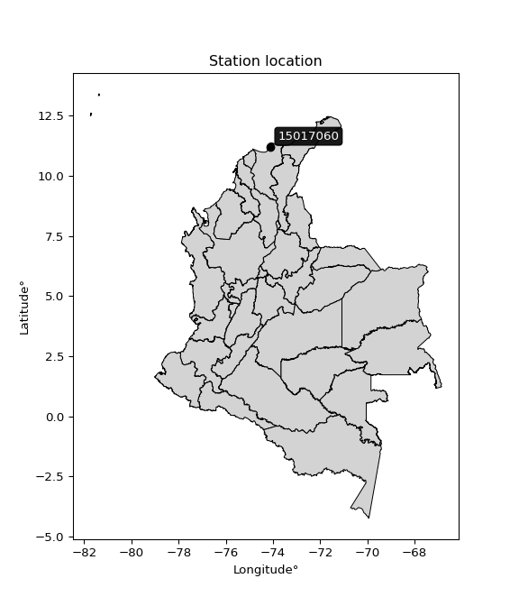

<div align="center">


</div>

# PMax24h Station (Rain, Pmax24h): 15017060

Maximum Precipitation in 24 hours (PMax24h) is the greatest amount of rainfall for a specific duration that is meteorologically possible for a given location, acting as a "worst-case" scenario for extreme storms, crucial for designing safety-critical infrastructure like bridges, river deviations, dams, spillways, and nuclear plants to prevent catastrophic failure. The PMax24h is related with the Probable Maximum Precipitation (PMP) and it is calculated by hydrologists using meteorological data to determine the upper limit of extreme rainfall, often leading to the Probable Maximum Flood (PMF) for flood control design, and is increasingly being studied for climate change impacts. Probable Maximum Precipitation (PMP) is the theoretical upper limit of rainfall, a deterministic estimate for extreme events, while probability distributions (like GEV, Gumbel) describe the likelihood and frequency of various precipitation amounts, including rare ones, showing how often events occur, with PMP representing the extreme end of these distributions, used for critical infrastructure design to ensure safety against the worst conceivable weather, unlike standard statistical forecasts which cover typical probabilities.

The most common probability distributions in hydrology, used for analyzing floods, rainfall, and streamflow, include the Normal, Log-Normal, Gumbel, Gamma (including Log-Pearson Type III), and Generalized Extreme Value (GEV) distributions, often chosen based on the data´s skewness and whether modeling extremes or general conditions, with Gumbel and GEV popular for extreme events like floods, while the Normal distribution serves as a baseline, though often requiring transformations for skewed hydrological data. These distributions help in designing water infrastructure, managing water resources, and forecasting hydrologic events.

> Hydrological data often isn´t perfectly normal (it´s skewed), so different distributions are needed for different applications, such as: **Flood Frequency Analysis**: Using Gumbel, GEV, or Log-Pearson Type III for predicting extreme flood magnitudes and their return periods, **Rainfall Analysis**: Normal for annual totals, but Log-Normal, Weibull, or GEV for intensity or extreme daily rainfall, **Streamflow Modeling**: Gamma and Log-Normal for maximum flows, GEV for minimum flows, and Kappa for daily flows.

<div align="center">

</img>

</div>


## A. General information


### 1. General running parameters

• app_version: _v20260225_. • runtime: _2026-02-27 14:50:08.749431_. • Python version: _3.14.0_. • SciPy version: _1.16.3_. • Pandas version: _2.3.3_. • NumPy version: _2.3.5_. • Stations dataset (station_dataset_file): _dataset/pmax24h_in/automatic_colombia_2003_2025.csv_. • Stations catalog (station_catalog_file): _dataset/CNE.xls_. • Minimum year to eval til year_max (date_min): _1900_. • Maximum year to eval since year_min (date_max): _2025_. • Creates, save and include plots into reports (create_plot): _False_. • Plot only fit distributions with Δo > Δ (plot_only_fit): _True_. • Plot only simple graphs avoiding multiple CDFs and multiple Extreme values plots (plot_only_simple): _False_. • Eval low extreme values, if False, evaluates high extreme values (low_extreme): _False_. • Eval every SciPy distribution as logarithmic (pdist_logarithmic_on): _True_. • Standard deviation normalized (ddof): _1.0_. • Return periods to eval in years (Tr): _[2, 2.33, 5, 10, 15, 20, 25, 50, 75, 100, 200, 250, 500, 750, 1000]_. • Minimum data sample per station, 0 means any (minimum_sample): _5_. • Z-Score maximum threshold to adjust a value, 0 means disable (zscore_max): _3.5_. • Z-Score minimum threshold to adjust a value, 0 means disable (zscore_min): _-2.5_. • Avoid zeros, e.g. rain = 0 (avoid_zeros): _True_. • Avoid null values (avoid_nans): _True_. 

:file_folder:Table: [dataset.csv](../../dataset/pmax24h_in/automatic_colombia_2003_2025.csv)

> Delta Degrees of Freedom (DDOF): is a parameter used in the formulas for calculating variance and standard deviation. When ddof=0, the divisor is $N$ (the total number of observations) and this is used when your data set is the entire population. When ddof=1, the divisor is $N-1$ and this is used when your data set is a sample drawn from a larger population. Using $N-1$ provides an unbiased estimate of the population variance (known as Bessel´s correction).


### 2. Station info and location

|   id |   CODIGO | NOMBRE                          | CATEGORIA    | TECNOLOGIA   | ESTADO   | FECHA_INSTALACION   |   FECHA_SUSPENSION |   ALTITUD |   LATITUD |   LONGITUD | DEPARTAMENTO   | MUNICIPIO   | AREA_OPERATIVA                                         | ENTIDAD                                                     | AREA_HIDROGRAFICA   | ZONA_HIDROGRAFICA   | SUBZONA_HIDROGRAFICA          | CORRIENTE   | Catalogo   |   Version |
|-----:|---------:|:--------------------------------|:-------------|:-------------|:---------|:--------------------|-------------------:|----------:|----------:|-----------:|:---------------|:------------|:-------------------------------------------------------|:------------------------------------------------------------|:--------------------|:--------------------|:------------------------------|:------------|:-----------|----------:|
|    0 | 15017060 | BOCATOMA SANTA MARTA [15017060] | Limnimétrica | Convencional | Activa   | 15/10/1973          |                nan |       245 |   11.2051 |   -74.0982 | Magdalena      | Santa Marta | Area Operativa 05 - Magdalena-Cesar-Guajira-San Andrés | INSTITUTO DE HIDROLOGIA METEOROLOGIA Y ESTUDIOS AMBIENTALES | Caribe              | Caribe - Guajira    | Río  Piedras - Río Manzanares | Manzanares  | CNE_IDEAM  |  20251226 |

<div align="center">

Dynamic map: [:earth_americas:Google](http://maps.google.com/maps?q=11.205144,-74.098192) [:earth_americas:OSM](https://www.openstreetmap.org/#map=18/11.205144/-74.098192&layers=P) [:earth_americas:Bing](https://www.bing.com/maps?cp=11.205144~-74.098192&lvl=18) [:earth_americas:Apple](https://maps.apple.com/frame?center=11.205144%2C-74.098192&span=0.003%2C0.006)

</div>


<div align="center">

```geojson
{
  "type": "Feature",
  "geometry": {
    "type": "Point", 
    "coordinates": [-74.098192, 11.205144]
  }, 
  "properties": {
    "Name": "15017060"
  }
}
```

</div>


### 3. Discrete values table and plot

<div align="center">

|               |           0 |         1 |           2 |           3 |          4 |           5 |
|:--------------|------------:|----------:|------------:|------------:|-----------:|------------:|
| Date          | 2005        | 2006      | 2007        | 2008        | 2009       | 2010        |
| Value         |  124.1      |  208.6    |  105.1      |  136        |   72.5     |  135.3      |
| Value_initial |  124.1      |  208.6    |  105.1      |  136        |   72.5     |  135.3      |
| count         |    6        |    6      |    6        |    6        |    6       |    6        |
| mean          |  130.267    |  130.267  |  130.267    |  130.267    |  130.267   |  130.267    |
| std           |   45.1723   |   45.1723 |   45.1723   |   45.1723   |   45.1723  |   45.1723   |
| zscore        |   -0.136514 |    1.7341 |   -0.557126 |    0.126921 |   -1.27881 |    0.111425 |


</div>


> The initial value (value_initial) correspond to the initial obtained or null completed value, and value (value) is adjusted only when the initial value is outside the valid range (outlier) definite through the Z-Score value. If Z-Score is active, values out of range or outliers are replaced with the station mean value. A Z-Score (or standard score) measures how many standard deviations a data point is from the mean of a dataset, indicating its relative position; positive scores mean above the mean, negative mean below, and a score of zero is exactly at the mean, allowing for comparison of values from different distributions. It´s calculated using the formula $z=(x–μ)/σ$, where $x$ is the data point, $μ$ is the mean, and $σ$ is the standard deviation, helping identify outliers and understand probability.
>
> <sub>**Note**: In this study, "completing" (filling gaps in) and "extending" (forecasting or lengthening the historical record) rainfall data series are avoided for certain critical analyses because they introduce artificial bias and uncertainty, which can distort the statistics of rare events (extremes), alter day-to-day variability, and compromise the integrity and homogeneity of the original data. Some reasons against Completing/Extending rainfall data are: **Distortion of Extremes and Variability**: The primary issue is that most gap-filling or extension methods rely on averaging or regression with nearby stations, which inherently smooths the data. Rainfall is highly variable in space and time, with a large percentage of zero values and occasional large storms. Infilling methods often underestimate the highest values and overestimate the lowest (zero) values, which severely distorts analyses focused on flood frequency, drought severity, and intensity-duration-frequency (IDF) curves, **Loss of Data Homogeneity**: Infilled or extended data are synthetic estimates, not actual measurements. Combining these estimates with observed data can violate the assumption of data homogeneity, which requires that the data properties do not change over time. Inhomogeneity can lead to incorrect conclusions about long-term trends or changes in climate patterns, **Propagation of Errors**: Errors and biases from the original data (e.g., wind-induced undercatch, instrument errors, site changes) or the data used for imputation can propagate through the analysis, leading to unreliable hydrological models and inaccurate predictions, **Compromised Statistical Integrity**: For statistical analyses, especially those involving the frequency of events, using artificial data can introduce time bias or autocorrelation that doesn´t exist in reality, making it difficult to assess the true probability of events, **Difficulty in Validation**: It is difficult to accurately validate the quality of filled or extended data, especially for past periods where ground-truth measurements are unavailable. The reliability of imputation techniques heavily depends on the density of the surrounding station network and the complexity of the local topography.</sub>


### 4. Active continuous probability distributions from SciPy (80 of 104 available)

A Probability Density Function (PDF) describes the relative likelihood of a continuous random variable falling within a specific range, where the total area under its curve equals 1, and the area over any interval gives the actual probability for that range. Unlike discrete probabilities (like rolling a die), a PDF shows density, not direct probability for a single point (which is zero), with higher points indicating higher likelihood, often visualized as a bell curve for normal distributions.

A log of a probability density function (log-PDF) is simply the logarithm of the PDF´s value, denoted as $log(f(x))$, useful for converting multiplication of probabilities into addition, improving numerical stability with tiny numbers, and connecting to information theory concepts like entropy. Instead of dealing with very small probabilities (e.g., 0.000001), log-PDFs use negative numbers (e.g., $log(0.00001) ≈ -11.51$ that are easier for computers to handle, preventing underflow errors and simplifying complex calculations. In this study, each active probability distribution from SciPy is also evaluated in the $log$ form.

[scipy.stats](https://docs.scipy.org/doc/scipy/reference/stats.html) is a Python´s powerful submodule within the SciPy library for comprehensive statistical analysis, offering over 130 probability distributions (like Normal, Poisson, etc.), functions for descriptive stats (mean, variance), hypothesis testing (t-tests, chi-square), random variable generation, and statistical tests, making it essential for data science, modeling, and research. It provides tools to explore, model, and draw conclusions from data efficiently, working seamlessly with [NumPy](https://numpy.org/).

<div align="center">

|   id | p_dist           |   n_parameter | fit_method   | label                                                                       | active   | ref                                                                                                      |
|-----:|:-----------------|--------------:|:-------------|:----------------------------------------------------------------------------|:---------|:---------------------------------------------------------------------------------------------------------|
|    0 | alpha            |             3 | MLE          | Alpha                                                                       | True     | [:mortar_board:](https://docs.scipy.org/doc/scipy/reference/generated/scipy.stats.alpha.html)            |
|    1 | anglit           |             2 | MM           | Anglit                                                                      | True     | [:mortar_board:](https://docs.scipy.org/doc/scipy/reference/generated/scipy.stats.anglit.html)           |
|    2 | arcsine          |             2 | MM           | Arcsine                                                                     | True     | [:mortar_board:](https://docs.scipy.org/doc/scipy/reference/generated/scipy.stats.arcsine.html)          |
|    3 | argus            |             3 | MLE          | Argus                                                                       | True     | [:mortar_board:](https://docs.scipy.org/doc/scipy/reference/generated/scipy.stats.argus.html)            |
|    4 | beta             |             4 | MLE          | Beta                                                                        | True     | [:mortar_board:](https://docs.scipy.org/doc/scipy/reference/generated/scipy.stats.beta.html)             |
|    5 | betaprime        |             4 | MLE          | Beta prime                                                                  | True     | [:mortar_board:](https://docs.scipy.org/doc/scipy/reference/generated/scipy.stats.betaprime.html)        |
|    6 | bradford         |             3 | MLE          | Bradford                                                                    | True     | [:mortar_board:](https://docs.scipy.org/doc/scipy/reference/generated/scipy.stats.bradford.html)         |
|    7 | burr             |             4 | MLE          | Burr (Type III)                                                             | True     | [:mortar_board:](https://docs.scipy.org/doc/scipy/reference/generated/scipy.stats.burr.html)             |
|    8 | burr12           |             4 | MLE          | Burr (Type III) 12                                                          | True     | [:mortar_board:](https://docs.scipy.org/doc/scipy/reference/generated/scipy.stats.burr12.html)           |
|    9 | cosine           |             2 | MLE          | Cosine                                                                      | True     | [:mortar_board:](https://docs.scipy.org/doc/scipy/reference/generated/scipy.stats.cosine.html)           |
|   10 | crystalball      |             4 | MLE          | Crystalball                                                                 | True     | [:mortar_board:](https://docs.scipy.org/doc/scipy/reference/generated/scipy.stats.crystalball.html)      |
|   11 | dgamma           |             3 | MLE          | Double gamma                                                                | True     | [:mortar_board:](https://docs.scipy.org/doc/scipy/reference/generated/scipy.stats.dgamma.html)           |
|   12 | dweibull         |             3 | MLE          | Double Weibull                                                              | True     | [:mortar_board:](https://docs.scipy.org/doc/scipy/reference/generated/scipy.stats.dweibull.html)         |
|   13 | erlang           |             3 | MLE          | Erlang                                                                      | True     | [:mortar_board:](https://docs.scipy.org/doc/scipy/reference/generated/scipy.stats.erlang.html)           |
|   14 | exponnorm        |             3 | MLE          | Exponentially modified Normal                                               | True     | [:mortar_board:](https://docs.scipy.org/doc/scipy/reference/generated/scipy.stats.exponnorm.html)        |
|   15 | exponpow         |             3 | MLE          | Exponential power                                                           | True     | [:mortar_board:](https://docs.scipy.org/doc/scipy/reference/generated/scipy.stats.exponpow.html)         |
|   16 | exponweib        |             4 | MLE          | Exponentiated Weibull                                                       | True     | [:mortar_board:](https://docs.scipy.org/doc/scipy/reference/generated/scipy.stats.exponweib.html)        |
|   17 | f                |             4 | MLE          | F                                                                           | True     | [:mortar_board:](https://docs.scipy.org/doc/scipy/reference/generated/scipy.stats.f.html)                |
|   18 | fatiguelife      |             3 | MLE          | Fatigue-life (Birnbaum-Saunders)                                            | True     | [:mortar_board:](https://docs.scipy.org/doc/scipy/reference/generated/scipy.stats.fatiguelife.html)      |
|   19 | foldnorm         |             3 | MM           | Fold Normal                                                                 | True     | [:mortar_board:](https://docs.scipy.org/doc/scipy/reference/generated/scipy.stats.foldnorm.html)         |
|   20 | gamma            |             3 | MLE          | Gamma                                                                       | True     | [:mortar_board:](https://docs.scipy.org/doc/scipy/reference/generated/scipy.stats.gamma.html)            |
|   21 | gausshyper       |             6 | MLE          | Gauss hypergeometric                                                        | True     | [:mortar_board:](https://docs.scipy.org/doc/scipy/reference/generated/scipy.stats.gausshyper.html)       |
|   22 | genexpon         |             5 | MLE          | Generalized exponential                                                     | True     | [:mortar_board:](https://docs.scipy.org/doc/scipy/reference/generated/scipy.stats.genexpon.html)         |
|   23 | genextreme       |             3 | MLE          | Generalized exponential                                                     | True     | [:mortar_board:](https://docs.scipy.org/doc/scipy/reference/generated/scipy.stats.genextreme.html)       |
|   24 | gengamma         |             4 | MLE          | Generalized gamma                                                           | True     | [:mortar_board:](https://docs.scipy.org/doc/scipy/reference/generated/scipy.stats.gengamma.html)         |
|   25 | genhalflogistic  |             3 | MLE          | Generalized half-logistic                                                   | True     | [:mortar_board:](https://docs.scipy.org/doc/scipy/reference/generated/scipy.stats.genhalflogistic.html)  |
|   26 | genlogistic      |             3 | MLE          | Generalized logistic                                                        | True     | [:mortar_board:](https://docs.scipy.org/doc/scipy/reference/generated/scipy.stats.genlogistic.html)      |
|   27 | gennorm          |             3 | MLE          | Generalized Normal                                                          | True     | [:mortar_board:](https://docs.scipy.org/doc/scipy/reference/generated/scipy.stats.gennorm.html)          |
|   28 | genpareto        |             3 | MLE          | Generalized Pareto                                                          | True     | [:mortar_board:](https://docs.scipy.org/doc/scipy/reference/generated/scipy.stats.genpareto.html)        |
|   29 | gompertz         |             3 | MLE          | Gompertz (or truncated Gumbel)                                              | True     | [:mortar_board:](https://docs.scipy.org/doc/scipy/reference/generated/scipy.stats.gompertz.html)         |
|   30 | gumbel_l         |             2 | MM           | Gumbel Left Skew                                                            | True     | [:mortar_board:](https://docs.scipy.org/doc/scipy/reference/generated/scipy.stats.gumbel_l.html)         |
|   31 | gumbel_r         |             2 | MM           | Gumbel Right Skew                                                           | True     | [:mortar_board:](https://docs.scipy.org/doc/scipy/reference/generated/scipy.stats.gumbel_r.html)         |
|   32 | halfgennorm      |             3 | MLE          | Upper half of a generalized normal                                          | True     | [:mortar_board:](https://docs.scipy.org/doc/scipy/reference/generated/scipy.stats.halfgennorm.html)      |
|   33 | halflogistic     |             2 | MM           | Half-logistic                                                               | True     | [:mortar_board:](https://docs.scipy.org/doc/scipy/reference/generated/scipy.stats.halflogistic.html)     |
|   34 | halfnorm         |             2 | MM           | Half Normal                                                                 | True     | [:mortar_board:](https://docs.scipy.org/doc/scipy/reference/generated/scipy.stats.halfnorm.html)         |
|   35 | hypsecant        |             2 | MM           | hyperbolic secant                                                           | True     | [:mortar_board:](https://docs.scipy.org/doc/scipy/reference/generated/scipy.stats.hypsecant.html)        |
|   36 | invgamma         |             3 | MLE          | Inverted gamma                                                              | True     | [:mortar_board:](https://docs.scipy.org/doc/scipy/reference/generated/scipy.stats.invgamma.html)         |
|   37 | invgauss         |             3 | MLE          | Inverse Gaussian                                                            | True     | [:mortar_board:](https://docs.scipy.org/doc/scipy/reference/generated/scipy.stats.invgauss.html)         |
|   38 | invweibull       |             3 | MLE          | Inverted Weibull                                                            | True     | [:mortar_board:](https://docs.scipy.org/doc/scipy/reference/generated/scipy.stats.invweibull.html)       |
|   39 | johnsonsb        |             4 | MLE          | Johnson SB                                                                  | True     | [:mortar_board:](https://docs.scipy.org/doc/scipy/reference/generated/scipy.stats.johnsonsb.html)        |
|   40 | johnsonsu        |             4 | MLE          | Johnson Su                                                                  | True     | [:mortar_board:](https://docs.scipy.org/doc/scipy/reference/generated/scipy.stats.johnsonsu.html)        |
|   41 | kappa3           |             3 | MLE          | Kappa 3                                                                     | True     | [:mortar_board:](https://docs.scipy.org/doc/scipy/reference/generated/scipy.stats.kappa3.html)           |
|   42 | kappa4           |             4 | MLE          | Kappa 4                                                                     | True     | [:mortar_board:](https://docs.scipy.org/doc/scipy/reference/generated/scipy.stats.kappa4.html)           |
|   43 | ksone            |             3 | MLE          | Kolmogorov-Smirnov one-sided test statistic distribution                    | True     | [:mortar_board:](https://docs.scipy.org/doc/scipy/reference/generated/scipy.stats.ksone.html)            |
|   44 | kstwobign        |             2 | MLE          | Limiting distribution of scaled Kolmogorov-Smirnov two-sided test statistic | True     | [:mortar_board:](https://docs.scipy.org/doc/scipy/reference/generated/scipy.stats.kstwobign.html)        |
|   45 | laplace          |             2 | MM           | Laplace                                                                     | True     | [:mortar_board:](https://docs.scipy.org/doc/scipy/reference/generated/scipy.stats.laplace.html)          |
|   46 | levy_l           |             2 | MLE          | Left-skewed Levy                                                            | True     | [:mortar_board:](https://docs.scipy.org/doc/scipy/reference/generated/scipy.stats.levy_l.html)           |
|   47 | loggamma         |             3 | MLE          | Log gamma                                                                   | True     | [:mortar_board:](https://docs.scipy.org/doc/scipy/reference/generated/scipy.stats.loggamma.html)         |
|   48 | logistic         |             2 | MM           | Logistic (or Sech-squared)                                                  | True     | [:mortar_board:](https://docs.scipy.org/doc/scipy/reference/generated/scipy.stats.logistic.html)         |
|   49 | loglaplace       |             3 | MLE          | Log-Laplace                                                                 | True     | [:mortar_board:](https://docs.scipy.org/doc/scipy/reference/generated/scipy.stats.loglaplace.html)       |
|   50 | lomax            |             3 | MLE          | Lomax (Pareto of the second kind)                                           | True     | [:mortar_board:](https://docs.scipy.org/doc/scipy/reference/generated/scipy.stats.lomax.html)            |
|   51 | maxwell          |             2 | MM           | Maxwell                                                                     | True     | [:mortar_board:](https://docs.scipy.org/doc/scipy/reference/generated/scipy.stats.maxwell.html)          |
|   52 | mielke           |             4 | MLE          | Mielke Beta-Kappa / Dagum                                                   | True     | [:mortar_board:](https://docs.scipy.org/doc/scipy/reference/generated/scipy.stats.mielke.html)           |
|   53 | moyal            |             2 | MM           | Moyal                                                                       | True     | [:mortar_board:](https://docs.scipy.org/doc/scipy/reference/generated/scipy.stats.moyal.html)            |
|   54 | nakagami         |             3 | MLE          | Nakagami                                                                    | True     | [:mortar_board:](https://docs.scipy.org/doc/scipy/reference/generated/scipy.stats.nakagami.html)         |
|   55 | ncf              |             5 | MLE          | Non-central F distribution                                                  | True     | [:mortar_board:](https://docs.scipy.org/doc/scipy/reference/generated/scipy.stats.ncf.html)              |
|   56 | nct              |             4 | MLE          | Non-central Student’s t                                                     | True     | [:mortar_board:](https://docs.scipy.org/doc/scipy/reference/generated/scipy.stats.nct.html)              |
|   57 | norm             |             2 | MM           | Normal                                                                      | True     | [:mortar_board:](https://docs.scipy.org/doc/scipy/reference/generated/scipy.stats.norm.html)             |
|   58 | pearson3         |             3 | MM           | Pearson type III                                                            | True     | [:mortar_board:](https://docs.scipy.org/doc/scipy/reference/generated/scipy.stats.pearson3.html)         |
|   59 | powerlaw         |             3 | MLE          | Power-function                                                              | True     | [:mortar_board:](https://docs.scipy.org/doc/scipy/reference/generated/scipy.stats.powerlaw.html)         |
|   60 | rayleigh         |             2 | MM           | Rayleigh                                                                    | True     | [:mortar_board:](https://docs.scipy.org/doc/scipy/reference/generated/scipy.stats.rayleigh.html)         |
|   61 | rdist            |             3 | MLE          | R-distributed (symmetric beta)                                              | True     | [:mortar_board:](https://docs.scipy.org/doc/scipy/reference/generated/scipy.stats.rdist.html)            |
|   62 | rice             |             3 | MLE          | Rice                                                                        | True     | [:mortar_board:](https://docs.scipy.org/doc/scipy/reference/generated/scipy.stats.rice.html)             |
|   63 | semicircular     |             2 | MM           | Semicircular                                                                | True     | [:mortar_board:](https://docs.scipy.org/doc/scipy/reference/generated/scipy.stats.semicircular.html)     |
|   64 | skewnorm         |             3 | MLE          | Skew normal                                                                 | True     | [:mortar_board:](https://docs.scipy.org/doc/scipy/reference/generated/scipy.stats.skewnorm.html)         |
|   65 | t                |             3 | MLE          | Student’s t                                                                 | True     | [:mortar_board:](https://docs.scipy.org/doc/scipy/reference/generated/scipy.stats.t.html)                |
|   66 | trapezoid        |             4 | MLE          | Trapezoid                                                                   | True     | [:mortar_board:](https://docs.scipy.org/doc/scipy/reference/generated/scipy.stats.trapezoid.html)        |
|   67 | triang           |             3 | MLE          | Triangular                                                                  | True     | [:mortar_board:](https://docs.scipy.org/doc/scipy/reference/generated/scipy.stats.triang.html)           |
|   68 | truncexpon       |             3 | MLE          | Truncated exponential                                                       | True     | [:mortar_board:](https://docs.scipy.org/doc/scipy/reference/generated/scipy.stats.truncexpon.html)       |
|   69 | truncnorm        |             4 | MLE          | Truncated normal                                                            | True     | [:mortar_board:](https://docs.scipy.org/doc/scipy/reference/generated/scipy.stats.truncnorm.html)        |
|   70 | truncpareto      |             4 | MLE          | Upper truncated Pareto                                                      | True     | [:mortar_board:](https://docs.scipy.org/doc/scipy/reference/generated/scipy.stats.truncpareto.html)      |
|   71 | truncweibull_min |             5 | MLE          | Doubly truncated Weibull minimum                                            | True     | [:mortar_board:](https://docs.scipy.org/doc/scipy/reference/generated/scipy.stats.truncweibull_min.html) |
|   72 | tukeylambda      |             3 | MLE          | Tukey-Lamdba                                                                | True     | [:mortar_board:](https://docs.scipy.org/doc/scipy/reference/generated/scipy.stats.tukeylambda.html)      |
|   73 | uniform          |             2 | MLE          | Uniform                                                                     | True     | [:mortar_board:](https://docs.scipy.org/doc/scipy/reference/generated/scipy.stats.uniform.html)          |
|   74 | vonmises         |             3 | MLE          | Von Mises                                                                   | True     | [:mortar_board:](https://docs.scipy.org/doc/scipy/reference/generated/scipy.stats.vonmises.html)         |
|   75 | vonmises_line    |             3 | MLE          | Von Mises line                                                              | True     | [:mortar_board:](https://docs.scipy.org/doc/scipy/reference/generated/scipy.stats.vonmises_line.html)    |
|   76 | wald             |             2 | MM           | Wald                                                                        | True     | [:mortar_board:](https://docs.scipy.org/doc/scipy/reference/generated/scipy.stats.wald.html)             |
|   77 | weibull_max      |             3 | MLE          | Weibull maximum                                                             | True     | [:mortar_board:](https://docs.scipy.org/doc/scipy/reference/generated/scipy.stats.weibull_max.html)      |
|   78 | weibull_min      |             3 | MLE          | Weibull minimum                                                             | True     | [:mortar_board:](https://docs.scipy.org/doc/scipy/reference/generated/scipy.stats.weibull_min.html)      |
|   79 | wrapcauchy       |             3 | MLE          | Wrapped  Cauchy                                                             | True     | [:mortar_board:](https://docs.scipy.org/doc/scipy/reference/generated/scipy.stats.wrapcauchy.html)       |

</div>

> **n_parameter:** # arguments & localization & scale.
>
> **Fit methods:** (MLE) maximum likelihood, (MM) L-moments.
>
>**Inactive** (With the only purpose of prevent loops, zero divisions, infinite values, over high estimated values or horizontal trending for recurrence intervals estimations, the follow distributions were disabled.)**:** lognorm, norminvgauss, powernorm, powerlognorm, cauchy, halfcauchy, foldcauchy, skewcauchy, chi2, expon, fisk, genhyperbolic, geninvgauss, gibrat, kstwo, laplace_asymmetric, levy, levy_stable, ncx2, pareto, rel_breitwigner, recipinvgauss, studentized_range, loguniform, 


## B. Probability (PDF) vs. Empirical (EDF) distributions functions

A continuous probability distribution (CPD) describes probabilities for variables that can take any value within a range (like rain any time), unlike discrete variables with specific outcomes (like temperature). It uses a Probability Density Function (PDF), a curve where the total area under it equals 1, and the probability of the variable falling within an interval (a to b) is found by calculating the area under the curve between those points. A key feature is that the probability of hitting any single exact value is zero, so probabilities are always expressed for ranges, e.g., $P(a ≤ X ≤ b)$.

<div align="center">

Distributions parameters from station values
|     |   station | p_dist              |   n |              loc |          scale | shape                  | shape1                 | shape2                | shape3             |
|----:|----------:|:--------------------|----:|-----------------:|---------------:|:-----------------------|:-----------------------|:----------------------|:-------------------|
|   0 |  15017060 | alpha               |   6 |   -156.769       | 2051.16        | 7.287534595851918      |                        |                       |                    |
|   1 |  15017060 | anglit              |   6 |    130.267       |  120.633       |                        |                        |                       |                    |
|   2 |  15017060 | arcsine             |   6 |     71.9494      |  116.634       |                        |                        |                       |                    |
|   3 |  15017060 | argus               |   6 |     34.0374      |  182.643       | 1.7085658833902374e-06 |                        |                       |                    |
|   4 |  15017060 | beta                |   6 |     72.5         |  272.912       | 0.72022690678748       | 3.9754461263245524     |                       |                    |
|   5 |  15017060 | betaprime           |   6 |     -1.47337     |  257.696       | 15.65405666644218      | 31.61728687496619      |                       |                    |
|   6 |  15017060 | bradford            |   6 |     72.4999      |  136.1         | 0.803943350209994      |                        |                       |                    |
|   7 |  15017060 | burr                |   6 |     -0.779564    |  131.012       | 6.0547208887510084     | 0.8401499313713596     |                       |                    |
|   8 |  15017060 | burr12              |   6 |     -0.0913701   |   72.1495      | 668.2722551267291      | 0.0027604803155268165  |                       |                    |
|   9 |  15017060 | cosine              |   6 |    134.254       |   35.6673      |                        |                        |                       |                    |
|  10 |  15017060 | crystalball         |   6 |    129.533       |   41.1039      | 12168.989366504633     | 132.64360532186407     |                       |                    |
|  11 |  15017060 | dgamma              |   6 |    135.3         |   29.5172      | 0.9264137531782997     |                        |                       |                    |
|  12 |  15017060 | dweibull            |   6 |    136           |   29.8955      | 0.9267343443013305     |                        |                       |                    |
|  13 |  15017060 | erlang              |   6 |     46.3779      |   21.8704      | 3.8357144541541106     |                        |                       |                    |
|  14 |  15017060 | exponnorm           |   6 |     95.1372      |   23.7942      | 1.4763855070043728     |                        |                       |                    |
|  15 |  15017060 | exponpow            |   6 |     72.5         |  129.01        | 0.5005856141789766     |                        |                       |                    |
|  16 |  15017060 | exponweib           |   6 |     72.5         |    1.34695     | 1.2665948122835924     | 0.16239656154744336    |                       |                    |
|  17 |  15017060 | f                   |   6 |     47.1752      |   82.7961      | 7.577691622423192      | 1433.34212072097       |                       |                    |
|  18 |  15017060 | fatiguelife         |   6 |     72.5         |    0.000289518 | 535.7360311260377      |                        |                       |                    |
|  19 |  15017060 | foldnorm            |   6 |     68.5684      |   50.2012      | 1.0886812681852684     |                        |                       |                    |
|  20 |  15017060 | gamma               |   6 |     46.3779      |   21.8704      | 3.8357148725404357     |                        |                       |                    |
|  21 |  15017060 | gausshyper          |   6 |     72.5         |  138.124       | 0.7504726178009322     | 0.9716605533423887     | 1.167645663827496     | 1.0887508865557574 |
|  22 |  15017060 | genexpon            |   6 |     72.5         |    3.79556     | 0.06586477923847975    | 0.1762444697704308     | 0.004853932970778553  |                    |
|  23 |  15017060 | genextreme          |   6 |     72.8334      |    1.98657     | -5.959163367601349     |                        |                       |                    |
|  24 |  15017060 | gengamma            |   6 |     72.5         |    1.27172     | 1.2588900194109063     | 0.23786316032581603    |                       |                    |
|  25 |  15017060 | genhalflogistic     |   6 |     62.0302      |  161.444       | 1.1014793986273208     |                        |                       |                    |
|  26 |  15017060 | genlogistic         |   6 |    -35.1033      |   33.7445      | 76.64377574609453      |                        |                       |                    |
|  27 |  15017060 | gennorm             |   6 |    135.3         |    0.00443033  | 0.20572848649254677    |                        |                       |                    |
|  28 |  15017060 | genpareto           |   6 |     -1.30494     |  323.962       | -1.5433742823312957    |                        |                       |                    |
|  29 |  15017060 | gompertz            |   6 |     72.5         |   98.1356      | 1.0185276354878336     |                        |                       |                    |
|  30 |  15017060 | gumbel_l            |   6 |    148.825       |   32.152       |                        |                        |                       |                    |
|  31 |  15017060 | gumbel_r            |   6 |    111.708       |   32.152       |                        |                        |                       |                    |
|  32 |  15017060 | halfgennorm         |   6 |     72.5         |    1.2881      | 0.327667414899925      |                        |                       |                    |
|  33 |  15017060 | halflogistic        |   6 |     81.3918      |   35.2558      |                        |                        |                       |                    |
|  34 |  15017060 | halfnorm            |   6 |     75.6857      |   68.4071      |                        |                        |                       |                    |
|  35 |  15017060 | hypsecant           |   6 |    130.267       |   26.252       |                        |                        |                       |                    |
|  36 |  15017060 | invgamma            |   6 |    -56.0237      | 3865.81        | 21.74659368767076      |                        |                       |                    |
|  37 |  15017060 | invgauss            |   6 |      5.60714     | 1061.11        | 0.1169526245183744     |                        |                       |                    |
|  38 |  15017060 | invweibull          |   6 |     72.5         |    1.42272     | 0.06912726863895052    |                        |                       |                    |
|  39 |  15017060 | johnsonsb           |   6 |     72.5         |  136.1         | -0.2852912055487361    | 0.08537774041133628    |                       |                    |
|  40 |  15017060 | johnsonsu           |   6 |     -4.93388     |   19.3701      | -8.648799657828132     | 3.3299392103080647     |                       |                    |
|  41 |  15017060 | kappa3              |   6 |     72.2628      |  136.39        | 21693.052905859346     |                        |                       |                    |
|  42 |  15017060 | kappa4              |   6 |     55.6413      |  153.637       | 1.1232645301634867     | 1.0010845514543059     |                       |                    |
|  43 |  15017060 | ksone               |   6 |     58.89        |  163.32        | 1.0                    |                        |                       |                    |
|  44 |  15017060 | kstwobign           |   6 |    -10.5011      |  161.85        |                        |                        |                       |                    |
|  45 |  15017060 | laplace             |   6 |    130.267       |   29.1586      |                        |                        |                       |                    |
|  46 |  15017060 | levy_l              |   6 |    217.272       |   36.0634      |                        |                        |                       |                    |
|  47 |  15017060 | loggamma            |   6 | -14376.1         | 1898.83        | 2079.4468188096535     |                        |                       |                    |
|  48 |  15017060 | logistic            |   6 |    130.267       |   22.7349      |                        |                        |                       |                    |
|  49 |  15017060 | loglaplace          |   6 |     -0.333979    |  124.434       | 4.294786542918658      |                        |                       |                    |
|  50 |  15017060 | lomax               |   6 |     72.5         |    1.81013e+12 | 14309846846.696783     |                        |                       |                    |
|  51 |  15017060 | maxwell             |   6 |     32.5535      |   61.2327      |                        |                        |                       |                    |
|  52 |  15017060 | mielke              |   6 |     -0.449907    |  130.769       | 5.064321168338113      | 6.045221879007142      |                       |                    |
|  53 |  15017060 | moyal               |   6 |    106.685       |   18.5629      |                        |                        |                       |                    |
|  54 |  15017060 | nakagami            |   6 |    105.1         |   43.7578      | 0.32702629878130185    |                        |                       |                    |
|  55 |  15017060 | ncf                 |   6 |     -7.22451     |  146.273       | 9.580415823100711      | 2618.5204103293236     | 0.0007507420427771026 |                    |
|  56 |  15017060 | nct                 |   6 |     -0.127454    |   26.0016      | 11.073874965044837     | 4.66841436367808       |                       |                    |
|  57 |  15017060 | norm                |   6 |    130.267       |   41.2365      |                        |                        |                       |                    |
|  58 |  15017060 | pearson3            |   6 |    130.267       |   41.2365      | 0.6465884125904707     |                        |                       |                    |
|  59 |  15017060 | powerlaw            |   6 |     72.5         |  136.1         | 0.14730110889245857    |                        |                       |                    |
|  60 |  15017060 | rayleigh            |   6 |     51.3788      |   62.9434      |                        |                        |                       |                    |
|  61 |  15017060 | rdist               |   6 |     62.407       |   73.593       | 1.05671392974017       |                        |                       |                    |
|  62 |  15017060 | rice                |   6 |     54.9223      |   60.7339      | 0.0007159879311186017  |                        |                       |                    |
|  63 |  15017060 | semicircular        |   6 |    130.267       |   82.473       |                        |                        |                       |                    |
|  64 |  15017060 | skewnorm            |   6 |     84.9078      |   61.3015      | 2.644919264309836      |                        |                       |                    |
|  65 |  15017060 | t                   |   6 |    130.263       |   41.2311      | 7159.240428567133      |                        |                       |                    |
|  66 |  15017060 | trapezoid           |   6 |     58.89        |  163.32        | 1.0                    | 1.0                    |                       |                    |
|  67 |  15017060 | triang              |   6 |     21.4025      |  187.198       | 0.9999999999992897     |                        |                       |                    |
|  68 |  15017060 | truncexpon          |   6 |     72.5         |  134.777       | 1.0098181283443641     |                        |                       |                    |
|  69 |  15017060 | truncnorm           |   6 |    130.267       |   41.2365      | -1915.4390789548343    | 7246.091933309612      |                       |                    |
|  70 |  15017060 | truncpareto         |   6 |     72.3284      |    0.171619    | 0.2036668050728155     | 794.0376112187711      |                       |                    |
|  71 |  15017060 | truncweibull_min    |   6 |     72.5         |  111.595       | 0.6763486833948673     | 7.561122400077517e-18  | 1.219844024043975     |                    |
|  72 |  15017060 | tukeylambda         |   6 |    104.516       |   32.5677      | 1.017228964945807      |                        |                       |                    |
|  73 |  15017060 | uniform             |   6 |     72.5         |  136.1         |                        |                        |                       |                    |
|  74 |  15017060 | vonmises            |   6 |     -2.37876     |    1           | 1.3259974721595629     |                        |                       |                    |
|  75 |  15017060 | vonmises_line       |   6 |    141.127       |   21.8446      | 0.25213249374144187    |                        |                       |                    |
|  76 |  15017060 | wald                |   6 |     89.0302      |   41.2365      |                        |                        |                       |                    |
|  77 |  15017060 | weibull_max         |   6 |    208.6         |    1.6236      | 0.1956038877029315     |                        |                       |                    |
|  78 |  15017060 | weibull_min         |   6 |     65.3866      |   71.5424      | 1.5220183029878083     |                        |                       |                    |
|  79 |  15017060 | wrapcauchy          |   6 |     72.5         |   22.744       | 0.5                    |                        |                       |                    |
|  80 |  15017060 | logalpha            |   6 |     -4.79382     |  288.441       | 30.04453310356103      |                        |                       |                    |
|  81 |  15017060 | loganglit           |   6 |      4.82003     |    0.926687    |                        |                        |                       |                    |
|  82 |  15017060 | logarcsine          |   6 |      4.37203     |    0.895985    |                        |                        |                       |                    |
|  83 |  15017060 | logargus            |   6 |      4.05367     |    1.35018     | 0.00019374822561696702 |                        |                       |                    |
|  84 |  15017060 | logbeta             |   6 |      4.16084     |    1.17958     | 0.8461747626344569     | 0.46662992454354646    |                       |                    |
|  85 |  15017060 | logbetaprime        |   6 |     -6.96168     |    5.51681     | 3428.9916984346264     | 1603.2534175908793     |                       |                    |
|  86 |  15017060 | logbradford         |   6 |      4.28359     |    1.05696     | 1.090977249528284      |                        |                       |                    |
|  87 |  15017060 | logburr             |   6 |      4.28359     |    0.979044    | 8.436046347686045      | 0.0590143576111421     |                       |                    |
|  88 |  15017060 | logburr12           |   6 |     -0.0884844   |    5.03719     | 23.974542028113646     | 1.5637585942715866     |                       |                    |
|  89 |  15017060 | logcosine           |   6 |      4.81641     |    0.271807    |                        |                        |                       |                    |
|  90 |  15017060 | logcrystalball      |   6 |      4.86782     |    0.273332    | 1.0912692663024912     | 440.02555751264424     |                       |                    |
|  91 |  15017060 | logdgamma           |   6 |      4.90749     |    0.242254    | 0.9291765828673708     |                        |                       |                    |
|  92 |  15017060 | logdweibull         |   6 |      4.91265     |    0.222197    | 0.6718343900067665     |                        |                       |                    |
|  93 |  15017060 | logerlang           |   6 |     -5.02281     |    0.0102616   | 959.1647766258716      |                        |                       |                    |
|  94 |  15017060 | logexponnorm        |   6 |      4.81973     |    0.316772    | 0.0009207132306738513  |                        |                       |                    |
|  95 |  15017060 | logexponpow         |   6 |      4.28359     |    0.82147     | 0.9804835409031285     |                        |                       |                    |
|  96 |  15017060 | logexponweib        |   6 |      4.28359     |    0.642692    | 0.5483559707866799     | 1.0027255776211654     |                       |                    |
|  97 |  15017060 | logf                |   6 |    -80.9093      |   85.7291      | 314313.21135247307     | 273558.27836311806     |                       |                    |
|  98 |  15017060 | logfatiguelife      |   6 |    -32.8949      |   37.7145      | 0.008390001474991124   |                        |                       |                    |
|  99 |  15017060 | logfoldnorm         |   6 |      4.40717     |    0.496802    | 0.29122338894379995    |                        |                       |                    |
| 100 |  15017060 | loggamma            |   6 |     -4.91693     |    0.0103358   | 941.9980588298126      |                        |                       |                    |
| 101 |  15017060 | loggausshyper       |   6 |      4.26364     |    1.07678     | 1.1780939174722551     | 0.903625204985535      | 0.7123417254713876    | 1.2695686407549096 |
| 102 |  15017060 | loggenexpon         |   6 |      4.2825      |    0.00349405  | 0.0027796808555540092  | 0.4154648804225345     | 8.616939802913673e-05 |                    |
| 103 |  15017060 | loggenextreme       |   6 |      4.72101     |    0.32661     | 0.363729348210035      |                        |                       |                    |
| 104 |  15017060 | loggengamma         |   6 |      4.28359     |    0.69403     | 0.655286626229381      | 1.455597512183327      |                       |                    |
| 105 |  15017060 | loggenhalflogistic  |   6 |      4.21745     |    1.21067     | 1.0780946625788494     |                        |                       |                    |
| 106 |  15017060 | loggenlogistic      |   6 |      4.87089     |    0.165774    | 0.8344606315934691     |                        |                       |                    |
| 107 |  15017060 | loggennorm          |   6 |      4.90749     |    0.00781018  | 0.37813282840284046    |                        |                       |                    |
| 108 |  15017060 | loggenpareto        |   6 |     -0.0299588   |   13.6746      | -2.546295493024339     |                        |                       |                    |
| 109 |  15017060 | loggompertz         |   6 |      4.28359     |    0.852894    | 1.0536562749878207     |                        |                       |                    |
| 110 |  15017060 | loggumbel_l         |   6 |      4.96259     |    0.246987    |                        |                        |                       |                    |
| 111 |  15017060 | loggumbel_r         |   6 |      4.67746     |    0.246987    |                        |                        |                       |                    |
| 112 |  15017060 | loghalfgennorm      |   6 |      4.28295     |    1.05913     | 3920.3297545970436     |                        |                       |                    |
| 113 |  15017060 | loghalflogistic     |   6 |      4.44458     |    0.270829    |                        |                        |                       |                    |
| 114 |  15017060 | loghalfnorm         |   6 |      4.40073     |    0.525513    |                        |                        |                       |                    |
| 115 |  15017060 | loghypsecant        |   6 |      4.82003     |    0.201664    |                        |                        |                       |                    |
| 116 |  15017060 | loginvgamma         |   6 |     -0.0528707   | 1139           | 234.62334593030891     |                        |                       |                    |
| 117 |  15017060 | loginvgauss         |   6 |      2.13757     |  182.329       | 0.01469984422991439    |                        |                       |                    |
| 118 |  15017060 | loginvweibull       |   6 |     -1.87958e+07 |    1.87958e+07 | 59333245.18402985      |                        |                       |                    |
| 119 |  15017060 | logjohnsonsb        |   6 |      4.28304     |    1.05738     | -0.23727239798406882   | 0.1550640183295781     |                       |                    |
| 120 |  15017060 | logjohnsonsu        |   6 |      4.91265     |    1.60708e-15 | 0.416799758829757      | 0.07312933929893209    |                       |                    |
| 121 |  15017060 | logkappa3           |   6 |      4.26039     |    1.06813     | 173.87643128155582     |                        |                       |                    |
| 122 |  15017060 | logkappa4           |   6 |      4.27671     |    1.09321     | 1.00578422343455       | 1.0277401472284002     |                       |                    |
| 123 |  15017060 | logksone            |   6 |      4.27136     |    1.09733     | 1.0                    |                        |                       |                    |
| 124 |  15017060 | logkstwobign        |   6 |      3.56726     |    1.43408     |                        |                        |                       |                    |
| 125 |  15017060 | loglaplace          |   6 |      4.82003     |    0.223992    |                        |                        |                       |                    |
| 126 |  15017060 | loglevy_l           |   6 |      5.3951      |    0.22727     |                        |                        |                       |                    |
| 127 |  15017060 | logloggamma         |   6 |     -8.15098     |    2.9201      | 85.44197304330795      |                        |                       |                    |
| 128 |  15017060 | loglogistic         |   6 |      4.82003     |    0.174646    |                        |                        |                       |                    |
| 129 |  15017060 | logloglaplace       |   6 |     -0.0217612   |    4.84285     | 20.630155748053802     |                        |                       |                    |
| 130 |  15017060 | loglomax            |   6 |      4.28359     |    9.2589e+06  | 1267462.0636318817     |                        |                       |                    |
| 131 |  15017060 | logmaxwell          |   6 |      4.06941     |    0.47038     |                        |                        |                       |                    |
| 132 |  15017060 | logmielke           |   6 |      4.28358     |    0.83832     | 0.9332418881562494     | 7.423067601741728      |                       |                    |
| 133 |  15017060 | logmoyal            |   6 |      4.63887     |    0.142598    |                        |                        |                       |                    |
| 134 |  15017060 | lognakagami         |   6 |      4.65491     |    0.340857    | 0.22829396983774594    |                        |                       |                    |
| 135 |  15017060 | logncf              |   6 |    -15.6222      |   20.3993      | 12652.479196633558     | 24184.00687214992      | 24.674298286430258    |                    |
| 136 |  15017060 | lognct              |   6 |     -0.362667    |    0.139126    | 165.02776065780256     | 37.0728065355508       |                       |                    |
| 137 |  15017060 | lognorm             |   6 |      4.82003     |    0.316773    |                        |                        |                       |                    |
| 138 |  15017060 | logpearson3         |   6 |      4.82003     |    0.316773    | -0.08647708896590911   |                        |                       |                    |
| 139 |  15017060 | logpowerlaw         |   6 |      4.28359     |    1.05683     | 0.16008321941910417    |                        |                       |                    |
| 140 |  15017060 | lograyleigh         |   6 |      4.21402     |    0.483522    |                        |                        |                       |                    |
| 141 |  15017060 | logrdist            |   6 |      4.92131     |    0.637721    | 1.0771052210018333     |                        |                       |                    |
| 142 |  15017060 | logrice             |   6 |      4.0981      |    0.35327     | 1.7263082594484813     |                        |                       |                    |
| 143 |  15017060 | logsemicircular     |   6 |      4.82003     |    0.633546    |                        |                        |                       |                    |
| 144 |  15017060 | logskewnorm         |   6 |      5.02069     |    0.37498     | -0.9029698934232504    |                        |                       |                    |
| 145 |  15017060 | logt                |   6 |      4.82003     |    0.316772    | 1399877032.0584397     |                        |                       |                    |
| 146 |  15017060 | logtrapezoid        |   6 |      4.1779      |    1.2682      | 1.0                    | 1.0                    |                       |                    |
| 147 |  15017060 | logtriang           |   6 |      3.97946     |    1.36103     | 0.9999502226492624     |                        |                       |                    |
| 148 |  15017060 | logtruncexpon       |   6 |      4.28359     |    1.36352     | 0.7750840153068166     |                        |                       |                    |
| 149 |  15017060 | logtruncnorm        |   6 |     -0.101684    |    1.03419     | 5.262198366920103      | 5.262198366920104      |                       |                    |
| 150 |  15017060 | logtruncpareto      |   6 |      4.28191     |    0.00167415  | 0.2034914285218372     | 632.2630817798524      |                       |                    |
| 151 |  15017060 | logtruncweibull_min |   6 |      4.2814      |    1.05287     | 1.0191730595082595     | 2.0037024604861914e-07 | 1.0058424271856943    |                    |
| 152 |  15017060 | logtukeylambda      |   6 |      4.81248     |    0.540895    | 1.0226909910042532     |                        |                       |                    |
| 153 |  15017060 | loguniform          |   6 |      4.28359     |    1.05683     |                        |                        |                       |                    |
| 154 |  15017060 | logvonmises         |   6 |     -1.46269     |    1           | 10.45617753317018      |                        |                       |                    |
| 155 |  15017060 | logvonmises_line    |   6 |      4.812       |    0.1682      | 0.43061219548328655    |                        |                       |                    |
| 156 |  15017060 | logwald             |   6 |      4.50322     |    0.316807    |                        |                        |                       |                    |
| 157 |  15017060 | logweibull_max      |   6 |      5.61899     |    0.897964    | 2.74925570891683       |                        |                       |                    |
| 158 |  15017060 | logweibull_min      |   6 |      3.86945     |    1.05959     | 3.3621610001923603     |                        |                       |                    |
| 159 |  15017060 | logwrapcauchy       |   6 |      4.28358     |    0.17652     | 0.0019558293504077775  |                        |                       |                    |

</div>

> **loc** (Location parameter): This shifts the distribution along the x-axis. For many common distributions, like the normal (Gaussian) distribution, loc represents the mean $μ$. For others, like the uniform distribution, it might represent the minimum value, or for the beta distribution, the left end of the support interval.
>
> **scale** (Scale parameter): This determines the width or spread of the distribution. For the normal distribution, scale represents the standard deviation $σ$. For a uniform distribution, it defines the length of the interval (from $loc$ to $loc + scale$).
>
> **shape** (Shape parameters): Refers to parameters that define the specific form of a probability distribution, distinct from its location (loc) and scale (scale). These parameters are required arguments for most distribution functions. For example, a normal (Gaussian) distribution is fully defined by its location (mean) and scale (standard deviation), so it has no specific shape parameters beyond loc and scale. However, other distributions have intrinsic properties that need specification, as Gamma distribution that takes a shape parameter, often named $a$ or $alpha$.


### 0. Cumulative distribution values - CDF (160 evaluated)

Cumulative Distribution Function (CDF), denoted as $F$<sub>$X$</sub>$(x)$, is a function that gives the probability that a random variable $X$ will take a value less than or equal to a specific value, $x$ (i.e., $(P(X≥x)$. It essentially "accumulates" probabilities from a given point up to the far right (positive infinity), providing a complete picture of the distribution´s probabilities for both discrete (like rain) and continuous (like temperature) variables, helping to find probabilities over ranges or above certain values. Each station is evaluated separately ordering the $x$ values ascending, calculating the CDF and PDF values for the activated distributions and their logarithmic forms.

<div align="center">

CDF ordered by x ascending and calculating $log(f(x))$ separately
|   id |   Station |   date |     x |   count |    mean |     std |    zscore |   Value_initial |   station |   m |     alpha |   alpha_pdf |    anglit |   anglit_pdf |   arcsine |   arcsine_pdf |     argus |   argus_pdf |        beta |     beta_pdf |   betaprime |   betaprime_pdf |   bradford |   bradford_pdf |     burr |   burr_pdf |   burr12 |   burr12_pdf |    cosine |   cosine_pdf |   crystalball |   crystalball_pdf |   dgamma |   dgamma_pdf |   dweibull |   dweibull_pdf |    erlang |   erlang_pdf |   exponnorm |   exponnorm_pdf |   exponpow |    exponpow_pdf |   exponweib |   exponweib_pdf |         f |      f_pdf |   fatiguelife |   fatiguelife_pdf |   foldnorm |   foldnorm_pdf |     gamma |   gamma_pdf |   gausshyper |   gausshyper_pdf |    genexpon |   genexpon_pdf |   genextreme |   genextreme_pdf |    gengamma |   gengamma_pdf |   genhalflogistic |   genhalflogistic_pdf |   genlogistic |   genlogistic_pdf |   gennorm |   gennorm_pdf |   genpareto |   genpareto_pdf |    gompertz |   gompertz_pdf |   gumbel_l |   gumbel_l_pdf |   gumbel_r |   gumbel_r_pdf |   halfgennorm |   halfgennorm_pdf |   halflogistic |   halflogistic_pdf |   halfnorm |   halfnorm_pdf |   hypsecant |   hypsecant_pdf |   invgamma |   invgamma_pdf |   invgauss |   invgauss_pdf |   invweibull |   invweibull_pdf |   johnsonsb |   johnsonsb_pdf |   johnsonsu |   johnsonsu_pdf |     kappa3 |   kappa3_pdf |      kappa4 |   kappa4_pdf |     ksone |   ksone_pdf |   kstwobign |   kstwobign_pdf |   laplace |   laplace_pdf |   levy_l |   levy_l_pdf |   loggamma |   loggamma_pdf |   logistic |   logistic_pdf |   loglaplace |   loglaplace_pdf |       lomax |   lomax_pdf |   maxwell |   maxwell_pdf |    mielke |   mielke_pdf |    moyal |   moyal_pdf |    nakagami |   nakagami_pdf |      ncf |    ncf_pdf |       nct |    nct_pdf |      norm |   norm_pdf |   pearson3 |   pearson3_pdf |   powerlaw |   powerlaw_pdf |   rayleigh |   rayleigh_pdf |    rdist |      rdist_pdf |      rice |   rice_pdf |   semicircular |   semicircular_pdf |   skewnorm |   skewnorm_pdf |         t |      t_pdf |   trapezoid |   trapezoid_pdf |    triang |   triang_pdf |   truncexpon |   truncexpon_pdf |   truncnorm |   truncnorm_pdf |   truncpareto |   truncpareto_pdf |   truncweibull_min |   truncweibull_min_pdf |   tukeylambda |   tukeylambda_pdf |   uniform |   uniform_pdf |   vonmises |   vonmises_pdf |   vonmises_line |   vonmises_line_pdf |     wald |   wald_pdf |   weibull_max |   weibull_max_pdf |   weibull_min |   weibull_min_pdf |   wrapcauchy |   wrapcauchy_pdf |   logalpha |   logalpha_pdf |   loganglit |   loganglit_pdf |   logarcsine |   logarcsine_pdf |   logargus |   logargus_pdf |   logbeta |   logbeta_pdf |   logbetaprime |   logbetaprime_pdf |   logbradford |   logbradford_pdf |     logburr |   logburr_pdf |   logburr12 |   logburr12_pdf |   logcosine |   logcosine_pdf |   logcrystalball |   logcrystalball_pdf |   logdgamma |   logdgamma_pdf |   logdweibull |   logdweibull_pdf |   logerlang |   logerlang_pdf |   logexponnorm |   logexponnorm_pdf |   logexponpow |   logexponpow_pdf |   logexponweib |   logexponweib_pdf |      logf |   logf_pdf |   logfatiguelife |   logfatiguelife_pdf |   logfoldnorm |   logfoldnorm_pdf |   loggausshyper |   loggausshyper_pdf |   loggenexpon |   loggenexpon_pdf |   loggenextreme |   loggenextreme_pdf |   loggengamma |   loggengamma_pdf |   loggenhalflogistic |   loggenhalflogistic_pdf |   loggenlogistic |   loggenlogistic_pdf |   loggennorm |   loggennorm_pdf |   loggenpareto |   loggenpareto_pdf |   loggompertz |   loggompertz_pdf |   loggumbel_l |   loggumbel_l_pdf |   loggumbel_r |   loggumbel_r_pdf |   loghalfgennorm |   loghalfgennorm_pdf |   loghalflogistic |   loghalflogistic_pdf |   loghalfnorm |   loghalfnorm_pdf |   loghypsecant |   loghypsecant_pdf |   loginvgamma |   loginvgamma_pdf |   loginvgauss |   loginvgauss_pdf |   loginvweibull |   loginvweibull_pdf |   logjohnsonsb |   logjohnsonsb_pdf |   logjohnsonsu |   logjohnsonsu_pdf |   logkappa3 |   logkappa3_pdf |   logkappa4 |   logkappa4_pdf |   logksone |   logksone_pdf |   logkstwobign |   logkstwobign_pdf |   loglevy_l |   loglevy_l_pdf |   logloggamma |   logloggamma_pdf |   loglogistic |   loglogistic_pdf |   logloglaplace |   logloglaplace_pdf |    loglomax |   loglomax_pdf |   logmaxwell |   logmaxwell_pdf |   logmielke |   logmielke_pdf |    logmoyal |   logmoyal_pdf |   lognakagami |   lognakagami_pdf |    logncf |   logncf_pdf |    lognct |   lognct_pdf |   lognorm |   lognorm_pdf |   logpearson3 |   logpearson3_pdf |   logpowerlaw |   logpowerlaw_pdf |   lograyleigh |   lograyleigh_pdf |    logrdist |   logrdist_pdf |   logrice |   logrice_pdf |   logsemicircular |   logsemicircular_pdf |   logskewnorm |   logskewnorm_pdf |      logt |   logt_pdf |   logtrapezoid |   logtrapezoid_pdf |   logtriang |   logtriang_pdf |   logtruncexpon |   logtruncexpon_pdf |   logtruncnorm |   logtruncnorm_pdf |   logtruncpareto |   logtruncpareto_pdf |   logtruncweibull_min |   logtruncweibull_min_pdf |   logtukeylambda |   logtukeylambda_pdf |   loguniform |   loguniform_pdf |   logvonmises |   logvonmises_pdf |   logvonmises_line |   logvonmises_line_pdf |   logwald |   logwald_pdf |   logweibull_max |   logweibull_max_pdf |   logweibull_min |   logweibull_min_pdf |   logwrapcauchy |   logwrapcauchy_pdf |
|-----:|----------:|-------:|------:|--------:|--------:|--------:|----------:|----------------:|----------:|----:|----------:|------------:|----------:|-------------:|----------:|--------------:|----------:|------------:|------------:|-------------:|------------:|----------------:|-----------:|---------------:|---------:|-----------:|---------:|-------------:|----------:|-------------:|--------------:|------------------:|---------:|-------------:|-----------:|---------------:|----------:|-------------:|------------:|----------------:|-----------:|----------------:|------------:|----------------:|----------:|-----------:|--------------:|------------------:|-----------:|---------------:|----------:|------------:|-------------:|-----------------:|------------:|---------------:|-------------:|-----------------:|------------:|---------------:|------------------:|----------------------:|--------------:|------------------:|----------:|--------------:|------------:|----------------:|------------:|---------------:|-----------:|---------------:|-----------:|---------------:|--------------:|------------------:|---------------:|-------------------:|-----------:|---------------:|------------:|----------------:|-----------:|---------------:|-----------:|---------------:|-------------:|-----------------:|------------:|----------------:|------------:|----------------:|-----------:|-------------:|------------:|-------------:|----------:|------------:|------------:|----------------:|----------:|--------------:|---------:|-------------:|-----------:|---------------:|-----------:|---------------:|-------------:|-----------------:|------------:|------------:|----------:|--------------:|----------:|-------------:|---------:|------------:|------------:|---------------:|---------:|-----------:|----------:|-----------:|----------:|-----------:|-----------:|---------------:|-----------:|---------------:|-----------:|---------------:|---------:|---------------:|----------:|-----------:|---------------:|-------------------:|-----------:|---------------:|----------:|-----------:|------------:|----------------:|----------:|-------------:|-------------:|-----------------:|------------:|----------------:|--------------:|------------------:|-------------------:|-----------------------:|--------------:|------------------:|----------:|--------------:|-----------:|---------------:|----------------:|--------------------:|---------:|-----------:|--------------:|------------------:|--------------:|------------------:|-------------:|-----------------:|-----------:|---------------:|------------:|----------------:|-------------:|-----------------:|-----------:|---------------:|----------:|--------------:|---------------:|-------------------:|--------------:|------------------:|------------:|--------------:|------------:|----------------:|------------:|----------------:|-----------------:|---------------------:|------------:|----------------:|--------------:|------------------:|------------:|----------------:|---------------:|-------------------:|--------------:|------------------:|---------------:|-------------------:|----------:|-----------:|-----------------:|---------------------:|--------------:|------------------:|----------------:|--------------------:|--------------:|------------------:|----------------:|--------------------:|--------------:|------------------:|---------------------:|-------------------------:|-----------------:|---------------------:|-------------:|-----------------:|---------------:|-------------------:|--------------:|------------------:|--------------:|------------------:|--------------:|------------------:|-----------------:|---------------------:|------------------:|----------------------:|--------------:|------------------:|---------------:|-------------------:|--------------:|------------------:|--------------:|------------------:|----------------:|--------------------:|---------------:|-------------------:|---------------:|-------------------:|------------:|----------------:|------------:|----------------:|-----------:|---------------:|---------------:|-------------------:|------------:|----------------:|--------------:|------------------:|--------------:|------------------:|----------------:|--------------------:|------------:|---------------:|-------------:|-----------------:|------------:|----------------:|------------:|---------------:|--------------:|------------------:|----------:|-------------:|----------:|-------------:|----------:|--------------:|--------------:|------------------:|--------------:|------------------:|--------------:|------------------:|------------:|---------------:|----------:|--------------:|------------------:|----------------------:|--------------:|------------------:|----------:|-----------:|---------------:|-------------------:|------------:|----------------:|----------------:|--------------------:|---------------:|-------------------:|-----------------:|---------------------:|----------------------:|--------------------------:|-----------------:|---------------------:|-------------:|-----------------:|--------------:|------------------:|-------------------:|-----------------------:|----------:|--------------:|-----------------:|---------------------:|-----------------:|---------------------:|----------------:|--------------------:|
|    0 |  15017060 |   2009 |  72.5 |       6 | 130.267 | 45.1723 | -1.27881  |            72.5 |  15017060 |   1 | 0.0485562 |  0.0039315  | 0.0910579 |   0.00476969 | 0.0437731 |    0.0398167  | 0.0657784 |  0.00338146 | 5.40597e-12 | 273.982      |   0.0485969 |      0.00406887 | 6.1005e-07 |     0.0100123  | 0.050789 | 0.00342407 | 0.011246 |   0.0247094  | 0.0673329 |   0.00374866 |     0.0826401 |        0.00370652 | 0.052417 |   0.00182104 |  0.0669939 |     0.00196523 | 0.0416607 |   0.00467712 |   0.0468656 |      0.0035253  | 1.0272e-08 | 361836          |  0.00132935 |     1.91896e+10 | 0.0407848 | 0.00468794 |     0.0854477 |       1.98824e+08 |  0.0345548 |     0.00879229 | 0.0416608 |  0.00467712 |  1.44756e-12 |      76.5071     | 8.30657e-08 |     0.0173531  |   0.00096185 |    349.187       | 5.82994e-05 |    1.22819e+09 |         0.0336293 |            0.00333153 |     0.0452262 |        0.00406684 | 0.0728839 |   0.000937789 |    0.244765 |      0.00359545 | 3.85601e-12 |     0.0103788  |  0.0889137 |    0.00263866  |  0.0338654 |     0.00356578 |   1.72205e-15 |        0.121178   |       0        |         0          |   0        |     0          |   0.0702202 |      0.00265321 |  0.0476103 |     0.00401589 |  0.0449476 |     0.00440316 |   9.2738e-05 |      4.18893e+09 | 0.000305105 |     6.75047e+09 |   0.0469203 |      0.00408935 | 0.00173858 |   0.00732855 | 6.25505e-15 |   0.366759   | 0.0833333 |  0.00612295 |   0.0448567 |      0.00452997 | 0.0689574 |    0.00236491 | 0.382294 |   0.0012143  |  0.0436177 |       0.302602 |  0.0730413 |     0.00297808 |    0.0455909 |         0.203538 | 6.82788e-11 |  0.00790542 | 0.0650931 |    0.00448263 | 0.0507889 |   0.00342532 | 0.01203  |  0.00230531 | 0           |     0          | 0.147725 | 0.0051974  | 0.0481869 | 0.00380346 | 0.0806276 | 0.00362656 |  0.0567485 |     0.00416486 | 0.00442533 |    4.58703e+10 |  0.0547441 |     0.00503926 | 0.545483 |     0.0045334  | 0.0410173 | 0.00456993 |      0.0938642 |         0.0055093  |  0.0515349 |     0.00377716 | 0.0806354 | 0.00362643 |  0.00694444 |      0.00102049 | 0.0745075 |   0.00291628 |  2.36988e-08 |       0.0116714  |   0.0806276 |      0.00362656 |      0        |       1.59655     |        2.22026e-11 |          1240.4        |   7.10543e-15 |         0.0195516 |  0        |    0.00734754 |    12.3028 |      0.337641  |     7.30791e-11 |          0.00557315 | 0        | 0          |     0.0927315 |       0.000316933 |     0.0293593 |        0.0061887  |     0        |       0.020993   |  0.0417135 |       0.312095 |   0.0420475 |        0.43315  |     0        |         0        |  0.0431803 |       0.372842 | 0.0756186 |   0.538292    |      0.0550865 |           0.329224 |   2.72467e-08 |          1.39932  | 8.34989e-05 |   6605.02     |   0.0502774 |        0.264267 |   0.0407754 |        0.363199 |       nan        |           nan        |   0.0333207 |        0.140442 |     0.0668559 |          0.143664 |   0.0438288 |         0.30311 |      0.0451846 |           0.300215 |   2.11833e-15 |          2.33848  |    6.75296e-09 |         4.1806e+06 | 0.0448372 |   0.300047 |        0.0439902 |             0.298376 |      0        |          0        |        0.011529 |            0.676298 |   0.000869148 |          0.798051 |       0.0509227 |            0.312158 |   6.91804e-15 |          7.42943  |            0.0281461 |                 0.438493 |        0.0507872 |             0.24846  |    0.0368585 |        0.0867004 |       0.471877 |        0.196255    |   5.59576e-09 |          1.23539  |     0.0619783 |          0.242996 |    0.00724861 |          0.144597 |         0        |             0.944311 |          0        |              0        |      0        |          0        |      0.0444551 |           0.219726 |     0.0372476 |           0.29829 |     0.0375245 |          0.316955 |        0.036027 |            0.377971 |      0.0792992 |       41.6874      |      0.0182597 |        0.00520939  |   0.0210803 |        0.908853 | 0.000565029 |        0.955339 |  0.0111429 |         0.9113 |      0.0357391 |           0.443499 |    0.348862 |        0.146524 |     0.0482561 |          0.298116 |     0.0442949 |          0.242392 |       0.0441482 |            0.211547 | 8.14482e-10 |       0.136891 |    0.0236022 |         0.31705  | 2.37813e-05 |        2.38418  | 0.000509697 |      0.0231591 |    0          |       0           | 0.0445789 |     0.30371  | 0.0384409 |     0.304582 | 0.0451849 |      0.300215 |     0.0476455 |          0.29888  |    0.00386069 |       6.95841e+11 |     0.0102963 |          0.294488 | 1.67746e-09 |    6.37984e+06 |  0.03203  |      0.354902 |         0.0351774 |              0.534612 |     0.0483125 |          0.296531 | 0.0451846 |   0.300214 |     0.00694444 |           0.13142  |   0.0499341 |        0.328377 |     1.17507e-06 |            1.35982  |              0 |        0           |         0        |          166.318     |            0.00290629 |                  1.35314  |      7.10543e-15 |             1.25131  |     0        |         0.946224 |       1.04522 |          0.292527 |        9.25523e-07 |               0.587594 |  0        |      0        |        0.0509239 |             0.312152 |        0.0415985 |             0.33059  |     2.68972e-06 |            0.905161 |
|    1 |  15017060 |   2007 | 105.1 |       6 | 130.267 | 45.1723 | -0.557126 |           105.1 |  15017060 |   2 | 0.292787  |  0.0102845  | 0.297379  |   0.00757842 | 0.357968  |    0.00605067 | 0.21825   |  0.00588725 | 0.538871    |   0.00945923 |   0.29526   |      0.0101967  | 0.298503   |     0.00839557 | 0.275875 | 0.0103922  | 0.501199 |   0.00874754 | 0.253826  |   0.00751493 |     0.276116  |        0.00813396 | 0.164014 |   0.00579922 |  0.178307  |     0.005514   | 0.314297  |   0.0104763  |   0.285323  |      0.0107307  | 0.479252   |      0.00663705 |  0.769599   |     0.00187129  | 0.315835  | 0.0105555  |     0.734457  |       0.0031499   |  0.324402  |     0.00897238 | 0.314297  |  0.0104763  |  0.436075    |       0.00867262 | 0.449447    |     0.0105977  |   0.629105   |      0.00150083  | 0.830127    |    0.00244918  |         0.156637  |            0.00427824 |     0.30329   |        0.0106401  | 0.122931  |   0.0025472   |    0.367542 |      0.00395932 | 0.330566    |     0.00968554 |  0.226378  |    0.00617589  |  0.292828  |     0.0111857  |   0.537549    |        0.00678387 |       0.324109 |         0.0126923  |   0.332796 |     0.0106339  |   0.23308   |      0.00810615 |  0.295638  |     0.0103186  |  0.312154  |     0.0106182  |   0.446935   |      0.000763232 | 0.350517    |     0.00127629  |   0.297756  |      0.0103275  | 0.240649   |   0.00732855 | 0.27903     |   0.00762112 | 0.282941  |  0.00612295 |   0.312594  |      0.0103745  | 0.210927  |    0.00723378 | 0.429293 |   0.00171713 |  0.304818  |       1.11648  |  0.248437  |     0.00821277 |    0.23924   |         1.06807  | 0.227186    |  0.00610942 | 0.295327  |    0.00906608 | 0.275879  |   0.0103912  | 0.296663 |  0.0130107  | 5.75164e-11 |  2647.19       | 0.345456 | 0.00654463 | 0.291411  | 0.0104135  | 0.270831  | 0.0080306  |  0.292561  |     0.00963621 | 0.810175   |    0.00366073  |  0.30526   |     0.00942036 | 0.703865 |     0.00545224 | 0.28915   | 0.00966999 |      0.308794  |         0.00735096 |  0.285997  |     0.00996363 | 0.270844  | 0.00803124 |  0.0800559  |      0.00346487 | 0.199906  |   0.00477686 |  0.337967    |       0.00916379 |   0.270831  |      0.0080306  |      0.883712 |       0.00286879  |        0.517702    |             0.00857321 |   0.509072    |         0.0155371 |  0.23953  |    0.00734754 |    17.7438 |      0.303284  |     0.198055    |          0.00703106 | 0.260197 | 0.0246598  |     0.104975  |       0.000447182 |     0.335191  |        0.0104019  |     0.38368  |       0.00471549 |  0.314766  |       1.14733  |   0.325571  |        1.01132  |     0.37985  |         0.764332 |  0.282175  |       0.885923 | 0.270774  |   0.547342    |      0.301667  |           0.993566 |   0.43986     |          1.0116   | 0.617128    |      0.827171 |   0.282713  |        1.08526  |   0.31634   |        1.07074  |         0.265349 |             1.01241  |   0.161294  |        0.693416 |     0.165632  |          0.477001 |   0.304748  |         1.11423 |      0.301101  |           1.09943  |   0.44157     |          1.07134  |    0.636207    |         0.696321   | 0.301228  |   1.10096  |        0.300969  |             1.10525  |      0.367377 |          1.37374  |        0.339752 |            0.92959  |   0.392868    |          1.14301  |       0.296519  |            1.02798  |   0.525004    |          1.05002  |            0.224996  |                 0.642304 |        0.275886  |             1.09197  |    0.10734   |        0.395504  |       0.554442 |        0.255261    |   0.437187    |          1.0746   |     0.250037  |          0.873683 |    0.334341   |          1.48308  |         0        |             0.944311 |          0.369908 |              1.59357  |      0.371396 |          1.35068  |      0.264406  |           1.16546  |     0.31047   |           1.16033 |     0.323591  |          1.1799   |        0.357271 |            1.16081  |      0.369903  |        0.242825    |      0.0213903 |        0.0145423   |   0.358561  |        0.908853 | 0.346207    |        0.931343 |  0.349532  |         0.9113 |      0.387014  |           1.17047  |    0.420499 |        0.256149 |     0.296441  |          1.07188  |     0.279807  |          1.15385  |       0.243293  |            1.07324  | 0.049561    |       0.130107 |    0.329083  |         1.21117  | 0.467558    |        1.17229  | 0.344496    |      1.69171   |    1.7181e-07 |       8.83227e+07 | 0.304707  |     1.11187  | 0.314464  |     1.16603  | 0.301101  |      1.09943  |     0.297447  |          1.07719  |    0.845828   |       0.364647    |     0.340135  |          1.24438  | 0.35598     |    0.573926    |  0.31624  |      1.13391  |         0.335983  |              0.970126 |     0.295665  |          1.07207  | 0.301101  |   1.09943  |     0.141475   |           0.593174 |   0.246308  |        0.729312 |     0.442021    |            1.03564  |              0 |        0           |         0.912908 |            0.248454  |            0.463097   |                  1.0566   |      0.351987    |             0.940003 |     0.351357 |         0.946224 |       1.29871 |          1.10412  |        0.294023    |               1.16762  |  0.34607  |      2.862    |        0.296509  |             1.02792  |        0.306148  |             1.08553  |     0.335336    |            0.899832 |
|    2 |  15017060 |   2005 | 124.1 |       6 | 130.267 | 45.1723 | -0.136514 |           124.1 |  15017060 |   3 | 0.493859  |  0.0103718  | 0.44897   |   0.0082463  | 0.466278  |    0.00548902 | 0.341569  |  0.00704634 | 0.688361    |   0.00651069 |   0.493509  |      0.0102029  | 0.450953   |     0.00767342 | 0.490123 | 0.0114211  | 0.632802 |   0.0054544  | 0.40999   |   0.00874482 |     0.447423  |        0.0096213  | 0.324113 |   0.0118747  |  0.326609  |     0.0108315  | 0.509775  |   0.00973061 |   0.499215  |      0.011074   | 0.585857   |      0.00477831 |  0.796975   |     0.00112688  | 0.512285  | 0.00975213 |     0.784656  |       0.0022332   |  0.492894  |     0.00866032 | 0.509775  |  0.0097306  |  0.581712    |       0.0068194  | 0.621964    |     0.00768107 |   0.651104   |      0.000908572 | 0.864889    |    0.00138316  |         0.244923  |            0.00504976 |     0.505764  |        0.0101718  | 0.206551  |   0.00792259  |    0.445426 |      0.00425238 | 0.505711    |     0.00867922 |  0.370903  |    0.00906842  |  0.506533  |     0.0107156  |   0.639251    |        0.00424803 |       0.541087 |         0.0100299  |   0.520892 |     0.0090797  |   0.425906  |      0.0117982  |  0.495878  |     0.0102696  |  0.511985  |     0.0099835  |   0.458324   |      0.000479034 | 0.371682    |     0.0010077   |   0.497068  |      0.010181   | 0.379892   |   0.00732855 | 0.419987    |   0.0072481  | 0.399277  |  0.00612295 |   0.506375  |      0.00965928 | 0.40469   |    0.0138789  | 0.466153 |   0.00219516 |  0.506453  |       1.25725  |  0.432602  |     0.0107965  |    0.502365  |         2.22166  | 0.334968    |  0.00525736 | 0.474953  |    0.00952589 | 0.490116  |   0.0114213  | 0.531592 |  0.0110551  | 0.443145    |     0.01456    | 0.46889  | 0.00634982 | 0.495429  | 0.0105113  | 0.440562  | 0.00956692 |  0.482625  |     0.00996207 | 0.866873   |    0.00247464  |  0.486963  |     0.00941692 | 0.825304 |     0.00796215 | 0.477271  | 0.00980346 |      0.452443  |         0.00769752 |  0.481549  |     0.010128   | 0.440592  | 0.00956791 |  0.159423   |      0.00488951 | 0.300968  |   0.00586124 |  0.500364    |       0.00795886 |   0.440562  |      0.00956692 |      0.924762 |       0.00165446  |        0.656891    |             0.00630638 |   0.804639    |         0.0155981 |  0.379133 |    0.00734754 |    20.7866 |      0.265153  |     0.346685    |          0.00858001 | 0.601091 | 0.0121742  |     0.114594  |       0.000574664 |     0.522999  |        0.00915319 |     0.450903 |       0.00277298 |  0.518031  |       1.24346  |   0.501146  |        1.07911  |     0.500754 |         0.710527 |  0.443039  |       1.03907  | 0.366171  |   0.607011    |      0.480184  |           1.11784  |   0.59833     |          0.900001 | 0.741629    |      0.682579 |   0.491216  |        1.36318  |   0.505479  |        1.171    |         0.466504 |             1.35131  |   0.332897  |        1.48557  |     0.288116  |          1.16529  |   0.505984  |         1.25501 |      0.501338  |           1.25939  |   0.607146    |          0.914539 |    0.732278    |         0.479128   | 0.501527  |   1.25841  |        0.501871  |             1.26072  |      0.575646 |          1.12012  |        0.494286 |            0.929747 |   0.573405    |          1.00868  |       0.485479  |            1.20884  |   0.675986    |          0.774737 |            0.343156  |                 0.787876 |        0.490111  |             1.41744  |    0.229065  |        1.36854   |       0.600466 |        0.302135    |   0.603513    |          0.919875 |     0.431002  |          1.29904  |    0.571752   |          1.29415  |         0        |             0.944311 |          0.601253 |              1.17878  |      0.576236 |          1.10259  |      0.501676  |           1.5784   |     0.515614  |           1.25099 |     0.528151  |          1.22535  |        0.543826 |            1.04569  |      0.408354  |        0.227887    |      0.0255783 |        0.0475795   |   0.50959   |        0.908853 | 0.501351    |        0.936341 |  0.500968  |         0.9113 |      0.570842  |           1.0143   |    0.470801 |        0.358774 |     0.494135  |          1.25998  |     0.50152   |          1.43145  |       0.499991  |            2.12992  | 0.0709374   |       0.127181 |    0.534334  |         1.20818  | 0.657482    |        1.1009   | 0.597589    |      1.28474   |    0.558682   |       1.46857     | 0.505931  |     1.25752  | 0.520086  |     1.25074  | 0.501337  |      1.25939  |     0.495587  |          1.25937  |    0.897419   |       0.267277    |     0.545316  |          1.18063  | 0.44715     |    0.531419    |  0.51575  |      1.21984  |         0.501067  |              1.00485  |     0.493775  |          1.26431  | 0.501337  |   1.25939  |     0.257215   |           0.799818 |   0.382409  |        0.908738 |     0.604045    |            0.916813 |              0 |        0           |         0.945806 |            0.159464  |            0.626096   |                  0.908304 |      0.508083    |             0.939051 |     0.508597 |         0.946224 |       1.50075 |          1.27387  |        0.512629    |               1.38941  |  0.669437 |      1.25294  |        0.48546   |             1.2088   |        0.501822  |             1.22641  |     0.484688    |            0.898123 |
|    3 |  15017060 |   2010 | 135.3 |       6 | 130.267 | 45.1723 |  0.111425 |           135.3 |  15017060 |   4 | 0.604361  |  0.00926257 | 0.541676  |   0.00826074 | 0.527507  |    0.00547869 | 0.42359   |  0.00757894 | 0.754134    |   0.00528021 |   0.602355  |      0.00914372 | 0.534788   |     0.00730312 | 0.611795 | 0.010127   | 0.686871 |   0.00426648 | 0.509333  |   0.00892251 |     0.555791  |        0.00961064 | 0.5      |   0.195565   |  0.484821  |     0.0197875  | 0.612392  |   0.00854133 |   0.615919  |      0.00963204 | 0.635248   |      0.0040727  |  0.808264   |     0.000904188 | 0.614971  | 0.00853374 |     0.807669  |       0.00189236  |  0.587264  |     0.00814735 | 0.612392  |  0.00854133 |  0.653733    |       0.00607155 | 0.699949    |     0.00628204 |   0.660227   |      0.000732447 | 0.878526    |    0.00107395  |         0.304571  |            0.00561837 |     0.612773  |        0.00886531 | 0.5       |   1.19054     |    0.494236 |      0.00447067 | 0.598664    |     0.00789901 |  0.481393  |    0.010591    |  0.618722  |     0.00923887 |   0.681797    |        0.0033997  |       0.643738 |         0.00830505 |   0.616499 |     0.0079786  |   0.56066   |      0.0119057  |  0.605115  |     0.00914697 |  0.617103  |     0.00872582 |   0.463172   |      0.0003924   | 0.382664    |     0.000963168 |   0.605262  |      0.00905546 | 0.461972   |   0.00732855 | 0.500274    |   0.00709457 | 0.467855  |  0.00612295 |   0.608427  |      0.00851553 | 0.579271  |    0.014429   | 0.492853 |   0.00259067 |  0.613218  |       1.19935  |  0.555123  |     0.0108627  |    0.661641  |         1.51059  | 0.391319    |  0.00481189 | 0.579059  |    0.00897696 | 0.611795  |   0.0101279  | 0.643606 |  0.008934   | 0.586748    |     0.0112892  | 0.538177 | 0.00600017 | 0.607094  | 0.00932646 | 0.548574  | 0.00960269 |  0.590242  |     0.0091598  | 0.892322   |    0.00209299  |  0.588859  |     0.00870889 | 0.961399 |     0.0291791  | 0.583449  | 0.00907697 |      0.538829  |         0.00770474 |  0.58996   |     0.00914612 | 0.548614  | 0.00960347 |  0.218888   |      0.0057293  | 0.370193  |   0.00650046 |  0.585899    |       0.00732421 |   0.548574  |      0.00960269 |      0.941206 |       0.00130702  |        0.72245     |             0.00543933 |   0.98028     |         0.0158745 |  0.461425 |    0.00734754 |    22.2921 |      0.330444  |     0.44639     |          0.00914594 | 0.712652 | 0.00808576 |     0.12161   |       0.000683745 |     0.619227  |        0.00800389 |     0.479599 |       0.0024091  |  0.622635  |       1.16443  |   0.593829  |        1.05994  |     0.56255  |         0.724468 |  0.535132  |       1.08847  | 0.420634  |   0.656348    |      0.576023  |           1.08987  |   0.673947    |          0.851175 | 0.79802     |      0.622862 |   0.608392  |        1.32511  |   0.605677  |        1.13851  |         0.584484 |             1.35683  |   0.5       |       20.772    |     0.461635  |          4.79806  |   0.612585  |         1.19784 |      0.608775  |           1.21229  |   0.682083    |          0.818683 |    0.770211    |         0.40182    | 0.608822  |   1.21006  |        0.609278  |             1.21036  |      0.665873 |          0.967208 |        0.574638 |            0.930403 |   0.655969    |          0.899388 |       0.590201  |            1.2026   |   0.737483    |          0.651056 |            0.415354  |                 0.886461 |        0.611802  |             1.37049  |    0.5       |       16.3603    |       0.628023 |        0.337439    |   0.678928    |          0.824331 |     0.550697  |          1.45542  |    0.674342   |          1.07578  |         0        |             0.944311 |          0.693481 |              0.958326 |      0.66512  |          0.953726 |      0.633927  |           1.44076  |     0.620634  |           1.16662 |     0.630244  |          1.12622  |        0.628945 |            0.920656 |      0.428392  |        0.238049    |      0.0409436 |        1.24454     |   0.588121  |        0.908853 | 0.582414    |        0.940136 |  0.57971   |         0.9113 |      0.653192  |           0.889598 |    0.505209 |        0.44245  |     0.602406  |          1.23047  |     0.622655  |          1.34532  |       0.652841  |            1.45295  | 0.081862    |       0.125685 |    0.63451   |         1.10111  | 0.749037    |        1.00789  | 0.696614    |      1.01096   |    0.667782   |       1.08944     | 0.612848  |     1.20245  | 0.624943  |     1.16316  | 0.608774  |      1.21229  |     0.603649  |          1.22637  |    0.919093   |       0.235822    |     0.642451  |          1.06055  | 0.492743    |    0.525435    |  0.61873  |      1.15162  |         0.587613  |              0.995229 |     0.602437  |          1.23489  | 0.608774  |   1.21229  |     0.330967   |           0.907267 |   0.464961  |        1.00203  |     0.680806    |            0.860517 |              0 |        0           |         0.958394 |            0.133343  |            0.701532   |                  0.838596 |      0.589234    |             0.939385 |     0.590357 |         0.946224 |       1.60938 |          1.22449  |        0.6298      |               1.29946  |  0.758797 |      0.847847 |        0.59018   |             1.20257  |        0.606736  |             1.18876  |     0.562297    |            0.898374 |
|    4 |  15017060 |   2008 | 136   |       6 | 130.267 | 45.1723 |  0.126921 |           136   |  15017060 |   5 | 0.610815  |  0.00917616 | 0.547455  |   0.00825217 | 0.531345  |    0.00548482 | 0.428905  |  0.0076078  | 0.757807    |   0.00521185 |   0.608727  |      0.00906177 | 0.539892   |     0.00728116 | 0.618845 | 0.0100152  | 0.689836 |   0.00420435 | 0.515578  |   0.00891908 |     0.56251   |        0.00958632 | 0.515899 |   0.0207835  |  0.5       |     0.185719   | 0.618342  |   0.00845827 |   0.622622  |      0.00951964 | 0.638085   |      0.00403434 |  0.808893   |     0.000892971 | 0.620915  | 0.0084492  |     0.808987  |       0.00187399  |  0.592953  |     0.00810654 | 0.618342  |  0.00845827 |  0.657969    |       0.00603039 | 0.704318    |     0.00620189 |   0.660736   |      0.000723585 | 0.879272    |    0.00105855  |         0.308517  |            0.00565741 |     0.618946  |        0.00877192 | 0.587575  |   0.0700095   |    0.49737  |      0.0044858  | 0.604175    |     0.00784631 |  0.488834  |    0.0106688   |  0.625153  |     0.00913385 |   0.684162    |        0.00335578 |       0.649514 |         0.00819911 |   0.622059 |     0.00790735 |   0.568972  |      0.0118417  |  0.611488  |     0.00906127 |  0.62318   |     0.00863702 |   0.463446   |      0.000388006 | 0.383338    |     0.00096224  |   0.611571  |      0.00897067 | 0.467102   |   0.00732855 | 0.505237    |   0.00708601 | 0.472141  |  0.00612295 |   0.61436   |      0.00843598 | 0.589251  |    0.0140867  | 0.494676 |   0.00261925 |  0.619392  |       1.19321  |  0.562714  |     0.0108233  |    0.669347  |         1.47618  | 0.394678    |  0.00478533 | 0.585325  |    0.00892622 | 0.618846  |   0.0100161  | 0.649813 |  0.00880193 | 0.59459     |     0.0111186  | 0.542368 | 0.0059741  | 0.61359   | 0.00923484 | 0.555289  | 0.00958144 |  0.59663   |     0.00909234 | 0.893781   |    0.0020733   |  0.594935  |     0.00865174 | 1        | 78243.5        | 0.589782  | 0.00901682 |      0.544221  |         0.00770045 |  0.596336  |     0.00907017 | 0.555329  | 0.00958219 |  0.222917   |      0.00578179 | 0.374758  |   0.00654041 |  0.591013    |       0.00728627 |   0.555289  |      0.00958144 |      0.942115 |       0.00128974  |        0.726241    |             0.00539228 |   0.991425    |         0.0159829 |  0.466569 |    0.00734754 |    22.5595 |      0.396339  |     0.452799    |          0.00916429 | 0.718243 | 0.00789109 |     0.122092  |       0.000691771 |     0.624803  |        0.0079278  |     0.481281 |       0.00239701 |  0.628625  |       1.15731  |   0.599293  |        1.05762  |     0.566293 |         0.726218 |  0.540755  |       1.09062  | 0.42403   |   0.65986     |      0.581638  |           1.08624  |   0.678332    |          0.848426 | 0.801225    |      0.619259 |   0.615213  |        1.31838  |   0.611542  |        1.13476  |         0.591475 |             1.35288  |   0.514243  |        2.53644  |     0.5       |      80260.4      |   0.61875   |         1.19175 |      0.615016  |           1.20669  |   0.686293    |          0.812731 |    0.772274    |         0.39773    | 0.615051  |   1.2044   |        0.615509  |             1.20459  |      0.67084  |          0.957921 |        0.579439 |            0.930513 |   0.660592    |          0.892359 |       0.5964    |            1.19985  |   0.740825    |          0.64412  |            0.419945  |                 0.892997 |        0.618853  |             1.36238  |    0.54617   |        6.9613    |       0.629771 |        0.339905    |   0.683166    |          0.818385 |     0.558222  |          1.46125  |    0.679858   |          1.06215  |         0        |             0.944311 |          0.698393 |              0.945702 |      0.670019 |          0.944692 |      0.641322  |           1.42539  |     0.626636  |           1.15922 |     0.636035  |          1.11827  |        0.633675 |            0.912593 |      0.429623  |        0.23908     |      0.661588  |        1.66433e+13 |   0.592811  |        0.908853 | 0.587267    |        0.940395 |  0.584413  |         0.9113 |      0.657763  |           0.881823 |    0.507508 |        0.448448 |     0.608743  |          1.22578  |     0.629572  |          1.33534  |       0.660254  |            1.42043  | 0.0825103   |       0.125596 |    0.640171  |         1.09307  | 0.754218    |        1.00021  | 0.701791    |      0.995518  |    0.673359   |       1.07197     | 0.619037  |     1.19644  | 0.630926  |     1.15559  | 0.615015  |      1.20669  |     0.609965  |          1.2215   |    0.920305   |       0.234196    |     0.647903  |          1.05216  | 0.495455    |    0.525366    |  0.624657 |      1.14534  |         0.592746  |              0.994054 |     0.608798  |          1.23014  | 0.615015  |   1.20669  |     0.335665   |           0.913684 |   0.470147  |        1.00761  |     0.685238    |            0.857266 |              0 |        0           |         0.959079 |            0.132032  |            0.705849   |                  0.83459  |      0.594081    |             0.939424 |     0.59524  |         0.946224 |       1.61568 |          1.21859  |        0.636482    |               1.29005  |  0.763124 |      0.829206 |        0.596379  |             1.19982  |        0.612858  |             1.18404  |     0.566933    |            0.898414 |
|    5 |  15017060 |   2006 | 208.6 |       6 | 130.267 | 45.1723 |  1.7341   |           208.6 |  15017060 |   6 | 0.952893  |  0.00151094 | 0.981605  |   0.00222782 | 1         |    0          | 0.974548  |  0.00461783 | 0.961095    |   0.00118651 |   0.953287  |      0.00156042 | 1          |     0.00555023 | 0.953361 | 0.00127999 | 0.859049 |   0.00124596 | 0.970366  |   0.00226973 |     0.972797  |        0.00152594 | 0.963585 |   0.00126151 |  0.948633  |     0.00149211 | 0.946464  |   0.00164577 |   0.950236  |      0.00141656 | 0.833553   |      0.00175635 |  0.849894   |     0.000372415 | 0.94693   | 0.00162693 |     0.899691  |       0.000826999 |  0.95545   |     0.00187544 | 0.946464  |  0.00164577 |  0.992162    |       0.003787   | 0.943931    |     0.00138888 |   0.694448   |      0.000312218 | 0.9244      |    0.000374871 |         1         |            0.365516   |     0.945582  |        0.00156738 | 0.935888  |   0.000744392 |    1        |   1278.27       | 0.953013    |     0.00195179 |  0.998368  |    0.000325711 |  0.95207   |     0.00145441 |   0.830592    |        0.0012128  |       0.947227 |         0.00145738 |   0.947983 |     0.00176629 |   0.967818  |      0.00122381 |  0.952168  |     0.00154132 |  0.949389  |     0.00156249 |   0.482108   |      0.000178654 | 0.850754    |   800.615       |   0.951365  |      0.00156675 | 0.999154   |   0.00732855 | 0.996644    |   0.00655191 | 0.916667  |  0.00612295 |   0.9488    |      0.00171286 | 0.965939  |    0.00116813 | 0.958577 |   0.0117282  |  0.947898  |       0.324486 |  0.969097  |     0.00131727 |    0.951023  |         0.218654 | 0.659019    |  0.0026956  | 0.959175  |    0.00172717 | 0.95337   |   0.00127966 | 0.948779 |  0.00137777 | 0.969276    |     0.00138254 | 0.85425  | 0.00262803 | 0.95215   | 0.00148166 | 0.971258  | 0.00159238 |  0.95661   |     0.00162767 | 1          |    0.0010823   |  0.955823  |     0.0017531  | 1        |     0          | 0.959292  | 0.00169603 |      0.993301  |         0.00241485 |  0.956385  |     0.00169972 | 0.97126   | 0.00159184 |  0.840278   |      0.0112254  | 1         |   0.0106839  |  1           |       0.00425172 |   0.971258  |      0.00159238 |      1        |       0.000516107 |        0.999924    |             0.00265774 |   1           |         0         |  1        |    0.00734754 |    34.0147 |      0.0331889 |     0.993569    |          0.00557511 | 0.949036 | 0.00105168 |     0.997965  |       1.39944e+10 |     0.943632  |        0.0017228  |     0.864826 |       0.0178253  |  0.943236  |       0.320301 |   0.950729  |        0.467113 |     1        |         0        |  0.97221   |       0.641403 | 1         |   8.00828e+07 |      0.91502   |           0.415843 |   0.999914    |          0.669261 | 0.975416    |      0.158123 |   0.952539  |        0.281077 |   0.955946  |        0.380875 |         0.960636 |             0.307553 |   0.925289  |        0.317043 |     0.894172  |          0.25809  |   0.947495  |         0.32601 |      0.949788  |           0.326683 |   0.925531    |          0.318182 |    0.889245    |         0.181846   | 0.949179  |   0.32755  |        0.948943  |             0.326913 |      0.928763 |          0.304126 |        1        |           25.1247   |   0.915283    |          0.326814 |       0.960763  |            0.379584 |   0.918001    |          0.236593 |            1         |                23.6438   |        0.953385  |             0.266833 |    0.939775  |        0.170515  |       0.999999 |        3.57167e+08 |   0.924539    |          0.321858 |     0.990118  |          0.184731 |    0.934002   |          0.258195 |         0.998576 |             0.94232  |          0.929389 |              0.251516 |      0.926247 |          0.306928 |      0.951877  |           0.237724 |     0.940868  |           0.32301 |     0.937522  |          0.318415 |        0.888491 |            0.331605 |      1         |        1.58952e+08 |      0.998113  |        0.00102803  |   0.981367  |        0.874132 | 1           |        2.46565  |  0.974234  |         0.9113 |      0.90601   |           0.32405  |    0.958514 |        1.86172  |     0.953105  |          0.328659 |     0.951649  |          0.263468 |       0.938865  |            0.235208 | 0.134693    |       0.118453 |    0.93711   |         0.321687 | 0.979494    |        0.131418 | 0.931907    |      0.23818   |    0.931363   |       0.285106    | 0.948838  |     0.323767 | 0.942289  |     0.317008 | 0.949787  |      0.326686 |     0.95243   |          0.328658 |    1          |       0.151475    |     0.933692  |          0.319466 | 0.738567    |    0.681947    |  0.943653 |      0.332015 |         0.95593   |              0.573124 |     0.953105  |          0.326443 | 0.949788  |   0.326685 |     0.840278   |           1.44562  |   0.99995   |        1.46948  |     0.999995    |            0.626424 |              1 |        1.47986e+15 |         1        |            0.0708081 |            1          |                  0.558141 |      0.999038    |             0.997106 |     1        |         0.946224 |       1.94958 |          0.319937 |        1           |               0.587594 |  0.936378 |      0.175934 |        0.960753  |             0.37964  |        0.950855  |             0.338447 |     0.952689    |            0.905006 |


</div>

An Empirical Distribution Function (EDF) is a step-function estimate of a true cumulative distribution function (CDF) based on observed sample data, representing the proportion of data points less than or equal to a given value. It is calculated by ordering your data and jumping up by $1/n$ (where $n$ is sample size) at each unique data point, allowing analysis without assuming an underlying population distribution, and it gets closer to the true CDF as the sample size grows. For the empirical probability calculations, the parameter $m$ correspond to the order number which means the position of the $x$ values in an ascending order list.

The Kolmogorov-Smirnov (K-S) test is a non-parametric statistical test used to determine if a sample data set comes from a specific theoretical distribution (one-sample) or if two different samples come from the same underlying distribution (two-sample), by comparing their cumulative distribution functions (CDFs). It calculates the maximum vertical difference (D statistic) between these functions, with a small p-value indicating a significant difference and rejection of the null hypothesis (that the data/samples match).


### 1. EDF California (1923)

California´s estimates the true probability distribution of water-related data (like rainfall, streamflow) using observed samples, crucial for risk assessment.

<div align="center">


$P=m/n$


</div>


**1.1. Empirical values**

<div align="center">

|                | 0                   | 1                  | 2              | 3                  | 4                  | 5              |
|:---------------|:--------------------|:-------------------|:---------------|:-------------------|:-------------------|:---------------|
| date           | 2009                | 2007               | 2005           | 2010               | 2008               | 2006           |
| x              | 72.5                | 105.1              | 124.1          | 135.3              | 136.0              | 208.6          |
| m              | 1                   | 2                  | 3              | 4                  | 5                  | 6              |
| empirical_dist | edf_california      | edf_california     | edf_california | edf_california     | edf_california     | edf_california |
| empirical      | 0.16666666666666666 | 0.3333333333333333 | 0.5            | 0.6666666666666666 | 0.8333333333333334 | 1.0            |
| empirical_tr   | 1.2                 | 1.4999999999999998 | 2.0            | 2.9999999999999996 | 6.000000000000002  | inf            |

</div>


**1.2. Kolmogorov-Smirnov fit test (sorted by Δ)**


<div align="center">

|                | 0                   | 1                   | 2                  | 3                  | 4                   | 5                   | 6                   | 7                   | 8                   | 9                   | 10                  | 11                  | 12                  | 13                  | 14                  | 15                  | 16                  | 17                  | 18                | 19                  | 20                 | 21                 | 22                 | 23                  | 24                 | 25                 | 26                  | 27                  | 28                  | 29                 | 30                  | 31                  | 32                 | 33                  | 34                  | 35                  | 36                  | 37                  | 38                  | 39                 | 40                 | 41                  | 42                  | 43                  | 44                 | 45                  | 46                  | 47                 | 48                  | 49                  | 50                 | 51                 | 52                 | 53                  | 54                  | 55                 | 56                  | 57                  | 58                  | 59                  | 60                  | 61                 | 62                 | 63                  | 64                  | 65                  | 66                  | 67                  | 68                  | 69                  | 70                  | 71                  | 72                  | 73                  | 74                 | 75                  | 76                  | 77                 | 78                  | 79                  | 80                 | 81                  | 82                  | 83                  | 84                  | 85                  | 86                 | 87                  | 88                  | 89                  | 90                 | 91                 | 92                  | 93                 | 94                 | 95                  | 96                  | 97                 | 98                  | 99                  | 100                 | 101                 | 102                 | 103                 | 104                 | 105             | 106                 | 107               | 108                | 109                | 110                | 111                | 112                 | 113                | 114                 | 115                | 116                | 117               | 118                 | 119                 | 120                | 121                | 122                 | 123                 | 124                | 125                | 126                 | 127                | 128                 | 129                 | 130                | 131                | 132                 | 133                 | 134                 | 135                | 136                | 137                | 138                 | 139                 | 140                 | 141                | 142                | 143                | 144                | 145                 | 146                | 147                | 148                | 149                | 150                | 151                | 152                | 153                | 154                | 155                | 156                | 157                | 158                | 159               |
|:---------------|:--------------------|:--------------------|:-------------------|:-------------------|:--------------------|:--------------------|:--------------------|:--------------------|:--------------------|:--------------------|:--------------------|:--------------------|:--------------------|:--------------------|:--------------------|:--------------------|:--------------------|:--------------------|:------------------|:--------------------|:-------------------|:-------------------|:-------------------|:--------------------|:-------------------|:-------------------|:--------------------|:--------------------|:--------------------|:-------------------|:--------------------|:--------------------|:-------------------|:--------------------|:--------------------|:--------------------|:--------------------|:--------------------|:--------------------|:-------------------|:-------------------|:--------------------|:--------------------|:--------------------|:-------------------|:--------------------|:--------------------|:-------------------|:--------------------|:--------------------|:-------------------|:-------------------|:-------------------|:--------------------|:--------------------|:-------------------|:--------------------|:--------------------|:--------------------|:--------------------|:--------------------|:-------------------|:-------------------|:--------------------|:--------------------|:--------------------|:--------------------|:--------------------|:--------------------|:--------------------|:--------------------|:--------------------|:--------------------|:--------------------|:-------------------|:--------------------|:--------------------|:-------------------|:--------------------|:--------------------|:-------------------|:--------------------|:--------------------|:--------------------|:--------------------|:--------------------|:-------------------|:--------------------|:--------------------|:--------------------|:-------------------|:-------------------|:--------------------|:-------------------|:-------------------|:--------------------|:--------------------|:-------------------|:--------------------|:--------------------|:--------------------|:--------------------|:--------------------|:--------------------|:--------------------|:----------------|:--------------------|:------------------|:-------------------|:-------------------|:-------------------|:-------------------|:--------------------|:-------------------|:--------------------|:-------------------|:-------------------|:------------------|:--------------------|:--------------------|:-------------------|:-------------------|:--------------------|:--------------------|:-------------------|:-------------------|:--------------------|:-------------------|:--------------------|:--------------------|:-------------------|:-------------------|:--------------------|:--------------------|:--------------------|:-------------------|:-------------------|:-------------------|:--------------------|:--------------------|:--------------------|:-------------------|:-------------------|:-------------------|:-------------------|:--------------------|:-------------------|:-------------------|:-------------------|:-------------------|:-------------------|:-------------------|:-------------------|:-------------------|:-------------------|:-------------------|:-------------------|:-------------------|:-------------------|:------------------|
| station        | 15017060            | 15017060            | 15017060           | 15017060           | 15017060            | 15017060            | 15017060            | 15017060            | 15017060            | 15017060            | 15017060            | 15017060            | 15017060            | 15017060            | 15017060            | 15017060            | 15017060            | 15017060            | 15017060          | 15017060            | 15017060           | 15017060           | 15017060           | 15017060            | 15017060           | 15017060           | 15017060            | 15017060            | 15017060            | 15017060           | 15017060            | 15017060            | 15017060           | 15017060            | 15017060            | 15017060            | 15017060            | 15017060            | 15017060            | 15017060           | 15017060           | 15017060            | 15017060            | 15017060            | 15017060           | 15017060            | 15017060            | 15017060           | 15017060            | 15017060            | 15017060           | 15017060           | 15017060           | 15017060            | 15017060            | 15017060           | 15017060            | 15017060            | 15017060            | 15017060            | 15017060            | 15017060           | 15017060           | 15017060            | 15017060            | 15017060            | 15017060            | 15017060            | 15017060            | 15017060            | 15017060            | 15017060            | 15017060            | 15017060            | 15017060           | 15017060            | 15017060            | 15017060           | 15017060            | 15017060            | 15017060           | 15017060            | 15017060            | 15017060            | 15017060            | 15017060            | 15017060           | 15017060            | 15017060            | 15017060            | 15017060           | 15017060           | 15017060            | 15017060           | 15017060           | 15017060            | 15017060            | 15017060           | 15017060            | 15017060            | 15017060            | 15017060            | 15017060            | 15017060            | 15017060            | 15017060        | 15017060            | 15017060          | 15017060           | 15017060           | 15017060           | 15017060           | 15017060            | 15017060           | 15017060            | 15017060           | 15017060           | 15017060          | 15017060            | 15017060            | 15017060           | 15017060           | 15017060            | 15017060            | 15017060           | 15017060           | 15017060            | 15017060           | 15017060            | 15017060            | 15017060           | 15017060           | 15017060            | 15017060            | 15017060            | 15017060           | 15017060           | 15017060           | 15017060            | 15017060            | 15017060            | 15017060           | 15017060           | 15017060           | 15017060           | 15017060            | 15017060           | 15017060           | 15017060           | 15017060           | 15017060           | 15017060           | 15017060           | 15017060           | 15017060           | 15017060           | 15017060           | 15017060           | 15017060           | 15017060          |
| empirical_dist | edf_california      | edf_california      | edf_california     | edf_california     | edf_california      | edf_california      | edf_california      | edf_california      | edf_california      | edf_california      | edf_california      | edf_california      | edf_california      | edf_california      | edf_california      | edf_california      | edf_california      | edf_california      | edf_california    | edf_california      | edf_california     | edf_california     | edf_california     | edf_california      | edf_california     | edf_california     | edf_california      | edf_california      | edf_california      | edf_california     | edf_california      | edf_california      | edf_california     | edf_california      | edf_california      | edf_california      | edf_california      | edf_california      | edf_california      | edf_california     | edf_california     | edf_california      | edf_california      | edf_california      | edf_california     | edf_california      | edf_california      | edf_california     | edf_california      | edf_california      | edf_california     | edf_california     | edf_california     | edf_california      | edf_california      | edf_california     | edf_california      | edf_california      | edf_california      | edf_california      | edf_california      | edf_california     | edf_california     | edf_california      | edf_california      | edf_california      | edf_california      | edf_california      | edf_california      | edf_california      | edf_california      | edf_california      | edf_california      | edf_california      | edf_california     | edf_california      | edf_california      | edf_california     | edf_california      | edf_california      | edf_california     | edf_california      | edf_california      | edf_california      | edf_california      | edf_california      | edf_california     | edf_california      | edf_california      | edf_california      | edf_california     | edf_california     | edf_california      | edf_california     | edf_california     | edf_california      | edf_california      | edf_california     | edf_california      | edf_california      | edf_california      | edf_california      | edf_california      | edf_california      | edf_california      | edf_california  | edf_california      | edf_california    | edf_california     | edf_california     | edf_california     | edf_california     | edf_california      | edf_california     | edf_california      | edf_california     | edf_california     | edf_california    | edf_california      | edf_california      | edf_california     | edf_california     | edf_california      | edf_california      | edf_california     | edf_california     | edf_california      | edf_california     | edf_california      | edf_california      | edf_california     | edf_california     | edf_california      | edf_california      | edf_california      | edf_california     | edf_california     | edf_california     | edf_california      | edf_california      | edf_california      | edf_california     | edf_california     | edf_california     | edf_california     | edf_california      | edf_california     | edf_california     | edf_california     | edf_california     | edf_california     | edf_california     | edf_california     | edf_california     | edf_california     | edf_california     | edf_california     | edf_california     | edf_california     | edf_california    |
| p_dist         | loggumbel_r         | logtruncweibull_min | loglaplace         | loglaplace         | logmoyal            | logmielke           | logtruncexpon       | genexpon            | logbradford         | loggompertz         | logexponpow         | logfoldnorm         | loghalflogistic     | wald                | loghalfnorm         | burr12              | logwald             | loggenexpon         | logloglaplace     | gausshyper          | logkstwobign       | moyal              | halflogistic       | truncweibull_min    | lograyleigh        | loggengamma        | loghypsecant        | logmaxwell          | exponpow            | logvonmises_line   | loginvgauss         | loginvweibull       | lognct             | loglogistic         | halfgennorm         | logalpha            | beta                | loginvgamma         | gumbel_r            | weibull_min        | logrice            | invgauss            | exponnorm           | halfnorm            | f                  | loggamma            | loggamma            | logncf             | genlogistic         | loggenlogistic      | mielke             | burr               | logerlang          | erlang              | gamma               | logfatiguelife     | logburr12           | logf                | logexponnorm        | logt                | lognorm             | kstwobign          | nct                | logweibull_min      | johnsonsu           | logcosine           | invgamma            | alpha               | logpearson3         | logskewnorm         | logloggamma         | betaprime           | gompertz            | loganglit           | pearson3           | loggenextreme       | logweibull_max      | skewnorm           | loguniform          | rayleigh            | logtukeylambda     | foldnorm            | logkappa3           | logsemicircular     | logcrystalball      | truncexpon          | rice               | laplace             | logkappa4           | maxwell             | logksone           | logbetaprime       | loggausshyper       | hypsecant          | logwrapcauchy      | logarcsine          | logistic            | crystalball        | loggumbel_l         | t                   | truncnorm           | norm                | logburr             | anglit              | loggennorm          | semicircular    | ncf                 | logargus          | bradford           | gennorm            | arcsine            | logexponweib       | loggenpareto        | genextreme         | tukeylambda         | dgamma             | cosine             | logdgamma         | loglevy_l           | kappa4              | lognakagami        | nakagami           | dweibull            | logdweibull         | genpareto          | logrdist           | levy_l              | gumbel_l           | wrapcauchy          | ksone               | logtriang          | kappa3             | uniform             | rdist               | vonmises_line       | fatiguelife        | logjohnsonsb       | argus              | logbeta             | loggenhalflogistic  | exponweib           | lomax              | johnsonsb          | triang             | powerlaw           | gengamma            | logtrapezoid       | logpowerlaw        | invweibull         | genhalflogistic    | truncpareto        | logtruncpareto     | trapezoid          | logjohnsonsu       | weibull_max        | loghalfgennorm     | logtruncnorm       | loglomax           | logvonmises        | vonmises          |
| delta          | 0.15941805700716397 | 0.16376037438811097 | 0.1639867709197046 | 0.1639867709197046 | 0.16615696964963309 | 0.16664288535774105 | 0.16666549160034969 | 0.16666658360099137 | 0.16666663941992307 | 0.16666666107090847 | 0.16666666666666455 | 0.16666666666666666 | 0.16666666666666666 | 0.16666666666666666 | 0.16666666666666666 | 0.16786516760487874 | 0.16943693434180296 | 0.17274120246369096 | 0.173079264690155 | 0.17536448432785556 | 0.1755704670723387 | 0.1835199148713199 | 0.1838191966420163 | 0.18436895240227397 | 0.1854306877958125 | 0.1916711034955047 | 0.19201135858590568 | 0.19316216182903678 | 0.19524836790659117 | 0.1968516060330232 | 0.19729856241010235 | 0.19965843292482688 | 0.2024077478384727 | 0.20376108874100218 | 0.20421578987907957 | 0.20470784274130427 | 0.20553805698549316 | 0.20669769181235076 | 0.20818041665599196 | 0.2085305530515872 | 0.2086763939054923 | 0.21015355323938412 | 0.21071154150624982 | 0.21127429819345844 | 0.2124180570050046 | 0.21394161754480612 | 0.21394161754480612 | 0.2142959594703978 | 0.21438693800596154 | 0.21448020761717745 | 0.2144873763229712 | 0.2144881228217449 | 0.2145830898138016 | 0.21499147261111562 | 0.21499151274059758 | 0.2178240527044748 | 0.21812030822411843 | 0.21828190320860497 | 0.21831689486717099 | 0.21831797324723912 | 0.21831799589478973 | 0.2189731489544292 | 0.2197431371328592 | 0.22047534937691127 | 0.22176238921662528 | 0.22179115288701368 | 0.22184527516009955 | 0.22251844005258525 | 0.22336840773817934 | 0.22453561984543824 | 0.22459006850718677 | 0.22460654703352456 | 0.22915817339164424 | 0.23404051031786877 | 0.2367032775084843 | 0.23693311956588747 | 0.23695459818821774 | 0.2369971905201288 | 0.23809365913729086 | 0.23839846281754185 | 0.2392519535166121 | 0.24038027219251645 | 0.24052233557968639 | 0.24058743082190448 | 0.24185795227833218 | 0.24232019493564283 | 0.2435515314884843 | 0.24408234283878383 | 0.24606680095157463 | 0.24800857064691062 | 0.2489203879181895 | 0.2516952768260333 | 0.25389432304697557 | 0.2643617622796012 | 0.2664004291834172 | 0.26703995224789634 | 0.27061976071883753 | 0.2708233177563487 | 0.27511087634417464 | 0.27800403447951605 | 0.27804441546921443 | 0.27804441982199324 | 0.28379495729143284 | 0.28587788512866275 | 0.28716361266361645 | 0.2891126621836 | 0.29096544673311997 | 0.292578498047008 | 0.2934412969814931 | 0.2934490065612153 | 0.3019887531117049 | 0.3028736001389835 | 0.30521054612855436 | 0.3055516038200399 | 0.31361323779657135 | 0.3174344184261141 | 0.3177556794846432 | 0.319090079097184 | 0.32582576841693867 | 0.32809600945186046 | 0.3333331615234412 | 0.3333333332758169 | 0.33333333333334475 | 0.33333333343943916 | 0.3359629528181904 | 0.3378786901188094 | 0.33865722705366597 | 0.3444994803418375 | 0.35205266655787093 | 0.36119275042860643 | 0.3631867338244948 | 0.3662317256637161 | 0.36676463384766106 | 0.37881624416852566 | 0.38053445486921345 | 0.4011235284263142 | 0.4037101492471393 | 0.4044279697230655 | 0.40930294484633545 | 0.41338846307377647 | 0.43626556522120646 | 0.4386555008388283 | 0.4499952706344098 | 0.4585758286842081 | 0.4768418991541952 | 0.49679403243167636 | 0.4976679134887366 | 0.5124946521609881 | 0.5178917497657982 | 0.5248158901790395 | 0.5503784856645664 | 0.5795743556081348 | 0.6104166033077181 | 0.6257230647301386 | 0.7112418061045295 | 0.8333333333333334 | 0.8333333333333334 | 0.8653068863697326 | 1.0007512653699475 | 33.01472756684415 |
| deltao         | 0.530385761606      | 0.530385761606      | 0.530385761606     | 0.530385761606     | 0.530385761606      | 0.530385761606      | 0.530385761606      | 0.530385761606      | 0.530385761606      | 0.530385761606      | 0.530385761606      | 0.530385761606      | 0.530385761606      | 0.530385761606      | 0.530385761606      | 0.530385761606      | 0.530385761606      | 0.530385761606      | 0.530385761606    | 0.530385761606      | 0.530385761606     | 0.530385761606     | 0.530385761606     | 0.530385761606      | 0.530385761606     | 0.530385761606     | 0.530385761606      | 0.530385761606      | 0.530385761606      | 0.530385761606     | 0.530385761606      | 0.530385761606      | 0.530385761606     | 0.530385761606      | 0.530385761606      | 0.530385761606      | 0.530385761606      | 0.530385761606      | 0.530385761606      | 0.530385761606     | 0.530385761606     | 0.530385761606      | 0.530385761606      | 0.530385761606      | 0.530385761606     | 0.530385761606      | 0.530385761606      | 0.530385761606     | 0.530385761606      | 0.530385761606      | 0.530385761606     | 0.530385761606     | 0.530385761606     | 0.530385761606      | 0.530385761606      | 0.530385761606     | 0.530385761606      | 0.530385761606      | 0.530385761606      | 0.530385761606      | 0.530385761606      | 0.530385761606     | 0.530385761606     | 0.530385761606      | 0.530385761606      | 0.530385761606      | 0.530385761606      | 0.530385761606      | 0.530385761606      | 0.530385761606      | 0.530385761606      | 0.530385761606      | 0.530385761606      | 0.530385761606      | 0.530385761606     | 0.530385761606      | 0.530385761606      | 0.530385761606     | 0.530385761606      | 0.530385761606      | 0.530385761606     | 0.530385761606      | 0.530385761606      | 0.530385761606      | 0.530385761606      | 0.530385761606      | 0.530385761606     | 0.530385761606      | 0.530385761606      | 0.530385761606      | 0.530385761606     | 0.530385761606     | 0.530385761606      | 0.530385761606     | 0.530385761606     | 0.530385761606      | 0.530385761606      | 0.530385761606     | 0.530385761606      | 0.530385761606      | 0.530385761606      | 0.530385761606      | 0.530385761606      | 0.530385761606      | 0.530385761606      | 0.530385761606  | 0.530385761606      | 0.530385761606    | 0.530385761606     | 0.530385761606     | 0.530385761606     | 0.530385761606     | 0.530385761606      | 0.530385761606     | 0.530385761606      | 0.530385761606     | 0.530385761606     | 0.530385761606    | 0.530385761606      | 0.530385761606      | 0.530385761606     | 0.530385761606     | 0.530385761606      | 0.530385761606      | 0.530385761606     | 0.530385761606     | 0.530385761606      | 0.530385761606     | 0.530385761606      | 0.530385761606      | 0.530385761606     | 0.530385761606     | 0.530385761606      | 0.530385761606      | 0.530385761606      | 0.530385761606     | 0.530385761606     | 0.530385761606     | 0.530385761606      | 0.530385761606      | 0.530385761606      | 0.530385761606     | 0.530385761606     | 0.530385761606     | 0.530385761606     | 0.530385761606      | 0.530385761606     | 0.530385761606     | 0.530385761606     | 0.530385761606     | 0.530385761606     | 0.530385761606     | 0.530385761606     | 0.530385761606     | 0.530385761606     | 0.530385761606     | 0.530385761606     | 0.530385761606     | 0.530385761606     | 0.530385761606    |
| eval           | Δo > Δ              | Δo > Δ              | Δo > Δ             | Δo > Δ             | Δo > Δ              | Δo > Δ              | Δo > Δ              | Δo > Δ              | Δo > Δ              | Δo > Δ              | Δo > Δ              | Δo > Δ              | Δo > Δ              | Δo > Δ              | Δo > Δ              | Δo > Δ              | Δo > Δ              | Δo > Δ              | Δo > Δ            | Δo > Δ              | Δo > Δ             | Δo > Δ             | Δo > Δ             | Δo > Δ              | Δo > Δ             | Δo > Δ             | Δo > Δ              | Δo > Δ              | Δo > Δ              | Δo > Δ             | Δo > Δ              | Δo > Δ              | Δo > Δ             | Δo > Δ              | Δo > Δ              | Δo > Δ              | Δo > Δ              | Δo > Δ              | Δo > Δ              | Δo > Δ             | Δo > Δ             | Δo > Δ              | Δo > Δ              | Δo > Δ              | Δo > Δ             | Δo > Δ              | Δo > Δ              | Δo > Δ             | Δo > Δ              | Δo > Δ              | Δo > Δ             | Δo > Δ             | Δo > Δ             | Δo > Δ              | Δo > Δ              | Δo > Δ             | Δo > Δ              | Δo > Δ              | Δo > Δ              | Δo > Δ              | Δo > Δ              | Δo > Δ             | Δo > Δ             | Δo > Δ              | Δo > Δ              | Δo > Δ              | Δo > Δ              | Δo > Δ              | Δo > Δ              | Δo > Δ              | Δo > Δ              | Δo > Δ              | Δo > Δ              | Δo > Δ              | Δo > Δ             | Δo > Δ              | Δo > Δ              | Δo > Δ             | Δo > Δ              | Δo > Δ              | Δo > Δ             | Δo > Δ              | Δo > Δ              | Δo > Δ              | Δo > Δ              | Δo > Δ              | Δo > Δ             | Δo > Δ              | Δo > Δ              | Δo > Δ              | Δo > Δ             | Δo > Δ             | Δo > Δ              | Δo > Δ             | Δo > Δ             | Δo > Δ              | Δo > Δ              | Δo > Δ             | Δo > Δ              | Δo > Δ              | Δo > Δ              | Δo > Δ              | Δo > Δ              | Δo > Δ              | Δo > Δ              | Δo > Δ          | Δo > Δ              | Δo > Δ            | Δo > Δ             | Δo > Δ             | Δo > Δ             | Δo > Δ             | Δo > Δ              | Δo > Δ             | Δo > Δ              | Δo > Δ             | Δo > Δ             | Δo > Δ            | Δo > Δ              | Δo > Δ              | Δo > Δ             | Δo > Δ             | Δo > Δ              | Δo > Δ              | Δo > Δ             | Δo > Δ             | Δo > Δ              | Δo > Δ             | Δo > Δ              | Δo > Δ              | Δo > Δ             | Δo > Δ             | Δo > Δ              | Δo > Δ              | Δo > Δ              | Δo > Δ             | Δo > Δ             | Δo > Δ             | Δo > Δ              | Δo > Δ              | Δo > Δ              | Δo > Δ             | Δo > Δ             | Δo > Δ             | Δo > Δ             | Δo > Δ              | Δo > Δ             | Δo > Δ             | Δo > Δ             | Δo > Δ             | Δo <= Δ            | Δo <= Δ            | Δo <= Δ            | Δo <= Δ            | Δo <= Δ            | Δo <= Δ            | Δo <= Δ            | Δo <= Δ            | Δo <= Δ            | Δo <= Δ           |
| fit            | 1                   | 1                   | 1                  | 1                  | 1                   | 1                   | 1                   | 1                   | 1                   | 1                   | 1                   | 1                   | 1                   | 1                   | 1                   | 1                   | 1                   | 1                   | 1                 | 1                   | 1                  | 1                  | 1                  | 1                   | 1                  | 1                  | 1                   | 1                   | 1                   | 1                  | 1                   | 1                   | 1                  | 1                   | 1                   | 1                   | 1                   | 1                   | 1                   | 1                  | 1                  | 1                   | 1                   | 1                   | 1                  | 1                   | 1                   | 1                  | 1                   | 1                   | 1                  | 1                  | 1                  | 1                   | 1                   | 1                  | 1                   | 1                   | 1                   | 1                   | 1                   | 1                  | 1                  | 1                   | 1                   | 1                   | 1                   | 1                   | 1                   | 1                   | 1                   | 1                   | 1                   | 1                   | 1                  | 1                   | 1                   | 1                  | 1                   | 1                   | 1                  | 1                   | 1                   | 1                   | 1                   | 1                   | 1                  | 1                   | 1                   | 1                   | 1                  | 1                  | 1                   | 1                  | 1                  | 1                   | 1                   | 1                  | 1                   | 1                   | 1                   | 1                   | 1                   | 1                   | 1                   | 1               | 1                   | 1                 | 1                  | 1                  | 1                  | 1                  | 1                   | 1                  | 1                   | 1                  | 1                  | 1                 | 1                   | 1                   | 1                  | 1                  | 1                   | 1                   | 1                  | 1                  | 1                   | 1                  | 1                   | 1                   | 1                  | 1                  | 1                   | 1                   | 1                   | 1                  | 1                  | 1                  | 1                   | 1                   | 1                   | 1                  | 1                  | 1                  | 1                  | 1                   | 1                  | 1                  | 1                  | 1                  | 0                  | 0                  | 0                  | 0                  | 0                  | 0                  | 0                  | 0                  | 0                  | 0                 |
| n              | 6                   | 6                   | 6                  | 6                  | 6                   | 6                   | 6                   | 6                   | 6                   | 6                   | 6                   | 6                   | 6                   | 6                   | 6                   | 6                   | 6                   | 6                   | 6                 | 6                   | 6                  | 6                  | 6                  | 6                   | 6                  | 6                  | 6                   | 6                   | 6                   | 6                  | 6                   | 6                   | 6                  | 6                   | 6                   | 6                   | 6                   | 6                   | 6                   | 6                  | 6                  | 6                   | 6                   | 6                   | 6                  | 6                   | 6                   | 6                  | 6                   | 6                   | 6                  | 6                  | 6                  | 6                   | 6                   | 6                  | 6                   | 6                   | 6                   | 6                   | 6                   | 6                  | 6                  | 6                   | 6                   | 6                   | 6                   | 6                   | 6                   | 6                   | 6                   | 6                   | 6                   | 6                   | 6                  | 6                   | 6                   | 6                  | 6                   | 6                   | 6                  | 6                   | 6                   | 6                   | 6                   | 6                   | 6                  | 6                   | 6                   | 6                   | 6                  | 6                  | 6                   | 6                  | 6                  | 6                   | 6                   | 6                  | 6                   | 6                   | 6                   | 6                   | 6                   | 6                   | 6                   | 6               | 6                   | 6                 | 6                  | 6                  | 6                  | 6                  | 6                   | 6                  | 6                   | 6                  | 6                  | 6                 | 6                   | 6                   | 6                  | 6                  | 6                   | 6                   | 6                  | 6                  | 6                   | 6                  | 6                   | 6                   | 6                  | 6                  | 6                   | 6                   | 6                   | 6                  | 6                  | 6                  | 6                   | 6                   | 6                   | 6                  | 6                  | 6                  | 6                  | 6                   | 6                  | 6                  | 6                  | 6                  | 6                  | 6                  | 6                  | 6                  | 6                  | 6                  | 6                  | 6                  | 6                  | 6                 |
| best_fit       | 1                   | 0                   | 0                  | 0                  | 0                   | 0                   | 0                   | 0                   | 0                   | 0                   | 0                   | 0                   | 0                   | 0                   | 0                   | 0                   | 0                   | 0                   | 0                 | 0                   | 0                  | 0                  | 0                  | 0                   | 0                  | 0                  | 0                   | 0                   | 0                   | 0                  | 0                   | 0                   | 0                  | 0                   | 0                   | 0                   | 0                   | 0                   | 0                   | 0                  | 0                  | 0                   | 0                   | 0                   | 0                  | 0                   | 0                   | 0                  | 0                   | 0                   | 0                  | 0                  | 0                  | 0                   | 0                   | 0                  | 0                   | 0                   | 0                   | 0                   | 0                   | 0                  | 0                  | 0                   | 0                   | 0                   | 0                   | 0                   | 0                   | 0                   | 0                   | 0                   | 0                   | 0                   | 0                  | 0                   | 0                   | 0                  | 0                   | 0                   | 0                  | 0                   | 0                   | 0                   | 0                   | 0                   | 0                  | 0                   | 0                   | 0                   | 0                  | 0                  | 0                   | 0                  | 0                  | 0                   | 0                   | 0                  | 0                   | 0                   | 0                   | 0                   | 0                   | 0                   | 0                   | 0               | 0                   | 0                 | 0                  | 0                  | 0                  | 0                  | 0                   | 0                  | 0                   | 0                  | 0                  | 0                 | 0                   | 0                   | 0                  | 0                  | 0                   | 0                   | 0                  | 0                  | 0                   | 0                  | 0                   | 0                   | 0                  | 0                  | 0                   | 0                   | 0                   | 0                  | 0                  | 0                  | 0                   | 0                   | 0                   | 0                  | 0                  | 0                  | 0                  | 0                   | 0                  | 0                  | 0                  | 0                  | 0                  | 0                  | 0                  | 0                  | 0                  | 0                  | 0                  | 0                  | 0                  | 0                 |
| best_fit_sort  | 1                   | 2                   | 3                  | 4                  | 5                   | 6                   | 7                   | 8                   | 9                   | 10                  | 11                  | 12                  | 13                  | 14                  | 15                  | 16                  | 17                  | 18                  | 19                | 20                  | 21                 | 22                 | 23                 | 24                  | 25                 | 26                 | 27                  | 28                  | 29                  | 30                 | 31                  | 32                  | 33                 | 34                  | 35                  | 36                  | 37                  | 38                  | 39                  | 40                 | 41                 | 42                  | 43                  | 44                  | 45                 | 46                  | 47                  | 48                 | 49                  | 50                  | 51                 | 52                 | 53                 | 54                  | 55                  | 56                 | 57                  | 58                  | 59                  | 60                  | 61                  | 62                 | 63                 | 64                  | 65                  | 66                  | 67                  | 68                  | 69                  | 70                  | 71                  | 72                  | 73                  | 74                  | 75                 | 76                  | 77                  | 78                 | 79                  | 80                  | 81                 | 82                  | 83                  | 84                  | 85                  | 86                  | 87                 | 88                  | 89                  | 90                  | 91                 | 92                 | 93                  | 94                 | 95                 | 96                  | 97                  | 98                 | 99                  | 100                 | 101                 | 102                 | 103                 | 104                 | 105                 | 106             | 107                 | 108               | 109                | 110                | 111                | 112                | 113                 | 114                | 115                 | 116                | 117                | 118               | 119                 | 120                 | 121                | 122                | 123                 | 124                 | 125                | 126                | 127                 | 128                | 129                 | 130                 | 131                | 132                | 133                 | 134                 | 135                 | 136                | 137                | 138                | 139                 | 140                 | 141                 | 142                | 143                | 144                | 145                | 146                 | 147                | 148                | 149                | 150                | 151                | 152                | 153                | 154                | 155                | 156                | 157                | 158                | 159                | 160               |

</div>


**1.3. Best fit**

<div align="center">

|   id |   station | empirical_dist   | p_dist      |    delta |   deltao | eval   |   fit |   n |   best_fit |   best_fit_sort |
|-----:|----------:|:-----------------|:------------|---------:|---------:|:-------|------:|----:|-----------:|----------------:|
|    0 |  15017060 | edf_california   | loggumbel_r | 0.159418 | 0.530386 | Δo > Δ |     1 |   6 |          1 |               1 |

</div>


### 2. EDF Hazen (1930)

Hazen method for plotting positions is a formula used to estimate the empirical cumulative probability distribution of flood events or other hydrological data. This formula often results in biased estimations, particularly when extrapolating to extreme events (high return periods).

<div align="center">


$P=(m-0.5)/n$


</div>


**2.1. Empirical values**

<div align="center">

|                | 0                   | 1                  | 2                  | 3                  | 4         | 5                  |
|:---------------|:--------------------|:-------------------|:-------------------|:-------------------|:----------|:-------------------|
| date           | 2009                | 2007               | 2005               | 2010               | 2008      | 2006               |
| x              | 72.5                | 105.1              | 124.1              | 135.3              | 136.0     | 208.6              |
| m              | 1                   | 2                  | 3                  | 4                  | 5         | 6                  |
| empirical_dist | edf_hazen           | edf_hazen          | edf_hazen          | edf_hazen          | edf_hazen | edf_hazen          |
| empirical      | 0.08333333333333333 | 0.25               | 0.4166666666666667 | 0.5833333333333334 | 0.75      | 0.9166666666666666 |
| empirical_tr   | 1.090909090909091   | 1.3333333333333333 | 1.7142857142857144 | 2.4000000000000004 | 4.0       | 11.999999999999995 |

</div>


**2.2. Kolmogorov-Smirnov fit test (sorted by Δ)**


<div align="center">

|                | 0                   | 1                   | 2                   | 3                   | 4                   | 5                   | 6                   | 7                   | 8                   | 9                   | 10                 | 11                  | 12                  | 13                  | 14                  | 15                  | 16                  | 17                 | 18                  | 19                  | 20                  | 21                  | 22                  | 23                  | 24                  | 25                  | 26                  | 27                  | 28                  | 29                  | 30                  | 31                 | 32                  | 33                  | 34                 | 35                  | 36                  | 37                  | 38                  | 39                  | 40                 | 41                 | 42                 | 43                  | 44                  | 45                  | 46                  | 47                 | 48                 | 49                  | 50                 | 51                  | 52                 | 53                  | 54                  | 55                  | 56                 | 57                  | 58                  | 59                  | 60                  | 61                  | 62                  | 63                 | 64                 | 65                  | 66                  | 67                 | 68                  | 69                  | 70                  | 71                  | 72                  | 73                  | 74                 | 75                  | 76                 | 77                  | 78                  | 79                  | 80                  | 81                 | 82                  | 83                  | 84                  | 85                  | 86                 | 87                  | 88                 | 89                  | 90                  | 91                  | 92                  | 93                  | 94                  | 95                  | 96                 | 97                 | 98                  | 99                  | 100                 | 101                 | 102                | 103                 | 104                 | 105                 | 106                | 107                | 108                | 109                 | 110                | 111                | 112                 | 113               | 114                | 115               | 116                 | 117                 | 118                | 119                 | 120               | 121                 | 122                | 123                | 124                | 125                | 126                 | 127                | 128                | 129                 | 130                | 131                | 132                | 133                 | 134                 | 135                 | 136                | 137                 | 138                | 139                 | 140                | 141                 | 142                | 143                 | 144               | 145                 | 146                | 147                | 148                | 149                | 150                | 151                | 152                | 153                | 154                | 155            | 156            | 157                | 158                | 159               |
|:---------------|:--------------------|:--------------------|:--------------------|:--------------------|:--------------------|:--------------------|:--------------------|:--------------------|:--------------------|:--------------------|:-------------------|:--------------------|:--------------------|:--------------------|:--------------------|:--------------------|:--------------------|:-------------------|:--------------------|:--------------------|:--------------------|:--------------------|:--------------------|:--------------------|:--------------------|:--------------------|:--------------------|:--------------------|:--------------------|:--------------------|:--------------------|:-------------------|:--------------------|:--------------------|:-------------------|:--------------------|:--------------------|:--------------------|:--------------------|:--------------------|:-------------------|:-------------------|:-------------------|:--------------------|:--------------------|:--------------------|:--------------------|:-------------------|:-------------------|:--------------------|:-------------------|:--------------------|:-------------------|:--------------------|:--------------------|:--------------------|:-------------------|:--------------------|:--------------------|:--------------------|:--------------------|:--------------------|:--------------------|:-------------------|:-------------------|:--------------------|:--------------------|:-------------------|:--------------------|:--------------------|:--------------------|:--------------------|:--------------------|:--------------------|:-------------------|:--------------------|:-------------------|:--------------------|:--------------------|:--------------------|:--------------------|:-------------------|:--------------------|:--------------------|:--------------------|:--------------------|:-------------------|:--------------------|:-------------------|:--------------------|:--------------------|:--------------------|:--------------------|:--------------------|:--------------------|:--------------------|:-------------------|:-------------------|:--------------------|:--------------------|:--------------------|:--------------------|:-------------------|:--------------------|:--------------------|:--------------------|:-------------------|:-------------------|:-------------------|:--------------------|:-------------------|:-------------------|:--------------------|:------------------|:-------------------|:------------------|:--------------------|:--------------------|:-------------------|:--------------------|:------------------|:--------------------|:-------------------|:-------------------|:-------------------|:-------------------|:--------------------|:-------------------|:-------------------|:--------------------|:-------------------|:-------------------|:-------------------|:--------------------|:--------------------|:--------------------|:-------------------|:--------------------|:-------------------|:--------------------|:-------------------|:--------------------|:-------------------|:--------------------|:------------------|:--------------------|:-------------------|:-------------------|:-------------------|:-------------------|:-------------------|:-------------------|:-------------------|:-------------------|:-------------------|:---------------|:---------------|:-------------------|:-------------------|:------------------|
| station        | 15017060            | 15017060            | 15017060            | 15017060            | 15017060            | 15017060            | 15017060            | 15017060            | 15017060            | 15017060            | 15017060           | 15017060            | 15017060            | 15017060            | 15017060            | 15017060            | 15017060            | 15017060           | 15017060            | 15017060            | 15017060            | 15017060            | 15017060            | 15017060            | 15017060            | 15017060            | 15017060            | 15017060            | 15017060            | 15017060            | 15017060            | 15017060           | 15017060            | 15017060            | 15017060           | 15017060            | 15017060            | 15017060            | 15017060            | 15017060            | 15017060           | 15017060           | 15017060           | 15017060            | 15017060            | 15017060            | 15017060            | 15017060           | 15017060           | 15017060            | 15017060           | 15017060            | 15017060           | 15017060            | 15017060            | 15017060            | 15017060           | 15017060            | 15017060            | 15017060            | 15017060            | 15017060            | 15017060            | 15017060           | 15017060           | 15017060            | 15017060            | 15017060           | 15017060            | 15017060            | 15017060            | 15017060            | 15017060            | 15017060            | 15017060           | 15017060            | 15017060           | 15017060            | 15017060            | 15017060            | 15017060            | 15017060           | 15017060            | 15017060            | 15017060            | 15017060            | 15017060           | 15017060            | 15017060           | 15017060            | 15017060            | 15017060            | 15017060            | 15017060            | 15017060            | 15017060            | 15017060           | 15017060           | 15017060            | 15017060            | 15017060            | 15017060            | 15017060           | 15017060            | 15017060            | 15017060            | 15017060           | 15017060           | 15017060           | 15017060            | 15017060           | 15017060           | 15017060            | 15017060          | 15017060           | 15017060          | 15017060            | 15017060            | 15017060           | 15017060            | 15017060          | 15017060            | 15017060           | 15017060           | 15017060           | 15017060           | 15017060            | 15017060           | 15017060           | 15017060            | 15017060           | 15017060           | 15017060           | 15017060            | 15017060            | 15017060            | 15017060           | 15017060            | 15017060           | 15017060            | 15017060           | 15017060            | 15017060           | 15017060            | 15017060          | 15017060            | 15017060           | 15017060           | 15017060           | 15017060           | 15017060           | 15017060           | 15017060           | 15017060           | 15017060           | 15017060       | 15017060       | 15017060           | 15017060           | 15017060          |
| empirical_dist | edf_hazen           | edf_hazen           | edf_hazen           | edf_hazen           | edf_hazen           | edf_hazen           | edf_hazen           | edf_hazen           | edf_hazen           | edf_hazen           | edf_hazen          | edf_hazen           | edf_hazen           | edf_hazen           | edf_hazen           | edf_hazen           | edf_hazen           | edf_hazen          | edf_hazen           | edf_hazen           | edf_hazen           | edf_hazen           | edf_hazen           | edf_hazen           | edf_hazen           | edf_hazen           | edf_hazen           | edf_hazen           | edf_hazen           | edf_hazen           | edf_hazen           | edf_hazen          | edf_hazen           | edf_hazen           | edf_hazen          | edf_hazen           | edf_hazen           | edf_hazen           | edf_hazen           | edf_hazen           | edf_hazen          | edf_hazen          | edf_hazen          | edf_hazen           | edf_hazen           | edf_hazen           | edf_hazen           | edf_hazen          | edf_hazen          | edf_hazen           | edf_hazen          | edf_hazen           | edf_hazen          | edf_hazen           | edf_hazen           | edf_hazen           | edf_hazen          | edf_hazen           | edf_hazen           | edf_hazen           | edf_hazen           | edf_hazen           | edf_hazen           | edf_hazen          | edf_hazen          | edf_hazen           | edf_hazen           | edf_hazen          | edf_hazen           | edf_hazen           | edf_hazen           | edf_hazen           | edf_hazen           | edf_hazen           | edf_hazen          | edf_hazen           | edf_hazen          | edf_hazen           | edf_hazen           | edf_hazen           | edf_hazen           | edf_hazen          | edf_hazen           | edf_hazen           | edf_hazen           | edf_hazen           | edf_hazen          | edf_hazen           | edf_hazen          | edf_hazen           | edf_hazen           | edf_hazen           | edf_hazen           | edf_hazen           | edf_hazen           | edf_hazen           | edf_hazen          | edf_hazen          | edf_hazen           | edf_hazen           | edf_hazen           | edf_hazen           | edf_hazen          | edf_hazen           | edf_hazen           | edf_hazen           | edf_hazen          | edf_hazen          | edf_hazen          | edf_hazen           | edf_hazen          | edf_hazen          | edf_hazen           | edf_hazen         | edf_hazen          | edf_hazen         | edf_hazen           | edf_hazen           | edf_hazen          | edf_hazen           | edf_hazen         | edf_hazen           | edf_hazen          | edf_hazen          | edf_hazen          | edf_hazen          | edf_hazen           | edf_hazen          | edf_hazen          | edf_hazen           | edf_hazen          | edf_hazen          | edf_hazen          | edf_hazen           | edf_hazen           | edf_hazen           | edf_hazen          | edf_hazen           | edf_hazen          | edf_hazen           | edf_hazen          | edf_hazen           | edf_hazen          | edf_hazen           | edf_hazen         | edf_hazen           | edf_hazen          | edf_hazen          | edf_hazen          | edf_hazen          | edf_hazen          | edf_hazen          | edf_hazen          | edf_hazen          | edf_hazen          | edf_hazen      | edf_hazen      | edf_hazen          | edf_hazen          | edf_hazen         |
| p_dist         | loglaplace          | loglaplace          | logloglaplace       | loghypsecant        | logvonmises_line    | loginvgauss         | moyal               | logmaxwell          | lognct              | loglogistic         | logalpha           | loginvgamma         | halflogistic        | gumbel_r            | weibull_min         | logrice             | invgauss            | loginvweibull      | exponnorm           | halfnorm            | lograyleigh         | f                   | loggamma            | loggamma            | logncf              | genlogistic         | loggenlogistic      | mielke              | burr                | logerlang           | erlang              | gamma              | logfatiguelife      | logburr12           | logf               | logexponnorm        | logt                | lognorm             | kstwobign           | nct                 | logweibull_min     | johnsonsu          | logcosine          | invgamma            | alpha               | logpearson3         | logskewnorm         | logloggamma        | betaprime          | gompertz            | loganglit          | pearson3            | loggenextreme      | logweibull_max      | skewnorm            | logkstwobign        | loguniform         | rayleigh            | loggumbel_r         | logtukeylambda      | loggenexpon         | foldnorm            | logkappa3           | logsemicircular    | logcrystalball     | logfoldnorm         | truncexpon          | loghalfnorm        | rice                | laplace             | logkappa4           | maxwell             | logksone            | logbetaprime        | loggausshyper      | logmoyal            | hypsecant          | logwrapcauchy       | logarcsine          | wald                | loghalflogistic     | gausshyper         | loggompertz         | logistic            | crystalball         | logbradford         | logexponpow        | loggumbel_l         | logtruncexpon      | t                   | truncnorm           | norm                | anglit              | loggennorm          | genexpon            | semicircular        | ncf                | logargus           | bradford            | gennorm             | logtruncweibull_min | arcsine             | exponpow           | dgamma              | cosine              | logdgamma           | logmielke          | kappa4             | lognakagami        | nakagami            | dweibull           | logdweibull        | burr12              | genpareto         | logwald            | logrdist          | gumbel_l            | loglevy_l           | truncweibull_min   | wrapcauchy          | loggengamma       | ksone               | logtriang          | kappa3             | uniform            | halfgennorm        | beta                | vonmises_line      | levy_l             | logjohnsonsb        | argus              | logbeta            | loggenhalflogistic | lomax               | johnsonsb           | logburr             | triang             | genextreme          | logexponweib       | loggenpareto        | tukeylambda        | logtrapezoid        | invweibull         | genhalflogistic     | rdist             | fatiguelife         | exponweib          | trapezoid          | logjohnsonsu       | powerlaw           | gengamma           | logpowerlaw        | weibull_max        | truncpareto        | logtruncpareto     | loghalfgennorm | logtruncnorm   | loglomax           | logvonmises        | vonmises          |
| delta          | 0.08569821369389669 | 0.08569821369389669 | 0.08974593135682163 | 0.10867802525257231 | 0.11351827269968984 | 0.11396522907676898 | 0.11492537816507403 | 0.11766705395383686 | 0.11907441450513934 | 0.12042775540766881 | 0.1213745094079709 | 0.12336435847901739 | 0.12442015463272876 | 0.12484708332265859 | 0.12519721971825382 | 0.12534306057215894 | 0.12682021990605075 | 0.1271590050396298 | 0.12737820817291645 | 0.12794096486012507 | 0.12864959696934036 | 0.12908472367167123 | 0.13060828421147275 | 0.13060828421147275 | 0.13096262613706444 | 0.13105360467262817 | 0.13114687428384408 | 0.13115404298963784 | 0.13115478948841153 | 0.13124975648046822 | 0.13165813927778225 | 0.1316581794072642 | 0.13449071937114143 | 0.13478697489078506 | 0.1349485698752716 | 0.13498356153383761 | 0.13498463991390575 | 0.13498466256145636 | 0.13563981562109584 | 0.13640980379952583 | 0.1371420160435779 | 0.1384290558832919 | 0.1384578195536803 | 0.13851194182676618 | 0.13918510671925188 | 0.14003507440484597 | 0.14120228651210487 | 0.1412567351738534 | 0.1412732137001912 | 0.14582484005831087 | 0.1507071769845354 | 0.15336994417515093 | 0.1535997862325541 | 0.15362126485488437 | 0.15366385718679543 | 0.15417536855246056 | 0.1547603258039575 | 0.15506512948420847 | 0.15508495045438458 | 0.15591862018327873 | 0.15673854732220932 | 0.15704693885918308 | 0.15718900224635302 | 0.1572540974885711 | 0.1585246189449988 | 0.15897915099758936 | 0.15898686160230946 | 0.1595692947028709 | 0.16021819815515093 | 0.16074900950545046 | 0.16273346761824126 | 0.16467523731357725 | 0.16558705458485612 | 0.16836194349269995 | 0.1705609897136422 | 0.18092280727617155 | 0.1810284289462678 | 0.18306709585008385 | 0.18370661891456297 | 0.18442415463325862 | 0.18458625794882527 | 0.1860754748625203 | 0.18718738133698232 | 0.18728642738550416 | 0.18748998442301534 | 0.18986026482231466 | 0.1915695263103684 | 0.19177754301084127 | 0.1920205002261376 | 0.19467070114618268 | 0.19471108213588106 | 0.19471108648865987 | 0.20254455179532938 | 0.20383027933028308 | 0.20529737850524116 | 0.20577932885026662 | 0.2076321133997866 | 0.2092451647136746 | 0.21010796364815976 | 0.21011567322788202 | 0.21309685599042233 | 0.21865541977837155 | 0.2292518896179181 | 0.23410108509278071 | 0.23442234615130986 | 0.23575674576385064 | 0.2408149128544212 | 0.2447626761185271 | 0.2499998281901079 | 0.24999999994248356 | 0.2500000000000114 | 0.2500000001061058 | 0.25119850093821205 | 0.252629619484857 | 0.2527702676751363 | 0.254545356785476 | 0.26116614700850416 | 0.26552850482523355 | 0.2677022857356073 | 0.26871933322453756 | 0.275004436828838 | 0.27785941709527306 | 0.2798534004911614 | 0.2828983923303827 | 0.2834313005143277 | 0.2875491232124129 | 0.28887139031882647 | 0.2972011215358801 | 0.2989607491751726 | 0.32037681591380596 | 0.3210946363897321 | 0.3259696115130021 | 0.3300551297404431 | 0.35532216750549495 | 0.36666193730107643 | 0.36712829062476615 | 0.3752424953508747 | 0.37910458019637616 | 0.3862069334723168 | 0.38854387946188773 | 0.3969465711299046 | 0.41433458015540325 | 0.4345584164324648 | 0.44148255684570614 | 0.462149577501859 | 0.48445686175964753 | 0.5195988985545398 | 0.5270832699743847 | 0.5423897313968054 | 0.5601752324875285 | 0.5801273657650097 | 0.5958279854943215 | 0.6279084727711961 | 0.6337118189978996 | 0.6629076889414681 | 0.75           | 0.75           | 0.7819735530363994 | 1.0840845987032808 | 33.09806090017749 |
| deltao         | 0.530385761606      | 0.530385761606      | 0.530385761606      | 0.530385761606      | 0.530385761606      | 0.530385761606      | 0.530385761606      | 0.530385761606      | 0.530385761606      | 0.530385761606      | 0.530385761606     | 0.530385761606      | 0.530385761606      | 0.530385761606      | 0.530385761606      | 0.530385761606      | 0.530385761606      | 0.530385761606     | 0.530385761606      | 0.530385761606      | 0.530385761606      | 0.530385761606      | 0.530385761606      | 0.530385761606      | 0.530385761606      | 0.530385761606      | 0.530385761606      | 0.530385761606      | 0.530385761606      | 0.530385761606      | 0.530385761606      | 0.530385761606     | 0.530385761606      | 0.530385761606      | 0.530385761606     | 0.530385761606      | 0.530385761606      | 0.530385761606      | 0.530385761606      | 0.530385761606      | 0.530385761606     | 0.530385761606     | 0.530385761606     | 0.530385761606      | 0.530385761606      | 0.530385761606      | 0.530385761606      | 0.530385761606     | 0.530385761606     | 0.530385761606      | 0.530385761606     | 0.530385761606      | 0.530385761606     | 0.530385761606      | 0.530385761606      | 0.530385761606      | 0.530385761606     | 0.530385761606      | 0.530385761606      | 0.530385761606      | 0.530385761606      | 0.530385761606      | 0.530385761606      | 0.530385761606     | 0.530385761606     | 0.530385761606      | 0.530385761606      | 0.530385761606     | 0.530385761606      | 0.530385761606      | 0.530385761606      | 0.530385761606      | 0.530385761606      | 0.530385761606      | 0.530385761606     | 0.530385761606      | 0.530385761606     | 0.530385761606      | 0.530385761606      | 0.530385761606      | 0.530385761606      | 0.530385761606     | 0.530385761606      | 0.530385761606      | 0.530385761606      | 0.530385761606      | 0.530385761606     | 0.530385761606      | 0.530385761606     | 0.530385761606      | 0.530385761606      | 0.530385761606      | 0.530385761606      | 0.530385761606      | 0.530385761606      | 0.530385761606      | 0.530385761606     | 0.530385761606     | 0.530385761606      | 0.530385761606      | 0.530385761606      | 0.530385761606      | 0.530385761606     | 0.530385761606      | 0.530385761606      | 0.530385761606      | 0.530385761606     | 0.530385761606     | 0.530385761606     | 0.530385761606      | 0.530385761606     | 0.530385761606     | 0.530385761606      | 0.530385761606    | 0.530385761606     | 0.530385761606    | 0.530385761606      | 0.530385761606      | 0.530385761606     | 0.530385761606      | 0.530385761606    | 0.530385761606      | 0.530385761606     | 0.530385761606     | 0.530385761606     | 0.530385761606     | 0.530385761606      | 0.530385761606     | 0.530385761606     | 0.530385761606      | 0.530385761606     | 0.530385761606     | 0.530385761606     | 0.530385761606      | 0.530385761606      | 0.530385761606      | 0.530385761606     | 0.530385761606      | 0.530385761606     | 0.530385761606      | 0.530385761606     | 0.530385761606      | 0.530385761606     | 0.530385761606      | 0.530385761606    | 0.530385761606      | 0.530385761606     | 0.530385761606     | 0.530385761606     | 0.530385761606     | 0.530385761606     | 0.530385761606     | 0.530385761606     | 0.530385761606     | 0.530385761606     | 0.530385761606 | 0.530385761606 | 0.530385761606     | 0.530385761606     | 0.530385761606    |
| eval           | Δo > Δ              | Δo > Δ              | Δo > Δ              | Δo > Δ              | Δo > Δ              | Δo > Δ              | Δo > Δ              | Δo > Δ              | Δo > Δ              | Δo > Δ              | Δo > Δ             | Δo > Δ              | Δo > Δ              | Δo > Δ              | Δo > Δ              | Δo > Δ              | Δo > Δ              | Δo > Δ             | Δo > Δ              | Δo > Δ              | Δo > Δ              | Δo > Δ              | Δo > Δ              | Δo > Δ              | Δo > Δ              | Δo > Δ              | Δo > Δ              | Δo > Δ              | Δo > Δ              | Δo > Δ              | Δo > Δ              | Δo > Δ             | Δo > Δ              | Δo > Δ              | Δo > Δ             | Δo > Δ              | Δo > Δ              | Δo > Δ              | Δo > Δ              | Δo > Δ              | Δo > Δ             | Δo > Δ             | Δo > Δ             | Δo > Δ              | Δo > Δ              | Δo > Δ              | Δo > Δ              | Δo > Δ             | Δo > Δ             | Δo > Δ              | Δo > Δ             | Δo > Δ              | Δo > Δ             | Δo > Δ              | Δo > Δ              | Δo > Δ              | Δo > Δ             | Δo > Δ              | Δo > Δ              | Δo > Δ              | Δo > Δ              | Δo > Δ              | Δo > Δ              | Δo > Δ             | Δo > Δ             | Δo > Δ              | Δo > Δ              | Δo > Δ             | Δo > Δ              | Δo > Δ              | Δo > Δ              | Δo > Δ              | Δo > Δ              | Δo > Δ              | Δo > Δ             | Δo > Δ              | Δo > Δ             | Δo > Δ              | Δo > Δ              | Δo > Δ              | Δo > Δ              | Δo > Δ             | Δo > Δ              | Δo > Δ              | Δo > Δ              | Δo > Δ              | Δo > Δ             | Δo > Δ              | Δo > Δ             | Δo > Δ              | Δo > Δ              | Δo > Δ              | Δo > Δ              | Δo > Δ              | Δo > Δ              | Δo > Δ              | Δo > Δ             | Δo > Δ             | Δo > Δ              | Δo > Δ              | Δo > Δ              | Δo > Δ              | Δo > Δ             | Δo > Δ              | Δo > Δ              | Δo > Δ              | Δo > Δ             | Δo > Δ             | Δo > Δ             | Δo > Δ              | Δo > Δ             | Δo > Δ             | Δo > Δ              | Δo > Δ            | Δo > Δ             | Δo > Δ            | Δo > Δ              | Δo > Δ              | Δo > Δ             | Δo > Δ              | Δo > Δ            | Δo > Δ              | Δo > Δ             | Δo > Δ             | Δo > Δ             | Δo > Δ             | Δo > Δ              | Δo > Δ             | Δo > Δ             | Δo > Δ              | Δo > Δ             | Δo > Δ             | Δo > Δ             | Δo > Δ              | Δo > Δ              | Δo > Δ              | Δo > Δ             | Δo > Δ              | Δo > Δ             | Δo > Δ              | Δo > Δ             | Δo > Δ              | Δo > Δ             | Δo > Δ              | Δo > Δ            | Δo > Δ              | Δo > Δ             | Δo > Δ             | Δo <= Δ            | Δo <= Δ            | Δo <= Δ            | Δo <= Δ            | Δo <= Δ            | Δo <= Δ            | Δo <= Δ            | Δo <= Δ        | Δo <= Δ        | Δo <= Δ            | Δo <= Δ            | Δo <= Δ           |
| fit            | 1                   | 1                   | 1                   | 1                   | 1                   | 1                   | 1                   | 1                   | 1                   | 1                   | 1                  | 1                   | 1                   | 1                   | 1                   | 1                   | 1                   | 1                  | 1                   | 1                   | 1                   | 1                   | 1                   | 1                   | 1                   | 1                   | 1                   | 1                   | 1                   | 1                   | 1                   | 1                  | 1                   | 1                   | 1                  | 1                   | 1                   | 1                   | 1                   | 1                   | 1                  | 1                  | 1                  | 1                   | 1                   | 1                   | 1                   | 1                  | 1                  | 1                   | 1                  | 1                   | 1                  | 1                   | 1                   | 1                   | 1                  | 1                   | 1                   | 1                   | 1                   | 1                   | 1                   | 1                  | 1                  | 1                   | 1                   | 1                  | 1                   | 1                   | 1                   | 1                   | 1                   | 1                   | 1                  | 1                   | 1                  | 1                   | 1                   | 1                   | 1                   | 1                  | 1                   | 1                   | 1                   | 1                   | 1                  | 1                   | 1                  | 1                   | 1                   | 1                   | 1                   | 1                   | 1                   | 1                   | 1                  | 1                  | 1                   | 1                   | 1                   | 1                   | 1                  | 1                   | 1                   | 1                   | 1                  | 1                  | 1                  | 1                   | 1                  | 1                  | 1                   | 1                 | 1                  | 1                 | 1                   | 1                   | 1                  | 1                   | 1                 | 1                   | 1                  | 1                  | 1                  | 1                  | 1                   | 1                  | 1                  | 1                   | 1                  | 1                  | 1                  | 1                   | 1                   | 1                   | 1                  | 1                   | 1                  | 1                   | 1                  | 1                   | 1                  | 1                   | 1                 | 1                   | 1                  | 1                  | 0                  | 0                  | 0                  | 0                  | 0                  | 0                  | 0                  | 0              | 0              | 0                  | 0                  | 0                 |
| n              | 6                   | 6                   | 6                   | 6                   | 6                   | 6                   | 6                   | 6                   | 6                   | 6                   | 6                  | 6                   | 6                   | 6                   | 6                   | 6                   | 6                   | 6                  | 6                   | 6                   | 6                   | 6                   | 6                   | 6                   | 6                   | 6                   | 6                   | 6                   | 6                   | 6                   | 6                   | 6                  | 6                   | 6                   | 6                  | 6                   | 6                   | 6                   | 6                   | 6                   | 6                  | 6                  | 6                  | 6                   | 6                   | 6                   | 6                   | 6                  | 6                  | 6                   | 6                  | 6                   | 6                  | 6                   | 6                   | 6                   | 6                  | 6                   | 6                   | 6                   | 6                   | 6                   | 6                   | 6                  | 6                  | 6                   | 6                   | 6                  | 6                   | 6                   | 6                   | 6                   | 6                   | 6                   | 6                  | 6                   | 6                  | 6                   | 6                   | 6                   | 6                   | 6                  | 6                   | 6                   | 6                   | 6                   | 6                  | 6                   | 6                  | 6                   | 6                   | 6                   | 6                   | 6                   | 6                   | 6                   | 6                  | 6                  | 6                   | 6                   | 6                   | 6                   | 6                  | 6                   | 6                   | 6                   | 6                  | 6                  | 6                  | 6                   | 6                  | 6                  | 6                   | 6                 | 6                  | 6                 | 6                   | 6                   | 6                  | 6                   | 6                 | 6                   | 6                  | 6                  | 6                  | 6                  | 6                   | 6                  | 6                  | 6                   | 6                  | 6                  | 6                  | 6                   | 6                   | 6                   | 6                  | 6                   | 6                  | 6                   | 6                  | 6                   | 6                  | 6                   | 6                 | 6                   | 6                  | 6                  | 6                  | 6                  | 6                  | 6                  | 6                  | 6                  | 6                  | 6              | 6              | 6                  | 6                  | 6                 |
| best_fit       | 1                   | 1                   | 0                   | 0                   | 0                   | 0                   | 0                   | 0                   | 0                   | 0                   | 0                  | 0                   | 0                   | 0                   | 0                   | 0                   | 0                   | 0                  | 0                   | 0                   | 0                   | 0                   | 0                   | 0                   | 0                   | 0                   | 0                   | 0                   | 0                   | 0                   | 0                   | 0                  | 0                   | 0                   | 0                  | 0                   | 0                   | 0                   | 0                   | 0                   | 0                  | 0                  | 0                  | 0                   | 0                   | 0                   | 0                   | 0                  | 0                  | 0                   | 0                  | 0                   | 0                  | 0                   | 0                   | 0                   | 0                  | 0                   | 0                   | 0                   | 0                   | 0                   | 0                   | 0                  | 0                  | 0                   | 0                   | 0                  | 0                   | 0                   | 0                   | 0                   | 0                   | 0                   | 0                  | 0                   | 0                  | 0                   | 0                   | 0                   | 0                   | 0                  | 0                   | 0                   | 0                   | 0                   | 0                  | 0                   | 0                  | 0                   | 0                   | 0                   | 0                   | 0                   | 0                   | 0                   | 0                  | 0                  | 0                   | 0                   | 0                   | 0                   | 0                  | 0                   | 0                   | 0                   | 0                  | 0                  | 0                  | 0                   | 0                  | 0                  | 0                   | 0                 | 0                  | 0                 | 0                   | 0                   | 0                  | 0                   | 0                 | 0                   | 0                  | 0                  | 0                  | 0                  | 0                   | 0                  | 0                  | 0                   | 0                  | 0                  | 0                  | 0                   | 0                   | 0                   | 0                  | 0                   | 0                  | 0                   | 0                  | 0                   | 0                  | 0                   | 0                 | 0                   | 0                  | 0                  | 0                  | 0                  | 0                  | 0                  | 0                  | 0                  | 0                  | 0              | 0              | 0                  | 0                  | 0                 |
| best_fit_sort  | 1                   | 2                   | 3                   | 4                   | 5                   | 6                   | 7                   | 8                   | 9                   | 10                  | 11                 | 12                  | 13                  | 14                  | 15                  | 16                  | 17                  | 18                 | 19                  | 20                  | 21                  | 22                  | 23                  | 24                  | 25                  | 26                  | 27                  | 28                  | 29                  | 30                  | 31                  | 32                 | 33                  | 34                  | 35                 | 36                  | 37                  | 38                  | 39                  | 40                  | 41                 | 42                 | 43                 | 44                  | 45                  | 46                  | 47                  | 48                 | 49                 | 50                  | 51                 | 52                  | 53                 | 54                  | 55                  | 56                  | 57                 | 58                  | 59                  | 60                  | 61                  | 62                  | 63                  | 64                 | 65                 | 66                  | 67                  | 68                 | 69                  | 70                  | 71                  | 72                  | 73                  | 74                  | 75                 | 76                  | 77                 | 78                  | 79                  | 80                  | 81                  | 82                 | 83                  | 84                  | 85                  | 86                  | 87                 | 88                  | 89                 | 90                  | 91                  | 92                  | 93                  | 94                  | 95                  | 96                  | 97                 | 98                 | 99                  | 100                 | 101                 | 102                 | 103                | 104                 | 105                 | 106                 | 107                | 108                | 109                | 110                 | 111                | 112                | 113                 | 114               | 115                | 116               | 117                 | 118                 | 119                | 120                 | 121               | 122                 | 123                | 124                | 125                | 126                | 127                 | 128                | 129                | 130                 | 131                | 132                | 133                | 134                 | 135                 | 136                 | 137                | 138                 | 139                | 140                 | 141                | 142                 | 143                | 144                 | 145               | 146                 | 147                | 148                | 149                | 150                | 151                | 152                | 153                | 154                | 155                | 156            | 157            | 158                | 159                | 160               |

</div>


**2.3. Best fit**

<div align="center">

|   id |   station | empirical_dist   | p_dist     |     delta |   deltao | eval   |   fit |   n |   best_fit |   best_fit_sort |
|-----:|----------:|:-----------------|:-----------|----------:|---------:|:-------|------:|----:|-----------:|----------------:|
|    0 |  15017060 | edf_hazen        | loglaplace | 0.0856982 | 0.530386 | Δo > Δ |     1 |   6 |          1 |               1 |
|    1 |  15017060 | edf_hazen        | loglaplace | 0.0856982 | 0.530386 | Δo > Δ |     1 |   6 |          1 |               2 |

</div>


### 3. EDF Weibull (1939)

Weibull plotting position formula is an empirical method used to estimate the non-exceedance probability or plotting position for a set of observed data, is often recommended or widely used in practice, particularly in flood frequency analysis.

<div align="center">


$P=m/(n+1)$


</div>


**3.1. Empirical values**

<div align="center">

|                | 0                   | 1                  | 2                   | 3                  | 4                  | 5                  |
|:---------------|:--------------------|:-------------------|:--------------------|:-------------------|:-------------------|:-------------------|
| date           | 2009                | 2007               | 2005                | 2010               | 2008               | 2006               |
| x              | 72.5                | 105.1              | 124.1               | 135.3              | 136.0              | 208.6              |
| m              | 1                   | 2                  | 3                   | 4                  | 5                  | 6                  |
| empirical_dist | edf_weibull         | edf_weibull        | edf_weibull         | edf_weibull        | edf_weibull        | edf_weibull        |
| empirical      | 0.14285714285714285 | 0.2857142857142857 | 0.42857142857142855 | 0.5714285714285714 | 0.7142857142857143 | 0.8571428571428571 |
| empirical_tr   | 1.1666666666666665  | 1.4                | 1.75                | 2.333333333333333  | 3.5                | 6.999999999999997  |

</div>


**3.2. Kolmogorov-Smirnov fit test (sorted by Δ)**


<div align="center">

|                | 0                   | 1                   | 2                   | 3                   | 4                  | 5                  | 6                   | 7                   | 8                  | 9                   | 10                 | 11                  | 12                  | 13                 | 14                  | 15                 | 16                  | 17                  | 18                  | 19                  | 20                  | 21                  | 22                  | 23                  | 24                  | 25                  | 26                 | 27                  | 28                  | 29                  | 30                  | 31                  | 32                  | 33                  | 34                  | 35                  | 36                 | 37                  | 38                  | 39                  | 40                  | 41                  | 42                 | 43                  | 44                  | 45                 | 46                  | 47                  | 48                  | 49                  | 50                  | 51                  | 52                  | 53                  | 54                  | 55                  | 56                  | 57                 | 58                  | 59                 | 60                  | 61                 | 62                  | 63                  | 64                  | 65                  | 66                  | 67                  | 68                  | 69                 | 70                  | 71                  | 72                  | 73                 | 74                 | 75                  | 76                  | 77                  | 78                  | 79                  | 80                 | 81                  | 82                  | 83                  | 84                  | 85                  | 86                 | 87                  | 88                  | 89                 | 90                  | 91                 | 92                 | 93                  | 94                  | 95                  | 96                  | 97                  | 98                 | 99                 | 100                 | 101                 | 102                 | 103                | 104                 | 105                | 106                | 107                 | 108                | 109                 | 110                 | 111                 | 112                 | 113                 | 114                 | 115                 | 116                 | 117                | 118                | 119                 | 120                 | 121                 | 122                 | 123               | 124                | 125                | 126                | 127                 | 128                | 129                | 130                 | 131                | 132                | 133                 | 134                | 135                 | 136                 | 137                 | 138                 | 139                 | 140                 | 141                 | 142                 | 143                | 144                | 145                 | 146                | 147               | 148                | 149                | 150               | 151                | 152                | 153                | 154                | 155                | 156                | 157                | 158                | 159              |
|:---------------|:--------------------|:--------------------|:--------------------|:--------------------|:-------------------|:-------------------|:--------------------|:--------------------|:-------------------|:--------------------|:-------------------|:--------------------|:--------------------|:-------------------|:--------------------|:-------------------|:--------------------|:--------------------|:--------------------|:--------------------|:--------------------|:--------------------|:--------------------|:--------------------|:--------------------|:--------------------|:-------------------|:--------------------|:--------------------|:--------------------|:--------------------|:--------------------|:--------------------|:--------------------|:--------------------|:--------------------|:-------------------|:--------------------|:--------------------|:--------------------|:--------------------|:--------------------|:-------------------|:--------------------|:--------------------|:-------------------|:--------------------|:--------------------|:--------------------|:--------------------|:--------------------|:--------------------|:--------------------|:--------------------|:--------------------|:--------------------|:--------------------|:-------------------|:--------------------|:-------------------|:--------------------|:-------------------|:--------------------|:--------------------|:--------------------|:--------------------|:--------------------|:--------------------|:--------------------|:-------------------|:--------------------|:--------------------|:--------------------|:-------------------|:-------------------|:--------------------|:--------------------|:--------------------|:--------------------|:--------------------|:-------------------|:--------------------|:--------------------|:--------------------|:--------------------|:--------------------|:-------------------|:--------------------|:--------------------|:-------------------|:--------------------|:-------------------|:-------------------|:--------------------|:--------------------|:--------------------|:--------------------|:--------------------|:-------------------|:-------------------|:--------------------|:--------------------|:--------------------|:-------------------|:--------------------|:-------------------|:-------------------|:--------------------|:-------------------|:--------------------|:--------------------|:--------------------|:--------------------|:--------------------|:--------------------|:--------------------|:--------------------|:-------------------|:-------------------|:--------------------|:--------------------|:--------------------|:--------------------|:------------------|:-------------------|:-------------------|:-------------------|:--------------------|:-------------------|:-------------------|:--------------------|:-------------------|:-------------------|:--------------------|:-------------------|:--------------------|:--------------------|:--------------------|:--------------------|:--------------------|:--------------------|:--------------------|:--------------------|:-------------------|:-------------------|:--------------------|:-------------------|:------------------|:-------------------|:-------------------|:------------------|:-------------------|:-------------------|:-------------------|:-------------------|:-------------------|:-------------------|:-------------------|:-------------------|:-----------------|
| station        | 15017060            | 15017060            | 15017060            | 15017060            | 15017060           | 15017060           | 15017060            | 15017060            | 15017060           | 15017060            | 15017060           | 15017060            | 15017060            | 15017060           | 15017060            | 15017060           | 15017060            | 15017060            | 15017060            | 15017060            | 15017060            | 15017060            | 15017060            | 15017060            | 15017060            | 15017060            | 15017060           | 15017060            | 15017060            | 15017060            | 15017060            | 15017060            | 15017060            | 15017060            | 15017060            | 15017060            | 15017060           | 15017060            | 15017060            | 15017060            | 15017060            | 15017060            | 15017060           | 15017060            | 15017060            | 15017060           | 15017060            | 15017060            | 15017060            | 15017060            | 15017060            | 15017060            | 15017060            | 15017060            | 15017060            | 15017060            | 15017060            | 15017060           | 15017060            | 15017060           | 15017060            | 15017060           | 15017060            | 15017060            | 15017060            | 15017060            | 15017060            | 15017060            | 15017060            | 15017060           | 15017060            | 15017060            | 15017060            | 15017060           | 15017060           | 15017060            | 15017060            | 15017060            | 15017060            | 15017060            | 15017060           | 15017060            | 15017060            | 15017060            | 15017060            | 15017060            | 15017060           | 15017060            | 15017060            | 15017060           | 15017060            | 15017060           | 15017060           | 15017060            | 15017060            | 15017060            | 15017060            | 15017060            | 15017060           | 15017060           | 15017060            | 15017060            | 15017060            | 15017060           | 15017060            | 15017060           | 15017060           | 15017060            | 15017060           | 15017060            | 15017060            | 15017060            | 15017060            | 15017060            | 15017060            | 15017060            | 15017060            | 15017060           | 15017060           | 15017060            | 15017060            | 15017060            | 15017060            | 15017060          | 15017060           | 15017060           | 15017060           | 15017060            | 15017060           | 15017060           | 15017060            | 15017060           | 15017060           | 15017060            | 15017060           | 15017060            | 15017060            | 15017060            | 15017060            | 15017060            | 15017060            | 15017060            | 15017060            | 15017060           | 15017060           | 15017060            | 15017060           | 15017060          | 15017060           | 15017060           | 15017060          | 15017060           | 15017060           | 15017060           | 15017060           | 15017060           | 15017060           | 15017060           | 15017060           | 15017060         |
| empirical_dist | edf_weibull         | edf_weibull         | edf_weibull         | edf_weibull         | edf_weibull        | edf_weibull        | edf_weibull         | edf_weibull         | edf_weibull        | edf_weibull         | edf_weibull        | edf_weibull         | edf_weibull         | edf_weibull        | edf_weibull         | edf_weibull        | edf_weibull         | edf_weibull         | edf_weibull         | edf_weibull         | edf_weibull         | edf_weibull         | edf_weibull         | edf_weibull         | edf_weibull         | edf_weibull         | edf_weibull        | edf_weibull         | edf_weibull         | edf_weibull         | edf_weibull         | edf_weibull         | edf_weibull         | edf_weibull         | edf_weibull         | edf_weibull         | edf_weibull        | edf_weibull         | edf_weibull         | edf_weibull         | edf_weibull         | edf_weibull         | edf_weibull        | edf_weibull         | edf_weibull         | edf_weibull        | edf_weibull         | edf_weibull         | edf_weibull         | edf_weibull         | edf_weibull         | edf_weibull         | edf_weibull         | edf_weibull         | edf_weibull         | edf_weibull         | edf_weibull         | edf_weibull        | edf_weibull         | edf_weibull        | edf_weibull         | edf_weibull        | edf_weibull         | edf_weibull         | edf_weibull         | edf_weibull         | edf_weibull         | edf_weibull         | edf_weibull         | edf_weibull        | edf_weibull         | edf_weibull         | edf_weibull         | edf_weibull        | edf_weibull        | edf_weibull         | edf_weibull         | edf_weibull         | edf_weibull         | edf_weibull         | edf_weibull        | edf_weibull         | edf_weibull         | edf_weibull         | edf_weibull         | edf_weibull         | edf_weibull        | edf_weibull         | edf_weibull         | edf_weibull        | edf_weibull         | edf_weibull        | edf_weibull        | edf_weibull         | edf_weibull         | edf_weibull         | edf_weibull         | edf_weibull         | edf_weibull        | edf_weibull        | edf_weibull         | edf_weibull         | edf_weibull         | edf_weibull        | edf_weibull         | edf_weibull        | edf_weibull        | edf_weibull         | edf_weibull        | edf_weibull         | edf_weibull         | edf_weibull         | edf_weibull         | edf_weibull         | edf_weibull         | edf_weibull         | edf_weibull         | edf_weibull        | edf_weibull        | edf_weibull         | edf_weibull         | edf_weibull         | edf_weibull         | edf_weibull       | edf_weibull        | edf_weibull        | edf_weibull        | edf_weibull         | edf_weibull        | edf_weibull        | edf_weibull         | edf_weibull        | edf_weibull        | edf_weibull         | edf_weibull        | edf_weibull         | edf_weibull         | edf_weibull         | edf_weibull         | edf_weibull         | edf_weibull         | edf_weibull         | edf_weibull         | edf_weibull        | edf_weibull        | edf_weibull         | edf_weibull        | edf_weibull       | edf_weibull        | edf_weibull        | edf_weibull       | edf_weibull        | edf_weibull        | edf_weibull        | edf_weibull        | edf_weibull        | edf_weibull        | edf_weibull        | edf_weibull        | edf_weibull      |
| p_dist         | exponnorm           | burr                | mielke              | loggenlogistic      | loglaplace         | loglaplace         | genlogistic         | invgauss            | logncf             | loghypsecant        | loglogistic        | logloglaplace       | logfatiguelife      | logerlang          | logburr12           | logf               | loggamma            | loggamma            | logexponnorm        | logt                | lognorm             | kstwobign           | nct                 | logalpha            | gamma               | erlang              | logweibull_min     | f                   | johnsonsu           | logcosine           | invgamma            | alpha               | logpearson3         | lognct              | loginvgauss         | logskewnorm         | logloggamma        | betaprime           | loginvgamma         | gumbel_r            | logrice             | weibull_min         | loganglit          | loginvweibull       | pearson3            | loggenextreme      | logweibull_max      | skewnorm            | logmaxwell          | rayleigh            | foldnorm            | logsemicircular     | logcrystalball      | logkappa3           | rice                | laplace             | maxwell             | moyal              | logksone            | lograyleigh        | logbetaprime        | logkstwobign       | logvonmises_line    | truncexpon          | gompertz            | logtukeylambda      | logkappa4           | halflogistic        | halfnorm            | loguniform         | loggausshyper       | loggumbel_r         | loggenexpon         | hypsecant          | logfoldnorm        | logwrapcauchy       | loghalfnorm         | logarcsine          | logistic            | crystalball         | gausshyper         | loggumbel_l         | t                   | truncnorm           | norm                | anglit              | logmoyal           | logbradford         | semicircular        | ncf                | wald                | loghalflogistic    | logargus           | bradford            | loggompertz         | logtruncexpon       | logexponpow         | arcsine             | genexpon           | exponpow           | logtruncweibull_min | dgamma              | cosine              | loggennorm         | logdgamma           | loglevy_l          | kappa4             | dweibull            | logdweibull        | burr12              | genpareto           | logrdist            | gennorm             | gumbel_l            | logmielke           | truncweibull_min    | wrapcauchy          | levy_l             | logwald            | ksone               | logtriang           | kappa3              | loggengamma         | uniform           | halfgennorm        | beta               | vonmises_line      | logjohnsonsb        | argus              | lognakagami        | nakagami            | logbeta            | loggenhalflogistic | lomax               | loggenpareto       | johnsonsb           | logburr             | triang              | genextreme          | logexponweib        | invweibull          | logtrapezoid        | genhalflogistic     | tukeylambda        | rdist              | fatiguelife         | exponweib          | trapezoid         | powerlaw           | logjohnsonsu       | gengamma          | logpowerlaw        | weibull_max        | truncpareto        | logtruncpareto     | loghalfgennorm     | logtruncnorm       | loglomax           | logvonmises        | vonmises         |
| delta          | 0.09599156889359939 | 0.09621856585719513 | 0.09622758119231001 | 0.09624197719396677 | 0.0972662876876689 | 0.0972662876876689 | 0.09763095812312575 | 0.09790952301353842 | 0.0982782332930848 | 0.09840206559194337 | 0.0985622409882553 | 0.09870898830754578 | 0.09886692464478773 | 0.0990283472934122 | 0.09907268917649936 | 0.0992342841609859 | 0.09923945786360161 | 0.09923945786360161 | 0.09926927581955192 | 0.09927035419962005 | 0.09927037684717066 | 0.09992552990681014 | 0.10069551808524013 | 0.10114367578711833 | 0.10119637384150032 | 0.10119641142403274 | 0.1014277303292922 | 0.10207237876064573 | 0.10271477016900621 | 0.10274353383939461 | 0.10279765611248048 | 0.10347082100496618 | 0.10432078869056027 | 0.10441624321965542 | 0.10533261801386765 | 0.10548800079781917 | 0.1055424494595677 | 0.10555892798590549 | 0.10560950995448166 | 0.10899170263320654 | 0.11082710917978361 | 0.11349779573766058 | 0.1149928912702497 | 0.11525424313486793 | 0.11765565846086523 | 0.1178855005182684 | 0.11790697914059867 | 0.11794957147250973 | 0.11925494588381416 | 0.11935084376992278 | 0.12133265314489738 | 0.12153981177428541 | 0.12281033323071311 | 0.12422386936592689 | 0.12450391244086523 | 0.12503472379116476 | 0.12896095159929155 | 0.1308271234667056 | 0.13171425148531007 | 0.1325607996392882 | 0.13264765777841425 | 0.1422706066476987 | 0.14285714182457343 | 0.14285714275904193 | 0.14285714285328685 | 0.14285714285713574 | 0.14285714285714257 | 0.14285714285714285 | 0.14285714285714285 | 0.1428571428571429 | 0.14285714285742956 | 0.14318018854962272 | 0.14483378541744746 | 0.1453141432319821 | 0.1470743890928275 | 0.14735281013579815 | 0.14766453279810904 | 0.14799233320027727 | 0.15157214167121846 | 0.15177569870872964 | 0.1531405507574824 | 0.15606325729655557 | 0.15895641543189698 | 0.15899679642159537 | 0.15899680077437417 | 0.16683026608104368 | 0.1690180453714097 | 0.16975818049464048 | 0.17006504313598092 | 0.1719178276855009 | 0.17251939272849676 | 0.1726814960440634 | 0.1735308789993889 | 0.17439367793387406 | 0.17494178195450466 | 0.17547356350168358 | 0.17857491221459537 | 0.18294113406408585 | 0.1933926166004793 | 0.1935376039036324 | 0.19752437577452647 | 0.19838679937849502 | 0.19870806043702416 | 0.1995061326993819 | 0.20004246004956494 | 0.2067781493693196 | 0.2090483904042414 | 0.21428571428572568 | 0.2142857143918201 | 0.21548421522392636 | 0.21691533377057132 | 0.21883107107119032 | 0.22202043513264388 | 0.22545186129421846 | 0.22891015094965933 | 0.23198800002132158 | 0.23300504751025186 | 0.2394369396513631 | 0.2408655057703744 | 0.24214513138098737 | 0.24413911477687572 | 0.24718410661609702 | 0.24741421799295032 | 0.247717014800042 | 0.2518348374981272 | 0.2597894863322903 | 0.2614868358215944 | 0.28466253019952026 | 0.2853803506754464 | 0.2857141139043936 | 0.28571428565676926 | 0.2902553257987164 | 0.2943408440261574 | 0.31960788179120925 | 0.3290200699380782 | 0.33094765158679074 | 0.33141400491048045 | 0.33952820963658903 | 0.34339029448209046 | 0.35049264775803113 | 0.37503460690865525 | 0.37862029444111756 | 0.40576827113142044 | 0.4088513330346666 | 0.4181506948836371 | 0.44874257604536183 | 0.4838846128402541 | 0.491368984260099 | 0.5244609467732428 | 0.5304849694920434 | 0.544413080050724 | 0.5601136997800358 | 0.5921941870569104 | 0.5979975332836139 | 0.6271934032271824 | 0.7142857142857143 | 0.7142857142857143 | 0.7224497435125898 | 1.0924350153543876 | 33.1575847097013 |
| deltao         | 0.530385761606      | 0.530385761606      | 0.530385761606      | 0.530385761606      | 0.530385761606     | 0.530385761606     | 0.530385761606      | 0.530385761606      | 0.530385761606     | 0.530385761606      | 0.530385761606     | 0.530385761606      | 0.530385761606      | 0.530385761606     | 0.530385761606      | 0.530385761606     | 0.530385761606      | 0.530385761606      | 0.530385761606      | 0.530385761606      | 0.530385761606      | 0.530385761606      | 0.530385761606      | 0.530385761606      | 0.530385761606      | 0.530385761606      | 0.530385761606     | 0.530385761606      | 0.530385761606      | 0.530385761606      | 0.530385761606      | 0.530385761606      | 0.530385761606      | 0.530385761606      | 0.530385761606      | 0.530385761606      | 0.530385761606     | 0.530385761606      | 0.530385761606      | 0.530385761606      | 0.530385761606      | 0.530385761606      | 0.530385761606     | 0.530385761606      | 0.530385761606      | 0.530385761606     | 0.530385761606      | 0.530385761606      | 0.530385761606      | 0.530385761606      | 0.530385761606      | 0.530385761606      | 0.530385761606      | 0.530385761606      | 0.530385761606      | 0.530385761606      | 0.530385761606      | 0.530385761606     | 0.530385761606      | 0.530385761606     | 0.530385761606      | 0.530385761606     | 0.530385761606      | 0.530385761606      | 0.530385761606      | 0.530385761606      | 0.530385761606      | 0.530385761606      | 0.530385761606      | 0.530385761606     | 0.530385761606      | 0.530385761606      | 0.530385761606      | 0.530385761606     | 0.530385761606     | 0.530385761606      | 0.530385761606      | 0.530385761606      | 0.530385761606      | 0.530385761606      | 0.530385761606     | 0.530385761606      | 0.530385761606      | 0.530385761606      | 0.530385761606      | 0.530385761606      | 0.530385761606     | 0.530385761606      | 0.530385761606      | 0.530385761606     | 0.530385761606      | 0.530385761606     | 0.530385761606     | 0.530385761606      | 0.530385761606      | 0.530385761606      | 0.530385761606      | 0.530385761606      | 0.530385761606     | 0.530385761606     | 0.530385761606      | 0.530385761606      | 0.530385761606      | 0.530385761606     | 0.530385761606      | 0.530385761606     | 0.530385761606     | 0.530385761606      | 0.530385761606     | 0.530385761606      | 0.530385761606      | 0.530385761606      | 0.530385761606      | 0.530385761606      | 0.530385761606      | 0.530385761606      | 0.530385761606      | 0.530385761606     | 0.530385761606     | 0.530385761606      | 0.530385761606      | 0.530385761606      | 0.530385761606      | 0.530385761606    | 0.530385761606     | 0.530385761606     | 0.530385761606     | 0.530385761606      | 0.530385761606     | 0.530385761606     | 0.530385761606      | 0.530385761606     | 0.530385761606     | 0.530385761606      | 0.530385761606     | 0.530385761606      | 0.530385761606      | 0.530385761606      | 0.530385761606      | 0.530385761606      | 0.530385761606      | 0.530385761606      | 0.530385761606      | 0.530385761606     | 0.530385761606     | 0.530385761606      | 0.530385761606     | 0.530385761606    | 0.530385761606     | 0.530385761606     | 0.530385761606    | 0.530385761606     | 0.530385761606     | 0.530385761606     | 0.530385761606     | 0.530385761606     | 0.530385761606     | 0.530385761606     | 0.530385761606     | 0.530385761606   |
| eval           | Δo > Δ              | Δo > Δ              | Δo > Δ              | Δo > Δ              | Δo > Δ             | Δo > Δ             | Δo > Δ              | Δo > Δ              | Δo > Δ             | Δo > Δ              | Δo > Δ             | Δo > Δ              | Δo > Δ              | Δo > Δ             | Δo > Δ              | Δo > Δ             | Δo > Δ              | Δo > Δ              | Δo > Δ              | Δo > Δ              | Δo > Δ              | Δo > Δ              | Δo > Δ              | Δo > Δ              | Δo > Δ              | Δo > Δ              | Δo > Δ             | Δo > Δ              | Δo > Δ              | Δo > Δ              | Δo > Δ              | Δo > Δ              | Δo > Δ              | Δo > Δ              | Δo > Δ              | Δo > Δ              | Δo > Δ             | Δo > Δ              | Δo > Δ              | Δo > Δ              | Δo > Δ              | Δo > Δ              | Δo > Δ             | Δo > Δ              | Δo > Δ              | Δo > Δ             | Δo > Δ              | Δo > Δ              | Δo > Δ              | Δo > Δ              | Δo > Δ              | Δo > Δ              | Δo > Δ              | Δo > Δ              | Δo > Δ              | Δo > Δ              | Δo > Δ              | Δo > Δ             | Δo > Δ              | Δo > Δ             | Δo > Δ              | Δo > Δ             | Δo > Δ              | Δo > Δ              | Δo > Δ              | Δo > Δ              | Δo > Δ              | Δo > Δ              | Δo > Δ              | Δo > Δ             | Δo > Δ              | Δo > Δ              | Δo > Δ              | Δo > Δ             | Δo > Δ             | Δo > Δ              | Δo > Δ              | Δo > Δ              | Δo > Δ              | Δo > Δ              | Δo > Δ             | Δo > Δ              | Δo > Δ              | Δo > Δ              | Δo > Δ              | Δo > Δ              | Δo > Δ             | Δo > Δ              | Δo > Δ              | Δo > Δ             | Δo > Δ              | Δo > Δ             | Δo > Δ             | Δo > Δ              | Δo > Δ              | Δo > Δ              | Δo > Δ              | Δo > Δ              | Δo > Δ             | Δo > Δ             | Δo > Δ              | Δo > Δ              | Δo > Δ              | Δo > Δ             | Δo > Δ              | Δo > Δ             | Δo > Δ             | Δo > Δ              | Δo > Δ             | Δo > Δ              | Δo > Δ              | Δo > Δ              | Δo > Δ              | Δo > Δ              | Δo > Δ              | Δo > Δ              | Δo > Δ              | Δo > Δ             | Δo > Δ             | Δo > Δ              | Δo > Δ              | Δo > Δ              | Δo > Δ              | Δo > Δ            | Δo > Δ             | Δo > Δ             | Δo > Δ             | Δo > Δ              | Δo > Δ             | Δo > Δ             | Δo > Δ              | Δo > Δ             | Δo > Δ             | Δo > Δ              | Δo > Δ             | Δo > Δ              | Δo > Δ              | Δo > Δ              | Δo > Δ              | Δo > Δ              | Δo > Δ              | Δo > Δ              | Δo > Δ              | Δo > Δ             | Δo > Δ             | Δo > Δ              | Δo > Δ             | Δo > Δ            | Δo > Δ             | Δo <= Δ            | Δo <= Δ           | Δo <= Δ            | Δo <= Δ            | Δo <= Δ            | Δo <= Δ            | Δo <= Δ            | Δo <= Δ            | Δo <= Δ            | Δo <= Δ            | Δo <= Δ          |
| fit            | 1                   | 1                   | 1                   | 1                   | 1                  | 1                  | 1                   | 1                   | 1                  | 1                   | 1                  | 1                   | 1                   | 1                  | 1                   | 1                  | 1                   | 1                   | 1                   | 1                   | 1                   | 1                   | 1                   | 1                   | 1                   | 1                   | 1                  | 1                   | 1                   | 1                   | 1                   | 1                   | 1                   | 1                   | 1                   | 1                   | 1                  | 1                   | 1                   | 1                   | 1                   | 1                   | 1                  | 1                   | 1                   | 1                  | 1                   | 1                   | 1                   | 1                   | 1                   | 1                   | 1                   | 1                   | 1                   | 1                   | 1                   | 1                  | 1                   | 1                  | 1                   | 1                  | 1                   | 1                   | 1                   | 1                   | 1                   | 1                   | 1                   | 1                  | 1                   | 1                   | 1                   | 1                  | 1                  | 1                   | 1                   | 1                   | 1                   | 1                   | 1                  | 1                   | 1                   | 1                   | 1                   | 1                   | 1                  | 1                   | 1                   | 1                  | 1                   | 1                  | 1                  | 1                   | 1                   | 1                   | 1                   | 1                   | 1                  | 1                  | 1                   | 1                   | 1                   | 1                  | 1                   | 1                  | 1                  | 1                   | 1                  | 1                   | 1                   | 1                   | 1                   | 1                   | 1                   | 1                   | 1                   | 1                  | 1                  | 1                   | 1                   | 1                   | 1                   | 1                 | 1                  | 1                  | 1                  | 1                   | 1                  | 1                  | 1                   | 1                  | 1                  | 1                   | 1                  | 1                   | 1                   | 1                   | 1                   | 1                   | 1                   | 1                   | 1                   | 1                  | 1                  | 1                   | 1                  | 1                 | 1                  | 0                  | 0                 | 0                  | 0                  | 0                  | 0                  | 0                  | 0                  | 0                  | 0                  | 0                |
| n              | 6                   | 6                   | 6                   | 6                   | 6                  | 6                  | 6                   | 6                   | 6                  | 6                   | 6                  | 6                   | 6                   | 6                  | 6                   | 6                  | 6                   | 6                   | 6                   | 6                   | 6                   | 6                   | 6                   | 6                   | 6                   | 6                   | 6                  | 6                   | 6                   | 6                   | 6                   | 6                   | 6                   | 6                   | 6                   | 6                   | 6                  | 6                   | 6                   | 6                   | 6                   | 6                   | 6                  | 6                   | 6                   | 6                  | 6                   | 6                   | 6                   | 6                   | 6                   | 6                   | 6                   | 6                   | 6                   | 6                   | 6                   | 6                  | 6                   | 6                  | 6                   | 6                  | 6                   | 6                   | 6                   | 6                   | 6                   | 6                   | 6                   | 6                  | 6                   | 6                   | 6                   | 6                  | 6                  | 6                   | 6                   | 6                   | 6                   | 6                   | 6                  | 6                   | 6                   | 6                   | 6                   | 6                   | 6                  | 6                   | 6                   | 6                  | 6                   | 6                  | 6                  | 6                   | 6                   | 6                   | 6                   | 6                   | 6                  | 6                  | 6                   | 6                   | 6                   | 6                  | 6                   | 6                  | 6                  | 6                   | 6                  | 6                   | 6                   | 6                   | 6                   | 6                   | 6                   | 6                   | 6                   | 6                  | 6                  | 6                   | 6                   | 6                   | 6                   | 6                 | 6                  | 6                  | 6                  | 6                   | 6                  | 6                  | 6                   | 6                  | 6                  | 6                   | 6                  | 6                   | 6                   | 6                   | 6                   | 6                   | 6                   | 6                   | 6                   | 6                  | 6                  | 6                   | 6                  | 6                 | 6                  | 6                  | 6                 | 6                  | 6                  | 6                  | 6                  | 6                  | 6                  | 6                  | 6                  | 6                |
| best_fit       | 1                   | 0                   | 0                   | 0                   | 0                  | 0                  | 0                   | 0                   | 0                  | 0                   | 0                  | 0                   | 0                   | 0                  | 0                   | 0                  | 0                   | 0                   | 0                   | 0                   | 0                   | 0                   | 0                   | 0                   | 0                   | 0                   | 0                  | 0                   | 0                   | 0                   | 0                   | 0                   | 0                   | 0                   | 0                   | 0                   | 0                  | 0                   | 0                   | 0                   | 0                   | 0                   | 0                  | 0                   | 0                   | 0                  | 0                   | 0                   | 0                   | 0                   | 0                   | 0                   | 0                   | 0                   | 0                   | 0                   | 0                   | 0                  | 0                   | 0                  | 0                   | 0                  | 0                   | 0                   | 0                   | 0                   | 0                   | 0                   | 0                   | 0                  | 0                   | 0                   | 0                   | 0                  | 0                  | 0                   | 0                   | 0                   | 0                   | 0                   | 0                  | 0                   | 0                   | 0                   | 0                   | 0                   | 0                  | 0                   | 0                   | 0                  | 0                   | 0                  | 0                  | 0                   | 0                   | 0                   | 0                   | 0                   | 0                  | 0                  | 0                   | 0                   | 0                   | 0                  | 0                   | 0                  | 0                  | 0                   | 0                  | 0                   | 0                   | 0                   | 0                   | 0                   | 0                   | 0                   | 0                   | 0                  | 0                  | 0                   | 0                   | 0                   | 0                   | 0                 | 0                  | 0                  | 0                  | 0                   | 0                  | 0                  | 0                   | 0                  | 0                  | 0                   | 0                  | 0                   | 0                   | 0                   | 0                   | 0                   | 0                   | 0                   | 0                   | 0                  | 0                  | 0                   | 0                  | 0                 | 0                  | 0                  | 0                 | 0                  | 0                  | 0                  | 0                  | 0                  | 0                  | 0                  | 0                  | 0                |
| best_fit_sort  | 1                   | 2                   | 3                   | 4                   | 5                  | 6                  | 7                   | 8                   | 9                  | 10                  | 11                 | 12                  | 13                  | 14                 | 15                  | 16                 | 17                  | 18                  | 19                  | 20                  | 21                  | 22                  | 23                  | 24                  | 25                  | 26                  | 27                 | 28                  | 29                  | 30                  | 31                  | 32                  | 33                  | 34                  | 35                  | 36                  | 37                 | 38                  | 39                  | 40                  | 41                  | 42                  | 43                 | 44                  | 45                  | 46                 | 47                  | 48                  | 49                  | 50                  | 51                  | 52                  | 53                  | 54                  | 55                  | 56                  | 57                  | 58                 | 59                  | 60                 | 61                  | 62                 | 63                  | 64                  | 65                  | 66                  | 67                  | 68                  | 69                  | 70                 | 71                  | 72                  | 73                  | 74                 | 75                 | 76                  | 77                  | 78                  | 79                  | 80                  | 81                 | 82                  | 83                  | 84                  | 85                  | 86                  | 87                 | 88                  | 89                  | 90                 | 91                  | 92                 | 93                 | 94                  | 95                  | 96                  | 97                  | 98                  | 99                 | 100                | 101                 | 102                 | 103                 | 104                | 105                 | 106                | 107                | 108                 | 109                | 110                 | 111                 | 112                 | 113                 | 114                 | 115                 | 116                 | 117                 | 118                | 119                | 120                 | 121                 | 122                 | 123                 | 124               | 125                | 126                | 127                | 128                 | 129                | 130                | 131                 | 132                | 133                | 134                 | 135                | 136                 | 137                 | 138                 | 139                 | 140                 | 141                 | 142                 | 143                 | 144                | 145                | 146                 | 147                | 148               | 149                | 150                | 151               | 152                | 153                | 154                | 155                | 156                | 157                | 158                | 159                | 160              |

</div>


**3.3. Best fit**

<div align="center">

|   id |   station | empirical_dist   | p_dist    |     delta |   deltao | eval   |   fit |   n |   best_fit |   best_fit_sort |
|-----:|----------:|:-----------------|:----------|----------:|---------:|:-------|------:|----:|-----------:|----------------:|
|    0 |  15017060 | edf_weibull      | exponnorm | 0.0959916 | 0.530386 | Δo > Δ |     1 |   6 |          1 |               1 |

</div>


### 4. EDF Beard (1943)

The Beard formula (or Beard´s plotting position formula) in hydrology is used to estimate the empirical non-exceedance probability _(P)_ of a flood event (or other extreme hydrological data point) within a given dataset.

<div align="center">


$P=(m-0.31)/(n+0.38)$


</div>


**4.1. Empirical values**

<div align="center">

|                | 0                   | 1                   | 2                  | 3                  | 4                  | 5                  |
|:---------------|:--------------------|:--------------------|:-------------------|:-------------------|:-------------------|:-------------------|
| date           | 2009                | 2007                | 2005               | 2010               | 2008               | 2006               |
| x              | 72.5                | 105.1               | 124.1              | 135.3              | 136.0              | 208.6              |
| m              | 1                   | 2                   | 3                  | 4                  | 5                  | 6                  |
| empirical_dist | edf_beard           | edf_beard           | edf_beard          | edf_beard          | edf_beard          | edf_beard          |
| empirical      | 0.10815047021943573 | 0.26489028213166144 | 0.4216300940438871 | 0.5783699059561128 | 0.7351097178683387 | 0.8918495297805643 |
| empirical_tr   | 1.1212653778558874  | 1.3603411513859276  | 1.7289972899728996 | 2.3717472118959106 | 3.7751479289940844 | 9.246376811594207  |

</div>


**4.2. Kolmogorov-Smirnov fit test (sorted by Δ)**


<div align="center">

|                | 0                   | 1                   | 2                   | 3                   | 4                   | 5                   | 6                   | 7                   | 8                   | 9                   | 10                  | 11                  | 12                  | 13                  | 14                  | 15                  | 16                  | 17                  | 18                 | 19                  | 20                  | 21                  | 22                  | 23                  | 24                  | 25                 | 26                  | 27                  | 28                  | 29                  | 30                 | 31                  | 32                  | 33                  | 34                  | 35                  | 36                  | 37                 | 38                  | 39                  | 40                  | 41                  | 42                  | 43                  | 44                  | 45                  | 46                  | 47                  | 48                  | 49                  | 50                  | 51                 | 52                  | 53                  | 54                 | 55                  | 56                  | 57                 | 58                  | 59                 | 60                  | 61                  | 62                  | 63                 | 64                  | 65                  | 66                  | 67                  | 68                  | 69                 | 70                  | 71                  | 72                  | 73                  | 74                  | 75                  | 76                  | 77                  | 78                  | 79                  | 80                  | 81                 | 82                 | 83                  | 84                  | 85                  | 86                  | 87                  | 88                  | 89                  | 90                | 91                 | 92                  | 93                 | 94                  | 95                  | 96                  | 97                  | 98                  | 99                  | 100                 | 101                 | 102                 | 103                | 104                 | 105                | 106                 | 107                 | 108                 | 109                 | 110                 | 111                | 112                | 113                 | 114                 | 115                 | 116                 | 117                 | 118                | 119                 | 120                 | 121               | 122                | 123                | 124                 | 125                 | 126                 | 127                | 128                 | 129                 | 130                | 131                 | 132                | 133                | 134                | 135                | 136                | 137                | 138                | 139                | 140                 | 141                 | 142                 | 143                | 144                 | 145                | 146                | 147                | 148                | 149                | 150                | 151              | 152                | 153                | 154                | 155                | 156                | 157               | 158                | 159                |
|:---------------|:--------------------|:--------------------|:--------------------|:--------------------|:--------------------|:--------------------|:--------------------|:--------------------|:--------------------|:--------------------|:--------------------|:--------------------|:--------------------|:--------------------|:--------------------|:--------------------|:--------------------|:--------------------|:-------------------|:--------------------|:--------------------|:--------------------|:--------------------|:--------------------|:--------------------|:-------------------|:--------------------|:--------------------|:--------------------|:--------------------|:-------------------|:--------------------|:--------------------|:--------------------|:--------------------|:--------------------|:--------------------|:-------------------|:--------------------|:--------------------|:--------------------|:--------------------|:--------------------|:--------------------|:--------------------|:--------------------|:--------------------|:--------------------|:--------------------|:--------------------|:--------------------|:-------------------|:--------------------|:--------------------|:-------------------|:--------------------|:--------------------|:-------------------|:--------------------|:-------------------|:--------------------|:--------------------|:--------------------|:-------------------|:--------------------|:--------------------|:--------------------|:--------------------|:--------------------|:-------------------|:--------------------|:--------------------|:--------------------|:--------------------|:--------------------|:--------------------|:--------------------|:--------------------|:--------------------|:--------------------|:--------------------|:-------------------|:-------------------|:--------------------|:--------------------|:--------------------|:--------------------|:--------------------|:--------------------|:--------------------|:------------------|:-------------------|:--------------------|:-------------------|:--------------------|:--------------------|:--------------------|:--------------------|:--------------------|:--------------------|:--------------------|:--------------------|:--------------------|:-------------------|:--------------------|:-------------------|:--------------------|:--------------------|:--------------------|:--------------------|:--------------------|:-------------------|:-------------------|:--------------------|:--------------------|:--------------------|:--------------------|:--------------------|:-------------------|:--------------------|:--------------------|:------------------|:-------------------|:-------------------|:--------------------|:--------------------|:--------------------|:-------------------|:--------------------|:--------------------|:-------------------|:--------------------|:-------------------|:-------------------|:-------------------|:-------------------|:-------------------|:-------------------|:-------------------|:-------------------|:--------------------|:--------------------|:--------------------|:-------------------|:--------------------|:-------------------|:-------------------|:-------------------|:-------------------|:-------------------|:-------------------|:-----------------|:-------------------|:-------------------|:-------------------|:-------------------|:-------------------|:------------------|:-------------------|:-------------------|
| station        | 15017060            | 15017060            | 15017060            | 15017060            | 15017060            | 15017060            | 15017060            | 15017060            | 15017060            | 15017060            | 15017060            | 15017060            | 15017060            | 15017060            | 15017060            | 15017060            | 15017060            | 15017060            | 15017060           | 15017060            | 15017060            | 15017060            | 15017060            | 15017060            | 15017060            | 15017060           | 15017060            | 15017060            | 15017060            | 15017060            | 15017060           | 15017060            | 15017060            | 15017060            | 15017060            | 15017060            | 15017060            | 15017060           | 15017060            | 15017060            | 15017060            | 15017060            | 15017060            | 15017060            | 15017060            | 15017060            | 15017060            | 15017060            | 15017060            | 15017060            | 15017060            | 15017060           | 15017060            | 15017060            | 15017060           | 15017060            | 15017060            | 15017060           | 15017060            | 15017060           | 15017060            | 15017060            | 15017060            | 15017060           | 15017060            | 15017060            | 15017060            | 15017060            | 15017060            | 15017060           | 15017060            | 15017060            | 15017060            | 15017060            | 15017060            | 15017060            | 15017060            | 15017060            | 15017060            | 15017060            | 15017060            | 15017060           | 15017060           | 15017060            | 15017060            | 15017060            | 15017060            | 15017060            | 15017060            | 15017060            | 15017060          | 15017060           | 15017060            | 15017060           | 15017060            | 15017060            | 15017060            | 15017060            | 15017060            | 15017060            | 15017060            | 15017060            | 15017060            | 15017060           | 15017060            | 15017060           | 15017060            | 15017060            | 15017060            | 15017060            | 15017060            | 15017060           | 15017060           | 15017060            | 15017060            | 15017060            | 15017060            | 15017060            | 15017060           | 15017060            | 15017060            | 15017060          | 15017060           | 15017060           | 15017060            | 15017060            | 15017060            | 15017060           | 15017060            | 15017060            | 15017060           | 15017060            | 15017060           | 15017060           | 15017060           | 15017060           | 15017060           | 15017060           | 15017060           | 15017060           | 15017060            | 15017060            | 15017060            | 15017060           | 15017060            | 15017060           | 15017060           | 15017060           | 15017060           | 15017060           | 15017060           | 15017060         | 15017060           | 15017060           | 15017060           | 15017060           | 15017060           | 15017060          | 15017060           | 15017060           |
| empirical_dist | edf_beard           | edf_beard           | edf_beard           | edf_beard           | edf_beard           | edf_beard           | edf_beard           | edf_beard           | edf_beard           | edf_beard           | edf_beard           | edf_beard           | edf_beard           | edf_beard           | edf_beard           | edf_beard           | edf_beard           | edf_beard           | edf_beard          | edf_beard           | edf_beard           | edf_beard           | edf_beard           | edf_beard           | edf_beard           | edf_beard          | edf_beard           | edf_beard           | edf_beard           | edf_beard           | edf_beard          | edf_beard           | edf_beard           | edf_beard           | edf_beard           | edf_beard           | edf_beard           | edf_beard          | edf_beard           | edf_beard           | edf_beard           | edf_beard           | edf_beard           | edf_beard           | edf_beard           | edf_beard           | edf_beard           | edf_beard           | edf_beard           | edf_beard           | edf_beard           | edf_beard          | edf_beard           | edf_beard           | edf_beard          | edf_beard           | edf_beard           | edf_beard          | edf_beard           | edf_beard          | edf_beard           | edf_beard           | edf_beard           | edf_beard          | edf_beard           | edf_beard           | edf_beard           | edf_beard           | edf_beard           | edf_beard          | edf_beard           | edf_beard           | edf_beard           | edf_beard           | edf_beard           | edf_beard           | edf_beard           | edf_beard           | edf_beard           | edf_beard           | edf_beard           | edf_beard          | edf_beard          | edf_beard           | edf_beard           | edf_beard           | edf_beard           | edf_beard           | edf_beard           | edf_beard           | edf_beard         | edf_beard          | edf_beard           | edf_beard          | edf_beard           | edf_beard           | edf_beard           | edf_beard           | edf_beard           | edf_beard           | edf_beard           | edf_beard           | edf_beard           | edf_beard          | edf_beard           | edf_beard          | edf_beard           | edf_beard           | edf_beard           | edf_beard           | edf_beard           | edf_beard          | edf_beard          | edf_beard           | edf_beard           | edf_beard           | edf_beard           | edf_beard           | edf_beard          | edf_beard           | edf_beard           | edf_beard         | edf_beard          | edf_beard          | edf_beard           | edf_beard           | edf_beard           | edf_beard          | edf_beard           | edf_beard           | edf_beard          | edf_beard           | edf_beard          | edf_beard          | edf_beard          | edf_beard          | edf_beard          | edf_beard          | edf_beard          | edf_beard          | edf_beard           | edf_beard           | edf_beard           | edf_beard          | edf_beard           | edf_beard          | edf_beard          | edf_beard          | edf_beard          | edf_beard          | edf_beard          | edf_beard        | edf_beard          | edf_beard          | edf_beard          | edf_beard          | edf_beard          | edf_beard         | edf_beard          | edf_beard          |
| p_dist         | logloglaplace       | loglaplace          | loglaplace          | loghypsecant        | lognct              | loglogistic         | logalpha            | loginvgauss         | logvonmises_line    | loginvgamma         | gumbel_r            | moyal               | weibull_min         | logrice             | invgauss            | exponnorm           | logmaxwell          | halfnorm            | f                  | loggamma            | loggamma            | logncf              | genlogistic         | loggenlogistic      | mielke              | burr               | logerlang           | erlang              | gamma               | halflogistic        | logfatiguelife     | logburr12           | logf                | logexponnorm        | logt                | lognorm             | kstwobign           | nct                | loginvweibull       | logweibull_min      | johnsonsu           | logcosine           | invgamma            | lograyleigh         | alpha               | logpearson3         | logskewnorm         | logloggamma         | betaprime           | gompertz            | loganglit           | pearson3           | loggenextreme       | logweibull_max      | skewnorm           | loguniform          | rayleigh            | logtukeylambda     | foldnorm            | logkappa3          | logsemicircular     | logcrystalball      | truncexpon          | rice               | laplace             | logkappa4           | logkstwobign        | maxwell             | loggumbel_r         | logksone           | loggenexpon         | logbetaprime        | logfoldnorm         | loghalfnorm         | loggausshyper       | hypsecant           | logwrapcauchy       | logarcsine          | gausshyper          | logistic            | crystalball         | logmoyal           | logbradford        | loggumbel_l         | wald                | loghalflogistic     | t                   | truncnorm           | norm                | loggompertz         | logtruncexpon     | logexponpow        | anglit              | semicircular       | loggennorm          | ncf                 | logargus            | bradford            | genexpon            | arcsine             | logtruncweibull_min | exponpow            | gennorm             | dgamma             | cosine              | logdgamma          | kappa4              | dweibull            | logdweibull         | logmielke           | burr12              | genpareto          | logrdist           | loglevy_l           | gumbel_l            | logwald             | truncweibull_min    | wrapcauchy          | loggengamma        | ksone               | lognakagami         | nakagami          | logtriang          | kappa3             | uniform             | halfgennorm         | beta                | levy_l             | vonmises_line       | logjohnsonsb        | argus              | logbeta             | loggenhalflogistic | lomax              | johnsonsb          | logburr            | triang             | loggenpareto       | genextreme         | logexponweib       | logtrapezoid        | tukeylambda         | invweibull          | genhalflogistic    | rdist               | fatiguelife        | exponweib          | trapezoid          | logjohnsonsu       | powerlaw           | gengamma           | logpowerlaw      | weibull_max        | truncpareto        | logtruncpareto     | loghalfgennorm     | logtruncnorm       | loglomax          | logvonmises        | vonmises           |
| delta          | 0.07836130206004216 | 0.08327061099127542 | 0.08327061099127542 | 0.09378774312091098 | 0.10418413237347801 | 0.10553747327600749 | 0.10648422727630957 | 0.10652064743716588 | 0.10815046918686622 | 0.10847407634735606 | 0.10995680119099727 | 0.10996195078785359 | 0.11030693758659249 | 0.11045277844049761 | 0.11192993777438942 | 0.11248792604125513 | 0.11270362657661642 | 0.11305068272846375 | 0.1141944415400099 | 0.11571800207981142 | 0.11571800207981142 | 0.11607234400540312 | 0.11616332254096684 | 0.11625659215218276 | 0.11626376085797652 | 0.1162645073567502 | 0.11635947434880689 | 0.11676785714612092 | 0.11676789727560288 | 0.11945672725550832 | 0.1196004372394801 | 0.11989669275912374 | 0.12005828774361027 | 0.12009327940217629 | 0.12009435778224442 | 0.12009438042979503 | 0.12074953348943451 | 0.1215195216678645 | 0.12219557766240935 | 0.12225173391191657 | 0.12353877375163058 | 0.12356753742201898 | 0.12362165969510486 | 0.12368616959211992 | 0.12429482458759056 | 0.12514479227318465 | 0.12631200438044354 | 0.12636645304219207 | 0.12638293156852987 | 0.13093455792664954 | 0.13581689485287407 | 0.1384796620434896 | 0.13870950410089278 | 0.13873098272322304 | 0.1387735750551341 | 0.13987004367229616 | 0.14017484735254715 | 0.1410283380516174 | 0.14215665672752176 | 0.1422987201146917 | 0.14236381535690978 | 0.14363433681333748 | 0.14409657947064813 | 0.1453279160234896 | 0.14585872737378913 | 0.14784318548657993 | 0.14921194117524011 | 0.14978495518191592 | 0.15012152307716414 | 0.1506967724531948 | 0.15177511994498888 | 0.15347166136103862 | 0.15401572362036892 | 0.15460586732565046 | 0.15567070758198087 | 0.16613814681460648 | 0.16817681371842252 | 0.16881633678290164 | 0.17118519273085886 | 0.17239614525384284 | 0.17259970229135402 | 0.1759593798989511 | 0.1766995150221819 | 0.17688726087917994 | 0.17946072725603818 | 0.17962283057160483 | 0.17978041901452135 | 0.17982080000421974 | 0.17982080435699854 | 0.18188311648204608 | 0.182414898029225 | 0.1855162467421368 | 0.18765426966366805 | 0.1908890467186053 | 0.19256479817184047 | 0.19274183126812527 | 0.19435488258201328 | 0.19521768151649843 | 0.20033395112802072 | 0.20376513764671023 | 0.2044657103020679  | 0.21436160748625666 | 0.21507910060510246 | 0.2192108029611194 | 0.21953206401964853 | 0.2208664636321893 | 0.22987239398686576 | 0.23510971786835005 | 0.23510971797444447 | 0.23585148547720075 | 0.23630821880655062 | 0.2377393373531957 | 0.2396550746538147 | 0.24071136793913112 | 0.24627586487684283 | 0.24780684029791583 | 0.25281200360394585 | 0.25382905109287623 | 0.2601141546971766 | 0.26296913496361174 | 0.26489011032176935 | 0.264890282074145 | 0.2649631183595001 | 0.2680081101987214 | 0.26854101838266636 | 0.27265884108075145 | 0.27398110818716503 | 0.2741436122890702 | 0.28231083940421875 | 0.30548653378214463 | 0.3062043542580708 | 0.31107932938134075 | 0.3151648476087818 | 0.3404318853738336 | 0.3517716551694151 | 0.3522380084931047 | 0.3603522132192134 | 0.3637267425757853 | 0.3642142980647147 | 0.3713166513406554 | 0.39944429802374193 | 0.40190999850712517 | 0.40974127954636247 | 0.4265922747140448 | 0.43897469846626136 | 0.4695665796279861 | 0.5047086164228783 | 0.5121929878427234 | 0.5374263040195848 | 0.5452849503558671 | 0.5652370836333482 | 0.58093770336266 | 0.6130181906395348 | 0.6188215368662382 | 0.6480174068098067 | 0.7351097178683387 | 0.7351097178683387 | 0.757156416150297 | 1.0791211713260604 | 33.122878037063586 |
| deltao         | 0.530385761606      | 0.530385761606      | 0.530385761606      | 0.530385761606      | 0.530385761606      | 0.530385761606      | 0.530385761606      | 0.530385761606      | 0.530385761606      | 0.530385761606      | 0.530385761606      | 0.530385761606      | 0.530385761606      | 0.530385761606      | 0.530385761606      | 0.530385761606      | 0.530385761606      | 0.530385761606      | 0.530385761606     | 0.530385761606      | 0.530385761606      | 0.530385761606      | 0.530385761606      | 0.530385761606      | 0.530385761606      | 0.530385761606     | 0.530385761606      | 0.530385761606      | 0.530385761606      | 0.530385761606      | 0.530385761606     | 0.530385761606      | 0.530385761606      | 0.530385761606      | 0.530385761606      | 0.530385761606      | 0.530385761606      | 0.530385761606     | 0.530385761606      | 0.530385761606      | 0.530385761606      | 0.530385761606      | 0.530385761606      | 0.530385761606      | 0.530385761606      | 0.530385761606      | 0.530385761606      | 0.530385761606      | 0.530385761606      | 0.530385761606      | 0.530385761606      | 0.530385761606     | 0.530385761606      | 0.530385761606      | 0.530385761606     | 0.530385761606      | 0.530385761606      | 0.530385761606     | 0.530385761606      | 0.530385761606     | 0.530385761606      | 0.530385761606      | 0.530385761606      | 0.530385761606     | 0.530385761606      | 0.530385761606      | 0.530385761606      | 0.530385761606      | 0.530385761606      | 0.530385761606     | 0.530385761606      | 0.530385761606      | 0.530385761606      | 0.530385761606      | 0.530385761606      | 0.530385761606      | 0.530385761606      | 0.530385761606      | 0.530385761606      | 0.530385761606      | 0.530385761606      | 0.530385761606     | 0.530385761606     | 0.530385761606      | 0.530385761606      | 0.530385761606      | 0.530385761606      | 0.530385761606      | 0.530385761606      | 0.530385761606      | 0.530385761606    | 0.530385761606     | 0.530385761606      | 0.530385761606     | 0.530385761606      | 0.530385761606      | 0.530385761606      | 0.530385761606      | 0.530385761606      | 0.530385761606      | 0.530385761606      | 0.530385761606      | 0.530385761606      | 0.530385761606     | 0.530385761606      | 0.530385761606     | 0.530385761606      | 0.530385761606      | 0.530385761606      | 0.530385761606      | 0.530385761606      | 0.530385761606     | 0.530385761606     | 0.530385761606      | 0.530385761606      | 0.530385761606      | 0.530385761606      | 0.530385761606      | 0.530385761606     | 0.530385761606      | 0.530385761606      | 0.530385761606    | 0.530385761606     | 0.530385761606     | 0.530385761606      | 0.530385761606      | 0.530385761606      | 0.530385761606     | 0.530385761606      | 0.530385761606      | 0.530385761606     | 0.530385761606      | 0.530385761606     | 0.530385761606     | 0.530385761606     | 0.530385761606     | 0.530385761606     | 0.530385761606     | 0.530385761606     | 0.530385761606     | 0.530385761606      | 0.530385761606      | 0.530385761606      | 0.530385761606     | 0.530385761606      | 0.530385761606     | 0.530385761606     | 0.530385761606     | 0.530385761606     | 0.530385761606     | 0.530385761606     | 0.530385761606   | 0.530385761606     | 0.530385761606     | 0.530385761606     | 0.530385761606     | 0.530385761606     | 0.530385761606    | 0.530385761606     | 0.530385761606     |
| eval           | Δo > Δ              | Δo > Δ              | Δo > Δ              | Δo > Δ              | Δo > Δ              | Δo > Δ              | Δo > Δ              | Δo > Δ              | Δo > Δ              | Δo > Δ              | Δo > Δ              | Δo > Δ              | Δo > Δ              | Δo > Δ              | Δo > Δ              | Δo > Δ              | Δo > Δ              | Δo > Δ              | Δo > Δ             | Δo > Δ              | Δo > Δ              | Δo > Δ              | Δo > Δ              | Δo > Δ              | Δo > Δ              | Δo > Δ             | Δo > Δ              | Δo > Δ              | Δo > Δ              | Δo > Δ              | Δo > Δ             | Δo > Δ              | Δo > Δ              | Δo > Δ              | Δo > Δ              | Δo > Δ              | Δo > Δ              | Δo > Δ             | Δo > Δ              | Δo > Δ              | Δo > Δ              | Δo > Δ              | Δo > Δ              | Δo > Δ              | Δo > Δ              | Δo > Δ              | Δo > Δ              | Δo > Δ              | Δo > Δ              | Δo > Δ              | Δo > Δ              | Δo > Δ             | Δo > Δ              | Δo > Δ              | Δo > Δ             | Δo > Δ              | Δo > Δ              | Δo > Δ             | Δo > Δ              | Δo > Δ             | Δo > Δ              | Δo > Δ              | Δo > Δ              | Δo > Δ             | Δo > Δ              | Δo > Δ              | Δo > Δ              | Δo > Δ              | Δo > Δ              | Δo > Δ             | Δo > Δ              | Δo > Δ              | Δo > Δ              | Δo > Δ              | Δo > Δ              | Δo > Δ              | Δo > Δ              | Δo > Δ              | Δo > Δ              | Δo > Δ              | Δo > Δ              | Δo > Δ             | Δo > Δ             | Δo > Δ              | Δo > Δ              | Δo > Δ              | Δo > Δ              | Δo > Δ              | Δo > Δ              | Δo > Δ              | Δo > Δ            | Δo > Δ             | Δo > Δ              | Δo > Δ             | Δo > Δ              | Δo > Δ              | Δo > Δ              | Δo > Δ              | Δo > Δ              | Δo > Δ              | Δo > Δ              | Δo > Δ              | Δo > Δ              | Δo > Δ             | Δo > Δ              | Δo > Δ             | Δo > Δ              | Δo > Δ              | Δo > Δ              | Δo > Δ              | Δo > Δ              | Δo > Δ             | Δo > Δ             | Δo > Δ              | Δo > Δ              | Δo > Δ              | Δo > Δ              | Δo > Δ              | Δo > Δ             | Δo > Δ              | Δo > Δ              | Δo > Δ            | Δo > Δ             | Δo > Δ             | Δo > Δ              | Δo > Δ              | Δo > Δ              | Δo > Δ             | Δo > Δ              | Δo > Δ              | Δo > Δ             | Δo > Δ              | Δo > Δ             | Δo > Δ             | Δo > Δ             | Δo > Δ             | Δo > Δ             | Δo > Δ             | Δo > Δ             | Δo > Δ             | Δo > Δ              | Δo > Δ              | Δo > Δ              | Δo > Δ             | Δo > Δ              | Δo > Δ             | Δo > Δ             | Δo > Δ             | Δo <= Δ            | Δo <= Δ            | Δo <= Δ            | Δo <= Δ          | Δo <= Δ            | Δo <= Δ            | Δo <= Δ            | Δo <= Δ            | Δo <= Δ            | Δo <= Δ           | Δo <= Δ            | Δo <= Δ            |
| fit            | 1                   | 1                   | 1                   | 1                   | 1                   | 1                   | 1                   | 1                   | 1                   | 1                   | 1                   | 1                   | 1                   | 1                   | 1                   | 1                   | 1                   | 1                   | 1                  | 1                   | 1                   | 1                   | 1                   | 1                   | 1                   | 1                  | 1                   | 1                   | 1                   | 1                   | 1                  | 1                   | 1                   | 1                   | 1                   | 1                   | 1                   | 1                  | 1                   | 1                   | 1                   | 1                   | 1                   | 1                   | 1                   | 1                   | 1                   | 1                   | 1                   | 1                   | 1                   | 1                  | 1                   | 1                   | 1                  | 1                   | 1                   | 1                  | 1                   | 1                  | 1                   | 1                   | 1                   | 1                  | 1                   | 1                   | 1                   | 1                   | 1                   | 1                  | 1                   | 1                   | 1                   | 1                   | 1                   | 1                   | 1                   | 1                   | 1                   | 1                   | 1                   | 1                  | 1                  | 1                   | 1                   | 1                   | 1                   | 1                   | 1                   | 1                   | 1                 | 1                  | 1                   | 1                  | 1                   | 1                   | 1                   | 1                   | 1                   | 1                   | 1                   | 1                   | 1                   | 1                  | 1                   | 1                  | 1                   | 1                   | 1                   | 1                   | 1                   | 1                  | 1                  | 1                   | 1                   | 1                   | 1                   | 1                   | 1                  | 1                   | 1                   | 1                 | 1                  | 1                  | 1                   | 1                   | 1                   | 1                  | 1                   | 1                   | 1                  | 1                   | 1                  | 1                  | 1                  | 1                  | 1                  | 1                  | 1                  | 1                  | 1                   | 1                   | 1                   | 1                  | 1                   | 1                  | 1                  | 1                  | 0                  | 0                  | 0                  | 0                | 0                  | 0                  | 0                  | 0                  | 0                  | 0                 | 0                  | 0                  |
| n              | 6                   | 6                   | 6                   | 6                   | 6                   | 6                   | 6                   | 6                   | 6                   | 6                   | 6                   | 6                   | 6                   | 6                   | 6                   | 6                   | 6                   | 6                   | 6                  | 6                   | 6                   | 6                   | 6                   | 6                   | 6                   | 6                  | 6                   | 6                   | 6                   | 6                   | 6                  | 6                   | 6                   | 6                   | 6                   | 6                   | 6                   | 6                  | 6                   | 6                   | 6                   | 6                   | 6                   | 6                   | 6                   | 6                   | 6                   | 6                   | 6                   | 6                   | 6                   | 6                  | 6                   | 6                   | 6                  | 6                   | 6                   | 6                  | 6                   | 6                  | 6                   | 6                   | 6                   | 6                  | 6                   | 6                   | 6                   | 6                   | 6                   | 6                  | 6                   | 6                   | 6                   | 6                   | 6                   | 6                   | 6                   | 6                   | 6                   | 6                   | 6                   | 6                  | 6                  | 6                   | 6                   | 6                   | 6                   | 6                   | 6                   | 6                   | 6                 | 6                  | 6                   | 6                  | 6                   | 6                   | 6                   | 6                   | 6                   | 6                   | 6                   | 6                   | 6                   | 6                  | 6                   | 6                  | 6                   | 6                   | 6                   | 6                   | 6                   | 6                  | 6                  | 6                   | 6                   | 6                   | 6                   | 6                   | 6                  | 6                   | 6                   | 6                 | 6                  | 6                  | 6                   | 6                   | 6                   | 6                  | 6                   | 6                   | 6                  | 6                   | 6                  | 6                  | 6                  | 6                  | 6                  | 6                  | 6                  | 6                  | 6                   | 6                   | 6                   | 6                  | 6                   | 6                  | 6                  | 6                  | 6                  | 6                  | 6                  | 6                | 6                  | 6                  | 6                  | 6                  | 6                  | 6                 | 6                  | 6                  |
| best_fit       | 1                   | 0                   | 0                   | 0                   | 0                   | 0                   | 0                   | 0                   | 0                   | 0                   | 0                   | 0                   | 0                   | 0                   | 0                   | 0                   | 0                   | 0                   | 0                  | 0                   | 0                   | 0                   | 0                   | 0                   | 0                   | 0                  | 0                   | 0                   | 0                   | 0                   | 0                  | 0                   | 0                   | 0                   | 0                   | 0                   | 0                   | 0                  | 0                   | 0                   | 0                   | 0                   | 0                   | 0                   | 0                   | 0                   | 0                   | 0                   | 0                   | 0                   | 0                   | 0                  | 0                   | 0                   | 0                  | 0                   | 0                   | 0                  | 0                   | 0                  | 0                   | 0                   | 0                   | 0                  | 0                   | 0                   | 0                   | 0                   | 0                   | 0                  | 0                   | 0                   | 0                   | 0                   | 0                   | 0                   | 0                   | 0                   | 0                   | 0                   | 0                   | 0                  | 0                  | 0                   | 0                   | 0                   | 0                   | 0                   | 0                   | 0                   | 0                 | 0                  | 0                   | 0                  | 0                   | 0                   | 0                   | 0                   | 0                   | 0                   | 0                   | 0                   | 0                   | 0                  | 0                   | 0                  | 0                   | 0                   | 0                   | 0                   | 0                   | 0                  | 0                  | 0                   | 0                   | 0                   | 0                   | 0                   | 0                  | 0                   | 0                   | 0                 | 0                  | 0                  | 0                   | 0                   | 0                   | 0                  | 0                   | 0                   | 0                  | 0                   | 0                  | 0                  | 0                  | 0                  | 0                  | 0                  | 0                  | 0                  | 0                   | 0                   | 0                   | 0                  | 0                   | 0                  | 0                  | 0                  | 0                  | 0                  | 0                  | 0                | 0                  | 0                  | 0                  | 0                  | 0                  | 0                 | 0                  | 0                  |
| best_fit_sort  | 1                   | 2                   | 3                   | 4                   | 5                   | 6                   | 7                   | 8                   | 9                   | 10                  | 11                  | 12                  | 13                  | 14                  | 15                  | 16                  | 17                  | 18                  | 19                 | 20                  | 21                  | 22                  | 23                  | 24                  | 25                  | 26                 | 27                  | 28                  | 29                  | 30                  | 31                 | 32                  | 33                  | 34                  | 35                  | 36                  | 37                  | 38                 | 39                  | 40                  | 41                  | 42                  | 43                  | 44                  | 45                  | 46                  | 47                  | 48                  | 49                  | 50                  | 51                  | 52                 | 53                  | 54                  | 55                 | 56                  | 57                  | 58                 | 59                  | 60                 | 61                  | 62                  | 63                  | 64                 | 65                  | 66                  | 67                  | 68                  | 69                  | 70                 | 71                  | 72                  | 73                  | 74                  | 75                  | 76                  | 77                  | 78                  | 79                  | 80                  | 81                  | 82                 | 83                 | 84                  | 85                  | 86                  | 87                  | 88                  | 89                  | 90                  | 91                | 92                 | 93                  | 94                 | 95                  | 96                  | 97                  | 98                  | 99                  | 100                 | 101                 | 102                 | 103                 | 104                | 105                 | 106                | 107                 | 108                 | 109                 | 110                 | 111                 | 112                | 113                | 114                 | 115                 | 116                 | 117                 | 118                 | 119                | 120                 | 121                 | 122               | 123                | 124                | 125                 | 126                 | 127                 | 128                | 129                 | 130                 | 131                | 132                 | 133                | 134                | 135                | 136                | 137                | 138                | 139                | 140                | 141                 | 142                 | 143                 | 144                | 145                 | 146                | 147                | 148                | 149                | 150                | 151                | 152              | 153                | 154                | 155                | 156                | 157                | 158               | 159                | 160                |

</div>


**4.3. Best fit**

<div align="center">

|   id |   station | empirical_dist   | p_dist        |     delta |   deltao | eval   |   fit |   n |   best_fit |   best_fit_sort |
|-----:|----------:|:-----------------|:--------------|----------:|---------:|:-------|------:|----:|-----------:|----------------:|
|    0 |  15017060 | edf_beard        | logloglaplace | 0.0783613 | 0.530386 | Δo > Δ |     1 |   6 |          1 |               1 |

</div>


### 5. EDF Chegodayev (1955)

The Chegodayev formula is an empirical plotting position formula used in hydrological frequency analysis to estimate the exceedance probability or return period of a specific event from a set of observed data. It is primarily used for plotting observed data points on probability paper to fit a theoretical distribution, particularly for analyzing extreme events like maximum flood flows or rainfall intensities. The constant _b_ value in the generalized plotting position formula is 0.3.

<div align="center">


$P=(m-b)/(n+1-2b)$


</div>


**5.1. Empirical values**

<div align="center">

|                | 0                   | 1                  | 2                  | 3                  | 4                 | 5                 |
|:---------------|:--------------------|:-------------------|:-------------------|:-------------------|:------------------|:------------------|
| date           | 2009                | 2007               | 2005               | 2010               | 2008              | 2006              |
| x              | 72.5                | 105.1              | 124.1              | 135.3              | 136.0             | 208.6             |
| m              | 1                   | 2                  | 3                  | 4                  | 5                 | 6                 |
| empirical_dist | edf_chegodayev      | edf_chegodayev     | edf_chegodayev     | edf_chegodayev     | edf_chegodayev    | edf_chegodayev    |
| empirical      | 0.10937499999999999 | 0.265625           | 0.421875           | 0.578125           | 0.734375          | 0.890625          |
| empirical_tr   | 1.1228070175438596  | 1.3617021276595744 | 1.7297297297297298 | 2.3703703703703702 | 3.764705882352941 | 9.142857142857142 |

</div>


**5.2. Kolmogorov-Smirnov fit test (sorted by Δ)**


<div align="center">

|                | 0                   | 1                   | 2                   | 3                   | 4                   | 5                   | 6                  | 7                   | 8                   | 9                   | 10                  | 11                  | 12                  | 13                  | 14                  | 15                  | 16                  | 17                  | 18                  | 19                  | 20                  | 21                  | 22                  | 23                  | 24                  | 25                  | 26                  | 27                  | 28                  | 29                  | 30                  | 31                  | 32                 | 33                  | 34                  | 35                  | 36                  | 37                  | 38                 | 39                  | 40                  | 41                 | 42                  | 43                  | 44                  | 45                  | 46                  | 47                 | 48                 | 49                  | 50                 | 51                  | 52                 | 53                  | 54                  | 55                 | 56                  | 57                  | 58                  | 59                  | 60                 | 61                 | 62                  | 63                  | 64                  | 65                  | 66                  | 67                  | 68                  | 69                  | 70                | 71                  | 72                  | 73                  | 74                 | 75                 | 76                  | 77                  | 78                 | 79                  | 80                  | 81                  | 82                  | 83                  | 84                  | 85                  | 86                  | 87                 | 88                  | 89                 | 90                  | 91                  | 92                  | 93                  | 94                 | 95                  | 96                 | 97                  | 98                  | 99                  | 100                 | 101                | 102                 | 103                 | 104                 | 105                 | 106                | 107                 | 108                | 109                 | 110                 | 111                 | 112                 | 113                 | 114                 | 115                 | 116                | 117                 | 118               | 119                 | 120                | 121                | 122                 | 123                | 124                | 125                | 126                 | 127                 | 128                | 129                 | 130                | 131                | 132                | 133                 | 134                 | 135                 | 136                | 137                 | 138                 | 139                | 140                 | 141               | 142                 | 143                 | 144                | 145                 | 146                | 147                | 148               | 149                | 150                | 151                | 152                | 153                | 154                | 155            | 156            | 157                | 158                | 159               |
|:---------------|:--------------------|:--------------------|:--------------------|:--------------------|:--------------------|:--------------------|:-------------------|:--------------------|:--------------------|:--------------------|:--------------------|:--------------------|:--------------------|:--------------------|:--------------------|:--------------------|:--------------------|:--------------------|:--------------------|:--------------------|:--------------------|:--------------------|:--------------------|:--------------------|:--------------------|:--------------------|:--------------------|:--------------------|:--------------------|:--------------------|:--------------------|:--------------------|:-------------------|:--------------------|:--------------------|:--------------------|:--------------------|:--------------------|:-------------------|:--------------------|:--------------------|:-------------------|:--------------------|:--------------------|:--------------------|:--------------------|:--------------------|:-------------------|:-------------------|:--------------------|:-------------------|:--------------------|:-------------------|:--------------------|:--------------------|:-------------------|:--------------------|:--------------------|:--------------------|:--------------------|:-------------------|:-------------------|:--------------------|:--------------------|:--------------------|:--------------------|:--------------------|:--------------------|:--------------------|:--------------------|:------------------|:--------------------|:--------------------|:--------------------|:-------------------|:-------------------|:--------------------|:--------------------|:-------------------|:--------------------|:--------------------|:--------------------|:--------------------|:--------------------|:--------------------|:--------------------|:--------------------|:-------------------|:--------------------|:-------------------|:--------------------|:--------------------|:--------------------|:--------------------|:-------------------|:--------------------|:-------------------|:--------------------|:--------------------|:--------------------|:--------------------|:-------------------|:--------------------|:--------------------|:--------------------|:--------------------|:-------------------|:--------------------|:-------------------|:--------------------|:--------------------|:--------------------|:--------------------|:--------------------|:--------------------|:--------------------|:-------------------|:--------------------|:------------------|:--------------------|:-------------------|:-------------------|:--------------------|:-------------------|:-------------------|:-------------------|:--------------------|:--------------------|:-------------------|:--------------------|:-------------------|:-------------------|:-------------------|:--------------------|:--------------------|:--------------------|:-------------------|:--------------------|:--------------------|:-------------------|:--------------------|:------------------|:--------------------|:--------------------|:-------------------|:--------------------|:-------------------|:-------------------|:------------------|:-------------------|:-------------------|:-------------------|:-------------------|:-------------------|:-------------------|:---------------|:---------------|:-------------------|:-------------------|:------------------|
| station        | 15017060            | 15017060            | 15017060            | 15017060            | 15017060            | 15017060            | 15017060           | 15017060            | 15017060            | 15017060            | 15017060            | 15017060            | 15017060            | 15017060            | 15017060            | 15017060            | 15017060            | 15017060            | 15017060            | 15017060            | 15017060            | 15017060            | 15017060            | 15017060            | 15017060            | 15017060            | 15017060            | 15017060            | 15017060            | 15017060            | 15017060            | 15017060            | 15017060           | 15017060            | 15017060            | 15017060            | 15017060            | 15017060            | 15017060           | 15017060            | 15017060            | 15017060           | 15017060            | 15017060            | 15017060            | 15017060            | 15017060            | 15017060           | 15017060           | 15017060            | 15017060           | 15017060            | 15017060           | 15017060            | 15017060            | 15017060           | 15017060            | 15017060            | 15017060            | 15017060            | 15017060           | 15017060           | 15017060            | 15017060            | 15017060            | 15017060            | 15017060            | 15017060            | 15017060            | 15017060            | 15017060          | 15017060            | 15017060            | 15017060            | 15017060           | 15017060           | 15017060            | 15017060            | 15017060           | 15017060            | 15017060            | 15017060            | 15017060            | 15017060            | 15017060            | 15017060            | 15017060            | 15017060           | 15017060            | 15017060           | 15017060            | 15017060            | 15017060            | 15017060            | 15017060           | 15017060            | 15017060           | 15017060            | 15017060            | 15017060            | 15017060            | 15017060           | 15017060            | 15017060            | 15017060            | 15017060            | 15017060           | 15017060            | 15017060           | 15017060            | 15017060            | 15017060            | 15017060            | 15017060            | 15017060            | 15017060            | 15017060           | 15017060            | 15017060          | 15017060            | 15017060           | 15017060           | 15017060            | 15017060           | 15017060           | 15017060           | 15017060            | 15017060            | 15017060           | 15017060            | 15017060           | 15017060           | 15017060           | 15017060            | 15017060            | 15017060            | 15017060           | 15017060            | 15017060            | 15017060           | 15017060            | 15017060          | 15017060            | 15017060            | 15017060           | 15017060            | 15017060           | 15017060           | 15017060          | 15017060           | 15017060           | 15017060           | 15017060           | 15017060           | 15017060           | 15017060       | 15017060       | 15017060           | 15017060           | 15017060          |
| empirical_dist | edf_chegodayev      | edf_chegodayev      | edf_chegodayev      | edf_chegodayev      | edf_chegodayev      | edf_chegodayev      | edf_chegodayev     | edf_chegodayev      | edf_chegodayev      | edf_chegodayev      | edf_chegodayev      | edf_chegodayev      | edf_chegodayev      | edf_chegodayev      | edf_chegodayev      | edf_chegodayev      | edf_chegodayev      | edf_chegodayev      | edf_chegodayev      | edf_chegodayev      | edf_chegodayev      | edf_chegodayev      | edf_chegodayev      | edf_chegodayev      | edf_chegodayev      | edf_chegodayev      | edf_chegodayev      | edf_chegodayev      | edf_chegodayev      | edf_chegodayev      | edf_chegodayev      | edf_chegodayev      | edf_chegodayev     | edf_chegodayev      | edf_chegodayev      | edf_chegodayev      | edf_chegodayev      | edf_chegodayev      | edf_chegodayev     | edf_chegodayev      | edf_chegodayev      | edf_chegodayev     | edf_chegodayev      | edf_chegodayev      | edf_chegodayev      | edf_chegodayev      | edf_chegodayev      | edf_chegodayev     | edf_chegodayev     | edf_chegodayev      | edf_chegodayev     | edf_chegodayev      | edf_chegodayev     | edf_chegodayev      | edf_chegodayev      | edf_chegodayev     | edf_chegodayev      | edf_chegodayev      | edf_chegodayev      | edf_chegodayev      | edf_chegodayev     | edf_chegodayev     | edf_chegodayev      | edf_chegodayev      | edf_chegodayev      | edf_chegodayev      | edf_chegodayev      | edf_chegodayev      | edf_chegodayev      | edf_chegodayev      | edf_chegodayev    | edf_chegodayev      | edf_chegodayev      | edf_chegodayev      | edf_chegodayev     | edf_chegodayev     | edf_chegodayev      | edf_chegodayev      | edf_chegodayev     | edf_chegodayev      | edf_chegodayev      | edf_chegodayev      | edf_chegodayev      | edf_chegodayev      | edf_chegodayev      | edf_chegodayev      | edf_chegodayev      | edf_chegodayev     | edf_chegodayev      | edf_chegodayev     | edf_chegodayev      | edf_chegodayev      | edf_chegodayev      | edf_chegodayev      | edf_chegodayev     | edf_chegodayev      | edf_chegodayev     | edf_chegodayev      | edf_chegodayev      | edf_chegodayev      | edf_chegodayev      | edf_chegodayev     | edf_chegodayev      | edf_chegodayev      | edf_chegodayev      | edf_chegodayev      | edf_chegodayev     | edf_chegodayev      | edf_chegodayev     | edf_chegodayev      | edf_chegodayev      | edf_chegodayev      | edf_chegodayev      | edf_chegodayev      | edf_chegodayev      | edf_chegodayev      | edf_chegodayev     | edf_chegodayev      | edf_chegodayev    | edf_chegodayev      | edf_chegodayev     | edf_chegodayev     | edf_chegodayev      | edf_chegodayev     | edf_chegodayev     | edf_chegodayev     | edf_chegodayev      | edf_chegodayev      | edf_chegodayev     | edf_chegodayev      | edf_chegodayev     | edf_chegodayev     | edf_chegodayev     | edf_chegodayev      | edf_chegodayev      | edf_chegodayev      | edf_chegodayev     | edf_chegodayev      | edf_chegodayev      | edf_chegodayev     | edf_chegodayev      | edf_chegodayev    | edf_chegodayev      | edf_chegodayev      | edf_chegodayev     | edf_chegodayev      | edf_chegodayev     | edf_chegodayev     | edf_chegodayev    | edf_chegodayev     | edf_chegodayev     | edf_chegodayev     | edf_chegodayev     | edf_chegodayev     | edf_chegodayev     | edf_chegodayev | edf_chegodayev | edf_chegodayev     | edf_chegodayev     | edf_chegodayev    |
| p_dist         | logloglaplace       | loglaplace          | loglaplace          | loghypsecant        | lognct              | loglogistic         | logalpha           | loginvgauss         | loginvgamma         | gumbel_r            | logvonmises_line    | weibull_min         | moyal               | logrice             | invgauss            | exponnorm           | halfnorm            | logmaxwell          | f                   | loggamma            | loggamma            | logncf              | genlogistic         | loggenlogistic      | mielke              | burr                | logerlang           | erlang              | gamma               | logfatiguelife      | logburr12           | halflogistic        | logf               | logexponnorm        | logt                | lognorm             | kstwobign           | nct                 | logweibull_min     | loginvweibull       | johnsonsu           | logcosine          | invgamma            | lograyleigh         | alpha               | logpearson3         | logskewnorm         | logloggamma        | betaprime          | gompertz            | loganglit          | pearson3            | loggenextreme      | logweibull_max      | skewnorm            | loguniform         | rayleigh            | logtukeylambda      | foldnorm            | logkappa3           | logsemicircular    | logcrystalball     | truncexpon          | rice                | laplace             | logkappa4           | logkstwobign        | maxwell             | loggumbel_r         | logksone            | loggenexpon       | logbetaprime        | logfoldnorm         | loghalfnorm         | loggausshyper      | hypsecant          | logwrapcauchy       | logarcsine          | gausshyper         | logistic            | crystalball         | logmoyal            | loggumbel_l         | logbradford         | t                   | truncnorm           | norm                | wald               | loghalflogistic     | loggompertz        | logtruncexpon       | logexponpow         | anglit              | semicircular        | ncf                | loggennorm          | logargus           | bradford            | genexpon            | arcsine             | logtruncweibull_min | exponpow           | gennorm             | dgamma              | cosine              | logdgamma           | kappa4             | dweibull            | logdweibull        | burr12              | logmielke           | genpareto           | logrdist            | loglevy_l           | gumbel_l            | logwald             | truncweibull_min   | wrapcauchy          | loggengamma       | ksone               | logtriang          | lognakagami        | nakagami            | kappa3             | uniform            | halfgennorm        | levy_l              | beta                | vonmises_line      | logjohnsonsb        | argus              | logbeta            | loggenhalflogistic | lomax               | johnsonsb           | logburr             | triang             | loggenpareto        | genextreme          | logexponweib       | logtrapezoid        | tukeylambda       | invweibull          | genhalflogistic     | rdist              | fatiguelife         | exponweib          | trapezoid          | logjohnsonsu      | powerlaw           | gengamma           | logpowerlaw        | weibull_max        | truncpareto        | logtruncpareto     | loghalfgennorm | logtruncnorm   | loglomax           | logvonmises        | vonmises          |
| delta          | 0.07811639610392929 | 0.08351551694738824 | 0.08351551694738824 | 0.09305302525257231 | 0.10344941450513934 | 0.10480275540766881 | 0.1057495094079709 | 0.10627574148105301 | 0.10773935847901739 | 0.10922208332265859 | 0.10937499896743053 | 0.10957221971825382 | 0.10971704483174072 | 0.10971806057215894 | 0.11119521990605075 | 0.11175320817291645 | 0.11231596486012507 | 0.11245872062050355 | 0.11345972367167123 | 0.11498328421147275 | 0.11498328421147275 | 0.11533762613706444 | 0.11542860467262817 | 0.11552187428384408 | 0.11552904298963784 | 0.11552978948841153 | 0.11562475648046822 | 0.11603313927778225 | 0.11603317940726421 | 0.11886571937114143 | 0.11916197489078506 | 0.11921182129939545 | 0.1193235698752716 | 0.11935856153383761 | 0.11935963991390575 | 0.11935966256145636 | 0.12001481562109584 | 0.12078480379952583 | 0.1215170160435779 | 0.12195067170629648 | 0.12280405588329191 | 0.1228328195536803 | 0.12288694182676618 | 0.12344126363600705 | 0.12356010671925188 | 0.12441007440484597 | 0.12557728651210487 | 0.1256317351738534 | 0.1256482137001912 | 0.13019984005831087 | 0.1350821769845354 | 0.13774494417515093 | 0.1379747862325541 | 0.13799626485488437 | 0.13803885718679543 | 0.1391353258039575 | 0.13944012948420847 | 0.14029362018327873 | 0.14142193885918308 | 0.14156400224635302 | 0.1416290974885711 | 0.1428996189449988 | 0.14336186160230946 | 0.14459319815515093 | 0.14512400950545046 | 0.14710846761824126 | 0.14896703521912724 | 0.14905023731357725 | 0.14987661712105127 | 0.14996205458485612 | 0.151530213988876 | 0.15273694349269995 | 0.15377081766425604 | 0.15436096136953759 | 0.1549359897136422 | 0.1654034289462678 | 0.16744209585008385 | 0.16808161891456297 | 0.1704504748625203 | 0.17166142738550416 | 0.17186498442301534 | 0.17571447394283823 | 0.17615254301084127 | 0.17645460906606902 | 0.17904570114618268 | 0.17908608213588106 | 0.17908608648865987 | 0.1792158212999253 | 0.17937792461549196 | 0.1816382105259332 | 0.18216999207311213 | 0.18527134078602392 | 0.18691955179532938 | 0.19015432885026662 | 0.1920071133997866 | 0.19280970412795334 | 0.1936201647136746 | 0.19448296364815976 | 0.20008904517190784 | 0.20303041977837155 | 0.20422080434595502 | 0.2136268896179181 | 0.21532400656121534 | 0.21847608509278071 | 0.21879734615130986 | 0.22013174576385064 | 0.2291376761185271 | 0.23437500000001138 | 0.2343750001061058 | 0.23557350093821205 | 0.23560657952108788 | 0.23700461948485702 | 0.23892035678547602 | 0.23948683815856686 | 0.24554114700850416 | 0.24756193434180296 | 0.2520772857356073 | 0.25309433322453756 | 0.259379436828838 | 0.26223441709527306 | 0.2642284004911614 | 0.2656248281901079 | 0.26562499994248356 | 0.2672733923303827 | 0.2678063005143277 | 0.2719241232124129 | 0.27291908250850594 | 0.27324639031882647 | 0.2815761215358801 | 0.30475181591380596 | 0.3054696363897321 | 0.3103446115130021 | 0.3144301297404431 | 0.33969716750549495 | 0.35103693730107643 | 0.35150329062476615 | 0.3596174953508747 | 0.36250221279522105 | 0.36347958019637616 | 0.3705819334723168 | 0.39870958015540325 | 0.402154904463238 | 0.40851674976579816 | 0.42585755684570614 | 0.4382399805979228 | 0.46883186175964753 | 0.5039738985545398 | 0.5114582699743847 | 0.537181398063472 | 0.5445502324875285 | 0.5645023657650097 | 0.5802029854943215 | 0.6122834727711961 | 0.6180868189978996 | 0.6472826889414681 | 0.734375       | 0.734375       | 0.7559318863697326 | 1.0788762653699475 | 33.12410256684415 |
| deltao         | 0.530385761606      | 0.530385761606      | 0.530385761606      | 0.530385761606      | 0.530385761606      | 0.530385761606      | 0.530385761606     | 0.530385761606      | 0.530385761606      | 0.530385761606      | 0.530385761606      | 0.530385761606      | 0.530385761606      | 0.530385761606      | 0.530385761606      | 0.530385761606      | 0.530385761606      | 0.530385761606      | 0.530385761606      | 0.530385761606      | 0.530385761606      | 0.530385761606      | 0.530385761606      | 0.530385761606      | 0.530385761606      | 0.530385761606      | 0.530385761606      | 0.530385761606      | 0.530385761606      | 0.530385761606      | 0.530385761606      | 0.530385761606      | 0.530385761606     | 0.530385761606      | 0.530385761606      | 0.530385761606      | 0.530385761606      | 0.530385761606      | 0.530385761606     | 0.530385761606      | 0.530385761606      | 0.530385761606     | 0.530385761606      | 0.530385761606      | 0.530385761606      | 0.530385761606      | 0.530385761606      | 0.530385761606     | 0.530385761606     | 0.530385761606      | 0.530385761606     | 0.530385761606      | 0.530385761606     | 0.530385761606      | 0.530385761606      | 0.530385761606     | 0.530385761606      | 0.530385761606      | 0.530385761606      | 0.530385761606      | 0.530385761606     | 0.530385761606     | 0.530385761606      | 0.530385761606      | 0.530385761606      | 0.530385761606      | 0.530385761606      | 0.530385761606      | 0.530385761606      | 0.530385761606      | 0.530385761606    | 0.530385761606      | 0.530385761606      | 0.530385761606      | 0.530385761606     | 0.530385761606     | 0.530385761606      | 0.530385761606      | 0.530385761606     | 0.530385761606      | 0.530385761606      | 0.530385761606      | 0.530385761606      | 0.530385761606      | 0.530385761606      | 0.530385761606      | 0.530385761606      | 0.530385761606     | 0.530385761606      | 0.530385761606     | 0.530385761606      | 0.530385761606      | 0.530385761606      | 0.530385761606      | 0.530385761606     | 0.530385761606      | 0.530385761606     | 0.530385761606      | 0.530385761606      | 0.530385761606      | 0.530385761606      | 0.530385761606     | 0.530385761606      | 0.530385761606      | 0.530385761606      | 0.530385761606      | 0.530385761606     | 0.530385761606      | 0.530385761606     | 0.530385761606      | 0.530385761606      | 0.530385761606      | 0.530385761606      | 0.530385761606      | 0.530385761606      | 0.530385761606      | 0.530385761606     | 0.530385761606      | 0.530385761606    | 0.530385761606      | 0.530385761606     | 0.530385761606     | 0.530385761606      | 0.530385761606     | 0.530385761606     | 0.530385761606     | 0.530385761606      | 0.530385761606      | 0.530385761606     | 0.530385761606      | 0.530385761606     | 0.530385761606     | 0.530385761606     | 0.530385761606      | 0.530385761606      | 0.530385761606      | 0.530385761606     | 0.530385761606      | 0.530385761606      | 0.530385761606     | 0.530385761606      | 0.530385761606    | 0.530385761606      | 0.530385761606      | 0.530385761606     | 0.530385761606      | 0.530385761606     | 0.530385761606     | 0.530385761606    | 0.530385761606     | 0.530385761606     | 0.530385761606     | 0.530385761606     | 0.530385761606     | 0.530385761606     | 0.530385761606 | 0.530385761606 | 0.530385761606     | 0.530385761606     | 0.530385761606    |
| eval           | Δo > Δ              | Δo > Δ              | Δo > Δ              | Δo > Δ              | Δo > Δ              | Δo > Δ              | Δo > Δ             | Δo > Δ              | Δo > Δ              | Δo > Δ              | Δo > Δ              | Δo > Δ              | Δo > Δ              | Δo > Δ              | Δo > Δ              | Δo > Δ              | Δo > Δ              | Δo > Δ              | Δo > Δ              | Δo > Δ              | Δo > Δ              | Δo > Δ              | Δo > Δ              | Δo > Δ              | Δo > Δ              | Δo > Δ              | Δo > Δ              | Δo > Δ              | Δo > Δ              | Δo > Δ              | Δo > Δ              | Δo > Δ              | Δo > Δ             | Δo > Δ              | Δo > Δ              | Δo > Δ              | Δo > Δ              | Δo > Δ              | Δo > Δ             | Δo > Δ              | Δo > Δ              | Δo > Δ             | Δo > Δ              | Δo > Δ              | Δo > Δ              | Δo > Δ              | Δo > Δ              | Δo > Δ             | Δo > Δ             | Δo > Δ              | Δo > Δ             | Δo > Δ              | Δo > Δ             | Δo > Δ              | Δo > Δ              | Δo > Δ             | Δo > Δ              | Δo > Δ              | Δo > Δ              | Δo > Δ              | Δo > Δ             | Δo > Δ             | Δo > Δ              | Δo > Δ              | Δo > Δ              | Δo > Δ              | Δo > Δ              | Δo > Δ              | Δo > Δ              | Δo > Δ              | Δo > Δ            | Δo > Δ              | Δo > Δ              | Δo > Δ              | Δo > Δ             | Δo > Δ             | Δo > Δ              | Δo > Δ              | Δo > Δ             | Δo > Δ              | Δo > Δ              | Δo > Δ              | Δo > Δ              | Δo > Δ              | Δo > Δ              | Δo > Δ              | Δo > Δ              | Δo > Δ             | Δo > Δ              | Δo > Δ             | Δo > Δ              | Δo > Δ              | Δo > Δ              | Δo > Δ              | Δo > Δ             | Δo > Δ              | Δo > Δ             | Δo > Δ              | Δo > Δ              | Δo > Δ              | Δo > Δ              | Δo > Δ             | Δo > Δ              | Δo > Δ              | Δo > Δ              | Δo > Δ              | Δo > Δ             | Δo > Δ              | Δo > Δ             | Δo > Δ              | Δo > Δ              | Δo > Δ              | Δo > Δ              | Δo > Δ              | Δo > Δ              | Δo > Δ              | Δo > Δ             | Δo > Δ              | Δo > Δ            | Δo > Δ              | Δo > Δ             | Δo > Δ             | Δo > Δ              | Δo > Δ             | Δo > Δ             | Δo > Δ             | Δo > Δ              | Δo > Δ              | Δo > Δ             | Δo > Δ              | Δo > Δ             | Δo > Δ             | Δo > Δ             | Δo > Δ              | Δo > Δ              | Δo > Δ              | Δo > Δ             | Δo > Δ              | Δo > Δ              | Δo > Δ             | Δo > Δ              | Δo > Δ            | Δo > Δ              | Δo > Δ              | Δo > Δ             | Δo > Δ              | Δo > Δ             | Δo > Δ             | Δo <= Δ           | Δo <= Δ            | Δo <= Δ            | Δo <= Δ            | Δo <= Δ            | Δo <= Δ            | Δo <= Δ            | Δo <= Δ        | Δo <= Δ        | Δo <= Δ            | Δo <= Δ            | Δo <= Δ           |
| fit            | 1                   | 1                   | 1                   | 1                   | 1                   | 1                   | 1                  | 1                   | 1                   | 1                   | 1                   | 1                   | 1                   | 1                   | 1                   | 1                   | 1                   | 1                   | 1                   | 1                   | 1                   | 1                   | 1                   | 1                   | 1                   | 1                   | 1                   | 1                   | 1                   | 1                   | 1                   | 1                   | 1                  | 1                   | 1                   | 1                   | 1                   | 1                   | 1                  | 1                   | 1                   | 1                  | 1                   | 1                   | 1                   | 1                   | 1                   | 1                  | 1                  | 1                   | 1                  | 1                   | 1                  | 1                   | 1                   | 1                  | 1                   | 1                   | 1                   | 1                   | 1                  | 1                  | 1                   | 1                   | 1                   | 1                   | 1                   | 1                   | 1                   | 1                   | 1                 | 1                   | 1                   | 1                   | 1                  | 1                  | 1                   | 1                   | 1                  | 1                   | 1                   | 1                   | 1                   | 1                   | 1                   | 1                   | 1                   | 1                  | 1                   | 1                  | 1                   | 1                   | 1                   | 1                   | 1                  | 1                   | 1                  | 1                   | 1                   | 1                   | 1                   | 1                  | 1                   | 1                   | 1                   | 1                   | 1                  | 1                   | 1                  | 1                   | 1                   | 1                   | 1                   | 1                   | 1                   | 1                   | 1                  | 1                   | 1                 | 1                   | 1                  | 1                  | 1                   | 1                  | 1                  | 1                  | 1                   | 1                   | 1                  | 1                   | 1                  | 1                  | 1                  | 1                   | 1                   | 1                   | 1                  | 1                   | 1                   | 1                  | 1                   | 1                 | 1                   | 1                   | 1                  | 1                   | 1                  | 1                  | 0                 | 0                  | 0                  | 0                  | 0                  | 0                  | 0                  | 0              | 0              | 0                  | 0                  | 0                 |
| n              | 6                   | 6                   | 6                   | 6                   | 6                   | 6                   | 6                  | 6                   | 6                   | 6                   | 6                   | 6                   | 6                   | 6                   | 6                   | 6                   | 6                   | 6                   | 6                   | 6                   | 6                   | 6                   | 6                   | 6                   | 6                   | 6                   | 6                   | 6                   | 6                   | 6                   | 6                   | 6                   | 6                  | 6                   | 6                   | 6                   | 6                   | 6                   | 6                  | 6                   | 6                   | 6                  | 6                   | 6                   | 6                   | 6                   | 6                   | 6                  | 6                  | 6                   | 6                  | 6                   | 6                  | 6                   | 6                   | 6                  | 6                   | 6                   | 6                   | 6                   | 6                  | 6                  | 6                   | 6                   | 6                   | 6                   | 6                   | 6                   | 6                   | 6                   | 6                 | 6                   | 6                   | 6                   | 6                  | 6                  | 6                   | 6                   | 6                  | 6                   | 6                   | 6                   | 6                   | 6                   | 6                   | 6                   | 6                   | 6                  | 6                   | 6                  | 6                   | 6                   | 6                   | 6                   | 6                  | 6                   | 6                  | 6                   | 6                   | 6                   | 6                   | 6                  | 6                   | 6                   | 6                   | 6                   | 6                  | 6                   | 6                  | 6                   | 6                   | 6                   | 6                   | 6                   | 6                   | 6                   | 6                  | 6                   | 6                 | 6                   | 6                  | 6                  | 6                   | 6                  | 6                  | 6                  | 6                   | 6                   | 6                  | 6                   | 6                  | 6                  | 6                  | 6                   | 6                   | 6                   | 6                  | 6                   | 6                   | 6                  | 6                   | 6                 | 6                   | 6                   | 6                  | 6                   | 6                  | 6                  | 6                 | 6                  | 6                  | 6                  | 6                  | 6                  | 6                  | 6              | 6              | 6                  | 6                  | 6                 |
| best_fit       | 1                   | 0                   | 0                   | 0                   | 0                   | 0                   | 0                  | 0                   | 0                   | 0                   | 0                   | 0                   | 0                   | 0                   | 0                   | 0                   | 0                   | 0                   | 0                   | 0                   | 0                   | 0                   | 0                   | 0                   | 0                   | 0                   | 0                   | 0                   | 0                   | 0                   | 0                   | 0                   | 0                  | 0                   | 0                   | 0                   | 0                   | 0                   | 0                  | 0                   | 0                   | 0                  | 0                   | 0                   | 0                   | 0                   | 0                   | 0                  | 0                  | 0                   | 0                  | 0                   | 0                  | 0                   | 0                   | 0                  | 0                   | 0                   | 0                   | 0                   | 0                  | 0                  | 0                   | 0                   | 0                   | 0                   | 0                   | 0                   | 0                   | 0                   | 0                 | 0                   | 0                   | 0                   | 0                  | 0                  | 0                   | 0                   | 0                  | 0                   | 0                   | 0                   | 0                   | 0                   | 0                   | 0                   | 0                   | 0                  | 0                   | 0                  | 0                   | 0                   | 0                   | 0                   | 0                  | 0                   | 0                  | 0                   | 0                   | 0                   | 0                   | 0                  | 0                   | 0                   | 0                   | 0                   | 0                  | 0                   | 0                  | 0                   | 0                   | 0                   | 0                   | 0                   | 0                   | 0                   | 0                  | 0                   | 0                 | 0                   | 0                  | 0                  | 0                   | 0                  | 0                  | 0                  | 0                   | 0                   | 0                  | 0                   | 0                  | 0                  | 0                  | 0                   | 0                   | 0                   | 0                  | 0                   | 0                   | 0                  | 0                   | 0                 | 0                   | 0                   | 0                  | 0                   | 0                  | 0                  | 0                 | 0                  | 0                  | 0                  | 0                  | 0                  | 0                  | 0              | 0              | 0                  | 0                  | 0                 |
| best_fit_sort  | 1                   | 2                   | 3                   | 4                   | 5                   | 6                   | 7                  | 8                   | 9                   | 10                  | 11                  | 12                  | 13                  | 14                  | 15                  | 16                  | 17                  | 18                  | 19                  | 20                  | 21                  | 22                  | 23                  | 24                  | 25                  | 26                  | 27                  | 28                  | 29                  | 30                  | 31                  | 32                  | 33                 | 34                  | 35                  | 36                  | 37                  | 38                  | 39                 | 40                  | 41                  | 42                 | 43                  | 44                  | 45                  | 46                  | 47                  | 48                 | 49                 | 50                  | 51                 | 52                  | 53                 | 54                  | 55                  | 56                 | 57                  | 58                  | 59                  | 60                  | 61                 | 62                 | 63                  | 64                  | 65                  | 66                  | 67                  | 68                  | 69                  | 70                  | 71                | 72                  | 73                  | 74                  | 75                 | 76                 | 77                  | 78                  | 79                 | 80                  | 81                  | 82                  | 83                  | 84                  | 85                  | 86                  | 87                  | 88                 | 89                  | 90                 | 91                  | 92                  | 93                  | 94                  | 95                 | 96                  | 97                 | 98                  | 99                  | 100                 | 101                 | 102                | 103                 | 104                 | 105                 | 106                 | 107                | 108                 | 109                | 110                 | 111                 | 112                 | 113                 | 114                 | 115                 | 116                 | 117                | 118                 | 119               | 120                 | 121                | 122                | 123                 | 124                | 125                | 126                | 127                 | 128                 | 129                | 130                 | 131                | 132                | 133                | 134                 | 135                 | 136                 | 137                | 138                 | 139                 | 140                | 141                 | 142               | 143                 | 144                 | 145                | 146                 | 147                | 148                | 149               | 150                | 151                | 152                | 153                | 154                | 155                | 156            | 157            | 158                | 159                | 160               |

</div>


**5.3. Best fit**

<div align="center">

|   id |   station | empirical_dist   | p_dist        |     delta |   deltao | eval   |   fit |   n |   best_fit |   best_fit_sort |
|-----:|----------:|:-----------------|:--------------|----------:|---------:|:-------|------:|----:|-----------:|----------------:|
|    0 |  15017060 | edf_chegodayev   | logloglaplace | 0.0781164 | 0.530386 | Δo > Δ |     1 |   6 |          1 |               1 |

</div>


### 6. EDF Blom (1958)

The Blom formula is a specific "plotting position" formula used in hydrology and statistical analysis to estimate the empirical cumulative probability (or non-exceedance probability) of a data series. It is particularly recommended for data that are approximately normally distributed. The constant _a_ is set to 0.375 (or 3/8).

<div align="center">


$P=(m-a)/(n+1-2a)$


</div>


**6.1. Empirical values**

<div align="center">

|                | 0                  | 1                  | 2                  | 3                 | 4                 | 5                  |
|:---------------|:-------------------|:-------------------|:-------------------|:------------------|:------------------|:-------------------|
| date           | 2009               | 2007               | 2005               | 2010              | 2008              | 2006               |
| x              | 72.5               | 105.1              | 124.1              | 135.3             | 136.0             | 208.6              |
| m              | 1                  | 2                  | 3                  | 4                 | 5                 | 6                  |
| empirical_dist | edf_blom           | edf_blom           | edf_blom           | edf_blom          | edf_blom          | edf_blom           |
| empirical      | 0.1                | 0.26               | 0.42               | 0.58              | 0.74              | 0.9                |
| empirical_tr   | 1.1111111111111112 | 1.3513513513513513 | 1.7241379310344827 | 2.380952380952381 | 3.846153846153846 | 10.000000000000002 |

</div>


**6.2. Kolmogorov-Smirnov fit test (sorted by Δ)**


<div align="center">

|                | 0                  | 1                   | 2                   | 3                  | 4                   | 5                   | 6                   | 7                  | 8                   | 9                   | 10                  | 11                  | 12                  | 13                  | 14                  | 15                  | 16                  | 17                  | 18                  | 19                  | 20                  | 21                  | 22                  | 23                  | 24                  | 25                  | 26                  | 27                  | 28                  | 29                 | 30                  | 31                  | 32                  | 33                  | 34                 | 35                  | 36                  | 37                  | 38                  | 39                  | 40                 | 41                 | 42                 | 43                  | 44                  | 45                  | 46                  | 47                 | 48                  | 49                  | 50                 | 51                  | 52                 | 53                  | 54                  | 55                  | 56                  | 57                  | 58                  | 59                | 60                 | 61                 | 62                  | 63                  | 64                  | 65                  | 66                  | 67                  | 68                  | 69                  | 70                 | 71                  | 72                 | 73                  | 74                 | 75                 | 76                  | 77                  | 78                 | 79                  | 80                  | 81                  | 82                  | 83                  | 84                  | 85                  | 86                  | 87                  | 88                  | 89                  | 90                  | 91                  | 92                  | 93                  | 94                 | 95                 | 96                 | 97                  | 98                  | 99                  | 100                 | 101                 | 102                 | 103                | 104                 | 105                 | 106                 | 107                | 108                 | 109                 | 110                 | 111               | 112               | 113                 | 114                 | 115                 | 116                | 117                 | 118                | 119                | 120               | 121                 | 122                | 123                | 124                | 125                | 126                 | 127                 | 128                 | 129                 | 130                | 131                 | 132                | 133                 | 134                | 135                 | 136                | 137                 | 138               | 139                | 140               | 141                 | 142                | 143                 | 144                | 145                | 146                | 147                | 148                | 149                | 150                | 151                | 152                | 153                | 154                | 155            | 156            | 157                | 158                | 159               |
|:---------------|:-------------------|:--------------------|:--------------------|:-------------------|:--------------------|:--------------------|:--------------------|:-------------------|:--------------------|:--------------------|:--------------------|:--------------------|:--------------------|:--------------------|:--------------------|:--------------------|:--------------------|:--------------------|:--------------------|:--------------------|:--------------------|:--------------------|:--------------------|:--------------------|:--------------------|:--------------------|:--------------------|:--------------------|:--------------------|:-------------------|:--------------------|:--------------------|:--------------------|:--------------------|:-------------------|:--------------------|:--------------------|:--------------------|:--------------------|:--------------------|:-------------------|:-------------------|:-------------------|:--------------------|:--------------------|:--------------------|:--------------------|:-------------------|:--------------------|:--------------------|:-------------------|:--------------------|:-------------------|:--------------------|:--------------------|:--------------------|:--------------------|:--------------------|:--------------------|:------------------|:-------------------|:-------------------|:--------------------|:--------------------|:--------------------|:--------------------|:--------------------|:--------------------|:--------------------|:--------------------|:-------------------|:--------------------|:-------------------|:--------------------|:-------------------|:-------------------|:--------------------|:--------------------|:-------------------|:--------------------|:--------------------|:--------------------|:--------------------|:--------------------|:--------------------|:--------------------|:--------------------|:--------------------|:--------------------|:--------------------|:--------------------|:--------------------|:--------------------|:--------------------|:-------------------|:-------------------|:-------------------|:--------------------|:--------------------|:--------------------|:--------------------|:--------------------|:--------------------|:-------------------|:--------------------|:--------------------|:--------------------|:-------------------|:--------------------|:--------------------|:--------------------|:------------------|:------------------|:--------------------|:--------------------|:--------------------|:-------------------|:--------------------|:-------------------|:-------------------|:------------------|:--------------------|:-------------------|:-------------------|:-------------------|:-------------------|:--------------------|:--------------------|:--------------------|:--------------------|:-------------------|:--------------------|:-------------------|:--------------------|:-------------------|:--------------------|:-------------------|:--------------------|:------------------|:-------------------|:------------------|:--------------------|:-------------------|:--------------------|:-------------------|:-------------------|:-------------------|:-------------------|:-------------------|:-------------------|:-------------------|:-------------------|:-------------------|:-------------------|:-------------------|:---------------|:---------------|:-------------------|:-------------------|:------------------|
| station        | 15017060           | 15017060            | 15017060            | 15017060           | 15017060            | 15017060            | 15017060            | 15017060           | 15017060            | 15017060            | 15017060            | 15017060            | 15017060            | 15017060            | 15017060            | 15017060            | 15017060            | 15017060            | 15017060            | 15017060            | 15017060            | 15017060            | 15017060            | 15017060            | 15017060            | 15017060            | 15017060            | 15017060            | 15017060            | 15017060           | 15017060            | 15017060            | 15017060            | 15017060            | 15017060           | 15017060            | 15017060            | 15017060            | 15017060            | 15017060            | 15017060           | 15017060           | 15017060           | 15017060            | 15017060            | 15017060            | 15017060            | 15017060           | 15017060            | 15017060            | 15017060           | 15017060            | 15017060           | 15017060            | 15017060            | 15017060            | 15017060            | 15017060            | 15017060            | 15017060          | 15017060           | 15017060           | 15017060            | 15017060            | 15017060            | 15017060            | 15017060            | 15017060            | 15017060            | 15017060            | 15017060           | 15017060            | 15017060           | 15017060            | 15017060           | 15017060           | 15017060            | 15017060            | 15017060           | 15017060            | 15017060            | 15017060            | 15017060            | 15017060            | 15017060            | 15017060            | 15017060            | 15017060            | 15017060            | 15017060            | 15017060            | 15017060            | 15017060            | 15017060            | 15017060           | 15017060           | 15017060           | 15017060            | 15017060            | 15017060            | 15017060            | 15017060            | 15017060            | 15017060           | 15017060            | 15017060            | 15017060            | 15017060           | 15017060            | 15017060            | 15017060            | 15017060          | 15017060          | 15017060            | 15017060            | 15017060            | 15017060           | 15017060            | 15017060           | 15017060           | 15017060          | 15017060            | 15017060           | 15017060           | 15017060           | 15017060           | 15017060            | 15017060            | 15017060            | 15017060            | 15017060           | 15017060            | 15017060           | 15017060            | 15017060           | 15017060            | 15017060           | 15017060            | 15017060          | 15017060           | 15017060          | 15017060            | 15017060           | 15017060            | 15017060           | 15017060           | 15017060           | 15017060           | 15017060           | 15017060           | 15017060           | 15017060           | 15017060           | 15017060           | 15017060           | 15017060       | 15017060       | 15017060           | 15017060           | 15017060          |
| empirical_dist | edf_blom           | edf_blom            | edf_blom            | edf_blom           | edf_blom            | edf_blom            | edf_blom            | edf_blom           | edf_blom            | edf_blom            | edf_blom            | edf_blom            | edf_blom            | edf_blom            | edf_blom            | edf_blom            | edf_blom            | edf_blom            | edf_blom            | edf_blom            | edf_blom            | edf_blom            | edf_blom            | edf_blom            | edf_blom            | edf_blom            | edf_blom            | edf_blom            | edf_blom            | edf_blom           | edf_blom            | edf_blom            | edf_blom            | edf_blom            | edf_blom           | edf_blom            | edf_blom            | edf_blom            | edf_blom            | edf_blom            | edf_blom           | edf_blom           | edf_blom           | edf_blom            | edf_blom            | edf_blom            | edf_blom            | edf_blom           | edf_blom            | edf_blom            | edf_blom           | edf_blom            | edf_blom           | edf_blom            | edf_blom            | edf_blom            | edf_blom            | edf_blom            | edf_blom            | edf_blom          | edf_blom           | edf_blom           | edf_blom            | edf_blom            | edf_blom            | edf_blom            | edf_blom            | edf_blom            | edf_blom            | edf_blom            | edf_blom           | edf_blom            | edf_blom           | edf_blom            | edf_blom           | edf_blom           | edf_blom            | edf_blom            | edf_blom           | edf_blom            | edf_blom            | edf_blom            | edf_blom            | edf_blom            | edf_blom            | edf_blom            | edf_blom            | edf_blom            | edf_blom            | edf_blom            | edf_blom            | edf_blom            | edf_blom            | edf_blom            | edf_blom           | edf_blom           | edf_blom           | edf_blom            | edf_blom            | edf_blom            | edf_blom            | edf_blom            | edf_blom            | edf_blom           | edf_blom            | edf_blom            | edf_blom            | edf_blom           | edf_blom            | edf_blom            | edf_blom            | edf_blom          | edf_blom          | edf_blom            | edf_blom            | edf_blom            | edf_blom           | edf_blom            | edf_blom           | edf_blom           | edf_blom          | edf_blom            | edf_blom           | edf_blom           | edf_blom           | edf_blom           | edf_blom            | edf_blom            | edf_blom            | edf_blom            | edf_blom           | edf_blom            | edf_blom           | edf_blom            | edf_blom           | edf_blom            | edf_blom           | edf_blom            | edf_blom          | edf_blom           | edf_blom          | edf_blom            | edf_blom           | edf_blom            | edf_blom           | edf_blom           | edf_blom           | edf_blom           | edf_blom           | edf_blom           | edf_blom           | edf_blom           | edf_blom           | edf_blom           | edf_blom           | edf_blom       | edf_blom       | edf_blom           | edf_blom           | edf_blom          |
| p_dist         | logloglaplace      | loglaplace          | loglaplace          | loghypsecant       | logvonmises_line    | loginvgauss         | lognct              | loglogistic        | logalpha            | moyal               | loginvgamma         | logmaxwell          | gumbel_r            | weibull_min         | logrice             | invgauss            | exponnorm           | halfnorm            | f                   | loggamma            | loggamma            | logncf              | genlogistic         | halflogistic        | loggenlogistic      | mielke              | burr                | logerlang           | erlang              | gamma              | loginvweibull       | logfatiguelife      | logburr12           | logf                | logexponnorm       | logt                | lognorm             | lograyleigh         | kstwobign           | nct                 | logweibull_min     | johnsonsu          | logcosine          | invgamma            | alpha               | logpearson3         | logskewnorm         | logloggamma        | betaprime           | gompertz            | loganglit          | pearson3            | loggenextreme      | logweibull_max      | skewnorm            | loguniform          | rayleigh            | logtukeylambda      | foldnorm            | logkappa3         | logsemicircular    | logcrystalball     | truncexpon          | rice                | laplace             | logkstwobign        | loggumbel_r         | logkappa4           | loggenexpon         | maxwell             | logksone           | logfoldnorm         | loghalfnorm        | logbetaprime        | loggausshyper      | hypsecant          | logwrapcauchy       | logarcsine          | gausshyper         | logistic            | crystalball         | logmoyal            | logbradford         | wald                | loghalflogistic     | loggumbel_l         | loggompertz         | logtruncexpon       | t                   | truncnorm           | norm                | logexponpow         | anglit              | loggennorm          | semicircular       | ncf                | logargus           | bradford            | genexpon            | logtruncweibull_min | arcsine             | gennorm             | exponpow            | dgamma             | cosine              | logdgamma           | kappa4              | logmielke          | dweibull            | logdweibull         | burr12              | genpareto         | logrdist          | loglevy_l           | logwald             | gumbel_l            | truncweibull_min   | wrapcauchy          | lognakagami        | nakagami           | loggengamma       | ksone               | logtriang          | kappa3             | uniform            | halfgennorm        | beta                | levy_l              | vonmises_line       | logjohnsonsb        | argus              | logbeta             | loggenhalflogistic | lomax               | johnsonsb          | logburr             | triang             | genextreme          | loggenpareto      | logexponweib       | tukeylambda       | logtrapezoid        | invweibull         | genhalflogistic     | rdist              | fatiguelife        | exponweib          | trapezoid          | logjohnsonsu       | powerlaw           | gengamma           | logpowerlaw        | weibull_max        | truncpareto        | logtruncpareto     | loghalfgennorm | logtruncnorm   | loglomax           | logvonmises        | vonmises          |
| delta          | 0.0799913961039293 | 0.08236488036056339 | 0.08236488036056339 | 0.0986780252525723 | 0.10351827269968983 | 0.10815074148105303 | 0.10907441450513933 | 0.1104277554076688 | 0.11137450940797089 | 0.11159204483174073 | 0.11336435847901738 | 0.11433372062050356 | 0.11484708332265858 | 0.11519721971825381 | 0.11534306057215893 | 0.11682021990605074 | 0.11737820817291644 | 0.11794096486012506 | 0.11908472367167122 | 0.12060828421147274 | 0.12060828421147274 | 0.12096262613706443 | 0.12105360467262816 | 0.12108682129939546 | 0.12114687428384407 | 0.12115404298963783 | 0.12115478948841152 | 0.12124975648046821 | 0.12165813927778224 | 0.1216581794072642 | 0.12382567170629649 | 0.12449071937114142 | 0.12478697489078505 | 0.12494856987527159 | 0.1249835615338376 | 0.12498463991390574 | 0.12498466256145635 | 0.12531626363600706 | 0.12563981562109583 | 0.12640980379952582 | 0.1271420160435779 | 0.1284290558832919 | 0.1284578195536803 | 0.12851194182676617 | 0.12918510671925187 | 0.13003507440484596 | 0.13120228651210486 | 0.1312567351738534 | 0.13127321370019118 | 0.13582484005831086 | 0.1407071769845354 | 0.14336994417515092 | 0.1435997862325541 | 0.14362126485488436 | 0.14366385718679542 | 0.14476032580395748 | 0.14506512948420847 | 0.14591862018327872 | 0.14704693885918307 | 0.147189002246353 | 0.1472540974885711 | 0.1485246189449988 | 0.14898686160230945 | 0.15021819815515092 | 0.15074900950545045 | 0.15084203521912726 | 0.15175161712105129 | 0.15273346761824125 | 0.15340521398887602 | 0.15467523731357724 | 0.1555870545848561 | 0.15564581766425606 | 0.1562359613695376 | 0.15836194349269994 | 0.1605609897136422 | 0.1710284289462678 | 0.17306709585008384 | 0.17370661891456296 | 0.1760754748625203 | 0.17728642738550415 | 0.17748998442301533 | 0.17758947394283825 | 0.17986026482231465 | 0.18109082129992532 | 0.18125292461549197 | 0.18177754301084126 | 0.18351321052593322 | 0.18404499207311215 | 0.18467070114618267 | 0.18471108213588106 | 0.18471108648865986 | 0.18714634078602393 | 0.19254455179532937 | 0.19383027933028307 | 0.1957793288502666 | 0.1976321133997866 | 0.1992451647136746 | 0.20010796364815975 | 0.20196404517190786 | 0.20609580434595504 | 0.20865541977837154 | 0.21344900656121532 | 0.21925188961791808 | 0.2241010850927807 | 0.22442234615130985 | 0.22575674576385063 | 0.23476267611852708 | 0.2374815795210879 | 0.24000000000001137 | 0.24000000010610578 | 0.24119850093821205 | 0.242629619484857 | 0.244545356785476 | 0.24886183815856686 | 0.24943693434180297 | 0.25116614700850415 | 0.2577022857356073 | 0.25871933322453755 | 0.2599998281901079 | 0.2599999999424836 | 0.265004436828838 | 0.26785941709527306 | 0.2698534004911614 | 0.2728983923303827 | 0.2734313005143277 | 0.2775491232124129 | 0.27887139031882646 | 0.28229408250850596 | 0.28720112153588007 | 0.31037681591380595 | 0.3110946363897321 | 0.31596961151300207 | 0.3200551297404431 | 0.34532216750549494 | 0.3566619373010764 | 0.35712829062476614 | 0.3652424953508747 | 0.36910458019637615 | 0.371877212795221 | 0.3762069334723168 | 0.400279904463238 | 0.40433458015540324 | 0.4178917497657982 | 0.43148255684570613 | 0.4454829108351923 | 0.4744568617596475 | 0.5095988985545398 | 0.5170832699743847 | 0.5390563980634719 | 0.5501752324875285 | 0.5701273657650097 | 0.5858279854943215 | 0.6179084727711961 | 0.6237118189978996 | 0.6529076889414681 | 0.74           | 0.74           | 0.7653068863697328 | 1.0807512653699476 | 33.11472756684415 |
| deltao         | 0.530385761606     | 0.530385761606      | 0.530385761606      | 0.530385761606     | 0.530385761606      | 0.530385761606      | 0.530385761606      | 0.530385761606     | 0.530385761606      | 0.530385761606      | 0.530385761606      | 0.530385761606      | 0.530385761606      | 0.530385761606      | 0.530385761606      | 0.530385761606      | 0.530385761606      | 0.530385761606      | 0.530385761606      | 0.530385761606      | 0.530385761606      | 0.530385761606      | 0.530385761606      | 0.530385761606      | 0.530385761606      | 0.530385761606      | 0.530385761606      | 0.530385761606      | 0.530385761606      | 0.530385761606     | 0.530385761606      | 0.530385761606      | 0.530385761606      | 0.530385761606      | 0.530385761606     | 0.530385761606      | 0.530385761606      | 0.530385761606      | 0.530385761606      | 0.530385761606      | 0.530385761606     | 0.530385761606     | 0.530385761606     | 0.530385761606      | 0.530385761606      | 0.530385761606      | 0.530385761606      | 0.530385761606     | 0.530385761606      | 0.530385761606      | 0.530385761606     | 0.530385761606      | 0.530385761606     | 0.530385761606      | 0.530385761606      | 0.530385761606      | 0.530385761606      | 0.530385761606      | 0.530385761606      | 0.530385761606    | 0.530385761606     | 0.530385761606     | 0.530385761606      | 0.530385761606      | 0.530385761606      | 0.530385761606      | 0.530385761606      | 0.530385761606      | 0.530385761606      | 0.530385761606      | 0.530385761606     | 0.530385761606      | 0.530385761606     | 0.530385761606      | 0.530385761606     | 0.530385761606     | 0.530385761606      | 0.530385761606      | 0.530385761606     | 0.530385761606      | 0.530385761606      | 0.530385761606      | 0.530385761606      | 0.530385761606      | 0.530385761606      | 0.530385761606      | 0.530385761606      | 0.530385761606      | 0.530385761606      | 0.530385761606      | 0.530385761606      | 0.530385761606      | 0.530385761606      | 0.530385761606      | 0.530385761606     | 0.530385761606     | 0.530385761606     | 0.530385761606      | 0.530385761606      | 0.530385761606      | 0.530385761606      | 0.530385761606      | 0.530385761606      | 0.530385761606     | 0.530385761606      | 0.530385761606      | 0.530385761606      | 0.530385761606     | 0.530385761606      | 0.530385761606      | 0.530385761606      | 0.530385761606    | 0.530385761606    | 0.530385761606      | 0.530385761606      | 0.530385761606      | 0.530385761606     | 0.530385761606      | 0.530385761606     | 0.530385761606     | 0.530385761606    | 0.530385761606      | 0.530385761606     | 0.530385761606     | 0.530385761606     | 0.530385761606     | 0.530385761606      | 0.530385761606      | 0.530385761606      | 0.530385761606      | 0.530385761606     | 0.530385761606      | 0.530385761606     | 0.530385761606      | 0.530385761606     | 0.530385761606      | 0.530385761606     | 0.530385761606      | 0.530385761606    | 0.530385761606     | 0.530385761606    | 0.530385761606      | 0.530385761606     | 0.530385761606      | 0.530385761606     | 0.530385761606     | 0.530385761606     | 0.530385761606     | 0.530385761606     | 0.530385761606     | 0.530385761606     | 0.530385761606     | 0.530385761606     | 0.530385761606     | 0.530385761606     | 0.530385761606 | 0.530385761606 | 0.530385761606     | 0.530385761606     | 0.530385761606    |
| eval           | Δo > Δ             | Δo > Δ              | Δo > Δ              | Δo > Δ             | Δo > Δ              | Δo > Δ              | Δo > Δ              | Δo > Δ             | Δo > Δ              | Δo > Δ              | Δo > Δ              | Δo > Δ              | Δo > Δ              | Δo > Δ              | Δo > Δ              | Δo > Δ              | Δo > Δ              | Δo > Δ              | Δo > Δ              | Δo > Δ              | Δo > Δ              | Δo > Δ              | Δo > Δ              | Δo > Δ              | Δo > Δ              | Δo > Δ              | Δo > Δ              | Δo > Δ              | Δo > Δ              | Δo > Δ             | Δo > Δ              | Δo > Δ              | Δo > Δ              | Δo > Δ              | Δo > Δ             | Δo > Δ              | Δo > Δ              | Δo > Δ              | Δo > Δ              | Δo > Δ              | Δo > Δ             | Δo > Δ             | Δo > Δ             | Δo > Δ              | Δo > Δ              | Δo > Δ              | Δo > Δ              | Δo > Δ             | Δo > Δ              | Δo > Δ              | Δo > Δ             | Δo > Δ              | Δo > Δ             | Δo > Δ              | Δo > Δ              | Δo > Δ              | Δo > Δ              | Δo > Δ              | Δo > Δ              | Δo > Δ            | Δo > Δ             | Δo > Δ             | Δo > Δ              | Δo > Δ              | Δo > Δ              | Δo > Δ              | Δo > Δ              | Δo > Δ              | Δo > Δ              | Δo > Δ              | Δo > Δ             | Δo > Δ              | Δo > Δ             | Δo > Δ              | Δo > Δ             | Δo > Δ             | Δo > Δ              | Δo > Δ              | Δo > Δ             | Δo > Δ              | Δo > Δ              | Δo > Δ              | Δo > Δ              | Δo > Δ              | Δo > Δ              | Δo > Δ              | Δo > Δ              | Δo > Δ              | Δo > Δ              | Δo > Δ              | Δo > Δ              | Δo > Δ              | Δo > Δ              | Δo > Δ              | Δo > Δ             | Δo > Δ             | Δo > Δ             | Δo > Δ              | Δo > Δ              | Δo > Δ              | Δo > Δ              | Δo > Δ              | Δo > Δ              | Δo > Δ             | Δo > Δ              | Δo > Δ              | Δo > Δ              | Δo > Δ             | Δo > Δ              | Δo > Δ              | Δo > Δ              | Δo > Δ            | Δo > Δ            | Δo > Δ              | Δo > Δ              | Δo > Δ              | Δo > Δ             | Δo > Δ              | Δo > Δ             | Δo > Δ             | Δo > Δ            | Δo > Δ              | Δo > Δ             | Δo > Δ             | Δo > Δ             | Δo > Δ             | Δo > Δ              | Δo > Δ              | Δo > Δ              | Δo > Δ              | Δo > Δ             | Δo > Δ              | Δo > Δ             | Δo > Δ              | Δo > Δ             | Δo > Δ              | Δo > Δ             | Δo > Δ              | Δo > Δ            | Δo > Δ             | Δo > Δ            | Δo > Δ              | Δo > Δ             | Δo > Δ              | Δo > Δ             | Δo > Δ             | Δo > Δ             | Δo > Δ             | Δo <= Δ            | Δo <= Δ            | Δo <= Δ            | Δo <= Δ            | Δo <= Δ            | Δo <= Δ            | Δo <= Δ            | Δo <= Δ        | Δo <= Δ        | Δo <= Δ            | Δo <= Δ            | Δo <= Δ           |
| fit            | 1                  | 1                   | 1                   | 1                  | 1                   | 1                   | 1                   | 1                  | 1                   | 1                   | 1                   | 1                   | 1                   | 1                   | 1                   | 1                   | 1                   | 1                   | 1                   | 1                   | 1                   | 1                   | 1                   | 1                   | 1                   | 1                   | 1                   | 1                   | 1                   | 1                  | 1                   | 1                   | 1                   | 1                   | 1                  | 1                   | 1                   | 1                   | 1                   | 1                   | 1                  | 1                  | 1                  | 1                   | 1                   | 1                   | 1                   | 1                  | 1                   | 1                   | 1                  | 1                   | 1                  | 1                   | 1                   | 1                   | 1                   | 1                   | 1                   | 1                 | 1                  | 1                  | 1                   | 1                   | 1                   | 1                   | 1                   | 1                   | 1                   | 1                   | 1                  | 1                   | 1                  | 1                   | 1                  | 1                  | 1                   | 1                   | 1                  | 1                   | 1                   | 1                   | 1                   | 1                   | 1                   | 1                   | 1                   | 1                   | 1                   | 1                   | 1                   | 1                   | 1                   | 1                   | 1                  | 1                  | 1                  | 1                   | 1                   | 1                   | 1                   | 1                   | 1                   | 1                  | 1                   | 1                   | 1                   | 1                  | 1                   | 1                   | 1                   | 1                 | 1                 | 1                   | 1                   | 1                   | 1                  | 1                   | 1                  | 1                  | 1                 | 1                   | 1                  | 1                  | 1                  | 1                  | 1                   | 1                   | 1                   | 1                   | 1                  | 1                   | 1                  | 1                   | 1                  | 1                   | 1                  | 1                   | 1                 | 1                  | 1                 | 1                   | 1                  | 1                   | 1                  | 1                  | 1                  | 1                  | 0                  | 0                  | 0                  | 0                  | 0                  | 0                  | 0                  | 0              | 0              | 0                  | 0                  | 0                 |
| n              | 6                  | 6                   | 6                   | 6                  | 6                   | 6                   | 6                   | 6                  | 6                   | 6                   | 6                   | 6                   | 6                   | 6                   | 6                   | 6                   | 6                   | 6                   | 6                   | 6                   | 6                   | 6                   | 6                   | 6                   | 6                   | 6                   | 6                   | 6                   | 6                   | 6                  | 6                   | 6                   | 6                   | 6                   | 6                  | 6                   | 6                   | 6                   | 6                   | 6                   | 6                  | 6                  | 6                  | 6                   | 6                   | 6                   | 6                   | 6                  | 6                   | 6                   | 6                  | 6                   | 6                  | 6                   | 6                   | 6                   | 6                   | 6                   | 6                   | 6                 | 6                  | 6                  | 6                   | 6                   | 6                   | 6                   | 6                   | 6                   | 6                   | 6                   | 6                  | 6                   | 6                  | 6                   | 6                  | 6                  | 6                   | 6                   | 6                  | 6                   | 6                   | 6                   | 6                   | 6                   | 6                   | 6                   | 6                   | 6                   | 6                   | 6                   | 6                   | 6                   | 6                   | 6                   | 6                  | 6                  | 6                  | 6                   | 6                   | 6                   | 6                   | 6                   | 6                   | 6                  | 6                   | 6                   | 6                   | 6                  | 6                   | 6                   | 6                   | 6                 | 6                 | 6                   | 6                   | 6                   | 6                  | 6                   | 6                  | 6                  | 6                 | 6                   | 6                  | 6                  | 6                  | 6                  | 6                   | 6                   | 6                   | 6                   | 6                  | 6                   | 6                  | 6                   | 6                  | 6                   | 6                  | 6                   | 6                 | 6                  | 6                 | 6                   | 6                  | 6                   | 6                  | 6                  | 6                  | 6                  | 6                  | 6                  | 6                  | 6                  | 6                  | 6                  | 6                  | 6              | 6              | 6                  | 6                  | 6                 |
| best_fit       | 1                  | 0                   | 0                   | 0                  | 0                   | 0                   | 0                   | 0                  | 0                   | 0                   | 0                   | 0                   | 0                   | 0                   | 0                   | 0                   | 0                   | 0                   | 0                   | 0                   | 0                   | 0                   | 0                   | 0                   | 0                   | 0                   | 0                   | 0                   | 0                   | 0                  | 0                   | 0                   | 0                   | 0                   | 0                  | 0                   | 0                   | 0                   | 0                   | 0                   | 0                  | 0                  | 0                  | 0                   | 0                   | 0                   | 0                   | 0                  | 0                   | 0                   | 0                  | 0                   | 0                  | 0                   | 0                   | 0                   | 0                   | 0                   | 0                   | 0                 | 0                  | 0                  | 0                   | 0                   | 0                   | 0                   | 0                   | 0                   | 0                   | 0                   | 0                  | 0                   | 0                  | 0                   | 0                  | 0                  | 0                   | 0                   | 0                  | 0                   | 0                   | 0                   | 0                   | 0                   | 0                   | 0                   | 0                   | 0                   | 0                   | 0                   | 0                   | 0                   | 0                   | 0                   | 0                  | 0                  | 0                  | 0                   | 0                   | 0                   | 0                   | 0                   | 0                   | 0                  | 0                   | 0                   | 0                   | 0                  | 0                   | 0                   | 0                   | 0                 | 0                 | 0                   | 0                   | 0                   | 0                  | 0                   | 0                  | 0                  | 0                 | 0                   | 0                  | 0                  | 0                  | 0                  | 0                   | 0                   | 0                   | 0                   | 0                  | 0                   | 0                  | 0                   | 0                  | 0                   | 0                  | 0                   | 0                 | 0                  | 0                 | 0                   | 0                  | 0                   | 0                  | 0                  | 0                  | 0                  | 0                  | 0                  | 0                  | 0                  | 0                  | 0                  | 0                  | 0              | 0              | 0                  | 0                  | 0                 |
| best_fit_sort  | 1                  | 2                   | 3                   | 4                  | 5                   | 6                   | 7                   | 8                  | 9                   | 10                  | 11                  | 12                  | 13                  | 14                  | 15                  | 16                  | 17                  | 18                  | 19                  | 20                  | 21                  | 22                  | 23                  | 24                  | 25                  | 26                  | 27                  | 28                  | 29                  | 30                 | 31                  | 32                  | 33                  | 34                  | 35                 | 36                  | 37                  | 38                  | 39                  | 40                  | 41                 | 42                 | 43                 | 44                  | 45                  | 46                  | 47                  | 48                 | 49                  | 50                  | 51                 | 52                  | 53                 | 54                  | 55                  | 56                  | 57                  | 58                  | 59                  | 60                | 61                 | 62                 | 63                  | 64                  | 65                  | 66                  | 67                  | 68                  | 69                  | 70                  | 71                 | 72                  | 73                 | 74                  | 75                 | 76                 | 77                  | 78                  | 79                 | 80                  | 81                  | 82                  | 83                  | 84                  | 85                  | 86                  | 87                  | 88                  | 89                  | 90                  | 91                  | 92                  | 93                  | 94                  | 95                 | 96                 | 97                 | 98                  | 99                  | 100                 | 101                 | 102                 | 103                 | 104                | 105                 | 106                 | 107                 | 108                | 109                 | 110                 | 111                 | 112               | 113               | 114                 | 115                 | 116                 | 117                | 118                 | 119                | 120                | 121               | 122                 | 123                | 124                | 125                | 126                | 127                 | 128                 | 129                 | 130                 | 131                | 132                 | 133                | 134                 | 135                | 136                 | 137                | 138                 | 139               | 140                | 141               | 142                 | 143                | 144                 | 145                | 146                | 147                | 148                | 149                | 150                | 151                | 152                | 153                | 154                | 155                | 156            | 157            | 158                | 159                | 160               |

</div>


**6.3. Best fit**

<div align="center">

|   id |   station | empirical_dist   | p_dist        |     delta |   deltao | eval   |   fit |   n |   best_fit |   best_fit_sort |
|-----:|----------:|:-----------------|:--------------|----------:|---------:|:-------|------:|----:|-----------:|----------------:|
|    0 |  15017060 | edf_blom         | logloglaplace | 0.0799914 | 0.530386 | Δo > Δ |     1 |   6 |          1 |               1 |

</div>


### 7. EDF Tukey (1962)

In hydrology, the Tukey formula is used as a plotting position formula to estimate the empirical probability or frequency of a flood event (or other hydrological data). The formula parameter is given as _c=0.333_ (or 1/3).

<div align="center">


$P=(m-c)/(n+1-2c)$


</div>


**7.1. Empirical values**

<div align="center">

|                | 0                   | 1                  | 2                   | 3                  | 4                  | 5                  |
|:---------------|:--------------------|:-------------------|:--------------------|:-------------------|:-------------------|:-------------------|
| date           | 2009                | 2007               | 2005                | 2010               | 2008               | 2006               |
| x              | 72.5                | 105.1              | 124.1               | 135.3              | 136.0              | 208.6              |
| m              | 1                   | 2                  | 3                   | 4                  | 5                  | 6                  |
| empirical_dist | edf_tukey           | edf_tukey          | edf_tukey           | edf_tukey          | edf_tukey          | edf_tukey          |
| empirical      | 0.10526315789473684 | 0.2631578947368421 | 0.42105263157894735 | 0.5789473684210527 | 0.7368421052631579 | 0.8947368421052632 |
| empirical_tr   | 1.1176470588235294  | 1.357142857142857  | 1.7272727272727273  | 2.375              | 3.7999999999999994 | 9.5                |

</div>


**7.2. Kolmogorov-Smirnov fit test (sorted by Δ)**


<div align="center">

|                | 0                   | 1                   | 2                   | 3                   | 4                   | 5                   | 6                   | 7                   | 8                   | 9                   | 10                  | 11                  | 12                  | 13                  | 14                 | 15                 | 16                 | 17                  | 18                  | 19                 | 20                 | 21                 | 22                  | 23                  | 24                 | 25                  | 26                  | 27                 | 28                  | 29                 | 30                  | 31                  | 32                  | 33                  | 34                 | 35                  | 36                  | 37                  | 38                  | 39                  | 40                 | 41                  | 42                  | 43                  | 44                  | 45                  | 46                  | 47                  | 48                  | 49                  | 50                  | 51                  | 52                  | 53                  | 54                  | 55                  | 56                  | 57                 | 58                  | 59                  | 60                  | 61                  | 62                 | 63                  | 64                 | 65                 | 66                 | 67                  | 68                 | 69                  | 70                  | 71                 | 72                  | 73                 | 74                  | 75                  | 76                 | 77                  | 78                 | 79                  | 80                 | 81                 | 82                  | 83                  | 84                  | 85                 | 86                  | 87                  | 88                  | 89                  | 90                  | 91                  | 92                  | 93                  | 94                  | 95                  | 96                  | 97                 | 98                 | 99                  | 100                | 101                 | 102               | 103                 | 104                | 105                | 106                 | 107                 | 108                 | 109                 | 110                 | 111                 | 112                 | 113                 | 114               | 115                | 116                | 117                | 118                | 119              | 120                 | 121                | 122                | 123                | 124                 | 125                | 126                | 127                | 128                 | 129                | 130              | 131                 | 132                 | 133                | 134                | 135                 | 136                | 137                 | 138                | 139                 | 140                | 141                 | 142                | 143               | 144                | 145                 | 146                | 147                | 148                | 149                | 150                | 151                | 152               | 153                | 154               | 155                | 156                | 157                | 158                | 159               |
|:---------------|:--------------------|:--------------------|:--------------------|:--------------------|:--------------------|:--------------------|:--------------------|:--------------------|:--------------------|:--------------------|:--------------------|:--------------------|:--------------------|:--------------------|:-------------------|:-------------------|:-------------------|:--------------------|:--------------------|:-------------------|:-------------------|:-------------------|:--------------------|:--------------------|:-------------------|:--------------------|:--------------------|:-------------------|:--------------------|:-------------------|:--------------------|:--------------------|:--------------------|:--------------------|:-------------------|:--------------------|:--------------------|:--------------------|:--------------------|:--------------------|:-------------------|:--------------------|:--------------------|:--------------------|:--------------------|:--------------------|:--------------------|:--------------------|:--------------------|:--------------------|:--------------------|:--------------------|:--------------------|:--------------------|:--------------------|:--------------------|:--------------------|:-------------------|:--------------------|:--------------------|:--------------------|:--------------------|:-------------------|:--------------------|:-------------------|:-------------------|:-------------------|:--------------------|:-------------------|:--------------------|:--------------------|:-------------------|:--------------------|:-------------------|:--------------------|:--------------------|:-------------------|:--------------------|:-------------------|:--------------------|:-------------------|:-------------------|:--------------------|:--------------------|:--------------------|:-------------------|:--------------------|:--------------------|:--------------------|:--------------------|:--------------------|:--------------------|:--------------------|:--------------------|:--------------------|:--------------------|:--------------------|:-------------------|:-------------------|:--------------------|:-------------------|:--------------------|:------------------|:--------------------|:-------------------|:-------------------|:--------------------|:--------------------|:--------------------|:--------------------|:--------------------|:--------------------|:--------------------|:--------------------|:------------------|:-------------------|:-------------------|:-------------------|:-------------------|:-----------------|:--------------------|:-------------------|:-------------------|:-------------------|:--------------------|:-------------------|:-------------------|:-------------------|:--------------------|:-------------------|:-----------------|:--------------------|:--------------------|:-------------------|:-------------------|:--------------------|:-------------------|:--------------------|:-------------------|:--------------------|:-------------------|:--------------------|:-------------------|:------------------|:-------------------|:--------------------|:-------------------|:-------------------|:-------------------|:-------------------|:-------------------|:-------------------|:------------------|:-------------------|:------------------|:-------------------|:-------------------|:-------------------|:-------------------|:------------------|
| station        | 15017060            | 15017060            | 15017060            | 15017060            | 15017060            | 15017060            | 15017060            | 15017060            | 15017060            | 15017060            | 15017060            | 15017060            | 15017060            | 15017060            | 15017060           | 15017060           | 15017060           | 15017060            | 15017060            | 15017060           | 15017060           | 15017060           | 15017060            | 15017060            | 15017060           | 15017060            | 15017060            | 15017060           | 15017060            | 15017060           | 15017060            | 15017060            | 15017060            | 15017060            | 15017060           | 15017060            | 15017060            | 15017060            | 15017060            | 15017060            | 15017060           | 15017060            | 15017060            | 15017060            | 15017060            | 15017060            | 15017060            | 15017060            | 15017060            | 15017060            | 15017060            | 15017060            | 15017060            | 15017060            | 15017060            | 15017060            | 15017060            | 15017060           | 15017060            | 15017060            | 15017060            | 15017060            | 15017060           | 15017060            | 15017060           | 15017060           | 15017060           | 15017060            | 15017060           | 15017060            | 15017060            | 15017060           | 15017060            | 15017060           | 15017060            | 15017060            | 15017060           | 15017060            | 15017060           | 15017060            | 15017060           | 15017060           | 15017060            | 15017060            | 15017060            | 15017060           | 15017060            | 15017060            | 15017060            | 15017060            | 15017060            | 15017060            | 15017060            | 15017060            | 15017060            | 15017060            | 15017060            | 15017060           | 15017060           | 15017060            | 15017060           | 15017060            | 15017060          | 15017060            | 15017060           | 15017060           | 15017060            | 15017060            | 15017060            | 15017060            | 15017060            | 15017060            | 15017060            | 15017060            | 15017060          | 15017060           | 15017060           | 15017060           | 15017060           | 15017060         | 15017060            | 15017060           | 15017060           | 15017060           | 15017060            | 15017060           | 15017060           | 15017060           | 15017060            | 15017060           | 15017060         | 15017060            | 15017060            | 15017060           | 15017060           | 15017060            | 15017060           | 15017060            | 15017060           | 15017060            | 15017060           | 15017060            | 15017060           | 15017060          | 15017060           | 15017060            | 15017060           | 15017060           | 15017060           | 15017060           | 15017060           | 15017060           | 15017060          | 15017060           | 15017060          | 15017060           | 15017060           | 15017060           | 15017060           | 15017060          |
| empirical_dist | edf_tukey           | edf_tukey           | edf_tukey           | edf_tukey           | edf_tukey           | edf_tukey           | edf_tukey           | edf_tukey           | edf_tukey           | edf_tukey           | edf_tukey           | edf_tukey           | edf_tukey           | edf_tukey           | edf_tukey          | edf_tukey          | edf_tukey          | edf_tukey           | edf_tukey           | edf_tukey          | edf_tukey          | edf_tukey          | edf_tukey           | edf_tukey           | edf_tukey          | edf_tukey           | edf_tukey           | edf_tukey          | edf_tukey           | edf_tukey          | edf_tukey           | edf_tukey           | edf_tukey           | edf_tukey           | edf_tukey          | edf_tukey           | edf_tukey           | edf_tukey           | edf_tukey           | edf_tukey           | edf_tukey          | edf_tukey           | edf_tukey           | edf_tukey           | edf_tukey           | edf_tukey           | edf_tukey           | edf_tukey           | edf_tukey           | edf_tukey           | edf_tukey           | edf_tukey           | edf_tukey           | edf_tukey           | edf_tukey           | edf_tukey           | edf_tukey           | edf_tukey          | edf_tukey           | edf_tukey           | edf_tukey           | edf_tukey           | edf_tukey          | edf_tukey           | edf_tukey          | edf_tukey          | edf_tukey          | edf_tukey           | edf_tukey          | edf_tukey           | edf_tukey           | edf_tukey          | edf_tukey           | edf_tukey          | edf_tukey           | edf_tukey           | edf_tukey          | edf_tukey           | edf_tukey          | edf_tukey           | edf_tukey          | edf_tukey          | edf_tukey           | edf_tukey           | edf_tukey           | edf_tukey          | edf_tukey           | edf_tukey           | edf_tukey           | edf_tukey           | edf_tukey           | edf_tukey           | edf_tukey           | edf_tukey           | edf_tukey           | edf_tukey           | edf_tukey           | edf_tukey          | edf_tukey          | edf_tukey           | edf_tukey          | edf_tukey           | edf_tukey         | edf_tukey           | edf_tukey          | edf_tukey          | edf_tukey           | edf_tukey           | edf_tukey           | edf_tukey           | edf_tukey           | edf_tukey           | edf_tukey           | edf_tukey           | edf_tukey         | edf_tukey          | edf_tukey          | edf_tukey          | edf_tukey          | edf_tukey        | edf_tukey           | edf_tukey          | edf_tukey          | edf_tukey          | edf_tukey           | edf_tukey          | edf_tukey          | edf_tukey          | edf_tukey           | edf_tukey          | edf_tukey        | edf_tukey           | edf_tukey           | edf_tukey          | edf_tukey          | edf_tukey           | edf_tukey          | edf_tukey           | edf_tukey          | edf_tukey           | edf_tukey          | edf_tukey           | edf_tukey          | edf_tukey         | edf_tukey          | edf_tukey           | edf_tukey          | edf_tukey          | edf_tukey          | edf_tukey          | edf_tukey          | edf_tukey          | edf_tukey         | edf_tukey          | edf_tukey         | edf_tukey          | edf_tukey          | edf_tukey          | edf_tukey          | edf_tukey         |
| p_dist         | logloglaplace       | loglaplace          | loglaplace          | loghypsecant        | logvonmises_line    | lognct              | loginvgauss         | loglogistic         | logalpha            | loginvgamma         | moyal               | gumbel_r            | weibull_min         | logrice             | logmaxwell         | invgauss           | exponnorm          | halfnorm            | f                   | loggamma           | loggamma           | logncf             | genlogistic         | loggenlogistic      | mielke             | burr                | logerlang           | erlang             | gamma               | halflogistic       | logfatiguelife      | logburr12           | logf                | logexponnorm        | logt               | lognorm             | kstwobign           | loginvweibull       | nct                 | logweibull_min      | lograyleigh        | johnsonsu           | logcosine           | invgamma            | alpha               | logpearson3         | logskewnorm         | logloggamma         | betaprime           | gompertz            | loganglit           | pearson3            | loggenextreme       | logweibull_max      | skewnorm            | loguniform          | rayleigh            | logtukeylambda     | foldnorm            | logkappa3           | logsemicircular     | logcrystalball      | truncexpon         | rice                | laplace            | logkappa4          | logkstwobign       | loggumbel_r         | maxwell            | loggenexpon         | logksone            | logfoldnorm        | loghalfnorm         | logbetaprime       | loggausshyper       | hypsecant           | logwrapcauchy      | logarcsine          | gausshyper         | logistic            | crystalball        | logmoyal           | logbradford         | loggumbel_l         | wald                | loghalflogistic    | t                   | truncnorm           | norm                | loggompertz         | logtruncexpon       | logexponpow         | anglit              | loggennorm          | semicircular        | ncf                 | logargus            | bradford           | genexpon           | logtruncweibull_min | arcsine            | gennorm             | exponpow          | dgamma              | cosine             | logdgamma          | kappa4              | logmielke           | dweibull            | logdweibull         | burr12              | genpareto           | logrdist            | loglevy_l           | gumbel_l          | logwald            | truncweibull_min   | wrapcauchy         | loggengamma        | lognakagami      | nakagami            | ksone              | logtriang          | kappa3             | uniform             | halfgennorm        | beta               | levy_l             | vonmises_line       | logjohnsonsb       | argus            | logbeta             | loggenhalflogistic  | lomax              | johnsonsb          | logburr             | triang             | genextreme          | loggenpareto       | logexponweib        | logtrapezoid       | tukeylambda         | invweibull         | genhalflogistic   | rdist              | fatiguelife         | exponweib          | trapezoid          | logjohnsonsu       | powerlaw           | gengamma           | logpowerlaw        | weibull_max       | truncpareto        | logtruncpareto    | loghalfgennorm     | logtruncnorm       | loglomax           | logvonmises        | vonmises          |
| delta          | 0.07893876452498194 | 0.08269314852633558 | 0.08269314852633558 | 0.09552013051573016 | 0.10526315686216736 | 0.10591651976829719 | 0.10709810990210566 | 0.10726986067082667 | 0.10821661467112875 | 0.11020646374217524 | 0.11053941325279337 | 0.11168918858581645 | 0.11203932498141167 | 0.11218516583531679 | 0.1132810890415562 | 0.1136623251692086 | 0.1142203134360743 | 0.11478307012328293 | 0.11592682893482908 | 0.1174503894746306 | 0.1174503894746306 | 0.1178047314002223 | 0.11789570993578602 | 0.11798897954700194 | 0.1179961482527957 | 0.11799689475156938 | 0.11809186174362607 | 0.1185002445409401 | 0.11850028467042206 | 0.1200341897204481 | 0.12133282463429929 | 0.12162908015394291 | 0.12179067513842945 | 0.12182566679699547 | 0.1218267451770636 | 0.12182676782461421 | 0.12248192088425369 | 0.12277304012734913 | 0.12325190906268368 | 0.12398412130673575 | 0.1242636320570597 | 0.12527116114644976 | 0.12529992481683816 | 0.12535404708992404 | 0.12602721198240974 | 0.12687717966800383 | 0.12804439177526272 | 0.12809884043701125 | 0.12811531896334905 | 0.13266694532146872 | 0.13754928224769325 | 0.14021204943830878 | 0.14044189149571196 | 0.14046337011804222 | 0.14050596244995328 | 0.14160243106711534 | 0.14190723474736633 | 0.1427607254464366 | 0.14388904412234094 | 0.14403110750951087 | 0.14409620275172896 | 0.14536672420815666 | 0.1458289668654673 | 0.14706030341830878 | 0.1475911147686083 | 0.1495755728813991 | 0.1497894036401799 | 0.15069898554210392 | 0.1515173425767351 | 0.15235258240992866 | 0.15242915984801397 | 0.1545931860853087 | 0.15518332979059024 | 0.1552040487558578 | 0.15740309497680005 | 0.16787053420942566 | 0.1699092011132417 | 0.17054872417772082 | 0.1729175801256782 | 0.17412853264866202 | 0.1743320896861732 | 0.1765368423638909 | 0.17727697748712168 | 0.17861964827399912 | 0.18003818972097796 | 0.1802002930365446 | 0.18151280640934053 | 0.18155318739903892 | 0.18155319175181772 | 0.18246057894698586 | 0.18299236049416479 | 0.18609370920707657 | 0.18938665705848723 | 0.19198733570690069 | 0.19262143411342447 | 0.19447421866294445 | 0.19608726997683246 | 0.1969500689113176 | 0.2009114135929605 | 0.20504317276700768 | 0.2054975250415294 | 0.21450163814016268 | 0.216093994881076 | 0.22094319035593857 | 0.2212644514144677 | 0.2225988510270085 | 0.23160478138168494 | 0.23642894794214053 | 0.23684210526316923 | 0.23684210536926364 | 0.23804060620136996 | 0.23947172474801487 | 0.24138746204863387 | 0.24359868026383003 | 0.248008252271662 | 0.2483843027628556 | 0.2545443909987652 | 0.2555614384876954 | 0.2618465420919959 | 0.26315772292695 | 0.26315789467932565 | 0.2647015223584309 | 0.2666955057543193 | 0.2697404975935406 | 0.27027340577748554 | 0.2743912284755708 | 0.2757134955819844 | 0.2770309246137691 | 0.28404322679903793 | 0.3072189211769638 | 0.30793674165289 | 0.31281171677615993 | 0.31689723500360095 | 0.3421642727686528 | 0.3535040425642343 | 0.35397039588792406 | 0.3620846006140326 | 0.36594668545953407 | 0.3666140549004842 | 0.37304903873547474 | 0.4011766854185611 | 0.40133253604218533 | 0.4126285918710613 | 0.428324662108864 | 0.4407070858610807 | 0.47129896702280544 | 0.5064410038176976 | 0.5139253752375426 | 0.5380037664845246 | 0.5470173377506864 | 0.5669694710281676 | 0.5826700907574793 | 0.614750578034354 | 0.6205539242610576 | 0.649749794204626 | 0.7368421052631579 | 0.7368421052631579 | 0.7600437284749959 | 1.0796986337910002 | 33.11999072473889 |
| deltao         | 0.530385761606      | 0.530385761606      | 0.530385761606      | 0.530385761606      | 0.530385761606      | 0.530385761606      | 0.530385761606      | 0.530385761606      | 0.530385761606      | 0.530385761606      | 0.530385761606      | 0.530385761606      | 0.530385761606      | 0.530385761606      | 0.530385761606     | 0.530385761606     | 0.530385761606     | 0.530385761606      | 0.530385761606      | 0.530385761606     | 0.530385761606     | 0.530385761606     | 0.530385761606      | 0.530385761606      | 0.530385761606     | 0.530385761606      | 0.530385761606      | 0.530385761606     | 0.530385761606      | 0.530385761606     | 0.530385761606      | 0.530385761606      | 0.530385761606      | 0.530385761606      | 0.530385761606     | 0.530385761606      | 0.530385761606      | 0.530385761606      | 0.530385761606      | 0.530385761606      | 0.530385761606     | 0.530385761606      | 0.530385761606      | 0.530385761606      | 0.530385761606      | 0.530385761606      | 0.530385761606      | 0.530385761606      | 0.530385761606      | 0.530385761606      | 0.530385761606      | 0.530385761606      | 0.530385761606      | 0.530385761606      | 0.530385761606      | 0.530385761606      | 0.530385761606      | 0.530385761606     | 0.530385761606      | 0.530385761606      | 0.530385761606      | 0.530385761606      | 0.530385761606     | 0.530385761606      | 0.530385761606     | 0.530385761606     | 0.530385761606     | 0.530385761606      | 0.530385761606     | 0.530385761606      | 0.530385761606      | 0.530385761606     | 0.530385761606      | 0.530385761606     | 0.530385761606      | 0.530385761606      | 0.530385761606     | 0.530385761606      | 0.530385761606     | 0.530385761606      | 0.530385761606     | 0.530385761606     | 0.530385761606      | 0.530385761606      | 0.530385761606      | 0.530385761606     | 0.530385761606      | 0.530385761606      | 0.530385761606      | 0.530385761606      | 0.530385761606      | 0.530385761606      | 0.530385761606      | 0.530385761606      | 0.530385761606      | 0.530385761606      | 0.530385761606      | 0.530385761606     | 0.530385761606     | 0.530385761606      | 0.530385761606     | 0.530385761606      | 0.530385761606    | 0.530385761606      | 0.530385761606     | 0.530385761606     | 0.530385761606      | 0.530385761606      | 0.530385761606      | 0.530385761606      | 0.530385761606      | 0.530385761606      | 0.530385761606      | 0.530385761606      | 0.530385761606    | 0.530385761606     | 0.530385761606     | 0.530385761606     | 0.530385761606     | 0.530385761606   | 0.530385761606      | 0.530385761606     | 0.530385761606     | 0.530385761606     | 0.530385761606      | 0.530385761606     | 0.530385761606     | 0.530385761606     | 0.530385761606      | 0.530385761606     | 0.530385761606   | 0.530385761606      | 0.530385761606      | 0.530385761606     | 0.530385761606     | 0.530385761606      | 0.530385761606     | 0.530385761606      | 0.530385761606     | 0.530385761606      | 0.530385761606     | 0.530385761606      | 0.530385761606     | 0.530385761606    | 0.530385761606     | 0.530385761606      | 0.530385761606     | 0.530385761606     | 0.530385761606     | 0.530385761606     | 0.530385761606     | 0.530385761606     | 0.530385761606    | 0.530385761606     | 0.530385761606    | 0.530385761606     | 0.530385761606     | 0.530385761606     | 0.530385761606     | 0.530385761606    |
| eval           | Δo > Δ              | Δo > Δ              | Δo > Δ              | Δo > Δ              | Δo > Δ              | Δo > Δ              | Δo > Δ              | Δo > Δ              | Δo > Δ              | Δo > Δ              | Δo > Δ              | Δo > Δ              | Δo > Δ              | Δo > Δ              | Δo > Δ             | Δo > Δ             | Δo > Δ             | Δo > Δ              | Δo > Δ              | Δo > Δ             | Δo > Δ             | Δo > Δ             | Δo > Δ              | Δo > Δ              | Δo > Δ             | Δo > Δ              | Δo > Δ              | Δo > Δ             | Δo > Δ              | Δo > Δ             | Δo > Δ              | Δo > Δ              | Δo > Δ              | Δo > Δ              | Δo > Δ             | Δo > Δ              | Δo > Δ              | Δo > Δ              | Δo > Δ              | Δo > Δ              | Δo > Δ             | Δo > Δ              | Δo > Δ              | Δo > Δ              | Δo > Δ              | Δo > Δ              | Δo > Δ              | Δo > Δ              | Δo > Δ              | Δo > Δ              | Δo > Δ              | Δo > Δ              | Δo > Δ              | Δo > Δ              | Δo > Δ              | Δo > Δ              | Δo > Δ              | Δo > Δ             | Δo > Δ              | Δo > Δ              | Δo > Δ              | Δo > Δ              | Δo > Δ             | Δo > Δ              | Δo > Δ             | Δo > Δ             | Δo > Δ             | Δo > Δ              | Δo > Δ             | Δo > Δ              | Δo > Δ              | Δo > Δ             | Δo > Δ              | Δo > Δ             | Δo > Δ              | Δo > Δ              | Δo > Δ             | Δo > Δ              | Δo > Δ             | Δo > Δ              | Δo > Δ             | Δo > Δ             | Δo > Δ              | Δo > Δ              | Δo > Δ              | Δo > Δ             | Δo > Δ              | Δo > Δ              | Δo > Δ              | Δo > Δ              | Δo > Δ              | Δo > Δ              | Δo > Δ              | Δo > Δ              | Δo > Δ              | Δo > Δ              | Δo > Δ              | Δo > Δ             | Δo > Δ             | Δo > Δ              | Δo > Δ             | Δo > Δ              | Δo > Δ            | Δo > Δ              | Δo > Δ             | Δo > Δ             | Δo > Δ              | Δo > Δ              | Δo > Δ              | Δo > Δ              | Δo > Δ              | Δo > Δ              | Δo > Δ              | Δo > Δ              | Δo > Δ            | Δo > Δ             | Δo > Δ             | Δo > Δ             | Δo > Δ             | Δo > Δ           | Δo > Δ              | Δo > Δ             | Δo > Δ             | Δo > Δ             | Δo > Δ              | Δo > Δ             | Δo > Δ             | Δo > Δ             | Δo > Δ              | Δo > Δ             | Δo > Δ           | Δo > Δ              | Δo > Δ              | Δo > Δ             | Δo > Δ             | Δo > Δ              | Δo > Δ             | Δo > Δ              | Δo > Δ             | Δo > Δ              | Δo > Δ             | Δo > Δ              | Δo > Δ             | Δo > Δ            | Δo > Δ             | Δo > Δ              | Δo > Δ             | Δo > Δ             | Δo <= Δ            | Δo <= Δ            | Δo <= Δ            | Δo <= Δ            | Δo <= Δ           | Δo <= Δ            | Δo <= Δ           | Δo <= Δ            | Δo <= Δ            | Δo <= Δ            | Δo <= Δ            | Δo <= Δ           |
| fit            | 1                   | 1                   | 1                   | 1                   | 1                   | 1                   | 1                   | 1                   | 1                   | 1                   | 1                   | 1                   | 1                   | 1                   | 1                  | 1                  | 1                  | 1                   | 1                   | 1                  | 1                  | 1                  | 1                   | 1                   | 1                  | 1                   | 1                   | 1                  | 1                   | 1                  | 1                   | 1                   | 1                   | 1                   | 1                  | 1                   | 1                   | 1                   | 1                   | 1                   | 1                  | 1                   | 1                   | 1                   | 1                   | 1                   | 1                   | 1                   | 1                   | 1                   | 1                   | 1                   | 1                   | 1                   | 1                   | 1                   | 1                   | 1                  | 1                   | 1                   | 1                   | 1                   | 1                  | 1                   | 1                  | 1                  | 1                  | 1                   | 1                  | 1                   | 1                   | 1                  | 1                   | 1                  | 1                   | 1                   | 1                  | 1                   | 1                  | 1                   | 1                  | 1                  | 1                   | 1                   | 1                   | 1                  | 1                   | 1                   | 1                   | 1                   | 1                   | 1                   | 1                   | 1                   | 1                   | 1                   | 1                   | 1                  | 1                  | 1                   | 1                  | 1                   | 1                 | 1                   | 1                  | 1                  | 1                   | 1                   | 1                   | 1                   | 1                   | 1                   | 1                   | 1                   | 1                 | 1                  | 1                  | 1                  | 1                  | 1                | 1                   | 1                  | 1                  | 1                  | 1                   | 1                  | 1                  | 1                  | 1                   | 1                  | 1                | 1                   | 1                   | 1                  | 1                  | 1                   | 1                  | 1                   | 1                  | 1                   | 1                  | 1                   | 1                  | 1                 | 1                  | 1                   | 1                  | 1                  | 0                  | 0                  | 0                  | 0                  | 0                 | 0                  | 0                 | 0                  | 0                  | 0                  | 0                  | 0                 |
| n              | 6                   | 6                   | 6                   | 6                   | 6                   | 6                   | 6                   | 6                   | 6                   | 6                   | 6                   | 6                   | 6                   | 6                   | 6                  | 6                  | 6                  | 6                   | 6                   | 6                  | 6                  | 6                  | 6                   | 6                   | 6                  | 6                   | 6                   | 6                  | 6                   | 6                  | 6                   | 6                   | 6                   | 6                   | 6                  | 6                   | 6                   | 6                   | 6                   | 6                   | 6                  | 6                   | 6                   | 6                   | 6                   | 6                   | 6                   | 6                   | 6                   | 6                   | 6                   | 6                   | 6                   | 6                   | 6                   | 6                   | 6                   | 6                  | 6                   | 6                   | 6                   | 6                   | 6                  | 6                   | 6                  | 6                  | 6                  | 6                   | 6                  | 6                   | 6                   | 6                  | 6                   | 6                  | 6                   | 6                   | 6                  | 6                   | 6                  | 6                   | 6                  | 6                  | 6                   | 6                   | 6                   | 6                  | 6                   | 6                   | 6                   | 6                   | 6                   | 6                   | 6                   | 6                   | 6                   | 6                   | 6                   | 6                  | 6                  | 6                   | 6                  | 6                   | 6                 | 6                   | 6                  | 6                  | 6                   | 6                   | 6                   | 6                   | 6                   | 6                   | 6                   | 6                   | 6                 | 6                  | 6                  | 6                  | 6                  | 6                | 6                   | 6                  | 6                  | 6                  | 6                   | 6                  | 6                  | 6                  | 6                   | 6                  | 6                | 6                   | 6                   | 6                  | 6                  | 6                   | 6                  | 6                   | 6                  | 6                   | 6                  | 6                   | 6                  | 6                 | 6                  | 6                   | 6                  | 6                  | 6                  | 6                  | 6                  | 6                  | 6                 | 6                  | 6                 | 6                  | 6                  | 6                  | 6                  | 6                 |
| best_fit       | 1                   | 0                   | 0                   | 0                   | 0                   | 0                   | 0                   | 0                   | 0                   | 0                   | 0                   | 0                   | 0                   | 0                   | 0                  | 0                  | 0                  | 0                   | 0                   | 0                  | 0                  | 0                  | 0                   | 0                   | 0                  | 0                   | 0                   | 0                  | 0                   | 0                  | 0                   | 0                   | 0                   | 0                   | 0                  | 0                   | 0                   | 0                   | 0                   | 0                   | 0                  | 0                   | 0                   | 0                   | 0                   | 0                   | 0                   | 0                   | 0                   | 0                   | 0                   | 0                   | 0                   | 0                   | 0                   | 0                   | 0                   | 0                  | 0                   | 0                   | 0                   | 0                   | 0                  | 0                   | 0                  | 0                  | 0                  | 0                   | 0                  | 0                   | 0                   | 0                  | 0                   | 0                  | 0                   | 0                   | 0                  | 0                   | 0                  | 0                   | 0                  | 0                  | 0                   | 0                   | 0                   | 0                  | 0                   | 0                   | 0                   | 0                   | 0                   | 0                   | 0                   | 0                   | 0                   | 0                   | 0                   | 0                  | 0                  | 0                   | 0                  | 0                   | 0                 | 0                   | 0                  | 0                  | 0                   | 0                   | 0                   | 0                   | 0                   | 0                   | 0                   | 0                   | 0                 | 0                  | 0                  | 0                  | 0                  | 0                | 0                   | 0                  | 0                  | 0                  | 0                   | 0                  | 0                  | 0                  | 0                   | 0                  | 0                | 0                   | 0                   | 0                  | 0                  | 0                   | 0                  | 0                   | 0                  | 0                   | 0                  | 0                   | 0                  | 0                 | 0                  | 0                   | 0                  | 0                  | 0                  | 0                  | 0                  | 0                  | 0                 | 0                  | 0                 | 0                  | 0                  | 0                  | 0                  | 0                 |
| best_fit_sort  | 1                   | 2                   | 3                   | 4                   | 5                   | 6                   | 7                   | 8                   | 9                   | 10                  | 11                  | 12                  | 13                  | 14                  | 15                 | 16                 | 17                 | 18                  | 19                  | 20                 | 21                 | 22                 | 23                  | 24                  | 25                 | 26                  | 27                  | 28                 | 29                  | 30                 | 31                  | 32                  | 33                  | 34                  | 35                 | 36                  | 37                  | 38                  | 39                  | 40                  | 41                 | 42                  | 43                  | 44                  | 45                  | 46                  | 47                  | 48                  | 49                  | 50                  | 51                  | 52                  | 53                  | 54                  | 55                  | 56                  | 57                  | 58                 | 59                  | 60                  | 61                  | 62                  | 63                 | 64                  | 65                 | 66                 | 67                 | 68                  | 69                 | 70                  | 71                  | 72                 | 73                  | 74                 | 75                  | 76                  | 77                 | 78                  | 79                 | 80                  | 81                 | 82                 | 83                  | 84                  | 85                  | 86                 | 87                  | 88                  | 89                  | 90                  | 91                  | 92                  | 93                  | 94                  | 95                  | 96                  | 97                  | 98                 | 99                 | 100                 | 101                | 102                 | 103               | 104                 | 105                | 106                | 107                 | 108                 | 109                 | 110                 | 111                 | 112                 | 113                 | 114                 | 115               | 116                | 117                | 118                | 119                | 120              | 121                 | 122                | 123                | 124                | 125                 | 126                | 127                | 128                | 129                 | 130                | 131              | 132                 | 133                 | 134                | 135                | 136                 | 137                | 138                 | 139                | 140                 | 141                | 142                 | 143                | 144               | 145                | 146                 | 147                | 148                | 149                | 150                | 151                | 152                | 153               | 154                | 155               | 156                | 157                | 158                | 159                | 160               |

</div>


**7.3. Best fit**

<div align="center">

|   id |   station | empirical_dist   | p_dist        |     delta |   deltao | eval   |   fit |   n |   best_fit |   best_fit_sort |
|-----:|----------:|:-----------------|:--------------|----------:|---------:|:-------|------:|----:|-----------:|----------------:|
|    0 |  15017060 | edf_tukey        | logloglaplace | 0.0789388 | 0.530386 | Δo > Δ |     1 |   6 |          1 |               1 |

</div>


### 8. EDF Gringorten (1963)

Gringorten plotting position formula is essential for estimating the probability and return periods of extreme events like floods and heavy rainfall. The constant _a=0.44_.

<div align="center">


$P=(m-a)/(n+1-2a)$


</div>


**8.1. Empirical values**

<div align="center">

|                | 0                   | 1                  | 2                   | 3                  | 4                  | 5                  |
|:---------------|:--------------------|:-------------------|:--------------------|:-------------------|:-------------------|:-------------------|
| date           | 2009                | 2007               | 2005                | 2010               | 2008               | 2006               |
| x              | 72.5                | 105.1              | 124.1               | 135.3              | 136.0              | 208.6              |
| m              | 1                   | 2                  | 3                   | 4                  | 5                  | 6                  |
| empirical_dist | edf_gringorten      | edf_gringorten     | edf_gringorten      | edf_gringorten     | edf_gringorten     | edf_gringorten     |
| empirical      | 0.09150326797385622 | 0.2549019607843137 | 0.41830065359477125 | 0.5816993464052288 | 0.7450980392156862 | 0.9084967320261437 |
| empirical_tr   | 1.1007194244604317  | 1.3421052631578947 | 1.7191011235955058  | 2.3906250000000004 | 3.9230769230769216 | 10.928571428571415 |

</div>


**8.2. Kolmogorov-Smirnov fit test (sorted by Δ)**


<div align="center">

|                | 0                   | 1                   | 2                   | 3                   | 4                   | 5                   | 6                   | 7                   | 8                 | 9                  | 10                  | 11                  | 12                  | 13               | 14                  | 15                  | 16                  | 17                 | 18                  | 19                  | 20                  | 21                  | 22                  | 23                  | 24                  | 25                  | 26                  | 27                 | 28                 | 29                  | 30                 | 31                 | 32                 | 33                  | 34                  | 35                 | 36                  | 37                  | 38                  | 39                | 40                  | 41                 | 42                 | 43                  | 44                  | 45                  | 46                  | 47                  | 48                  | 49                  | 50                  | 51                 | 52                  | 53                  | 54                 | 55                  | 56                  | 57                  | 58                  | 59                 | 60                 | 61                | 62                  | 63                | 64                  | 65                  | 66                 | 67                  | 68                 | 69                  | 70                  | 71                  | 72                 | 73                  | 74                  | 75                | 76                  | 77                  | 78                  | 79                 | 80                  | 81                  | 82                  | 83                 | 84                  | 85                  | 86                  | 87                  | 88                  | 89                  | 90                  | 91                  | 92                  | 93                  | 94                 | 95                  | 96                 | 97                  | 98                  | 99                  | 100                | 101                 | 102                 | 103                | 104                 | 105                 | 106                 | 107                 | 108                 | 109                 | 110                 | 111                | 112                | 113                | 114                | 115                 | 116                 | 117                 | 118                | 119                 | 120                | 121                 | 122                | 123                | 124                 | 125                | 126                 | 127                | 128                 | 129                 | 130                | 131                 | 132                | 133                | 134                | 135                 | 136                | 137                 | 138                 | 139                | 140                | 141                 | 142                 | 143                | 144                | 145                | 146                | 147                | 148                | 149                | 150               | 151                | 152                | 153                | 154                | 155                | 156                | 157                | 158                | 159               |
|:---------------|:--------------------|:--------------------|:--------------------|:--------------------|:--------------------|:--------------------|:--------------------|:--------------------|:------------------|:-------------------|:--------------------|:--------------------|:--------------------|:-----------------|:--------------------|:--------------------|:--------------------|:-------------------|:--------------------|:--------------------|:--------------------|:--------------------|:--------------------|:--------------------|:--------------------|:--------------------|:--------------------|:-------------------|:-------------------|:--------------------|:-------------------|:-------------------|:-------------------|:--------------------|:--------------------|:-------------------|:--------------------|:--------------------|:--------------------|:------------------|:--------------------|:-------------------|:-------------------|:--------------------|:--------------------|:--------------------|:--------------------|:--------------------|:--------------------|:--------------------|:--------------------|:-------------------|:--------------------|:--------------------|:-------------------|:--------------------|:--------------------|:--------------------|:--------------------|:-------------------|:-------------------|:------------------|:--------------------|:------------------|:--------------------|:--------------------|:-------------------|:--------------------|:-------------------|:--------------------|:--------------------|:--------------------|:-------------------|:--------------------|:--------------------|:------------------|:--------------------|:--------------------|:--------------------|:-------------------|:--------------------|:--------------------|:--------------------|:-------------------|:--------------------|:--------------------|:--------------------|:--------------------|:--------------------|:--------------------|:--------------------|:--------------------|:--------------------|:--------------------|:-------------------|:--------------------|:-------------------|:--------------------|:--------------------|:--------------------|:-------------------|:--------------------|:--------------------|:-------------------|:--------------------|:--------------------|:--------------------|:--------------------|:--------------------|:--------------------|:--------------------|:-------------------|:-------------------|:-------------------|:-------------------|:--------------------|:--------------------|:--------------------|:-------------------|:--------------------|:-------------------|:--------------------|:-------------------|:-------------------|:--------------------|:-------------------|:--------------------|:-------------------|:--------------------|:--------------------|:-------------------|:--------------------|:-------------------|:-------------------|:-------------------|:--------------------|:-------------------|:--------------------|:--------------------|:-------------------|:-------------------|:--------------------|:--------------------|:-------------------|:-------------------|:-------------------|:-------------------|:-------------------|:-------------------|:-------------------|:------------------|:-------------------|:-------------------|:-------------------|:-------------------|:-------------------|:-------------------|:-------------------|:-------------------|:------------------|
| station        | 15017060            | 15017060            | 15017060            | 15017060            | 15017060            | 15017060            | 15017060            | 15017060            | 15017060          | 15017060           | 15017060            | 15017060            | 15017060            | 15017060         | 15017060            | 15017060            | 15017060            | 15017060           | 15017060            | 15017060            | 15017060            | 15017060            | 15017060            | 15017060            | 15017060            | 15017060            | 15017060            | 15017060           | 15017060           | 15017060            | 15017060           | 15017060           | 15017060           | 15017060            | 15017060            | 15017060           | 15017060            | 15017060            | 15017060            | 15017060          | 15017060            | 15017060           | 15017060           | 15017060            | 15017060            | 15017060            | 15017060            | 15017060            | 15017060            | 15017060            | 15017060            | 15017060           | 15017060            | 15017060            | 15017060           | 15017060            | 15017060            | 15017060            | 15017060            | 15017060           | 15017060           | 15017060          | 15017060            | 15017060          | 15017060            | 15017060            | 15017060           | 15017060            | 15017060           | 15017060            | 15017060            | 15017060            | 15017060           | 15017060            | 15017060            | 15017060          | 15017060            | 15017060            | 15017060            | 15017060           | 15017060            | 15017060            | 15017060            | 15017060           | 15017060            | 15017060            | 15017060            | 15017060            | 15017060            | 15017060            | 15017060            | 15017060            | 15017060            | 15017060            | 15017060           | 15017060            | 15017060           | 15017060            | 15017060            | 15017060            | 15017060           | 15017060            | 15017060            | 15017060           | 15017060            | 15017060            | 15017060            | 15017060            | 15017060            | 15017060            | 15017060            | 15017060           | 15017060           | 15017060           | 15017060           | 15017060            | 15017060            | 15017060            | 15017060           | 15017060            | 15017060           | 15017060            | 15017060           | 15017060           | 15017060            | 15017060           | 15017060            | 15017060           | 15017060            | 15017060            | 15017060           | 15017060            | 15017060           | 15017060           | 15017060           | 15017060            | 15017060           | 15017060            | 15017060            | 15017060           | 15017060           | 15017060            | 15017060            | 15017060           | 15017060           | 15017060           | 15017060           | 15017060           | 15017060           | 15017060           | 15017060          | 15017060           | 15017060           | 15017060           | 15017060           | 15017060           | 15017060           | 15017060           | 15017060           | 15017060          |
| empirical_dist | edf_gringorten      | edf_gringorten      | edf_gringorten      | edf_gringorten      | edf_gringorten      | edf_gringorten      | edf_gringorten      | edf_gringorten      | edf_gringorten    | edf_gringorten     | edf_gringorten      | edf_gringorten      | edf_gringorten      | edf_gringorten   | edf_gringorten      | edf_gringorten      | edf_gringorten      | edf_gringorten     | edf_gringorten      | edf_gringorten      | edf_gringorten      | edf_gringorten      | edf_gringorten      | edf_gringorten      | edf_gringorten      | edf_gringorten      | edf_gringorten      | edf_gringorten     | edf_gringorten     | edf_gringorten      | edf_gringorten     | edf_gringorten     | edf_gringorten     | edf_gringorten      | edf_gringorten      | edf_gringorten     | edf_gringorten      | edf_gringorten      | edf_gringorten      | edf_gringorten    | edf_gringorten      | edf_gringorten     | edf_gringorten     | edf_gringorten      | edf_gringorten      | edf_gringorten      | edf_gringorten      | edf_gringorten      | edf_gringorten      | edf_gringorten      | edf_gringorten      | edf_gringorten     | edf_gringorten      | edf_gringorten      | edf_gringorten     | edf_gringorten      | edf_gringorten      | edf_gringorten      | edf_gringorten      | edf_gringorten     | edf_gringorten     | edf_gringorten    | edf_gringorten      | edf_gringorten    | edf_gringorten      | edf_gringorten      | edf_gringorten     | edf_gringorten      | edf_gringorten     | edf_gringorten      | edf_gringorten      | edf_gringorten      | edf_gringorten     | edf_gringorten      | edf_gringorten      | edf_gringorten    | edf_gringorten      | edf_gringorten      | edf_gringorten      | edf_gringorten     | edf_gringorten      | edf_gringorten      | edf_gringorten      | edf_gringorten     | edf_gringorten      | edf_gringorten      | edf_gringorten      | edf_gringorten      | edf_gringorten      | edf_gringorten      | edf_gringorten      | edf_gringorten      | edf_gringorten      | edf_gringorten      | edf_gringorten     | edf_gringorten      | edf_gringorten     | edf_gringorten      | edf_gringorten      | edf_gringorten      | edf_gringorten     | edf_gringorten      | edf_gringorten      | edf_gringorten     | edf_gringorten      | edf_gringorten      | edf_gringorten      | edf_gringorten      | edf_gringorten      | edf_gringorten      | edf_gringorten      | edf_gringorten     | edf_gringorten     | edf_gringorten     | edf_gringorten     | edf_gringorten      | edf_gringorten      | edf_gringorten      | edf_gringorten     | edf_gringorten      | edf_gringorten     | edf_gringorten      | edf_gringorten     | edf_gringorten     | edf_gringorten      | edf_gringorten     | edf_gringorten      | edf_gringorten     | edf_gringorten      | edf_gringorten      | edf_gringorten     | edf_gringorten      | edf_gringorten     | edf_gringorten     | edf_gringorten     | edf_gringorten      | edf_gringorten     | edf_gringorten      | edf_gringorten      | edf_gringorten     | edf_gringorten     | edf_gringorten      | edf_gringorten      | edf_gringorten     | edf_gringorten     | edf_gringorten     | edf_gringorten     | edf_gringorten     | edf_gringorten     | edf_gringorten     | edf_gringorten    | edf_gringorten     | edf_gringorten     | edf_gringorten     | edf_gringorten     | edf_gringorten     | edf_gringorten     | edf_gringorten     | edf_gringorten     | edf_gringorten    |
| p_dist         | loglaplace          | loglaplace          | logloglaplace       | loghypsecant        | logvonmises_line    | loginvgauss         | moyal               | lognct              | loglogistic       | logmaxwell         | logalpha            | loginvgamma         | gumbel_r            | weibull_min      | logrice             | invgauss            | exponnorm           | halflogistic       | halfnorm            | f                   | loginvweibull       | loggamma            | loggamma            | logncf              | genlogistic         | loggenlogistic      | mielke              | burr               | logerlang          | erlang              | gamma              | lograyleigh        | logfatiguelife     | logburr12           | logf                | logexponnorm       | logt                | lognorm             | kstwobign           | nct               | logweibull_min      | johnsonsu          | logcosine          | invgamma            | alpha               | logpearson3         | logskewnorm         | logloggamma         | betaprime           | gompertz            | loganglit           | pearson3           | loggenextreme       | logweibull_max      | skewnorm           | loguniform          | rayleigh            | logtukeylambda      | foldnorm            | logkappa3          | logsemicircular    | logkstwobign      | loggumbel_r         | logcrystalball    | truncexpon          | loggenexpon         | rice               | laplace             | logfoldnorm        | logkappa4           | loghalfnorm         | maxwell             | logksone           | logbetaprime        | loggausshyper       | hypsecant         | logwrapcauchy       | logarcsine          | logmoyal            | gausshyper         | logistic            | crystalball         | wald                | loghalflogistic    | logbradford         | loggompertz         | loggumbel_l         | logtruncexpon       | logexponpow         | t                   | truncnorm           | norm                | anglit              | loggennorm          | semicircular       | ncf                 | genexpon           | logargus            | bradford            | logtruncweibull_min | gennorm            | arcsine             | exponpow            | dgamma             | cosine              | logdgamma           | logmielke           | kappa4              | dweibull            | logdweibull         | burr12              | genpareto          | logrdist           | logwald            | lognakagami        | nakagami            | gumbel_l            | loglevy_l           | truncweibull_min   | wrapcauchy          | loggengamma        | ksone               | logtriang          | kappa3             | uniform             | halfgennorm        | beta                | levy_l             | vonmises_line       | logjohnsonsb        | argus              | logbeta             | loggenhalflogistic | lomax              | johnsonsb          | logburr             | triang             | genextreme          | loggenpareto        | logexponweib       | tukeylambda        | logtrapezoid        | invweibull          | genhalflogistic    | rdist              | fatiguelife        | exponweib          | trapezoid          | logjohnsonsu       | powerlaw           | gengamma          | logpowerlaw        | weibull_max        | truncpareto        | logtruncpareto     | loghalfgennorm     | logtruncnorm       | loglomax           | logvonmises        | vonmises          |
| delta          | 0.08406422676579212 | 0.08406422676579212 | 0.08484397057250781 | 0.10377606446825849 | 0.10861631191537602 | 0.10985008788628176 | 0.11329139123696946 | 0.11417245372082552 | 0.115525794623355 | 0.1160330670257323 | 0.11647254862365708 | 0.11846239769470357 | 0.11994512253834477 | 0.12029525893394 | 0.12044109978784512 | 0.12191825912173693 | 0.12247624738860263 | 0.1227861677046242 | 0.12303900407581125 | 0.12418276288735741 | 0.12552501811152522 | 0.12570632342715893 | 0.12570632342715893 | 0.12606066535275062 | 0.12615164388831435 | 0.12624491349953026 | 0.12625208220532402 | 0.1262528287040977 | 0.1263477956961544 | 0.12675617849346843 | 0.1267562186229504 | 0.1270156100412358 | 0.1295887585868276 | 0.12988501410647124 | 0.13004660909095778 | 0.1300816007495238 | 0.13008267912959193 | 0.13008270177714254 | 0.13073785483678202 | 0.131507843015212 | 0.13224005525926408 | 0.1335270950989781 | 0.1335558587693665 | 0.13360998104245236 | 0.13428314593493806 | 0.13513311362053215 | 0.13630032572779105 | 0.13635477438953958 | 0.13637125291587737 | 0.14092287927399705 | 0.14580521620022158 | 0.1484679833908371 | 0.14869782544824028 | 0.14871930407057055 | 0.1487618964024816 | 0.14985836501964367 | 0.15016316869989466 | 0.15101665939896491 | 0.15214497807486926 | 0.1522870414620392 | 0.1523521367042573 | 0.152541381624356 | 0.15345096352628002 | 0.153622658160685 | 0.15408490081799564 | 0.15510456039410475 | 0.1553162373708371 | 0.15584704872113664 | 0.1573451640694848 | 0.15783150683392744 | 0.15793530777476633 | 0.15977327652926343 | 0.1606850938005423 | 0.16345998270838613 | 0.16565902892932838 | 0.176126468161954 | 0.17816513506577003 | 0.17880465813024915 | 0.17928882034806698 | 0.1811735140782066 | 0.18238446660119034 | 0.18258802363870152 | 0.18279016770515405 | 0.1829522710207207 | 0.18495830403800095 | 0.18521255693116195 | 0.18687558222652745 | 0.18711853944182388 | 0.18884568719125266 | 0.18976874036186886 | 0.18980912135156724 | 0.18980912570434605 | 0.19764259101101556 | 0.19892831854596926 | 0.2008773680659528 | 0.20273015261547278 | 0.2036633915771366 | 0.20434320392936078 | 0.20520600286384594 | 0.20819489520610862 | 0.2117496601559866 | 0.21375345899405773 | 0.22434992883360438 | 0.2291991243084669 | 0.22952038536699604 | 0.23085478497953682 | 0.23918092592631662 | 0.23986071533421327 | 0.24509803921569756 | 0.24509803932179197 | 0.24629654015389835 | 0.2477276587005432 | 0.2496433960011622 | 0.2511362807470317 | 0.2549017889744216 | 0.25490196072679727 | 0.25626418622419034 | 0.25735857018471064 | 0.2628003249512936 | 0.26381737244022374 | 0.2701024760445243 | 0.27295745631095925 | 0.2749514397068476 | 0.2779964315460689 | 0.27852933973001387 | 0.2826471624280992 | 0.28396942953451276 | 0.2907908145346497 | 0.29229916075156626 | 0.31547485512949214 | 0.3161926756054183 | 0.32106765072868826 | 0.3251531689561293 | 0.3504202067211811 | 0.3617599765167626 | 0.36222632984045244 | 0.3703405345665609 | 0.37420261941206245 | 0.38037394482136483 | 0.3813049726880031 | 0.3985805580580092 | 0.40943261937108943 | 0.42638848179194183 | 0.4365805960613923 | 0.4539796428613361 | 0.4795549009753338 | 0.5146969377702261 | 0.5221813091900709 | 0.5407557444687008 | 0.5552732717032148 | 0.575225404980696 | 0.5909260247100078 | 0.6230065119868823 | 0.6288098582135859 | 0.6580057281571544 | 0.7450980392156862 | 0.7450980392156862 | 0.7738036183958763 | 1.0824506117751762 | 33.10623083481801 |
| deltao         | 0.530385761606      | 0.530385761606      | 0.530385761606      | 0.530385761606      | 0.530385761606      | 0.530385761606      | 0.530385761606      | 0.530385761606      | 0.530385761606    | 0.530385761606     | 0.530385761606      | 0.530385761606      | 0.530385761606      | 0.530385761606   | 0.530385761606      | 0.530385761606      | 0.530385761606      | 0.530385761606     | 0.530385761606      | 0.530385761606      | 0.530385761606      | 0.530385761606      | 0.530385761606      | 0.530385761606      | 0.530385761606      | 0.530385761606      | 0.530385761606      | 0.530385761606     | 0.530385761606     | 0.530385761606      | 0.530385761606     | 0.530385761606     | 0.530385761606     | 0.530385761606      | 0.530385761606      | 0.530385761606     | 0.530385761606      | 0.530385761606      | 0.530385761606      | 0.530385761606    | 0.530385761606      | 0.530385761606     | 0.530385761606     | 0.530385761606      | 0.530385761606      | 0.530385761606      | 0.530385761606      | 0.530385761606      | 0.530385761606      | 0.530385761606      | 0.530385761606      | 0.530385761606     | 0.530385761606      | 0.530385761606      | 0.530385761606     | 0.530385761606      | 0.530385761606      | 0.530385761606      | 0.530385761606      | 0.530385761606     | 0.530385761606     | 0.530385761606    | 0.530385761606      | 0.530385761606    | 0.530385761606      | 0.530385761606      | 0.530385761606     | 0.530385761606      | 0.530385761606     | 0.530385761606      | 0.530385761606      | 0.530385761606      | 0.530385761606     | 0.530385761606      | 0.530385761606      | 0.530385761606    | 0.530385761606      | 0.530385761606      | 0.530385761606      | 0.530385761606     | 0.530385761606      | 0.530385761606      | 0.530385761606      | 0.530385761606     | 0.530385761606      | 0.530385761606      | 0.530385761606      | 0.530385761606      | 0.530385761606      | 0.530385761606      | 0.530385761606      | 0.530385761606      | 0.530385761606      | 0.530385761606      | 0.530385761606     | 0.530385761606      | 0.530385761606     | 0.530385761606      | 0.530385761606      | 0.530385761606      | 0.530385761606     | 0.530385761606      | 0.530385761606      | 0.530385761606     | 0.530385761606      | 0.530385761606      | 0.530385761606      | 0.530385761606      | 0.530385761606      | 0.530385761606      | 0.530385761606      | 0.530385761606     | 0.530385761606     | 0.530385761606     | 0.530385761606     | 0.530385761606      | 0.530385761606      | 0.530385761606      | 0.530385761606     | 0.530385761606      | 0.530385761606     | 0.530385761606      | 0.530385761606     | 0.530385761606     | 0.530385761606      | 0.530385761606     | 0.530385761606      | 0.530385761606     | 0.530385761606      | 0.530385761606      | 0.530385761606     | 0.530385761606      | 0.530385761606     | 0.530385761606     | 0.530385761606     | 0.530385761606      | 0.530385761606     | 0.530385761606      | 0.530385761606      | 0.530385761606     | 0.530385761606     | 0.530385761606      | 0.530385761606      | 0.530385761606     | 0.530385761606     | 0.530385761606     | 0.530385761606     | 0.530385761606     | 0.530385761606     | 0.530385761606     | 0.530385761606    | 0.530385761606     | 0.530385761606     | 0.530385761606     | 0.530385761606     | 0.530385761606     | 0.530385761606     | 0.530385761606     | 0.530385761606     | 0.530385761606    |
| eval           | Δo > Δ              | Δo > Δ              | Δo > Δ              | Δo > Δ              | Δo > Δ              | Δo > Δ              | Δo > Δ              | Δo > Δ              | Δo > Δ            | Δo > Δ             | Δo > Δ              | Δo > Δ              | Δo > Δ              | Δo > Δ           | Δo > Δ              | Δo > Δ              | Δo > Δ              | Δo > Δ             | Δo > Δ              | Δo > Δ              | Δo > Δ              | Δo > Δ              | Δo > Δ              | Δo > Δ              | Δo > Δ              | Δo > Δ              | Δo > Δ              | Δo > Δ             | Δo > Δ             | Δo > Δ              | Δo > Δ             | Δo > Δ             | Δo > Δ             | Δo > Δ              | Δo > Δ              | Δo > Δ             | Δo > Δ              | Δo > Δ              | Δo > Δ              | Δo > Δ            | Δo > Δ              | Δo > Δ             | Δo > Δ             | Δo > Δ              | Δo > Δ              | Δo > Δ              | Δo > Δ              | Δo > Δ              | Δo > Δ              | Δo > Δ              | Δo > Δ              | Δo > Δ             | Δo > Δ              | Δo > Δ              | Δo > Δ             | Δo > Δ              | Δo > Δ              | Δo > Δ              | Δo > Δ              | Δo > Δ             | Δo > Δ             | Δo > Δ            | Δo > Δ              | Δo > Δ            | Δo > Δ              | Δo > Δ              | Δo > Δ             | Δo > Δ              | Δo > Δ             | Δo > Δ              | Δo > Δ              | Δo > Δ              | Δo > Δ             | Δo > Δ              | Δo > Δ              | Δo > Δ            | Δo > Δ              | Δo > Δ              | Δo > Δ              | Δo > Δ             | Δo > Δ              | Δo > Δ              | Δo > Δ              | Δo > Δ             | Δo > Δ              | Δo > Δ              | Δo > Δ              | Δo > Δ              | Δo > Δ              | Δo > Δ              | Δo > Δ              | Δo > Δ              | Δo > Δ              | Δo > Δ              | Δo > Δ             | Δo > Δ              | Δo > Δ             | Δo > Δ              | Δo > Δ              | Δo > Δ              | Δo > Δ             | Δo > Δ              | Δo > Δ              | Δo > Δ             | Δo > Δ              | Δo > Δ              | Δo > Δ              | Δo > Δ              | Δo > Δ              | Δo > Δ              | Δo > Δ              | Δo > Δ             | Δo > Δ             | Δo > Δ             | Δo > Δ             | Δo > Δ              | Δo > Δ              | Δo > Δ              | Δo > Δ             | Δo > Δ              | Δo > Δ             | Δo > Δ              | Δo > Δ             | Δo > Δ             | Δo > Δ              | Δo > Δ             | Δo > Δ              | Δo > Δ             | Δo > Δ              | Δo > Δ              | Δo > Δ             | Δo > Δ              | Δo > Δ             | Δo > Δ             | Δo > Δ             | Δo > Δ              | Δo > Δ             | Δo > Δ              | Δo > Δ              | Δo > Δ             | Δo > Δ             | Δo > Δ              | Δo > Δ              | Δo > Δ             | Δo > Δ             | Δo > Δ             | Δo > Δ             | Δo > Δ             | Δo <= Δ            | Δo <= Δ            | Δo <= Δ           | Δo <= Δ            | Δo <= Δ            | Δo <= Δ            | Δo <= Δ            | Δo <= Δ            | Δo <= Δ            | Δo <= Δ            | Δo <= Δ            | Δo <= Δ           |
| fit            | 1                   | 1                   | 1                   | 1                   | 1                   | 1                   | 1                   | 1                   | 1                 | 1                  | 1                   | 1                   | 1                   | 1                | 1                   | 1                   | 1                   | 1                  | 1                   | 1                   | 1                   | 1                   | 1                   | 1                   | 1                   | 1                   | 1                   | 1                  | 1                  | 1                   | 1                  | 1                  | 1                  | 1                   | 1                   | 1                  | 1                   | 1                   | 1                   | 1                 | 1                   | 1                  | 1                  | 1                   | 1                   | 1                   | 1                   | 1                   | 1                   | 1                   | 1                   | 1                  | 1                   | 1                   | 1                  | 1                   | 1                   | 1                   | 1                   | 1                  | 1                  | 1                 | 1                   | 1                 | 1                   | 1                   | 1                  | 1                   | 1                  | 1                   | 1                   | 1                   | 1                  | 1                   | 1                   | 1                 | 1                   | 1                   | 1                   | 1                  | 1                   | 1                   | 1                   | 1                  | 1                   | 1                   | 1                   | 1                   | 1                   | 1                   | 1                   | 1                   | 1                   | 1                   | 1                  | 1                   | 1                  | 1                   | 1                   | 1                   | 1                  | 1                   | 1                   | 1                  | 1                   | 1                   | 1                   | 1                   | 1                   | 1                   | 1                   | 1                  | 1                  | 1                  | 1                  | 1                   | 1                   | 1                   | 1                  | 1                   | 1                  | 1                   | 1                  | 1                  | 1                   | 1                  | 1                   | 1                  | 1                   | 1                   | 1                  | 1                   | 1                  | 1                  | 1                  | 1                   | 1                  | 1                   | 1                   | 1                  | 1                  | 1                   | 1                   | 1                  | 1                  | 1                  | 1                  | 1                  | 0                  | 0                  | 0                 | 0                  | 0                  | 0                  | 0                  | 0                  | 0                  | 0                  | 0                  | 0                 |
| n              | 6                   | 6                   | 6                   | 6                   | 6                   | 6                   | 6                   | 6                   | 6                 | 6                  | 6                   | 6                   | 6                   | 6                | 6                   | 6                   | 6                   | 6                  | 6                   | 6                   | 6                   | 6                   | 6                   | 6                   | 6                   | 6                   | 6                   | 6                  | 6                  | 6                   | 6                  | 6                  | 6                  | 6                   | 6                   | 6                  | 6                   | 6                   | 6                   | 6                 | 6                   | 6                  | 6                  | 6                   | 6                   | 6                   | 6                   | 6                   | 6                   | 6                   | 6                   | 6                  | 6                   | 6                   | 6                  | 6                   | 6                   | 6                   | 6                   | 6                  | 6                  | 6                 | 6                   | 6                 | 6                   | 6                   | 6                  | 6                   | 6                  | 6                   | 6                   | 6                   | 6                  | 6                   | 6                   | 6                 | 6                   | 6                   | 6                   | 6                  | 6                   | 6                   | 6                   | 6                  | 6                   | 6                   | 6                   | 6                   | 6                   | 6                   | 6                   | 6                   | 6                   | 6                   | 6                  | 6                   | 6                  | 6                   | 6                   | 6                   | 6                  | 6                   | 6                   | 6                  | 6                   | 6                   | 6                   | 6                   | 6                   | 6                   | 6                   | 6                  | 6                  | 6                  | 6                  | 6                   | 6                   | 6                   | 6                  | 6                   | 6                  | 6                   | 6                  | 6                  | 6                   | 6                  | 6                   | 6                  | 6                   | 6                   | 6                  | 6                   | 6                  | 6                  | 6                  | 6                   | 6                  | 6                   | 6                   | 6                  | 6                  | 6                   | 6                   | 6                  | 6                  | 6                  | 6                  | 6                  | 6                  | 6                  | 6                 | 6                  | 6                  | 6                  | 6                  | 6                  | 6                  | 6                  | 6                  | 6                 |
| best_fit       | 1                   | 1                   | 0                   | 0                   | 0                   | 0                   | 0                   | 0                   | 0                 | 0                  | 0                   | 0                   | 0                   | 0                | 0                   | 0                   | 0                   | 0                  | 0                   | 0                   | 0                   | 0                   | 0                   | 0                   | 0                   | 0                   | 0                   | 0                  | 0                  | 0                   | 0                  | 0                  | 0                  | 0                   | 0                   | 0                  | 0                   | 0                   | 0                   | 0                 | 0                   | 0                  | 0                  | 0                   | 0                   | 0                   | 0                   | 0                   | 0                   | 0                   | 0                   | 0                  | 0                   | 0                   | 0                  | 0                   | 0                   | 0                   | 0                   | 0                  | 0                  | 0                 | 0                   | 0                 | 0                   | 0                   | 0                  | 0                   | 0                  | 0                   | 0                   | 0                   | 0                  | 0                   | 0                   | 0                 | 0                   | 0                   | 0                   | 0                  | 0                   | 0                   | 0                   | 0                  | 0                   | 0                   | 0                   | 0                   | 0                   | 0                   | 0                   | 0                   | 0                   | 0                   | 0                  | 0                   | 0                  | 0                   | 0                   | 0                   | 0                  | 0                   | 0                   | 0                  | 0                   | 0                   | 0                   | 0                   | 0                   | 0                   | 0                   | 0                  | 0                  | 0                  | 0                  | 0                   | 0                   | 0                   | 0                  | 0                   | 0                  | 0                   | 0                  | 0                  | 0                   | 0                  | 0                   | 0                  | 0                   | 0                   | 0                  | 0                   | 0                  | 0                  | 0                  | 0                   | 0                  | 0                   | 0                   | 0                  | 0                  | 0                   | 0                   | 0                  | 0                  | 0                  | 0                  | 0                  | 0                  | 0                  | 0                 | 0                  | 0                  | 0                  | 0                  | 0                  | 0                  | 0                  | 0                  | 0                 |
| best_fit_sort  | 1                   | 2                   | 3                   | 4                   | 5                   | 6                   | 7                   | 8                   | 9                 | 10                 | 11                  | 12                  | 13                  | 14               | 15                  | 16                  | 17                  | 18                 | 19                  | 20                  | 21                  | 22                  | 23                  | 24                  | 25                  | 26                  | 27                  | 28                 | 29                 | 30                  | 31                 | 32                 | 33                 | 34                  | 35                  | 36                 | 37                  | 38                  | 39                  | 40                | 41                  | 42                 | 43                 | 44                  | 45                  | 46                  | 47                  | 48                  | 49                  | 50                  | 51                  | 52                 | 53                  | 54                  | 55                 | 56                  | 57                  | 58                  | 59                  | 60                 | 61                 | 62                | 63                  | 64                | 65                  | 66                  | 67                 | 68                  | 69                 | 70                  | 71                  | 72                  | 73                 | 74                  | 75                  | 76                | 77                  | 78                  | 79                  | 80                 | 81                  | 82                  | 83                  | 84                 | 85                  | 86                  | 87                  | 88                  | 89                  | 90                  | 91                  | 92                  | 93                  | 94                  | 95                 | 96                  | 97                 | 98                  | 99                  | 100                 | 101                | 102                 | 103                 | 104                | 105                 | 106                 | 107                 | 108                 | 109                 | 110                 | 111                 | 112                | 113                | 114                | 115                | 116                 | 117                 | 118                 | 119                | 120                 | 121                | 122                 | 123                | 124                | 125                 | 126                | 127                 | 128                | 129                 | 130                 | 131                | 132                 | 133                | 134                | 135                | 136                 | 137                | 138                 | 139                 | 140                | 141                | 142                 | 143                 | 144                | 145                | 146                | 147                | 148                | 149                | 150                | 151               | 152                | 153                | 154                | 155                | 156                | 157                | 158                | 159                | 160               |

</div>


**8.3. Best fit**

<div align="center">

|   id |   station | empirical_dist   | p_dist     |     delta |   deltao | eval   |   fit |   n |   best_fit |   best_fit_sort |
|-----:|----------:|:-----------------|:-----------|----------:|---------:|:-------|------:|----:|-----------:|----------------:|
|    0 |  15017060 | edf_gringorten   | loglaplace | 0.0840642 | 0.530386 | Δo > Δ |     1 |   6 |          1 |               1 |
|    1 |  15017060 | edf_gringorten   | loglaplace | 0.0840642 | 0.530386 | Δo > Δ |     1 |   6 |          1 |               2 |

</div>


### 9. EDF Filliben (1975)

The specific values of the constants (0.3175) (often denoted as $alpha$) and (0.365) are derived from a method proposed by James J. Filliben in a 1975 paper. This particular formula is the mean value of the $i$-th order statistic of the normal distribution and is considered a robust and effective plotting position formula for the normal probability plot correlation coefficient test for normality.

<div align="center">


$P=(m-0.3175)/(n+0.365)$


</div>


**9.1. Empirical values**

<div align="center">

|                | 0                   | 1                   | 2                  | 3                  | 4                  | 5                  |
|:---------------|:--------------------|:--------------------|:-------------------|:-------------------|:-------------------|:-------------------|
| date           | 2009                | 2007                | 2005               | 2010               | 2008               | 2006               |
| x              | 72.5                | 105.1               | 124.1              | 135.3              | 136.0              | 208.6              |
| m              | 1                   | 2                   | 3                  | 4                  | 5                  | 6                  |
| empirical_dist | edf_filliben        | edf_filliben        | edf_filliben       | edf_filliben       | edf_filliben       | edf_filliben       |
| empirical      | 0.10722702278083267 | 0.26433621366849963 | 0.4214454045561665 | 0.5785545954438335 | 0.7356637863315004 | 0.8927729772191673 |
| empirical_tr   | 1.1201055873295205  | 1.3593166043780034  | 1.7284453496266123 | 2.3727865796831313 | 3.783060921248143  | 9.326007326007321  |

</div>


**9.2. Kolmogorov-Smirnov fit test (sorted by Δ)**


<div align="center">

|                | 0                   | 1                   | 2                   | 3                   | 4                   | 5                   | 6                   | 7                   | 8                   | 9                   | 10                  | 11                  | 12                  | 13                  | 14                  | 15                  | 16                  | 17                 | 18                  | 19                  | 20                  | 21                  | 22                  | 23                  | 24                  | 25                  | 26                  | 27                  | 28                  | 29                  | 30                  | 31                  | 32                  | 33                  | 34                  | 35                  | 36                  | 37                  | 38                  | 39                  | 40                  | 41                  | 42                  | 43                  | 44                  | 45                 | 46                 | 47                  | 48                  | 49                 | 50                  | 51                  | 52                  | 53                 | 54                  | 55                 | 56                 | 57                  | 58                 | 59                  | 60                  | 61                  | 62                  | 63                  | 64                  | 65                  | 66                  | 67                  | 68                  | 69                  | 70                  | 71                  | 72                  | 73                  | 74                  | 75                  | 76                  | 77                 | 78                  | 79                 | 80                  | 81                 | 82                 | 83                 | 84                  | 85                  | 86                 | 87                 | 88                 | 89                  | 90                 | 91                 | 92                 | 93                  | 94                  | 95                  | 96                  | 97                  | 98                  | 99                  | 100                 | 101                 | 102                 | 103                 | 104                 | 105                 | 106                | 107                | 108                 | 109                 | 110                 | 111                 | 112                 | 113                 | 114                 | 115                 | 116                 | 117               | 118                | 119                | 120                 | 121                | 122                 | 123                 | 124                | 125                 | 126                 | 127                 | 128                | 129                | 130                 | 131                | 132                | 133                 | 134                 | 135                | 136                 | 137                 | 138                 | 139                | 140                | 141                | 142                | 143                 | 144                 | 145                | 146                | 147                | 148                | 149               | 150              | 151                | 152                | 153             | 154                | 155                | 156                | 157                | 158                | 159                |
|:---------------|:--------------------|:--------------------|:--------------------|:--------------------|:--------------------|:--------------------|:--------------------|:--------------------|:--------------------|:--------------------|:--------------------|:--------------------|:--------------------|:--------------------|:--------------------|:--------------------|:--------------------|:-------------------|:--------------------|:--------------------|:--------------------|:--------------------|:--------------------|:--------------------|:--------------------|:--------------------|:--------------------|:--------------------|:--------------------|:--------------------|:--------------------|:--------------------|:--------------------|:--------------------|:--------------------|:--------------------|:--------------------|:--------------------|:--------------------|:--------------------|:--------------------|:--------------------|:--------------------|:--------------------|:--------------------|:-------------------|:-------------------|:--------------------|:--------------------|:-------------------|:--------------------|:--------------------|:--------------------|:-------------------|:--------------------|:-------------------|:-------------------|:--------------------|:-------------------|:--------------------|:--------------------|:--------------------|:--------------------|:--------------------|:--------------------|:--------------------|:--------------------|:--------------------|:--------------------|:--------------------|:--------------------|:--------------------|:--------------------|:--------------------|:--------------------|:--------------------|:--------------------|:-------------------|:--------------------|:-------------------|:--------------------|:-------------------|:-------------------|:-------------------|:--------------------|:--------------------|:-------------------|:-------------------|:-------------------|:--------------------|:-------------------|:-------------------|:-------------------|:--------------------|:--------------------|:--------------------|:--------------------|:--------------------|:--------------------|:--------------------|:--------------------|:--------------------|:--------------------|:--------------------|:--------------------|:--------------------|:-------------------|:-------------------|:--------------------|:--------------------|:--------------------|:--------------------|:--------------------|:--------------------|:--------------------|:--------------------|:--------------------|:------------------|:-------------------|:-------------------|:--------------------|:-------------------|:--------------------|:--------------------|:-------------------|:--------------------|:--------------------|:--------------------|:-------------------|:-------------------|:--------------------|:-------------------|:-------------------|:--------------------|:--------------------|:-------------------|:--------------------|:--------------------|:--------------------|:-------------------|:-------------------|:-------------------|:-------------------|:--------------------|:--------------------|:-------------------|:-------------------|:-------------------|:-------------------|:------------------|:-----------------|:-------------------|:-------------------|:----------------|:-------------------|:-------------------|:-------------------|:-------------------|:-------------------|:-------------------|
| station        | 15017060            | 15017060            | 15017060            | 15017060            | 15017060            | 15017060            | 15017060            | 15017060            | 15017060            | 15017060            | 15017060            | 15017060            | 15017060            | 15017060            | 15017060            | 15017060            | 15017060            | 15017060           | 15017060            | 15017060            | 15017060            | 15017060            | 15017060            | 15017060            | 15017060            | 15017060            | 15017060            | 15017060            | 15017060            | 15017060            | 15017060            | 15017060            | 15017060            | 15017060            | 15017060            | 15017060            | 15017060            | 15017060            | 15017060            | 15017060            | 15017060            | 15017060            | 15017060            | 15017060            | 15017060            | 15017060           | 15017060           | 15017060            | 15017060            | 15017060           | 15017060            | 15017060            | 15017060            | 15017060           | 15017060            | 15017060           | 15017060           | 15017060            | 15017060           | 15017060            | 15017060            | 15017060            | 15017060            | 15017060            | 15017060            | 15017060            | 15017060            | 15017060            | 15017060            | 15017060            | 15017060            | 15017060            | 15017060            | 15017060            | 15017060            | 15017060            | 15017060            | 15017060           | 15017060            | 15017060           | 15017060            | 15017060           | 15017060           | 15017060           | 15017060            | 15017060            | 15017060           | 15017060           | 15017060           | 15017060            | 15017060           | 15017060           | 15017060           | 15017060            | 15017060            | 15017060            | 15017060            | 15017060            | 15017060            | 15017060            | 15017060            | 15017060            | 15017060            | 15017060            | 15017060            | 15017060            | 15017060           | 15017060           | 15017060            | 15017060            | 15017060            | 15017060            | 15017060            | 15017060            | 15017060            | 15017060            | 15017060            | 15017060          | 15017060           | 15017060           | 15017060            | 15017060           | 15017060            | 15017060            | 15017060           | 15017060            | 15017060            | 15017060            | 15017060           | 15017060           | 15017060            | 15017060           | 15017060           | 15017060            | 15017060            | 15017060           | 15017060            | 15017060            | 15017060            | 15017060           | 15017060           | 15017060           | 15017060           | 15017060            | 15017060            | 15017060           | 15017060           | 15017060           | 15017060           | 15017060          | 15017060         | 15017060           | 15017060           | 15017060        | 15017060           | 15017060           | 15017060           | 15017060           | 15017060           | 15017060           |
| empirical_dist | edf_filliben        | edf_filliben        | edf_filliben        | edf_filliben        | edf_filliben        | edf_filliben        | edf_filliben        | edf_filliben        | edf_filliben        | edf_filliben        | edf_filliben        | edf_filliben        | edf_filliben        | edf_filliben        | edf_filliben        | edf_filliben        | edf_filliben        | edf_filliben       | edf_filliben        | edf_filliben        | edf_filliben        | edf_filliben        | edf_filliben        | edf_filliben        | edf_filliben        | edf_filliben        | edf_filliben        | edf_filliben        | edf_filliben        | edf_filliben        | edf_filliben        | edf_filliben        | edf_filliben        | edf_filliben        | edf_filliben        | edf_filliben        | edf_filliben        | edf_filliben        | edf_filliben        | edf_filliben        | edf_filliben        | edf_filliben        | edf_filliben        | edf_filliben        | edf_filliben        | edf_filliben       | edf_filliben       | edf_filliben        | edf_filliben        | edf_filliben       | edf_filliben        | edf_filliben        | edf_filliben        | edf_filliben       | edf_filliben        | edf_filliben       | edf_filliben       | edf_filliben        | edf_filliben       | edf_filliben        | edf_filliben        | edf_filliben        | edf_filliben        | edf_filliben        | edf_filliben        | edf_filliben        | edf_filliben        | edf_filliben        | edf_filliben        | edf_filliben        | edf_filliben        | edf_filliben        | edf_filliben        | edf_filliben        | edf_filliben        | edf_filliben        | edf_filliben        | edf_filliben       | edf_filliben        | edf_filliben       | edf_filliben        | edf_filliben       | edf_filliben       | edf_filliben       | edf_filliben        | edf_filliben        | edf_filliben       | edf_filliben       | edf_filliben       | edf_filliben        | edf_filliben       | edf_filliben       | edf_filliben       | edf_filliben        | edf_filliben        | edf_filliben        | edf_filliben        | edf_filliben        | edf_filliben        | edf_filliben        | edf_filliben        | edf_filliben        | edf_filliben        | edf_filliben        | edf_filliben        | edf_filliben        | edf_filliben       | edf_filliben       | edf_filliben        | edf_filliben        | edf_filliben        | edf_filliben        | edf_filliben        | edf_filliben        | edf_filliben        | edf_filliben        | edf_filliben        | edf_filliben      | edf_filliben       | edf_filliben       | edf_filliben        | edf_filliben       | edf_filliben        | edf_filliben        | edf_filliben       | edf_filliben        | edf_filliben        | edf_filliben        | edf_filliben       | edf_filliben       | edf_filliben        | edf_filliben       | edf_filliben       | edf_filliben        | edf_filliben        | edf_filliben       | edf_filliben        | edf_filliben        | edf_filliben        | edf_filliben       | edf_filliben       | edf_filliben       | edf_filliben       | edf_filliben        | edf_filliben        | edf_filliben       | edf_filliben       | edf_filliben       | edf_filliben       | edf_filliben      | edf_filliben     | edf_filliben       | edf_filliben       | edf_filliben    | edf_filliben       | edf_filliben       | edf_filliben       | edf_filliben       | edf_filliben       | edf_filliben       |
| p_dist         | logloglaplace       | loglaplace          | loglaplace          | loghypsecant        | lognct              | loglogistic         | loginvgauss         | logalpha            | logvonmises_line    | loginvgamma         | moyal               | gumbel_r            | weibull_min         | logrice             | invgauss            | logmaxwell          | exponnorm           | halfnorm           | f                   | loggamma            | loggamma            | logncf              | genlogistic         | loggenlogistic      | mielke              | burr                | logerlang           | erlang              | gamma               | halflogistic        | logfatiguelife      | logburr12           | logf                | logexponnorm        | logt                | lognorm             | kstwobign           | nct                 | loginvweibull       | logweibull_min      | lograyleigh         | johnsonsu           | logcosine           | invgamma            | alpha               | logpearson3        | logskewnorm        | logloggamma         | betaprime           | gompertz           | loganglit           | pearson3            | loggenextreme       | logweibull_max     | skewnorm            | loguniform         | rayleigh           | logtukeylambda      | foldnorm           | logkappa3           | logsemicircular     | logcrystalball      | truncexpon          | rice                | laplace             | logkappa4           | logkstwobign        | loggumbel_r         | maxwell             | logksone            | loggenexpon         | logbetaprime        | logfoldnorm         | loghalfnorm         | loggausshyper       | hypsecant           | logwrapcauchy       | logarcsine         | gausshyper          | logistic           | crystalball         | logmoyal           | logbradford        | loggumbel_l        | wald                | loghalflogistic     | t                  | truncnorm          | norm               | loggompertz         | logtruncexpon      | logexponpow        | anglit             | semicircular        | loggennorm          | ncf                 | logargus            | bradford            | genexpon            | arcsine             | logtruncweibull_min | gennorm             | exponpow            | dgamma              | cosine              | logdgamma           | kappa4             | dweibull           | logdweibull         | logmielke           | burr12              | genpareto           | logrdist            | loglevy_l           | gumbel_l            | logwald             | truncweibull_min    | wrapcauchy        | loggengamma        | ksone              | lognakagami         | nakagami           | logtriang           | kappa3              | uniform            | halfgennorm         | beta                | levy_l              | vonmises_line      | logjohnsonsb       | argus               | logbeta            | loggenhalflogistic | lomax               | johnsonsb           | logburr            | triang              | loggenpareto        | genextreme          | logexponweib       | logtrapezoid       | tukeylambda        | invweibull         | genhalflogistic     | rdist               | fatiguelife        | exponweib          | trapezoid          | logjohnsonsu       | powerlaw          | gengamma         | logpowerlaw        | weibull_max        | truncpareto     | logtruncpareto     | loghalfgennorm     | logtruncnorm       | loglomax           | logvonmises        | vonmises           |
| delta          | 0.07854599154776276 | 0.08308592150355476 | 0.08308592150355476 | 0.09434181158407273 | 0.10473820083663976 | 0.10609154173916924 | 0.10670533692488648 | 0.10703829573947132 | 0.10722702174826326 | 0.10902814481051781 | 0.11014664027557419 | 0.11051086965415902 | 0.11086100604975424 | 0.11100684690365936 | 0.11248400623755117 | 0.11288831606433702 | 0.11304199450441688 | 0.1136047511916255 | 0.11474851000317166 | 0.11627207054297317 | 0.11627207054297317 | 0.11662641246856487 | 0.11671739100412859 | 0.11681066061534451 | 0.11681782932113827 | 0.11681857581991195 | 0.11691354281196864 | 0.11732192560928267 | 0.11732196573876463 | 0.11964141674322892 | 0.12015450570264186 | 0.12045076122228549 | 0.12061235620677202 | 0.12064734786533804 | 0.12064842624540617 | 0.12064844889295678 | 0.12130360195259626 | 0.12207359013102626 | 0.12238026715012995 | 0.12280580237507832 | 0.12387085907984052 | 0.12409284221479233 | 0.12412160588518073 | 0.12417572815826661 | 0.12484889305075231 | 0.1256988607363464 | 0.1268660728436053 | 0.12692052150535382 | 0.12693700003169162 | 0.1314886263898113 | 0.13637096331603582 | 0.13903373050665135 | 0.13926357256405453 | 0.1392850511863848 | 0.13932764351829585 | 0.1404241121354579 | 0.1407289158157089 | 0.14158240651477916 | 0.1427107251906835 | 0.14285278857785344 | 0.14291788382007153 | 0.14418840527649923 | 0.14465064793380988 | 0.14588198448665135 | 0.14641279583695088 | 0.14839725394974168 | 0.14939663066296072 | 0.15030621256488474 | 0.15033902364507767 | 0.15125084091635654 | 0.15195980943270948 | 0.15402572982420037 | 0.15420041310808952 | 0.15479055681337106 | 0.15622477604514262 | 0.16669221527776823 | 0.16873088218158427 | 0.1693704052460634 | 0.17173926119402066 | 0.1729502137170046 | 0.17315377075451577 | 0.1761440693866717 | 0.1768842045099025 | 0.1774413293423417 | 0.17964541674375878 | 0.17980752005932543 | 0.1803344874776831 | 0.1803748684673815 | 0.1803748728201603 | 0.18206780596976668 | 0.1825995875169456 | 0.1857009362298574 | 0.1882083381268298 | 0.19144311518176704 | 0.19238010868411987 | 0.19329589973128702 | 0.19490895104517503 | 0.19577174997966018 | 0.20051864061574132 | 0.20431920610987198 | 0.2046503997897885  | 0.21489441111738186 | 0.21491567594941846 | 0.21976487142428114 | 0.22008613248281028 | 0.22142053209535106 | 0.2304264624500275 | 0.2356637863315118 | 0.23566378643760622 | 0.23603617496492135 | 0.23686228726971242 | 0.23829340581635744 | 0.24020914311697644 | 0.24163481537773418 | 0.24682993334000458 | 0.24799152978563643 | 0.25336607206710765 | 0.254383119556038 | 0.2606682231603384 | 0.2635232034267735 | 0.26433604185860754 | 0.2643362136109832 | 0.26551718682266184 | 0.26856217866188314 | 0.2690950868458281 | 0.27321290954391325 | 0.27453517665032684 | 0.27506705972767326 | 0.2828649078673805 | 0.3060406022453064 | 0.30675842272123255 | 0.3116333978445025 | 0.3157189160719435 | 0.34098595383699537 | 0.35232572363257686 | 0.3527920769562665 | 0.36090628168237515 | 0.36465019001438836 | 0.36476836652787653 | 0.3718707198038172 | 0.3999983664869037 | 0.4017253090194045 | 0.4106647269849654 | 0.42714634317720657 | 0.43952876692942316 | 0.4701206480911479 | 0.5052626848860402 | 0.5127470563058851 | 0.5376109935073055 | 0.545839018819029 | 0.56579115209651 | 0.5814917718258219 | 0.6135722591026965 | 0.6193756053294 | 0.6485714752729685 | 0.7356637863315004 | 0.7356637863315004 | 0.7580798635888999 | 1.0793058608137809 | 33.121954589624984 |
| deltao         | 0.530385761606      | 0.530385761606      | 0.530385761606      | 0.530385761606      | 0.530385761606      | 0.530385761606      | 0.530385761606      | 0.530385761606      | 0.530385761606      | 0.530385761606      | 0.530385761606      | 0.530385761606      | 0.530385761606      | 0.530385761606      | 0.530385761606      | 0.530385761606      | 0.530385761606      | 0.530385761606     | 0.530385761606      | 0.530385761606      | 0.530385761606      | 0.530385761606      | 0.530385761606      | 0.530385761606      | 0.530385761606      | 0.530385761606      | 0.530385761606      | 0.530385761606      | 0.530385761606      | 0.530385761606      | 0.530385761606      | 0.530385761606      | 0.530385761606      | 0.530385761606      | 0.530385761606      | 0.530385761606      | 0.530385761606      | 0.530385761606      | 0.530385761606      | 0.530385761606      | 0.530385761606      | 0.530385761606      | 0.530385761606      | 0.530385761606      | 0.530385761606      | 0.530385761606     | 0.530385761606     | 0.530385761606      | 0.530385761606      | 0.530385761606     | 0.530385761606      | 0.530385761606      | 0.530385761606      | 0.530385761606     | 0.530385761606      | 0.530385761606     | 0.530385761606     | 0.530385761606      | 0.530385761606     | 0.530385761606      | 0.530385761606      | 0.530385761606      | 0.530385761606      | 0.530385761606      | 0.530385761606      | 0.530385761606      | 0.530385761606      | 0.530385761606      | 0.530385761606      | 0.530385761606      | 0.530385761606      | 0.530385761606      | 0.530385761606      | 0.530385761606      | 0.530385761606      | 0.530385761606      | 0.530385761606      | 0.530385761606     | 0.530385761606      | 0.530385761606     | 0.530385761606      | 0.530385761606     | 0.530385761606     | 0.530385761606     | 0.530385761606      | 0.530385761606      | 0.530385761606     | 0.530385761606     | 0.530385761606     | 0.530385761606      | 0.530385761606     | 0.530385761606     | 0.530385761606     | 0.530385761606      | 0.530385761606      | 0.530385761606      | 0.530385761606      | 0.530385761606      | 0.530385761606      | 0.530385761606      | 0.530385761606      | 0.530385761606      | 0.530385761606      | 0.530385761606      | 0.530385761606      | 0.530385761606      | 0.530385761606     | 0.530385761606     | 0.530385761606      | 0.530385761606      | 0.530385761606      | 0.530385761606      | 0.530385761606      | 0.530385761606      | 0.530385761606      | 0.530385761606      | 0.530385761606      | 0.530385761606    | 0.530385761606     | 0.530385761606     | 0.530385761606      | 0.530385761606     | 0.530385761606      | 0.530385761606      | 0.530385761606     | 0.530385761606      | 0.530385761606      | 0.530385761606      | 0.530385761606     | 0.530385761606     | 0.530385761606      | 0.530385761606     | 0.530385761606     | 0.530385761606      | 0.530385761606      | 0.530385761606     | 0.530385761606      | 0.530385761606      | 0.530385761606      | 0.530385761606     | 0.530385761606     | 0.530385761606     | 0.530385761606     | 0.530385761606      | 0.530385761606      | 0.530385761606     | 0.530385761606     | 0.530385761606     | 0.530385761606     | 0.530385761606    | 0.530385761606   | 0.530385761606     | 0.530385761606     | 0.530385761606  | 0.530385761606     | 0.530385761606     | 0.530385761606     | 0.530385761606     | 0.530385761606     | 0.530385761606     |
| eval           | Δo > Δ              | Δo > Δ              | Δo > Δ              | Δo > Δ              | Δo > Δ              | Δo > Δ              | Δo > Δ              | Δo > Δ              | Δo > Δ              | Δo > Δ              | Δo > Δ              | Δo > Δ              | Δo > Δ              | Δo > Δ              | Δo > Δ              | Δo > Δ              | Δo > Δ              | Δo > Δ             | Δo > Δ              | Δo > Δ              | Δo > Δ              | Δo > Δ              | Δo > Δ              | Δo > Δ              | Δo > Δ              | Δo > Δ              | Δo > Δ              | Δo > Δ              | Δo > Δ              | Δo > Δ              | Δo > Δ              | Δo > Δ              | Δo > Δ              | Δo > Δ              | Δo > Δ              | Δo > Δ              | Δo > Δ              | Δo > Δ              | Δo > Δ              | Δo > Δ              | Δo > Δ              | Δo > Δ              | Δo > Δ              | Δo > Δ              | Δo > Δ              | Δo > Δ             | Δo > Δ             | Δo > Δ              | Δo > Δ              | Δo > Δ             | Δo > Δ              | Δo > Δ              | Δo > Δ              | Δo > Δ             | Δo > Δ              | Δo > Δ             | Δo > Δ             | Δo > Δ              | Δo > Δ             | Δo > Δ              | Δo > Δ              | Δo > Δ              | Δo > Δ              | Δo > Δ              | Δo > Δ              | Δo > Δ              | Δo > Δ              | Δo > Δ              | Δo > Δ              | Δo > Δ              | Δo > Δ              | Δo > Δ              | Δo > Δ              | Δo > Δ              | Δo > Δ              | Δo > Δ              | Δo > Δ              | Δo > Δ             | Δo > Δ              | Δo > Δ             | Δo > Δ              | Δo > Δ             | Δo > Δ             | Δo > Δ             | Δo > Δ              | Δo > Δ              | Δo > Δ             | Δo > Δ             | Δo > Δ             | Δo > Δ              | Δo > Δ             | Δo > Δ             | Δo > Δ             | Δo > Δ              | Δo > Δ              | Δo > Δ              | Δo > Δ              | Δo > Δ              | Δo > Δ              | Δo > Δ              | Δo > Δ              | Δo > Δ              | Δo > Δ              | Δo > Δ              | Δo > Δ              | Δo > Δ              | Δo > Δ             | Δo > Δ             | Δo > Δ              | Δo > Δ              | Δo > Δ              | Δo > Δ              | Δo > Δ              | Δo > Δ              | Δo > Δ              | Δo > Δ              | Δo > Δ              | Δo > Δ            | Δo > Δ             | Δo > Δ             | Δo > Δ              | Δo > Δ             | Δo > Δ              | Δo > Δ              | Δo > Δ             | Δo > Δ              | Δo > Δ              | Δo > Δ              | Δo > Δ             | Δo > Δ             | Δo > Δ              | Δo > Δ             | Δo > Δ             | Δo > Δ              | Δo > Δ              | Δo > Δ             | Δo > Δ              | Δo > Δ              | Δo > Δ              | Δo > Δ             | Δo > Δ             | Δo > Δ             | Δo > Δ             | Δo > Δ              | Δo > Δ              | Δo > Δ             | Δo > Δ             | Δo > Δ             | Δo <= Δ            | Δo <= Δ           | Δo <= Δ          | Δo <= Δ            | Δo <= Δ            | Δo <= Δ         | Δo <= Δ            | Δo <= Δ            | Δo <= Δ            | Δo <= Δ            | Δo <= Δ            | Δo <= Δ            |
| fit            | 1                   | 1                   | 1                   | 1                   | 1                   | 1                   | 1                   | 1                   | 1                   | 1                   | 1                   | 1                   | 1                   | 1                   | 1                   | 1                   | 1                   | 1                  | 1                   | 1                   | 1                   | 1                   | 1                   | 1                   | 1                   | 1                   | 1                   | 1                   | 1                   | 1                   | 1                   | 1                   | 1                   | 1                   | 1                   | 1                   | 1                   | 1                   | 1                   | 1                   | 1                   | 1                   | 1                   | 1                   | 1                   | 1                  | 1                  | 1                   | 1                   | 1                  | 1                   | 1                   | 1                   | 1                  | 1                   | 1                  | 1                  | 1                   | 1                  | 1                   | 1                   | 1                   | 1                   | 1                   | 1                   | 1                   | 1                   | 1                   | 1                   | 1                   | 1                   | 1                   | 1                   | 1                   | 1                   | 1                   | 1                   | 1                  | 1                   | 1                  | 1                   | 1                  | 1                  | 1                  | 1                   | 1                   | 1                  | 1                  | 1                  | 1                   | 1                  | 1                  | 1                  | 1                   | 1                   | 1                   | 1                   | 1                   | 1                   | 1                   | 1                   | 1                   | 1                   | 1                   | 1                   | 1                   | 1                  | 1                  | 1                   | 1                   | 1                   | 1                   | 1                   | 1                   | 1                   | 1                   | 1                   | 1                 | 1                  | 1                  | 1                   | 1                  | 1                   | 1                   | 1                  | 1                   | 1                   | 1                   | 1                  | 1                  | 1                   | 1                  | 1                  | 1                   | 1                   | 1                  | 1                   | 1                   | 1                   | 1                  | 1                  | 1                  | 1                  | 1                   | 1                   | 1                  | 1                  | 1                  | 0                  | 0                 | 0                | 0                  | 0                  | 0               | 0                  | 0                  | 0                  | 0                  | 0                  | 0                  |
| n              | 6                   | 6                   | 6                   | 6                   | 6                   | 6                   | 6                   | 6                   | 6                   | 6                   | 6                   | 6                   | 6                   | 6                   | 6                   | 6                   | 6                   | 6                  | 6                   | 6                   | 6                   | 6                   | 6                   | 6                   | 6                   | 6                   | 6                   | 6                   | 6                   | 6                   | 6                   | 6                   | 6                   | 6                   | 6                   | 6                   | 6                   | 6                   | 6                   | 6                   | 6                   | 6                   | 6                   | 6                   | 6                   | 6                  | 6                  | 6                   | 6                   | 6                  | 6                   | 6                   | 6                   | 6                  | 6                   | 6                  | 6                  | 6                   | 6                  | 6                   | 6                   | 6                   | 6                   | 6                   | 6                   | 6                   | 6                   | 6                   | 6                   | 6                   | 6                   | 6                   | 6                   | 6                   | 6                   | 6                   | 6                   | 6                  | 6                   | 6                  | 6                   | 6                  | 6                  | 6                  | 6                   | 6                   | 6                  | 6                  | 6                  | 6                   | 6                  | 6                  | 6                  | 6                   | 6                   | 6                   | 6                   | 6                   | 6                   | 6                   | 6                   | 6                   | 6                   | 6                   | 6                   | 6                   | 6                  | 6                  | 6                   | 6                   | 6                   | 6                   | 6                   | 6                   | 6                   | 6                   | 6                   | 6                 | 6                  | 6                  | 6                   | 6                  | 6                   | 6                   | 6                  | 6                   | 6                   | 6                   | 6                  | 6                  | 6                   | 6                  | 6                  | 6                   | 6                   | 6                  | 6                   | 6                   | 6                   | 6                  | 6                  | 6                  | 6                  | 6                   | 6                   | 6                  | 6                  | 6                  | 6                  | 6                 | 6                | 6                  | 6                  | 6               | 6                  | 6                  | 6                  | 6                  | 6                  | 6                  |
| best_fit       | 1                   | 0                   | 0                   | 0                   | 0                   | 0                   | 0                   | 0                   | 0                   | 0                   | 0                   | 0                   | 0                   | 0                   | 0                   | 0                   | 0                   | 0                  | 0                   | 0                   | 0                   | 0                   | 0                   | 0                   | 0                   | 0                   | 0                   | 0                   | 0                   | 0                   | 0                   | 0                   | 0                   | 0                   | 0                   | 0                   | 0                   | 0                   | 0                   | 0                   | 0                   | 0                   | 0                   | 0                   | 0                   | 0                  | 0                  | 0                   | 0                   | 0                  | 0                   | 0                   | 0                   | 0                  | 0                   | 0                  | 0                  | 0                   | 0                  | 0                   | 0                   | 0                   | 0                   | 0                   | 0                   | 0                   | 0                   | 0                   | 0                   | 0                   | 0                   | 0                   | 0                   | 0                   | 0                   | 0                   | 0                   | 0                  | 0                   | 0                  | 0                   | 0                  | 0                  | 0                  | 0                   | 0                   | 0                  | 0                  | 0                  | 0                   | 0                  | 0                  | 0                  | 0                   | 0                   | 0                   | 0                   | 0                   | 0                   | 0                   | 0                   | 0                   | 0                   | 0                   | 0                   | 0                   | 0                  | 0                  | 0                   | 0                   | 0                   | 0                   | 0                   | 0                   | 0                   | 0                   | 0                   | 0                 | 0                  | 0                  | 0                   | 0                  | 0                   | 0                   | 0                  | 0                   | 0                   | 0                   | 0                  | 0                  | 0                   | 0                  | 0                  | 0                   | 0                   | 0                  | 0                   | 0                   | 0                   | 0                  | 0                  | 0                  | 0                  | 0                   | 0                   | 0                  | 0                  | 0                  | 0                  | 0                 | 0                | 0                  | 0                  | 0               | 0                  | 0                  | 0                  | 0                  | 0                  | 0                  |
| best_fit_sort  | 1                   | 2                   | 3                   | 4                   | 5                   | 6                   | 7                   | 8                   | 9                   | 10                  | 11                  | 12                  | 13                  | 14                  | 15                  | 16                  | 17                  | 18                 | 19                  | 20                  | 21                  | 22                  | 23                  | 24                  | 25                  | 26                  | 27                  | 28                  | 29                  | 30                  | 31                  | 32                  | 33                  | 34                  | 35                  | 36                  | 37                  | 38                  | 39                  | 40                  | 41                  | 42                  | 43                  | 44                  | 45                  | 46                 | 47                 | 48                  | 49                  | 50                 | 51                  | 52                  | 53                  | 54                 | 55                  | 56                 | 57                 | 58                  | 59                 | 60                  | 61                  | 62                  | 63                  | 64                  | 65                  | 66                  | 67                  | 68                  | 69                  | 70                  | 71                  | 72                  | 73                  | 74                  | 75                  | 76                  | 77                  | 78                 | 79                  | 80                 | 81                  | 82                 | 83                 | 84                 | 85                  | 86                  | 87                 | 88                 | 89                 | 90                  | 91                 | 92                 | 93                 | 94                  | 95                  | 96                  | 97                  | 98                  | 99                  | 100                 | 101                 | 102                 | 103                 | 104                 | 105                 | 106                 | 107                | 108                | 109                 | 110                 | 111                 | 112                 | 113                 | 114                 | 115                 | 116                 | 117                 | 118               | 119                | 120                | 121                 | 122                | 123                 | 124                 | 125                | 126                 | 127                 | 128                 | 129                | 130                | 131                 | 132                | 133                | 134                 | 135                 | 136                | 137                 | 138                 | 139                 | 140                | 141                | 142                | 143                | 144                 | 145                 | 146                | 147                | 148                | 149                | 150               | 151              | 152                | 153                | 154             | 155                | 156                | 157                | 158                | 159                | 160                |

</div>


**9.3. Best fit**

<div align="center">

|   id |   station | empirical_dist   | p_dist        |    delta |   deltao | eval   |   fit |   n |   best_fit |   best_fit_sort |
|-----:|----------:|:-----------------|:--------------|---------:|---------:|:-------|------:|----:|-----------:|----------------:|
|    0 |  15017060 | edf_filliben     | logloglaplace | 0.078546 | 0.530386 | Δo > Δ |     1 |   6 |          1 |               1 |

</div>


### 10. EDF Jenkinson (1977)

The Jenkinson formula in hydrology is an empirical plotting position formula used to estimate the non-exceedance probability _(P)_ or return period _(T)_ of a given ordered observation within a sample. It is a widely used method in the frequency analysis of extreme events such as floods and rainfall, as it provides a distribution-free way to plot data. _a≈0.31_ and _b≈0.38_ are constants derived to approximate the median of the probability distribution for the given rank.

<div align="center">


$P=(m-a)/(n+b)$


</div>


**10.1. Empirical values**

<div align="center">

|                | 0                   | 1                   | 2                  | 3                  | 4                  | 5                  |
|:---------------|:--------------------|:--------------------|:-------------------|:-------------------|:-------------------|:-------------------|
| date           | 2009                | 2007                | 2005               | 2010               | 2008               | 2006               |
| x              | 72.5                | 105.1               | 124.1              | 135.3              | 136.0              | 208.6              |
| m              | 1                   | 2                   | 3                  | 4                  | 5                  | 6                  |
| empirical_dist | edf_jenkinson       | edf_jenkinson       | edf_jenkinson      | edf_jenkinson      | edf_jenkinson      | edf_jenkinson      |
| empirical      | 0.10815047021943573 | 0.26489028213166144 | 0.4216300940438871 | 0.5783699059561128 | 0.7351097178683387 | 0.8918495297805643 |
| empirical_tr   | 1.1212653778558874  | 1.3603411513859276  | 1.7289972899728996 | 2.3717472118959106 | 3.7751479289940844 | 9.246376811594207  |

</div>


**10.2. Kolmogorov-Smirnov fit test (sorted by Δ)**


<div align="center">

|                | 0                   | 1                   | 2                   | 3                   | 4                   | 5                   | 6                   | 7                   | 8                   | 9                   | 10                  | 11                  | 12                  | 13                  | 14                  | 15                  | 16                  | 17                  | 18                 | 19                  | 20                  | 21                  | 22                  | 23                  | 24                  | 25                 | 26                  | 27                  | 28                  | 29                  | 30                 | 31                  | 32                  | 33                  | 34                  | 35                  | 36                  | 37                 | 38                  | 39                  | 40                  | 41                  | 42                  | 43                  | 44                  | 45                  | 46                  | 47                  | 48                  | 49                  | 50                  | 51                 | 52                  | 53                  | 54                 | 55                  | 56                  | 57                 | 58                  | 59                 | 60                  | 61                  | 62                  | 63                 | 64                  | 65                  | 66                  | 67                  | 68                  | 69                 | 70                  | 71                  | 72                  | 73                  | 74                  | 75                  | 76                  | 77                  | 78                  | 79                  | 80                  | 81                 | 82                 | 83                  | 84                  | 85                  | 86                  | 87                  | 88                  | 89                  | 90                | 91                 | 92                  | 93                 | 94                  | 95                  | 96                  | 97                  | 98                  | 99                  | 100                 | 101                 | 102                 | 103                | 104                 | 105                | 106                 | 107                 | 108                 | 109                 | 110                 | 111                | 112                | 113                 | 114                 | 115                 | 116                 | 117                 | 118                | 119                 | 120                 | 121               | 122                | 123                | 124                 | 125                 | 126                 | 127                | 128                 | 129                 | 130                | 131                 | 132                | 133                | 134                | 135                | 136                | 137                | 138                | 139                | 140                 | 141                 | 142                 | 143                | 144                 | 145                | 146                | 147                | 148                | 149                | 150                | 151              | 152                | 153                | 154                | 155                | 156                | 157               | 158                | 159                |
|:---------------|:--------------------|:--------------------|:--------------------|:--------------------|:--------------------|:--------------------|:--------------------|:--------------------|:--------------------|:--------------------|:--------------------|:--------------------|:--------------------|:--------------------|:--------------------|:--------------------|:--------------------|:--------------------|:-------------------|:--------------------|:--------------------|:--------------------|:--------------------|:--------------------|:--------------------|:-------------------|:--------------------|:--------------------|:--------------------|:--------------------|:-------------------|:--------------------|:--------------------|:--------------------|:--------------------|:--------------------|:--------------------|:-------------------|:--------------------|:--------------------|:--------------------|:--------------------|:--------------------|:--------------------|:--------------------|:--------------------|:--------------------|:--------------------|:--------------------|:--------------------|:--------------------|:-------------------|:--------------------|:--------------------|:-------------------|:--------------------|:--------------------|:-------------------|:--------------------|:-------------------|:--------------------|:--------------------|:--------------------|:-------------------|:--------------------|:--------------------|:--------------------|:--------------------|:--------------------|:-------------------|:--------------------|:--------------------|:--------------------|:--------------------|:--------------------|:--------------------|:--------------------|:--------------------|:--------------------|:--------------------|:--------------------|:-------------------|:-------------------|:--------------------|:--------------------|:--------------------|:--------------------|:--------------------|:--------------------|:--------------------|:------------------|:-------------------|:--------------------|:-------------------|:--------------------|:--------------------|:--------------------|:--------------------|:--------------------|:--------------------|:--------------------|:--------------------|:--------------------|:-------------------|:--------------------|:-------------------|:--------------------|:--------------------|:--------------------|:--------------------|:--------------------|:-------------------|:-------------------|:--------------------|:--------------------|:--------------------|:--------------------|:--------------------|:-------------------|:--------------------|:--------------------|:------------------|:-------------------|:-------------------|:--------------------|:--------------------|:--------------------|:-------------------|:--------------------|:--------------------|:-------------------|:--------------------|:-------------------|:-------------------|:-------------------|:-------------------|:-------------------|:-------------------|:-------------------|:-------------------|:--------------------|:--------------------|:--------------------|:-------------------|:--------------------|:-------------------|:-------------------|:-------------------|:-------------------|:-------------------|:-------------------|:-----------------|:-------------------|:-------------------|:-------------------|:-------------------|:-------------------|:------------------|:-------------------|:-------------------|
| station        | 15017060            | 15017060            | 15017060            | 15017060            | 15017060            | 15017060            | 15017060            | 15017060            | 15017060            | 15017060            | 15017060            | 15017060            | 15017060            | 15017060            | 15017060            | 15017060            | 15017060            | 15017060            | 15017060           | 15017060            | 15017060            | 15017060            | 15017060            | 15017060            | 15017060            | 15017060           | 15017060            | 15017060            | 15017060            | 15017060            | 15017060           | 15017060            | 15017060            | 15017060            | 15017060            | 15017060            | 15017060            | 15017060           | 15017060            | 15017060            | 15017060            | 15017060            | 15017060            | 15017060            | 15017060            | 15017060            | 15017060            | 15017060            | 15017060            | 15017060            | 15017060            | 15017060           | 15017060            | 15017060            | 15017060           | 15017060            | 15017060            | 15017060           | 15017060            | 15017060           | 15017060            | 15017060            | 15017060            | 15017060           | 15017060            | 15017060            | 15017060            | 15017060            | 15017060            | 15017060           | 15017060            | 15017060            | 15017060            | 15017060            | 15017060            | 15017060            | 15017060            | 15017060            | 15017060            | 15017060            | 15017060            | 15017060           | 15017060           | 15017060            | 15017060            | 15017060            | 15017060            | 15017060            | 15017060            | 15017060            | 15017060          | 15017060           | 15017060            | 15017060           | 15017060            | 15017060            | 15017060            | 15017060            | 15017060            | 15017060            | 15017060            | 15017060            | 15017060            | 15017060           | 15017060            | 15017060           | 15017060            | 15017060            | 15017060            | 15017060            | 15017060            | 15017060           | 15017060           | 15017060            | 15017060            | 15017060            | 15017060            | 15017060            | 15017060           | 15017060            | 15017060            | 15017060          | 15017060           | 15017060           | 15017060            | 15017060            | 15017060            | 15017060           | 15017060            | 15017060            | 15017060           | 15017060            | 15017060           | 15017060           | 15017060           | 15017060           | 15017060           | 15017060           | 15017060           | 15017060           | 15017060            | 15017060            | 15017060            | 15017060           | 15017060            | 15017060           | 15017060           | 15017060           | 15017060           | 15017060           | 15017060           | 15017060         | 15017060           | 15017060           | 15017060           | 15017060           | 15017060           | 15017060          | 15017060           | 15017060           |
| empirical_dist | edf_jenkinson       | edf_jenkinson       | edf_jenkinson       | edf_jenkinson       | edf_jenkinson       | edf_jenkinson       | edf_jenkinson       | edf_jenkinson       | edf_jenkinson       | edf_jenkinson       | edf_jenkinson       | edf_jenkinson       | edf_jenkinson       | edf_jenkinson       | edf_jenkinson       | edf_jenkinson       | edf_jenkinson       | edf_jenkinson       | edf_jenkinson      | edf_jenkinson       | edf_jenkinson       | edf_jenkinson       | edf_jenkinson       | edf_jenkinson       | edf_jenkinson       | edf_jenkinson      | edf_jenkinson       | edf_jenkinson       | edf_jenkinson       | edf_jenkinson       | edf_jenkinson      | edf_jenkinson       | edf_jenkinson       | edf_jenkinson       | edf_jenkinson       | edf_jenkinson       | edf_jenkinson       | edf_jenkinson      | edf_jenkinson       | edf_jenkinson       | edf_jenkinson       | edf_jenkinson       | edf_jenkinson       | edf_jenkinson       | edf_jenkinson       | edf_jenkinson       | edf_jenkinson       | edf_jenkinson       | edf_jenkinson       | edf_jenkinson       | edf_jenkinson       | edf_jenkinson      | edf_jenkinson       | edf_jenkinson       | edf_jenkinson      | edf_jenkinson       | edf_jenkinson       | edf_jenkinson      | edf_jenkinson       | edf_jenkinson      | edf_jenkinson       | edf_jenkinson       | edf_jenkinson       | edf_jenkinson      | edf_jenkinson       | edf_jenkinson       | edf_jenkinson       | edf_jenkinson       | edf_jenkinson       | edf_jenkinson      | edf_jenkinson       | edf_jenkinson       | edf_jenkinson       | edf_jenkinson       | edf_jenkinson       | edf_jenkinson       | edf_jenkinson       | edf_jenkinson       | edf_jenkinson       | edf_jenkinson       | edf_jenkinson       | edf_jenkinson      | edf_jenkinson      | edf_jenkinson       | edf_jenkinson       | edf_jenkinson       | edf_jenkinson       | edf_jenkinson       | edf_jenkinson       | edf_jenkinson       | edf_jenkinson     | edf_jenkinson      | edf_jenkinson       | edf_jenkinson      | edf_jenkinson       | edf_jenkinson       | edf_jenkinson       | edf_jenkinson       | edf_jenkinson       | edf_jenkinson       | edf_jenkinson       | edf_jenkinson       | edf_jenkinson       | edf_jenkinson      | edf_jenkinson       | edf_jenkinson      | edf_jenkinson       | edf_jenkinson       | edf_jenkinson       | edf_jenkinson       | edf_jenkinson       | edf_jenkinson      | edf_jenkinson      | edf_jenkinson       | edf_jenkinson       | edf_jenkinson       | edf_jenkinson       | edf_jenkinson       | edf_jenkinson      | edf_jenkinson       | edf_jenkinson       | edf_jenkinson     | edf_jenkinson      | edf_jenkinson      | edf_jenkinson       | edf_jenkinson       | edf_jenkinson       | edf_jenkinson      | edf_jenkinson       | edf_jenkinson       | edf_jenkinson      | edf_jenkinson       | edf_jenkinson      | edf_jenkinson      | edf_jenkinson      | edf_jenkinson      | edf_jenkinson      | edf_jenkinson      | edf_jenkinson      | edf_jenkinson      | edf_jenkinson       | edf_jenkinson       | edf_jenkinson       | edf_jenkinson      | edf_jenkinson       | edf_jenkinson      | edf_jenkinson      | edf_jenkinson      | edf_jenkinson      | edf_jenkinson      | edf_jenkinson      | edf_jenkinson    | edf_jenkinson      | edf_jenkinson      | edf_jenkinson      | edf_jenkinson      | edf_jenkinson      | edf_jenkinson     | edf_jenkinson      | edf_jenkinson      |
| p_dist         | logloglaplace       | loglaplace          | loglaplace          | loghypsecant        | lognct              | loglogistic         | logalpha            | loginvgauss         | logvonmises_line    | loginvgamma         | gumbel_r            | moyal               | weibull_min         | logrice             | invgauss            | exponnorm           | logmaxwell          | halfnorm            | f                  | loggamma            | loggamma            | logncf              | genlogistic         | loggenlogistic      | mielke              | burr               | logerlang           | erlang              | gamma               | halflogistic        | logfatiguelife     | logburr12           | logf                | logexponnorm        | logt                | lognorm             | kstwobign           | nct                | loginvweibull       | logweibull_min      | johnsonsu           | logcosine           | invgamma            | lograyleigh         | alpha               | logpearson3         | logskewnorm         | logloggamma         | betaprime           | gompertz            | loganglit           | pearson3           | loggenextreme       | logweibull_max      | skewnorm           | loguniform          | rayleigh            | logtukeylambda     | foldnorm            | logkappa3          | logsemicircular     | logcrystalball      | truncexpon          | rice               | laplace             | logkappa4           | logkstwobign        | maxwell             | loggumbel_r         | logksone           | loggenexpon         | logbetaprime        | logfoldnorm         | loghalfnorm         | loggausshyper       | hypsecant           | logwrapcauchy       | logarcsine          | gausshyper          | logistic            | crystalball         | logmoyal           | logbradford        | loggumbel_l         | wald                | loghalflogistic     | t                   | truncnorm           | norm                | loggompertz         | logtruncexpon     | logexponpow        | anglit              | semicircular       | loggennorm          | ncf                 | logargus            | bradford            | genexpon            | arcsine             | logtruncweibull_min | exponpow            | gennorm             | dgamma             | cosine              | logdgamma          | kappa4              | dweibull            | logdweibull         | logmielke           | burr12              | genpareto          | logrdist           | loglevy_l           | gumbel_l            | logwald             | truncweibull_min    | wrapcauchy          | loggengamma        | ksone               | lognakagami         | nakagami          | logtriang          | kappa3             | uniform             | halfgennorm         | beta                | levy_l             | vonmises_line       | logjohnsonsb        | argus              | logbeta             | loggenhalflogistic | lomax              | johnsonsb          | logburr            | triang             | loggenpareto       | genextreme         | logexponweib       | logtrapezoid        | tukeylambda         | invweibull          | genhalflogistic    | rdist               | fatiguelife        | exponweib          | trapezoid          | logjohnsonsu       | powerlaw           | gengamma           | logpowerlaw      | weibull_max        | truncpareto        | logtruncpareto     | loghalfgennorm     | logtruncnorm       | loglomax          | logvonmises        | vonmises           |
| delta          | 0.07836130206004216 | 0.08327061099127542 | 0.08327061099127542 | 0.09378774312091098 | 0.10418413237347801 | 0.10553747327600749 | 0.10648422727630957 | 0.10652064743716588 | 0.10815046918686622 | 0.10847407634735606 | 0.10995680119099727 | 0.10996195078785359 | 0.11030693758659249 | 0.11045277844049761 | 0.11192993777438942 | 0.11248792604125513 | 0.11270362657661642 | 0.11305068272846375 | 0.1141944415400099 | 0.11571800207981142 | 0.11571800207981142 | 0.11607234400540312 | 0.11616332254096684 | 0.11625659215218276 | 0.11626376085797652 | 0.1162645073567502 | 0.11635947434880689 | 0.11676785714612092 | 0.11676789727560288 | 0.11945672725550832 | 0.1196004372394801 | 0.11989669275912374 | 0.12005828774361027 | 0.12009327940217629 | 0.12009435778224442 | 0.12009438042979503 | 0.12074953348943451 | 0.1215195216678645 | 0.12219557766240935 | 0.12225173391191657 | 0.12353877375163058 | 0.12356753742201898 | 0.12362165969510486 | 0.12368616959211992 | 0.12429482458759056 | 0.12514479227318465 | 0.12631200438044354 | 0.12636645304219207 | 0.12638293156852987 | 0.13093455792664954 | 0.13581689485287407 | 0.1384796620434896 | 0.13870950410089278 | 0.13873098272322304 | 0.1387735750551341 | 0.13987004367229616 | 0.14017484735254715 | 0.1410283380516174 | 0.14215665672752176 | 0.1422987201146917 | 0.14236381535690978 | 0.14363433681333748 | 0.14409657947064813 | 0.1453279160234896 | 0.14585872737378913 | 0.14784318548657993 | 0.14921194117524011 | 0.14978495518191592 | 0.15012152307716414 | 0.1506967724531948 | 0.15177511994498888 | 0.15347166136103862 | 0.15401572362036892 | 0.15460586732565046 | 0.15567070758198087 | 0.16613814681460648 | 0.16817681371842252 | 0.16881633678290164 | 0.17118519273085886 | 0.17239614525384284 | 0.17259970229135402 | 0.1759593798989511 | 0.1766995150221819 | 0.17688726087917994 | 0.17946072725603818 | 0.17962283057160483 | 0.17978041901452135 | 0.17982080000421974 | 0.17982080435699854 | 0.18188311648204608 | 0.182414898029225 | 0.1855162467421368 | 0.18765426966366805 | 0.1908890467186053 | 0.19256479817184047 | 0.19274183126812527 | 0.19435488258201328 | 0.19521768151649843 | 0.20033395112802072 | 0.20376513764671023 | 0.2044657103020679  | 0.21436160748625666 | 0.21507910060510246 | 0.2192108029611194 | 0.21953206401964853 | 0.2208664636321893 | 0.22987239398686576 | 0.23510971786835005 | 0.23510971797444447 | 0.23585148547720075 | 0.23630821880655062 | 0.2377393373531957 | 0.2396550746538147 | 0.24071136793913112 | 0.24627586487684283 | 0.24780684029791583 | 0.25281200360394585 | 0.25382905109287623 | 0.2601141546971766 | 0.26296913496361174 | 0.26489011032176935 | 0.264890282074145 | 0.2649631183595001 | 0.2680081101987214 | 0.26854101838266636 | 0.27265884108075145 | 0.27398110818716503 | 0.2741436122890702 | 0.28231083940421875 | 0.30548653378214463 | 0.3062043542580708 | 0.31107932938134075 | 0.3151648476087818 | 0.3404318853738336 | 0.3517716551694151 | 0.3522380084931047 | 0.3603522132192134 | 0.3637267425757853 | 0.3642142980647147 | 0.3713166513406554 | 0.39944429802374193 | 0.40190999850712517 | 0.40974127954636247 | 0.4265922747140448 | 0.43897469846626136 | 0.4695665796279861 | 0.5047086164228783 | 0.5121929878427234 | 0.5374263040195848 | 0.5452849503558671 | 0.5652370836333482 | 0.58093770336266 | 0.6130181906395348 | 0.6188215368662382 | 0.6480174068098067 | 0.7351097178683387 | 0.7351097178683387 | 0.757156416150297 | 1.0791211713260604 | 33.122878037063586 |
| deltao         | 0.530385761606      | 0.530385761606      | 0.530385761606      | 0.530385761606      | 0.530385761606      | 0.530385761606      | 0.530385761606      | 0.530385761606      | 0.530385761606      | 0.530385761606      | 0.530385761606      | 0.530385761606      | 0.530385761606      | 0.530385761606      | 0.530385761606      | 0.530385761606      | 0.530385761606      | 0.530385761606      | 0.530385761606     | 0.530385761606      | 0.530385761606      | 0.530385761606      | 0.530385761606      | 0.530385761606      | 0.530385761606      | 0.530385761606     | 0.530385761606      | 0.530385761606      | 0.530385761606      | 0.530385761606      | 0.530385761606     | 0.530385761606      | 0.530385761606      | 0.530385761606      | 0.530385761606      | 0.530385761606      | 0.530385761606      | 0.530385761606     | 0.530385761606      | 0.530385761606      | 0.530385761606      | 0.530385761606      | 0.530385761606      | 0.530385761606      | 0.530385761606      | 0.530385761606      | 0.530385761606      | 0.530385761606      | 0.530385761606      | 0.530385761606      | 0.530385761606      | 0.530385761606     | 0.530385761606      | 0.530385761606      | 0.530385761606     | 0.530385761606      | 0.530385761606      | 0.530385761606     | 0.530385761606      | 0.530385761606     | 0.530385761606      | 0.530385761606      | 0.530385761606      | 0.530385761606     | 0.530385761606      | 0.530385761606      | 0.530385761606      | 0.530385761606      | 0.530385761606      | 0.530385761606     | 0.530385761606      | 0.530385761606      | 0.530385761606      | 0.530385761606      | 0.530385761606      | 0.530385761606      | 0.530385761606      | 0.530385761606      | 0.530385761606      | 0.530385761606      | 0.530385761606      | 0.530385761606     | 0.530385761606     | 0.530385761606      | 0.530385761606      | 0.530385761606      | 0.530385761606      | 0.530385761606      | 0.530385761606      | 0.530385761606      | 0.530385761606    | 0.530385761606     | 0.530385761606      | 0.530385761606     | 0.530385761606      | 0.530385761606      | 0.530385761606      | 0.530385761606      | 0.530385761606      | 0.530385761606      | 0.530385761606      | 0.530385761606      | 0.530385761606      | 0.530385761606     | 0.530385761606      | 0.530385761606     | 0.530385761606      | 0.530385761606      | 0.530385761606      | 0.530385761606      | 0.530385761606      | 0.530385761606     | 0.530385761606     | 0.530385761606      | 0.530385761606      | 0.530385761606      | 0.530385761606      | 0.530385761606      | 0.530385761606     | 0.530385761606      | 0.530385761606      | 0.530385761606    | 0.530385761606     | 0.530385761606     | 0.530385761606      | 0.530385761606      | 0.530385761606      | 0.530385761606     | 0.530385761606      | 0.530385761606      | 0.530385761606     | 0.530385761606      | 0.530385761606     | 0.530385761606     | 0.530385761606     | 0.530385761606     | 0.530385761606     | 0.530385761606     | 0.530385761606     | 0.530385761606     | 0.530385761606      | 0.530385761606      | 0.530385761606      | 0.530385761606     | 0.530385761606      | 0.530385761606     | 0.530385761606     | 0.530385761606     | 0.530385761606     | 0.530385761606     | 0.530385761606     | 0.530385761606   | 0.530385761606     | 0.530385761606     | 0.530385761606     | 0.530385761606     | 0.530385761606     | 0.530385761606    | 0.530385761606     | 0.530385761606     |
| eval           | Δo > Δ              | Δo > Δ              | Δo > Δ              | Δo > Δ              | Δo > Δ              | Δo > Δ              | Δo > Δ              | Δo > Δ              | Δo > Δ              | Δo > Δ              | Δo > Δ              | Δo > Δ              | Δo > Δ              | Δo > Δ              | Δo > Δ              | Δo > Δ              | Δo > Δ              | Δo > Δ              | Δo > Δ             | Δo > Δ              | Δo > Δ              | Δo > Δ              | Δo > Δ              | Δo > Δ              | Δo > Δ              | Δo > Δ             | Δo > Δ              | Δo > Δ              | Δo > Δ              | Δo > Δ              | Δo > Δ             | Δo > Δ              | Δo > Δ              | Δo > Δ              | Δo > Δ              | Δo > Δ              | Δo > Δ              | Δo > Δ             | Δo > Δ              | Δo > Δ              | Δo > Δ              | Δo > Δ              | Δo > Δ              | Δo > Δ              | Δo > Δ              | Δo > Δ              | Δo > Δ              | Δo > Δ              | Δo > Δ              | Δo > Δ              | Δo > Δ              | Δo > Δ             | Δo > Δ              | Δo > Δ              | Δo > Δ             | Δo > Δ              | Δo > Δ              | Δo > Δ             | Δo > Δ              | Δo > Δ             | Δo > Δ              | Δo > Δ              | Δo > Δ              | Δo > Δ             | Δo > Δ              | Δo > Δ              | Δo > Δ              | Δo > Δ              | Δo > Δ              | Δo > Δ             | Δo > Δ              | Δo > Δ              | Δo > Δ              | Δo > Δ              | Δo > Δ              | Δo > Δ              | Δo > Δ              | Δo > Δ              | Δo > Δ              | Δo > Δ              | Δo > Δ              | Δo > Δ             | Δo > Δ             | Δo > Δ              | Δo > Δ              | Δo > Δ              | Δo > Δ              | Δo > Δ              | Δo > Δ              | Δo > Δ              | Δo > Δ            | Δo > Δ             | Δo > Δ              | Δo > Δ             | Δo > Δ              | Δo > Δ              | Δo > Δ              | Δo > Δ              | Δo > Δ              | Δo > Δ              | Δo > Δ              | Δo > Δ              | Δo > Δ              | Δo > Δ             | Δo > Δ              | Δo > Δ             | Δo > Δ              | Δo > Δ              | Δo > Δ              | Δo > Δ              | Δo > Δ              | Δo > Δ             | Δo > Δ             | Δo > Δ              | Δo > Δ              | Δo > Δ              | Δo > Δ              | Δo > Δ              | Δo > Δ             | Δo > Δ              | Δo > Δ              | Δo > Δ            | Δo > Δ             | Δo > Δ             | Δo > Δ              | Δo > Δ              | Δo > Δ              | Δo > Δ             | Δo > Δ              | Δo > Δ              | Δo > Δ             | Δo > Δ              | Δo > Δ             | Δo > Δ             | Δo > Δ             | Δo > Δ             | Δo > Δ             | Δo > Δ             | Δo > Δ             | Δo > Δ             | Δo > Δ              | Δo > Δ              | Δo > Δ              | Δo > Δ             | Δo > Δ              | Δo > Δ             | Δo > Δ             | Δo > Δ             | Δo <= Δ            | Δo <= Δ            | Δo <= Δ            | Δo <= Δ          | Δo <= Δ            | Δo <= Δ            | Δo <= Δ            | Δo <= Δ            | Δo <= Δ            | Δo <= Δ           | Δo <= Δ            | Δo <= Δ            |
| fit            | 1                   | 1                   | 1                   | 1                   | 1                   | 1                   | 1                   | 1                   | 1                   | 1                   | 1                   | 1                   | 1                   | 1                   | 1                   | 1                   | 1                   | 1                   | 1                  | 1                   | 1                   | 1                   | 1                   | 1                   | 1                   | 1                  | 1                   | 1                   | 1                   | 1                   | 1                  | 1                   | 1                   | 1                   | 1                   | 1                   | 1                   | 1                  | 1                   | 1                   | 1                   | 1                   | 1                   | 1                   | 1                   | 1                   | 1                   | 1                   | 1                   | 1                   | 1                   | 1                  | 1                   | 1                   | 1                  | 1                   | 1                   | 1                  | 1                   | 1                  | 1                   | 1                   | 1                   | 1                  | 1                   | 1                   | 1                   | 1                   | 1                   | 1                  | 1                   | 1                   | 1                   | 1                   | 1                   | 1                   | 1                   | 1                   | 1                   | 1                   | 1                   | 1                  | 1                  | 1                   | 1                   | 1                   | 1                   | 1                   | 1                   | 1                   | 1                 | 1                  | 1                   | 1                  | 1                   | 1                   | 1                   | 1                   | 1                   | 1                   | 1                   | 1                   | 1                   | 1                  | 1                   | 1                  | 1                   | 1                   | 1                   | 1                   | 1                   | 1                  | 1                  | 1                   | 1                   | 1                   | 1                   | 1                   | 1                  | 1                   | 1                   | 1                 | 1                  | 1                  | 1                   | 1                   | 1                   | 1                  | 1                   | 1                   | 1                  | 1                   | 1                  | 1                  | 1                  | 1                  | 1                  | 1                  | 1                  | 1                  | 1                   | 1                   | 1                   | 1                  | 1                   | 1                  | 1                  | 1                  | 0                  | 0                  | 0                  | 0                | 0                  | 0                  | 0                  | 0                  | 0                  | 0                 | 0                  | 0                  |
| n              | 6                   | 6                   | 6                   | 6                   | 6                   | 6                   | 6                   | 6                   | 6                   | 6                   | 6                   | 6                   | 6                   | 6                   | 6                   | 6                   | 6                   | 6                   | 6                  | 6                   | 6                   | 6                   | 6                   | 6                   | 6                   | 6                  | 6                   | 6                   | 6                   | 6                   | 6                  | 6                   | 6                   | 6                   | 6                   | 6                   | 6                   | 6                  | 6                   | 6                   | 6                   | 6                   | 6                   | 6                   | 6                   | 6                   | 6                   | 6                   | 6                   | 6                   | 6                   | 6                  | 6                   | 6                   | 6                  | 6                   | 6                   | 6                  | 6                   | 6                  | 6                   | 6                   | 6                   | 6                  | 6                   | 6                   | 6                   | 6                   | 6                   | 6                  | 6                   | 6                   | 6                   | 6                   | 6                   | 6                   | 6                   | 6                   | 6                   | 6                   | 6                   | 6                  | 6                  | 6                   | 6                   | 6                   | 6                   | 6                   | 6                   | 6                   | 6                 | 6                  | 6                   | 6                  | 6                   | 6                   | 6                   | 6                   | 6                   | 6                   | 6                   | 6                   | 6                   | 6                  | 6                   | 6                  | 6                   | 6                   | 6                   | 6                   | 6                   | 6                  | 6                  | 6                   | 6                   | 6                   | 6                   | 6                   | 6                  | 6                   | 6                   | 6                 | 6                  | 6                  | 6                   | 6                   | 6                   | 6                  | 6                   | 6                   | 6                  | 6                   | 6                  | 6                  | 6                  | 6                  | 6                  | 6                  | 6                  | 6                  | 6                   | 6                   | 6                   | 6                  | 6                   | 6                  | 6                  | 6                  | 6                  | 6                  | 6                  | 6                | 6                  | 6                  | 6                  | 6                  | 6                  | 6                 | 6                  | 6                  |
| best_fit       | 1                   | 0                   | 0                   | 0                   | 0                   | 0                   | 0                   | 0                   | 0                   | 0                   | 0                   | 0                   | 0                   | 0                   | 0                   | 0                   | 0                   | 0                   | 0                  | 0                   | 0                   | 0                   | 0                   | 0                   | 0                   | 0                  | 0                   | 0                   | 0                   | 0                   | 0                  | 0                   | 0                   | 0                   | 0                   | 0                   | 0                   | 0                  | 0                   | 0                   | 0                   | 0                   | 0                   | 0                   | 0                   | 0                   | 0                   | 0                   | 0                   | 0                   | 0                   | 0                  | 0                   | 0                   | 0                  | 0                   | 0                   | 0                  | 0                   | 0                  | 0                   | 0                   | 0                   | 0                  | 0                   | 0                   | 0                   | 0                   | 0                   | 0                  | 0                   | 0                   | 0                   | 0                   | 0                   | 0                   | 0                   | 0                   | 0                   | 0                   | 0                   | 0                  | 0                  | 0                   | 0                   | 0                   | 0                   | 0                   | 0                   | 0                   | 0                 | 0                  | 0                   | 0                  | 0                   | 0                   | 0                   | 0                   | 0                   | 0                   | 0                   | 0                   | 0                   | 0                  | 0                   | 0                  | 0                   | 0                   | 0                   | 0                   | 0                   | 0                  | 0                  | 0                   | 0                   | 0                   | 0                   | 0                   | 0                  | 0                   | 0                   | 0                 | 0                  | 0                  | 0                   | 0                   | 0                   | 0                  | 0                   | 0                   | 0                  | 0                   | 0                  | 0                  | 0                  | 0                  | 0                  | 0                  | 0                  | 0                  | 0                   | 0                   | 0                   | 0                  | 0                   | 0                  | 0                  | 0                  | 0                  | 0                  | 0                  | 0                | 0                  | 0                  | 0                  | 0                  | 0                  | 0                 | 0                  | 0                  |
| best_fit_sort  | 1                   | 2                   | 3                   | 4                   | 5                   | 6                   | 7                   | 8                   | 9                   | 10                  | 11                  | 12                  | 13                  | 14                  | 15                  | 16                  | 17                  | 18                  | 19                 | 20                  | 21                  | 22                  | 23                  | 24                  | 25                  | 26                 | 27                  | 28                  | 29                  | 30                  | 31                 | 32                  | 33                  | 34                  | 35                  | 36                  | 37                  | 38                 | 39                  | 40                  | 41                  | 42                  | 43                  | 44                  | 45                  | 46                  | 47                  | 48                  | 49                  | 50                  | 51                  | 52                 | 53                  | 54                  | 55                 | 56                  | 57                  | 58                 | 59                  | 60                 | 61                  | 62                  | 63                  | 64                 | 65                  | 66                  | 67                  | 68                  | 69                  | 70                 | 71                  | 72                  | 73                  | 74                  | 75                  | 76                  | 77                  | 78                  | 79                  | 80                  | 81                  | 82                 | 83                 | 84                  | 85                  | 86                  | 87                  | 88                  | 89                  | 90                  | 91                | 92                 | 93                  | 94                 | 95                  | 96                  | 97                  | 98                  | 99                  | 100                 | 101                 | 102                 | 103                 | 104                | 105                 | 106                | 107                 | 108                 | 109                 | 110                 | 111                 | 112                | 113                | 114                 | 115                 | 116                 | 117                 | 118                 | 119                | 120                 | 121                 | 122               | 123                | 124                | 125                 | 126                 | 127                 | 128                | 129                 | 130                 | 131                | 132                 | 133                | 134                | 135                | 136                | 137                | 138                | 139                | 140                | 141                 | 142                 | 143                 | 144                | 145                 | 146                | 147                | 148                | 149                | 150                | 151                | 152              | 153                | 154                | 155                | 156                | 157                | 158               | 159                | 160                |

</div>


**10.3. Best fit**

<div align="center">

|   id |   station | empirical_dist   | p_dist        |     delta |   deltao | eval   |   fit |   n |   best_fit |   best_fit_sort |
|-----:|----------:|:-----------------|:--------------|----------:|---------:|:-------|------:|----:|-----------:|----------------:|
|    0 |  15017060 | edf_jenkinson    | logloglaplace | 0.0783613 | 0.530386 | Δo > Δ |     1 |   6 |          1 |               1 |

</div>


### 11. EDF Cunnane (1978)

Cunnane´s work in statistical hydrology has focused on the performance and evaluation of different probability distributions (such as GEV, Gumbel, Lognormal) for flood frequency estimation. _b_ is a constant, typically set to 0.4.

<div align="center">


$P=(m-b)/(n+1-2b)$


</div>


**11.1. Empirical values**

<div align="center">

|                | 0                  | 1                   | 2                   | 3                  | 4                  | 5                  |
|:---------------|:-------------------|:--------------------|:--------------------|:-------------------|:-------------------|:-------------------|
| date           | 2009               | 2007                | 2005                | 2010               | 2008               | 2006               |
| x              | 72.5               | 105.1               | 124.1               | 135.3              | 136.0              | 208.6              |
| m              | 1                  | 2                   | 3                   | 4                  | 5                  | 6                  |
| empirical_dist | edf_cunnane        | edf_cunnane         | edf_cunnane         | edf_cunnane        | edf_cunnane        | edf_cunnane        |
| empirical      | 0.0967741935483871 | 0.25806451612903225 | 0.41935483870967744 | 0.5806451612903226 | 0.7419354838709676 | 0.9032258064516128 |
| empirical_tr   | 1.1071428571428572 | 1.3478260869565217  | 1.7222222222222225  | 2.384615384615385  | 3.8749999999999982 | 10.333333333333318 |

</div>


**11.2. Kolmogorov-Smirnov fit test (sorted by Δ)**


<div align="center">

|                | 0                   | 1                   | 2                   | 3                   | 4                   | 5                   | 6                   | 7                   | 8                   | 9                   | 10                  | 11                  | 12                  | 13                  | 14                  | 15                  | 16                  | 17                  | 18                  | 19                  | 20                  | 21                  | 22                  | 23                 | 24                  | 25                  | 26                  | 27                  | 28                  | 29                  | 30                  | 31                 | 32                  | 33                 | 34                  | 35                  | 36                  | 37                | 38                  | 39                  | 40                  | 41                  | 42                  | 43                  | 44                  | 45                 | 46                 | 47                  | 48                  | 49                 | 50                  | 51                  | 52                  | 53                | 54                  | 55                  | 56                 | 57                  | 58                  | 59                  | 60                  | 61                  | 62                 | 63                 | 64                  | 65                  | 66                 | 67                  | 68                 | 69                 | 70                 | 71                  | 72                  | 73                 | 74                  | 75                  | 76                 | 77                 | 78                  | 79                 | 80                 | 81                  | 82                  | 83                 | 84                  | 85                 | 86                  | 87                 | 88                  | 89                 | 90                 | 91                  | 92                | 93                  | 94                  | 95                  | 96                  | 97                 | 98                 | 99                  | 100                | 101                 | 102                 | 103                 | 104                | 105                 | 106                 | 107                 | 108                 | 109                 | 110                | 111                 | 112                 | 113                | 114                 | 115                | 116                 | 117                | 118                 | 119                | 120                 | 121                | 122                 | 123                 | 124                | 125                 | 126                | 127                | 128                | 129                | 130                 | 131                | 132                 | 133                | 134                | 135                | 136                 | 137                | 138               | 139                | 140                 | 141                | 142                | 143                | 144                 | 145                | 146                | 147                | 148                | 149                | 150                | 151                | 152                | 153                | 154                | 155                | 156                | 157                | 158              | 159                |
|:---------------|:--------------------|:--------------------|:--------------------|:--------------------|:--------------------|:--------------------|:--------------------|:--------------------|:--------------------|:--------------------|:--------------------|:--------------------|:--------------------|:--------------------|:--------------------|:--------------------|:--------------------|:--------------------|:--------------------|:--------------------|:--------------------|:--------------------|:--------------------|:-------------------|:--------------------|:--------------------|:--------------------|:--------------------|:--------------------|:--------------------|:--------------------|:-------------------|:--------------------|:-------------------|:--------------------|:--------------------|:--------------------|:------------------|:--------------------|:--------------------|:--------------------|:--------------------|:--------------------|:--------------------|:--------------------|:-------------------|:-------------------|:--------------------|:--------------------|:-------------------|:--------------------|:--------------------|:--------------------|:------------------|:--------------------|:--------------------|:-------------------|:--------------------|:--------------------|:--------------------|:--------------------|:--------------------|:-------------------|:-------------------|:--------------------|:--------------------|:-------------------|:--------------------|:-------------------|:-------------------|:-------------------|:--------------------|:--------------------|:-------------------|:--------------------|:--------------------|:-------------------|:-------------------|:--------------------|:-------------------|:-------------------|:--------------------|:--------------------|:-------------------|:--------------------|:-------------------|:--------------------|:-------------------|:--------------------|:-------------------|:-------------------|:--------------------|:------------------|:--------------------|:--------------------|:--------------------|:--------------------|:-------------------|:-------------------|:--------------------|:-------------------|:--------------------|:--------------------|:--------------------|:-------------------|:--------------------|:--------------------|:--------------------|:--------------------|:--------------------|:-------------------|:--------------------|:--------------------|:-------------------|:--------------------|:-------------------|:--------------------|:-------------------|:--------------------|:-------------------|:--------------------|:-------------------|:--------------------|:--------------------|:-------------------|:--------------------|:-------------------|:-------------------|:-------------------|:-------------------|:--------------------|:-------------------|:--------------------|:-------------------|:-------------------|:-------------------|:--------------------|:-------------------|:------------------|:-------------------|:--------------------|:-------------------|:-------------------|:-------------------|:--------------------|:-------------------|:-------------------|:-------------------|:-------------------|:-------------------|:-------------------|:-------------------|:-------------------|:-------------------|:-------------------|:-------------------|:-------------------|:-------------------|:-----------------|:-------------------|
| station        | 15017060            | 15017060            | 15017060            | 15017060            | 15017060            | 15017060            | 15017060            | 15017060            | 15017060            | 15017060            | 15017060            | 15017060            | 15017060            | 15017060            | 15017060            | 15017060            | 15017060            | 15017060            | 15017060            | 15017060            | 15017060            | 15017060            | 15017060            | 15017060           | 15017060            | 15017060            | 15017060            | 15017060            | 15017060            | 15017060            | 15017060            | 15017060           | 15017060            | 15017060           | 15017060            | 15017060            | 15017060            | 15017060          | 15017060            | 15017060            | 15017060            | 15017060            | 15017060            | 15017060            | 15017060            | 15017060           | 15017060           | 15017060            | 15017060            | 15017060           | 15017060            | 15017060            | 15017060            | 15017060          | 15017060            | 15017060            | 15017060           | 15017060            | 15017060            | 15017060            | 15017060            | 15017060            | 15017060           | 15017060           | 15017060            | 15017060            | 15017060           | 15017060            | 15017060           | 15017060           | 15017060           | 15017060            | 15017060            | 15017060           | 15017060            | 15017060            | 15017060           | 15017060           | 15017060            | 15017060           | 15017060           | 15017060            | 15017060            | 15017060           | 15017060            | 15017060           | 15017060            | 15017060           | 15017060            | 15017060           | 15017060           | 15017060            | 15017060          | 15017060            | 15017060            | 15017060            | 15017060            | 15017060           | 15017060           | 15017060            | 15017060           | 15017060            | 15017060            | 15017060            | 15017060           | 15017060            | 15017060            | 15017060            | 15017060            | 15017060            | 15017060           | 15017060            | 15017060            | 15017060           | 15017060            | 15017060           | 15017060            | 15017060           | 15017060            | 15017060           | 15017060            | 15017060           | 15017060            | 15017060            | 15017060           | 15017060            | 15017060           | 15017060           | 15017060           | 15017060           | 15017060            | 15017060           | 15017060            | 15017060           | 15017060           | 15017060           | 15017060            | 15017060           | 15017060          | 15017060           | 15017060            | 15017060           | 15017060           | 15017060           | 15017060            | 15017060           | 15017060           | 15017060           | 15017060           | 15017060           | 15017060           | 15017060           | 15017060           | 15017060           | 15017060           | 15017060           | 15017060           | 15017060           | 15017060         | 15017060           |
| empirical_dist | edf_cunnane         | edf_cunnane         | edf_cunnane         | edf_cunnane         | edf_cunnane         | edf_cunnane         | edf_cunnane         | edf_cunnane         | edf_cunnane         | edf_cunnane         | edf_cunnane         | edf_cunnane         | edf_cunnane         | edf_cunnane         | edf_cunnane         | edf_cunnane         | edf_cunnane         | edf_cunnane         | edf_cunnane         | edf_cunnane         | edf_cunnane         | edf_cunnane         | edf_cunnane         | edf_cunnane        | edf_cunnane         | edf_cunnane         | edf_cunnane         | edf_cunnane         | edf_cunnane         | edf_cunnane         | edf_cunnane         | edf_cunnane        | edf_cunnane         | edf_cunnane        | edf_cunnane         | edf_cunnane         | edf_cunnane         | edf_cunnane       | edf_cunnane         | edf_cunnane         | edf_cunnane         | edf_cunnane         | edf_cunnane         | edf_cunnane         | edf_cunnane         | edf_cunnane        | edf_cunnane        | edf_cunnane         | edf_cunnane         | edf_cunnane        | edf_cunnane         | edf_cunnane         | edf_cunnane         | edf_cunnane       | edf_cunnane         | edf_cunnane         | edf_cunnane        | edf_cunnane         | edf_cunnane         | edf_cunnane         | edf_cunnane         | edf_cunnane         | edf_cunnane        | edf_cunnane        | edf_cunnane         | edf_cunnane         | edf_cunnane        | edf_cunnane         | edf_cunnane        | edf_cunnane        | edf_cunnane        | edf_cunnane         | edf_cunnane         | edf_cunnane        | edf_cunnane         | edf_cunnane         | edf_cunnane        | edf_cunnane        | edf_cunnane         | edf_cunnane        | edf_cunnane        | edf_cunnane         | edf_cunnane         | edf_cunnane        | edf_cunnane         | edf_cunnane        | edf_cunnane         | edf_cunnane        | edf_cunnane         | edf_cunnane        | edf_cunnane        | edf_cunnane         | edf_cunnane       | edf_cunnane         | edf_cunnane         | edf_cunnane         | edf_cunnane         | edf_cunnane        | edf_cunnane        | edf_cunnane         | edf_cunnane        | edf_cunnane         | edf_cunnane         | edf_cunnane         | edf_cunnane        | edf_cunnane         | edf_cunnane         | edf_cunnane         | edf_cunnane         | edf_cunnane         | edf_cunnane        | edf_cunnane         | edf_cunnane         | edf_cunnane        | edf_cunnane         | edf_cunnane        | edf_cunnane         | edf_cunnane        | edf_cunnane         | edf_cunnane        | edf_cunnane         | edf_cunnane        | edf_cunnane         | edf_cunnane         | edf_cunnane        | edf_cunnane         | edf_cunnane        | edf_cunnane        | edf_cunnane        | edf_cunnane        | edf_cunnane         | edf_cunnane        | edf_cunnane         | edf_cunnane        | edf_cunnane        | edf_cunnane        | edf_cunnane         | edf_cunnane        | edf_cunnane       | edf_cunnane        | edf_cunnane         | edf_cunnane        | edf_cunnane        | edf_cunnane        | edf_cunnane         | edf_cunnane        | edf_cunnane        | edf_cunnane        | edf_cunnane        | edf_cunnane        | edf_cunnane        | edf_cunnane        | edf_cunnane        | edf_cunnane        | edf_cunnane        | edf_cunnane        | edf_cunnane        | edf_cunnane        | edf_cunnane      | edf_cunnane        |
| p_dist         | logloglaplace       | loglaplace          | loglaplace          | loghypsecant        | logvonmises_line    | loginvgauss         | lognct              | moyal               | loglogistic         | logalpha            | logmaxwell          | loginvgamma         | gumbel_r            | weibull_min         | logrice             | invgauss            | exponnorm           | halfnorm            | f                   | halflogistic        | loggamma            | loggamma            | logncf              | genlogistic        | loggenlogistic      | mielke              | burr                | logerlang           | erlang              | gamma               | loginvweibull       | lograyleigh        | logfatiguelife      | logburr12          | logf                | logexponnorm        | logt                | lognorm           | kstwobign           | nct                 | logweibull_min      | johnsonsu           | logcosine           | invgamma            | alpha               | logpearson3        | logskewnorm        | logloggamma         | betaprime           | gompertz           | loganglit           | pearson3            | loggenextreme       | logweibull_max    | skewnorm            | loguniform          | rayleigh           | logtukeylambda      | foldnorm            | logkappa3           | logsemicircular     | logcrystalball      | truncexpon         | logkstwobign       | rice                | loggumbel_r         | laplace            | loggenexpon         | logkappa4          | logfoldnorm        | maxwell            | loghalfnorm         | logksone            | logbetaprime       | loggausshyper       | hypsecant           | logwrapcauchy      | logarcsine         | gausshyper          | logmoyal           | logistic           | crystalball         | wald                | logbradford        | loghalflogistic     | loggumbel_l        | loggompertz         | logtruncexpon      | t                   | truncnorm          | norm               | logexponpow         | anglit            | loggennorm          | semicircular        | ncf                 | logargus            | bradford           | genexpon           | logtruncweibull_min | arcsine            | gennorm             | exponpow            | dgamma              | cosine             | logdgamma           | kappa4              | logmielke           | dweibull            | logdweibull         | burr12             | genpareto           | logrdist            | logwald            | loglevy_l           | gumbel_l           | lognakagami         | nakagami           | truncweibull_min    | wrapcauchy         | loggengamma         | ksone              | logtriang           | kappa3              | uniform            | halfgennorm         | beta               | levy_l             | vonmises_line      | logjohnsonsb       | argus               | logbeta            | loggenhalflogistic  | lomax              | johnsonsb          | logburr            | triang              | genextreme         | loggenpareto      | logexponweib       | tukeylambda         | logtrapezoid       | invweibull         | genhalflogistic    | rdist               | fatiguelife        | exponweib          | trapezoid          | logjohnsonsu       | powerlaw           | gengamma           | logpowerlaw        | weibull_max        | truncpareto        | logtruncpareto     | loghalfgennorm     | logtruncnorm       | loglomax           | logvonmises      | vonmises           |
| delta          | 0.08168141522778927 | 0.08301004165088594 | 0.08301004165088594 | 0.10061350912353995 | 0.10545375657065748 | 0.10879590277137557 | 0.11100989837610697 | 0.11223720612206328 | 0.11236323927863645 | 0.11330999327893854 | 0.11497888191082611 | 0.11529984234998503 | 0.11678256719362623 | 0.11713270358922145 | 0.11727854444312658 | 0.11875570377701838 | 0.11931369204388409 | 0.11987644873109271 | 0.12102020754263887 | 0.12173198258971801 | 0.12254376808244039 | 0.12254376808244039 | 0.12289811000803208 | 0.1229890885435958 | 0.12308235815481172 | 0.12308952686060548 | 0.12309027335937917 | 0.12318524035143585 | 0.12359362314874989 | 0.12359366327823185 | 0.12447083299661904 | 0.1259614249263296 | 0.12642620324210907 | 0.1267224587617527 | 0.12688405374623923 | 0.12691904540480525 | 0.12692012378487338 | 0.126920146432424 | 0.12757529949206348 | 0.12834528767049347 | 0.12907749991454553 | 0.13036453975425955 | 0.13039330342464794 | 0.13044742569773382 | 0.13112059059021952 | 0.1319705582758136 | 0.1331377703830725 | 0.13319221904482104 | 0.13320869757115883 | 0.1377603239292785 | 0.14264266085550303 | 0.14530542804611857 | 0.14553527010352174 | 0.145556748725852 | 0.14559934105776307 | 0.14669580967492513 | 0.1470006133551761 | 0.14785410405424637 | 0.14898242273015072 | 0.14912448611732065 | 0.14918958135953875 | 0.15046010281596645 | 0.1509223454732771 | 0.1514871965094498 | 0.15215368202611856 | 0.15239677841137383 | 0.1526844933764181 | 0.15405037527919857 | 0.1546689514892089 | 0.1562909789545786 | 0.1566107211845449 | 0.15688112265986015 | 0.15752253845582376 | 0.1602974273636676 | 0.16249647358460984 | 0.17296391281723544 | 0.1750025797210515 | 0.1756421027855306 | 0.17801095873348804 | 0.1782346352331608 | 0.1792219112564718 | 0.17942546829398298 | 0.18173598259024787 | 0.1817957486932824 | 0.18189808590581452 | 0.1837130268818089 | 0.18415837181625577 | 0.1846901533634347 | 0.18660618501715032 | 0.1866465660068487 | 0.1866465703596275 | 0.18779150207634648 | 0.194480035666297 | 0.19576576320125072 | 0.19771481272123426 | 0.19956759727075424 | 0.20118064858464224 | 0.2020434475191274 | 0.2026092064622304 | 0.20674096563627758 | 0.2105909036493392 | 0.21280384527089277 | 0.22118737348888584 | 0.22603656896374835 | 0.2263578300222775 | 0.22769222963481828 | 0.23669815998949473 | 0.23812674081141044 | 0.24193548387097902 | 0.24193548397707343 | 0.2431339848091798 | 0.24456510335582465 | 0.24648084065644366 | 0.2500820956321255 | 0.25208764461017974 | 0.2531016308794718 | 0.25806434431914016 | 0.2580645160715158 | 0.25963776960657503 | 0.2606548170955052 | 0.26693992069980577 | 0.2697949009662407 | 0.27178888436212906 | 0.27483387620135036 | 0.2753667843852953 | 0.27948460708338063 | 0.2808068741897942 | 0.2855198889601188 | 0.2891366054068477 | 0.3123122997847736 | 0.31303012026069976 | 0.3179050953839697 | 0.32199061361141074 | 0.3472576513764626 | 0.3585974211720441 | 0.3590637744957339 | 0.36717797922184237 | 0.3710400640673439 | 0.375103019246834 | 0.3781424173432846 | 0.39963474317291536 | 0.4062700640263709 | 0.4211175562174109 | 0.4334180407166738 | 0.44870871728680517 | 0.4763923456306153 | 0.5115343824255075 | 0.5190187538453523 | 0.5397015593537946 | 0.5521107163584963 | 0.5720628496359774 | 0.5877634693652892 | 0.6198439566421637 | 0.6256473028688674 | 0.6548431728124359 | 0.7419354838709676 | 0.7419354838709676 | 0.7685326928213454 | 1.08139642666027 | 33.111501760392535 |
| deltao         | 0.530385761606      | 0.530385761606      | 0.530385761606      | 0.530385761606      | 0.530385761606      | 0.530385761606      | 0.530385761606      | 0.530385761606      | 0.530385761606      | 0.530385761606      | 0.530385761606      | 0.530385761606      | 0.530385761606      | 0.530385761606      | 0.530385761606      | 0.530385761606      | 0.530385761606      | 0.530385761606      | 0.530385761606      | 0.530385761606      | 0.530385761606      | 0.530385761606      | 0.530385761606      | 0.530385761606     | 0.530385761606      | 0.530385761606      | 0.530385761606      | 0.530385761606      | 0.530385761606      | 0.530385761606      | 0.530385761606      | 0.530385761606     | 0.530385761606      | 0.530385761606     | 0.530385761606      | 0.530385761606      | 0.530385761606      | 0.530385761606    | 0.530385761606      | 0.530385761606      | 0.530385761606      | 0.530385761606      | 0.530385761606      | 0.530385761606      | 0.530385761606      | 0.530385761606     | 0.530385761606     | 0.530385761606      | 0.530385761606      | 0.530385761606     | 0.530385761606      | 0.530385761606      | 0.530385761606      | 0.530385761606    | 0.530385761606      | 0.530385761606      | 0.530385761606     | 0.530385761606      | 0.530385761606      | 0.530385761606      | 0.530385761606      | 0.530385761606      | 0.530385761606     | 0.530385761606     | 0.530385761606      | 0.530385761606      | 0.530385761606     | 0.530385761606      | 0.530385761606     | 0.530385761606     | 0.530385761606     | 0.530385761606      | 0.530385761606      | 0.530385761606     | 0.530385761606      | 0.530385761606      | 0.530385761606     | 0.530385761606     | 0.530385761606      | 0.530385761606     | 0.530385761606     | 0.530385761606      | 0.530385761606      | 0.530385761606     | 0.530385761606      | 0.530385761606     | 0.530385761606      | 0.530385761606     | 0.530385761606      | 0.530385761606     | 0.530385761606     | 0.530385761606      | 0.530385761606    | 0.530385761606      | 0.530385761606      | 0.530385761606      | 0.530385761606      | 0.530385761606     | 0.530385761606     | 0.530385761606      | 0.530385761606     | 0.530385761606      | 0.530385761606      | 0.530385761606      | 0.530385761606     | 0.530385761606      | 0.530385761606      | 0.530385761606      | 0.530385761606      | 0.530385761606      | 0.530385761606     | 0.530385761606      | 0.530385761606      | 0.530385761606     | 0.530385761606      | 0.530385761606     | 0.530385761606      | 0.530385761606     | 0.530385761606      | 0.530385761606     | 0.530385761606      | 0.530385761606     | 0.530385761606      | 0.530385761606      | 0.530385761606     | 0.530385761606      | 0.530385761606     | 0.530385761606     | 0.530385761606     | 0.530385761606     | 0.530385761606      | 0.530385761606     | 0.530385761606      | 0.530385761606     | 0.530385761606     | 0.530385761606     | 0.530385761606      | 0.530385761606     | 0.530385761606    | 0.530385761606     | 0.530385761606      | 0.530385761606     | 0.530385761606     | 0.530385761606     | 0.530385761606      | 0.530385761606     | 0.530385761606     | 0.530385761606     | 0.530385761606     | 0.530385761606     | 0.530385761606     | 0.530385761606     | 0.530385761606     | 0.530385761606     | 0.530385761606     | 0.530385761606     | 0.530385761606     | 0.530385761606     | 0.530385761606   | 0.530385761606     |
| eval           | Δo > Δ              | Δo > Δ              | Δo > Δ              | Δo > Δ              | Δo > Δ              | Δo > Δ              | Δo > Δ              | Δo > Δ              | Δo > Δ              | Δo > Δ              | Δo > Δ              | Δo > Δ              | Δo > Δ              | Δo > Δ              | Δo > Δ              | Δo > Δ              | Δo > Δ              | Δo > Δ              | Δo > Δ              | Δo > Δ              | Δo > Δ              | Δo > Δ              | Δo > Δ              | Δo > Δ             | Δo > Δ              | Δo > Δ              | Δo > Δ              | Δo > Δ              | Δo > Δ              | Δo > Δ              | Δo > Δ              | Δo > Δ             | Δo > Δ              | Δo > Δ             | Δo > Δ              | Δo > Δ              | Δo > Δ              | Δo > Δ            | Δo > Δ              | Δo > Δ              | Δo > Δ              | Δo > Δ              | Δo > Δ              | Δo > Δ              | Δo > Δ              | Δo > Δ             | Δo > Δ             | Δo > Δ              | Δo > Δ              | Δo > Δ             | Δo > Δ              | Δo > Δ              | Δo > Δ              | Δo > Δ            | Δo > Δ              | Δo > Δ              | Δo > Δ             | Δo > Δ              | Δo > Δ              | Δo > Δ              | Δo > Δ              | Δo > Δ              | Δo > Δ             | Δo > Δ             | Δo > Δ              | Δo > Δ              | Δo > Δ             | Δo > Δ              | Δo > Δ             | Δo > Δ             | Δo > Δ             | Δo > Δ              | Δo > Δ              | Δo > Δ             | Δo > Δ              | Δo > Δ              | Δo > Δ             | Δo > Δ             | Δo > Δ              | Δo > Δ             | Δo > Δ             | Δo > Δ              | Δo > Δ              | Δo > Δ             | Δo > Δ              | Δo > Δ             | Δo > Δ              | Δo > Δ             | Δo > Δ              | Δo > Δ             | Δo > Δ             | Δo > Δ              | Δo > Δ            | Δo > Δ              | Δo > Δ              | Δo > Δ              | Δo > Δ              | Δo > Δ             | Δo > Δ             | Δo > Δ              | Δo > Δ             | Δo > Δ              | Δo > Δ              | Δo > Δ              | Δo > Δ             | Δo > Δ              | Δo > Δ              | Δo > Δ              | Δo > Δ              | Δo > Δ              | Δo > Δ             | Δo > Δ              | Δo > Δ              | Δo > Δ             | Δo > Δ              | Δo > Δ             | Δo > Δ              | Δo > Δ             | Δo > Δ              | Δo > Δ             | Δo > Δ              | Δo > Δ             | Δo > Δ              | Δo > Δ              | Δo > Δ             | Δo > Δ              | Δo > Δ             | Δo > Δ             | Δo > Δ             | Δo > Δ             | Δo > Δ              | Δo > Δ             | Δo > Δ              | Δo > Δ             | Δo > Δ             | Δo > Δ             | Δo > Δ              | Δo > Δ             | Δo > Δ            | Δo > Δ             | Δo > Δ              | Δo > Δ             | Δo > Δ             | Δo > Δ             | Δo > Δ              | Δo > Δ             | Δo > Δ             | Δo > Δ             | Δo <= Δ            | Δo <= Δ            | Δo <= Δ            | Δo <= Δ            | Δo <= Δ            | Δo <= Δ            | Δo <= Δ            | Δo <= Δ            | Δo <= Δ            | Δo <= Δ            | Δo <= Δ          | Δo <= Δ            |
| fit            | 1                   | 1                   | 1                   | 1                   | 1                   | 1                   | 1                   | 1                   | 1                   | 1                   | 1                   | 1                   | 1                   | 1                   | 1                   | 1                   | 1                   | 1                   | 1                   | 1                   | 1                   | 1                   | 1                   | 1                  | 1                   | 1                   | 1                   | 1                   | 1                   | 1                   | 1                   | 1                  | 1                   | 1                  | 1                   | 1                   | 1                   | 1                 | 1                   | 1                   | 1                   | 1                   | 1                   | 1                   | 1                   | 1                  | 1                  | 1                   | 1                   | 1                  | 1                   | 1                   | 1                   | 1                 | 1                   | 1                   | 1                  | 1                   | 1                   | 1                   | 1                   | 1                   | 1                  | 1                  | 1                   | 1                   | 1                  | 1                   | 1                  | 1                  | 1                  | 1                   | 1                   | 1                  | 1                   | 1                   | 1                  | 1                  | 1                   | 1                  | 1                  | 1                   | 1                   | 1                  | 1                   | 1                  | 1                   | 1                  | 1                   | 1                  | 1                  | 1                   | 1                 | 1                   | 1                   | 1                   | 1                   | 1                  | 1                  | 1                   | 1                  | 1                   | 1                   | 1                   | 1                  | 1                   | 1                   | 1                   | 1                   | 1                   | 1                  | 1                   | 1                   | 1                  | 1                   | 1                  | 1                   | 1                  | 1                   | 1                  | 1                   | 1                  | 1                   | 1                   | 1                  | 1                   | 1                  | 1                  | 1                  | 1                  | 1                   | 1                  | 1                   | 1                  | 1                  | 1                  | 1                   | 1                  | 1                 | 1                  | 1                   | 1                  | 1                  | 1                  | 1                   | 1                  | 1                  | 1                  | 0                  | 0                  | 0                  | 0                  | 0                  | 0                  | 0                  | 0                  | 0                  | 0                  | 0                | 0                  |
| n              | 6                   | 6                   | 6                   | 6                   | 6                   | 6                   | 6                   | 6                   | 6                   | 6                   | 6                   | 6                   | 6                   | 6                   | 6                   | 6                   | 6                   | 6                   | 6                   | 6                   | 6                   | 6                   | 6                   | 6                  | 6                   | 6                   | 6                   | 6                   | 6                   | 6                   | 6                   | 6                  | 6                   | 6                  | 6                   | 6                   | 6                   | 6                 | 6                   | 6                   | 6                   | 6                   | 6                   | 6                   | 6                   | 6                  | 6                  | 6                   | 6                   | 6                  | 6                   | 6                   | 6                   | 6                 | 6                   | 6                   | 6                  | 6                   | 6                   | 6                   | 6                   | 6                   | 6                  | 6                  | 6                   | 6                   | 6                  | 6                   | 6                  | 6                  | 6                  | 6                   | 6                   | 6                  | 6                   | 6                   | 6                  | 6                  | 6                   | 6                  | 6                  | 6                   | 6                   | 6                  | 6                   | 6                  | 6                   | 6                  | 6                   | 6                  | 6                  | 6                   | 6                 | 6                   | 6                   | 6                   | 6                   | 6                  | 6                  | 6                   | 6                  | 6                   | 6                   | 6                   | 6                  | 6                   | 6                   | 6                   | 6                   | 6                   | 6                  | 6                   | 6                   | 6                  | 6                   | 6                  | 6                   | 6                  | 6                   | 6                  | 6                   | 6                  | 6                   | 6                   | 6                  | 6                   | 6                  | 6                  | 6                  | 6                  | 6                   | 6                  | 6                   | 6                  | 6                  | 6                  | 6                   | 6                  | 6                 | 6                  | 6                   | 6                  | 6                  | 6                  | 6                   | 6                  | 6                  | 6                  | 6                  | 6                  | 6                  | 6                  | 6                  | 6                  | 6                  | 6                  | 6                  | 6                  | 6                | 6                  |
| best_fit       | 1                   | 0                   | 0                   | 0                   | 0                   | 0                   | 0                   | 0                   | 0                   | 0                   | 0                   | 0                   | 0                   | 0                   | 0                   | 0                   | 0                   | 0                   | 0                   | 0                   | 0                   | 0                   | 0                   | 0                  | 0                   | 0                   | 0                   | 0                   | 0                   | 0                   | 0                   | 0                  | 0                   | 0                  | 0                   | 0                   | 0                   | 0                 | 0                   | 0                   | 0                   | 0                   | 0                   | 0                   | 0                   | 0                  | 0                  | 0                   | 0                   | 0                  | 0                   | 0                   | 0                   | 0                 | 0                   | 0                   | 0                  | 0                   | 0                   | 0                   | 0                   | 0                   | 0                  | 0                  | 0                   | 0                   | 0                  | 0                   | 0                  | 0                  | 0                  | 0                   | 0                   | 0                  | 0                   | 0                   | 0                  | 0                  | 0                   | 0                  | 0                  | 0                   | 0                   | 0                  | 0                   | 0                  | 0                   | 0                  | 0                   | 0                  | 0                  | 0                   | 0                 | 0                   | 0                   | 0                   | 0                   | 0                  | 0                  | 0                   | 0                  | 0                   | 0                   | 0                   | 0                  | 0                   | 0                   | 0                   | 0                   | 0                   | 0                  | 0                   | 0                   | 0                  | 0                   | 0                  | 0                   | 0                  | 0                   | 0                  | 0                   | 0                  | 0                   | 0                   | 0                  | 0                   | 0                  | 0                  | 0                  | 0                  | 0                   | 0                  | 0                   | 0                  | 0                  | 0                  | 0                   | 0                  | 0                 | 0                  | 0                   | 0                  | 0                  | 0                  | 0                   | 0                  | 0                  | 0                  | 0                  | 0                  | 0                  | 0                  | 0                  | 0                  | 0                  | 0                  | 0                  | 0                  | 0                | 0                  |
| best_fit_sort  | 1                   | 2                   | 3                   | 4                   | 5                   | 6                   | 7                   | 8                   | 9                   | 10                  | 11                  | 12                  | 13                  | 14                  | 15                  | 16                  | 17                  | 18                  | 19                  | 20                  | 21                  | 22                  | 23                  | 24                 | 25                  | 26                  | 27                  | 28                  | 29                  | 30                  | 31                  | 32                 | 33                  | 34                 | 35                  | 36                  | 37                  | 38                | 39                  | 40                  | 41                  | 42                  | 43                  | 44                  | 45                  | 46                 | 47                 | 48                  | 49                  | 50                 | 51                  | 52                  | 53                  | 54                | 55                  | 56                  | 57                 | 58                  | 59                  | 60                  | 61                  | 62                  | 63                 | 64                 | 65                  | 66                  | 67                 | 68                  | 69                 | 70                 | 71                 | 72                  | 73                  | 74                 | 75                  | 76                  | 77                 | 78                 | 79                  | 80                 | 81                 | 82                  | 83                  | 84                 | 85                  | 86                 | 87                  | 88                 | 89                  | 90                 | 91                 | 92                  | 93                | 94                  | 95                  | 96                  | 97                  | 98                 | 99                 | 100                 | 101                | 102                 | 103                 | 104                 | 105                | 106                 | 107                 | 108                 | 109                 | 110                 | 111                | 112                 | 113                 | 114                | 115                 | 116                | 117                 | 118                | 119                 | 120                | 121                 | 122                | 123                 | 124                 | 125                | 126                 | 127                | 128                | 129                | 130                | 131                 | 132                | 133                 | 134                | 135                | 136                | 137                 | 138                | 139               | 140                | 141                 | 142                | 143                | 144                | 145                 | 146                | 147                | 148                | 149                | 150                | 151                | 152                | 153                | 154                | 155                | 156                | 157                | 158                | 159              | 160                |

</div>


**11.3. Best fit**

<div align="center">

|   id |   station | empirical_dist   | p_dist        |     delta |   deltao | eval   |   fit |   n |   best_fit |   best_fit_sort |
|-----:|----------:|:-----------------|:--------------|----------:|---------:|:-------|------:|----:|-----------:|----------------:|
|    0 |  15017060 | edf_cunnane      | logloglaplace | 0.0816814 | 0.530386 | Δo > Δ |     1 |   6 |          1 |               1 |

</div>


### 12. EDF Adamowski (1981)

The Adamowski formula in hydrology refers to a specific plotting position formula used for estimating the non-parametric empirical distribution of hydrological events (like flood peaks) to calculate their return periods. This formula provides an alternative to traditional parametric methods (like the Gumbel or Log Pearson Type III distributions). 

<div align="center">


$P=(m-0.25)/(n+0.5)$


</div>


**12.1. Empirical values**

<div align="center">

|                | 0                   | 1                  | 2                  | 3                  | 4                  | 5                  |
|:---------------|:--------------------|:-------------------|:-------------------|:-------------------|:-------------------|:-------------------|
| date           | 2009                | 2007               | 2005               | 2010               | 2008               | 2006               |
| x              | 72.5                | 105.1              | 124.1              | 135.3              | 136.0              | 208.6              |
| m              | 1                   | 2                  | 3                  | 4                  | 5                  | 6                  |
| empirical_dist | edf_adamowski       | edf_adamowski      | edf_adamowski      | edf_adamowski      | edf_adamowski      | edf_adamowski      |
| empirical      | 0.11538461538461539 | 0.2692307692307692 | 0.4230769230769231 | 0.5769230769230769 | 0.7307692307692307 | 0.8846153846153846 |
| empirical_tr   | 1.1304347826086958  | 1.3684210526315788 | 1.7333333333333334 | 2.3636363636363633 | 3.7142857142857135 | 8.666666666666664  |

</div>


**12.2. Kolmogorov-Smirnov fit test (sorted by Δ)**


<div align="center">

|                | 0                   | 1                   | 2                   | 3                   | 4                   | 5                   | 6                   | 7                   | 8                   | 9                   | 10                  | 11                  | 12                  | 13                  | 14                  | 15                  | 16                  | 17                  | 18                  | 19                  | 20                  | 21                  | 22                  | 23                  | 24                  | 25                  | 26                  | 27                  | 28                  | 29                  | 30                  | 31                  | 32                  | 33                  | 34                  | 35                  | 36                  | 37                  | 38                  | 39                  | 40                  | 41                  | 42                  | 43                 | 44                 | 45                 | 46                  | 47                  | 48                  | 49                 | 50                  | 51                  | 52                  | 53                 | 54                  | 55                  | 56                 | 57                  | 58                 | 59                  | 60                  | 61                  | 62                  | 63                  | 64                  | 65                  | 66                  | 67                  | 68                  | 69                 | 70                  | 71                  | 72                  | 73                  | 74                 | 75                  | 76                  | 77                 | 78                  | 79                 | 80                  | 81                | 82                  | 83                  | 84                 | 85                 | 86                 | 87                  | 88                  | 89                  | 90                  | 91                 | 92                  | 93                  | 94                  | 95                  | 96                  | 97                 | 98                  | 99                  | 100                 | 101                 | 102                 | 103                 | 104                | 105                 | 106                 | 107                | 108                 | 109                 | 110                 | 111                 | 112                | 113                 | 114                 | 115                 | 116                 | 117                | 118                | 119                | 120                 | 121                 | 122                | 123                | 124                 | 125                | 126                | 127                 | 128                | 129                | 130                 | 131                | 132                | 133                | 134                 | 135                 | 136                 | 137                | 138                 | 139                | 140               | 141                 | 142                | 143                 | 144                | 145                | 146                | 147                | 148                | 149                | 150                | 151                | 152                | 153                | 154                | 155                | 156                | 157                | 158                | 159                |
|:---------------|:--------------------|:--------------------|:--------------------|:--------------------|:--------------------|:--------------------|:--------------------|:--------------------|:--------------------|:--------------------|:--------------------|:--------------------|:--------------------|:--------------------|:--------------------|:--------------------|:--------------------|:--------------------|:--------------------|:--------------------|:--------------------|:--------------------|:--------------------|:--------------------|:--------------------|:--------------------|:--------------------|:--------------------|:--------------------|:--------------------|:--------------------|:--------------------|:--------------------|:--------------------|:--------------------|:--------------------|:--------------------|:--------------------|:--------------------|:--------------------|:--------------------|:--------------------|:--------------------|:-------------------|:-------------------|:-------------------|:--------------------|:--------------------|:--------------------|:-------------------|:--------------------|:--------------------|:--------------------|:-------------------|:--------------------|:--------------------|:-------------------|:--------------------|:-------------------|:--------------------|:--------------------|:--------------------|:--------------------|:--------------------|:--------------------|:--------------------|:--------------------|:--------------------|:--------------------|:-------------------|:--------------------|:--------------------|:--------------------|:--------------------|:-------------------|:--------------------|:--------------------|:-------------------|:--------------------|:-------------------|:--------------------|:------------------|:--------------------|:--------------------|:-------------------|:-------------------|:-------------------|:--------------------|:--------------------|:--------------------|:--------------------|:-------------------|:--------------------|:--------------------|:--------------------|:--------------------|:--------------------|:-------------------|:--------------------|:--------------------|:--------------------|:--------------------|:--------------------|:--------------------|:-------------------|:--------------------|:--------------------|:-------------------|:--------------------|:--------------------|:--------------------|:--------------------|:-------------------|:--------------------|:--------------------|:--------------------|:--------------------|:-------------------|:-------------------|:-------------------|:--------------------|:--------------------|:-------------------|:-------------------|:--------------------|:-------------------|:-------------------|:--------------------|:-------------------|:-------------------|:--------------------|:-------------------|:-------------------|:-------------------|:--------------------|:--------------------|:--------------------|:-------------------|:--------------------|:-------------------|:------------------|:--------------------|:-------------------|:--------------------|:-------------------|:-------------------|:-------------------|:-------------------|:-------------------|:-------------------|:-------------------|:-------------------|:-------------------|:-------------------|:-------------------|:-------------------|:-------------------|:-------------------|:-------------------|:-------------------|
| station        | 15017060            | 15017060            | 15017060            | 15017060            | 15017060            | 15017060            | 15017060            | 15017060            | 15017060            | 15017060            | 15017060            | 15017060            | 15017060            | 15017060            | 15017060            | 15017060            | 15017060            | 15017060            | 15017060            | 15017060            | 15017060            | 15017060            | 15017060            | 15017060            | 15017060            | 15017060            | 15017060            | 15017060            | 15017060            | 15017060            | 15017060            | 15017060            | 15017060            | 15017060            | 15017060            | 15017060            | 15017060            | 15017060            | 15017060            | 15017060            | 15017060            | 15017060            | 15017060            | 15017060           | 15017060           | 15017060           | 15017060            | 15017060            | 15017060            | 15017060           | 15017060            | 15017060            | 15017060            | 15017060           | 15017060            | 15017060            | 15017060           | 15017060            | 15017060           | 15017060            | 15017060            | 15017060            | 15017060            | 15017060            | 15017060            | 15017060            | 15017060            | 15017060            | 15017060            | 15017060           | 15017060            | 15017060            | 15017060            | 15017060            | 15017060           | 15017060            | 15017060            | 15017060           | 15017060            | 15017060           | 15017060            | 15017060          | 15017060            | 15017060            | 15017060           | 15017060           | 15017060           | 15017060            | 15017060            | 15017060            | 15017060            | 15017060           | 15017060            | 15017060            | 15017060            | 15017060            | 15017060            | 15017060           | 15017060            | 15017060            | 15017060            | 15017060            | 15017060            | 15017060            | 15017060           | 15017060            | 15017060            | 15017060           | 15017060            | 15017060            | 15017060            | 15017060            | 15017060           | 15017060            | 15017060            | 15017060            | 15017060            | 15017060           | 15017060           | 15017060           | 15017060            | 15017060            | 15017060           | 15017060           | 15017060            | 15017060           | 15017060           | 15017060            | 15017060           | 15017060           | 15017060            | 15017060           | 15017060           | 15017060           | 15017060            | 15017060            | 15017060            | 15017060           | 15017060            | 15017060           | 15017060          | 15017060            | 15017060           | 15017060            | 15017060           | 15017060           | 15017060           | 15017060           | 15017060           | 15017060           | 15017060           | 15017060           | 15017060           | 15017060           | 15017060           | 15017060           | 15017060           | 15017060           | 15017060           | 15017060           |
| empirical_dist | edf_adamowski       | edf_adamowski       | edf_adamowski       | edf_adamowski       | edf_adamowski       | edf_adamowski       | edf_adamowski       | edf_adamowski       | edf_adamowski       | edf_adamowski       | edf_adamowski       | edf_adamowski       | edf_adamowski       | edf_adamowski       | edf_adamowski       | edf_adamowski       | edf_adamowski       | edf_adamowski       | edf_adamowski       | edf_adamowski       | edf_adamowski       | edf_adamowski       | edf_adamowski       | edf_adamowski       | edf_adamowski       | edf_adamowski       | edf_adamowski       | edf_adamowski       | edf_adamowski       | edf_adamowski       | edf_adamowski       | edf_adamowski       | edf_adamowski       | edf_adamowski       | edf_adamowski       | edf_adamowski       | edf_adamowski       | edf_adamowski       | edf_adamowski       | edf_adamowski       | edf_adamowski       | edf_adamowski       | edf_adamowski       | edf_adamowski      | edf_adamowski      | edf_adamowski      | edf_adamowski       | edf_adamowski       | edf_adamowski       | edf_adamowski      | edf_adamowski       | edf_adamowski       | edf_adamowski       | edf_adamowski      | edf_adamowski       | edf_adamowski       | edf_adamowski      | edf_adamowski       | edf_adamowski      | edf_adamowski       | edf_adamowski       | edf_adamowski       | edf_adamowski       | edf_adamowski       | edf_adamowski       | edf_adamowski       | edf_adamowski       | edf_adamowski       | edf_adamowski       | edf_adamowski      | edf_adamowski       | edf_adamowski       | edf_adamowski       | edf_adamowski       | edf_adamowski      | edf_adamowski       | edf_adamowski       | edf_adamowski      | edf_adamowski       | edf_adamowski      | edf_adamowski       | edf_adamowski     | edf_adamowski       | edf_adamowski       | edf_adamowski      | edf_adamowski      | edf_adamowski      | edf_adamowski       | edf_adamowski       | edf_adamowski       | edf_adamowski       | edf_adamowski      | edf_adamowski       | edf_adamowski       | edf_adamowski       | edf_adamowski       | edf_adamowski       | edf_adamowski      | edf_adamowski       | edf_adamowski       | edf_adamowski       | edf_adamowski       | edf_adamowski       | edf_adamowski       | edf_adamowski      | edf_adamowski       | edf_adamowski       | edf_adamowski      | edf_adamowski       | edf_adamowski       | edf_adamowski       | edf_adamowski       | edf_adamowski      | edf_adamowski       | edf_adamowski       | edf_adamowski       | edf_adamowski       | edf_adamowski      | edf_adamowski      | edf_adamowski      | edf_adamowski       | edf_adamowski       | edf_adamowski      | edf_adamowski      | edf_adamowski       | edf_adamowski      | edf_adamowski      | edf_adamowski       | edf_adamowski      | edf_adamowski      | edf_adamowski       | edf_adamowski      | edf_adamowski      | edf_adamowski      | edf_adamowski       | edf_adamowski       | edf_adamowski       | edf_adamowski      | edf_adamowski       | edf_adamowski      | edf_adamowski     | edf_adamowski       | edf_adamowski      | edf_adamowski       | edf_adamowski      | edf_adamowski      | edf_adamowski      | edf_adamowski      | edf_adamowski      | edf_adamowski      | edf_adamowski      | edf_adamowski      | edf_adamowski      | edf_adamowski      | edf_adamowski      | edf_adamowski      | edf_adamowski      | edf_adamowski      | edf_adamowski      | edf_adamowski      |
| p_dist         | logloglaplace       | loglaplace          | loglaplace          | loghypsecant        | lognct              | loglogistic         | logalpha            | loginvgamma         | loginvgauss         | gumbel_r            | weibull_min         | logrice             | invgauss            | exponnorm           | moyal               | f                   | logmaxwell          | loggamma            | loggamma            | logncf              | genlogistic         | loggenlogistic      | mielke              | burr                | logerlang           | erlang              | gamma               | logfatiguelife      | logvonmises_line    | halfnorm            | logburr12           | logf                | logexponnorm        | logt                | lognorm             | kstwobign           | nct                 | logweibull_min      | halflogistic        | johnsonsu           | logcosine           | invgamma            | alpha               | loginvweibull      | logpearson3        | logskewnorm        | logloggamma         | betaprime           | lograyleigh         | gompertz           | loganglit           | pearson3            | loggenextreme       | logweibull_max     | skewnorm            | loguniform          | rayleigh           | logtukeylambda      | foldnorm           | logkappa3           | logsemicircular     | logcrystalball      | truncexpon          | rice                | laplace             | logkappa4           | maxwell             | logksone            | logkstwobign        | loggumbel_r        | logbetaprime        | loggenexpon         | loggausshyper       | logfoldnorm         | loghalfnorm        | hypsecant           | logwrapcauchy       | logarcsine         | gausshyper          | logistic           | crystalball         | loggumbel_l       | logmoyal            | logbradford         | t                  | truncnorm          | norm               | wald                | loghalflogistic     | loggompertz         | logtruncexpon       | anglit             | logexponpow         | semicircular        | ncf                 | logargus            | bradford            | loggennorm         | genexpon            | arcsine             | logtruncweibull_min | exponpow            | dgamma              | cosine              | gennorm            | logdgamma           | kappa4              | dweibull           | logdweibull         | burr12              | genpareto           | loglevy_l           | logmielke          | logrdist            | gumbel_l            | logwald             | truncweibull_min    | wrapcauchy         | loggengamma        | ksone              | logtriang           | kappa3              | uniform            | levy_l             | halfgennorm         | lognakagami        | nakagami           | beta                | vonmises_line      | logjohnsonsb       | argus               | logbeta            | loggenhalflogistic | lomax              | johnsonsb           | logburr             | triang              | loggenpareto       | genextreme          | logexponweib       | logtrapezoid      | invweibull          | tukeylambda        | genhalflogistic     | rdist              | fatiguelife        | exponweib          | trapezoid          | logjohnsonsu       | powerlaw           | gengamma           | logpowerlaw        | weibull_max        | truncpareto        | logtruncpareto     | loghalfgennorm     | logtruncnorm       | loglomax           | logvonmises        | vonmises           |
| delta          | 0.07691447302700621 | 0.08471744002431136 | 0.08471744002431136 | 0.08944725602180303 | 0.09984364527437006 | 0.10119698617689954 | 0.10214374017720163 | 0.10413358924824812 | 0.10507381840412994 | 0.10561631409188932 | 0.10596645048748454 | 0.10611229134138966 | 0.10758945067528147 | 0.10814743894214718 | 0.10851512175481764 | 0.10985395444090196 | 0.11125679754358048 | 0.11137751498070347 | 0.11137751498070347 | 0.11173185690629517 | 0.11182283544185889 | 0.11191610505307481 | 0.11192327375886857 | 0.11192402025764225 | 0.11201898724969894 | 0.11242737004701298 | 0.11242741017649494 | 0.11525995014037216 | 0.11538461435204594 | 0.11538461538461539 | 0.11555620566001579 | 0.11571780064450232 | 0.11575279230306834 | 0.11575387068313647 | 0.11575389333068709 | 0.11640904639032656 | 0.11717903456875656 | 0.11791124681280862 | 0.11800989822247238 | 0.11919828665252263 | 0.11922705032291103 | 0.11928117259599691 | 0.11995433748848261 | 0.1207487486293734 | 0.1208043051740767 | 0.1219715172813356 | 0.12202596594308412 | 0.12204244446942192 | 0.12223934055908398 | 0.1265940708275416 | 0.13147640775376612 | 0.13413917494438166 | 0.13436901700178483 | 0.1343904956241151 | 0.13443308795602615 | 0.13552955657318821 | 0.1358343602534392 | 0.13668785095250946 | 0.1378161696284138 | 0.13795823301558374 | 0.13802332825780184 | 0.13929384971422953 | 0.13975609237154019 | 0.14098742892438165 | 0.14151824027468118 | 0.14350269838747198 | 0.14544446808280798 | 0.14635628535408685 | 0.14776511214220417 | 0.1486746940441282 | 0.14913117426193068 | 0.15032829091195293 | 0.15133022048287292 | 0.15256889458733297 | 0.1531590382926145 | 0.16179765971549853 | 0.16383632661931458 | 0.1644758496837937 | 0.16684470563175108 | 0.1680556581547349 | 0.16825921519224607 | 0.172546773780072 | 0.17451255086591516 | 0.17525268598914595 | 0.1754399319154134 | 0.1754803129051118 | 0.1754803172578906 | 0.17801389822300223 | 0.17817600153856888 | 0.18043628744901014 | 0.18096806899618906 | 0.1833137825645601 | 0.18406941770910085 | 0.18654855961949734 | 0.18840134416901733 | 0.19001439548290533 | 0.19087719441739048 | 0.1940116272048764 | 0.19888712209498477 | 0.19942465054760228 | 0.20301888126903195 | 0.21002112038714887 | 0.21487031586201144 | 0.21519157692054058 | 0.2165259296381384 | 0.21652597653308137 | 0.22553190688775782 | 0.2307692307692421 | 0.23076923087533652 | 0.23196773170744284 | 0.23339885025408774 | 0.23347722277395147 | 0.2344046564441648 | 0.23531458755470674 | 0.24193537777773488 | 0.24636001126487989 | 0.24847151650483806 | 0.2494885639937683 | 0.2557736675980688 | 0.2586286478645038 | 0.26062263126039215 | 0.26366762309961345 | 0.2642005312835584 | 0.2669094671238905 | 0.26831835398164366 | 0.2692305974208771 | 0.2692307691732528 | 0.26964062108805725 | 0.2779703523051108 | 0.3011460466830367 | 0.30186386715896285 | 0.3067388422822328 | 0.3108243605096738 | 0.3360913982747257 | 0.34743116807030716 | 0.34789752139399693 | 0.35601172612010545 | 0.3564925974106057 | 0.35987381096560694 | 0.3669761642415476 | 0.395103810924634 | 0.40250713438118274 | 0.4033568275401611 | 0.42225178761493687 | 0.4346342113671536 | 0.4652260925288783 | 0.5003681293237705 | 0.5078525007436154 | 0.5359794749865489 | 0.5409444632567593 | 0.5608965965342405 | 0.5765972162635522 | 0.6086777035404268 | 0.6144810497671305 | 0.6436769197106988 | 0.7307692307692307 | 0.7307692307692307 | 0.7499222709851172 | 1.0776743422930244 | 33.130112182228764 |
| deltao         | 0.530385761606      | 0.530385761606      | 0.530385761606      | 0.530385761606      | 0.530385761606      | 0.530385761606      | 0.530385761606      | 0.530385761606      | 0.530385761606      | 0.530385761606      | 0.530385761606      | 0.530385761606      | 0.530385761606      | 0.530385761606      | 0.530385761606      | 0.530385761606      | 0.530385761606      | 0.530385761606      | 0.530385761606      | 0.530385761606      | 0.530385761606      | 0.530385761606      | 0.530385761606      | 0.530385761606      | 0.530385761606      | 0.530385761606      | 0.530385761606      | 0.530385761606      | 0.530385761606      | 0.530385761606      | 0.530385761606      | 0.530385761606      | 0.530385761606      | 0.530385761606      | 0.530385761606      | 0.530385761606      | 0.530385761606      | 0.530385761606      | 0.530385761606      | 0.530385761606      | 0.530385761606      | 0.530385761606      | 0.530385761606      | 0.530385761606     | 0.530385761606     | 0.530385761606     | 0.530385761606      | 0.530385761606      | 0.530385761606      | 0.530385761606     | 0.530385761606      | 0.530385761606      | 0.530385761606      | 0.530385761606     | 0.530385761606      | 0.530385761606      | 0.530385761606     | 0.530385761606      | 0.530385761606     | 0.530385761606      | 0.530385761606      | 0.530385761606      | 0.530385761606      | 0.530385761606      | 0.530385761606      | 0.530385761606      | 0.530385761606      | 0.530385761606      | 0.530385761606      | 0.530385761606     | 0.530385761606      | 0.530385761606      | 0.530385761606      | 0.530385761606      | 0.530385761606     | 0.530385761606      | 0.530385761606      | 0.530385761606     | 0.530385761606      | 0.530385761606     | 0.530385761606      | 0.530385761606    | 0.530385761606      | 0.530385761606      | 0.530385761606     | 0.530385761606     | 0.530385761606     | 0.530385761606      | 0.530385761606      | 0.530385761606      | 0.530385761606      | 0.530385761606     | 0.530385761606      | 0.530385761606      | 0.530385761606      | 0.530385761606      | 0.530385761606      | 0.530385761606     | 0.530385761606      | 0.530385761606      | 0.530385761606      | 0.530385761606      | 0.530385761606      | 0.530385761606      | 0.530385761606     | 0.530385761606      | 0.530385761606      | 0.530385761606     | 0.530385761606      | 0.530385761606      | 0.530385761606      | 0.530385761606      | 0.530385761606     | 0.530385761606      | 0.530385761606      | 0.530385761606      | 0.530385761606      | 0.530385761606     | 0.530385761606     | 0.530385761606     | 0.530385761606      | 0.530385761606      | 0.530385761606     | 0.530385761606     | 0.530385761606      | 0.530385761606     | 0.530385761606     | 0.530385761606      | 0.530385761606     | 0.530385761606     | 0.530385761606      | 0.530385761606     | 0.530385761606     | 0.530385761606     | 0.530385761606      | 0.530385761606      | 0.530385761606      | 0.530385761606     | 0.530385761606      | 0.530385761606     | 0.530385761606    | 0.530385761606      | 0.530385761606     | 0.530385761606      | 0.530385761606     | 0.530385761606     | 0.530385761606     | 0.530385761606     | 0.530385761606     | 0.530385761606     | 0.530385761606     | 0.530385761606     | 0.530385761606     | 0.530385761606     | 0.530385761606     | 0.530385761606     | 0.530385761606     | 0.530385761606     | 0.530385761606     | 0.530385761606     |
| eval           | Δo > Δ              | Δo > Δ              | Δo > Δ              | Δo > Δ              | Δo > Δ              | Δo > Δ              | Δo > Δ              | Δo > Δ              | Δo > Δ              | Δo > Δ              | Δo > Δ              | Δo > Δ              | Δo > Δ              | Δo > Δ              | Δo > Δ              | Δo > Δ              | Δo > Δ              | Δo > Δ              | Δo > Δ              | Δo > Δ              | Δo > Δ              | Δo > Δ              | Δo > Δ              | Δo > Δ              | Δo > Δ              | Δo > Δ              | Δo > Δ              | Δo > Δ              | Δo > Δ              | Δo > Δ              | Δo > Δ              | Δo > Δ              | Δo > Δ              | Δo > Δ              | Δo > Δ              | Δo > Δ              | Δo > Δ              | Δo > Δ              | Δo > Δ              | Δo > Δ              | Δo > Δ              | Δo > Δ              | Δo > Δ              | Δo > Δ             | Δo > Δ             | Δo > Δ             | Δo > Δ              | Δo > Δ              | Δo > Δ              | Δo > Δ             | Δo > Δ              | Δo > Δ              | Δo > Δ              | Δo > Δ             | Δo > Δ              | Δo > Δ              | Δo > Δ             | Δo > Δ              | Δo > Δ             | Δo > Δ              | Δo > Δ              | Δo > Δ              | Δo > Δ              | Δo > Δ              | Δo > Δ              | Δo > Δ              | Δo > Δ              | Δo > Δ              | Δo > Δ              | Δo > Δ             | Δo > Δ              | Δo > Δ              | Δo > Δ              | Δo > Δ              | Δo > Δ             | Δo > Δ              | Δo > Δ              | Δo > Δ             | Δo > Δ              | Δo > Δ             | Δo > Δ              | Δo > Δ            | Δo > Δ              | Δo > Δ              | Δo > Δ             | Δo > Δ             | Δo > Δ             | Δo > Δ              | Δo > Δ              | Δo > Δ              | Δo > Δ              | Δo > Δ             | Δo > Δ              | Δo > Δ              | Δo > Δ              | Δo > Δ              | Δo > Δ              | Δo > Δ             | Δo > Δ              | Δo > Δ              | Δo > Δ              | Δo > Δ              | Δo > Δ              | Δo > Δ              | Δo > Δ             | Δo > Δ              | Δo > Δ              | Δo > Δ             | Δo > Δ              | Δo > Δ              | Δo > Δ              | Δo > Δ              | Δo > Δ             | Δo > Δ              | Δo > Δ              | Δo > Δ              | Δo > Δ              | Δo > Δ             | Δo > Δ             | Δo > Δ             | Δo > Δ              | Δo > Δ              | Δo > Δ             | Δo > Δ             | Δo > Δ              | Δo > Δ             | Δo > Δ             | Δo > Δ              | Δo > Δ             | Δo > Δ             | Δo > Δ              | Δo > Δ             | Δo > Δ             | Δo > Δ             | Δo > Δ              | Δo > Δ              | Δo > Δ              | Δo > Δ             | Δo > Δ              | Δo > Δ             | Δo > Δ            | Δo > Δ              | Δo > Δ             | Δo > Δ              | Δo > Δ             | Δo > Δ             | Δo > Δ             | Δo > Δ             | Δo <= Δ            | Δo <= Δ            | Δo <= Δ            | Δo <= Δ            | Δo <= Δ            | Δo <= Δ            | Δo <= Δ            | Δo <= Δ            | Δo <= Δ            | Δo <= Δ            | Δo <= Δ            | Δo <= Δ            |
| fit            | 1                   | 1                   | 1                   | 1                   | 1                   | 1                   | 1                   | 1                   | 1                   | 1                   | 1                   | 1                   | 1                   | 1                   | 1                   | 1                   | 1                   | 1                   | 1                   | 1                   | 1                   | 1                   | 1                   | 1                   | 1                   | 1                   | 1                   | 1                   | 1                   | 1                   | 1                   | 1                   | 1                   | 1                   | 1                   | 1                   | 1                   | 1                   | 1                   | 1                   | 1                   | 1                   | 1                   | 1                  | 1                  | 1                  | 1                   | 1                   | 1                   | 1                  | 1                   | 1                   | 1                   | 1                  | 1                   | 1                   | 1                  | 1                   | 1                  | 1                   | 1                   | 1                   | 1                   | 1                   | 1                   | 1                   | 1                   | 1                   | 1                   | 1                  | 1                   | 1                   | 1                   | 1                   | 1                  | 1                   | 1                   | 1                  | 1                   | 1                  | 1                   | 1                 | 1                   | 1                   | 1                  | 1                  | 1                  | 1                   | 1                   | 1                   | 1                   | 1                  | 1                   | 1                   | 1                   | 1                   | 1                   | 1                  | 1                   | 1                   | 1                   | 1                   | 1                   | 1                   | 1                  | 1                   | 1                   | 1                  | 1                   | 1                   | 1                   | 1                   | 1                  | 1                   | 1                   | 1                   | 1                   | 1                  | 1                  | 1                  | 1                   | 1                   | 1                  | 1                  | 1                   | 1                  | 1                  | 1                   | 1                  | 1                  | 1                   | 1                  | 1                  | 1                  | 1                   | 1                   | 1                   | 1                  | 1                   | 1                  | 1                 | 1                   | 1                  | 1                   | 1                  | 1                  | 1                  | 1                  | 0                  | 0                  | 0                  | 0                  | 0                  | 0                  | 0                  | 0                  | 0                  | 0                  | 0                  | 0                  |
| n              | 6                   | 6                   | 6                   | 6                   | 6                   | 6                   | 6                   | 6                   | 6                   | 6                   | 6                   | 6                   | 6                   | 6                   | 6                   | 6                   | 6                   | 6                   | 6                   | 6                   | 6                   | 6                   | 6                   | 6                   | 6                   | 6                   | 6                   | 6                   | 6                   | 6                   | 6                   | 6                   | 6                   | 6                   | 6                   | 6                   | 6                   | 6                   | 6                   | 6                   | 6                   | 6                   | 6                   | 6                  | 6                  | 6                  | 6                   | 6                   | 6                   | 6                  | 6                   | 6                   | 6                   | 6                  | 6                   | 6                   | 6                  | 6                   | 6                  | 6                   | 6                   | 6                   | 6                   | 6                   | 6                   | 6                   | 6                   | 6                   | 6                   | 6                  | 6                   | 6                   | 6                   | 6                   | 6                  | 6                   | 6                   | 6                  | 6                   | 6                  | 6                   | 6                 | 6                   | 6                   | 6                  | 6                  | 6                  | 6                   | 6                   | 6                   | 6                   | 6                  | 6                   | 6                   | 6                   | 6                   | 6                   | 6                  | 6                   | 6                   | 6                   | 6                   | 6                   | 6                   | 6                  | 6                   | 6                   | 6                  | 6                   | 6                   | 6                   | 6                   | 6                  | 6                   | 6                   | 6                   | 6                   | 6                  | 6                  | 6                  | 6                   | 6                   | 6                  | 6                  | 6                   | 6                  | 6                  | 6                   | 6                  | 6                  | 6                   | 6                  | 6                  | 6                  | 6                   | 6                   | 6                   | 6                  | 6                   | 6                  | 6                 | 6                   | 6                  | 6                   | 6                  | 6                  | 6                  | 6                  | 6                  | 6                  | 6                  | 6                  | 6                  | 6                  | 6                  | 6                  | 6                  | 6                  | 6                  | 6                  |
| best_fit       | 1                   | 0                   | 0                   | 0                   | 0                   | 0                   | 0                   | 0                   | 0                   | 0                   | 0                   | 0                   | 0                   | 0                   | 0                   | 0                   | 0                   | 0                   | 0                   | 0                   | 0                   | 0                   | 0                   | 0                   | 0                   | 0                   | 0                   | 0                   | 0                   | 0                   | 0                   | 0                   | 0                   | 0                   | 0                   | 0                   | 0                   | 0                   | 0                   | 0                   | 0                   | 0                   | 0                   | 0                  | 0                  | 0                  | 0                   | 0                   | 0                   | 0                  | 0                   | 0                   | 0                   | 0                  | 0                   | 0                   | 0                  | 0                   | 0                  | 0                   | 0                   | 0                   | 0                   | 0                   | 0                   | 0                   | 0                   | 0                   | 0                   | 0                  | 0                   | 0                   | 0                   | 0                   | 0                  | 0                   | 0                   | 0                  | 0                   | 0                  | 0                   | 0                 | 0                   | 0                   | 0                  | 0                  | 0                  | 0                   | 0                   | 0                   | 0                   | 0                  | 0                   | 0                   | 0                   | 0                   | 0                   | 0                  | 0                   | 0                   | 0                   | 0                   | 0                   | 0                   | 0                  | 0                   | 0                   | 0                  | 0                   | 0                   | 0                   | 0                   | 0                  | 0                   | 0                   | 0                   | 0                   | 0                  | 0                  | 0                  | 0                   | 0                   | 0                  | 0                  | 0                   | 0                  | 0                  | 0                   | 0                  | 0                  | 0                   | 0                  | 0                  | 0                  | 0                   | 0                   | 0                   | 0                  | 0                   | 0                  | 0                 | 0                   | 0                  | 0                   | 0                  | 0                  | 0                  | 0                  | 0                  | 0                  | 0                  | 0                  | 0                  | 0                  | 0                  | 0                  | 0                  | 0                  | 0                  | 0                  |
| best_fit_sort  | 1                   | 2                   | 3                   | 4                   | 5                   | 6                   | 7                   | 8                   | 9                   | 10                  | 11                  | 12                  | 13                  | 14                  | 15                  | 16                  | 17                  | 18                  | 19                  | 20                  | 21                  | 22                  | 23                  | 24                  | 25                  | 26                  | 27                  | 28                  | 29                  | 30                  | 31                  | 32                  | 33                  | 34                  | 35                  | 36                  | 37                  | 38                  | 39                  | 40                  | 41                  | 42                  | 43                  | 44                 | 45                 | 46                 | 47                  | 48                  | 49                  | 50                 | 51                  | 52                  | 53                  | 54                 | 55                  | 56                  | 57                 | 58                  | 59                 | 60                  | 61                  | 62                  | 63                  | 64                  | 65                  | 66                  | 67                  | 68                  | 69                  | 70                 | 71                  | 72                  | 73                  | 74                  | 75                 | 76                  | 77                  | 78                 | 79                  | 80                 | 81                  | 82                | 83                  | 84                  | 85                 | 86                 | 87                 | 88                  | 89                  | 90                  | 91                  | 92                 | 93                  | 94                  | 95                  | 96                  | 97                  | 98                 | 99                  | 100                 | 101                 | 102                 | 103                 | 104                 | 105                | 106                 | 107                 | 108                | 109                 | 110                 | 111                 | 112                 | 113                | 114                 | 115                 | 116                 | 117                 | 118                | 119                | 120                | 121                 | 122                 | 123                | 124                | 125                 | 126                | 127                | 128                 | 129                | 130                | 131                 | 132                | 133                | 134                | 135                 | 136                 | 137                 | 138                | 139                 | 140                | 141               | 142                 | 143                | 144                 | 145                | 146                | 147                | 148                | 149                | 150                | 151                | 152                | 153                | 154                | 155                | 156                | 157                | 158                | 159                | 160                |

</div>


**12.3. Best fit**

<div align="center">

|   id |   station | empirical_dist   | p_dist        |     delta |   deltao | eval   |   fit |   n |   best_fit |   best_fit_sort |
|-----:|----------:|:-----------------|:--------------|----------:|---------:|:-------|------:|----:|-----------:|----------------:|
|    0 |  15017060 | edf_adamowski    | logloglaplace | 0.0769145 | 0.530386 | Δo > Δ |     1 |   6 |          1 |               1 |

</div>


## C. Best fit & Estimate extreme values for specific return periods - Tr

Best fit in probability distribution analysis means finding the theoretical distribution (like Normal, Poisson, Exponential, etc.) that most accurately mirrors your real-world data´s patterns (shape, center, spread) for better predictions, using methods like visual checks (Q-Q plots), goodness-of-fit tests (Kolmogorov-Smirnov, Chi-Squared), and information criteria (AIC) to score and select the simplest, most representative model.


### 1. Best fit (ordered by delta Δ)

:file_folder:Table: [bestfit_15017060.csv](table/bestfit_15017060.csv)

<div align="center">

|   id |   station | empirical_dist   | p_dist        |     delta |   deltao | eval   |   fit |   n |   best_fit |   best_fit_sort |
|-----:|----------:|:-----------------|:--------------|----------:|---------:|:-------|------:|----:|-----------:|----------------:|
|    0 |  15017060 | edf_adamowski    | logloglaplace | 0.0769145 | 0.530386 | Δo > Δ |     1 |   6 |          1 |               1 |
|    1 |  15017060 | edf_chegodayev   | logloglaplace | 0.0781164 | 0.530386 | Δo > Δ |     1 |   6 |          1 |               2 |
|    2 |  15017060 | edf_beard        | logloglaplace | 0.0783613 | 0.530386 | Δo > Δ |     1 |   6 |          1 |               3 |
|    3 |  15017060 | edf_jenkinson    | logloglaplace | 0.0783613 | 0.530386 | Δo > Δ |     1 |   6 |          1 |               4 |
|    4 |  15017060 | edf_filliben     | logloglaplace | 0.078546  | 0.530386 | Δo > Δ |     1 |   6 |          1 |               5 |
|    5 |  15017060 | edf_tukey        | logloglaplace | 0.0789388 | 0.530386 | Δo > Δ |     1 |   6 |          1 |               6 |
|    6 |  15017060 | edf_blom         | logloglaplace | 0.0799914 | 0.530386 | Δo > Δ |     1 |   6 |          1 |               7 |
|    7 |  15017060 | edf_cunnane      | logloglaplace | 0.0816814 | 0.530386 | Δo > Δ |     1 |   6 |          1 |               8 |
|    8 |  15017060 | edf_gringorten   | loglaplace    | 0.0840642 | 0.530386 | Δo > Δ |     1 |   6 |          1 |               9 |
|    9 |  15017060 | edf_gringorten   | loglaplace    | 0.0840642 | 0.530386 | Δo > Δ |     1 |   6 |          1 |              10 |
|   10 |  15017060 | edf_hazen        | loglaplace    | 0.0856982 | 0.530386 | Δo > Δ |     1 |   6 |          1 |              11 |
|   11 |  15017060 | edf_hazen        | loglaplace    | 0.0856982 | 0.530386 | Δo > Δ |     1 |   6 |          1 |              12 |
|   12 |  15017060 | edf_weibull      | exponnorm     | 0.0959916 | 0.530386 | Δo > Δ |     1 |   6 |          1 |              13 |
|   13 |  15017060 | edf_california   | loggumbel_r   | 0.159418  | 0.530386 | Δo > Δ |     1 |   6 |          1 |              14 |

</div>


### 2. Extreme values and % difference analysis

In hydrology, a return period (or recurrence interval $Tr$) is the statistical average time between extreme events like floods or droughts of a specific magnitude, indicating how rare an event is, with a 100-year flood, for example, having a 1% chance of occurring in any given year, not that it happens exactly every century. It is a key tool for infrastructure design (like bridges or dams) and risk assessment, calculated from historical data to determine the probability of future events, although it is important to remember it is statistical average, and events can cluster or be missed.

The extreme value porcentage difference is evaluated as $pdiff = 1 - (ETrBf / ETr) * 100$, where _ETrBf_ correspond to the bestfit extreme value for a specific recurrence interval and _ETr_ correspond to the extreme value for one of the most used PDFsused in hydrology.

> risk_rate: assuming the return period as the project useful life.

:file_folder:Table: [extreme_15017060.csv](table/extreme_15017060.csv), all PDFs.  
:file_folder:Table: [extremepdiff_15017060.csv](table/extremepdiff_15017060.csv), % difference between bestfit and most used PDFs in Hydrology.

<div align="center">

Extreme values table for only best fit PDFs
|   id |      tr |   prob_l |     prob_g |   alpha |   anglit |   arcsine |   argus |    beta |   betaprime |   bradford |    burr |   burr12 |   cosine |   crystalball |   dgamma |   dweibull |   erlang |   exponnorm |   exponpow |   exponweib |       f |   fatiguelife |   foldnorm |   gamma |   gausshyper |   genexpon |       genextreme |   gengamma |   genhalflogistic |   genlogistic |   gennorm |   genpareto |   gompertz |   gumbel_l |   gumbel_r |   halfgennorm |   halflogistic |   halfnorm |   hypsecant |   invgamma |   invgauss |     invweibull |   johnsonsb |   johnsonsu |   kappa3 |   kappa4 |   ksone |   kstwobign |   laplace |   levy_l |   loggamma |   logistic |   loglaplace |   lomax |   maxwell |   mielke |   moyal |   nakagami |     ncf |     nct |    norm |   pearson3 |   powerlaw |   rayleigh |    rdist |    rice |   semicircular |   skewnorm |       t |   trapezoid |   triang |   truncexpon |   truncnorm |   truncpareto |   truncweibull_min |   tukeylambda |   uniform |   vonmises |   vonmises_line |    wald |   weibull_max |   weibull_min |   wrapcauchy |   logalpha |   loganglit |   logarcsine |   logargus |   logbeta |   logbetaprime |   logbradford |   logburr |   logburr12 |   logcosine |   logcrystalball |   logdgamma |   logdweibull |   logerlang |   logexponnorm |   logexponpow |   logexponweib |    logf |   logfatiguelife |   logfoldnorm |   loggausshyper |   loggenexpon |   loggenextreme |   loggengamma |   loggenhalflogistic |   loggenlogistic |   loggennorm |   loggenpareto |   loggompertz |   loggumbel_l |   loggumbel_r |   loghalfgennorm |   loghalflogistic |   loghalfnorm |   loghypsecant |   loginvgamma |   loginvgauss |   loginvweibull |   logjohnsonsb |   logjohnsonsu |   logkappa3 |   logkappa4 |   logksone |   logkstwobign |   loglevy_l |   logloggamma |   loglogistic |   logloglaplace |        loglomax |   logmaxwell |   logmielke |   logmoyal |   lognakagami |   logncf |   lognct |   lognorm |   logpearson3 |   logpowerlaw |   lograyleigh |   logrdist |   logrice |   logsemicircular |   logskewnorm |    logt |   logtrapezoid |   logtriang |   logtruncexpon |   logtruncnorm |   logtruncpareto |   logtruncweibull_min |   logtukeylambda |   loguniform |   logvonmises |   logvonmises_line |   logwald |   logweibull_max |   logweibull_min |   logwrapcauchy |   station |   n |   risk_rate |
|-----:|--------:|---------:|-----------:|--------:|---------:|----------:|--------:|--------:|------------:|-----------:|--------:|---------:|---------:|--------------:|---------:|-----------:|---------:|------------:|-----------:|------------:|--------:|--------------:|-----------:|--------:|-------------:|-----------:|-----------------:|-----------:|------------------:|--------------:|----------:|------------:|-----------:|-----------:|-----------:|--------------:|---------------:|-----------:|------------:|-----------:|-----------:|---------------:|------------:|------------:|---------:|---------:|--------:|------------:|----------:|---------:|-----------:|-----------:|-------------:|--------:|----------:|---------:|--------:|-----------:|--------:|--------:|--------:|-----------:|-----------:|-----------:|---------:|--------:|---------------:|-----------:|--------:|------------:|---------:|-------------:|------------:|--------------:|-------------------:|--------------:|----------:|-----------:|----------------:|--------:|--------------:|--------------:|-------------:|-----------:|------------:|-------------:|-----------:|----------:|---------------:|--------------:|----------:|------------:|------------:|-----------------:|------------:|--------------:|------------:|---------------:|--------------:|---------------:|--------:|-----------------:|--------------:|----------------:|--------------:|----------------:|--------------:|---------------------:|-----------------:|-------------:|---------------:|--------------:|--------------:|--------------:|-----------------:|------------------:|--------------:|---------------:|--------------:|--------------:|----------------:|---------------:|---------------:|------------:|------------:|-----------:|---------------:|------------:|--------------:|--------------:|----------------:|----------------:|-------------:|------------:|-----------:|--------------:|---------:|---------:|----------:|--------------:|--------------:|--------------:|-----------:|----------:|------------------:|--------------:|--------:|---------------:|------------:|----------------:|---------------:|-----------------:|----------------------:|-----------------:|-------------:|--------------:|-------------------:|----------:|-----------------:|-----------------:|----------------:|----------:|----:|------------:|
|    0 |    2    | 0.5      | 0.5        | 124.693 |  130.267 |   130.267 | 145.141 | 101.16  |     124.738 |    130.585 | 124.967 |  104.963 |  134.254 |       129.533 |  135.3   |    136     |  123.1   |     124.171 |    108.328 |     73.0476 | 122.848 |       72.5003 |    124.922 | 123.1   |      112.881 |    110.067 |     75.4612      |    73.5054 |           164.898 |       123.535 |   135.3   |     136.585 |    123.444 |    137.041 |    123.492 |       99.9802 |        120.124 |    121.826 |     130.267 |    124.502 |    122.906 |  358.094       |     203.949 |     124.388 |  72.2628 |  135.261 | 140.55  |     123.442 |   130.267 |  138.001 |    123.465 |    130.267 |      123.968 | 160.18  |   126.74  |  124.968 | 121.305 |    128.2   | 129.051 | 124.536 | 130.267 |    125.851 |    73.7309 |    125.489 |  62.407  | 126.431 |        130.267 |    125.933 | 130.263 |     174.375 |  153.771 |      124.054 |     130.267 |       74.0088 |            103.075 |       104.516 |   140.55  |  -2.37876  |         141.127 | 116.9   |       208.351 |       121.618 |      143.952 |    122.317 |     123.968 |      123.968 |    130.973 |   151.509 |        126.32  |       111.687 |   92.4701 |     124.902 |     123.521 |          127.195 |     135.3   |       136     |     123.51  |        123.968 |       111.127 |        89.8011 | 123.949 |          123.916 |       116.358 |         124.865 |       115.691 |         125.597 |       102.675 |              147.949 |          124.968 |      135.3   |        83.1829 |       111.58  |       130.591 |       117.682 |           72.454 |           114.676 |       116.184 |        123.968 |       122.564 |       121.298 |         119.123 |        172.817 |        136     |     122.797 |     123.921 |    123.968 |        116.055 |     133.692 |       124.679 |       123.968 |         124.101 | 11465.2         |      120.655 |     108.059 |    115.721 |       119.596 |  123.516 |  122.129 |   123.968 |       124.536 |       73.516  |       119.501 |    137.182 |   122.511 |           123.968 |       124.712 | 123.968 |        159.917 |     140.026 |         111.283 |          208.6 |          73.52   |               108.897 |          123.036 |      122.978 |      0.231613 |            122.978 |   111.869 |          125.599 |          123.916 |         126.234 |  15017060 |   6 |    0.75     |
|    1 |    2.33 | 0.570815 | 0.429185   | 131.759 |  138.838 |   143.134 | 153.947 | 108.601 |     131.921 |    140.286 | 131.368 |  114.031 |  142.222 |       136.868 |  138.998 |    139.935 |  130.583 |     130.78  |    121.025 |     74.0976 | 130.298 |       75.1467 |    133.295 | 130.583 |      122.516 |    117.8   |     82.9791      |    74.5812 |           173.494 |       130.72  |   135.784 |     151.708 |    131.831 |    143.443 |    130.311 |      110.375  |        127.135 |    129.768 |     136.156 |    131.637 |    130.18  | 6211.81        |     208.007 |     131.585 |  72.2628 |  145.325 | 152.116 |     131.004 |   134.72  |  159.573 |    130.669 |    136.75  |      128.282 | 179.498 |   134.385 |  131.368 | 127.76  |    133.91  | 140.838 | 131.507 | 137.625 |    133.201 |    75.5252 |    133.247 |  78.0548 | 133.917 |        139.46  |    133.232 | 137.621 |     182.282 |  162.835 |      133.256 |     137.625 |       74.9105 |            111.673 |       109.074 |   150.188 |  -2.20146  |         148.841 | 121.725 |       208.516 |       129.478 |      171.075 |    129.539 |     132.406 |      136.848 |    139.783 |   165.303 |        134.656 |       120.401 |   99.5887 |     131.56  |     131.253 |          133.947 |     139.503 |       137.856 |     130.73  |        131.178 |       119.37  |        96.6154 | 131.166 |          131.12  |       123.568 |         134.745 |       123.782 |         133.143 |       109.977 |              158.089 |          131.368 |      136.537 |       111.86   |       119.849 |       137.174 |       124.01  |           72.454 |           121.021 |       123.494 |        129.705 |       129.768 |       128.552 |         127.401 |        194.929 |        136     |     132.748 |     133.64  |    133.986 |        124.097 |     153.161 |       131.898 |       130.299 |         128.647 | 34986.4         |      127.953 |     114.894 |    121.604 |       125.146 |  130.717 |  129.297 |   131.178 |       131.756 |       74.8451 |       126.839 |    156.834 |   129.887 |           133.039 |       131.906 | 131.178 |        170.044 |     149.564 |         119.739 |          208.6 |          74.1195 |               116.964 |          132.673 |      132.534 |      0.244927 |            129.448 |   116.094 |          133.145 |          131.312 |         136.589 |  15017060 |   6 |    0.729209 |
|    2 |    5    | 0.8      | 0.2        | 161.443 |  169.08  |   177.446 | 182.193 | 144.775 |     161.946 |    174.61  | 158.687 |  172.544 |  170.936 |       164.127 |  159.906 |    163.204 |  162.606 |     159.583 |    191.193 |    126.864  | 162.252 |      131.359  |    165.696 | 162.606 |      162.44  |    154.21  |   2612.36        |    95.1594 |           195.569 |       161.885 |   147.359 |     191.091 |    165.518 |    164.126 |    159.934 |      186.458  |        158.857 |    163.353 |     159.779 |    161.685 |    161.346 |    3.77176e+09 |     208.6   |     161.944 |  72.2628 |  178.874 | 189.546 |     163.124 |   156.984 |  195.314 |    161.634 |    161.784 |      152.211 | 276.087 |   164.476 |  158.684 | 157.659 |    159.814 | 190.559 | 161.037 | 164.972 |    163.057 |   102.419  |    164.307 | 120.743  | 163.886 |        170.832 |    163.467 | 164.966 |     204.968 |  188.837 |      168.251 |     164.972 |       86.787  |            150.924 |       123.803 |   181.38  |  -1.5118   |         176.878 | 148.736 |       208.599 |       163.19  |      204.597 |    161.306 |     167.032 |      178.12  |    172.242 |   199.199 |        171.34  |       158.015 |  135.731  |     159.747 |     163.359 |          161.662 |     165.703 |       165.296 |     161.769 |        161.843 |       159.307 |       146.584  | 161.92  |          161.88  |       159.296 |         172.007 |       163.284 |         163.791 |       150.634 |              187.789 |          158.679 |      151.089 |       190.804  |       159.878 |       160.795 |       155.699 |           72.454 |           154.416 |       159.844 |        155.513 |       161.742 |       161.328 |         170.58  |        208.39  |        136     |     170.822 |     170.221 |    172.298 |        164.953 |     191.852 |       162.076 |       157.928 |         154.63  |     9.25475e+06 |      161.227 |     142.642 |    153.001 |       157.362 |  161.557 |  161.096 |   161.843 |       162.045 |       94.2346 |       161.018 |    226.597 |   162.023 |           169.295 |       161.989 | 161.843 |        202.799 |     180.687 |         156.579 |          208.6 |          82.0659 |               153.215 |          169.266 |      168.857 |      0.301702 |            157.28  |   142.868 |          163.794 |          162.413 |         176.183 |  15017060 |   6 |    0.67232  |
|    3 |   10    | 0.9      | 0.1        | 184.751 |  186.198 |   185.73  | 195.814 | 174.314 |     185.138 |    191.104 | 181.899 |  inf     |  188.284 |       182.21  |  179.571 |    185.96  |  187.688 |     184.078 |    256.561 |    479.47   | 187.349 |      208.975  |    187.634 | 187.688 |      184.932 |    184.659 | 222373           |   160.353  |           202.878 |       187.234 |   176.552 |     202.593 |    188.491 |    175.641 |    184.062 |      293.156  |        185.2   |    188.205 |     178.642 |    185.211 |    185.994 |    1.95492e+14 |     208.6   |     185.662 |  72.2628 |  193.9   | 205.878 |     187.579 |   177.196 |  203.942 |    186.437 |    180.22  |      177.777 | 363.766 |   185.652 |  181.893 | 183.69  |    179.829 | 228.92  | 184.603 | 183.113 |    185.14  |   139.061  |    186.453 | 131.79   | 185.255 |        186.93  |    185.74  | 183.108 |     213.829 |  198.994 |      186.921 |     183.113 |      111.421  |            175.95  |       130.201 |   194.99  |  -0.984913 |         192.277 | 177.401 |       208.6   |       189.137 |      210.497 |    187.611 |     190.506 |      189.823 |    190.488 |   206.427 |        201.645 |       180.638 |  162.93   |     183.073 |     186.448 |          182.782 |     194.774 |       213.545 |     186.636 |        186.044 |       194.121 |       222.026  | 186.258 |          186.29  |       192.167 |         190.535 |       199.68  |         185.469 |       194.591 |              199.03  |          181.883 |      177.621 |       205.44   |       194.749 |       175.666 |       187.405 |          187.922 |           189.051 |       193.469 |        179.763 |       188.558 |       189.471 |         216.357 |        208.588 |        136     |     190.69  |     188.795 |    192.281 |        204.865 |     202.573 |       185.321 |       181.956 |         183.833 |     1.46357e+09 |      189.709 |     162.682 |    186.871 |       189.99  |  186.131 |  187.753 |   186.045 |       185.479 |      125.313  |       190.88  |    249.786 |   188.033 |           191.579 |       185.225 | 186.045 |        217.244 |     194.535 |         179.372 |          208.6 |         100.188  |               176.786 |          188.133 |      187.679 |      0.346982 |            177.804 |   178.065 |          185.474 |          186.299 |         196.799 |  15017060 |   6 |    0.651322 |
|    4 |   15    | 0.933333 | 0.0666667  | 197.708 |  193.508 |   187.31  | 200.992 | 189.871 |     197.821 |    196.822 | 195.844 |  inf     |  196.187 |       191.233 |  191.186 |    199.667 |  201.398 |     198.327 |    293.924 |   1097.62   | 201.09  |      259.736  |    198.623 | 201.398 |      193.204 |    201.561 |      2.77131e+06 |   235.785  |           205.009 |       201.529 |   205.286 |     205.387 |    199.795 |    180.856 |    197.674 |      373.74   |        200.108 |    201.138 |     189.407 |    198.209 |    199.594 |    8.93427e+16 |     208.6   |     198.715 |  72.2628 |  198.953 | 211.322 |     200.562 |   189.018 |  206.549 |    200.304 |    190.265 |      194.678 | 415.056 |   196.517 |  195.837 | 198.798 |    190.351 | 249.734 | 197.866 | 192.166 |    196.859 |   157.701  |    197.864 | 134.036  | 196.265 |        193.207 |    197.329 | 192.162 |     216.672 |  202.252 |      193.767 |     192.166 |      129.608  |            185.842 |       132.325 |   199.527 |  -0.685838 |         197.936 | 195.809 |       208.6   |       203.053 |      212.187 |    202.654 |     201.509 |      192.141 |    197.922 |   207.685 |        218.918 |       189.301 |  176.684  |     196.805 |     198.021 |          194.27  |     214.279 |       255.454 |     200.54  |        199.443 |       213.992 |       285.151  | 199.755 |          199.854 |       211.846 |         196.838 |       221.664 |         196.256 |       223.946 |              202.482 |          195.826 |      201.396 |       207.469  |       214.645 |       182.846 |       208.063 |          194.674 |           211.99  |       213.678 |        195.261 |       204.023 |       205.947 |         247.411 |        208.597 |        136     |     197.814 |     195.322 |    199.445 |        229.84  |     205.928 |       197.985 |       196.552 |         203.966 |     2.82992e+10 |      206.222 |     173.82  |    209.867 |       210.064 |  199.824 |  203.126 |   199.443 |       198.282 |      144.083  |       208.366 |    254.893 |   202.627 |           201.044 |       197.927 | 199.443 |        222.094 |     199.199 |         188.284 |          208.6 |         115.499  |               186.284 |          194.841 |      194.409 |      0.372335 |            186.86  |   205.114 |          196.261 |          199.232 |         204.186 |  15017060 |   6 |    0.644736 |
|    5 |   20    | 0.95     | 0.05       | 206.74  |  197.807 |   187.866 | 203.834 | 200.144 |     206.56  |    199.723 | 206.075 |  inf     |  201.046 |       197.143 |  199.459 |    209.529 |  210.817 |     208.434 |    319.862 |   1901.34   | 210.539 |      297.319  |    205.827 | 210.817 |      197.48  |    213.203 |      1.62136e+07 |   313.124  |           206.009 |       211.536 |   232.175 |     206.539 |    207.092 |    184.102 |    207.206 |      439.585  |        210.553 |    209.761 |     197.002 |    207.223 |    208.993 |    6.50839e+18 |     208.6   |     207.74  |  72.2628 |  201.487 | 214.044 |     209.308 |   197.407 |  207.884 |    209.978 |    197.208 |      207.636 | 451.446 |   203.728 |  206.068 | 209.497 |    197.385 | 263.98  | 207.18  | 198.095 |    204.79  |   168.579  |    205.448 | 134.859  | 203.584 |        196.689 |    205.057 | 198.091 |     218.075 |  203.86  |      197.325 |     198.095 |      142.483  |            191.137 |       133.384 |   201.795 |  -0.476286 |         200.844 | 209.526 |       208.6   |       212.495 |      213.006 |    213.291 |     208.276 |      192.964 |    202.124 |   208.106 |        231.101 |       193.871 |  185.965  |     206.769 |     205.492 |          202.164 |     229.35  |       293.411 |     210.241 |        208.736 |       227.902 |       341.199  | 209.127 |          209.281 |       226.061 |         199.963 |       237.654 |         203.187 |       246.587 |              204.136 |          206.056 |      223.328 |       208.056  |       228.569 |       187.463 |       223.869 |          198.141 |           229.7   |       228.312 |        206.991 |       215.014 |       217.757 |         271.771 |        208.599 |        136     |     201.475 |     198.638 |    203.126 |        248.359 |     207.668 |       206.687 |       207.319 |         219.847 |     2.31453e+11 |      217.968 |     181.819 |    227.844 |       224.71  |  209.357 |  214.053 |   208.736 |       207.093 |      156.129  |       220.867 |    256.813 |   212.822 |           206.494 |       206.675 | 208.736 |        224.526 |     201.541 |         193.032 |          208.6 |         127.508  |               191.414 |          198.272 |      197.863 |      0.390065 |            191.869 |   227.91  |          203.192 |          208.077 |         207.981 |  15017060 |   6 |    0.641514 |
|    6 |   25    | 0.96     | 0.04       | 213.688 |  200.721 |   188.124 | 205.667 | 207.687 |     213.223 |    201.477 | 214.248 |  inf     |  204.454 |       201.493 |  205.891 |    217.247 |  217.975 |     216.273 |    339.626 |   2838.44   | 217.726 |      327.18   |    211.133 | 217.975 |      200.087 |    222.052 |      6.32159e+07 |   389.863  |           206.585 |       219.244 |   257.272 |     207.14  |    212.401 |    186.412 |    214.547 |      495.819  |        218.601 |    216.177 |     202.879 |    214.128 |    216.169 |    1.7702e+20  |     208.6   |     214.636 |  72.2628 |  203.01  | 215.677 |     215.858 |   203.913 |  208.722 |    217.417 |    202.519 |      218.278 | 479.673 |   209.082 |  214.241 | 217.79  |    202.625 | 274.782 | 214.384 | 202.459 |    210.759 |   175.657  |    211.083 | 135.251  | 209.021 |        198.948 |    210.806 | 202.456 |     218.91  |  204.818 |      199.506 |     202.459 |      151.888  |            194.435 |       134.018 |   203.156 |  -0.317564 |         202.609 | 220.514 |       208.6   |       219.605 |      213.491 |    221.55  |     212.991 |      193.347 |    204.882 |   208.293 |        240.542 |       196.694 |  193.052  |     214.675 |     210.899 |          208.172 |     241.793 |       328.676 |     217.7   |        215.852 |       238.593 |       392.459  | 216.309 |          216.512 |       237.246 |         201.815 |       250.302 |         208.184 |       265.259 |              205.102 |          214.23  |      243.99  |       208.291  |       239.269 |       190.819 |       236.857 |          200.25  |           244.348 |       239.846 |        216.55  |       223.578 |       227.016 |         292.157 |        208.599 |        136     |     203.705 |     200.639 |    205.367 |        263.201 |     208.767 |       213.307 |       215.953 |         233.182 |     1.1814e+12  |      227.118 |     188.179 |    242.832 |       236.297 |  216.676 |  222.568 |   215.853 |       213.803 |      164.439  |       230.638 |    257.744 |   220.667 |           210.109 |       213.342 | 215.852 |        225.987 |     202.949 |         195.982 |          208.6 |         136.958  |               194.627 |          200.353 |      199.966 |      0.403731 |            195.023 |   247.984 |          208.189 |          214.782 |         210.292 |  15017060 |   6 |    0.639603 |
|    7 |   50    | 0.98     | 0.02       | 235.14  |  207.894 |   188.469 | 209.823 | 228.878 |     233.442 |    205.018 | 241.23  |  inf     |  213.378 |       213.95  |  225.93  |    241.548 |  239.544 |     240.623 |    398.986 |   8637.36   | 239.404 |      422.988  |    226.334 | 239.544 |      205.371 |    248.629 |      4.1808e+09  |   747.8    |           207.671 |       242.984 |   363.011 |     208.099 |    227.269 |    192.682 |    237.163 |      700.731  |        243.396 |    234.824 |     221.101 |    235.259 |    237.955 |    4.64712e+24 |     208.6   |     235.635 | 205.986  |  206.059 | 218.944 |     235.095 |   224.125 |  210.608 |    240.312 |    218.747 |      254.94  | 567.353 |   224.608 |  241.228 | 243.536 |    217.868 | 307.215 | 236.828 | 214.956 |    228.472 |   191.157  |    227.441 | 135.798  | 224.804 |        204.108 |    227.516 | 214.957 |     220.569 |  206.719 |      203.976 |     214.956 |      175.688  |            201.323 |       135.282 |   205.878 |   0.119971 |         206.169 | 256.387 |       208.6   |       240.688 |      214.451 |    247.405 |     225.056 |      193.86  |    211.274 |   208.531 |        269.984 |       202.529 |  215.364  |     240.524 |     225.74  |          226.351 |     285.056 |       482.346 |     240.66  |        237.602 |       271.31  |       607.918  | 238.288 |          238.67  |       272.958 |         205.416 |       291.088 |         221.794 |       330     |              206.954 |          241.222 |      336.809 |       208.547  |       272.003 |       200.235 |       281.797 |          204.536 |           295.618 |       276.788 |        249.088 |       250.56  |       256.488 |         365.081 |        208.6   |        136.001 |     208.276 |     204.657 |    209.924 |        312.113 |     211.264 |       233.311 |       244.623 |         281.139 |     1.86831e+14 |      255.888 |     209.416 |    295.936 |       273.558 |  239.151 |  249.4   |   237.602 |       234.116 |      184.034  |       261.518 |    259.064 |   244.83  |           218.605 |       233.559 | 237.602 |        228.916 |     205.773 |         202.121 |          208.6 |         163.727  |               201.378 |          204.564 |      204.237 |      0.446033 |            201.639 |   326.676 |          221.8   |          234.913 |         214.991 |  15017060 |   6 |    0.63583  |
|    8 |   75    | 0.986667 | 0.0133333  | 247.707 |  211.051 |   188.533 | 211.471 | 239.813 |     245.03  |    206.207 | 258.31  |  inf     |  217.64  |       220.634 |  237.687 |    255.963 |  251.778 |     254.866 |    432.294 |  15300.7    | 251.717 |      480.688  |    234.494 | 251.778 |      207.143 |    263.607 |      4.7793e+10  |  1063.81   |           208.008 |       256.782 |   447.777 |     208.332 |    235.024 |    195.853 |    250.308 |      842.945  |        257.81  |    244.975 |     231.75  |    247.491 |    250.425 |    1.72096e+27 |     208.6   |     247.712 | 206.896  |  207.077 | 220.032 |     245.679 |   235.947 |  211.383 |    253.643 |    228.119 |      279.178 | 618.642 |   233.049 |  258.312 | 258.591 |    226.166 | 325.545 | 250.109 | 221.662 |    238.359 |   196.746  |    236.34  | 135.906  | 233.391 |        206.17  |    236.613 | 221.665 |     221.118 |  207.348 |      205.5   |     221.662 |      185.47   |            203.71  |       135.702 |   206.785 |   0.313331 |         207.363 | 278.462 |       208.6   |       252.422 |      214.77  |    262.76  |     230.581 |      193.955 |    213.863 |   208.571 |        287.382 |       204.531 |  229.195  |     256.761 |     233.192 |          236.734 |     313.951 |       615.96  |     254.03  |        250.161 |       290.14  |       786.242  | 250.999 |          251.506 |       294.581 |         206.56  |       316.081 |         228.552 |       373.064 |              207.539 |          258.313 |      420.914 |       208.581  |       290.836 |       205.173 |       311.739 |          205.986 |           330.23  |       299.236 |        270.321 |       266.703 |       274.328 |         415.564 |        208.6   |        136.005 |     209.903 |     205.992 |    211.465 |        342.798 |     212.299 |       244.712 |       262.884 |         314.569 |     3.61253e+15 |      273.03  |     223.308 |    332.22  |       296.262 |  252.2   |  265.458 |   250.162 |       245.716 |      191.601  |       280.021 |    259.332 |   258.905 |           222.094 |       245.132 | 250.162 |        229.894 |     206.717 |         204.242 |          208.6 |         176.039  |               203.73  |          205.978 |      205.681 |      0.470867 |            203.926 |   387.054 |          228.558 |          246.297 |         216.58  |  15017060 |   6 |    0.634587 |
|    9 |  100    | 0.99     | 0.01       | 256.674 |  212.928 |   188.555 | 212.391 | 246.972 |     253.178 |    206.804 | 271.083 |  inf     |  220.311 |       225.155 |  246.04  |    266.269 |  260.318 |     264.973 |    455.313 |  22291.1    | 260.319 |      522.205  |    240.013 | 260.318 |      208.028 |    274.007 |      2.68071e+11 |  1347.67   |           208.17  |       266.547 |   519.9   |     208.428 |    240.178 |    197.927 |    259.612 |      954.385  |        268.011 |    251.891 |     239.304 |    256.146 |    259.176 |    1.13166e+29 |     208.6   |     256.221 | 207.351  |  207.586 | 220.577 |     252.93  |   244.336 |  211.837 |    263.103 |    234.736 |      297.76  | 655.033 |   238.798 |  271.09  | 269.272 |    231.818 | 338.315 | 259.641 | 226.197 |    245.199 |   199.624  |    242.403 | 135.946  | 239.241 |        207.324 |    242.81  | 226.202 |     221.391 |  207.662 |      206.268 |     226.197 |      190.778  |            204.921 |       135.911 |   207.239 |   0.419311 |         207.96  | 294.557 |       208.6   |       260.52  |      214.929 |    273.792 |     233.93  |      193.988 |    215.323 |   208.584 |        299.841 |       205.544 |  239.586  |     268.872 |     237.987 |          244.02  |     336.243 |       738.824 |     263.518 |        259.031 |       303.377 |       943.971  | 259.983 |          260.587 |       310.272 |         207.114 |       334.355 |         232.866 |       406.175 |              207.823 |          271.097 |      500.908 |       208.591  |       304.07  |       208.468 |       334.835 |          206.714 |           357.15  |       315.563 |        286.471 |       278.353 |       287.294 |         455.457 |        208.6   |        136.024 |     210.793 |     206.656 |    212.24  |        365.547 |     212.906 |       252.699 |       276.592 |         341.132 |     2.95462e+16 |      285.359 |     234.023 |    360.628 |       312.787 |  261.445 |  277.051 |   259.031 |       253.852 |      195.607  |       293.371 |    259.43  |   268.893 |           224.072 |       253.263 | 259.031 |        230.383 |     207.189 |         205.317 |          208.6 |         183.068  |               204.927 |          206.686 |      206.407 |      0.488602 |            205.083 |   437.998 |          232.873 |          254.233 |         217.379 |  15017060 |   6 |    0.633968 |
|   10 |  200    | 0.995    | 0.005      | 278.565 |  216.475 |   188.577 | 213.99  | 262.356 |     272.642 |    207.7   | 304.335 |  inf     |  225.742 |       235.409 |  266.198 |    291.341 |  280.49  |     289.322 |    508.786 |  50756.7    | 280.658 |      623.831  |    252.535 | 280.49  |      209.347 |    298.366 |      1.69296e+13 |  2281.07   |           208.4   |       290.023 |   740.907 |     208.541 |    251.584 |    202.435 |    281.979 |     1260.63   |        292.537 |    267.707 |     257.502 |    277.002 |    279.999 |    2.65609e+33 |     208.6   |     276.592 | 208.033  |  208.349 | 221.393 |     269.632 |   264.547 |  212.695 |    285.981 |    250.609 |      347.772 | 742.713 |   251.952 |  304.358 | 295.007 |    244.736 | 368.407 | 283.086 | 236.485 |    261.175 |   204.047  |    256.275 | 135.985  | 252.626 |        209.336 |    256.983 | 236.496 |     221.801 |  208.131 |      207.429 |     236.485 |      199.313  |            206.761 |       136.223 |   207.919 |   0.587704 |         208.857 | 334.647 |       208.6   |       279.349 |      215.167 |    300.932 |     240.39  |      194.02  |    217.883 |   208.596 |        330.337 |       207.077 |  267.304  |     300.376 |     248.044 |          261.373 |     396.777 |      1176.35  |     286.465 |        280.332 |       334.886 |      1467.44   | 281.587 |          282.454 |       349.332 |         207.908 |       380.335 |         241.805 |       495.531 |              208.233 |          304.387 |      805.317 |       208.598  |       335.563 |       215.813 |       397.604 |          207.811 |           431.195 |       356.33  |        329.453 |       307.193 |       319.702 |         567.747 |        208.6   |        136.727 |     212.426 |     207.644 |    213.408 |        423.852 |     214.061 |       271.673 |       312.461 |         416.672 |     4.67256e+18 |      315.702 |     263.503 |    439.455 |       354.069 |  283.748 |  305.761 |   280.333 |       273.21  |      201.914  |       326.361 |    259.532 |   293.041 |           227.563 |       272.658 | 280.333 |        231.118 |     207.898 |         206.948 |          208.6 |         194.913  |               206.747 |          207.748 |      207.501 |      0.531919 |            206.833 |   595.985 |          241.812 |          272.957 |         218.583 |  15017060 |   6 |    0.633042 |
|   11 |  250    | 0.996    | 0.004      | 285.725 |  217.377 |   188.579 | 214.365 | 266.793 |     278.875 |    207.88  | 315.848 |  inf     |  227.231 |       238.543 |  272.696 |    299.479 |  286.878 |     297.161 |    525.43  |  64732.4    | 287.105 |      656.951  |    256.362 | 286.878 |      209.608 |    306.016 |      6.41873e+13 |  2669.75   |           208.444 |       297.57  |   828.035 |     208.558 |    254.991 |    203.762 |    289.169 |     1371.04   |        300.422 |    272.572 |     263.361 |    283.735 |    286.637 |    6.74999e+34 |     208.6   |     283.127 | 208.17   |  208.502 | 221.557 |     274.801 |   271.054 |  212.918 |    293.388 |    255.705 |      365.597 | 770.94  |   256.002 |  315.878 | 303.291 |    248.707 | 377.917 | 290.802 | 239.629 |    266.186 |   204.947  |    260.545 | 135.99   | 256.747 |        209.809 |    261.343 | 239.642 |     221.883 |  208.225 |      207.662 |     239.629 |      201.108  |            207.132 |       136.285 |   208.056 |   0.62239  |         209.036 | 347.91  |       208.6   |       285.228 |      215.214 |    309.856 |     242.063 |      194.024 |    218.487 |   208.598 |        340.319 |       207.385 |  277.219  |     311.297 |     250.874 |          266.915 |     418.524 |      1376.92  |     293.894 |        287.185 |       344.923 |      1691.59   | 288.545 |          289.505 |       362.298 |         208.059 |       395.749 |         244.289 |       527.42  |              208.311 |          315.915 |      954.533 |       208.599  |       345.592 |       218.023 |       420.185 |          208.032 |           458.12  |       369.902 |        344.617 |       316.732 |       330.514 |         609.43  |        208.6   |        138.072 |     212.86  |     207.84  |    213.642 |        443.715 |     214.362 |       277.716 |       324.936 |         445.028 |     2.38502e+19 |      325.676 |     274.31  |    468.331 |       367.811 |  290.953 |  315.26  |   287.186 |       279.385 |      203.22   |       337.244 |    259.545 |   300.855 |           228.39  |       278.86  | 287.185 |        231.265 |     208.039 |         207.277 |          208.6 |         197.492  |               207.115 |          207.96  |      207.72  |      0.546087 |            207.185 |   659.915 |          244.297 |          278.884 |         218.825 |  15017060 |   6 |    0.632858 |
|   12 |  500    | 0.998    | 0.002      | 308.414 |  219.615 |   188.583 | 215.225 | 279.155 |     298.189 |    208.24  | 354.38  |  inf     |  231.193 |       247.837 |  292.901 |    324.941 |  306.442 |     321.511 |    575.48  | 130309      | 306.87  |      760.848  |    267.71  | 306.442 |      210.125 |    329.239 |      4.01727e+15 |  4211.22   |           208.527 |       320.994 |  1156.21  |     208.586 |    264.877 |    207.564 |    311.488 |     1752.68   |        324.895 |    287.079 |     281.557 |    304.768 |    307.092 |    1.54997e+39 |     208.6   |     303.409 | 208.442  |  208.807 | 221.883 |     290.291 |   291.265 |  213.495 |    316.574 |    271.509 |      427.003 | 858.619 |   268.085 |  354.438 | 329.025 |    260.537 | 406.994 | 315.385 | 248.952 |    281.402 |   206.763  |    273.286 | 135.997  | 269.04  |        210.896 |    274.344 | 248.971 |     222.047 |  208.413 |      208.13  |     248.952 |      204.79   |            207.878 |       136.41  |   208.328 |   0.69238  |         209.395 | 390.082 |       208.6   |       302.991 |      215.31  |    338.236 |     246.26  |      194.029 |    219.881 |   208.6   |        371.898 |       208.005 |  311.936  |     347.995 |     258.564 |          284.038 |     494.054 |      2296.64  |     317.152 |        308.507 |       375.801 |      2631.12   | 310.22  |          311.496 |       403.847 |         208.349 |       445.625 |         250.953 |       637.262 |              208.463 |          354.513 |     1709.84  |       208.6    |       376.433 |       224.486 |       498.767 |          208.473 |           552.872 |       413.511 |        396.319 |       347.236 |       365.379 |         759.317 |        208.6   |        189.725 |     214.056 |     208.227 |    214.112 |        508.992 |     215.143 |       296.34  |       366.879 |         548.535 |     3.77178e+21 |      357.353 |     313.022 |    570.698 |       411.952 |  313.461 |  345.656 |   308.508 |       298.438 |      205.878  |       371.921 |    259.563 |   325.301 |           230.305 |       298.05  | 308.508 |        231.559 |     208.323 |         207.937 |          208.6 |         202.881  |               207.855 |          208.382 |      208.16  |      0.59096  |            207.891 |   912.424 |          250.96  |          297.035 |         219.309 |  15017060 |   6 |    0.632489 |
|   13 |  750    | 0.998667 | 0.00133333 | 322.053 |  220.606 |   188.583 | 215.571 | 285.482 |     309.481 |    208.36  | 379.025 |  inf     |  233.113 |       252.999 |  304.734 |    339.955 |  317.714 |     335.755 |    603.666 | 189649      | 318.27  |      822.235  |    274.015 | 317.714 |      210.295 |    342.476 |      4.50974e+16 |  5385.38   |           208.553 |       334.688 |  1393.4   |     208.592 |    270.229 |    209.596 |    324.535 |     2004.16   |        339.201 |    295.184 |     292.202 |    317.182 |    318.961 |    5.49248e+41 |     208.6   |     315.284 | 208.533  |  208.909 | 221.992 |     298.993 |   303.088 |  213.769 |    330.289 |    280.743 |      467.599 | 909.909 |   274.843 |  379.104 | 344.078 |    267.139 | 423.716 | 330.243 | 254.131 |    290.087 |   207.373  |    280.411 | 135.999  | 275.915 |        211.333 |    281.606 | 254.155 |     222.101 |  208.475 |      208.287 |     254.131 |      206.046  |            208.128 |       136.451 |   208.419 |   0.715835 |         209.515 | 415.367 |       208.6   |       313.065 |      215.341 |    355.335 |     248.141 |      194.03  |    220.444 |   208.6   |        390.807 |       208.212 |  335.539  |     371.623 |     262.375 |          294.015 |     544.462 |      3145.2   |     330.91  |        321.029 |       393.668 |      3407.15   | 322.964 |          324.446 |       429.074 |         208.44  |       476.256 |         254.2   |       709.764 |              208.512 |          379.207 |     2501.45  |       208.6    |       394.271 |       228.017 |       551.348 |          208.62  |           617.098 |       440.074 |        430.087 |       365.738 |       386.731 |         863.479 |        208.6   |        868.836 |     214.693 |     208.354 |    214.268 |        549.79  |     215.515 |       307.153 |       393.847 |         621.958 |     7.29309e+22 |      376.394 |     340.024 |    640.659 |       438.821 |  326.742 |  364.103 |   321.03  |       309.518 |      206.778  |       392.844 |    259.567 |   339.747 |           231.081 |       309.246 | 321.03  |        231.657 |     208.418 |         208.158 |          208.6 |         204.75   |               208.103 |          208.522 |      208.306 |      0.617906 |            208.127 |  1108.06  |          254.207 |          307.499 |         219.47  |  15017060 |   6 |    0.632366 |
|   14 | 1000    | 0.999    | 0.001      | 331.918 |  221.196 |   188.584 | 215.765 | 289.608 |     317.5   |    208.42  | 397.53  |  inf     |  234.324 |       256.553 |  313.134 |    350.657 |  325.644 |     345.861 |    623.205 | 244256      | 326.295 |      866.024  |    278.356 | 325.644 |      210.379 |    351.725 |      2.50676e+17 |  6359.65   |           208.566 |       344.401 |  1584.35  |     208.595 |    273.857 |    210.964 |    333.79  |     2195.76   |        349.35  |    300.781 |     299.754 |    326.051 |    327.346 |    3.53337e+43 |     208.6   |     323.724 | 208.579  |  208.959 | 222.047 |     305.022 |   311.476 |  213.941 |    340.097 |    287.291 |      498.722 | 946.299 |   279.514 |  397.627 | 354.759 |    271.696 | 435.467 | 341.019 | 257.697 |    296.163 |   207.679  |    285.334 | 135.999  | 280.666 |        211.579 |    286.622 | 257.724 |     222.128 |  208.506 |      208.365 |     257.697 |      206.679  |            208.253 |       136.471 |   208.464 |   0.727576 |         209.574 | 433.556 |       208.6   |       320.085 |      215.357 |    367.705 |     249.27  |      194.031 |    220.761 |   208.6   |        404.433 |       208.315 |  354.055  |     389.463 |     264.808 |          301.085 |     583.338 |      3956.94  |     340.749 |        329.944 |       406.264 |      4092.95   | 332.046 |          333.682 |       447.398 |         208.483 |       498.666 |         256.251 |       765.241 |              208.535 |          397.754 |     3336.53  |       208.6    |       406.843 |       230.426 |       591.973 |          208.694 |           667.13  |       459.409 |        455.776 |       379.179 |       402.335 |         945.918 |        208.6   |      57689.9   |     215.129 |     208.417 |    214.347 |        579.956 |     215.748 |       314.799 |       414.164 |         680.965 |     5.96489e+23 |      390.145 |     361.553 |    695.438 |       458.367 |  336.226 |  377.511 |   329.945 |       317.359 |      207.231  |       407.987 |    259.568 |   350.071 |           231.517 |       317.187 | 329.945 |        231.706 |     208.465 |         208.269 |          208.6 |         205.698  |               208.227 |          208.592 |      208.38  |      0.637379 |            208.245 |  1274.23  |          256.258 |          314.864 |         219.551 |  15017060 |   6 |    0.632305 |


</div>


<sub>**APP DISCLAIMER**: NO WARRANTY - This software is provided by [github.com/rcfdtools](https://github.com/rcfdtools) "as is", without any express or implied warranty, including warranties of merchantability, fitness for a particular purpose, or non-infringement. There is no guarantee that the software will be error-free or operate without interruption. LIMITATION OF LIABILITY - Neither the authors nor copyright holders will be liable for claims or damages arising from the software or its use. You are responsible for determining if the software is appropriate for your use and assume all associated risks, including errors, legal compliance, and data loss. NO PROFESSIONAL ADVICE - The software provides general information and does not offer professional advice. It should not replace consultation with professional advisors.</sub>