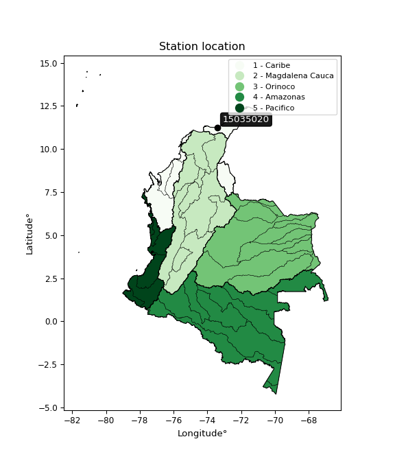

<div align="center">


</div>

# PMax24h Station (Rain, Pmax24h): 15035020

Maximum Precipitation in 24 hours (PMax24h) is the greatest amount of rainfall for a specific duration that is meteorologically possible for a given location, acting as a "worst-case" scenario for extreme storms, crucial for designing safety-critical infrastructure like bridges, river deviations, dams, spillways, and nuclear plants to prevent catastrophic failure. The PMax24h is related with the Probable Maximum Precipitation (PMP) and it is calculated by hydrologists using meteorological data to determine the upper limit of extreme rainfall, often leading to the Probable Maximum Flood (PMF) for flood control design, and is increasingly being studied for climate change impacts. Probable Maximum Precipitation (PMP) is the theoretical upper limit of rainfall, a deterministic estimate for extreme events, while probability distributions (like GEV, Gumbel) describe the likelihood and frequency of various precipitation amounts, including rare ones, showing how often events occur, with PMP representing the extreme end of these distributions, used for critical infrastructure design to ensure safety against the worst conceivable weather, unlike standard statistical forecasts which cover typical probabilities.

The most common probability distributions in hydrology, used for analyzing floods, rainfall, and streamflow, include the Normal, Log-Normal, Gumbel, Gamma (including Log-Pearson Type III), and Generalized Extreme Value (GEV) distributions, often chosen based on the data´s skewness and whether modeling extremes or general conditions, with Gumbel and GEV popular for extreme events like floods, while the Normal distribution serves as a baseline, though often requiring transformations for skewed hydrological data. These distributions help in designing water infrastructure, managing water resources, and forecasting hydrologic events.

> Hydrological data often isn´t perfectly normal (it´s skewed), so different distributions are needed for different applications, such as: **Flood Frequency Analysis**: Using Gumbel, GEV, or Log-Pearson Type III for predicting extreme flood magnitudes and their return periods, **Rainfall Analysis**: Normal for annual totals, but Log-Normal, Weibull, or GEV for intensity or extreme daily rainfall, **Streamflow Modeling**: Gamma and Log-Normal for maximum flows, GEV for minimum flows, and Kappa for daily flows.

<div align="center">

</img>

</div>


## A. General information


### 1. General running parameters

• app_version: _v20260225_. • runtime: _2026-02-27 14:50:08.749431_. • Python version: _3.14.0_. • SciPy version: _1.16.3_. • Pandas version: _2.3.3_. • NumPy version: _2.3.5_. • Stations dataset (station_dataset_file): _dataset/pmax24h_in/automatic_colombia_2003_2025.csv_. • Stations catalog (station_catalog_file): _dataset/CNE.xls_. • Minimum year to eval til year_max (date_min): _1900_. • Maximum year to eval since year_min (date_max): _2025_. • Creates, save and include plots into reports (create_plot): _False_. • Plot only fit distributions with Δo > Δ (plot_only_fit): _True_. • Plot only simple graphs avoiding multiple CDFs and multiple Extreme values plots (plot_only_simple): _False_. • Eval low extreme values, if False, evaluates high extreme values (low_extreme): _False_. • Eval every SciPy distribution as logarithmic (pdist_logarithmic_on): _True_. • Standard deviation normalized (ddof): _1.0_. • Return periods to eval in years (Tr): _[2, 2.33, 5, 10, 15, 20, 25, 50, 75, 100, 200, 250, 500, 750, 1000]_. • Minimum data sample per station, 0 means any (minimum_sample): _5_. • Z-Score maximum threshold to adjust a value, 0 means disable (zscore_max): _3.5_. • Z-Score minimum threshold to adjust a value, 0 means disable (zscore_min): _-2.5_. • Avoid zeros, e.g. rain = 0 (avoid_zeros): _True_. • Avoid null values (avoid_nans): _True_. 

:file_folder:Table: [dataset.csv](../../dataset/pmax24h_in/automatic_colombia_2003_2025.csv)

> Delta Degrees of Freedom (DDOF): is a parameter used in the formulas for calculating variance and standard deviation. When ddof=0, the divisor is $N$ (the total number of observations) and this is used when your data set is the entire population. When ddof=1, the divisor is $N-1$ and this is used when your data set is a sample drawn from a larger population. Using $N-1$ provides an unbiased estimate of the population variance (known as Bessel´s correction).


### 2. Station info and location

|   id |   CODIGO | NOMBRE                         | CATEGORIA               | TECNOLOGIA                              | ESTADO   | FECHA_INSTALACION   |   FECHA_SUSPENSION |   ALTITUD |   LATITUD |   LONGITUD | DEPARTAMENTO   | MUNICIPIO   | AREA_OPERATIVA                                         | ENTIDAD                                                     | AREA_HIDROGRAFICA   | ZONA_HIDROGRAFICA   | SUBZONA_HIDROGRAFICA                 |   CORRIENTE | Catalogo   |   Version |
|-----:|---------:|:-------------------------------|:------------------------|:----------------------------------------|:---------|:--------------------|-------------------:|----------:|----------:|-----------:|:---------------|:------------|:-------------------------------------------------------|:------------------------------------------------------------|:--------------------|:--------------------|:-------------------------------------|------------:|:-----------|----------:|
|    0 | 15035020 | TERMOGUAJIRA  - AUT [15035020] | Climatológica Ordinaria | Automática con Telemetría, Convencional | Activa   | 15/10/1991          |                nan |         5 |   11.2525 |   -73.4114 | La Guajira     | Dibulla     | Area Operativa 05 - Magdalena-Cesar-Guajira-San Andrés | INSTITUTO DE HIDROLOGIA METEOROLOGIA Y ESTUDIOS AMBIENTALES | Caribe              | Caribe - Guajira    | Río Ancho y Otros Directos al caribe |         nan | CNE_IDEAM  |  20251226 |

<div align="center">

Dynamic map: [:earth_americas:Google](http://maps.google.com/maps?q=11.2525,-73.41138889) [:earth_americas:OSM](https://www.openstreetmap.org/#map=18/11.2525/-73.41138889&layers=P) [:earth_americas:Bing](https://www.bing.com/maps?cp=11.2525~-73.41138889&lvl=18) [:earth_americas:Apple](https://maps.apple.com/frame?center=11.2525%2C-73.41138889&span=0.003%2C0.006)

</div>


<div align="center">

```geojson
{
  "type": "Feature",
  "geometry": {
    "type": "Point", 
    "coordinates": [-73.41138889, 11.2525]
  }, 
  "properties": {
    "Name": "15035020"
  }
}
```

</div>


### 3. Discrete values table and plot

<div align="center">

|               |           0 |           1 |          2 |          3 |           4 |            5 |
|:--------------|------------:|------------:|-----------:|-----------:|------------:|-------------:|
| Date          | 2019        | 2020        | 2022       | 2023       | 2024        | 2025         |
| Value         |   63.2      |   10.2      |  203.8     |    8.2     |  122        |   75.5       |
| Value_initial |   63.2      |   10.2      |  203.8     |    8.2     |  122        |   75.5       |
| count         |    6        |    6        |    6       |    6       |    6        |    6         |
| mean          |   80.4833   |   80.4833   |   80.4833  |   80.4833  |   80.4833   |   80.4833    |
| std           |   74.0524   |   74.0524   |   74.0524  |   74.0524  |   74.0524   |   74.0524    |
| zscore        |   -0.233393 |   -0.949102 |    1.66526 |   -0.97611 |    0.560639 |   -0.0672947 |


</div>


> The initial value (value_initial) correspond to the initial obtained or null completed value, and value (value) is adjusted only when the initial value is outside the valid range (outlier) definite through the Z-Score value. If Z-Score is active, values out of range or outliers are replaced with the station mean value. A Z-Score (or standard score) measures how many standard deviations a data point is from the mean of a dataset, indicating its relative position; positive scores mean above the mean, negative mean below, and a score of zero is exactly at the mean, allowing for comparison of values from different distributions. It´s calculated using the formula $z=(x–μ)/σ$, where $x$ is the data point, $μ$ is the mean, and $σ$ is the standard deviation, helping identify outliers and understand probability.
>
> <sub>**Note**: In this study, "completing" (filling gaps in) and "extending" (forecasting or lengthening the historical record) rainfall data series are avoided for certain critical analyses because they introduce artificial bias and uncertainty, which can distort the statistics of rare events (extremes), alter day-to-day variability, and compromise the integrity and homogeneity of the original data. Some reasons against Completing/Extending rainfall data are: **Distortion of Extremes and Variability**: The primary issue is that most gap-filling or extension methods rely on averaging or regression with nearby stations, which inherently smooths the data. Rainfall is highly variable in space and time, with a large percentage of zero values and occasional large storms. Infilling methods often underestimate the highest values and overestimate the lowest (zero) values, which severely distorts analyses focused on flood frequency, drought severity, and intensity-duration-frequency (IDF) curves, **Loss of Data Homogeneity**: Infilled or extended data are synthetic estimates, not actual measurements. Combining these estimates with observed data can violate the assumption of data homogeneity, which requires that the data properties do not change over time. Inhomogeneity can lead to incorrect conclusions about long-term trends or changes in climate patterns, **Propagation of Errors**: Errors and biases from the original data (e.g., wind-induced undercatch, instrument errors, site changes) or the data used for imputation can propagate through the analysis, leading to unreliable hydrological models and inaccurate predictions, **Compromised Statistical Integrity**: For statistical analyses, especially those involving the frequency of events, using artificial data can introduce time bias or autocorrelation that doesn´t exist in reality, making it difficult to assess the true probability of events, **Difficulty in Validation**: It is difficult to accurately validate the quality of filled or extended data, especially for past periods where ground-truth measurements are unavailable. The reliability of imputation techniques heavily depends on the density of the surrounding station network and the complexity of the local topography.</sub>


### 4. Active continuous probability distributions from SciPy (80 of 104 available)

A Probability Density Function (PDF) describes the relative likelihood of a continuous random variable falling within a specific range, where the total area under its curve equals 1, and the area over any interval gives the actual probability for that range. Unlike discrete probabilities (like rolling a die), a PDF shows density, not direct probability for a single point (which is zero), with higher points indicating higher likelihood, often visualized as a bell curve for normal distributions.

A log of a probability density function (log-PDF) is simply the logarithm of the PDF´s value, denoted as $log(f(x))$, useful for converting multiplication of probabilities into addition, improving numerical stability with tiny numbers, and connecting to information theory concepts like entropy. Instead of dealing with very small probabilities (e.g., 0.000001), log-PDFs use negative numbers (e.g., $log(0.00001) ≈ -11.51$ that are easier for computers to handle, preventing underflow errors and simplifying complex calculations. In this study, each active probability distribution from SciPy is also evaluated in the $log$ form.

[scipy.stats](https://docs.scipy.org/doc/scipy/reference/stats.html) is a Python´s powerful submodule within the SciPy library for comprehensive statistical analysis, offering over 130 probability distributions (like Normal, Poisson, etc.), functions for descriptive stats (mean, variance), hypothesis testing (t-tests, chi-square), random variable generation, and statistical tests, making it essential for data science, modeling, and research. It provides tools to explore, model, and draw conclusions from data efficiently, working seamlessly with [NumPy](https://numpy.org/).

<div align="center">

|   id | p_dist           |   n_parameter | fit_method   | label                                                                       | active   | ref                                                                                                      |
|-----:|:-----------------|--------------:|:-------------|:----------------------------------------------------------------------------|:---------|:---------------------------------------------------------------------------------------------------------|
|    0 | alpha            |             3 | MLE          | Alpha                                                                       | True     | [:mortar_board:](https://docs.scipy.org/doc/scipy/reference/generated/scipy.stats.alpha.html)            |
|    1 | anglit           |             2 | MM           | Anglit                                                                      | True     | [:mortar_board:](https://docs.scipy.org/doc/scipy/reference/generated/scipy.stats.anglit.html)           |
|    2 | arcsine          |             2 | MM           | Arcsine                                                                     | True     | [:mortar_board:](https://docs.scipy.org/doc/scipy/reference/generated/scipy.stats.arcsine.html)          |
|    3 | argus            |             3 | MLE          | Argus                                                                       | True     | [:mortar_board:](https://docs.scipy.org/doc/scipy/reference/generated/scipy.stats.argus.html)            |
|    4 | beta             |             4 | MLE          | Beta                                                                        | True     | [:mortar_board:](https://docs.scipy.org/doc/scipy/reference/generated/scipy.stats.beta.html)             |
|    5 | betaprime        |             4 | MLE          | Beta prime                                                                  | True     | [:mortar_board:](https://docs.scipy.org/doc/scipy/reference/generated/scipy.stats.betaprime.html)        |
|    6 | bradford         |             3 | MLE          | Bradford                                                                    | True     | [:mortar_board:](https://docs.scipy.org/doc/scipy/reference/generated/scipy.stats.bradford.html)         |
|    7 | burr             |             4 | MLE          | Burr (Type III)                                                             | True     | [:mortar_board:](https://docs.scipy.org/doc/scipy/reference/generated/scipy.stats.burr.html)             |
|    8 | burr12           |             4 | MLE          | Burr (Type III) 12                                                          | True     | [:mortar_board:](https://docs.scipy.org/doc/scipy/reference/generated/scipy.stats.burr12.html)           |
|    9 | cosine           |             2 | MLE          | Cosine                                                                      | True     | [:mortar_board:](https://docs.scipy.org/doc/scipy/reference/generated/scipy.stats.cosine.html)           |
|   10 | crystalball      |             4 | MLE          | Crystalball                                                                 | True     | [:mortar_board:](https://docs.scipy.org/doc/scipy/reference/generated/scipy.stats.crystalball.html)      |
|   11 | dgamma           |             3 | MLE          | Double gamma                                                                | True     | [:mortar_board:](https://docs.scipy.org/doc/scipy/reference/generated/scipy.stats.dgamma.html)           |
|   12 | dweibull         |             3 | MLE          | Double Weibull                                                              | True     | [:mortar_board:](https://docs.scipy.org/doc/scipy/reference/generated/scipy.stats.dweibull.html)         |
|   13 | erlang           |             3 | MLE          | Erlang                                                                      | True     | [:mortar_board:](https://docs.scipy.org/doc/scipy/reference/generated/scipy.stats.erlang.html)           |
|   14 | exponnorm        |             3 | MLE          | Exponentially modified Normal                                               | True     | [:mortar_board:](https://docs.scipy.org/doc/scipy/reference/generated/scipy.stats.exponnorm.html)        |
|   15 | exponpow         |             3 | MLE          | Exponential power                                                           | True     | [:mortar_board:](https://docs.scipy.org/doc/scipy/reference/generated/scipy.stats.exponpow.html)         |
|   16 | exponweib        |             4 | MLE          | Exponentiated Weibull                                                       | True     | [:mortar_board:](https://docs.scipy.org/doc/scipy/reference/generated/scipy.stats.exponweib.html)        |
|   17 | f                |             4 | MLE          | F                                                                           | True     | [:mortar_board:](https://docs.scipy.org/doc/scipy/reference/generated/scipy.stats.f.html)                |
|   18 | fatiguelife      |             3 | MLE          | Fatigue-life (Birnbaum-Saunders)                                            | True     | [:mortar_board:](https://docs.scipy.org/doc/scipy/reference/generated/scipy.stats.fatiguelife.html)      |
|   19 | foldnorm         |             3 | MM           | Fold Normal                                                                 | True     | [:mortar_board:](https://docs.scipy.org/doc/scipy/reference/generated/scipy.stats.foldnorm.html)         |
|   20 | gamma            |             3 | MLE          | Gamma                                                                       | True     | [:mortar_board:](https://docs.scipy.org/doc/scipy/reference/generated/scipy.stats.gamma.html)            |
|   21 | gausshyper       |             6 | MLE          | Gauss hypergeometric                                                        | True     | [:mortar_board:](https://docs.scipy.org/doc/scipy/reference/generated/scipy.stats.gausshyper.html)       |
|   22 | genexpon         |             5 | MLE          | Generalized exponential                                                     | True     | [:mortar_board:](https://docs.scipy.org/doc/scipy/reference/generated/scipy.stats.genexpon.html)         |
|   23 | genextreme       |             3 | MLE          | Generalized exponential                                                     | True     | [:mortar_board:](https://docs.scipy.org/doc/scipy/reference/generated/scipy.stats.genextreme.html)       |
|   24 | gengamma         |             4 | MLE          | Generalized gamma                                                           | True     | [:mortar_board:](https://docs.scipy.org/doc/scipy/reference/generated/scipy.stats.gengamma.html)         |
|   25 | genhalflogistic  |             3 | MLE          | Generalized half-logistic                                                   | True     | [:mortar_board:](https://docs.scipy.org/doc/scipy/reference/generated/scipy.stats.genhalflogistic.html)  |
|   26 | genlogistic      |             3 | MLE          | Generalized logistic                                                        | True     | [:mortar_board:](https://docs.scipy.org/doc/scipy/reference/generated/scipy.stats.genlogistic.html)      |
|   27 | gennorm          |             3 | MLE          | Generalized Normal                                                          | True     | [:mortar_board:](https://docs.scipy.org/doc/scipy/reference/generated/scipy.stats.gennorm.html)          |
|   28 | genpareto        |             3 | MLE          | Generalized Pareto                                                          | True     | [:mortar_board:](https://docs.scipy.org/doc/scipy/reference/generated/scipy.stats.genpareto.html)        |
|   29 | gompertz         |             3 | MLE          | Gompertz (or truncated Gumbel)                                              | True     | [:mortar_board:](https://docs.scipy.org/doc/scipy/reference/generated/scipy.stats.gompertz.html)         |
|   30 | gumbel_l         |             2 | MM           | Gumbel Left Skew                                                            | True     | [:mortar_board:](https://docs.scipy.org/doc/scipy/reference/generated/scipy.stats.gumbel_l.html)         |
|   31 | gumbel_r         |             2 | MM           | Gumbel Right Skew                                                           | True     | [:mortar_board:](https://docs.scipy.org/doc/scipy/reference/generated/scipy.stats.gumbel_r.html)         |
|   32 | halfgennorm      |             3 | MLE          | Upper half of a generalized normal                                          | True     | [:mortar_board:](https://docs.scipy.org/doc/scipy/reference/generated/scipy.stats.halfgennorm.html)      |
|   33 | halflogistic     |             2 | MM           | Half-logistic                                                               | True     | [:mortar_board:](https://docs.scipy.org/doc/scipy/reference/generated/scipy.stats.halflogistic.html)     |
|   34 | halfnorm         |             2 | MM           | Half Normal                                                                 | True     | [:mortar_board:](https://docs.scipy.org/doc/scipy/reference/generated/scipy.stats.halfnorm.html)         |
|   35 | hypsecant        |             2 | MM           | hyperbolic secant                                                           | True     | [:mortar_board:](https://docs.scipy.org/doc/scipy/reference/generated/scipy.stats.hypsecant.html)        |
|   36 | invgamma         |             3 | MLE          | Inverted gamma                                                              | True     | [:mortar_board:](https://docs.scipy.org/doc/scipy/reference/generated/scipy.stats.invgamma.html)         |
|   37 | invgauss         |             3 | MLE          | Inverse Gaussian                                                            | True     | [:mortar_board:](https://docs.scipy.org/doc/scipy/reference/generated/scipy.stats.invgauss.html)         |
|   38 | invweibull       |             3 | MLE          | Inverted Weibull                                                            | True     | [:mortar_board:](https://docs.scipy.org/doc/scipy/reference/generated/scipy.stats.invweibull.html)       |
|   39 | johnsonsb        |             4 | MLE          | Johnson SB                                                                  | True     | [:mortar_board:](https://docs.scipy.org/doc/scipy/reference/generated/scipy.stats.johnsonsb.html)        |
|   40 | johnsonsu        |             4 | MLE          | Johnson Su                                                                  | True     | [:mortar_board:](https://docs.scipy.org/doc/scipy/reference/generated/scipy.stats.johnsonsu.html)        |
|   41 | kappa3           |             3 | MLE          | Kappa 3                                                                     | True     | [:mortar_board:](https://docs.scipy.org/doc/scipy/reference/generated/scipy.stats.kappa3.html)           |
|   42 | kappa4           |             4 | MLE          | Kappa 4                                                                     | True     | [:mortar_board:](https://docs.scipy.org/doc/scipy/reference/generated/scipy.stats.kappa4.html)           |
|   43 | ksone            |             3 | MLE          | Kolmogorov-Smirnov one-sided test statistic distribution                    | True     | [:mortar_board:](https://docs.scipy.org/doc/scipy/reference/generated/scipy.stats.ksone.html)            |
|   44 | kstwobign        |             2 | MLE          | Limiting distribution of scaled Kolmogorov-Smirnov two-sided test statistic | True     | [:mortar_board:](https://docs.scipy.org/doc/scipy/reference/generated/scipy.stats.kstwobign.html)        |
|   45 | laplace          |             2 | MM           | Laplace                                                                     | True     | [:mortar_board:](https://docs.scipy.org/doc/scipy/reference/generated/scipy.stats.laplace.html)          |
|   46 | levy_l           |             2 | MLE          | Left-skewed Levy                                                            | True     | [:mortar_board:](https://docs.scipy.org/doc/scipy/reference/generated/scipy.stats.levy_l.html)           |
|   47 | loggamma         |             3 | MLE          | Log gamma                                                                   | True     | [:mortar_board:](https://docs.scipy.org/doc/scipy/reference/generated/scipy.stats.loggamma.html)         |
|   48 | logistic         |             2 | MM           | Logistic (or Sech-squared)                                                  | True     | [:mortar_board:](https://docs.scipy.org/doc/scipy/reference/generated/scipy.stats.logistic.html)         |
|   49 | loglaplace       |             3 | MLE          | Log-Laplace                                                                 | True     | [:mortar_board:](https://docs.scipy.org/doc/scipy/reference/generated/scipy.stats.loglaplace.html)       |
|   50 | lomax            |             3 | MLE          | Lomax (Pareto of the second kind)                                           | True     | [:mortar_board:](https://docs.scipy.org/doc/scipy/reference/generated/scipy.stats.lomax.html)            |
|   51 | maxwell          |             2 | MM           | Maxwell                                                                     | True     | [:mortar_board:](https://docs.scipy.org/doc/scipy/reference/generated/scipy.stats.maxwell.html)          |
|   52 | mielke           |             4 | MLE          | Mielke Beta-Kappa / Dagum                                                   | True     | [:mortar_board:](https://docs.scipy.org/doc/scipy/reference/generated/scipy.stats.mielke.html)           |
|   53 | moyal            |             2 | MM           | Moyal                                                                       | True     | [:mortar_board:](https://docs.scipy.org/doc/scipy/reference/generated/scipy.stats.moyal.html)            |
|   54 | nakagami         |             3 | MLE          | Nakagami                                                                    | True     | [:mortar_board:](https://docs.scipy.org/doc/scipy/reference/generated/scipy.stats.nakagami.html)         |
|   55 | ncf              |             5 | MLE          | Non-central F distribution                                                  | True     | [:mortar_board:](https://docs.scipy.org/doc/scipy/reference/generated/scipy.stats.ncf.html)              |
|   56 | nct              |             4 | MLE          | Non-central Student’s t                                                     | True     | [:mortar_board:](https://docs.scipy.org/doc/scipy/reference/generated/scipy.stats.nct.html)              |
|   57 | norm             |             2 | MM           | Normal                                                                      | True     | [:mortar_board:](https://docs.scipy.org/doc/scipy/reference/generated/scipy.stats.norm.html)             |
|   58 | pearson3         |             3 | MM           | Pearson type III                                                            | True     | [:mortar_board:](https://docs.scipy.org/doc/scipy/reference/generated/scipy.stats.pearson3.html)         |
|   59 | powerlaw         |             3 | MLE          | Power-function                                                              | True     | [:mortar_board:](https://docs.scipy.org/doc/scipy/reference/generated/scipy.stats.powerlaw.html)         |
|   60 | rayleigh         |             2 | MM           | Rayleigh                                                                    | True     | [:mortar_board:](https://docs.scipy.org/doc/scipy/reference/generated/scipy.stats.rayleigh.html)         |
|   61 | rdist            |             3 | MLE          | R-distributed (symmetric beta)                                              | True     | [:mortar_board:](https://docs.scipy.org/doc/scipy/reference/generated/scipy.stats.rdist.html)            |
|   62 | rice             |             3 | MLE          | Rice                                                                        | True     | [:mortar_board:](https://docs.scipy.org/doc/scipy/reference/generated/scipy.stats.rice.html)             |
|   63 | semicircular     |             2 | MM           | Semicircular                                                                | True     | [:mortar_board:](https://docs.scipy.org/doc/scipy/reference/generated/scipy.stats.semicircular.html)     |
|   64 | skewnorm         |             3 | MLE          | Skew normal                                                                 | True     | [:mortar_board:](https://docs.scipy.org/doc/scipy/reference/generated/scipy.stats.skewnorm.html)         |
|   65 | t                |             3 | MLE          | Student’s t                                                                 | True     | [:mortar_board:](https://docs.scipy.org/doc/scipy/reference/generated/scipy.stats.t.html)                |
|   66 | trapezoid        |             4 | MLE          | Trapezoid                                                                   | True     | [:mortar_board:](https://docs.scipy.org/doc/scipy/reference/generated/scipy.stats.trapezoid.html)        |
|   67 | triang           |             3 | MLE          | Triangular                                                                  | True     | [:mortar_board:](https://docs.scipy.org/doc/scipy/reference/generated/scipy.stats.triang.html)           |
|   68 | truncexpon       |             3 | MLE          | Truncated exponential                                                       | True     | [:mortar_board:](https://docs.scipy.org/doc/scipy/reference/generated/scipy.stats.truncexpon.html)       |
|   69 | truncnorm        |             4 | MLE          | Truncated normal                                                            | True     | [:mortar_board:](https://docs.scipy.org/doc/scipy/reference/generated/scipy.stats.truncnorm.html)        |
|   70 | truncpareto      |             4 | MLE          | Upper truncated Pareto                                                      | True     | [:mortar_board:](https://docs.scipy.org/doc/scipy/reference/generated/scipy.stats.truncpareto.html)      |
|   71 | truncweibull_min |             5 | MLE          | Doubly truncated Weibull minimum                                            | True     | [:mortar_board:](https://docs.scipy.org/doc/scipy/reference/generated/scipy.stats.truncweibull_min.html) |
|   72 | tukeylambda      |             3 | MLE          | Tukey-Lamdba                                                                | True     | [:mortar_board:](https://docs.scipy.org/doc/scipy/reference/generated/scipy.stats.tukeylambda.html)      |
|   73 | uniform          |             2 | MLE          | Uniform                                                                     | True     | [:mortar_board:](https://docs.scipy.org/doc/scipy/reference/generated/scipy.stats.uniform.html)          |
|   74 | vonmises         |             3 | MLE          | Von Mises                                                                   | True     | [:mortar_board:](https://docs.scipy.org/doc/scipy/reference/generated/scipy.stats.vonmises.html)         |
|   75 | vonmises_line    |             3 | MLE          | Von Mises line                                                              | True     | [:mortar_board:](https://docs.scipy.org/doc/scipy/reference/generated/scipy.stats.vonmises_line.html)    |
|   76 | wald             |             2 | MM           | Wald                                                                        | True     | [:mortar_board:](https://docs.scipy.org/doc/scipy/reference/generated/scipy.stats.wald.html)             |
|   77 | weibull_max      |             3 | MLE          | Weibull maximum                                                             | True     | [:mortar_board:](https://docs.scipy.org/doc/scipy/reference/generated/scipy.stats.weibull_max.html)      |
|   78 | weibull_min      |             3 | MLE          | Weibull minimum                                                             | True     | [:mortar_board:](https://docs.scipy.org/doc/scipy/reference/generated/scipy.stats.weibull_min.html)      |
|   79 | wrapcauchy       |             3 | MLE          | Wrapped  Cauchy                                                             | True     | [:mortar_board:](https://docs.scipy.org/doc/scipy/reference/generated/scipy.stats.wrapcauchy.html)       |

</div>

> **n_parameter:** # arguments & localization & scale.
>
> **Fit methods:** (MLE) maximum likelihood, (MM) L-moments.
>
>**Inactive** (With the only purpose of prevent loops, zero divisions, infinite values, over high estimated values or horizontal trending for recurrence intervals estimations, the follow distributions were disabled.)**:** lognorm, norminvgauss, powernorm, powerlognorm, cauchy, halfcauchy, foldcauchy, skewcauchy, chi2, expon, fisk, genhyperbolic, geninvgauss, gibrat, kstwo, laplace_asymmetric, levy, levy_stable, ncx2, pareto, rel_breitwigner, recipinvgauss, studentized_range, loguniform, 


## B. Probability (PDF) vs. Empirical (EDF) distributions functions

A continuous probability distribution (CPD) describes probabilities for variables that can take any value within a range (like rain any time), unlike discrete variables with specific outcomes (like temperature). It uses a Probability Density Function (PDF), a curve where the total area under it equals 1, and the probability of the variable falling within an interval (a to b) is found by calculating the area under the curve between those points. A key feature is that the probability of hitting any single exact value is zero, so probabilities are always expressed for ranges, e.g., $P(a ≤ X ≤ b)$.

<div align="center">

Distributions parameters from station values
|     |   station | p_dist              |   n |              loc |          scale | shape                  | shape1                 | shape2                | shape3             |
|----:|----------:|:--------------------|----:|-----------------:|---------------:|:-----------------------|:-----------------------|:----------------------|:-------------------|
|   0 |  15035020 | alpha               |   6 |     -0.0390533   |   15.5658      | 3.1664918695559944e-10 |                        |                       |                    |
|   1 |  15035020 | anglit              |   6 |     80.4833      |  197.758       |                        |                        |                       |                    |
|   2 |  15035020 | arcsine             |   6 |    -15.1179      |  191.203       |                        |                        |                       |                    |
|   3 |  15035020 | argus               |   6 |    -69.148       |  285.757       | 9.74856272465938e-07   |                        |                       |                    |
|   4 |  15035020 | beta                |   6 |      1.40018     |  202.4         | 0.8390593531040882     | 0.7857020139051448     |                       |                    |
|   5 |  15035020 | betaprime           |   6 |     -3.35039     |  273.27        | 1.4208521353717192     | 5.4764478713786175     |                       |                    |
|   6 |  15035020 | bradford            |   6 |      8.2         |  195.6         | 0.9224899379957925     |                        |                       |                    |
|   7 |  15035020 | burr                |   6 |     -0.52749     |  217.271       | 42.988817461589335     | 0.015113941105826402   |                       |                    |
|   8 |  15035020 | burr12              |   6 |     -0.229004    |    8.27293     | 221.44213964392947     | 0.00260537383229254    |                       |                    |
|   9 |  15035020 | cosine              |   6 |     87.3734      |   56.6165      |                        |                        |                       |                    |
|  10 |  15035020 | crystalball         |   6 |     80.4833      |   67.6003      | 5639.248844945036      | 7070.140828438887      |                       |                    |
|  11 |  15035020 | dgamma              |   6 |     69.4768      |   49.1071      | 1.0850433957342847     |                        |                       |                    |
|  12 |  15035020 | dweibull            |   6 |     69.6963      |   55.0006      | 1.094249663636532      |                        |                       |                    |
|  13 |  15035020 | erlang              |   6 |      8.2         |   61.556       | 0.61389460685446       |                        |                       |                    |
|  14 |  15035020 | exponnorm           |   6 |      8.10018     |    0.0277371   | 2600.810646446223      |                        |                       |                    |
|  15 |  15035020 | exponpow            |   6 |      8.2         |  155.609       | 0.2616024327565248     |                        |                       |                    |
|  16 |  15035020 | exponweib           |   6 |      8.2         |    6.86625     | 1.4134328401539817     | 0.35401415875091946    |                       |                    |
|  17 |  15035020 | f                   |   6 |      8.2         |   72.6343      | 0.5872610488387995     | 2585.383866078754      |                       |                    |
|  18 |  15035020 | fatiguelife         |   6 |      8.2         |    5.79928e-05 | 1030.4341054894905     |                        |                       |                    |
|  19 |  15035020 | foldnorm            |   6 |    -20.1974      |   82.683       | 1.0729238541072115     |                        |                       |                    |
|  20 |  15035020 | gamma               |   6 |      8.2         |   86.8846      | 0.3728772884133257     |                        |                       |                    |
|  21 |  15035020 | gausshyper          |   6 |    -25.0699      |  228.87        | 1.1131371281457478     | 0.6934862457979136     | 1.0908620228172454    | 1.0970917779947968 |
|  22 |  15035020 | genexpon            |   6 |      7.64485     |    0.0155333   | 5.076228633169196e-11  | 0.00021411682244947222 | 0.15195252985865282   |                    |
|  23 |  15035020 | genextreme          |   6 |     13.8793      |   41.253       | -7.263674671507264     |                        |                       |                    |
|  24 |  15035020 | gengamma            |   6 |      8.2         |    1.47798     | 2.395837710006774      | 0.26015798830340153    |                       |                    |
|  25 |  15035020 | genhalflogistic     |   6 |    -11.7313      |  224.415       | 1.041217886076369      |                        |                       |                    |
|  26 |  15035020 | genlogistic         |   6 |   -306.906       |   51.5017      | 1004.6416751384579     |                        |                       |                    |
|  27 |  15035020 | gennorm             |   6 |    106           |   97.8001      | 12421341.892234199     |                        |                       |                    |
|  28 |  15035020 | genpareto           |   6 |      8.2         |   96.2895      | -0.29706640132981876   |                        |                       |                    |
|  29 |  15035020 | gompertz            |   6 |      8.2         |  586.293       | 7.1459379643144345     |                        |                       |                    |
|  30 |  15035020 | gumbel_l            |   6 |    110.907       |   52.7077      |                        |                        |                       |                    |
|  31 |  15035020 | gumbel_r            |   6 |     50.0596      |   52.7077      |                        |                        |                       |                    |
|  32 |  15035020 | halfgennorm         |   6 |      8.2         |    5.00935     | 0.4037146771402156     |                        |                       |                    |
|  33 |  15035020 | halflogistic        |   6 |      0.361262    |   57.7959      |                        |                        |                       |                    |
|  34 |  15035020 | halfnorm            |   6 |     -8.99298     |  112.142       |                        |                        |                       |                    |
|  35 |  15035020 | hypsecant           |   6 |     80.4833      |   43.0357      |                        |                        |                       |                    |
|  36 |  15035020 | invgamma            |   6 |      7.74703     |    0.689709    | 0.3059975725447529     |                        |                       |                    |
|  37 |  15035020 | invgauss            |   6 |      2.92531     |   20.4476      | 3.793008677632592      |                        |                       |                    |
|  38 |  15035020 | invweibull          |   6 |      8.2         |    2.89289     | 0.055028437841633984   |                        |                       |                    |
|  39 |  15035020 | johnsonsb           |   6 |      8.2         |  407.455       | 0.7688458330545989     | 0.12022438182688991    |                       |                    |
|  40 |  15035020 | johnsonsu           |   6 |      8.2         |    1.99674e-09 | -1.717299376989285     | 0.1316419360641563     |                       |                    |
|  41 |  15035020 | kappa3              |   6 |      8.2         |   83.6834      | 3.000080919321336      |                        |                       |                    |
|  42 |  15035020 | kappa4              |   6 |    -11.7705      |  208.767       | 1.1055785415985935     | 0.9654491803896832     |                       |                    |
|  43 |  15035020 | ksone               |   6 |    -11.36        |  234.72        | 1.0                    |                        |                       |                    |
|  44 |  15035020 | kstwobign           |   6 |   -130.96        |  242.597       |                        |                        |                       |                    |
|  45 |  15035020 | laplace             |   6 |     80.4833      |   47.8006      |                        |                        |                       |                    |
|  46 |  15035020 | levy_l              |   6 |    216.981       |   54.7488      |                        |                        |                       |                    |
|  47 |  15035020 | loggamma            |   6 | -18726.5         | 2588.63        | 1430.2603511019115     |                        |                       |                    |
|  48 |  15035020 | logistic            |   6 |     80.4833      |   37.27        |                        |                        |                       |                    |
|  49 |  15035020 | loglaplace          |   6 |     -0.172764    |   63.3728      | 1.0278489476042056     |                        |                       |                    |
|  50 |  15035020 | lomax               |   6 |      8.1881      | 1817.61        | 28.722011688602787     |                        |                       |                    |
|  51 |  15035020 | maxwell             |   6 |    -79.701       |  100.381       |                        |                        |                       |                    |
|  52 |  15035020 | mielke              |   6 |     -0.0406681   |    0.165688    | 68.23585153935426      | 0.8686180685878367     |                       |                    |
|  53 |  15035020 | moyal               |   6 |     41.8251      |   30.4308      |                        |                        |                       |                    |
|  54 |  15035020 | nakagami            |   6 |      8.2         |  102.012       | 0.188364344629526      |                        |                       |                    |
|  55 |  15035020 | ncf                 |   6 |     -0.0301111   |    3.96548e-06 | 4.294467416201396e-07  | 1.8696051830191072     | 4.122725888151638     |                    |
|  56 |  15035020 | nct                 |   6 |     -0.163261    |    0.407243    | 0.6306095137976311     | 38.734840777544804     |                       |                    |
|  57 |  15035020 | norm                |   6 |     80.4833      |   67.6003      |                        |                        |                       |                    |
|  58 |  15035020 | pearson3            |   6 |     80.4834      |   67.6003      | 0.6564213388586286     |                        |                       |                    |
|  59 |  15035020 | powerlaw            |   6 |      8.2         |  195.6         | 0.128478316174911      |                        |                       |                    |
|  60 |  15035020 | rayleigh            |   6 |    -48.84        |  103.185       |                        |                        |                       |                    |
|  61 |  15035020 | rdist               |   6 |    -10.8275      |   86.3275      | 1.1730686770776644     |                        |                       |                    |
|  62 |  15035020 | rice                |   6 |    -32.6775      |   93.2072      | 0.0005790864405457565  |                        |                       |                    |
|  63 |  15035020 | semicircular        |   6 |     80.4833      |  135.201       |                        |                        |                       |                    |
|  64 |  15035020 | skewnorm            |   6 |      8.2         |   98.9692      | 134350615.97784814     |                        |                       |                    |
|  65 |  15035020 | t                   |   6 |     80.4866      |   67.5936      | 2354148.689273586      |                        |                       |                    |
|  66 |  15035020 | trapezoid           |   6 |    -11.928       |  234.72        | 1.0                    | 1.0                    |                       |                    |
|  67 |  15035020 | triang              |   6 |   -130.636       |  453.658       | 0.4543861399455942     |                        |                       |                    |
|  68 |  15035020 | truncexpon          |   6 |      8.19998     |  284.989       | 0.6863429434063966     |                        |                       |                    |
|  69 |  15035020 | truncnorm           |   6 |     80.4833      |   67.6003      | -4483.707852937627     | 1705.490115675134      |                       |                    |
|  70 |  15035020 | truncpareto         |   6 |      7.96124     |    0.238762    | 0.2289591319275536     | 820.2241906329148      |                       |                    |
|  71 |  15035020 | truncweibull_min    |   6 |    -16.7225      |  234.944       | 1.1930632929704437     | 0.0004428567625771897  | 0.9386159778974364    |                    |
|  72 |  15035020 | tukeylambda         |   6 |    -10.3938      |   97.607       | 1.1363677772591303     |                        |                       |                    |
|  73 |  15035020 | uniform             |   6 |      8.2         |  195.6         |                        |                        |                       |                    |
|  74 |  15035020 | vonmises            |   6 |      2.09058     |    1           | 0.6432000645538338     |                        |                       |                    |
|  75 |  15035020 | vonmises_line       |   6 |    105.848       |   31.179       | 0.0008596313904570493  |                        |                       |                    |
|  76 |  15035020 | wald                |   6 |     12.883       |   67.6003      |                        |                        |                       |                    |
|  77 |  15035020 | weibull_max         |   6 |    203.8         |    1.90917     | 0.18567331737109755    |                        |                       |                    |
|  78 |  15035020 | weibull_min         |   6 |      8.2         |   76.5785      | 0.5290560792640633     |                        |                       |                    |
|  79 |  15035020 | wrapcauchy          |   6 |      8.2         |   31.1307      | 0.6986964290724271     |                        |                       |                    |
|  80 |  15035020 | logalpha            |   6 |    -20.3654      |  466.085       | 19.306507589787763     |                        |                       |                    |
|  81 |  15035020 | loganglit           |   6 |      3.83635     |    3.53392     |                        |                        |                       |                    |
|  82 |  15035020 | logarcsine          |   6 |      2.12798     |    3.41676     |                        |                        |                       |                    |
|  83 |  15035020 | logargus            |   6 |      0.926813    |    4.55214     | 1.4919152624634542     |                        |                       |                    |
|  84 |  15035020 | logbeta             |   6 |      1.83179     |    3.48535     | 0.44456560157457303    | 0.29026419876553494    |                       |                    |
|  85 |  15035020 | logbetaprime        |   6 |     -6.45188     | 2672.05        | 65.97632343580092      | 17162.07646011774      |                       |                    |
|  86 |  15035020 | logbradford         |   6 |      2.10413     |    3.21308     | 1.1345274011970714     |                        |                       |                    |
|  87 |  15035020 | logburr             |   6 |      0.36569     |    4.9799      | 674.4298222979379      | 0.0034052617715564664  |                       |                    |
|  88 |  15035020 | logburr12           |   6 |   -296.26        |  311.482       | 319.9226581535481      | 80818.21316119662      |                       |                    |
|  89 |  15035020 | logcosine           |   6 |      3.77341     |    0.962252    |                        |                        |                       |                    |
|  90 |  15035020 | logcrystalball      |   6 |      3.83635     |    1.20801     | 8.940332290003532      | 332.829161326432       |                       |                    |
|  91 |  15035020 | logdgamma           |   6 |      4.32413     |    0.91069     | 0.9221400326885436     |                        |                       |                    |
|  92 |  15035020 | logdweibull         |   6 |      4.1463      |    0.886036    | 0.891362632987237      |                        |                       |                    |
|  93 |  15035020 | logerlang           |   6 |    -14.3275      |    0.082672    | 219.56671969892506     |                        |                       |                    |
|  94 |  15035020 | logexponnorm        |   6 |      3.83581     |    1.20801     | 0.00043711257135365614 |                        |                       |                    |
|  95 |  15035020 | logexponpow         |   6 |      2.10413     |    1.35728     | 0.40151763637135157    |                        |                       |                    |
|  96 |  15035020 | logexponweib        |   6 |      2.10413     |    1.10206     | 1.159025397867911      | 0.649889091894929      |                       |                    |
|  97 |  15035020 | logf                |   6 |   -713.068       |  716.9         | 2025404.6541332155     | 1081201.1038731392     |                       |                    |
|  98 |  15035020 | logfatiguelife      |   6 |      2.10413     |    2.71888e-06 | 759.5252332550479      |                        |                       |                    |
|  99 |  15035020 | logfoldnorm         |   6 |     -5.16475     |    1.17168     | 7.687986960975698      |                        |                       |                    |
| 100 |  15035020 | loggamma            |   6 |    -15.2356      |    0.078396    | 243.21625502535574     |                        |                       |                    |
| 101 |  15035020 | loggausshyper       |   6 |      2.10413     |    4.39876     | 0.3306580953065633     | 0.7669615707785602     | 1.1559600358040774    | 1.1140399010147477 |
| 102 |  15035020 | loggenexpon         |   6 |      2.10392     |    0.0232305   | 0.008464119530764338   | 4.572709168868588      | 1.953826661198162e-05 |                    |
| 103 |  15035020 | loggenextreme       |   6 |      4.01729     |    1.54912     | 1.1917645740797052     |                        |                       |                    |
| 104 |  15035020 | loggengamma         |   6 |      2.10413     |    1.13528     | 1.1899009915589014     | 0.71319984624578       |                       |                    |
| 105 |  15035020 | loggenhalflogistic  |   6 |      1.16922     |    4.26953     | 1.0293171880762255     |                        |                       |                    |
| 106 |  15035020 | loggenlogistic      |   6 |      5.31741     |    3.05626e-05 | 2.0477603517801415e-05 |                        |                       |                    |
| 107 |  15035020 | loggennorm          |   6 |      4.32413     |    0.0568249   | 0.38349549096795377    |                        |                       |                    |
| 108 |  15035020 | loggenpareto        |   6 |     -0.0131362   |   12.0998      | -2.270010987064973     |                        |                       |                    |
| 109 |  15035020 | loggompertz         |   6 |      2.10413     |    1.53598     | 0.33196308701124944    |                        |                       |                    |
| 110 |  15035020 | loggumbel_l         |   6 |      4.38002     |    0.941884    |                        |                        |                       |                    |
| 111 |  15035020 | loggumbel_r         |   6 |      3.29268     |    0.941884    |                        |                        |                       |                    |
| 112 |  15035020 | loghalfgennorm      |   6 |      2.10413     |    1.10508     | 0.7745454727331869     |                        |                       |                    |
| 113 |  15035020 | loghalflogistic     |   6 |      2.4046      |    1.0328      |                        |                        |                       |                    |
| 114 |  15035020 | loghalfnorm         |   6 |      2.23748     |    2.0039      |                        |                        |                       |                    |
| 115 |  15035020 | loghypsecant        |   6 |      3.83635     |    0.769045    |                        |                        |                       |                    |
| 116 |  15035020 | loginvgamma         |   6 |    -13.4671      | 3369.89        | 195.7140054001727      |                        |                       |                    |
| 117 |  15035020 | loginvgauss         |   6 |     -3.79477     |  270.9         | 0.02806296928619384    |                        |                       |                    |
| 118 |  15035020 | loginvweibull       |   6 |     -1.03485e+07 |    1.03485e+07 | 8927855.314462623      |                        |                       |                    |
| 119 |  15035020 | logjohnsonsb        |   6 |      2.10413     |    3.21302     | -0.6132382083423717    | 0.06989205715338824    |                       |                    |
| 120 |  15035020 | logjohnsonsu        |   6 |      5.85439     |    0.0249759   | 7.2484223072912854     | 1.4860195993554024     |                       |                    |
| 121 |  15035020 | logkappa3           |   6 |      2.10413     |    3.21297     | 164152.6713648669      |                        |                       |                    |
| 122 |  15035020 | logkappa4           |   6 |      1.74361     |    3.69614     | 1.108274211116634      | 1.0314733451311642     |                       |                    |
| 123 |  15035020 | logksone            |   6 |      1.74401     |    4.18468     | 1.0                    |                        |                       |                    |
| 124 |  15035020 | logkstwobign        |   6 |     -0.712894    |    5.1705      |                        |                        |                       |                    |
| 125 |  15035020 | loglaplace          |   6 |      3.83635     |    0.854195    |                        |                        |                       |                    |
| 126 |  15035020 | loglevy_l           |   6 |      5.43377     |    0.481461    |                        |                        |                       |                    |
| 127 |  15035020 | logloggamma         |   6 |      5.31718     |    1.40019e-06 | 9.462330344066314e-07  |                        |                       |                    |
| 128 |  15035020 | loglogistic         |   6 |      3.83635     |    0.666013    |                        |                        |                       |                    |
| 129 |  15035020 | logloglaplace       |   6 |     -0.0397237   |    4.36386     | 3.5851873520484263     |                        |                       |                    |
| 130 |  15035020 | loglomax            |   6 |      2.10413     |   26.3343      | 15.628342787935615     |                        |                       |                    |
| 131 |  15035020 | logmaxwell          |   6 |      0.973868    |    1.7938      |                        |                        |                       |                    |
| 132 |  15035020 | logmielke           |   6 |      2.10413     |    3.2755      | 0.9305935041372929     | 105.30558054688919     |                       |                    |
| 133 |  15035020 | logmoyal            |   6 |      3.14553     |    0.543797    |                        |                        |                       |                    |
| 134 |  15035020 | lognakagami         |   6 |      2.10413     |    1.96082     | 0.09546850779930499    |                        |                       |                    |
| 135 |  15035020 | logncf              |   6 |     -0.59207     |    0.000336149 | 0.005078477429896108   | 88.2070130283021       | 65.57123464411643     |                    |
| 136 |  15035020 | lognct              |   6 |    -62.1953      |    1.18714     | 41621.01571539363      | 55.62126193040423      |                       |                    |
| 137 |  15035020 | lognorm             |   6 |      3.83635     |    1.20801     |                        |                        |                       |                    |
| 138 |  15035020 | logpearson3         |   6 |      3.83635     |    1.20801     | -0.413042277220383     |                        |                       |                    |
| 139 |  15035020 | logpowerlaw         |   6 |      2.10413     |    3.213       | 0.14923922453881888    |                        |                       |                    |
| 140 |  15035020 | lograyleigh         |   6 |      1.52535     |    1.84391     |                        |                        |                       |                    |
| 141 |  15035020 | logrdist            |   6 |      2.82908     |    1.97494     | 1.0200603235240469     |                        |                       |                    |
| 142 |  15035020 | logrice             |   6 |      1.35838     |    1.39663     | 1.3769884603577633     |                        |                       |                    |
| 143 |  15035020 | logsemicircular     |   6 |      3.83635     |    2.41603     |                        |                        |                       |                    |
| 144 |  15035020 | logskewnorm         |   6 |      5.31714     |    1.91115     | -9356736.184807785     |                        |                       |                    |
| 145 |  15035020 | logt                |   6 |      3.83636     |    1.20801     | 883211836.1496711      |                        |                       |                    |
| 146 |  15035020 | logtrapezoid        |   6 |      0.419575    |    5.12517     | 1.0                    | 1.0                    |                       |                    |
| 147 |  15035020 | logtriang           |   6 |      0.49457     |    4.82259     | 0.9999997622719559     |                        |                       |                    |
| 148 |  15035020 | logtruncexpon       |   6 |      2.10004     |    2.71403     | 1.185360326837181      |                        |                       |                    |
| 149 |  15035020 | logtruncnorm        |   6 |     -0.238943    |    3.16529     | 0.737097796356177      | 1.7553132522014452     |                       |                    |
| 150 |  15035020 | logtruncpareto      |   6 |      2.09945     |    0.00468093  | 0.206897025007043      | 687.4029359716186      |                       |                    |
| 151 |  15035020 | logtruncweibull_min |   6 |      2.09446     |    3.97689     | 0.6861654242231555     | 0.0024334024356084914  | 0.8103516300767849    |                    |
| 152 |  15035020 | logtukeylambda      |   6 |      3.71064     |    1.87958     | 1.1699827657486883     |                        |                       |                    |
| 153 |  15035020 | loguniform          |   6 |      2.10413     |    3.213       |                        |                        |                       |                    |
| 154 |  15035020 | logvonmises         |   6 |     -2.19769     |    1           | 0.9026566178719696     |                        |                       |                    |
| 155 |  15035020 | logvonmises_line    |   6 |      3.22604     |    0.665676    | 6.323293516187603e-05  |                        |                       |                    |
| 156 |  15035020 | logwald             |   6 |      2.62832     |    1.20803     |                        |                        |                       |                    |
| 157 |  15035020 | logweibull_max      |   6 |      5.31714     |    1.44049     | 0.7328377027244687     |                        |                       |                    |
| 158 |  15035020 | logweibull_min      |   6 |     -3.52966e+07 |    3.52966e+07 | 37228698.7262371       |                        |                       |                    |
| 159 |  15035020 | logwrapcauchy       |   6 |      2.10413     |    0.511366    | 0.51748499609077       |                        |                       |                    |

</div>

> **loc** (Location parameter): This shifts the distribution along the x-axis. For many common distributions, like the normal (Gaussian) distribution, loc represents the mean $μ$. For others, like the uniform distribution, it might represent the minimum value, or for the beta distribution, the left end of the support interval.
>
> **scale** (Scale parameter): This determines the width or spread of the distribution. For the normal distribution, scale represents the standard deviation $σ$. For a uniform distribution, it defines the length of the interval (from $loc$ to $loc + scale$).
>
> **shape** (Shape parameters): Refers to parameters that define the specific form of a probability distribution, distinct from its location (loc) and scale (scale). These parameters are required arguments for most distribution functions. For example, a normal (Gaussian) distribution is fully defined by its location (mean) and scale (standard deviation), so it has no specific shape parameters beyond loc and scale. However, other distributions have intrinsic properties that need specification, as Gamma distribution that takes a shape parameter, often named $a$ or $alpha$.


### 0. Cumulative distribution values - CDF (160 evaluated)

Cumulative Distribution Function (CDF), denoted as $F$<sub>$X$</sub>$(x)$, is a function that gives the probability that a random variable $X$ will take a value less than or equal to a specific value, $x$ (i.e., $(P(X≥x)$. It essentially "accumulates" probabilities from a given point up to the far right (positive infinity), providing a complete picture of the distribution´s probabilities for both discrete (like rain) and continuous (like temperature) variables, helping to find probabilities over ranges or above certain values. Each station is evaluated separately ordering the $x$ values ascending, calculating the CDF and PDF values for the activated distributions and their logarithmic forms.

<div align="center">

CDF ordered by x ascending and calculating $log(f(x))$ separately
|   id |   Station |   date |     x |   count |    mean |     std |     zscore |   Value_initial |   station |   m |     alpha |   alpha_pdf |   anglit |   anglit_pdf |   arcsine |   arcsine_pdf |    argus |   argus_pdf |      beta |   beta_pdf |   betaprime |   betaprime_pdf |    bradford |   bradford_pdf |     burr |   burr_pdf |   burr12 |   burr12_pdf |   cosine |   cosine_pdf |   crystalball |   crystalball_pdf |   dgamma |   dgamma_pdf |   dweibull |   dweibull_pdf |      erlang |      erlang_pdf |   exponnorm |   exponnorm_pdf |    exponpow |   exponpow_pdf |   exponweib |   exponweib_pdf |          f |          f_pdf |   fatiguelife |   fatiguelife_pdf |   foldnorm |   foldnorm_pdf |       gamma |   gamma_pdf |   gausshyper |   gausshyper_pdf |   genexpon |   genexpon_pdf |   genextreme |   genextreme_pdf |    gengamma |    gengamma_pdf |   genhalflogistic |   genhalflogistic_pdf |   genlogistic |   genlogistic_pdf |     gennorm |   gennorm_pdf |   genpareto |   genpareto_pdf |    gompertz |   gompertz_pdf |   gumbel_l |   gumbel_l_pdf |   gumbel_r |   gumbel_r_pdf |   halfgennorm |   halfgennorm_pdf |   halflogistic |   halflogistic_pdf |   halfnorm |   halfnorm_pdf |   hypsecant |   hypsecant_pdf |   invgamma |   invgamma_pdf |   invgauss |   invgauss_pdf |   invweibull |   invweibull_pdf |   johnsonsb |   johnsonsb_pdf |   johnsonsu |   johnsonsu_pdf |      kappa3 |   kappa3_pdf |      kappa4 |   kappa4_pdf |     ksone |   ksone_pdf |   kstwobign |   kstwobign_pdf |   laplace |   laplace_pdf |   levy_l |   levy_l_pdf |   loggamma |   loggamma_pdf |   logistic |   logistic_pdf |   loglaplace |   loglaplace_pdf |       lomax |   lomax_pdf |   maxwell |   maxwell_pdf |    mielke |   mielke_pdf |     moyal |   moyal_pdf |    nakagami |   nakagami_pdf |      ncf |     ncf_pdf |       nct |     nct_pdf |     norm |   norm_pdf |   pearson3 |   pearson3_pdf |   powerlaw |   powerlaw_pdf |   rayleigh |   rayleigh_pdf |    rdist |     rdist_pdf |      rice |   rice_pdf |   semicircular |   semicircular_pdf |   skewnorm |   skewnorm_pdf |        t |      t_pdf |   trapezoid |   trapezoid_pdf |   triang |   triang_pdf |   truncexpon |   truncexpon_pdf |   truncnorm |   truncnorm_pdf |   truncpareto |   truncpareto_pdf |   truncweibull_min |   truncweibull_min_pdf |   tukeylambda |   tukeylambda_pdf |   uniform |   uniform_pdf |   vonmises |   vonmises_pdf |   vonmises_line |   vonmises_line_pdf |     wald |    wald_pdf |   weibull_max |   weibull_max_pdf |   weibull_min |   weibull_min_pdf |   wrapcauchy |   wrapcauchy_pdf |   logalpha |   logalpha_pdf |   loganglit |   loganglit_pdf |   logarcsine |   logarcsine_pdf |   logargus |   logargus_pdf |   logbeta |   logbeta_pdf |   logbetaprime |   logbetaprime_pdf |   logbradford |   logbradford_pdf |   logburr |   logburr_pdf |   logburr12 |   logburr12_pdf |   logcosine |   logcosine_pdf |   logcrystalball |   logcrystalball_pdf |   logdgamma |   logdgamma_pdf |   logdweibull |   logdweibull_pdf |   logerlang |   logerlang_pdf |   logexponnorm |   logexponnorm_pdf |   logexponpow |   logexponpow_pdf |   logexponweib |   logexponweib_pdf |      logf |   logf_pdf |   logfatiguelife |   logfatiguelife_pdf |   logfoldnorm |   logfoldnorm_pdf |   loggausshyper |   loggausshyper_pdf |   loggenexpon |   loggenexpon_pdf |   loggenextreme |   loggenextreme_pdf |   loggengamma |   loggengamma_pdf |   loggenhalflogistic |   loggenhalflogistic_pdf |   loggenlogistic |   loggenlogistic_pdf |   loggennorm |   loggennorm_pdf |   loggenpareto |   loggenpareto_pdf |   loggompertz |   loggompertz_pdf |   loggumbel_l |   loggumbel_l_pdf |   loggumbel_r |   loggumbel_r_pdf |   loghalfgennorm |   loghalfgennorm_pdf |   loghalflogistic |   loghalflogistic_pdf |   loghalfnorm |   loghalfnorm_pdf |   loghypsecant |   loghypsecant_pdf |   loginvgamma |   loginvgamma_pdf |   loginvgauss |   loginvgauss_pdf |   loginvweibull |   loginvweibull_pdf |   logjohnsonsb |   logjohnsonsb_pdf |   logjohnsonsu |   logjohnsonsu_pdf |   logkappa3 |   logkappa3_pdf |   logkappa4 |   logkappa4_pdf |   logksone |   logksone_pdf |   logkstwobign |   logkstwobign_pdf |   loglevy_l |   loglevy_l_pdf |   logloggamma |   logloggamma_pdf |   loglogistic |   loglogistic_pdf |   logloglaplace |   logloglaplace_pdf |    loglomax |   loglomax_pdf |   logmaxwell |   logmaxwell_pdf |   logmielke |   logmielke_pdf |   logmoyal |   logmoyal_pdf |   lognakagami |   lognakagami_pdf |    logncf |   logncf_pdf |    lognct |   lognct_pdf |   lognorm |   lognorm_pdf |   logpearson3 |   logpearson3_pdf |   logpowerlaw |   logpowerlaw_pdf |   lograyleigh |   lograyleigh_pdf |   logrdist |   logrdist_pdf |   logrice |   logrice_pdf |   logsemicircular |   logsemicircular_pdf |   logskewnorm |   logskewnorm_pdf |      logt |   logt_pdf |   logtrapezoid |   logtrapezoid_pdf |   logtriang |   logtriang_pdf |   logtruncexpon |   logtruncexpon_pdf |   logtruncnorm |   logtruncnorm_pdf |   logtruncpareto |   logtruncpareto_pdf |   logtruncweibull_min |   logtruncweibull_min_pdf |   logtukeylambda |   logtukeylambda_pdf |   loguniform |   loguniform_pdf |   logvonmises |   logvonmises_pdf |   logvonmises_line |   logvonmises_line_pdf |   logwald |   logwald_pdf |   logweibull_max |   logweibull_max_pdf |   logweibull_min |   logweibull_min_pdf |   logwrapcauchy |   logwrapcauchy_pdf |
|-----:|----------:|-------:|------:|--------:|--------:|--------:|-----------:|----------------:|----------:|----:|----------:|------------:|---------:|-------------:|----------:|--------------:|---------:|------------:|----------:|-----------:|------------:|----------------:|------------:|---------------:|---------:|-----------:|---------:|-------------:|---------:|-------------:|--------------:|------------------:|---------:|-------------:|-----------:|---------------:|------------:|----------------:|------------:|----------------:|------------:|---------------:|------------:|----------------:|-----------:|---------------:|--------------:|------------------:|-----------:|---------------:|------------:|------------:|-------------:|-----------------:|-----------:|---------------:|-------------:|-----------------:|------------:|----------------:|------------------:|----------------------:|--------------:|------------------:|------------:|--------------:|------------:|----------------:|------------:|---------------:|-----------:|---------------:|-----------:|---------------:|--------------:|------------------:|---------------:|-------------------:|-----------:|---------------:|------------:|----------------:|-----------:|---------------:|-----------:|---------------:|-------------:|-----------------:|------------:|----------------:|------------:|----------------:|------------:|-------------:|------------:|-------------:|----------:|------------:|------------:|----------------:|----------:|--------------:|---------:|-------------:|-----------:|---------------:|-----------:|---------------:|-------------:|-----------------:|------------:|------------:|----------:|--------------:|----------:|-------------:|----------:|------------:|------------:|---------------:|---------:|------------:|----------:|------------:|---------:|-----------:|-----------:|---------------:|-----------:|---------------:|-----------:|---------------:|---------:|--------------:|----------:|-----------:|---------------:|-------------------:|-----------:|---------------:|---------:|-----------:|------------:|----------------:|---------:|-------------:|-------------:|-----------------:|------------:|----------------:|--------------:|------------------:|-------------------:|-----------------------:|--------------:|------------------:|----------:|--------------:|-----------:|---------------:|----------------:|--------------------:|---------:|------------:|--------------:|------------------:|--------------:|------------------:|-------------:|-----------------:|-----------:|---------------:|------------:|----------------:|-------------:|-----------------:|-----------:|---------------:|----------:|--------------:|---------------:|-------------------:|--------------:|------------------:|----------:|--------------:|------------:|----------------:|------------:|----------------:|-----------------:|---------------------:|------------:|----------------:|--------------:|------------------:|------------:|----------------:|---------------:|-------------------:|--------------:|------------------:|---------------:|-------------------:|----------:|-----------:|-----------------:|---------------------:|--------------:|------------------:|----------------:|--------------------:|--------------:|------------------:|----------------:|--------------------:|--------------:|------------------:|---------------------:|-------------------------:|-----------------:|---------------------:|-------------:|-----------------:|---------------:|-------------------:|--------------:|------------------:|--------------:|------------------:|--------------:|------------------:|-----------------:|---------------------:|------------------:|----------------------:|--------------:|------------------:|---------------:|-------------------:|--------------:|------------------:|--------------:|------------------:|----------------:|--------------------:|---------------:|-------------------:|---------------:|-------------------:|------------:|----------------:|------------:|----------------:|-----------:|---------------:|---------------:|-------------------:|------------:|----------------:|--------------:|------------------:|--------------:|------------------:|----------------:|--------------------:|------------:|---------------:|-------------:|-----------------:|------------:|----------------:|-----------:|---------------:|--------------:|------------------:|----------:|-------------:|----------:|-------------:|----------:|--------------:|--------------:|------------------:|--------------:|------------------:|--------------:|------------------:|-----------:|---------------:|----------:|--------------:|------------------:|----------------------:|--------------:|------------------:|----------:|-----------:|---------------:|-------------------:|------------:|----------------:|----------------:|--------------------:|---------------:|-------------------:|-----------------:|---------------------:|----------------------:|--------------------------:|-----------------:|---------------------:|-------------:|-----------------:|--------------:|------------------:|-------------------:|-----------------------:|----------:|--------------:|-----------------:|---------------------:|-----------------:|---------------------:|----------------:|--------------------:|
|    0 |  15035020 |   2023 |   8.2 |       6 | 80.4833 | 74.0524 | -0.97611   |             8.2 |  15035020 |   1 | 0.0588562 | 0.0307105   | 0.166182 |   0.00376464 |  0.227106 |    0.00508744 | 0.107861 |  0.0027356  | 0.0468968 | 0.00580999 |   0.0885941 |     0.00966748  | 3.18496e-08 |     0.0072155  | 0.123852 | 0.00922034 | 0.010766 |  0.0666476   | 0.120639 |   0.00329329 |      0.142473 |        0.00333186 | 0.159655 |  0.00311113  |   0.161528 |    0.00324763  | 7.84231e-11 | 27102.4         |  0.00138271 |     0.0138407   | 3.69657e-05 |    5.44391e+09 | 1.58692e-08 |     4.47013e+06 | 0.00155724 | 9702.67        |     0.0986788 |       3.4085e+09  |   0.154522 |     0.00546738 | 6.72908e-07 | 1.41251e+08 |     0.124604 |       0.00395987 | 0.00622995 |    0.0136385   |   0.00026779 |    237.06        | 1.68979e-10 | 59289.8         |         0.0465628 |            0.00244972 |      0.109717 |       0.0047026   | 7.32951e-07 |    0.00511247 | 7.30544e-15 |      0.0103854  | 6.23328e-14 |     0.0121883  |   0.132788 |    0.00234411  |   0.109412 |    0.00459305  |   1.51685e-12 |       0.0616046   |      0.0677103 |        0.00861148  |   0.12185  |     0.00703182 |    0.117348 |     0.00266541  |  0.0419159 |    0.186922    |  0.0633132 |    0.027654    |   0.00103643 |      2.20636e+11 | 2.70671e-05 |     7.80562e+09 |   0.0459335 |     6.17367e+06 | 9.02312e-10 |  0.00828554  | 3.70692e-15 |   0.15938    | 0.0833333 |   0.0042604 |    0.102838 |      0.00480243 |  0.110214 |   0.0023057   | 0.391408 |  0.000858258 |  0.0754383 |       0.123914 |   0.125708 |    0.0029489   |    0.065806  |        0.0770386 | 0.000188012 | 0.015799    |  0.142612 |    0.00415401 | 0.0746043 |  0.0200773   | 0.0822875 | 0.00503432  | 3.84923e-07 |    8.16342e+07 | 0.239999 | 0.0127479   | 0.0754359 | 0.028442    | 0.142473 | 0.00333186 |   0.132358 |     0.00423679 | 0.00646388 |    4.67512e+11 |   0.14169  |     0.00459822 | 0.578775 |    0.00419748 | 0.0916903 | 0.00427385 |       0.176632 |         0.00397924 |  0         |     0.00806195 | 0.142438 | 0.00333164 |  0.00735362 |     0.000730685 | 0.206121 |   0.00296927 |  1.66653e-07 |       0.00706606 |    0.142473 |      0.00333186 |      0        |       1.22188     |           0.109849 |             0.00508742 |      0.604782 |        0.0056453  | 0         |    0.00511247 |    1.45258 |       0.27111  |       0.0015479 |          0.00510017 | 0        | 0           |     0.094221  |       0.000211266 |   1.58262e-09 |  471354           |  2.79845e-08 |      0.0288232   |  0.0754306 |       0.13125  |   0.0846572 |        0.157542 |     0        |         0        |  0.0628011 |       0.108801 |  0.148854 |   0.252933    |      0.0811944 |           0.134154 |   3.97509e-06 |          0.465674 | 0.0891891 |    nan        |   0.0814595 |       0.0836871 |   0.0668846 |        0.138401 |        0.0757948 |             0.118126 |   0.0378439 |       0.0425613 |     0.0609251 |         0.0559762 |   0.0765517 |        0.125445 |      0.0757959 |           0.118127 |   6.05926e-07 |        5.4784e+08 |    2.53571e-12 |       4300.92      | 0.0759548 |   0.118675 |        0.0249848 |          4.66776e+10 |     0.0688807 |          0.113181 |     7.41561e-06 |         2.76074e+09 |   7.96196e-05 |          0.364361 |        0.118024 |           0.0658637 |   7.66973e-14 |       146.566     |             0.123431 |                 0.148882 |         0        |            0.0778161 |    0.0817495 |        0.0397565 |       0.199879 |        0.109702    |   9.73053e-10 |          0.216125 |      0.085383 |         0.0866661 |     0.0292443 |          0.109666 |       3.2229e-10 |            0.779755  |          0        |              0        |     0         |          0        |      0.0666915 |          0.0860868 |     0.0729293 |          0.128748 |      0.074856 |          0.144721 |        0.074246 |            0.166563 |    0.000773986 |        4.18714e+11 |       0.109525 |          0.0742751 | 8.06278e-07 |        0.311216 | 4.01896e-15 |        9.82562  |  0.0860572 |       0.238967 |      0.0720828 |           0.18711  |    0.296249 |       0.0423834 |      0.114024 |         0.0770561 |     0.0690818 |          0.096559 |       0.0391124 |           0.0654079 | 4.21941e-12 |      0.593459  |    0.0591431 |         0.1448   | 7.84831e-13 |        2.27158  | 0.00918094 |      0.064192  |   0.000863424 |       3.71231e+11 | 0.0667647 |     0.143526 | 0.0759122 |     0.118385 | 0.0757947 |      0.118125 |     0.0837799 |          0.107261 |    0.00429684 |       1.44398e+12 |     0.0480691 |          0.162047 |   0.378762 |    0.175413    | 0.0549575 |      0.146424 |         0.0864363 |              0.183686 |     0.0927261 |          0.101602 | 0.0757939 |   0.118125 |       0.108033 |           0.128263 |    0.111392 |        0.138413 |      0.00217027 |            0.529839 |     0.00499769 |           0.501924 |         0        |           59.6342    |           7.90878e-10 |                  1.99291  |      7.10543e-15 |             0.529948 |    0         |         0.311235 |       1.07556 |         0.0914167 |           0.231757 |               0.239086 |  0        |     0         |         0.165265 |            0.0678578 |        0.0842714 |            0.0850293 |      8.7108e-07 |            0.978818 |
|    1 |  15035020 |   2020 |  10.2 |       6 | 80.4833 | 74.0524 | -0.949102  |            10.2 |  15035020 |   2 | 0.128452  | 0.0373026   | 0.173779 |   0.00383216 |  0.237102 |    0.00491171 | 0.113397 |  0.00280052 | 0.0582813 | 0.00558612 |   0.10813   |     0.00985237  | 0.0143634   |     0.00714808 | 0.14162  | 0.00857748 | 0.125078 |  0.0484013   | 0.127323 |   0.0033908  |      0.149242 |        0.00343744 | 0.165996 |  0.00323132  |   0.168145 |    0.00337016  | 0.134627    |     0.0404978   |  0.0286884  |     0.0134644   | 0.314282    |    0.0395449   | 0.350161    |     0.0623283   | 0.269963   |    0.0393876   |     0.571509  |       0.0176855   |   0.165462 |     0.005472   | 0.273913    | 0.0502178   |     0.132527 |       0.00396293 | 0.0332467  |    0.0133261   |   0.315208   |      0.0250503   | 0.195243    |     0.0429766   |         0.0514863 |            0.00247383 |      0.119342 |       0.00492069  | 0.5         |    0.00511247 | 0.0206195   |      0.0102344  | 0.0241226   |     0.011935   |   0.137553 |    0.00242139  |   0.118808 |    0.00480177  |   0.0762069   |       0.0308919   |      0.0849113 |        0.00858876  |   0.135893 |     0.00701151 |    0.122796 |     0.0027831   |  0.289632  |    0.0712382   |  0.120837  |    0.0289923   |   0.360408   |      0.0101198   | 0.551808    |     0.0238961   |   0.864816  |     0.0143043   | 0.0165711   |  0.00828549  | 0.0162979   |   0.00736941 | 0.0918541 |   0.0042604 |    0.11266  |      0.00501819 |  0.114923 |   0.00240422  | 0.393136 |  0.000869637 |  0.106193  |       0.158432 |   0.131725 |    0.00306879  |    0.0849632 |        0.0994659 | 0.031275    | 0.0152909   |  0.151036 |    0.00426919 | 0.115881  |  0.0208956   | 0.0926864 | 0.00536256  | 0.180178    |    0.033937    | 0.26491  | 0.0121596   | 0.134362  | 0.0296376   | 0.149242 | 0.00343744 |   0.140973 |     0.00437834 | 0.554989   |    0.035652    |   0.150997 |     0.00470784 | 0.587189 |    0.00421724 | 0.100405  | 0.00443994 |       0.184634 |         0.00402246 |  0.0161228 |     0.00806031 | 0.149207 | 0.00343724 |  0.00888759 |     0.000803289 | 0.212102 |   0.00301204 |  0.0140828   |       0.00701665 |    0.149242 |      0.00343744 |      0.510927 |       0.0780601   |           0.120067 |             0.00512965 |      0.616076 |        0.00564878 | 0.0102249 |    0.00511247 |    1.88078 |       0.122302 |       0.0117482 |          0.00510018 | 0        | 0           |     0.0946463 |       0.000214003 |   0.135294    |       0.0332509   |  0.0570476   |      0.0279361   |  0.108053  |       0.168092 |   0.122118  |        0.185303 |     0.153335 |         0.402163 |  0.0889505 |       0.130976 |  0.196294 |   0.191741    |      0.114297  |           0.169529 |   0.097913    |          0.432355 | 0.117023  |      0.137352 |   0.101802  |       0.103327  |   0.101163  |        0.175788 |        0.105054  |             0.150581 |   0.0483841 |       0.0545251 |     0.0745436 |         0.0693345 |   0.107658  |        0.160112 |      0.105056  |           0.150583 |   0.460008    |        0.770794   |    0.242648    |          0.699738  | 0.105353  |   0.151298 |        0.645435  |          0.318018    |     0.09716   |          0.146657 |     0.41975     |         0.61239     |   0.0801567   |          0.368416 |        0.133402 |           0.075293  |   0.191135    |         0.643145  |             0.156927 |                 0.158209 |         0        |            0.0900696 |    0.0911449 |        0.046593  |       0.224294 |        0.114106    |   0.0494228   |          0.236812 |      0.106423 |         0.106752  |     0.0607174 |          0.180597 |       0.1454     |            0.586563  |          0        |              0        |     0.0337973 |          0.397809 |      0.0883315 |          0.11339   |     0.10503   |          0.165875 |      0.110974 |          0.186429 |        0.11601  |            0.215589 |    0.212934    |        0.0998254   |       0.127151 |          0.0876428 | 0.0679247   |        0.311216 | 0.0857488   |        0.354887 |  0.138213  |       0.238967 |      0.119034  |           0.241571 |    0.305955 |       0.046683  |      0.132145 |         0.0893024 |     0.0933689 |          0.127101 |       0.055369  |           0.0840384 | 0.121018    |      0.517352  |    0.0956393 |         0.189502 | 0.0804134   |        0.342868 | 0.0330438  |      0.161272  |   0.551225    |       0.481713    | 0.103002  |     0.188677 | 0.105233  |     0.150885 | 0.105054  |      0.150581 |     0.109996  |          0.133547 |    0.669416   |       0.457739    |     0.0891901 |          0.213513 |   0.416286 |    0.168948    | 0.0913777 |      0.18697  |         0.128987  |              0.205348 |     0.117117  |          0.122307 | 0.105053  |   0.15058  |       0.13784  |           0.144881 |    0.14365  |        0.157182 |      0.113282   |            0.488899 |     0.111712   |           0.475816 |         0.742549 |            0.563001  |           0.204519    |                  0.652862 |      0.0752048   |             0.326213 |    0.0679282 |         0.311235 |       1.09748 |         0.110297  |           0.283939 |               0.239091 |  0        |     0         |         0.180911 |            0.075691  |        0.104903  |            0.104628  |      0.190418   |            0.699764 |
|    2 |  15035020 |   2019 |  63.2 |       6 | 80.4833 | 74.0524 | -0.233393  |            63.2 |  15035020 |   3 | 0.805573  | 0.00301289  | 0.413048 |   0.00497964 |  0.442136 |    0.00338534 | 0.303832 |  0.00430938 | 0.307983  | 0.00437162 |   0.549399  |     0.00597751  | 0.352847    |     0.00572936 | 0.450718 | 0.00459527 | 0.691239 |  0.00280844  | 0.366138 |   0.00536985 |      0.399103 |        0.00571172 | 0.451653 |  0.00785549  |   0.453971 |    0.00738485  | 0.768072    |     0.00476177  |  0.534108   |     0.00645826  | 0.680862    |    0.00247711  | 0.829566    |     0.00222809  | 0.68173    |    0.00305911  |     0.827694  |       0.00219299  |   0.455681 |     0.00536786 | 0.811298    | 0.00341427  |     0.341592 |       0.00391299 | 0.534379   |    0.00641829  |   0.48116    |      0.000881085 | 0.625916    |     0.00280602  |         0.202308  |            0.00327562 |      0.467611 |       0.0068989   | 0.5         |    0.00511247 | 0.465244    |      0.00668856 | 0.504807    |     0.00662918 |   0.332684 |    0.00512114  |   0.458708 |    0.0067825   |   0.621045    |       0.00443666  |      0.495728  |        0.00652515  |   0.480272 |     0.00578335 |    0.375469 |     0.00683756  |  0.709501  |    0.00158781  |  0.703043  |    0.00382271  |   0.427249   |      0.000363515 | 0.707301    |     0.00086875  |   0.938037  |     0.000292387 | 0.442176    |  0.00734455  | 0.325015    |   0.00531194 | 0.317655  |   0.0042604 |    0.45641  |      0.00670429 |  0.34829  |   0.00728632  | 0.449274 |  0.00129549  |  0.60925   |       0.310548 |   0.386101 |    0.00635972  |    0.652157  |        0.407217  | 0.575314    | 0.00651376  |  0.433098 |    0.00584773 | 0.638805  |  0.00392095  | 0.481532  | 0.00720274  | 0.622606    |    0.00407221  | 0.620094 | 0.00349864  | 0.678548  | 0.00315188  | 0.399103 | 0.00571172 |   0.439299 |     0.00616717 | 0.849587   |    0.00198461  |   0.445394 |     0.00583611 | 0.853466 |    0.00712433 | 0.410841  | 0.00650205 |       0.41884  |         0.00467007 |  0.421604  |     0.0069084  | 0.399075 | 0.00571218 |  0.102448   |     0.00272729  | 0.401778 |   0.00414555 |  0.353433    |       0.0058259  |    0.399103 |      0.00571172 |      0.907834 |       0.00151855  |           0.399298 |             0.00517732 |      0.922019 |        0.00604382 | 0.281186  |    0.00511247 |   10.1323  |       0.130562 |       0.282166  |          0.00510544 | 0.543063 | 0.00879514  |     0.108429  |       0.000318117 |   0.568015    |       0.00348785  |  0.453969    |      0.00148655  |  0.614738  |       0.296588 |   0.587258  |        0.278629 |     0.558072 |         0.189467 |  0.522459  |       0.352687 |  0.467867 |   0.157752    |      0.616118  |           0.295064 |   0.716068    |          0.270571 | 0.531119  |      0.322639 |   0.529223  |       0.37771   |   0.621821  |        0.318532 |        0.601248  |             0.319553 |   0.395699  |       0.487817  |     0.5       |        21.4299    |   0.611657  |        0.309143 |      0.601254  |           0.319553 |   0.894463    |        0.0794264  |    0.744581    |          0.118825  | 0.602637  |   0.319222 |        0.873077  |          0.0581257   |     0.60209   |          0.329277 |     0.810527    |         0.10298     |   0.663531    |          0.236266 |        0.400107 |           0.262662  |   0.719669    |         0.136504  |             0.547239 |                 0.290637 |         0        |            0.305713  |    0.355878  |        0.498693  |       0.487113 |        0.192974    |   0.602535    |          0.324656 |      0.541709 |         0.379645  |     0.667631  |          0.286379 |       0.709313   |            0.156011  |          0.6875   |              0.255299 |     0.659184  |          0.252949 |      0.624951  |          0.38242   |     0.61495   |          0.301295 |      0.634761 |          0.283649 |        0.639821 |            0.246499 |    0.282863    |        0.0317704   |       0.475901 |          0.346405  | 0.635556    |        0.311216 | 0.651776    |        0.293151 |  0.574068  |       0.238967 |      0.65982   |           0.243602 |    0.459146 |       0.157175  |      0.453269 |         0.306315  |     0.61429   |          0.355755 |       0.430717  |           0.368894  | 0.688778    |      0.171405  |    0.627663  |         0.291214 | 0.644252    |        0.293578 | 0.690297   |      0.270006  |   0.837464    |       0.0712236   | 0.631533  |     0.278855 | 0.601525  |     0.319125 | 0.601248  |      0.319553 |     0.576144  |          0.33583  |    0.934602   |       0.0682996   |     0.635854  |          0.280708 |   0.73518  |    0.218019    | 0.616556  |      0.301501 |         0.581447  |              0.261321 |     0.540118  |          0.346055 | 0.601247  |   0.319554 |       0.528737 |           0.283754 |    0.573373 |        0.314028 |      0.762568   |            0.249666 |     0.7729     |           0.252835 |         0.96574  |            0.0387594 |           0.806245    |                  0.199794 |      0.6306      |             0.300773 |    0.635595  |         0.311235 |       1.51964 |         0.32269   |           0.720034 |               0.23909  |  0.753483 |     0.228388  |         0.423551 |            0.227747  |        0.531757  |            0.374736  |      0.545613   |            0.116907 |
|    3 |  15035020 |   2025 |  75.5 |       6 | 80.4833 | 74.0524 | -0.0672947 |            75.5 |  15035020 |   4 | 0.836742  | 0.00213082  | 0.474812 |   0.00505027 |  0.4834   |    0.00333409 | 0.358557 |  0.00458309 | 0.361466  | 0.00432988 |   0.616904  |     0.00502355  | 0.421744    |     0.00547707 | 0.505478 | 0.00431981 | 0.721251 |  0.00212364  | 0.433489 |   0.00556062 |      0.470618 |        0.00588547 | 0.546354 |  0.00786852  |   0.540912 |    0.00738916  | 0.819144    |     0.00360699  |  0.607141   |     0.00544586  | 0.708425    |    0.00203204  | 0.853418    |     0.00168937  | 0.715878   |    0.00252397  |     0.852091  |       0.00179405  |   0.520798 |     0.00520894 | 0.848056    | 0.00261124  |     0.389677 |       0.00390727 | 0.606994   |    0.00541733  |   0.490903   |      0.000714504 | 0.656891    |     0.00226507  |         0.244072  |            0.00351988 |      0.549536 |       0.00638617  | 0.5         |    0.00511247 | 0.543157    |      0.0059877  | 0.580717    |     0.00573197 |   0.399989 |    0.0058149   |   0.539488 |    0.00631666  |   0.669843    |       0.00354864  |      0.571694  |        0.00582365  |   0.548819 |     0.00535675 |    0.463223 |     0.0073471   |  0.72663   |    0.00122505  |  0.744095  |    0.00291609  |   0.431281   |      0.000296569 | 0.717034    |     0.000723989 |   0.941217  |     0.000229298 | 0.528678    |  0.00669482  | 0.389606    |   0.00519429 | 0.370058  |   0.0042604 |    0.536261 |      0.00625137 |  0.450499 |   0.00942454  | 0.466103 |  0.00144551  |  0.663043  |       0.293593 |   0.466622 |    0.00667792  |    0.717531  |        0.330684  | 0.648113    | 0.00536197  |  0.504595 |    0.00575027 | 0.680992  |  0.00300117  | 0.565259  | 0.0063899   | 0.668974    |    0.0034944   | 0.658691 | 0.00281414  | 0.712171  | 0.00237397  | 0.470618 | 0.00588547 |   0.514188 |     0.00597726 | 0.871905   |    0.0016645   |   0.516177 |     0.0056502  | 1        | 6875.82       | 0.490085  | 0.00634944 |       0.47654  |         0.00470551 |  0.503502  |     0.00639777 | 0.470596 | 0.00588603 |  0.13874    |     0.00317381  | 0.454386 |   0.0044086  |  0.423567    |       0.0055798  |    0.470618 |      0.00588547 |      0.924315 |       0.00118612  |           0.462255 |             0.00505551 |      1        |        0.010126   | 0.34407   |    0.00511247 |   12.1003  |       0.11082  |       0.344973  |          0.00510702 | 0.636991 | 0.00660043  |     0.112566  |       0.000355816 |   0.607002    |       0.00288537  |  0.469984    |      0.00115432  |  0.66591   |       0.278261 |   0.636281  |        0.272258 |     0.592166 |         0.194416 |  0.587041  |       0.373247 |  0.496957 |   0.170175    |      0.667102  |           0.277664 |   0.763326    |          0.261047 | 0.590251  |      0.342452 |   0.597636  |       0.389877  |   0.677287  |        0.304439 |        0.656815  |             0.304392 |   0.5       |       7.70149   |     0.606275  |         0.47159   |   0.665179  |        0.291968 |      0.656821  |           0.304392 |   0.90762     |        0.0688463  |    0.764595    |          0.10657   | 0.658124  |   0.303838 |        0.882918  |          0.0526767   |     0.659293  |          0.31297  |     0.828191    |         0.0958821   |   0.703804    |          0.216691 |        0.450334 |           0.303576  |   0.742696    |         0.122787  |             0.600835 |                 0.312584 |         0        |            0.344397  |    0.5       |        2.34616   |       0.523015 |        0.211604    |   0.659263    |          0.312482 |      0.610303 |         0.389904  |     0.715689  |          0.254176 |       0.735612   |            0.140111  |          0.730262 |              0.225948 |     0.702262  |          0.231532 |      0.689577  |          0.34264   |     0.666937  |          0.282685 |      0.683388 |          0.262788 |        0.681777 |            0.225305 |    0.28876     |        0.034799    |       0.540981 |          0.385311  | 0.690899    |        0.311216 | 0.703813    |        0.292175 |  0.616563  |       0.238967 |      0.701295  |           0.222839 |    0.489914 |       0.190634  |      0.511149 |         0.34543   |     0.675329  |          0.329213 |       0.5       |           0.410782  | 0.717727    |      0.154493  |    0.677715  |         0.271211 | 0.696306    |        0.291882 | 0.7351     |      0.234412  |   0.849593    |       0.0653301   | 0.679232  |     0.257258 | 0.657011  |     0.303917 | 0.656815  |      0.304392 |     0.635401  |          0.329312 |    0.946321   |       0.0636163   |     0.683975  |          0.260142 |   0.776383 |    0.247957    | 0.668653  |      0.283745 |         0.627651  |              0.258073 |     0.603352  |          0.364772 | 0.656814  |   0.304393 |       0.5804   |           0.297294 |    0.630575 |        0.32932  |      0.805542   |            0.233831 |     0.816134   |           0.233534 |         0.972293 |            0.0350518 |           0.840664    |                  0.187529 |      0.684218    |             0.302362 |    0.690942  |         0.311235 |       1.57648 |         0.315065  |           0.762551 |               0.239086 |  0.7903   |     0.187354  |         0.467019 |            0.262419  |        0.599606  |            0.386544  |      0.568162   |            0.138696 |
|    4 |  15035020 |   2024 | 122   |       6 | 80.4833 | 74.0524 |  0.560639  |           122   |  15035020 |   5 | 0.898507  | 0.000827142 | 0.703823 |   0.00461747 |  0.642993 |    0.00369629 | 0.589269 |  0.00522014 | 0.563264  | 0.00440881 |   0.787657  |     0.00259532  | 0.657322    |     0.00469544 | 0.689235 | 0.00365483 | 0.788524 |  0.000998198 | 0.688722 |   0.00511265 |      0.730442 |        0.00488718 | 0.810729 |  0.00366978  |   0.805946 |    0.0038425   | 0.926092    |     0.00138355  |  0.793797   |     0.00285841  | 0.779711    |    0.00117247  | 0.906536    |     0.000774279 | 0.804338   |    0.00144314  |     0.912998  |       0.000945781 |   0.738527 |     0.0040118  | 0.928179    | 0.0010999   |     0.572918 |       0.00401871 | 0.792972   |    0.00285374  |   0.515885   |      0.000413074 | 0.734651    |     0.00125144  |         0.434344  |            0.004763   |      0.784469 |       0.00369707  | 0.5         |    0.00511247 | 0.766779    |      0.00373254 | 0.783636    |     0.00320203 |   0.708946 |    0.00681555  |   0.7746   |    0.00375351  |   0.787792    |       0.00180819  |      0.782704  |        0.00335123  |   0.757234 |     0.00359653 |    0.768204 |     0.00492257  |  0.7668    |    0.000621685 |  0.836365  |    0.00135462  |   0.44174    |      0.000174523 | 0.743727    |     0.000471928 |   0.948893  |     0.000121404 | 0.769713    |  0.00367939  | 0.623017    |   0.00486465 | 0.568166  |   0.0042604 |    0.773008 |      0.00388537 |  0.790218 |   0.00438869  | 0.55228  |  0.00239042  |  0.789166  |       0.228557 |   0.752864 |    0.00499222  |    0.838942  |        0.18855   | 0.82525     | 0.00259868  |  0.74256  |    0.00426253 | 0.776083  |  0.00139798  | 0.788815  | 0.00338773  | 0.797028    |    0.00216266  | 0.752752 | 0.00145384  | 0.786789  | 0.0010962   | 0.730442 | 0.00488718 |   0.753361 |     0.00412083 | 0.932778   |    0.00105309  |   0.746049 |     0.00407479 | 1        |    0          | 0.747658  | 0.0044928  |       0.692372 |         0.00448121 |  0.749796  |     0.00416233 | 0.730446 | 0.00488762 |  0.325569   |     0.00486185  | 0.64013  |   0.0035804  |  0.662966    |       0.00473977 |    0.730442 |      0.00488718 |      0.96386  |       0.000623077 |           0.683929 |             0.00445331 |      1        |        0          | 0.5818    |    0.00511247 |   19.6406  |       0.250717 |       0.582515  |          0.00510837 | 0.832005 | 0.00256038  |     0.134109  |       0.000611585 |   0.708627    |       0.00167042  |  0.514826    |      0.000967339 |  0.784821  |       0.215078 |   0.760339  |        0.241588 |     0.691673 |         0.226088 |  0.775716  |       0.404487 |  0.593177 |   0.246562    |      0.786192  |           0.216166 |   0.883002    |          0.238402 | 0.767658  |      0.397224 |   0.780546  |       0.353672  |   0.810153  |        0.244659 |        0.788446  |             0.239608 |   0.724473  |       0.324071  |     0.767737  |         0.241347  |   0.790475  |        0.226849 |      0.788451  |           0.239606 |   0.935173    |        0.0474731  |    0.809222    |          0.0809849 | 0.78939   |   0.238715 |        0.90524   |          0.0409905   |     0.793922  |          0.24325  |     0.870555    |         0.0817366   |   0.795428    |          0.16588  |        0.632272 |           0.473996  |   0.794221    |         0.0936136 |             0.767891 |                 0.388465 |         0        |            0.475008  |    0.747796  |        0.24332   |       0.643392 |        0.306158    |   0.796735    |          0.254774 |      0.791655 |         0.346966  |     0.817935  |          0.174525 |       0.79417    |            0.105793  |          0.821565 |              0.157355 |     0.799727  |          0.175332 |      0.823753  |          0.217644  |     0.7876    |          0.217782 |      0.794331 |          0.198658 |        0.776316 |            0.169576 |    0.309528    |        0.0571471   |       0.746006 |          0.453224  | 0.840248    |        0.311216 | 0.843849    |        0.292239 |  0.73124   |       0.238967 |      0.795032  |           0.168642 |    0.618085 |       0.377941  |      0.706953 |         0.477753  |     0.810448  |          0.230659 |       0.656029  |           0.254597  | 0.782455    |      0.117098  |    0.792927  |         0.207511 | 0.835399    |        0.287944 | 0.82771    |      0.155929  |   0.877731    |       0.0525882   | 0.787531  |     0.193719 | 0.788415  |     0.23918  | 0.788446  |      0.239609 |     0.782344  |          0.274746 |    0.974367   |       0.0538592   |     0.794196  |          0.19846  |   1        |    5.43928e+06 | 0.79038   |      0.220899 |         0.747988  |              0.241441 |     0.788324  |          0.40271  | 0.788445  |   0.239609 |       0.731835 |           0.333832 |    0.798514 |        0.370587 |      0.908394   |            0.195935 |     0.916439   |           0.185541 |         0.987221 |            0.0276904 |           0.923808    |                  0.160219 |      0.831132    |             0.31147  |    0.8403    |         0.311235 |       1.71579 |         0.25858   |           0.877284 |               0.239077 |  0.860935 |     0.114337  |         0.625424 |            0.419217  |        0.780939  |            0.350831  |      0.667222   |            0.320257 |
|    5 |  15035020 |   2022 | 203.8 |       6 | 80.4833 | 74.0524 |  1.66526   |           203.8 |  15035020 |   6 | 0.93913   | 0.000298036 | 0.974041 |   0.00160817 |  1        |    0          | 0.974054 |  0.00296868 | 1         | 8.767      |   0.916272  |     0.000884905 | 1           |     0.00375321 | 0.959878 | 0.00284905 | 0.842645 |  0.000444959 | 0.968043 |   0.00149902 |      0.965939 |        0.00111778 | 0.962194 |  0.000751443 |   0.964741 |    0.000762958 | 0.983337    |     0.000297201 |  0.93365    |     0.000919748 | 0.849105    |    0.000619452 | 0.946872    |     0.000312209 | 0.887299   |    0.000707253 |     0.962649  |       0.000371289 |   0.949022 |     0.00126901 | 0.978139    | 0.000305462 |     1        |     191.025      | 0.93296    |    0.000924106 |   0.541013   |      0.000233922 | 0.807351    |     0.000638774 |         1         |            0.0381558  |      0.951618 |       0.000916303 | 0.999999    |    0.00511246 | 0.955562    |      0.00116382 | 0.940981    |     0.00100421 |   0.997052 |    0.000325926 |   0.947334 |    0.000972429 |   0.884643    |       0.000763325 |      0.9425    |        0.000966271 |   0.942242 |     0.00117572 |    0.963779 |     0.000839837 |  0.8022    |    0.000307893 |  0.90755   |    0.000557139 |   0.452466   |      0.000100949 | 0.776148    |     0.000353507 |   0.955951  |     6.27045e-05 | 0.932084    |  0.000906488 | 0.997487    |   0.00389605 | 0.916667  |   0.0042604 |    0.955627 |      0.00100955 |  0.962106 |   0.000792753 | 0.958454 |  0.0077309   |  0.886113  |       0.149979 |   0.964727 |    0.000913026 |    0.911672  |        0.103405  | 0.946911    | 0.000757403 |  0.953499 |    0.001175   | 0.850063  |  0.000587822 | 0.944311  | 0.000913529 | 0.919608    |    0.000975939 | 0.832379 | 0.000652474 | 0.845553  | 0.000476832 | 0.965939 | 0.00111778 |   0.951115 |     0.00109932 | 1          |    0.000656842 |   0.950082 |     0.00118448 | 1        |    0          | 0.959984  | 0.00108924 |       0.984566 |         0.0019304  |  0.951887  |     0.00114354 | 0.965949 | 0.00111762 |  0.84472    |     0.00783134  | 0.873418 |   0.00212346 |  1           |       0.00355715 |    0.965939 |      0.00111778 |      1        |       0.000320572 |           1        |             0.00328469 |      1        |        0          | 1         |    0.00511247 |   32.6697  |       0.240333 |       1         |          0.00510017 | 0.945644 | 0.000689853 |     0.997296  |       1.76434e+10 |   0.806474    |       0.000859678 |  1           |      0.0288232   |  0.876681  |       0.144091 |   0.871667  |        0.189286 |     0.833812 |         0.373619 |  0.967116  |       0.290094 |  0.999984 |   1.22049e+10 |      0.878697  |           0.145246 |   0.999985    |          0.218166 | 0.986859  |      0.448322 |   0.926833  |       0.202969  |   0.914397  |        0.159859 |        0.889863  |             0.155795 |   0.847971  |       0.174322  |     0.861262  |         0.13541   |   0.886659  |        0.148777 |      0.889867  |           0.155792 |   0.955395    |        0.0323799  |    0.845588    |          0.0618713 | 0.890357  |   0.154999 |        0.923822  |          0.0319052   |     0.895811  |          0.154323 |     0.909918    |         0.0725949   |   0.867959    |          0.118256 |        1        |         238.308     |   0.83623     |         0.0713613 |             1        |                 1.33374  |         0.999822 |            0.669791  |    0.83408   |        0.117378  |       1        |        6.97256e+07 |   0.905282    |          0.165809 |      0.9331   |         0.192099  |     0.889979  |          0.110134 |       0.841288   |            0.0793048 |          0.8875   |              0.102801 |     0.875666  |          0.122234 |      0.907827  |          0.118186  |     0.880254  |          0.144516 |      0.878936 |          0.132837 |        0.849904 |            0.119246 |    0.589237    |     1379.21        |       0.951306 |          0.279003  | 0.999938    |        0.311204 | 0.996715    |        0.324019 |  0.853859  |       0.238967 |      0.868317  |           0.118706 |    0.957823 |       0.882207  |      0.99997  |         0.67577   |     0.902328  |          0.132328 |       0.760258  |           0.160452  | 0.834558    |      0.0875063 |    0.881508  |         0.139064 | 0.981162    |        0.251143 | 0.891994   |      0.0986987 |   0.901975    |       0.0423675   | 0.870336  |     0.130958 | 0.889671  |     0.15561  | 0.889863  |      0.155795 |     0.899265  |          0.177652 |    1          |       0.0464485   |     0.879289  |          0.134621 |   1        |    0           | 0.88465   |      0.147195 |         0.864152  |              0.208206 |     1         |          0.417489 | 0.889863  |   0.155796 |       0.913154 |           0.372901 |    0.99999  |        0.414713 |      1          |            0.162182 |     1          |           0.141439 |         1        |            0.0224529 |           1           |                  0.137689 |      1           |             0.525022 |    1         |         0.311235 |       1.82745 |         0.176975  |           0.999957 |               0.239072 |  0.90742  |     0.0709609 |         1        |         5888.96      |        0.926373  |            0.202589  |      1          |            0.978818 |


</div>

An Empirical Distribution Function (EDF) is a step-function estimate of a true cumulative distribution function (CDF) based on observed sample data, representing the proportion of data points less than or equal to a given value. It is calculated by ordering your data and jumping up by $1/n$ (where $n$ is sample size) at each unique data point, allowing analysis without assuming an underlying population distribution, and it gets closer to the true CDF as the sample size grows. For the empirical probability calculations, the parameter $m$ correspond to the order number which means the position of the $x$ values in an ascending order list.

The Kolmogorov-Smirnov (K-S) test is a non-parametric statistical test used to determine if a sample data set comes from a specific theoretical distribution (one-sample) or if two different samples come from the same underlying distribution (two-sample), by comparing their cumulative distribution functions (CDFs). It calculates the maximum vertical difference (D statistic) between these functions, with a small p-value indicating a significant difference and rejection of the null hypothesis (that the data/samples match).


### 1. EDF California (1923)

California´s estimates the true probability distribution of water-related data (like rainfall, streamflow) using observed samples, crucial for risk assessment.

<div align="center">


$P=m/n$


</div>


**1.1. Empirical values**

<div align="center">

|                | 0                   | 1                  | 2              | 3                  | 4                  | 5              |
|:---------------|:--------------------|:-------------------|:---------------|:-------------------|:-------------------|:---------------|
| date           | 2023                | 2020               | 2019           | 2025               | 2024               | 2022           |
| x              | 8.2                 | 10.2               | 63.2           | 75.5               | 122.0              | 203.8          |
| m              | 1                   | 2                  | 3              | 4                  | 5                  | 6              |
| empirical_dist | edf_california      | edf_california     | edf_california | edf_california     | edf_california     | edf_california |
| empirical      | 0.16666666666666666 | 0.3333333333333333 | 0.5            | 0.6666666666666666 | 0.8333333333333334 | 1.0            |
| empirical_tr   | 1.2                 | 1.4999999999999998 | 2.0            | 2.9999999999999996 | 6.000000000000002  | inf            |

</div>


**1.2. Kolmogorov-Smirnov fit test (sorted by Δ)**


<div align="center">

|                | 0                   | 1                   | 2                  | 3                   | 4                   | 5                   | 6                   | 7                   | 8                   | 9                   | 10                  | 11                  | 12                  | 13                 | 14                | 15                  | 16                | 17                  | 18                  | 19                  | 20                  | 21                  | 22                  | 23                  | 24                 | 25                  | 26                  | 27                  | 28                  | 29                 | 30                  | 31                 | 32                  | 33                  | 34                  | 35                | 36                  | 37                  | 38                  | 39                  | 40                  | 41                  | 42                  | 43                  | 44                 | 45                  | 46                  | 47                  | 48                 | 49                  | 50                 | 51                  | 52                  | 53                 | 54                 | 55                  | 56                  | 57                  | 58                  | 59                 | 60                  | 61                  | 62                  | 63                  | 64                  | 65                  | 66                  | 67                  | 68                  | 69                 | 70                  | 71                  | 72                  | 73                 | 74                  | 75                  | 76                 | 77                  | 78                 | 79                  | 80                  | 81                  | 82                 | 83                  | 84                 | 85                  | 86                 | 87                  | 88                 | 89                  | 90                 | 91                  | 92                  | 93                 | 94                 | 95                  | 96                 | 97                  | 98                  | 99                  | 100                | 101                 | 102                 | 103                | 104                 | 105                | 106                 | 107                | 108                | 109                | 110                 | 111                | 112                 | 113                | 114                | 115                | 116                 | 117                | 118                | 119                | 120                | 121                 | 122                 | 123                | 124                 | 125               | 126                | 127                 | 128                | 129                 | 130                 | 131               | 132                 | 133                 | 134                | 135                 | 136                | 137                | 138                | 139                | 140                 | 141                | 142                | 143                | 144                | 145                 | 146                 | 147                | 148                | 149              | 150                | 151                | 152                | 153                | 154                | 155                | 156                | 157                | 158                | 159                |
|:---------------|:--------------------|:--------------------|:-------------------|:--------------------|:--------------------|:--------------------|:--------------------|:--------------------|:--------------------|:--------------------|:--------------------|:--------------------|:--------------------|:-------------------|:------------------|:--------------------|:------------------|:--------------------|:--------------------|:--------------------|:--------------------|:--------------------|:--------------------|:--------------------|:-------------------|:--------------------|:--------------------|:--------------------|:--------------------|:-------------------|:--------------------|:-------------------|:--------------------|:--------------------|:--------------------|:------------------|:--------------------|:--------------------|:--------------------|:--------------------|:--------------------|:--------------------|:--------------------|:--------------------|:-------------------|:--------------------|:--------------------|:--------------------|:-------------------|:--------------------|:-------------------|:--------------------|:--------------------|:-------------------|:-------------------|:--------------------|:--------------------|:--------------------|:--------------------|:-------------------|:--------------------|:--------------------|:--------------------|:--------------------|:--------------------|:--------------------|:--------------------|:--------------------|:--------------------|:-------------------|:--------------------|:--------------------|:--------------------|:-------------------|:--------------------|:--------------------|:-------------------|:--------------------|:-------------------|:--------------------|:--------------------|:--------------------|:-------------------|:--------------------|:-------------------|:--------------------|:-------------------|:--------------------|:-------------------|:--------------------|:-------------------|:--------------------|:--------------------|:-------------------|:-------------------|:--------------------|:-------------------|:--------------------|:--------------------|:--------------------|:-------------------|:--------------------|:--------------------|:-------------------|:--------------------|:-------------------|:--------------------|:-------------------|:-------------------|:-------------------|:--------------------|:-------------------|:--------------------|:-------------------|:-------------------|:-------------------|:--------------------|:-------------------|:-------------------|:-------------------|:-------------------|:--------------------|:--------------------|:-------------------|:--------------------|:------------------|:-------------------|:--------------------|:-------------------|:--------------------|:--------------------|:------------------|:--------------------|:--------------------|:-------------------|:--------------------|:-------------------|:-------------------|:-------------------|:-------------------|:--------------------|:-------------------|:-------------------|:-------------------|:-------------------|:--------------------|:--------------------|:-------------------|:-------------------|:-----------------|:-------------------|:-------------------|:-------------------|:-------------------|:-------------------|:-------------------|:-------------------|:-------------------|:-------------------|:-------------------|
| station        | 15035020            | 15035020            | 15035020           | 15035020            | 15035020            | 15035020            | 15035020            | 15035020            | 15035020            | 15035020            | 15035020            | 15035020            | 15035020            | 15035020           | 15035020          | 15035020            | 15035020          | 15035020            | 15035020            | 15035020            | 15035020            | 15035020            | 15035020            | 15035020            | 15035020           | 15035020            | 15035020            | 15035020            | 15035020            | 15035020           | 15035020            | 15035020           | 15035020            | 15035020            | 15035020            | 15035020          | 15035020            | 15035020            | 15035020            | 15035020            | 15035020            | 15035020            | 15035020            | 15035020            | 15035020           | 15035020            | 15035020            | 15035020            | 15035020           | 15035020            | 15035020           | 15035020            | 15035020            | 15035020           | 15035020           | 15035020            | 15035020            | 15035020            | 15035020            | 15035020           | 15035020            | 15035020            | 15035020            | 15035020            | 15035020            | 15035020            | 15035020            | 15035020            | 15035020            | 15035020           | 15035020            | 15035020            | 15035020            | 15035020           | 15035020            | 15035020            | 15035020           | 15035020            | 15035020           | 15035020            | 15035020            | 15035020            | 15035020           | 15035020            | 15035020           | 15035020            | 15035020           | 15035020            | 15035020           | 15035020            | 15035020           | 15035020            | 15035020            | 15035020           | 15035020           | 15035020            | 15035020           | 15035020            | 15035020            | 15035020            | 15035020           | 15035020            | 15035020            | 15035020           | 15035020            | 15035020           | 15035020            | 15035020           | 15035020           | 15035020           | 15035020            | 15035020           | 15035020            | 15035020           | 15035020           | 15035020           | 15035020            | 15035020           | 15035020           | 15035020           | 15035020           | 15035020            | 15035020            | 15035020           | 15035020            | 15035020          | 15035020           | 15035020            | 15035020           | 15035020            | 15035020            | 15035020          | 15035020            | 15035020            | 15035020           | 15035020            | 15035020           | 15035020           | 15035020           | 15035020           | 15035020            | 15035020           | 15035020           | 15035020           | 15035020           | 15035020            | 15035020            | 15035020           | 15035020           | 15035020         | 15035020           | 15035020           | 15035020           | 15035020           | 15035020           | 15035020           | 15035020           | 15035020           | 15035020           | 15035020           |
| empirical_dist | edf_california      | edf_california      | edf_california     | edf_california      | edf_california      | edf_california      | edf_california      | edf_california      | edf_california      | edf_california      | edf_california      | edf_california      | edf_california      | edf_california     | edf_california    | edf_california      | edf_california    | edf_california      | edf_california      | edf_california      | edf_california      | edf_california      | edf_california      | edf_california      | edf_california     | edf_california      | edf_california      | edf_california      | edf_california      | edf_california     | edf_california      | edf_california     | edf_california      | edf_california      | edf_california      | edf_california    | edf_california      | edf_california      | edf_california      | edf_california      | edf_california      | edf_california      | edf_california      | edf_california      | edf_california     | edf_california      | edf_california      | edf_california      | edf_california     | edf_california      | edf_california     | edf_california      | edf_california      | edf_california     | edf_california     | edf_california      | edf_california      | edf_california      | edf_california      | edf_california     | edf_california      | edf_california      | edf_california      | edf_california      | edf_california      | edf_california      | edf_california      | edf_california      | edf_california      | edf_california     | edf_california      | edf_california      | edf_california      | edf_california     | edf_california      | edf_california      | edf_california     | edf_california      | edf_california     | edf_california      | edf_california      | edf_california      | edf_california     | edf_california      | edf_california     | edf_california      | edf_california     | edf_california      | edf_california     | edf_california      | edf_california     | edf_california      | edf_california      | edf_california     | edf_california     | edf_california      | edf_california     | edf_california      | edf_california      | edf_california      | edf_california     | edf_california      | edf_california      | edf_california     | edf_california      | edf_california     | edf_california      | edf_california     | edf_california     | edf_california     | edf_california      | edf_california     | edf_california      | edf_california     | edf_california     | edf_california     | edf_california      | edf_california     | edf_california     | edf_california     | edf_california     | edf_california      | edf_california      | edf_california     | edf_california      | edf_california    | edf_california     | edf_california      | edf_california     | edf_california      | edf_california      | edf_california    | edf_california      | edf_california      | edf_california     | edf_california      | edf_california     | edf_california     | edf_california     | edf_california     | edf_california      | edf_california     | edf_california     | edf_california     | edf_california     | edf_california      | edf_california      | edf_california     | edf_california     | edf_california   | edf_california     | edf_california     | edf_california     | edf_california     | edf_california     | edf_california     | edf_california     | edf_california     | edf_california     | edf_california     |
| p_dist         | dweibull            | logwrapcauchy       | nakagami           | dgamma              | ncf                 | foldnorm            | loggenhalflogistic  | logarcsine          | exponpow            | f                   | maxwell             | rayleigh            | logtriang           | loggenpareto       | semicircular      | arcsine             | burr              | anglit              | pearson3            | gengamma            | logksone            | logtrapezoid        | truncnorm           | norm                | crystalball        | t                   | halfnorm            | weibull_min         | nct                 | logloggamma        | logistic            | logsemicircular    | logjohnsonsu        | logweibull_max      | burr12              | loghalfgennorm    | invgamma            | hypsecant           | loganglit           | triang              | loglomax            | invgauss            | truncweibull_min    | genlogistic         | logkstwobign       | gumbel_r            | loglevy_l           | logskewnorm         | logburr            | loggenextreme       | loginvweibull      | mielke              | laplace             | logbetaprime       | loggengamma        | logvonmises_line    | kstwobign           | loginvgauss         | logpearson3         | johnsonsb          | betaprime           | logalpha            | logerlang           | loggumbel_l         | loggamma            | loggamma            | logf                | lognct              | logexponnorm        | logcrystalball     | lognorm             | logt                | loginvgamma         | logweibull_min     | logncf              | logburr12           | logcosine          | rice                | cosine             | logrdist            | logbradford         | logfoldnorm         | logmaxwell         | loglogistic         | logbeta            | moyal               | logrice            | loggennorm          | lograyleigh        | logargus            | logexponweib       | loghypsecant        | logkappa4           | loglaplace         | loglaplace         | halflogistic        | logmielke          | loggenexpon         | halfgennorm         | logtukeylambda      | logdweibull        | logtruncexpon       | loguniform          | logkappa3          | gumbel_l            | erlang             | loggumbel_r         | logtruncnorm       | gausshyper         | logloglaplace      | levy_l              | loggompertz        | logdgamma           | ksone              | loghalfnorm        | genexpon           | logmoyal            | lomax              | exponnorm          | beta               | alpha              | logtruncweibull_min | argus               | gompertz           | loggausshyper       | gamma             | genpareto          | kappa3              | kappa4             | skewnorm            | wrapcauchy          | bradford          | truncexpon          | vonmises_line       | uniform            | fatiguelife         | exponweib          | wald               | loghalflogistic    | logwald            | gennorm             | lognakagami        | powerlaw           | logfatiguelife     | logexponpow        | truncpareto         | rdist               | genhalflogistic    | logpowerlaw        | tukeylambda      | genextreme         | logtruncpareto     | logjohnsonsb       | trapezoid          | johnsonsu          | invweibull         | weibull_max        | loggenlogistic     | logvonmises        | vonmises           |
| delta          | 0.16518794452071595 | 0.16666579558661435 | 0.1666662817436864 | 0.16733694945977118 | 0.16762071536338918 | 0.16787169242527117 | 0.17640662872999982 | 0.17999804368258138 | 0.18086155126869685 | 0.18172966454673034 | 0.18229774181710504 | 0.18233638101972846 | 0.18968373338980052 | 0.1899409126172248 | 0.190126398029058 | 0.19034005797271436 | 0.191713326980212 | 0.19185516509590078 | 0.19235988864310838 | 0.19264888523441093 | 0.19512080661409206 | 0.19549308494859918 | 0.19604911426415228 | 0.19604912552953846 | 0.1960491271713925 | 0.19607107729749784 | 0.19743993788611516 | 0.19803891902591708 | 0.19897175966171082 | 0.2011883396028315 | 0.20160790050322044 | 0.2043462289092196 | 0.20618232411348814 | 0.20790936360986023 | 0.20825523422906844 | 0.209312637310064 | 0.20950140334826095 | 0.21053770409810407 | 0.21121494940157884 | 0.21228071119997877 | 0.21231550612946826 | 0.21249591657929182 | 0.21326632137552068 | 0.21399168392785237 | 0.2142995199221408 | 0.21452540977027562 | 0.21524843020840334 | 0.21621612775483345 | 0.2163099169301752 | 0.21633222353831233 | 0.2173231533534189 | 0.21745251003698624 | 0.21841002689630046 | 0.2190362468658309 | 0.2196691537645754 | 0.22003449295374455 | 0.22067321762781555 | 0.22235927370755987 | 0.22333775219105395 | 0.2238520296434825 | 0.22520306317549288 | 0.22528069959756342 | 0.22567500815554076 | 0.22690986886618308 | 0.22714068302840523 | 0.22714068302840523 | 0.22798071537030654 | 0.22809992641362187 | 0.22827766148438922 | 0.2282792445120882 | 0.22827934209526596 | 0.22828027165364517 | 0.22830318020617973 | 0.2284301598207272 | 0.23033149014264875 | 0.23153173587464626 | 0.2321701048735803 | 0.23292830736051806 | 0.2331775763321578 | 0.23517987029397647 | 0.23542029130431236 | 0.23617332549253534 | 0.2376940658892307 | 0.23996446785985648 | 0.2401563263857549 | 0.24064696585857764 | 0.2419556244322478 | 0.24218842486838263 | 0.2441432764195578 | 0.24438282673800144 | 0.2445813065027922 | 0.24500184385997906 | 0.24758449689187628 | 0.2483700936455594 | 0.2483700936455594 | 0.24842199689828295 | 0.2529199781973487 | 0.25317663085007575 | 0.25712646195006533 | 0.25812851216710203 | 0.2587897721040986 | 0.26256798142558435 | 0.26540515759306504 | 0.2654086120933812 | 0.26667745130585874 | 0.2680718668988521 | 0.27261590401263247 | 0.2728998458185331 | 0.2769896818353646 | 0.2779643511675697 | 0.28105318529897516 | 0.2839105242170421 | 0.28494926357371714 | 0.2966087252897069 | 0.2995360470965187 | 0.3000865892909581 | 0.30028957190153244 | 0.3020582883430783 | 0.3046449809776351 | 0.3052010577169686 | 0.3055726095196877 | 0.3062454998325169  | 0.30810935262433203 | 0.3092107480955164 | 0.31052748750119097 | 0.311297885705768 | 0.3127138323320078 | 0.31676227487759157 | 0.3170354275769396 | 0.31721049414159347 | 0.31850693559140464 | 0.318969936358909 | 0.31925051876341876 | 0.32169407956049234 | 0.3231083844580777 | 0.32769372663939544 | 0.3295658669746674 | 0.3333333333333333 | 0.3333333333333333 | 0.3333333333333333 | 0.33333333333333337 | 0.3374635840388259 | 0.3495866045052486 | 0.3730772190898002 | 0.3944629358159616 | 0.40783372137470275 | 0.41210821901539074 | 0.4225942048563646 | 0.4346022331163776 | 0.43811550159374 | 0.4589873603966811 | 0.4657403578773033 | 0.5238050867916606 | 0.5279269209475073 | 0.5314822152794878 | 0.5475335155151007 | 0.6992241217022117 | 0.8333333333333334 | 1.0196439955501444 | 31.669745117280605 |
| deltao         | 0.530385761606      | 0.530385761606      | 0.530385761606     | 0.530385761606      | 0.530385761606      | 0.530385761606      | 0.530385761606      | 0.530385761606      | 0.530385761606      | 0.530385761606      | 0.530385761606      | 0.530385761606      | 0.530385761606      | 0.530385761606     | 0.530385761606    | 0.530385761606      | 0.530385761606    | 0.530385761606      | 0.530385761606      | 0.530385761606      | 0.530385761606      | 0.530385761606      | 0.530385761606      | 0.530385761606      | 0.530385761606     | 0.530385761606      | 0.530385761606      | 0.530385761606      | 0.530385761606      | 0.530385761606     | 0.530385761606      | 0.530385761606     | 0.530385761606      | 0.530385761606      | 0.530385761606      | 0.530385761606    | 0.530385761606      | 0.530385761606      | 0.530385761606      | 0.530385761606      | 0.530385761606      | 0.530385761606      | 0.530385761606      | 0.530385761606      | 0.530385761606     | 0.530385761606      | 0.530385761606      | 0.530385761606      | 0.530385761606     | 0.530385761606      | 0.530385761606     | 0.530385761606      | 0.530385761606      | 0.530385761606     | 0.530385761606     | 0.530385761606      | 0.530385761606      | 0.530385761606      | 0.530385761606      | 0.530385761606     | 0.530385761606      | 0.530385761606      | 0.530385761606      | 0.530385761606      | 0.530385761606      | 0.530385761606      | 0.530385761606      | 0.530385761606      | 0.530385761606      | 0.530385761606     | 0.530385761606      | 0.530385761606      | 0.530385761606      | 0.530385761606     | 0.530385761606      | 0.530385761606      | 0.530385761606     | 0.530385761606      | 0.530385761606     | 0.530385761606      | 0.530385761606      | 0.530385761606      | 0.530385761606     | 0.530385761606      | 0.530385761606     | 0.530385761606      | 0.530385761606     | 0.530385761606      | 0.530385761606     | 0.530385761606      | 0.530385761606     | 0.530385761606      | 0.530385761606      | 0.530385761606     | 0.530385761606     | 0.530385761606      | 0.530385761606     | 0.530385761606      | 0.530385761606      | 0.530385761606      | 0.530385761606     | 0.530385761606      | 0.530385761606      | 0.530385761606     | 0.530385761606      | 0.530385761606     | 0.530385761606      | 0.530385761606     | 0.530385761606     | 0.530385761606     | 0.530385761606      | 0.530385761606     | 0.530385761606      | 0.530385761606     | 0.530385761606     | 0.530385761606     | 0.530385761606      | 0.530385761606     | 0.530385761606     | 0.530385761606     | 0.530385761606     | 0.530385761606      | 0.530385761606      | 0.530385761606     | 0.530385761606      | 0.530385761606    | 0.530385761606     | 0.530385761606      | 0.530385761606     | 0.530385761606      | 0.530385761606      | 0.530385761606    | 0.530385761606      | 0.530385761606      | 0.530385761606     | 0.530385761606      | 0.530385761606     | 0.530385761606     | 0.530385761606     | 0.530385761606     | 0.530385761606      | 0.530385761606     | 0.530385761606     | 0.530385761606     | 0.530385761606     | 0.530385761606      | 0.530385761606      | 0.530385761606     | 0.530385761606     | 0.530385761606   | 0.530385761606     | 0.530385761606     | 0.530385761606     | 0.530385761606     | 0.530385761606     | 0.530385761606     | 0.530385761606     | 0.530385761606     | 0.530385761606     | 0.530385761606     |
| eval           | Δo > Δ              | Δo > Δ              | Δo > Δ             | Δo > Δ              | Δo > Δ              | Δo > Δ              | Δo > Δ              | Δo > Δ              | Δo > Δ              | Δo > Δ              | Δo > Δ              | Δo > Δ              | Δo > Δ              | Δo > Δ             | Δo > Δ            | Δo > Δ              | Δo > Δ            | Δo > Δ              | Δo > Δ              | Δo > Δ              | Δo > Δ              | Δo > Δ              | Δo > Δ              | Δo > Δ              | Δo > Δ             | Δo > Δ              | Δo > Δ              | Δo > Δ              | Δo > Δ              | Δo > Δ             | Δo > Δ              | Δo > Δ             | Δo > Δ              | Δo > Δ              | Δo > Δ              | Δo > Δ            | Δo > Δ              | Δo > Δ              | Δo > Δ              | Δo > Δ              | Δo > Δ              | Δo > Δ              | Δo > Δ              | Δo > Δ              | Δo > Δ             | Δo > Δ              | Δo > Δ              | Δo > Δ              | Δo > Δ             | Δo > Δ              | Δo > Δ             | Δo > Δ              | Δo > Δ              | Δo > Δ             | Δo > Δ             | Δo > Δ              | Δo > Δ              | Δo > Δ              | Δo > Δ              | Δo > Δ             | Δo > Δ              | Δo > Δ              | Δo > Δ              | Δo > Δ              | Δo > Δ              | Δo > Δ              | Δo > Δ              | Δo > Δ              | Δo > Δ              | Δo > Δ             | Δo > Δ              | Δo > Δ              | Δo > Δ              | Δo > Δ             | Δo > Δ              | Δo > Δ              | Δo > Δ             | Δo > Δ              | Δo > Δ             | Δo > Δ              | Δo > Δ              | Δo > Δ              | Δo > Δ             | Δo > Δ              | Δo > Δ             | Δo > Δ              | Δo > Δ             | Δo > Δ              | Δo > Δ             | Δo > Δ              | Δo > Δ             | Δo > Δ              | Δo > Δ              | Δo > Δ             | Δo > Δ             | Δo > Δ              | Δo > Δ             | Δo > Δ              | Δo > Δ              | Δo > Δ              | Δo > Δ             | Δo > Δ              | Δo > Δ              | Δo > Δ             | Δo > Δ              | Δo > Δ             | Δo > Δ              | Δo > Δ             | Δo > Δ             | Δo > Δ             | Δo > Δ              | Δo > Δ             | Δo > Δ              | Δo > Δ             | Δo > Δ             | Δo > Δ             | Δo > Δ              | Δo > Δ             | Δo > Δ             | Δo > Δ             | Δo > Δ             | Δo > Δ              | Δo > Δ              | Δo > Δ             | Δo > Δ              | Δo > Δ            | Δo > Δ             | Δo > Δ              | Δo > Δ             | Δo > Δ              | Δo > Δ              | Δo > Δ            | Δo > Δ              | Δo > Δ              | Δo > Δ             | Δo > Δ              | Δo > Δ             | Δo > Δ             | Δo > Δ             | Δo > Δ             | Δo > Δ              | Δo > Δ             | Δo > Δ             | Δo > Δ             | Δo > Δ             | Δo > Δ              | Δo > Δ              | Δo > Δ             | Δo > Δ             | Δo > Δ           | Δo > Δ             | Δo > Δ             | Δo > Δ             | Δo > Δ             | Δo <= Δ            | Δo <= Δ            | Δo <= Δ            | Δo <= Δ            | Δo <= Δ            | Δo <= Δ            |
| fit            | 1                   | 1                   | 1                  | 1                   | 1                   | 1                   | 1                   | 1                   | 1                   | 1                   | 1                   | 1                   | 1                   | 1                  | 1                 | 1                   | 1                 | 1                   | 1                   | 1                   | 1                   | 1                   | 1                   | 1                   | 1                  | 1                   | 1                   | 1                   | 1                   | 1                  | 1                   | 1                  | 1                   | 1                   | 1                   | 1                 | 1                   | 1                   | 1                   | 1                   | 1                   | 1                   | 1                   | 1                   | 1                  | 1                   | 1                   | 1                   | 1                  | 1                   | 1                  | 1                   | 1                   | 1                  | 1                  | 1                   | 1                   | 1                   | 1                   | 1                  | 1                   | 1                   | 1                   | 1                   | 1                   | 1                   | 1                   | 1                   | 1                   | 1                  | 1                   | 1                   | 1                   | 1                  | 1                   | 1                   | 1                  | 1                   | 1                  | 1                   | 1                   | 1                   | 1                  | 1                   | 1                  | 1                   | 1                  | 1                   | 1                  | 1                   | 1                  | 1                   | 1                   | 1                  | 1                  | 1                   | 1                  | 1                   | 1                   | 1                   | 1                  | 1                   | 1                   | 1                  | 1                   | 1                  | 1                   | 1                  | 1                  | 1                  | 1                   | 1                  | 1                   | 1                  | 1                  | 1                  | 1                   | 1                  | 1                  | 1                  | 1                  | 1                   | 1                   | 1                  | 1                   | 1                 | 1                  | 1                   | 1                  | 1                   | 1                   | 1                 | 1                   | 1                   | 1                  | 1                   | 1                  | 1                  | 1                  | 1                  | 1                   | 1                  | 1                  | 1                  | 1                  | 1                   | 1                   | 1                  | 1                  | 1                | 1                  | 1                  | 1                  | 1                  | 0                  | 0                  | 0                  | 0                  | 0                  | 0                  |
| n              | 6                   | 6                   | 6                  | 6                   | 6                   | 6                   | 6                   | 6                   | 6                   | 6                   | 6                   | 6                   | 6                   | 6                  | 6                 | 6                   | 6                 | 6                   | 6                   | 6                   | 6                   | 6                   | 6                   | 6                   | 6                  | 6                   | 6                   | 6                   | 6                   | 6                  | 6                   | 6                  | 6                   | 6                   | 6                   | 6                 | 6                   | 6                   | 6                   | 6                   | 6                   | 6                   | 6                   | 6                   | 6                  | 6                   | 6                   | 6                   | 6                  | 6                   | 6                  | 6                   | 6                   | 6                  | 6                  | 6                   | 6                   | 6                   | 6                   | 6                  | 6                   | 6                   | 6                   | 6                   | 6                   | 6                   | 6                   | 6                   | 6                   | 6                  | 6                   | 6                   | 6                   | 6                  | 6                   | 6                   | 6                  | 6                   | 6                  | 6                   | 6                   | 6                   | 6                  | 6                   | 6                  | 6                   | 6                  | 6                   | 6                  | 6                   | 6                  | 6                   | 6                   | 6                  | 6                  | 6                   | 6                  | 6                   | 6                   | 6                   | 6                  | 6                   | 6                   | 6                  | 6                   | 6                  | 6                   | 6                  | 6                  | 6                  | 6                   | 6                  | 6                   | 6                  | 6                  | 6                  | 6                   | 6                  | 6                  | 6                  | 6                  | 6                   | 6                   | 6                  | 6                   | 6                 | 6                  | 6                   | 6                  | 6                   | 6                   | 6                 | 6                   | 6                   | 6                  | 6                   | 6                  | 6                  | 6                  | 6                  | 6                   | 6                  | 6                  | 6                  | 6                  | 6                   | 6                   | 6                  | 6                  | 6                | 6                  | 6                  | 6                  | 6                  | 6                  | 6                  | 6                  | 6                  | 6                  | 6                  |
| best_fit       | 1                   | 0                   | 0                  | 0                   | 0                   | 0                   | 0                   | 0                   | 0                   | 0                   | 0                   | 0                   | 0                   | 0                  | 0                 | 0                   | 0                 | 0                   | 0                   | 0                   | 0                   | 0                   | 0                   | 0                   | 0                  | 0                   | 0                   | 0                   | 0                   | 0                  | 0                   | 0                  | 0                   | 0                   | 0                   | 0                 | 0                   | 0                   | 0                   | 0                   | 0                   | 0                   | 0                   | 0                   | 0                  | 0                   | 0                   | 0                   | 0                  | 0                   | 0                  | 0                   | 0                   | 0                  | 0                  | 0                   | 0                   | 0                   | 0                   | 0                  | 0                   | 0                   | 0                   | 0                   | 0                   | 0                   | 0                   | 0                   | 0                   | 0                  | 0                   | 0                   | 0                   | 0                  | 0                   | 0                   | 0                  | 0                   | 0                  | 0                   | 0                   | 0                   | 0                  | 0                   | 0                  | 0                   | 0                  | 0                   | 0                  | 0                   | 0                  | 0                   | 0                   | 0                  | 0                  | 0                   | 0                  | 0                   | 0                   | 0                   | 0                  | 0                   | 0                   | 0                  | 0                   | 0                  | 0                   | 0                  | 0                  | 0                  | 0                   | 0                  | 0                   | 0                  | 0                  | 0                  | 0                   | 0                  | 0                  | 0                  | 0                  | 0                   | 0                   | 0                  | 0                   | 0                 | 0                  | 0                   | 0                  | 0                   | 0                   | 0                 | 0                   | 0                   | 0                  | 0                   | 0                  | 0                  | 0                  | 0                  | 0                   | 0                  | 0                  | 0                  | 0                  | 0                   | 0                   | 0                  | 0                  | 0                | 0                  | 0                  | 0                  | 0                  | 0                  | 0                  | 0                  | 0                  | 0                  | 0                  |
| best_fit_sort  | 1                   | 2                   | 3                  | 4                   | 5                   | 6                   | 7                   | 8                   | 9                   | 10                  | 11                  | 12                  | 13                  | 14                 | 15                | 16                  | 17                | 18                  | 19                  | 20                  | 21                  | 22                  | 23                  | 24                  | 25                 | 26                  | 27                  | 28                  | 29                  | 30                 | 31                  | 32                 | 33                  | 34                  | 35                  | 36                | 37                  | 38                  | 39                  | 40                  | 41                  | 42                  | 43                  | 44                  | 45                 | 46                  | 47                  | 48                  | 49                 | 50                  | 51                 | 52                  | 53                  | 54                 | 55                 | 56                  | 57                  | 58                  | 59                  | 60                 | 61                  | 62                  | 63                  | 64                  | 65                  | 66                  | 67                  | 68                  | 69                  | 70                 | 71                  | 72                  | 73                  | 74                 | 75                  | 76                  | 77                 | 78                  | 79                 | 80                  | 81                  | 82                  | 83                 | 84                  | 85                 | 86                  | 87                 | 88                  | 89                 | 90                  | 91                 | 92                  | 93                  | 94                 | 95                 | 96                  | 97                 | 98                  | 99                  | 100                 | 101                | 102                 | 103                 | 104                | 105                 | 106                | 107                 | 108                | 109                | 110                | 111                 | 112                | 113                 | 114                | 115                | 116                | 117                 | 118                | 119                | 120                | 121                | 122                 | 123                 | 124                | 125                 | 126               | 127                | 128                 | 129                | 130                 | 131                 | 132               | 133                 | 134                 | 135                | 136                 | 137                | 138                | 139                | 140                | 141                 | 142                | 143                | 144                | 145                | 146                 | 147                 | 148                | 149                | 150              | 151                | 152                | 153                | 154                | 155                | 156                | 157                | 158                | 159                | 160                |

</div>


**1.3. Best fit**

<div align="center">

|   id |   station | empirical_dist   | p_dist   |    delta |   deltao | eval   |   fit |   n |   best_fit |   best_fit_sort |
|-----:|----------:|:-----------------|:---------|---------:|---------:|:-------|------:|----:|-----------:|----------------:|
|    0 |  15035020 | edf_california   | dweibull | 0.165188 | 0.530386 | Δo > Δ |     1 |   6 |          1 |               1 |

</div>


### 2. EDF Hazen (1930)

Hazen method for plotting positions is a formula used to estimate the empirical cumulative probability distribution of flood events or other hydrological data. This formula often results in biased estimations, particularly when extrapolating to extreme events (high return periods).

<div align="center">


$P=(m-0.5)/n$


</div>


**2.1. Empirical values**

<div align="center">

|                | 0                   | 1                  | 2                  | 3                  | 4         | 5                  |
|:---------------|:--------------------|:-------------------|:-------------------|:-------------------|:----------|:-------------------|
| date           | 2023                | 2020               | 2019               | 2025               | 2024      | 2022               |
| x              | 8.2                 | 10.2               | 63.2               | 75.5               | 122.0     | 203.8              |
| m              | 1                   | 2                  | 3                  | 4                  | 5         | 6                  |
| empirical_dist | edf_hazen           | edf_hazen          | edf_hazen          | edf_hazen          | edf_hazen | edf_hazen          |
| empirical      | 0.08333333333333333 | 0.25               | 0.4166666666666667 | 0.5833333333333334 | 0.75      | 0.9166666666666666 |
| empirical_tr   | 1.090909090909091   | 1.3333333333333333 | 1.7142857142857144 | 2.4000000000000004 | 4.0       | 11.999999999999995 |

</div>


**2.2. Kolmogorov-Smirnov fit test (sorted by Δ)**


<div align="center">

|                | 0                   | 1                   | 2                   | 3                   | 4                   | 5                   | 6                  | 7                   | 8                   | 9                   | 10                  | 11                 | 12                  | 13                  | 14                  | 15                  | 16                  | 17                  | 18                  | 19                  | 20                  | 21                  | 22                 | 23                  | 24                  | 25                  | 26                 | 27                  | 28                 | 29                  | 30                  | 31                  | 32                  | 33                  | 34                  | 35                  | 36                 | 37                  | 38                  | 39                  | 40                 | 41                  | 42                  | 43                  | 44                  | 45                  | 46                  | 47                  | 48                  | 49                  | 50                  | 51                  | 52                  | 53                  | 54                  | 55                  | 56                 | 57                 | 58                  | 59                  | 60                 | 61                 | 62                  | 63                  | 64                  | 65                  | 66                  | 67                 | 68                  | 69                  | 70                 | 71                  | 72                 | 73                  | 74                 | 75                  | 76                  | 77                 | 78                  | 79                  | 80                  | 81                 | 82                 | 83                 | 84                  | 85                  | 86                  | 87                  | 88                 | 89                  | 90                  | 91                  | 92                  | 93                  | 94                 | 95                  | 96                 | 97                  | 98                 | 99                  | 100                | 101                 | 102                 | 103                 | 104                | 105                 | 106                 | 107                 | 108                 | 109                | 110                | 111            | 112            | 113                | 114                | 115                 | 116                 | 117                | 118               | 119              | 120                 | 121                 | 122                | 123                 | 124                | 125                 | 126                | 127                 | 128                 | 129                | 130                | 131                | 132                 | 133                 | 134                | 135                | 136                | 137               | 138                 | 139                | 140                | 141                 | 142                | 143                 | 144                | 145                | 146               | 147                | 148                | 149                | 150                 | 151                 | 152               | 153                | 154                | 155                | 156                | 157            | 158                | 159                |
|:---------------|:--------------------|:--------------------|:--------------------|:--------------------|:--------------------|:--------------------|:-------------------|:--------------------|:--------------------|:--------------------|:--------------------|:-------------------|:--------------------|:--------------------|:--------------------|:--------------------|:--------------------|:--------------------|:--------------------|:--------------------|:--------------------|:--------------------|:-------------------|:--------------------|:--------------------|:--------------------|:-------------------|:--------------------|:-------------------|:--------------------|:--------------------|:--------------------|:--------------------|:--------------------|:--------------------|:--------------------|:-------------------|:--------------------|:--------------------|:--------------------|:-------------------|:--------------------|:--------------------|:--------------------|:--------------------|:--------------------|:--------------------|:--------------------|:--------------------|:--------------------|:--------------------|:--------------------|:--------------------|:--------------------|:--------------------|:--------------------|:-------------------|:-------------------|:--------------------|:--------------------|:-------------------|:-------------------|:--------------------|:--------------------|:--------------------|:--------------------|:--------------------|:-------------------|:--------------------|:--------------------|:-------------------|:--------------------|:-------------------|:--------------------|:-------------------|:--------------------|:--------------------|:-------------------|:--------------------|:--------------------|:--------------------|:-------------------|:-------------------|:-------------------|:--------------------|:--------------------|:--------------------|:--------------------|:-------------------|:--------------------|:--------------------|:--------------------|:--------------------|:--------------------|:-------------------|:--------------------|:-------------------|:--------------------|:-------------------|:--------------------|:-------------------|:--------------------|:--------------------|:--------------------|:-------------------|:--------------------|:--------------------|:--------------------|:--------------------|:-------------------|:-------------------|:---------------|:---------------|:-------------------|:-------------------|:--------------------|:--------------------|:-------------------|:------------------|:-----------------|:--------------------|:--------------------|:-------------------|:--------------------|:-------------------|:--------------------|:-------------------|:--------------------|:--------------------|:-------------------|:-------------------|:-------------------|:--------------------|:--------------------|:-------------------|:-------------------|:-------------------|:------------------|:--------------------|:-------------------|:-------------------|:--------------------|:-------------------|:--------------------|:-------------------|:-------------------|:------------------|:-------------------|:-------------------|:-------------------|:--------------------|:--------------------|:------------------|:-------------------|:-------------------|:-------------------|:-------------------|:---------------|:-------------------|:-------------------|
| station        | 15035020            | 15035020            | 15035020            | 15035020            | 15035020            | 15035020            | 15035020           | 15035020            | 15035020            | 15035020            | 15035020            | 15035020           | 15035020            | 15035020            | 15035020            | 15035020            | 15035020            | 15035020            | 15035020            | 15035020            | 15035020            | 15035020            | 15035020           | 15035020            | 15035020            | 15035020            | 15035020           | 15035020            | 15035020           | 15035020            | 15035020            | 15035020            | 15035020            | 15035020            | 15035020            | 15035020            | 15035020           | 15035020            | 15035020            | 15035020            | 15035020           | 15035020            | 15035020            | 15035020            | 15035020            | 15035020            | 15035020            | 15035020            | 15035020            | 15035020            | 15035020            | 15035020            | 15035020            | 15035020            | 15035020            | 15035020            | 15035020           | 15035020           | 15035020            | 15035020            | 15035020           | 15035020           | 15035020            | 15035020            | 15035020            | 15035020            | 15035020            | 15035020           | 15035020            | 15035020            | 15035020           | 15035020            | 15035020           | 15035020            | 15035020           | 15035020            | 15035020            | 15035020           | 15035020            | 15035020            | 15035020            | 15035020           | 15035020           | 15035020           | 15035020            | 15035020            | 15035020            | 15035020            | 15035020           | 15035020            | 15035020            | 15035020            | 15035020            | 15035020            | 15035020           | 15035020            | 15035020           | 15035020            | 15035020           | 15035020            | 15035020           | 15035020            | 15035020            | 15035020            | 15035020           | 15035020            | 15035020            | 15035020            | 15035020            | 15035020           | 15035020           | 15035020       | 15035020       | 15035020           | 15035020           | 15035020            | 15035020            | 15035020           | 15035020          | 15035020         | 15035020            | 15035020            | 15035020           | 15035020            | 15035020           | 15035020            | 15035020           | 15035020            | 15035020            | 15035020           | 15035020           | 15035020           | 15035020            | 15035020            | 15035020           | 15035020           | 15035020           | 15035020          | 15035020            | 15035020           | 15035020           | 15035020            | 15035020           | 15035020            | 15035020           | 15035020           | 15035020          | 15035020           | 15035020           | 15035020           | 15035020            | 15035020            | 15035020          | 15035020           | 15035020           | 15035020           | 15035020           | 15035020       | 15035020           | 15035020           |
| empirical_dist | edf_hazen           | edf_hazen           | edf_hazen           | edf_hazen           | edf_hazen           | edf_hazen           | edf_hazen          | edf_hazen           | edf_hazen           | edf_hazen           | edf_hazen           | edf_hazen          | edf_hazen           | edf_hazen           | edf_hazen           | edf_hazen           | edf_hazen           | edf_hazen           | edf_hazen           | edf_hazen           | edf_hazen           | edf_hazen           | edf_hazen          | edf_hazen           | edf_hazen           | edf_hazen           | edf_hazen          | edf_hazen           | edf_hazen          | edf_hazen           | edf_hazen           | edf_hazen           | edf_hazen           | edf_hazen           | edf_hazen           | edf_hazen           | edf_hazen          | edf_hazen           | edf_hazen           | edf_hazen           | edf_hazen          | edf_hazen           | edf_hazen           | edf_hazen           | edf_hazen           | edf_hazen           | edf_hazen           | edf_hazen           | edf_hazen           | edf_hazen           | edf_hazen           | edf_hazen           | edf_hazen           | edf_hazen           | edf_hazen           | edf_hazen           | edf_hazen          | edf_hazen          | edf_hazen           | edf_hazen           | edf_hazen          | edf_hazen          | edf_hazen           | edf_hazen           | edf_hazen           | edf_hazen           | edf_hazen           | edf_hazen          | edf_hazen           | edf_hazen           | edf_hazen          | edf_hazen           | edf_hazen          | edf_hazen           | edf_hazen          | edf_hazen           | edf_hazen           | edf_hazen          | edf_hazen           | edf_hazen           | edf_hazen           | edf_hazen          | edf_hazen          | edf_hazen          | edf_hazen           | edf_hazen           | edf_hazen           | edf_hazen           | edf_hazen          | edf_hazen           | edf_hazen           | edf_hazen           | edf_hazen           | edf_hazen           | edf_hazen          | edf_hazen           | edf_hazen          | edf_hazen           | edf_hazen          | edf_hazen           | edf_hazen          | edf_hazen           | edf_hazen           | edf_hazen           | edf_hazen          | edf_hazen           | edf_hazen           | edf_hazen           | edf_hazen           | edf_hazen          | edf_hazen          | edf_hazen      | edf_hazen      | edf_hazen          | edf_hazen          | edf_hazen           | edf_hazen           | edf_hazen          | edf_hazen         | edf_hazen        | edf_hazen           | edf_hazen           | edf_hazen          | edf_hazen           | edf_hazen          | edf_hazen           | edf_hazen          | edf_hazen           | edf_hazen           | edf_hazen          | edf_hazen          | edf_hazen          | edf_hazen           | edf_hazen           | edf_hazen          | edf_hazen          | edf_hazen          | edf_hazen         | edf_hazen           | edf_hazen          | edf_hazen          | edf_hazen           | edf_hazen          | edf_hazen           | edf_hazen          | edf_hazen          | edf_hazen         | edf_hazen          | edf_hazen          | edf_hazen          | edf_hazen           | edf_hazen           | edf_hazen         | edf_hazen          | edf_hazen          | edf_hazen          | edf_hazen          | edf_hazen      | edf_hazen          | edf_hazen          |
| p_dist         | dweibull            | dgamma              | foldnorm            | maxwell             | rayleigh            | semicircular        | burr               | anglit              | pearson3            | logtrapezoid        | truncnorm           | norm               | crystalball         | t                   | halfnorm            | loggenpareto        | logloggamma         | logistic            | logjohnsonsu        | logweibull_max      | hypsecant           | logwrapcauchy       | triang             | truncweibull_min    | loggenhalflogistic  | genlogistic         | gumbel_r           | logskewnorm         | logburr            | loggenextreme       | laplace             | kstwobign           | logarcsine          | betaprime           | loggumbel_l         | arcsine             | logweibull_min     | logburr12           | rice                | cosine              | weibull_min        | logtriang           | logbeta             | moyal               | logksone            | loggennorm          | logpearson3         | logargus            | logsemicircular     | halflogistic        | loganglit           | logdweibull         | gumbel_l            | logt                | lognorm             | logcrystalball      | logexponnorm       | lognct             | logfoldnorm         | logf                | loggamma           | loggamma           | gausshyper          | logloglaplace       | logerlang           | loglogistic         | logalpha            | loginvgamma        | logbetaprime        | logrice             | loggompertz        | logdgamma           | ncf                | halfgennorm         | logcosine          | nakagami            | loghypsecant        | gengamma           | logmaxwell          | loglevy_l           | ksone               | logtukeylambda     | logncf             | genexpon           | loginvgauss         | lomax               | logkappa3           | loguniform          | lograyleigh        | exponnorm           | beta                | mielke              | loginvweibull       | argus               | gompertz           | logmielke           | genpareto          | kappa3              | kappa4             | skewnorm            | logkappa4          | wrapcauchy          | loglaplace          | loglaplace          | bradford           | truncexpon          | vonmises_line       | uniform             | loghalfnorm         | logkstwobign       | loggenexpon        | gennorm        | wald           | loggumbel_r        | nct                | exponpow            | f                   | loghalflogistic    | loglomax          | logmoyal         | burr12              | invgauss            | loghalfgennorm     | invgamma            | logbradford        | johnsonsb           | loggengamma        | logvonmises_line    | levy_l              | logrdist           | logexponweib       | logwald            | genhalflogistic     | logtruncexpon       | erlang             | logtruncnorm       | genextreme         | alpha             | logtruncweibull_min | loggausshyper      | gamma              | fatiguelife         | exponweib          | lognakagami         | powerlaw           | logjohnsonsb       | trapezoid         | logfatiguelife     | invweibull         | logexponpow        | truncpareto         | rdist               | logpowerlaw       | tukeylambda        | logtruncpareto     | johnsonsu          | weibull_max        | loggenlogistic | logvonmises        | vonmises           |
| delta          | 0.08185461118738263 | 0.08400361612643786 | 0.08453835909193785 | 0.09896440848377172 | 0.09900304768639515 | 0.10679306469572475 | 0.1083799936468787 | 0.10852183176256752 | 0.10902655530977506 | 0.11215975161526587 | 0.11271578093081902 | 0.1127157921962052 | 0.11271579383805924 | 0.11273774396416458 | 0.11410660455278185 | 0.11654611282026063 | 0.11785500626949819 | 0.11827456716988713 | 0.12284899078015482 | 0.12457603027652686 | 0.12720437076477076 | 0.12894601772446485 | 0.1289473778666455 | 0.12993298804218736 | 0.13057264113835093 | 0.13065835059451905 | 0.1311920764369423 | 0.13288279442150014 | 0.1329765835968419 | 0.13299889020497907 | 0.13507669356296714 | 0.13733988429448224 | 0.14140538825839483 | 0.14186972984215956 | 0.14357653553284977 | 0.14377304533265478 | 0.1450968264873939 | 0.14819840254131295 | 0.14959497402718475 | 0.14984424299882454 | 0.1513488151520868 | 0.15670610169392957 | 0.15682299305242153 | 0.15731363252524433 | 0.15740136324574788 | 0.15885509153504931 | 0.15947754889398374 | 0.16104949340466812 | 0.16478043879561638 | 0.16508866356494964 | 0.17059163663938476 | 0.17545643877076528 | 0.18334411797252548 | 0.18458012209098867 | 0.18458150961906689 | 0.18458152562965752 | 0.1845872368505735 | 0.1848584934075282 | 0.18542371871269453 | 0.18597015144593537 | 0.1925830908900727 | 0.1925830908900727 | 0.19365634850203134 | 0.19463101783423636 | 0.19499054248832853 | 0.19762376448788438 | 0.19807165832476198 | 0.1982833178956495 | 0.19945143009027916 | 0.19988980768011128 | 0.2005771908837088 | 0.20161593024038382 | 0.2034269991037599 | 0.20437871463441676 | 0.2051547075790336 | 0.20593982313351605 | 0.20828449025167578 | 0.2092489166181965 | 0.21099628077911475 | 0.21291520781212808 | 0.21327539195637363 | 0.2139336997744697 | 0.2148658503329876 | 0.2167532559576248 | 0.21809456070585592 | 0.21872495500974498 | 0.21888935149174987 | 0.21892841275690528 | 0.2191875734545879 | 0.22131164764430178 | 0.22186772438363533 | 0.22213839614356373 | 0.22315447071255506 | 0.22477601929099877 | 0.2258774147621831 | 0.22758564794348363 | 0.2293804989986745 | 0.23342894154425825 | 0.2337020942436063 | 0.23387716080826015 | 0.2351094404594936 | 0.23517360225807127 | 0.23549064263717706 | 0.23549064263717706 | 0.2356366030255757 | 0.23591718543008544 | 0.23836074622715908 | 0.23977505112474437 | 0.24251776730729863 | 0.2431529762896117 | 0.2468646170733207 | 0.25           | 0.25           | 0.2509641973309494 | 0.2618817266298769 | 0.26419488460203017 | 0.26506299788006366 | 0.2708330050652236 | 0.272111077844818 | 0.27363066090796 | 0.27457216062212947 | 0.28637661928858965 | 0.2926459706433973 | 0.29283473668159427 | 0.2994014904864059 | 0.30180793323826804 | 0.3030024870979087 | 0.30336782628707787 | 0.30807479872420823 | 0.3185132036273098 | 0.3279146398361255 | 0.3368164168599987 | 0.33926087152303136 | 0.34590131475891767 | 0.3514052002321854 | 0.3562331791518664 | 0.3756540270633477 | 0.388905942853021 | 0.38957883316585024 | 0.3938608208345243 | 0.3946312190391013 | 0.41102705997272876 | 0.4128992003080007 | 0.42079691737215924 | 0.4329199378385819 | 0.4404717534583272 | 0.444593587614174 | 0.4564105524231335 | 0.4642001821817673 | 0.4777962691492949 | 0.49116705470803607 | 0.49544155234872406 | 0.517935566449711 | 0.5214488349270733 | 0.5490736912106366 | 0.6148155486128212 | 0.6158907883688785 | 0.75           | 1.1029773288834777 | 31.753078450613938 |
| deltao         | 0.530385761606      | 0.530385761606      | 0.530385761606      | 0.530385761606      | 0.530385761606      | 0.530385761606      | 0.530385761606     | 0.530385761606      | 0.530385761606      | 0.530385761606      | 0.530385761606      | 0.530385761606     | 0.530385761606      | 0.530385761606      | 0.530385761606      | 0.530385761606      | 0.530385761606      | 0.530385761606      | 0.530385761606      | 0.530385761606      | 0.530385761606      | 0.530385761606      | 0.530385761606     | 0.530385761606      | 0.530385761606      | 0.530385761606      | 0.530385761606     | 0.530385761606      | 0.530385761606     | 0.530385761606      | 0.530385761606      | 0.530385761606      | 0.530385761606      | 0.530385761606      | 0.530385761606      | 0.530385761606      | 0.530385761606     | 0.530385761606      | 0.530385761606      | 0.530385761606      | 0.530385761606     | 0.530385761606      | 0.530385761606      | 0.530385761606      | 0.530385761606      | 0.530385761606      | 0.530385761606      | 0.530385761606      | 0.530385761606      | 0.530385761606      | 0.530385761606      | 0.530385761606      | 0.530385761606      | 0.530385761606      | 0.530385761606      | 0.530385761606      | 0.530385761606     | 0.530385761606     | 0.530385761606      | 0.530385761606      | 0.530385761606     | 0.530385761606     | 0.530385761606      | 0.530385761606      | 0.530385761606      | 0.530385761606      | 0.530385761606      | 0.530385761606     | 0.530385761606      | 0.530385761606      | 0.530385761606     | 0.530385761606      | 0.530385761606     | 0.530385761606      | 0.530385761606     | 0.530385761606      | 0.530385761606      | 0.530385761606     | 0.530385761606      | 0.530385761606      | 0.530385761606      | 0.530385761606     | 0.530385761606     | 0.530385761606     | 0.530385761606      | 0.530385761606      | 0.530385761606      | 0.530385761606      | 0.530385761606     | 0.530385761606      | 0.530385761606      | 0.530385761606      | 0.530385761606      | 0.530385761606      | 0.530385761606     | 0.530385761606      | 0.530385761606     | 0.530385761606      | 0.530385761606     | 0.530385761606      | 0.530385761606     | 0.530385761606      | 0.530385761606      | 0.530385761606      | 0.530385761606     | 0.530385761606      | 0.530385761606      | 0.530385761606      | 0.530385761606      | 0.530385761606     | 0.530385761606     | 0.530385761606 | 0.530385761606 | 0.530385761606     | 0.530385761606     | 0.530385761606      | 0.530385761606      | 0.530385761606     | 0.530385761606    | 0.530385761606   | 0.530385761606      | 0.530385761606      | 0.530385761606     | 0.530385761606      | 0.530385761606     | 0.530385761606      | 0.530385761606     | 0.530385761606      | 0.530385761606      | 0.530385761606     | 0.530385761606     | 0.530385761606     | 0.530385761606      | 0.530385761606      | 0.530385761606     | 0.530385761606     | 0.530385761606     | 0.530385761606    | 0.530385761606      | 0.530385761606     | 0.530385761606     | 0.530385761606      | 0.530385761606     | 0.530385761606      | 0.530385761606     | 0.530385761606     | 0.530385761606    | 0.530385761606     | 0.530385761606     | 0.530385761606     | 0.530385761606      | 0.530385761606      | 0.530385761606    | 0.530385761606     | 0.530385761606     | 0.530385761606     | 0.530385761606     | 0.530385761606 | 0.530385761606     | 0.530385761606     |
| eval           | Δo > Δ              | Δo > Δ              | Δo > Δ              | Δo > Δ              | Δo > Δ              | Δo > Δ              | Δo > Δ             | Δo > Δ              | Δo > Δ              | Δo > Δ              | Δo > Δ              | Δo > Δ             | Δo > Δ              | Δo > Δ              | Δo > Δ              | Δo > Δ              | Δo > Δ              | Δo > Δ              | Δo > Δ              | Δo > Δ              | Δo > Δ              | Δo > Δ              | Δo > Δ             | Δo > Δ              | Δo > Δ              | Δo > Δ              | Δo > Δ             | Δo > Δ              | Δo > Δ             | Δo > Δ              | Δo > Δ              | Δo > Δ              | Δo > Δ              | Δo > Δ              | Δo > Δ              | Δo > Δ              | Δo > Δ             | Δo > Δ              | Δo > Δ              | Δo > Δ              | Δo > Δ             | Δo > Δ              | Δo > Δ              | Δo > Δ              | Δo > Δ              | Δo > Δ              | Δo > Δ              | Δo > Δ              | Δo > Δ              | Δo > Δ              | Δo > Δ              | Δo > Δ              | Δo > Δ              | Δo > Δ              | Δo > Δ              | Δo > Δ              | Δo > Δ             | Δo > Δ             | Δo > Δ              | Δo > Δ              | Δo > Δ             | Δo > Δ             | Δo > Δ              | Δo > Δ              | Δo > Δ              | Δo > Δ              | Δo > Δ              | Δo > Δ             | Δo > Δ              | Δo > Δ              | Δo > Δ             | Δo > Δ              | Δo > Δ             | Δo > Δ              | Δo > Δ             | Δo > Δ              | Δo > Δ              | Δo > Δ             | Δo > Δ              | Δo > Δ              | Δo > Δ              | Δo > Δ             | Δo > Δ             | Δo > Δ             | Δo > Δ              | Δo > Δ              | Δo > Δ              | Δo > Δ              | Δo > Δ             | Δo > Δ              | Δo > Δ              | Δo > Δ              | Δo > Δ              | Δo > Δ              | Δo > Δ             | Δo > Δ              | Δo > Δ             | Δo > Δ              | Δo > Δ             | Δo > Δ              | Δo > Δ             | Δo > Δ              | Δo > Δ              | Δo > Δ              | Δo > Δ             | Δo > Δ              | Δo > Δ              | Δo > Δ              | Δo > Δ              | Δo > Δ             | Δo > Δ             | Δo > Δ         | Δo > Δ         | Δo > Δ             | Δo > Δ             | Δo > Δ              | Δo > Δ              | Δo > Δ             | Δo > Δ            | Δo > Δ           | Δo > Δ              | Δo > Δ              | Δo > Δ             | Δo > Δ              | Δo > Δ             | Δo > Δ              | Δo > Δ             | Δo > Δ              | Δo > Δ              | Δo > Δ             | Δo > Δ             | Δo > Δ             | Δo > Δ              | Δo > Δ              | Δo > Δ             | Δo > Δ             | Δo > Δ             | Δo > Δ            | Δo > Δ              | Δo > Δ             | Δo > Δ             | Δo > Δ              | Δo > Δ             | Δo > Δ              | Δo > Δ             | Δo > Δ             | Δo > Δ            | Δo > Δ             | Δo > Δ             | Δo > Δ             | Δo > Δ              | Δo > Δ              | Δo > Δ            | Δo > Δ             | Δo <= Δ            | Δo <= Δ            | Δo <= Δ            | Δo <= Δ        | Δo <= Δ            | Δo <= Δ            |
| fit            | 1                   | 1                   | 1                   | 1                   | 1                   | 1                   | 1                  | 1                   | 1                   | 1                   | 1                   | 1                  | 1                   | 1                   | 1                   | 1                   | 1                   | 1                   | 1                   | 1                   | 1                   | 1                   | 1                  | 1                   | 1                   | 1                   | 1                  | 1                   | 1                  | 1                   | 1                   | 1                   | 1                   | 1                   | 1                   | 1                   | 1                  | 1                   | 1                   | 1                   | 1                  | 1                   | 1                   | 1                   | 1                   | 1                   | 1                   | 1                   | 1                   | 1                   | 1                   | 1                   | 1                   | 1                   | 1                   | 1                   | 1                  | 1                  | 1                   | 1                   | 1                  | 1                  | 1                   | 1                   | 1                   | 1                   | 1                   | 1                  | 1                   | 1                   | 1                  | 1                   | 1                  | 1                   | 1                  | 1                   | 1                   | 1                  | 1                   | 1                   | 1                   | 1                  | 1                  | 1                  | 1                   | 1                   | 1                   | 1                   | 1                  | 1                   | 1                   | 1                   | 1                   | 1                   | 1                  | 1                   | 1                  | 1                   | 1                  | 1                   | 1                  | 1                   | 1                   | 1                   | 1                  | 1                   | 1                   | 1                   | 1                   | 1                  | 1                  | 1              | 1              | 1                  | 1                  | 1                   | 1                   | 1                  | 1                 | 1                | 1                   | 1                   | 1                  | 1                   | 1                  | 1                   | 1                  | 1                   | 1                   | 1                  | 1                  | 1                  | 1                   | 1                   | 1                  | 1                  | 1                  | 1                 | 1                   | 1                  | 1                  | 1                   | 1                  | 1                   | 1                  | 1                  | 1                 | 1                  | 1                  | 1                  | 1                   | 1                   | 1                 | 1                  | 0                  | 0                  | 0                  | 0              | 0                  | 0                  |
| n              | 6                   | 6                   | 6                   | 6                   | 6                   | 6                   | 6                  | 6                   | 6                   | 6                   | 6                   | 6                  | 6                   | 6                   | 6                   | 6                   | 6                   | 6                   | 6                   | 6                   | 6                   | 6                   | 6                  | 6                   | 6                   | 6                   | 6                  | 6                   | 6                  | 6                   | 6                   | 6                   | 6                   | 6                   | 6                   | 6                   | 6                  | 6                   | 6                   | 6                   | 6                  | 6                   | 6                   | 6                   | 6                   | 6                   | 6                   | 6                   | 6                   | 6                   | 6                   | 6                   | 6                   | 6                   | 6                   | 6                   | 6                  | 6                  | 6                   | 6                   | 6                  | 6                  | 6                   | 6                   | 6                   | 6                   | 6                   | 6                  | 6                   | 6                   | 6                  | 6                   | 6                  | 6                   | 6                  | 6                   | 6                   | 6                  | 6                   | 6                   | 6                   | 6                  | 6                  | 6                  | 6                   | 6                   | 6                   | 6                   | 6                  | 6                   | 6                   | 6                   | 6                   | 6                   | 6                  | 6                   | 6                  | 6                   | 6                  | 6                   | 6                  | 6                   | 6                   | 6                   | 6                  | 6                   | 6                   | 6                   | 6                   | 6                  | 6                  | 6              | 6              | 6                  | 6                  | 6                   | 6                   | 6                  | 6                 | 6                | 6                   | 6                   | 6                  | 6                   | 6                  | 6                   | 6                  | 6                   | 6                   | 6                  | 6                  | 6                  | 6                   | 6                   | 6                  | 6                  | 6                  | 6                 | 6                   | 6                  | 6                  | 6                   | 6                  | 6                   | 6                  | 6                  | 6                 | 6                  | 6                  | 6                  | 6                   | 6                   | 6                 | 6                  | 6                  | 6                  | 6                  | 6              | 6                  | 6                  |
| best_fit       | 1                   | 0                   | 0                   | 0                   | 0                   | 0                   | 0                  | 0                   | 0                   | 0                   | 0                   | 0                  | 0                   | 0                   | 0                   | 0                   | 0                   | 0                   | 0                   | 0                   | 0                   | 0                   | 0                  | 0                   | 0                   | 0                   | 0                  | 0                   | 0                  | 0                   | 0                   | 0                   | 0                   | 0                   | 0                   | 0                   | 0                  | 0                   | 0                   | 0                   | 0                  | 0                   | 0                   | 0                   | 0                   | 0                   | 0                   | 0                   | 0                   | 0                   | 0                   | 0                   | 0                   | 0                   | 0                   | 0                   | 0                  | 0                  | 0                   | 0                   | 0                  | 0                  | 0                   | 0                   | 0                   | 0                   | 0                   | 0                  | 0                   | 0                   | 0                  | 0                   | 0                  | 0                   | 0                  | 0                   | 0                   | 0                  | 0                   | 0                   | 0                   | 0                  | 0                  | 0                  | 0                   | 0                   | 0                   | 0                   | 0                  | 0                   | 0                   | 0                   | 0                   | 0                   | 0                  | 0                   | 0                  | 0                   | 0                  | 0                   | 0                  | 0                   | 0                   | 0                   | 0                  | 0                   | 0                   | 0                   | 0                   | 0                  | 0                  | 0              | 0              | 0                  | 0                  | 0                   | 0                   | 0                  | 0                 | 0                | 0                   | 0                   | 0                  | 0                   | 0                  | 0                   | 0                  | 0                   | 0                   | 0                  | 0                  | 0                  | 0                   | 0                   | 0                  | 0                  | 0                  | 0                 | 0                   | 0                  | 0                  | 0                   | 0                  | 0                   | 0                  | 0                  | 0                 | 0                  | 0                  | 0                  | 0                   | 0                   | 0                 | 0                  | 0                  | 0                  | 0                  | 0              | 0                  | 0                  |
| best_fit_sort  | 1                   | 2                   | 3                   | 4                   | 5                   | 6                   | 7                  | 8                   | 9                   | 10                  | 11                  | 12                 | 13                  | 14                  | 15                  | 16                  | 17                  | 18                  | 19                  | 20                  | 21                  | 22                  | 23                 | 24                  | 25                  | 26                  | 27                 | 28                  | 29                 | 30                  | 31                  | 32                  | 33                  | 34                  | 35                  | 36                  | 37                 | 38                  | 39                  | 40                  | 41                 | 42                  | 43                  | 44                  | 45                  | 46                  | 47                  | 48                  | 49                  | 50                  | 51                  | 52                  | 53                  | 54                  | 55                  | 56                  | 57                 | 58                 | 59                  | 60                  | 61                 | 62                 | 63                  | 64                  | 65                  | 66                  | 67                  | 68                 | 69                  | 70                  | 71                 | 72                  | 73                 | 74                  | 75                 | 76                  | 77                  | 78                 | 79                  | 80                  | 81                  | 82                 | 83                 | 84                 | 85                  | 86                  | 87                  | 88                  | 89                 | 90                  | 91                  | 92                  | 93                  | 94                  | 95                 | 96                  | 97                 | 98                  | 99                 | 100                 | 101                | 102                 | 103                 | 104                 | 105                | 106                 | 107                 | 108                 | 109                 | 110                | 111                | 112            | 113            | 114                | 115                | 116                 | 117                 | 118                | 119               | 120              | 121                 | 122                 | 123                | 124                 | 125                | 126                 | 127                | 128                 | 129                 | 130                | 131                | 132                | 133                 | 134                 | 135                | 136                | 137                | 138               | 139                 | 140                | 141                | 142                 | 143                | 144                 | 145                | 146                | 147               | 148                | 149                | 150                | 151                 | 152                 | 153               | 154                | 155                | 156                | 157                | 158            | 159                | 160                |

</div>


**2.3. Best fit**

<div align="center">

|   id |   station | empirical_dist   | p_dist   |     delta |   deltao | eval   |   fit |   n |   best_fit |   best_fit_sort |
|-----:|----------:|:-----------------|:---------|----------:|---------:|:-------|------:|----:|-----------:|----------------:|
|    0 |  15035020 | edf_hazen        | dweibull | 0.0818546 | 0.530386 | Δo > Δ |     1 |   6 |          1 |               1 |

</div>


### 3. EDF Weibull (1939)

Weibull plotting position formula is an empirical method used to estimate the non-exceedance probability or plotting position for a set of observed data, is often recommended or widely used in practice, particularly in flood frequency analysis.

<div align="center">


$P=m/(n+1)$


</div>


**3.1. Empirical values**

<div align="center">

|                | 0                   | 1                  | 2                   | 3                  | 4                  | 5                  |
|:---------------|:--------------------|:-------------------|:--------------------|:-------------------|:-------------------|:-------------------|
| date           | 2023                | 2020               | 2019                | 2025               | 2024               | 2022               |
| x              | 8.2                 | 10.2               | 63.2                | 75.5               | 122.0              | 203.8              |
| m              | 1                   | 2                  | 3                   | 4                  | 5                  | 6                  |
| empirical_dist | edf_weibull         | edf_weibull        | edf_weibull         | edf_weibull        | edf_weibull        | edf_weibull        |
| empirical      | 0.14285714285714285 | 0.2857142857142857 | 0.42857142857142855 | 0.5714285714285714 | 0.7142857142857143 | 0.8571428571428571 |
| empirical_tr   | 1.1666666666666665  | 1.4                | 1.75                | 2.333333333333333  | 3.5                | 6.999999999999997  |

</div>


**3.2. Kolmogorov-Smirnov fit test (sorted by Δ)**


<div align="center">

|                | 0                   | 1                   | 2                   | 3                   | 4                   | 5                  | 6                   | 7                   | 8                   | 9                   | 10                 | 11                  | 12                 | 13                  | 14                  | 15                  | 16                  | 17                  | 18                 | 19                 | 20                  | 21                 | 22                  | 23                  | 24                  | 25                  | 26                  | 27                  | 28                  | 29                  | 30                | 31                  | 32                  | 33                  | 34                  | 35                  | 36                  | 37                | 38                  | 39                 | 40                  | 41                 | 42                  | 43                  | 44                  | 45                  | 46                  | 47                  | 48                 | 49                  | 50                  | 51                  | 52                  | 53                  | 54                  | 55                  | 56                  | 57                  | 58                  | 59                  | 60                  | 61                 | 62                  | 63                  | 64                  | 65                  | 66                  | 67                 | 68                  | 69                | 70                  | 71                  | 72                  | 73                 | 74                  | 75                  | 76                  | 77                  | 78                  | 79                  | 80                  | 81                  | 82                  | 83                 | 84                 | 85                 | 86                  | 87                  | 88                  | 89                  | 90                 | 91                 | 92                  | 93                  | 94                  | 95                  | 96                  | 97                 | 98                  | 99                  | 100                | 101                 | 102                | 103                | 104                | 105                | 106                | 107                | 108                | 109                | 110                 | 111                | 112                 | 113                 | 114                 | 115                 | 116                | 117                 | 118                 | 119                | 120                | 121              | 122                 | 123                | 124                | 125                | 126                 | 127                 | 128               | 129                | 130                 | 131                | 132                 | 133                | 134                | 135                 | 136                 | 137                 | 138                 | 139                | 140                 | 141                | 142                 | 143                 | 144                | 145                | 146                 | 147                 | 148                | 149                 | 150                 | 151                | 152                | 153                | 154                | 155                | 156                | 157                | 158                | 159                |
|:---------------|:--------------------|:--------------------|:--------------------|:--------------------|:--------------------|:-------------------|:--------------------|:--------------------|:--------------------|:--------------------|:-------------------|:--------------------|:-------------------|:--------------------|:--------------------|:--------------------|:--------------------|:--------------------|:-------------------|:-------------------|:--------------------|:-------------------|:--------------------|:--------------------|:--------------------|:--------------------|:--------------------|:--------------------|:--------------------|:--------------------|:------------------|:--------------------|:--------------------|:--------------------|:--------------------|:--------------------|:--------------------|:------------------|:--------------------|:-------------------|:--------------------|:-------------------|:--------------------|:--------------------|:--------------------|:--------------------|:--------------------|:--------------------|:-------------------|:--------------------|:--------------------|:--------------------|:--------------------|:--------------------|:--------------------|:--------------------|:--------------------|:--------------------|:--------------------|:--------------------|:--------------------|:-------------------|:--------------------|:--------------------|:--------------------|:--------------------|:--------------------|:-------------------|:--------------------|:------------------|:--------------------|:--------------------|:--------------------|:-------------------|:--------------------|:--------------------|:--------------------|:--------------------|:--------------------|:--------------------|:--------------------|:--------------------|:--------------------|:-------------------|:-------------------|:-------------------|:--------------------|:--------------------|:--------------------|:--------------------|:-------------------|:-------------------|:--------------------|:--------------------|:--------------------|:--------------------|:--------------------|:-------------------|:--------------------|:--------------------|:-------------------|:--------------------|:-------------------|:-------------------|:-------------------|:-------------------|:-------------------|:-------------------|:-------------------|:-------------------|:--------------------|:-------------------|:--------------------|:--------------------|:--------------------|:--------------------|:-------------------|:--------------------|:--------------------|:-------------------|:-------------------|:-----------------|:--------------------|:-------------------|:-------------------|:-------------------|:--------------------|:--------------------|:------------------|:-------------------|:--------------------|:-------------------|:--------------------|:-------------------|:-------------------|:--------------------|:--------------------|:--------------------|:--------------------|:-------------------|:--------------------|:-------------------|:--------------------|:--------------------|:-------------------|:-------------------|:--------------------|:--------------------|:-------------------|:--------------------|:--------------------|:-------------------|:-------------------|:-------------------|:-------------------|:-------------------|:-------------------|:-------------------|:-------------------|:-------------------|
| station        | 15035020            | 15035020            | 15035020            | 15035020            | 15035020            | 15035020           | 15035020            | 15035020            | 15035020            | 15035020            | 15035020           | 15035020            | 15035020           | 15035020            | 15035020            | 15035020            | 15035020            | 15035020            | 15035020           | 15035020           | 15035020            | 15035020           | 15035020            | 15035020            | 15035020            | 15035020            | 15035020            | 15035020            | 15035020            | 15035020            | 15035020          | 15035020            | 15035020            | 15035020            | 15035020            | 15035020            | 15035020            | 15035020          | 15035020            | 15035020           | 15035020            | 15035020           | 15035020            | 15035020            | 15035020            | 15035020            | 15035020            | 15035020            | 15035020           | 15035020            | 15035020            | 15035020            | 15035020            | 15035020            | 15035020            | 15035020            | 15035020            | 15035020            | 15035020            | 15035020            | 15035020            | 15035020           | 15035020            | 15035020            | 15035020            | 15035020            | 15035020            | 15035020           | 15035020            | 15035020          | 15035020            | 15035020            | 15035020            | 15035020           | 15035020            | 15035020            | 15035020            | 15035020            | 15035020            | 15035020            | 15035020            | 15035020            | 15035020            | 15035020           | 15035020           | 15035020           | 15035020            | 15035020            | 15035020            | 15035020            | 15035020           | 15035020           | 15035020            | 15035020            | 15035020            | 15035020            | 15035020            | 15035020           | 15035020            | 15035020            | 15035020           | 15035020            | 15035020           | 15035020           | 15035020           | 15035020           | 15035020           | 15035020           | 15035020           | 15035020           | 15035020            | 15035020           | 15035020            | 15035020            | 15035020            | 15035020            | 15035020           | 15035020            | 15035020            | 15035020           | 15035020           | 15035020         | 15035020            | 15035020           | 15035020           | 15035020           | 15035020            | 15035020            | 15035020          | 15035020           | 15035020            | 15035020           | 15035020            | 15035020           | 15035020           | 15035020            | 15035020            | 15035020            | 15035020            | 15035020           | 15035020            | 15035020           | 15035020            | 15035020            | 15035020           | 15035020           | 15035020            | 15035020            | 15035020           | 15035020            | 15035020            | 15035020           | 15035020           | 15035020           | 15035020           | 15035020           | 15035020           | 15035020           | 15035020           | 15035020           |
| empirical_dist | edf_weibull         | edf_weibull         | edf_weibull         | edf_weibull         | edf_weibull         | edf_weibull        | edf_weibull         | edf_weibull         | edf_weibull         | edf_weibull         | edf_weibull        | edf_weibull         | edf_weibull        | edf_weibull         | edf_weibull         | edf_weibull         | edf_weibull         | edf_weibull         | edf_weibull        | edf_weibull        | edf_weibull         | edf_weibull        | edf_weibull         | edf_weibull         | edf_weibull         | edf_weibull         | edf_weibull         | edf_weibull         | edf_weibull         | edf_weibull         | edf_weibull       | edf_weibull         | edf_weibull         | edf_weibull         | edf_weibull         | edf_weibull         | edf_weibull         | edf_weibull       | edf_weibull         | edf_weibull        | edf_weibull         | edf_weibull        | edf_weibull         | edf_weibull         | edf_weibull         | edf_weibull         | edf_weibull         | edf_weibull         | edf_weibull        | edf_weibull         | edf_weibull         | edf_weibull         | edf_weibull         | edf_weibull         | edf_weibull         | edf_weibull         | edf_weibull         | edf_weibull         | edf_weibull         | edf_weibull         | edf_weibull         | edf_weibull        | edf_weibull         | edf_weibull         | edf_weibull         | edf_weibull         | edf_weibull         | edf_weibull        | edf_weibull         | edf_weibull       | edf_weibull         | edf_weibull         | edf_weibull         | edf_weibull        | edf_weibull         | edf_weibull         | edf_weibull         | edf_weibull         | edf_weibull         | edf_weibull         | edf_weibull         | edf_weibull         | edf_weibull         | edf_weibull        | edf_weibull        | edf_weibull        | edf_weibull         | edf_weibull         | edf_weibull         | edf_weibull         | edf_weibull        | edf_weibull        | edf_weibull         | edf_weibull         | edf_weibull         | edf_weibull         | edf_weibull         | edf_weibull        | edf_weibull         | edf_weibull         | edf_weibull        | edf_weibull         | edf_weibull        | edf_weibull        | edf_weibull        | edf_weibull        | edf_weibull        | edf_weibull        | edf_weibull        | edf_weibull        | edf_weibull         | edf_weibull        | edf_weibull         | edf_weibull         | edf_weibull         | edf_weibull         | edf_weibull        | edf_weibull         | edf_weibull         | edf_weibull        | edf_weibull        | edf_weibull      | edf_weibull         | edf_weibull        | edf_weibull        | edf_weibull        | edf_weibull         | edf_weibull         | edf_weibull       | edf_weibull        | edf_weibull         | edf_weibull        | edf_weibull         | edf_weibull        | edf_weibull        | edf_weibull         | edf_weibull         | edf_weibull         | edf_weibull         | edf_weibull        | edf_weibull         | edf_weibull        | edf_weibull         | edf_weibull         | edf_weibull        | edf_weibull        | edf_weibull         | edf_weibull         | edf_weibull        | edf_weibull         | edf_weibull         | edf_weibull        | edf_weibull        | edf_weibull        | edf_weibull        | edf_weibull        | edf_weibull        | edf_weibull        | edf_weibull        | edf_weibull        |
| p_dist         | anglit              | triang              | dweibull            | dgamma              | foldnorm            | semicircular       | maxwell             | rayleigh            | truncnorm           | norm                | crystalball        | t                   | logbeta            | loggenpareto        | logwrapcauchy       | logweibull_max      | loggenhalflogistic  | logarcsine          | arcsine            | burr               | pearson3            | logtriang          | logksone            | logtrapezoid        | halfnorm            | weibull_min         | loggenextreme       | loglevy_l           | logloggamma         | logistic            | logsemicircular   | cosine              | logjohnsonsu        | hypsecant           | loganglit           | truncweibull_min    | genlogistic         | gumbel_r          | logskewnorm         | logburr            | laplace             | gumbel_l           | kstwobign           | logpearson3         | betaprime           | loggumbel_l         | logf                | lognct              | logexponnorm       | logcrystalball      | lognorm             | logt                | loggamma            | loggamma            | logweibull_min      | gausshyper          | logerlang           | logburr12           | rice                | logalpha            | loginvgamma         | logbetaprime       | logfoldnorm         | ncf                 | loglogistic         | moyal               | logcosine           | nakagami           | logrice             | loggennorm        | logargus            | gengamma            | loghypsecant        | logmaxwell         | halflogistic        | ksone               | logncf              | loginvgauss         | lograyleigh         | halfgennorm         | mielke              | logtukeylambda      | logdweibull         | loginvweibull      | argus              | gennorm            | logmielke           | loguniform          | logkappa3           | logkappa4           | loglaplace         | loglaplace         | beta                | wrapcauchy          | logloglaplace       | logkstwobign        | loggenexpon         | loggompertz        | logdgamma           | loggumbel_r         | levy_l             | nct                 | loghalfnorm        | exponpow           | genexpon           | f                  | lomax              | exponnorm          | loglomax           | gompertz           | logmoyal            | burr12             | genpareto           | kappa3              | kappa4              | skewnorm            | bradford           | truncexpon          | vonmises_line       | invgauss           | uniform            | johnsonsb        | loghalfgennorm      | invgamma           | wald               | loghalflogistic    | logbradford         | loggengamma         | logvonmises_line  | logrdist           | logexponweib        | genextreme         | logwald             | genhalflogistic    | logtruncexpon      | erlang              | logtruncnorm        | alpha               | logtruncweibull_min | loggausshyper      | gamma               | fatiguelife        | exponweib           | invweibull          | logjohnsonsb       | lognakagami        | powerlaw            | trapezoid           | rdist              | logfatiguelife      | logexponpow         | truncpareto        | tukeylambda        | logpowerlaw        | logtruncpareto     | johnsonsu          | weibull_max        | loggenlogistic     | logvonmises        | vonmises           |
| delta          | 0.11689786681567416 | 0.11704261596188353 | 0.11756889690166833 | 0.11971790184072356 | 0.12025264480622355 | 0.1274235743941584 | 0.13467869419805742 | 0.13471733340068084 | 0.13647220294142537 | 0.13647221219944694 | 0.1364722189367852 | 0.13650732731314508 | 0.1428408725384872 | 0.14285704919148778 | 0.14285714196936494 | 0.14285714285000561 | 0.14285714285714235 | 0.14285714285714285 | 0.1428571428571429 | 0.1440942793611644 | 0.14474084102406076 | 0.1448013397891677 | 0.14750175899504445 | 0.14787403732955157 | 0.14982089026706755 | 0.15041987140686947 | 0.15231206900583588 | 0.15339139828831855 | 0.15356929198378388 | 0.15398885288417283 | 0.156727181290172 | 0.15839132940360634 | 0.15856327649444052 | 0.16291865647905646 | 0.16359590178253122 | 0.16564727375647306 | 0.16637263630880475 | 0.166906362151228 | 0.16859708013578584 | 0.1686908693111276 | 0.17079097927725284 | 0.1714393560677635 | 0.17305417000876794 | 0.17571870457200633 | 0.17758401555644526 | 0.17929082124713547 | 0.18036166775125892 | 0.18048087879457425 | 0.1806586138653416 | 0.18066019689304058 | 0.18066029447621834 | 0.18066122403459756 | 0.18067832898531083 | 0.18067832898531083 | 0.18081111220167959 | 0.18175158659726937 | 0.18308578058356667 | 0.18391268825559864 | 0.18530925974147044 | 0.18616689642000012 | 0.18637855599088765 | 0.1875466681855173 | 0.18855427787348772 | 0.19152223719899802 | 0.19234542024080886 | 0.19302791823953003 | 0.19324994567427173 | 0.1940350612287542 | 0.19433657681320018 | 0.194569377249335 | 0.19676377911895382 | 0.19734415471343464 | 0.19738279624093144 | 0.1990915188743529 | 0.20080294927923534 | 0.20137063005161165 | 0.20296108842822574 | 0.20618979880109406 | 0.20728281154982603 | 0.20950741433101772 | 0.21023363423880187 | 0.21050946454805441 | 0.21117072448505098 | 0.2112497088077932 | 0.2128712573862368 | 0.2142857142857143 | 0.21568088603872176 | 0.21778610997401743 | 0.21778956447433356 | 0.22320467855473175 | 0.2235858807324152 | 0.2235858807324152 | 0.22743303307254692 | 0.22866670139492265 | 0.23034530354852206 | 0.23124821438484983 | 0.23495985516855883 | 0.2362914765979945 | 0.23733021595466952 | 0.23905943542618752 | 0.2485509892003987 | 0.24997696472511505 | 0.2519169994774711 | 0.2522901226972683 | 0.2524675416719105 | 0.2531582359753018 | 0.2544392407240307 | 0.2570259333585875 | 0.2602063159400561 | 0.2615917004764688 | 0.26172589900319815 | 0.2626673987173676 | 0.26509478471296016 | 0.26914322725854395 | 0.26941637995789197 | 0.26959144652254585 | 0.2713508887398614 | 0.27163147114437114 | 0.27396604217702514 | 0.2744718573838278 | 0.2754893368390301 | 0.27873000211105 | 0.28074120873863545 | 0.2809299747768324 | 0.2857142857142857 | 0.2857142857142857 | 0.28749672858164405 | 0.29109772519314686 | 0.291463064382316 | 0.3066084417225479 | 0.31600987793136365 | 0.3161302175395382 | 0.32491165495523683 | 0.3273561096182694 | 0.3339965528541558 | 0.33950043832742355 | 0.34432841724710456 | 0.37700118094825913 | 0.3776740712610884  | 0.3819560589297624 | 0.38272645713433945 | 0.3991222980679669 | 0.40099443840323884 | 0.40467637265795775 | 0.4047574677440415 | 0.4088921554673974 | 0.42101517593382004 | 0.43268882570941203 | 0.4359177428249145 | 0.44450579051837164 | 0.46589150724453304 | 0.4792622928032742 | 0.4934475258424647 | 0.5060308045449491 | 0.5371689293058748 | 0.5791012628985355 | 0.5801765026545926 | 0.7142857142857143 | 1.0910725669787158 | 31.812602260137748 |
| deltao         | 0.530385761606      | 0.530385761606      | 0.530385761606      | 0.530385761606      | 0.530385761606      | 0.530385761606     | 0.530385761606      | 0.530385761606      | 0.530385761606      | 0.530385761606      | 0.530385761606     | 0.530385761606      | 0.530385761606     | 0.530385761606      | 0.530385761606      | 0.530385761606      | 0.530385761606      | 0.530385761606      | 0.530385761606     | 0.530385761606     | 0.530385761606      | 0.530385761606     | 0.530385761606      | 0.530385761606      | 0.530385761606      | 0.530385761606      | 0.530385761606      | 0.530385761606      | 0.530385761606      | 0.530385761606      | 0.530385761606    | 0.530385761606      | 0.530385761606      | 0.530385761606      | 0.530385761606      | 0.530385761606      | 0.530385761606      | 0.530385761606    | 0.530385761606      | 0.530385761606     | 0.530385761606      | 0.530385761606     | 0.530385761606      | 0.530385761606      | 0.530385761606      | 0.530385761606      | 0.530385761606      | 0.530385761606      | 0.530385761606     | 0.530385761606      | 0.530385761606      | 0.530385761606      | 0.530385761606      | 0.530385761606      | 0.530385761606      | 0.530385761606      | 0.530385761606      | 0.530385761606      | 0.530385761606      | 0.530385761606      | 0.530385761606      | 0.530385761606     | 0.530385761606      | 0.530385761606      | 0.530385761606      | 0.530385761606      | 0.530385761606      | 0.530385761606     | 0.530385761606      | 0.530385761606    | 0.530385761606      | 0.530385761606      | 0.530385761606      | 0.530385761606     | 0.530385761606      | 0.530385761606      | 0.530385761606      | 0.530385761606      | 0.530385761606      | 0.530385761606      | 0.530385761606      | 0.530385761606      | 0.530385761606      | 0.530385761606     | 0.530385761606     | 0.530385761606     | 0.530385761606      | 0.530385761606      | 0.530385761606      | 0.530385761606      | 0.530385761606     | 0.530385761606     | 0.530385761606      | 0.530385761606      | 0.530385761606      | 0.530385761606      | 0.530385761606      | 0.530385761606     | 0.530385761606      | 0.530385761606      | 0.530385761606     | 0.530385761606      | 0.530385761606     | 0.530385761606     | 0.530385761606     | 0.530385761606     | 0.530385761606     | 0.530385761606     | 0.530385761606     | 0.530385761606     | 0.530385761606      | 0.530385761606     | 0.530385761606      | 0.530385761606      | 0.530385761606      | 0.530385761606      | 0.530385761606     | 0.530385761606      | 0.530385761606      | 0.530385761606     | 0.530385761606     | 0.530385761606   | 0.530385761606      | 0.530385761606     | 0.530385761606     | 0.530385761606     | 0.530385761606      | 0.530385761606      | 0.530385761606    | 0.530385761606     | 0.530385761606      | 0.530385761606     | 0.530385761606      | 0.530385761606     | 0.530385761606     | 0.530385761606      | 0.530385761606      | 0.530385761606      | 0.530385761606      | 0.530385761606     | 0.530385761606      | 0.530385761606     | 0.530385761606      | 0.530385761606      | 0.530385761606     | 0.530385761606     | 0.530385761606      | 0.530385761606      | 0.530385761606     | 0.530385761606      | 0.530385761606      | 0.530385761606     | 0.530385761606     | 0.530385761606     | 0.530385761606     | 0.530385761606     | 0.530385761606     | 0.530385761606     | 0.530385761606     | 0.530385761606     |
| eval           | Δo > Δ              | Δo > Δ              | Δo > Δ              | Δo > Δ              | Δo > Δ              | Δo > Δ             | Δo > Δ              | Δo > Δ              | Δo > Δ              | Δo > Δ              | Δo > Δ             | Δo > Δ              | Δo > Δ             | Δo > Δ              | Δo > Δ              | Δo > Δ              | Δo > Δ              | Δo > Δ              | Δo > Δ             | Δo > Δ             | Δo > Δ              | Δo > Δ             | Δo > Δ              | Δo > Δ              | Δo > Δ              | Δo > Δ              | Δo > Δ              | Δo > Δ              | Δo > Δ              | Δo > Δ              | Δo > Δ            | Δo > Δ              | Δo > Δ              | Δo > Δ              | Δo > Δ              | Δo > Δ              | Δo > Δ              | Δo > Δ            | Δo > Δ              | Δo > Δ             | Δo > Δ              | Δo > Δ             | Δo > Δ              | Δo > Δ              | Δo > Δ              | Δo > Δ              | Δo > Δ              | Δo > Δ              | Δo > Δ             | Δo > Δ              | Δo > Δ              | Δo > Δ              | Δo > Δ              | Δo > Δ              | Δo > Δ              | Δo > Δ              | Δo > Δ              | Δo > Δ              | Δo > Δ              | Δo > Δ              | Δo > Δ              | Δo > Δ             | Δo > Δ              | Δo > Δ              | Δo > Δ              | Δo > Δ              | Δo > Δ              | Δo > Δ             | Δo > Δ              | Δo > Δ            | Δo > Δ              | Δo > Δ              | Δo > Δ              | Δo > Δ             | Δo > Δ              | Δo > Δ              | Δo > Δ              | Δo > Δ              | Δo > Δ              | Δo > Δ              | Δo > Δ              | Δo > Δ              | Δo > Δ              | Δo > Δ             | Δo > Δ             | Δo > Δ             | Δo > Δ              | Δo > Δ              | Δo > Δ              | Δo > Δ              | Δo > Δ             | Δo > Δ             | Δo > Δ              | Δo > Δ              | Δo > Δ              | Δo > Δ              | Δo > Δ              | Δo > Δ             | Δo > Δ              | Δo > Δ              | Δo > Δ             | Δo > Δ              | Δo > Δ             | Δo > Δ             | Δo > Δ             | Δo > Δ             | Δo > Δ             | Δo > Δ             | Δo > Δ             | Δo > Δ             | Δo > Δ              | Δo > Δ             | Δo > Δ              | Δo > Δ              | Δo > Δ              | Δo > Δ              | Δo > Δ             | Δo > Δ              | Δo > Δ              | Δo > Δ             | Δo > Δ             | Δo > Δ           | Δo > Δ              | Δo > Δ             | Δo > Δ             | Δo > Δ             | Δo > Δ              | Δo > Δ              | Δo > Δ            | Δo > Δ             | Δo > Δ              | Δo > Δ             | Δo > Δ              | Δo > Δ             | Δo > Δ             | Δo > Δ              | Δo > Δ              | Δo > Δ              | Δo > Δ              | Δo > Δ             | Δo > Δ              | Δo > Δ             | Δo > Δ              | Δo > Δ              | Δo > Δ             | Δo > Δ             | Δo > Δ              | Δo > Δ              | Δo > Δ             | Δo > Δ              | Δo > Δ              | Δo > Δ             | Δo > Δ             | Δo > Δ             | Δo <= Δ            | Δo <= Δ            | Δo <= Δ            | Δo <= Δ            | Δo <= Δ            | Δo <= Δ            |
| fit            | 1                   | 1                   | 1                   | 1                   | 1                   | 1                  | 1                   | 1                   | 1                   | 1                   | 1                  | 1                   | 1                  | 1                   | 1                   | 1                   | 1                   | 1                   | 1                  | 1                  | 1                   | 1                  | 1                   | 1                   | 1                   | 1                   | 1                   | 1                   | 1                   | 1                   | 1                 | 1                   | 1                   | 1                   | 1                   | 1                   | 1                   | 1                 | 1                   | 1                  | 1                   | 1                  | 1                   | 1                   | 1                   | 1                   | 1                   | 1                   | 1                  | 1                   | 1                   | 1                   | 1                   | 1                   | 1                   | 1                   | 1                   | 1                   | 1                   | 1                   | 1                   | 1                  | 1                   | 1                   | 1                   | 1                   | 1                   | 1                  | 1                   | 1                 | 1                   | 1                   | 1                   | 1                  | 1                   | 1                   | 1                   | 1                   | 1                   | 1                   | 1                   | 1                   | 1                   | 1                  | 1                  | 1                  | 1                   | 1                   | 1                   | 1                   | 1                  | 1                  | 1                   | 1                   | 1                   | 1                   | 1                   | 1                  | 1                   | 1                   | 1                  | 1                   | 1                  | 1                  | 1                  | 1                  | 1                  | 1                  | 1                  | 1                  | 1                   | 1                  | 1                   | 1                   | 1                   | 1                   | 1                  | 1                   | 1                   | 1                  | 1                  | 1                | 1                   | 1                  | 1                  | 1                  | 1                   | 1                   | 1                 | 1                  | 1                   | 1                  | 1                   | 1                  | 1                  | 1                   | 1                   | 1                   | 1                   | 1                  | 1                   | 1                  | 1                   | 1                   | 1                  | 1                  | 1                   | 1                   | 1                  | 1                   | 1                   | 1                  | 1                  | 1                  | 0                  | 0                  | 0                  | 0                  | 0                  | 0                  |
| n              | 6                   | 6                   | 6                   | 6                   | 6                   | 6                  | 6                   | 6                   | 6                   | 6                   | 6                  | 6                   | 6                  | 6                   | 6                   | 6                   | 6                   | 6                   | 6                  | 6                  | 6                   | 6                  | 6                   | 6                   | 6                   | 6                   | 6                   | 6                   | 6                   | 6                   | 6                 | 6                   | 6                   | 6                   | 6                   | 6                   | 6                   | 6                 | 6                   | 6                  | 6                   | 6                  | 6                   | 6                   | 6                   | 6                   | 6                   | 6                   | 6                  | 6                   | 6                   | 6                   | 6                   | 6                   | 6                   | 6                   | 6                   | 6                   | 6                   | 6                   | 6                   | 6                  | 6                   | 6                   | 6                   | 6                   | 6                   | 6                  | 6                   | 6                 | 6                   | 6                   | 6                   | 6                  | 6                   | 6                   | 6                   | 6                   | 6                   | 6                   | 6                   | 6                   | 6                   | 6                  | 6                  | 6                  | 6                   | 6                   | 6                   | 6                   | 6                  | 6                  | 6                   | 6                   | 6                   | 6                   | 6                   | 6                  | 6                   | 6                   | 6                  | 6                   | 6                  | 6                  | 6                  | 6                  | 6                  | 6                  | 6                  | 6                  | 6                   | 6                  | 6                   | 6                   | 6                   | 6                   | 6                  | 6                   | 6                   | 6                  | 6                  | 6                | 6                   | 6                  | 6                  | 6                  | 6                   | 6                   | 6                 | 6                  | 6                   | 6                  | 6                   | 6                  | 6                  | 6                   | 6                   | 6                   | 6                   | 6                  | 6                   | 6                  | 6                   | 6                   | 6                  | 6                  | 6                   | 6                   | 6                  | 6                   | 6                   | 6                  | 6                  | 6                  | 6                  | 6                  | 6                  | 6                  | 6                  | 6                  |
| best_fit       | 1                   | 0                   | 0                   | 0                   | 0                   | 0                  | 0                   | 0                   | 0                   | 0                   | 0                  | 0                   | 0                  | 0                   | 0                   | 0                   | 0                   | 0                   | 0                  | 0                  | 0                   | 0                  | 0                   | 0                   | 0                   | 0                   | 0                   | 0                   | 0                   | 0                   | 0                 | 0                   | 0                   | 0                   | 0                   | 0                   | 0                   | 0                 | 0                   | 0                  | 0                   | 0                  | 0                   | 0                   | 0                   | 0                   | 0                   | 0                   | 0                  | 0                   | 0                   | 0                   | 0                   | 0                   | 0                   | 0                   | 0                   | 0                   | 0                   | 0                   | 0                   | 0                  | 0                   | 0                   | 0                   | 0                   | 0                   | 0                  | 0                   | 0                 | 0                   | 0                   | 0                   | 0                  | 0                   | 0                   | 0                   | 0                   | 0                   | 0                   | 0                   | 0                   | 0                   | 0                  | 0                  | 0                  | 0                   | 0                   | 0                   | 0                   | 0                  | 0                  | 0                   | 0                   | 0                   | 0                   | 0                   | 0                  | 0                   | 0                   | 0                  | 0                   | 0                  | 0                  | 0                  | 0                  | 0                  | 0                  | 0                  | 0                  | 0                   | 0                  | 0                   | 0                   | 0                   | 0                   | 0                  | 0                   | 0                   | 0                  | 0                  | 0                | 0                   | 0                  | 0                  | 0                  | 0                   | 0                   | 0                 | 0                  | 0                   | 0                  | 0                   | 0                  | 0                  | 0                   | 0                   | 0                   | 0                   | 0                  | 0                   | 0                  | 0                   | 0                   | 0                  | 0                  | 0                   | 0                   | 0                  | 0                   | 0                   | 0                  | 0                  | 0                  | 0                  | 0                  | 0                  | 0                  | 0                  | 0                  |
| best_fit_sort  | 1                   | 2                   | 3                   | 4                   | 5                   | 6                  | 7                   | 8                   | 9                   | 10                  | 11                 | 12                  | 13                 | 14                  | 15                  | 16                  | 17                  | 18                  | 19                 | 20                 | 21                  | 22                 | 23                  | 24                  | 25                  | 26                  | 27                  | 28                  | 29                  | 30                  | 31                | 32                  | 33                  | 34                  | 35                  | 36                  | 37                  | 38                | 39                  | 40                 | 41                  | 42                 | 43                  | 44                  | 45                  | 46                  | 47                  | 48                  | 49                 | 50                  | 51                  | 52                  | 53                  | 54                  | 55                  | 56                  | 57                  | 58                  | 59                  | 60                  | 61                  | 62                 | 63                  | 64                  | 65                  | 66                  | 67                  | 68                 | 69                  | 70                | 71                  | 72                  | 73                  | 74                 | 75                  | 76                  | 77                  | 78                  | 79                  | 80                  | 81                  | 82                  | 83                  | 84                 | 85                 | 86                 | 87                  | 88                  | 89                  | 90                  | 91                 | 92                 | 93                  | 94                  | 95                  | 96                  | 97                  | 98                 | 99                  | 100                 | 101                | 102                 | 103                | 104                | 105                | 106                | 107                | 108                | 109                | 110                | 111                 | 112                | 113                 | 114                 | 115                 | 116                 | 117                | 118                 | 119                 | 120                | 121                | 122              | 123                 | 124                | 125                | 126                | 127                 | 128                 | 129               | 130                | 131                 | 132                | 133                 | 134                | 135                | 136                 | 137                 | 138                 | 139                 | 140                | 141                 | 142                | 143                 | 144                 | 145                | 146                | 147                 | 148                 | 149                | 150                 | 151                 | 152                | 153                | 154                | 155                | 156                | 157                | 158                | 159                | 160                |

</div>


**3.3. Best fit**

<div align="center">

|   id |   station | empirical_dist   | p_dist   |    delta |   deltao | eval   |   fit |   n |   best_fit |   best_fit_sort |
|-----:|----------:|:-----------------|:---------|---------:|---------:|:-------|------:|----:|-----------:|----------------:|
|    0 |  15035020 | edf_weibull      | anglit   | 0.116898 | 0.530386 | Δo > Δ |     1 |   6 |          1 |               1 |

</div>


### 4. EDF Beard (1943)

The Beard formula (or Beard´s plotting position formula) in hydrology is used to estimate the empirical non-exceedance probability _(P)_ of a flood event (or other extreme hydrological data point) within a given dataset.

<div align="center">


$P=(m-0.31)/(n+0.38)$


</div>


**4.1. Empirical values**

<div align="center">

|                | 0                   | 1                   | 2                  | 3                  | 4                  | 5                  |
|:---------------|:--------------------|:--------------------|:-------------------|:-------------------|:-------------------|:-------------------|
| date           | 2023                | 2020                | 2019               | 2025               | 2024               | 2022               |
| x              | 8.2                 | 10.2                | 63.2               | 75.5               | 122.0              | 203.8              |
| m              | 1                   | 2                   | 3                  | 4                  | 5                  | 6                  |
| empirical_dist | edf_beard           | edf_beard           | edf_beard          | edf_beard          | edf_beard          | edf_beard          |
| empirical      | 0.10815047021943573 | 0.26489028213166144 | 0.4216300940438871 | 0.5783699059561128 | 0.7351097178683387 | 0.8918495297805643 |
| empirical_tr   | 1.1212653778558874  | 1.3603411513859276  | 1.7289972899728996 | 2.3717472118959106 | 3.7751479289940844 | 9.246376811594207  |

</div>


**4.2. Kolmogorov-Smirnov fit test (sorted by Δ)**


<div align="center">

|                | 0                   | 1                  | 2                   | 3                  | 4                   | 5                   | 6                   | 7                   | 8                   | 9                   | 10                  | 11                  | 12                  | 13                  | 14                  | 15                 | 16                 | 17                  | 18                 | 19                 | 20                  | 21                  | 22                  | 23                  | 24                  | 25                  | 26                 | 27                 | 28                 | 29                | 30                 | 31                  | 32                  | 33                  | 34                  | 35                  | 36                  | 37                  | 38                  | 39                  | 40                | 41                 | 42                  | 43                  | 44                  | 45                  | 46                  | 47                  | 48                  | 49                  | 50                  | 51                  | 52                  | 53                  | 54                  | 55                  | 56                  | 57                 | 58                  | 59                  | 60                  | 61                  | 62                 | 63                 | 64                 | 65                  | 66                  | 67                  | 68                  | 69                  | 70                  | 71                  | 72                  | 73                 | 74                  | 75                  | 76                 | 77                  | 78                  | 79                 | 80                  | 81                  | 82                  | 83                  | 84                  | 85                  | 86                  | 87                  | 88                 | 89                  | 90                  | 91                  | 92                  | 93                  | 94                  | 95                  | 96                  | 97                  | 98                  | 99                  | 100                 | 101                 | 102                 | 103                 | 104                 | 105                 | 106                | 107                 | 108                | 109                 | 110                | 111                | 112                 | 113                 | 114                | 115                | 116                 | 117                | 118                 | 119                 | 120               | 121                | 122                | 123                | 124                 | 125                | 126                 | 127                | 128                | 129                 | 130                 | 131                 | 132                | 133                | 134                 | 135                | 136               | 137                 | 138                 | 139                 | 140                 | 141                | 142                 | 143                | 144                 | 145                 | 146                 | 147                 | 148                 | 149                | 150                 | 151                | 152                | 153                | 154                | 155                | 156               | 157                | 158                | 159               |
|:---------------|:--------------------|:-------------------|:--------------------|:-------------------|:--------------------|:--------------------|:--------------------|:--------------------|:--------------------|:--------------------|:--------------------|:--------------------|:--------------------|:--------------------|:--------------------|:-------------------|:-------------------|:--------------------|:-------------------|:-------------------|:--------------------|:--------------------|:--------------------|:--------------------|:--------------------|:--------------------|:-------------------|:-------------------|:-------------------|:------------------|:-------------------|:--------------------|:--------------------|:--------------------|:--------------------|:--------------------|:--------------------|:--------------------|:--------------------|:--------------------|:------------------|:-------------------|:--------------------|:--------------------|:--------------------|:--------------------|:--------------------|:--------------------|:--------------------|:--------------------|:--------------------|:--------------------|:--------------------|:--------------------|:--------------------|:--------------------|:--------------------|:-------------------|:--------------------|:--------------------|:--------------------|:--------------------|:-------------------|:-------------------|:-------------------|:--------------------|:--------------------|:--------------------|:--------------------|:--------------------|:--------------------|:--------------------|:--------------------|:-------------------|:--------------------|:--------------------|:-------------------|:--------------------|:--------------------|:-------------------|:--------------------|:--------------------|:--------------------|:--------------------|:--------------------|:--------------------|:--------------------|:--------------------|:-------------------|:--------------------|:--------------------|:--------------------|:--------------------|:--------------------|:--------------------|:--------------------|:--------------------|:--------------------|:--------------------|:--------------------|:--------------------|:--------------------|:--------------------|:--------------------|:--------------------|:--------------------|:-------------------|:--------------------|:-------------------|:--------------------|:-------------------|:-------------------|:--------------------|:--------------------|:-------------------|:-------------------|:--------------------|:-------------------|:--------------------|:--------------------|:------------------|:-------------------|:-------------------|:-------------------|:--------------------|:-------------------|:--------------------|:-------------------|:-------------------|:--------------------|:--------------------|:--------------------|:-------------------|:-------------------|:--------------------|:-------------------|:------------------|:--------------------|:--------------------|:--------------------|:--------------------|:-------------------|:--------------------|:-------------------|:--------------------|:--------------------|:--------------------|:--------------------|:--------------------|:-------------------|:--------------------|:-------------------|:-------------------|:-------------------|:-------------------|:-------------------|:------------------|:-------------------|:-------------------|:------------------|
| station        | 15035020            | 15035020           | 15035020            | 15035020           | 15035020            | 15035020            | 15035020            | 15035020            | 15035020            | 15035020            | 15035020            | 15035020            | 15035020            | 15035020            | 15035020            | 15035020           | 15035020           | 15035020            | 15035020           | 15035020           | 15035020            | 15035020            | 15035020            | 15035020            | 15035020            | 15035020            | 15035020           | 15035020           | 15035020           | 15035020          | 15035020           | 15035020            | 15035020            | 15035020            | 15035020            | 15035020            | 15035020            | 15035020            | 15035020            | 15035020            | 15035020          | 15035020           | 15035020            | 15035020            | 15035020            | 15035020            | 15035020            | 15035020            | 15035020            | 15035020            | 15035020            | 15035020            | 15035020            | 15035020            | 15035020            | 15035020            | 15035020            | 15035020           | 15035020            | 15035020            | 15035020            | 15035020            | 15035020           | 15035020           | 15035020           | 15035020            | 15035020            | 15035020            | 15035020            | 15035020            | 15035020            | 15035020            | 15035020            | 15035020           | 15035020            | 15035020            | 15035020           | 15035020            | 15035020            | 15035020           | 15035020            | 15035020            | 15035020            | 15035020            | 15035020            | 15035020            | 15035020            | 15035020            | 15035020           | 15035020            | 15035020            | 15035020            | 15035020            | 15035020            | 15035020            | 15035020            | 15035020            | 15035020            | 15035020            | 15035020            | 15035020            | 15035020            | 15035020            | 15035020            | 15035020            | 15035020            | 15035020           | 15035020            | 15035020           | 15035020            | 15035020           | 15035020           | 15035020            | 15035020            | 15035020           | 15035020           | 15035020            | 15035020           | 15035020            | 15035020            | 15035020          | 15035020           | 15035020           | 15035020           | 15035020            | 15035020           | 15035020            | 15035020           | 15035020           | 15035020            | 15035020            | 15035020            | 15035020           | 15035020           | 15035020            | 15035020           | 15035020          | 15035020            | 15035020            | 15035020            | 15035020            | 15035020           | 15035020            | 15035020           | 15035020            | 15035020            | 15035020            | 15035020            | 15035020            | 15035020           | 15035020            | 15035020           | 15035020           | 15035020           | 15035020           | 15035020           | 15035020          | 15035020           | 15035020           | 15035020          |
| empirical_dist | edf_beard           | edf_beard          | edf_beard           | edf_beard          | edf_beard           | edf_beard           | edf_beard           | edf_beard           | edf_beard           | edf_beard           | edf_beard           | edf_beard           | edf_beard           | edf_beard           | edf_beard           | edf_beard          | edf_beard          | edf_beard           | edf_beard          | edf_beard          | edf_beard           | edf_beard           | edf_beard           | edf_beard           | edf_beard           | edf_beard           | edf_beard          | edf_beard          | edf_beard          | edf_beard         | edf_beard          | edf_beard           | edf_beard           | edf_beard           | edf_beard           | edf_beard           | edf_beard           | edf_beard           | edf_beard           | edf_beard           | edf_beard         | edf_beard          | edf_beard           | edf_beard           | edf_beard           | edf_beard           | edf_beard           | edf_beard           | edf_beard           | edf_beard           | edf_beard           | edf_beard           | edf_beard           | edf_beard           | edf_beard           | edf_beard           | edf_beard           | edf_beard          | edf_beard           | edf_beard           | edf_beard           | edf_beard           | edf_beard          | edf_beard          | edf_beard          | edf_beard           | edf_beard           | edf_beard           | edf_beard           | edf_beard           | edf_beard           | edf_beard           | edf_beard           | edf_beard          | edf_beard           | edf_beard           | edf_beard          | edf_beard           | edf_beard           | edf_beard          | edf_beard           | edf_beard           | edf_beard           | edf_beard           | edf_beard           | edf_beard           | edf_beard           | edf_beard           | edf_beard          | edf_beard           | edf_beard           | edf_beard           | edf_beard           | edf_beard           | edf_beard           | edf_beard           | edf_beard           | edf_beard           | edf_beard           | edf_beard           | edf_beard           | edf_beard           | edf_beard           | edf_beard           | edf_beard           | edf_beard           | edf_beard          | edf_beard           | edf_beard          | edf_beard           | edf_beard          | edf_beard          | edf_beard           | edf_beard           | edf_beard          | edf_beard          | edf_beard           | edf_beard          | edf_beard           | edf_beard           | edf_beard         | edf_beard          | edf_beard          | edf_beard          | edf_beard           | edf_beard          | edf_beard           | edf_beard          | edf_beard          | edf_beard           | edf_beard           | edf_beard           | edf_beard          | edf_beard          | edf_beard           | edf_beard          | edf_beard         | edf_beard           | edf_beard           | edf_beard           | edf_beard           | edf_beard          | edf_beard           | edf_beard          | edf_beard           | edf_beard           | edf_beard           | edf_beard           | edf_beard           | edf_beard          | edf_beard           | edf_beard          | edf_beard          | edf_beard          | edf_beard          | edf_beard          | edf_beard         | edf_beard          | edf_beard          | edf_beard         |
| p_dist         | dweibull            | dgamma             | foldnorm            | semicircular       | anglit              | loggenpareto        | logweibull_max      | maxwell             | rayleigh            | truncnorm           | norm                | crystalball         | t                   | arcsine             | burr                | pearson3           | logwrapcauchy      | triang              | loggenhalflogistic | logtrapezoid       | halfnorm            | loggenextreme       | logloggamma         | logistic            | logarcsine          | logjohnsonsu        | logbeta            | hypsecant          | truncweibull_min   | cosine            | genlogistic        | gumbel_r            | weibull_min         | logskewnorm         | logburr             | laplace             | logtriang           | kstwobign           | logksone            | logpearson3         | betaprime         | loggumbel_l        | logsemicircular     | logweibull_min      | logburr12           | rice                | loganglit           | moyal               | loggennorm          | logargus            | gumbel_l            | logt                | lognorm             | logcrystalball      | logexponnorm        | lognct              | halflogistic        | logfoldnorm        | logf                | loggamma            | loggamma            | loglevy_l           | gausshyper         | logerlang          | logdweibull        | loglogistic         | logalpha            | loginvgamma         | logbetaprime        | logrice             | ncf                 | halfgennorm         | logcosine           | nakagami           | loghypsecant        | gengamma            | logmaxwell         | ksone               | logtukeylambda      | logloglaplace      | logncf              | loginvgauss         | logkappa3           | loguniform          | lograyleigh         | loggompertz         | logdgamma           | beta                | mielke             | loginvweibull       | argus               | wrapcauchy          | logmielke           | logkappa4           | loglaplace          | loglaplace          | genexpon            | lomax               | gennorm             | exponnorm           | loghalfnorm         | logkstwobign        | gompertz            | loggenexpon         | genpareto           | loggumbel_r         | kappa3             | kappa4              | skewnorm           | bradford            | truncexpon         | vonmises_line      | uniform             | nct                 | exponpow           | f                  | wald                | loghalflogistic    | loglomax            | logmoyal            | burr12            | invgauss           | levy_l             | johnsonsb          | loghalfgennorm      | invgamma           | logbradford         | loggengamma        | logvonmises_line   | logrdist            | logexponweib        | logwald             | genhalflogistic    | logtruncexpon      | erlang              | genextreme         | logtruncnorm      | alpha               | logtruncweibull_min | loggausshyper       | gamma               | fatiguelife        | exponweib           | lognakagami        | logjohnsonsb        | powerlaw            | invweibull          | trapezoid           | logfatiguelife      | rdist              | logexponpow         | truncpareto        | tukeylambda        | logpowerlaw        | logtruncpareto     | johnsonsu          | weibull_max       | loggenlogistic     | logvonmises        | vonmises          |
| delta          | 0.09674489331904407 | 0.0988938982580993 | 0.09942864122359929 | 0.1018296373185042 | 0.10355840438534697 | 0.10815037655378057 | 0.11135065528897381 | 0.11385469061543316 | 0.11389332981805658 | 0.11564819935880111 | 0.11564820861682268 | 0.11564821535416095 | 0.11568332373052082 | 0.11895590844655236 | 0.12327027577854013 | 0.1239168374414365 | 0.1239825903472444 | 0.12398395048942495 | 0.1256092137611305 | 0.1270500337469273 | 0.12899688668444328 | 0.13148806542321162 | 0.13274528840115962 | 0.13316484930154857 | 0.13644196088117438 | 0.13773927291181626 | 0.1419327109207602 | 0.1420946528964322 | 0.1448232701738488 | 0.144880815621604 | 0.1455486327261805 | 0.14608235856860374 | 0.14638538777486637 | 0.14777307655316158 | 0.14786686572850333 | 0.14996697569462858 | 0.15174267431670913 | 0.15223016642614368 | 0.15243793586852744 | 0.15489470098938207 | 0.156760011973821 | 0.1584668176645112 | 0.15981701141839594 | 0.15998710861905532 | 0.16308868467297438 | 0.16448525615884618 | 0.16562820926216432 | 0.17220391465690577 | 0.17374537366671075 | 0.17593977553632956 | 0.17838069059530492 | 0.17961669471376823 | 0.17961808224184644 | 0.17961809825243708 | 0.17962380947335305 | 0.17989506603030775 | 0.17997894569661108 | 0.1804602913354741 | 0.18100672406871493 | 0.18761966351285225 | 0.18761966351285225 | 0.18809807092602565 | 0.1886929211248108 | 0.1900271151111081 | 0.1903467209024267 | 0.19266033711066394 | 0.19310823094754154 | 0.19331989051842907 | 0.19448800271305872 | 0.19492638030289083 | 0.19846357172653945 | 0.19941528725719632 | 0.20019128020181315 | 0.2009763957562956 | 0.20332106287445534 | 0.20428548924097606 | 0.2060328534018943 | 0.20831196457915307 | 0.20897027239724925 | 0.2095212999658978 | 0.20990242295576717 | 0.21313113332863548 | 0.21392592411452943 | 0.21396498537968484 | 0.21422414607736745 | 0.21546747301537023 | 0.21650621237204526 | 0.21690429700641478 | 0.2171749687663433 | 0.21819104333533462 | 0.21981259191377822 | 0.22028332012640994 | 0.22262222056626318 | 0.23014601308227317 | 0.23052721525995662 | 0.23052721525995662 | 0.23164353808928623 | 0.23361523714140642 | 0.23510971786833867 | 0.23620192977596322 | 0.23755433993007818 | 0.23818954891239125 | 0.24076769689384453 | 0.24190118969610025 | 0.24427078113033593 | 0.24600076995372894 | 0.2483192236759197 | 0.24859237637526774 | 0.2487674429399216 | 0.25052688515723714 | 0.2508074675617469 | 0.2531420385944009 | 0.25466533325640583 | 0.25691829925265647 | 0.2592314572248097 | 0.2600995705028432 | 0.26489028213166144 | 0.2658695776880032 | 0.26714765046759753 | 0.26866723353073957 | 0.269608733244909 | 0.2814131919113692 | 0.2832576618381058 | 0.2869176511066066 | 0.28768254326617687 | 0.2878713093043738 | 0.29443806310918547 | 0.2980390597206883 | 0.2984043989098574 | 0.31354977625008934 | 0.32295121245890507 | 0.33185298948277825 | 0.3342974441458108 | 0.3409378873816972 | 0.34644177285496497 | 0.3508368901772454 | 0.351269751774646 | 0.38394251547580055 | 0.3846154057886298  | 0.38889739345730384 | 0.38966779166188087 | 0.4060636325955083 | 0.40793577293078026 | 0.4158334899949388 | 0.42558147132666585 | 0.42795651046136146 | 0.43938304529566496 | 0.43963016023695345 | 0.45144712504591306 | 0.4706244154626216 | 0.47283284177207446 | 0.4862036273308156 | 0.5003888603700062 | 0.5129721390724904 | 0.5441102638334161 | 0.5999252664811597 | 0.601000506237217 | 0.7351097178683387 | 1.0980139015062573 | 31.77789558750004 |
| deltao         | 0.530385761606      | 0.530385761606     | 0.530385761606      | 0.530385761606     | 0.530385761606      | 0.530385761606      | 0.530385761606      | 0.530385761606      | 0.530385761606      | 0.530385761606      | 0.530385761606      | 0.530385761606      | 0.530385761606      | 0.530385761606      | 0.530385761606      | 0.530385761606     | 0.530385761606     | 0.530385761606      | 0.530385761606     | 0.530385761606     | 0.530385761606      | 0.530385761606      | 0.530385761606      | 0.530385761606      | 0.530385761606      | 0.530385761606      | 0.530385761606     | 0.530385761606     | 0.530385761606     | 0.530385761606    | 0.530385761606     | 0.530385761606      | 0.530385761606      | 0.530385761606      | 0.530385761606      | 0.530385761606      | 0.530385761606      | 0.530385761606      | 0.530385761606      | 0.530385761606      | 0.530385761606    | 0.530385761606     | 0.530385761606      | 0.530385761606      | 0.530385761606      | 0.530385761606      | 0.530385761606      | 0.530385761606      | 0.530385761606      | 0.530385761606      | 0.530385761606      | 0.530385761606      | 0.530385761606      | 0.530385761606      | 0.530385761606      | 0.530385761606      | 0.530385761606      | 0.530385761606     | 0.530385761606      | 0.530385761606      | 0.530385761606      | 0.530385761606      | 0.530385761606     | 0.530385761606     | 0.530385761606     | 0.530385761606      | 0.530385761606      | 0.530385761606      | 0.530385761606      | 0.530385761606      | 0.530385761606      | 0.530385761606      | 0.530385761606      | 0.530385761606     | 0.530385761606      | 0.530385761606      | 0.530385761606     | 0.530385761606      | 0.530385761606      | 0.530385761606     | 0.530385761606      | 0.530385761606      | 0.530385761606      | 0.530385761606      | 0.530385761606      | 0.530385761606      | 0.530385761606      | 0.530385761606      | 0.530385761606     | 0.530385761606      | 0.530385761606      | 0.530385761606      | 0.530385761606      | 0.530385761606      | 0.530385761606      | 0.530385761606      | 0.530385761606      | 0.530385761606      | 0.530385761606      | 0.530385761606      | 0.530385761606      | 0.530385761606      | 0.530385761606      | 0.530385761606      | 0.530385761606      | 0.530385761606      | 0.530385761606     | 0.530385761606      | 0.530385761606     | 0.530385761606      | 0.530385761606     | 0.530385761606     | 0.530385761606      | 0.530385761606      | 0.530385761606     | 0.530385761606     | 0.530385761606      | 0.530385761606     | 0.530385761606      | 0.530385761606      | 0.530385761606    | 0.530385761606     | 0.530385761606     | 0.530385761606     | 0.530385761606      | 0.530385761606     | 0.530385761606      | 0.530385761606     | 0.530385761606     | 0.530385761606      | 0.530385761606      | 0.530385761606      | 0.530385761606     | 0.530385761606     | 0.530385761606      | 0.530385761606     | 0.530385761606    | 0.530385761606      | 0.530385761606      | 0.530385761606      | 0.530385761606      | 0.530385761606     | 0.530385761606      | 0.530385761606     | 0.530385761606      | 0.530385761606      | 0.530385761606      | 0.530385761606      | 0.530385761606      | 0.530385761606     | 0.530385761606      | 0.530385761606     | 0.530385761606     | 0.530385761606     | 0.530385761606     | 0.530385761606     | 0.530385761606    | 0.530385761606     | 0.530385761606     | 0.530385761606    |
| eval           | Δo > Δ              | Δo > Δ             | Δo > Δ              | Δo > Δ             | Δo > Δ              | Δo > Δ              | Δo > Δ              | Δo > Δ              | Δo > Δ              | Δo > Δ              | Δo > Δ              | Δo > Δ              | Δo > Δ              | Δo > Δ              | Δo > Δ              | Δo > Δ             | Δo > Δ             | Δo > Δ              | Δo > Δ             | Δo > Δ             | Δo > Δ              | Δo > Δ              | Δo > Δ              | Δo > Δ              | Δo > Δ              | Δo > Δ              | Δo > Δ             | Δo > Δ             | Δo > Δ             | Δo > Δ            | Δo > Δ             | Δo > Δ              | Δo > Δ              | Δo > Δ              | Δo > Δ              | Δo > Δ              | Δo > Δ              | Δo > Δ              | Δo > Δ              | Δo > Δ              | Δo > Δ            | Δo > Δ             | Δo > Δ              | Δo > Δ              | Δo > Δ              | Δo > Δ              | Δo > Δ              | Δo > Δ              | Δo > Δ              | Δo > Δ              | Δo > Δ              | Δo > Δ              | Δo > Δ              | Δo > Δ              | Δo > Δ              | Δo > Δ              | Δo > Δ              | Δo > Δ             | Δo > Δ              | Δo > Δ              | Δo > Δ              | Δo > Δ              | Δo > Δ             | Δo > Δ             | Δo > Δ             | Δo > Δ              | Δo > Δ              | Δo > Δ              | Δo > Δ              | Δo > Δ              | Δo > Δ              | Δo > Δ              | Δo > Δ              | Δo > Δ             | Δo > Δ              | Δo > Δ              | Δo > Δ             | Δo > Δ              | Δo > Δ              | Δo > Δ             | Δo > Δ              | Δo > Δ              | Δo > Δ              | Δo > Δ              | Δo > Δ              | Δo > Δ              | Δo > Δ              | Δo > Δ              | Δo > Δ             | Δo > Δ              | Δo > Δ              | Δo > Δ              | Δo > Δ              | Δo > Δ              | Δo > Δ              | Δo > Δ              | Δo > Δ              | Δo > Δ              | Δo > Δ              | Δo > Δ              | Δo > Δ              | Δo > Δ              | Δo > Δ              | Δo > Δ              | Δo > Δ              | Δo > Δ              | Δo > Δ             | Δo > Δ              | Δo > Δ             | Δo > Δ              | Δo > Δ             | Δo > Δ             | Δo > Δ              | Δo > Δ              | Δo > Δ             | Δo > Δ             | Δo > Δ              | Δo > Δ             | Δo > Δ              | Δo > Δ              | Δo > Δ            | Δo > Δ             | Δo > Δ             | Δo > Δ             | Δo > Δ              | Δo > Δ             | Δo > Δ              | Δo > Δ             | Δo > Δ             | Δo > Δ              | Δo > Δ              | Δo > Δ              | Δo > Δ             | Δo > Δ             | Δo > Δ              | Δo > Δ             | Δo > Δ            | Δo > Δ              | Δo > Δ              | Δo > Δ              | Δo > Δ              | Δo > Δ             | Δo > Δ              | Δo > Δ             | Δo > Δ              | Δo > Δ              | Δo > Δ              | Δo > Δ              | Δo > Δ              | Δo > Δ             | Δo > Δ              | Δo > Δ             | Δo > Δ             | Δo > Δ             | Δo <= Δ            | Δo <= Δ            | Δo <= Δ           | Δo <= Δ            | Δo <= Δ            | Δo <= Δ           |
| fit            | 1                   | 1                  | 1                   | 1                  | 1                   | 1                   | 1                   | 1                   | 1                   | 1                   | 1                   | 1                   | 1                   | 1                   | 1                   | 1                  | 1                  | 1                   | 1                  | 1                  | 1                   | 1                   | 1                   | 1                   | 1                   | 1                   | 1                  | 1                  | 1                  | 1                 | 1                  | 1                   | 1                   | 1                   | 1                   | 1                   | 1                   | 1                   | 1                   | 1                   | 1                 | 1                  | 1                   | 1                   | 1                   | 1                   | 1                   | 1                   | 1                   | 1                   | 1                   | 1                   | 1                   | 1                   | 1                   | 1                   | 1                   | 1                  | 1                   | 1                   | 1                   | 1                   | 1                  | 1                  | 1                  | 1                   | 1                   | 1                   | 1                   | 1                   | 1                   | 1                   | 1                   | 1                  | 1                   | 1                   | 1                  | 1                   | 1                   | 1                  | 1                   | 1                   | 1                   | 1                   | 1                   | 1                   | 1                   | 1                   | 1                  | 1                   | 1                   | 1                   | 1                   | 1                   | 1                   | 1                   | 1                   | 1                   | 1                   | 1                   | 1                   | 1                   | 1                   | 1                   | 1                   | 1                   | 1                  | 1                   | 1                  | 1                   | 1                  | 1                  | 1                   | 1                   | 1                  | 1                  | 1                   | 1                  | 1                   | 1                   | 1                 | 1                  | 1                  | 1                  | 1                   | 1                  | 1                   | 1                  | 1                  | 1                   | 1                   | 1                   | 1                  | 1                  | 1                   | 1                  | 1                 | 1                   | 1                   | 1                   | 1                   | 1                  | 1                   | 1                  | 1                   | 1                   | 1                   | 1                   | 1                   | 1                  | 1                   | 1                  | 1                  | 1                  | 0                  | 0                  | 0                 | 0                  | 0                  | 0                 |
| n              | 6                   | 6                  | 6                   | 6                  | 6                   | 6                   | 6                   | 6                   | 6                   | 6                   | 6                   | 6                   | 6                   | 6                   | 6                   | 6                  | 6                  | 6                   | 6                  | 6                  | 6                   | 6                   | 6                   | 6                   | 6                   | 6                   | 6                  | 6                  | 6                  | 6                 | 6                  | 6                   | 6                   | 6                   | 6                   | 6                   | 6                   | 6                   | 6                   | 6                   | 6                 | 6                  | 6                   | 6                   | 6                   | 6                   | 6                   | 6                   | 6                   | 6                   | 6                   | 6                   | 6                   | 6                   | 6                   | 6                   | 6                   | 6                  | 6                   | 6                   | 6                   | 6                   | 6                  | 6                  | 6                  | 6                   | 6                   | 6                   | 6                   | 6                   | 6                   | 6                   | 6                   | 6                  | 6                   | 6                   | 6                  | 6                   | 6                   | 6                  | 6                   | 6                   | 6                   | 6                   | 6                   | 6                   | 6                   | 6                   | 6                  | 6                   | 6                   | 6                   | 6                   | 6                   | 6                   | 6                   | 6                   | 6                   | 6                   | 6                   | 6                   | 6                   | 6                   | 6                   | 6                   | 6                   | 6                  | 6                   | 6                  | 6                   | 6                  | 6                  | 6                   | 6                   | 6                  | 6                  | 6                   | 6                  | 6                   | 6                   | 6                 | 6                  | 6                  | 6                  | 6                   | 6                  | 6                   | 6                  | 6                  | 6                   | 6                   | 6                   | 6                  | 6                  | 6                   | 6                  | 6                 | 6                   | 6                   | 6                   | 6                   | 6                  | 6                   | 6                  | 6                   | 6                   | 6                   | 6                   | 6                   | 6                  | 6                   | 6                  | 6                  | 6                  | 6                  | 6                  | 6                 | 6                  | 6                  | 6                 |
| best_fit       | 1                   | 0                  | 0                   | 0                  | 0                   | 0                   | 0                   | 0                   | 0                   | 0                   | 0                   | 0                   | 0                   | 0                   | 0                   | 0                  | 0                  | 0                   | 0                  | 0                  | 0                   | 0                   | 0                   | 0                   | 0                   | 0                   | 0                  | 0                  | 0                  | 0                 | 0                  | 0                   | 0                   | 0                   | 0                   | 0                   | 0                   | 0                   | 0                   | 0                   | 0                 | 0                  | 0                   | 0                   | 0                   | 0                   | 0                   | 0                   | 0                   | 0                   | 0                   | 0                   | 0                   | 0                   | 0                   | 0                   | 0                   | 0                  | 0                   | 0                   | 0                   | 0                   | 0                  | 0                  | 0                  | 0                   | 0                   | 0                   | 0                   | 0                   | 0                   | 0                   | 0                   | 0                  | 0                   | 0                   | 0                  | 0                   | 0                   | 0                  | 0                   | 0                   | 0                   | 0                   | 0                   | 0                   | 0                   | 0                   | 0                  | 0                   | 0                   | 0                   | 0                   | 0                   | 0                   | 0                   | 0                   | 0                   | 0                   | 0                   | 0                   | 0                   | 0                   | 0                   | 0                   | 0                   | 0                  | 0                   | 0                  | 0                   | 0                  | 0                  | 0                   | 0                   | 0                  | 0                  | 0                   | 0                  | 0                   | 0                   | 0                 | 0                  | 0                  | 0                  | 0                   | 0                  | 0                   | 0                  | 0                  | 0                   | 0                   | 0                   | 0                  | 0                  | 0                   | 0                  | 0                 | 0                   | 0                   | 0                   | 0                   | 0                  | 0                   | 0                  | 0                   | 0                   | 0                   | 0                   | 0                   | 0                  | 0                   | 0                  | 0                  | 0                  | 0                  | 0                  | 0                 | 0                  | 0                  | 0                 |
| best_fit_sort  | 1                   | 2                  | 3                   | 4                  | 5                   | 6                   | 7                   | 8                   | 9                   | 10                  | 11                  | 12                  | 13                  | 14                  | 15                  | 16                 | 17                 | 18                  | 19                 | 20                 | 21                  | 22                  | 23                  | 24                  | 25                  | 26                  | 27                 | 28                 | 29                 | 30                | 31                 | 32                  | 33                  | 34                  | 35                  | 36                  | 37                  | 38                  | 39                  | 40                  | 41                | 42                 | 43                  | 44                  | 45                  | 46                  | 47                  | 48                  | 49                  | 50                  | 51                  | 52                  | 53                  | 54                  | 55                  | 56                  | 57                  | 58                 | 59                  | 60                  | 61                  | 62                  | 63                 | 64                 | 65                 | 66                  | 67                  | 68                  | 69                  | 70                  | 71                  | 72                  | 73                  | 74                 | 75                  | 76                  | 77                 | 78                  | 79                  | 80                 | 81                  | 82                  | 83                  | 84                  | 85                  | 86                  | 87                  | 88                  | 89                 | 90                  | 91                  | 92                  | 93                  | 94                  | 95                  | 96                  | 97                  | 98                  | 99                  | 100                 | 101                 | 102                 | 103                 | 104                 | 105                 | 106                 | 107                | 108                 | 109                | 110                 | 111                | 112                | 113                 | 114                 | 115                | 116                | 117                 | 118                | 119                 | 120                 | 121               | 122                | 123                | 124                | 125                 | 126                | 127                 | 128                | 129                | 130                 | 131                 | 132                 | 133                | 134                | 135                 | 136                | 137               | 138                 | 139                 | 140                 | 141                 | 142                | 143                 | 144                | 145                 | 146                 | 147                 | 148                 | 149                 | 150                | 151                 | 152                | 153                | 154                | 155                | 156                | 157               | 158                | 159                | 160               |

</div>


**4.3. Best fit**

<div align="center">

|   id |   station | empirical_dist   | p_dist   |     delta |   deltao | eval   |   fit |   n |   best_fit |   best_fit_sort |
|-----:|----------:|:-----------------|:---------|----------:|---------:|:-------|------:|----:|-----------:|----------------:|
|    0 |  15035020 | edf_beard        | dweibull | 0.0967449 | 0.530386 | Δo > Δ |     1 |   6 |          1 |               1 |

</div>


### 5. EDF Chegodayev (1955)

The Chegodayev formula is an empirical plotting position formula used in hydrological frequency analysis to estimate the exceedance probability or return period of a specific event from a set of observed data. It is primarily used for plotting observed data points on probability paper to fit a theoretical distribution, particularly for analyzing extreme events like maximum flood flows or rainfall intensities. The constant _b_ value in the generalized plotting position formula is 0.3.

<div align="center">


$P=(m-b)/(n+1-2b)$


</div>


**5.1. Empirical values**

<div align="center">

|                | 0                   | 1                  | 2                  | 3                  | 4                 | 5                 |
|:---------------|:--------------------|:-------------------|:-------------------|:-------------------|:------------------|:------------------|
| date           | 2023                | 2020               | 2019               | 2025               | 2024              | 2022              |
| x              | 8.2                 | 10.2               | 63.2               | 75.5               | 122.0             | 203.8             |
| m              | 1                   | 2                  | 3                  | 4                  | 5                 | 6                 |
| empirical_dist | edf_chegodayev      | edf_chegodayev     | edf_chegodayev     | edf_chegodayev     | edf_chegodayev    | edf_chegodayev    |
| empirical      | 0.10937499999999999 | 0.265625           | 0.421875           | 0.578125           | 0.734375          | 0.890625          |
| empirical_tr   | 1.1228070175438596  | 1.3617021276595744 | 1.7297297297297298 | 2.3703703703703702 | 3.764705882352941 | 9.142857142857142 |

</div>


**5.2. Kolmogorov-Smirnov fit test (sorted by Δ)**


<div align="center">

|                | 0                   | 1                   | 2                   | 3                   | 4                   | 5                   | 6                   | 7                   | 8                   | 9                   | 10                  | 11                  | 12                  | 13                  | 14                  | 15                  | 16                 | 17                  | 18                  | 19                  | 20                  | 21                  | 22                  | 23                  | 24                 | 25                  | 26                  | 27                  | 28                  | 29                  | 30                 | 31                  | 32                 | 33                  | 34                 | 35                  | 36                  | 37                  | 38                  | 39                  | 40                  | 41                  | 42                  | 43                 | 44                  | 45                  | 46                  | 47                  | 48                  | 49                  | 50                 | 51                  | 52                  | 53                 | 54                  | 55                  | 56                  | 57                  | 58                  | 59                 | 60                  | 61                  | 62                  | 63                  | 64                  | 65                  | 66                  | 67                 | 68                  | 69                  | 70                  | 71                  | 72                  | 73                  | 74                  | 75                 | 76                  | 77                  | 78                  | 79                 | 80                  | 81                 | 82                  | 83                  | 84                  | 85                 | 86                  | 87                  | 88                  | 89                  | 90                  | 91                 | 92                 | 93                 | 94                  | 95                  | 96                 | 97                  | 98             | 99                  | 100                | 101                 | 102                | 103                 | 104                | 105                 | 106                 | 107                | 108                 | 109                | 110                 | 111                 | 112                | 113                | 114                 | 115                 | 116             | 117            | 118                 | 119                | 120                 | 121                 | 122                 | 123                 | 124               | 125                 | 126                | 127                | 128                 | 129                 | 130                | 131                | 132               | 133                 | 134                | 135                | 136                | 137                | 138                 | 139                 | 140               | 141                 | 142                | 143                | 144                | 145                | 146                 | 147                 | 148                | 149                 | 150                | 151                 | 152                | 153                | 154                | 155                | 156                | 157            | 158                | 159                |
|:---------------|:--------------------|:--------------------|:--------------------|:--------------------|:--------------------|:--------------------|:--------------------|:--------------------|:--------------------|:--------------------|:--------------------|:--------------------|:--------------------|:--------------------|:--------------------|:--------------------|:-------------------|:--------------------|:--------------------|:--------------------|:--------------------|:--------------------|:--------------------|:--------------------|:-------------------|:--------------------|:--------------------|:--------------------|:--------------------|:--------------------|:-------------------|:--------------------|:-------------------|:--------------------|:-------------------|:--------------------|:--------------------|:--------------------|:--------------------|:--------------------|:--------------------|:--------------------|:--------------------|:-------------------|:--------------------|:--------------------|:--------------------|:--------------------|:--------------------|:--------------------|:-------------------|:--------------------|:--------------------|:-------------------|:--------------------|:--------------------|:--------------------|:--------------------|:--------------------|:-------------------|:--------------------|:--------------------|:--------------------|:--------------------|:--------------------|:--------------------|:--------------------|:-------------------|:--------------------|:--------------------|:--------------------|:--------------------|:--------------------|:--------------------|:--------------------|:-------------------|:--------------------|:--------------------|:--------------------|:-------------------|:--------------------|:-------------------|:--------------------|:--------------------|:--------------------|:-------------------|:--------------------|:--------------------|:--------------------|:--------------------|:--------------------|:-------------------|:-------------------|:-------------------|:--------------------|:--------------------|:-------------------|:--------------------|:---------------|:--------------------|:-------------------|:--------------------|:-------------------|:--------------------|:-------------------|:--------------------|:--------------------|:-------------------|:--------------------|:-------------------|:--------------------|:--------------------|:-------------------|:-------------------|:--------------------|:--------------------|:----------------|:---------------|:--------------------|:-------------------|:--------------------|:--------------------|:--------------------|:--------------------|:------------------|:--------------------|:-------------------|:-------------------|:--------------------|:--------------------|:-------------------|:-------------------|:------------------|:--------------------|:-------------------|:-------------------|:-------------------|:-------------------|:--------------------|:--------------------|:------------------|:--------------------|:-------------------|:-------------------|:-------------------|:-------------------|:--------------------|:--------------------|:-------------------|:--------------------|:-------------------|:--------------------|:-------------------|:-------------------|:-------------------|:-------------------|:-------------------|:---------------|:-------------------|:-------------------|
| station        | 15035020            | 15035020            | 15035020            | 15035020            | 15035020            | 15035020            | 15035020            | 15035020            | 15035020            | 15035020            | 15035020            | 15035020            | 15035020            | 15035020            | 15035020            | 15035020            | 15035020           | 15035020            | 15035020            | 15035020            | 15035020            | 15035020            | 15035020            | 15035020            | 15035020           | 15035020            | 15035020            | 15035020            | 15035020            | 15035020            | 15035020           | 15035020            | 15035020           | 15035020            | 15035020           | 15035020            | 15035020            | 15035020            | 15035020            | 15035020            | 15035020            | 15035020            | 15035020            | 15035020           | 15035020            | 15035020            | 15035020            | 15035020            | 15035020            | 15035020            | 15035020           | 15035020            | 15035020            | 15035020           | 15035020            | 15035020            | 15035020            | 15035020            | 15035020            | 15035020           | 15035020            | 15035020            | 15035020            | 15035020            | 15035020            | 15035020            | 15035020            | 15035020           | 15035020            | 15035020            | 15035020            | 15035020            | 15035020            | 15035020            | 15035020            | 15035020           | 15035020            | 15035020            | 15035020            | 15035020           | 15035020            | 15035020           | 15035020            | 15035020            | 15035020            | 15035020           | 15035020            | 15035020            | 15035020            | 15035020            | 15035020            | 15035020           | 15035020           | 15035020           | 15035020            | 15035020            | 15035020           | 15035020            | 15035020       | 15035020            | 15035020           | 15035020            | 15035020           | 15035020            | 15035020           | 15035020            | 15035020            | 15035020           | 15035020            | 15035020           | 15035020            | 15035020            | 15035020           | 15035020           | 15035020            | 15035020            | 15035020        | 15035020       | 15035020            | 15035020           | 15035020            | 15035020            | 15035020            | 15035020            | 15035020          | 15035020            | 15035020           | 15035020           | 15035020            | 15035020            | 15035020           | 15035020           | 15035020          | 15035020            | 15035020           | 15035020           | 15035020           | 15035020           | 15035020            | 15035020            | 15035020          | 15035020            | 15035020           | 15035020           | 15035020           | 15035020           | 15035020            | 15035020            | 15035020           | 15035020            | 15035020           | 15035020            | 15035020           | 15035020           | 15035020           | 15035020           | 15035020           | 15035020       | 15035020           | 15035020           |
| empirical_dist | edf_chegodayev      | edf_chegodayev      | edf_chegodayev      | edf_chegodayev      | edf_chegodayev      | edf_chegodayev      | edf_chegodayev      | edf_chegodayev      | edf_chegodayev      | edf_chegodayev      | edf_chegodayev      | edf_chegodayev      | edf_chegodayev      | edf_chegodayev      | edf_chegodayev      | edf_chegodayev      | edf_chegodayev     | edf_chegodayev      | edf_chegodayev      | edf_chegodayev      | edf_chegodayev      | edf_chegodayev      | edf_chegodayev      | edf_chegodayev      | edf_chegodayev     | edf_chegodayev      | edf_chegodayev      | edf_chegodayev      | edf_chegodayev      | edf_chegodayev      | edf_chegodayev     | edf_chegodayev      | edf_chegodayev     | edf_chegodayev      | edf_chegodayev     | edf_chegodayev      | edf_chegodayev      | edf_chegodayev      | edf_chegodayev      | edf_chegodayev      | edf_chegodayev      | edf_chegodayev      | edf_chegodayev      | edf_chegodayev     | edf_chegodayev      | edf_chegodayev      | edf_chegodayev      | edf_chegodayev      | edf_chegodayev      | edf_chegodayev      | edf_chegodayev     | edf_chegodayev      | edf_chegodayev      | edf_chegodayev     | edf_chegodayev      | edf_chegodayev      | edf_chegodayev      | edf_chegodayev      | edf_chegodayev      | edf_chegodayev     | edf_chegodayev      | edf_chegodayev      | edf_chegodayev      | edf_chegodayev      | edf_chegodayev      | edf_chegodayev      | edf_chegodayev      | edf_chegodayev     | edf_chegodayev      | edf_chegodayev      | edf_chegodayev      | edf_chegodayev      | edf_chegodayev      | edf_chegodayev      | edf_chegodayev      | edf_chegodayev     | edf_chegodayev      | edf_chegodayev      | edf_chegodayev      | edf_chegodayev     | edf_chegodayev      | edf_chegodayev     | edf_chegodayev      | edf_chegodayev      | edf_chegodayev      | edf_chegodayev     | edf_chegodayev      | edf_chegodayev      | edf_chegodayev      | edf_chegodayev      | edf_chegodayev      | edf_chegodayev     | edf_chegodayev     | edf_chegodayev     | edf_chegodayev      | edf_chegodayev      | edf_chegodayev     | edf_chegodayev      | edf_chegodayev | edf_chegodayev      | edf_chegodayev     | edf_chegodayev      | edf_chegodayev     | edf_chegodayev      | edf_chegodayev     | edf_chegodayev      | edf_chegodayev      | edf_chegodayev     | edf_chegodayev      | edf_chegodayev     | edf_chegodayev      | edf_chegodayev      | edf_chegodayev     | edf_chegodayev     | edf_chegodayev      | edf_chegodayev      | edf_chegodayev  | edf_chegodayev | edf_chegodayev      | edf_chegodayev     | edf_chegodayev      | edf_chegodayev      | edf_chegodayev      | edf_chegodayev      | edf_chegodayev    | edf_chegodayev      | edf_chegodayev     | edf_chegodayev     | edf_chegodayev      | edf_chegodayev      | edf_chegodayev     | edf_chegodayev     | edf_chegodayev    | edf_chegodayev      | edf_chegodayev     | edf_chegodayev     | edf_chegodayev     | edf_chegodayev     | edf_chegodayev      | edf_chegodayev      | edf_chegodayev    | edf_chegodayev      | edf_chegodayev     | edf_chegodayev     | edf_chegodayev     | edf_chegodayev     | edf_chegodayev      | edf_chegodayev      | edf_chegodayev     | edf_chegodayev      | edf_chegodayev     | edf_chegodayev      | edf_chegodayev     | edf_chegodayev     | edf_chegodayev     | edf_chegodayev     | edf_chegodayev     | edf_chegodayev | edf_chegodayev     | edf_chegodayev     |
| p_dist         | dweibull            | dgamma              | foldnorm            | semicircular        | anglit              | loggenpareto        | logweibull_max      | maxwell             | rayleigh            | truncnorm           | norm                | crystalball         | t                   | arcsine             | logwrapcauchy       | triang              | burr               | pearson3            | loggenhalflogistic  | logtrapezoid        | halfnorm            | loggenextreme       | logloggamma         | logistic            | logarcsine         | logjohnsonsu        | logbeta             | hypsecant           | cosine              | truncweibull_min    | weibull_min        | genlogistic         | gumbel_r           | logskewnorm         | logburr            | laplace             | logtriang           | logksone            | kstwobign           | logpearson3         | betaprime           | loggumbel_l         | logsemicircular     | logweibull_min     | logburr12           | rice                | loganglit           | moyal               | loggennorm          | logargus            | gumbel_l           | logt                | lognorm             | logcrystalball     | logexponnorm        | lognct              | logfoldnorm         | halflogistic        | logf                | loglevy_l          | loggamma            | loggamma            | gausshyper          | logerlang           | logdweibull         | loglogistic         | logalpha            | loginvgamma        | logbetaprime        | logrice             | ncf                 | halfgennorm         | logcosine           | nakagami            | loghypsecant        | gengamma           | logmaxwell          | ksone               | logtukeylambda      | logncf             | logloglaplace       | loginvgauss        | logkappa3           | loguniform          | lograyleigh         | loggompertz        | beta                | mielke              | logdgamma           | loginvweibull       | wrapcauchy          | argus              | logmielke          | logkappa4          | loglaplace          | loglaplace          | genexpon           | lomax               | gennorm        | exponnorm           | loghalfnorm        | logkstwobign        | gompertz           | loggenexpon         | genpareto          | loggumbel_r         | kappa3              | kappa4             | skewnorm            | bradford           | truncexpon          | vonmises_line       | uniform            | nct                | exponpow            | f                   | loghalflogistic | wald           | loglomax            | logmoyal           | burr12              | invgauss            | levy_l              | johnsonsb           | loghalfgennorm    | invgamma            | logbradford        | loggengamma        | logvonmises_line    | logrdist            | logexponweib       | logwald            | genhalflogistic   | logtruncexpon       | erlang             | genextreme         | logtruncnorm       | alpha              | logtruncweibull_min | loggausshyper       | gamma             | fatiguelife         | exponweib          | lognakagami        | logjohnsonsb       | powerlaw           | invweibull          | trapezoid           | logfatiguelife     | rdist               | logexponpow        | truncpareto         | tukeylambda        | logpowerlaw        | logtruncpareto     | johnsonsu          | weibull_max        | loggenlogistic | logvonmises        | vonmises           |
| delta          | 0.09747961118738263 | 0.09962861612643786 | 0.10016335909193785 | 0.10158473136239138 | 0.10331349842923415 | 0.10937490633434488 | 0.11110574933286099 | 0.11458940848377172 | 0.11462804768639515 | 0.11638291722713967 | 0.11638292648516124 | 0.11638293322249951 | 0.11641804159885938 | 0.11773137866598811 | 0.12373768439113153 | 0.12373904453331214 | 0.1240049936468787 | 0.12465155530977506 | 0.12536430780501762 | 0.12778475161526587 | 0.12973160455278185 | 0.13222278329155018 | 0.13348000626949819 | 0.13389956716988713 | 0.1361970549250615 | 0.13847399078015482 | 0.14119799305242153 | 0.14282937076477076 | 0.14463590966549117 | 0.14555798804218736 | 0.1461404818187535 | 0.14628335059451905 | 0.1468170764369423 | 0.14850779442150014 | 0.1486015835968419 | 0.15070169356296714 | 0.15149776836059625 | 0.15219302991241457 | 0.15296488429448224 | 0.15562941885772064 | 0.15749472984215956 | 0.15920153553284977 | 0.15957210546228306 | 0.1607218264873939 | 0.16382340254131295 | 0.16521997402718475 | 0.16538330330605144 | 0.17293863252524433 | 0.17448009153504931 | 0.17667449340466812 | 0.1781357846391921 | 0.17937178875765536 | 0.17937317628573357 | 0.1793731922963242 | 0.17937890351724017 | 0.17965016007419488 | 0.18021538537936121 | 0.18071366356494964 | 0.18076181811260206 | 0.1868735411454614 | 0.18737475755673938 | 0.18737475755673938 | 0.18844801516869797 | 0.18978220915499522 | 0.19108143877076528 | 0.19241543115455106 | 0.19286332499142866 | 0.1930749845623162 | 0.19424309675694584 | 0.19468147434677796 | 0.19821866577042657 | 0.19917038130108344 | 0.19994637424570028 | 0.20073148980018274 | 0.20307615691834247 | 0.2040405832848632 | 0.20578794744578144 | 0.20806705862304026 | 0.20872536644113637 | 0.2096575169996543 | 0.21025601783423636 | 0.2128862273725226 | 0.21368101815841656 | 0.21372007942357196 | 0.21397924012125458 | 0.2162021908837088 | 0.21665939105030196 | 0.21693006281023042 | 0.21724093024038382 | 0.21794613737922175 | 0.21954860225807127 | 0.2195676859576654 | 0.2223773146101503 | 0.2299011071261603 | 0.23028230930384375 | 0.23028230930384375 | 0.2323782559576248 | 0.23434995500974498 | 0.234375       | 0.23693664764430178 | 0.2373094339739653 | 0.23794464295627837 | 0.2415024147621831 | 0.24165628373998738 | 0.2450054989986745 | 0.24575586399761606 | 0.24905394154425825 | 0.2493270942436063 | 0.24950216080826015 | 0.2512616030255757 | 0.25154218543008544 | 0.25387675646273944 | 0.2554000511247444 | 0.2566733932965436 | 0.25898655126869685 | 0.25985466454673034 | 0.265625        | 0.265625       | 0.26690274451148466 | 0.2684223275746267 | 0.26936382728879615 | 0.28116828595525634 | 0.28203313205754155 | 0.28618293323826804 | 0.287437637310064 | 0.28762640334826095 | 0.2941931571530726 | 0.2977941537645754 | 0.29815949295374455 | 0.31330487029397647 | 0.3227063065027922 | 0.3316080835266654 | 0.334052538189698 | 0.34069298142558435 | 0.3461968668988521 | 0.3496123603966811 | 0.3510248458185331 | 0.3836976095196877 | 0.3843704998325169  | 0.38865248750119097 | 0.389422885705768 | 0.40581872663939544 | 0.4076908669746674 | 0.4155885840388259 | 0.4248467534583272 | 0.4277116045052486 | 0.43815851551510065 | 0.43938525428084063 | 0.4512022190898002 | 0.46939988568205737 | 0.4725879358159616 | 0.48595872137470275 | 0.5001439544138933 | 0.5127272331163776 | 0.5438653578773033 | 0.5991905486128212 | 0.6002657883688785 | 0.734375       | 1.0977689955501444 | 31.779120117280605 |
| deltao         | 0.530385761606      | 0.530385761606      | 0.530385761606      | 0.530385761606      | 0.530385761606      | 0.530385761606      | 0.530385761606      | 0.530385761606      | 0.530385761606      | 0.530385761606      | 0.530385761606      | 0.530385761606      | 0.530385761606      | 0.530385761606      | 0.530385761606      | 0.530385761606      | 0.530385761606     | 0.530385761606      | 0.530385761606      | 0.530385761606      | 0.530385761606      | 0.530385761606      | 0.530385761606      | 0.530385761606      | 0.530385761606     | 0.530385761606      | 0.530385761606      | 0.530385761606      | 0.530385761606      | 0.530385761606      | 0.530385761606     | 0.530385761606      | 0.530385761606     | 0.530385761606      | 0.530385761606     | 0.530385761606      | 0.530385761606      | 0.530385761606      | 0.530385761606      | 0.530385761606      | 0.530385761606      | 0.530385761606      | 0.530385761606      | 0.530385761606     | 0.530385761606      | 0.530385761606      | 0.530385761606      | 0.530385761606      | 0.530385761606      | 0.530385761606      | 0.530385761606     | 0.530385761606      | 0.530385761606      | 0.530385761606     | 0.530385761606      | 0.530385761606      | 0.530385761606      | 0.530385761606      | 0.530385761606      | 0.530385761606     | 0.530385761606      | 0.530385761606      | 0.530385761606      | 0.530385761606      | 0.530385761606      | 0.530385761606      | 0.530385761606      | 0.530385761606     | 0.530385761606      | 0.530385761606      | 0.530385761606      | 0.530385761606      | 0.530385761606      | 0.530385761606      | 0.530385761606      | 0.530385761606     | 0.530385761606      | 0.530385761606      | 0.530385761606      | 0.530385761606     | 0.530385761606      | 0.530385761606     | 0.530385761606      | 0.530385761606      | 0.530385761606      | 0.530385761606     | 0.530385761606      | 0.530385761606      | 0.530385761606      | 0.530385761606      | 0.530385761606      | 0.530385761606     | 0.530385761606     | 0.530385761606     | 0.530385761606      | 0.530385761606      | 0.530385761606     | 0.530385761606      | 0.530385761606 | 0.530385761606      | 0.530385761606     | 0.530385761606      | 0.530385761606     | 0.530385761606      | 0.530385761606     | 0.530385761606      | 0.530385761606      | 0.530385761606     | 0.530385761606      | 0.530385761606     | 0.530385761606      | 0.530385761606      | 0.530385761606     | 0.530385761606     | 0.530385761606      | 0.530385761606      | 0.530385761606  | 0.530385761606 | 0.530385761606      | 0.530385761606     | 0.530385761606      | 0.530385761606      | 0.530385761606      | 0.530385761606      | 0.530385761606    | 0.530385761606      | 0.530385761606     | 0.530385761606     | 0.530385761606      | 0.530385761606      | 0.530385761606     | 0.530385761606     | 0.530385761606    | 0.530385761606      | 0.530385761606     | 0.530385761606     | 0.530385761606     | 0.530385761606     | 0.530385761606      | 0.530385761606      | 0.530385761606    | 0.530385761606      | 0.530385761606     | 0.530385761606     | 0.530385761606     | 0.530385761606     | 0.530385761606      | 0.530385761606      | 0.530385761606     | 0.530385761606      | 0.530385761606     | 0.530385761606      | 0.530385761606     | 0.530385761606     | 0.530385761606     | 0.530385761606     | 0.530385761606     | 0.530385761606 | 0.530385761606     | 0.530385761606     |
| eval           | Δo > Δ              | Δo > Δ              | Δo > Δ              | Δo > Δ              | Δo > Δ              | Δo > Δ              | Δo > Δ              | Δo > Δ              | Δo > Δ              | Δo > Δ              | Δo > Δ              | Δo > Δ              | Δo > Δ              | Δo > Δ              | Δo > Δ              | Δo > Δ              | Δo > Δ             | Δo > Δ              | Δo > Δ              | Δo > Δ              | Δo > Δ              | Δo > Δ              | Δo > Δ              | Δo > Δ              | Δo > Δ             | Δo > Δ              | Δo > Δ              | Δo > Δ              | Δo > Δ              | Δo > Δ              | Δo > Δ             | Δo > Δ              | Δo > Δ             | Δo > Δ              | Δo > Δ             | Δo > Δ              | Δo > Δ              | Δo > Δ              | Δo > Δ              | Δo > Δ              | Δo > Δ              | Δo > Δ              | Δo > Δ              | Δo > Δ             | Δo > Δ              | Δo > Δ              | Δo > Δ              | Δo > Δ              | Δo > Δ              | Δo > Δ              | Δo > Δ             | Δo > Δ              | Δo > Δ              | Δo > Δ             | Δo > Δ              | Δo > Δ              | Δo > Δ              | Δo > Δ              | Δo > Δ              | Δo > Δ             | Δo > Δ              | Δo > Δ              | Δo > Δ              | Δo > Δ              | Δo > Δ              | Δo > Δ              | Δo > Δ              | Δo > Δ             | Δo > Δ              | Δo > Δ              | Δo > Δ              | Δo > Δ              | Δo > Δ              | Δo > Δ              | Δo > Δ              | Δo > Δ             | Δo > Δ              | Δo > Δ              | Δo > Δ              | Δo > Δ             | Δo > Δ              | Δo > Δ             | Δo > Δ              | Δo > Δ              | Δo > Δ              | Δo > Δ             | Δo > Δ              | Δo > Δ              | Δo > Δ              | Δo > Δ              | Δo > Δ              | Δo > Δ             | Δo > Δ             | Δo > Δ             | Δo > Δ              | Δo > Δ              | Δo > Δ             | Δo > Δ              | Δo > Δ         | Δo > Δ              | Δo > Δ             | Δo > Δ              | Δo > Δ             | Δo > Δ              | Δo > Δ             | Δo > Δ              | Δo > Δ              | Δo > Δ             | Δo > Δ              | Δo > Δ             | Δo > Δ              | Δo > Δ              | Δo > Δ             | Δo > Δ             | Δo > Δ              | Δo > Δ              | Δo > Δ          | Δo > Δ         | Δo > Δ              | Δo > Δ             | Δo > Δ              | Δo > Δ              | Δo > Δ              | Δo > Δ              | Δo > Δ            | Δo > Δ              | Δo > Δ             | Δo > Δ             | Δo > Δ              | Δo > Δ              | Δo > Δ             | Δo > Δ             | Δo > Δ            | Δo > Δ              | Δo > Δ             | Δo > Δ             | Δo > Δ             | Δo > Δ             | Δo > Δ              | Δo > Δ              | Δo > Δ            | Δo > Δ              | Δo > Δ             | Δo > Δ             | Δo > Δ             | Δo > Δ             | Δo > Δ              | Δo > Δ              | Δo > Δ             | Δo > Δ              | Δo > Δ             | Δo > Δ              | Δo > Δ             | Δo > Δ             | Δo <= Δ            | Δo <= Δ            | Δo <= Δ            | Δo <= Δ        | Δo <= Δ            | Δo <= Δ            |
| fit            | 1                   | 1                   | 1                   | 1                   | 1                   | 1                   | 1                   | 1                   | 1                   | 1                   | 1                   | 1                   | 1                   | 1                   | 1                   | 1                   | 1                  | 1                   | 1                   | 1                   | 1                   | 1                   | 1                   | 1                   | 1                  | 1                   | 1                   | 1                   | 1                   | 1                   | 1                  | 1                   | 1                  | 1                   | 1                  | 1                   | 1                   | 1                   | 1                   | 1                   | 1                   | 1                   | 1                   | 1                  | 1                   | 1                   | 1                   | 1                   | 1                   | 1                   | 1                  | 1                   | 1                   | 1                  | 1                   | 1                   | 1                   | 1                   | 1                   | 1                  | 1                   | 1                   | 1                   | 1                   | 1                   | 1                   | 1                   | 1                  | 1                   | 1                   | 1                   | 1                   | 1                   | 1                   | 1                   | 1                  | 1                   | 1                   | 1                   | 1                  | 1                   | 1                  | 1                   | 1                   | 1                   | 1                  | 1                   | 1                   | 1                   | 1                   | 1                   | 1                  | 1                  | 1                  | 1                   | 1                   | 1                  | 1                   | 1              | 1                   | 1                  | 1                   | 1                  | 1                   | 1                  | 1                   | 1                   | 1                  | 1                   | 1                  | 1                   | 1                   | 1                  | 1                  | 1                   | 1                   | 1               | 1              | 1                   | 1                  | 1                   | 1                   | 1                   | 1                   | 1                 | 1                   | 1                  | 1                  | 1                   | 1                   | 1                  | 1                  | 1                 | 1                   | 1                  | 1                  | 1                  | 1                  | 1                   | 1                   | 1                 | 1                   | 1                  | 1                  | 1                  | 1                  | 1                   | 1                   | 1                  | 1                   | 1                  | 1                   | 1                  | 1                  | 0                  | 0                  | 0                  | 0              | 0                  | 0                  |
| n              | 6                   | 6                   | 6                   | 6                   | 6                   | 6                   | 6                   | 6                   | 6                   | 6                   | 6                   | 6                   | 6                   | 6                   | 6                   | 6                   | 6                  | 6                   | 6                   | 6                   | 6                   | 6                   | 6                   | 6                   | 6                  | 6                   | 6                   | 6                   | 6                   | 6                   | 6                  | 6                   | 6                  | 6                   | 6                  | 6                   | 6                   | 6                   | 6                   | 6                   | 6                   | 6                   | 6                   | 6                  | 6                   | 6                   | 6                   | 6                   | 6                   | 6                   | 6                  | 6                   | 6                   | 6                  | 6                   | 6                   | 6                   | 6                   | 6                   | 6                  | 6                   | 6                   | 6                   | 6                   | 6                   | 6                   | 6                   | 6                  | 6                   | 6                   | 6                   | 6                   | 6                   | 6                   | 6                   | 6                  | 6                   | 6                   | 6                   | 6                  | 6                   | 6                  | 6                   | 6                   | 6                   | 6                  | 6                   | 6                   | 6                   | 6                   | 6                   | 6                  | 6                  | 6                  | 6                   | 6                   | 6                  | 6                   | 6              | 6                   | 6                  | 6                   | 6                  | 6                   | 6                  | 6                   | 6                   | 6                  | 6                   | 6                  | 6                   | 6                   | 6                  | 6                  | 6                   | 6                   | 6               | 6              | 6                   | 6                  | 6                   | 6                   | 6                   | 6                   | 6                 | 6                   | 6                  | 6                  | 6                   | 6                   | 6                  | 6                  | 6                 | 6                   | 6                  | 6                  | 6                  | 6                  | 6                   | 6                   | 6                 | 6                   | 6                  | 6                  | 6                  | 6                  | 6                   | 6                   | 6                  | 6                   | 6                  | 6                   | 6                  | 6                  | 6                  | 6                  | 6                  | 6              | 6                  | 6                  |
| best_fit       | 1                   | 0                   | 0                   | 0                   | 0                   | 0                   | 0                   | 0                   | 0                   | 0                   | 0                   | 0                   | 0                   | 0                   | 0                   | 0                   | 0                  | 0                   | 0                   | 0                   | 0                   | 0                   | 0                   | 0                   | 0                  | 0                   | 0                   | 0                   | 0                   | 0                   | 0                  | 0                   | 0                  | 0                   | 0                  | 0                   | 0                   | 0                   | 0                   | 0                   | 0                   | 0                   | 0                   | 0                  | 0                   | 0                   | 0                   | 0                   | 0                   | 0                   | 0                  | 0                   | 0                   | 0                  | 0                   | 0                   | 0                   | 0                   | 0                   | 0                  | 0                   | 0                   | 0                   | 0                   | 0                   | 0                   | 0                   | 0                  | 0                   | 0                   | 0                   | 0                   | 0                   | 0                   | 0                   | 0                  | 0                   | 0                   | 0                   | 0                  | 0                   | 0                  | 0                   | 0                   | 0                   | 0                  | 0                   | 0                   | 0                   | 0                   | 0                   | 0                  | 0                  | 0                  | 0                   | 0                   | 0                  | 0                   | 0              | 0                   | 0                  | 0                   | 0                  | 0                   | 0                  | 0                   | 0                   | 0                  | 0                   | 0                  | 0                   | 0                   | 0                  | 0                  | 0                   | 0                   | 0               | 0              | 0                   | 0                  | 0                   | 0                   | 0                   | 0                   | 0                 | 0                   | 0                  | 0                  | 0                   | 0                   | 0                  | 0                  | 0                 | 0                   | 0                  | 0                  | 0                  | 0                  | 0                   | 0                   | 0                 | 0                   | 0                  | 0                  | 0                  | 0                  | 0                   | 0                   | 0                  | 0                   | 0                  | 0                   | 0                  | 0                  | 0                  | 0                  | 0                  | 0              | 0                  | 0                  |
| best_fit_sort  | 1                   | 2                   | 3                   | 4                   | 5                   | 6                   | 7                   | 8                   | 9                   | 10                  | 11                  | 12                  | 13                  | 14                  | 15                  | 16                  | 17                 | 18                  | 19                  | 20                  | 21                  | 22                  | 23                  | 24                  | 25                 | 26                  | 27                  | 28                  | 29                  | 30                  | 31                 | 32                  | 33                 | 34                  | 35                 | 36                  | 37                  | 38                  | 39                  | 40                  | 41                  | 42                  | 43                  | 44                 | 45                  | 46                  | 47                  | 48                  | 49                  | 50                  | 51                 | 52                  | 53                  | 54                 | 55                  | 56                  | 57                  | 58                  | 59                  | 60                 | 61                  | 62                  | 63                  | 64                  | 65                  | 66                  | 67                  | 68                 | 69                  | 70                  | 71                  | 72                  | 73                  | 74                  | 75                  | 76                 | 77                  | 78                  | 79                  | 80                 | 81                  | 82                 | 83                  | 84                  | 85                  | 86                 | 87                  | 88                  | 89                  | 90                  | 91                  | 92                 | 93                 | 94                 | 95                  | 96                  | 97                 | 98                  | 99             | 100                 | 101                | 102                 | 103                | 104                 | 105                | 106                 | 107                 | 108                | 109                 | 110                | 111                 | 112                 | 113                | 114                | 115                 | 116                 | 117             | 118            | 119                 | 120                | 121                 | 122                 | 123                 | 124                 | 125               | 126                 | 127                | 128                | 129                 | 130                 | 131                | 132                | 133               | 134                 | 135                | 136                | 137                | 138                | 139                 | 140                 | 141               | 142                 | 143                | 144                | 145                | 146                | 147                 | 148                 | 149                | 150                 | 151                | 152                 | 153                | 154                | 155                | 156                | 157                | 158            | 159                | 160                |

</div>


**5.3. Best fit**

<div align="center">

|   id |   station | empirical_dist   | p_dist   |     delta |   deltao | eval   |   fit |   n |   best_fit |   best_fit_sort |
|-----:|----------:|:-----------------|:---------|----------:|---------:|:-------|------:|----:|-----------:|----------------:|
|    0 |  15035020 | edf_chegodayev   | dweibull | 0.0974796 | 0.530386 | Δo > Δ |     1 |   6 |          1 |               1 |

</div>


### 6. EDF Blom (1958)

The Blom formula is a specific "plotting position" formula used in hydrology and statistical analysis to estimate the empirical cumulative probability (or non-exceedance probability) of a data series. It is particularly recommended for data that are approximately normally distributed. The constant _a_ is set to 0.375 (or 3/8).

<div align="center">


$P=(m-a)/(n+1-2a)$


</div>


**6.1. Empirical values**

<div align="center">

|                | 0                  | 1                  | 2                  | 3                 | 4                 | 5                  |
|:---------------|:-------------------|:-------------------|:-------------------|:------------------|:------------------|:-------------------|
| date           | 2023               | 2020               | 2019               | 2025              | 2024              | 2022               |
| x              | 8.2                | 10.2               | 63.2               | 75.5              | 122.0             | 203.8              |
| m              | 1                  | 2                  | 3                  | 4                 | 5                 | 6                  |
| empirical_dist | edf_blom           | edf_blom           | edf_blom           | edf_blom          | edf_blom          | edf_blom           |
| empirical      | 0.1                | 0.26               | 0.42               | 0.58              | 0.74              | 0.9                |
| empirical_tr   | 1.1111111111111112 | 1.3513513513513513 | 1.7241379310344827 | 2.380952380952381 | 3.846153846153846 | 10.000000000000002 |

</div>


**6.2. Kolmogorov-Smirnov fit test (sorted by Δ)**


<div align="center">

|                | 0                   | 1                   | 2                   | 3                   | 4                   | 5                   | 6                   | 7                   | 8                   | 9                   | 10                  | 11                  | 12                  | 13                 | 14                  | 15                  | 16                  | 17                  | 18                 | 19                 | 20                  | 21                 | 22                  | 23                  | 24                  | 25                  | 26                  | 27                  | 28                  | 29                  | 30                  | 31                 | 32                  | 33                  | 34                  | 35                  | 36                 | 37                  | 38                  | 39                  | 40                  | 41                 | 42                  | 43                  | 44                  | 45                  | 46                  | 47                  | 48                  | 49                  | 50                  | 51                  | 52                  | 53                 | 54                  | 55                 | 56                 | 57                  | 58                  | 59                 | 60                 | 61                 | 62                  | 63                  | 64                  | 65                  | 66                  | 67                  | 68                 | 69                  | 70                 | 71                  | 72                 | 73                  | 74                  | 75                  | 76                 | 77                  | 78                  | 79                 | 80                 | 81                 | 82                  | 83                  | 84                  | 85                  | 86                 | 87                  | 88                  | 89                  | 90                  | 91                  | 92                  | 93                 | 94                | 95                 | 96                 | 97                  | 98                  | 99                 | 100                 | 101                | 102                | 103            | 104                 | 105                | 106                | 107                 | 108                 | 109                 | 110                 | 111                 | 112                 | 113                | 114            | 115                 | 116                 | 117                | 118                | 119                | 120                 | 121                 | 122               | 123                 | 124                 | 125                 | 126                | 127                | 128                 | 129                | 130                | 131                | 132                 | 133                 | 134                | 135                | 136                | 137                | 138                 | 139               | 140               | 141                 | 142                | 143                 | 144                | 145                 | 146                | 147                | 148                | 149                | 150                | 151                 | 152                | 153                | 154                | 155                | 156                | 157            | 158                | 159                |
|:---------------|:--------------------|:--------------------|:--------------------|:--------------------|:--------------------|:--------------------|:--------------------|:--------------------|:--------------------|:--------------------|:--------------------|:--------------------|:--------------------|:-------------------|:--------------------|:--------------------|:--------------------|:--------------------|:-------------------|:-------------------|:--------------------|:-------------------|:--------------------|:--------------------|:--------------------|:--------------------|:--------------------|:--------------------|:--------------------|:--------------------|:--------------------|:-------------------|:--------------------|:--------------------|:--------------------|:--------------------|:-------------------|:--------------------|:--------------------|:--------------------|:--------------------|:-------------------|:--------------------|:--------------------|:--------------------|:--------------------|:--------------------|:--------------------|:--------------------|:--------------------|:--------------------|:--------------------|:--------------------|:-------------------|:--------------------|:-------------------|:-------------------|:--------------------|:--------------------|:-------------------|:-------------------|:-------------------|:--------------------|:--------------------|:--------------------|:--------------------|:--------------------|:--------------------|:-------------------|:--------------------|:-------------------|:--------------------|:-------------------|:--------------------|:--------------------|:--------------------|:-------------------|:--------------------|:--------------------|:-------------------|:-------------------|:-------------------|:--------------------|:--------------------|:--------------------|:--------------------|:-------------------|:--------------------|:--------------------|:--------------------|:--------------------|:--------------------|:--------------------|:-------------------|:------------------|:-------------------|:-------------------|:--------------------|:--------------------|:-------------------|:--------------------|:-------------------|:-------------------|:---------------|:--------------------|:-------------------|:-------------------|:--------------------|:--------------------|:--------------------|:--------------------|:--------------------|:--------------------|:-------------------|:---------------|:--------------------|:--------------------|:-------------------|:-------------------|:-------------------|:--------------------|:--------------------|:------------------|:--------------------|:--------------------|:--------------------|:-------------------|:-------------------|:--------------------|:-------------------|:-------------------|:-------------------|:--------------------|:--------------------|:-------------------|:-------------------|:-------------------|:-------------------|:--------------------|:------------------|:------------------|:--------------------|:-------------------|:--------------------|:-------------------|:--------------------|:-------------------|:-------------------|:-------------------|:-------------------|:-------------------|:--------------------|:-------------------|:-------------------|:-------------------|:-------------------|:-------------------|:---------------|:-------------------|:-------------------|
| station        | 15035020            | 15035020            | 15035020            | 15035020            | 15035020            | 15035020            | 15035020            | 15035020            | 15035020            | 15035020            | 15035020            | 15035020            | 15035020            | 15035020           | 15035020            | 15035020            | 15035020            | 15035020            | 15035020           | 15035020           | 15035020            | 15035020           | 15035020            | 15035020            | 15035020            | 15035020            | 15035020            | 15035020            | 15035020            | 15035020            | 15035020            | 15035020           | 15035020            | 15035020            | 15035020            | 15035020            | 15035020           | 15035020            | 15035020            | 15035020            | 15035020            | 15035020           | 15035020            | 15035020            | 15035020            | 15035020            | 15035020            | 15035020            | 15035020            | 15035020            | 15035020            | 15035020            | 15035020            | 15035020           | 15035020            | 15035020           | 15035020           | 15035020            | 15035020            | 15035020           | 15035020           | 15035020           | 15035020            | 15035020            | 15035020            | 15035020            | 15035020            | 15035020            | 15035020           | 15035020            | 15035020           | 15035020            | 15035020           | 15035020            | 15035020            | 15035020            | 15035020           | 15035020            | 15035020            | 15035020           | 15035020           | 15035020           | 15035020            | 15035020            | 15035020            | 15035020            | 15035020           | 15035020            | 15035020            | 15035020            | 15035020            | 15035020            | 15035020            | 15035020           | 15035020          | 15035020           | 15035020           | 15035020            | 15035020            | 15035020           | 15035020            | 15035020           | 15035020           | 15035020       | 15035020            | 15035020           | 15035020           | 15035020            | 15035020            | 15035020            | 15035020            | 15035020            | 15035020            | 15035020           | 15035020       | 15035020            | 15035020            | 15035020           | 15035020           | 15035020           | 15035020            | 15035020            | 15035020          | 15035020            | 15035020            | 15035020            | 15035020           | 15035020           | 15035020            | 15035020           | 15035020           | 15035020           | 15035020            | 15035020            | 15035020           | 15035020           | 15035020           | 15035020           | 15035020            | 15035020          | 15035020          | 15035020            | 15035020           | 15035020            | 15035020           | 15035020            | 15035020           | 15035020           | 15035020           | 15035020           | 15035020           | 15035020            | 15035020           | 15035020           | 15035020           | 15035020           | 15035020           | 15035020       | 15035020           | 15035020           |
| empirical_dist | edf_blom            | edf_blom            | edf_blom            | edf_blom            | edf_blom            | edf_blom            | edf_blom            | edf_blom            | edf_blom            | edf_blom            | edf_blom            | edf_blom            | edf_blom            | edf_blom           | edf_blom            | edf_blom            | edf_blom            | edf_blom            | edf_blom           | edf_blom           | edf_blom            | edf_blom           | edf_blom            | edf_blom            | edf_blom            | edf_blom            | edf_blom            | edf_blom            | edf_blom            | edf_blom            | edf_blom            | edf_blom           | edf_blom            | edf_blom            | edf_blom            | edf_blom            | edf_blom           | edf_blom            | edf_blom            | edf_blom            | edf_blom            | edf_blom           | edf_blom            | edf_blom            | edf_blom            | edf_blom            | edf_blom            | edf_blom            | edf_blom            | edf_blom            | edf_blom            | edf_blom            | edf_blom            | edf_blom           | edf_blom            | edf_blom           | edf_blom           | edf_blom            | edf_blom            | edf_blom           | edf_blom           | edf_blom           | edf_blom            | edf_blom            | edf_blom            | edf_blom            | edf_blom            | edf_blom            | edf_blom           | edf_blom            | edf_blom           | edf_blom            | edf_blom           | edf_blom            | edf_blom            | edf_blom            | edf_blom           | edf_blom            | edf_blom            | edf_blom           | edf_blom           | edf_blom           | edf_blom            | edf_blom            | edf_blom            | edf_blom            | edf_blom           | edf_blom            | edf_blom            | edf_blom            | edf_blom            | edf_blom            | edf_blom            | edf_blom           | edf_blom          | edf_blom           | edf_blom           | edf_blom            | edf_blom            | edf_blom           | edf_blom            | edf_blom           | edf_blom           | edf_blom       | edf_blom            | edf_blom           | edf_blom           | edf_blom            | edf_blom            | edf_blom            | edf_blom            | edf_blom            | edf_blom            | edf_blom           | edf_blom       | edf_blom            | edf_blom            | edf_blom           | edf_blom           | edf_blom           | edf_blom            | edf_blom            | edf_blom          | edf_blom            | edf_blom            | edf_blom            | edf_blom           | edf_blom           | edf_blom            | edf_blom           | edf_blom           | edf_blom           | edf_blom            | edf_blom            | edf_blom           | edf_blom           | edf_blom           | edf_blom           | edf_blom            | edf_blom          | edf_blom          | edf_blom            | edf_blom           | edf_blom            | edf_blom           | edf_blom            | edf_blom           | edf_blom           | edf_blom           | edf_blom           | edf_blom           | edf_blom            | edf_blom           | edf_blom           | edf_blom           | edf_blom           | edf_blom           | edf_blom       | edf_blom           | edf_blom           |
| p_dist         | dweibull            | dgamma              | foldnorm            | loggenpareto        | semicircular        | anglit              | maxwell             | rayleigh            | truncnorm           | norm                | crystalball         | t                   | logweibull_max      | burr               | pearson3            | logtrapezoid        | halfnorm            | logwrapcauchy       | triang             | arcsine            | loggenhalflogistic  | logloggamma        | logistic            | loggenextreme       | logjohnsonsu        | hypsecant           | logarcsine          | truncweibull_min    | genlogistic         | gumbel_r            | logskewnorm         | logburr            | laplace             | cosine              | logbeta             | kstwobign           | weibull_min        | betaprime           | logtriang           | loggumbel_l         | logksone            | logweibull_min     | logpearson3         | logburr12           | rice                | logsemicircular     | loganglit           | moyal               | loggennorm          | logargus            | halflogistic        | gumbel_l            | logt                | lognorm            | logcrystalball      | logexponnorm       | lognct             | logfoldnorm         | logf                | logdweibull        | loggamma           | loggamma           | gausshyper          | logerlang           | loglogistic         | logalpha            | loginvgamma         | logbetaprime        | loglevy_l          | logrice             | ncf                | halfgennorm         | logcosine          | nakagami            | logloglaplace       | loghypsecant        | gengamma           | logmaxwell          | ksone               | loggompertz        | logtukeylambda     | logncf             | logdgamma           | loginvgauss         | logkappa3           | loguniform          | lograyleigh        | beta                | mielke              | loginvweibull       | argus               | logmielke           | wrapcauchy          | genexpon           | lomax             | exponnorm          | logkappa4          | loglaplace          | loglaplace          | gompertz           | loghalfnorm         | genpareto          | logkstwobign       | gennorm        | kappa3              | loggenexpon        | kappa4             | skewnorm            | bradford            | truncexpon          | loggumbel_r         | vonmises_line       | uniform             | nct                | wald           | exponpow            | f                   | loghalflogistic    | loglomax           | logmoyal           | burr12              | invgauss            | loghalfgennorm    | invgamma            | levy_l              | johnsonsb           | logbradford        | loggengamma        | logvonmises_line    | logrdist           | logexponweib       | logwald            | genhalflogistic     | logtruncexpon       | erlang             | logtruncnorm       | genextreme         | alpha              | logtruncweibull_min | loggausshyper     | gamma             | fatiguelife         | exponweib          | lognakagami         | powerlaw           | logjohnsonsb        | trapezoid          | invweibull         | logfatiguelife     | logexponpow        | rdist              | truncpareto         | tukeylambda        | logpowerlaw        | logtruncpareto     | johnsonsu          | weibull_max        | loggenlogistic | logvonmises        | vonmises           |
| delta          | 0.09185461118738264 | 0.09400361612643787 | 0.09453835909193786 | 0.09999990633434486 | 0.10345973136239134 | 0.10518849842923411 | 0.10896440848377173 | 0.10900304768639515 | 0.11075791722713968 | 0.11075792648516125 | 0.11075793322249952 | 0.11079304159885939 | 0.11457603027652685 | 0.1183799936468787 | 0.11902655530977507 | 0.12215975161526588 | 0.12410660455278186 | 0.12561268439113155 | 0.1256140445333121 | 0.1271063786659881 | 0.12723930780501763 | 0.1278550062694982 | 0.12827456716988714 | 0.12966555687164566 | 0.13284899078015483 | 0.13720437076477077 | 0.13807205492506153 | 0.13993298804218737 | 0.14065835059451906 | 0.14119207643694232 | 0.14288279442150015 | 0.1429765835968419 | 0.14507669356296715 | 0.14651090966549113 | 0.14682299305242152 | 0.14733988429448225 | 0.1480154818187535 | 0.15186972984215957 | 0.15337276836059627 | 0.15357653553284978 | 0.15406802991241458 | 0.1550968264873939 | 0.15614421556065045 | 0.15819840254131295 | 0.15959497402718476 | 0.16144710546228308 | 0.16725830330605146 | 0.16731363252524434 | 0.16885509153504932 | 0.17104949340466813 | 0.17508866356494965 | 0.18001078463919207 | 0.18124678875765537 | 0.1812481762857336 | 0.18124819229632422 | 0.1812539035172402 | 0.1815251600741949 | 0.18209038537936123 | 0.18263681811260207 | 0.1854564387707653 | 0.1892497575567394 | 0.1892497575567394 | 0.19032301516869793 | 0.19165720915499523 | 0.19429043115455108 | 0.19473832499142868 | 0.19494998456231621 | 0.19611809675694586 | 0.1962485411454614 | 0.19655647434677798 | 0.2000936657704266 | 0.20104538130108346 | 0.2018213742457003 | 0.20260648980018275 | 0.20463101783423637 | 0.20495115691834248 | 0.2059155832848632 | 0.20766294744578145 | 0.20994205862304022 | 0.2105771908837088 | 0.2106003664411364 | 0.2115325169996543 | 0.21161593024038383 | 0.21476122737252262 | 0.21555601815841657 | 0.21559507942357198 | 0.2158542401212546 | 0.21853439105030192 | 0.21880506281023043 | 0.21982113737922176 | 0.22144268595766536 | 0.22425231461015033 | 0.22517360225807126 | 0.2267532559576248 | 0.228724955009745 | 0.2313116476443018 | 0.2317761071261603 | 0.23215730930384376 | 0.23215730930384376 | 0.2358774147621831 | 0.23918443397396533 | 0.2393804989986745 | 0.2398196429562784 | 0.24           | 0.24342894154425826 | 0.2435312837399874 | 0.2437020942436063 | 0.24387716080826016 | 0.24563660302557572 | 0.24591718543008545 | 0.24763086399761608 | 0.24825175646273942 | 0.24977505112474438 | 0.2585483932965436 | 0.26           | 0.26086155126869687 | 0.26172966454673036 | 0.2674996717318903 | 0.2687777445114847 | 0.2702973275746267 | 0.27123882728879617 | 0.28304328595525635 | 0.289312637310064 | 0.28950140334826097 | 0.29140813205754157 | 0.29180793323826804 | 0.2960681571530726 | 0.2996691537645754 | 0.30003449295374457 | 0.3151798702939765 | 0.3245813065027922 | 0.3334830835266654 | 0.33592753818969795 | 0.34256798142558437 | 0.3480718668988521 | 0.3528998458185331 | 0.3589873603966811 | 0.3855726095196877 | 0.38624549983251694 | 0.390527487501191 | 0.391297885705768 | 0.40769372663939546 | 0.4095658669746674 | 0.41746358403882594 | 0.4295866045052486 | 0.43047175345832717 | 0.4412602542808406 | 0.4475335155151007 | 0.4530772190898002 | 0.4744629358159616 | 0.4787748856820574 | 0.48783372137470277 | 0.5047821682604067 | 0.5146022331163775 | 0.5457403578773032 | 0.6048155486128212 | 0.6058907883688784 | 0.74           | 1.0996439955501445 | 31.769745117280607 |
| deltao         | 0.530385761606      | 0.530385761606      | 0.530385761606      | 0.530385761606      | 0.530385761606      | 0.530385761606      | 0.530385761606      | 0.530385761606      | 0.530385761606      | 0.530385761606      | 0.530385761606      | 0.530385761606      | 0.530385761606      | 0.530385761606     | 0.530385761606      | 0.530385761606      | 0.530385761606      | 0.530385761606      | 0.530385761606     | 0.530385761606     | 0.530385761606      | 0.530385761606     | 0.530385761606      | 0.530385761606      | 0.530385761606      | 0.530385761606      | 0.530385761606      | 0.530385761606      | 0.530385761606      | 0.530385761606      | 0.530385761606      | 0.530385761606     | 0.530385761606      | 0.530385761606      | 0.530385761606      | 0.530385761606      | 0.530385761606     | 0.530385761606      | 0.530385761606      | 0.530385761606      | 0.530385761606      | 0.530385761606     | 0.530385761606      | 0.530385761606      | 0.530385761606      | 0.530385761606      | 0.530385761606      | 0.530385761606      | 0.530385761606      | 0.530385761606      | 0.530385761606      | 0.530385761606      | 0.530385761606      | 0.530385761606     | 0.530385761606      | 0.530385761606     | 0.530385761606     | 0.530385761606      | 0.530385761606      | 0.530385761606     | 0.530385761606     | 0.530385761606     | 0.530385761606      | 0.530385761606      | 0.530385761606      | 0.530385761606      | 0.530385761606      | 0.530385761606      | 0.530385761606     | 0.530385761606      | 0.530385761606     | 0.530385761606      | 0.530385761606     | 0.530385761606      | 0.530385761606      | 0.530385761606      | 0.530385761606     | 0.530385761606      | 0.530385761606      | 0.530385761606     | 0.530385761606     | 0.530385761606     | 0.530385761606      | 0.530385761606      | 0.530385761606      | 0.530385761606      | 0.530385761606     | 0.530385761606      | 0.530385761606      | 0.530385761606      | 0.530385761606      | 0.530385761606      | 0.530385761606      | 0.530385761606     | 0.530385761606    | 0.530385761606     | 0.530385761606     | 0.530385761606      | 0.530385761606      | 0.530385761606     | 0.530385761606      | 0.530385761606     | 0.530385761606     | 0.530385761606 | 0.530385761606      | 0.530385761606     | 0.530385761606     | 0.530385761606      | 0.530385761606      | 0.530385761606      | 0.530385761606      | 0.530385761606      | 0.530385761606      | 0.530385761606     | 0.530385761606 | 0.530385761606      | 0.530385761606      | 0.530385761606     | 0.530385761606     | 0.530385761606     | 0.530385761606      | 0.530385761606      | 0.530385761606    | 0.530385761606      | 0.530385761606      | 0.530385761606      | 0.530385761606     | 0.530385761606     | 0.530385761606      | 0.530385761606     | 0.530385761606     | 0.530385761606     | 0.530385761606      | 0.530385761606      | 0.530385761606     | 0.530385761606     | 0.530385761606     | 0.530385761606     | 0.530385761606      | 0.530385761606    | 0.530385761606    | 0.530385761606      | 0.530385761606     | 0.530385761606      | 0.530385761606     | 0.530385761606      | 0.530385761606     | 0.530385761606     | 0.530385761606     | 0.530385761606     | 0.530385761606     | 0.530385761606      | 0.530385761606     | 0.530385761606     | 0.530385761606     | 0.530385761606     | 0.530385761606     | 0.530385761606 | 0.530385761606     | 0.530385761606     |
| eval           | Δo > Δ              | Δo > Δ              | Δo > Δ              | Δo > Δ              | Δo > Δ              | Δo > Δ              | Δo > Δ              | Δo > Δ              | Δo > Δ              | Δo > Δ              | Δo > Δ              | Δo > Δ              | Δo > Δ              | Δo > Δ             | Δo > Δ              | Δo > Δ              | Δo > Δ              | Δo > Δ              | Δo > Δ             | Δo > Δ             | Δo > Δ              | Δo > Δ             | Δo > Δ              | Δo > Δ              | Δo > Δ              | Δo > Δ              | Δo > Δ              | Δo > Δ              | Δo > Δ              | Δo > Δ              | Δo > Δ              | Δo > Δ             | Δo > Δ              | Δo > Δ              | Δo > Δ              | Δo > Δ              | Δo > Δ             | Δo > Δ              | Δo > Δ              | Δo > Δ              | Δo > Δ              | Δo > Δ             | Δo > Δ              | Δo > Δ              | Δo > Δ              | Δo > Δ              | Δo > Δ              | Δo > Δ              | Δo > Δ              | Δo > Δ              | Δo > Δ              | Δo > Δ              | Δo > Δ              | Δo > Δ             | Δo > Δ              | Δo > Δ             | Δo > Δ             | Δo > Δ              | Δo > Δ              | Δo > Δ             | Δo > Δ             | Δo > Δ             | Δo > Δ              | Δo > Δ              | Δo > Δ              | Δo > Δ              | Δo > Δ              | Δo > Δ              | Δo > Δ             | Δo > Δ              | Δo > Δ             | Δo > Δ              | Δo > Δ             | Δo > Δ              | Δo > Δ              | Δo > Δ              | Δo > Δ             | Δo > Δ              | Δo > Δ              | Δo > Δ             | Δo > Δ             | Δo > Δ             | Δo > Δ              | Δo > Δ              | Δo > Δ              | Δo > Δ              | Δo > Δ             | Δo > Δ              | Δo > Δ              | Δo > Δ              | Δo > Δ              | Δo > Δ              | Δo > Δ              | Δo > Δ             | Δo > Δ            | Δo > Δ             | Δo > Δ             | Δo > Δ              | Δo > Δ              | Δo > Δ             | Δo > Δ              | Δo > Δ             | Δo > Δ             | Δo > Δ         | Δo > Δ              | Δo > Δ             | Δo > Δ             | Δo > Δ              | Δo > Δ              | Δo > Δ              | Δo > Δ              | Δo > Δ              | Δo > Δ              | Δo > Δ             | Δo > Δ         | Δo > Δ              | Δo > Δ              | Δo > Δ             | Δo > Δ             | Δo > Δ             | Δo > Δ              | Δo > Δ              | Δo > Δ            | Δo > Δ              | Δo > Δ              | Δo > Δ              | Δo > Δ             | Δo > Δ             | Δo > Δ              | Δo > Δ             | Δo > Δ             | Δo > Δ             | Δo > Δ              | Δo > Δ              | Δo > Δ             | Δo > Δ             | Δo > Δ             | Δo > Δ             | Δo > Δ              | Δo > Δ            | Δo > Δ            | Δo > Δ              | Δo > Δ             | Δo > Δ              | Δo > Δ             | Δo > Δ              | Δo > Δ             | Δo > Δ             | Δo > Δ             | Δo > Δ             | Δo > Δ             | Δo > Δ              | Δo > Δ             | Δo > Δ             | Δo <= Δ            | Δo <= Δ            | Δo <= Δ            | Δo <= Δ        | Δo <= Δ            | Δo <= Δ            |
| fit            | 1                   | 1                   | 1                   | 1                   | 1                   | 1                   | 1                   | 1                   | 1                   | 1                   | 1                   | 1                   | 1                   | 1                  | 1                   | 1                   | 1                   | 1                   | 1                  | 1                  | 1                   | 1                  | 1                   | 1                   | 1                   | 1                   | 1                   | 1                   | 1                   | 1                   | 1                   | 1                  | 1                   | 1                   | 1                   | 1                   | 1                  | 1                   | 1                   | 1                   | 1                   | 1                  | 1                   | 1                   | 1                   | 1                   | 1                   | 1                   | 1                   | 1                   | 1                   | 1                   | 1                   | 1                  | 1                   | 1                  | 1                  | 1                   | 1                   | 1                  | 1                  | 1                  | 1                   | 1                   | 1                   | 1                   | 1                   | 1                   | 1                  | 1                   | 1                  | 1                   | 1                  | 1                   | 1                   | 1                   | 1                  | 1                   | 1                   | 1                  | 1                  | 1                  | 1                   | 1                   | 1                   | 1                   | 1                  | 1                   | 1                   | 1                   | 1                   | 1                   | 1                   | 1                  | 1                 | 1                  | 1                  | 1                   | 1                   | 1                  | 1                   | 1                  | 1                  | 1              | 1                   | 1                  | 1                  | 1                   | 1                   | 1                   | 1                   | 1                   | 1                   | 1                  | 1              | 1                   | 1                   | 1                  | 1                  | 1                  | 1                   | 1                   | 1                 | 1                   | 1                   | 1                   | 1                  | 1                  | 1                   | 1                  | 1                  | 1                  | 1                   | 1                   | 1                  | 1                  | 1                  | 1                  | 1                   | 1                 | 1                 | 1                   | 1                  | 1                   | 1                  | 1                   | 1                  | 1                  | 1                  | 1                  | 1                  | 1                   | 1                  | 1                  | 0                  | 0                  | 0                  | 0              | 0                  | 0                  |
| n              | 6                   | 6                   | 6                   | 6                   | 6                   | 6                   | 6                   | 6                   | 6                   | 6                   | 6                   | 6                   | 6                   | 6                  | 6                   | 6                   | 6                   | 6                   | 6                  | 6                  | 6                   | 6                  | 6                   | 6                   | 6                   | 6                   | 6                   | 6                   | 6                   | 6                   | 6                   | 6                  | 6                   | 6                   | 6                   | 6                   | 6                  | 6                   | 6                   | 6                   | 6                   | 6                  | 6                   | 6                   | 6                   | 6                   | 6                   | 6                   | 6                   | 6                   | 6                   | 6                   | 6                   | 6                  | 6                   | 6                  | 6                  | 6                   | 6                   | 6                  | 6                  | 6                  | 6                   | 6                   | 6                   | 6                   | 6                   | 6                   | 6                  | 6                   | 6                  | 6                   | 6                  | 6                   | 6                   | 6                   | 6                  | 6                   | 6                   | 6                  | 6                  | 6                  | 6                   | 6                   | 6                   | 6                   | 6                  | 6                   | 6                   | 6                   | 6                   | 6                   | 6                   | 6                  | 6                 | 6                  | 6                  | 6                   | 6                   | 6                  | 6                   | 6                  | 6                  | 6              | 6                   | 6                  | 6                  | 6                   | 6                   | 6                   | 6                   | 6                   | 6                   | 6                  | 6              | 6                   | 6                   | 6                  | 6                  | 6                  | 6                   | 6                   | 6                 | 6                   | 6                   | 6                   | 6                  | 6                  | 6                   | 6                  | 6                  | 6                  | 6                   | 6                   | 6                  | 6                  | 6                  | 6                  | 6                   | 6                 | 6                 | 6                   | 6                  | 6                   | 6                  | 6                   | 6                  | 6                  | 6                  | 6                  | 6                  | 6                   | 6                  | 6                  | 6                  | 6                  | 6                  | 6              | 6                  | 6                  |
| best_fit       | 1                   | 0                   | 0                   | 0                   | 0                   | 0                   | 0                   | 0                   | 0                   | 0                   | 0                   | 0                   | 0                   | 0                  | 0                   | 0                   | 0                   | 0                   | 0                  | 0                  | 0                   | 0                  | 0                   | 0                   | 0                   | 0                   | 0                   | 0                   | 0                   | 0                   | 0                   | 0                  | 0                   | 0                   | 0                   | 0                   | 0                  | 0                   | 0                   | 0                   | 0                   | 0                  | 0                   | 0                   | 0                   | 0                   | 0                   | 0                   | 0                   | 0                   | 0                   | 0                   | 0                   | 0                  | 0                   | 0                  | 0                  | 0                   | 0                   | 0                  | 0                  | 0                  | 0                   | 0                   | 0                   | 0                   | 0                   | 0                   | 0                  | 0                   | 0                  | 0                   | 0                  | 0                   | 0                   | 0                   | 0                  | 0                   | 0                   | 0                  | 0                  | 0                  | 0                   | 0                   | 0                   | 0                   | 0                  | 0                   | 0                   | 0                   | 0                   | 0                   | 0                   | 0                  | 0                 | 0                  | 0                  | 0                   | 0                   | 0                  | 0                   | 0                  | 0                  | 0              | 0                   | 0                  | 0                  | 0                   | 0                   | 0                   | 0                   | 0                   | 0                   | 0                  | 0              | 0                   | 0                   | 0                  | 0                  | 0                  | 0                   | 0                   | 0                 | 0                   | 0                   | 0                   | 0                  | 0                  | 0                   | 0                  | 0                  | 0                  | 0                   | 0                   | 0                  | 0                  | 0                  | 0                  | 0                   | 0                 | 0                 | 0                   | 0                  | 0                   | 0                  | 0                   | 0                  | 0                  | 0                  | 0                  | 0                  | 0                   | 0                  | 0                  | 0                  | 0                  | 0                  | 0              | 0                  | 0                  |
| best_fit_sort  | 1                   | 2                   | 3                   | 4                   | 5                   | 6                   | 7                   | 8                   | 9                   | 10                  | 11                  | 12                  | 13                  | 14                 | 15                  | 16                  | 17                  | 18                  | 19                 | 20                 | 21                  | 22                 | 23                  | 24                  | 25                  | 26                  | 27                  | 28                  | 29                  | 30                  | 31                  | 32                 | 33                  | 34                  | 35                  | 36                  | 37                 | 38                  | 39                  | 40                  | 41                  | 42                 | 43                  | 44                  | 45                  | 46                  | 47                  | 48                  | 49                  | 50                  | 51                  | 52                  | 53                  | 54                 | 55                  | 56                 | 57                 | 58                  | 59                  | 60                 | 61                 | 62                 | 63                  | 64                  | 65                  | 66                  | 67                  | 68                  | 69                 | 70                  | 71                 | 72                  | 73                 | 74                  | 75                  | 76                  | 77                 | 78                  | 79                  | 80                 | 81                 | 82                 | 83                  | 84                  | 85                  | 86                  | 87                 | 88                  | 89                  | 90                  | 91                  | 92                  | 93                  | 94                 | 95                | 96                 | 97                 | 98                  | 99                  | 100                | 101                 | 102                | 103                | 104            | 105                 | 106                | 107                | 108                 | 109                 | 110                 | 111                 | 112                 | 113                 | 114                | 115            | 116                 | 117                 | 118                | 119                | 120                | 121                 | 122                 | 123               | 124                 | 125                 | 126                 | 127                | 128                | 129                 | 130                | 131                | 132                | 133                 | 134                 | 135                | 136                | 137                | 138                | 139                 | 140               | 141               | 142                 | 143                | 144                 | 145                | 146                 | 147                | 148                | 149                | 150                | 151                | 152                 | 153                | 154                | 155                | 156                | 157                | 158            | 159                | 160                |

</div>


**6.3. Best fit**

<div align="center">

|   id |   station | empirical_dist   | p_dist   |     delta |   deltao | eval   |   fit |   n |   best_fit |   best_fit_sort |
|-----:|----------:|:-----------------|:---------|----------:|---------:|:-------|------:|----:|-----------:|----------------:|
|    0 |  15035020 | edf_blom         | dweibull | 0.0918546 | 0.530386 | Δo > Δ |     1 |   6 |          1 |               1 |

</div>


### 7. EDF Tukey (1962)

In hydrology, the Tukey formula is used as a plotting position formula to estimate the empirical probability or frequency of a flood event (or other hydrological data). The formula parameter is given as _c=0.333_ (or 1/3).

<div align="center">


$P=(m-c)/(n+1-2c)$


</div>


**7.1. Empirical values**

<div align="center">

|                | 0                   | 1                  | 2                   | 3                  | 4                  | 5                  |
|:---------------|:--------------------|:-------------------|:--------------------|:-------------------|:-------------------|:-------------------|
| date           | 2023                | 2020               | 2019                | 2025               | 2024               | 2022               |
| x              | 8.2                 | 10.2               | 63.2                | 75.5               | 122.0              | 203.8              |
| m              | 1                   | 2                  | 3                   | 4                  | 5                  | 6                  |
| empirical_dist | edf_tukey           | edf_tukey          | edf_tukey           | edf_tukey          | edf_tukey          | edf_tukey          |
| empirical      | 0.10526315789473684 | 0.2631578947368421 | 0.42105263157894735 | 0.5789473684210527 | 0.7368421052631579 | 0.8947368421052632 |
| empirical_tr   | 1.1176470588235294  | 1.357142857142857  | 1.7272727272727273  | 2.375              | 3.7999999999999994 | 9.5                |

</div>


**7.2. Kolmogorov-Smirnov fit test (sorted by Δ)**


<div align="center">

|                | 0                   | 1                   | 2                   | 3                   | 4                  | 5                   | 6                   | 7                   | 8                   | 9                   | 10                  | 11                 | 12                  | 13                  | 14                  | 15                  | 16                  | 17                  | 18                  | 19                  | 20                  | 21                  | 22                  | 23                  | 24                 | 25                  | 26                  | 27                  | 28                 | 29                  | 30                 | 31                  | 32                  | 33                  | 34                  | 35                  | 36                  | 37                 | 38                  | 39                  | 40                  | 41                  | 42                  | 43                  | 44                  | 45                  | 46                 | 47                  | 48                 | 49                 | 50                  | 51                  | 52                  | 53                  | 54                  | 55                  | 56                  | 57                  | 58                 | 59                  | 60                  | 61                  | 62                  | 63                  | 64                  | 65                  | 66                  | 67                  | 68                 | 69                  | 70                  | 71                 | 72                  | 73                 | 74                  | 75                  | 76                 | 77                  | 78                 | 79                  | 80                  | 81                  | 82                  | 83                 | 84                  | 85                 | 86                  | 87                  | 88                  | 89                 | 90                  | 91                  | 92                  | 93                  | 94                  | 95                 | 96                 | 97                  | 98                  | 99                 | 100                 | 101                 | 102                 | 103                 | 104                 | 105                 | 106                 | 107                | 108                 | 109                | 110                 | 111                 | 112                | 113                 | 114                | 115               | 116                | 117                 | 118                | 119                 | 120                | 121               | 122                | 123                 | 124                | 125                 | 126                 | 127                 | 128                | 129                | 130                 | 131                 | 132                 | 133               | 134                 | 135                 | 136                 | 137                 | 138                 | 139                | 140                 | 141                | 142                 | 143                | 144                 | 145                 | 146                | 147                | 148                 | 149                 | 150                 | 151                | 152                | 153                | 154                | 155               | 156                | 157                | 158               | 159               |
|:---------------|:--------------------|:--------------------|:--------------------|:--------------------|:-------------------|:--------------------|:--------------------|:--------------------|:--------------------|:--------------------|:--------------------|:-------------------|:--------------------|:--------------------|:--------------------|:--------------------|:--------------------|:--------------------|:--------------------|:--------------------|:--------------------|:--------------------|:--------------------|:--------------------|:-------------------|:--------------------|:--------------------|:--------------------|:-------------------|:--------------------|:-------------------|:--------------------|:--------------------|:--------------------|:--------------------|:--------------------|:--------------------|:-------------------|:--------------------|:--------------------|:--------------------|:--------------------|:--------------------|:--------------------|:--------------------|:--------------------|:-------------------|:--------------------|:-------------------|:-------------------|:--------------------|:--------------------|:--------------------|:--------------------|:--------------------|:--------------------|:--------------------|:--------------------|:-------------------|:--------------------|:--------------------|:--------------------|:--------------------|:--------------------|:--------------------|:--------------------|:--------------------|:--------------------|:-------------------|:--------------------|:--------------------|:-------------------|:--------------------|:-------------------|:--------------------|:--------------------|:-------------------|:--------------------|:-------------------|:--------------------|:--------------------|:--------------------|:--------------------|:-------------------|:--------------------|:-------------------|:--------------------|:--------------------|:--------------------|:-------------------|:--------------------|:--------------------|:--------------------|:--------------------|:--------------------|:-------------------|:-------------------|:--------------------|:--------------------|:-------------------|:--------------------|:--------------------|:--------------------|:--------------------|:--------------------|:--------------------|:--------------------|:-------------------|:--------------------|:-------------------|:--------------------|:--------------------|:-------------------|:--------------------|:-------------------|:------------------|:-------------------|:--------------------|:-------------------|:--------------------|:-------------------|:------------------|:-------------------|:--------------------|:-------------------|:--------------------|:--------------------|:--------------------|:-------------------|:-------------------|:--------------------|:--------------------|:--------------------|:------------------|:--------------------|:--------------------|:--------------------|:--------------------|:--------------------|:-------------------|:--------------------|:-------------------|:--------------------|:-------------------|:--------------------|:--------------------|:-------------------|:-------------------|:--------------------|:--------------------|:--------------------|:-------------------|:-------------------|:-------------------|:-------------------|:------------------|:-------------------|:-------------------|:------------------|:------------------|
| station        | 15035020            | 15035020            | 15035020            | 15035020            | 15035020           | 15035020            | 15035020            | 15035020            | 15035020            | 15035020            | 15035020            | 15035020           | 15035020            | 15035020            | 15035020            | 15035020            | 15035020            | 15035020            | 15035020            | 15035020            | 15035020            | 15035020            | 15035020            | 15035020            | 15035020           | 15035020            | 15035020            | 15035020            | 15035020           | 15035020            | 15035020           | 15035020            | 15035020            | 15035020            | 15035020            | 15035020            | 15035020            | 15035020           | 15035020            | 15035020            | 15035020            | 15035020            | 15035020            | 15035020            | 15035020            | 15035020            | 15035020           | 15035020            | 15035020           | 15035020           | 15035020            | 15035020            | 15035020            | 15035020            | 15035020            | 15035020            | 15035020            | 15035020            | 15035020           | 15035020            | 15035020            | 15035020            | 15035020            | 15035020            | 15035020            | 15035020            | 15035020            | 15035020            | 15035020           | 15035020            | 15035020            | 15035020           | 15035020            | 15035020           | 15035020            | 15035020            | 15035020           | 15035020            | 15035020           | 15035020            | 15035020            | 15035020            | 15035020            | 15035020           | 15035020            | 15035020           | 15035020            | 15035020            | 15035020            | 15035020           | 15035020            | 15035020            | 15035020            | 15035020            | 15035020            | 15035020           | 15035020           | 15035020            | 15035020            | 15035020           | 15035020            | 15035020            | 15035020            | 15035020            | 15035020            | 15035020            | 15035020            | 15035020           | 15035020            | 15035020           | 15035020            | 15035020            | 15035020           | 15035020            | 15035020           | 15035020          | 15035020           | 15035020            | 15035020           | 15035020            | 15035020           | 15035020          | 15035020           | 15035020            | 15035020           | 15035020            | 15035020            | 15035020            | 15035020           | 15035020           | 15035020            | 15035020            | 15035020            | 15035020          | 15035020            | 15035020            | 15035020            | 15035020            | 15035020            | 15035020           | 15035020            | 15035020           | 15035020            | 15035020           | 15035020            | 15035020            | 15035020           | 15035020           | 15035020            | 15035020            | 15035020            | 15035020           | 15035020           | 15035020           | 15035020           | 15035020          | 15035020           | 15035020           | 15035020          | 15035020          |
| empirical_dist | edf_tukey           | edf_tukey           | edf_tukey           | edf_tukey           | edf_tukey          | edf_tukey           | edf_tukey           | edf_tukey           | edf_tukey           | edf_tukey           | edf_tukey           | edf_tukey          | edf_tukey           | edf_tukey           | edf_tukey           | edf_tukey           | edf_tukey           | edf_tukey           | edf_tukey           | edf_tukey           | edf_tukey           | edf_tukey           | edf_tukey           | edf_tukey           | edf_tukey          | edf_tukey           | edf_tukey           | edf_tukey           | edf_tukey          | edf_tukey           | edf_tukey          | edf_tukey           | edf_tukey           | edf_tukey           | edf_tukey           | edf_tukey           | edf_tukey           | edf_tukey          | edf_tukey           | edf_tukey           | edf_tukey           | edf_tukey           | edf_tukey           | edf_tukey           | edf_tukey           | edf_tukey           | edf_tukey          | edf_tukey           | edf_tukey          | edf_tukey          | edf_tukey           | edf_tukey           | edf_tukey           | edf_tukey           | edf_tukey           | edf_tukey           | edf_tukey           | edf_tukey           | edf_tukey          | edf_tukey           | edf_tukey           | edf_tukey           | edf_tukey           | edf_tukey           | edf_tukey           | edf_tukey           | edf_tukey           | edf_tukey           | edf_tukey          | edf_tukey           | edf_tukey           | edf_tukey          | edf_tukey           | edf_tukey          | edf_tukey           | edf_tukey           | edf_tukey          | edf_tukey           | edf_tukey          | edf_tukey           | edf_tukey           | edf_tukey           | edf_tukey           | edf_tukey          | edf_tukey           | edf_tukey          | edf_tukey           | edf_tukey           | edf_tukey           | edf_tukey          | edf_tukey           | edf_tukey           | edf_tukey           | edf_tukey           | edf_tukey           | edf_tukey          | edf_tukey          | edf_tukey           | edf_tukey           | edf_tukey          | edf_tukey           | edf_tukey           | edf_tukey           | edf_tukey           | edf_tukey           | edf_tukey           | edf_tukey           | edf_tukey          | edf_tukey           | edf_tukey          | edf_tukey           | edf_tukey           | edf_tukey          | edf_tukey           | edf_tukey          | edf_tukey         | edf_tukey          | edf_tukey           | edf_tukey          | edf_tukey           | edf_tukey          | edf_tukey         | edf_tukey          | edf_tukey           | edf_tukey          | edf_tukey           | edf_tukey           | edf_tukey           | edf_tukey          | edf_tukey          | edf_tukey           | edf_tukey           | edf_tukey           | edf_tukey         | edf_tukey           | edf_tukey           | edf_tukey           | edf_tukey           | edf_tukey           | edf_tukey          | edf_tukey           | edf_tukey          | edf_tukey           | edf_tukey          | edf_tukey           | edf_tukey           | edf_tukey          | edf_tukey          | edf_tukey           | edf_tukey           | edf_tukey           | edf_tukey          | edf_tukey          | edf_tukey          | edf_tukey          | edf_tukey         | edf_tukey          | edf_tukey          | edf_tukey         | edf_tukey         |
| p_dist         | dweibull            | dgamma              | foldnorm            | semicircular        | anglit             | loggenpareto        | logweibull_max      | maxwell             | rayleigh            | truncnorm           | norm                | crystalball        | t                   | burr                | arcsine             | pearson3            | logwrapcauchy       | triang              | logtrapezoid        | loggenhalflogistic  | halfnorm            | loggenextreme       | logloggamma         | logistic            | logjohnsonsu       | logarcsine          | hypsecant           | truncweibull_min    | logbeta            | genlogistic         | gumbel_r           | cosine              | logskewnorm         | logburr             | weibull_min         | laplace             | kstwobign           | logtriang          | logksone            | betaprime           | logpearson3         | loggumbel_l         | logweibull_min      | logsemicircular     | logburr12           | rice                | loganglit          | moyal               | loggennorm         | logargus           | halflogistic        | gumbel_l            | logt                | lognorm             | logcrystalball      | logexponnorm        | lognct              | logfoldnorm         | logf               | loggamma            | loggamma            | logdweibull         | gausshyper          | logerlang           | loglevy_l           | loglogistic         | logalpha            | loginvgamma         | logbetaprime       | logrice             | ncf                 | halfgennorm        | logcosine           | nakagami           | loghypsecant        | gengamma            | logmaxwell         | logloglaplace       | ksone              | logtukeylambda      | logncf              | loginvgauss         | loggompertz         | logkappa3          | loguniform          | logdgamma          | lograyleigh         | beta                | mielke              | loginvweibull      | argus               | wrapcauchy          | logmielke           | genexpon            | logkappa4           | loglaplace         | loglaplace         | lomax               | exponnorm           | gennorm            | loghalfnorm         | logkstwobign        | gompertz            | loggenexpon         | genpareto           | loggumbel_r         | kappa3              | kappa4             | skewnorm            | bradford           | truncexpon          | vonmises_line       | uniform            | nct                 | exponpow           | f                 | wald               | loghalflogistic     | loglomax           | logmoyal            | burr12             | invgauss          | levy_l             | loghalfgennorm      | invgamma           | johnsonsb           | logbradford         | loggengamma         | logvonmises_line   | logrdist           | logexponweib        | logwald             | genhalflogistic     | logtruncexpon     | erlang              | logtruncnorm        | genextreme          | alpha               | logtruncweibull_min | loggausshyper      | gamma               | fatiguelife        | exponweib           | lognakagami        | logjohnsonsb        | powerlaw            | trapezoid          | invweibull         | logfatiguelife      | logexponpow         | rdist               | truncpareto        | tukeylambda        | logpowerlaw        | logtruncpareto     | johnsonsu         | weibull_max        | loggenlogistic     | logvonmises       | vonmises          |
| delta          | 0.09501250592422472 | 0.09716151086327995 | 0.09769625382877994 | 0.10240709978344403 | 0.1041358668502868 | 0.10526306422908172 | 0.11192811775391365 | 0.11212230322061381 | 0.11216094242323724 | 0.11391581196398176 | 0.11391582122200333 | 0.1139158279593416 | 0.11395093633570147 | 0.12153788838372079 | 0.12184322077125126 | 0.12218445004661715 | 0.12456005281218419 | 0.12456141295436479 | 0.12531764635210796 | 0.12618667622607027 | 0.12726449928962394 | 0.12975567802839227 | 0.13101290100634028 | 0.13143246190672922 | 0.1360068855169969 | 0.13701942334611417 | 0.14036226550161285 | 0.14309088277902945 | 0.1436650983155794 | 0.14381624533136114 | 0.1443499711737844 | 0.14545827808654382 | 0.14604068915834223 | 0.14613447833368398 | 0.14696285023980615 | 0.14823458829980923 | 0.15049777903132433 | 0.1523201367816489 | 0.15301539833346722 | 0.15502762457900165 | 0.15509158398170309 | 0.15673443026969186 | 0.15825472122423598 | 0.16039447388333572 | 0.16135629727815504 | 0.16275286876402684 | 0.1662056717271041 | 0.17047152726208642 | 0.1720129862718914 | 0.1742073881415102 | 0.17824655830179173 | 0.17895815306024476 | 0.18019415717870801 | 0.18019554470678623 | 0.18019556071737686 | 0.18020127193829283 | 0.18047252849524753 | 0.18103775380041387 | 0.1815841865336547 | 0.18819712597779203 | 0.18819712597779203 | 0.18861433350760737 | 0.18927038358975062 | 0.19060457757604787 | 0.19098538325072456 | 0.19323779957560372 | 0.19368569341248132 | 0.19389735298336885 | 0.1950654651779985 | 0.19550384276783062 | 0.19904103419147923 | 0.1999927497221361 | 0.20076874266675293 | 0.2015538582212354 | 0.20389852533939512 | 0.20486295170591584 | 0.2066103158668341 | 0.20778891257107845 | 0.2088894270440929 | 0.20954773486218903 | 0.21047988542070695 | 0.21370859579357526 | 0.21373508562055088 | 0.2145033865794692 | 0.21454244784462462 | 0.2147738249772259 | 0.21480160854230723 | 0.21748175947135462 | 0.21775243123128307 | 0.2187685058002744 | 0.22039005437871806 | 0.22201570752122912 | 0.22319968303120297 | 0.22991115069446688 | 0.23072347554721295 | 0.2311046777248964 | 0.2311046777248964 | 0.23188284974658707 | 0.23446954238114387 | 0.2368421052631579 | 0.23813180239501797 | 0.23876701137733103 | 0.23903530949902518 | 0.24247865216104003 | 0.24253839373551658 | 0.24657823241866872 | 0.24658683628110034 | 0.2468599889804484 | 0.24703505554510224 | 0.2487944977624178 | 0.24907508016692753 | 0.25140965119958153 | 0.2529329458615865 | 0.25749576171759625 | 0.2598089196897495 | 0.260677032967783 | 0.2631578947368421 | 0.26644704015294296 | 0.2677251129325373 | 0.26924469599567935 | 0.2701861957098488 | 0.281990654376309 | 0.2861449741628047 | 0.28826000573111665 | 0.2884487717693136 | 0.28865003850142595 | 0.29501552557412525 | 0.29861652218562806 | 0.2989818613747972 | 0.3141272387150291 | 0.32352867492384485 | 0.33243045194771803 | 0.33487490661075064 | 0.341515349846637 | 0.34701923531990475 | 0.35184721423958576 | 0.35372420250194425 | 0.38451997794074033 | 0.3851928682535696  | 0.3894748559222436 | 0.39024525412682065 | 0.4066410950604481 | 0.40851323539572004 | 0.4164109524598786 | 0.42731385872148503 | 0.42853397292630124 | 0.4402076227018933 | 0.4422703576203638 | 0.45202458751085284 | 0.47341030423701425 | 0.47351172778732054 | 0.4867810897957554 | 0.5009663228349459 | 0.5135496015374302 | 0.5446877262983559 | 0.601657653875979 | 0.6027328936320362 | 0.7368421052631579 | 1.098591363971197 | 31.77500827517534 |
| deltao         | 0.530385761606      | 0.530385761606      | 0.530385761606      | 0.530385761606      | 0.530385761606     | 0.530385761606      | 0.530385761606      | 0.530385761606      | 0.530385761606      | 0.530385761606      | 0.530385761606      | 0.530385761606     | 0.530385761606      | 0.530385761606      | 0.530385761606      | 0.530385761606      | 0.530385761606      | 0.530385761606      | 0.530385761606      | 0.530385761606      | 0.530385761606      | 0.530385761606      | 0.530385761606      | 0.530385761606      | 0.530385761606     | 0.530385761606      | 0.530385761606      | 0.530385761606      | 0.530385761606     | 0.530385761606      | 0.530385761606     | 0.530385761606      | 0.530385761606      | 0.530385761606      | 0.530385761606      | 0.530385761606      | 0.530385761606      | 0.530385761606     | 0.530385761606      | 0.530385761606      | 0.530385761606      | 0.530385761606      | 0.530385761606      | 0.530385761606      | 0.530385761606      | 0.530385761606      | 0.530385761606     | 0.530385761606      | 0.530385761606     | 0.530385761606     | 0.530385761606      | 0.530385761606      | 0.530385761606      | 0.530385761606      | 0.530385761606      | 0.530385761606      | 0.530385761606      | 0.530385761606      | 0.530385761606     | 0.530385761606      | 0.530385761606      | 0.530385761606      | 0.530385761606      | 0.530385761606      | 0.530385761606      | 0.530385761606      | 0.530385761606      | 0.530385761606      | 0.530385761606     | 0.530385761606      | 0.530385761606      | 0.530385761606     | 0.530385761606      | 0.530385761606     | 0.530385761606      | 0.530385761606      | 0.530385761606     | 0.530385761606      | 0.530385761606     | 0.530385761606      | 0.530385761606      | 0.530385761606      | 0.530385761606      | 0.530385761606     | 0.530385761606      | 0.530385761606     | 0.530385761606      | 0.530385761606      | 0.530385761606      | 0.530385761606     | 0.530385761606      | 0.530385761606      | 0.530385761606      | 0.530385761606      | 0.530385761606      | 0.530385761606     | 0.530385761606     | 0.530385761606      | 0.530385761606      | 0.530385761606     | 0.530385761606      | 0.530385761606      | 0.530385761606      | 0.530385761606      | 0.530385761606      | 0.530385761606      | 0.530385761606      | 0.530385761606     | 0.530385761606      | 0.530385761606     | 0.530385761606      | 0.530385761606      | 0.530385761606     | 0.530385761606      | 0.530385761606     | 0.530385761606    | 0.530385761606     | 0.530385761606      | 0.530385761606     | 0.530385761606      | 0.530385761606     | 0.530385761606    | 0.530385761606     | 0.530385761606      | 0.530385761606     | 0.530385761606      | 0.530385761606      | 0.530385761606      | 0.530385761606     | 0.530385761606     | 0.530385761606      | 0.530385761606      | 0.530385761606      | 0.530385761606    | 0.530385761606      | 0.530385761606      | 0.530385761606      | 0.530385761606      | 0.530385761606      | 0.530385761606     | 0.530385761606      | 0.530385761606     | 0.530385761606      | 0.530385761606     | 0.530385761606      | 0.530385761606      | 0.530385761606     | 0.530385761606     | 0.530385761606      | 0.530385761606      | 0.530385761606      | 0.530385761606     | 0.530385761606     | 0.530385761606     | 0.530385761606     | 0.530385761606    | 0.530385761606     | 0.530385761606     | 0.530385761606    | 0.530385761606    |
| eval           | Δo > Δ              | Δo > Δ              | Δo > Δ              | Δo > Δ              | Δo > Δ             | Δo > Δ              | Δo > Δ              | Δo > Δ              | Δo > Δ              | Δo > Δ              | Δo > Δ              | Δo > Δ             | Δo > Δ              | Δo > Δ              | Δo > Δ              | Δo > Δ              | Δo > Δ              | Δo > Δ              | Δo > Δ              | Δo > Δ              | Δo > Δ              | Δo > Δ              | Δo > Δ              | Δo > Δ              | Δo > Δ             | Δo > Δ              | Δo > Δ              | Δo > Δ              | Δo > Δ             | Δo > Δ              | Δo > Δ             | Δo > Δ              | Δo > Δ              | Δo > Δ              | Δo > Δ              | Δo > Δ              | Δo > Δ              | Δo > Δ             | Δo > Δ              | Δo > Δ              | Δo > Δ              | Δo > Δ              | Δo > Δ              | Δo > Δ              | Δo > Δ              | Δo > Δ              | Δo > Δ             | Δo > Δ              | Δo > Δ             | Δo > Δ             | Δo > Δ              | Δo > Δ              | Δo > Δ              | Δo > Δ              | Δo > Δ              | Δo > Δ              | Δo > Δ              | Δo > Δ              | Δo > Δ             | Δo > Δ              | Δo > Δ              | Δo > Δ              | Δo > Δ              | Δo > Δ              | Δo > Δ              | Δo > Δ              | Δo > Δ              | Δo > Δ              | Δo > Δ             | Δo > Δ              | Δo > Δ              | Δo > Δ             | Δo > Δ              | Δo > Δ             | Δo > Δ              | Δo > Δ              | Δo > Δ             | Δo > Δ              | Δo > Δ             | Δo > Δ              | Δo > Δ              | Δo > Δ              | Δo > Δ              | Δo > Δ             | Δo > Δ              | Δo > Δ             | Δo > Δ              | Δo > Δ              | Δo > Δ              | Δo > Δ             | Δo > Δ              | Δo > Δ              | Δo > Δ              | Δo > Δ              | Δo > Δ              | Δo > Δ             | Δo > Δ             | Δo > Δ              | Δo > Δ              | Δo > Δ             | Δo > Δ              | Δo > Δ              | Δo > Δ              | Δo > Δ              | Δo > Δ              | Δo > Δ              | Δo > Δ              | Δo > Δ             | Δo > Δ              | Δo > Δ             | Δo > Δ              | Δo > Δ              | Δo > Δ             | Δo > Δ              | Δo > Δ             | Δo > Δ            | Δo > Δ             | Δo > Δ              | Δo > Δ             | Δo > Δ              | Δo > Δ             | Δo > Δ            | Δo > Δ             | Δo > Δ              | Δo > Δ             | Δo > Δ              | Δo > Δ              | Δo > Δ              | Δo > Δ             | Δo > Δ             | Δo > Δ              | Δo > Δ              | Δo > Δ              | Δo > Δ            | Δo > Δ              | Δo > Δ              | Δo > Δ              | Δo > Δ              | Δo > Δ              | Δo > Δ             | Δo > Δ              | Δo > Δ             | Δo > Δ              | Δo > Δ             | Δo > Δ              | Δo > Δ              | Δo > Δ             | Δo > Δ             | Δo > Δ              | Δo > Δ              | Δo > Δ              | Δo > Δ             | Δo > Δ             | Δo > Δ             | Δo <= Δ            | Δo <= Δ           | Δo <= Δ            | Δo <= Δ            | Δo <= Δ           | Δo <= Δ           |
| fit            | 1                   | 1                   | 1                   | 1                   | 1                  | 1                   | 1                   | 1                   | 1                   | 1                   | 1                   | 1                  | 1                   | 1                   | 1                   | 1                   | 1                   | 1                   | 1                   | 1                   | 1                   | 1                   | 1                   | 1                   | 1                  | 1                   | 1                   | 1                   | 1                  | 1                   | 1                  | 1                   | 1                   | 1                   | 1                   | 1                   | 1                   | 1                  | 1                   | 1                   | 1                   | 1                   | 1                   | 1                   | 1                   | 1                   | 1                  | 1                   | 1                  | 1                  | 1                   | 1                   | 1                   | 1                   | 1                   | 1                   | 1                   | 1                   | 1                  | 1                   | 1                   | 1                   | 1                   | 1                   | 1                   | 1                   | 1                   | 1                   | 1                  | 1                   | 1                   | 1                  | 1                   | 1                  | 1                   | 1                   | 1                  | 1                   | 1                  | 1                   | 1                   | 1                   | 1                   | 1                  | 1                   | 1                  | 1                   | 1                   | 1                   | 1                  | 1                   | 1                   | 1                   | 1                   | 1                   | 1                  | 1                  | 1                   | 1                   | 1                  | 1                   | 1                   | 1                   | 1                   | 1                   | 1                   | 1                   | 1                  | 1                   | 1                  | 1                   | 1                   | 1                  | 1                   | 1                  | 1                 | 1                  | 1                   | 1                  | 1                   | 1                  | 1                 | 1                  | 1                   | 1                  | 1                   | 1                   | 1                   | 1                  | 1                  | 1                   | 1                   | 1                   | 1                 | 1                   | 1                   | 1                   | 1                   | 1                   | 1                  | 1                   | 1                  | 1                   | 1                  | 1                   | 1                   | 1                  | 1                  | 1                   | 1                   | 1                   | 1                  | 1                  | 1                  | 0                  | 0                 | 0                  | 0                  | 0                 | 0                 |
| n              | 6                   | 6                   | 6                   | 6                   | 6                  | 6                   | 6                   | 6                   | 6                   | 6                   | 6                   | 6                  | 6                   | 6                   | 6                   | 6                   | 6                   | 6                   | 6                   | 6                   | 6                   | 6                   | 6                   | 6                   | 6                  | 6                   | 6                   | 6                   | 6                  | 6                   | 6                  | 6                   | 6                   | 6                   | 6                   | 6                   | 6                   | 6                  | 6                   | 6                   | 6                   | 6                   | 6                   | 6                   | 6                   | 6                   | 6                  | 6                   | 6                  | 6                  | 6                   | 6                   | 6                   | 6                   | 6                   | 6                   | 6                   | 6                   | 6                  | 6                   | 6                   | 6                   | 6                   | 6                   | 6                   | 6                   | 6                   | 6                   | 6                  | 6                   | 6                   | 6                  | 6                   | 6                  | 6                   | 6                   | 6                  | 6                   | 6                  | 6                   | 6                   | 6                   | 6                   | 6                  | 6                   | 6                  | 6                   | 6                   | 6                   | 6                  | 6                   | 6                   | 6                   | 6                   | 6                   | 6                  | 6                  | 6                   | 6                   | 6                  | 6                   | 6                   | 6                   | 6                   | 6                   | 6                   | 6                   | 6                  | 6                   | 6                  | 6                   | 6                   | 6                  | 6                   | 6                  | 6                 | 6                  | 6                   | 6                  | 6                   | 6                  | 6                 | 6                  | 6                   | 6                  | 6                   | 6                   | 6                   | 6                  | 6                  | 6                   | 6                   | 6                   | 6                 | 6                   | 6                   | 6                   | 6                   | 6                   | 6                  | 6                   | 6                  | 6                   | 6                  | 6                   | 6                   | 6                  | 6                  | 6                   | 6                   | 6                   | 6                  | 6                  | 6                  | 6                  | 6                 | 6                  | 6                  | 6                 | 6                 |
| best_fit       | 1                   | 0                   | 0                   | 0                   | 0                  | 0                   | 0                   | 0                   | 0                   | 0                   | 0                   | 0                  | 0                   | 0                   | 0                   | 0                   | 0                   | 0                   | 0                   | 0                   | 0                   | 0                   | 0                   | 0                   | 0                  | 0                   | 0                   | 0                   | 0                  | 0                   | 0                  | 0                   | 0                   | 0                   | 0                   | 0                   | 0                   | 0                  | 0                   | 0                   | 0                   | 0                   | 0                   | 0                   | 0                   | 0                   | 0                  | 0                   | 0                  | 0                  | 0                   | 0                   | 0                   | 0                   | 0                   | 0                   | 0                   | 0                   | 0                  | 0                   | 0                   | 0                   | 0                   | 0                   | 0                   | 0                   | 0                   | 0                   | 0                  | 0                   | 0                   | 0                  | 0                   | 0                  | 0                   | 0                   | 0                  | 0                   | 0                  | 0                   | 0                   | 0                   | 0                   | 0                  | 0                   | 0                  | 0                   | 0                   | 0                   | 0                  | 0                   | 0                   | 0                   | 0                   | 0                   | 0                  | 0                  | 0                   | 0                   | 0                  | 0                   | 0                   | 0                   | 0                   | 0                   | 0                   | 0                   | 0                  | 0                   | 0                  | 0                   | 0                   | 0                  | 0                   | 0                  | 0                 | 0                  | 0                   | 0                  | 0                   | 0                  | 0                 | 0                  | 0                   | 0                  | 0                   | 0                   | 0                   | 0                  | 0                  | 0                   | 0                   | 0                   | 0                 | 0                   | 0                   | 0                   | 0                   | 0                   | 0                  | 0                   | 0                  | 0                   | 0                  | 0                   | 0                   | 0                  | 0                  | 0                   | 0                   | 0                   | 0                  | 0                  | 0                  | 0                  | 0                 | 0                  | 0                  | 0                 | 0                 |
| best_fit_sort  | 1                   | 2                   | 3                   | 4                   | 5                  | 6                   | 7                   | 8                   | 9                   | 10                  | 11                  | 12                 | 13                  | 14                  | 15                  | 16                  | 17                  | 18                  | 19                  | 20                  | 21                  | 22                  | 23                  | 24                  | 25                 | 26                  | 27                  | 28                  | 29                 | 30                  | 31                 | 32                  | 33                  | 34                  | 35                  | 36                  | 37                  | 38                 | 39                  | 40                  | 41                  | 42                  | 43                  | 44                  | 45                  | 46                  | 47                 | 48                  | 49                 | 50                 | 51                  | 52                  | 53                  | 54                  | 55                  | 56                  | 57                  | 58                  | 59                 | 60                  | 61                  | 62                  | 63                  | 64                  | 65                  | 66                  | 67                  | 68                  | 69                 | 70                  | 71                  | 72                 | 73                  | 74                 | 75                  | 76                  | 77                 | 78                  | 79                 | 80                  | 81                  | 82                  | 83                  | 84                 | 85                  | 86                 | 87                  | 88                  | 89                  | 90                 | 91                  | 92                  | 93                  | 94                  | 95                  | 96                 | 97                 | 98                  | 99                  | 100                | 101                 | 102                 | 103                 | 104                 | 105                 | 106                 | 107                 | 108                | 109                 | 110                | 111                 | 112                 | 113                | 114                 | 115                | 116               | 117                | 118                 | 119                | 120                 | 121                | 122               | 123                | 124                 | 125                | 126                 | 127                 | 128                 | 129                | 130                | 131                 | 132                 | 133                 | 134               | 135                 | 136                 | 137                 | 138                 | 139                 | 140                | 141                 | 142                | 143                 | 144                | 145                 | 146                 | 147                | 148                | 149                 | 150                 | 151                 | 152                | 153                | 154                | 155                | 156               | 157                | 158                | 159               | 160               |

</div>


**7.3. Best fit**

<div align="center">

|   id |   station | empirical_dist   | p_dist   |     delta |   deltao | eval   |   fit |   n |   best_fit |   best_fit_sort |
|-----:|----------:|:-----------------|:---------|----------:|---------:|:-------|------:|----:|-----------:|----------------:|
|    0 |  15035020 | edf_tukey        | dweibull | 0.0950125 | 0.530386 | Δo > Δ |     1 |   6 |          1 |               1 |

</div>


### 8. EDF Gringorten (1963)

Gringorten plotting position formula is essential for estimating the probability and return periods of extreme events like floods and heavy rainfall. The constant _a=0.44_.

<div align="center">


$P=(m-a)/(n+1-2a)$


</div>


**8.1. Empirical values**

<div align="center">

|                | 0                   | 1                  | 2                   | 3                  | 4                  | 5                  |
|:---------------|:--------------------|:-------------------|:--------------------|:-------------------|:-------------------|:-------------------|
| date           | 2023                | 2020               | 2019                | 2025               | 2024               | 2022               |
| x              | 8.2                 | 10.2               | 63.2                | 75.5               | 122.0              | 203.8              |
| m              | 1                   | 2                  | 3                   | 4                  | 5                  | 6                  |
| empirical_dist | edf_gringorten      | edf_gringorten     | edf_gringorten      | edf_gringorten     | edf_gringorten     | edf_gringorten     |
| empirical      | 0.09150326797385622 | 0.2549019607843137 | 0.41830065359477125 | 0.5816993464052288 | 0.7450980392156862 | 0.9084967320261437 |
| empirical_tr   | 1.1007194244604317  | 1.3421052631578947 | 1.7191011235955058  | 2.3906250000000004 | 3.9230769230769216 | 10.928571428571415 |

</div>


**8.2. Kolmogorov-Smirnov fit test (sorted by Δ)**


<div align="center">

|                | 0                   | 1                   | 2                   | 3                   | 4                   | 5                   | 6                   | 7                   | 8                   | 9                   | 10                  | 11                  | 12                 | 13                  | 14                  | 15                  | 16                  | 17                 | 18                  | 19                  | 20                  | 21                  | 22                  | 23                 | 24                  | 25                  | 26                  | 27                  | 28                  | 29                  | 30                 | 31                  | 32                  | 33                  | 34                  | 35                  | 36                  | 37                  | 38                 | 39                  | 40                  | 41                  | 42                | 43                 | 44                  | 45                  | 46                 | 47                  | 48                  | 49                 | 50                  | 51                  | 52                 | 53                 | 54                  | 55                  | 56                  | 57                  | 58                  | 59                 | 60                  | 61                  | 62                  | 63                  | 64                 | 65                 | 66                  | 67                 | 68                 | 69                  | 70                  | 71                 | 72                  | 73                  | 74                  | 75                 | 76                  | 77                 | 78                  | 79                  | 80                  | 81                  | 82                  | 83                  | 84                 | 85                 | 86                  | 87                  | 88                  | 89                 | 90                 | 91                 | 92                 | 93                  | 94                 | 95                  | 96                 | 97                  | 98                 | 99                 | 100                | 101                 | 102              | 103                 | 104                 | 105                 | 106                 | 107                 | 108                 | 109                 | 110                | 111                 | 112                | 113                | 114                 | 115                | 116                | 117                 | 118                | 119                 | 120                | 121                | 122                 | 123                | 124                 | 125                 | 126                 | 127                 | 128                | 129                | 130                 | 131                | 132                | 133                | 134                 | 135                 | 136                 | 137                | 138                 | 139                | 140                 | 141                | 142                 | 143                 | 144                 | 145                 | 146                 | 147                 | 148                | 149                 | 150                 | 151                | 152                | 153                | 154                | 155                | 156                | 157                | 158               | 159               |
|:---------------|:--------------------|:--------------------|:--------------------|:--------------------|:--------------------|:--------------------|:--------------------|:--------------------|:--------------------|:--------------------|:--------------------|:--------------------|:-------------------|:--------------------|:--------------------|:--------------------|:--------------------|:-------------------|:--------------------|:--------------------|:--------------------|:--------------------|:--------------------|:-------------------|:--------------------|:--------------------|:--------------------|:--------------------|:--------------------|:--------------------|:-------------------|:--------------------|:--------------------|:--------------------|:--------------------|:--------------------|:--------------------|:--------------------|:-------------------|:--------------------|:--------------------|:--------------------|:------------------|:-------------------|:--------------------|:--------------------|:-------------------|:--------------------|:--------------------|:-------------------|:--------------------|:--------------------|:-------------------|:-------------------|:--------------------|:--------------------|:--------------------|:--------------------|:--------------------|:-------------------|:--------------------|:--------------------|:--------------------|:--------------------|:-------------------|:-------------------|:--------------------|:-------------------|:-------------------|:--------------------|:--------------------|:-------------------|:--------------------|:--------------------|:--------------------|:-------------------|:--------------------|:-------------------|:--------------------|:--------------------|:--------------------|:--------------------|:--------------------|:--------------------|:-------------------|:-------------------|:--------------------|:--------------------|:--------------------|:-------------------|:-------------------|:-------------------|:-------------------|:--------------------|:-------------------|:--------------------|:-------------------|:--------------------|:-------------------|:-------------------|:-------------------|:--------------------|:-----------------|:--------------------|:--------------------|:--------------------|:--------------------|:--------------------|:--------------------|:--------------------|:-------------------|:--------------------|:-------------------|:-------------------|:--------------------|:-------------------|:-------------------|:--------------------|:-------------------|:--------------------|:-------------------|:-------------------|:--------------------|:-------------------|:--------------------|:--------------------|:--------------------|:--------------------|:-------------------|:-------------------|:--------------------|:-------------------|:-------------------|:-------------------|:--------------------|:--------------------|:--------------------|:-------------------|:--------------------|:-------------------|:--------------------|:-------------------|:--------------------|:--------------------|:--------------------|:--------------------|:--------------------|:--------------------|:-------------------|:--------------------|:--------------------|:-------------------|:-------------------|:-------------------|:-------------------|:-------------------|:-------------------|:-------------------|:------------------|:------------------|
| station        | 15035020            | 15035020            | 15035020            | 15035020            | 15035020            | 15035020            | 15035020            | 15035020            | 15035020            | 15035020            | 15035020            | 15035020            | 15035020           | 15035020            | 15035020            | 15035020            | 15035020            | 15035020           | 15035020            | 15035020            | 15035020            | 15035020            | 15035020            | 15035020           | 15035020            | 15035020            | 15035020            | 15035020            | 15035020            | 15035020            | 15035020           | 15035020            | 15035020            | 15035020            | 15035020            | 15035020            | 15035020            | 15035020            | 15035020           | 15035020            | 15035020            | 15035020            | 15035020          | 15035020           | 15035020            | 15035020            | 15035020           | 15035020            | 15035020            | 15035020           | 15035020            | 15035020            | 15035020           | 15035020           | 15035020            | 15035020            | 15035020            | 15035020            | 15035020            | 15035020           | 15035020            | 15035020            | 15035020            | 15035020            | 15035020           | 15035020           | 15035020            | 15035020           | 15035020           | 15035020            | 15035020            | 15035020           | 15035020            | 15035020            | 15035020            | 15035020           | 15035020            | 15035020           | 15035020            | 15035020            | 15035020            | 15035020            | 15035020            | 15035020            | 15035020           | 15035020           | 15035020            | 15035020            | 15035020            | 15035020           | 15035020           | 15035020           | 15035020           | 15035020            | 15035020           | 15035020            | 15035020           | 15035020            | 15035020           | 15035020           | 15035020           | 15035020            | 15035020         | 15035020            | 15035020            | 15035020            | 15035020            | 15035020            | 15035020            | 15035020            | 15035020           | 15035020            | 15035020           | 15035020           | 15035020            | 15035020           | 15035020           | 15035020            | 15035020           | 15035020            | 15035020           | 15035020           | 15035020            | 15035020           | 15035020            | 15035020            | 15035020            | 15035020            | 15035020           | 15035020           | 15035020            | 15035020           | 15035020           | 15035020           | 15035020            | 15035020            | 15035020            | 15035020           | 15035020            | 15035020           | 15035020            | 15035020           | 15035020            | 15035020            | 15035020            | 15035020            | 15035020            | 15035020            | 15035020           | 15035020            | 15035020            | 15035020           | 15035020           | 15035020           | 15035020           | 15035020           | 15035020           | 15035020           | 15035020          | 15035020          |
| empirical_dist | edf_gringorten      | edf_gringorten      | edf_gringorten      | edf_gringorten      | edf_gringorten      | edf_gringorten      | edf_gringorten      | edf_gringorten      | edf_gringorten      | edf_gringorten      | edf_gringorten      | edf_gringorten      | edf_gringorten     | edf_gringorten      | edf_gringorten      | edf_gringorten      | edf_gringorten      | edf_gringorten     | edf_gringorten      | edf_gringorten      | edf_gringorten      | edf_gringorten      | edf_gringorten      | edf_gringorten     | edf_gringorten      | edf_gringorten      | edf_gringorten      | edf_gringorten      | edf_gringorten      | edf_gringorten      | edf_gringorten     | edf_gringorten      | edf_gringorten      | edf_gringorten      | edf_gringorten      | edf_gringorten      | edf_gringorten      | edf_gringorten      | edf_gringorten     | edf_gringorten      | edf_gringorten      | edf_gringorten      | edf_gringorten    | edf_gringorten     | edf_gringorten      | edf_gringorten      | edf_gringorten     | edf_gringorten      | edf_gringorten      | edf_gringorten     | edf_gringorten      | edf_gringorten      | edf_gringorten     | edf_gringorten     | edf_gringorten      | edf_gringorten      | edf_gringorten      | edf_gringorten      | edf_gringorten      | edf_gringorten     | edf_gringorten      | edf_gringorten      | edf_gringorten      | edf_gringorten      | edf_gringorten     | edf_gringorten     | edf_gringorten      | edf_gringorten     | edf_gringorten     | edf_gringorten      | edf_gringorten      | edf_gringorten     | edf_gringorten      | edf_gringorten      | edf_gringorten      | edf_gringorten     | edf_gringorten      | edf_gringorten     | edf_gringorten      | edf_gringorten      | edf_gringorten      | edf_gringorten      | edf_gringorten      | edf_gringorten      | edf_gringorten     | edf_gringorten     | edf_gringorten      | edf_gringorten      | edf_gringorten      | edf_gringorten     | edf_gringorten     | edf_gringorten     | edf_gringorten     | edf_gringorten      | edf_gringorten     | edf_gringorten      | edf_gringorten     | edf_gringorten      | edf_gringorten     | edf_gringorten     | edf_gringorten     | edf_gringorten      | edf_gringorten   | edf_gringorten      | edf_gringorten      | edf_gringorten      | edf_gringorten      | edf_gringorten      | edf_gringorten      | edf_gringorten      | edf_gringorten     | edf_gringorten      | edf_gringorten     | edf_gringorten     | edf_gringorten      | edf_gringorten     | edf_gringorten     | edf_gringorten      | edf_gringorten     | edf_gringorten      | edf_gringorten     | edf_gringorten     | edf_gringorten      | edf_gringorten     | edf_gringorten      | edf_gringorten      | edf_gringorten      | edf_gringorten      | edf_gringorten     | edf_gringorten     | edf_gringorten      | edf_gringorten     | edf_gringorten     | edf_gringorten     | edf_gringorten      | edf_gringorten      | edf_gringorten      | edf_gringorten     | edf_gringorten      | edf_gringorten     | edf_gringorten      | edf_gringorten     | edf_gringorten      | edf_gringorten      | edf_gringorten      | edf_gringorten      | edf_gringorten      | edf_gringorten      | edf_gringorten     | edf_gringorten      | edf_gringorten      | edf_gringorten     | edf_gringorten     | edf_gringorten     | edf_gringorten     | edf_gringorten     | edf_gringorten     | edf_gringorten     | edf_gringorten    | edf_gringorten    |
| p_dist         | dweibull            | dgamma              | foldnorm            | maxwell             | rayleigh            | semicircular        | anglit              | loggenpareto        | truncnorm           | norm                | crystalball         | t                   | burr               | pearson3            | logtrapezoid        | halfnorm            | logweibull_max      | logloggamma        | logistic            | logwrapcauchy       | triang              | logjohnsonsu        | loggenhalflogistic  | loggenextreme      | hypsecant           | truncweibull_min    | genlogistic         | arcsine             | gumbel_r            | logskewnorm         | logburr            | logarcsine          | laplace             | kstwobign           | betaprime           | cosine              | loggumbel_l         | weibull_min         | logweibull_min     | logbeta             | logburr12           | rice                | logtriang         | logksone           | logpearson3         | moyal               | logsemicircular    | loggennorm          | logargus            | loganglit          | halflogistic        | logdweibull         | gumbel_l           | logt               | lognorm             | logcrystalball      | logexponnorm        | lognct              | logfoldnorm         | logf               | loggamma            | loggamma            | gausshyper          | logerlang           | loglogistic        | logalpha           | loginvgamma         | logbetaprime       | logrice            | logloglaplace       | ncf                 | halfgennorm        | logcosine           | nakagami            | loglevy_l           | loggompertz        | logdgamma           | loghypsecant       | gengamma            | logmaxwell          | ksone               | logtukeylambda      | logncf              | loginvgauss         | logkappa3          | loguniform         | lograyleigh         | beta                | mielke              | loginvweibull      | genexpon           | argus              | lomax              | logmielke           | exponnorm          | wrapcauchy          | gompertz           | logkappa4           | loglaplace         | loglaplace         | genpareto          | kappa3              | kappa4           | skewnorm            | bradford            | truncexpon          | loghalfnorm         | logkstwobign        | vonmises_line       | uniform             | gennorm            | loggenexpon         | loggumbel_r        | wald               | nct                 | exponpow           | f                  | loghalflogistic     | loglomax           | logmoyal            | burr12             | invgauss           | loghalfgennorm      | invgamma           | johnsonsb           | logbradford         | levy_l              | loggengamma         | logvonmises_line   | logrdist           | logexponweib        | logwald            | genhalflogistic    | logtruncexpon      | erlang              | logtruncnorm        | genextreme          | alpha              | logtruncweibull_min | loggausshyper      | gamma               | fatiguelife        | exponweib           | lognakagami         | powerlaw            | logjohnsonsb        | trapezoid           | logfatiguelife      | invweibull         | logexponpow         | rdist               | truncpareto        | tukeylambda        | logpowerlaw        | logtruncpareto     | johnsonsu          | weibull_max        | loggenlogistic     | logvonmises       | vonmises          |
| delta          | 0.08675657197169634 | 0.08890557691075157 | 0.08944031987625156 | 0.10386636926808543 | 0.10390500847070885 | 0.10515907776762018 | 0.10688784483446295 | 0.10837617817973774 | 0.11108179400271445 | 0.11108180526810063 | 0.11108180690995467 | 0.11110375703606001 | 0.1132819544311924 | 0.11392851609408877 | 0.11706171239957958 | 0.11900856533709556 | 0.11967406949221304 | 0.1227569670538119 | 0.12317652795420084 | 0.12731203079636028 | 0.12731339093854094 | 0.12775095156446853 | 0.12893865421024636 | 0.1313649032768745 | 0.13210633154908447 | 0.13483494882650107 | 0.13556031137883276 | 0.13560311069213188 | 0.13609403722125601 | 0.13778475520581385 | 0.1378785443811556 | 0.13977140133029026 | 0.13997865434728085 | 0.14224184507879595 | 0.14677169062647327 | 0.14821025607071997 | 0.14847849631716348 | 0.14971482822398224 | 0.1499987872717076 | 0.15192103226810771 | 0.15310036332562665 | 0.15449693481149845 | 0.155072114765825 | 0.1557673763176433 | 0.15784356196587918 | 0.16221559330955804 | 0.1631464518675118 | 0.16375705231936302 | 0.16595145418898183 | 0.1689576497112802 | 0.16999062434926335 | 0.18035839955507899 | 0.1817101310444209 | 0.1829461351628841 | 0.18294752269096232 | 0.18294753870155295 | 0.18295324992246892 | 0.18322450647942362 | 0.18378973178458996 | 0.1843361645178308 | 0.19094910396196813 | 0.19094910396196813 | 0.19202236157392677 | 0.19335655556022396 | 0.1959897775597798 | 0.1964376713966574 | 0.19664933096754494 | 0.1978174431621746 | 0.1982558207520067 | 0.19953297861855007 | 0.20179301217565532 | 0.2027447277063122 | 0.20352072065092902 | 0.20430583620541148 | 0.20474527317160518 | 0.2054791516680225 | 0.20651789102469753 | 0.2066505033235712 | 0.20761492969009193 | 0.20936229385101018 | 0.21164140502826906 | 0.21229971284636512 | 0.21323186340488304 | 0.21646057377775135 | 0.2172553645636453 | 0.2172944258288007 | 0.21755358652648332 | 0.22023373745553076 | 0.22050440921545916 | 0.2215204837844505 | 0.2216552167419385 | 0.2231420323628942 | 0.2236269157940587 | 0.22595166101537906 | 0.2262136084286155 | 0.23027164147375745 | 0.2307793755464968 | 0.23347545353138904 | 0.2338566557090725 | 0.2338566557090725 | 0.2342824597829882 | 0.23833090232857196 | 0.23860405502792 | 0.23877912159257386 | 0.24053856380988942 | 0.24081914621439915 | 0.24088378037919406 | 0.24151898936150712 | 0.24315371724705312 | 0.24467701190905808 | 0.2450980392156863 | 0.24523063014521612 | 0.2493302104028448 | 0.2549019607843137 | 0.26024773970177234 | 0.2625608976739256 | 0.2634290109519591 | 0.26919901813711905 | 0.2704770909167134 | 0.27199667397985544 | 0.2729381736940249 | 0.2847426323604851 | 0.29101198371529274 | 0.2912007497534897 | 0.29690597245395434 | 0.29776750355830134 | 0.29990486408368533 | 0.30136850016980415 | 0.3017338393589733 | 0.3168792166992052 | 0.32628065290802094 | 0.3351824299318941 | 0.3376268845949268 | 0.3442673278308131 | 0.34977121330408084 | 0.35459919222376185 | 0.36748409242282476 | 0.3872719559249164 | 0.38794484623774567 | 0.3922268339064197 | 0.39299723211099674 | 0.4093930730446242 | 0.41126521337989613 | 0.41916293044405467 | 0.43128595091047733 | 0.43556979267401336 | 0.44295960068606943 | 0.45477656549502893 | 0.4560302475412443 | 0.47616228222119034 | 0.48727161770820115 | 0.4895330677799315 | 0.5132789002865504 | 0.5163015795216064 | 0.5474397042825321 | 0.6099135878285075 | 0.6109888275845645 | 0.7450980392156862 | 1.101343341955373 | 31.76124838525446 |
| deltao         | 0.530385761606      | 0.530385761606      | 0.530385761606      | 0.530385761606      | 0.530385761606      | 0.530385761606      | 0.530385761606      | 0.530385761606      | 0.530385761606      | 0.530385761606      | 0.530385761606      | 0.530385761606      | 0.530385761606     | 0.530385761606      | 0.530385761606      | 0.530385761606      | 0.530385761606      | 0.530385761606     | 0.530385761606      | 0.530385761606      | 0.530385761606      | 0.530385761606      | 0.530385761606      | 0.530385761606     | 0.530385761606      | 0.530385761606      | 0.530385761606      | 0.530385761606      | 0.530385761606      | 0.530385761606      | 0.530385761606     | 0.530385761606      | 0.530385761606      | 0.530385761606      | 0.530385761606      | 0.530385761606      | 0.530385761606      | 0.530385761606      | 0.530385761606     | 0.530385761606      | 0.530385761606      | 0.530385761606      | 0.530385761606    | 0.530385761606     | 0.530385761606      | 0.530385761606      | 0.530385761606     | 0.530385761606      | 0.530385761606      | 0.530385761606     | 0.530385761606      | 0.530385761606      | 0.530385761606     | 0.530385761606     | 0.530385761606      | 0.530385761606      | 0.530385761606      | 0.530385761606      | 0.530385761606      | 0.530385761606     | 0.530385761606      | 0.530385761606      | 0.530385761606      | 0.530385761606      | 0.530385761606     | 0.530385761606     | 0.530385761606      | 0.530385761606     | 0.530385761606     | 0.530385761606      | 0.530385761606      | 0.530385761606     | 0.530385761606      | 0.530385761606      | 0.530385761606      | 0.530385761606     | 0.530385761606      | 0.530385761606     | 0.530385761606      | 0.530385761606      | 0.530385761606      | 0.530385761606      | 0.530385761606      | 0.530385761606      | 0.530385761606     | 0.530385761606     | 0.530385761606      | 0.530385761606      | 0.530385761606      | 0.530385761606     | 0.530385761606     | 0.530385761606     | 0.530385761606     | 0.530385761606      | 0.530385761606     | 0.530385761606      | 0.530385761606     | 0.530385761606      | 0.530385761606     | 0.530385761606     | 0.530385761606     | 0.530385761606      | 0.530385761606   | 0.530385761606      | 0.530385761606      | 0.530385761606      | 0.530385761606      | 0.530385761606      | 0.530385761606      | 0.530385761606      | 0.530385761606     | 0.530385761606      | 0.530385761606     | 0.530385761606     | 0.530385761606      | 0.530385761606     | 0.530385761606     | 0.530385761606      | 0.530385761606     | 0.530385761606      | 0.530385761606     | 0.530385761606     | 0.530385761606      | 0.530385761606     | 0.530385761606      | 0.530385761606      | 0.530385761606      | 0.530385761606      | 0.530385761606     | 0.530385761606     | 0.530385761606      | 0.530385761606     | 0.530385761606     | 0.530385761606     | 0.530385761606      | 0.530385761606      | 0.530385761606      | 0.530385761606     | 0.530385761606      | 0.530385761606     | 0.530385761606      | 0.530385761606     | 0.530385761606      | 0.530385761606      | 0.530385761606      | 0.530385761606      | 0.530385761606      | 0.530385761606      | 0.530385761606     | 0.530385761606      | 0.530385761606      | 0.530385761606     | 0.530385761606     | 0.530385761606     | 0.530385761606     | 0.530385761606     | 0.530385761606     | 0.530385761606     | 0.530385761606    | 0.530385761606    |
| eval           | Δo > Δ              | Δo > Δ              | Δo > Δ              | Δo > Δ              | Δo > Δ              | Δo > Δ              | Δo > Δ              | Δo > Δ              | Δo > Δ              | Δo > Δ              | Δo > Δ              | Δo > Δ              | Δo > Δ             | Δo > Δ              | Δo > Δ              | Δo > Δ              | Δo > Δ              | Δo > Δ             | Δo > Δ              | Δo > Δ              | Δo > Δ              | Δo > Δ              | Δo > Δ              | Δo > Δ             | Δo > Δ              | Δo > Δ              | Δo > Δ              | Δo > Δ              | Δo > Δ              | Δo > Δ              | Δo > Δ             | Δo > Δ              | Δo > Δ              | Δo > Δ              | Δo > Δ              | Δo > Δ              | Δo > Δ              | Δo > Δ              | Δo > Δ             | Δo > Δ              | Δo > Δ              | Δo > Δ              | Δo > Δ            | Δo > Δ             | Δo > Δ              | Δo > Δ              | Δo > Δ             | Δo > Δ              | Δo > Δ              | Δo > Δ             | Δo > Δ              | Δo > Δ              | Δo > Δ             | Δo > Δ             | Δo > Δ              | Δo > Δ              | Δo > Δ              | Δo > Δ              | Δo > Δ              | Δo > Δ             | Δo > Δ              | Δo > Δ              | Δo > Δ              | Δo > Δ              | Δo > Δ             | Δo > Δ             | Δo > Δ              | Δo > Δ             | Δo > Δ             | Δo > Δ              | Δo > Δ              | Δo > Δ             | Δo > Δ              | Δo > Δ              | Δo > Δ              | Δo > Δ             | Δo > Δ              | Δo > Δ             | Δo > Δ              | Δo > Δ              | Δo > Δ              | Δo > Δ              | Δo > Δ              | Δo > Δ              | Δo > Δ             | Δo > Δ             | Δo > Δ              | Δo > Δ              | Δo > Δ              | Δo > Δ             | Δo > Δ             | Δo > Δ             | Δo > Δ             | Δo > Δ              | Δo > Δ             | Δo > Δ              | Δo > Δ             | Δo > Δ              | Δo > Δ             | Δo > Δ             | Δo > Δ             | Δo > Δ              | Δo > Δ           | Δo > Δ              | Δo > Δ              | Δo > Δ              | Δo > Δ              | Δo > Δ              | Δo > Δ              | Δo > Δ              | Δo > Δ             | Δo > Δ              | Δo > Δ             | Δo > Δ             | Δo > Δ              | Δo > Δ             | Δo > Δ             | Δo > Δ              | Δo > Δ             | Δo > Δ              | Δo > Δ             | Δo > Δ             | Δo > Δ              | Δo > Δ             | Δo > Δ              | Δo > Δ              | Δo > Δ              | Δo > Δ              | Δo > Δ             | Δo > Δ             | Δo > Δ              | Δo > Δ             | Δo > Δ             | Δo > Δ             | Δo > Δ              | Δo > Δ              | Δo > Δ              | Δo > Δ             | Δo > Δ              | Δo > Δ             | Δo > Δ              | Δo > Δ             | Δo > Δ              | Δo > Δ              | Δo > Δ              | Δo > Δ              | Δo > Δ              | Δo > Δ              | Δo > Δ             | Δo > Δ              | Δo > Δ              | Δo > Δ             | Δo > Δ             | Δo > Δ             | Δo <= Δ            | Δo <= Δ            | Δo <= Δ            | Δo <= Δ            | Δo <= Δ           | Δo <= Δ           |
| fit            | 1                   | 1                   | 1                   | 1                   | 1                   | 1                   | 1                   | 1                   | 1                   | 1                   | 1                   | 1                   | 1                  | 1                   | 1                   | 1                   | 1                   | 1                  | 1                   | 1                   | 1                   | 1                   | 1                   | 1                  | 1                   | 1                   | 1                   | 1                   | 1                   | 1                   | 1                  | 1                   | 1                   | 1                   | 1                   | 1                   | 1                   | 1                   | 1                  | 1                   | 1                   | 1                   | 1                 | 1                  | 1                   | 1                   | 1                  | 1                   | 1                   | 1                  | 1                   | 1                   | 1                  | 1                  | 1                   | 1                   | 1                   | 1                   | 1                   | 1                  | 1                   | 1                   | 1                   | 1                   | 1                  | 1                  | 1                   | 1                  | 1                  | 1                   | 1                   | 1                  | 1                   | 1                   | 1                   | 1                  | 1                   | 1                  | 1                   | 1                   | 1                   | 1                   | 1                   | 1                   | 1                  | 1                  | 1                   | 1                   | 1                   | 1                  | 1                  | 1                  | 1                  | 1                   | 1                  | 1                   | 1                  | 1                   | 1                  | 1                  | 1                  | 1                   | 1                | 1                   | 1                   | 1                   | 1                   | 1                   | 1                   | 1                   | 1                  | 1                   | 1                  | 1                  | 1                   | 1                  | 1                  | 1                   | 1                  | 1                   | 1                  | 1                  | 1                   | 1                  | 1                   | 1                   | 1                   | 1                   | 1                  | 1                  | 1                   | 1                  | 1                  | 1                  | 1                   | 1                   | 1                   | 1                  | 1                   | 1                  | 1                   | 1                  | 1                   | 1                   | 1                   | 1                   | 1                   | 1                   | 1                  | 1                   | 1                   | 1                  | 1                  | 1                  | 0                  | 0                  | 0                  | 0                  | 0                 | 0                 |
| n              | 6                   | 6                   | 6                   | 6                   | 6                   | 6                   | 6                   | 6                   | 6                   | 6                   | 6                   | 6                   | 6                  | 6                   | 6                   | 6                   | 6                   | 6                  | 6                   | 6                   | 6                   | 6                   | 6                   | 6                  | 6                   | 6                   | 6                   | 6                   | 6                   | 6                   | 6                  | 6                   | 6                   | 6                   | 6                   | 6                   | 6                   | 6                   | 6                  | 6                   | 6                   | 6                   | 6                 | 6                  | 6                   | 6                   | 6                  | 6                   | 6                   | 6                  | 6                   | 6                   | 6                  | 6                  | 6                   | 6                   | 6                   | 6                   | 6                   | 6                  | 6                   | 6                   | 6                   | 6                   | 6                  | 6                  | 6                   | 6                  | 6                  | 6                   | 6                   | 6                  | 6                   | 6                   | 6                   | 6                  | 6                   | 6                  | 6                   | 6                   | 6                   | 6                   | 6                   | 6                   | 6                  | 6                  | 6                   | 6                   | 6                   | 6                  | 6                  | 6                  | 6                  | 6                   | 6                  | 6                   | 6                  | 6                   | 6                  | 6                  | 6                  | 6                   | 6                | 6                   | 6                   | 6                   | 6                   | 6                   | 6                   | 6                   | 6                  | 6                   | 6                  | 6                  | 6                   | 6                  | 6                  | 6                   | 6                  | 6                   | 6                  | 6                  | 6                   | 6                  | 6                   | 6                   | 6                   | 6                   | 6                  | 6                  | 6                   | 6                  | 6                  | 6                  | 6                   | 6                   | 6                   | 6                  | 6                   | 6                  | 6                   | 6                  | 6                   | 6                   | 6                   | 6                   | 6                   | 6                   | 6                  | 6                   | 6                   | 6                  | 6                  | 6                  | 6                  | 6                  | 6                  | 6                  | 6                 | 6                 |
| best_fit       | 1                   | 0                   | 0                   | 0                   | 0                   | 0                   | 0                   | 0                   | 0                   | 0                   | 0                   | 0                   | 0                  | 0                   | 0                   | 0                   | 0                   | 0                  | 0                   | 0                   | 0                   | 0                   | 0                   | 0                  | 0                   | 0                   | 0                   | 0                   | 0                   | 0                   | 0                  | 0                   | 0                   | 0                   | 0                   | 0                   | 0                   | 0                   | 0                  | 0                   | 0                   | 0                   | 0                 | 0                  | 0                   | 0                   | 0                  | 0                   | 0                   | 0                  | 0                   | 0                   | 0                  | 0                  | 0                   | 0                   | 0                   | 0                   | 0                   | 0                  | 0                   | 0                   | 0                   | 0                   | 0                  | 0                  | 0                   | 0                  | 0                  | 0                   | 0                   | 0                  | 0                   | 0                   | 0                   | 0                  | 0                   | 0                  | 0                   | 0                   | 0                   | 0                   | 0                   | 0                   | 0                  | 0                  | 0                   | 0                   | 0                   | 0                  | 0                  | 0                  | 0                  | 0                   | 0                  | 0                   | 0                  | 0                   | 0                  | 0                  | 0                  | 0                   | 0                | 0                   | 0                   | 0                   | 0                   | 0                   | 0                   | 0                   | 0                  | 0                   | 0                  | 0                  | 0                   | 0                  | 0                  | 0                   | 0                  | 0                   | 0                  | 0                  | 0                   | 0                  | 0                   | 0                   | 0                   | 0                   | 0                  | 0                  | 0                   | 0                  | 0                  | 0                  | 0                   | 0                   | 0                   | 0                  | 0                   | 0                  | 0                   | 0                  | 0                   | 0                   | 0                   | 0                   | 0                   | 0                   | 0                  | 0                   | 0                   | 0                  | 0                  | 0                  | 0                  | 0                  | 0                  | 0                  | 0                 | 0                 |
| best_fit_sort  | 1                   | 2                   | 3                   | 4                   | 5                   | 6                   | 7                   | 8                   | 9                   | 10                  | 11                  | 12                  | 13                 | 14                  | 15                  | 16                  | 17                  | 18                 | 19                  | 20                  | 21                  | 22                  | 23                  | 24                 | 25                  | 26                  | 27                  | 28                  | 29                  | 30                  | 31                 | 32                  | 33                  | 34                  | 35                  | 36                  | 37                  | 38                  | 39                 | 40                  | 41                  | 42                  | 43                | 44                 | 45                  | 46                  | 47                 | 48                  | 49                  | 50                 | 51                  | 52                  | 53                 | 54                 | 55                  | 56                  | 57                  | 58                  | 59                  | 60                 | 61                  | 62                  | 63                  | 64                  | 65                 | 66                 | 67                  | 68                 | 69                 | 70                  | 71                  | 72                 | 73                  | 74                  | 75                  | 76                 | 77                  | 78                 | 79                  | 80                  | 81                  | 82                  | 83                  | 84                  | 85                 | 86                 | 87                  | 88                  | 89                  | 90                 | 91                 | 92                 | 93                 | 94                  | 95                 | 96                  | 97                 | 98                  | 99                 | 100                | 101                | 102                 | 103              | 104                 | 105                 | 106                 | 107                 | 108                 | 109                 | 110                 | 111                | 112                 | 113                | 114                | 115                 | 116                | 117                | 118                 | 119                | 120                 | 121                | 122                | 123                 | 124                | 125                 | 126                 | 127                 | 128                 | 129                | 130                | 131                 | 132                | 133                | 134                | 135                 | 136                 | 137                 | 138                | 139                 | 140                | 141                 | 142                | 143                 | 144                 | 145                 | 146                 | 147                 | 148                 | 149                | 150                 | 151                 | 152                | 153                | 154                | 155                | 156                | 157                | 158                | 159               | 160               |

</div>


**8.3. Best fit**

<div align="center">

|   id |   station | empirical_dist   | p_dist   |     delta |   deltao | eval   |   fit |   n |   best_fit |   best_fit_sort |
|-----:|----------:|:-----------------|:---------|----------:|---------:|:-------|------:|----:|-----------:|----------------:|
|    0 |  15035020 | edf_gringorten   | dweibull | 0.0867566 | 0.530386 | Δo > Δ |     1 |   6 |          1 |               1 |

</div>


### 9. EDF Filliben (1975)

The specific values of the constants (0.3175) (often denoted as $alpha$) and (0.365) are derived from a method proposed by James J. Filliben in a 1975 paper. This particular formula is the mean value of the $i$-th order statistic of the normal distribution and is considered a robust and effective plotting position formula for the normal probability plot correlation coefficient test for normality.

<div align="center">


$P=(m-0.3175)/(n+0.365)$


</div>


**9.1. Empirical values**

<div align="center">

|                | 0                   | 1                   | 2                  | 3                  | 4                  | 5                  |
|:---------------|:--------------------|:--------------------|:-------------------|:-------------------|:-------------------|:-------------------|
| date           | 2023                | 2020                | 2019               | 2025               | 2024               | 2022               |
| x              | 8.2                 | 10.2                | 63.2               | 75.5               | 122.0              | 203.8              |
| m              | 1                   | 2                   | 3                  | 4                  | 5                  | 6                  |
| empirical_dist | edf_filliben        | edf_filliben        | edf_filliben       | edf_filliben       | edf_filliben       | edf_filliben       |
| empirical      | 0.10722702278083267 | 0.26433621366849963 | 0.4214454045561665 | 0.5785545954438335 | 0.7356637863315004 | 0.8927729772191673 |
| empirical_tr   | 1.1201055873295205  | 1.3593166043780034  | 1.7284453496266123 | 2.3727865796831313 | 3.783060921248143  | 9.326007326007321  |

</div>


**9.2. Kolmogorov-Smirnov fit test (sorted by Δ)**


<div align="center">

|                | 0                   | 1                  | 2                   | 3                   | 4                   | 5                   | 6                   | 7                   | 8                   | 9                  | 10                  | 11                  | 12                  | 13                  | 14                  | 15                 | 16                | 17                  | 18                 | 19                 | 20                  | 21                  | 22                  | 23                  | 24                | 25                  | 26                 | 27                  | 28                | 29                  | 30                  | 31                  | 32                  | 33                  | 34                  | 35                  | 36                  | 37                  | 38                  | 39                 | 40                 | 41                 | 42                  | 43                  | 44                  | 45                  | 46                  | 47                  | 48                  | 49                  | 50                  | 51                  | 52                  | 53                  | 54                  | 55                  | 56                  | 57                 | 58                  | 59                  | 60                  | 61                  | 62                  | 63                 | 64                 | 65                  | 66                  | 67                  | 68                  | 69                  | 70                  | 71                  | 72                  | 73                 | 74                  | 75                  | 76                 | 77                  | 78                | 79                  | 80                  | 81                  | 82                  | 83                  | 84                  | 85                  | 86                  | 87                  | 88                 | 89                  | 90                  | 91                 | 92                 | 93                  | 94                  | 95                  | 96                  | 97                 | 98                 | 99                  | 100                | 101                 | 102                 | 103                 | 104                 | 105                 | 106                 | 107                 | 108                 | 109                 | 110                 | 111                 | 112                 | 113                 | 114                | 115                | 116                 | 117                | 118                 | 119                 | 120                 | 121                | 122                 | 123                | 124                | 125                | 126                 | 127                | 128                 | 129                 | 130                 | 131                 | 132                 | 133                | 134                 | 135                | 136                 | 137                 | 138                 | 139                 | 140                 | 141                | 142                 | 143                | 144                | 145                 | 146                | 147                | 148                 | 149                | 150                 | 151                | 152                | 153               | 154                | 155                | 156                | 157                | 158                | 159               |
|:---------------|:--------------------|:-------------------|:--------------------|:--------------------|:--------------------|:--------------------|:--------------------|:--------------------|:--------------------|:-------------------|:--------------------|:--------------------|:--------------------|:--------------------|:--------------------|:-------------------|:------------------|:--------------------|:-------------------|:-------------------|:--------------------|:--------------------|:--------------------|:--------------------|:------------------|:--------------------|:-------------------|:--------------------|:------------------|:--------------------|:--------------------|:--------------------|:--------------------|:--------------------|:--------------------|:--------------------|:--------------------|:--------------------|:--------------------|:-------------------|:-------------------|:-------------------|:--------------------|:--------------------|:--------------------|:--------------------|:--------------------|:--------------------|:--------------------|:--------------------|:--------------------|:--------------------|:--------------------|:--------------------|:--------------------|:--------------------|:--------------------|:-------------------|:--------------------|:--------------------|:--------------------|:--------------------|:--------------------|:-------------------|:-------------------|:--------------------|:--------------------|:--------------------|:--------------------|:--------------------|:--------------------|:--------------------|:--------------------|:-------------------|:--------------------|:--------------------|:-------------------|:--------------------|:------------------|:--------------------|:--------------------|:--------------------|:--------------------|:--------------------|:--------------------|:--------------------|:--------------------|:--------------------|:-------------------|:--------------------|:--------------------|:-------------------|:-------------------|:--------------------|:--------------------|:--------------------|:--------------------|:-------------------|:-------------------|:--------------------|:-------------------|:--------------------|:--------------------|:--------------------|:--------------------|:--------------------|:--------------------|:--------------------|:--------------------|:--------------------|:--------------------|:--------------------|:--------------------|:--------------------|:-------------------|:-------------------|:--------------------|:-------------------|:--------------------|:--------------------|:--------------------|:-------------------|:--------------------|:-------------------|:-------------------|:-------------------|:--------------------|:-------------------|:--------------------|:--------------------|:--------------------|:--------------------|:--------------------|:-------------------|:--------------------|:-------------------|:--------------------|:--------------------|:--------------------|:--------------------|:--------------------|:-------------------|:--------------------|:-------------------|:-------------------|:--------------------|:-------------------|:-------------------|:--------------------|:-------------------|:--------------------|:-------------------|:-------------------|:------------------|:-------------------|:-------------------|:-------------------|:-------------------|:-------------------|:------------------|
| station        | 15035020            | 15035020           | 15035020            | 15035020            | 15035020            | 15035020            | 15035020            | 15035020            | 15035020            | 15035020           | 15035020            | 15035020            | 15035020            | 15035020            | 15035020            | 15035020           | 15035020          | 15035020            | 15035020           | 15035020           | 15035020            | 15035020            | 15035020            | 15035020            | 15035020          | 15035020            | 15035020           | 15035020            | 15035020          | 15035020            | 15035020            | 15035020            | 15035020            | 15035020            | 15035020            | 15035020            | 15035020            | 15035020            | 15035020            | 15035020           | 15035020           | 15035020           | 15035020            | 15035020            | 15035020            | 15035020            | 15035020            | 15035020            | 15035020            | 15035020            | 15035020            | 15035020            | 15035020            | 15035020            | 15035020            | 15035020            | 15035020            | 15035020           | 15035020            | 15035020            | 15035020            | 15035020            | 15035020            | 15035020           | 15035020           | 15035020            | 15035020            | 15035020            | 15035020            | 15035020            | 15035020            | 15035020            | 15035020            | 15035020           | 15035020            | 15035020            | 15035020           | 15035020            | 15035020          | 15035020            | 15035020            | 15035020            | 15035020            | 15035020            | 15035020            | 15035020            | 15035020            | 15035020            | 15035020           | 15035020            | 15035020            | 15035020           | 15035020           | 15035020            | 15035020            | 15035020            | 15035020            | 15035020           | 15035020           | 15035020            | 15035020           | 15035020            | 15035020            | 15035020            | 15035020            | 15035020            | 15035020            | 15035020            | 15035020            | 15035020            | 15035020            | 15035020            | 15035020            | 15035020            | 15035020           | 15035020           | 15035020            | 15035020           | 15035020            | 15035020            | 15035020            | 15035020           | 15035020            | 15035020           | 15035020           | 15035020           | 15035020            | 15035020           | 15035020            | 15035020            | 15035020            | 15035020            | 15035020            | 15035020           | 15035020            | 15035020           | 15035020            | 15035020            | 15035020            | 15035020            | 15035020            | 15035020           | 15035020            | 15035020           | 15035020           | 15035020            | 15035020           | 15035020           | 15035020            | 15035020           | 15035020            | 15035020           | 15035020           | 15035020          | 15035020           | 15035020           | 15035020           | 15035020           | 15035020           | 15035020          |
| empirical_dist | edf_filliben        | edf_filliben       | edf_filliben        | edf_filliben        | edf_filliben        | edf_filliben        | edf_filliben        | edf_filliben        | edf_filliben        | edf_filliben       | edf_filliben        | edf_filliben        | edf_filliben        | edf_filliben        | edf_filliben        | edf_filliben       | edf_filliben      | edf_filliben        | edf_filliben       | edf_filliben       | edf_filliben        | edf_filliben        | edf_filliben        | edf_filliben        | edf_filliben      | edf_filliben        | edf_filliben       | edf_filliben        | edf_filliben      | edf_filliben        | edf_filliben        | edf_filliben        | edf_filliben        | edf_filliben        | edf_filliben        | edf_filliben        | edf_filliben        | edf_filliben        | edf_filliben        | edf_filliben       | edf_filliben       | edf_filliben       | edf_filliben        | edf_filliben        | edf_filliben        | edf_filliben        | edf_filliben        | edf_filliben        | edf_filliben        | edf_filliben        | edf_filliben        | edf_filliben        | edf_filliben        | edf_filliben        | edf_filliben        | edf_filliben        | edf_filliben        | edf_filliben       | edf_filliben        | edf_filliben        | edf_filliben        | edf_filliben        | edf_filliben        | edf_filliben       | edf_filliben       | edf_filliben        | edf_filliben        | edf_filliben        | edf_filliben        | edf_filliben        | edf_filliben        | edf_filliben        | edf_filliben        | edf_filliben       | edf_filliben        | edf_filliben        | edf_filliben       | edf_filliben        | edf_filliben      | edf_filliben        | edf_filliben        | edf_filliben        | edf_filliben        | edf_filliben        | edf_filliben        | edf_filliben        | edf_filliben        | edf_filliben        | edf_filliben       | edf_filliben        | edf_filliben        | edf_filliben       | edf_filliben       | edf_filliben        | edf_filliben        | edf_filliben        | edf_filliben        | edf_filliben       | edf_filliben       | edf_filliben        | edf_filliben       | edf_filliben        | edf_filliben        | edf_filliben        | edf_filliben        | edf_filliben        | edf_filliben        | edf_filliben        | edf_filliben        | edf_filliben        | edf_filliben        | edf_filliben        | edf_filliben        | edf_filliben        | edf_filliben       | edf_filliben       | edf_filliben        | edf_filliben       | edf_filliben        | edf_filliben        | edf_filliben        | edf_filliben       | edf_filliben        | edf_filliben       | edf_filliben       | edf_filliben       | edf_filliben        | edf_filliben       | edf_filliben        | edf_filliben        | edf_filliben        | edf_filliben        | edf_filliben        | edf_filliben       | edf_filliben        | edf_filliben       | edf_filliben        | edf_filliben        | edf_filliben        | edf_filliben        | edf_filliben        | edf_filliben       | edf_filliben        | edf_filliben       | edf_filliben       | edf_filliben        | edf_filliben       | edf_filliben       | edf_filliben        | edf_filliben       | edf_filliben        | edf_filliben       | edf_filliben       | edf_filliben      | edf_filliben       | edf_filliben       | edf_filliben       | edf_filliben       | edf_filliben       | edf_filliben      |
| p_dist         | dweibull            | dgamma             | foldnorm            | semicircular        | anglit              | loggenpareto        | logweibull_max      | maxwell             | rayleigh            | truncnorm          | norm                | crystalball         | t                   | arcsine             | burr                | pearson3           | logwrapcauchy     | triang              | loggenhalflogistic | logtrapezoid       | halfnorm            | loggenextreme       | logloggamma         | logistic            | logarcsine        | logjohnsonsu        | hypsecant          | logbeta             | truncweibull_min  | genlogistic         | cosine              | gumbel_r            | weibull_min         | logskewnorm         | logburr             | laplace             | kstwobign           | logtriang           | logksone            | logpearson3        | betaprime          | loggumbel_l        | logweibull_min      | logsemicircular     | logburr12           | rice                | loganglit           | moyal               | loggennorm          | logargus            | gumbel_l            | halflogistic        | logt                | lognorm             | logcrystalball      | logexponnorm        | lognct              | logfoldnorm        | logf                | loggamma            | loggamma            | gausshyper          | loglevy_l           | logdweibull        | logerlang          | loglogistic         | logalpha            | loginvgamma         | logbetaprime        | logrice             | ncf                 | halfgennorm         | logcosine           | nakagami           | loghypsecant        | gengamma            | logmaxwell         | ksone               | logloglaplace     | logtukeylambda      | logncf              | loginvgauss         | logkappa3           | loguniform          | lograyleigh         | loggompertz         | logdgamma           | beta                | mielke             | loginvweibull       | argus               | wrapcauchy         | logmielke          | logkappa4           | loglaplace          | loglaplace          | genexpon            | lomax              | exponnorm          | gennorm             | loghalfnorm        | logkstwobign        | gompertz            | loggenexpon         | genpareto           | loggumbel_r         | kappa3              | kappa4              | skewnorm            | bradford            | truncexpon          | vonmises_line       | uniform             | nct                 | exponpow           | f                  | wald                | loghalflogistic    | loglomax            | logmoyal            | burr12              | invgauss           | levy_l              | johnsonsb          | loghalfgennorm     | invgamma           | logbradford         | loggengamma        | logvonmises_line    | logrdist            | logexponweib        | logwald             | genhalflogistic     | logtruncexpon      | erlang              | logtruncnorm       | genextreme          | alpha               | logtruncweibull_min | loggausshyper       | gamma               | fatiguelife        | exponweib           | lognakagami        | logjohnsonsb       | powerlaw            | trapezoid          | invweibull         | logfatiguelife      | rdist              | logexponpow         | truncpareto        | tukeylambda        | logpowerlaw       | logtruncpareto     | johnsonsu          | weibull_max        | loggenlogistic     | logvonmises        | vonmises          |
| delta          | 0.09619082485588226 | 0.0983398297949375 | 0.09887457276043748 | 0.10201432680622485 | 0.10374309387306763 | 0.10722692911517762 | 0.11153534477669447 | 0.11330062215227135 | 0.11333926135489478 | 0.1150941308956393 | 0.11509414015366087 | 0.11509414689099914 | 0.11512925526735901 | 0.11987935588515543 | 0.12271620731537833 | 0.1233627689782747 | 0.124167279834965 | 0.12416863997714561 | 0.1257939032488511 | 0.1264959652837655 | 0.12844281822128148 | 0.13093399696004981 | 0.13219121993799782 | 0.13261078083838676 | 0.136626650368895 | 0.13718520444865445 | 0.1415405844332704 | 0.14248677938392196 | 0.144269201710687 | 0.14499456426301868 | 0.14506550510932464 | 0.14552829010544194 | 0.14657007726258697 | 0.14721900808999977 | 0.14731279726534152 | 0.14941290723146677 | 0.15167609796298187 | 0.15192736380442973 | 0.15262262535624804 | 0.1546988110044839 | 0.1562059435106592 | 0.1579127492013494 | 0.15943304015589352 | 0.16000170090611654 | 0.16253461620981258 | 0.16393118769568438 | 0.16581289874988492 | 0.17164984619374396 | 0.17319130520354895 | 0.17538570707316775 | 0.17856538008302558 | 0.17942487723344927 | 0.17980138420148883 | 0.17980277172956705 | 0.17980278774015768 | 0.17980849896107365 | 0.18007975551802835 | 0.1806449808231947 | 0.18119141355643553 | 0.18780435300057285 | 0.18780435300057285 | 0.18887761061253144 | 0.18902151836462872 | 0.1897926524392649 | 0.1902118045988287 | 0.19284502659838454 | 0.19329292043526214 | 0.19350458000614967 | 0.19467269220077932 | 0.19511106979061144 | 0.19864826121426005 | 0.19959997674491692 | 0.20037596968953375 | 0.2011610852440162 | 0.20350575236217594 | 0.20447017872869666 | 0.2062175428896149 | 0.20849665406687373 | 0.208967231502736 | 0.20915496188496985 | 0.21008711244348777 | 0.21331582281635608 | 0.21411061360225003 | 0.21414967486740544 | 0.21440883556508805 | 0.21491340455220842 | 0.21595214390888345 | 0.21708898649413544 | 0.2173596582540639 | 0.21837573282305522 | 0.21999728140149888 | 0.2208373885895717 | 0.2228069100539838 | 0.23033070256999377 | 0.23071190474767722 | 0.23071190474767722 | 0.23108946962612442 | 0.2330611686782446 | 0.2356478613128014 | 0.23566378633150042 | 0.2377390294177988 | 0.23837423840011185 | 0.24021362843068272 | 0.24208587918382085 | 0.24371671266717412 | 0.24618545944144954 | 0.24776515521275788 | 0.24803830791210593 | 0.24821337447675978 | 0.24997281669407534 | 0.25025339909858507 | 0.25258797013123907 | 0.25411126479324403 | 0.25710298874037707 | 0.2594161467125303 | 0.2602842599905638 | 0.26433621366849963 | 0.2660542671757238 | 0.26733233995531813 | 0.26885192301846017 | 0.26979342273262963 | 0.2815978813990898 | 0.28418110927670887 | 0.2874717195697684 | 0.2878672327538975 | 0.2880559987920944 | 0.29462275259690607 | 0.2982237492084089 | 0.29858908839757803 | 0.31373446573780994 | 0.32313590194662567 | 0.33203767897049885 | 0.33448213363353146 | 0.3411225768694178 | 0.34662646234268557 | 0.3514544412623666 | 0.35176033761584835 | 0.38412720496352115 | 0.3848000952763504  | 0.38908208294502444 | 0.38985248114960147 | 0.4062483220832289 | 0.40812046241850086 | 0.4160181794826594 | 0.4261355397898276 | 0.42814119994908206 | 0.4398148497246741 | 0.4403064927342679 | 0.45163181453363366 | 0.4715478629012247 | 0.47301753125979507 | 0.4863883168185362 | 0.5005735498577267 | 0.513156828560211 | 0.5442949533211368 | 0.6004793349443216 | 0.6015545747003788 | 0.7356637863315004 | 1.0981985909939778 | 31.77697214006144 |
| deltao         | 0.530385761606      | 0.530385761606     | 0.530385761606      | 0.530385761606      | 0.530385761606      | 0.530385761606      | 0.530385761606      | 0.530385761606      | 0.530385761606      | 0.530385761606     | 0.530385761606      | 0.530385761606      | 0.530385761606      | 0.530385761606      | 0.530385761606      | 0.530385761606     | 0.530385761606    | 0.530385761606      | 0.530385761606     | 0.530385761606     | 0.530385761606      | 0.530385761606      | 0.530385761606      | 0.530385761606      | 0.530385761606    | 0.530385761606      | 0.530385761606     | 0.530385761606      | 0.530385761606    | 0.530385761606      | 0.530385761606      | 0.530385761606      | 0.530385761606      | 0.530385761606      | 0.530385761606      | 0.530385761606      | 0.530385761606      | 0.530385761606      | 0.530385761606      | 0.530385761606     | 0.530385761606     | 0.530385761606     | 0.530385761606      | 0.530385761606      | 0.530385761606      | 0.530385761606      | 0.530385761606      | 0.530385761606      | 0.530385761606      | 0.530385761606      | 0.530385761606      | 0.530385761606      | 0.530385761606      | 0.530385761606      | 0.530385761606      | 0.530385761606      | 0.530385761606      | 0.530385761606     | 0.530385761606      | 0.530385761606      | 0.530385761606      | 0.530385761606      | 0.530385761606      | 0.530385761606     | 0.530385761606     | 0.530385761606      | 0.530385761606      | 0.530385761606      | 0.530385761606      | 0.530385761606      | 0.530385761606      | 0.530385761606      | 0.530385761606      | 0.530385761606     | 0.530385761606      | 0.530385761606      | 0.530385761606     | 0.530385761606      | 0.530385761606    | 0.530385761606      | 0.530385761606      | 0.530385761606      | 0.530385761606      | 0.530385761606      | 0.530385761606      | 0.530385761606      | 0.530385761606      | 0.530385761606      | 0.530385761606     | 0.530385761606      | 0.530385761606      | 0.530385761606     | 0.530385761606     | 0.530385761606      | 0.530385761606      | 0.530385761606      | 0.530385761606      | 0.530385761606     | 0.530385761606     | 0.530385761606      | 0.530385761606     | 0.530385761606      | 0.530385761606      | 0.530385761606      | 0.530385761606      | 0.530385761606      | 0.530385761606      | 0.530385761606      | 0.530385761606      | 0.530385761606      | 0.530385761606      | 0.530385761606      | 0.530385761606      | 0.530385761606      | 0.530385761606     | 0.530385761606     | 0.530385761606      | 0.530385761606     | 0.530385761606      | 0.530385761606      | 0.530385761606      | 0.530385761606     | 0.530385761606      | 0.530385761606     | 0.530385761606     | 0.530385761606     | 0.530385761606      | 0.530385761606     | 0.530385761606      | 0.530385761606      | 0.530385761606      | 0.530385761606      | 0.530385761606      | 0.530385761606     | 0.530385761606      | 0.530385761606     | 0.530385761606      | 0.530385761606      | 0.530385761606      | 0.530385761606      | 0.530385761606      | 0.530385761606     | 0.530385761606      | 0.530385761606     | 0.530385761606     | 0.530385761606      | 0.530385761606     | 0.530385761606     | 0.530385761606      | 0.530385761606     | 0.530385761606      | 0.530385761606     | 0.530385761606     | 0.530385761606    | 0.530385761606     | 0.530385761606     | 0.530385761606     | 0.530385761606     | 0.530385761606     | 0.530385761606    |
| eval           | Δo > Δ              | Δo > Δ             | Δo > Δ              | Δo > Δ              | Δo > Δ              | Δo > Δ              | Δo > Δ              | Δo > Δ              | Δo > Δ              | Δo > Δ             | Δo > Δ              | Δo > Δ              | Δo > Δ              | Δo > Δ              | Δo > Δ              | Δo > Δ             | Δo > Δ            | Δo > Δ              | Δo > Δ             | Δo > Δ             | Δo > Δ              | Δo > Δ              | Δo > Δ              | Δo > Δ              | Δo > Δ            | Δo > Δ              | Δo > Δ             | Δo > Δ              | Δo > Δ            | Δo > Δ              | Δo > Δ              | Δo > Δ              | Δo > Δ              | Δo > Δ              | Δo > Δ              | Δo > Δ              | Δo > Δ              | Δo > Δ              | Δo > Δ              | Δo > Δ             | Δo > Δ             | Δo > Δ             | Δo > Δ              | Δo > Δ              | Δo > Δ              | Δo > Δ              | Δo > Δ              | Δo > Δ              | Δo > Δ              | Δo > Δ              | Δo > Δ              | Δo > Δ              | Δo > Δ              | Δo > Δ              | Δo > Δ              | Δo > Δ              | Δo > Δ              | Δo > Δ             | Δo > Δ              | Δo > Δ              | Δo > Δ              | Δo > Δ              | Δo > Δ              | Δo > Δ             | Δo > Δ             | Δo > Δ              | Δo > Δ              | Δo > Δ              | Δo > Δ              | Δo > Δ              | Δo > Δ              | Δo > Δ              | Δo > Δ              | Δo > Δ             | Δo > Δ              | Δo > Δ              | Δo > Δ             | Δo > Δ              | Δo > Δ            | Δo > Δ              | Δo > Δ              | Δo > Δ              | Δo > Δ              | Δo > Δ              | Δo > Δ              | Δo > Δ              | Δo > Δ              | Δo > Δ              | Δo > Δ             | Δo > Δ              | Δo > Δ              | Δo > Δ             | Δo > Δ             | Δo > Δ              | Δo > Δ              | Δo > Δ              | Δo > Δ              | Δo > Δ             | Δo > Δ             | Δo > Δ              | Δo > Δ             | Δo > Δ              | Δo > Δ              | Δo > Δ              | Δo > Δ              | Δo > Δ              | Δo > Δ              | Δo > Δ              | Δo > Δ              | Δo > Δ              | Δo > Δ              | Δo > Δ              | Δo > Δ              | Δo > Δ              | Δo > Δ             | Δo > Δ             | Δo > Δ              | Δo > Δ             | Δo > Δ              | Δo > Δ              | Δo > Δ              | Δo > Δ             | Δo > Δ              | Δo > Δ             | Δo > Δ             | Δo > Δ             | Δo > Δ              | Δo > Δ             | Δo > Δ              | Δo > Δ              | Δo > Δ              | Δo > Δ              | Δo > Δ              | Δo > Δ             | Δo > Δ              | Δo > Δ             | Δo > Δ              | Δo > Δ              | Δo > Δ              | Δo > Δ              | Δo > Δ              | Δo > Δ             | Δo > Δ              | Δo > Δ             | Δo > Δ             | Δo > Δ              | Δo > Δ             | Δo > Δ             | Δo > Δ              | Δo > Δ             | Δo > Δ              | Δo > Δ             | Δo > Δ             | Δo > Δ            | Δo <= Δ            | Δo <= Δ            | Δo <= Δ            | Δo <= Δ            | Δo <= Δ            | Δo <= Δ           |
| fit            | 1                   | 1                  | 1                   | 1                   | 1                   | 1                   | 1                   | 1                   | 1                   | 1                  | 1                   | 1                   | 1                   | 1                   | 1                   | 1                  | 1                 | 1                   | 1                  | 1                  | 1                   | 1                   | 1                   | 1                   | 1                 | 1                   | 1                  | 1                   | 1                 | 1                   | 1                   | 1                   | 1                   | 1                   | 1                   | 1                   | 1                   | 1                   | 1                   | 1                  | 1                  | 1                  | 1                   | 1                   | 1                   | 1                   | 1                   | 1                   | 1                   | 1                   | 1                   | 1                   | 1                   | 1                   | 1                   | 1                   | 1                   | 1                  | 1                   | 1                   | 1                   | 1                   | 1                   | 1                  | 1                  | 1                   | 1                   | 1                   | 1                   | 1                   | 1                   | 1                   | 1                   | 1                  | 1                   | 1                   | 1                  | 1                   | 1                 | 1                   | 1                   | 1                   | 1                   | 1                   | 1                   | 1                   | 1                   | 1                   | 1                  | 1                   | 1                   | 1                  | 1                  | 1                   | 1                   | 1                   | 1                   | 1                  | 1                  | 1                   | 1                  | 1                   | 1                   | 1                   | 1                   | 1                   | 1                   | 1                   | 1                   | 1                   | 1                   | 1                   | 1                   | 1                   | 1                  | 1                  | 1                   | 1                  | 1                   | 1                   | 1                   | 1                  | 1                   | 1                  | 1                  | 1                  | 1                   | 1                  | 1                   | 1                   | 1                   | 1                   | 1                   | 1                  | 1                   | 1                  | 1                   | 1                   | 1                   | 1                   | 1                   | 1                  | 1                   | 1                  | 1                  | 1                   | 1                  | 1                  | 1                   | 1                  | 1                   | 1                  | 1                  | 1                 | 0                  | 0                  | 0                  | 0                  | 0                  | 0                 |
| n              | 6                   | 6                  | 6                   | 6                   | 6                   | 6                   | 6                   | 6                   | 6                   | 6                  | 6                   | 6                   | 6                   | 6                   | 6                   | 6                  | 6                 | 6                   | 6                  | 6                  | 6                   | 6                   | 6                   | 6                   | 6                 | 6                   | 6                  | 6                   | 6                 | 6                   | 6                   | 6                   | 6                   | 6                   | 6                   | 6                   | 6                   | 6                   | 6                   | 6                  | 6                  | 6                  | 6                   | 6                   | 6                   | 6                   | 6                   | 6                   | 6                   | 6                   | 6                   | 6                   | 6                   | 6                   | 6                   | 6                   | 6                   | 6                  | 6                   | 6                   | 6                   | 6                   | 6                   | 6                  | 6                  | 6                   | 6                   | 6                   | 6                   | 6                   | 6                   | 6                   | 6                   | 6                  | 6                   | 6                   | 6                  | 6                   | 6                 | 6                   | 6                   | 6                   | 6                   | 6                   | 6                   | 6                   | 6                   | 6                   | 6                  | 6                   | 6                   | 6                  | 6                  | 6                   | 6                   | 6                   | 6                   | 6                  | 6                  | 6                   | 6                  | 6                   | 6                   | 6                   | 6                   | 6                   | 6                   | 6                   | 6                   | 6                   | 6                   | 6                   | 6                   | 6                   | 6                  | 6                  | 6                   | 6                  | 6                   | 6                   | 6                   | 6                  | 6                   | 6                  | 6                  | 6                  | 6                   | 6                  | 6                   | 6                   | 6                   | 6                   | 6                   | 6                  | 6                   | 6                  | 6                   | 6                   | 6                   | 6                   | 6                   | 6                  | 6                   | 6                  | 6                  | 6                   | 6                  | 6                  | 6                   | 6                  | 6                   | 6                  | 6                  | 6                 | 6                  | 6                  | 6                  | 6                  | 6                  | 6                 |
| best_fit       | 1                   | 0                  | 0                   | 0                   | 0                   | 0                   | 0                   | 0                   | 0                   | 0                  | 0                   | 0                   | 0                   | 0                   | 0                   | 0                  | 0                 | 0                   | 0                  | 0                  | 0                   | 0                   | 0                   | 0                   | 0                 | 0                   | 0                  | 0                   | 0                 | 0                   | 0                   | 0                   | 0                   | 0                   | 0                   | 0                   | 0                   | 0                   | 0                   | 0                  | 0                  | 0                  | 0                   | 0                   | 0                   | 0                   | 0                   | 0                   | 0                   | 0                   | 0                   | 0                   | 0                   | 0                   | 0                   | 0                   | 0                   | 0                  | 0                   | 0                   | 0                   | 0                   | 0                   | 0                  | 0                  | 0                   | 0                   | 0                   | 0                   | 0                   | 0                   | 0                   | 0                   | 0                  | 0                   | 0                   | 0                  | 0                   | 0                 | 0                   | 0                   | 0                   | 0                   | 0                   | 0                   | 0                   | 0                   | 0                   | 0                  | 0                   | 0                   | 0                  | 0                  | 0                   | 0                   | 0                   | 0                   | 0                  | 0                  | 0                   | 0                  | 0                   | 0                   | 0                   | 0                   | 0                   | 0                   | 0                   | 0                   | 0                   | 0                   | 0                   | 0                   | 0                   | 0                  | 0                  | 0                   | 0                  | 0                   | 0                   | 0                   | 0                  | 0                   | 0                  | 0                  | 0                  | 0                   | 0                  | 0                   | 0                   | 0                   | 0                   | 0                   | 0                  | 0                   | 0                  | 0                   | 0                   | 0                   | 0                   | 0                   | 0                  | 0                   | 0                  | 0                  | 0                   | 0                  | 0                  | 0                   | 0                  | 0                   | 0                  | 0                  | 0                 | 0                  | 0                  | 0                  | 0                  | 0                  | 0                 |
| best_fit_sort  | 1                   | 2                  | 3                   | 4                   | 5                   | 6                   | 7                   | 8                   | 9                   | 10                 | 11                  | 12                  | 13                  | 14                  | 15                  | 16                 | 17                | 18                  | 19                 | 20                 | 21                  | 22                  | 23                  | 24                  | 25                | 26                  | 27                 | 28                  | 29                | 30                  | 31                  | 32                  | 33                  | 34                  | 35                  | 36                  | 37                  | 38                  | 39                  | 40                 | 41                 | 42                 | 43                  | 44                  | 45                  | 46                  | 47                  | 48                  | 49                  | 50                  | 51                  | 52                  | 53                  | 54                  | 55                  | 56                  | 57                  | 58                 | 59                  | 60                  | 61                  | 62                  | 63                  | 64                 | 65                 | 66                  | 67                  | 68                  | 69                  | 70                  | 71                  | 72                  | 73                  | 74                 | 75                  | 76                  | 77                 | 78                  | 79                | 80                  | 81                  | 82                  | 83                  | 84                  | 85                  | 86                  | 87                  | 88                  | 89                 | 90                  | 91                  | 92                 | 93                 | 94                  | 95                  | 96                  | 97                  | 98                 | 99                 | 100                 | 101                | 102                 | 103                 | 104                 | 105                 | 106                 | 107                 | 108                 | 109                 | 110                 | 111                 | 112                 | 113                 | 114                 | 115                | 116                | 117                 | 118                | 119                 | 120                 | 121                 | 122                | 123                 | 124                | 125                | 126                | 127                 | 128                | 129                 | 130                 | 131                 | 132                 | 133                 | 134                | 135                 | 136                | 137                 | 138                 | 139                 | 140                 | 141                 | 142                | 143                 | 144                | 145                | 146                 | 147                | 148                | 149                 | 150                | 151                 | 152                | 153                | 154               | 155                | 156                | 157                | 158                | 159                | 160               |

</div>


**9.3. Best fit**

<div align="center">

|   id |   station | empirical_dist   | p_dist   |     delta |   deltao | eval   |   fit |   n |   best_fit |   best_fit_sort |
|-----:|----------:|:-----------------|:---------|----------:|---------:|:-------|------:|----:|-----------:|----------------:|
|    0 |  15035020 | edf_filliben     | dweibull | 0.0961908 | 0.530386 | Δo > Δ |     1 |   6 |          1 |               1 |

</div>


### 10. EDF Jenkinson (1977)

The Jenkinson formula in hydrology is an empirical plotting position formula used to estimate the non-exceedance probability _(P)_ or return period _(T)_ of a given ordered observation within a sample. It is a widely used method in the frequency analysis of extreme events such as floods and rainfall, as it provides a distribution-free way to plot data. _a≈0.31_ and _b≈0.38_ are constants derived to approximate the median of the probability distribution for the given rank.

<div align="center">


$P=(m-a)/(n+b)$


</div>


**10.1. Empirical values**

<div align="center">

|                | 0                   | 1                   | 2                  | 3                  | 4                  | 5                  |
|:---------------|:--------------------|:--------------------|:-------------------|:-------------------|:-------------------|:-------------------|
| date           | 2023                | 2020                | 2019               | 2025               | 2024               | 2022               |
| x              | 8.2                 | 10.2                | 63.2               | 75.5               | 122.0              | 203.8              |
| m              | 1                   | 2                   | 3                  | 4                  | 5                  | 6                  |
| empirical_dist | edf_jenkinson       | edf_jenkinson       | edf_jenkinson      | edf_jenkinson      | edf_jenkinson      | edf_jenkinson      |
| empirical      | 0.10815047021943573 | 0.26489028213166144 | 0.4216300940438871 | 0.5783699059561128 | 0.7351097178683387 | 0.8918495297805643 |
| empirical_tr   | 1.1212653778558874  | 1.3603411513859276  | 1.7289972899728996 | 2.3717472118959106 | 3.7751479289940844 | 9.246376811594207  |

</div>


**10.2. Kolmogorov-Smirnov fit test (sorted by Δ)**


<div align="center">

|                | 0                   | 1                  | 2                   | 3                  | 4                   | 5                   | 6                   | 7                   | 8                   | 9                   | 10                  | 11                  | 12                  | 13                  | 14                  | 15                 | 16                 | 17                  | 18                 | 19                 | 20                  | 21                  | 22                  | 23                  | 24                  | 25                  | 26                 | 27                 | 28                 | 29                | 30                 | 31                  | 32                  | 33                  | 34                  | 35                  | 36                  | 37                  | 38                  | 39                  | 40                | 41                 | 42                  | 43                  | 44                  | 45                  | 46                  | 47                  | 48                  | 49                  | 50                  | 51                  | 52                  | 53                  | 54                  | 55                  | 56                  | 57                 | 58                  | 59                  | 60                  | 61                  | 62                 | 63                 | 64                 | 65                  | 66                  | 67                  | 68                  | 69                  | 70                  | 71                  | 72                  | 73                 | 74                  | 75                  | 76                 | 77                  | 78                  | 79                 | 80                  | 81                  | 82                  | 83                  | 84                  | 85                  | 86                  | 87                  | 88                 | 89                  | 90                  | 91                  | 92                  | 93                  | 94                  | 95                  | 96                  | 97                  | 98                  | 99                  | 100                 | 101                 | 102                 | 103                 | 104                 | 105                 | 106                | 107                 | 108                | 109                 | 110                | 111                | 112                 | 113                 | 114                | 115                | 116                 | 117                | 118                 | 119                 | 120               | 121                | 122                | 123                | 124                 | 125                | 126                 | 127                | 128                | 129                 | 130                 | 131                 | 132                | 133                | 134                 | 135                | 136               | 137                 | 138                 | 139                 | 140                 | 141                | 142                 | 143                | 144                 | 145                 | 146                 | 147                 | 148                 | 149                | 150                 | 151                | 152                | 153                | 154                | 155                | 156               | 157                | 158                | 159               |
|:---------------|:--------------------|:-------------------|:--------------------|:-------------------|:--------------------|:--------------------|:--------------------|:--------------------|:--------------------|:--------------------|:--------------------|:--------------------|:--------------------|:--------------------|:--------------------|:-------------------|:-------------------|:--------------------|:-------------------|:-------------------|:--------------------|:--------------------|:--------------------|:--------------------|:--------------------|:--------------------|:-------------------|:-------------------|:-------------------|:------------------|:-------------------|:--------------------|:--------------------|:--------------------|:--------------------|:--------------------|:--------------------|:--------------------|:--------------------|:--------------------|:------------------|:-------------------|:--------------------|:--------------------|:--------------------|:--------------------|:--------------------|:--------------------|:--------------------|:--------------------|:--------------------|:--------------------|:--------------------|:--------------------|:--------------------|:--------------------|:--------------------|:-------------------|:--------------------|:--------------------|:--------------------|:--------------------|:-------------------|:-------------------|:-------------------|:--------------------|:--------------------|:--------------------|:--------------------|:--------------------|:--------------------|:--------------------|:--------------------|:-------------------|:--------------------|:--------------------|:-------------------|:--------------------|:--------------------|:-------------------|:--------------------|:--------------------|:--------------------|:--------------------|:--------------------|:--------------------|:--------------------|:--------------------|:-------------------|:--------------------|:--------------------|:--------------------|:--------------------|:--------------------|:--------------------|:--------------------|:--------------------|:--------------------|:--------------------|:--------------------|:--------------------|:--------------------|:--------------------|:--------------------|:--------------------|:--------------------|:-------------------|:--------------------|:-------------------|:--------------------|:-------------------|:-------------------|:--------------------|:--------------------|:-------------------|:-------------------|:--------------------|:-------------------|:--------------------|:--------------------|:------------------|:-------------------|:-------------------|:-------------------|:--------------------|:-------------------|:--------------------|:-------------------|:-------------------|:--------------------|:--------------------|:--------------------|:-------------------|:-------------------|:--------------------|:-------------------|:------------------|:--------------------|:--------------------|:--------------------|:--------------------|:-------------------|:--------------------|:-------------------|:--------------------|:--------------------|:--------------------|:--------------------|:--------------------|:-------------------|:--------------------|:-------------------|:-------------------|:-------------------|:-------------------|:-------------------|:------------------|:-------------------|:-------------------|:------------------|
| station        | 15035020            | 15035020           | 15035020            | 15035020           | 15035020            | 15035020            | 15035020            | 15035020            | 15035020            | 15035020            | 15035020            | 15035020            | 15035020            | 15035020            | 15035020            | 15035020           | 15035020           | 15035020            | 15035020           | 15035020           | 15035020            | 15035020            | 15035020            | 15035020            | 15035020            | 15035020            | 15035020           | 15035020           | 15035020           | 15035020          | 15035020           | 15035020            | 15035020            | 15035020            | 15035020            | 15035020            | 15035020            | 15035020            | 15035020            | 15035020            | 15035020          | 15035020           | 15035020            | 15035020            | 15035020            | 15035020            | 15035020            | 15035020            | 15035020            | 15035020            | 15035020            | 15035020            | 15035020            | 15035020            | 15035020            | 15035020            | 15035020            | 15035020           | 15035020            | 15035020            | 15035020            | 15035020            | 15035020           | 15035020           | 15035020           | 15035020            | 15035020            | 15035020            | 15035020            | 15035020            | 15035020            | 15035020            | 15035020            | 15035020           | 15035020            | 15035020            | 15035020           | 15035020            | 15035020            | 15035020           | 15035020            | 15035020            | 15035020            | 15035020            | 15035020            | 15035020            | 15035020            | 15035020            | 15035020           | 15035020            | 15035020            | 15035020            | 15035020            | 15035020            | 15035020            | 15035020            | 15035020            | 15035020            | 15035020            | 15035020            | 15035020            | 15035020            | 15035020            | 15035020            | 15035020            | 15035020            | 15035020           | 15035020            | 15035020           | 15035020            | 15035020           | 15035020           | 15035020            | 15035020            | 15035020           | 15035020           | 15035020            | 15035020           | 15035020            | 15035020            | 15035020          | 15035020           | 15035020           | 15035020           | 15035020            | 15035020           | 15035020            | 15035020           | 15035020           | 15035020            | 15035020            | 15035020            | 15035020           | 15035020           | 15035020            | 15035020           | 15035020          | 15035020            | 15035020            | 15035020            | 15035020            | 15035020           | 15035020            | 15035020           | 15035020            | 15035020            | 15035020            | 15035020            | 15035020            | 15035020           | 15035020            | 15035020           | 15035020           | 15035020           | 15035020           | 15035020           | 15035020          | 15035020           | 15035020           | 15035020          |
| empirical_dist | edf_jenkinson       | edf_jenkinson      | edf_jenkinson       | edf_jenkinson      | edf_jenkinson       | edf_jenkinson       | edf_jenkinson       | edf_jenkinson       | edf_jenkinson       | edf_jenkinson       | edf_jenkinson       | edf_jenkinson       | edf_jenkinson       | edf_jenkinson       | edf_jenkinson       | edf_jenkinson      | edf_jenkinson      | edf_jenkinson       | edf_jenkinson      | edf_jenkinson      | edf_jenkinson       | edf_jenkinson       | edf_jenkinson       | edf_jenkinson       | edf_jenkinson       | edf_jenkinson       | edf_jenkinson      | edf_jenkinson      | edf_jenkinson      | edf_jenkinson     | edf_jenkinson      | edf_jenkinson       | edf_jenkinson       | edf_jenkinson       | edf_jenkinson       | edf_jenkinson       | edf_jenkinson       | edf_jenkinson       | edf_jenkinson       | edf_jenkinson       | edf_jenkinson     | edf_jenkinson      | edf_jenkinson       | edf_jenkinson       | edf_jenkinson       | edf_jenkinson       | edf_jenkinson       | edf_jenkinson       | edf_jenkinson       | edf_jenkinson       | edf_jenkinson       | edf_jenkinson       | edf_jenkinson       | edf_jenkinson       | edf_jenkinson       | edf_jenkinson       | edf_jenkinson       | edf_jenkinson      | edf_jenkinson       | edf_jenkinson       | edf_jenkinson       | edf_jenkinson       | edf_jenkinson      | edf_jenkinson      | edf_jenkinson      | edf_jenkinson       | edf_jenkinson       | edf_jenkinson       | edf_jenkinson       | edf_jenkinson       | edf_jenkinson       | edf_jenkinson       | edf_jenkinson       | edf_jenkinson      | edf_jenkinson       | edf_jenkinson       | edf_jenkinson      | edf_jenkinson       | edf_jenkinson       | edf_jenkinson      | edf_jenkinson       | edf_jenkinson       | edf_jenkinson       | edf_jenkinson       | edf_jenkinson       | edf_jenkinson       | edf_jenkinson       | edf_jenkinson       | edf_jenkinson      | edf_jenkinson       | edf_jenkinson       | edf_jenkinson       | edf_jenkinson       | edf_jenkinson       | edf_jenkinson       | edf_jenkinson       | edf_jenkinson       | edf_jenkinson       | edf_jenkinson       | edf_jenkinson       | edf_jenkinson       | edf_jenkinson       | edf_jenkinson       | edf_jenkinson       | edf_jenkinson       | edf_jenkinson       | edf_jenkinson      | edf_jenkinson       | edf_jenkinson      | edf_jenkinson       | edf_jenkinson      | edf_jenkinson      | edf_jenkinson       | edf_jenkinson       | edf_jenkinson      | edf_jenkinson      | edf_jenkinson       | edf_jenkinson      | edf_jenkinson       | edf_jenkinson       | edf_jenkinson     | edf_jenkinson      | edf_jenkinson      | edf_jenkinson      | edf_jenkinson       | edf_jenkinson      | edf_jenkinson       | edf_jenkinson      | edf_jenkinson      | edf_jenkinson       | edf_jenkinson       | edf_jenkinson       | edf_jenkinson      | edf_jenkinson      | edf_jenkinson       | edf_jenkinson      | edf_jenkinson     | edf_jenkinson       | edf_jenkinson       | edf_jenkinson       | edf_jenkinson       | edf_jenkinson      | edf_jenkinson       | edf_jenkinson      | edf_jenkinson       | edf_jenkinson       | edf_jenkinson       | edf_jenkinson       | edf_jenkinson       | edf_jenkinson      | edf_jenkinson       | edf_jenkinson      | edf_jenkinson      | edf_jenkinson      | edf_jenkinson      | edf_jenkinson      | edf_jenkinson     | edf_jenkinson      | edf_jenkinson      | edf_jenkinson     |
| p_dist         | dweibull            | dgamma             | foldnorm            | semicircular       | anglit              | loggenpareto        | logweibull_max      | maxwell             | rayleigh            | truncnorm           | norm                | crystalball         | t                   | arcsine             | burr                | pearson3           | logwrapcauchy      | triang              | loggenhalflogistic | logtrapezoid       | halfnorm            | loggenextreme       | logloggamma         | logistic            | logarcsine          | logjohnsonsu        | logbeta            | hypsecant          | truncweibull_min   | cosine            | genlogistic        | gumbel_r            | weibull_min         | logskewnorm         | logburr             | laplace             | logtriang           | kstwobign           | logksone            | logpearson3         | betaprime         | loggumbel_l        | logsemicircular     | logweibull_min      | logburr12           | rice                | loganglit           | moyal               | loggennorm          | logargus            | gumbel_l            | logt                | lognorm             | logcrystalball      | logexponnorm        | lognct              | halflogistic        | logfoldnorm        | logf                | loggamma            | loggamma            | loglevy_l           | gausshyper         | logerlang          | logdweibull        | loglogistic         | logalpha            | loginvgamma         | logbetaprime        | logrice             | ncf                 | halfgennorm         | logcosine           | nakagami           | loghypsecant        | gengamma            | logmaxwell         | ksone               | logtukeylambda      | logloglaplace      | logncf              | loginvgauss         | logkappa3           | loguniform          | lograyleigh         | loggompertz         | logdgamma           | beta                | mielke             | loginvweibull       | argus               | wrapcauchy          | logmielke           | logkappa4           | loglaplace          | loglaplace          | genexpon            | lomax               | gennorm             | exponnorm           | loghalfnorm         | logkstwobign        | gompertz            | loggenexpon         | genpareto           | loggumbel_r         | kappa3             | kappa4              | skewnorm           | bradford            | truncexpon         | vonmises_line      | uniform             | nct                 | exponpow           | f                  | wald                | loghalflogistic    | loglomax            | logmoyal            | burr12            | invgauss           | levy_l             | johnsonsb          | loghalfgennorm      | invgamma           | logbradford         | loggengamma        | logvonmises_line   | logrdist            | logexponweib        | logwald             | genhalflogistic    | logtruncexpon      | erlang              | genextreme         | logtruncnorm      | alpha               | logtruncweibull_min | loggausshyper       | gamma               | fatiguelife        | exponweib           | lognakagami        | logjohnsonsb        | powerlaw            | invweibull          | trapezoid           | logfatiguelife      | rdist              | logexponpow         | truncpareto        | tukeylambda        | logpowerlaw        | logtruncpareto     | johnsonsu          | weibull_max       | loggenlogistic     | logvonmises        | vonmises          |
| delta          | 0.09674489331904407 | 0.0988938982580993 | 0.09942864122359929 | 0.1018296373185042 | 0.10355840438534697 | 0.10815037655378057 | 0.11135065528897381 | 0.11385469061543316 | 0.11389332981805658 | 0.11564819935880111 | 0.11564820861682268 | 0.11564821535416095 | 0.11568332373052082 | 0.11895590844655236 | 0.12327027577854013 | 0.1239168374414365 | 0.1239825903472444 | 0.12398395048942495 | 0.1256092137611305 | 0.1270500337469273 | 0.12899688668444328 | 0.13148806542321162 | 0.13274528840115962 | 0.13316484930154857 | 0.13644196088117438 | 0.13773927291181626 | 0.1419327109207602 | 0.1420946528964322 | 0.1448232701738488 | 0.144880815621604 | 0.1455486327261805 | 0.14608235856860374 | 0.14638538777486637 | 0.14777307655316158 | 0.14786686572850333 | 0.14996697569462858 | 0.15174267431670913 | 0.15223016642614368 | 0.15243793586852744 | 0.15489470098938207 | 0.156760011973821 | 0.1584668176645112 | 0.15981701141839594 | 0.15998710861905532 | 0.16308868467297438 | 0.16448525615884618 | 0.16562820926216432 | 0.17220391465690577 | 0.17374537366671075 | 0.17593977553632956 | 0.17838069059530492 | 0.17961669471376823 | 0.17961808224184644 | 0.17961809825243708 | 0.17962380947335305 | 0.17989506603030775 | 0.17997894569661108 | 0.1804602913354741 | 0.18100672406871493 | 0.18761966351285225 | 0.18761966351285225 | 0.18809807092602565 | 0.1886929211248108 | 0.1900271151111081 | 0.1903467209024267 | 0.19266033711066394 | 0.19310823094754154 | 0.19331989051842907 | 0.19448800271305872 | 0.19492638030289083 | 0.19846357172653945 | 0.19941528725719632 | 0.20019128020181315 | 0.2009763957562956 | 0.20332106287445534 | 0.20428548924097606 | 0.2060328534018943 | 0.20831196457915307 | 0.20897027239724925 | 0.2095212999658978 | 0.20990242295576717 | 0.21313113332863548 | 0.21392592411452943 | 0.21396498537968484 | 0.21422414607736745 | 0.21546747301537023 | 0.21650621237204526 | 0.21690429700641478 | 0.2171749687663433 | 0.21819104333533462 | 0.21981259191377822 | 0.22028332012640994 | 0.22262222056626318 | 0.23014601308227317 | 0.23052721525995662 | 0.23052721525995662 | 0.23164353808928623 | 0.23361523714140642 | 0.23510971786833867 | 0.23620192977596322 | 0.23755433993007818 | 0.23818954891239125 | 0.24076769689384453 | 0.24190118969610025 | 0.24427078113033593 | 0.24600076995372894 | 0.2483192236759197 | 0.24859237637526774 | 0.2487674429399216 | 0.25052688515723714 | 0.2508074675617469 | 0.2531420385944009 | 0.25466533325640583 | 0.25691829925265647 | 0.2592314572248097 | 0.2600995705028432 | 0.26489028213166144 | 0.2658695776880032 | 0.26714765046759753 | 0.26866723353073957 | 0.269608733244909 | 0.2814131919113692 | 0.2832576618381058 | 0.2869176511066066 | 0.28768254326617687 | 0.2878713093043738 | 0.29443806310918547 | 0.2980390597206883 | 0.2984043989098574 | 0.31354977625008934 | 0.32295121245890507 | 0.33185298948277825 | 0.3342974441458108 | 0.3409378873816972 | 0.34644177285496497 | 0.3508368901772454 | 0.351269751774646 | 0.38394251547580055 | 0.3846154057886298  | 0.38889739345730384 | 0.38966779166188087 | 0.4060636325955083 | 0.40793577293078026 | 0.4158334899949388 | 0.42558147132666585 | 0.42795651046136146 | 0.43938304529566496 | 0.43963016023695345 | 0.45144712504591306 | 0.4706244154626216 | 0.47283284177207446 | 0.4862036273308156 | 0.5003888603700062 | 0.5129721390724904 | 0.5441102638334161 | 0.5999252664811597 | 0.601000506237217 | 0.7351097178683387 | 1.0980139015062573 | 31.77789558750004 |
| deltao         | 0.530385761606      | 0.530385761606     | 0.530385761606      | 0.530385761606     | 0.530385761606      | 0.530385761606      | 0.530385761606      | 0.530385761606      | 0.530385761606      | 0.530385761606      | 0.530385761606      | 0.530385761606      | 0.530385761606      | 0.530385761606      | 0.530385761606      | 0.530385761606     | 0.530385761606     | 0.530385761606      | 0.530385761606     | 0.530385761606     | 0.530385761606      | 0.530385761606      | 0.530385761606      | 0.530385761606      | 0.530385761606      | 0.530385761606      | 0.530385761606     | 0.530385761606     | 0.530385761606     | 0.530385761606    | 0.530385761606     | 0.530385761606      | 0.530385761606      | 0.530385761606      | 0.530385761606      | 0.530385761606      | 0.530385761606      | 0.530385761606      | 0.530385761606      | 0.530385761606      | 0.530385761606    | 0.530385761606     | 0.530385761606      | 0.530385761606      | 0.530385761606      | 0.530385761606      | 0.530385761606      | 0.530385761606      | 0.530385761606      | 0.530385761606      | 0.530385761606      | 0.530385761606      | 0.530385761606      | 0.530385761606      | 0.530385761606      | 0.530385761606      | 0.530385761606      | 0.530385761606     | 0.530385761606      | 0.530385761606      | 0.530385761606      | 0.530385761606      | 0.530385761606     | 0.530385761606     | 0.530385761606     | 0.530385761606      | 0.530385761606      | 0.530385761606      | 0.530385761606      | 0.530385761606      | 0.530385761606      | 0.530385761606      | 0.530385761606      | 0.530385761606     | 0.530385761606      | 0.530385761606      | 0.530385761606     | 0.530385761606      | 0.530385761606      | 0.530385761606     | 0.530385761606      | 0.530385761606      | 0.530385761606      | 0.530385761606      | 0.530385761606      | 0.530385761606      | 0.530385761606      | 0.530385761606      | 0.530385761606     | 0.530385761606      | 0.530385761606      | 0.530385761606      | 0.530385761606      | 0.530385761606      | 0.530385761606      | 0.530385761606      | 0.530385761606      | 0.530385761606      | 0.530385761606      | 0.530385761606      | 0.530385761606      | 0.530385761606      | 0.530385761606      | 0.530385761606      | 0.530385761606      | 0.530385761606      | 0.530385761606     | 0.530385761606      | 0.530385761606     | 0.530385761606      | 0.530385761606     | 0.530385761606     | 0.530385761606      | 0.530385761606      | 0.530385761606     | 0.530385761606     | 0.530385761606      | 0.530385761606     | 0.530385761606      | 0.530385761606      | 0.530385761606    | 0.530385761606     | 0.530385761606     | 0.530385761606     | 0.530385761606      | 0.530385761606     | 0.530385761606      | 0.530385761606     | 0.530385761606     | 0.530385761606      | 0.530385761606      | 0.530385761606      | 0.530385761606     | 0.530385761606     | 0.530385761606      | 0.530385761606     | 0.530385761606    | 0.530385761606      | 0.530385761606      | 0.530385761606      | 0.530385761606      | 0.530385761606     | 0.530385761606      | 0.530385761606     | 0.530385761606      | 0.530385761606      | 0.530385761606      | 0.530385761606      | 0.530385761606      | 0.530385761606     | 0.530385761606      | 0.530385761606     | 0.530385761606     | 0.530385761606     | 0.530385761606     | 0.530385761606     | 0.530385761606    | 0.530385761606     | 0.530385761606     | 0.530385761606    |
| eval           | Δo > Δ              | Δo > Δ             | Δo > Δ              | Δo > Δ             | Δo > Δ              | Δo > Δ              | Δo > Δ              | Δo > Δ              | Δo > Δ              | Δo > Δ              | Δo > Δ              | Δo > Δ              | Δo > Δ              | Δo > Δ              | Δo > Δ              | Δo > Δ             | Δo > Δ             | Δo > Δ              | Δo > Δ             | Δo > Δ             | Δo > Δ              | Δo > Δ              | Δo > Δ              | Δo > Δ              | Δo > Δ              | Δo > Δ              | Δo > Δ             | Δo > Δ             | Δo > Δ             | Δo > Δ            | Δo > Δ             | Δo > Δ              | Δo > Δ              | Δo > Δ              | Δo > Δ              | Δo > Δ              | Δo > Δ              | Δo > Δ              | Δo > Δ              | Δo > Δ              | Δo > Δ            | Δo > Δ             | Δo > Δ              | Δo > Δ              | Δo > Δ              | Δo > Δ              | Δo > Δ              | Δo > Δ              | Δo > Δ              | Δo > Δ              | Δo > Δ              | Δo > Δ              | Δo > Δ              | Δo > Δ              | Δo > Δ              | Δo > Δ              | Δo > Δ              | Δo > Δ             | Δo > Δ              | Δo > Δ              | Δo > Δ              | Δo > Δ              | Δo > Δ             | Δo > Δ             | Δo > Δ             | Δo > Δ              | Δo > Δ              | Δo > Δ              | Δo > Δ              | Δo > Δ              | Δo > Δ              | Δo > Δ              | Δo > Δ              | Δo > Δ             | Δo > Δ              | Δo > Δ              | Δo > Δ             | Δo > Δ              | Δo > Δ              | Δo > Δ             | Δo > Δ              | Δo > Δ              | Δo > Δ              | Δo > Δ              | Δo > Δ              | Δo > Δ              | Δo > Δ              | Δo > Δ              | Δo > Δ             | Δo > Δ              | Δo > Δ              | Δo > Δ              | Δo > Δ              | Δo > Δ              | Δo > Δ              | Δo > Δ              | Δo > Δ              | Δo > Δ              | Δo > Δ              | Δo > Δ              | Δo > Δ              | Δo > Δ              | Δo > Δ              | Δo > Δ              | Δo > Δ              | Δo > Δ              | Δo > Δ             | Δo > Δ              | Δo > Δ             | Δo > Δ              | Δo > Δ             | Δo > Δ             | Δo > Δ              | Δo > Δ              | Δo > Δ             | Δo > Δ             | Δo > Δ              | Δo > Δ             | Δo > Δ              | Δo > Δ              | Δo > Δ            | Δo > Δ             | Δo > Δ             | Δo > Δ             | Δo > Δ              | Δo > Δ             | Δo > Δ              | Δo > Δ             | Δo > Δ             | Δo > Δ              | Δo > Δ              | Δo > Δ              | Δo > Δ             | Δo > Δ             | Δo > Δ              | Δo > Δ             | Δo > Δ            | Δo > Δ              | Δo > Δ              | Δo > Δ              | Δo > Δ              | Δo > Δ             | Δo > Δ              | Δo > Δ             | Δo > Δ              | Δo > Δ              | Δo > Δ              | Δo > Δ              | Δo > Δ              | Δo > Δ             | Δo > Δ              | Δo > Δ             | Δo > Δ             | Δo > Δ             | Δo <= Δ            | Δo <= Δ            | Δo <= Δ           | Δo <= Δ            | Δo <= Δ            | Δo <= Δ           |
| fit            | 1                   | 1                  | 1                   | 1                  | 1                   | 1                   | 1                   | 1                   | 1                   | 1                   | 1                   | 1                   | 1                   | 1                   | 1                   | 1                  | 1                  | 1                   | 1                  | 1                  | 1                   | 1                   | 1                   | 1                   | 1                   | 1                   | 1                  | 1                  | 1                  | 1                 | 1                  | 1                   | 1                   | 1                   | 1                   | 1                   | 1                   | 1                   | 1                   | 1                   | 1                 | 1                  | 1                   | 1                   | 1                   | 1                   | 1                   | 1                   | 1                   | 1                   | 1                   | 1                   | 1                   | 1                   | 1                   | 1                   | 1                   | 1                  | 1                   | 1                   | 1                   | 1                   | 1                  | 1                  | 1                  | 1                   | 1                   | 1                   | 1                   | 1                   | 1                   | 1                   | 1                   | 1                  | 1                   | 1                   | 1                  | 1                   | 1                   | 1                  | 1                   | 1                   | 1                   | 1                   | 1                   | 1                   | 1                   | 1                   | 1                  | 1                   | 1                   | 1                   | 1                   | 1                   | 1                   | 1                   | 1                   | 1                   | 1                   | 1                   | 1                   | 1                   | 1                   | 1                   | 1                   | 1                   | 1                  | 1                   | 1                  | 1                   | 1                  | 1                  | 1                   | 1                   | 1                  | 1                  | 1                   | 1                  | 1                   | 1                   | 1                 | 1                  | 1                  | 1                  | 1                   | 1                  | 1                   | 1                  | 1                  | 1                   | 1                   | 1                   | 1                  | 1                  | 1                   | 1                  | 1                 | 1                   | 1                   | 1                   | 1                   | 1                  | 1                   | 1                  | 1                   | 1                   | 1                   | 1                   | 1                   | 1                  | 1                   | 1                  | 1                  | 1                  | 0                  | 0                  | 0                 | 0                  | 0                  | 0                 |
| n              | 6                   | 6                  | 6                   | 6                  | 6                   | 6                   | 6                   | 6                   | 6                   | 6                   | 6                   | 6                   | 6                   | 6                   | 6                   | 6                  | 6                  | 6                   | 6                  | 6                  | 6                   | 6                   | 6                   | 6                   | 6                   | 6                   | 6                  | 6                  | 6                  | 6                 | 6                  | 6                   | 6                   | 6                   | 6                   | 6                   | 6                   | 6                   | 6                   | 6                   | 6                 | 6                  | 6                   | 6                   | 6                   | 6                   | 6                   | 6                   | 6                   | 6                   | 6                   | 6                   | 6                   | 6                   | 6                   | 6                   | 6                   | 6                  | 6                   | 6                   | 6                   | 6                   | 6                  | 6                  | 6                  | 6                   | 6                   | 6                   | 6                   | 6                   | 6                   | 6                   | 6                   | 6                  | 6                   | 6                   | 6                  | 6                   | 6                   | 6                  | 6                   | 6                   | 6                   | 6                   | 6                   | 6                   | 6                   | 6                   | 6                  | 6                   | 6                   | 6                   | 6                   | 6                   | 6                   | 6                   | 6                   | 6                   | 6                   | 6                   | 6                   | 6                   | 6                   | 6                   | 6                   | 6                   | 6                  | 6                   | 6                  | 6                   | 6                  | 6                  | 6                   | 6                   | 6                  | 6                  | 6                   | 6                  | 6                   | 6                   | 6                 | 6                  | 6                  | 6                  | 6                   | 6                  | 6                   | 6                  | 6                  | 6                   | 6                   | 6                   | 6                  | 6                  | 6                   | 6                  | 6                 | 6                   | 6                   | 6                   | 6                   | 6                  | 6                   | 6                  | 6                   | 6                   | 6                   | 6                   | 6                   | 6                  | 6                   | 6                  | 6                  | 6                  | 6                  | 6                  | 6                 | 6                  | 6                  | 6                 |
| best_fit       | 1                   | 0                  | 0                   | 0                  | 0                   | 0                   | 0                   | 0                   | 0                   | 0                   | 0                   | 0                   | 0                   | 0                   | 0                   | 0                  | 0                  | 0                   | 0                  | 0                  | 0                   | 0                   | 0                   | 0                   | 0                   | 0                   | 0                  | 0                  | 0                  | 0                 | 0                  | 0                   | 0                   | 0                   | 0                   | 0                   | 0                   | 0                   | 0                   | 0                   | 0                 | 0                  | 0                   | 0                   | 0                   | 0                   | 0                   | 0                   | 0                   | 0                   | 0                   | 0                   | 0                   | 0                   | 0                   | 0                   | 0                   | 0                  | 0                   | 0                   | 0                   | 0                   | 0                  | 0                  | 0                  | 0                   | 0                   | 0                   | 0                   | 0                   | 0                   | 0                   | 0                   | 0                  | 0                   | 0                   | 0                  | 0                   | 0                   | 0                  | 0                   | 0                   | 0                   | 0                   | 0                   | 0                   | 0                   | 0                   | 0                  | 0                   | 0                   | 0                   | 0                   | 0                   | 0                   | 0                   | 0                   | 0                   | 0                   | 0                   | 0                   | 0                   | 0                   | 0                   | 0                   | 0                   | 0                  | 0                   | 0                  | 0                   | 0                  | 0                  | 0                   | 0                   | 0                  | 0                  | 0                   | 0                  | 0                   | 0                   | 0                 | 0                  | 0                  | 0                  | 0                   | 0                  | 0                   | 0                  | 0                  | 0                   | 0                   | 0                   | 0                  | 0                  | 0                   | 0                  | 0                 | 0                   | 0                   | 0                   | 0                   | 0                  | 0                   | 0                  | 0                   | 0                   | 0                   | 0                   | 0                   | 0                  | 0                   | 0                  | 0                  | 0                  | 0                  | 0                  | 0                 | 0                  | 0                  | 0                 |
| best_fit_sort  | 1                   | 2                  | 3                   | 4                  | 5                   | 6                   | 7                   | 8                   | 9                   | 10                  | 11                  | 12                  | 13                  | 14                  | 15                  | 16                 | 17                 | 18                  | 19                 | 20                 | 21                  | 22                  | 23                  | 24                  | 25                  | 26                  | 27                 | 28                 | 29                 | 30                | 31                 | 32                  | 33                  | 34                  | 35                  | 36                  | 37                  | 38                  | 39                  | 40                  | 41                | 42                 | 43                  | 44                  | 45                  | 46                  | 47                  | 48                  | 49                  | 50                  | 51                  | 52                  | 53                  | 54                  | 55                  | 56                  | 57                  | 58                 | 59                  | 60                  | 61                  | 62                  | 63                 | 64                 | 65                 | 66                  | 67                  | 68                  | 69                  | 70                  | 71                  | 72                  | 73                  | 74                 | 75                  | 76                  | 77                 | 78                  | 79                  | 80                 | 81                  | 82                  | 83                  | 84                  | 85                  | 86                  | 87                  | 88                  | 89                 | 90                  | 91                  | 92                  | 93                  | 94                  | 95                  | 96                  | 97                  | 98                  | 99                  | 100                 | 101                 | 102                 | 103                 | 104                 | 105                 | 106                 | 107                | 108                 | 109                | 110                 | 111                | 112                | 113                 | 114                 | 115                | 116                | 117                 | 118                | 119                 | 120                 | 121               | 122                | 123                | 124                | 125                 | 126                | 127                 | 128                | 129                | 130                 | 131                 | 132                 | 133                | 134                | 135                 | 136                | 137               | 138                 | 139                 | 140                 | 141                 | 142                | 143                 | 144                | 145                 | 146                 | 147                 | 148                 | 149                 | 150                | 151                 | 152                | 153                | 154                | 155                | 156                | 157               | 158                | 159                | 160               |

</div>


**10.3. Best fit**

<div align="center">

|   id |   station | empirical_dist   | p_dist   |     delta |   deltao | eval   |   fit |   n |   best_fit |   best_fit_sort |
|-----:|----------:|:-----------------|:---------|----------:|---------:|:-------|------:|----:|-----------:|----------------:|
|    0 |  15035020 | edf_jenkinson    | dweibull | 0.0967449 | 0.530386 | Δo > Δ |     1 |   6 |          1 |               1 |

</div>


### 11. EDF Cunnane (1978)

Cunnane´s work in statistical hydrology has focused on the performance and evaluation of different probability distributions (such as GEV, Gumbel, Lognormal) for flood frequency estimation. _b_ is a constant, typically set to 0.4.

<div align="center">


$P=(m-b)/(n+1-2b)$


</div>


**11.1. Empirical values**

<div align="center">

|                | 0                  | 1                   | 2                   | 3                  | 4                  | 5                  |
|:---------------|:-------------------|:--------------------|:--------------------|:-------------------|:-------------------|:-------------------|
| date           | 2023               | 2020                | 2019                | 2025               | 2024               | 2022               |
| x              | 8.2                | 10.2                | 63.2                | 75.5               | 122.0              | 203.8              |
| m              | 1                  | 2                   | 3                   | 4                  | 5                  | 6                  |
| empirical_dist | edf_cunnane        | edf_cunnane         | edf_cunnane         | edf_cunnane        | edf_cunnane        | edf_cunnane        |
| empirical      | 0.0967741935483871 | 0.25806451612903225 | 0.41935483870967744 | 0.5806451612903226 | 0.7419354838709676 | 0.9032258064516128 |
| empirical_tr   | 1.1071428571428572 | 1.3478260869565217  | 1.7222222222222225  | 2.384615384615385  | 3.8749999999999982 | 10.333333333333318 |

</div>


**11.2. Kolmogorov-Smirnov fit test (sorted by Δ)**


<div align="center">

|                | 0                   | 1                   | 2                  | 3                   | 4                 | 5                   | 6                   | 7                  | 8                   | 9                   | 10                  | 11                  | 12                  | 13                 | 14                  | 15                  | 16                 | 17                  | 18                 | 19                  | 20                  | 21                  | 22                  | 23                | 24                  | 25                | 26                  | 27                  | 28                 | 29                  | 30                 | 31                  | 32                 | 33                 | 34                 | 35                  | 36                  | 37                  | 38                  | 39                  | 40                  | 41                  | 42                 | 43                | 44                | 45                  | 46                  | 47                  | 48                | 49                  | 50                 | 51                  | 52                  | 53                  | 54                  | 55                  | 56                  | 57                  | 58                  | 59                  | 60                  | 61                  | 62                 | 63                  | 64                  | 65                  | 66                  | 67                 | 68                  | 69                 | 70                  | 71                | 72                  | 73                  | 74                 | 75                  | 76                  | 77                | 78                  | 79                  | 80                  | 81                  | 82                  | 83                  | 84                  | 85                  | 86                  | 87                  | 88                  | 89                 | 90                  | 91                  | 92                  | 93                  | 94                 | 95                  | 96                  | 97                 | 98                 | 99                  | 100                 | 101                 | 102                 | 103                | 104                 | 105                 | 106                | 107                 | 108                | 109                 | 110                 | 111                 | 112                 | 113                 | 114                 | 115                | 116                | 117                 | 118                | 119                 | 120                | 121                | 122                 | 123                | 124                | 125                | 126                 | 127               | 128                | 129                 | 130                 | 131                 | 132                | 133                | 134                 | 135                 | 136                 | 137                 | 138                 | 139                 | 140                 | 141               | 142                 | 143                | 144                 | 145                | 146                 | 147                | 148                 | 149                 | 150                 | 151                | 152                | 153                | 154                | 155                | 156               | 157                | 158               | 159                |
|:---------------|:--------------------|:--------------------|:-------------------|:--------------------|:------------------|:--------------------|:--------------------|:-------------------|:--------------------|:--------------------|:--------------------|:--------------------|:--------------------|:-------------------|:--------------------|:--------------------|:-------------------|:--------------------|:-------------------|:--------------------|:--------------------|:--------------------|:--------------------|:------------------|:--------------------|:------------------|:--------------------|:--------------------|:-------------------|:--------------------|:-------------------|:--------------------|:-------------------|:-------------------|:-------------------|:--------------------|:--------------------|:--------------------|:--------------------|:--------------------|:--------------------|:--------------------|:-------------------|:------------------|:------------------|:--------------------|:--------------------|:--------------------|:------------------|:--------------------|:-------------------|:--------------------|:--------------------|:--------------------|:--------------------|:--------------------|:--------------------|:--------------------|:--------------------|:--------------------|:--------------------|:--------------------|:-------------------|:--------------------|:--------------------|:--------------------|:--------------------|:-------------------|:--------------------|:-------------------|:--------------------|:------------------|:--------------------|:--------------------|:-------------------|:--------------------|:--------------------|:------------------|:--------------------|:--------------------|:--------------------|:--------------------|:--------------------|:--------------------|:--------------------|:--------------------|:--------------------|:--------------------|:--------------------|:-------------------|:--------------------|:--------------------|:--------------------|:--------------------|:-------------------|:--------------------|:--------------------|:-------------------|:-------------------|:--------------------|:--------------------|:--------------------|:--------------------|:-------------------|:--------------------|:--------------------|:-------------------|:--------------------|:-------------------|:--------------------|:--------------------|:--------------------|:--------------------|:--------------------|:--------------------|:-------------------|:-------------------|:--------------------|:-------------------|:--------------------|:-------------------|:-------------------|:--------------------|:-------------------|:-------------------|:-------------------|:--------------------|:------------------|:-------------------|:--------------------|:--------------------|:--------------------|:-------------------|:-------------------|:--------------------|:--------------------|:--------------------|:--------------------|:--------------------|:--------------------|:--------------------|:------------------|:--------------------|:-------------------|:--------------------|:-------------------|:--------------------|:-------------------|:--------------------|:--------------------|:--------------------|:-------------------|:-------------------|:-------------------|:-------------------|:-------------------|:------------------|:-------------------|:------------------|:-------------------|
| station        | 15035020            | 15035020            | 15035020           | 15035020            | 15035020          | 15035020            | 15035020            | 15035020           | 15035020            | 15035020            | 15035020            | 15035020            | 15035020            | 15035020           | 15035020            | 15035020            | 15035020           | 15035020            | 15035020           | 15035020            | 15035020            | 15035020            | 15035020            | 15035020          | 15035020            | 15035020          | 15035020            | 15035020            | 15035020           | 15035020            | 15035020           | 15035020            | 15035020           | 15035020           | 15035020           | 15035020            | 15035020            | 15035020            | 15035020            | 15035020            | 15035020            | 15035020            | 15035020           | 15035020          | 15035020          | 15035020            | 15035020            | 15035020            | 15035020          | 15035020            | 15035020           | 15035020            | 15035020            | 15035020            | 15035020            | 15035020            | 15035020            | 15035020            | 15035020            | 15035020            | 15035020            | 15035020            | 15035020           | 15035020            | 15035020            | 15035020            | 15035020            | 15035020           | 15035020            | 15035020           | 15035020            | 15035020          | 15035020            | 15035020            | 15035020           | 15035020            | 15035020            | 15035020          | 15035020            | 15035020            | 15035020            | 15035020            | 15035020            | 15035020            | 15035020            | 15035020            | 15035020            | 15035020            | 15035020            | 15035020           | 15035020            | 15035020            | 15035020            | 15035020            | 15035020           | 15035020            | 15035020            | 15035020           | 15035020           | 15035020            | 15035020            | 15035020            | 15035020            | 15035020           | 15035020            | 15035020            | 15035020           | 15035020            | 15035020           | 15035020            | 15035020            | 15035020            | 15035020            | 15035020            | 15035020            | 15035020           | 15035020           | 15035020            | 15035020           | 15035020            | 15035020           | 15035020           | 15035020            | 15035020           | 15035020           | 15035020           | 15035020            | 15035020          | 15035020           | 15035020            | 15035020            | 15035020            | 15035020           | 15035020           | 15035020            | 15035020            | 15035020            | 15035020            | 15035020            | 15035020            | 15035020            | 15035020          | 15035020            | 15035020           | 15035020            | 15035020           | 15035020            | 15035020           | 15035020            | 15035020            | 15035020            | 15035020           | 15035020           | 15035020           | 15035020           | 15035020           | 15035020          | 15035020           | 15035020          | 15035020           |
| empirical_dist | edf_cunnane         | edf_cunnane         | edf_cunnane        | edf_cunnane         | edf_cunnane       | edf_cunnane         | edf_cunnane         | edf_cunnane        | edf_cunnane         | edf_cunnane         | edf_cunnane         | edf_cunnane         | edf_cunnane         | edf_cunnane        | edf_cunnane         | edf_cunnane         | edf_cunnane        | edf_cunnane         | edf_cunnane        | edf_cunnane         | edf_cunnane         | edf_cunnane         | edf_cunnane         | edf_cunnane       | edf_cunnane         | edf_cunnane       | edf_cunnane         | edf_cunnane         | edf_cunnane        | edf_cunnane         | edf_cunnane        | edf_cunnane         | edf_cunnane        | edf_cunnane        | edf_cunnane        | edf_cunnane         | edf_cunnane         | edf_cunnane         | edf_cunnane         | edf_cunnane         | edf_cunnane         | edf_cunnane         | edf_cunnane        | edf_cunnane       | edf_cunnane       | edf_cunnane         | edf_cunnane         | edf_cunnane         | edf_cunnane       | edf_cunnane         | edf_cunnane        | edf_cunnane         | edf_cunnane         | edf_cunnane         | edf_cunnane         | edf_cunnane         | edf_cunnane         | edf_cunnane         | edf_cunnane         | edf_cunnane         | edf_cunnane         | edf_cunnane         | edf_cunnane        | edf_cunnane         | edf_cunnane         | edf_cunnane         | edf_cunnane         | edf_cunnane        | edf_cunnane         | edf_cunnane        | edf_cunnane         | edf_cunnane       | edf_cunnane         | edf_cunnane         | edf_cunnane        | edf_cunnane         | edf_cunnane         | edf_cunnane       | edf_cunnane         | edf_cunnane         | edf_cunnane         | edf_cunnane         | edf_cunnane         | edf_cunnane         | edf_cunnane         | edf_cunnane         | edf_cunnane         | edf_cunnane         | edf_cunnane         | edf_cunnane        | edf_cunnane         | edf_cunnane         | edf_cunnane         | edf_cunnane         | edf_cunnane        | edf_cunnane         | edf_cunnane         | edf_cunnane        | edf_cunnane        | edf_cunnane         | edf_cunnane         | edf_cunnane         | edf_cunnane         | edf_cunnane        | edf_cunnane         | edf_cunnane         | edf_cunnane        | edf_cunnane         | edf_cunnane        | edf_cunnane         | edf_cunnane         | edf_cunnane         | edf_cunnane         | edf_cunnane         | edf_cunnane         | edf_cunnane        | edf_cunnane        | edf_cunnane         | edf_cunnane        | edf_cunnane         | edf_cunnane        | edf_cunnane        | edf_cunnane         | edf_cunnane        | edf_cunnane        | edf_cunnane        | edf_cunnane         | edf_cunnane       | edf_cunnane        | edf_cunnane         | edf_cunnane         | edf_cunnane         | edf_cunnane        | edf_cunnane        | edf_cunnane         | edf_cunnane         | edf_cunnane         | edf_cunnane         | edf_cunnane         | edf_cunnane         | edf_cunnane         | edf_cunnane       | edf_cunnane         | edf_cunnane        | edf_cunnane         | edf_cunnane        | edf_cunnane         | edf_cunnane        | edf_cunnane         | edf_cunnane         | edf_cunnane         | edf_cunnane        | edf_cunnane        | edf_cunnane        | edf_cunnane        | edf_cunnane        | edf_cunnane       | edf_cunnane        | edf_cunnane       | edf_cunnane        |
| p_dist         | dweibull            | dgamma              | foldnorm           | loggenpareto        | semicircular      | anglit              | maxwell             | rayleigh           | truncnorm           | norm                | crystalball         | t                   | burr                | logweibull_max     | pearson3            | logtrapezoid        | halfnorm           | logloggamma         | logwrapcauchy      | triang              | logistic            | loggenhalflogistic  | loggenextreme       | arcsine           | logjohnsonsu        | hypsecant         | truncweibull_min    | logarcsine          | genlogistic        | gumbel_r            | logskewnorm        | logburr             | laplace            | kstwobign          | cosine             | weibull_min         | logbeta             | betaprime           | loggumbel_l         | logweibull_min      | logtriang           | logksone            | logburr12          | logpearson3       | rice              | logsemicircular     | moyal               | loggennorm          | loganglit         | logargus            | halflogistic       | gumbel_l            | logt                | lognorm             | logcrystalball      | logexponnorm        | lognct              | logfoldnorm         | logf                | logdweibull         | loggamma            | loggamma            | gausshyper         | logerlang           | loglogistic         | logalpha            | loginvgamma         | logbetaprime       | logrice             | loglevy_l          | ncf                 | halfgennorm       | logcosine           | logloglaplace       | nakagami           | loghypsecant        | gengamma            | logmaxwell        | loggompertz         | logdgamma           | ksone               | logtukeylambda      | logncf              | loginvgauss         | logkappa3           | loguniform          | lograyleigh         | beta                | mielke              | loginvweibull      | argus               | genexpon            | logmielke           | lomax               | wrapcauchy         | exponnorm           | logkappa4           | loglaplace         | loglaplace         | gompertz            | genpareto           | loghalfnorm         | logkstwobign        | kappa3             | kappa4              | gennorm             | skewnorm           | bradford            | truncexpon         | loggenexpon         | vonmises_line       | uniform             | loggumbel_r         | wald                | nct                 | exponpow           | f                  | loghalflogistic     | loglomax           | logmoyal            | burr12             | invgauss           | loghalfgennorm      | invgamma           | johnsonsb          | levy_l             | logbradford         | loggengamma       | logvonmises_line   | logrdist            | logexponweib        | logwald             | genhalflogistic    | logtruncexpon      | erlang              | logtruncnorm        | genextreme          | alpha               | logtruncweibull_min | loggausshyper       | gamma               | fatiguelife       | exponweib           | lognakagami        | powerlaw            | logjohnsonsb       | trapezoid           | invweibull         | logfatiguelife      | logexponpow         | rdist               | truncpareto        | tukeylambda        | logpowerlaw        | logtruncpareto     | johnsonsu          | weibull_max       | loggenlogistic     | logvonmises       | vonmises           |
| delta          | 0.08991912731641488 | 0.09206813225547011 | 0.0926028752209701 | 0.10310525260520687 | 0.104104892652714 | 0.10583365971955677 | 0.10702892461280397 | 0.1070675638154274 | 0.11002760888780827 | 0.11002762015319445 | 0.11002762179504849 | 0.11004957192115383 | 0.11644450977591095 | 0.1165115141474945 | 0.11709107143880731 | 0.12022426774429812 | 0.1221711206818141 | 0.12591952239853044 | 0.1262578456814541 | 0.12625920582363476 | 0.12633908329891938 | 0.12788446909534018 | 0.13031071816196832 | 0.130332185117601 | 0.13091350690918707 | 0.135268886893803 | 0.13799750417121961 | 0.13871721621538408 | 0.1387228667235513 | 0.13925659256597456 | 0.1409473105505324 | 0.14104109972587414 | 0.1431412096919994 | 0.1454044004235145 | 0.1471560709558138 | 0.14866064310907606 | 0.14875847692338917 | 0.14993424597119182 | 0.15164105166188202 | 0.15316134261642614 | 0.15401792965091882 | 0.15471319120273713 | 0.1562629186703452 | 0.156789376850973 | 0.157659490156217 | 0.16209226675260563 | 0.16537814865427658 | 0.16691960766408157 | 0.167903464596374 | 0.16911400953370037 | 0.1731531796939819 | 0.18065594592951473 | 0.18189195004797792 | 0.18189333757605614 | 0.18189335358664677 | 0.18189906480756274 | 0.18217032136451744 | 0.18273554666968378 | 0.18328197940292462 | 0.18352095489979753 | 0.18989491884706194 | 0.18989491884706194 | 0.1909681764590206 | 0.19230237044531778 | 0.19493559244487363 | 0.19538348628175123 | 0.19559514585263876 | 0.1967632580472684 | 0.19720163563710053 | 0.1994743475970743 | 0.20073882706074914 | 0.201690542591406 | 0.20246653553602284 | 0.20269553396326861 | 0.2032516510905053 | 0.20559631820866503 | 0.20656074457518575 | 0.208308108736104 | 0.20864170701274104 | 0.20968044636941607 | 0.21058721991336288 | 0.21124552773145894 | 0.21217767828997686 | 0.21540638866284517 | 0.21620117944873912 | 0.21624024071389453 | 0.21649940141157714 | 0.21917955234062458 | 0.21945022410055298 | 0.2204662986695443 | 0.22208784724798802 | 0.22481777208665704 | 0.22489747590047288 | 0.22678947113877723 | 0.2271090861290389 | 0.22937616377333403 | 0.23242126841648286 | 0.2328024705941663 | 0.2328024705941663 | 0.23394193089121534 | 0.23744501512770674 | 0.23982959526428788 | 0.24046480424660094 | 0.2414934576732905 | 0.24176661037263855 | 0.24193548387096775 | 0.2419416769372924 | 0.24370111915460796 | 0.2439817015591177 | 0.24417644503030994 | 0.24631627259177166 | 0.24783956725377662 | 0.24827602528793863 | 0.25806451612903225 | 0.25919355458686616 | 0.2615067125590194 | 0.2623748258370529 | 0.26814483302221287 | 0.2694229058018072 | 0.27094248886494926 | 0.2718839885791187 | 0.2836884472455789 | 0.28995779860038656 | 0.2901465646385835 | 0.2937434171092358 | 0.2946339385091544 | 0.29671331844339516 | 0.300314315054898 | 0.3006796542440671 | 0.31582503158429903 | 0.32522646779311476 | 0.33412824481698794 | 0.3365726994800206 | 0.3432131427159069 | 0.34871702818917466 | 0.35354500710885567 | 0.36221316684829385 | 0.38621777081001024 | 0.3868906611228395  | 0.39117264879151353 | 0.39194304699609056 | 0.408338887929718 | 0.41021102826498995 | 0.4181087453291485 | 0.43023176579557115 | 0.4324072373292948 | 0.44190541557116325 | 0.4507593219667134 | 0.45372238038012275 | 0.47510809710628416 | 0.48200069213367025 | 0.4884788826650253 | 0.5080079747120195 | 0.5152473944067002 | 0.5463855191676259 | 0.6067510324837889 | 0.607826272239846 | 0.7419354838709676 | 1.100289156840467 | 31.766519310828993 |
| deltao         | 0.530385761606      | 0.530385761606      | 0.530385761606     | 0.530385761606      | 0.530385761606    | 0.530385761606      | 0.530385761606      | 0.530385761606     | 0.530385761606      | 0.530385761606      | 0.530385761606      | 0.530385761606      | 0.530385761606      | 0.530385761606     | 0.530385761606      | 0.530385761606      | 0.530385761606     | 0.530385761606      | 0.530385761606     | 0.530385761606      | 0.530385761606      | 0.530385761606      | 0.530385761606      | 0.530385761606    | 0.530385761606      | 0.530385761606    | 0.530385761606      | 0.530385761606      | 0.530385761606     | 0.530385761606      | 0.530385761606     | 0.530385761606      | 0.530385761606     | 0.530385761606     | 0.530385761606     | 0.530385761606      | 0.530385761606      | 0.530385761606      | 0.530385761606      | 0.530385761606      | 0.530385761606      | 0.530385761606      | 0.530385761606     | 0.530385761606    | 0.530385761606    | 0.530385761606      | 0.530385761606      | 0.530385761606      | 0.530385761606    | 0.530385761606      | 0.530385761606     | 0.530385761606      | 0.530385761606      | 0.530385761606      | 0.530385761606      | 0.530385761606      | 0.530385761606      | 0.530385761606      | 0.530385761606      | 0.530385761606      | 0.530385761606      | 0.530385761606      | 0.530385761606     | 0.530385761606      | 0.530385761606      | 0.530385761606      | 0.530385761606      | 0.530385761606     | 0.530385761606      | 0.530385761606     | 0.530385761606      | 0.530385761606    | 0.530385761606      | 0.530385761606      | 0.530385761606     | 0.530385761606      | 0.530385761606      | 0.530385761606    | 0.530385761606      | 0.530385761606      | 0.530385761606      | 0.530385761606      | 0.530385761606      | 0.530385761606      | 0.530385761606      | 0.530385761606      | 0.530385761606      | 0.530385761606      | 0.530385761606      | 0.530385761606     | 0.530385761606      | 0.530385761606      | 0.530385761606      | 0.530385761606      | 0.530385761606     | 0.530385761606      | 0.530385761606      | 0.530385761606     | 0.530385761606     | 0.530385761606      | 0.530385761606      | 0.530385761606      | 0.530385761606      | 0.530385761606     | 0.530385761606      | 0.530385761606      | 0.530385761606     | 0.530385761606      | 0.530385761606     | 0.530385761606      | 0.530385761606      | 0.530385761606      | 0.530385761606      | 0.530385761606      | 0.530385761606      | 0.530385761606     | 0.530385761606     | 0.530385761606      | 0.530385761606     | 0.530385761606      | 0.530385761606     | 0.530385761606     | 0.530385761606      | 0.530385761606     | 0.530385761606     | 0.530385761606     | 0.530385761606      | 0.530385761606    | 0.530385761606     | 0.530385761606      | 0.530385761606      | 0.530385761606      | 0.530385761606     | 0.530385761606     | 0.530385761606      | 0.530385761606      | 0.530385761606      | 0.530385761606      | 0.530385761606      | 0.530385761606      | 0.530385761606      | 0.530385761606    | 0.530385761606      | 0.530385761606     | 0.530385761606      | 0.530385761606     | 0.530385761606      | 0.530385761606     | 0.530385761606      | 0.530385761606      | 0.530385761606      | 0.530385761606     | 0.530385761606     | 0.530385761606     | 0.530385761606     | 0.530385761606     | 0.530385761606    | 0.530385761606     | 0.530385761606    | 0.530385761606     |
| eval           | Δo > Δ              | Δo > Δ              | Δo > Δ             | Δo > Δ              | Δo > Δ            | Δo > Δ              | Δo > Δ              | Δo > Δ             | Δo > Δ              | Δo > Δ              | Δo > Δ              | Δo > Δ              | Δo > Δ              | Δo > Δ             | Δo > Δ              | Δo > Δ              | Δo > Δ             | Δo > Δ              | Δo > Δ             | Δo > Δ              | Δo > Δ              | Δo > Δ              | Δo > Δ              | Δo > Δ            | Δo > Δ              | Δo > Δ            | Δo > Δ              | Δo > Δ              | Δo > Δ             | Δo > Δ              | Δo > Δ             | Δo > Δ              | Δo > Δ             | Δo > Δ             | Δo > Δ             | Δo > Δ              | Δo > Δ              | Δo > Δ              | Δo > Δ              | Δo > Δ              | Δo > Δ              | Δo > Δ              | Δo > Δ             | Δo > Δ            | Δo > Δ            | Δo > Δ              | Δo > Δ              | Δo > Δ              | Δo > Δ            | Δo > Δ              | Δo > Δ             | Δo > Δ              | Δo > Δ              | Δo > Δ              | Δo > Δ              | Δo > Δ              | Δo > Δ              | Δo > Δ              | Δo > Δ              | Δo > Δ              | Δo > Δ              | Δo > Δ              | Δo > Δ             | Δo > Δ              | Δo > Δ              | Δo > Δ              | Δo > Δ              | Δo > Δ             | Δo > Δ              | Δo > Δ             | Δo > Δ              | Δo > Δ            | Δo > Δ              | Δo > Δ              | Δo > Δ             | Δo > Δ              | Δo > Δ              | Δo > Δ            | Δo > Δ              | Δo > Δ              | Δo > Δ              | Δo > Δ              | Δo > Δ              | Δo > Δ              | Δo > Δ              | Δo > Δ              | Δo > Δ              | Δo > Δ              | Δo > Δ              | Δo > Δ             | Δo > Δ              | Δo > Δ              | Δo > Δ              | Δo > Δ              | Δo > Δ             | Δo > Δ              | Δo > Δ              | Δo > Δ             | Δo > Δ             | Δo > Δ              | Δo > Δ              | Δo > Δ              | Δo > Δ              | Δo > Δ             | Δo > Δ              | Δo > Δ              | Δo > Δ             | Δo > Δ              | Δo > Δ             | Δo > Δ              | Δo > Δ              | Δo > Δ              | Δo > Δ              | Δo > Δ              | Δo > Δ              | Δo > Δ             | Δo > Δ             | Δo > Δ              | Δo > Δ             | Δo > Δ              | Δo > Δ             | Δo > Δ             | Δo > Δ              | Δo > Δ             | Δo > Δ             | Δo > Δ             | Δo > Δ              | Δo > Δ            | Δo > Δ             | Δo > Δ              | Δo > Δ              | Δo > Δ              | Δo > Δ             | Δo > Δ             | Δo > Δ              | Δo > Δ              | Δo > Δ              | Δo > Δ              | Δo > Δ              | Δo > Δ              | Δo > Δ              | Δo > Δ            | Δo > Δ              | Δo > Δ             | Δo > Δ              | Δo > Δ             | Δo > Δ              | Δo > Δ             | Δo > Δ              | Δo > Δ              | Δo > Δ              | Δo > Δ             | Δo > Δ             | Δo > Δ             | Δo <= Δ            | Δo <= Δ            | Δo <= Δ           | Δo <= Δ            | Δo <= Δ           | Δo <= Δ            |
| fit            | 1                   | 1                   | 1                  | 1                   | 1                 | 1                   | 1                   | 1                  | 1                   | 1                   | 1                   | 1                   | 1                   | 1                  | 1                   | 1                   | 1                  | 1                   | 1                  | 1                   | 1                   | 1                   | 1                   | 1                 | 1                   | 1                 | 1                   | 1                   | 1                  | 1                   | 1                  | 1                   | 1                  | 1                  | 1                  | 1                   | 1                   | 1                   | 1                   | 1                   | 1                   | 1                   | 1                  | 1                 | 1                 | 1                   | 1                   | 1                   | 1                 | 1                   | 1                  | 1                   | 1                   | 1                   | 1                   | 1                   | 1                   | 1                   | 1                   | 1                   | 1                   | 1                   | 1                  | 1                   | 1                   | 1                   | 1                   | 1                  | 1                   | 1                  | 1                   | 1                 | 1                   | 1                   | 1                  | 1                   | 1                   | 1                 | 1                   | 1                   | 1                   | 1                   | 1                   | 1                   | 1                   | 1                   | 1                   | 1                   | 1                   | 1                  | 1                   | 1                   | 1                   | 1                   | 1                  | 1                   | 1                   | 1                  | 1                  | 1                   | 1                   | 1                   | 1                   | 1                  | 1                   | 1                   | 1                  | 1                   | 1                  | 1                   | 1                   | 1                   | 1                   | 1                   | 1                   | 1                  | 1                  | 1                   | 1                  | 1                   | 1                  | 1                  | 1                   | 1                  | 1                  | 1                  | 1                   | 1                 | 1                  | 1                   | 1                   | 1                   | 1                  | 1                  | 1                   | 1                   | 1                   | 1                   | 1                   | 1                   | 1                   | 1                 | 1                   | 1                  | 1                   | 1                  | 1                   | 1                  | 1                   | 1                   | 1                   | 1                  | 1                  | 1                  | 0                  | 0                  | 0                 | 0                  | 0                 | 0                  |
| n              | 6                   | 6                   | 6                  | 6                   | 6                 | 6                   | 6                   | 6                  | 6                   | 6                   | 6                   | 6                   | 6                   | 6                  | 6                   | 6                   | 6                  | 6                   | 6                  | 6                   | 6                   | 6                   | 6                   | 6                 | 6                   | 6                 | 6                   | 6                   | 6                  | 6                   | 6                  | 6                   | 6                  | 6                  | 6                  | 6                   | 6                   | 6                   | 6                   | 6                   | 6                   | 6                   | 6                  | 6                 | 6                 | 6                   | 6                   | 6                   | 6                 | 6                   | 6                  | 6                   | 6                   | 6                   | 6                   | 6                   | 6                   | 6                   | 6                   | 6                   | 6                   | 6                   | 6                  | 6                   | 6                   | 6                   | 6                   | 6                  | 6                   | 6                  | 6                   | 6                 | 6                   | 6                   | 6                  | 6                   | 6                   | 6                 | 6                   | 6                   | 6                   | 6                   | 6                   | 6                   | 6                   | 6                   | 6                   | 6                   | 6                   | 6                  | 6                   | 6                   | 6                   | 6                   | 6                  | 6                   | 6                   | 6                  | 6                  | 6                   | 6                   | 6                   | 6                   | 6                  | 6                   | 6                   | 6                  | 6                   | 6                  | 6                   | 6                   | 6                   | 6                   | 6                   | 6                   | 6                  | 6                  | 6                   | 6                  | 6                   | 6                  | 6                  | 6                   | 6                  | 6                  | 6                  | 6                   | 6                 | 6                  | 6                   | 6                   | 6                   | 6                  | 6                  | 6                   | 6                   | 6                   | 6                   | 6                   | 6                   | 6                   | 6                 | 6                   | 6                  | 6                   | 6                  | 6                   | 6                  | 6                   | 6                   | 6                   | 6                  | 6                  | 6                  | 6                  | 6                  | 6                 | 6                  | 6                 | 6                  |
| best_fit       | 1                   | 0                   | 0                  | 0                   | 0                 | 0                   | 0                   | 0                  | 0                   | 0                   | 0                   | 0                   | 0                   | 0                  | 0                   | 0                   | 0                  | 0                   | 0                  | 0                   | 0                   | 0                   | 0                   | 0                 | 0                   | 0                 | 0                   | 0                   | 0                  | 0                   | 0                  | 0                   | 0                  | 0                  | 0                  | 0                   | 0                   | 0                   | 0                   | 0                   | 0                   | 0                   | 0                  | 0                 | 0                 | 0                   | 0                   | 0                   | 0                 | 0                   | 0                  | 0                   | 0                   | 0                   | 0                   | 0                   | 0                   | 0                   | 0                   | 0                   | 0                   | 0                   | 0                  | 0                   | 0                   | 0                   | 0                   | 0                  | 0                   | 0                  | 0                   | 0                 | 0                   | 0                   | 0                  | 0                   | 0                   | 0                 | 0                   | 0                   | 0                   | 0                   | 0                   | 0                   | 0                   | 0                   | 0                   | 0                   | 0                   | 0                  | 0                   | 0                   | 0                   | 0                   | 0                  | 0                   | 0                   | 0                  | 0                  | 0                   | 0                   | 0                   | 0                   | 0                  | 0                   | 0                   | 0                  | 0                   | 0                  | 0                   | 0                   | 0                   | 0                   | 0                   | 0                   | 0                  | 0                  | 0                   | 0                  | 0                   | 0                  | 0                  | 0                   | 0                  | 0                  | 0                  | 0                   | 0                 | 0                  | 0                   | 0                   | 0                   | 0                  | 0                  | 0                   | 0                   | 0                   | 0                   | 0                   | 0                   | 0                   | 0                 | 0                   | 0                  | 0                   | 0                  | 0                   | 0                  | 0                   | 0                   | 0                   | 0                  | 0                  | 0                  | 0                  | 0                  | 0                 | 0                  | 0                 | 0                  |
| best_fit_sort  | 1                   | 2                   | 3                  | 4                   | 5                 | 6                   | 7                   | 8                  | 9                   | 10                  | 11                  | 12                  | 13                  | 14                 | 15                  | 16                  | 17                 | 18                  | 19                 | 20                  | 21                  | 22                  | 23                  | 24                | 25                  | 26                | 27                  | 28                  | 29                 | 30                  | 31                 | 32                  | 33                 | 34                 | 35                 | 36                  | 37                  | 38                  | 39                  | 40                  | 41                  | 42                  | 43                 | 44                | 45                | 46                  | 47                  | 48                  | 49                | 50                  | 51                 | 52                  | 53                  | 54                  | 55                  | 56                  | 57                  | 58                  | 59                  | 60                  | 61                  | 62                  | 63                 | 64                  | 65                  | 66                  | 67                  | 68                 | 69                  | 70                 | 71                  | 72                | 73                  | 74                  | 75                 | 76                  | 77                  | 78                | 79                  | 80                  | 81                  | 82                  | 83                  | 84                  | 85                  | 86                  | 87                  | 88                  | 89                  | 90                 | 91                  | 92                  | 93                  | 94                  | 95                 | 96                  | 97                  | 98                 | 99                 | 100                 | 101                 | 102                 | 103                 | 104                | 105                 | 106                 | 107                | 108                 | 109                | 110                 | 111                 | 112                 | 113                 | 114                 | 115                 | 116                | 117                | 118                 | 119                | 120                 | 121                | 122                | 123                 | 124                | 125                | 126                | 127                 | 128               | 129                | 130                 | 131                 | 132                 | 133                | 134                | 135                 | 136                 | 137                 | 138                 | 139                 | 140                 | 141                 | 142               | 143                 | 144                | 145                 | 146                | 147                 | 148                | 149                 | 150                 | 151                 | 152                | 153                | 154                | 155                | 156                | 157               | 158                | 159               | 160                |

</div>


**11.3. Best fit**

<div align="center">

|   id |   station | empirical_dist   | p_dist   |     delta |   deltao | eval   |   fit |   n |   best_fit |   best_fit_sort |
|-----:|----------:|:-----------------|:---------|----------:|---------:|:-------|------:|----:|-----------:|----------------:|
|    0 |  15035020 | edf_cunnane      | dweibull | 0.0899191 | 0.530386 | Δo > Δ |     1 |   6 |          1 |               1 |

</div>


### 12. EDF Adamowski (1981)

The Adamowski formula in hydrology refers to a specific plotting position formula used for estimating the non-parametric empirical distribution of hydrological events (like flood peaks) to calculate their return periods. This formula provides an alternative to traditional parametric methods (like the Gumbel or Log Pearson Type III distributions). 

<div align="center">


$P=(m-0.25)/(n+0.5)$


</div>


**12.1. Empirical values**

<div align="center">

|                | 0                   | 1                  | 2                  | 3                  | 4                  | 5                  |
|:---------------|:--------------------|:-------------------|:-------------------|:-------------------|:-------------------|:-------------------|
| date           | 2023                | 2020               | 2019               | 2025               | 2024               | 2022               |
| x              | 8.2                 | 10.2               | 63.2               | 75.5               | 122.0              | 203.8              |
| m              | 1                   | 2                  | 3                  | 4                  | 5                  | 6                  |
| empirical_dist | edf_adamowski       | edf_adamowski      | edf_adamowski      | edf_adamowski      | edf_adamowski      | edf_adamowski      |
| empirical      | 0.11538461538461539 | 0.2692307692307692 | 0.4230769230769231 | 0.5769230769230769 | 0.7307692307692307 | 0.8846153846153846 |
| empirical_tr   | 1.1304347826086958  | 1.3684210526315788 | 1.7333333333333334 | 2.3636363636363633 | 3.7142857142857135 | 8.666666666666664  |

</div>


**12.2. Kolmogorov-Smirnov fit test (sorted by Δ)**


<div align="center">

|                | 0                   | 1                   | 2                   | 3                   | 4                   | 5                  | 6                   | 7                   | 8                   | 9                   | 10                  | 11                  | 12                  | 13                 | 14                  | 15                  | 16                  | 17                  | 18                  | 19                  | 20                  | 21                  | 22                 | 23                 | 24                  | 25                  | 26                  | 27                  | 28                  | 29                  | 30                  | 31                  | 32                  | 33                  | 34                 | 35                  | 36                 | 37                  | 38                  | 39               | 40                  | 41                  | 42                | 43                  | 44                 | 45                  | 46                  | 47                  | 48                  | 49                  | 50                 | 51                 | 52                  | 53                 | 54                 | 55                  | 56                  | 57                  | 58                | 59                  | 60                 | 61                 | 62                  | 63                  | 64                | 65                 | 66                  | 67                  | 68                 | 69                 | 70                 | 71                  | 72                 | 73                  | 74                 | 75                 | 76                  | 77                  | 78                 | 79                  | 80                  | 81                  | 82                 | 83                 | 84                  | 85                  | 86                  | 87                | 88                  | 89                  | 90                | 91                  | 92                  | 93                  | 94                  | 95                  | 96                  | 97                | 98                  | 99                 | 100                | 101                | 102               | 103               | 104                | 105                | 106                 | 107                | 108                 | 109                | 110                 | 111                | 112                 | 113                | 114                 | 115                | 116                | 117                | 118                | 119                | 120                | 121                 | 122                 | 123                 | 124                | 125                | 126                | 127                 | 128                | 129                | 130                | 131                | 132                 | 133                | 134                 | 135               | 136                 | 137                | 138                 | 139                | 140                | 141                 | 142                | 143                 | 144                | 145                | 146                 | 147                | 148                | 149                 | 150                | 151                | 152                | 153                | 154                | 155                | 156                | 157                | 158                | 159                |
|:---------------|:--------------------|:--------------------|:--------------------|:--------------------|:--------------------|:-------------------|:--------------------|:--------------------|:--------------------|:--------------------|:--------------------|:--------------------|:--------------------|:-------------------|:--------------------|:--------------------|:--------------------|:--------------------|:--------------------|:--------------------|:--------------------|:--------------------|:-------------------|:-------------------|:--------------------|:--------------------|:--------------------|:--------------------|:--------------------|:--------------------|:--------------------|:--------------------|:--------------------|:--------------------|:-------------------|:--------------------|:-------------------|:--------------------|:--------------------|:-----------------|:--------------------|:--------------------|:------------------|:--------------------|:-------------------|:--------------------|:--------------------|:--------------------|:--------------------|:--------------------|:-------------------|:-------------------|:--------------------|:-------------------|:-------------------|:--------------------|:--------------------|:--------------------|:------------------|:--------------------|:-------------------|:-------------------|:--------------------|:--------------------|:------------------|:-------------------|:--------------------|:--------------------|:-------------------|:-------------------|:-------------------|:--------------------|:-------------------|:--------------------|:-------------------|:-------------------|:--------------------|:--------------------|:-------------------|:--------------------|:--------------------|:--------------------|:-------------------|:-------------------|:--------------------|:--------------------|:--------------------|:------------------|:--------------------|:--------------------|:------------------|:--------------------|:--------------------|:--------------------|:--------------------|:--------------------|:--------------------|:------------------|:--------------------|:-------------------|:-------------------|:-------------------|:------------------|:------------------|:-------------------|:-------------------|:--------------------|:-------------------|:--------------------|:-------------------|:--------------------|:-------------------|:--------------------|:-------------------|:--------------------|:-------------------|:-------------------|:-------------------|:-------------------|:-------------------|:-------------------|:--------------------|:--------------------|:--------------------|:-------------------|:-------------------|:-------------------|:--------------------|:-------------------|:-------------------|:-------------------|:-------------------|:--------------------|:-------------------|:--------------------|:------------------|:--------------------|:-------------------|:--------------------|:-------------------|:-------------------|:--------------------|:-------------------|:--------------------|:-------------------|:-------------------|:--------------------|:-------------------|:-------------------|:--------------------|:-------------------|:-------------------|:-------------------|:-------------------|:-------------------|:-------------------|:-------------------|:-------------------|:-------------------|:-------------------|
| station        | 15035020            | 15035020            | 15035020            | 15035020            | 15035020            | 15035020           | 15035020            | 15035020            | 15035020            | 15035020            | 15035020            | 15035020            | 15035020            | 15035020           | 15035020            | 15035020            | 15035020            | 15035020            | 15035020            | 15035020            | 15035020            | 15035020            | 15035020           | 15035020           | 15035020            | 15035020            | 15035020            | 15035020            | 15035020            | 15035020            | 15035020            | 15035020            | 15035020            | 15035020            | 15035020           | 15035020            | 15035020           | 15035020            | 15035020            | 15035020         | 15035020            | 15035020            | 15035020          | 15035020            | 15035020           | 15035020            | 15035020            | 15035020            | 15035020            | 15035020            | 15035020           | 15035020           | 15035020            | 15035020           | 15035020           | 15035020            | 15035020            | 15035020            | 15035020          | 15035020            | 15035020           | 15035020           | 15035020            | 15035020            | 15035020          | 15035020           | 15035020            | 15035020            | 15035020           | 15035020           | 15035020           | 15035020            | 15035020           | 15035020            | 15035020           | 15035020           | 15035020            | 15035020            | 15035020           | 15035020            | 15035020            | 15035020            | 15035020           | 15035020           | 15035020            | 15035020            | 15035020            | 15035020          | 15035020            | 15035020            | 15035020          | 15035020            | 15035020            | 15035020            | 15035020            | 15035020            | 15035020            | 15035020          | 15035020            | 15035020           | 15035020           | 15035020           | 15035020          | 15035020          | 15035020           | 15035020           | 15035020            | 15035020           | 15035020            | 15035020           | 15035020            | 15035020           | 15035020            | 15035020           | 15035020            | 15035020           | 15035020           | 15035020           | 15035020           | 15035020           | 15035020           | 15035020            | 15035020            | 15035020            | 15035020           | 15035020           | 15035020           | 15035020            | 15035020           | 15035020           | 15035020           | 15035020           | 15035020            | 15035020           | 15035020            | 15035020          | 15035020            | 15035020           | 15035020            | 15035020           | 15035020           | 15035020            | 15035020           | 15035020            | 15035020           | 15035020           | 15035020            | 15035020           | 15035020           | 15035020            | 15035020           | 15035020           | 15035020           | 15035020           | 15035020           | 15035020           | 15035020           | 15035020           | 15035020           | 15035020           |
| empirical_dist | edf_adamowski       | edf_adamowski       | edf_adamowski       | edf_adamowski       | edf_adamowski       | edf_adamowski      | edf_adamowski       | edf_adamowski       | edf_adamowski       | edf_adamowski       | edf_adamowski       | edf_adamowski       | edf_adamowski       | edf_adamowski      | edf_adamowski       | edf_adamowski       | edf_adamowski       | edf_adamowski       | edf_adamowski       | edf_adamowski       | edf_adamowski       | edf_adamowski       | edf_adamowski      | edf_adamowski      | edf_adamowski       | edf_adamowski       | edf_adamowski       | edf_adamowski       | edf_adamowski       | edf_adamowski       | edf_adamowski       | edf_adamowski       | edf_adamowski       | edf_adamowski       | edf_adamowski      | edf_adamowski       | edf_adamowski      | edf_adamowski       | edf_adamowski       | edf_adamowski    | edf_adamowski       | edf_adamowski       | edf_adamowski     | edf_adamowski       | edf_adamowski      | edf_adamowski       | edf_adamowski       | edf_adamowski       | edf_adamowski       | edf_adamowski       | edf_adamowski      | edf_adamowski      | edf_adamowski       | edf_adamowski      | edf_adamowski      | edf_adamowski       | edf_adamowski       | edf_adamowski       | edf_adamowski     | edf_adamowski       | edf_adamowski      | edf_adamowski      | edf_adamowski       | edf_adamowski       | edf_adamowski     | edf_adamowski      | edf_adamowski       | edf_adamowski       | edf_adamowski      | edf_adamowski      | edf_adamowski      | edf_adamowski       | edf_adamowski      | edf_adamowski       | edf_adamowski      | edf_adamowski      | edf_adamowski       | edf_adamowski       | edf_adamowski      | edf_adamowski       | edf_adamowski       | edf_adamowski       | edf_adamowski      | edf_adamowski      | edf_adamowski       | edf_adamowski       | edf_adamowski       | edf_adamowski     | edf_adamowski       | edf_adamowski       | edf_adamowski     | edf_adamowski       | edf_adamowski       | edf_adamowski       | edf_adamowski       | edf_adamowski       | edf_adamowski       | edf_adamowski     | edf_adamowski       | edf_adamowski      | edf_adamowski      | edf_adamowski      | edf_adamowski     | edf_adamowski     | edf_adamowski      | edf_adamowski      | edf_adamowski       | edf_adamowski      | edf_adamowski       | edf_adamowski      | edf_adamowski       | edf_adamowski      | edf_adamowski       | edf_adamowski      | edf_adamowski       | edf_adamowski      | edf_adamowski      | edf_adamowski      | edf_adamowski      | edf_adamowski      | edf_adamowski      | edf_adamowski       | edf_adamowski       | edf_adamowski       | edf_adamowski      | edf_adamowski      | edf_adamowski      | edf_adamowski       | edf_adamowski      | edf_adamowski      | edf_adamowski      | edf_adamowski      | edf_adamowski       | edf_adamowski      | edf_adamowski       | edf_adamowski     | edf_adamowski       | edf_adamowski      | edf_adamowski       | edf_adamowski      | edf_adamowski      | edf_adamowski       | edf_adamowski      | edf_adamowski       | edf_adamowski      | edf_adamowski      | edf_adamowski       | edf_adamowski      | edf_adamowski      | edf_adamowski       | edf_adamowski      | edf_adamowski      | edf_adamowski      | edf_adamowski      | edf_adamowski      | edf_adamowski      | edf_adamowski      | edf_adamowski      | edf_adamowski      | edf_adamowski      |
| p_dist         | semicircular        | dweibull            | anglit              | dgamma              | foldnorm            | loggenpareto       | logweibull_max      | arcsine             | maxwell             | rayleigh            | truncnorm           | norm                | crystalball         | t                  | logwrapcauchy       | triang              | loggenhalflogistic  | burr                | pearson3            | logtrapezoid        | halfnorm            | logarcsine          | loggenextreme      | logloggamma        | logistic            | logbeta             | logjohnsonsu        | cosine              | weibull_min         | hypsecant           | truncweibull_min    | genlogistic         | logtriang           | gumbel_r            | logksone           | logskewnorm         | logburr            | laplace             | kstwobign           | logsemicircular  | logpearson3         | betaprime           | loggumbel_l       | loganglit           | logweibull_min     | logburr12           | rice                | moyal               | gumbel_l            | loggennorm          | logt               | lognorm            | logcrystalball      | logexponnorm       | lognct             | logfoldnorm         | logf                | logargus            | loglevy_l         | halflogistic        | loggamma           | loggamma           | gausshyper          | logerlang           | loglogistic       | logalpha           | loginvgamma         | logbetaprime        | logrice            | logdweibull        | ncf                | halfgennorm         | logcosine          | nakagami            | loghypsecant       | gengamma           | logmaxwell          | ksone               | logtukeylambda     | logncf              | loginvgauss         | logkappa3           | loguniform         | lograyleigh        | logloglaplace       | beta                | mielke              | wrapcauchy        | loginvweibull       | argus               | loggompertz       | logdgamma           | logmielke           | logkappa4           | loglaplace          | loglaplace          | gennorm             | genexpon          | loghalfnorm         | logkstwobign       | lomax              | loggenexpon        | exponnorm         | loggumbel_r       | gompertz           | genpareto          | kappa3              | kappa4             | skewnorm            | bradford           | truncexpon          | nct                | vonmises_line       | exponpow           | f                   | uniform            | loglomax           | logmoyal           | burr12             | loghalflogistic    | wald               | levy_l              | invgauss            | johnsonsb           | loghalfgennorm     | invgamma           | logbradford        | loggengamma         | logvonmises_line   | logrdist           | logexponweib       | logwald            | genhalflogistic     | logtruncexpon      | genextreme          | erlang            | logtruncnorm        | alpha              | logtruncweibull_min | loggausshyper      | gamma              | fatiguelife         | exponweib          | lognakagami         | logjohnsonsb       | powerlaw           | invweibull          | trapezoid          | logfatiguelife     | rdist               | logexponpow        | truncpareto        | tukeylambda        | logpowerlaw        | logtruncpareto     | johnsonsu          | weibull_max        | loggenlogistic     | logvonmises        | vonmises           |
| delta          | 0.10038280828546825 | 0.10108538041815185 | 0.10211157535231102 | 0.10323438535720708 | 0.10376912832270707 | 0.1153845217189603 | 0.11538461537747813 | 0.11538461538461542 | 0.11819517771454094 | 0.11823381691716436 | 0.11998868645790889 | 0.11998869571593046 | 0.11998870245326873 | 0.1200238108296286 | 0.12253576131420846 | 0.12253712145638901 | 0.12416238472809454 | 0.12761076287764792 | 0.12825732454054428 | 0.13139052084603509 | 0.13333737378355107 | 0.13499513184813844 | 0.1358285525223194 | 0.1370857755002674 | 0.13750533640065635 | 0.13759222382165226 | 0.14207976001092404 | 0.14343398658856804 | 0.14493855874183043 | 0.14643513999553998 | 0.14916375727295658 | 0.14988911982528827 | 0.15029584528367318 | 0.15042284566771152 | 0.1509911068354915 | 0.15211356365226936 | 0.1522073528276111 | 0.15430746279373636 | 0.15657065352525146 | 0.15837018238536 | 0.15923518808848985 | 0.16110049907292878 | 0.162807304763619 | 0.16418138022912837 | 0.1643275957181631 | 0.16742917177208216 | 0.16882574325795396 | 0.17654440175601355 | 0.17693386156226898 | 0.17808586076581853 | 0.1781698656807323 | 0.1781712532088105 | 0.17817126921940113 | 0.1781769804403171 | 0.1784482369972718 | 0.17901346230243814 | 0.17955989503567898 | 0.18028026263543734 | 0.180863925760846 | 0.18431943279571886 | 0.1861728344798163 | 0.1861728344798163 | 0.18724609209177484 | 0.18858028607807215 | 0.191213508077628 | 0.1916614019145056 | 0.19187306148539313 | 0.19304117368002277 | 0.1934795512698549 | 0.1946872080015345 | 0.1970167426935035 | 0.19796845822416037 | 0.1987444511687772 | 0.19952956672325967 | 0.2018742338414194 | 0.2028386602079401 | 0.20458602436885837 | 0.20686513554611713 | 0.2075234433642133 | 0.20845559392273122 | 0.21168430429559953 | 0.21247909508149349 | 0.2125181563466489 | 0.2127773170443315 | 0.21386178706500558 | 0.21545746797337884 | 0.21572813973330734 | 0.215942833027302 | 0.21674421430229868 | 0.21836576288074228 | 0.219807960114478 | 0.22084669947115304 | 0.22117539153322724 | 0.22869918404923723 | 0.22908038622692067 | 0.22908038622692067 | 0.23076923076923078 | 0.235984025188394 | 0.23610751089704224 | 0.2367427198793553 | 0.2379557242405142 | 0.2404543606630643 | 0.240542416875071 | 0.244553940920693 | 0.2451081839929523 | 0.2486112682294437 | 0.25265971077502747 | 0.2529328634743755 | 0.25310793003902937 | 0.2548673722563449 | 0.25514795466085466 | 0.2554714702196205 | 0.25748252569350866 | 0.2577846281917738 | 0.25865274146980727 | 0.2590058203555136 | 0.2657008214345616 | 0.2672204044977036 | 0.2681619042118731 | 0.2692307692307692 | 0.2692307692307692 | 0.27602351667292613 | 0.27996636287833326 | 0.28422450760555545 | 0.2862357142331409 | 0.2864244802713379 | 0.2929912340761495 | 0.29659223068765234 | 0.2969575698768215 | 0.3121029472170534 | 0.3215043834258691 | 0.3304061604497423 | 0.33285061511277486 | 0.3394910583486613 | 0.34360274501206567 | 0.344994943821929 | 0.34982292274161003 | 0.3824956864427646 | 0.38316857675559385 | 0.3874505644242679 | 0.3882209626288449 | 0.40461680356247237 | 0.4064889438977443 | 0.41438666096190285 | 0.4212409842275579 | 0.4265096814283255 | 0.43214890013048524 | 0.4381833312039175 | 0.4500002960128771 | 0.46339027029744195 | 0.4713860127390385 | 0.4847567982977797 | 0.4989420313369702 | 0.5115253100394546 | 0.5426634348003803 | 0.5955847793820519 | 0.5966600191381091 | 0.7307692307692307 | 1.0965670724732213 | 31.785129732665222 |
| deltao         | 0.530385761606      | 0.530385761606      | 0.530385761606      | 0.530385761606      | 0.530385761606      | 0.530385761606     | 0.530385761606      | 0.530385761606      | 0.530385761606      | 0.530385761606      | 0.530385761606      | 0.530385761606      | 0.530385761606      | 0.530385761606     | 0.530385761606      | 0.530385761606      | 0.530385761606      | 0.530385761606      | 0.530385761606      | 0.530385761606      | 0.530385761606      | 0.530385761606      | 0.530385761606     | 0.530385761606     | 0.530385761606      | 0.530385761606      | 0.530385761606      | 0.530385761606      | 0.530385761606      | 0.530385761606      | 0.530385761606      | 0.530385761606      | 0.530385761606      | 0.530385761606      | 0.530385761606     | 0.530385761606      | 0.530385761606     | 0.530385761606      | 0.530385761606      | 0.530385761606   | 0.530385761606      | 0.530385761606      | 0.530385761606    | 0.530385761606      | 0.530385761606     | 0.530385761606      | 0.530385761606      | 0.530385761606      | 0.530385761606      | 0.530385761606      | 0.530385761606     | 0.530385761606     | 0.530385761606      | 0.530385761606     | 0.530385761606     | 0.530385761606      | 0.530385761606      | 0.530385761606      | 0.530385761606    | 0.530385761606      | 0.530385761606     | 0.530385761606     | 0.530385761606      | 0.530385761606      | 0.530385761606    | 0.530385761606     | 0.530385761606      | 0.530385761606      | 0.530385761606     | 0.530385761606     | 0.530385761606     | 0.530385761606      | 0.530385761606     | 0.530385761606      | 0.530385761606     | 0.530385761606     | 0.530385761606      | 0.530385761606      | 0.530385761606     | 0.530385761606      | 0.530385761606      | 0.530385761606      | 0.530385761606     | 0.530385761606     | 0.530385761606      | 0.530385761606      | 0.530385761606      | 0.530385761606    | 0.530385761606      | 0.530385761606      | 0.530385761606    | 0.530385761606      | 0.530385761606      | 0.530385761606      | 0.530385761606      | 0.530385761606      | 0.530385761606      | 0.530385761606    | 0.530385761606      | 0.530385761606     | 0.530385761606     | 0.530385761606     | 0.530385761606    | 0.530385761606    | 0.530385761606     | 0.530385761606     | 0.530385761606      | 0.530385761606     | 0.530385761606      | 0.530385761606     | 0.530385761606      | 0.530385761606     | 0.530385761606      | 0.530385761606     | 0.530385761606      | 0.530385761606     | 0.530385761606     | 0.530385761606     | 0.530385761606     | 0.530385761606     | 0.530385761606     | 0.530385761606      | 0.530385761606      | 0.530385761606      | 0.530385761606     | 0.530385761606     | 0.530385761606     | 0.530385761606      | 0.530385761606     | 0.530385761606     | 0.530385761606     | 0.530385761606     | 0.530385761606      | 0.530385761606     | 0.530385761606      | 0.530385761606    | 0.530385761606      | 0.530385761606     | 0.530385761606      | 0.530385761606     | 0.530385761606     | 0.530385761606      | 0.530385761606     | 0.530385761606      | 0.530385761606     | 0.530385761606     | 0.530385761606      | 0.530385761606     | 0.530385761606     | 0.530385761606      | 0.530385761606     | 0.530385761606     | 0.530385761606     | 0.530385761606     | 0.530385761606     | 0.530385761606     | 0.530385761606     | 0.530385761606     | 0.530385761606     | 0.530385761606     |
| eval           | Δo > Δ              | Δo > Δ              | Δo > Δ              | Δo > Δ              | Δo > Δ              | Δo > Δ             | Δo > Δ              | Δo > Δ              | Δo > Δ              | Δo > Δ              | Δo > Δ              | Δo > Δ              | Δo > Δ              | Δo > Δ             | Δo > Δ              | Δo > Δ              | Δo > Δ              | Δo > Δ              | Δo > Δ              | Δo > Δ              | Δo > Δ              | Δo > Δ              | Δo > Δ             | Δo > Δ             | Δo > Δ              | Δo > Δ              | Δo > Δ              | Δo > Δ              | Δo > Δ              | Δo > Δ              | Δo > Δ              | Δo > Δ              | Δo > Δ              | Δo > Δ              | Δo > Δ             | Δo > Δ              | Δo > Δ             | Δo > Δ              | Δo > Δ              | Δo > Δ           | Δo > Δ              | Δo > Δ              | Δo > Δ            | Δo > Δ              | Δo > Δ             | Δo > Δ              | Δo > Δ              | Δo > Δ              | Δo > Δ              | Δo > Δ              | Δo > Δ             | Δo > Δ             | Δo > Δ              | Δo > Δ             | Δo > Δ             | Δo > Δ              | Δo > Δ              | Δo > Δ              | Δo > Δ            | Δo > Δ              | Δo > Δ             | Δo > Δ             | Δo > Δ              | Δo > Δ              | Δo > Δ            | Δo > Δ             | Δo > Δ              | Δo > Δ              | Δo > Δ             | Δo > Δ             | Δo > Δ             | Δo > Δ              | Δo > Δ             | Δo > Δ              | Δo > Δ             | Δo > Δ             | Δo > Δ              | Δo > Δ              | Δo > Δ             | Δo > Δ              | Δo > Δ              | Δo > Δ              | Δo > Δ             | Δo > Δ             | Δo > Δ              | Δo > Δ              | Δo > Δ              | Δo > Δ            | Δo > Δ              | Δo > Δ              | Δo > Δ            | Δo > Δ              | Δo > Δ              | Δo > Δ              | Δo > Δ              | Δo > Δ              | Δo > Δ              | Δo > Δ            | Δo > Δ              | Δo > Δ             | Δo > Δ             | Δo > Δ             | Δo > Δ            | Δo > Δ            | Δo > Δ             | Δo > Δ             | Δo > Δ              | Δo > Δ             | Δo > Δ              | Δo > Δ             | Δo > Δ              | Δo > Δ             | Δo > Δ              | Δo > Δ             | Δo > Δ              | Δo > Δ             | Δo > Δ             | Δo > Δ             | Δo > Δ             | Δo > Δ             | Δo > Δ             | Δo > Δ              | Δo > Δ              | Δo > Δ              | Δo > Δ             | Δo > Δ             | Δo > Δ             | Δo > Δ              | Δo > Δ             | Δo > Δ             | Δo > Δ             | Δo > Δ             | Δo > Δ              | Δo > Δ             | Δo > Δ              | Δo > Δ            | Δo > Δ              | Δo > Δ             | Δo > Δ              | Δo > Δ             | Δo > Δ             | Δo > Δ              | Δo > Δ             | Δo > Δ              | Δo > Δ             | Δo > Δ             | Δo > Δ              | Δo > Δ             | Δo > Δ             | Δo > Δ              | Δo > Δ             | Δo > Δ             | Δo > Δ             | Δo > Δ             | Δo <= Δ            | Δo <= Δ            | Δo <= Δ            | Δo <= Δ            | Δo <= Δ            | Δo <= Δ            |
| fit            | 1                   | 1                   | 1                   | 1                   | 1                   | 1                  | 1                   | 1                   | 1                   | 1                   | 1                   | 1                   | 1                   | 1                  | 1                   | 1                   | 1                   | 1                   | 1                   | 1                   | 1                   | 1                   | 1                  | 1                  | 1                   | 1                   | 1                   | 1                   | 1                   | 1                   | 1                   | 1                   | 1                   | 1                   | 1                  | 1                   | 1                  | 1                   | 1                   | 1                | 1                   | 1                   | 1                 | 1                   | 1                  | 1                   | 1                   | 1                   | 1                   | 1                   | 1                  | 1                  | 1                   | 1                  | 1                  | 1                   | 1                   | 1                   | 1                 | 1                   | 1                  | 1                  | 1                   | 1                   | 1                 | 1                  | 1                   | 1                   | 1                  | 1                  | 1                  | 1                   | 1                  | 1                   | 1                  | 1                  | 1                   | 1                   | 1                  | 1                   | 1                   | 1                   | 1                  | 1                  | 1                   | 1                   | 1                   | 1                 | 1                   | 1                   | 1                 | 1                   | 1                   | 1                   | 1                   | 1                   | 1                   | 1                 | 1                   | 1                  | 1                  | 1                  | 1                 | 1                 | 1                  | 1                  | 1                   | 1                  | 1                   | 1                  | 1                   | 1                  | 1                   | 1                  | 1                   | 1                  | 1                  | 1                  | 1                  | 1                  | 1                  | 1                   | 1                   | 1                   | 1                  | 1                  | 1                  | 1                   | 1                  | 1                  | 1                  | 1                  | 1                   | 1                  | 1                   | 1                 | 1                   | 1                  | 1                   | 1                  | 1                  | 1                   | 1                  | 1                   | 1                  | 1                  | 1                   | 1                  | 1                  | 1                   | 1                  | 1                  | 1                  | 1                  | 0                  | 0                  | 0                  | 0                  | 0                  | 0                  |
| n              | 6                   | 6                   | 6                   | 6                   | 6                   | 6                  | 6                   | 6                   | 6                   | 6                   | 6                   | 6                   | 6                   | 6                  | 6                   | 6                   | 6                   | 6                   | 6                   | 6                   | 6                   | 6                   | 6                  | 6                  | 6                   | 6                   | 6                   | 6                   | 6                   | 6                   | 6                   | 6                   | 6                   | 6                   | 6                  | 6                   | 6                  | 6                   | 6                   | 6                | 6                   | 6                   | 6                 | 6                   | 6                  | 6                   | 6                   | 6                   | 6                   | 6                   | 6                  | 6                  | 6                   | 6                  | 6                  | 6                   | 6                   | 6                   | 6                 | 6                   | 6                  | 6                  | 6                   | 6                   | 6                 | 6                  | 6                   | 6                   | 6                  | 6                  | 6                  | 6                   | 6                  | 6                   | 6                  | 6                  | 6                   | 6                   | 6                  | 6                   | 6                   | 6                   | 6                  | 6                  | 6                   | 6                   | 6                   | 6                 | 6                   | 6                   | 6                 | 6                   | 6                   | 6                   | 6                   | 6                   | 6                   | 6                 | 6                   | 6                  | 6                  | 6                  | 6                 | 6                 | 6                  | 6                  | 6                   | 6                  | 6                   | 6                  | 6                   | 6                  | 6                   | 6                  | 6                   | 6                  | 6                  | 6                  | 6                  | 6                  | 6                  | 6                   | 6                   | 6                   | 6                  | 6                  | 6                  | 6                   | 6                  | 6                  | 6                  | 6                  | 6                   | 6                  | 6                   | 6                 | 6                   | 6                  | 6                   | 6                  | 6                  | 6                   | 6                  | 6                   | 6                  | 6                  | 6                   | 6                  | 6                  | 6                   | 6                  | 6                  | 6                  | 6                  | 6                  | 6                  | 6                  | 6                  | 6                  | 6                  |
| best_fit       | 1                   | 0                   | 0                   | 0                   | 0                   | 0                  | 0                   | 0                   | 0                   | 0                   | 0                   | 0                   | 0                   | 0                  | 0                   | 0                   | 0                   | 0                   | 0                   | 0                   | 0                   | 0                   | 0                  | 0                  | 0                   | 0                   | 0                   | 0                   | 0                   | 0                   | 0                   | 0                   | 0                   | 0                   | 0                  | 0                   | 0                  | 0                   | 0                   | 0                | 0                   | 0                   | 0                 | 0                   | 0                  | 0                   | 0                   | 0                   | 0                   | 0                   | 0                  | 0                  | 0                   | 0                  | 0                  | 0                   | 0                   | 0                   | 0                 | 0                   | 0                  | 0                  | 0                   | 0                   | 0                 | 0                  | 0                   | 0                   | 0                  | 0                  | 0                  | 0                   | 0                  | 0                   | 0                  | 0                  | 0                   | 0                   | 0                  | 0                   | 0                   | 0                   | 0                  | 0                  | 0                   | 0                   | 0                   | 0                 | 0                   | 0                   | 0                 | 0                   | 0                   | 0                   | 0                   | 0                   | 0                   | 0                 | 0                   | 0                  | 0                  | 0                  | 0                 | 0                 | 0                  | 0                  | 0                   | 0                  | 0                   | 0                  | 0                   | 0                  | 0                   | 0                  | 0                   | 0                  | 0                  | 0                  | 0                  | 0                  | 0                  | 0                   | 0                   | 0                   | 0                  | 0                  | 0                  | 0                   | 0                  | 0                  | 0                  | 0                  | 0                   | 0                  | 0                   | 0                 | 0                   | 0                  | 0                   | 0                  | 0                  | 0                   | 0                  | 0                   | 0                  | 0                  | 0                   | 0                  | 0                  | 0                   | 0                  | 0                  | 0                  | 0                  | 0                  | 0                  | 0                  | 0                  | 0                  | 0                  |
| best_fit_sort  | 1                   | 2                   | 3                   | 4                   | 5                   | 6                  | 7                   | 8                   | 9                   | 10                  | 11                  | 12                  | 13                  | 14                 | 15                  | 16                  | 17                  | 18                  | 19                  | 20                  | 21                  | 22                  | 23                 | 24                 | 25                  | 26                  | 27                  | 28                  | 29                  | 30                  | 31                  | 32                  | 33                  | 34                  | 35                 | 36                  | 37                 | 38                  | 39                  | 40               | 41                  | 42                  | 43                | 44                  | 45                 | 46                  | 47                  | 48                  | 49                  | 50                  | 51                 | 52                 | 53                  | 54                 | 55                 | 56                  | 57                  | 58                  | 59                | 60                  | 61                 | 62                 | 63                  | 64                  | 65                | 66                 | 67                  | 68                  | 69                 | 70                 | 71                 | 72                  | 73                 | 74                  | 75                 | 76                 | 77                  | 78                  | 79                 | 80                  | 81                  | 82                  | 83                 | 84                 | 85                  | 86                  | 87                  | 88                | 89                  | 90                  | 91                | 92                  | 93                  | 94                  | 95                  | 96                  | 97                  | 98                | 99                  | 100                | 101                | 102                | 103               | 104               | 105                | 106                | 107                 | 108                | 109                 | 110                | 111                 | 112                | 113                 | 114                | 115                 | 116                | 117                | 118                | 119                | 120                | 121                | 122                 | 123                 | 124                 | 125                | 126                | 127                | 128                 | 129                | 130                | 131                | 132                | 133                 | 134                | 135                 | 136               | 137                 | 138                | 139                 | 140                | 141                | 142                 | 143                | 144                 | 145                | 146                | 147                 | 148                | 149                | 150                 | 151                | 152                | 153                | 154                | 155                | 156                | 157                | 158                | 159                | 160                |

</div>


**12.3. Best fit**

<div align="center">

|   id |   station | empirical_dist   | p_dist       |    delta |   deltao | eval   |   fit |   n |   best_fit |   best_fit_sort |
|-----:|----------:|:-----------------|:-------------|---------:|---------:|:-------|------:|----:|-----------:|----------------:|
|    0 |  15035020 | edf_adamowski    | semicircular | 0.100383 | 0.530386 | Δo > Δ |     1 |   6 |          1 |               1 |

</div>


## C. Best fit & Estimate extreme values for specific return periods - Tr

Best fit in probability distribution analysis means finding the theoretical distribution (like Normal, Poisson, Exponential, etc.) that most accurately mirrors your real-world data´s patterns (shape, center, spread) for better predictions, using methods like visual checks (Q-Q plots), goodness-of-fit tests (Kolmogorov-Smirnov, Chi-Squared), and information criteria (AIC) to score and select the simplest, most representative model.


### 1. Best fit (ordered by delta Δ)

:file_folder:Table: [bestfit_15035020.csv](table/bestfit_15035020.csv)

<div align="center">

|   id |   station | empirical_dist   | p_dist       |     delta |   deltao | eval   |   fit |   n |   best_fit |   best_fit_sort |
|-----:|----------:|:-----------------|:-------------|----------:|---------:|:-------|------:|----:|-----------:|----------------:|
|    0 |  15035020 | edf_hazen        | dweibull     | 0.0818546 | 0.530386 | Δo > Δ |     1 |   6 |          1 |               1 |
|    1 |  15035020 | edf_gringorten   | dweibull     | 0.0867566 | 0.530386 | Δo > Δ |     1 |   6 |          1 |               2 |
|    2 |  15035020 | edf_cunnane      | dweibull     | 0.0899191 | 0.530386 | Δo > Δ |     1 |   6 |          1 |               3 |
|    3 |  15035020 | edf_blom         | dweibull     | 0.0918546 | 0.530386 | Δo > Δ |     1 |   6 |          1 |               4 |
|    4 |  15035020 | edf_tukey        | dweibull     | 0.0950125 | 0.530386 | Δo > Δ |     1 |   6 |          1 |               5 |
|    5 |  15035020 | edf_filliben     | dweibull     | 0.0961908 | 0.530386 | Δo > Δ |     1 |   6 |          1 |               6 |
|    6 |  15035020 | edf_beard        | dweibull     | 0.0967449 | 0.530386 | Δo > Δ |     1 |   6 |          1 |               7 |
|    7 |  15035020 | edf_jenkinson    | dweibull     | 0.0967449 | 0.530386 | Δo > Δ |     1 |   6 |          1 |               8 |
|    8 |  15035020 | edf_chegodayev   | dweibull     | 0.0974796 | 0.530386 | Δo > Δ |     1 |   6 |          1 |               9 |
|    9 |  15035020 | edf_adamowski    | semicircular | 0.100383  | 0.530386 | Δo > Δ |     1 |   6 |          1 |              10 |
|   10 |  15035020 | edf_weibull      | anglit       | 0.116898  | 0.530386 | Δo > Δ |     1 |   6 |          1 |              11 |
|   11 |  15035020 | edf_california   | dweibull     | 0.165188  | 0.530386 | Δo > Δ |     1 |   6 |          1 |              12 |

</div>


### 2. Extreme values and % difference analysis

In hydrology, a return period (or recurrence interval $Tr$) is the statistical average time between extreme events like floods or droughts of a specific magnitude, indicating how rare an event is, with a 100-year flood, for example, having a 1% chance of occurring in any given year, not that it happens exactly every century. It is a key tool for infrastructure design (like bridges or dams) and risk assessment, calculated from historical data to determine the probability of future events, although it is important to remember it is statistical average, and events can cluster or be missed.

The extreme value porcentage difference is evaluated as $pdiff = 1 - (ETrBf / ETr) * 100$, where _ETrBf_ correspond to the bestfit extreme value for a specific recurrence interval and _ETr_ correspond to the extreme value for one of the most used PDFsused in hydrology.

> risk_rate: assuming the return period as the project useful life.

:file_folder:Table: [extreme_15035020.csv](table/extreme_15035020.csv), all PDFs.  
:file_folder:Table: [extremepdiff_15035020.csv](table/extremepdiff_15035020.csv), % difference between bestfit and most used PDFs in Hydrology.

<div align="center">

Extreme values table for only best fit PDFs
|   id |      tr |   prob_l |     prob_g |      alpha |   anglit |   arcsine |   argus |    beta |   betaprime |   bradford |     burr |   burr12 |   cosine |   crystalball |   dgamma |   dweibull |   erlang |   exponnorm |   exponpow |   exponweib |         f |   fatiguelife |   foldnorm |    gamma |   gausshyper |   genexpon |       genextreme |   gengamma |   genhalflogistic |   genlogistic |   gennorm |   genpareto |   gompertz |   gumbel_l |   gumbel_r |   halfgennorm |   halflogistic |   halfnorm |   hypsecant |         invgamma |   invgauss |       invweibull |   johnsonsb |        johnsonsu |   kappa3 |   kappa4 |   ksone |   kstwobign |   laplace |   levy_l |   loggamma |   logistic |   loglaplace |    lomax |   maxwell |     mielke |    moyal |   nakagami |        ncf |         nct |     norm |   pearson3 |   powerlaw |   rayleigh |    rdist |     rice |   semicircular |   skewnorm |        t |   trapezoid |   triang |   truncexpon |   truncnorm |   truncpareto |   truncweibull_min |   tukeylambda |   uniform |   vonmises |   vonmises_line |     wald |   weibull_max |   weibull_min |   wrapcauchy |   logalpha |   loganglit |   logarcsine |   logargus |   logbeta |   logbetaprime |   logbradford |   logburr |   logburr12 |   logcosine |   logcrystalball |   logdgamma |   logdweibull |   logerlang |   logexponnorm |   logexponpow |     logexponweib |      logf |   logfatiguelife |   logfoldnorm |   loggausshyper |   loggenexpon |   loggenextreme |      loggengamma |   loggenhalflogistic |   loggenlogistic |       loggennorm |   loggenpareto |   loggompertz |   loggumbel_l |   loggumbel_r |   loghalfgennorm |   loghalflogistic |   loghalfnorm |   loghypsecant |   loginvgamma |   loginvgauss |   loginvweibull |   logjohnsonsb |   logjohnsonsu |   logkappa3 |   logkappa4 |   logksone |   logkstwobign |   loglevy_l |   logloggamma |   loglogistic |    logloglaplace |         loglomax |   logmaxwell |   logmielke |   logmoyal |   lognakagami |     logncf |    lognct |   lognorm |   logpearson3 |   logpowerlaw |   lograyleigh |   logrdist |   logrice |   logsemicircular |   logskewnorm |      logt |   logtrapezoid |   logtriang |   logtruncexpon |   logtruncnorm |   logtruncpareto |   logtruncweibull_min |   logtukeylambda |   loguniform |   logvonmises |   logvonmises_line |     logwald |   logweibull_max |   logweibull_min |   logwrapcauchy |   station |   n |   risk_rate |
|-----:|--------:|---------:|-----------:|-----------:|---------:|----------:|--------:|--------:|------------:|-----------:|---------:|---------:|---------:|--------------:|---------:|-----------:|---------:|------------:|-----------:|------------:|----------:|--------------:|-----------:|---------:|-------------:|-----------:|-----------------:|-----------:|------------------:|--------------:|----------:|------------:|-----------:|-----------:|-----------:|--------------:|---------------:|-----------:|------------:|-----------------:|-----------:|-----------------:|------------:|-----------------:|---------:|---------:|--------:|------------:|----------:|---------:|-----------:|-----------:|-------------:|---------:|----------:|-----------:|---------:|-----------:|-----------:|------------:|---------:|-----------:|-----------:|-----------:|---------:|---------:|---------------:|-----------:|---------:|------------:|---------:|-------------:|------------:|--------------:|-------------------:|--------------:|----------:|-----------:|----------------:|---------:|--------------:|--------------:|-------------:|-----------:|------------:|-------------:|-----------:|----------:|---------------:|--------------:|----------:|------------:|------------:|-----------------:|------------:|--------------:|------------:|---------------:|--------------:|-----------------:|----------:|-----------------:|--------------:|----------------:|--------------:|----------------:|-----------------:|---------------------:|-----------------:|-----------------:|---------------:|--------------:|--------------:|--------------:|-----------------:|------------------:|--------------:|---------------:|--------------:|--------------:|----------------:|---------------:|---------------:|------------:|------------:|-----------:|---------------:|------------:|--------------:|--------------:|-----------------:|-----------------:|-------------:|------------:|-----------:|--------------:|-----------:|----------:|----------:|--------------:|--------------:|--------------:|-----------:|----------:|------------------:|--------------:|----------:|---------------:|------------:|----------------:|---------------:|-----------------:|----------------------:|-----------------:|-------------:|--------------:|-------------------:|------------:|-----------------:|-----------------:|----------------:|----------:|----:|------------:|
|    0 |    2    | 0.5      | 0.5        |    23.0388 |  80.4833 |   80.4833 | 104.681 | 107.538 |     55.3761 |    90.1597 |  74.2355 |  27.2771 |  87.3734 |       80.4833 |  69.4768 |    69.6963 |  28.4073 |     58.1031 |    21.6071 |     14.1002 |   25.2933 |       8.20006 |    71.5301 |  18.9959 |      103.659 |    58.0321 |     89.5749      |    32.5122 |           135.137 |       67.9519 |       106 |     68.5196 |    62.4779 |     91.589 |    69.3777 |       41.6689 |        63.8565 |    66.6456 |     80.4833 |     16.7025      |    30.9346 |   2267.22        |     8.87921 |      8.20046     |  71.2926 |  97.1158 | 106     |     69.8069 |   80.4833 |  96.6373 |    44.9456 |    80.4833 |      46.3561 |  52.5861 |   74.7017 |    38.1689 |  65.7924 |    38.4455 |    37.1549 |     30.5448 |  80.4833 |    73.1368 |    9.08783 |    72.6512 | -10.8275 |  77.0656 |        80.4833 |    74.9537 |  80.4866 |     154.044 |  86.0724 |      89.5383 |     80.4833 |       10.0652 |            83.0288 |     -10.3938  |   106     |    2.09058 |         105.848 |  58.5701 |       203.535 |       46.5038 |      106     |    43.6399 |     46.3561 |      46.3562 |    59.2581 |   76.8563 |        43.3221 |       30.2569 |   57.2946 |     58.4448 |     43.5281 |          46.3561 |     75.5    |       63.2    |     44.564  |        46.3553 |       10.7931 |     17.8732      |   46.157  |      8.20002     |       46.6708 |         11.9976 |       34.4244 |         87.9968 |     21.1192      |              53.4273 |          inf     |     75.5         |        67.4929 |       46.3396 |       56.5322 |       38.0118 |     23.971       |           34.4408 |       36.2011 |        46.3561 |       43.8451 |       40.5494 |          37.966 |        203.703 |        67.6532 |     8.19998 |     37.8114 |    46.3561 |        35.3775 |     79.4769 |       73.076  |       46.3561 |     75.5         |     27.0693      |      41.8058 |     38.8367 |    35.6528 |       9.34687 |    40.7932 |   46.3017 |   46.3561 |       50.3652 |       8.45725 |       40.3017 |    16.9299 |   43.6181 |           46.3561 |       56.1535 |   46.3563 |        57.0322 |     49.6331 |         25.9833 |        25.8315 |          8.52772 |               19.4381 |          40.8798 |      40.8798 |      0.11106  |            25.1797 |     31.3357 |          85.0764 |          58.0059 |         40.8798 |  15035020 |   6 |    0.75     |
|    1 |    2.33 | 0.570815 | 0.429185   |    27.421  |  94.5349 |  101.577  | 118.458 | 123.711 |     66.876  |   104.088  |  91.142  |  35.6129 | 100.022  |       92.5466 |  78.6491 |    79.5718 |  34.7863 |     69.1203 |    32.1578 |     17.5714 |   35.9156 |      10.161   |    85.2599 |  24.2628 |      121.477 |    69.1114 |    387.95        |    46.7432 |           147.978 |       78.8775 |       106 |     80.221  |    73.7902 |    102.084 |    80.5557 |       52.9992 |        75.3493 |    79.6651 |     90.1376 |     22.8497      |    38.8039 | 106584           |    11.1797  |      8.20179     |  81.984  | 111.342  | 122.622 |     81.141  |   87.7835 | 129.387  |    55.9404 |    91.112  |      52.8156 |  62.5131 |   87.2347 |    48.7828 |  76.3738 |    51.5016 |    50.7471 |     39.4462 |  92.5466 |    85.1819 |   10.6893  |    85.3695 |   6.2999 |  88.5541 |        95.5539 |    86.4438 |  92.5487 |     165.408 | 103.492  |     103.192  |     92.5466 |       11.1601 |            97.5361 |       2.17853 |   119.852 |    2.35115 |         119.71  |  66.4802 |       203.715 |       64.0082 |      162.399 |    54.6633 |     59.588  |      67.579  |    72.2679 |  110.875  |        54.368  |       38.0147 |   71.2961 |     70.4615 |     53.967  |          57.508  |     84.5073 |       70.3809 |     55.4908 |        57.507  |       12.2463 |     23.0188      |   57.2583 |      8.62001     |       57.5242 |         14.747  |       44.0038 |        106.151  |     27.6626      |              68.4516 |          inf     |     80.3479      |        93.2968 |       57.3576 |       68.1942 |       46.4161 |     31.2161      |           42.2927 |       45.6836 |        55.0848 |       54.7466 |       50.8677 |          48.546 |        203.796 |        81.4504 |     8.19998 |     47.9977 |    62.3456 |        45.0441 |    106.003  |       88.8993 |       56.0523 |     91.2898      |     35.4716      |      52.3002 |     49.2674 |    43.0738 |      10.6574  |    51.2669 |   57.4521 |   57.508  |       62.2054 |       8.83898 |       50.5857 |    26.025  |   54.465  |           60.6829 |       68.979  |   57.5082 |        73.0949 |     62.6868 |         32.1365 |        31.6861 |          8.72575 |               24.1792 |          51.7872 |      51.3244 |      0.138484 |            33.8591 |     36.0935 |         105.96   |          70.0586 |         76.9424 |  15035020 |   6 |    0.729209 |
|    2 |    5    | 0.8      | 0.2        |    61.4014 | 144.112  |  157.826  | 162.651 | 172.664 |    126.921  |   153.848  | 153.589  | 134.411  | 145.601  |      137.377  | 119.154  |   120.474  |  70.4817 |    124.203  |   140.869  |     51.7951 |  119.04   |      51.8163  |   138.513  |  60.0115 |      174.489 |   124.505  | 306183           |   192.718  |           181.926 |      126.337  |       106 |    131.386  |   127.29   |    135.99  |   129.118  |      129.05   |       127.352  |   134.723  |    128.863  |    196.82        |    99.2983 |      1.99128e+12 |   271.772   |      8.47626     | 130.838  | 159.244  | 176.416 |    129.286  |  124.283  | 183.646  |   128.022  |   132.151  |     101.397  | 112.946  |  136.563  |   141.332  | 125.388  |   123.384  |   162.436  |    135.092  | 137.377  |   134.174  |   42.6412  |   136.287  |  54.8764 | 134.548  |       146.983  |   135.034  | 137.375  |     198.012 | 173.162  |     152.485  |    137.377  |       25.862  |           149.266  |      42.4682  |   164.68  |    3.36543 |         164.594 | 110.761  |       203.799 |      196.458  |      195.82  |   131.148  |    144.517  |     184.65   |   129.556  |  194.393  |       130.227  |       87.0594 |  132.224  |    129.015  |    117.101  |         128.13   |    160.602  |      141.114  |    127.31   |       128.127  |       27.8672 |    109.243       |  127.632  |     24.9064      |      125.115  |         57.1831 |      125.439  |        163.954  |    129.907       |             132.292  |          inf     |    158.973       |       177.519  |      123.58   |      124.992  |      110.548  |    129.026       |          107.113  |      122.19   |       110.046  |      129.294  |      125.567  |         141.242 |        203.804 |       137.506  |     8.19998 |    104.984  |   162.676  |       125.682  |    170.822  |      146.494  |      116.704  |    269.054       |    142.688       |     126.28   |    107.908  |   103.42   |      39.7171  |   130.303  |  128.158  |  128.13   |      130.266  |      16.8525  |      125.657  |    82.7068 |  127.512  |          152.125  |      125.582  |  128.13   |       148.958  |    122.49   |         73.7391 |        70.5349 |         11.7054  |               61.2658 |         110.344  |     107.183  |      0.328934 |            88.3024 |     79.632  |         169.202  |         128.924  |        161.571  |  15035020 |   6 |    0.67232  |
|    3 |   10    | 0.9      | 0.1        |   123.832  | 172.173  |  171.406  | 183.962 | 190.801 |    187.24   |   178.008  | 184.223  | inf      | 173.138  |      167.117  | 154.639  |   154.661  | 105.977  |    174.206  |   315.365  |    114.024  |  223.096  |     109.332   |   174.621  | 100.815  |      192.769 |   174.79   |      7.13261e+07 |   474.696  |           193.753 |      164.989  |       106 |    168.781  |   171.96   |    154.867 |   168.671  |      225.96   |       170.538  |   175.464  |    159.786  |   1833.67        |   191.019  |      1.66588e+18 |   410.006   |     16.0105      | 176.051  | 181.177  | 199.888 |    165.942  |  157.415  | 196.745  |   224.584  |   162.374  |     183.3    | 159.902  |  171.278  |   335.651  | 168.062  |   185.515  |   380.787  |    406.418  | 167.117  |   170.468  |   94.3429  |   172.592  |  69.0291 | 167.342  |       173.373  |   170.99   | 167.111  |     210.747 | 217.055  |     176.989  |    167.117  |       58.3244 |           175.094  |      59.5332  |   184.24  |    4.08206 |         184.194 | 157.753  |       203.8   |      378.669  |      200.216 |   242.837  |    238.614  |     235.361  |   167.144  |  202.913  |       238.585  |      131.077  |  167.719  |    180.769  |    186.991  |         217.998  |    294.173  |      286.426  |    223.863  |       217.993  |       67.902  |    639.412       |  217.334  |    107.786       |      209.493  |        178.077  |      275.634  |        186.454  |    662.887       |             166.814  |          inf     |    467.985       |       198.049  |      197.517  |      175.14   |      224.139  |    524.566       |          231.738  |      253.054  |       191.234  |      235.904  |      241.813  |         337.078 |        203.804 |       174.559  |     8.19998 |    147.762  |   247.207  |       274.517  |    191.678  |      174.387  |      200.283  |    894.917       |    536.18        |     234.829  |    152.781  |   221.713  |     194.603   |   262.194  |  218.304  |  217.998  |      204.647  |      40.0507  |      240.405  |   110.13   |  227.455  |          243.784  |      160.29   |  217.998  |       196.711  |    159.124  |        116.923  |       111.869  |         21.1598  |              105.507  |         151.746  |     147.797  |      0.633062 |           134.161  |    184.412  |         190.627  |         181.052  |        183.433  |  15035020 |   6 |    0.651322 |
|    4 |   15    | 0.933333 | 0.0666667  |   186.039  | 184.156  |  173.995  | 192.064 | 196.022 |    225.776  |   186.419  | 194.903  | inf      | 185.682  |      181.957  | 175.194  |   174.028  | 127.522  |    203.456  |   445.679  |    167.553  |  291.758  |     146.948   |   192.714  | 126.883  |      197.617 |   204.205  |      1.54471e+09 |   728.173  |           197.331 |      186.795  |       106 |    187.341  |   196.595  |    163.416 |   190.987  |      295.113  |       194.977  |   196.666  |    177.434  |   6879.06        |   262.281  |      3.65656e+21 |   414.735   |     49.5937      | 205.194  | 188.693  | 207.712 |    185.402  |  176.797  | 200.702  |   298.443  |   178.841  |     259.167  | 187.9    |  189.09   |   546.65   | 192.829  |   219.001  |   607      |    773.307  | 181.957  |   189.745  |  122.528   |   191.298  |  72.2424 | 184.239  |       183.664  |   189.701  | 181.95   |     214.833 | 236.5    |     185.649  |    181.957  |       83.6594 |           184.301  |      65.0649  |   190.76  |    4.41164 |         190.729 | 187.929  |       203.8   |      511.581  |      201.454 |   334.022  |    295.592  |     246.51   |   183.369  |  203.58   |       325.286  |      151.293  |  180.948  |    210.629  |    231.425  |         284.202  |    420.685  |      441.736  |    297.9    |       284.195  |      117.427  |   2056.68        |  283.503  |    280.984       |      270.944  |        283.541  |      416.956  |        193.143  |   1866.31        |             179.03   |          inf     |   1077.9         |       201.489  |      246.09   |      204.048  |      333.969  |   1242.09        |          358.644  |      369.614  |       262.135  |      321.604  |      341.281  |         550.633 |        203.804 |       191.979  |     8.19998 |    165.411  |   284.211  |       415.618  |    198.466  |      184.029  |      268.808  |   2029.03        |   1195.73        |     322.839  |    171.672  |   345.142  |     491.427   |   381.722  |  284.803  |  284.202  |      253.529  |      62.0411  |      335.828  |   116.464  |  304.475  |          293.002  |      173.689  |  284.203  |       215.069  |    173.06   |        138.987  |       133.92   |         32.5354  |              129.544  |         168.169  |     164.505  |      0.891357 |           154.233  |    316.217  |         196.3    |         211.149  |        190.209  |  15035020 |   6 |    0.644736 |
|    5 |   20    | 0.95     | 0.05       |   248.192  | 191.205  |  174.908  | 196.511 | 198.401 |    254.759  |   190.693  | 200.41   | inf      | 193.396  |      191.676  | 189.72   |   187.561  | 143.061  |    224.209  |   548.969  |    214.3    |  343.02   |     174.798   |   204.577  | 146.092  |      199.706 |   225.076  |      1.33045e+10 |   955.691  |           199.048 |      202.062  |       106 |    199.218  |   213.466  |    168.737 |   206.612  |      349.848  |       212.1    |   210.801  |    189.884  |  17601.6         |   320.604  |      7.99201e+23 |   415.376   |    131.576       | 227.645  | 192.508  | 211.624 |    198.511  |  190.548  | 202.729  |   360.026  |   190.223  |     331.361  | 208.006  |  200.911  |   769.115  | 210.368  |   241.534  |   838.582  |   1220.46   | 191.676  |   202.796  |  139.415   |   203.731  |  73.5014 | 195.47   |       189.372  |   202.176  | 191.668  |     216.849 | 248.092  |     190.08   |    191.676  |      102.188  |           189.034  |      67.7821  |   194.02  |    4.59877 |         193.997 | 210.416  |       203.8   |      617.419  |      202.051 |   413.347  |    335.272  |     250.561  |   192.753  |  203.718  |       399.637  |      162.766  |  187.841  |    231.666  |    263.845  |         338.106  |    542.794  |      604.721  |    359.726  |       338.098  |      174.164  |   4980.95        |  337.423  |    571.172       |      320.654  |        360.572  |      550.315  |        196.256  |   4019.56        |             185.233  |          inf     |   2137.83        |       202.594  |      282.754  |      224.404  |      441.538  |   2327.98        |          487.024  |      475.825  |       327.45   |      395.409  |      430.453  |         776.412 |        203.804 |       202.854  |     8.19998 |    174.93   |   304.74   |       549.582  |    202.034  |      188.912  |      329.438  |   3846.37        |   2139.48        |     398.775  |    182.01   |   472.195  |     928.421   |   493.219  |  338.993  |  338.106  |      290.55   |      80.0469  |      419.382  |   118.814  |  368.85   |          324.466  |      180.783  |  338.107  |       224.746  |    180.378  |        152.19   |       147.495  |         44.0188  |              144.277  |         176.848  |     173.554  |      1.10434  |           165.369  |    472.615  |         198.764  |         232.359  |        193.577  |  15035020 |   6 |    0.641514 |
|    6 |   25    | 0.96     | 0.04       |   310.323  | 195.982  |  175.331  | 199.379 | 199.734 |    278.245  |   193.281  | 203.843  | inf      | 198.806  |      198.83   | 200.961  |   197.958  | 155.233  |    240.307  |   634.66   |    255.981  |  383.992  |     196.926   |   213.314  | 161.33   |      200.828 |   241.264  |      6.98733e+10 |  1162.6    |           200.053 |      213.823  |       106 |    207.756  |   226.226  |    172.524 |   218.647  |      395.583  |       225.292  |   221.318  |    199.519  |  36488.9         |   370.118  |      5.06698e+25 |   415.539   |    283.864       | 246.271  | 194.821  | 213.971 |    208.33   |  201.215  | 204.001  |   413.634  |   198.929  |     400.942  | 223.741  |  209.687  |  1000.45   | 223.964  |   258.362  |  1074.26   |   1738.68   | 198.83   |   212.621  |  150.557   |   212.969  |  74.1326 | 203.815  |       193.075  |   211.458  | 198.822  |     218.05  | 256.003  |     192.771  |    198.83   |      116.006  |           191.917  |      69.3914  |   195.976 |    4.71801 |         195.957 | 228.428  |       203.8   |      706.029  |      202.405 |   484.624  |    365.149  |     252.463  |   198.988  |  203.762  |       465.7    |      170.138  |  192.069  |    247.908  |    289.254  |         384.217  |    661.741  |      774.116  |    413.607  |       384.207  |      236.832  |  10196.9         |  383.577  |   1003.58        |      362.986  |        416.082  |      677.054  |        198.027  |   7417.82        |             188.975  |          inf     |   3837.98        |       203.072  |      312.395  |      240.115  |      547.483  |   3823.61        |          616.5    |      574.205  |       388.975  |      461.228  |      512.378  |        1011.67  |        203.804 |       210.562  |     8.19998 |    180.863  |   317.763  |       677.515  |    204.307  |      191.862  |      384.898  |   6552.15        |   3384.75        |     466.483  |    188.547  |   602.049  |    1499.11    |   598.845  |  385.376  |  384.216  |      320.575  |      94.4645  |      494.654  |   119.932  |  424.94   |          346.663  |      185.173  |  384.217  |       230.717  |    184.884  |        160.947  |       156.67   |         54.8419  |              154.174  |         182.187  |     179.221  |      1.27737  |           172.433  |    652.072  |         200.1    |         248.737  |        195.601  |  15035020 |   6 |    0.639603 |
|    7 |   50    | 0.98     | 0.02       |   620.88   | 207.741  |  175.896  | 205.881 | 202.115 |    357.31   |   198.506  | 211.59   | inf      | 212.971  |      219.317  | 235.768  |   229.778  | 193.586  |    290.31   |   927.916  |    418.621  |  516.693  |     267.923   |   238.348  | 210.184  |      202.704 |   291.549  |      1.15678e+13 |  1999.29   |           201.999 |      250.05   |       106 |    230.939  |   264.179  |    182.803 |   255.722  |      556.213  |       265.94   |   251.888  |    229.392  | 351439           |   546.106  |      1.80362e+31 |   415.646   |   2763.71        | 312.343  | 199.523  | 218.666 |    237.163  |  234.348  | 206.865  |   617.569  |   225.531  |     724.803  | 273.404  |  235.139  |  2248.86   | 266.169  |   307.414  |  2293.94   |   5219.34   | 219.317  |   241.79   |  175.339   |   239.784  |  75.08   | 228.037  |       201.534  |   238.437  | 219.307  |     220.433 | 275.632  |     198.232  |    219.317  |      151.96   |           197.786  |      72.5429  |   199.888 |    4.96966 |         199.879 | 287.237  |       203.8   |     1017.08   |      203.105 |   772.576  |    450.535  |     255.026  |   213.669  |  203.797  |       726.668  |      186.089  |  200.736  |    297.995  |    367.991  |         554.081  |   1227.07   |     1694.38   |    619.004  |       554.066  |      616.063  | 110863           |  553.798  |   6122.62        |      517.732  |        545.894  |     1241.16   |        201.283  |  54526.6         |             196.472  |          inf     |  32162.9         |       203.649  |      410.823  |      288.532  |     1061.95   |  18702.9         |         1274.65   |      991.528  |       663.372  |      723.311  |      857.434  |        2286.3   |        203.804 |       231.136  |     8.19998 |    193.191  |   345.503  |      1252.59   |    209.517  |      197.806  |      619.155  |  43058.9         |  14682.9         |     735.13   |    202.867  |  1279.91   |    6118.41    |  1072.01   |  556.439  |  554.08   |      420.949  |     135.686   |      798.751  |   121.465  |  638.309  |          403.236  |      194.266  |  554.082  |       243.041  |    194.162  |        180.646  |       177.854  |         95.369   |              176.761  |         193.077  |     191.116  |      1.7775   |           187.478  |   1865.11   |         202.375  |         299.256  |        199.673  |  15035020 |   6 |    0.63583  |
|    8 |   75    | 0.986667 | 0.0133333  |   931.394  | 212.916  |  176.001  | 208.459 | 202.794 |    408.245  |   200.263  | 214.941  | inf      | 219.736  |      230.31   | 256.068  |   248.11   | 216.328  |    319.559  |  1115.8    |    539.266  |  597.383  |     310.68    |   251.786  | 239.619  |      203.189 |   320.964  |      2.25416e+14 |  2644.31   |           202.623 |      271.106  |       106 |    242.445  |   285.292  |    188.001 |   277.271  |      663.429  |       289.569  |   268.529  |    246.849  |      1.32224e+06 |   663.189  |      3.03968e+34 |   415.653   |   9485.27        | 357.942  | 201.123  | 220.23  |    253.027  |  253.729  | 208.041  |   767.312  |   240.896  |    1024.79   | 303.016  |  248.977  |  3600.82   | 290.85   |   334.129  |  3558.85   |   9928      | 230.31   |   258.079  |  184.396   |   254.373  |  75.2895 | 241.215  |       204.913  |   253.123  | 230.299  |     221.222 | 284.328  |     200.076  |    230.31   |      167.122  |           199.774  |      73.5641  |   201.192 |    5.05645 |         201.186 | 323.425  |       203.8   |     1223.81   |      203.337 |   999.026  |    494.187  |     255.504  |   219.705  |  203.799  |       926.489  |      191.79   |  203.713  |    327.07   |    412.829  |         674.351  |   1762.89   |     2706.14   |    770.169  |       674.332  |     1074.34   | 498275           |  674.482  |  18194.1         |      626.4    |        591.769  |     1729.99   |        202.25   | 185956           |             198.959  |          199.811 | 139266           |       203.74   |      472.631  |      316.617  |     1560.78   |  48784.3         |         1944.3    |     1334.9    |       906.234  |      926.04   |     1141.57   |        3672.38  |        203.804 |       241.225  |     8.19998 |    197.412  |   355.277  |      1756.5    |    211.697  |      199.801  |      814.778  | 155239           |  35720.4         |     941.361  |    208.577  |  1989.4    |   13189.5     |  1490.39   |  677.711  |  674.35   |      484.5    |     154.589   |     1036.65   |   121.758  |  794.684  |          428.337  |      197.394  |  674.351  |       247.265  |    197.335  |        187.945  |       185.906  |        119.592   |              185.232  |         196.728  |     195.254  |      2.0044   |           192.78   |   3560.89   |         202.983  |         328.586  |        201.041  |  15035020 |   6 |    0.634587 |
|    9 |  100    | 0.99     | 0.01       |  1241.9    | 215.993  |  176.037  | 209.899 | 203.102 |    446.68   |   201.144  | 217.033  | inf      | 223.976  |      237.745  | 270.45   |   261.009  | 232.574  |    340.313  |  1255.36   |    637.321  |  655.739  |     341.445   |   260.877  | 260.813  |      203.396 |   341.834  |      1.8442e+15  |  3181.17   |           202.929 |      286.009  |       106 |    249.808  |   299.824  |    191.401 |   292.523  |      745.543  |       306.292  |   279.865  |    259.232  |      3.38538e+06 |   751.907  |      5.84185e+36 |   415.654   |  21861.7         | 394.01   | 201.934  | 221.013 |    263.897  |  267.481  | 208.729  |   889.396  |   251.743  |    1310.26   | 324.28   |  258.403  |  5024.49   | 308.36   |   352.313  |  4854.05   |  15667.1    | 237.745  |   269.351  |  189.082   |   264.312  |  75.3711 | 250.193  |       206.806  |   263.128  | 237.733  |     221.615 | 289.512  |     201.003  |    237.745  |      175.438  |           200.775  |      74.0662  |   201.844 |    5.10019 |         201.839 | 349.809  |       203.8   |     1381.44   |      203.453 |  1192.05   |    522.124  |     255.671  |   223.128  |  203.8    |      1093.77   |      194.716  |  205.252  |    347.611  |    443.676  |         770.172  |   2280.54   |     3787.32   |    893.591  |       770.15   |     1589.8    |      1.51482e+06 |  770.716  |  39835.3         |      712.554  |        614.046  |     2170.92   |        202.701  | 455357           |             200.195  |          200.819 | 436323           |       203.769  |      518.286  |      336.45   |     2049.79   |  97535           |         2621.51   |     1634.65   |      1130.69   |     1096.98   |     1390.96   |        5135.87  |        203.804 |       247.669  |     8.19998 |    199.535  |   360.268  |      2214.4    |    212.981  |      200.8    |      989.067  | 422811           |  68077.1         |    1114.05   |    211.953  |  2720.29   |   22245.2     |  1875.73   |  774.409  |  770.171  |      531.683  |     165.321   |     1238.13   |   121.862  |  921.895  |          443.07   |      198.977  |  770.173  |       249.399  |    198.937  |        191.746  |       190.144  |        135.188   |              189.663  |         198.545  |     197.356  |      2.1313   |           195.487  |   5705.95   |         203.249  |         349.309  |        201.728  |  15035020 |   6 |    0.633968 |
|   10 |  200    | 0.995    | 0.005      |  2483.88   | 221.807  |  176.073  | 212.401 | 203.511 |    547.843  |   202.47   | 221.512  | inf      | 232.597  |      254.61   | 305.043  |   291.765  | 272.036  |    390.315  |  1609.9    |    919.532  |  799.468  |     416.754   |   281.499  | 312.755  |      203.651 |   392.119  |      2.88622e+17 |  4779      |           203.378 |      321.837  |       106 |    265.166  |   333.426  |    198.791 |   329.19   |      964.367  |       346.498  |   305.793  |    289.065  |      3.26116e+07 |   982.721  |      1.80655e+42 |   415.655   | 145412           | 495.926  | 203.17   | 222.186 |    288.931  |  300.613  | 210.033  |  1246.24   |   277.765  |    2368.62   | 376.399  |  279.967  | 11192.6    | 350.547  |   393.824  | 10227.8    |  47027.8    | 254.61   |   295.687  |  196.316   |   287.053  |  75.4605 | 270.735  |       210.105  |   286.01   | 254.596  |     222.204 | 299.327  |     202.398  |    254.61   |      188.938  |           202.283  |      74.8036  |   202.822 |    5.16609 |         202.82  | 415.53   |       203.8   |     1798.16   |      203.627 |  1794.96   |    579.285  |     255.833  |   229.168  |  203.8    |      1601.83   |      199.205  |  207.816  |    396.835  |    513.689  |        1041.06   |   4245.28   |     8616.2    |   1255.1    |      1041.03   |     4039.7    |      2.56143e+07 | 1043.1    | 271236           |      954.482  |        644.887  |     3657.52   |        203.32   |      4.2718e+06  |             202.03   |          202.335 |      9.77614e+06 |       203.794  |      634.169  |      383.95   |     3947.06   | 539022           |         5377.5    |     2597.99   |      1926.95   |     1622.26   |     2204.23   |       11503     |        203.804 |       261.164  |     8.19998 |    202.717  |   367.885  |      3775.57   |    215.437  |      202.303  |     1574.61   |      6.75821e+06 | 338377           |    1637.8    |    218.774  |  5781.26   |   73219       |  3231.26   | 1048.09   | 1041.06   |      652.259  |     183.28    |     1858.9    |   121.965  | 1292.07   |          469.977  |      201.374  | 1041.06   |       252.627  |    201.359  |        197.647  |       196.789  |        164.59    |              196.568  |         201.237  |     200.552  |      2.33953  |           199.618  |  18466.5    |         203.587  |         398.971  |        202.762  |  15035020 |   6 |    0.633042 |
|   11 |  250    | 0.996    | 0.004      |  3104.87   | 223.286  |  176.077  | 212.986 | 203.583 |    583.186  |   202.736  | 222.851  | inf      | 234.96   |      259.764  | 316.165  |   301.578  | 284.822  |    406.413  |  1728.86   |   1025.1    |  846.544  |     441.297   |   287.802  | 329.702  |      203.692 |   408.307  |      1.46499e+18 |  5394.16   |           203.466 |      333.355  |       106 |    269.474  |   343.846  |    200.966 |   340.978  |     1041.22   |       359.424  |   313.77   |    298.668  |      6.76199e+07 |  1061.63   |      1.05172e+44 |   415.655   | 259484           | 533.938  | 203.422  | 222.421 |    296.679  |  311.28   | 210.372  |  1382.5    |   286.119  |    2866      | 393.447  |  286.605  | 14479.5    | 364.128  |   406.567  | 12994.9    |  66993.4    | 259.764  |   303.95   |  197.792   |   294.053  |  75.473  | 277.058  |       210.879  |   293.049  | 259.75   |     222.322 | 301.829  |     202.678  |    259.764  |      191.796  |           202.585  |      74.9479  |   203.018 |    5.1793  |         203.016 | 437.273  |       203.8   |     1943.32   |      203.661 |  2039.1    |    594.806  |     255.852  |   230.599  |  203.8    |      1802.43   |      200.117  |  208.434  |    412.608  |    534.743  |        1141.49   |   5186.84   |    11264      |   1393.4    |      1141.46   |     5432.64   |      6.64674e+07 | 1144.21   | 506814           |     1043.67   |        650.393  |     4296.92   |        203.432  |      8.98875e+06 |             202.393  |          202.638 |      2.96948e+07 |       203.796  |      673.182  |      399.162  |     4872.55   | 945427           |         6774.75   |     2995.98   |      2287.72   |     1831.91   |     2545.91   |       14907.2   |        203.804 |       264.984  |   201.237   |    203.349  |   369.428  |      4453.44   |    216.08   |      202.604  |     1828.13   |      1.86011e+07 | 575763           |    1844.07   |    220.732  |  7369.23   |  105471       |  3840.01   | 1149.66   | 1141.49   |      693.084  |     187.166   |     2106.61   |   121.977  | 1432.75   |          476.522  |      201.857  | 1141.49   |       253.276  |    201.847  |        198.857  |       198.161  |        171.535   |              197.988  |         201.766  |     201.198  |      2.38382  |           200.455  |  27234.9    |         203.643  |         414.885  |        202.969  |  15035020 |   6 |    0.632858 |
|   12 |  500    | 0.998    | 0.002      |  6209.8    | 226.955  |  176.083  | 214.332 | 203.71  |    702.509  |   203.268  | 226.85   | inf      | 241.249  |      275.048  | 350.673  |   331.82   | 324.752  |    456.416  |  2111.01   |   1402.41   |  994.849  |     518.288   |   306.494  | 382.925  |      203.76  |   458.592  |      2.26768e+20 |  7658.09   |           203.638 |      369.105  |       106 |    281.172  |   375.08   |    207.199 |   377.565  |     1300.24   |       399.543  |   337.552  |    328.499  |      6.51389e+08 |  1319.09   |      3.16414e+49 |   415.655   |      1.44541e+06 | 671.472  | 203.932  | 222.891 |    319.897  |  344.413  | 211.248  |  1884.14   |   312.027  |    5181.01   | 447.256  |  306.413  | 32197.5    | 406.314  |   444.478  | 27315.9    | 201093      | 275.048  |   329.048  |  200.776   |   314.94   |  75.4917 | 295.925  |       212.661  |   314.038  | 275.032  |     222.557 | 308.036  |     203.238  |    275.048  |      197.681  |           203.192  |      75.2312  |   203.409 |    5.20573 |         203.408 | 506.407  |       203.8   |     2428.03   |      203.731 |  2997.13   |    635.108  |     255.878  |   233.912  |  203.8    |      2567.39   |      201.956  |  210.027  |    461.398  |    595.069  |        1499.99   |   9670.29   |    26137.9    |   1903.51   |      1499.94   |    13453.7    |      1.46149e+09 | 1505.52   |      3.60206e+06 |     1360.23   |        660.249  |     6958.24   |        203.639  |      9.7036e+07  |             203.11   |          203.246 |      1.33151e+09 |       203.799  |      799.442  |      446.194  |     9369.19   |      5.60092e+06 |        13875.4    |     4582.47   |      3898.62   |     2641.45   |     3940.9    |       33329.7   |        203.804 |       275.508  |   202.535   |    204.604  |   372.533  |      7304.77   |    217.751  |      203.206  |     2904.53   |      6.66414e+08 |      3.15278e+06 |    2627.26   |    226.445  | 15661.1    |  311597       |  6526.22   | 1512.61   | 1499.99   |      825.867  |     195.259   |     3059.72   |   121.994  | 1947.52   |          491.941  |      202.826  | 1499.99   |       254.58   |    202.824  |        201.308  |       200.95   |        186.706   |              200.867  |         202.809  |     202.495  |      2.4751   |           202.139  |  93684.6    |         203.739  |         464.111  |        203.384  |  15035020 |   6 |    0.632489 |
|   13 |  750    | 0.998667 | 0.00133333 |  9314.72   | 228.579  |  176.084  | 214.873 | 203.746 |    779.57   |   203.445  | 229.127  | inf      | 244.297  |      283.538  | 370.835  |   349.357  | 348.239  |    485.666  |  2342.25   |   1659.84   | 1082.86   |     563.778   |   316.878  | 414.411  |      203.778 |   488.007  |      4.32219e+21 |  9254.03   |           203.694 |      390.004  |       106 |    286.978  |   392.608  |    210.53  |   398.954  |     1466.23   |       422.997  |   350.838  |    345.949  |      2.45079e+09 |  1477.4    |      5.04539e+52 |   415.655   |      3.75267e+06 | 767.792  | 204.106  | 223.047 |    332.94   |  363.794  | 211.663  |  2240.39   |   327.164  |    7325.39   | 479.339  |  317.491  | 51370.9    | 430.992  |   465.598  | 42168.3    | 382504      | 283.538  |   343.376  |  201.779   |   326.62   |  75.4958 | 306.476  |       213.378  |   325.763  | 283.522  |     222.635 | 310.786  |     203.425  |    283.538  |      199.694  |           203.394  |      75.3234  |   203.539 |    5.21455 |         203.539 | 547.858  |       203.8   |     2735.09   |      203.754 |  3729.32   |    653.812  |     255.883  |   235.254  |  203.8    |      3132.74   |      202.573  |  210.822  |    489.806  |    626.705  |        1745.74   |  13927.6    |    43030.7    |   2266.56   |      1745.69   |    22645.7    |      9.72267e+09 | 1753.53   |      1.14755e+07 |     1575.87   |        663.039  |     9118.02   |        203.701  |      4.08562e+08 |             203.345  |          203.449 |      1.58559e+10 |       203.8    |      876.745  |      473.563  |    13730.8    |      1.62188e+07 |        21099      |     5810.4    |      5325.17   |     3248.79   |     5055      |       53347.2   |        203.804 |       280.855  |   202.969   |    205.017  |   373.573  |      9645.79   |    218.548  |      203.407  |     3806.7    |      7.62686e+09 |      8.83259e+06 |    3202.45   |    229.648  | 24341      |  568795       |  8871.7    | 1761.72   | 1745.74   |      907.57   |     198.055   |     3769.87   |   121.997  | 2310.26   |          498.287  |      203.15   | 1745.74   |       255.016  |    203.151  |        202.134  |       201.893  |        192.176   |              201.839  |         203.149  |     202.929  |      2.50633  |           202.703  | 196502      |         203.765  |         492.773  |        203.523  |  15035020 |   6 |    0.632366 |
|   14 | 1000    | 0.999    | 0.001      | 12419.6    | 229.547  |  176.084  | 215.177 | 203.763 |    837.785  |   203.534  | 230.73   | inf      | 246.22   |      289.384  | 385.132  |   361.737  | 364.954  |    506.419  |  2509.3    |   1859.9    | 1145.8    |     596.227   |   324.027  | 436.888  |      203.785 |   508.877  |      3.4974e+22  | 10519.6    |           203.721 |      404.829  |       106 |    290.693  |   404.734  |    212.772 |   414.125  |     1590.58   |       439.633  |   360.013  |    358.329  |      6.2749e+09  |  1592.77   |      9.43303e+54 |   415.655   |      7.23805e+06 | 844.424  | 204.194  | 223.125 |    341.977  |  377.546  | 211.925  |  2525.36   |   337.898  |    9365.97   | 502.379  |  325.148  | 71554.7    | 448.501  |   480.159  | 57376.6    | 603615      | 289.384  |   353.403  |  202.283   |   334.691  |  75.4975 | 313.766  |       213.781  |   333.861  | 289.367  |     222.675 | 312.426  |     203.519  |    289.384  |      200.711  |           203.496  |      75.3689  |   203.604 |    5.21895 |         203.604 | 577.674  |       203.8   |     2963.4    |      203.765 |  4343.49   |    665.22   |     255.885  |   236.009  |  203.8    |      3596.54   |      202.882  |  211.353  |    509.908  |    647.521  |        1937.97   |  18045      |    61446.8    |   2557.38   |      1937.91   |    32622.2    |      3.87356e+10 | 1947.7    |      2.62258e+07 |     1743.91   |        664.297  |    10994.1    |        203.73   |      1.15552e+09 |             203.462  |          203.55  |      1.03221e+11 |       203.8    |      933.085  |      492.922  |    18007      |      3.48202e+07 |        28403.6    |     6845.62   |      6643.82   |     3752.08   |     6015.99   |       74475.8   |        203.804 |       284.338  |   203.187   |    205.221  |   374.095  |     11694.4    |    219.051  |      203.508  |     4611.65   |      5.1221e+10  |      1.8648e+07  |    3672.05   |    231.894  | 33282.9    |  860661       | 11019.1    | 1956.72   | 1937.97   |      967.269  |     199.471   |     4354.78   |   121.998  | 2598.84   |          501.888  |      203.313  | 1937.97   |       255.234  |    203.314  |        202.549  |       202.367  |        194.994   |              202.327  |         203.316  |     203.146  |      2.52209  |           202.986  | 334790      |         203.776  |         513.053  |        203.592  |  15035020 |   6 |    0.632305 |


</div>


<sub>**APP DISCLAIMER**: NO WARRANTY - This software is provided by [github.com/rcfdtools](https://github.com/rcfdtools) "as is", without any express or implied warranty, including warranties of merchantability, fitness for a particular purpose, or non-infringement. There is no guarantee that the software will be error-free or operate without interruption. LIMITATION OF LIABILITY - Neither the authors nor copyright holders will be liable for claims or damages arising from the software or its use. You are responsible for determining if the software is appropriate for your use and assume all associated risks, including errors, legal compliance, and data loss. NO PROFESSIONAL ADVICE - The software provides general information and does not offer professional advice. It should not replace consultation with professional advisors.</sub>