<div align="center">


</div>

# Station (rain, Pmax24h): 15035020

Probable Maximum Precipitation (PMP) is the greatest amount of rainfall for a specific duration that is meteorologically possible for a given location, acting as a "worst-case" scenario for extreme storms, crucial for designing safety-critical infrastructure like bridges, river deviations, dams, spillways, and nuclear plants to prevent catastrophic failure. PMP is calculated by hydrologists using meteorological data to determine the upper limit of extreme rainfall, often leading to the Probable Maximum Flood (PMF) for flood control design, and is increasingly being studied for climate change impacts.

<div align="center">

</img>

</div>


## A. General information


### 1. General running parameters

• app_version: _v20251225_. • runtime: _2025-12-26 14:29:50.888910_. • Python version: _3.14.0_. • SciPy version: _1.16.3_. • Pandas version: _2.3.3_. • NumPy version: _2.3.5_. • Stations dataset (station_dataset_file): _dataset/pmax24h_in/automatic_colombia.csv_. • Stations catalog (station_catalog_file): _dataset/CNE_IDEAM.xls_. • Plot only fit distributions with Δo > Δ (plot_only_fit): _True_. • Eval low extreme values, if False, evaluates high extreme values (low_extreme): _False_. • Eval every SciPy distribution as logarithmic (pdist_logarithmic_on): _True_. • Standard deviation normalized (ddof): _1.0_. • Return periods to eval in years (Tr): _[2, 2.33, 5, 10, 15, 20, 25, 50, 75, 100, 200, 250, 500, 750, 1000]_. • Minimum data sample per station, 0 means any (minimum_sample): _5_. • Z-Score threshold to adjust a value, 0 means disable (zscore): _3.5_. • Avoid zeros, e.g. rain = 0 (avoid_zeros): _True_. • Avoid null values (avoid_nans): _True_. [:file_folder:Dataset file.](../../dataset/pmax24h_in/automatic_colombia.csv)


### 2. Station info and location

|   id |   CODIGO | NOMBRE                         | CATEGORIA               | TECNOLOGIA                              | ESTADO   | FECHA_INSTALACION   |   FECHA_SUSPENSION |   ALTITUD |   LATITUD |   LONGITUD | DEPARTAMENTO   | MUNICIPIO   | AREA_OPERATIVA                                         | ENTIDAD                                                     | AREA_HIDROGRAFICA   | ZONA_HIDROGRAFICA   | SUBZONA_HIDROGRAFICA                 |   CORRIENTE | OBSERVACION                                                                                    |   SUBRED | Catalogo   |
|-----:|---------:|:-------------------------------|:------------------------|:----------------------------------------|:---------|:--------------------|-------------------:|----------:|----------:|-----------:|:---------------|:------------|:-------------------------------------------------------|:------------------------------------------------------------|:--------------------|:--------------------|:-------------------------------------|------------:|:-----------------------------------------------------------------------------------------------|---------:|:-----------|
|    0 | 15035020 | TERMOGUAJIRA  - AUT [15035020] | Climatológica Ordinaria | Automática con Telemetría, Convencional | Activa   | 15/10/1991          |                nan |         5 |   11.2525 |   -73.4114 | La Guajira     | Dibulla     | Area Operativa 05 - Magdalena-Cesar-Guajira-San Andrés | INSTITUTO DE HIDROLOGIA METEOROLOGIA Y ESTUDIOS AMBIENTALES | Caribe              | Caribe - Guajira    | Río Ancho y Otros Directos al caribe |         nan | Actualizada Tecnologia y Tipo de Transmsion por solicitud del coordinador del AO. (07/02/2023) |      nan | CNE_IDEAM  |

<div align="center">

Map location in: [:earth_americas:Google](http://maps.google.com/maps?q=11.2525,-73.41138889) [:earth_americas:OSM](https://www.openstreetmap.org/#map=18/11.2525/-73.41138889&layers=P) [:earth_americas:Bing](https://www.bing.com/maps?cp=11.2525~-73.41138889&lvl=18) [:earth_americas:Apple](https://maps.apple.com/frame?center=11.2525%2C-73.41138889&span=0.003%2C0.006)

</div>


<div align="center">

```geojson
{
  "type": "Feature",
  "geometry": {
    "type": "Point", 
    "coordinates": [-73.41138889, 11.2525]
  }, 
  "properties": {
    "Name": "15035020"
  }
}
```

</div>


### 3. Discrete values table and plot

|               |           0 |           1 |          2 |           3 |           4 |           5 |
|:--------------|------------:|------------:|-----------:|------------:|------------:|------------:|
| Date          | 2019        | 2020        | 2022       | 2023        | 2024        | 2025        |
| Value         |   63.2      |   10.2      |  203.8     |    8.2      |  122        |   67        |
| Value_initial |   63.2      |   10.2      |  203.8     |    8.2      |  122        |   67        |
| count         |    6        |    6        |    6       |    6        |    6        |    6        |
| mean          |   79.0667   |   79.0667   |   79.0667  |   79.0667   |   79.0667   |   79.0667   |
| std           |   74.2479   |   74.2479   |   74.2479  |   74.2479   |   74.2479   |   74.2479   |
| zscore        |   -0.213699 |   -0.927524 |    1.67996 |   -0.954461 |    0.578243 |   -0.162519 |

<div align="center">

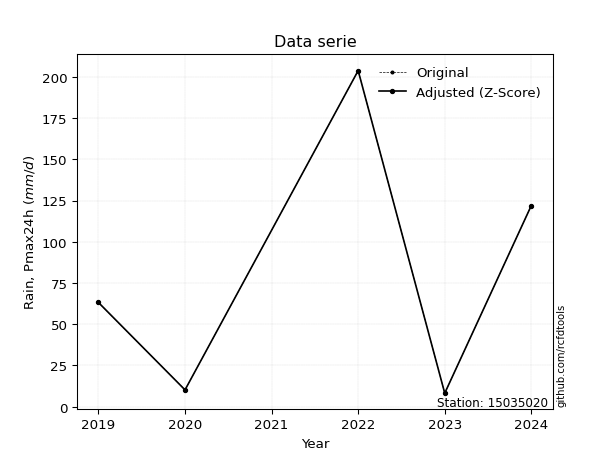</img>

</div>

> If Z-Score is active, values out of range or outliers are replaced with the station mean value.


### 4. Active continuous probability distributions from SciPy (45 of 104 available)

[scipy.stats](https://docs.scipy.org/doc/scipy/reference/stats.html) is a Python´s powerful submodule within the SciPy library for comprehensive statistical analysis, offering over 130 probability distributions (like Normal, Poisson), functions for descriptive stats (mean, variance), hypothesis testing (t-tests, chi-square), random variable generation, and statistical tests, making it essential for data science, modeling, and research. It provides tools to explore, model, and draw conclusions from data efficiently, working seamlessly with NumPy.

<div align="center">

|   id | p_dist             |   n_parameter | fit_method   | label                                                                       | active   | ref                                                                                                        |
|-----:|:-------------------|--------------:|:-------------|:----------------------------------------------------------------------------|:---------|:-----------------------------------------------------------------------------------------------------------|
|    0 | alpha              |             3 | MLE          | Alpha                                                                       | True     | [:mortar_board:](https://docs.scipy.org/doc/scipy/reference/generated/scipy.stats.alpha.html)              |
|    1 | betaprime          |             4 | MLE          | Beta prime                                                                  | True     | [:mortar_board:](https://docs.scipy.org/doc/scipy/reference/generated/scipy.stats.betaprime.html)          |
|    2 | chi2               |             3 | MLE          | Chi²                                                                        | True     | [:mortar_board:](https://docs.scipy.org/doc/scipy/reference/generated/scipy.stats.chi2.html)               |
|    3 | crystalball        |             4 | MLE          | Crystalball                                                                 | True     | [:mortar_board:](https://docs.scipy.org/doc/scipy/reference/generated/scipy.stats.crystalball.html)        |
|    4 | erlang             |             3 | MLE          | Erlang                                                                      | True     | [:mortar_board:](https://docs.scipy.org/doc/scipy/reference/generated/scipy.stats.erlang.html)             |
|    5 | expon              |             2 | MLE          | Exponential                                                                 | True     | [:mortar_board:](https://docs.scipy.org/doc/scipy/reference/generated/scipy.stats.expon.html)              |
|    6 | exponnorm          |             3 | MLE          | Exponentially modified Normal                                               | True     | [:mortar_board:](https://docs.scipy.org/doc/scipy/reference/generated/scipy.stats.exponnorm.html)          |
|    7 | f                  |             4 | MLE          | F                                                                           | True     | [:mortar_board:](https://docs.scipy.org/doc/scipy/reference/generated/scipy.stats.f.html)                  |
|    8 | fatiguelife        |             3 | MLE          | Fatigue-life (Birnbaum-Saunders)                                            | True     | [:mortar_board:](https://docs.scipy.org/doc/scipy/reference/generated/scipy.stats.fatiguelife.html)        |
|    9 | fisk               |             3 | MLE          | Fisk                                                                        | True     | [:mortar_board:](https://docs.scipy.org/doc/scipy/reference/generated/scipy.stats.fisk.html)               |
|   10 | gamma              |             3 | MLE          | Gamma                                                                       | True     | [:mortar_board:](https://docs.scipy.org/doc/scipy/reference/generated/scipy.stats.gamma.html)              |
|   11 | genexpon           |             5 | MLE          | Generalized exponential                                                     | True     | [:mortar_board:](https://docs.scipy.org/doc/scipy/reference/generated/scipy.stats.genexpon.html)           |
|   12 | genlogistic        |             3 | MLE          | Generalized logistic                                                        | True     | [:mortar_board:](https://docs.scipy.org/doc/scipy/reference/generated/scipy.stats.genlogistic.html)        |
|   13 | gibrat             |             2 | MM           | Gibrat                                                                      | True     | [:mortar_board:](https://docs.scipy.org/doc/scipy/reference/generated/scipy.stats.gibrat.html)             |
|   14 | gompertz           |             3 | MLE          | Gompertz (or truncated Gumbel)                                              | True     | [:mortar_board:](https://docs.scipy.org/doc/scipy/reference/generated/scipy.stats.gompertz.html)           |
|   15 | gumbel_l           |             2 | MM           | Gumbel Left Skew                                                            | True     | [:mortar_board:](https://docs.scipy.org/doc/scipy/reference/generated/scipy.stats.gumbel_l.html)           |
|   16 | gumbel_r           |             2 | MM           | Gumbel Right Skew                                                           | True     | [:mortar_board:](https://docs.scipy.org/doc/scipy/reference/generated/scipy.stats.gumbel_r.html)           |
|   17 | halflogistic       |             2 | MM           | Half-logistic                                                               | True     | [:mortar_board:](https://docs.scipy.org/doc/scipy/reference/generated/scipy.stats.halflogistic.html)       |
|   18 | halfnorm           |             2 | MM           | Half Normal                                                                 | True     | [:mortar_board:](https://docs.scipy.org/doc/scipy/reference/generated/scipy.stats.halfnorm.html)           |
|   19 | hypsecant          |             2 | MM           | hyperbolic secant                                                           | True     | [:mortar_board:](https://docs.scipy.org/doc/scipy/reference/generated/scipy.stats.hypsecant.html)          |
|   20 | invgamma           |             3 | MLE          | Inverted gamma                                                              | True     | [:mortar_board:](https://docs.scipy.org/doc/scipy/reference/generated/scipy.stats.invgamma.html)           |
|   21 | invgauss           |             3 | MLE          | Inverse Gaussian                                                            | True     | [:mortar_board:](https://docs.scipy.org/doc/scipy/reference/generated/scipy.stats.invgauss.html)           |
|   22 | invweibull         |             3 | MLE          | Inverted Weibull                                                            | True     | [:mortar_board:](https://docs.scipy.org/doc/scipy/reference/generated/scipy.stats.invweibull.html)         |
|   23 | johnsonsu          |             4 | MLE          | Johnson Su                                                                  | True     | [:mortar_board:](https://docs.scipy.org/doc/scipy/reference/generated/scipy.stats.johnsonsu.html)          |
|   24 | kstwobign          |             2 | MLE          | Limiting distribution of scaled Kolmogorov-Smirnov two-sided test statistic | True     | [:mortar_board:](https://docs.scipy.org/doc/scipy/reference/generated/scipy.stats.kstwobign.html)          |
|   25 | laplace            |             2 | MM           | Laplace                                                                     | True     | [:mortar_board:](https://docs.scipy.org/doc/scipy/reference/generated/scipy.stats.laplace.html)            |
|   26 | laplace_asymmetric |             3 | MLE          | Asymmetric Laplace                                                          | True     | [:mortar_board:](https://docs.scipy.org/doc/scipy/reference/generated/scipy.stats.laplace_asymmetric.html) |
|   27 | loggamma           |             3 | MLE          | Log gamma                                                                   | True     | [:mortar_board:](https://docs.scipy.org/doc/scipy/reference/generated/scipy.stats.loggamma.html)           |
|   28 | logistic           |             2 | MM           | Logistic (or Sech-squared)                                                  | True     | [:mortar_board:](https://docs.scipy.org/doc/scipy/reference/generated/scipy.stats.logistic.html)           |
|   29 | lognorm            |             3 | MLE          | Log Normal                                                                  | True     | [:mortar_board:](https://docs.scipy.org/doc/scipy/reference/generated/scipy.stats.lognorm.html)            |
|   30 | maxwell            |             2 | MM           | Maxwell                                                                     | True     | [:mortar_board:](https://docs.scipy.org/doc/scipy/reference/generated/scipy.stats.maxwell.html)            |
|   31 | mielke             |             4 | MLE          | Mielke Beta-Kappa / Dagum                                                   | True     | [:mortar_board:](https://docs.scipy.org/doc/scipy/reference/generated/scipy.stats.mielke.html)             |
|   32 | moyal              |             2 | MM           | Moyal                                                                       | True     | [:mortar_board:](https://docs.scipy.org/doc/scipy/reference/generated/scipy.stats.moyal.html)              |
|   33 | nakagami           |             3 | MLE          | Nakagami                                                                    | True     | [:mortar_board:](https://docs.scipy.org/doc/scipy/reference/generated/scipy.stats.nakagami.html)           |
|   34 | ncf                |             5 | MLE          | Non-central F distribution                                                  | True     | [:mortar_board:](https://docs.scipy.org/doc/scipy/reference/generated/scipy.stats.ncf.html)                |
|   35 | nct                |             4 | MLE          | Non-central Student’s t                                                     | True     | [:mortar_board:](https://docs.scipy.org/doc/scipy/reference/generated/scipy.stats.nct.html)                |
|   36 | norm               |             2 | MM           | Normal                                                                      | True     | [:mortar_board:](https://docs.scipy.org/doc/scipy/reference/generated/scipy.stats.norm.html)               |
|   37 | pareto             |             3 | MLE          | Pareto                                                                      | True     | [:mortar_board:](https://docs.scipy.org/doc/scipy/reference/generated/scipy.stats.pareto.html)             |
|   38 | pearson3           |             3 | MM           | Pearson type III                                                            | True     | [:mortar_board:](https://docs.scipy.org/doc/scipy/reference/generated/scipy.stats.pearson3.html)           |
|   39 | rayleigh           |             2 | MM           | Rayleigh                                                                    | True     | [:mortar_board:](https://docs.scipy.org/doc/scipy/reference/generated/scipy.stats.rayleigh.html)           |
|   40 | rice               |             3 | MLE          | Rice                                                                        | True     | [:mortar_board:](https://docs.scipy.org/doc/scipy/reference/generated/scipy.stats.rice.html)               |
|   41 | t                  |             3 | MLE          | Student’s t                                                                 | True     | [:mortar_board:](https://docs.scipy.org/doc/scipy/reference/generated/scipy.stats.t.html)                  |
|   42 | truncnorm          |             4 | MLE          | Truncated normal                                                            | True     | [:mortar_board:](https://docs.scipy.org/doc/scipy/reference/generated/scipy.stats.truncnorm.html)          |
|   43 | wald               |             2 | MM           | Wald                                                                        | True     | [:mortar_board:](https://docs.scipy.org/doc/scipy/reference/generated/scipy.stats.wald.html)               |
|   44 | weibull_min        |             3 | MLE          | Weibull minimum                                                             | True     | [:mortar_board:](https://docs.scipy.org/doc/scipy/reference/generated/scipy.stats.weibull_min.html)        |

</div>

> **n_parameter:** # arguments & localization & scale.
>
> **Fit methods:** (MLE) maximum likelihood, (MM) L-moments.
>
>**Inactive:** foldnorm, gennorm, norminvgauss, powernorm, powerlognorm, skewnorm, genextreme, anglit, arcsine, argus, beta, bradford, burr, burr12, cauchy, cosine, halfcauchy, foldcauchy, skewcauchy, wrapcauchy, dgamma, gengamma, exponweib, exponpow, truncexpon, gausshyper, genhalflogistic, genhyperbolic, geninvgauss, halfgennorm, johnsonsb, kappa4, kappa3, ksone, kstwo, loglaplace, levy, levy_l, levy_stable, ncx2, genpareto, truncpareto, lomax, powerlaw, rdist, rel_breitwigner, recipinvgauss, semicircular, studentized_range, trapezoid, triang, truncweibull_min, tukeylambda, uniform, loguniform, vonmises, vonmises_line, weibull_max, dweibull, 


## B. Probability distributions vs. Empirical distributions

A continuous probability distribution (CPD) describes probabilities for variables that can take any value within a range (like rain any time), unlike discrete variables with specific outcomes (like temperature). It uses a Probability Density Function (PDF), a curve where the total area under it equals 1, and the probability of the variable falling within an interval (a to b) is found by calculating the area under the curve between those points. A key feature is that the probability of hitting any single exact value is zero, so probabilities are always expressed for ranges, e.g., $P(a ≤ X ≤ b)$.

<div align="center">

Distributions parameters
|    |   station | p_dist                |   n |              loc |          scale | shape                  | shape1              | shape2                | shape3   |
|---:|----------:|:----------------------|----:|-----------------:|---------------:|:-----------------------|:--------------------|:----------------------|:---------|
|  0 |  15035020 | alpha                 |   6 |     -0.0390154   |   15.5509      | 1.2475709538744548e-10 |                     |                       |          |
|  1 |  15035020 | betaprime             |   6 |      8.19927     | 1515.51        | 0.6646209882099166     | 22.206930938215002  |                       |          |
|  2 |  15035020 | chi2                  |   6 |      8.2         |    3.44455     | 1.389208182245162      |                     |                       |          |
|  3 |  15035020 | crystalball           |   6 |     79.0667      |   67.7787      | 4891.060199657113      | 7886.074884760099   |                       |          |
|  4 |  15035020 | erlang                |   6 |      8.2         |   78.948       | 0.46349976469613663    |                     |                       |          |
|  5 |  15035020 | expon                 |   6 |      8.2         |   70.8667      |                        |                     |                       |          |
|  6 |  15035020 | exponnorm             |   6 |      8.12535     |    0.0234833   | 2995.557918235021      |                     |                       |          |
|  7 |  15035020 | f                     |   6 |     -0.382419    |   77.6883      | 2.130796292224054      | 60.37922960130123   |                       |          |
|  8 |  15035020 | fatiguelife           |   6 |      8.2         |    0.000306432 | 413.40179435815924     |                     |                       |          |
|  9 |  15035020 | fisk                  |   6 |      8.2         |   57.6963      | 0.8459790737786366     |                     |                       |          |
| 10 |  15035020 | gamma                 |   6 |      8.2         |   52.3317      | 0.3054989706973958     |                     |                       |          |
| 11 |  15035020 | genexpon              |   6 |      8.2         |  518.943       | 6.992121826708491      | 124.39377853779524  | 0.020356173295684527  |          |
| 12 |  15035020 | genlogistic           |   6 |   -297.338       |   50.6644      | 911.7925205400463      |                     |                       |          |
| 13 |  15035020 | gibrat                |   6 |     27.3601      |   31.3616      |                        |                     |                       |          |
| 14 |  15035020 | gompertz              |   6 |      8.2         |  916.054       | 11.984000921325169     |                     |                       |          |
| 15 |  15035020 | gumbel_l              |   6 |    109.571       |   52.8469      |                        |                     |                       |          |
| 16 |  15035020 | gumbel_r              |   6 |     48.5626      |   52.8469      |                        |                     |                       |          |
| 17 |  15035020 | halflogistic          |   6 |     -1.26687     |   57.9484      |                        |                     |                       |          |
| 18 |  15035020 | halfnorm              |   6 |    -10.6458      |  112.438       |                        |                     |                       |          |
| 19 |  15035020 | hypsecant             |   6 |     79.0667      |   43.1493      |                        |                     |                       |          |
| 20 |  15035020 | invgamma              |   6 |     -0.0403745   |   19.4652      | 0.8527148963242817     |                     |                       |          |
| 21 |  15035020 | invgauss              |   6 |      3.39076     |   18.6701      | 4.053310202302744      |                     |                       |          |
| 22 |  15035020 | invweibull            |   6 |      8.2         |    6.68534     | 0.06933262584323627    |                     |                       |          |
| 23 |  15035020 | johnsonsu             |   6 |      8.2         |    5.48349e-11 | -1.616686723206379     | 0.08266550594501514 |                       |          |
| 24 |  15035020 | kstwobign             |   6 |   -129.778       |  239.806       |                        |                     |                       |          |
| 25 |  15035020 | laplace               |   6 |     79.0667      |   47.9268      |                        |                     |                       |          |
| 26 |  15035020 | laplace_asymmetric    |   6 |     63.2         |   49.9981      | 0.8538185234612186     |                     |                       |          |
| 27 |  15035020 | loggamma              |   6 | -16907.1         | 2389.51        | 1222.960552917008      |                     |                       |          |
| 28 |  15035020 | logistic              |   6 |     79.0667      |   37.3684      |                        |                     |                       |          |
| 29 |  15035020 | lognorm               |   6 |      8.2         |    0.0796713   | 14.13362803343412      |                     |                       |          |
| 30 |  15035020 | maxwell               |   6 |    -81.5405      |  100.646       |                        |                     |                       |          |
| 31 |  15035020 | mielke                |   6 |     -0.0483597   |    0.162024    | 73.26390214682479      | 0.8790318520873412  |                       |          |
| 32 |  15035020 | moyal                 |   6 |     40.3064      |   30.5111      |                        |                     |                       |          |
| 33 |  15035020 | nakagami              |   6 |      8.2         |  101.077       | 0.188364344629526      |                     |                       |          |
| 34 |  15035020 | ncf                   |   6 |     -0.030896    |    5.51092e-07 | 5.849302175785175e-08  | 9.282025876367586   | 6.78433140585965      |          |
| 35 |  15035020 | nct                   |   6 |      0.0162693   |    0.282318    | 0.6339161481751256     | 54.73613901473925   |                       |          |
| 36 |  15035020 | norm                  |   6 |     79.0667      |   67.7787      |                        |                     |                       |          |
| 37 |  15035020 | pareto                |   6 |      7.97607     |    0.223927    | 0.22740706766660532    |                     |                       |          |
| 38 |  15035020 | pearson3              |   6 |     79.0667      |   67.7787      | 0.7127245231816288     |                     |                       |          |
| 39 |  15035020 | rayleigh              |   6 |    -50.598       |  103.457       |                        |                     |                       |          |
| 40 |  15035020 | rice                  |   6 |    -33.0834      |   92.6596      | 0.0006821031221126797  |                     |                       |          |
| 41 |  15035020 | t                     |   6 |     79.0664      |   67.7782      | 38853904.12328288      |                     |                       |          |
| 42 |  15035020 | truncnorm             |   6 |     79.0667      |   67.7787      | -4669.875370383214     | 724.4149770454735   |                       |          |
| 43 |  15035020 | wald                  |   6 |     11.288       |   67.7787      |                        |                     |                       |          |
| 44 |  15035020 | weibull_min           |   6 |      8.2         |   76.3864      | 0.35273307844869023    |                     |                       |          |
| 45 |  15035020 | logalpha              |   6 |    -19.1883      |  430.596       | 18.77163089917248      |                     |                       |          |
| 46 |  15035020 | logbetaprime          |   6 |      0.439197    |    3.4854e+08  | 6.370722027956667      | 655507024.5036526   |                       |          |
| 47 |  15035020 | logchi2               |   6 |      2.10413     |    0.98038     | 1.1994211337351133     |                     |                       |          |
| 48 |  15035020 | logcrystalball        |   6 |      3.81645     |    1.20077     | 560.6384875507888      | 57.680124518278035  |                       |          |
| 49 |  15035020 | logerlang             |   6 |    -16.0441      |    0.0736894   | 269.3939967813326      |                     |                       |          |
| 50 |  15035020 | logexpon              |   6 |      2.10413     |    1.71231     |                        |                     |                       |          |
| 51 |  15035020 | logexponnorm          |   6 |      3.81535     |    1.20077     | 0.0009061713158514894  |                     |                       |          |
| 52 |  15035020 | logf                  |   6 |   -691.229       |  695.047       | 1914236.60443387       | 1017895.5834994742  |                       |          |
| 53 |  15035020 | logfatiguelife        |   6 |      2.10413     |    1.68603e-06 | 1008.2496683743661     |                     |                       |          |
| 54 |  15035020 | logfisk               |   6 |     -5.60537e+07 |    5.60537e+07 | 76881105.023529        |                     |                       |          |
| 55 |  15035020 | loggamma              |   6 |    -15.1179      |    0.0784692   | 241.2326437864989      |                     |                       |          |
| 56 |  15035020 | loggenexpon           |   6 |      2.10413     |    0.126352    | 0.04706120867935287    | 4.29933250232825    | 0.0006131399622024509 |          |
| 57 |  15035020 | loggenlogistic        |   6 |      5.31721     |    7.98906e-06 | 5.300805510524149e-06  |                     |                       |          |
| 58 |  15035020 | loggibrat             |   6 |      2.90036     |    0.555627    |                        |                     |                       |          |
| 59 |  15035020 | loggompertz           |   6 |      2.10413     |    1.61556     | 0.37570846630198923    |                     |                       |          |
| 60 |  15035020 | loggumbel_l           |   6 |      4.35686     |    0.93624     |                        |                     |                       |          |
| 61 |  15035020 | loggumbel_r           |   6 |      3.27603     |    0.93624     |                        |                     |                       |          |
| 62 |  15035020 | loghalflogistic       |   6 |      2.39324     |    1.02662     |                        |                     |                       |          |
| 63 |  15035020 | loghalfnorm           |   6 |      2.22713     |    1.99193     |                        |                     |                       |          |
| 64 |  15035020 | loghypsecant          |   6 |      3.81645     |    0.764436    |                        |                     |                       |          |
| 65 |  15035020 | loginvgamma           |   6 |    -12.3654      | 2815.9         | 174.88012570935712     |                     |                       |          |
| 66 |  15035020 | loginvgauss           |   6 |     -4.2115      |  318.391       | 0.02526875132443348    |                     |                       |          |
| 67 |  15035020 | loginvweibull         |   6 |     -8.78918e+07 |    8.78918e+07 | 81575378.57625745      |                     |                       |          |
| 68 |  15035020 | logjohnsonsu          |   6 |      5.97067     |    0.030171    | 7.734249923100672      | 1.6163881597234249  |                       |          |
| 69 |  15035020 | logkstwobign          |   6 |     -0.683176    |    5.11529     |                        |                     |                       |          |
| 70 |  15035020 | loglaplace            |   6 |      3.81645     |    0.849075    |                        |                     |                       |          |
| 71 |  15035020 | loglaplace_asymmetric |   6 |      4.20469     |    0.897429    | 1.240016887076713      |                     |                       |          |
| 72 |  15035020 | logloggamma           |   6 |      5.31726     |    6.66252e-06 | 4.434542455762084e-06  |                     |                       |          |
| 73 |  15035020 | loglogistic           |   6 |      3.81645     |    0.662021    |                        |                     |                       |          |
| 74 |  15035020 | loglognorm            |   6 |      2.10413     |    0.00391609  | 13.360750884573005     |                     |                       |          |
| 75 |  15035020 | logmaxwell            |   6 |      0.971116    |    1.78305     |                        |                     |                       |          |
| 76 |  15035020 | logmielke             |   6 |      2.10413     |    3.28755     | 0.8122820152172803     | 17.36828010522469   |                       |          |
| 77 |  15035020 | logmoyal              |   6 |      3.12977     |    0.540538    |                        |                     |                       |          |
| 78 |  15035020 | lognakagami           |   6 |      2.10413     |    2.11471     | 0.31779290190010656    |                     |                       |          |
| 79 |  15035020 | logncf                |   6 |     -0.908876    |    6.961e-07   | 9.766445045936506e-06  | 232.47945862143385  | 65.80537543908224     |          |
| 80 |  15035020 | lognct                |   6 |    -73.4504      |    1.18337     | 68520.83081344047      | 65.29342803565453   |                       |          |
| 81 |  15035020 | lognorm               |   6 |      3.81645     |    1.20077     |                        |                     |                       |          |
| 82 |  15035020 | logpareto             |   6 |      2.09951     |    0.00462173  | 0.20683929315143845    |                     |                       |          |
| 83 |  15035020 | logpearson3           |   6 |      3.81645     |    1.20078     | -0.37723472494748556   |                     |                       |          |
| 84 |  15035020 | lograyleigh           |   6 |      1.5193      |    1.83286     |                        |                     |                       |          |
| 85 |  15035020 | logrice               |   6 |      1.36754     |    1.3922      | 1.3557810598305122     |                     |                       |          |
| 86 |  15035020 | logt                  |   6 |      3.81647     |    1.20072     | 25988960.68466059      |                     |                       |          |
| 87 |  15035020 | logtruncnorm          |   6 |     -0.196436    |    2.91818     | 0.7883573905165089     | 4.025027385194573   |                       |          |
| 88 |  15035020 | logwald               |   6 |      2.61566     |    1.20078     |                        |                     |                       |          |
| 89 |  15035020 | logweibull_min        |   6 |     -1.58509e+07 |    1.58509e+07 | 16644685.709062692     |                     |                       |          |

</div>

> **loc** (Location parameter): This shifts the distribution along the x-axis. For many common distributions, like the normal (Gaussian) distribution, loc represents the mean $μ$. For others, like the uniform distribution, it might represent the minimum value, or for the beta distribution, the left end of the support interval.
>
> **scale** (Scale parameter): This determines the width or spread of the distribution. For the normal distribution, scale represents the standard deviation $σ$. For a uniform distribution, it defines the length of the interval (from $loc$ to $loc + scale$).
>
> **shape** (Shape parameters): Refers to parameters that define the specific form of a probability distribution, distinct from its location (loc) and scale (scale). These parameters are required arguments for most distribution functions. For example, a normal (Gaussian) distribution is fully defined by its location (mean) and scale (standard deviation), so it has no specific shape parameters beyond loc and scale. However, other distributions have intrinsic properties that need specification, as Gamma distribution that takes a shape parameter, often named $a$ or $alpha$.


### 0. Cumulative distribution values - CDF (90 evaluated)

> Ordered by x ascending and calculating $log(f(x))$ separately. 

|   id |   Station |   date |     x |   count |    mean |     std |    zscore |   Value_initial |   station |   m |     alpha |   alpha_pdf |   betaprime |   betaprime_pdf |        chi2 |       chi2_pdf |   crystalball |   crystalball_pdf |      erlang |   erlang_pdf |     expon |   expon_pdf |   exponnorm |   exponnorm_pdf |        f |       f_pdf |   fatiguelife |   fatiguelife_pdf |        fisk |    fisk_pdf |       gamma |   gamma_pdf |    genexpon |   genexpon_pdf |   genlogistic |   genlogistic_pdf |   gibrat |   gibrat_pdf |   gompertz |   gompertz_pdf |   gumbel_l |   gumbel_l_pdf |   gumbel_r |   gumbel_r_pdf |   halflogistic |   halflogistic_pdf |   halfnorm |   halfnorm_pdf |   hypsecant |   hypsecant_pdf |   invgamma |   invgamma_pdf |   invgauss |   invgauss_pdf |   invweibull |   invweibull_pdf |   johnsonsu |   johnsonsu_pdf |   kstwobign |   kstwobign_pdf |   laplace |   laplace_pdf |   laplace_asymmetric |   laplace_asymmetric_pdf |   loggamma |   loggamma_pdf |   logistic |   logistic_pdf |   lognorm |   lognorm_pdf |   maxwell |   maxwell_pdf |    mielke |   mielke_pdf |     moyal |   moyal_pdf |   nakagami |   nakagami_pdf |       ncf |     ncf_pdf |       nct |     nct_pdf |     norm |   norm_pdf |   pareto |   pareto_pdf |   pearson3 |   pearson3_pdf |   rayleigh |   rayleigh_pdf |      rice |   rice_pdf |        t |      t_pdf |   truncnorm |   truncnorm_pdf |     wald |    wald_pdf |   weibull_min |   weibull_min_pdf |   logalpha |   logalpha_pdf |   logbetaprime |   logbetaprime_pdf |     logchi2 |    logchi2_pdf |   logcrystalball |   logcrystalball_pdf |   logerlang |   logerlang_pdf |   logexpon |   logexpon_pdf |   logexponnorm |   logexponnorm_pdf |      logf |   logf_pdf |   logfatiguelife |   logfatiguelife_pdf |   logfisk |   logfisk_pdf |   loggenexpon |   loggenexpon_pdf |   loggenlogistic |   loggenlogistic_pdf |   loggibrat |   loggibrat_pdf |   loggompertz |   loggompertz_pdf |   loggumbel_l |   loggumbel_l_pdf |   loggumbel_r |   loggumbel_r_pdf |   loghalflogistic |   loghalflogistic_pdf |   loghalfnorm |   loghalfnorm_pdf |   loghypsecant |   loghypsecant_pdf |   loginvgamma |   loginvgamma_pdf |   loginvgauss |   loginvgauss_pdf |   loginvweibull |   loginvweibull_pdf |   logjohnsonsu |   logjohnsonsu_pdf |   logkstwobign |   logkstwobign_pdf |   loglaplace |   loglaplace_pdf |   loglaplace_asymmetric |   loglaplace_asymmetric_pdf |   logloggamma |   logloggamma_pdf |   loglogistic |   loglogistic_pdf |   loglognorm |   loglognorm_pdf |   logmaxwell |   logmaxwell_pdf |   logmielke |   logmielke_pdf |   logmoyal |   logmoyal_pdf |   lognakagami |   lognakagami_pdf |    logncf |   logncf_pdf |    lognct |   lognct_pdf |   logpareto |   logpareto_pdf |   logpearson3 |   logpearson3_pdf |   lograyleigh |   lograyleigh_pdf |   logrice |   logrice_pdf |      logt |   logt_pdf |   logtruncnorm |   logtruncnorm_pdf |   logwald |   logwald_pdf |   logweibull_min |   logweibull_min_pdf |
|-----:|----------:|-------:|------:|--------:|--------:|--------:|----------:|----------------:|----------:|----:|----------:|------------:|------------:|----------------:|------------:|---------------:|--------------:|------------------:|------------:|-------------:|----------:|------------:|------------:|----------------:|---------:|------------:|--------------:|------------------:|------------:|------------:|------------:|------------:|------------:|---------------:|--------------:|------------------:|---------:|-------------:|-----------:|---------------:|-----------:|---------------:|-----------:|---------------:|---------------:|-------------------:|-----------:|---------------:|------------:|----------------:|-----------:|---------------:|-----------:|---------------:|-------------:|-----------------:|------------:|----------------:|------------:|----------------:|----------:|--------------:|---------------------:|-------------------------:|-----------:|---------------:|-----------:|---------------:|----------:|--------------:|----------:|--------------:|----------:|-------------:|----------:|------------:|-----------:|---------------:|----------:|------------:|----------:|------------:|---------:|-----------:|---------:|-------------:|-----------:|---------------:|-----------:|---------------:|----------:|-----------:|---------:|-----------:|------------:|----------------:|---------:|------------:|--------------:|------------------:|-----------:|---------------:|---------------:|-------------------:|------------:|---------------:|-----------------:|---------------------:|------------:|----------------:|-----------:|---------------:|---------------:|-------------------:|----------:|-----------:|-----------------:|---------------------:|----------:|--------------:|--------------:|------------------:|-----------------:|---------------------:|------------:|----------------:|--------------:|------------------:|--------------:|------------------:|--------------:|------------------:|------------------:|----------------------:|--------------:|------------------:|---------------:|-------------------:|--------------:|------------------:|--------------:|------------------:|----------------:|--------------------:|---------------:|-------------------:|---------------:|-------------------:|-------------:|-----------------:|------------------------:|----------------------------:|--------------:|------------------:|--------------:|------------------:|-------------:|-----------------:|-------------:|-----------------:|------------:|----------------:|-----------:|---------------:|--------------:|------------------:|----------:|-------------:|----------:|-------------:|------------:|----------------:|--------------:|------------------:|--------------:|------------------:|----------:|--------------:|----------:|-----------:|---------------:|-------------------:|----------:|--------------:|-----------------:|---------------------:|
|    0 |  15035020 |   2023 |   8.2 |       6 | 79.0667 | 74.2479 | -0.954461 |             8.2 |  15035020 |   1 | 0.0590965 | 0.0307854   | 0.000546576 |     0.499533    | 1.63744e-11 | 6402.82        |      0.147882 |        0.00340747 | 2.17022e-08 |  5.66269e+06 | 0         |  0.014111   |   0.0010607 |     0.01419     | 0.093518 | 0.0109391   |     0.0194663 |       1.16176e+08 | 1.07527e-14 | 5.1209      | 1.03763e-05 | 1.78452e+09 | 8.71206e-15 |    0.0134738   |      0.111994 |       0.00483368  | 0        |  0           | 7.0218e-11 |    0.0130822   |   0.136595 |    0.00239957  |   0.116911 |     0.00474826 |      0.0815025 |        0.00857105  |   0.13311  |     0.00699724 |    0.121696 |      0.00275214 |   0.071424 |    0.0214395   |  0.0620955 |    0.029793    |  6.02383e-06 |      2.82603e+09 |   0.0570546 |     1.56907e+08 |    0.104883 |     0.00490534  |  0.113973 |   0.00237807  |             0.116252 |               0.0027232  |  0.0772602 |       0.126547 |   0.130513 |    0.00303677  | 0.0769331 |      0.120193 |  0.149346 |    0.00423538 | 0.0748009 |  0.0203515   | 0.0905713 | 0.00528447  | 3.8626e-07 |    8.19178e+07 | 0.0913805 | 0.00782012  | 0.0749289 | 0.0290569   | 0.147882 | 0.00340747 | 0        |  1.01554     |   0.13771  |     0.00444311 |   0.149133 |     0.00467413 | 0.0944857 | 0.00435402 | 0.147881 | 0.00340749 |    0.147882 |      0.00340747 | 0        | 0           |   1.35775e-06 |       2.69609e+08 |  0.0733449 |       0.132173 |      0.0715548 |           0.165063 | 4.63948e-10 | 626529         |        0.0769331 |             0.120193 |   0.0763249 |        0.125935 |   0        |      0.584006  |       0.076933 |           0.120194 | 0.0773524 |   0.120516 |         0.014023 |          1.14193e+11 |  0.077063 |     0.0975514 |   6.30798e-07 |          0.37246  |         0        |            0.0786996 |    0        |       0         |   4.80177e-08 |          0.232556 |     0.0862174 |         0.0879999 |     0.0303089 |          0.113186 |          0        |              0        |     0         |          0        |      0.0675215 |          0.0876675 |     0.0715778 |          0.12938  |     0.0731997 |          0.139883 |       0.0687866 |            0.170892 |       0.109184 |          0.0781859 |      0.0721515 |           0.189229 |    0.0665484 |        0.0783775 |               0.0917605 |                   0.0824571 |      0.117815 |         0.0784171 |     0.0700129 |          0.098352 |    0.0128405 |      5.58198e+12 |    0.0605401 |         0.147654 | 3.58974e-06 |        4.47875  | 0.00981193 |      0.0679219 |   8.42209e-11 |    120538         | 0.0690629 |     0.139132 | 0.0770098 |     0.120356 |    0        |      44.7537    |     0.0842995 |          0.109941 |     0.0496335 |          0.16545  | 0.0554433 |      0.1493   | 0.0769212 |   0.120185 |     6.6843e-08 |           0.46555  |  0        |     0         |         0.08678  |             0.087052 |
|    1 |  15035020 |   2020 |  10.2 |       6 | 79.0667 | 74.2479 | -0.927524 |            10.2 |  15035020 |   2 | 0.128815  | 0.0373491   | 0.104333    |     0.0340344   | 0.415857    |    0.121234    |      0.154802 |        0.00351271 | 0.203891    |  0.0464395   | 0.0278275 |  0.0137183  |   0.0290616 |     0.0138024   | 0.115243 | 0.0107808   |     0.577457  |       0.019125    | 0.0549808   | 0.0219777   | 0.407756    | 0.0604842   | 0.026606    |    0.0131336   |      0.121887 |       0.00505748  | 0        |  0           | 0.0258529  |    0.0127718   |   0.141472 |    0.00247804  |   0.126611 |     0.00495127 |      0.0986188 |        0.00854445  |   0.147083 |     0.00697531 |    0.12732  |      0.00287264 |   0.116005 |    0.0227371   |  0.124147  |    0.0311723   |  0.337136    |      0.0127072   |   0.674014  |     0.0148947   |    0.114914 |     0.0051241   |  0.11883  |   0.00247941  |             0.121828 |               0.00285382 |  0.108639  |       0.161507 |   0.136707 |    0.00315824  | 0.106704  |      0.153205 |  0.15793  |    0.00434767 | 0.116695  |  0.0212271   | 0.101459  | 0.00560053  | 0.180803   |    0.0340548   | 0.107321  | 0.00811226  | 0.13522   | 0.0303296   | 0.154802 | 0.00351271 | 0.406703 |  0.0606674   |   0.146739 |     0.00458511 |   0.158588 |     0.00477942 | 0.103361  | 0.00452021 | 0.154801 | 0.00351273 |    0.154802 |      0.00351271 | 0        | 0           |   0.241705    |       0.0370029   |  0.106357  |       0.170794 |      0.112785  |           0.212176 | 0.287893    |      0.737481  |        0.106704  |             0.153205 |   0.107598  |        0.16117  |   0.119673 |      0.514116  |       0.106704 |           0.153205 | 0.107184  |   0.153426 |         0.639395 |          0.306021    |  0.101234 |     0.124792  |   0.0816923   |          0.375109 |         0        |            0.0909629 |    0        |       0         |   0.0528942   |          0.252114 |     0.107593  |         0.108504  |     0.0627062 |          0.185478 |          0        |              0        |     0.0381433 |          0.400101 |      0.0895758 |          0.115638  |     0.103931  |          0.167576 |     0.108122  |          0.180375 |       0.112375  |            0.227989 |       0.127776 |          0.0926079 |      0.119692  |           0.244799 |    0.0860542 |        0.101351  |               0.111643  |                   0.100324  |      0.136235 |         0.0906776 |     0.0947634 |          0.129578 |    0.618264  |      0.130754    |    0.0977166 |         0.192852 | 0.11046     |        0.411102 | 0.0348327  |      0.168033  |   0.183134    |         0.531944  | 0.104041  |     0.181683 | 0.106819  |     0.153389 |    0.551424 |       0.416301  |     0.111201  |          0.137159 |     0.09153   |          0.217178 | 0.0925962 |      0.190758 | 0.106691  |   0.153198 |     0.0985799  |           0.437668 |  0        |     0         |         0.107885 |             0.106944 |
|    2 |  15035020 |   2019 |  63.2 |       6 | 79.0667 | 74.2479 | -0.213699 |            63.2 |  15035020 |   3 | 0.805754  | 0.0030102   | 0.708616    |     0.005108    | 0.999866    |    2.00861e-05 |      0.407456 |        0.00572686 | 0.78156     |  0.00400988  | 0.539805  |  0.00649381 |   0.542929  |     0.00649752  | 0.54727  | 0.00578339  |     0.847271  |       0.00219842  | 0.489879    | 0.00384378  | 0.919944    | 0.00219879  | 0.530116    |    0.00657385  |      0.477145 |       0.00696569  | 0.553092 |  0.0110325   | 0.52363    |    0.0066176   |   0.340214 |    0.00519171  |   0.468569 |     0.00672148 |      0.505185  |        0.0064263   |   0.488671 |     0.00571955 |    0.385504 |      0.00690484 |   0.662867 |    0.00383423  |  0.713124  |    0.00370128  |  0.421447    |      0.000459053 |   0.765772  |     0.000461037 |    0.463526 |     0.00674995  |  0.359081 |   0.00749228  |             0.421633 |               0.00987679 |  0.615833  |       0.309763 |   0.395416 |    0.00639745  | 0.608228  |      0.319935 |  0.441625 |    0.00582954 | 0.645141  |  0.00391946  | 0.491973  | 0.00709545  | 0.62467    |    0.0040822   | 0.539998  | 0.00647599  | 0.683552  | 0.00312943  | 0.407456 | 0.00572686 | 0.714216 |  0.00117683  |   0.451854 |     0.00617232 |   0.453895 |     0.00580613 | 0.417178  | 0.00653592 | 0.407457 | 0.00572692 |    0.407456 |      0.00572686 | 0.555669 | 0.00847263  |   0.58959     |       0.00234414  |  0.624957  |       0.29988  |      0.641572  |           0.261031 | 0.81282     |      0.118859  |        0.608228  |             0.319935 |   0.617491  |        0.311866 |   0.69658  |      0.177199  |       0.60823  |           0.319936 | 0.60734   |   0.31864  |         0.862485 |          0.0587632   |  0.578843 |     0.334365  |   0.668392    |          0.234776 |         0        |            0.305099  |    0.790325 |       0.231101  |   0.614886    |          0.317025 |     0.550042  |         0.383809  |     0.673858  |          0.284111 |          0.693051 |              0.253103 |     0.664692  |          0.25182  |      0.633278  |          0.380428  |     0.6201    |          0.302336 |     0.625339  |          0.286268 |       0.668847  |            0.249678 |       0.493277 |          0.353364  |      0.665249  |           0.243597 |    0.66096   |        0.399305  |               0.574961  |                   0.516667  |      0.45869  |         0.305302  |     0.62205   |          0.35513  |    0.680211  |      0.0131029   |    0.634014  |         0.290663 | 0.679252    |        0.270106 | 0.696159   |      0.267055  |   0.709219    |         0.175684  | 0.631725  |     0.289673 | 0.608311  |     0.319605 |    0.716438 |       0.0286554 |     0.585661  |          0.335963 |     0.641974  |          0.279973 | 0.623478  |      0.301171 | 0.608226  |   0.319951 |     0.682527   |           0.209904 |  0.758424 |     0.224117  |         0.539293 |             0.374924 |
|    3 |  15035020 |   2025 |  67   |       6 | 79.0667 | 74.2479 | -0.162519 |            67   |  15035020 |   4 | 0.816563  | 0.00268755  | 0.72729     |     0.00472624  | 0.999924    |    1.13365e-05 |      0.42935  |        0.00579341 | 0.796172    |  0.0036869   | 0.563832  |  0.00615477 |   0.566965  |     0.00615584  | 0.568721 | 0.00550905  |     0.855339  |       0.00205044  | 0.504008    | 0.00359662  | 0.92782     | 0.00195208  | 0.554474    |    0.00624895  |      0.503341 |       0.00681755  | 0.592605 |  0.00979177  | 0.548174   |    0.00630273  |   0.360356 |    0.00540847  |   0.493874 |     0.00659293 |      0.529199  |        0.00621198  |   0.510162 |     0.0055908  |    0.412123 |      0.0070976  |   0.676791 |    0.0035019   |  0.726574  |    0.00338519  |  0.423134    |      0.000429112 |   0.767463  |     0.000429512 |    0.488936 |     0.00662038  |  0.388711 |   0.00811051  |             0.457973 |               0.00925621 |  0.633769  |       0.304522 |   0.419966 |    0.00651874  | 0.626777  |      0.315317 |  0.463747 |    0.00581103 | 0.659398  |  0.00359104  | 0.518482  | 0.00685398  | 0.639801   |    0.00388461  | 0.564     | 0.00615765  | 0.694901  | 0.00285057  | 0.42935  | 0.00579341 | 0.718508 |  0.00108453  |   0.475209 |     0.00611647 |   0.475873 |     0.00575855 | 0.441962  | 0.00650496 | 0.429351 | 0.00579346 |    0.42935  |      0.00579341 | 0.586464 | 0.00774748  |   0.598213    |       0.00219776  |  0.642289  |       0.293728 |      0.656619  |           0.254362 | 0.819619    |      0.114077  |        0.626777  |             0.315317 |   0.635547  |        0.306514 |   0.706752 |      0.171258  |       0.626779 |           0.315318 | 0.625814  |   0.31407  |         0.865863 |          0.0569622   |  0.598233 |     0.329655  |   0.68191     |          0.228242 |         0        |            0.317151  |    0.803267 |       0.212518  |   0.633281    |          0.312992 |     0.572581  |         0.388044  |     0.690133  |          0.273381 |          0.70754  |              0.24322  |     0.679188  |          0.244703 |      0.655132  |          0.367918  |     0.637582  |          0.296374 |     0.641875  |          0.280066 |       0.683189  |            0.241578 |       0.514246 |          0.364863  |      0.679269  |           0.236637 |    0.683491  |        0.372769  |               0.605933  |                   0.544499  |      0.476867 |         0.3174    |     0.642551  |          0.346936 |    0.680965  |      0.0127261   |    0.650799  |         0.284223 | 0.69498     |        0.268635 | 0.711399   |      0.254998  |   0.719338    |         0.170925  | 0.648446  |     0.283011 | 0.62684   |     0.314979 |    0.718083 |       0.027699  |     0.605226  |          0.334056 |     0.658127  |          0.273284 | 0.6409    |      0.295511 | 0.626776  |   0.315332 |     0.694602   |           0.203706 |  0.771086 |     0.209792  |         0.561325 |             0.379567 |
|    4 |  15035020 |   2024 | 122   |       6 | 79.0667 | 74.2479 |  0.578243 |           122   |  15035020 |   5 | 0.898603  | 0.000826368 | 0.8888      |     0.00172682  | 1           |    3.15981e-09 |      0.736775 |        0.00481603 | 0.919255    |  0.00128901  | 0.799278  |  0.00283239 |   0.801862  |     0.00281664  | 0.785802 | 0.00270953  |     0.929774  |       0.000871783 | 0.639831    | 0.00171312  | 0.981862    | 0.00043142  | 0.796911    |    0.00295321  |      0.793033 |       0.00362923  | 0.865311 |  0.00229053  | 0.795089   |    0.00303528  |   0.717804 |    0.00675577  |   0.779449 |     0.00367503 |      0.787035  |        0.00328375  |   0.76189  |     0.00353844 |    0.774549 |      0.00479889 |   0.794561 |    0.00131558  |  0.841612  |    0.00130108  |  0.439736    |      0.000220109 |   0.783803  |     0.000212935 |    0.779724 |     0.00384213  |  0.795862 |   0.00425938  |             0.788107 |               0.0036185  |  0.794446  |       0.22567  |   0.759314 |    0.00489067  | 0.794589  |      0.2369   |  0.748081 |    0.00419516 | 0.781756  |  0.00138424  | 0.793188  | 0.00331218  | 0.799292   |    0.00216074  | 0.797401  | 0.00272865  | 0.790762  | 0.00108315  | 0.736775 | 0.00481603 | 0.757655 |  0.000483328 |   0.760611 |     0.0039896  |   0.751326 |     0.00400999 | 0.753556  | 0.00445147 | 0.736778 | 0.00481604 |    0.736775 |      0.00481603 | 0.835304 | 0.00249359  |   0.683673    |       0.00112852  |  0.795141  |       0.21245  |      0.787497  |           0.182151 | 0.87569     |      0.0760005 |        0.794589  |             0.2369   |   0.796964  |        0.226059 |   0.793354 |      0.120682  |       0.794591 |           0.2369   | 0.793119  |   0.236545 |         0.895275 |          0.0421843   |  0.772086 |     0.241353  |   0.799068    |          0.163831 |         0        |            0.472027  |    0.89092  |       0.0981819 |   0.80259     |          0.244164 |     0.800557  |         0.343446  |     0.8224    |          0.171754 |          0.825593 |              0.15507  |     0.80422   |          0.173482 |      0.829302  |          0.21275   |     0.792352  |          0.215832 |     0.787536  |          0.203416 |       0.803774  |            0.162957 |       0.759802 |          0.430762  |      0.799962  |           0.167291 |    0.843745  |        0.18403   |               0.827844  |                   0.237876  |      0.710627 |         0.472989  |     0.816342  |          0.22647  |    0.687644  |      0.00981228  |    0.798247  |         0.205155 | 0.850893    |        0.247892 | 0.831697   |      0.153351  |   0.808219    |         0.127142  | 0.794551  |     0.202217 | 0.794458  |     0.236637 |    0.732319 |       0.0204721 |     0.789739  |          0.268706 |     0.799284  |          0.196255 | 0.796182  |      0.218118 | 0.794595  |   0.236907 |     0.798913   |           0.146327 |  0.863856 |     0.112168  |         0.786928 |             0.345933 |
|    5 |  15035020 |   2022 | 203.8 |       6 | 79.0667 | 74.2479 |  1.67996  |           203.8 |  15035020 |   6 | 0.939188  | 0.000297754 | 0.966795    |     0.000469658 | 1           |    1.86676e-14 |      0.967138 |        0.00108243 | 0.976889    |  0.000342037 | 0.936715  |  0.00089301 |   0.938062  |     0.000880481 | 0.92292  | 0.000950243 |     0.973358  |       0.00030452  | 0.737466    | 0.000837372 | 0.997188    | 6.20422e-05 | 0.940088    |    0.000917005 |      0.954902 |       0.000869727 | 0.957952 |  0.000508591 | 0.942306   |    0.000934427 |   0.997389 |    0.000293866 |   0.948382 |     0.0009511  |      0.943543  |        0.000946765 |   0.94351  |     0.00115118 |    0.964682 |      0.00081684 |   0.86348  |    0.000542192 |  0.909966  |    0.000535363 |  0.453255    |      0.000127131 |   0.796695  |     0.000119486 |    0.958281 |     0.000967959 |  0.962959 |   0.000772868 |             0.947586 |               0.00089508 |  0.889791  |       0.146817 |   0.965708 |    0.000886214 | 0.894308  |      0.152153 |  0.954763 |    0.00114524 | 0.854761  |  0.000577895 | 0.945296  | 0.000895053 | 0.921357   |    0.00096681  | 0.926868  | 0.000836837 | 0.848748  | 0.000469853 | 0.967138 | 0.00108243 | 0.785699 |  0.000248864 |   0.95139  |     0.00106669 |   0.951357 |     0.00115614 | 0.961911  | 0.00105089 | 0.96714  | 0.0010824  |    0.967138 |      0.00108243 | 0.946389 | 0.000677405 |   0.751741    |       0.000623766 |  0.884967  |       0.139208 |      0.866123  |           0.126057 | 0.908852    |      0.0545652 |        0.894308  |             0.152153 |   0.892164  |        0.145961 |   0.846862 |      0.0894337 |       0.89431  |           0.152152 | 0.892881  |   0.152632 |         0.914525 |          0.0332935   |  0.872573 |     0.152504  |   0.870567    |          0.116343 |         0.999953 |            0.663391  |    0.929232 |       0.0560248 |   0.90647     |          0.158928 |     0.938516  |         0.183155  |     0.893125  |          0.107824 |          0.890439 |              0.100874 |     0.879162  |          0.120259 |      0.911188  |          0.114678  |     0.883747  |          0.141802 |     0.874525  |          0.137153 |       0.873127  |            0.109948 |       0.949681 |          0.256108  |      0.872424  |           0.116929 |    0.914615  |        0.100562  |               0.915276  |                   0.117067  |      0.999921 |         0.665542  |     0.906093  |          0.128529 |    0.692239  |      0.0081922   |    0.885483  |         0.136322 | 0.958243    |        0.144938 | 0.894814   |      0.0967314 |   0.865272    |         0.0961867 | 0.880381  |     0.134136 | 0.894092  |     0.152089 |    0.741767 |       0.0166    |     0.903186  |          0.170925 |     0.883139  |          0.132114 | 0.888839  |      0.143896 | 0.894316  |   0.152152 |     0.863432   |           0.1066   |  0.90945  |     0.0695799 |         0.92935  |             0.1966   |

An Empirical Distribution Function (EDF) is a step-function estimate of a true cumulative distribution function (CDF) based on observed sample data, representing the proportion of data points less than or equal to a given value. It is calculated by ordering your data and jumping up by $1/n$ (where $n$ is sample size) at each unique data point, allowing analysis without assuming an underlying population distribution, and it gets closer to the true CDF as the sample size grows.


### 1. Empirical - EDF California (1923)

California´s estimates the true probability distribution of water-related data (like rainfall, streamflow) using observed samples, crucial for risk assessment.

<div align="center">


$P=m/n$


</div>


**1.1. Empirical values**

<div align="center">

|                | 0                   | 1                  | 2              | 3                  | 4                  | 5              |
|:---------------|:--------------------|:-------------------|:---------------|:-------------------|:-------------------|:---------------|
| date           | 2023                | 2020               | 2019           | 2025               | 2024               | 2022           |
| x              | 8.2                 | 10.2               | 63.2           | 67.0               | 122.0              | 203.8          |
| m              | 1                   | 2                  | 3              | 4                  | 5                  | 6              |
| empirical_dist | edf_california      | edf_california     | edf_california | edf_california     | edf_california     | edf_california |
| empirical      | 0.16666666666666666 | 0.3333333333333333 | 0.5            | 0.6666666666666666 | 0.8333333333333334 | 1.0            |
| empirical_tr   | 1.2                 | 1.4999999999999998 | 2.0            | 2.9999999999999996 | 6.000000000000002  | inf            |

</div>


**1.2. Kolmogorov-Smirnov fit test (sorted by Δ)**


<div align="center">

|                | 0                   | 1                   | 2                   | 3                   | 4                   | 5                   | 6                  | 7                  | 8                   | 9                   | 10                  | 11                 | 12                  | 13                 | 14                  | 15                  | 16                  | 17                 | 18                  | 19                  | 20                  | 21                 | 22                    | 23                  | 24                  | 25                  | 26                  | 27                  | 28                  | 29                  | 30                  | 31                 | 32                 | 33                  | 34                  | 35                  | 36                  | 37                  | 38                 | 39                 | 40                  | 41                  | 42                  | 43                  | 44                 | 45                 | 46                  | 47                  | 48                 | 49                  | 50                  | 51                  | 52                  | 53                  | 54                 | 55                  | 56                  | 57                  | 58                  | 59                  | 60                 | 61                  | 62                  | 63                  | 64                 | 65                | 66                 | 67                 | 68                 | 69                  | 70                  | 71                 | 72                  | 73                  | 74                  | 75                 | 76                  | 77                 | 78                 | 79                 | 80                 | 81                 | 82                 | 83                | 84               | 85                  | 86                  | 87                  | 88                 | 89                 |
|:---------------|:--------------------|:--------------------|:--------------------|:--------------------|:--------------------|:--------------------|:-------------------|:-------------------|:--------------------|:--------------------|:--------------------|:-------------------|:--------------------|:-------------------|:--------------------|:--------------------|:--------------------|:-------------------|:--------------------|:--------------------|:--------------------|:-------------------|:----------------------|:--------------------|:--------------------|:--------------------|:--------------------|:--------------------|:--------------------|:--------------------|:--------------------|:-------------------|:-------------------|:--------------------|:--------------------|:--------------------|:--------------------|:--------------------|:-------------------|:-------------------|:--------------------|:--------------------|:--------------------|:--------------------|:-------------------|:-------------------|:--------------------|:--------------------|:-------------------|:--------------------|:--------------------|:--------------------|:--------------------|:--------------------|:-------------------|:--------------------|:--------------------|:--------------------|:--------------------|:--------------------|:-------------------|:--------------------|:--------------------|:--------------------|:-------------------|:------------------|:-------------------|:-------------------|:-------------------|:--------------------|:--------------------|:-------------------|:--------------------|:--------------------|:--------------------|:-------------------|:--------------------|:-------------------|:-------------------|:-------------------|:-------------------|:-------------------|:-------------------|:------------------|:-----------------|:--------------------|:--------------------|:--------------------|:-------------------|:-------------------|
| station        | 15035020            | 15035020            | 15035020            | 15035020            | 15035020            | 15035020            | 15035020           | 15035020           | 15035020            | 15035020            | 15035020            | 15035020           | 15035020            | 15035020           | 15035020            | 15035020            | 15035020            | 15035020           | 15035020            | 15035020            | 15035020            | 15035020           | 15035020              | 15035020            | 15035020            | 15035020            | 15035020            | 15035020            | 15035020            | 15035020            | 15035020            | 15035020           | 15035020           | 15035020            | 15035020            | 15035020            | 15035020            | 15035020            | 15035020           | 15035020           | 15035020            | 15035020            | 15035020            | 15035020            | 15035020           | 15035020           | 15035020            | 15035020            | 15035020           | 15035020            | 15035020            | 15035020            | 15035020            | 15035020            | 15035020           | 15035020            | 15035020            | 15035020            | 15035020            | 15035020            | 15035020           | 15035020            | 15035020            | 15035020            | 15035020           | 15035020          | 15035020           | 15035020           | 15035020           | 15035020            | 15035020            | 15035020           | 15035020            | 15035020            | 15035020            | 15035020           | 15035020            | 15035020           | 15035020           | 15035020           | 15035020           | 15035020           | 15035020           | 15035020          | 15035020         | 15035020            | 15035020            | 15035020            | 15035020           | 15035020           |
| empirical_dist | edf_california      | edf_california      | edf_california      | edf_california      | edf_california      | edf_california      | edf_california     | edf_california     | edf_california      | edf_california      | edf_california      | edf_california     | edf_california      | edf_california     | edf_california      | edf_california      | edf_california      | edf_california     | edf_california      | edf_california      | edf_california      | edf_california     | edf_california        | edf_california      | edf_california      | edf_california      | edf_california      | edf_california      | edf_california      | edf_california      | edf_california      | edf_california     | edf_california     | edf_california      | edf_california      | edf_california      | edf_california      | edf_california      | edf_california     | edf_california     | edf_california      | edf_california      | edf_california      | edf_california      | edf_california     | edf_california     | edf_california      | edf_california      | edf_california     | edf_california      | edf_california      | edf_california      | edf_california      | edf_california      | edf_california     | edf_california      | edf_california      | edf_california      | edf_california      | edf_california      | edf_california     | edf_california      | edf_california      | edf_california      | edf_california     | edf_california    | edf_california     | edf_california     | edf_california     | edf_california      | edf_california      | edf_california     | edf_california      | edf_california      | edf_california      | edf_california     | edf_california      | edf_california     | edf_california     | edf_california     | edf_california     | edf_california     | edf_california     | edf_california    | edf_california   | edf_california      | edf_california      | edf_california      | edf_california     | edf_california     |
| p_dist         | nakagami            | halfnorm            | rayleigh            | pearson3            | logloggamma         | nct                 | maxwell            | logjohnsonsu       | gumbel_r            | lognakagami         | genlogistic         | laplace_asymmetric | invgauss            | logkstwobign       | logexpon            | pareto              | mielke              | invgamma           | f                   | kstwobign           | logbetaprime        | loginvweibull      | loglaplace_asymmetric | logpearson3         | logmielke           | loggamma            | loggamma            | loginvgauss         | logweibull_min      | logerlang           | loggumbel_l         | ncf                | logf               | lognct              | lognorm             | lognorm             | logexponnorm        | logcrystalball      | logt               | logalpha           | betaprime           | logncf              | loginvgamma         | rice                | moyal              | logfisk            | halflogistic        | logtruncnorm        | logmaxwell         | t                   | crystalball         | truncnorm           | norm                | loglogistic         | logrice            | lograyleigh         | loghypsecant        | logistic            | loglaplace          | weibull_min         | loggenexpon        | hypsecant           | logpareto           | loggumbel_r         | laplace            | fisk              | loggompertz        | erlang             | loghalfnorm        | logmoyal            | exponnorm           | expon              | alpha               | gumbel_l            | genexpon            | gompertz           | loglognorm          | logchi2            | gibrat             | loghalflogistic    | wald               | logwald            | loggibrat          | johnsonsu         | fatiguelife      | logfatiguelife      | gamma               | chi2                | invweibull         | loggenlogistic     |
| delta          | 0.16666628040675538 | 0.18624993414760974 | 0.19079394582007625 | 0.19145780534311407 | 0.19709794819452897 | 0.19811309265627125 | 0.2029194650260268 | 0.2055569245141699 | 0.20672200476491231 | 0.20921935893806176 | 0.21144680231984608 | 0.2115058074296683 | 0.21312410795185954 | 0.2136409761519692 | 0.21366081241934587 | 0.21430057669028912 | 0.21663841160820946 | 0.2173284370476252 | 0.21809065227321225 | 0.21841898601298299 | 0.22054803200442671 | 0.2209581838185589 | 0.22169020769507258   | 0.22213252268390352 | 0.22287328909886206 | 0.22469433602152206 | 0.22469433602152206 | 0.22521092396886275 | 0.22544818982649306 | 0.22573569925213982 | 0.22574040969914547 | 0.2260121428562047 | 0.2261489757612997 | 0.22651405517853096 | 0.22662890727406632 | 0.22662890727406632 | 0.22662891323234385 | 0.22662894428932556 | 0.2266426274146579 | 0.2269760354493992 | 0.22900055603675956 | 0.22929244659118186 | 0.22940238069766694 | 0.22997244230269914 | 0.2318747062313012 | 0.2320994969284655 | 0.23471454889439047 | 0.23475345576153483 | 0.2356167659642746 | 0.23731591863778834 | 0.23731707463808543 | 0.23731707614727837 | 0.23731707632495708 | 0.23856997070016323 | 0.2407371288579127 | 0.24180334339807574 | 0.24375757312430615 | 0.24670024675939733 | 0.24727909173512785 | 0.24825871047575254 | 0.2516410613074448 | 0.25454377684682655 | 0.25823285367431237 | 0.27062708521211987 | 0.2779560172139736 | 0.278352491022694 | 0.2804391116851621 | 0.2815599783971411 | 0.2951900464269338 | 0.29850060149557484 | 0.30427169039595686 | 0.3055058410731942 | 0.30575399566417727 | 0.30631111072688655 | 0.30672733523362383 | 0.3074804035226788 | 0.30776080530994976 | 0.3128197347865328 | 0.3333333333333333 | 0.3333333333333333 | 0.3333333333333333 | 0.3333333333333333 | 0.3333333333333333 | 0.340680793868733 | 0.34727130341236 | 0.36248485958928234 | 0.41994421322609043 | 0.49986623315257495 | 0.5467449790578507 | 0.8333333333333334 |
| deltao         | 0.530385761606      | 0.530385761606      | 0.530385761606      | 0.530385761606      | 0.530385761606      | 0.530385761606      | 0.530385761606     | 0.530385761606     | 0.530385761606      | 0.530385761606      | 0.530385761606      | 0.530385761606     | 0.530385761606      | 0.530385761606     | 0.530385761606      | 0.530385761606      | 0.530385761606      | 0.530385761606     | 0.530385761606      | 0.530385761606      | 0.530385761606      | 0.530385761606     | 0.530385761606        | 0.530385761606      | 0.530385761606      | 0.530385761606      | 0.530385761606      | 0.530385761606      | 0.530385761606      | 0.530385761606      | 0.530385761606      | 0.530385761606     | 0.530385761606     | 0.530385761606      | 0.530385761606      | 0.530385761606      | 0.530385761606      | 0.530385761606      | 0.530385761606     | 0.530385761606     | 0.530385761606      | 0.530385761606      | 0.530385761606      | 0.530385761606      | 0.530385761606     | 0.530385761606     | 0.530385761606      | 0.530385761606      | 0.530385761606     | 0.530385761606      | 0.530385761606      | 0.530385761606      | 0.530385761606      | 0.530385761606      | 0.530385761606     | 0.530385761606      | 0.530385761606      | 0.530385761606      | 0.530385761606      | 0.530385761606      | 0.530385761606     | 0.530385761606      | 0.530385761606      | 0.530385761606      | 0.530385761606     | 0.530385761606    | 0.530385761606     | 0.530385761606     | 0.530385761606     | 0.530385761606      | 0.530385761606      | 0.530385761606     | 0.530385761606      | 0.530385761606      | 0.530385761606      | 0.530385761606     | 0.530385761606      | 0.530385761606     | 0.530385761606     | 0.530385761606     | 0.530385761606     | 0.530385761606     | 0.530385761606     | 0.530385761606    | 0.530385761606   | 0.530385761606      | 0.530385761606      | 0.530385761606      | 0.530385761606     | 0.530385761606     |
| eval           | Δo > Δ              | Δo > Δ              | Δo > Δ              | Δo > Δ              | Δo > Δ              | Δo > Δ              | Δo > Δ             | Δo > Δ             | Δo > Δ              | Δo > Δ              | Δo > Δ              | Δo > Δ             | Δo > Δ              | Δo > Δ             | Δo > Δ              | Δo > Δ              | Δo > Δ              | Δo > Δ             | Δo > Δ              | Δo > Δ              | Δo > Δ              | Δo > Δ             | Δo > Δ                | Δo > Δ              | Δo > Δ              | Δo > Δ              | Δo > Δ              | Δo > Δ              | Δo > Δ              | Δo > Δ              | Δo > Δ              | Δo > Δ             | Δo > Δ             | Δo > Δ              | Δo > Δ              | Δo > Δ              | Δo > Δ              | Δo > Δ              | Δo > Δ             | Δo > Δ             | Δo > Δ              | Δo > Δ              | Δo > Δ              | Δo > Δ              | Δo > Δ             | Δo > Δ             | Δo > Δ              | Δo > Δ              | Δo > Δ             | Δo > Δ              | Δo > Δ              | Δo > Δ              | Δo > Δ              | Δo > Δ              | Δo > Δ             | Δo > Δ              | Δo > Δ              | Δo > Δ              | Δo > Δ              | Δo > Δ              | Δo > Δ             | Δo > Δ              | Δo > Δ              | Δo > Δ              | Δo > Δ             | Δo > Δ            | Δo > Δ             | Δo > Δ             | Δo > Δ             | Δo > Δ              | Δo > Δ              | Δo > Δ             | Δo > Δ              | Δo > Δ              | Δo > Δ              | Δo > Δ             | Δo > Δ              | Δo > Δ             | Δo > Δ             | Δo > Δ             | Δo > Δ             | Δo > Δ             | Δo > Δ             | Δo > Δ            | Δo > Δ           | Δo > Δ              | Δo > Δ              | Δo > Δ              | Δo <= Δ            | Δo <= Δ            |
| fit            | 1                   | 1                   | 1                   | 1                   | 1                   | 1                   | 1                  | 1                  | 1                   | 1                   | 1                   | 1                  | 1                   | 1                  | 1                   | 1                   | 1                   | 1                  | 1                   | 1                   | 1                   | 1                  | 1                     | 1                   | 1                   | 1                   | 1                   | 1                   | 1                   | 1                   | 1                   | 1                  | 1                  | 1                   | 1                   | 1                   | 1                   | 1                   | 1                  | 1                  | 1                   | 1                   | 1                   | 1                   | 1                  | 1                  | 1                   | 1                   | 1                  | 1                   | 1                   | 1                   | 1                   | 1                   | 1                  | 1                   | 1                   | 1                   | 1                   | 1                   | 1                  | 1                   | 1                   | 1                   | 1                  | 1                 | 1                  | 1                  | 1                  | 1                   | 1                   | 1                  | 1                   | 1                   | 1                   | 1                  | 1                   | 1                  | 1                  | 1                  | 1                  | 1                  | 1                  | 1                 | 1                | 1                   | 1                   | 1                   | 0                  | 0                  |
| n              | 6                   | 6                   | 6                   | 6                   | 6                   | 6                   | 6                  | 6                  | 6                   | 6                   | 6                   | 6                  | 6                   | 6                  | 6                   | 6                   | 6                   | 6                  | 6                   | 6                   | 6                   | 6                  | 6                     | 6                   | 6                   | 6                   | 6                   | 6                   | 6                   | 6                   | 6                   | 6                  | 6                  | 6                   | 6                   | 6                   | 6                   | 6                   | 6                  | 6                  | 6                   | 6                   | 6                   | 6                   | 6                  | 6                  | 6                   | 6                   | 6                  | 6                   | 6                   | 6                   | 6                   | 6                   | 6                  | 6                   | 6                   | 6                   | 6                   | 6                   | 6                  | 6                   | 6                   | 6                   | 6                  | 6                 | 6                  | 6                  | 6                  | 6                   | 6                   | 6                  | 6                   | 6                   | 6                   | 6                  | 6                   | 6                  | 6                  | 6                  | 6                  | 6                  | 6                  | 6                 | 6                | 6                   | 6                   | 6                   | 6                  | 6                  |
| best_fit       | 1                   | 0                   | 0                   | 0                   | 0                   | 0                   | 0                  | 0                  | 0                   | 0                   | 0                   | 0                  | 0                   | 0                  | 0                   | 0                   | 0                   | 0                  | 0                   | 0                   | 0                   | 0                  | 0                     | 0                   | 0                   | 0                   | 0                   | 0                   | 0                   | 0                   | 0                   | 0                  | 0                  | 0                   | 0                   | 0                   | 0                   | 0                   | 0                  | 0                  | 0                   | 0                   | 0                   | 0                   | 0                  | 0                  | 0                   | 0                   | 0                  | 0                   | 0                   | 0                   | 0                   | 0                   | 0                  | 0                   | 0                   | 0                   | 0                   | 0                   | 0                  | 0                   | 0                   | 0                   | 0                  | 0                 | 0                  | 0                  | 0                  | 0                   | 0                   | 0                  | 0                   | 0                   | 0                   | 0                  | 0                   | 0                  | 0                  | 0                  | 0                  | 0                  | 0                  | 0                 | 0                | 0                   | 0                   | 0                   | 0                  | 0                  |
| best_fit_sort  | 1                   | 2                   | 3                   | 4                   | 5                   | 6                   | 7                  | 8                  | 9                   | 10                  | 11                  | 12                 | 13                  | 14                 | 15                  | 16                  | 17                  | 18                 | 19                  | 20                  | 21                  | 22                 | 23                    | 24                  | 25                  | 26                  | 27                  | 28                  | 29                  | 30                  | 31                  | 32                 | 33                 | 34                  | 35                  | 36                  | 37                  | 38                  | 39                 | 40                 | 41                  | 42                  | 43                  | 44                  | 45                 | 46                 | 47                  | 48                  | 49                 | 50                  | 51                  | 52                  | 53                  | 54                  | 55                 | 56                  | 57                  | 58                  | 59                  | 60                  | 61                 | 62                  | 63                  | 64                  | 65                 | 66                | 67                 | 68                 | 69                 | 70                  | 71                  | 72                 | 73                  | 74                  | 75                  | 76                 | 77                  | 78                 | 79                 | 80                 | 81                 | 82                 | 83                 | 84                | 85               | 86                  | 87                  | 88                  | 89                 | 90                 |

</div>


<div align="center">

</img>

</div>


**1.3. Best fit**

<div align="center">

|   id |   station | empirical_dist   | p_dist   |    delta |   deltao | eval   |   fit |   n |   best_fit |   best_fit_sort |
|-----:|----------:|:-----------------|:---------|---------:|---------:|:-------|------:|----:|-----------:|----------------:|
|    0 |  15035020 | edf_california   | nakagami | 0.166666 | 0.530386 | Δo > Δ |     1 |   6 |          1 |               1 |

</div>


<div align="center">

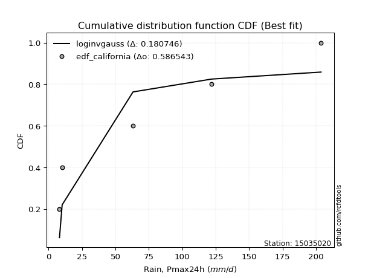</img>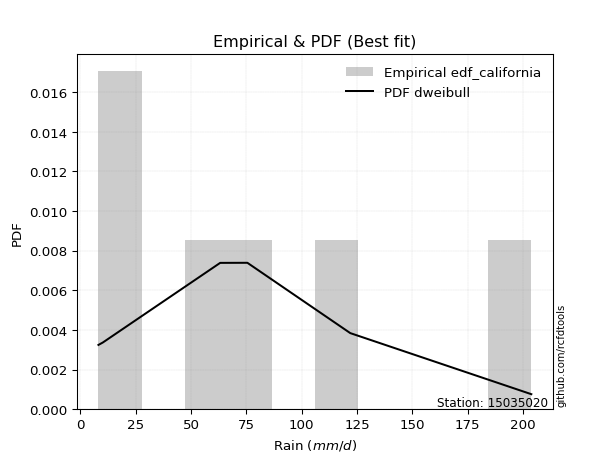</img>

</div>


### 2. Empirical - EDF Hazen (1930)

Hazen method for plotting positions is a formula used to estimate the empirical cumulative probability distribution of flood events or other hydrological data. This formula often results in biased estimations, particularly when extrapolating to extreme events (high return periods).

<div align="center">


$P=(m-0.5)/n$


</div>


**2.1. Empirical values**

<div align="center">

|                | 0                   | 1                  | 2                  | 3                  | 4         | 5                  |
|:---------------|:--------------------|:-------------------|:-------------------|:-------------------|:----------|:-------------------|
| date           | 2023                | 2020               | 2019               | 2025               | 2024      | 2022               |
| x              | 8.2                 | 10.2               | 63.2               | 67.0               | 122.0     | 203.8              |
| m              | 1                   | 2                  | 3                  | 4                  | 5         | 6                  |
| empirical_dist | edf_hazen           | edf_hazen          | edf_hazen          | edf_hazen          | edf_hazen | edf_hazen          |
| empirical      | 0.08333333333333333 | 0.25               | 0.4166666666666667 | 0.5833333333333334 | 0.75      | 0.9166666666666666 |
| empirical_tr   | 1.090909090909091   | 1.3333333333333333 | 1.7142857142857144 | 2.4000000000000004 | 4.0       | 11.999999999999995 |

</div>


**2.2. Kolmogorov-Smirnov fit test (sorted by Δ)**


<div align="center">

|                | 0                   | 1                   | 2                   | 3                   | 4                   | 5                   | 6                 | 7                   | 8                   | 9                   | 10                  | 11                  | 12                  | 13                  | 14                  | 15                  | 16                  | 17                  | 18                  | 19                 | 20                  | 21                    | 22                  | 23                  | 24                 | 25                 | 26                  | 27                  | 28                 | 29                  | 30                  | 31                  | 32                  | 33                 | 34                  | 35                 | 36                  | 37                  | 38                  | 39                  | 40                 | 41                  | 42                  | 43                  | 44                  | 45                  | 46                  | 47                 | 48                 | 49                  | 50                  | 51                 | 52                  | 53                 | 54                  | 55                 | 56                  | 57                  | 58                  | 59                | 60                  | 61             | 62             | 63                 | 64                  | 65                 | 66                 | 67                  | 68                  | 69                  | 70                  | 71                  | 72                 | 73                 | 74                  | 75                  | 76                 | 77                 | 78                 | 79                  | 80                 | 81                 | 82                 | 83                 | 84                 | 85                  | 86                 | 87                 | 88                 | 89             |
|:---------------|:--------------------|:--------------------|:--------------------|:--------------------|:--------------------|:--------------------|:------------------|:--------------------|:--------------------|:--------------------|:--------------------|:--------------------|:--------------------|:--------------------|:--------------------|:--------------------|:--------------------|:--------------------|:--------------------|:-------------------|:--------------------|:----------------------|:--------------------|:--------------------|:-------------------|:-------------------|:--------------------|:--------------------|:-------------------|:--------------------|:--------------------|:--------------------|:--------------------|:-------------------|:--------------------|:-------------------|:--------------------|:--------------------|:--------------------|:--------------------|:-------------------|:--------------------|:--------------------|:--------------------|:--------------------|:--------------------|:--------------------|:-------------------|:-------------------|:--------------------|:--------------------|:-------------------|:--------------------|:-------------------|:--------------------|:-------------------|:--------------------|:--------------------|:--------------------|:------------------|:--------------------|:---------------|:---------------|:-------------------|:--------------------|:-------------------|:-------------------|:--------------------|:--------------------|:--------------------|:--------------------|:--------------------|:-------------------|:-------------------|:--------------------|:--------------------|:-------------------|:-------------------|:-------------------|:--------------------|:-------------------|:-------------------|:-------------------|:-------------------|:-------------------|:--------------------|:-------------------|:-------------------|:-------------------|:---------------|
| station        | 15035020            | 15035020            | 15035020            | 15035020            | 15035020            | 15035020            | 15035020          | 15035020            | 15035020            | 15035020            | 15035020            | 15035020            | 15035020            | 15035020            | 15035020            | 15035020            | 15035020            | 15035020            | 15035020            | 15035020           | 15035020            | 15035020              | 15035020            | 15035020            | 15035020           | 15035020           | 15035020            | 15035020            | 15035020           | 15035020            | 15035020            | 15035020            | 15035020            | 15035020           | 15035020            | 15035020           | 15035020            | 15035020            | 15035020            | 15035020            | 15035020           | 15035020            | 15035020            | 15035020            | 15035020            | 15035020            | 15035020            | 15035020           | 15035020           | 15035020            | 15035020            | 15035020           | 15035020            | 15035020           | 15035020            | 15035020           | 15035020            | 15035020            | 15035020            | 15035020          | 15035020            | 15035020       | 15035020       | 15035020           | 15035020            | 15035020           | 15035020           | 15035020            | 15035020            | 15035020            | 15035020            | 15035020            | 15035020           | 15035020           | 15035020            | 15035020            | 15035020           | 15035020           | 15035020           | 15035020            | 15035020           | 15035020           | 15035020           | 15035020           | 15035020           | 15035020            | 15035020           | 15035020           | 15035020           | 15035020       |
| empirical_dist | edf_hazen           | edf_hazen           | edf_hazen           | edf_hazen           | edf_hazen           | edf_hazen           | edf_hazen         | edf_hazen           | edf_hazen           | edf_hazen           | edf_hazen           | edf_hazen           | edf_hazen           | edf_hazen           | edf_hazen           | edf_hazen           | edf_hazen           | edf_hazen           | edf_hazen           | edf_hazen          | edf_hazen           | edf_hazen             | edf_hazen           | edf_hazen           | edf_hazen          | edf_hazen          | edf_hazen           | edf_hazen           | edf_hazen          | edf_hazen           | edf_hazen           | edf_hazen           | edf_hazen           | edf_hazen          | edf_hazen           | edf_hazen          | edf_hazen           | edf_hazen           | edf_hazen           | edf_hazen           | edf_hazen          | edf_hazen           | edf_hazen           | edf_hazen           | edf_hazen           | edf_hazen           | edf_hazen           | edf_hazen          | edf_hazen          | edf_hazen           | edf_hazen           | edf_hazen          | edf_hazen           | edf_hazen          | edf_hazen           | edf_hazen          | edf_hazen           | edf_hazen           | edf_hazen           | edf_hazen         | edf_hazen           | edf_hazen      | edf_hazen      | edf_hazen          | edf_hazen           | edf_hazen          | edf_hazen          | edf_hazen           | edf_hazen           | edf_hazen           | edf_hazen           | edf_hazen           | edf_hazen          | edf_hazen          | edf_hazen           | edf_hazen           | edf_hazen          | edf_hazen          | edf_hazen          | edf_hazen           | edf_hazen          | edf_hazen          | edf_hazen          | edf_hazen          | edf_hazen          | edf_hazen           | edf_hazen          | edf_hazen          | edf_hazen          | edf_hazen      |
| p_dist         | halfnorm            | rayleigh            | pearson3            | logloggamma         | maxwell             | logjohnsonsu        | gumbel_r          | genlogistic         | laplace_asymmetric  | f                   | kstwobign           | logweibull_min      | loggumbel_l         | ncf                 | rice                | moyal               | halflogistic        | t                   | crystalball         | truncnorm          | norm                | loglaplace_asymmetric | logfisk             | logistic            | logpearson3        | hypsecant          | weibull_min         | logf                | logt               | logcrystalball      | lognorm             | lognorm             | logexponnorm        | lognct             | laplace             | fisk               | loggompertz         | loggamma            | loggamma            | logerlang           | loginvgamma        | loglogistic         | logrice             | nakagami            | logalpha            | loginvgauss         | logncf              | loghypsecant       | logmaxwell         | exponnorm           | expon               | gumbel_l           | genexpon            | gompertz           | logbetaprime        | lograyleigh        | mielke              | loglaplace          | invgamma            | loghalfnorm       | logkstwobign        | gibrat         | wald           | loggenexpon        | loginvweibull       | loggumbel_r        | logmielke          | logtruncnorm        | nct                 | loghalflogistic     | logmoyal            | logexpon            | betaprime          | lognakagami        | invgauss            | pareto              | logpareto          | logwald            | erlang             | loglognorm          | loggibrat          | alpha              | logchi2            | johnsonsu          | fatiguelife        | logfatiguelife      | invweibull         | gamma              | chi2               | loggenlogistic |
| delta          | 0.10291660081427642 | 0.10746061248674299 | 0.10812447200978081 | 0.11376461486119566 | 0.11958613169269355 | 0.12222359118083659 | 0.123388671431579 | 0.12811346898651277 | 0.12817247409633498 | 0.13475731893987894 | 0.13508565267964967 | 0.14211485649315975 | 0.14240707636581215 | 0.14267880952287137 | 0.14663910896936583 | 0.14854137289796787 | 0.15138121556105716 | 0.15398258530445508 | 0.15398374130475218 | 0.1539837428139451 | 0.15398374299162382 | 0.1582939683754327    | 0.16217627716652577 | 0.16336691342606408 | 0.1689941365772289 | 0.1712104435134933 | 0.17292291131515874 | 0.19067298733786348 | 0.1915597984485185 | 0.19156156868248392 | 0.19156163396285691 | 0.19156163396285691 | 0.19156362702381807 | 0.1916438967802297 | 0.19462268388064036 | 0.1950191576893607 | 0.19821944479608705 | 0.19916619768554272 | 0.19916619768554272 | 0.20082479163202221 | 0.2034336867689524 | 0.20538333062447373 | 0.20681182883533983 | 0.20800367521798852 | 0.20828991678072367 | 0.20867282027441186 | 0.21505852519593466 | 0.2166113669322985 | 0.2173475314236864 | 0.22093835706262355 | 0.22217250773986086 | 0.2229777773935533 | 0.22339400190029052 | 0.2241470701893455 | 0.22490526430218644 | 0.2253074500192363 | 0.22847477209024608 | 0.24429353518336688 | 0.24620018147706207 | 0.248025453993798 | 0.24858261754916194 | 0.25           | 0.25           | 0.2517255655539848 | 0.25218023738046674 | 0.2571911342544099 | 0.2625854028626981 | 0.26586071617373325 | 0.26688554691967586 | 0.27638407076385557 | 0.27949265813229435 | 0.27991379246993536 | 0.2919497707553412 | 0.2925526922713951 | 0.29645744128519286 | 0.29754943738505296 | 0.3014238075379103 | 0.3417569560356786 | 0.3648933117304744 | 0.36826359060749125 | 0.3736585573814036 | 0.3890873289975106 | 0.3961530681198661 | 0.4240141272020663 | 0.4306046367456933 | 0.44581819292261565 | 0.4634116457245174 | 0.5032775465594237 | 0.5831995664859082 | 0.75           |
| deltao         | 0.530385761606      | 0.530385761606      | 0.530385761606      | 0.530385761606      | 0.530385761606      | 0.530385761606      | 0.530385761606    | 0.530385761606      | 0.530385761606      | 0.530385761606      | 0.530385761606      | 0.530385761606      | 0.530385761606      | 0.530385761606      | 0.530385761606      | 0.530385761606      | 0.530385761606      | 0.530385761606      | 0.530385761606      | 0.530385761606     | 0.530385761606      | 0.530385761606        | 0.530385761606      | 0.530385761606      | 0.530385761606     | 0.530385761606     | 0.530385761606      | 0.530385761606      | 0.530385761606     | 0.530385761606      | 0.530385761606      | 0.530385761606      | 0.530385761606      | 0.530385761606     | 0.530385761606      | 0.530385761606     | 0.530385761606      | 0.530385761606      | 0.530385761606      | 0.530385761606      | 0.530385761606     | 0.530385761606      | 0.530385761606      | 0.530385761606      | 0.530385761606      | 0.530385761606      | 0.530385761606      | 0.530385761606     | 0.530385761606     | 0.530385761606      | 0.530385761606      | 0.530385761606     | 0.530385761606      | 0.530385761606     | 0.530385761606      | 0.530385761606     | 0.530385761606      | 0.530385761606      | 0.530385761606      | 0.530385761606    | 0.530385761606      | 0.530385761606 | 0.530385761606 | 0.530385761606     | 0.530385761606      | 0.530385761606     | 0.530385761606     | 0.530385761606      | 0.530385761606      | 0.530385761606      | 0.530385761606      | 0.530385761606      | 0.530385761606     | 0.530385761606     | 0.530385761606      | 0.530385761606      | 0.530385761606     | 0.530385761606     | 0.530385761606     | 0.530385761606      | 0.530385761606     | 0.530385761606     | 0.530385761606     | 0.530385761606     | 0.530385761606     | 0.530385761606      | 0.530385761606     | 0.530385761606     | 0.530385761606     | 0.530385761606 |
| eval           | Δo > Δ              | Δo > Δ              | Δo > Δ              | Δo > Δ              | Δo > Δ              | Δo > Δ              | Δo > Δ            | Δo > Δ              | Δo > Δ              | Δo > Δ              | Δo > Δ              | Δo > Δ              | Δo > Δ              | Δo > Δ              | Δo > Δ              | Δo > Δ              | Δo > Δ              | Δo > Δ              | Δo > Δ              | Δo > Δ             | Δo > Δ              | Δo > Δ                | Δo > Δ              | Δo > Δ              | Δo > Δ             | Δo > Δ             | Δo > Δ              | Δo > Δ              | Δo > Δ             | Δo > Δ              | Δo > Δ              | Δo > Δ              | Δo > Δ              | Δo > Δ             | Δo > Δ              | Δo > Δ             | Δo > Δ              | Δo > Δ              | Δo > Δ              | Δo > Δ              | Δo > Δ             | Δo > Δ              | Δo > Δ              | Δo > Δ              | Δo > Δ              | Δo > Δ              | Δo > Δ              | Δo > Δ             | Δo > Δ             | Δo > Δ              | Δo > Δ              | Δo > Δ             | Δo > Δ              | Δo > Δ             | Δo > Δ              | Δo > Δ             | Δo > Δ              | Δo > Δ              | Δo > Δ              | Δo > Δ            | Δo > Δ              | Δo > Δ         | Δo > Δ         | Δo > Δ             | Δo > Δ              | Δo > Δ             | Δo > Δ             | Δo > Δ              | Δo > Δ              | Δo > Δ              | Δo > Δ              | Δo > Δ              | Δo > Δ             | Δo > Δ             | Δo > Δ              | Δo > Δ              | Δo > Δ             | Δo > Δ             | Δo > Δ             | Δo > Δ              | Δo > Δ             | Δo > Δ             | Δo > Δ             | Δo > Δ             | Δo > Δ             | Δo > Δ              | Δo > Δ             | Δo > Δ             | Δo <= Δ            | Δo <= Δ        |
| fit            | 1                   | 1                   | 1                   | 1                   | 1                   | 1                   | 1                 | 1                   | 1                   | 1                   | 1                   | 1                   | 1                   | 1                   | 1                   | 1                   | 1                   | 1                   | 1                   | 1                  | 1                   | 1                     | 1                   | 1                   | 1                  | 1                  | 1                   | 1                   | 1                  | 1                   | 1                   | 1                   | 1                   | 1                  | 1                   | 1                  | 1                   | 1                   | 1                   | 1                   | 1                  | 1                   | 1                   | 1                   | 1                   | 1                   | 1                   | 1                  | 1                  | 1                   | 1                   | 1                  | 1                   | 1                  | 1                   | 1                  | 1                   | 1                   | 1                   | 1                 | 1                   | 1              | 1              | 1                  | 1                   | 1                  | 1                  | 1                   | 1                   | 1                   | 1                   | 1                   | 1                  | 1                  | 1                   | 1                   | 1                  | 1                  | 1                  | 1                   | 1                  | 1                  | 1                  | 1                  | 1                  | 1                   | 1                  | 1                  | 0                  | 0              |
| n              | 6                   | 6                   | 6                   | 6                   | 6                   | 6                   | 6                 | 6                   | 6                   | 6                   | 6                   | 6                   | 6                   | 6                   | 6                   | 6                   | 6                   | 6                   | 6                   | 6                  | 6                   | 6                     | 6                   | 6                   | 6                  | 6                  | 6                   | 6                   | 6                  | 6                   | 6                   | 6                   | 6                   | 6                  | 6                   | 6                  | 6                   | 6                   | 6                   | 6                   | 6                  | 6                   | 6                   | 6                   | 6                   | 6                   | 6                   | 6                  | 6                  | 6                   | 6                   | 6                  | 6                   | 6                  | 6                   | 6                  | 6                   | 6                   | 6                   | 6                 | 6                   | 6              | 6              | 6                  | 6                   | 6                  | 6                  | 6                   | 6                   | 6                   | 6                   | 6                   | 6                  | 6                  | 6                   | 6                   | 6                  | 6                  | 6                  | 6                   | 6                  | 6                  | 6                  | 6                  | 6                  | 6                   | 6                  | 6                  | 6                  | 6              |
| best_fit       | 1                   | 0                   | 0                   | 0                   | 0                   | 0                   | 0                 | 0                   | 0                   | 0                   | 0                   | 0                   | 0                   | 0                   | 0                   | 0                   | 0                   | 0                   | 0                   | 0                  | 0                   | 0                     | 0                   | 0                   | 0                  | 0                  | 0                   | 0                   | 0                  | 0                   | 0                   | 0                   | 0                   | 0                  | 0                   | 0                  | 0                   | 0                   | 0                   | 0                   | 0                  | 0                   | 0                   | 0                   | 0                   | 0                   | 0                   | 0                  | 0                  | 0                   | 0                   | 0                  | 0                   | 0                  | 0                   | 0                  | 0                   | 0                   | 0                   | 0                 | 0                   | 0              | 0              | 0                  | 0                   | 0                  | 0                  | 0                   | 0                   | 0                   | 0                   | 0                   | 0                  | 0                  | 0                   | 0                   | 0                  | 0                  | 0                  | 0                   | 0                  | 0                  | 0                  | 0                  | 0                  | 0                   | 0                  | 0                  | 0                  | 0              |
| best_fit_sort  | 1                   | 2                   | 3                   | 4                   | 5                   | 6                   | 7                 | 8                   | 9                   | 10                  | 11                  | 12                  | 13                  | 14                  | 15                  | 16                  | 17                  | 18                  | 19                  | 20                 | 21                  | 22                    | 23                  | 24                  | 25                 | 26                 | 27                  | 28                  | 29                 | 30                  | 31                  | 32                  | 33                  | 34                 | 35                  | 36                 | 37                  | 38                  | 39                  | 40                  | 41                 | 42                  | 43                  | 44                  | 45                  | 46                  | 47                  | 48                 | 49                 | 50                  | 51                  | 52                 | 53                  | 54                 | 55                  | 56                 | 57                  | 58                  | 59                  | 60                | 61                  | 62             | 63             | 64                 | 65                  | 66                 | 67                 | 68                  | 69                  | 70                  | 71                  | 72                  | 73                 | 74                 | 75                  | 76                  | 77                 | 78                 | 79                 | 80                  | 81                 | 82                 | 83                 | 84                 | 85                 | 86                  | 87                 | 88                 | 89                 | 90             |

</div>


<div align="center">

</img>

</div>


**2.3. Best fit**

<div align="center">

|   id |   station | empirical_dist   | p_dist   |    delta |   deltao | eval   |   fit |   n |   best_fit |   best_fit_sort |
|-----:|----------:|:-----------------|:---------|---------:|---------:|:-------|------:|----:|-----------:|----------------:|
|    0 |  15035020 | edf_hazen        | halfnorm | 0.102917 | 0.530386 | Δo > Δ |     1 |   6 |          1 |               1 |

</div>


<div align="center">

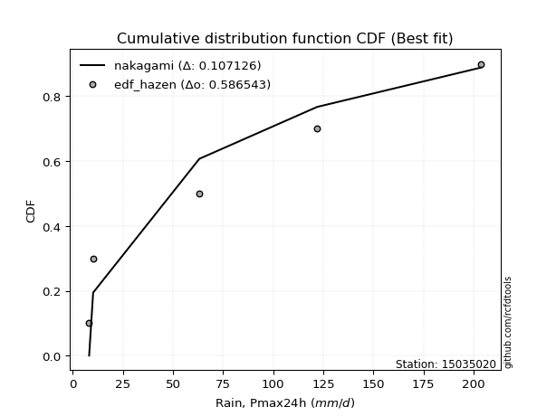</img></img>

</div>


### 3. Empirical - EDF Weibull (1939)

Weibull plotting position formula is an empirical method used to estimate the non-exceedance probability or plotting position for a set of observed data, is often recommended or widely used in practice, particularly in flood frequency analysis.

<div align="center">


$P=m/(n+1)$


</div>


**3.1. Empirical values**

<div align="center">

|                | 0                   | 1                  | 2                   | 3                  | 4                  | 5                  |
|:---------------|:--------------------|:-------------------|:--------------------|:-------------------|:-------------------|:-------------------|
| date           | 2023                | 2020               | 2019                | 2025               | 2024               | 2022               |
| x              | 8.2                 | 10.2               | 63.2                | 67.0               | 122.0              | 203.8              |
| m              | 1                   | 2                  | 3                   | 4                  | 5                  | 6                  |
| empirical_dist | edf_weibull         | edf_weibull        | edf_weibull         | edf_weibull        | edf_weibull        | edf_weibull        |
| empirical      | 0.14285714285714285 | 0.2857142857142857 | 0.42857142857142855 | 0.5714285714285714 | 0.7142857142857143 | 0.8571428571428571 |
| empirical_tr   | 1.1666666666666665  | 1.4                | 1.75                | 2.333333333333333  | 3.5                | 6.999999999999997  |

</div>


**3.2. Kolmogorov-Smirnov fit test (sorted by Δ)**


<div align="center">

|                | 0                   | 1                   | 2                   | 3                   | 4                  | 5                  | 6                   | 7                   | 8                   | 9                  | 10                 | 11                 | 12                  | 13                  | 14                  | 15                  | 16                  | 17                  | 18                    | 19                 | 20                  | 21                  | 22                  | 23                 | 24                  | 25                  | 26                  | 27                  | 28                 | 29                  | 30                  | 31                  | 32                  | 33                  | 34                  | 35                  | 36                  | 37                  | 38                  | 39                  | 40                  | 41                  | 42                 | 43               | 44                 | 45                  | 46                  | 47                  | 48                  | 49                  | 50                  | 51                 | 52                  | 53                  | 54                 | 55                  | 56                  | 57                  | 58                  | 59                 | 60                  | 61                 | 62                | 63                  | 64                  | 65                 | 66                 | 67                 | 68                 | 69                 | 70                 | 71                | 72                 | 73                 | 74                 | 75                 | 76                  | 77                  | 78                  | 79                  | 80                 | 81                 | 82                  | 83                  | 84                  | 85                  | 86                 | 87                 | 88                 | 89                 |
|:---------------|:--------------------|:--------------------|:--------------------|:--------------------|:-------------------|:-------------------|:--------------------|:--------------------|:--------------------|:-------------------|:-------------------|:-------------------|:--------------------|:--------------------|:--------------------|:--------------------|:--------------------|:--------------------|:----------------------|:-------------------|:--------------------|:--------------------|:--------------------|:-------------------|:--------------------|:--------------------|:--------------------|:--------------------|:-------------------|:--------------------|:--------------------|:--------------------|:--------------------|:--------------------|:--------------------|:--------------------|:--------------------|:--------------------|:--------------------|:--------------------|:--------------------|:--------------------|:-------------------|:-----------------|:-------------------|:--------------------|:--------------------|:--------------------|:--------------------|:--------------------|:--------------------|:-------------------|:--------------------|:--------------------|:-------------------|:--------------------|:--------------------|:--------------------|:--------------------|:-------------------|:--------------------|:-------------------|:------------------|:--------------------|:--------------------|:-------------------|:-------------------|:-------------------|:-------------------|:-------------------|:-------------------|:------------------|:-------------------|:-------------------|:-------------------|:-------------------|:--------------------|:--------------------|:--------------------|:--------------------|:-------------------|:-------------------|:--------------------|:--------------------|:--------------------|:--------------------|:-------------------|:-------------------|:-------------------|:-------------------|
| station        | 15035020            | 15035020            | 15035020            | 15035020            | 15035020           | 15035020           | 15035020            | 15035020            | 15035020            | 15035020           | 15035020           | 15035020           | 15035020            | 15035020            | 15035020            | 15035020            | 15035020            | 15035020            | 15035020              | 15035020           | 15035020            | 15035020            | 15035020            | 15035020           | 15035020            | 15035020            | 15035020            | 15035020            | 15035020           | 15035020            | 15035020            | 15035020            | 15035020            | 15035020            | 15035020            | 15035020            | 15035020            | 15035020            | 15035020            | 15035020            | 15035020            | 15035020            | 15035020           | 15035020         | 15035020           | 15035020            | 15035020            | 15035020            | 15035020            | 15035020            | 15035020            | 15035020           | 15035020            | 15035020            | 15035020           | 15035020            | 15035020            | 15035020            | 15035020            | 15035020           | 15035020            | 15035020           | 15035020          | 15035020            | 15035020            | 15035020           | 15035020           | 15035020           | 15035020           | 15035020           | 15035020           | 15035020          | 15035020           | 15035020           | 15035020           | 15035020           | 15035020            | 15035020            | 15035020            | 15035020            | 15035020           | 15035020           | 15035020            | 15035020            | 15035020            | 15035020            | 15035020           | 15035020           | 15035020           | 15035020           |
| empirical_dist | edf_weibull         | edf_weibull         | edf_weibull         | edf_weibull         | edf_weibull        | edf_weibull        | edf_weibull         | edf_weibull         | edf_weibull         | edf_weibull        | edf_weibull        | edf_weibull        | edf_weibull         | edf_weibull         | edf_weibull         | edf_weibull         | edf_weibull         | edf_weibull         | edf_weibull           | edf_weibull        | edf_weibull         | edf_weibull         | edf_weibull         | edf_weibull        | edf_weibull         | edf_weibull         | edf_weibull         | edf_weibull         | edf_weibull        | edf_weibull         | edf_weibull         | edf_weibull         | edf_weibull         | edf_weibull         | edf_weibull         | edf_weibull         | edf_weibull         | edf_weibull         | edf_weibull         | edf_weibull         | edf_weibull         | edf_weibull         | edf_weibull        | edf_weibull      | edf_weibull        | edf_weibull         | edf_weibull         | edf_weibull         | edf_weibull         | edf_weibull         | edf_weibull         | edf_weibull        | edf_weibull         | edf_weibull         | edf_weibull        | edf_weibull         | edf_weibull         | edf_weibull         | edf_weibull         | edf_weibull        | edf_weibull         | edf_weibull        | edf_weibull       | edf_weibull         | edf_weibull         | edf_weibull        | edf_weibull        | edf_weibull        | edf_weibull        | edf_weibull        | edf_weibull        | edf_weibull       | edf_weibull        | edf_weibull        | edf_weibull        | edf_weibull        | edf_weibull         | edf_weibull         | edf_weibull         | edf_weibull         | edf_weibull        | edf_weibull        | edf_weibull         | edf_weibull         | edf_weibull         | edf_weibull         | edf_weibull        | edf_weibull        | edf_weibull        | edf_weibull        |
| p_dist         | rayleigh            | maxwell             | halfnorm            | pearson3            | t                  | crystalball        | truncnorm           | norm                | logloggamma         | logistic           | logjohnsonsu       | gumbel_r           | hypsecant           | weibull_min         | genlogistic         | laplace_asymmetric  | f                   | kstwobign           | loglaplace_asymmetric | logpearson3        | logweibull_min      | loggumbel_l         | ncf                 | logf               | logt                | logcrystalball      | lognorm             | lognorm             | logexponnorm       | lognct              | rice                | laplace             | moyal               | logfisk             | halflogistic        | loggamma            | loggamma            | logerlang           | loginvgamma         | loglogistic         | logrice             | nakagami            | logalpha           | loginvgauss      | logncf             | loghypsecant        | logmaxwell          | gumbel_l            | logbetaprime        | lograyleigh         | mielke              | fisk               | loglaplace          | loggompertz         | invgamma           | logkstwobign        | loggenexpon         | loginvweibull       | loggumbel_r         | loghalfnorm        | logmielke           | logtruncnorm       | nct               | exponnorm           | expon               | genexpon           | gompertz           | logmoyal           | logexpon           | betaprime          | lognakagami        | invgauss          | pareto             | loghalflogistic    | wald               | gibrat             | logpareto           | logwald             | loglognorm          | erlang              | loggibrat          | alpha              | logchi2             | johnsonsu           | invweibull          | fatiguelife         | logfatiguelife     | gamma              | chi2               | loggenlogistic     |
| delta          | 0.12712677352830962 | 0.12778462152949327 | 0.13863088652856212 | 0.13897533653588065 | 0.1420778233996931 | 0.1420789793999902 | 0.14207898090918314 | 0.14207898108686184 | 0.14947890057548135 | 0.1514621515213021 | 0.1579378768951223 | 0.1591029571458647 | 0.15930568160873132 | 0.16101814941039688 | 0.16382775470079847 | 0.16388675981062067 | 0.17047160465416464 | 0.17079993839393537 | 0.17407116007602497   | 0.1745134750648559 | 0.17782914220744545 | 0.17812136208009785 | 0.17839309523715707 | 0.1787682254331016 | 0.17965503654375664 | 0.17965680677772206 | 0.17965687205809505 | 0.17965687205809505 | 0.1796588651190562 | 0.17973913487546783 | 0.18235339468365153 | 0.18271792197587838 | 0.18425565861225357 | 0.18448044930941787 | 0.18709550127534286 | 0.18726143578078086 | 0.18726143578078086 | 0.18892002972726035 | 0.19152892486419054 | 0.19347856871971186 | 0.19490706693057797 | 0.19609891331322665 | 0.1963851548759618 | 0.19676805836965 | 0.2031537632911728 | 0.20470660502753663 | 0.20544276951892454 | 0.21107301548879132 | 0.21300050239742457 | 0.21340268811447444 | 0.21657001018548422 | 0.2307334434036464 | 0.23238877327860502 | 0.23282006406611452 | 0.2342954195723002 | 0.23667785564440008 | 0.23982080364922292 | 0.24027547547570488 | 0.24528637234964806 | 0.2475709988078862 | 0.25068064095793624 | 0.2539559542689714 | 0.254980785014914 | 0.25665264277690925 | 0.25788679345414656 | 0.2591082876145762 | 0.2598613559036312 | 0.2675878962275325 | 0.2680090305651735 | 0.2800450088505793 | 0.2806479303666332 | 0.284552679380431 | 0.2856446754802911 | 0.2857142857142857 | 0.2857142857142857 | 0.2857142857142857 | 0.28786688539345745 | 0.32985219413091676 | 0.33254930489320556 | 0.35298854982571254 | 0.3617537954766417 | 0.3771825670927487 | 0.38424830621510425 | 0.38829984148778063 | 0.40388783620070784 | 0.41869987484093146 | 0.4339134310178538 | 0.4913727846546619 | 0.5712948045811463 | 0.7142857142857143 |
| deltao         | 0.530385761606      | 0.530385761606      | 0.530385761606      | 0.530385761606      | 0.530385761606     | 0.530385761606     | 0.530385761606      | 0.530385761606      | 0.530385761606      | 0.530385761606     | 0.530385761606     | 0.530385761606     | 0.530385761606      | 0.530385761606      | 0.530385761606      | 0.530385761606      | 0.530385761606      | 0.530385761606      | 0.530385761606        | 0.530385761606     | 0.530385761606      | 0.530385761606      | 0.530385761606      | 0.530385761606     | 0.530385761606      | 0.530385761606      | 0.530385761606      | 0.530385761606      | 0.530385761606     | 0.530385761606      | 0.530385761606      | 0.530385761606      | 0.530385761606      | 0.530385761606      | 0.530385761606      | 0.530385761606      | 0.530385761606      | 0.530385761606      | 0.530385761606      | 0.530385761606      | 0.530385761606      | 0.530385761606      | 0.530385761606     | 0.530385761606   | 0.530385761606     | 0.530385761606      | 0.530385761606      | 0.530385761606      | 0.530385761606      | 0.530385761606      | 0.530385761606      | 0.530385761606     | 0.530385761606      | 0.530385761606      | 0.530385761606     | 0.530385761606      | 0.530385761606      | 0.530385761606      | 0.530385761606      | 0.530385761606     | 0.530385761606      | 0.530385761606     | 0.530385761606    | 0.530385761606      | 0.530385761606      | 0.530385761606     | 0.530385761606     | 0.530385761606     | 0.530385761606     | 0.530385761606     | 0.530385761606     | 0.530385761606    | 0.530385761606     | 0.530385761606     | 0.530385761606     | 0.530385761606     | 0.530385761606      | 0.530385761606      | 0.530385761606      | 0.530385761606      | 0.530385761606     | 0.530385761606     | 0.530385761606      | 0.530385761606      | 0.530385761606      | 0.530385761606      | 0.530385761606     | 0.530385761606     | 0.530385761606     | 0.530385761606     |
| eval           | Δo > Δ              | Δo > Δ              | Δo > Δ              | Δo > Δ              | Δo > Δ             | Δo > Δ             | Δo > Δ              | Δo > Δ              | Δo > Δ              | Δo > Δ             | Δo > Δ             | Δo > Δ             | Δo > Δ              | Δo > Δ              | Δo > Δ              | Δo > Δ              | Δo > Δ              | Δo > Δ              | Δo > Δ                | Δo > Δ             | Δo > Δ              | Δo > Δ              | Δo > Δ              | Δo > Δ             | Δo > Δ              | Δo > Δ              | Δo > Δ              | Δo > Δ              | Δo > Δ             | Δo > Δ              | Δo > Δ              | Δo > Δ              | Δo > Δ              | Δo > Δ              | Δo > Δ              | Δo > Δ              | Δo > Δ              | Δo > Δ              | Δo > Δ              | Δo > Δ              | Δo > Δ              | Δo > Δ              | Δo > Δ             | Δo > Δ           | Δo > Δ             | Δo > Δ              | Δo > Δ              | Δo > Δ              | Δo > Δ              | Δo > Δ              | Δo > Δ              | Δo > Δ             | Δo > Δ              | Δo > Δ              | Δo > Δ             | Δo > Δ              | Δo > Δ              | Δo > Δ              | Δo > Δ              | Δo > Δ             | Δo > Δ              | Δo > Δ             | Δo > Δ            | Δo > Δ              | Δo > Δ              | Δo > Δ             | Δo > Δ             | Δo > Δ             | Δo > Δ             | Δo > Δ             | Δo > Δ             | Δo > Δ            | Δo > Δ             | Δo > Δ             | Δo > Δ             | Δo > Δ             | Δo > Δ              | Δo > Δ              | Δo > Δ              | Δo > Δ              | Δo > Δ             | Δo > Δ             | Δo > Δ              | Δo > Δ              | Δo > Δ              | Δo > Δ              | Δo > Δ             | Δo > Δ             | Δo <= Δ            | Δo <= Δ            |
| fit            | 1                   | 1                   | 1                   | 1                   | 1                  | 1                  | 1                   | 1                   | 1                   | 1                  | 1                  | 1                  | 1                   | 1                   | 1                   | 1                   | 1                   | 1                   | 1                     | 1                  | 1                   | 1                   | 1                   | 1                  | 1                   | 1                   | 1                   | 1                   | 1                  | 1                   | 1                   | 1                   | 1                   | 1                   | 1                   | 1                   | 1                   | 1                   | 1                   | 1                   | 1                   | 1                   | 1                  | 1                | 1                  | 1                   | 1                   | 1                   | 1                   | 1                   | 1                   | 1                  | 1                   | 1                   | 1                  | 1                   | 1                   | 1                   | 1                   | 1                  | 1                   | 1                  | 1                 | 1                   | 1                   | 1                  | 1                  | 1                  | 1                  | 1                  | 1                  | 1                 | 1                  | 1                  | 1                  | 1                  | 1                   | 1                   | 1                   | 1                   | 1                  | 1                  | 1                   | 1                   | 1                   | 1                   | 1                  | 1                  | 0                  | 0                  |
| n              | 6                   | 6                   | 6                   | 6                   | 6                  | 6                  | 6                   | 6                   | 6                   | 6                  | 6                  | 6                  | 6                   | 6                   | 6                   | 6                   | 6                   | 6                   | 6                     | 6                  | 6                   | 6                   | 6                   | 6                  | 6                   | 6                   | 6                   | 6                   | 6                  | 6                   | 6                   | 6                   | 6                   | 6                   | 6                   | 6                   | 6                   | 6                   | 6                   | 6                   | 6                   | 6                   | 6                  | 6                | 6                  | 6                   | 6                   | 6                   | 6                   | 6                   | 6                   | 6                  | 6                   | 6                   | 6                  | 6                   | 6                   | 6                   | 6                   | 6                  | 6                   | 6                  | 6                 | 6                   | 6                   | 6                  | 6                  | 6                  | 6                  | 6                  | 6                  | 6                 | 6                  | 6                  | 6                  | 6                  | 6                   | 6                   | 6                   | 6                   | 6                  | 6                  | 6                   | 6                   | 6                   | 6                   | 6                  | 6                  | 6                  | 6                  |
| best_fit       | 1                   | 0                   | 0                   | 0                   | 0                  | 0                  | 0                   | 0                   | 0                   | 0                  | 0                  | 0                  | 0                   | 0                   | 0                   | 0                   | 0                   | 0                   | 0                     | 0                  | 0                   | 0                   | 0                   | 0                  | 0                   | 0                   | 0                   | 0                   | 0                  | 0                   | 0                   | 0                   | 0                   | 0                   | 0                   | 0                   | 0                   | 0                   | 0                   | 0                   | 0                   | 0                   | 0                  | 0                | 0                  | 0                   | 0                   | 0                   | 0                   | 0                   | 0                   | 0                  | 0                   | 0                   | 0                  | 0                   | 0                   | 0                   | 0                   | 0                  | 0                   | 0                  | 0                 | 0                   | 0                   | 0                  | 0                  | 0                  | 0                  | 0                  | 0                  | 0                 | 0                  | 0                  | 0                  | 0                  | 0                   | 0                   | 0                   | 0                   | 0                  | 0                  | 0                   | 0                   | 0                   | 0                   | 0                  | 0                  | 0                  | 0                  |
| best_fit_sort  | 1                   | 2                   | 3                   | 4                   | 5                  | 6                  | 7                   | 8                   | 9                   | 10                 | 11                 | 12                 | 13                  | 14                  | 15                  | 16                  | 17                  | 18                  | 19                    | 20                 | 21                  | 22                  | 23                  | 24                 | 25                  | 26                  | 27                  | 28                  | 29                 | 30                  | 31                  | 32                  | 33                  | 34                  | 35                  | 36                  | 37                  | 38                  | 39                  | 40                  | 41                  | 42                  | 43                 | 44               | 45                 | 46                  | 47                  | 48                  | 49                  | 50                  | 51                  | 52                 | 53                  | 54                  | 55                 | 56                  | 57                  | 58                  | 59                  | 60                 | 61                  | 62                 | 63                | 64                  | 65                  | 66                 | 67                 | 68                 | 69                 | 70                 | 71                 | 72                | 73                 | 74                 | 75                 | 76                 | 77                  | 78                  | 79                  | 80                  | 81                 | 82                 | 83                  | 84                  | 85                  | 86                  | 87                 | 88                 | 89                 | 90                 |

</div>


<div align="center">

</img>

</div>


**3.3. Best fit**

<div align="center">

|   id |   station | empirical_dist   | p_dist   |    delta |   deltao | eval   |   fit |   n |   best_fit |   best_fit_sort |
|-----:|----------:|:-----------------|:---------|---------:|---------:|:-------|------:|----:|-----------:|----------------:|
|    0 |  15035020 | edf_weibull      | rayleigh | 0.127127 | 0.530386 | Δo > Δ |     1 |   6 |          1 |               1 |

</div>


<div align="center">

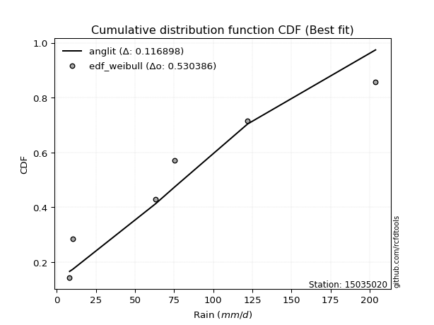</img>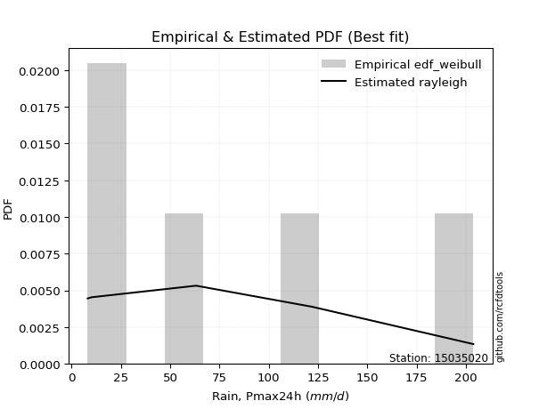</img>

</div>


### 4. Empirical - EDF Beard (1943)

The Beard formula (or Beard´s plotting position formula) in hydrology is used to estimate the empirical non-exceedance probability _(P)_ of a flood event (or other extreme hydrological data point) within a given dataset.

<div align="center">


$P=(m-0.31)/(n+0.38)$


</div>


**4.1. Empirical values**

<div align="center">

|                | 0                   | 1                   | 2                  | 3                  | 4                  | 5                  |
|:---------------|:--------------------|:--------------------|:-------------------|:-------------------|:-------------------|:-------------------|
| date           | 2023                | 2020                | 2019               | 2025               | 2024               | 2022               |
| x              | 8.2                 | 10.2                | 63.2               | 67.0               | 122.0              | 203.8              |
| m              | 1                   | 2                   | 3                  | 4                  | 5                  | 6                  |
| empirical_dist | edf_beard           | edf_beard           | edf_beard          | edf_beard          | edf_beard          | edf_beard          |
| empirical      | 0.10815047021943573 | 0.26489028213166144 | 0.4216300940438871 | 0.5783699059561128 | 0.7351097178683387 | 0.8918495297805643 |
| empirical_tr   | 1.1212653778558874  | 1.3603411513859276  | 1.7289972899728996 | 2.3717472118959106 | 3.7751479289940844 | 9.246376811594207  |

</div>


**4.2. Kolmogorov-Smirnov fit test (sorted by Δ)**


<div align="center">

|                | 0                   | 1                 | 2                   | 3                   | 4                  | 5                   | 6                   | 7                  | 8                  | 9                   | 10                  | 11                  | 12                  | 13                  | 14                 | 15                    | 16                  | 17                 | 18                 | 19                  | 20                  | 21                 | 22                 | 23                  | 24                  | 25                 | 26                 | 27                  | 28                  | 29                  | 30                  | 31                  | 32                  | 33                  | 34                 | 35                  | 36                  | 37                  | 38                  | 39                  | 40                 | 41                  | 42                  | 43                  | 44                  | 45                  | 46                  | 47                  | 48                  | 49                  | 50                | 51                  | 52                  | 53                  | 54                 | 55                  | 56                  | 57                  | 58                  | 59                  | 60                 | 61                  | 62                 | 63                 | 64                  | 65                 | 66                 | 67                  | 68                  | 69                  | 70                 | 71                 | 72                  | 73                  | 74                 | 75                 | 76                  | 77                 | 78                 | 79                  | 80                  | 81                  | 82                 | 83                 | 84                 | 85                  | 86                 | 87                 | 88                 | 89                 |
|:---------------|:--------------------|:------------------|:--------------------|:--------------------|:-------------------|:--------------------|:--------------------|:-------------------|:-------------------|:--------------------|:--------------------|:--------------------|:--------------------|:--------------------|:-------------------|:----------------------|:--------------------|:-------------------|:-------------------|:--------------------|:--------------------|:-------------------|:-------------------|:--------------------|:--------------------|:-------------------|:-------------------|:--------------------|:--------------------|:--------------------|:--------------------|:--------------------|:--------------------|:--------------------|:-------------------|:--------------------|:--------------------|:--------------------|:--------------------|:--------------------|:-------------------|:--------------------|:--------------------|:--------------------|:--------------------|:--------------------|:--------------------|:--------------------|:--------------------|:--------------------|:------------------|:--------------------|:--------------------|:--------------------|:-------------------|:--------------------|:--------------------|:--------------------|:--------------------|:--------------------|:-------------------|:--------------------|:-------------------|:-------------------|:--------------------|:-------------------|:-------------------|:--------------------|:--------------------|:--------------------|:-------------------|:-------------------|:--------------------|:--------------------|:-------------------|:-------------------|:--------------------|:-------------------|:-------------------|:--------------------|:--------------------|:--------------------|:-------------------|:-------------------|:-------------------|:--------------------|:-------------------|:-------------------|:-------------------|:-------------------|
| station        | 15035020            | 15035020          | 15035020            | 15035020            | 15035020           | 15035020            | 15035020            | 15035020           | 15035020           | 15035020            | 15035020            | 15035020            | 15035020            | 15035020            | 15035020           | 15035020              | 15035020            | 15035020           | 15035020           | 15035020            | 15035020            | 15035020           | 15035020           | 15035020            | 15035020            | 15035020           | 15035020           | 15035020            | 15035020            | 15035020            | 15035020            | 15035020            | 15035020            | 15035020            | 15035020           | 15035020            | 15035020            | 15035020            | 15035020            | 15035020            | 15035020           | 15035020            | 15035020            | 15035020            | 15035020            | 15035020            | 15035020            | 15035020            | 15035020            | 15035020            | 15035020          | 15035020            | 15035020            | 15035020            | 15035020           | 15035020            | 15035020            | 15035020            | 15035020            | 15035020            | 15035020           | 15035020            | 15035020           | 15035020           | 15035020            | 15035020           | 15035020           | 15035020            | 15035020            | 15035020            | 15035020           | 15035020           | 15035020            | 15035020            | 15035020           | 15035020           | 15035020            | 15035020           | 15035020           | 15035020            | 15035020            | 15035020            | 15035020           | 15035020           | 15035020           | 15035020            | 15035020           | 15035020           | 15035020           | 15035020           |
| empirical_dist | edf_beard           | edf_beard         | edf_beard           | edf_beard           | edf_beard          | edf_beard           | edf_beard           | edf_beard          | edf_beard          | edf_beard           | edf_beard           | edf_beard           | edf_beard           | edf_beard           | edf_beard          | edf_beard             | edf_beard           | edf_beard          | edf_beard          | edf_beard           | edf_beard           | edf_beard          | edf_beard          | edf_beard           | edf_beard           | edf_beard          | edf_beard          | edf_beard           | edf_beard           | edf_beard           | edf_beard           | edf_beard           | edf_beard           | edf_beard           | edf_beard          | edf_beard           | edf_beard           | edf_beard           | edf_beard           | edf_beard           | edf_beard          | edf_beard           | edf_beard           | edf_beard           | edf_beard           | edf_beard           | edf_beard           | edf_beard           | edf_beard           | edf_beard           | edf_beard         | edf_beard           | edf_beard           | edf_beard           | edf_beard          | edf_beard           | edf_beard           | edf_beard           | edf_beard           | edf_beard           | edf_beard          | edf_beard           | edf_beard          | edf_beard          | edf_beard           | edf_beard          | edf_beard          | edf_beard           | edf_beard           | edf_beard           | edf_beard          | edf_beard          | edf_beard           | edf_beard           | edf_beard          | edf_beard          | edf_beard           | edf_beard          | edf_beard          | edf_beard           | edf_beard           | edf_beard           | edf_beard          | edf_beard          | edf_beard          | edf_beard           | edf_beard          | edf_beard          | edf_beard          | edf_beard          |
| p_dist         | rayleigh            | maxwell           | halfnorm            | pearson3            | logloggamma        | logjohnsonsu        | gumbel_r            | genlogistic        | laplace_asymmetric | t                   | crystalball         | truncnorm           | norm                | f                   | kstwobign          | loglaplace_asymmetric | logweibull_min      | loggumbel_l        | ncf                | logistic            | rice                | moyal              | logfisk            | logpearson3         | hypsecant           | halflogistic       | weibull_min        | logf                | logt                | logcrystalball      | lognorm             | lognorm             | logexponnorm        | lognct              | laplace            | loggamma            | loggamma            | logerlang           | loginvgamma         | loglogistic         | logrice            | nakagami            | logalpha            | loginvgauss         | fisk                | logncf              | loghypsecant        | loggompertz         | logmaxwell          | gumbel_l            | logbetaprime      | lograyleigh         | mielke              | exponnorm           | expon              | genexpon            | gompertz            | loglaplace          | invgamma            | loghalfnorm         | logkstwobign       | loggenexpon         | loginvweibull      | loggumbel_r        | logmielke           | logtruncnorm       | nct                | wald                | gibrat              | loghalflogistic     | logmoyal           | logexpon           | betaprime           | lognakagami         | invgauss           | pareto             | logpareto           | logwald            | loglognorm         | erlang              | loggibrat           | alpha               | logchi2            | johnsonsu          | fatiguelife        | invweibull          | logfatiguelife     | gamma              | chi2               | loggenlogistic     |
| delta          | 0.10630276994568535 | 0.114622704315473 | 0.11780688294593786 | 0.11815133295325639 | 0.1286548969928571 | 0.13711387331249802 | 0.13827895356324044 | 0.1430037511181742 | 0.1430627562279964 | 0.14901915792723452 | 0.14902031392753162 | 0.14902031543672456 | 0.14902031561440326 | 0.14964760107154038 | 0.1499759348113111 | 0.15333054099821225   | 0.15700513862482118 | 0.1572973584974736 | 0.1575690916545328 | 0.15840348604884352 | 0.16152939110102726 | 0.1634316550296293 | 0.1636564457267936 | 0.16403070920000845 | 0.16624701613627274 | 0.1662714976927186 | 0.1679594839379383 | 0.18570955996064303 | 0.18659637107129806 | 0.18659814130526348 | 0.18659820658563647 | 0.18659820658563647 | 0.18660019964659763 | 0.18668046940300925 | 0.1896592565034198 | 0.19420277030832228 | 0.19420277030832228 | 0.19586136425480177 | 0.19847025939173196 | 0.20041990324725328 | 0.2018484014581194 | 0.20304024784076807 | 0.20332648940350323 | 0.20370939289719142 | 0.20990943982102214 | 0.21009509781871422 | 0.21164793955507805 | 0.21199606048349026 | 0.21238410404646596 | 0.21801435001633274 | 0.219941836924966 | 0.22034402264201586 | 0.22351134471302564 | 0.23582863919428498 | 0.2370627898715223 | 0.23828428403195195 | 0.23903735232100692 | 0.23933010780614644 | 0.24123675409984163 | 0.24306202661657755 | 0.2436191901719415 | 0.24676213817676435 | 0.2472168100032463 | 0.2522277068771895 | 0.25762197548547766 | 0.2608972887965128 | 0.2619221195424554 | 0.26489028213166144 | 0.26489028213166144 | 0.27142064338663513 | 0.2745292307550739 | 0.2749503650927149 | 0.28698634337812073 | 0.28758926489417463 | 0.2914940139079724 | 0.2925860100078325 | 0.29480821992099887 | 0.3367935286584582 | 0.3533733084758298 | 0.35992988435325396 | 0.36869513000418314 | 0.38412390162029014 | 0.3911896407426457 | 0.4091238450704049 | 0.4256412093684729 | 0.43859450883841505 | 0.4408547655453952 | 0.4983141191822033 | 0.5782361391086879 | 0.7351097178683387 |
| deltao         | 0.530385761606      | 0.530385761606    | 0.530385761606      | 0.530385761606      | 0.530385761606     | 0.530385761606      | 0.530385761606      | 0.530385761606     | 0.530385761606     | 0.530385761606      | 0.530385761606      | 0.530385761606      | 0.530385761606      | 0.530385761606      | 0.530385761606     | 0.530385761606        | 0.530385761606      | 0.530385761606     | 0.530385761606     | 0.530385761606      | 0.530385761606      | 0.530385761606     | 0.530385761606     | 0.530385761606      | 0.530385761606      | 0.530385761606     | 0.530385761606     | 0.530385761606      | 0.530385761606      | 0.530385761606      | 0.530385761606      | 0.530385761606      | 0.530385761606      | 0.530385761606      | 0.530385761606     | 0.530385761606      | 0.530385761606      | 0.530385761606      | 0.530385761606      | 0.530385761606      | 0.530385761606     | 0.530385761606      | 0.530385761606      | 0.530385761606      | 0.530385761606      | 0.530385761606      | 0.530385761606      | 0.530385761606      | 0.530385761606      | 0.530385761606      | 0.530385761606    | 0.530385761606      | 0.530385761606      | 0.530385761606      | 0.530385761606     | 0.530385761606      | 0.530385761606      | 0.530385761606      | 0.530385761606      | 0.530385761606      | 0.530385761606     | 0.530385761606      | 0.530385761606     | 0.530385761606     | 0.530385761606      | 0.530385761606     | 0.530385761606     | 0.530385761606      | 0.530385761606      | 0.530385761606      | 0.530385761606     | 0.530385761606     | 0.530385761606      | 0.530385761606      | 0.530385761606     | 0.530385761606     | 0.530385761606      | 0.530385761606     | 0.530385761606     | 0.530385761606      | 0.530385761606      | 0.530385761606      | 0.530385761606     | 0.530385761606     | 0.530385761606     | 0.530385761606      | 0.530385761606     | 0.530385761606     | 0.530385761606     | 0.530385761606     |
| eval           | Δo > Δ              | Δo > Δ            | Δo > Δ              | Δo > Δ              | Δo > Δ             | Δo > Δ              | Δo > Δ              | Δo > Δ             | Δo > Δ             | Δo > Δ              | Δo > Δ              | Δo > Δ              | Δo > Δ              | Δo > Δ              | Δo > Δ             | Δo > Δ                | Δo > Δ              | Δo > Δ             | Δo > Δ             | Δo > Δ              | Δo > Δ              | Δo > Δ             | Δo > Δ             | Δo > Δ              | Δo > Δ              | Δo > Δ             | Δo > Δ             | Δo > Δ              | Δo > Δ              | Δo > Δ              | Δo > Δ              | Δo > Δ              | Δo > Δ              | Δo > Δ              | Δo > Δ             | Δo > Δ              | Δo > Δ              | Δo > Δ              | Δo > Δ              | Δo > Δ              | Δo > Δ             | Δo > Δ              | Δo > Δ              | Δo > Δ              | Δo > Δ              | Δo > Δ              | Δo > Δ              | Δo > Δ              | Δo > Δ              | Δo > Δ              | Δo > Δ            | Δo > Δ              | Δo > Δ              | Δo > Δ              | Δo > Δ             | Δo > Δ              | Δo > Δ              | Δo > Δ              | Δo > Δ              | Δo > Δ              | Δo > Δ             | Δo > Δ              | Δo > Δ             | Δo > Δ             | Δo > Δ              | Δo > Δ             | Δo > Δ             | Δo > Δ              | Δo > Δ              | Δo > Δ              | Δo > Δ             | Δo > Δ             | Δo > Δ              | Δo > Δ              | Δo > Δ             | Δo > Δ             | Δo > Δ              | Δo > Δ             | Δo > Δ             | Δo > Δ              | Δo > Δ              | Δo > Δ              | Δo > Δ             | Δo > Δ             | Δo > Δ             | Δo > Δ              | Δo > Δ             | Δo > Δ             | Δo <= Δ            | Δo <= Δ            |
| fit            | 1                   | 1                 | 1                   | 1                   | 1                  | 1                   | 1                   | 1                  | 1                  | 1                   | 1                   | 1                   | 1                   | 1                   | 1                  | 1                     | 1                   | 1                  | 1                  | 1                   | 1                   | 1                  | 1                  | 1                   | 1                   | 1                  | 1                  | 1                   | 1                   | 1                   | 1                   | 1                   | 1                   | 1                   | 1                  | 1                   | 1                   | 1                   | 1                   | 1                   | 1                  | 1                   | 1                   | 1                   | 1                   | 1                   | 1                   | 1                   | 1                   | 1                   | 1                 | 1                   | 1                   | 1                   | 1                  | 1                   | 1                   | 1                   | 1                   | 1                   | 1                  | 1                   | 1                  | 1                  | 1                   | 1                  | 1                  | 1                   | 1                   | 1                   | 1                  | 1                  | 1                   | 1                   | 1                  | 1                  | 1                   | 1                  | 1                  | 1                   | 1                   | 1                   | 1                  | 1                  | 1                  | 1                   | 1                  | 1                  | 0                  | 0                  |
| n              | 6                   | 6                 | 6                   | 6                   | 6                  | 6                   | 6                   | 6                  | 6                  | 6                   | 6                   | 6                   | 6                   | 6                   | 6                  | 6                     | 6                   | 6                  | 6                  | 6                   | 6                   | 6                  | 6                  | 6                   | 6                   | 6                  | 6                  | 6                   | 6                   | 6                   | 6                   | 6                   | 6                   | 6                   | 6                  | 6                   | 6                   | 6                   | 6                   | 6                   | 6                  | 6                   | 6                   | 6                   | 6                   | 6                   | 6                   | 6                   | 6                   | 6                   | 6                 | 6                   | 6                   | 6                   | 6                  | 6                   | 6                   | 6                   | 6                   | 6                   | 6                  | 6                   | 6                  | 6                  | 6                   | 6                  | 6                  | 6                   | 6                   | 6                   | 6                  | 6                  | 6                   | 6                   | 6                  | 6                  | 6                   | 6                  | 6                  | 6                   | 6                   | 6                   | 6                  | 6                  | 6                  | 6                   | 6                  | 6                  | 6                  | 6                  |
| best_fit       | 1                   | 0                 | 0                   | 0                   | 0                  | 0                   | 0                   | 0                  | 0                  | 0                   | 0                   | 0                   | 0                   | 0                   | 0                  | 0                     | 0                   | 0                  | 0                  | 0                   | 0                   | 0                  | 0                  | 0                   | 0                   | 0                  | 0                  | 0                   | 0                   | 0                   | 0                   | 0                   | 0                   | 0                   | 0                  | 0                   | 0                   | 0                   | 0                   | 0                   | 0                  | 0                   | 0                   | 0                   | 0                   | 0                   | 0                   | 0                   | 0                   | 0                   | 0                 | 0                   | 0                   | 0                   | 0                  | 0                   | 0                   | 0                   | 0                   | 0                   | 0                  | 0                   | 0                  | 0                  | 0                   | 0                  | 0                  | 0                   | 0                   | 0                   | 0                  | 0                  | 0                   | 0                   | 0                  | 0                  | 0                   | 0                  | 0                  | 0                   | 0                   | 0                   | 0                  | 0                  | 0                  | 0                   | 0                  | 0                  | 0                  | 0                  |
| best_fit_sort  | 1                   | 2                 | 3                   | 4                   | 5                  | 6                   | 7                   | 8                  | 9                  | 10                  | 11                  | 12                  | 13                  | 14                  | 15                 | 16                    | 17                  | 18                 | 19                 | 20                  | 21                  | 22                 | 23                 | 24                  | 25                  | 26                 | 27                 | 28                  | 29                  | 30                  | 31                  | 32                  | 33                  | 34                  | 35                 | 36                  | 37                  | 38                  | 39                  | 40                  | 41                 | 42                  | 43                  | 44                  | 45                  | 46                  | 47                  | 48                  | 49                  | 50                  | 51                | 52                  | 53                  | 54                  | 55                 | 56                  | 57                  | 58                  | 59                  | 60                  | 61                 | 62                  | 63                 | 64                 | 65                  | 66                 | 67                 | 68                  | 69                  | 70                  | 71                 | 72                 | 73                  | 74                  | 75                 | 76                 | 77                  | 78                 | 79                 | 80                  | 81                  | 82                  | 83                 | 84                 | 85                 | 86                  | 87                 | 88                 | 89                 | 90                 |

</div>


<div align="center">

</img>

</div>


**4.3. Best fit**

<div align="center">

|   id |   station | empirical_dist   | p_dist   |    delta |   deltao | eval   |   fit |   n |   best_fit |   best_fit_sort |
|-----:|----------:|:-----------------|:---------|---------:|---------:|:-------|------:|----:|-----------:|----------------:|
|    0 |  15035020 | edf_beard        | rayleigh | 0.106303 | 0.530386 | Δo > Δ |     1 |   6 |          1 |               1 |

</div>


<div align="center">

</img>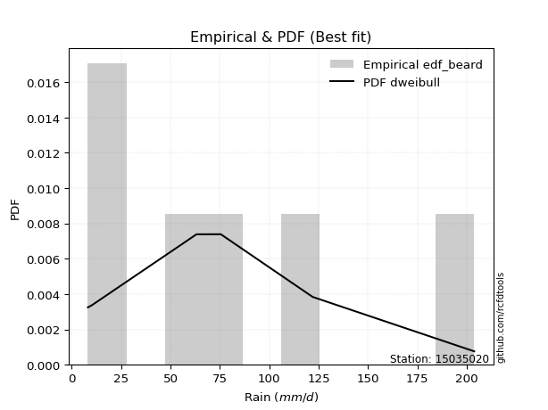</img>

</div>


### 5. Empirical - EDF Chegodayev (1955)

The Chegodayev formula is an empirical plotting position formula used in hydrological frequency analysis to estimate the exceedance probability or return period of a specific event from a set of observed data. It is primarily used for plotting observed data points on probability paper to fit a theoretical distribution, particularly for analyzing extreme events like maximum flood flows or rainfall intensities. The constant _b_ value in the generalized plotting position formula is 0.3.

<div align="center">


$P=(m-b)/(n+1-2b)$


</div>


**5.1. Empirical values**

<div align="center">

|                | 0                   | 1                  | 2                  | 3                  | 4                 | 5                 |
|:---------------|:--------------------|:-------------------|:-------------------|:-------------------|:------------------|:------------------|
| date           | 2023                | 2020               | 2019               | 2025               | 2024              | 2022              |
| x              | 8.2                 | 10.2               | 63.2               | 67.0               | 122.0             | 203.8             |
| m              | 1                   | 2                  | 3                  | 4                  | 5                 | 6                 |
| empirical_dist | edf_chegodayev      | edf_chegodayev     | edf_chegodayev     | edf_chegodayev     | edf_chegodayev    | edf_chegodayev    |
| empirical      | 0.10937499999999999 | 0.265625           | 0.421875           | 0.578125           | 0.734375          | 0.890625          |
| empirical_tr   | 1.1228070175438596  | 1.3617021276595744 | 1.7297297297297298 | 2.3703703703703702 | 3.764705882352941 | 9.142857142857142 |

</div>


**5.2. Kolmogorov-Smirnov fit test (sorted by Δ)**


<div align="center">

|                | 0                   | 1                   | 2                   | 3                   | 4                   | 5                  | 6                 | 7                   | 8                   | 9                  | 10                 | 11                  | 12                  | 13                  | 14                  | 15                    | 16                  | 17                  | 18                 | 19                  | 20                  | 21                  | 22                  | 23                  | 24                  | 25                  | 26                  | 27                  | 28                 | 29                 | 30                 | 31                 | 32                  | 33                  | 34                | 35                 | 36                 | 37                 | 38                 | 39                 | 40                 | 41                 | 42                  | 43                  | 44                  | 45                 | 46                  | 47                 | 48                  | 49                  | 50                  | 51                  | 52                  | 53                  | 54                  | 55                  | 56                  | 57                 | 58                  | 59                  | 60                  | 61                  | 62                  | 63                 | 64                 | 65                  | 66                  | 67             | 68             | 69                  | 70                  | 71                  | 72                  | 73                  | 74                  | 75                  | 76                | 77                 | 78                  | 79                 | 80                  | 81                  | 82                 | 83                 | 84               | 85                  | 86                  | 87                  | 88                | 89             |
|:---------------|:--------------------|:--------------------|:--------------------|:--------------------|:--------------------|:-------------------|:------------------|:--------------------|:--------------------|:-------------------|:-------------------|:--------------------|:--------------------|:--------------------|:--------------------|:----------------------|:--------------------|:--------------------|:-------------------|:--------------------|:--------------------|:--------------------|:--------------------|:--------------------|:--------------------|:--------------------|:--------------------|:--------------------|:-------------------|:-------------------|:-------------------|:-------------------|:--------------------|:--------------------|:------------------|:-------------------|:-------------------|:-------------------|:-------------------|:-------------------|:-------------------|:-------------------|:--------------------|:--------------------|:--------------------|:-------------------|:--------------------|:-------------------|:--------------------|:--------------------|:--------------------|:--------------------|:--------------------|:--------------------|:--------------------|:--------------------|:--------------------|:-------------------|:--------------------|:--------------------|:--------------------|:--------------------|:--------------------|:-------------------|:-------------------|:--------------------|:--------------------|:---------------|:---------------|:--------------------|:--------------------|:--------------------|:--------------------|:--------------------|:--------------------|:--------------------|:------------------|:-------------------|:--------------------|:-------------------|:--------------------|:--------------------|:-------------------|:-------------------|:-----------------|:--------------------|:--------------------|:--------------------|:------------------|:---------------|
| station        | 15035020            | 15035020            | 15035020            | 15035020            | 15035020            | 15035020           | 15035020          | 15035020            | 15035020            | 15035020           | 15035020           | 15035020            | 15035020            | 15035020            | 15035020            | 15035020              | 15035020            | 15035020            | 15035020           | 15035020            | 15035020            | 15035020            | 15035020            | 15035020            | 15035020            | 15035020            | 15035020            | 15035020            | 15035020           | 15035020           | 15035020           | 15035020           | 15035020            | 15035020            | 15035020          | 15035020           | 15035020           | 15035020           | 15035020           | 15035020           | 15035020           | 15035020           | 15035020            | 15035020            | 15035020            | 15035020           | 15035020            | 15035020           | 15035020            | 15035020            | 15035020            | 15035020            | 15035020            | 15035020            | 15035020            | 15035020            | 15035020            | 15035020           | 15035020            | 15035020            | 15035020            | 15035020            | 15035020            | 15035020           | 15035020           | 15035020            | 15035020            | 15035020       | 15035020       | 15035020            | 15035020            | 15035020            | 15035020            | 15035020            | 15035020            | 15035020            | 15035020          | 15035020           | 15035020            | 15035020           | 15035020            | 15035020            | 15035020           | 15035020           | 15035020         | 15035020            | 15035020            | 15035020            | 15035020          | 15035020       |
| empirical_dist | edf_chegodayev      | edf_chegodayev      | edf_chegodayev      | edf_chegodayev      | edf_chegodayev      | edf_chegodayev     | edf_chegodayev    | edf_chegodayev      | edf_chegodayev      | edf_chegodayev     | edf_chegodayev     | edf_chegodayev      | edf_chegodayev      | edf_chegodayev      | edf_chegodayev      | edf_chegodayev        | edf_chegodayev      | edf_chegodayev      | edf_chegodayev     | edf_chegodayev      | edf_chegodayev      | edf_chegodayev      | edf_chegodayev      | edf_chegodayev      | edf_chegodayev      | edf_chegodayev      | edf_chegodayev      | edf_chegodayev      | edf_chegodayev     | edf_chegodayev     | edf_chegodayev     | edf_chegodayev     | edf_chegodayev      | edf_chegodayev      | edf_chegodayev    | edf_chegodayev     | edf_chegodayev     | edf_chegodayev     | edf_chegodayev     | edf_chegodayev     | edf_chegodayev     | edf_chegodayev     | edf_chegodayev      | edf_chegodayev      | edf_chegodayev      | edf_chegodayev     | edf_chegodayev      | edf_chegodayev     | edf_chegodayev      | edf_chegodayev      | edf_chegodayev      | edf_chegodayev      | edf_chegodayev      | edf_chegodayev      | edf_chegodayev      | edf_chegodayev      | edf_chegodayev      | edf_chegodayev     | edf_chegodayev      | edf_chegodayev      | edf_chegodayev      | edf_chegodayev      | edf_chegodayev      | edf_chegodayev     | edf_chegodayev     | edf_chegodayev      | edf_chegodayev      | edf_chegodayev | edf_chegodayev | edf_chegodayev      | edf_chegodayev      | edf_chegodayev      | edf_chegodayev      | edf_chegodayev      | edf_chegodayev      | edf_chegodayev      | edf_chegodayev    | edf_chegodayev     | edf_chegodayev      | edf_chegodayev     | edf_chegodayev      | edf_chegodayev      | edf_chegodayev     | edf_chegodayev     | edf_chegodayev   | edf_chegodayev      | edf_chegodayev      | edf_chegodayev      | edf_chegodayev    | edf_chegodayev |
| p_dist         | rayleigh            | maxwell             | halfnorm            | pearson3            | logloggamma         | logjohnsonsu       | gumbel_r          | genlogistic         | laplace_asymmetric  | t                  | crystalball        | truncnorm           | norm                | f                   | kstwobign           | loglaplace_asymmetric | logweibull_min      | loggumbel_l         | logistic           | ncf                 | rice                | logpearson3         | moyal               | logfisk             | hypsecant           | halflogistic        | weibull_min         | logf                | logt               | logcrystalball     | lognorm            | lognorm            | logexponnorm        | lognct              | laplace           | loggamma           | loggamma           | logerlang          | loginvgamma        | loglogistic        | logrice            | nakagami           | logalpha            | loginvgauss         | logncf              | fisk               | loghypsecant        | logmaxwell         | loggompertz         | gumbel_l            | logbetaprime        | lograyleigh         | mielke              | exponnorm           | expon               | genexpon            | loglaplace          | gompertz           | invgamma            | loghalfnorm         | logkstwobign        | loggenexpon         | loginvweibull       | loggumbel_r        | logmielke          | logtruncnorm        | nct                 | wald           | gibrat         | loghalflogistic     | logmoyal            | logexpon            | betaprime           | lognakagami         | invgauss            | pareto              | logpareto         | logwald            | loglognorm          | erlang             | loggibrat           | alpha               | logchi2            | johnsonsu          | fatiguelife      | invweibull          | logfatiguelife      | gamma               | chi2              | loggenlogistic |
| delta          | 0.10703748781402392 | 0.11437779835936018 | 0.11854160081427642 | 0.11888605082159495 | 0.12938961486119566 | 0.1378485911808366 | 0.139013671431579 | 0.14373846898651277 | 0.14379747409633498 | 0.1487742519711217 | 0.1487754079714188 | 0.14877540948061174 | 0.14877540965829045 | 0.15038231893987894 | 0.15071065267964967 | 0.15398187436173927   | 0.15773985649315975 | 0.15803207636581215 | 0.1581585800927307 | 0.15830380952287137 | 0.16226410896936583 | 0.16378580324389558 | 0.16416637289796787 | 0.16439116359513217 | 0.16600211018015992 | 0.16700621556105716 | 0.16771457798182543 | 0.18546465400453016 | 0.1863514651151852 | 0.1863532353491506 | 0.1863533006295236 | 0.1863533006295236 | 0.18635529369048476 | 0.18643556344689638 | 0.189414350547307 | 0.1939578643522094 | 0.1939578643522094 | 0.1956164582986889 | 0.1982253534356191 | 0.2001749972911404 | 0.2016034955020065 | 0.2027953418846552 | 0.20308158344739036 | 0.20346448694107855 | 0.20985019186260134 | 0.2106441576893607 | 0.21140303359896517 | 0.2121391980903531 | 0.21273077835182883 | 0.21776944406021992 | 0.21969693096885312 | 0.22009911668590298 | 0.22326643875691277 | 0.23656335706262355 | 0.23779750773986086 | 0.23901900190029052 | 0.23908520185003357 | 0.2397720701893455 | 0.24099184814372876 | 0.24281712066046468 | 0.24337428421582863 | 0.24651723222065147 | 0.24697190404713343 | 0.2519828009210766 | 0.2573770695293648 | 0.26065238284039993 | 0.26167721358634255 | 0.265625       | 0.265625       | 0.27117573743052226 | 0.27428432479896103 | 0.27470545913660205 | 0.28674143742200786 | 0.28734435893806176 | 0.29124910795185954 | 0.29234110405171965 | 0.294563313964886 | 0.3365486227023453 | 0.35263859060749125 | 0.3596849783971411 | 0.36845022404807026 | 0.38387899566417727 | 0.3909447347865328 | 0.4083891272020663 | 0.42539630341236 | 0.43736997905785074 | 0.44060985958928234 | 0.49806921322609043 | 0.577991233152575 | 0.734375       |
| deltao         | 0.530385761606      | 0.530385761606      | 0.530385761606      | 0.530385761606      | 0.530385761606      | 0.530385761606     | 0.530385761606    | 0.530385761606      | 0.530385761606      | 0.530385761606     | 0.530385761606     | 0.530385761606      | 0.530385761606      | 0.530385761606      | 0.530385761606      | 0.530385761606        | 0.530385761606      | 0.530385761606      | 0.530385761606     | 0.530385761606      | 0.530385761606      | 0.530385761606      | 0.530385761606      | 0.530385761606      | 0.530385761606      | 0.530385761606      | 0.530385761606      | 0.530385761606      | 0.530385761606     | 0.530385761606     | 0.530385761606     | 0.530385761606     | 0.530385761606      | 0.530385761606      | 0.530385761606    | 0.530385761606     | 0.530385761606     | 0.530385761606     | 0.530385761606     | 0.530385761606     | 0.530385761606     | 0.530385761606     | 0.530385761606      | 0.530385761606      | 0.530385761606      | 0.530385761606     | 0.530385761606      | 0.530385761606     | 0.530385761606      | 0.530385761606      | 0.530385761606      | 0.530385761606      | 0.530385761606      | 0.530385761606      | 0.530385761606      | 0.530385761606      | 0.530385761606      | 0.530385761606     | 0.530385761606      | 0.530385761606      | 0.530385761606      | 0.530385761606      | 0.530385761606      | 0.530385761606     | 0.530385761606     | 0.530385761606      | 0.530385761606      | 0.530385761606 | 0.530385761606 | 0.530385761606      | 0.530385761606      | 0.530385761606      | 0.530385761606      | 0.530385761606      | 0.530385761606      | 0.530385761606      | 0.530385761606    | 0.530385761606     | 0.530385761606      | 0.530385761606     | 0.530385761606      | 0.530385761606      | 0.530385761606     | 0.530385761606     | 0.530385761606   | 0.530385761606      | 0.530385761606      | 0.530385761606      | 0.530385761606    | 0.530385761606 |
| eval           | Δo > Δ              | Δo > Δ              | Δo > Δ              | Δo > Δ              | Δo > Δ              | Δo > Δ             | Δo > Δ            | Δo > Δ              | Δo > Δ              | Δo > Δ             | Δo > Δ             | Δo > Δ              | Δo > Δ              | Δo > Δ              | Δo > Δ              | Δo > Δ                | Δo > Δ              | Δo > Δ              | Δo > Δ             | Δo > Δ              | Δo > Δ              | Δo > Δ              | Δo > Δ              | Δo > Δ              | Δo > Δ              | Δo > Δ              | Δo > Δ              | Δo > Δ              | Δo > Δ             | Δo > Δ             | Δo > Δ             | Δo > Δ             | Δo > Δ              | Δo > Δ              | Δo > Δ            | Δo > Δ             | Δo > Δ             | Δo > Δ             | Δo > Δ             | Δo > Δ             | Δo > Δ             | Δo > Δ             | Δo > Δ              | Δo > Δ              | Δo > Δ              | Δo > Δ             | Δo > Δ              | Δo > Δ             | Δo > Δ              | Δo > Δ              | Δo > Δ              | Δo > Δ              | Δo > Δ              | Δo > Δ              | Δo > Δ              | Δo > Δ              | Δo > Δ              | Δo > Δ             | Δo > Δ              | Δo > Δ              | Δo > Δ              | Δo > Δ              | Δo > Δ              | Δo > Δ             | Δo > Δ             | Δo > Δ              | Δo > Δ              | Δo > Δ         | Δo > Δ         | Δo > Δ              | Δo > Δ              | Δo > Δ              | Δo > Δ              | Δo > Δ              | Δo > Δ              | Δo > Δ              | Δo > Δ            | Δo > Δ             | Δo > Δ              | Δo > Δ             | Δo > Δ              | Δo > Δ              | Δo > Δ             | Δo > Δ             | Δo > Δ           | Δo > Δ              | Δo > Δ              | Δo > Δ              | Δo <= Δ           | Δo <= Δ        |
| fit            | 1                   | 1                   | 1                   | 1                   | 1                   | 1                  | 1                 | 1                   | 1                   | 1                  | 1                  | 1                   | 1                   | 1                   | 1                   | 1                     | 1                   | 1                   | 1                  | 1                   | 1                   | 1                   | 1                   | 1                   | 1                   | 1                   | 1                   | 1                   | 1                  | 1                  | 1                  | 1                  | 1                   | 1                   | 1                 | 1                  | 1                  | 1                  | 1                  | 1                  | 1                  | 1                  | 1                   | 1                   | 1                   | 1                  | 1                   | 1                  | 1                   | 1                   | 1                   | 1                   | 1                   | 1                   | 1                   | 1                   | 1                   | 1                  | 1                   | 1                   | 1                   | 1                   | 1                   | 1                  | 1                  | 1                   | 1                   | 1              | 1              | 1                   | 1                   | 1                   | 1                   | 1                   | 1                   | 1                   | 1                 | 1                  | 1                   | 1                  | 1                   | 1                   | 1                  | 1                  | 1                | 1                   | 1                   | 1                   | 0                 | 0              |
| n              | 6                   | 6                   | 6                   | 6                   | 6                   | 6                  | 6                 | 6                   | 6                   | 6                  | 6                  | 6                   | 6                   | 6                   | 6                   | 6                     | 6                   | 6                   | 6                  | 6                   | 6                   | 6                   | 6                   | 6                   | 6                   | 6                   | 6                   | 6                   | 6                  | 6                  | 6                  | 6                  | 6                   | 6                   | 6                 | 6                  | 6                  | 6                  | 6                  | 6                  | 6                  | 6                  | 6                   | 6                   | 6                   | 6                  | 6                   | 6                  | 6                   | 6                   | 6                   | 6                   | 6                   | 6                   | 6                   | 6                   | 6                   | 6                  | 6                   | 6                   | 6                   | 6                   | 6                   | 6                  | 6                  | 6                   | 6                   | 6              | 6              | 6                   | 6                   | 6                   | 6                   | 6                   | 6                   | 6                   | 6                 | 6                  | 6                   | 6                  | 6                   | 6                   | 6                  | 6                  | 6                | 6                   | 6                   | 6                   | 6                 | 6              |
| best_fit       | 1                   | 0                   | 0                   | 0                   | 0                   | 0                  | 0                 | 0                   | 0                   | 0                  | 0                  | 0                   | 0                   | 0                   | 0                   | 0                     | 0                   | 0                   | 0                  | 0                   | 0                   | 0                   | 0                   | 0                   | 0                   | 0                   | 0                   | 0                   | 0                  | 0                  | 0                  | 0                  | 0                   | 0                   | 0                 | 0                  | 0                  | 0                  | 0                  | 0                  | 0                  | 0                  | 0                   | 0                   | 0                   | 0                  | 0                   | 0                  | 0                   | 0                   | 0                   | 0                   | 0                   | 0                   | 0                   | 0                   | 0                   | 0                  | 0                   | 0                   | 0                   | 0                   | 0                   | 0                  | 0                  | 0                   | 0                   | 0              | 0              | 0                   | 0                   | 0                   | 0                   | 0                   | 0                   | 0                   | 0                 | 0                  | 0                   | 0                  | 0                   | 0                   | 0                  | 0                  | 0                | 0                   | 0                   | 0                   | 0                 | 0              |
| best_fit_sort  | 1                   | 2                   | 3                   | 4                   | 5                   | 6                  | 7                 | 8                   | 9                   | 10                 | 11                 | 12                  | 13                  | 14                  | 15                  | 16                    | 17                  | 18                  | 19                 | 20                  | 21                  | 22                  | 23                  | 24                  | 25                  | 26                  | 27                  | 28                  | 29                 | 30                 | 31                 | 32                 | 33                  | 34                  | 35                | 36                 | 37                 | 38                 | 39                 | 40                 | 41                 | 42                 | 43                  | 44                  | 45                  | 46                 | 47                  | 48                 | 49                  | 50                  | 51                  | 52                  | 53                  | 54                  | 55                  | 56                  | 57                  | 58                 | 59                  | 60                  | 61                  | 62                  | 63                  | 64                 | 65                 | 66                  | 67                  | 68             | 69             | 70                  | 71                  | 72                  | 73                  | 74                  | 75                  | 76                  | 77                | 78                 | 79                  | 80                 | 81                  | 82                  | 83                 | 84                 | 85               | 86                  | 87                  | 88                  | 89                | 90             |

</div>


<div align="center">

</img>

</div>


**5.3. Best fit**

<div align="center">

|   id |   station | empirical_dist   | p_dist   |    delta |   deltao | eval   |   fit |   n |   best_fit |   best_fit_sort |
|-----:|----------:|:-----------------|:---------|---------:|---------:|:-------|------:|----:|-----------:|----------------:|
|    0 |  15035020 | edf_chegodayev   | rayleigh | 0.107037 | 0.530386 | Δo > Δ |     1 |   6 |          1 |               1 |

</div>


<div align="center">

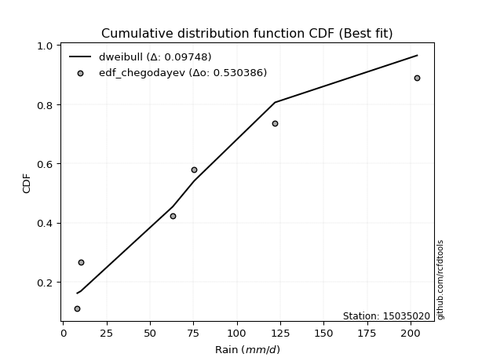</img>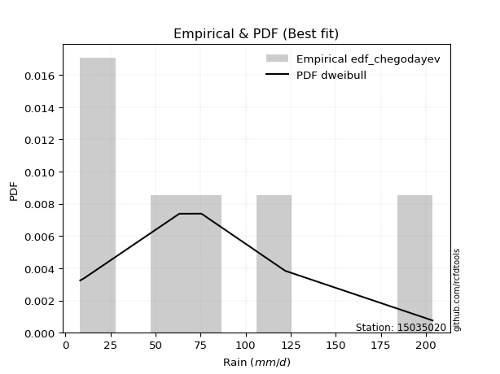</img>

</div>


### 6. Empirical - EDF Blom (1958)

The Blom formula is a specific "plotting position" formula used in hydrology and statistical analysis to estimate the empirical cumulative probability (or non-exceedance probability) of a data series. It is particularly recommended for data that are approximately normally distributed. The constant _a_ is set to 0.375 (or 3/8).

<div align="center">


$P=(m-a)/(n+1-2a)$


</div>


**6.1. Empirical values**

<div align="center">

|                | 0                  | 1                  | 2                  | 3                 | 4                 | 5                  |
|:---------------|:-------------------|:-------------------|:-------------------|:------------------|:------------------|:-------------------|
| date           | 2023               | 2020               | 2019               | 2025              | 2024              | 2022               |
| x              | 8.2                | 10.2               | 63.2               | 67.0              | 122.0             | 203.8              |
| m              | 1                  | 2                  | 3                  | 4                 | 5                 | 6                  |
| empirical_dist | edf_blom           | edf_blom           | edf_blom           | edf_blom          | edf_blom          | edf_blom           |
| empirical      | 0.1                | 0.26               | 0.42               | 0.58              | 0.74              | 0.9                |
| empirical_tr   | 1.1111111111111112 | 1.3513513513513513 | 1.7241379310344827 | 2.380952380952381 | 3.846153846153846 | 10.000000000000002 |

</div>


**6.2. Kolmogorov-Smirnov fit test (sorted by Δ)**


<div align="center">

|                | 0                   | 1                   | 2                   | 3                   | 4                   | 5                  | 6                 | 7                   | 8                   | 9                   | 10                  | 11                  | 12                  | 13                 | 14                 | 15                  | 16                  | 17                  | 18                    | 19                  | 20                  | 21                  | 22                  | 23                  | 24                 | 25                  | 26                  | 27                  | 28                 | 29                  | 30                  | 31                  | 32                  | 33                 | 34                  | 35                  | 36                  | 37                  | 38                 | 39                  | 40                  | 41                  | 42                  | 43                  | 44                  | 45                  | 46                  | 47                 | 48                 | 49                  | 50                  | 51                | 52                  | 53                  | 54                  | 55                  | 56                 | 57                  | 58                  | 59                 | 60                  | 61                 | 62                  | 63                 | 64                 | 65             | 66             | 67                  | 68                  | 69                 | 70                  | 71                  | 72                 | 73                 | 74                  | 75                  | 76                | 77                  | 78                  | 79                 | 80                 | 81                 | 82                 | 83                 | 84               | 85                  | 86                  | 87                  | 88                | 89             |
|:---------------|:--------------------|:--------------------|:--------------------|:--------------------|:--------------------|:-------------------|:------------------|:--------------------|:--------------------|:--------------------|:--------------------|:--------------------|:--------------------|:-------------------|:-------------------|:--------------------|:--------------------|:--------------------|:----------------------|:--------------------|:--------------------|:--------------------|:--------------------|:--------------------|:-------------------|:--------------------|:--------------------|:--------------------|:-------------------|:--------------------|:--------------------|:--------------------|:--------------------|:-------------------|:--------------------|:--------------------|:--------------------|:--------------------|:-------------------|:--------------------|:--------------------|:--------------------|:--------------------|:--------------------|:--------------------|:--------------------|:--------------------|:-------------------|:-------------------|:--------------------|:--------------------|:------------------|:--------------------|:--------------------|:--------------------|:--------------------|:-------------------|:--------------------|:--------------------|:-------------------|:--------------------|:-------------------|:--------------------|:-------------------|:-------------------|:---------------|:---------------|:--------------------|:--------------------|:-------------------|:--------------------|:--------------------|:-------------------|:-------------------|:--------------------|:--------------------|:------------------|:--------------------|:--------------------|:-------------------|:-------------------|:-------------------|:-------------------|:-------------------|:-----------------|:--------------------|:--------------------|:--------------------|:------------------|:---------------|
| station        | 15035020            | 15035020            | 15035020            | 15035020            | 15035020            | 15035020           | 15035020          | 15035020            | 15035020            | 15035020            | 15035020            | 15035020            | 15035020            | 15035020           | 15035020           | 15035020            | 15035020            | 15035020            | 15035020              | 15035020            | 15035020            | 15035020            | 15035020            | 15035020            | 15035020           | 15035020            | 15035020            | 15035020            | 15035020           | 15035020            | 15035020            | 15035020            | 15035020            | 15035020           | 15035020            | 15035020            | 15035020            | 15035020            | 15035020           | 15035020            | 15035020            | 15035020            | 15035020            | 15035020            | 15035020            | 15035020            | 15035020            | 15035020           | 15035020           | 15035020            | 15035020            | 15035020          | 15035020            | 15035020            | 15035020            | 15035020            | 15035020           | 15035020            | 15035020            | 15035020           | 15035020            | 15035020           | 15035020            | 15035020           | 15035020           | 15035020       | 15035020       | 15035020            | 15035020            | 15035020           | 15035020            | 15035020            | 15035020           | 15035020           | 15035020            | 15035020            | 15035020          | 15035020            | 15035020            | 15035020           | 15035020           | 15035020           | 15035020           | 15035020           | 15035020         | 15035020            | 15035020            | 15035020            | 15035020          | 15035020       |
| empirical_dist | edf_blom            | edf_blom            | edf_blom            | edf_blom            | edf_blom            | edf_blom           | edf_blom          | edf_blom            | edf_blom            | edf_blom            | edf_blom            | edf_blom            | edf_blom            | edf_blom           | edf_blom           | edf_blom            | edf_blom            | edf_blom            | edf_blom              | edf_blom            | edf_blom            | edf_blom            | edf_blom            | edf_blom            | edf_blom           | edf_blom            | edf_blom            | edf_blom            | edf_blom           | edf_blom            | edf_blom            | edf_blom            | edf_blom            | edf_blom           | edf_blom            | edf_blom            | edf_blom            | edf_blom            | edf_blom           | edf_blom            | edf_blom            | edf_blom            | edf_blom            | edf_blom            | edf_blom            | edf_blom            | edf_blom            | edf_blom           | edf_blom           | edf_blom            | edf_blom            | edf_blom          | edf_blom            | edf_blom            | edf_blom            | edf_blom            | edf_blom           | edf_blom            | edf_blom            | edf_blom           | edf_blom            | edf_blom           | edf_blom            | edf_blom           | edf_blom           | edf_blom       | edf_blom       | edf_blom            | edf_blom            | edf_blom           | edf_blom            | edf_blom            | edf_blom           | edf_blom           | edf_blom            | edf_blom            | edf_blom          | edf_blom            | edf_blom            | edf_blom           | edf_blom           | edf_blom           | edf_blom           | edf_blom           | edf_blom         | edf_blom            | edf_blom            | edf_blom            | edf_blom          | edf_blom       |
| p_dist         | rayleigh            | halfnorm            | pearson3            | maxwell             | logloggamma         | logjohnsonsu       | gumbel_r          | genlogistic         | laplace_asymmetric  | f                   | kstwobign           | t                   | crystalball         | truncnorm          | norm               | logweibull_min      | loggumbel_l         | ncf                 | loglaplace_asymmetric | rice                | moyal               | logfisk             | logistic            | halflogistic        | logpearson3        | hypsecant           | weibull_min         | logf                | logt               | logcrystalball      | lognorm             | lognorm             | logexponnorm        | lognct             | laplace             | loggamma            | loggamma            | logerlang           | loginvgamma        | loglogistic         | logrice             | nakagami            | logalpha            | fisk                | loginvgauss         | loggompertz         | logncf              | loghypsecant       | logmaxwell         | gumbel_l            | logbetaprime        | lograyleigh       | mielke              | exponnorm           | expon               | genexpon            | gompertz           | loglaplace          | invgamma            | loghalfnorm        | logkstwobign        | loggenexpon        | loginvweibull       | loggumbel_r        | logmielke          | gibrat         | wald           | logtruncnorm        | nct                 | loghalflogistic    | logmoyal            | logexpon            | betaprime          | lognakagami        | invgauss            | pareto              | logpareto         | logwald             | loglognorm          | erlang             | loggibrat          | alpha              | logchi2            | johnsonsu          | fatiguelife      | logfatiguelife      | invweibull          | gamma               | chi2              | loggenlogistic |
| delta          | 0.10412727915340958 | 0.11291660081427643 | 0.11326105082159496 | 0.11625279835936014 | 0.12376461486119567 | 0.1322235911808366 | 0.133388671431579 | 0.13811346898651278 | 0.13817247409633499 | 0.14475731893987895 | 0.14508565267964968 | 0.15064925197112167 | 0.15065040797141876 | 0.1506504094806117 | 0.1506504096582904 | 0.15211485649315976 | 0.15240707636581216 | 0.15267880952287138 | 0.1549606350420994    | 0.15663910896936584 | 0.15854137289796788 | 0.15884294383319247 | 0.16003358009273067 | 0.16138121556105717 | 0.1656608032438956 | 0.16787711018015988 | 0.16958957798182545 | 0.18733965400453018 | 0.1882264651151852 | 0.18822823534915062 | 0.18822830062952361 | 0.18822830062952361 | 0.18823029369048477 | 0.1883105634468964 | 0.19128935054730695 | 0.19583286435220942 | 0.19583286435220942 | 0.19749145829868892 | 0.2001003534356191 | 0.20204999729114043 | 0.20347849550200653 | 0.20467034188465522 | 0.20495658344739037 | 0.20501915768936071 | 0.20533948694107856 | 0.20710577835182883 | 0.21172519186260136 | 0.2132780335989652 | 0.2140141980903531 | 0.21964444406021988 | 0.22157193096885314 | 0.221974116685903 | 0.22514143875691278 | 0.23093835706262356 | 0.23217250773986087 | 0.23339400190029053 | 0.2341470701893455 | 0.24096020185003358 | 0.24286684814372878 | 0.2446921206604647 | 0.24524928421582864 | 0.2483922322206515 | 0.24884690404713344 | 0.2538578009210766 | 0.2592520695293648 | 0.26           | 0.26           | 0.26252738284039995 | 0.26355221358634257 | 0.2730507374305223 | 0.27615932479896105 | 0.27658045913660206 | 0.2886164374220079 | 0.2892193589380618 | 0.29312410795185956 | 0.29421610405171966 | 0.296438313964886 | 0.33842362270234533 | 0.35826359060749124 | 0.3615599783971411 | 0.3703252240480703 | 0.3857539956641773 | 0.3928197347865328 | 0.4140141272020663 | 0.42727130341236 | 0.44248485958928235 | 0.44674497905785077 | 0.49994421322609045 | 0.579866233152575 | 0.74           |
| deltao         | 0.530385761606      | 0.530385761606      | 0.530385761606      | 0.530385761606      | 0.530385761606      | 0.530385761606     | 0.530385761606    | 0.530385761606      | 0.530385761606      | 0.530385761606      | 0.530385761606      | 0.530385761606      | 0.530385761606      | 0.530385761606     | 0.530385761606     | 0.530385761606      | 0.530385761606      | 0.530385761606      | 0.530385761606        | 0.530385761606      | 0.530385761606      | 0.530385761606      | 0.530385761606      | 0.530385761606      | 0.530385761606     | 0.530385761606      | 0.530385761606      | 0.530385761606      | 0.530385761606     | 0.530385761606      | 0.530385761606      | 0.530385761606      | 0.530385761606      | 0.530385761606     | 0.530385761606      | 0.530385761606      | 0.530385761606      | 0.530385761606      | 0.530385761606     | 0.530385761606      | 0.530385761606      | 0.530385761606      | 0.530385761606      | 0.530385761606      | 0.530385761606      | 0.530385761606      | 0.530385761606      | 0.530385761606     | 0.530385761606     | 0.530385761606      | 0.530385761606      | 0.530385761606    | 0.530385761606      | 0.530385761606      | 0.530385761606      | 0.530385761606      | 0.530385761606     | 0.530385761606      | 0.530385761606      | 0.530385761606     | 0.530385761606      | 0.530385761606     | 0.530385761606      | 0.530385761606     | 0.530385761606     | 0.530385761606 | 0.530385761606 | 0.530385761606      | 0.530385761606      | 0.530385761606     | 0.530385761606      | 0.530385761606      | 0.530385761606     | 0.530385761606     | 0.530385761606      | 0.530385761606      | 0.530385761606    | 0.530385761606      | 0.530385761606      | 0.530385761606     | 0.530385761606     | 0.530385761606     | 0.530385761606     | 0.530385761606     | 0.530385761606   | 0.530385761606      | 0.530385761606      | 0.530385761606      | 0.530385761606    | 0.530385761606 |
| eval           | Δo > Δ              | Δo > Δ              | Δo > Δ              | Δo > Δ              | Δo > Δ              | Δo > Δ             | Δo > Δ            | Δo > Δ              | Δo > Δ              | Δo > Δ              | Δo > Δ              | Δo > Δ              | Δo > Δ              | Δo > Δ             | Δo > Δ             | Δo > Δ              | Δo > Δ              | Δo > Δ              | Δo > Δ                | Δo > Δ              | Δo > Δ              | Δo > Δ              | Δo > Δ              | Δo > Δ              | Δo > Δ             | Δo > Δ              | Δo > Δ              | Δo > Δ              | Δo > Δ             | Δo > Δ              | Δo > Δ              | Δo > Δ              | Δo > Δ              | Δo > Δ             | Δo > Δ              | Δo > Δ              | Δo > Δ              | Δo > Δ              | Δo > Δ             | Δo > Δ              | Δo > Δ              | Δo > Δ              | Δo > Δ              | Δo > Δ              | Δo > Δ              | Δo > Δ              | Δo > Δ              | Δo > Δ             | Δo > Δ             | Δo > Δ              | Δo > Δ              | Δo > Δ            | Δo > Δ              | Δo > Δ              | Δo > Δ              | Δo > Δ              | Δo > Δ             | Δo > Δ              | Δo > Δ              | Δo > Δ             | Δo > Δ              | Δo > Δ             | Δo > Δ              | Δo > Δ             | Δo > Δ             | Δo > Δ         | Δo > Δ         | Δo > Δ              | Δo > Δ              | Δo > Δ             | Δo > Δ              | Δo > Δ              | Δo > Δ             | Δo > Δ             | Δo > Δ              | Δo > Δ              | Δo > Δ            | Δo > Δ              | Δo > Δ              | Δo > Δ             | Δo > Δ             | Δo > Δ             | Δo > Δ             | Δo > Δ             | Δo > Δ           | Δo > Δ              | Δo > Δ              | Δo > Δ              | Δo <= Δ           | Δo <= Δ        |
| fit            | 1                   | 1                   | 1                   | 1                   | 1                   | 1                  | 1                 | 1                   | 1                   | 1                   | 1                   | 1                   | 1                   | 1                  | 1                  | 1                   | 1                   | 1                   | 1                     | 1                   | 1                   | 1                   | 1                   | 1                   | 1                  | 1                   | 1                   | 1                   | 1                  | 1                   | 1                   | 1                   | 1                   | 1                  | 1                   | 1                   | 1                   | 1                   | 1                  | 1                   | 1                   | 1                   | 1                   | 1                   | 1                   | 1                   | 1                   | 1                  | 1                  | 1                   | 1                   | 1                 | 1                   | 1                   | 1                   | 1                   | 1                  | 1                   | 1                   | 1                  | 1                   | 1                  | 1                   | 1                  | 1                  | 1              | 1              | 1                   | 1                   | 1                  | 1                   | 1                   | 1                  | 1                  | 1                   | 1                   | 1                 | 1                   | 1                   | 1                  | 1                  | 1                  | 1                  | 1                  | 1                | 1                   | 1                   | 1                   | 0                 | 0              |
| n              | 6                   | 6                   | 6                   | 6                   | 6                   | 6                  | 6                 | 6                   | 6                   | 6                   | 6                   | 6                   | 6                   | 6                  | 6                  | 6                   | 6                   | 6                   | 6                     | 6                   | 6                   | 6                   | 6                   | 6                   | 6                  | 6                   | 6                   | 6                   | 6                  | 6                   | 6                   | 6                   | 6                   | 6                  | 6                   | 6                   | 6                   | 6                   | 6                  | 6                   | 6                   | 6                   | 6                   | 6                   | 6                   | 6                   | 6                   | 6                  | 6                  | 6                   | 6                   | 6                 | 6                   | 6                   | 6                   | 6                   | 6                  | 6                   | 6                   | 6                  | 6                   | 6                  | 6                   | 6                  | 6                  | 6              | 6              | 6                   | 6                   | 6                  | 6                   | 6                   | 6                  | 6                  | 6                   | 6                   | 6                 | 6                   | 6                   | 6                  | 6                  | 6                  | 6                  | 6                  | 6                | 6                   | 6                   | 6                   | 6                 | 6              |
| best_fit       | 1                   | 0                   | 0                   | 0                   | 0                   | 0                  | 0                 | 0                   | 0                   | 0                   | 0                   | 0                   | 0                   | 0                  | 0                  | 0                   | 0                   | 0                   | 0                     | 0                   | 0                   | 0                   | 0                   | 0                   | 0                  | 0                   | 0                   | 0                   | 0                  | 0                   | 0                   | 0                   | 0                   | 0                  | 0                   | 0                   | 0                   | 0                   | 0                  | 0                   | 0                   | 0                   | 0                   | 0                   | 0                   | 0                   | 0                   | 0                  | 0                  | 0                   | 0                   | 0                 | 0                   | 0                   | 0                   | 0                   | 0                  | 0                   | 0                   | 0                  | 0                   | 0                  | 0                   | 0                  | 0                  | 0              | 0              | 0                   | 0                   | 0                  | 0                   | 0                   | 0                  | 0                  | 0                   | 0                   | 0                 | 0                   | 0                   | 0                  | 0                  | 0                  | 0                  | 0                  | 0                | 0                   | 0                   | 0                   | 0                 | 0              |
| best_fit_sort  | 1                   | 2                   | 3                   | 4                   | 5                   | 6                  | 7                 | 8                   | 9                   | 10                  | 11                  | 12                  | 13                  | 14                 | 15                 | 16                  | 17                  | 18                  | 19                    | 20                  | 21                  | 22                  | 23                  | 24                  | 25                 | 26                  | 27                  | 28                  | 29                 | 30                  | 31                  | 32                  | 33                  | 34                 | 35                  | 36                  | 37                  | 38                  | 39                 | 40                  | 41                  | 42                  | 43                  | 44                  | 45                  | 46                  | 47                  | 48                 | 49                 | 50                  | 51                  | 52                | 53                  | 54                  | 55                  | 56                  | 57                 | 58                  | 59                  | 60                 | 61                  | 62                 | 63                  | 64                 | 65                 | 66             | 67             | 68                  | 69                  | 70                 | 71                  | 72                  | 73                 | 74                 | 75                  | 76                  | 77                | 78                  | 79                  | 80                 | 81                 | 82                 | 83                 | 84                 | 85               | 86                  | 87                  | 88                  | 89                | 90             |

</div>


<div align="center">

</img>

</div>


**6.3. Best fit**

<div align="center">

|   id |   station | empirical_dist   | p_dist   |    delta |   deltao | eval   |   fit |   n |   best_fit |   best_fit_sort |
|-----:|----------:|:-----------------|:---------|---------:|---------:|:-------|------:|----:|-----------:|----------------:|
|    0 |  15035020 | edf_blom         | rayleigh | 0.104127 | 0.530386 | Δo > Δ |     1 |   6 |          1 |               1 |

</div>


<div align="center">

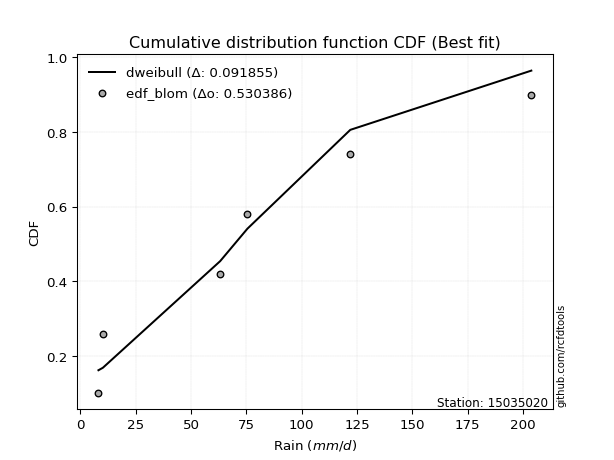</img>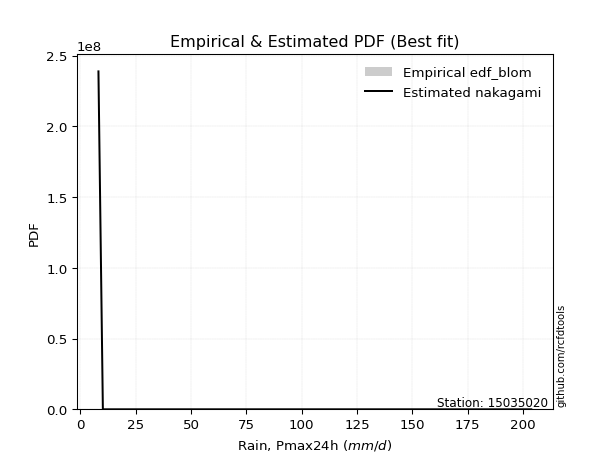</img>

</div>


### 7. Empirical - EDF Tukey (1962)

In hydrology, the Tukey formula is used as a plotting position formula to estimate the empirical probability or frequency of a flood event (or other hydrological data). The formula parameter is given as _c=0.333_ (or 1/3).

<div align="center">


$P=(m-c)/(n+1-2c)$


</div>


**7.1. Empirical values**

<div align="center">

|                | 0                   | 1                  | 2                   | 3                  | 4                  | 5                  |
|:---------------|:--------------------|:-------------------|:--------------------|:-------------------|:-------------------|:-------------------|
| date           | 2023                | 2020               | 2019                | 2025               | 2024               | 2022               |
| x              | 8.2                 | 10.2               | 63.2                | 67.0               | 122.0              | 203.8              |
| m              | 1                   | 2                  | 3                   | 4                  | 5                  | 6                  |
| empirical_dist | edf_tukey           | edf_tukey          | edf_tukey           | edf_tukey          | edf_tukey          | edf_tukey          |
| empirical      | 0.10526315789473684 | 0.2631578947368421 | 0.42105263157894735 | 0.5789473684210527 | 0.7368421052631579 | 0.8947368421052632 |
| empirical_tr   | 1.1176470588235294  | 1.357142857142857  | 1.7272727272727273  | 2.375              | 3.7999999999999994 | 9.5                |

</div>


**7.2. Kolmogorov-Smirnov fit test (sorted by Δ)**


<div align="center">

|                | 0                   | 1                   | 2                   | 3                   | 4                   | 5                   | 6                  | 7                   | 8                   | 9                   | 10                  | 11                  | 12                  | 13                 | 14                 | 15                    | 16                  | 17                  | 18                  | 19                  | 20                  | 21                  | 22                  | 23                  | 24                  | 25                  | 26                  | 27                  | 28                  | 29                  | 30                  | 31                  | 32                 | 33                  | 34                  | 35                  | 36                  | 37                  | 38                  | 39                  | 40                  | 41                  | 42                | 43                 | 44                 | 45                  | 46                | 47                  | 48                  | 49                  | 50                  | 51                  | 52                  | 53                  | 54                  | 55                 | 56                  | 57                  | 58                  | 59                  | 60                  | 61                  | 62                  | 63                  | 64                  | 65                 | 66                 | 67                 | 68                 | 69                 | 70                 | 71                 | 72                 | 73                 | 74                 | 75                 | 76                  | 77                  | 78                  | 79                  | 80                 | 81                 | 82                  | 83                  | 84                  | 85                | 86                 | 87                 | 88                 | 89                 |
|:---------------|:--------------------|:--------------------|:--------------------|:--------------------|:--------------------|:--------------------|:-------------------|:--------------------|:--------------------|:--------------------|:--------------------|:--------------------|:--------------------|:-------------------|:-------------------|:----------------------|:--------------------|:--------------------|:--------------------|:--------------------|:--------------------|:--------------------|:--------------------|:--------------------|:--------------------|:--------------------|:--------------------|:--------------------|:--------------------|:--------------------|:--------------------|:--------------------|:-------------------|:--------------------|:--------------------|:--------------------|:--------------------|:--------------------|:--------------------|:--------------------|:--------------------|:--------------------|:------------------|:-------------------|:-------------------|:--------------------|:------------------|:--------------------|:--------------------|:--------------------|:--------------------|:--------------------|:--------------------|:--------------------|:--------------------|:-------------------|:--------------------|:--------------------|:--------------------|:--------------------|:--------------------|:--------------------|:--------------------|:--------------------|:--------------------|:-------------------|:-------------------|:-------------------|:-------------------|:-------------------|:-------------------|:-------------------|:-------------------|:-------------------|:-------------------|:-------------------|:--------------------|:--------------------|:--------------------|:--------------------|:-------------------|:-------------------|:--------------------|:--------------------|:--------------------|:------------------|:-------------------|:-------------------|:-------------------|:-------------------|
| station        | 15035020            | 15035020            | 15035020            | 15035020            | 15035020            | 15035020            | 15035020           | 15035020            | 15035020            | 15035020            | 15035020            | 15035020            | 15035020            | 15035020           | 15035020           | 15035020              | 15035020            | 15035020            | 15035020            | 15035020            | 15035020            | 15035020            | 15035020            | 15035020            | 15035020            | 15035020            | 15035020            | 15035020            | 15035020            | 15035020            | 15035020            | 15035020            | 15035020           | 15035020            | 15035020            | 15035020            | 15035020            | 15035020            | 15035020            | 15035020            | 15035020            | 15035020            | 15035020          | 15035020           | 15035020           | 15035020            | 15035020          | 15035020            | 15035020            | 15035020            | 15035020            | 15035020            | 15035020            | 15035020            | 15035020            | 15035020           | 15035020            | 15035020            | 15035020            | 15035020            | 15035020            | 15035020            | 15035020            | 15035020            | 15035020            | 15035020           | 15035020           | 15035020           | 15035020           | 15035020           | 15035020           | 15035020           | 15035020           | 15035020           | 15035020           | 15035020           | 15035020            | 15035020            | 15035020            | 15035020            | 15035020           | 15035020           | 15035020            | 15035020            | 15035020            | 15035020          | 15035020           | 15035020           | 15035020           | 15035020           |
| empirical_dist | edf_tukey           | edf_tukey           | edf_tukey           | edf_tukey           | edf_tukey           | edf_tukey           | edf_tukey          | edf_tukey           | edf_tukey           | edf_tukey           | edf_tukey           | edf_tukey           | edf_tukey           | edf_tukey          | edf_tukey          | edf_tukey             | edf_tukey           | edf_tukey           | edf_tukey           | edf_tukey           | edf_tukey           | edf_tukey           | edf_tukey           | edf_tukey           | edf_tukey           | edf_tukey           | edf_tukey           | edf_tukey           | edf_tukey           | edf_tukey           | edf_tukey           | edf_tukey           | edf_tukey          | edf_tukey           | edf_tukey           | edf_tukey           | edf_tukey           | edf_tukey           | edf_tukey           | edf_tukey           | edf_tukey           | edf_tukey           | edf_tukey         | edf_tukey          | edf_tukey          | edf_tukey           | edf_tukey         | edf_tukey           | edf_tukey           | edf_tukey           | edf_tukey           | edf_tukey           | edf_tukey           | edf_tukey           | edf_tukey           | edf_tukey          | edf_tukey           | edf_tukey           | edf_tukey           | edf_tukey           | edf_tukey           | edf_tukey           | edf_tukey           | edf_tukey           | edf_tukey           | edf_tukey          | edf_tukey          | edf_tukey          | edf_tukey          | edf_tukey          | edf_tukey          | edf_tukey          | edf_tukey          | edf_tukey          | edf_tukey          | edf_tukey          | edf_tukey           | edf_tukey           | edf_tukey           | edf_tukey           | edf_tukey          | edf_tukey          | edf_tukey           | edf_tukey           | edf_tukey           | edf_tukey         | edf_tukey          | edf_tukey          | edf_tukey          | edf_tukey          |
| p_dist         | rayleigh            | maxwell             | halfnorm            | pearson3            | logloggamma         | logjohnsonsu        | gumbel_r           | genlogistic         | laplace_asymmetric  | f                   | kstwobign           | t                   | crystalball         | truncnorm          | norm               | loglaplace_asymmetric | logweibull_min      | loggumbel_l         | ncf                 | logistic            | rice                | moyal               | logfisk             | halflogistic        | logpearson3         | hypsecant           | weibull_min         | logf                | logt                | logcrystalball      | lognorm             | lognorm             | logexponnorm       | lognct              | laplace             | loggamma            | loggamma            | logerlang           | loginvgamma         | loglogistic         | logrice             | nakagami            | logalpha          | loginvgauss        | fisk               | loggompertz         | logncf            | loghypsecant        | logmaxwell          | gumbel_l            | logbetaprime        | lograyleigh         | mielke              | exponnorm           | expon               | genexpon           | gompertz            | loglaplace          | invgamma            | loghalfnorm         | logkstwobign        | loggenexpon         | loginvweibull       | loggumbel_r         | logmielke           | logtruncnorm       | nct                | wald               | gibrat             | loghalflogistic    | logmoyal           | logexpon           | betaprime          | lognakagami        | invgauss           | pareto             | logpareto           | logwald             | loglognorm          | erlang              | loggibrat          | alpha              | logchi2             | johnsonsu           | fatiguelife         | logfatiguelife    | invweibull         | gamma              | chi2               | loggenlogistic     |
| delta          | 0.10457038255086601 | 0.11520016678041284 | 0.11607449555111851 | 0.11641894555843704 | 0.12692250959803775 | 0.13538148591767868 | 0.1365465661684211 | 0.14127136372335486 | 0.14133036883317707 | 0.14791521367672103 | 0.14824354741649176 | 0.14959662039217436 | 0.14959777639247146 | 0.1495977779016644 | 0.1495977780793431 | 0.15390800346315203   | 0.15527275123000184 | 0.15556497110265424 | 0.15583670425971347 | 0.15898094851378336 | 0.15979700370620792 | 0.16169926763480996 | 0.16192405833197426 | 0.16453911029789925 | 0.16460817166494823 | 0.16682447860121258 | 0.16853694640287809 | 0.18628702242558282 | 0.18717383353623784 | 0.18717560377020326 | 0.18717566905057625 | 0.18717566905057625 | 0.1871776621115374 | 0.18725793186794903 | 0.19023671896835964 | 0.19478023277326206 | 0.19478023277326206 | 0.19643882671974155 | 0.19904772185667174 | 0.20099736571219307 | 0.20242586392305917 | 0.20361771030570786 | 0.203903951868443 | 0.2042868553621312 | 0.2081770524262028 | 0.21026367308867092 | 0.210672560283654 | 0.21222540202001783 | 0.21296156651140574 | 0.21859181248127257 | 0.22051929938990578 | 0.22092148510695564 | 0.22408880717796542 | 0.23409625179946564 | 0.23533040247670295 | 0.2365518966371326 | 0.23730496492618758 | 0.23990757027108622 | 0.24181421656478141 | 0.24363948908151734 | 0.24419665263688128 | 0.24733960064170413 | 0.24779427246818608 | 0.25280516934212927 | 0.25819943795041744 | 0.2614747512614526 | 0.2624995820073952 | 0.2631578947368421 | 0.2631578947368421 | 0.2719981058515749 | 0.2751066932200137 | 0.2755278275576547 | 0.2875638058430605 | 0.2881667273591144 | 0.2920714763729122 | 0.2931634724727723 | 0.29538568238593865 | 0.33737099112339797 | 0.35510569587064916 | 0.36050734681819374 | 0.3692725924691229 | 0.3847013640852299 | 0.39176710320758545 | 0.41085623246522424 | 0.42621867183341267 | 0.441432228010335 | 0.4414818211631139 | 0.4988915816471431 | 0.5788136015736276 | 0.7368421052631579 |
| deltao         | 0.530385761606      | 0.530385761606      | 0.530385761606      | 0.530385761606      | 0.530385761606      | 0.530385761606      | 0.530385761606     | 0.530385761606      | 0.530385761606      | 0.530385761606      | 0.530385761606      | 0.530385761606      | 0.530385761606      | 0.530385761606     | 0.530385761606     | 0.530385761606        | 0.530385761606      | 0.530385761606      | 0.530385761606      | 0.530385761606      | 0.530385761606      | 0.530385761606      | 0.530385761606      | 0.530385761606      | 0.530385761606      | 0.530385761606      | 0.530385761606      | 0.530385761606      | 0.530385761606      | 0.530385761606      | 0.530385761606      | 0.530385761606      | 0.530385761606     | 0.530385761606      | 0.530385761606      | 0.530385761606      | 0.530385761606      | 0.530385761606      | 0.530385761606      | 0.530385761606      | 0.530385761606      | 0.530385761606      | 0.530385761606    | 0.530385761606     | 0.530385761606     | 0.530385761606      | 0.530385761606    | 0.530385761606      | 0.530385761606      | 0.530385761606      | 0.530385761606      | 0.530385761606      | 0.530385761606      | 0.530385761606      | 0.530385761606      | 0.530385761606     | 0.530385761606      | 0.530385761606      | 0.530385761606      | 0.530385761606      | 0.530385761606      | 0.530385761606      | 0.530385761606      | 0.530385761606      | 0.530385761606      | 0.530385761606     | 0.530385761606     | 0.530385761606     | 0.530385761606     | 0.530385761606     | 0.530385761606     | 0.530385761606     | 0.530385761606     | 0.530385761606     | 0.530385761606     | 0.530385761606     | 0.530385761606      | 0.530385761606      | 0.530385761606      | 0.530385761606      | 0.530385761606     | 0.530385761606     | 0.530385761606      | 0.530385761606      | 0.530385761606      | 0.530385761606    | 0.530385761606     | 0.530385761606     | 0.530385761606     | 0.530385761606     |
| eval           | Δo > Δ              | Δo > Δ              | Δo > Δ              | Δo > Δ              | Δo > Δ              | Δo > Δ              | Δo > Δ             | Δo > Δ              | Δo > Δ              | Δo > Δ              | Δo > Δ              | Δo > Δ              | Δo > Δ              | Δo > Δ             | Δo > Δ             | Δo > Δ                | Δo > Δ              | Δo > Δ              | Δo > Δ              | Δo > Δ              | Δo > Δ              | Δo > Δ              | Δo > Δ              | Δo > Δ              | Δo > Δ              | Δo > Δ              | Δo > Δ              | Δo > Δ              | Δo > Δ              | Δo > Δ              | Δo > Δ              | Δo > Δ              | Δo > Δ             | Δo > Δ              | Δo > Δ              | Δo > Δ              | Δo > Δ              | Δo > Δ              | Δo > Δ              | Δo > Δ              | Δo > Δ              | Δo > Δ              | Δo > Δ            | Δo > Δ             | Δo > Δ             | Δo > Δ              | Δo > Δ            | Δo > Δ              | Δo > Δ              | Δo > Δ              | Δo > Δ              | Δo > Δ              | Δo > Δ              | Δo > Δ              | Δo > Δ              | Δo > Δ             | Δo > Δ              | Δo > Δ              | Δo > Δ              | Δo > Δ              | Δo > Δ              | Δo > Δ              | Δo > Δ              | Δo > Δ              | Δo > Δ              | Δo > Δ             | Δo > Δ             | Δo > Δ             | Δo > Δ             | Δo > Δ             | Δo > Δ             | Δo > Δ             | Δo > Δ             | Δo > Δ             | Δo > Δ             | Δo > Δ             | Δo > Δ              | Δo > Δ              | Δo > Δ              | Δo > Δ              | Δo > Δ             | Δo > Δ             | Δo > Δ              | Δo > Δ              | Δo > Δ              | Δo > Δ            | Δo > Δ             | Δo > Δ             | Δo <= Δ            | Δo <= Δ            |
| fit            | 1                   | 1                   | 1                   | 1                   | 1                   | 1                   | 1                  | 1                   | 1                   | 1                   | 1                   | 1                   | 1                   | 1                  | 1                  | 1                     | 1                   | 1                   | 1                   | 1                   | 1                   | 1                   | 1                   | 1                   | 1                   | 1                   | 1                   | 1                   | 1                   | 1                   | 1                   | 1                   | 1                  | 1                   | 1                   | 1                   | 1                   | 1                   | 1                   | 1                   | 1                   | 1                   | 1                 | 1                  | 1                  | 1                   | 1                 | 1                   | 1                   | 1                   | 1                   | 1                   | 1                   | 1                   | 1                   | 1                  | 1                   | 1                   | 1                   | 1                   | 1                   | 1                   | 1                   | 1                   | 1                   | 1                  | 1                  | 1                  | 1                  | 1                  | 1                  | 1                  | 1                  | 1                  | 1                  | 1                  | 1                   | 1                   | 1                   | 1                   | 1                  | 1                  | 1                   | 1                   | 1                   | 1                 | 1                  | 1                  | 0                  | 0                  |
| n              | 6                   | 6                   | 6                   | 6                   | 6                   | 6                   | 6                  | 6                   | 6                   | 6                   | 6                   | 6                   | 6                   | 6                  | 6                  | 6                     | 6                   | 6                   | 6                   | 6                   | 6                   | 6                   | 6                   | 6                   | 6                   | 6                   | 6                   | 6                   | 6                   | 6                   | 6                   | 6                   | 6                  | 6                   | 6                   | 6                   | 6                   | 6                   | 6                   | 6                   | 6                   | 6                   | 6                 | 6                  | 6                  | 6                   | 6                 | 6                   | 6                   | 6                   | 6                   | 6                   | 6                   | 6                   | 6                   | 6                  | 6                   | 6                   | 6                   | 6                   | 6                   | 6                   | 6                   | 6                   | 6                   | 6                  | 6                  | 6                  | 6                  | 6                  | 6                  | 6                  | 6                  | 6                  | 6                  | 6                  | 6                   | 6                   | 6                   | 6                   | 6                  | 6                  | 6                   | 6                   | 6                   | 6                 | 6                  | 6                  | 6                  | 6                  |
| best_fit       | 1                   | 0                   | 0                   | 0                   | 0                   | 0                   | 0                  | 0                   | 0                   | 0                   | 0                   | 0                   | 0                   | 0                  | 0                  | 0                     | 0                   | 0                   | 0                   | 0                   | 0                   | 0                   | 0                   | 0                   | 0                   | 0                   | 0                   | 0                   | 0                   | 0                   | 0                   | 0                   | 0                  | 0                   | 0                   | 0                   | 0                   | 0                   | 0                   | 0                   | 0                   | 0                   | 0                 | 0                  | 0                  | 0                   | 0                 | 0                   | 0                   | 0                   | 0                   | 0                   | 0                   | 0                   | 0                   | 0                  | 0                   | 0                   | 0                   | 0                   | 0                   | 0                   | 0                   | 0                   | 0                   | 0                  | 0                  | 0                  | 0                  | 0                  | 0                  | 0                  | 0                  | 0                  | 0                  | 0                  | 0                   | 0                   | 0                   | 0                   | 0                  | 0                  | 0                   | 0                   | 0                   | 0                 | 0                  | 0                  | 0                  | 0                  |
| best_fit_sort  | 1                   | 2                   | 3                   | 4                   | 5                   | 6                   | 7                  | 8                   | 9                   | 10                  | 11                  | 12                  | 13                  | 14                 | 15                 | 16                    | 17                  | 18                  | 19                  | 20                  | 21                  | 22                  | 23                  | 24                  | 25                  | 26                  | 27                  | 28                  | 29                  | 30                  | 31                  | 32                  | 33                 | 34                  | 35                  | 36                  | 37                  | 38                  | 39                  | 40                  | 41                  | 42                  | 43                | 44                 | 45                 | 46                  | 47                | 48                  | 49                  | 50                  | 51                  | 52                  | 53                  | 54                  | 55                  | 56                 | 57                  | 58                  | 59                  | 60                  | 61                  | 62                  | 63                  | 64                  | 65                  | 66                 | 67                 | 68                 | 69                 | 70                 | 71                 | 72                 | 73                 | 74                 | 75                 | 76                 | 77                  | 78                  | 79                  | 80                  | 81                 | 82                 | 83                  | 84                  | 85                  | 86                | 87                 | 88                 | 89                 | 90                 |

</div>


<div align="center">

</img>

</div>


**7.3. Best fit**

<div align="center">

|   id |   station | empirical_dist   | p_dist   |   delta |   deltao | eval   |   fit |   n |   best_fit |   best_fit_sort |
|-----:|----------:|:-----------------|:---------|--------:|---------:|:-------|------:|----:|-----------:|----------------:|
|    0 |  15035020 | edf_tukey        | rayleigh | 0.10457 | 0.530386 | Δo > Δ |     1 |   6 |          1 |               1 |

</div>


<div align="center">

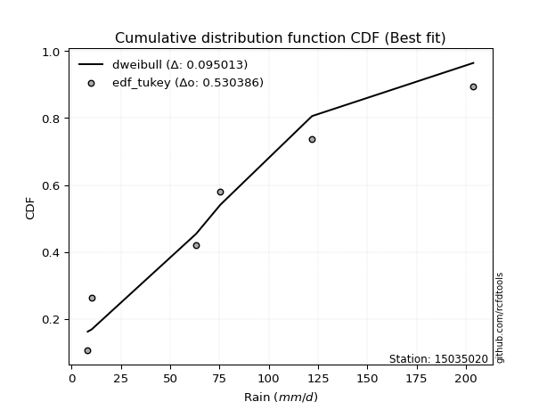</img></img>

</div>


### 8. Empirical - EDF Gringorten (1963)

Gringorten plotting position formula is essential for estimating the probability and return periods of extreme events like floods and heavy rainfall. The constant _a=0.44_.

<div align="center">


$P=(m-a)/(n+1-2a)$


</div>


**8.1. Empirical values**

<div align="center">

|                | 0                   | 1                  | 2                   | 3                  | 4                  | 5                  |
|:---------------|:--------------------|:-------------------|:--------------------|:-------------------|:-------------------|:-------------------|
| date           | 2023                | 2020               | 2019                | 2025               | 2024               | 2022               |
| x              | 8.2                 | 10.2               | 63.2                | 67.0               | 122.0              | 203.8              |
| m              | 1                   | 2                  | 3                   | 4                  | 5                  | 6                  |
| empirical_dist | edf_gringorten      | edf_gringorten     | edf_gringorten      | edf_gringorten     | edf_gringorten     | edf_gringorten     |
| empirical      | 0.09150326797385622 | 0.2549019607843137 | 0.41830065359477125 | 0.5816993464052288 | 0.7450980392156862 | 0.9084967320261437 |
| empirical_tr   | 1.1007194244604317  | 1.3421052631578947 | 1.7191011235955058  | 2.3906250000000004 | 3.9230769230769216 | 10.928571428571415 |

</div>


**8.2. Kolmogorov-Smirnov fit test (sorted by Δ)**


<div align="center">

|                | 0                   | 1                   | 2                   | 3                   | 4                   | 5                  | 6                  | 7                   | 8                   | 9                   | 10                  | 11                  | 12                  | 13                  | 14                  | 15                 | 16                 | 17                  | 18                  | 19                  | 20                  | 21                    | 22                 | 23                 | 24                  | 25                  | 26                  | 27                 | 28                  | 29                  | 30                  | 31                  | 32                 | 33                  | 34                 | 35                  | 36                  | 37                  | 38                  | 39                  | 40                  | 41                  | 42                  | 43                  | 44                 | 45                 | 46                 | 47                  | 48                  | 49                  | 50                  | 51                  | 52                  | 53                 | 54                  | 55                  | 56                 | 57                  | 58                 | 59                  | 60                  | 61                 | 62                 | 63                 | 64                 | 65                  | 66                  | 67                 | 68                 | 69                | 70                 | 71                 | 72                 | 73                 | 74                 | 75                 | 76                  | 77                  | 78                  | 79                  | 80                | 81                | 82                  | 83                 | 84                  | 85                 | 86                 | 87                 | 88                 | 89                 |
|:---------------|:--------------------|:--------------------|:--------------------|:--------------------|:--------------------|:-------------------|:-------------------|:--------------------|:--------------------|:--------------------|:--------------------|:--------------------|:--------------------|:--------------------|:--------------------|:-------------------|:-------------------|:--------------------|:--------------------|:--------------------|:--------------------|:----------------------|:-------------------|:-------------------|:--------------------|:--------------------|:--------------------|:-------------------|:--------------------|:--------------------|:--------------------|:--------------------|:-------------------|:--------------------|:-------------------|:--------------------|:--------------------|:--------------------|:--------------------|:--------------------|:--------------------|:--------------------|:--------------------|:--------------------|:-------------------|:-------------------|:-------------------|:--------------------|:--------------------|:--------------------|:--------------------|:--------------------|:--------------------|:-------------------|:--------------------|:--------------------|:-------------------|:--------------------|:-------------------|:--------------------|:--------------------|:-------------------|:-------------------|:-------------------|:-------------------|:--------------------|:--------------------|:-------------------|:-------------------|:------------------|:-------------------|:-------------------|:-------------------|:-------------------|:-------------------|:-------------------|:--------------------|:--------------------|:--------------------|:--------------------|:------------------|:------------------|:--------------------|:-------------------|:--------------------|:-------------------|:-------------------|:-------------------|:-------------------|:-------------------|
| station        | 15035020            | 15035020            | 15035020            | 15035020            | 15035020            | 15035020           | 15035020           | 15035020            | 15035020            | 15035020            | 15035020            | 15035020            | 15035020            | 15035020            | 15035020            | 15035020           | 15035020           | 15035020            | 15035020            | 15035020            | 15035020            | 15035020              | 15035020           | 15035020           | 15035020            | 15035020            | 15035020            | 15035020           | 15035020            | 15035020            | 15035020            | 15035020            | 15035020           | 15035020            | 15035020           | 15035020            | 15035020            | 15035020            | 15035020            | 15035020            | 15035020            | 15035020            | 15035020            | 15035020            | 15035020           | 15035020           | 15035020           | 15035020            | 15035020            | 15035020            | 15035020            | 15035020            | 15035020            | 15035020           | 15035020            | 15035020            | 15035020           | 15035020            | 15035020           | 15035020            | 15035020            | 15035020           | 15035020           | 15035020           | 15035020           | 15035020            | 15035020            | 15035020           | 15035020           | 15035020          | 15035020           | 15035020           | 15035020           | 15035020           | 15035020           | 15035020           | 15035020            | 15035020            | 15035020            | 15035020            | 15035020          | 15035020          | 15035020            | 15035020           | 15035020            | 15035020           | 15035020           | 15035020           | 15035020           | 15035020           |
| empirical_dist | edf_gringorten      | edf_gringorten      | edf_gringorten      | edf_gringorten      | edf_gringorten      | edf_gringorten     | edf_gringorten     | edf_gringorten      | edf_gringorten      | edf_gringorten      | edf_gringorten      | edf_gringorten      | edf_gringorten      | edf_gringorten      | edf_gringorten      | edf_gringorten     | edf_gringorten     | edf_gringorten      | edf_gringorten      | edf_gringorten      | edf_gringorten      | edf_gringorten        | edf_gringorten     | edf_gringorten     | edf_gringorten      | edf_gringorten      | edf_gringorten      | edf_gringorten     | edf_gringorten      | edf_gringorten      | edf_gringorten      | edf_gringorten      | edf_gringorten     | edf_gringorten      | edf_gringorten     | edf_gringorten      | edf_gringorten      | edf_gringorten      | edf_gringorten      | edf_gringorten      | edf_gringorten      | edf_gringorten      | edf_gringorten      | edf_gringorten      | edf_gringorten     | edf_gringorten     | edf_gringorten     | edf_gringorten      | edf_gringorten      | edf_gringorten      | edf_gringorten      | edf_gringorten      | edf_gringorten      | edf_gringorten     | edf_gringorten      | edf_gringorten      | edf_gringorten     | edf_gringorten      | edf_gringorten     | edf_gringorten      | edf_gringorten      | edf_gringorten     | edf_gringorten     | edf_gringorten     | edf_gringorten     | edf_gringorten      | edf_gringorten      | edf_gringorten     | edf_gringorten     | edf_gringorten    | edf_gringorten     | edf_gringorten     | edf_gringorten     | edf_gringorten     | edf_gringorten     | edf_gringorten     | edf_gringorten      | edf_gringorten      | edf_gringorten      | edf_gringorten      | edf_gringorten    | edf_gringorten    | edf_gringorten      | edf_gringorten     | edf_gringorten      | edf_gringorten     | edf_gringorten     | edf_gringorten     | edf_gringorten     | edf_gringorten     |
| p_dist         | rayleigh            | halfnorm            | pearson3            | maxwell             | logloggamma         | logjohnsonsu       | gumbel_r           | genlogistic         | laplace_asymmetric  | f                   | kstwobign           | logweibull_min      | loggumbel_l         | ncf                 | rice                | t                  | crystalball        | truncnorm           | norm                | moyal               | halflogistic        | loglaplace_asymmetric | logfisk            | logistic           | logpearson3         | hypsecant           | weibull_min         | logf               | logt                | logcrystalball      | lognorm             | lognorm             | logexponnorm       | lognct              | laplace            | loggamma            | loggamma            | logerlang           | fisk                | loginvgamma         | loggompertz         | loglogistic         | logrice             | nakagami            | logalpha           | loginvgauss        | logncf             | loghypsecant        | logmaxwell          | gumbel_l            | logbetaprime        | lograyleigh         | exponnorm           | mielke             | expon               | genexpon            | gompertz           | loglaplace          | invgamma           | loghalfnorm         | logkstwobign        | loggenexpon        | loginvweibull      | wald               | gibrat             | loggumbel_r         | logmielke           | logtruncnorm       | nct                | loghalflogistic   | logmoyal           | logexpon           | betaprime          | lognakagami        | invgauss           | pareto             | logpareto           | logwald             | erlang              | loglognorm          | loggibrat         | alpha             | logchi2             | johnsonsu          | fatiguelife         | logfatiguelife     | invweibull         | gamma              | chi2               | loggenlogistic     |
| delta          | 0.10582662555863842 | 0.10781856159859013 | 0.10816301160590866 | 0.11795214476458898 | 0.11866657564550936 | 0.1271255519651503 | 0.1282906322158927 | 0.13301542977082648 | 0.13307443488064868 | 0.13965927972419265 | 0.13998761346396338 | 0.14701681727747345 | 0.14730903715012586 | 0.14758077030718508 | 0.15154106975367954 | 0.1523485983763505 | 0.1523497543766476 | 0.15234975588584054 | 0.15234975606351925 | 0.15344333368228158 | 0.15628317634537087 | 0.15665998144732812   | 0.1605422902384212 | 0.1617329264979595 | 0.16736014964912432 | 0.16957645658538872 | 0.17128892438705418 | 0.1890390004097589 | 0.18992581152041393 | 0.18992758175437935 | 0.18992764703475234 | 0.18992764703475234 | 0.1899296400957135 | 0.19000990985212513 | 0.1929886969525358 | 0.19753221075743815 | 0.19753221075743815 | 0.19919080470391765 | 0.19992111847367441 | 0.20179969984084783 | 0.20200773913614253 | 0.20374934369636916 | 0.20517784190723526 | 0.20636968828988395 | 0.2066559298526191 | 0.2070388333463073 | 0.2134245382678301 | 0.21497738000419392 | 0.21571354449558183 | 0.22134379046544872 | 0.22327127737408187 | 0.22367346309113173 | 0.22584031784693726 | 0.2268407851621415 | 0.22707446852417457 | 0.22829596268460423 | 0.2290490309736592 | 0.24265954825526231 | 0.2445661945489575 | 0.24639146706569343 | 0.24694863062105737 | 0.2500915786258802 | 0.2505462504523622 | 0.2549019607843137 | 0.2549019607843137 | 0.25555714732630536 | 0.26095141593459353 | 0.2642267292456287 | 0.2652515599915713 | 0.274750083835751 | 0.2778586712041898 | 0.2782798055418308 | 0.2903157838272366 | 0.2909187053432905 | 0.2948234543570883 | 0.2959154504569484 | 0.29813766037011474 | 0.34012296910757406 | 0.36325932480236983 | 0.36336162982317755 | 0.372024570453299 | 0.387453342069406 | 0.39451908119176154 | 0.4191121664177526 | 0.42897064981758876 | 0.4441842059945111 | 0.4552417110839944 | 0.5016435596313191 | 0.5815655795578036 | 0.7450980392156862 |
| deltao         | 0.530385761606      | 0.530385761606      | 0.530385761606      | 0.530385761606      | 0.530385761606      | 0.530385761606     | 0.530385761606     | 0.530385761606      | 0.530385761606      | 0.530385761606      | 0.530385761606      | 0.530385761606      | 0.530385761606      | 0.530385761606      | 0.530385761606      | 0.530385761606     | 0.530385761606     | 0.530385761606      | 0.530385761606      | 0.530385761606      | 0.530385761606      | 0.530385761606        | 0.530385761606     | 0.530385761606     | 0.530385761606      | 0.530385761606      | 0.530385761606      | 0.530385761606     | 0.530385761606      | 0.530385761606      | 0.530385761606      | 0.530385761606      | 0.530385761606     | 0.530385761606      | 0.530385761606     | 0.530385761606      | 0.530385761606      | 0.530385761606      | 0.530385761606      | 0.530385761606      | 0.530385761606      | 0.530385761606      | 0.530385761606      | 0.530385761606      | 0.530385761606     | 0.530385761606     | 0.530385761606     | 0.530385761606      | 0.530385761606      | 0.530385761606      | 0.530385761606      | 0.530385761606      | 0.530385761606      | 0.530385761606     | 0.530385761606      | 0.530385761606      | 0.530385761606     | 0.530385761606      | 0.530385761606     | 0.530385761606      | 0.530385761606      | 0.530385761606     | 0.530385761606     | 0.530385761606     | 0.530385761606     | 0.530385761606      | 0.530385761606      | 0.530385761606     | 0.530385761606     | 0.530385761606    | 0.530385761606     | 0.530385761606     | 0.530385761606     | 0.530385761606     | 0.530385761606     | 0.530385761606     | 0.530385761606      | 0.530385761606      | 0.530385761606      | 0.530385761606      | 0.530385761606    | 0.530385761606    | 0.530385761606      | 0.530385761606     | 0.530385761606      | 0.530385761606     | 0.530385761606     | 0.530385761606     | 0.530385761606     | 0.530385761606     |
| eval           | Δo > Δ              | Δo > Δ              | Δo > Δ              | Δo > Δ              | Δo > Δ              | Δo > Δ             | Δo > Δ             | Δo > Δ              | Δo > Δ              | Δo > Δ              | Δo > Δ              | Δo > Δ              | Δo > Δ              | Δo > Δ              | Δo > Δ              | Δo > Δ             | Δo > Δ             | Δo > Δ              | Δo > Δ              | Δo > Δ              | Δo > Δ              | Δo > Δ                | Δo > Δ             | Δo > Δ             | Δo > Δ              | Δo > Δ              | Δo > Δ              | Δo > Δ             | Δo > Δ              | Δo > Δ              | Δo > Δ              | Δo > Δ              | Δo > Δ             | Δo > Δ              | Δo > Δ             | Δo > Δ              | Δo > Δ              | Δo > Δ              | Δo > Δ              | Δo > Δ              | Δo > Δ              | Δo > Δ              | Δo > Δ              | Δo > Δ              | Δo > Δ             | Δo > Δ             | Δo > Δ             | Δo > Δ              | Δo > Δ              | Δo > Δ              | Δo > Δ              | Δo > Δ              | Δo > Δ              | Δo > Δ             | Δo > Δ              | Δo > Δ              | Δo > Δ             | Δo > Δ              | Δo > Δ             | Δo > Δ              | Δo > Δ              | Δo > Δ             | Δo > Δ             | Δo > Δ             | Δo > Δ             | Δo > Δ              | Δo > Δ              | Δo > Δ             | Δo > Δ             | Δo > Δ            | Δo > Δ             | Δo > Δ             | Δo > Δ             | Δo > Δ             | Δo > Δ             | Δo > Δ             | Δo > Δ              | Δo > Δ              | Δo > Δ              | Δo > Δ              | Δo > Δ            | Δo > Δ            | Δo > Δ              | Δo > Δ             | Δo > Δ              | Δo > Δ             | Δo > Δ             | Δo > Δ             | Δo <= Δ            | Δo <= Δ            |
| fit            | 1                   | 1                   | 1                   | 1                   | 1                   | 1                  | 1                  | 1                   | 1                   | 1                   | 1                   | 1                   | 1                   | 1                   | 1                   | 1                  | 1                  | 1                   | 1                   | 1                   | 1                   | 1                     | 1                  | 1                  | 1                   | 1                   | 1                   | 1                  | 1                   | 1                   | 1                   | 1                   | 1                  | 1                   | 1                  | 1                   | 1                   | 1                   | 1                   | 1                   | 1                   | 1                   | 1                   | 1                   | 1                  | 1                  | 1                  | 1                   | 1                   | 1                   | 1                   | 1                   | 1                   | 1                  | 1                   | 1                   | 1                  | 1                   | 1                  | 1                   | 1                   | 1                  | 1                  | 1                  | 1                  | 1                   | 1                   | 1                  | 1                  | 1                 | 1                  | 1                  | 1                  | 1                  | 1                  | 1                  | 1                   | 1                   | 1                   | 1                   | 1                 | 1                 | 1                   | 1                  | 1                   | 1                  | 1                  | 1                  | 0                  | 0                  |
| n              | 6                   | 6                   | 6                   | 6                   | 6                   | 6                  | 6                  | 6                   | 6                   | 6                   | 6                   | 6                   | 6                   | 6                   | 6                   | 6                  | 6                  | 6                   | 6                   | 6                   | 6                   | 6                     | 6                  | 6                  | 6                   | 6                   | 6                   | 6                  | 6                   | 6                   | 6                   | 6                   | 6                  | 6                   | 6                  | 6                   | 6                   | 6                   | 6                   | 6                   | 6                   | 6                   | 6                   | 6                   | 6                  | 6                  | 6                  | 6                   | 6                   | 6                   | 6                   | 6                   | 6                   | 6                  | 6                   | 6                   | 6                  | 6                   | 6                  | 6                   | 6                   | 6                  | 6                  | 6                  | 6                  | 6                   | 6                   | 6                  | 6                  | 6                 | 6                  | 6                  | 6                  | 6                  | 6                  | 6                  | 6                   | 6                   | 6                   | 6                   | 6                 | 6                 | 6                   | 6                  | 6                   | 6                  | 6                  | 6                  | 6                  | 6                  |
| best_fit       | 1                   | 0                   | 0                   | 0                   | 0                   | 0                  | 0                  | 0                   | 0                   | 0                   | 0                   | 0                   | 0                   | 0                   | 0                   | 0                  | 0                  | 0                   | 0                   | 0                   | 0                   | 0                     | 0                  | 0                  | 0                   | 0                   | 0                   | 0                  | 0                   | 0                   | 0                   | 0                   | 0                  | 0                   | 0                  | 0                   | 0                   | 0                   | 0                   | 0                   | 0                   | 0                   | 0                   | 0                   | 0                  | 0                  | 0                  | 0                   | 0                   | 0                   | 0                   | 0                   | 0                   | 0                  | 0                   | 0                   | 0                  | 0                   | 0                  | 0                   | 0                   | 0                  | 0                  | 0                  | 0                  | 0                   | 0                   | 0                  | 0                  | 0                 | 0                  | 0                  | 0                  | 0                  | 0                  | 0                  | 0                   | 0                   | 0                   | 0                   | 0                 | 0                 | 0                   | 0                  | 0                   | 0                  | 0                  | 0                  | 0                  | 0                  |
| best_fit_sort  | 1                   | 2                   | 3                   | 4                   | 5                   | 6                  | 7                  | 8                   | 9                   | 10                  | 11                  | 12                  | 13                  | 14                  | 15                  | 16                 | 17                 | 18                  | 19                  | 20                  | 21                  | 22                    | 23                 | 24                 | 25                  | 26                  | 27                  | 28                 | 29                  | 30                  | 31                  | 32                  | 33                 | 34                  | 35                 | 36                  | 37                  | 38                  | 39                  | 40                  | 41                  | 42                  | 43                  | 44                  | 45                 | 46                 | 47                 | 48                  | 49                  | 50                  | 51                  | 52                  | 53                  | 54                 | 55                  | 56                  | 57                 | 58                  | 59                 | 60                  | 61                  | 62                 | 63                 | 64                 | 65                 | 66                  | 67                  | 68                 | 69                 | 70                | 71                 | 72                 | 73                 | 74                 | 75                 | 76                 | 77                  | 78                  | 79                  | 80                  | 81                | 82                | 83                  | 84                 | 85                  | 86                 | 87                 | 88                 | 89                 | 90                 |

</div>


<div align="center">

</img>

</div>


**8.3. Best fit**

<div align="center">

|   id |   station | empirical_dist   | p_dist   |    delta |   deltao | eval   |   fit |   n |   best_fit |   best_fit_sort |
|-----:|----------:|:-----------------|:---------|---------:|---------:|:-------|------:|----:|-----------:|----------------:|
|    0 |  15035020 | edf_gringorten   | rayleigh | 0.105827 | 0.530386 | Δo > Δ |     1 |   6 |          1 |               1 |

</div>


<div align="center">

</img></img>

</div>


### 9. Empirical - EDF Filliben (1975)

The specific values of the constants (0.3175) (often denoted as $alpha$) and (0.365) are derived from a method proposed by James J. Filliben in a 1975 paper. This particular formula is the mean value of the $i$-th order statistic of the normal distribution and is considered a robust and effective plotting position formula for the normal probability plot correlation coefficient test for normality.

<div align="center">


$P=(m-0.3175)/(n+0.365)$


</div>


**9.1. Empirical values**

<div align="center">

|                | 0                   | 1                   | 2                  | 3                  | 4                  | 5                  |
|:---------------|:--------------------|:--------------------|:-------------------|:-------------------|:-------------------|:-------------------|
| date           | 2023                | 2020                | 2019               | 2025               | 2024               | 2022               |
| x              | 8.2                 | 10.2                | 63.2               | 67.0               | 122.0              | 203.8              |
| m              | 1                   | 2                   | 3                  | 4                  | 5                  | 6                  |
| empirical_dist | edf_filliben        | edf_filliben        | edf_filliben       | edf_filliben       | edf_filliben       | edf_filliben       |
| empirical      | 0.10722702278083267 | 0.26433621366849963 | 0.4214454045561665 | 0.5785545954438335 | 0.7356637863315004 | 0.8927729772191673 |
| empirical_tr   | 1.1201055873295205  | 1.3593166043780034  | 1.7284453496266123 | 2.3727865796831313 | 3.783060921248143  | 9.326007326007321  |

</div>


**9.2. Kolmogorov-Smirnov fit test (sorted by Δ)**


<div align="center">

|                | 0                   | 1                   | 2                   | 3                   | 4                  | 5                   | 6                   | 7                  | 8                  | 9                   | 10                  | 11                  | 12                  | 13                  | 14                 | 15                    | 16                  | 17                  | 18                | 19                  | 20                  | 21                 | 22                 | 23                  | 24                 | 25                 | 26                 | 27                  | 28                  | 29                  | 30                  | 31                  | 32                  | 33                  | 34                  | 35                  | 36                  | 37                  | 38                  | 39                  | 40               | 41                  | 42                  | 43                  | 44                  | 45                  | 46                  | 47                  | 48                  | 49                 | 50                 | 51                  | 52                  | 53                  | 54                 | 55                  | 56                  | 57                  | 58                  | 59                  | 60                 | 61                  | 62                 | 63                 | 64                  | 65                 | 66                | 67                  | 68                  | 69                  | 70                 | 71                 | 72                  | 73                  | 74                | 75                 | 76                 | 77                 | 78                 | 79                  | 80                  | 81                  | 82                 | 83                 | 84                 | 85                | 86                 | 87                 | 88                 | 89                 |
|:---------------|:--------------------|:--------------------|:--------------------|:--------------------|:-------------------|:--------------------|:--------------------|:-------------------|:-------------------|:--------------------|:--------------------|:--------------------|:--------------------|:--------------------|:-------------------|:----------------------|:--------------------|:--------------------|:------------------|:--------------------|:--------------------|:-------------------|:-------------------|:--------------------|:-------------------|:-------------------|:-------------------|:--------------------|:--------------------|:--------------------|:--------------------|:--------------------|:--------------------|:--------------------|:--------------------|:--------------------|:--------------------|:--------------------|:--------------------|:--------------------|:-----------------|:--------------------|:--------------------|:--------------------|:--------------------|:--------------------|:--------------------|:--------------------|:--------------------|:-------------------|:-------------------|:--------------------|:--------------------|:--------------------|:-------------------|:--------------------|:--------------------|:--------------------|:--------------------|:--------------------|:-------------------|:--------------------|:-------------------|:-------------------|:--------------------|:-------------------|:------------------|:--------------------|:--------------------|:--------------------|:-------------------|:-------------------|:--------------------|:--------------------|:------------------|:-------------------|:-------------------|:-------------------|:-------------------|:--------------------|:--------------------|:--------------------|:-------------------|:-------------------|:-------------------|:------------------|:-------------------|:-------------------|:-------------------|:-------------------|
| station        | 15035020            | 15035020            | 15035020            | 15035020            | 15035020           | 15035020            | 15035020            | 15035020           | 15035020           | 15035020            | 15035020            | 15035020            | 15035020            | 15035020            | 15035020           | 15035020              | 15035020            | 15035020            | 15035020          | 15035020            | 15035020            | 15035020           | 15035020           | 15035020            | 15035020           | 15035020           | 15035020           | 15035020            | 15035020            | 15035020            | 15035020            | 15035020            | 15035020            | 15035020            | 15035020            | 15035020            | 15035020            | 15035020            | 15035020            | 15035020            | 15035020         | 15035020            | 15035020            | 15035020            | 15035020            | 15035020            | 15035020            | 15035020            | 15035020            | 15035020           | 15035020           | 15035020            | 15035020            | 15035020            | 15035020           | 15035020            | 15035020            | 15035020            | 15035020            | 15035020            | 15035020           | 15035020            | 15035020           | 15035020           | 15035020            | 15035020           | 15035020          | 15035020            | 15035020            | 15035020            | 15035020           | 15035020           | 15035020            | 15035020            | 15035020          | 15035020           | 15035020           | 15035020           | 15035020           | 15035020            | 15035020            | 15035020            | 15035020           | 15035020           | 15035020           | 15035020          | 15035020           | 15035020           | 15035020           | 15035020           |
| empirical_dist | edf_filliben        | edf_filliben        | edf_filliben        | edf_filliben        | edf_filliben       | edf_filliben        | edf_filliben        | edf_filliben       | edf_filliben       | edf_filliben        | edf_filliben        | edf_filliben        | edf_filliben        | edf_filliben        | edf_filliben       | edf_filliben          | edf_filliben        | edf_filliben        | edf_filliben      | edf_filliben        | edf_filliben        | edf_filliben       | edf_filliben       | edf_filliben        | edf_filliben       | edf_filliben       | edf_filliben       | edf_filliben        | edf_filliben        | edf_filliben        | edf_filliben        | edf_filliben        | edf_filliben        | edf_filliben        | edf_filliben        | edf_filliben        | edf_filliben        | edf_filliben        | edf_filliben        | edf_filliben        | edf_filliben     | edf_filliben        | edf_filliben        | edf_filliben        | edf_filliben        | edf_filliben        | edf_filliben        | edf_filliben        | edf_filliben        | edf_filliben       | edf_filliben       | edf_filliben        | edf_filliben        | edf_filliben        | edf_filliben       | edf_filliben        | edf_filliben        | edf_filliben        | edf_filliben        | edf_filliben        | edf_filliben       | edf_filliben        | edf_filliben       | edf_filliben       | edf_filliben        | edf_filliben       | edf_filliben      | edf_filliben        | edf_filliben        | edf_filliben        | edf_filliben       | edf_filliben       | edf_filliben        | edf_filliben        | edf_filliben      | edf_filliben       | edf_filliben       | edf_filliben       | edf_filliben       | edf_filliben        | edf_filliben        | edf_filliben        | edf_filliben       | edf_filliben       | edf_filliben       | edf_filliben      | edf_filliben       | edf_filliben       | edf_filliben       | edf_filliben       |
| p_dist         | rayleigh            | maxwell             | halfnorm            | pearson3            | logloggamma        | logjohnsonsu        | gumbel_r            | genlogistic        | laplace_asymmetric | f                   | t                   | crystalball         | truncnorm           | norm                | kstwobign          | loglaplace_asymmetric | logweibull_min      | loggumbel_l         | ncf               | logistic            | rice                | moyal              | logfisk            | logpearson3         | halflogistic       | hypsecant          | weibull_min        | logf                | logt                | logcrystalball      | lognorm             | lognorm             | logexponnorm        | lognct              | laplace             | loggamma            | loggamma            | logerlang           | loginvgamma         | loglogistic         | logrice          | nakagami            | logalpha            | loginvgauss         | fisk                | logncf              | loggompertz         | loghypsecant        | logmaxwell          | gumbel_l           | logbetaprime       | lograyleigh         | mielke              | exponnorm           | expon              | genexpon            | gompertz            | loglaplace          | invgamma            | loghalfnorm         | logkstwobign       | loggenexpon         | loginvweibull      | loggumbel_r        | logmielke           | logtruncnorm       | nct               | wald                | gibrat              | loghalflogistic     | logmoyal           | logexpon           | betaprime           | lognakagami         | invgauss          | pareto             | logpareto          | logwald            | loglognorm         | erlang              | loggibrat           | alpha               | logchi2            | johnsonsu          | fatiguelife        | invweibull        | logfatiguelife     | gamma              | chi2               | loggenlogistic     |
| delta          | 0.10574870148252355 | 0.11480739380319366 | 0.11725281448277605 | 0.11759726449009458 | 0.1281008285296953 | 0.13655980484933622 | 0.13772488510007863 | 0.1424496826550124 | 0.1425086877648346 | 0.14909353260837857 | 0.14920384741495518 | 0.14920500341525228 | 0.14920500492444522 | 0.14920500510212392 | 0.1494218663481493 | 0.15351523048593285   | 0.15645107016165938 | 0.15674329003431178 | 0.157015023191371 | 0.15858817553656418 | 0.16097532263786546 | 0.1628775865664675 | 0.1631023772636318 | 0.16421539868772905 | 0.1657174292295568 | 0.1664317056239934 | 0.1681441734256589 | 0.18589424944836364 | 0.18678106055901866 | 0.18678283079298408 | 0.18678289607335707 | 0.18678289607335707 | 0.18678488913431823 | 0.18686515889072985 | 0.18984394599114046 | 0.19438745979604288 | 0.19438745979604288 | 0.19604605374252237 | 0.19865494887945256 | 0.20060459273497389 | 0.20203309094584 | 0.20322493732848868 | 0.20351117889122383 | 0.20389408238491202 | 0.20935537135786034 | 0.21027978730643482 | 0.21144199202032846 | 0.21183262904279865 | 0.21256879353418656 | 0.2181990395040534 | 0.2201265264126866 | 0.22052871212973646 | 0.22369603420074624 | 0.23527457073112318 | 0.2365087214083605 | 0.23773021556879015 | 0.23848328385784512 | 0.23951479729386704 | 0.24142144358756223 | 0.24324671610429816 | 0.2438038796596621 | 0.24694682766448495 | 0.2474014994909669 | 0.2524123963649101 | 0.25780666497319826 | 0.2610819782842334 | 0.262106809030176 | 0.26433621366849963 | 0.26433621366849963 | 0.27160533287435573 | 0.2747139202427945 | 0.2751350545804355 | 0.28717103286584134 | 0.28777395438189524 | 0.291678703395693 | 0.2927706994955531 | 0.2949929094087195 | 0.3369782181461788 | 0.3539273769389916 | 0.36011457384097456 | 0.36887981949190374 | 0.38430859110801074 | 0.3913743302303663 | 0.4096779135335667 | 0.4258258988561935 | 0.439517956277018 | 0.4410394550331158 | 0.4984988086699239 | 0.5784208285964084 | 0.7356637863315004 |
| deltao         | 0.530385761606      | 0.530385761606      | 0.530385761606      | 0.530385761606      | 0.530385761606     | 0.530385761606      | 0.530385761606      | 0.530385761606     | 0.530385761606     | 0.530385761606      | 0.530385761606      | 0.530385761606      | 0.530385761606      | 0.530385761606      | 0.530385761606     | 0.530385761606        | 0.530385761606      | 0.530385761606      | 0.530385761606    | 0.530385761606      | 0.530385761606      | 0.530385761606     | 0.530385761606     | 0.530385761606      | 0.530385761606     | 0.530385761606     | 0.530385761606     | 0.530385761606      | 0.530385761606      | 0.530385761606      | 0.530385761606      | 0.530385761606      | 0.530385761606      | 0.530385761606      | 0.530385761606      | 0.530385761606      | 0.530385761606      | 0.530385761606      | 0.530385761606      | 0.530385761606      | 0.530385761606   | 0.530385761606      | 0.530385761606      | 0.530385761606      | 0.530385761606      | 0.530385761606      | 0.530385761606      | 0.530385761606      | 0.530385761606      | 0.530385761606     | 0.530385761606     | 0.530385761606      | 0.530385761606      | 0.530385761606      | 0.530385761606     | 0.530385761606      | 0.530385761606      | 0.530385761606      | 0.530385761606      | 0.530385761606      | 0.530385761606     | 0.530385761606      | 0.530385761606     | 0.530385761606     | 0.530385761606      | 0.530385761606     | 0.530385761606    | 0.530385761606      | 0.530385761606      | 0.530385761606      | 0.530385761606     | 0.530385761606     | 0.530385761606      | 0.530385761606      | 0.530385761606    | 0.530385761606     | 0.530385761606     | 0.530385761606     | 0.530385761606     | 0.530385761606      | 0.530385761606      | 0.530385761606      | 0.530385761606     | 0.530385761606     | 0.530385761606     | 0.530385761606    | 0.530385761606     | 0.530385761606     | 0.530385761606     | 0.530385761606     |
| eval           | Δo > Δ              | Δo > Δ              | Δo > Δ              | Δo > Δ              | Δo > Δ             | Δo > Δ              | Δo > Δ              | Δo > Δ             | Δo > Δ             | Δo > Δ              | Δo > Δ              | Δo > Δ              | Δo > Δ              | Δo > Δ              | Δo > Δ             | Δo > Δ                | Δo > Δ              | Δo > Δ              | Δo > Δ            | Δo > Δ              | Δo > Δ              | Δo > Δ             | Δo > Δ             | Δo > Δ              | Δo > Δ             | Δo > Δ             | Δo > Δ             | Δo > Δ              | Δo > Δ              | Δo > Δ              | Δo > Δ              | Δo > Δ              | Δo > Δ              | Δo > Δ              | Δo > Δ              | Δo > Δ              | Δo > Δ              | Δo > Δ              | Δo > Δ              | Δo > Δ              | Δo > Δ           | Δo > Δ              | Δo > Δ              | Δo > Δ              | Δo > Δ              | Δo > Δ              | Δo > Δ              | Δo > Δ              | Δo > Δ              | Δo > Δ             | Δo > Δ             | Δo > Δ              | Δo > Δ              | Δo > Δ              | Δo > Δ             | Δo > Δ              | Δo > Δ              | Δo > Δ              | Δo > Δ              | Δo > Δ              | Δo > Δ             | Δo > Δ              | Δo > Δ             | Δo > Δ             | Δo > Δ              | Δo > Δ             | Δo > Δ            | Δo > Δ              | Δo > Δ              | Δo > Δ              | Δo > Δ             | Δo > Δ             | Δo > Δ              | Δo > Δ              | Δo > Δ            | Δo > Δ             | Δo > Δ             | Δo > Δ             | Δo > Δ             | Δo > Δ              | Δo > Δ              | Δo > Δ              | Δo > Δ             | Δo > Δ             | Δo > Δ             | Δo > Δ            | Δo > Δ             | Δo > Δ             | Δo <= Δ            | Δo <= Δ            |
| fit            | 1                   | 1                   | 1                   | 1                   | 1                  | 1                   | 1                   | 1                  | 1                  | 1                   | 1                   | 1                   | 1                   | 1                   | 1                  | 1                     | 1                   | 1                   | 1                 | 1                   | 1                   | 1                  | 1                  | 1                   | 1                  | 1                  | 1                  | 1                   | 1                   | 1                   | 1                   | 1                   | 1                   | 1                   | 1                   | 1                   | 1                   | 1                   | 1                   | 1                   | 1                | 1                   | 1                   | 1                   | 1                   | 1                   | 1                   | 1                   | 1                   | 1                  | 1                  | 1                   | 1                   | 1                   | 1                  | 1                   | 1                   | 1                   | 1                   | 1                   | 1                  | 1                   | 1                  | 1                  | 1                   | 1                  | 1                 | 1                   | 1                   | 1                   | 1                  | 1                  | 1                   | 1                   | 1                 | 1                  | 1                  | 1                  | 1                  | 1                   | 1                   | 1                   | 1                  | 1                  | 1                  | 1                 | 1                  | 1                  | 0                  | 0                  |
| n              | 6                   | 6                   | 6                   | 6                   | 6                  | 6                   | 6                   | 6                  | 6                  | 6                   | 6                   | 6                   | 6                   | 6                   | 6                  | 6                     | 6                   | 6                   | 6                 | 6                   | 6                   | 6                  | 6                  | 6                   | 6                  | 6                  | 6                  | 6                   | 6                   | 6                   | 6                   | 6                   | 6                   | 6                   | 6                   | 6                   | 6                   | 6                   | 6                   | 6                   | 6                | 6                   | 6                   | 6                   | 6                   | 6                   | 6                   | 6                   | 6                   | 6                  | 6                  | 6                   | 6                   | 6                   | 6                  | 6                   | 6                   | 6                   | 6                   | 6                   | 6                  | 6                   | 6                  | 6                  | 6                   | 6                  | 6                 | 6                   | 6                   | 6                   | 6                  | 6                  | 6                   | 6                   | 6                 | 6                  | 6                  | 6                  | 6                  | 6                   | 6                   | 6                   | 6                  | 6                  | 6                  | 6                 | 6                  | 6                  | 6                  | 6                  |
| best_fit       | 1                   | 0                   | 0                   | 0                   | 0                  | 0                   | 0                   | 0                  | 0                  | 0                   | 0                   | 0                   | 0                   | 0                   | 0                  | 0                     | 0                   | 0                   | 0                 | 0                   | 0                   | 0                  | 0                  | 0                   | 0                  | 0                  | 0                  | 0                   | 0                   | 0                   | 0                   | 0                   | 0                   | 0                   | 0                   | 0                   | 0                   | 0                   | 0                   | 0                   | 0                | 0                   | 0                   | 0                   | 0                   | 0                   | 0                   | 0                   | 0                   | 0                  | 0                  | 0                   | 0                   | 0                   | 0                  | 0                   | 0                   | 0                   | 0                   | 0                   | 0                  | 0                   | 0                  | 0                  | 0                   | 0                  | 0                 | 0                   | 0                   | 0                   | 0                  | 0                  | 0                   | 0                   | 0                 | 0                  | 0                  | 0                  | 0                  | 0                   | 0                   | 0                   | 0                  | 0                  | 0                  | 0                 | 0                  | 0                  | 0                  | 0                  |
| best_fit_sort  | 1                   | 2                   | 3                   | 4                   | 5                  | 6                   | 7                   | 8                  | 9                  | 10                  | 11                  | 12                  | 13                  | 14                  | 15                 | 16                    | 17                  | 18                  | 19                | 20                  | 21                  | 22                 | 23                 | 24                  | 25                 | 26                 | 27                 | 28                  | 29                  | 30                  | 31                  | 32                  | 33                  | 34                  | 35                  | 36                  | 37                  | 38                  | 39                  | 40                  | 41               | 42                  | 43                  | 44                  | 45                  | 46                  | 47                  | 48                  | 49                  | 50                 | 51                 | 52                  | 53                  | 54                  | 55                 | 56                  | 57                  | 58                  | 59                  | 60                  | 61                 | 62                  | 63                 | 64                 | 65                  | 66                 | 67                | 68                  | 69                  | 70                  | 71                 | 72                 | 73                  | 74                  | 75                | 76                 | 77                 | 78                 | 79                 | 80                  | 81                  | 82                  | 83                 | 84                 | 85                 | 86                | 87                 | 88                 | 89                 | 90                 |

</div>


<div align="center">

</img>

</div>


**9.3. Best fit**

<div align="center">

|   id |   station | empirical_dist   | p_dist   |    delta |   deltao | eval   |   fit |   n |   best_fit |   best_fit_sort |
|-----:|----------:|:-----------------|:---------|---------:|---------:|:-------|------:|----:|-----------:|----------------:|
|    0 |  15035020 | edf_filliben     | rayleigh | 0.105749 | 0.530386 | Δo > Δ |     1 |   6 |          1 |               1 |

</div>


<div align="center">

</img></img>

</div>


### 10. Empirical - EDF Jenkinson (1977)

The Jenkinson formula in hydrology is an empirical plotting position formula used to estimate the non-exceedance probability _(P)_ or return period _(T)_ of a given ordered observation within a sample. It is a widely used method in the frequency analysis of extreme events such as floods and rainfall, as it provides a distribution-free way to plot data. _a≈0.31_ and _b≈0.38_ are constants derived to approximate the median of the probability distribution for the given rank.

<div align="center">


$P=(m-a)/(n+b)$


</div>


**10.1. Empirical values**

<div align="center">

|                | 0                   | 1                   | 2                  | 3                  | 4                  | 5                  |
|:---------------|:--------------------|:--------------------|:-------------------|:-------------------|:-------------------|:-------------------|
| date           | 2023                | 2020                | 2019               | 2025               | 2024               | 2022               |
| x              | 8.2                 | 10.2                | 63.2               | 67.0               | 122.0              | 203.8              |
| m              | 1                   | 2                   | 3                  | 4                  | 5                  | 6                  |
| empirical_dist | edf_jenkinson       | edf_jenkinson       | edf_jenkinson      | edf_jenkinson      | edf_jenkinson      | edf_jenkinson      |
| empirical      | 0.10815047021943573 | 0.26489028213166144 | 0.4216300940438871 | 0.5783699059561128 | 0.7351097178683387 | 0.8918495297805643 |
| empirical_tr   | 1.1212653778558874  | 1.3603411513859276  | 1.7289972899728996 | 2.3717472118959106 | 3.7751479289940844 | 9.246376811594207  |

</div>


**10.2. Kolmogorov-Smirnov fit test (sorted by Δ)**


<div align="center">

|                | 0                   | 1                 | 2                   | 3                   | 4                  | 5                   | 6                   | 7                  | 8                  | 9                   | 10                  | 11                  | 12                  | 13                  | 14                 | 15                    | 16                  | 17                 | 18                 | 19                  | 20                  | 21                 | 22                 | 23                  | 24                  | 25                 | 26                 | 27                  | 28                  | 29                  | 30                  | 31                  | 32                  | 33                  | 34                 | 35                  | 36                  | 37                  | 38                  | 39                  | 40                 | 41                  | 42                  | 43                  | 44                  | 45                  | 46                  | 47                  | 48                  | 49                  | 50                | 51                  | 52                  | 53                  | 54                 | 55                  | 56                  | 57                  | 58                  | 59                  | 60                 | 61                  | 62                 | 63                 | 64                  | 65                 | 66                 | 67                  | 68                  | 69                  | 70                 | 71                 | 72                  | 73                  | 74                 | 75                 | 76                  | 77                 | 78                 | 79                  | 80                  | 81                  | 82                 | 83                 | 84                 | 85                  | 86                 | 87                 | 88                 | 89                 |
|:---------------|:--------------------|:------------------|:--------------------|:--------------------|:-------------------|:--------------------|:--------------------|:-------------------|:-------------------|:--------------------|:--------------------|:--------------------|:--------------------|:--------------------|:-------------------|:----------------------|:--------------------|:-------------------|:-------------------|:--------------------|:--------------------|:-------------------|:-------------------|:--------------------|:--------------------|:-------------------|:-------------------|:--------------------|:--------------------|:--------------------|:--------------------|:--------------------|:--------------------|:--------------------|:-------------------|:--------------------|:--------------------|:--------------------|:--------------------|:--------------------|:-------------------|:--------------------|:--------------------|:--------------------|:--------------------|:--------------------|:--------------------|:--------------------|:--------------------|:--------------------|:------------------|:--------------------|:--------------------|:--------------------|:-------------------|:--------------------|:--------------------|:--------------------|:--------------------|:--------------------|:-------------------|:--------------------|:-------------------|:-------------------|:--------------------|:-------------------|:-------------------|:--------------------|:--------------------|:--------------------|:-------------------|:-------------------|:--------------------|:--------------------|:-------------------|:-------------------|:--------------------|:-------------------|:-------------------|:--------------------|:--------------------|:--------------------|:-------------------|:-------------------|:-------------------|:--------------------|:-------------------|:-------------------|:-------------------|:-------------------|
| station        | 15035020            | 15035020          | 15035020            | 15035020            | 15035020           | 15035020            | 15035020            | 15035020           | 15035020           | 15035020            | 15035020            | 15035020            | 15035020            | 15035020            | 15035020           | 15035020              | 15035020            | 15035020           | 15035020           | 15035020            | 15035020            | 15035020           | 15035020           | 15035020            | 15035020            | 15035020           | 15035020           | 15035020            | 15035020            | 15035020            | 15035020            | 15035020            | 15035020            | 15035020            | 15035020           | 15035020            | 15035020            | 15035020            | 15035020            | 15035020            | 15035020           | 15035020            | 15035020            | 15035020            | 15035020            | 15035020            | 15035020            | 15035020            | 15035020            | 15035020            | 15035020          | 15035020            | 15035020            | 15035020            | 15035020           | 15035020            | 15035020            | 15035020            | 15035020            | 15035020            | 15035020           | 15035020            | 15035020           | 15035020           | 15035020            | 15035020           | 15035020           | 15035020            | 15035020            | 15035020            | 15035020           | 15035020           | 15035020            | 15035020            | 15035020           | 15035020           | 15035020            | 15035020           | 15035020           | 15035020            | 15035020            | 15035020            | 15035020           | 15035020           | 15035020           | 15035020            | 15035020           | 15035020           | 15035020           | 15035020           |
| empirical_dist | edf_jenkinson       | edf_jenkinson     | edf_jenkinson       | edf_jenkinson       | edf_jenkinson      | edf_jenkinson       | edf_jenkinson       | edf_jenkinson      | edf_jenkinson      | edf_jenkinson       | edf_jenkinson       | edf_jenkinson       | edf_jenkinson       | edf_jenkinson       | edf_jenkinson      | edf_jenkinson         | edf_jenkinson       | edf_jenkinson      | edf_jenkinson      | edf_jenkinson       | edf_jenkinson       | edf_jenkinson      | edf_jenkinson      | edf_jenkinson       | edf_jenkinson       | edf_jenkinson      | edf_jenkinson      | edf_jenkinson       | edf_jenkinson       | edf_jenkinson       | edf_jenkinson       | edf_jenkinson       | edf_jenkinson       | edf_jenkinson       | edf_jenkinson      | edf_jenkinson       | edf_jenkinson       | edf_jenkinson       | edf_jenkinson       | edf_jenkinson       | edf_jenkinson      | edf_jenkinson       | edf_jenkinson       | edf_jenkinson       | edf_jenkinson       | edf_jenkinson       | edf_jenkinson       | edf_jenkinson       | edf_jenkinson       | edf_jenkinson       | edf_jenkinson     | edf_jenkinson       | edf_jenkinson       | edf_jenkinson       | edf_jenkinson      | edf_jenkinson       | edf_jenkinson       | edf_jenkinson       | edf_jenkinson       | edf_jenkinson       | edf_jenkinson      | edf_jenkinson       | edf_jenkinson      | edf_jenkinson      | edf_jenkinson       | edf_jenkinson      | edf_jenkinson      | edf_jenkinson       | edf_jenkinson       | edf_jenkinson       | edf_jenkinson      | edf_jenkinson      | edf_jenkinson       | edf_jenkinson       | edf_jenkinson      | edf_jenkinson      | edf_jenkinson       | edf_jenkinson      | edf_jenkinson      | edf_jenkinson       | edf_jenkinson       | edf_jenkinson       | edf_jenkinson      | edf_jenkinson      | edf_jenkinson      | edf_jenkinson       | edf_jenkinson      | edf_jenkinson      | edf_jenkinson      | edf_jenkinson      |
| p_dist         | rayleigh            | maxwell           | halfnorm            | pearson3            | logloggamma        | logjohnsonsu        | gumbel_r            | genlogistic        | laplace_asymmetric | t                   | crystalball         | truncnorm           | norm                | f                   | kstwobign          | loglaplace_asymmetric | logweibull_min      | loggumbel_l        | ncf                | logistic            | rice                | moyal              | logfisk            | logpearson3         | hypsecant           | halflogistic       | weibull_min        | logf                | logt                | logcrystalball      | lognorm             | lognorm             | logexponnorm        | lognct              | laplace            | loggamma            | loggamma            | logerlang           | loginvgamma         | loglogistic         | logrice            | nakagami            | logalpha            | loginvgauss         | fisk                | logncf              | loghypsecant        | loggompertz         | logmaxwell          | gumbel_l            | logbetaprime      | lograyleigh         | mielke              | exponnorm           | expon              | genexpon            | gompertz            | loglaplace          | invgamma            | loghalfnorm         | logkstwobign       | loggenexpon         | loginvweibull      | loggumbel_r        | logmielke           | logtruncnorm       | nct                | wald                | gibrat              | loghalflogistic     | logmoyal           | logexpon           | betaprime           | lognakagami         | invgauss           | pareto             | logpareto           | logwald            | loglognorm         | erlang              | loggibrat           | alpha               | logchi2            | johnsonsu          | fatiguelife        | invweibull          | logfatiguelife     | gamma              | chi2               | loggenlogistic     |
| delta          | 0.10630276994568535 | 0.114622704315473 | 0.11780688294593786 | 0.11815133295325639 | 0.1286548969928571 | 0.13711387331249802 | 0.13827895356324044 | 0.1430037511181742 | 0.1430627562279964 | 0.14901915792723452 | 0.14902031392753162 | 0.14902031543672456 | 0.14902031561440326 | 0.14964760107154038 | 0.1499759348113111 | 0.15333054099821225   | 0.15700513862482118 | 0.1572973584974736 | 0.1575690916545328 | 0.15840348604884352 | 0.16152939110102726 | 0.1634316550296293 | 0.1636564457267936 | 0.16403070920000845 | 0.16624701613627274 | 0.1662714976927186 | 0.1679594839379383 | 0.18570955996064303 | 0.18659637107129806 | 0.18659814130526348 | 0.18659820658563647 | 0.18659820658563647 | 0.18660019964659763 | 0.18668046940300925 | 0.1896592565034198 | 0.19420277030832228 | 0.19420277030832228 | 0.19586136425480177 | 0.19847025939173196 | 0.20041990324725328 | 0.2018484014581194 | 0.20304024784076807 | 0.20332648940350323 | 0.20370939289719142 | 0.20990943982102214 | 0.21009509781871422 | 0.21164793955507805 | 0.21199606048349026 | 0.21238410404646596 | 0.21801435001633274 | 0.219941836924966 | 0.22034402264201586 | 0.22351134471302564 | 0.23582863919428498 | 0.2370627898715223 | 0.23828428403195195 | 0.23903735232100692 | 0.23933010780614644 | 0.24123675409984163 | 0.24306202661657755 | 0.2436191901719415 | 0.24676213817676435 | 0.2472168100032463 | 0.2522277068771895 | 0.25762197548547766 | 0.2608972887965128 | 0.2619221195424554 | 0.26489028213166144 | 0.26489028213166144 | 0.27142064338663513 | 0.2745292307550739 | 0.2749503650927149 | 0.28698634337812073 | 0.28758926489417463 | 0.2914940139079724 | 0.2925860100078325 | 0.29480821992099887 | 0.3367935286584582 | 0.3533733084758298 | 0.35992988435325396 | 0.36869513000418314 | 0.38412390162029014 | 0.3911896407426457 | 0.4091238450704049 | 0.4256412093684729 | 0.43859450883841505 | 0.4408547655453952 | 0.4983141191822033 | 0.5782361391086879 | 0.7351097178683387 |
| deltao         | 0.530385761606      | 0.530385761606    | 0.530385761606      | 0.530385761606      | 0.530385761606     | 0.530385761606      | 0.530385761606      | 0.530385761606     | 0.530385761606     | 0.530385761606      | 0.530385761606      | 0.530385761606      | 0.530385761606      | 0.530385761606      | 0.530385761606     | 0.530385761606        | 0.530385761606      | 0.530385761606     | 0.530385761606     | 0.530385761606      | 0.530385761606      | 0.530385761606     | 0.530385761606     | 0.530385761606      | 0.530385761606      | 0.530385761606     | 0.530385761606     | 0.530385761606      | 0.530385761606      | 0.530385761606      | 0.530385761606      | 0.530385761606      | 0.530385761606      | 0.530385761606      | 0.530385761606     | 0.530385761606      | 0.530385761606      | 0.530385761606      | 0.530385761606      | 0.530385761606      | 0.530385761606     | 0.530385761606      | 0.530385761606      | 0.530385761606      | 0.530385761606      | 0.530385761606      | 0.530385761606      | 0.530385761606      | 0.530385761606      | 0.530385761606      | 0.530385761606    | 0.530385761606      | 0.530385761606      | 0.530385761606      | 0.530385761606     | 0.530385761606      | 0.530385761606      | 0.530385761606      | 0.530385761606      | 0.530385761606      | 0.530385761606     | 0.530385761606      | 0.530385761606     | 0.530385761606     | 0.530385761606      | 0.530385761606     | 0.530385761606     | 0.530385761606      | 0.530385761606      | 0.530385761606      | 0.530385761606     | 0.530385761606     | 0.530385761606      | 0.530385761606      | 0.530385761606     | 0.530385761606     | 0.530385761606      | 0.530385761606     | 0.530385761606     | 0.530385761606      | 0.530385761606      | 0.530385761606      | 0.530385761606     | 0.530385761606     | 0.530385761606     | 0.530385761606      | 0.530385761606     | 0.530385761606     | 0.530385761606     | 0.530385761606     |
| eval           | Δo > Δ              | Δo > Δ            | Δo > Δ              | Δo > Δ              | Δo > Δ             | Δo > Δ              | Δo > Δ              | Δo > Δ             | Δo > Δ             | Δo > Δ              | Δo > Δ              | Δo > Δ              | Δo > Δ              | Δo > Δ              | Δo > Δ             | Δo > Δ                | Δo > Δ              | Δo > Δ             | Δo > Δ             | Δo > Δ              | Δo > Δ              | Δo > Δ             | Δo > Δ             | Δo > Δ              | Δo > Δ              | Δo > Δ             | Δo > Δ             | Δo > Δ              | Δo > Δ              | Δo > Δ              | Δo > Δ              | Δo > Δ              | Δo > Δ              | Δo > Δ              | Δo > Δ             | Δo > Δ              | Δo > Δ              | Δo > Δ              | Δo > Δ              | Δo > Δ              | Δo > Δ             | Δo > Δ              | Δo > Δ              | Δo > Δ              | Δo > Δ              | Δo > Δ              | Δo > Δ              | Δo > Δ              | Δo > Δ              | Δo > Δ              | Δo > Δ            | Δo > Δ              | Δo > Δ              | Δo > Δ              | Δo > Δ             | Δo > Δ              | Δo > Δ              | Δo > Δ              | Δo > Δ              | Δo > Δ              | Δo > Δ             | Δo > Δ              | Δo > Δ             | Δo > Δ             | Δo > Δ              | Δo > Δ             | Δo > Δ             | Δo > Δ              | Δo > Δ              | Δo > Δ              | Δo > Δ             | Δo > Δ             | Δo > Δ              | Δo > Δ              | Δo > Δ             | Δo > Δ             | Δo > Δ              | Δo > Δ             | Δo > Δ             | Δo > Δ              | Δo > Δ              | Δo > Δ              | Δo > Δ             | Δo > Δ             | Δo > Δ             | Δo > Δ              | Δo > Δ             | Δo > Δ             | Δo <= Δ            | Δo <= Δ            |
| fit            | 1                   | 1                 | 1                   | 1                   | 1                  | 1                   | 1                   | 1                  | 1                  | 1                   | 1                   | 1                   | 1                   | 1                   | 1                  | 1                     | 1                   | 1                  | 1                  | 1                   | 1                   | 1                  | 1                  | 1                   | 1                   | 1                  | 1                  | 1                   | 1                   | 1                   | 1                   | 1                   | 1                   | 1                   | 1                  | 1                   | 1                   | 1                   | 1                   | 1                   | 1                  | 1                   | 1                   | 1                   | 1                   | 1                   | 1                   | 1                   | 1                   | 1                   | 1                 | 1                   | 1                   | 1                   | 1                  | 1                   | 1                   | 1                   | 1                   | 1                   | 1                  | 1                   | 1                  | 1                  | 1                   | 1                  | 1                  | 1                   | 1                   | 1                   | 1                  | 1                  | 1                   | 1                   | 1                  | 1                  | 1                   | 1                  | 1                  | 1                   | 1                   | 1                   | 1                  | 1                  | 1                  | 1                   | 1                  | 1                  | 0                  | 0                  |
| n              | 6                   | 6                 | 6                   | 6                   | 6                  | 6                   | 6                   | 6                  | 6                  | 6                   | 6                   | 6                   | 6                   | 6                   | 6                  | 6                     | 6                   | 6                  | 6                  | 6                   | 6                   | 6                  | 6                  | 6                   | 6                   | 6                  | 6                  | 6                   | 6                   | 6                   | 6                   | 6                   | 6                   | 6                   | 6                  | 6                   | 6                   | 6                   | 6                   | 6                   | 6                  | 6                   | 6                   | 6                   | 6                   | 6                   | 6                   | 6                   | 6                   | 6                   | 6                 | 6                   | 6                   | 6                   | 6                  | 6                   | 6                   | 6                   | 6                   | 6                   | 6                  | 6                   | 6                  | 6                  | 6                   | 6                  | 6                  | 6                   | 6                   | 6                   | 6                  | 6                  | 6                   | 6                   | 6                  | 6                  | 6                   | 6                  | 6                  | 6                   | 6                   | 6                   | 6                  | 6                  | 6                  | 6                   | 6                  | 6                  | 6                  | 6                  |
| best_fit       | 1                   | 0                 | 0                   | 0                   | 0                  | 0                   | 0                   | 0                  | 0                  | 0                   | 0                   | 0                   | 0                   | 0                   | 0                  | 0                     | 0                   | 0                  | 0                  | 0                   | 0                   | 0                  | 0                  | 0                   | 0                   | 0                  | 0                  | 0                   | 0                   | 0                   | 0                   | 0                   | 0                   | 0                   | 0                  | 0                   | 0                   | 0                   | 0                   | 0                   | 0                  | 0                   | 0                   | 0                   | 0                   | 0                   | 0                   | 0                   | 0                   | 0                   | 0                 | 0                   | 0                   | 0                   | 0                  | 0                   | 0                   | 0                   | 0                   | 0                   | 0                  | 0                   | 0                  | 0                  | 0                   | 0                  | 0                  | 0                   | 0                   | 0                   | 0                  | 0                  | 0                   | 0                   | 0                  | 0                  | 0                   | 0                  | 0                  | 0                   | 0                   | 0                   | 0                  | 0                  | 0                  | 0                   | 0                  | 0                  | 0                  | 0                  |
| best_fit_sort  | 1                   | 2                 | 3                   | 4                   | 5                  | 6                   | 7                   | 8                  | 9                  | 10                  | 11                  | 12                  | 13                  | 14                  | 15                 | 16                    | 17                  | 18                 | 19                 | 20                  | 21                  | 22                 | 23                 | 24                  | 25                  | 26                 | 27                 | 28                  | 29                  | 30                  | 31                  | 32                  | 33                  | 34                  | 35                 | 36                  | 37                  | 38                  | 39                  | 40                  | 41                 | 42                  | 43                  | 44                  | 45                  | 46                  | 47                  | 48                  | 49                  | 50                  | 51                | 52                  | 53                  | 54                  | 55                 | 56                  | 57                  | 58                  | 59                  | 60                  | 61                 | 62                  | 63                 | 64                 | 65                  | 66                 | 67                 | 68                  | 69                  | 70                  | 71                 | 72                 | 73                  | 74                  | 75                 | 76                 | 77                  | 78                 | 79                 | 80                  | 81                  | 82                  | 83                 | 84                 | 85                 | 86                  | 87                 | 88                 | 89                 | 90                 |

</div>


<div align="center">

</img>

</div>


**10.3. Best fit**

<div align="center">

|   id |   station | empirical_dist   | p_dist   |    delta |   deltao | eval   |   fit |   n |   best_fit |   best_fit_sort |
|-----:|----------:|:-----------------|:---------|---------:|---------:|:-------|------:|----:|-----------:|----------------:|
|    0 |  15035020 | edf_jenkinson    | rayleigh | 0.106303 | 0.530386 | Δo > Δ |     1 |   6 |          1 |               1 |

</div>


<div align="center">

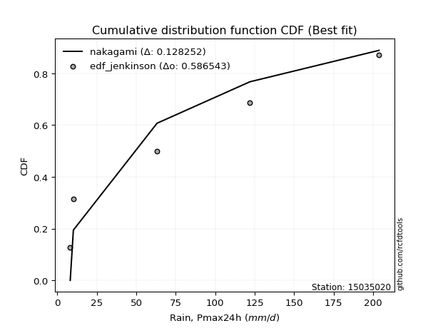</img>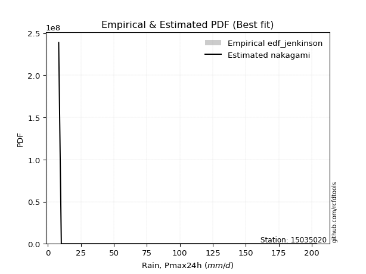</img>

</div>


### 11. Empirical - EDF Cunnane (1978)

Cunnane´s work in statistical hydrology has focused on the performance and evaluation of different probability distributions (such as GEV, Gumbel, Lognormal) for flood frequency estimation. _b_ is a constant, typically set to 0.4.

<div align="center">


$P=(m-b)/(n+1-2b)$


</div>


**11.1. Empirical values**

<div align="center">

|                | 0                  | 1                   | 2                   | 3                  | 4                  | 5                  |
|:---------------|:-------------------|:--------------------|:--------------------|:-------------------|:-------------------|:-------------------|
| date           | 2023               | 2020                | 2019                | 2025               | 2024               | 2022               |
| x              | 8.2                | 10.2                | 63.2                | 67.0               | 122.0              | 203.8              |
| m              | 1                  | 2                   | 3                   | 4                  | 5                  | 6                  |
| empirical_dist | edf_cunnane        | edf_cunnane         | edf_cunnane         | edf_cunnane        | edf_cunnane        | edf_cunnane        |
| empirical      | 0.0967741935483871 | 0.25806451612903225 | 0.41935483870967744 | 0.5806451612903226 | 0.7419354838709676 | 0.9032258064516128 |
| empirical_tr   | 1.1071428571428572 | 1.3478260869565217  | 1.7222222222222225  | 2.384615384615385  | 3.8749999999999982 | 10.333333333333318 |

</div>


**11.2. Kolmogorov-Smirnov fit test (sorted by Δ)**


<div align="center">

|                | 0                   | 1                   | 2                  | 3                  | 4                   | 5                   | 6                   | 7                   | 8                   | 9                  | 10                  | 11                | 12                 | 13                  | 14                  | 15                  | 16                  | 17                  | 18                  | 19                    | 20                  | 21                 | 22                  | 23                  | 24                  | 25                  | 26                | 27                  | 28                  | 29                  | 30                  | 31                  | 32                  | 33                  | 34                 | 35                  | 36                  | 37                  | 38                  | 39                  | 40                  | 41                  | 42                  | 43                  | 44                  | 45                 | 46                 | 47                  | 48                  | 49                  | 50                  | 51                  | 52                  | 53                 | 54                 | 55                  | 56                  | 57                  | 58                  | 59                  | 60                 | 61                  | 62                | 63                 | 64                  | 65                  | 66                  | 67                 | 68                 | 69                 | 70                 | 71                 | 72                 | 73                 | 74                 | 75                 | 76                  | 77                 | 78                | 79                  | 80                 | 81                  | 82                  | 83                 | 84                 | 85                 | 86                 | 87                 | 88                 | 89                 |
|:---------------|:--------------------|:--------------------|:-------------------|:-------------------|:--------------------|:--------------------|:--------------------|:--------------------|:--------------------|:-------------------|:--------------------|:------------------|:-------------------|:--------------------|:--------------------|:--------------------|:--------------------|:--------------------|:--------------------|:----------------------|:--------------------|:-------------------|:--------------------|:--------------------|:--------------------|:--------------------|:------------------|:--------------------|:--------------------|:--------------------|:--------------------|:--------------------|:--------------------|:--------------------|:-------------------|:--------------------|:--------------------|:--------------------|:--------------------|:--------------------|:--------------------|:--------------------|:--------------------|:--------------------|:--------------------|:-------------------|:-------------------|:--------------------|:--------------------|:--------------------|:--------------------|:--------------------|:--------------------|:-------------------|:-------------------|:--------------------|:--------------------|:--------------------|:--------------------|:--------------------|:-------------------|:--------------------|:------------------|:-------------------|:--------------------|:--------------------|:--------------------|:-------------------|:-------------------|:-------------------|:-------------------|:-------------------|:-------------------|:-------------------|:-------------------|:-------------------|:--------------------|:-------------------|:------------------|:--------------------|:-------------------|:--------------------|:--------------------|:-------------------|:-------------------|:-------------------|:-------------------|:-------------------|:-------------------|:-------------------|
| station        | 15035020            | 15035020            | 15035020           | 15035020           | 15035020            | 15035020            | 15035020            | 15035020            | 15035020            | 15035020           | 15035020            | 15035020          | 15035020           | 15035020            | 15035020            | 15035020            | 15035020            | 15035020            | 15035020            | 15035020              | 15035020            | 15035020           | 15035020            | 15035020            | 15035020            | 15035020            | 15035020          | 15035020            | 15035020            | 15035020            | 15035020            | 15035020            | 15035020            | 15035020            | 15035020           | 15035020            | 15035020            | 15035020            | 15035020            | 15035020            | 15035020            | 15035020            | 15035020            | 15035020            | 15035020            | 15035020           | 15035020           | 15035020            | 15035020            | 15035020            | 15035020            | 15035020            | 15035020            | 15035020           | 15035020           | 15035020            | 15035020            | 15035020            | 15035020            | 15035020            | 15035020           | 15035020            | 15035020          | 15035020           | 15035020            | 15035020            | 15035020            | 15035020           | 15035020           | 15035020           | 15035020           | 15035020           | 15035020           | 15035020           | 15035020           | 15035020           | 15035020            | 15035020           | 15035020          | 15035020            | 15035020           | 15035020            | 15035020            | 15035020           | 15035020           | 15035020           | 15035020           | 15035020           | 15035020           | 15035020           |
| empirical_dist | edf_cunnane         | edf_cunnane         | edf_cunnane        | edf_cunnane        | edf_cunnane         | edf_cunnane         | edf_cunnane         | edf_cunnane         | edf_cunnane         | edf_cunnane        | edf_cunnane         | edf_cunnane       | edf_cunnane        | edf_cunnane         | edf_cunnane         | edf_cunnane         | edf_cunnane         | edf_cunnane         | edf_cunnane         | edf_cunnane           | edf_cunnane         | edf_cunnane        | edf_cunnane         | edf_cunnane         | edf_cunnane         | edf_cunnane         | edf_cunnane       | edf_cunnane         | edf_cunnane         | edf_cunnane         | edf_cunnane         | edf_cunnane         | edf_cunnane         | edf_cunnane         | edf_cunnane        | edf_cunnane         | edf_cunnane         | edf_cunnane         | edf_cunnane         | edf_cunnane         | edf_cunnane         | edf_cunnane         | edf_cunnane         | edf_cunnane         | edf_cunnane         | edf_cunnane        | edf_cunnane        | edf_cunnane         | edf_cunnane         | edf_cunnane         | edf_cunnane         | edf_cunnane         | edf_cunnane         | edf_cunnane        | edf_cunnane        | edf_cunnane         | edf_cunnane         | edf_cunnane         | edf_cunnane         | edf_cunnane         | edf_cunnane        | edf_cunnane         | edf_cunnane       | edf_cunnane        | edf_cunnane         | edf_cunnane         | edf_cunnane         | edf_cunnane        | edf_cunnane        | edf_cunnane        | edf_cunnane        | edf_cunnane        | edf_cunnane        | edf_cunnane        | edf_cunnane        | edf_cunnane        | edf_cunnane         | edf_cunnane        | edf_cunnane       | edf_cunnane         | edf_cunnane        | edf_cunnane         | edf_cunnane         | edf_cunnane        | edf_cunnane        | edf_cunnane        | edf_cunnane        | edf_cunnane        | edf_cunnane        | edf_cunnane        |
| p_dist         | rayleigh            | halfnorm            | pearson3           | maxwell            | logloggamma         | logjohnsonsu        | gumbel_r            | genlogistic         | laplace_asymmetric  | f                  | kstwobign           | logweibull_min    | loggumbel_l        | ncf                 | t                   | crystalball         | truncnorm           | norm                | rice                | loglaplace_asymmetric | moyal               | halflogistic       | logfisk             | logistic            | logpearson3         | hypsecant           | weibull_min       | logf                | logt                | logcrystalball      | lognorm             | lognorm             | logexponnorm        | lognct              | laplace            | loggamma            | loggamma            | logerlang           | loginvgamma         | loglogistic         | fisk                | logrice             | loggompertz         | nakagami            | logalpha            | loginvgauss        | logncf             | loghypsecant        | logmaxwell          | gumbel_l            | logbetaprime        | lograyleigh         | mielke              | exponnorm          | expon              | genexpon            | gompertz            | loglaplace          | invgamma            | loghalfnorm         | logkstwobign       | loggenexpon         | loginvweibull     | loggumbel_r        | gibrat              | wald                | logmielke           | logtruncnorm       | nct                | loghalflogistic    | logmoyal           | logexpon           | betaprime          | lognakagami        | invgauss           | pareto             | logpareto           | logwald            | loglognorm        | erlang              | loggibrat          | alpha               | logchi2             | johnsonsu          | fatiguelife        | logfatiguelife     | invweibull         | gamma              | chi2               | loggenlogistic     |
| delta          | 0.10477244044373224 | 0.11098111694330867 | 0.1113255669506272 | 0.1168979596496828 | 0.12182913099022791 | 0.13028810730986884 | 0.13145318756061125 | 0.13617798511554502 | 0.13623699022536723 | 0.1428218350689112 | 0.14315016880868192 | 0.150179372622192 | 0.1504715924948444 | 0.15074332565190363 | 0.15129441326144433 | 0.15129556926174142 | 0.15129557077093436 | 0.15129557094861307 | 0.15470362509839808 | 0.15560579633242194   | 0.15660588902700012 | 0.1594457316900894 | 0.15948810512351502 | 0.16067874138305333 | 0.16630596453421814 | 0.16852227147048254 | 0.170234739272148 | 0.18798481529485273 | 0.18887162640550775 | 0.18887339663947317 | 0.18887346191984616 | 0.18887346191984616 | 0.18887545498080732 | 0.18895572473721894 | 0.1919345118376296 | 0.19647802564253197 | 0.19647802564253197 | 0.19813661958901146 | 0.20074551472594165 | 0.20269515858146298 | 0.20308367381839296 | 0.20412365679232908 | 0.20517029448086108 | 0.20531550317497776 | 0.20560174473771292 | 0.2059846482314011 | 0.2123703531529239 | 0.21392319488928774 | 0.21465935938067565 | 0.22028960535054254 | 0.22221709225917569 | 0.22261927797622555 | 0.22578660004723533 | 0.2290028731916558 | 0.2302370238688931 | 0.23145851802932277 | 0.23221158631837774 | 0.24160536314035613 | 0.24351200943405132 | 0.24533728195078724 | 0.2458944455061512 | 0.24903739351097404 | 0.249492065337456 | 0.2545029622113992 | 0.25806451612903225 | 0.25806451612903225 | 0.25989723081968735 | 0.2631725441307225 | 0.2641973748766651 | 0.2736958987208448 | 0.2768044860892836 | 0.2772256204269246 | 0.2892615987123304 | 0.2898645202283843 | 0.2937692692421821 | 0.2948612653420422 | 0.29708347525520856 | 0.3390687839926679 | 0.360199074478459 | 0.36220513968746365 | 0.3709703853383928 | 0.38639915695449983 | 0.39346489607685536 | 0.4159496110730341 | 0.4279164647026826 | 0.4431300208796049 | 0.4499707855094635 | 0.5005893745164129 | 0.5805113944428975 | 0.7419354838709676 |
| deltao         | 0.530385761606      | 0.530385761606      | 0.530385761606     | 0.530385761606     | 0.530385761606      | 0.530385761606      | 0.530385761606      | 0.530385761606      | 0.530385761606      | 0.530385761606     | 0.530385761606      | 0.530385761606    | 0.530385761606     | 0.530385761606      | 0.530385761606      | 0.530385761606      | 0.530385761606      | 0.530385761606      | 0.530385761606      | 0.530385761606        | 0.530385761606      | 0.530385761606     | 0.530385761606      | 0.530385761606      | 0.530385761606      | 0.530385761606      | 0.530385761606    | 0.530385761606      | 0.530385761606      | 0.530385761606      | 0.530385761606      | 0.530385761606      | 0.530385761606      | 0.530385761606      | 0.530385761606     | 0.530385761606      | 0.530385761606      | 0.530385761606      | 0.530385761606      | 0.530385761606      | 0.530385761606      | 0.530385761606      | 0.530385761606      | 0.530385761606      | 0.530385761606      | 0.530385761606     | 0.530385761606     | 0.530385761606      | 0.530385761606      | 0.530385761606      | 0.530385761606      | 0.530385761606      | 0.530385761606      | 0.530385761606     | 0.530385761606     | 0.530385761606      | 0.530385761606      | 0.530385761606      | 0.530385761606      | 0.530385761606      | 0.530385761606     | 0.530385761606      | 0.530385761606    | 0.530385761606     | 0.530385761606      | 0.530385761606      | 0.530385761606      | 0.530385761606     | 0.530385761606     | 0.530385761606     | 0.530385761606     | 0.530385761606     | 0.530385761606     | 0.530385761606     | 0.530385761606     | 0.530385761606     | 0.530385761606      | 0.530385761606     | 0.530385761606    | 0.530385761606      | 0.530385761606     | 0.530385761606      | 0.530385761606      | 0.530385761606     | 0.530385761606     | 0.530385761606     | 0.530385761606     | 0.530385761606     | 0.530385761606     | 0.530385761606     |
| eval           | Δo > Δ              | Δo > Δ              | Δo > Δ             | Δo > Δ             | Δo > Δ              | Δo > Δ              | Δo > Δ              | Δo > Δ              | Δo > Δ              | Δo > Δ             | Δo > Δ              | Δo > Δ            | Δo > Δ             | Δo > Δ              | Δo > Δ              | Δo > Δ              | Δo > Δ              | Δo > Δ              | Δo > Δ              | Δo > Δ                | Δo > Δ              | Δo > Δ             | Δo > Δ              | Δo > Δ              | Δo > Δ              | Δo > Δ              | Δo > Δ            | Δo > Δ              | Δo > Δ              | Δo > Δ              | Δo > Δ              | Δo > Δ              | Δo > Δ              | Δo > Δ              | Δo > Δ             | Δo > Δ              | Δo > Δ              | Δo > Δ              | Δo > Δ              | Δo > Δ              | Δo > Δ              | Δo > Δ              | Δo > Δ              | Δo > Δ              | Δo > Δ              | Δo > Δ             | Δo > Δ             | Δo > Δ              | Δo > Δ              | Δo > Δ              | Δo > Δ              | Δo > Δ              | Δo > Δ              | Δo > Δ             | Δo > Δ             | Δo > Δ              | Δo > Δ              | Δo > Δ              | Δo > Δ              | Δo > Δ              | Δo > Δ             | Δo > Δ              | Δo > Δ            | Δo > Δ             | Δo > Δ              | Δo > Δ              | Δo > Δ              | Δo > Δ             | Δo > Δ             | Δo > Δ             | Δo > Δ             | Δo > Δ             | Δo > Δ             | Δo > Δ             | Δo > Δ             | Δo > Δ             | Δo > Δ              | Δo > Δ             | Δo > Δ            | Δo > Δ              | Δo > Δ             | Δo > Δ              | Δo > Δ              | Δo > Δ             | Δo > Δ             | Δo > Δ             | Δo > Δ             | Δo > Δ             | Δo <= Δ            | Δo <= Δ            |
| fit            | 1                   | 1                   | 1                  | 1                  | 1                   | 1                   | 1                   | 1                   | 1                   | 1                  | 1                   | 1                 | 1                  | 1                   | 1                   | 1                   | 1                   | 1                   | 1                   | 1                     | 1                   | 1                  | 1                   | 1                   | 1                   | 1                   | 1                 | 1                   | 1                   | 1                   | 1                   | 1                   | 1                   | 1                   | 1                  | 1                   | 1                   | 1                   | 1                   | 1                   | 1                   | 1                   | 1                   | 1                   | 1                   | 1                  | 1                  | 1                   | 1                   | 1                   | 1                   | 1                   | 1                   | 1                  | 1                  | 1                   | 1                   | 1                   | 1                   | 1                   | 1                  | 1                   | 1                 | 1                  | 1                   | 1                   | 1                   | 1                  | 1                  | 1                  | 1                  | 1                  | 1                  | 1                  | 1                  | 1                  | 1                   | 1                  | 1                 | 1                   | 1                  | 1                   | 1                   | 1                  | 1                  | 1                  | 1                  | 1                  | 0                  | 0                  |
| n              | 6                   | 6                   | 6                  | 6                  | 6                   | 6                   | 6                   | 6                   | 6                   | 6                  | 6                   | 6                 | 6                  | 6                   | 6                   | 6                   | 6                   | 6                   | 6                   | 6                     | 6                   | 6                  | 6                   | 6                   | 6                   | 6                   | 6                 | 6                   | 6                   | 6                   | 6                   | 6                   | 6                   | 6                   | 6                  | 6                   | 6                   | 6                   | 6                   | 6                   | 6                   | 6                   | 6                   | 6                   | 6                   | 6                  | 6                  | 6                   | 6                   | 6                   | 6                   | 6                   | 6                   | 6                  | 6                  | 6                   | 6                   | 6                   | 6                   | 6                   | 6                  | 6                   | 6                 | 6                  | 6                   | 6                   | 6                   | 6                  | 6                  | 6                  | 6                  | 6                  | 6                  | 6                  | 6                  | 6                  | 6                   | 6                  | 6                 | 6                   | 6                  | 6                   | 6                   | 6                  | 6                  | 6                  | 6                  | 6                  | 6                  | 6                  |
| best_fit       | 1                   | 0                   | 0                  | 0                  | 0                   | 0                   | 0                   | 0                   | 0                   | 0                  | 0                   | 0                 | 0                  | 0                   | 0                   | 0                   | 0                   | 0                   | 0                   | 0                     | 0                   | 0                  | 0                   | 0                   | 0                   | 0                   | 0                 | 0                   | 0                   | 0                   | 0                   | 0                   | 0                   | 0                   | 0                  | 0                   | 0                   | 0                   | 0                   | 0                   | 0                   | 0                   | 0                   | 0                   | 0                   | 0                  | 0                  | 0                   | 0                   | 0                   | 0                   | 0                   | 0                   | 0                  | 0                  | 0                   | 0                   | 0                   | 0                   | 0                   | 0                  | 0                   | 0                 | 0                  | 0                   | 0                   | 0                   | 0                  | 0                  | 0                  | 0                  | 0                  | 0                  | 0                  | 0                  | 0                  | 0                   | 0                  | 0                 | 0                   | 0                  | 0                   | 0                   | 0                  | 0                  | 0                  | 0                  | 0                  | 0                  | 0                  |
| best_fit_sort  | 1                   | 2                   | 3                  | 4                  | 5                   | 6                   | 7                   | 8                   | 9                   | 10                 | 11                  | 12                | 13                 | 14                  | 15                  | 16                  | 17                  | 18                  | 19                  | 20                    | 21                  | 22                 | 23                  | 24                  | 25                  | 26                  | 27                | 28                  | 29                  | 30                  | 31                  | 32                  | 33                  | 34                  | 35                 | 36                  | 37                  | 38                  | 39                  | 40                  | 41                  | 42                  | 43                  | 44                  | 45                  | 46                 | 47                 | 48                  | 49                  | 50                  | 51                  | 52                  | 53                  | 54                 | 55                 | 56                  | 57                  | 58                  | 59                  | 60                  | 61                 | 62                  | 63                | 64                 | 65                  | 66                  | 67                  | 68                 | 69                 | 70                 | 71                 | 72                 | 73                 | 74                 | 75                 | 76                 | 77                  | 78                 | 79                | 80                  | 81                 | 82                  | 83                  | 84                 | 85                 | 86                 | 87                 | 88                 | 89                 | 90                 |

</div>


<div align="center">

</img>

</div>


**11.3. Best fit**

<div align="center">

|   id |   station | empirical_dist   | p_dist   |    delta |   deltao | eval   |   fit |   n |   best_fit |   best_fit_sort |
|-----:|----------:|:-----------------|:---------|---------:|---------:|:-------|------:|----:|-----------:|----------------:|
|    0 |  15035020 | edf_cunnane      | rayleigh | 0.104772 | 0.530386 | Δo > Δ |     1 |   6 |          1 |               1 |

</div>


<div align="center">

</img>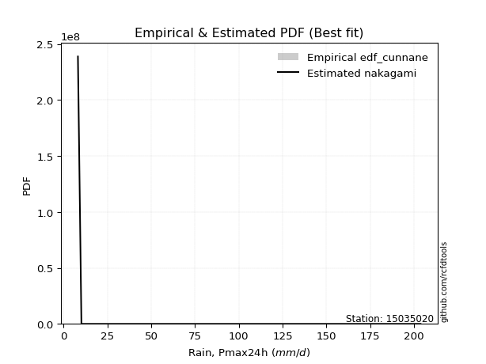</img>

</div>


### 12. Empirical - EDF Adamowski (1981)

The Adamowski formula in hydrology refers to a specific plotting position formula used for estimating the non-parametric empirical distribution of hydrological events (like flood peaks) to calculate their return periods. This formula provides an alternative to traditional parametric methods (like the Gumbel or Log Pearson Type III distributions). 

<div align="center">


$P=(m-0.25)/(n+0.5)$


</div>


**12.1. Empirical values**

<div align="center">

|                | 0                   | 1                  | 2                  | 3                  | 4                  | 5                  |
|:---------------|:--------------------|:-------------------|:-------------------|:-------------------|:-------------------|:-------------------|
| date           | 2023                | 2020               | 2019               | 2025               | 2024               | 2022               |
| x              | 8.2                 | 10.2               | 63.2               | 67.0               | 122.0              | 203.8              |
| m              | 1                   | 2                  | 3                  | 4                  | 5                  | 6                  |
| empirical_dist | edf_adamowski       | edf_adamowski      | edf_adamowski      | edf_adamowski      | edf_adamowski      | edf_adamowski      |
| empirical      | 0.11538461538461539 | 0.2692307692307692 | 0.4230769230769231 | 0.5769230769230769 | 0.7307692307692307 | 0.8846153846153846 |
| empirical_tr   | 1.1304347826086958  | 1.3684210526315788 | 1.7333333333333334 | 2.3636363636363633 | 3.7142857142857135 | 8.666666666666664  |

</div>


**12.2. Kolmogorov-Smirnov fit test (sorted by Δ)**


<div align="center">

|                | 0                   | 1                   | 2                   | 3                   | 4                   | 5                  | 6                   | 7                 | 8                  | 9                   | 10                  | 11                  | 12                  | 13                  | 14                 | 15                  | 16                    | 17                  | 18                  | 19                 | 20                 | 21                 | 22                  | 23                  | 24                 | 25                 | 26                  | 27                 | 28                  | 29                  | 30                  | 31                  | 32                  | 33                 | 34                  | 35                  | 36                  | 37                  | 38                  | 39                  | 40                  | 41                  | 42                  | 43                  | 44                  | 45                 | 46                  | 47                  | 48                  | 49                 | 50                  | 51                 | 52                 | 53                 | 54                 | 55                  | 56                  | 57                 | 58                  | 59                  | 60                 | 61                 | 62                  | 63                  | 64                 | 65                  | 66                 | 67                 | 68                 | 69                 | 70                  | 71                | 72                 | 73                 | 74                  | 75                 | 76                 | 77                  | 78                  | 79                | 80                 | 81                 | 82                 | 83                 | 84                  | 85                 | 86                  | 87                  | 88                 | 89                 |
|:---------------|:--------------------|:--------------------|:--------------------|:--------------------|:--------------------|:-------------------|:--------------------|:------------------|:-------------------|:--------------------|:--------------------|:--------------------|:--------------------|:--------------------|:-------------------|:--------------------|:----------------------|:--------------------|:--------------------|:-------------------|:-------------------|:-------------------|:--------------------|:--------------------|:-------------------|:-------------------|:--------------------|:-------------------|:--------------------|:--------------------|:--------------------|:--------------------|:--------------------|:-------------------|:--------------------|:--------------------|:--------------------|:--------------------|:--------------------|:--------------------|:--------------------|:--------------------|:--------------------|:--------------------|:--------------------|:-------------------|:--------------------|:--------------------|:--------------------|:-------------------|:--------------------|:-------------------|:-------------------|:-------------------|:-------------------|:--------------------|:--------------------|:-------------------|:--------------------|:--------------------|:-------------------|:-------------------|:--------------------|:--------------------|:-------------------|:--------------------|:-------------------|:-------------------|:-------------------|:-------------------|:--------------------|:------------------|:-------------------|:-------------------|:--------------------|:-------------------|:-------------------|:--------------------|:--------------------|:------------------|:-------------------|:-------------------|:-------------------|:-------------------|:--------------------|:-------------------|:--------------------|:--------------------|:-------------------|:-------------------|
| station        | 15035020            | 15035020            | 15035020            | 15035020            | 15035020            | 15035020           | 15035020            | 15035020          | 15035020           | 15035020            | 15035020            | 15035020            | 15035020            | 15035020            | 15035020           | 15035020            | 15035020              | 15035020            | 15035020            | 15035020           | 15035020           | 15035020           | 15035020            | 15035020            | 15035020           | 15035020           | 15035020            | 15035020           | 15035020            | 15035020            | 15035020            | 15035020            | 15035020            | 15035020           | 15035020            | 15035020            | 15035020            | 15035020            | 15035020            | 15035020            | 15035020            | 15035020            | 15035020            | 15035020            | 15035020            | 15035020           | 15035020            | 15035020            | 15035020            | 15035020           | 15035020            | 15035020           | 15035020           | 15035020           | 15035020           | 15035020            | 15035020            | 15035020           | 15035020            | 15035020            | 15035020           | 15035020           | 15035020            | 15035020            | 15035020           | 15035020            | 15035020           | 15035020           | 15035020           | 15035020           | 15035020            | 15035020          | 15035020           | 15035020           | 15035020            | 15035020           | 15035020           | 15035020            | 15035020            | 15035020          | 15035020           | 15035020           | 15035020           | 15035020           | 15035020            | 15035020           | 15035020            | 15035020            | 15035020           | 15035020           |
| empirical_dist | edf_adamowski       | edf_adamowski       | edf_adamowski       | edf_adamowski       | edf_adamowski       | edf_adamowski      | edf_adamowski       | edf_adamowski     | edf_adamowski      | edf_adamowski       | edf_adamowski       | edf_adamowski       | edf_adamowski       | edf_adamowski       | edf_adamowski      | edf_adamowski       | edf_adamowski         | edf_adamowski       | edf_adamowski       | edf_adamowski      | edf_adamowski      | edf_adamowski      | edf_adamowski       | edf_adamowski       | edf_adamowski      | edf_adamowski      | edf_adamowski       | edf_adamowski      | edf_adamowski       | edf_adamowski       | edf_adamowski       | edf_adamowski       | edf_adamowski       | edf_adamowski      | edf_adamowski       | edf_adamowski       | edf_adamowski       | edf_adamowski       | edf_adamowski       | edf_adamowski       | edf_adamowski       | edf_adamowski       | edf_adamowski       | edf_adamowski       | edf_adamowski       | edf_adamowski      | edf_adamowski       | edf_adamowski       | edf_adamowski       | edf_adamowski      | edf_adamowski       | edf_adamowski      | edf_adamowski      | edf_adamowski      | edf_adamowski      | edf_adamowski       | edf_adamowski       | edf_adamowski      | edf_adamowski       | edf_adamowski       | edf_adamowski      | edf_adamowski      | edf_adamowski       | edf_adamowski       | edf_adamowski      | edf_adamowski       | edf_adamowski      | edf_adamowski      | edf_adamowski      | edf_adamowski      | edf_adamowski       | edf_adamowski     | edf_adamowski      | edf_adamowski      | edf_adamowski       | edf_adamowski      | edf_adamowski      | edf_adamowski       | edf_adamowski       | edf_adamowski     | edf_adamowski      | edf_adamowski      | edf_adamowski      | edf_adamowski      | edf_adamowski       | edf_adamowski      | edf_adamowski       | edf_adamowski       | edf_adamowski      | edf_adamowski      |
| p_dist         | rayleigh            | maxwell             | halfnorm            | pearson3            | logloggamma         | logjohnsonsu       | gumbel_r            | genlogistic       | laplace_asymmetric | t                   | crystalball         | truncnorm           | norm                | f                   | kstwobign          | logistic            | loglaplace_asymmetric | logweibull_min      | loggumbel_l         | ncf                | logpearson3        | hypsecant          | rice                | weibull_min         | moyal              | logfisk            | halflogistic        | logf               | logt                | logcrystalball      | lognorm             | lognorm             | logexponnorm        | lognct             | laplace             | loggamma            | loggamma            | logerlang           | loginvgamma         | loglogistic         | logrice             | nakagami            | logalpha            | loginvgauss         | logncf              | loghypsecant       | logmaxwell          | fisk                | loggompertz         | gumbel_l           | logbetaprime        | lograyleigh        | mielke             | loglaplace         | invgamma           | exponnorm           | expon               | loghalfnorm        | logkstwobign        | genexpon            | gompertz           | loggenexpon        | loginvweibull       | loggumbel_r         | logmielke          | logtruncnorm        | nct                | wald               | gibrat             | loghalflogistic    | logmoyal            | logexpon          | betaprime          | lognakagami        | invgauss            | pareto             | logpareto          | logwald             | loglognorm          | erlang            | loggibrat          | alpha              | logchi2            | johnsonsu          | fatiguelife         | invweibull         | logfatiguelife      | gamma               | chi2               | loggenlogistic     |
| delta          | 0.11064325704479314 | 0.11317587528243706 | 0.12214737004504564 | 0.12249182005236417 | 0.13299538409196487 | 0.1414543604116058 | 0.14261944066234822 | 0.147344238217282 | 0.1474032433271042 | 0.14757232889419858 | 0.14757348489449568 | 0.14757348640368861 | 0.14757348658136732 | 0.15398808817064816 | 0.1543164219104189 | 0.15695665701580758 | 0.1575876435925085    | 0.16134562572392896 | 0.16163784559658137 | 0.1619095787536406 | 0.1625838801669725 | 0.1648001871032368 | 0.16586987820013505 | 0.16651265490490236 | 0.1677721421287371 | 0.1679969328259014 | 0.17061198479182638 | 0.1842627309276071 | 0.18514954203826212 | 0.18515131227222753 | 0.18515137755260053 | 0.18515137755260053 | 0.18515337061356169 | 0.1852336403699733 | 0.18821242747038386 | 0.19275594127528634 | 0.19275594127528634 | 0.19441453522176583 | 0.19702343035869602 | 0.19897307421421734 | 0.20040157242508344 | 0.20159341880773213 | 0.20187966037046728 | 0.20226256386415548 | 0.20864826878567827 | 0.2102011105220421 | 0.21093727501343001 | 0.21424992692012992 | 0.21633654758259804 | 0.2165675209832968 | 0.21849500789193005 | 0.2188971936089799 | 0.2220645156799897 | 0.2378832787731105 | 0.2397899250668057 | 0.24016912629339277 | 0.24140327697063008 | 0.2416151975835416 | 0.24217236113890556 | 0.24262477113105974 | 0.2433778394201147 | 0.2453153091437284 | 0.24576998097021036 | 0.25078087784415354 | 0.2561751464524417 | 0.25945045976347686 | 0.2604752905094195 | 0.2692307692307692 | 0.2692307692307692 | 0.2699738143535992 | 0.27308240172203796 | 0.273503536059679 | 0.2855395143450848 | 0.2861424358611387 | 0.29004718487493647 | 0.2911391809747966 | 0.2933613908879629 | 0.33534669962542224 | 0.34903282137672204 | 0.358483055320218 | 0.3672483009711472 | 0.3826770725872542 | 0.3897428117096097 | 0.4047833579712971 | 0.42419438033543694 | 0.4313603636732353 | 0.43940793651235927 | 0.49686729014916736 | 0.5767893100756518 | 0.7307692307692307 |
| deltao         | 0.530385761606      | 0.530385761606      | 0.530385761606      | 0.530385761606      | 0.530385761606      | 0.530385761606     | 0.530385761606      | 0.530385761606    | 0.530385761606     | 0.530385761606      | 0.530385761606      | 0.530385761606      | 0.530385761606      | 0.530385761606      | 0.530385761606     | 0.530385761606      | 0.530385761606        | 0.530385761606      | 0.530385761606      | 0.530385761606     | 0.530385761606     | 0.530385761606     | 0.530385761606      | 0.530385761606      | 0.530385761606     | 0.530385761606     | 0.530385761606      | 0.530385761606     | 0.530385761606      | 0.530385761606      | 0.530385761606      | 0.530385761606      | 0.530385761606      | 0.530385761606     | 0.530385761606      | 0.530385761606      | 0.530385761606      | 0.530385761606      | 0.530385761606      | 0.530385761606      | 0.530385761606      | 0.530385761606      | 0.530385761606      | 0.530385761606      | 0.530385761606      | 0.530385761606     | 0.530385761606      | 0.530385761606      | 0.530385761606      | 0.530385761606     | 0.530385761606      | 0.530385761606     | 0.530385761606     | 0.530385761606     | 0.530385761606     | 0.530385761606      | 0.530385761606      | 0.530385761606     | 0.530385761606      | 0.530385761606      | 0.530385761606     | 0.530385761606     | 0.530385761606      | 0.530385761606      | 0.530385761606     | 0.530385761606      | 0.530385761606     | 0.530385761606     | 0.530385761606     | 0.530385761606     | 0.530385761606      | 0.530385761606    | 0.530385761606     | 0.530385761606     | 0.530385761606      | 0.530385761606     | 0.530385761606     | 0.530385761606      | 0.530385761606      | 0.530385761606    | 0.530385761606     | 0.530385761606     | 0.530385761606     | 0.530385761606     | 0.530385761606      | 0.530385761606     | 0.530385761606      | 0.530385761606      | 0.530385761606     | 0.530385761606     |
| eval           | Δo > Δ              | Δo > Δ              | Δo > Δ              | Δo > Δ              | Δo > Δ              | Δo > Δ             | Δo > Δ              | Δo > Δ            | Δo > Δ             | Δo > Δ              | Δo > Δ              | Δo > Δ              | Δo > Δ              | Δo > Δ              | Δo > Δ             | Δo > Δ              | Δo > Δ                | Δo > Δ              | Δo > Δ              | Δo > Δ             | Δo > Δ             | Δo > Δ             | Δo > Δ              | Δo > Δ              | Δo > Δ             | Δo > Δ             | Δo > Δ              | Δo > Δ             | Δo > Δ              | Δo > Δ              | Δo > Δ              | Δo > Δ              | Δo > Δ              | Δo > Δ             | Δo > Δ              | Δo > Δ              | Δo > Δ              | Δo > Δ              | Δo > Δ              | Δo > Δ              | Δo > Δ              | Δo > Δ              | Δo > Δ              | Δo > Δ              | Δo > Δ              | Δo > Δ             | Δo > Δ              | Δo > Δ              | Δo > Δ              | Δo > Δ             | Δo > Δ              | Δo > Δ             | Δo > Δ             | Δo > Δ             | Δo > Δ             | Δo > Δ              | Δo > Δ              | Δo > Δ             | Δo > Δ              | Δo > Δ              | Δo > Δ             | Δo > Δ             | Δo > Δ              | Δo > Δ              | Δo > Δ             | Δo > Δ              | Δo > Δ             | Δo > Δ             | Δo > Δ             | Δo > Δ             | Δo > Δ              | Δo > Δ            | Δo > Δ             | Δo > Δ             | Δo > Δ              | Δo > Δ             | Δo > Δ             | Δo > Δ              | Δo > Δ              | Δo > Δ            | Δo > Δ             | Δo > Δ             | Δo > Δ             | Δo > Δ             | Δo > Δ              | Δo > Δ             | Δo > Δ              | Δo > Δ              | Δo <= Δ            | Δo <= Δ            |
| fit            | 1                   | 1                   | 1                   | 1                   | 1                   | 1                  | 1                   | 1                 | 1                  | 1                   | 1                   | 1                   | 1                   | 1                   | 1                  | 1                   | 1                     | 1                   | 1                   | 1                  | 1                  | 1                  | 1                   | 1                   | 1                  | 1                  | 1                   | 1                  | 1                   | 1                   | 1                   | 1                   | 1                   | 1                  | 1                   | 1                   | 1                   | 1                   | 1                   | 1                   | 1                   | 1                   | 1                   | 1                   | 1                   | 1                  | 1                   | 1                   | 1                   | 1                  | 1                   | 1                  | 1                  | 1                  | 1                  | 1                   | 1                   | 1                  | 1                   | 1                   | 1                  | 1                  | 1                   | 1                   | 1                  | 1                   | 1                  | 1                  | 1                  | 1                  | 1                   | 1                 | 1                  | 1                  | 1                   | 1                  | 1                  | 1                   | 1                   | 1                 | 1                  | 1                  | 1                  | 1                  | 1                   | 1                  | 1                   | 1                   | 0                  | 0                  |
| n              | 6                   | 6                   | 6                   | 6                   | 6                   | 6                  | 6                   | 6                 | 6                  | 6                   | 6                   | 6                   | 6                   | 6                   | 6                  | 6                   | 6                     | 6                   | 6                   | 6                  | 6                  | 6                  | 6                   | 6                   | 6                  | 6                  | 6                   | 6                  | 6                   | 6                   | 6                   | 6                   | 6                   | 6                  | 6                   | 6                   | 6                   | 6                   | 6                   | 6                   | 6                   | 6                   | 6                   | 6                   | 6                   | 6                  | 6                   | 6                   | 6                   | 6                  | 6                   | 6                  | 6                  | 6                  | 6                  | 6                   | 6                   | 6                  | 6                   | 6                   | 6                  | 6                  | 6                   | 6                   | 6                  | 6                   | 6                  | 6                  | 6                  | 6                  | 6                   | 6                 | 6                  | 6                  | 6                   | 6                  | 6                  | 6                   | 6                   | 6                 | 6                  | 6                  | 6                  | 6                  | 6                   | 6                  | 6                   | 6                   | 6                  | 6                  |
| best_fit       | 1                   | 0                   | 0                   | 0                   | 0                   | 0                  | 0                   | 0                 | 0                  | 0                   | 0                   | 0                   | 0                   | 0                   | 0                  | 0                   | 0                     | 0                   | 0                   | 0                  | 0                  | 0                  | 0                   | 0                   | 0                  | 0                  | 0                   | 0                  | 0                   | 0                   | 0                   | 0                   | 0                   | 0                  | 0                   | 0                   | 0                   | 0                   | 0                   | 0                   | 0                   | 0                   | 0                   | 0                   | 0                   | 0                  | 0                   | 0                   | 0                   | 0                  | 0                   | 0                  | 0                  | 0                  | 0                  | 0                   | 0                   | 0                  | 0                   | 0                   | 0                  | 0                  | 0                   | 0                   | 0                  | 0                   | 0                  | 0                  | 0                  | 0                  | 0                   | 0                 | 0                  | 0                  | 0                   | 0                  | 0                  | 0                   | 0                   | 0                 | 0                  | 0                  | 0                  | 0                  | 0                   | 0                  | 0                   | 0                   | 0                  | 0                  |
| best_fit_sort  | 1                   | 2                   | 3                   | 4                   | 5                   | 6                  | 7                   | 8                 | 9                  | 10                  | 11                  | 12                  | 13                  | 14                  | 15                 | 16                  | 17                    | 18                  | 19                  | 20                 | 21                 | 22                 | 23                  | 24                  | 25                 | 26                 | 27                  | 28                 | 29                  | 30                  | 31                  | 32                  | 33                  | 34                 | 35                  | 36                  | 37                  | 38                  | 39                  | 40                  | 41                  | 42                  | 43                  | 44                  | 45                  | 46                 | 47                  | 48                  | 49                  | 50                 | 51                  | 52                 | 53                 | 54                 | 55                 | 56                  | 57                  | 58                 | 59                  | 60                  | 61                 | 62                 | 63                  | 64                  | 65                 | 66                  | 67                 | 68                 | 69                 | 70                 | 71                  | 72                | 73                 | 74                 | 75                  | 76                 | 77                 | 78                  | 79                  | 80                | 81                 | 82                 | 83                 | 84                 | 85                  | 86                 | 87                  | 88                  | 89                 | 90                 |

</div>


<div align="center">

</img>

</div>


**12.3. Best fit**

<div align="center">

|   id |   station | empirical_dist   | p_dist   |    delta |   deltao | eval   |   fit |   n |   best_fit |   best_fit_sort |
|-----:|----------:|:-----------------|:---------|---------:|---------:|:-------|------:|----:|-----------:|----------------:|
|    0 |  15035020 | edf_adamowski    | rayleigh | 0.110643 | 0.530386 | Δo > Δ |     1 |   6 |          1 |               1 |

</div>


<div align="center">

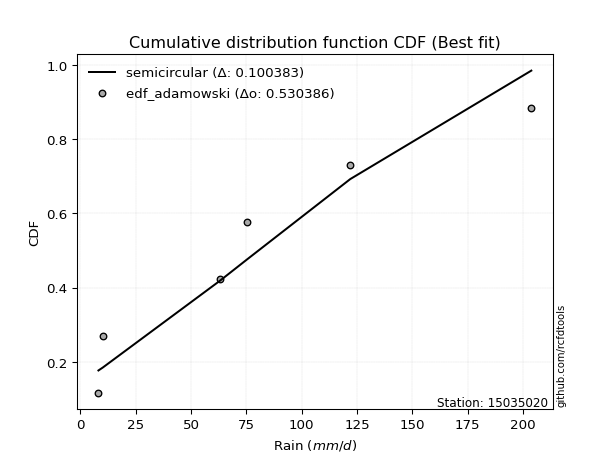</img>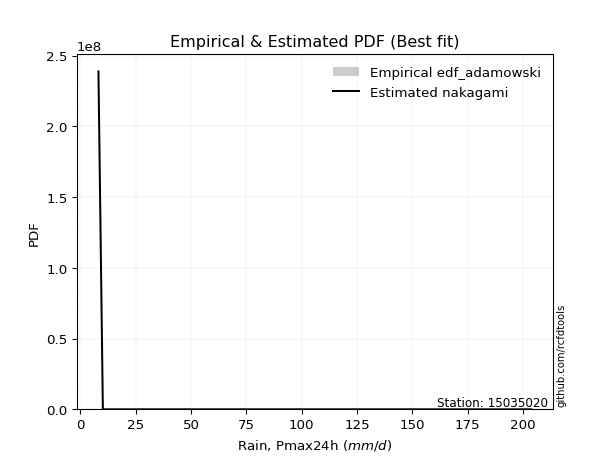</img>

</div>


## C. Best fit & Estimate extreme values for specific return periods - Tr


### 1. Best fit (ordered by delta Δ)

<div align="center">

|   id |   station | empirical_dist   | p_dist   |    delta |   deltao | eval   |   fit |   n |   best_fit |   best_fit_sort |
|-----:|----------:|:-----------------|:---------|---------:|---------:|:-------|------:|----:|-----------:|----------------:|
|    0 |  15035020 | edf_hazen        | halfnorm | 0.102917 | 0.530386 | Δo > Δ |     1 |   6 |          1 |               1 |
|    1 |  15035020 | edf_blom         | rayleigh | 0.104127 | 0.530386 | Δo > Δ |     1 |   6 |          1 |               2 |
|    2 |  15035020 | edf_tukey        | rayleigh | 0.10457  | 0.530386 | Δo > Δ |     1 |   6 |          1 |               3 |
|    3 |  15035020 | edf_cunnane      | rayleigh | 0.104772 | 0.530386 | Δo > Δ |     1 |   6 |          1 |               4 |
|    4 |  15035020 | edf_filliben     | rayleigh | 0.105749 | 0.530386 | Δo > Δ |     1 |   6 |          1 |               5 |
|    5 |  15035020 | edf_gringorten   | rayleigh | 0.105827 | 0.530386 | Δo > Δ |     1 |   6 |          1 |               6 |
|    6 |  15035020 | edf_beard        | rayleigh | 0.106303 | 0.530386 | Δo > Δ |     1 |   6 |          1 |               7 |
|    7 |  15035020 | edf_jenkinson    | rayleigh | 0.106303 | 0.530386 | Δo > Δ |     1 |   6 |          1 |               8 |
|    8 |  15035020 | edf_chegodayev   | rayleigh | 0.107037 | 0.530386 | Δo > Δ |     1 |   6 |          1 |               9 |
|    9 |  15035020 | edf_adamowski    | rayleigh | 0.110643 | 0.530386 | Δo > Δ |     1 |   6 |          1 |              10 |
|   10 |  15035020 | edf_weibull      | rayleigh | 0.127127 | 0.530386 | Δo > Δ |     1 |   6 |          1 |              11 |
|   11 |  15035020 | edf_california   | nakagami | 0.166666 | 0.530386 | Δo > Δ |     1 |   6 |          1 |              12 |

</div>

:file_folder:Tables: [bestfit_15035020.csv](table/bestfit_15035020.csv) | [extreme_15035020.csv](table/extreme_15035020.csv)


### 2. Extreme values

In hydrology, a return period (or recurrence interval $Tr$) is the statistical average time between extreme events like floods or droughts of a specific magnitude, indicating how rare an event is, with a 100-year flood, for example, having a 1% chance of occurring in any given year, not that it happens exactly every century. It is a key tool for infrastructure design (like bridges or dams) and risk assessment, calculated from historical data to determine the probability of future events, although it is important to remember it is statistical average, and events can cluster or be missed.

> risk_rate: assuming the return period as the project useful life.

|   id |      tr |   prob_l |     prob_g |      alpha |   betaprime |    chi2 |   crystalball |   erlang |    expon |   exponnorm |        f |   fatiguelife |        fisk |    gamma |   genexpon |   genlogistic |   gibrat |   gompertz |   gumbel_l |   gumbel_r |   halflogistic |   halfnorm |   hypsecant |   invgamma |   invgauss |      invweibull |        johnsonsu |   kstwobign |   laplace |   laplace_asymmetric |   loggamma |   logistic |   lognorm |   maxwell |     mielke |    moyal |   nakagami |      ncf |         nct |     norm |           pareto |   pearson3 |   rayleigh |     rice |        t |   truncnorm |     wald |   weibull_min |   logalpha |   logbetaprime |     logchi2 |   logcrystalball |   logerlang |         logexpon |   logexponnorm |      logf |   logfatiguelife |   logfisk |   loggenexpon |   loggenlogistic |        loggibrat |   loggompertz |   loggumbel_l |   loggumbel_r |   loghalflogistic |   loghalfnorm |   loghypsecant |   loginvgamma |   loginvgauss |   loginvweibull |   logjohnsonsu |   logkstwobign |   loglaplace |   loglaplace_asymmetric |   logloggamma |   loglogistic |     loglognorm |   logmaxwell |   logmielke |   logmoyal |   lognakagami |    logncf |    lognct |         logpareto |   logpearson3 |   lograyleigh |   logrice |      logt |   logtruncnorm |     logwald |   logweibull_min |   station |   n |   risk_rate |
|-----:|--------:|---------:|-----------:|-----------:|------------:|--------:|--------------:|---------:|---------:|------------:|---------:|--------------:|------------:|---------:|-----------:|--------------:|---------:|-----------:|-----------:|-----------:|---------------:|-----------:|------------:|-----------:|-----------:|----------------:|-----------------:|------------:|----------:|---------------------:|-----------:|-----------:|----------:|----------:|-----------:|---------:|-----------:|---------:|------------:|---------:|-----------------:|-----------:|-----------:|---------:|---------:|------------:|---------:|--------------:|-----------:|---------------:|------------:|-----------------:|------------:|-----------------:|---------------:|----------:|-----------------:|----------:|--------------:|-----------------:|-----------------:|--------------:|--------------:|--------------:|------------------:|--------------:|---------------:|--------------:|--------------:|----------------:|---------------:|---------------:|-------------:|------------------------:|--------------:|--------------:|---------------:|-------------:|------------:|-----------:|--------------:|----------:|----------:|------------------:|--------------:|--------------:|----------:|----------:|---------------:|------------:|-----------------:|----------:|----:|------------:|
|    0 |    2    | 0.5      | 0.5        |    23.0168 |     34.1818 | 10.9722 |       79.0667 |  23.7166 |  57.321  |     56.8851 |  55.4248 |       8.20031 |     65.8963 |  12.2133 |    58.7531 |       66.5107 |  58.7217 |    59.7083 |    90.2016 |    67.9317 |         62.396 |    65.1924 |     79.0667 |    35.2554 |    29.5922 |  1329.29        |      8.20854     |     68.6792 |   79.0667 |              71.7261 |    44.0502 |    79.0667 |   45.4424 |   73.2698 |    37.4343 |  64.3369 |    38.1684 |  57.2553 |     29.9808 |  79.0667 |     12.6951      |    71.0789 |    71.2138 |  76.0149 |  79.0664 |     79.0667 |  57.0956 |       35.2243 |    42.5361 |        38.5164 |     15.2204 |          45.4425 |     43.9413 |     26.8702      |        45.4422 |   45.5027 |      8.20001     |   50.1207 |       33.8217 |          inf     |     31.6896      |       44.4005 |       55.3521 |       37.3069 |           33.8216 |       35.5401 |        45.4424 |       43.2584 |       41.8317 |         35.1585 |        64.4075 |        34.8169 |      45.4424 |                 54.1008 |       71.9423 |       45.4424 |   8.23217      |      41.0072 |     33.2683 |    35.0051 |       24.4543 |   41.2737 |   45.4181 |      9.31284      |       48.9981 |       39.5405 |   42.7291 |   45.4434 |        30.5623 |     30.7902 |          56.8272 |  15035020 |   6 |    0.75     |
|    1 |    2.33 | 0.570815 | 0.429185   |    27.3949 |     41.9738 | 11.7671 |       91.1618 |  29.9127 |  68.1439 |     67.6284 |  67.381  |       9.8683  |     89.0255 |  14.6049 |    69.6619 |       77.259  |  64.8486 |    70.678  |   100.725  |    79.1392 |         73.919 |    78.2462 |     88.7464 |    44.6454 |    37.0899 | 28150.4         |      8.27396     |     79.8829 |   86.3861 |              80.6692 |    54.7883 |    89.7233 |   56.3017 |   85.8358 |    47.7047 |  74.9463 |    51.1049 |  68.1151 |     38.6214 |  91.1618 |     17.2128      |    83.1301 |    83.9657 |  87.4359 |  91.1614 |     91.1618 |  65.0266 |       55.7246 |    53.0116 |        48.8548 |     18.5703 |          56.3017 |     54.5607 |     34.9013      |        56.3014 |   56.4289 |      8.66003     |   61.7045 |       43.1727 |          inf     |     35.3232      |       55.0925 |       66.6957 |       45.5009 |           41.4814 |       44.7871 |        53.9433 |       53.895  |       52.5379 |         44.184  |        77.7868 |        44.2161 |      51.7342 |                 62.6932 |       87.7832 |       54.8851 |   8.55595      |      51.2323 |     42.6341 |    42.2435 |       32.2692 |   51.5896 |   56.2812 |     10.7561       |       60.472  |       49.5627 |   53.279  |   56.3024 |        39.3895 |     35.4351 |          68.6925 |  15035020 |   6 |    0.729209 |
|    2 |    5    | 0.8      | 0.2        |    61.3429 |     85.3244 | 16.0677 |      136.111  |  68.0501 | 122.256  |    121.342  | 127.426  |      45.2954  |    305.244  |  32.8255 |   123.054  |      123.948  | 100.123  |   123.636  |   134.72   |   127.83   |        126.059 |   133.449  |    127.574  |   126.257  |    95.7486 |     1.66202e+10 |    233.666       |    127.474  |  122.982  |             125.382  |   125.066  |   130.87   |  124.841  |  135.295  |   136.474  | 124.09   |   122.328  | 122.96   |    131.039  | 136.111  |    273.289       |   132.528  |   135.017  | 133.159  | 136.11   |    136.111  | 109.424  |      302.6    |   124.845  |       130.877  |     56.9615 |         124.841  |    123.658  |    129.023       |       124.84   |  125.638  |     27.6102      |  137.713  |      122.698  |          inf     |     65.9889      |      120.717  |      121.803  |      107.806  |          104.476  |      119.091  |       107.319  |      126.457  |      129.878  |        119.23   |       134.044  |       122.028  |      98.9334 |                109.456  |      145.766  |      113.773  |   9.41896e+130 |     123.05   |     99.8039 |   100.895  |      114.484  |  125.364  |  124.915  | 523433            |      126.809  |      122.446  |  124.167  |  124.838  |       122.912  |     77.809  |         126.753  |  15035020 |   6 |    0.67232  |
|    3 |   10    | 0.9      | 0.1        |   123.714  |    128.87   | 20.2336 |      165.929  | 108.736  | 171.377  |    170.102  | 182.759  |      94.2111  |    782.88   |  55.2481 |   169.981  |      161.971  | 140.332  |   169.195  |   153.647  |   167.487  |        169.359 |   174.298  |    158.579  |   298.378  |   186.602  |     8.34179e+14 |  46173.5         |    163.708  |  156.202  |             165.972  |   219.032  |   161.173  |  211.728  |  170.101  |   320.808  | 166.877  |   183.89   | 177.206  |    391.638  | 165.929  |   5599.21        |   169.445  |   171.418  | 165.761  | 165.928  |    165.929  | 156.54   |      820.842  |   228.409  |       275.832  |    174.646  |         211.728  |    215.368  |    422.791       |       211.725  |  213.78   |    136.881       |  248.743  |      269.636  |          inf     |    134.539       |      195.838  |      170.326  |      217.656  |          224.991  |      245.564  |       185.879  |      230.11   |      249.658  |        267.626  |       173.094  |       264.32   |     178.213  |                180.76   |      173.984  |      194.621  | inf            |     227.973  |    149.946  |   215.314  |      305.717  |  238.449  |  212.045  |      1.20814e+138 |      200.076  |      233.353  |  220.91   |  211.717  |       300.751  |    179.285  |         178.272  |  15035020 |   6 |    0.651322 |
|    4 |   15    | 0.933333 | 0.0666667  |   185.862  |    155.697  | 22.7362 |      180.808  | 134.099  | 200.11   |    198.624  | 215.598  |     126.203   |   1314.2    |  69.9548 |   196.805  |      183.423  | 168.066  |   194.831  |   162.218  |   189.862  |        193.863 |   195.556  |    176.273  |   486.575  |   258.068  |     3.74378e+17 | 657166           |    182.944  |  175.635  |             189.715  |   290.823  |   177.684  |  275.589  |  187.96   |   519.464  | 191.708  |   217.07   | 211.958  |    742.538  | 180.808  |  33262.6         |   189.144  |   190.173  | 182.559  | 180.807  |    180.808  | 186.796  |     1295.26   |   312.339  |       411.648  |    345.231  |         275.589  |    285.099  |    846.544       |       275.586  |  278.764  |    390.002       |  343.284  |      408.164  |          inf     |    219.909       |      245.927  |      198.258  |      323.535  |          347.295  |      357.864  |       254.314  |      313.458  |      351.71   |        422.317  |       192.029  |       398.411  |     251.452  |                242.406  |      183.755  |      260.749  | inf            |     312.816  |    175.822  |   334.293  |      512.585  |  334.288  |  276.151  |    inf            |      248.64   |      325.325  |  295.351  |  275.572  |       485.526  |    306.432  |         208.048  |  15035020 |   6 |    0.644736 |
|    5 |   20    | 0.95     | 0.05       |   247.955  |    175.26   | 24.5331 |      190.553  | 152.601  | 220.498  |    218.862  | 239.126  |     149.889   |   1881.96   |  80.9074 |   215.573  |      198.443  | 189.821  |   212.595  |   167.554  |   205.528  |        211.031 |   209.728  |    188.756  |   686.101  |   316.927  |     2.69283e+19 |      3.74088e+06 |    195.902  |  189.422  |             206.561  |   350.643  |   189.096  |  327.518  |  199.813  |   727.914  | 209.295  |   239.396  | 238.227  |   1169.01   | 190.553  | 117838           |   202.513  |   202.64   | 193.724  | 190.552  |    190.553  | 209.342  |     1721.78   |   385.052  |       540.655  |    564.607  |         327.518  |    343.036  |   1385.43        |       327.514  |  331.703  |    846.705       |  428.894  |      539.078  |          inf     |    323.322       |      284.043  |      217.912  |      427.028  |          470.75   |      460.003  |       317.257  |      385.276  |      442.923  |        581.234  |       204.054  |       525.26   |     321.024  |                298.514  |      188.707  |      319.171  | inf            |     385.906  |    193.17   |   456.494  |      724.195  |  419.728  |  328.311  |    inf            |      285.624  |      405.725  |  357.517  |  327.495  |       670.945  |    456.887  |         229.044  |  15035020 |   6 |    0.641514 |
|    6 |   25    | 0.96     | 0.04       |   310.027  |    190.719  | 25.937  |      197.726  | 167.192  | 236.311  |    234.559  | 257.512  |     168.708   |   2477.9    |  89.6487 |   229.986  |      210.012  | 207.958  |   226.14   |   171.35   |   217.595  |        224.258 |   220.273  |    198.417  |   894.51   |   367.095  |     7.25283e+20 |      1.34579e+07 |    205.608  |  200.117  |             219.628  |   402.692  |   197.825  |  371.9    |  208.612  |   943.911  | 222.926  |   256.07   | 259.616  |   1662.25   | 197.726  | 314355           |   212.593  |   211.902  | 202.019  | 197.725  |    197.726  | 227.402  |     2108.88   |   450.205  |       664.331  |    830.218  |         371.9    |    393.344  |   2030.13        |       371.895  |  377.008  |   1567.57        |  508.537  |      663.639  |          inf     |    445.844       |      315.029  |      233.073  |      528.81   |          595.06   |      554.489  |       376.478  |      449.356  |      526.528  |        743.355  |       212.676  |       646.086  |     387.99   |                350.833  |      191.699  |      372.556  | inf            |     451.005  |    206.322  |   581.184  |      936.842  |  497.919  |  372.911  |    inf            |      315.744  |      478.073  |  411.649  |  371.872  |       855.106  |    629.155  |         245.263  |  15035020 |   6 |    0.639603 |
|    7 |   50    | 0.98     | 0.02       |   620.289  |    240.234  | 30.3433 |      218.267  | 213.596  | 285.432  |    283.319  | 315.414  |     229.09    |   5750.22   | 117.904  |   273.981  |      245.65   | 271.889  |   266.982  |   181.657  |   254.768  |        265.013 |   250.924  |    228.368  |  2029.86   |   546.443  |     1.84749e+25 |      5.26211e+08 |    234.11   |  233.337  |             260.218  |   600.548  |   224.498  |  535.143  |  234.131  |  2101.5    | 265.242  |   304.673  | 332.363  |   4961.03   | 218.267  |      6.6246e+06  |   242.593  |   238.788  | 226.099  | 218.266  |    218.267  | 286.366  |     3659.75   |   712.164  |      1228.96   |   2799.96   |         535.143  |    583.877  |   6652.44        |       535.136  |  544.043  |  11310.2         |  855.719  |     1219.39   |          inf     |   1383.85        |      418.859  |      279.762  |     1021.66   |         1224.98   |      954.363  |       640.009  |      704.847  |      877.034  |       1586.11   |       236.123  |      1186.67   |     698.905  |                579.379  |      197.731  |      597.596  | inf            |     708.803  |    247.226  |  1229.98   |     1981.35   |  825.025  |  537.094  |    inf            |      417.199  |      769.763  |  617.361  |  535.094  |      1743.61   |   1788.25   |         295.319  |  15035020 |   6 |    0.63583  |
|    8 |   75    | 0.986667 | 0.0133333  |   930.507  |    270.202  | 32.9467 |      229.289  | 241.351  | 314.166  |    311.841  | 349.857  |     265.454   |   9355.72   | 135.053  |   299.201  |      266.364  | 315.069  |   290.055  |   186.868  |   276.374  |        288.704 |   267.609  |    245.871  |  3272.11   |   666.386  |     6.72293e+27 |      3.76248e+09 |    249.792  |  252.77   |             283.961  |   745.709  |   239.903  |  650.536  |  248.005  |  3346.16   | 289.988  |   331.143  | 379.871  |   9404.9    | 229.289  |      3.94006e+07 |   259.39   |   253.415  | 239.2    | 229.287  |    229.289  | 322.649  |     4837.67   |   917.178  |      1736.43   |   5760.03   |         650.536  |    723.103  |  13320           |       650.527  |  662.426  |  37182.8         | 1155.75   |     1702.3    |          inf     |   2973.9         |      484.691  |      306.823  |     1498.11   |         1863.84   |     1282.58   |       872.684  |      902.821  |     1164.12   |       2464.01   |       247.87   |      1658.06   |     986.127  |                776.97   |      199.755  |      785.114  | inf            |     906.305  |    272.297  |  1906.75   |     2978.93   | 1092.55   |  653.26   |    inf            |      482.006  |      997.466  |  767.962  |  650.47   |      2578.91   |   3400.93   |         324.398  |  15035020 |   6 |    0.634587 |
|    9 |  100    | 0.99     | 0.01       |  1240.71   |    291.899  | 34.8032 |      236.744  | 261.266  | 334.553  |    332.078  | 374.559  |     291.619   |  13194.2    | 147.444  |   316.876  |      281.024  | 348.518  |   306.08   |   190.277  |   291.666  |        305.472 |   278.975  |    258.287  |  4589.32   |   757.503  |     4.36637e+29 |      1.4233e+10  |    260.536  |  266.557  |             300.807  |   864      |   250.779  |  742.382  |  257.455  |  4650.74   | 307.545  |   349.16   | 416.058  |  14806.2    | 236.744  |      1.39608e+08 |   271.031  |   263.38   | 248.125  | 236.742  |    236.744  | 349.103  |     5806.77   |  1091.44   |      2207.5    |   9645.13   |         742.382  |    836.277  |  21799.1         |       742.371  |  756.805  |  87548.8         | 1428.98   |     2138.72   |          inf     |   5378.93        |      533.588  |      325.924  |     1964.27   |         2508.53   |     1568.68   |      1087.39   |     1069.97   |     1415.2    |       3365.45   |       255.465  |      2085.14   |    1258.97   |                956.809  |      200.77   |      951.951  | inf            |    1071.48   |    291.037  |  2602.38   |     3932.5    | 1326.45   |  745.775  |    inf            |      530.395  |     1190.06   |  890.397  |  742.303  |      3369.92   |   5434.22   |         344.951  |  15035020 |   6 |    0.633968 |
|   10 |  200    | 0.995    | 0.005      |  2481.51   |    345.636  | 39.3031 |      253.653  | 309.874  | 383.674  |    380.838  | 435.002  |     355.668   |  30106.1    | 177.928  |   358.75   |      316.27   | 439.521  |   343.578  |   197.687  |   328.43   |        345.784 |   304.971  |    288.199  | 10359.3    |   995.234  |     9.94723e+33 |      2.91058e+11 |    285.283  |  299.778  |             341.397  |  1209.53   |   276.869  | 1001.68   |  279.076  | 10262.2    | 349.843  |   390.291  | 512.667  |  44189.4    | 253.653  |      2.94211e+09 |   298.281  |   286.182  | 268.546  | 253.651  |    253.653  | 414.998  |     8637      |  1633.67   |      3877.38   |  33753.5    |        1001.68   |   1165.69   |  71432.5         |      1001.67   | 1023.87   | 712218           | 2377.39   |     3614.4    |          inf     |  26971.3         |      658.602  |      371.643  |     3767.56   |         5123.67   |     2486.26   |      1847.25   |     1584.68   |     2229.54   |       7121.3    |       271.62   |      3534.98   |    2267.84   |               1580.11   |      202.295  |     1511.3    | inf            |    1571.58   |    340.755  |  5505.75   |     7418.55   | 2085.21   | 1007.19   |    inf            |      655.053  |     1782.39   | 1246.36   | 1001.56   |      6215.97   |  17463.6    |         394.226  |  15035020 |   6 |    0.633042 |
|   11 |  250    | 0.996    | 0.004      |  3101.91   |    363.37   | 40.7587 |      258.821  | 325.685  | 399.488  |    396.535  | 454.744  |     376.541   |  39237      | 187.903  |   372.025  |      327.601  | 472.174  |   355.33   |   199.867  |   340.249  |        358.744 |   312.969  |    297.828  | 13461.1    |  1076.68   |     2.50381e+35 |      7.32015e+11 |    292.941  |  310.472  |             354.464  |  1341.4    |   285.245  | 1097.71   |  285.732  | 13235.4    | 363.46   |   402.918  | 546.872  |  62833.7    | 258.821  |      7.84893e+09 |   306.844  |   293.2    | 274.833  | 258.819  |    258.821  | 436.798  |     9707.55   |  1852.58   |      4629.99   |  50656.9    |        1097.71   |   1291.03   | 104673           |      1097.69   | 1122.97   |      1.41026e+06 | 2799.47   |     4250.71   |          inf     |  48099.2         |      700.951  |      386.278  |     4645.1    |         6446.06   |     2864.69   |      2190.83   |     1790.52   |     2570.04   |       9061.66   |       276.259  |      4162.31   |    2740.92   |               1857.05   |      202.601  |     1753.06   | inf            |    1768.25   |    358.468  |  7007.85   |     9016.79   | 2402.72   | 1104.07   |    inf            |      697.573  |     2018.39   | 1381.54   | 1097.57   |      7499.34   |  25695.8    |         410.022  |  15035020 |   6 |    0.632858 |
|   12 |  500    | 0.998    | 0.002      |  6203.88   |    419.799  | 45.2982 |      274.145  | 375.215  | 448.609  |    445.295  | 516.974  |     442.021   |  89230      | 219.305  |   412.658  |      362.77   | 585.019  |   390.902  |   206.117  |   376.932  |        398.969 |   336.813  |    327.737  | 30359.5    |  1342.84   |     5.58089e+39 |      1.12804e+13 |    315.892  |  343.693  |             395.053  |  1826.58   |   311.222  | 1440.1    |  305.592  | 29153.8    | 405.758  |   440.481  | 663.999  | 187528      | 274.145  |      1.65409e+11 |   332.892  |   314.142  | 293.589  | 274.143  |    274.145  | 506.114  |    13570.9    |  2709      |      7950.25   | 180059      |        1440.1    |   1750.73   | 343000           |      1440.08   | 1477.04   |      1.2023e+07  | 4647.19   |     6906.83   |          203.201 | 355142           |      838.801  |      431.504  |     8896.91   |        13145.7    |     4370.56   |      3721.61   |     2587.24   |     3952.72   |      19143.3    |       289.2    |      6791.26   |    4937.35   |               3066.8    |      203.212  |     2777.55   | inf            |    2513.91   |    420.224  | 14825.9    |    16123.8    | 3694.2    | 1449.78   |    inf            |      836.905  |     2925.04   | 1875.82   | 1439.9    |     13044.1    |  87737.5    |         458.9    |  15035020 |   6 |    0.632489 |
|   13 |  750    | 0.998667 | 0.00133333 |  9305.85   |    453.751  | 47.9647 |      282.658  | 404.443  | 477.343  |    473.818  | 554.022  |     480.709   | 144208      | 237.926  |   436.021  |      383.329  | 659.648  |   411.088  |   209.457  |   398.377  |        422.484 |   350.134  |    345.233  | 48849.3    |  1506.75   |     1.94356e+42 |      5.15425e+13 |    328.785  |  363.125  |             418.796  |  2170.94   |   326.398  | 1674.52   |  316.7    | 46257.9    | 430.5    |   461.407  | 740.929  | 355508      | 282.658  |      9.83793e+11 |   347.786  |   325.853  | 304.077  | 282.656  |    282.658  | 547.674  |    16232.5    |  3361.48   |     10837.6    | 379731      |        1674.52   |   2075.85   | 686779           |      1674.49   | 1720.03   |      4.26496e+07 | 6248.69   |     9069.44   |          203.405 |      1.33235e+06 |      923.741  |      457.809  |    13008.8    |        19939.4    |     5533.85   |      5073.9    |     3186.64   |     5050.25   |      29641.4    |       295.873  |      8941.13   |    6966.4    |               4112.7    |      203.416  |     3634.38   | inf            |    3060.65   |    461.977  | 22982.2    |    22301.2    | 4721.99   | 1686.68   |    inf            |      923.396  |     3599.43   | 2223.84   | 1674.28   |     17638.7    | 183211      |         487.369  |  15035020 |   6 |    0.632366 |
|   14 | 1000    | 0.999    | 0.001      | 12407.8    |    478.265  | 49.8609 |      288.519  | 425.28   | 497.73   |    494.055  | 580.604  |     508.306   | 202693      | 251.234  |   452.424  |      397.913  | 716.757  |   425.145  |   211.705  |   413.589  |        439.164 |   359.334  |    357.646  | 68454.8    |  1626.29   |     1.23499e+44 |      1.46712e+14 |    337.718  |  376.913  |             435.642  |  2446.29   |   337.161  | 1857.74   |  324.378  | 64180.3    | 448.055  |   475.835  | 799.679  | 559680      | 288.519  |      3.48586e+12 |   358.219  |   333.945  | 311.325  | 288.517  |    288.519  | 577.57   |    18312      |  3907.78   |     13467.8    | 645856      |        1857.74   |   2335.24   |      1.12396e+06 |      1857.71   | 1910.22   |      1.05238e+08 | 7708.8    |    10952      |          203.507 |      3.66469e+06 |      985.883  |      476.409  |    17032.5    |        26794.8    |     6513.41   |      6321.93   |     3684.31   |     5993.15   |      40419.3    |       300.258  |     10817.8    |    8893.87   |               5064.64   |      203.518  |     4397.83   | inf            |    3506.58   |    494.591  | 31366      |    27896      | 5606.88   | 1871.94   |    inf            |      986.946  |     4154.29   | 2500.58   | 1857.46   |     21611.4    | 311151      |         507.517  |  15035020 |   6 |    0.632305 |

<div align="center">

</img>

</div>


<div align="center">

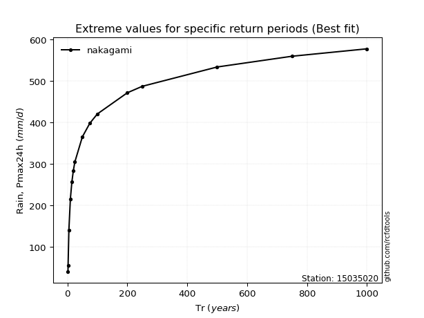</img>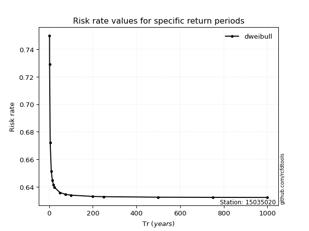</img>

</div>


<sub>**APP DISCLAIMER**: NO WARRANTY - This software is provided by [github.com/rcfdtools](https://github.com/rcfdtools) "as is", without any express or implied warranty, including warranties of merchantability, fitness for a particular purpose, or non-infringement. There is no guarantee that the software will be error-free or operate without interruption. LIMITATION OF LIABILITY - Neither the authors nor copyright holders will be liable for claims or damages arising from the software or its use. You are responsible for determining if the software is appropriate for your use and assume all associated risks, including errors, legal compliance, and data loss. NO PROFESSIONAL ADVICE - The software provides general information and does not offer professional advice. It should not replace consultation with professional advisors.</sub>